# Temporal Analysis

## Year Distribution

- 2011: 5,429 records

- 2012: 5,385 records

- 2013: 5,328 records

- 2014: 5,348 records

- 2015: 5,411 records

- 2016: 5,353 records

- 2017: 5,395 records

- 2018: 5,424 records

- 2019: 5,486 records

- 2021: 5,597 records

- 2022: 5,334 records

- 2023: 5,236 records

## Temporal Trends

- Census_Year: {np.int64(2011): {'mean': 2011.0, 'median': 2011.0, 'std': 0.0}, np.int64(2012): {'mean': 2012.0, 'median': 2012.0, 'std': 0.0}, np.int64(2013): {'mean': 2013.0, 'median': 2013.0, 'std': 0.0}, np.int64(2014): {'mean': 2014.0, 'median': 2014.0, 'std': 0.0}, np.int64(2015): {'mean': 2015.0, 'median': 2015.0, 'std': 0.0}, np.int64(2016): {'mean': 2016.0, 'median': 2016.0, 'std': 0.0}, np.int64(2017): {'mean': 2017.0, 'median': 2017.0, 'std': 0.0}, np.int64(2018): {'mean': 2018.0, 'median': 2018.0, 'std': 0.0}, np.int64(2019): {'mean': 2019.0, 'median': 2019.0, 'std': 0.0}, np.int64(2021): {'mean': 2021.0, 'median': 2021.0, 'std': 0.0}, np.int64(2022): {'mean': 2022.0, 'median': 2022.0, 'std': 0.0}, np.int64(2023): {'mean': 2023.0, 'median': 2023.0, 'std': 0.0}}

- Census_Division: {np.int64(2011): {'mean': 1.0, 'median': 1.0, 'std': 0.0}, np.int64(2012): {'mean': 1.0, 'median': 1.0, 'std': 0.0}, np.int64(2013): {'mean': 1.0, 'median': 1.0, 'std': 0.0}, np.int64(2014): {'mean': 1.0, 'median': 1.0, 'std': 0.0}, np.int64(2015): {'mean': 1.0, 'median': 1.0, 'std': 0.0}, np.int64(2016): {'mean': 1.0, 'median': 1.0, 'std': 0.0}, np.int64(2017): {'mean': 1.0, 'median': 1.0, 'std': 0.0}, np.int64(2018): {'mean': 1.0, 'median': 1.0, 'std': 0.0}, np.int64(2019): {'mean': 1.0, 'median': 1.0, 'std': 0.0}, np.int64(2021): {'mean': 1.0, 'median': 1.0, 'std': 0.0}, np.int64(2022): {'mean': 1.0, 'median': 1.0, 'std': 0.0}, np.int64(2023): {'mean': 1.0, 'median': 1.0, 'std': 0.0}}

- Public_Use_Microdata_Area: {np.int64(2011): {'mean': 394.0320501013078, 'median': 400.0, 'std': 201.65428511282093}, np.int64(2012): {'mean': 187.0991643454039, 'median': 104.0, 'std': 111.04731486109975}, np.int64(2013): {'mean': 189.0170795795796, 'median': 104.0, 'std': 111.76072573633577}, np.int64(2014): {'mean': 188.16716529543754, 'median': 104.0, 'std': 111.98137365005473}, np.int64(2015): {'mean': 188.3300683792275, 'median': 104.0, 'std': 111.67579536912284}, np.int64(2016): {'mean': 188.31122734915002, 'median': 104.0, 'std': 111.95063799123035}, np.int64(2017): {'mean': 189.58628359592214, 'median': 104.0, 'std': 112.38473482468169}, np.int64(2018): {'mean': 192.44727138643069, 'median': 104.0, 'std': 113.10301776533713}, np.int64(2019): {'mean': 191.69595333576376, 'median': 104.0, 'std': 112.475701295794}, np.int64(2021): {'mean': 191.83062354832947, 'median': 104.0, 'std': 113.27705463308999}, np.int64(2022): {'mean': 197.19141357330335, 'median': 107.0, 'std': 113.80823921610917}, np.int64(2023): {'mean': 198.35580595874714, 'median': 107.0, 'std': 114.02686904448292}}

- Census_Region: {np.int64(2011): {'mean': 1.0, 'median': 1.0, 'std': 0.0}, np.int64(2012): {'mean': 1.0, 'median': 1.0, 'std': 0.0}, np.int64(2013): {'mean': 1.0, 'median': 1.0, 'std': 0.0}, np.int64(2014): {'mean': 1.0, 'median': 1.0, 'std': 0.0}, np.int64(2015): {'mean': 1.0, 'median': 1.0, 'std': 0.0}, np.int64(2016): {'mean': 1.0, 'median': 1.0, 'std': 0.0}, np.int64(2017): {'mean': 1.0, 'median': 1.0, 'std': 0.0}, np.int64(2018): {'mean': 1.0, 'median': 1.0, 'std': 0.0}, np.int64(2019): {'mean': 1.0, 'median': 1.0, 'std': 0.0}, np.int64(2021): {'mean': 1.0, 'median': 1.0, 'std': 0.0}, np.int64(2022): {'mean': 1.0, 'median': 1.0, 'std': 0.0}, np.int64(2023): {'mean': 1.0, 'median': 1.0, 'std': 0.0}}

- State_Code: {np.int64(2011): {'mean': 44.0, 'median': 44.0, 'std': 0.0}, np.int64(2012): {'mean': 44.0, 'median': 44.0, 'std': 0.0}, np.int64(2013): {'mean': 44.0, 'median': 44.0, 'std': 0.0}, np.int64(2014): {'mean': 44.0, 'median': 44.0, 'std': 0.0}, np.int64(2015): {'mean': 44.0, 'median': 44.0, 'std': 0.0}, np.int64(2016): {'mean': 44.0, 'median': 44.0, 'std': 0.0}, np.int64(2017): {'mean': 44.0, 'median': 44.0, 'std': 0.0}, np.int64(2018): {'mean': 44.0, 'median': 44.0, 'std': 0.0}, np.int64(2019): {'mean': 44.0, 'median': 44.0, 'std': 0.0}, np.int64(2021): {'mean': 44.0, 'median': 44.0, 'std': 0.0}, np.int64(2022): {'mean': 44.0, 'median': 44.0, 'std': 0.0}, np.int64(2023): {'mean': None, 'median': None, 'std': None}}

- Housing_Adjustment_Factor: {np.int64(2011): {'mean': 1000000.0, 'median': 1000000.0, 'std': 0.0}, np.int64(2012): {'mean': 1000000.0, 'median': 1000000.0, 'std': 0.0}, np.int64(2013): {'mean': 1000000.0, 'median': 1000000.0, 'std': 0.0}, np.int64(2014): {'mean': 1000000.0, 'median': 1000000.0, 'std': 0.0}, np.int64(2015): {'mean': 1000000.0, 'median': 1000000.0, 'std': 0.0}, np.int64(2016): {'mean': 1000000.0, 'median': 1000000.0, 'std': 0.0}, np.int64(2017): {'mean': 1000000.0, 'median': 1000000.0, 'std': 0.0}, np.int64(2018): {'mean': 1000000.0, 'median': 1000000.0, 'std': 0.0}, np.int64(2019): {'mean': 1000000.0, 'median': 1000000.0, 'std': 0.0}, np.int64(2021): {'mean': 1000000.0, 'median': 1000000.0, 'std': 0.0}, np.int64(2022): {'mean': 1000000.0, 'median': 1000000.0, 'std': 0.0}, np.int64(2023): {'mean': 1000000.0, 'median': 1000000.0, 'std': 0.0}}

- Income_Adjustment_Factor: {np.int64(2011): {'mean': 1018237.0, 'median': 1018237.0, 'std': 0.0}, np.int64(2012): {'mean': 1010207.0, 'median': 1010207.0, 'std': 0.0}, np.int64(2013): {'mean': 1007549.0, 'median': 1007549.0, 'std': 0.0}, np.int64(2014): {'mean': 1008425.0, 'median': 1008425.0, 'std': 0.0}, np.int64(2015): {'mean': 1001264.0, 'median': 1001264.0, 'std': 0.0}, np.int64(2016): {'mean': 1007588.0, 'median': 1007588.0, 'std': 0.0}, np.int64(2017): {'mean': 1011189.0, 'median': 1011189.0, 'std': 0.0}, np.int64(2018): {'mean': 1013097.0, 'median': 1013097.0, 'std': 0.0}, np.int64(2019): {'mean': 1010145.0, 'median': 1010145.0, 'std': 0.0}, np.int64(2021): {'mean': 1029928.0, 'median': 1029928.0, 'std': 0.0}, np.int64(2022): {'mean': 1042311.0, 'median': 1042311.0, 'std': 0.0}, np.int64(2023): {'mean': 1019518.0, 'median': 1019518.0, 'std': 0.0}}

- Housing_Unit_Weight: {np.int64(2011): {'mean': 85.60342604531222, 'median': 71.0, 'std': 70.7844574806639}, np.int64(2012): {'mean': 85.90863509749303, 'median': 70.0, 'std': 69.2060512889242}, np.int64(2013): {'mean': 86.64752252252252, 'median': 68.0, 'std': 72.4276637864642}, np.int64(2014): {'mean': 86.50523560209425, 'median': 69.0, 'std': 70.7443351799488}, np.int64(2015): {'mean': 85.48419885418592, 'median': 69.0, 'std': 70.65448903302558}, np.int64(2016): {'mean': 86.41845694003362, 'median': 70.0, 'std': 72.26925376979922}, np.int64(2017): {'mean': 86.79629286376274, 'median': 69.0, 'std': 71.74952973902401}, np.int64(2018): {'mean': 86.49575958702064, 'median': 71.0, 'std': 72.62333885078782}, np.int64(2019): {'mean': 85.70488516223114, 'median': 67.0, 'std': 77.13530383274956}, np.int64(2021): {'mean': 86.64016437377167, 'median': 68.0, 'std': 74.6196063301398}, np.int64(2022): {'mean': 91.11679790026247, 'median': 71.0, 'std': 83.6594606164163}, np.int64(2023): {'mean': 93.03418640183347, 'median': 72.0, 'std': 88.91491579234535}}

- Number_of_Persons: {np.int64(2011): {'mean': 1.9902376128200405, 'median': 2.0, 'std': 1.3794257903047524}, np.int64(2012): {'mean': 1.9972144846796658, 'median': 2.0, 'std': 1.3752588718400294}, np.int64(2013): {'mean': 1.992867867867868, 'median': 2.0, 'std': 1.3518947746378316}, np.int64(2014): {'mean': 2.020007479431563, 'median': 2.0, 'std': 1.3899946517140565}, np.int64(2015): {'mean': 1.9521345407503234, 'median': 2.0, 'std': 1.3308929115332218}, np.int64(2016): {'mean': 1.9312535027087614, 'median': 2.0, 'std': 1.3191062682636698}, np.int64(2017): {'mean': 1.949212233549583, 'median': 2.0, 'std': 1.3502416153134382}, np.int64(2018): {'mean': 1.9338126843657817, 'median': 2.0, 'std': 1.3424541197226296}, np.int64(2019): {'mean': 1.9043018592781626, 'median': 2.0, 'std': 1.302039524604345}, np.int64(2021): {'mean': 1.9576558870823655, 'median': 2.0, 'std': 1.3205748286224281}, np.int64(2022): {'mean': 1.9499437570303713, 'median': 2.0, 'std': 1.312550659465544}, np.int64(2023): {'mean': 1.9488158899923607, 'median': 2.0, 'std': 1.3146941683007078}}

- Housing_Unit_Type: {np.int64(2011): {'mean': 1.2427703076072942, 'median': 1.0, 'std': 0.6178427678701354}, np.int64(2012): {'mean': 1.2406685236768802, 'median': 1.0, 'std': 0.6182726490755254}, np.int64(2013): {'mean': 1.2291666666666667, 'median': 1.0, 'std': 0.6067617704397706}, np.int64(2014): {'mean': 1.2284966342557966, 'median': 1.0, 'std': 0.6030868033206499}, np.int64(2015): {'mean': 1.2450563666605063, 'median': 1.0, 'std': 0.6205142548283111}, np.int64(2016): {'mean': 1.2331402951615917, 'median': 1.0, 'std': 0.6111569977237056}, np.int64(2017): {'mean': 1.2261353104726598, 'median': 1.0, 'std': 0.6028167293013488}, np.int64(2018): {'mean': 1.2297197640117994, 'median': 1.0, 'std': 0.6054289354170149}, np.int64(2019): {'mean': 1.2429821363470652, 'median': 1.0, 'std': 0.6198045406384635}, np.int64(2021): {'mean': None, 'median': None, 'std': None}, np.int64(2022): {'mean': None, 'median': None, 'std': None}, np.int64(2023): {'mean': None, 'median': None, 'std': None}}

- Number_of_Bedrooms: {np.int64(2011): {'mean': 2.6125215146299485, 'median': 3.0, 'std': 1.163348095931115}, np.int64(2012): {'mean': 2.62926934716818, 'median': 3.0, 'std': 1.1916100332895918}, np.int64(2013): {'mean': 2.662768031189084, 'median': 3.0, 'std': 1.2421268365634905}, np.int64(2014): {'mean': 2.663496866220013, 'median': 3.0, 'std': 1.2286274561502242}, np.int64(2015): {'mean': 2.6057068741893645, 'median': 3.0, 'std': 1.0750043960711029}, np.int64(2016): {'mean': 2.5847384349329876, 'median': 3.0, 'std': 1.0796678702023597}, np.int64(2017): {'mean': 2.6081571642109758, 'median': 3.0, 'std': 1.1060750650933882}, np.int64(2018): {'mean': 2.59228473998295, 'median': 3.0, 'std': 1.0753969098252865}, np.int64(2019): {'mean': 2.617822203317737, 'median': 3.0, 'std': 1.068612598879567}, np.int64(2021): {'mean': 2.6197938144329895, 'median': 3.0, 'std': 1.1401030545560926}, np.int64(2022): {'mean': 2.626535087719298, 'median': 3.0, 'std': 1.0992618766599458}, np.int64(2023): {'mean': 2.6464237516869096, 'median': 3.0, 'std': 1.0822401191566597}}

- Number_of_Rooms: {np.int64(2011): {'mean': 5.70697074010327, 'median': 6.0, 'std': 2.301695847892191}, np.int64(2012): {'mean': 5.717682663207955, 'median': 6.0, 'std': 2.267003907203422}, np.int64(2013): {'mean': 5.811782542776695, 'median': 6.0, 'std': 2.424306393224811}, np.int64(2014): {'mean': 5.7944672574022045, 'median': 6.0, 'std': 2.3863505414270705}, np.int64(2015): {'mean': 5.718547341115435, 'median': 6.0, 'std': 2.2035621597832473}, np.int64(2016): {'mean': 5.692607003891051, 'median': 5.0, 'std': 2.282477892946815}, np.int64(2017): {'mean': 5.742472773862908, 'median': 6.0, 'std': 2.2920764172923977}, np.int64(2018): {'mean': 5.758525149190111, 'median': 6.0, 'std': 2.316531976791014}, np.int64(2019): {'mean': 5.773713313483624, 'median': 6.0, 'std': 2.263122924246555}, np.int64(2021): {'mean': 5.874432989690722, 'median': 6.0, 'std': 2.4763067688787865}, np.int64(2022): {'mean': 5.843859649122807, 'median': 6.0, 'std': 2.369693680622342}, np.int64(2023): {'mean': 5.904633378317589, 'median': 6.0, 'std': 2.3633670549265}}

- Building_Type: {np.int64(2011): {'mean': 3.4171686746987953, 'median': 2.0, 'std': 2.1090411674399197}, np.int64(2012): {'mean': 3.382403804582793, 'median': 2.0, 'std': 2.063244763863297}, np.int64(2013): {'mean': 3.325969244097899, 'median': 2.0, 'std': 2.0394939546143047}, np.int64(2014): {'mean': 3.3844823859952453, 'median': 2.0, 'std': 2.0691152096547363}, np.int64(2015): {'mean': 3.391915261565067, 'median': 2.0, 'std': 2.1133530489150125}, np.int64(2016): {'mean': 3.4814094249891916, 'median': 2.0, 'std': 2.1506957371121143}, np.int64(2017): {'mean': 3.402306213965407, 'median': 2.0, 'std': 2.108548085892004}, np.int64(2018): {'mean': 3.3650895140664963, 'median': 2.0, 'std': 2.082379387717361}, np.int64(2019): {'mean': 3.342407486176095, 'median': 2.0, 'std': 2.086449222192379}, np.int64(2021): {'mean': 3.352577319587629, 'median': 2.0, 'std': 2.1257193550779276}, np.int64(2022): {'mean': 3.3324561403508772, 'median': 2.0, 'std': 2.135156604272944}, np.int64(2023): {'mean': 3.2986954565901936, 'median': 2.0, 'std': 2.094146990093776}}

- Year_Structure_Built: {np.int64(2011): {'mean': 3.594449225473322, 'median': 3.0, 'std': 2.4652758158658292}, np.int64(2012): {'mean': 3.6846087332468653, 'median': 3.0, 'std': 2.527292928050594}, np.int64(2013): {'mean': 3.8568334416287633, 'median': 4.0, 'std': 2.5803536707312924}, np.int64(2014): {'mean': 3.771342122325481, 'median': 3.0, 'std': 2.5935201422710863}, np.int64(2015): {'mean': 3.861219195849546, 'median': 3.0, 'std': 2.7930764874223275}, np.int64(2016): {'mean': 3.895373973194985, 'median': 4.0, 'std': 2.7696174388191435}, np.int64(2017): {'mean': 4.00021353833013, 'median': 4.0, 'std': 3.0731158394222335}, np.int64(2018): {'mean': 4.073316283034953, 'median': 4.0, 'std': 3.171525788285369}, np.int64(2019): {'mean': 4.042535091450446, 'median': 4.0, 'std': 3.1301449621188304}, np.int64(2021): {'mean': None, 'median': None, 'std': None}, np.int64(2022): {'mean': None, 'median': None, 'std': None}, np.int64(2023): {'mean': None, 'median': None, 'std': None}}

- Bathtub_or_Shower: {np.int64(2011): {'mean': 1.0064543889845095, 'median': 1.0, 'std': 0.08008813781914416}, np.int64(2012): {'mean': 1.004755728491137, 'median': 1.0, 'std': 0.0688050500553792}, np.int64(2013): {'mean': 1.00454840805718, 'median': 1.0, 'std': 0.06729562330903066}, np.int64(2014): {'mean': 1.0041063323968014, 'median': 1.0, 'std': 0.06395587893018213}, np.int64(2015): {'mean': 1.004755728491137, 'median': 1.0, 'std': 0.06880505005537933}, np.int64(2016): {'mean': 1.0036748811067877, 'median': 1.0, 'std': 0.06051584920151465}, np.int64(2017): {'mean': 1.005765534913517, 'median': 1.0, 'std': 0.07571999634511815}, np.int64(2018): {'mean': 1.0053282182438192, 'median': 1.0, 'std': 0.07280767899498118}, np.int64(2019): {'mean': 1.0051042109740536, 'median': 1.0, 'std': 0.0712687746050106}, np.int64(2021): {'mean': 1.0041237113402062, 'median': 1.0, 'std': 0.06409019631103836}, np.int64(2022): {'mean': 1.005043859649123, 'median': 1.0, 'std': 0.07084857021049076}, np.int64(2023): {'mean': 1.0040485829959513, 'median': 1.0, 'std': 0.06350668548648028}}

- Refrigerator: {np.int64(2011): {'mean': 1.0111876075731498, 'median': 1.0, 'std': 0.10518947459805054}, np.int64(2012): {'mean': 1.0086467790747946, 'median': 1.0, 'std': 0.09259517101063247}, np.int64(2013): {'mean': 1.0116959064327486, 'median': 1.0, 'std': 0.1075249568513782}, np.int64(2014): {'mean': 1.0110222606440458, 'median': 1.0, 'std': 0.10441803880641715}, np.int64(2015): {'mean': 1.014267185473411, 'median': 1.0, 'std': 0.11860300872055723}, np.int64(2016): {'mean': 1.009727626459144, 'median': 1.0, 'std': 0.09815845635181149}, np.int64(2017): {'mean': 1.0166559897501601, 'median': 1.0, 'std': 0.12799244491223202}, np.int64(2018): {'mean': 1.014066496163683, 'median': 1.0, 'std': 0.11777769858052113}, np.int64(2019): {'mean': 1.0104210974053593, 'median': 1.0, 'std': 0.10156127124069404}, np.int64(2021): {'mean': 1.0072164948453608, 'median': 1.0, 'std': 0.08465160690464738}, np.int64(2022): {'mean': 1.006140350877193, 'median': 1.0, 'std': 0.07812800753649655}, np.int64(2023): {'mean': 1.0053981106612686, 'median': 1.0, 'std': 0.07328150469295029}}

- Hot_and_Cold_Running_Water: {np.int64(2011): {'mean': 1.0098967297762478, 'median': 1.0, 'std': 0.09899946031102848}, np.int64(2012): {'mean': 1.007998270644185, 'median': 1.0, 'std': 0.08908430745561488}, np.int64(2013): {'mean': 1.0058479532163742, 'median': 1.0, 'std': 0.0762562399969061}, np.int64(2014): {'mean': 1.0073481737626973, 'median': 1.0, 'std': 0.08541519117648569}, np.int64(2015): {'mean': 1.006268914829226, 'median': 1.0, 'std': 0.07893644582820862}, np.int64(2016): {'mean': 1.0060527453523562, 'median': 1.0, 'std': 0.07757196920612142}, np.int64(2017): {'mean': 1.0081144565449498, 'median': 1.0, 'std': 0.089723637878823}, np.int64(2018): {'mean': 1.0061807331628303, 'median': 1.0, 'std': 0.07838265834644782}, np.int64(2019): {'mean': 1.0061675882603147, 'median': 1.0, 'std': 0.07829976371184362}, np.int64(2021): {'mean': 1.0041237113402062, 'median': 1.0, 'std': 0.06409019631103832}, np.int64(2022): {'mean': 1.0039473684210527, 'median': 1.0, 'std': 0.06271083739398792}, np.int64(2023): {'mean': 1.0029239766081872, 'median': 1.0, 'std': 0.054000767198844495}}

- Running_Water: {np.int64(2011): {'mean': None, 'median': None, 'std': None}, np.int64(2012): {'mean': None, 'median': None, 'std': None}, np.int64(2013): {'mean': 9.0, 'median': 9.0, 'std': 0.0}, np.int64(2014): {'mean': 9.0, 'median': 9.0, 'std': 0.0}, np.int64(2015): {'mean': 9.0, 'median': 9.0, 'std': 0.0}, np.int64(2016): {'mean': 9.0, 'median': 9.0, 'std': 0.0}, np.int64(2017): {'mean': 9.0, 'median': 9.0, 'std': 0.0}, np.int64(2018): {'mean': 9.0, 'median': 9.0, 'std': 0.0}, np.int64(2019): {'mean': 9.0, 'median': 9.0, 'std': 0.0}, np.int64(2021): {'mean': 9.0, 'median': 9.0, 'std': 0.0}, np.int64(2022): {'mean': 9.0, 'median': 9.0, 'std': 0.0}, np.int64(2023): {'mean': 9.0, 'median': 9.0, 'std': 0.0}}

- Sink_with_Faucet: {np.int64(2011): {'mean': 1.0058089500860585, 'median': 1.0, 'std': 0.07600295367007472}, np.int64(2012): {'mean': 1.0045395590142672, 'median': 1.0, 'std': 0.0672304134213086}, np.int64(2013): {'mean': 1.0034654537578513, 'median': 1.0, 'std': 0.058772379011188904}, np.int64(2014): {'mean': 1.003241841365896, 'median': 1.0, 'std': 0.056850948503658065}, np.int64(2015): {'mean': 1.0030263726761781, 'median': 1.0, 'std': 0.05493510821999342}, np.int64(2016): {'mean': 1.0036748811067877, 'median': 1.0, 'std': 0.06051584920151466}, np.int64(2017): {'mean': 1.0055519965833868, 'median': 1.0, 'std': 0.07431252351365779}, np.int64(2018): {'mean': 1.0034100596760442, 'median': 1.0, 'std': 0.05830227805816097}, np.int64(2019): {'mean': 1.0048915355168013, 'median': 1.0, 'std': 0.06977566795197108}, np.int64(2021): {'mean': 1.0030927835051546, 'median': 1.0, 'std': 0.05553245935071688}, np.int64(2022): {'mean': 1.0039473684210527, 'median': 1.0, 'std': 0.06271083739398792}, np.int64(2023): {'mean': 1.0026990553306343, 'median': 1.0, 'std': 0.05188811042625118}}

- Stove_or_Range: {np.int64(2011): {'mean': 1.0131239242685026, 'median': 1.0, 'std': 0.11381772264211458}, np.int64(2012): {'mean': 1.012970168612192, 'median': 1.0, 'std': 0.11315790439077633}, np.int64(2013): {'mean': 1.0142949967511372, 'median': 1.0, 'std': 0.11871690017070277}, np.int64(2014): {'mean': 1.0151285930408471, 'median': 1.0, 'std': 0.1220775965435567}, np.int64(2015): {'mean': 1.0179420665801988, 'median': 1.0, 'std': 0.13275525823461445}, np.int64(2016): {'mean': 1.0134025075659316, 'median': 1.0, 'std': 0.1150032145552249}, np.int64(2017): {'mean': 1.0211402946828956, 'median': 1.0, 'std': 0.14386730830100827}, np.int64(2018): {'mean': 1.01768968456948, 'median': 1.0, 'std': 0.13183498741042532}, np.int64(2019): {'mean': 1.0161633347511698, 'median': 1.0, 'std': 0.1261168666861562}, np.int64(2021): {'mean': 1.0096907216494846, 'median': 1.0, 'std': 0.09797341831077906}, np.int64(2022): {'mean': 1.0085526315789475, 'median': 1.0, 'std': 0.09209421271657256}, np.int64(2023): {'mean': 1.0087719298245614, 'median': 1.0, 'std': 0.09325738146865199}}

- Telephone_Service: {np.int64(2011): {'mean': 1.0241916724819726, 'median': 1.0, 'std': 0.1536617320214298}, np.int64(2012): {'mean': 1.0200887643074048, 'median': 1.0, 'std': 0.14032036631640094}, np.int64(2013): {'mean': 1.0188191013879087, 'median': 1.0, 'std': 0.1359017568072113}, np.int64(2014): {'mean': 1.0220346929207689, 'median': 1.0, 'std': 0.14681354769881674}, np.int64(2015): {'mean': 1.0166666666666666, 'median': 1.0, 'std': 0.12803412415916937}, np.int64(2016): {'mean': 1.0288596902862506, 'median': 1.0, 'std': 0.16743173558754226}, np.int64(2017): {'mean': 1.0124092718332942, 'median': 1.0, 'std': 0.11071653849031585}, np.int64(2018): {'mean': 1.0115104533709185, 'median': 1.0, 'std': 0.10668006480892997}, np.int64(2019): {'mean': 1.0079402148528724, 'median': 1.0, 'std': 0.08876377566792175}, np.int64(2021): {'mean': 1.0104467659479885, 'median': 1.0, 'std': 0.10168544292085666}, np.int64(2022): {'mean': 1.0100986378581494, 'median': 1.0, 'std': 0.09999501816589913}, np.int64(2023): {'mean': 1.0065091610414658, 'median': 1.0, 'std': 0.08042606079108895}}

- Lot_Acreage: {np.int64(2011): {'mean': 1.2093654563963352, 'median': 1.0, 'std': 0.4542256577981099}, np.int64(2012): {'mean': 1.1968264686022958, 'median': 1.0, 'std': 0.43730552924134514}, np.int64(2013): {'mean': 1.2017310252996005, 'median': 1.0, 'std': 0.4378644473828237}, np.int64(2014): {'mean': 1.212152070604209, 'median': 1.0, 'std': 0.4469876370378064}, np.int64(2015): {'mean': 1.2157648630594522, 'median': 1.0, 'std': 0.45019797347791307}, np.int64(2016): {'mean': 1.2133702805680637, 'median': 1.0, 'std': 0.44541395603193984}, np.int64(2017): {'mean': 1.2072763684913217, 'median': 1.0, 'std': 0.4409283631438004}, np.int64(2018): {'mean': 1.198688524590164, 'median': 1.0, 'std': 0.43145993555785817}, np.int64(2019): {'mean': 1.2179404145077721, 'median': 1.0, 'std': 0.4540164139387202}, np.int64(2021): {'mean': 1.2111627906976745, 'median': 1.0, 'std': 0.4417699777658473}, np.int64(2022): {'mean': 1.2128279883381925, 'median': 1.0, 'std': 0.4529631725260631}, np.int64(2023): {'mean': 1.2100562355276216, 'median': 1.0, 'std': 0.44020868135122226}}

- Agricultural_Sales: {np.int64(2011): {'mean': 1.0596153846153846, 'median': 1.0, 'std': 0.4050545839116362}, np.int64(2012): {'mean': 1.0378486055776892, 'median': 1.0, 'std': 0.3525806669892419}, np.int64(2013): {'mean': 1.0655105973025047, 'median': 1.0, 'std': 0.4561307805664343}, np.int64(2014): {'mean': 1.0616822429906543, 'median': 1.0, 'std': 0.46399277967492664}, np.int64(2015): {'mean': 1.0862385321100918, 'median': 1.0, 'std': 0.5830743649455578}, np.int64(2016): {'mean': 1.0903954802259888, 'median': 1.0, 'std': 0.5556926952931581}, np.int64(2017): {'mean': 1.0657894736842106, 'median': 1.0, 'std': 0.4482595940893304}, np.int64(2018): {'mean': 1.0487329434697856, 'median': 1.0, 'std': 0.39966215325527066}, np.int64(2019): {'mean': 1.0641711229946524, 'median': 1.0, 'std': 0.40463793245185886}, np.int64(2021): {'mean': 1.0723905723905724, 'median': 1.0, 'std': 0.48569278311881725}, np.int64(2022): {'mean': 1.048913043478261, 'median': 1.0, 'std': 0.37547150714657884}, np.int64(2023): {'mean': 1.0707803992740472, 'median': 1.0, 'std': 0.4866201887010823}}

- Tenure: {np.int64(2011): {'mean': 1.9030006978367062, 'median': 2.0, 'std': 0.90402019374689}, np.int64(2012): {'mean': 1.9098341508993226, 'median': 2.0, 'std': 0.9101191231273212}, np.int64(2013): {'mean': 1.8960244648318043, 'median': 2.0, 'std': 0.9017685647340509}, np.int64(2014): {'mean': 1.9214721050164087, 'median': 2.0, 'std': 0.9083039029491513}, np.int64(2015): {'mean': 1.915962441314554, 'median': 2.0, 'std': 0.8987108967204929}, np.int64(2016): {'mean': 1.9490849366494603, 'median': 2.0, 'std': 0.8990270147021531}, np.int64(2017): {'mean': 1.9107937251229221, 'median': 2.0, 'std': 0.9018602177103083}, np.int64(2018): {'mean': 1.8879492600422834, 'median': 2.0, 'std': 0.8879349772030819}, np.int64(2019): {'mean': 1.8827650630546473, 'median': 2.0, 'std': 0.8863400624455942}, np.int64(2021): {'mean': 1.8708601911535896, 'median': 2.0, 'std': 0.8795853962709307}, np.int64(2022): {'mean': 1.8759981211836543, 'median': 2.0, 'std': 0.8730193540657614}, np.int64(2023): {'mean': 1.8601735776277724, 'median': 2.0, 'std': 0.8663943553199872}}

- Vacancy_Status: {np.int64(2011): {'mean': 4.641833810888252, 'median': 5.0, 'std': 2.1092497620027633}, np.int64(2012): {'mean': 4.568115942028985, 'median': 5.0, 'std': 2.190524835806664}, np.int64(2013): {'mean': 4.5136612021857925, 'median': 5.0, 'std': 2.116750995760307}, np.int64(2014): {'mean': 4.476454293628809, 'median': 5.0, 'std': 2.1525500778120024}, np.int64(2015): {'mean': 4.5683060109289615, 'median': 5.0, 'std': 2.1819887558734785}, np.int64(2016): {'mean': 4.7554945054945055, 'median': 5.0, 'std': 2.1028899247897876}, np.int64(2017): {'mean': 4.87621359223301, 'median': 5.0, 'std': 2.0873194332814666}, np.int64(2018): {'mean': 4.735632183908046, 'median': 5.0, 'std': 2.174738556853875}, np.int64(2019): {'mean': 4.723809523809524, 'median': 5.0, 'std': 2.195657411166912}, np.int64(2021): {'mean': 4.760683760683761, 'median': 5.0, 'std': 2.151343391529672}, np.int64(2022): {'mean': 4.897350993377484, 'median': 5.0, 'std': 1.928814450735077}, np.int64(2023): {'mean': 4.771812080536913, 'median': 5.0, 'std': 2.0221694033588054}}

- Property_Value: {np.int64(2011): {'mean': 298001.2237762238, 'median': 240000.0, 'std': 263856.31132783816}, np.int64(2012): {'mean': 294579.6257062147, 'median': 225000.0, 'std': 302712.6214204175}, np.int64(2013): {'mean': 289377.9195804196, 'median': 225000.0, 'std': 293167.7882401174}, np.int64(2014): {'mean': 300931.2379593293, 'median': 230000.0, 'std': 355458.4863548774}, np.int64(2015): {'mean': 297141.90042075736, 'median': 235000.0, 'std': 273932.562781905}, np.int64(2016): {'mean': 312888.16589202714, 'median': 250000.0, 'std': 295452.48187827034}, np.int64(2017): {'mean': 330757.8283712785, 'median': 250000.0, 'std': 358063.7694701818}, np.int64(2018): {'mean': 332725.7415615411, 'median': 270000.0, 'std': 279994.2790943231}, np.int64(2019): {'mean': 346472.2759080306, 'median': 280000.0, 'std': 321056.9092405871}, np.int64(2021): {'mean': 427899.84182220814, 'median': 350000.0, 'std': 418225.7646060972}, np.int64(2022): {'mean': 478098.0379115397, 'median': 380000.0, 'std': 447703.4935273285}, np.int64(2023): {'mean': 511094.48183041724, 'median': 400000.0, 'std': 529867.2794485361}}

- Vehicles_Available: {np.int64(2011): {'mean': 1.6836473598511281, 'median': 2.0, 'std': 1.0175016174469227}, np.int64(2012): {'mean': 1.7042747021723896, 'median': 2.0, 'std': 1.0357637225772407}, np.int64(2013): {'mean': 1.7367678193366267, 'median': 2.0, 'std': 1.0285847718603398}, np.int64(2014): {'mean': 1.7022972339428035, 'median': 2.0, 'std': 1.0437013096218195}, np.int64(2015): {'mean': 1.703755868544601, 'median': 2.0, 'std': 1.0178196182642674}, np.int64(2016): {'mean': 1.689816987329892, 'median': 2.0, 'std': 0.9944622608613283}, np.int64(2017): {'mean': 1.7532193865605246, 'median': 2.0, 'std': 1.0392635242976398}, np.int64(2018): {'mean': 1.7524077989194269, 'median': 2.0, 'std': 1.0297544487101808}, np.int64(2019): {'mean': 1.755254553946754, 'median': 2.0, 'std': 1.0288420422013433}, np.int64(2021): {'mean': 1.7430540120026672, 'median': 2.0, 'std': 1.011381477964453}, np.int64(2022): {'mean': 1.7313292625645844, 'median': 2.0, 'std': 1.0427372991426114}, np.int64(2023): {'mean': 1.7678399228543877, 'median': 2.0, 'std': 1.0526792262327016}}

- Condo_Fee_Monthly: {np.int64(2011): {'mean': 254.05714285714285, 'median': 210.0, 'std': 137.02964333570074}, np.int64(2012): {'mean': 263.68715083798884, 'median': 220.0, 'std': 154.70098887068238}, np.int64(2013): {'mean': 268.0, 'median': 235.0, 'std': 163.82123320773815}, np.int64(2014): {'mean': 271.7877094972067, 'median': 240.0, 'std': 149.35870277719314}, np.int64(2015): {'mean': 295.70652173913044, 'median': 250.0, 'std': 182.8599176020574}, np.int64(2016): {'mean': 327.67195767195767, 'median': 260.0, 'std': 212.24954779511842}, np.int64(2017): {'mean': 311.44444444444446, 'median': 280.0, 'std': 160.68680186308308}, np.int64(2018): {'mean': 309.6244131455399, 'median': 280.0, 'std': 156.38260340098574}, np.int64(2019): {'mean': 317.6744186046512, 'median': 280.0, 'std': 166.8963135683983}, np.int64(2021): {'mean': 350.53811659192826, 'median': 290.0, 'std': 226.13811678906603}, np.int64(2022): {'mean': 351.2083333333333, 'median': 300.0, 'std': 233.58896760764537}, np.int64(2023): {'mean': 373.77510040160644, 'median': 320.0, 'std': 214.79408186287745}}

- Electricity_Cost_Monthly: {np.int64(2011): {'mean': 94.8048383344964, 'median': 80.0, 'std': 77.03875376102769}, np.int64(2012): {'mean': 93.04882036907264, 'median': 80.0, 'std': 72.82821420465416}, np.int64(2013): {'mean': 98.88049870618678, 'median': 80.0, 'std': 76.66460076331379}, np.int64(2014): {'mean': 106.429676511955, 'median': 90.0, 'std': 84.50754026577192}, np.int64(2015): {'mean': 112.16924882629108, 'median': 90.0, 'std': 90.41062436606445}, np.int64(2016): {'mean': 110.0954950727358, 'median': 90.0, 'std': 88.57095153271636}, np.int64(2017): {'mean': 108.6171856708031, 'median': 90.0, 'std': 86.19085502027976}, np.int64(2018): {'mean': 133.25019245573517, 'median': 110.0, 'std': 90.0499477280262}, np.int64(2019): {'mean': 135.32876364559533, 'median': 110.0, 'std': 92.83543390587091}, np.int64(2021): {'mean': 157.85690113608896, 'median': 120.0, 'std': 157.43903312158423}, np.int64(2022): {'mean': 178.26182003050332, 'median': 130.0, 'std': 246.57894327591197}, np.int64(2023): {'mean': 197.20762601201358, 'median': 150.0, 'std': 280.64644734216506}}

- Fuel_Cost_Monthly: {np.int64(2011): {'mean': 735.0721097929751, 'median': 2.0, 'std': 1151.58615072925}, np.int64(2012): {'mean': 715.6538192011212, 'median': 2.0, 'std': 1167.1284740724439}, np.int64(2013): {'mean': 564.3476828981417, 'median': 2.0, 'std': 1071.6778835764878}, np.int64(2014): {'mean': 658.3342709798407, 'median': 2.0, 'std': 1233.2258649878102}, np.int64(2015): {'mean': 569.8943661971831, 'median': 2.0, 'std': 1102.1228220261542}, np.int64(2016): {'mean': 384.26419521351477, 'median': 2.0, 'std': 801.2869890940358}, np.int64(2017): {'mean': 384.1224537579021, 'median': 2.0, 'std': 776.2556097398719}, np.int64(2018): {'mean': 1527.0253807106599, 'median': 1400.0, 'std': 1025.8339236848765}, np.int64(2019): {'mean': 1559.080553295362, 'median': 1400.0, 'std': 1104.9766977016022}, np.int64(2021): {'mean': 1446.925321888412, 'median': 1200.0, 'std': 1042.3554637470215}, np.int64(2022): {'mean': 1828.7830687830688, 'median': 1500.0, 'std': 1340.6065997459377}, np.int64(2023): {'mean': 1965.1592920353983, 'median': 1700.0, 'std': 1426.960951299819}}

- Gas_Cost_Monthly: {np.int64(2011): {'mean': 68.71946964410328, 'median': 30.0, 'std': 97.59294966915299}, np.int64(2012): {'mean': 60.712450362064935, 'median': 30.0, 'std': 82.25093674209589}, np.int64(2013): {'mean': 64.06539637732298, 'median': 30.0, 'std': 86.98305693004684}, np.int64(2014): {'mean': 68.38888888888889, 'median': 30.0, 'std': 92.35931646153031}, np.int64(2015): {'mean': 66.31361502347418, 'median': 30.0, 'std': 94.84416478065125}, np.int64(2016): {'mean': 56.59971844204599, 'median': 25.0, 'std': 78.63611965652652}, np.int64(2017): {'mean': 60.68625614610161, 'median': 30.0, 'std': 81.66356639101204}, np.int64(2018): {'mean': 119.10016420361248, 'median': 100.0, 'std': 92.54374526932675}, np.int64(2019): {'mean': 127.05245766212309, 'median': 100.0, 'std': 105.43922760591018}, np.int64(2021): {'mean': 123.1877729257642, 'median': 90.0, 'std': 122.48982740243974}, np.int64(2022): {'mean': 155.72845733501472, 'median': 100.0, 'std': 204.20944881122418}, np.int64(2023): {'mean': 152.36221158032217, 'median': 100.0, 'std': 170.39090463771853}}

- House_Heating_Fuel: {np.int64(2011): {'mean': 2.4461502675040707, 'median': 2.0, 'std': 1.5633276802280285}, np.int64(2012): {'mean': 2.4326092034571363, 'median': 1.0, 'std': 1.5860672396205409}, np.int64(2013): {'mean': 2.407433545048224, 'median': 1.0, 'std': 1.580195453285036}, np.int64(2014): {'mean': 2.3788091889357714, 'median': 1.0, 'std': 1.565142300942394}, np.int64(2015): {'mean': 2.4183098591549297, 'median': 1.0, 'std': 1.6137013021914877}, np.int64(2016): {'mean': 2.330361332707649, 'median': 1.0, 'std': 1.5664017578259921}, np.int64(2017): {'mean': 2.3455865136970266, 'median': 1.0, 'std': 1.5666245509980905}, np.int64(2018): {'mean': 2.3056142823584684, 'median': 1.0, 'std': 1.5853976976284512}, np.int64(2019): {'mean': 2.29542269967305, 'median': 1.0, 'std': 1.5385181642636256}, np.int64(2021): {'mean': 2.326739275394532, 'median': 1.0, 'std': 1.5446297670318878}, np.int64(2022): {'mean': 2.3219821512447156, 'median': 1.0, 'std': 1.5509181372687468}, np.int64(2023): {'mean': 2.387174541947927, 'median': 2.0, 'std': 1.546186117022}}

- Insurance_Cost_Yearly: {np.int64(2011): {'mean': 1150.3050583657587, 'median': 950.0, 'std': 951.6912844146295}, np.int64(2012): {'mean': 1194.701185770751, 'median': 1000.0, 'std': 951.112120912479}, np.int64(2013): {'mean': 1237.592105263158, 'median': 1000.0, 'std': 1027.3907860999743}, np.int64(2014): {'mean': 1253.3531274742677, 'median': 1000.0, 'std': 962.2566502727701}, np.int64(2015): {'mean': 1359.2260596546312, 'median': 1200.0, 'std': 989.009678221542}, np.int64(2016): {'mean': 1396.9627201966407, 'median': 1200.0, 'std': 1076.964237805178}, np.int64(2017): {'mean': 1424.9559748427673, 'median': 1200.0, 'std': 1127.403642224319}, np.int64(2018): {'mean': 1498.027386541471, 'median': 1200.0, 'std': 1115.1913872378366}, np.int64(2019): {'mean': 1521.3353728489483, 'median': 1200.0, 'std': 1123.552593485609}, np.int64(2021): {'mean': 1721.2004219409282, 'median': 1400.0, 'std': 1367.1905381311065}, np.int64(2022): {'mean': 1700.5411061285502, 'median': 1400.0, 'std': 1257.4400650480945}, np.int64(2023): {'mean': 1937.0229409552464, 'median': 1500.0, 'std': 1545.6230842075126}}

- Water_Cost_Yearly: {np.int64(2011): {'mean': 311.5471039776692, 'median': 130.0, 'std': 439.1871185316068}, np.int64(2012): {'mean': 319.54776921280074, 'median': 130.0, 'std': 470.16112382397205}, np.int64(2013): {'mean': 341.68619148435664, 'median': 140.0, 'std': 497.179609013374}, np.int64(2014): {'mean': 337.0196905766526, 'median': 130.0, 'std': 471.3282322787612}, np.int64(2015): {'mean': 352.54906103286385, 'median': 130.0, 'std': 505.2490626840348}, np.int64(2016): {'mean': 342.66564992961054, 'median': 100.0, 'std': 498.46087977147727}, np.int64(2017): {'mean': 368.3322406930461, 'median': 120.0, 'std': 528.9401615573391}, np.int64(2018): {'mean': 629.9521193092621, 'median': 500.0, 'std': 549.7476474858238}, np.int64(2019): {'mean': 621.8590446358653, 'median': 500.0, 'std': 531.0152147966226}, np.int64(2021): {'mean': 669.7914065369079, 'median': 500.0, 'std': 625.449390097587}, np.int64(2022): {'mean': 633.6762562332183, 'median': 500.0, 'std': 593.9673519482816}, np.int64(2023): {'mean': 685.9604430379746, 'median': 520.0, 'std': 647.3722538074404}}

- Mobile_Home_Costs_Monthly: {np.int64(2011): {'mean': 3318.529411764706, 'median': 4000.0, 'std': 1961.4452500148209}, np.int64(2012): {'mean': 3501.0344827586205, 'median': 4500.0, 'std': 2240.2667966554886}, np.int64(2013): {'mean': 3980.0, 'median': 4500.0, 'std': 1963.3095045168798}, np.int64(2014): {'mean': 4014.4, 'median': 4500.0, 'std': 2166.38346867154}, np.int64(2015): {'mean': 4394.375, 'median': 4900.0, 'std': 1880.9691007734596}, np.int64(2016): {'mean': 3724.6666666666665, 'median': 4650.0, 'std': 2182.353575027837}, np.int64(2017): {'mean': 3456.5384615384614, 'median': 3900.0, 'std': 2411.9965875725316}, np.int64(2018): {'mean': 4596.216216216216, 'median': 4800.0, 'std': 2422.4727396142507}, np.int64(2019): {'mean': 4450.0, 'median': 5450.0, 'std': 2322.1635339185027}, np.int64(2021): {'mean': 5506.25, 'median': 5800.0, 'std': 2138.123612105989}, np.int64(2022): {'mean': 5043.548387096775, 'median': 6000.0, 'std': 2602.458515054687}, np.int64(2023): {'mean': 4117.272727272727, 'median': 5000.0, 'std': 2584.611035445267}}

- First_Mortgage_Includes_Insurance: {np.int64(2011): {'mean': 1.4899328859060403, 'median': 1.0, 'std': 0.5000277323275955}, np.int64(2012): {'mean': 1.4839044652128763, 'median': 1.0, 'std': 0.49987065257916635}, np.int64(2013): {'mean': 1.491401771756123, 'median': 1.0, 'std': 0.5000563728564993}, np.int64(2014): {'mean': 1.4644373673036093, 'median': 1.0, 'std': 0.4988661086660891}, np.int64(2015): {'mean': 1.4550833781603012, 'median': 1.0, 'std': 0.49811240149091335}, np.int64(2016): {'mean': 1.4668166479190101, 'median': 1.0, 'std': 0.49903800660428393}, np.int64(2017): {'mean': 1.4608050847457628, 'median': 1.0, 'std': 0.49859345154788903}, np.int64(2018): {'mean': 1.4534883720930232, 'median': 1.0, 'std': 0.49796358264166984}, np.int64(2019): {'mean': 1.4078389830508475, 'median': 1.0, 'std': 0.49156315081636537}, np.int64(2021): {'mean': 1.3832622601279319, 'median': 1.0, 'std': 0.4863109759364636}, np.int64(2022): {'mean': 1.3766532489936745, 'median': 1.0, 'std': 0.4846861546736228}, np.int64(2023): {'mean': 1.3752171395483497, 'median': 1.0, 'std': 0.484319171628938}}

- First_Mortgage_Payment_Monthly: {np.int64(2011): {'mean': 1335.4506969540525, 'median': 1300.0, 'std': 730.0985242658026}, np.int64(2012): {'mean': 1321.8276220145378, 'median': 1300.0, 'std': 724.8386356100176}, np.int64(2013): {'mean': 1305.646690984888, 'median': 1200.0, 'std': 763.5618596295673}, np.int64(2014): {'mean': 1295.6104033970275, 'median': 1200.0, 'std': 744.2954225762954}, np.int64(2015): {'mean': 1319.9644970414201, 'median': 1200.0, 'std': 781.3565505060621}, np.int64(2016): {'mean': 1329.769403824522, 'median': 1300.0, 'std': 730.5535884228061}, np.int64(2017): {'mean': 1388.5815677966102, 'median': 1300.0, 'std': 812.2771740235091}, np.int64(2018): {'mean': 1424.8572938689217, 'median': 1300.0, 'std': 874.1302306959019}, np.int64(2019): {'mean': 1467.490466101695, 'median': 1400.0, 'std': 849.7838429067019}, np.int64(2021): {'mean': 616.2465979381443, 'median': 4.0, 'std': 905.7637917335417}, np.int64(2022): {'mean': 740.9589111453519, 'median': 4.0, 'std': 1007.1106524505733}, np.int64(2023): {'mean': 1755.1349160393747, 'median': 1600.0, 'std': 962.2021067850573}}

- First_Mortgage_Includes_Taxes: {np.int64(2011): {'mean': 1.3779039752194115, 'median': 1.0, 'std': 0.48498865228023064}, np.int64(2012): {'mean': 1.363447559709242, 'median': 1.0, 'std': 0.48111704880536665}, np.int64(2013): {'mean': 1.3767587285044294, 'median': 1.0, 'std': 0.48469992183725347}, np.int64(2014): {'mean': 1.3481953290870488, 'median': 1.0, 'std': 0.4765247847517321}, np.int64(2015): {'mean': 1.3405056481979558, 'median': 1.0, 'std': 0.4740067654785383}, np.int64(2016): {'mean': 1.3340832395950506, 'median': 1.0, 'std': 0.47180167833599695}, np.int64(2017): {'mean': 1.3034957627118644, 'median': 1.0, 'std': 0.4598892334359014}, np.int64(2018): {'mean': 1.324524312896406, 'median': 1.0, 'std': 0.4683206221381185}, np.int64(2019): {'mean': 1.2807203389830508, 'median': 1.0, 'std': 0.44947017053626437}, np.int64(2021): {'mean': 1.2526652452025586, 'median': 1.0, 'std': 0.4346564459579466}, np.int64(2022): {'mean': 1.2409430707303049, 'median': 1.0, 'std': 0.427778841533242}, np.int64(2023): {'mean': 1.240880138969311, 'median': 1.0, 'std': 0.42774155772155953}}

- First_Mortgage_Status: {np.int64(2011): {'mean': 1.631411390166254, 'median': 1.0, 'std': 0.9288051110853965}, np.int64(2012): {'mean': 1.6247319513938527, 'median': 1.0, 'std': 0.9263104042109355}, np.int64(2013): {'mean': 1.6430845419172266, 'median': 1.0, 'std': 0.9339231346160195}, np.int64(2014): {'mean': 1.6444284168770285, 'median': 1.0, 'std': 0.9330794372968393}, np.int64(2015): {'mean': 1.679815209665956, 'median': 1.0, 'std': 0.9469605434509046}, np.int64(2016): {'mean': 1.7125770206596593, 'median': 1.0, 'std': 0.9572201066767353}, np.int64(2017): {'mean': 1.6652482269503546, 'median': 1.0, 'std': 0.9402124261346151}, np.int64(2018): {'mean': 1.696854476322157, 'median': 1.0, 'std': 0.950566071382265}, np.int64(2019): {'mean': 1.7313131313131314, 'median': 1.0, 'std': 0.9619903091664886}, np.int64(2021): {'mean': 1.805360561582642, 'median': 1.0, 'std': 0.9797291037231782}, np.int64(2022): {'mean': 1.8391842193246406, 'median': 1.0, 'std': 0.9861325440730491}, np.int64(2023): {'mean': 1.83237385709448, 'median': 1.0, 'std': 0.9849863911784948}}

- Second_Mortgage_Payment_Monthly: {np.int64(2011): {'mean': 364.4190476190476, 'median': 290.0, 'std': 319.70211507681233}, np.int64(2012): {'mean': 346.4168421052632, 'median': 260.0, 'std': 298.00331839564615}, np.int64(2013): {'mean': 379.6932773109244, 'median': 280.0, 'std': 383.5365383499297}, np.int64(2014): {'mean': 361.65548098434004, 'median': 280.0, 'std': 374.73331307532794}, np.int64(2015): {'mean': 379.8618784530387, 'median': 250.0, 'std': 460.7379757027127}, np.int64(2016): {'mean': 337.78635014836794, 'median': 220.0, 'std': 385.58144335014913}, np.int64(2017): {'mean': 387.03389830508473, 'median': 250.0, 'std': 421.75938521581395}, np.int64(2018): {'mean': 396.27076923076925, 'median': 280.0, 'std': 442.82870253753083}, np.int64(2019): {'mean': 365.98214285714283, 'median': 280.0, 'std': 345.9293167938851}, np.int64(2021): {'mean': 421.70546318289786, 'median': 280.0, 'std': 606.7512777419681}, np.int64(2022): {'mean': 343.8181818181818, 'median': 250.0, 'std': 313.7076175737205}, np.int64(2023): {'mean': 561.5945945945946, 'median': 400.0, 'std': 560.5198883430945}}

- Second_Mortgage_Status: {np.int64(2011): {'mean': 2.7000516262261227, 'median': 3.0, 'std': 0.5743888212652758}, np.int64(2012): {'mean': 2.721183800623053, 'median': 3.0, 'std': 0.5753714558211994}, np.int64(2013): {'mean': 2.7186034392912974, 'median': 3.0, 'std': 0.5537086345164876}, np.int64(2014): {'mean': 2.728768577494692, 'median': 3.0, 'std': 0.5455369750356623}, np.int64(2015): {'mean': 2.7848305540613234, 'median': 3.0, 'std': 0.48549034262240187}, np.int64(2016): {'mean': 2.793588301462317, 'median': 3.0, 'std': 0.4880374872802394}, np.int64(2017): {'mean': 2.79396186440678, 'median': 3.0, 'std': 0.48553597767243556}, np.int64(2018): {'mean': 2.8160676532769555, 'median': 3.0, 'std': 0.450624775368343}, np.int64(2019): {'mean': 2.798199152542373, 'median': 3.0, 'std': 0.47742568216620096}, np.int64(2021): {'mean': 2.774289985052317, 'median': 3.0, 'std': 0.4655389372630668}, np.int64(2022): {'mean': 2.765212708669898, 'median': 3.0, 'std': 0.4686466788314865}, np.int64(2023): {'mean': 2.7837247405789185, 'median': 3.0, 'std': 0.4688988363457167}}

- Property_Taxes_Yearly: {np.int64(2011): {'mean': 47.569154580827735, 'median': 48.0, 'std': 14.173418277237054}, np.int64(2012): {'mean': 47.7723373838456, 'median': 48.0, 'std': 14.513145187617495}, np.int64(2013): {'mean': 47.68376370711001, 'median': 50.0, 'std': 15.823840989144745}, np.int64(2014): {'mean': 47.95997115037865, 'median': 50.0, 'std': 15.53642274608925}, np.int64(2015): {'mean': 49.41400142146411, 'median': 51.0, 'std': 14.20201975822235}, np.int64(2016): {'mean': 50.230518303733234, 'median': 52.0, 'std': 13.56433105602331}, np.int64(2017): {'mean': 50.49078014184397, 'median': 52.0, 'std': 14.046832430915154}}

- Meals_Included_in_Rent: {np.int64(2011): {'mean': 1.9839464882943143, 'median': 2.0, 'std': 0.12572338402170258}, np.int64(2012): {'mean': 1.9833887043189369, 'median': 2.0, 'std': 0.1278523437947547}, np.int64(2013): {'mean': 1.977946243969676, 'median': 2.0, 'std': 0.14690902605314118}, np.int64(2014): {'mean': 1.9809586342744583, 'median': 2.0, 'std': 0.1367152685247885}, np.int64(2015): {'mean': 1.9830508474576272, 'median': 2.0, 'std': 0.12912467859822196}, np.int64(2016): {'mean': 1.9815181518151814, 'median': 2.0, 'std': 0.13473029041913126}, np.int64(2017): {'mean': 1.9762228260869565, 'median': 2.0, 'std': 0.15240603509375966}, np.int64(2018): {'mean': 1.9800853485064012, 'median': 2.0, 'std': 0.13975675298826}, np.int64(2019): {'mean': 1.9774774774774775, 'median': 2.0, 'std': 0.14843112507591855}, np.int64(2021): {'mean': 1.9869565217391305, 'median': 2.0, 'std': 0.11350189959629908}, np.int64(2022): {'mean': 1.983226837060703, 'median': 2.0, 'std': 0.12847181347336126}, np.int64(2023): {'mean': 1.9748743718592965, 'median': 2.0, 'std': 0.15657222825907158}}

- Rent_Amount_Monthly: {np.int64(2011): {'mean': 771.0354515050167, 'median': 740.0, 'std': 437.271194038578}, np.int64(2012): {'mean': 768.3574750830564, 'median': 720.0, 'std': 407.46349177147056}, np.int64(2013): {'mean': 812.3239145416953, 'median': 750.0, 'std': 460.24189424030817}, np.int64(2014): {'mean': 834.9507550886408, 'median': 780.0, 'std': 471.7849011722755}, np.int64(2015): {'mean': 855.0847457627119, 'median': 800.0, 'std': 453.98900189816385}, np.int64(2016): {'mean': 864.0356435643564, 'median': 800.0, 'std': 487.0760101666063}, np.int64(2017): {'mean': 875.8410326086956, 'median': 800.0, 'std': 506.33377238356627}, np.int64(2018): {'mean': 933.5917496443813, 'median': 850.0, 'std': 519.2382606196442}, np.int64(2019): {'mean': 985.3963963963964, 'median': 900.0, 'std': 522.1222964870229}, np.int64(2021): {'mean': 1041.2304347826087, 'median': 980.0, 'std': 583.6812750424655}, np.int64(2022): {'mean': 1146.2012779552715, 'median': 1000.0, 'std': 680.9109836155369}, np.int64(2023): {'mean': 1249.2278056951425, 'median': 1200.0, 'std': 694.0758900780505}}

- Gross_Rent: {np.int64(2011): {'mean': 897.6285112359551, 'median': 850.0, 'std': 485.6608674813127}, np.int64(2012): {'mean': 877.9256661991585, 'median': 850.0, 'std': 451.00706348428076}, np.int64(2013): {'mean': 937.4580598103574, 'median': 900.0, 'std': 505.03551247429556}, np.int64(2014): {'mean': 973.4091858037579, 'median': 920.0, 'std': 517.1981911614074}, np.int64(2015): {'mean': 980.8720345075485, 'median': 950.0, 'std': 504.31202601591303}, np.int64(2016): {'mean': 979.1910034602076, 'median': 930.0, 'std': 531.1287093301255}, np.int64(2017): {'mean': 995.7405017921147, 'median': 940.0, 'std': 546.0034409932832}, np.int64(2018): {'mean': 1064.046458492003, 'median': 1020.0, 'std': 554.9736907121334}, np.int64(2019): {'mean': 1113.9491114701132, 'median': 1050.0, 'std': 567.1443021788684}, np.int64(2021): {'mean': 1179.8765337423313, 'median': 1140.0, 'std': 647.049021928132}, np.int64(2022): {'mean': 1307.7410788381742, 'median': 1250.0, 'std': 768.9462399591667}, np.int64(2023): {'mean': 1399.8788410886743, 'median': 1360.0, 'std': 742.8995178136306}}

- Gross_Rent_Percentage_Income: {np.int64(2011): {'mean': 38.81798561151079, 'median': 29.0, 'std': 26.955673161576684}, np.int64(2012): {'mean': 38.49422799422799, 'median': 29.0, 'std': 27.306370553353965}, np.int64(2013): {'mean': 39.17992565055762, 'median': 30.0, 'std': 27.113002860281124}, np.int64(2014): {'mean': 40.98927805575411, 'median': 31.0, 'std': 27.63129457764084}, np.int64(2015): {'mean': 38.90320178704393, 'median': 29.0, 'std': 26.990744898172196}, np.int64(2016): {'mean': 38.50106458481192, 'median': 29.0, 'std': 27.157503677034217}, np.int64(2017): {'mean': 35.85599415204678, 'median': 28.0, 'std': 25.792240527575352}, np.int64(2018): {'mean': 36.56518345042935, 'median': 28.0, 'std': 26.692034263256335}, np.int64(2019): {'mean': 36.9534693877551, 'median': 28.0, 'std': 26.589599847710335}, np.int64(2021): {'mean': 38.74471417384495, 'median': 29.0, 'std': 28.057134621179628}, np.int64(2022): {'mean': 37.81694915254237, 'median': 29.0, 'std': 27.481113277166532}, np.int64(2023): {'mean': 39.66577301161752, 'median': 29.0, 'std': 28.647431163364374}}

- Selected_Monthly_Owner_Costs: {np.int64(2011): {'mean': 1579.296532200991, 'median': 1469.0, 'std': 960.888760702614}, np.int64(2012): {'mean': 1554.5384340364676, 'median': 1445.0, 'std': 946.5148860871282}, np.int64(2013): {'mean': 1541.249823071479, 'median': 1400.0, 'std': 968.091128897237}, np.int64(2014): {'mean': 1546.921717171717, 'median': 1420.0, 'std': 944.3427284334234}, np.int64(2015): {'mean': 1540.9861357980803, 'median': 1395.0, 'std': 936.9115200833535}, np.int64(2016): {'mean': 1506.4407393983327, 'median': 1398.0, 'std': 899.855360237231}, np.int64(2017): {'mean': 1573.6919801277502, 'median': 1471.5, 'std': 975.2886058093236}, np.int64(2018): {'mean': 1618.3250345781466, 'median': 1478.0, 'std': 1041.7576233727493}, np.int64(2019): {'mean': 1603.216835016835, 'median': 1448.0, 'std': 1007.8859848331672}, np.int64(2021): {'mean': 1685.3768347160178, 'median': 1530.0, 'std': 1040.4770223678127}, np.int64(2022): {'mean': 1755.613172851889, 'median': 1558.0, 'std': 1105.029273578402}, np.int64(2023): {'mean': 1878.7375550287843, 'median': 1640.0, 'std': 1258.1167163474793}}

- Owner_Costs_Percentage_Income: {np.int64(2011): {'mean': 29.90647226173542, 'median': 24.0, 'std': 22.486585607152964}, np.int64(2012): {'mean': 28.6508279337653, 'median': 22.0, 'std': 22.53034846075319}, np.int64(2013): {'mean': 26.984713828652684, 'median': 20.0, 'std': 21.843865509971458}, np.int64(2014): {'mean': 26.838779956427015, 'median': 21.0, 'std': 21.401260595288253}, np.int64(2015): {'mean': 26.447264926707188, 'median': 20.0, 'std': 21.284934858321577}, np.int64(2016): {'mean': 25.85240524781341, 'median': 20.0, 'std': 21.495959519322426}, np.int64(2017): {'mean': 26.14641080312722, 'median': 20.0, 'std': 21.95515967081614}, np.int64(2018): {'mean': 26.248522766770943, 'median': 20.0, 'std': 21.864875413557762}, np.int64(2019): {'mean': 23.673655732160974, 'median': 19.0, 'std': 19.90211225777863}, np.int64(2021): {'mean': 25.21074646074646, 'median': 19.0, 'std': 21.441494270661387}, np.int64(2022): {'mean': 25.09421265141319, 'median': 18.0, 'std': 22.492450735900274}, np.int64(2023): {'mean': 24.478231292517005, 'median': 18.0, 'std': 21.875841357874883}}

- Satellite_Internet: {np.int64(2011): {'mean': None, 'median': None, 'std': None}, np.int64(2012): {'mean': None, 'median': None, 'std': None}, np.int64(2013): {'mean': 1.972586412395709, 'median': 2.0, 'std': 0.1633096132764274}, np.int64(2014): {'mean': 1.9736842105263157, 'median': 2.0, 'std': 0.16009663785004088}, np.int64(2015): {'mean': 1.9743215640501897, 'median': 2.0, 'std': 0.15819720787060387}, np.int64(2016): {'mean': 1.9667225950782998, 'median': 2.0, 'std': 0.17938511044721298}, np.int64(2017): {'mean': 1.9696641386782232, 'median': 2.0, 'std': 0.17153298920713372}, np.int64(2018): {'mean': 1.959062752491247, 'median': 2.0, 'std': 0.19817155738916406}, np.int64(2019): {'mean': 1.965481171548117, 'median': 2.0, 'std': 0.18258147908947508}, np.int64(2021): {'mean': 1.969829683698297, 'median': 2.0, 'std': 0.1710765597227969}, np.int64(2022): {'mean': 1.9650331801939764, 'median': 2.0, 'std': 0.18371923173948296}, np.int64(2023): {'mean': 1.9661060802069859, 'median': 2.0, 'std': 0.18097954692321683}}

- Smartphone: {np.int64(2011): {'mean': None, 'median': None, 'std': None}, np.int64(2012): {'mean': None, 'median': None, 'std': None}, np.int64(2013): {'mean': None, 'median': None, 'std': None}, np.int64(2014): {'mean': None, 'median': None, 'std': None}, np.int64(2015): {'mean': None, 'median': None, 'std': None}, np.int64(2016): {'mean': 1.292351008916002, 'median': 1.0, 'std': 0.45489608585915947}, np.int64(2017): {'mean': 1.2151720908452353, 'median': 1.0, 'std': 0.4109897941470426}, np.int64(2018): {'mean': 1.1987315010570825, 'median': 1.0, 'std': 0.3990923531237222}, np.int64(2019): {'mean': 1.1702475478748249, 'median': 1.0, 'std': 0.37589402503412334}, np.int64(2021): {'mean': 1.125583462991776, 'median': 1.0, 'std': 0.33141615891350784}, np.int64(2022): {'mean': 1.1183654297792391, 'median': 1.0, 'std': 0.3230782700327636}, np.int64(2023): {'mean': 1.1080038572806172, 'median': 1.0, 'std': 0.3104227039204833}}

- Tablet_Computer: {np.int64(2011): {'mean': None, 'median': None, 'std': None}, np.int64(2012): {'mean': None, 'median': None, 'std': None}, np.int64(2013): {'mean': None, 'median': None, 'std': None}, np.int64(2014): {'mean': None, 'median': None, 'std': None}, np.int64(2015): {'mean': None, 'median': None, 'std': None}, np.int64(2016): {'mean': 1.4030971374941341, 'median': 1.0, 'std': 0.4905775200360983}, np.int64(2017): {'mean': 1.3425427300398034, 'median': 1.0, 'std': 0.4746155811513231}, np.int64(2018): {'mean': 1.3441390650692977, 'median': 1.0, 'std': 0.4751425067377088}, np.int64(2019): {'mean': 1.3519383465670247, 'median': 1.0, 'std': 0.477630635039284}, np.int64(2021): {'mean': 1.3251833740831296, 'median': 1.0, 'std': 0.4684953929769599}, np.int64(2022): {'mean': 1.3452325035227806, 'median': 1.0, 'std': 0.47549986552029855}, np.int64(2023): {'mean': 1.3329315332690452, 'median': 1.0, 'std': 0.47131908655312843}}

- Food_Stamp_SNAP: {np.int64(2011): {'mean': 1.8773622047244094, 'median': 2.0, 'std': 0.3280532750613259}, np.int64(2012): {'mean': 1.8652777777777778, 'median': 2.0, 'std': 0.3414605087644342}, np.int64(2013): {'mean': 1.8581217251108424, 'median': 2.0, 'std': 0.34896041493398017}, np.int64(2014): {'mean': 1.8486063765791056, 'median': 2.0, 'std': 0.35846807539089626}, np.int64(2015): {'mean': 1.866798810703667, 'median': 2.0, 'std': 0.3398257240973676}, np.int64(2016): {'mean': 1.8639005812788134, 'median': 2.0, 'std': 0.3429284747447495}, np.int64(2017): {'mean': 1.8659442103150712, 'median': 2.0, 'std': 0.3407464391404937}, np.int64(2018): {'mean': 1.8855482060533173, 'median': 2.0, 'std': 0.3183911118286881}, np.int64(2019): {'mean': 1.8839320963284643, 'median': 2.0, 'std': 0.3203379485967626}, np.int64(2021): {'mean': 1.8781929088829585, 'median': 2.0, 'std': 0.3270940512387953}, np.int64(2022): {'mean': 1.8905007949125596, 'median': 2.0, 'std': 0.31229555045213825}, np.int64(2023): {'mean': 1.8995544754961522, 'median': 2.0, 'std': 0.30062355689216236}}

- Family_Type_Employment_Status: {np.int64(2011): {'mean': 3.114486846980363, 'median': 2.0, 'std': 2.391269607377623}, np.int64(2012): {'mean': 3.147189349112426, 'median': 2.0, 'std': 2.4294270237499815}, np.int64(2013): {'mean': 3.1061164333087694, 'median': 2.0, 'std': 2.388033694715046}, np.int64(2014): {'mean': 3.199852234946435, 'median': 2.0, 'std': 2.4462348658311286}, np.int64(2015): {'mean': 3.1781238131409038, 'median': 2.0, 'std': 2.422778487011657}, np.int64(2016): {'mean': 3.186225471335129, 'median': 2.0, 'std': 2.3964198078082033}, np.int64(2017): {'mean': 2.9919540229885055, 'median': 2.0, 'std': 2.3330274061647818}, np.int64(2018): {'mean': 3.2154674874951903, 'median': 2.0, 'std': 2.408713509846773}, np.int64(2019): {'mean': 3.030188679245283, 'median': 2.0, 'std': 2.308713197276432}, np.int64(2021): {'mean': None, 'median': None, 'std': None}, np.int64(2022): {'mean': None, 'median': None, 'std': None}, np.int64(2023): {'mean': None, 'median': None, 'std': None}}

- Family_Income: {np.int64(2011): {'mean': 90009.05410447762, 'median': 71500.0, 'std': 78736.50099257406}, np.int64(2012): {'mean': 93331.4127994012, 'median': 76565.0, 'std': 77694.30175119435}, np.int64(2013): {'mean': 98290.11320058997, 'median': 78000.0, 'std': 92950.32336884786}, np.int64(2014): {'mean': 97039.37718320327, 'median': 77050.0, 'std': 85347.08777301443}, np.int64(2015): {'mean': 103102.12859304085, 'median': 81850.0, 'std': 94105.93360310237}, np.int64(2016): {'mean': 105261.58068225374, 'median': 84400.0, 'std': 99246.25375427611}, np.int64(2017): {'mean': 109915.26215805471, 'median': 87400.0, 'std': 98259.59930498134}, np.int64(2018): {'mean': 113943.27244819647, 'median': 90000.0, 'std': 98600.88334160764}, np.int64(2019): {'mean': 123822.38736367055, 'median': 98000.0, 'std': 111154.99245711078}, np.int64(2021): {'mean': 126468.88464364439, 'median': 100000.0, 'std': 111966.06477300754}, np.int64(2022): {'mean': 135975.09712509712, 'median': 108005.0, 'std': 119765.10150428224}, np.int64(2023): {'mean': 149823.66442421844, 'median': 119000.0, 'std': 137190.49225651505}}

- Family_Presence_Children: {np.int64(2011): {'mean': 3.172286031863653, 'median': 4.0, 'std': 1.0514713111423675}, np.int64(2012): {'mean': 3.1826923076923075, 'median': 4.0, 'std': 1.0656840877655809}, np.int64(2013): {'mean': 3.1706334675942878, 'median': 4.0, 'std': 1.0698130342457723}, np.int64(2014): {'mean': 3.157604702424688, 'median': 4.0, 'std': 1.0603591270770132}, np.int64(2015): {'mean': 3.1906015037593987, 'median': 4.0, 'std': 1.0562169391215968}, np.int64(2016): {'mean': 3.2154548915112295, 'median': 4.0, 'std': 1.044342924752241}, np.int64(2017): {'mean': 3.1925701288855195, 'median': 4.0, 'std': 1.0637927678410586}, np.int64(2018): {'mean': 3.2175238095238097, 'median': 4.0, 'std': 1.0445112611554754}, np.int64(2019): {'mean': 3.2474690663667043, 'median': 4.0, 'std': 1.0491790124779927}, np.int64(2021): {'mean': 3.2847222222222223, 'median': 4.0, 'std': 1.024597194476101}, np.int64(2022): {'mean': 3.2777134028582466, 'median': 4.0, 'std': 1.026188017996001}, np.int64(2023): {'mean': 3.282625786163522, 'median': 4.0, 'std': 1.0394862572541412}}

- Household_Family_Type: {np.int64(2011): {'mean': 2.8834612700628055, 'median': 2.0, 'std': 2.0737122460367603}, np.int64(2012): {'mean': 2.8906797477224946, 'median': 2.0, 'std': 2.0823489456123885}, np.int64(2013): {'mean': 2.816043283933192, 'median': 2.0, 'std': 2.047215948725072}, np.int64(2014): {'mean': 2.8717768401312704, 'median': 2.0, 'std': 2.0719112907198465}, np.int64(2015): {'mean': 2.9133802816901406, 'median': 2.0, 'std': 2.0865875713404494}, np.int64(2016): {'mean': 2.919521351478179, 'median': 3.0, 'std': 2.0748375620930597}, np.int64(2017): {'mean': 2.9072816670568953, 'median': 2.0, 'std': 2.1103782550593375}, np.int64(2018): {'mean': 2.9382194033356823, 'median': 3.0, 'std': 2.0907934435202864}, np.int64(2019): {'mean': 2.8722559551611395, 'median': 2.0, 'std': 2.1026631319705666}, np.int64(2021): {'mean': 2.927983996443654, 'median': 2.0, 'std': 2.1078452841353004}, np.int64(2022): {'mean': 2.9584311883513386, 'median': 2.0, 'std': 2.124481852861523}, np.int64(2023): {'mean': 2.9233365477338475, 'median': 2.0, 'std': 2.1172310300651414}}

- Household_Income: {np.int64(2011): {'mean': 74085.72757240405, 'median': 55000.0, 'std': 72254.94919247933}, np.int64(2012): {'mean': 76363.43730741882, 'median': 58000.0, 'std': 72579.20971489252}, np.int64(2013): {'mean': 81862.35558194775, 'median': 61000.0, 'std': 85183.1175926722}, np.int64(2014): {'mean': 81795.06465414785, 'median': 60000.0, 'std': 82074.57648827395}, np.int64(2015): {'mean': 85199.78850739151, 'median': 63000.0, 'std': 85894.614242191}, np.int64(2016): {'mean': 86597.8568036096, 'median': 65000.0, 'std': 90530.87565380035}, np.int64(2017): {'mean': 91144.36496694996, 'median': 68600.0, 'std': 92114.3293504674}, np.int64(2018): {'mean': 93742.8743169399, 'median': 71000.0, 'std': 91068.63565876392}, np.int64(2019): {'mean': 100666.72577610536, 'median': 77600.0, 'std': 100689.4151220775}, np.int64(2021): {'mean': 102686.07248986943, 'median': 78000.0, 'std': 102098.49792203936}, np.int64(2022): {'mean': 111145.91545951081, 'median': 82500.0, 'std': 111261.91520781771}, np.int64(2023): {'mean': 121168.64299610895, 'median': 90000.0, 'std': 123804.55445647518}}

- Number_Persons_Family: {np.int64(2011): {'mean': 2.9303445720637273, 'median': 2.0, 'std': 1.175312014713673}, np.int64(2012): {'mean': 2.9219674556213016, 'median': 2.0, 'std': 1.1898160683105394}, np.int64(2013): {'mean': 2.891248626876602, 'median': 3.0, 'std': 1.1025612609432316}, np.int64(2014): {'mean': 2.9393828067597356, 'median': 3.0, 'std': 1.1803546522765156}, np.int64(2015): {'mean': 2.8785714285714286, 'median': 2.0, 'std': 1.1150073017582733}, np.int64(2016): {'mean': 2.852683669585078, 'median': 2.0, 'std': 1.116242435342355}, np.int64(2017): {'mean': 2.903335860500379, 'median': 3.0, 'std': 1.1214377122448886}, np.int64(2018): {'mean': 2.876952380952381, 'median': 2.0, 'std': 1.112096668982261}, np.int64(2019): {'mean': 2.812898387701537, 'median': 2.0, 'std': 1.083123677159564}, np.int64(2021): {'mean': 2.849780701754386, 'median': 2.0, 'std': 1.1125443718400632}, np.int64(2022): {'mean': 2.8431826960216298, 'median': 2.0, 'std': 1.1289249195366553}, np.int64(2023): {'mean': 2.8388364779874213, 'median': 2.0, 'std': 1.1101226857861215}}

- Workers_In_Family: {np.int64(2011): {'mean': 1.4920340866987774, 'median': 2.0, 'std': 0.8981858688642541}, np.int64(2012): {'mean': 1.5343934911242603, 'median': 2.0, 'std': 0.916168210488403}, np.int64(2013): {'mean': 1.5331380446722813, 'median': 2.0, 'std': 0.888211564194134}, np.int64(2014): {'mean': 1.5121234386480529, 'median': 2.0, 'std': 0.8975649869186254}, np.int64(2015): {'mean': 1.52406015037594, 'median': 2.0, 'std': 0.9032680939141169}, np.int64(2016): {'mean': 1.5123715264560336, 'median': 2.0, 'std': 0.9044924530559968}, np.int64(2017): {'mean': 1.5811220621683093, 'median': 2.0, 'std': 0.8911437769564374}, np.int64(2018): {'mean': 1.5005714285714287, 'median': 2.0, 'std': 0.8946506724884141}, np.int64(2019): {'mean': 1.536182977127859, 'median': 2.0, 'std': 0.9066020959358485}, np.int64(2021): {'mean': 1.5040204678362572, 'median': 2.0, 'std': 0.9225899033402912}, np.int64(2022): {'mean': 1.503669370413287, 'median': 2.0, 'std': 0.9276816137969545}, np.int64(2023): {'mean': 1.5224056603773586, 'median': 2.0, 'std': 0.9200700270324689}}

- Work_Experience_Householder_Spouse: {np.int64(2011): {'mean': 6.450537236013338, 'median': 5.0, 'std': 4.697843720981303}, np.int64(2012): {'mean': 6.497781065088757, 'median': 6.0, 'std': 4.713626105679943}, np.int64(2013): {'mean': 6.398022702306847, 'median': 6.0, 'std': 4.6872264002240085}, np.int64(2014): {'mean': 6.532329169728141, 'median': 6.0, 'std': 4.767418787332672}, np.int64(2015): {'mean': 6.419172932330827, 'median': 5.0, 'std': 4.767541872101193}, np.int64(2016): {'mean': 6.447658926532166, 'median': 6.0, 'std': 4.684548384345035}, np.int64(2017): {'mean': 6.061031084154663, 'median': 5.0, 'std': 4.6206562479909135}, np.int64(2018): {'mean': 6.490666666666667, 'median': 6.0, 'std': 4.747593314135361}, np.int64(2019): {'mean': 6.062992125984252, 'median': 5.0, 'std': 4.633589217153517}, np.int64(2021): {'mean': 6.297149122807017, 'median': 6.0, 'std': 4.578122115801148}, np.int64(2022): {'mean': 6.389339513325608, 'median': 6.0, 'std': 4.617834930751546}, np.int64(2023): {'mean': 6.25746855345912, 'median': 6.0, 'std': 4.623979544244712}}

- Work_Status_Householder_Spouse: {np.int64(2011): {'mean': 5.820303816228233, 'median': 3.0, 'std': 4.9723418626724465}, np.int64(2012): {'mean': 5.889423076923077, 'median': 3.0, 'std': 5.011416396850967}, np.int64(2013): {'mean': 5.783714075165807, 'median': 3.0, 'std': 4.9640818312029085}, np.int64(2014): {'mean': 5.946435168082749, 'median': 3.0, 'std': 5.064011286538482}, np.int64(2015): {'mean': 5.890998860615268, 'median': 3.0, 'std': 5.0273460655085955}, np.int64(2016): {'mean': 5.928434013081954, 'median': 3.0, 'std': 4.9781929659746345}, np.int64(2017): {'mean': 5.520306513409961, 'median': 3.0, 'std': 4.879043811514289}, np.int64(2018): {'mean': 5.988841862254714, 'median': 3.0, 'std': 5.0078720330558815}, np.int64(2019): {'mean': 5.620754716981132, 'median': 3.0, 'std': 4.866812693627437}, np.int64(2021): {'mean': 5.839807621161672, 'median': 3.0, 'std': 4.826050266718352}, np.int64(2022): {'mean': 5.976143918654674, 'median': 4.0, 'std': 4.882642469799167}, np.int64(2023): {'mean': 5.816229116945108, 'median': 3.0, 'std': 4.880958472639463}}

- Complete_Kitchen_Facilities: {np.int64(2011): {'mean': 1.015275387263339, 'median': 1.0, 'std': 0.12265923016659581}, np.int64(2012): {'mean': 1.0157803718115002, 'median': 1.0, 'std': 0.12463831596697443}, np.int64(2013): {'mean': 1.0168940870695258, 'median': 1.0, 'std': 0.12888861454190034}, np.int64(2014): {'mean': 1.0170736978603847, 'median': 1.0, 'std': 0.1295600806509361}, np.int64(2015): {'mean': 1.0201037613488975, 'median': 1.0, 'std': 0.14037043670775137}, np.int64(2016): {'mean': 1.014483354950281, 'median': 1.0, 'std': 0.11948503488186386}, np.int64(2017): {'mean': 1.023062139654068, 'median': 1.0, 'std': 0.15011691934628751}, np.int64(2018): {'mean': 1.0187553282182438, 'median': 1.0, 'std': 0.1356742018455539}, np.int64(2019): {'mean': 1.0161633347511698, 'median': 1.0, 'std': 0.1261168666861562}, np.int64(2021): {'mean': 1.0107216494845361, 'median': 1.0, 'std': 0.10299943259769602}, np.int64(2022): {'mean': 1.0092105263157896, 'median': 1.0, 'std': 0.09553896696166433}, np.int64(2023): {'mean': 1.009221772379667, 'median': 1.0, 'std': 0.09559700205261355}}

- Complete_Plumbing_Facilities: {np.int64(2011): {'mean': 1.012263339070568, 'median': 1.0, 'std': 0.1100706872990779}, np.int64(2012): {'mean': 1.009511456982274, 'median': 1.0, 'std': 0.09707227276096646}, np.int64(2013): {'mean': 1.0080138618150314, 'median': 1.0, 'std': 0.08917041003707092}, np.int64(2014): {'mean': 1.0097255240976875, 'median': 1.0, 'std': 0.09814795053184887}, np.int64(2015): {'mean': 1.0092952875054042, 'median': 1.0, 'std': 0.09597331007053825}, np.int64(2016): {'mean': 1.0067012537829658, 'median': 1.0, 'std': 0.0815952583846643}, np.int64(2017): {'mean': 1.0089686098654709, 'median': 1.0, 'std': 0.09428717979523998}, np.int64(2018): {'mean': 1.0076726342710998, 'median': 1.0, 'std': 0.08726619054602622}, np.int64(2019): {'mean': 1.0068056146320714, 'median': 1.0, 'std': 0.08222369539365924}, np.int64(2021): {'mean': 1.005360824742268, 'median': 1.0, 'std': 0.07302866510018462}, np.int64(2022): {'mean': 1.005043859649123, 'median': 1.0, 'std': 0.07084857021049076}, np.int64(2023): {'mean': 1.0049482681061628, 'median': 1.0, 'std': 0.07017756380472888}}

- Plumbing_Facilities_for_Project: {np.int64(2011): {'mean': None, 'median': None, 'std': None}, np.int64(2012): {'mean': None, 'median': None, 'std': None}, np.int64(2013): {'mean': None, 'median': None, 'std': None}, np.int64(2014): {'mean': 9.0, 'median': 9.0, 'std': 0.0}, np.int64(2015): {'mean': 9.0, 'median': 9.0, 'std': 0.0}, np.int64(2016): {'mean': 9.0, 'median': 9.0, 'std': 0.0}, np.int64(2017): {'mean': 9.0, 'median': 9.0, 'std': 0.0}, np.int64(2018): {'mean': 9.0, 'median': 9.0, 'std': 0.0}, np.int64(2019): {'mean': 9.0, 'median': 9.0, 'std': 0.0}, np.int64(2021): {'mean': 9.0, 'median': 9.0, 'std': 0.0}, np.int64(2022): {'mean': 9.0, 'median': 9.0, 'std': 0.0}, np.int64(2023): {'mean': 9.0, 'median': 9.0, 'std': 0.0}}

- Response_Mode: {np.int64(2011): {'mean': 1.3332616179001722, 'median': 1.0, 'std': 0.4714298753437352}, np.int64(2012): {'mean': 1.3197146562905318, 'median': 1.0, 'std': 0.46641636041638324}, np.int64(2013): {'mean': 2.0586961230236085, 'median': 2.0, 'std': 0.8272720081366265}, np.int64(2014): {'mean': 2.0570564080397666, 'median': 2.0, 'std': 0.8289687398801914}, np.int64(2015): {'mean': 2.1121919584954605, 'median': 2.0, 'std': 0.8352727178580811}, np.int64(2016): {'mean': 2.1232166018158236, 'median': 2.0, 'std': 0.8428736607537507}, np.int64(2017): {'mean': 2.1857783472133248, 'median': 2.0, 'std': 0.8428877811445739}, np.int64(2018): {'mean': 2.2308184143222505, 'median': 2.0, 'std': 0.8446886809109817}, np.int64(2019): {'mean': 2.2603147596767332, 'median': 3.0, 'std': 0.8610524637203056}, np.int64(2021): {'mean': 2.4094845360824744, 'median': 3.0, 'std': 0.8137257904615804}, np.int64(2022): {'mean': 2.469078947368421, 'median': 3.0, 'std': 0.7964111389569144}, np.int64(2023): {'mean': 2.4651372019793074, 'median': 3.0, 'std': 0.8102404573453423}}

- Specified_Rent_Unit: {np.int64(2011): {'mean': 0.33089500860585197, 'median': 0.0, 'std': 0.47058596056429836}, np.int64(2012): {'mean': 0.3370082144401211, 'median': 0.0, 'std': 0.47273881565236475}, np.int64(2013): {'mean': 0.3255360623781676, 'median': 0.0, 'std': 0.46862554344226093}, np.int64(2014): {'mean': 0.34017722066133566, 'median': 0.0, 'std': 0.4738197968504357}, np.int64(2015): {'mean': 0.3303069606571552, 'median': 0.0, 'std': 0.47037442569656834}, np.int64(2016): {'mean': 0.33960224816255946, 'median': 0.0, 'std': 0.47362543488507847}, np.int64(2017): {'mean': 0.3252188767883835, 'median': 0.0, 'std': 0.46850659578831727}, np.int64(2018): {'mean': 0.30924978687127025, 'median': 0.0, 'std': 0.46223359165360617}, np.int64(2019): {'mean': 0.2981709910676308, 'median': 0.0, 'std': 0.4575036242053918}, np.int64(2021): {'mean': 0.2962886597938144, 'median': 0.0, 'std': 0.45666693418322074}, np.int64(2022): {'mean': 0.2870614035087719, 'median': 0.0, 'std': 0.45244010092350495}, np.int64(2023): {'mean': 0.28047683310841204, 'median': 0.0, 'std': 0.44928274024051024}}

- Specified_Value_Unit: {np.int64(2011): {'mean': 0.5157056798623064, 'median': 1.0, 'std': 0.49980703945442506}, np.int64(2012): {'mean': 0.5198875918720277, 'median': 1.0, 'std': 0.4996583354919094}, np.int64(2013): {'mean': 0.528698288932207, 'median': 1.0, 'std': 0.49922979602250567}, np.int64(2014): {'mean': 0.5124270585692673, 'median': 1.0, 'std': 0.49989956711433114}, np.int64(2015): {'mean': 0.5263726761781237, 'median': 1.0, 'std': 0.49935797342485333}, np.int64(2016): {'mean': 0.5183744055339387, 'median': 1.0, 'std': 0.49971628178064575}, np.int64(2017): {'mean': 0.5270125987614777, 'median': 1.0, 'std': 0.49932310145309733}, np.int64(2018): {'mean': 0.5372975277067349, 'median': 1.0, 'std': 0.4986600960775004}, np.int64(2019): {'mean': 0.547426626967248, 'median': 1.0, 'std': 0.49779857046749076}, np.int64(2021): {'mean': 0.5610309278350516, 'median': 1.0, 'std': 0.49631241644412455}, np.int64(2022): {'mean': 0.5703947368421053, 'median': 1.0, 'std': 0.4950740658314143}, np.int64(2023): {'mean': 0.5784975258659469, 'median': 1.0, 'std': 0.49385523704521195}}

- Moved_When: {np.int64(2011): {'mean': 3.9220472440944882, 'median': 4.0, 'std': 2.0377965618428213}, np.int64(2012): {'mean': 4.166865079365079, 'median': 5.0, 'std': 1.9252073116283779}, np.int64(2013): {'mean': 4.3568572100682195, 'median': 5.0, 'std': 1.868478312130048}, np.int64(2014): {'mean': 4.334974214721051, 'median': 5.0, 'std': 1.8824992645851941}, np.int64(2015): {'mean': 4.325352112676057, 'median': 5.0, 'std': 1.8836216491066071}, np.int64(2016): {'mean': 4.350774284373534, 'median': 5.0, 'std': 1.8747818425764986}, np.int64(2017): {'mean': 4.307422149379536, 'median': 4.0, 'std': 1.8685963070579221}, np.int64(2018): {'mean': 4.360817477096547, 'median': 5.0, 'std': 1.8871961959346246}, np.int64(2019): {'mean': 4.389070527790752, 'median': 5.0, 'std': 1.8758356232296516}, np.int64(2021): {'mean': 4.357857301622583, 'median': 4.0, 'std': 1.8768113968126314}, np.int64(2022): {'mean': 4.375058713010803, 'median': 4.0, 'std': 1.866588090773072}, np.int64(2023): {'mean': 4.395371263259402, 'median': 4.0, 'std': 1.8615958787771476}}

- Household_Language: {np.int64(2011): {'mean': 1.3835775761805071, 'median': 1.0, 'std': 0.8172296232198266}, np.int64(2012): {'mean': 1.3798177995795375, 'median': 1.0, 'std': 0.8266043954687963}, np.int64(2013): {'mean': 1.348859091978358, 'median': 1.0, 'std': 0.7934499452830461}, np.int64(2014): {'mean': 1.3642756680731365, 'median': 1.0, 'std': 0.7971101985642772}, np.int64(2015): {'mean': 1.365492957746479, 'median': 1.0, 'std': 0.7973788158717988}, np.int64(2016): {'mean': 1.369779446269357, 'median': 1.0, 'std': 0.8049989894879509}, np.int64(2017): {'mean': 1.3668929992975885, 'median': 1.0, 'std': 0.7981358066341466}, np.int64(2018): {'mean': 1.3363871270848016, 'median': 1.0, 'std': 0.7743985105260248}, np.int64(2019): {'mean': 1.338393274170948, 'median': 1.0, 'std': 0.7895409719855526}, np.int64(2021): {'mean': 1.360969104245388, 'median': 1.0, 'std': 0.7993141477985625}, np.int64(2022): {'mean': 1.3713010803193988, 'median': 1.0, 'std': 0.8321659182986757}, np.int64(2023): {'mean': 1.3269045323047253, 'median': 1.0, 'std': 0.7703070226460877}}

- Household_Language_Detailed: {np.int64(2011): {'mean': None, 'median': None, 'std': None}, np.int64(2012): {'mean': None, 'median': None, 'std': None}, np.int64(2013): {'mean': None, 'median': None, 'std': None}, np.int64(2014): {'mean': None, 'median': None, 'std': None}, np.int64(2015): {'mean': None, 'median': None, 'std': None}, np.int64(2016): {'mean': 7816.697090567808, 'median': 9500.0, 'std': 3300.4258482226237}, np.int64(2017): {'mean': 7818.330367595411, 'median': 9500.0, 'std': 3299.5723091258646}, np.int64(2018): {'mean': 7978.848015034062, 'median': 9500.0, 'std': 3173.8933173785135}, np.int64(2019): {'mean': 7995.141055581504, 'median': 9500.0, 'std': 3156.1784912648423}, np.int64(2021): {'mean': 7849.323405201156, 'median': 9500.0, 'std': 3275.1590575166333}, np.int64(2022): {'mean': 7892.397839361202, 'median': 9500.0, 'std': 3228.5164035834937}, np.int64(2023): {'mean': 8012.1210221793635, 'median': 9500.0, 'std': 3144.070167098223}}

- Limited_English_Speaking_Household: {np.int64(2011): {'mean': 1.0504768550825774, 'median': 1.0, 'std': 0.21895226337239823}, np.int64(2012): {'mean': 1.0429806120065406, 'median': 1.0, 'std': 0.20283710108678066}, np.int64(2013): {'mean': 1.0409315455187014, 'median': 1.0, 'std': 0.19815496673637295}, np.int64(2014): {'mean': 1.0457102672292546, 'median': 1.0, 'std': 0.20888050729621074}, np.int64(2015): {'mean': 1.0455399061032864, 'median': 1.0, 'std': 0.2085095411315479}, np.int64(2016): {'mean': 1.0417644298451432, 'median': 1.0, 'std': 0.20007387246813205}, np.int64(2017): {'mean': 1.0454226176539452, 'median': 1.0, 'std': 0.2082535903326715}, np.int64(2018): {'mean': 1.0396993187690862, 'median': 1.0, 'std': 0.19527478177333144}, np.int64(2019): {'mean': 1.0357309668379262, 'median': 1.0, 'std': 0.18564027857180407}, np.int64(2021): {'mean': 1.0408979773282951, 'median': 1.0, 'std': 0.19807587787309278}, np.int64(2022): {'mean': 1.0394551432597463, 'median': 1.0, 'std': 0.19469806764776745}, np.int64(2023): {'mean': 1.0364030858244937, 'median': 1.0, 'std': 0.187313533381652}}

- Household_Grandchildren: {np.int64(2011): {'mean': 0.02837869271923703, 'median': 0.0, 'std': 0.16607154454608705}, np.int64(2012): {'mean': 0.02943237561317449, 'median': 0.0, 'std': 0.16903486387107042}, np.int64(2013): {'mean': 0.030345800988002825, 'median': 0.0, 'std': 0.17155715334584226}, np.int64(2014): {'mean': 0.029067041725269572, 'median': 0.0, 'std': 0.16801418381066247}, np.int64(2015): {'mean': 0.029342723004694836, 'median': 0.0, 'std': 0.16878511496199478}, np.int64(2016): {'mean': 0.0321445330830596, 'median': 0.0, 'std': 0.17640454493904503}, np.int64(2017): {'mean': 0.026925778506204635, 'median': 0.0, 'std': 0.16188550575118002}, np.int64(2018): {'mean': 0.0305379375146817, 'median': 0.0, 'std': 0.17208232923935166}, np.int64(2019): {'mean': 0.025688930406352173, 'median': 0.0, 'std': 0.15822406831540298}, np.int64(2021): {'mean': 0.02822849522116026, 'median': 0.0, 'std': 0.16564343002615545}, np.int64(2022): {'mean': 0.02888680131517144, 'median': 0.0, 'std': 0.16750804077778922}, np.int64(2023): {'mean': 0.03182256509161042, 'median': 0.0, 'std': 0.17554862256088963}}

- Household_Children_Present: {np.int64(2011): {'mean': 3.4675505931612003, 'median': 4.0, 'std': 0.9489313756227181}, np.int64(2012): {'mean': 3.4669469750058397, 'median': 4.0, 'std': 0.9584319598805147}, np.int64(2013): {'mean': 3.450482239473065, 'median': 4.0, 'std': 0.9709093992273515}, np.int64(2014): {'mean': 3.4460853258321613, 'median': 4.0, 'std': 0.9655374227032433}, np.int64(2015): {'mean': 3.4863849765258217, 'median': 4.0, 'std': 0.939120090015088}, np.int64(2016): {'mean': 3.4983575786015955, 'median': 4.0, 'std': 0.9355540200056829}, np.int64(2017): {'mean': 3.487941933973308, 'median': 4.0, 'std': 0.9477112834198086}, np.int64(2018): {'mean': 3.5036410617805966, 'median': 4.0, 'std': 0.9291379659958406}, np.int64(2019): {'mean': 3.5147127510509106, 'median': 4.0, 'std': 0.9313724224360634}, np.int64(2021): {'mean': 3.5458990886863746, 'median': 4.0, 'std': 0.9034383998026332}, np.int64(2022): {'mean': 3.548144668858619, 'median': 4.0, 'std': 0.8958744929343829}, np.int64(2023): {'mean': 3.5417068466730957, 'median': 4.0, 'std': 0.9176069877252733}}

- Household_Own_Children_Present: {np.int64(2011): {'mean': 3.510583856710863, 'median': 4.0, 'std': 0.9230853985318498}, np.int64(2012): {'mean': 3.5195047886007944, 'median': 4.0, 'std': 0.9258263989882297}, np.int64(2013): {'mean': 3.508586215008233, 'median': 4.0, 'std': 0.9305831951494903}, np.int64(2014): {'mean': 3.4960150023441163, 'median': 4.0, 'std': 0.932220213461839}, np.int64(2015): {'mean': 3.5342723004694836, 'median': 4.0, 'std': 0.9085950808406297}, np.int64(2016): {'mean': 3.561942749882684, 'median': 4.0, 'std': 0.8868312324421008}, np.int64(2017): {'mean': 3.531725591196441, 'median': 4.0, 'std': 0.9145520374105702}, np.int64(2018): {'mean': 3.5668311017148224, 'median': 4.0, 'std': 0.8796515126637964}, np.int64(2019): {'mean': 3.5695936478281176, 'median': 4.0, 'std': 0.8887893617369875}, np.int64(2021): {'mean': 3.5963547454989997, 'median': 4.0, 'std': 0.8620990723483217}, np.int64(2022): {'mean': 3.5967590418036637, 'median': 4.0, 'std': 0.8586547972197895}, np.int64(2023): {'mean': 3.5976374156219864, 'median': 4.0, 'std': 0.8695276493205862}}

- Household_Related_Children_Present: {np.int64(2011): {'mean': 3.4712723889276575, 'median': 4.0, 'std': 0.9483156114101701}, np.int64(2012): {'mean': 3.4734875029198786, 'median': 4.0, 'std': 0.9566834298496693}, np.int64(2013): {'mean': 3.455422253587391, 'median': 4.0, 'std': 0.9699366282579627}, np.int64(2014): {'mean': 3.4517112048757617, 'median': 4.0, 'std': 0.9619431911390394}, np.int64(2015): {'mean': 3.48943661971831, 'median': 4.0, 'std': 0.9386592337225845}, np.int64(2016): {'mean': 3.505161895823557, 'median': 4.0, 'std': 0.9307627392435257}, np.int64(2017): {'mean': 3.4907515804261298, 'median': 4.0, 'std': 0.9467539374794}, np.int64(2018): {'mean': 3.5123326286116985, 'median': 4.0, 'std': 0.9237370133232403}, np.int64(2019): {'mean': 3.5235871088276505, 'median': 4.0, 'std': 0.9243920964385459}, np.int64(2021): {'mean': 3.553900866859302, 'median': 4.0, 'std': 0.8978110626772142}, np.int64(2022): {'mean': 3.5542508219821514, 'median': 4.0, 'std': 0.8931614567705515}, np.int64(2023): {'mean': 3.548216007714561, 'median': 4.0, 'std': 0.9130721214277895}}

- Number_Own_Children: {np.int64(2011): {'mean': 0.43661316585252385, 'median': 0.0, 'std': 0.8856801283935832}, np.int64(2012): {'mean': 0.3978042513431441, 'median': 0.0, 'std': 0.83127243978743}, np.int64(2013): {'mean': 0.4008468595624559, 'median': 0.0, 'std': 0.8115282534758406}, np.int64(2014): {'mean': 0.43319268635724334, 'median': 0.0, 'std': 0.8709806247431876}, np.int64(2015): {'mean': 0.3892018779342723, 'median': 0.0, 'std': 0.8212806026073312}, np.int64(2016): {'mean': 0.3671984983575786, 'median': 0.0, 'std': 0.8007761943957891}, np.int64(2017): {'mean': 0.3924139545773824, 'median': 0.0, 'std': 0.8164460328890176}, np.int64(2018): {'mean': 0.38007986845196146, 'median': 0.0, 'std': 0.8109667101045065}, np.int64(2019): {'mean': 0.34890238206445584, 'median': 0.0, 'std': 0.7800268685882704}, np.int64(2021): {'mean': 0.3331851522560569, 'median': 0.0, 'std': 0.7657571742861381}, np.int64(2022): {'mean': 0.3400657585720996, 'median': 0.0, 'std': 0.778134470279926}, np.int64(2023): {'mean': 0.33413693346190937, 'median': 0.0, 'std': 0.7718970037378707}}

- Number_Related_Children: {np.int64(2011): {'mean': 0.4782507559897651, 'median': 0.0, 'std': 0.9249044378196215}, np.int64(2012): {'mean': 0.438215370240598, 'median': 0.0, 'std': 0.8673609082692196}, np.int64(2013): {'mean': 0.43754410726887794, 'median': 0.0, 'std': 0.8382289397336682}, np.int64(2014): {'mean': 0.46788560712611343, 'median': 0.0, 'std': 0.8988856365604029}, np.int64(2015): {'mean': 0.42934272300469484, 'median': 0.0, 'std': 0.8547660889558802}, np.int64(2016): {'mean': 0.40685124354763025, 'median': 0.0, 'std': 0.8278932106239499}, np.int64(2017): {'mean': 0.42308592835401543, 'median': 0.0, 'std': 0.8416115531716027}, np.int64(2018): {'mean': 0.4183697439511393, 'median': 0.0, 'std': 0.8347880688152153}, np.int64(2019): {'mean': 0.3806632414759458, 'median': 0.0, 'std': 0.8040307991015082}, np.int64(2021): {'mean': 0.3638586352522783, 'median': 0.0, 'std': 0.7911475832385584}, np.int64(2022): {'mean': 0.3713010803193988, 'median': 0.0, 'std': 0.802271410156432}, np.int64(2023): {'mean': 0.3666827386692382, 'median': 0.0, 'std': 0.7968583651033772}}

- Multigenerational_Household: {np.int64(2011): {'mean': 1.0297743661316585, 'median': 1.0, 'std': 0.16998404185298813}, np.int64(2012): {'mean': 1.0322354590049054, 'median': 1.0, 'std': 0.17664547277181036}, np.int64(2013): {'mean': 1.0312867560573982, 'median': 1.0, 'std': 0.17411210820102038}, np.int64(2014): {'mean': 1.0335208626347867, 'median': 1.0, 'std': 0.18001336191334455}, np.int64(2015): {'mean': 1.0328638497652582, 'median': 1.0, 'std': 0.17830109333826855}, np.int64(2016): {'mean': 1.0344908493664946, 'median': 1.0, 'std': 0.18250766020137765}, np.int64(2017): {'mean': 1.030906110981035, 'median': 1.0, 'std': 0.17308361433946043}, np.int64(2018): {'mean': 1.034766267324407, 'median': 1.0, 'std': 0.18320878458484777}, np.int64(2019): {'mean': 1.0270901447921532, 'median': 1.0, 'std': 0.1623650991302714}, np.int64(2021): {'mean': 1.0331184707712826, 'median': 1.0, 'std': 0.1789657977060771}, np.int64(2022): {'mean': 1.0333489901362143, 'median': 1.0, 'std': 0.1795672789183197}, np.int64(2023): {'mean': 1.037367405978785, 'median': 1.0, 'std': 0.18968330698929514}}

- Grandparent_Grandchildren: {np.int64(2011): {'mean': 0.003023959060246569, 'median': 0.0, 'std': 0.05491371575305698}, np.int64(2012): {'mean': 0.002803083391730904, 'median': 0.0, 'std': 0.05287607403584113}, np.int64(2013): {'mean': 0.0035285815102328866, 'median': 0.0, 'std': 0.05930394546411684}, np.int64(2014): {'mean': 0.0016408813877168307, 'median': 0.0, 'std': 0.04047929095908243}, np.int64(2015): {'mean': 0.0025821596244131454, 'median': 0.0, 'std': 0.050755263703820774}, np.int64(2016): {'mean': 0.003050211168465509, 'median': 0.0, 'std': 0.05515089338162062}, np.int64(2017): {'mean': 0.002107234839616015, 'median': 0.0, 'std': 0.04586160549579421}, np.int64(2018): {'mean': 0.003993422598073761, 'median': 0.0, 'std': 0.06307463619525452}, np.int64(2019): {'mean': 0.0018682858477347033, 'median': 0.0, 'std': 0.04318831964547911}, np.int64(2021): {'mean': 0.0020004445432318294, 'median': 0.0, 'std': 0.04468653730237143}, np.int64(2022): {'mean': 0.0011742602160638798, 'median': 0.0, 'std': 0.03425137730502886}, np.int64(2023): {'mean': 0.002651880424300868, 'median': 0.0, 'std': 0.05143428553326567}}

- Nonrelative_Present: {np.int64(2011): {'mean': 0.09909281228192603, 'median': 0.0, 'std': 0.29882134756227574}, np.int64(2012): {'mean': 0.10091100210231255, 'median': 0.0, 'std': 0.30124602882239304}, np.int64(2013): {'mean': 0.09291931310279934, 'median': 0.0, 'std': 0.29035348490068996}, np.int64(2014): {'mean': 0.10618846694796062, 'median': 0.0, 'std': 0.3081148004230881}, np.int64(2015): {'mean': 0.10234741784037558, 'median': 0.0, 'std': 0.3031402237615016}, np.int64(2016): {'mean': 0.09502580947911779, 'median': 0.0, 'std': 0.29328499297873645}, np.int64(2017): {'mean': 0.10395691875439007, 'median': 0.0, 'std': 0.3052403852001809}, np.int64(2018): {'mean': 0.1129903688043223, 'median': 0.0, 'std': 0.31661821509057725}, np.int64(2019): {'mean': 0.1102288650163475, 'median': 0.0, 'std': 0.3132113863021154}, np.int64(2021): {'mean': 0.11802622805067793, 'median': 0.0, 'std': 0.3226750382060196}, np.int64(2022): {'mean': 0.11672146547674965, 'median': 0.0, 'std': 0.32112580608731156}, np.int64(2023): {'mean': 0.11595949855351977, 'median': 0.0, 'std': 0.3202149481527029}}

- Unmarried_Partner_Household: {np.int64(2011): {'mean': 0.16910909513840428, 'median': 0.0, 'std': 0.7280297947197097}, np.int64(2012): {'mean': 0.1707544966129409, 'median': 0.0, 'std': 0.7292581147245294}, np.int64(2013): {'mean': 0.17266525523406256, 'median': 0.0, 'std': 0.7361687310837501}, np.int64(2014): {'mean': 0.19292076887013596, 'median': 0.0, 'std': 0.7820114454866928}, np.int64(2015): {'mean': 0.1795774647887324, 'median': 0.0, 'std': 0.7633331155383195}, np.int64(2016): {'mean': 0.169169404035664, 'median': 0.0, 'std': 0.7300549660052612}, np.int64(2017): {'mean': 0.19667525169749472, 'median': 0.0, 'std': 0.7920555164368581}, np.int64(2018): {'mean': 0.22997416020671835, 'median': 0.0, 'std': 0.8487406771883281}, np.int64(2019): {'mean': 0.20364315740308267, 'median': 0.0, 'std': 0.801834961495449}, np.int64(2021): {'mean': 0.2213825294509891, 'median': 0.0, 'std': 0.8255457524498009}, np.int64(2022): {'mean': 0.21606387975575386, 'median': 0.0, 'std': 0.8065420247773225}, np.int64(2023): {'mean': 0.22082931533269046, 'median': 0.0, 'std': 0.8347585774361033}}

- Subfamilies_Present: {np.int64(2011): {'mean': 0.024191672481972553, 'median': 0.0, 'std': 0.1536617320214299}, np.int64(2012): {'mean': 0.027330063069376315, 'median': 0.0, 'std': 0.16306238601790177}, np.int64(2013): {'mean': 0.02305339920018819, 'median': 0.0, 'std': 0.1500907700876425}, np.int64(2014): {'mean': 0.027894983591186123, 'median': 0.0, 'std': 0.16469126108497856}, np.int64(2015): {'mean': 0.025586854460093896, 'median': 0.0, 'std': 0.15791776763414048}, np.int64(2016): {'mean': 0.027451900516189582, 'median': 0.0, 'std': 0.16341529735155466}, np.int64(2017): {'mean': 0.019901662374151252, 'median': 0.0, 'std': 0.13967875379553207}, np.int64(2018): {'mean': 0.025839793281653745, 'median': 0.0, 'std': 0.15867581057493105}, np.int64(2019): {'mean': 0.020551144325081736, 'median': 0.0, 'std': 0.14189255330311074}, np.int64(2021): {'mean': 0.019782173816403646, 'median': 0.0, 'std': 0.13926647265915484}, np.int64(2022): {'mean': 0.024424612494128698, 'median': 0.0, 'std': 0.15438150206424514}, np.int64(2023): {'mean': 0.024349083895853423, 'median': 0.0, 'std': 0.15414906596337485}}

- Persons_Under_18: {np.int64(2011): {'mean': 0.26541056059548734, 'median': 0.0, 'std': 0.44160294084884116}, np.int64(2012): {'mean': 0.25881803316982016, 'median': 0.0, 'std': 0.4380366186330927}, np.int64(2013): {'mean': 0.2648788520348153, 'median': 0.0, 'std': 0.44132058845051103}, np.int64(2014): {'mean': 0.2705110173464604, 'median': 0.0, 'std': 0.44427589993110994}, np.int64(2015): {'mean': 0.252112676056338, 'median': 0.0, 'std': 0.4342765777978715}, np.int64(2016): {'mean': 0.24143594556546222, 'median': 0.0, 'std': 0.42800421885995454}, np.int64(2017): {'mean': 0.24748302505268088, 'median': 0.0, 'std': 0.4316002689515965}, np.int64(2018): {'mean': 0.245712943387362, 'median': 0.0, 'std': 0.43055968264980554}, np.int64(2019): {'mean': 0.2321345165810369, 'median': 0.0, 'std': 0.42224367350235725}, np.int64(2021): {'mean': 0.22116025783507445, 'median': 0.0, 'std': 0.4150743218159481}, np.int64(2022): {'mean': 0.2207609206200094, 'median': 0.0, 'std': 0.41480832511672017}, np.int64(2023): {'mean': 0.2191417550626808, 'median': 0.0, 'std': 0.413714768274364}}

- Persons_60_And_Over: {np.int64(2011): {'mean': 0.5740869969760409, 'median': 0.0, 'std': 0.7452585179654615}, np.int64(2012): {'mean': 0.5879467414155571, 'median': 0.0, 'std': 0.7601552429764217}, np.int64(2013): {'mean': 0.5956245589273113, 'median': 0.0, 'std': 0.7579971467889879}, np.int64(2014): {'mean': 0.6059540553211439, 'median': 0.0, 'std': 0.7635618341425704}, np.int64(2015): {'mean': 0.6248826291079812, 'median': 0.0, 'std': 0.7689932739575849}, np.int64(2016): {'mean': 0.6595495072735805, 'median': 0.0, 'std': 0.7770780839287666}, np.int64(2017): {'mean': 0.6424724888784827, 'median': 0.0, 'std': 0.7671620334722478}, np.int64(2018): {'mean': 0.6863988724453841, 'median': 0.0, 'std': 0.7876428284837523}, np.int64(2019): {'mean': 0.7064455861746848, 'median': 0.0, 'std': 0.7926905772608291}, np.int64(2021): {'mean': 0.7328295176705935, 'median': 1.0, 'std': 0.7977933495582605}, np.int64(2022): {'mean': 0.7508219821512447, 'median': 1.0, 'std': 0.8003144383026083}, np.int64(2023): {'mean': 0.7572324011571842, 'median': 1.0, 'std': 0.8030765877417576}}

- Persons_65_And_Over: {np.int64(2011): {'mean': 0.41288671784135844, 'median': 0.0, 'std': 0.6666498889327519}, np.int64(2012): {'mean': 0.4209296893249241, 'median': 0.0, 'std': 0.6755898599300465}, np.int64(2013): {'mean': 0.4255469301340861, 'median': 0.0, 'std': 0.6726918013626855}, np.int64(2014): {'mean': 0.44163150492264414, 'median': 0.0, 'std': 0.6854656292567257}, np.int64(2015): {'mean': 0.4535211267605634, 'median': 0.0, 'std': 0.6889932600518999}, np.int64(2016): {'mean': 0.47630220553730646, 'median': 0.0, 'std': 0.7012086863860437}, np.int64(2017): {'mean': 0.45961133224069306, 'median': 0.0, 'std': 0.6947078227371944}, np.int64(2018): {'mean': 0.4984731031242659, 'median': 0.0, 'std': 0.7097998359649569}, np.int64(2019): {'mean': 0.5107426436244745, 'median': 0.0, 'std': 0.7217393532907823}, np.int64(2021): {'mean': 0.5427872860635696, 'median': 0.0, 'std': 0.7384072856977612}, np.int64(2022): {'mean': 0.5652888680131517, 'median': 0.0, 'std': 0.7424112501432665}, np.int64(2023): {'mean': 0.5761812921890067, 'median': 0.0, 'std': 0.7487513456996707}}

- Same_Sex_Married_Couple: {np.int64(2011): {'mean': None, 'median': None, 'std': None}, np.int64(2012): {'mean': None, 'median': None, 'std': None}, np.int64(2013): {'mean': 0.0077628793225123505, 'median': 0.0, 'std': 0.12342544783114773}, np.int64(2014): {'mean': 0.007032348804500703, 'median': 0.0, 'std': 0.11839987240561495}, np.int64(2015): {'mean': 0.01244131455399061, 'median': 0.0, 'std': 0.1565210909760053}, np.int64(2016): {'mean': 0.01313937118723604, 'median': 0.0, 'std': 0.1615927784691959}, np.int64(2017): {'mean': 0.01287754624209787, 'median': 0.0, 'std': 0.15925156844045757}, np.int64(2018): {'mean': 0.011980267794221282, 'median': 0.0, 'std': 0.153582689349065}, np.int64(2019): {'mean': None, 'median': None, 'std': None}, np.int64(2021): {'mean': None, 'median': None, 'std': None}, np.int64(2022): {'mean': None, 'median': None, 'std': None}, np.int64(2023): {'mean': None, 'median': None, 'std': None}}

- Flag_Access: {np.int64(2011): {'mean': None, 'median': None, 'std': None}, np.int64(2012): {'mean': None, 'median': None, 'std': None}, np.int64(2013): {'mean': 0.042884990253411304, 'median': 0.0, 'std': 0.20261974225167528}, np.int64(2014): {'mean': 0.01945104819537497, 'median': 0.0, 'std': 0.13811889029427207}, np.int64(2015): {'mean': 0.018590575010808474, 'median': 0.0, 'std': 0.13508852796958068}, np.int64(2016): {'mean': 0.03004755728491137, 'median': 0.0, 'std': 0.17073664850646764}, np.int64(2017): {'mean': 0.026692291266282298, 'median': 0.0, 'std': 0.16119975720821844}, np.int64(2018): {'mean': 0.02855924978687127, 'median': 0.0, 'std': 0.16658191156682486}, np.int64(2019): {'mean': 0.023181624840493405, 'median': 0.0, 'std': 0.15049602655274824}, np.int64(2021): {'mean': 0.024536082474226804, 'median': 0.0, 'std': 0.15472232872836642}, np.int64(2022): {'mean': 0.02587719298245614, 'median': 0.0, 'std': 0.1587863125489029}, np.int64(2023): {'mean': 0.028115159694107064, 'median': 0.0, 'std': 0.1653204306128134}}

- Flag_Lot_Acreage: {np.int64(2011): {'mean': 0.03141135972461274, 'median': 0.0, 'std': 0.17444550258494085}, np.int64(2012): {'mean': 0.03545179420665802, 'median': 0.0, 'std': 0.18493879528109616}, np.int64(2013): {'mean': 0.02360840372536279, 'median': 0.0, 'std': 0.15184215727718414}, np.int64(2014): {'mean': 0.02896044953533607, 'median': 0.0, 'std': 0.1677135085802037}, np.int64(2015): {'mean': 0.021833117163856462, 'median': 0.0, 'std': 0.14615419859080003}, np.int64(2016): {'mean': 0.02291396454820579, 'median': 0.0, 'std': 0.14964543301861088}, np.int64(2017): {'mean': 0.022848601323937647, 'median': 0.0, 'std': 0.14943664655100167}, np.int64(2018): {'mean': 0.024936061381074168, 'median': 0.0, 'std': 0.1559469056912441}, np.int64(2019): {'mean': 0.026159081242024672, 'median': 0.0, 'std': 0.1596251945162893}, np.int64(2021): {'mean': 0.0222680412371134, 'median': 0.0, 'std': 0.14756918923244836}, np.int64(2022): {'mean': 0.02368421052631579, 'median': 0.0, 'std': 0.1520800470232733}, np.int64(2023): {'mean': 0.02114260008996851, 'median': 0.0, 'std': 0.14387580226461807}}

- Flag_Agricultural_Sales: {np.int64(2011): {'mean': 0.00580895008605852, 'median': 0.0, 'std': 0.07600295367007476}, np.int64(2012): {'mean': 0.004539559014267186, 'median': 0.0, 'std': 0.06723041342130873}, np.int64(2013): {'mean': 0.004764998917045701, 'median': 0.0, 'std': 0.06887177260934824}, np.int64(2014): {'mean': 0.0034579641236222175, 'median': 0.0, 'std': 0.05870904128997208}, np.int64(2015): {'mean': 0.0030263726761781237, 'median': 0.0, 'std': 0.054935108219993305}, np.int64(2016): {'mean': 0.00216169476869866, 'median': 0.0, 'std': 0.04644876992480139}, np.int64(2017): {'mean': 0.0032030749519538757, 'median': 0.0, 'std': 0.056511036062566924}, np.int64(2018): {'mean': 0.0040494458653026425, 'median': 0.0, 'std': 0.06351305058874368}, np.int64(2019): {'mean': 0.0029774564015312634, 'median': 0.0, 'std': 0.054490573824194394}, np.int64(2021): {'mean': 0.003917525773195876, 'median': 0.0, 'std': 0.06247386256570832}, np.int64(2022): {'mean': 0.002412280701754386, 'median': 0.0, 'std': 0.049061078790976466}, np.int64(2023): {'mean': 0.0029239766081871343, 'median': 0.0, 'std': 0.05400076719884447}}

- Flag_Bathtub: {np.int64(2011): {'mean': 0.010757314974182444, 'median': 0.0, 'std': 0.10316920636134093}, np.int64(2012): {'mean': 0.011024643320363165, 'median': 0.0, 'std': 0.10442920083563823}, np.int64(2013): {'mean': 0.017977041368854235, 'median': 0.0, 'std': 0.1328822480511869}, np.int64(2014): {'mean': 0.015993084071752754, 'median': 0.0, 'std': 0.12546197534985604}, np.int64(2015): {'mean': 0.021400778210116732, 'median': 0.0, 'std': 0.14473186612431518}, np.int64(2016): {'mean': 0.020103761348897537, 'median': 0.0, 'std': 0.1403704367077516}, np.int64(2017): {'mean': 0.018577834721332478, 'median': 0.0, 'std': 0.13504293017412533}, np.int64(2018): {'mean': 0.022591645353793693, 'median': 0.0, 'std': 0.14861349221638046}, np.int64(2019): {'mean': 0.024457677584006805, 'median': 0.0, 'std': 0.1544816332144503}, np.int64(2021): {'mean': 0.020618556701030927, 'median': 0.0, 'std': 0.14211824750339846}, np.int64(2022): {'mean': 0.02236842105263158, 'median': 0.0, 'std': 0.1478947986731944}, np.int64(2023): {'mean': 0.024066576698155647, 'median': 0.0, 'std': 0.1532731567607942}}

- Flag_Bedrooms: {np.int64(2011): {'mean': 0.021944922547332185, 'median': 0.0, 'std': 0.14651949247194188}, np.int64(2012): {'mean': 0.021833117163856462, 'median': 0.0, 'std': 0.14615419859080014}, np.int64(2013): {'mean': 0.026207494043751355, 'median': 0.0, 'std': 0.15976917737519888}, np.int64(2014): {'mean': 0.022476766803544414, 'median': 0.0, 'std': 0.14824409377312378}, np.int64(2015): {'mean': 0.032641591007349764, 'median': 0.0, 'std': 0.17771591040904838}, np.int64(2016): {'mean': 0.03653264159100735, 'median': 0.0, 'std': 0.18763160200091916}, np.int64(2017): {'mean': 0.03416613282084134, 'median': 0.0, 'std': 0.1816751392027213}, np.int64(2018): {'mean': 0.04219948849104859, 'median': 0.0, 'std': 0.2010654318447578}, np.int64(2019): {'mean': 0.040833687792428755, 'median': 0.0, 'std': 0.19792581745664292}, np.int64(2021): {'mean': 0.03896907216494845, 'median': 0.0, 'std': 0.19354122796237716}, np.int64(2022): {'mean': 0.041666666666666664, 'median': 0.0, 'std': 0.1998482278557546}, np.int64(2023): {'mean': 0.04520917678812416, 'median': 0.0, 'std': 0.20778599111223597}}

- Flag_Building_Type: {np.int64(2011): {'mean': 0.007960413080895009, 'median': 0.0, 'std': 0.08887487997224582}, np.int64(2012): {'mean': 0.011024643320363165, 'median': 0.0, 'std': 0.10442920083563802}, np.int64(2013): {'mean': 0.01299545159194282, 'median': 0.0, 'std': 0.11326671421692315}, np.int64(2014): {'mean': 0.009509401339961098, 'median': 0.0, 'std': 0.09706188088277445}, np.int64(2015): {'mean': 0.011456982274102896, 'median': 0.0, 'std': 0.10643386977631533}, np.int64(2016): {'mean': 0.012537829658452227, 'median': 0.0, 'std': 0.111280318922163}, np.int64(2017): {'mean': 0.013025838137945762, 'median': 0.0, 'std': 0.11339714083366173}, np.int64(2018): {'mean': 0.01257459505541347, 'median': 0.0, 'std': 0.1114411121902185}, np.int64(2019): {'mean': 0.01446193109315185, 'median': 0.0, 'std': 0.11939771984543784}, np.int64(2021): {'mean': 0.01154639175257732, 'median': 0.0, 'std': 0.10684299830225097}, np.int64(2022): {'mean': 0.015570175438596491, 'median': 0.0, 'std': 0.12381884816259357}, np.int64(2023): {'mean': 0.014844804318488529, 'median': 0.0, 'std': 0.12094513710809823}}

- Flag_Kitchen: {np.int64(2011): {'mean': 0.018287435456110154, 'median': 0.0, 'std': 0.13400324068603675}, np.int64(2012): {'mean': 0.01772589710332901, 'median': 0.0, 'std': 0.1319676262000294}, np.int64(2013): {'mean': 0.025124539744422785, 'median': 0.0, 'std': 0.1565202971522676}, np.int64(2014): {'mean': 0.02593473092716663, 'median': 0.0, 'std': 0.15895779804183743}, np.int64(2015): {'mean': 0.025507998270644185, 'median': 0.0, 'std': 0.15767915161787505}, np.int64(2016): {'mean': 0.031776913099870296, 'median': 0.0, 'std': 0.17542460844619723}, np.int64(2017): {'mean': 0.026051676275891524, 'median': 0.0, 'std': 0.1593060127599789}, np.int64(2018): {'mean': 0.03111679454390452, 'median': 0.0, 'std': 0.17365185438379127}, np.int64(2019): {'mean': 0.025733730327520205, 'median': 0.0, 'std': 0.15835668182644902}, np.int64(2021): {'mean': 0.024948453608247424, 'median': 0.0, 'std': 0.15598411772071533}, np.int64(2022): {'mean': 0.025219298245614034, 'median': 0.0, 'std': 0.15680777243315963}, np.int64(2023): {'mean': 0.027215474583895637, 'median': 0.0, 'std': 0.16272906504640494}}

- Flag_Plumbing: {np.int64(2011): {'mean': 0.012478485370051634, 'median': 0.0, 'std': 0.11101992858221847}, np.int64(2012): {'mean': 0.014051015996541289, 'median': 0.0, 'std': 0.1177139767220711}, np.int64(2013): {'mean': 0.021442495126705652, 'median': 0.0, 'std': 0.14486980423185158}, np.int64(2014): {'mean': 0.018154311649016642, 'median': 0.0, 'std': 0.13352372740712504}, np.int64(2015): {'mean': 0.02680501513186338, 'median': 0.0, 'std': 0.1615306367885968}, np.int64(2016): {'mean': 0.02204928664072633, 'median': 0.0, 'std': 0.1468597218253734}, np.int64(2017): {'mean': 0.01985906470211403, 'median': 0.0, 'std': 0.13953078368147973}, np.int64(2018): {'mean': 0.024296675191815855, 'median': 0.0, 'std': 0.1539850653377655}, np.int64(2019): {'mean': 0.02530837941301574, 'median': 0.0, 'std': 0.1570767732990147}, np.int64(2021): {'mean': 0.021649484536082474, 'median': 0.0, 'std': 0.1455512020839058}, np.int64(2022): {'mean': 0.023026315789473683, 'median': 0.0, 'std': 0.15000346332340567}, np.int64(2023): {'mean': 0.025191183085919926, 'median': 0.0, 'std': 0.15672304209095902}}

- Flag_Plumbing_Project: {np.int64(2011): {'mean': None, 'median': None, 'std': None}, np.int64(2012): {'mean': None, 'median': None, 'std': None}, np.int64(2013): {'mean': None, 'median': None, 'std': None}, np.int64(2014): {'mean': 0.0, 'median': 0.0, 'std': 0.0}, np.int64(2015): {'mean': 0.0, 'median': 0.0, 'std': 0.0}, np.int64(2016): {'mean': 0.0, 'median': 0.0, 'std': 0.0}, np.int64(2017): {'mean': 0.0, 'median': 0.0, 'std': 0.0}, np.int64(2018): {'mean': 0.0, 'median': 0.0, 'std': 0.0}, np.int64(2019): {'mean': 0.0, 'median': 0.0, 'std': 0.0}, np.int64(2021): {'mean': 0.0, 'median': 0.0, 'std': 0.0}, np.int64(2022): {'mean': 0.0, 'median': 0.0, 'std': 0.0}, np.int64(2023): {'mean': 0.0, 'median': 0.0, 'std': 0.0}}

- Flag_Refrigerator: {np.int64(2011): {'mean': 0.016351118760757316, 'median': 0.0, 'std': 0.12683540823464548}, np.int64(2012): {'mean': 0.016428880242109815, 'median': 0.0, 'std': 0.12713168750517473}, np.int64(2013): {'mean': 0.02014294996751137, 'median': 0.0, 'std': 0.14050440334679887}, np.int64(2014): {'mean': 0.019667170953101363, 'median': 0.0, 'std': 0.13886879119521986}, np.int64(2015): {'mean': 0.020319930825767402, 'median': 0.0, 'std': 0.14110753154943068}, np.int64(2016): {'mean': 0.026588845654993514, 'median': 0.0, 'std': 0.16089585148058322}, np.int64(2017): {'mean': 0.02114029468289558, 'median': 0.0, 'std': 0.1438673083010081}, np.int64(2018): {'mean': 0.027067348678601874, 'median': 0.0, 'std': 0.1622970153555208}, np.int64(2019): {'mean': 0.023606975754997872, 'median': 0.0, 'std': 0.1518373787842933}, np.int64(2021): {'mean': 0.022061855670103093, 'median': 0.0, 'std': 0.1468998965021715}, np.int64(2022): {'mean': 0.022149122807017543, 'median': 0.0, 'std': 0.14718454364288305}, np.int64(2023): {'mean': 0.024741340530814216, 'median': 0.0, 'std': 0.15535325871216302}}

- Flag_Rooms: {np.int64(2011): {'mean': 0.025602409638554216, 'median': 0.0, 'std': 0.15796295341982017}, np.int64(2012): {'mean': 0.030263726761781237, 'median': 0.0, 'std': 0.17133061338186345}, np.int64(2013): {'mean': 0.03357158327918562, 'median': 0.0, 'std': 0.18014316747178946}, np.int64(2014): {'mean': 0.027879835746704128, 'median': 0.0, 'std': 0.16464631562718202}, np.int64(2015): {'mean': 0.027885862516212712, 'median': 0.0, 'std': 0.16466360383909223}, np.int64(2016): {'mean': 0.029182879377431907, 'median': 0.0, 'std': 0.16833705653229178}, np.int64(2017): {'mean': 0.027332906256673072, 'median': 0.0, 'std': 0.1630689939751222}, np.int64(2018): {'mean': 0.03431372549019608, 'median': 0.0, 'std': 0.1820531722735714}, np.int64(2019): {'mean': 0.031475967673330496, 'median': 0.0, 'std': 0.1746187732518894}, np.int64(2021): {'mean': 0.03154639175257732, 'median': 0.0, 'std': 0.17480708635244116}, np.int64(2022): {'mean': 0.03640350877192983, 'median': 0.0, 'std': 0.18731253993406796}, np.int64(2023): {'mean': 0.0362123256860099, 'median': 0.0, 'std': 0.18683908824550685}}

- Flag_Running_Water: {np.int64(2011): {'mean': 0.010111876075731498, 'median': 0.0, 'std': 0.10005888284098705}, np.int64(2012): {'mean': 0.011889321227842628, 'median': 0.0, 'std': 0.108399748012541}, np.int64(2013): {'mean': 0.014944769330734242, 'median': 0.0, 'std': 0.12134501397605882}, np.int64(2014): {'mean': 0.012751242705856926, 'median': 0.0, 'std': 0.11221127303830616}, np.int64(2015): {'mean': 0.018158236057068743, 'median': 0.0, 'std': 0.13353789475019767}, np.int64(2016): {'mean': 0.019239083441418073, 'median': 0.0, 'std': 0.1373791136992921}, np.int64(2017): {'mean': 0.01729660474055093, 'median': 0.0, 'std': 0.1303881228621478}, np.int64(2018): {'mean': 0.020673486786018755, 'median': 0.0, 'std': 0.14230393414877143}, np.int64(2019): {'mean': 0.020416843896214378, 'median': 0.0, 'std': 0.1414363842676868}, np.int64(2021): {'mean': 0.018144329896907216, 'median': 0.0, 'std': 0.1334870299551037}, np.int64(2022): {'mean': 0.018421052631578946, 'median': 0.0, 'std': 0.1344830235018904}, np.int64(2023): {'mean': 0.021367521367521368, 'median': 0.0, 'std': 0.1446224559808139}}

- Flag_Running_Water_Project: {np.int64(2011): {'mean': None, 'median': None, 'std': None}, np.int64(2012): {'mean': None, 'median': None, 'std': None}, np.int64(2013): {'mean': 0.0, 'median': 0.0, 'std': 0.0}, np.int64(2014): {'mean': 0.0, 'median': 0.0, 'std': 0.0}, np.int64(2015): {'mean': 0.0, 'median': 0.0, 'std': 0.0}, np.int64(2016): {'mean': 0.0, 'median': 0.0, 'std': 0.0}, np.int64(2017): {'mean': 0.0, 'median': 0.0, 'std': 0.0}, np.int64(2018): {'mean': 0.0, 'median': 0.0, 'std': 0.0}, np.int64(2019): {'mean': 0.0, 'median': 0.0, 'std': 0.0}, np.int64(2021): {'mean': 0.0, 'median': 0.0, 'std': 0.0}, np.int64(2022): {'mean': 0.0, 'median': 0.0, 'std': 0.0}, np.int64(2023): {'mean': 0.0, 'median': 0.0, 'std': 0.0}}

- Flag_Sink: {np.int64(2011): {'mean': 0.01140275387263339, 'median': 0.0, 'std': 0.10618454164817706}, np.int64(2012): {'mean': 0.011024643320363165, 'median': 0.0, 'std': 0.10442920083563824}, np.int64(2013): {'mean': 0.01646090534979424, 'median': 0.0, 'std': 0.12725349228371008}, np.int64(2014): {'mean': 0.016209206829479145, 'median': 0.0, 'std': 0.1262929751933164}, np.int64(2015): {'mean': 0.020536100302637268, 'median': 0.0, 'std': 0.14184046650984186}, np.int64(2016): {'mean': 0.021616947686986597, 'median': 0.0, 'std': 0.14544493170309897}, np.int64(2017): {'mean': 0.01943198804185351, 'median': 0.0, 'std': 0.13805236540304927}, np.int64(2018): {'mean': 0.023657289002557546, 'median': 0.0, 'std': 0.15199521537134858}, np.int64(2019): {'mean': 0.023819651212250107, 'median': 0.0, 'std': 0.15250318576551}, np.int64(2021): {'mean': 0.02020618556701031, 'median': 0.0, 'std': 0.14071950296248817}, np.int64(2022): {'mean': 0.021710526315789475, 'median': 0.0, 'std': 0.1457526606937455}, np.int64(2023): {'mean': 0.024066576698155647, 'median': 0.0, 'std': 0.1532731567607942}}

- Flag_Stove: {np.int64(2011): {'mean': 0.01527538726333907, 'median': 0.0, 'std': 0.12265923016659588}, np.int64(2012): {'mean': 0.01340250756593169, 'median': 0.0, 'std': 0.11500321455522478}, np.int64(2013): {'mean': 0.019926359107645657, 'median': 0.0, 'std': 0.1397624059053089}, np.int64(2014): {'mean': 0.017938188891290254, 'median': 0.0, 'std': 0.1327411707074455}, np.int64(2015): {'mean': 0.020968439256376998, 'median': 0.0, 'std': 0.1432941117532871}, np.int64(2016): {'mean': 0.025075659316904454, 'median': 0.0, 'std': 0.15637185308293883}, np.int64(2017): {'mean': 0.02092675635276532, 'median': 0.0, 'std': 0.14315447357917338}, np.int64(2018): {'mean': 0.024083546462063087, 'median': 0.0, 'std': 0.15332494773211378}, np.int64(2019): {'mean': 0.02403232666950234, 'median': 0.0, 'std': 0.15316580316843253}, np.int64(2021): {'mean': 0.0222680412371134, 'median': 0.0, 'std': 0.14756918923244833}, np.int64(2022): {'mean': 0.02236842105263158, 'median': 0.0, 'std': 0.1478947986731946}, np.int64(2023): {'mean': 0.024066576698155647, 'median': 0.0, 'std': 0.153273156760794}}

- Flag_Condo_Fee: {np.int64(2011): {'mean': 0.0023666092943201377, 'median': 0.0, 'std': 0.04859543729929772}, np.int64(2012): {'mean': 0.0036748811067877215, 'median': 0.0, 'std': 0.06051584920151467}, np.int64(2013): {'mean': 0.0036820446177171324, 'median': 0.0, 'std': 0.060574597795376856}, np.int64(2014): {'mean': 0.0028095958504430517, 'median': 0.0, 'std': 0.052936827106094875}, np.int64(2015): {'mean': 0.0036748811067877215, 'median': 0.0, 'std': 0.06051584920151468}, np.int64(2016): {'mean': 0.00216169476869866, 'median': 0.0, 'std': 0.04644876992480138}, np.int64(2017): {'mean': 0.002348921631432842, 'median': 0.0, 'std': 0.04841388966092722}, np.int64(2018): {'mean': 0.006606990622335891, 'median': 0.0, 'std': 0.08102306727964673}, np.int64(2019): {'mean': 0.004253509145044662, 'median': 0.0, 'std': 0.06508700151194227}, np.int64(2021): {'mean': 0.003092783505154639, 'median': 0.0, 'std': 0.05553245935071675}, np.int64(2022): {'mean': 0.005482456140350877, 'median': 0.0, 'std': 0.073848458201829}, np.int64(2023): {'mean': 0.004048582995951417, 'median': 0.0, 'std': 0.06350668548648015}}

- Flag_Electricity: {np.int64(2011): {'mean': 0.05120481927710843, 'median': 0.0, 'std': 0.22043897213805377}, np.int64(2012): {'mean': 0.04755728491137051, 'median': 0.0, 'std': 0.21285061241212305}, np.int64(2013): {'mean': 0.05912930474333983, 'median': 0.0, 'std': 0.23589209880817852}, np.int64(2014): {'mean': 0.05662416252431381, 'median': 0.0, 'std': 0.23114803493658181}, np.int64(2015): {'mean': 0.057933419801124084, 'median': 0.0, 'std': 0.23364275964319187}, np.int64(2016): {'mean': 0.06312148724600086, 'median': 0.0, 'std': 0.2432076304475833}, np.int64(2017): {'mean': 0.05722827247490925, 'median': 0.0, 'std': 0.23230307970584696}, np.int64(2018): {'mean': 0.05754475703324808, 'median': 0.0, 'std': 0.23290538663144017}, np.int64(2019): {'mean': 0.06784347086346236, 'median': 0.0, 'std': 0.25150385074147613}, np.int64(2021): {'mean': 0.0736082474226804, 'median': 0.0, 'std': 0.2611592158866007}, np.int64(2022): {'mean': 0.06666666666666667, 'median': 0.0, 'std': 0.24947118158100726}, np.int64(2023): {'mean': 0.07152496626180836, 'median': 0.0, 'std': 0.2577287055282377}}

- Flag_Family_Income: {np.int64(2011): {'mean': 0.17061101549053356, 'median': 0.0, 'std': 0.376209180190674}, np.int64(2012): {'mean': 0.16861219195849547, 'median': 0.0, 'std': 0.3744495030430161}, np.int64(2013): {'mean': 0.18236950400693092, 'median': 0.0, 'std': 0.3861905890397392}, np.int64(2014): {'mean': 0.18608169440242056, 'median': 0.0, 'std': 0.389214641840662}, np.int64(2015): {'mean': 0.2148724600086468, 'median': 0.0, 'std': 0.4107782395750916}, np.int64(2016): {'mean': 0.20168612191958496, 'median': 0.0, 'std': 0.4013024331656294}, np.int64(2017): {'mean': 0.21417894512064917, 'median': 0.0, 'std': 0.4102953474210164}, np.int64(2018): {'mean': 0.2099317988064791, 'median': 0.0, 'std': 0.4073030761197225}, np.int64(2019): {'mean': 0.21118672905146746, 'median': 0.0, 'std': 0.40819398697732434}, np.int64(2021): {'mean': 0.2463917525773196, 'median': 0.0, 'std': 0.43095376765934634}, np.int64(2022): {'mean': 0.22521929824561404, 'median': 0.0, 'std': 0.41777247504889314}, np.int64(2023): {'mean': 0.22604588394062078, 'median': 0.0, 'std': 0.4183162690253759}}

- Flag_Food_Stamp: {np.int64(2011): {'mean': 0.02523484988027261, 'median': 0.0, 'std': 0.15685210846195669}, np.int64(2012): {'mean': 0.022284122562674095, 'median': 0.0, 'std': 0.1476197383965955}, np.int64(2013): {'mean': 0.04035285285285285, 'median': 0.0, 'std': 0.19680388612973151}, np.int64(2014): {'mean': 0.02449513836948392, 'median': 0.0, 'std': 0.15459493992514045}, np.int64(2015): {'mean': 0.03160229162816485, 'median': 0.0, 'std': 0.17495497605739274}, np.int64(2016): {'mean': 0.037175415654773024, 'median': 0.0, 'std': 0.18920912235261333}, np.int64(2017): {'mean': 0.028544949026876737, 'median': 0.0, 'std': 0.1665391120254772}, np.int64(2018): {'mean': 0.048672566371681415, 'median': 0.0, 'std': 0.21520243032646522}, np.int64(2019): {'mean': 0.025337222019686474, 'median': 0.0, 'std': 0.1571615395827572}, np.int64(2021): {'mean': 0.0418081114882973, 'median': 0.0, 'std': 0.20016830923349777}, np.int64(2022): {'mean': 0.03655793025871766, 'median': 0.0, 'std': 0.18769137547631834}, np.int64(2023): {'mean': 0.03361344537815126, 'median': 0.0, 'std': 0.18024923507644575}}

- Flag_Fuel: {np.int64(2011): {'mean': 0.08713425129087779, 'median': 0.0, 'std': 0.28206203283182896}, np.int64(2012): {'mean': 0.0927367055771725, 'median': 0.0, 'std': 0.29009446860481797}, np.int64(2013): {'mean': 0.08208793588910548, 'median': 0.0, 'std': 0.2745283778055438}, np.int64(2014): {'mean': 0.07737194726604711, 'median': 0.0, 'std': 0.2672095814426876}, np.int64(2015): {'mean': 0.06960657155209685, 'median': 0.0, 'std': 0.2545103126292594}, np.int64(2016): {'mean': 0.08084738434932988, 'median': 0.0, 'std': 0.27263006447341526}, np.int64(2017): {'mean': 0.07281657057441811, 'median': 0.0, 'std': 0.25986292078336515}, np.int64(2018): {'mean': 0.07757885763000852, 'median': 0.0, 'std': 0.26753622801900734}, np.int64(2019): {'mean': 0.0803913228413441, 'median': 0.0, 'std': 0.2719269831914696}, np.int64(2021): {'mean': 0.07938144329896907, 'median': 0.0, 'std': 0.2703610565772538}, np.int64(2022): {'mean': 0.07960526315789473, 'median': 0.0, 'std': 0.27071079838427614}, np.int64(2023): {'mean': 0.07939721097615834, 'median': 0.0, 'std': 0.2703881243712334}}

- Flag_Gas: {np.int64(2011): {'mean': 0.08842512908777969, 'median': 0.0, 'std': 0.28394272569504}, np.int64(2012): {'mean': 0.10138348465196714, 'median': 0.0, 'std': 0.30186846811626394}, np.int64(2013): {'mean': 0.08923543426467404, 'median': 0.0, 'std': 0.28511414946335145}, np.int64(2014): {'mean': 0.09206829479144153, 'median': 0.0, 'std': 0.2891535817949704}, np.int64(2015): {'mean': 0.08344141807176826, 'median': 0.0, 'std': 0.27657816943977853}, np.int64(2016): {'mean': 0.09641158668396023, 'median': 0.0, 'std': 0.2951867690358561}, np.int64(2017): {'mean': 0.07858210548793508, 'median': 0.0, 'std': 0.26911414520296206}, np.int64(2018): {'mean': 0.08439897698209718, 'median': 0.0, 'std': 0.2780148608766761}, np.int64(2019): {'mean': 0.09038706933219906, 'median': 0.0, 'std': 0.2867659957873114}, np.int64(2021): {'mean': 0.08762886597938144, 'median': 0.0, 'std': 0.2827835493307008}, np.int64(2022): {'mean': 0.07982456140350877, 'median': 0.0, 'std': 0.27105112499300593}, np.int64(2023): {'mean': 0.0827710301394512, 'median': 0.0, 'std': 0.2755668096326769}}

- Flag_Gross_Rent: {np.int64(2011): {'mean': 0.18398876404494383, 'median': 0.0, 'std': 0.38761115316484696}, np.int64(2012): {'mean': 0.18513323983169705, 'median': 0.0, 'std': 0.3885418758026387}, np.int64(2013): {'mean': 0.19912472647702406, 'median': 0.0, 'std': 0.3994877647850714}, np.int64(2014): {'mean': 0.15739710789766406, 'median': 0.0, 'std': 0.3642760778796667}, np.int64(2015): {'mean': 0.15196357427433124, 'median': 0.0, 'std': 0.3590877819125572}, np.int64(2016): {'mean': 0.1630735212824765, 'median': 0.0, 'std': 0.36953489005469775}, np.int64(2017): {'mean': 0.053384582532564596, 'median': 0.0, 'std': 0.2248231800193167}, np.int64(2018): {'mean': 0.04965899403239557, 'median': 0.0, 'std': 0.2172626030124785}, np.int64(2019): {'mean': 0.04912803062526584, 'median': 0.0, 'std': 0.2161582854442831}, np.int64(2021): {'mean': 0.047835051546391755, 'median': 0.0, 'std': 0.21343910708135072}, np.int64(2022): {'mean': 0.0462719298245614, 'median': 0.0, 'std': 0.2100964499297646}, np.int64(2023): {'mean': 0.04678362573099415, 'median': 0.0, 'std': 0.21119884160892616}}

- Flag_House_Heating_Fuel: {np.int64(2011): {'mean': 0.02667814113597246, 'median': 0.0, 'std': 0.16115832495536414}, np.int64(2012): {'mean': 0.03696498054474708, 'median': 0.0, 'std': 0.18869623140472486}, np.int64(2013): {'mean': 0.03725362789690275, 'median': 0.0, 'std': 0.1894031810496061}, np.int64(2014): {'mean': 0.03695699157121245, 'median': 0.0, 'std': 0.1886766177095743}, np.int64(2015): {'mean': 0.03955901426718547, 'median': 0.0, 'std': 0.19494182105860294}, np.int64(2016): {'mean': 0.03912667531344574, 'median': 0.0, 'std': 0.19391726949747123}, np.int64(2017): {'mean': 0.03139013452914798, 'median': 0.0, 'std': 0.1743883251798637}, np.int64(2018): {'mean': 0.034526854219948847, 'median': 0.0, 'std': 0.18259752644869517}, np.int64(2019): {'mean': 0.0327520204168439, 'median': 0.0, 'std': 0.1780057988485162}, np.int64(2021): {'mean': 0.03463917525773196, 'median': 0.0, 'std': 0.1828830197658722}, np.int64(2022): {'mean': 0.03333333333333333, 'median': 0.0, 'std': 0.17952517942892424}, np.int64(2023): {'mean': 0.03441295546558704, 'median': 0.0, 'std': 0.1823079249118409}}

- Flag_Household_Income: {np.int64(2011): {'mean': 0.2680722891566265, 'median': 0.0, 'std': 0.44300311486809774}, np.int64(2012): {'mean': 0.26091655858192825, 'median': 0.0, 'std': 0.43918197023781613}, np.int64(2013): {'mean': 0.2835174355642192, 'median': 0.0, 'std': 0.45075415258865614}, np.int64(2014): {'mean': 0.2813918305597579, 'median': 0.0, 'std': 0.4497267837088724}, np.int64(2015): {'mean': 0.3329009943795936, 'median': 0.0, 'std': 0.4713023861267209}, np.int64(2016): {'mean': 0.3175529615218331, 'median': 0.0, 'std': 0.46557484364203844}, np.int64(2017): {'mean': 0.3303437967115097, 'median': 0.0, 'std': 0.47038709701192255}, np.int64(2018): {'mean': 0.3343989769820972, 'median': 0.0, 'std': 0.4718302117204827}, np.int64(2019): {'mean': 0.33390046788600597, 'median': 0.0, 'std': 0.4716548068693943}, np.int64(2021): {'mean': 0.38082474226804125, 'median': 0.0, 'std': 0.48563966679241244}, np.int64(2022): {'mean': 0.3581140350877193, 'median': 0.0, 'std': 0.47949848148770385}, np.int64(2023): {'mean': 0.35515069725596043, 'median': 0.0, 'std': 0.4786127894834262}}

- Flag_Insurance: {np.int64(2011): {'mean': 0.0963855421686747, 'median': 0.0, 'std': 0.29515099814890045}, np.int64(2012): {'mean': 0.09511456982274102, 'median': 0.0, 'std': 0.293404835818581}, np.int64(2013): {'mean': 0.10807883907299112, 'median': 0.0, 'std': 0.31051358589271943}, np.int64(2014): {'mean': 0.1117354657445429, 'median': 0.0, 'std': 0.31507476319247407}, np.int64(2015): {'mean': 0.09554690877648075, 'median': 0.0, 'std': 0.2940006495013214}, np.int64(2016): {'mean': 0.09554690877648075, 'median': 0.0, 'std': 0.2940006495013217}, np.int64(2017): {'mean': 0.08861840700405722, 'median': 0.0, 'std': 0.2842225098235777}, np.int64(2018): {'mean': 0.09462915601023018, 'median': 0.0, 'std': 0.2927332274074202}, np.int64(2019): {'mean': 0.0931518502764781, 'median': 0.0, 'std': 0.2906760268044075}, np.int64(2021): {'mean': 0.11587628865979381, 'median': 0.0, 'std': 0.3201095160134394}, np.int64(2022): {'mean': 0.1125, 'median': 0.0, 'std': 0.3160152691910978}, np.int64(2023): {'mean': 0.10931174089068826, 'median': 0.0, 'std': 0.3120650381893104}}

- Flag_Mobile_Home: {np.int64(2011): {'mean': 0.0008605851979345956, 'median': 0.0, 'std': 0.029326261664974908}, np.int64(2012): {'mean': 0.0008646779074794639, 'median': 0.0, 'std': 0.029395867657262}, np.int64(2013): {'mean': 0.00043318171973142733, 'median': 0.0, 'std': 0.02081076347000807}, np.int64(2014): {'mean': 0.0008644910309055544, 'median': 0.0, 'std': 0.029392692989650093}, np.int64(2015): {'mean': 0.00108084738434933, 'median': 0.0, 'std': 0.03286202363553296}, np.int64(2016): {'mean': 0.0015131863380890619, 'median': 0.0, 'std': 0.03887445543724499}, np.int64(2017): {'mean': 0.002135383301302584, 'median': 0.0, 'std': 0.0461657724848348}, np.int64(2018): {'mean': 0.0019181585677749361, 'median': 0.0, 'std': 0.0437594258759524}, np.int64(2019): {'mean': 0.0008507018290089324, 'median': 0.0, 'std': 0.029157485202758262}, np.int64(2021): {'mean': 0.0012371134020618556, 'median': 0.0, 'std': 0.03515448427160437}, np.int64(2022): {'mean': 0.0010964912280701754, 'median': 0.0, 'std': 0.03309877917211934}, np.int64(2023): {'mean': 0.0006747638326585695, 'median': 0.0, 'std': 0.02597037209753829}}

- Flag_First_Mortgage_Insurance: {np.int64(2011): {'mean': 0.04862306368330465, 'median': 0.0, 'std': 0.2151018733667419}, np.int64(2012): {'mean': 0.051232166018158234, 'median': 0.0, 'std': 0.22049476387909206}, np.int64(2013): {'mean': 0.049815897769114145, 'median': 0.0, 'std': 0.21758797873666438}, np.int64(2014): {'mean': 0.041711692241193, 'median': 0.0, 'std': 0.19995116318865191}, np.int64(2015): {'mean': 0.043666234327712924, 'median': 0.0, 'std': 0.20437348993252624}, np.int64(2016): {'mean': 0.048638132295719845, 'median': 0.0, 'std': 0.21513360788046995}, np.int64(2017): {'mean': 0.04505658765748452, 'median': 0.0, 'std': 0.2074504310279346}, np.int64(2018): {'mean': 0.04560954816709292, 'median': 0.0, 'std': 0.20865904391824708}, np.int64(2019): {'mean': 0.04253509145044662, 'median': 0.0, 'std': 0.20182794820975639}, np.int64(2021): {'mean': 0.03443298969072165, 'median': 0.0, 'std': 0.18235738386736247}, np.int64(2022): {'mean': 0.03048245614035088, 'median': 0.0, 'std': 0.17192951582309202}, np.int64(2023): {'mean': 0.0362123256860099, 'median': 0.0, 'std': 0.18683908824550646}}

- Flag_First_Mortgage_Payment: {np.int64(2011): {'mean': 0.03808089500860585, 'median': 0.0, 'std': 0.1914121811905638}, np.int64(2012): {'mean': 0.039342844790315606, 'median': 0.0, 'std': 0.19443034033515974}, np.int64(2013): {'mean': 0.05436430582629413, 'median': 0.0, 'std': 0.22675970800120177}, np.int64(2014): {'mean': 0.04473741084936244, 'median': 0.0, 'std': 0.2067491550967011}, np.int64(2015): {'mean': 0.041504539559014265, 'median': 0.0, 'std': 0.19947559813084467}, np.int64(2016): {'mean': 0.049502810203199306, 'median': 0.0, 'std': 0.2169388288240732}, np.int64(2017): {'mean': 0.037582746102925474, 'median': 0.0, 'std': 0.19020517524465932}, np.int64(2018): {'mean': 0.04454390451832907, 'median': 0.0, 'std': 0.20632212127312022}, np.int64(2019): {'mean': 0.042960442364951085, 'median': 0.0, 'std': 0.2027895183060426}, np.int64(2021): {'mean': 0.04639175257731959, 'median': 0.0, 'std': 0.21035370524326322}, np.int64(2022): {'mean': 0.04254385964912281, 'median': 0.0, 'std': 0.2018484938834476}, np.int64(2023): {'mean': 0.04723346828609987, 'median': 0.0, 'std': 0.212161712025228}}

- Flag_First_Mortgage_Taxes: {np.int64(2011): {'mean': 0.03765060240963856, 'median': 0.0, 'std': 0.190370248801237}, np.int64(2012): {'mean': 0.03977518374405534, 'median': 0.0, 'std': 0.19545172415138726}, np.int64(2013): {'mean': 0.045700671431665583, 'median': 0.0, 'std': 0.20885777001419664}, np.int64(2014): {'mean': 0.039550464663929114, 'median': 0.0, 'std': 0.19492161724978407}, np.int64(2015): {'mean': 0.04042369217466494, 'median': 0.0, 'std': 0.19697208997700874}, np.int64(2016): {'mean': 0.046908776480760916, 'median': 0.0, 'std': 0.21146633263626743}, np.int64(2017): {'mean': 0.040572282724749095, 'median': 0.0, 'std': 0.19731823687765446}, np.int64(2018): {'mean': 0.043478260869565216, 'median': 0.0, 'std': 0.20395285525697252}, np.int64(2019): {'mean': 0.03998298596341982, 'median': 0.0, 'std': 0.19594007232289432}, np.int64(2021): {'mean': 0.029484536082474228, 'median': 0.0, 'std': 0.16917771564865902}, np.int64(2022): {'mean': 0.028289473684210528, 'median': 0.0, 'std': 0.16581679352218975}, np.int64(2023): {'mean': 0.033063427800269905, 'median': 0.0, 'std': 0.17882234185571647}}

- Flag_First_Mortgage_Status: {np.int64(2011): {'mean': 0.009251290877796902, 'median': 0.0, 'std': 0.09574798633208068}, np.int64(2012): {'mean': 0.008430609597924773, 'median': 0.0, 'std': 0.09144037339509113}, np.int64(2013): {'mean': 0.016677496209659953, 'median': 0.0, 'std': 0.1280738460819724}, np.int64(2014): {'mean': 0.009941646855413875, 'median': 0.0, 'std': 0.09922166209258788}, np.int64(2015): {'mean': 0.011673151750972763, 'median': 0.0, 'std': 0.10742152364269643}, np.int64(2016): {'mean': 0.014267185473411154, 'median': 0.0, 'std': 0.11860300872055751}, np.int64(2017): {'mean': 0.013452914798206279, 'median': 0.0, 'std': 0.11521618182160132}, np.int64(2018): {'mean': 0.014066496163682864, 'median': 0.0, 'std': 0.1177776985805212}, np.int64(2019): {'mean': 0.014887282007656316, 'median': 0.0, 'std': 0.12111469989047793}, np.int64(2021): {'mean': 0.02268041237113402, 'median': 0.0, 'std': 0.14889789293316782}, np.int64(2022): {'mean': 0.021929824561403508, 'median': 0.0, 'std': 0.1464705161307361}, np.int64(2023): {'mean': 0.022042285200179937, 'median': 0.0, 'std': 0.14683757166433756}}

- Flag_Meals_Included_Rent: {np.int64(2011): {'mean': 0.005593803786574871, 'median': 0.0, 'std': 0.07459028192347815}, np.int64(2012): {'mean': 0.007565931690445309, 'median': 0.0, 'std': 0.08666205552771357}, np.int64(2013): {'mean': 0.00823045267489712, 'median': 0.0, 'std': 0.09035751587750349}, np.int64(2014): {'mean': 0.0056191917008861034, 'median': 0.0, 'std': 0.07475843937393149}, np.int64(2015): {'mean': 0.006701253782965845, 'median': 0.0, 'std': 0.08159525838466421}, np.int64(2016): {'mean': 0.008430609597924773, 'median': 0.0, 'std': 0.09144037339509141}, np.int64(2017): {'mean': 0.008755071535340594, 'median': 0.0, 'std': 0.0931679871464986}, np.int64(2018): {'mean': 0.011935208866155157, 'median': 0.0, 'std': 0.10860604756250404}, np.int64(2019): {'mean': 0.012547851977881752, 'median': 0.0, 'std': 0.11132402743288089}, np.int64(2021): {'mean': 0.009278350515463918, 'median': 0.0, 'std': 0.09588617434200389}, np.int64(2022): {'mean': 0.01162280701754386, 'median': 0.0, 'std': 0.107192523822459}, np.int64(2023): {'mean': 0.013270355375618534, 'median': 0.0, 'std': 0.11444299402990282}}

- Flag_Rent_Amount: {np.int64(2011): {'mean': 0.025172117039586918, 'median': 0.0, 'std': 0.15666448883813924}, np.int64(2012): {'mean': 0.029182879377431907, 'median': 0.0, 'std': 0.1683370565322918}, np.int64(2013): {'mean': 0.031189083820662766, 'median': 0.0, 'std': 0.17384726304627127}, np.int64(2014): {'mean': 0.029608817808515236, 'median': 0.0, 'std': 0.16952388246864963}, np.int64(2015): {'mean': 0.03199308257674016, 'median': 0.0, 'std': 0.17600062885553672}, np.int64(2016): {'mean': 0.03156074362300043, 'median': 0.0, 'std': 0.17484642307112233}, np.int64(2017): {'mean': 0.02904121289771514, 'median': 0.0, 'std': 0.16793999956168534}, np.int64(2018): {'mean': 0.030690537084398978, 'median': 0.0, 'std': 0.17249628882024368}, np.int64(2019): {'mean': 0.029349213100808166, 'median': 0.0, 'std': 0.16880135290835327}, np.int64(2021): {'mean': 0.02639175257731959, 'median': 0.0, 'std': 0.1603138392371651}, np.int64(2022): {'mean': 0.02850877192982456, 'median': 0.0, 'std': 0.16643946909949595}, np.int64(2023): {'mean': 0.03013945119208277, 'median': 0.0, 'std': 0.17099017761688373}}

- Flag_Selected_Monthly_Owner_Costs: {np.int64(2011): {'mean': 0.3353378139370357, 'median': 0.0, 'std': 0.4721919465540983}, np.int64(2012): {'mean': 0.3548963545389564, 'median': 0.0, 'std': 0.4785674307989721}, np.int64(2013): {'mean': 0.32578705341351255, 'median': 0.0, 'std': 0.4687510788121218}, np.int64(2014): {'mean': 0.2811104020421187, 'median': 0.0, 'std': 0.4496129966189371}, np.int64(2015): {'mean': 0.2540880503144654, 'median': 0.0, 'std': 0.4354158145196242}, np.int64(2016): {'mean': 0.2740954210694845, 'median': 0.0, 'std': 0.44612873913081424}, np.int64(2017): {'mean': 0.16591928251121077, 'median': 0.0, 'std': 0.37204788952401235}, np.int64(2018): {'mean': 0.17263427109974425, 'median': 0.0, 'std': 0.3779710671008853}, np.int64(2019): {'mean': 0.1792854104636325, 'median': 0.0, 'std': 0.3836319228632695}, np.int64(2021): {'mean': 0.18268041237113403, 'median': 0.0, 'std': 0.3864441368012336}, np.int64(2022): {'mean': 0.1769736842105263, 'median': 0.0, 'std': 0.3816882864069605}, np.int64(2023): {'mean': 0.17341430499325236, 'median': 0.0, 'std': 0.3786476352591353}}

- Flag_Second_Mortgage_Payment: {np.int64(2011): {'mean': 0.0387263339070568, 'median': 0.0, 'std': 0.19296273178774892}, np.int64(2012): {'mean': 0.03437094682230869, 'median': 0.0, 'std': 0.1821997831044203}, np.int64(2013): {'mean': 0.03876976391596275, 'median': 0.0, 'std': 0.1930666793893599}, np.int64(2014): {'mean': 0.030257186081694403, 'median': 0.0, 'std': 0.17131267188863886}, np.int64(2015): {'mean': 0.03458711629917856, 'median': 0.0, 'std': 0.18275138119321713}, np.int64(2016): {'mean': 0.039342844790315606, 'median': 0.0, 'std': 0.19443034033515938}, np.int64(2017): {'mean': 0.030963057868887464, 'median': 0.0, 'std': 0.17323612603288477}, np.int64(2018): {'mean': 0.0319693094629156, 'median': 0.0, 'std': 0.175937119091871}, np.int64(2019): {'mean': 0.033390046788600594, 'median': 0.0, 'std': 0.17967197098272036}, np.int64(2021): {'mean': 0.03731958762886598, 'median': 0.0, 'std': 0.1895633011180823}, np.int64(2022): {'mean': 0.035526315789473684, 'median': 0.0, 'std': 0.1851262066869636}, np.int64(2023): {'mean': 0.037786774628879895, 'median': 0.0, 'std': 0.19070163614865687}}

- Flag_Second_Mortgage_Home_Equity: {np.int64(2011): {'mean': 0.01355421686746988, 'median': 0.0, 'std': 0.11564331932808865}, np.int64(2012): {'mean': 0.011889321227842628, 'median': 0.0, 'std': 0.1083997480125411}, np.int64(2013): {'mean': 0.018193632228719947, 'median': 0.0, 'std': 0.1336656040059598}, np.int64(2014): {'mean': 0.010373892370866653, 'median': 0.0, 'std': 0.10133357776759723}, np.int64(2015): {'mean': 0.013834846519671422, 'median': 0.0, 'std': 0.11681777893448952}, np.int64(2016): {'mean': 0.019022913964548204, 'median': 0.0, 'std': 0.13662019444024642}, np.int64(2017): {'mean': 0.01323937646807602, 'median': 0.0, 'std': 0.11431047922109454}, np.int64(2018): {'mean': 0.013213981244671782, 'median': 0.0, 'std': 0.11420223991472885}, np.int64(2019): {'mean': 0.01446193109315185, 'median': 0.0, 'std': 0.11939771984543789}, np.int64(2021): {'mean': 0.018144329896907216, 'median': 0.0, 'std': 0.13348702995510342}, np.int64(2022): {'mean': 0.016885964912280702, 'median': 0.0, 'std': 0.12885833474206126}, np.int64(2023): {'mean': 0.018893387314439947, 'median': 0.0, 'std': 0.1361638623316825}}

- Flag_Second_Mortgage_Status: {np.int64(2011): {'mean': 0.010111876075731498, 'median': 0.0, 'std': 0.10005888284098718}, np.int64(2012): {'mean': 0.00799827064418504, 'median': 0.0, 'std': 0.08908430745561483}, np.int64(2013): {'mean': 0.014944769330734242, 'median': 0.0, 'std': 0.12134501397605875}, np.int64(2014): {'mean': 0.007348173762697212, 'median': 0.0, 'std': 0.08541519117648544}, np.int64(2015): {'mean': 0.011024643320363165, 'median': 0.0, 'std': 0.10442920083563825}, np.int64(2016): {'mean': 0.015131863380890618, 'median': 0.0, 'std': 0.12209059070222801}, np.int64(2017): {'mean': 0.01174460815716421, 'median': 0.0, 'std': 0.10774577177406675}, np.int64(2018): {'mean': 0.011722080136402387, 'median': 0.0, 'std': 0.10764359027200038}, np.int64(2019): {'mean': 0.013398553806890685, 'median': 0.0, 'std': 0.114986279723298}, np.int64(2021): {'mean': 0.018144329896907216, 'median': 0.0, 'std': 0.13348702995510342}, np.int64(2022): {'mean': 0.017105263157894738, 'median': 0.0, 'std': 0.12967791226204706}, np.int64(2023): {'mean': 0.018893387314439947, 'median': 0.0, 'std': 0.1361638623316825}}

- Flag_Property_Taxes: {np.int64(2011): {'mean': 0.07250430292598967, 'median': 0.0, 'std': 0.2593489929267427}, np.int64(2012): {'mean': 0.06960657155209685, 'median': 0.0, 'std': 0.2545103126292597}, np.int64(2013): {'mean': 0.08620316222655404, 'median': 0.0, 'std': 0.2806942145438454}, np.int64(2014): {'mean': 0.0814782796628485, 'median': 0.0, 'std': 0.27359778441471666}, np.int64(2015): {'mean': 0.06658019887591872, 'median': 0.0, 'std': 0.24932050305264775}, np.int64(2016): {'mean': 0.06982274102896671, 'median': 0.0, 'std': 0.25487559430526807}, np.int64(2017): {'mean': 0.06576980568011959, 'median': 0.0, 'std': 0.2479057518937037}, np.int64(2018): {'mean': 0.0733162830349531, 'median': 0.0, 'std': 0.2606827361831431}, np.int64(2019): {'mean': 0.07720119098256062, 'median': 0.0, 'std': 0.26693879741282595}, np.int64(2021): {'mean': 0.088659793814433, 'median': 0.0, 'std': 0.2842813709108219}, np.int64(2022): {'mean': 0.08881578947368421, 'median': 0.0, 'std': 0.2845088683596565}, np.int64(2023): {'mean': 0.08884390463337832, 'median': 0.0, 'std': 0.28455030638904666}}

- Flag_Property_Value: {np.int64(2011): {'mean': 0.06088640275387263, 'median': 0.0, 'std': 0.23914755542261468}, np.int64(2012): {'mean': 0.057068741893644616, 'median': 0.0, 'std': 0.23199899913114871}, np.int64(2013): {'mean': 0.05977907732293697, 'median': 0.0, 'std': 0.23710275300107939}, np.int64(2014): {'mean': 0.057488653555219364, 'median': 0.0, 'std': 0.2327991003666001}, np.int64(2015): {'mean': 0.048638132295719845, 'median': 0.0, 'std': 0.21513360788046945}, np.int64(2016): {'mean': 0.054042369217466496, 'median': 0.0, 'std': 0.22612572809648185}, np.int64(2017): {'mean': 0.050395045910740975, 'median': 0.0, 'std': 0.2187820979880593}, np.int64(2018): {'mean': 0.05711849957374254, 'median': 0.0, 'std': 0.2320936390402217}, np.int64(2019): {'mean': 0.049766056997022544, 'median': 0.0, 'std': 0.21748438105166207}, np.int64(2021): {'mean': 0.0668041237113402, 'median': 0.0, 'std': 0.2497082083159798}, np.int64(2022): {'mean': 0.058771929824561406, 'median': 0.0, 'std': 0.23522313628656372}, np.int64(2023): {'mean': 0.0656770130454341, 'median': 0.0, 'std': 0.24774452178485387}}

- Flag_Water_Cost: {np.int64(2011): {'mean': 0.06863166953528399, 'median': 0.0, 'std': 0.25285394771748504}, np.int64(2012): {'mean': 0.06939040207522698, 'median': 0.0, 'std': 0.2541443220261473}, np.int64(2013): {'mean': 0.07970543643058263, 'median': 0.0, 'std': 0.2708659645516603}, np.int64(2014): {'mean': 0.07067214177652907, 'median': 0.0, 'std': 0.2563040921318905}, np.int64(2015): {'mean': 0.06679636835278858, 'median': 0.0, 'std': 0.24969599772912549}, np.int64(2016): {'mean': 0.07825335062689148, 'median': 0.0, 'std': 0.26859888191716175}, np.int64(2017): {'mean': 0.0651291906897288, 'median': 0.0, 'std': 0.24678003115342567}, np.int64(2018): {'mean': 0.06692242114236999, 'median': 0.0, 'std': 0.24991422948265665}, np.int64(2019): {'mean': 0.07124627817949808, 'median': 0.0, 'std': 0.25726313728548605}, np.int64(2021): {'mean': 0.07835051546391752, 'median': 0.0, 'std': 0.2687500777187082}, np.int64(2022): {'mean': 0.08201754385964913, 'median': 0.0, 'std': 0.27442153904454214}, np.int64(2023): {'mean': 0.07849752586594692, 'median': 0.0, 'std': 0.26898315521450933}}

- Flag_Broadband: {np.int64(2011): {'mean': None, 'median': None, 'std': None}, np.int64(2012): {'mean': None, 'median': None, 'std': None}, np.int64(2013): {'mean': 0.25102880658436216, 'median': 0.0, 'std': 0.4336520213755936}, np.int64(2014): {'mean': 0.24724443483898856, 'median': 0.0, 'std': 0.43145666825430595}, np.int64(2015): {'mean': 0.25486381322957197, 'median': 0.0, 'std': 0.43583174641010564}, np.int64(2016): {'mean': 0.07803718115002162, 'median': 0.0, 'std': 0.2682590831609327}, np.int64(2017): {'mean': 0.07303010890454836, 'median': 0.0, 'std': 0.26021370261446797}, np.int64(2018): {'mean': 0.07289002557544758, 'median': 0.0, 'std': 0.2599836060838438}, np.int64(2019): {'mean': 0.0823054019566142, 'median': 0.0, 'std': 0.27485867244782564}, np.int64(2021): {'mean': 0.08082474226804123, 'median': 0.0, 'std': 0.27259388185317723}, np.int64(2022): {'mean': 0.0800438596491228, 'median': 0.0, 'std': 0.27139084758620347}, np.int64(2023): {'mean': 0.08254610886189834, 'median': 0.0, 'std': 0.2752258825036791}}

- Flag_Computer_Other: {np.int64(2011): {'mean': None, 'median': None, 'std': None}, np.int64(2012): {'mean': None, 'median': None, 'std': None}, np.int64(2013): {'mean': 0.03811999133636561, 'median': 0.0, 'std': 0.1915066605201242}, np.int64(2014): {'mean': 0.014696347525394424, 'median': 0.0, 'std': 0.12034739343962313}, np.int64(2015): {'mean': 0.015780371811500216, 'median': 0.0, 'std': 0.12463831596697432}, np.int64(2016): {'mean': 0.016428880242109815, 'median': 0.0, 'std': 0.12713168750517478}, np.int64(2017): {'mean': 0.015161221439248345, 'median': 0.0, 'std': 0.12220698794315613}, np.int64(2018): {'mean': 0.01939471440750213, 'median': 0.0, 'std': 0.13792249173377624}, np.int64(2019): {'mean': 0.022330923011484476, 'median': 0.0, 'std': 0.14777312699204484}, np.int64(2021): {'mean': 0.018556701030927835, 'median': 0.0, 'std': 0.13496705440912118}, np.int64(2022): {'mean': 0.02149122807017544, 'median': 0.0, 'std': 0.14503092049100988}, np.int64(2023): {'mean': 0.022717049032838506, 'median': 0.0, 'std': 0.14901670816829418}}

- Flag_Dialup: {np.int64(2011): {'mean': None, 'median': None, 'std': None}, np.int64(2012): {'mean': None, 'median': None, 'std': None}, np.int64(2013): {'mean': 0.03725362789690275, 'median': 0.0, 'std': 0.18940318104960593}, np.int64(2014): {'mean': 0.02312513507672358, 'median': 0.0, 'std': 0.15031715321746592}, np.int64(2015): {'mean': 0.025507998270644185, 'median': 0.0, 'std': 0.15767915161787488}, np.int64(2016): {'mean': 0.033073929961089495, 'median': 0.0, 'std': 0.17884898580189998}, np.int64(2017): {'mean': 0.024343369634849454, 'median': 0.0, 'std': 0.15412930536619932}, np.int64(2018): {'mean': 0.029198635976129584, 'median': 0.0, 'std': 0.1683808726792291}, np.int64(2019): {'mean': 0.02679710761378137, 'median': 0.0, 'std': 0.1615071830761968}, np.int64(2021): {'mean': 0.02907216494845361, 'median': 0.0, 'std': 0.16802617465319145}, np.int64(2022): {'mean': 0.02850877192982456, 'median': 0.0, 'std': 0.16643946909949592}, np.int64(2023): {'mean': 0.031938821412505626, 'median': 0.0, 'std': 0.17585701278240912}}

- Flag_High_Speed: {np.int64(2011): {'mean': None, 'median': None, 'std': None}, np.int64(2012): {'mean': None, 'median': None, 'std': None}, np.int64(2013): {'mean': None, 'median': None, 'std': None}, np.int64(2014): {'mean': None, 'median': None, 'std': None}, np.int64(2015): {'mean': None, 'median': None, 'std': None}, np.int64(2016): {'mean': 0.033073929961089495, 'median': 0.0, 'std': 0.17884898580189998}, np.int64(2017): {'mean': 0.024343369634849454, 'median': 0.0, 'std': 0.15412930536619932}, np.int64(2018): {'mean': 0.029198635976129584, 'median': 0.0, 'std': 0.1683808726792291}, np.int64(2019): {'mean': 0.02679710761378137, 'median': 0.0, 'std': 0.1615071830761968}, np.int64(2021): {'mean': 0.02907216494845361, 'median': 0.0, 'std': 0.16802617465319145}, np.int64(2022): {'mean': 0.02850877192982456, 'median': 0.0, 'std': 0.16643946909949592}, np.int64(2023): {'mean': 0.031938821412505626, 'median': 0.0, 'std': 0.17585701278240912}}

- Flag_Hot_Water: {np.int64(2011): {'mean': None, 'median': None, 'std': None}, np.int64(2012): {'mean': None, 'median': None, 'std': None}, np.int64(2013): {'mean': None, 'median': None, 'std': None}, np.int64(2014): {'mean': 0.0, 'median': 0.0, 'std': 0.0}, np.int64(2015): {'mean': 0.0, 'median': 0.0, 'std': 0.0}, np.int64(2016): {'mean': 0.0, 'median': 0.0, 'std': 0.0}, np.int64(2017): {'mean': 0.0, 'median': 0.0, 'std': 0.0}, np.int64(2018): {'mean': 0.0, 'median': 0.0, 'std': 0.0}, np.int64(2019): {'mean': 0.0, 'median': 0.0, 'std': 0.0}, np.int64(2021): {'mean': 0.0, 'median': 0.0, 'std': 0.0}, np.int64(2022): {'mean': 0.0, 'median': 0.0, 'std': 0.0}, np.int64(2023): {'mean': 0.0, 'median': 0.0, 'std': 0.0}}

- Flag_Laptop: {np.int64(2011): {'mean': None, 'median': None, 'std': None}, np.int64(2012): {'mean': None, 'median': None, 'std': None}, np.int64(2013): {'mean': 0.03075590210093134, 'median': 0.0, 'std': 0.1726743598629732}, np.int64(2014): {'mean': 0.009941646855413875, 'median': 0.0, 'std': 0.0992216620925878}, np.int64(2015): {'mean': 0.00864677907479464, 'median': 0.0, 'std': 0.09259517101063257}, np.int64(2016): {'mean': 0.009295287505404237, 'median': 0.0, 'std': 0.09597331007053828}, np.int64(2017): {'mean': 0.010676916506512918, 'median': 0.0, 'std': 0.10278704213310635}, np.int64(2018): {'mean': 0.014705882352941176, 'median': 0.0, 'std': 0.12038566438596332}, np.int64(2019): {'mean': 0.01637601020842195, 'median': 0.0, 'std': 0.12693014995773982}, np.int64(2021): {'mean': 0.016494845360824743, 'median': 0.0, 'std': 0.127381753117351}, np.int64(2022): {'mean': 0.018421052631578946, 'median': 0.0, 'std': 0.13448302350189062}, np.int64(2023): {'mean': 0.019568151147098516, 'median': 0.0, 'std': 0.13852636841754065}}

- Flag_Moved_When: {np.int64(2011): {'mean': 0.0232086940504697, 'median': 0.0, 'std': 0.15057963697831245}, np.int64(2012): {'mean': 0.1576601671309192, 'median': 0.0, 'std': 0.3644559028825847}, np.int64(2013): {'mean': 0.02421171171171171, 'median': 0.0, 'std': 0.15372032974352334}, np.int64(2014): {'mean': 0.020531661984006917, 'median': 0.0, 'std': 0.14182545622261836}, np.int64(2015): {'mean': 0.02637267617812365, 'median': 0.0, 'std': 0.16025826015310862}, np.int64(2016): {'mean': 0.02572416774751405, 'median': 0.0, 'std': 0.15832831031140324}, np.int64(2017): {'mean': 0.02370275464445868, 'median': 0.0, 'std': 0.15213768960570412}, np.int64(2018): {'mean': 0.027067348678601874, 'median': 0.0, 'std': 0.16229701535552057}, np.int64(2019): {'mean': 0.0301999149298171, 'median': 0.0, 'std': 0.17115522255056034}, np.int64(2021): {'mean': 0.03505154639175258, 'median': 0.0, 'std': 0.18392909157233533}, np.int64(2022): {'mean': 0.031140350877192982, 'median': 0.0, 'std': 0.17371599592960915}, np.int64(2023): {'mean': 0.03553756185335133, 'median': 0.0, 'std': 0.18515494695474805}}

- Flag_Other_Service: {np.int64(2011): {'mean': None, 'median': None, 'std': None}, np.int64(2012): {'mean': None, 'median': None, 'std': None}, np.int64(2013): {'mean': 0.03747021875676847, 'median': 0.0, 'std': 0.18993160549251725}, np.int64(2014): {'mean': 0.02312513507672358, 'median': 0.0, 'std': 0.15031715321746592}, np.int64(2015): {'mean': 0.025507998270644185, 'median': 0.0, 'std': 0.15767915161787488}, np.int64(2016): {'mean': 0.033073929961089495, 'median': 0.0, 'std': 0.17884898580189998}, np.int64(2017): {'mean': 0.024343369634849454, 'median': 0.0, 'std': 0.15412930536619932}, np.int64(2018): {'mean': 0.029198635976129584, 'median': 0.0, 'std': 0.1683808726792291}, np.int64(2019): {'mean': 0.02679710761378137, 'median': 0.0, 'std': 0.1615071830761968}, np.int64(2021): {'mean': 0.02907216494845361, 'median': 0.0, 'std': 0.16802617465319145}, np.int64(2022): {'mean': 0.02850877192982456, 'median': 0.0, 'std': 0.16643946909949592}, np.int64(2023): {'mean': 0.031938821412505626, 'median': 0.0, 'std': 0.17585701278240912}}

- Flag_Satellite: {np.int64(2011): {'mean': None, 'median': None, 'std': None}, np.int64(2012): {'mean': None, 'median': None, 'std': None}, np.int64(2013): {'mean': 0.03747021875676847, 'median': 0.0, 'std': 0.18993160549251725}, np.int64(2014): {'mean': 0.02312513507672358, 'median': 0.0, 'std': 0.15031715321746592}, np.int64(2015): {'mean': 0.025507998270644185, 'median': 0.0, 'std': 0.15767915161787488}, np.int64(2016): {'mean': 0.033073929961089495, 'median': 0.0, 'std': 0.17884898580189998}, np.int64(2017): {'mean': 0.024343369634849454, 'median': 0.0, 'std': 0.15412930536619932}, np.int64(2018): {'mean': 0.029198635976129584, 'median': 0.0, 'std': 0.1683808726792291}, np.int64(2019): {'mean': 0.02679710761378137, 'median': 0.0, 'std': 0.1615071830761968}, np.int64(2021): {'mean': 0.02907216494845361, 'median': 0.0, 'std': 0.16802617465319145}, np.int64(2022): {'mean': 0.02850877192982456, 'median': 0.0, 'std': 0.16643946909949592}, np.int64(2023): {'mean': 0.031938821412505626, 'median': 0.0, 'std': 0.17585701278240912}}

- Flag_Smartphone: {np.int64(2011): {'mean': None, 'median': None, 'std': None}, np.int64(2012): {'mean': None, 'median': None, 'std': None}, np.int64(2013): {'mean': None, 'median': None, 'std': None}, np.int64(2014): {'mean': None, 'median': None, 'std': None}, np.int64(2015): {'mean': None, 'median': None, 'std': None}, np.int64(2016): {'mean': 0.012105490704712495, 'median': 0.0, 'std': 0.10936879590611644}, np.int64(2017): {'mean': 0.012171684817424727, 'median': 0.0, 'std': 0.10966358985583949}, np.int64(2018): {'mean': 0.016410912190963342, 'median': 0.0, 'std': 0.12706311472198123}, np.int64(2019): {'mean': 0.019566142067205444, 'median': 0.0, 'std': 0.13851855052124254}, np.int64(2021): {'mean': 0.01752577319587629, 'median': 0.0, 'std': 0.13123327105938146}, np.int64(2022): {'mean': 0.01864035087719298, 'median': 0.0, 'std': 0.13526603666325948}, np.int64(2023): {'mean': 0.019568151147098516, 'median': 0.0, 'std': 0.13852636841754065}}

- Flag_Tablet: {np.int64(2011): {'mean': None, 'median': None, 'std': None}, np.int64(2012): {'mean': None, 'median': None, 'std': None}, np.int64(2013): {'mean': None, 'median': None, 'std': None}, np.int64(2014): {'mean': None, 'median': None, 'std': None}, np.int64(2015): {'mean': None, 'median': None, 'std': None}, np.int64(2016): {'mean': 0.014699524427150886, 'median': 0.0, 'std': 0.12036020922704967}, np.int64(2017): {'mean': 0.012385223147554986, 'median': 0.0, 'std': 0.11060941152287795}, np.int64(2018): {'mean': 0.01619778346121057, 'median': 0.0, 'std': 0.12624900906926606}, np.int64(2019): {'mean': 0.019140791152700978, 'median': 0.0, 'std': 0.13703435691366228}, np.int64(2021): {'mean': 0.016907216494845362, 'median': 0.0, 'std': 0.12893715646414614}, np.int64(2022): {'mean': 0.018859649122807017, 'median': 0.0, 'std': 0.1360441896386021}, np.int64(2023): {'mean': 0.01979307242465137, 'median': 0.0, 'std': 0.13930424062841665}}

- Flag_Telephone: {np.int64(2011): {'mean': 0.01161790017211704, 'median': 0.0, 'std': 0.10716993798668974}, np.int64(2012): {'mean': 0.010376134889753566, 'median': 0.0, 'std': 0.1013444173321225}, np.int64(2013): {'mean': 0.014511587611002815, 'median': 0.0, 'std': 0.11959974737948731}, np.int64(2014): {'mean': 0.011022260644045817, 'median': 0.0, 'std': 0.1044180388064174}, np.int64(2015): {'mean': 0.01556420233463035, 'median': 0.0, 'std': 0.12379527776166543}, np.int64(2016): {'mean': 0.017942066580198875, 'median': 0.0, 'std': 0.13275525823461443}, np.int64(2017): {'mean': 0.014734144778987828, 'median': 0.0, 'std': 0.12049958657722383}, np.int64(2018): {'mean': 0.018329070758738276, 'median': 0.0, 'std': 0.13415271742045165}, np.int64(2019): {'mean': 0.013823904721395152, 'median': 0.0, 'std': 0.11677201873440624}, np.int64(2021): {'mean': 0.013814432989690721, 'median': 0.0, 'std': 0.11673218921402467}, np.int64(2022): {'mean': 0.015131578947368421, 'median': 0.0, 'std': 0.12208965189540474}, np.int64(2023): {'mean': 0.014394961763382817, 'median': 0.0, 'std': 0.11912572637038522}}

- Flag_Tenure: {np.int64(2011): {'mean': 0.007960413080895009, 'median': 0.0, 'std': 0.08887487997224572}, np.int64(2012): {'mean': 0.007349762213575443, 'median': 0.0, 'std': 0.08542435640360702}, np.int64(2013): {'mean': 0.01299545159194282, 'median': 0.0, 'std': 0.11326671421692307}, np.int64(2014): {'mean': 0.006483682731791658, 'median': 0.0, 'std': 0.0802685310502587}, np.int64(2015): {'mean': 0.007565931690445309, 'median': 0.0, 'std': 0.0866620555277136}, np.int64(2016): {'mean': 0.010159965412883701, 'median': 0.0, 'std': 0.10029414213240215}, np.int64(2017): {'mean': 0.012171684817424727, 'median': 0.0, 'std': 0.10966358985583954}, np.int64(2018): {'mean': 0.018329070758738276, 'median': 0.0, 'std': 0.13415271742045157}, np.int64(2019): {'mean': 0.013185878349638452, 'median': 0.0, 'std': 0.11408233380255496}, np.int64(2021): {'mean': 0.0222680412371134, 'median': 0.0, 'std': 0.14756918923244822}, np.int64(2022): {'mean': 0.022587719298245615, 'median': 0.0, 'std': 0.14860133531454928}, np.int64(2023): {'mean': 0.022717049032838506, 'median': 0.0, 'std': 0.14901670816829443}}

- Flag_Vacancy_Status: {np.int64(2011): {'mean': 0.0021514629948364886, 'median': 0.0, 'std': 0.046338927314368894}, np.int64(2012): {'mean': 0.00216169476869866, 'median': 0.0, 'std': 0.0464487699248014}, np.int64(2013): {'mean': 0.00649772579597141, 'median': 0.0, 'std': 0.08035486209191865}, np.int64(2014): {'mean': 0.0045385779122541605, 'median': 0.0, 'std': 0.06722317957366834}, np.int64(2015): {'mean': 0.004107220060527454, 'median': 0.0, 'std': 0.06396276419977238}, np.int64(2016): {'mean': 0.00324254215304799, 'median': 0.0, 'std': 0.0568570742328028}, np.int64(2017): {'mean': 0.004270766602605168, 'median': 0.0, 'std': 0.06521836724979846}, np.int64(2018): {'mean': 0.005328218243819267, 'median': 0.0, 'std': 0.07280767899498122}, np.int64(2019): {'mean': 0.005954912803062527, 'median': 0.0, 'std': 0.076946156541383}, np.int64(2021): {'mean': 0.005154639175257732, 'median': 0.0, 'std': 0.07161791969940375}, np.int64(2022): {'mean': 0.009649122807017544, 'median': 0.0, 'std': 0.09776560393898104}, np.int64(2023): {'mean': 0.008771929824561403, 'median': 0.0, 'std': 0.09325738146865224}}

- Flag_Vehicles: {np.int64(2011): {'mean': 0.007314974182444062, 'median': 0.0, 'std': 0.08522340024160299}, np.int64(2012): {'mean': 0.005836575875486381, 'median': 0.0, 'std': 0.07618244452856916}, np.int64(2013): {'mean': 0.011912497292614252, 'median': 0.0, 'std': 0.10850409971659578}, np.int64(2014): {'mean': 0.007132051004970824, 'median': 0.0, 'std': 0.08415887112752103}, np.int64(2015): {'mean': 0.005836575875486381, 'median': 0.0, 'std': 0.0761824445285691}, np.int64(2016): {'mean': 0.011024643320363165, 'median': 0.0, 'std': 0.10442920083563814}, np.int64(2017): {'mean': 0.009609224855861628, 'median': 0.0, 'std': 0.09756495430162554}, np.int64(2018): {'mean': 0.013640238704177323, 'median': 0.0, 'std': 0.11600452868913026}, np.int64(2019): {'mean': 0.016163334751169715, 'median': 0.0, 'std': 0.12611686668615602}, np.int64(2021): {'mean': 0.01628865979381443, 'median': 0.0, 'std': 0.1265963815382526}, np.int64(2022): {'mean': 0.01644736842105263, 'median': 0.0, 'std': 0.1272022044879309}, np.int64(2023): {'mean': 0.019343229869545658, 'median': 0.0, 'std': 0.13774373610048463}}

- Flag_Year_Built: {np.int64(2011): {'mean': 0.10907917383820999, 'median': 0.0, 'std': 0.3117720646320336}, np.int64(2012): {'mean': 0.13748378728923477, 'median': 0.0, 'std': 0.34439459181617016}, np.int64(2013): {'mean': 0.1364522417153996, 'median': 0.0, 'std': 0.3433053371736452}, np.int64(2014): {'mean': 0.13486060082126647, 'median': 0.0, 'std': 0.3416115342844058}, np.int64(2015): {'mean': 0.1251621271076524, 'median': 0.0, 'std': 0.33093842928766637}, np.int64(2016): {'mean': 0.11586683960224817, 'median': 0.0, 'std': 0.3200997729503306}, np.int64(2017): {'mean': 0.10463378176382661, 'median': 0.0, 'std': 0.30611364426813387}, np.int64(2018): {'mean': 0.10166240409207161, 'median': 0.0, 'std': 0.3022360472828217}, np.int64(2019): {'mean': 0.09591663122075712, 'median': 0.0, 'std': 0.2945081959781171}, np.int64(2021): {'mean': None, 'median': None, 'std': None}, np.int64(2022): {'mean': None, 'median': None, 'std': None}, np.int64(2023): {'mean': None, 'median': None, 'std': None}}

- Weight_Replicate_1: {np.int64(2011): {'mean': None, 'median': None, 'std': None}, np.int64(2012): {'mean': None, 'median': None, 'std': None}, np.int64(2013): {'mean': None, 'median': None, 'std': None}, np.int64(2014): {'mean': None, 'median': None, 'std': None}, np.int64(2015): {'mean': None, 'median': None, 'std': None}, np.int64(2016): {'mean': None, 'median': None, 'std': None}, np.int64(2017): {'mean': 86.79481000926783, 'median': 64.0, 'std': 88.99137769980418}, np.int64(2018): {'mean': 86.49373156342183, 'median': 65.0, 'std': 90.35514148424261}, np.int64(2019): {'mean': 85.70342690484871, 'median': 62.0, 'std': 93.4841315833797}, np.int64(2021): {'mean': 86.64052170805789, 'median': 63.0, 'std': 92.19835844416787}, np.int64(2022): {'mean': 91.11417322834646, 'median': 65.0, 'std': 101.0178607393578}, np.int64(2023): {'mean': 93.04010695187166, 'median': 64.0, 'std': 108.09165658377992}}

- Weight_Replicate_2: {np.int64(2011): {'mean': None, 'median': None, 'std': None}, np.int64(2012): {'mean': None, 'median': None, 'std': None}, np.int64(2013): {'mean': None, 'median': None, 'std': None}, np.int64(2014): {'mean': None, 'median': None, 'std': None}, np.int64(2015): {'mean': None, 'median': None, 'std': None}, np.int64(2016): {'mean': None, 'median': None, 'std': None}, np.int64(2017): {'mean': 86.79443929564411, 'median': 62.0, 'std': 91.44246864033127}, np.int64(2018): {'mean': 86.50055309734513, 'median': 64.0, 'std': 93.03756138951971}, np.int64(2019): {'mean': 85.70415603353992, 'median': 62.0, 'std': 94.51972041320494}, np.int64(2021): {'mean': 86.63516169376452, 'median': 61.0, 'std': 94.37241728988164}, np.int64(2022): {'mean': 91.12073490813648, 'median': 64.0, 'std': 102.41025601737091}, np.int64(2023): {'mean': 93.02559205500381, 'median': 65.0, 'std': 107.50264213066775}}

- Weight_Replicate_3: {np.int64(2011): {'mean': None, 'median': None, 'std': None}, np.int64(2012): {'mean': None, 'median': None, 'std': None}, np.int64(2013): {'mean': None, 'median': None, 'std': None}, np.int64(2014): {'mean': None, 'median': None, 'std': None}, np.int64(2015): {'mean': None, 'median': None, 'std': None}, np.int64(2016): {'mean': None, 'median': None, 'std': None}, np.int64(2017): {'mean': 86.79684893419834, 'median': 63.0, 'std': 92.64982989761958}, np.int64(2018): {'mean': 86.49741887905604, 'median': 64.0, 'std': 92.57925417843148}, np.int64(2019): {'mean': 85.70761939482318, 'median': 60.0, 'std': 95.94265704350101}, np.int64(2021): {'mean': 86.63891370376987, 'median': 62.0, 'std': 91.99660392133218}, np.int64(2022): {'mean': 91.1137982752156, 'median': 65.0, 'std': 102.76522529072929}, np.int64(2023): {'mean': 93.0297937356761, 'median': 64.5, 'std': 109.04183660554702}}

- Weight_Replicate_4: {np.int64(2011): {'mean': None, 'median': None, 'std': None}, np.int64(2012): {'mean': None, 'median': None, 'std': None}, np.int64(2013): {'mean': None, 'median': None, 'std': None}, np.int64(2014): {'mean': None, 'median': None, 'std': None}, np.int64(2015): {'mean': None, 'median': None, 'std': None}, np.int64(2016): {'mean': None, 'median': None, 'std': None}, np.int64(2017): {'mean': 86.79592215013902, 'median': 64.0, 'std': 89.03146959836457}, np.int64(2018): {'mean': 86.49631268436578, 'median': 64.0, 'std': 92.37754145499316}, np.int64(2019): {'mean': 85.70433831571272, 'median': 61.0, 'std': 97.32189673309907}, np.int64(2021): {'mean': 86.6449883866357, 'median': 62.0, 'std': 93.17028227728568}, np.int64(2022): {'mean': 91.11436070491189, 'median': 65.0, 'std': 99.71671692334995}, np.int64(2023): {'mean': 93.02616501145913, 'median': 65.0, 'std': 108.16078220474807}}

- Weight_Replicate_5: {np.int64(2011): {'mean': None, 'median': None, 'std': None}, np.int64(2012): {'mean': None, 'median': None, 'std': None}, np.int64(2013): {'mean': None, 'median': None, 'std': None}, np.int64(2014): {'mean': None, 'median': None, 'std': None}, np.int64(2015): {'mean': None, 'median': None, 'std': None}, np.int64(2016): {'mean': None, 'median': None, 'std': None}, np.int64(2017): {'mean': 86.7920296570899, 'median': 64.0, 'std': 89.36231328810992}, np.int64(2018): {'mean': 86.50276548672566, 'median': 65.0, 'std': 88.93646605929801}, np.int64(2019): {'mean': 85.70743711265038, 'median': 61.0, 'std': 94.94584498425932}, np.int64(2021): {'mean': 86.63462569233518, 'median': 62.0, 'std': 94.02044153044115}, np.int64(2022): {'mean': 91.11323584551931, 'median': 64.0, 'std': 102.29480896060548}, np.int64(2023): {'mean': 93.02788388082506, 'median': 65.0, 'std': 109.92944331669518}}

- Weight_Replicate_6: {np.int64(2011): {'mean': None, 'median': None, 'std': None}, np.int64(2012): {'mean': None, 'median': None, 'std': None}, np.int64(2013): {'mean': None, 'median': None, 'std': None}, np.int64(2014): {'mean': None, 'median': None, 'std': None}, np.int64(2015): {'mean': None, 'median': None, 'std': None}, np.int64(2016): {'mean': None, 'median': None, 'std': None}, np.int64(2017): {'mean': 86.79740500463392, 'median': 63.0, 'std': 90.9168982153653}, np.int64(2018): {'mean': 86.49778761061947, 'median': 64.0, 'std': 91.47523288979677}, np.int64(2019): {'mean': 85.70215092963907, 'median': 62.0, 'std': 96.0935746038689}, np.int64(2021): {'mean': 86.63516169376452, 'median': 62.0, 'std': 95.07694393532299}, np.int64(2022): {'mean': 91.11792275965504, 'median': 64.0, 'std': 102.39293212677752}, np.int64(2023): {'mean': 93.03323147440794, 'median': 65.0, 'std': 107.02417602403844}}

- Weight_Replicate_7: {np.int64(2011): {'mean': None, 'median': None, 'std': None}, np.int64(2012): {'mean': None, 'median': None, 'std': None}, np.int64(2013): {'mean': None, 'median': None, 'std': None}, np.int64(2014): {'mean': None, 'median': None, 'std': None}, np.int64(2015): {'mean': None, 'median': None, 'std': None}, np.int64(2016): {'mean': None, 'median': None, 'std': None}, np.int64(2017): {'mean': 86.80166821130676, 'median': 63.0, 'std': 90.29576682792104}, np.int64(2018): {'mean': 86.49391592920354, 'median': 65.0, 'std': 90.809376974879}, np.int64(2019): {'mean': 85.69905213270142, 'median': 61.0, 'std': 96.22382383055923}, np.int64(2021): {'mean': 86.6378417009112, 'median': 62.0, 'std': 93.65981714858985}, np.int64(2022): {'mean': 91.12635920509936, 'median': 66.0, 'std': 99.85662779949891}, np.int64(2023): {'mean': 93.03323147440794, 'median': 64.0, 'std': 107.28362308292964}}

- Weight_Replicate_8: {np.int64(2011): {'mean': None, 'median': None, 'std': None}, np.int64(2012): {'mean': None, 'median': None, 'std': None}, np.int64(2013): {'mean': None, 'median': None, 'std': None}, np.int64(2014): {'mean': None, 'median': None, 'std': None}, np.int64(2015): {'mean': None, 'median': None, 'std': None}, np.int64(2016): {'mean': None, 'median': None, 'std': None}, np.int64(2017): {'mean': 86.78461538461538, 'median': 63.0, 'std': 88.61559521782601}, np.int64(2018): {'mean': 86.49705014749263, 'median': 64.0, 'std': 90.71122053343863}, np.int64(2019): {'mean': 85.70761939482318, 'median': 62.0, 'std': 93.9777190194966}, np.int64(2021): {'mean': 86.6364123637663, 'median': 62.0, 'std': 92.36974978494001}, np.int64(2022): {'mean': 91.1156730408699, 'median': 63.0, 'std': 105.15464278507277}, np.int64(2023): {'mean': 93.03762414056531, 'median': 65.0, 'std': 108.68708498619962}}

- Weight_Replicate_9: {np.int64(2011): {'mean': None, 'median': None, 'std': None}, np.int64(2012): {'mean': None, 'median': None, 'std': None}, np.int64(2013): {'mean': None, 'median': None, 'std': None}, np.int64(2014): {'mean': None, 'median': None, 'std': None}, np.int64(2015): {'mean': None, 'median': None, 'std': None}, np.int64(2016): {'mean': None, 'median': None, 'std': None}, np.int64(2017): {'mean': 86.80129749768304, 'median': 63.0, 'std': 90.26091314501475}, np.int64(2018): {'mean': 86.49539085545723, 'median': 64.0, 'std': 91.50923981119423}, np.int64(2019): {'mean': 85.71017134524243, 'median': 60.0, 'std': 96.08190365572169}, np.int64(2021): {'mean': 86.61568697516526, 'median': 62.0, 'std': 94.0129855282875}, np.int64(2022): {'mean': 91.11473565804275, 'median': 65.0, 'std': 102.18808447843278}, np.int64(2023): {'mean': 93.02616501145913, 'median': 65.0, 'std': 109.21275418325878}}

- Weight_Replicate_10: {np.int64(2011): {'mean': None, 'median': None, 'std': None}, np.int64(2012): {'mean': None, 'median': None, 'std': None}, np.int64(2013): {'mean': None, 'median': None, 'std': None}, np.int64(2014): {'mean': None, 'median': None, 'std': None}, np.int64(2015): {'mean': None, 'median': None, 'std': None}, np.int64(2016): {'mean': None, 'median': None, 'std': None}, np.int64(2017): {'mean': 86.78628359592216, 'median': 63.0, 'std': 92.25149463263523}, np.int64(2018): {'mean': 86.49926253687316, 'median': 63.0, 'std': 93.67987240999986}, np.int64(2019): {'mean': 85.70524972657674, 'median': 61.0, 'std': 95.42683881315571}, np.int64(2021): {'mean': 86.62301232803287, 'median': 62.0, 'std': 92.24644222758751}, np.int64(2022): {'mean': 91.11998500187477, 'median': 63.0, 'std': 106.51249825169593}, np.int64(2023): {'mean': 93.03342245989305, 'median': 66.0, 'std': 109.34057371523284}}

- Weight_Replicate_11: {np.int64(2011): {'mean': None, 'median': None, 'std': None}, np.int64(2012): {'mean': None, 'median': None, 'std': None}, np.int64(2013): {'mean': None, 'median': None, 'std': None}, np.int64(2014): {'mean': None, 'median': None, 'std': None}, np.int64(2015): {'mean': None, 'median': None, 'std': None}, np.int64(2016): {'mean': None, 'median': None, 'std': None}, np.int64(2017): {'mean': 86.7964782205746, 'median': 64.0, 'std': 90.57402175751899}, np.int64(2018): {'mean': 86.49760324483776, 'median': 65.0, 'std': 90.28510782500994}, np.int64(2019): {'mean': 85.70452059788553, 'median': 63.0, 'std': 94.23020554369756}, np.int64(2021): {'mean': 86.6364123637663, 'median': 64.0, 'std': 90.67747664726411}, np.int64(2022): {'mean': 91.11136107986502, 'median': 64.0, 'std': 100.61989736077929}, np.int64(2023): {'mean': 93.03743315508021, 'median': 65.0, 'std': 107.87020629680008}}

- Weight_Replicate_12: {np.int64(2011): {'mean': None, 'median': None, 'std': None}, np.int64(2012): {'mean': None, 'median': None, 'std': None}, np.int64(2013): {'mean': None, 'median': None, 'std': None}, np.int64(2014): {'mean': None, 'median': None, 'std': None}, np.int64(2015): {'mean': None, 'median': None, 'std': None}, np.int64(2016): {'mean': None, 'median': None, 'std': None}, np.int64(2017): {'mean': 86.8079703429101, 'median': 63.0, 'std': 90.82444761735286}, np.int64(2018): {'mean': 86.4964970501475, 'median': 64.0, 'std': 90.87187245396927}, np.int64(2019): {'mean': 85.70652570178636, 'median': 61.0, 'std': 95.47872519892385}, np.int64(2021): {'mean': 86.63802036805431, 'median': 62.0, 'std': 95.1379896120211}, np.int64(2022): {'mean': 91.11717285339333, 'median': 67.0, 'std': 100.23662962049399}, np.int64(2023): {'mean': 93.02654698242934, 'median': 66.0, 'std': 107.14338847711974}}

- Weight_Replicate_13: {np.int64(2011): {'mean': None, 'median': None, 'std': None}, np.int64(2012): {'mean': None, 'median': None, 'std': None}, np.int64(2013): {'mean': None, 'median': None, 'std': None}, np.int64(2014): {'mean': None, 'median': None, 'std': None}, np.int64(2015): {'mean': None, 'median': None, 'std': None}, np.int64(2016): {'mean': None, 'median': None, 'std': None}, np.int64(2017): {'mean': 86.8064874884152, 'median': 65.0, 'std': 87.48342707920197}, np.int64(2018): {'mean': 86.5, 'median': 65.0, 'std': 89.00010670317882}, np.int64(2019): {'mean': 85.70269777615749, 'median': 62.0, 'std': 92.72156897288585}, np.int64(2021): {'mean': 86.63301768804716, 'median': 63.0, 'std': 92.49992969718107}, np.int64(2022): {'mean': 91.11229846269217, 'median': 66.0, 'std': 101.48918700246504}, np.int64(2023): {'mean': 93.03304048892284, 'median': 65.0, 'std': 106.0846675644634}}

- Weight_Replicate_14: {np.int64(2011): {'mean': None, 'median': None, 'std': None}, np.int64(2012): {'mean': None, 'median': None, 'std': None}, np.int64(2013): {'mean': None, 'median': None, 'std': None}, np.int64(2014): {'mean': None, 'median': None, 'std': None}, np.int64(2015): {'mean': None, 'median': None, 'std': None}, np.int64(2016): {'mean': None, 'median': None, 'std': None}, np.int64(2017): {'mean': 86.80240963855422, 'median': 65.0, 'std': 88.29773528933531}, np.int64(2018): {'mean': 86.48949115044248, 'median': 64.0, 'std': 91.34997273213921}, np.int64(2019): {'mean': 85.7032446226759, 'median': 62.0, 'std': 95.55580622079455}, np.int64(2021): {'mean': 86.62819367518313, 'median': 62.0, 'std': 93.47249566891735}, np.int64(2022): {'mean': 91.11604799400075, 'median': 65.0, 'std': 102.45758788890126}, np.int64(2023): {'mean': 93.03208556149733, 'median': 67.0, 'std': 106.23666845706741}}

- Weight_Replicate_15: {np.int64(2011): {'mean': None, 'median': None, 'std': None}, np.int64(2012): {'mean': None, 'median': None, 'std': None}, np.int64(2013): {'mean': None, 'median': None, 'std': None}, np.int64(2014): {'mean': None, 'median': None, 'std': None}, np.int64(2015): {'mean': None, 'median': None, 'std': None}, np.int64(2016): {'mean': None, 'median': None, 'std': None}, np.int64(2017): {'mean': 86.79759036144578, 'median': 65.0, 'std': 89.45755137541927}, np.int64(2018): {'mean': 86.50571533923303, 'median': 65.0, 'std': 87.37049352616181}, np.int64(2019): {'mean': 85.69959897921983, 'median': 62.0, 'std': 95.46118440596283}, np.int64(2021): {'mean': 86.62998034661426, 'median': 64.0, 'std': 90.9201735837107}, np.int64(2022): {'mean': 91.10817397825272, 'median': 67.0, 'std': 97.84878388850562}, np.int64(2023): {'mean': 93.03514132925898, 'median': 66.0, 'std': 106.71517002590201}}

- Weight_Replicate_16: {np.int64(2011): {'mean': None, 'median': None, 'std': None}, np.int64(2012): {'mean': None, 'median': None, 'std': None}, np.int64(2013): {'mean': None, 'median': None, 'std': None}, np.int64(2014): {'mean': None, 'median': None, 'std': None}, np.int64(2015): {'mean': None, 'median': None, 'std': None}, np.int64(2016): {'mean': None, 'median': None, 'std': None}, np.int64(2017): {'mean': 86.80111214087118, 'median': 65.0, 'std': 90.03104724784734}, np.int64(2018): {'mean': 86.49631268436578, 'median': 64.0, 'std': 91.49076561560163}, np.int64(2019): {'mean': 85.70215092963907, 'median': 62.0, 'std': 93.37590814253824}, np.int64(2021): {'mean': 86.626407003752, 'median': 63.0, 'std': 91.68208486373743}, np.int64(2022): {'mean': 91.12260967379078, 'median': 65.0, 'std': 100.54369525064547}, np.int64(2023): {'mean': 93.02673796791444, 'median': 66.0, 'std': 108.47188488384866}}

- Weight_Replicate_17: {np.int64(2011): {'mean': None, 'median': None, 'std': None}, np.int64(2012): {'mean': None, 'median': None, 'std': None}, np.int64(2013): {'mean': None, 'median': None, 'std': None}, np.int64(2014): {'mean': None, 'median': None, 'std': None}, np.int64(2015): {'mean': None, 'median': None, 'std': None}, np.int64(2016): {'mean': None, 'median': None, 'std': None}, np.int64(2017): {'mean': 86.80611677479148, 'median': 64.0, 'std': 87.64779900277499}, np.int64(2018): {'mean': 86.49022861356931, 'median': 65.0, 'std': 89.32482362811203}, np.int64(2019): {'mean': 85.71472839956252, 'median': 61.0, 'std': 95.04752402426958}, np.int64(2021): {'mean': 86.62872967661247, 'median': 62.0, 'std': 91.53686463720754}, np.int64(2022): {'mean': 91.11079865016873, 'median': 64.0, 'std': 104.66266252433336}, np.int64(2023): {'mean': 93.03361344537815, 'median': 65.5, 'std': 106.01595281375948}}

- Weight_Replicate_18: {np.int64(2011): {'mean': None, 'median': None, 'std': None}, np.int64(2012): {'mean': None, 'median': None, 'std': None}, np.int64(2013): {'mean': None, 'median': None, 'std': None}, np.int64(2014): {'mean': None, 'median': None, 'std': None}, np.int64(2015): {'mean': None, 'median': None, 'std': None}, np.int64(2016): {'mean': None, 'median': None, 'std': None}, np.int64(2017): {'mean': 86.80185356811863, 'median': 64.0, 'std': 88.37175326123744}, np.int64(2018): {'mean': 86.49594395280236, 'median': 65.0, 'std': 91.34793039260484}, np.int64(2019): {'mean': 85.70780167699598, 'median': 62.0, 'std': 94.7317958557248}, np.int64(2021): {'mean': 86.6278363408969, 'median': 63.0, 'std': 91.64810153239478}, np.int64(2022): {'mean': 91.11811023622047, 'median': 66.0, 'std': 102.9014533062903}, np.int64(2023): {'mean': 93.03361344537815, 'median': 65.0, 'std': 107.43282042422784}}

- Weight_Replicate_19: {np.int64(2011): {'mean': None, 'median': None, 'std': None}, np.int64(2012): {'mean': None, 'median': None, 'std': None}, np.int64(2013): {'mean': None, 'median': None, 'std': None}, np.int64(2014): {'mean': None, 'median': None, 'std': None}, np.int64(2015): {'mean': None, 'median': None, 'std': None}, np.int64(2016): {'mean': None, 'median': None, 'std': None}, np.int64(2017): {'mean': 86.80055607043559, 'median': 64.0, 'std': 88.70013746351216}, np.int64(2018): {'mean': 86.49557522123894, 'median': 65.0, 'std': 88.33726409761057}, np.int64(2019): {'mean': 85.70543200874954, 'median': 63.0, 'std': 92.89731638064119}, np.int64(2021): {'mean': 86.63927103805611, 'median': 63.0, 'std': 90.61442705396928}, np.int64(2022): {'mean': 91.11867266591676, 'median': 66.0, 'std': 99.66988440800006}, np.int64(2023): {'mean': 93.03304048892284, 'median': 66.0, 'std': 105.73600804425031}}

- Weight_Replicate_20: {np.int64(2011): {'mean': None, 'median': None, 'std': None}, np.int64(2012): {'mean': None, 'median': None, 'std': None}, np.int64(2013): {'mean': None, 'median': None, 'std': None}, np.int64(2014): {'mean': None, 'median': None, 'std': None}, np.int64(2015): {'mean': None, 'median': None, 'std': None}, np.int64(2016): {'mean': None, 'median': None, 'std': None}, np.int64(2017): {'mean': 86.80037071362372, 'median': 64.0, 'std': 89.42203494422753}, np.int64(2018): {'mean': 86.5033185840708, 'median': 64.0, 'std': 91.50028434831496}, np.int64(2019): {'mean': 85.70670798395916, 'median': 61.0, 'std': 95.55722783186465}, np.int64(2021): {'mean': 86.64570305520814, 'median': 62.0, 'std': 94.48722681369834}, np.int64(2022): {'mean': 91.10817397825272, 'median': 64.0, 'std': 103.42214822379283}, np.int64(2023): {'mean': 93.03533231474408, 'median': 63.0, 'std': 109.53377315691618}}

- Weight_Replicate_21: {np.int64(2011): {'mean': None, 'median': None, 'std': None}, np.int64(2012): {'mean': None, 'median': None, 'std': None}, np.int64(2013): {'mean': None, 'median': None, 'std': None}, np.int64(2014): {'mean': None, 'median': None, 'std': None}, np.int64(2015): {'mean': None, 'median': None, 'std': None}, np.int64(2016): {'mean': None, 'median': None, 'std': None}, np.int64(2017): {'mean': 86.78758109360518, 'median': 64.0, 'std': 91.00861780421423}, np.int64(2018): {'mean': 86.49631268436578, 'median': 64.0, 'std': 89.97083339783038}, np.int64(2019): {'mean': 85.70944221655122, 'median': 62.0, 'std': 92.90688220157894}, np.int64(2021): {'mean': 86.62747900661068, 'median': 63.0, 'std': 92.40930903102387}, np.int64(2022): {'mean': 91.11154855643045, 'median': 65.0, 'std': 100.06266424802365}, np.int64(2023): {'mean': 93.03857906799084, 'median': 66.0, 'std': 106.03369398984681}}

- Weight_Replicate_22: {np.int64(2011): {'mean': None, 'median': None, 'std': None}, np.int64(2012): {'mean': None, 'median': None, 'std': None}, np.int64(2013): {'mean': None, 'median': None, 'std': None}, np.int64(2014): {'mean': None, 'median': None, 'std': None}, np.int64(2015): {'mean': None, 'median': None, 'std': None}, np.int64(2016): {'mean': None, 'median': None, 'std': None}, np.int64(2017): {'mean': 86.79481000926783, 'median': 64.0, 'std': 88.61770415000174}, np.int64(2018): {'mean': 86.4915191740413, 'median': 64.0, 'std': 91.94114723372104}, np.int64(2019): {'mean': 85.70452059788553, 'median': 62.0, 'std': 93.4018011064788}, np.int64(2021): {'mean': 86.63855636948365, 'median': 64.0, 'std': 91.82783503137958}, np.int64(2022): {'mean': 91.11586051743532, 'median': 64.0, 'std': 103.15614389865021}, np.int64(2023): {'mean': 93.03265851795264, 'median': 63.0, 'std': 108.76716579198383}}

- Weight_Replicate_23: {np.int64(2011): {'mean': None, 'median': None, 'std': None}, np.int64(2012): {'mean': None, 'median': None, 'std': None}, np.int64(2013): {'mean': None, 'median': None, 'std': None}, np.int64(2014): {'mean': None, 'median': None, 'std': None}, np.int64(2015): {'mean': None, 'median': None, 'std': None}, np.int64(2016): {'mean': None, 'median': None, 'std': None}, np.int64(2017): {'mean': 86.79870250231696, 'median': 62.0, 'std': 90.67672227601223}, np.int64(2018): {'mean': 86.50589970501476, 'median': 65.0, 'std': 89.116119740301}, np.int64(2019): {'mean': 85.7032446226759, 'median': 61.0, 'std': 96.87386086700106}, np.int64(2021): {'mean': 86.63927103805611, 'median': 63.0, 'std': 92.72295415562193}, np.int64(2022): {'mean': 91.1201724784402, 'median': 65.0, 'std': 101.94177383241124}, np.int64(2023): {'mean': 93.01718869365928, 'median': 63.0, 'std': 108.24544825714023}}

- Weight_Replicate_24: {np.int64(2011): {'mean': None, 'median': None, 'std': None}, np.int64(2012): {'mean': None, 'median': None, 'std': None}, np.int64(2013): {'mean': None, 'median': None, 'std': None}, np.int64(2014): {'mean': None, 'median': None, 'std': None}, np.int64(2015): {'mean': None, 'median': None, 'std': None}, np.int64(2016): {'mean': None, 'median': None, 'std': None}, np.int64(2017): {'mean': 86.79091751621873, 'median': 64.0, 'std': 92.74771534289732}, np.int64(2018): {'mean': 86.49778761061947, 'median': 65.0, 'std': 90.76647209648208}, np.int64(2019): {'mean': 85.69886985052862, 'median': 61.0, 'std': 94.70395703084681}, np.int64(2021): {'mean': 86.63587636233697, 'median': 61.0, 'std': 94.63732351157392}, np.int64(2022): {'mean': 91.11304836895388, 'median': 66.0, 'std': 100.7363111978169}, np.int64(2023): {'mean': 93.03227654698243, 'median': 64.0, 'std': 109.74615282652172}}

- Weight_Replicate_25: {np.int64(2011): {'mean': None, 'median': None, 'std': None}, np.int64(2012): {'mean': None, 'median': None, 'std': None}, np.int64(2013): {'mean': None, 'median': None, 'std': None}, np.int64(2014): {'mean': None, 'median': None, 'std': None}, np.int64(2015): {'mean': None, 'median': None, 'std': None}, np.int64(2016): {'mean': None, 'median': None, 'std': None}, np.int64(2017): {'mean': 86.79592215013902, 'median': 64.0, 'std': 89.36849502637412}, np.int64(2018): {'mean': 86.50387168141593, 'median': 64.0, 'std': 90.19896657713448}, np.int64(2019): {'mean': 85.70761939482318, 'median': 62.0, 'std': 94.48363627862736}, np.int64(2021): {'mean': 86.63516169376452, 'median': 62.0, 'std': 94.02369840291038}, np.int64(2022): {'mean': 91.1214848143982, 'median': 65.0, 'std': 101.10096847933384}, np.int64(2023): {'mean': 93.03246753246754, 'median': 65.0, 'std': 109.90728443130548}}

- Weight_Replicate_26: {np.int64(2011): {'mean': None, 'median': None, 'std': None}, np.int64(2012): {'mean': None, 'median': None, 'std': None}, np.int64(2013): {'mean': None, 'median': None, 'std': None}, np.int64(2014): {'mean': None, 'median': None, 'std': None}, np.int64(2015): {'mean': None, 'median': None, 'std': None}, np.int64(2016): {'mean': None, 'median': None, 'std': None}, np.int64(2017): {'mean': 86.79221501390177, 'median': 64.0, 'std': 90.26926932787798}, np.int64(2018): {'mean': 86.49041297935104, 'median': 64.0, 'std': 92.91175406889643}, np.int64(2019): {'mean': 85.71090047393365, 'median': 62.0, 'std': 93.19863955735681}, np.int64(2021): {'mean': 86.6435590494908, 'median': 62.0, 'std': 91.95140422999769}, np.int64(2022): {'mean': 91.106111736033, 'median': 65.0, 'std': 102.098480621046}, np.int64(2023): {'mean': 93.02826585179527, 'median': 66.0, 'std': 107.57953794767016}}

- Weight_Replicate_27: {np.int64(2011): {'mean': None, 'median': None, 'std': None}, np.int64(2012): {'mean': None, 'median': None, 'std': None}, np.int64(2013): {'mean': None, 'median': None, 'std': None}, np.int64(2014): {'mean': None, 'median': None, 'std': None}, np.int64(2015): {'mean': None, 'median': None, 'std': None}, np.int64(2016): {'mean': None, 'median': None, 'std': None}, np.int64(2017): {'mean': 86.79314179796107, 'median': 65.0, 'std': 88.8900734127546}, np.int64(2018): {'mean': 86.50129056047197, 'median': 65.0, 'std': 89.67323020382563}, np.int64(2019): {'mean': 85.7085308056872, 'median': 61.0, 'std': 94.51762959683761}, np.int64(2021): {'mean': 86.62426299803467, 'median': 62.0, 'std': 93.54230276296485}, np.int64(2022): {'mean': 91.11586051743532, 'median': 66.0, 'std': 102.8954823701254}, np.int64(2023): {'mean': 93.02731092436974, 'median': 66.0, 'std': 108.64097975553331}}

- Weight_Replicate_28: {np.int64(2011): {'mean': None, 'median': None, 'std': None}, np.int64(2012): {'mean': None, 'median': None, 'std': None}, np.int64(2013): {'mean': None, 'median': None, 'std': None}, np.int64(2014): {'mean': None, 'median': None, 'std': None}, np.int64(2015): {'mean': None, 'median': None, 'std': None}, np.int64(2016): {'mean': None, 'median': None, 'std': None}, np.int64(2017): {'mean': 86.79759036144578, 'median': 63.0, 'std': 90.93851591081372}, np.int64(2018): {'mean': 86.5084808259587, 'median': 65.0, 'std': 90.4170124709884}, np.int64(2019): {'mean': 85.70233321181189, 'median': 62.0, 'std': 94.16705118910153}, np.int64(2021): {'mean': 86.63694836519564, 'median': 62.0, 'std': 93.20189361481776}, np.int64(2022): {'mean': 91.11492313460818, 'median': 64.0, 'std': 103.8668161553094}, np.int64(2023): {'mean': 93.02998472116118, 'median': 65.0, 'std': 109.74241116578925}}

- Weight_Replicate_29: {np.int64(2011): {'mean': None, 'median': None, 'std': None}, np.int64(2012): {'mean': None, 'median': None, 'std': None}, np.int64(2013): {'mean': None, 'median': None, 'std': None}, np.int64(2014): {'mean': None, 'median': None, 'std': None}, np.int64(2015): {'mean': None, 'median': None, 'std': None}, np.int64(2016): {'mean': None, 'median': None, 'std': None}, np.int64(2017): {'mean': 86.79703429101019, 'median': 64.0, 'std': 88.83978274956213}, np.int64(2018): {'mean': 86.4981563421829, 'median': 65.0, 'std': 90.99237138720096}, np.int64(2019): {'mean': 85.70433831571272, 'median': 62.0, 'std': 94.29283354008817}, np.int64(2021): {'mean': 86.63819903519743, 'median': 63.0, 'std': 91.81858371101859}, np.int64(2022): {'mean': 91.12748406449194, 'median': 64.0, 'std': 103.02673452814807}, np.int64(2023): {'mean': 93.024064171123, 'median': 65.5, 'std': 105.39295548329699}}

- Weight_Replicate_30: {np.int64(2011): {'mean': None, 'median': None, 'std': None}, np.int64(2012): {'mean': None, 'median': None, 'std': None}, np.int64(2013): {'mean': None, 'median': None, 'std': None}, np.int64(2014): {'mean': None, 'median': None, 'std': None}, np.int64(2015): {'mean': None, 'median': None, 'std': None}, np.int64(2016): {'mean': None, 'median': None, 'std': None}, np.int64(2017): {'mean': 86.79054680259499, 'median': 64.0, 'std': 92.52168603871523}, np.int64(2018): {'mean': 86.49870943952803, 'median': 63.0, 'std': 92.12955784604446}, np.int64(2019): {'mean': 85.70634341961356, 'median': 61.0, 'std': 95.91557165505469}, np.int64(2021): {'mean': 86.62140432374487, 'median': 63.0, 'std': 92.01332256204375}, np.int64(2022): {'mean': 91.11417322834646, 'median': 64.0, 'std': 103.2668353238314}, np.int64(2023): {'mean': 93.02119938884644, 'median': 65.0, 'std': 110.22402354804052}}

- Weight_Replicate_31: {np.int64(2011): {'mean': None, 'median': None, 'std': None}, np.int64(2012): {'mean': None, 'median': None, 'std': None}, np.int64(2013): {'mean': None, 'median': None, 'std': None}, np.int64(2014): {'mean': None, 'median': None, 'std': None}, np.int64(2015): {'mean': None, 'median': None, 'std': None}, np.int64(2016): {'mean': None, 'median': None, 'std': None}, np.int64(2017): {'mean': 86.79110287303058, 'median': 63.0, 'std': 89.9960053216159}, np.int64(2018): {'mean': 86.4931784660767, 'median': 64.0, 'std': 92.84441960912115}, np.int64(2019): {'mean': 85.71308786000729, 'median': 62.0, 'std': 94.66694715835574}, np.int64(2021): {'mean': 86.63140968375916, 'median': 62.0, 'std': 90.6605520816451}, np.int64(2022): {'mean': 91.12242219722535, 'median': 64.0, 'std': 103.22575706062791}, np.int64(2023): {'mean': 93.03399541634836, 'median': 64.0, 'std': 108.68964425225666}}

- Weight_Replicate_32: {np.int64(2011): {'mean': None, 'median': None, 'std': None}, np.int64(2012): {'mean': None, 'median': None, 'std': None}, np.int64(2013): {'mean': None, 'median': None, 'std': None}, np.int64(2014): {'mean': None, 'median': None, 'std': None}, np.int64(2015): {'mean': None, 'median': None, 'std': None}, np.int64(2016): {'mean': None, 'median': None, 'std': None}, np.int64(2017): {'mean': 86.79165894346617, 'median': 63.0, 'std': 87.93601870738405}, np.int64(2018): {'mean': 86.4950221238938, 'median': 64.0, 'std': 91.12053673938426}, np.int64(2019): {'mean': 85.70524972657674, 'median': 61.0, 'std': 97.03895071581813}, np.int64(2021): {'mean': 86.63819903519743, 'median': 62.0, 'std': 93.20245354529655}, np.int64(2022): {'mean': 91.11942257217848, 'median': 65.0, 'std': 104.45982141407138}, np.int64(2023): {'mean': 93.03151260504201, 'median': 65.0, 'std': 107.21211940966985}}

- Weight_Replicate_33: {np.int64(2011): {'mean': None, 'median': None, 'std': None}, np.int64(2012): {'mean': None, 'median': None, 'std': None}, np.int64(2013): {'mean': None, 'median': None, 'std': None}, np.int64(2014): {'mean': None, 'median': None, 'std': None}, np.int64(2015): {'mean': None, 'median': None, 'std': None}, np.int64(2016): {'mean': None, 'median': None, 'std': None}, np.int64(2017): {'mean': 86.79184430027803, 'median': 64.0, 'std': 88.20453868919867}, np.int64(2018): {'mean': 86.4915191740413, 'median': 65.0, 'std': 89.74265419057696}, np.int64(2019): {'mean': 85.70397375136712, 'median': 62.0, 'std': 95.37619727686693}, np.int64(2021): {'mean': 86.62301232803287, 'median': 61.0, 'std': 93.61418449657396}, np.int64(2022): {'mean': 91.11154855643045, 'median': 64.0, 'std': 102.27306758935273}, np.int64(2023): {'mean': 93.02711993888464, 'median': 65.0, 'std': 106.78461853773695}}

- Weight_Replicate_34: {np.int64(2011): {'mean': None, 'median': None, 'std': None}, np.int64(2012): {'mean': None, 'median': None, 'std': None}, np.int64(2013): {'mean': None, 'median': None, 'std': None}, np.int64(2014): {'mean': None, 'median': None, 'std': None}, np.int64(2015): {'mean': None, 'median': None, 'std': None}, np.int64(2016): {'mean': None, 'median': None, 'std': None}, np.int64(2017): {'mean': 86.79443929564411, 'median': 64.0, 'std': 88.0819837469864}, np.int64(2018): {'mean': 86.50055309734513, 'median': 65.0, 'std': 91.5877546319041}, np.int64(2019): {'mean': 85.70433831571272, 'median': 61.0, 'std': 95.06514049065665}, np.int64(2021): {'mean': 86.62676433803823, 'median': 61.0, 'std': 93.9708916030623}, np.int64(2022): {'mean': 91.1169853768279, 'median': 64.0, 'std': 101.63375990060041}, np.int64(2023): {'mean': 93.02864782276546, 'median': 66.0, 'std': 105.95155017413903}}

- Weight_Replicate_35: {np.int64(2011): {'mean': None, 'median': None, 'std': None}, np.int64(2012): {'mean': None, 'median': None, 'std': None}, np.int64(2013): {'mean': None, 'median': None, 'std': None}, np.int64(2014): {'mean': None, 'median': None, 'std': None}, np.int64(2015): {'mean': None, 'median': None, 'std': None}, np.int64(2016): {'mean': None, 'median': None, 'std': None}, np.int64(2017): {'mean': 86.78924930491196, 'median': 64.0, 'std': 90.60167539736203}, np.int64(2018): {'mean': 86.50313421828909, 'median': 65.0, 'std': 90.87395443186213}, np.int64(2019): {'mean': 85.70452059788553, 'median': 62.0, 'std': 95.40071227715231}, np.int64(2021): {'mean': 86.63766303376809, 'median': 63.0, 'std': 91.41515397012174}, np.int64(2022): {'mean': 91.11004874390702, 'median': 65.0, 'std': 101.37742555254037}, np.int64(2023): {'mean': 93.0307486631016, 'median': 65.0, 'std': 107.38767130505218}}

- Weight_Replicate_36: {np.int64(2011): {'mean': None, 'median': None, 'std': None}, np.int64(2012): {'mean': None, 'median': None, 'std': None}, np.int64(2013): {'mean': None, 'median': None, 'std': None}, np.int64(2014): {'mean': None, 'median': None, 'std': None}, np.int64(2015): {'mean': None, 'median': None, 'std': None}, np.int64(2016): {'mean': None, 'median': None, 'std': None}, np.int64(2017): {'mean': 86.79518072289157, 'median': 64.0, 'std': 91.60497469816265}, np.int64(2018): {'mean': 86.4981563421829, 'median': 65.0, 'std': 91.46790702834889}, np.int64(2019): {'mean': 85.70233321181189, 'median': 60.0, 'std': 96.29538924105177}, np.int64(2021): {'mean': 86.63426835804896, 'median': 63.0, 'std': 91.13808690159725}, np.int64(2022): {'mean': 91.11436070491189, 'median': 66.0, 'std': 99.62337123386457}, np.int64(2023): {'mean': 93.02597402597402, 'median': 65.0, 'std': 106.45072440957044}}

- Weight_Replicate_37: {np.int64(2011): {'mean': None, 'median': None, 'std': None}, np.int64(2012): {'mean': None, 'median': None, 'std': None}, np.int64(2013): {'mean': None, 'median': None, 'std': None}, np.int64(2014): {'mean': None, 'median': None, 'std': None}, np.int64(2015): {'mean': None, 'median': None, 'std': None}, np.int64(2016): {'mean': None, 'median': None, 'std': None}, np.int64(2017): {'mean': 86.79684893419834, 'median': 65.0, 'std': 88.92867637661715}, np.int64(2018): {'mean': 86.5016592920354, 'median': 63.0, 'std': 90.75967823468301}, np.int64(2019): {'mean': 85.7032446226759, 'median': 61.0, 'std': 96.4090087612531}, np.int64(2021): {'mean': 86.62872967661247, 'median': 62.0, 'std': 93.2648722780907}, np.int64(2022): {'mean': 91.11361079865017, 'median': 65.0, 'std': 102.20201218263207}, np.int64(2023): {'mean': 93.0305576776165, 'median': 65.0, 'std': 104.09290823833831}}

- Weight_Replicate_38: {np.int64(2011): {'mean': None, 'median': None, 'std': None}, np.int64(2012): {'mean': None, 'median': None, 'std': None}, np.int64(2013): {'mean': None, 'median': None, 'std': None}, np.int64(2014): {'mean': None, 'median': None, 'std': None}, np.int64(2015): {'mean': None, 'median': None, 'std': None}, np.int64(2016): {'mean': None, 'median': None, 'std': None}, np.int64(2017): {'mean': 86.8, 'median': 64.0, 'std': 88.17809572992269}, np.int64(2018): {'mean': 86.49446902654867, 'median': 65.0, 'std': 91.58277728763495}, np.int64(2019): {'mean': 85.70597885526796, 'median': 61.0, 'std': 96.57528436608821}, np.int64(2021): {'mean': 86.63998570662855, 'median': 63.0, 'std': 91.11228489090394}, np.int64(2022): {'mean': 91.11717285339333, 'median': 64.0, 'std': 103.35440346013789}, np.int64(2023): {'mean': 93.02922077922078, 'median': 66.0, 'std': 105.85391036645872}}

- Weight_Replicate_39: {np.int64(2011): {'mean': None, 'median': None, 'std': None}, np.int64(2012): {'mean': None, 'median': None, 'std': None}, np.int64(2013): {'mean': None, 'median': None, 'std': None}, np.int64(2014): {'mean': None, 'median': None, 'std': None}, np.int64(2015): {'mean': None, 'median': None, 'std': None}, np.int64(2016): {'mean': None, 'median': None, 'std': None}, np.int64(2017): {'mean': 86.7870250231696, 'median': 64.0, 'std': 89.51152436637544}, np.int64(2018): {'mean': 86.50589970501476, 'median': 67.0, 'std': 87.48291138545441}, np.int64(2019): {'mean': 85.71126503827925, 'median': 61.0, 'std': 96.44720987359473}, np.int64(2021): {'mean': 86.62122565660175, 'median': 63.0, 'std': 91.82782062969648}, np.int64(2022): {'mean': 91.11679790026247, 'median': 66.0, 'std': 100.51970544248604}, np.int64(2023): {'mean': 93.03304048892284, 'median': 66.0, 'std': 107.32073815176369}}

- Weight_Replicate_40: {np.int64(2011): {'mean': None, 'median': None, 'std': None}, np.int64(2012): {'mean': None, 'median': None, 'std': None}, np.int64(2013): {'mean': None, 'median': None, 'std': None}, np.int64(2014): {'mean': None, 'median': None, 'std': None}, np.int64(2015): {'mean': None, 'median': None, 'std': None}, np.int64(2016): {'mean': None, 'median': None, 'std': None}, np.int64(2017): {'mean': 86.79759036144578, 'median': 64.0, 'std': 90.94293150450487}, np.int64(2018): {'mean': 86.49299410029498, 'median': 64.0, 'std': 91.19114414853313}, np.int64(2019): {'mean': 85.70962449872403, 'median': 62.0, 'std': 96.4448013845111}, np.int64(2021): {'mean': 86.64320171520457, 'median': 62.0, 'std': 94.29243903378189}, np.int64(2022): {'mean': 91.11079865016873, 'median': 63.0, 'std': 104.97498877776262}, np.int64(2023): {'mean': 93.03781512605042, 'median': 63.0, 'std': 108.68675538053843}}

- Weight_Replicate_41: {np.int64(2011): {'mean': None, 'median': None, 'std': None}, np.int64(2012): {'mean': None, 'median': None, 'std': None}, np.int64(2013): {'mean': None, 'median': None, 'std': None}, np.int64(2014): {'mean': None, 'median': None, 'std': None}, np.int64(2015): {'mean': None, 'median': None, 'std': None}, np.int64(2016): {'mean': None, 'median': None, 'std': None}, np.int64(2017): {'mean': 86.79314179796107, 'median': 64.0, 'std': 91.1783824798201}, np.int64(2018): {'mean': 86.49870943952803, 'median': 63.0, 'std': 91.00044883095971}, np.int64(2019): {'mean': 85.6983230040102, 'median': 62.0, 'std': 95.88736339291613}, np.int64(2021): {'mean': 86.6349830266214, 'median': 63.0, 'std': 92.12538390670467}, np.int64(2022): {'mean': 91.11361079865017, 'median': 64.5, 'std': 100.82800198281718}, np.int64(2023): {'mean': 93.03495034377387, 'median': 63.0, 'std': 110.07418754166835}}

- Weight_Replicate_42: {np.int64(2011): {'mean': None, 'median': None, 'std': None}, np.int64(2012): {'mean': None, 'median': None, 'std': None}, np.int64(2013): {'mean': None, 'median': None, 'std': None}, np.int64(2014): {'mean': None, 'median': None, 'std': None}, np.int64(2015): {'mean': None, 'median': None, 'std': None}, np.int64(2016): {'mean': None, 'median': None, 'std': None}, np.int64(2017): {'mean': 86.79703429101019, 'median': 63.0, 'std': 89.97387948783032}, np.int64(2018): {'mean': 86.49410029498524, 'median': 64.0, 'std': 92.06341949319041}, np.int64(2019): {'mean': 85.7032446226759, 'median': 61.0, 'std': 96.5223850102486}, np.int64(2021): {'mean': 86.63694836519564, 'median': 63.0, 'std': 92.29468092511627}, np.int64(2022): {'mean': 91.12054743157105, 'median': 65.0, 'std': 102.39675823729173}, np.int64(2023): {'mean': 93.02578304048892, 'median': 65.0, 'std': 109.42016101670907}}

- Weight_Replicate_43: {np.int64(2011): {'mean': None, 'median': None, 'std': None}, np.int64(2012): {'mean': None, 'median': None, 'std': None}, np.int64(2013): {'mean': None, 'median': None, 'std': None}, np.int64(2014): {'mean': None, 'median': None, 'std': None}, np.int64(2015): {'mean': None, 'median': None, 'std': None}, np.int64(2016): {'mean': None, 'median': None, 'std': None}, np.int64(2017): {'mean': 86.78999073215941, 'median': 64.0, 'std': 90.92299652808114}, np.int64(2018): {'mean': 86.49612831858407, 'median': 64.0, 'std': 91.39833235579911}, np.int64(2019): {'mean': 85.70907765220561, 'median': 61.0, 'std': 95.16490096244993}, np.int64(2021): {'mean': 86.62587100232267, 'median': 61.0, 'std': 93.4708757087907}, np.int64(2022): {'mean': 91.11754780652419, 'median': 64.0, 'std': 102.74005225900034}, np.int64(2023): {'mean': 93.03113063407181, 'median': 65.0, 'std': 108.33166901289192}}

- Weight_Replicate_44: {np.int64(2011): {'mean': None, 'median': None, 'std': None}, np.int64(2012): {'mean': None, 'median': None, 'std': None}, np.int64(2013): {'mean': None, 'median': None, 'std': None}, np.int64(2014): {'mean': None, 'median': None, 'std': None}, np.int64(2015): {'mean': None, 'median': None, 'std': None}, np.int64(2016): {'mean': None, 'median': None, 'std': None}, np.int64(2017): {'mean': 86.79518072289157, 'median': 63.0, 'std': 93.0371572031758}, np.int64(2018): {'mean': 86.50239675516224, 'median': 64.0, 'std': 92.1825790239189}, np.int64(2019): {'mean': 85.70379146919431, 'median': 61.0, 'std': 97.61382404035182}, np.int64(2021): {'mean': 86.63426835804896, 'median': 62.0, 'std': 93.37410091192046}, np.int64(2022): {'mean': 91.10892388451444, 'median': 63.0, 'std': 104.9554794896222}, np.int64(2023): {'mean': 93.02883880825057, 'median': 64.0, 'std': 108.3334276499537}}

- Weight_Replicate_45: {np.int64(2011): {'mean': None, 'median': None, 'std': None}, np.int64(2012): {'mean': None, 'median': None, 'std': None}, np.int64(2013): {'mean': None, 'median': None, 'std': None}, np.int64(2014): {'mean': None, 'median': None, 'std': None}, np.int64(2015): {'mean': None, 'median': None, 'std': None}, np.int64(2016): {'mean': None, 'median': None, 'std': None}, np.int64(2017): {'mean': 86.80240963855422, 'median': 63.0, 'std': 89.77525534221661}, np.int64(2018): {'mean': 86.4915191740413, 'median': 63.0, 'std': 92.34296927104667}, np.int64(2019): {'mean': 85.70925993437842, 'median': 60.0, 'std': 96.55289288681247}, np.int64(2021): {'mean': 86.62569233517956, 'median': 62.0, 'std': 93.49348999121072}, np.int64(2022): {'mean': 91.11998500187477, 'median': 65.0, 'std': 103.36287157147392}, np.int64(2023): {'mean': 93.0366692131398, 'median': 65.0, 'std': 109.70167670515283}}

- Weight_Replicate_46: {np.int64(2011): {'mean': None, 'median': None, 'std': None}, np.int64(2012): {'mean': None, 'median': None, 'std': None}, np.int64(2013): {'mean': None, 'median': None, 'std': None}, np.int64(2014): {'mean': None, 'median': None, 'std': None}, np.int64(2015): {'mean': None, 'median': None, 'std': None}, np.int64(2016): {'mean': None, 'median': None, 'std': None}, np.int64(2017): {'mean': 86.80222428174235, 'median': 63.0, 'std': 90.33437450056722}, np.int64(2018): {'mean': 86.49262536873157, 'median': 64.0, 'std': 91.39057437022818}, np.int64(2019): {'mean': 85.70597885526796, 'median': 61.0, 'std': 94.62667301519214}, np.int64(2021): {'mean': 86.63659103090941, 'median': 62.0, 'std': 93.40546323537683}, np.int64(2022): {'mean': 91.11229846269217, 'median': 64.0, 'std': 102.46149568184141}, np.int64(2023): {'mean': 93.02769289533995, 'median': 65.0, 'std': 107.46133751744057}}

- Weight_Replicate_47: {np.int64(2011): {'mean': None, 'median': None, 'std': None}, np.int64(2012): {'mean': None, 'median': None, 'std': None}, np.int64(2013): {'mean': None, 'median': None, 'std': None}, np.int64(2014): {'mean': None, 'median': None, 'std': None}, np.int64(2015): {'mean': None, 'median': None, 'std': None}, np.int64(2016): {'mean': None, 'median': None, 'std': None}, np.int64(2017): {'mean': 86.78795180722892, 'median': 63.0, 'std': 90.2176511886501}, np.int64(2018): {'mean': 86.49391592920354, 'median': 64.0, 'std': 90.96493580624215}, np.int64(2019): {'mean': 85.70397375136712, 'median': 62.0, 'std': 93.06380639528405}, np.int64(2021): {'mean': 86.63748436662497, 'median': 62.0, 'std': 91.18525340670794}, np.int64(2022): {'mean': 91.11342332208474, 'median': 66.0, 'std': 100.59467879380857}, np.int64(2023): {'mean': 93.02998472116118, 'median': 66.0, 'std': 106.42861595751415}}

- Weight_Replicate_48: {np.int64(2011): {'mean': None, 'median': None, 'std': None}, np.int64(2012): {'mean': None, 'median': None, 'std': None}, np.int64(2013): {'mean': None, 'median': None, 'std': None}, np.int64(2014): {'mean': None, 'median': None, 'std': None}, np.int64(2015): {'mean': None, 'median': None, 'std': None}, np.int64(2016): {'mean': None, 'median': None, 'std': None}, np.int64(2017): {'mean': 86.80278035217795, 'median': 61.0, 'std': 91.59781365162193}, np.int64(2018): {'mean': 86.50221238938053, 'median': 65.0, 'std': 90.63685789929177}, np.int64(2019): {'mean': 85.70561429092234, 'median': 63.0, 'std': 92.59599622685299}, np.int64(2021): {'mean': 86.63158835090226, 'median': 62.0, 'std': 93.36243175105042}, np.int64(2022): {'mean': 91.11342332208474, 'median': 65.0, 'std': 102.72290492261999}, np.int64(2023): {'mean': 93.03151260504201, 'median': 65.0, 'std': 108.06300454535632}}

- Weight_Replicate_49: {np.int64(2011): {'mean': None, 'median': None, 'std': None}, np.int64(2012): {'mean': None, 'median': None, 'std': None}, np.int64(2013): {'mean': None, 'median': None, 'std': None}, np.int64(2014): {'mean': None, 'median': None, 'std': None}, np.int64(2015): {'mean': None, 'median': None, 'std': None}, np.int64(2016): {'mean': None, 'median': None, 'std': None}, np.int64(2017): {'mean': 86.79406858202039, 'median': 63.0, 'std': 90.60869042908892}, np.int64(2018): {'mean': 86.49428466076697, 'median': 65.0, 'std': 90.8842437048026}, np.int64(2019): {'mean': 85.69868756835581, 'median': 61.0, 'std': 95.91224427434275}, np.int64(2021): {'mean': 86.62890834375558, 'median': 63.0, 'std': 93.4175453788072}, np.int64(2022): {'mean': 91.10854893138358, 'median': 64.0, 'std': 105.70109364728225}, np.int64(2023): {'mean': 93.02826585179527, 'median': 65.0, 'std': 108.72580745443872}}

- Weight_Replicate_50: {np.int64(2011): {'mean': None, 'median': None, 'std': None}, np.int64(2012): {'mean': None, 'median': None, 'std': None}, np.int64(2013): {'mean': None, 'median': None, 'std': None}, np.int64(2014): {'mean': None, 'median': None, 'std': None}, np.int64(2015): {'mean': None, 'median': None, 'std': None}, np.int64(2016): {'mean': None, 'median': None, 'std': None}, np.int64(2017): {'mean': 86.79128822984245, 'median': 64.0, 'std': 89.85727259585681}, np.int64(2018): {'mean': 86.49207227138643, 'median': 64.0, 'std': 91.97880326803109}, np.int64(2019): {'mean': 85.70616113744076, 'median': 62.0, 'std': 95.23946533785352}, np.int64(2021): {'mean': 86.62319099517599, 'median': 62.0, 'std': 94.75527553988327}, np.int64(2022): {'mean': 91.10948631421073, 'median': 63.0, 'std': 102.71436316929433}, np.int64(2023): {'mean': 93.03762414056531, 'median': 66.0, 'std': 109.22216923214533}}

- Weight_Replicate_51: {np.int64(2011): {'mean': None, 'median': None, 'std': None}, np.int64(2012): {'mean': None, 'median': None, 'std': None}, np.int64(2013): {'mean': None, 'median': None, 'std': None}, np.int64(2014): {'mean': None, 'median': None, 'std': None}, np.int64(2015): {'mean': None, 'median': None, 'std': None}, np.int64(2016): {'mean': None, 'median': None, 'std': None}, np.int64(2017): {'mean': 86.79592215013902, 'median': 63.0, 'std': 90.38459242425563}, np.int64(2018): {'mean': 86.49705014749263, 'median': 65.0, 'std': 91.00897532076985}, np.int64(2019): {'mean': 85.70196864746627, 'median': 62.0, 'std': 94.08555981099207}, np.int64(2021): {'mean': 86.63909237091299, 'median': 63.0, 'std': 91.86805943460264}, np.int64(2022): {'mean': 91.11529808773903, 'median': 64.5, 'std': 100.38998780527113}, np.int64(2023): {'mean': 93.02597402597402, 'median': 64.0, 'std': 107.72225284002718}}

- Weight_Replicate_52: {np.int64(2011): {'mean': None, 'median': None, 'std': None}, np.int64(2012): {'mean': None, 'median': None, 'std': None}, np.int64(2013): {'mean': None, 'median': None, 'std': None}, np.int64(2014): {'mean': None, 'median': None, 'std': None}, np.int64(2015): {'mean': None, 'median': None, 'std': None}, np.int64(2016): {'mean': None, 'median': None, 'std': None}, np.int64(2017): {'mean': 86.80129749768304, 'median': 64.0, 'std': 88.52327294960958}, np.int64(2018): {'mean': 86.50110619469027, 'median': 65.0, 'std': 91.95951533426614}, np.int64(2019): {'mean': 85.70524972657674, 'median': 61.0, 'std': 93.88644432623853}, np.int64(2021): {'mean': 86.62587100232267, 'median': 63.0, 'std': 90.36794433565616}, np.int64(2022): {'mean': 91.11342332208474, 'median': 65.0, 'std': 103.16004105597942}, np.int64(2023): {'mean': 93.03113063407181, 'median': 66.0, 'std': 105.24687485073626}}

- Weight_Replicate_53: {np.int64(2011): {'mean': None, 'median': None, 'std': None}, np.int64(2012): {'mean': None, 'median': None, 'std': None}, np.int64(2013): {'mean': None, 'median': None, 'std': None}, np.int64(2014): {'mean': None, 'median': None, 'std': None}, np.int64(2015): {'mean': None, 'median': None, 'std': None}, np.int64(2016): {'mean': None, 'median': None, 'std': None}, np.int64(2017): {'mean': 86.7890639481001, 'median': 65.0, 'std': 88.06355353604883}, np.int64(2018): {'mean': 86.49889380530973, 'median': 65.0, 'std': 90.17031643480553}, np.int64(2019): {'mean': 85.70761939482318, 'median': 63.0, 'std': 94.66122007193678}, np.int64(2021): {'mean': 86.62390566374843, 'median': 63.0, 'std': 91.22764428081089}, np.int64(2022): {'mean': 91.11586051743532, 'median': 66.0, 'std': 100.78613962263746}, np.int64(2023): {'mean': 93.0307486631016, 'median': 64.0, 'std': 108.41925947942948}}

- Weight_Replicate_54: {np.int64(2011): {'mean': None, 'median': None, 'std': None}, np.int64(2012): {'mean': None, 'median': None, 'std': None}, np.int64(2013): {'mean': None, 'median': None, 'std': None}, np.int64(2014): {'mean': None, 'median': None, 'std': None}, np.int64(2015): {'mean': None, 'median': None, 'std': None}, np.int64(2016): {'mean': None, 'median': None, 'std': None}, np.int64(2017): {'mean': 86.79425393883226, 'median': 64.0, 'std': 89.00807937843061}, np.int64(2018): {'mean': 86.49520648967551, 'median': 66.0, 'std': 89.36316773082247}, np.int64(2019): {'mean': 85.70215092963907, 'median': 62.0, 'std': 94.45774360143862}, np.int64(2021): {'mean': 86.6348043594783, 'median': 64.0, 'std': 90.82084724225517}, np.int64(2022): {'mean': 91.11811023622047, 'median': 66.0, 'std': 99.74188100244056}, np.int64(2023): {'mean': 93.03571428571429, 'median': 66.0, 'std': 107.49217720714073}}

- Weight_Replicate_55: {np.int64(2011): {'mean': None, 'median': None, 'std': None}, np.int64(2012): {'mean': None, 'median': None, 'std': None}, np.int64(2013): {'mean': None, 'median': None, 'std': None}, np.int64(2014): {'mean': None, 'median': None, 'std': None}, np.int64(2015): {'mean': None, 'median': None, 'std': None}, np.int64(2016): {'mean': None, 'median': None, 'std': None}, np.int64(2017): {'mean': 86.79814643188138, 'median': 65.0, 'std': 87.07896337428716}, np.int64(2018): {'mean': 86.49852507374631, 'median': 65.0, 'std': 87.92935280063688}, np.int64(2019): {'mean': 85.70470288005833, 'median': 63.0, 'std': 92.66984713800284}, np.int64(2021): {'mean': 86.63569769519385, 'median': 64.0, 'std': 89.55370261369869}, np.int64(2022): {'mean': 91.11604799400075, 'median': 66.0, 'std': 100.05693969249955}, np.int64(2023): {'mean': 93.0246371275783, 'median': 66.0, 'std': 107.17437595738497}}

- Weight_Replicate_56: {np.int64(2011): {'mean': None, 'median': None, 'std': None}, np.int64(2012): {'mean': None, 'median': None, 'std': None}, np.int64(2013): {'mean': None, 'median': None, 'std': None}, np.int64(2014): {'mean': None, 'median': None, 'std': None}, np.int64(2015): {'mean': None, 'median': None, 'std': None}, np.int64(2016): {'mean': None, 'median': None, 'std': None}, np.int64(2017): {'mean': 86.79814643188138, 'median': 64.0, 'std': 89.62052945331678}, np.int64(2018): {'mean': 86.491703539823, 'median': 64.0, 'std': 90.62601713562161}, np.int64(2019): {'mean': 85.70634341961356, 'median': 62.0, 'std': 92.3180917660226}, np.int64(2021): {'mean': 86.63730569948187, 'median': 62.0, 'std': 93.56669950933993}, np.int64(2022): {'mean': 91.10911136107987, 'median': 65.0, 'std': 101.11018332762534}, np.int64(2023): {'mean': 93.02922077922078, 'median': 65.0, 'std': 107.19561649901436}}

- Weight_Replicate_57: {np.int64(2011): {'mean': None, 'median': None, 'std': None}, np.int64(2012): {'mean': None, 'median': None, 'std': None}, np.int64(2013): {'mean': None, 'median': None, 'std': None}, np.int64(2014): {'mean': None, 'median': None, 'std': None}, np.int64(2015): {'mean': None, 'median': None, 'std': None}, np.int64(2016): {'mean': None, 'median': None, 'std': None}, np.int64(2017): {'mean': 86.7949953660797, 'median': 64.0, 'std': 89.72861822518608}, np.int64(2018): {'mean': 86.49354719764011, 'median': 66.0, 'std': 89.02429474679124}, np.int64(2019): {'mean': 85.70524972657674, 'median': 62.0, 'std': 95.43950666669312}, np.int64(2021): {'mean': 86.64087904234411, 'median': 62.0, 'std': 93.73282846493163}, np.int64(2022): {'mean': 91.1092988376453, 'median': 65.0, 'std': 101.64847276531913}, np.int64(2023): {'mean': 93.02845683728037, 'median': 65.0, 'std': 106.71894441219413}}

- Weight_Replicate_58: {np.int64(2011): {'mean': None, 'median': None, 'std': None}, np.int64(2012): {'mean': None, 'median': None, 'std': None}, np.int64(2013): {'mean': None, 'median': None, 'std': None}, np.int64(2014): {'mean': None, 'median': None, 'std': None}, np.int64(2015): {'mean': None, 'median': None, 'std': None}, np.int64(2016): {'mean': None, 'median': None, 'std': None}, np.int64(2017): {'mean': 86.79110287303058, 'median': 64.0, 'std': 88.52416361712532}, np.int64(2018): {'mean': 86.49594395280236, 'median': 65.0, 'std': 89.53712790160685}, np.int64(2019): {'mean': 85.70780167699598, 'median': 62.0, 'std': 95.90245215466446}, np.int64(2021): {'mean': 86.64427371806325, 'median': 61.0, 'std': 93.75236832745772}, np.int64(2022): {'mean': 91.11136107986502, 'median': 65.0, 'std': 101.27924301146962}, np.int64(2023): {'mean': 93.02902979373567, 'median': 65.0, 'std': 107.8803553798414}}

- Weight_Replicate_59: {np.int64(2011): {'mean': None, 'median': None, 'std': None}, np.int64(2012): {'mean': None, 'median': None, 'std': None}, np.int64(2013): {'mean': None, 'median': None, 'std': None}, np.int64(2014): {'mean': None, 'median': None, 'std': None}, np.int64(2015): {'mean': None, 'median': None, 'std': None}, np.int64(2016): {'mean': None, 'median': None, 'std': None}, np.int64(2017): {'mean': 86.79369786839666, 'median': 65.0, 'std': 88.12247875384475}, np.int64(2018): {'mean': 86.50239675516224, 'median': 64.0, 'std': 90.56437665642564}, np.int64(2019): {'mean': 85.70907765220561, 'median': 62.0, 'std': 93.83325625580957}, np.int64(2021): {'mean': 86.6321243523316, 'median': 63.0, 'std': 91.25467229222355}, np.int64(2022): {'mean': 91.1201724784402, 'median': 66.0, 'std': 98.9876527855016}, np.int64(2023): {'mean': 93.02941176470588, 'median': 66.0, 'std': 104.87619978751032}}

- Weight_Replicate_60: {np.int64(2011): {'mean': None, 'median': None, 'std': None}, np.int64(2012): {'mean': None, 'median': None, 'std': None}, np.int64(2013): {'mean': None, 'median': None, 'std': None}, np.int64(2014): {'mean': None, 'median': None, 'std': None}, np.int64(2015): {'mean': None, 'median': None, 'std': None}, np.int64(2016): {'mean': None, 'median': None, 'std': None}, np.int64(2017): {'mean': 86.79925857275255, 'median': 63.0, 'std': 90.18210637052255}, np.int64(2018): {'mean': 86.50073746312684, 'median': 64.0, 'std': 91.50784949845685}, np.int64(2019): {'mean': 85.70178636529347, 'median': 61.0, 'std': 93.76999355080714}, np.int64(2021): {'mean': 86.63837770234053, 'median': 62.0, 'std': 94.415380796201}, np.int64(2022): {'mean': 91.11436070491189, 'median': 65.0, 'std': 101.20623913041024}, np.int64(2023): {'mean': 93.03323147440794, 'median': 64.0, 'std': 106.89432089267734}}

- Weight_Replicate_61: {np.int64(2011): {'mean': None, 'median': None, 'std': None}, np.int64(2012): {'mean': None, 'median': None, 'std': None}, np.int64(2013): {'mean': None, 'median': None, 'std': None}, np.int64(2014): {'mean': None, 'median': None, 'std': None}, np.int64(2015): {'mean': None, 'median': None, 'std': None}, np.int64(2016): {'mean': None, 'median': None, 'std': None}, np.int64(2017): {'mean': 86.7935125115848, 'median': 64.0, 'std': 89.21879466177873}, np.int64(2018): {'mean': 86.49631268436578, 'median': 64.0, 'std': 90.03670233894543}, np.int64(2019): {'mean': 85.70123951877507, 'median': 61.0, 'std': 94.7712433947133}, np.int64(2021): {'mean': 86.63712703233875, 'median': 63.0, 'std': 91.64017725920822}, np.int64(2022): {'mean': 91.11154855643045, 'median': 65.0, 'std': 103.3522125929322}, np.int64(2023): {'mean': 93.04163483575249, 'median': 65.0, 'std': 106.7125238016762}}

- Weight_Replicate_62: {np.int64(2011): {'mean': None, 'median': None, 'std': None}, np.int64(2012): {'mean': None, 'median': None, 'std': None}, np.int64(2013): {'mean': None, 'median': None, 'std': None}, np.int64(2014): {'mean': None, 'median': None, 'std': None}, np.int64(2015): {'mean': None, 'median': None, 'std': None}, np.int64(2016): {'mean': None, 'median': None, 'std': None}, np.int64(2017): {'mean': 86.80018535681187, 'median': 63.0, 'std': 90.42267226114181}, np.int64(2018): {'mean': 86.50202802359883, 'median': 63.0, 'std': 91.18610310129422}, np.int64(2019): {'mean': 85.70780167699598, 'median': 61.0, 'std': 96.0269130139452}, np.int64(2021): {'mean': 86.62444166517777, 'median': 62.0, 'std': 94.03354246226263}, np.int64(2022): {'mean': 91.11623547056618, 'median': 64.0, 'std': 103.39033240675245}, np.int64(2023): {'mean': 93.03800611153552, 'median': 63.0, 'std': 109.11292874822858}}

- Weight_Replicate_63: {np.int64(2011): {'mean': None, 'median': None, 'std': None}, np.int64(2012): {'mean': None, 'median': None, 'std': None}, np.int64(2013): {'mean': None, 'median': None, 'std': None}, np.int64(2014): {'mean': None, 'median': None, 'std': None}, np.int64(2015): {'mean': None, 'median': None, 'std': None}, np.int64(2016): {'mean': None, 'median': None, 'std': None}, np.int64(2017): {'mean': 86.79128822984245, 'median': 63.0, 'std': 92.07069049743171}, np.int64(2018): {'mean': 86.50442477876106, 'median': 65.0, 'std': 89.11939118339293}, np.int64(2019): {'mean': 85.70579657309516, 'median': 62.0, 'std': 95.53713921365}, np.int64(2021): {'mean': 86.63248168661784, 'median': 63.0, 'std': 92.3404686699541}, np.int64(2022): {'mean': 91.1169853768279, 'median': 65.0, 'std': 102.47015636769595}, np.int64(2023): {'mean': 93.03915202444614, 'median': 65.0, 'std': 108.72797296829665}}

- Weight_Replicate_64: {np.int64(2011): {'mean': None, 'median': None, 'std': None}, np.int64(2012): {'mean': None, 'median': None, 'std': None}, np.int64(2013): {'mean': None, 'median': None, 'std': None}, np.int64(2014): {'mean': None, 'median': None, 'std': None}, np.int64(2015): {'mean': None, 'median': None, 'std': None}, np.int64(2016): {'mean': None, 'median': None, 'std': None}, np.int64(2017): {'mean': 86.80037071362372, 'median': 64.0, 'std': 90.13401014494347}, np.int64(2018): {'mean': 86.49705014749263, 'median': 65.0, 'std': 89.66495090687685}, np.int64(2019): {'mean': 85.70980678089683, 'median': 62.0, 'std': 93.59788115584276}, np.int64(2021): {'mean': 86.6464177237806, 'median': 62.0, 'std': 92.44845680677132}, np.int64(2022): {'mean': 91.11361079865017, 'median': 64.0, 'std': 102.67630504380807}, np.int64(2023): {'mean': 93.0246371275783, 'median': 66.0, 'std': 107.69931064421831}}

- Weight_Replicate_65: {np.int64(2011): {'mean': None, 'median': None, 'std': None}, np.int64(2012): {'mean': None, 'median': None, 'std': None}, np.int64(2013): {'mean': None, 'median': None, 'std': None}, np.int64(2014): {'mean': None, 'median': None, 'std': None}, np.int64(2015): {'mean': None, 'median': None, 'std': None}, np.int64(2016): {'mean': None, 'median': None, 'std': None}, np.int64(2017): {'mean': 86.79666357738647, 'median': 65.0, 'std': 89.55704029725806}, np.int64(2018): {'mean': 86.50110619469027, 'median': 64.0, 'std': 90.44643306901258}, np.int64(2019): {'mean': 85.70032810791105, 'median': 63.0, 'std': 92.61181503622716}, np.int64(2021): {'mean': 86.61979631945685, 'median': 63.0, 'std': 92.28608064182896}, np.int64(2022): {'mean': 91.11979752530934, 'median': 65.0, 'std': 100.95446286312566}, np.int64(2023): {'mean': 93.02673796791444, 'median': 66.0, 'std': 108.31362564700416}}

- Weight_Replicate_66: {np.int64(2011): {'mean': None, 'median': None, 'std': None}, np.int64(2012): {'mean': None, 'median': None, 'std': None}, np.int64(2013): {'mean': None, 'median': None, 'std': None}, np.int64(2014): {'mean': None, 'median': None, 'std': None}, np.int64(2015): {'mean': None, 'median': None, 'std': None}, np.int64(2016): {'mean': None, 'median': None, 'std': None}, np.int64(2017): {'mean': 86.7914735866543, 'median': 63.0, 'std': 90.74784298408134}, np.int64(2018): {'mean': 86.49926253687316, 'median': 65.0, 'std': 89.98536566029402}, np.int64(2019): {'mean': 85.70707254830478, 'median': 62.0, 'std': 93.89969266075346}, np.int64(2021): {'mean': 86.62265499374665, 'median': 60.0, 'std': 92.9441186605858}, np.int64(2022): {'mean': 91.11811023622047, 'median': 65.0, 'std': 102.60119570971575}, np.int64(2023): {'mean': 93.03896103896103, 'median': 65.0, 'std': 108.71086934630861}}

- Weight_Replicate_67: {np.int64(2011): {'mean': None, 'median': None, 'std': None}, np.int64(2012): {'mean': None, 'median': None, 'std': None}, np.int64(2013): {'mean': None, 'median': None, 'std': None}, np.int64(2014): {'mean': None, 'median': None, 'std': None}, np.int64(2015): {'mean': None, 'median': None, 'std': None}, np.int64(2016): {'mean': None, 'median': None, 'std': None}, np.int64(2017): {'mean': 86.80444856348471, 'median': 64.0, 'std': 91.05512260627007}, np.int64(2018): {'mean': 86.50147492625369, 'median': 65.0, 'std': 91.58727141229976}, np.int64(2019): {'mean': 85.70944221655122, 'median': 61.5, 'std': 94.12196828351506}, np.int64(2021): {'mean': 86.63444702519207, 'median': 63.0, 'std': 91.61906801408426}, np.int64(2022): {'mean': 91.11548556430446, 'median': 66.0, 'std': 100.32279316209274}, np.int64(2023): {'mean': 93.0244461420932, 'median': 63.0, 'std': 108.21863581080407}}

- Weight_Replicate_68: {np.int64(2011): {'mean': None, 'median': None, 'std': None}, np.int64(2012): {'mean': None, 'median': None, 'std': None}, np.int64(2013): {'mean': None, 'median': None, 'std': None}, np.int64(2014): {'mean': None, 'median': None, 'std': None}, np.int64(2015): {'mean': None, 'median': None, 'std': None}, np.int64(2016): {'mean': None, 'median': None, 'std': None}, np.int64(2017): {'mean': 86.80834105653383, 'median': 64.0, 'std': 89.46355578248983}, np.int64(2018): {'mean': 86.4966814159292, 'median': 66.0, 'std': 87.38614830611458}, np.int64(2019): {'mean': 85.70051039008385, 'median': 61.0, 'std': 95.4308991185573}, np.int64(2021): {'mean': 86.63248168661784, 'median': 62.0, 'std': 92.21830454106379}, np.int64(2022): {'mean': 91.11398575178103, 'median': 65.0, 'std': 103.79008396503916}, np.int64(2023): {'mean': 93.03399541634836, 'median': 64.0, 'std': 108.01096547397424}}

- Weight_Replicate_69: {np.int64(2011): {'mean': None, 'median': None, 'std': None}, np.int64(2012): {'mean': None, 'median': None, 'std': None}, np.int64(2013): {'mean': None, 'median': None, 'std': None}, np.int64(2014): {'mean': None, 'median': None, 'std': None}, np.int64(2015): {'mean': None, 'median': None, 'std': None}, np.int64(2016): {'mean': None, 'median': None, 'std': None}, np.int64(2017): {'mean': 86.7914735866543, 'median': 65.0, 'std': 88.1030828558831}, np.int64(2018): {'mean': 86.49575958702064, 'median': 65.0, 'std': 91.13477839857934}, np.int64(2019): {'mean': 85.70944221655122, 'median': 61.0, 'std': 94.11292587597016}, np.int64(2021): {'mean': 86.62515633375023, 'median': 62.0, 'std': 92.30688124334402}, np.int64(2022): {'mean': 91.12410948631421, 'median': 65.0, 'std': 101.27612513941885}, np.int64(2023): {'mean': 93.03246753246754, 'median': 66.0, 'std': 107.49459770128333}}

- Weight_Replicate_70: {np.int64(2011): {'mean': None, 'median': None, 'std': None}, np.int64(2012): {'mean': None, 'median': None, 'std': None}, np.int64(2013): {'mean': None, 'median': None, 'std': None}, np.int64(2014): {'mean': None, 'median': None, 'std': None}, np.int64(2015): {'mean': None, 'median': None, 'std': None}, np.int64(2016): {'mean': None, 'median': None, 'std': None}, np.int64(2017): {'mean': 86.80018535681187, 'median': 65.0, 'std': 89.62197894539054}, np.int64(2018): {'mean': 86.49354719764011, 'median': 63.0, 'std': 93.41750044054038}, np.int64(2019): {'mean': 85.70032810791105, 'median': 61.0, 'std': 94.13464564806635}, np.int64(2021): {'mean': 86.62712167232446, 'median': 61.0, 'std': 94.81008329673459}, np.int64(2022): {'mean': 91.11736032995876, 'median': 63.0, 'std': 104.06470434902258}, np.int64(2023): {'mean': 93.02731092436974, 'median': 66.0, 'std': 108.18086936059309}}

- Weight_Replicate_71: {np.int64(2011): {'mean': None, 'median': None, 'std': None}, np.int64(2012): {'mean': None, 'median': None, 'std': None}, np.int64(2013): {'mean': None, 'median': None, 'std': None}, np.int64(2014): {'mean': None, 'median': None, 'std': None}, np.int64(2015): {'mean': None, 'median': None, 'std': None}, np.int64(2016): {'mean': None, 'median': None, 'std': None}, np.int64(2017): {'mean': 86.79870250231696, 'median': 65.0, 'std': 89.03573935787172}, np.int64(2018): {'mean': 86.50258112094396, 'median': 65.0, 'std': 90.04774479253184}, np.int64(2019): {'mean': 85.70233321181189, 'median': 61.0, 'std': 96.42000846733725}, np.int64(2021): {'mean': 86.62462033232089, 'median': 62.0, 'std': 92.7592307949042}, np.int64(2022): {'mean': 91.11792275965504, 'median': 64.0, 'std': 102.28577639993689}, np.int64(2023): {'mean': 93.03017570664629, 'median': 65.0, 'std': 108.20830069147382}}

- Weight_Replicate_72: {np.int64(2011): {'mean': None, 'median': None, 'std': None}, np.int64(2012): {'mean': None, 'median': None, 'std': None}, np.int64(2013): {'mean': None, 'median': None, 'std': None}, np.int64(2014): {'mean': None, 'median': None, 'std': None}, np.int64(2015): {'mean': None, 'median': None, 'std': None}, np.int64(2016): {'mean': None, 'median': None, 'std': None}, np.int64(2017): {'mean': 86.79925857275255, 'median': 63.0, 'std': 90.32295041730221}, np.int64(2018): {'mean': 86.4950221238938, 'median': 64.0, 'std': 93.35899263453078}, np.int64(2019): {'mean': 85.7081662413416, 'median': 62.0, 'std': 97.48559744419893}, np.int64(2021): {'mean': 86.63909237091299, 'median': 60.0, 'std': 95.44869862061171}, np.int64(2022): {'mean': 91.1124859392576, 'median': 66.0, 'std': 104.21512435746017}, np.int64(2023): {'mean': 93.03323147440794, 'median': 66.0, 'std': 108.30677204415845}}

- Weight_Replicate_73: {np.int64(2011): {'mean': None, 'median': None, 'std': None}, np.int64(2012): {'mean': None, 'median': None, 'std': None}, np.int64(2013): {'mean': None, 'median': None, 'std': None}, np.int64(2014): {'mean': None, 'median': None, 'std': None}, np.int64(2015): {'mean': None, 'median': None, 'std': None}, np.int64(2016): {'mean': None, 'median': None, 'std': None}, np.int64(2017): {'mean': 86.79388322520853, 'median': 64.0, 'std': 88.46265024906882}, np.int64(2018): {'mean': 86.48949115044248, 'median': 65.0, 'std': 89.31837420943839}, np.int64(2019): {'mean': 85.69668246445498, 'median': 62.0, 'std': 96.57664597032296}, np.int64(2021): {'mean': 86.64409505092014, 'median': 62.0, 'std': 92.49345458879459}, np.int64(2022): {'mean': 91.11642294713161, 'median': 65.0, 'std': 101.23691490045417}, np.int64(2023): {'mean': 93.0307486631016, 'median': 66.0, 'std': 108.25476341129284}}

- Weight_Replicate_74: {np.int64(2011): {'mean': None, 'median': None, 'std': None}, np.int64(2012): {'mean': None, 'median': None, 'std': None}, np.int64(2013): {'mean': None, 'median': None, 'std': None}, np.int64(2014): {'mean': None, 'median': None, 'std': None}, np.int64(2015): {'mean': None, 'median': None, 'std': None}, np.int64(2016): {'mean': None, 'median': None, 'std': None}, np.int64(2017): {'mean': 86.80129749768304, 'median': 63.0, 'std': 91.02571581758305}, np.int64(2018): {'mean': 86.49686578171091, 'median': 64.0, 'std': 92.74590385786118}, np.int64(2019): {'mean': 85.7083485235144, 'median': 62.0, 'std': 94.83346566076763}, np.int64(2021): {'mean': 86.63248168661784, 'median': 62.0, 'std': 92.2496525432933}, np.int64(2022): {'mean': 91.12110986126734, 'median': 64.0, 'std': 100.89605087111026}, np.int64(2023): {'mean': 93.03304048892284, 'median': 66.5, 'std': 104.97917315984547}}

- Weight_Replicate_75: {np.int64(2011): {'mean': None, 'median': None, 'std': None}, np.int64(2012): {'mean': None, 'median': None, 'std': None}, np.int64(2013): {'mean': None, 'median': None, 'std': None}, np.int64(2014): {'mean': None, 'median': None, 'std': None}, np.int64(2015): {'mean': None, 'median': None, 'std': None}, np.int64(2016): {'mean': None, 'median': None, 'std': None}, np.int64(2017): {'mean': 86.80500463392029, 'median': 64.0, 'std': 89.96050184327436}, np.int64(2018): {'mean': 86.50092182890856, 'median': 65.0, 'std': 90.10879567076681}, np.int64(2019): {'mean': 85.70233321181189, 'median': 62.0, 'std': 96.29453346872269}, np.int64(2021): {'mean': 86.624798999464, 'median': 63.0, 'std': 91.37780843191852}, np.int64(2022): {'mean': 91.11867266591676, 'median': 64.0, 'std': 103.2310310318485}, np.int64(2023): {'mean': 93.03628724216959, 'median': 66.0, 'std': 106.56517715881222}}

- Weight_Replicate_76: {np.int64(2011): {'mean': None, 'median': None, 'std': None}, np.int64(2012): {'mean': None, 'median': None, 'std': None}, np.int64(2013): {'mean': None, 'median': None, 'std': None}, np.int64(2014): {'mean': None, 'median': None, 'std': None}, np.int64(2015): {'mean': None, 'median': None, 'std': None}, np.int64(2016): {'mean': None, 'median': None, 'std': None}, np.int64(2017): {'mean': 86.7985171455051, 'median': 64.0, 'std': 89.12694407114984}, np.int64(2018): {'mean': 86.48580383480827, 'median': 65.0, 'std': 90.44824441286622}, np.int64(2019): {'mean': 85.69686474662778, 'median': 61.0, 'std': 95.70771069380247}, np.int64(2021): {'mean': 86.62444166517777, 'median': 63.0, 'std': 92.10163972534106}, np.int64(2022): {'mean': 91.11323584551931, 'median': 66.0, 'std': 100.20643571722538}, np.int64(2023): {'mean': 93.02807486631016, 'median': 66.0, 'std': 107.03703745616058}}

- Weight_Replicate_77: {np.int64(2011): {'mean': None, 'median': None, 'std': None}, np.int64(2012): {'mean': None, 'median': None, 'std': None}, np.int64(2013): {'mean': None, 'median': None, 'std': None}, np.int64(2014): {'mean': None, 'median': None, 'std': None}, np.int64(2015): {'mean': None, 'median': None, 'std': None}, np.int64(2016): {'mean': None, 'median': None, 'std': None}, np.int64(2017): {'mean': 86.79684893419834, 'median': 64.0, 'std': 89.73479996364085}, np.int64(2018): {'mean': 86.50239675516224, 'median': 64.0, 'std': 90.52616287168632}, np.int64(2019): {'mean': 85.70105723660227, 'median': 61.0, 'std': 94.24560490792611}, np.int64(2021): {'mean': 86.63266035376094, 'median': 62.0, 'std': 91.30068064880378}, np.int64(2022): {'mean': 91.1182977127859, 'median': 66.0, 'std': 101.77571584087629}, np.int64(2023): {'mean': 93.03533231474408, 'median': 65.0, 'std': 105.00694338576375}}

- Weight_Replicate_78: {np.int64(2011): {'mean': None, 'median': None, 'std': None}, np.int64(2012): {'mean': None, 'median': None, 'std': None}, np.int64(2013): {'mean': None, 'median': None, 'std': None}, np.int64(2014): {'mean': None, 'median': None, 'std': None}, np.int64(2015): {'mean': None, 'median': None, 'std': None}, np.int64(2016): {'mean': None, 'median': None, 'std': None}, np.int64(2017): {'mean': 86.79091751621873, 'median': 63.0, 'std': 87.73472479326081}, np.int64(2018): {'mean': 86.49778761061947, 'median': 64.0, 'std': 89.52962291242143}, np.int64(2019): {'mean': 85.70269777615749, 'median': 61.0, 'std': 94.71286559790688}, np.int64(2021): {'mean': 86.63140968375916, 'median': 61.0, 'std': 94.56780908072085}, np.int64(2022): {'mean': 91.10704911886015, 'median': 64.0, 'std': 102.42009858343624}, np.int64(2023): {'mean': 93.0303666921314, 'median': 66.0, 'std': 106.64508990076354}}

- Weight_Replicate_79: {np.int64(2011): {'mean': None, 'median': None, 'std': None}, np.int64(2012): {'mean': None, 'median': None, 'std': None}, np.int64(2013): {'mean': None, 'median': None, 'std': None}, np.int64(2014): {'mean': None, 'median': None, 'std': None}, np.int64(2015): {'mean': None, 'median': None, 'std': None}, np.int64(2016): {'mean': None, 'median': None, 'std': None}, np.int64(2017): {'mean': 86.79666357738647, 'median': 64.0, 'std': 89.41428901304262}, np.int64(2018): {'mean': 86.49373156342183, 'median': 64.0, 'std': 91.89914396857135}, np.int64(2019): {'mean': 85.70725483047758, 'median': 62.0, 'std': 93.98796626871254}, np.int64(2021): {'mean': 86.63373235661962, 'median': 63.0, 'std': 91.28029391420779}, np.int64(2022): {'mean': 91.11454818147732, 'median': 65.0, 'std': 101.00929904954216}, np.int64(2023): {'mean': 93.02826585179527, 'median': 66.0, 'std': 108.4221469608739}}

- Weight_Replicate_80: {np.int64(2011): {'mean': None, 'median': None, 'std': None}, np.int64(2012): {'mean': None, 'median': None, 'std': None}, np.int64(2013): {'mean': None, 'median': None, 'std': None}, np.int64(2014): {'mean': None, 'median': None, 'std': None}, np.int64(2015): {'mean': None, 'median': None, 'std': None}, np.int64(2016): {'mean': None, 'median': None, 'std': None}, np.int64(2017): {'mean': 86.79777571825764, 'median': 64.0, 'std': 89.4310906800334}, np.int64(2018): {'mean': 86.49723451327434, 'median': 63.0, 'std': 92.13462554004096}, np.int64(2019): {'mean': 85.71126503827925, 'median': 61.0, 'std': 95.25621606469886}, np.int64(2021): {'mean': 86.64731105949616, 'median': 61.0, 'std': 94.06180176032541}, np.int64(2022): {'mean': 91.11079865016873, 'median': 65.0, 'std': 102.38918402930769}, np.int64(2023): {'mean': 93.02673796791444, 'median': 65.0, 'std': 107.85346833388985}}

- Property_Value_is_zero: {np.int64(2011): {'mean': 0.0, 'median': 0.0, 'std': 0.0}, np.int64(2012): {'mean': 0.0, 'median': 0.0, 'std': 0.0}, np.int64(2013): {'mean': 0.0, 'median': 0.0, 'std': 0.0}, np.int64(2014): {'mean': 0.0, 'median': 0.0, 'std': 0.0}, np.int64(2015): {'mean': 0.0, 'median': 0.0, 'std': 0.0}, np.int64(2016): {'mean': 0.0, 'median': 0.0, 'std': 0.0}, np.int64(2017): {'mean': 0.0, 'median': 0.0, 'std': 0.0}, np.int64(2018): {'mean': 0.0, 'median': 0.0, 'std': 0.0}, np.int64(2019): {'mean': 0.0, 'median': 0.0, 'std': 0.0}, np.int64(2021): {'mean': 0.0, 'median': 0.0, 'std': 0.0}, np.int64(2022): {'mean': 0.0, 'median': 0.0, 'std': 0.0}, np.int64(2023): {'mean': 0.0, 'median': 0.0, 'std': 0.0}}

- Gross_Rent_is_zero: {np.int64(2011): {'mean': 0.0, 'median': 0.0, 'std': 0.0}, np.int64(2012): {'mean': 0.0, 'median': 0.0, 'std': 0.0}, np.int64(2013): {'mean': 0.0, 'median': 0.0, 'std': 0.0}, np.int64(2014): {'mean': 0.0, 'median': 0.0, 'std': 0.0}, np.int64(2015): {'mean': 0.0, 'median': 0.0, 'std': 0.0}, np.int64(2016): {'mean': 0.0, 'median': 0.0, 'std': 0.0}, np.int64(2017): {'mean': 0.0, 'median': 0.0, 'std': 0.0}, np.int64(2018): {'mean': 0.0, 'median': 0.0, 'std': 0.0}, np.int64(2019): {'mean': 0.0, 'median': 0.0, 'std': 0.0}, np.int64(2021): {'mean': 0.0, 'median': 0.0, 'std': 0.0}, np.int64(2022): {'mean': 0.0, 'median': 0.0, 'std': 0.0}, np.int64(2023): {'mean': 0.0, 'median': 0.0, 'std': 0.0}}

- Annual_Rent_to_Value_Ratio: {}

- Total_Monthly_Utility_Cost: {np.int64(2011): {'mean': 163.52430797859967, 'median': 130.0, 'std': 133.20802839786154}, np.int64(2012): {'mean': 153.76127073113759, 'median': 130.0, 'std': 119.88622528761161}, np.int64(2013): {'mean': 162.94589508350975, 'median': 133.0, 'std': 123.53416632025234}, np.int64(2014): {'mean': 174.81856540084388, 'median': 143.0, 'std': 134.15390679365274}, np.int64(2015): {'mean': 178.48286384976527, 'median': 150.0, 'std': 139.3516127526676}, np.int64(2016): {'mean': 166.69521351478178, 'median': 140.0, 'std': 129.37487041590265}, np.int64(2017): {'mean': 169.3034418169047, 'median': 143.0, 'std': 128.54349334509146}, np.int64(2018): {'mean': 206.2175796178344, 'median': 180.0, 'std': 134.42976007656273}, np.int64(2019): {'mean': 212.0186633039092, 'median': 180.0, 'std': 145.64797509257056}, np.int64(2021): {'mean': 231.4666025949063, 'median': 190.0, 'std': 204.6417282180854}, np.int64(2022): {'mean': 271.1943319838057, 'median': 200.0, 'std': 334.2475249504004}, np.int64(2023): {'mean': 286.4396060134785, 'median': 210.0, 'std': 339.63022428466826}}

- Property_Tax_Rate: {np.int64(2011): {'mean': 0.02067059344508924, 'median': 0.0196, 'std': 0.013063133043641918}, np.int64(2012): {'mean': 0.022514485388484325, 'median': 0.0208, 'std': 0.019340166845446437}, np.int64(2013): {'mean': 0.09050879163924161, 'median': 0.021, 'std': 0.5796152578658839}, np.int64(2014): {'mean': 0.06715833459202367, 'median': 0.020727272727272726, 'std': 0.36340914458924356}, np.int64(2015): {'mean': 0.03527737871785105, 'median': 0.0208, 'std': 0.21555962044376345}, np.int64(2016): {'mean': 0.0394360415143333, 'median': 0.02, 'std': 0.26489540710710946}, np.int64(2017): {'mean': 0.035142092584810075, 'median': 0.019523809523809523, 'std': 0.22942211203189322}}

- Years_Since_Start: {np.int64(2011): {'mean': 0.0, 'median': 0.0, 'std': 0.0}, np.int64(2012): {'mean': 1.0, 'median': 1.0, 'std': 0.0}, np.int64(2013): {'mean': 2.0, 'median': 2.0, 'std': 0.0}, np.int64(2014): {'mean': 3.0, 'median': 3.0, 'std': 0.0}, np.int64(2015): {'mean': 4.0, 'median': 4.0, 'std': 0.0}, np.int64(2016): {'mean': 5.0, 'median': 5.0, 'std': 0.0}, np.int64(2017): {'mean': 6.0, 'median': 6.0, 'std': 0.0}, np.int64(2018): {'mean': 7.0, 'median': 7.0, 'std': 0.0}, np.int64(2019): {'mean': 8.0, 'median': 8.0, 'std': 0.0}, np.int64(2021): {'mean': 10.0, 'median': 10.0, 'std': 0.0}, np.int64(2022): {'mean': 11.0, 'median': 11.0, 'std': 0.0}, np.int64(2023): {'mean': 12.0, 'median': 12.0, 'std': 0.0}}

- Decade: {np.int64(2011): {'mean': 2010.0, 'median': 2010.0, 'std': 0.0}, np.int64(2012): {'mean': 2010.0, 'median': 2010.0, 'std': 0.0}, np.int64(2013): {'mean': 2010.0, 'median': 2010.0, 'std': 0.0}, np.int64(2014): {'mean': 2010.0, 'median': 2010.0, 'std': 0.0}, np.int64(2015): {'mean': 2010.0, 'median': 2010.0, 'std': 0.0}, np.int64(2016): {'mean': 2010.0, 'median': 2010.0, 'std': 0.0}, np.int64(2017): {'mean': 2010.0, 'median': 2010.0, 'std': 0.0}, np.int64(2018): {'mean': 2010.0, 'median': 2010.0, 'std': 0.0}, np.int64(2019): {'mean': 2010.0, 'median': 2010.0, 'std': 0.0}, np.int64(2021): {'mean': 2020.0, 'median': 2020.0, 'std': 0.0}, np.int64(2022): {'mean': 2020.0, 'median': 2020.0, 'std': 0.0}, np.int64(2023): {'mean': 2020.0, 'median': 2020.0, 'std': 0.0}}

## Growth Rates

- sample_growth: -355.50%

## Visualizations

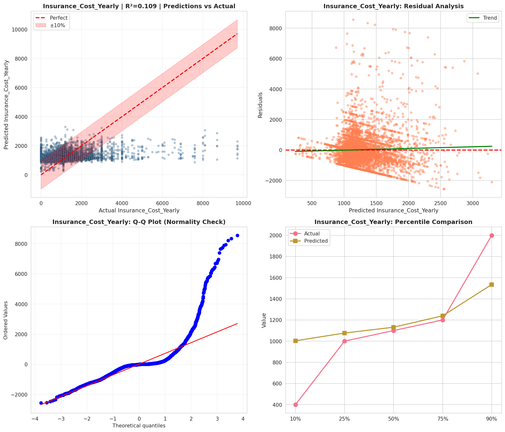
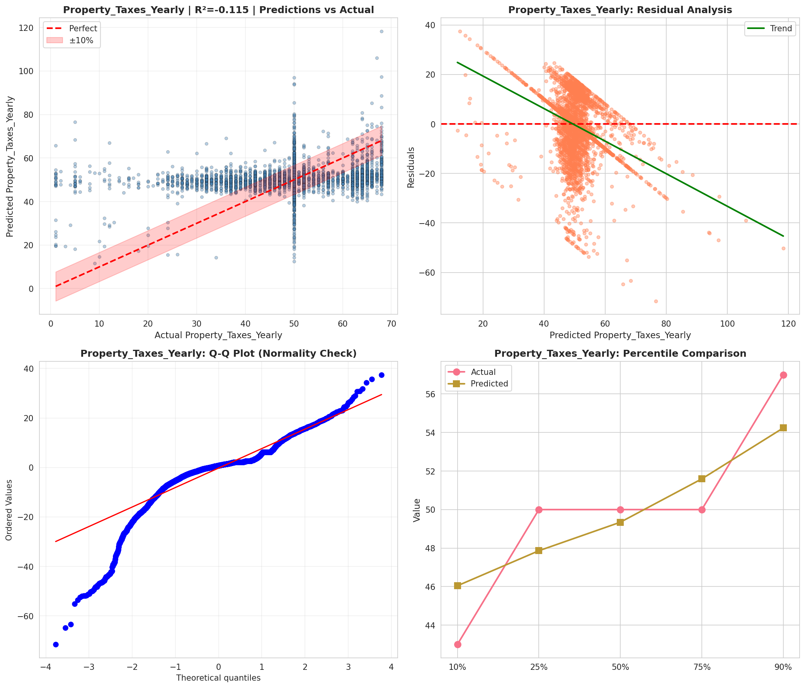
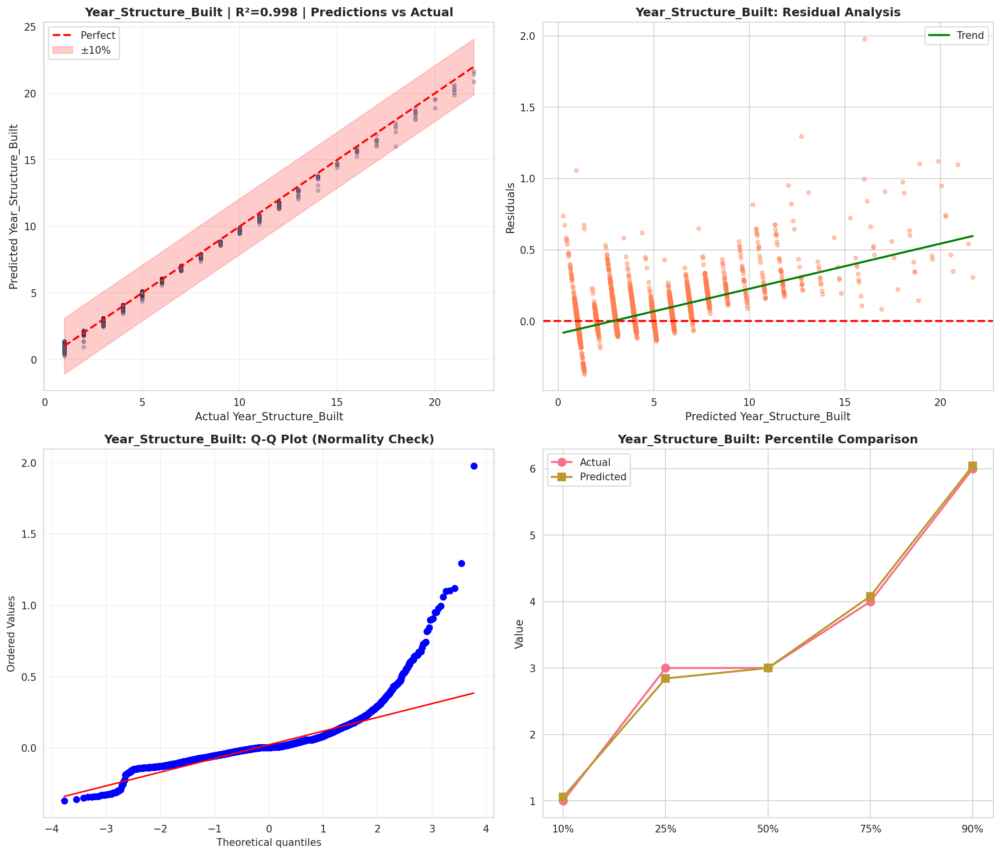
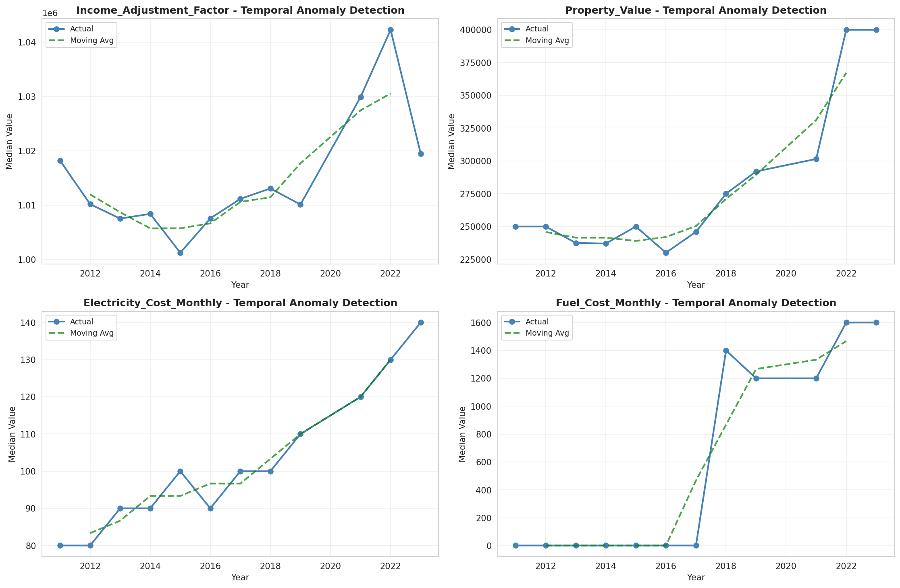
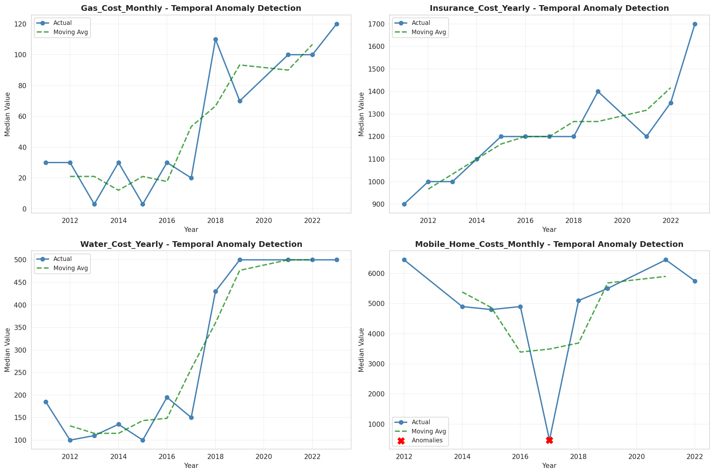
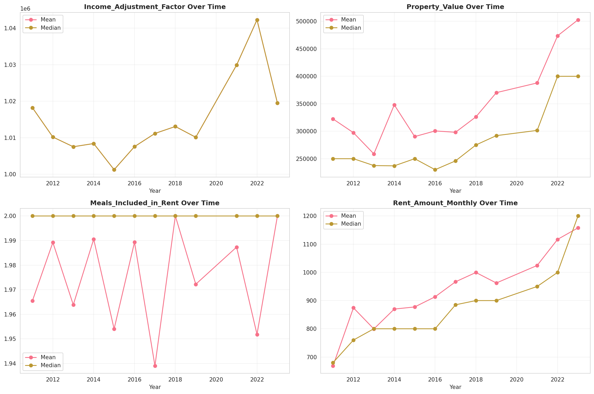
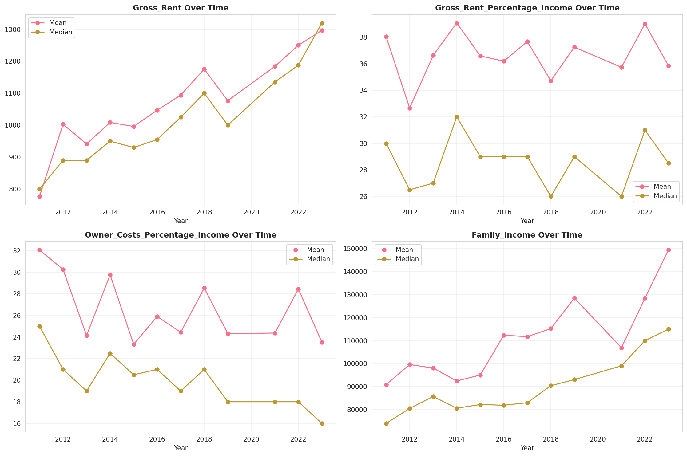
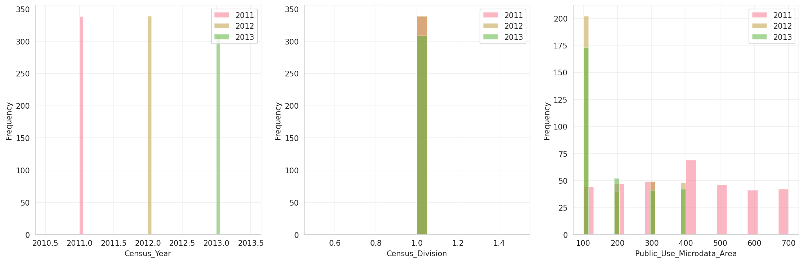

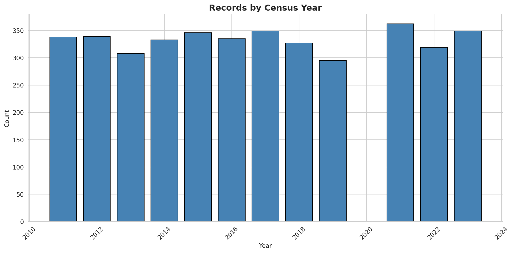
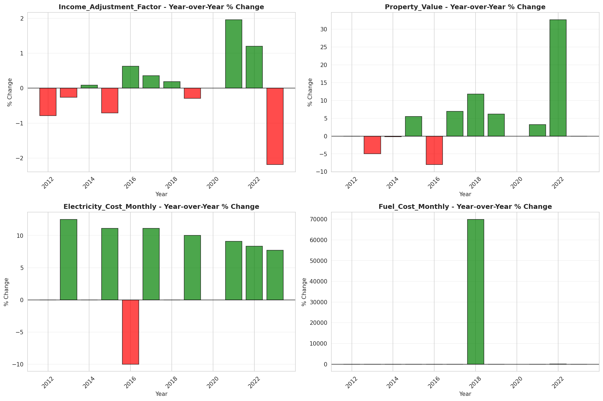
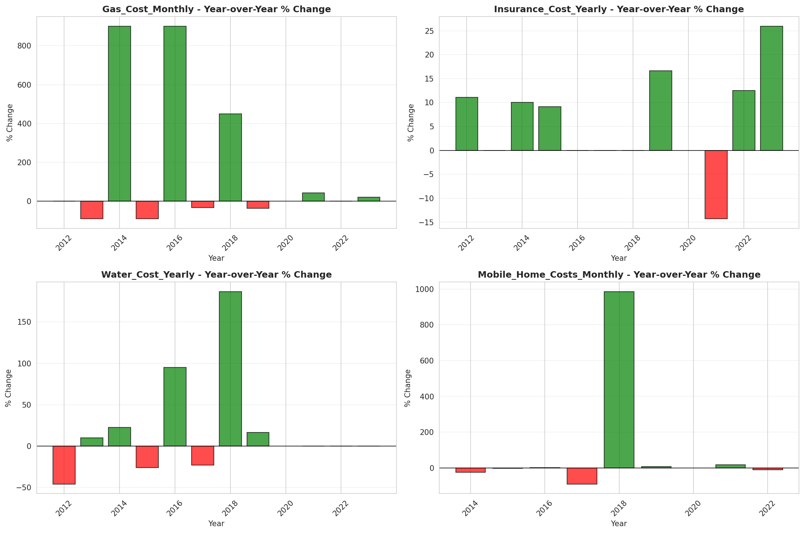
