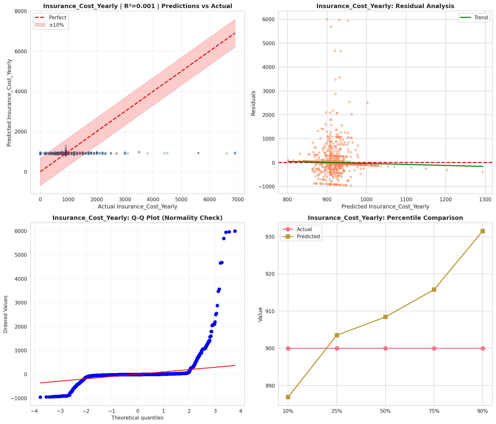
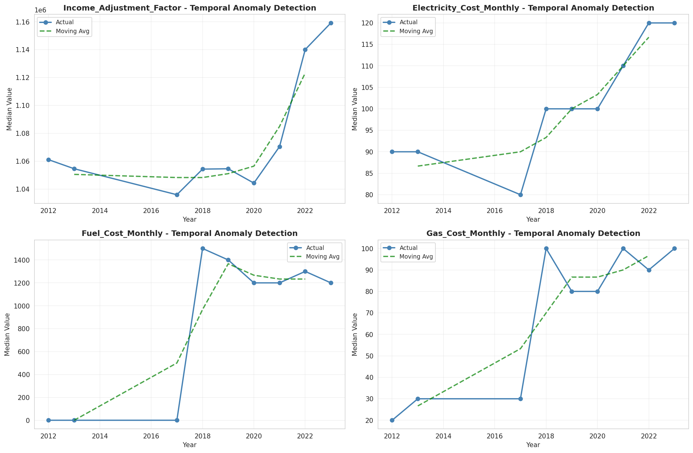
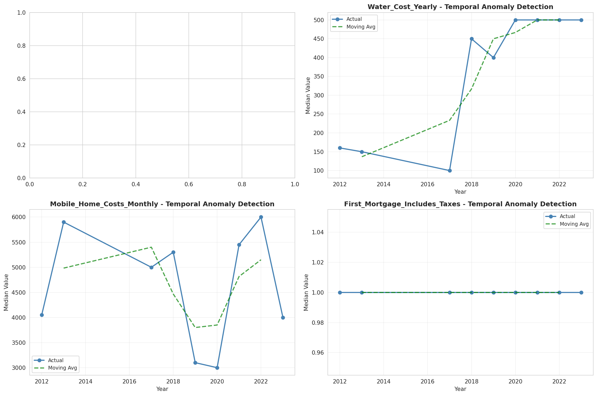
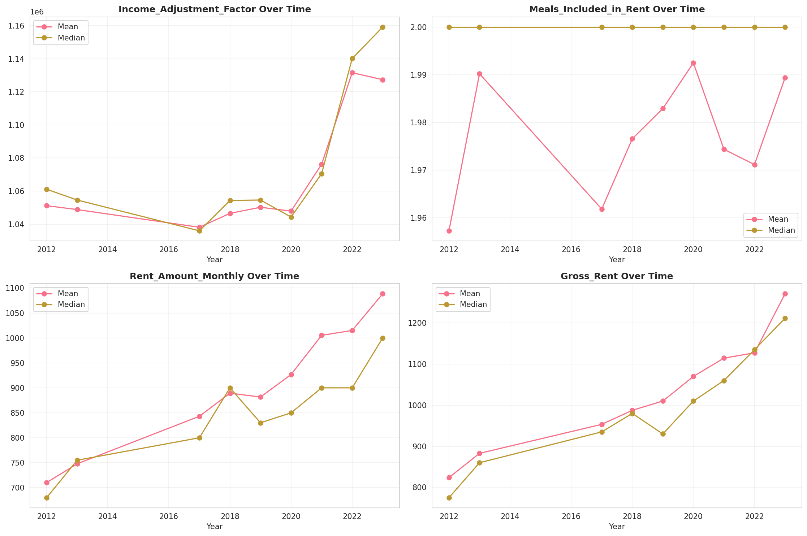
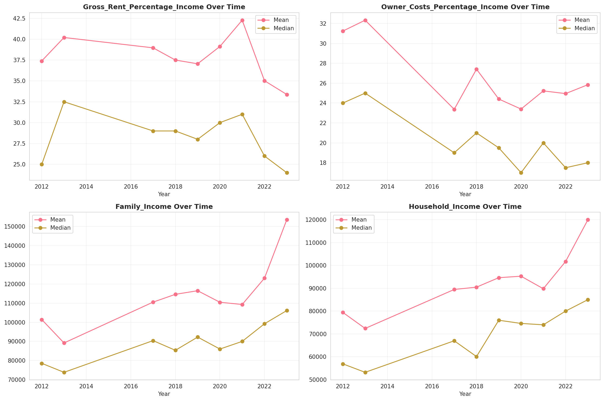
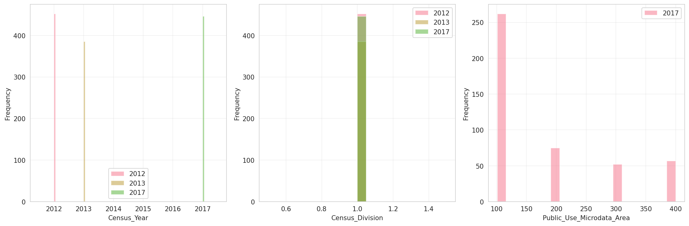
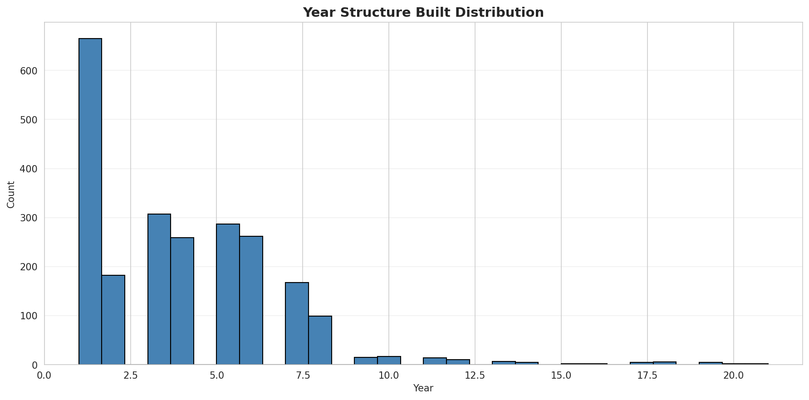
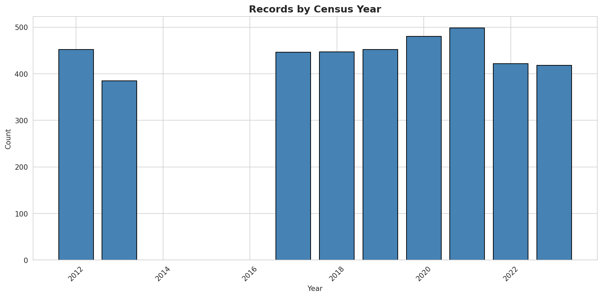
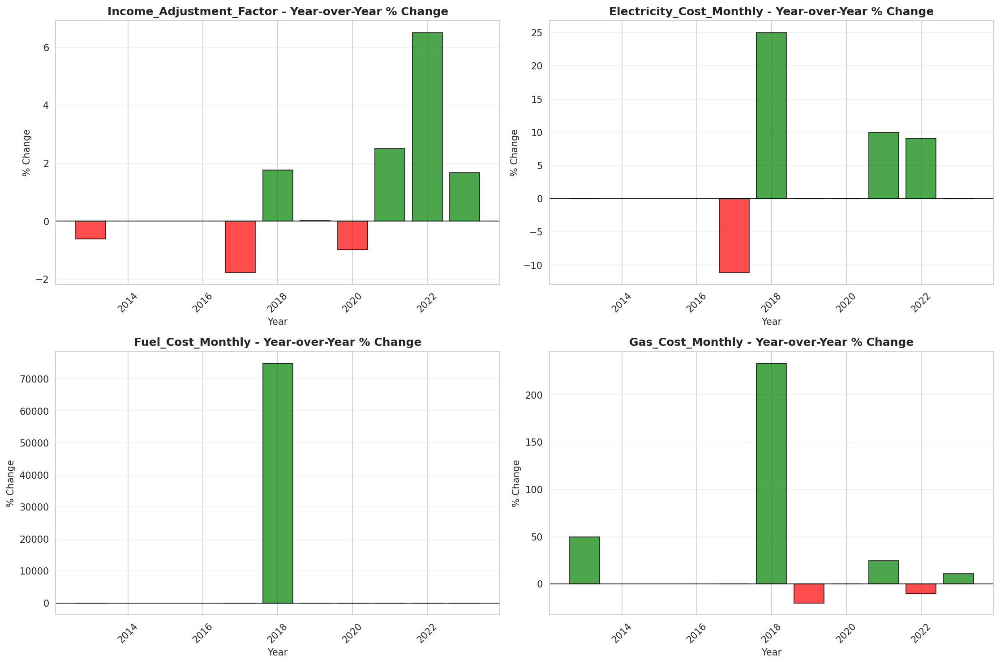
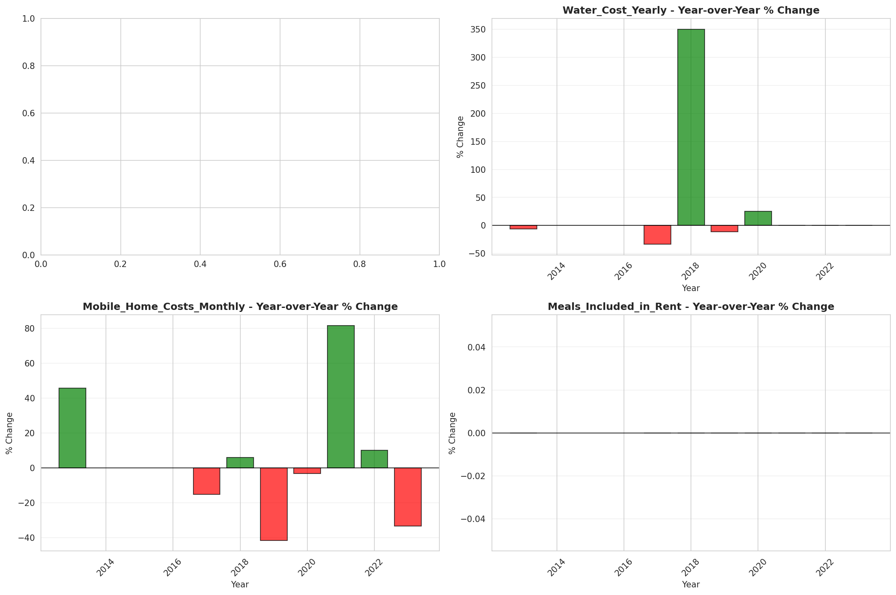

# Temporal Analysis

## Year Distribution

- 2012: 25,682 records

- 2013: 26,108 records

- 2017: 26,835 records

- 2018: 26,931 records

- 2019: 27,069 records

- 2020: 25,964 records

- 2021: 26,208 records

- 2022: 26,147 records

- 2023: 25,959 records

## Temporal Trends

- Census_Year: {np.int64(2012): {'mean': 2012.0, 'median': 2012.0, 'std': 0.0}, np.int64(2013): {'mean': 2013.0, 'median': 2013.0, 'std': 0.0}, np.int64(2017): {'mean': 2017.0, 'median': 2017.0, 'std': 0.0}, np.int64(2018): {'mean': 2018.0, 'median': 2018.0, 'std': 0.0}, np.int64(2019): {'mean': 2019.0, 'median': 2019.0, 'std': 0.0}, np.int64(2020): {'mean': 2020.0, 'median': 2020.0, 'std': 0.0}, np.int64(2021): {'mean': 2021.0, 'median': 2021.0, 'std': 0.0}, np.int64(2022): {'mean': 2022.0, 'median': 2022.0, 'std': 0.0}, np.int64(2023): {'mean': 2023.0, 'median': 2023.0, 'std': 0.0}}

- Census_Division: {np.int64(2012): {'mean': 1.0, 'median': 1.0, 'std': 0.0}, np.int64(2013): {'mean': 1.0, 'median': 1.0, 'std': 0.0}, np.int64(2017): {'mean': 1.0, 'median': 1.0, 'std': 0.0}, np.int64(2018): {'mean': 1.0, 'median': 1.0, 'std': 0.0}, np.int64(2019): {'mean': 1.0, 'median': 1.0, 'std': 0.0}, np.int64(2020): {'mean': 1.0, 'median': 1.0, 'std': 0.0}, np.int64(2021): {'mean': 1.0, 'median': 1.0, 'std': 0.0}, np.int64(2022): {'mean': 1.0, 'median': 1.0, 'std': 0.0}, np.int64(2023): {'mean': 1.0, 'median': 1.0, 'std': 0.0}}

- Public_Use_Microdata_Area: {np.int64(2012): {'mean': None, 'median': None, 'std': None}, np.int64(2013): {'mean': None, 'median': None, 'std': None}, np.int64(2017): {'mean': 188.6828023104155, 'median': 104.0, 'std': 111.94413974430577}, np.int64(2018): {'mean': 189.3748468307898, 'median': 104.0, 'std': 112.22512467486902}, np.int64(2019): {'mean': 190.08385976578373, 'median': 104.0, 'std': 112.32535228394961}, np.int64(2020): {'mean': 190.71680018487137, 'median': 104.0, 'std': 112.70423814768938}, np.int64(2021): {'mean': 191.44600885225884, 'median': 104.0, 'std': 112.97349964901161}, np.int64(2022): {'mean': None, 'median': None, 'std': None}, np.int64(2023): {'mean': 194.975037559228, 'median': 107.0, 'std': 112.79282456682658}}

- Census_Region: {np.int64(2012): {'mean': 1.0, 'median': 1.0, 'std': 0.0}, np.int64(2013): {'mean': 1.0, 'median': 1.0, 'std': 0.0}, np.int64(2017): {'mean': 1.0, 'median': 1.0, 'std': 0.0}, np.int64(2018): {'mean': 1.0, 'median': 1.0, 'std': 0.0}, np.int64(2019): {'mean': 1.0, 'median': 1.0, 'std': 0.0}, np.int64(2020): {'mean': 1.0, 'median': 1.0, 'std': 0.0}, np.int64(2021): {'mean': 1.0, 'median': 1.0, 'std': 0.0}, np.int64(2022): {'mean': 1.0, 'median': 1.0, 'std': 0.0}, np.int64(2023): {'mean': 1.0, 'median': 1.0, 'std': 0.0}}

- State_Code: {np.int64(2012): {'mean': 44.0, 'median': 44.0, 'std': 0.0}, np.int64(2013): {'mean': 44.0, 'median': 44.0, 'std': 0.0}, np.int64(2017): {'mean': 44.0, 'median': 44.0, 'std': 0.0}, np.int64(2018): {'mean': 44.0, 'median': 44.0, 'std': 0.0}, np.int64(2019): {'mean': 44.0, 'median': 44.0, 'std': 0.0}, np.int64(2020): {'mean': 44.0, 'median': 44.0, 'std': 0.0}, np.int64(2021): {'mean': 44.0, 'median': 44.0, 'std': 0.0}, np.int64(2022): {'mean': 44.0, 'median': 44.0, 'std': 0.0}, np.int64(2023): {'mean': None, 'median': None, 'std': None}}

- Housing_Adjustment_Factor: {np.int64(2012): {'mean': 1041015.3660151078, 'median': 1053092.0, 'std': 27495.87402260808}, np.int64(2013): {'mean': 1039847.3462157194, 'median': 1035725.0, 'std': 31914.250758286995}, np.int64(2017): {'mean': 1029273.9254332029, 'median': 1034680.0, 'std': 17946.197912212352}, np.int64(2018): {'mean': 1038401.1626007203, 'median': 1046406.0, 'std': 23454.301364068957}, np.int64(2019): {'mean': 1040927.0073885256, 'median': 1042936.0, 'std': 29223.823468547835}, np.int64(2020): {'mean': 1036922.6004467724, 'median': 1030827.0, 'std': 28188.36763333933}, np.int64(2021): {'mean': 1058192.2042506104, 'median': 1059761.0, 'std': 35928.40363579814}, np.int64(2022): {'mean': 1105414.369220178, 'median': 1133141.0, 'std': 61211.48702468776}, np.int64(2023): {'mean': 1106707.144843792, 'median': 1125501.0, 'std': 76229.7272905814}}

- Income_Adjustment_Factor: {np.int64(2012): {'mean': 1052310.3440542014, 'median': 1061121.0, 'std': 26416.740589654397}, np.int64(2013): {'mean': 1048924.5268883102, 'median': 1054614.0, 'std': 29563.72866255506}, np.int64(2017): {'mean': 1036653.3553940749, 'median': 1035988.0, 'std': 16827.985755613114}, np.int64(2018): {'mean': 1046958.4472169619, 'median': 1054346.0, 'std': 20475.247881623072}, np.int64(2019): {'mean': 1049852.0874432006, 'median': 1054606.0, 'std': 26256.663157770705}, np.int64(2020): {'mean': 1047075.7139885996, 'median': 1044328.0, 'std': 28627.17677045954}, np.int64(2021): {'mean': 1073361.8824786325, 'median': 1070512.0, 'std': 30916.700089405287}, np.int64(2022): {'mean': 1127738.0548055226, 'median': 1140108.0, 'std': 49404.51634270443}, np.int64(2023): {'mean': 1130726.1619091644, 'median': 1159185.0, 'std': 69811.33190415171}}

- Housing_Unit_Weight: {np.int64(2012): {'mean': 18.012732653220155, 'median': 15.0, 'std': 13.292565415752199}, np.int64(2013): {'mean': 17.715489505132528, 'median': 15.0, 'std': 13.582309463043178}, np.int64(2017): {'mean': 17.39034842556363, 'median': 14.0, 'std': 14.343601955386447}, np.int64(2018): {'mean': 17.355909546619138, 'median': 14.0, 'std': 14.290885031615113}, np.int64(2019): {'mean': 17.301525730540472, 'median': 14.0, 'std': 14.551101520244671}, np.int64(2020): {'mean': 18.074603296872592, 'median': 14.0, 'std': 19.25304135681606}, np.int64(2021): {'mean': 18.35958485958486, 'median': 14.0, 'std': 19.87538089022375}, np.int64(2022): {'mean': 18.47450950395839, 'median': 14.0, 'std': 20.23845811935888}, np.int64(2023): {'mean': 18.66847721406834, 'median': 14.0, 'std': 20.763722493180254}}

- Number_of_Persons: {np.int64(2012): {'mean': 2.050696986216027, 'median': 2.0, 'std': 1.3986257770568071}, np.int64(2013): {'mean': 2.0339359583269494, 'median': 2.0, 'std': 1.3916056050724417}, np.int64(2017): {'mean': 1.9689957145518913, 'median': 2.0, 'std': 1.3488848595259375}, np.int64(2018): {'mean': 1.9571868850024137, 'median': 2.0, 'std': 1.3469945155674274}, np.int64(2019): {'mean': 1.9340574088440652, 'median': 2.0, 'std': 1.3290094665070713}, np.int64(2020): {'mean': 1.9185795717146819, 'median': 2.0, 'std': 1.32460148246175}, np.int64(2021): {'mean': 1.9243360805860805, 'median': 2.0, 'std': 1.3249610363789548}, np.int64(2022): {'mean': 1.9244272765518033, 'median': 2.0, 'std': 1.317155633725163}, np.int64(2023): {'mean': 1.9273854925074156, 'median': 2.0, 'std': 1.3113461383477434}}

- Housing_Unit_Type: {np.int64(2012): {'mean': 1.174168678451834, 'median': 1.0, 'std': 0.5284604185506496}, np.int64(2013): {'mean': 1.1956871457024667, 'median': 1.0, 'std': 0.5606179651749112}, np.int64(2017): {'mean': 1.2324203465623254, 'median': 1.0, 'std': 0.6089135150998355}, np.int64(2018): {'mean': 1.2325201440718874, 'median': 1.0, 'std': 0.608638117954242}, np.int64(2019): {'mean': 1.2354353688721416, 'median': 1.0, 'std': 0.6120124775910418}, np.int64(2020): {'mean': None, 'median': None, 'std': None}, np.int64(2021): {'mean': None, 'median': None, 'std': None}, np.int64(2022): {'mean': None, 'median': None, 'std': None}, np.int64(2023): {'mean': None, 'median': None, 'std': None}}

- Building_Type: {np.int64(2012): {'mean': 3.3747167509151126, 'median': 2.0, 'std': 2.074492049654957}, np.int64(2013): {'mean': 3.3663383520631753, 'median': 2.0, 'std': 2.0670863172145637}, np.int64(2017): {'mean': 3.397256137020579, 'median': 2.0, 'std': 2.0970506090242123}, np.int64(2018): {'mean': 3.404919583727531, 'median': 2.0, 'std': 2.1051496739797044}, np.int64(2019): {'mean': 3.3963736122422734, 'median': 2.0, 'std': 2.1086296861409415}, np.int64(2020): {'mean': 3.3828107274129873, 'median': 2.0, 'std': 2.099393207110677}, np.int64(2021): {'mean': 3.355734243744666, 'median': 2.0, 'std': 2.0937585394151967}, np.int64(2022): {'mean': 3.341087722468154, 'median': 2.0, 'std': 2.0990885569495594}, np.int64(2023): {'mean': 3.3273341860040198, 'median': 2.0, 'std': 2.101663573856555}}

- Year_Structure_Built: {np.int64(2012): {'mean': 3.6434547672999824, 'median': 3.0, 'std': 2.439852539807311}, np.int64(2013): {'mean': 3.694103354015707, 'median': 3.0, 'std': 2.489232462864628}, np.int64(2017): {'mean': 3.8773027309202295, 'median': 4.0, 'std': 2.7693034718430436}, np.int64(2018): {'mean': 3.920916831512858, 'median': 4.0, 'std': 2.890938705853905}, np.int64(2019): {'mean': 3.9750953748553304, 'median': 4.0, 'std': 2.994468855210918}, np.int64(2020): {'mean': 4.037119390116622, 'median': 4.0, 'std': 3.1198719867036546}, np.int64(2021): {'mean': None, 'median': None, 'std': None}, np.int64(2022): {'mean': None, 'median': None, 'std': None}, np.int64(2023): {'mean': None, 'median': None, 'std': None}}

- Bathtub_or_Shower: {np.int64(2012): {'mean': 1.0054906745685899, 'median': 1.0, 'std': 0.07389698927520852}, np.int64(2013): {'mean': 1.0055538681824099, 'median': 1.0, 'std': 0.07431865433887455}, np.int64(2017): {'mean': 1.0045731049657016, 'median': 1.0, 'std': 0.06747138710650308}, np.int64(2018): {'mean': 1.0047303689687797, 'median': 1.0, 'std': 0.06861628849171529}, np.int64(2019): {'mean': 1.004929486904711, 'median': 1.0, 'std': 0.07003854177473795}, np.int64(2020): {'mean': 1.005036983255434, 'median': 1.0, 'std': 0.07079434640923624}, np.int64(2021): {'mean': 1.005121063743767, 'median': 1.0, 'std': 0.07137974032269913}, np.int64(2022): {'mean': 1.0049688318727978, 'median': 1.0, 'std': 0.07031618537402427}, np.int64(2023): {'mean': 1.0047049150374565, 'median': 1.0, 'std': 0.06843239529179938}}

- Refrigerator: {np.int64(2012): {'mean': 1.0097611992330486, 'median': 1.0, 'std': 0.0983175439611422}, np.int64(2013): {'mean': 1.0105436716275438, 'median': 1.0, 'std': 0.1021418391153255}, np.int64(2017): {'mean': 1.0126838949048709, 'median': 1.0, 'std': 0.11190868604508693}, np.int64(2018): {'mean': 1.0131590264040595, 'median': 1.0, 'std': 0.11395799615642058}, np.int64(2019): {'mean': 1.0130309914698443, 'median': 1.0, 'std': 0.11340959417441009}, np.int64(2020): {'mean': 1.0126151472523484, 'median': 1.0, 'std': 0.11160900756320385}, np.int64(2021): {'mean': 1.0120389919590316, 'median': 1.0, 'std': 0.10906231684568793}, np.int64(2022): {'mean': 1.0098473213479087, 'median': 1.0, 'std': 0.09874609898698208}, np.int64(2023): {'mean': 1.0080394664717705, 'median': 1.0, 'std': 0.08930396266671019}}

- Hot_and_Cold_Running_Water: {np.int64(2012): {'mean': 1.0082360118528848, 'median': 1.0, 'std': 0.09037995308781373}, np.int64(2013): {'mean': 1.0082874126784398, 'median': 1.0, 'std': 0.09065918647573443}, np.int64(2017): {'mean': 1.0067302299495233, 'median': 1.0, 'std': 0.08176320915640375}, np.int64(2018): {'mean': 1.0067945299733378, 'median': 1.0, 'std': 0.08215019507318132}, np.int64(2019): {'mean': 1.0065583608384414, 'median': 1.0, 'std': 0.08071944025217459}, np.int64(2020): {'mean': 1.0068974905840178, 'median': 1.0, 'std': 0.08276609244598834}, np.int64(2021): {'mean': 1.00646871209739, 'median': 1.0, 'std': 0.08016954895360145}, np.int64(2022): {'mean': 1.0056012286566085, 'median': 1.0, 'std': 0.07463314613851774}, np.int64(2023): {'mean': 1.0049333089713137, 'median': 1.0, 'std': 0.0700656526410049}}

- Running_Water: {np.int64(2012): {'mean': None, 'median': None, 'std': None}, np.int64(2013): {'mean': 9.0, 'median': 9.0, 'std': 0.0}, np.int64(2017): {'mean': 9.0, 'median': 9.0, 'std': 0.0}, np.int64(2018): {'mean': 9.0, 'median': 9.0, 'std': 0.0}, np.int64(2019): {'mean': 9.0, 'median': 9.0, 'std': 0.0}, np.int64(2020): {'mean': 9.0, 'median': 9.0, 'std': 0.0}, np.int64(2021): {'mean': 9.0, 'median': 9.0, 'std': 0.0}, np.int64(2022): {'mean': 9.0, 'median': 9.0, 'std': 0.0}, np.int64(2023): {'mean': 9.0, 'median': 9.0, 'std': 0.0}}

- Sink_with_Faucet: {np.int64(2012): {'mean': 1.0050984835279764, 'median': 1.0, 'std': 0.07122296010467806}, np.int64(2013): {'mean': 1.0049030242547836, 'median': 1.0, 'std': 0.06985124418572326}, np.int64(2017): {'mean': 1.0037965399715258, 'median': 1.0, 'std': 0.061500320594214536}, np.int64(2018): {'mean': 1.0037842951750235, 'median': 1.0, 'std': 0.06140143657573271}, np.int64(2019): {'mean': 1.0041150499378455, 'median': 1.0, 'std': 0.06401790355489957}, np.int64(2020): {'mean': 1.0044470662975904, 'median': 1.0, 'std': 0.06653939292344527}, np.int64(2021): {'mean': 1.0043124747315935, 'median': 1.0, 'std': 0.06552915526570459}, np.int64(2022): {'mean': 1.0039750654982382, 'median': 1.0, 'std': 0.06292410671053948}, np.int64(2023): {'mean': 1.0038370180887997, 'median': 1.0, 'std': 0.061826127056263565}}

- Stove_or_Range: {np.int64(2012): {'mean': 1.0132909185985708, 'median': 1.0, 'std': 0.11452004882977206}, np.int64(2013): {'mean': 1.0141016184319, 'median': 1.0, 'std': 0.11791253559705038}, np.int64(2017): {'mean': 1.016394149877044, 'median': 1.0, 'std': 0.12698849336118548}, np.int64(2018): {'mean': 1.0170723316418682, 'median': 1.0, 'std': 0.1295437717483412}, np.int64(2019): {'mean': 1.0172746367182477, 'median': 1.0, 'std': 0.1302956306377072}, np.int64(2020): {'mean': 1.0168353224123066, 'median': 1.0, 'std': 0.12865708476913398}, np.int64(2021): {'mean': 1.0159920937963254, 'median': 1.0, 'std': 0.12544741394763903}, np.int64(2022): {'mean': 1.0133706748577107, 'median': 1.0, 'std': 0.11485859059039791}, np.int64(2023): {'mean': 1.0115110542663988, 'median': 1.0, 'std': 0.10667272227787339}}

- Telephone_Service: {np.int64(2012): {'mean': 1.021069004524887, 'median': 1.0, 'std': 0.1436178044933615}, np.int64(2013): {'mean': 1.020626791335808, 'median': 1.0, 'std': 0.14213471087758592}, np.int64(2017): {'mean': 1.0197559831065228, 'median': 1.0, 'std': 0.13916390710622412}, np.int64(2018): {'mean': 1.01829611559392, 'median': 1.0, 'std': 0.1340231711733867}, np.int64(2019): {'mean': 1.0154697168573035, 'median': 1.0, 'std': 0.12341441861052437}, np.int64(2020): {'mean': 1.0140138150375193, 'median': 1.0, 'std': 0.11755047727785105}, np.int64(2021): {'mean': 1.0101178781925344, 'median': 1.0, 'std': 0.10007996142255775}, np.int64(2022): {'mean': 1.0096328697105224, 'median': 1.0, 'std': 0.09767572074833548}, np.int64(2023): {'mean': 1.0085976875185294, 'median': 1.0, 'std': 0.09232653185862187}}

- Lot_Acreage: {np.int64(2012): {'mean': 1.2073898305084745, 'median': 1.0, 'std': 0.44453686594749947}, np.int64(2013): {'mean': 1.2052404688131484, 'median': 1.0, 'std': 0.4440871057148564}, np.int64(2017): {'mean': 1.2100222566938692, 'median': 1.0, 'std': 0.4442469678580285}, np.int64(2018): {'mean': 1.209372688764876, 'median': 1.0, 'std': 0.4429543347910789}, np.int64(2019): {'mean': 1.2105894105894106, 'median': 1.0, 'std': 0.4444735080163709}, np.int64(2020): {'mean': 1.209912945801741, 'median': 1.0, 'std': 0.44293547388692983}, np.int64(2021): {'mean': 1.2095048690165957, 'median': 1.0, 'std': 0.4421830663298218}, np.int64(2022): {'mean': 1.2106590335991276, 'median': 1.0, 'std': 0.44472653176434884}, np.int64(2023): {'mean': 1.2130274477673084, 'median': 1.0, 'std': 0.4464766174765409}}

- Agricultural_Sales: {np.int64(2012): {'mean': 1.0444444444444445, 'median': 1.0, 'std': 0.3667078969118477}, np.int64(2013): {'mean': 1.0487898578563197, 'median': 1.0, 'std': 0.37750123468360086}, np.int64(2017): {'mean': 1.0740045078888054, 'median': 1.0, 'std': 0.5049254252466082}, np.int64(2018): {'mean': 1.0707831325301205, 'median': 1.0, 'std': 0.4958178281141509}, np.int64(2019): {'mean': 1.0712155108128263, 'median': 1.0, 'std': 0.4845227976604644}, np.int64(2020): {'mean': 1.0618110236220473, 'median': 1.0, 'std': 0.438989705030786}, np.int64(2021): {'mean': 1.0583941605839415, 'median': 1.0, 'std': 0.4227959022258685}, np.int64(2022): {'mean': 1.0548989706443004, 'median': 1.0, 'std': 0.4078251316393483}, np.int64(2023): {'mean': 1.0593761743705374, 'median': 1.0, 'std': 0.42683419526105953}}

- Business_On_Property: {np.int64(2012): {'mean': 1.9862372881355932, 'median': 2.0, 'std': 0.11650845425392883}, np.int64(2013): {'mean': 1.9867304324397144, 'median': 2.0, 'std': 0.11443062592794354}, np.int64(2017): {'mean': 4.771025831253794, 'median': 2.0, 'std': 3.4308378521196796}, np.int64(2018): {'mean': 6.199892422510589, 'median': 9.0, 'std': 3.4345952182654833}, np.int64(2019): {'mean': 7.602197802197802, 'median': 9.0, 'std': 2.8012981000230868}, np.int64(2020): {'mean': None, 'median': None, 'std': None}, np.int64(2021): {'mean': None, 'median': None, 'std': None}, np.int64(2022): {'mean': None, 'median': None, 'std': None}, np.int64(2023): {'mean': None, 'median': None, 'std': None}}

- Tenure: {np.int64(2012): {'mean': 1.8784407993966818, 'median': 2.0, 'std': 0.9059860327672636}, np.int64(2013): {'mean': 1.8869050415824837, 'median': 2.0, 'std': 0.9064601349619328}, np.int64(2017): {'mean': 1.9186766776161426, 'median': 2.0, 'std': 0.902025468155955}, np.int64(2018): {'mean': 1.9170576093075624, 'median': 2.0, 'std': 0.8993275005455068}, np.int64(2019): {'mean': 1.9092912057003564, 'median': 2.0, 'std': 0.8950213238668014}, np.int64(2020): {'mean': 1.9019032947373653, 'median': 2.0, 'std': 0.8916658234742381}, np.int64(2021): {'mean': 1.8851669941060905, 'median': 2.0, 'std': 0.8871575401346345}, np.int64(2022): {'mean': 1.8778689733130192, 'median': 2.0, 'std': 0.8809925436250157}, np.int64(2023): {'mean': 1.8721217511611818, 'median': 2.0, 'std': 0.876554410817739}}

- Vacancy_Status: {np.int64(2012): {'mean': 4.433602771362587, 'median': 5.0, 'std': 2.1872700762165533}, np.int64(2013): {'mean': 4.4438775510204085, 'median': 5.0, 'std': 2.176219105671179}, np.int64(2017): {'mean': 4.644194756554307, 'median': 5.0, 'std': 2.1309372922810677}, np.int64(2018): {'mean': 4.68937048503612, 'median': 5.0, 'std': 2.1426900900235797}, np.int64(2019): {'mean': 4.735102653980971, 'median': 5.0, 'std': 2.149808830569348}, np.int64(2020): {'mean': 4.7779519331243465, 'median': 5.0, 'std': 2.133131662800139}, np.int64(2021): {'mean': 4.779063650710152, 'median': 5.0, 'std': 2.1422082474447106}, np.int64(2022): {'mean': 4.776661083193747, 'median': 5.0, 'std': 2.120485929510024}, np.int64(2023): {'mean': 4.786577992744861, 'median': 5.0, 'std': 2.0884353060338667}}

- Vehicles_Available: {np.int64(2012): {'mean': 1.7155920060331824, 'median': 2.0, 'std': 1.0319862518748217}, np.int64(2013): {'mean': 1.7163933655969552, 'median': 2.0, 'std': 1.0321436311251473}, np.int64(2017): {'mean': 1.7171750351947443, 'median': 2.0, 'std': 1.0251063462506749}, np.int64(2018): {'mean': 1.7203039969975604, 'median': 2.0, 'std': 1.0254205622985981}, np.int64(2019): {'mean': 1.7309206825426589, 'median': 2.0, 'std': 1.022449356724103}, np.int64(2020): {'mean': 1.7418376981563386, 'median': 2.0, 'std': 1.020947650010193}, np.int64(2021): {'mean': 1.7529960707269154, 'median': 2.0, 'std': 1.023972621340128}, np.int64(2022): {'mean': 1.7484149997542635, 'median': 2.0, 'std': 1.0247391169114206}, np.int64(2023): {'mean': 1.7515564779128372, 'median': 2.0, 'std': 1.0295055611299895}}

- Condo_Fee_Monthly: {np.int64(2012): {'mean': 249.0423162583519, 'median': 210.0, 'std': 155.6508126058553}, np.int64(2013): {'mean': 260.1687289088864, 'median': 220.0, 'std': 166.76328738969383}, np.int64(2017): {'mean': 295.5444444444444, 'median': 250.0, 'std': 177.05925939438558}, np.int64(2018): {'mean': 303.65466101694915, 'median': 250.0, 'std': 174.40853363879742}, np.int64(2019): {'mean': 312.58919469928645, 'median': 270.0, 'std': 176.29643242904265}, np.int64(2020): {'mean': 317.94952681388014, 'median': 280.0, 'std': 167.9852799857211}, np.int64(2021): {'mean': 323.46192893401013, 'median': 280.0, 'std': 174.2594517573243}, np.int64(2022): {'mean': 331.9043062200957, 'median': 290.0, 'std': 191.74463789008465}, np.int64(2023): {'mean': 345.9389454209066, 'median': 300.0, 'std': 203.57652117223762}}

- Electricity_Cost_Monthly: {np.int64(2012): {'mean': 97.68387066365007, 'median': 80.0, 'std': 77.99976755663754}, np.int64(2013): {'mean': 97.36108631301978, 'median': 80.0, 'std': 76.88481018266091}, np.int64(2017): {'mean': 107.24270295635851, 'median': 90.0, 'std': 85.51957257912133}, np.int64(2018): {'mean': 122.31902659410618, 'median': 100.0, 'std': 85.90810063266746}, np.int64(2019): {'mean': 126.27399087039032, 'median': 100.0, 'std': 88.17798369556675}, np.int64(2020): {'mean': 130.12278515307506, 'median': 100.0, 'std': 91.16147979693424}, np.int64(2021): {'mean': 138.30821075153784, 'median': 110.0, 'std': 110.61699514706511}, np.int64(2022): {'mean': 150.7152770364044, 'median': 120.0, 'std': 153.75360690933198}, np.int64(2023): {'mean': 163.89863923711562, 'median': 130.0, 'std': 195.94126186030107}}

- Fuel_Cost_Monthly: {np.int64(2012): {'mean': 727.1623774509804, 'median': 2.0, 'std': 1137.0179249923613}, np.int64(2013): {'mean': 679.6538082037307, 'median': 2.0, 'std': 1108.4846578933873}, np.int64(2017): {'mean': 512.1335992491788, 'median': 2.0, 'std': 1018.5356410379128}, np.int64(2018): {'mean': 1629.6764798987022, 'median': 1400.0, 'std': 1172.1946421327075}, np.int64(2019): {'mean': 1523.0757526707673, 'median': 1300.0, 'std': 1085.5724948902543}, np.int64(2020): {'mean': 1440.2249603942969, 'median': 1200.0, 'std': 1018.1838467893617}, np.int64(2021): {'mean': 1461.7990770323038, 'median': 1200.0, 'std': 1029.6332509095262}, np.int64(2022): {'mean': 1567.2921409214093, 'median': 1400.0, 'std': 1127.9176503567492}, np.int64(2023): {'mean': 1657.9697246033193, 'median': 1500.0, 'std': 1225.1397757314146}}

- Gas_Cost_Monthly: {np.int64(2012): {'mean': 69.6412613122172, 'median': 30.0, 'std': 98.19930640034413}, np.int64(2013): {'mean': 67.73142883991919, 'median': 30.0, 'std': 95.00630184195009}, np.int64(2017): {'mean': 63.20994838104176, 'median': 30.0, 'std': 87.20411910024265}, np.int64(2018): {'mean': 113.17156079091292, 'median': 90.0, 'std': 92.06030576733946}, np.int64(2019): {'mean': 114.49777852292732, 'median': 90.0, 'std': 94.36584210151138}, np.int64(2020): {'mean': 112.63699533820036, 'median': 90.0, 'std': 92.082111797779}, np.int64(2021): {'mean': 117.40128271797539, 'median': 90.0, 'std': 100.96997892408226}, np.int64(2022): {'mean': 127.73041514677783, 'median': 100.0, 'std': 132.2832658899788}, np.int64(2023): {'mean': 134.5526153846154, 'median': 100.0, 'std': 147.64814790955856}}

- House_Heating_Fuel: {np.int64(2012): {'mean': 2.4761029411764706, 'median': 2.0, 'std': 1.5605295938561383}, np.int64(2013): {'mean': 2.4546821406756565, 'median': 2.0, 'std': 1.5648593969067288}, np.int64(2017): {'mean': 2.376067573908963, 'median': 1.0, 'std': 1.578728361711402}, np.int64(2018): {'mean': 2.3557421655094766, 'median': 1.0, 'std': 1.5798907423087034}, np.int64(2019): {'mean': 2.3390211888243013, 'median': 1.0, 'std': 1.574731895589041}, np.int64(2020): {'mean': 2.321373552651195, 'median': 1.0, 'std': 1.5680355782775823}, np.int64(2021): {'mean': 2.320677799607073, 'median': 1.0, 'std': 1.5632339273834994}, np.int64(2022): {'mean': 2.315722219491817, 'median': 1.0, 'std': 1.5599019316199758}, np.int64(2023): {'mean': 2.3324933293803736, 'median': 1.0, 'std': 1.5519157756844875}}

- Insurance_Cost_Yearly: {np.int64(2013): {'mean': 1152.770333437208, 'median': 960.0, 'std': 912.9521529497631}}

- Water_Cost_Yearly: {np.int64(2012): {'mean': 305.1606334841629, 'median': 140.0, 'std': 433.49837195749586}, np.int64(2013): {'mean': 315.326927594794, 'median': 140.0, 'std': 452.7410456682172}, np.int64(2017): {'mean': 348.45992491787894, 'median': 120.0, 'std': 500.6564889751042}, np.int64(2018): {'mean': 620.0576860045886, 'median': 500.0, 'std': 533.308359880812}, np.int64(2019): {'mean': 625.8980137819213, 'median': 500.0, 'std': 540.7175291999406}, np.int64(2020): {'mean': 631.2222975262623, 'median': 500.0, 'std': 557.1688942399544}, np.int64(2021): {'mean': 644.1817882159044, 'median': 500.0, 'std': 578.3649332036978}, np.int64(2022): {'mean': 641.8589306029579, 'median': 500.0, 'std': 585.3993062459434}, np.int64(2023): {'mean': 653.4027348201205, 'median': 500.0, 'std': 605.8344457042699}}

- Mobile_Home_Costs_Monthly: {np.int64(2012): {'mean': 3446.358024691358, 'median': 4000.0, 'std': 2062.5741488415306}, np.int64(2013): {'mean': 3659.1463414634145, 'median': 4400.0, 'std': 1952.4571281717033}, np.int64(2017): {'mean': 3932.9605263157896, 'median': 4600.0, 'std': 2101.1182260301325}, np.int64(2018): {'mean': 4084.3333333333335, 'median': 4700.0, 'std': 2234.8068446981315}, np.int64(2019): {'mean': 4154.96644295302, 'median': 4800.0, 'std': 2262.939258288687}, np.int64(2020): {'mean': 4014.2361111111113, 'median': 4750.0, 'std': 2389.005287884482}, np.int64(2021): {'mean': 4400.753424657534, 'median': 5000.0, 'std': 2444.7833514103086}, np.int64(2022): {'mean': 4695.298013245033, 'median': 5300.0, 'std': 2450.75357334488}, np.int64(2023): {'mean': 4590.476190476191, 'median': 5400.0, 'std': 2499.9748857186028}}

- First_Mortgage_Includes_Insurance: {np.int64(2012): {'mean': 1.5050576572931418, 'median': 2.0, 'std': 0.49999970835958596}, np.int64(2013): {'mean': 1.4953632935901355, 'median': 1.0, 'std': 0.5000039777520493}, np.int64(2017): {'mean': 1.4678387650085762, 'median': 1.0, 'std': 0.49899133055448947}, np.int64(2018): {'mean': 1.460058058273304, 'median': 1.0, 'std': 0.4984288830591428}, np.int64(2019): {'mean': 1.4485760343901128, 'median': 1.0, 'std': 0.49737527250545766}, np.int64(2020): {'mean': 1.437815511702616, 'median': 1.0, 'std': 0.4961464822821876}, np.int64(2021): {'mean': 1.420353982300885, 'median': 1.0, 'std': 0.4936437574424598}, np.int64(2022): {'mean': 1.4027697634160416, 'median': 1.0, 'std': 0.49048348083975907}, np.int64(2023): {'mean': 1.3858823529411766, 'median': 1.0, 'std': 0.48683163986772204}}

- First_Mortgage_Payment_Monthly: {np.int64(2012): {'mean': 1355.29658102367, 'median': 1300.0, 'std': 775.5657003969517}, np.int64(2013): {'mean': 1344.9499643330275, 'median': 1300.0, 'std': 763.2908772901108}, np.int64(2017): {'mean': 1327.857204116638, 'median': 1200.0, 'std': 767.8504175479202}, np.int64(2018): {'mean': 1352.1713794215675, 'median': 1300.0, 'std': 792.2458298577616}, np.int64(2019): {'mean': 1387.0218162278345, 'median': 1300.0, 'std': 813.9795913976469}, np.int64(2020): {'mean': 1422.8242312987609, 'median': 1300.0, 'std': 812.0615826904626}, np.int64(2021): {'mean': 1476.5039709552984, 'median': 1400.0, 'std': 818.515500647266}, np.int64(2022): {'mean': 1531.3257934218118, 'median': 1400.0, 'std': 832.2793187471773}, np.int64(2023): {'mean': 1600.4971764705883, 'median': 1500.0, 'std': 852.6526497434423}}

- First_Mortgage_Includes_Taxes: {np.int64(2012): {'mean': 1.378919684402185, 'median': 1.0, 'std': 0.4851426232764087}, np.int64(2013): {'mean': 1.3756241720167126, 'median': 1.0, 'std': 0.484308327250849}, np.int64(2017): {'mean': 1.340801886792453, 'median': 1.0, 'std': 0.47400426936596446}, np.int64(2018): {'mean': 1.3300720352650253, 'median': 1.0, 'std': 0.4702640360771455}, np.int64(2019): {'mean': 1.3163890381515315, 'median': 1.0, 'std': 0.4650916698445144}, np.int64(2020): {'mean': 1.3024323083983478, 'median': 1.0, 'std': 0.4593378000771162}, np.int64(2021): {'mean': 1.2854549580213297, 'median': 1.0, 'std': 0.4516564725865869}, np.int64(2022): {'mean': 1.2725908828620889, 'median': 1.0, 'std': 0.4453178410233232}, np.int64(2023): {'mean': 1.2545882352941176, 'median': 1.0, 'std': 0.435655132661028}}

- First_Mortgage_Status: {np.int64(2012): {'mean': 1.6068707674943568, 'median': 1.0, 'std': 0.9186329382787917}, np.int64(2013): {'mean': 1.6143351947409346, 'median': 1.0, 'std': 0.9217900702361289}, np.int64(2017): {'mean': 1.6689058815121847, 'median': 1.0, 'std': 0.9424946880844061}, np.int64(2018): {'mean': 1.6798492069137207, 'median': 1.0, 'std': 0.9458222295331087}, np.int64(2019): {'mean': 1.6974607182940515, 'median': 1.0, 'std': 0.9516604064201842}, np.int64(2020): {'mean': 1.7187177597641856, 'median': 1.0, 'std': 0.957930991710135}, np.int64(2021): {'mean': 1.7394048045894586, 'median': 1.0, 'std': 0.9636612128504881}, np.int64(2022): {'mean': 1.775361292150751, 'median': 1.0, 'std': 0.9729122868572607}, np.int64(2023): {'mean': 1.8032590293453725, 'median': 1.0, 'std': 0.9792301418703315}}

- Second_Mortgage_Payment_Monthly: {np.int64(2012): {'mean': 391.53038105046346, 'median': 300.0, 'std': 383.7103191896678}, np.int64(2013): {'mean': 375.43287973519676, 'median': 300.0, 'std': 359.19280032792153}, np.int64(2017): {'mean': 369.81174089068827, 'median': 250.0, 'std': 404.05830007193055}, np.int64(2018): {'mean': 371.946301369863, 'median': 250.0, 'std': 416.41237069250656}, np.int64(2019): {'mean': 373.46091015169196, 'median': 250.0, 'std': 414.0694332503139}, np.int64(2020): {'mean': 383.2561784207354, 'median': 270.0, 'std': 403.41877217647357}, np.int64(2021): {'mean': 401.3344807802639, 'median': 280.0, 'std': 463.2645478886609}, np.int64(2022): {'mean': 391.11915367483294, 'median': 280.0, 'std': 442.8998707877386}, np.int64(2023): {'mean': 424.47148288973386, 'median': 300.0, 'std': 473.88424950708946}}

- Second_Mortgage_Status: {np.int64(2012): {'mean': 2.673174185717176, 'median': 3.0, 'std': 0.5930831962707729}, np.int64(2013): {'mean': 2.6919392642413125, 'median': 3.0, 'std': 0.5799099902570976}, np.int64(2017): {'mean': 2.76340051457976, 'median': 3.0, 'std': 0.5140697525465563}, np.int64(2018): {'mean': 2.7833566283195355, 'median': 3.0, 'std': 0.49279361708439945}, np.int64(2019): {'mean': 2.797420741536808, 'median': 3.0, 'std': 0.47747388292718856}, np.int64(2020): {'mean': 2.7931856899488925, 'median': 3.0, 'std': 0.47809717937422896}, np.int64(2021): {'mean': 2.788908567633385, 'median': 3.0, 'std': 0.4734099443035955}, np.int64(2022): {'mean': 2.782961235143841, 'median': 3.0, 'std': 0.4699248869851723}, np.int64(2023): {'mean': 2.776112726459405, 'median': 3.0, 'std': 0.4734037782639125}}

- Property_Taxes_Yearly: {np.int64(2012): {'mean': 47.22354683972912, 'median': 47.0, 'std': 14.066098887873963}, np.int64(2013): {'mean': 47.56464268042694, 'median': 48.0, 'std': 14.520089571006814}, np.int64(2017): {'mean': 49.15429143143, 'median': 51.0, 'std': 14.706631557842455}}

- Meals_Included_in_Rent: {np.int64(2012): {'mean': 1.981378543635353, 'median': 2.0, 'std': 0.13519333431718988}, np.int64(2013): {'mean': 1.980803510215275, 'median': 2.0, 'std': 0.13722451155035267}, np.int64(2017): {'mean': 1.9799623453469608, 'median': 2.0, 'std': 0.14013846042758932}, np.int64(2018): {'mean': 1.9803815451224462, 'median': 2.0, 'std': 0.13869453397338335}, np.int64(2019): {'mean': 1.9797222222222222, 'median': 2.0, 'std': 0.1409586788317684}, np.int64(2020): {'mean': 1.979894973743436, 'median': 2.0, 'std': 0.14037011961395215}, np.int64(2021): {'mean': 1.9810107197549771, 'median': 2.0, 'std': 0.13649740181761216}, np.int64(2022): {'mean': 1.98256735340729, 'median': 2.0, 'std': 0.13088722014035373}, np.int64(2023): {'mean': 1.9816333224007872, 'median': 2.0, 'std': 0.13428439908434153}}

- Rent_Amount_Monthly: {np.int64(2012): {'mean': 764.2153974430239, 'median': 720.0, 'std': 436.4599403361914}, np.int64(2013): {'mean': 778.7250788427259, 'median': 750.0, 'std': 442.0949066016248}, np.int64(2017): {'mean': 848.5494889725659, 'median': 800.0, 'std': 476.7255142918979}, np.int64(2018): {'mean': 871.8389933703153, 'median': 800.0, 'std': 488.79794735927493}, np.int64(2019): {'mean': 900.65, 'median': 850.0, 'std': 499.87491670588435}, np.int64(2020): {'mean': 929.4730682670668, 'median': 850.0, 'std': 531.9262687953438}, np.int64(2021): {'mean': 968.2728943338439, 'median': 900.0, 'std': 553.06332610907}, np.int64(2022): {'mean': 1025.139144215531, 'median': 930.0, 'std': 591.4038870259279}, np.int64(2023): {'mean': 1090.1239750737948, 'median': 1000.0, 'std': 630.6592391966255}}

- Gross_Rent: {np.int64(2012): {'mean': 885.5344751218072, 'median': 860.0, 'std': 481.9826389047238}, np.int64(2013): {'mean': 900.1823478007574, 'median': 870.0, 'std': 486.50685771889147}, np.int64(2017): {'mean': 973.4942463418099, 'median': 930.0, 'std': 521.2990786486863}, np.int64(2018): {'mean': 997.6026357255407, 'median': 950.0, 'std': 531.5519214816871}, np.int64(2019): {'mean': 1023.9669713948688, 'median': 975.0, 'std': 542.6979346853032}, np.int64(2020): {'mean': 1053.9859760956176, 'median': 1000.0, 'std': 572.6875214749242}, np.int64(2021): {'mean': 1098.3681121617215, 'median': 1030.0, 'std': 598.4341694873124}, np.int64(2022): {'mean': 1164.8990578734858, 'median': 1093.5, 'std': 649.1703605869315}, np.int64(2023): {'mean': 1234.2337954939342, 'median': 1160.0, 'std': 690.4595498274874}}

- Gross_Rent_Percentage_Income: {np.int64(2012): {'mean': 39.07216338880484, 'median': 29.0, 'std': 27.270567504721793}, np.int64(2013): {'mean': 39.09044776119403, 'median': 29.0, 'std': 27.213993848967355}, np.int64(2017): {'mean': 38.69274475524475, 'median': 29.0, 'std': 26.990592040104136}, np.int64(2018): {'mean': 38.19558823529412, 'median': 29.0, 'std': 26.920702158080527}, np.int64(2019): {'mean': 37.376094174464235, 'median': 29.0, 'std': 26.66901466387958}, np.int64(2020): {'mean': 36.87583292702747, 'median': 28.0, 'std': 26.433588103621098}, np.int64(2021): {'mean': 36.89187842551071, 'median': 28.0, 'std': 26.61832048653871}, np.int64(2022): {'mean': 37.32196125492885, 'median': 29.0, 'std': 26.978803842717355}, np.int64(2023): {'mean': 37.95538705695645, 'median': 29.0, 'std': 27.38952062417521}}

- Selected_Monthly_Owner_Costs: {np.int64(2012): {'mean': 1613.4515628307345, 'median': 1489.0, 'std': 1005.3935850182182}, np.int64(2013): {'mean': 1594.0475853779255, 'median': 1470.0, 'std': 984.1493550862126}, np.int64(2017): {'mean': 1541.990777809551, 'median': 1415.5, 'std': 945.5866515900494}, np.int64(2018): {'mean': 1557.8476590294579, 'median': 1433.0, 'std': 962.1552461901114}, np.int64(2019): {'mean': 1569.427308447937, 'median': 1439.0, 'std': 975.3906216998968}, np.int64(2020): {'mean': 1582.2694037001547, 'median': 1459.0, 'std': 981.8854556098621}, np.int64(2021): {'mean': 1620.4525892985225, 'median': 1490.0, 'std': 1010.4750392993864}, np.int64(2022): {'mean': 1658.4289762663832, 'median': 1503.0, 'std': 1038.9290644368427}, np.int64(2023): {'mean': 1712.5028922121896, 'median': 1535.0, 'std': 1090.8183722606996}}

- Owner_Costs_Percentage_Income: {np.int64(2012): {'mean': 29.739734770583645, 'median': 23.0, 'std': 22.364502690882734}, np.int64(2013): {'mean': 29.12284191829485, 'median': 23.0, 'std': 22.20445228268485}, np.int64(2017): {'mean': 26.455250682373222, 'median': 20.0, 'std': 21.600490296149687}, np.int64(2018): {'mean': 26.306234806234805, 'median': 20.0, 'std': 21.60436567251858}, np.int64(2019): {'mean': 25.654239199379802, 'median': 20.0, 'std': 21.323395112671633}, np.int64(2020): {'mean': 25.366469282013323, 'median': 19.0, 'std': 21.33433023324616}, np.int64(2021): {'mean': 25.235476430733748, 'median': 19.0, 'std': 21.324940699417866}, np.int64(2022): {'mean': 25.022876282782214, 'median': 19.0, 'std': 21.445503123336735}, np.int64(2023): {'mean': 24.659098971266406, 'median': 18.0, 'std': 21.440935284445644}}

- Satellite_Internet: {np.int64(2012): {'mean': None, 'median': None, 'std': None}, np.int64(2013): {'mean': None, 'median': None, 'std': None}, np.int64(2017): {'mean': 1.9713135958608796, 'median': 2.0, 'std': 0.1669284165722486}, np.int64(2018): {'mean': 1.9685105903560163, 'median': 2.0, 'std': 0.1746411887696719}, np.int64(2019): {'mean': 1.9669262834576569, 'median': 2.0, 'std': 0.17883400113785236}, np.int64(2020): {'mean': 1.9654426416168518, 'median': 2.0, 'std': 0.1826610163211605}, np.int64(2021): {'mean': 1.9661859771258081, 'median': 2.0, 'std': 0.18075519339197393}, np.int64(2022): {'mean': 1.9652387448840383, 'median': 2.0, 'std': 0.18317953310798055}, np.int64(2023): {'mean': 1.9666612545326623, 'median': 2.0, 'std': 0.17952442116779882}}

- Smartphone: {np.int64(2012): {'mean': None, 'median': None, 'std': None}, np.int64(2013): {'mean': None, 'median': None, 'std': None}, np.int64(2017): {'mean': 1.3175035194744251, 'median': 1.0, 'std': 0.46551606177955407}, np.int64(2018): {'mean': 1.2750985175455056, 'median': 1.0, 'std': 0.4465743823941353}, np.int64(2019): {'mean': 1.2389368085505343, 'median': 1.0, 'std': 0.42644405850516803}, np.int64(2020): {'mean': 1.2090145604532128, 'median': 1.0, 'std': 0.40661491638442104}, np.int64(2021): {'mean': 1.1731335952848723, 'median': 1.0, 'std': 0.37837201953538957}, np.int64(2022): {'mean': 1.1528480857128816, 'median': 1.0, 'std': 0.35984984727514513}, np.int64(2023): {'mean': 1.1340053364957012, 'median': 1.0, 'std': 0.34066646551803276}}

- Tablet_Computer: {np.int64(2012): {'mean': None, 'median': None, 'std': None}, np.int64(2013): {'mean': None, 'median': None, 'std': None}, np.int64(2017): {'mean': 1.4587048334115438, 'median': 1.0, 'std': 0.4983034831521931}, np.int64(2018): {'mean': 1.4159316945017828, 'median': 1.0, 'std': 0.49289341369818557}, np.int64(2019): {'mean': 1.3844927807988, 'median': 1.0, 'std': 0.4864865639187614}, np.int64(2020): {'mean': 1.3577001441137007, 'median': 1.0, 'std': 0.4793351321394778}, np.int64(2021): {'mean': 1.3410117878192533, 'median': 1.0, 'std': 0.4740609521915893}, np.int64(2022): {'mean': 1.341573696368015, 'median': 1.0, 'std': 0.47424904864602924}, np.int64(2023): {'mean': 1.3392627730012847, 'median': 1.0, 'std': 0.47347082357047504}}

- Food_Stamp_SNAP: {np.int64(2012): {'mean': 1.894321503131524, 'median': 2.0, 'std': 0.3074321038761421}, np.int64(2013): {'mean': 1.8797650345054222, 'median': 2.0, 'std': 0.32524277686564124}, np.int64(2017): {'mean': 1.8606905391332211, 'median': 2.0, 'std': 0.34627610052836366}, np.int64(2018): {'mean': 1.866162525507142, 'median': 2.0, 'std': 0.3404844246052141}, np.int64(2019): {'mean': 1.873245054243778, 'median': 2.0, 'std': 0.3327048909607097}, np.int64(2020): {'mean': 1.8777130977130978, 'median': 2.0, 'std': 0.3276236848954855}, np.int64(2021): {'mean': 1.8806516641296747, 'median': 2.0, 'std': 0.32420461873309714}, np.int64(2022): {'mean': 1.8856955165051732, 'median': 2.0, 'std': 0.31818724888357874}, np.int64(2023): {'mean': 1.8885414523760544, 'median': 2.0, 'std': 0.3147055999682291}}

- Family_Type_Employment_Status: {np.int64(2012): {'mean': 3.06882137792043, 'median': 2.0, 'std': 2.3983133737348026}, np.int64(2013): {'mean': 3.0918200712589075, 'median': 2.0, 'std': 2.4025111601578053}, np.int64(2017): {'mean': 3.1327753901832165, 'median': 2.0, 'std': 2.3988067985029695}, np.int64(2018): {'mean': 3.1546242774566475, 'median': 2.0, 'std': 2.403134423565713}, np.int64(2019): {'mean': 3.1200824994270873, 'median': 2.0, 'std': 2.375570058414831}, np.int64(2020): {'mean': 3.105637790180377, 'median': 2.0, 'std': 2.359462511460725}, np.int64(2021): {'mean': None, 'median': None, 'std': None}, np.int64(2022): {'mean': None, 'median': None, 'std': None}, np.int64(2023): {'mean': None, 'median': None, 'std': None}}

- Family_Income: {np.int64(2012): {'mean': 90897.41394859462, 'median': 74000.0, 'std': 77313.4848452408}, np.int64(2013): {'mean': 92490.12602719259, 'median': 74400.0, 'std': 81136.53434943005}, np.int64(2017): {'mean': 102665.7294551475, 'median': 81400.0, 'std': 94161.191647897}, np.int64(2018): {'mean': 105795.44788347746, 'median': 84000.0, 'std': 95359.71028226228}, np.int64(2019): {'mean': 111232.42266159695, 'median': 88100.0, 'std': 100714.83236497757}, np.int64(2020): {'mean': 114266.53826961771, 'median': 91000.0, 'std': 101404.32217260078}, np.int64(2021): {'mean': 118789.48620194609, 'median': 94900.0, 'std': 104197.01086538837}, np.int64(2022): {'mean': 124205.56955128205, 'median': 98400.0, 'std': 108831.65970090644}, np.int64(2023): {'mean': 131582.43206193048, 'median': 103800.0, 'std': 117339.7376351585}}

- Family_Presence_Children: {np.int64(2012): {'mean': 3.136970963648578, 'median': 4.0, 'std': 1.0684842421961616}, np.int64(2013): {'mean': 3.149677515012232, 'median': 4.0, 'std': 1.0652218502464454}, np.int64(2017): {'mean': 3.1850799820600986, 'median': 4.0, 'std': 1.059059669306511}, np.int64(2018): {'mean': 3.194469559975889, 'median': 4.0, 'std': 1.0540038544583414}, np.int64(2019): {'mean': 3.2127562987062115, 'median': 4.0, 'std': 1.0516953225414996}, np.int64(2020): {'mean': 3.2217861433720465, 'median': 4.0, 'std': 1.0485214169903454}, np.int64(2021): {'mean': 3.236779418770843, 'median': 4.0, 'std': 1.044545975162875}, np.int64(2022): {'mean': 3.2545237146273416, 'median': 4.0, 'std': 1.0364954635298511}, np.int64(2023): {'mean': 3.2680519897304237, 'median': 4.0, 'std': 1.035262042177211}}

- Household_Family_Type: {np.int64(2012): {'mean': 2.8670343137254903, 'median': 2.0, 'std': 2.0731599470070163}, np.int64(2013): {'mean': 2.8583846262275054, 'median': 2.0, 'std': 2.065795513007605}, np.int64(2017): {'mean': 2.8856405443453776, 'median': 2.0, 'std': 2.0784770675638984}, np.int64(2018): {'mean': 2.9100206417714394, 'median': 2.0, 'std': 2.0868703590357276}, np.int64(2019): {'mean': 2.9100881305081567, 'median': 2.0, 'std': 2.0930215608873777}, np.int64(2020): {'mean': 2.898772548824728, 'median': 2.0, 'std': 2.092802681432483}, np.int64(2021): {'mean': 2.900884086444008, 'median': 2.0, 'std': 2.0998923355582804}, np.int64(2022): {'mean': 2.9115840172998477, 'median': 2.0, 'std': 2.102994588770318}, np.int64(2023): {'mean': 2.9083901571301514, 'median': 2.0, 'std': 2.108442139996279}}

- Household_Income: {np.int64(2012): {'mean': 75109.53863766456, 'median': 57000.0, 'std': 72239.49976056007}, np.int64(2013): {'mean': 76526.02334426853, 'median': 58000.0, 'std': 75118.62407290399}, np.int64(2017): {'mean': 85327.73159844239, 'median': 63650.0, 'std': 87305.35183017494}, np.int64(2018): {'mean': 87702.64581849266, 'median': 65250.0, 'std': 88519.29015053593}, np.int64(2019): {'mean': 91492.64022367548, 'median': 69200.0, 'std': 92364.78968234258}, np.int64(2020): {'mean': 94168.6127332932, 'median': 71925.0, 'std': 93630.40082700009}, np.int64(2021): {'mean': 97626.18400039677, 'median': 74500.0, 'std': 96140.41467987144}, np.int64(2022): {'mean': 101816.69818254047, 'median': 77500.0, 'std': 100348.83563972394}, np.int64(2023): {'mean': 107482.9783942917, 'median': 81000.0, 'std': 107482.54797627874}}

- Number_Persons_Family: {np.int64(2012): {'mean': 2.9574531611554824, 'median': 3.0, 'std': 1.1717839637272964}, np.int64(2013): {'mean': 2.9438060642004595, 'median': 3.0, 'std': 1.165036725650004}, np.int64(2017): {'mean': 2.8933323366721484, 'median': 2.0, 'std': 1.1278046280687577}, np.int64(2018): {'mean': 2.890521398432791, 'median': 2.0, 'std': 1.1298728839676222}, np.int64(2019): {'mean': 2.864795339335704, 'median': 2.0, 'std': 1.1098621456737676}, np.int64(2020): {'mean': 2.8611934321185424, 'median': 2.0, 'std': 1.1068532044357162}, np.int64(2021): {'mean': 2.860489121804034, 'median': 2.0, 'std': 1.1061316864599855}, np.int64(2022): {'mean': 2.847907532881626, 'median': 2.0, 'std': 1.107423912077481}, np.int64(2023): {'mean': 2.839939024390244, 'median': 2.0, 'std': 1.1068879179242663}}

- Workers_In_Family: {np.int64(2012): {'mean': 1.5473613495558707, 'median': 2.0, 'std': 0.8953614258990429}, np.int64(2013): {'mean': 1.535918155534139, 'median': 2.0, 'std': 0.8969289757873994}, np.int64(2017): {'mean': 1.5324413215727313, 'median': 2.0, 'std': 0.8971319108294674}, np.int64(2018): {'mean': 1.525994575045208, 'median': 2.0, 'std': 0.8985555045159472}, np.int64(2019): {'mean': 1.5309071650147537, 'median': 2.0, 'std': 0.900364149120146}, np.int64(2020): {'mean': 1.5348818582298758, 'median': 2.0, 'std': 0.9002678119258464}, np.int64(2021): {'mean': 1.5328727965697952, 'median': 2.0, 'std': 0.9043376708416012}, np.int64(2022): {'mean': 1.5166998804304503, 'median': 2.0, 'std': 0.9116220692360052}, np.int64(2023): {'mean': 1.5212612323491657, 'median': 2.0, 'std': 0.9168410059916556}}

- Work_Experience_Householder_Spouse: {np.int64(2012): {'mean': 6.335896096140927, 'median': 5.0, 'std': 4.687123868196781}, np.int64(2013): {'mean': 6.388094002520572, 'median': 5.0, 'std': 4.696413158172325}, np.int64(2017): {'mean': 6.372850949319779, 'median': 5.0, 'std': 4.708249941592518}, np.int64(2018): {'mean': 6.390973477998794, 'median': 5.0, 'std': 4.720603356109622}, np.int64(2019): {'mean': 6.295679806310055, 'median': 5.0, 'std': 4.694354216509352}, np.int64(2020): {'mean': 6.265758910692831, 'median': 5.0, 'std': 4.6641464825444015}, np.int64(2021): {'mean': 6.234635540733683, 'median': 5.0, 'std': 4.640491140222474}, np.int64(2022): {'mean': 6.303068951773615, 'median': 6.0, 'std': 4.63933358607419}, np.int64(2023): {'mean': 6.254252246469833, 'median': 6.0, 'std': 4.61205640911564}}

- Work_Status_Householder_Spouse: {np.int64(2012): {'mean': 5.7203851608569085, 'median': 3.0, 'std': 4.9663435984509405}, np.int64(2013): {'mean': 5.772788004750594, 'median': 3.0, 'std': 4.9733870033805045}, np.int64(2017): {'mean': 5.814747794616602, 'median': 3.0, 'std': 4.985167528744903}, np.int64(2018): {'mean': 5.855567386674779, 'median': 3.0, 'std': 4.994411743399518}, np.int64(2019): {'mean': 5.789244519135284, 'median': 3.0, 'std': 4.954780436050116}, np.int64(2020): {'mean': 5.7740030736876164, 'median': 3.0, 'std': 4.929535546848506}, np.int64(2021): {'mean': 5.7560760407475735, 'median': 3.0, 'std': 4.896598281916828}, np.int64(2022): {'mean': 5.850974705977123, 'median': 3.0, 'std': 4.896317264933563}, np.int64(2023): {'mean': 5.814826831048747, 'median': 3.0, 'std': 4.868819812232857}}

- Complete_Kitchen_Facilities: {np.int64(2012): {'mean': 1.0154261809308, 'median': 1.0, 'std': 0.12324315703122138}, np.int64(2013): {'mean': 1.016314487785829, 'median': 1.0, 'std': 0.12668473323438248}, np.int64(2017): {'mean': 1.0183355623624832, 'median': 1.0, 'std': 0.13416462308161378}, np.int64(2018): {'mean': 1.0187064591038102, 'median': 1.0, 'std': 0.13548917638619837}, np.int64(2019): {'mean': 1.0185177247203052, 'median': 1.0, 'std': 0.13481690431976548}, np.int64(2020): {'mean': 1.0177882651903616, 'median': 1.0, 'std': 0.13218409771646808}, np.int64(2021): {'mean': 1.0169354476438615, 'median': 1.0, 'std': 0.12903250045715475}, np.int64(2022): {'mean': 1.014048242840365, 'median': 1.0, 'std': 0.11769246111378402}, np.int64(2023): {'mean': 1.0120591997076558, 'median': 1.0, 'std': 0.10915273538364977}}

- Complete_Plumbing_Facilities: {np.int64(2012): {'mean': 1.0099355063622102, 'median': 1.0, 'std': 0.09918276437952123}, np.int64(2013): {'mean': 1.0101965548661431, 'median': 1.0, 'std': 0.10046403867648272}, np.int64(2017): {'mean': 1.0085422149359333, 'median': 1.0, 'std': 0.09203048897027154}, np.int64(2018): {'mean': 1.0084716607895416, 'median': 1.0, 'std': 0.09165289407358518}, np.int64(2019): {'mean': 1.0078871790475374, 'median': 1.0, 'std': 0.08846076467451101}, np.int64(2020): {'mean': 1.00775967690702, 'median': 1.0, 'std': 0.08774858246842414}, np.int64(2021): {'mean': 1.0074569875567136, 'median': 1.0, 'std': 0.0860332109722054}, np.int64(2022): {'mean': 1.0066401662300117, 'median': 1.0, 'std': 0.0812180545722341}, np.int64(2023): {'mean': 1.0060752786405993, 'median': 1.0, 'std': 0.07770872195601404}}

- Plumbing_Facilities_for_Project: {np.int64(2012): {'mean': None, 'median': None, 'std': None}, np.int64(2013): {'mean': None, 'median': None, 'std': None}, np.int64(2017): {'mean': 9.0, 'median': 9.0, 'std': 0.0}, np.int64(2018): {'mean': 9.0, 'median': 9.0, 'std': 0.0}, np.int64(2019): {'mean': 9.0, 'median': 9.0, 'std': 0.0}, np.int64(2020): {'mean': 9.0, 'median': 9.0, 'std': 0.0}, np.int64(2021): {'mean': 9.0, 'median': 9.0, 'std': 0.0}, np.int64(2022): {'mean': 9.0, 'median': 9.0, 'std': 0.0}, np.int64(2023): {'mean': 9.0, 'median': 9.0, 'std': 0.0}}

- Response_Mode: {np.int64(2012): {'mean': 1.3274795189123234, 'median': 1.0, 'std': 0.469304039221402}, np.int64(2013): {'mean': 1.4717750683386124, 'median': 1.0, 'std': 0.6314595786154868}, np.int64(2017): {'mean': 2.1075973941930197, 'median': 2.0, 'std': 0.8367902781331567}, np.int64(2018): {'mean': 2.1421690891889567, 'median': 2.0, 'std': 0.841091627748935}, np.int64(2019): {'mean': 2.1828625316130137, 'median': 2.0, 'std': 0.8473590367203142}, np.int64(2020): {'mean': 2.231065934564596, 'median': 2.0, 'std': 0.8420722592715447}, np.int64(2021): {'mean': 2.2923498495126005, 'median': 3.0, 'std': 0.836267624062622}, np.int64(2022): {'mean': 2.351296413406812, 'median': 3.0, 'std': 0.827131945584604}, np.int64(2023): {'mean': 2.4002375296912115, 'median': 3.0, 'std': 0.8181486805466499}}

- Specified_Rent_Unit: {np.int64(2012): {'mean': 0.3241676834582534, 'median': 0.0, 'std': 0.46807322483522396}, np.int64(2013): {'mean': 0.3271575476200807, 'median': 0.0, 'std': 0.4691855051314865}, np.int64(2017): {'mean': 0.33215410500884424, 'median': 0.0, 'std': 0.4709960999322499}, np.int64(2018): {'mean': 0.328846650038703, 'median': 0.0, 'std': 0.46980423830178963}, np.int64(2019): {'mean': 0.32041664880620685, 'median': 0.0, 'std': 0.46664671245246747}, np.int64(2020): {'mean': 0.3141534691654944, 'median': 0.0, 'std': 0.4641883719588342}, np.int64(2021): {'mean': 0.3049728224248686, 'median': 0.0, 'std': 0.46040625779557015}, np.int64(2022): {'mean': 0.2970006323967838, 'median': 0.0, 'std': 0.4569471397548239}, np.int64(2023): {'mean': 0.2910195505207382, 'median': 0.0, 'std': 0.45424288320331385}}

- Specified_Value_Unit: {np.int64(2012): {'mean': 0.5292400209168555, 'median': 1.0, 'std': 0.4991551648418142}, np.int64(2013): {'mean': 0.5269232438061353, 'median': 1.0, 'std': 0.4992854447704681}, np.int64(2017): {'mean': 0.5225850985806118, 'median': 1.0, 'std': 0.4995004278326478}, np.int64(2018): {'mean': 0.524339898512084, 'median': 1.0, 'std': 0.4994179563889625}, np.int64(2019): {'mean': 0.5313558232243131, 'median': 1.0, 'std': 0.4990265393132239}, np.int64(2020): {'mean': 0.536370649362436, 'median': 1.0, 'std': 0.49868673624482435}, np.int64(2021): {'mean': 0.5454831319347738, 'median': 1.0, 'std': 0.49793817154608755}, np.int64(2022): {'mean': 0.5545216370042461, 'median': 1.0, 'std': 0.4970297276077642}, np.int64(2023): {'mean': 0.5630824045313356, 'median': 1.0, 'std': 0.4960159762294949}}

- Moved_When: {np.int64(2012): {'mean': 4.183947625728011, 'median': 4.0, 'std': 1.8953473505125862}, np.int64(2013): {'mean': 4.340224592397688, 'median': 5.0, 'std': 1.8639648324094993}, np.int64(2017): {'mean': 4.335053965274519, 'median': 5.0, 'std': 1.8755162874274485}, np.int64(2018): {'mean': 4.335851003940702, 'median': 5.0, 'std': 1.8792625195277635}, np.int64(2019): {'mean': 4.346709169323082, 'median': 5.0, 'std': 1.8780471339029936}, np.int64(2020): {'mean': 4.362818665208965, 'median': 5.0, 'std': 1.8768366206179106}, np.int64(2021): {'mean': 4.364243614931238, 'median': 5.0, 'std': 1.877253634932266}, np.int64(2022): {'mean': 4.378434167199096, 'median': 5.0, 'std': 1.8766133910194507}, np.int64(2023): {'mean': 4.385611226405771, 'median': 4.0, 'std': 1.8712933745320883}}

- Household_Language: {np.int64(2012): {'mean': 1.3695795625942684, 'median': 1.0, 'std': 0.8038068348484968}, np.int64(2013): {'mean': 1.368087205751069, 'median': 1.0, 'std': 0.8061414029626744}, np.int64(2017): {'mean': 1.363068981698733, 'median': 1.0, 'std': 0.7981846010222018}, np.int64(2018): {'mean': 1.3605742165509476, 'median': 1.0, 'std': 0.7944986357297115}, np.int64(2019): {'mean': 1.3553815863491467, 'median': 1.0, 'std': 0.7930258390684236}, np.int64(2020): {'mean': 1.3568056452815187, 'median': 1.0, 'std': 0.7956413750166234}, np.int64(2021): {'mean': 1.3550098231827112, 'median': 1.0, 'std': 0.7944620502652242}, np.int64(2022): {'mean': 1.3559247063449158, 'median': 1.0, 'std': 0.8017476142975735}, np.int64(2023): {'mean': 1.3540863721711631, 'median': 1.0, 'std': 0.8011399527843427}}

- Household_Language_Detailed: {np.int64(2012): {'mean': None, 'median': None, 'std': None}, np.int64(2013): {'mean': None, 'median': None, 'std': None}, np.int64(2017): {'mean': None, 'median': None, 'std': None}, np.int64(2018): {'mean': None, 'median': None, 'std': None}, np.int64(2019): {'mean': None, 'median': None, 'std': None}, np.int64(2020): {'mean': None, 'median': None, 'std': None}, np.int64(2021): {'mean': 7889.9554518664045, 'median': 9500.0, 'std': 3242.2249744640326}, np.int64(2022): {'mean': 7905.501253256009, 'median': 9500.0, 'std': 3226.981920339842}, np.int64(2023): {'mean': 7911.9258820041505, 'median': 9500.0, 'std': 3221.457443783051}}

- Limited_English_Speaking_Household: {np.int64(2012): {'mean': 1.0470399698340875, 'median': 1.0, 'std': 0.21172936515311197}, np.int64(2013): {'mean': 1.0460461401118264, 'median': 1.0, 'std': 0.2095899737233387}, np.int64(2017): {'mean': 1.0438761145002347, 'median': 1.0, 'std': 0.20482424118086967}, np.int64(2018): {'mean': 1.0436291987239632, 'median': 1.0, 'std': 0.20427346699157678}, np.int64(2019): {'mean': 1.0416276017251078, 'median': 1.0, 'std': 0.19974136970200598}, np.int64(2020): {'mean': 1.0397058092729712, 'median': 1.0, 'std': 0.19527199719092872}, np.int64(2021): {'mean': 1.0395383104125737, 'median': 1.0, 'std': 0.19487662171824674}, np.int64(2022): {'mean': 1.0382857423698826, 'median': 1.0, 'std': 0.1918899528132067}, np.int64(2023): {'mean': 1.0376025298942584, 'median': 1.0, 'std': 0.19023766156617722}}

- Household_Grandchildren: {np.int64(2012): {'mean': 0.02908182503770739, 'median': 0.0, 'std': 0.16803988645165968}, np.int64(2013): {'mean': 0.029695061786402292, 'median': 0.0, 'std': 0.16974869357811842}, np.int64(2017): {'mean': 0.02956358517128109, 'median': 0.0, 'std': 0.1693839601698963}, np.int64(2018): {'mean': 0.02960217676862451, 'median': 0.0, 'std': 0.16949110768221692}, np.int64(2019): {'mean': 0.028923682730170635, 'median': 0.0, 'std': 0.16759600244182293}, np.int64(2020): {'mean': 0.028623962629826565, 'median': 0.0, 'std': 0.1667513514061187}, np.int64(2021): {'mean': 0.02779960707269155, 'median': 0.0, 'std': 0.16440230056153646}, np.int64(2022): {'mean': 0.028210547009387132, 'median': 0.0, 'std': 0.16557795587567073}, np.int64(2023): {'mean': 0.028461310406166618, 'median': 0.0, 'std': 0.16629080127245993}}

- Household_Children_Present: {np.int64(2012): {'mean': 3.4419777526395174, 'median': 4.0, 'std': 0.9666260892372126}, np.int64(2013): {'mean': 3.4466945449419724, 'median': 4.0, 'std': 0.9647064506418521}, np.int64(2017): {'mean': 3.473862036602534, 'median': 4.0, 'std': 0.9520125507939974}, np.int64(2018): {'mean': 3.4844717583036218, 'median': 4.0, 'std': 0.9436345541595165}, np.int64(2019): {'mean': 3.4982186386649166, 'median': 4.0, 'std': 0.9365740187067377}, np.int64(2020): {'mean': 3.5021617055111065, 'median': 4.0, 'std': 0.9343486784002336}, np.int64(2021): {'mean': 3.51262278978389, 'median': 4.0, 'std': 0.9275211550423033}, np.int64(2022): {'mean': 3.5252371356956798, 'median': 4.0, 'std': 0.9166532370128774}, np.int64(2023): {'mean': 3.533155450143295, 'median': 4.0, 'std': 0.9141444431282766}}

- Household_Own_Children_Present: {np.int64(2012): {'mean': 3.4898661387631975, 'median': 4.0, 'std': 0.9361874337652446}, np.int64(2013): {'mean': 3.4975802283512665, 'median': 4.0, 'std': 0.9314596170635073}, np.int64(2017): {'mean': 3.5265133740028154, 'median': 4.0, 'std': 0.9148997884804562}, np.int64(2018): {'mean': 3.538140364045787, 'median': 4.0, 'std': 0.9048567546176783}, np.int64(2019): {'mean': 3.552878304894056, 'median': 4.0, 'std': 0.8958557162575836}, np.int64(2020): {'mean': 3.5579684937633553, 'median': 4.0, 'std': 0.8919102610282678}, np.int64(2021): {'mean': 3.5656188605108055, 'median': 4.0, 'std': 0.8866262213612927}, np.int64(2022): {'mean': 3.5792500122868236, 'median': 4.0, 'std': 0.874706544018844}, np.int64(2023): {'mean': 3.5856309912046647, 'median': 4.0, 'std': 0.872600770213739}}

- Household_Related_Children_Present: {np.int64(2012): {'mean': 3.448388009049774, 'median': 4.0, 'std': 0.9637669844795607}, np.int64(2013): {'mean': 3.452990649814406, 'median': 4.0, 'std': 0.9621567265511723}, np.int64(2017): {'mean': 3.4785077428437354, 'median': 4.0, 'std': 0.9498588098785795}, np.int64(2018): {'mean': 3.4898667667479826, 'median': 4.0, 'std': 0.9406206051110352}, np.int64(2019): {'mean': 3.504265891618226, 'median': 4.0, 'std': 0.9329048014733379}, np.int64(2020): {'mean': 3.5086716692342095, 'median': 4.0, 'std': 0.930099361503965}, np.int64(2021): {'mean': 3.519400785854617, 'median': 4.0, 'std': 0.9231041424996808}, np.int64(2022): {'mean': 3.532707524450779, 'median': 4.0, 'std': 0.9117930227800347}, np.int64(2023): {'mean': 3.5401719537503706, 'median': 4.0, 'std': 0.9094725924308592}}

- Number_Own_Children: {np.int64(2012): {'mean': 0.44546568627450983, 'median': 0.0, 'std': 0.8817125954989514}, np.int64(2013): {'mean': 0.4343372644833905, 'median': 0.0, 'std': 0.86752936270011}, np.int64(2017): {'mean': 0.3965743782261849, 'median': 0.0, 'std': 0.8247756171244179}, np.int64(2018): {'mean': 0.39242822293113155, 'median': 0.0, 'std': 0.824681939277354}, np.int64(2019): {'mean': 0.3755390961935121, 'median': 0.0, 'std': 0.8060922073663151}, np.int64(2020): {'mean': 0.3710182378373006, 'median': 0.0, 'std': 0.799810441099028}, np.int64(2021): {'mean': 0.36345776031434185, 'median': 0.0, 'std': 0.7923703101875512}, np.int64(2022): {'mean': 0.35248439573401485, 'median': 0.0, 'std': 0.7841313559457708}, np.int64(2023): {'mean': 0.3429192607965214, 'median': 0.0, 'std': 0.7757422066926387}}

- Number_Related_Children: {np.int64(2012): {'mean': 0.4820418552036199, 'median': 0.0, 'std': 0.91142376562624}, np.int64(2013): {'mean': 0.47230183714701873, 'median': 0.0, 'std': 0.898641592319321}, np.int64(2017): {'mean': 0.4329422806194275, 'median': 0.0, 'std': 0.8528089178166595}, np.int64(2018): {'mean': 0.42911428035278665, 'median': 0.0, 'std': 0.8521444758507069}, np.int64(2019): {'mean': 0.4116351021938871, 'median': 0.0, 'std': 0.83286170927124}, np.int64(2020): {'mean': 0.4065994136063211, 'median': 0.0, 'std': 0.8261938889910739}, np.int64(2021): {'mean': 0.39710216110019647, 'median': 0.0, 'std': 0.8184122232077651}, np.int64(2022): {'mean': 0.3862485870152848, 'median': 0.0, 'std': 0.8100140092041551}, np.int64(2023): {'mean': 0.37548176697302105, 'median': 0.0, 'std': 0.8018519495720928}}

- Multigenerational_Household: {np.int64(2012): {'mean': 1.0305429864253393, 'median': 1.0, 'std': 0.1720799468893494}, np.int64(2013): {'mean': 1.031245595075882, 'median': 1.0, 'std': 0.17398485612386655}, np.int64(2017): {'mean': 1.0326137963397466, 'median': 1.0, 'std': 0.17762774904142015}, np.int64(2018): {'mean': 1.033308313004316, 'median': 1.0, 'std': 0.1794446430220461}, np.int64(2019): {'mean': 1.0320176261016314, 'median': 1.0, 'std': 0.17605098878646633}, np.int64(2020): {'mean': 1.0315062366446355, 'median': 1.0, 'std': 0.17468574677572504}, np.int64(2021): {'mean': 1.031237721021611, 'median': 1.0, 'std': 0.17396382446395467}, np.int64(2022): {'mean': 1.0317491522091709, 'median': 1.0, 'std': 0.17533583336403458}, np.int64(2023): {'mean': 1.032266034193102, 'median': 1.0, 'std': 0.17671015871563375}}

- Grandparent_Grandchildren: {np.int64(2012): {'mean': 0.002733785822021116, 'median': 0.0, 'std': 0.05221533056304714}, np.int64(2013): {'mean': 0.0028191514354179393, 'median': 0.0, 'std': 0.053022032341565904}, np.int64(2017): {'mean': 0.002580947911778508, 'median': 0.0, 'std': 0.05073861869559046}, np.int64(2018): {'mean': 0.002674047663726778, 'median': 0.0, 'std': 0.051643220766578395}, np.int64(2019): {'mean': 0.002718919932495781, 'median': 0.0, 'std': 0.05207354917467266}, np.int64(2020): {'mean': 0.0026338021169805695, 'median': 0.0, 'std': 0.05125422665803387}, np.int64(2021): {'mean': 0.002406679764243615, 'median': 0.0, 'std': 0.049000056983015246}, np.int64(2022): {'mean': 0.0022116282498648447, 'median': 0.0, 'std': 0.04697707324674917}, np.int64(2023): {'mean': 0.0019270678920841982, 'median': 0.0, 'std': 0.043857146999059404}}

- Nonrelative_Present: {np.int64(2012): {'mean': 0.0974264705882353, 'median': 0.0, 'std': 0.29654459755746604}, np.int64(2013): {'mean': 0.09796551238077339, 'median': 0.0, 'std': 0.2972749956165161}, np.int64(2017): {'mean': 0.1000938526513374, 'median': 0.0, 'std': 0.30013213823803736}, np.int64(2018): {'mean': 0.10410020641771439, 'median': 0.0, 'std': 0.3053976570332096}, np.int64(2019): {'mean': 0.10491280705044065, 'median': 0.0, 'std': 0.30644822123426774}, np.int64(2020): {'mean': 0.10743924862098096, 'median': 0.0, 'std': 0.309678578866216}, np.int64(2021): {'mean': 0.11237721021611002, 'median': 0.0, 'std': 0.3158377309997609}, np.int64(2022): {'mean': 0.11505381628741337, 'median': 0.0, 'std': 0.31909471931293665}, np.int64(2023): {'mean': 0.1156734855222848, 'median': 0.0, 'std': 0.3198408745408345}}

- Unmarried_Partner_Household: {np.int64(2012): {'mean': 0.17387820512820512, 'median': 0.0, 'std': 0.7381577702413692}, np.int64(2013): {'mean': 0.17380068599351595, 'median': 0.0, 'std': 0.7347775821442722}, np.int64(2017): {'mean': 0.18221492257156266, 'median': 0.0, 'std': 0.7611532289305658}, np.int64(2018): {'mean': 0.19365734659410772, 'median': 0.0, 'std': 0.7843945469084905}, np.int64(2019): {'mean': 0.19580911306956686, 'median': 0.0, 'std': 0.788408871596449}, np.int64(2020): {'mean': 0.20404512249664564, 'median': 0.0, 'std': 0.8041547615850466}, np.int64(2021): {'mean': 0.21517681728880156, 'median': 0.0, 'std': 0.8233153369082219}, np.int64(2022): {'mean': 0.2192460805032683, 'median': 0.0, 'std': 0.8262188163148184}, np.int64(2023): {'mean': 0.21731396383041804, 'median': 0.0, 'std': 0.8231544795971836}}

- Subfamilies_Present: {np.int64(2012): {'mean': 0.02479260935143288, 'median': 0.0, 'std': 0.15549622354027973}, np.int64(2013): {'mean': 0.025231405346990556, 'median': 0.0, 'std': 0.15683091912120042}, np.int64(2017): {'mean': 0.024777099953073676, 'median': 0.0, 'std': 0.1554487993333217}, np.int64(2018): {'mean': 0.02533308313004316, 'median': 0.0, 'std': 0.15713839896792567}, np.int64(2019): {'mean': 0.02386086630414401, 'median': 0.0, 'std': 0.15261919038259542}, np.int64(2020): {'mean': 0.02350544153456244, 'median': 0.0, 'std': 0.1515060277395426}, np.int64(2021): {'mean': 0.021856581532416503, 'median': 0.0, 'std': 0.1462187452774376}, np.int64(2022): {'mean': 0.022804344620828622, 'median': 0.0, 'std': 0.1492829586873362}, np.int64(2023): {'mean': 0.02248245874098231, 'median': 0.0, 'std': 0.1482500717401401}}

- Persons_Under_18: {np.int64(2012): {'mean': 0.27455693815987936, 'median': 0.0, 'std': 0.4463012595687531}, np.int64(2013): {'mean': 0.27162524080251843, 'median': 0.0, 'std': 0.44480812235589673}, np.int64(2017): {'mean': 0.25527921163772876, 'median': 0.0, 'std': 0.43602827592626825}, np.int64(2018): {'mean': 0.2514543066241321, 'median': 0.0, 'std': 0.4338592732002036}, np.int64(2019): {'mean': 0.24376523532720795, 'median': 0.0, 'std': 0.42936276903262954}, np.int64(2020): {'mean': 0.2414152959300303, 'median': 0.0, 'std': 0.42795216087944615}, np.int64(2021): {'mean': 0.23693516699410608, 'median': 0.0, 'std': 0.4252126221978261}, np.int64(2022): {'mean': 0.2313363149358628, 'median': 0.0, 'std': 0.4216972422491745}, np.int64(2023): {'mean': 0.22581282735448166, 'median': 0.0, 'std': 0.4181268145643931}}

- Persons_60_And_Over: {np.int64(2012): {'mean': 0.5599547511312217, 'median': 0.0, 'std': 0.7443316336115051}, np.int64(2013): {'mean': 0.5715829535309872, 'median': 0.0, 'std': 0.7496418143620508}, np.int64(2017): {'mean': 0.6257156264664476, 'median': 0.0, 'std': 0.7672709241921202}, np.int64(2018): {'mean': 0.6438356164383562, 'median': 0.0, 'std': 0.7733540405067373}, np.int64(2019): {'mean': 0.6639789986874179, 'median': 0.0, 'std': 0.7792670353002445}, np.int64(2020): {'mean': 0.6799185012175123, 'median': 0.0, 'std': 0.784926420408829}, np.int64(2021): {'mean': 0.6958742632612966, 'median': 0.0, 'std': 0.789589585573263}, np.int64(2022): {'mean': 0.7185825920283089, 'median': 1.0, 'std': 0.7961559790420568}, np.int64(2023): {'mean': 0.7332740389366538, 'median': 1.0, 'std': 0.7992749241142497}}

- Persons_65_And_Over: {np.int64(2012): {'mean': 0.40483597285067874, 'median': 0.0, 'std': 0.6645767164712281}, np.int64(2013): {'mean': 0.4107033782831368, 'median': 0.0, 'std': 0.6673843204218698}, np.int64(2017): {'mean': 0.45133740028155794, 'median': 0.0, 'std': 0.6888367557183124}, np.int64(2018): {'mean': 0.46589416400825673, 'median': 0.0, 'std': 0.696299156254282}, np.int64(2019): {'mean': 0.4797487342958935, 'median': 0.0, 'std': 0.7036758450885786}, np.int64(2020): {'mean': 0.49207374645927543, 'median': 0.0, 'std': 0.711467884146547}, np.int64(2021): {'mean': 0.5065815324165029, 'median': 0.0, 'std': 0.719829855663123}, np.int64(2022): {'mean': 0.5287265936010223, 'median': 0.0, 'std': 0.7295816331190457}, np.int64(2023): {'mean': 0.5448166814902659, 'median': 0.0, 'std': 0.7376279802870719}}

- Same_Sex_Married_Couple: {np.int64(2012): {'mean': None, 'median': None, 'std': None}, np.int64(2013): {'mean': None, 'median': None, 'std': None}, np.int64(2017): {'mean': 0.010652275926794932, 'median': 0.0, 'std': 0.14509062600265352}, np.int64(2018): {'mean': 0.011493713642334397, 'median': 0.0, 'std': 0.15071711297165755}, np.int64(2019): {'mean': None, 'median': None, 'std': None}, np.int64(2020): {'mean': None, 'median': None, 'std': None}, np.int64(2021): {'mean': None, 'median': None, 'std': None}, np.int64(2022): {'mean': None, 'median': None, 'std': None}, np.int64(2023): {'mean': None, 'median': None, 'std': None}}

- Flag_Lot_Acreage: {np.int64(2012): {'mean': 0.030329440474115392, 'median': 0.0, 'std': 0.17149590999416137}, np.int64(2013): {'mean': 0.02863713281555083, 'median': 0.0, 'std': 0.1667880525171243}, np.int64(2017): {'mean': 0.024030372319772206, 'median': 0.0, 'std': 0.15314674461742178}, np.int64(2018): {'mean': 0.02429689515782231, 'median': 0.0, 'std': 0.15397264545620423}, np.int64(2019): {'mean': 0.023747267349650648, 'median': 0.0, 'std': 0.1522640090162918}, np.int64(2020): {'mean': 0.023596678313745064, 'median': 0.0, 'std': 0.1517923602901081}, np.int64(2021): {'mean': 0.023449081353038945, 'median': 0.0, 'std': 0.15132828768246595}, np.int64(2022): {'mean': 0.023624536995211852, 'median': 0.0, 'std': 0.1518797558327199}, np.int64(2023): {'mean': 0.022839393385711674, 'median': 0.0, 'std': 0.14939469532097915}}

- Flag_Agricultural_Sales: {np.int64(2012): {'mean': 0.004793446051943525, 'median': 0.0, 'std': 0.06907008627210252}, np.int64(2013): {'mean': 0.004642686683733241, 'median': 0.0, 'std': 0.06798038439022917}, np.int64(2017): {'mean': 0.0033219724750852063, 'median': 0.0, 'std': 0.05754198312727975}, np.int64(2018): {'mean': 0.003182248215360798, 'median': 0.0, 'std': 0.0563228011500508}, np.int64(2019): {'mean': 0.0030862874533842, 'median': 0.0, 'std': 0.05546975909922986}, np.int64(2020): {'mean': 0.003267232381903163, 'median': 0.0, 'std': 0.05706755083217202}, np.int64(2021): {'mean': 0.0036386505547819055, 'median': 0.0, 'std': 0.06021273655576367}, np.int64(2022): {'mean': 0.003478182310958533, 'median': 0.0, 'std': 0.05887479199995299}, np.int64(2023): {'mean': 0.003243193860771058, 'median': 0.0, 'std': 0.05685792139882804}}

- Flag_Bedrooms: {np.int64(2012): {'mean': 0.020742548370228344, 'median': 0.0, 'std': 0.14252431455849937}, np.int64(2013): {'mean': 0.021651407992363432, 'median': 0.0, 'std': 0.14554567554446912}, np.int64(2017): {'mean': 0.030415462271884033, 'median': 0.0, 'std': 0.17173128506330354}, np.int64(2018): {'mean': 0.03362862303259654, 'median': 0.0, 'std': 0.18027516833274726}, np.int64(2019): {'mean': 0.03729264006172575, 'median': 0.0, 'std': 0.18948202570043818}, np.int64(2020): {'mean': 0.03879838453510006, 'median': 0.0, 'std': 0.19311851869454166}, np.int64(2021): {'mean': 0.03930641031400207, 'median': 0.0, 'std': 0.19432733416100414}, np.int64(2022): {'mean': 0.04087993495347367, 'median': 0.0, 'std': 0.19801650703575047}, np.int64(2023): {'mean': 0.041476338388452404, 'median': 0.0, 'std': 0.1993937507383479}}

- Flag_Building_Type: {np.int64(2012): {'mean': 0.009630468886177445, 'median': 0.0, 'std': 0.09766339435325264}, np.int64(2013): {'mean': 0.010066386080617868, 'median': 0.0, 'std': 0.09982728259505155}, np.int64(2017): {'mean': 0.011907329910695026, 'median': 0.0, 'std': 0.108471438738645}, np.int64(2018): {'mean': 0.011825922421948912, 'median': 0.0, 'std': 0.10810445200193239}, np.int64(2019): {'mean': 0.012816665952248275, 'median': 0.0, 'std': 0.11248529413109735}, np.int64(2020): {'mean': 0.014475654580932069, 'median': 0.0, 'std': 0.11944353228848008}, np.int64(2021): {'mean': 0.014240150936615606, 'median': 0.0, 'std': 0.11848206466587333}, np.int64(2022): {'mean': 0.01477098202186286, 'median': 0.0, 'std': 0.12063771180313271}, np.int64(2023): {'mean': 0.0152567147816554, 'median': 0.0, 'std': 0.1225750127177955}}

- Flag_Kitchen: {np.int64(2012): {'mean': 0.018738016384870142, 'median': 0.0, 'std': 0.135601269919651}, np.int64(2013): {'mean': 0.019698876209484965, 'median': 0.0, 'std': 0.1389664290792664}, np.int64(2017): {'mean': 0.026877777298416672, 'median': 0.0, 'std': 0.16172968448096106}, np.int64(2018): {'mean': 0.02808119033284596, 'median': 0.0, 'std': 0.16520838600916035}, np.int64(2019): {'mean': 0.02803377770157315, 'median': 0.0, 'std': 0.16507287191671235}, np.int64(2020): {'mean': 0.029042065616917002, 'median': 0.0, 'std': 0.1679282695178695}, np.int64(2021): {'mean': 0.027581869637482593, 'median': 0.0, 'std': 0.16377519655431874}, np.int64(2022): {'mean': 0.027418917698075706, 'median': 0.0, 'std': 0.16330439458436616}, np.int64(2023): {'mean': 0.02658505390096839, 'median': 0.0, 'std': 0.16087097610472265}}

- Flag_Plumbing: {np.int64(2012): {'mean': 0.013857416768345825, 'median': 0.0, 'std': 0.11690160088072477}, np.int64(2013): {'mean': 0.015533475072677572, 'median': 0.0, 'std': 0.12366426232103198}, np.int64(2017): {'mean': 0.02165753483756849, 'median': 0.0, 'std': 0.14556579332390793}, np.int64(2018): {'mean': 0.022232734153263954, 'median': 0.0, 'std': 0.14744278399216254}, np.int64(2019): {'mean': 0.0236615371426122, 'median': 0.0, 'std': 0.15199558908249575}, np.int64(2020): {'mean': 0.02318827426600717, 'median': 0.0, 'std': 0.15050450522262335}, np.int64(2021): {'mean': 0.023089708458739498, 'median': 0.0, 'std': 0.1501918344824464}, np.int64(2022): {'mean': 0.023760050591742705, 'median': 0.0, 'std': 0.15230416410582073}, np.int64(2023): {'mean': 0.023935684268225836, 'median': 0.0, 'std': 0.1528523291234148}}

- Flag_Rooms: {np.int64(2012): {'mean': 0.025623147986752658, 'median': 0.0, 'std': 0.1580116776874597}, np.int64(2013): {'mean': 0.02807306807827483, 'median': 0.0, 'std': 0.16518521381213494}, np.int64(2017): {'mean': 0.029164329781267526, 'median': 0.0, 'std': 0.16827059526032204}, np.int64(2018): {'mean': 0.0293282876064333, 'median': 0.0, 'std': 0.16872866807578651}, np.int64(2019): {'mean': 0.030048437566976723, 'median': 0.0, 'std': 0.17072427579706242}, np.int64(2020): {'mean': 0.03103870762808005, 'median': 0.0, 'std': 0.17342626987536333}, np.int64(2021): {'mean': 0.03153497147477651, 'median': 0.0, 'std': 0.17476237878829715}, np.int64(2022): {'mean': 0.03342668714427681, 'median': 0.0, 'std': 0.17975206048486303}, np.int64(2023): {'mean': 0.03380230221085328, 'median': 0.0, 'std': 0.18072409496251798}}

- Flag_Condo_Fee: {np.int64(2012): {'mean': 0.0031375283249084887, 'median': 0.0, 'std': 0.055926921435688406}, np.int64(2013): {'mean': 0.003254219638130776, 'median': 0.0, 'std': 0.05695410817986485}, np.int64(2017): {'mean': 0.0029336899779973252, 'median': 0.0, 'std': 0.054085207237897684}, np.int64(2018): {'mean': 0.0035262750494538574, 'median': 0.0, 'std': 0.05927893004392722}, np.int64(2019): {'mean': 0.0038149942132110247, 'median': 0.0, 'std': 0.061649030370338184}, np.int64(2020): {'mean': 0.0035395017470617597, 'median': 0.0, 'std': 0.05938967696090963}, np.int64(2021): {'mean': 0.0037284937783567673, 'median': 0.0, 'std': 0.06094882267495038}, np.int64(2022): {'mean': 0.004381606287830879, 'median': 0.0, 'std': 0.06605001800349294}, np.int64(2023): {'mean': 0.0038370180887995617, 'median': 0.0, 'std': 0.06182612705626359}}

- Flag_Electricity: {np.int64(2012): {'mean': 0.04967753181105107, 'median': 0.0, 'std': 0.21728260855296067}, np.int64(2013): {'mean': 0.05080921595001519, 'median': 0.0, 'std': 0.21961268677632256}, np.int64(2017): {'mean': 0.058803227058975796, 'median': 0.0, 'std': 0.23526112171089975}, np.int64(2018): {'mean': 0.058484561795820074, 'median': 0.0, 'std': 0.23466249353267055}, np.int64(2019): {'mean': 0.06073985168674182, 'median': 0.0, 'std': 0.23885763057767354}, np.int64(2020): {'mean': 0.06157825475336933, 'median': 0.0, 'std': 0.2403934184978696}, np.int64(2021): {'mean': 0.06387853196172678, 'median': 0.0, 'std': 0.24454192168682026}, np.int64(2022): {'mean': 0.06585960791399403, 'median': 0.0, 'std': 0.24804213172939182}, np.int64(2023): {'mean': 0.06879225287776357, 'median': 0.0, 'std': 0.2531063119184919}}

- Flag_Food_Stamp: {np.int64(2012): {'mean': 0.02168834202943696, 'median': 0.0, 'std': 0.14566668823633735}, np.int64(2013): {'mean': 0.026237168683928298, 'median': 0.0, 'std': 0.15984291752017524}, np.int64(2017): {'mean': 0.03242034656232532, 'median': 0.0, 'std': 0.17711701415474573}, np.int64(2018): {'mean': 0.03412424343693142, 'median': 0.0, 'std': 0.18155165477750274}, np.int64(2019): {'mean': 0.03424581624736784, 'median': 0.0, 'std': 0.18186330626898362}, np.int64(2020): {'mean': 0.039439223540286554, 'median': 0.0, 'std': 0.1946412862971861}, np.int64(2021): {'mean': 0.04040750915750916, 'median': 0.0, 'std': 0.19691678932455722}, np.int64(2022): {'mean': 0.04206983592763988, 'median': 0.0, 'std': 0.20075235036251143}, np.int64(2023): {'mean': 0.03898455256365808, 'median': 0.0, 'std': 0.19356187772577665}}

- Flag_Fuel: {np.int64(2012): {'mean': 0.08828656092034164, 'median': 0.0, 'std': 0.2837173801837621}, np.int64(2013): {'mean': 0.08491343775762572, 'median': 0.0, 'std': 0.2787588877509453}, np.int64(2017): {'mean': 0.07653479442598904, 'median': 0.0, 'std': 0.2658576103699925}, np.int64(2018): {'mean': 0.0756429001462114, 'median': 0.0, 'std': 0.26443157673158674}, np.int64(2019): {'mean': 0.07625701916070127, 'median': 0.0, 'std': 0.26541459232228837}, np.int64(2020): {'mean': 0.07546399237645778, 'median': 0.0, 'std': 0.26414455204751347}, np.int64(2021): {'mean': 0.07519877813215939, 'median': 0.0, 'std': 0.2637177393824579}, np.int64(2022): {'mean': 0.07661035323877495, 'median': 0.0, 'std': 0.26597819952936536}, np.int64(2023): {'mean': 0.07696875570984835, 'median': 0.0, 'std': 0.2665479539073011}}

- Flag_Gas: {np.int64(2012): {'mean': 0.09704549416071118, 'median': 0.0, 'std': 0.29602615580714337}, np.int64(2013): {'mean': 0.09380830476851651, 'median': 0.0, 'std': 0.2915681658909933}, np.int64(2017): {'mean': 0.08792441434056689, 'median': 0.0, 'std': 0.2831910514297467}, np.int64(2018): {'mean': 0.08695278231702072, 'median': 0.0, 'std': 0.28177191171815186}, np.int64(2019): {'mean': 0.08663037421235373, 'median': 0.0, 'std': 0.28129867462640495}, np.int64(2020): {'mean': 0.085447202432273, 'median': 0.0, 'std': 0.2795523641747039}, np.int64(2021): {'mean': 0.0836440411481964, 'median': 0.0, 'std': 0.2768594568047023}, np.int64(2022): {'mean': 0.08392808745144097, 'median': 0.0, 'std': 0.27728619997199677}, np.int64(2023): {'mean': 0.08359217979170473, 'median': 0.0, 'std': 0.27678155038060115}}

- Flag_House_Heating_Fuel: {np.int64(2012): {'mean': 0.03146243681366568, 'median': 0.0, 'std': 0.17456769413909035}, np.int64(2013): {'mean': 0.0328459235475333, 'median': 0.0, 'std': 0.17823705359410894}, np.int64(2017): {'mean': 0.03684369472367229, 'median': 0.0, 'std': 0.18838197343110366}, np.int64(2018): {'mean': 0.036294830996817753, 'median': 0.0, 'std': 0.18702679074116238}, np.int64(2019): {'mean': 0.03544944061039908, 'median': 0.0, 'std': 0.18491685566923463}, np.int64(2020): {'mean': 0.033942914189771745, 'median': 0.0, 'std': 0.18108639049265315}, np.int64(2021): {'mean': 0.03301738466376174, 'median': 0.0, 'std': 0.17868595708981277}, np.int64(2022): {'mean': 0.03342668714427681, 'median': 0.0, 'std': 0.17975206048486242}, np.int64(2023): {'mean': 0.03339119312991047, 'median': 0.0, 'std': 0.17965994477694067}}

- Flag_Insurance: {np.int64(2012): {'mean': 0.0956946139097089, 'median': 0.0, 'std': 0.29417839137752877}, np.int64(2013): {'mean': 0.09762658914392329, 'median': 0.0, 'std': 0.29681553334687233}, np.int64(2017): {'mean': 0.09987488675093835, 'median': 0.0, 'std': 0.2998395778093658}, np.int64(2018): {'mean': 0.09718758063128924, 'median': 0.0, 'std': 0.29621939195731245}, np.int64(2019): {'mean': 0.09348879077542972, 'median': 0.0, 'std': 0.2911224307565318}, np.int64(2020): {'mean': 0.09520352135045605, 'median': 0.0, 'std': 0.29350250411581186}, np.int64(2021): {'mean': 0.09963613494452181, 'median': 0.0, 'std': 0.2995209602042306}, np.int64(2022): {'mean': 0.10461649652181769, 'median': 0.0, 'std': 0.3060655430456188}, np.int64(2023): {'mean': 0.10771057920701627, 'median': 0.0, 'std': 0.3100216132424342}}

- Flag_Mobile_Home: {np.int64(2012): {'mean': 0.0012637266864214747, 'median': 0.0, 'std': 0.03552723860970121}, np.int64(2013): {'mean': 0.0009545710938516944, 'median': 0.0, 'std': 0.03088205415108333}, np.int64(2017): {'mean': 0.001207989990940075, 'median': 0.0, 'std': 0.034735900824941705}, np.int64(2018): {'mean': 0.0015051173991571343, 'median': 0.0, 'std': 0.03876746898146779}, np.int64(2019): {'mean': 0.001500278623172875, 'median': 0.0, 'std': 0.038705193489950586}, np.int64(2020): {'mean': 0.0014067250533194174, 'median': 0.0, 'std': 0.037480794091484}, np.int64(2021): {'mean': 0.001347648353622928, 'median': 0.0, 'std': 0.03668640970721116}, np.int64(2022): {'mean': 0.0011292799710904326, 'median': 0.0, 'std': 0.03358653976615571}, np.int64(2023): {'mean': 0.0008678969486570437, 'median': 0.0, 'std': 0.02944797642326745}}

- Flag_First_Mortgage_Insurance: {np.int64(2012): {'mean': 0.051769217360990064, 'median': 0.0, 'std': 0.22156557660412704}, np.int64(2013): {'mean': 0.049767865665813336, 'median': 0.0, 'std': 0.21746971568556145}, np.int64(2017): {'mean': 0.04577419215669356, 'median': 0.0, 'std': 0.2089995215018325}, np.int64(2018): {'mean': 0.044938505203405865, 'median': 0.0, 'std': 0.20717355452704428}, np.int64(2019): {'mean': 0.0450940889022247, 'median': 0.0, 'std': 0.20751495831631003}, np.int64(2020): {'mean': 0.04292780324000545, 'median': 0.0, 'std': 0.2026989674329686}, np.int64(2021): {'mean': 0.039890391267238666, 'median': 0.0, 'std': 0.1957060767797736}, np.int64(2022): {'mean': 0.036859698256391724, 'median': 0.0, 'std': 0.18842150779240013}, np.int64(2023): {'mean': 0.03485291430659602, 'median': 0.0, 'std': 0.18341135540846887}}

- Flag_First_Mortgage_Payment: {np.int64(2012): {'mean': 0.03821683806867701, 'median': 0.0, 'std': 0.19172353311027931}, np.int64(2013): {'mean': 0.04174079055842409, 'median': 0.0, 'std': 0.20000058138885288}, np.int64(2017): {'mean': 0.04551533715863497, 'median': 0.0, 'std': 0.20843599879164387}, np.int64(2018): {'mean': 0.04356239786703363, 'median': 0.0, 'std': 0.204123754518371}, np.int64(2019): {'mean': 0.0432080243473788, 'median': 0.0, 'std': 0.20332944485608442}, np.int64(2020): {'mean': 0.042383264509688254, 'median': 0.0, 'std': 0.20146653629179756}, np.int64(2021): {'mean': 0.041777098962310764, 'median': 0.0, 'std': 0.20008391074035406}, np.int64(2022): {'mean': 0.04282229650374921, 'median': 0.0, 'std': 0.20246085797348318}, np.int64(2023): {'mean': 0.04334916864608076, 'median': 0.0, 'std': 0.2036465384199479}}

- Flag_First_Mortgage_Taxes: {np.int64(2012): {'mean': 0.03477427226773575, 'median': 0.0, 'std': 0.18321158526521505}, np.int64(2013): {'mean': 0.040265544322471473, 'median': 0.0, 'std': 0.19658562280378103}, np.int64(2017): {'mean': 0.04262478968031408, 'median': 0.0, 'std': 0.20201405301742337}, np.int64(2018): {'mean': 0.04218629053066139, 'median': 0.0, 'std': 0.20101827060320712}, np.int64(2019): {'mean': 0.04226499206995585, 'median': 0.0, 'std': 0.20119740980370737}, np.int64(2020): {'mean': 0.04043200072605164, 'median': 0.0, 'std': 0.19697465490223798}, np.int64(2021): {'mean': 0.036700956830331075, 'median': 0.0, 'std': 0.18803080818824713}, np.int64(2022): {'mean': 0.03414942632577469, 'median': 0.0, 'std': 0.18161699526015465}, np.int64(2023): {'mean': 0.031929471953224924, 'median': 0.0, 'std': 0.1758163609250631}}

- Flag_First_Mortgage_Status: {np.int64(2012): {'mean': 0.009020393934111906, 'median': 0.0, 'std': 0.0945484848020804}, np.int64(2013): {'mean': 0.010196554866143098, 'median': 0.0, 'std': 0.10046403867648272}, np.int64(2017): {'mean': 0.013201604900987964, 'median': 0.0, 'std': 0.11413975899980056}, np.int64(2018): {'mean': 0.01268598950718156, 'median': 0.0, 'std': 0.1119177993884512}, np.int64(2019): {'mean': 0.013673968022632774, 'median': 0.0, 'std': 0.11613599255691692}, np.int64(2020): {'mean': 0.014838680401143532, 'median': 0.0, 'std': 0.12090970745372358}, np.int64(2021): {'mean': 0.016665917973136875, 'median': 0.0, 'std': 0.1280191445335985}, np.int64(2022): {'mean': 0.018429849128195862, 'median': 0.0, 'std': 0.13450281402922948}, np.int64(2023): {'mean': 0.020098666179426274, 'median': 0.0, 'std': 0.1403410469847631}}

- Flag_Meals_Included_Rent: {np.int64(2012): {'mean': 0.006841554819592121, 'median': 0.0, 'std': 0.0824320571949898}, np.int64(2013): {'mean': 0.0069857248231874, 'median': 0.0, 'std': 0.08329000825601539}, np.int64(2017): {'mean': 0.007549937443375469, 'median': 0.0, 'std': 0.08656361340602509}, np.int64(2018): {'mean': 0.008299647372495054, 'median': 0.0, 'std': 0.09072550463698667}, np.int64(2019): {'mean': 0.009687513395344849, 'median': 0.0, 'std': 0.09794935798999437}, np.int64(2020): {'mean': 0.011299178654081771, 'median': 0.0, 'std': 0.10569774918145819}, np.int64(2021): {'mean': 0.011455011005794888, 'median': 0.0, 'std': 0.10641570577019978}, np.int64(2022): {'mean': 0.012060710091245822, 'median': 0.0, 'std': 0.10915945957063172}, np.int64(2023): {'mean': 0.012333272428284305, 'median': 0.0, 'std': 0.11037082615279685}}

- Flag_Rent_Amount: {np.int64(2012): {'mean': 0.029283597699145895, 'median': 0.0, 'std': 0.16860399572823076}, np.int64(2013): {'mean': 0.029635093504577603, 'median': 0.0, 'std': 0.16958214098182572}, np.int64(2017): {'mean': 0.03067431726994262, 'median': 0.0, 'std': 0.1724374853640065}, np.int64(2018): {'mean': 0.03057538488002064, 'median': 0.0, 'std': 0.17216795699699364}, np.int64(2019): {'mean': 0.030519953705688198, 'median': 0.0, 'std': 0.17201672738248602}, np.int64(2020): {'mean': 0.030221899532604256, 'median': 0.0, 'std': 0.17120124517955335}, np.int64(2021): {'mean': 0.029109204438255244, 'median': 0.0, 'std': 0.16811641288257217}, np.int64(2022): {'mean': 0.028999909657602314, 'median': 0.0, 'std': 0.16780997266806388}, np.int64(2023): {'mean': 0.028868993239539557, 'median': 0.0, 'std': 0.16744209494151532}}

- Flag_Second_Mortgage_Payment: {np.int64(2012): {'mean': 0.03712741851141712, 'median': 0.0, 'std': 0.18907810872549552}, np.int64(2013): {'mean': 0.03709810387469085, 'median': 0.0, 'std': 0.1890063083253814}, np.int64(2017): {'mean': 0.034772854739203586, 'median': 0.0, 'std': 0.18320794578026134}, np.int64(2018): {'mean': 0.03341360626128838, 'median': 0.0, 'std': 0.17971790707346091}, np.int64(2019): {'mean': 0.03403489219426465, 'median': 0.0, 'std': 0.18132271678794226}, np.int64(2020): {'mean': 0.034578209375141805, 'median': 0.0, 'std': 0.18271308579724918}, np.int64(2021): {'mean': 0.03418534657023494, 'median': 0.0, 'std': 0.18170908585017329}, np.int64(2022): {'mean': 0.035143192700334266, 'median': 0.0, 'std': 0.1841458130071919}, np.int64(2023): {'mean': 0.036360314270052985, 'median': 0.0, 'std': 0.18718932232829183}}

- Flag_Second_Mortgage_Home_Equity: {np.int64(2012): {'mean': 0.013290918598570681, 'median': 0.0, 'std': 0.11452004882977196}, np.int64(2013): {'mean': 0.014231787217425261, 'median': 0.0, 'std': 0.11844767705459883}, np.int64(2017): {'mean': 0.014927304888045213, 'median': 0.0, 'std': 0.12126464807287442}, np.int64(2018): {'mean': 0.0139330867807689, 'median': 0.0, 'std': 0.11721581258568967}, np.int64(2019): {'mean': 0.0147455956106134, 'median': 0.0, 'std': 0.12053541304782135}, np.int64(2020): {'mean': 0.015020193311249262, 'median': 0.0, 'std': 0.12163576154547573}, np.int64(2021): {'mean': 0.01486905350163964, 'median': 0.0, 'std': 0.1210314950306372}, np.int64(2022): {'mean': 0.01562923479989159, 'median': 0.0, 'std': 0.12403893263014037}, np.int64(2023): {'mean': 0.016809793531883794, 'median': 0.0, 'std': 0.1285611891332051}}

- Flag_Second_Mortgage_Status: {np.int64(2012): {'mean': 0.009717622450758237, 'median': 0.0, 'std': 0.09809999811724998}, np.int64(2013): {'mean': 0.010456892437193561, 'median': 0.0, 'std': 0.10172509441164042}, np.int64(2017): {'mean': 0.012036757409724319, 'median': 0.0, 'std': 0.10905222119738622}, np.int64(2018): {'mean': 0.011395888879332587, 'median': 0.0, 'std': 0.10614380383978252}, np.int64(2019): {'mean': 0.01260234043465215, 'median': 0.0, 'std': 0.11155292405814096}, np.int64(2020): {'mean': 0.013250442437718384, 'median': 0.0, 'std': 0.114347984478051}, np.int64(2021): {'mean': 0.013925699654103589, 'median': 0.0, 'std': 0.11718528672322229}, np.int64(2022): {'mean': 0.015042009214924565, 'median': 0.0, 'std': 0.12172270309599716}, np.int64(2023): {'mean': 0.016535720811255254, 'median': 0.0, 'std': 0.12752659967298052}}

- Flag_Property_Taxes: {np.int64(2012): {'mean': 0.06985358201150427, 'median': 0.0, 'std': 0.2549056503404368}, np.int64(2013): {'mean': 0.0728511302989543, 'median': 0.0, 'std': 0.2598976220366315}, np.int64(2017): {'mean': 0.07394624444540317, 'median': 0.0, 'std': 0.2616890365030505}, np.int64(2018): {'mean': 0.07138556807430979, 'median': 0.0, 'std': 0.2574733375433671}, np.int64(2019): {'mean': 0.07055596039264435, 'median': 0.0, 'std': 0.2560871491623949}, np.int64(2020): {'mean': 0.0730135680900304, 'median': 0.0, 'std': 0.2601646755806804}, np.int64(2021): {'mean': 0.07708548582723149, 'median': 0.0, 'std': 0.266733030796526}, np.int64(2022): {'mean': 0.08189538350347818, 'median': 0.0, 'std': 0.27421146251341283}, np.int64(2023): {'mean': 0.08514525854193312, 'median': 0.0, 'std': 0.2791041057136616}}

- Flag_Property_Value: {np.int64(2012): {'mean': 0.05904654000348614, 'median': 0.0, 'std': 0.23571692207104172}, np.int64(2013): {'mean': 0.058706122271879206, 'median': 0.0, 'std': 0.23507894691000117}, np.int64(2017): {'mean': 0.05405755209456836, 'median': 0.0, 'std': 0.2261361080353748}, np.int64(2018): {'mean': 0.05353917605573235, 'median': 0.0, 'std': 0.2251108879512346}, np.int64(2019): {'mean': 0.05199537056881992, 'median': 0.0, 'std': 0.22202244255737638}, np.int64(2020): {'mean': 0.05377319961882289, 'median': 0.0, 'std': 0.2255747141084573}, np.int64(2021): {'mean': 0.056556309240375545, 'median': 0.0, 'std': 0.23099803061224752}, np.int64(2022): {'mean': 0.058316017707109945, 'median': 0.0, 'std': 0.23434534449412414}, np.int64(2023): {'mean': 0.060067604604421704, 'median': 0.0, 'std': 0.2376174795763347}}

- Flag_Water_Cost: {np.int64(2012): {'mean': 0.06946139097089071, 'median': 0.0, 'std': 0.2542426457323427}, np.int64(2013): {'mean': 0.07046470256432508, 'median': 0.0, 'std': 0.255934113345292}, np.int64(2017): {'mean': 0.07209111695931662, 'median': 0.0, 'std': 0.2586442999821105}, np.int64(2018): {'mean': 0.0695364238410596, 'median': 0.0, 'std': 0.2543695974067063}, np.int64(2019): {'mean': 0.06965579321874062, 'median': 0.0, 'std': 0.2545714862925759}, np.int64(2020): {'mean': 0.07088079139628806, 'median': 0.0, 'std': 0.2566314349480124}, np.int64(2021): {'mean': 0.07097614662414087, 'median': 0.0, 'std': 0.2567907619693283}, np.int64(2022): {'mean': 0.07448730689312494, 'median': 0.0, 'std': 0.2625682048545376}, np.int64(2023): {'mean': 0.07692307692307693, 'median': 0.0, 'std': 0.2664754412175293}}

- Flag_Moved_When: {np.int64(2012): {'mean': 0.05015185733198349, 'median': 0.0, 'std': 0.21826246465111993}, np.int64(2013): {'mean': 0.051555078903018234, 'median': 0.0, 'std': 0.2211312408822543}, np.int64(2017): {'mean': 0.0248500798136244, 'median': 0.0, 'std': 0.15567144518154677}, np.int64(2018): {'mean': 0.024683925346177003, 'median': 0.0, 'std': 0.1551633478306372}, np.int64(2019): {'mean': 0.026619229285438726, 'median': 0.0, 'std': 0.16097129131562}, np.int64(2020): {'mean': 0.02754458410854472, 'median': 0.0, 'std': 0.16366763744170246}, np.int64(2021): {'mean': 0.029558420556129554, 'median': 0.0, 'std': 0.16936944515500513}, np.int64(2022): {'mean': 0.031122956003252326, 'median': 0.0, 'std': 0.1736539080501211}, np.int64(2023): {'mean': 0.03288872647542481, 'median': 0.0, 'std': 0.17834940740144464}}

- Flag_Telephone: {np.int64(2012): {'mean': 0.011417116960083667, 'median': 0.0, 'std': 0.10624150913272758}, np.int64(2013): {'mean': 0.012192476244196641, 'median': 0.0, 'std': 0.10974671915993998}, np.int64(2017): {'mean': 0.014754734889339488, 'median': 0.0, 'std': 0.1205722185193229}, np.int64(2018): {'mean': 0.015524210888449299, 'median': 0.0, 'std': 0.12362793787121223}, np.int64(2019): {'mean': 0.016074413819709376, 'median': 0.0, 'std': 0.1257644823658901}, np.int64(2020): {'mean': 0.01592775786177792, 'median': 0.0, 'std': 0.12519894442371285}, np.int64(2021): {'mean': 0.015048739948789363, 'median': 0.0, 'std': 0.12174950203247326}, np.int64(2022): {'mean': 0.015132351612611799, 'median': 0.0, 'std': 0.12208209033471337}, np.int64(2023): {'mean': 0.014297460259455509, 'median': 0.0, 'std': 0.11871683398782666}}

- Flag_Tenure: {np.int64(2012): {'mean': 0.008323165417465575, 'median': 0.0, 'std': 0.09085290324780733}, np.int64(2013): {'mean': 0.009198594177116328, 'median': 0.0, 'std': 0.09546923856062103}, np.int64(2017): {'mean': 0.009879632425902757, 'median': 0.0, 'std': 0.0989062552534594}, np.int64(2018): {'mean': 0.010965855336716264, 'median': 0.0, 'std': 0.10414447546997957}, np.int64(2019): {'mean': 0.012302284710017574, 'median': 0.0, 'std': 0.1102336580836144}, np.int64(2020): {'mean': 0.014747923946090665, 'median': 0.0, 'std': 0.12054493801118271}, np.int64(2021): {'mean': 0.01733974214994834, 'median': 0.0, 'std': 0.130536741759712}, np.int64(2022): {'mean': 0.019513957900442677, 'median': 0.0, 'std': 0.13832580256217672}, np.int64(2023): {'mean': 0.02041841768682624, 'median': 0.0, 'std': 0.1414299105290391}}

- Flag_Vacancy_Status: {np.int64(2012): {'mean': 0.0020045319853582012, 'median': 0.0, 'std': 0.04472807861548305}, np.int64(2013): {'mean': 0.003037271662255391, 'median': 0.0, 'std': 0.055028883638722895}, np.int64(2017): {'mean': 0.004529962466025281, 'median': 0.0, 'std': 0.06715382686840231}, np.int64(2018): {'mean': 0.004300335426163241, 'median': 0.0, 'std': 0.06543719647796757}, np.int64(2019): {'mean': 0.004586566076557075, 'median': 0.0, 'std': 0.06757015020307225}, np.int64(2020): {'mean': 0.00562690021327767, 'median': 0.0, 'std': 0.07480302213668955}, np.int64(2021): {'mean': 0.006019495979515745, 'median': 0.0, 'std': 0.0773532833013556}, np.int64(2022): {'mean': 0.007137049417291535, 'median': 0.0, 'std': 0.08418094823377595}, np.int64(2023): {'mean': 0.007856751324684816, 'median': 0.0, 'std': 0.08829144277196943}}

- Flag_Vehicles: {np.int64(2012): {'mean': 0.008236011852884783, 'median': 0.0, 'std': 0.0903799530878136}, np.int64(2013): {'mean': 0.00872130863019048, 'median': 0.0, 'std': 0.0929818398184789}, np.int64(2017): {'mean': 0.009103067431726994, 'median': 0.0, 'std': 0.09497679066958743}, np.int64(2018): {'mean': 0.00946073793755913, 'median': 0.0, 'std': 0.09680720730912834}, np.int64(2019): {'mean': 0.011273522225556176, 'median': 0.0, 'std': 0.10557891709778106}, np.int64(2020): {'mean': 0.013068929527612651, 'median': 0.0, 'std': 0.11357252277541394}, np.int64(2021): {'mean': 0.014195229324828175, 'median': 0.0, 'std': 0.11829773217672439}, np.int64(2022): {'mean': 0.01562923479989159, 'median': 0.0, 'std': 0.12403893263014054}, np.int64(2023): {'mean': 0.016809793531883794, 'median': 0.0, 'std': 0.12856118913320522}}

- Flag_Year_Built: {np.int64(2012): {'mean': 0.11229736796234965, 'median': 0.0, 'std': 0.31573883721307144}, np.int64(2013): {'mean': 0.11875732199418579, 'median': 0.0, 'std': 0.3235097549681817}, np.int64(2017): {'mean': 0.12334440657491695, 'median': 0.0, 'std': 0.3288392147626055}, np.int64(2018): {'mean': 0.11636707663197729, 'median': 0.0, 'std': 0.32067148634033055}, np.int64(2019): {'mean': 0.10857730721419692, 'median': 0.0, 'std': 0.3111148093383062}, np.int64(2020): {'mean': 0.10341698053274039, 'median': 0.0, 'std': 0.3045096327163393}, np.int64(2021): {'mean': None, 'median': None, 'std': None}, np.int64(2022): {'mean': None, 'median': None, 'std': None}, np.int64(2023): {'mean': None, 'median': None, 'std': None}}

- Flag_Business_On_Property: {np.int64(2012): {'mean': 0.02579745511591424, 'median': 0.0, 'std': 0.15853403938126545}, np.int64(2013): {'mean': 0.024254783702868054, 'median': 0.0, 'std': 0.1538425041863837}, np.int64(2017): {'mean': 0.011389619914577851, 'median': 0.0, 'std': 0.10611494839945006}, np.int64(2018): {'mean': 0.007697600412832201, 'median': 0.0, 'std': 0.08739951858792068}, np.int64(2019): {'mean': 0.0036435337991341248, 'median': 0.0, 'std': 0.0602529175946193}, np.int64(2020): {'mean': None, 'median': None, 'std': None}, np.int64(2021): {'mean': None, 'median': None, 'std': None}, np.int64(2022): {'mean': None, 'median': None, 'std': None}, np.int64(2023): {'mean': None, 'median': None, 'std': None}}

- Weight_Replicate_1: {np.int64(2012): {'mean': 18.014212288762558, 'median': 14.0, 'std': 17.32773644294458}, np.int64(2013): {'mean': 17.718515397579285, 'median': 14.0, 'std': 17.519497447393896}, np.int64(2017): {'mean': 17.390721073225265, 'median': 13.0, 'std': 18.00960205488372}, np.int64(2018): {'mean': 17.35680071293305, 'median': 13.0, 'std': 17.88063166001313}, np.int64(2019): {'mean': 17.302227640474342, 'median': 13.0, 'std': 18.14082605098453}, np.int64(2020): {'mean': 18.070828839932215, 'median': 12.0, 'std': 22.687911195168507}, np.int64(2021): {'mean': 18.363553113553113, 'median': 12.0, 'std': 23.289714656668288}, np.int64(2022): {'mean': 18.472176540329674, 'median': 12.0, 'std': 23.618531344859935}, np.int64(2023): {'mean': 18.670634462036286, 'median': 12.0, 'std': 24.317127136809937}}

- Weight_Replicate_2: {np.int64(2012): {'mean': 18.010824702126, 'median': 14.0, 'std': 17.376438565377523}, np.int64(2013): {'mean': 17.719166538991878, 'median': 14.0, 'std': 17.537139648678743}, np.int64(2017): {'mean': 17.388038010061486, 'median': 13.0, 'std': 18.152162945762058}, np.int64(2018): {'mean': 17.35271620066095, 'median': 13.0, 'std': 18.18040606883403}, np.int64(2019): {'mean': 17.29997414016033, 'median': 13.0, 'std': 18.25413569985121}, np.int64(2020): {'mean': 18.073293791403483, 'median': 12.0, 'std': 23.182241151690228}, np.int64(2021): {'mean': 18.365689865689866, 'median': 12.0, 'std': 23.710686104958537}, np.int64(2022): {'mean': 18.472367766856618, 'median': 12.0, 'std': 23.986749243774014}, np.int64(2023): {'mean': 18.670210716899728, 'median': 12.0, 'std': 24.536284671966666}}

- Weight_Replicate_3: {np.int64(2012): {'mean': 18.01429016431742, 'median': 14.0, 'std': 17.308399468633485}, np.int64(2013): {'mean': 17.715336295388386, 'median': 14.0, 'std': 17.412865640467512}, np.int64(2017): {'mean': 17.386398360350288, 'median': 13.0, 'std': 18.198095922790483}, np.int64(2018): {'mean': 17.358434517841893, 'median': 13.0, 'std': 18.240994127262045}, np.int64(2019): {'mean': 17.299567771251247, 'median': 13.0, 'std': 18.437399632859602}, np.int64(2020): {'mean': 18.07148359266677, 'median': 12.0, 'std': 23.03763345133385}, np.int64(2021): {'mean': 18.361721611721613, 'median': 12.0, 'std': 23.552680742165272}, np.int64(2022): {'mean': 18.47565686312005, 'median': 12.0, 'std': 23.769280727985006}, np.int64(2023): {'mean': 18.66535690897184, 'median': 12.0, 'std': 24.39575339178885}}

- Weight_Replicate_4: {np.int64(2012): {'mean': 18.01284946655245, 'median': 14.0, 'std': 17.289054449243952}, np.int64(2013): {'mean': 17.716715183085643, 'median': 14.0, 'std': 17.53819663672406}, np.int64(2017): {'mean': 17.385429476430037, 'median': 13.0, 'std': 17.949170178696228}, np.int64(2018): {'mean': 17.359399948015298, 'median': 13.0, 'std': 18.044001143616168}, np.int64(2019): {'mean': 17.298385607152092, 'median': 13.0, 'std': 18.377059200033845}, np.int64(2020): {'mean': 18.073370821136958, 'median': 12.0, 'std': 22.936449170652672}, np.int64(2021): {'mean': 18.36092032967033, 'median': 12.0, 'std': 23.382171694802924}, np.int64(2022): {'mean': 18.47324740888056, 'median': 12.0, 'std': 23.79093780542368}, np.int64(2023): {'mean': 18.668438691783198, 'median': 12.0, 'std': 24.288397161671842}}

- Weight_Replicate_5: {np.int64(2012): {'mean': 18.009734444357917, 'median': 14.0, 'std': 17.24173951026574}, np.int64(2013): {'mean': 17.717136509882028, 'median': 14.0, 'std': 17.65938591651}, np.int64(2017): {'mean': 17.386845537544254, 'median': 13.0, 'std': 18.2134569079876}, np.int64(2018): {'mean': 17.35505551223497, 'median': 13.0, 'std': 18.00886953897278}, np.int64(2019): {'mean': 17.299272230226457, 'median': 13.0, 'std': 18.17862720090197}, np.int64(2020): {'mean': 18.074295177938684, 'median': 12.0, 'std': 22.57006678140057}, np.int64(2021): {'mean': 18.356532356532355, 'median': 12.0, 'std': 23.449309850627422}, np.int64(2022): {'mean': 18.471641106054232, 'median': 12.0, 'std': 23.88755861020243}, np.int64(2023): {'mean': 18.665626564967834, 'median': 12.0, 'std': 24.4554465625994}}

- Weight_Replicate_6: {np.int64(2012): {'mean': 18.01351140876879, 'median': 14.0, 'std': 17.233822730524327}, np.int64(2013): {'mean': 17.719281446299984, 'median': 14.0, 'std': 17.40266818369815}, np.int64(2017): {'mean': 17.385615800260855, 'median': 13.0, 'std': 18.117184621593793}, np.int64(2018): {'mean': 17.354981248375477, 'median': 13.0, 'std': 18.08086631418899}, np.int64(2019): {'mean': 17.299715541763643, 'median': 13.0, 'std': 18.299136830498494}, np.int64(2020): {'mean': 18.071907256200895, 'median': 12.0, 'std': 22.782212046500668}, np.int64(2021): {'mean': 18.365460927960928, 'median': 12.0, 'std': 23.095136725638362}, np.int64(2022): {'mean': 18.472406012162008, 'median': 12.0, 'std': 23.55411330070528}, np.int64(2023): {'mean': 18.66909357063061, 'median': 12.0, 'std': 24.051908828086567}}

- Weight_Replicate_7: {np.int64(2012): {'mean': 18.014406977649717, 'median': 14.0, 'std': 17.295610533925135}, np.int64(2013): {'mean': 17.714914968592, 'median': 14.0, 'std': 17.351384961550863}, np.int64(2017): {'mean': 17.386845537544254, 'median': 13.0, 'std': 17.84905735170462}, np.int64(2018): {'mean': 17.3552411718837, 'median': 13.0, 'std': 17.878571323720767}, np.int64(2019): {'mean': 17.298348664523996, 'median': 13.0, 'std': 18.214635929065967}, np.int64(2020): {'mean': 18.07229240486828, 'median': 12.0, 'std': 22.693477614662793}, np.int64(2021): {'mean': 18.361645299145298, 'median': 12.0, 'std': 23.677091460885006}, np.int64(2022): {'mean': 18.47110567177879, 'median': 12.0, 'std': 23.9275715865439}, np.int64(2023): {'mean': 18.670557417466004, 'median': 12.0, 'std': 24.425636200354212}}

- Weight_Replicate_8: {np.int64(2012): {'mean': 18.013005217662176, 'median': 14.0, 'std': 17.36980266538593}, np.int64(2013): {'mean': 17.715795924620807, 'median': 14.0, 'std': 17.636712657008164}, np.int64(2017): {'mean': 17.38744177380287, 'median': 13.0, 'std': 18.01070541988599}, np.int64(2018): {'mean': 17.357172032230515, 'median': 13.0, 'std': 17.933749187057003}, np.int64(2019): {'mean': 17.301710443680964, 'median': 13.0, 'std': 18.089874769852543}, np.int64(2020): {'mean': 18.06932676012941, 'median': 12.0, 'std': 22.795682796847093}, np.int64(2021): {'mean': 18.35607448107448, 'median': 12.0, 'std': 23.606015863027416}, np.int64(2022): {'mean': 18.47171759666501, 'median': 12.0, 'std': 24.169435751330703}, np.int64(2023): {'mean': 18.668592780923763, 'median': 12.0, 'std': 24.743854523617856}}

- Weight_Replicate_9: {np.int64(2012): {'mean': 18.01452379098201, 'median': 14.0, 'std': 17.544908731119595}, np.int64(2013): {'mean': 17.71863030488739, 'median': 14.0, 'std': 17.761063003967436}, np.int64(2017): {'mean': 17.388336128190797, 'median': 13.0, 'std': 18.3177364982257}, np.int64(2018): {'mean': 17.355761018900154, 'median': 13.0, 'std': 18.251002397508074}, np.int64(2019): {'mean': 17.297572869333923, 'median': 13.0, 'std': 18.386669202160945}, np.int64(2020): {'mean': 18.07148359266677, 'median': 12.0, 'std': 22.867125232911775}, np.int64(2021): {'mean': 18.358325702075703, 'median': 12.0, 'std': 23.60493835924562}, np.int64(2022): {'mean': 18.47271197460512, 'median': 12.0, 'std': 23.99941615597776}, np.int64(2023): {'mean': 18.6677067683655, 'median': 12.0, 'std': 24.624597781057844}}

- Weight_Replicate_10: {np.int64(2012): {'mean': 18.013199906549335, 'median': 14.0, 'std': 17.46159740323262}, np.int64(2013): {'mean': 17.71372759307492, 'median': 14.0, 'std': 17.609084037988403}, np.int64(2017): {'mean': 17.386361095584125, 'median': 13.0, 'std': 18.418234335756562}, np.int64(2018): {'mean': 17.357246296090008, 'median': 13.0, 'std': 18.419128980948955}, np.int64(2019): {'mean': 17.2982008940116, 'median': 13.0, 'std': 18.64270633708638}, np.int64(2020): {'mean': 18.072947157602833, 'median': 12.0, 'std': 23.624454480894048}, np.int64(2021): {'mean': 18.359317765567766, 'median': 12.0, 'std': 23.432170941765765}, np.int64(2022): {'mean': 18.474280032126057, 'median': 12.0, 'std': 23.983766289121828}, np.int64(2023): {'mean': 18.667976424361495, 'median': 12.0, 'std': 24.536824468942726}}

- Weight_Replicate_11: {np.int64(2012): {'mean': 18.011603457674635, 'median': 14.0, 'std': 17.200042450761444}, np.int64(2013): {'mean': 17.717021602573922, 'median': 14.0, 'std': 17.407188241042945}, np.int64(2017): {'mean': 17.388857834917086, 'median': 13.0, 'std': 18.058001658090678}, np.int64(2018): {'mean': 17.356763581003303, 'median': 13.0, 'std': 18.01210573601656}, np.int64(2019): {'mean': 17.299900254904134, 'median': 13.0, 'std': 18.145640675334395}, np.int64(2020): {'mean': 18.072330919735016, 'median': 12.0, 'std': 22.74759829416857}, np.int64(2021): {'mean': 18.35618894993895, 'median': 12.0, 'std': 23.816784207526336}, np.int64(2022): {'mean': 18.467778330209967, 'median': 12.0, 'std': 24.127562652595675}, np.int64(2023): {'mean': 18.666666666666668, 'median': 12.0, 'std': 24.732973090202538}}

- Weight_Replicate_12: {np.int64(2012): {'mean': 18.013355657659062, 'median': 14.0, 'std': 17.098812662153207}, np.int64(2013): {'mean': 17.71855370001532, 'median': 14.0, 'std': 17.282200454364162}, np.int64(2017): {'mean': 17.386957331842744, 'median': 13.0, 'std': 18.057453292289804}, np.int64(2018): {'mean': 17.357988934684936, 'median': 13.0, 'std': 18.078135923420785}, np.int64(2019): {'mean': 17.299493885995048, 'median': 13.0, 'std': 18.212679027824517}, np.int64(2020): {'mean': 18.07090586966569, 'median': 12.0, 'std': 22.95388777021084}, np.int64(2021): {'mean': 18.36134004884005, 'median': 12.0, 'std': 23.74244611370181}, np.int64(2022): {'mean': 18.475006692928442, 'median': 12.0, 'std': 24.077703529815878}, np.int64(2023): {'mean': 18.67421703455449, 'median': 12.0, 'std': 24.41260141811786}}

- Weight_Replicate_13: {np.int64(2012): {'mean': 18.01261583988786, 'median': 15.0, 'std': 16.72567299812745}, np.int64(2013): {'mean': 17.718400490271183, 'median': 14.0, 'std': 16.99697899609963}, np.int64(2017): {'mean': 17.385504005962364, 'median': 13.0, 'std': 17.586285709946306}, np.int64(2018): {'mean': 17.354795588726745, 'median': 13.0, 'std': 17.57295432360417}, np.int64(2019): {'mean': 17.29664930363146, 'median': 13.0, 'std': 17.813760247720996}, np.int64(2020): {'mean': 18.072176860268062, 'median': 12.0, 'std': 22.414248117723883}, np.int64(2021): {'mean': 18.366491147741147, 'median': 13.0, 'std': 23.053138682915602}, np.int64(2022): {'mean': 18.472903201132063, 'median': 12.0, 'std': 23.4865259932698}, np.int64(2023): {'mean': 18.66832312492777, 'median': 12.0, 'std': 23.990216389159706}}

- Weight_Replicate_14: {np.int64(2012): {'mean': 18.01284946655245, 'median': 14.0, 'std': 17.06599626857212}, np.int64(2013): {'mean': 17.71778765129462, 'median': 14.0, 'std': 17.3152999937696}, np.int64(2017): {'mean': 17.387404509036706, 'median': 13.0, 'std': 17.962996571689835}, np.int64(2018): {'mean': 17.353347443466635, 'median': 13.0, 'std': 17.945282954282032}, np.int64(2019): {'mean': 17.2981639513835, 'median': 13.0, 'std': 18.109155139869777}, np.int64(2020): {'mean': 18.06882606686181, 'median': 12.0, 'std': 22.642968050808314}, np.int64(2021): {'mean': 18.362332112332112, 'median': 12.0, 'std': 23.515733214965643}, np.int64(2022): {'mean': 18.476001070868552, 'median': 12.0, 'std': 23.96503586226081}, np.int64(2023): {'mean': 18.666974844947802, 'median': 12.0, 'std': 24.4582002506582}}

- Weight_Replicate_15: {np.int64(2012): {'mean': 18.011330893232614, 'median': 14.0, 'std': 16.839720103129647}, np.int64(2013): {'mean': 17.716561973341506, 'median': 14.0, 'std': 17.045735929091972}, np.int64(2017): {'mean': 17.389975777901995, 'median': 13.0, 'std': 17.856508113181963}, np.int64(2018): {'mean': 17.354498533288776, 'median': 13.0, 'std': 17.59577537077373}, np.int64(2019): {'mean': 17.300897705862795, 'median': 13.0, 'std': 17.930736510644625}, np.int64(2020): {'mean': 18.073178246803266, 'median': 13.0, 'std': 22.426381989719868}, np.int64(2021): {'mean': 18.35989010989011, 'median': 12.0, 'std': 23.43840718668784}, np.int64(2022): {'mean': 18.47385933376678, 'median': 12.0, 'std': 23.81356621775914}, np.int64(2023): {'mean': 18.66712893408837, 'median': 12.0, 'std': 24.251325091000048}}

- Weight_Replicate_16: {np.int64(2012): {'mean': 18.01195389767152, 'median': 14.0, 'std': 17.17278241373093}, np.int64(2013): {'mean': 17.71342117358664, 'median': 14.0, 'std': 17.263517235993458}, np.int64(2017): {'mean': 17.389193217812558, 'median': 13.0, 'std': 17.878444817008027}, np.int64(2018): {'mean': 17.35720916416026, 'median': 13.0, 'std': 17.935525954589668}, np.int64(2019): {'mean': 17.299420000738852, 'median': 13.0, 'std': 18.13122719154663}, np.int64(2020): {'mean': 18.073216761670004, 'median': 12.0, 'std': 23.15208457027156}, np.int64(2021): {'mean': 18.36008089133089, 'median': 12.0, 'std': 23.270126661661983}, np.int64(2022): {'mean': 18.47076146403029, 'median': 12.0, 'std': 23.681739135832828}, np.int64(2023): {'mean': 18.667745290650643, 'median': 12.0, 'std': 24.076304483798467}}

- Weight_Replicate_17: {np.int64(2012): {'mean': 18.015341484308077, 'median': 14.0, 'std': 17.12685243224858}, np.int64(2013): {'mean': 17.718668607323426, 'median': 14.0, 'std': 17.352084195969944}, np.int64(2017): {'mean': 17.390534749394448, 'median': 13.0, 'std': 17.82150573813783}, np.int64(2018): {'mean': 17.3552411718837, 'median': 13.0, 'std': 17.68847727433773}, np.int64(2019): {'mean': 17.30123018951568, 'median': 13.0, 'std': 17.95823332813041}, np.int64(2020): {'mean': 18.073755969804346, 'median': 12.0, 'std': 22.399400647755026}, np.int64(2021): {'mean': 18.360462454212453, 'median': 12.0, 'std': 23.25938267463851}, np.int64(2022): {'mean': 18.474891957012275, 'median': 12.0, 'std': 23.720564874957436}, np.int64(2023): {'mean': 18.66670518895181, 'median': 12.0, 'std': 24.29201563848749}}

- Weight_Replicate_18: {np.int64(2012): {'mean': 18.01074682657114, 'median': 14.0, 'std': 17.20434615581524}, np.int64(2013): {'mean': 17.716485368469435, 'median': 14.0, 'std': 17.344708416426162}, np.int64(2017): {'mean': 17.391168250419227, 'median': 13.0, 'std': 17.84867709838617}, np.int64(2018): {'mean': 17.356243733986854, 'median': 13.0, 'std': 17.77734782568586}, np.int64(2019): {'mean': 17.2982378366397, 'median': 13.0, 'std': 18.03279007471816}, np.int64(2020): {'mean': 18.071445077800032, 'median': 12.0, 'std': 22.676222958814765}, np.int64(2021): {'mean': 18.359546703296704, 'median': 12.0, 'std': 23.30131563648107}, np.int64(2022): {'mean': 18.47630703331166, 'median': 12.0, 'std': 23.796943141429466}, np.int64(2023): {'mean': 18.669825494048307, 'median': 12.0, 'std': 24.21758715548407}}

- Weight_Replicate_19: {np.int64(2012): {'mean': 18.013005217662176, 'median': 15.0, 'std': 16.860716953527128}, np.int64(2013): {'mean': 17.715642714876665, 'median': 14.0, 'std': 17.010025829573728}, np.int64(2017): {'mean': 17.386771008011923, 'median': 13.0, 'std': 17.54874248096806}, np.int64(2018): {'mean': 17.356763581003303, 'median': 13.0, 'std': 17.571425737052248}, np.int64(2019): {'mean': 17.2982008940116, 'median': 13.0, 'std': 17.745802637388465}, np.int64(2020): {'mean': 18.07414111847173, 'median': 13.0, 'std': 22.48220827920125}, np.int64(2021): {'mean': 18.36195054945055, 'median': 13.0, 'std': 22.871640456197103}, np.int64(2022): {'mean': 18.473285654185947, 'median': 13.0, 'std': 23.206663418810166}, np.int64(2023): {'mean': 18.66866982549405, 'median': 12.0, 'std': 23.62830089801762}}

- Weight_Replicate_20: {np.int64(2012): {'mean': 18.008760999922124, 'median': 14.0, 'std': 17.305183482587807}, np.int64(2013): {'mean': 17.716332158725294, 'median': 14.0, 'std': 17.59298728666641}, np.int64(2017): {'mean': 17.38952860070803, 'median': 13.0, 'std': 18.01486022281638}, np.int64(2018): {'mean': 17.354127213991312, 'median': 13.0, 'std': 17.96295822326365}, np.int64(2019): {'mean': 17.301636558424768, 'median': 13.0, 'std': 18.178431635770572}, np.int64(2020): {'mean': 18.070520720998307, 'median': 12.0, 'std': 22.641331489922493}, np.int64(2021): {'mean': 18.360882173382173, 'median': 12.0, 'std': 23.948191668025945}, np.int64(2022): {'mean': 18.471870577886566, 'median': 12.0, 'std': 24.294144643602475}, np.int64(2023): {'mean': 18.668631303208905, 'median': 12.0, 'std': 24.95137235915822}}

- Weight_Replicate_21: {np.int64(2012): {'mean': 18.011876022116656, 'median': 14.0, 'std': 17.006680644702094}, np.int64(2013): {'mean': 17.715144783208213, 'median': 14.0, 'std': 17.234687568306853}, np.int64(2017): {'mean': 17.387106390907398, 'median': 13.0, 'std': 17.8453840095098}, np.int64(2018): {'mean': 17.35765474731722, 'median': 13.0, 'std': 17.89234119269691}, np.int64(2019): {'mean': 17.299678599135543, 'median': 13.0, 'std': 18.00885720296825}, np.int64(2020): {'mean': 18.072099830534587, 'median': 12.0, 'std': 22.85179221400259}, np.int64(2021): {'mean': 18.358592796092797, 'median': 12.0, 'std': 23.546735080863773}, np.int64(2022): {'mean': 18.472520748078175, 'median': 12.0, 'std': 23.89749410213481}, np.int64(2023): {'mean': 18.667283023228936, 'median': 12.0, 'std': 24.46418116521443}}

- Weight_Replicate_22: {np.int64(2012): {'mean': 18.015925550969552, 'median': 14.0, 'std': 17.186743585501493}, np.int64(2013): {'mean': 17.71683009039375, 'median': 14.0, 'std': 17.39827866607255}, np.int64(2017): {'mean': 17.388634246320105, 'median': 13.0, 'std': 17.87640266617187}, np.int64(2018): {'mean': 17.354981248375477, 'median': 13.0, 'std': 17.805741363965783}, np.int64(2019): {'mean': 17.30052827958181, 'median': 13.0, 'std': 18.104649776278695}, np.int64(2020): {'mean': 18.070020027730703, 'median': 12.0, 'std': 22.59667714412721}, np.int64(2021): {'mean': 18.361072954822955, 'median': 12.0, 'std': 23.132633120769196}, np.int64(2022): {'mean': 18.472788465215896, 'median': 12.0, 'std': 23.540946056712507}, np.int64(2023): {'mean': 18.669170615200894, 'median': 12.0, 'std': 24.284751706965437}}

- Weight_Replicate_23: {np.int64(2012): {'mean': 18.014368039872284, 'median': 14.0, 'std': 17.09511992345637}, np.int64(2013): {'mean': 17.716408763597364, 'median': 14.0, 'std': 17.23668964648348}, np.int64(2017): {'mean': 17.390162101732813, 'median': 13.0, 'std': 17.94122122516378}, np.int64(2018): {'mean': 17.357246296090008, 'median': 13.0, 'std': 17.885828378667195}, np.int64(2019): {'mean': 17.30178432893716, 'median': 13.0, 'std': 18.117942870061167}, np.int64(2020): {'mean': 18.07433369280542, 'median': 12.0, 'std': 22.81101725109198}, np.int64(2021): {'mean': 18.358707264957264, 'median': 12.0, 'std': 23.32187112392812}, np.int64(2022): {'mean': 18.4703790109764, 'median': 12.0, 'std': 23.655759539755614}, np.int64(2023): {'mean': 18.668438691783198, 'median': 12.0, 'std': 24.179054486354023}}

- Weight_Replicate_24: {np.int64(2012): {'mean': 18.01101939101316, 'median': 14.0, 'std': 17.076023765878}, np.int64(2013): {'mean': 17.714302129615444, 'median': 14.0, 'std': 17.182651050709673}, np.int64(2017): {'mean': 17.38777715669834, 'median': 13.0, 'std': 18.163504650919478}, np.int64(2018): {'mean': 17.353533103115367, 'median': 13.0, 'std': 18.154170201488576}, np.int64(2019): {'mean': 17.297277328309136, 'median': 13.0, 'std': 18.30601733788788}, np.int64(2020): {'mean': 18.071291018333078, 'median': 12.0, 'std': 23.12115647207411}, np.int64(2021): {'mean': 18.36000457875458, 'median': 12.0, 'std': 23.333955406309215}, np.int64(2022): {'mean': 18.47477722109611, 'median': 12.0, 'std': 23.634113790092787}, np.int64(2023): {'mean': 18.668438691783198, 'median': 12.0, 'std': 24.193319607019102}}

- Weight_Replicate_25: {np.int64(2012): {'mean': 18.0124211510007, 'median': 14.0, 'std': 16.970554760853208}, np.int64(2013): {'mean': 17.716485368469435, 'median': 14.0, 'std': 17.11746477841841}, np.int64(2017): {'mean': 17.38721818520589, 'median': 13.0, 'std': 17.916097856808975}, np.int64(2018): {'mean': 17.355538227321674, 'median': 13.0, 'std': 17.904828153381782}, np.int64(2019): {'mean': 17.298828918689274, 'median': 13.0, 'std': 18.17433978856689}, np.int64(2020): {'mean': 18.072138345401324, 'median': 12.0, 'std': 22.49838322656852}, np.int64(2021): {'mean': 18.360844017094017, 'median': 12.0, 'std': 23.38648073430397}, np.int64(2022): {'mean': 18.47225303094045, 'median': 12.0, 'std': 23.751135696192406}, np.int64(2023): {'mean': 18.66655109981124, 'median': 12.0, 'std': 24.41587861469695}}

- Weight_Replicate_26: {np.int64(2012): {'mean': 18.013238844326764, 'median': 14.0, 'std': 17.20608031338088}, np.int64(2013): {'mean': 17.716944997701855, 'median': 14.0, 'std': 17.388829840081286}, np.int64(2017): {'mean': 17.38744177380287, 'median': 13.0, 'std': 18.109067227866134}, np.int64(2018): {'mean': 17.356280865916602, 'median': 13.0, 'std': 18.076002524115204}, np.int64(2019): {'mean': 17.298607262920683, 'median': 13.0, 'std': 18.24074607586233}, np.int64(2020): {'mean': 18.075258049607147, 'median': 12.0, 'std': 22.71470159263471}, np.int64(2021): {'mean': 18.359546703296704, 'median': 12.0, 'std': 23.09931754561551}, np.int64(2022): {'mean': 18.474394768042224, 'median': 12.0, 'std': 23.525530990876803}, np.int64(2023): {'mean': 18.669055048345466, 'median': 12.0, 'std': 23.879764578537767}}

- Weight_Replicate_27: {np.int64(2012): {'mean': 18.00887781325442, 'median': 14.0, 'std': 17.122450236036165}, np.int64(2013): {'mean': 17.71863030488739, 'median': 14.0, 'std': 17.360735735996997}, np.int64(2017): {'mean': 17.385392211663873, 'median': 13.0, 'std': 18.055695340342314}, np.int64(2018): {'mean': 17.357617615387472, 'median': 13.0, 'std': 17.900412283624497}, np.int64(2019): {'mean': 17.299050574457866, 'median': 13.0, 'std': 18.15581439470971}, np.int64(2020): {'mean': 18.07206131566785, 'median': 12.0, 'std': 22.665505818293433}, np.int64(2021): {'mean': 18.36553724053724, 'median': 12.0, 'std': 23.585983726623805}, np.int64(2022): {'mean': 18.47385933376678, 'median': 12.0, 'std': 23.987884575279935}, np.int64(2023): {'mean': 18.667398590084364, 'median': 12.0, 'std': 24.595853678234953}}

- Weight_Replicate_28: {np.int64(2012): {'mean': 18.01238221322327, 'median': 14.0, 'std': 17.295582833876914}, np.int64(2013): {'mean': 17.71273172973801, 'median': 14.0, 'std': 17.453001187995998}, np.int64(2017): {'mean': 17.387180920439725, 'median': 13.0, 'std': 18.05919435197325}, np.int64(2018): {'mean': 17.355612491181166, 'median': 13.0, 'std': 17.990193412279186}, np.int64(2019): {'mean': 17.299567771251247, 'median': 13.0, 'std': 18.143435987442757}, np.int64(2020): {'mean': 18.075026960406717, 'median': 12.0, 'std': 22.830756798123986}, np.int64(2021): {'mean': 18.36038614163614, 'median': 12.0, 'std': 23.947881263574082}, np.int64(2022): {'mean': 18.473629861934448, 'median': 12.0, 'std': 24.385524640057458}, np.int64(2023): {'mean': 18.670210716899728, 'median': 12.0, 'std': 25.112761855190477}}

- Weight_Replicate_29: {np.int64(2012): {'mean': 18.016198115411573, 'median': 14.0, 'std': 17.183320712585672}, np.int64(2013): {'mean': 17.718438792707214, 'median': 14.0, 'std': 17.42511267651876}, np.int64(2017): {'mean': 17.388112539593813, 'median': 13.0, 'std': 17.995880384435676}, np.int64(2018): {'mean': 17.357914670825444, 'median': 13.0, 'std': 17.97623452829077}, np.int64(2019): {'mean': 17.300639107466104, 'median': 13.0, 'std': 18.236405264793888}, np.int64(2020): {'mean': 18.071830226467416, 'median': 12.0, 'std': 22.903508424945315}, np.int64(2021): {'mean': 18.361874236874236, 'median': 12.0, 'std': 23.38523535969938}, np.int64(2022): {'mean': 18.47477722109611, 'median': 12.0, 'std': 23.800401648403135}, np.int64(2023): {'mean': 18.666974844947802, 'median': 12.0, 'std': 24.27177928159289}}

- Weight_Replicate_30: {np.int64(2012): {'mean': 18.013277782104197, 'median': 14.0, 'std': 17.216947711832784}, np.int64(2013): {'mean': 17.715719319748736, 'median': 14.0, 'std': 17.37408676897006}, np.int64(2017): {'mean': 17.389603130240356, 'median': 13.0, 'std': 18.17829645685317}, np.int64(2018): {'mean': 17.355946678548886, 'median': 13.0, 'std': 18.11932218469979}, np.int64(2019): {'mean': 17.298902803945474, 'median': 13.0, 'std': 18.398366056690527}, np.int64(2020): {'mean': 18.07498844553998, 'median': 12.0, 'std': 22.983850953917617}, np.int64(2021): {'mean': 18.360157203907203, 'median': 12.0, 'std': 23.44853601385974}, np.int64(2022): {'mean': 18.47355337132367, 'median': 12.0, 'std': 23.830353256566656}, np.int64(2023): {'mean': 18.66435532955815, 'median': 12.0, 'std': 24.393326619018637}}

- Weight_Replicate_31: {np.int64(2012): {'mean': 18.014562728759444, 'median': 14.0, 'std': 17.118823214032652}, np.int64(2013): {'mean': 17.7172131147541, 'median': 14.0, 'std': 17.428651356095262}, np.int64(2017): {'mean': 17.389603130240356, 'median': 13.0, 'std': 18.060938497595593}, np.int64(2018): {'mean': 17.356317997846347, 'median': 13.0, 'std': 18.050445848773318}, np.int64(2019): {'mean': 17.30126713214378, 'median': 13.0, 'std': 18.297368961032724}, np.int64(2020): {'mean': 18.071560622400245, 'median': 12.0, 'std': 22.92476171695261}, np.int64(2021): {'mean': 18.35538766788767, 'median': 12.0, 'std': 23.536085894479488}, np.int64(2022): {'mean': 18.472100049718897, 'median': 12.0, 'std': 23.849470241888437}, np.int64(2023): {'mean': 18.667552679224933, 'median': 12.0, 'std': 24.408941007239736}}

- Weight_Replicate_32: {np.int64(2012): {'mean': 18.014835293201465, 'median': 14.0, 'std': 17.174031781042743}, np.int64(2013): {'mean': 17.717634441550484, 'median': 14.0, 'std': 17.47994971871736}, np.int64(2017): {'mean': 17.3910937208869, 'median': 13.0, 'std': 18.083871322393705}, np.int64(2018): {'mean': 17.35535256767294, 'median': 13.0, 'std': 17.951419026838487}, np.int64(2019): {'mean': 17.298127008755404, 'median': 13.0, 'std': 18.27974994307517}, np.int64(2020): {'mean': 18.073987059004775, 'median': 12.0, 'std': 22.960939613691686}, np.int64(2021): {'mean': 18.358211233211232, 'median': 12.0, 'std': 23.818172528093697}, np.int64(2022): {'mean': 18.472864955826672, 'median': 12.0, 'std': 24.217152857631348}, np.int64(2023): {'mean': 18.667051889518085, 'median': 12.0, 'std': 24.82623433274163}}

- Weight_Replicate_33: {np.int64(2012): {'mean': 18.01027957324196, 'median': 14.0, 'std': 17.153277584843014}, np.int64(2013): {'mean': 17.718132373218936, 'median': 14.0, 'std': 17.416811932264846}, np.int64(2017): {'mean': 17.388746040618596, 'median': 13.0, 'std': 18.146167481040965}, np.int64(2018): {'mean': 17.35668931714381, 'median': 13.0, 'std': 17.990309354974713}, np.int64(2019): {'mean': 17.299087517085965, 'median': 13.0, 'std': 18.223695987460683}, np.int64(2020): {'mean': 18.06690032352488, 'median': 12.0, 'std': 22.482428008589768}, np.int64(2021): {'mean': 18.360424297924297, 'median': 12.0, 'std': 23.30858407664486}, np.int64(2022): {'mean': 18.474930202317665, 'median': 12.0, 'std': 23.754222222289155}, np.int64(2023): {'mean': 18.66732154551408, 'median': 12.0, 'std': 24.391954554446258}}

- Weight_Replicate_34: {np.int64(2012): {'mean': 18.014562728759444, 'median': 14.0, 'std': 17.225601093426153}, np.int64(2013): {'mean': 17.717059905009958, 'median': 14.0, 'std': 17.40331011265747}, np.int64(2017): {'mean': 17.387292714738216, 'median': 13.0, 'std': 17.838651303184406}, np.int64(2018): {'mean': 17.354609929078013, 'median': 13.0, 'std': 17.88924281129807}, np.int64(2019): {'mean': 17.297757582474418, 'median': 13.0, 'std': 18.243784581307867}, np.int64(2020): {'mean': 18.07283161300262, 'median': 12.0, 'std': 22.90530795161573}, np.int64(2021): {'mean': 18.359775641025642, 'median': 12.0, 'std': 23.469997731329954}, np.int64(2022): {'mean': 18.471832332581176, 'median': 12.0, 'std': 23.923779056283223}, np.int64(2023): {'mean': 18.666628144381523, 'median': 12.0, 'std': 24.23398838572899}}

- Weight_Replicate_35: {np.int64(2012): {'mean': 18.01545829764037, 'median': 14.0, 'std': 17.17249617670354}, np.int64(2013): {'mean': 17.716102344109085, 'median': 14.0, 'std': 17.317856036075444}, np.int64(2017): {'mean': 17.38766536239985, 'median': 13.0, 'std': 17.96954239672759}, np.int64(2018): {'mean': 17.355092644164717, 'median': 13.0, 'std': 17.952697314004617}, np.int64(2019): {'mean': 17.299678599135543, 'median': 13.0, 'std': 18.21744330036716}, np.int64(2020): {'mean': 18.072908642736095, 'median': 12.0, 'std': 23.30194550190186}, np.int64(2021): {'mean': 18.361683455433454, 'median': 12.0, 'std': 23.39936377010067}, np.int64(2022): {'mean': 18.475618617814664, 'median': 12.0, 'std': 23.754429031294322}, np.int64(2023): {'mean': 18.669825494048307, 'median': 12.0, 'std': 24.233339855417658}}

- Weight_Replicate_36: {np.int64(2012): {'mean': 18.01238221322327, 'median': 14.0, 'std': 17.373380634662094}, np.int64(2013): {'mean': 17.720430519381033, 'median': 14.0, 'std': 17.653843551651995}, np.int64(2017): {'mean': 17.386174771753307, 'median': 13.0, 'std': 18.164538968003292}, np.int64(2018): {'mean': 17.356577921354575, 'median': 13.0, 'std': 18.00862604529857}, np.int64(2019): {'mean': 17.29997414016033, 'median': 13.0, 'std': 18.195251356787477}, np.int64(2020): {'mean': 18.075951317208443, 'median': 12.0, 'std': 22.972837657508148}, np.int64(2021): {'mean': 18.36263736263736, 'median': 12.0, 'std': 23.447663781108517}, np.int64(2022): {'mean': 18.47691895819788, 'median': 12.0, 'std': 23.65262354686819}, np.int64(2023): {'mean': 18.669979583188876, 'median': 12.0, 'std': 24.345431665046338}}

- Weight_Replicate_37: {np.int64(2012): {'mean': 18.015341484308077, 'median': 14.0, 'std': 17.186013426391817}, np.int64(2013): {'mean': 17.715489505132528, 'median': 14.0, 'std': 17.308064773925924}, np.int64(2017): {'mean': 17.388522452021615, 'median': 13.0, 'std': 17.914231809056446}, np.int64(2018): {'mean': 17.354944116445733, 'median': 13.0, 'std': 17.894934205695517}, np.int64(2019): {'mean': 17.299420000738852, 'median': 13.0, 'std': 18.260865840744252}, np.int64(2020): {'mean': 18.071637652133724, 'median': 12.0, 'std': 23.013192047230454}, np.int64(2021): {'mean': 18.36000457875458, 'median': 12.0, 'std': 23.63007019407726}, np.int64(2022): {'mean': 18.470455501587182, 'median': 12.0, 'std': 24.128374512664127}, np.int64(2023): {'mean': 18.6689009592049, 'median': 12.0, 'std': 24.47327485346992}}

- Weight_Replicate_38: {np.int64(2012): {'mean': 18.014679542091738, 'median': 14.0, 'std': 17.13874312598048}, np.int64(2013): {'mean': 17.718438792707214, 'median': 14.0, 'std': 17.217426533653743}, np.int64(2017): {'mean': 17.387702627166014, 'median': 13.0, 'std': 17.892281120745007}, np.int64(2018): {'mean': 17.356540789424827, 'median': 13.0, 'std': 17.800685592153005}, np.int64(2019): {'mean': 17.30001108278843, 'median': 13.0, 'std': 18.180212321858466}, np.int64(2020): {'mean': 18.071059929132645, 'median': 12.0, 'std': 23.119851121191676}, np.int64(2021): {'mean': 18.363896520146522, 'median': 12.0, 'std': 23.20724130750396}, np.int64(2022): {'mean': 18.4717558419704, 'median': 12.0, 'std': 23.58923313017844}, np.int64(2023): {'mean': 18.667591201510074, 'median': 12.0, 'std': 24.12942208407897}}

- Weight_Replicate_39: {np.int64(2012): {'mean': 18.010668951016275, 'median': 14.0, 'std': 17.178862486539344}, np.int64(2013): {'mean': 17.714991573464072, 'median': 14.0, 'std': 17.390259422315445}, np.int64(2017): {'mean': 17.38829886342463, 'median': 13.0, 'std': 18.03345661116487}, np.int64(2018): {'mean': 17.354090082061564, 'median': 13.0, 'std': 17.86844423987609}, np.int64(2019): {'mean': 17.30023273855702, 'median': 13.0, 'std': 18.124417112291518}, np.int64(2020): {'mean': 18.07248497920197, 'median': 12.0, 'std': 22.278902156764357}, np.int64(2021): {'mean': 18.365804334554333, 'median': 12.0, 'std': 23.440178805664267}, np.int64(2022): {'mean': 18.47909894060504, 'median': 12.0, 'std': 23.930985934519526}, np.int64(2023): {'mean': 18.669170615200894, 'median': 12.0, 'std': 24.42562376440523}}

- Weight_Replicate_40: {np.int64(2012): {'mean': 18.01144770656491, 'median': 14.0, 'std': 17.250239358599817}, np.int64(2013): {'mean': 17.71591083192891, 'median': 14.0, 'std': 17.514209532588165}, np.int64(2017): {'mean': 17.389714924538847, 'median': 13.0, 'std': 18.1671004933059}, np.int64(2018): {'mean': 17.355723886970406, 'median': 13.0, 'std': 18.076963576569916}, np.int64(2019): {'mean': 17.3007499353504, 'median': 13.0, 'std': 18.294419268447605}, np.int64(2020): {'mean': 18.06828685872747, 'median': 12.0, 'std': 22.854882255883606}, np.int64(2021): {'mean': 18.360538766788768, 'median': 12.0, 'std': 23.761125262245383}, np.int64(2022): {'mean': 18.473629861934448, 'median': 12.0, 'std': 24.061953559717242}, np.int64(2023): {'mean': 18.668053468931777, 'median': 12.0, 'std': 24.60828382829863}}

- Weight_Replicate_41: {np.int64(2012): {'mean': 18.015263608753212, 'median': 14.0, 'std': 17.361737510688013}, np.int64(2013): {'mean': 17.715642714876665, 'median': 14.0, 'std': 17.59413657992781}, np.int64(2017): {'mean': 17.390497484628284, 'median': 13.0, 'std': 17.988411647457013}, np.int64(2018): {'mean': 17.35290186030968, 'median': 13.0, 'std': 17.922664685293007}, np.int64(2019): {'mean': 17.300934648490895, 'median': 13.0, 'std': 18.339360625672533}, np.int64(2020): {'mean': 18.076220921275613, 'median': 12.0, 'std': 22.707177743439928}, np.int64(2021): {'mean': 18.36122557997558, 'median': 12.0, 'std': 23.817866667617814}, np.int64(2022): {'mean': 18.476536505143994, 'median': 12.0, 'std': 24.076750378467562}, np.int64(2023): {'mean': 18.668053468931777, 'median': 12.0, 'std': 24.626493013219036}}

- Weight_Replicate_42: {np.int64(2012): {'mean': 18.01238221322327, 'median': 14.0, 'std': 17.352577701921316}, np.int64(2013): {'mean': 17.71621725141719, 'median': 14.0, 'std': 17.42475789428387}, np.int64(2017): {'mean': 17.390311160797467, 'median': 13.0, 'std': 18.028041519266942}, np.int64(2018): {'mean': 17.355501095391926, 'median': 13.0, 'std': 18.100128358224612}, np.int64(2019): {'mean': 17.299937197532234, 'median': 13.0, 'std': 18.29654479463525}, np.int64(2020): {'mean': 18.07198428593437, 'median': 12.0, 'std': 22.88551026711045}, np.int64(2021): {'mean': 18.35794413919414, 'median': 12.0, 'std': 23.61950607274889}, np.int64(2022): {'mean': 18.474662485179945, 'median': 12.0, 'std': 23.916868476381506}, np.int64(2023): {'mean': 18.6681690357872, 'median': 12.0, 'std': 24.48919846932871}}

- Weight_Replicate_43: {np.int64(2012): {'mean': 18.013706097655945, 'median': 14.0, 'std': 17.230831909623912}, np.int64(2013): {'mean': 17.717825953730657, 'median': 14.0, 'std': 17.533517168555697}, np.int64(2017): {'mean': 17.38941680640954, 'median': 13.0, 'std': 18.21665407235635}, np.int64(2018): {'mean': 17.35446140135903, 'median': 13.0, 'std': 18.13152458741932}, np.int64(2019): {'mean': 17.297905352986813, 'median': 13.0, 'std': 18.311387694164633}, np.int64(2020): {'mean': 18.070597750731782, 'median': 12.0, 'std': 22.823561921617905}, np.int64(2021): {'mean': 18.358974358974358, 'median': 12.0, 'std': 23.427351473991212}, np.int64(2022): {'mean': 18.47198531380273, 'median': 12.0, 'std': 23.740640261954198}, np.int64(2023): {'mean': 18.667860857506067, 'median': 12.0, 'std': 24.227502740968156}}

- Weight_Replicate_44: {np.int64(2012): {'mean': 18.012499026555563, 'median': 14.0, 'std': 17.266024739014064}, np.int64(2013): {'mean': 17.714455339359585, 'median': 14.0, 'std': 17.450831358243153}, np.int64(2017): {'mean': 17.386771008011923, 'median': 13.0, 'std': 18.268372235984373}, np.int64(2018): {'mean': 17.35672644907356, 'median': 13.0, 'std': 18.277913891969497}, np.int64(2019): {'mean': 17.298348664523996, 'median': 13.0, 'std': 18.540744830320527}, np.int64(2020): {'mean': 18.073717454937604, 'median': 12.0, 'std': 23.21043673287822}, np.int64(2021): {'mean': 18.36175976800977, 'median': 12.0, 'std': 23.64906612372713}, np.int64(2022): {'mean': 18.47110567177879, 'median': 12.0, 'std': 24.089601825256448}, np.int64(2023): {'mean': 18.668014946646636, 'median': 12.0, 'std': 24.534935375652445}}

- Weight_Replicate_45: {np.int64(2012): {'mean': 18.012265399890975, 'median': 14.0, 'std': 17.244266024842158}, np.int64(2013): {'mean': 17.7180940707829, 'median': 14.0, 'std': 17.487134376679474}, np.int64(2017): {'mean': 17.388522452021615, 'median': 13.0, 'std': 18.18043817266458}, np.int64(2018): {'mean': 17.354981248375477, 'median': 13.0, 'std': 18.113376464750765}, np.int64(2019): {'mean': 17.299087517085965, 'median': 13.0, 'std': 18.398713448194044}, np.int64(2020): {'mean': 18.067323987059005, 'median': 12.0, 'std': 23.122060408372505}, np.int64(2021): {'mean': 18.363018925518926, 'median': 12.0, 'std': 23.434114342892894}, np.int64(2022): {'mean': 18.469728840784793, 'median': 12.0, 'std': 23.86655318615232}, np.int64(2023): {'mean': 18.66886243691976, 'median': 12.0, 'std': 24.408456918588886}}

- Weight_Replicate_46: {np.int64(2012): {'mean': 18.011759208784362, 'median': 14.0, 'std': 17.05389753336693}, np.int64(2013): {'mean': 17.71606404167305, 'median': 14.0, 'std': 17.234391586893796}, np.int64(2017): {'mean': 17.386472889882615, 'median': 13.0, 'std': 18.050789286777523}, np.int64(2018): {'mean': 17.355501095391926, 'median': 13.0, 'std': 18.054536798722886}, np.int64(2019): {'mean': 17.300084968044626, 'median': 13.0, 'std': 18.192013767737233}, np.int64(2020): {'mean': 18.068980126328764, 'median': 12.0, 'std': 22.676432716013085}, np.int64(2021): {'mean': 18.36111111111111, 'median': 12.0, 'std': 23.08488324450333}, np.int64(2022): {'mean': 18.47569510842544, 'median': 12.0, 'std': 23.471255683292057}, np.int64(2023): {'mean': 18.668014946646636, 'median': 12.0, 'std': 24.02460965127842}}

- Weight_Replicate_47: {np.int64(2012): {'mean': 18.013628222101083, 'median': 14.0, 'std': 17.098763484844508}, np.int64(2013): {'mean': 17.715489505132528, 'median': 14.0, 'std': 17.358661197001062}, np.int64(2017): {'mean': 17.38848518725545, 'median': 13.0, 'std': 18.06525797141111}, np.int64(2018): {'mean': 17.35464706100776, 'median': 13.0, 'std': 17.97411160332322}, np.int64(2019): {'mean': 17.299715541763643, 'median': 13.0, 'std': 18.127248572893524}, np.int64(2020): {'mean': 18.070366661531352, 'median': 12.0, 'std': 22.68749500530156}, np.int64(2021): {'mean': 18.360576923076923, 'median': 12.0, 'std': 23.413064261879967}, np.int64(2022): {'mean': 18.4710674264734, 'median': 12.0, 'std': 23.80977231089528}, np.int64(2023): {'mean': 18.66866982549405, 'median': 12.0, 'std': 24.317715910000132}}

- Weight_Replicate_48: {np.int64(2012): {'mean': 18.012265399890975, 'median': 14.0, 'std': 17.347414680304787}, np.int64(2013): {'mean': 17.716561973341506, 'median': 14.0, 'std': 17.64473503347686}, np.int64(2017): {'mean': 17.391130985653064, 'median': 13.0, 'std': 18.268247785159645}, np.int64(2018): {'mean': 17.357357691879248, 'median': 13.0, 'std': 18.14543383374936}, np.int64(2019): {'mean': 17.301341017399977, 'median': 13.0, 'std': 18.32327852444743}, np.int64(2020): {'mean': 18.07248497920197, 'median': 12.0, 'std': 23.252093369426213}, np.int64(2021): {'mean': 18.362293956043956, 'median': 12.0, 'std': 23.749335709681915}, np.int64(2022): {'mean': 18.473438635407504, 'median': 12.0, 'std': 24.066649899548842}, np.int64(2023): {'mean': 18.6681690357872, 'median': 12.0, 'std': 24.613226327372878}}

- Weight_Replicate_49: {np.int64(2012): {'mean': 18.015146795420918, 'median': 14.0, 'std': 17.368120633540318}, np.int64(2013): {'mean': 17.714148919871302, 'median': 14.0, 'std': 17.558759069132435}, np.int64(2017): {'mean': 17.38777715669834, 'median': 13.0, 'std': 18.02708122267122}, np.int64(2018): {'mean': 17.351305187330585, 'median': 13.0, 'std': 17.95662068913411}, np.int64(2019): {'mean': 17.296575418375262, 'median': 13.0, 'std': 18.170893249370646}, np.int64(2020): {'mean': 18.070058542597444, 'median': 12.0, 'std': 23.04474977894505}, np.int64(2021): {'mean': 18.357677045177045, 'median': 12.0, 'std': 23.175702384928496}, np.int64(2022): {'mean': 18.47347688071289, 'median': 12.0, 'std': 23.763214592921038}, np.int64(2023): {'mean': 18.66789937979121, 'median': 12.0, 'std': 24.359150409364574}}

- Weight_Replicate_50: {np.int64(2012): {'mean': 18.013939724320537, 'median': 14.0, 'std': 17.285575778720712}, np.int64(2013): {'mean': 17.71759613911445, 'median': 14.0, 'std': 17.505057667638738}, np.int64(2017): {'mean': 17.387106390907398, 'median': 13.0, 'std': 18.107811852104803}, np.int64(2018): {'mean': 17.355761018900154, 'median': 13.0, 'std': 18.05518467883334}, np.int64(2019): {'mean': 17.29842254978019, 'median': 13.0, 'std': 18.280555537299303}, np.int64(2020): {'mean': 18.075258049607147, 'median': 12.0, 'std': 22.75406946682719}, np.int64(2021): {'mean': 18.35908882783883, 'median': 12.0, 'std': 23.357680583202875}, np.int64(2022): {'mean': 18.470187784449458, 'median': 12.0, 'std': 23.700375018196173}, np.int64(2023): {'mean': 18.669979583188876, 'median': 12.0, 'std': 24.45728331097148}}

- Weight_Replicate_51: {np.int64(2012): {'mean': 18.01471847986917, 'median': 14.0, 'std': 17.315753052685082}, np.int64(2013): {'mean': 17.71529799295235, 'median': 14.0, 'std': 17.551182407641228}, np.int64(2017): {'mean': 17.38516862306689, 'median': 13.0, 'std': 17.931796802184053}, np.int64(2018): {'mean': 17.3604396420482, 'median': 13.0, 'std': 17.9107041707291}, np.int64(2019): {'mean': 17.301304074771878, 'median': 13.0, 'std': 18.138441229680716}, np.int64(2020): {'mean': 18.072330919735016, 'median': 12.0, 'std': 22.531430851362142}, np.int64(2021): {'mean': 18.36359126984127, 'median': 12.0, 'std': 23.287604532277342}, np.int64(2022): {'mean': 18.473017937048226, 'median': 12.0, 'std': 23.602440174980146}, np.int64(2023): {'mean': 18.671058207172848, 'median': 12.0, 'std': 24.241175093667273}}

- Weight_Replicate_52: {np.int64(2012): {'mean': 18.012226462113542, 'median': 14.0, 'std': 17.071772984811442}, np.int64(2013): {'mean': 17.716676880649608, 'median': 14.0, 'std': 17.178135484302555}, np.int64(2017): {'mean': 17.38621203651947, 'median': 13.0, 'std': 17.878719991874927}, np.int64(2018): {'mean': 17.354015818202072, 'median': 13.0, 'std': 17.8991012198344}, np.int64(2019): {'mean': 17.303372861945398, 'median': 13.0, 'std': 18.153039200159213}, np.int64(2020): {'mean': 18.07148359266677, 'median': 12.0, 'std': 22.66182233450572}, np.int64(2021): {'mean': 18.365499084249084, 'median': 12.0, 'std': 23.21303428399105}, np.int64(2022): {'mean': 18.476574750449384, 'median': 12.0, 'std': 23.647336578804644}, np.int64(2023): {'mean': 18.66836164721291, 'median': 12.0, 'std': 24.129067073911898}}

- Weight_Replicate_53: {np.int64(2012): {'mean': 18.013550346546218, 'median': 14.0, 'std': 16.950498257097678}, np.int64(2013): {'mean': 17.71908993411981, 'median': 14.0, 'std': 17.13642823401317}, np.int64(2017): {'mean': 17.389789454071174, 'median': 13.0, 'std': 17.689517044801402}, np.int64(2018): {'mean': 17.35290186030968, 'median': 13.0, 'std': 17.72345430652556}, np.int64(2019): {'mean': 17.297277328309136, 'median': 13.0, 'std': 17.999639596800687}, np.int64(2020): {'mean': 18.070020027730703, 'median': 12.0, 'std': 22.556249113161172}, np.int64(2021): {'mean': 18.359928266178265, 'median': 12.0, 'std': 23.36087262114348}, np.int64(2022): {'mean': 18.476765976976328, 'median': 12.0, 'std': 23.831757694311886}, np.int64(2023): {'mean': 18.66994106090373, 'median': 12.0, 'std': 24.382968740751057}}

- Weight_Replicate_54: {np.int64(2012): {'mean': 18.01351140876879, 'median': 14.0, 'std': 17.13344949979569}, np.int64(2013): {'mean': 17.714378734487514, 'median': 14.0, 'std': 17.272418124372233}, np.int64(2017): {'mean': 17.389454071175702, 'median': 13.0, 'std': 18.06797638696882}, np.int64(2018): {'mean': 17.355538227321674, 'median': 13.0, 'std': 17.964803152310893}, np.int64(2019): {'mean': 17.298570320292587, 'median': 13.0, 'std': 18.08578371083295}, np.int64(2020): {'mean': 18.074564782005854, 'median': 12.0, 'std': 22.738166439223647}, np.int64(2021): {'mean': 18.36000457875458, 'median': 13.0, 'std': 23.274476116085793}, np.int64(2022): {'mean': 18.476498259838603, 'median': 12.0, 'std': 23.718201029047954}, np.int64(2023): {'mean': 18.668438691783198, 'median': 12.0, 'std': 24.211385816748095}}

- Weight_Replicate_55: {np.int64(2012): {'mean': 18.01662643096332, 'median': 14.0, 'std': 16.803333221138093}, np.int64(2013): {'mean': 17.716715183085643, 'median': 14.0, 'std': 17.107498926925683}, np.int64(2017): {'mean': 17.387628097633687, 'median': 13.0, 'std': 17.7421847399333}, np.int64(2018): {'mean': 17.355835282759646, 'median': 13.0, 'std': 17.560969100259356}, np.int64(2019): {'mean': 17.297646754590122, 'median': 13.0, 'std': 17.770309772678686}, np.int64(2020): {'mean': 18.0712139885996, 'median': 13.0, 'std': 22.495162318785965}, np.int64(2021): {'mean': 18.357448107448107, 'median': 13.0, 'std': 22.861463709016135}, np.int64(2022): {'mean': 18.470646728114122, 'median': 13.0, 'std': 23.246024543029776}, np.int64(2023): {'mean': 18.66967140490774, 'median': 12.0, 'std': 23.86777082871946}}

- Weight_Replicate_56: {np.int64(2012): {'mean': 18.013900786543104, 'median': 14.0, 'std': 17.19914534890633}, np.int64(2013): {'mean': 17.71303814922629, 'median': 14.0, 'std': 17.39860511165288}, np.int64(2017): {'mean': 17.38818706912614, 'median': 13.0, 'std': 18.028900774798615}, np.int64(2018): {'mean': 17.354498533288776, 'median': 13.0, 'std': 17.992527023338884}, np.int64(2019): {'mean': 17.29616904946618, 'median': 13.0, 'std': 18.09241278006655}, np.int64(2020): {'mean': 18.074372207672162, 'median': 12.0, 'std': 22.629935589751977}, np.int64(2021): {'mean': 18.35924145299145, 'median': 12.0, 'std': 23.328974101194213}, np.int64(2022): {'mean': 18.47389757907217, 'median': 12.0, 'std': 23.739068417964017}, np.int64(2023): {'mean': 18.666974844947802, 'median': 12.0, 'std': 24.275097855559903}}

- Weight_Replicate_57: {np.int64(2012): {'mean': 18.012070711003815, 'median': 14.0, 'std': 17.36830800772681}, np.int64(2013): {'mean': 17.71365098820285, 'median': 14.0, 'std': 17.478436396719303}, np.int64(2017): {'mean': 17.391242779951554, 'median': 13.0, 'std': 17.964204781362994}, np.int64(2018): {'mean': 17.352010693995766, 'median': 13.0, 'std': 17.818579632496004}, np.int64(2019): {'mean': 17.29997414016033, 'median': 13.0, 'std': 18.027822169444526}, np.int64(2020): {'mean': 18.07117547373286, 'median': 12.0, 'std': 22.67602592653397}, np.int64(2021): {'mean': 18.35855463980464, 'median': 12.0, 'std': 23.33371281432275}, np.int64(2022): {'mean': 18.472826710521282, 'median': 12.0, 'std': 23.716689324922985}, np.int64(2023): {'mean': 18.667398590084364, 'median': 12.0, 'std': 24.18942052456467}}

- Weight_Replicate_58: {np.int64(2012): {'mean': 18.013433533213924, 'median': 14.0, 'std': 17.129412759621083}, np.int64(2013): {'mean': 17.717366324498236, 'median': 14.0, 'std': 17.32869462742797}, np.int64(2017): {'mean': 17.389677659772683, 'median': 13.0, 'std': 17.737884906512665}, np.int64(2018): {'mean': 17.35527830381345, 'median': 13.0, 'std': 17.721303164813566}, np.int64(2019): {'mean': 17.29919834497026, 'median': 13.0, 'std': 17.985744022766013}, np.int64(2020): {'mean': 18.074295177938684, 'median': 12.0, 'std': 22.831495571344714}, np.int64(2021): {'mean': 18.360958485958484, 'median': 12.0, 'std': 23.56421503132372}, np.int64(2022): {'mean': 18.476765976976328, 'median': 12.0, 'std': 23.96234570962123}, np.int64(2023): {'mean': 18.668823914634615, 'median': 12.0, 'std': 24.60323562658797}}

- Weight_Replicate_59: {np.int64(2012): {'mean': 18.010318511019392, 'median': 15.0, 'std': 17.018894830810854}, np.int64(2013): {'mean': 17.717940861038763, 'median': 14.0, 'std': 17.10791995796864}, np.int64(2017): {'mean': 17.38662194894727, 'median': 13.0, 'std': 17.75129605094793}, np.int64(2018): {'mean': 17.353755894693847, 'median': 13.0, 'std': 17.731708061010654}, np.int64(2019): {'mean': 17.298681148176883, 'median': 13.0, 'std': 18.0953667965555}, np.int64(2020): {'mean': 18.071059929132645, 'median': 12.0, 'std': 22.700815806118655}, np.int64(2021): {'mean': 18.361797924297925, 'median': 12.0, 'std': 23.435652378850552}, np.int64(2022): {'mean': 18.478142807970322, 'median': 12.0, 'std': 23.847329130439356}, np.int64(2023): {'mean': 18.6681690357872, 'median': 12.0, 'std': 24.355960055034053}}

- Weight_Replicate_60: {np.int64(2012): {'mean': 18.01218752433611, 'median': 14.0, 'std': 17.3906225307638}, np.int64(2013): {'mean': 17.715144783208213, 'median': 14.0, 'std': 17.522114500320086}, np.int64(2017): {'mean': 17.38598844792249, 'median': 13.0, 'std': 18.200751216589804}, np.int64(2018): {'mean': 17.35806319854443, 'median': 13.0, 'std': 18.146497337942762}, np.int64(2019): {'mean': 17.298311721895896, 'median': 13.0, 'std': 18.21070635914277}, np.int64(2020): {'mean': 18.07548913880758, 'median': 12.0, 'std': 22.803530494538936}, np.int64(2021): {'mean': 18.360042735042736, 'median': 12.0, 'std': 23.594210886901738}, np.int64(2022): {'mean': 18.47014953914407, 'median': 12.0, 'std': 23.920409931900284}, np.int64(2023): {'mean': 18.66281443815247, 'median': 12.0, 'std': 24.392424115234448}}

- Weight_Replicate_61: {np.int64(2012): {'mean': 18.01378397321081, 'median': 14.0, 'std': 16.807238924479336}, np.int64(2013): {'mean': 17.71598743680098, 'median': 14.0, 'std': 17.037008656271777}, np.int64(2017): {'mean': 17.38818706912614, 'median': 13.0, 'std': 17.785171833809198}, np.int64(2018): {'mean': 17.35609520626787, 'median': 13.0, 'std': 17.78757670807439}, np.int64(2019): {'mean': 17.3008238206066, 'median': 13.0, 'std': 18.030575348358045}, np.int64(2020): {'mean': 18.074256663071946, 'median': 12.0, 'std': 22.81377296378123}, np.int64(2021): {'mean': 18.360119047619047, 'median': 12.0, 'std': 23.149695262608798}, np.int64(2022): {'mean': 18.471220407694954, 'median': 12.0, 'std': 23.552717010898228}, np.int64(2023): {'mean': 18.668053468931777, 'median': 12.0, 'std': 24.177553073199018}}

- Weight_Replicate_62: {np.int64(2012): {'mean': 18.012537964332996, 'median': 14.0, 'std': 17.3586869438011}, np.int64(2013): {'mean': 17.714953271028037, 'median': 14.0, 'std': 17.458837199837692}, np.int64(2017): {'mean': 17.389044158747904, 'median': 13.0, 'std': 18.060039553030503}, np.int64(2018): {'mean': 17.358731573279865, 'median': 13.0, 'std': 18.0610152223068}, np.int64(2019): {'mean': 17.297240385681036, 'median': 13.0, 'std': 18.295234900451106}, np.int64(2020): {'mean': 18.068941611462023, 'median': 12.0, 'std': 22.614316998349338}, np.int64(2021): {'mean': 18.357142857142858, 'median': 12.0, 'std': 23.366124524267942}, np.int64(2022): {'mean': 18.471143917084177, 'median': 12.0, 'std': 23.805153706714115}, np.int64(2023): {'mean': 18.668785392349474, 'median': 12.0, 'std': 24.450317422613384}}

- Weight_Replicate_63: {np.int64(2012): {'mean': 18.014134413207692, 'median': 14.0, 'std': 17.112438583381447}, np.int64(2013): {'mean': 17.719817680404475, 'median': 14.0, 'std': 17.35871504970386}, np.int64(2017): {'mean': 17.388000745295322, 'median': 13.0, 'std': 18.058019063000494}, np.int64(2018): {'mean': 17.357357691879248, 'median': 13.0, 'std': 17.935663780880745}, np.int64(2019): {'mean': 17.30159961579667, 'median': 13.0, 'std': 18.136702935685328}, np.int64(2020): {'mean': 18.071136958866123, 'median': 12.0, 'std': 22.679374490294}, np.int64(2021): {'mean': 18.359355921855922, 'median': 12.0, 'std': 23.514350915362506}, np.int64(2022): {'mean': 18.47351512601828, 'median': 12.0, 'std': 23.918982821263228}, np.int64(2023): {'mean': 18.66793790207635, 'median': 12.0, 'std': 24.484664410724434}}

- Weight_Replicate_64: {np.int64(2012): {'mean': 18.009734444357917, 'median': 14.0, 'std': 17.146409539224063}, np.int64(2013): {'mean': 17.715949134364944, 'median': 14.0, 'std': 17.35604706768733}, np.int64(2017): {'mean': 17.388932364449413, 'median': 13.0, 'std': 17.91545334256325}, np.int64(2018): {'mean': 17.356169470127362, 'median': 13.0, 'std': 17.822879047543164}, np.int64(2019): {'mean': 17.29916140234216, 'median': 13.0, 'std': 18.137680300647094}, np.int64(2020): {'mean': 18.072985672469574, 'median': 12.0, 'std': 22.773246500198216}, np.int64(2021): {'mean': 18.360347985347985, 'median': 12.0, 'std': 23.22588282301117}, np.int64(2022): {'mean': 18.474891957012275, 'median': 12.0, 'std': 23.69590185673818}, np.int64(2023): {'mean': 18.668053468931777, 'median': 12.0, 'std': 24.219336537122494}}

- Weight_Replicate_65: {np.int64(2012): {'mean': 18.010824702126, 'median': 14.0, 'std': 16.916660317974276}, np.int64(2013): {'mean': 17.717251417190134, 'median': 14.0, 'std': 17.207514241325136}, np.int64(2017): {'mean': 17.388410657723124, 'median': 13.0, 'std': 17.90681138990078}, np.int64(2018): {'mean': 17.353904422412832, 'median': 13.0, 'std': 17.86729554703907}, np.int64(2019): {'mean': 17.301451845284273, 'median': 13.0, 'std': 18.093902880461076}, np.int64(2020): {'mean': 18.07175319673394, 'median': 12.0, 'std': 22.79739273644358}, np.int64(2021): {'mean': 18.35947039072039, 'median': 12.0, 'std': 23.24377821772241}, np.int64(2022): {'mean': 18.47695720350327, 'median': 12.0, 'std': 23.625989202982396}, np.int64(2023): {'mean': 18.669132092915753, 'median': 12.0, 'std': 24.378742904725204}}

- Weight_Replicate_66: {np.int64(2012): {'mean': 18.013628222101083, 'median': 14.0, 'std': 17.144237955166265}, np.int64(2013): {'mean': 17.716332158725294, 'median': 14.0, 'std': 17.44496202243737}, np.int64(2017): {'mean': 17.386249301285634, 'median': 13.0, 'std': 18.068958868090178}, np.int64(2018): {'mean': 17.356169470127362, 'median': 13.0, 'std': 17.93652175220963}, np.int64(2019): {'mean': 17.300639107466104, 'median': 13.0, 'std': 18.09584375115815}, np.int64(2020): {'mean': 18.071599137266986, 'median': 12.0, 'std': 22.71066637642428}, np.int64(2021): {'mean': 18.364774114774114, 'median': 12.0, 'std': 23.01920835132676}, np.int64(2022): {'mean': 18.475465636593107, 'median': 12.0, 'std': 23.2482133435523}, np.int64(2023): {'mean': 18.66813051350206, 'median': 12.0, 'std': 23.980176104365285}}

- Weight_Replicate_67: {np.int64(2012): {'mean': 18.010591075461413, 'median': 14.0, 'std': 17.226774917091632}, np.int64(2013): {'mean': 17.715795924620807, 'median': 14.0, 'std': 17.345856500156135}, np.int64(2017): {'mean': 17.388261598658467, 'median': 13.0, 'std': 18.048814275266725}, np.int64(2018): {'mean': 17.357357691879248, 'median': 13.0, 'std': 17.996045682715547}, np.int64(2019): {'mean': 17.296575418375262, 'median': 13.0, 'std': 18.239670312130535}, np.int64(2020): {'mean': 18.073293791403483, 'median': 12.0, 'std': 22.487175340746834}, np.int64(2021): {'mean': 18.358249389499388, 'median': 12.0, 'std': 23.595618466993553}, np.int64(2022): {'mean': 18.47420354151528, 'median': 12.0, 'std': 23.855235516390277}, np.int64(2023): {'mean': 18.665934743248968, 'median': 12.0, 'std': 24.35637396445563}}

- Weight_Replicate_68: {np.int64(2012): {'mean': 18.015575110972666, 'median': 14.0, 'std': 17.269541205889706}, np.int64(2013): {'mean': 17.716255553853227, 'median': 14.0, 'std': 17.32032233401341}, np.int64(2017): {'mean': 17.386361095584125, 'median': 13.0, 'std': 17.993572726612015}, np.int64(2018): {'mean': 17.354275741710296, 'median': 13.0, 'std': 17.81634122577262}, np.int64(2019): {'mean': 17.300860763234695, 'median': 13.0, 'std': 18.09487233528372}, np.int64(2020): {'mean': 18.072330919735016, 'median': 12.0, 'std': 22.606710633266218}, np.int64(2021): {'mean': 18.359432234432234, 'median': 12.0, 'std': 23.649541288524357}, np.int64(2022): {'mean': 18.470914445251847, 'median': 12.0, 'std': 24.154040631337512}, np.int64(2023): {'mean': 18.66851573635348, 'median': 12.0, 'std': 24.731575825644548}}

- Weight_Replicate_69: {np.int64(2012): {'mean': 18.01218752433611, 'median': 14.0, 'std': 17.33536787535949}, np.int64(2013): {'mean': 17.71660027577754, 'median': 14.0, 'std': 17.555277569386043}, np.int64(2017): {'mean': 17.385839388857836, 'median': 13.0, 'std': 18.06641930235699}, np.int64(2018): {'mean': 17.356132338197614, 'median': 13.0, 'std': 17.898790569543216}, np.int64(2019): {'mean': 17.299493885995048, 'median': 13.0, 'std': 18.116204752968475}, np.int64(2020): {'mean': 18.07433369280542, 'median': 12.0, 'std': 22.854699074938363}, np.int64(2021): {'mean': 18.360042735042736, 'median': 12.0, 'std': 23.40477063144305}, np.int64(2022): {'mean': 18.471794087275786, 'median': 12.0, 'std': 23.788270544596596}, np.int64(2023): {'mean': 18.666859278092378, 'median': 12.0, 'std': 24.31993665416628}}

- Weight_Replicate_70: {np.int64(2012): {'mean': 18.011642395452068, 'median': 14.0, 'std': 17.404481871370006}, np.int64(2013): {'mean': 17.71614064654512, 'median': 14.0, 'std': 17.677105956907663}, np.int64(2017): {'mean': 17.39075833799143, 'median': 13.0, 'std': 18.138838427369556}, np.int64(2018): {'mean': 17.357469087668488, 'median': 13.0, 'std': 18.20849220707178}, np.int64(2019): {'mean': 17.296316819978575, 'median': 13.0, 'std': 18.424110400546823}, np.int64(2020): {'mean': 18.068980126328764, 'median': 12.0, 'std': 22.674278891726246}, np.int64(2021): {'mean': 18.354510073260073, 'median': 12.0, 'std': 23.729298482587357}, np.int64(2022): {'mean': 18.47607756147933, 'median': 12.0, 'std': 24.20581719257121}, np.int64(2023): {'mean': 18.66789937979121, 'median': 12.0, 'std': 24.50271574419743}}

- Weight_Replicate_71: {np.int64(2012): {'mean': 18.014095475430263, 'median': 14.0, 'std': 17.2528263491384}, np.int64(2013): {'mean': 17.714914968592, 'median': 14.0, 'std': 17.45389179640421}, np.int64(2017): {'mean': 17.39012483696665, 'median': 13.0, 'std': 17.95833042426569}, np.int64(2018): {'mean': 17.355612491181166, 'median': 13.0, 'std': 17.912266383953902}, np.int64(2019): {'mean': 17.30004802541653, 'median': 13.0, 'std': 18.188633828423306}, np.int64(2020): {'mean': 18.072677553535666, 'median': 12.0, 'std': 22.832873940839654}, np.int64(2021): {'mean': 18.363858363858363, 'median': 12.0, 'std': 24.063675725784986}, np.int64(2022): {'mean': 18.472176540329674, 'median': 12.0, 'std': 24.361723168571388}, np.int64(2023): {'mean': 18.668823914634615, 'median': 12.0, 'std': 24.941367317206748}}

- Weight_Replicate_72: {np.int64(2012): {'mean': 18.011175142122887, 'median': 14.0, 'std': 17.312167404718174}, np.int64(2013): {'mean': 17.71575762218477, 'median': 14.0, 'std': 17.44066723300883}, np.int64(2017): {'mean': 17.386808272778087, 'median': 13.0, 'std': 18.08471255736039}, np.int64(2018): {'mean': 17.356577921354575, 'median': 13.0, 'std': 18.172412284066812}, np.int64(2019): {'mean': 17.29845949240829, 'median': 13.0, 'std': 18.400676289285965}, np.int64(2020): {'mean': 18.069788938530273, 'median': 12.0, 'std': 23.45331507484547}, np.int64(2021): {'mean': 18.36175976800977, 'median': 12.0, 'std': 23.899781817844467}, np.int64(2022): {'mean': 18.47542739128772, 'median': 12.0, 'std': 24.296291056983133}, np.int64(2023): {'mean': 18.670981162602565, 'median': 12.0, 'std': 24.75600545786158}}

- Weight_Replicate_73: {np.int64(2012): {'mean': 18.014095475430263, 'median': 14.0, 'std': 17.088553125644008}, np.int64(2013): {'mean': 17.71537459782442, 'median': 14.0, 'std': 17.299138604184726}, np.int64(2017): {'mean': 17.38807527482765, 'median': 13.0, 'std': 17.977208273109976}, np.int64(2018): {'mean': 17.35620660205711, 'median': 13.0, 'std': 17.887240067290936}, np.int64(2019): {'mean': 17.2982008940116, 'median': 13.0, 'std': 18.178926275048543}, np.int64(2020): {'mean': 18.07471884147281, 'median': 12.0, 'std': 22.851530976115708}, np.int64(2021): {'mean': 18.361568986568987, 'median': 12.0, 'std': 23.49391022732114}, np.int64(2022): {'mean': 18.475809844341608, 'median': 12.0, 'std': 23.870074204003814}, np.int64(2023): {'mean': 18.667514156939788, 'median': 12.0, 'std': 24.48708076478799}}

- Weight_Replicate_74: {np.int64(2012): {'mean': 18.01140876878748, 'median': 14.0, 'std': 17.181848126323583}, np.int64(2013): {'mean': 17.718017465910833, 'median': 14.0, 'std': 17.451458864539358}, np.int64(2017): {'mean': 17.39075833799143, 'median': 13.0, 'std': 18.203558721456247}, np.int64(2018): {'mean': 17.356763581003303, 'median': 13.0, 'std': 18.08374936016914}, np.int64(2019): {'mean': 17.296021278953784, 'median': 13.0, 'std': 18.21487368537479}, np.int64(2020): {'mean': 18.071830226467416, 'median': 12.0, 'std': 22.92848455740598}, np.int64(2021): {'mean': 18.36000457875458, 'median': 12.0, 'std': 23.492807875107975}, np.int64(2022): {'mean': 18.47297969174284, 'median': 12.0, 'std': 23.816012793759107}, np.int64(2023): {'mean': 18.667514156939788, 'median': 12.0, 'std': 24.220063994774073}}

- Weight_Replicate_75: {np.int64(2012): {'mean': 18.01292734210731, 'median': 14.0, 'std': 17.26180545307477}, np.int64(2013): {'mean': 17.716715183085643, 'median': 14.0, 'std': 17.431650638980404}, np.int64(2017): {'mean': 17.383976150549657, 'median': 13.0, 'std': 17.87550788460412}, np.int64(2018): {'mean': 17.354127213991312, 'median': 13.0, 'std': 17.898909190096642}, np.int64(2019): {'mean': 17.298607262920683, 'median': 13.0, 'std': 18.179989549087875}, np.int64(2020): {'mean': 18.0717146818672, 'median': 12.0, 'std': 22.53001222381984}, np.int64(2021): {'mean': 18.359432234432234, 'median': 12.0, 'std': 23.510037725701704}, np.int64(2022): {'mean': 18.47416529620989, 'median': 12.0, 'std': 23.93691134471848}, np.int64(2023): {'mean': 18.66481759697985, 'median': 12.0, 'std': 24.3633272563034}}

- Weight_Replicate_76: {np.int64(2012): {'mean': 18.014017599875398, 'median': 14.0, 'std': 17.215367266613146}, np.int64(2013): {'mean': 17.717098207445993, 'median': 14.0, 'std': 17.41980677812147}, np.int64(2017): {'mean': 17.387702627166014, 'median': 13.0, 'std': 18.024037536434903}, np.int64(2018): {'mean': 17.355092644164717, 'median': 13.0, 'std': 17.98288294624763}, np.int64(2019): {'mean': 17.301156304259486, 'median': 13.0, 'std': 18.327274274525042}, np.int64(2020): {'mean': 18.071560622400245, 'median': 12.0, 'std': 23.00390827397265}, np.int64(2021): {'mean': 18.35885989010989, 'median': 12.0, 'std': 23.22040233223951}, np.int64(2022): {'mean': 18.47263548399434, 'median': 12.0, 'std': 23.602447836938254}, np.int64(2023): {'mean': 18.66828460264263, 'median': 12.0, 'std': 24.078191928692352}}

- Weight_Replicate_77: {np.int64(2012): {'mean': 18.013199906549335, 'median': 14.0, 'std': 17.075383709767134}, np.int64(2013): {'mean': 17.720009192584648, 'median': 14.0, 'std': 17.186352591797263}, np.int64(2017): {'mean': 17.387367244270543, 'median': 13.0, 'std': 17.85243638522252}, np.int64(2018): {'mean': 17.35668931714381, 'median': 13.0, 'std': 17.80480628129456}, np.int64(2019): {'mean': 17.30052827958181, 'median': 13.0, 'std': 18.05241310263928}, np.int64(2020): {'mean': 18.072176860268062, 'median': 12.0, 'std': 23.406037120457558}, np.int64(2021): {'mean': 18.35740995115995, 'median': 12.0, 'std': 23.19307256297814}, np.int64(2022): {'mean': 18.4710674264734, 'median': 12.0, 'std': 23.64761352182495}, np.int64(2023): {'mean': 18.670557417466004, 'median': 12.0, 'std': 24.140127723538487}}

- Weight_Replicate_78: {np.int64(2012): {'mean': 18.015068919866053, 'median': 14.0, 'std': 17.1264604769588}, np.int64(2013): {'mean': 17.715872529492877, 'median': 14.0, 'std': 17.232453611710255}, np.int64(2017): {'mean': 17.385913918390163, 'median': 13.0, 'std': 17.958308316041865}, np.int64(2018): {'mean': 17.356280865916602, 'median': 13.0, 'std': 17.90749685357419}, np.int64(2019): {'mean': 17.298348664523996, 'median': 13.0, 'std': 18.14445074016793}, np.int64(2020): {'mean': 18.071907256200895, 'median': 12.0, 'std': 22.471070172348846}, np.int64(2021): {'mean': 18.358478327228326, 'median': 12.0, 'std': 23.17041663025049}, np.int64(2022): {'mean': 18.472826710521282, 'median': 12.0, 'std': 23.79685102475057}, np.int64(2023): {'mean': 18.669555838052315, 'median': 12.0, 'std': 24.18461451825675}}

- Weight_Replicate_79: {np.int64(2012): {'mean': 18.011642395452068, 'median': 15.0, 'std': 16.992758633963028}, np.int64(2013): {'mean': 17.717098207445993, 'median': 14.0, 'std': 17.19868337247996}, np.int64(2017): {'mean': 17.38777715669834, 'median': 13.0, 'std': 17.93886331355644}, np.int64(2018): {'mean': 17.358545913631133, 'median': 13.0, 'std': 17.944397639212113}, np.int64(2019): {'mean': 17.30178432893716, 'median': 13.0, 'std': 18.117429013808135}, np.int64(2020): {'mean': 18.073755969804346, 'median': 12.0, 'std': 23.124290318439954}, np.int64(2021): {'mean': 18.35866910866911, 'median': 12.0, 'std': 23.21504837457026}, np.int64(2022): {'mean': 18.47198531380273, 'median': 12.0, 'std': 23.51642224913831}, np.int64(2023): {'mean': 18.66693632266266, 'median': 12.0, 'std': 24.062624022609054}}

- Weight_Replicate_80: {np.int64(2012): {'mean': 18.01000700879994, 'median': 14.0, 'std': 17.481352804970616}, np.int64(2013): {'mean': 17.718017465910833, 'median': 14.0, 'std': 17.626994132594977}, np.int64(2017): {'mean': 17.388410657723124, 'median': 13.0, 'std': 18.172517406758864}, np.int64(2018): {'mean': 17.357172032230515, 'median': 13.0, 'std': 18.158007404678287}, np.int64(2019): {'mean': 17.297720639846318, 'median': 13.0, 'std': 18.368717172254833}, np.int64(2020): {'mean': 18.072330919735016, 'median': 12.0, 'std': 22.648791757510093}, np.int64(2021): {'mean': 18.360157203907203, 'median': 12.0, 'std': 23.756989099742736}, np.int64(2022): {'mean': 18.474585994569168, 'median': 12.0, 'std': 24.21678673933289}, np.int64(2023): {'mean': 18.66493316383528, 'median': 12.0, 'std': 24.69348704022644}}

- Property_Value_is_zero: {np.int64(2012): {'mean': 0.0, 'median': 0.0, 'std': 0.0}, np.int64(2013): {'mean': 0.0, 'median': 0.0, 'std': 0.0}, np.int64(2017): {'mean': 0.0, 'median': 0.0, 'std': 0.0}, np.int64(2018): {'mean': 0.0, 'median': 0.0, 'std': 0.0}, np.int64(2019): {'mean': 0.0, 'median': 0.0, 'std': 0.0}, np.int64(2020): {'mean': 0.0, 'median': 0.0, 'std': 0.0}, np.int64(2021): {'mean': 0.0, 'median': 0.0, 'std': 0.0}, np.int64(2022): {'mean': 0.0, 'median': 0.0, 'std': 0.0}, np.int64(2023): {'mean': 0.0, 'median': 0.0, 'std': 0.0}}

- Gross_Rent_is_zero: {np.int64(2012): {'mean': 0.0, 'median': 0.0, 'std': 0.0}, np.int64(2013): {'mean': 0.0, 'median': 0.0, 'std': 0.0}, np.int64(2017): {'mean': 0.0, 'median': 0.0, 'std': 0.0}, np.int64(2018): {'mean': 0.0, 'median': 0.0, 'std': 0.0}, np.int64(2019): {'mean': 0.0, 'median': 0.0, 'std': 0.0}, np.int64(2020): {'mean': 0.0, 'median': 0.0, 'std': 0.0}, np.int64(2021): {'mean': 0.0, 'median': 0.0, 'std': 0.0}, np.int64(2022): {'mean': 0.0, 'median': 0.0, 'std': 0.0}, np.int64(2023): {'mean': 0.0, 'median': 0.0, 'std': 0.0}}

- Total_Monthly_Utility_Cost: {np.int64(2012): {'mean': 167.32513197586727, 'median': 133.0, 'std': 135.1237411332561}, np.int64(2013): {'mean': 165.09251515293897, 'median': 133.0, 'std': 132.02427793114225}, np.int64(2017): {'mean': 170.45265133740028, 'median': 143.0, 'std': 131.21010619239095}, np.int64(2018): {'mean': 190.02722267536706, 'median': 160.0, 'std': 130.33239285077624}, np.int64(2019): {'mean': 195.05748063595598, 'median': 160.0, 'std': 133.7840792031373}, np.int64(2020): {'mean': 198.29739336492892, 'median': 170.0, 'std': 134.99389161197186}, np.int64(2021): {'mean': 209.43169979802275, 'median': 180.0, 'std': 154.983963370565}, np.int64(2022): {'mean': 227.89301066709123, 'median': 180.0, 'std': 210.97535440195503}, np.int64(2023): {'mean': 244.45398380911803, 'median': 190.0, 'std': 254.79549881807202}}

- Years_Since_Start: {np.int64(2012): {'mean': 0.0, 'median': 0.0, 'std': 0.0}, np.int64(2013): {'mean': 1.0, 'median': 1.0, 'std': 0.0}, np.int64(2017): {'mean': 5.0, 'median': 5.0, 'std': 0.0}, np.int64(2018): {'mean': 6.0, 'median': 6.0, 'std': 0.0}, np.int64(2019): {'mean': 7.0, 'median': 7.0, 'std': 0.0}, np.int64(2020): {'mean': 8.0, 'median': 8.0, 'std': 0.0}, np.int64(2021): {'mean': 9.0, 'median': 9.0, 'std': 0.0}, np.int64(2022): {'mean': 10.0, 'median': 10.0, 'std': 0.0}, np.int64(2023): {'mean': 11.0, 'median': 11.0, 'std': 0.0}}

- Decade: {np.int64(2012): {'mean': 2010.0, 'median': 2010.0, 'std': 0.0}, np.int64(2013): {'mean': 2010.0, 'median': 2010.0, 'std': 0.0}, np.int64(2017): {'mean': 2010.0, 'median': 2010.0, 'std': 0.0}, np.int64(2018): {'mean': 2010.0, 'median': 2010.0, 'std': 0.0}, np.int64(2019): {'mean': 2010.0, 'median': 2010.0, 'std': 0.0}, np.int64(2020): {'mean': 2020.0, 'median': 2020.0, 'std': 0.0}, np.int64(2021): {'mean': 2020.0, 'median': 2020.0, 'std': 0.0}, np.int64(2022): {'mean': 2020.0, 'median': 2020.0, 'std': 0.0}, np.int64(2023): {'mean': 2020.0, 'median': 2020.0, 'std': 0.0}}

## Growth Rates

- sample_growth: 107.86%

## Visualizations

