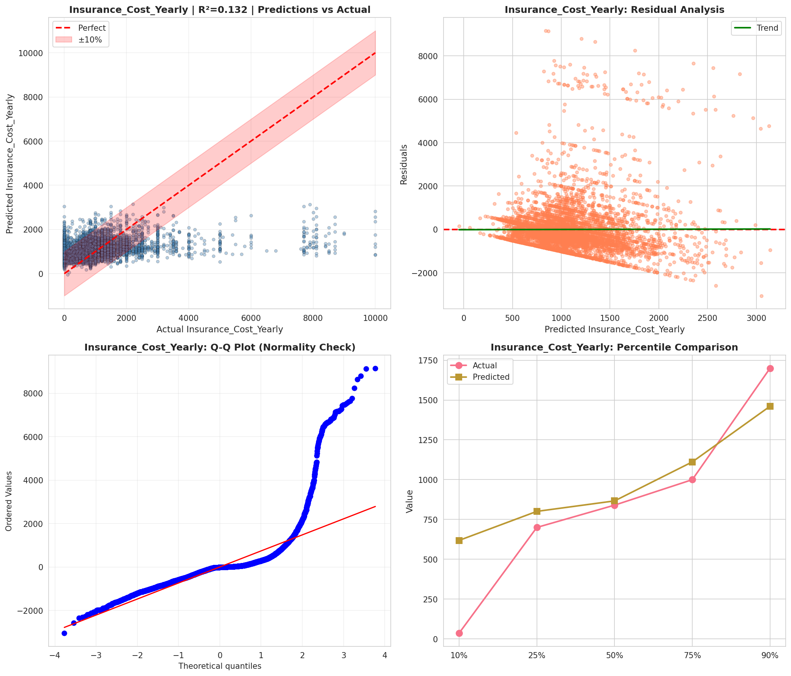
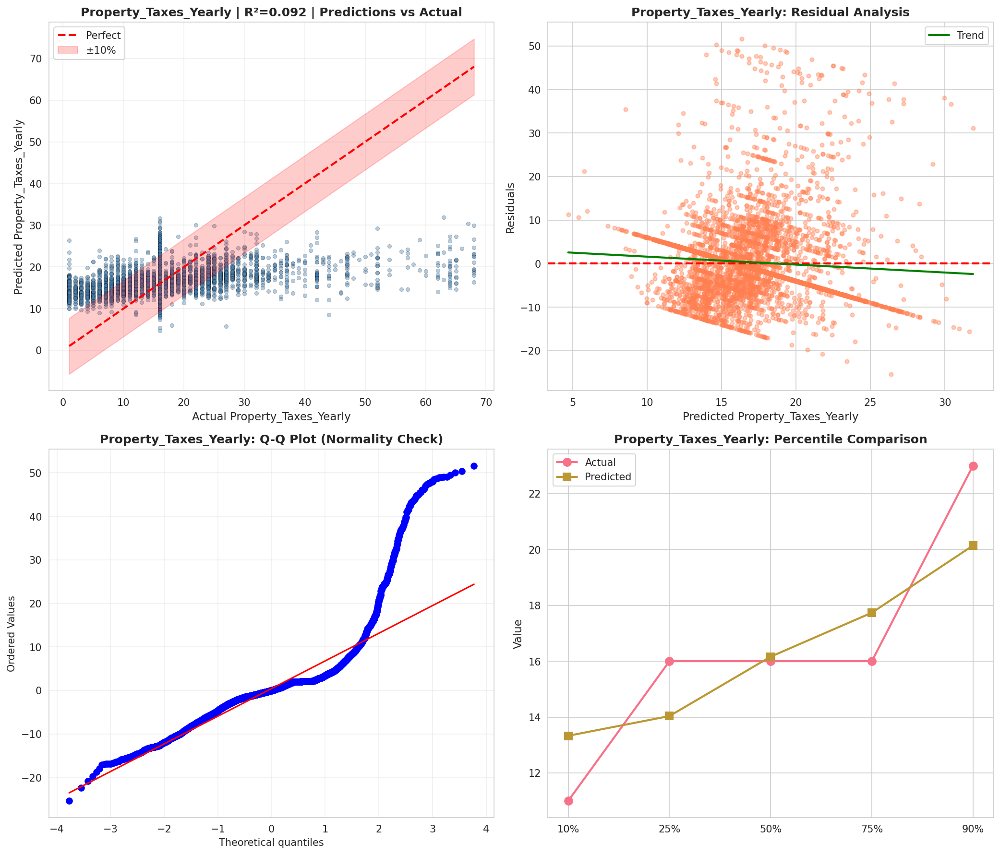
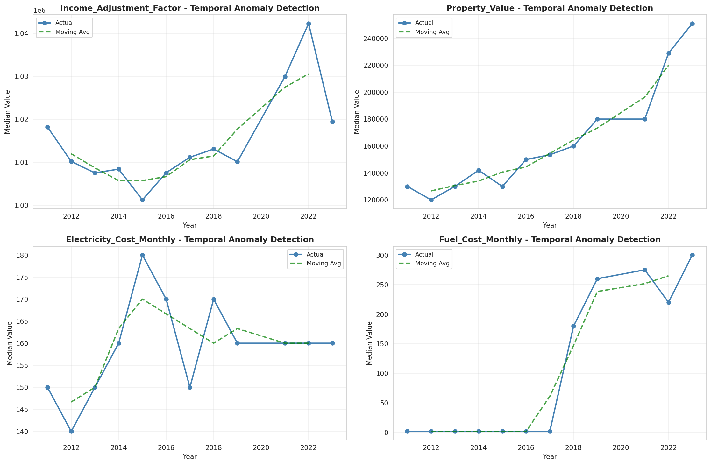
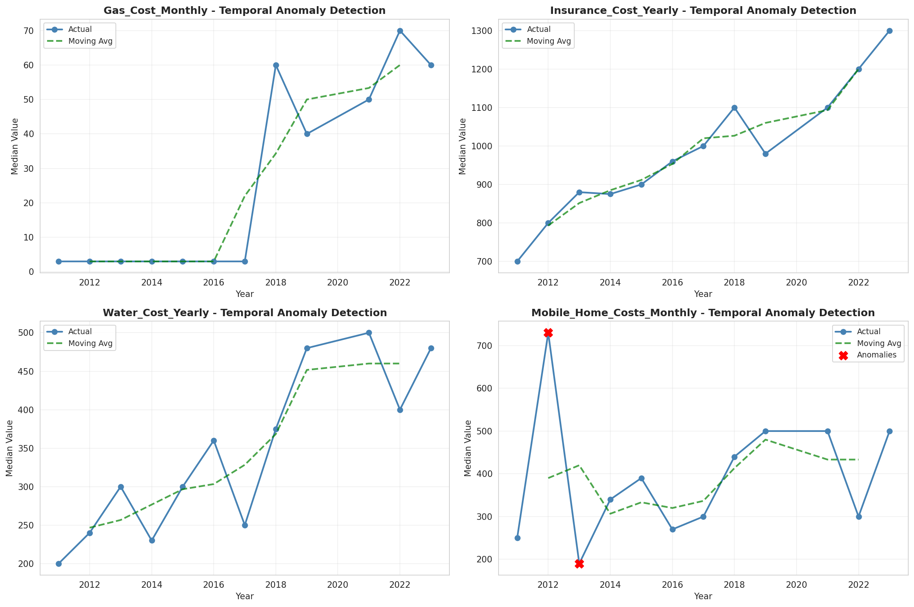
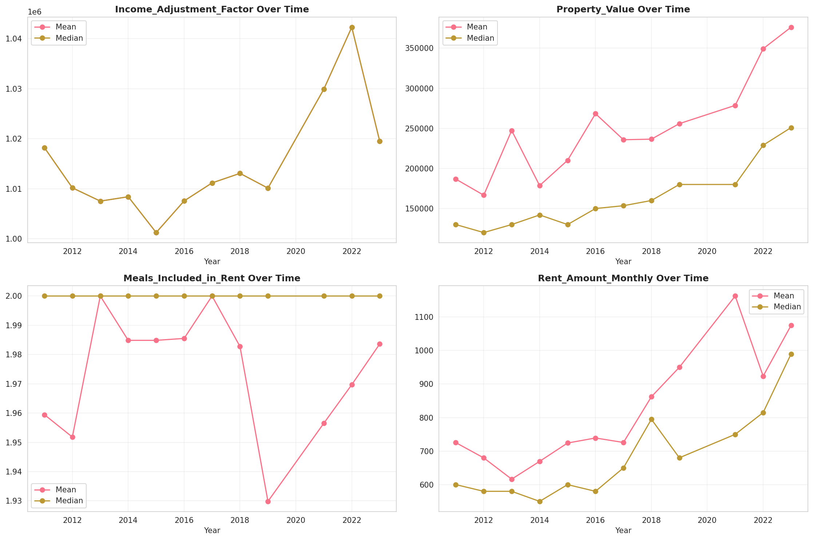
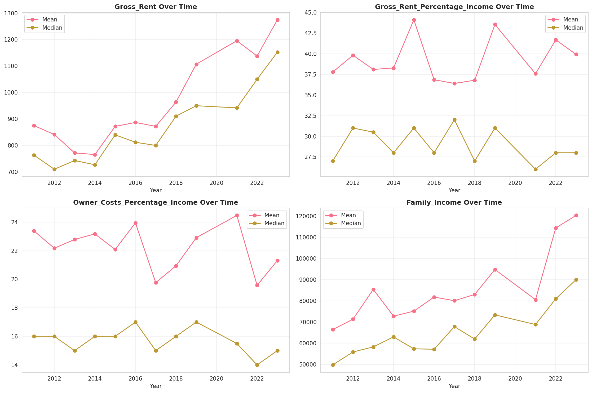
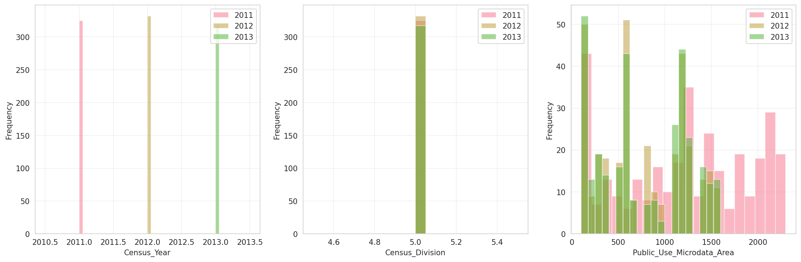
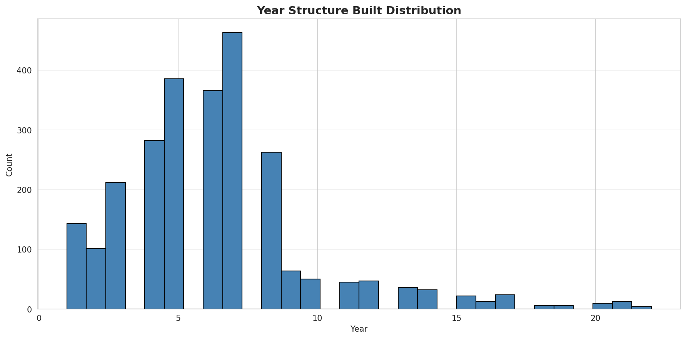
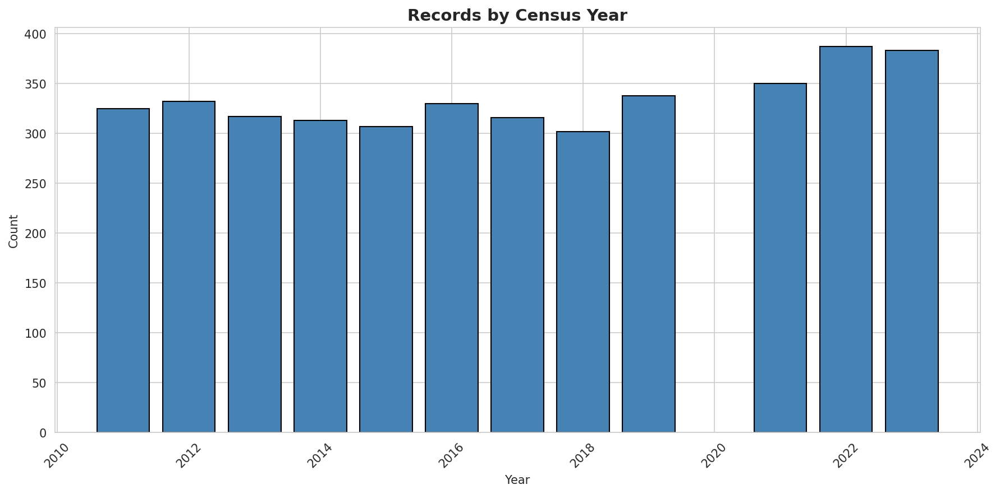
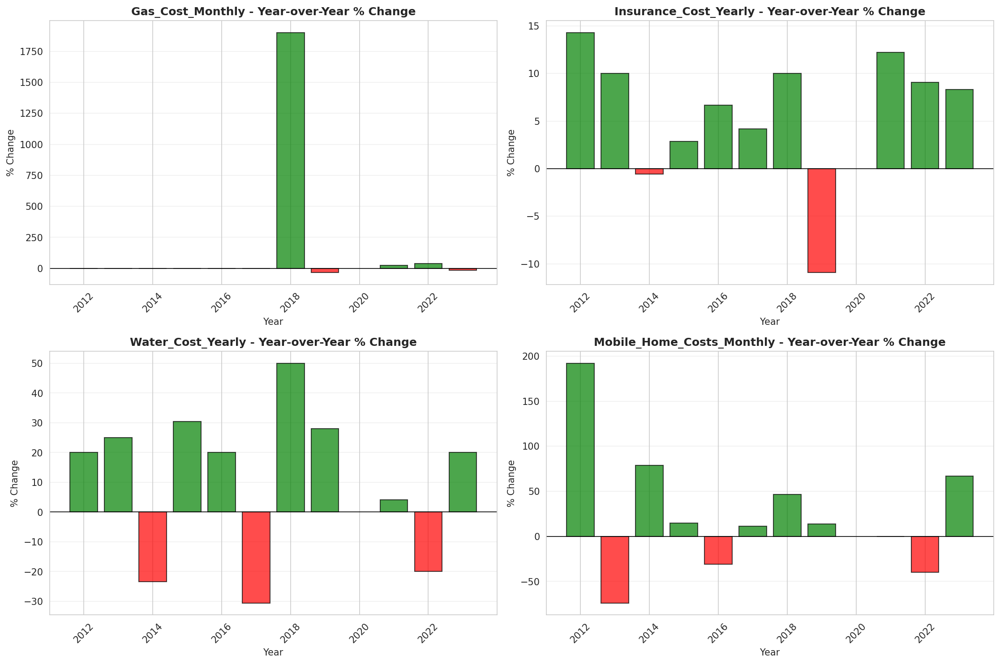

# Temporal Analysis

## Year Distribution

- 2011: 24,312 records

- 2012: 24,236 records

- 2013: 24,001 records

- 2014: 24,338 records

- 2015: 24,741 records

- 2016: 25,055 records

- 2017: 25,523 records

- 2018: 25,926 records

- 2019: 26,121 records

- 2021: 26,664 records

- 2022: 27,671 records

- 2023: 28,126 records

## Temporal Trends

- Census_Year: {np.int64(2011): {'mean': 2011.0, 'median': 2011.0, 'std': 0.0}, np.int64(2012): {'mean': 2012.0, 'median': 2012.0, 'std': 0.0}, np.int64(2013): {'mean': 2013.0, 'median': 2013.0, 'std': 0.0}, np.int64(2014): {'mean': 2014.0, 'median': 2014.0, 'std': 0.0}, np.int64(2015): {'mean': 2015.0, 'median': 2015.0, 'std': 0.0}, np.int64(2016): {'mean': 2016.0, 'median': 2016.0, 'std': 0.0}, np.int64(2017): {'mean': 2017.0, 'median': 2017.0, 'std': 0.0}, np.int64(2018): {'mean': 2018.0, 'median': 2018.0, 'std': 0.0}, np.int64(2019): {'mean': 2019.0, 'median': 2019.0, 'std': 0.0}, np.int64(2021): {'mean': 2021.0, 'median': 2021.0, 'std': 0.0}, np.int64(2022): {'mean': 2022.0, 'median': 2022.0, 'std': 0.0}, np.int64(2023): {'mean': 2023.0, 'median': 2023.0, 'std': 0.0}}

- Census_Division: {np.int64(2011): {'mean': 5.0, 'median': 5.0, 'std': 0.0}, np.int64(2012): {'mean': 5.0, 'median': 5.0, 'std': 0.0}, np.int64(2013): {'mean': 5.0, 'median': 5.0, 'std': 0.0}, np.int64(2014): {'mean': 5.0, 'median': 5.0, 'std': 0.0}, np.int64(2015): {'mean': 5.0, 'median': 5.0, 'std': 0.0}, np.int64(2016): {'mean': 5.0, 'median': 5.0, 'std': 0.0}, np.int64(2017): {'mean': 5.0, 'median': 5.0, 'std': 0.0}, np.int64(2018): {'mean': 5.0, 'median': 5.0, 'std': 0.0}, np.int64(2019): {'mean': 5.0, 'median': 5.0, 'std': 0.0}, np.int64(2021): {'mean': 5.0, 'median': 5.0, 'std': 0.0}, np.int64(2022): {'mean': 5.0, 'median': 5.0, 'std': 0.0}, np.int64(2023): {'mean': 5.0, 'median': 5.0, 'std': 0.0}}

- Public_Use_Microdata_Area: {np.int64(2011): {'mean': 1150.3733135899968, 'median': 1200.0, 'std': 688.7090437342773}, np.int64(2012): {'mean': 767.0029707872586, 'median': 700.0, 'std': 454.26686091749616}, np.int64(2013): {'mean': 762.3559851672846, 'median': 700.0, 'std': 456.5534461439833}, np.int64(2014): {'mean': 765.6496425343084, 'median': 700.0, 'std': 455.7443933939671}, np.int64(2015): {'mean': 763.335435107716, 'median': 700.0, 'std': 454.6753348425098}, np.int64(2016): {'mean': 765.6185591698264, 'median': 700.0, 'std': 455.3820433910853}, np.int64(2017): {'mean': 765.2727343964267, 'median': 700.0, 'std': 457.1667277843182}, np.int64(2018): {'mean': 762.5127671063797, 'median': 700.0, 'std': 456.0997284436469}, np.int64(2019): {'mean': 763.2738026874928, 'median': 700.0, 'std': 457.2172000935417}, np.int64(2021): {'mean': 764.5596309630963, 'median': 700.0, 'std': 458.09535721943064}, np.int64(2022): {'mean': 1403.3024104658307, 'median': 1402.0, 'std': 804.796121172606}, np.int64(2023): {'mean': 1396.7750479982933, 'median': 1402.0, 'std': 803.5816224374695}}

- Census_Region: {np.int64(2011): {'mean': 3.0, 'median': 3.0, 'std': 0.0}, np.int64(2012): {'mean': 3.0, 'median': 3.0, 'std': 0.0}, np.int64(2013): {'mean': 3.0, 'median': 3.0, 'std': 0.0}, np.int64(2014): {'mean': 3.0, 'median': 3.0, 'std': 0.0}, np.int64(2015): {'mean': 3.0, 'median': 3.0, 'std': 0.0}, np.int64(2016): {'mean': 3.0, 'median': 3.0, 'std': 0.0}, np.int64(2017): {'mean': 3.0, 'median': 3.0, 'std': 0.0}, np.int64(2018): {'mean': 3.0, 'median': 3.0, 'std': 0.0}, np.int64(2019): {'mean': 3.0, 'median': 3.0, 'std': 0.0}, np.int64(2021): {'mean': 3.0, 'median': 3.0, 'std': 0.0}, np.int64(2022): {'mean': 3.0, 'median': 3.0, 'std': 0.0}, np.int64(2023): {'mean': 3.0, 'median': 3.0, 'std': 0.0}}

- State_Code: {np.int64(2011): {'mean': 45.0, 'median': 45.0, 'std': 0.0}, np.int64(2012): {'mean': 45.0, 'median': 45.0, 'std': 0.0}, np.int64(2013): {'mean': 45.0, 'median': 45.0, 'std': 0.0}, np.int64(2014): {'mean': 45.0, 'median': 45.0, 'std': 0.0}, np.int64(2015): {'mean': 45.0, 'median': 45.0, 'std': 0.0}, np.int64(2016): {'mean': 45.0, 'median': 45.0, 'std': 0.0}, np.int64(2017): {'mean': 45.0, 'median': 45.0, 'std': 0.0}, np.int64(2018): {'mean': 45.0, 'median': 45.0, 'std': 0.0}, np.int64(2019): {'mean': 45.0, 'median': 45.0, 'std': 0.0}, np.int64(2021): {'mean': 45.0, 'median': 45.0, 'std': 0.0}, np.int64(2022): {'mean': 45.0, 'median': 45.0, 'std': 0.0}, np.int64(2023): {'mean': None, 'median': None, 'std': None}}

- Housing_Adjustment_Factor: {np.int64(2011): {'mean': 1000000.0, 'median': 1000000.0, 'std': 0.0}, np.int64(2012): {'mean': 1000000.0, 'median': 1000000.0, 'std': 0.0}, np.int64(2013): {'mean': 1000000.0, 'median': 1000000.0, 'std': 0.0}, np.int64(2014): {'mean': 1000000.0, 'median': 1000000.0, 'std': 0.0}, np.int64(2015): {'mean': 1000000.0, 'median': 1000000.0, 'std': 0.0}, np.int64(2016): {'mean': 1000000.0, 'median': 1000000.0, 'std': 0.0}, np.int64(2017): {'mean': 1000000.0, 'median': 1000000.0, 'std': 0.0}, np.int64(2018): {'mean': 1000000.0, 'median': 1000000.0, 'std': 0.0}, np.int64(2019): {'mean': 1000000.0, 'median': 1000000.0, 'std': 0.0}, np.int64(2021): {'mean': 1000000.0, 'median': 1000000.0, 'std': 0.0}, np.int64(2022): {'mean': 1000000.0, 'median': 1000000.0, 'std': 0.0}, np.int64(2023): {'mean': 1000000.0, 'median': 1000000.0, 'std': 0.0}}

- Income_Adjustment_Factor: {np.int64(2011): {'mean': 1018237.0, 'median': 1018237.0, 'std': 0.0}, np.int64(2012): {'mean': 1010207.0, 'median': 1010207.0, 'std': 0.0}, np.int64(2013): {'mean': 1007549.0, 'median': 1007549.0, 'std': 0.0}, np.int64(2014): {'mean': 1008425.0, 'median': 1008425.0, 'std': 0.0}, np.int64(2015): {'mean': 1001264.0, 'median': 1001264.0, 'std': 0.0}, np.int64(2016): {'mean': 1007588.0, 'median': 1007588.0, 'std': 0.0}, np.int64(2017): {'mean': 1011189.0, 'median': 1011189.0, 'std': 0.0}, np.int64(2018): {'mean': 1013097.0, 'median': 1013097.0, 'std': 0.0}, np.int64(2019): {'mean': 1010145.0, 'median': 1010145.0, 'std': 0.0}, np.int64(2021): {'mean': 1029928.0, 'median': 1029928.0, 'std': 0.0}, np.int64(2022): {'mean': 1042311.0, 'median': 1042311.0, 'std': 0.0}, np.int64(2023): {'mean': 1019518.0, 'median': 1019518.0, 'std': 0.0}}

- Housing_Unit_Weight: {np.int64(2011): {'mean': 88.72421026653504, 'median': 66.0, 'std': 91.4073390161103}, np.int64(2012): {'mean': 88.99026241954118, 'median': 69.0, 'std': 79.413728020666}, np.int64(2013): {'mean': 89.94558560059997, 'median': 69.0, 'std': 79.51155758095649}, np.int64(2014): {'mean': 89.91116772125893, 'median': 69.0, 'std': 79.16512736674969}, np.int64(2015): {'mean': 89.33147407137949, 'median': 69.0, 'std': 78.42126425913318}, np.int64(2016): {'mean': 89.25412093394532, 'median': 70.0, 'std': 79.07142526505183}, np.int64(2017): {'mean': 89.52004074756103, 'median': 70.0, 'std': 78.0870874937459}, np.int64(2018): {'mean': 89.41954022988506, 'median': 71.0, 'std': 78.27731965184637}, np.int64(2019): {'mean': 90.01814631905364, 'median': 68.0, 'std': 84.42090079787961}, np.int64(2021): {'mean': 89.85737323732373, 'median': 70.0, 'std': 84.15925635038509}, np.int64(2022): {'mean': 88.42036789418525, 'median': 66.0, 'std': 86.70815138004413}, np.int64(2023): {'mean': 88.5418118466899, 'median': 64.0, 'std': 90.45054915708602}}

- Number_of_Persons: {np.int64(2011): {'mean': 1.9482971372161895, 'median': 2.0, 'std': 1.393439228945172}, np.int64(2012): {'mean': 1.9534576662815646, 'median': 2.0, 'std': 1.3814698153543268}, np.int64(2013): {'mean': 1.9667930502895712, 'median': 2.0, 'std': 1.3972970046528022}, np.int64(2014): {'mean': 1.945969266168132, 'median': 2.0, 'std': 1.3805145195850124}, np.int64(2015): {'mean': 1.9410290610727132, 'median': 2.0, 'std': 1.3774509485301154}, np.int64(2016): {'mean': 1.9319497106365995, 'median': 2.0, 'std': 1.3775123532127016}, np.int64(2017): {'mean': 1.9369980018022959, 'median': 2.0, 'std': 1.3859580594135898}, np.int64(2018): {'mean': 1.9215459384401758, 'median': 2.0, 'std': 1.387260183711396}, np.int64(2019): {'mean': 1.948355729106849, 'median': 2.0, 'std': 1.3795061464939575}, np.int64(2021): {'mean': 1.9344434443444345, 'median': 2.0, 'std': 1.3737948439320717}, np.int64(2022): {'mean': 1.9750280076614506, 'median': 2.0, 'std': 1.3678869550658481}, np.int64(2023): {'mean': 1.9980800682642395, 'median': 2.0, 'std': 1.3652694818882916}}

- Housing_Unit_Type: {np.int64(2011): {'mean': 1.1690934517933531, 'median': 1.0, 'std': 0.5032025616515011}, np.int64(2012): {'mean': 1.1676019145073444, 'median': 1.0, 'std': 0.5045369168301254}, np.int64(2013): {'mean': 1.1559935002708221, 'median': 1.0, 'std': 0.4924412120152872}, np.int64(2014): {'mean': 1.156463144054565, 'median': 1.0, 'std': 0.4930460397512438}, np.int64(2015): {'mean': 1.1666464572976032, 'median': 1.0, 'std': 0.5086922959142116}, np.int64(2016): {'mean': 1.168389543005388, 'median': 1.0, 'std': 0.5117196201709742}, np.int64(2017): {'mean': 1.1648317204090428, 'median': 1.0, 'std': 0.5076621963284595}, np.int64(2018): {'mean': 1.1657795263442103, 'median': 1.0, 'std': 0.5081962580282977}, np.int64(2019): {'mean': 1.1554687799088856, 'median': 1.0, 'std': 0.4925027998299614}, np.int64(2021): {'mean': None, 'median': None, 'std': None}, np.int64(2022): {'mean': None, 'median': None, 'std': None}, np.int64(2023): {'mean': None, 'median': None, 'std': None}}

- Number_of_Bedrooms: {np.int64(2011): {'mean': 2.8296323768021883, 'median': 3.0, 'std': 0.9475072579822145}, np.int64(2012): {'mean': 2.843796364985163, 'median': 3.0, 'std': 0.8986976856492203}, np.int64(2013): {'mean': 2.870987168203085, 'median': 3.0, 'std': 0.8968297950275825}, np.int64(2014): {'mean': 2.8775706059775157, 'median': 3.0, 'std': 0.9904486884359863}, np.int64(2015): {'mean': 2.8673363196235466, 'median': 3.0, 'std': 0.9179218632431294}, np.int64(2016): {'mean': 2.87961720776317, 'median': 3.0, 'std': 0.9262392367101548}, np.int64(2017): {'mean': 2.867734593837535, 'median': 3.0, 'std': 0.9329116069018369}, np.int64(2018): {'mean': 2.877755251693051, 'median': 3.0, 'std': 0.9396315014075985}, np.int64(2019): {'mean': 2.918002806957853, 'median': 3.0, 'std': 0.9824053842752632}, np.int64(2021): {'mean': 2.923664440734558, 'median': 3.0, 'std': 0.9842319229079202}, np.int64(2022): {'mean': 2.9645659637076998, 'median': 3.0, 'std': 0.9827106921742641}, np.int64(2023): {'mean': 2.9763090266623835, 'median': 3.0, 'std': 0.951711733297232}}

- Number_of_Rooms: {np.int64(2011): {'mean': 5.928329701914608, 'median': 6.0, 'std': 2.0485665320676865}, np.int64(2012): {'mean': 5.998006305637982, 'median': 6.0, 'std': 2.0836242401372096}, np.int64(2013): {'mean': 6.073794413304303, 'median': 6.0, 'std': 2.1613057920500514}, np.int64(2014): {'mean': 6.077872223745544, 'median': 6.0, 'std': 2.2558700269881657}, np.int64(2015): {'mean': 6.094837337677029, 'median': 6.0, 'std': 2.1752538827247268}, np.int64(2016): {'mean': 6.127448349879259, 'median': 6.0, 'std': 2.2180937143281345}, np.int64(2017): {'mean': 6.09375, 'median': 6.0, 'std': 2.224077780170965}, np.int64(2018): {'mean': 6.1278523055687355, 'median': 6.0, 'std': 2.267038514339353}, np.int64(2019): {'mean': 6.1961468124016505, 'median': 6.0, 'std': 2.2654273465479755}, np.int64(2021): {'mean': 6.226085141903172, 'median': 6.0, 'std': 2.306733427830535}, np.int64(2022): {'mean': 6.301087134216119, 'median': 6.0, 'std': 2.3641483308736633}, np.int64(2023): {'mean': 6.318061355605526, 'median': 6.0, 'std': 2.334835560293951}}

- Building_Type: {np.int64(2011): {'mean': 2.499374159751518, 'median': 2.0, 'std': 1.7566449977659189}, np.int64(2012): {'mean': 2.505378338278932, 'median': 2.0, 'std': 1.768219363583629}, np.int64(2013): {'mean': 2.5096585908185483, 'median': 2.0, 'std': 1.7614726476026528}, np.int64(2014): {'mean': 2.522804131249429, 'median': 2.0, 'std': 1.7705438942803307}, np.int64(2015): {'mean': 2.5352246504683045, 'median': 2.0, 'std': 1.7870047187090092}, np.int64(2016): {'mean': 2.5295590734281372, 'median': 2.0, 'std': 1.8041854832375577}, np.int64(2017): {'mean': 2.565563725490196, 'median': 2.0, 'std': 1.8449291415689655}, np.int64(2018): {'mean': 2.571798300478799, 'median': 2.0, 'std': 1.8462169502487007}, np.int64(2019): {'mean': 2.5574788414919407, 'median': 2.0, 'std': 1.8218851139866143}, np.int64(2021): {'mean': 2.562896494156928, 'median': 2.0, 'std': 1.8406534527372078}, np.int64(2022): {'mean': 2.4881069151544875, 'median': 2.0, 'std': 1.7417754712661253}, np.int64(2023): {'mean': 2.4615322839704463, 'median': 2.0, 'std': 1.7067361119888755}}

- Year_Structure_Built: {np.int64(2011): {'mean': 5.562236335821241, 'median': 6.0, 'std': 2.5478380639566796}, np.int64(2012): {'mean': 5.846021884272997, 'median': 6.0, 'std': 2.6651909605331396}, np.int64(2013): {'mean': 5.923194515217492, 'median': 6.0, 'std': 2.749263156982045}, np.int64(2014): {'mean': 6.008500137098985, 'median': 6.0, 'std': 2.8641085395884565}, np.int64(2015): {'mean': 6.189222207139949, 'median': 6.0, 'std': 3.2055570578480594}, np.int64(2016): {'mean': 6.427332081209194, 'median': 6.0, 'std': 3.5160636476911207}, np.int64(2017): {'mean': 6.652048319327731, 'median': 6.0, 'std': 3.8560668155939006}, np.int64(2018): {'mean': 6.8507095716688955, 'median': 6.0, 'std': 4.242886254008326}, np.int64(2019): {'mean': 7.130225832518182, 'median': 6.0, 'std': 4.63751203605121}, np.int64(2021): {'mean': None, 'median': None, 'std': None}, np.int64(2022): {'mean': None, 'median': None, 'std': None}, np.int64(2023): {'mean': None, 'median': None, 'std': None}}

- Bathtub_or_Shower: {np.int64(2011): {'mean': 1.0108478976403505, 'median': 1.0, 'std': 0.10358918002152363}, np.int64(2012): {'mean': 1.007928412462908, 'median': 1.0, 'std': 0.0886900075649535}, np.int64(2013): {'mean': 1.0081993792560338, 'median': 1.0, 'std': 0.09018051989441948}, np.int64(2014): {'mean': 1.0087743350699205, 'median': 1.0, 'std': 0.09326169416187055}, np.int64(2015): {'mean': 1.0104067689244831, 'median': 1.0, 'std': 0.10148366409953075}, np.int64(2016): {'mean': 1.0080046507468026, 'median': 1.0, 'std': 0.08911190392706911}, np.int64(2017): {'mean': 1.007703081232493, 'median': 1.0, 'std': 0.08743041995936346}, np.int64(2018): {'mean': 1.0063408532114049, 'median': 1.0, 'std': 0.07937832564643452}, np.int64(2019): {'mean': 1.0076553395993706, 'median': 1.0, 'std': 0.08716110643708323}, np.int64(2021): {'mean': 1.007136894824708, 'median': 1.0, 'std': 0.08417989849441151}, np.int64(2022): {'mean': 1.0059669772764428, 'median': 1.0, 'std': 0.07701697788143595}, np.int64(2023): {'mean': 1.0064246707356248, 'median': 1.0, 'std': 0.07989775135696237}}

- Refrigerator: {np.int64(2011): {'mean': 1.0227156830930415, 'median': 1.0, 'std': 0.1489990269333788}, np.int64(2012): {'mean': 1.0205396884272997, 'median': 1.0, 'std': 0.14184055284650965}, np.int64(2013): {'mean': 1.0186686431648677, 'median': 1.0, 'std': 0.13535499115757937}, np.int64(2014): {'mean': 1.0209761447765286, 'median': 1.0, 'std': 0.14330765738322165}, np.int64(2015): {'mean': 1.0211755124202524, 'median': 1.0, 'std': 0.14397238614497215}, np.int64(2016): {'mean': 1.0201234236651462, 'median': 1.0, 'std': 0.14042561486197525}, np.int64(2017): {'mean': 1.0184698879551821, 'median': 1.0, 'std': 0.13464599763483023}, np.int64(2018): {'mean': 1.0202734762541517, 'median': 1.0, 'std': 0.14093728825299612}, np.int64(2019): {'mean': 1.0192659379917492, 'median': 1.0, 'std': 0.137461140862051}, np.int64(2021): {'mean': 1.0151085141903171, 'median': 1.0, 'std': 0.12198716350733811}, np.int64(2022): {'mean': 1.0134461337256826, 'median': 1.0, 'std': 0.11517759064175805}, np.int64(2023): {'mean': 1.0142948923867652, 'median': 1.0, 'std': 0.11870599924066451}}

- Hot_and_Cold_Running_Water: {np.int64(2011): {'mean': 1.0215103611330028, 'median': 1.0, 'std': 0.1450814987555077}, np.int64(2012): {'mean': 1.0186850890207715, 'median': 1.0, 'std': 0.13541346555947054}, np.int64(2013): {'mean': 1.0153333024505489, 'median': 1.0, 'std': 0.12287754770598157}, np.int64(2014): {'mean': 1.0170459738597935, 'median': 1.0, 'std': 0.12944564259359068}, np.int64(2015): {'mean': 1.0211755124202524, 'median': 1.0, 'std': 0.14397238614497174}, np.int64(2016): {'mean': 1.0194973615955638, 'median': 1.0, 'std': 0.1382681070310683}, np.int64(2017): {'mean': 1.0189950980392157, 'median': 1.0, 'std': 0.1365104388007075}, np.int64(2018): {'mean': 1.0190656946900747, 'median': 1.0, 'std': 0.1367589146309694}, np.int64(2019): {'mean': 1.0192234083273084, 'median': 1.0, 'std': 0.13731231111015305}, np.int64(2021): {'mean': 1.0175292153589315, 'median': 1.0, 'std': 0.1312351354505049}, np.int64(2022): {'mean': 1.0150809220205983, 'median': 1.0, 'std': 0.12187737646552223}, np.int64(2023): {'mean': 1.015017667844523, 'median': 1.0, 'std': 0.12162537353371802}}

- Running_Water: {np.int64(2011): {'mean': None, 'median': None, 'std': None}, np.int64(2012): {'mean': None, 'median': None, 'std': None}, np.int64(2013): {'mean': 9.0, 'median': 9.0, 'std': 0.0}, np.int64(2014): {'mean': 9.0, 'median': 9.0, 'std': 0.0}, np.int64(2015): {'mean': 9.0, 'median': 9.0, 'std': 0.0}, np.int64(2016): {'mean': 9.0, 'median': 9.0, 'std': 0.0}, np.int64(2017): {'mean': 9.0, 'median': 9.0, 'std': 0.0}, np.int64(2018): {'mean': 9.0, 'median': 9.0, 'std': 0.0}, np.int64(2019): {'mean': 9.0, 'median': 9.0, 'std': 0.0}, np.int64(2021): {'mean': 9.0, 'median': 9.0, 'std': 0.0}, np.int64(2022): {'mean': 9.0, 'median': 9.0, 'std': 0.0}, np.int64(2023): {'mean': 9.0, 'median': 9.0, 'std': 0.0}}

- Sink_with_Faucet: {np.int64(2011): {'mean': 1.0101988781234064, 'median': 1.0, 'std': 0.10047551449538886}, np.int64(2012): {'mean': 1.0077893175074184, 'median': 1.0, 'std': 0.08791474503897742}, np.int64(2013): {'mean': 1.0075045166072174, 'median': 1.0, 'std': 0.08630494705039549}, np.int64(2014): {'mean': 1.0084087377753406, 'median': 1.0, 'std': 0.09131490550273276}, np.int64(2015): {'mean': 1.0098185602461427, 'median': 1.0, 'std': 0.09860322528904475}, np.int64(2016): {'mean': 1.0077810571505232, 'median': 1.0, 'std': 0.08786841051825993}, np.int64(2017): {'mean': 1.007484243697479, 'median': 1.0, 'std': 0.08618906498556143}, np.int64(2018): {'mean': 1.0065565284907043, 'median': 1.0, 'std': 0.08070824864228476}, np.int64(2019): {'mean': 1.0071449836260793, 'median': 1.0, 'std': 0.08422727913495191}, np.int64(2021): {'mean': 1.006677796327212, 'median': 1.0, 'std': 0.08144617989728464}, np.int64(2022): {'mean': 1.0057626287395782, 'median': 1.0, 'std': 0.07569448473245519}, np.int64(2023): {'mean': 1.0059026662383552, 'median': 1.0, 'std': 0.07660326622839449}}

- Stove_or_Range: {np.int64(2011): {'mean': 1.0223911733345696, 'median': 1.0, 'std': 0.14795547816090188}, np.int64(2012): {'mean': 1.020864243323442, 'median': 1.0, 'std': 0.14293310989684244}, np.int64(2013): {'mean': 1.0183906981053412, 'median': 1.0, 'std': 0.1343626310905196}, np.int64(2014): {'mean': 1.0215702403802212, 'median': 1.0, 'std': 0.1452787997059712}, np.int64(2015): {'mean': 1.0219899552056468, 'median': 1.0, 'std': 0.14665391306010095}, np.int64(2016): {'mean': 1.0197209551918434, 'median': 1.0, 'std': 0.1390428123307917}, np.int64(2017): {'mean': 1.0179009103641457, 'median': 1.0, 'std': 0.13259425801747746}, np.int64(2018): {'mean': 1.0221282836561274, 'median': 1.0, 'std': 0.1471038957404745}, np.int64(2019): {'mean': 1.0208395355760642, 'median': 1.0, 'std': 0.1428499814433141}, np.int64(2021): {'mean': 1.0164440734557596, 'median': 1.0, 'std': 0.12717838243942092}, np.int64(2022): {'mean': 1.0147130946542422, 'median': 1.0, 'std': 0.12040436867800784}, np.int64(2023): {'mean': 1.0156199807259878, 'median': 1.0, 'std': 0.12400247724797475}}

- Telephone_Service: {np.int64(2011): {'mean': 1.0302080066896624, 'median': 1.0, 'std': 0.17116370576433754}, np.int64(2012): {'mean': 1.0286491007946466, 'median': 1.0, 'std': 0.1668226146007331}, np.int64(2013): {'mean': 1.0244780793319415, 'median': 1.0, 'std': 0.15453203330866164}, np.int64(2014): {'mean': 1.0260990425203336, 'median': 1.0, 'std': 0.1594339707018393}, np.int64(2015): {'mean': 1.0285365481458875, 'median': 1.0, 'std': 0.16650412544840998}, np.int64(2016): {'mean': 1.5669251686977541, 'median': 1.0, 'std': 1.8630878025698705}, np.int64(2017): {'mean': 1.0177350639056773, 'median': 1.0, 'std': 0.1319901301513029}, np.int64(2018): {'mean': 1.0149757744824548, 'median': 1.0, 'std': 0.12145872813991165}, np.int64(2019): {'mean': 1.009421841541756, 'median': 1.0, 'std': 0.0966101163416818}, np.int64(2021): {'mean': 1.008583087097228, 'median': 1.0, 'std': 0.09224866850811471}, np.int64(2022): {'mean': 1.008859456798962, 'median': 1.0, 'std': 0.0937089096285488}, np.int64(2023): {'mean': 1.007601240662269, 'median': 1.0, 'std': 0.08685500190193497}}

- Lot_Acreage: {np.int64(2011): {'mean': 1.3652145608419681, 'median': 1.0, 'std': 0.5583068817783761}, np.int64(2012): {'mean': 1.3632916192643154, 'median': 1.0, 'std': 0.5544257654716921}, np.int64(2013): {'mean': 1.3572162995833108, 'median': 1.0, 'std': 0.5495777244445783}, np.int64(2014): {'mean': 1.357502679528403, 'median': 1.0, 'std': 0.5535816381446336}, np.int64(2015): {'mean': 1.3558666030433169, 'median': 1.0, 'std': 0.5540472586458702}, np.int64(2016): {'mean': 1.3481531790397576, 'median': 1.0, 'std': 0.5484807179437244}, np.int64(2017): {'mean': 1.33477789815818, 'median': 1.0, 'std': 0.5425181875691704}, np.int64(2018): {'mean': 1.332724690606614, 'median': 1.0, 'std': 0.541239971315276}, np.int64(2019): {'mean': 1.3351733054851063, 'median': 1.0, 'std': 0.542730129701326}, np.int64(2021): {'mean': 1.3368128383981268, 'median': 1.0, 'std': 0.5426811196300945}, np.int64(2022): {'mean': 1.3575382306032462, 'median': 1.0, 'std': 0.5559574534760949}, np.int64(2023): {'mean': 1.3618568488451863, 'median': 1.0, 'std': 0.5544364452843403}}

- Agricultural_Sales: {np.int64(2011): {'mean': 1.1075307103435998, 'median': 1.0, 'std': 0.6052140863110441}, np.int64(2012): {'mean': 1.1024, 'median': 1.0, 'std': 0.597978101094293}, np.int64(2013): {'mean': 1.0977280923187882, 'median': 1.0, 'std': 0.5852147916644846}, np.int64(2014): {'mean': 1.1136567030606765, 'median': 1.0, 'std': 0.6423456602865939}, np.int64(2015): {'mean': 1.0948524118070555, 'median': 1.0, 'std': 0.5923321584673403}, np.int64(2016): {'mean': 1.1003061408247794, 'median': 1.0, 'std': 0.5836277100647633}, np.int64(2017): {'mean': 1.107373868046572, 'median': 1.0, 'std': 0.6129555957938237}, np.int64(2018): {'mean': 1.1011359472334188, 'median': 1.0, 'std': 0.5913326942988507}, np.int64(2019): {'mean': 1.1007641727385817, 'median': 1.0, 'std': 0.6074350791731588}, np.int64(2021): {'mean': 1.1108989934050677, 'median': 1.0, 'std': 0.6269057794534424}, np.int64(2022): {'mean': 1.1217677480018806, 'median': 1.0, 'std': 0.6561006760762667}, np.int64(2023): {'mean': 1.1221624850657108, 'median': 1.0, 'std': 0.6443957387683668}}

- Tenure: {np.int64(2011): {'mean': 1.889202466813003, 'median': 2.0, 'std': 0.8854624545452062}, np.int64(2012): {'mean': 1.8743203680468423, 'median': 2.0, 'std': 0.8725394839685183}, np.int64(2013): {'mean': 1.875052192066806, 'median': 2.0, 'std': 0.870282761259546}, np.int64(2014): {'mean': 1.89256666323484, 'median': 2.0, 'std': 0.8630491761013201}, np.int64(2015): {'mean': 1.8832087084795768, 'median': 2.0, 'std': 0.8686162620726513}, np.int64(2016): {'mean': 1.875415449692819, 'median': 2.0, 'std': 0.8580519219707531}, np.int64(2017): {'mean': 1.884771623897751, 'median': 2.0, 'std': 0.8589380219191866}, np.int64(2018): {'mean': 1.8653159105368766, 'median': 2.0, 'std': 0.85502995437339}, np.int64(2019): {'mean': 1.8544848917439924, 'median': 2.0, 'std': 0.8479933597173579}, np.int64(2021): {'mean': 1.8460672576333192, 'median': 2.0, 'std': 0.8346054538410717}, np.int64(2022): {'mean': 1.823884737572151, 'median': 2.0, 'std': 0.826089550344884}, np.int64(2023): {'mean': 1.8111921715958237, 'median': 2.0, 'std': 0.8140845288836022}}

- Vacancy_Status: {np.int64(2011): {'mean': 4.682396389002872, 'median': 5.0, 'std': 2.1572209290510154}, np.int64(2012): {'mean': 4.574180327868852, 'median': 5.0, 'std': 2.2205729862611423}, np.int64(2013): {'mean': 4.7214668314791925, 'median': 5.0, 'std': 2.117110403952199}, np.int64(2014): {'mean': 4.719462540716612, 'median': 5.0, 'std': 2.113260402250624}, np.int64(2015): {'mean': 4.7936117936117935, 'median': 5.0, 'std': 2.084843211933474}, np.int64(2016): {'mean': 4.979632587859425, 'median': 5.0, 'std': 2.0532232304431774}, np.int64(2017): {'mean': 4.9481592787377915, 'median': 5.0, 'std': 2.0542113533613766}, np.int64(2018): {'mean': 4.922909090909091, 'median': 5.0, 'std': 2.0977960274748635}, np.int64(2019): {'mean': 4.972778222578063, 'median': 5.0, 'std': 2.0640668627907863}, np.int64(2021): {'mean': 4.949223190602501, 'median': 5.0, 'std': 2.08274581726276}, np.int64(2022): {'mean': 5.023596035865975, 'median': 5.0, 'std': 2.0878736396917095}, np.int64(2023): {'mean': 5.0670640834575265, 'median': 5.0, 'std': 2.129965412492914}}

- Property_Value: {np.int64(2011): {'mean': 178964.68970380817, 'median': 125000.0, 'std': 229648.2255825928}, np.int64(2012): {'mean': 184449.16759932847, 'median': 125000.0, 'std': 239388.19734698208}, np.int64(2013): {'mean': 189623.89016496137, 'median': 130000.0, 'std': 263450.6790700215}, np.int64(2014): {'mean': 192722.83303361462, 'median': 130000.0, 'std': 266723.165784158}, np.int64(2015): {'mean': 202795.40151463464, 'median': 140000.0, 'std': 252229.22744778657}, np.int64(2016): {'mean': 218691.5044960408, 'median': 150000.0, 'std': 316309.1167917509}, np.int64(2017): {'mean': 225495.4799255517, 'median': 150000.0, 'std': 294057.80821080477}, np.int64(2018): {'mean': 233835.45354340918, 'median': 165000.0, 'std': 295659.60852729273}, np.int64(2019): {'mean': 248510.2746123669, 'median': 175000.0, 'std': 336085.2706840914}, np.int64(2021): {'mean': 282035.4952115408, 'median': 200000.0, 'std': 380261.53760552494}, np.int64(2022): {'mean': 328609.9892161871, 'median': 237000.0, 'std': 452560.2954832647}, np.int64(2023): {'mean': 362870.22339316097, 'median': 250000.0, 'std': 540722.842576626}}

- Vehicles_Available: {np.int64(2011): {'mean': 1.7946587226925892, 'median': 2.0, 'std': 1.05119599528925}, np.int64(2012): {'mean': 1.8163425345043915, 'median': 2.0, 'std': 1.0367284317274112}, np.int64(2013): {'mean': 1.845250521920668, 'median': 2.0, 'std': 1.040145367326698}, np.int64(2014): {'mean': 1.8443323381035726, 'median': 2.0, 'std': 1.0567734821414154}, np.int64(2015): {'mean': 1.8660155653898978, 'median': 2.0, 'std': 1.0520845645582064}, np.int64(2016): {'mean': 1.8949541746399436, 'median': 2.0, 'std': 1.0694490768192308}, np.int64(2017): {'mean': 1.8891806202318437, 'median': 2.0, 'std': 1.054452490333256}, np.int64(2018): {'mean': 1.9092644251945383, 'median': 2.0, 'std': 1.0721745901747077}, np.int64(2019): {'mean': 1.9317154413514157, 'median': 2.0, 'std': 1.0666164631524961}, np.int64(2021): {'mean': 1.9227991182402326, 'median': 2.0, 'std': 1.0701678637027179}, np.int64(2022): {'mean': 1.9459483645800706, 'median': 2.0, 'std': 1.0723076228894801}, np.int64(2023): {'mean': 1.9636538377528285, 'median': 2.0, 'std': 1.098268226398768}}

- Condo_Fee_Monthly: {np.int64(2011): {'mean': 263.34508816120905, 'median': 200.0, 'std': 228.94151321249063}, np.int64(2012): {'mean': 254.05639913232105, 'median': 200.0, 'std': 200.74272163763203}, np.int64(2013): {'mean': 288.4449877750611, 'median': 240.0, 'std': 228.5177461907077}, np.int64(2014): {'mean': 281.37735849056605, 'median': 230.0, 'std': 199.48854000893675}, np.int64(2015): {'mean': 315.2027649769585, 'median': 250.0, 'std': 220.59139573484015}, np.int64(2016): {'mean': 300.12738853503186, 'median': 240.0, 'std': 216.47953250354405}, np.int64(2017): {'mean': 315.32217573221754, 'median': 250.0, 'std': 240.04802273273947}, np.int64(2018): {'mean': 310.91603053435114, 'median': 250.0, 'std': 226.21230787031539}, np.int64(2019): {'mean': 321.2158154859967, 'median': 260.0, 'std': 240.15779578887407}, np.int64(2021): {'mean': 374.06988352745424, 'median': 290.0, 'std': 334.6704076771948}, np.int64(2022): {'mean': 372.66129032258067, 'median': 300.0, 'std': 345.9526167536821}, np.int64(2023): {'mean': 414.3811188811189, 'median': 340.0, 'std': 337.99673807502745}}

- Electricity_Cost_Monthly: {np.int64(2011): {'mean': 173.2319954008571, 'median': 150.0, 'std': 100.12260115597722}, np.int64(2012): {'mean': 164.33866583019656, 'median': 150.0, 'std': 92.25060774151825}, np.int64(2013): {'mean': 167.3150835073069, 'median': 150.0, 'std': 93.318601793112}, np.int64(2014): {'mean': 179.55652218676002, 'median': 160.0, 'std': 100.68849689708597}, np.int64(2015): {'mean': 183.65608627091916, 'median': 170.0, 'std': 104.83703999393117}, np.int64(2016): {'mean': 180.98816597844697, 'median': 160.0, 'std': 101.3902176793892}, np.int64(2017): {'mean': 173.5699990092143, 'median': 160.0, 'std': 96.31302631764919}, np.int64(2018): {'mean': 188.26027259971937, 'median': 170.0, 'std': 102.55513594159419}, np.int64(2019): {'mean': 179.2679153490635, 'median': 160.0, 'std': 94.92210938327237}, np.int64(2021): {'mean': 177.33831919075698, 'median': 150.0, 'std': 101.2075768228872}, np.int64(2022): {'mean': 196.4839255499154, 'median': 160.0, 'std': 206.23029097129552}, np.int64(2023): {'mean': 203.19546084081668, 'median': 170.0, 'std': 213.98460321429397}}

- Fuel_Cost_Monthly: {np.int64(2011): {'mean': 71.53647956517194, 'median': 2.0, 'std': 324.9099464779408}, np.int64(2012): {'mean': 59.03382475951485, 'median': 2.0, 'std': 298.70053196482246}, np.int64(2013): {'mean': 40.16508350730689, 'median': 2.0, 'std': 236.70238627679709}, np.int64(2014): {'mean': 39.76026974158344, 'median': 2.0, 'std': 235.04192507271623}, np.int64(2015): {'mean': 39.61320514776947, 'median': 2.0, 'std': 246.5612593545567}, np.int64(2016): {'mean': 34.55786081176352, 'median': 2.0, 'std': 223.31132264321906}, np.int64(2017): {'mean': 26.905528584167243, 'median': 2.0, 'std': 187.4664865226205}, np.int64(2018): {'mean': 574.3254545454546, 'median': 300.0, 'std': 754.3442346059476}, np.int64(2019): {'mean': 567.3523206751055, 'median': 300.0, 'std': 742.3113353649481}, np.int64(2021): {'mean': 562.6211764705882, 'median': 300.0, 'std': 703.6071556405458}, np.int64(2022): {'mean': 560.7135362014691, 'median': 300.0, 'std': 765.3980913423052}, np.int64(2023): {'mean': 551.9583789704271, 'median': 300.0, 'std': 715.0608874964386}}

- Gas_Cost_Monthly: {np.int64(2011): {'mean': 35.99477370126476, 'median': 3.0, 'std': 73.44595310043742}, np.int64(2012): {'mean': 30.308082392304474, 'median': 3.0, 'std': 63.31044748317456}, np.int64(2013): {'mean': 29.77760960334029, 'median': 3.0, 'std': 60.79782015644432}, np.int64(2014): {'mean': 33.41197364357047, 'median': 3.0, 'std': 69.6611944085904}, np.int64(2015): {'mean': 30.69678010071723, 'median': 3.0, 'std': 66.38331650232143}, np.int64(2016): {'mean': 27.17484137375365, 'median': 3.0, 'std': 59.61689097409267}, np.int64(2017): {'mean': 25.55766372733578, 'median': 3.0, 'std': 54.23659916146577}, np.int64(2018): {'mean': 82.72237670130251, 'median': 50.0, 'std': 87.21244683189839}, np.int64(2019): {'mean': 78.26612221909322, 'median': 50.0, 'std': 85.9376024516599}, np.int64(2021): {'mean': 80.20787657328461, 'median': 50.0, 'std': 92.81396525813746}, np.int64(2022): {'mean': 104.49448345035105, 'median': 50.0, 'std': 174.85056181330688}, np.int64(2023): {'mean': 101.83697621060259, 'median': 60.0, 'std': 160.34197448688596}}

- House_Heating_Fuel: {np.int64(2011): {'mean': 2.5059057175708164, 'median': 3.0, 'std': 1.0787919246156894}, np.int64(2012): {'mean': 2.5384776244249267, 'median': 3.0, 'std': 1.0673380741660057}, np.int64(2013): {'mean': 2.553444676409186, 'median': 3.0, 'std': 1.101443488001387}, np.int64(2014): {'mean': 2.5518377432307218, 'median': 3.0, 'std': 1.079451202206119}, np.int64(2015): {'mean': 2.55455516557302, 'median': 3.0, 'std': 1.071135540092816}, np.int64(2016): {'mean': 2.5598751133044617, 'median': 3.0, 'std': 1.0733136729464876}, np.int64(2017): {'mean': 2.5624690379470922, 'median': 3.0, 'std': 1.0924499727380108}, np.int64(2018): {'mean': 2.542113248176969, 'median': 3.0, 'std': 1.0537161452954467}, np.int64(2019): {'mean': 2.5439448013323815, 'median': 3.0, 'std': 1.090096776442601}, np.int64(2021): {'mean': 2.5445804605787723, 'median': 3.0, 'std': 1.0917968964279487}, np.int64(2022): {'mean': 2.553358092084657, 'median': 3.0, 'std': 1.1223604851701758}, np.int64(2023): {'mean': 2.5467214188982568, 'median': 3.0, 'std': 1.12536157856165}}

- Insurance_Cost_Yearly: {np.int64(2011): {'mean': 993.6104247757658, 'median': 710.0, 'std': 1048.528620957991}, np.int64(2012): {'mean': 1066.5247231848534, 'median': 780.0, 'std': 1126.6333771021275}, np.int64(2013): {'mean': 1106.331914893617, 'median': 800.0, 'std': 1107.5998056199828}, np.int64(2014): {'mean': 1161.477096665544, 'median': 880.0, 'std': 1186.7106622671558}, np.int64(2015): {'mean': 1192.6310719242388, 'median': 900.0, 'std': 1124.9254492249759}, np.int64(2016): {'mean': 1241.1927759413045, 'median': 950.0, 'std': 1221.0842094280345}, np.int64(2017): {'mean': 1279.204722512248, 'median': 1000.0, 'std': 1218.614615906683}, np.int64(2018): {'mean': 1287.5667034178612, 'median': 1000.0, 'std': 1174.6381921982843}, np.int64(2019): {'mean': 1307.5287167215076, 'median': 1000.0, 'std': 1183.4163460073403}, np.int64(2021): {'mean': 1363.8950648597724, 'median': 1100.0, 'std': 1252.6337211307796}, np.int64(2022): {'mean': 1423.2701730573465, 'median': 1200.0, 'std': 1252.3054647417005}, np.int64(2023): {'mean': 1655.8789592033409, 'median': 1200.0, 'std': 1560.9110720051403}}

- Water_Cost_Yearly: {np.int64(2011): {'mean': 354.6502038256507, 'median': 280.0, 'std': 405.42212488642093}, np.int64(2012): {'mean': 358.8021748222501, 'median': 260.0, 'std': 413.5864813579629}, np.int64(2013): {'mean': 358.767745302714, 'median': 260.0, 'std': 424.49720180384816}, np.int64(2014): {'mean': 364.7554823432513, 'median': 280.0, 'std': 417.5474179125815}, np.int64(2015): {'mean': 375.65211862251385, 'median': 280.0, 'std': 433.30723115279073}, np.int64(2016): {'mean': 375.7294289455131, 'median': 270.0, 'std': 438.7192994622988}, np.int64(2017): {'mean': 387.7092043990885, 'median': 280.0, 'std': 458.6504956799987}, np.int64(2018): {'mean': 502.10066156440524, 'median': 420.0, 'std': 447.8582963699287}, np.int64(2019): {'mean': 520.6177630343619, 'median': 430.0, 'std': 482.3956919094402}, np.int64(2021): {'mean': 524.1151692232773, 'median': 420.0, 'std': 514.486318376321}, np.int64(2022): {'mean': 537.9991947080816, 'median': 420.0, 'std': 550.4778781976584}, np.int64(2023): {'mean': 554.3937237321378, 'median': 440.0, 'std': 562.5347367638407}}

- Mobile_Home_Costs_Monthly: {np.int64(2011): {'mean': 676.8014652014652, 'median': 300.0, 'std': 1068.3364816952658}, np.int64(2012): {'mean': 719.6141342756184, 'median': 300.0, 'std': 1205.2896690097273}, np.int64(2013): {'mean': 782.9754098360655, 'median': 300.0, 'std': 1395.6487167173866}, np.int64(2014): {'mean': 769.4414414414415, 'median': 300.0, 'std': 1314.3180112948348}, np.int64(2015): {'mean': 822.5278969957081, 'median': 300.0, 'std': 1422.2214323827086}, np.int64(2016): {'mean': 778.8173794976238, 'median': 300.0, 'std': 1329.7407478290181}, np.int64(2017): {'mean': 800.4042553191489, 'median': 310.0, 'std': 1368.3057728919741}, np.int64(2018): {'mean': 798.6220419202164, 'median': 300.0, 'std': 1366.1332935423682}, np.int64(2019): {'mean': 901.7061994609164, 'median': 360.0, 'std': 1494.5205037101664}, np.int64(2021): {'mean': 1654.8211488250652, 'median': 350.0, 'std': 5131.425409905433}, np.int64(2022): {'mean': 1372.5882352941176, 'median': 390.0, 'std': 3485.690929316207}, np.int64(2023): {'mean': 1168.7019400352733, 'median': 370.0, 'std': 2898.5071108583174}}

- First_Mortgage_Includes_Insurance: {np.int64(2011): {'mean': 1.4367672736343229, 'median': 1.0, 'std': 0.49601643855172156}, np.int64(2012): {'mean': 1.413805923906308, 'median': 1.0, 'std': 0.4925450710442856}, np.int64(2013): {'mean': 1.4092326887086712, 'median': 1.0, 'std': 0.49172295306396513}, np.int64(2014): {'mean': 1.3907386146192116, 'median': 1.0, 'std': 0.4879470488254161}, np.int64(2015): {'mean': 1.368972746331237, 'median': 1.0, 'std': 0.4825562921651284}, np.int64(2016): {'mean': 1.3707741303282706, 'median': 1.0, 'std': 0.48304166990962927}, np.int64(2017): {'mean': 1.3513217200633452, 'median': 1.0, 'std': 0.4774123312528956}, np.int64(2018): {'mean': 1.3409785932721712, 'median': 1.0, 'std': 0.4740660563897811}, np.int64(2019): {'mean': 1.3296051129879023, 'median': 1.0, 'std': 0.47009659005626614}, np.int64(2021): {'mean': 1.2936750529038326, 'median': 1.0, 'std': 0.4554716296219799}, np.int64(2022): {'mean': 1.300595894945928, 'median': 1.0, 'std': 0.4585424793889681}, np.int64(2023): {'mean': 1.3003965277033545, 'median': 1.0, 'std': 0.45845499110487425}}

- First_Mortgage_Payment_Monthly: {np.int64(2011): {'mean': 912.8421052631579, 'median': 750.0, 'std': 661.5353366485294}, np.int64(2012): {'mean': 935.5684719296071, 'median': 790.0, 'std': 634.8116149632278}, np.int64(2013): {'mean': 947.6521522145977, 'median': 800.0, 'std': 674.2485271703318}, np.int64(2014): {'mean': 940.407960199005, 'median': 800.0, 'std': 642.1289056173648}, np.int64(2015): {'mean': 951.3143420890369, 'median': 800.0, 'std': 646.0561852058793}, np.int64(2016): {'mean': 973.8032827045566, 'median': 800.0, 'std': 656.9908765665696}, np.int64(2017): {'mean': 1008.6161530028018, 'median': 840.0, 'std': 693.7659854943256}, np.int64(2018): {'mean': 1031.9011997177136, 'median': 860.0, 'std': 699.0594892499369}, np.int64(2019): {'mean': 1077.3462679753482, 'median': 900.0, 'std': 733.1483977724898}, np.int64(2021): {'mean': 405.82220367278796, 'median': 4.0, 'std': 702.4423629615543}, np.int64(2022): {'mean': 544.077233947014, 'median': 4.0, 'std': 802.311823091866}, np.int64(2023): {'mean': 1290.9302325581396, 'median': 1100.0, 'std': 874.6811445114872}}

- First_Mortgage_Includes_Taxes: {np.int64(2011): {'mean': 1.4070840608630582, 'median': 1.0, 'std': 0.49132141730823525}, np.int64(2012): {'mean': 1.3788573553104473, 'median': 1.0, 'std': 0.4851325873101069}, np.int64(2013): {'mean': 1.370430442919526, 'median': 1.0, 'std': 0.48295013243424967}, np.int64(2014): {'mean': 1.3472381681336905, 'median': 1.0, 'std': 0.4761226116284695}, np.int64(2015): {'mean': 1.3232211123443087, 'median': 1.0, 'std': 0.46773518609359666}, np.int64(2016): {'mean': 1.315531602155806, 'median': 1.0, 'std': 0.46475570739304484}, np.int64(2017): {'mean': 1.3077110488488244, 'median': 1.0, 'std': 0.4615743846861782}, np.int64(2018): {'mean': 1.2798165137614679, 'median': 1.0, 'std': 0.4489353380432061}, np.int64(2019): {'mean': 1.269459027619265, 'median': 1.0, 'std': 0.44370410077906464}, np.int64(2021): {'mean': 1.23230660710087, 'median': 1.0, 'std': 0.422328327571213}, np.int64(2022): {'mean': 1.2370337673802692, 'median': 1.0, 'std': 0.4252866322030891}, np.int64(2023): {'mean': 1.2333083270817704, 'median': 1.0, 'std': 0.4229594823158833}}

- First_Mortgage_Status: {np.int64(2011): {'mean': 1.8553540587219344, 'median': 1.0, 'std': 0.9847802449484169}, np.int64(2012): {'mean': 1.8590675791274593, 'median': 1.0, 'std': 0.9852543905059197}, np.int64(2013): {'mean': 1.873495681721648, 'median': 1.0, 'std': 0.9878173591795144}, np.int64(2014): {'mean': 1.9072056239015818, 'median': 1.0, 'std': 0.9910138790172494}, np.int64(2015): {'mean': 1.8867336335296154, 'median': 1.0, 'std': 0.988425796053395}, np.int64(2016): {'mean': 1.8984019041142468, 'median': 1.0, 'std': 0.9904403115080378}, np.int64(2017): {'mean': 1.9026083440048527, 'median': 1.0, 'std': 0.9906637866994216}, np.int64(2018): {'mean': 1.8916573532312142, 'median': 1.0, 'std': 0.9893400040088431}, np.int64(2019): {'mean': 1.903632694248234, 'median': 1.0, 'std': 0.9909317868395955}, np.int64(2021): {'mean': 1.9662542871141597, 'median': 1.0, 'std': 0.9953775110735837}, np.int64(2022): {'mean': 1.9706067364327786, 'median': 1.0, 'std': 0.9960717727495365}, np.int64(2023): {'mean': 1.9756205428713582, 'median': 1.0, 'std': 0.9960739122065249}}

- Second_Mortgage_Payment_Monthly: {np.int64(2011): {'mean': 373.26273990734614, 'median': 280.0, 'std': 349.54674027554046}, np.int64(2012): {'mean': 348.2765809589993, 'median': 250.0, 'std': 305.34383583299774}, np.int64(2013): {'mean': 353.510560815732, 'median': 260.0, 'std': 338.5340536256137}, np.int64(2014): {'mean': 347.81138487680545, 'median': 250.0, 'std': 339.4956469913226}, np.int64(2015): {'mean': 349.5248419150858, 'median': 250.0, 'std': 328.29862534316646}, np.int64(2016): {'mean': 368.12487992315084, 'median': 280.0, 'std': 339.82808403323855}, np.int64(2017): {'mean': 368.79014778325126, 'median': 250.0, 'std': 401.5736823897266}, np.int64(2018): {'mean': 398.1554192229039, 'median': 260.0, 'std': 422.33660165018495}, np.int64(2019): {'mean': 399.97626752966556, 'median': 300.0, 'std': 390.73521478805895}, np.int64(2021): {'mean': 427.44834307992204, 'median': 300.0, 'std': 480.65275510236705}, np.int64(2022): {'mean': 429.5655577299413, 'median': 300.0, 'std': 478.3768171071574}, np.int64(2023): {'mean': 515.6101265822784, 'median': 390.0, 'std': 495.38782912857016}}

- Second_Mortgage_Status: {np.int64(2011): {'mean': 2.7827388376153652, 'median': 3.0, 'std': 0.5221226687457238}, np.int64(2012): {'mean': 2.7931590035940017, 'median': 3.0, 'std': 0.5067445919125537}, np.int64(2013): {'mean': 2.808234560199626, 'median': 3.0, 'std': 0.48386191290957736}, np.int64(2014): {'mean': 2.827529021558872, 'median': 3.0, 'std': 0.4636326653979806}, np.int64(2015): {'mean': 2.845110371192502, 'median': 3.0, 'std': 0.438279733832774}, np.int64(2016): {'mean': 2.85485056344929, 'median': 3.0, 'std': 0.4224784559929592}, np.int64(2017): {'mean': 2.8638080155926424, 'median': 3.0, 'std': 0.412070758627757}, np.int64(2018): {'mean': 2.8735591625499883, 'median': 3.0, 'std': 0.386679161574742}, np.int64(2019): {'mean': 2.8826751883131707, 'median': 3.0, 'std': 0.3746002082387954}, np.int64(2021): {'mean': 2.8707513925201775, 'median': 3.0, 'std': 0.3808818441835695}, np.int64(2022): {'mean': 2.879496210908315, 'median': 3.0, 'std': 0.36483902930640594}, np.int64(2023): {'mean': 2.8695922813569874, 'median': 3.0, 'std': 0.37022921533686914}}

- Property_Taxes_Yearly: {np.int64(2011): {'mean': 17.08254173862982, 'median': 14.0, 'std': 12.55810338985651}, np.int64(2012): {'mean': 17.32927003136584, 'median': 15.0, 'std': 12.342634890469396}, np.int64(2013): {'mean': 17.863797253291803, 'median': 16.0, 'std': 12.866101295368303}, np.int64(2014): {'mean': 18.146643233743408, 'median': 16.0, 'std': 13.055271288770632}, np.int64(2015): {'mean': 18.817457568410113, 'median': 17.0, 'std': 13.228201408532216}, np.int64(2016): {'mean': 19.255015300918053, 'median': 17.0, 'std': 13.486027540919409}, np.int64(2017): {'mean': 19.68666172406821, 'median': 18.0, 'std': 13.39529633977584}}

- Meals_Included_in_Rent: {np.int64(2011): {'mean': 1.9812512334714822, 'median': 2.0, 'std': 0.13564984996765667}, np.int64(2012): {'mean': 1.9819004524886878, 'median': 2.0, 'std': 0.1333246073706243}, np.int64(2013): {'mean': 1.9794548413344182, 'median': 2.0, 'std': 0.14187018479450464}, np.int64(2014): {'mean': 1.9793291731669267, 'median': 2.0, 'std': 0.14229368281838903}, np.int64(2015): {'mean': 1.980720047216211, 'median': 2.0, 'std': 0.13752075055558138}, np.int64(2016): {'mean': 1.9780920135431188, 'median': 2.0, 'std': 0.14639772920875066}, np.int64(2017): {'mean': 1.9819357292260886, 'median': 2.0, 'std': 0.13319657057302584}, np.int64(2018): {'mean': 1.9783992285438765, 'median': 2.0, 'std': 0.14539000975884253}, np.int64(2019): {'mean': 1.9802945859872612, 'median': 2.0, 'std': 0.13899984317650693}, np.int64(2021): {'mean': 1.98097936058276, 'median': 2.0, 'std': 0.13661124047841572}, np.int64(2022): {'mean': 1.9736277873070327, 'median': 2.0, 'std': 0.16025674891016503}, np.int64(2023): {'mean': 1.976734166307626, 'median': 2.0, 'std': 0.15076283079301428}}

- Rent_Amount_Monthly: {np.int64(2011): {'mean': 599.8930333530689, 'median': 530.0, 'std': 407.35305189417767}, np.int64(2012): {'mean': 679.7993311036789, 'median': 580.0, 'std': 535.1332051816831}, np.int64(2013): {'mean': 701.6106590724166, 'median': 590.0, 'std': 534.8030201451286}, np.int64(2014): {'mean': 694.8740249609984, 'median': 600.0, 'std': 502.86025169286967}, np.int64(2015): {'mean': 745.5242966751919, 'median': 600.0, 'std': 548.2298223956647}, np.int64(2016): {'mean': 757.9529974108743, 'median': 650.0, 'std': 525.7461533008453}, np.int64(2017): {'mean': 772.1699942954934, 'median': 650.0, 'std': 525.2217564994797}, np.int64(2018): {'mean': 808.5172613307618, 'median': 700.0, 'std': 553.4942677724899}, np.int64(2019): {'mean': 834.7687101910828, 'median': 710.0, 'std': 539.1284513063771}, np.int64(2021): {'mean': 966.9558883043302, 'median': 780.0, 'std': 877.1745994707209}, np.int64(2022): {'mean': 1044.5801886792453, 'median': 850.0, 'std': 837.6217246175277}, np.int64(2023): {'mean': 1136.9452822059457, 'median': 900.0, 'std': 933.8951618144497}}

- Gross_Rent: {np.int64(2011): {'mean': 766.2051114023591, 'median': 710.0, 'std': 392.1903791669534}, np.int64(2012): {'mean': 798.0379272326351, 'median': 740.0, 'std': 411.14913613851246}, np.int64(2013): {'mean': 827.1891162581516, 'median': 760.0, 'std': 431.7434406565822}, np.int64(2014): {'mean': 848.7354838709678, 'median': 780.0, 'std': 432.51065052657424}, np.int64(2015): {'mean': 887.6429341963322, 'median': 808.0, 'std': 461.41087326786004}, np.int64(2016): {'mean': 900.3104419410745, 'median': 833.0, 'std': 450.9827766316061}, np.int64(2017): {'mean': 914.0315680166148, 'median': 832.0, 'std': 465.0566063533921}, np.int64(2018): {'mean': 956.8719642096294, 'median': 880.0, 'std': 484.7297994649632}, np.int64(2019): {'mean': 985.7319029042046, 'median': 910.0, 'std': 491.8462713952713}, np.int64(2021): {'mean': 1047.1673003802282, 'median': 950.0, 'std': 602.2165609828356}, np.int64(2022): {'mean': 1189.0510370542997, 'median': 1050.0, 'std': 728.0446097629374}, np.int64(2023): {'mean': 1279.9780732446932, 'median': 1113.0, 'std': 818.4750094513162}}

- Gross_Rent_Percentage_Income: {np.int64(2011): {'mean': 42.07296811854513, 'median': 32.0, 'std': 28.25341390993338}, np.int64(2012): {'mean': 40.4099886492622, 'median': 31.0, 'std': 27.915450556426013}, np.int64(2013): {'mean': 39.62987918215613, 'median': 30.0, 'std': 27.585842600033004}, np.int64(2014): {'mean': 39.50231430460657, 'median': 30.0, 'std': 27.13240050827106}, np.int64(2015): {'mean': 39.07884828349945, 'median': 30.0, 'std': 27.40273785762519}, np.int64(2016): {'mean': 38.468165627782724, 'median': 29.0, 'std': 27.18786112226639}, np.int64(2017): {'mean': 38.6881926683717, 'median': 30.0, 'std': 27.17145489618483}, np.int64(2018): {'mean': 38.567893123083664, 'median': 29.0, 'std': 27.245436138743116}, np.int64(2019): {'mean': 37.95096516529843, 'median': 29.0, 'std': 27.00209656053291}, np.int64(2021): {'mean': 39.298136645962735, 'median': 30.0, 'std': 27.82278915959276}, np.int64(2022): {'mean': 40.594716801523084, 'median': 30.0, 'std': 28.745941633031805}, np.int64(2023): {'mean': 39.92882646988812, 'median': 30.0, 'std': 28.261903177559297}}

- Selected_Monthly_Owner_Costs: {np.int64(2011): {'mean': 935.9326327911328, 'median': 740.0, 'std': 805.085562112713}, np.int64(2012): {'mean': 928.1988445902575, 'median': 750.0, 'std': 781.6443343688208}, np.int64(2013): {'mean': 931.9484455775087, 'median': 734.0, 'std': 796.685667008121}, np.int64(2014): {'mean': 927.9345426421993, 'median': 736.0, 'std': 776.4137616973684}, np.int64(2015): {'mean': 947.9854449681176, 'median': 770.0, 'std': 772.9839124145458}, np.int64(2016): {'mean': 952.242735624362, 'median': 765.0, 'std': 791.910120088616}, np.int64(2017): {'mean': 961.3570658036678, 'median': 760.0, 'std': 815.8709145031382}, np.int64(2018): {'mean': 994.3399973694594, 'median': 788.0, 'std': 821.3194632127004}, np.int64(2019): {'mean': 1004.2941844329507, 'median': 797.0, 'std': 843.7866315089765}, np.int64(2021): {'mean': 1019.8112444879961, 'median': 793.5, 'std': 865.013558598951}, np.int64(2022): {'mean': 1085.1913421398754, 'median': 836.0, 'std': 934.5096827329545}, np.int64(2023): {'mean': 1159.070650671679, 'median': 879.0, 'std': 1011.8489926838772}}

- Owner_Costs_Percentage_Income: {np.int64(2011): {'mean': 24.9333624009883, 'median': 18.0, 'std': 22.052770836100013}, np.int64(2012): {'mean': 23.380646557944868, 'median': 17.0, 'std': 20.986318579978864}, np.int64(2013): {'mean': 22.786713537556498, 'median': 16.0, 'std': 21.063513713059503}, np.int64(2014): {'mean': 22.527263667425967, 'median': 16.0, 'std': 21.01260449836946}, np.int64(2015): {'mean': 22.09787562223936, 'median': 16.0, 'std': 20.330868820860346}, np.int64(2016): {'mean': 21.498967937250583, 'median': 16.0, 'std': 20.191359847472622}, np.int64(2017): {'mean': 21.02888480141699, 'median': 15.0, 'std': 20.30036033106488}, np.int64(2018): {'mean': 21.275825416860428, 'median': 15.0, 'std': 20.290084640964924}, np.int64(2019): {'mean': 20.14177489177489, 'median': 14.0, 'std': 19.685606312758992}, np.int64(2021): {'mean': 21.07030670294336, 'median': 14.0, 'std': 21.32494758445742}, np.int64(2022): {'mean': 20.92573112934921, 'median': 14.0, 'std': 21.275714001447334}, np.int64(2023): {'mean': 20.721308724832216, 'median': 14.0, 'std': 21.185841586761406}}

- Satellite_Internet: {np.int64(2011): {'mean': None, 'median': None, 'std': None}, np.int64(2012): {'mean': None, 'median': None, 'std': None}, np.int64(2013): {'mean': 1.9362519779971366, 'median': 2.0, 'std': 0.244312728635743}, np.int64(2014): {'mean': 1.9279592138318309, 'median': 2.0, 'std': 0.2585649843668354}, np.int64(2015): {'mean': 1.9285460615100505, 'median': 2.0, 'std': 0.25759073366288104}, np.int64(2016): {'mean': 1.9088803088803088, 'median': 2.0, 'std': 0.287788503288959}, np.int64(2017): {'mean': 1.905334150827713, 'median': 2.0, 'std': 0.29276181649801036}, np.int64(2018): {'mean': 1.8967298772970116, 'median': 2.0, 'std': 0.30432029443008085}, np.int64(2019): {'mean': 1.9024252996454898, 'median': 2.0, 'std': 0.2967470865969639}, np.int64(2021): {'mean': 1.907962992673405, 'median': 2.0, 'std': 0.28908591433607195}, np.int64(2022): {'mean': 1.9139331928979837, 'median': 2.0, 'std': 0.2804697081876419}, np.int64(2023): {'mean': 1.9201544774318127, 'median': 2.0, 'std': 0.27106043971943344}}

- Smartphone: {np.int64(2011): {'mean': None, 'median': None, 'std': None}, np.int64(2012): {'mean': None, 'median': None, 'std': None}, np.int64(2013): {'mean': None, 'median': None, 'std': None}, np.int64(2014): {'mean': None, 'median': None, 'std': None}, np.int64(2015): {'mean': None, 'median': None, 'std': None}, np.int64(2016): {'mean': 1.2849733105045826, 'median': 1.0, 'std': 0.45141309723006195}, np.int64(2017): {'mean': 1.2175269989101358, 'median': 1.0, 'std': 0.4125741583101223}, np.int64(2018): {'mean': 1.182988303234963, 'median': 1.0, 'std': 0.38666639528586755}, np.int64(2019): {'mean': 1.158791339519391, 'median': 1.0, 'std': 0.3654900909302225}, np.int64(2021): {'mean': 1.123540171661742, 'median': 1.0, 'std': 0.3290639396118327}, np.int64(2022): {'mean': 1.1140095753725, 'median': 1.0, 'std': 0.31783000491728747}, np.int64(2023): {'mean': 1.1035341400550436, 'median': 1.0, 'std': 0.3046619055900512}}

- Tablet_Computer: {np.int64(2011): {'mean': None, 'median': None, 'std': None}, np.int64(2012): {'mean': None, 'median': None, 'std': None}, np.int64(2013): {'mean': None, 'median': None, 'std': None}, np.int64(2014): {'mean': None, 'median': None, 'std': None}, np.int64(2015): {'mean': None, 'median': None, 'std': None}, np.int64(2016): {'mean': 1.4448081377782254, 'median': 1.0, 'std': 0.49695703532519486}, np.int64(2017): {'mean': 1.399980184286139, 'median': 1.0, 'std': 0.48990603822115114}, np.int64(2018): {'mean': 1.3891743747858856, 'median': 1.0, 'std': 0.4875749330852373}, np.int64(2019): {'mean': 1.389007851534618, 'median': 1.0, 'std': 0.48753672022655176}, np.int64(2021): {'mean': 1.3868955489892594, 'median': 1.0, 'std': 0.4870508281600873}, np.int64(2022): {'mean': 1.3781824690142737, 'median': 1.0, 'std': 0.48494433887640725}, np.int64(2023): {'mean': 1.3662137958149492, 'median': 1.0, 'std': 0.4817794012029486}}

- Food_Stamp_SNAP: {np.int64(2011): {'mean': 1.854582857142857, 'median': 2.0, 'std': 0.3525289756034284}, np.int64(2012): {'mean': 1.8562580289961461, 'median': 2.0, 'std': 0.350835950199675}, np.int64(2013): {'mean': 1.8658106980624827, 'median': 2.0, 'std': 0.34086348988409}, np.int64(2014): {'mean': 1.8705328580568503, 'median': 2.0, 'std': 0.3357239221954987}, np.int64(2015): {'mean': 1.8759585631642675, 'median': 2.0, 'std': 0.32963621107082935}, np.int64(2016): {'mean': 1.8775664050374705, 'median': 2.0, 'std': 0.3277931885662693}, np.int64(2017): {'mean': 1.892961812694108, 'median': 2.0, 'std': 0.30916855420768424}, np.int64(2018): {'mean': 1.9035208836727648, 'median': 2.0, 'std': 0.2952535484281778}, np.int64(2019): {'mean': 1.912754518901071, 'median': 2.0, 'std': 0.2822004222069076}, np.int64(2021): {'mean': 1.8995629552549427, 'median': 2.0, 'std': 0.3005880995437731}, np.int64(2022): {'mean': 1.9065043832185347, 'median': 2.0, 'std': 0.291131419609058}, np.int64(2023): {'mean': 1.9078619844521885, 'median': 2.0, 'std': 0.28922621785228136}}

- Family_Type_Employment_Status: {np.int64(2011): {'mean': 3.422220479849459, 'median': 3.0, 'std': 2.4418484615871447}, np.int64(2012): {'mean': 3.426731828407416, 'median': 3.0, 'std': 2.4239167153542396}, np.int64(2013): {'mean': 3.364270050125313, 'median': 3.0, 'std': 2.40793152978318}, np.int64(2014): {'mean': 3.3953778888194877, 'median': 3.0, 'std': 2.4051915163383746}, np.int64(2015): {'mean': 3.3560711523588553, 'median': 3.0, 'std': 2.3734201247897593}, np.int64(2016): {'mean': 3.3198336926393592, 'median': 3.0, 'std': 2.3676714807185593}, np.int64(2017): {'mean': 3.337615505972504, 'median': 3.0, 'std': 2.3565493868119605}, np.int64(2018): {'mean': 3.3641683547152823, 'median': 3.0, 'std': 2.3775903105328693}, np.int64(2019): {'mean': 3.3126419934041773, 'median': 3.0, 'std': 2.3254400550085994}, np.int64(2021): {'mean': None, 'median': None, 'std': None}, np.int64(2022): {'mean': None, 'median': None, 'std': None}, np.int64(2023): {'mean': None, 'median': None, 'std': None}}

- Family_Income: {np.int64(2011): {'mean': 66882.59530233296, 'median': 51200.0, 'std': 61890.445362672}, np.int64(2012): {'mean': 70669.14195831695, 'median': 54000.0, 'std': 65231.216963314924}, np.int64(2013): {'mean': 74326.42002528845, 'median': 57800.0, 'std': 68005.00395568766}, np.int64(2014): {'mean': 76870.1291185028, 'median': 58700.0, 'std': 71595.9511618393}, np.int64(2015): {'mean': 80570.36812631252, 'median': 61800.0, 'std': 76869.24729498537}, np.int64(2016): {'mean': 85243.71936056839, 'median': 64000.0, 'std': 84377.75218600997}, np.int64(2017): {'mean': 87546.5784787202, 'median': 65000.0, 'std': 86710.03536513387}, np.int64(2018): {'mean': 89849.93210387655, 'median': 68000.0, 'std': 89601.84819226289}, np.int64(2019): {'mean': 96471.09093580137, 'median': 73200.0, 'std': 92434.74328206005}, np.int64(2021): {'mean': 98264.95490026019, 'median': 74315.0, 'std': 95605.32040376967}, np.int64(2022): {'mean': 105758.59110414822, 'median': 79000.0, 'std': 105880.39373214588}, np.int64(2023): {'mean': 113456.7938794477, 'median': 85810.0, 'std': 110507.31574107095}}

- Family_Presence_Children: {np.int64(2011): {'mean': 3.1742982593696096, 'median': 4.0, 'std': 1.0574916716314027}, np.int64(2012): {'mean': 3.165309130401055, 'median': 4.0, 'std': 1.0640732314927748}, np.int64(2013): {'mean': 3.1852199046949456, 'median': 4.0, 'std': 1.0585161934123961}, np.int64(2014): {'mean': 3.214274607370549, 'median': 4.0, 'std': 1.0477095468033382}, np.int64(2015): {'mean': 3.2249884384152923, 'median': 4.0, 'std': 1.0463054833263994}, np.int64(2016): {'mean': 3.2199754901960786, 'median': 4.0, 'std': 1.050550379805701}, np.int64(2017): {'mean': 3.2169106662683, 'median': 4.0, 'std': 1.0444692050546631}, np.int64(2018): {'mean': 3.2319737528894192, 'median': 4.0, 'std': 1.044688624307252}, np.int64(2019): {'mean': 3.266506164733348, 'median': 4.0, 'std': 1.028467306600616}, np.int64(2021): {'mean': 3.2561001788908768, 'median': 4.0, 'std': 1.0333087756751722}, np.int64(2022): {'mean': 3.273912456092948, 'median': 4.0, 'std': 1.023215126351498}, np.int64(2023): {'mean': 3.266280371370251, 'median': 4.0, 'std': 1.0326923335120846}}

- Household_Family_Type: {np.int64(2011): {'mean': 2.7677955471934776, 'median': 2.0, 'std': 2.0139236702086514}, np.int64(2012): {'mean': 2.728826850690088, 'median': 2.0, 'std': 2.0005544386841474}, np.int64(2013): {'mean': 2.7360647181628392, 'median': 2.0, 'std': 2.014979646580563}, np.int64(2014): {'mean': 2.761350767013281, 'median': 2.0, 'std': 2.0187234540245425}, np.int64(2015): {'mean': 2.7586855892975226, 'median': 2.0, 'std': 2.027097994964648}, np.int64(2016): {'mean': 2.761808842783765, 'median': 2.0, 'std': 2.0348397694815468}, np.int64(2017): {'mean': 2.734023580699495, 'median': 1.0, 'std': 2.0214722094854216}, np.int64(2018): {'mean': 2.7696862917829, 'median': 2.0, 'std': 2.029540836423735}, np.int64(2019): {'mean': 2.768784201760647, 'median': 2.0, 'std': 2.045772991834128}, np.int64(2021): {'mean': 2.7629098072323064, 'median': 2.0, 'std': 2.0389328440095373}, np.int64(2022): {'mean': 2.715065551031366, 'median': 1.0, 'std': 2.028585071781952}, np.int64(2023): {'mean': 2.7149971604560745, 'median': 1.0, 'std': 2.0367810703781446}}

- Household_Income: {np.int64(2011): {'mean': 56406.25122210415, 'median': 40600.0, 'std': 57103.395746507405}, np.int64(2012): {'mean': 60392.342613787594, 'median': 44000.0, 'std': 60501.81060221884}, np.int64(2013): {'mean': 63311.97977109396, 'median': 46400.0, 'std': 63188.68810505607}, np.int64(2014): {'mean': 64738.05640515345, 'median': 46865.0, 'std': 65960.70307260043}, np.int64(2015): {'mean': 67788.02819597496, 'median': 49900.0, 'std': 70890.80668537851}, np.int64(2016): {'mean': 71352.32130056324, 'median': 50500.0, 'std': 76996.02514322988}, np.int64(2017): {'mean': 73605.38762772437, 'median': 52500.0, 'std': 79351.85796880898}, np.int64(2018): {'mean': 75724.20564556208, 'median': 54100.0, 'std': 82427.07975278283}, np.int64(2019): {'mean': 81335.27269217778, 'median': 58500.0, 'std': 86337.31273863357}, np.int64(2021): {'mean': 82678.00647495715, 'median': 60000.0, 'std': 88342.41379816538}, np.int64(2022): {'mean': 88798.76872846001, 'median': 63800.0, 'std': 96997.21608478679}, np.int64(2023): {'mean': 95806.35515468486, 'median': 69700.0, 'std': 102357.4984546319}}

- Number_Persons_Family: {np.int64(2011): {'mean': 2.864591500705661, 'median': 2.0, 'std': 1.1554862850698877}, np.int64(2012): {'mean': 2.844465130711349, 'median': 2.0, 'std': 1.1405207726394366}, np.int64(2013): {'mean': 2.8595422232638077, 'median': 2.0, 'std': 1.164496166448861}, np.int64(2014): {'mean': 2.8284870160161715, 'median': 2.0, 'std': 1.141073282284721}, np.int64(2015): {'mean': 2.8333590257437953, 'median': 2.0, 'std': 1.148488502046197}, np.int64(2016): {'mean': 2.829044117647059, 'median': 2.0, 'std': 1.151570505074219}, np.int64(2017): {'mean': 2.832984762473857, 'median': 2.0, 'std': 1.1413362278126362}, np.int64(2018): {'mean': 2.829915740809783, 'median': 2.0, 'std': 1.1539588443811633}, np.int64(2019): {'mean': 2.8224264974100826, 'median': 2.0, 'std': 1.1520791226651002}, np.int64(2021): {'mean': 2.814168157423971, 'median': 2.0, 'std': 1.146066093194117}, np.int64(2022): {'mean': 2.815252634423129, 'median': 2.0, 'std': 1.1712663613463803}, np.int64(2023): {'mean': 2.825047738197142, 'median': 2.0, 'std': 1.159882776323955}}

- Workers_In_Family: {np.int64(2011): {'mean': 1.3017092676807276, 'median': 1.0, 'std': 0.8723526782923343}, np.int64(2012): {'mean': 1.2974943759211852, 'median': 1.0, 'std': 0.8842255673875863}, np.int64(2013): {'mean': 1.3307554097336145, 'median': 1.0, 'std': 0.8797896408369753}, np.int64(2014): {'mean': 1.3225003887420308, 'median': 1.0, 'std': 0.8897846328795755}, np.int64(2015): {'mean': 1.342222907353168, 'median': 1.0, 'std': 0.8887266534028672}, np.int64(2016): {'mean': 1.346890318627451, 'median': 1.0, 'std': 0.8967336679911089}, np.int64(2017): {'mean': 1.337466387809979, 'median': 1.0, 'std': 0.894415785087796}, np.int64(2018): {'mean': 1.3565729624934755, 'median': 1.0, 'std': 0.8993687442906962}, np.int64(2019): {'mean': 1.3420879842416285, 'median': 1.0, 'std': 0.9064255537764601}, np.int64(2021): {'mean': 1.2906618962432916, 'median': 1.0, 'std': 0.9025563371392947}, np.int64(2022): {'mean': 1.3305187787084571, 'median': 1.0, 'std': 0.9124245270612219}, np.int64(2023): {'mean': 1.3398959636531245, 'median': 1.0, 'std': 0.9243567867566808}}

- Work_Experience_Householder_Spouse: {np.int64(2011): {'mean': 6.981103967382782, 'median': 7.0, 'std': 4.785253082945362}, np.int64(2012): {'mean': 6.957101854006671, 'median': 7.0, 'std': 4.778290683509181}, np.int64(2013): {'mean': 6.838215764393407, 'median': 7.0, 'std': 4.735883174367229}, np.int64(2014): {'mean': 6.869382677655108, 'median': 7.0, 'std': 4.735706463272356}, np.int64(2015): {'mean': 6.781948512409434, 'median': 7.0, 'std': 4.686470983415357}, np.int64(2016): {'mean': 6.696155024509804, 'median': 7.0, 'std': 4.685805279865387}, np.int64(2017): {'mean': 6.7379743053480725, 'median': 7.0, 'std': 4.672790950202908}, np.int64(2018): {'mean': 6.757437924092163, 'median': 7.0, 'std': 4.706667376205433}, np.int64(2019): {'mean': 6.67666155978697, 'median': 7.0, 'std': 4.641904344119082}, np.int64(2021): {'mean': 6.862468694096601, 'median': 7.0, 'std': 4.61258247060074}, np.int64(2022): {'mean': 6.674817616860308, 'median': 7.0, 'std': 4.6091773791111645}, np.int64(2023): {'mean': 6.665898465793113, 'median': 7.0, 'std': 4.593761543824638}}

- Work_Status_Householder_Spouse: {np.int64(2011): {'mean': 6.507213423239768, 'median': 7.0, 'std': 5.011989360840329}, np.int64(2012): {'mean': 6.522457528508261, 'median': 7.0, 'std': 4.992035926907878}, np.int64(2013): {'mean': 6.376801378446116, 'median': 7.0, 'std': 4.977809366242629}, np.int64(2014): {'mean': 6.425593379138038, 'median': 7.0, 'std': 4.977681824873641}, np.int64(2015): {'mean': 6.347873163186388, 'median': 7.0, 'std': 4.931295832911684}, np.int64(2016): {'mean': 6.263012011087158, 'median': 7.0, 'std': 4.92703010954119}, np.int64(2017): {'mean': 6.30260686650139, 'median': 7.0, 'std': 4.91404020130634}, np.int64(2018): {'mean': 6.348638307449921, 'median': 7.0, 'std': 4.950466511488446}, np.int64(2019): {'mean': 6.269182850861121, 'median': 7.0, 'std': 4.8705786871717995}, np.int64(2021): {'mean': 6.419136690647482, 'median': 7.0, 'std': 4.8631469800486755}, np.int64(2022): {'mean': 6.275273641987899, 'median': 7.0, 'std': 4.846672854997156}, np.int64(2023): {'mean': 6.268705226850623, 'median': 7.0, 'std': 4.845161201966007}}

- Complete_Kitchen_Facilities: {np.int64(2011): {'mean': 1.0267488758054797, 'median': 1.0, 'std': 0.16135234852235034}, np.int64(2012): {'mean': 1.0248979970326408, 'median': 1.0, 'std': 0.15581788241960523}, np.int64(2013): {'mean': 1.0223282531153008, 'median': 1.0, 'std': 0.14775220308999817}, np.int64(2014): {'mean': 1.0251348140023764, 'median': 1.0, 'std': 0.1565380942772442}, np.int64(2015): {'mean': 1.025926428668386, 'median': 1.0, 'std': 0.1589194503233838}, np.int64(2016): {'mean': 1.0241928271174314, 'median': 1.0, 'std': 0.15365087041538245}, np.int64(2017): {'mean': 1.0221025910364145, 'median': 1.0, 'std': 0.14702044939770895}, np.int64(2018): {'mean': 1.0248889272311608, 'median': 1.0, 'std': 0.1557899722141391}, np.int64(2019): {'mean': 1.0233062561136392, 'median': 1.0, 'std': 0.15087757516178918}, np.int64(2021): {'mean': 1.0191569282136894, 'median': 1.0, 'std': 0.13707926381861008}, np.int64(2022): {'mean': 1.0171244073892431, 'median': 1.0, 'std': 0.12973761973149267}, np.int64(2023): {'mean': 1.0187520077096048, 'median': 1.0, 'std': 0.13565068668503352}}

- Complete_Plumbing_Facilities: {np.int64(2011): {'mean': 1.0224838904084188, 'median': 1.0, 'std': 0.14825445697383366}, np.int64(2012): {'mean': 1.019936943620178, 'median': 1.0, 'std': 0.13978686593572062}, np.int64(2013): {'mean': 1.0171862695140594, 'median': 1.0, 'std': 0.1299680120168372}, np.int64(2014): {'mean': 1.0181427657435336, 'median': 1.0, 'std': 0.1334706705897372}, np.int64(2015): {'mean': 1.022397176598344, 'median': 1.0, 'std': 0.1479747742938713}, np.int64(2016): {'mean': 1.0202575798229139, 'median': 1.0, 'std': 0.1408832774467869}, np.int64(2017): {'mean': 1.02000175070028, 'median': 1.0, 'std': 0.14000906621876474}, np.int64(2018): {'mean': 1.019755855583833, 'median': 1.0, 'std': 0.13916320319899797}, np.int64(2019): {'mean': 1.0197762939650405, 'median': 1.0, 'std': 0.13923367639630727}, np.int64(2021): {'mean': 1.0182387312186978, 'median': 1.0, 'std': 0.13381639385978925}, np.int64(2022): {'mean': 1.0157348373385646, 'median': 1.0, 'std': 0.12445033233314472}, np.int64(2023): {'mean': 1.016061676839062, 'median': 1.0, 'std': 0.12571528939012297}}

- Plumbing_Facilities_for_Project: {np.int64(2011): {'mean': None, 'median': None, 'std': None}, np.int64(2012): {'mean': None, 'median': None, 'std': None}, np.int64(2013): {'mean': None, 'median': None, 'std': None}, np.int64(2014): {'mean': 9.0, 'median': 9.0, 'std': 0.0}, np.int64(2015): {'mean': 9.0, 'median': 9.0, 'std': 0.0}, np.int64(2016): {'mean': 9.0, 'median': 9.0, 'std': 0.0}, np.int64(2017): {'mean': 9.0, 'median': 9.0, 'std': 0.0}, np.int64(2018): {'mean': 9.0, 'median': 9.0, 'std': 0.0}, np.int64(2019): {'mean': 9.0, 'median': 9.0, 'std': 0.0}, np.int64(2021): {'mean': 9.0, 'median': 9.0, 'std': 0.0}, np.int64(2022): {'mean': 9.0, 'median': 9.0, 'std': 0.0}, np.int64(2023): {'mean': 9.0, 'median': 9.0, 'std': 0.0}}

- Response_Mode: {np.int64(2011): {'mean': 1.3962727736312641, 'median': 1.0, 'std': 0.489133676893256}, np.int64(2012): {'mean': 1.3816301928783383, 'median': 1.0, 'std': 0.48579782922191944}, np.int64(2013): {'mean': 1.9991198406448325, 'median': 2.0, 'std': 0.7949443955997453}, np.int64(2014): {'mean': 2.003198976327575, 'median': 2.0, 'std': 0.7944374983531959}, np.int64(2015): {'mean': 2.0431202208044885, 'median': 2.0, 'std': 0.8033275375336513}, np.int64(2016): {'mean': 2.10638583310974, 'median': 2.0, 'std': 0.8103548171637306}, np.int64(2017): {'mean': 2.1331845238095237, 'median': 2.0, 'std': 0.8129074154286556}, np.int64(2018): {'mean': 2.168787473579778, 'median': 2.0, 'std': 0.8257391628333767}, np.int64(2019): {'mean': 2.1830051460893976, 'median': 2.0, 'std': 0.8375016531745773}, np.int64(2021): {'mean': 2.3457846410684473, 'median': 3.0, 'std': 0.789718941169251}, np.int64(2022): {'mean': 2.3862596043812325, 'median': 3.0, 'std': 0.80452343585643}, np.int64(2023): {'mean': 2.393511082557019, 'median': 3.0, 'std': 0.8129871674258584}}

- Specified_Rent_Unit: {np.int64(2011): {'mean': 0.2627138287515646, 'median': 0.0, 'std': 0.44011845312371844}, np.int64(2012): {'mean': 0.25918026706231456, 'median': 0.0, 'std': 0.4381948869958132}, np.int64(2013): {'mean': 0.25191087228424514, 'median': 0.0, 'std': 0.4341203922731693}, np.int64(2014): {'mean': 0.25751759436980165, 'median': 0.0, 'std': 0.4372768244931352}, np.int64(2015): {'mean': 0.25478485136419166, 'median': 0.0, 'std': 0.43575006857257753}, np.int64(2016): {'mean': 0.2464448618191575, 'median': 0.0, 'std': 0.4309502256381059}, np.int64(2017): {'mean': 0.25183823529411764, 'median': 0.0, 'std': 0.4340783171112819}, np.int64(2018): {'mean': 0.2447051718931976, 'median': 0.0, 'std': 0.4299215317975421}, np.int64(2019): {'mean': 0.23489133670735338, 'median': 0.0, 'std': 0.42393990174651075}, np.int64(2021): {'mean': 0.2265025041736227, 'median': 0.0, 'std': 0.4185766742571022}, np.int64(2022): {'mean': 0.2115824750694785, 'median': 0.0, 'std': 0.40843867261239697}, np.int64(2023): {'mean': 0.20470607131384516, 'median': 0.0, 'std': 0.40349477457103816}}

- Specified_Value_Unit: {np.int64(2011): {'mean': 0.511612813499606, 'median': 1.0, 'std': 0.4998767112819689}, np.int64(2012): {'mean': 0.5175259643916914, 'median': 1.0, 'std': 0.4997043306934423}, np.int64(2013): {'mean': 0.5225830360865336, 'median': 1.0, 'std': 0.499501315749661}, np.int64(2014): {'mean': 0.5185083630381135, 'median': 1.0, 'std': 0.4996687405468491}, np.int64(2015): {'mean': 0.5250441156508755, 'median': 1.0, 'std': 0.49938369627774293}, np.int64(2016): {'mean': 0.5326446650567928, 'median': 1.0, 'std': 0.4989443439557074}, np.int64(2017): {'mean': 0.5271358543417367, 'median': 1.0, 'std': 0.4992740285003782}, np.int64(2018): {'mean': 0.5367295000647025, 'median': 1.0, 'std': 0.49865987392211053}, np.int64(2019): {'mean': 0.5557351252498618, 'median': 1.0, 'std': 0.49689445213421335}, np.int64(2021): {'mean': 0.5589732888146911, 'median': 1.0, 'std': 0.4965203324540595}, np.int64(2022): {'mean': 0.5856629066535883, 'median': 1.0, 'std': 0.49261727979078496}, np.int64(2023): {'mean': 0.5971731448763251, 'median': 1.0, 'std': 0.4904763395822141}}

- Moved_When: {np.int64(2011): {'mean': 4.392411428571428, 'median': 4.0, 'std': 1.8823581996395262}, np.int64(2012): {'mean': 4.4877041659020005, 'median': 5.0, 'std': 1.828224394748285}, np.int64(2013): {'mean': 4.309498956158664, 'median': 4.0, 'std': 1.8277610437953022}, np.int64(2014): {'mean': 4.285648100483888, 'median': 4.0, 'std': 1.8464329755226114}, np.int64(2015): {'mean': 4.259219695813623, 'median': 4.0, 'std': 1.8756626858923888}, np.int64(2016): {'mean': 4.265082082787793, 'median': 4.0, 'std': 1.869470263775355}, np.int64(2017): {'mean': 4.202169820667789, 'median': 4.0, 'std': 1.8640962530983152}, np.int64(2018): {'mean': 4.186414133998923, 'median': 4.0, 'std': 1.8735859789966733}, np.int64(2019): {'mean': 4.206138472519629, 'median': 4.0, 'std': 1.8737009158771272}, np.int64(2021): {'mean': 4.204118005722058, 'median': 4.0, 'std': 1.864017912620294}, np.int64(2022): {'mean': 4.213969305114323, 'median': 4.0, 'std': 1.8721532746042011}, np.int64(2023): {'mean': 4.256956882617622, 'median': 4.0, 'std': 1.830480479604791}}

- Household_Language: {np.int64(2011): {'mean': 1.1089683286296645, 'median': 1.0, 'std': 0.4638052392924722}, np.int64(2012): {'mean': 1.1175763278962778, 'median': 1.0, 'std': 0.4866906844955206}, np.int64(2013): {'mean': 1.107045929018789, 'median': 1.0, 'std': 0.4590575084946906}, np.int64(2014): {'mean': 1.1070215175537939, 'median': 1.0, 'std': 0.4682178081090107}, np.int64(2015): {'mean': 1.1094155348695254, 'median': 1.0, 'std': 0.4722240820904404}, np.int64(2016): {'mean': 1.1171316346057005, 'median': 1.0, 'std': 0.4908156742422167}, np.int64(2017): {'mean': 1.116714554641831, 'median': 1.0, 'std': 0.4818746168448465}, np.int64(2018): {'mean': 1.1237703714579357, 'median': 1.0, 'std': 0.5017581037941712}, np.int64(2019): {'mean': 1.1237687366167024, 'median': 1.0, 'std': 0.5082865962448202}, np.int64(2021): {'mean': 1.1271047324234322, 'median': 1.0, 'std': 0.5120291355055784}, np.int64(2022): {'mean': 1.1318179784330396, 'median': 1.0, 'std': 0.5090756878914549}, np.int64(2023): {'mean': 1.1376960377440917, 'median': 1.0, 'std': 0.5232882426820363}}

- Household_Language_Detailed: {np.int64(2011): {'mean': None, 'median': None, 'std': None}, np.int64(2012): {'mean': None, 'median': None, 'std': None}, np.int64(2013): {'mean': None, 'median': None, 'std': None}, np.int64(2014): {'mean': None, 'median': None, 'std': None}, np.int64(2015): {'mean': None, 'median': None, 'std': None}, np.int64(2016): {'mean': 8959.735824352905, 'median': 9500.0, 'std': 2018.530927833173}, np.int64(2017): {'mean': 8941.306499554146, 'median': 9500.0, 'std': 2052.3928861121954}, np.int64(2018): {'mean': 8922.010717956247, 'median': 9500.0, 'std': 2083.911293012805}, np.int64(2019): {'mean': 8942.638591482275, 'median': 9500.0, 'std': 2044.1595065531862}, np.int64(2021): {'mean': 8912.867079405281, 'median': 9500.0, 'std': 2094.743510555464}, np.int64(2022): {'mean': 8871.330708309097, 'median': 9500.0, 'std': 2167.6496198586915}, np.int64(2023): {'mean': 8846.251190424184, 'median': 9500.0, 'std': 2204.0049564266983}}

- Limited_English_Speaking_Household: {np.int64(2011): {'mean': 1.0098777046095955, 'median': 1.0, 'std': 0.09889715226970497}, np.int64(2012): {'mean': 1.0112400669176076, 'median': 1.0, 'std': 0.10542442251434506}, np.int64(2013): {'mean': 1.0115866388308976, 'median': 1.0, 'std': 0.10701862635322244}, np.int64(2014): {'mean': 1.0117883249253579, 'median': 1.0, 'std': 0.10793498056923445}, np.int64(2015): {'mean': 1.0119029452159316, 'median': 1.0, 'std': 0.10845212494553767}, np.int64(2016): {'mean': 1.0110283009366503, 'median': 1.0, 'std': 0.10443766933531916}, np.int64(2017): {'mean': 1.0105518676310314, 'median': 1.0, 'std': 0.1021814218061577}, np.int64(2018): {'mean': 1.0102285518523957, 'median': 1.0, 'std': 0.10062019714332755}, np.int64(2019): {'mean': 1.0108493932905067, 'median': 1.0, 'std': 0.10359630614960447}, np.int64(2021): {'mean': 1.0107405844003565, 'median': 1.0, 'std': 0.10308114578312745}, np.int64(2022): {'mean': 1.0103360329321223, 'median': 1.0, 'std': 0.10114176723097973}, np.int64(2023): {'mean': 1.0114018609934035, 'median': 1.0, 'std': 0.10617132849892187}}

- Household_Grandchildren: {np.int64(2011): {'mean': 0.04593916588272186, 'median': 0.0, 'std': 0.20935866273530648}, np.int64(2012): {'mean': 0.044437473860309495, 'median': 0.0, 'std': 0.20607038802649696}, np.int64(2013): {'mean': 0.043580375782881, 'median': 0.0, 'std': 0.20416488965342533}, np.int64(2014): {'mean': 0.043343971996293626, 'median': 0.0, 'std': 0.20363547510740915}, np.int64(2015): {'mean': 0.04216898112823643, 'median': 0.0, 'std': 0.20097963287770174}, np.int64(2016): {'mean': 0.03998388558767248, 'median': 0.0, 'std': 0.19592628093553982}, np.int64(2017): {'mean': 0.04146438125433469, 'median': 0.0, 'std': 0.19936663557932774}, np.int64(2018): {'mean': 0.03925023246708755, 'median': 0.0, 'std': 0.19419448327802888}, np.int64(2019): {'mean': 0.04092315013085891, 'median': 0.0, 'std': 0.1981169191227456}, np.int64(2021): {'mean': 0.037005768960180103, 'median': 0.0, 'std': 0.1887803313962144}, np.int64(2022): {'mean': 0.03642221128462124, 'median': 0.0, 'std': 0.18734247843116658}, np.int64(2023): {'mean': 0.03726355336158316, 'median': 0.0, 'std': 0.18941105625043902}}

- Household_Children_Present: {np.int64(2011): {'mean': 3.43326016515104, 'median': 4.0, 'std': 0.9736043132870177}, np.int64(2012): {'mean': 3.4248222501045587, 'median': 4.0, 'std': 0.9796884876802994}, np.int64(2013): {'mean': 3.442484342379958, 'median': 4.0, 'std': 0.9674653660876915}, np.int64(2014): {'mean': 3.4638113868011944, 'median': 4.0, 'std': 0.9554573831752835}, np.int64(2015): {'mean': 3.4755074011902947, 'median': 4.0, 'std': 0.9477916032924115}, np.int64(2016): {'mean': 3.477036962433276, 'median': 4.0, 'std': 0.9467365312852956}, np.int64(2017): {'mean': 3.4692856435153074, 'median': 4.0, 'std': 0.9465648386437795}, np.int64(2018): {'mean': 3.4833357803553078, 'median': 4.0, 'std': 0.9435043517059624}, np.int64(2019): {'mean': 3.508922198429693, 'median': 4.0, 'std': 0.9223202533026946}, np.int64(2021): {'mean': 3.5012898081703483, 'median': 4.0, 'std': 0.9279942291914007}, np.int64(2022): {'mean': 3.504854803346906, 'median': 4.0, 'std': 0.9250777775300318}, np.int64(2023): {'mean': 3.5008081778865057, 'median': 4.0, 'std': 0.9306380381712676}}

- Household_Own_Children_Present: {np.int64(2011): {'mean': 3.517246785826278, 'median': 4.0, 'std': 0.9193645634779295}, np.int64(2012): {'mean': 3.5130698452530322, 'median': 4.0, 'std': 0.9213526503259784}, np.int64(2013): {'mean': 3.5278705636743215, 'median': 4.0, 'std': 0.9099297126690087}, np.int64(2014): {'mean': 3.5514774014207764, 'median': 4.0, 'std': 0.8929012938995973}, np.int64(2015): {'mean': 3.558624548552826, 'median': 4.0, 'std': 0.8869105346420759}, np.int64(2016): {'mean': 3.5549904320676804, 'median': 4.0, 'std': 0.8914055982459863}, np.int64(2017): {'mean': 3.5497374417913403, 'median': 4.0, 'std': 0.8905571731753951}, np.int64(2018): {'mean': 3.557823129251701, 'median': 4.0, 'std': 0.8907075963304586}, np.int64(2019): {'mean': 3.588865096359743, 'median': 4.0, 'std': 0.8609357447279741}, np.int64(2021): {'mean': 3.572768631865297, 'median': 4.0, 'std': 0.8763986267060042}, np.int64(2022): {'mean': 3.578236162691843, 'median': 4.0, 'std': 0.8707519568492418}, np.int64(2023): {'mean': 3.57441789349526, 'median': 4.0, 'std': 0.8767164184579043}}

- Household_Related_Children_Present: {np.int64(2011): {'mean': 3.4392181457092086, 'median': 4.0, 'std': 0.9703386174595484}, np.int64(2012): {'mean': 3.4295273943956506, 'median': 4.0, 'std': 0.9780089130346833}, np.int64(2013): {'mean': 3.448382045929019, 'median': 4.0, 'std': 0.9649353646856205}, np.int64(2014): {'mean': 3.4716359518171522, 'median': 4.0, 'std': 0.951078001379442}, np.int64(2015): {'mean': 3.4824762195432117, 'median': 4.0, 'std': 0.9435893296101596}, np.int64(2016): {'mean': 3.4829791519790514, 'median': 4.0, 'std': 0.943345182647294}, np.int64(2017): {'mean': 3.4745863469731497, 'median': 4.0, 'std': 0.944154349678435}, np.int64(2018): {'mean': 3.488180883864337, 'median': 4.0, 'std': 0.9410324518023855}, np.int64(2019): {'mean': 3.5152985962407803, 'median': 4.0, 'std': 0.9184101900107962}, np.int64(2021): {'mean': 3.5058862154683177, 'median': 4.0, 'std': 0.9256484791430811}, np.int64(2022): {'mean': 3.511208555192626, 'median': 4.0, 'std': 0.921144586892203}, np.int64(2023): {'mean': 3.5070114892315756, 'median': 4.0, 'std': 0.9268487989948908}}

- Number_Own_Children: {np.int64(2011): {'mean': 0.4258388209470053, 'median': 0.0, 'std': 0.8834283107587323}, np.int64(2012): {'mean': 0.4251359263906315, 'median': 0.0, 'std': 0.8794902754385441}, np.int64(2013): {'mean': 0.4139874739039666, 'median': 0.0, 'std': 0.8684629231554785}, np.int64(2014): {'mean': 0.39266961803768147, 'median': 0.0, 'std': 0.8492775687960636}, np.int64(2015): {'mean': 0.38872780914593824, 'median': 0.0, 'std': 0.8503720790517191}, np.int64(2016): {'mean': 0.39273844294490884, 'median': 0.0, 'std': 0.8582354607754674}, np.int64(2017): {'mean': 0.4031506985039136, 'median': 0.0, 'std': 0.8667233092526352}, np.int64(2018): {'mean': 0.3900063622571331, 'median': 0.0, 'std': 0.8544484710396186}, np.int64(2019): {'mean': 0.3757792053295265, 'median': 0.0, 'std': 0.8558820606915891}, np.int64(2021): {'mean': 0.38333098822756906, 'median': 0.0, 'std': 0.8596116927694581}, np.int64(2022): {'mean': 0.38126985547451786, 'median': 0.0, 'std': 0.8645567453420772}, np.int64(2023): {'mean': 0.3777903979730025, 'median': 0.0, 'std': 0.8503299962908152}}

- Number_Related_Children: {np.int64(2011): {'mean': 0.49613253893592557, 'median': 0.0, 'std': 0.940480694124315}, np.int64(2012): {'mean': 0.4938310330405688, 'median': 0.0, 'std': 0.9311329256453282}, np.int64(2013): {'mean': 0.48209812108559497, 'median': 0.0, 'std': 0.9304836737912403}, np.int64(2014): {'mean': 0.45840625965201276, 'median': 0.0, 'std': 0.904753420557356}, np.int64(2015): {'mean': 0.45170151075843124, 'median': 0.0, 'std': 0.9045079498935051}, np.int64(2016): {'mean': 0.45472857286735824, 'median': 0.0, 'std': 0.910780503412857}, np.int64(2017): {'mean': 0.4653225007430893, 'median': 0.0, 'std': 0.9154016364865483}, np.int64(2018): {'mean': 0.45103509029511085, 'median': 0.0, 'std': 0.9093414915797874}, np.int64(2019): {'mean': 0.43659290982631455, 'median': 0.0, 'std': 0.9069505216425533}, np.int64(2021): {'mean': 0.4396135265700483, 'median': 0.0, 'std': 0.9089017354492079}, np.int64(2022): {'mean': 0.4351425119692156, 'median': 0.0, 'std': 0.9115932674525776}, np.int64(2023): {'mean': 0.4327464942553842, 'median': 0.0, 'std': 0.8956770414118495}}

- Multigenerational_Household: {np.int64(2011): {'mean': 1.0400857112992579, 'median': 1.0, 'std': 0.19616538474841702}, np.int64(2012): {'mean': 1.0384776244249267, 'median': 1.0, 'std': 0.19235132214254858}, np.int64(2013): {'mean': 1.0373695198329853, 'median': 1.0, 'std': 0.18967054706959394}, np.int64(2014): {'mean': 1.0369092968186966, 'median': 1.0, 'std': 0.18854397521127084}, np.int64(2015): {'mean': 1.0367770486799939, 'median': 1.0, 'std': 0.18821875414031256}, np.int64(2016): {'mean': 1.0363581428139792, 'median': 1.0, 'std': 0.18718438153907027}, np.int64(2017): {'mean': 1.0366590706430199, 'median': 1.0, 'std': 0.1879279988671052}, np.int64(2018): {'mean': 1.0346008907159987, 'median': 1.0, 'std': 0.18277117920480382}, np.int64(2019): {'mean': 1.0342612419700214, 'median': 1.0, 'std': 0.1819037762387476}, np.int64(2021): {'mean': 1.032878382815065, 'median': 1.0, 'std': 0.17832242201573306}, np.int64(2022): {'mean': 1.0338717616000717, 'median': 1.0, 'std': 0.1809030947195485}, np.int64(2023): {'mean': 1.0338124153597483, 'median': 1.0, 'std': 0.18075000179903736}}

- Grandparent_Grandchildren: {np.int64(2011): {'mean': 0.009668652660186057, 'median': 0.0, 'std': 0.0978553538088583}, np.int64(2012): {'mean': 0.009044332915098286, 'median': 0.0, 'std': 0.09467312996511507}, np.int64(2013): {'mean': 0.009394572025052192, 'median': 0.0, 'std': 0.09647175639861794}, np.int64(2014): {'mean': 0.009883661072789046, 'median': 0.0, 'std': 0.09892662987815197}, np.int64(2015): {'mean': 0.008698306119334656, 'median': 0.0, 'std': 0.09286056333498699}, np.int64(2016): {'mean': 0.008208278779333266, 'median': 0.0, 'std': 0.09022922428621903}, np.int64(2017): {'mean': 0.008173981967700387, 'median': 0.0, 'std': 0.09004204367789423}, np.int64(2018): {'mean': 0.008368815151960064, 'median': 0.0, 'std': 0.0910998586751755}, np.int64(2019): {'mean': 0.008898405900547229, 'median': 0.0, 'std': 0.09391295946911736}, np.int64(2021): {'mean': 0.007129121523380705, 'median': 0.0, 'std': 0.08413458951207942}, np.int64(2022): {'mean': 0.0069801780840306055, 'median': 0.0, 'std': 0.08325722405848192}, np.int64(2023): {'mean': 0.0069896465859944955, 'median': 0.0, 'std': 0.08331323214434894}}

- Nonrelative_Present: {np.int64(2011): {'mean': 0.07463154593916588, 'median': 0.0, 'std': 0.26280275464340486}, np.int64(2012): {'mean': 0.07841907151819323, 'median': 0.0, 'std': 0.2688369378336264}, np.int64(2013): {'mean': 0.07865344467640918, 'median': 0.0, 'std': 0.2692041283506863}, np.int64(2014): {'mean': 0.08287861628744982, 'median': 0.0, 'std': 0.27570575662404095}, np.int64(2015): {'mean': 0.0805737830001526, 'median': 0.0, 'std': 0.2721863644956994}, np.int64(2016): {'mean': 0.0818813576392386, 'median': 0.0, 'std': 0.27419078543906417}, np.int64(2017): {'mean': 0.08307738036262756, 'median': 0.0, 'std': 0.2760059838171851}, np.int64(2018): {'mean': 0.08589047129643224, 'median': 0.0, 'std': 0.2802091021010769}, np.int64(2019): {'mean': 0.08841303830597193, 'median': 0.0, 'std': 0.283901405983791}, np.int64(2021): {'mean': 0.08639369635570564, 'median': 0.0, 'std': 0.28095111271379813}, np.int64(2022): {'mean': 0.08259877399436216, 'median': 0.0, 'std': 0.27528096059690815}, np.int64(2023): {'mean': 0.08536105893145778, 'median': 0.0, 'std': 0.27942433574752945}}

- Unmarried_Partner_Household: {np.int64(2011): {'mean': 0.11686003971987038, 'median': 0.0, 'std': 0.6111689317071104}, np.int64(2012): {'mean': 0.12730029276453367, 'median': 0.0, 'std': 0.642145060742379}, np.int64(2013): {'mean': 0.12870563674321503, 'median': 0.0, 'std': 0.6411849277560782}, np.int64(2014): {'mean': 0.13229692165139503, 'median': 0.0, 'std': 0.6490859591064847}, np.int64(2015): {'mean': 0.13225494684368483, 'median': 0.0, 'std': 0.646099968507539}, np.int64(2016): {'mean': 0.13304461677913185, 'median': 0.0, 'std': 0.6517375648028199}, np.int64(2017): {'mean': 0.1349945506786882, 'median': 0.0, 'std': 0.6530786772679336}, np.int64(2018): {'mean': 0.13987177604854892, 'median': 0.0, 'std': 0.6599283343090409}, np.int64(2019): {'mean': 0.15051153937663575, 'median': 0.0, 'std': 0.6960483437915836}, np.int64(2021): {'mean': 0.1573096946672295, 'median': 0.0, 'std': 0.7102302326049649}, np.int64(2022): {'mean': 0.14497292943755874, 'median': 0.0, 'std': 0.6796239085618468}, np.int64(2023): {'mean': 0.15464593071512822, 'median': 0.0, 'std': 0.6985772661793112}}

- Subfamilies_Present: {np.int64(2011): {'mean': 0.03308247099404202, 'median': 0.0, 'std': 0.17885662689397422}, np.int64(2012): {'mean': 0.03236093684650774, 'median': 0.0, 'std': 0.17696141884521566}, np.int64(2013): {'mean': 0.030636743215031317, 'median': 0.0, 'std': 0.17233596046113206}, np.int64(2014): {'mean': 0.03145269226809431, 'median': 0.0, 'std': 0.17454222605327943}, np.int64(2015): {'mean': 0.03087644335927565, 'median': 0.0, 'std': 0.17298731395258368}, np.int64(2016): {'mean': 0.027344143418269715, 'median': 0.0, 'std': 0.1630882602695666}, np.int64(2017): {'mean': 0.028534627959972258, 'median': 0.0, 'std': 0.16649857742372645}, np.int64(2018): {'mean': 0.027210884353741496, 'median': 0.0, 'std': 0.16270140646409129}, np.int64(2019): {'mean': 0.028408279800142756, 'median': 0.0, 'std': 0.16614019052747173}, np.int64(2021): {'mean': 0.02551475071525726, 'median': 0.0, 'std': 0.15768612630247042}, np.int64(2022): {'mean': 0.026086178352498993, 'median': 0.0, 'std': 0.15939518961714194}, np.int64(2023): {'mean': 0.02691013935607881, 'median': 0.0, 'std': 0.16182437315872894}}

- Persons_Under_18: {np.int64(2011): {'mean': 0.2801818751959862, 'median': 0.0, 'std': 0.44909969155792023}, np.int64(2012): {'mean': 0.28293601003764113, 'median': 0.0, 'std': 0.4504373779178859}, np.int64(2013): {'mean': 0.27348643006263046, 'median': 0.0, 'std': 0.44575999517777865}, np.int64(2014): {'mean': 0.2632039534644291, 'median': 0.0, 'std': 0.4403834871445792}, np.int64(2015): {'mean': 0.258660155653899, 'median': 0.0, 'std': 0.4379096186291183}, np.int64(2016): {'mean': 0.2571759492396012, 'median': 0.0, 'std': 0.43708820732628073}, np.int64(2017): {'mean': 0.2634499157832161, 'median': 0.0, 'std': 0.44051523349036975}, np.int64(2018): {'mean': 0.254098761806881, 'median': 0.0, 'std': 0.43536405147518636}, np.int64(2019): {'mean': 0.2438258386866524, 'median': 0.0, 'std': 0.42939908357898554}, np.int64(2021): {'mean': 0.2465175179400591, 'median': 0.0, 'std': 0.4309934380095276}, np.int64(2022): {'mean': 0.2442614882097633, 'median': 0.0, 'std': 0.4296580893413765}, np.int64(2023): {'mean': 0.24476868638329474, 'median': 0.0, 'std': 0.42995936137399177}}

- Persons_60_And_Over: {np.int64(2011): {'mean': 0.5973136824500889, 'median': 0.0, 'std': 0.7639468552469243}, np.int64(2012): {'mean': 0.6158511083228775, 'median': 0.0, 'std': 0.7735522738661139}, np.int64(2013): {'mean': 0.6369519832985386, 'median': 0.0, 'std': 0.778871722810773}, np.int64(2014): {'mean': 0.6505713991557707, 'median': 0.0, 'std': 0.7834871939851378}, np.int64(2015): {'mean': 0.6638689658680502, 'median': 0.0, 'std': 0.7876877783365744}, np.int64(2016): {'mean': 0.679826770067479, 'median': 0.0, 'std': 0.7915152426305893}, np.int64(2017): {'mean': 0.6812642425443377, 'median': 0.0, 'std': 0.7969863392777229}, np.int64(2018): {'mean': 0.691479469485636, 'median': 0.0, 'std': 0.7943703204008199}, np.int64(2019): {'mean': 0.7220080894599096, 'median': 0.0, 'std': 0.8038279047164985}, np.int64(2021): {'mean': 0.7376764692087613, 'median': 1.0, 'std': 0.8078480114364526}, np.int64(2022): {'mean': 0.7597207928766387, 'median': 1.0, 'std': 0.8126797596234377}, np.int64(2023): {'mean': 0.7732296535756411, 'median': 1.0, 'std': 0.8131680338504195}}

- Persons_65_And_Over: {np.int64(2011): {'mean': 0.4182084247935612, 'median': 0.0, 'std': 0.6725185493550094}, np.int64(2012): {'mean': 0.4436951066499373, 'median': 0.0, 'std': 0.6937403435270615}, np.int64(2013): {'mean': 0.4568893528183716, 'median': 0.0, 'std': 0.6989732691262016}, np.int64(2014): {'mean': 0.4719448162256769, 'median': 0.0, 'std': 0.7074965353146718}, np.int64(2015): {'mean': 0.4831374942774302, 'median': 0.0, 'std': 0.7108435905331794}, np.int64(2016): {'mean': 0.4984892738442945, 'median': 0.0, 'std': 0.7204400223231534}, np.int64(2017): {'mean': 0.5046566927573566, 'median': 0.0, 'std': 0.7334352637739593}, np.int64(2018): {'mean': 0.5144618998678608, 'median': 0.0, 'std': 0.7311979056864149}, np.int64(2019): {'mean': 0.5362836069474185, 'median': 0.0, 'std': 0.7434906363497159}, np.int64(2021): {'mean': 0.556775010552976, 'median': 0.0, 'std': 0.7491559931981644}, np.int64(2022): {'mean': 0.5745223499932883, 'median': 0.0, 'std': 0.7592026254878309}, np.int64(2023): {'mean': 0.5932025686951203, 'median': 0.0, 'std': 0.7609949087791656}}

- Same_Sex_Married_Couple: {np.int64(2011): {'mean': None, 'median': None, 'std': None}, np.int64(2012): {'mean': None, 'median': None, 'std': None}, np.int64(2013): {'mean': 0.003340292275574113, 'median': 0.0, 'std': 0.08102706662646907}, np.int64(2014): {'mean': 0.00525069494491918, 'median': 0.0, 'std': 0.1008240000017409}, np.int64(2015): {'mean': 0.004120250267053258, 'median': 0.0, 'std': 0.08870092038678655}, np.int64(2016): {'mean': 0.006747910162151274, 'median': 0.0, 'std': 0.11554325268524898}, np.int64(2017): {'mean': 0.007232735559298524, 'median': 0.0, 'std': 0.11839568740688584}, np.int64(2018): {'mean': 0.0078794107571086, 'median': 0.0, 'std': 0.12470235017355118}, np.int64(2019): {'mean': None, 'median': None, 'std': None}, np.int64(2021): {'mean': None, 'median': None, 'std': None}, np.int64(2022): {'mean': None, 'median': None, 'std': None}, np.int64(2023): {'mean': None, 'median': None, 'std': None}}

- Flag_Access: {np.int64(2011): {'mean': None, 'median': None, 'std': None}, np.int64(2012): {'mean': None, 'median': None, 'std': None}, np.int64(2013): {'mean': 0.04377634687543429, 'median': 0.0, 'std': 0.2046018512832583}, np.int64(2014): {'mean': 0.026962800475276483, 'median': 0.0, 'std': 0.16197841488343098}, np.int64(2015): {'mean': 0.026469390525315595, 'median': 0.0, 'std': 0.1605301463833487}, np.int64(2016): {'mean': 0.03183972811018693, 'median': 0.0, 'std': 0.1755771579196646}, np.int64(2017): {'mean': 0.03011204481792717, 'median': 0.0, 'std': 0.1708993501285172}, np.int64(2018): {'mean': 0.0291592977612906, 'median': 0.0, 'std': 0.16825651333532116}, np.int64(2019): {'mean': 0.02598562497341896, 'median': 0.0, 'std': 0.15909572199019642}, np.int64(2021): {'mean': 0.028923205342237062, 'median': 0.0, 'std': 0.1675942296585504}, np.int64(2022): {'mean': 0.027954879843060325, 'median': 0.0, 'std': 0.1648469446198582}, np.int64(2023): {'mean': 0.027545775778991328, 'median': 0.0, 'std': 0.1636706499941334}}

- Flag_Lot_Acreage: {np.int64(2011): {'mean': 0.03963654907051133, 'median': 0.0, 'std': 0.1951083232224301}, np.int64(2012): {'mean': 0.04451038575667656, 'median': 0.0, 'std': 0.20623089796184704}, np.int64(2013): {'mean': 0.03742993468291101, 'median': 0.0, 'std': 0.18981729046795254}, np.int64(2014): {'mean': 0.03902751119641715, 'median': 0.0, 'std': 0.19366486150393417}, np.int64(2015): {'mean': 0.034432831093615675, 'median': 0.0, 'std': 0.18234230347122626}, np.int64(2016): {'mean': 0.037250693140148464, 'median': 0.0, 'std': 0.18937973181787288}, np.int64(2017): {'mean': 0.03400735294117647, 'median': 0.0, 'std': 0.1812520089543182}, np.int64(2018): {'mean': 0.03321399301212095, 'median': 0.0, 'std': 0.17919879698880173}, np.int64(2019): {'mean': 0.03776634202356143, 'median': 0.0, 'std': 0.19063470573164926}, np.int64(2021): {'mean': 0.038814691151919864, 'median': 0.0, 'std': 0.19315710721451204}, np.int64(2022): {'mean': 0.04115579532450548, 'median': 0.0, 'std': 0.19865449580075642}, np.int64(2023): {'mean': 0.03822679087696756, 'median': 0.0, 'std': 0.19174717647094916}}

- Flag_Agricultural_Sales: {np.int64(2011): {'mean': 0.010801539103425895, 'median': 0.0, 'std': 0.10337002086744214}, np.int64(2012): {'mean': 0.014465875370919881, 'median': 0.0, 'std': 0.11940383100642239}, np.int64(2013): {'mean': 0.010747208968360587, 'median': 0.0, 'std': 0.10311255498538825}, np.int64(2014): {'mean': 0.011287816470158122, 'median': 0.0, 'std': 0.10564521626361222}, np.int64(2015): {'mean': 0.010361522103072259, 'median': 0.0, 'std': 0.10126512209030149}, np.int64(2016): {'mean': 0.010821930059923084, 'median': 0.0, 'std': 0.10346639365883853}, np.int64(2017): {'mean': 0.010022759103641457, 'median': 0.0, 'std': 0.09961293940589971}, np.int64(2018): {'mean': 0.009274037009877927, 'median': 0.0, 'std': 0.09585627569788278}, np.int64(2019): {'mean': 0.01012206013694552, 'median': 0.0, 'std': 0.1001001008193847}, np.int64(2021): {'mean': 0.011435726210350584, 'median': 0.0, 'std': 0.10632695905583495}, np.int64(2022): {'mean': 0.01246526074873304, 'median': 0.0, 'std': 0.11095215700865939}, np.int64(2023): {'mean': 0.012889495663347253, 'median': 0.0, 'std': 0.11280012181514155}}

- Flag_Bathtub: {np.int64(2011): {'mean': 0.018450697695980716, 'median': 0.0, 'std': 0.1345775206155546}, np.int64(2012): {'mean': 0.017155044510385756, 'median': 0.0, 'std': 0.12985195702358618}, np.int64(2013): {'mean': 0.01890026404780655, 'median': 0.0, 'std': 0.13617600044711023}, np.int64(2014): {'mean': 0.01837126405264601, 'median': 0.0, 'std': 0.13429290705090946}, np.int64(2015): {'mean': 0.01913940545676666, 'median': 0.0, 'std': 0.1370180209919538}, np.int64(2016): {'mean': 0.01918433056077274, 'median': 0.0, 'std': 0.13717555722437566}, np.int64(2017): {'mean': 0.021402310924369748, 'median': 0.0, 'std': 0.14472445795125777}, np.int64(2018): {'mean': 0.02135185265064918, 'median': 0.0, 'std': 0.14455743642556293}, np.int64(2019): {'mean': 0.025262620677922853, 'median': 0.0, 'std': 0.15692503938918181}, np.int64(2021): {'mean': 0.02988313856427379, 'median': 0.0, 'std': 0.17026845445720593}, np.int64(2022): {'mean': 0.030774889651790094, 'median': 0.0, 'std': 0.17271078403452725}, np.int64(2023): {'mean': 0.028589784773530358, 'median': 0.0, 'std': 0.16665390545546685}}

- Flag_Bedrooms: {np.int64(2011): {'mean': 0.0446432710583654, 'median': 0.0, 'std': 0.20652415525163467}, np.int64(2012): {'mean': 0.0420066765578635, 'median': 0.0, 'std': 0.20060902670128222}, np.int64(2013): {'mean': 0.040348357807939966, 'median': 0.0, 'std': 0.19677947454547753}, np.int64(2014): {'mean': 0.03610273283977698, 'median': 0.0, 'std': 0.18655003594576144}, np.int64(2015): {'mean': 0.04013393059137595, 'median': 0.0, 'std': 0.19627771482723907}, np.int64(2016): {'mean': 0.043243001520436454, 'median': 0.0, 'std': 0.20340819691505713}, np.int64(2017): {'mean': 0.04796918767507003, 'median': 0.0, 'std': 0.21370574062760386}, np.int64(2018): {'mean': 0.04762110166932666, 'median': 0.0, 'std': 0.21296781153038152}, np.int64(2019): {'mean': 0.051035597329137074, 'median': 0.0, 'std': 0.22007504396158908}, np.int64(2021): {'mean': 0.06239565943238731, 'median': 0.0, 'std': 0.24187782636996868}, np.int64(2022): {'mean': 0.06077325486349518, 'median': 0.0, 'std': 0.2389188131763021}, np.int64(2023): {'mean': 0.057300032123353675, 'median': 0.0, 'std': 0.2324196797338933}}

- Flag_Building_Type: {np.int64(2011): {'mean': 0.010847897640350471, 'median': 0.0, 'std': 0.10358918002152395}, np.int64(2012): {'mean': 0.010756676557863502, 'median': 0.0, 'std': 0.10315747117202388}, np.int64(2013): {'mean': 0.011395747440589243, 'median': 0.0, 'std': 0.10614332898422724}, np.int64(2014): {'mean': 0.011287816470158122, 'median': 0.0, 'std': 0.10564521626361187}, np.int64(2015): {'mean': 0.010949730781412606, 'median': 0.0, 'std': 0.1040688436323413}, np.int64(2016): {'mean': 0.011000804936946607, 'median': 0.0, 'std': 0.10430855084600892}, np.int64(2017): {'mean': 0.009497549019607842, 'median': 0.0, 'std': 0.09699359430556799}, np.int64(2018): {'mean': 0.010438683518095156, 'median': 0.0, 'std': 0.1016374094350208}, np.int64(2019): {'mean': 0.012673840003402373, 'median': 0.0, 'std': 0.11186485591278562}, np.int64(2021): {'mean': 0.01498330550918197, 'median': 0.0, 'std': 0.12148836186150068}, np.int64(2022): {'mean': 0.01569396763119176, 'median': 0.0, 'std': 0.12429118383303395}, np.int64(2023): {'mean': 0.01610183103115965, 'median': 0.0, 'std': 0.12586976697932317}}

- Flag_Kitchen: {np.int64(2011): {'mean': 0.025219044086968616, 'median': 0.0, 'std': 0.15679344243013146}, np.int64(2012): {'mean': 0.02550074183976261, 'median': 0.0, 'std': 0.15764392233682695}, np.int64(2013): {'mean': 0.030018066428869228, 'median': 0.0, 'std': 0.17064094174449576}, np.int64(2014): {'mean': 0.027648295402614022, 'median': 0.0, 'std': 0.16396675212899134}, np.int64(2015): {'mean': 0.027193339667888332, 'median': 0.0, 'std': 0.16265011205936206}, np.int64(2016): {'mean': 0.02772560593864592, 'median': 0.0, 'std': 0.16418922694801494}, np.int64(2017): {'mean': 0.029805672268907565, 'median': 0.0, 'std': 0.17005457907030094}, np.int64(2018): {'mean': 0.029892593710908855, 'median': 0.0, 'std': 0.170294678368798}, np.int64(2019): {'mean': 0.03210989665291541, 'median': 0.0, 'std': 0.17629569767632886}, np.int64(2021): {'mean': 0.03635225375626044, 'median': 0.0, 'std': 0.18716898652337136}, np.int64(2022): {'mean': 0.03686447605035148, 'median': 0.0, 'std': 0.18843284643085537}, np.int64(2023): {'mean': 0.03449245101188564, 'median': 0.0, 'std': 0.18249399752503287}}

- Flag_Plumbing: {np.int64(2011): {'mean': 0.020629548931435725, 'median': 0.0, 'std': 0.14214396685143832}, np.int64(2012): {'mean': 0.019102373887240356, 'median': 0.0, 'std': 0.13688806376766854}, np.int64(2013): {'mean': 0.02209663223236207, 'median': 0.0, 'std': 0.14700126568407332}, np.int64(2014): {'mean': 0.021753039027511197, 'median': 0.0, 'std': 0.14587945998910204}, np.int64(2015): {'mean': 0.023754581240667844, 'median': 0.0, 'std': 0.1522870659171034}, np.int64(2016): {'mean': 0.021062516769519722, 'median': 0.0, 'std': 0.14359599314853538}, np.int64(2017): {'mean': 0.023765756302521007, 'median': 0.0, 'std': 0.15232189803788657}, np.int64(2018): {'mean': 0.023896820946383127, 'median': 0.0, 'std': 0.15273103514521086}, np.int64(2019): {'mean': 0.02717645557776549, 'median': 0.0, 'std': 0.162600800375201}, np.int64(2021): {'mean': 0.03247078464106845, 'median': 0.0, 'std': 0.17725051211198403}, np.int64(2022): {'mean': 0.03302272355729933, 'median': 0.0, 'std': 0.1786995478453111}, np.int64(2023): {'mean': 0.030677802762608418, 'median': 0.0, 'std': 0.17244671432179412}}

- Flag_Plumbing_Project: {np.int64(2011): {'mean': None, 'median': None, 'std': None}, np.int64(2012): {'mean': None, 'median': None, 'std': None}, np.int64(2013): {'mean': None, 'median': None, 'std': None}, np.int64(2014): {'mean': 0.0, 'median': 0.0, 'std': 0.0}, np.int64(2015): {'mean': 0.0, 'median': 0.0, 'std': 0.0}, np.int64(2016): {'mean': 0.0, 'median': 0.0, 'std': 0.0}, np.int64(2017): {'mean': 0.0, 'median': 0.0, 'std': 0.0}, np.int64(2018): {'mean': 0.0, 'median': 0.0, 'std': 0.0}, np.int64(2019): {'mean': 0.0, 'median': 0.0, 'std': 0.0}, np.int64(2021): {'mean': 0.0, 'median': 0.0, 'std': 0.0}, np.int64(2022): {'mean': 0.0, 'median': 0.0, 'std': 0.0}, np.int64(2023): {'mean': 0.0, 'median': 0.0, 'std': 0.0}}

- Flag_Refrigerator: {np.int64(2011): {'mean': 0.024013722126929673, 'median': 0.0, 'std': 0.15309523126105173}, np.int64(2012): {'mean': 0.023970697329376855, 'median': 0.0, 'std': 0.1529613931983684}, np.int64(2013): {'mean': 0.024598137768101172, 'median': 0.0, 'std': 0.1549005516359311}, np.int64(2014): {'mean': 0.022712731925783748, 'median': 0.0, 'std': 0.14898952369135468}, np.int64(2015): {'mean': 0.022940138455273516, 'median': 0.0, 'std': 0.14971607363949305}, np.int64(2016): {'mean': 0.023924514801896075, 'median': 0.0, 'std': 0.1528174620831774}, np.int64(2017): {'mean': 0.026260504201680673, 'median': 0.0, 'std': 0.1599125052766425}, np.int64(2018): {'mean': 0.02622611396281758, 'median': 0.0, 'std': 0.15981053329788705}, np.int64(2019): {'mean': 0.029855824437545187, 'median': 0.0, 'std': 0.1701930847173567}, np.int64(2021): {'mean': 0.03376460767946578, 'median': 0.0, 'std': 0.1806264671374276}, np.int64(2022): {'mean': 0.03404446624162171, 'median': 0.0, 'std': 0.18134713847538103}, np.int64(2023): {'mean': 0.0314005782203662, 'median': 0.0, 'std': 0.17440127072300385}}

- Flag_Rooms: {np.int64(2011): {'mean': 0.05326595892633629, 'median': 0.0, 'std': 0.2245685517942514}, np.int64(2012): {'mean': 0.05127967359050445, 'median': 0.0, 'std': 0.2205727191455374}, np.int64(2013): {'mean': 0.046138879881410105, 'median': 0.0, 'std': 0.20979066344819158}, np.int64(2014): {'mean': 0.044145873320537425, 'median': 0.0, 'std': 0.20542381475077218}, np.int64(2015): {'mean': 0.03931948780598163, 'median': 0.0, 'std': 0.19435836717581448}, np.int64(2016): {'mean': 0.04002325373401306, 'median': 0.0, 'std': 0.19601813979036523}, np.int64(2017): {'mean': 0.038953081232493, 'median': 0.0, 'std': 0.1934874084679888}, np.int64(2018): {'mean': 0.04429970236811457, 'median': 0.0, 'std': 0.20576458644807397}, np.int64(2019): {'mean': 0.047037808871688, 'median': 0.0, 'std': 0.21172425437891312}, np.int64(2021): {'mean': 0.05383973288814691, 'median': 0.0, 'std': 0.22570587547786608}, np.int64(2022): {'mean': 0.052108876900441393, 'median': 0.0, 'std': 0.2222511206512231}, np.int64(2023): {'mean': 0.048907805974943784, 'median': 0.0, 'std': 0.21567962437452817}}

- Flag_Running_Water: {np.int64(2011): {'mean': 0.017338092809790925, 'median': 0.0, 'std': 0.13053073667503726}, np.int64(2012): {'mean': 0.016366839762611277, 'median': 0.0, 'std': 0.12688464360095145}, np.int64(2013): {'mean': 0.017186269514059386, 'median': 0.0, 'std': 0.12996801201683747}, np.int64(2014): {'mean': 0.0163604789324559, 'median': 0.0, 'std': 0.12686035287397457}, np.int64(2015): {'mean': 0.01642459617211891, 'median': 0.0, 'std': 0.12710452313128304}, np.int64(2016): {'mean': 0.017216706913513995, 'median': 0.0, 'std': 0.1300809309783348}, np.int64(2017): {'mean': 0.018863795518207282, 'median': 0.0, 'std': 0.13604691403799243}, np.int64(2018): {'mean': 0.019971530863132466, 'median': 0.0, 'std': 0.13990537202944503}, np.int64(2019): {'mean': 0.022625781482584102, 'median': 0.0, 'std': 0.14871044357993407}, np.int64(2021): {'mean': 0.028046744574290485, 'median': 0.0, 'std': 0.1651098497222839}, np.int64(2022): {'mean': 0.02791401013568743, 'median': 0.0, 'std': 0.16472986132221593}, np.int64(2023): {'mean': 0.025859299710889818, 'median': 0.0, 'std': 0.15871864376315176}}

- Flag_Running_Water_Project: {np.int64(2011): {'mean': None, 'median': None, 'std': None}, np.int64(2012): {'mean': None, 'median': None, 'std': None}, np.int64(2013): {'mean': 0.0, 'median': 0.0, 'std': 0.0}, np.int64(2014): {'mean': 0.0, 'median': 0.0, 'std': 0.0}, np.int64(2015): {'mean': 0.0, 'median': 0.0, 'std': 0.0}, np.int64(2016): {'mean': 0.0, 'median': 0.0, 'std': 0.0}, np.int64(2017): {'mean': 0.0, 'median': 0.0, 'std': 0.0}, np.int64(2018): {'mean': 0.0, 'median': 0.0, 'std': 0.0}, np.int64(2019): {'mean': 0.0, 'median': 0.0, 'std': 0.0}, np.int64(2021): {'mean': 0.0, 'median': 0.0, 'std': 0.0}, np.int64(2022): {'mean': 0.0, 'median': 0.0, 'std': 0.0}, np.int64(2023): {'mean': 0.0, 'median': 0.0, 'std': 0.0}}

- Flag_Sink: {np.int64(2011): {'mean': 0.01780167817903667, 'median': 0.0, 'std': 0.13223308602377754}, np.int64(2012): {'mean': 0.017247774480712165, 'median': 0.0, 'std': 0.13019629292918136}, np.int64(2013): {'mean': 0.01899291240098207, 'median': 0.0, 'std': 0.1365029114706727}, np.int64(2014): {'mean': 0.01873686134722603, 'median': 0.0, 'std': 0.13559731426886273}, np.int64(2015): {'mean': 0.019094158635355865, 'median': 0.0, 'std': 0.13685912184906693}, np.int64(2016): {'mean': 0.020436454699937392, 'median': 0.0, 'std': 0.1414909936166806}, np.int64(2017): {'mean': 0.021664915966386554, 'median': 0.0, 'std': 0.1455900927241557}, np.int64(2018): {'mean': 0.021696933097528362, 'median': 0.0, 'std': 0.14569520178606193}, np.int64(2019): {'mean': 0.025602857993450433, 'median': 0.0, 'std': 0.1579506654105592}, np.int64(2021): {'mean': 0.030425709515859767, 'median': 0.0, 'std': 0.171759183119292}, np.int64(2022): {'mean': 0.030938368481281675, 'median': 0.0, 'std': 0.1731542988475028}, np.int64(2023): {'mean': 0.029071635078702217, 'median': 0.0, 'std': 0.16801073944653036}}

- Flag_Stove: {np.int64(2011): {'mean': 0.022344814797644986, 'median': 0.0, 'std': 0.14780574015506884}, np.int64(2012): {'mean': 0.021420623145400594, 'median': 0.0, 'std': 0.14478519256867417}, np.int64(2013): {'mean': 0.0240885718256358, 'median': 0.0, 'std': 0.1533277586958974}, np.int64(2014): {'mean': 0.021387441732931178, 'median': 0.0, 'std': 0.144675414661782}, np.int64(2015): {'mean': 0.021673227455771233, 'median': 0.0, 'std': 0.14561750616512548}, np.int64(2016): {'mean': 0.022225203470172615, 'median': 0.0, 'std': 0.14741850507223261}, np.int64(2017): {'mean': 0.024816176470588234, 'median': 0.0, 'std': 0.1555679693594099}, np.int64(2018): {'mean': 0.02527714273389984, 'median': 0.0, 'std': 0.15696901479421607}, np.int64(2019): {'mean': 0.028494875175434867, 'median': 0.0, 'std': 0.1663853799449563}, np.int64(2021): {'mean': 0.03297161936560935, 'median': 0.0, 'std': 0.1785660171363667}, np.int64(2022): {'mean': 0.03363576916789276, 'median': 0.0, 'std': 0.18029346272164332}, np.int64(2023): {'mean': 0.031119498875682623, 'median': 0.0, 'std': 0.17364413726385847}}

- Flag_Condo_Fee: {np.int64(2011): {'mean': 0.0022252097723795836, 'median': 0.0, 'std': 0.04712070825595368}, np.int64(2012): {'mean': 0.0035237388724035606, 'median': 0.0, 'std': 0.059257783849129324}, np.int64(2013): {'mean': 0.003242692361143281, 'median': 0.0, 'std': 0.056853557868289765}, np.int64(2014): {'mean': 0.0037930719312677086, 'median': 0.0, 'std': 0.06147241030811607}, np.int64(2015): {'mean': 0.004343694855436405, 'median': 0.0, 'std': 0.06576490602119338}, np.int64(2016): {'mean': 0.0038905285752616047, 'median': 0.0, 'std': 0.062254041419011266}, np.int64(2017): {'mean': 0.003982843137254902, 'median': 0.0, 'std': 0.06298534536086614}, np.int64(2018): {'mean': 0.003450804468791787, 'median': 0.0, 'std': 0.058643369281597545}, np.int64(2019): {'mean': 0.004550674095181389, 'median': 0.0, 'std': 0.06730644936828724}, np.int64(2021): {'mean': 0.004465776293823038, 'median': 0.0, 'std': 0.06667847250771682}, np.int64(2022): {'mean': 0.005190452836357691, 'median': 0.0, 'std': 0.07185905006025528}, np.int64(2023): {'mean': 0.0033327979441053644, 'median': 0.0, 'std': 0.05763526513446065}}

- Flag_Electricity: {np.int64(2011): {'mean': 0.04821287840155765, 'median': 0.0, 'std': 0.21422073703391456}, np.int64(2012): {'mean': 0.04794139465875371, 'median': 0.0, 'std': 0.2136472177981093}, np.int64(2013): {'mean': 0.059109649325983234, 'median': 0.0, 'std': 0.2358352712240952}, np.int64(2014): {'mean': 0.06137464582762087, 'median': 0.0, 'std': 0.24002173121280027}, np.int64(2015): {'mean': 0.061399936654450024, 'median': 0.0, 'std': 0.2400678906577947}, np.int64(2016): {'mean': 0.059118146856274034, 'median': 0.0, 'std': 0.23585096793882485}, np.int64(2017): {'mean': 0.056460084033613446, 'median': 0.0, 'std': 0.23081307294914252}, np.int64(2018): {'mean': 0.05495406116550921, 'median': 0.0, 'std': 0.22789548614309424}, np.int64(2019): {'mean': 0.06205078041934249, 'median': 0.0, 'std': 0.24125288893793337}, np.int64(2021): {'mean': 0.07003338898163607, 'median': 0.0, 'std': 0.25520860438003723}, np.int64(2022): {'mean': 0.05962890305705411, 'median': 0.0, 'std': 0.23680284789286304}, np.int64(2023): {'mean': 0.05738034050754899, 'median': 0.0, 'std': 0.23257258860707855}}

- Flag_Family_Income: {np.int64(2011): {'mean': 0.17750683788419638, 'median': 0.0, 'std': 0.38210591327986576}, np.int64(2012): {'mean': 0.17947885756676557, 'median': 0.0, 'std': 0.38376167808281725}, np.int64(2013): {'mean': 0.1969703988511604, 'median': 0.0, 'std': 0.3977189816991643}, np.int64(2014): {'mean': 0.1852207293666027, 'median': 0.0, 'std': 0.3884854023177133}, np.int64(2015): {'mean': 0.21532962309397766, 'median': 0.0, 'std': 0.41106011955270694}, np.int64(2016): {'mean': 0.21214560414989714, 'median': 0.0, 'std': 0.40883654607179165}, np.int64(2017): {'mean': 0.21489845938375352, 'median': 0.0, 'std': 0.4107608747054788}, np.int64(2018): {'mean': 0.20804037441228487, 'median': 0.0, 'std': 0.40591462679584506}, np.int64(2019): {'mean': 0.21775188193765152, 'median': 0.0, 'std': 0.4127265977512113}, np.int64(2021): {'mean': 0.2379382303839733, 'median': 0.0, 'std': 0.42583000949407473}, np.int64(2022): {'mean': 0.2354912538826222, 'median': 0.0, 'std': 0.4243141306991135}, np.int64(2023): {'mean': 0.23381786058464504, 'median': 0.0, 'std': 0.42326618392086857}}

- Flag_Food_Stamp: {np.int64(2011): {'mean': 0.011846001974333662, 'median': 0.0, 'std': 0.10819498929518041}, np.int64(2012): {'mean': 0.017082026737085327, 'median': 0.0, 'std': 0.1295797974564117}, np.int64(2013): {'mean': 0.021082454897712596, 'median': 0.0, 'std': 0.1436622598640294}, np.int64(2014): {'mean': 0.01972224504889473, 'median': 0.0, 'std': 0.13904701542176337}, np.int64(2015): {'mean': 0.02186653732670466, 'median': 0.0, 'std': 0.1462506629003698}, np.int64(2016): {'mean': 0.023667930552783874, 'median': 0.0, 'std': 0.15201540031953886}, np.int64(2017): {'mean': 0.02327312619989813, 'median': 0.0, 'std': 0.15077260513522056}, np.int64(2018): {'mean': 0.02179279487772892, 'median': 0.0, 'std': 0.14600921635011285}, np.int64(2019): {'mean': 0.025802993759810114, 'median': 0.0, 'std': 0.15855018652298528}, np.int64(2021): {'mean': 0.04312931293129313, 'median': 0.0, 'std': 0.20315197046611475}, np.int64(2022): {'mean': 0.03700625203281414, 'median': 0.0, 'std': 0.18878050022407006}, np.int64(2023): {'mean': 0.04522505866458081, 'median': 0.0, 'std': 0.2078010779891747}}

- Flag_Fuel: {np.int64(2011): {'mean': 0.12062491307774327, 'median': 0.0, 'std': 0.32569842049255515}, np.int64(2012): {'mean': 0.1347830118694362, 'median': 0.0, 'std': 0.3414995735813261}, np.int64(2013): {'mean': 0.1061286885625608, 'median': 0.0, 'std': 0.30800939075167166}, np.int64(2014): {'mean': 0.10680010967918838, 'median': 0.0, 'std': 0.30886599993759545}, np.int64(2015): {'mean': 0.10076467128184245, 'median': 0.0, 'std': 0.3010236740780459}, np.int64(2016): {'mean': 0.09462480994544316, 'median': 0.0, 'std': 0.29270255645443094}, np.int64(2017): {'mean': 0.09453781512605042, 'median': 0.0, 'std': 0.29258189164413534}, np.int64(2018): {'mean': 0.09209334426088082, 'median': 0.0, 'std': 0.28916391022135984}, np.int64(2019): {'mean': 0.09390549908561222, 'median': 0.0, 'std': 0.29170340281433943}, np.int64(2021): {'mean': 0.08038397328881469, 'median': 0.0, 'std': 0.2718923969101515}, np.int64(2022): {'mean': 0.08827856792545366, 'median': 0.0, 'std': 0.28370539635724673}, np.int64(2023): {'mean': 0.0912704786379698, 'median': 0.0, 'std': 0.2879991473889386}}

- Flag_Gas: {np.int64(2011): {'mean': 0.11724073988224931, 'median': 0.0, 'std': 0.32171438716584355}, np.int64(2012): {'mean': 0.12629821958456974, 'median': 0.0, 'std': 0.33219285932665854}, np.int64(2013): {'mean': 0.11965534812618706, 'median': 0.0, 'std': 0.32456559538966545}, np.int64(2014): {'mean': 0.11776802851658898, 'median': 0.0, 'std': 0.3223406091842445}, np.int64(2015): {'mean': 0.11845617845346365, 'median': 0.0, 'std': 0.3231548194312839}, np.int64(2016): {'mean': 0.10866648779178964, 'median': 0.0, 'std': 0.3112272703120268}, np.int64(2017): {'mean': 0.10429796918767507, 'median': 0.0, 'std': 0.3056533849742469}, np.int64(2018): {'mean': 0.10240262261139628, 'median': 0.0, 'std': 0.30318359203718304}, np.int64(2019): {'mean': 0.10509080083358142, 'median': 0.0, 'std': 0.30667690548765775}, np.int64(2021): {'mean': 0.092779632721202, 'median': 0.0, 'std': 0.2901294290895114}, np.int64(2022): {'mean': 0.09608468203367664, 'median': 0.0, 'std': 0.2947133619130045}, np.int64(2023): {'mean': 0.09994378413106328, 'median': 0.0, 'std': 0.2999310526787655}}

- Flag_Gross_Rent: {np.int64(2011): {'mean': 0.24093490607252074, 'median': 0.0, 'std': 0.42769759709935706}, np.int64(2012): {'mean': 0.25049614112458657, 'median': 0.0, 'std': 0.43334655101662434}, np.int64(2013): {'mean': 0.23251630312570273, 'median': 0.0, 'std': 0.4224838572826451}, np.int64(2014): {'mean': 0.1463551927948213, 'median': 0.0, 'std': 0.35348682363254735}, np.int64(2015): {'mean': 0.14978098064151477, 'median': 0.0, 'std': 0.3568818228219414}, np.int64(2016): {'mean': 0.1372191011235955, 'median': 0.0, 'std': 0.3441026729885108}, np.int64(2017): {'mean': 0.04398634453781513, 'median': 0.0, 'std': 0.20506922393159946}, np.int64(2018): {'mean': 0.04201354440754001, 'median': 0.0, 'std': 0.20062438208255928}, np.int64(2019): {'mean': 0.04248713477650661, 'median': 0.0, 'std': 0.20170202879360657}, np.int64(2021): {'mean': 0.03877295492487479, 'median': 0.0, 'std': 0.19305742267319592}, np.int64(2022): {'mean': 0.03404446624162171, 'median': 0.0, 'std': 0.18134713847538134}, np.int64(2023): {'mean': 0.03188242852553807, 'median': 0.0, 'std': 0.1756905766496202}}

- Flag_House_Heating_Fuel: {np.int64(2011): {'mean': 0.027119744100876177, 'median': 0.0, 'std': 0.1624361005852516}, np.int64(2012): {'mean': 0.03213093471810089, 'median': 0.0, 'std': 0.17635186333673816}, np.int64(2013): {'mean': 0.03103719831379997, 'median': 0.0, 'std': 0.1734222703328208}, np.int64(2014): {'mean': 0.029064984919111598, 'median': 0.0, 'std': 0.16799256318012443}, np.int64(2015): {'mean': 0.03515678023618841, 'median': 0.0, 'std': 0.1841801181359784}, np.int64(2016): {'mean': 0.031795009390931044, 'median': 0.0, 'std': 0.1754578680346333}, np.int64(2017): {'mean': 0.029849439775910366, 'median': 0.0, 'std': 0.1701755511689168}, np.int64(2018): {'mean': 0.031186645386705777, 'median': 0.0, 'std': 0.17382560765517105}, np.int64(2019): {'mean': 0.03330072725726194, 'median': 0.0, 'std': 0.17942451890866512}, np.int64(2021): {'mean': 0.033430717863105176, 'median': 0.0, 'std': 0.1797622141876235}, np.int64(2022): {'mean': 0.03420794507111329, 'median': 0.0, 'std': 0.18176664122978872}, np.int64(2023): {'mean': 0.036700931577256665, 'median': 0.0, 'std': 0.18803029773378235}}

- Flag_Household_Income: {np.int64(2011): {'mean': 0.26030318483148673, 'median': 0.0, 'std': 0.43881016776806075}, np.int64(2012): {'mean': 0.2629358308605341, 'median': 0.0, 'std': 0.4402380784165004}, np.int64(2013): {'mean': 0.28901653773104186, 'median': 0.0, 'std': 0.4533161127279107}, np.int64(2014): {'mean': 0.2760716570697377, 'median': 0.0, 'std': 0.4470628937923331}, np.int64(2015): {'mean': 0.3230623048730827, 'median': 0.0, 'std': 0.4676568695704033}, np.int64(2016): {'mean': 0.3166979697701458, 'median': 0.0, 'std': 0.4651989287321959}, np.int64(2017): {'mean': 0.31967787114845936, 'median': 0.0, 'std': 0.4663619291843008}, np.int64(2018): {'mean': 0.3133761808221542, 'median': 0.0, 'std': 0.4638758798996571}, np.int64(2019): {'mean': 0.3296048994173436, 'median': 0.0, 'std': 0.4700796822732283}, np.int64(2021): {'mean': 0.35776293823038396, 'median': 0.0, 'std': 0.4793518627632723}, np.int64(2022): {'mean': 0.345553375837829, 'median': 0.0, 'std': 0.475558075521095}, np.int64(2023): {'mean': 0.3443221972373916, 'median': 0.0, 'std': 0.4751562769016039}}

- Flag_Insurance: {np.int64(2011): {'mean': 0.14894997913865837, 'median': 0.0, 'std': 0.3560474121712424}, np.int64(2012): {'mean': 0.15263353115727002, 'median': 0.0, 'std': 0.3596422295676208}, np.int64(2013): {'mean': 0.1595404641682494, 'median': 0.0, 'std': 0.36618781551678314}, np.int64(2014): {'mean': 0.15935472077506627, 'median': 0.0, 'std': 0.36601491224337207}, np.int64(2015): {'mean': 0.14687118229944346, 'median': 0.0, 'std': 0.35398546268793224}, np.int64(2016): {'mean': 0.1449780878275646, 'median': 0.0, 'std': 0.35208661637842664}, np.int64(2017): {'mean': 0.13532913165266106, 'median': 0.0, 'std': 0.34208227002389197}, np.int64(2018): {'mean': 0.13264029676918432, 'median': 0.0, 'std': 0.3391928820132728}, np.int64(2019): {'mean': 0.1336707353378982, 'median': 0.0, 'std': 0.34030544385711775}, np.int64(2021): {'mean': 0.15162771285475793, 'median': 0.0, 'std': 0.3586671417705584}, np.int64(2022): {'mean': 0.1483161680562367, 'median': 0.0, 'std': 0.3554203780873622}, np.int64(2023): {'mean': 0.12387568262126566, 'median': 0.0, 'std': 0.32944628698141193}}

- Flag_Mobile_Home: {np.int64(2011): {'mean': 0.022437531871494134, 'median': 0.0, 'std': 0.14810505026644838}, np.int64(2012): {'mean': 0.024712537091988132, 'median': 0.0, 'std': 0.1552512323144609}, np.int64(2013): {'mean': 0.027145967480428034, 'median': 0.0, 'std': 0.1625124221861056}, np.int64(2014): {'mean': 0.026551503518873962, 'median': 0.0, 'std': 0.16077220658752023}, np.int64(2015): {'mean': 0.023845074883489435, 'median': 0.0, 'std': 0.15256978902131693}, np.int64(2016): {'mean': 0.022538234504963776, 'median': 0.0, 'std': 0.14842926833863915}, np.int64(2017): {'mean': 0.02197128851540616, 'median': 0.0, 'std': 0.1465929450480151}, np.int64(2018): {'mean': 0.021740068153388258, 'median': 0.0, 'std': 0.1458367409185879}, np.int64(2019): {'mean': 0.02232807383149747, 'median': 0.0, 'std': 0.14775134311601132}, np.int64(2021): {'mean': 0.02370617696160267, 'median': 0.0, 'std': 0.1521353349065425}, np.int64(2022): {'mean': 0.021620075200261567, 'median': 0.0, 'std': 0.1454424700231863}, np.int64(2023): {'mean': 0.02284773530356569, 'median': 0.0, 'std': 0.1494209249140271}}

- Flag_First_Mortgage_Insurance: {np.int64(2011): {'mean': 0.040980946641324, 'median': 0.0, 'std': 0.19825067641400967}, np.int64(2012): {'mean': 0.04186758160237389, 'median': 0.0, 'std': 0.20029115611094528}, np.int64(2013): {'mean': 0.044054291934960854, 'median': 0.0, 'std': 0.20522052105279595}, np.int64(2014): {'mean': 0.043688876702312404, 'median': 0.0, 'std': 0.2044066246020141}, np.int64(2015): {'mean': 0.04465861273245555, 'median': 0.0, 'std': 0.20655786489264322}, np.int64(2016): {'mean': 0.04431625078257759, 'median': 0.0, 'std': 0.2058013963154553}, np.int64(2017): {'mean': 0.04070378151260504, 'median': 0.0, 'std': 0.19760742077946464}, np.int64(2018): {'mean': 0.04115084329034206, 'median': 0.0, 'std': 0.1986432819393207}, np.int64(2019): {'mean': 0.03980776591672692, 'median': 0.0, 'std': 0.1955114660947783}, np.int64(2021): {'mean': 0.030676126878130216, 'median': 0.0, 'std': 0.17244228947870752}, np.int64(2022): {'mean': 0.033758378290011444, 'median': 0.0, 'std': 0.18061030800732594}, np.int64(2023): {'mean': 0.0325650497911982, 'median': 0.0, 'std': 0.1774988236990374}}

- Flag_First_Mortgage_Payment: {np.int64(2011): {'mean': 0.03639145148579111, 'median': 0.0, 'std': 0.18726649321221983}, np.int64(2012): {'mean': 0.03954933234421365, 'median': 0.0, 'std': 0.19490239587914718}, np.int64(2013): {'mean': 0.04354472599249548, 'median': 0.0, 'std': 0.20408457133359825}, np.int64(2014): {'mean': 0.04112969564025226, 'median': 0.0, 'std': 0.19859467808686254}, np.int64(2015): {'mean': 0.03823356409212253, 'median': 0.0, 'std': 0.1917639761514626}, np.int64(2016): {'mean': 0.03702709954386906, 'median': 0.0, 'std': 0.18883243367964286}, np.int64(2017): {'mean': 0.03571428571428571, 'median': 0.0, 'std': 0.18558093349136387}, np.int64(2018): {'mean': 0.037484363542250786, 'median': 0.0, 'std': 0.18994957852344493}, np.int64(2019): {'mean': 0.03491685450601795, 'median': 0.0, 'std': 0.1835731488777175}, np.int64(2021): {'mean': 0.04115191986644407, 'median': 0.0, 'std': 0.19864562988616075}, np.int64(2022): {'mean': 0.04054274971391205, 'median': 0.0, 'std': 0.1972324137070474}, np.int64(2023): {'mean': 0.0402345004818503, 'median': 0.0, 'std': 0.1965126868595073}}

- Flag_First_Mortgage_Taxes: {np.int64(2011): {'mean': 0.040702795419776554, 'median': 0.0, 'std': 0.1976053847134569}, np.int64(2012): {'mean': 0.04066209198813056, 'median': 0.0, 'std': 0.1975107465033241}, np.int64(2013): {'mean': 0.04271089081391578, 'median': 0.0, 'std': 0.20220921034634265}, np.int64(2014): {'mean': 0.04140389361118728, 'median': 0.0, 'std': 0.199227069169138}, np.int64(2015): {'mean': 0.042712999411791325, 'median': 0.0, 'std': 0.20221387008782224}, np.int64(2016): {'mean': 0.04109650299615419, 'median': 0.0, 'std': 0.19851786512295788}, np.int64(2017): {'mean': 0.03851540616246499, 'median': 0.0, 'std': 0.19244113520382694}, np.int64(2018): {'mean': 0.03873528016218781, 'median': 0.0, 'std': 0.19296752169709236}, np.int64(2019): {'mean': 0.038106579339089015, 'median': 0.0, 'std': 0.19145763739973218}, np.int64(2021): {'mean': 0.027963272120200333, 'median': 0.0, 'std': 0.16487104665749777}, np.int64(2022): {'mean': 0.030243583455942455, 'median': 0.0, 'std': 0.17126035101158207}, np.int64(2023): {'mean': 0.030276260841631868, 'median': 0.0, 'std': 0.17134989883217386}}

- Flag_First_Mortgage_Status: {np.int64(2011): {'mean': 0.012748597654258032, 'median': 0.0, 'std': 0.11219025987576237}, np.int64(2012): {'mean': 0.015903189910979228, 'median': 0.0, 'std': 0.1251039732390957}, np.int64(2013): {'mean': 0.016723027748181775, 'median': 0.0, 'std': 0.1282346671220011}, np.int64(2014): {'mean': 0.01695457453614843, 'median': 0.0, 'std': 0.12910413879835314}, np.int64(2015): {'mean': 0.01728428577892403, 'median': 0.0, 'std': 0.13033153041560158}, np.int64(2016): {'mean': 0.01587514533583758, 'median': 0.0, 'std': 0.12499529500662288}, np.int64(2017): {'mean': 0.01527485994397759, 'median': 0.0, 'std': 0.12264663451204023}, np.int64(2018): {'mean': 0.01815985851701678, 'median': 0.0, 'std': 0.13353219533224253}, np.int64(2019): {'mean': 0.01811763705184366, 'median': 0.0, 'std': 0.13337970193546597}, np.int64(2021): {'mean': 0.02508347245409015, 'median': 0.0, 'std': 0.15638194440603256}, np.int64(2022): {'mean': 0.025911394474415563, 'median': 0.0, 'std': 0.1588742449364945}, np.int64(2023): {'mean': 0.02662222936074526, 'median': 0.0, 'std': 0.1609798957680685}}

- Flag_Meals_Included_Rent: {np.int64(2011): {'mean': 0.005331231746326086, 'median': 0.0, 'std': 0.07282208151577295}, np.int64(2012): {'mean': 0.006491097922848665, 'median': 0.0, 'std': 0.08030730097923244}, np.int64(2013): {'mean': 0.006068467132996711, 'median': 0.0, 'std': 0.07766543802356288}, np.int64(2014): {'mean': 0.006397952655150352, 'median': 0.0, 'std': 0.0797327372154107}, np.int64(2015): {'mean': 0.005701099497760282, 'median': 0.0, 'std': 0.07529178879450937}, np.int64(2016): {'mean': 0.006171183257311511, 'median': 0.0, 'std': 0.07831586066147517}, np.int64(2017): {'mean': 0.0063900560224089634, 'median': 0.0, 'std': 0.0796837568659615}, np.int64(2018): {'mean': 0.006168312987965319, 'median': 0.0, 'std': 0.07829769692381452}, np.int64(2019): {'mean': 0.0069748649683154, 'median': 0.0, 'std': 0.08322566196294043}, np.int64(2021): {'mean': 0.008180300500834724, 'median': 0.0, 'std': 0.09007620007908218}, np.int64(2022): {'mean': 0.008746117377799576, 'median': 0.0, 'std': 0.09311271206469235}, np.int64(2023): {'mean': 0.008753613877288789, 'median': 0.0, 'std': 0.09315222247920343}}

- Flag_Rent_Amount: {np.int64(2011): {'mean': 0.025404478234666916, 'median': 0.0, 'std': 0.15735386416839356}, np.int64(2012): {'mean': 0.025825296735905043, 'median': 0.0, 'std': 0.1586175189096531}, np.int64(2013): {'mean': 0.02645110483161162, 'median': 0.0, 'std': 0.16047628128323496}, np.int64(2014): {'mean': 0.027648295402614022, 'median': 0.0, 'std': 0.1639667521289909}, np.int64(2015): {'mean': 0.026559884168137187, 'median': 0.0, 'std': 0.16079684886847678}, np.int64(2016): {'mean': 0.026697075395760664, 'median': 0.0, 'std': 0.16120019726884288}, np.int64(2017): {'mean': 0.02534138655462185, 'median': 0.0, 'std': 0.15716323282455597}, np.int64(2018): {'mean': 0.02786524608549368, 'median': 0.0, 'std': 0.16459022653936342}, np.int64(2019): {'mean': 0.026963807255560752, 'median': 0.0, 'std': 0.16198109840940647}, np.int64(2021): {'mean': 0.029257095158597663, 'median': 0.0, 'std': 0.16852982806151112}, np.int64(2022): {'mean': 0.023581821154160538, 'median': 0.0, 'std': 0.1517453787041567}, np.int64(2023): {'mean': 0.020960488274975906, 'median': 0.0, 'std': 0.1432549135261547}}

- Flag_Selected_Monthly_Owner_Costs: {np.int64(2011): {'mean': 0.3561456534254462, 'median': 0.0, 'std': 0.47887621546401016}, np.int64(2012): {'mean': 0.36926147704590817, 'median': 0.0, 'std': 0.4826220496817009}, np.int64(2013): {'mean': 0.35155033271980746, 'median': 0.0, 'std': 0.4774712925782533}, np.int64(2014): {'mean': 0.29290809903483006, 'median': 0.0, 'std': 0.4551102738873633}, np.int64(2015): {'mean': 0.28215915150796944, 'median': 0.0, 'std': 0.4500637362700137}, np.int64(2016): {'mean': 0.2735196699401476, 'median': 0.0, 'std': 0.4457782043100814}, np.int64(2017): {'mean': 0.20032387955182074, 'median': 0.0, 'std': 0.4002514640095393}, np.int64(2018): {'mean': 0.19669585472113185, 'median': 0.0, 'std': 0.39750900791552013}, np.int64(2019): {'mean': 0.1949559817973036, 'median': 0.0, 'std': 0.3961752417739824}, np.int64(2021): {'mean': 0.1852253756260434, 'median': 0.0, 'std': 0.38848839727413853}, np.int64(2022): {'mean': 0.1929458885074383, 'median': 0.0, 'std': 0.3946189770087389}, np.int64(2023): {'mean': 0.19193703822679087, 'median': 0.0, 'std': 0.3938317402607722}}

- Flag_Second_Mortgage_Payment: {np.int64(2011): {'mean': 0.034954336841129294, 'median': 0.0, 'std': 0.18366843779053837}, np.int64(2012): {'mean': 0.03533011869436202, 'median': 0.0, 'std': 0.1846171218699034}, np.int64(2013): {'mean': 0.036781396210682354, 'median': 0.0, 'std': 0.1882290263927396}, np.int64(2014): {'mean': 0.03390914907229686, 'median': 0.0, 'std': 0.18099949126915937}, np.int64(2015): {'mean': 0.0341613501651509, 'median': 0.0, 'std': 0.18164758538764908}, np.int64(2016): {'mean': 0.03291297737232805, 'median': 0.0, 'std': 0.1784128267263433}, np.int64(2017): {'mean': 0.031862745098039214, 'median': 0.0, 'std': 0.17563843756588554}, np.int64(2018): {'mean': 0.032006211448043824, 'median': 0.0, 'std': 0.1760203122844269}, np.int64(2019): {'mean': 0.030536299068600347, 'median': 0.0, 'std': 0.17206130477956746}, np.int64(2021): {'mean': 0.02637729549248748, 'median': 0.0, 'std': 0.1602579348115122}, np.int64(2022): {'mean': 0.027873140428314534, 'median': 0.0, 'std': 0.1646126845998455}, np.int64(2023): {'mean': 0.029834564728557663, 'median': 0.0, 'std': 0.1701341405016415}}

- Flag_Second_Mortgage_Home_Equity: {np.int64(2011): {'mean': 0.013861202540447823, 'median': 0.0, 'std': 0.1169175064394821}, np.int64(2012): {'mean': 0.01455860534124629, 'median': 0.0, 'std': 0.11978028871617487}, np.int64(2013): {'mean': 0.015425950803724464, 'median': 0.0, 'std': 0.12324242146797272}, np.int64(2014): {'mean': 0.014943789415958322, 'median': 0.0, 'std': 0.12133072704477099}, np.int64(2015): {'mean': 0.014886204244151848, 'median': 0.0, 'std': 0.12110024246114522}, np.int64(2016): {'mean': 0.01310258474197299, 'median': 0.0, 'std': 0.11371668872471093}, np.int64(2017): {'mean': 0.012342436974789915, 'median': 0.0, 'std': 0.11041120766483008}, np.int64(2018): {'mean': 0.014665918992365095, 'median': 0.0, 'std': 0.1202141970680437}, np.int64(2019): {'mean': 0.014162378258835538, 'median': 0.0, 'std': 0.11816259609977407}, np.int64(2021): {'mean': 0.016360601001669448, 'median': 0.0, 'std': 0.12686056685518932}, np.int64(2022): {'mean': 0.01749223475559915, 'median': 0.0, 'std': 0.13109904234903916}, np.int64(2023): {'mean': 0.017868615483456474, 'median': 0.0, 'std': 0.1324765366830975}}

- Flag_Second_Mortgage_Status: {np.int64(2011): {'mean': 0.011589634231143665, 'median': 0.0, 'std': 0.10703198440549043}, np.int64(2012): {'mean': 0.011869436201780416, 'median': 0.0, 'std': 0.10830095339108374}, np.int64(2013): {'mean': 0.013526659563626257, 'median': 0.0, 'std': 0.11551756233889139}, np.int64(2014): {'mean': 0.013024403619413216, 'median': 0.0, 'std': 0.11338146239661162}, np.int64(2015): {'mean': 0.013528799601827972, 'median': 0.0, 'std': 0.11552651238659711}, np.int64(2016): {'mean': 0.012074054199087738, 'median': 0.0, 'std': 0.10921906818482115}, np.int64(2017): {'mean': 0.011073179271708684, 'median': 0.0, 'std': 0.10464723251184606}, np.int64(2018): {'mean': 0.01345813742828797, 'median': 0.0, 'std': 0.11522841964888401}, np.int64(2019): {'mean': 0.013226725641134692, 'median': 0.0, 'std': 0.11424681387835038}, np.int64(2021): {'mean': 0.01652754590984975, 'median': 0.0, 'std': 0.12749535113529706}, np.int64(2022): {'mean': 0.01749223475559915, 'median': 0.0, 'std': 0.1310990423490395}, np.int64(2023): {'mean': 0.017868615483456474, 'median': 0.0, 'std': 0.13247653668309722}}

- Flag_Property_Taxes: {np.int64(2011): {'mean': 0.09716749339390848, 'median': 0.0, 'std': 0.29619257022702306}, np.int64(2012): {'mean': 0.10079747774480712, 'median': 0.0, 'std': 0.30106734930768936}, np.int64(2013): {'mean': 0.10520220503080557, 'median': 0.0, 'std': 0.3068208956410799}, np.int64(2014): {'mean': 0.10620601407549585, 'median': 0.0, 'std': 0.3081081546269188}, np.int64(2015): {'mean': 0.09420388217727704, 'median': 0.0, 'std': 0.29211876321770575}, np.int64(2016): {'mean': 0.09395402915660496, 'median': 0.0, 'std': 0.2917712742675725}, np.int64(2017): {'mean': 0.08718487394957983, 'median': 0.0, 'std': 0.28211195478983364}, np.int64(2018): {'mean': 0.08488978993227796, 'median': 0.0, 'std': 0.27872363467200495}, np.int64(2019): {'mean': 0.08833411304384808, 'median': 0.0, 'std': 0.28378622698623257}, np.int64(2021): {'mean': 0.10287979966611019, 'median': 0.0, 'std': 0.3038081610415237}, np.int64(2022): {'mean': 0.10421775380088279, 'median': 0.0, 'std': 0.30554906185231323}, np.int64(2023): {'mean': 0.0980565371024735, 'median': 0.0, 'std': 0.2973970478529138}}

- Flag_Property_Value: {np.int64(2011): {'mean': 0.08998192017059942, 'median': 0.0, 'std': 0.28616248962062163}, np.int64(2012): {'mean': 0.0986183234421365, 'median': 0.0, 'std': 0.2981557838206791}, np.int64(2013): {'mean': 0.09195349052670589, 'median': 0.0, 'std': 0.28896697780902614}, np.int64(2014): {'mean': 0.08833744630289736, 'median': 0.0, 'std': 0.2837915122509631}, np.int64(2015): {'mean': 0.07823175421926609, 'median': 0.0, 'std': 0.2685420075462369}, np.int64(2016): {'mean': 0.07790000894374385, 'median': 0.0, 'std': 0.26802016698563097}, np.int64(2017): {'mean': 0.07064075630252101, 'median': 0.0, 'std': 0.2562294154505562}, np.int64(2018): {'mean': 0.0698787904930337, 'median': 0.0, 'std': 0.25494812972112557}, np.int64(2019): {'mean': 0.06987623867647684, 'median': 0.0, 'std': 0.25494374716069823}, np.int64(2021): {'mean': 0.08797996661101837, 'median': 0.0, 'std': 0.28327167369784484}, np.int64(2022): {'mean': 0.08827856792545366, 'median': 0.0, 'std': 0.28370539635724684}, np.int64(2023): {'mean': 0.09066816575650498, 'median': 0.0, 'std': 0.2871424040759568}}

- Flag_Water_Cost: {np.int64(2011): {'mean': 0.06638542487599092, 'median': 0.0, 'std': 0.24896038560619646}, np.int64(2012): {'mean': 0.0693620178041543, 'median': 0.0, 'std': 0.25407463732512753}, np.int64(2013): {'mean': 0.0726363088896095, 'median': 0.0, 'std': 0.25954459361419596}, np.int64(2014): {'mean': 0.07385065350516407, 'median': 0.0, 'std': 0.26153366959630775}, np.int64(2015): {'mean': 0.07234966743586263, 'median': 0.0, 'std': 0.25907186250989506}, np.int64(2016): {'mean': 0.06985063947768536, 'median': 0.0, 'std': 0.25490083015887016}, np.int64(2017): {'mean': 0.06565126050420168, 'median': 0.0, 'std': 0.2476769213433459}, np.int64(2018): {'mean': 0.06366734244920848, 'median': 0.0, 'std': 0.2441646647463478}, np.int64(2019): {'mean': 0.07098200995194148, 'median': 0.0, 'std': 0.25680025095794523}, np.int64(2021): {'mean': 0.07984140233722871, 'median': 0.0, 'std': 0.27105316667234625}, np.int64(2022): {'mean': 0.07462808566290666, 'median': 0.0, 'std': 0.2627956563926093}, np.int64(2023): {'mean': 0.07368294249919692, 'median': 0.0, 'std': 0.2612594635008691}}

- Flag_Broadband: {np.int64(2011): {'mean': None, 'median': None, 'std': None}, np.int64(2012): {'mean': None, 'median': None, 'std': None}, np.int64(2013): {'mean': 0.1956733219067031, 'median': 0.0, 'std': 0.3967273170348005}, np.int64(2014): {'mean': 0.19573165158577827, 'median': 0.0, 'std': 0.39677193267431926}, np.int64(2015): {'mean': 0.20315822813447354, 'median': 0.0, 'std': 0.4023584068801828}, np.int64(2016): {'mean': 0.06609426706019139, 'median': 0.0, 'std': 0.24845236031239198}, np.int64(2017): {'mean': 0.06464460784313726, 'median': 0.0, 'std': 0.24590308877271222}, np.int64(2018): {'mean': 0.064702583789846, 'median': 0.0, 'std': 0.24600562985689087}, np.int64(2019): {'mean': 0.07030153532088632, 'median': 0.0, 'std': 0.2556599485189929}, np.int64(2021): {'mean': 0.07754590984974959, 'median': 0.0, 'std': 0.2674612632482219}, np.int64(2022): {'mean': 0.07769331371587379, 'median': 0.0, 'std': 0.26769383900755217}, np.int64(2023): {'mean': 0.08083038869257951, 'median': 0.0, 'std': 0.27257993397469216}}

- Flag_Computer_Other: {np.int64(2011): {'mean': None, 'median': None, 'std': None}, np.int64(2012): {'mean': None, 'median': None, 'std': None}, np.int64(2013): {'mean': 0.04095057210358086, 'median': 0.0, 'std': 0.1981803273548813}, np.int64(2014): {'mean': 0.024586418060506352, 'median': 0.0, 'std': 0.1548645282931531}, np.int64(2015): {'mean': 0.023302113026559886, 'median': 0.0, 'std': 0.1508646889755777}, np.int64(2016): {'mean': 0.0192737679992845, 'median': 0.0, 'std': 0.13748867295304676}, np.int64(2017): {'mean': 0.01882002801120448, 'median': 0.0, 'std': 0.13589202624061442}, np.int64(2018): {'mean': 0.017642237846698012, 'median': 0.0, 'std': 0.13165005467487606}, np.int64(2019): {'mean': 0.019733764300599668, 'median': 0.0, 'std': 0.13908689942093413}, np.int64(2021): {'mean': 0.02141068447412354, 'median': 0.0, 'std': 0.14475200022641066}, np.int64(2022): {'mean': 0.02337747261729606, 'median': 0.0, 'std': 0.15110228166502337}, np.int64(2023): {'mean': 0.022767426919370382, 'median': 0.0, 'std': 0.14916422030834017}}

- Flag_Dialup: {np.int64(2011): {'mean': None, 'median': None, 'std': None}, np.int64(2012): {'mean': None, 'median': None, 'std': None}, np.int64(2013): {'mean': 0.03645712697456803, 'median': 0.0, 'std': 0.18742900580917224}, np.int64(2014): {'mean': 0.024220820765926333, 'median': 0.0, 'std': 0.1537376100061664}, np.int64(2015): {'mean': 0.026243156418261616, 'median': 0.0, 'std': 0.15986121940472597}, np.int64(2016): {'mean': 0.025892138449154816, 'median': 0.0, 'std': 0.1588170757501804}, np.int64(2017): {'mean': 0.02691701680672269, 'median': 0.0, 'std': 0.16184448536530188}, np.int64(2018): {'mean': 0.026355519130397274, 'median': 0.0, 'std': 0.1601936723909991}, np.int64(2019): {'mean': 0.02581550631565517, 'median': 0.0, 'std': 0.15858794271995655}, np.int64(2021): {'mean': 0.02904841402337229, 'median': 0.0, 'std': 0.1679457676423349}, np.int64(2022): {'mean': 0.030693150237044303, 'median': 0.0, 'std': 0.17248854087513124}, np.int64(2023): {'mean': 0.031159653067780277, 'median': 0.0, 'std': 0.17375252902096103}}

- Flag_High_Speed: {np.int64(2011): {'mean': None, 'median': None, 'std': None}, np.int64(2012): {'mean': None, 'median': None, 'std': None}, np.int64(2013): {'mean': None, 'median': None, 'std': None}, np.int64(2014): {'mean': None, 'median': None, 'std': None}, np.int64(2015): {'mean': None, 'median': None, 'std': None}, np.int64(2016): {'mean': 0.025936857168410696, 'median': 0.0, 'std': 0.15895051569275603}, np.int64(2017): {'mean': 0.02696078431372549, 'median': 0.0, 'std': 0.16197237006844842}, np.int64(2018): {'mean': 0.02644178924211707, 'median': 0.0, 'std': 0.16044853218739027}, np.int64(2019): {'mean': 0.025858035980096117, 'median': 0.0, 'std': 0.15871505693397303}, np.int64(2021): {'mean': 0.02904841402337229, 'median': 0.0, 'std': 0.1679457676423349}, np.int64(2022): {'mean': 0.030774889651790094, 'median': 0.0, 'std': 0.17271078403452797}, np.int64(2023): {'mean': 0.03119980725987793, 'median': 0.0, 'std': 0.17386084392813267}}

- Flag_Hot_Water: {np.int64(2011): {'mean': None, 'median': None, 'std': None}, np.int64(2012): {'mean': None, 'median': None, 'std': None}, np.int64(2013): {'mean': None, 'median': None, 'std': None}, np.int64(2014): {'mean': 0.0, 'median': 0.0, 'std': 0.0}, np.int64(2015): {'mean': 0.0, 'median': 0.0, 'std': 0.0}, np.int64(2016): {'mean': 0.0, 'median': 0.0, 'std': 0.0}, np.int64(2017): {'mean': 0.0, 'median': 0.0, 'std': 0.0}, np.int64(2018): {'mean': 0.0, 'median': 0.0, 'std': 0.0}, np.int64(2019): {'mean': 0.0, 'median': 0.0, 'std': 0.0}, np.int64(2021): {'mean': 0.0, 'median': 0.0, 'std': 0.0}, np.int64(2022): {'mean': 0.0, 'median': 0.0, 'std': 0.0}, np.int64(2023): {'mean': 0.0, 'median': 0.0, 'std': 0.0}}

- Flag_Laptop: {np.int64(2011): {'mean': None, 'median': None, 'std': None}, np.int64(2012): {'mean': None, 'median': None, 'std': None}, np.int64(2013): {'mean': 0.032704868670959376, 'median': 0.0, 'std': 0.1778671576807994}, np.int64(2014): {'mean': 0.01686317521250343, 'median': 0.0, 'std': 0.12876166438356115}, np.int64(2015): {'mean': 0.01497669788697344, 'median': 0.0, 'std': 0.12146219138738164}, np.int64(2016): {'mean': 0.015025489669975852, 'median': 0.0, 'std': 0.12165683780399712}, np.int64(2017): {'mean': 0.014311974789915966, 'median': 0.0, 'std': 0.1187760903086017}, np.int64(2018): {'mean': 0.013803217875167148, 'median': 0.0, 'std': 0.11667594551101684}, np.int64(2019): {'mean': 0.014927912218772594, 'median': 0.0, 'std': 0.12126704038541808}, np.int64(2021): {'mean': 0.01907345575959933, 'median': 0.0, 'std': 0.1367861102164826}, np.int64(2022): {'mean': 0.019903547490599968, 'median': 0.0, 'std': 0.1396717350864253}, np.int64(2023): {'mean': 0.019434628975265017, 'median': 0.0, 'std': 0.13804959043032555}}

- Flag_Moved_When: {np.int64(2011): {'mean': 0.03154820664692333, 'median': 0.0, 'std': 0.17479752302903456}, np.int64(2012): {'mean': 0.028635088298399076, 'median': 0.0, 'std': 0.16678209658633528}, np.int64(2013): {'mean': 0.03041539935836007, 'median': 0.0, 'std': 0.17173098614650167}, np.int64(2014): {'mean': 0.034137647381409376, 'median': 0.0, 'std': 0.1815868257970618}, np.int64(2015): {'mean': 0.03271345188000543, 'median': 0.0, 'std': 0.17788961118854743}, np.int64(2016): {'mean': 0.031124228602092838, 'median': 0.0, 'std': 0.17365730497780502}, np.int64(2017): {'mean': 0.031118697478991597, 'median': 0.0, 'std': 0.1736422869248274}, np.int64(2018): {'mean': 0.030582754604667212, 'median': 0.0, 'std': 0.17218806179588433}, np.int64(2019): {'mean': 0.03627780376812827, 'median': 0.0, 'std': 0.18698452260962814}, np.int64(2021): {'mean': 0.04749582637729549, 'median': 0.0, 'std': 0.21270134244667846}, np.int64(2022): {'mean': 0.04311754127840445, 'median': 0.0, 'std': 0.20312583587750552}, np.int64(2023): {'mean': 0.04284452296819788, 'median': 0.0, 'std': 0.20251053445187886}}

- Flag_Other_Service: {np.int64(2011): {'mean': None, 'median': None, 'std': None}, np.int64(2012): {'mean': None, 'median': None, 'std': None}, np.int64(2013): {'mean': 0.03659609950433131, 'median': 0.0, 'std': 0.18777235772192372}, np.int64(2014): {'mean': 0.024357919751393838, 'median': 0.0, 'std': 0.15416127133985666}, np.int64(2015): {'mean': 0.0264241437039048, 'median': 0.0, 'std': 0.16039660969506353}, np.int64(2016): {'mean': 0.025936857168410696, 'median': 0.0, 'std': 0.15895051569275603}, np.int64(2017): {'mean': 0.02696078431372549, 'median': 0.0, 'std': 0.16197237006844842}, np.int64(2018): {'mean': 0.02644178924211707, 'median': 0.0, 'std': 0.16044853218739027}, np.int64(2019): {'mean': 0.025858035980096117, 'median': 0.0, 'std': 0.15871505693397303}, np.int64(2021): {'mean': 0.02904841402337229, 'median': 0.0, 'std': 0.1679457676423349}, np.int64(2022): {'mean': 0.030774889651790094, 'median': 0.0, 'std': 0.17271078403452797}, np.int64(2023): {'mean': 0.03119980725987793, 'median': 0.0, 'std': 0.17386084392813267}}

- Flag_Satellite: {np.int64(2011): {'mean': None, 'median': None, 'std': None}, np.int64(2012): {'mean': None, 'median': None, 'std': None}, np.int64(2013): {'mean': 0.03659609950433131, 'median': 0.0, 'std': 0.18777235772192372}, np.int64(2014): {'mean': 0.024357919751393838, 'median': 0.0, 'std': 0.15416127133985666}, np.int64(2015): {'mean': 0.0264241437039048, 'median': 0.0, 'std': 0.16039660969506353}, np.int64(2016): {'mean': 0.025936857168410696, 'median': 0.0, 'std': 0.15895051569275603}, np.int64(2017): {'mean': 0.02696078431372549, 'median': 0.0, 'std': 0.16197237006844842}, np.int64(2018): {'mean': 0.02644178924211707, 'median': 0.0, 'std': 0.16044853218739027}, np.int64(2019): {'mean': 0.025858035980096117, 'median': 0.0, 'std': 0.15871505693397303}, np.int64(2021): {'mean': 0.02904841402337229, 'median': 0.0, 'std': 0.1679457676423349}, np.int64(2022): {'mean': 0.030774889651790094, 'median': 0.0, 'std': 0.17271078403452797}, np.int64(2023): {'mean': 0.03119980725987793, 'median': 0.0, 'std': 0.17386084392813267}}

- Flag_Smartphone: {np.int64(2011): {'mean': None, 'median': None, 'std': None}, np.int64(2012): {'mean': None, 'median': None, 'std': None}, np.int64(2013): {'mean': None, 'median': None, 'std': None}, np.int64(2014): {'mean': None, 'median': None, 'std': None}, np.int64(2015): {'mean': None, 'median': None, 'std': None}, np.int64(2016): {'mean': 0.01824523745639925, 'median': 0.0, 'std': 0.13384001576388388}, np.int64(2017): {'mean': 0.016719187675070028, 'median': 0.0, 'std': 0.12822002960858778}, np.int64(2018): {'mean': 0.015959970668162016, 'median': 0.0, 'std': 0.12532329185148522}, np.int64(2019): {'mean': 0.01816016671628461, 'median': 0.0, 'std': 0.13353326706570873}, np.int64(2021): {'mean': 0.020909849749582637, 'median': 0.0, 'std': 0.14308557725690985}, np.int64(2022): {'mean': 0.021374856956024195, 'median': 0.0, 'std': 0.14463342418849032}, np.int64(2023): {'mean': 0.02092033408287825, 'median': 0.0, 'std': 0.14312056526921768}}

- Flag_Tablet: {np.int64(2011): {'mean': None, 'median': None, 'std': None}, np.int64(2012): {'mean': None, 'median': None, 'std': None}, np.int64(2013): {'mean': None, 'median': None, 'std': None}, np.int64(2014): {'mean': None, 'median': None, 'std': None}, np.int64(2015): {'mean': None, 'median': None, 'std': None}, np.int64(2016): {'mean': 0.0192737679992845, 'median': 0.0, 'std': 0.13748867295304712}, np.int64(2017): {'mean': 0.016631652661064426, 'median': 0.0, 'std': 0.12788962679404242}, np.int64(2018): {'mean': 0.01570116033300263, 'median': 0.0, 'std': 0.12431934910726099}, np.int64(2019): {'mean': 0.017522221749670396, 'median': 0.0, 'std': 0.13120947253216142}, np.int64(2021): {'mean': 0.02036727879799666, 'median': 0.0, 'std': 0.14125609907970874}, np.int64(2022): {'mean': 0.021211378126532614, 'median': 0.0, 'std': 0.1440913047820701}, np.int64(2023): {'mean': 0.02055894635399936, 'median': 0.0, 'std': 0.14190519605419188}}

- Flag_Telephone: {np.int64(2011): {'mean': 0.011079690324973343, 'median': 0.0, 'std': 0.10467778540886936}, np.int64(2012): {'mean': 0.013724035608308606, 'median': 0.0, 'std': 0.11634566629630554}, np.int64(2013): {'mean': 0.014128873859267152, 'median': 0.0, 'std': 0.11802497224574537}, np.int64(2014): {'mean': 0.013572799561283247, 'median': 0.0, 'std': 0.1157116699163606}, np.int64(2015): {'mean': 0.016696077100583684, 'median': 0.0, 'std': 0.128132981605471}, np.int64(2016): {'mean': 0.018379393614166892, 'median': 0.0, 'std': 0.13432199498774688}, np.int64(2017): {'mean': 0.017288165266106444, 'median': 0.0, 'std': 0.1303458024602914}, np.int64(2018): {'mean': 0.014795324159944787, 'median': 0.0, 'std': 0.12073546009714814}, np.int64(2019): {'mean': 0.011865776379024369, 'median': 0.0, 'std': 0.10828424821094546}, np.int64(2021): {'mean': 0.017654424040066778, 'median': 0.0, 'std': 0.1316946058228989}, np.int64(2022): {'mean': 0.015857446460683343, 'median': 0.0, 'std': 0.12492648114253044}, np.int64(2023): {'mean': 0.017105685833601027, 'median': 0.0, 'std': 0.12966786991607115}}

- Flag_Tenure: {np.int64(2011): {'mean': 0.01033795373418015, 'median': 0.0, 'std': 0.10115114812338756}, np.int64(2012): {'mean': 0.013260385756676558, 'median': 0.0, 'std': 0.11439036069206392}, np.int64(2013): {'mean': 0.013989901329503868, 'median': 0.0, 'std': 0.11745136450511072}, np.int64(2014): {'mean': 0.014486792797733296, 'median': 0.0, 'std': 0.11948882003208598}, np.int64(2015): {'mean': 0.013845527351703543, 'median': 0.0, 'std': 0.11685224235914783}, np.int64(2016): {'mean': 0.013728646811555317, 'median': 0.0, 'std': 0.11636484260491196}, np.int64(2017): {'mean': 0.012342436974789915, 'median': 0.0, 'std': 0.11041120766482995}, np.int64(2018): {'mean': 0.01376008281930725, 'median': 0.0, 'std': 0.11649604431103704}, np.int64(2019): {'mean': 0.01603368349423723, 'median': 0.0, 'std': 0.12560762512712487}, np.int64(2021): {'mean': 0.024081803005008347, 'median': 0.0, 'std': 0.15330639480905223}, np.int64(2022): {'mean': 0.02378616969102501, 'median': 0.0, 'std': 0.15238548773324043}, np.int64(2023): {'mean': 0.025216832637327338, 'median': 0.0, 'std': 0.1567862591448949}}

- Flag_Vacancy_Status: {np.int64(2011): {'mean': 0.0030596634370219276, 'median': 0.0, 'std': 0.05523081848717197}, np.int64(2012): {'mean': 0.002920994065281899, 'median': 0.0, 'std': 0.05396848062957308}, np.int64(2013): {'mean': 0.00403020336313522, 'median': 0.0, 'std': 0.0633572945763239}, np.int64(2014): {'mean': 0.0032446759893976786, 'median': 0.0, 'std': 0.05687087016521866}, np.int64(2015): {'mean': 0.0034840052486312836, 'median': 0.0, 'std': 0.058923883562704074}, np.int64(2016): {'mean': 0.0035774975404704408, 'median': 0.0, 'std': 0.059706435731195516}, np.int64(2017): {'mean': 0.003939075630252101, 'median': 0.0, 'std': 0.06263969225145702}, np.int64(2018): {'mean': 0.0062545830996851145, 'median': 0.0, 'std': 0.0788399099812751}, np.int64(2019): {'mean': 0.005188619061795603, 'median': 0.0, 'std': 0.07184648097588187}, np.int64(2021): {'mean': 0.006176961602671119, 'median': 0.0, 'std': 0.07835217271624412}, np.int64(2022): {'mean': 0.008214811181951937, 'median': 0.0, 'std': 0.09026439526036698}, np.int64(2023): {'mean': 0.008673305493093478, 'median': 0.0, 'std': 0.09272769018856877}}

- Flag_Vehicles: {np.int64(2011): {'mean': 0.010801539103425895, 'median': 0.0, 'std': 0.10337002086744201}, np.int64(2012): {'mean': 0.012240356083086053, 'median': 0.0, 'std': 0.10995949422069409}, np.int64(2013): {'mean': 0.012739148561634318, 'median': 0.0, 'std': 0.11214920996313714}, np.int64(2014): {'mean': 0.012613106663010694, 'median': 0.0, 'std': 0.11160011368120526}, np.int64(2015): {'mean': 0.012261888602325686, 'median': 0.0, 'std': 0.11005490776641316}, np.int64(2016): {'mean': 0.012878991145693587, 'median': 0.0, 'std': 0.11275500553302942}, np.int64(2017): {'mean': 0.01212359943977591, 'median': 0.0, 'std': 0.1094401296876311}, np.int64(2018): {'mean': 0.012854246646249406, 'median': 0.0, 'std': 0.11264795761303355}, np.int64(2019): {'mean': 0.015565857185386807, 'median': 0.0, 'std': 0.12379100536431552}, np.int64(2021): {'mean': 0.021035058430717863, 'median': 0.0, 'std': 0.14350416105534572}, np.int64(2022): {'mean': 0.020966159882295242, 'median': 0.0, 'std': 0.14327392983963155}, np.int64(2023): {'mean': 0.02079987150658529, 'median': 0.0, 'std': 0.14271669388924496}}

- Flag_Year_Built: {np.int64(2011): {'mean': 0.1317046034027166, 'median': 0.0, 'std': 0.3381771763200693}, np.int64(2012): {'mean': 0.13524666172106825, 'median': 0.0, 'std': 0.3419947734728542}, np.int64(2013): {'mean': 0.12526057349330616, 'median': 0.0, 'std': 0.33102180927151026}, np.int64(2014): {'mean': 0.10533772050086829, 'median': 0.0, 'std': 0.3069951011832586}, np.int64(2015): {'mean': 0.10999502284964481, 'median': 0.0, 'std': 0.3128906318293021}, np.int64(2016): {'mean': 0.11801270011626867, 'median': 0.0, 'std': 0.32263037289599983}, np.int64(2017): {'mean': 0.109593837535014, 'median': 0.0, 'std': 0.31238965965949483}, np.int64(2018): {'mean': 0.10982185221929862, 'median': 0.0, 'std': 0.3126743195452473}, np.int64(2019): {'mean': 0.10760005103559733, 'median': 0.0, 'std': 0.3098812095332235}, np.int64(2021): {'mean': None, 'median': None, 'std': None}, np.int64(2022): {'mean': None, 'median': None, 'std': None}, np.int64(2023): {'mean': None, 'median': None, 'std': None}}

- Weight_Replicate_1: {np.int64(2011): {'mean': None, 'median': None, 'std': None}, np.int64(2012): {'mean': None, 'median': None, 'std': None}, np.int64(2013): {'mean': None, 'median': None, 'std': None}, np.int64(2014): {'mean': None, 'median': None, 'std': None}, np.int64(2015): {'mean': None, 'median': None, 'std': None}, np.int64(2016): {'mean': None, 'median': None, 'std': None}, np.int64(2017): {'mean': 89.52184304352937, 'median': 63.0, 'std': 95.4436115112634}, np.int64(2018): {'mean': 89.4236673609504, 'median': 62.0, 'std': 97.7615409978394}, np.int64(2019): {'mean': 90.01447111519467, 'median': 60.0, 'std': 103.80636875869736}, np.int64(2021): {'mean': 89.85617311731173, 'median': 60.0, 'std': 101.9579152060372}, np.int64(2022): {'mean': 88.4182718369412, 'median': 58.0, 'std': 104.98215913994875}, np.int64(2023): {'mean': 88.5418118466899, 'median': 57.0, 'std': 108.96053553943575}}

- Weight_Replicate_2: {np.int64(2011): {'mean': None, 'median': None, 'std': None}, np.int64(2012): {'mean': None, 'median': None, 'std': None}, np.int64(2013): {'mean': None, 'median': None, 'std': None}, np.int64(2014): {'mean': None, 'median': None, 'std': None}, np.int64(2015): {'mean': None, 'median': None, 'std': None}, np.int64(2016): {'mean': None, 'median': None, 'std': None}, np.int64(2017): {'mean': 89.52254828977784, 'median': 63.0, 'std': 96.5077534934125}, np.int64(2018): {'mean': 89.42015737097894, 'median': 62.0, 'std': 97.86977004740734}, np.int64(2019): {'mean': 90.02086443857432, 'median': 61.0, 'std': 103.1312099395069}, np.int64(2021): {'mean': 89.85489798979899, 'median': 60.0, 'std': 102.6536796928432}, np.int64(2022): {'mean': 88.41595894618915, 'median': 58.0, 'std': 104.49196079291424}, np.int64(2023): {'mean': 88.54230960676954, 'median': 57.0, 'std': 107.92484317467378}}

- Weight_Replicate_3: {np.int64(2011): {'mean': None, 'median': None, 'std': None}, np.int64(2012): {'mean': None, 'median': None, 'std': None}, np.int64(2013): {'mean': None, 'median': None, 'std': None}, np.int64(2014): {'mean': None, 'median': None, 'std': None}, np.int64(2015): {'mean': None, 'median': None, 'std': None}, np.int64(2016): {'mean': None, 'median': None, 'std': None}, np.int64(2017): {'mean': 89.51843435332837, 'median': 62.0, 'std': 96.4035464146878}, np.int64(2018): {'mean': 89.4249787857749, 'median': 62.0, 'std': 97.21905825353603}, np.int64(2019): {'mean': 90.01895026989779, 'median': 60.0, 'std': 103.21348280583494}, np.int64(2021): {'mean': 89.86258625862587, 'median': 60.0, 'std': 102.94462158694903}, np.int64(2022): {'mean': 88.42152433956127, 'median': 58.0, 'std': 104.77373824005679}, np.int64(2023): {'mean': 88.54248737822655, 'median': 57.0, 'std': 109.32061303687685}}

- Weight_Replicate_4: {np.int64(2011): {'mean': None, 'median': None, 'std': None}, np.int64(2012): {'mean': None, 'median': None, 'std': None}, np.int64(2013): {'mean': None, 'median': None, 'std': None}, np.int64(2014): {'mean': None, 'median': None, 'std': None}, np.int64(2015): {'mean': None, 'median': None, 'std': None}, np.int64(2016): {'mean': None, 'median': None, 'std': None}, np.int64(2017): {'mean': 89.51725894291424, 'median': 63.0, 'std': 97.22506202123972}, np.int64(2018): {'mean': 89.42332021908508, 'median': 62.0, 'std': 96.48365250146259}, np.int64(2019): {'mean': 90.01454768194174, 'median': 60.0, 'std': 103.21844772464149}, np.int64(2021): {'mean': 89.86022352235223, 'median': 60.0, 'std': 101.90350323485511}, np.int64(2022): {'mean': 88.4177658920892, 'median': 59.0, 'std': 104.20696488086342}, np.int64(2023): {'mean': 88.54110076086184, 'median': 58.0, 'std': 107.31396760907116}}

- Weight_Replicate_5: {np.int64(2011): {'mean': None, 'median': None, 'std': None}, np.int64(2012): {'mean': None, 'median': None, 'std': None}, np.int64(2013): {'mean': None, 'median': None, 'std': None}, np.int64(2014): {'mean': None, 'median': None, 'std': None}, np.int64(2015): {'mean': None, 'median': None, 'std': None}, np.int64(2016): {'mean': None, 'median': None, 'std': None}, np.int64(2017): {'mean': 89.51913959957685, 'median': 63.0, 'std': 96.05502240985905}, np.int64(2018): {'mean': 89.42193165162385, 'median': 63.0, 'std': 97.12345273889959}, np.int64(2019): {'mean': 90.01439454844761, 'median': 61.0, 'std': 103.96404995251328}, np.int64(2021): {'mean': 89.85561056105611, 'median': 60.0, 'std': 102.42460013882268}, np.int64(2022): {'mean': 88.42025947743124, 'median': 58.0, 'std': 104.47750630767118}, np.int64(2023): {'mean': 88.54092298940482, 'median': 57.0, 'std': 108.27594383859389}}

- Weight_Replicate_6: {np.int64(2011): {'mean': None, 'median': None, 'std': None}, np.int64(2012): {'mean': None, 'median': None, 'std': None}, np.int64(2013): {'mean': None, 'median': None, 'std': None}, np.int64(2014): {'mean': None, 'median': None, 'std': None}, np.int64(2015): {'mean': None, 'median': None, 'std': None}, np.int64(2016): {'mean': None, 'median': None, 'std': None}, np.int64(2017): {'mean': 89.5181600908984, 'median': 63.0, 'std': 95.38128959938699}, np.int64(2018): {'mean': 89.41876880351771, 'median': 62.0, 'std': 97.0863430699112}, np.int64(2019): {'mean': 90.0250373262892, 'median': 60.0, 'std': 102.86767277454886}, np.int64(2021): {'mean': 89.85568556855685, 'median': 60.0, 'std': 103.15524932682209}, np.int64(2022): {'mean': 88.41765747533519, 'median': 59.0, 'std': 104.01751960600564}, np.int64(2023): {'mean': 88.54198961814691, 'median': 57.0, 'std': 108.94654182022946}}

- Weight_Replicate_7: {np.int64(2011): {'mean': None, 'median': None, 'std': None}, np.int64(2012): {'mean': None, 'median': None, 'std': None}, np.int64(2013): {'mean': None, 'median': None, 'std': None}, np.int64(2014): {'mean': None, 'median': None, 'std': None}, np.int64(2015): {'mean': None, 'median': None, 'std': None}, np.int64(2016): {'mean': None, 'median': None, 'std': None}, np.int64(2017): {'mean': 89.51435959722603, 'median': 63.0, 'std': 95.96509555343474}, np.int64(2018): {'mean': 89.42455450127285, 'median': 63.0, 'std': 96.29173526713602}, np.int64(2019): {'mean': 90.01730408483596, 'median': 60.0, 'std': 102.44827929382791}, np.int64(2021): {'mean': 89.86318631863186, 'median': 60.0, 'std': 102.5504620468015}, np.int64(2022): {'mean': 88.4226446460193, 'median': 58.0, 'std': 104.47103550514892}, np.int64(2023): {'mean': 88.54095854369622, 'median': 57.0, 'std': 108.49275085923834}}

- Weight_Replicate_8: {np.int64(2011): {'mean': None, 'median': None, 'std': None}, np.int64(2012): {'mean': None, 'median': None, 'std': None}, np.int64(2013): {'mean': None, 'median': None, 'std': None}, np.int64(2014): {'mean': None, 'median': None, 'std': None}, np.int64(2015): {'mean': None, 'median': None, 'std': None}, np.int64(2016): {'mean': None, 'median': None, 'std': None}, np.int64(2017): {'mean': 89.5207459938095, 'median': 63.0, 'std': 97.21140990166366}, np.int64(2018): {'mean': 89.42305021985652, 'median': 62.0, 'std': 97.4784709777182}, np.int64(2019): {'mean': 90.02235749014203, 'median': 61.0, 'std': 102.73477332529652}, np.int64(2021): {'mean': 89.85201020102011, 'median': 60.0, 'std': 102.60650656414525}, np.int64(2022): {'mean': 88.42412634165733, 'median': 59.0, 'std': 105.32113358721463}, np.int64(2023): {'mean': 88.5417762923985, 'median': 58.0, 'std': 107.8642014407798}}

- Weight_Replicate_9: {np.int64(2011): {'mean': None, 'median': None, 'std': None}, np.int64(2012): {'mean': None, 'median': None, 'std': None}, np.int64(2013): {'mean': None, 'median': None, 'std': None}, np.int64(2014): {'mean': None, 'median': None, 'std': None}, np.int64(2015): {'mean': None, 'median': None, 'std': None}, np.int64(2016): {'mean': None, 'median': None, 'std': None}, np.int64(2017): {'mean': 89.51635779493006, 'median': 62.0, 'std': 97.46293360891309}, np.int64(2018): {'mean': 89.42181593766875, 'median': 62.0, 'std': 97.41713488189899}, np.int64(2019): {'mean': 90.02216607327438, 'median': 60.0, 'std': 103.94973866574665}, np.int64(2021): {'mean': 89.86093609360937, 'median': 59.0, 'std': 104.1479165494228}, np.int64(2022): {'mean': 88.41657330779516, 'median': 58.0, 'std': 104.77520693568813}, np.int64(2023): {'mean': 88.54536727583019, 'median': 57.0, 'std': 108.99997791826195}}

- Weight_Replicate_10: {np.int64(2011): {'mean': None, 'median': None, 'std': None}, np.int64(2012): {'mean': None, 'median': None, 'std': None}, np.int64(2013): {'mean': None, 'median': None, 'std': None}, np.int64(2014): {'mean': None, 'median': None, 'std': None}, np.int64(2015): {'mean': None, 'median': None, 'std': None}, np.int64(2016): {'mean': None, 'median': None, 'std': None}, np.int64(2017): {'mean': 89.52623124240881, 'median': 62.0, 'std': 97.84276915255458}, np.int64(2018): {'mean': 89.42243307876264, 'median': 62.0, 'std': 97.90624793782113}, np.int64(2019): {'mean': 90.0151219325447, 'median': 60.0, 'std': 104.17492706893384}, np.int64(2021): {'mean': 89.85879837983798, 'median': 59.0, 'std': 103.80289227501073}, np.int64(2022): {'mean': 88.41852480936721, 'median': 58.0, 'std': 105.54949716676508}, np.int64(2023): {'mean': 88.54341178980303, 'median': 57.0, 'std': 108.550065621632}}

- Weight_Replicate_11: {np.int64(2011): {'mean': None, 'median': None, 'std': None}, np.int64(2012): {'mean': None, 'median': None, 'std': None}, np.int64(2013): {'mean': None, 'median': None, 'std': None}, np.int64(2014): {'mean': None, 'median': None, 'std': None}, np.int64(2015): {'mean': None, 'median': None, 'std': None}, np.int64(2016): {'mean': None, 'median': None, 'std': None}, np.int64(2017): {'mean': 89.5207459938095, 'median': 62.0, 'std': 97.10246946523975}, np.int64(2018): {'mean': 89.42428450204427, 'median': 62.5, 'std': 97.09825559183334}, np.int64(2019): {'mean': 90.01535163278588, 'median': 60.0, 'std': 104.28790636324608}, np.int64(2021): {'mean': 89.85549804980498, 'median': 59.0, 'std': 103.12543976400502}, np.int64(2022): {'mean': 88.41859708720321, 'median': 59.0, 'std': 104.68136905612414}, np.int64(2023): {'mean': 88.53985636066272, 'median': 57.0, 'std': 107.9202877553235}}

- Weight_Replicate_12: {np.int64(2011): {'mean': None, 'median': None, 'std': None}, np.int64(2012): {'mean': None, 'median': None, 'std': None}, np.int64(2013): {'mean': None, 'median': None, 'std': None}, np.int64(2014): {'mean': None, 'median': None, 'std': None}, np.int64(2015): {'mean': None, 'median': None, 'std': None}, np.int64(2016): {'mean': None, 'median': None, 'std': None}, np.int64(2017): {'mean': 89.51620107354151, 'median': 63.0, 'std': 97.06370620017556}, np.int64(2018): {'mean': 89.41911594538301, 'median': 62.0, 'std': 96.91148411101416}, np.int64(2019): {'mean': 90.0176103518242, 'median': 60.0, 'std': 103.57264429111206}, np.int64(2021): {'mean': 89.85189768976898, 'median': 60.0, 'std': 101.92665769506587}, np.int64(2022): {'mean': 88.41895847638321, 'median': 59.0, 'std': 104.04815716906123}, np.int64(2023): {'mean': 88.54053189219938, 'median': 57.0, 'std': 107.77794708152143}}

- Weight_Replicate_13: {np.int64(2011): {'mean': None, 'median': None, 'std': None}, np.int64(2012): {'mean': None, 'median': None, 'std': None}, np.int64(2013): {'mean': None, 'median': None, 'std': None}, np.int64(2014): {'mean': None, 'median': None, 'std': None}, np.int64(2015): {'mean': None, 'median': None, 'std': None}, np.int64(2016): {'mean': None, 'median': None, 'std': None}, np.int64(2017): {'mean': 89.52231320769502, 'median': 64.0, 'std': 94.24829737440695}, np.int64(2018): {'mean': 89.41811309110545, 'median': 63.0, 'std': 95.43578041478311}, np.int64(2019): {'mean': 90.01956280387428, 'median': 61.0, 'std': 100.94487734401731}, np.int64(2021): {'mean': 89.86153615361536, 'median': 61.0, 'std': 100.29784148983006}, np.int64(2022): {'mean': 88.42000650500523, 'median': 60.0, 'std': 103.17367274075292}, np.int64(2023): {'mean': 88.54102965227904, 'median': 58.0, 'std': 105.39482089772363}}

- Weight_Replicate_14: {np.int64(2011): {'mean': None, 'median': None, 'std': None}, np.int64(2012): {'mean': None, 'median': None, 'std': None}, np.int64(2013): {'mean': None, 'median': None, 'std': None}, np.int64(2014): {'mean': None, 'median': None, 'std': None}, np.int64(2015): {'mean': None, 'median': None, 'std': None}, np.int64(2016): {'mean': None, 'median': None, 'std': None}, np.int64(2017): {'mean': 89.51682795909572, 'median': 63.0, 'std': 96.98229130775151}, np.int64(2018): {'mean': 89.42112165393813, 'median': 63.0, 'std': 96.24600956174027}, np.int64(2019): {'mean': 90.0153899161594, 'median': 60.0, 'std': 102.21894193768405}, np.int64(2021): {'mean': 89.86108610861086, 'median': 60.0, 'std': 101.94133526096171}, np.int64(2022): {'mean': 88.41986194933324, 'median': 59.0, 'std': 104.42369561271256}, np.int64(2023): {'mean': 88.54216738960393, 'median': 58.0, 'std': 107.46082754847713}}

- Weight_Replicate_15: {np.int64(2011): {'mean': None, 'median': None, 'std': None}, np.int64(2012): {'mean': None, 'median': None, 'std': None}, np.int64(2013): {'mean': None, 'median': None, 'std': None}, np.int64(2014): {'mean': None, 'median': None, 'std': None}, np.int64(2015): {'mean': None, 'median': None, 'std': None}, np.int64(2016): {'mean': None, 'median': None, 'std': None}, np.int64(2017): {'mean': 89.5189828781883, 'median': 64.0, 'std': 94.46627165917295}, np.int64(2018): {'mean': 89.4234359330402, 'median': 64.0, 'std': 94.25214740813293}, np.int64(2019): {'mean': 90.0130163470005, 'median': 62.0, 'std': 100.34591655829843}, np.int64(2021): {'mean': 89.84983498349835, 'median': 61.0, 'std': 99.86569699786956}, np.int64(2022): {'mean': 88.42011492175924, 'median': 60.0, 'std': 102.22460286691602}, np.int64(2023): {'mean': 88.53900305766906, 'median': 59.0, 'std': 106.96224458937058}}

- Weight_Replicate_16: {np.int64(2011): {'mean': None, 'median': None, 'std': None}, np.int64(2012): {'mean': None, 'median': None, 'std': None}, np.int64(2013): {'mean': None, 'median': None, 'std': None}, np.int64(2014): {'mean': None, 'median': None, 'std': None}, np.int64(2015): {'mean': None, 'median': None, 'std': None}, np.int64(2016): {'mean': None, 'median': None, 'std': None}, np.int64(2017): {'mean': 89.52368451984485, 'median': 63.0, 'std': 95.50131041628403}, np.int64(2018): {'mean': 89.42582735477899, 'median': 63.0, 'std': 96.51619594498898}, np.int64(2019): {'mean': 90.01948623712721, 'median': 61.0, 'std': 102.4074914187401}, np.int64(2021): {'mean': 89.86022352235223, 'median': 60.0, 'std': 101.2418609826099}, np.int64(2022): {'mean': 88.41921144880922, 'median': 60.0, 'std': 102.27275322185821}, np.int64(2023): {'mean': 88.54117186944464, 'median': 58.0, 'std': 106.95782559461486}}

- Weight_Replicate_17: {np.int64(2011): {'mean': None, 'median': None, 'std': None}, np.int64(2012): {'mean': None, 'median': None, 'std': None}, np.int64(2013): {'mean': None, 'median': None, 'std': None}, np.int64(2014): {'mean': None, 'median': None, 'std': None}, np.int64(2015): {'mean': None, 'median': None, 'std': None}, np.int64(2016): {'mean': None, 'median': None, 'std': None}, np.int64(2017): {'mean': 89.51827763193982, 'median': 63.0, 'std': 96.720051517089}, np.int64(2018): {'mean': 89.42305021985652, 'median': 63.0, 'std': 95.70023754998714}, np.int64(2019): {'mean': 90.01925653688603, 'median': 61.0, 'std': 102.27094702147463}, np.int64(2021): {'mean': 89.85827332733274, 'median': 60.0, 'std': 101.95872998752593}, np.int64(2022): {'mean': 88.41921144880922, 'median': 59.0, 'std': 105.27903226608002}, np.int64(2023): {'mean': 88.54006968641114, 'median': 57.0, 'std': 108.35950606367267}}

- Weight_Replicate_18: {np.int64(2011): {'mean': None, 'median': None, 'std': None}, np.int64(2012): {'mean': None, 'median': None, 'std': None}, np.int64(2013): {'mean': None, 'median': None, 'std': None}, np.int64(2014): {'mean': None, 'median': None, 'std': None}, np.int64(2015): {'mean': None, 'median': None, 'std': None}, np.int64(2016): {'mean': None, 'median': None, 'std': None}, np.int64(2017): {'mean': 89.51964894408964, 'median': 63.0, 'std': 96.24856700532268}, np.int64(2018): {'mean': 89.4234359330402, 'median': 62.0, 'std': 97.12404370586745}, np.int64(2019): {'mean': 90.02025190459783, 'median': 61.0, 'std': 102.04644662987242}, np.int64(2021): {'mean': 89.85759825982598, 'median': 61.0, 'std': 101.18454973129083}, np.int64(2022): {'mean': 88.41642875212317, 'median': 58.0, 'std': 103.76909824028574}, np.int64(2023): {'mean': 88.53889639479485, 'median': 58.0, 'std': 106.52144596963174}}

- Weight_Replicate_19: {np.int64(2011): {'mean': None, 'median': None, 'std': None}, np.int64(2012): {'mean': None, 'median': None, 'std': None}, np.int64(2013): {'mean': None, 'median': None, 'std': None}, np.int64(2014): {'mean': None, 'median': None, 'std': None}, np.int64(2015): {'mean': None, 'median': None, 'std': None}, np.int64(2016): {'mean': None, 'median': None, 'std': None}, np.int64(2017): {'mean': 89.52047173137954, 'median': 64.0, 'std': 94.47838769506586}, np.int64(2018): {'mean': 89.42092879734629, 'median': 64.0, 'std': 95.11187046695915}, np.int64(2019): {'mean': 90.01990735423605, 'median': 62.0, 'std': 101.28480564640758}, np.int64(2021): {'mean': 89.86014851485149, 'median': 61.0, 'std': 100.104131638654}, np.int64(2022): {'mean': 88.42195800657728, 'median': 60.0, 'std': 102.3618409575473}, np.int64(2023): {'mean': 88.53989191495414, 'median': 59.0, 'std': 105.9428080078044}}

- Weight_Replicate_20: {np.int64(2011): {'mean': None, 'median': None, 'std': None}, np.int64(2012): {'mean': None, 'median': None, 'std': None}, np.int64(2013): {'mean': None, 'median': None, 'std': None}, np.int64(2014): {'mean': None, 'median': None, 'std': None}, np.int64(2015): {'mean': None, 'median': None, 'std': None}, np.int64(2016): {'mean': None, 'median': None, 'std': None}, np.int64(2017): {'mean': 89.51843435332837, 'median': 62.0, 'std': 96.84160861116511}, np.int64(2018): {'mean': 89.42189308030548, 'median': 62.0, 'std': 97.62742420515372}, np.int64(2019): {'mean': 90.0177252019448, 'median': 60.0, 'std': 103.92442823424335}, np.int64(2021): {'mean': 89.86007350735073, 'median': 60.0, 'std': 103.61971049776271}, np.int64(2022): {'mean': 88.42047631093925, 'median': 58.0, 'std': 104.22194783829265}, np.int64(2023): {'mean': 88.5429851383062, 'median': 57.0, 'std': 109.02169431912267}}

- Weight_Replicate_21: {np.int64(2011): {'mean': None, 'median': None, 'std': None}, np.int64(2012): {'mean': None, 'median': None, 'std': None}, np.int64(2013): {'mean': None, 'median': None, 'std': None}, np.int64(2014): {'mean': None, 'median': None, 'std': None}, np.int64(2015): {'mean': None, 'median': None, 'std': None}, np.int64(2016): {'mean': None, 'median': None, 'std': None}, np.int64(2017): {'mean': 89.5198056654782, 'median': 64.0, 'std': 95.02175680366143}, np.int64(2018): {'mean': 89.4222402221708, 'median': 63.0, 'std': 96.02132733529538}, np.int64(2019): {'mean': 90.01795490218598, 'median': 61.0, 'std': 101.96603054504436}, np.int64(2021): {'mean': 89.85943594359436, 'median': 60.0, 'std': 101.88929624924634}, np.int64(2022): {'mean': 88.41744064182718, 'median': 59.0, 'std': 103.23426314908458}, np.int64(2023): {'mean': 88.5417407381071, 'median': 57.0, 'std': 107.42203779632652}}

- Weight_Replicate_22: {np.int64(2011): {'mean': None, 'median': None, 'std': None}, np.int64(2012): {'mean': None, 'median': None, 'std': None}, np.int64(2013): {'mean': None, 'median': None, 'std': None}, np.int64(2014): {'mean': None, 'median': None, 'std': None}, np.int64(2015): {'mean': None, 'median': None, 'std': None}, np.int64(2016): {'mean': None, 'median': None, 'std': None}, np.int64(2017): {'mean': 89.51972730478393, 'median': 63.0, 'std': 96.56536944000355}, np.int64(2018): {'mean': 89.42455450127285, 'median': 63.0, 'std': 96.9213171275338}, np.int64(2019): {'mean': 90.0133991807358, 'median': 61.0, 'std': 102.39021635609252}, np.int64(2021): {'mean': 89.85898589858986, 'median': 60.0, 'std': 101.6046076600498}, np.int64(2022): {'mean': 88.41881392071122, 'median': 59.0, 'std': 103.51573077773587}, np.int64(2023): {'mean': 88.54085188082202, 'median': 58.0, 'std': 108.46254309903017}}

- Weight_Replicate_23: {np.int64(2011): {'mean': None, 'median': None, 'std': None}, np.int64(2012): {'mean': None, 'median': None, 'std': None}, np.int64(2013): {'mean': None, 'median': None, 'std': None}, np.int64(2014): {'mean': None, 'median': None, 'std': None}, np.int64(2015): {'mean': None, 'median': None, 'std': None}, np.int64(2016): {'mean': None, 'median': None, 'std': None}, np.int64(2017): {'mean': 89.51976648513106, 'median': 63.0, 'std': 96.6074666704403}, np.int64(2018): {'mean': 89.42096736866466, 'median': 63.0, 'std': 96.13777672828706}, np.int64(2019): {'mean': 90.01607901688297, 'median': 61.0, 'std': 101.89353646632664}, np.int64(2021): {'mean': 89.86281128112812, 'median': 60.0, 'std': 101.87359845794732}, np.int64(2022): {'mean': 88.42036789418525, 'median': 59.0, 'std': 104.52408715271605}, np.int64(2023): {'mean': 88.53747422313873, 'median': 57.0, 'std': 108.20550423496863}}

- Weight_Replicate_24: {np.int64(2011): {'mean': None, 'median': None, 'std': None}, np.int64(2012): {'mean': None, 'median': None, 'std': None}, np.int64(2013): {'mean': None, 'median': None, 'std': None}, np.int64(2014): {'mean': None, 'median': None, 'std': None}, np.int64(2015): {'mean': None, 'median': None, 'std': None}, np.int64(2016): {'mean': None, 'median': None, 'std': None}, np.int64(2017): {'mean': 89.51960976374251, 'median': 62.0, 'std': 96.35465821880152}, np.int64(2018): {'mean': 89.42089022602792, 'median': 63.0, 'std': 96.35683465734215}, np.int64(2019): {'mean': 90.01891198652426, 'median': 60.0, 'std': 103.01553070170236}, np.int64(2021): {'mean': 89.85527302730273, 'median': 60.0, 'std': 102.57688175700359}, np.int64(2022): {'mean': 88.42184958982328, 'median': 59.0, 'std': 104.53991526329858}, np.int64(2023): {'mean': 88.53907416625186, 'median': 57.0, 'std': 108.75861411523373}}

- Weight_Replicate_25: {np.int64(2011): {'mean': None, 'median': None, 'std': None}, np.int64(2012): {'mean': None, 'median': None, 'std': None}, np.int64(2013): {'mean': None, 'median': None, 'std': None}, np.int64(2014): {'mean': None, 'median': None, 'std': None}, np.int64(2015): {'mean': None, 'median': None, 'std': None}, np.int64(2016): {'mean': None, 'median': None, 'std': None}, np.int64(2017): {'mean': 89.52246992908357, 'median': 63.0, 'std': 95.9659407931604}, np.int64(2018): {'mean': 89.42146879580343, 'median': 63.0, 'std': 96.50638935592589}, np.int64(2019): {'mean': 90.01627043375062, 'median': 61.0, 'std': 102.16527351299786}, np.int64(2021): {'mean': 89.85917341734174, 'median': 61.0, 'std': 101.33011622325918}, np.int64(2022): {'mean': 88.4182356980232, 'median': 59.0, 'std': 104.55960213987122}, np.int64(2023): {'mean': 88.54483396145915, 'median': 58.0, 'std': 107.15110741824157}}

- Weight_Replicate_26: {np.int64(2011): {'mean': None, 'median': None, 'std': None}, np.int64(2012): {'mean': None, 'median': None, 'std': None}, np.int64(2013): {'mean': None, 'median': None, 'std': None}, np.int64(2014): {'mean': None, 'median': None, 'std': None}, np.int64(2015): {'mean': None, 'median': None, 'std': None}, np.int64(2016): {'mean': None, 'median': None, 'std': None}, np.int64(2017): {'mean': 89.51193041570349, 'median': 63.0, 'std': 96.9020772841116}, np.int64(2018): {'mean': 89.41649309573401, 'median': 62.0, 'std': 97.40350548968907}, np.int64(2019): {'mean': 90.01910340339191, 'median': 61.0, 'std': 102.92129336983875}, np.int64(2021): {'mean': 89.85921092109211, 'median': 60.0, 'std': 102.58844798024533}, np.int64(2022): {'mean': 88.4177658920892, 'median': 59.0, 'std': 103.60070839939337}, np.int64(2023): {'mean': 88.53989191495414, 'median': 57.0, 'std': 107.78415711102461}}

- Weight_Replicate_27: {np.int64(2011): {'mean': None, 'median': None, 'std': None}, np.int64(2012): {'mean': None, 'median': None, 'std': None}, np.int64(2013): {'mean': None, 'median': None, 'std': None}, np.int64(2014): {'mean': None, 'median': None, 'std': None}, np.int64(2015): {'mean': None, 'median': None, 'std': None}, np.int64(2016): {'mean': None, 'median': None, 'std': None}, np.int64(2017): {'mean': 89.5252909140775, 'median': 62.0, 'std': 96.6065499877593}, np.int64(2018): {'mean': 89.42069736943608, 'median': 63.0, 'std': 96.43838999462685}, np.int64(2019): {'mean': 90.02450135905976, 'median': 61.0, 'std': 103.06621823598395}, np.int64(2021): {'mean': 89.85553555355536, 'median': 60.0, 'std': 102.49019326292415}, np.int64(2022): {'mean': 88.42051244985726, 'median': 59.0, 'std': 104.2648560475599}, np.int64(2023): {'mean': 88.53932304629168, 'median': 57.0, 'std': 108.38752663105923}}

- Weight_Replicate_28: {np.int64(2011): {'mean': None, 'median': None, 'std': None}, np.int64(2012): {'mean': None, 'median': None, 'std': None}, np.int64(2013): {'mean': None, 'median': None, 'std': None}, np.int64(2014): {'mean': None, 'median': None, 'std': None}, np.int64(2015): {'mean': None, 'median': None, 'std': None}, np.int64(2016): {'mean': None, 'median': None, 'std': None}, np.int64(2017): {'mean': 89.52254828977784, 'median': 63.0, 'std': 96.65775764631817}, np.int64(2018): {'mean': 89.42239450744427, 'median': 63.0, 'std': 97.3168496854475}, np.int64(2019): {'mean': 90.02159182267141, 'median': 60.0, 'std': 102.9053211615502}, np.int64(2021): {'mean': 89.85688568856885, 'median': 60.0, 'std': 104.16720924249945}, np.int64(2022): {'mean': 88.4137544721911, 'median': 58.0, 'std': 105.07905295489141}, np.int64(2023): {'mean': 88.54284292114058, 'median': 57.0, 'std': 108.82021509493403}}

- Weight_Replicate_29: {np.int64(2011): {'mean': None, 'median': None, 'std': None}, np.int64(2012): {'mean': None, 'median': None, 'std': None}, np.int64(2013): {'mean': None, 'median': None, 'std': None}, np.int64(2014): {'mean': None, 'median': None, 'std': None}, np.int64(2015): {'mean': None, 'median': None, 'std': None}, np.int64(2016): {'mean': None, 'median': None, 'std': None}, np.int64(2017): {'mean': 89.51906123888257, 'median': 63.0, 'std': 96.58468644915197}, np.int64(2018): {'mean': 89.42208593689732, 'median': 63.0, 'std': 95.58994312760866}, np.int64(2019): {'mean': 90.01630871712415, 'median': 61.0, 'std': 101.91467489586793}, np.int64(2021): {'mean': 89.85992349234924, 'median': 60.0, 'std': 103.05450038531046}, np.int64(2022): {'mean': 88.41422427812512, 'median': 59.0, 'std': 103.27723752325359}, np.int64(2023): {'mean': 88.53818530896679, 'median': 57.0, 'std': 107.98409076056501}}

- Weight_Replicate_30: {np.int64(2011): {'mean': None, 'median': None, 'std': None}, np.int64(2012): {'mean': None, 'median': None, 'std': None}, np.int64(2013): {'mean': None, 'median': None, 'std': None}, np.int64(2014): {'mean': None, 'median': None, 'std': None}, np.int64(2015): {'mean': None, 'median': None, 'std': None}, np.int64(2016): {'mean': None, 'median': None, 'std': None}, np.int64(2017): {'mean': 89.520315009991, 'median': 62.0, 'std': 97.14414366904239}, np.int64(2018): {'mean': 89.41687880891769, 'median': 62.0, 'std': 96.91933405839788}, np.int64(2019): {'mean': 90.01646185061827, 'median': 60.0, 'std': 102.61890330499922}, np.int64(2021): {'mean': 89.85324782478247, 'median': 60.0, 'std': 103.8795030756168}, np.int64(2022): {'mean': 88.41982581041523, 'median': 59.0, 'std': 104.33607812515565}, np.int64(2023): {'mean': 88.53896750337766, 'median': 57.0, 'std': 108.46140135413096}}

- Weight_Replicate_31: {np.int64(2011): {'mean': None, 'median': None, 'std': None}, np.int64(2012): {'mean': None, 'median': None, 'std': None}, np.int64(2013): {'mean': None, 'median': None, 'std': None}, np.int64(2014): {'mean': None, 'median': None, 'std': None}, np.int64(2015): {'mean': None, 'median': None, 'std': None}, np.int64(2016): {'mean': None, 'median': None, 'std': None}, np.int64(2017): {'mean': 89.51737648395564, 'median': 62.0, 'std': 97.13479765151173}, np.int64(2018): {'mean': 89.42193165162385, 'median': 62.0, 'std': 97.57317665176062}, np.int64(2019): {'mean': 90.02208950652731, 'median': 61.0, 'std': 102.52913944564926}, np.int64(2021): {'mean': 89.8569606960696, 'median': 60.0, 'std': 102.82803794463992}, np.int64(2022): {'mean': 88.42112681146327, 'median': 59.0, 'std': 104.1770062471579}, np.int64(2023): {'mean': 88.54142074948446, 'median': 57.0, 'std': 108.2046589664156}}

- Weight_Replicate_32: {np.int64(2011): {'mean': None, 'median': None, 'std': None}, np.int64(2012): {'mean': None, 'median': None, 'std': None}, np.int64(2013): {'mean': None, 'median': None, 'std': None}, np.int64(2014): {'mean': None, 'median': None, 'std': None}, np.int64(2015): {'mean': None, 'median': None, 'std': None}, np.int64(2016): {'mean': None, 'median': None, 'std': None}, np.int64(2017): {'mean': 89.52121615797516, 'median': 63.0, 'std': 96.21637019490076}, np.int64(2018): {'mean': 89.42135308184834, 'median': 63.0, 'std': 96.01660277897959}, np.int64(2019): {'mean': 90.01741893495655, 'median': 60.0, 'std': 103.89490011950384}, np.int64(2021): {'mean': 89.85827332733274, 'median': 60.0, 'std': 102.10832896145048}, np.int64(2022): {'mean': 88.42044017202124, 'median': 59.0, 'std': 104.5820426061367}, np.int64(2023): {'mean': 88.53630093152243, 'median': 58.0, 'std': 107.31473999396998}}

- Weight_Replicate_33: {np.int64(2011): {'mean': None, 'median': None, 'std': None}, np.int64(2012): {'mean': None, 'median': None, 'std': None}, np.int64(2013): {'mean': None, 'median': None, 'std': None}, np.int64(2014): {'mean': None, 'median': None, 'std': None}, np.int64(2015): {'mean': None, 'median': None, 'std': None}, np.int64(2016): {'mean': None, 'median': None, 'std': None}, np.int64(2017): {'mean': 89.52035419033813, 'median': 63.0, 'std': 96.1889760011265}, np.int64(2018): {'mean': 89.41977165779527, 'median': 63.0, 'std': 96.13028659567281}, np.int64(2019): {'mean': 90.01726580146243, 'median': 61.0, 'std': 102.88138198952042}, np.int64(2021): {'mean': 89.85568556855685, 'median': 60.0, 'std': 102.36069441340587}, np.int64(2022): {'mean': 88.41545300133714, 'median': 59.0, 'std': 103.71650010665057}, np.int64(2023): {'mean': 88.54102965227904, 'median': 57.0, 'std': 107.29290073261537}}

- Weight_Replicate_34: {np.int64(2011): {'mean': None, 'median': None, 'std': None}, np.int64(2012): {'mean': None, 'median': None, 'std': None}, np.int64(2013): {'mean': None, 'median': None, 'std': None}, np.int64(2014): {'mean': None, 'median': None, 'std': None}, np.int64(2015): {'mean': None, 'median': None, 'std': None}, np.int64(2016): {'mean': None, 'median': None, 'std': None}, np.int64(2017): {'mean': 89.52223484700075, 'median': 63.0, 'std': 96.68761367022807}, np.int64(2018): {'mean': 89.4252102136851, 'median': 63.0, 'std': 96.07308582514368}, np.int64(2019): {'mean': 90.01845258604189, 'median': 61.0, 'std': 101.61294478410393}, np.int64(2021): {'mean': 89.85714821482148, 'median': 61.0, 'std': 101.44493620054074}, np.int64(2022): {'mean': 88.41707925264717, 'median': 59.0, 'std': 104.42391182396695}, np.int64(2023): {'mean': 88.5418474009813, 'median': 57.0, 'std': 108.26005041288047}}

- Weight_Replicate_35: {np.int64(2011): {'mean': None, 'median': None, 'std': None}, np.int64(2012): {'mean': None, 'median': None, 'std': None}, np.int64(2013): {'mean': None, 'median': None, 'std': None}, np.int64(2014): {'mean': None, 'median': None, 'std': None}, np.int64(2015): {'mean': None, 'median': None, 'std': None}, np.int64(2016): {'mean': None, 'median': None, 'std': None}, np.int64(2017): {'mean': 89.52172550248795, 'median': 63.0, 'std': 96.06323968744006}, np.int64(2018): {'mean': 89.42278022062794, 'median': 63.0, 'std': 96.05757011055896}, np.int64(2019): {'mean': 90.0203284713449, 'median': 61.0, 'std': 102.31095595153785}, np.int64(2021): {'mean': 89.8614611461146, 'median': 61.0, 'std': 101.51832903439484}, np.int64(2022): {'mean': 88.41581439051714, 'median': 59.0, 'std': 104.7734995957969}, np.int64(2023): {'mean': 88.53807864609259, 'median': 57.0, 'std': 107.93791379496642}}

- Weight_Replicate_36: {np.int64(2011): {'mean': None, 'median': None, 'std': None}, np.int64(2012): {'mean': None, 'median': None, 'std': None}, np.int64(2013): {'mean': None, 'median': None, 'std': None}, np.int64(2014): {'mean': None, 'median': None, 'std': None}, np.int64(2015): {'mean': None, 'median': None, 'std': None}, np.int64(2016): {'mean': None, 'median': None, 'std': None}, np.int64(2017): {'mean': 89.52325353602633, 'median': 62.0, 'std': 97.46126462138524}, np.int64(2018): {'mean': 89.41842166165239, 'median': 62.0, 'std': 97.18129772370702}, np.int64(2019): {'mean': 90.02274032387734, 'median': 60.0, 'std': 102.90319617490516}, np.int64(2021): {'mean': 89.86007350735073, 'median': 60.0, 'std': 101.72723366517516}, np.int64(2022): {'mean': 88.42347584113331, 'median': 58.0, 'std': 104.98916145379826}, np.int64(2023): {'mean': 88.53711868022471, 'median': 57.0, 'std': 108.41061706892806}}

- Weight_Replicate_37: {np.int64(2011): {'mean': None, 'median': None, 'std': None}, np.int64(2012): {'mean': None, 'median': None, 'std': None}, np.int64(2013): {'mean': None, 'median': None, 'std': None}, np.int64(2014): {'mean': None, 'median': None, 'std': None}, np.int64(2015): {'mean': None, 'median': None, 'std': None}, np.int64(2016): {'mean': None, 'median': None, 'std': None}, np.int64(2017): {'mean': 89.51808173020413, 'median': 63.0, 'std': 96.11504670044495}, np.int64(2018): {'mean': 89.41795880583199, 'median': 62.0, 'std': 97.48708927172017}, np.int64(2019): {'mean': 90.01424141495349, 'median': 60.0, 'std': 101.83463735547629}, np.int64(2021): {'mean': 89.85992349234924, 'median': 60.0, 'std': 103.36009020854372}, np.int64(2022): {'mean': 88.4183802536952, 'median': 59.0, 'std': 104.82462636096864}, np.int64(2023): {'mean': 88.54113631515324, 'median': 57.0, 'std': 107.33853633853506}}

- Weight_Replicate_38: {np.int64(2011): {'mean': None, 'median': None, 'std': None}, np.int64(2012): {'mean': None, 'median': None, 'std': None}, np.int64(2013): {'mean': None, 'median': None, 'std': None}, np.int64(2014): {'mean': None, 'median': None, 'std': None}, np.int64(2015): {'mean': None, 'median': None, 'std': None}, np.int64(2016): {'mean': None, 'median': None, 'std': None}, np.int64(2017): {'mean': 89.52329271637346, 'median': 63.0, 'std': 96.01513299346108}, np.int64(2018): {'mean': 89.42370593226876, 'median': 63.0, 'std': 95.89938929688378}, np.int64(2019): {'mean': 90.01887370315072, 'median': 60.0, 'std': 102.8860342935412}, np.int64(2021): {'mean': 89.85726072607261, 'median': 60.0, 'std': 102.25924901305181}, np.int64(2022): {'mean': 88.41888619854721, 'median': 59.0, 'std': 103.44987030648393}, np.int64(2023): {'mean': 88.54131408661026, 'median': 58.0, 'std': 106.94512545006448}}

- Weight_Replicate_39: {np.int64(2011): {'mean': None, 'median': None, 'std': None}, np.int64(2012): {'mean': None, 'median': None, 'std': None}, np.int64(2013): {'mean': None, 'median': None, 'std': None}, np.int64(2014): {'mean': None, 'median': None, 'std': None}, np.int64(2015): {'mean': None, 'median': None, 'std': None}, np.int64(2016): {'mean': None, 'median': None, 'std': None}, np.int64(2017): {'mean': 89.52462484817616, 'median': 63.0, 'std': 96.88549572523604}, np.int64(2018): {'mean': 89.42112165393813, 'median': 63.0, 'std': 95.27292616848305}, np.int64(2019): {'mean': 90.01868228628307, 'median': 61.0, 'std': 101.44970669941229}, np.int64(2021): {'mean': 89.85782328232823, 'median': 60.0, 'std': 101.66044556096415}, np.int64(2022): {'mean': 88.42018719959525, 'median': 59.0, 'std': 103.29604639784132}, np.int64(2023): {'mean': 88.53935860058309, 'median': 58.0, 'std': 106.6621258916882}}

- Weight_Replicate_40: {np.int64(2011): {'mean': None, 'median': None, 'std': None}, np.int64(2012): {'mean': None, 'median': None, 'std': None}, np.int64(2013): {'mean': None, 'median': None, 'std': None}, np.int64(2014): {'mean': None, 'median': None, 'std': None}, np.int64(2015): {'mean': None, 'median': None, 'std': None}, np.int64(2016): {'mean': None, 'median': None, 'std': None}, np.int64(2017): {'mean': 89.5184735336755, 'median': 62.0, 'std': 97.48106216787929}, np.int64(2018): {'mean': 89.42432307336264, 'median': 63.0, 'std': 97.40693217008598}, np.int64(2019): {'mean': 90.01715095134183, 'median': 60.0, 'std': 104.22474837791658}, np.int64(2021): {'mean': 89.85992349234924, 'median': 60.0, 'std': 101.88781881600119}, np.int64(2022): {'mean': 88.41595894618915, 'median': 59.0, 'std': 105.35511537916359}, np.int64(2023): {'mean': 88.5396074806229, 'median': 57.0, 'std': 108.52249403322678}}

- Weight_Replicate_41: {np.int64(2011): {'mean': None, 'median': None, 'std': None}, np.int64(2012): {'mean': None, 'median': None, 'std': None}, np.int64(2013): {'mean': None, 'median': None, 'std': None}, np.int64(2014): {'mean': None, 'median': None, 'std': None}, np.int64(2015): {'mean': None, 'median': None, 'std': None}, np.int64(2016): {'mean': None, 'median': None, 'std': None}, np.int64(2017): {'mean': 89.51913959957685, 'median': 63.0, 'std': 96.08878659605297}, np.int64(2018): {'mean': 89.42019594229731, 'median': 63.0, 'std': 96.39076056696074}, np.int64(2019): {'mean': 90.01236552965047, 'median': 61.0, 'std': 102.52031640547179}, np.int64(2021): {'mean': 89.8541104110411, 'median': 59.0, 'std': 103.09856509209224}, np.int64(2022): {'mean': 88.4184525315312, 'median': 58.0, 'std': 104.39291027589243}, np.int64(2023): {'mean': 88.53711868022471, 'median': 57.0, 'std': 107.5950337966866}}

- Weight_Replicate_42: {np.int64(2011): {'mean': None, 'median': None, 'std': None}, np.int64(2012): {'mean': None, 'median': None, 'std': None}, np.int64(2013): {'mean': None, 'median': None, 'std': None}, np.int64(2014): {'mean': None, 'median': None, 'std': None}, np.int64(2015): {'mean': None, 'median': None, 'std': None}, np.int64(2016): {'mean': None, 'median': None, 'std': None}, np.int64(2017): {'mean': 89.51913959957685, 'median': 63.0, 'std': 96.01541058922652}, np.int64(2018): {'mean': 89.42447735863612, 'median': 62.0, 'std': 97.7343510747703}, np.int64(2019): {'mean': 90.01596416676237, 'median': 61.0, 'std': 102.24786348575743}, np.int64(2021): {'mean': 89.85928592859285, 'median': 60.0, 'std': 102.3274826337687}, np.int64(2022): {'mean': 88.41610350186116, 'median': 58.0, 'std': 104.75335979825866}, np.int64(2023): {'mean': 88.54255848680936, 'median': 57.0, 'std': 108.04603801589887}}

- Weight_Replicate_43: {np.int64(2011): {'mean': None, 'median': None, 'std': None}, np.int64(2012): {'mean': None, 'median': None, 'std': None}, np.int64(2013): {'mean': None, 'median': None, 'std': None}, np.int64(2014): {'mean': None, 'median': None, 'std': None}, np.int64(2015): {'mean': None, 'median': None, 'std': None}, np.int64(2016): {'mean': None, 'median': None, 'std': None}, np.int64(2017): {'mean': 89.51698468048427, 'median': 61.0, 'std': 97.93333961924382}, np.int64(2018): {'mean': 89.42285736326468, 'median': 62.0, 'std': 96.86171857425552}, np.int64(2019): {'mean': 90.01684468435359, 'median': 61.0, 'std': 103.82767569382622}, np.int64(2021): {'mean': 89.85722322232223, 'median': 60.0, 'std': 103.11511045504366}, np.int64(2022): {'mean': 88.41888619854721, 'median': 58.0, 'std': 105.41103427579768}, np.int64(2023): {'mean': 88.53964303491432, 'median': 56.0, 'std': 109.64243806086016}}

- Weight_Replicate_44: {np.int64(2011): {'mean': None, 'median': None, 'std': None}, np.int64(2012): {'mean': None, 'median': None, 'std': None}, np.int64(2013): {'mean': None, 'median': None, 'std': None}, np.int64(2014): {'mean': None, 'median': None, 'std': None}, np.int64(2015): {'mean': None, 'median': None, 'std': None}, np.int64(2016): {'mean': None, 'median': None, 'std': None}, np.int64(2017): {'mean': 89.5204325510324, 'median': 62.0, 'std': 97.80004920057799}, np.int64(2018): {'mean': 89.42027308493404, 'median': 62.0, 'std': 96.83598132337384}, np.int64(2019): {'mean': 90.0161173002565, 'median': 60.0, 'std': 102.21304699527008}, np.int64(2021): {'mean': 89.85692319231923, 'median': 61.0, 'std': 102.61872332279805}, np.int64(2022): {'mean': 88.41740450290918, 'median': 58.0, 'std': 104.28436058833246}, np.int64(2023): {'mean': 88.53886084050345, 'median': 57.0, 'std': 107.555704889261}}

- Weight_Replicate_45: {np.int64(2011): {'mean': None, 'median': None, 'std': None}, np.int64(2012): {'mean': None, 'median': None, 'std': None}, np.int64(2013): {'mean': None, 'median': None, 'std': None}, np.int64(2014): {'mean': None, 'median': None, 'std': None}, np.int64(2015): {'mean': None, 'median': None, 'std': None}, np.int64(2016): {'mean': None, 'median': None, 'std': None}, np.int64(2017): {'mean': 89.51839517298123, 'median': 63.0, 'std': 97.32884871646152}, np.int64(2018): {'mean': 89.4261744966443, 'median': 62.0, 'std': 97.70901009493134}, np.int64(2019): {'mean': 90.01508364917116, 'median': 61.0, 'std': 102.85742299997682}, np.int64(2021): {'mean': 89.85572307230723, 'median': 60.0, 'std': 103.08354344209108}, np.int64(2022): {'mean': 88.41715153048318, 'median': 58.0, 'std': 104.81362325825532}, np.int64(2023): {'mean': 88.54248737822655, 'median': 57.0, 'std': 107.60892796130194}}

- Weight_Replicate_46: {np.int64(2011): {'mean': None, 'median': None, 'std': None}, np.int64(2012): {'mean': None, 'median': None, 'std': None}, np.int64(2013): {'mean': None, 'median': None, 'std': None}, np.int64(2014): {'mean': None, 'median': None, 'std': None}, np.int64(2015): {'mean': None, 'median': None, 'std': None}, np.int64(2016): {'mean': None, 'median': None, 'std': None}, np.int64(2017): {'mean': 89.5178466481213, 'median': 62.0, 'std': 97.39664693477525}, np.int64(2018): {'mean': 89.42162308107692, 'median': 62.0, 'std': 97.26074157148769}, np.int64(2019): {'mean': 90.02094100532139, 'median': 60.0, 'std': 103.42272743070743}, np.int64(2021): {'mean': 89.85459795979598, 'median': 60.0, 'std': 103.1078160997033}, np.int64(2022): {'mean': 88.41978967149724, 'median': 59.0, 'std': 104.49620265227375}, np.int64(2023): {'mean': 88.53918082912608, 'median': 57.0, 'std': 108.88507528749547}}

- Weight_Replicate_47: {np.int64(2011): {'mean': None, 'median': None, 'std': None}, np.int64(2012): {'mean': None, 'median': None, 'std': None}, np.int64(2013): {'mean': None, 'median': None, 'std': None}, np.int64(2014): {'mean': None, 'median': None, 'std': None}, np.int64(2015): {'mean': None, 'median': None, 'std': None}, np.int64(2016): {'mean': None, 'median': None, 'std': None}, np.int64(2017): {'mean': 89.52000156721388, 'median': 63.0, 'std': 95.69163075230159}, np.int64(2018): {'mean': 89.41930880197485, 'median': 63.0, 'std': 96.47381519402653}, np.int64(2019): {'mean': 90.01849086941542, 'median': 60.0, 'std': 102.66624363945714}, np.int64(2021): {'mean': 89.86434893489348, 'median': 60.0, 'std': 101.31670783232416}, np.int64(2022): {'mean': 88.42011492175924, 'median': 59.0, 'std': 104.12664531218415}, np.int64(2023): {'mean': 88.53907416625186, 'median': 58.0, 'std': 108.01518717209125}}

- Weight_Replicate_48: {np.int64(2011): {'mean': None, 'median': None, 'std': None}, np.int64(2012): {'mean': None, 'median': None, 'std': None}, np.int64(2013): {'mean': None, 'median': None, 'std': None}, np.int64(2014): {'mean': None, 'median': None, 'std': None}, np.int64(2015): {'mean': None, 'median': None, 'std': None}, np.int64(2016): {'mean': None, 'median': None, 'std': None}, np.int64(2017): {'mean': 89.52070681346237, 'median': 62.0, 'std': 97.10109429950951}, np.int64(2018): {'mean': 89.4265216385096, 'median': 62.0, 'std': 97.5096194396633}, np.int64(2019): {'mean': 90.0192182535125, 'median': 60.0, 'std': 103.52814835593048}, np.int64(2021): {'mean': 89.85553555355536, 'median': 60.0, 'std': 102.24013082302338}, np.int64(2022): {'mean': 88.42105453362727, 'median': 58.0, 'std': 104.53153057908021}, np.int64(2023): {'mean': 88.5418118466899, 'median': 58.0, 'std': 107.87796600550598}}

- Weight_Replicate_49: {np.int64(2011): {'mean': None, 'median': None, 'std': None}, np.int64(2012): {'mean': None, 'median': None, 'std': None}, np.int64(2013): {'mean': None, 'median': None, 'std': None}, np.int64(2014): {'mean': None, 'median': None, 'std': None}, np.int64(2015): {'mean': None, 'median': None, 'std': None}, np.int64(2016): {'mean': None, 'median': None, 'std': None}, np.int64(2017): {'mean': 89.5175332053442, 'median': 63.0, 'std': 96.61016862018238}, np.int64(2018): {'mean': 89.42166165239527, 'median': 63.0, 'std': 96.8590761487744}, np.int64(2019): {'mean': 90.01309291374756, 'median': 61.0, 'std': 103.31424533682929}, np.int64(2021): {'mean': 89.85846084608461, 'median': 59.0, 'std': 103.46332905664883}, np.int64(2022): {'mean': 88.42510209244335, 'median': 58.0, 'std': 104.50429506913189}, np.int64(2023): {'mean': 88.54494062433336, 'median': 57.0, 'std': 109.14814213434666}}

- Weight_Replicate_50: {np.int64(2011): {'mean': None, 'median': None, 'std': None}, np.int64(2012): {'mean': None, 'median': None, 'std': None}, np.int64(2013): {'mean': None, 'median': None, 'std': None}, np.int64(2014): {'mean': None, 'median': None, 'std': None}, np.int64(2015): {'mean': None, 'median': None, 'std': None}, np.int64(2016): {'mean': None, 'median': None, 'std': None}, np.int64(2017): {'mean': 89.51886533714689, 'median': 62.0, 'std': 96.65160679273293}, np.int64(2018): {'mean': 89.41811309110545, 'median': 63.0, 'std': 97.42302228493982}, np.int64(2019): {'mean': 90.01485394892998, 'median': 60.0, 'std': 103.63589894260926}, np.int64(2021): {'mean': 89.86168616861686, 'median': 60.0, 'std': 102.69090644628088}, np.int64(2022): {'mean': 88.41888619854721, 'median': 59.0, 'std': 104.57025721962839}, np.int64(2023): {'mean': 88.54294958401479, 'median': 57.0, 'std': 109.76030897541592}}

- Weight_Replicate_51: {np.int64(2011): {'mean': None, 'median': None, 'std': None}, np.int64(2012): {'mean': None, 'median': None, 'std': None}, np.int64(2013): {'mean': None, 'median': None, 'std': None}, np.int64(2014): {'mean': None, 'median': None, 'std': None}, np.int64(2015): {'mean': None, 'median': None, 'std': None}, np.int64(2016): {'mean': None, 'median': None, 'std': None}, np.int64(2017): {'mean': 89.51796418916271, 'median': 63.0, 'std': 96.928074279199}, np.int64(2018): {'mean': 89.42146879580343, 'median': 63.0, 'std': 96.37443004279721}, np.int64(2019): {'mean': 90.02074958845374, 'median': 60.0, 'std': 102.84255476311236}, np.int64(2021): {'mean': 89.85853585358535, 'median': 60.0, 'std': 101.87726671980967}, np.int64(2022): {'mean': 88.42148820064327, 'median': 58.0, 'std': 105.64836890676813}, np.int64(2023): {'mean': 88.54216738960393, 'median': 57.0, 'std': 107.79359065497597}}

- Weight_Replicate_52: {np.int64(2011): {'mean': None, 'median': None, 'std': None}, np.int64(2012): {'mean': None, 'median': None, 'std': None}, np.int64(2013): {'mean': None, 'median': None, 'std': None}, np.int64(2014): {'mean': None, 'median': None, 'std': None}, np.int64(2015): {'mean': None, 'median': None, 'std': None}, np.int64(2016): {'mean': None, 'median': None, 'std': None}, np.int64(2017): {'mean': 89.5235277984563, 'median': 63.0, 'std': 95.93131828866439}, np.int64(2018): {'mean': 89.41927023065648, 'median': 63.0, 'std': 96.17129817856136}, np.int64(2019): {'mean': 90.01707438459476, 'median': 62.0, 'std': 100.87194101106319}, np.int64(2021): {'mean': 89.85343534353436, 'median': 61.0, 'std': 101.4416199163794}, np.int64(2022): {'mean': 88.4221025622493, 'median': 59.0, 'std': 104.0198762389545}, np.int64(2023): {'mean': 88.54248737822655, 'median': 58.0, 'std': 107.66191539197861}}

- Weight_Replicate_53: {np.int64(2011): {'mean': None, 'median': None, 'std': None}, np.int64(2012): {'mean': None, 'median': None, 'std': None}, np.int64(2013): {'mean': None, 'median': None, 'std': None}, np.int64(2014): {'mean': None, 'median': None, 'std': None}, np.int64(2015): {'mean': None, 'median': None, 'std': None}, np.int64(2016): {'mean': None, 'median': None, 'std': None}, np.int64(2017): {'mean': 89.5223915683893, 'median': 64.0, 'std': 94.77440000203396}, np.int64(2018): {'mean': 89.42177736635038, 'median': 64.0, 'std': 94.27295294654373}, np.int64(2019): {'mean': 90.01768691857126, 'median': 61.0, 'std': 101.21448838019411}, np.int64(2021): {'mean': 89.85669816981698, 'median': 61.0, 'std': 100.84314720612115}, np.int64(2022): {'mean': 88.42127136713526, 'median': 59.0, 'std': 103.12033704272905}, np.int64(2023): {'mean': 88.54156296665008, 'median': 57.0, 'std': 107.6959854261191}}

- Weight_Replicate_54: {np.int64(2011): {'mean': None, 'median': None, 'std': None}, np.int64(2012): {'mean': None, 'median': None, 'std': None}, np.int64(2013): {'mean': None, 'median': None, 'std': None}, np.int64(2014): {'mean': None, 'median': None, 'std': None}, np.int64(2015): {'mean': None, 'median': None, 'std': None}, np.int64(2016): {'mean': None, 'median': None, 'std': None}, np.int64(2017): {'mean': 89.51800336950986, 'median': 63.0, 'std': 94.83461417966008}, np.int64(2018): {'mean': 89.42216307953406, 'median': 63.0, 'std': 95.39180099066598}, np.int64(2019): {'mean': 90.01864400290954, 'median': 60.0, 'std': 102.95208818909408}, np.int64(2021): {'mean': 89.86412391239124, 'median': 61.0, 'std': 101.54290772538043}, np.int64(2022): {'mean': 88.41917530989122, 'median': 59.0, 'std': 103.90836170537062}, np.int64(2023): {'mean': 88.54017634928536, 'median': 57.0, 'std': 108.32010242908777}}

- Weight_Replicate_55: {np.int64(2011): {'mean': None, 'median': None, 'std': None}, np.int64(2012): {'mean': None, 'median': None, 'std': None}, np.int64(2013): {'mean': None, 'median': None, 'std': None}, np.int64(2014): {'mean': None, 'median': None, 'std': None}, np.int64(2015): {'mean': None, 'median': None, 'std': None}, np.int64(2016): {'mean': None, 'median': None, 'std': None}, np.int64(2017): {'mean': 89.51972730478393, 'median': 64.0, 'std': 95.42451947022552}, np.int64(2018): {'mean': 89.42339736172183, 'median': 63.0, 'std': 95.1685347397933}, np.int64(2019): {'mean': 90.01623215037709, 'median': 61.0, 'std': 100.6234377747848}, np.int64(2021): {'mean': 89.86089858985899, 'median': 61.0, 'std': 100.53809080414082}, np.int64(2022): {'mean': 88.42054858877525, 'median': 60.0, 'std': 102.11439036576232}, np.int64(2023): {'mean': 88.54202517243831, 'median': 58.0, 'std': 106.42666095819668}}

- Weight_Replicate_56: {np.int64(2011): {'mean': None, 'median': None, 'std': None}, np.int64(2012): {'mean': None, 'median': None, 'std': None}, np.int64(2013): {'mean': None, 'median': None, 'std': None}, np.int64(2014): {'mean': None, 'median': None, 'std': None}, np.int64(2015): {'mean': None, 'median': None, 'std': None}, np.int64(2016): {'mean': None, 'median': None, 'std': None}, np.int64(2017): {'mean': 89.520315009991, 'median': 63.0, 'std': 96.32698859584322}, np.int64(2018): {'mean': 89.42197022294222, 'median': 62.0, 'std': 96.66848451081943}, np.int64(2019): {'mean': 90.02040503809195, 'median': 60.0, 'std': 102.89060414484258}, np.int64(2021): {'mean': 89.85917341734174, 'median': 60.0, 'std': 101.6517751016763}, np.int64(2022): {'mean': 88.42152433956127, 'median': 59.0, 'std': 104.89822822521221}, np.int64(2023): {'mean': 88.53921638341748, 'median': 58.0, 'std': 108.59652971649278}}

- Weight_Replicate_57: {np.int64(2011): {'mean': None, 'median': None, 'std': None}, np.int64(2012): {'mean': None, 'median': None, 'std': None}, np.int64(2013): {'mean': None, 'median': None, 'std': None}, np.int64(2014): {'mean': None, 'median': None, 'std': None}, np.int64(2015): {'mean': None, 'median': None, 'std': None}, np.int64(2016): {'mean': None, 'median': None, 'std': None}, np.int64(2017): {'mean': 89.51917877992399, 'median': 63.0, 'std': 95.8732767133736}, np.int64(2018): {'mean': 89.42050451284425, 'median': 63.0, 'std': 96.74841498302752}, np.int64(2019): {'mean': 90.02086443857432, 'median': 61.0, 'std': 102.09735235509481}, np.int64(2021): {'mean': 89.85392289228923, 'median': 60.0, 'std': 102.97662563227001}, np.int64(2022): {'mean': 88.42076542228325, 'median': 59.0, 'std': 104.73938573449846}, np.int64(2023): {'mean': 88.53889639479485, 'median': 57.0, 'std': 108.78353028078313}}

- Weight_Replicate_58: {np.int64(2011): {'mean': None, 'median': None, 'std': None}, np.int64(2012): {'mean': None, 'median': None, 'std': None}, np.int64(2013): {'mean': None, 'median': None, 'std': None}, np.int64(2014): {'mean': None, 'median': None, 'std': None}, np.int64(2015): {'mean': None, 'median': None, 'std': None}, np.int64(2016): {'mean': None, 'median': None, 'std': None}, np.int64(2017): {'mean': 89.51839517298123, 'median': 64.0, 'std': 95.6459817897004}, np.int64(2018): {'mean': 89.4253259276402, 'median': 62.0, 'std': 96.58050118178296}, np.int64(2019): {'mean': 90.01757206845068, 'median': 61.0, 'std': 101.51301505554328}, np.int64(2021): {'mean': 89.85639813981398, 'median': 60.0, 'std': 102.52439363449186}, np.int64(2022): {'mean': 88.42445159191934, 'median': 59.0, 'std': 103.92902658322203}, np.int64(2023): {'mean': 88.54166962952428, 'median': 57.0, 'std': 107.24930983058032}}

- Weight_Replicate_59: {np.int64(2011): {'mean': None, 'median': None, 'std': None}, np.int64(2012): {'mean': None, 'median': None, 'std': None}, np.int64(2013): {'mean': None, 'median': None, 'std': None}, np.int64(2014): {'mean': None, 'median': None, 'std': None}, np.int64(2015): {'mean': None, 'median': None, 'std': None}, np.int64(2016): {'mean': None, 'median': None, 'std': None}, np.int64(2017): {'mean': 89.52086353485092, 'median': 64.0, 'std': 93.9400137476447}, np.int64(2018): {'mean': 89.41950165856669, 'median': 63.0, 'std': 95.34559774146578}, np.int64(2019): {'mean': 90.0224340568891, 'median': 61.0, 'std': 101.66367751157617}, np.int64(2021): {'mean': 89.8553105310531, 'median': 60.0, 'std': 101.58602920054396}, np.int64(2022): {'mean': 88.42083770011926, 'median': 60.0, 'std': 103.20909270830715}, np.int64(2023): {'mean': 88.54095854369622, 'median': 58.0, 'std': 106.76385311156088}}

- Weight_Replicate_60: {np.int64(2011): {'mean': None, 'median': None, 'std': None}, np.int64(2012): {'mean': None, 'median': None, 'std': None}, np.int64(2013): {'mean': None, 'median': None, 'std': None}, np.int64(2014): {'mean': None, 'median': None, 'std': None}, np.int64(2015): {'mean': None, 'median': None, 'std': None}, np.int64(2016): {'mean': None, 'median': None, 'std': None}, np.int64(2017): {'mean': 89.52109861693374, 'median': 62.0, 'std': 97.08149586774167}, np.int64(2018): {'mean': 89.42112165393813, 'median': 62.0, 'std': 97.16454071707048}, np.int64(2019): {'mean': 90.01929482025956, 'median': 60.0, 'std': 104.29379559308305}, np.int64(2021): {'mean': 89.86431143114311, 'median': 59.0, 'std': 104.07215528089309}, np.int64(2022): {'mean': 88.41613964077915, 'median': 58.0, 'std': 105.05119875751846}, np.int64(2023): {'mean': 88.54003413211974, 'median': 57.0, 'std': 107.55147727427028}}

- Weight_Replicate_61: {np.int64(2011): {'mean': None, 'median': None, 'std': None}, np.int64(2012): {'mean': None, 'median': None, 'std': None}, np.int64(2013): {'mean': None, 'median': None, 'std': None}, np.int64(2014): {'mean': None, 'median': None, 'std': None}, np.int64(2015): {'mean': None, 'median': None, 'std': None}, np.int64(2016): {'mean': None, 'median': None, 'std': None}, np.int64(2017): {'mean': 89.51804254985699, 'median': 63.0, 'std': 95.33771228698474}, np.int64(2018): {'mean': 89.41857594692587, 'median': 64.0, 'std': 95.55151783116216}, np.int64(2019): {'mean': 90.02323800773324, 'median': 61.0, 'std': 102.09291756429027}, np.int64(2021): {'mean': 89.8590609060906, 'median': 61.0, 'std': 101.62813181530969}, np.int64(2022): {'mean': 88.42083770011926, 'median': 59.0, 'std': 102.5919697832327}, np.int64(2023): {'mean': 88.54120742373604, 'median': 58.0, 'std': 108.0500788816569}}

- Weight_Replicate_62: {np.int64(2011): {'mean': None, 'median': None, 'std': None}, np.int64(2012): {'mean': None, 'median': None, 'std': None}, np.int64(2013): {'mean': None, 'median': None, 'std': None}, np.int64(2014): {'mean': None, 'median': None, 'std': None}, np.int64(2015): {'mean': None, 'median': None, 'std': None}, np.int64(2016): {'mean': None, 'median': None, 'std': None}, np.int64(2017): {'mean': 89.51710222152569, 'median': 63.0, 'std': 96.71061918695801}, np.int64(2018): {'mean': 89.41938594461159, 'median': 62.5, 'std': 96.62220835906353}, np.int64(2019): {'mean': 90.01630871712415, 'median': 60.0, 'std': 103.25207617661354}, np.int64(2021): {'mean': 89.86176117611761, 'median': 60.0, 'std': 102.2867853027706}, np.int64(2022): {'mean': 88.4181272812692, 'median': 59.0, 'std': 104.72908244982679}, np.int64(2023): {'mean': 88.53846974329801, 'median': 58.0, 'std': 106.2593164962417}}

- Weight_Replicate_63: {np.int64(2011): {'mean': None, 'median': None, 'std': None}, np.int64(2012): {'mean': None, 'median': None, 'std': None}, np.int64(2013): {'mean': None, 'median': None, 'std': None}, np.int64(2014): {'mean': None, 'median': None, 'std': None}, np.int64(2015): {'mean': None, 'median': None, 'std': None}, np.int64(2016): {'mean': None, 'median': None, 'std': None}, np.int64(2017): {'mean': 89.5215687810994, 'median': 63.0, 'std': 96.00737017125039}, np.int64(2018): {'mean': 89.41934737329322, 'median': 63.0, 'std': 96.59064381565915}, np.int64(2019): {'mean': 90.01757206845068, 'median': 61.0, 'std': 101.87008416618313}, np.int64(2021): {'mean': 89.85729822982299, 'median': 60.0, 'std': 101.26565225403937}, np.int64(2022): {'mean': 88.4177658920892, 'median': 59.0, 'std': 103.57523984110269}, np.int64(2023): {'mean': 88.54102965227904, 'median': 58.0, 'std': 107.34906553884588}}

- Weight_Replicate_64: {np.int64(2011): {'mean': None, 'median': None, 'std': None}, np.int64(2012): {'mean': None, 'median': None, 'std': None}, np.int64(2013): {'mean': None, 'median': None, 'std': None}, np.int64(2014): {'mean': None, 'median': None, 'std': None}, np.int64(2015): {'mean': None, 'median': None, 'std': None}, np.int64(2016): {'mean': None, 'median': None, 'std': None}, np.int64(2017): {'mean': 89.51968812443678, 'median': 62.0, 'std': 97.15325557303596}, np.int64(2018): {'mean': 89.42370593226876, 'median': 63.0, 'std': 96.70715252593973}, np.int64(2019): {'mean': 90.0150070824241, 'median': 60.0, 'std': 102.35661134015324}, np.int64(2021): {'mean': 89.85973597359735, 'median': 60.0, 'std': 103.30789962419387}, np.int64(2022): {'mean': 88.42090997795526, 'median': 59.0, 'std': 103.86198528008416}, np.int64(2023): {'mean': 88.54031856645096, 'median': 57.0, 'std': 108.04012189367327}}

- Weight_Replicate_65: {np.int64(2011): {'mean': None, 'median': None, 'std': None}, np.int64(2012): {'mean': None, 'median': None, 'std': None}, np.int64(2013): {'mean': None, 'median': None, 'std': None}, np.int64(2014): {'mean': None, 'median': None, 'std': None}, np.int64(2015): {'mean': None, 'median': None, 'std': None}, np.int64(2016): {'mean': None, 'median': None, 'std': None}, np.int64(2017): {'mean': 89.52297927359636, 'median': 63.0, 'std': 95.42493468549536}, np.int64(2018): {'mean': 89.42200879426059, 'median': 63.0, 'std': 95.88820270304045}, np.int64(2019): {'mean': 90.01094904482983, 'median': 62.0, 'std': 102.25213875569455}, np.int64(2021): {'mean': 89.85729822982299, 'median': 61.0, 'std': 101.7744556910917}, np.int64(2022): {'mean': 88.42181345090528, 'median': 59.0, 'std': 102.71988545481192}, np.int64(2023): {'mean': 88.543056246889, 'median': 58.0, 'std': 107.80923652186321}}

- Weight_Replicate_66: {np.int64(2011): {'mean': None, 'median': None, 'std': None}, np.int64(2012): {'mean': None, 'median': None, 'std': None}, np.int64(2013): {'mean': None, 'median': None, 'std': None}, np.int64(2014): {'mean': None, 'median': None, 'std': None}, np.int64(2015): {'mean': None, 'median': None, 'std': None}, np.int64(2016): {'mean': None, 'median': None, 'std': None}, np.int64(2017): {'mean': 89.51741566430279, 'median': 62.0, 'std': 97.71488469863466}, np.int64(2018): {'mean': 89.42181593766875, 'median': 62.0, 'std': 97.48460522250122}, np.int64(2019): {'mean': 90.02205122315378, 'median': 61.0, 'std': 101.92636167539494}, np.int64(2021): {'mean': 89.85939843984399, 'median': 60.0, 'std': 102.3180387594156}, np.int64(2022): {'mean': 88.4230783130353, 'median': 59.0, 'std': 103.98714475715208}, np.int64(2023): {'mean': 88.54106520657044, 'median': 57.0, 'std': 107.75013071520785}}

- Weight_Replicate_67: {np.int64(2011): {'mean': None, 'median': None, 'std': None}, np.int64(2012): {'mean': None, 'median': None, 'std': None}, np.int64(2013): {'mean': None, 'median': None, 'std': None}, np.int64(2014): {'mean': None, 'median': None, 'std': None}, np.int64(2015): {'mean': None, 'median': None, 'std': None}, np.int64(2016): {'mean': None, 'median': None, 'std': None}, np.int64(2017): {'mean': 89.52066763311522, 'median': 62.0, 'std': 96.87027289473669}, np.int64(2018): {'mean': 89.41776594924015, 'median': 63.0, 'std': 97.05583400917811}, np.int64(2019): {'mean': 90.01967765399488, 'median': 60.0, 'std': 103.26847173474157}, np.int64(2021): {'mean': 89.85966096609661, 'median': 60.0, 'std': 102.0357366784526}, np.int64(2022): {'mean': 88.42000650500523, 'median': 59.0, 'std': 104.47752790685655}, np.int64(2023): {'mean': 88.54394510417407, 'median': 57.0, 'std': 109.21409842793125}}

- Weight_Replicate_68: {np.int64(2011): {'mean': None, 'median': None, 'std': None}, np.int64(2012): {'mean': None, 'median': None, 'std': None}, np.int64(2013): {'mean': None, 'median': None, 'std': None}, np.int64(2014): {'mean': None, 'median': None, 'std': None}, np.int64(2015): {'mean': None, 'median': None, 'std': None}, np.int64(2016): {'mean': None, 'median': None, 'std': None}, np.int64(2017): {'mean': 89.5256043568546, 'median': 63.0, 'std': 96.6906277901376}, np.int64(2018): {'mean': 89.42135308184834, 'median': 62.0, 'std': 96.72242664631784}, np.int64(2019): {'mean': 90.01730408483596, 'median': 61.0, 'std': 102.68736995679157}, np.int64(2021): {'mean': 89.85876087608762, 'median': 60.0, 'std': 102.78036194424463}, np.int64(2022): {'mean': 88.41577825159915, 'median': 59.0, 'std': 104.42746888844208}, np.int64(2023): {'mean': 88.53694090876769, 'median': 57.0, 'std': 108.8870718771859}}

- Weight_Replicate_69: {np.int64(2011): {'mean': None, 'median': None, 'std': None}, np.int64(2012): {'mean': None, 'median': None, 'std': None}, np.int64(2013): {'mean': None, 'median': None, 'std': None}, np.int64(2014): {'mean': None, 'median': None, 'std': None}, np.int64(2015): {'mean': None, 'median': None, 'std': None}, np.int64(2016): {'mean': None, 'median': None, 'std': None}, np.int64(2017): {'mean': 89.52117697762802, 'median': 63.0, 'std': 97.2558682775523}, np.int64(2018): {'mean': 89.41768880660341, 'median': 62.0, 'std': 97.47684775143782}, np.int64(2019): {'mean': 90.01623215037709, 'median': 61.0, 'std': 103.53871872665665}, np.int64(2021): {'mean': 89.85392289228923, 'median': 60.0, 'std': 103.2605521391709}, np.int64(2022): {'mean': 88.4177658920892, 'median': 58.0, 'std': 106.22561866585076}, np.int64(2023): {'mean': 88.53903861196046, 'median': 57.0, 'std': 108.76977302918998}}

- Weight_Replicate_70: {np.int64(2011): {'mean': None, 'median': None, 'std': None}, np.int64(2012): {'mean': None, 'median': None, 'std': None}, np.int64(2013): {'mean': None, 'median': None, 'std': None}, np.int64(2014): {'mean': None, 'median': None, 'std': None}, np.int64(2015): {'mean': None, 'median': None, 'std': None}, np.int64(2016): {'mean': None, 'median': None, 'std': None}, np.int64(2017): {'mean': 89.52344943776203, 'median': 62.0, 'std': 97.51989517609637}, np.int64(2018): {'mean': 89.41992594306873, 'median': 62.0, 'std': 98.24003140837706}, np.int64(2019): {'mean': 90.01925653688603, 'median': 60.0, 'std': 104.27005874097016}, np.int64(2021): {'mean': 89.85534803480348, 'median': 60.0, 'std': 102.6385746612356}, np.int64(2022): {'mean': 88.41895847638321, 'median': 58.0, 'std': 106.05620599275014}, np.int64(2023): {'mean': 88.5407452179478, 'median': 57.0, 'std': 108.68563577682464}}

- Weight_Replicate_71: {np.int64(2011): {'mean': None, 'median': None, 'std': None}, np.int64(2012): {'mean': None, 'median': None, 'std': None}, np.int64(2013): {'mean': None, 'median': None, 'std': None}, np.int64(2014): {'mean': None, 'median': None, 'std': None}, np.int64(2015): {'mean': None, 'median': None, 'std': None}, np.int64(2016): {'mean': None, 'median': None, 'std': None}, np.int64(2017): {'mean': 89.52152960075226, 'median': 63.0, 'std': 96.77524133989778}, np.int64(2018): {'mean': 89.4222402221708, 'median': 62.0, 'std': 97.26242637737055}, np.int64(2019): {'mean': 90.02078787182727, 'median': 60.0, 'std': 102.77427683906497}, np.int64(2021): {'mean': 89.85707320732074, 'median': 60.0, 'std': 102.32313528609626}, np.int64(2022): {'mean': 88.42094611687327, 'median': 59.0, 'std': 103.80151140583061}, np.int64(2023): {'mean': 88.53999857782834, 'median': 57.0, 'std': 108.42532356957955}}

- Weight_Replicate_72: {np.int64(2011): {'mean': None, 'median': None, 'std': None}, np.int64(2012): {'mean': None, 'median': None, 'std': None}, np.int64(2013): {'mean': None, 'median': None, 'std': None}, np.int64(2014): {'mean': None, 'median': None, 'std': None}, np.int64(2015): {'mean': None, 'median': None, 'std': None}, np.int64(2016): {'mean': None, 'median': None, 'std': None}, np.int64(2017): {'mean': 89.52039337068527, 'median': 62.0, 'std': 97.89171424518575}, np.int64(2018): {'mean': 89.42208593689732, 'median': 62.0, 'std': 98.2228647104252}, np.int64(2019): {'mean': 90.01784005206538, 'median': 60.0, 'std': 104.48315618674296}, np.int64(2021): {'mean': 89.85486048604861, 'median': 60.0, 'std': 102.1271261944638}, np.int64(2022): {'mean': 88.42094611687327, 'median': 59.0, 'std': 104.6426864419617}, np.int64(2023): {'mean': 88.54042522932518, 'median': 57.0, 'std': 107.72028923285285}}

- Weight_Replicate_73: {np.int64(2011): {'mean': None, 'median': None, 'std': None}, np.int64(2012): {'mean': None, 'median': None, 'std': None}, np.int64(2013): {'mean': None, 'median': None, 'std': None}, np.int64(2014): {'mean': None, 'median': None, 'std': None}, np.int64(2015): {'mean': None, 'median': None, 'std': None}, np.int64(2016): {'mean': None, 'median': None, 'std': None}, np.int64(2017): {'mean': 89.52262665047212, 'median': 63.0, 'std': 94.7883180375546}, np.int64(2018): {'mean': 89.42204736557896, 'median': 63.0, 'std': 95.4959872750702}, np.int64(2019): {'mean': 90.01875885303014, 'median': 61.0, 'std': 101.92236949300673}, np.int64(2021): {'mean': 89.85778577857786, 'median': 60.0, 'std': 101.96246306568145}, np.int64(2022): {'mean': 88.41852480936721, 'median': 59.0, 'std': 102.86318471258386}, np.int64(2023): {'mean': 88.53864751475503, 'median': 58.0, 'std': 105.5128936180309}}

- Weight_Replicate_74: {np.int64(2011): {'mean': None, 'median': None, 'std': None}, np.int64(2012): {'mean': None, 'median': None, 'std': None}, np.int64(2013): {'mean': None, 'median': None, 'std': None}, np.int64(2014): {'mean': None, 'median': None, 'std': None}, np.int64(2015): {'mean': None, 'median': None, 'std': None}, np.int64(2016): {'mean': None, 'median': None, 'std': None}, np.int64(2017): {'mean': 89.52317517533206, 'median': 63.0, 'std': 96.86354400856142}, np.int64(2018): {'mean': 89.41880737483608, 'median': 63.0, 'std': 96.29988450972924}, np.int64(2019): {'mean': 90.01293978025343, 'median': 60.0, 'std': 103.25479821664906}, np.int64(2021): {'mean': 89.86033603360336, 'median': 60.0, 'std': 103.22647712890537}, np.int64(2022): {'mean': 88.4224639514293, 'median': 59.0, 'std': 104.47368035938753}, np.int64(2023): {'mean': 88.53772310317855, 'median': 57.0, 'std': 107.58847414118274}}

- Weight_Replicate_75: {np.int64(2011): {'mean': None, 'median': None, 'std': None}, np.int64(2012): {'mean': None, 'median': None, 'std': None}, np.int64(2013): {'mean': None, 'median': None, 'std': None}, np.int64(2014): {'mean': None, 'median': None, 'std': None}, np.int64(2015): {'mean': None, 'median': None, 'std': None}, np.int64(2016): {'mean': None, 'median': None, 'std': None}, np.int64(2017): {'mean': 89.52329271637346, 'median': 63.0, 'std': 96.15898004718267}, np.int64(2018): {'mean': 89.42397593149734, 'median': 63.0, 'std': 95.63509393602719}, np.int64(2019): {'mean': 90.01630871712415, 'median': 61.0, 'std': 101.13241419589775}, np.int64(2021): {'mean': 89.85733573357335, 'median': 61.0, 'std': 101.24812720065927}, np.int64(2022): {'mean': 88.41429655596112, 'median': 59.0, 'std': 103.54095762639176}, np.int64(2023): {'mean': 88.53861196046363, 'median': 58.0, 'std': 108.6629472684387}}

- Weight_Replicate_76: {np.int64(2011): {'mean': None, 'median': None, 'std': None}, np.int64(2012): {'mean': None, 'median': None, 'std': None}, np.int64(2013): {'mean': None, 'median': None, 'std': None}, np.int64(2014): {'mean': None, 'median': None, 'std': None}, np.int64(2015): {'mean': None, 'median': None, 'std': None}, np.int64(2016): {'mean': None, 'median': None, 'std': None}, np.int64(2017): {'mean': 89.52199976491792, 'median': 63.0, 'std': 96.32427835832002}, np.int64(2018): {'mean': 89.42243307876264, 'median': 63.0, 'std': 96.00986880986757}, np.int64(2019): {'mean': 90.01577274989472, 'median': 61.0, 'std': 102.48216994692353}, np.int64(2021): {'mean': 89.85444794479447, 'median': 60.0, 'std': 102.0209297956002}, np.int64(2022): {'mean': 88.41772975317119, 'median': 58.0, 'std': 104.75234228931974}, np.int64(2023): {'mean': 88.5394652634573, 'median': 57.0, 'std': 106.6283514007307}}

- Weight_Replicate_77: {np.int64(2011): {'mean': None, 'median': None, 'std': None}, np.int64(2012): {'mean': None, 'median': None, 'std': None}, np.int64(2013): {'mean': None, 'median': None, 'std': None}, np.int64(2014): {'mean': None, 'median': None, 'std': None}, np.int64(2015): {'mean': None, 'median': None, 'std': None}, np.int64(2016): {'mean': None, 'median': None, 'std': None}, np.int64(2017): {'mean': 89.51925714061827, 'median': 63.0, 'std': 95.25910851091825}, np.int64(2018): {'mean': 89.42216307953406, 'median': 63.0, 'std': 96.76803915116197}, np.int64(2019): {'mean': 90.01963937062133, 'median': 61.0, 'std': 102.52259507521872}, np.int64(2021): {'mean': 89.86112361236124, 'median': 60.0, 'std': 101.6227928010248}, np.int64(2022): {'mean': 88.41603122402515, 'median': 59.0, 'std': 103.19787040981693}, np.int64(2023): {'mean': 88.53729645168171, 'median': 57.0, 'std': 107.18770682018358}}

- Weight_Replicate_78: {np.int64(2011): {'mean': None, 'median': None, 'std': None}, np.int64(2012): {'mean': None, 'median': None, 'std': None}, np.int64(2013): {'mean': None, 'median': None, 'std': None}, np.int64(2014): {'mean': None, 'median': None, 'std': None}, np.int64(2015): {'mean': None, 'median': None, 'std': None}, np.int64(2016): {'mean': None, 'median': None, 'std': None}, np.int64(2017): {'mean': 89.51655369666575, 'median': 63.0, 'std': 96.73251249337217}, np.int64(2018): {'mean': 89.42440021599938, 'median': 62.0, 'std': 97.163665189979}, np.int64(2019): {'mean': 90.01780176869185, 'median': 61.0, 'std': 102.09947494554942}, np.int64(2021): {'mean': 89.86228622862286, 'median': 61.0, 'std': 102.22529035511224}, np.int64(2022): {'mean': 88.42083770011926, 'median': 59.0, 'std': 104.12451893931286}, np.int64(2023): {'mean': 88.54102965227904, 'median': 58.0, 'std': 106.8691508385474}}

- Weight_Replicate_79: {np.int64(2011): {'mean': None, 'median': None, 'std': None}, np.int64(2012): {'mean': None, 'median': None, 'std': None}, np.int64(2013): {'mean': None, 'median': None, 'std': None}, np.int64(2014): {'mean': None, 'median': None, 'std': None}, np.int64(2015): {'mean': None, 'median': None, 'std': None}, np.int64(2016): {'mean': None, 'median': None, 'std': None}, np.int64(2017): {'mean': 89.5178466481213, 'median': 63.0, 'std': 96.17149379614385}, np.int64(2018): {'mean': 89.42042737020752, 'median': 63.0, 'std': 95.99732986917996}, np.int64(2019): {'mean': 90.02036675471842, 'median': 62.0, 'std': 101.02423843861125}, np.int64(2021): {'mean': 89.85928592859285, 'median': 61.0, 'std': 101.68949948370823}, np.int64(2022): {'mean': 88.4180911423512, 'median': 59.0, 'std': 104.04063176275021}, np.int64(2023): {'mean': 88.53928749200028, 'median': 58.0, 'std': 106.07848131765626}}

- Weight_Replicate_80: {np.int64(2011): {'mean': None, 'median': None, 'std': None}, np.int64(2012): {'mean': None, 'median': None, 'std': None}, np.int64(2013): {'mean': None, 'median': None, 'std': None}, np.int64(2014): {'mean': None, 'median': None, 'std': None}, np.int64(2015): {'mean': None, 'median': None, 'std': None}, np.int64(2016): {'mean': None, 'median': None, 'std': None}, np.int64(2017): {'mean': 89.51823845159268, 'median': 61.0, 'std': 98.42392152173794}, np.int64(2018): {'mean': 89.41938594461159, 'median': 62.0, 'std': 98.12719414183519}, np.int64(2019): {'mean': 90.01806975230657, 'median': 60.0, 'std': 103.76325086897955}, np.int64(2021): {'mean': 89.85789828982898, 'median': 59.0, 'std': 102.99259220596925}, np.int64(2022): {'mean': 88.4221025622493, 'median': 58.0, 'std': 106.72802134402164}, np.int64(2023): {'mean': 88.53925193770888, 'median': 56.0, 'std': 108.4034659824509}}

- Property_Value_is_zero: {np.int64(2011): {'mean': 0.0, 'median': 0.0, 'std': 0.0}, np.int64(2012): {'mean': 0.0, 'median': 0.0, 'std': 0.0}, np.int64(2013): {'mean': 0.0, 'median': 0.0, 'std': 0.0}, np.int64(2014): {'mean': 0.0, 'median': 0.0, 'std': 0.0}, np.int64(2015): {'mean': 0.0, 'median': 0.0, 'std': 0.0}, np.int64(2016): {'mean': 0.0, 'median': 0.0, 'std': 0.0}, np.int64(2017): {'mean': 0.0, 'median': 0.0, 'std': 0.0}, np.int64(2018): {'mean': 0.0, 'median': 0.0, 'std': 0.0}, np.int64(2019): {'mean': 0.0, 'median': 0.0, 'std': 0.0}, np.int64(2021): {'mean': 0.0, 'median': 0.0, 'std': 0.0}, np.int64(2022): {'mean': 0.0, 'median': 0.0, 'std': 0.0}, np.int64(2023): {'mean': 0.0, 'median': 0.0, 'std': 0.0}}

- Gross_Rent_is_zero: {np.int64(2011): {'mean': 0.0, 'median': 0.0, 'std': 0.0}, np.int64(2012): {'mean': 0.0, 'median': 0.0, 'std': 0.0}, np.int64(2013): {'mean': 0.0, 'median': 0.0, 'std': 0.0}, np.int64(2014): {'mean': 0.0, 'median': 0.0, 'std': 0.0}, np.int64(2015): {'mean': 0.0, 'median': 0.0, 'std': 0.0}, np.int64(2016): {'mean': 0.0, 'median': 0.0, 'std': 0.0}, np.int64(2017): {'mean': 0.0, 'median': 0.0, 'std': 0.0}, np.int64(2018): {'mean': 0.0, 'median': 0.0, 'std': 0.0}, np.int64(2019): {'mean': 0.0, 'median': 0.0, 'std': 0.0}, np.int64(2021): {'mean': 0.0, 'median': 0.0, 'std': 0.0}, np.int64(2022): {'mean': 0.0, 'median': 0.0, 'std': 0.0}, np.int64(2023): {'mean': 0.0, 'median': 0.0, 'std': 0.0}}

- Annual_Rent_to_Value_Ratio: {}

- Total_Monthly_Utility_Cost: {np.int64(2011): {'mean': 209.22676910212186, 'median': 190.0, 'std': 124.21340297799655}, np.int64(2012): {'mean': 194.64674822250103, 'median': 173.0, 'std': 113.36088769907605}, np.int64(2013): {'mean': 197.0926931106472, 'median': 180.0, 'std': 111.16015453390504}, np.int64(2014): {'mean': 212.96849583033048, 'median': 193.0, 'std': 122.33194681187067}, np.int64(2015): {'mean': 214.3528663716364, 'median': 193.0, 'std': 124.27942254673992}, np.int64(2016): {'mean': 208.16300735220062, 'median': 183.0, 'std': 119.40287833990645}, np.int64(2017): {'mean': 199.1276627365501, 'median': 182.0, 'std': 112.30336450050649}, np.int64(2018): {'mean': 215.83840199750313, 'median': 190.0, 'std': 120.8628481369333}, np.int64(2019): {'mean': 205.6893825483824, 'median': 180.0, 'std': 116.35509648973128}, np.int64(2021): {'mean': 205.11164213343528, 'median': 180.0, 'std': 123.20306695964372}, np.int64(2022): {'mean': 233.89239958054074, 'median': 190.0, 'std': 252.2747614498742}, np.int64(2023): {'mean': 240.0888849305308, 'median': 200.0, 'std': 253.96423203870037}}

- Property_Tax_Rate: {np.int64(2011): {'mean': 0.01687101434441505, 'median': 0.01125, 'std': 0.03084345278720526}, np.int64(2012): {'mean': 0.016348380855139934, 'median': 0.011304347826086957, 'std': 0.02856418221504693}, np.int64(2013): {'mean': 0.05889868815984931, 'median': 0.01125, 'std': 0.5428885970715135}, np.int64(2014): {'mean': 0.06492620967415222, 'median': 0.011320754716981131, 'std': 0.5915561467392914}, np.int64(2015): {'mean': 0.019021170543823147, 'median': 0.010937500000000001, 'std': 0.10432315685551839}, np.int64(2016): {'mean': 0.01931719907642457, 'median': 0.010799999999999999, 'std': 0.09974843247359444}, np.int64(2017): {'mean': 0.0192280210941283, 'median': 0.0105, 'std': 0.0967875551290925}}

- Years_Since_Start: {np.int64(2011): {'mean': 0.0, 'median': 0.0, 'std': 0.0}, np.int64(2012): {'mean': 1.0, 'median': 1.0, 'std': 0.0}, np.int64(2013): {'mean': 2.0, 'median': 2.0, 'std': 0.0}, np.int64(2014): {'mean': 3.0, 'median': 3.0, 'std': 0.0}, np.int64(2015): {'mean': 4.0, 'median': 4.0, 'std': 0.0}, np.int64(2016): {'mean': 5.0, 'median': 5.0, 'std': 0.0}, np.int64(2017): {'mean': 6.0, 'median': 6.0, 'std': 0.0}, np.int64(2018): {'mean': 7.0, 'median': 7.0, 'std': 0.0}, np.int64(2019): {'mean': 8.0, 'median': 8.0, 'std': 0.0}, np.int64(2021): {'mean': 10.0, 'median': 10.0, 'std': 0.0}, np.int64(2022): {'mean': 11.0, 'median': 11.0, 'std': 0.0}, np.int64(2023): {'mean': 12.0, 'median': 12.0, 'std': 0.0}}

- Decade: {np.int64(2011): {'mean': 2010.0, 'median': 2010.0, 'std': 0.0}, np.int64(2012): {'mean': 2010.0, 'median': 2010.0, 'std': 0.0}, np.int64(2013): {'mean': 2010.0, 'median': 2010.0, 'std': 0.0}, np.int64(2014): {'mean': 2010.0, 'median': 2010.0, 'std': 0.0}, np.int64(2015): {'mean': 2010.0, 'median': 2010.0, 'std': 0.0}, np.int64(2016): {'mean': 2010.0, 'median': 2010.0, 'std': 0.0}, np.int64(2017): {'mean': 2010.0, 'median': 2010.0, 'std': 0.0}, np.int64(2018): {'mean': 2010.0, 'median': 2010.0, 'std': 0.0}, np.int64(2019): {'mean': 2010.0, 'median': 2010.0, 'std': 0.0}, np.int64(2021): {'mean': 2020.0, 'median': 2020.0, 'std': 0.0}, np.int64(2022): {'mean': 2020.0, 'median': 2020.0, 'std': 0.0}, np.int64(2023): {'mean': 2020.0, 'median': 2020.0, 'std': 0.0}}

## Growth Rates

- sample_growth: 1568.77%

## Visualizations

