# Temporal Analysis

## Year Distribution

- 2011: 113,098 records

- 2012: 115,670 records

- 2013: 117,649 records

- 2014: 119,682 records

- 2015: 121,628 records

- 2016: 122,371 records

- 2017: 123,658 records

- 2018: 125,583 records

- 2019: 127,366 records

- 2020: 122,553 records

- 2021: 124,162 records

- 2022: 126,310 records

- 2023: 128,510 records

## Temporal Trends

- Census_Year: {np.int64(2011): {'mean': 2011.0, 'median': 2011.0, 'std': 0.0}, np.int64(2012): {'mean': 2012.0, 'median': 2012.0, 'std': 0.0}, np.int64(2013): {'mean': 2013.0, 'median': 2013.0, 'std': 0.0}, np.int64(2014): {'mean': 2014.0, 'median': 2014.0, 'std': 0.0}, np.int64(2015): {'mean': 2015.0, 'median': 2015.0, 'std': 0.0}, np.int64(2016): {'mean': 2016.0, 'median': 2016.0, 'std': 0.0}, np.int64(2017): {'mean': 2017.0, 'median': 2017.0, 'std': 0.0}, np.int64(2018): {'mean': 2018.0, 'median': 2018.0, 'std': 0.0}, np.int64(2019): {'mean': 2019.0, 'median': 2019.0, 'std': 0.0}, np.int64(2020): {'mean': 2020.0, 'median': 2020.0, 'std': 0.0}, np.int64(2021): {'mean': 2021.0, 'median': 2021.0, 'std': 0.0}, np.int64(2022): {'mean': 2022.0, 'median': 2022.0, 'std': 0.0}, np.int64(2023): {'mean': 2023.0, 'median': 2023.0, 'std': 0.0}}

- Census_Division: {np.int64(2011): {'mean': 5.0, 'median': 5.0, 'std': 0.0}, np.int64(2012): {'mean': 5.0, 'median': 5.0, 'std': 0.0}, np.int64(2013): {'mean': 5.0, 'median': 5.0, 'std': 0.0}, np.int64(2014): {'mean': 5.0, 'median': 5.0, 'std': 0.0}, np.int64(2015): {'mean': 5.0, 'median': 5.0, 'std': 0.0}, np.int64(2016): {'mean': 5.0, 'median': 5.0, 'std': 0.0}, np.int64(2017): {'mean': 5.0, 'median': 5.0, 'std': 0.0}, np.int64(2018): {'mean': 5.0, 'median': 5.0, 'std': 0.0}, np.int64(2019): {'mean': 5.0, 'median': 5.0, 'std': 0.0}, np.int64(2020): {'mean': 5.0, 'median': 5.0, 'std': 0.0}, np.int64(2021): {'mean': 5.0, 'median': 5.0, 'std': 0.0}, np.int64(2022): {'mean': 5.0, 'median': 5.0, 'std': 0.0}, np.int64(2023): {'mean': 5.0, 'median': 5.0, 'std': 0.0}}

- Public_Use_Microdata_Area: {np.int64(2011): {'mean': 1158.2857433376364, 'median': 1200.0, 'std': 688.1843188344748}, np.int64(2012): {'mean': None, 'median': None, 'std': None}, np.int64(2013): {'mean': None, 'median': None, 'std': None}, np.int64(2014): {'mean': None, 'median': None, 'std': None}, np.int64(2015): {'mean': None, 'median': None, 'std': None}, np.int64(2016): {'mean': 764.7974274950765, 'median': 700.0, 'std': 455.3164986521332}, np.int64(2017): {'mean': 764.463261576283, 'median': 700.0, 'std': 455.90313034854677}, np.int64(2018): {'mean': 764.463327042673, 'median': 700.0, 'std': 455.8192768612995}, np.int64(2019): {'mean': 763.9926825055352, 'median': 700.0, 'std': 456.1203909157604}, np.int64(2020): {'mean': 763.6791184222336, 'median': 700.0, 'std': 456.9105054997093}, np.int64(2021): {'mean': 763.4768447673201, 'median': 700.0, 'std': 457.4721454322278}, np.int64(2022): {'mean': None, 'median': None, 'std': None}, np.int64(2023): {'mean': 1406.4697688895806, 'median': 1402.0, 'std': 809.0199398478865}}

- Census_Region: {np.int64(2011): {'mean': 3.0, 'median': 3.0, 'std': 0.0}, np.int64(2012): {'mean': 3.0, 'median': 3.0, 'std': 0.0}, np.int64(2013): {'mean': 3.0, 'median': 3.0, 'std': 0.0}, np.int64(2014): {'mean': 3.0, 'median': 3.0, 'std': 0.0}, np.int64(2015): {'mean': 3.0, 'median': 3.0, 'std': 0.0}, np.int64(2016): {'mean': 3.0, 'median': 3.0, 'std': 0.0}, np.int64(2017): {'mean': 3.0, 'median': 3.0, 'std': 0.0}, np.int64(2018): {'mean': 3.0, 'median': 3.0, 'std': 0.0}, np.int64(2019): {'mean': 3.0, 'median': 3.0, 'std': 0.0}, np.int64(2020): {'mean': 3.0, 'median': 3.0, 'std': 0.0}, np.int64(2021): {'mean': 3.0, 'median': 3.0, 'std': 0.0}, np.int64(2022): {'mean': 3.0, 'median': 3.0, 'std': 0.0}, np.int64(2023): {'mean': 3.0, 'median': 3.0, 'std': 0.0}}

- State_Code: {np.int64(2011): {'mean': 45.0, 'median': 45.0, 'std': 0.0}, np.int64(2012): {'mean': 45.0, 'median': 45.0, 'std': 0.0}, np.int64(2013): {'mean': 45.0, 'median': 45.0, 'std': 0.0}, np.int64(2014): {'mean': 45.0, 'median': 45.0, 'std': 0.0}, np.int64(2015): {'mean': 45.0, 'median': 45.0, 'std': 0.0}, np.int64(2016): {'mean': 45.0, 'median': 45.0, 'std': 0.0}, np.int64(2017): {'mean': 45.0, 'median': 45.0, 'std': 0.0}, np.int64(2018): {'mean': 45.0, 'median': 45.0, 'std': 0.0}, np.int64(2019): {'mean': 45.0, 'median': 45.0, 'std': 0.0}, np.int64(2020): {'mean': 45.0, 'median': 45.0, 'std': 0.0}, np.int64(2021): {'mean': 45.0, 'median': 45.0, 'std': 0.0}, np.int64(2022): {'mean': 45.0, 'median': 45.0, 'std': 0.0}, np.int64(2023): {'mean': None, 'median': None, 'std': None}}

- Housing_Adjustment_Factor: {np.int64(2011): {'mean': 1040849.2892889353, 'median': 1044592.0, 'std': 27558.468099093643}, np.int64(2012): {'mean': 1041087.9753436501, 'median': 1053092.0, 'std': 27505.17822004083}, np.int64(2013): {'mean': 1039938.5230728693, 'median': 1035725.0, 'std': 31965.080262899224}, np.int64(2014): {'mean': 1036636.2211192995, 'median': 1031130.0, 'std': 29582.245356452404}, np.int64(2015): {'mean': 1020898.0930542309, 'median': 1017534.0, 'std': 20308.74376558564}, np.int64(2016): {'mean': 1020244.170318131, 'median': 1013801.0, 'std': 15779.821212127274}, np.int64(2017): {'mean': 1028956.2839767747, 'median': 1034680.0, 'std': 17995.41175811252}, np.int64(2018): {'mean': 1037977.056512426, 'median': 1046406.0, 'std': 23527.69369471951}, np.int64(2019): {'mean': 1040516.813097687, 'median': 1042936.0, 'std': 29166.760258659295}, np.int64(2020): {'mean': 1036917.7478560297, 'median': 1030827.0, 'std': 28080.395599138395}, np.int64(2021): {'mean': 1058192.9366633913, 'median': 1059761.0, 'std': 35979.11589071977}, np.int64(2022): {'mean': 1103438.3440186842, 'median': 1133141.0, 'std': 62360.58804421582}, np.int64(2023): {'mean': 1102570.7492023967, 'median': 1125501.0, 'std': 76855.31609186261}}

- Income_Adjustment_Factor: {np.int64(2011): {'mean': 1053475.347866452, 'median': 1048026.0, 'std': 28321.07715453478}, np.int64(2012): {'mean': 1052348.358874384, 'median': 1061121.0, 'std': 26407.792448041844}, np.int64(2013): {'mean': 1048986.316789773, 'median': 1054614.0, 'std': 29595.498263010686}, np.int64(2014): {'mean': 1047495.8705820424, 'median': 1041654.0, 'std': 31026.090585851813}, np.int64(2015): {'mean': 1030300.2595537212, 'median': 1025215.0, 'std': 25689.027543891025}, np.int64(2016): {'mean': 1027394.0226197384, 'median': 1022342.0, 'std': 17530.16426887061}, np.int64(2017): {'mean': 1036360.8660256513, 'median': 1035988.0, 'std': 16843.261470492616}, np.int64(2018): {'mean': 1046591.6001528869, 'median': 1054346.0, 'std': 20537.352743764644}, np.int64(2019): {'mean': 1049505.3939041817, 'median': 1054606.0, 'std': 26235.78725872325}, np.int64(2020): {'mean': 1047097.0868358996, 'median': 1044328.0, 'std': 28506.99492532772}, np.int64(2021): {'mean': 1073407.6313203718, 'median': 1070512.0, 'std': 30929.923191701568}, np.int64(2022): {'mean': 1126187.2657825984, 'median': 1140108.0, 'std': 50363.87211204453}, np.int64(2023): {'mean': 1126908.4183954557, 'median': 1159185.0, 'std': 70729.0764667827}}

- Housing_Unit_Weight: {np.int64(2011): {'mean': 18.721436276503564, 'median': 15.0, 'std': 15.061501797500606}, np.int64(2012): {'mean': 18.452978300337165, 'median': 15.0, 'std': 15.336314180695004}, np.int64(2013): {'mean': 18.219143384134163, 'median': 15.0, 'std': 15.597344843513273}, np.int64(2014): {'mean': 18.051026887919654, 'median': 14.0, 'std': 15.944097581814743}, np.int64(2015): {'mean': 17.87679646134114, 'median': 14.0, 'std': 16.291127855679807}, np.int64(2016): {'mean': 17.913075810445285, 'median': 14.0, 'std': 15.840605690831723}, np.int64(2017): {'mean': 18.028142133950087, 'median': 14.0, 'std': 15.917226896641582}, np.int64(2018): {'mean': 17.97178758271422, 'median': 14.0, 'std': 15.835593130842732}, np.int64(2019): {'mean': 17.954760297096556, 'median': 14.0, 'std': 16.068776954535206}, np.int64(2020): {'mean': 18.923339289939864, 'median': 14.0, 'std': 21.518480037648008}, np.int64(2021): {'mean': 18.727581707768884, 'median': 14.0, 'std': 21.0211559324305}, np.int64(2022): {'mean': 18.702074261736996, 'median': 13.0, 'std': 21.415535190782634}, np.int64(2023): {'mean': 18.68833553809042, 'median': 13.0, 'std': 21.764578359177342}}

- Number_of_Persons: {np.int64(2011): {'mean': 2.029797167058657, 'median': 2.0, 'std': 1.4115149810535565}, np.int64(2012): {'mean': 2.0100371747211896, 'median': 2.0, 'std': 1.4092143654307876}, np.int64(2013): {'mean': 1.9942200953684264, 'median': 2.0, 'std': 1.4056229174088475}, np.int64(2014): {'mean': 1.9727444394311593, 'median': 2.0, 'std': 1.39896810486744}, np.int64(2015): {'mean': 1.951031012595784, 'median': 2.0, 'std': 1.3860040344560682}, np.int64(2016): {'mean': 1.947667339484028, 'median': 2.0, 'std': 1.3828082703131046}, np.int64(2017): {'mean': 1.9443303304274693, 'median': 2.0, 'std': 1.3837230882141878}, np.int64(2018): {'mean': 1.9353336040706146, 'median': 2.0, 'std': 1.3818207028063207}, np.int64(2019): {'mean': 1.9359719234332553, 'median': 2.0, 'std': 1.3816004976520706}, np.int64(2020): {'mean': 1.9192512627189868, 'median': 2.0, 'std': 1.3785946209541753}, np.int64(2021): {'mean': 1.9199513538763873, 'median': 2.0, 'std': 1.3777897490089412}, np.int64(2022): {'mean': 1.9285725595756473, 'median': 2.0, 'std': 1.374160902160417}, np.int64(2023): {'mean': 1.94520270796047, 'median': 2.0, 'std': 1.3698397455793498}}

- Housing_Unit_Type: {np.int64(2011): {'mean': 1.1111513908291923, 'median': 1.0, 'std': 0.41328757075752576}, np.int64(2012): {'mean': 1.1251664217169535, 'median': 1.0, 'std': 0.43785625137241657}, np.int64(2013): {'mean': 1.1367967428537429, 'median': 1.0, 'std': 0.4584459193766066}, np.int64(2014): {'mean': 1.1483013318627697, 'median': 1.0, 'std': 0.4773668496431097}, np.int64(2015): {'mean': 1.1631861084618673, 'median': 1.0, 'std': 0.5004957963415015}, np.int64(2016): {'mean': 1.1630778534129818, 'median': 1.0, 'std': 0.5022757587116998}, np.int64(2017): {'mean': 1.1625531708421615, 'median': 1.0, 'std': 0.5029452119835349}, np.int64(2018): {'mean': 1.1644728984018538, 'median': 1.0, 'std': 0.5060023552852763}, np.int64(2019): {'mean': 1.16415683934488, 'median': 1.0, 'std': 0.5057189429125267}, np.int64(2020): {'mean': None, 'median': None, 'std': None}, np.int64(2021): {'mean': None, 'median': None, 'std': None}, np.int64(2022): {'mean': None, 'median': None, 'std': None}, np.int64(2023): {'mean': None, 'median': None, 'std': None}}

- Number_of_Bedrooms: {np.int64(2011): {'mean': 2.8432394191149055, 'median': 3.0, 'std': 0.8969366057956546}, np.int64(2012): {'mean': None, 'median': None, 'std': None}, np.int64(2013): {'mean': None, 'median': None, 'std': None}, np.int64(2014): {'mean': None, 'median': None, 'std': None}, np.int64(2015): {'mean': None, 'median': None, 'std': None}, np.int64(2016): {'mean': None, 'median': None, 'std': None}, np.int64(2017): {'mean': None, 'median': None, 'std': None}, np.int64(2018): {'mean': None, 'median': None, 'std': None}, np.int64(2019): {'mean': None, 'median': None, 'std': None}, np.int64(2020): {'mean': None, 'median': None, 'std': None}, np.int64(2021): {'mean': None, 'median': None, 'std': None}, np.int64(2022): {'mean': None, 'median': None, 'std': None}, np.int64(2023): {'mean': None, 'median': None, 'std': None}}

- Number_of_Rooms: {np.int64(2011): {'mean': 5.864224323368292, 'median': 6.0, 'std': 1.7532866211197702}, np.int64(2012): {'mean': None, 'median': None, 'std': None}, np.int64(2013): {'mean': None, 'median': None, 'std': None}, np.int64(2014): {'mean': None, 'median': None, 'std': None}, np.int64(2015): {'mean': None, 'median': None, 'std': None}, np.int64(2016): {'mean': None, 'median': None, 'std': None}, np.int64(2017): {'mean': None, 'median': None, 'std': None}, np.int64(2018): {'mean': None, 'median': None, 'std': None}, np.int64(2019): {'mean': None, 'median': None, 'std': None}, np.int64(2020): {'mean': None, 'median': None, 'std': None}, np.int64(2021): {'mean': None, 'median': None, 'std': None}, np.int64(2022): {'mean': None, 'median': None, 'std': None}, np.int64(2023): {'mean': None, 'median': None, 'std': None}}

- Building_Type: {np.int64(2011): {'mean': 2.4574804730446753, 'median': 2.0, 'std': 1.6860816187563785}, np.int64(2012): {'mean': 2.475199864082985, 'median': 2.0, 'std': 1.714687814633487}, np.int64(2013): {'mean': 2.4923905321018585, 'median': 2.0, 'std': 1.7398157268877463}, np.int64(2014): {'mean': 2.5058003351510494, 'median': 2.0, 'std': 1.7580560826129499}, np.int64(2015): {'mean': 2.514612405596593, 'median': 2.0, 'std': 1.7689153993264348}, np.int64(2016): {'mean': 2.5206666666666666, 'median': 2.0, 'std': 1.7785618186071415}, np.int64(2017): {'mean': 2.532903051092255, 'median': 2.0, 'std': 1.794502971718165}, np.int64(2018): {'mean': 2.5453922545739305, 'median': 2.0, 'std': 1.8115448679338877}, np.int64(2019): {'mean': 2.5522204776899664, 'median': 2.0, 'std': 1.8214052563197927}, np.int64(2020): {'mean': 2.5587286964532474, 'median': 2.0, 'std': 1.8307231548022505}, np.int64(2021): {'mean': 2.5655572502451247, 'median': 2.0, 'std': 1.8381634137461473}, np.int64(2022): {'mean': 2.5486006728222748, 'median': 2.0, 'std': 1.8163806332437056}, np.int64(2023): {'mean': 2.5247557031959045, 'median': 2.0, 'std': 1.7869350041856533}}

- Year_Structure_Built: {np.int64(2011): {'mean': 4.46889549613285, 'median': 4.0, 'std': 2.1741089139575442}, np.int64(2012): {'mean': 5.705881242508046, 'median': 6.0, 'std': 2.4832361614163627}, np.int64(2013): {'mean': 5.779353475675878, 'median': 6.0, 'std': 2.5784402340731813}, np.int64(2014): {'mean': 5.831628260084621, 'median': 6.0, 'std': 2.667317361096022}, np.int64(2015): {'mean': 5.907514557212374, 'median': 6.0, 'std': 2.825055956539631}, np.int64(2016): {'mean': 6.081689497716895, 'median': 6.0, 'std': 3.028285917444856}, np.int64(2017): {'mean': 6.245206716013721, 'median': 6.0, 'std': 3.2829605200332197}, np.int64(2018): {'mean': 6.431978358368335, 'median': 6.0, 'std': 3.5926832611706314}, np.int64(2019): {'mean': 6.657266659064795, 'median': 6.0, 'std': 3.9495663130694}, np.int64(2020): {'mean': 6.851754951635191, 'median': 6.0, 'std': 4.242680250408668}, np.int64(2021): {'mean': None, 'median': None, 'std': None}, np.int64(2022): {'mean': None, 'median': None, 'std': None}, np.int64(2023): {'mean': None, 'median': None, 'std': None}}

- Bathtub_or_Shower: {np.int64(2011): {'mean': None, 'median': None, 'std': None}, np.int64(2012): {'mean': 1.010344795039029, 'median': 1.0, 'std': 0.10118239415377331}, np.int64(2013): {'mean': 1.0094230265863964, 'median': 1.0, 'std': 0.09661428681008949}, np.int64(2014): {'mean': 1.0091749914360575, 'median': 1.0, 'std': 0.0953461857369664}, np.int64(2015): {'mean': 1.0092356658602324, 'median': 1.0, 'std': 0.09565799762788764}, np.int64(2016): {'mean': 1.0086666666666666, 'median': 1.0, 'std': 0.09269106762772043}, np.int64(2017): {'mean': 1.00861166275501, 'median': 1.0, 'std': 0.09239902103095002}, np.int64(2018): {'mean': 1.0082223962411903, 'median': 1.0, 'std': 0.0903042690512593}, np.int64(2019): {'mean': 1.007999508802091, 'median': 1.0, 'std': 0.08908190763083164}, np.int64(2020): {'mean': 1.007802855826808, 'median': 1.0, 'std': 0.08798887765006298}, np.int64(2021): {'mean': 1.0076170243672151, 'median': 1.0, 'std': 0.0869429349258713}, np.int64(2022): {'mean': 1.0072382077159832, 'median': 1.0, 'std': 0.08476957212271059}, np.int64(2023): {'mean': 1.0072429927129503, 'median': 1.0, 'std': 0.08479737689876954}}

- Refrigerator: {np.int64(2011): {'mean': None, 'median': None, 'std': None}, np.int64(2012): {'mean': 1.0209821892078115, 'median': 1.0, 'std': 0.14332526237370585}, np.int64(2013): {'mean': 1.0202108963093146, 'median': 1.0, 'std': 0.1407217150946123}, np.int64(2014): {'mean': 1.0207201118404607, 'median': 1.0, 'std': 0.1424463992737587}, np.int64(2015): {'mean': 1.0208170436670376, 'median': 1.0, 'std': 0.1427721326754259}, np.int64(2016): {'mean': 1.0203013698630137, 'median': 1.0, 'std': 0.14102980494600695}, np.int64(2017): {'mean': 1.0198772341577902, 'median': 1.0, 'std': 0.1395790298893575}, np.int64(2018): {'mean': 1.020191144016516, 'median': 1.0, 'std': 0.14065432012001147}, np.int64(2019): {'mean': 1.0198496583543115, 'median': 1.0, 'std': 0.1394841212186465}, np.int64(2020): {'mean': 1.0200184246890833, 'median': 1.0, 'std': 0.14006380006486668}, np.int64(2021): {'mean': 1.0189290772415296, 'median': 1.0, 'std': 0.13627522106443307}, np.int64(2022): {'mean': 1.017822632596092, 'median': 1.0, 'std': 0.1323070027768139}, np.int64(2023): {'mean': 1.0165478592638935, 'median': 1.0, 'std': 0.12757025913722972}}

- Hot_and_Cold_Running_Water: {np.int64(2011): {'mean': None, 'median': None, 'std': None}, np.int64(2012): {'mean': 1.018849047165092, 'median': 1.0, 'std': 0.1359924084073285}, np.int64(2013): {'mean': 1.0179486220693266, 'median': 1.0, 'std': 0.1327653336272465}, np.int64(2014): {'mean': 1.01790558369055, 'median': 1.0, 'std': 0.13260896113011014}, np.int64(2015): {'mean': 1.018756496702205, 'median': 1.0, 'std': 0.1356645120788236}, np.int64(2016): {'mean': 1.018365296803653, 'median': 1.0, 'std': 0.13426904824960728}, np.int64(2017): {'mean': 1.0184329301317927, 'median': 1.0, 'std': 0.13451141418164977}, np.int64(2018): {'mean': 1.019158895137752, 'median': 1.0, 'std': 0.13708391261983535}, np.int64(2019): {'mean': 1.0195777452261703, 'median': 1.0, 'std': 0.1385446696253568}, np.int64(2020): {'mean': 1.0195117457392906, 'median': 1.0, 'std': 0.1383156309345704}, np.int64(2021): {'mean': 1.0190834150415804, 'median': 1.0, 'std': 0.13681888853412366}, np.int64(2022): {'mean': 1.018225252308353, 'median': 1.0, 'std': 0.13376566293131556}, np.int64(2023): {'mean': 1.0173496990897797, 'median': 1.0, 'std': 0.1305711961186407}}

- Running_Water: {np.int64(2011): {'mean': None, 'median': None, 'std': None}, np.int64(2012): {'mean': None, 'median': None, 'std': None}, np.int64(2013): {'mean': 9.0, 'median': 9.0, 'std': 0.0}, np.int64(2014): {'mean': 9.0, 'median': 9.0, 'std': 0.0}, np.int64(2015): {'mean': 9.0, 'median': 9.0, 'std': 0.0}, np.int64(2016): {'mean': 9.0, 'median': 9.0, 'std': 0.0}, np.int64(2017): {'mean': 9.0, 'median': 9.0, 'std': 0.0}, np.int64(2018): {'mean': 9.0, 'median': 9.0, 'std': 0.0}, np.int64(2019): {'mean': 9.0, 'median': 9.0, 'std': 0.0}, np.int64(2020): {'mean': 9.0, 'median': 9.0, 'std': 0.0}, np.int64(2021): {'mean': 9.0, 'median': 9.0, 'std': 0.0}, np.int64(2022): {'mean': 9.0, 'median': 9.0, 'std': 0.0}, np.int64(2023): {'mean': 9.0, 'median': 9.0, 'std': 0.0}}

- Sink_with_Faucet: {np.int64(2011): {'mean': None, 'median': None, 'std': None}, np.int64(2012): {'mean': 1.0099106156852011, 'median': 1.0, 'std': 0.09905800320464363}, np.int64(2013): {'mean': 1.0089556145533412, 'median': 1.0, 'std': 0.0942098428592871}, np.int64(2014): {'mean': 1.0087398505707752, 'median': 1.0, 'std': 0.09307817033345023}, np.int64(2015): {'mean': 1.0087481257301603, 'median': 1.0, 'std': 0.09312183307898972}, np.int64(2016): {'mean': 1.0082648401826484, 'median': 1.0, 'std': 0.09053511724334536}, np.int64(2017): {'mean': 1.0081964253475357, 'median': 1.0, 'std': 0.09016272700841449}, np.int64(2018): {'mean': 1.0079910301131914, 'median': 1.0, 'std': 0.08903507226406066}, np.int64(2019): {'mean': 1.0077363670651802, 'median': 1.0, 'std': 0.08761611166974903}, np.int64(2020): {'mean': 1.0075449101796408, 'median': 1.0, 'std': 0.08653353969733689}, np.int64(2021): {'mean': 1.0073083487671133, 'median': 1.0, 'std': 0.08517630346147724}, np.int64(2022): {'mean': 1.006934006155608, 'median': 1.0, 'std': 0.08298184936413314}, np.int64(2023): {'mean': 1.0067847985267295, 'median': 1.0, 'std': 0.08209034300292739}}

- Stove_or_Range: {np.int64(2011): {'mean': None, 'median': None, 'std': None}, np.int64(2012): {'mean': 1.0207650995308974, 'median': 1.0, 'std': 0.14259769317729026}, np.int64(2013): {'mean': 1.0200613244587369, 'median': 1.0, 'std': 0.14021073959309513}, np.int64(2014): {'mean': 1.0207664034218737, 'median': 1.0, 'std': 0.1426020623338894}, np.int64(2015): {'mean': 1.0210470154265057, 'median': 1.0, 'std': 0.14354172948576951}, np.int64(2016): {'mean': 1.0205114155251143, 'median': 1.0, 'std': 0.14174230432949156}, np.int64(2017): {'mean': 1.0199043148582776, 'median': 1.0, 'std': 0.13967214900566202}, np.int64(2018): {'mean': 1.0206538762725137, 'median': 1.0, 'std': 0.14222332321246503}, np.int64(2019): {'mean': 1.0205162840878192, 'median': 1.0, 'std': 0.1417587473170944}, np.int64(2020): {'mean': 1.0204882542607094, 'median': 1.0, 'std': 0.1416639353454708}, np.int64(2021): {'mean': 1.0197643171006283, 'median': 1.0, 'std': 0.1391900311069941}, np.int64(2022): {'mean': 1.019039438837592, 'median': 1.0, 'std': 0.13666420786863828}, np.int64(2023): {'mean': 1.0176580990228128, 'median': 1.0, 'std': 0.1317058973950188}}

- Telephone_Service: {np.int64(2011): {'mean': 1.0330740340477438, 'median': 1.0, 'std': 0.17883088243978626}, np.int64(2012): {'mean': 1.0279989833954593, 'median': 1.0, 'std': 0.16497068989537678}, np.int64(2013): {'mean': 1.0271831607251645, 'median': 1.0, 'std': 0.1626176935611857}, np.int64(2014): {'mean': 1.0273878380490855, 'median': 1.0, 'std': 0.16321158655441076}, np.int64(2015): {'mean': 1.027593853295616, 'median': 1.0, 'std': 0.16380693085130546}, np.int64(2016): {'mean': 1.1372298958151208, 'median': 1.0, 'std': 0.8815590561242795}, np.int64(2017): {'mean': 1.1338196542848131, 'median': 1.0, 'std': 0.876110432850873}, np.int64(2018): {'mean': 1.1304714650167735, 'median': 1.0, 'std': 0.8699275800492283}, np.int64(2019): {'mean': 1.1253670255360797, 'median': 1.0, 'std': 0.8618986086302881}, np.int64(2020): {'mean': 1.1276221226955525, 'median': 1.0, 'std': 0.882304274702}, np.int64(2021): {'mean': 1.0120853980076534, 'median': 1.0, 'std': 0.10926785278666266}, np.int64(2022): {'mean': 1.0102171905736883, 'median': 1.0, 'std': 0.1005629210441628}, np.int64(2023): {'mean': 1.008678276882089, 'median': 1.0, 'std': 0.0927526207629968}}

- Lot_Acreage: {np.int64(2011): {'mean': 1.358903016261875, 'median': 1.0, 'std': 0.557926993543093}, np.int64(2012): {'mean': 1.3599275600921963, 'median': 1.0, 'std': 0.5568760336329279}, np.int64(2013): {'mean': 1.3591409571568733, 'median': 1.0, 'std': 0.5544658070491668}, np.int64(2014): {'mean': 1.3601281648823893, 'median': 1.0, 'std': 0.5539706509972845}, np.int64(2015): {'mean': 1.3597941695732678, 'median': 1.0, 'std': 0.5539924711189262}, np.int64(2016): {'mean': 1.3563461538461539, 'median': 1.0, 'std': 0.552023619070472}, np.int64(2017): {'mean': 1.3505670517540518, 'median': 1.0, 'std': 0.5496637799628976}, np.int64(2018): {'mean': 1.345610425956287, 'median': 1.0, 'std': 0.547986339448464}, np.int64(2019): {'mean': 1.341168604053081, 'median': 1.0, 'std': 0.5457982241584399}, np.int64(2020): {'mean': 1.3382845414281084, 'median': 1.0, 'std': 0.544308902804115}, np.int64(2021): {'mean': 1.33595230490791, 'median': 1.0, 'std': 0.5430766300536441}, np.int64(2022): {'mean': 1.340989933761018, 'median': 1.0, 'std': 0.5461507940913132}, np.int64(2023): {'mean': 1.347307527496072, 'median': 1.0, 'std': 0.5490286955243232}}

- Agricultural_Sales: {np.int64(2011): {'mean': 1.104468777744895, 'median': 1.0, 'std': 0.6014109220588751}, np.int64(2012): {'mean': 1.10644737801765, 'median': 1.0, 'std': 0.6060090793469953}, np.int64(2013): {'mean': 1.1034282815104732, 'median': 1.0, 'std': 0.5994965114861489}, np.int64(2014): {'mean': 1.1062486548532893, 'median': 1.0, 'std': 0.6124724938042825}, np.int64(2015): {'mean': 1.1032544484622822, 'median': 1.0, 'std': 0.6049744314261297}, np.int64(2016): {'mean': 1.1018050023325079, 'median': 1.0, 'std': 0.6007298130994223}, np.int64(2017): {'mean': 1.1027736592774744, 'median': 1.0, 'std': 0.6037013126178826}, np.int64(2018): {'mean': 1.1034645383638673, 'median': 1.0, 'std': 0.6049342152268097}, np.int64(2019): {'mean': 1.1008512950552436, 'median': 1.0, 'std': 0.5975736452558396}, np.int64(2020): {'mean': 1.1034204458109147, 'median': 1.0, 'std': 0.6006355954343247}, np.int64(2021): {'mean': 1.1057226733767966, 'median': 1.0, 'std': 0.6100122576668557}, np.int64(2022): {'mean': 1.1091584249420934, 'median': 1.0, 'std': 0.6205926634504189}, np.int64(2023): {'mean': 1.1137602419383197, 'median': 1.0, 'std': 0.6316929055324567}}

- Business_On_Property: {np.int64(2011): {'mean': 1.9874073006617818, 'median': 2.0, 'std': 0.11150901800708676}, np.int64(2012): {'mean': 1.9879047305454944, 'median': 2.0, 'std': 0.10931196211596389}, np.int64(2013): {'mean': 1.9879428758312438, 'median': 2.0, 'std': 0.10914155846236899}, np.int64(2014): {'mean': 1.9880711401695155, 'median': 2.0, 'std': 0.10856652210254264}, np.int64(2015): {'mean': 1.987964517934806, 'median': 2.0, 'std': 0.10904474880941965}, np.int64(2016): {'mean': 3.421869658119658, 'median': 2.0, 'std': 2.8299086414098187}, np.int64(2017): {'mean': 4.845711142143794, 'median': 2.0, 'std': 3.446677137439751}, np.int64(2018): {'mean': 6.252440972838629, 'median': 9.0, 'std': 3.423821123429241}, np.int64(2019): {'mean': 7.6394712478140105, 'median': 9.0, 'std': 2.773386016742284}, np.int64(2020): {'mean': None, 'median': None, 'std': None}, np.int64(2021): {'mean': None, 'median': None, 'std': None}, np.int64(2022): {'mean': None, 'median': None, 'std': None}, np.int64(2023): {'mean': None, 'median': None, 'std': None}}

- Tenure: {np.int64(2011): {'mean': 1.8297826808050761, 'median': 2.0, 'std': 0.8792449242235585}, np.int64(2012): {'mean': 1.8464397661809555, 'median': 2.0, 'std': 0.8785237589126453}, np.int64(2013): {'mean': 1.8601033548305779, 'median': 2.0, 'std': 0.8778666327726228}, np.int64(2014): {'mean': 1.8761294356729716, 'median': 2.0, 'std': 0.8749457653230822}, np.int64(2015): {'mean': 1.8828996860331375, 'median': 2.0, 'std': 0.8719883013088031}, np.int64(2016): {'mean': 1.8801308224743138, 'median': 2.0, 'std': 0.8664731589755836}, np.int64(2017): {'mean': 1.8822146934041448, 'median': 2.0, 'std': 0.8637397222808063}, np.int64(2018): {'mean': 1.8801249472690384, 'median': 2.0, 'std': 0.8607178276833227}, np.int64(2019): {'mean': 1.8724085772755583, 'median': 2.0, 'std': 0.8576676064576351}, np.int64(2020): {'mean': 1.8665763982918446, 'median': 2.0, 'std': 0.8529623365035783}, np.int64(2021): {'mean': 1.860289516071117, 'median': 2.0, 'std': 0.8479571560738046}, np.int64(2022): {'mean': 1.8471636757798386, 'median': 2.0, 'std': 0.8408488164468062}, np.int64(2023): {'mean': 1.835465355456736, 'median': 2.0, 'std': 0.8320878336450598}}

- Vacancy_Status: {np.int64(2011): {'mean': 4.5706336384850115, 'median': 5.0, 'std': 2.1785465577434153}, np.int64(2012): {'mean': 4.578289188015632, 'median': 5.0, 'std': 2.189521612005525}, np.int64(2013): {'mean': 4.60377358490566, 'median': 5.0, 'std': 2.18032761592788}, np.int64(2014): {'mean': 4.649054412740544, 'median': 5.0, 'std': 2.1642268814102126}, np.int64(2015): {'mean': 4.6982461891493195, 'median': 5.0, 'std': 2.139947201248919}, np.int64(2016): {'mean': 4.758823049963322, 'median': 5.0, 'std': 2.1219995485069827}, np.int64(2017): {'mean': 4.835241373789128, 'median': 5.0, 'std': 2.086652207179635}, np.int64(2018): {'mean': 4.875604807242079, 'median': 5.0, 'std': 2.082653941751846}, np.int64(2019): {'mean': 4.924315494710641, 'median': 5.0, 'std': 2.071896351311017}, np.int64(2020): {'mean': 4.958612440191388, 'median': 5.0, 'std': 2.0764463164466567}, np.int64(2021): {'mean': 4.9525049309664695, 'median': 5.0, 'std': 2.0822864061715824}, np.int64(2022): {'mean': 4.965875370919881, 'median': 5.0, 'std': 2.0895355464941816}, np.int64(2023): {'mean': 4.99412022817025, 'median': 5.0, 'std': 2.0948754741452893}}

- Property_Value: {np.int64(2011): {'mean': 14.264626108464382, 'median': 15.0, 'std': 5.287853624320574}}

- Vehicles_Available: {np.int64(2011): {'mean': 1.8437249216217084, 'median': 2.0, 'std': 1.0424488715959945}, np.int64(2012): {'mean': 1.8341875635377838, 'median': 2.0, 'std': 1.0430966533271087}, np.int64(2013): {'mean': 1.8292859693716783, 'median': 2.0, 'std': 1.0415474143481194}, np.int64(2014): {'mean': 1.8254390078682716, 'median': 2.0, 'std': 1.0448201561906603}, np.int64(2015): {'mean': 1.833535391215145, 'median': 2.0, 'std': 1.0477420057789275}, np.int64(2016): {'mean': 1.853729777540085, 'median': 2.0, 'std': 1.0515644393931267}, np.int64(2017): {'mean': 1.8682863799611351, 'median': 2.0, 'std': 1.0549124032864194}, np.int64(2018): {'mean': 1.8811293465378358, 'median': 2.0, 'std': 1.0613230342654334}, np.int64(2019): {'mean': 1.8987058951468596, 'median': 2.0, 'std': 1.0632779346921062}, np.int64(2020): {'mean': 1.9139152171648786, 'median': 2.0, 'std': 1.0686305075959142}, np.int64(2021): {'mean': 1.9197213587352395, 'median': 2.0, 'std': 1.068758217687083}, np.int64(2022): {'mean': 1.931791721867598, 'median': 2.0, 'std': 1.072344058553412}, np.int64(2023): {'mean': 1.9434442768429094, 'median': 2.0, 'std': 1.0782398753642781}}

- Condo_Fee_Monthly: {np.int64(2011): {'mean': 234.65042016806723, 'median': 190.0, 'std': 198.98540584688737}, np.int64(2012): {'mean': 238.0439189189189, 'median': 190.0, 'std': 195.11158445798492}, np.int64(2013): {'mean': 248.4516129032258, 'median': 200.0, 'std': 201.59959119958873}, np.int64(2014): {'mean': 262.3400921658986, 'median': 210.0, 'std': 206.85282408221818}, np.int64(2015): {'mean': 280.3501176470588, 'median': 220.0, 'std': 216.42793835631136}, np.int64(2016): {'mean': 287.3470695970696, 'median': 230.0, 'std': 214.2990928603146}, np.int64(2017): {'mean': 300.38009049773757, 'median': 240.0, 'std': 222.16430031619637}, np.int64(2018): {'mean': 305.01760412194074, 'median': 250.0, 'std': 221.80620651068995}, np.int64(2019): {'mean': 312.9526462395543, 'median': 250.0, 'std': 229.59928691030876}, np.int64(2020): {'mean': 314.4251644736842, 'median': 260.0, 'std': 231.29211958570752}, np.int64(2021): {'mean': 331.04527712724433, 'median': 270.0, 'std': 262.5675441617104}, np.int64(2022): {'mean': 343.36686390532543, 'median': 280.0, 'std': 287.6818211409065}, np.int64(2023): {'mean': 364.30595930232556, 'median': 300.0, 'std': 309.3701075756738}}

- Electricity_Cost_Monthly: {np.int64(2011): {'mean': 159.1956942765122, 'median': 140.0, 'std': 92.93915485045143}, np.int64(2012): {'mean': 163.27121103015926, 'median': 150.0, 'std': 94.30696942289424}, np.int64(2013): {'mean': 167.20694073902905, 'median': 150.0, 'std': 95.57511388062326}, np.int64(2014): {'mean': 171.4210515345735, 'median': 150.0, 'std': 97.5155677651595}, np.int64(2015): {'mean': 173.69111048939456, 'median': 150.0, 'std': 98.66604636552434}, np.int64(2016): {'mean': 175.27177546255822, 'median': 160.0, 'std': 98.98306792381398}, np.int64(2017): {'mean': 177.04996489942923, 'median': 160.0, 'std': 99.5754716616168}, np.int64(2018): {'mean': 184.49769774708108, 'median': 170.0, 'std': 99.20949504212946}, np.int64(2019): {'mean': 183.55852693968788, 'median': 160.0, 'std': 98.57963459025386}, np.int64(2020): {'mean': 182.62135653507417, 'median': 160.0, 'std': 101.98978160574333}, np.int64(2021): {'mean': 180.96699285736761, 'median': 160.0, 'std': 102.46620508847474}, np.int64(2022): {'mean': 185.1581409664512, 'median': 160.0, 'std': 134.39958368014098}, np.int64(2023): {'mean': 188.57989729421303, 'median': 160.0, 'std': 160.75433325227397}}

- Fuel_Cost_Monthly: {np.int64(2011): {'mean': 65.96892688616155, 'median': 2.0, 'std': 303.3751030168709}, np.int64(2012): {'mean': 65.43300999661132, 'median': 2.0, 'std': 306.5392768341599}, np.int64(2013): {'mean': 59.458773606705456, 'median': 2.0, 'std': 292.02132299226605}, np.int64(2014): {'mean': 54.33763743421395, 'median': 2.0, 'std': 279.7299423084097}, np.int64(2015): {'mean': 49.93088584247775, 'median': 2.0, 'std': 270.9412856099072}, np.int64(2016): {'mean': 42.53942672604416, 'median': 2.0, 'std': 249.34966332131796}, np.int64(2017): {'mean': 36.11866027734538, 'median': 2.0, 'std': 226.53162209390038}, np.int64(2018): {'mean': 584.8100358422939, 'median': 300.0, 'std': 751.0771399548473}, np.int64(2019): {'mean': 577.6573690162081, 'median': 300.0, 'std': 753.032326935173}, np.int64(2020): {'mean': 557.6738619363111, 'median': 300.0, 'std': 721.6147257227574}, np.int64(2021): {'mean': 550.8854754913034, 'median': 300.0, 'std': 708.7269457468591}, np.int64(2022): {'mean': 556.7041046459179, 'median': 300.0, 'std': 724.3436472621004}, np.int64(2023): {'mean': 551.119849305392, 'median': 300.0, 'std': 714.2932199384896}}

- Gas_Cost_Monthly: {np.int64(2011): {'mean': 37.233358656922434, 'median': 3.0, 'std': 72.55237377649063}, np.int64(2012): {'mean': 35.96299983056591, 'median': 3.0, 'std': 71.41942997635276}, np.int64(2013): {'mean': 34.210385900048315, 'median': 3.0, 'std': 68.90520161973203}, np.int64(2014): {'mean': 33.604668855192536, 'median': 3.0, 'std': 69.0229013104532}, np.int64(2015): {'mean': 32.03420477271079, 'median': 3.0, 'std': 66.91454876764467}, np.int64(2016): {'mean': 30.262354598841934, 'median': 3.0, 'std': 64.08723971202562}, np.int64(2017): {'mean': 29.287234583727578, 'median': 3.0, 'std': 62.37515145389075}, np.int64(2018): {'mean': 81.93962014267224, 'median': 50.0, 'std': 87.46000933075385}, np.int64(2019): {'mean': 78.94983416252073, 'median': 50.0, 'std': 85.49427763452853}, np.int64(2020): {'mean': 77.87662256615077, 'median': 50.0, 'std': 84.6506450756531}, np.int64(2021): {'mean': 78.72264150943396, 'median': 50.0, 'std': 86.59720723208189}, np.int64(2022): {'mean': 85.99672744273025, 'median': 50.0, 'std': 115.35675941593942}, np.int64(2023): {'mean': 90.30113254092846, 'median': 50.0, 'std': 131.58889665727816}}

- House_Heating_Fuel: {np.int64(2011): {'mean': 2.4897439464138587, 'median': 3.0, 'std': 1.0746432480018293}, np.int64(2012): {'mean': 2.5021602846492716, 'median': 3.0, 'std': 1.0680460780601917}, np.int64(2013): {'mean': 2.51708925908031, 'median': 3.0, 'std': 1.0704685922237114}, np.int64(2014): {'mean': 2.5306758376322236, 'median': 3.0, 'std': 1.0767223842435782}, np.int64(2015): {'mean': 2.5409555783518294, 'median': 3.0, 'std': 1.0797902185198192}, np.int64(2016): {'mean': 2.551717044975368, 'median': 3.0, 'std': 1.0785354042010884}, np.int64(2017): {'mean': 2.55650174485446, 'median': 3.0, 'std': 1.0835520342778335}, np.int64(2018): {'mean': 2.554137120588176, 'median': 3.0, 'std': 1.0740162578604344}, np.int64(2019): {'mean': 2.552461171911301, 'median': 3.0, 'std': 1.0763413835820919}, np.int64(2020): {'mean': 2.5497135715029686, 'median': 3.0, 'std': 1.0748876814940989}, np.int64(2021): {'mean': 2.546520574928442, 'median': 3.0, 'std': 1.0789163421205383}, np.int64(2022): {'mean': 2.5448231562888917, 'median': 3.0, 'std': 1.0860540602704005}, np.int64(2023): {'mean': 2.545791133661136, 'median': 3.0, 'std': 1.1012943875571872}}

- Insurance_Cost_Yearly: {np.int64(2013): {'mean': 1029.2804078415588, 'median': 750.0, 'std': 1074.762476575565}, np.int64(2014): {'mean': 1066.5475666134319, 'median': 800.0, 'std': 1106.4428602736675}, np.int64(2015): {'mean': 1104.8071420204487, 'median': 800.0, 'std': 1121.9977413357406}}

- Water_Cost_Yearly: {np.int64(2011): {'mean': 343.49326428196923, 'median': 260.0, 'std': 392.6219461733547}, np.int64(2012): {'mean': 349.6305595560827, 'median': 260.0, 'std': 400.10161209414053}, np.int64(2013): {'mean': 354.7633237401004, 'median': 270.0, 'std': 407.79710200451007}, np.int64(2014): {'mean': 357.69537804179043, 'median': 270.0, 'std': 411.7193965748216}, np.int64(2015): {'mean': 362.60291999544074, 'median': 270.0, 'std': 419.11210419593317}, np.int64(2016): {'mean': 366.84882393475334, 'median': 270.0, 'std': 425.81209302570727}, np.int64(2017): {'mean': 372.6989591917712, 'median': 270.0, 'std': 435.10944856533035}, np.int64(2018): {'mean': 503.1439621830683, 'median': 420.0, 'std': 440.82975713960315}, np.int64(2019): {'mean': 508.4506679627465, 'median': 420.0, 'std': 454.38975086786996}, np.int64(2020): {'mean': 515.0290174269746, 'median': 430.0, 'std': 472.11209387251694}, np.int64(2021): {'mean': 520.0280964771548, 'median': 430.0, 'std': 487.6531160907884}, np.int64(2022): {'mean': 525.5324239684473, 'median': 420.0, 'std': 507.28273775439607}, np.int64(2023): {'mean': 536.660901148024, 'median': 430.0, 'std': 530.8491077486839}}

- Mobile_Home_Costs_Monthly: {np.int64(2011): {'mean': 719.6763772714162, 'median': 300.0, 'std': 1179.3389872374273}, np.int64(2012): {'mean': 719.6547380475237, 'median': 300.0, 'std': 1200.1682988178015}, np.int64(2013): {'mean': 734.8241477272727, 'median': 300.0, 'std': 1240.601822154457}, np.int64(2014): {'mean': 730.8733229769806, 'median': 300.0, 'std': 1225.0724442645894}, np.int64(2015): {'mean': 754.9134791813691, 'median': 300.0, 'std': 1290.3703174583998}, np.int64(2016): {'mean': 774.6317252884749, 'median': 300.0, 'std': 1335.6883712591184}, np.int64(2017): {'mean': 790.5178074568726, 'median': 300.0, 'std': 1365.9522539749448}, np.int64(2018): {'mean': 793.7148410384561, 'median': 300.0, 'std': 1359.8747966958674}, np.int64(2019): {'mean': 820.6731087796798, 'median': 300.0, 'std': 1397.7664092976593}, np.int64(2020): {'mean': 890.9020420242675, 'median': 320.0, 'std': 1674.6109912608001}, np.int64(2021): {'mean': 1086.7982983717177, 'median': 350.0, 'std': 2898.758439801607}, np.int64(2022): {'mean': 1211.9788940481217, 'median': 350.0, 'std': 3252.880331491453}, np.int64(2023): {'mean': 1285.3505253104106, 'median': 360.0, 'std': 3434.2130863486323}}

- First_Mortgage_Includes_Insurance: {np.int64(2011): {'mean': 1.4470051501540342, 'median': 1.0, 'std': 0.49718946001725794}, np.int64(2012): {'mean': 1.4337582354626182, 'median': 1.0, 'std': 0.49559851871511584}, np.int64(2013): {'mean': 1.4245650543228399, 'median': 1.0, 'std': 0.49428279429383887}, np.int64(2014): {'mean': 1.4156242274412856, 'median': 1.0, 'std': 0.492835402159309}, np.int64(2015): {'mean': 1.4038951310861423, 'median': 1.0, 'std': 0.4906830605421702}, np.int64(2016): {'mean': 1.3906110060702557, 'median': 1.0, 'std': 0.48789340023060324}, np.int64(2017): {'mean': 1.3779750099166996, 'median': 1.0, 'std': 0.4848873381780825}, np.int64(2018): {'mean': 1.3641329642603435, 'median': 1.0, 'std': 0.4811920827949693}, np.int64(2019): {'mean': 1.3518900014372635, 'median': 1.0, 'std': 0.47756558876987004}, np.int64(2020): {'mean': 1.3415736040609136, 'median': 1.0, 'std': 0.47424338199261756}, np.int64(2021): {'mean': 1.3253233355140657, 'median': 1.0, 'std': 0.46850142566146147}, np.int64(2022): {'mean': 1.3145461263702427, 'median': 1.0, 'std': 0.464340577652277}, np.int64(2023): {'mean': 1.3059337582078023, 'median': 1.0, 'std': 0.460807356596131}}

- First_Mortgage_Payment_Monthly: {np.int64(2011): {'mean': 938.053665075371, 'median': 780.0, 'std': 681.6688218692624}, np.int64(2012): {'mean': 941.9766065119832, 'median': 790.0, 'std': 679.168944981739}, np.int64(2013): {'mean': 943.6602221308103, 'median': 790.0, 'std': 678.0111707601409}, np.int64(2014): {'mean': 938.2678862793572, 'median': 790.0, 'std': 658.469207389298}, np.int64(2015): {'mean': 937.5722347066168, 'median': 790.0, 'std': 652.0267013968344}, np.int64(2016): {'mean': 949.8639168076426, 'median': 800.0, 'std': 651.1227524833298}, np.int64(2017): {'mean': 964.6806326854423, 'median': 800.0, 'std': 663.5277129526771}, np.int64(2018): {'mean': 982.0236141390883, 'median': 810.0, 'std': 669.4169593281828}, np.int64(2019): {'mean': 1009.8452546351747, 'median': 840.0, 'std': 688.771718572494}, np.int64(2020): {'mean': 1039.7208629441625, 'median': 870.0, 'std': 707.1988822772248}, np.int64(2021): {'mean': 1073.8401690906346, 'median': 900.0, 'std': 726.4313384195109}, np.int64(2022): {'mean': 1114.862470747629, 'median': 940.0, 'std': 750.6768520454274}, np.int64(2023): {'mean': 1171.5500193124758, 'median': 990.0, 'std': 791.5975752272532}}

- First_Mortgage_Includes_Taxes: {np.int64(2011): {'mean': 1.4144815746772335, 'median': 1.0, 'std': 0.4926381088069133}, np.int64(2012): {'mean': 1.4009596104268118, 'median': 1.0, 'std': 0.4900986991891593}, np.int64(2013): {'mean': 1.3903985288068332, 'median': 1.0, 'std': 0.4878455455331477}, np.int64(2014): {'mean': 1.379035846724351, 'median': 1.0, 'std': 0.4851530608965343}, np.int64(2015): {'mean': 1.3653682896379526, 'median': 1.0, 'std': 0.4815392946895303}, np.int64(2016): {'mean': 1.3469250671708628, 'median': 1.0, 'std': 0.47599758577324086}, np.int64(2017): {'mean': 1.3325565251884173, 'median': 1.0, 'std': 0.47113499734432696}, np.int64(2018): {'mean': 1.3141366386595792, 'median': 1.0, 'std': 0.4641767861714767}, np.int64(2019): {'mean': 1.2985435730369377, 'median': 1.0, 'std': 0.45762465468064556}, np.int64(2020): {'mean': 1.2838071065989847, 'median': 1.0, 'std': 0.45085007693594487}, np.int64(2021): {'mean': 1.2662674248905441, 'median': 1.0, 'std': 0.44201131138384203}, np.int64(2022): {'mean': 1.251361005049883, 'median': 1.0, 'std': 0.4338009748921569}, np.int64(2023): {'mean': 1.2414542294322133, 'median': 1.0, 'std': 0.42797021634314153}}

- First_Mortgage_Status: {np.int64(2011): {'mean': 1.7908130349385671, 'median': 1.0, 'std': 0.9727082467163197}, np.int64(2012): {'mean': 1.8120193269863052, 'median': 1.0, 'std': 0.977218626608535}, np.int64(2013): {'mean': 1.8311118080602165, 'median': 1.0, 'std': 0.9808576252055743}, np.int64(2014): {'mean': 1.859157332120316, 'median': 1.0, 'std': 0.9854048188050546}, np.int64(2015): {'mean': 1.8765521142695516, 'median': 1.0, 'std': 0.9876367616475206}, np.int64(2016): {'mean': 1.8851633831569234, 'median': 1.0, 'std': 0.9887355073764237}, np.int64(2017): {'mean': 1.8938032297312244, 'median': 1.0, 'std': 0.9897318904231736}, np.int64(2018): {'mean': 1.8972661517714846, 'median': 1.0, 'std': 0.9899730321197487}, np.int64(2019): {'mean': 1.8967272533447044, 'median': 1.0, 'std': 0.9899730246161512}, np.int64(2020): {'mean': 1.910031658368548, 'median': 1.0, 'std': 0.9914181860540635}, np.int64(2021): {'mean': 1.924883397430652, 'median': 1.0, 'std': 0.9927267566003946}, np.int64(2022): {'mean': 1.9397572917763504, 'median': 1.0, 'std': 0.9939816867574741}, np.int64(2023): {'mean': 1.9572627894590002, 'median': 1.0, 'std': 0.9951244797894789}}

- Second_Mortgage_Payment_Monthly: {np.int64(2011): {'mean': 372.87086961082554, 'median': 280.0, 'std': 388.53588842831243}, np.int64(2012): {'mean': 366.7630503858375, 'median': 270.0, 'std': 376.2698687134025}, np.int64(2013): {'mean': 360.62204041155326, 'median': 260.0, 'std': 354.8620268440411}, np.int64(2014): {'mean': 356.0377722635787, 'median': 260.0, 'std': 334.46758184448083}, np.int64(2015): {'mean': 355.20478280611474, 'median': 250.0, 'std': 332.7013650314698}, np.int64(2016): {'mean': 352.95030145021997, 'median': 250.0, 'std': 329.5713371510072}, np.int64(2017): {'mean': 356.9417118851742, 'median': 250.0, 'std': 349.08220942040765}, np.int64(2018): {'mean': 365.40691989469724, 'median': 250.0, 'std': 366.53974837713014}, np.int64(2019): {'mean': 375.8164956590371, 'median': 260.0, 'std': 377.05403862629237}, np.int64(2020): {'mean': 391.702736318408, 'median': 280.0, 'std': 401.8331335831561}, np.int64(2021): {'mean': 404.4329382407985, 'median': 290.0, 'std': 431.5506206106718}, np.int64(2022): {'mean': 417.2782392026578, 'median': 300.0, 'std': 447.47238697462717}, np.int64(2023): {'mean': 444.1994823810472, 'median': 300.0, 'std': 465.42619140877173}}

- Second_Mortgage_Status: {np.int64(2011): {'mean': 2.738282811654869, 'median': 3.0, 'std': 0.558727157198255}, np.int64(2012): {'mean': 2.755227728444572, 'median': 3.0, 'std': 0.5434962311205472}, np.int64(2013): {'mean': 2.774481573789532, 'median': 3.0, 'std': 0.5251771793703218}, np.int64(2014): {'mean': 2.79389369592089, 'median': 3.0, 'std': 0.504980062947244}, np.int64(2015): {'mean': 2.8113358302122347, 'median': 3.0, 'std': 0.4843799376730705}, np.int64(2016): {'mean': 2.825878196835506, 'median': 3.0, 'std': 0.46438853455381895}, np.int64(2017): {'mean': 2.8401428004760016, 'median': 3.0, 'std': 0.44494156425152354}, np.int64(2018): {'mean': 2.8533669744996693, 'median': 3.0, 'std': 0.42502250628056226}, np.int64(2019): {'mean': 2.8643702390648205, 'median': 3.0, 'std': 0.4070308044651755}, np.int64(2020): {'mean': 2.8650475397846207, 'median': 3.0, 'std': 0.4009090988719551}, np.int64(2021): {'mean': 2.8683596465097807, 'median': 3.0, 'std': 0.39202736580257114}, np.int64(2022): {'mean': 2.8717787858314834, 'median': 3.0, 'std': 0.3819085285357472}, np.int64(2023): {'mean': 2.87092834832437, 'median': 3.0, 'std': 0.378329813369423}}

- Property_Taxes_Yearly: {np.int64(2011): {'mean': 17.613553927542256, 'median': 15.0, 'std': 12.675514932237423}, np.int64(2012): {'mean': 17.281199073676987, 'median': 15.0, 'std': 12.397243380378086}, np.int64(2013): {'mean': 17.45093874292557, 'median': 15.0, 'std': 12.512761942920195}, np.int64(2014): {'mean': 17.569568431227612, 'median': 15.0, 'std': 12.635391845918903}, np.int64(2015): {'mean': 17.855805402347617, 'median': 16.0, 'std': 12.832154303808146}, np.int64(2016): {'mean': 18.293740125001747, 'median': 16.0, 'std': 13.024927918141108}, np.int64(2017): {'mean': 18.766535781440105, 'median': 17.0, 'std': 13.229009858234562}}

- Meals_Included_in_Rent: {np.int64(2011): {'mean': 1.9841680686769336, 'median': 2.0, 'std': 0.12482769508434625}, np.int64(2012): {'mean': 1.9832806521377475, 'median': 2.0, 'std': 0.12822049382359704}, np.int64(2013): {'mean': 1.9821254468638283, 'median': 2.0, 'std': 0.13249817610648515}, np.int64(2014): {'mean': 1.9808724698771225, 'median': 2.0, 'std': 0.13697596075116786}, np.int64(2015): {'mean': 1.9805356648336432, 'median': 2.0, 'std': 0.13815292217599476}, np.int64(2016): {'mean': 1.9799056715944672, 'median': 2.0, 'std': 0.1403257881262522}, np.int64(2017): {'mean': 1.9799267918290235, 'median': 2.0, 'std': 0.14025351589912355}, np.int64(2018): {'mean': 1.9797086773640753, 'median': 2.0, 'std': 0.140997727426724}, np.int64(2019): {'mean': 1.97989989050524, 'median': 2.0, 'std': 0.14034552128345015}, np.int64(2020): {'mean': 1.9799280756042485, 'median': 2.0, 'std': 0.14024929508515568}, np.int64(2021): {'mean': 1.9805328298720368, 'median': 2.0, 'std': 0.13816294834810702}, np.int64(2022): {'mean': 1.9788296041308089, 'median': 2.0, 'std': 0.1439552079907862}, np.int64(2023): {'mean': 1.9784993611490505, 'median': 2.0, 'std': 0.14504926178148136}}

- Rent_Amount_Monthly: {np.int64(2011): {'mean': 600.5434623182779, 'median': 520.0, 'std': 428.1081869518386}, np.int64(2012): {'mean': 620.1219431043088, 'median': 540.0, 'std': 447.45354783725475}, np.int64(2013): {'mean': 642.3238544036399, 'median': 550.0, 'std': 471.2684454571894}, np.int64(2014): {'mean': 659.5100011929852, 'median': 550.0, 'std': 489.7406494174493}, np.int64(2015): {'mean': 684.2983740159037, 'median': 580.0, 'std': 510.3338958964075}, np.int64(2016): {'mean': 715.9063850025761, 'median': 600.0, 'std': 530.3238469043017}, np.int64(2017): {'mean': 734.7760853308143, 'median': 600.0, 'std': 528.3390670477933}, np.int64(2018): {'mean': 756.0172924131484, 'median': 640.0, 'std': 532.6890709252817}, np.int64(2019): {'mean': 783.7503519474425, 'median': 650.0, 'std': 539.4500109110239}, np.int64(2020): {'mean': 819.8034624069583, 'median': 690.0, 'std': 623.6285885144697}, np.int64(2021): {'mean': 863.3435703796937, 'median': 700.0, 'std': 702.3407074267028}, np.int64(2022): {'mean': 920.3474182444062, 'median': 750.0, 'std': 765.3363555460928}, np.int64(2023): {'mean': 990.1930651627969, 'median': 800.0, 'std': 842.6045438125975}}

- Gross_Rent: {np.int64(2011): {'mean': 748.536904361206, 'median': 693.0, 'std': 378.84204873569996}, np.int64(2012): {'mean': 767.7914212844887, 'median': 710.0, 'std': 388.20751875859906}, np.int64(2013): {'mean': 787.6875169606512, 'median': 730.0, 'std': 402.37637214119604}, np.int64(2014): {'mean': 804.7390728476821, 'median': 740.0, 'std': 414.6239799173795}, np.int64(2015): {'mean': 825.8325235281243, 'median': 760.0, 'std': 428.54778716604835}, np.int64(2016): {'mean': 852.7854739326137, 'median': 783.0, 'std': 439.6394812035159}, np.int64(2017): {'mean': 876.2358071061607, 'median': 802.0, 'std': 449.94442441558454}, np.int64(2018): {'mean': 901.7213583938487, 'median': 828.0, 'std': 460.66615624175023}, np.int64(2019): {'mean': 928.8458971506802, 'median': 850.0, 'std': 472.41495114121915}, np.int64(2020): {'mean': 951.4365957837689, 'median': 870.0, 'std': 497.1087444314503}, np.int64(2021): {'mean': 982.138015535417, 'median': 898.0, 'std': 529.8350468868466}, np.int64(2022): {'mean': 1039.747772934041, 'median': 940.0, 'std': 591.9794101681169}, np.int64(2023): {'mean': 1108.3029424554284, 'median': 980.0, 'std': 669.686285392071}}

- Gross_Rent_Percentage_Income: {np.int64(2011): {'mean': 39.85869190201587, 'median': 30.0, 'std': 27.810402146524464}, np.int64(2012): {'mean': 40.50033311125916, 'median': 31.0, 'std': 28.057959790124897}, np.int64(2013): {'mean': 40.78381142777442, 'median': 31.0, 'std': 28.0094074793323}, np.int64(2014): {'mean': 40.618874773139744, 'median': 31.0, 'std': 27.83340806763817}, np.int64(2015): {'mean': 40.1363493135269, 'median': 31.0, 'std': 27.67588197421625}, np.int64(2016): {'mean': 39.411989394688355, 'median': 30.0, 'std': 27.447641789086752}, np.int64(2017): {'mean': 39.06628216503993, 'median': 30.0, 'std': 27.294096418393632}, np.int64(2018): {'mean': 38.86009999122884, 'median': 30.0, 'std': 27.22796417654236}, np.int64(2019): {'mean': 38.55221324433515, 'median': 29.0, 'std': 27.202199140294965}, np.int64(2020): {'mean': 38.473381430659686, 'median': 29.0, 'std': 27.16382295543752}, np.int64(2021): {'mean': 38.64471560155731, 'median': 29.0, 'std': 27.29803608636482}, np.int64(2022): {'mean': 39.033103247132026, 'median': 30.0, 'std': 27.639685017574415}, np.int64(2023): {'mean': 39.324442025040824, 'median': 30.0, 'std': 27.858639216241105}}

- Selected_Monthly_Owner_Costs: {np.int64(2011): {'mean': 975.6269538532136, 'median': 784.0, 'std': 845.4577039879636}, np.int64(2012): {'mean': 965.3977893442388, 'median': 775.0, 'std': 834.8240357218996}, np.int64(2013): {'mean': 956.8617690256527, 'median': 767.0, 'std': 821.3139221695722}, np.int64(2014): {'mean': 941.9606563437558, 'median': 752.0, 'std': 797.1322262450694}, np.int64(2015): {'mean': 934.4535063024318, 'median': 746.0, 'std': 786.5454686683555}, np.int64(2016): {'mean': 937.8227674574754, 'median': 752.0, 'std': 784.036181357939}, np.int64(2017): {'mean': 944.517157913664, 'median': 754.0, 'std': 791.1624059606236}, np.int64(2018): {'mean': 957.2595661179548, 'median': 764.0, 'std': 796.6478163461591}, np.int64(2019): {'mean': 972.7601546357395, 'median': 778.0, 'std': 810.6100225400729}, np.int64(2020): {'mean': 985.1928431919642, 'median': 782.0, 'std': 827.7630889019505}, np.int64(2021): {'mean': 999.507508900195, 'median': 787.0, 'std': 843.0410721103724}, np.int64(2022): {'mean': 1026.6794834667228, 'median': 803.0, 'std': 870.4080253192452}, np.int64(2023): {'mean': 1063.2874915980774, 'median': 820.0, 'std': 914.9727910258961}}

- Owner_Costs_Percentage_Income: {np.int64(2011): {'mean': 24.34551394168919, 'median': 18.0, 'std': 21.33695181764784}, np.int64(2012): {'mean': 24.207182121164028, 'median': 18.0, 'std': 21.377336571632103}, np.int64(2013): {'mean': 24.0730811340325, 'median': 18.0, 'std': 21.407829990306258}, np.int64(2014): {'mean': 23.704422590292154, 'median': 17.0, 'std': 21.350850140849538}, np.int64(2015): {'mean': 23.1345231790923, 'median': 17.0, 'std': 21.11275220368039}, np.int64(2016): {'mean': 22.447609071090852, 'median': 16.0, 'std': 20.72349278338388}, np.int64(2017): {'mean': 21.975259924716287, 'median': 16.0, 'std': 20.58624784240074}, np.int64(2018): {'mean': 21.674345867147995, 'median': 16.0, 'std': 20.429140640772548}, np.int64(2019): {'mean': 21.18866602906906, 'median': 15.0, 'std': 20.16400558894963}, np.int64(2020): {'mean': 20.93813953488372, 'median': 15.0, 'std': 20.264926866673548}, np.int64(2021): {'mean': 20.85529288587645, 'median': 15.0, 'std': 20.518741429856508}, np.int64(2022): {'mean': 20.837616837962532, 'median': 15.0, 'std': 20.737190837346287}, np.int64(2023): {'mean': 20.726440964658245, 'median': 14.0, 'std': 20.924440460611855}}

- Satellite_Internet: {np.int64(2011): {'mean': None, 'median': None, 'std': None}, np.int64(2012): {'mean': None, 'median': None, 'std': None}, np.int64(2013): {'mean': None, 'median': None, 'std': None}, np.int64(2014): {'mean': None, 'median': None, 'std': None}, np.int64(2015): {'mean': None, 'median': None, 'std': None}, np.int64(2016): {'mean': None, 'median': None, 'std': None}, np.int64(2017): {'mean': 1.9204361096598566, 'median': 2.0, 'std': 0.27061870699401336}, np.int64(2018): {'mean': 1.9124137209788747, 'median': 2.0, 'std': 0.28269412349066275}, np.int64(2019): {'mean': 1.907609032242082, 'median': 2.0, 'std': 0.289578858891138}, np.int64(2020): {'mean': 1.9029325105274473, 'median': 2.0, 'std': 0.2960515162958609}, np.int64(2021): {'mean': 1.9029524064301175, 'median': 2.0, 'std': 0.2960243633945145}, np.int64(2022): {'mean': 1.9050497286469616, 'median': 2.0, 'std': 0.29314794581399334}, np.int64(2023): {'mean': 1.9101264126501987, 'median': 2.0, 'std': 0.2860021662372836}}

- Smartphone: {np.int64(2011): {'mean': None, 'median': None, 'std': None}, np.int64(2012): {'mean': None, 'median': None, 'std': None}, np.int64(2013): {'mean': None, 'median': None, 'std': None}, np.int64(2014): {'mean': None, 'median': None, 'std': None}, np.int64(2015): {'mean': None, 'median': None, 'std': None}, np.int64(2016): {'mean': None, 'median': None, 'std': None}, np.int64(2017): {'mean': 1.3318886141887698, 'median': 1.0, 'std': 0.4708936376392329}, np.int64(2018): {'mean': 1.2788513689962033, 'median': 1.0, 'std': 0.44843650922387734}, np.int64(2019): {'mean': 1.233532046148827, 'median': 1.0, 'std': 0.42307989690871667}, np.int64(2020): {'mean': 1.1999687532548693, 'median': 1.0, 'std': 0.3999786460446487}, np.int64(2021): {'mean': 1.165933130200158, 'median': 1.0, 'std': 0.3720225079080143}, np.int64(2022): {'mean': 1.143833554137059, 'median': 1.0, 'std': 0.3509226393484265}, np.int64(2023): {'mean': 1.1269614277038806, 'median': 1.0, 'std': 0.33293138824364077}}

- Tablet_Computer: {np.int64(2011): {'mean': None, 'median': None, 'std': None}, np.int64(2012): {'mean': None, 'median': None, 'std': None}, np.int64(2013): {'mean': None, 'median': None, 'std': None}, np.int64(2014): {'mean': None, 'median': None, 'std': None}, np.int64(2015): {'mean': None, 'median': None, 'std': None}, np.int64(2016): {'mean': None, 'median': None, 'std': None}, np.int64(2017): {'mean': 1.4913876425642747, 'median': 1.0, 'std': 0.4999283649586754}, np.int64(2018): {'mean': 1.4522508587613747, 'median': 1.0, 'std': 0.4977172969005906}, np.int64(2019): {'mean': 1.4233275004695949, 'median': 1.0, 'std': 0.4940887989767264}, np.int64(2020): {'mean': 1.4005103635038016, 'median': 1.0, 'std': 0.4900044010577346}, np.int64(2021): {'mean': 1.3885075867163215, 'median': 1.0, 'std': 0.4874134580515672}, np.int64(2022): {'mean': 1.383867276887872, 'median': 1.0, 'std': 0.48632865884998355}, np.int64(2023): {'mean': 1.3788469449722804, 'median': 1.0, 'std': 0.48510230079197586}}

- Food_Stamp_SNAP: {np.int64(2011): {'mean': 1.8877358860685, 'median': 2.0, 'std': 0.31569266724680595}, np.int64(2012): {'mean': 1.8747539724449138, 'median': 2.0, 'std': 0.33099926289266385}, np.int64(2013): {'mean': 1.866890813445029, 'median': 2.0, 'std': 0.3396943049543263}, np.int64(2014): {'mean': 1.8630163715087433, 'median': 2.0, 'std': 0.34383166295742107}, np.int64(2015): {'mean': 1.8646756712298722, 'median': 2.0, 'std': 0.3420712267131614}, np.int64(2016): {'mean': 1.8693211749105374, 'median': 2.0, 'std': 0.3370502952967009}, np.int64(2017): {'mean': 1.876743997769122, 'median': 2.0, 'std': 0.328732310916291}, np.int64(2018): {'mean': 1.884338781047983, 'median': 2.0, 'std': 0.3198196498188722}, np.int64(2019): {'mean': 1.8928390533577852, 'median': 2.0, 'std': 0.30931911305712323}, np.int64(2020): {'mean': 1.899620953887268, 'median': 2.0, 'std': 0.300506096546965}, np.int64(2021): {'mean': 1.904069532770637, 'median': 2.0, 'std': 0.2944971826896012}, np.int64(2022): {'mean': 1.9068384452346336, 'median': 2.0, 'std': 0.29065997214032635}, np.int64(2023): {'mean': 1.9077231780728343, 'median': 2.0, 'std': 0.28941756214545183}}

- Family_Type_Employment_Status: {np.int64(2011): {'mean': 3.27049102778391, 'median': 2.0, 'std': 2.4141111251452614}, np.int64(2012): {'mean': 3.3183186478943902, 'median': 2.0, 'std': 2.423150291485849}, np.int64(2013): {'mean': 3.354999375468399, 'median': 2.0, 'std': 2.4247069945779103}, np.int64(2014): {'mean': 3.3927752561882927, 'median': 3.0, 'std': 2.4250466431142037}, np.int64(2015): {'mean': 3.392901123910773, 'median': 3.0, 'std': 2.41058954756407}, np.int64(2016): {'mean': 3.37235380911703, 'median': 3.0, 'std': 2.395833048096201}, np.int64(2017): {'mean': 3.3544016665380756, 'median': 3.0, 'std': 2.3820339652156237}, np.int64(2018): {'mean': 3.354465624330692, 'median': 3.0, 'std': 2.376035507558592}, np.int64(2019): {'mean': 3.337930305273175, 'median': 3.0, 'std': 2.3599397189401476}, np.int64(2020): {'mean': 3.3342673374514424, 'median': 3.0, 'std': 2.3506298888627493}, np.int64(2021): {'mean': None, 'median': None, 'std': None}, np.int64(2022): {'mean': None, 'median': None, 'std': None}, np.int64(2023): {'mean': None, 'median': None, 'std': None}}

- Family_Income: {np.int64(2011): {'mean': 70099.61679907025, 'median': 55000.0, 'std': 64275.96630701757}, np.int64(2012): {'mean': 70197.73787300129, 'median': 54970.0, 'std': 64548.67781056057}, np.int64(2013): {'mean': 70362.9770367097, 'median': 54800.0, 'std': 64547.0752496752}, np.int64(2014): {'mean': 71456.45623492694, 'median': 55000.0, 'std': 65935.05657960621}, np.int64(2015): {'mean': 73890.7825950114, 'median': 56500.0, 'std': 69106.67663764038}, np.int64(2016): {'mean': 77573.97226569836, 'median': 59200.0, 'std': 73756.6576410529}, np.int64(2017): {'mean': 80987.83706095081, 'median': 61300.0, 'std': 78107.44693834563}, np.int64(2018): {'mean': 84093.07075007685, 'median': 63400.0, 'std': 82336.04184069342}, np.int64(2019): {'mean': 88040.62014645906, 'median': 66000.0, 'std': 86418.87976423537}, np.int64(2020): {'mean': 91251.38283633343, 'median': 68600.0, 'std': 89937.13538866688}, np.int64(2021): {'mean': 94004.83214690689, 'median': 70600.0, 'std': 92256.3592036154}, np.int64(2022): {'mean': 97980.83080477474, 'median': 74000.0, 'std': 96597.67975654751}, np.int64(2023): {'mean': 103095.20021288078, 'median': 77600.0, 'std': 101271.08665943806}}

- Family_Presence_Children: {np.int64(2011): {'mean': 3.1346305465325304, 'median': 4.0, 'std': 1.0709162602045332}, np.int64(2012): {'mean': 3.140745037784955, 'median': 4.0, 'std': 1.0704297204352096}, np.int64(2013): {'mean': 3.154819681340803, 'median': 4.0, 'std': 1.0673703930172498}, np.int64(2014): {'mean': 3.174018691588785, 'median': 4.0, 'std': 1.0606894560207492}, np.int64(2015): {'mean': 3.1929000342241998, 'median': 4.0, 'std': 1.055041873597712}, np.int64(2016): {'mean': 3.202046946612164, 'median': 4.0, 'std': 1.0536488448688575}, np.int64(2017): {'mean': 3.212381493830765, 'median': 4.0, 'std': 1.0495298724521833}, np.int64(2018): {'mean': 3.221674201945472, 'median': 4.0, 'std': 1.0467092469725465}, np.int64(2019): {'mean': 3.2323403871588314, 'median': 4.0, 'std': 1.0429223034399222}, np.int64(2020): {'mean': 3.238562764255966, 'median': 4.0, 'std': 1.040579788209748}, np.int64(2021): {'mean': 3.246175938065805, 'median': 4.0, 'std': 1.0369220845878844}, np.int64(2022): {'mean': 3.258429540040315, 'median': 4.0, 'std': 1.032211808362036}, np.int64(2023): {'mean': 3.265477252453167, 'median': 4.0, 'std': 1.0297297807695862}}

- Household_Family_Type: {np.int64(2011): {'mean': 2.692992499224242, 'median': 1.0, 'std': 2.00090754957697}, np.int64(2012): {'mean': 2.7135822602507624, 'median': 2.0, 'std': 2.003671956652859}, np.int64(2013): {'mean': 2.7251853874755794, 'median': 2.0, 'std': 2.0051500062946377}, np.int64(2014): {'mean': 2.743963316137773, 'median': 2.0, 'std': 2.0095331366714366}, np.int64(2015): {'mean': 2.7506191260737562, 'median': 2.0, 'std': 2.015167319995473}, np.int64(2016): {'mean': 2.749524328660612, 'median': 2.0, 'std': 2.0194363487666904}, np.int64(2017): {'mean': 2.750368810345003, 'median': 2.0, 'std': 2.0234992397207905}, np.int64(2018): {'mean': 2.757086036841365, 'median': 2.0, 'std': 2.0263729717866177}, np.int64(2019): {'mean': 2.758697393006495, 'median': 2.0, 'std': 2.0318868987806686}, np.int64(2020): {'mean': 2.7551609207374232, 'median': 2.0, 'std': 2.033445233434191}, np.int64(2021): {'mean': 2.755501523498815, 'median': 2.0, 'std': 2.0343637425594996}, np.int64(2022): {'mean': 2.7507828495724436, 'median': 2.0, 'std': 2.0357340857304504}, np.int64(2023): {'mean': 2.7389758457891746, 'median': 1.0, 'std': 2.037224637669863}}

- Household_Income: {np.int64(2011): {'mean': 59562.08439550903, 'median': 44100.0, 'std': 59653.70853830093}, np.int64(2012): {'mean': 59607.97113679119, 'median': 44000.0, 'std': 59871.9617391437}, np.int64(2013): {'mean': 59788.41146133641, 'median': 44000.0, 'std': 59761.04819487068}, np.int64(2014): {'mean': 60611.94498399033, 'median': 44200.0, 'std': 60995.619028152076}, np.int64(2015): {'mean': 62562.46073850632, 'median': 45300.0, 'std': 63868.66405712997}, np.int64(2016): {'mean': 65572.47759178418, 'median': 47600.0, 'std': 67954.16147264378}, np.int64(2017): {'mean': 68231.74635888412, 'median': 49500.0, 'std': 71764.57594151383}, np.int64(2018): {'mean': 70714.65543893325, 'median': 50300.0, 'std': 75568.53736543481}, np.int64(2019): {'mean': 74071.1370780649, 'median': 53000.0, 'std': 79621.37812910054}, np.int64(2020): {'mean': 76691.1930546447, 'median': 55000.0, 'std': 83034.38759695887}, np.int64(2021): {'mean': 79086.88520184977, 'median': 56600.0, 'std': 85361.36761316893}, np.int64(2022): {'mean': 82376.87744024767, 'median': 59400.0, 'std': 89261.37114076928}, np.int64(2023): {'mean': 86717.83492154973, 'median': 62000.0, 'std': 93688.40085218514}}

- Number_Persons_Family: {np.int64(2011): {'mean': 2.8788987353748148, 'median': 2.0, 'std': 1.152896136551031}, np.int64(2012): {'mean': 2.8757956790317016, 'median': 2.0, 'std': 1.155275564165284}, np.int64(2013): {'mean': 2.870179928527957, 'median': 2.0, 'std': 1.15729938512631}, np.int64(2014): {'mean': 2.858956386292835, 'median': 2.0, 'std': 1.156029746102211}, np.int64(2015): {'mean': 2.8460222146168443, 'median': 2.0, 'std': 1.1500697012233934}, np.int64(2016): {'mean': 2.838922953053388, 'median': 2.0, 'std': 1.1492747048559062}, np.int64(2017): {'mean': 2.836603617031084, 'median': 2.0, 'std': 1.1493727937644624}, np.int64(2018): {'mean': 2.830768293982433, 'median': 2.0, 'std': 1.1472872763378341}, np.int64(2019): {'mean': 2.8294908019718648, 'median': 2.0, 'std': 1.14947734257519}, np.int64(2020): {'mean': 2.8261888549304026, 'median': 2.0, 'std': 1.1484085622072244}, np.int64(2021): {'mean': 2.82298495348692, 'median': 2.0, 'std': 1.1472609122400248}, np.int64(2022): {'mean': 2.819192474497587, 'median': 2.0, 'std': 1.153923774582895}, np.int64(2023): {'mean': 2.818376449598573, 'median': 2.0, 'std': 1.155258062659331}}

- Workers_In_Family: {np.int64(2011): {'mean': 1.3836134851304047, 'median': 1.0, 'std': 0.8777332620411362}, np.int64(2012): {'mean': 1.3573578752626132, 'median': 1.0, 'std': 0.8786246875706454}, np.int64(2013): {'mean': 1.336995365240867, 'median': 1.0, 'std': 0.8789711480732371}, np.int64(2014): {'mean': 1.3201557632398755, 'median': 1.0, 'std': 0.8822434656297636}, np.int64(2015): {'mean': 1.3189850969167107, 'median': 1.0, 'std': 0.8831675487400686}, np.int64(2016): {'mean': 1.3280379041248607, 'median': 1.0, 'std': 0.8880492736144787}, np.int64(2017): {'mean': 1.336027411994284, 'median': 1.0, 'std': 0.8899874701912228}, np.int64(2018): {'mean': 1.3412491817752812, 'median': 1.0, 'std': 0.8939097833384051}, np.int64(2019): {'mean': 1.3450462907298304, 'median': 1.0, 'std': 0.8972493495355541}, np.int64(2020): {'mean': 1.342586580943483, 'median': 1.0, 'std': 0.9009373607608111}, np.int64(2021): {'mean': 1.3303833426983829, 'median': 1.0, 'std': 0.9023858797880021}, np.int64(2022): {'mean': 1.3289658542544744, 'median': 1.0, 'std': 0.9062748201096462}, np.int64(2023): {'mean': 1.3259292298542968, 'median': 1.0, 'std': 0.9116796785068516}}

- Work_Experience_Householder_Spouse: {np.int64(2011): {'mean': 6.639282222712795, 'median': 6.0, 'std': 4.755358577516825}, np.int64(2012): {'mean': 6.73686933617635, 'median': 6.0, 'std': 4.776986449320797}, np.int64(2013): {'mean': 6.832680513724817, 'median': 7.0, 'std': 4.767856901483512}, np.int64(2014): {'mean': 6.900607476635514, 'median': 7.0, 'std': 4.767853002596842}, np.int64(2015): {'mean': 6.885286705454093, 'median': 7.0, 'std': 4.744740630720064}, np.int64(2016): {'mean': 6.828130806391676, 'median': 7.0, 'std': 4.725053108138953}, np.int64(2017): {'mean': 6.78403835220725, 'median': 7.0, 'std': 4.703330985346235}, np.int64(2018): {'mean': 6.768050417865461, 'median': 7.0, 'std': 4.697571275674722}, np.int64(2019): {'mean': 6.729635084766142, 'median': 7.0, 'std': 4.678546939594945}, np.int64(2020): {'mean': 6.7222600516239375, 'median': 7.0, 'std': 4.6644954242273355}, np.int64(2021): {'mean': 6.758163201598302, 'median': 7.0, 'std': 4.649164564834538}, np.int64(2022): {'mean': 6.743448781381711, 'median': 7.0, 'std': 4.635438043295611}, np.int64(2023): {'mean': 6.723148974130241, 'median': 7.0, 'std': 4.611797283659656}}

- Work_Status_Householder_Spouse: {np.int64(2011): {'mean': 6.161389510864423, 'median': 4.0, 'std': 4.991225216343299}, np.int64(2012): {'mean': 6.276770875795679, 'median': 4.5, 'std': 4.997676140687092}, np.int64(2013): {'mean': 6.367974019485386, 'median': 6.0, 'std': 4.993992344261403}, np.int64(2014): {'mean': 6.440955812393742, 'median': 7.0, 'std': 4.997183412803906}, np.int64(2015): {'mean': 6.435909027139093, 'median': 7.0, 'std': 4.978460604610798}, np.int64(2016): {'mean': 6.386906888250369, 'median': 7.0, 'std': 4.961711567002259}, np.int64(2017): {'mean': 6.342627883650953, 'median': 7.0, 'std': 4.945471896528842}, np.int64(2018): {'mean': 6.33717834960071, 'median': 7.0, 'std': 4.940125849116266}, np.int64(2019): {'mean': 6.30605863782608, 'median': 7.0, 'std': 4.918397945214206}, np.int64(2020): {'mean': 6.30494173087945, 'median': 7.0, 'std': 4.904317885678199}, np.int64(2021): {'mean': 6.338396836356789, 'median': 7.0, 'std': 4.890856877661475}, np.int64(2022): {'mean': 6.3314548078990205, 'median': 7.0, 'std': 4.876211451777012}, np.int64(2023): {'mean': 6.313882367016106, 'median': 7.0, 'std': 4.854324788078466}}

- Complete_Kitchen_Facilities: {np.int64(2011): {'mean': 1.0235566305605217, 'median': 1.0, 'std': 0.1516638903069583}, np.int64(2012): {'mean': 1.024719907123373, 'median': 1.0, 'std': 0.1552709273268306}, np.int64(2013): {'mean': 1.0239501925737575, 'median': 1.0, 'std': 0.15289473300733428}, np.int64(2014): {'mean': 1.0246178629954357, 'median': 1.0, 'std': 0.15495820768223645}, np.int64(2015): {'mean': 1.0250117285597329, 'median': 1.0, 'std': 0.15616134707798113}, np.int64(2016): {'mean': 1.0245022831050228, 'median': 1.0, 'std': 0.15460316785901637}, np.int64(2017): {'mean': 1.0239303123307457, 'median': 1.0, 'std': 0.15283279534052532}, np.int64(2018): {'mean': 1.024435822595572, 'median': 1.0, 'std': 0.15439859230261113}, np.int64(2019): {'mean': 1.0240686975361162, 'median': 1.0, 'std': 0.15326317682833954}, np.int64(2020): {'mean': 1.024016582220175, 'median': 1.0, 'std': 0.15310127999468356}, np.int64(2021): {'mean': 1.02292370265461, 'median': 1.0, 'std': 0.14966098309020043}, np.int64(2022): {'mean': 1.0218219884045523, 'median': 1.0, 'std': 0.1461026358808919}, np.int64(2023): {'mean': 1.0205218126866922, 'median': 1.0, 'std': 0.14177744886922589}}

- Complete_Plumbing_Facilities: {np.int64(2011): {'mean': 1.0189198749510033, 'median': 1.0, 'std': 0.13624276400009233}, np.int64(2012): {'mean': 1.0198778634600318, 'median': 1.0, 'std': 0.13958122329795986}, np.int64(2013): {'mean': 1.0191825898365927, 'median': 1.0, 'std': 0.13716702945305653}, np.int64(2014): {'mean': 1.019201747970114, 'median': 1.0, 'std': 0.13723416196002114}, np.int64(2015): {'mean': 1.0200351396848466, 'median': 1.0, 'std': 0.14012106719719472}, np.int64(2016): {'mean': 1.0195981735159818, 'median': 1.0, 'std': 0.13861551350234486}, np.int64(2017): {'mean': 1.0196154540530782, 'median': 1.0, 'std': 0.13867538213553857}, np.int64(2018): {'mean': 1.0201110557414395, 'median': 1.0, 'std': 0.14038082683558312}, np.int64(2019): {'mean': 1.0204197987842851, 'median': 1.0, 'std': 0.14143198385120218}, np.int64(2020): {'mean': 1.0203961308152925, 'median': 1.0, 'std': 0.1413517340841034}, np.int64(2021): {'mean': 1.0199549696771617, 'median': 1.0, 'std': 0.13984615266027223}, np.int64(2022): {'mean': 1.0190215446281583, 'median': 1.0, 'std': 0.13660121675932815}, np.int64(2023): {'mean': 1.0182220303289307, 'median': 1.0, 'std': 0.1337540488259235}}

- Plumbing_Facilities_for_Project: {np.int64(2011): {'mean': None, 'median': None, 'std': None}, np.int64(2012): {'mean': None, 'median': None, 'std': None}, np.int64(2013): {'mean': None, 'median': None, 'std': None}, np.int64(2014): {'mean': None, 'median': None, 'std': None}, np.int64(2015): {'mean': None, 'median': None, 'std': None}, np.int64(2016): {'mean': None, 'median': None, 'std': None}, np.int64(2017): {'mean': 9.0, 'median': 9.0, 'std': 0.0}, np.int64(2018): {'mean': 9.0, 'median': 9.0, 'std': 0.0}, np.int64(2019): {'mean': 9.0, 'median': 9.0, 'std': 0.0}, np.int64(2020): {'mean': 9.0, 'median': 9.0, 'std': 0.0}, np.int64(2021): {'mean': 9.0, 'median': 9.0, 'std': 0.0}, np.int64(2022): {'mean': 9.0, 'median': 9.0, 'std': 0.0}, np.int64(2023): {'mean': 9.0, 'median': 9.0, 'std': 0.0}}

- Response_Mode: {np.int64(2011): {'mean': 1.3905295461715694, 'median': 1.0, 'std': 0.48787139214323655}, np.int64(2012): {'mean': 1.3849283132132104, 'median': 1.0, 'std': 0.4865806630038835}, np.int64(2013): {'mean': 1.5090117039973077, 'median': 1.0, 'std': 0.6142182431610151}, np.int64(2014): {'mean': 1.6341298571441798, 'median': 2.0, 'std': 0.69759293377704}, np.int64(2015): {'mean': 1.7667534426772393, 'median': 2.0, 'std': 0.7564212872598277}, np.int64(2016): {'mean': 1.909095890410959, 'median': 2.0, 'std': 0.7945233300624027}, np.int64(2017): {'mean': 2.0580068604441233, 'median': 2.0, 'std': 0.8051888516824751}, np.int64(2018): {'mean': 2.092172705915854, 'median': 2.0, 'std': 0.8118437802794385}, np.int64(2019): {'mean': 2.1279833694422274, 'median': 2.0, 'std': 0.8198072203492875}, np.int64(2020): {'mean': 2.1744449562413632, 'median': 2.0, 'std': 0.816590845653551}, np.int64(2021): {'mean': 2.2255329193448814, 'median': 2.0, 'std': 0.8138346335067792}, np.int64(2022): {'mean': 2.27959702240355, 'median': 3.0, 'std': 0.8126041080365874}, np.int64(2023): {'mean': 2.3272299518014963, 'median': 3.0, 'std': 0.8087871537598447}}

- Specified_Rent_Unit: {np.int64(2011): {'mean': 0.24682836355988108, 'median': 0.0, 'std': 0.43116806447402634}, np.int64(2012): {'mean': 0.25184290258336717, 'median': 0.0, 'std': 0.43407353459588793}, np.int64(2013): {'mean': 0.2550480499569981, 'median': 0.0, 'std': 0.4358902595136015}, np.int64(2014): {'mean': 0.25769597540991196, 'median': 0.0, 'std': 0.437367729371614}, np.int64(2015): {'mean': 0.25720961465931985, 'median': 0.0, 'std': 0.4370979138276687}, np.int64(2016): {'mean': 0.2539269406392694, 'median': 0.0, 'std': 0.43525829066408955}, np.int64(2017): {'mean': 0.2524733706445207, 'median': 0.0, 'std': 0.4344332761509949}, np.int64(2018): {'mean': 0.2509788566953798, 'median': 0.0, 'std': 0.43357830094992555}, np.int64(2019): {'mean': 0.24640592244335874, 'median': 0.0, 'std': 0.4309195662794929}, np.int64(2020): {'mean': 0.24174113311837864, 'median': 0.0, 'std': 0.4281402180793758}, np.int64(2021): {'mean': 0.23747140211352, 'median': 0.0, 'std': 0.42553540306904003}, np.int64(2022): {'mean': 0.22886693865865007, 'median': 0.0, 'std': 0.42010527503024575}, np.int64(2023): {'mean': 0.22032972358554573, 'median': 0.0, 'std': 0.41447080738025927}}

- Specified_Value_Unit: {np.int64(2011): {'mean': 0.5318788898555435, 'median': 1.0, 'std': 0.4989850867197719}, np.int64(2012): {'mean': 0.5269899100493644, 'median': 1.0, 'std': 0.4992733695807142}, np.int64(2013): {'mean': 0.5233519051714467, 'median': 1.0, 'std': 0.49945672536179536}, np.int64(2014): {'mean': 0.5194378350353205, 'median': 1.0, 'std': 0.4996243405515206}, np.int64(2015): {'mean': 0.5190830566006495, 'median': 1.0, 'std': 0.4996380022972702}, np.int64(2016): {'mean': 0.523324200913242, 'median': 1.0, 'std': 0.49945796600853165}, np.int64(2017): {'mean': 0.5252392128543059, 'median': 1.0, 'std': 0.4993648296882359}, np.int64(2018): {'mean': 0.5281198832490923, 'median': 1.0, 'std': 0.4992108670929055}, np.int64(2019): {'mean': 0.5356600910470409, 'median': 1.0, 'std': 0.498728923985159}, np.int64(2020): {'mean': 0.5409120221096269, 'median': 1.0, 'std': 0.49832569082333106}, np.int64(2021): {'mean': 0.5465192286741475, 'median': 1.0, 'std': 0.49783351776560625}, np.int64(2022): {'mean': 0.5590508911316298, 'median': 1.0, 'std': 0.496502968625417}, np.int64(2023): {'mean': 0.5719761386566099, 'median': 1.0, 'std': 0.49479449541359594}}

- Moved_When: {np.int64(2011): {'mean': 4.216167807673937, 'median': 4.0, 'std': 1.846861059038422}, np.int64(2012): {'mean': 4.292779590048201, 'median': 4.0, 'std': 1.8524874362075892}, np.int64(2013): {'mean': 4.237253954582695, 'median': 4.0, 'std': 1.8321192565613682}, np.int64(2014): {'mean': 4.274722526184148, 'median': 4.0, 'std': 1.8351997097105692}, np.int64(2015): {'mean': 4.2892225434424445, 'median': 4.0, 'std': 1.8451077838436205}, np.int64(2016): {'mean': 4.280229556417192, 'median': 4.0, 'std': 1.8490766596399675}, np.int64(2017): {'mean': 4.26371211427525, 'median': 4.0, 'std': 1.8573106966111903}, np.int64(2018): {'mean': 4.239036981981077, 'median': 4.0, 'std': 1.866342139439308}, np.int64(2019): {'mean': 4.2232503880337315, 'median': 4.0, 'std': 1.8715513606828789}, np.int64(2020): {'mean': 4.2249661493594415, 'median': 4.0, 'std': 1.8711417125153118}, np.int64(2021): {'mean': 4.212233131226083, 'median': 4.0, 'std': 1.8698208543151125}, np.int64(2022): {'mean': 4.2146613673772535, 'median': 4.0, 'std': 1.8714946763822087}, np.int64(2023): {'mean': 4.229798029267146, 'median': 4.0, 'std': 1.8619599814651133}}

- Household_Language: {np.int64(2011): {'mean': 1.1128005392854468, 'median': 1.0, 'std': 0.46998208606145775}, np.int64(2012): {'mean': 1.1135631989156218, 'median': 1.0, 'std': 0.4727222461675296}, np.int64(2013): {'mean': 1.112440392412243, 'median': 1.0, 'std': 0.4719463090438372}, np.int64(2014): {'mean': 1.1107498306497838, 'median': 1.0, 'std': 0.4702197231606976}, np.int64(2015): {'mean': 1.109992021304154, 'median': 1.0, 'std': 0.4701020583513391}, np.int64(2016): {'mean': 1.111651633738211, 'median': 1.0, 'std': 0.47563173387942204}, np.int64(2017): {'mean': 1.1115384224073905, 'median': 1.0, 'std': 0.4747426227997367}, np.int64(2018): {'mean': 1.1149133203431028, 'median': 1.0, 'std': 0.48335121358755684}, np.int64(2019): {'mean': 1.1182687269527736, 'median': 1.0, 'std': 0.4914508992275823}, np.int64(2020): {'mean': 1.1211748776169148, 'median': 1.0, 'std': 0.4980589292185123}, np.int64(2021): {'mean': 1.1232956818811364, 'median': 1.0, 'std': 0.5026014940388503}, np.int64(2022): {'mean': 1.1265406078124374, 'median': 1.0, 'std': 0.5081419291601791}, np.int64(2023): {'mean': 1.12959625443219, 'median': 1.0, 'std': 0.5128529513445321}}

- Household_Language_Detailed: {np.int64(2011): {'mean': None, 'median': None, 'std': None}, np.int64(2012): {'mean': None, 'median': None, 'std': None}, np.int64(2013): {'mean': None, 'median': None, 'std': None}, np.int64(2014): {'mean': None, 'median': None, 'std': None}, np.int64(2015): {'mean': None, 'median': None, 'std': None}, np.int64(2016): {'mean': None, 'median': None, 'std': None}, np.int64(2017): {'mean': None, 'median': None, 'std': None}, np.int64(2018): {'mean': None, 'median': None, 'std': None}, np.int64(2019): {'mean': None, 'median': None, 'std': None}, np.int64(2020): {'mean': None, 'median': None, 'std': None}, np.int64(2021): {'mean': 8928.568865224215, 'median': 9500.0, 'std': 2070.5868286310983}, np.int64(2022): {'mean': 8913.14936368381, 'median': 9500.0, 'std': 2096.487978362916}, np.int64(2023): {'mean': 8896.376290477403, 'median': 9500.0, 'std': 2123.713340050903}}

- Limited_English_Speaking_Household: {np.int64(2011): {'mean': 1.012979231090234, 'median': 1.0, 'std': 0.11318528052992384}, np.int64(2012): {'mean': 1.0124216367333108, 'median': 1.0, 'std': 0.11075860951703938}, np.int64(2013): {'mean': 1.0119320210911078, 'median': 1.0, 'std': 0.10858071559040897}, np.int64(2014): {'mean': 1.0112969621176593, 'median': 1.0, 'std': 0.10568565261021723}, np.int64(2015): {'mean': 1.0112841555534833, 'median': 1.0, 'std': 0.10562641239051065}, np.int64(2016): {'mean': 1.011508675216752, 'median': 1.0, 'std': 0.10665993912783407}, np.int64(2017): {'mean': 1.011364445665334, 'median': 1.0, 'std': 0.10599721387843206}, np.int64(2018): {'mean': 1.0110885679275226, 'median': 1.0, 'std': 0.10471734206170502}, np.int64(2019): {'mean': 1.0109044893278365, 'median': 1.0, 'std': 0.10385416732086389}, np.int64(2020): {'mean': 1.0105301531090511, 'median': 1.0, 'std': 0.10207535211023723}, np.int64(2021): {'mean': 1.0104746955567183, 'median': 1.0, 'std': 0.10180904993024821}, np.int64(2022): {'mean': 1.0104279577662691, 'median': 1.0, 'std': 0.10158404910850873}, np.int64(2023): {'mean': 1.0106862303367485, 'median': 1.0, 'std': 0.10282090434791322}}

- Household_Grandchildren: {np.int64(2011): {'mean': 0.04300373433771681, 'median': 0.0, 'std': 0.20286659047785272}, np.int64(2012): {'mean': 0.04411640121992545, 'median': 0.0, 'std': 0.20535479282040056}, np.int64(2013): {'mean': 0.04434594458332458, 'median': 0.0, 'std': 0.20586361242466292}, np.int64(2014): {'mean': 0.04420822260434579, 'median': 0.0, 'std': 0.20555849779039492}, np.int64(2015): {'mean': 0.043882827152434536, 'median': 0.0, 'std': 0.2048354446754}, np.int64(2016): {'mean': 0.04268186072343183, 'median': 0.0, 'std': 0.20213990138147658}, np.int64(2017): {'mean': 0.04209016268351494, 'median': 0.0, 'std': 0.20079589412478077}, np.int64(2018): {'mean': 0.041220545991442516, 'median': 0.0, 'std': 0.19880092941527144}, np.int64(2019): {'mean': 0.040750956490790996, 'median': 0.0, 'std': 0.19771368818258384}, np.int64(2020): {'mean': 0.04041245703572544, 'median': 0.0, 'std': 0.19692560591537073}, np.int64(2021): {'mean': 0.03975459870938619, 'median': 0.0, 'std': 0.19538311655121968}, np.int64(2022): {'mean': 0.03866072503914248, 'median': 0.0, 'std': 0.1927860119429202}, np.int64(2023): {'mean': 0.03822947479773542, 'median': 0.0, 'std': 0.19175072932448506}}

- Household_Children_Present: {np.int64(2011): {'mean': 3.397616015921761, 'median': 4.0, 'std': 0.9940037484743718}, np.int64(2012): {'mean': 3.405212216197899, 'median': 4.0, 'std': 0.990586708875137}, np.int64(2013): {'mean': 3.4168539797911897, 'median': 4.0, 'std': 0.9844722500366113}, np.int64(2014): {'mean': 3.4329946329008387, 'median': 4.0, 'std': 0.9741855290163294}, np.int64(2015): {'mean': 3.448174743800968, 'median': 4.0, 'std': 0.9649180994507114}, np.int64(2016): {'mean': 3.4570044533122153, 'median': 4.0, 'std': 0.9595329904576102}, np.int64(2017): {'mean': 3.4657896611014456, 'median': 4.0, 'std': 0.9527713553043518}, np.int64(2018): {'mean': 3.4738755750185812, 'median': 4.0, 'std': 0.9479612289351306}, np.int64(2019): {'mean': 3.483089638263586, 'median': 4.0, 'std': 0.9413173467374896}, np.int64(2020): {'mean': 3.4872200812415373, 'median': 4.0, 'std': 0.9385876497357202}, np.int64(2021): {'mean': 3.4923722466734377, 'median': 4.0, 'std': 0.9346055601127662}, np.int64(2022): {'mean': 3.499849452005299, 'median': 4.0, 'std': 0.9299605338333932}, np.int64(2023): {'mean': 3.5033694438458673, 'median': 4.0, 'std': 0.9273426309405151}}

- Household_Own_Children_Present: {np.int64(2011): {'mean': 3.479257840504189, 'median': 4.0, 'std': 0.9450764096562715}, np.int64(2012): {'mean': 3.4897068790240597, 'median': 4.0, 'std': 0.9380420324478737}, np.int64(2013): {'mean': 3.502111211478268, 'median': 4.0, 'std': 0.9296061491441255}, np.int64(2014): {'mean': 3.519014121202647, 'median': 4.0, 'std': 0.9169624700594124}, np.int64(2015): {'mean': 3.533847285689121, 'median': 4.0, 'std': 0.9062206460560494}, np.int64(2016): {'mean': 3.5414322592588783, 'median': 4.0, 'std': 0.9005857062215121}, np.int64(2017): {'mean': 3.548657530344189, 'median': 4.0, 'std': 0.8943199480458074}, np.int64(2018): {'mean': 3.554538880295695, 'median': 4.0, 'std': 0.8904856279746322}, np.int64(2019): {'mean': 3.5622584057498194, 'median': 4.0, 'std': 0.8840637626489196}, np.int64(2020): {'mean': 3.565472346630559, 'median': 4.0, 'std': 0.8822670565594529}, np.int64(2021): {'mean': 3.5692037795081717, 'median': 4.0, 'std': 0.879096707809435}, np.int64(2022): {'mean': 3.575173632020555, 'median': 4.0, 'std': 0.8748331042356735}, np.int64(2023): {'mean': 3.578476697945031, 'median': 4.0, 'std': 0.8720048356121793}}

- Household_Related_Children_Present: {np.int64(2011): {'mean': 3.4033084734155814, 'median': 4.0, 'std': 0.9917616532265684}, np.int64(2012): {'mean': 3.4107188241274145, 'median': 4.0, 'std': 0.9883269435612803}, np.int64(2013): {'mean': 3.422336827510871, 'median': 4.0, 'std': 0.9821646650430559}, np.int64(2014): {'mean': 3.4389661820645094, 'median': 4.0, 'std': 0.9713430713875385}, np.int64(2015): {'mean': 3.4544540810511153, 'median': 4.0, 'std': 0.961728815629511}, np.int64(2016): {'mean': 3.463278172599274, 'median': 4.0, 'std': 0.9563153662151473}, np.int64(2017): {'mean': 3.472168808310187, 'median': 4.0, 'std': 0.9493957708114532}, np.int64(2018): {'mean': 3.4800325425363092, 'median': 4.0, 'std': 0.9445978460137161}, np.int64(2019): {'mean': 3.4889719330505877, 'median': 4.0, 'std': 0.9380486271003953}, np.int64(2020): {'mean': 3.4928236642016457, 'median': 4.0, 'std': 0.935546176733123}, np.int64(2021): {'mean': 3.497686538836396, 'median': 4.0, 'std': 0.9317864762754351}, np.int64(2022): {'mean': 3.5053996547432655, 'median': 4.0, 'std': 0.9268096962349172}, np.int64(2023): {'mean': 3.5092072012067312, 'median': 4.0, 'std': 0.9239061375042154}}

- Number_Own_Children: {np.int64(2011): {'mean': 0.4539734851321998, 'median': 0.0, 'std': 0.8970878415576454}, np.int64(2012): {'mean': 0.4453892748220942, 'median': 0.0, 'std': 0.8927892829642666}, np.int64(2013): {'mean': 0.43528769195218786, 'median': 0.0, 'std': 0.8867895753557857}, np.int64(2014): {'mean': 0.4216247199207962, 'median': 0.0, 'std': 0.8761697043589723}, np.int64(2015): {'mean': 0.4091102199840426, 'median': 0.0, 'std': 0.8663125793121126}, np.int64(2016): {'mean': 0.4024745194433874, 'median': 0.0, 'std': 0.8612288639676752}, np.int64(2017): {'mean': 0.3982032577399302, 'median': 0.0, 'std': 0.8586971786450389}, np.int64(2018): {'mean': 0.3934834575440429, 'median': 0.0, 'std': 0.855900041183504}, np.int64(2019): {'mean': 0.38996154264416566, 'median': 0.0, 'std': 0.8571929204796385}, np.int64(2020): {'mean': 0.38733465264034994, 'median': 0.0, 'std': 0.8560398385623621}, np.int64(2021): {'mean': 0.3853579965734101, 'median': 0.0, 'std': 0.8563710993673457}, np.int64(2022): {'mean': 0.38083624392789756, 'median': 0.0, 'std': 0.8560587249802393}, np.int64(2023): {'mean': 0.3783180206476385, 'median': 0.0, 'std': 0.8550876889995117}}

- Number_Related_Children: {np.int64(2011): {'mean': 0.5194367463111378, 'median': 0.0, 'std': 0.9470381971391124}, np.int64(2012): {'mean': 0.5127393256523213, 'median': 0.0, 'std': 0.9445933045552394}, np.int64(2013): {'mean': 0.5030355229712413, 'median': 0.0, 'std': 0.9406449974495924}, np.int64(2014): {'mean': 0.48969829607628573, 'median': 0.0, 'std': 0.9320034634605898}, np.int64(2015): {'mean': 0.4762452464588061, 'median': 0.0, 'std': 0.9224049847400486}, np.int64(2016): {'mean': 0.4679371805288437, 'median': 0.0, 'std': 0.9164062489116508}, np.int64(2017): {'mean': 0.4623609966527282, 'median': 0.0, 'std': 0.9132182487594583}, np.int64(2018): {'mean': 0.4562383238585002, 'median': 0.0, 'std': 0.9090136336556245}, np.int64(2019): {'mean': 0.4517404672222717, 'median': 0.0, 'std': 0.9094341104734283}, np.int64(2020): {'mean': 0.44881783147588794, 'median': 0.0, 'std': 0.9076043162813234}, np.int64(2021): {'mean': 0.4456003200886399, 'median': 0.0, 'std': 0.9072406295617871}, np.int64(2022): {'mean': 0.4392589024047533, 'median': 0.0, 'std': 0.9065061215984956}, np.int64(2023): {'mean': 0.4354418477089741, 'median': 0.0, 'std': 0.9035012504134637}}

- Multigenerational_Household: {np.int64(2011): {'mean': None, 'median': None, 'std': None}, np.int64(2012): {'mean': 1.038048542866825, 'median': 1.0, 'std': 0.19131450244593723}, np.int64(2013): {'mean': 1.0384009411171564, 'median': 1.0, 'std': 0.1921632032921437}, np.int64(2014): {'mean': 1.0382262518889063, 'median': 1.0, 'std': 0.19174302779458055}, np.int64(2015): {'mean': 1.0379143481819972, 'median': 1.0, 'std': 0.19099012633871937}, np.int64(2016): {'mean': 1.0371692155793935, 'median': 1.0, 'std': 0.18917725303232807}, np.int64(2017): {'mean': 1.0368098159509203, 'median': 1.0, 'std': 0.1882955499333707}, np.int64(2018): {'mean': 1.0362487696108957, 'median': 1.0, 'std': 0.18690946257735166}, np.int64(2019): {'mean': 1.0357089895305038, 'median': 1.0, 'std': 0.18556453869454}, np.int64(2020): {'mean': 1.03537131548797, 'median': 1.0, 'std': 0.18471746239568768}, np.int64(2021): {'mean': 1.0346249730694654, 'median': 1.0, 'std': 0.18282895623921358}, np.int64(2022): {'mean': 1.0340439198683207, 'median': 1.0, 'std': 0.18134293877163069}, np.int64(2023): {'mean': 1.0338805414617902, 'median': 1.0, 'std': 0.18092255522199788}}

- Grandparent_Grandchildren: {np.int64(2011): {'mean': 0.009148592400783247, 'median': 0.0, 'std': 0.09521025498478997}, np.int64(2012): {'mean': 0.008980006777363606, 'median': 0.0, 'std': 0.09433695192045154}, np.int64(2013): {'mean': 0.009117072453416801, 'median': 0.0, 'std': 0.0950476003524562}, np.int64(2014): {'mean': 0.009233494867385754, 'median': 0.0, 'std': 0.09564691725164719}, np.int64(2015): {'mean': 0.009336110333965413, 'median': 0.0, 'std': 0.09617194609579684}, np.int64(2016): {'mean': 0.009040326644794356, 'median': 0.0, 'std': 0.09465036332296793}, np.int64(2017): {'mean': 0.008861622358554875, 'median': 0.0, 'std': 0.09371863938687025}, np.int64(2018): {'mean': 0.008657921697033005, 'median': 0.0, 'std': 0.09264474241421074}, np.int64(2019): {'mean': 0.00847248173522753, 'median': 0.0, 'std': 0.09165577908874523}, np.int64(2020): {'mean': 0.008509530257264869, 'median': 0.0, 'std': 0.09185426517301419}, np.int64(2021): {'mean': 0.008268956531552327, 'median': 0.0, 'std': 0.09055752327727797}, np.int64(2022): {'mean': 0.007999116785097756, 'median': 0.0, 'std': 0.08907979881970216}, np.int64(2023): {'mean': 0.007698787392011284, 'median': 0.0, 'std': 0.0874047532671643}}

- Nonrelative_Present: {np.int64(2011): {'mean': 0.07401264752774003, 'median': 0.0, 'std': 0.26179287398824697}, np.int64(2012): {'mean': 0.07574762792273805, 'median': 0.0, 'std': 0.26459528751266664}, np.int64(2013): {'mean': 0.0768754070121631, 'median': 0.0, 'std': 0.266395052894157}, np.int64(2014): {'mean': 0.0785889218904695, 'median': 0.0, 'std': 0.26909748773848435}, np.int64(2015): {'mean': 0.07905126053032423, 'median': 0.0, 'std': 0.26982014957838374}, np.int64(2016): {'mean': 0.08049901780296408, 'median': 0.0, 'std': 0.2720655935842391}, np.int64(2017): {'mean': 0.0814333241766627, 'median': 0.0, 'std': 0.27350082072770837}, np.int64(2018): {'mean': 0.08288302766115586, 'median': 0.0, 'std': 0.2757067189476781}, np.int64(2019): {'mean': 0.08403278267145159, 'median': 0.0, 'std': 0.2774383446274633}, np.int64(2020): {'mean': 0.08478283512134152, 'median': 0.0, 'std': 0.2785597138721738}, np.int64(2021): {'mean': 0.08572630369435638, 'median': 0.0, 'std': 0.27996090557428144}, np.int64(2022): {'mean': 0.08556144365490385, 'median': 0.0, 'std': 0.27971676440226023}, np.int64(2023): {'mean': 0.08545066311438479, 'median': 0.0, 'std': 0.2795525223548155}}

- Unmarried_Partner_Household: {np.int64(2011): {'mean': 0.11840739591469873, 'median': 0.0, 'std': 0.6128763684795328}, np.int64(2012): {'mean': 0.1221090308370044, 'median': 0.0, 'std': 0.624642823592975}, np.int64(2013): {'mean': 0.12442493120181501, 'median': 0.0, 'std': 0.6309762311738225}, np.int64(2014): {'mean': 0.12744515658381533, 'median': 0.0, 'std': 0.6397207915040524}, np.int64(2015): {'mean': 0.1275244282798139, 'median': 0.0, 'std': 0.6381735049912408}, np.int64(2016): {'mean': 0.13075048081373225, 'median': 0.0, 'std': 0.6461045476309154}, np.int64(2017): {'mean': 0.13229354251238695, 'median': 0.0, 'std': 0.6483081566702074}, np.int64(2018): {'mean': 0.13453928205540266, 'median': 0.0, 'std': 0.6520698348519809}, np.int64(2019): {'mean': 0.13828830164803116, 'median': 0.0, 'std': 0.6620391456075905}, np.int64(2020): {'mean': 0.14103739193833975, 'median': 0.0, 'std': 0.6693527686753595}, np.int64(2021): {'mean': 0.1462251084915823, 'median': 0.0, 'std': 0.6820021586785397}, np.int64(2022): {'mean': 0.1482195190493396, 'median': 0.0, 'std': 0.6871640642332619}, np.int64(2023): {'mean': 0.1513311262170157, 'median': 0.0, 'std': 0.6950314473746727}}

- Subfamilies_Present: {np.int64(2011): {'mean': 0.030356206597686636, 'median': 0.0, 'std': 0.17156637863114313}, np.int64(2012): {'mean': 0.03190655709928838, 'median': 0.0, 'std': 0.17575225692699287}, np.int64(2013): {'mean': 0.03215133499989496, 'median': 0.0, 'std': 0.17640281603840632}, np.int64(2014): {'mean': 0.032171330311083324, 'median': 0.0, 'std': 0.17645583104396345}, np.int64(2015): {'mean': 0.03167645870247754, 'median': 0.0, 'std': 0.17513816974702195}, np.int64(2016): {'mean': 0.030514959220824634, 'median': 0.0, 'std': 0.17200029287973054}, np.int64(2017): {'mean': 0.029749005483828302, 'median': 0.0, 'std': 0.16989495526401815}, np.int64(2018): {'mean': 0.029057270846306823, 'median': 0.0, 'std': 0.1679679410802537}, np.int64(2019): {'mean': 0.028462397801306955, 'median': 0.0, 'std': 0.1662905983263802}, np.int64(2020): {'mean': 0.02788251223830851, 'median': 0.0, 'std': 0.1646370555728015}, np.int64(2021): {'mean': 0.027474274927415797, 'median': 0.0, 'std': 0.16346165687671488}, np.int64(2022): {'mean': 0.026948091051427196, 'median': 0.0, 'std': 0.16193256194981506}, np.int64(2023): {'mean': 0.026886986502634828, 'median': 0.0, 'std': 0.16175392649432388}}

- Persons_Under_18: {np.int64(2011): {'mean': 0.29639299356923504, 'median': 0.0, 'std': 0.4566688279284183}, np.int64(2012): {'mean': 0.2925385462555066, 'median': 0.0, 'std': 0.4549306945686201}, np.int64(2013): {'mean': 0.28643152742474215, 'median': 0.0, 'std': 0.45209584641668965}, np.int64(2014): {'mean': 0.2787869313740816, 'median': 0.0, 'std': 0.44840481007449123}, np.int64(2015): {'mean': 0.2715968789828717, 'median': 0.0, 'std': 0.4447854137163947}, np.int64(2016): {'mean': 0.26696218284292045, 'median': 0.0, 'std': 0.44237471498696596}, np.int64(2017): {'mean': 0.26313219180172753, 'median': 0.0, 'std': 0.44033579703283704}, np.int64(2018): {'mean': 0.2592856712400313, 'median': 0.0, 'std': 0.43824484134353187}, np.int64(2019): {'mean': 0.2553212523850481, 'median': 0.0, 'std': 0.43604379386944525}, np.int64(2020): {'mean': 0.2531611290490574, 'median': 0.0, 'std': 0.43482472455940885}, np.int64(2021): {'mean': 0.25088999004852625, 'median': 0.0, 'std': 0.43352754367924895}, np.int64(2022): {'mean': 0.24685856517724517, 'median': 0.0, 'std': 0.4311858995618192}, np.int64(2023): {'mean': 0.24494093678374831, 'median': 0.0, 'std': 0.43005428239304666}}

- Persons_60_And_Over: {np.int64(2011): {'mean': 0.5601292573054988, 'median': 0.0, 'std': 0.7537808714694507}, np.int64(2012): {'mean': 0.5758852931209759, 'median': 0.0, 'std': 0.7586811320812958}, np.int64(2013): {'mean': 0.594909984664832, 'median': 0.0, 'std': 0.7653949674586364}, np.int64(2014): {'mean': 0.6145797509249127, 'median': 0.0, 'std': 0.771554076539242}, np.int64(2015): {'mean': 0.6331354202285845, 'median': 0.0, 'std': 0.7779775031659542}, np.int64(2016): {'mean': 0.6497207680677973, 'median': 0.0, 'std': 0.7834303658362278}, np.int64(2017): {'mean': 0.662790342764704, 'median': 0.0, 'std': 0.7880140684478983}, np.int64(2018): {'mean': 0.6736505895823708, 'median': 0.0, 'std': 0.7910179605382506}, np.int64(2019): {'mean': 0.688129627981928, 'median': 0.0, 'std': 0.7952387806087285}, np.int64(2020): {'mean': 0.7018123112175815, 'median': 0.0, 'std': 0.798947483438606}, np.int64(2021): {'mean': 0.7141362223384937, 'median': 0.0, 'std': 0.8024240228271637}, np.int64(2022): {'mean': 0.7310209161347304, 'median': 1.0, 'std': 0.8058062030031894}, np.int64(2023): {'mean': 0.7483985346837229, 'median': 1.0, 'std': 0.8095941672019262}}

- Persons_65_And_Over: {np.int64(2011): {'mean': 0.3933573729094664, 'median': 0.0, 'std': 0.6626370597685828}, np.int64(2012): {'mean': 0.40601702812605894, 'median': 0.0, 'std': 0.6698879703165432}, np.int64(2013): {'mean': 0.4219692036216205, 'median': 0.0, 'std': 0.6791113760309234}, np.int64(2014): {'mean': 0.43908081913396907, 'median': 0.0, 'std': 0.6883891628261646}, np.int64(2015): {'mean': 0.4549825401266229, 'median': 0.0, 'std': 0.6973098136143899}, np.int64(2016): {'mean': 0.4711048945295225, 'median': 0.0, 'std': 0.7067399272053103}, np.int64(2017): {'mean': 0.48332977240586433, 'median': 0.0, 'std': 0.7147413513526824}, np.int64(2018): {'mean': 0.4948072557803178, 'median': 0.0, 'std': 0.7210830613337703}, np.int64(2019): {'mean': 0.507815048788445, 'median': 0.0, 'std': 0.728418761618706}, np.int64(2020): {'mean': 0.5211436308717842, 'median': 0.0, 'std': 0.7357727384612606}, np.int64(2021): {'mean': 0.533552881310722, 'median': 0.0, 'std': 0.7418059946347548}, np.int64(2022): {'mean': 0.5485968926893894, 'median': 0.0, 'std': 0.7474061054349863}, np.int64(2023): {'mean': 0.5654298979371951, 'median': 0.0, 'std': 0.7536161848040482}}

- Same_Sex_Married_Couple: {np.int64(2011): {'mean': None, 'median': None, 'std': None}, np.int64(2012): {'mean': None, 'median': None, 'std': None}, np.int64(2013): {'mean': None, 'median': None, 'std': None}, np.int64(2014): {'mean': None, 'median': None, 'std': None}, np.int64(2015): {'mean': None, 'median': None, 'std': None}, np.int64(2016): {'mean': None, 'median': None, 'std': None}, np.int64(2017): {'mean': 0.005361739360457427, 'median': 0.0, 'std': 0.10217869020586137}, np.int64(2018): {'mean': 0.006267451437295354, 'median': 0.0, 'std': 0.11061013064555883}, np.int64(2019): {'mean': None, 'median': None, 'std': None}, np.int64(2020): {'mean': None, 'median': None, 'std': None}, np.int64(2021): {'mean': None, 'median': None, 'std': None}, np.int64(2022): {'mean': None, 'median': None, 'std': None}, np.int64(2023): {'mean': None, 'median': None, 'std': None}}

- Flag_Lot_Acreage: {np.int64(2011): {'mean': 0.03868105813631106, 'median': 0.0, 'std': 0.19283461665403248}, np.int64(2012): {'mean': 0.04170009533068421, 'median': 0.0, 'std': 0.19990391333006577}, np.int64(2013): {'mean': 0.04021613132408481, 'median': 0.0, 'std': 0.1964666764100175}, np.int64(2014): {'mean': 0.0405051337363787, 'median': 0.0, 'std': 0.19714164374947263}, np.int64(2015): {'mean': 0.03898481266500474, 'median': 0.0, 'std': 0.19355965924050642}, np.int64(2016): {'mean': 0.03850228310502283, 'median': 0.0, 'std': 0.1924063288582262}, np.int64(2017): {'mean': 0.03640548835529879, 'median': 0.0, 'std': 0.18729774542313438}, np.int64(2018): {'mean': 0.03555029543674806, 'median': 0.0, 'std': 0.1851668896934752}, np.int64(2019): {'mean': 0.03533993526713272, 'median': 0.0, 'std': 0.18463835806998807}, np.int64(2020): {'mean': 0.03699677567941041, 'median': 0.0, 'std': 0.188754715144559}, np.int64(2021): {'mean': 0.03734066891818281, 'median': 0.0, 'std': 0.18959606987420388}, np.int64(2022): {'mean': 0.03885727578555579, 'median': 0.0, 'std': 0.19325558739156956}, np.int64(2023): {'mean': 0.0398717056278582, 'median': 0.0, 'std': 0.1956586058413332}}

- Flag_Agricultural_Sales: {np.int64(2011): {'mean': 0.010229543303473265, 'median': 0.0, 'std': 0.10062304182189592}, np.int64(2012): {'mean': 0.011430243423598592, 'median': 0.0, 'std': 0.10630004521703074}, np.int64(2013): {'mean': 0.011302022959279064, 'median': 0.0, 'std': 0.10570899534670639}, np.int64(2014): {'mean': 0.011563637036968458, 'median': 0.0, 'std': 0.10691129574667924}, np.int64(2015): {'mean': 0.01152618458453302, 'median': 0.0, 'std': 0.1067400415036519}, np.int64(2016): {'mean': 0.011525114155251141, 'median': 0.0, 'std': 0.10673513919534845}, np.int64(2017): {'mean': 0.010642715291568875, 'median': 0.0, 'std': 0.1026135612476458}, np.int64(2018): {'mean': 0.010340286182102941, 'median': 0.0, 'std': 0.10116054432534088}, np.int64(2019): {'mean': 0.010113414088608594, 'median': 0.0, 'std': 0.10005608805272644}, np.int64(2020): {'mean': 0.00992169507139567, 'median': 0.0, 'std': 0.0991127919814067}, np.int64(2021): {'mean': 0.010068271779787195, 'median': 0.0, 'std': 0.0998348244373115}, np.int64(2022): {'mean': 0.010602319089542624, 'median': 0.0, 'std': 0.10242071945963105}, np.int64(2023): {'mean': 0.011375551815594463, 'median': 0.0, 'std': 0.10604832734169935}}

- Flag_Bedrooms: {np.int64(2011): {'mean': 0.040574001663495826, 'median': 0.0, 'std': 0.197302114073479}, np.int64(2012): {'mean': 0.04181335950994365, 'median': 0.0, 'std': 0.20016338486548232}, np.int64(2013): {'mean': 0.04202034177167857, 'median': 0.0, 'std': 0.20063650954544937}, np.int64(2014): {'mean': 0.04193091444389923, 'median': 0.0, 'std': 0.2004322448931866}, np.int64(2015): {'mean': 0.04063141046279517, 'median': 0.0, 'std': 0.19743570479134304}, np.int64(2016): {'mean': 0.04037442922374429, 'median': 0.0, 'std': 0.1968367052187482}, np.int64(2017): {'mean': 0.041623036649214656, 'median': 0.0, 'std': 0.19972711273300048}, np.int64(2018): {'mean': 0.043105289385633946, 'median': 0.0, 'std': 0.20309502815783873}, np.int64(2019): {'mean': 0.04608488952432745, 'median': 0.0, 'std': 0.20966987882146187}, np.int64(2020): {'mean': 0.050999539382772914, 'median': 0.0, 'std': 0.21999780052100074}, np.int64(2021): {'mean': 0.055053201147546936, 'median': 0.0, 'std': 0.22808511238178344}, np.int64(2022): {'mean': 0.057753560947677335, 'median': 0.0, 'std': 0.23327789015296993}, np.int64(2023): {'mean': 0.059723849888535456, 'median': 0.0, 'std': 0.23697553981349198}}

- Flag_Building_Type: {np.int64(2011): {'mean': 0.009828009828009828, 'median': 0.0, 'std': 0.09864843175244956}, np.int64(2012): {'mean': 0.010108827998905112, 'median': 0.0, 'std': 0.10003366456233723}, np.int64(2013): {'mean': 0.01058220842837378, 'median': 0.0, 'std': 0.10232459710281326}, np.int64(2014): {'mean': 0.011248854283360029, 'median': 0.0, 'std': 0.10546288700561475}, np.int64(2015): {'mean': 0.011047843324839709, 'median': 0.0, 'std': 0.10452697732425904}, np.int64(2016): {'mean': 0.011077625570776255, 'median': 0.0, 'std': 0.10466619238445593}, np.int64(2017): {'mean': 0.010814226394656075, 'median': 0.0, 'std': 0.10342811738730275}, np.int64(2018): {'mean': 0.010625044493486153, 'median': 0.0, 'std': 0.10252924689227012}, np.int64(2019): {'mean': 0.010920382081801995, 'median': 0.0, 'std': 0.10392892801686122}, np.int64(2020): {'mean': 0.01330262551819438, 'median': 0.0, 'std': 0.1145678252904612}, np.int64(2021): {'mean': 0.014135526745832879, 'median': 0.0, 'std': 0.11805015946063191}, np.int64(2022): {'mean': 0.015424808531959058, 'median': 0.0, 'std': 0.12323562672201191}, np.int64(2023): {'mean': 0.016591916397183867, 'median': 0.0, 'std': 0.1277371069089219}}

- Flag_Kitchen: {np.int64(2011): {'mean': 0.022963890668170825, 'median': 0.0, 'std': 0.14978906801306335}, np.int64(2012): {'mean': 0.024870926029052262, 'median': 0.0, 'std': 0.15573243714783158}, np.int64(2013): {'mean': 0.026118984407134577, 'median': 0.0, 'std': 0.15948987695796635}, np.int64(2014): {'mean': 0.02711760839173788, 'median': 0.0, 'std': 0.16242686958834174}, np.int64(2015): {'mean': 0.02711826987645917, 'median': 0.0, 'std': 0.1624287905828108}, np.int64(2016): {'mean': 0.027616438356164383, 'median': 0.0, 'std': 0.16387194979873534}, np.int64(2017): {'mean': 0.02847987001263766, 'median': 0.0, 'std': 0.16634006367124327}, np.int64(2018): {'mean': 0.02847583113832135, 'median': 0.0, 'std': 0.16632860356409107}, np.int64(2019): {'mean': 0.02938416062171621, 'median': 0.0, 'std': 0.16888156173769991}, np.int64(2020): {'mean': 0.03226163058498388, 'median': 0.0, 'std': 0.1766949501161874}, np.int64(2021): {'mean': 0.03407233903475324, 'median': 0.0, 'std': 0.1814158580246893}, np.int64(2022): {'mean': 0.035555794145014676, 'median': 0.0, 'std': 0.18518068598218135}, np.int64(2023): {'mean': 0.03647930636449347, 'median': 0.0, 'std': 0.18748033572458794}}

- Flag_Plumbing: {np.int64(2011): {'mean': 0.01860438436313923, 'median': 0.0, 'std': 0.1351237795582712}, np.int64(2012): {'mean': 0.0197362832359576, 'median': 0.0, 'std': 0.13909329591911002}, np.int64(2013): {'mean': 0.02031372695658677, 'median': 0.0, 'std': 0.14107184515536458}, np.int64(2014): {'mean': 0.021025636277786523, 'median': 0.0, 'std': 0.14347037836349302}, np.int64(2015): {'mean': 0.021479362334305346, 'median': 0.0, 'std': 0.1449765245536213}, np.int64(2016): {'mean': 0.02156164383561644, 'median': 0.0, 'std': 0.145247829645638}, np.int64(2017): {'mean': 0.022495035204910634, 'median': 0.0, 'std': 0.14828758238779619}, np.int64(2018): {'mean': 0.02286075318573361, 'median': 0.0, 'std': 0.14946015499664153}, np.int64(2019): {'mean': 0.02396344084135185, 'median': 0.0, 'std': 0.15293593267106595}, np.int64(2020): {'mean': 0.02665131275909719, 'median': 0.0, 'std': 0.16106290468985182}, np.int64(2021): {'mean': 0.0290518211860406, 'median': 0.0, 'std': 0.16795257951054107}, np.int64(2022): {'mean': 0.031001717844105648, 'median': 0.0, 'std': 0.17332305130512907}, np.int64(2023): {'mean': 0.03238199296848153, 'median': 0.0, 'std': 0.1770132074006199}}

- Flag_Rooms: {np.int64(2011): {'mean': 0.05101387202554518, 'median': 0.0, 'std': 0.22002708860499992}, np.int64(2012): {'mean': 0.04855257817588039, 'median': 0.0, 'std': 0.21493175976224363}, np.int64(2013): {'mean': 0.0489660845828815, 'median': 0.0, 'std': 0.2157981521706118}, np.int64(2014): {'mean': 0.049272759256001705, 'median': 0.0, 'std': 0.21643795452905754}, np.int64(2015): {'mean': 0.046785454746157175, 'median': 0.0, 'std': 0.21117998534957813}, np.int64(2016): {'mean': 0.04412785388127854, 'median': 0.0, 'std': 0.20538006623687463}, np.int64(2017): {'mean': 0.04166817115002708, 'median': 0.0, 'std': 0.1998306661348078}, np.int64(2018): {'mean': 0.04135224603118103, 'median': 0.0, 'std': 0.19910447143840776}, np.int64(2019): {'mean': 0.04198864981974791, 'median': 0.0, 'std': 0.20056409435305042}, np.int64(2020): {'mean': 0.04567480423767849, 'median': 0.0, 'std': 0.20877983152733282}, np.int64(2021): {'mean': 0.04859824962777354, 'median': 0.0, 'std': 0.21502762504240416}, np.int64(2022): {'mean': 0.051338486865650276, 'median': 0.0, 'std': 0.2206882017357594}, np.int64(2023): {'mean': 0.052242948655816863, 'median': 0.0, 'std': 0.2225175482092708}}

- Flag_Condo_Fee: {np.int64(2011): {'mean': 0.002762932724022218, 'median': 0.0, 'std': 0.052491192295263306}, np.int64(2012): {'mean': 0.0031336422928445354, 'median': 0.0, 'std': 0.05589143104152935}, np.int64(2013): {'mean': 0.0030755711775043936, 'median': 0.0, 'std': 0.05537274331706585}, np.int64(2014): {'mean': 0.00317560248493209, 'median': 0.0, 'std': 0.05626319704236745}, np.int64(2015): {'mean': 0.003431178651261625, 'median': 0.0, 'std': 0.05847595334223776}, np.int64(2016): {'mean': 0.0037625570776255706, 'median': 0.0, 'std': 0.06122445977010718}, np.int64(2017): {'mean': 0.0038544863693807546, 'median': 0.0, 'std': 0.061965022104992946}, np.int64(2018): {'mean': 0.0038887306898270093, 'median': 0.0, 'std': 0.06223859681760708}, np.int64(2019): {'mean': 0.004043611357197365, 'median': 0.0, 'std': 0.06346097926582274}, np.int64(2020): {'mean': 0.004163979732842008, 'median': 0.0, 'std': 0.06439471411741879}, np.int64(2021): {'mean': 0.004285143624940989, 'median': 0.0, 'std': 0.06532089945957097}, np.int64(2022): {'mean': 0.004545129196192112, 'median': 0.0, 'std': 0.06726448898237446}, np.int64(2023): {'mean': 0.004502639022284098, 'median': 0.0, 'std': 0.06695076370363454}}

- Flag_Electricity: {np.int64(2011): {'mean': 0.048384783793344106, 'median': 0.0, 'std': 0.21457897540843993}, np.int64(2012): {'mean': 0.04886405466884386, 'median': 0.0, 'std': 0.2155847803298223}, np.int64(2013): {'mean': 0.05036832068204764, 'median': 0.0, 'std': 0.218704824128085}, np.int64(2014): {'mean': 0.0535686180111285, 'median': 0.0, 'std': 0.2251654737463657}, np.int64(2015): {'mean': 0.055653165791240834, 'median': 0.0, 'std': 0.22925177074109843}, np.int64(2016): {'mean': 0.05782648401826484, 'median': 0.0, 'std': 0.23341610768479273}, np.int64(2017): {'mean': 0.05946921827044593, 'median': 0.0, 'std': 0.23650187156040947}, np.int64(2018): {'mean': 0.05860681996155763, 'median': 0.0, 'std': 0.23488838110767365}, np.int64(2019): {'mean': 0.05878586402589315, 'median': 0.0, 'std': 0.23522451305659448}, np.int64(2020): {'mean': 0.05930907415937356, 'median': 0.0, 'std': 0.23620334853058272}, np.int64(2021): {'mean': 0.06168064785561245, 'median': 0.0, 'std': 0.2405757073777744}, np.int64(2022): {'mean': 0.06229869014386944, 'median': 0.0, 'std': 0.24169833682291053}, np.int64(2023): {'mean': 0.06271973495228612, 'median': 0.0, 'std': 0.24245924975679456}}

- Flag_Food_Stamp: {np.int64(2011): {'mean': 0.017268209871085252, 'median': 0.0, 'std': 0.13026960062611828}, np.int64(2012): {'mean': 0.015120601711766232, 'median': 0.0, 'std': 0.12203318344637118}, np.int64(2013): {'mean': 0.015724740541781062, 'median': 0.0, 'std': 0.12440902151429123}, np.int64(2014): {'mean': 0.017162146354506108, 'median': 0.0, 'std': 0.12987589470361927}, np.int64(2015): {'mean': 0.018326372216923733, 'median': 0.0, 'std': 0.1341292817164562}, np.int64(2016): {'mean': 0.020707520572684705, 'median': 0.0, 'std': 0.14240394966728756}, np.int64(2017): {'mean': 0.021947629753028514, 'median': 0.0, 'std': 0.14651315604334417}, np.int64(2018): {'mean': 0.02208101415000438, 'median': 0.0, 'std': 0.14694766044776067}, np.int64(2019): {'mean': 0.023295070898041864, 'median': 0.0, 'std': 0.15083961419111286}, np.int64(2020): {'mean': 0.028869142330257114, 'median': 0.0, 'std': 0.16743937325863026}, np.int64(2021): {'mean': 0.032981105330133216, 'median': 0.0, 'std': 0.17858781843191304}, np.int64(2022): {'mean': 0.03582455862560367, 'median': 0.0, 'std': 0.18585325687334683}, np.int64(2023): {'mean': 0.04071278499727648, 'median': 0.0, 'std': 0.19762479107059194}}

- Flag_Fuel: {np.int64(2011): {'mean': 0.12266847675407987, 'median': 0.0, 'std': 0.32805784621814693}, np.int64(2012): {'mean': 0.12909284831094792, 'median': 0.0, 'std': 0.33530425885595155}, np.int64(2013): {'mean': 0.12159256627902629, 'median': 0.0, 'std': 0.32681617551644054}, np.int64(2014): {'mean': 0.11892307265000787, 'median': 0.0, 'std': 0.32369946793333854}, np.int64(2015): {'mean': 0.1137348333624631, 'median': 0.0, 'std': 0.31749039086242353}, np.int64(2016): {'mean': 0.10847488584474886, 'median': 0.0, 'std': 0.31098065562449595}, np.int64(2017): {'mean': 0.10047842570861167, 'median': 0.0, 'std': 0.3006382004286986}, np.int64(2018): {'mean': 0.09766320210721151, 'median': 0.0, 'std': 0.29686004323072684}, np.int64(2019): {'mean': 0.09513450928451762, 'median': 0.0, 'std': 0.29340192485769767}, np.int64(2020): {'mean': 0.09084292952556426, 'median': 0.0, 'std': 0.2873869387078203}, np.int64(2021): {'mean': 0.08780005084068708, 'median': 0.0, 'std': 0.2830051749406449}, np.int64(2022): {'mean': 0.08652744971727148, 'median': 0.0, 'std': 0.28114259256151447}, np.int64(2023): {'mean': 0.08643128408920689, 'median': 0.0, 'std': 0.28100109071738566}}

- Flag_Gas: {np.int64(2011): {'mean': 0.11653075077199591, 'median': 0.0, 'std': 0.320861838107484}, np.int64(2012): {'mean': 0.12039982255278582, 'median': 0.0, 'std': 0.3254300307021969}, np.int64(2013): {'mean': 0.11858243278614965, 'median': 0.0, 'std': 0.32329803048254663}, np.int64(2014): {'mean': 0.11996000407365917, 'median': 0.0, 'std': 0.32491626444688176}, np.int64(2015): {'mean': 0.11987047990506766, 'median': 0.0, 'std': 0.32481151219805443}, np.int64(2016): {'mean': 0.11810045662100456, 'median': 0.0, 'std': 0.3227285081026546}, np.int64(2017): {'mean': 0.1136576999458386, 'median': 0.0, 'std': 0.31739649740289627}, np.int64(2018): {'mean': 0.11018366911084217, 'median': 0.0, 'std': 0.3131199460859687}, np.int64(2019): {'mean': 0.10767759874393677, 'median': 0.0, 'std': 0.3099741541851871}, np.int64(2020): {'mean': 0.10216490096729618, 'median': 0.0, 'std': 0.3028664375732424}, np.int64(2021): {'mean': 0.09880342811489995, 'median': 0.0, 'std': 0.2983992612152485}, np.int64(2022): {'mean': 0.09708503328322955, 'median': 0.0, 'std': 0.2960748451010866}, np.int64(2023): {'mean': 0.09662610473261726, 'median': 0.0, 'std': 0.2954492676731974}}

- Flag_House_Heating_Fuel: {np.int64(2011): {'mean': 0.02410156884865056, 'median': 0.0, 'std': 0.15336527669297395}, np.int64(2012): {'mean': 0.028042323048316612, 'median': 0.0, 'std': 0.16509454391058412}, np.int64(2013): {'mean': 0.028381258647122612, 'median': 0.0, 'std': 0.1660602920387796}, np.int64(2014): {'mean': 0.02943218746238809, 'median': 0.0, 'std': 0.16901537882235942}, np.int64(2015): {'mean': 0.030917403342869496, 'median': 0.0, 'std': 0.17309475187900747}, np.int64(2016): {'mean': 0.031844748858447486, 'median': 0.0, 'std': 0.1755874209324443}, np.int64(2017): {'mean': 0.03137750496479509, 'median': 0.0, 'std': 0.1743365466666285}, np.int64(2018): {'mean': 0.031403502527230016, 'median': 0.0, 'std': 0.17440640250061043}, np.int64(2019): {'mean': 0.03224363416281456, 'median': 0.0, 'std': 0.17664726412692047}, np.int64(2020): {'mean': 0.03133118378627361, 'median': 0.0, 'std': 0.17421199815691843}, np.int64(2021): {'mean': 0.03169372117514617, 'median': 0.0, 'std': 0.17518421114322041}, np.int64(2022): {'mean': 0.03262114379786701, 'median': 0.0, 'std': 0.17764370836463086}, np.int64(2023): {'mean': 0.03380944408709214, 'median': 0.0, 'std': 0.18073918617011275}}

- Flag_Insurance: {np.int64(2011): {'mean': 0.14459029245021462, 'median': 0.0, 'std': 0.3516889566773882}, np.int64(2012): {'mean': 0.1466299187329514, 'median': 0.0, 'std': 0.3537382743424656}, np.int64(2013): {'mean': 0.14954380585573795, 'median': 0.0, 'std': 0.35662535651653204}, np.int64(2014): {'mean': 0.15324365110960922, 'median': 0.0, 'std': 0.3602238691074862}, np.int64(2015): {'mean': 0.15345555565776522, 'median': 0.0, 'std': 0.3604277224405782}, np.int64(2016): {'mean': 0.1526118721461187, 'median': 0.0, 'std': 0.35961461268297096}, np.int64(2017): {'mean': 0.14904314858277667, 'median': 0.0, 'std': 0.35613260638274824}, np.int64(2018): {'mean': 0.14364277069836975, 'median': 0.0, 'std': 0.3507286982251737}, np.int64(2019): {'mean': 0.13857043865727542, 'median': 0.0, 'std': 0.3454992318748525}, np.int64(2020): {'mean': 0.1373284200829111, 'median': 0.0, 'std': 0.3441953173864177}, np.int64(2021): {'mean': 0.13888586265751535, 'median': 0.0, 'std': 0.34582895425631394}, np.int64(2022): {'mean': 0.14167740319232697, 'median': 0.0, 'std': 0.34872052511812573}, np.int64(2023): {'mean': 0.1396170553974394, 'median': 0.0, 'std': 0.3465908130835336}}

- Flag_Mobile_Home: {np.int64(2011): {'mean': 0.023547070239677243, 'median': 0.0, 'std': 0.15163385354726608}, np.int64(2012): {'mean': 0.023521194559543924, 'median': 0.0, 'std': 0.15155251484297558}, np.int64(2013): {'mean': 0.024006282017724263, 'median': 0.0, 'std': 0.15306926364412}, np.int64(2014): {'mean': 0.02503448722815269, 'median': 0.0, 'std': 0.15623055928417434}, np.int64(2015): {'mean': 0.024938137596703124, 'median': 0.0, 'std': 0.15593732899401594}, np.int64(2016): {'mean': 0.024940639269406394, 'median': 0.0, 'std': 0.15594494500295222}, np.int64(2017): {'mean': 0.024372630438707348, 'median': 0.0, 'std': 0.15420382606550057}, np.int64(2018): {'mean': 0.023296789350039156, 'median': 0.0, 'std': 0.1508451240153724}, np.int64(2019): {'mean': 0.022472304332190128, 'median': 0.0, 'std': 0.14821434665936792}, np.int64(2020): {'mean': 0.021787194841087057, 'median': 0.0, 'std': 0.1459887301200493}, np.int64(2021): {'mean': 0.022052148019028942, 'median': 0.0, 'std': 0.14685382725116797}, np.int64(2022): {'mean': 0.02197408918473982, 'median': 0.0, 'std': 0.14659952549457186}, np.int64(2023): {'mean': 0.022213606605045424, 'median': 0.0, 'std': 0.1473782673054109}}

- Flag_First_Mortgage_Insurance: {np.int64(2011): {'mean': 0.042103652998594636, 'median': 0.0, 'std': 0.2008265943124501}, np.int64(2012): {'mean': 0.042266416226981414, 'median': 0.0, 'std': 0.20119728717710905}, np.int64(2013): {'mean': 0.042384923157461764, 'median': 0.0, 'std': 0.20146667436691393}, np.int64(2014): {'mean': 0.04309746229550694, 'median': 0.0, 'std': 0.2030774553128701}, np.int64(2015): {'mean': 0.04305991224277659, 'median': 0.0, 'std': 0.20299294384366712}, np.int64(2016): {'mean': 0.043726027397260274, 'median': 0.0, 'std': 0.20448580340058084}, np.int64(2017): {'mean': 0.04346452428236144, 'median': 0.0, 'std': 0.20390128668371876}, np.int64(2018): {'mean': 0.04287392325763508, 'median': 0.0, 'std': 0.2025737276403267}, np.int64(2019): {'mean': 0.0420851351232819, 'median': 0.0, 'std': 0.20078428757674077}, np.int64(2020): {'mean': 0.039594656840165825, 'median': 0.0, 'std': 0.19500582122129506}, np.int64(2021): {'mean': 0.036696081635617536, 'median': 0.0, 'std': 0.18801542531992588}, np.int64(2022): {'mean': 0.035233698375205784, 'median': 0.0, 'std': 0.18437079218049768}, np.int64(2023): {'mean': 0.03343936416745235, 'median': 0.0, 'std': 0.17978169509069683}}

- Flag_First_Mortgage_Payment: {np.int64(2011): {'mean': 0.03655866690886146, 'median': 0.0, 'std': 0.18767649698563388}, np.int64(2012): {'mean': 0.03810395763919696, 'median': 0.0, 'std': 0.1914481444195398}, np.int64(2013): {'mean': 0.03924391429532962, 'median': 0.0, 'std': 0.1941756471699716}, np.int64(2014): {'mean': 0.04039403394098749, 'median': 0.0, 'std': 0.1968824899284749}, np.int64(2015): {'mean': 0.03976671664719572, 'median': 0.0, 'std': 0.19541155584914247}, np.int64(2016): {'mean': 0.03987214611872146, 'median': 0.0, 'std': 0.1956596731479875}, np.int64(2017): {'mean': 0.039077450803394115, 'median': 0.0, 'std': 0.1937801398722442}, np.int64(2018): {'mean': 0.03789065280842885, 'median': 0.0, 'std': 0.19093264687486156}, np.int64(2019): {'mean': 0.036655643951687175, 'median': 0.0, 'std': 0.18791571902405146}, np.int64(2020): {'mean': 0.03651773376324274, 'median': 0.0, 'std': 0.18757535290089786}, np.int64(2021): {'mean': 0.03742237716526855, 'median': 0.0, 'std': 0.1897953368440293}, np.int64(2022): {'mean': 0.03845465607329468, 'median': 0.0, 'std': 0.19229203397371455}, np.int64(2023): {'mean': 0.039043431521997726, 'median': 0.0, 'std': 0.19369918062858235}}

- Flag_First_Mortgage_Taxes: {np.int64(2011): {'mean': 0.0318932303368101, 'median': 0.0, 'std': 0.1757166679153717}, np.int64(2012): {'mean': 0.036433310995120205, 'median': 0.0, 'std': 0.18736663577549648}, np.int64(2013): {'mean': 0.04135661668473993, 'median': 0.0, 'std': 0.19911458401446527}, np.int64(2014): {'mean': 0.041801298015942824, 'median': 0.0, 'std': 0.20013575476583806}, np.int64(2015): {'mean': 0.041643286204454094, 'median': 0.0, 'std': 0.19977359695608823}, np.int64(2016): {'mean': 0.04171689497716895, 'median': 0.0, 'std': 0.19994239354632037}, np.int64(2017): {'mean': 0.04126196064271529, 'median': 0.0, 'std': 0.19889637590643444}, np.int64(2018): {'mean': 0.04046237630810849, 'median': 0.0, 'std': 0.19704191916477864}, np.int64(2019): {'mean': 0.03979580201215715, 'median': 0.0, 'std': 0.19548000238017002}, np.int64(2020): {'mean': 0.03743896821741133, 'median': 0.0, 'std': 0.18983578131436196}, np.int64(2021): {'mean': 0.03463521807023278, 'median': 0.0, 'std': 0.18285492417208987}, np.int64(2022): {'mean': 0.03288060983465751, 'median': 0.0, 'std': 0.17832487164537686}, np.int64(2023): {'mean': 0.031113147529716535, 'median': 0.0, 'std': 0.17362426444584778}}

- Flag_First_Mortgage_Status: {np.int64(2011): {'mean': 0.011854797847015746, 'median': 0.0, 'std': 0.10823295989758491}, np.int64(2012): {'mean': 0.013270786336564509, 'median': 0.0, 'std': 0.11443249610222307}, np.int64(2013): {'mean': 0.014050405713644692, 'median': 0.0, 'std': 0.11769928341004711}, np.int64(2014): {'mean': 0.015553971354769422, 'median': 0.0, 'std': 0.12374242237379865}, np.int64(2015): {'mean': 0.015932443495938697, 'median': 0.0, 'std': 0.12521479531960328}, np.int64(2016): {'mean': 0.01654794520547945, 'median': 0.0, 'std': 0.12757060530674358}, np.int64(2017): {'mean': 0.01641090449539628, 'median': 0.0, 'std': 0.1270501177443232}, np.int64(2018): {'mean': 0.01671175339930234, 'median': 0.0, 'std': 0.12818976919593106}, np.int64(2019): {'mean': 0.01695509924829177, 'median': 0.0, 'std': 0.12910371821641853}, np.int64(2020): {'mean': 0.017512666973744817, 'median': 0.0, 'std': 0.13117214634985486}, np.int64(2021): {'mean': 0.019491956277009115, 'median': 0.0, 'std': 0.1382468568585277}, np.int64(2022): {'mean': 0.02175935867153389, 'median': 0.0, 'std': 0.14589749631340185}, np.int64(2023): {'mean': 0.023561754883733226, 'median': 0.0, 'std': 0.15167993048941608}}

- Flag_Meals_Included_Rent: {np.int64(2011): {'mean': 0.006032562452795916, 'median': 0.0, 'std': 0.07743531474019008}, np.int64(2012): {'mean': 0.006191775132849443, 'median': 0.0, 'std': 0.07844421670483401}, np.int64(2013): {'mean': 0.006291365964925401, 'median': 0.0, 'std': 0.0790685975780202}, np.int64(2014): {'mean': 0.00635120496986418, 'median': 0.0, 'std': 0.07944133429040595}, np.int64(2015): {'mean': 0.005997663486923805, 'median': 0.0, 'std': 0.07721234591018089}, np.int64(2016): {'mean': 0.0061643835616438354, 'median': 0.0, 'std': 0.07827157776722989}, np.int64(2017): {'mean': 0.0061473190106517426, 'median': 0.0, 'std': 0.07816383198285258}, np.int64(2018): {'mean': 0.006166797180892717, 'median': 0.0, 'std': 0.07828679538694164}, np.int64(2019): {'mean': 0.006289087512170305, 'median': 0.0, 'std': 0.07905434654736558}, np.int64(2020): {'mean': 0.006743436204514049, 'median': 0.0, 'std': 0.0818414563480772}, np.int64(2021): {'mean': 0.007172168355303773, 'median': 0.0, 'std': 0.08438479130677842}, np.int64(2022): {'mean': 0.007676615847111875, 'median': 0.0, 'std': 0.08727974320016456}, np.int64(2023): {'mean': 0.008221061071998168, 'median': 0.0, 'std': 0.09029699369984971}}

- Flag_Rent_Amount: {np.int64(2011): {'mean': 0.0234419067103892, 'median': 0.0, 'std': 0.15130301576900604}, np.int64(2012): {'mean': 0.023870425778927198, 'median': 0.0, 'std': 0.152646154492507}, np.int64(2013): {'mean': 0.024903713121190593, 'median': 0.0, 'std': 0.15583242667770544}, np.int64(2014): {'mean': 0.025960318856412774, 'median': 0.0, 'std': 0.1590176556636537}, np.int64(2015): {'mean': 0.026382360246161772, 'median': 0.0, 'std': 0.16027029544307167}, np.int64(2016): {'mean': 0.026639269406392694, 'median': 0.0, 'std': 0.16102749931058466}, np.int64(2017): {'mean': 0.026530059577541072, 'median': 0.0, 'std': 0.16070609400121297}, np.int64(2018): {'mean': 0.02682067345340642, 'median': 0.0, 'std': 0.16155976355134427}, np.int64(2019): {'mean': 0.026691343513994756, 'median': 0.0, 'std': 0.1611804689428742}, np.int64(2020): {'mean': 0.02652233993551359, 'median': 0.0, 'std': 0.1606833634036259}, np.int64(2021): {'mean': 0.02708174456186222, 'median': 0.0, 'std': 0.1623224041341529}, np.int64(2022): {'mean': 0.02667131916111946, 'median': 0.0, 'std': 0.16112166882167908}, np.int64(2023): {'mean': 0.025174245962163735, 'median': 0.0, 'std': 0.15665477822636317}}

- Flag_Second_Mortgage_Payment: {np.int64(2011): {'mean': 0.03664470979646077, 'median': 0.0, 'std': 0.18788883027171227}, np.int64(2012): {'mean': 0.036301169452650855, 'median': 0.0, 'std': 0.1870393668436134}, np.int64(2013): {'mean': 0.036177691358486336, 'median': 0.0, 'std': 0.18673294292131415}, np.int64(2014): {'mean': 0.03619075834868671, 'median': 0.0, 'std': 0.1867653883915239}, np.int64(2015): {'mean': 0.035020099531777496, 'median': 0.0, 'std': 0.1838314527691476}, np.int64(2016): {'mean': 0.0346027397260274, 'median': 0.0, 'std': 0.18277224954659382}, np.int64(2017): {'mean': 0.03389601011012818, 'median': 0.0, 'std': 0.1809623336939134}, np.int64(2018): {'mean': 0.03295187584537624, 'median': 0.0, 'std': 0.17851143742768624}, np.int64(2019): {'mean': 0.032269948336505656, 'median': 0.0, 'std': 0.17671692814081177}, np.int64(2020): {'mean': 0.03089820359281437, 'median': 0.0, 'std': 0.17304271281962147}, np.int64(2021): {'mean': 0.029505755892072483, 'median': 0.0, 'std': 0.1692200526934843}, np.int64(2022): {'mean': 0.028666523512991197, 'median': 0.0, 'std': 0.1668682206857518}, np.int64(2023): {'mean': 0.028240622439179127, 'median': 0.0, 'std': 0.16566028944297226}}

- Flag_Second_Mortgage_Home_Equity: {np.int64(2011): {'mean': 0.01339400950295892, 'median': 0.0, 'std': 0.1149553667712521}, np.int64(2012): {'mean': 0.014025880864960783, 'median': 0.0, 'std': 0.11759798493660757}, np.int64(2013): {'mean': 0.014508469506038964, 'median': 0.0, 'std': 0.11957469414880886}, np.int64(2014): {'mean': 0.015118830489487181, 'median': 0.0, 'std': 0.12202618290371711}, np.int64(2015): {'mean': 0.014736590346705424, 'median': 0.0, 'std': 0.12049712368010984}, np.int64(2016): {'mean': 0.014575342465753425, 'median': 0.0, 'std': 0.1198458719648312}, np.int64(2017): {'mean': 0.014118071854125294, 'median': 0.0, 'std': 0.1179782926879562}, np.int64(2018): {'mean': 0.013979853349469638, 'median': 0.0, 'std': 0.1174075794582379}, np.int64(2019): {'mean': 0.013832483970282526, 'median': 0.0, 'std': 0.11679583044944539}, np.int64(2020): {'mean': 0.013809304467987102, 'median': 0.0, 'std': 0.11669932749831327}, np.int64(2021): {'mean': 0.014507753204779025, 'median': 0.0, 'std': 0.11957176967630415}, np.int64(2022): {'mean': 0.01560375062629733, 'median': 0.0, 'std': 0.12393712528494291}, np.int64(2023): {'mean': 0.0162923278908088, 'median': 0.0, 'std': 0.12659790347276387}}

- Flag_Second_Mortgage_Status: {np.int64(2011): {'mean': 0.011013489612711402, 'median': 0.0, 'std': 0.104366166898637}, np.int64(2012): {'mean': 0.011515191558043172, 'median': 0.0, 'std': 0.10668973408486812}, np.int64(2013): {'mean': 0.01216206110010096, 'median': 0.0, 'std': 0.10960956929972136}, np.int64(2014): {'mean': 0.012757959837423966, 'median': 0.0, 'std': 0.11222883279078856}, np.int64(2015): {'mean': 0.012712838863387576, 'median': 0.0, 'std': 0.11203275436028914}, np.int64(2016): {'mean': 0.01280365296803653, 'median': 0.0, 'std': 0.11242702019973887}, np.int64(2017): {'mean': 0.0126286333273154, 'median': 0.0, 'std': 0.11166585649336427}, np.int64(2018): {'mean': 0.012627251370399373, 'median': 0.0, 'std': 0.11165981748788269}, np.int64(2019): {'mean': 0.012674660327874605, 'median': 0.0, 'std': 0.1118665413772901}, np.int64(2020): {'mean': 0.012842008291110088, 'median': 0.0, 'std': 0.11259310769744393}, np.int64(2021): {'mean': 0.013799615063369285, 'median': 0.0, 'std': 0.11665894411586311}, np.int64(2022): {'mean': 0.015165342495168564, 'median': 0.0, 'std': 0.12221083630984926}, np.int64(2023): {'mean': 0.016107287930988905, 'median': 0.0, 'std': 0.12588877173853075}}

- Flag_Property_Taxes: {np.int64(2011): {'mean': 0.10547901987590703, 'median': 0.0, 'std': 0.30717112217358183}, np.int64(2012): {'mean': 0.10042757227670439, 'median': 0.0, 'std': 0.30057067009200217}, np.int64(2013): {'mean': 0.10007291627715664, 'median': 0.0, 'std': 0.30009859979635284}, np.int64(2014): {'mean': 0.10229513660645675, 'median': 0.0, 'std': 0.3030374429669903}, np.int64(2015): {'mean': 0.1007000340358204, 'median': 0.0, 'std': 0.3009325011262739}, np.int64(2016): {'mean': 0.10001826484018266, 'median': 0.0, 'std': 0.3000257215594967}, np.int64(2017): {'mean': 0.09721971474995486, 'median': 0.0, 'std': 0.2962580532144151}, np.int64(2018): {'mean': 0.09314266391400298, 'median': 0.0, 'std': 0.29063354886680776}, np.int64(2019): {'mean': 0.08964361837431035, 'median': 0.0, 'std': 0.28567176247905396}, np.int64(2020): {'mean': 0.08970059880239521, 'median': 0.0, 'std': 0.2857536589657161}, np.int64(2021): {'mean': 0.09170388931256128, 'median': 0.0, 'std': 0.2886088047993701}, np.int64(2022): {'mean': 0.09536718917758213, 'median': 0.0, 'std': 0.29372276094993915}, np.int64(2023): {'mean': 0.09809761298451833, 'median': 0.0, 'std': 0.2974478961170214}}

- Flag_Property_Value: {np.int64(2011): {'mean': 0.08612893048690715, 'median': 0.0, 'std': 0.2805556813311583}, np.int64(2012): {'mean': 0.09083787176607172, 'median': 0.0, 'std': 0.2873797702217921}, np.int64(2013): {'mean': 0.09063119320943798, 'median': 0.0, 'std': 0.28708526693250547}, np.int64(2014): {'mean': 0.09183323920711779, 'median': 0.0, 'std': 0.28879173730147445}, np.int64(2015): {'mean': 0.08936702572924045, 'median': 0.0, 'std': 0.2852740946136938}, np.int64(2016): {'mean': 0.0869041095890411, 'median': 0.0, 'std': 0.2816957756268883}, np.int64(2017): {'mean': 0.08126918216284527, 'median': 0.0, 'std': 0.27324929311622626}, np.int64(2018): {'mean': 0.07686694667900619, 'median': 0.0, 'std': 0.26638140068398314}, np.int64(2019): {'mean': 0.07322357399107073, 'median': 0.0, 'std': 0.2605042753034664}, np.int64(2020): {'mean': 0.07261169967756795, 'median': 0.0, 'std': 0.2594992506838977}, np.int64(2021): {'mean': 0.07488106910701965, 'median': 0.0, 'std': 0.26320053859864967}, np.int64(2022): {'mean': 0.07868083888053826, 'median': 0.0, 'std': 0.2692411800904302}, np.int64(2023): {'mean': 0.08310937623910687, 'median': 0.0, 'std': 0.27604869004640414}}

- Flag_Water_Cost: {np.int64(2011): {'mean': 0.06521094847943097, 'median': 0.0, 'std': 0.2468988932053963}, np.int64(2012): {'mean': 0.06756208292825658, 'median': 0.0, 'std': 0.2509941084908505}, np.int64(2013): {'mean': 0.0680925849755076, 'median': 0.0, 'std': 0.25190589126541924}, np.int64(2014): {'mean': 0.07027987890122302, 'median': 0.0, 'std': 0.255619292058633}, np.int64(2015): {'mean': 0.07093248949029059, 'median': 0.0, 'std': 0.2567132206295399}, np.int64(2016): {'mean': 0.07160730593607306, 'median': 0.0, 'std': 0.2578377528577625}, np.int64(2017): {'mean': 0.07081603177468858, 'median': 0.0, 'std': 0.2565184504161269}, np.int64(2018): {'mean': 0.0689915996298142, 'median': 0.0, 'std': 0.25344098010068317}, np.int64(2019): {'mean': 0.06846947994421396, 'median': 0.0, 'std': 0.2525509249973038}, np.int64(2020): {'mean': 0.06768309534776601, 'median': 0.0, 'std': 0.2512024587369674}, np.int64(2021): {'mean': 0.06988778734066892, 'median': 0.0, 'std': 0.2549589666464084}, np.int64(2022): {'mean': 0.07179156824851478, 'median': 0.0, 'std': 0.2581436328777225}, np.int64(2023): {'mean': 0.07386618967477024, 'median': 0.0, 'std': 0.26155415976905605}}

- Flag_Moved_When: {np.int64(2011): {'mean': 0.04234510183244666, 'median': 0.0, 'std': 0.20137615891630412}, np.int64(2012): {'mean': 0.040874902740555025, 'median': 0.0, 'std': 0.19800122221946834}, np.int64(2013): {'mean': 0.04230380198726721, 'median': 0.0, 'std': 0.20128222646958052}, np.int64(2014): {'mean': 0.03471868605975317, 'median': 0.0, 'std': 0.1830672258423956}, np.int64(2015): {'mean': 0.033677064456484745, 'median': 0.0, 'std': 0.18039739229526977}, np.int64(2016): {'mean': 0.03278538812785388, 'median': 0.0, 'std': 0.17807525389416487}, np.int64(2017): {'mean': 0.03256002888608052, 'median': 0.0, 'std': 0.17748283791340858}, np.int64(2018): {'mean': 0.031910728269381364, 'median': 0.0, 'std': 0.17576321741354026}, np.int64(2019): {'mean': 0.03238397642250037, 'median': 0.0, 'std': 0.1770184435299173}, np.int64(2020): {'mean': 0.033339474896361125, 'median': 0.0, 'std': 0.1795222861032854}, np.int64(2021): {'mean': 0.03686857682390965, 'median': 0.0, 'std': 0.18843993007786788}, np.int64(2022): {'mean': 0.03941199627800444, 'median': 0.0, 'std': 0.19457396936920543}, np.int64(2023): {'mean': 0.041968825172483674, 'median': 0.0, 'std': 0.20051881999997093}}

- Flag_Telephone: {np.int64(2011): {'mean': 0.009579441486056273, 'median': 0.0, 'std': 0.09740516666462459}, np.int64(2012): {'mean': 0.011250908473104476, 'median': 0.0, 'std': 0.10547241597494653}, np.int64(2013): {'mean': 0.012077926934150992, 'median': 0.0, 'std': 0.10923443669396507}, np.int64(2014): {'mean': 0.01302645100961939, 'median': 0.0, 'std': 0.11338818993523894}, np.int64(2015): {'mean': 0.013853498790348546, 'median': 0.0, 'std': 0.11688329664185534}, np.int64(2016): {'mean': 0.01532420091324201, 'median': 0.0, 'std': 0.12283935681749034}, np.int64(2017): {'mean': 0.01604080158873443, 'median': 0.0, 'std': 0.12563294452665874}, np.int64(2018): {'mean': 0.01615113547376664, 'median': 0.0, 'std': 0.12605720011443378}, np.int64(2019): {'mean': 0.015762190040962396, 'median': 0.0, 'std': 0.12455472485771549}, np.int64(2020): {'mean': 0.01559649930907416, 'median': 0.0, 'std': 0.12390879693990367}, np.int64(2021): {'mean': 0.015479173475687258, 'median': 0.0, 'std': 0.12344920826330026}, np.int64(2022): {'mean': 0.015192183809319304, 'median': 0.0, 'std': 0.1223172727895231}, np.int64(2023): {'mean': 0.015693150878058667, 'median': 0.0, 'std': 0.12428600888189556}}

- Flag_Tenure: {np.int64(2011): {'mean': 0.010047897207430281, 'median': 0.0, 'std': 0.09973480869765204}, np.int64(2012): {'mean': 0.01087336120890634, 'median': 0.0, 'std': 0.10370743821030555}, np.int64(2013): {'mean': 0.011797479714317766, 'median': 0.0, 'std': 0.10797410880536688}, np.int64(2014): {'mean': 0.013063484274749794, 'median': 0.0, 'std': 0.1135471224661946}, np.int64(2015): {'mean': 0.013191180123080886, 'median': 0.0, 'std': 0.11409335052678987}, np.int64(2016): {'mean': 0.013863013698630137, 'median': 0.0, 'std': 0.11692286089011644}, np.int64(2017): {'mean': 0.013666726846001084, 'median': 0.0, 'std': 0.11610369979701728}, np.int64(2018): {'mean': 0.01362390546024062, 'median': 0.0, 'std': 0.11592417454797989}, np.int64(2019): {'mean': 0.01395528344750761, 'median': 0.0, 'std': 0.11730581490910438}, np.int64(2020): {'mean': 0.014877936434822662, 'median': 0.0, 'std': 0.12106493491099928}, np.int64(2021): {'mean': 0.017113338417402042, 'median': 0.0, 'std': 0.12969435136088533}, np.int64(2022): {'mean': 0.01954942380645623, 'median': 0.0, 'std': 0.1384464348698224}, np.int64(2023): {'mean': 0.02197569808527699, 'median': 0.0, 'std': 0.14660476173217687}}

- Flag_Vacancy_Status: {np.int64(2011): {'mean': 0.003938852187879425, 'median': 0.0, 'std': 0.06263685129415844}, np.int64(2012): {'mean': 0.004039755726920064, 'median': 0.0, 'std': 0.06343086060331839}, np.int64(2013): {'mean': 0.004075832928242905, 'median': 0.0, 'std': 0.06371231012221241}, np.int64(2014): {'mean': 0.0037588764107359435, 'median': 0.0, 'std': 0.061194623368726275}, np.int64(2015): {'mean': 0.0033483888178531675, 'median': 0.0, 'std': 0.05776857111544031}, np.int64(2016): {'mean': 0.003452054794520548, 'median': 0.0, 'std': 0.058652958401852785}, np.int64(2017): {'mean': 0.0036558945658061023, 'median': 0.0, 'std': 0.060353640170019804}, np.int64(2018): {'mean': 0.004120096817825871, 'median': 0.0, 'std': 0.06405589850122734}, np.int64(2019): {'mean': 0.004508495092406606, 'median': 0.0, 'std': 0.06699408878577309}, np.int64(2020): {'mean': 0.006623675725472133, 'median': 0.0, 'std': 0.08111635631192576}, np.int64(2021): {'mean': 0.00714493227294186, 'median': 0.0, 'std': 0.08422556986763874}, np.int64(2022): {'mean': 0.008034500035788419, 'median': 0.0, 'std': 0.08927495815485072}, np.int64(2023): {'mean': 0.008538272431689415, 'median': 0.0, 'std': 0.09200785253563334}}

- Flag_Vehicles: {np.int64(2011): {'mean': 0.009952293998986606, 'median': 0.0, 'std': 0.09926399167994729}, np.int64(2012): {'mean': 0.010731780984832039, 'median': 0.0, 'std': 0.10303742072408346}, np.int64(2013): {'mean': 0.01150768425382343, 'median': 0.0, 'std': 0.10665535052952703}, np.int64(2014): {'mean': 0.012183944227902714, 'median': 0.0, 'std': 0.10970691482496434}, np.int64(2015): {'mean': 0.012133310029528374, 'median': 0.0, 'std': 0.10948151933903724}, np.int64(2016): {'mean': 0.012547945205479452, 'median': 0.0, 'std': 0.11131310539568945}, np.int64(2017): {'mean': 0.01252031052536559, 'median': 0.0, 'std': 0.11119201390061315}, np.int64(2018): {'mean': 0.012547163095322845, 'median': 0.0, 'std': 0.11130966735659324}, np.int64(2019): {'mean': 0.013157086845544572, 'median': 0.0, 'std': 0.11394775908209985}, np.int64(2020): {'mean': 0.014177798249654537, 'median': 0.0, 'std': 0.11822401214060527}, np.int64(2021): {'mean': 0.01593310818171914, 'median': 0.0, 'std': 0.12521735739802023}, np.int64(2022): {'mean': 0.017813685491374992, 'median': 0.0, 'std': 0.13227439148882206}, np.int64(2023): {'mean': 0.01948206434103746, 'median': 0.0, 'std': 0.13821245179768885}}

- Flag_Year_Built: {np.int64(2011): {'mean': 0.1296666316121569, 'median': 0.0, 'std': 0.33593790375840654}, np.int64(2012): {'mean': 0.12996120701860364, 'median': 0.0, 'std': 0.3362623364917102}, np.int64(2013): {'mean': 0.12938899899039, 'median': 0.0, 'std': 0.3356315524445021}, np.int64(2014): {'mean': 0.1258297765968281, 'median': 0.0, 'std': 0.33165895481890645}, np.int64(2015): {'mean': 0.12140669125831348, 'median': 0.0, 'std': 0.3266008080240075}, np.int64(2016): {'mean': 0.11868493150684932, 'median': 0.0, 'std': 0.32341888285803666}, np.int64(2017): {'mean': 0.11358548474453872, 'median': 0.0, 'std': 0.317308574215865}, np.int64(2018): {'mean': 0.11056631309176336, 'median': 0.0, 'std': 0.3135957248101757}, np.int64(2019): {'mean': 0.11095809906409256, 'median': 0.0, 'std': 0.31408162090438846}, np.int64(2020): {'mean': 0.11453707968678029, 'median': 0.0, 'std': 0.31846392475895297}, np.int64(2021): {'mean': None, 'median': None, 'std': None}, np.int64(2022): {'mean': None, 'median': None, 'std': None}, np.int64(2023): {'mean': None, 'median': None, 'std': None}}

- Flag_Business_On_Property: {np.int64(2011): {'mean': 0.02449354200326963, 'median': 0.0, 'std': 0.15457631395576027}, np.int64(2012): {'mean': 0.02655101135473397, 'median': 0.0, 'std': 0.16076784226256996}, np.int64(2013): {'mean': 0.025128070897057174, 'median': 0.0, 'std': 0.15651479148239858}, np.int64(2014): {'mean': 0.025090037125848293, 'median': 0.0, 'std': 0.15639934024242358}, np.int64(2015): {'mean': 0.024266620059056748, 'median': 0.0, 'std': 0.15387647325219725}, np.int64(2016): {'mean': 0.019141552511415524, 'median': 0.0, 'std': 0.13702308178924782}, np.int64(2017): {'mean': 0.013269543238851779, 'median': 0.0, 'std': 0.1144271849497717}, np.int64(2018): {'mean': 0.008827507652879618, 'median': 0.0, 'std': 0.09353962060057018}, np.int64(2019): {'mean': 0.0042014963993439, 'median': 0.0, 'std': 0.06468292298437879}, np.int64(2020): {'mean': None, 'median': None, 'std': None}, np.int64(2021): {'mean': None, 'median': None, 'std': None}, np.int64(2022): {'mean': None, 'median': None, 'std': None}, np.int64(2023): {'mean': None, 'median': None, 'std': None}}

- Weight_Replicate_1: {np.int64(2011): {'mean': 18.72128596438487, 'median': 14.0, 'std': 18.9912601193285}, np.int64(2012): {'mean': 18.45379095703294, 'median': 14.0, 'std': 19.18147656797174}, np.int64(2013): {'mean': 18.218276398439425, 'median': 13.0, 'std': 19.36239020396279}, np.int64(2014): {'mean': 18.050834711986766, 'median': 13.0, 'std': 19.61768483765313}, np.int64(2015): {'mean': 17.875785181043838, 'median': 12.0, 'std': 19.925408553200345}, np.int64(2016): {'mean': 17.911997123501482, 'median': 13.0, 'std': 19.598623250554738}, np.int64(2017): {'mean': 18.030107231234535, 'median': 13.0, 'std': 19.650269752013163}, np.int64(2018): {'mean': 17.970242787638455, 'median': 13.0, 'std': 19.61133752575591}, np.int64(2019): {'mean': 17.955435516542877, 'median': 12.0, 'std': 19.88713552131264}, np.int64(2020): {'mean': 18.92309449789071, 'median': 12.0, 'std': 24.973326746931775}, np.int64(2021): {'mean': 18.728000515455616, 'median': 12.0, 'std': 24.57524214540246}, np.int64(2022): {'mean': 18.701567571847043, 'median': 12.0, 'std': 25.027401017320187}, np.int64(2023): {'mean': 18.68691930589059, 'median': 11.0, 'std': 25.241653432948898}}

- Weight_Replicate_2: {np.int64(2011): {'mean': 18.723708642062636, 'median': 14.0, 'std': 19.008787220572696}, np.int64(2012): {'mean': 18.453254949425087, 'median': 14.0, 'std': 19.22302260839143}, np.int64(2013): {'mean': 18.220443862676266, 'median': 13.0, 'std': 19.433184994028977}, np.int64(2014): {'mean': 18.04886281980582, 'median': 13.0, 'std': 19.701057130527566}, np.int64(2015): {'mean': 17.87696911895287, 'median': 12.0, 'std': 20.01266483945781}, np.int64(2016): {'mean': 17.913410857147525, 'median': 13.0, 'std': 19.561015547745715}, np.int64(2017): {'mean': 18.029298549224475, 'median': 13.0, 'std': 19.586862604733845}, np.int64(2018): {'mean': 17.971254071012797, 'median': 13.0, 'std': 19.537254325165524}, np.int64(2019): {'mean': 17.955294191542485, 'median': 12.0, 'std': 19.79442286951417}, np.int64(2020): {'mean': 18.922596754057427, 'median': 12.0, 'std': 25.016548435253092}, np.int64(2021): {'mean': 18.72969185419049, 'median': 12.0, 'std': 24.592493054194797}, np.int64(2022): {'mean': 18.70060961127385, 'median': 12.0, 'std': 25.019861360233882}, np.int64(2023): {'mean': 18.68740954011361, 'median': 11.0, 'std': 25.3769327576884}}

- Weight_Replicate_3: {np.int64(2011): {'mean': 18.722037524978337, 'median': 14.0, 'std': 19.170302702477024}, np.int64(2012): {'mean': 18.451551828477566, 'median': 14.0, 'std': 19.38820377810342}, np.int64(2013): {'mean': 18.218335897457692, 'median': 13.0, 'std': 19.547125221588935}, np.int64(2014): {'mean': 18.050074363730552, 'median': 13.0, 'std': 19.82172255862107}, np.int64(2015): {'mean': 17.87547275298451, 'median': 12.0, 'std': 20.129575631219886}, np.int64(2016): {'mean': 17.912642701293606, 'median': 13.0, 'std': 19.687178506640347}, np.int64(2017): {'mean': 18.028352391272705, 'median': 13.0, 'std': 19.753685645002708}, np.int64(2018): {'mean': 17.972209614358633, 'median': 13.0, 'std': 19.67417078867705}, np.int64(2019): {'mean': 17.95434417348429, 'median': 12.0, 'std': 19.887471189565066}, np.int64(2020): {'mean': 18.922409080153077, 'median': 12.0, 'std': 25.173278852312993}, np.int64(2021): {'mean': 18.728677050949567, 'median': 12.0, 'std': 24.70655571799076}, np.int64(2022): {'mean': 18.70134589502019, 'median': 12.0, 'std': 25.091017978613053}, np.int64(2023): {'mean': 18.689105906155163, 'median': 11.0, 'std': 25.533129830173607}}

- Weight_Replicate_4: {np.int64(2011): {'mean': 18.723222338149217, 'median': 14.0, 'std': 18.917752709477938}, np.int64(2012): {'mean': 18.452165643641393, 'median': 14.0, 'std': 19.150925003958903}, np.int64(2013): {'mean': 18.220214366462955, 'median': 13.0, 'std': 19.32025469953003}, np.int64(2014): {'mean': 18.049798633044233, 'median': 13.0, 'std': 19.587232797759295}, np.int64(2015): {'mean': 17.875645410596245, 'median': 12.0, 'std': 19.95453985947023}, np.int64(2016): {'mean': 17.91333731031045, 'median': 13.0, 'std': 19.54153279507964}, np.int64(2017): {'mean': 18.02952498018729, 'median': 13.0, 'std': 19.62772337902295}, np.int64(2018): {'mean': 17.97168406551842, 'median': 13.0, 'std': 19.547661683496052}, np.int64(2019): {'mean': 17.955411962376143, 'median': 12.0, 'std': 19.801622404963585}, np.int64(2020): {'mean': 18.922058211549288, 'median': 12.0, 'std': 25.273431187903547}, np.int64(2021): {'mean': 18.72852402506403, 'median': 12.0, 'std': 24.62423693252715}, np.int64(2022): {'mean': 18.70152006966986, 'median': 12.0, 'std': 25.00072092131232}, np.int64(2023): {'mean': 18.687355069644386, 'median': 11.0, 'std': 25.28130116804397}}

- Weight_Replicate_5: {np.int64(2011): {'mean': 18.722700666678456, 'median': 14.0, 'std': 18.91831597830194}, np.int64(2012): {'mean': 18.452303968185355, 'median': 14.0, 'std': 19.120419396446362}, np.int64(2013): {'mean': 18.21894788735986, 'median': 13.0, 'std': 19.261676937225683}, np.int64(2014): {'mean': 18.050442004645646, 'median': 13.0, 'std': 19.527509809362982}, np.int64(2015): {'mean': 17.87681290492321, 'median': 12.0, 'std': 19.874527959573726}, np.int64(2016): {'mean': 17.912381201428442, 'median': 13.0, 'std': 19.477379959191385}, np.int64(2017): {'mean': 18.028861860939042, 'median': 13.0, 'std': 19.607762877863212}, np.int64(2018): {'mean': 17.973029789063805, 'median': 13.0, 'std': 19.544443348878573}, np.int64(2019): {'mean': 17.953527629037577, 'median': 13.0, 'std': 19.831199078124044}, np.int64(2020): {'mean': 18.92080161236363, 'median': 12.0, 'std': 25.234974029320387}, np.int64(2021): {'mean': 18.729707962178445, 'median': 12.0, 'std': 24.485096238657388}, np.int64(2022): {'mean': 18.70107671601615, 'median': 12.0, 'std': 24.91399556259585}, np.int64(2023): {'mean': 18.687510699556455, 'median': 11.0, 'std': 25.30610351698579}}

- Weight_Replicate_6: {np.int64(2011): {'mean': 18.723240021927886, 'median': 14.0, 'std': 19.108971232343855}, np.int64(2012): {'mean': 18.45268436068125, 'median': 14.0, 'std': 19.29524507874473}, np.int64(2013): {'mean': 18.218939387500107, 'median': 13.0, 'std': 19.46956273886752}, np.int64(2014): {'mean': 18.05000751992781, 'median': 13.0, 'std': 19.76767150592126}, np.int64(2015): {'mean': 17.87736376492255, 'median': 12.0, 'std': 20.012112219023063}, np.int64(2016): {'mean': 17.91259367006889, 'median': 13.0, 'std': 19.549771179580183}, np.int64(2017): {'mean': 18.03015575215514, 'median': 13.0, 'std': 19.60091376152547}, np.int64(2018): {'mean': 17.972273317248355, 'median': 13.0, 'std': 19.56802234088266}, np.int64(2019): {'mean': 17.95490947348586, 'median': 12.0, 'std': 19.70804374221686}, np.int64(2020): {'mean': 18.92070369554397, 'median': 12.0, 'std': 25.051159775505944}, np.int64(2021): {'mean': 18.727259548009858, 'median': 12.0, 'std': 24.69205902370588}, np.int64(2022): {'mean': 18.701646742142348, 'median': 12.0, 'std': 25.023703708962195}, np.int64(2023): {'mean': 18.688397790055248, 'median': 11.0, 'std': 25.33212518055852}}

- Weight_Replicate_7: {np.int64(2011): {'mean': 18.72225857221171, 'median': 14.0, 'std': 18.81487399659368}, np.int64(2012): {'mean': 18.45278810408922, 'median': 14.0, 'std': 19.004145833488916}, np.int64(2013): {'mean': 18.2187268910063, 'median': 13.0, 'std': 19.209387425247122}, np.int64(2014): {'mean': 18.050107785631926, 'median': 13.0, 'std': 19.58637690861932}, np.int64(2015): {'mean': 17.876919788206663, 'median': 12.0, 'std': 19.85279044801218}, np.int64(2016): {'mean': 17.91227496710822, 'median': 13.0, 'std': 19.446787332732754}, np.int64(2017): {'mean': 18.028902295039543, 'median': 13.0, 'std': 19.534580886686115}, np.int64(2018): {'mean': 17.972066282856755, 'median': 13.0, 'std': 19.476404954681776}, np.int64(2019): {'mean': 17.954061523483503, 'median': 12.0, 'std': 19.683299494577398}, np.int64(2020): {'mean': 18.923298491265005, 'median': 12.0, 'std': 25.202946572628576}, np.int64(2021): {'mean': 18.73010260788325, 'median': 12.0, 'std': 24.739901877162954}, np.int64(2022): {'mean': 18.69954081228723, 'median': 12.0, 'std': 25.067840921866765}, np.int64(2023): {'mean': 18.688078748735506, 'median': 11.0, 'std': 25.418011163540456}}

- Weight_Replicate_8: {np.int64(2011): {'mean': 18.722002157421, 'median': 14.0, 'std': 19.048704161487084}, np.int64(2012): {'mean': 18.4528572663612, 'median': 14.0, 'std': 19.249030486891872}, np.int64(2013): {'mean': 18.218386896616206, 'median': 13.0, 'std': 19.487764538107534}, np.int64(2014): {'mean': 18.049723433766147, 'median': 13.0, 'std': 19.794724301352858}, np.int64(2015): {'mean': 17.876072943730062, 'median': 12.0, 'std': 20.044384356640407}, np.int64(2016): {'mean': 17.91309215418686, 'median': 13.0, 'std': 19.58109276103522}, np.int64(2017): {'mean': 18.02775396658526, 'median': 13.0, 'std': 19.688401062671986}, np.int64(2018): {'mean': 17.971914988493666, 'median': 13.0, 'std': 19.58270527152694}, np.int64(2019): {'mean': 17.954744594318736, 'median': 12.0, 'std': 19.801515221985017}, np.int64(2020): {'mean': 18.921935815524712, 'median': 12.0, 'std': 25.09329679345822}, np.int64(2021): {'mean': 18.728290459238735, 'median': 12.0, 'std': 24.615814405613065}, np.int64(2022): {'mean': 18.701377563138312, 'median': 12.0, 'std': 25.023367976584026}, np.int64(2023): {'mean': 18.687713018442146, 'median': 11.0, 'std': 25.205987680733074}}

- Weight_Replicate_9: {np.int64(2011): {'mean': 18.722965923358505, 'median': 14.0, 'std': 19.186885897246835}, np.int64(2012): {'mean': 18.45282268522521, 'median': 14.0, 'std': 19.414010051099524}, np.int64(2013): {'mean': 18.219831872774098, 'median': 13.0, 'std': 19.68079657890663}, np.int64(2014): {'mean': 18.050584047726474, 'median': 13.0, 'std': 20.012051282679458}, np.int64(2015): {'mean': 17.877141776564606, 'median': 12.0, 'std': 20.32598483500431}, np.int64(2016): {'mean': 17.912708076259896, 'median': 12.0, 'std': 19.91316023900221}, np.int64(2017): {'mean': 18.029702890229505, 'median': 12.0, 'std': 19.98703168947409}, np.int64(2018): {'mean': 17.97086389081325, 'median': 12.0, 'std': 19.842335417993382}, np.int64(2019): {'mean': 17.955969410988804, 'median': 12.0, 'std': 19.993344607018965}, np.int64(2020): {'mean': 18.908170342627272, 'median': 12.0, 'std': 25.269101745239468}, np.int64(2021): {'mean': 18.730352281696494, 'median': 12.0, 'std': 24.884962280884253}, np.int64(2022): {'mean': 18.702406776977277, 'median': 12.0, 'std': 25.27898202289049}, np.int64(2023): {'mean': 18.685938837444557, 'median': 11.0, 'std': 25.553088682833398}}

- Weight_Replicate_10: {np.int64(2011): {'mean': 18.722682982899787, 'median': 14.0, 'std': 19.241938380083514}, np.int64(2012): {'mean': 18.451482666205585, 'median': 14.0, 'std': 19.457984394229666}, np.int64(2013): {'mean': 18.21913488427441, 'median': 13.0, 'std': 19.650615446765784}, np.int64(2014): {'mean': 18.049188683344195, 'median': 13.0, 'std': 19.901763952958394}, np.int64(2015): {'mean': 17.876097609103166, 'median': 12.0, 'std': 20.183161720285828}, np.int64(2016): {'mean': 17.91279796683855, 'median': 12.0, 'std': 19.734963360586814}, np.int64(2017): {'mean': 18.02909637872196, 'median': 13.0, 'std': 19.848347727306077}, np.int64(2018): {'mean': 17.971867211326373, 'median': 12.0, 'std': 19.7491038446016}, np.int64(2019): {'mean': 17.95544336793179, 'median': 12.0, 'std': 20.01587524872172}, np.int64(2020): {'mean': 18.92287418504647, 'median': 12.0, 'std': 25.180802733120455}, np.int64(2021): {'mean': 18.728040785425492, 'median': 12.0, 'std': 24.785922561861973}, np.int64(2022): {'mean': 18.700680864539624, 'median': 12.0, 'std': 25.182689440034924}, np.int64(2023): {'mean': 18.686973776359817, 'median': 11.0, 'std': 25.48344884981307}}

- Weight_Replicate_11: {np.int64(2011): {'mean': 18.72092344692214, 'median': 14.0, 'std': 19.073315637697544}, np.int64(2012): {'mean': 18.45278810408922, 'median': 14.0, 'std': 19.26464345481654}, np.int64(2013): {'mean': 18.218828889323326, 'median': 13.0, 'std': 19.455033041364743}, np.int64(2014): {'mean': 18.049806988519578, 'median': 13.0, 'std': 19.757277087585642}, np.int64(2015): {'mean': 17.87650047686388, 'median': 12.0, 'std': 20.08873323212797}, np.int64(2016): {'mean': 17.912348513945297, 'median': 13.0, 'std': 19.67930843808123}, np.int64(2017): {'mean': 18.028093613029483, 'median': 13.0, 'std': 19.758606223518758}, np.int64(2018): {'mean': 17.971540734016546, 'median': 13.0, 'std': 19.65784272442669}, np.int64(2019): {'mean': 17.957084308214124, 'median': 12.0, 'std': 19.931920683148746}, np.int64(2020): {'mean': 18.92183789870505, 'median': 12.0, 'std': 25.246559849457807}, np.int64(2021): {'mean': 18.728515971070053, 'median': 12.0, 'std': 24.805512419277868}, np.int64(2022): {'mean': 18.701448816404085, 'median': 12.0, 'std': 25.15705532459416}, np.int64(2023): {'mean': 18.687090498793868, 'median': 11.0, 'std': 25.46134153102931}}

- Weight_Replicate_12: {np.int64(2011): {'mean': 18.72375285150931, 'median': 14.0, 'std': 19.025195748003668}, np.int64(2012): {'mean': 18.452303968185355, 'median': 14.0, 'std': 19.235643923602197}, np.int64(2013): {'mean': 18.21818289998215, 'median': 13.0, 'std': 19.46926278828107}, np.int64(2014): {'mean': 18.049305659998996, 'median': 13.0, 'std': 19.726501223950397}, np.int64(2015): {'mean': 17.87757753148946, 'median': 12.0, 'std': 20.124150977151672}, np.int64(2016): {'mean': 17.912945060512705, 'median': 13.0, 'std': 19.684255117114414}, np.int64(2017): {'mean': 18.030705655921977, 'median': 13.0, 'std': 19.747180617964066}, np.int64(2018): {'mean': 17.972520165946026, 'median': 13.0, 'std': 19.62704615160269}, np.int64(2019): {'mean': 17.95535700265377, 'median': 12.0, 'std': 19.894088540117778}, np.int64(2020): {'mean': 18.923608561193934, 'median': 12.0, 'std': 25.150094965529707}, np.int64(2021): {'mean': 18.72723538602793, 'median': 12.0, 'std': 24.686471800807062}, np.int64(2022): {'mean': 18.701266724724885, 'median': 12.0, 'std': 25.039006518475986}, np.int64(2023): {'mean': 18.687775270406974, 'median': 11.0, 'std': 25.384949849518502}}

- Weight_Replicate_13: {np.int64(2011): {'mean': 18.721984473642326, 'median': 14.0, 'std': 18.511197975725874}, np.int64(2012): {'mean': 18.453332756981066, 'median': 14.0, 'std': 18.70544138773017}, np.int64(2013): {'mean': 18.217460411903204, 'median': 14.0, 'std': 18.886398005462834}, np.int64(2014): {'mean': 18.050166273959327, 'median': 13.0, 'std': 19.212183254607826}, np.int64(2015): {'mean': 17.87485611865689, 'median': 13.0, 'std': 19.509388248365692}, np.int64(2016): {'mean': 17.91209518595092, 'median': 13.0, 'std': 19.11876093681421}, np.int64(2017): {'mean': 18.02880525319834, 'median': 13.0, 'std': 19.21208291512288}, np.int64(2018): {'mean': 17.96955798157394, 'median': 13.0, 'std': 19.137448068861264}, np.int64(2019): {'mean': 17.953716062371434, 'median': 13.0, 'std': 19.38859317466241}, np.int64(2020): {'mean': 18.92120959911222, 'median': 12.0, 'std': 24.9849114333682}, np.int64(2021): {'mean': 18.7271467920942, 'median': 12.0, 'std': 24.140273049638182}, np.int64(2022): {'mean': 18.700087087324835, 'median': 12.0, 'std': 24.50350289308312}, np.int64(2023): {'mean': 18.687713018442146, 'median': 12.0, 'std': 24.793405813748485}}

- Weight_Replicate_14: {np.int64(2011): {'mean': 18.72321349625988, 'median': 14.0, 'std': 18.982925114040683}, np.int64(2012): {'mean': 18.453298175845077, 'median': 14.0, 'std': 19.18673448545878}, np.int64(2013): {'mean': 18.21862489268927, 'median': 13.0, 'std': 19.33239415943968}, np.int64(2014): {'mean': 18.05061746962785, 'median': 13.0, 'std': 19.62468072377212}, np.int64(2015): {'mean': 17.877865294175685, 'median': 12.0, 'std': 19.89008015205662}, np.int64(2016): {'mean': 17.911776482990252, 'median': 13.0, 'std': 19.406778225556913}, np.int64(2017): {'mean': 18.028675864076728, 'median': 13.0, 'std': 19.504329956332814}, np.int64(2018): {'mean': 17.971301848180087, 'median': 13.0, 'std': 19.43209257916485}, np.int64(2019): {'mean': 17.955396259598324, 'median': 12.0, 'std': 19.65935266642811}, np.int64(2020): {'mean': 18.920401785350013, 'median': 12.0, 'std': 25.087318057421932}, np.int64(2021): {'mean': 18.728169649329104, 'median': 12.0, 'std': 24.51283352713887}, np.int64(2022): {'mean': 18.701353812049717, 'median': 12.0, 'std': 24.86760205062618}, np.int64(2023): {'mean': 18.68795424480585, 'median': 11.0, 'std': 25.223947522194685}}

- Weight_Replicate_15: {np.int64(2011): {'mean': 18.72175458451962, 'median': 14.0, 'std': 18.622486071887348}, np.int64(2012): {'mean': 18.452874556929196, 'median': 14.0, 'std': 18.774531654258748}, np.int64(2013): {'mean': 18.21885438890258, 'median': 14.0, 'std': 19.014539372398545}, np.int64(2014): {'mean': 18.050884844838823, 'median': 13.0, 'std': 19.366295064052437}, np.int64(2015): {'mean': 17.876673134475613, 'median': 13.0, 'std': 19.64565276880911}, np.int64(2016): {'mean': 17.91374590384977, 'median': 13.0, 'std': 19.20302588707997}, np.int64(2017): {'mean': 18.028934642319946, 'median': 13.0, 'std': 19.353641344775433}, np.int64(2018): {'mean': 17.971007222315123, 'median': 13.0, 'std': 19.180212087566737}, np.int64(2019): {'mean': 17.954383430428845, 'median': 13.0, 'std': 19.358441461587084}, np.int64(2020): {'mean': 18.92206637128426, 'median': 12.0, 'std': 24.624863939019132}, np.int64(2021): {'mean': 18.729321370467616, 'median': 12.0, 'std': 24.193926243234674}, np.int64(2022): {'mean': 18.700530440978543, 'median': 12.0, 'std': 24.596038532015427}, np.int64(2023): {'mean': 18.686522449614817, 'median': 12.0, 'std': 24.97341022012678}}

- Weight_Replicate_16: {np.int64(2011): {'mean': 18.72321349625988, 'median': 14.0, 'std': 18.81810691858758}, np.int64(2012): {'mean': 18.453090689029136, 'median': 14.0, 'std': 19.12832651073228}, np.int64(2013): {'mean': 18.21894788735986, 'median': 13.0, 'std': 19.230366431134122}, np.int64(2014): {'mean': 18.05012449658261, 'median': 13.0, 'std': 19.49918329330528}, np.int64(2015): {'mean': 17.875069885223798, 'median': 12.0, 'std': 19.78247877664965}, np.int64(2016): {'mean': 17.91261001381046, 'median': 13.0, 'std': 19.368842899763063}, np.int64(2017): {'mean': 18.028271523071698, 'median': 13.0, 'std': 19.4566702083789}, np.int64(2018): {'mean': 17.97177165699179, 'median': 13.0, 'std': 19.391813989359967}, np.int64(2019): {'mean': 17.95615784432266, 'median': 13.0, 'std': 19.570208902214013}, np.int64(2020): {'mean': 18.920189632240746, 'median': 12.0, 'std': 24.750093446001657}, np.int64(2021): {'mean': 18.728717320919444, 'median': 12.0, 'std': 24.282371871337833}, np.int64(2022): {'mean': 18.702082178766528, 'median': 12.0, 'std': 24.627830040990457}, np.int64(2023): {'mean': 18.68862345342775, 'median': 12.0, 'std': 24.961341885352127}}

- Weight_Replicate_17: {np.int64(2011): {'mean': 18.72333728271057, 'median': 14.0, 'std': 18.95325696588107}, np.int64(2012): {'mean': 18.452364485173337, 'median': 14.0, 'std': 19.17865906445629}, np.int64(2013): {'mean': 18.218930887640354, 'median': 13.0, 'std': 19.397105582894078}, np.int64(2014): {'mean': 18.049690011864776, 'median': 13.0, 'std': 19.620344260153708}, np.int64(2015): {'mean': 17.875094550596902, 'median': 12.0, 'std': 19.934243327667364}, np.int64(2016): {'mean': 17.91256098258574, 'median': 13.0, 'std': 19.482650152445775}, np.int64(2017): {'mean': 18.02840091219331, 'median': 13.0, 'std': 19.576638317994647}, np.int64(2018): {'mean': 17.972265354387137, 'median': 13.0, 'std': 19.44636493224302}, np.int64(2019): {'mean': 17.95446194431795, 'median': 12.0, 'std': 19.672987441824073}, np.int64(2020): {'mean': 18.922343802273303, 'median': 12.0, 'std': 25.043036256451735}, np.int64(2021): {'mean': 18.726937388250832, 'median': 12.0, 'std': 24.396695157095692}, np.int64(2022): {'mean': 18.699469559021455, 'median': 12.0, 'std': 24.729781732897706}, np.int64(2023): {'mean': 18.687868648354215, 'median': 11.0, 'std': 25.201055803387696}}

- Weight_Replicate_18: {np.int64(2011): {'mean': 18.72301897469451, 'median': 14.0, 'std': 18.96980448875836}, np.int64(2012): {'mean': 18.452217515345378, 'median': 14.0, 'std': 19.16628349567257}, np.int64(2013): {'mean': 18.219015886237877, 'median': 13.0, 'std': 19.378212678910412}, np.int64(2014): {'mean': 18.049547968783944, 'median': 13.0, 'std': 19.684458258073445}, np.int64(2015): {'mean': 17.877380208504622, 'median': 12.0, 'std': 19.928529432734233}, np.int64(2016): {'mean': 17.91062424920937, 'median': 13.0, 'std': 19.554988127214372}, np.int64(2017): {'mean': 18.028336217632503, 'median': 13.0, 'std': 19.640692471152082}, np.int64(2018): {'mean': 17.971070925204845, 'median': 13.0, 'std': 19.530759671244486}, np.int64(2019): {'mean': 17.95467393181854, 'median': 12.0, 'std': 19.723592928971712}, np.int64(2020): {'mean': 18.92238460094816, 'median': 12.0, 'std': 25.211074762963488}, np.int64(2021): {'mean': 18.727025982184564, 'median': 12.0, 'std': 24.5212109361472}, np.int64(2022): {'mean': 18.701171720370517, 'median': 12.0, 'std': 24.890426846205276}, np.int64(2023): {'mean': 18.687448447591628, 'median': 12.0, 'std': 25.177273582457545}}

- Weight_Replicate_19: {np.int64(2011): {'mean': 18.720481352455394, 'median': 14.0, 'std': 18.575910588797175}, np.int64(2012): {'mean': 18.45282268522521, 'median': 14.0, 'std': 18.78061582527445}, np.int64(2013): {'mean': 18.22013786772518, 'median': 14.0, 'std': 18.974002316788187}, np.int64(2014): {'mean': 18.049439347604487, 'median': 13.0, 'std': 19.269633528132257}, np.int64(2015): {'mean': 17.876393593580424, 'median': 13.0, 'std': 19.60538528677069}, np.int64(2016): {'mean': 17.913827622557633, 'median': 13.0, 'std': 19.24844985629733}, np.int64(2017): {'mean': 18.029832279351112, 'median': 13.0, 'std': 19.313235959516987}, np.int64(2018): {'mean': 17.97190702563245, 'median': 13.0, 'std': 19.24447252575558}, np.int64(2019): {'mean': 17.954328470706468, 'median': 13.0, 'std': 19.453054643732386}, np.int64(2020): {'mean': 18.923812554568226, 'median': 12.0, 'std': 24.58614820672482}, np.int64(2021): {'mean': 18.728217973292956, 'median': 12.0, 'std': 24.3016669052256}, np.int64(2022): {'mean': 18.70077586889399, 'median': 12.0, 'std': 24.614872136528465}, np.int64(2023): {'mean': 18.68691930589059, 'median': 12.0, 'std': 24.968242988277137}}

- Weight_Replicate_20: {np.int64(2011): {'mean': 18.72236467488373, 'median': 14.0, 'std': 19.042630316558785}, np.int64(2012): {'mean': 18.452952364485174, 'median': 14.0, 'std': 19.267268522833593}, np.int64(2013): {'mean': 18.21932188118896, 'median': 13.0, 'std': 19.485179168821862}, np.int64(2014): {'mean': 18.052288564696447, 'median': 13.0, 'std': 19.762580653150057}, np.int64(2015): {'mean': 17.876574472983194, 'median': 12.0, 'std': 20.004794235742924}, np.int64(2016): {'mean': 17.913737731978983, 'median': 13.0, 'std': 19.626577512852617}, np.int64(2017): {'mean': 18.027964223907876, 'median': 13.0, 'std': 19.69781275981132}, np.int64(2018): {'mean': 17.9708400022296, 'median': 13.0, 'std': 19.663258035846816}, np.int64(2019): {'mean': 17.954768148485467, 'median': 12.0, 'std': 19.845992528928345}, np.int64(2020): {'mean': 18.922041892079346, 'median': 12.0, 'std': 25.26883931623468}, np.int64(2021): {'mean': 18.729538828304957, 'median': 12.0, 'std': 24.553681222965245}, np.int64(2022): {'mean': 18.70060961127385, 'median': 12.0, 'std': 24.93454212330725}, np.int64(2023): {'mean': 18.687261691697145, 'median': 11.0, 'std': 25.25612923240628}}

- Weight_Replicate_21: {np.int64(2011): {'mean': 18.721630798068933, 'median': 14.0, 'std': 18.78847778933177}, np.int64(2012): {'mean': 18.45025503587793, 'median': 14.0, 'std': 18.962760768429177}, np.int64(2013): {'mean': 18.218718391146545, 'median': 13.0, 'std': 19.118112078821262}, np.int64(2014): {'mean': 18.050701024381276, 'median': 13.0, 'std': 19.426583685595286}, np.int64(2015): {'mean': 17.877659749399808, 'median': 13.0, 'std': 19.72903372433666}, np.int64(2016): {'mean': 17.912013467243057, 'median': 13.0, 'std': 19.274563081028532}, np.int64(2017): {'mean': 18.028514127674715, 'median': 13.0, 'std': 19.367315818867418}, np.int64(2018): {'mean': 17.97184332274273, 'median': 13.0, 'std': 19.3090337954998}, np.int64(2019): {'mean': 17.954485498484683, 'median': 13.0, 'std': 19.548416742077436}, np.int64(2020): {'mean': 18.923200574445342, 'median': 12.0, 'std': 24.767834965908406}, np.int64(2021): {'mean': 18.719060582142685, 'median': 12.0, 'std': 24.171263600872063}, np.int64(2022): {'mean': 18.70045918771277, 'median': 12.0, 'std': 24.582932332434066}, np.int64(2023): {'mean': 18.68736285113999, 'median': 12.0, 'std': 24.92077201079047}}

- Weight_Replicate_22: {np.int64(2011): {'mean': 18.72186068719164, 'median': 14.0, 'std': 18.829794020083487}, np.int64(2012): {'mean': 18.452260741765368, 'median': 14.0, 'std': 19.048392170286156}, np.int64(2013): {'mean': 18.217902404610324, 'median': 13.0, 'std': 19.212035392955894}, np.int64(2014): {'mean': 18.049832054945607, 'median': 13.0, 'std': 19.553643917348936}, np.int64(2015): {'mean': 17.876607360147336, 'median': 12.0, 'std': 19.865059448767898}, np.int64(2016): {'mean': 17.912283138979006, 'median': 13.0, 'std': 19.469485147320263}, np.int64(2017): {'mean': 18.029039770981253, 'median': 13.0, 'std': 19.57885905164279}, np.int64(2018): {'mean': 17.971524808294117, 'median': 13.0, 'std': 19.546676432183357}, np.int64(2019): {'mean': 17.953818130427273, 'median': 13.0, 'std': 19.72582182378766}, np.int64(2020): {'mean': 18.921984773934543, 'median': 12.0, 'std': 25.223421510419}, np.int64(2021): {'mean': 18.727742787648396, 'median': 12.0, 'std': 24.54772171347272}, np.int64(2022): {'mean': 18.701021296809436, 'median': 12.0, 'std': 24.809604638988517}, np.int64(2023): {'mean': 18.686989339351022, 'median': 11.0, 'std': 25.124130300121333}}

- Weight_Replicate_23: {np.int64(2011): {'mean': 18.721940264195652, 'median': 14.0, 'std': 18.966289779284658}, np.int64(2012): {'mean': 18.452200224777386, 'median': 14.0, 'std': 19.163332768617682}, np.int64(2013): {'mean': 18.219738374316822, 'median': 13.0, 'std': 19.33258708137051}, np.int64(2014): {'mean': 18.04998245350178, 'median': 13.0, 'std': 19.64989201171554}, np.int64(2015): {'mean': 17.877840628802577, 'median': 12.0, 'std': 19.95443825670365}, np.int64(2016): {'mean': 17.912168732787997, 'median': 13.0, 'std': 19.465461098433074}, np.int64(2017): {'mean': 18.027462841061638, 'median': 13.0, 'std': 19.576733840402675}, np.int64(2018): {'mean': 17.971580548322624, 'median': 13.0, 'std': 19.486243804074505}, np.int64(2019): {'mean': 17.953849535982915, 'median': 13.0, 'std': 19.639186499231634}, np.int64(2020): {'mean': 18.922931303191273, 'median': 12.0, 'std': 24.924459782735187}, np.int64(2021): {'mean': 18.72015592532337, 'median': 12.0, 'std': 24.48338628752573}, np.int64(2022): {'mean': 18.70017417464967, 'median': 12.0, 'std': 24.893653626912066}, np.int64(2023): {'mean': 18.686740331491713, 'median': 11.0, 'std': 25.24874795402065}}

- Weight_Replicate_24: {np.int64(2011): {'mean': 18.7246370404428, 'median': 14.0, 'std': 19.088494292422386}, np.int64(2012): {'mean': 18.451655571885535, 'median': 14.0, 'std': 19.26684756176287}, np.int64(2013): {'mean': 18.217910904470077, 'median': 13.0, 'std': 19.487221160029485}, np.int64(2014): {'mean': 18.05074280175799, 'median': 13.0, 'std': 19.722784218659232}, np.int64(2015): {'mean': 17.87736376492255, 'median': 12.0, 'std': 20.015731839221196}, np.int64(2016): {'mean': 17.911964436018337, 'median': 13.0, 'std': 19.59542513916149}, np.int64(2017): {'mean': 18.027309191479727, 'median': 13.0, 'std': 19.640855122103513}, np.int64(2018): {'mean': 17.972209614358633, 'median': 13.0, 'std': 19.533081679378054}, np.int64(2019): {'mean': 17.954870216541305, 'median': 12.0, 'std': 19.750207571683863}, np.int64(2020): {'mean': 18.922523316442682, 'median': 12.0, 'std': 24.97071680100626}, np.int64(2021): {'mean': 18.72858040302186, 'median': 12.0, 'std': 24.58565736774602}, np.int64(2022): {'mean': 18.70152798669939, 'median': 12.0, 'std': 24.94833740801057}, np.int64(2023): {'mean': 18.687471792078437, 'median': 11.0, 'std': 25.321590468161304}}

- Weight_Replicate_25: {np.int64(2011): {'mean': 18.722771401793135, 'median': 14.0, 'std': 18.803389764602006}, np.int64(2012): {'mean': 18.4525028097173, 'median': 14.0, 'std': 18.964229042136687}, np.int64(2013): {'mean': 18.21969587501806, 'median': 13.0, 'std': 19.237680986001145}, np.int64(2014): {'mean': 18.04926388262228, 'median': 13.0, 'std': 19.482560668548988}, np.int64(2015): {'mean': 17.87653336402802, 'median': 13.0, 'std': 19.740909572413322}, np.int64(2016): {'mean': 17.911899061052047, 'median': 13.0, 'std': 19.383897545507253}, np.int64(2017): {'mean': 18.029961668472723, 'median': 13.0, 'std': 19.502797808177235}, np.int64(2018): {'mean': 17.971699991240854, 'median': 13.0, 'std': 19.440795806461043}, np.int64(2019): {'mean': 17.9530329915362, 'median': 13.0, 'std': 19.670093601452812}, np.int64(2020): {'mean': 18.921372793811656, 'median': 12.0, 'std': 25.090172314162455}, np.int64(2021): {'mean': 18.727082360142393, 'median': 12.0, 'std': 24.598099881293933}, np.int64(2022): {'mean': 18.700498772860424, 'median': 12.0, 'std': 24.92413682831649}, np.int64(2023): {'mean': 18.687152750758695, 'median': 11.0, 'std': 25.23934225428448}}

- Weight_Replicate_26: {np.int64(2011): {'mean': 18.721904896638314, 'median': 14.0, 'std': 19.001898218086417}, np.int64(2012): {'mean': 18.453471081525027, 'median': 14.0, 'std': 19.266171316448986}, np.int64(2013): {'mean': 18.21810640124438, 'median': 13.0, 'std': 19.40319249355097}, np.int64(2014): {'mean': 18.051260841229258, 'median': 13.0, 'std': 19.674176151291434}, np.int64(2015): {'mean': 17.876960897161837, 'median': 12.0, 'std': 19.952153980250543}, np.int64(2016): {'mean': 17.911923576664407, 'median': 13.0, 'std': 19.521413431182182}, np.int64(2017): {'mean': 18.02899933688075, 'median': 13.0, 'std': 19.630829056148443}, np.int64(2018): {'mean': 17.970696670727726, 'median': 13.0, 'std': 19.552038037675338}, np.int64(2019): {'mean': 17.955616098487823, 'median': 12.0, 'std': 19.789273023519517}, np.int64(2020): {'mean': 18.92278442796178, 'median': 12.0, 'std': 25.216784210704795}, np.int64(2021): {'mean': 18.729442180377248, 'median': 12.0, 'std': 24.571864668779956}, np.int64(2022): {'mean': 18.701876335998733, 'median': 12.0, 'std': 24.89975402288682}, np.int64(2023): {'mean': 18.687020465333436, 'median': 11.0, 'std': 25.198024471110685}}

- Weight_Replicate_27: {np.int64(2011): {'mean': 18.722240888433042, 'median': 14.0, 'std': 18.87691564320623}, np.int64(2012): {'mean': 18.451413503933605, 'median': 14.0, 'std': 19.096980800718594}, np.int64(2013): {'mean': 18.21711191765336, 'median': 13.0, 'std': 19.28913592080587}, np.int64(2014): {'mean': 18.048511889841414, 'median': 13.0, 'std': 19.596676125281835}, np.int64(2015): {'mean': 17.875382313283126, 'median': 12.0, 'std': 19.921489982165667}, np.int64(2016): {'mean': 17.910501671147575, 'median': 13.0, 'std': 19.526095298341676}, np.int64(2017): {'mean': 18.02803700528878, 'median': 13.0, 'std': 19.617889573105824}, np.int64(2018): {'mean': 17.971373513931027, 'median': 13.0, 'std': 19.560501261429042}, np.int64(2019): {'mean': 17.95544336793179, 'median': 12.0, 'std': 19.80574728839022}, np.int64(2020): {'mean': 18.92251515670771, 'median': 12.0, 'std': 25.142319007433517}, np.int64(2021): {'mean': 18.72699376620866, 'median': 12.0, 'std': 24.684812356595373}, np.int64(2022): {'mean': 18.700522523949015, 'median': 12.0, 'std': 25.03067253061685}, np.int64(2023): {'mean': 18.688094311726715, 'median': 11.0, 'std': 25.376131030677122}}

- Weight_Replicate_28: {np.int64(2011): {'mean': 18.722514987002423, 'median': 14.0, 'std': 19.035299173879213}, np.int64(2012): {'mean': 18.45217428892539, 'median': 14.0, 'std': 19.2183267912893}, np.int64(2013): {'mean': 18.218046902226114, 'median': 13.0, 'std': 19.429008244711166}, np.int64(2014): {'mean': 18.05059240320182, 'median': 13.0, 'std': 19.826308275547646}, np.int64(2015): {'mean': 17.876360706416285, 'median': 12.0, 'std': 20.15700880399468}, np.int64(2016): {'mean': 17.911474123771153, 'median': 13.0, 'std': 19.657129642049636}, np.int64(2017): {'mean': 18.02923385466367, 'median': 13.0, 'std': 19.742083247610708}, np.int64(2018): {'mean': 17.970768336478663, 'median': 13.0, 'std': 19.639789383439727}, np.int64(2019): {'mean': 17.955097906819717, 'median': 12.0, 'std': 19.778108841072747}, np.int64(2020): {'mean': 18.923257692590145, 'median': 12.0, 'std': 25.14552352358825}, np.int64(2021): {'mean': 18.727791111612248, 'median': 12.0, 'std': 24.594760886448586}, np.int64(2022): {'mean': 18.700926292455073, 'median': 12.0, 'std': 25.02996204561535}, np.int64(2023): {'mean': 18.687113843280677, 'median': 11.0, 'std': 25.399502729265723}}

- Weight_Replicate_29: {np.int64(2011): {'mean': 18.723399175935914, 'median': 14.0, 'std': 18.925317554974527}, np.int64(2012): {'mean': 18.453030172041153, 'median': 14.0, 'std': 19.118021014606278}, np.int64(2013): {'mean': 18.21902438609763, 'median': 13.0, 'std': 19.332594743929253}, np.int64(2014): {'mean': 18.05207132233753, 'median': 13.0, 'std': 19.63018940618906}, np.int64(2015): {'mean': 17.876919788206663, 'median': 12.0, 'std': 19.89592608983253}, np.int64(2016): {'mean': 17.911327030097, 'median': 13.0, 'std': 19.51912182383587}, np.int64(2017): {'mean': 18.03060052726067, 'median': 13.0, 'std': 19.644512544359124}, np.int64(2018): {'mean': 17.97194683993853, 'median': 13.0, 'std': 19.499070698165614}, np.int64(2019): {'mean': 17.954705337374183, 'median': 12.0, 'std': 19.70833369691683}, np.int64(2020): {'mean': 18.92373095721851, 'median': 12.0, 'std': 24.960475008071644}, np.int64(2021): {'mean': 18.72819381131103, 'median': 12.0, 'std': 24.317144820604614}, np.int64(2022): {'mean': 18.70182883382155, 'median': 12.0, 'std': 24.643436438862548}, np.int64(2023): {'mean': 18.686771457474126, 'median': 11.0, 'std': 25.049017398348287}}

- Weight_Replicate_30: {np.int64(2011): {'mean': 18.722682982899787, 'median': 14.0, 'std': 19.16202306685494}, np.int64(2012): {'mean': 18.45253739085329, 'median': 14.0, 'std': 19.36516493697192}, np.int64(2013): {'mean': 18.21865039226853, 'median': 13.0, 'std': 19.541651701120724}, np.int64(2014): {'mean': 18.050308317040155, 'median': 13.0, 'std': 19.809421558700464}, np.int64(2015): {'mean': 17.876056500147993, 'median': 12.0, 'std': 20.09529382201188}, np.int64(2016): {'mean': 17.91305946670371, 'median': 13.0, 'std': 19.67845552451302}, np.int64(2017): {'mean': 18.028586909055623, 'median': 13.0, 'std': 19.78645384892826}, np.int64(2018): {'mean': 17.97300590048016, 'median': 13.0, 'std': 19.64309407880924}, np.int64(2019): {'mean': 17.954092929039145, 'median': 12.0, 'std': 19.891430393814645}, np.int64(2020): {'mean': 18.922449878827937, 'median': 12.0, 'std': 24.797321414247634}, np.int64(2021): {'mean': 18.727122630112273, 'median': 12.0, 'std': 24.70349318500687}, np.int64(2022): {'mean': 18.70089462433695, 'median': 12.0, 'std': 25.06348743019983}, np.int64(2023): {'mean': 18.68835888257723, 'median': 11.0, 'std': 25.32713666093041}}

- Weight_Replicate_31: {np.int64(2011): {'mean': 18.722895188243825, 'median': 14.0, 'std': 19.009000511740677}, np.int64(2012): {'mean': 18.452900492781186, 'median': 14.0, 'std': 19.176442421882705}, np.int64(2013): {'mean': 18.21788540489082, 'median': 13.0, 'std': 19.33305255337735}, np.int64(2014): {'mean': 18.050366805367556, 'median': 13.0, 'std': 19.636108187569775}, np.int64(2015): {'mean': 17.877297990594272, 'median': 12.0, 'std': 19.94718721055168}, np.int64(2016): {'mean': 17.911662076799242, 'median': 13.0, 'std': 19.50775060421134}, np.int64(2017): {'mean': 18.028085526209384, 'median': 13.0, 'std': 19.639608892205093}, np.int64(2018): {'mean': 17.97255201739089, 'median': 13.0, 'std': 19.597959448542227}, np.int64(2019): {'mean': 17.955953708210984, 'median': 12.0, 'std': 19.784446095560963}, np.int64(2020): {'mean': 18.921234078317138, 'median': 12.0, 'std': 25.05530873085111}, np.int64(2021): {'mean': 18.728765644883296, 'median': 12.0, 'std': 24.701870321418454}, np.int64(2022): {'mean': 18.70166257620141, 'median': 12.0, 'std': 25.037969053292336}, np.int64(2023): {'mean': 18.68720722122792, 'median': 11.0, 'std': 25.26791285280404}}

- Weight_Replicate_32: {np.int64(2011): {'mean': 18.722523828891756, 'median': 14.0, 'std': 19.034604624767045}, np.int64(2012): {'mean': 18.452407711593327, 'median': 14.0, 'std': 19.17308897420013}, np.int64(2013): {'mean': 18.217349913726423, 'median': 13.0, 'std': 19.329959403911925}, np.int64(2014): {'mean': 18.05090155578951, 'median': 13.0, 'std': 19.61807352454485}, np.int64(2015): {'mean': 17.875941395073504, 'median': 12.0, 'std': 19.907966338750207}, np.int64(2016): {'mean': 17.911400576934078, 'median': 13.0, 'std': 19.498091215419745}, np.int64(2017): {'mean': 18.02882951365864, 'median': 13.0, 'std': 19.590258886178848}, np.int64(2018): {'mean': 17.972082208579188, 'median': 13.0, 'std': 19.499785330667006}, np.int64(2019): {'mean': 17.953551183204308, 'median': 12.0, 'std': 19.79000404916988}, np.int64(2020): {'mean': 18.922254045188613, 'median': 12.0, 'std': 25.366422858074667}, np.int64(2021): {'mean': 18.729023372690516, 'median': 12.0, 'std': 24.628624239786568}, np.int64(2022): {'mean': 18.70045918771277, 'median': 12.0, 'std': 25.028312728741867}, np.int64(2023): {'mean': 18.68725391020154, 'median': 11.0, 'std': 25.33236742579972}}

- Weight_Replicate_33: {np.int64(2011): {'mean': 18.721922580416983, 'median': 14.0, 'std': 18.984863378262936}, np.int64(2012): {'mean': 18.45232125875335, 'median': 14.0, 'std': 19.136219734770595}, np.int64(2013): {'mean': 18.218344397317445, 'median': 13.0, 'std': 19.333566604306462}, np.int64(2014): {'mean': 18.05096004411691, 'median': 13.0, 'std': 19.630439409454038}, np.int64(2015): {'mean': 17.875587858059, 'median': 12.0, 'std': 19.936463614741566}, np.int64(2016): {'mean': 17.91231582646215, 'median': 13.0, 'std': 19.414775459946803}, np.int64(2017): {'mean': 18.028223002151094, 'median': 13.0, 'std': 19.51745845805208}, np.int64(2018): {'mean': 17.971524808294117, 'median': 13.0, 'std': 19.38839213518335}, np.int64(2019): {'mean': 17.955121460986447, 'median': 13.0, 'std': 19.69947442889965}, np.int64(2020): {'mean': 18.92214796863398, 'median': 12.0, 'std': 25.258610227164468}, np.int64(2021): {'mean': 18.72804883941947, 'median': 12.0, 'std': 24.539676855757605}, np.int64(2022): {'mean': 18.700245427915448, 'median': 12.0, 'std': 24.881341675922194}, np.int64(2023): {'mean': 18.68775192592016, 'median': 11.0, 'std': 25.19176688981585}}

- Weight_Replicate_34: {np.int64(2011): {'mean': 18.723248863817222, 'median': 14.0, 'std': 18.953740843814362}, np.int64(2012): {'mean': 18.453773666464944, 'median': 14.0, 'std': 19.178568299542125}, np.int64(2013): {'mean': 18.217162916811873, 'median': 13.0, 'std': 19.382009356388448}, np.int64(2014): {'mean': 18.049238816196254, 'median': 13.0, 'std': 19.677079652173305}, np.int64(2015): {'mean': 17.87608938731213, 'median': 12.0, 'std': 20.002455624518774}, np.int64(2016): {'mean': 17.911833686085757, 'median': 13.0, 'std': 19.578985306548667}, np.int64(2017): {'mean': 18.029468372446587, 'median': 13.0, 'std': 19.618012583595146}, np.int64(2018): {'mean': 17.971421291098316, 'median': 13.0, 'std': 19.52148824696516}, np.int64(2019): {'mean': 17.954995838763878, 'median': 13.0, 'std': 19.709924441026022}, np.int64(2020): {'mean': 18.92270283061206, 'median': 12.0, 'std': 24.948151529439926}, np.int64(2021): {'mean': 18.72962742223869, 'median': 12.0, 'std': 24.592887636088175}, np.int64(2022): {'mean': 18.70062544533291, 'median': 12.0, 'std': 24.950421899401842}, np.int64(2023): {'mean': 18.687113843280677, 'median': 11.0, 'std': 25.31227717037272}}

- Weight_Replicate_35: {np.int64(2011): {'mean': 18.72422147164406, 'median': 14.0, 'std': 18.93025253210113}, np.int64(2012): {'mean': 18.452381775741333, 'median': 14.0, 'std': 19.064577156618313}, np.int64(2013): {'mean': 18.218522894372242, 'median': 13.0, 'std': 19.31155457148912}, np.int64(2014): {'mean': 18.05059240320182, 'median': 13.0, 'std': 19.624367208370344}, np.int64(2015): {'mean': 17.87583451179005, 'median': 12.0, 'std': 19.9029936433439}, np.int64(2016): {'mean': 17.911384233192504, 'median': 13.0, 'std': 19.517866263037888}, np.int64(2017): {'mean': 18.02908020508176, 'median': 13.0, 'std': 19.629793271316128}, np.int64(2018): {'mean': 17.97154869687776, 'median': 13.0, 'std': 19.473778599272737}, np.int64(2019): {'mean': 17.955859491544054, 'median': 13.0, 'std': 19.673890572512445}, np.int64(2020): {'mean': 18.92278442796178, 'median': 12.0, 'std': 24.78367670772099}, np.int64(2021): {'mean': 18.7287978608592, 'median': 12.0, 'std': 24.263867407289627}, np.int64(2022): {'mean': 18.700942126514132, 'median': 12.0, 'std': 24.672962848845483}, np.int64(2023): {'mean': 18.68689596140378, 'median': 11.0, 'std': 25.003400251657848}}

- Weight_Replicate_36: {np.int64(2011): {'mean': 18.722532670781092, 'median': 14.0, 'std': 19.018485796706784}, np.int64(2012): {'mean': 18.453021526757155, 'median': 14.0, 'std': 19.179226405852447}, np.int64(2013): {'mean': 18.217910904470077, 'median': 13.0, 'std': 19.33555002181849}, np.int64(2014): {'mean': 18.05040022726893, 'median': 13.0, 'std': 19.643585607252824}, np.int64(2015): {'mean': 17.876673134475613, 'median': 12.0, 'std': 20.007381064805564}, np.int64(2016): {'mean': 17.913010435478995, 'median': 13.0, 'std': 19.565084691588154}, np.int64(2017): {'mean': 18.02913681282246, 'median': 13.0, 'std': 19.67313545799204}, np.int64(2018): {'mean': 17.97065685642165, 'median': 13.0, 'std': 19.641997571447263}, np.int64(2019): {'mean': 17.95434417348429, 'median': 12.0, 'std': 19.82007861048608}, np.int64(2020): {'mean': 18.922898664251385, 'median': 12.0, 'std': 24.94535291009491}, np.int64(2021): {'mean': 18.72756559978093, 'median': 12.0, 'std': 24.652516627933498}, np.int64(2022): {'mean': 18.701290475813476, 'median': 12.0, 'std': 24.983018829564145}, np.int64(2023): {'mean': 18.688864679791457, 'median': 11.0, 'std': 25.395538252859215}}

- Weight_Replicate_37: {np.int64(2011): {'mean': 18.721330173831543, 'median': 14.0, 'std': 18.95445422319365}, np.int64(2012): {'mean': 18.452450938013314, 'median': 14.0, 'std': 19.191631049314807}, np.int64(2013): {'mean': 18.219338880908467, 'median': 13.0, 'std': 19.38110115924422}, np.int64(2014): {'mean': 18.050968399592254, 'median': 13.0, 'std': 19.715277047743967}, np.int64(2015): {'mean': 17.875431644029334, 'median': 12.0, 'std': 19.98873774693759}, np.int64(2016): {'mean': 17.91328827908573, 'median': 13.0, 'std': 19.53798313573038}, np.int64(2017): {'mean': 18.0283281308124, 'median': 13.0, 'std': 19.612002595116156}, np.int64(2018): {'mean': 17.97263164600304, 'median': 13.0, 'std': 19.559000835014917}, np.int64(2019): {'mean': 17.95579668043277, 'median': 12.0, 'std': 19.733213585479874}, np.int64(2020): {'mean': 18.921952134994655, 'median': 12.0, 'std': 25.192840763481815}, np.int64(2021): {'mean': 18.72830656722669, 'median': 12.0, 'std': 24.73794040126885}, np.int64(2022): {'mean': 18.700815454041642, 'median': 12.0, 'std': 25.152080922938325}, np.int64(2023): {'mean': 18.686071122869816, 'median': 11.0, 'std': 25.376313989325816}}

- Weight_Replicate_38: {np.int64(2011): {'mean': 18.723912005517338, 'median': 14.0, 'std': 18.905066091766944}, np.int64(2012): {'mean': 18.452001383245438, 'median': 14.0, 'std': 19.072455108788397}, np.int64(2013): {'mean': 18.21862489268927, 'median': 13.0, 'std': 19.27989097879119}, np.int64(2014): {'mean': 18.051177286475827, 'median': 13.0, 'std': 19.586933407772612}, np.int64(2015): {'mean': 17.87502877626862, 'median': 12.0, 'std': 19.874088441904348}, np.int64(2016): {'mean': 17.91259367006889, 'median': 13.0, 'std': 19.48662373401076}, np.int64(2017): {'mean': 18.02790761616717, 'median': 13.0, 'std': 19.549851115593142}, np.int64(2018): {'mean': 17.970545376364637, 'median': 13.0, 'std': 19.437227183199752}, np.int64(2019): {'mean': 17.95525493459793, 'median': 12.0, 'std': 19.694585172094218}, np.int64(2020): {'mean': 18.922841546106582, 'median': 12.0, 'std': 25.166123169504935}, np.int64(2021): {'mean': 18.72839516116042, 'median': 12.0, 'std': 24.503366927389067}, np.int64(2022): {'mean': 18.701884253028265, 'median': 12.0, 'std': 24.89322891015826}, np.int64(2023): {'mean': 18.687798614893783, 'median': 11.0, 'std': 25.215073771097227}}

- Weight_Replicate_39: {np.int64(2011): {'mean': 18.723054342251853, 'median': 14.0, 'std': 18.96243767841201}, np.int64(2012): {'mean': 18.452061900233424, 'median': 14.0, 'std': 19.12103144885288}, np.int64(2013): {'mean': 18.218565393671003, 'median': 13.0, 'std': 19.340841523451424}, np.int64(2014): {'mean': 18.050391871793586, 'median': 13.0, 'std': 19.617442140040993}, np.int64(2015): {'mean': 17.876442924326636, 'median': 12.0, 'std': 19.919681600916796}, np.int64(2016): {'mean': 17.913647841400334, 'median': 13.0, 'std': 19.44757885329722}, np.int64(2017): {'mean': 18.028295783532, 'median': 13.0, 'std': 19.617349598213377}, np.int64(2018): {'mean': 17.97154869687776, 'median': 13.0, 'std': 19.48029381880767}, np.int64(2019): {'mean': 17.9553805568205, 'median': 13.0, 'std': 19.66047963425246}, np.int64(2020): {'mean': 18.92060577872431, 'median': 12.0, 'std': 24.878490119575734}, np.int64(2021): {'mean': 18.727638085726714, 'median': 12.0, 'std': 24.307875733658957}, np.int64(2022): {'mean': 18.701108384134272, 'median': 12.0, 'std': 24.636259387777038}, np.int64(2023): {'mean': 18.68928488055404, 'median': 12.0, 'std': 24.946103829724233}}

- Weight_Replicate_40: {np.int64(2011): {'mean': 18.72177226829829, 'median': 14.0, 'std': 19.15977801843527}, np.int64(2012): {'mean': 18.452675715397252, 'median': 14.0, 'std': 19.393917350029984}, np.int64(2013): {'mean': 18.21910938469515, 'median': 13.0, 'std': 19.568270463884087}, np.int64(2014): {'mean': 18.04984041042095, 'median': 13.0, 'std': 19.903534814753513}, np.int64(2015): {'mean': 17.87636892820732, 'median': 12.0, 'std': 20.155424340301455}, np.int64(2016): {'mean': 17.911425092546438, 'median': 13.0, 'std': 19.69693915103071}, np.int64(2017): {'mean': 18.029338983324976, 'median': 13.0, 'std': 19.821595172175517}, np.int64(2018): {'mean': 17.971962765660958, 'median': 13.0, 'std': 19.732148410271634}, np.int64(2019): {'mean': 17.954901622096948, 'median': 12.0, 'std': 19.920567530967492}, np.int64(2020): {'mean': 18.92212348942906, 'median': 12.0, 'std': 25.269183797709}, np.int64(2021): {'mean': 18.728644834973665, 'median': 12.0, 'std': 24.776366974388807}, np.int64(2022): {'mean': 18.7018684189692, 'median': 12.0, 'std': 25.160804558273203}, np.int64(2023): {'mean': 18.688514512489302, 'median': 11.0, 'std': 25.48539048973996}}

- Weight_Replicate_41: {np.int64(2011): {'mean': 18.721816477744966, 'median': 14.0, 'std': 19.092132088361694}, np.int64(2012): {'mean': 18.452312613469353, 'median': 14.0, 'std': 19.282782825965665}, np.int64(2013): {'mean': 18.21932188118896, 'median': 13.0, 'std': 19.522074216836906}, np.int64(2014): {'mean': 18.05029160608947, 'median': 13.0, 'std': 19.79276038053941}, np.int64(2015): {'mean': 17.876138718058343, 'median': 12.0, 'std': 20.051690015324148}, np.int64(2016): {'mean': 17.913958372490214, 'median': 13.0, 'std': 19.56979807123778}, np.int64(2017): {'mean': 18.02788335570687, 'median': 13.0, 'std': 19.631258270588283}, np.int64(2018): {'mean': 17.972559980252104, 'median': 13.0, 'std': 19.494235203608216}, np.int64(2019): {'mean': 17.95389664431638, 'median': 12.0, 'std': 19.680327760441738}, np.int64(2020): {'mean': 18.92277626822681, 'median': 12.0, 'std': 24.902098460907364}, np.int64(2021): {'mean': 18.729063642660396, 'median': 12.0, 'std': 24.499744808436517}, np.int64(2022): {'mean': 18.70166257620141, 'median': 12.0, 'std': 24.93154468016705}, np.int64(2023): {'mean': 18.68731616216637, 'median': 11.0, 'std': 25.215860901436194}}

- Weight_Replicate_42: {np.int64(2011): {'mean': 18.722320465437054, 'median': 14.0, 'std': 19.015264754376435}, np.int64(2012): {'mean': 18.45346243624103, 'median': 14.0, 'std': 19.161443698384677}, np.int64(2013): {'mean': 18.218786390024565, 'median': 13.0, 'std': 19.291759234189403}, np.int64(2014): {'mean': 18.051879146404637, 'median': 13.0, 'std': 19.592511387574348}, np.int64(2015): {'mean': 17.87573585029763, 'median': 12.0, 'std': 19.896865861971296}, np.int64(2016): {'mean': 17.91231582646215, 'median': 13.0, 'std': 19.498233660216737}, np.int64(2017): {'mean': 18.028740558637534, 'median': 13.0, 'std': 19.646140113341644}, np.int64(2018): {'mean': 17.971596474045054, 'median': 13.0, 'std': 19.566310334564296}, np.int64(2019): {'mean': 17.955294191542485, 'median': 12.0, 'std': 19.778055098318408}, np.int64(2020): {'mean': 18.92152782877612, 'median': 12.0, 'std': 25.064754301511268}, np.int64(2021): {'mean': 18.72787970554598, 'median': 12.0, 'std': 24.65393484503699}, np.int64(2022): {'mean': 18.701733829467184, 'median': 12.0, 'std': 25.02048327917909}, np.int64(2023): {'mean': 18.687036028324645, 'median': 11.0, 'std': 25.273014071758137}}

- Weight_Replicate_43: {np.int64(2011): {'mean': 18.72286866257582, 'median': 14.0, 'std': 19.08351449087186}, np.int64(2012): {'mean': 18.452131062505405, 'median': 14.0, 'std': 19.3049282644299}, np.int64(2013): {'mean': 18.21862489268927, 'median': 13.0, 'std': 19.48073743148849}, np.int64(2014): {'mean': 18.049723433766147, 'median': 13.0, 'std': 19.730556707539986}, np.int64(2015): {'mean': 17.877223994474956, 'median': 12.0, 'std': 20.079755302629298}, np.int64(2016): {'mean': 17.91318204476551, 'median': 13.0, 'std': 19.650068478023336}, np.int64(2017): {'mean': 18.02732536511993, 'median': 13.0, 'std': 19.781641281181603}, np.int64(2018): {'mean': 17.971739805546928, 'median': 12.0, 'std': 19.648178555542433}, np.int64(2019): {'mean': 17.95568676098802, 'median': 12.0, 'std': 19.92766802758262}, np.int64(2020): {'mean': 18.922572274852513, 'median': 12.0, 'std': 25.34601050367102}, np.int64(2021): {'mean': 18.727372303925517, 'median': 12.0, 'std': 24.89726663596512}, np.int64(2022): {'mean': 18.700237510885916, 'median': 12.0, 'std': 25.215777365362506}, np.int64(2023): {'mean': 18.68736285113999, 'median': 11.0, 'std': 25.489978274272243}}

- Weight_Replicate_44: {np.int64(2011): {'mean': 18.72240004244107, 'median': 14.0, 'std': 19.065414625773833}, np.int64(2012): {'mean': 18.452952364485174, 'median': 14.0, 'std': 19.26040477502651}, np.int64(2013): {'mean': 18.217936404049333, 'median': 13.0, 'std': 19.47361102024704}, np.int64(2014): {'mean': 18.05093497769088, 'median': 13.0, 'std': 19.72691916683407}, np.int64(2015): {'mean': 17.87666491268458, 'median': 12.0, 'std': 20.062178754788402}, np.int64(2016): {'mean': 17.91247926387788, 'median': 12.0, 'std': 19.67167514677225}, np.int64(2017): {'mean': 18.029452198806386, 'median': 13.0, 'std': 19.75884572133224}, np.int64(2018): {'mean': 17.971954802799743, 'median': 12.0, 'std': 19.692875905052375}, np.int64(2019): {'mean': 17.954187145706076, 'median': 12.0, 'std': 19.91545426123248}, np.int64(2020): {'mean': 18.922360121743246, 'median': 12.0, 'std': 25.480588324468588}, np.int64(2021): {'mean': 18.728991156714613, 'median': 12.0, 'std': 24.48739191927091}, np.int64(2022): {'mean': 18.7012192225477, 'median': 12.0, 'std': 24.84183973180571}, np.int64(2023): {'mean': 18.68754182553887, 'median': 11.0, 'std': 25.190692558177428}}

- Weight_Replicate_45: {np.int64(2011): {'mean': 18.723416859714582, 'median': 14.0, 'std': 19.019861755193368}, np.int64(2012): {'mean': 18.45189763983747, 'median': 14.0, 'std': 19.270772245298055}, np.int64(2013): {'mean': 18.218896888201346, 'median': 13.0, 'std': 19.390330553715863}, np.int64(2014): {'mean': 18.050667602479905, 'median': 13.0, 'std': 19.643709123395784}, np.int64(2015): {'mean': 17.8762702667149, 'median': 12.0, 'std': 19.956439812961065}, np.int64(2016): {'mean': 17.91209518595092, 'median': 13.0, 'std': 19.606119285624658}, np.int64(2017): {'mean': 18.028231088971193, 'median': 13.0, 'std': 19.673096905485185}, np.int64(2018): {'mean': 17.97109481378849, 'median': 13.0, 'std': 19.64971294342117}, np.int64(2019): {'mean': 17.954406984595575, 'median': 12.0, 'std': 19.877576523664082}, np.int64(2020): {'mean': 18.923078178420766, 'median': 12.0, 'std': 25.000553858018343}, np.int64(2021): {'mean': 18.728604565003785, 'median': 12.0, 'std': 24.589206016149134}, np.int64(2022): {'mean': 18.70139339719737, 'median': 12.0, 'std': 24.95477521274265}, np.int64(2023): {'mean': 18.687985370788265, 'median': 11.0, 'std': 25.243462467285543}}

- Weight_Replicate_46: {np.int64(2011): {'mean': 18.72279792746114, 'median': 14.0, 'std': 19.041251265077328}, np.int64(2012): {'mean': 18.45232990403735, 'median': 14.0, 'std': 19.218432442460045}, np.int64(2013): {'mean': 18.218454895494226, 'median': 13.0, 'std': 19.32865102373181}, np.int64(2014): {'mean': 18.05101853244431, 'median': 13.0, 'std': 19.62173996820079}, np.int64(2015): {'mean': 17.87674713059493, 'median': 12.0, 'std': 19.91042850196424}, np.int64(2016): {'mean': 17.91261001381046, 'median': 13.0, 'std': 19.47659387596977}, np.int64(2017): {'mean': 18.028247262611394, 'median': 13.0, 'std': 19.59519745456019}, np.int64(2018): {'mean': 17.97180350843665, 'median': 13.0, 'std': 19.604869380930566}, np.int64(2019): {'mean': 17.9553805568205, 'median': 12.0, 'std': 19.856209726863582}, np.int64(2020): {'mean': 18.922441719092962, 'median': 12.0, 'std': 25.159110786021}, np.int64(2021): {'mean': 18.728258243262832, 'median': 12.0, 'std': 24.515668711336673}, np.int64(2022): {'mean': 18.700087087324835, 'median': 12.0, 'std': 24.87505878070686}, np.int64(2023): {'mean': 18.68884911680025, 'median': 11.0, 'std': 25.25347865656914}}

- Weight_Replicate_47: {np.int64(2011): {'mean': 18.72232930732639, 'median': 14.0, 'std': 18.808603041325345}, np.int64(2012): {'mean': 18.451793896429496, 'median': 14.0, 'std': 19.0216024136424}, np.int64(2013): {'mean': 18.217562410220232, 'median': 13.0, 'std': 19.19834035031363}, np.int64(2014): {'mean': 18.04970672281546, 'median': 13.0, 'std': 19.475811129367273}, np.int64(2015): {'mean': 17.876360706416285, 'median': 12.0, 'std': 19.801167144037045}, np.int64(2016): {'mean': 17.91247109200709, 'median': 13.0, 'std': 19.41060635605684}, np.int64(2017): {'mean': 18.028004658008378, 'median': 13.0, 'std': 19.45701411413427}, np.int64(2018): {'mean': 17.970155196165084, 'median': 13.0, 'std': 19.411070769979624}, np.int64(2019): {'mean': 17.95579668043277, 'median': 12.0, 'std': 19.65928108418307}, np.int64(2020): {'mean': 18.922906823986356, 'median': 12.0, 'std': 25.080694824623613}, np.int64(2021): {'mean': 18.727356195937567, 'median': 12.0, 'std': 24.51819577969396}, np.int64(2022): {'mean': 18.70106879898662, 'median': 12.0, 'std': 24.864764018299056}, np.int64(2023): {'mean': 18.687697455450937, 'median': 11.0, 'std': 25.26170763978513}}

- Weight_Replicate_48: {np.int64(2011): {'mean': 18.722930555801163, 'median': 14.0, 'std': 19.191025071861258}, np.int64(2012): {'mean': 18.45289184749719, 'median': 14.0, 'std': 19.393209523948542}, np.int64(2013): {'mean': 18.21909238497565, 'median': 13.0, 'std': 19.595498204088138}, np.int64(2014): {'mean': 18.050759512708677, 'median': 13.0, 'std': 19.828618875739693}, np.int64(2015): {'mean': 17.87714999835564, 'median': 12.0, 'std': 20.079491360736547}, np.int64(2016): {'mean': 17.912781623096976, 'median': 13.0, 'std': 19.646332847723006}, np.int64(2017): {'mean': 18.029193420563168, 'median': 13.0, 'std': 19.70800305316083}, np.int64(2018): {'mean': 17.971859248465158, 'median': 13.0, 'std': 19.639491550825806}, np.int64(2019): {'mean': 17.95579668043277, 'median': 12.0, 'std': 19.935525789799726}, np.int64(2020): {'mean': 18.923200574445342, 'median': 12.0, 'std': 25.38673153113241}, np.int64(2021): {'mean': 18.72885423881703, 'median': 12.0, 'std': 24.81655403685735}, np.int64(2022): {'mean': 18.699920829704695, 'median': 12.0, 'std': 25.16010645080759}, np.int64(2023): {'mean': 18.68776748891137, 'median': 11.0, 'std': 25.386262179940175}}

- Weight_Replicate_49: {np.int64(2011): {'mean': 18.724009266300023, 'median': 14.0, 'std': 19.101526371664285}, np.int64(2012): {'mean': 18.45282268522521, 'median': 14.0, 'std': 19.25396618100726}, np.int64(2013): {'mean': 18.21848039507348, 'median': 13.0, 'std': 19.522639433789625}, np.int64(2014): {'mean': 18.050918266740194, 'median': 13.0, 'std': 19.797900550395493}, np.int64(2015): {'mean': 17.875061663432763, 'median': 12.0, 'std': 20.03669819098479}, np.int64(2016): {'mean': 17.91117176455206, 'median': 13.0, 'std': 19.739305378276946}, np.int64(2017): {'mean': 18.029630108848597, 'median': 13.0, 'std': 19.825258909107284}, np.int64(2018): {'mean': 17.97273516319884, 'median': 12.0, 'std': 19.67931590660809}, np.int64(2019): {'mean': 17.954925176263682, 'median': 12.0, 'std': 19.88265584222336}, np.int64(2020): {'mean': 18.922808907166694, 'median': 12.0, 'std': 25.478185082685233}, np.int64(2021): {'mean': 18.728290459238735, 'median': 12.0, 'std': 24.801716976102572}, np.int64(2022): {'mean': 18.70110046710474, 'median': 12.0, 'std': 25.200073513712415}, np.int64(2023): {'mean': 18.68669364251809, 'median': 11.0, 'std': 25.53372601572879}}

- Weight_Replicate_50: {np.int64(2011): {'mean': 18.720569771348742, 'median': 14.0, 'std': 19.18121592645997}, np.int64(2012): {'mean': 18.453566179649002, 'median': 14.0, 'std': 19.41278050744723}, np.int64(2013): {'mean': 18.218344397317445, 'median': 13.0, 'std': 19.606666865289675}, np.int64(2014): {'mean': 18.050533914874418, 'median': 13.0, 'std': 19.88391591140143}, np.int64(2015): {'mean': 17.87645114611767, 'median': 12.0, 'std': 20.182129772024314}, np.int64(2016): {'mean': 17.91218507652957, 'median': 13.0, 'std': 19.68678005636675}, np.int64(2017): {'mean': 18.027842921606364, 'median': 13.0, 'std': 19.705095311830014}, np.int64(2018): {'mean': 17.972034431411895, 'median': 13.0, 'std': 19.624791809737243}, np.int64(2019): {'mean': 17.95547477348743, 'median': 12.0, 'std': 19.82821852541404}, np.int64(2020): {'mean': 18.92175630135533, 'median': 12.0, 'std': 25.03248342053346}, np.int64(2021): {'mean': 18.7094118973599, 'median': 12.0, 'std': 24.763869436707814}, np.int64(2022): {'mean': 18.700989628691314, 'median': 12.0, 'std': 25.20935262562904}, np.int64(2023): {'mean': 18.68667029803128, 'median': 11.0, 'std': 25.53479159114114}}

- Weight_Replicate_51: {np.int64(2011): {'mean': 18.723850112291995, 'median': 14.0, 'std': 18.93880772014131}, np.int64(2012): {'mean': 18.45306475317714, 'median': 14.0, 'std': 19.202306760259347}, np.int64(2013): {'mean': 18.21998487024964, 'median': 13.0, 'std': 19.335521261639524}, np.int64(2014): {'mean': 18.05061746962785, 'median': 13.0, 'std': 19.682460831220688}, np.int64(2015): {'mean': 17.876919788206663, 'median': 12.0, 'std': 20.046741628300857}, np.int64(2016): {'mean': 17.91279796683855, 'median': 13.0, 'std': 19.60596945582455}, np.int64(2017): {'mean': 18.03005871031393, 'median': 13.0, 'std': 19.708536206665478}, np.int64(2018): {'mean': 17.972185725774985, 'median': 13.0, 'std': 19.58280690866603}, np.int64(2019): {'mean': 17.954658229040717, 'median': 12.0, 'std': 19.794307782507666}, np.int64(2020): {'mean': 18.921895016849852, 'median': 12.0, 'std': 25.141915623799584}, np.int64(2021): {'mean': 18.727573653774908, 'median': 12.0, 'std': 24.45406753394489}, np.int64(2022): {'mean': 18.700197925738262, 'median': 12.0, 'std': 24.848345741407858}, np.int64(2023): {'mean': 18.687759707415765, 'median': 11.0, 'std': 25.170695853168425}}

- Weight_Replicate_52: {np.int64(2011): {'mean': 18.722178995207695, 'median': 14.0, 'std': 18.77872865610189}, np.int64(2012): {'mean': 18.453445145673037, 'median': 14.0, 'std': 18.98906042685041}, np.int64(2013): {'mean': 18.220231366182457, 'median': 13.0, 'std': 19.200978592885203}, np.int64(2014): {'mean': 18.05012449658261, 'median': 13.0, 'std': 19.499128015766903}, np.int64(2015): {'mean': 17.876960897161837, 'median': 12.0, 'std': 19.8251662805254}, np.int64(2016): {'mean': 17.912332170203726, 'median': 13.0, 'std': 19.429758054996245}, np.int64(2017): {'mean': 18.0283038703521, 'median': 13.0, 'std': 19.511203273789025}, np.int64(2018): {'mean': 17.972201651497414, 'median': 13.0, 'std': 19.44738319485173}, np.int64(2019): {'mean': 17.956299169323053, 'median': 13.0, 'std': 19.600324943443322}, np.int64(2020): {'mean': 18.922498837237768, 'median': 12.0, 'std': 25.12260943285962}, np.int64(2021): {'mean': 18.727597815756834, 'median': 12.0, 'std': 24.2453000843861}, np.int64(2022): {'mean': 18.701757580555775, 'median': 12.0, 'std': 24.665212432065594}, np.int64(2023): {'mean': 18.687759707415765, 'median': 12.0, 'std': 25.047002799154022}}

- Weight_Replicate_53: {np.int64(2011): {'mean': 18.722125943871685, 'median': 14.0, 'std': 18.713705777090045}, np.int64(2012): {'mean': 18.452191579493388, 'median': 14.0, 'std': 18.81117259043405}, np.int64(2013): {'mean': 18.218471895213728, 'median': 13.0, 'std': 19.127947164203395}, np.int64(2014): {'mean': 18.05035009441687, 'median': 13.0, 'std': 19.402842277259023}, np.int64(2015): {'mean': 17.874741013582398, 'median': 13.0, 'std': 19.722692250311816}, np.int64(2016): {'mean': 17.911899061052047, 'median': 13.0, 'std': 19.32625172534038}, np.int64(2017): {'mean': 18.02806126574908, 'median': 13.0, 'std': 19.375741706965158}, np.int64(2018): {'mean': 17.97056926494828, 'median': 13.0, 'std': 19.2296362727319}, np.int64(2019): {'mean': 17.95435987626211, 'median': 13.0, 'std': 19.408644442293006}, np.int64(2020): {'mean': 18.922678351407146, 'median': 12.0, 'std': 24.874861639733446}, np.int64(2021): {'mean': 18.72994152800374, 'median': 12.0, 'std': 24.246315047366345}, np.int64(2022): {'mean': 18.70074420077587, 'median': 12.0, 'std': 24.694348988966997}, np.int64(2023): {'mean': 18.688833553809044, 'median': 12.0, 'std': 25.23537348982565}}

- Weight_Replicate_54: {np.int64(2011): {'mean': 18.723222338149217, 'median': 14.0, 'std': 18.819967386654312}, np.int64(2012): {'mean': 18.45424915708481, 'median': 14.0, 'std': 18.986123770255084}, np.int64(2013): {'mean': 18.2189223877806, 'median': 13.0, 'std': 19.15844719251903}, np.int64(2014): {'mean': 18.049188683344195, 'median': 13.0, 'std': 19.494681972198407}, np.int64(2015): {'mean': 17.875415200447264, 'median': 13.0, 'std': 19.774495414596814}, np.int64(2016): {'mean': 17.912013467243057, 'median': 13.0, 'std': 19.34511487140694}, np.int64(2017): {'mean': 18.028724384997332, 'median': 13.0, 'std': 19.41751967381504}, np.int64(2018): {'mean': 17.971285922457657, 'median': 13.0, 'std': 19.317998395475282}, np.int64(2019): {'mean': 17.95482310820784, 'median': 13.0, 'std': 19.593703738140693}, np.int64(2020): {'mean': 18.921854218174992, 'median': 12.0, 'std': 25.047234671053307}, np.int64(2021): {'mean': 18.727855543564054, 'median': 12.0, 'std': 24.432517271390413}, np.int64(2022): {'mean': 18.701425065315494, 'median': 12.0, 'std': 24.832227082647595}, np.int64(2023): {'mean': 18.68763520348611, 'median': 12.0, 'std': 25.223940951042476}}

- Weight_Replicate_55: {np.int64(2011): {'mean': 18.723708642062636, 'median': 14.0, 'std': 18.514500926128132}, np.int64(2012): {'mean': 18.452053254949426, 'median': 14.0, 'std': 18.76219377735571}, np.int64(2013): {'mean': 18.21898188679887, 'median': 14.0, 'std': 18.951139371461515}, np.int64(2014): {'mean': 18.049806988519578, 'median': 13.0, 'std': 19.259369719753817}, np.int64(2015): {'mean': 17.877117111191502, 'median': 13.0, 'std': 19.57101057772365}, np.int64(2016): {'mean': 17.91189088918126, 'median': 13.0, 'std': 19.158529706151512}, np.int64(2017): {'mean': 18.028910381859646, 'median': 13.0, 'std': 19.285791541518744}, np.int64(2018): {'mean': 17.97168406551842, 'median': 13.0, 'std': 19.178878094015765}, np.int64(2019): {'mean': 17.954265659595183, 'median': 13.0, 'std': 19.367287153918376}, np.int64(2020): {'mean': 18.92237644121319, 'median': 12.0, 'std': 24.635522602152758}, np.int64(2021): {'mean': 18.7284676471062, 'median': 12.0, 'std': 24.262594190288073}, np.int64(2022): {'mean': 18.700926292455073, 'median': 12.0, 'std': 24.621936616310126}, np.int64(2023): {'mean': 18.68765076647732, 'median': 12.0, 'std': 24.90685232861231}}

- Weight_Replicate_56: {np.int64(2011): {'mean': 18.722789085571804, 'median': 14.0, 'std': 19.02895536374814}, np.int64(2012): {'mean': 18.45350566266102, 'median': 14.0, 'std': 19.272828992348256}, np.int64(2013): {'mean': 18.21862489268927, 'median': 13.0, 'std': 19.425076658763185}, np.int64(2014): {'mean': 18.050776223659366, 'median': 13.0, 'std': 19.733300119448856}, np.int64(2015): {'mean': 17.876360706416285, 'median': 12.0, 'std': 20.052439476919037}, np.int64(2016): {'mean': 17.91249560761945, 'median': 13.0, 'std': 19.577219118160524}, np.int64(2017): {'mean': 18.028352391272705, 'median': 13.0, 'std': 19.618208793807284}, np.int64(2018): {'mean': 17.972862568978286, 'median': 13.0, 'std': 19.532824137089865}, np.int64(2019): {'mean': 17.95356688598213, 'median': 12.0, 'std': 19.73069171261959}, np.int64(2020): {'mean': 18.921739981885388, 'median': 12.0, 'std': 24.95444155013753}, np.int64(2021): {'mean': 18.728620672991738, 'median': 12.0, 'std': 24.565766420078702}, np.int64(2022): {'mean': 18.70182091679202, 'median': 12.0, 'std': 24.934387878488103}, np.int64(2023): {'mean': 18.68774414442456, 'median': 11.0, 'std': 25.42644618195542}}

- Weight_Replicate_57: {np.int64(2011): {'mean': 18.723584855611946, 'median': 14.0, 'std': 18.988483269630752}, np.int64(2012): {'mean': 18.4525028097173, 'median': 14.0, 'std': 19.21585642279608}, np.int64(2013): {'mean': 18.21967887529856, 'median': 13.0, 'std': 19.38226474171638}, np.int64(2014): {'mean': 18.050517203923732, 'median': 13.0, 'std': 19.691609857393246}, np.int64(2015): {'mean': 17.87432992403065, 'median': 12.0, 'std': 20.026687230042683}, np.int64(2016): {'mean': 17.913206560377866, 'median': 13.0, 'std': 19.587367359995813}, np.int64(2017): {'mean': 18.029977842112924, 'median': 13.0, 'std': 19.64140871559558}, np.int64(2018): {'mean': 17.97193887707731, 'median': 13.0, 'std': 19.52953470540062}, np.int64(2019): {'mean': 17.956071479044642, 'median': 12.0, 'std': 19.739283123679208}, np.int64(2020): {'mean': 18.920875049978378, 'median': 12.0, 'std': 24.96939632891054}, np.int64(2021): {'mean': 18.727259548009858, 'median': 12.0, 'std': 24.686420682717404}, np.int64(2022): {'mean': 18.700815454041642, 'median': 12.0, 'std': 25.03159469732477}, np.int64(2023): {'mean': 18.6880631857443, 'median': 11.0, 'std': 25.39528865015243}}

- Weight_Replicate_58: {np.int64(2011): {'mean': 18.722974765247837, 'median': 14.0, 'std': 18.962412035849606}, np.int64(2012): {'mean': 18.453030172041153, 'median': 14.0, 'std': 19.069183273746088}, np.int64(2013): {'mean': 18.219270882030447, 'median': 13.0, 'std': 19.25430147167051}, np.int64(2014): {'mean': 18.048712421249643, 'median': 13.0, 'std': 19.54302638590176}, np.int64(2015): {'mean': 17.875332982536914, 'median': 12.0, 'std': 19.84792020949475}, np.int64(2016): {'mean': 17.9127652793554, 'median': 13.0, 'std': 19.38747110557633}, np.int64(2017): {'mean': 18.02954115382749, 'median': 13.0, 'std': 19.520169217628318}, np.int64(2018): {'mean': 17.971731842685713, 'median': 13.0, 'std': 19.47562314444705}, np.int64(2019): {'mean': 17.953402006815004, 'median': 12.0, 'std': 19.651214685426858}, np.int64(2020): {'mean': 18.92216428810392, 'median': 12.0, 'std': 25.023798406567714}, np.int64(2021): {'mean': 18.72911196662425, 'median': 12.0, 'std': 24.343830244136438}, np.int64(2022): {'mean': 18.701124218193335, 'median': 12.0, 'std': 24.712572849487977}, np.int64(2023): {'mean': 18.688024278266283, 'median': 11.0, 'std': 25.050900453824433}}

- Weight_Replicate_59: {np.int64(2011): {'mean': 18.722895188243825, 'median': 14.0, 'std': 18.799796787724823}, np.int64(2012): {'mean': 18.451439439785595, 'median': 14.0, 'std': 18.980428598097173}, np.int64(2013): {'mean': 18.217859905311563, 'median': 13.0, 'std': 19.146628215734154}, np.int64(2014): {'mean': 18.049832054945607, 'median': 13.0, 'std': 19.48715662940395}, np.int64(2015): {'mean': 17.876212714177658, 'median': 12.0, 'std': 19.763662411951124}, np.int64(2016): {'mean': 17.911564014349803, 'median': 13.0, 'std': 19.294532844234407}, np.int64(2017): {'mean': 18.02870012453703, 'median': 13.0, 'std': 19.368488206926234}, np.int64(2018): {'mean': 17.970481673474914, 'median': 13.0, 'std': 19.290273785895796}, np.int64(2019): {'mean': 17.955066501264074, 'median': 13.0, 'std': 19.459731735869816}, np.int64(2020): {'mean': 18.922653872202233, 'median': 12.0, 'std': 24.457189556324316}, np.int64(2021): {'mean': 18.72786359755803, 'median': 12.0, 'std': 24.182480364140297}, np.int64(2022): {'mean': 18.700395851476525, 'median': 12.0, 'std': 24.574662013881603}, np.int64(2023): {'mean': 18.688024278266283, 'median': 12.0, 'std': 24.970795767718545}}

- Weight_Replicate_60: {np.int64(2011): {'mean': 18.72247961944508, 'median': 14.0, 'std': 19.121197825025973}, np.int64(2012): {'mean': 18.45160370018155, 'median': 14.0, 'std': 19.294978043327408}, np.int64(2013): {'mean': 18.219593876701033, 'median': 13.0, 'std': 19.51261413283157}, np.int64(2014): {'mean': 18.05099346601828, 'median': 13.0, 'std': 19.809468313367365}, np.int64(2015): {'mean': 17.87545630940244, 'median': 12.0, 'std': 20.038665259262597}, np.int64(2016): {'mean': 17.91268356064754, 'median': 13.0, 'std': 19.63148437463908}, np.int64(2017): {'mean': 18.028902295039543, 'median': 13.0, 'std': 19.742683625053964}, np.int64(2018): {'mean': 17.971676102657206, 'median': 13.0, 'std': 19.642744994952594}, np.int64(2019): {'mean': 17.954611120707252, 'median': 12.0, 'std': 19.8747980396694}, np.int64(2020): {'mean': 18.938190007588553, 'median': 12.0, 'std': 25.19004157026871}, np.int64(2021): {'mean': 18.72815354134115, 'median': 12.0, 'std': 24.975235092897496}, np.int64(2022): {'mean': 18.70229593856385, 'median': 12.0, 'std': 25.357764600992674}, np.int64(2023): {'mean': 18.687417321609214, 'median': 11.0, 'std': 25.586650742415443}}

- Weight_Replicate_61: {np.int64(2011): {'mean': 18.723054342251853, 'median': 14.0, 'std': 18.748082832710928}, np.int64(2012): {'mean': 18.452459583297312, 'median': 14.0, 'std': 18.932847282317667}, np.int64(2013): {'mean': 18.216686924665744, 'median': 13.0, 'std': 19.094001514999444}, np.int64(2014): {'mean': 18.050533914874418, 'median': 13.0, 'std': 19.45136409014978}, np.int64(2015): {'mean': 17.874658795672048, 'median': 13.0, 'std': 19.77227730809281}, np.int64(2016): {'mean': 17.912037982855416, 'median': 13.0, 'std': 19.323422285560024}, np.int64(2017): {'mean': 18.029395591065683, 'median': 13.0, 'std': 19.393721148676235}, np.int64(2018): {'mean': 17.97131777390252, 'median': 13.0, 'std': 19.335293307413085}, np.int64(2019): {'mean': 17.95502724431952, 'median': 13.0, 'std': 19.5308103484769}, np.int64(2020): {'mean': 18.921723662415445, 'median': 12.0, 'std': 24.658947257887196}, np.int64(2021): {'mean': 18.726647444467712, 'median': 12.0, 'std': 24.419653800631615}, np.int64(2022): {'mean': 18.70148840155174, 'median': 12.0, 'std': 24.754517737480374}, np.int64(2023): {'mean': 18.68845226052447, 'median': 12.0, 'std': 25.111257243672632}}

- Weight_Replicate_62: {np.int64(2011): {'mean': 18.723655590726626, 'median': 14.0, 'std': 18.964796397745758}, np.int64(2012): {'mean': 18.45150860205758, 'median': 14.0, 'std': 19.120561632179978}, np.int64(2013): {'mean': 18.21891388792085, 'median': 13.0, 'std': 19.392159548954993}, np.int64(2014): {'mean': 18.04993232064972, 'median': 13.0, 'std': 19.6624992968264}, np.int64(2015): {'mean': 17.875818068207977, 'median': 12.0, 'std': 19.98870745106473}, np.int64(2016): {'mean': 17.911253483259923, 'median': 13.0, 'std': 19.49712446300622}, np.int64(2017): {'mean': 18.028586909055623, 'median': 13.0, 'std': 19.612176227887364}, np.int64(2018): {'mean': 17.97169202837964, 'median': 13.0, 'std': 19.529118656288688}, np.int64(2019): {'mean': 17.956746698490964, 'median': 12.0, 'std': 19.76143206174038}, np.int64(2020): {'mean': 18.923045539480878, 'median': 12.0, 'std': 25.2303800507588}, np.int64(2021): {'mean': 18.728443485124274, 'median': 12.0, 'std': 24.64778523142329}, np.int64(2022): {'mean': 18.700965877602723, 'median': 12.0, 'std': 25.025027838574957}, np.int64(2023): {'mean': 18.68736285113999, 'median': 11.0, 'std': 25.265253847584834}}

- Weight_Replicate_63: {np.int64(2011): {'mean': 18.722435409998408, 'median': 14.0, 'std': 18.869876655577038}, np.int64(2012): {'mean': 18.452217515345378, 'median': 14.0, 'std': 19.07509180557599}, np.int64(2013): {'mean': 18.21814040068339, 'median': 13.0, 'std': 19.242876985365744}, np.int64(2014): {'mean': 18.050801290085392, 'median': 13.0, 'std': 19.593226184403537}, np.int64(2015): {'mean': 17.87565363238728, 'median': 12.0, 'std': 19.87533382816659}, np.int64(2016): {'mean': 17.911564014349803, 'median': 13.0, 'std': 19.491481397483284}, np.int64(2017): {'mean': 18.02750327516214, 'median': 13.0, 'std': 19.617044847326643}, np.int64(2018): {'mean': 17.972201651497414, 'median': 13.0, 'std': 19.497316607046983}, np.int64(2019): {'mean': 17.95424210542845, 'median': 13.0, 'std': 19.710606262576764}, np.int64(2020): {'mean': 18.92212348942906, 'median': 12.0, 'std': 24.999622483373187}, np.int64(2021): {'mean': 18.72650247257615, 'median': 12.0, 'std': 24.346761300223584}, np.int64(2022): {'mean': 18.701892170057793, 'median': 12.0, 'std': 24.746613209734452}, np.int64(2023): {'mean': 18.68667029803128, 'median': 11.0, 'std': 25.10517007539895}}

- Weight_Replicate_64: {np.int64(2011): {'mean': 18.7231427611452, 'median': 14.0, 'std': 18.952997540704185}, np.int64(2012): {'mean': 18.45339327396905, 'median': 14.0, 'std': 19.186742827326157}, np.int64(2013): {'mean': 18.217162916811873, 'median': 13.0, 'std': 19.367985673230883}, np.int64(2014): {'mean': 18.050508848448388, 'median': 13.0, 'std': 19.729799205257155}, np.int64(2015): {'mean': 17.876706021639755, 'median': 12.0, 'std': 20.022437011128385}, np.int64(2016): {'mean': 17.912127873434066, 'median': 13.0, 'std': 19.57970868850559}, np.int64(2017): {'mean': 18.029419851525983, 'median': 13.0, 'std': 19.68548748809155}, np.int64(2018): {'mean': 17.972050357134325, 'median': 13.0, 'std': 19.567866980614596}, np.int64(2019): {'mean': 17.95571816654366, 'median': 12.0, 'std': 19.780489773705504}, np.int64(2020): {'mean': 18.92210716995912, 'median': 12.0, 'std': 25.12157501422397}, np.int64(2021): {'mean': 18.727911921521883, 'median': 12.0, 'std': 24.659533284240755}, np.int64(2022): {'mean': 18.70262845380413, 'median': 12.0, 'std': 24.986451518403584}, np.int64(2023): {'mean': 18.688413353046457, 'median': 11.0, 'std': 25.309689048302374}}

- Weight_Replicate_65: {np.int64(2011): {'mean': 18.722842136907815, 'median': 14.0, 'std': 18.755228563160777}, np.int64(2012): {'mean': 18.45153453790957, 'median': 14.0, 'std': 18.90503200675432}, np.int64(2013): {'mean': 18.217647408817754, 'median': 13.0, 'std': 19.174782956930954}, np.int64(2014): {'mean': 18.04986547684698, 'median': 13.0, 'std': 19.433636202418345}, np.int64(2015): {'mean': 17.875793402834873, 'median': 13.0, 'std': 19.74969088138945}, np.int64(2016): {'mean': 17.913239247861014, 'median': 13.0, 'std': 19.34691733678357}, np.int64(2017): {'mean': 18.028991250060653, 'median': 13.0, 'std': 19.485738397001242}, np.int64(2018): {'mean': 17.970736485033804, 'median': 13.0, 'std': 19.437807151776024}, np.int64(2019): {'mean': 17.954791702652198, 'median': 13.0, 'std': 19.638555021416376}, np.int64(2020): {'mean': 18.92182973897008, 'median': 12.0, 'std': 24.841579974716307}, np.int64(2021): {'mean': 18.72825018926886, 'median': 12.0, 'std': 24.543788039898995}, np.int64(2022): {'mean': 18.701029213838968, 'median': 12.0, 'std': 24.881618228483898}, np.int64(2023): {'mean': 18.687106061785077, 'median': 12.0, 'std': 25.187024801596916}}

- Weight_Replicate_66: {np.int64(2011): {'mean': 18.723443385382588, 'median': 14.0, 'std': 19.05191724581733}, np.int64(2012): {'mean': 18.452269387049366, 'median': 14.0, 'std': 19.29383307529752}, np.int64(2013): {'mean': 18.218131900823636, 'median': 13.0, 'std': 19.415170784669737}, np.int64(2014): {'mean': 18.05113550909911, 'median': 13.0, 'std': 19.70172527256901}, np.int64(2015): {'mean': 17.87653336402802, 'median': 12.0, 'std': 20.03100790908499}, np.int64(2016): {'mean': 17.912552810714956, 'median': 13.0, 'std': 19.60933255483502}, np.int64(2017): {'mean': 18.028085526209384, 'median': 13.0, 'std': 19.71471926825082}, np.int64(2018): {'mean': 17.970139270442655, 'median': 13.0, 'std': 19.690709409809333}, np.int64(2019): {'mean': 17.95367680542688, 'median': 12.0, 'std': 19.83688690674326}, np.int64(2020): {'mean': 18.923167935505454, 'median': 12.0, 'std': 25.190948518108506}, np.int64(2021): {'mean': 18.731036871184422, 'median': 12.0, 'std': 24.506510878639816}, np.int64(2022): {'mean': 18.701330060961126, 'median': 12.0, 'std': 24.833800239704285}, np.int64(2023): {'mean': 18.68844447902887, 'median': 11.0, 'std': 25.038835431598667}}

- Weight_Replicate_67: {np.int64(2011): {'mean': 18.723469911050593, 'median': 14.0, 'std': 18.984820077716694}, np.int64(2012): {'mean': 18.453695858908965, 'median': 14.0, 'std': 19.157581729860993}, np.int64(2013): {'mean': 18.21984037263385, 'median': 13.0, 'std': 19.410306008234148}, np.int64(2014): {'mean': 18.051645193095034, 'median': 13.0, 'std': 19.698286082477473}, np.int64(2015): {'mean': 17.875719406715557, 'median': 12.0, 'std': 19.972143313699238}, np.int64(2016): {'mean': 17.912936888641916, 'median': 13.0, 'std': 19.494349633781596}, np.int64(2017): {'mean': 18.027665011564153, 'median': 13.0, 'std': 19.593762046002855}, np.int64(2018): {'mean': 17.97255201739089, 'median': 13.0, 'std': 19.505422383007623}, np.int64(2019): {'mean': 17.954956581819324, 'median': 12.0, 'std': 19.76430955560738}, np.int64(2020): {'mean': 18.922678351407146, 'median': 12.0, 'std': 25.277403000603993}, np.int64(2021): {'mean': 18.729925420015785, 'median': 12.0, 'std': 24.599122849735025}, np.int64(2022): {'mean': 18.70105296492756, 'median': 12.0, 'std': 24.968989271227418}, np.int64(2023): {'mean': 18.686452416154385, 'median': 11.0, 'std': 25.264489661379002}}

- Weight_Replicate_68: {np.int64(2011): {'mean': 18.72247961944508, 'median': 14.0, 'std': 19.02139934771189}, np.int64(2012): {'mean': 18.452943719201176, 'median': 14.0, 'std': 19.19475740797528}, np.int64(2013): {'mean': 18.218089401524875, 'median': 13.0, 'std': 19.434723783996592}, np.int64(2014): {'mean': 18.05067595795525, 'median': 13.0, 'std': 19.712012705716845}, np.int64(2015): {'mean': 17.87658269477423, 'median': 12.0, 'std': 19.977681312028373}, np.int64(2016): {'mean': 17.91278979496776, 'median': 13.0, 'std': 19.47156791630618}, np.int64(2017): {'mean': 18.03140112245063, 'median': 13.0, 'std': 19.58757855834294}, np.int64(2018): {'mean': 17.972456463056304, 'median': 13.0, 'std': 19.510716015146556}, np.int64(2019): {'mean': 17.955521881820893, 'median': 12.0, 'std': 19.692818834824305}, np.int64(2020): {'mean': 18.923665679338736, 'median': 12.0, 'std': 25.16499941865348}, np.int64(2021): {'mean': 18.727758895636345, 'median': 12.0, 'std': 24.745438402375108}, np.int64(2022): {'mean': 18.70043543662418, 'median': 12.0, 'std': 25.07493509048343}, np.int64(2023): {'mean': 18.68752626254766, 'median': 11.0, 'std': 25.391643848134954}}

- Weight_Replicate_69: {np.int64(2011): {'mean': 18.722682982899787, 'median': 14.0, 'std': 19.094367081209818}, np.int64(2012): {'mean': 18.452623843693264, 'median': 14.0, 'std': 19.354274339727212}, np.int64(2013): {'mean': 18.21998487024964, 'median': 13.0, 'std': 19.516383943867286}, np.int64(2014): {'mean': 18.050701024381276, 'median': 13.0, 'std': 19.80914870773499}, np.int64(2015): {'mean': 17.877281547012203, 'median': 12.0, 'std': 20.039969742628674}, np.int64(2016): {'mean': 17.91218507652957, 'median': 13.0, 'std': 19.59557313273914}, np.int64(2017): {'mean': 18.028392825373206, 'median': 13.0, 'std': 19.670489537343357}, np.int64(2018): {'mean': 17.972201651497414, 'median': 13.0, 'std': 19.638579946904315}, np.int64(2019): {'mean': 17.95446979570686, 'median': 12.0, 'std': 19.86093982255472}, np.int64(2020): {'mean': 18.922180607573868, 'median': 12.0, 'std': 25.265294646124907}, np.int64(2021): {'mean': 18.727436735877323, 'median': 12.0, 'std': 24.7112286899411}, np.int64(2022): {'mean': 18.701337977990658, 'median': 12.0, 'std': 25.039400548082355}, np.int64(2023): {'mean': 18.68669364251809, 'median': 11.0, 'std': 25.458997767452118}}

- Weight_Replicate_70: {np.int64(2011): {'mean': 18.722930555801163, 'median': 14.0, 'std': 19.202954387959874}, np.int64(2012): {'mean': 18.451335696377626, 'median': 14.0, 'std': 19.40953979727374}, np.int64(2013): {'mean': 18.21984037263385, 'median': 13.0, 'std': 19.684086991955557}, np.int64(2014): {'mean': 18.05160341571832, 'median': 13.0, 'std': 19.91300027522064}, np.int64(2015): {'mean': 17.876023612983854, 'median': 12.0, 'std': 20.196881656062747}, np.int64(2016): {'mean': 17.912397545170016, 'median': 12.0, 'std': 19.77997112008766}, np.int64(2017): {'mean': 18.030034449853627, 'median': 13.0, 'std': 19.88218012416322}, np.int64(2018): {'mean': 17.973427932124572, 'median': 12.0, 'std': 19.75132753700056}, np.int64(2019): {'mean': 17.955639652654554, 'median': 12.0, 'std': 19.984821187061883}, np.int64(2020): {'mean': 18.92215612836895, 'median': 12.0, 'std': 25.22937650465102}, np.int64(2021): {'mean': 18.72641387864242, 'median': 12.0, 'std': 24.69730794929276}, np.int64(2022): {'mean': 18.700593777214788, 'median': 12.0, 'std': 25.016412453868366}, np.int64(2023): {'mean': 18.688102093222316, 'median': 11.0, 'std': 25.37854203674423}}

- Weight_Replicate_71: {np.int64(2011): {'mean': 18.72187837097031, 'median': 14.0, 'std': 19.03409885753588}, np.int64(2012): {'mean': 18.452874556929196, 'median': 14.0, 'std': 19.22623660090663}, np.int64(2013): {'mean': 18.218675891847784, 'median': 13.0, 'std': 19.381752019536826}, np.int64(2014): {'mean': 18.050366805367556, 'median': 13.0, 'std': 19.654813621757082}, np.int64(2015): {'mean': 17.877174663728745, 'median': 12.0, 'std': 20.05680351932164}, np.int64(2016): {'mean': 17.913329138439664, 'median': 13.0, 'std': 19.61352022055286}, np.int64(2017): {'mean': 18.02841708583351, 'median': 13.0, 'std': 19.702263584677617}, np.int64(2018): {'mean': 17.970935556564186, 'median': 13.0, 'std': 19.631740436229045}, np.int64(2019): {'mean': 17.955309894320305, 'median': 12.0, 'std': 19.87844259665372}, np.int64(2020): {'mean': 18.92210716995912, 'median': 12.0, 'std': 25.113607074450144}, np.int64(2021): {'mean': 18.72859651100981, 'median': 12.0, 'std': 24.850117832502008}, np.int64(2022): {'mean': 18.702193017179955, 'median': 12.0, 'std': 25.23072916627601}, np.int64(2023): {'mean': 18.687596296008092, 'median': 11.0, 'std': 25.42121127671726}}

- Weight_Replicate_72: {np.int64(2011): {'mean': 18.722461935666413, 'median': 14.0, 'std': 19.05260398225016}, np.int64(2012): {'mean': 18.452079190801417, 'median': 14.0, 'std': 19.24318941032219}, np.int64(2013): {'mean': 18.217307414427662, 'median': 13.0, 'std': 19.48722506394731}, np.int64(2014): {'mean': 18.05202118948547, 'median': 13.0, 'std': 19.811007033121612}, np.int64(2015): {'mean': 17.876788239550102, 'median': 12.0, 'std': 20.064980223784033}, np.int64(2016): {'mean': 17.911629389316097, 'median': 13.0, 'std': 19.741003075341926}, np.int64(2017): {'mean': 18.029266201944072, 'median': 13.0, 'std': 19.86174121181116}, np.int64(2018): {'mean': 17.97106296234363, 'median': 12.0, 'std': 19.75419066797081}, np.int64(2019): {'mean': 17.954964433208236, 'median': 12.0, 'std': 20.04929967430619}, np.int64(2020): {'mean': 18.92428581919659, 'median': 12.0, 'std': 25.44681437891633}, np.int64(2021): {'mean': 18.72862872698571, 'median': 12.0, 'std': 24.772572287868044}, np.int64(2022): {'mean': 18.7018684189692, 'median': 12.0, 'std': 25.039514846489812}, np.int64(2023): {'mean': 18.68660026457085, 'median': 11.0, 'std': 25.357575674584517}}

- Weight_Replicate_73: {np.int64(2011): {'mean': 18.721993315531662, 'median': 14.0, 'std': 18.8531589518472}, np.int64(2012): {'mean': 18.45196680210945, 'median': 14.0, 'std': 19.036793064012578}, np.int64(2013): {'mean': 18.219347380768216, 'median': 13.0, 'std': 19.240960688493228}, np.int64(2014): {'mean': 18.0496565899634, 'median': 13.0, 'std': 19.551545925946574}, np.int64(2015): {'mean': 17.87651692044595, 'median': 12.0, 'std': 19.93485456177139}, np.int64(2016): {'mean': 17.912846998063266, 'median': 13.0, 'std': 19.484391851142995}, np.int64(2017): {'mean': 18.028109786669685, 'median': 13.0, 'std': 19.511586110073537}, np.int64(2018): {'mean': 17.972950160451653, 'median': 13.0, 'std': 19.392396295837713}, np.int64(2019): {'mean': 17.955309894320305, 'median': 13.0, 'std': 19.59117899817864}, np.int64(2020): {'mean': 18.923494324904325, 'median': 12.0, 'std': 25.153117931778848}, np.int64(2021): {'mean': 18.72868510494354, 'median': 12.0, 'std': 24.18095616887483}, np.int64(2022): {'mean': 18.70136172907925, 'median': 12.0, 'std': 24.542966807648284}, np.int64(2023): {'mean': 18.6880631857443, 'median': 12.0, 'std': 24.84584856666658}}

- Weight_Replicate_74: {np.int64(2011): {'mean': 18.72337265026791, 'median': 14.0, 'std': 19.069584613435694}, np.int64(2012): {'mean': 18.452701651249242, 'median': 14.0, 'std': 19.260244363674328}, np.int64(2013): {'mean': 18.219500378243758, 'median': 13.0, 'std': 19.411866119067493}, np.int64(2014): {'mean': 18.04926388262228, 'median': 13.0, 'std': 19.712361957113494}, np.int64(2015): {'mean': 17.876755352385963, 'median': 12.0, 'std': 20.043232021043725}, np.int64(2016): {'mean': 17.91225045149586, 'median': 13.0, 'std': 19.561830853083606}, np.int64(2017): {'mean': 18.02718788917822, 'median': 13.0, 'std': 19.697964927503648}, np.int64(2018): {'mean': 17.971556659738976, 'median': 13.0, 'std': 19.605569859472368}, np.int64(2019): {'mean': 17.954375579039933, 'median': 12.0, 'std': 19.800586723959523}, np.int64(2020): {'mean': 18.923608561193934, 'median': 12.0, 'std': 25.04418623115144}, np.int64(2021): {'mean': 18.728475701100177, 'median': 12.0, 'std': 24.720322205689932}, np.int64(2022): {'mean': 18.701140052252395, 'median': 12.0, 'std': 25.025707884442937}, np.int64(2023): {'mean': 18.68763520348611, 'median': 11.0, 'std': 25.439827286480806}}

- Weight_Replicate_75: {np.int64(2011): {'mean': 18.722055208757006, 'median': 14.0, 'std': 18.95428153957}, np.int64(2012): {'mean': 18.45153453790957, 'median': 14.0, 'std': 19.1533668681273}, np.int64(2013): {'mean': 18.21939837992673, 'median': 13.0, 'std': 19.34892300646405}, np.int64(2014): {'mean': 18.05067595795525, 'median': 13.0, 'std': 19.59974649502447}, np.int64(2015): {'mean': 17.875176768507252, 'median': 12.0, 'std': 19.843077588076742}, np.int64(2016): {'mean': 17.912422060782376, 'median': 13.0, 'std': 19.466094684320662}, np.int64(2017): {'mean': 18.02975141115011, 'median': 13.0, 'std': 19.537690615581564}, np.int64(2018): {'mean': 17.970163159026303, 'median': 13.0, 'std': 19.450863138614213}, np.int64(2019): {'mean': 17.956471899879087, 'median': 13.0, 'std': 19.64116052847845}, np.int64(2020): {'mean': 18.9222866841285, 'median': 12.0, 'std': 24.831308903090125}, np.int64(2021): {'mean': 18.728234081280906, 'median': 12.0, 'std': 24.38223166405488}, np.int64(2022): {'mean': 18.701140052252395, 'median': 12.0, 'std': 24.76764011622504}, np.int64(2023): {'mean': 18.688864679791457, 'median': 12.0, 'std': 25.100287152560995}}

- Weight_Replicate_76: {np.int64(2011): {'mean': 18.721834161523635, 'median': 14.0, 'std': 18.98142090035577}, np.int64(2012): {'mean': 18.452961009769172, 'median': 14.0, 'std': 19.14200683949239}, np.int64(2013): {'mean': 18.218378396756453, 'median': 13.0, 'std': 19.36059393273302}, np.int64(2014): {'mean': 18.050116141107267, 'median': 13.0, 'std': 19.65006601101014}, np.int64(2015): {'mean': 17.876886901042525, 'median': 12.0, 'std': 19.911122478309128}, np.int64(2016): {'mean': 17.910910264686894, 'median': 13.0, 'std': 19.47778822756864}, np.int64(2017): {'mean': 18.027422406961136, 'median': 13.0, 'std': 19.574963121493674}, np.int64(2018): {'mean': 17.97131777390252, 'median': 13.0, 'std': 19.47743618524334}, np.int64(2019): {'mean': 17.954320619317556, 'median': 13.0, 'std': 19.70385189327331}, np.int64(2020): {'mean': 18.922629392997315, 'median': 12.0, 'std': 24.916297696213856}, np.int64(2021): {'mean': 18.727871651552004, 'median': 12.0, 'std': 24.393531860084153}, np.int64(2022): {'mean': 18.70074420077587, 'median': 12.0, 'std': 24.826111392459495}, np.int64(2023): {'mean': 18.68695821336861, 'median': 11.0, 'std': 25.10511771962614}}

- Weight_Replicate_77: {np.int64(2011): {'mean': 18.723576013722614, 'median': 14.0, 'std': 18.893650444463578}, np.int64(2012): {'mean': 18.451785251145502, 'median': 14.0, 'std': 19.12498701008307}, np.int64(2013): {'mean': 18.21858239339051, 'median': 13.0, 'std': 19.27952795966161}, np.int64(2014): {'mean': 18.050784579134707, 'median': 13.0, 'std': 19.61251192487108}, np.int64(2015): {'mean': 17.875719406715557, 'median': 12.0, 'std': 19.87976706232791}, np.int64(2016): {'mean': 17.91337816966438, 'median': 13.0, 'std': 19.515477648479877}, np.int64(2017): {'mean': 18.02761649064355, 'median': 13.0, 'std': 19.546444373045325}, np.int64(2018): {'mean': 17.971883137048806, 'median': 13.0, 'std': 19.465028597659362}, np.int64(2019): {'mean': 17.954995838763878, 'median': 12.0, 'std': 19.680414083888373}, np.int64(2020): {'mean': 18.92395942979772, 'median': 12.0, 'std': 24.690303905415007}, np.int64(2021): {'mean': 18.729281100497737, 'median': 12.0, 'std': 24.555601479392113}, np.int64(2022): {'mean': 18.69923204813554, 'median': 12.0, 'std': 24.95153157762743}, np.int64(2023): {'mean': 18.686639172048867, 'median': 11.0, 'std': 25.202854557698124}}

- Weight_Replicate_78: {np.int64(2011): {'mean': 18.72229393976905, 'median': 14.0, 'std': 18.92887210238881}, np.int64(2012): {'mean': 18.45028961701392, 'median': 14.0, 'std': 19.11865349938949}, np.int64(2013): {'mean': 18.21778340657379, 'median': 13.0, 'std': 19.354744373310492}, np.int64(2014): {'mean': 18.051336040507344, 'median': 13.0, 'std': 19.648206275745732}, np.int64(2015): {'mean': 17.875579636267965, 'median': 12.0, 'std': 19.926197238875783}, np.int64(2016): {'mean': 17.911915404793618, 'median': 13.0, 'std': 19.598973964732927}, np.int64(2017): {'mean': 18.029185333743065, 'median': 13.0, 'std': 19.65122260185196}, np.int64(2018): {'mean': 17.971978691383388, 'median': 13.0, 'std': 19.543231368366087}, np.int64(2019): {'mean': 17.954548309595967, 'median': 12.0, 'std': 19.72734054911736}, np.int64(2020): {'mean': 18.922613073527373, 'median': 12.0, 'std': 25.13730719319459}, np.int64(2021): {'mean': 18.72825018926886, 'median': 12.0, 'std': 24.384219327646825}, np.int64(2022): {'mean': 18.70106879898662, 'median': 12.0, 'std': 24.76828798704513}, np.int64(2023): {'mean': 18.68723056571473, 'median': 12.0, 'std': 25.153002386499097}}

- Weight_Replicate_79: {np.int64(2011): {'mean': 18.72416842030805, 'median': 14.0, 'std': 18.72275711003656}, np.int64(2012): {'mean': 18.45299559090516, 'median': 14.0, 'std': 18.89940772578804}, np.int64(2013): {'mean': 18.218573893530756, 'median': 13.0, 'std': 19.140740090742018}, np.int64(2014): {'mean': 18.04995738707575, 'median': 13.0, 'std': 19.423561927155475}, np.int64(2015): {'mean': 17.877026671490118, 'median': 13.0, 'std': 19.71955065511447}, np.int64(2016): {'mean': 17.913190216636295, 'median': 13.0, 'std': 19.332820640237166}, np.int64(2017): {'mean': 18.028675864076728, 'median': 13.0, 'std': 19.498335702971193}, np.int64(2018): {'mean': 17.972034431411895, 'median': 13.0, 'std': 19.36508116758242}, np.int64(2019): {'mean': 17.955419813765054, 'median': 13.0, 'std': 19.492969394064204}, np.int64(2020): {'mean': 18.923543283314157, 'median': 12.0, 'std': 24.626008601324724}, np.int64(2021): {'mean': 18.728419323142347, 'median': 12.0, 'std': 24.195927741476638}, np.int64(2022): {'mean': 18.70182091679202, 'median': 12.0, 'std': 24.588740064766526}, np.int64(2023): {'mean': 18.686382382693953, 'median': 12.0, 'std': 24.928275399406363}}

- Weight_Replicate_80: {np.int64(2011): {'mean': 18.722700666678456, 'median': 14.0, 'std': 19.188649743189426}, np.int64(2012): {'mean': 18.45110227370969, 'median': 14.0, 'std': 19.344650482515203}, np.int64(2013): {'mean': 18.218029902506608, 'median': 13.0, 'std': 19.527965714474405}, np.int64(2014): {'mean': 18.050174629434668, 'median': 13.0, 'std': 19.823940718425835}, np.int64(2015): {'mean': 17.875168546716218, 'median': 12.0, 'std': 20.121015172724924}, np.int64(2016): {'mean': 17.911302514484643, 'median': 13.0, 'std': 19.696300705500825}, np.int64(2017): {'mean': 18.028603082695824, 'median': 12.0, 'std': 19.830430998907627}, np.int64(2018): {'mean': 17.97239276016658, 'median': 12.0, 'std': 19.760755367793877}, np.int64(2019): {'mean': 17.954948730430413, 'median': 12.0, 'std': 19.98181827663043}, np.int64(2020): {'mean': 18.922572274852513, 'median': 12.0, 'std': 25.471656983548083}, np.int64(2021): {'mean': 18.72825018926886, 'median': 12.0, 'std': 24.99502223937677}, np.int64(2022): {'mean': 18.700253344944976, 'median': 12.0, 'std': 25.412982872007337}, np.int64(2023): {'mean': 18.688592327445335, 'median': 11.0, 'std': 25.65633371171691}}

- Property_Value_is_zero: {np.int64(2011): {'mean': 0.0, 'median': 0.0, 'std': 0.0}, np.int64(2012): {'mean': 0.0, 'median': 0.0, 'std': 0.0}, np.int64(2013): {'mean': 0.0, 'median': 0.0, 'std': 0.0}, np.int64(2014): {'mean': 0.0, 'median': 0.0, 'std': 0.0}, np.int64(2015): {'mean': 0.0, 'median': 0.0, 'std': 0.0}, np.int64(2016): {'mean': 0.0, 'median': 0.0, 'std': 0.0}, np.int64(2017): {'mean': 0.0, 'median': 0.0, 'std': 0.0}, np.int64(2018): {'mean': 0.0, 'median': 0.0, 'std': 0.0}, np.int64(2019): {'mean': 0.0, 'median': 0.0, 'std': 0.0}, np.int64(2020): {'mean': 0.0, 'median': 0.0, 'std': 0.0}, np.int64(2021): {'mean': 0.0, 'median': 0.0, 'std': 0.0}, np.int64(2022): {'mean': 0.0, 'median': 0.0, 'std': 0.0}, np.int64(2023): {'mean': 0.0, 'median': 0.0, 'std': 0.0}}

- Gross_Rent_is_zero: {np.int64(2011): {'mean': 0.0, 'median': 0.0, 'std': 0.0}, np.int64(2012): {'mean': 0.0, 'median': 0.0, 'std': 0.0}, np.int64(2013): {'mean': 0.0, 'median': 0.0, 'std': 0.0}, np.int64(2014): {'mean': 0.0, 'median': 0.0, 'std': 0.0}, np.int64(2015): {'mean': 0.0, 'median': 0.0, 'std': 0.0}, np.int64(2016): {'mean': 0.0, 'median': 0.0, 'std': 0.0}, np.int64(2017): {'mean': 0.0, 'median': 0.0, 'std': 0.0}, np.int64(2018): {'mean': 0.0, 'median': 0.0, 'std': 0.0}, np.int64(2019): {'mean': 0.0, 'median': 0.0, 'std': 0.0}, np.int64(2020): {'mean': 0.0, 'median': 0.0, 'std': 0.0}, np.int64(2021): {'mean': 0.0, 'median': 0.0, 'std': 0.0}, np.int64(2022): {'mean': 0.0, 'median': 0.0, 'std': 0.0}, np.int64(2023): {'mean': 0.0, 'median': 0.0, 'std': 0.0}}

- Annual_Rent_to_Value_Ratio: {}

- Total_Monthly_Utility_Cost: {np.int64(2011): {'mean': 196.42905293343463, 'median': 173.0, 'std': 116.73947769386814}, np.int64(2012): {'mean': 199.23421086072517, 'median': 180.0, 'std': 117.61398449062447}, np.int64(2013): {'mean': 201.41732663907737, 'median': 182.0, 'std': 117.37273140555641}, np.int64(2014): {'mean': 205.02572038976604, 'median': 183.0, 'std': 119.35992282257091}, np.int64(2015): {'mean': 205.72531526210534, 'median': 183.0, 'std': 119.51831483718848}, np.int64(2016): {'mean': 205.53413006140016, 'median': 183.0, 'std': 118.54355658174453}, np.int64(2017): {'mean': 206.3371994831568, 'median': 183.0, 'std': 118.21735819009399}, np.int64(2018): {'mean': 211.97596538359002, 'median': 190.0, 'std': 118.30435627781318}, np.int64(2019): {'mean': 209.98593652266902, 'median': 190.0, 'std': 117.55591104484228}, np.int64(2020): {'mean': 208.65589616128142, 'median': 184.0, 'std': 120.76624018011972}, np.int64(2021): {'mean': 207.5089631225553, 'median': 180.0, 'std': 121.99746524301025}, np.int64(2022): {'mean': 214.7015936010474, 'median': 180.0, 'std': 162.6959867597376}, np.int64(2023): {'mean': 220.1641566114754, 'median': 190.0, 'std': 193.59084623158543}}

- Property_Tax_Rate: {np.int64(2011): {'mean': 128.61389611263195, 'median': 114.28571428571428, 'std': 99.60278828094448}}

- Years_Since_Start: {np.int64(2011): {'mean': 0.0, 'median': 0.0, 'std': 0.0}, np.int64(2012): {'mean': 1.0, 'median': 1.0, 'std': 0.0}, np.int64(2013): {'mean': 2.0, 'median': 2.0, 'std': 0.0}, np.int64(2014): {'mean': 3.0, 'median': 3.0, 'std': 0.0}, np.int64(2015): {'mean': 4.0, 'median': 4.0, 'std': 0.0}, np.int64(2016): {'mean': 5.0, 'median': 5.0, 'std': 0.0}, np.int64(2017): {'mean': 6.0, 'median': 6.0, 'std': 0.0}, np.int64(2018): {'mean': 7.0, 'median': 7.0, 'std': 0.0}, np.int64(2019): {'mean': 8.0, 'median': 8.0, 'std': 0.0}, np.int64(2020): {'mean': 9.0, 'median': 9.0, 'std': 0.0}, np.int64(2021): {'mean': 10.0, 'median': 10.0, 'std': 0.0}, np.int64(2022): {'mean': 11.0, 'median': 11.0, 'std': 0.0}, np.int64(2023): {'mean': 12.0, 'median': 12.0, 'std': 0.0}}

- Decade: {np.int64(2011): {'mean': 2010.0, 'median': 2010.0, 'std': 0.0}, np.int64(2012): {'mean': 2010.0, 'median': 2010.0, 'std': 0.0}, np.int64(2013): {'mean': 2010.0, 'median': 2010.0, 'std': 0.0}, np.int64(2014): {'mean': 2010.0, 'median': 2010.0, 'std': 0.0}, np.int64(2015): {'mean': 2010.0, 'median': 2010.0, 'std': 0.0}, np.int64(2016): {'mean': 2010.0, 'median': 2010.0, 'std': 0.0}, np.int64(2017): {'mean': 2010.0, 'median': 2010.0, 'std': 0.0}, np.int64(2018): {'mean': 2010.0, 'median': 2010.0, 'std': 0.0}, np.int64(2019): {'mean': 2010.0, 'median': 2010.0, 'std': 0.0}, np.int64(2020): {'mean': 2020.0, 'median': 2020.0, 'std': 0.0}, np.int64(2021): {'mean': 2020.0, 'median': 2020.0, 'std': 0.0}, np.int64(2022): {'mean': 2020.0, 'median': 2020.0, 'std': 0.0}, np.int64(2023): {'mean': 2020.0, 'median': 2020.0, 'std': 0.0}}

## Growth Rates

- sample_growth: 1362.71%

## Visualizations

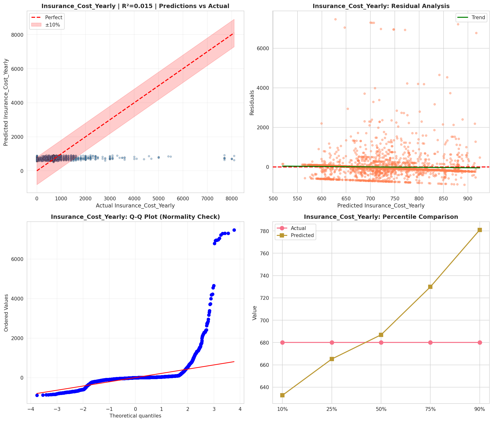
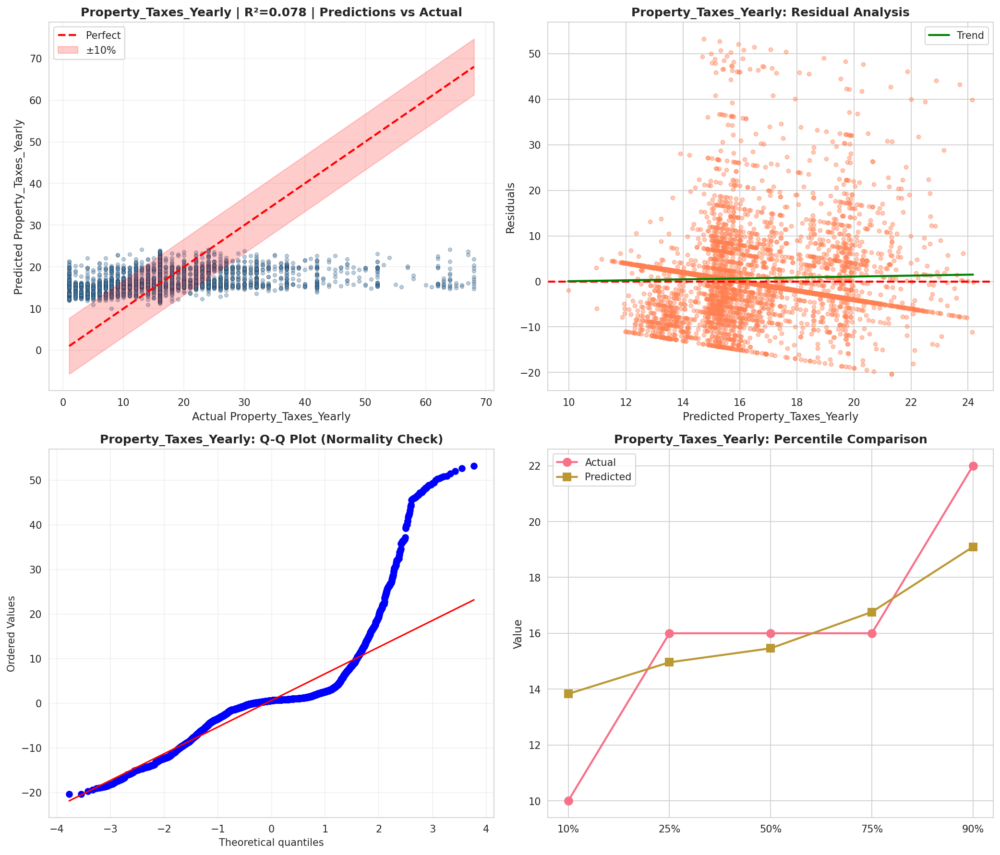
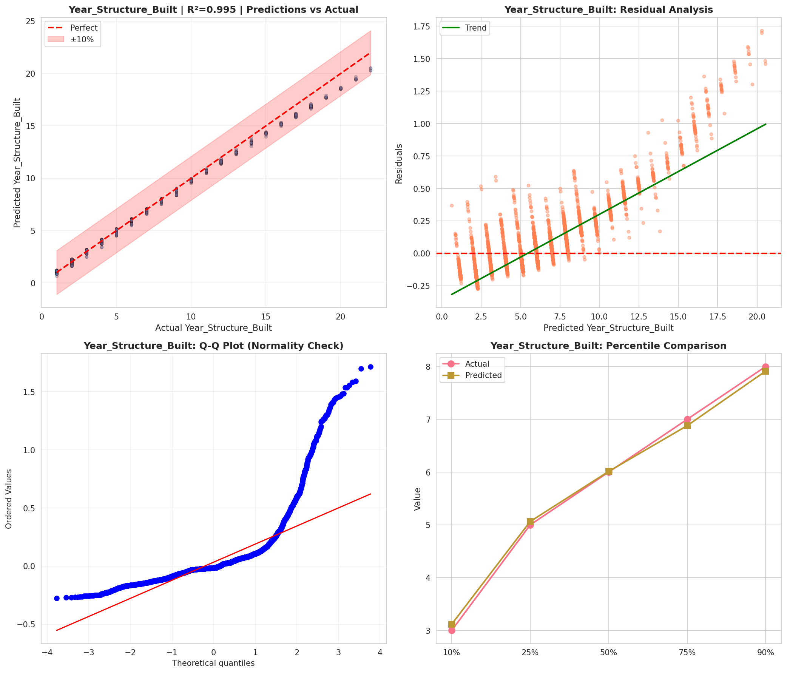
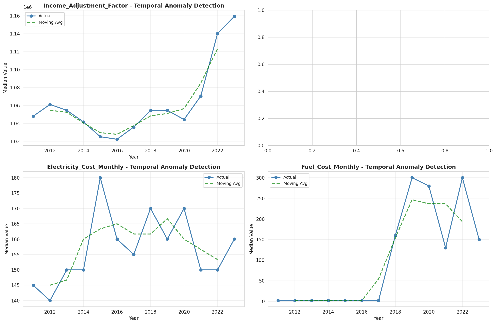
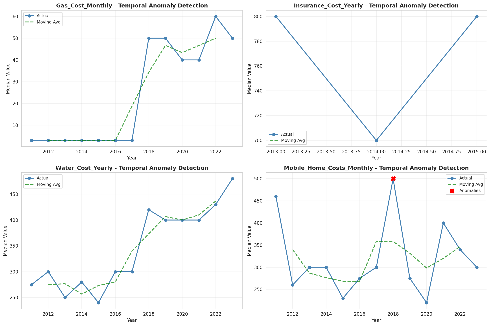
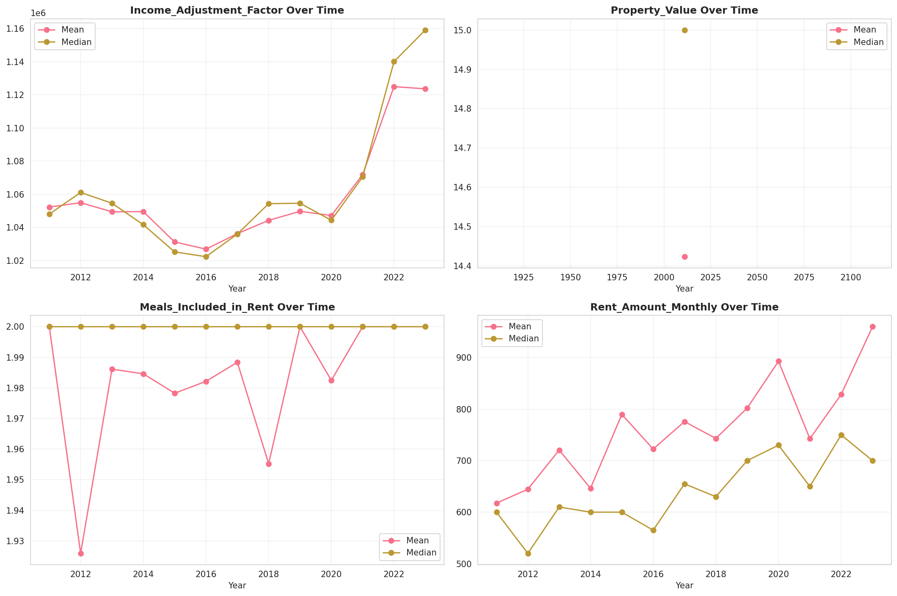
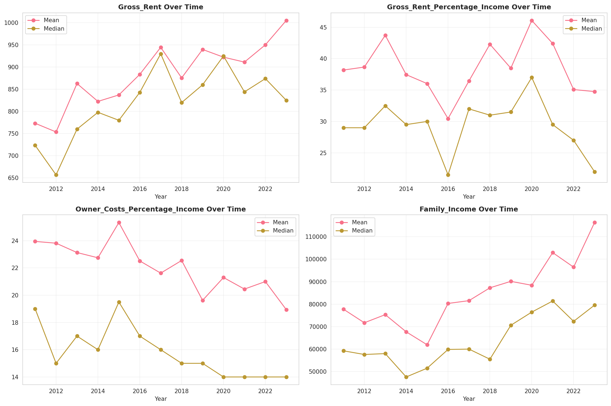
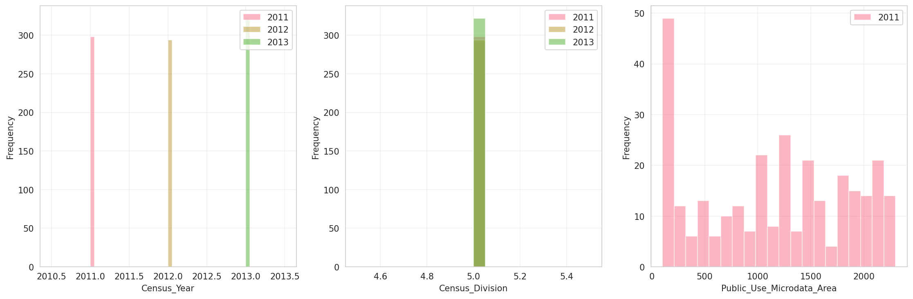
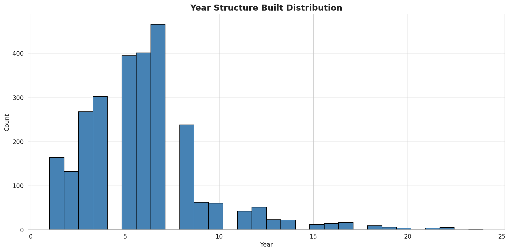
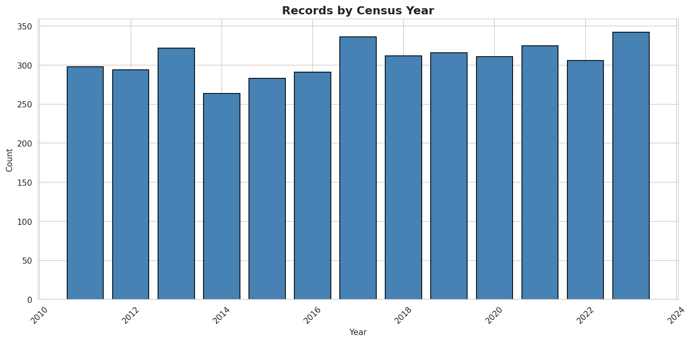
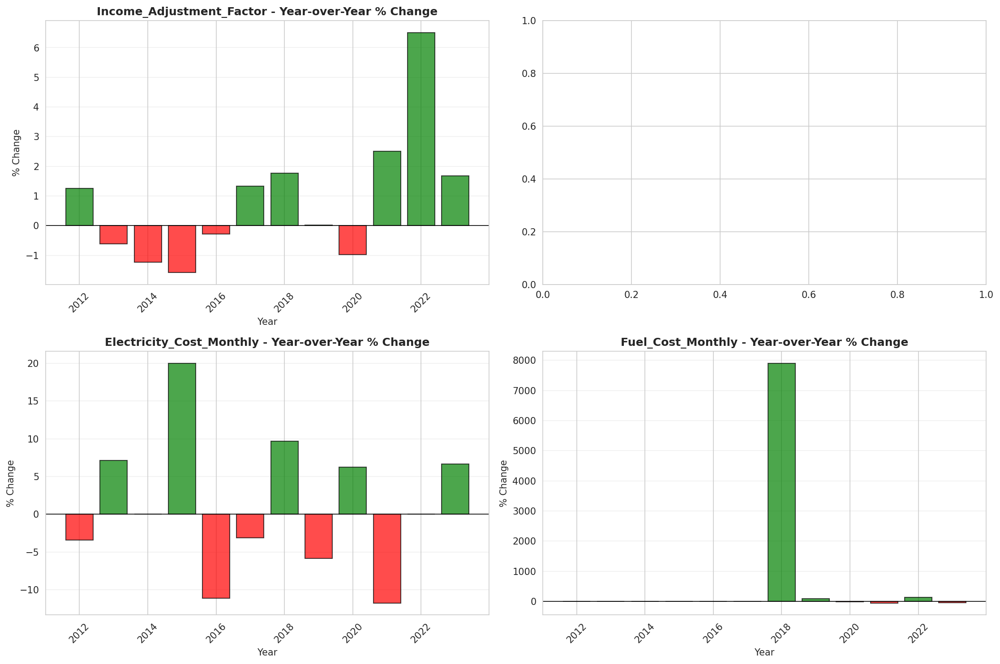

