# Temporal Analysis

## Year Distribution

- 2012: 4,229 records

- 2013: 4,211 records

- 2016: 4,317 records

- 2017: 4,449 records

- 2018: 4,473 records

- 2019: 4,525 records

- 2022: 4,639 records

- 2023: 4,692 records

## Temporal Trends

- Census_Year: {np.int64(2012): {'mean': 2012.0, 'median': 2012.0, 'std': 0.0}, np.int64(2013): {'mean': 2013.0, 'median': 2013.0, 'std': 0.0}, np.int64(2016): {'mean': 2016.0, 'median': 2016.0, 'std': 0.0}, np.int64(2017): {'mean': 2017.0, 'median': 2017.0, 'std': 0.0}, np.int64(2018): {'mean': 2018.0, 'median': 2018.0, 'std': 0.0}, np.int64(2019): {'mean': 2019.0, 'median': 2019.0, 'std': 0.0}, np.int64(2022): {'mean': 2022.0, 'median': 2022.0, 'std': 0.0}, np.int64(2023): {'mean': 2023.0, 'median': 2023.0, 'std': 0.0}}

- Census_Division: {np.int64(2012): {'mean': 4.0, 'median': 4.0, 'std': 0.0}, np.int64(2013): {'mean': 4.0, 'median': 4.0, 'std': 0.0}, np.int64(2016): {'mean': 4.0, 'median': 4.0, 'std': 0.0}, np.int64(2017): {'mean': 4.0, 'median': 4.0, 'std': 0.0}, np.int64(2018): {'mean': 4.0, 'median': 4.0, 'std': 0.0}, np.int64(2019): {'mean': 4.0, 'median': 4.0, 'std': 0.0}, np.int64(2022): {'mean': 4.0, 'median': 4.0, 'std': 0.0}, np.int64(2023): {'mean': 4.0, 'median': 4.0, 'std': 0.0}}

- Public_Use_Microdata_Area: {np.int64(2012): {'mean': 336.20241191771106, 'median': 300.0, 'std': 155.29705012805775}, np.int64(2013): {'mean': 338.70814533364995, 'median': 300.0, 'std': 155.82938193198765}, np.int64(2016): {'mean': 339.9119759091962, 'median': 300.0, 'std': 157.9769332351853}, np.int64(2017): {'mean': 341.6273319847157, 'median': 300.0, 'std': 157.9364870099802}, np.int64(2018): {'mean': 339.88374692600047, 'median': 300.0, 'std': 157.109924961973}, np.int64(2019): {'mean': 342.1436464088398, 'median': 300.0, 'std': 158.73700691053872}, np.int64(2022): {'mean': 344.25436516490623, 'median': 300.0, 'std': 160.13365741864493}, np.int64(2023): {'mean': 344.1867007672634, 'median': 300.0, 'std': 159.98385154207753}}

- Census_Region: {np.int64(2012): {'mean': 2.0, 'median': 2.0, 'std': 0.0}, np.int64(2013): {'mean': 2.0, 'median': 2.0, 'std': 0.0}, np.int64(2016): {'mean': 2.0, 'median': 2.0, 'std': 0.0}, np.int64(2017): {'mean': 2.0, 'median': 2.0, 'std': 0.0}, np.int64(2018): {'mean': 2.0, 'median': 2.0, 'std': 0.0}, np.int64(2019): {'mean': 2.0, 'median': 2.0, 'std': 0.0}, np.int64(2022): {'mean': 2.0, 'median': 2.0, 'std': 0.0}, np.int64(2023): {'mean': 2.0, 'median': 2.0, 'std': 0.0}}

- State_Code: {np.int64(2012): {'mean': 46.0, 'median': 46.0, 'std': 0.0}, np.int64(2013): {'mean': 46.0, 'median': 46.0, 'std': 0.0}, np.int64(2016): {'mean': 46.0, 'median': 46.0, 'std': 0.0}, np.int64(2017): {'mean': 46.0, 'median': 46.0, 'std': 0.0}, np.int64(2018): {'mean': 46.0, 'median': 46.0, 'std': 0.0}, np.int64(2019): {'mean': 46.0, 'median': 46.0, 'std': 0.0}, np.int64(2022): {'mean': 46.0, 'median': 46.0, 'std': 0.0}, np.int64(2023): {'mean': None, 'median': None, 'std': None}}

- Housing_Adjustment_Factor: {np.int64(2012): {'mean': 1000000.0, 'median': 1000000.0, 'std': 0.0}, np.int64(2013): {'mean': 1000000.0, 'median': 1000000.0, 'std': 0.0}, np.int64(2016): {'mean': 1000000.0, 'median': 1000000.0, 'std': 0.0}, np.int64(2017): {'mean': 1000000.0, 'median': 1000000.0, 'std': 0.0}, np.int64(2018): {'mean': 1000000.0, 'median': 1000000.0, 'std': 0.0}, np.int64(2019): {'mean': 1000000.0, 'median': 1000000.0, 'std': 0.0}, np.int64(2022): {'mean': 1000000.0, 'median': 1000000.0, 'std': 0.0}, np.int64(2023): {'mean': 1000000.0, 'median': 1000000.0, 'std': 0.0}}

- Income_Adjustment_Factor: {np.int64(2012): {'mean': 1010207.0, 'median': 1010207.0, 'std': 0.0}, np.int64(2013): {'mean': 1007549.0, 'median': 1007549.0, 'std': 0.0}, np.int64(2016): {'mean': 1007588.0, 'median': 1007588.0, 'std': 0.0}, np.int64(2017): {'mean': 1011189.0, 'median': 1011189.0, 'std': 0.0}, np.int64(2018): {'mean': 1013097.0, 'median': 1013097.0, 'std': 0.0}, np.int64(2019): {'mean': 1010145.0, 'median': 1010145.0, 'std': 0.0}, np.int64(2022): {'mean': 1042311.0, 'median': 1042311.0, 'std': 0.0}, np.int64(2023): {'mean': 1019518.0, 'median': 1019518.0, 'std': 0.0}}

- Housing_Unit_Weight: {np.int64(2012): {'mean': 87.07661385670372, 'median': 53.0, 'std': 100.7601773233189}, np.int64(2013): {'mean': 87.91427214438376, 'median': 57.0, 'std': 97.30358747715805}, np.int64(2016): {'mean': 88.91058605513088, 'median': 57.0, 'std': 98.02710644185447}, np.int64(2017): {'mean': 88.25578781748708, 'median': 57.0, 'std': 99.59168089357061}, np.int64(2018): {'mean': 88.86787391012743, 'median': 56.0, 'std': 103.6034683199174}, np.int64(2019): {'mean': 88.7843093922652, 'median': 55.0, 'std': 103.57294260504966}, np.int64(2022): {'mean': 87.95192929510671, 'median': 52.0, 'std': 103.38314704419946}, np.int64(2023): {'mean': 88.91453537936914, 'median': 55.0, 'std': 108.31151407863044}}

- Number_of_Persons: {np.int64(2012): {'mean': 1.9815559233861433, 'median': 2.0, 'std': 1.4559571104208657}, np.int64(2013): {'mean': 2.075516504393256, 'median': 2.0, 'std': 1.5266427040237422}, np.int64(2016): {'mean': 2.0210794533240675, 'median': 2.0, 'std': 1.552083249022752}, np.int64(2017): {'mean': 1.9961789166104742, 'median': 2.0, 'std': 1.5304856991085845}, np.int64(2018): {'mean': 2.0089425441538116, 'median': 2.0, 'std': 1.5540099248889527}, np.int64(2019): {'mean': 2.0172375690607733, 'median': 2.0, 'std': 1.4928843507474852}, np.int64(2022): {'mean': 2.0038801465833154, 'median': 2.0, 'std': 1.5021854251751923}, np.int64(2023): {'mean': 2.0198209718670075, 'median': 2.0, 'std': 1.483595844438335}}

- Housing_Unit_Type: {np.int64(2012): {'mean': 1.1877512414282336, 'median': 1.0, 'std': 0.5190153133879739}, np.int64(2013): {'mean': 1.1754927570648301, 'median': 1.0, 'std': 0.5044483481910295}, np.int64(2016): {'mean': 1.1649293490850128, 'median': 1.0, 'std': 0.49617870247005064}, np.int64(2017): {'mean': 1.1755450663070353, 'median': 1.0, 'std': 0.5110952636528476}, np.int64(2018): {'mean': 1.1636485580147553, 'median': 1.0, 'std': 0.4919316039214827}, np.int64(2019): {'mean': 1.1666298342541437, 'median': 1.0, 'std': 0.4985303567207737}, np.int64(2022): {'mean': None, 'median': None, 'std': None}, np.int64(2023): {'mean': None, 'median': None, 'std': None}}

- Number_of_Bedrooms: {np.int64(2012): {'mean': 2.8984247691472027, 'median': 3.0, 'std': 1.1532893396338495}, np.int64(2013): {'mean': 2.965163381042398, 'median': 3.0, 'std': 1.2906288672904096}, np.int64(2016): {'mean': 2.9268038551706175, 'median': 3.0, 'std': 1.1364022522972685}, np.int64(2017): {'mean': 2.9241151005856887, 'median': 3.0, 'std': 1.1505814052205785}, np.int64(2018): {'mean': 2.9381287726358147, 'median': 3.0, 'std': 1.1431810058309582}, np.int64(2019): {'mean': 2.968151281413287, 'median': 3.0, 'std': 1.146761988054893}, np.int64(2022): {'mean': 2.9711067580803134, 'median': 3.0, 'std': 1.168467934979629}, np.int64(2023): {'mean': 3.0028756290438534, 'median': 3.0, 'std': 1.228454341886025}}

- Number_of_Rooms: {np.int64(2012): {'mean': 6.2034220532319395, 'median': 6.0, 'std': 2.422425164773257}, np.int64(2013): {'mean': 6.374021064002161, 'median': 6.0, 'std': 2.695163486688254}, np.int64(2016): {'mean': 6.3873404532430325, 'median': 6.0, 'std': 2.5711868383479066}, np.int64(2017): {'mean': 6.386299974535269, 'median': 6.0, 'std': 2.627831318263514}, np.int64(2018): {'mean': 6.446177062374246, 'median': 6.0, 'std': 2.5674538639935425}, np.int64(2019): {'mean': 6.530480218959941, 'median': 6.0, 'std': 2.652187887506555}, np.int64(2022): {'mean': 6.578354554358472, 'median': 6.0, 'std': 2.763248829849794}, np.int64(2023): {'mean': 6.670740474478793, 'median': 6.0, 'std': 2.912580467367581}}

- Building_Type: {np.int64(2012): {'mean': 2.5046170559478544, 'median': 2.0, 'std': 1.6373477860118042}, np.int64(2013): {'mean': 2.4815014852822035, 'median': 2.0, 'std': 1.6075257615180871}, np.int64(2016): {'mean': 2.513154467309195, 'median': 2.0, 'std': 1.6589867462809404}, np.int64(2017): {'mean': 2.5294117647058822, 'median': 2.0, 'std': 1.6595294324389216}, np.int64(2018): {'mean': 2.5545774647887325, 'median': 2.0, 'std': 1.682178633051364}, np.int64(2019): {'mean': 2.5247574023388903, 'median': 2.0, 'std': 1.6517549258618338}, np.int64(2022): {'mean': 2.5766405484818806, 'median': 2.0, 'std': 1.7261024623661918}, np.int64(2023): {'mean': 2.5811167026120296, 'median': 2.0, 'std': 1.7156289078400764}}

- Year_Structure_Built: {np.int64(2012): {'mean': 4.568984247691472, 'median': 5.0, 'std': 3.015714434584402}, np.int64(2013): {'mean': 4.759654334323521, 'median': 5.0, 'std': 3.2773015822688767}, np.int64(2016): {'mean': 5.088043761396197, 'median': 5.0, 'std': 3.8067656375512944}, np.int64(2017): {'mean': 5.325439266615737, 'median': 5.0, 'std': 4.149034854451101}, np.int64(2018): {'mean': 5.3762575452716295, 'median': 5.0, 'std': 4.29436133769449}, np.int64(2019): {'mean': 5.57053993530729, 'median': 5.0, 'std': 4.580260195287024}, np.int64(2022): {'mean': None, 'median': None, 'std': None}, np.int64(2023): {'mean': None, 'median': None, 'std': None}}

- Bathtub_or_Shower: {np.int64(2012): {'mean': 1.0154807170016296, 'median': 1.0, 'std': 0.12347147391687442}, np.int64(2013): {'mean': 1.0140426681069403, 'median': 1.0, 'std': 0.11768267322381842}, np.int64(2016): {'mean': 1.018754884084397, 'median': 1.0, 'std': 0.13567583936989008}, np.int64(2017): {'mean': 1.0175706646294882, 'median': 1.0, 'std': 0.13140142008109715}, np.int64(2018): {'mean': 1.0221327967806841, 'median': 1.0, 'std': 0.147133887500958}, np.int64(2019): {'mean': 1.0124409056979349, 'median': 1.0, 'std': 0.11085660709116482}, np.int64(2022): {'mean': 1.0083251714005876, 'median': 1.0, 'std': 0.09087290537218062}, np.int64(2023): {'mean': 1.00647016534867, 'median': 1.0, 'std': 0.08018630262915889}}

- Refrigerator: {np.int64(2012): {'mean': 1.0203693644758283, 'median': 1.0, 'std': 0.14127941958909998}, np.int64(2013): {'mean': 1.023764515257899, 'median': 1.0, 'std': 0.1523352549189525}, np.int64(2016): {'mean': 1.0257879656160458, 'median': 1.0, 'std': 0.15852284469026848}, np.int64(2017): {'mean': 1.0252100840336134, 'median': 1.0, 'std': 0.1567826365707455}, np.int64(2018): {'mean': 1.0319416498993963, 'median': 1.0, 'std': 0.17586688109149334}, np.int64(2019): {'mean': 1.0276188106494153, 'median': 1.0, 'std': 0.16389843157593048}, np.int64(2022): {'mean': 1.0200783545543586, 'median': 1.0, 'std': 0.14028554111501504}, np.int64(2023): {'mean': 1.0131799664509944, 'median': 1.0, 'std': 0.11405863599971663}}

- Hot_and_Cold_Running_Water: {np.int64(2012): {'mean': 1.0225420966865835, 'median': 1.0, 'std': 0.1484585343573411}, np.int64(2013): {'mean': 1.0226843100189036, 'median': 1.0, 'std': 0.14891514590626517}, np.int64(2016): {'mean': 1.0283928106277676, 'median': 1.0, 'std': 0.16611395697477344}, np.int64(2017): {'mean': 1.0300483829895595, 'median': 1.0, 'std': 0.17074220736914417}, np.int64(2018): {'mean': 1.0319416498993963, 'median': 1.0, 'std': 0.17586688109149357}, np.int64(2019): {'mean': 1.0296093555610848, 'median': 1.0, 'std': 0.16952814694124888}, np.int64(2022): {'mean': 1.023016650342801, 'median': 1.0, 'std': 0.14997463649371584}, np.int64(2023): {'mean': 1.01941049604601, 'median': 1.0, 'std': 0.13797931346566658}}

- Running_Water: {np.int64(2012): {'mean': None, 'median': None, 'std': None}, np.int64(2013): {'mean': 9.0, 'median': 9.0, 'std': 0.0}, np.int64(2016): {'mean': 9.0, 'median': 9.0, 'std': 0.0}, np.int64(2017): {'mean': 9.0, 'median': 9.0, 'std': 0.0}, np.int64(2018): {'mean': 9.0, 'median': 9.0, 'std': 0.0}, np.int64(2019): {'mean': 9.0, 'median': 9.0, 'std': 0.0}, np.int64(2022): {'mean': 9.0, 'median': 9.0, 'std': 0.0}, np.int64(2023): {'mean': 9.0, 'median': 9.0, 'std': 0.0}}

- Sink_with_Faucet: {np.int64(2012): {'mean': 1.0138511678435633, 'median': 1.0, 'std': 0.11688893769047873}, np.int64(2013): {'mean': 1.0132325141776937, 'median': 1.0, 'std': 0.11428447782043558}, np.int64(2016): {'mean': 1.0148476165668143, 'median': 1.0, 'std': 0.1209585713853384}, np.int64(2017): {'mean': 1.0157881334351924, 'median': 1.0, 'std': 0.12467087156495159}, np.int64(2018): {'mean': 1.0196177062374245, 'median': 1.0, 'std': 0.13870000105515343}, np.int64(2019): {'mean': 1.0102015426723066, 'median': 1.0, 'std': 0.10049867789401928}, np.int64(2022): {'mean': 1.0080803134182175, 'median': 1.0, 'std': 0.08953761765898591}, np.int64(2023): {'mean': 1.0055116223340523, 'median': 1.0, 'std': 0.07404429870191312}}

- Stove_or_Range: {np.int64(2012): {'mean': 1.0233568712656165, 'median': 1.0, 'std': 0.15105470822422798}, np.int64(2013): {'mean': 1.0245746691871456, 'median': 1.0, 'std': 0.1548458262396106}, np.int64(2016): {'mean': 1.0286532951289398, 'median': 1.0, 'std': 0.16685183719315394}, np.int64(2017): {'mean': 1.0292844410491468, 'median': 1.0, 'std': 0.16862414782463506}, np.int64(2018): {'mean': 1.0374748490945673, 'median': 1.0, 'std': 0.18994620058242948}, np.int64(2019): {'mean': 1.0313510823587957, 'median': 1.0, 'std': 0.17428640231113962}, np.int64(2022): {'mean': 1.023016650342801, 'median': 1.0, 'std': 0.1499746364937157}, np.int64(2023): {'mean': 1.0160555954948478, 'median': 1.0, 'std': 0.1257044151033405}}

- Telephone_Service: {np.int64(2012): {'mean': 1.021902190219022, 'median': 1.0, 'std': 0.14638617967432338}, np.int64(2013): {'mean': 1.0210245780278353, 'median': 1.0, 'std': 0.14348742757483993}, np.int64(2016): {'mean': 1.0387755102040817, 'median': 1.0, 'std': 0.1930876475724026}, np.int64(2017): {'mean': 1.0242857142857142, 'median': 1.0, 'std': 0.15395678148315237}, np.int64(2018): {'mean': 1.0178672716959727, 'median': 1.0, 'std': 0.1324877747692443}, np.int64(2019): {'mean': 1.01353591160221, 'median': 1.0, 'std': 0.11556980707402223}, np.int64(2022): {'mean': 1.0102232983588917, 'median': 1.0, 'std': 0.10060569347893451}, np.int64(2023): {'mean': 1.010432968179447, 'median': 1.0, 'std': 0.10162093700452976}}

- Lot_Acreage: {np.int64(2012): {'mean': 1.456555590158829, 'median': 1.0, 'std': 0.7439662808548244}, np.int64(2013): {'mean': 1.4508652657601977, 'median': 1.0, 'std': 0.737426826015096}, np.int64(2016): {'mean': 1.3818236352729454, 'median': 1.0, 'std': 0.6856592204192374}, np.int64(2017): {'mean': 1.392162639952858, 'median': 1.0, 'std': 0.6967212011498335}, np.int64(2018): {'mean': 1.4173913043478261, 'median': 1.0, 'std': 0.7092473155647985}, np.int64(2019): {'mean': 1.4345714285714286, 'median': 1.0, 'std': 0.7224044623636301}, np.int64(2022): {'mean': 1.4388305421515755, 'median': 1.0, 'std': 0.71995330426091}, np.int64(2023): {'mean': 1.428927680798005, 'median': 1.0, 'std': 0.705148148113884}}

- Agricultural_Sales: {np.int64(2012): {'mean': 2.288864388092613, 'median': 1.0, 'std': 2.079097467822542}, np.int64(2013): {'mean': 2.4563318777292578, 'median': 1.0, 'std': 2.1887075496338535}, np.int64(2016): {'mean': 2.241421568627451, 'median': 1.0, 'std': 2.0685906855914773}, np.int64(2017): {'mean': 2.313939393939394, 'median': 1.0, 'std': 2.119514535277945}, np.int64(2018): {'mean': 2.2, 'median': 1.0, 'std': 2.039108776345664}, np.int64(2019): {'mean': 2.2507869884575027, 'median': 1.0, 'std': 2.080588028386238}, np.int64(2022): {'mean': 2.2934673366834173, 'median': 1.0, 'std': 2.0838334165513452}, np.int64(2023): {'mean': 2.1123046875, 'median': 1.0, 'std': 1.9961069052195084}}

- Tenure: {np.int64(2012): {'mean': 1.931893189318932, 'median': 2.0, 'std': 0.8528498504071836}, np.int64(2013): {'mean': 1.929819366301451, 'median': 2.0, 'std': 0.841455378128133}, np.int64(2016): {'mean': 1.9300291545189505, 'median': 2.0, 'std': 0.8489279254772821}, np.int64(2017): {'mean': 1.931142857142857, 'median': 2.0, 'std': 0.8261940320616573}, np.int64(2018): {'mean': 1.9248440158820193, 'median': 2.0, 'std': 0.847705901130215}, np.int64(2019): {'mean': 1.908011049723757, 'median': 2.0, 'std': 0.8407893236762478}, np.int64(2022): {'mean': 1.9165994081248319, 'median': 2.0, 'std': 0.8215585847721298}, np.int64(2023): {'mean': 1.9089723526343245, 'median': 2.0, 'std': 0.824113395326284}}

- Vacancy_Status: {np.int64(2012): {'mean': 5.160458452722063, 'median': 5.0, 'std': 1.9096054285284734}, np.int64(2013): {'mean': 5.266871165644171, 'median': 5.0, 'std': 1.9004308892693522}, np.int64(2016): {'mean': 5.183374083129585, 'median': 5.0, 'std': 1.9934002282564696}, np.int64(2017): {'mean': 5.229508196721311, 'median': 5.0, 'std': 1.9581946490028415}, np.int64(2018): {'mean': 5.346666666666667, 'median': 5.0, 'std': 2.0088445858641975}, np.int64(2019): {'mean': 5.190476190476191, 'median': 5.0, 'std': 2.0870044228786626}, np.int64(2022): {'mean': 5.400544959128065, 'median': 6.0, 'std': 2.009621590544051}, np.int64(2023): {'mean': 5.40117994100295, 'median': 5.0, 'std': 1.977266902174991}}

- Property_Value: {np.int64(2012): {'mean': 145185.88516746412, 'median': 100000.0, 'std': 224185.45424275566}, np.int64(2013): {'mean': 145810.38842647642, 'median': 100000.0, 'std': 230776.85418620438}, np.int64(2016): {'mean': 165455.25078369907, 'median': 125000.0, 'std': 199997.65044644926}, np.int64(2017): {'mean': 169968.85931558936, 'median': 135000.0, 'std': 185518.95159150532}, np.int64(2018): {'mean': 187012.42424242425, 'median': 150000.0, 'std': 217967.4931634761}, np.int64(2019): {'mean': 193316.47912885662, 'median': 150000.0, 'std': 217449.00596029}, np.int64(2022): {'mean': 259982.19178082192, 'median': 200000.0, 'std': 308731.24108593335}, np.int64(2023): {'mean': 272953.09734513273, 'median': 207000.0, 'std': 301333.8893586329}}

- Vehicles_Available: {np.int64(2012): {'mean': 2.134113411341134, 'median': 2.0, 'std': 1.1898242156742458}, np.int64(2013): {'mean': 2.1785608528279536, 'median': 2.0, 'std': 1.2195737501411692}, np.int64(2016): {'mean': 2.158600583090379, 'median': 2.0, 'std': 1.1965880924250665}, np.int64(2017): {'mean': 2.1702857142857144, 'median': 2.0, 'std': 1.2116078700773198}, np.int64(2018): {'mean': 2.19171866137266, 'median': 2.0, 'std': 1.2464301575153371}, np.int64(2019): {'mean': 2.268232044198895, 'median': 2.0, 'std': 1.2605505761085385}, np.int64(2022): {'mean': 2.1945117029862793, 'median': 2.0, 'std': 1.2298284204257983}, np.int64(2023): {'mean': 2.2331768388106417, 'median': 2.0, 'std': 1.2686942724010357}}

- Condo_Fee_Monthly: {np.int64(2012): {'mean': 161.86206896551724, 'median': 150.0, 'std': 87.85854057921382}, np.int64(2013): {'mean': 163.33333333333334, 'median': 165.0, 'std': 62.497058754322}, np.int64(2016): {'mean': 186.15384615384616, 'median': 175.0, 'std': 130.78461447974448}, np.int64(2017): {'mean': 163.7037037037037, 'median': 160.0, 'std': 75.50589116843534}, np.int64(2018): {'mean': 225.89743589743588, 'median': 160.0, 'std': 172.74437988752643}, np.int64(2019): {'mean': 236.4, 'median': 170.0, 'std': 189.69009814255813}, np.int64(2022): {'mean': 215.35714285714286, 'median': 200.0, 'std': 134.09455323147623}, np.int64(2023): {'mean': 287.2093023255814, 'median': 200.0, 'std': 264.6770321353514}}

- Electricity_Cost_Monthly: {np.int64(2012): {'mean': 119.35583558355836, 'median': 100.0, 'std': 78.31064816962034}, np.int64(2013): {'mean': 130.04323363932485, 'median': 110.0, 'std': 88.38237840634987}, np.int64(2016): {'mean': 137.28775510204082, 'median': 120.0, 'std': 90.56272505803426}, np.int64(2017): {'mean': 141.82171428571428, 'median': 120.0, 'std': 98.48090059570855}, np.int64(2018): {'mean': 158.76937046004844, 'median': 140.0, 'std': 97.10778531094174}, np.int64(2019): {'mean': 161.64712778429075, 'median': 140.0, 'std': 100.80843422541517}, np.int64(2022): {'mean': 185.9965684872748, 'median': 150.0, 'std': 164.54502833503497}, np.int64(2023): {'mean': 187.816162177173, 'median': 150.0, 'std': 197.95165676621463}}

- Fuel_Cost_Monthly: {np.int64(2012): {'mean': 162.54935493549354, 'median': 2.0, 'std': 519.0035115462441}, np.int64(2013): {'mean': 91.06159312999704, 'median': 2.0, 'std': 411.2475216323671}, np.int64(2016): {'mean': 70.67055393586006, 'median': 2.0, 'std': 297.6843259651533}, np.int64(2017): {'mean': 67.01942857142858, 'median': 2.0, 'std': 275.95899594287476}, np.int64(2018): {'mean': 874.1323529411765, 'median': 750.0, 'std': 706.3032267381457}, np.int64(2019): {'mean': 1037.1859649122807, 'median': 900.0, 'std': 809.0266172431884}, np.int64(2022): {'mean': 1106.0516605166051, 'median': 850.0, 'std': 1000.3878419684755}, np.int64(2023): {'mean': 1064.8737201365188, 'median': 900.0, 'std': 959.9659531770168}}

- Gas_Cost_Monthly: {np.int64(2012): {'mean': 56.46864686468647, 'median': 20.0, 'std': 79.35855154903476}, np.int64(2013): {'mean': 60.600829138288425, 'median': 30.0, 'std': 83.9907534082181}, np.int64(2016): {'mean': 49.86588921282799, 'median': 20.0, 'std': 69.04608185812256}, np.int64(2017): {'mean': 54.614, 'median': 30.0, 'std': 77.08607392629054}, np.int64(2018): {'mean': 98.37511693171189, 'median': 70.0, 'std': 92.73436625243062}, np.int64(2019): {'mean': 102.68139637649138, 'median': 80.0, 'std': 97.8954522876187}, np.int64(2022): {'mean': 144.29082969432315, 'median': 100.0, 'std': 207.96394055503157}, np.int64(2023): {'mean': 135.41886151231947, 'median': 90.0, 'std': 187.22944895079797}}

- House_Heating_Fuel: {np.int64(2012): {'mean': 2.267026702670267, 'median': 2.0, 'std': 1.4239785659796953}, np.int64(2013): {'mean': 2.285164347053598, 'median': 2.0, 'std': 1.4492180778817574}, np.int64(2016): {'mean': 2.2174927113702623, 'median': 2.0, 'std': 1.3858585072350478}, np.int64(2017): {'mean': 2.2277142857142858, 'median': 2.0, 'std': 1.4161837341102388}, np.int64(2018): {'mean': 2.2033465683494042, 'median': 2.0, 'std': 1.352402696175313}, np.int64(2019): {'mean': 2.1787292817679558, 'median': 2.0, 'std': 1.3861273513568815}, np.int64(2022): {'mean': 2.2289480764057035, 'median': 2.0, 'std': 1.491288408048294}, np.int64(2023): {'mean': 2.1664058424621806, 'median': 2.0, 'std': 1.3690165757535628}}

- Insurance_Cost_Yearly: {np.int64(2012): {'mean': 802.902, 'median': 700.0, 'std': 524.3482019750398}, np.int64(2013): {'mean': 841.8670605612998, 'median': 700.0, 'std': 571.203882965145}, np.int64(2016): {'mean': 1053.8926499032882, 'median': 940.0, 'std': 732.881570451753}, np.int64(2017): {'mean': 1082.3771971496437, 'median': 960.0, 'std': 759.5717726500754}, np.int64(2018): {'mean': 1142.6754841757204, 'median': 1000.0, 'std': 836.0825877866456}, np.int64(2019): {'mean': 1188.3659652333029, 'median': 1000.0, 'std': 805.3915332578267}, np.int64(2022): {'mean': 1431.5058315334772, 'median': 1200.0, 'std': 986.6486658104704}, np.int64(2023): {'mean': 1738.366344605475, 'median': 1500.0, 'std': 1319.4014249910408}}

- Water_Cost_Yearly: {np.int64(2012): {'mean': 389.8835883588359, 'median': 360.0, 'std': 413.95318182662004}, np.int64(2013): {'mean': 404.65857269766065, 'median': 360.0, 'std': 451.3619100621501}, np.int64(2016): {'mean': 412.95714285714286, 'median': 350.0, 'std': 455.424924626903}, np.int64(2017): {'mean': 425.8488571428571, 'median': 360.0, 'std': 451.94572050182825}, np.int64(2018): {'mean': 572.2727272727273, 'median': 550.0, 'std': 474.11610040464575}, np.int64(2019): {'mean': 553.503920171062, 'median': 520.0, 'std': 471.86360058854365}, np.int64(2022): {'mean': 623.3762851267992, 'median': 580.0, 'std': 582.2102463392263}, np.int64(2023): {'mean': 640.8941798941798, 'median': 540.0, 'std': 667.7322695289498}}

- Mobile_Home_Costs_Monthly: {np.int64(2012): {'mean': 1445.8758620689655, 'median': 850.0, 'std': 1675.448699779814}, np.int64(2013): {'mean': 1240.0, 'median': 750.0, 'std': 1396.2317859152186}, np.int64(2016): {'mean': 1896.7540983606557, 'median': 1100.0, 'std': 2225.3897989373613}, np.int64(2017): {'mean': 1843.1869918699188, 'median': 1200.0, 'std': 1797.983931754062}, np.int64(2018): {'mean': 1670.65625, 'median': 1200.0, 'std': 1465.6513450195037}, np.int64(2019): {'mean': 2031.8, 'median': 1700.0, 'std': 1697.5108191982065}, np.int64(2022): {'mean': 2017.8064516129032, 'median': 1100.0, 'std': 2440.837271444451}, np.int64(2023): {'mean': 3088.6029411764707, 'median': 2000.0, 'std': 3357.1670536870306}}

- First_Mortgage_Includes_Insurance: {np.int64(2012): {'mean': 1.4037985136251032, 'median': 1.0, 'std': 0.4908607104420155}, np.int64(2013): {'mean': 1.3736713000817662, 'median': 1.0, 'std': 0.4839758078034267}, np.int64(2016): {'mean': 1.3635640413683374, 'median': 1.0, 'std': 0.48121663842894247}, np.int64(2017): {'mean': 1.3522267206477734, 'median': 1.0, 'std': 0.47785767236602533}, np.int64(2018): {'mean': 1.3377125193199382, 'median': 1.0, 'std': 0.47311283361494033}, np.int64(2019): {'mean': 1.3559195830230826, 'median': 1.0, 'std': 0.47896936617797864}, np.int64(2022): {'mean': 1.3049257232212665, 'median': 1.0, 'std': 0.46055604273590034}, np.int64(2023): {'mean': 1.30940044411547, 'median': 1.0, 'std': 0.46241765181588207}}

- First_Mortgage_Payment_Monthly: {np.int64(2012): {'mean': 834.4013212221305, 'median': 720.0, 'std': 548.9370953724473}, np.int64(2013): {'mean': 818.3090760425184, 'median': 720.0, 'std': 502.7558025809854}, np.int64(2016): {'mean': 940.5871121718377, 'median': 830.0, 'std': 604.6874085271032}, np.int64(2017): {'mean': 939.4072874493927, 'median': 850.0, 'std': 565.3811827382481}, np.int64(2018): {'mean': 956.7727975270479, 'median': 850.0, 'std': 559.0381331722008}, np.int64(2019): {'mean': 1042.4750558451228, 'median': 950.0, 'std': 643.4758380728721}, np.int64(2022): {'mean': 472.3158536585366, 'median': 4.0, 'std': 739.5843051517791}, np.int64(2023): {'mean': 1255.1917098445597, 'median': 1100.0, 'std': 719.6341155456341}}

- First_Mortgage_Includes_Taxes: {np.int64(2012): {'mean': 1.3435177539223782, 'median': 1.0, 'std': 0.4750786053866329}, np.int64(2013): {'mean': 1.3246116107931316, 'median': 1.0, 'std': 0.468421095643442}, np.int64(2016): {'mean': 1.2895783611774065, 'median': 1.0, 'std': 0.45374720484077374}, np.int64(2017): {'mean': 1.2688259109311741, 'median': 1.0, 'std': 0.44352883359760903}, np.int64(2018): {'mean': 1.2704791344667696, 'median': 1.0, 'std': 0.4443790935225932}, np.int64(2019): {'mean': 1.253909158600149, 'median': 1.0, 'std': 0.43540838267075466}, np.int64(2022): {'mean': 1.2212666145426114, 'median': 1.0, 'std': 0.41526199668121444}, np.int64(2023): {'mean': 1.2287194670614359, 'median': 1.0, 'std': 0.42016371119593104}}

- First_Mortgage_Status: {np.int64(2012): {'mean': 2.0319708619991905, 'median': 3.0, 'std': 0.9935977855624069}, np.int64(2013): {'mean': 2.0357429718875504, 'median': 3.0, 'std': 0.9904767258428252}, np.int64(2016): {'mean': 2.018253968253968, 'median': 3.0, 'std': 0.9920606463849492}, np.int64(2017): {'mean': 2.0597532767925983, 'median': 3.0, 'std': 0.9924004022893159}, np.int64(2018): {'mean': 2.0225880551301683, 'median': 3.0, 'std': 0.9932108304068309}, np.int64(2019): {'mean': 2.024193548387097, 'median': 3.0, 'std': 0.9954799248723101}, np.int64(2022): {'mean': 2.104556693747792, 'median': 3.0, 'std': 0.9906009202846432}, np.int64(2023): {'mean': 2.086837606837607, 'median': 3.0, 'std': 0.9910583904066208}}

- Second_Mortgage_Payment_Monthly: {np.int64(2012): {'mean': 348.3018867924528, 'median': 250.0, 'std': 332.3396302076297}, np.int64(2013): {'mean': 286.35036496350364, 'median': 220.0, 'std': 205.86930431568624}, np.int64(2016): {'mean': 368.64233576642334, 'median': 230.0, 'std': 408.7544160082785}, np.int64(2017): {'mean': 351.02564102564105, 'median': 200.0, 'std': 420.5361615009743}, np.int64(2018): {'mean': 342.3636363636364, 'median': 250.0, 'std': 302.03264685538886}, np.int64(2019): {'mean': 341.36, 'median': 250.0, 'std': 298.87516004232026}, np.int64(2022): {'mean': 522.796992481203, 'median': 300.0, 'std': 712.4176056495032}, np.int64(2023): {'mean': 568.4472049689441, 'median': 390.0, 'std': 595.5832844848518}}

- Second_Mortgage_Status: {np.int64(2012): {'mean': 2.852188274153592, 'median': 3.0, 'std': 0.44586409843764513}, np.int64(2013): {'mean': 2.873262469337694, 'median': 3.0, 'std': 0.4178462457211883}, np.int64(2016): {'mean': 2.8711217183770885, 'median': 3.0, 'std': 0.4021456369992771}, np.int64(2017): {'mean': 2.8906882591093117, 'median': 3.0, 'std': 0.36924175995295816}, np.int64(2018): {'mean': 2.903400309119011, 'median': 3.0, 'std': 0.3593035269380598}, np.int64(2019): {'mean': 2.895011169024572, 'median': 3.0, 'std': 0.3684629681413768}, np.int64(2022): {'mean': 2.896103896103896, 'median': 3.0, 'std': 0.3452053967651098}, np.int64(2023): {'mean': 2.871272727272727, 'median': 3.0, 'std': 0.3966886891559604}}

- Property_Taxes_Yearly: {np.int64(2012): {'mean': 25.594900849858355, 'median': 25.0, 'std': 14.844422550935825}, np.int64(2013): {'mean': 25.93534136546185, 'median': 26.0, 'std': 14.59734905458487}, np.int64(2016): {'mean': 28.56111111111111, 'median': 27.0, 'std': 16.264762908227492}, np.int64(2017): {'mean': 29.03893600616808, 'median': 28.0, 'std': 15.749791928833021}}

- Meals_Included_in_Rent: {np.int64(2012): {'mean': 1.9757343550447, 'median': 2.0, 'std': 0.15397110345131987}, np.int64(2013): {'mean': 1.9732685297691372, 'median': 2.0, 'std': 0.16139563023372533}, np.int64(2016): {'mean': 1.9571759259259258, 'median': 2.0, 'std': 0.20257756553251174}, np.int64(2017): {'mean': 1.9588100686498855, 'median': 2.0, 'std': 0.1988430525111552}, np.int64(2018): {'mean': 1.9547038327526132, 'median': 2.0, 'std': 0.20807380588290103}, np.int64(2019): {'mean': 1.9688995215311005, 'median': 2.0, 'std': 0.17369319623673374}, np.int64(2022): {'mean': 1.9552058111380146, 'median': 2.0, 'std': 0.20697713242773438}, np.int64(2023): {'mean': 1.9700956937799043, 'median': 2.0, 'std': 0.1704252952202088}}

- Rent_Amount_Monthly: {np.int64(2012): {'mean': 495.5402298850575, 'median': 440.0, 'std': 347.0903139520509}, np.int64(2013): {'mean': 488.8359659781288, 'median': 450.0, 'std': 321.7158091668666}, np.int64(2016): {'mean': 561.4513888888889, 'median': 500.0, 'std': 396.95044940098614}, np.int64(2017): {'mean': 570.070938215103, 'median': 500.0, 'std': 411.05438641761555}, np.int64(2018): {'mean': 609.4471544715448, 'median': 540.0, 'std': 441.1916643638033}, np.int64(2019): {'mean': 599.9521531100479, 'median': 550.0, 'std': 363.0064054566311}, np.int64(2022): {'mean': 729.5859564164649, 'median': 630.0, 'std': 516.261749910567}, np.int64(2023): {'mean': 744.61004784689, 'median': 680.0, 'std': 443.63499707468816}}

- Gross_Rent: {np.int64(2012): {'mean': 631.2945945945946, 'median': 590.0, 'std': 346.0634563240501}, np.int64(2013): {'mean': 633.1319796954315, 'median': 602.0, 'std': 330.0883410963116}, np.int64(2016): {'mean': 703.8704856787049, 'median': 650.0, 'std': 393.56640719319626}, np.int64(2017): {'mean': 721.7958435207823, 'median': 650.0, 'std': 413.38937416264696}, np.int64(2018): {'mean': 749.2853566958698, 'median': 683.0, 'std': 419.83685060527637}, np.int64(2019): {'mean': 765.2816537467701, 'median': 700.0, 'std': 379.65706695088386}, np.int64(2022): {'mean': 910.2005174644244, 'median': 812.0, 'std': 600.8934085985142}, np.int64(2023): {'mean': 932.8813131313132, 'median': 860.0, 'std': 510.6795859427445}}

- Gross_Rent_Percentage_Income: {np.int64(2012): {'mean': 33.57318741450069, 'median': 26.0, 'std': 25.71638874265705}, np.int64(2013): {'mean': 33.03333333333333, 'median': 25.0, 'std': 24.890289008950464}, np.int64(2016): {'mean': 33.069053708439895, 'median': 24.0, 'std': 26.510797237467703}, np.int64(2017): {'mean': 32.00500625782228, 'median': 23.0, 'std': 26.084689043093807}, np.int64(2018): {'mean': 32.62483994878361, 'median': 24.0, 'std': 24.82216436421994}, np.int64(2019): {'mean': 31.093175853018373, 'median': 24.0, 'std': 23.11868437078659}, np.int64(2022): {'mean': 32.94854881266491, 'median': 25.0, 'std': 25.88907833468412}, np.int64(2023): {'mean': 32.853128991060025, 'median': 24.0, 'std': 25.189920797059152}}

- Selected_Monthly_Owner_Costs: {np.int64(2012): {'mean': 808.5805668016194, 'median': 608.0, 'std': 631.0251842020957}, np.int64(2013): {'mean': 804.4973885094415, 'median': 624.0, 'std': 581.7648591826714}, np.int64(2016): {'mean': 899.1345238095238, 'median': 697.0, 'std': 698.4002196241844}, np.int64(2017): {'mean': 885.7007327419977, 'median': 698.0, 'std': 662.7576524863728}, np.int64(2018): {'mean': 930.5811638591118, 'median': 766.5, 'std': 645.6007352697158}, np.int64(2019): {'mean': 978.9515951595159, 'median': 779.0, 'std': 731.2202796941629}, np.int64(2022): {'mean': 1113.4166077738516, 'median': 863.5, 'std': 855.0401832837123}, np.int64(2023): {'mean': 1189.6573091407051, 'median': 917.0, 'std': 870.1137207140297}}

- Owner_Costs_Percentage_Income: {np.int64(2012): {'mean': 20.155854753161975, 'median': 15.0, 'std': 17.90772793487512}, np.int64(2013): {'mean': 19.21382376717866, 'median': 15.0, 'std': 16.99782207246272}, np.int64(2016): {'mean': 19.154461784713884, 'median': 14.0, 'std': 17.91535986788423}, np.int64(2017): {'mean': 18.885603112840467, 'median': 14.0, 'std': 17.364168590600837}, np.int64(2018): {'mean': 19.402707930367505, 'median': 15.0, 'std': 17.295821058880318}, np.int64(2019): {'mean': 18.89421304828603, 'median': 14.0, 'std': 17.191021177469647}, np.int64(2022): {'mean': 20.719161038037683, 'median': 15.0, 'std': 19.32964520970731}, np.int64(2023): {'mean': 20.791018998272886, 'median': 15.0, 'std': 19.2218036480744}}

- Satellite_Internet: {np.int64(2012): {'mean': None, 'median': None, 'std': None}, np.int64(2013): {'mean': 1.917813934084272, 'median': 2.0, 'std': 0.27470529436836}, np.int64(2016): {'mean': 1.9281684843926288, 'median': 2.0, 'std': 0.25825729883184695}, np.int64(2017): {'mean': 1.9227157818707115, 'median': 2.0, 'std': 0.2670901168796819}, np.int64(2018): {'mean': 1.9105464671075532, 'median': 2.0, 'std': 0.28544694591095027}, np.int64(2019): {'mean': 1.9157062891010865, 'median': 2.0, 'std': 0.27787354234768497}, np.int64(2022): {'mean': 1.931044957472661, 'median': 2.0, 'std': 0.2534161645596665}, np.int64(2023): {'mean': 1.9327755337564916, 'median': 2.0, 'std': 0.25044646965020095}}

- Smartphone: {np.int64(2012): {'mean': None, 'median': None, 'std': None}, np.int64(2013): {'mean': None, 'median': None, 'std': None}, np.int64(2016): {'mean': 1.3352769679300291, 'median': 1.0, 'std': 0.4721560306284481}, np.int64(2017): {'mean': 1.2937142857142858, 'median': 1.0, 'std': 0.45552770647336}, np.int64(2018): {'mean': 1.234826999432785, 'median': 1.0, 'std': 0.423950768073672}, np.int64(2019): {'mean': 1.1922651933701658, 'median': 1.0, 'std': 0.39413474979849156}, np.int64(2022): {'mean': 1.1423190745224643, 'median': 1.0, 'std': 0.34942410315991485}, np.int64(2023): {'mean': 1.1332811684924362, 'median': 1.0, 'std': 0.3399226914841825}}

- Tablet_Computer: {np.int64(2012): {'mean': None, 'median': None, 'std': None}, np.int64(2013): {'mean': None, 'median': None, 'std': None}, np.int64(2016): {'mean': 1.4603498542274052, 'median': 1.0, 'std': 0.4984980591854332}, np.int64(2017): {'mean': 1.425142857142857, 'median': 1.0, 'std': 0.49443528966375727}, np.int64(2018): {'mean': 1.4035734543391944, 'median': 1.0, 'std': 0.49068340661256826}, np.int64(2019): {'mean': 1.4044198895027624, 'median': 1.0, 'std': 0.49084722470606434}, np.int64(2022): {'mean': 1.4145816518697876, 'median': 1.0, 'std': 0.49271596175035537}, np.int64(2023): {'mean': 1.4160146061554513, 'median': 1.0, 'std': 0.49296027879338833}}

- Food_Stamp_SNAP: {np.int64(2012): {'mean': 1.8945876288659793, 'median': 2.0, 'std': 0.30712361304642455}, np.int64(2013): {'mean': 1.8872586872586872, 'median': 2.0, 'std': 0.31631703037014924}, np.int64(2016): {'mean': 1.910951893551689, 'median': 2.0, 'std': 0.2848496156684293}, np.int64(2017): {'mean': 1.9159622078567877, 'median': 2.0, 'std': 0.277478981172785}, np.int64(2018): {'mean': 1.9261744966442953, 'median': 2.0, 'std': 0.26151921293245073}, np.int64(2019): {'mean': 1.9253514299563743, 'median': 2.0, 'std': 0.2628552962564688}, np.int64(2022): {'mean': 1.9295411985018727, 'median': 2.0, 'std': 0.25594861487346626}, np.int64(2023): {'mean': 1.9345279117849759, 'median': 2.0, 'std': 0.24738543418435208}}

- Family_Type_Employment_Status: {np.int64(2012): {'mean': 2.776261937244202, 'median': 2.0, 'std': 2.2094512093624727}, np.int64(2013): {'mean': 2.7637900355871885, 'median': 2.0, 'std': 2.223351062271654}, np.int64(2016): {'mean': 2.7473309608540926, 'median': 2.0, 'std': 2.225042964313695}, np.int64(2017): {'mean': 2.7920353982300883, 'median': 2.0, 'std': 2.1932183128965637}, np.int64(2018): {'mean': 2.8074235807860264, 'median': 2.0, 'std': 2.2128022002881567}, np.int64(2019): {'mean': 2.6965029142381347, 'median': 2.0, 'std': 2.109038345405437}, np.int64(2022): {'mean': None, 'median': None, 'std': None}, np.int64(2023): {'mean': None, 'median': None, 'std': None}}

- Family_Income: {np.int64(2012): {'mean': 70991.14573785519, 'median': 59000.0, 'std': 58733.87398246754}, np.int64(2013): {'mean': 74633.68624833111, 'median': 61000.0, 'std': 62932.248681614605}, np.int64(2016): {'mean': 84165.41218637992, 'median': 69501.0, 'std': 75893.7134278969}, np.int64(2017): {'mean': 86317.03512672299, 'median': 70200.0, 'std': 73423.918393646}, np.int64(2018): {'mean': 88815.46958424507, 'median': 72000.0, 'std': 87190.50440708734}, np.int64(2019): {'mean': 91939.36013400335, 'median': 76200.0, 'std': 72811.3172883018}, np.int64(2022): {'mean': 104529.27149512919, 'median': 83000.0, 'std': 95120.74938708477}, np.int64(2023): {'mean': 113834.08890735355, 'median': 90800.0, 'std': 104814.70711573667}}

- Family_Presence_Children: {np.int64(2012): {'mean': 3.1855388813096863, 'median': 4.0, 'std': 1.0536776740426832}, np.int64(2013): {'mean': 3.1496237273129704, 'median': 4.0, 'std': 1.0575610719011954}, np.int64(2016): {'mean': 3.1554174067495557, 'median': 4.0, 'std': 1.0584020854651355}, np.int64(2017): {'mean': 3.143926056338028, 'median': 4.0, 'std': 1.067913223248922}, np.int64(2018): {'mean': 3.1440347071583514, 'median': 4.0, 'std': 1.0574185016746116}, np.int64(2019): {'mean': 3.2000830220008303, 'median': 4.0, 'std': 1.0441976969490925}, np.int64(2022): {'mean': 3.1909167367535742, 'median': 4.0, 'std': 1.0429005137092957}, np.int64(2023): {'mean': 3.1739488870568837, 'median': 4.0, 'std': 1.0525557643061088}}

- Household_Family_Type: {np.int64(2012): {'mean': 2.6405640564056405, 'median': 1.0, 'std': 2.0014547335106823}, np.int64(2013): {'mean': 2.612081729345573, 'median': 1.0, 'std': 2.005164175938034}, np.int64(2016): {'mean': 2.642857142857143, 'median': 1.0, 'std': 1.9952919213159264}, np.int64(2017): {'mean': 2.664285714285714, 'median': 1.0, 'std': 1.9953171609588076}, np.int64(2018): {'mean': 2.674985819625638, 'median': 1.0, 'std': 2.021693254878231}, np.int64(2019): {'mean': 2.5903314917127074, 'median': 1.0, 'std': 2.010435719656547}, np.int64(2022): {'mean': 2.691686844229217, 'median': 1.0, 'std': 2.034066245408994}, np.int64(2023): {'mean': 2.7107459572248302, 'median': 1.0, 'std': 2.04898384432448}}

- Household_Income: {np.int64(2012): {'mean': 59069.50378673129, 'median': 46700.0, 'std': 53984.87838028061}, np.int64(2013): {'mean': 63422.67730390695, 'median': 48500.0, 'std': 59198.947538414744}, np.int64(2016): {'mean': 71688.91376255169, 'median': 55025.0, 'std': 71200.15319572347}, np.int64(2017): {'mean': 72436.88734433826, 'median': 55500.0, 'std': 67826.87071452594}, np.int64(2018): {'mean': 73921.67088607595, 'median': 57000.0, 'std': 78444.96373636292}, np.int64(2019): {'mean': 77377.14365411436, 'median': 60800.0, 'std': 68502.60522473298}, np.int64(2022): {'mean': 86879.85865724382, 'median': 65300.0, 'std': 87382.12096014149}, np.int64(2023): {'mean': 92875.59989457038, 'median': 70000.0, 'std': 95776.40201288232}}

- Number_Persons_Family: {np.int64(2012): {'mean': 2.892223738062756, 'median': 2.0, 'std': 1.286073127091169}, np.int64(2013): {'mean': 2.9654714475431607, 'median': 2.0, 'std': 1.3407998969106163}, np.int64(2016): {'mean': 2.9738010657193605, 'median': 2.0, 'std': 1.3865275257591863}, np.int64(2017): {'mean': 2.955105633802817, 'median': 2.0, 'std': 1.3396077777034647}, np.int64(2018): {'mean': 2.9648590021691974, 'median': 2.0, 'std': 1.340824266331683}, np.int64(2019): {'mean': 2.918638439186384, 'median': 2.0, 'std': 1.3200556740499942}, np.int64(2022): {'mean': 2.9331370899915896, 'median': 2.0, 'std': 1.3175570510596792}, np.int64(2023): {'mean': 2.9319868095630666, 'median': 2.0, 'std': 1.3037262731455}}

- Workers_In_Family: {np.int64(2012): {'mean': 1.5547976352887676, 'median': 2.0, 'std': 0.8518958370978524}, np.int64(2013): {'mean': 1.5599822930500222, 'median': 2.0, 'std': 0.857577695414329}, np.int64(2016): {'mean': 1.5617229129662522, 'median': 2.0, 'std': 0.8500190802200867}, np.int64(2017): {'mean': 1.547975352112676, 'median': 2.0, 'std': 0.8653948650181027}, np.int64(2018): {'mean': 1.5579175704989154, 'median': 2.0, 'std': 0.8596162551101801}, np.int64(2019): {'mean': 1.5413034454130345, 'median': 2.0, 'std': 0.8703639182309829}, np.int64(2022): {'mean': 1.486963835155593, 'median': 2.0, 'std': 0.8931318073384744}, np.int64(2023): {'mean': 1.5428689200329762, 'median': 2.0, 'std': 0.8870294762165101}}

- Work_Experience_Householder_Spouse: {np.int64(2012): {'mean': 5.510231923601637, 'median': 4.0, 'std': 4.515040066031568}, np.int64(2013): {'mean': 5.5493581230633025, 'median': 4.0, 'std': 4.484361497222014}, np.int64(2016): {'mean': 5.441829484902309, 'median': 4.0, 'std': 4.536704529576682}, np.int64(2017): {'mean': 5.553257042253521, 'median': 4.0, 'std': 4.493527607096764}, np.int64(2018): {'mean': 5.538394793926248, 'median': 4.0, 'std': 4.495795299341819}, np.int64(2019): {'mean': 5.356579493565795, 'median': 4.0, 'std': 4.355215026818824}, np.int64(2022): {'mean': 5.642977291841884, 'median': 4.0, 'std': 4.421801636216133}, np.int64(2023): {'mean': 5.345836768342951, 'median': 4.0, 'std': 4.360783196059531}}

- Work_Status_Householder_Spouse: {np.int64(2012): {'mean': 5.080945884492952, 'median': 3.0, 'std': 4.722971163549472}, np.int64(2013): {'mean': 5.04270462633452, 'median': 3.0, 'std': 4.746999162465913}, np.int64(2016): {'mean': 4.98220640569395, 'median': 3.0, 'std': 4.751655756026252}, np.int64(2017): {'mean': 5.093362831858407, 'median': 3.0, 'std': 4.691892569553466}, np.int64(2018): {'mean': 5.1327510917030565, 'median': 3.0, 'std': 4.7322196556614635}, np.int64(2019): {'mean': 4.927976686094921, 'median': 3.0, 'std': 4.572546326846746}, np.int64(2022): {'mean': 5.21247892074199, 'median': 3.0, 'std': 4.661955584399938}, np.int64(2023): {'mean': 4.968956953642384, 'median': 3.0, 'std': 4.536517200583474}}

- Complete_Kitchen_Facilities: {np.int64(2012): {'mean': 1.027159152634438, 'median': 1.0, 'std': 0.16256909569946984}, np.int64(2013): {'mean': 1.030785849311369, 'median': 1.0, 'std': 0.17276035651432364}, np.int64(2016): {'mean': 1.0323000781453504, 'median': 1.0, 'std': 0.17681891054437937}, np.int64(2017): {'mean': 1.032085561497326, 'median': 1.0, 'std': 0.17624979036007576}, np.int64(2018): {'mean': 1.0407444668008048, 'median': 1.0, 'std': 0.19772250192660953}, np.int64(2019): {'mean': 1.0330928091565066, 'median': 1.0, 'std': 0.17890119821091285}, np.int64(2022): {'mean': 1.0264446620959844, 'median': 1.0, 'std': 0.16047319850694125}, np.int64(2023): {'mean': 1.0191708602923557, 'median': 1.0, 'std': 0.13714169840068083}}

- Complete_Plumbing_Facilities: {np.int64(2012): {'mean': 1.0241716458446497, 'median': 1.0, 'std': 0.15360268635007612}, np.int64(2013): {'mean': 1.0243046178773967, 'median': 1.0, 'std': 0.15401399003914568}, np.int64(2016): {'mean': 1.0307371711383173, 'median': 1.0, 'std': 0.17262722823623425}, np.int64(2017): {'mean': 1.0323402088107971, 'median': 1.0, 'std': 0.1769245340508655}, np.int64(2018): {'mean': 1.034959758551308, 'median': 1.0, 'std': 0.18370101053968133}, np.int64(2019): {'mean': 1.0320975367006717, 'median': 1.0, 'std': 0.17628107347502894}, np.int64(2022): {'mean': 1.0244857982370226, 'median': 1.0, 'std': 0.1545706766876311}, np.int64(2023): {'mean': 1.019889767553319, 'median': 1.0, 'std': 0.13963823730830374}}

- Plumbing_Facilities_for_Project: {np.int64(2012): {'mean': None, 'median': None, 'std': None}, np.int64(2013): {'mean': None, 'median': None, 'std': None}, np.int64(2016): {'mean': 9.0, 'median': 9.0, 'std': 0.0}, np.int64(2017): {'mean': 9.0, 'median': 9.0, 'std': 0.0}, np.int64(2018): {'mean': 9.0, 'median': 9.0, 'std': 0.0}, np.int64(2019): {'mean': 9.0, 'median': 9.0, 'std': 0.0}, np.int64(2022): {'mean': 9.0, 'median': 9.0, 'std': 0.0}, np.int64(2023): {'mean': 9.0, 'median': 9.0, 'std': 0.0}}

- Response_Mode: {np.int64(2012): {'mean': 1.437533948940793, 'median': 1.0, 'std': 0.49615002645578243}, np.int64(2013): {'mean': 2.0378071833648392, 'median': 2.0, 'std': 0.7689101709434328}, np.int64(2016): {'mean': 2.0911695754102633, 'median': 2.0, 'std': 0.7821768251998586}, np.int64(2017): {'mean': 2.1173924115100586, 'median': 2.0, 'std': 0.7997201016809373}, np.int64(2018): {'mean': 2.1343058350100605, 'median': 2.0, 'std': 0.8208418265276596}, np.int64(2019): {'mean': 2.1453097785518787, 'median': 2.0, 'std': 0.8343572903353299}, np.int64(2022): {'mean': 2.34769833496572, 'median': 3.0, 'std': 0.8156364914583878}, np.int64(2023): {'mean': 2.3318955188114066, 'median': 3.0, 'std': 0.8439231632536683}}

- Specified_Rent_Unit: {np.int64(2012): {'mean': 0.23302552960347636, 'median': 0.0, 'std': 0.4228157819178446}, np.int64(2013): {'mean': 0.2360248447204969, 'median': 0.0, 'std': 0.42469497927636374}, np.int64(2016): {'mean': 0.24355300859598855, 'median': 0.0, 'std': 0.4292818927586278}, np.int64(2017): {'mean': 0.23554876496052968, 'median': 0.0, 'std': 0.42439534537100015}, np.int64(2018): {'mean': 0.23566398390342053, 'median': 0.0, 'std': 0.4244664715022361}, np.int64(2019): {'mean': 0.22567802936053744, 'median': 0.0, 'std': 0.41808007316588935}, np.int64(2022): {'mean': 0.22012732615083253, 'median': 0.0, 'std': 0.4143830737524056}, np.int64(2023): {'mean': 0.21974598610112628, 'median': 0.0, 'std': 0.41412411778855407}}

- Specified_Value_Unit: {np.int64(2012): {'mean': 0.5008147745790331, 'median': 1.0, 'std': 0.500067247766861}, np.int64(2013): {'mean': 0.49986497434512556, 'median': 0.0, 'std': 0.5000675082700711}, np.int64(2016): {'mean': 0.524615785360771, 'median': 1.0, 'std': 0.4994587503743793}, np.int64(2017): {'mean': 0.5281385281385281, 'median': 1.0, 'std': 0.49927116840733454}, np.int64(2018): {'mean': 0.5248993963782697, 'median': 1.0, 'std': 0.49944244630584067}, np.int64(2019): {'mean': 0.5349589450111968, 'median': 1.0, 'std': 0.49883843878598033}, np.int64(2022): {'mean': 0.5411361410381978, 'median': 1.0, 'std': 0.49836596286547513}, np.int64(2023): {'mean': 0.5679367361610352, 'median': 1.0, 'std': 0.4954224630534765}}

- Moved_When: {np.int64(2012): {'mean': 4.664432989690722, 'median': 5.0, 'std': 1.865902212858383}, np.int64(2013): {'mean': 4.269173822919751, 'median': 4.0, 'std': 1.8555923699812338}, np.int64(2016): {'mean': 4.261224489795918, 'median': 5.0, 'std': 1.853479766078189}, np.int64(2017): {'mean': 4.264285714285714, 'median': 4.0, 'std': 1.8261489952073178}, np.int64(2018): {'mean': 4.320192853091322, 'median': 4.0, 'std': 1.8574368268218449}, np.int64(2019): {'mean': 4.3323204419889505, 'median': 4.0, 'std': 1.8417060903132163}, np.int64(2022): {'mean': 4.337099811676083, 'median': 4.0, 'std': 1.828683517124981}, np.int64(2023): {'mean': 4.3275952008346374, 'median': 4.0, 'std': 1.8218705269578241}}

- Household_Language: {np.int64(2012): {'mean': 1.1845184518451846, 'median': 1.0, 'std': 0.7221252880263971}, np.int64(2013): {'mean': 1.166419899318922, 'median': 1.0, 'std': 0.6979302543829474}, np.int64(2016): {'mean': 1.1801749271137025, 'median': 1.0, 'std': 0.7314642320241972}, np.int64(2017): {'mean': 1.171142857142857, 'median': 1.0, 'std': 0.7064973090675983}, np.int64(2018): {'mean': 1.159103800340329, 'median': 1.0, 'std': 0.6698666677979198}, np.int64(2019): {'mean': 1.1411602209944751, 'median': 1.0, 'std': 0.6491150962222624}, np.int64(2022): {'mean': 1.180252892117299, 'median': 1.0, 'std': 0.7084813277618864}, np.int64(2023): {'mean': 1.1317162232655191, 'median': 1.0, 'std': 0.5829303582504743}}

- Household_Language_Detailed: {np.int64(2012): {'mean': None, 'median': None, 'std': None}, np.int64(2013): {'mean': None, 'median': None, 'std': None}, np.int64(2016): {'mean': 9065.048396501457, 'median': 9500.0, 'std': 1730.5508592513443}, np.int64(2017): {'mean': 9066.370285714285, 'median': 9500.0, 'std': 1741.6674035002964}, np.int64(2018): {'mean': 9061.535734543391, 'median': 9500.0, 'std': 1766.5086618756047}, np.int64(2019): {'mean': 9141.604696132597, 'median': 9500.0, 'std': 1587.8075603376556}, np.int64(2022): {'mean': 8999.359160613398, 'median': 9500.0, 'std': 1882.232548150654}, np.int64(2023): {'mean': 9050.695878977569, 'median': 9500.0, 'std': 1816.3721827980928}}

- Limited_English_Speaking_Household: {np.int64(2012): {'mean': 1.0093009300930094, 'median': 1.0, 'std': 0.09600618847462476}, np.int64(2013): {'mean': 1.0068107787977494, 'median': 1.0, 'std': 0.08225810452812751}, np.int64(2016): {'mean': 1.0096209912536442, 'median': 1.0, 'std': 0.09762789846331776}, np.int64(2017): {'mean': 1.0065714285714287, 'median': 1.0, 'std': 0.08080910000648082}, np.int64(2018): {'mean': 1.0087918321043676, 'median': 1.0, 'std': 0.09336491847236668}, np.int64(2019): {'mean': 1.0074585635359117, 'median': 1.0, 'std': 0.08605218730622277}, np.int64(2022): {'mean': 1.0086090933548562, 'median': 1.0, 'std': 0.09239736838666224}, np.int64(2023): {'mean': 1.0091288471570161, 'median': 1.0, 'std': 0.09512029862448268}}

- Household_Grandchildren: {np.int64(2012): {'mean': 0.023702370237023703, 'median': 0.0, 'std': 0.15214306698142607}, np.int64(2013): {'mean': 0.02901984009475866, 'median': 0.0, 'std': 0.16788697223872437}, np.int64(2016): {'mean': 0.026530612244897958, 'median': 0.0, 'std': 0.16073042871889703}, np.int64(2017): {'mean': 0.024857142857142855, 'median': 0.0, 'std': 0.15571189032882715}, np.int64(2018): {'mean': 0.029211571185479297, 'median': 0.0, 'std': 0.1684229799922621}, np.int64(2019): {'mean': 0.025138121546961326, 'median': 0.0, 'std': 0.15656617747825913}, np.int64(2022): {'mean': 0.0258272800645682, 'median': 0.0, 'std': 0.15864111211342372}, np.int64(2023): {'mean': 0.02060511215440793, 'median': 0.0, 'std': 0.14207676254202362}}

- Household_Children_Present: {np.int64(2012): {'mean': 3.444044404440444, 'median': 4.0, 'std': 0.9640622650268921}, np.int64(2013): {'mean': 3.409238969499556, 'median': 4.0, 'std': 0.9815284145051162}, np.int64(2016): {'mean': 3.434402332361516, 'median': 4.0, 'std': 0.9661431781303483}, np.int64(2017): {'mean': 3.4317142857142855, 'median': 4.0, 'std': 0.972129437285349}, np.int64(2018): {'mean': 3.42597844583097, 'median': 4.0, 'std': 0.9684645117180444}, np.int64(2019): {'mean': 3.4480662983425416, 'median': 4.0, 'std': 0.9620078454991866}, np.int64(2022): {'mean': 3.4683884853376377, 'median': 4.0, 'std': 0.9437254758078163}, np.int64(2023): {'mean': 3.4663536776212833, 'median': 4.0, 'std': 0.9446126957134264}}

- Household_Own_Children_Present: {np.int64(2012): {'mean': 3.492949294929493, 'median': 4.0, 'std': 0.9334204851245085}, np.int64(2013): {'mean': 3.471720461948475, 'median': 4.0, 'std': 0.9469878200452243}, np.int64(2016): {'mean': 3.48134110787172, 'median': 4.0, 'std': 0.938826764043999}, np.int64(2017): {'mean': 3.483142857142857, 'median': 4.0, 'std': 0.9418663145548414}, np.int64(2018): {'mean': 3.4792966534316507, 'median': 4.0, 'std': 0.9420046009886753}, np.int64(2019): {'mean': 3.4955801104972375, 'median': 4.0, 'std': 0.9313147346928863}, np.int64(2022): {'mean': 3.5173527037933816, 'median': 4.0, 'std': 0.9157353581282625}, np.int64(2023): {'mean': 3.5099113197704748, 'median': 4.0, 'std': 0.9162878650102376}}

- Household_Related_Children_Present: {np.int64(2012): {'mean': 3.4533453345334535, 'median': 4.0, 'std': 0.9605038193004461}, np.int64(2013): {'mean': 3.419307077287533, 'median': 4.0, 'std': 0.9787827909926589}, np.int64(2016): {'mean': 3.4425655976676386, 'median': 4.0, 'std': 0.9615205924652733}, np.int64(2017): {'mean': 3.438285714285714, 'median': 4.0, 'std': 0.9690361552087016}, np.int64(2018): {'mean': 3.432785025524674, 'median': 4.0, 'std': 0.9674958611965431}, np.int64(2019): {'mean': 3.454696132596685, 'median': 4.0, 'std': 0.958026283118071}, np.int64(2022): {'mean': 3.4732311003497442, 'median': 4.0, 'std': 0.9424486712694808}, np.int64(2023): {'mean': 3.4728742827334376, 'median': 4.0, 'std': 0.9406714363763055}}

- Number_Own_Children: {np.int64(2012): {'mean': 0.5094509450945095, 'median': 0.0, 'std': 1.0314607375320137}, np.int64(2013): {'mean': 0.5519692034350014, 'median': 0.0, 'std': 1.0672207511816436}, np.int64(2016): {'mean': 0.5481049562682215, 'median': 0.0, 'std': 1.0931482412486075}, np.int64(2017): {'mean': 0.5288571428571428, 'median': 0.0, 'std': 1.0544053434722302}, np.int64(2018): {'mean': 0.5368689733408962, 'median': 0.0, 'std': 1.0687975656990267}, np.int64(2019): {'mean': 0.5201657458563536, 'median': 0.0, 'std': 1.0496815791807115}, np.int64(2022): {'mean': 0.49502286790422384, 'median': 0.0, 'std': 1.0274957699839107}, np.int64(2023): {'mean': 0.49739175795513824, 'median': 0.0, 'std': 1.0182875079690772}}

- Number_Related_Children: {np.int64(2012): {'mean': 0.5553555355535553, 'median': 0.0, 'std': 1.0786920328378227}, np.int64(2013): {'mean': 0.6103050044418122, 'median': 0.0, 'std': 1.1171277206069714}, np.int64(2016): {'mean': 0.6032069970845481, 'median': 0.0, 'std': 1.1515347542221273}, np.int64(2017): {'mean': 0.5854285714285714, 'median': 0.0, 'std': 1.113385632680778}, np.int64(2018): {'mean': 0.5947249007373795, 'median': 0.0, 'std': 1.1205193683267516}, np.int64(2019): {'mean': 0.5651933701657459, 'median': 0.0, 'std': 1.0884627402695997}, np.int64(2022): {'mean': 0.546408393866021, 'median': 0.0, 'std': 1.0783669519768058}, np.int64(2023): {'mean': 0.5422535211267606, 'median': 0.0, 'std': 1.0711274881628754}}

- Multigenerational_Household: {np.int64(2012): {'mean': 1.0186018601860185, 'median': 1.0, 'std': 0.13513441428633147}, np.int64(2013): {'mean': 1.0248741486526503, 'median': 1.0, 'std': 0.15576459817741792}, np.int64(2016): {'mean': 1.0206997084548104, 'median': 1.0, 'std': 0.14239783084011445}, np.int64(2017): {'mean': 1.020857142857143, 'median': 1.0, 'std': 0.1429264111656638}, np.int64(2018): {'mean': 1.0218377765173001, 'median': 1.0, 'std': 0.14617437484208076}, np.int64(2019): {'mean': 1.0187845303867404, 'median': 1.0, 'std': 0.13578204901182483}, np.int64(2022): {'mean': 1.0199085283831046, 'median': 1.0, 'std': 0.13970479496488816}, np.int64(2023): {'mean': 1.016431924882629, 'median': 1.0, 'std': 0.12714610983480487}}

- Grandparent_Grandchildren: {np.int64(2012): {'mean': 0.006000600060006, 'median': 0.0, 'std': 0.0772423650131267}, np.int64(2013): {'mean': 0.005626295528575659, 'median': 0.0, 'std': 0.07480840532582221}, np.int64(2016): {'mean': 0.0058309037900874635, 'median': 0.0, 'std': 0.07614850558959255}, np.int64(2017): {'mean': 0.004571428571428572, 'median': 0.0, 'std': 0.06746725972963812}, np.int64(2018): {'mean': 0.007941009642654566, 'median': 0.0, 'std': 0.08877040547358597}, np.int64(2019): {'mean': 0.008011049723756906, 'median': 0.0, 'std': 0.08915754977233702}, np.int64(2022): {'mean': 0.005918751681463546, 'median': 0.0, 'std': 0.07671573116185851}, np.int64(2023): {'mean': 0.005216484089723527, 'median': 0.0, 'std': 0.0720460007524426}}

- Nonrelative_Present: {np.int64(2012): {'mean': 0.08430843084308431, 'median': 0.0, 'std': 0.2778915053675264}, np.int64(2013): {'mean': 0.09446254071661238, 'median': 0.0, 'std': 0.29251445538439175}, np.int64(2016): {'mean': 0.08775510204081632, 'median': 0.0, 'std': 0.2829796641345644}, np.int64(2017): {'mean': 0.09171428571428572, 'median': 0.0, 'std': 0.2886634426202546}, np.int64(2018): {'mean': 0.09557572319909245, 'median': 0.0, 'std': 0.29405021102661355}, np.int64(2019): {'mean': 0.08867403314917127, 'median': 0.0, 'std': 0.28431193894947737}, np.int64(2022): {'mean': 0.09389292440139897, 'median': 0.0, 'std': 0.2917189365462869}, np.int64(2023): {'mean': 0.09624413145539906, 'median': 0.0, 'std': 0.29496422043451304}}

- Unmarried_Partner_Household: {np.int64(2012): {'mean': 0.17221722172217221, 'median': 0.0, 'std': 0.736451722025953}, np.int64(2013): {'mean': 0.1673082617708025, 'median': 0.0, 'std': 0.7122137805629596}, np.int64(2016): {'mean': 0.1466472303206997, 'median': 0.0, 'std': 0.6734641304552341}, np.int64(2017): {'mean': 0.16228571428571428, 'median': 0.0, 'std': 0.7219701131784243}, np.int64(2018): {'mean': 0.1758366420873511, 'median': 0.0, 'std': 0.7382135388283386}, np.int64(2019): {'mean': 0.17541436464088397, 'median': 0.0, 'std': 0.7377276070683121}, np.int64(2022): {'mean': 0.19558783965563625, 'median': 0.0, 'std': 0.7830977583831432}, np.int64(2023): {'mean': 0.19953051643192488, 'median': 0.0, 'std': 0.7746908281298517}}

- Subfamilies_Present: {np.int64(2012): {'mean': 0.016201620162016202, 'median': 0.0, 'std': 0.12626920177898693}, np.int64(2013): {'mean': 0.023393544566183002, 'median': 0.0, 'std': 0.15117226565680833}, np.int64(2016): {'mean': 0.017784256559766762, 'median': 0.0, 'std': 0.13218574419418255}, np.int64(2017): {'mean': 0.02, 'median': 0.0, 'std': 0.14002000428673503}, np.int64(2018): {'mean': 0.02013613159387408, 'median': 0.0, 'std': 0.14048581832653145}, np.int64(2019): {'mean': 0.016022099447513812, 'median': 0.0, 'std': 0.12557765749050465}, np.int64(2022): {'mean': 0.017487220877051384, 'median': 0.0, 'std': 0.13109554384281896}, np.int64(2023): {'mean': 0.013823682837767345, 'median': 0.0, 'std': 0.11677390662005702}}

- Persons_Under_18: {np.int64(2012): {'mean': 0.27872787278727873, 'median': 0.0, 'std': 0.44844061083577685}, np.int64(2013): {'mean': 0.2978975421972165, 'median': 0.0, 'std': 0.4574019566265866}, np.int64(2016): {'mean': 0.28833819241982506, 'median': 0.0, 'std': 0.45305531838990054}, np.int64(2017): {'mean': 0.2842857142857143, 'median': 0.0, 'std': 0.4511380022574008}, np.int64(2018): {'mean': 0.29069767441860467, 'median': 0.0, 'std': 0.45414868803379455}, np.int64(2019): {'mean': 0.275414364640884, 'median': 0.0, 'std': 0.44678455104441483}, np.int64(2022): {'mean': 0.26822706483723435, 'median': 0.0, 'std': 0.44309606984766264}, np.int64(2023): {'mean': 0.2678664580073031, 'median': 0.0, 'std': 0.4429053886664841}}

- Persons_60_And_Over: {np.int64(2012): {'mean': 0.588058805880588, 'median': 0.0, 'std': 0.7664570468748362}, np.int64(2013): {'mean': 0.5996446550192479, 'median': 0.0, 'std': 0.7755749231185002}, np.int64(2016): {'mean': 0.6122448979591837, 'median': 0.0, 'std': 0.7747633839087283}, np.int64(2017): {'mean': 0.6214285714285714, 'median': 0.0, 'std': 0.783400385372578}, np.int64(2018): {'mean': 0.6576857629041407, 'median': 0.0, 'std': 0.791054008400031}, np.int64(2019): {'mean': 0.6892265193370166, 'median': 0.0, 'std': 0.8070872573087969}, np.int64(2022): {'mean': 0.7040624159268227, 'median': 0.0, 'std': 0.7986918559183566}, np.int64(2023): {'mean': 0.7162232655190401, 'median': 0.0, 'std': 0.8065171072068148}}

- Persons_65_And_Over: {np.int64(2012): {'mean': 0.4245424542454245, 'median': 0.0, 'std': 0.6925847223350101}, np.int64(2013): {'mean': 0.4240450103642286, 'median': 0.0, 'std': 0.6967186856137996}, np.int64(2016): {'mean': 0.4387755102040816, 'median': 0.0, 'std': 0.6971681369944137}, np.int64(2017): {'mean': 0.45257142857142857, 'median': 0.0, 'std': 0.7074354735021068}, np.int64(2018): {'mean': 0.47305728871242203, 'median': 0.0, 'std': 0.7207050217309978}, np.int64(2019): {'mean': 0.5046961325966851, 'median': 0.0, 'std': 0.7368484314104391}, np.int64(2022): {'mean': 0.5283831046542911, 'median': 0.0, 'std': 0.7387942170672092}, np.int64(2023): {'mean': 0.5456442357850808, 'median': 0.0, 'std': 0.7483371005467305}}

- Same_Sex_Married_Couple: {np.int64(2012): {'mean': None, 'median': None, 'std': None}, np.int64(2013): {'mean': 0.00621853716316257, 'median': 0.0, 'std': 0.11002666996750891}, np.int64(2016): {'mean': 0.0023323615160349854, 'median': 0.0, 'std': 0.06826889415800742}, np.int64(2017): {'mean': 0.006857142857142857, 'median': 0.0, 'std': 0.11692378438573162}, np.int64(2018): {'mean': 0.008508224617129892, 'median': 0.0, 'std': 0.1301878111555428}, np.int64(2019): {'mean': None, 'median': None, 'std': None}, np.int64(2022): {'mean': None, 'median': None, 'std': None}, np.int64(2023): {'mean': None, 'median': None, 'std': None}}

- Flag_Access: {np.int64(2012): {'mean': None, 'median': None, 'std': None}, np.int64(2013): {'mean': 0.031055900621118012, 'median': 0.0, 'std': 0.17349224790564158}, np.int64(2016): {'mean': 0.03360250065121125, 'median': 0.0, 'std': 0.18022717224498394}, np.int64(2017): {'mean': 0.025719378660555132, 'median': 0.0, 'std': 0.1583170072105488}, np.int64(2018): {'mean': 0.024396378269617706, 'median': 0.0, 'std': 0.15429576377514467}, np.int64(2019): {'mean': 0.02289126648420005, 'median': 0.0, 'std': 0.1495754764880045}, np.int64(2022): {'mean': 0.02742409402546523, 'median': 0.0, 'std': 0.1633356836309292}, np.int64(2023): {'mean': 0.020129403306973402, 'median': 0.0, 'std': 0.1404597386742913}}

- Flag_Lot_Acreage: {np.int64(2012): {'mean': 0.034492123845736015, 'median': 0.0, 'std': 0.18251428533074854}, np.int64(2013): {'mean': 0.035106670267350794, 'median': 0.0, 'std': 0.18407428449143348}, np.int64(2016): {'mean': 0.026048450117218024, 'median': 0.0, 'std': 0.15930015241266002}, np.int64(2017): {'mean': 0.02750190985485103, 'median': 0.0, 'std': 0.1635615090038917}, np.int64(2018): {'mean': 0.03345070422535211, 'median': 0.0, 'std': 0.17983294577725556}, np.int64(2019): {'mean': 0.02736999253545658, 'median': 0.0, 'std': 0.16317935362280245}, np.int64(2022): {'mean': 0.03379040156709109, 'median': 0.0, 'std': 0.1807113902326556}, np.int64(2023): {'mean': 0.03834172058471124, 'median': 0.0, 'std': 0.19204288824833096}}

- Flag_Agricultural_Sales: {np.int64(2012): {'mean': 0.019011406844106463, 'median': 0.0, 'std': 0.13658345362689048}, np.int64(2013): {'mean': 0.017283283823926545, 'median': 0.0, 'std': 0.13034247147059289}, np.int64(2016): {'mean': 0.011982287053920291, 'median': 0.0, 'std': 0.1088200186331558}, np.int64(2017): {'mean': 0.011204481792717087, 'median': 0.0, 'std': 0.1052699545061752}, np.int64(2018): {'mean': 0.009808853118712274, 'median': 0.0, 'std': 0.09856512035468429}, np.int64(2019): {'mean': 0.010947997014182632, 'median': 0.0, 'std': 0.10407128942734474}, np.int64(2022): {'mean': 0.011018609206660137, 'median': 0.0, 'std': 0.10440243473018279}, np.int64(2023): {'mean': 0.013179966450994488, 'median': 0.0, 'std': 0.11405863599971659}}

- Flag_Bathtub: {np.int64(2012): {'mean': 0.012493210211841391, 'median': 0.0, 'std': 0.11108771975625961}, np.int64(2013): {'mean': 0.023224412638401297, 'median': 0.0, 'std': 0.1506358757912306}, np.int64(2016): {'mean': 0.02057827559260224, 'median': 0.0, 'std': 0.14198613154042036}, np.int64(2017): {'mean': 0.020117137764196588, 'median': 0.0, 'std': 0.14041887170345316}, np.int64(2018): {'mean': 0.023390342052313884, 'median': 0.0, 'std': 0.1511587929182817}, np.int64(2019): {'mean': 0.02936053744712615, 'median': 0.0, 'std': 0.16883598252396637}, np.int64(2022): {'mean': 0.02791380999020568, 'median': 0.0, 'std': 0.16474609239633584}, np.int64(2023): {'mean': 0.033549005511622335, 'median': 0.0, 'std': 0.18008676082873057}}

- Flag_Bedrooms: {np.int64(2012): {'mean': 0.024986420423682782, 'median': 0.0, 'std': 0.15610482873790177}, np.int64(2013): {'mean': 0.032406157169862275, 'median': 0.0, 'std': 0.17710016420955543}, np.int64(2016): {'mean': 0.05313883823912477, 'median': 0.0, 'std': 0.2243395012673292}, np.int64(2017): {'mean': 0.049910873440285206, 'median': 0.0, 'std': 0.2177885592669091}, np.int64(2018): {'mean': 0.05482897384305835, 'median': 0.0, 'std': 0.22767475626881914}, np.int64(2019): {'mean': 0.064692709629261, 'median': 0.0, 'std': 0.24601345913336037}, np.int64(2022): {'mean': 0.07149853085210578, 'median': 0.0, 'std': 0.25768731086634705}, np.int64(2023): {'mean': 0.07428708363287803, 'median': 0.0, 'std': 0.2622689386538177}}

- Flag_Building_Type: {np.int64(2012): {'mean': 0.005431830526887561, 'median': 0.0, 'std': 0.07351049835570243}, np.int64(2013): {'mean': 0.0070213340534701595, 'median': 0.0, 'std': 0.08350998884764518}, np.int64(2016): {'mean': 0.01094034904923157, 'median': 0.0, 'std': 0.10403594167383462}, np.int64(2017): {'mean': 0.009421950598421186, 'median': 0.0, 'std': 0.09662067438840986}, np.int64(2018): {'mean': 0.009557344064386318, 'median': 0.0, 'std': 0.0973056145491139}, np.int64(2019): {'mean': 0.008957452102513063, 'median': 0.0, 'std': 0.0942307036812006}, np.int64(2022): {'mean': 0.012242899118511263, 'median': 0.0, 'std': 0.109981690908378}, np.int64(2023): {'mean': 0.01461778097292116, 'median': 0.0, 'std': 0.12003147094580727}}

- Flag_Kitchen: {np.int64(2012): {'mean': 0.017653449212384573, 'median': 0.0, 'std': 0.1317061733939509}, np.int64(2013): {'mean': 0.027815284904131786, 'median': 0.0, 'std': 0.1644654961399185}, np.int64(2016): {'mean': 0.027090388121906745, 'median': 0.0, 'std': 0.16236799635893712}, np.int64(2017): {'mean': 0.02826585179526356, 'median': 0.0, 'std': 0.16575249491250904}, np.int64(2018): {'mean': 0.030432595573440645, 'median': 0.0, 'std': 0.17179602936934452}, np.int64(2019): {'mean': 0.03309280915650659, 'median': 0.0, 'std': 0.17890119821091263}, np.int64(2022): {'mean': 0.03599412340842312, 'median': 0.0, 'std': 0.18629826833720847}, np.int64(2023): {'mean': 0.038102084831056794, 'median': 0.0, 'std': 0.19146566479092464}}

- Flag_Plumbing: {np.int64(2012): {'mean': 0.013307984790874524, 'median': 0.0, 'std': 0.11460562611354544}, np.int64(2013): {'mean': 0.024844720496894408, 'median': 0.0, 'std': 0.1556727490123376}, np.int64(2016): {'mean': 0.022141182599635323, 'median': 0.0, 'std': 0.14716178797244633}, np.int64(2017): {'mean': 0.021645021645021644, 'median': 0.0, 'std': 0.1455400584001777}, np.int64(2018): {'mean': 0.025653923541247486, 'median': 0.0, 'std': 0.1581204857053515}, np.int64(2019): {'mean': 0.029858173675043544, 'median': 0.0, 'std': 0.17021713299227637}, np.int64(2022): {'mean': 0.029382957884427033, 'median': 0.0, 'std': 0.16889814869425307}, np.int64(2023): {'mean': 0.03522645578720345, 'median': 0.0, 'std': 0.1843738015703004}}

- Flag_Plumbing_Project: {np.int64(2012): {'mean': None, 'median': None, 'std': None}, np.int64(2013): {'mean': None, 'median': None, 'std': None}, np.int64(2016): {'mean': 0.0, 'median': 0.0, 'std': 0.0}, np.int64(2017): {'mean': 0.0, 'median': 0.0, 'std': 0.0}, np.int64(2018): {'mean': 0.0, 'median': 0.0, 'std': 0.0}, np.int64(2019): {'mean': 0.0, 'median': 0.0, 'std': 0.0}, np.int64(2022): {'mean': 0.0, 'median': 0.0, 'std': 0.0}, np.int64(2023): {'mean': 0.0, 'median': 0.0, 'std': 0.0}}

- Flag_Refrigerator: {np.int64(2012): {'mean': 0.015752308527973928, 'median': 0.0, 'std': 0.1245326674011067}, np.int64(2013): {'mean': 0.022144207399405886, 'median': 0.0, 'std': 0.14717231637064732}, np.int64(2016): {'mean': 0.024746027611357125, 'median': 0.0, 'std': 0.1553703633631591}, np.int64(2017): {'mean': 0.023682200152788387, 'median': 0.0, 'std': 0.15207643748776012}, np.int64(2018): {'mean': 0.026911468812877263, 'median': 0.0, 'std': 0.16184507914834442}, np.int64(2019): {'mean': 0.030355809902960936, 'median': 0.0, 'std': 0.17158572296811453}, np.int64(2022): {'mean': 0.03207639569049951, 'median': 0.0, 'std': 0.1762245857429254}, np.int64(2023): {'mean': 0.0354660915408579, 'median': 0.0, 'std': 0.18497688335526588}}

- Flag_Rooms: {np.int64(2012): {'mean': 0.028245518739815317, 'median': 0.0, 'std': 0.16569600478398497}, np.int64(2013): {'mean': 0.03969754253308128, 'median': 0.0, 'std': 0.19527402600363555}, np.int64(2016): {'mean': 0.0435009116957541, 'median': 0.0, 'std': 0.2040083909847483}, np.int64(2017): {'mean': 0.04125286478227655, 'median': 0.0, 'std': 0.19889982420195274}, np.int64(2018): {'mean': 0.0437625754527163, 'median': 0.0, 'std': 0.20459213106419935}, np.int64(2019): {'mean': 0.05324707638716099, 'median': 0.0, 'std': 0.22455371682618602}, np.int64(2022): {'mean': 0.054113614103819783, 'median': 0.0, 'std': 0.2262694567962659}, np.int64(2023): {'mean': 0.05942966690630242, 'median': 0.0, 'std': 0.23645545017073522}}

- Flag_Running_Water: {np.int64(2012): {'mean': 0.010863661053775122, 'median': 0.0, 'std': 0.10367526773734395}, np.int64(2013): {'mean': 0.01890359168241966, 'median': 0.0, 'std': 0.1362029944414656}, np.int64(2016): {'mean': 0.01875488408439698, 'median': 0.0, 'std': 0.13567583936989008}, np.int64(2017): {'mean': 0.01858925388337153, 'median': 0.0, 'std': 0.13508641831913706}, np.int64(2018): {'mean': 0.02188128772635815, 'median': 0.0, 'std': 0.14631432346070128}, np.int64(2019): {'mean': 0.02537944762378701, 'median': 0.0, 'std': 0.15729427005561256}, np.int64(2022): {'mean': 0.02473065621939275, 'median': 0.0, 'std': 0.15532211063111415}, np.int64(2023): {'mean': 0.030913012221423435, 'median': 0.0, 'std': 0.17310279743888823}}

- Flag_Running_Water_Project: {np.int64(2012): {'mean': None, 'median': None, 'std': None}, np.int64(2013): {'mean': 0.0, 'median': 0.0, 'std': 0.0}, np.int64(2016): {'mean': 0.0, 'median': 0.0, 'std': 0.0}, np.int64(2017): {'mean': 0.0, 'median': 0.0, 'std': 0.0}, np.int64(2018): {'mean': 0.0, 'median': 0.0, 'std': 0.0}, np.int64(2019): {'mean': 0.0, 'median': 0.0, 'std': 0.0}, np.int64(2022): {'mean': 0.0, 'median': 0.0, 'std': 0.0}, np.int64(2023): {'mean': 0.0, 'median': 0.0, 'std': 0.0}}

- Flag_Sink: {np.int64(2012): {'mean': 0.012221618685497012, 'median': 0.0, 'std': 0.10988871795556694}, np.int64(2013): {'mean': 0.023224412638401297, 'median': 0.0, 'std': 0.15063587579123047}, np.int64(2016): {'mean': 0.02083876009377442, 'median': 0.0, 'std': 0.1428629504594915}, np.int64(2017): {'mean': 0.020881079704609118, 'median': 0.0, 'std': 0.14300443287094}, np.int64(2018): {'mean': 0.025150905432595575, 'median': 0.0, 'std': 0.15660301888440184}, np.int64(2019): {'mean': 0.02936053744712615, 'median': 0.0, 'std': 0.1688359825239661}, np.int64(2022): {'mean': 0.02889324191968658, 'median': 0.0, 'std': 0.16752699633922744}, np.int64(2023): {'mean': 0.03450754852624011, 'median': 0.0, 'std': 0.18255071466786477}}

- Flag_Stove: {np.int64(2012): {'mean': 0.015480717001629549, 'median': 0.0, 'std': 0.12347147391687456}, np.int64(2013): {'mean': 0.02133405347015933, 'median': 0.0, 'std': 0.14451488343138472}, np.int64(2016): {'mean': 0.022141182599635323, 'median': 0.0, 'std': 0.14716178797244628}, np.int64(2017): {'mean': 0.023427552839317547, 'median': 0.0, 'std': 0.15127633685208777}, np.int64(2018): {'mean': 0.02640845070422535, 'median': 0.0, 'std': 0.16036680648721308}, np.int64(2019): {'mean': 0.03085344613087833, 'median': 0.0, 'std': 0.17294205064695484}, np.int64(2022): {'mean': 0.03330068560235064, 'median': 0.0, 'std': 0.1794425654025446}, np.int64(2023): {'mean': 0.03474718427989456, 'median': 0.0, 'std': 0.1831607401449467}}

- Flag_Condo_Fee: {np.int64(2012): {'mean': 0.0005431830526887561, 'median': 0.0, 'std': 0.02330312186590589}, np.int64(2013): {'mean': 0.0013502565487442614, 'median': 0.0, 'std': 0.036725979912800896}, np.int64(2016): {'mean': 0.001041938004688721, 'median': 0.0, 'std': 0.0322664464488417}, np.int64(2017): {'mean': 0.0012732365673542145, 'median': 0.0, 'std': 0.03566425846602645}, np.int64(2018): {'mean': 0.001006036217303823, 'median': 0.0, 'std': 0.031706102641084595}, np.int64(2019): {'mean': 0.0009952724558347848, 'median': 0.0, 'std': 0.031536159333207706}, np.int64(2022): {'mean': 0.0009794319294809011, 'median': 0.0, 'std': 0.031284377700261164}, np.int64(2023): {'mean': 0.0026359932901988976, 'median': 0.0, 'std': 0.051280356801819416}}

- Flag_Electricity: {np.int64(2012): {'mean': 0.052417164584464965, 'median': 0.0, 'std': 0.2228970590879734}, np.int64(2013): {'mean': 0.052660005401026194, 'median': 0.0, 'std': 0.22338398532994916}, np.int64(2016): {'mean': 0.05261786923678041, 'median': 0.0, 'std': 0.2232984939684779}, np.int64(2017): {'mean': 0.050674815380697735, 'median': 0.0, 'std': 0.2193607345777462}, np.int64(2018): {'mean': 0.0437625754527163, 'median': 0.0, 'std': 0.2045921310641991}, np.int64(2019): {'mean': 0.04652898731027619, 'median': 0.0, 'std': 0.2106539389006532}, np.int64(2022): {'mean': 0.0697845249755142, 'median': 0.0, 'std': 0.25481472447919473}, np.int64(2023): {'mean': 0.061346752935537985, 'median': 0.0, 'std': 0.23999402320003863}}

- Flag_Family_Income: {np.int64(2012): {'mean': 0.1583378598587724, 'median': 0.0, 'std': 0.3651070884136203}, np.int64(2013): {'mean': 0.16932217121253038, 'median': 0.0, 'std': 0.3750868794190252}, np.int64(2016): {'mean': 0.18286011982287054, 'median': 0.0, 'std': 0.38660215821286775}, np.int64(2017): {'mean': 0.17417876241405653, 'median': 0.0, 'std': 0.37931142754996355}, np.int64(2018): {'mean': 0.18309859154929578, 'median': 0.0, 'std': 0.38679597448105024}, np.int64(2019): {'mean': 0.19781040059716348, 'median': 0.0, 'std': 0.39839796517722786}, np.int64(2022): {'mean': 0.20592556317335944, 'median': 0.0, 'std': 0.40442585803078857}, np.int64(2023): {'mean': 0.2096812844476396, 'median': 0.0, 'std': 0.4071299106769996}}

- Flag_Food_Stamp: {np.int64(2012): {'mean': 0.007566800662095058, 'median': 0.0, 'std': 0.08666787372247821}, np.int64(2013): {'mean': 0.012111137497031584, 'median': 0.0, 'std': 0.10939515418672413}, np.int64(2016): {'mean': 0.016214964095436647, 'median': 0.0, 'std': 0.12631601267730505}, np.int64(2017): {'mean': 0.017082490447291526, 'median': 0.0, 'std': 0.12959341746505146}, np.int64(2018): {'mean': 0.019002906326849988, 'median': 0.0, 'std': 0.1365502267921576}, np.int64(2019): {'mean': 0.022541436464088398, 'median': 0.0, 'std': 0.1484526538144391}, np.int64(2022): {'mean': 0.03535244664798448, 'median': 0.0, 'std': 0.1846889386038932}, np.int64(2023): {'mean': 0.03665814151747655, 'median': 0.0, 'std': 0.18794108193538647}}

- Flag_Fuel: {np.int64(2012): {'mean': 0.11569799022270505, 'median': 0.0, 'std': 0.31990586098527024}, np.int64(2013): {'mean': 0.08479611126113962, 'median': 0.0, 'std': 0.2786156743015461}, np.int64(2016): {'mean': 0.08674133889033603, 'median': 0.0, 'std': 0.28149230765284217}, np.int64(2017): {'mean': 0.07995925642984467, 'median': 0.0, 'std': 0.2712646527642036}, np.int64(2018): {'mean': 0.08350100603621731, 'median': 0.0, 'std': 0.27667280405224576}, np.int64(2019): {'mean': 0.08783279422741976, 'median': 0.0, 'std': 0.2830867964159713}, np.int64(2022): {'mean': 0.08227228207639568, 'median': 0.0, 'std': 0.2748127468916063}, np.int64(2023): {'mean': 0.098490294751977, 'median': 0.0, 'std': 0.29801214562467465}}

- Flag_Gas: {np.int64(2012): {'mean': 0.13416621401412276, 'median': 0.0, 'std': 0.34087710278915573}, np.int64(2013): {'mean': 0.11423170402376452, 'median': 0.0, 'std': 0.31813543303783826}, np.int64(2016): {'mean': 0.11539463401927585, 'median': 0.0, 'std': 0.3195392140401481}, np.int64(2017): {'mean': 0.10084033613445378, 'median': 0.0, 'std': 0.3011555377105377}, np.int64(2018): {'mean': 0.1096579476861167, 'median': 0.0, 'std': 0.31250223035535246}, np.int64(2019): {'mean': 0.10574769843244589, 'median': 0.0, 'std': 0.3075526915508816}, np.int64(2022): {'mean': 0.10896180215475025, 'median': 0.0, 'std': 0.3116294381093269}, np.int64(2023): {'mean': 0.10639827462257369, 'median': 0.0, 'std': 0.30838364297254006}}

- Flag_Gross_Rent: {np.int64(2012): {'mean': 0.2472972972972973, 'median': 0.0, 'std': 0.4317328187498017}, np.int64(2013): {'mean': 0.22208121827411167, 'median': 0.0, 'std': 0.41590944853412787}, np.int64(2016): {'mean': 0.14521452145214522, 'median': 0.0, 'std': 0.3524624292273777}, np.int64(2017): {'mean': 0.04048892284186402, 'median': 0.0, 'std': 0.19712804322937844}, np.int64(2018): {'mean': 0.03596579476861167, 'median': 0.0, 'std': 0.1862282979450063}, np.int64(2019): {'mean': 0.03831798954963921, 'median': 0.0, 'std': 0.19198669846267777}, np.int64(2022): {'mean': 0.03795298726738491, 'median': 0.0, 'std': 0.1911059931185262}, np.int64(2023): {'mean': 0.037383177570093455, 'median': 0.0, 'std': 0.18972164116498103}}

- Flag_House_Heating_Fuel: {np.int64(2012): {'mean': 0.022270505160239002, 'median': 0.0, 'std': 0.1475819946486968}, np.int64(2013): {'mean': 0.024034566567647853, 'median': 0.0, 'std': 0.1531771603631222}, np.int64(2016): {'mean': 0.03151862464183381, 'median': 0.0, 'std': 0.17473738682950093}, np.int64(2017): {'mean': 0.025719378660555132, 'median': 0.0, 'std': 0.1583170072105487}, np.int64(2018): {'mean': 0.023390342052313884, 'median': 0.0, 'std': 0.15115879291828144}, np.int64(2019): {'mean': 0.029111719333167453, 'median': 0.0, 'std': 0.1681406004884252}, np.int64(2022): {'mean': 0.029872673849167482, 'median': 0.0, 'std': 0.1702568500863416}, np.int64(2023): {'mean': 0.032830098250658996, 'median': 0.0, 'std': 0.17821305705692633}}

- Flag_Household_Income: {np.int64(2012): {'mean': 0.2400869092884302, 'median': 0.0, 'std': 0.42719404174715836}, np.int64(2013): {'mean': 0.2546583850931677, 'median': 0.0, 'std': 0.435727854976803}, np.int64(2016): {'mean': 0.2719458192237562, 'median': 0.0, 'std': 0.4450200868845055}, np.int64(2017): {'mean': 0.2711993888464477, 'median': 0.0, 'std': 0.4446353835094576}, np.int64(2018): {'mean': 0.28018108651911466, 'median': 0.0, 'std': 0.44914405516912104}, np.int64(2019): {'mean': 0.29136601144563323, 'median': 0.0, 'std': 0.4544482869858147}, np.int64(2022): {'mean': 0.3175808031341822, 'median': 0.0, 'std': 0.4655924355336954}, np.int64(2023): {'mean': 0.3139228372873233, 'median': 0.0, 'std': 0.46414104915163007}}

- Flag_Insurance: {np.int64(2012): {'mean': 0.19255839217816403, 'median': 0.0, 'std': 0.3943626455549457}, np.int64(2013): {'mean': 0.1936267890899271, 'median': 0.0, 'std': 0.39519315734286453}, np.int64(2016): {'mean': 0.1713988017712946, 'median': 0.0, 'std': 0.3769061640471533}, np.int64(2017): {'mean': 0.15813598166539344, 'median': 0.0, 'std': 0.3649149250763832}, np.int64(2018): {'mean': 0.1488933601609658, 'median': 0.0, 'std': 0.35602809965588483}, np.int64(2019): {'mean': 0.16645931823836776, 'median': 0.0, 'std': 0.37253878438120547}, np.int64(2022): {'mean': 0.17213516160626838, 'median': 0.0, 'std': 0.37754410297553}, np.int64(2023): {'mean': 0.12221423436376708, 'median': 0.0, 'std': 0.3275723264695398}}

- Flag_Mobile_Home: {np.int64(2012): {'mean': 0.012493210211841391, 'median': 0.0, 'std': 0.11108771975625963}, np.int64(2013): {'mean': 0.010802052389954091, 'median': 0.0, 'std': 0.10338401438920276}, np.int64(2016): {'mean': 0.00937744204219849, 'median': 0.0, 'std': 0.09639463691336472}, np.int64(2017): {'mean': 0.010949834479246244, 'median': 0.0, 'std': 0.10408022924926139}, np.int64(2018): {'mean': 0.006036217303822937, 'median': 0.0, 'std': 0.0774679983183289}, np.int64(2019): {'mean': 0.008459815874595671, 'median': 0.0, 'std': 0.09159877213864855}, np.int64(2022): {'mean': 0.010528893241919687, 'median': 0.0, 'std': 0.10208127748505111}, np.int64(2023): {'mean': 0.010064701653486701, 'median': 0.0, 'std': 0.09982881144285156}}

- Flag_First_Mortgage_Insurance: {np.int64(2012): {'mean': 0.031776208582292235, 'median': 0.0, 'std': 0.1754275900080003}, np.int64(2013): {'mean': 0.03780718336483932, 'median': 0.0, 'std': 0.1907554108724745}, np.int64(2016): {'mean': 0.03594686116176087, 'median': 0.0, 'std': 0.18618193707916048}, np.int64(2017): {'mean': 0.027756557168321875, 'median': 0.0, 'std': 0.1642954789351677}, np.int64(2018): {'mean': 0.024899396378269618, 'median': 0.0, 'std': 0.15583813547254757}, np.int64(2019): {'mean': 0.031102264244837023, 'median': 0.0, 'std': 0.1736157060352813}, np.int64(2022): {'mean': 0.026689520078354553, 'median': 0.0, 'std': 0.16119414343092298}, np.int64(2023): {'mean': 0.023484303858135634, 'median': 0.0, 'std': 0.15145391432513777}}

- Flag_First_Mortgage_Payment: {np.int64(2012): {'mean': 0.03231939163498099, 'median': 0.0, 'std': 0.17687098363129794}, np.int64(2013): {'mean': 0.03051579800162031, 'median': 0.0, 'std': 0.1720249272278321}, np.int64(2016): {'mean': 0.03151862464183381, 'median': 0.0, 'std': 0.174737386829501}, np.int64(2017): {'mean': 0.024191494779730073, 'median': 0.0, 'std': 0.15366287503332193}, np.int64(2018): {'mean': 0.023641851106639838, 'median': 0.0, 'std': 0.151949731836805}, np.int64(2019): {'mean': 0.02861408310525006, 'median': 0.0, 'std': 0.1667400223491217}, np.int64(2022): {'mean': 0.03281096963761019, 'median': 0.0, 'std': 0.17816335828600752}, np.int64(2023): {'mean': 0.0301941049604601, 'median': 0.0, 'std': 0.171141578183308}}

- Flag_First_Mortgage_Taxes: {np.int64(2012): {'mean': 0.028517110266159697, 'median': 0.0, 'std': 0.16646744688558024}, np.int64(2013): {'mean': 0.037267080745341616, 'median': 0.0, 'std': 0.18944111756020363}, np.int64(2016): {'mean': 0.03386298515238343, 'median': 0.0, 'std': 0.18089999362675774}, np.int64(2017): {'mean': 0.028011204481792718, 'median': 0.0, 'std': 0.16502579145666849}, np.int64(2018): {'mean': 0.024899396378269618, 'median': 0.0, 'std': 0.1558381354725475}, np.int64(2019): {'mean': 0.030106991789002238, 'median': 0.0, 'std': 0.17090297911728342}, np.int64(2022): {'mean': 0.02497551420176298, 'median': 0.0, 'std': 0.15606954241588739}, np.int64(2023): {'mean': 0.021567217828900073, 'median': 0.0, 'std': 0.14528293419138275}}

- Flag_First_Mortgage_Status: {np.int64(2012): {'mean': 0.00977729494839761, 'median': 0.0, 'std': 0.0984089916306254}, np.int64(2013): {'mean': 0.009991898460707534, 'median': 0.0, 'std': 0.09947227006222752}, np.int64(2016): {'mean': 0.012242771555092472, 'median': 0.0, 'std': 0.10998198456969276}, np.int64(2017): {'mean': 0.012732365673542145, 'median': 0.0, 'std': 0.11213141546535753}, np.int64(2018): {'mean': 0.01006036217303823, 'median': 0.0, 'std': 0.099808099535308}, np.int64(2019): {'mean': 0.012689723811893506, 'median': 0.0, 'std': 0.11194557991949745}, np.int64(2022): {'mean': 0.019343780607247795, 'median': 0.0, 'std': 0.1377470317442592}, np.int64(2023): {'mean': 0.01965013179966451, 'median': 0.0, 'std': 0.138811460515954}}

- Flag_Meals_Included_Rent: {np.int64(2012): {'mean': 0.0019011406844106464, 'median': 0.0, 'std': 0.04356652201621418}, np.int64(2013): {'mean': 0.0027005130974885228, 'median': 0.0, 'std': 0.05190325452839041}, np.int64(2016): {'mean': 0.0036467830164105238, 'median': 0.0, 'std': 0.06028623974764419}, np.int64(2017): {'mean': 0.0038197097020626434, 'median': 0.0, 'std': 0.06169350638539331}, np.int64(2018): {'mean': 0.006287726358148894, 'median': 0.0, 'std': 0.07905544084569537}, np.int64(2019): {'mean': 0.006966907190843493, 'median': 0.0, 'std': 0.08318708577109903}, np.int64(2022): {'mean': 0.008570029382957884, 'median': 0.0, 'std': 0.09218820393783816}, np.int64(2023): {'mean': 0.00958543014617781, 'median': 0.0, 'std': 0.09744652489608012}}

- Flag_Rent_Amount: {np.int64(2012): {'mean': 0.017653449212384573, 'median': 0.0, 'std': 0.13170617339395083}, np.int64(2013): {'mean': 0.017013232514177693, 'median': 0.0, 'std': 0.1293379292122112}, np.int64(2016): {'mean': 0.0224016671008075, 'median': 0.0, 'std': 0.1480051974262124}, np.int64(2017): {'mean': 0.01935319582378406, 'median': 0.0, 'std': 0.1377805636812466}, np.int64(2018): {'mean': 0.017605633802816902, 'median': 0.0, 'std': 0.13152956540086938}, np.int64(2019): {'mean': 0.022642448370241354, 'median': 0.0, 'std': 0.14877928471248605}, np.int64(2022): {'mean': 0.022526934378060724, 'median': 0.0, 'std': 0.14840776451886767}, np.int64(2023): {'mean': 0.021327582075245627, 'median': 0.0, 'std': 0.14449124321592705}}

- Flag_Selected_Monthly_Owner_Costs: {np.int64(2012): {'mean': 0.37191420477539455, 'median': 0.0, 'std': 0.4834134892026512}, np.int64(2013): {'mean': 0.3184738955823293, 'median': 0.0, 'std': 0.4659779784684275}, np.int64(2016): {'mean': 0.2618641174462274, 'median': 0.0, 'std': 0.4397241365095614}, np.int64(2017): {'mean': 0.18716577540106952, 'median': 0.0, 'std': 0.3900942174554224}, np.int64(2018): {'mean': 0.18838028169014084, 'median': 0.0, 'std': 0.3910647195111199}, np.int64(2019): {'mean': 0.1950734013436178, 'median': 0.0, 'std': 0.3963065082966956}, np.int64(2022): {'mean': 0.1890303623898139, 'median': 0.0, 'std': 0.39158068119938955}, np.int64(2023): {'mean': 0.18907260963335729, 'median': 0.0, 'std': 0.39161321310282843}}

- Flag_Second_Mortgage_Payment: {np.int64(2012): {'mean': 0.024443237370994023, 'median': 0.0, 'std': 0.1544417158188205}, np.int64(2013): {'mean': 0.025654874426140967, 'median': 0.0, 'std': 0.15812480532742818}, np.int64(2016): {'mean': 0.027611357124251105, 'median': 0.0, 'std': 0.16387789858557075}, np.int64(2017): {'mean': 0.02291825821237586, 'median': 0.0, 'std': 0.14966200394754517}, np.int64(2018): {'mean': 0.017354124748490945, 'median': 0.0, 'std': 0.13060340407244078}, np.int64(2019): {'mean': 0.02413535705399353, 'median': 0.0, 'std': 0.15348844720702454}, np.int64(2022): {'mean': 0.022037218413320275, 'median': 0.0, 'std': 0.14682253841501222}, np.int64(2023): {'mean': 0.02108794632159118, 'median': 0.0, 'std': 0.14369479074341157}}

- Flag_Second_Mortgage_Home_Equity: {np.int64(2012): {'mean': 0.00841933731667572, 'median': 0.0, 'std': 0.09138227432402353}, np.int64(2013): {'mean': 0.00837159060221442, 'median': 0.0, 'std': 0.0911249115853329}, np.int64(2016): {'mean': 0.008335504037509768, 'median': 0.0, 'std': 0.09092951744042654}, np.int64(2017): {'mean': 0.009931245225362872, 'median': 0.0, 'std': 0.09917217392264202}, np.int64(2018): {'mean': 0.007293762575452716, 'median': 0.0, 'std': 0.08510220401599686}, np.int64(2019): {'mean': 0.009952724558347848, 'median': 0.0, 'std': 0.09927799460835204}, np.int64(2022): {'mean': 0.014201762977473066, 'median': 0.0, 'std': 0.11833639243696532}, np.int64(2023): {'mean': 0.012461059190031152, 'median': 0.0, 'std': 0.11094471959438582}}

- Flag_Second_Mortgage_Status: {np.int64(2012): {'mean': 0.007061379684953829, 'median': 0.0, 'std': 0.08374617237652321}, np.int64(2013): {'mean': 0.006751282743721307, 'median': 0.0, 'std': 0.08189941573696961}, np.int64(2016): {'mean': 0.007554050533993228, 'median': 0.0, 'std': 0.08659642147469838}, np.int64(2017): {'mean': 0.009931245225362872, 'median': 0.0, 'std': 0.099172173922642}, np.int64(2018): {'mean': 0.007042253521126761, 'median': 0.0, 'std': 0.08363264521863618}, np.int64(2019): {'mean': 0.009952724558347848, 'median': 0.0, 'std': 0.09927799460835204}, np.int64(2022): {'mean': 0.014201762977473066, 'median': 0.0, 'std': 0.11833639243696532}, np.int64(2023): {'mean': 0.012221423436376708, 'median': 0.0, 'std': 0.10988609482654471}}

- Flag_Property_Taxes: {np.int64(2012): {'mean': 0.10619228680065182, 'median': 0.0, 'std': 0.3081254132154719}, np.int64(2013): {'mean': 0.10342965163381042, 'median': 0.0, 'std': 0.3045603518979512}, np.int64(2016): {'mean': 0.08856473039854129, 'median': 0.0, 'std': 0.28415145781932677}, np.int64(2017): {'mean': 0.09039979628214923, 'median': 0.0, 'std': 0.2867901977121588}, np.int64(2018): {'mean': 0.08903420523138833, 'median': 0.0, 'std': 0.28482893082690336}, np.int64(2019): {'mean': 0.0977855187857676, 'median': 0.0, 'std': 0.2970613878856047}, np.int64(2022): {'mean': 0.11043095004897159, 'median': 0.0, 'std': 0.31346453558463466}, np.int64(2023): {'mean': 0.10184519530313922, 'median': 0.0, 'std': 0.3024808702920848}}

- Flag_Property_Value: {np.int64(2012): {'mean': 0.10130363932645302, 'median': 0.0, 'std': 0.3017713451018746}, np.int64(2013): {'mean': 0.07615446934917634, 'median': 0.0, 'std': 0.26528092794298175}, np.int64(2016): {'mean': 0.06798645480593905, 'median': 0.0, 'std': 0.2517554497654832}, np.int64(2017): {'mean': 0.06875477463712758, 'median': 0.0, 'std': 0.253068892200697}, np.int64(2018): {'mean': 0.05658953722334004, 'median': 0.0, 'std': 0.23108568158291629}, np.int64(2019): {'mean': 0.06444389151530232, 'median': 0.0, 'std': 0.2455725586407733}, np.int64(2022): {'mean': 0.08472086190009795, 'median': 0.0, 'std': 0.27849996263904647}, np.int64(2023): {'mean': 0.08051761322789361, 'median': 0.0, 'std': 0.27212547245741187}}

- Flag_Water_Cost: {np.int64(2012): {'mean': 0.061922868006518195, 'median': 0.0, 'std': 0.241048142566254}, np.int64(2013): {'mean': 0.05833108290575209, 'median': 0.0, 'std': 0.2344000964405385}, np.int64(2016): {'mean': 0.05027350872623079, 'median': 0.0, 'std': 0.21853723573279082}, np.int64(2017): {'mean': 0.05245734657499363, 'median': 0.0, 'std': 0.22297585963511407}, np.int64(2018): {'mean': 0.04426559356136821, 'median': 0.0, 'std': 0.2057104611944419}, np.int64(2019): {'mean': 0.05274944015924359, 'median': 0.0, 'std': 0.2235606684891848}, np.int64(2022): {'mean': 0.08472086190009795, 'median': 0.0, 'std': 0.2784999626390462}, np.int64(2023): {'mean': 0.07189072609633357, 'median': 0.0, 'std': 0.25833784568786156}}

- Flag_Broadband: {np.int64(2012): {'mean': None, 'median': None, 'std': None}, np.int64(2013): {'mean': 0.1596003240615717, 'median': 0.0, 'std': 0.36628444119802894}, np.int64(2016): {'mean': 0.055483198749674396, 'median': 0.0, 'std': 0.2289507973442434}, np.int64(2017): {'mean': 0.05831423478482302, 'median': 0.0, 'std': 0.23436653342657768}, np.int64(2018): {'mean': 0.05885311871227364, 'median': 0.0, 'std': 0.23537919104647403}, np.int64(2019): {'mean': 0.0711619805921871, 'median': 0.0, 'std': 0.2571272128180649}, np.int64(2022): {'mean': 0.0737022526934378, 'median': 0.0, 'std': 0.261317720881028}, np.int64(2023): {'mean': 0.0757248981548047, 'median': 0.0, 'std': 0.26458914232016456}}

- Flag_Computer_Other: {np.int64(2012): {'mean': None, 'median': None, 'std': None}, np.int64(2013): {'mean': 0.027545233594382934, 'median': 0.0, 'std': 0.16368790237010988}, np.int64(2016): {'mean': 0.013805678562125553, 'median': 0.0, 'std': 0.11669888278561154}, np.int64(2017): {'mean': 0.014514896867838044, 'median': 0.0, 'std': 0.11961545926166604}, np.int64(2018): {'mean': 0.013329979879275655, 'median': 0.0, 'std': 0.11469786514262702}, np.int64(2019): {'mean': 0.014929086837521772, 'median': 0.0, 'std': 0.121284249948836}, np.int64(2022): {'mean': 0.01762977473065622, 'median': 0.0, 'std': 0.13161765648741416}, np.int64(2023): {'mean': 0.017493410016774503, 'median': 0.0, 'std': 0.13111639990211876}}

- Flag_Dialup: {np.int64(2012): {'mean': None, 'median': None, 'std': None}, np.int64(2013): {'mean': 0.03348636240885768, 'median': 0.0, 'std': 0.17992712002383282}, np.int64(2016): {'mean': 0.02891377963011201, 'median': 0.0, 'std': 0.16758606358505995}, np.int64(2017): {'mean': 0.026737967914438502, 'median': 0.0, 'std': 0.16133715434969903}, np.int64(2018): {'mean': 0.02665995975855131, 'median': 0.0, 'std': 0.1611078347146366}, np.int64(2019): {'mean': 0.025877083851704404, 'median': 0.0, 'std': 0.15878833085834804}, np.int64(2022): {'mean': 0.025220372184133203, 'median': 0.0, 'std': 0.15681302926948903}, np.int64(2023): {'mean': 0.026359932901988976, 'median': 0.0, 'std': 0.16022246592159728}}

- Flag_High_Speed: {np.int64(2012): {'mean': None, 'median': None, 'std': None}, np.int64(2013): {'mean': None, 'median': None, 'std': None}, np.int64(2016): {'mean': 0.02917426413128419, 'median': 0.0, 'std': 0.16831668396636165}, np.int64(2017): {'mean': 0.026737967914438502, 'median': 0.0, 'std': 0.16133715434969903}, np.int64(2018): {'mean': 0.026911468812877263, 'median': 0.0, 'std': 0.16184507914834448}, np.int64(2019): {'mean': 0.025877083851704404, 'median': 0.0, 'std': 0.15878833085834804}, np.int64(2022): {'mean': 0.025220372184133203, 'median': 0.0, 'std': 0.15681302926948903}, np.int64(2023): {'mean': 0.026359932901988976, 'median': 0.0, 'std': 0.16022246592159728}}

- Flag_Hot_Water: {np.int64(2012): {'mean': None, 'median': None, 'std': None}, np.int64(2013): {'mean': None, 'median': None, 'std': None}, np.int64(2016): {'mean': 0.0, 'median': 0.0, 'std': 0.0}, np.int64(2017): {'mean': 0.0, 'median': 0.0, 'std': 0.0}, np.int64(2018): {'mean': 0.0, 'median': 0.0, 'std': 0.0}, np.int64(2019): {'mean': 0.0, 'median': 0.0, 'std': 0.0}, np.int64(2022): {'mean': 0.0, 'median': 0.0, 'std': 0.0}, np.int64(2023): {'mean': 0.0, 'median': 0.0, 'std': 0.0}}

- Flag_Laptop: {np.int64(2012): {'mean': None, 'median': None, 'std': None}, np.int64(2013): {'mean': 0.021874156089657034, 'median': 0.0, 'std': 0.14629236779983562}, np.int64(2016): {'mean': 0.01067986454805939, 'median': 0.0, 'std': 0.10280349209462593}, np.int64(2017): {'mean': 0.009931245225362872, 'median': 0.0, 'std': 0.09917217392264203}, np.int64(2018): {'mean': 0.009305835010060362, 'median': 0.0, 'std': 0.09602893183614973}, np.int64(2019): {'mean': 0.008459815874595671, 'median': 0.0, 'std': 0.09159877213864842}, np.int64(2022): {'mean': 0.015670910871694418, 'median': 0.0, 'std': 0.12421397411412488}, np.int64(2023): {'mean': 0.014378145219266714, 'median': 0.0, 'std': 0.11905801506335262}}

- Flag_Moved_When: {np.int64(2012): {'mean': 0.015370063844880587, 'median': 0.0, 'std': 0.12303415952932999}, np.int64(2013): {'mean': 0.019710282593208263, 'median': 0.0, 'std': 0.13901933984697196}, np.int64(2016): {'mean': 0.021099244594946602, 'median': 0.0, 'std': 0.1437339484549837}, np.int64(2017): {'mean': 0.020626432391138275, 'median': 0.0, 'std': 0.14214826103119219}, np.int64(2018): {'mean': 0.01584507042253521, 'median': 0.0, 'std': 0.12489166179435693}, np.int64(2019): {'mean': 0.01766608609106743, 'median': 0.0, 'std': 0.13175095656722907}, np.int64(2022): {'mean': 0.03501469147894221, 'median': 0.0, 'std': 0.18383943622003815}, np.int64(2023): {'mean': 0.03930026359932902, 'median': 0.0, 'std': 0.1943316821244118}}

- Flag_Other_Service: {np.int64(2012): {'mean': None, 'median': None, 'std': None}, np.int64(2013): {'mean': 0.03348636240885768, 'median': 0.0, 'std': 0.17992712002383282}, np.int64(2016): {'mean': 0.02917426413128419, 'median': 0.0, 'std': 0.16831668396636165}, np.int64(2017): {'mean': 0.026737967914438502, 'median': 0.0, 'std': 0.16133715434969903}, np.int64(2018): {'mean': 0.026911468812877263, 'median': 0.0, 'std': 0.16184507914834448}, np.int64(2019): {'mean': 0.025877083851704404, 'median': 0.0, 'std': 0.15878833085834804}, np.int64(2022): {'mean': 0.025220372184133203, 'median': 0.0, 'std': 0.15681302926948903}, np.int64(2023): {'mean': 0.026359932901988976, 'median': 0.0, 'std': 0.16022246592159728}}

- Flag_Satellite: {np.int64(2012): {'mean': None, 'median': None, 'std': None}, np.int64(2013): {'mean': 0.03348636240885768, 'median': 0.0, 'std': 0.17992712002383282}, np.int64(2016): {'mean': 0.02917426413128419, 'median': 0.0, 'std': 0.16831668396636165}, np.int64(2017): {'mean': 0.026737967914438502, 'median': 0.0, 'std': 0.16133715434969903}, np.int64(2018): {'mean': 0.026911468812877263, 'median': 0.0, 'std': 0.16184507914834448}, np.int64(2019): {'mean': 0.025877083851704404, 'median': 0.0, 'std': 0.15878833085834804}, np.int64(2022): {'mean': 0.025220372184133203, 'median': 0.0, 'std': 0.15681302926948903}, np.int64(2023): {'mean': 0.026359932901988976, 'median': 0.0, 'std': 0.16022246592159728}}

- Flag_Smartphone: {np.int64(2012): {'mean': None, 'median': None, 'std': None}, np.int64(2013): {'mean': None, 'median': None, 'std': None}, np.int64(2016): {'mean': 0.013284709559781192, 'median': 0.0, 'std': 0.11450607595700399}, np.int64(2017): {'mean': 0.011968423733129615, 'median': 0.0, 'std': 0.10875749438056487}, np.int64(2018): {'mean': 0.010814889336016096, 'median': 0.0, 'std': 0.10344379540205746}, np.int64(2019): {'mean': 0.012192087583976113, 'median': 0.0, 'std': 0.10975626613680413}, np.int64(2022): {'mean': 0.01762977473065622, 'median': 0.0, 'std': 0.13161765648741422}, np.int64(2023): {'mean': 0.016295231248502278, 'median': 0.0, 'std': 0.12662361113251047}}

- Flag_Tablet: {np.int64(2012): {'mean': None, 'median': None, 'std': None}, np.int64(2013): {'mean': None, 'median': None, 'std': None}, np.int64(2016): {'mean': 0.013024225058609012, 'median': 0.0, 'std': 0.11339287418236915}, np.int64(2017): {'mean': 0.011713776419658773, 'median': 0.0, 'std': 0.10760814352739323}, np.int64(2018): {'mean': 0.010814889336016096, 'median': 0.0, 'std': 0.1034437954020575}, np.int64(2019): {'mean': 0.01169445135605872, 'median': 0.0, 'std': 0.10752008018122253}, np.int64(2022): {'mean': 0.017140058765915768, 'median': 0.0, 'std': 0.12980910255880995}, np.int64(2023): {'mean': 0.01557632398753894, 'median': 0.0, 'std': 0.12384416620330177}}

- Flag_Telephone: {np.int64(2012): {'mean': 0.007876154263986964, 'median': 0.0, 'std': 0.0884095203212894}, np.int64(2013): {'mean': 0.007561436672967864, 'median': 0.0, 'std': 0.08663883904710876}, np.int64(2016): {'mean': 0.016931492576191715, 'median': 0.0, 'std': 0.12903160071046169}, np.int64(2017): {'mean': 0.012732365673542145, 'median': 0.0, 'std': 0.11213141546535754}, np.int64(2018): {'mean': 0.010814889336016096, 'median': 0.0, 'std': 0.10344379540205764}, np.int64(2019): {'mean': 0.008210997760636975, 'median': 0.0, 'std': 0.09025300022851662}, np.int64(2022): {'mean': 0.012242899118511263, 'median': 0.0, 'std': 0.10998169090837798}, np.int64(2023): {'mean': 0.012221423436376708, 'median': 0.0, 'std': 0.10988609482654477}}

- Flag_Tenure: {np.int64(2012): {'mean': 0.005431830526887561, 'median': 0.0, 'std': 0.0735104983557025}, np.int64(2013): {'mean': 0.007831487982716717, 'median': 0.0, 'std': 0.08816039182224066}, np.int64(2016): {'mean': 0.00963792654337067, 'median': 0.0, 'std': 0.09771143176371481}, np.int64(2017): {'mean': 0.01145912910618793, 'median': 0.0, 'std': 0.10644577398536419}, np.int64(2018): {'mean': 0.010311871227364185, 'median': 0.0, 'std': 0.10103516204634072}, np.int64(2019): {'mean': 0.01169445135605872, 'median': 0.0, 'std': 0.10752008018122267}, np.int64(2022): {'mean': 0.017874632713026445, 'median': 0.0, 'std': 0.13251199864521537}, np.int64(2023): {'mean': 0.018451953031392285, 'median': 0.0, 'std': 0.13459502092877207}}

- Flag_Vacancy_Status: {np.int64(2012): {'mean': 0.00027159152634437803, 'median': 0.0, 'std': 0.016480034173034293}, np.int64(2013): {'mean': 0.0016203078584931137, 'median': 0.0, 'std': 0.04022585531980514}, np.int64(2016): {'mean': 0.003125814014066163, 'median': 0.0, 'std': 0.055828802542109736}, np.int64(2017): {'mean': 0.0035650623885918, 'median': 0.0, 'std': 0.059609206891599174}, np.int64(2018): {'mean': 0.004275653923541248, 'median': 0.0, 'std': 0.06525675247992628}, np.int64(2019): {'mean': 0.002239363025628266, 'median': 0.0, 'std': 0.04727477512962203}, np.int64(2022): {'mean': 0.006366307541625857, 'median': 0.0, 'std': 0.07954449677021083}, np.int64(2023): {'mean': 0.007907979870596693, 'median': 0.0, 'std': 0.08858512417114744}}

- Flag_Vehicles: {np.int64(2012): {'mean': 0.005160239000543183, 'median': 0.0, 'std': 0.07165895309029945}, np.int64(2013): {'mean': 0.007831487982716717, 'median': 0.0, 'std': 0.08816039182224067}, np.int64(2016): {'mean': 0.011721802552748111, 'median': 0.0, 'std': 0.10764488023609799}, np.int64(2017): {'mean': 0.0106951871657754, 'median': 0.0, 'std': 0.10287611576980943}, np.int64(2018): {'mean': 0.008802816901408451, 'median': 0.0, 'std': 0.0934212094061399}, np.int64(2019): {'mean': 0.010450360786265241, 'median': 0.0, 'std': 0.10170410243304598}, np.int64(2022): {'mean': 0.014691478942213516, 'median': 0.0, 'std': 0.12032948405384282}, np.int64(2023): {'mean': 0.01653486700215672, 'median': 0.0, 'std': 0.12753573200434362}}

- Flag_Year_Built: {np.int64(2012): {'mean': 0.09315589353612168, 'median': 0.0, 'std': 0.2906902522325691}, np.int64(2013): {'mean': 0.09613826627059141, 'median': 0.0, 'std': 0.2948205770727288}, np.int64(2016): {'mean': 0.09742120343839542, 'median': 0.0, 'std': 0.29656908640388063}, np.int64(2017): {'mean': 0.08123249299719888, 'median': 0.0, 'std': 0.2732266187798251}, np.int64(2018): {'mean': 0.09808853118712274, 'median': 0.0, 'std': 0.2974717249232448}, np.int64(2019): {'mean': 0.09654142821597413, 'median': 0.0, 'std': 0.2953690716120396}, np.int64(2022): {'mean': None, 'median': None, 'std': None}, np.int64(2023): {'mean': None, 'median': None, 'std': None}}

- Weight_Replicate_1: {np.int64(2012): {'mean': None, 'median': None, 'std': None}, np.int64(2013): {'mean': None, 'median': None, 'std': None}, np.int64(2016): {'mean': None, 'median': None, 'std': None}, np.int64(2017): {'mean': 88.26298044504384, 'median': 47.0, 'std': 115.5937754970001}, np.int64(2018): {'mean': 88.84417616811983, 'median': 47.0, 'std': 116.46777252655056}, np.int64(2019): {'mean': 88.77701657458563, 'median': 46.0, 'std': 119.70455267622663}, np.int64(2022): {'mean': 87.89502047855142, 'median': 45.0, 'std': 120.86105111749514}, np.int64(2023): {'mean': 88.90025575447571, 'median': 44.0, 'std': 126.55788634948276}}

- Weight_Replicate_2: {np.int64(2012): {'mean': None, 'median': None, 'std': None}, np.int64(2013): {'mean': None, 'median': None, 'std': None}, np.int64(2016): {'mean': None, 'median': None, 'std': None}, np.int64(2017): {'mean': 88.25443919982018, 'median': 46.0, 'std': 116.18855804045516}, np.int64(2018): {'mean': 88.87033310976973, 'median': 47.0, 'std': 119.50155947778084}, np.int64(2019): {'mean': 88.80419889502762, 'median': 46.0, 'std': 118.74933153538963}, np.int64(2022): {'mean': 87.93382194438456, 'median': 44.0, 'std': 117.55421774759704}, np.int64(2023): {'mean': 88.90366581415175, 'median': 44.0, 'std': 125.20115084314051}}

- Weight_Replicate_3: {np.int64(2012): {'mean': None, 'median': None, 'std': None}, np.int64(2013): {'mean': None, 'median': None, 'std': None}, np.int64(2016): {'mean': None, 'median': None, 'std': None}, np.int64(2017): {'mean': 88.23735670937289, 'median': 50.0, 'std': 113.16457916002115}, np.int64(2018): {'mean': 88.87189805499665, 'median': 47.0, 'std': 121.90730774253983}, np.int64(2019): {'mean': 88.77149171270719, 'median': 47.0, 'std': 115.43291992071215}, np.int64(2022): {'mean': 87.96658762664367, 'median': 45.0, 'std': 119.41859280028284}, np.int64(2023): {'mean': 88.90302642796249, 'median': 44.0, 'std': 122.96425769828694}}

- Weight_Replicate_4: {np.int64(2012): {'mean': None, 'median': None, 'std': None}, np.int64(2013): {'mean': None, 'median': None, 'std': None}, np.int64(2016): {'mean': None, 'median': None, 'std': None}, np.int64(2017): {'mean': 88.22948977298269, 'median': 48.0, 'std': 114.61262632089073}, np.int64(2018): {'mean': 88.841046277666, 'median': 48.0, 'std': 121.06119549812232}, np.int64(2019): {'mean': 88.7443093922652, 'median': 47.0, 'std': 118.7441702845326}, np.int64(2022): {'mean': 87.91981030394481, 'median': 43.0, 'std': 121.1392879046583}, np.int64(2023): {'mean': 88.8921568627451, 'median': 44.5, 'std': 123.10426247553151}}

- Weight_Replicate_5: {np.int64(2012): {'mean': None, 'median': None, 'std': None}, np.int64(2013): {'mean': None, 'median': None, 'std': None}, np.int64(2016): {'mean': None, 'median': None, 'std': None}, np.int64(2017): {'mean': 88.23376039559452, 'median': 49.0, 'std': 115.7080184068871}, np.int64(2018): {'mean': 88.84015202325061, 'median': 48.0, 'std': 119.24760464650996}, np.int64(2019): {'mean': 88.76839779005525, 'median': 47.0, 'std': 121.45788920761825}, np.int64(2022): {'mean': 87.94524682043544, 'median': 43.0, 'std': 120.66927786767671}, np.int64(2023): {'mean': 88.92753623188406, 'median': 45.0, 'std': 124.8479624198308}}

- Weight_Replicate_6: {np.int64(2012): {'mean': None, 'median': None, 'std': None}, np.int64(2013): {'mean': None, 'median': None, 'std': None}, np.int64(2016): {'mean': None, 'median': None, 'std': None}, np.int64(2017): {'mean': 88.25848505282086, 'median': 48.0, 'std': 113.61346333842293}, np.int64(2018): {'mean': 88.84596467695059, 'median': 47.0, 'std': 120.08124566806704}, np.int64(2019): {'mean': 88.75359116022099, 'median': 46.0, 'std': 120.12522041439657}, np.int64(2022): {'mean': 87.94179780125027, 'median': 43.0, 'std': 121.2601136163449}, np.int64(2023): {'mean': 88.91837169650469, 'median': 43.0, 'std': 125.91969211765775}}

- Weight_Replicate_7: {np.int64(2012): {'mean': None, 'median': None, 'std': None}, np.int64(2013): {'mean': None, 'median': None, 'std': None}, np.int64(2016): {'mean': None, 'median': None, 'std': None}, np.int64(2017): {'mean': 88.24454933692965, 'median': 48.0, 'std': 118.43390335014762}, np.int64(2018): {'mean': 88.86899172814665, 'median': 47.0, 'std': 117.33327838942434}, np.int64(2019): {'mean': 88.75005524861878, 'median': 46.0, 'std': 119.41785769937417}, np.int64(2022): {'mean': 87.92131924983833, 'median': 43.0, 'std': 117.98430717812937}, np.int64(2023): {'mean': 88.90558397271953, 'median': 44.0, 'std': 123.40760702003497}}

- Weight_Replicate_8: {np.int64(2012): {'mean': None, 'median': None, 'std': None}, np.int64(2013): {'mean': None, 'median': None, 'std': None}, np.int64(2016): {'mean': None, 'median': None, 'std': None}, np.int64(2017): {'mean': 88.25511350865364, 'median': 48.0, 'std': 115.54028682275485}, np.int64(2018): {'mean': 88.86384976525821, 'median': 48.0, 'std': 120.29433015993973}, np.int64(2019): {'mean': 88.7710497237569, 'median': 47.0, 'std': 119.63778113706783}, np.int64(2022): {'mean': 87.8943737874542, 'median': 43.0, 'std': 119.15924589609504}, np.int64(2023): {'mean': 88.8998294970162, 'median': 43.0, 'std': 124.53741215470706}}

- Weight_Replicate_9: {np.int64(2012): {'mean': None, 'median': None, 'std': None}, np.int64(2013): {'mean': None, 'median': None, 'std': None}, np.int64(2016): {'mean': None, 'median': None, 'std': None}, np.int64(2017): {'mean': 88.2447741065408, 'median': 47.0, 'std': 116.0269757080264}, np.int64(2018): {'mean': 88.84909456740442, 'median': 46.0, 'std': 124.24774102217272}, np.int64(2019): {'mean': 88.75359116022099, 'median': 46.0, 'std': 125.61862153211422}, np.int64(2022): {'mean': 87.91248113817633, 'median': 43.0, 'std': 123.83129413237572}, np.int64(2023): {'mean': 88.91283034953112, 'median': 44.0, 'std': 124.88849287612513}}

- Weight_Replicate_10: {np.int64(2012): {'mean': None, 'median': None, 'std': None}, np.int64(2013): {'mean': None, 'median': None, 'std': None}, np.int64(2016): {'mean': None, 'median': None, 'std': None}, np.int64(2017): {'mean': 88.25826028320971, 'median': 46.0, 'std': 119.67052928685683}, np.int64(2018): {'mean': 88.86161412921976, 'median': 46.0, 'std': 122.77297661873062}, np.int64(2019): {'mean': 88.80729281767955, 'median': 45.0, 'std': 123.32060173909665}, np.int64(2022): {'mean': 87.8902780771718, 'median': 44.0, 'std': 121.50842327957065}, np.int64(2023): {'mean': 88.89791133844842, 'median': 42.0, 'std': 123.14125258307133}}

- Weight_Replicate_11: {np.int64(2012): {'mean': None, 'median': None, 'std': None}, np.int64(2013): {'mean': None, 'median': None, 'std': None}, np.int64(2016): {'mean': None, 'median': None, 'std': None}, np.int64(2017): {'mean': 88.26904922454484, 'median': 49.0, 'std': 115.72737296523596}, np.int64(2018): {'mean': 88.86586183769282, 'median': 47.0, 'std': 120.1471142026743}, np.int64(2019): {'mean': 88.75469613259669, 'median': 48.0, 'std': 121.34508241291594}, np.int64(2022): {'mean': 87.98663505065747, 'median': 44.0, 'std': 119.2801529516907}, np.int64(2023): {'mean': 88.90686274509804, 'median': 44.0, 'std': 124.90940677839627}}

- Weight_Replicate_12: {np.int64(2012): {'mean': None, 'median': None, 'std': None}, np.int64(2013): {'mean': None, 'median': None, 'std': None}, np.int64(2016): {'mean': None, 'median': None, 'std': None}, np.int64(2017): {'mean': 88.24949426837492, 'median': 49.0, 'std': 115.37492942288196}, np.int64(2018): {'mean': 88.8741336910351, 'median': 46.0, 'std': 123.2917661539363}, np.int64(2019): {'mean': 88.77060773480663, 'median': 47.0, 'std': 120.46719939350511}, np.int64(2022): {'mean': 87.94179780125027, 'median': 44.0, 'std': 119.17889109332712}, np.int64(2023): {'mean': 88.90132139812447, 'median': 43.0, 'std': 122.63179825499839}}

- Weight_Replicate_13: {np.int64(2012): {'mean': None, 'median': None, 'std': None}, np.int64(2013): {'mean': None, 'median': None, 'std': None}, np.int64(2016): {'mean': None, 'median': None, 'std': None}, np.int64(2017): {'mean': 88.25039334681951, 'median': 49.0, 'std': 112.59957529858488}, np.int64(2018): {'mean': 88.87279230941203, 'median': 48.0, 'std': 116.99281033329953}, np.int64(2019): {'mean': 88.76220994475138, 'median': 49.0, 'std': 119.32907984484818}, np.int64(2022): {'mean': 87.96055184306962, 'median': 44.0, 'std': 116.1471774734774}, np.int64(2023): {'mean': 88.92369991474851, 'median': 45.5, 'std': 119.43774578953581}}

- Weight_Replicate_14: {np.int64(2012): {'mean': None, 'median': None, 'std': None}, np.int64(2013): {'mean': None, 'median': None, 'std': None}, np.int64(2016): {'mean': None, 'median': None, 'std': None}, np.int64(2017): {'mean': 88.25578781748708, 'median': 48.0, 'std': 116.27273982111592}, np.int64(2018): {'mean': 88.8770400178851, 'median': 47.0, 'std': 119.32534370480805}, np.int64(2019): {'mean': 88.76110497237569, 'median': 48.0, 'std': 121.25715339310837}, np.int64(2022): {'mean': 87.93015736150032, 'median': 43.0, 'std': 120.21759717595455}, np.int64(2023): {'mean': 88.90984654731457, 'median': 45.0, 'std': 125.02548609515439}}

- Weight_Replicate_15: {np.int64(2012): {'mean': None, 'median': None, 'std': None}, np.int64(2013): {'mean': None, 'median': None, 'std': None}, np.int64(2016): {'mean': None, 'median': None, 'std': None}, np.int64(2017): {'mean': 88.24207687120702, 'median': 49.0, 'std': 115.68529031215036}, np.int64(2018): {'mean': 88.82025486250838, 'median': 47.0, 'std': 117.17293333787143}, np.int64(2019): {'mean': 88.74585635359117, 'median': 46.0, 'std': 120.59414486265989}, np.int64(2022): {'mean': 87.90170295322268, 'median': 44.0, 'std': 119.41813542624878}, np.int64(2023): {'mean': 88.9075021312873, 'median': 44.0, 'std': 123.45985036732904}}

- Weight_Replicate_16: {np.int64(2012): {'mean': None, 'median': None, 'std': None}, np.int64(2013): {'mean': None, 'median': None, 'std': None}, np.int64(2016): {'mean': None, 'median': None, 'std': None}, np.int64(2017): {'mean': 88.25533827826477, 'median': 48.0, 'std': 116.54437272080456}, np.int64(2018): {'mean': 88.85915492957747, 'median': 47.0, 'std': 118.95436963169338}, np.int64(2019): {'mean': 88.72950276243094, 'median': 47.0, 'std': 118.35361986422257}, np.int64(2022): {'mean': 87.97456348350937, 'median': 44.0, 'std': 119.37469591452533}, np.int64(2023): {'mean': 88.90217391304348, 'median': 44.0, 'std': 123.2027634967636}}

- Weight_Replicate_17: {np.int64(2012): {'mean': None, 'median': None, 'std': None}, np.int64(2013): {'mean': None, 'median': None, 'std': None}, np.int64(2016): {'mean': None, 'median': None, 'std': None}, np.int64(2017): {'mean': 88.26320521465497, 'median': 48.0, 'std': 115.7453488844168}, np.int64(2018): {'mean': 88.8622848200313, 'median': 47.0, 'std': 121.86987287270456}, np.int64(2019): {'mean': 88.77281767955802, 'median': 47.0, 'std': 118.2322326763236}, np.int64(2022): {'mean': 87.95559387799095, 'median': 43.0, 'std': 120.44535087275247}, np.int64(2023): {'mean': 88.91005967604433, 'median': 44.0, 'std': 126.39496457517677}}

- Weight_Replicate_18: {np.int64(2012): {'mean': None, 'median': None, 'std': None}, np.int64(2013): {'mean': None, 'median': None, 'std': None}, np.int64(2016): {'mean': None, 'median': None, 'std': None}, np.int64(2017): {'mean': 88.24679703304113, 'median': 48.0, 'std': 114.75797865012234}, np.int64(2018): {'mean': 88.88620612564274, 'median': 47.0, 'std': 122.08799602891155}, np.int64(2019): {'mean': 88.75027624309392, 'median': 46.0, 'std': 122.5436999699823}, np.int64(2022): {'mean': 87.9415822375512, 'median': 45.0, 'std': 119.89633042478255}, np.int64(2023): {'mean': 88.9192242114237, 'median': 44.0, 'std': 119.85300488959422}}

- Weight_Replicate_19: {np.int64(2012): {'mean': None, 'median': None, 'std': None}, np.int64(2013): {'mean': None, 'median': None, 'std': None}, np.int64(2016): {'mean': None, 'median': None, 'std': None}, np.int64(2017): {'mean': 88.25736120476512, 'median': 48.0, 'std': 118.5905805352443}, np.int64(2018): {'mean': 88.8696624189582, 'median': 48.0, 'std': 118.28919397316368}, np.int64(2019): {'mean': 88.78651933701657, 'median': 46.0, 'std': 121.45974050155661}, np.int64(2022): {'mean': 87.9495580944169, 'median': 45.0, 'std': 116.36680326183509}, np.int64(2023): {'mean': 88.90643648763853, 'median': 44.0, 'std': 123.17752476075303}}

- Weight_Replicate_20: {np.int64(2012): {'mean': None, 'median': None, 'std': None}, np.int64(2013): {'mean': None, 'median': None, 'std': None}, np.int64(2016): {'mean': None, 'median': None, 'std': None}, np.int64(2017): {'mean': 88.24050348392898, 'median': 48.0, 'std': 117.29613289683591}, np.int64(2018): {'mean': 88.87279230941203, 'median': 45.0, 'std': 121.41533286327052}, np.int64(2019): {'mean': 88.73657458563535, 'median': 46.0, 'std': 121.20455522785034}, np.int64(2022): {'mean': 87.8943737874542, 'median': 43.0, 'std': 118.26849304622391}, np.int64(2023): {'mean': 88.90260017050298, 'median': 42.0, 'std': 122.48038965999281}}

- Weight_Replicate_21: {np.int64(2012): {'mean': None, 'median': None, 'std': None}, np.int64(2013): {'mean': None, 'median': None, 'std': None}, np.int64(2016): {'mean': None, 'median': None, 'std': None}, np.int64(2017): {'mean': 88.2438750280962, 'median': 48.0, 'std': 113.61697336093846}, np.int64(2018): {'mean': 88.85177733065056, 'median': 47.0, 'std': 119.24721462186805}, np.int64(2019): {'mean': 88.76883977900553, 'median': 47.0, 'std': 118.90000573189012}, np.int64(2022): {'mean': 87.96572537184738, 'median': 44.0, 'std': 116.41597616446276}, np.int64(2023): {'mean': 88.90494458653026, 'median': 45.0, 'std': 124.44244067606799}}

- Weight_Replicate_22: {np.int64(2012): {'mean': None, 'median': None, 'std': None}, np.int64(2013): {'mean': None, 'median': None, 'std': None}, np.int64(2016): {'mean': None, 'median': None, 'std': None}, np.int64(2017): {'mean': 88.25264104293099, 'median': 47.0, 'std': 115.69720041268751}, np.int64(2018): {'mean': 88.86563827408898, 'median': 46.0, 'std': 119.46145950070336}, np.int64(2019): {'mean': 88.78651933701657, 'median': 46.0, 'std': 121.98737068612535}, np.int64(2022): {'mean': 87.95731838758353, 'median': 44.0, 'std': 117.151587750718}, np.int64(2023): {'mean': 88.90856777493606, 'median': 44.0, 'std': 122.76131732276156}}

- Weight_Replicate_23: {np.int64(2012): {'mean': None, 'median': None, 'std': None}, np.int64(2013): {'mean': None, 'median': None, 'std': None}, np.int64(2016): {'mean': None, 'median': None, 'std': None}, np.int64(2017): {'mean': 88.24207687120702, 'median': 47.0, 'std': 116.35412514291008}, np.int64(2018): {'mean': 88.86653252850437, 'median': 46.0, 'std': 123.71629328986734}, np.int64(2019): {'mean': 88.76397790055249, 'median': 47.0, 'std': 119.28019818162976}, np.int64(2022): {'mean': 87.99913774520371, 'median': 44.0, 'std': 119.14582981226802}, np.int64(2023): {'mean': 88.9083546462063, 'median': 43.0, 'std': 126.73336956251448}}

- Weight_Replicate_24: {np.int64(2012): {'mean': None, 'median': None, 'std': None}, np.int64(2013): {'mean': None, 'median': None, 'std': None}, np.int64(2016): {'mean': None, 'median': None, 'std': None}, np.int64(2017): {'mean': 88.25848505282086, 'median': 47.0, 'std': 117.30681802584323}, np.int64(2018): {'mean': 88.86295551084284, 'median': 47.0, 'std': 119.78608597620664}, np.int64(2019): {'mean': 88.78254143646409, 'median': 47.0, 'std': 118.73450014789256}, np.int64(2022): {'mean': 87.93619314507437, 'median': 43.0, 'std': 119.25301962358255}, np.int64(2023): {'mean': 88.92071611253196, 'median': 44.0, 'std': 129.61374698652193}}

- Weight_Replicate_25: {np.int64(2012): {'mean': None, 'median': None, 'std': None}, np.int64(2013): {'mean': None, 'median': None, 'std': None}, np.int64(2016): {'mean': None, 'median': None, 'std': None}, np.int64(2017): {'mean': 88.26342998426612, 'median': 50.0, 'std': 113.68155627243983}, np.int64(2018): {'mean': 88.87212161860049, 'median': 47.0, 'std': 120.81253945669077}, np.int64(2019): {'mean': 88.72883977900553, 'median': 47.0, 'std': 124.45018985059087}, np.int64(2022): {'mean': 87.90881655529209, 'median': 43.0, 'std': 119.63393787781294}, np.int64(2023): {'mean': 88.9111253196931, 'median': 45.0, 'std': 124.93168966074046}}

- Weight_Replicate_26: {np.int64(2012): {'mean': None, 'median': None, 'std': None}, np.int64(2013): {'mean': None, 'median': None, 'std': None}, np.int64(2016): {'mean': None, 'median': None, 'std': None}, np.int64(2017): {'mean': 88.25511350865364, 'median': 47.0, 'std': 115.06625930377508}, np.int64(2018): {'mean': 88.86139056561592, 'median': 47.0, 'std': 120.24820416221434}, np.int64(2019): {'mean': 88.75359116022099, 'median': 47.0, 'std': 120.72518156449658}, np.int64(2022): {'mean': 87.90213408062083, 'median': 45.0, 'std': 121.20205365963746}, np.int64(2023): {'mean': 88.9115515771526, 'median': 43.5, 'std': 127.36430182439842}}

- Weight_Replicate_27: {np.int64(2012): {'mean': None, 'median': None, 'std': None}, np.int64(2013): {'mean': None, 'median': None, 'std': None}, np.int64(2016): {'mean': None, 'median': None, 'std': None}, np.int64(2017): {'mean': 88.24320071926276, 'median': 47.0, 'std': 117.0704117518116}, np.int64(2018): {'mean': 88.86586183769282, 'median': 48.0, 'std': 117.17391237706977}, np.int64(2019): {'mean': 88.77546961325967, 'median': 48.0, 'std': 117.75054357490441}, np.int64(2022): {'mean': 87.94287561974564, 'median': 45.0, 'std': 120.29907199627517}, np.int64(2023): {'mean': 88.90537084398977, 'median': 45.0, 'std': 124.41971209997071}}

- Weight_Replicate_28: {np.int64(2012): {'mean': None, 'median': None, 'std': None}, np.int64(2013): {'mean': None, 'median': None, 'std': None}, np.int64(2016): {'mean': None, 'median': None, 'std': None}, np.int64(2017): {'mean': 88.2517419644864, 'median': 47.0, 'std': 114.98803312873348}, np.int64(2018): {'mean': 88.84976525821597, 'median': 46.0, 'std': 119.25496678324015}, np.int64(2019): {'mean': 88.76022099447513, 'median': 45.0, 'std': 119.33464307555715}, np.int64(2022): {'mean': 87.9079543004958, 'median': 43.0, 'std': 120.48987949219828}, np.int64(2023): {'mean': 88.90601023017904, 'median': 43.0, 'std': 122.9796779278006}}

- Weight_Replicate_29: {np.int64(2012): {'mean': None, 'median': None, 'std': None}, np.int64(2013): {'mean': None, 'median': None, 'std': None}, np.int64(2016): {'mean': None, 'median': None, 'std': None}, np.int64(2017): {'mean': 88.23848055742863, 'median': 48.0, 'std': 114.9121458015938}, np.int64(2018): {'mean': 88.8622848200313, 'median': 47.0, 'std': 118.39261981068368}, np.int64(2019): {'mean': 88.76441988950276, 'median': 47.0, 'std': 118.03188107250587}, np.int64(2022): {'mean': 87.89803837033844, 'median': 45.0, 'std': 118.69089257477185}, np.int64(2023): {'mean': 88.91027280477408, 'median': 44.0, 'std': 122.81645027123535}}

- Weight_Replicate_30: {np.int64(2012): {'mean': None, 'median': None, 'std': None}, np.int64(2013): {'mean': None, 'median': None, 'std': None}, np.int64(2016): {'mean': None, 'median': None, 'std': None}, np.int64(2017): {'mean': 88.25106765565296, 'median': 47.0, 'std': 116.89489314160548}, np.int64(2018): {'mean': 88.8435054773083, 'median': 47.0, 'std': 119.73829958584227}, np.int64(2019): {'mean': 88.79337016574586, 'median': 46.0, 'std': 120.80922421860366}, np.int64(2022): {'mean': 87.95796507868074, 'median': 44.0, 'std': 119.70018857606996}, np.int64(2023): {'mean': 88.91581415174765, 'median': 45.0, 'std': 122.6970172251103}}

- Weight_Replicate_31: {np.int64(2012): {'mean': None, 'median': None, 'std': None}, np.int64(2013): {'mean': None, 'median': None, 'std': None}, np.int64(2016): {'mean': None, 'median': None, 'std': None}, np.int64(2017): {'mean': 88.25106765565296, 'median': 48.0, 'std': 116.36208196026273}, np.int64(2018): {'mean': 88.85669572993517, 'median': 48.0, 'std': 118.13884975926636}, np.int64(2019): {'mean': 88.79270718232044, 'median': 46.0, 'std': 122.22233509165068}, np.int64(2022): {'mean': 87.97046777322699, 'median': 44.0, 'std': 122.44499865657212}, np.int64(2023): {'mean': 88.90622335890878, 'median': 43.0, 'std': 124.02459230548521}}

- Weight_Replicate_32: {np.int64(2012): {'mean': None, 'median': None, 'std': None}, np.int64(2013): {'mean': None, 'median': None, 'std': None}, np.int64(2016): {'mean': None, 'median': None, 'std': None}, np.int64(2017): {'mean': 88.24679703304113, 'median': 49.0, 'std': 116.89317416966239}, np.int64(2018): {'mean': 88.88687681645428, 'median': 47.0, 'std': 119.93310482598072}, np.int64(2019): {'mean': 88.78961325966851, 'median': 46.0, 'std': 121.2497839350379}, np.int64(2022): {'mean': 87.9543004957965, 'median': 44.0, 'std': 120.4330481388908}, np.int64(2023): {'mean': 88.90643648763853, 'median': 43.0, 'std': 123.29412238683241}}

- Weight_Replicate_33: {np.int64(2012): {'mean': None, 'median': None, 'std': None}, np.int64(2013): {'mean': None, 'median': None, 'std': None}, np.int64(2016): {'mean': None, 'median': None, 'std': None}, np.int64(2017): {'mean': 88.24027871431782, 'median': 48.0, 'std': 114.73950217459901}, np.int64(2018): {'mean': 88.85423653029287, 'median': 47.0, 'std': 120.20526660077722}, np.int64(2019): {'mean': 88.79491712707183, 'median': 47.0, 'std': 122.2290627671897}, np.int64(2022): {'mean': 87.95300711360207, 'median': 44.0, 'std': 119.12270929455302}, np.int64(2023): {'mean': 88.90132139812447, 'median': 44.0, 'std': 124.40291958794754}}

- Weight_Replicate_34: {np.int64(2012): {'mean': None, 'median': None, 'std': None}, np.int64(2013): {'mean': None, 'median': None, 'std': None}, np.int64(2016): {'mean': None, 'median': None, 'std': None}, np.int64(2017): {'mean': 88.24117779276241, 'median': 46.0, 'std': 117.39417611016184}, np.int64(2018): {'mean': 88.8909009613235, 'median': 47.0, 'std': 119.65266215861382}, np.int64(2019): {'mean': 88.7339226519337, 'median': 47.0, 'std': 120.83052709586875}, np.int64(2022): {'mean': 87.94028885535675, 'median': 43.0, 'std': 121.38332368077012}, np.int64(2023): {'mean': 88.91687979539643, 'median': 43.0, 'std': 127.72215032429581}}

- Weight_Replicate_35: {np.int64(2012): {'mean': None, 'median': None, 'std': None}, np.int64(2013): {'mean': None, 'median': None, 'std': None}, np.int64(2016): {'mean': None, 'median': None, 'std': None}, np.int64(2017): {'mean': 88.26837491571139, 'median': 47.0, 'std': 117.30353385910512}, np.int64(2018): {'mean': 88.86876816454281, 'median': 47.0, 'std': 120.2104873242199}, np.int64(2019): {'mean': 88.77193370165746, 'median': 47.0, 'std': 118.24752306030915}, np.int64(2022): {'mean': 87.96335417115758, 'median': 45.0, 'std': 116.30297322281857}, np.int64(2023): {'mean': 88.90046888320546, 'median': 44.0, 'std': 122.20629046370605}}

- Weight_Replicate_36: {np.int64(2012): {'mean': None, 'median': None, 'std': None}, np.int64(2013): {'mean': None, 'median': None, 'std': None}, np.int64(2016): {'mean': None, 'median': None, 'std': None}, np.int64(2017): {'mean': 88.27017307260058, 'median': 48.0, 'std': 116.88445192415976}, np.int64(2018): {'mean': 88.86832103733512, 'median': 47.0, 'std': 120.34990860461183}, np.int64(2019): {'mean': 88.76419889502762, 'median': 46.0, 'std': 121.67423949660858}, np.int64(2022): {'mean': 87.95904289717612, 'median': 44.0, 'std': 122.42241272045776}, np.int64(2023): {'mean': 88.9228473998295, 'median': 45.0, 'std': 126.75832855719614}}

- Weight_Replicate_37: {np.int64(2012): {'mean': None, 'median': None, 'std': None}, np.int64(2013): {'mean': None, 'median': None, 'std': None}, np.int64(2016): {'mean': None, 'median': None, 'std': None}, np.int64(2017): {'mean': 88.26522814115532, 'median': 47.0, 'std': 115.82692122897593}, np.int64(2018): {'mean': 88.85088307623519, 'median': 47.0, 'std': 121.25912128335867}, np.int64(2019): {'mean': 88.70895027624309, 'median': 46.0, 'std': 119.9787813611391}, np.int64(2022): {'mean': 87.86419486958397, 'median': 43.0, 'std': 119.31847256917679}, np.int64(2023): {'mean': 88.91602728047741, 'median': 44.0, 'std': 127.18029283032001}}

- Weight_Replicate_38: {np.int64(2012): {'mean': None, 'median': None, 'std': None}, np.int64(2013): {'mean': None, 'median': None, 'std': None}, np.int64(2016): {'mean': None, 'median': None, 'std': None}, np.int64(2017): {'mean': 88.25129242526411, 'median': 47.0, 'std': 115.60582045386876}, np.int64(2018): {'mean': 88.80326402861614, 'median': 47.0, 'std': 122.74790445615646}, np.int64(2019): {'mean': 88.78850828729281, 'median': 45.0, 'std': 122.7737567993565}, np.int64(2022): {'mean': 87.93662427247251, 'median': 43.0, 'std': 119.11809882538458}, np.int64(2023): {'mean': 88.89492753623189, 'median': 43.0, 'std': 124.15324904061413}}

- Weight_Replicate_39: {np.int64(2012): {'mean': None, 'median': None, 'std': None}, np.int64(2013): {'mean': None, 'median': None, 'std': None}, np.int64(2016): {'mean': None, 'median': None, 'std': None}, np.int64(2017): {'mean': 88.23982917509552, 'median': 48.0, 'std': 117.84249897366973}, np.int64(2018): {'mean': 88.85826067516209, 'median': 46.0, 'std': 123.75723550635811}, np.int64(2019): {'mean': 88.79469613259668, 'median': 45.0, 'std': 122.4122922383586}, np.int64(2022): {'mean': 88.01250269454624, 'median': 45.0, 'std': 120.1476805036637}, np.int64(2023): {'mean': 88.91261722080137, 'median': 45.0, 'std': 123.49735680460302}}

- Weight_Replicate_40: {np.int64(2012): {'mean': None, 'median': None, 'std': None}, np.int64(2013): {'mean': None, 'median': None, 'std': None}, np.int64(2016): {'mean': None, 'median': None, 'std': None}, np.int64(2017): {'mean': 88.2670262980445, 'median': 47.0, 'std': 118.9127990203488}, np.int64(2018): {'mean': 88.88016990833893, 'median': 45.0, 'std': 119.29073316304051}, np.int64(2019): {'mean': 88.77767955801104, 'median': 45.0, 'std': 120.19914247539526}, np.int64(2022): {'mean': 87.90730760939857, 'median': 42.0, 'std': 120.86260516713229}, np.int64(2023): {'mean': 88.9119778346121, 'median': 44.0, 'std': 121.53070714481471}}

- Weight_Replicate_41: {np.int64(2012): {'mean': None, 'median': None, 'std': None}, np.int64(2013): {'mean': None, 'median': None, 'std': None}, np.int64(2016): {'mean': None, 'median': None, 'std': None}, np.int64(2017): {'mean': 88.23713193976174, 'median': 47.0, 'std': 114.09716059640078}, np.int64(2018): {'mean': 88.86273194723898, 'median': 47.0, 'std': 120.3406295078035}, np.int64(2019): {'mean': 88.78519337016574, 'median': 46.0, 'std': 123.0737966352066}, np.int64(2022): {'mean': 87.92088812244018, 'median': 44.0, 'std': 122.87553693808432}, np.int64(2023): {'mean': 88.90899403239557, 'median': 44.0, 'std': 124.16041821868478}}

- Weight_Replicate_42: {np.int64(2012): {'mean': None, 'median': None, 'std': None}, np.int64(2013): {'mean': None, 'median': None, 'std': None}, np.int64(2016): {'mean': None, 'median': None, 'std': None}, np.int64(2017): {'mean': 88.23533378287256, 'median': 47.0, 'std': 116.21230011184817}, np.int64(2018): {'mean': 88.86139056561592, 'median': 47.0, 'std': 120.99833126016168}, np.int64(2019): {'mean': 88.73988950276244, 'median': 46.0, 'std': 120.47670826651836}, np.int64(2022): {'mean': 87.90989437378745, 'median': 44.0, 'std': 118.05179933206709}, np.int64(2023): {'mean': 88.91069906223359, 'median': 45.0, 'std': 123.22013374717167}}

- Weight_Replicate_43: {np.int64(2012): {'mean': None, 'median': None, 'std': None}, np.int64(2013): {'mean': None, 'median': None, 'std': None}, np.int64(2016): {'mean': None, 'median': None, 'std': None}, np.int64(2017): {'mean': 88.2521915037087, 'median': 47.0, 'std': 117.6297108945983}, np.int64(2018): {'mean': 88.85915492957747, 'median': 47.0, 'std': 117.21026134240441}, np.int64(2019): {'mean': 88.69701657458563, 'median': 47.0, 'std': 119.6130860928703}, np.int64(2022): {'mean': 87.9448156930373, 'median': 45.0, 'std': 119.44515961845418}, np.int64(2023): {'mean': 88.90622335890878, 'median': 43.0, 'std': 123.40863616940821}}

- Weight_Replicate_44: {np.int64(2012): {'mean': None, 'median': None, 'std': None}, np.int64(2013): {'mean': None, 'median': None, 'std': None}, np.int64(2016): {'mean': None, 'median': None, 'std': None}, np.int64(2017): {'mean': 88.25601258709823, 'median': 47.0, 'std': 119.27319748737825}, np.int64(2018): {'mean': 88.86832103733512, 'median': 48.0, 'std': 120.84559279920688}, np.int64(2019): {'mean': 88.76530386740332, 'median': 47.0, 'std': 119.30485061905496}, np.int64(2022): {'mean': 87.94179780125027, 'median': 43.0, 'std': 119.89538191997453}, np.int64(2023): {'mean': 88.903452685422, 'median': 43.0, 'std': 128.37021550397438}}

- Weight_Replicate_45: {np.int64(2012): {'mean': None, 'median': None, 'std': None}, np.int64(2013): {'mean': None, 'median': None, 'std': None}, np.int64(2016): {'mean': None, 'median': None, 'std': None}, np.int64(2017): {'mean': 88.25578781748708, 'median': 47.0, 'std': 117.48116613318317}, np.int64(2018): {'mean': 88.89023027051196, 'median': 47.0, 'std': 117.2857342084132}, np.int64(2019): {'mean': 88.75955801104972, 'median': 46.0, 'std': 120.30782467840436}, np.int64(2022): {'mean': 87.93576201767623, 'median': 44.0, 'std': 119.50826809999684}, np.int64(2023): {'mean': 88.89876385336743, 'median': 45.0, 'std': 127.24628445438509}}

- Weight_Replicate_46: {np.int64(2012): {'mean': None, 'median': None, 'std': None}, np.int64(2013): {'mean': None, 'median': None, 'std': None}, np.int64(2016): {'mean': None, 'median': None, 'std': None}, np.int64(2017): {'mean': 88.26455383232187, 'median': 47.0, 'std': 116.3479509401906}, np.int64(2018): {'mean': 88.8909009613235, 'median': 47.0, 'std': 119.31912041015777}, np.int64(2019): {'mean': 88.77635359116022, 'median': 45.0, 'std': 120.76518826321538}, np.int64(2022): {'mean': 87.89760724294028, 'median': 45.0, 'std': 118.64886752639252}, np.int64(2023): {'mean': 88.89940323955669, 'median': 44.0, 'std': 126.00064841858337}}

- Weight_Replicate_47: {np.int64(2012): {'mean': None, 'median': None, 'std': None}, np.int64(2013): {'mean': None, 'median': None, 'std': None}, np.int64(2016): {'mean': None, 'median': None, 'std': None}, np.int64(2017): {'mean': 88.24881995954146, 'median': 49.0, 'std': 116.72874611693787}, np.int64(2018): {'mean': 88.8079588642969, 'median': 48.0, 'std': 121.33130587929058}, np.int64(2019): {'mean': 88.76994475138122, 'median': 46.0, 'std': 121.41519029080474}, np.int64(2022): {'mean': 87.92907954300496, 'median': 45.0, 'std': 116.78816349728268}, np.int64(2023): {'mean': 88.90963341858483, 'median': 43.0, 'std': 125.22056573946654}}

- Weight_Replicate_48: {np.int64(2012): {'mean': None, 'median': None, 'std': None}, np.int64(2013): {'mean': None, 'median': None, 'std': None}, np.int64(2016): {'mean': None, 'median': None, 'std': None}, np.int64(2017): {'mean': 88.25106765565296, 'median': 48.0, 'std': 115.87413763563991}, np.int64(2018): {'mean': 88.83925776883524, 'median': 47.0, 'std': 120.07041336275118}, np.int64(2019): {'mean': 88.79093922651934, 'median': 45.0, 'std': 123.22107667729925}, np.int64(2022): {'mean': 87.94524682043544, 'median': 42.0, 'std': 121.28949265720048}, np.int64(2023): {'mean': 88.91304347826087, 'median': 42.0, 'std': 123.63142812228779}}

- Weight_Replicate_49: {np.int64(2012): {'mean': None, 'median': None, 'std': None}, np.int64(2013): {'mean': None, 'median': None, 'std': None}, np.int64(2016): {'mean': None, 'median': None, 'std': None}, np.int64(2017): {'mean': 88.25061811643066, 'median': 46.0, 'std': 119.24998450371707}, np.int64(2018): {'mean': 88.84439973172367, 'median': 47.0, 'std': 123.05404598771823}, np.int64(2019): {'mean': 88.77723756906077, 'median': 44.0, 'std': 123.86264662473364}, np.int64(2022): {'mean': 87.95085147661133, 'median': 45.0, 'std': 120.68832770303527}, np.int64(2023): {'mean': 88.92220801364024, 'median': 44.0, 'std': 124.55015675986715}}

- Weight_Replicate_50: {np.int64(2012): {'mean': None, 'median': None, 'std': None}, np.int64(2013): {'mean': None, 'median': None, 'std': None}, np.int64(2016): {'mean': None, 'median': None, 'std': None}, np.int64(2017): {'mean': 88.25421443020903, 'median': 47.0, 'std': 117.63915635067008}, np.int64(2018): {'mean': 88.89157165213503, 'median': 46.0, 'std': 122.09032699396967}, np.int64(2019): {'mean': 88.71182320441989, 'median': 46.0, 'std': 121.99750890458958}, np.int64(2022): {'mean': 87.93252856219013, 'median': 43.0, 'std': 120.79568554318227}, np.int64(2023): {'mean': 88.90025575447571, 'median': 43.0, 'std': 126.42194622979748}}

- Weight_Replicate_51: {np.int64(2012): {'mean': None, 'median': None, 'std': None}, np.int64(2013): {'mean': None, 'median': None, 'std': None}, np.int64(2016): {'mean': None, 'median': None, 'std': None}, np.int64(2017): {'mean': 88.24454933692965, 'median': 47.0, 'std': 115.5729101315585}, np.int64(2018): {'mean': 88.83478649675833, 'median': 47.0, 'std': 121.73723214875167}, np.int64(2019): {'mean': 88.747182320442, 'median': 48.0, 'std': 118.48892099266055}, np.int64(2022): {'mean': 87.92325932312998, 'median': 43.0, 'std': 118.7082049463588}, np.int64(2023): {'mean': 88.89961636828644, 'median': 43.0, 'std': 124.29587118633161}}

- Weight_Replicate_52: {np.int64(2012): {'mean': None, 'median': None, 'std': None}, np.int64(2013): {'mean': None, 'median': None, 'std': None}, np.int64(2016): {'mean': None, 'median': None, 'std': None}, np.int64(2017): {'mean': 88.24814565070803, 'median': 48.0, 'std': 116.16079393058152}, np.int64(2018): {'mean': 88.84864744019674, 'median': 48.0, 'std': 121.8451047314982}, np.int64(2019): {'mean': 88.75823204419889, 'median': 47.0, 'std': 118.39630723618606}, np.int64(2022): {'mean': 87.9215348135374, 'median': 45.0, 'std': 118.91954244889808}, np.int64(2023): {'mean': 88.91048593350384, 'median': 45.0, 'std': 122.23828681907402}}

- Weight_Replicate_53: {np.int64(2012): {'mean': None, 'median': None, 'std': None}, np.int64(2013): {'mean': None, 'median': None, 'std': None}, np.int64(2016): {'mean': None, 'median': None, 'std': None}, np.int64(2017): {'mean': 88.25421443020903, 'median': 49.0, 'std': 112.73301157276096}, np.int64(2018): {'mean': 88.84909456740442, 'median': 47.0, 'std': 118.721708934671}, np.int64(2019): {'mean': 88.76441988950276, 'median': 49.0, 'std': 120.3380947373063}, np.int64(2022): {'mean': 87.92757059711144, 'median': 45.0, 'std': 117.69545931571082}, np.int64(2023): {'mean': 88.91027280477408, 'median': 43.5, 'std': 125.36758421282673}}

- Weight_Replicate_54: {np.int64(2012): {'mean': None, 'median': None, 'std': None}, np.int64(2013): {'mean': None, 'median': None, 'std': None}, np.int64(2016): {'mean': None, 'median': None, 'std': None}, np.int64(2017): {'mean': 88.22926500337154, 'median': 47.0, 'std': 116.46644790192678}, np.int64(2018): {'mean': 88.82785602503913, 'median': 46.0, 'std': 121.83072020172125}, np.int64(2019): {'mean': 88.71182320441989, 'median': 47.0, 'std': 121.21731168790338}, np.int64(2022): {'mean': 87.95473162319466, 'median': 44.0, 'std': 117.92032386319222}, np.int64(2023): {'mean': 88.92753623188406, 'median': 44.0, 'std': 124.91552751158663}}

- Weight_Replicate_55: {np.int64(2012): {'mean': None, 'median': None, 'std': None}, np.int64(2013): {'mean': None, 'median': None, 'std': None}, np.int64(2016): {'mean': None, 'median': None, 'std': None}, np.int64(2017): {'mean': 88.25241627331985, 'median': 49.0, 'std': 115.21041855354706}, np.int64(2018): {'mean': 88.85624860272748, 'median': 48.0, 'std': 119.20501289855929}, np.int64(2019): {'mean': 88.78475138121547, 'median': 47.0, 'std': 118.50972862936888}, np.int64(2022): {'mean': 87.94352231084285, 'median': 44.0, 'std': 118.32770838823708}, np.int64(2023): {'mean': 88.9156010230179, 'median': 45.0, 'std': 121.54749594551792}}

- Weight_Replicate_56: {np.int64(2012): {'mean': None, 'median': None, 'std': None}, np.int64(2013): {'mean': None, 'median': None, 'std': None}, np.int64(2016): {'mean': None, 'median': None, 'std': None}, np.int64(2017): {'mean': 88.24162733198472, 'median': 47.0, 'std': 117.6479717002931}, np.int64(2018): {'mean': 88.8341158059468, 'median': 48.0, 'std': 119.38811360965514}, np.int64(2019): {'mean': 88.75779005524862, 'median': 46.0, 'std': 119.89083648953392}, np.int64(2022): {'mean': 87.92563052381979, 'median': 45.0, 'std': 119.83029661821364}, np.int64(2023): {'mean': 88.90601023017904, 'median': 43.0, 'std': 123.86068424045627}}

- Weight_Replicate_57: {np.int64(2012): {'mean': None, 'median': None, 'std': None}, np.int64(2013): {'mean': None, 'median': None, 'std': None}, np.int64(2016): {'mean': None, 'median': None, 'std': None}, np.int64(2017): {'mean': 88.25376489098674, 'median': 47.0, 'std': 116.21031899870229}, np.int64(2018): {'mean': 88.85513078470825, 'median': 46.0, 'std': 123.01590292058155}, np.int64(2019): {'mean': 88.75801104972376, 'median': 45.0, 'std': 121.36901263741413}, np.int64(2022): {'mean': 87.93080405259754, 'median': 44.0, 'std': 118.23976050114459}, np.int64(2023): {'mean': 88.9079283887468, 'median': 44.0, 'std': 128.1135616479405}}

- Weight_Replicate_58: {np.int64(2012): {'mean': None, 'median': None, 'std': None}, np.int64(2013): {'mean': None, 'median': None, 'std': None}, np.int64(2016): {'mean': None, 'median': None, 'std': None}, np.int64(2017): {'mean': 88.2578107439874, 'median': 47.0, 'std': 117.1474422337711}, np.int64(2018): {'mean': 88.8573664207467, 'median': 47.0, 'std': 120.70810847144874}, np.int64(2019): {'mean': 88.74187845303868, 'median': 46.0, 'std': 115.81467721897499}, np.int64(2022): {'mean': 87.95990515197241, 'median': 44.0, 'std': 119.5460243990759}, np.int64(2023): {'mean': 88.90409207161126, 'median': 43.0, 'std': 126.74566172972544}}

- Weight_Replicate_59: {np.int64(2012): {'mean': None, 'median': None, 'std': None}, np.int64(2013): {'mean': None, 'median': None, 'std': None}, np.int64(2016): {'mean': None, 'median': None, 'std': None}, np.int64(2017): {'mean': 88.24657226342998, 'median': 48.0, 'std': 115.14477760173875}, np.int64(2018): {'mean': 88.87078023697742, 'median': 49.0, 'std': 115.58022455188232}, np.int64(2019): {'mean': 88.76132596685083, 'median': 47.0, 'std': 116.69371503305092}, np.int64(2022): {'mean': 87.99784436300926, 'median': 45.0, 'std': 119.22029462278941}, np.int64(2023): {'mean': 88.91645353793692, 'median': 45.0, 'std': 122.14078255487854}}

- Weight_Replicate_60: {np.int64(2012): {'mean': None, 'median': None, 'std': None}, np.int64(2013): {'mean': None, 'median': None, 'std': None}, np.int64(2016): {'mean': None, 'median': None, 'std': None}, np.int64(2017): {'mean': 88.25016857720836, 'median': 47.0, 'std': 118.20763930365175}, np.int64(2018): {'mean': 88.88039347194277, 'median': 46.0, 'std': 119.8234884460771}, np.int64(2019): {'mean': 88.7832044198895, 'median': 46.0, 'std': 120.75569076910888}, np.int64(2022): {'mean': 87.89782280663937, 'median': 44.0, 'std': 118.54687917940316}, np.int64(2023): {'mean': 88.90622335890878, 'median': 42.0, 'std': 124.04858279251994}}

- Weight_Replicate_61: {np.int64(2012): {'mean': None, 'median': None, 'std': None}, np.int64(2013): {'mean': None, 'median': None, 'std': None}, np.int64(2016): {'mean': None, 'median': None, 'std': None}, np.int64(2017): {'mean': 88.2679253764891, 'median': 49.0, 'std': 113.24167850316358}, np.int64(2018): {'mean': 88.86809747373128, 'median': 47.0, 'std': 119.76332707454932}, np.int64(2019): {'mean': 88.78055248618784, 'median': 46.0, 'std': 118.30123388301841}, np.int64(2022): {'mean': 87.9495580944169, 'median': 44.0, 'std': 120.0021688360442}, np.int64(2023): {'mean': 88.8962063086104, 'median': 45.0, 'std': 122.95465612881219}}

- Weight_Replicate_62: {np.int64(2012): {'mean': None, 'median': None, 'std': None}, np.int64(2013): {'mean': None, 'median': None, 'std': None}, np.int64(2016): {'mean': None, 'median': None, 'std': None}, np.int64(2017): {'mean': 88.21825129242526, 'median': 48.0, 'std': 113.6819674388699}, np.int64(2018): {'mean': 88.87793427230046, 'median': 47.0, 'std': 117.74196089002892}, np.int64(2019): {'mean': 88.77635359116022, 'median': 46.0, 'std': 119.68813334616378}, np.int64(2022): {'mean': 87.90687648200043, 'median': 43.0, 'std': 120.93782572443196}, np.int64(2023): {'mean': 88.90771526001706, 'median': 44.0, 'std': 121.78651240010554}}

- Weight_Replicate_63: {np.int64(2012): {'mean': None, 'median': None, 'std': None}, np.int64(2013): {'mean': None, 'median': None, 'std': None}, np.int64(2016): {'mean': None, 'median': None, 'std': None}, np.int64(2017): {'mean': 88.24342548887391, 'median': 49.0, 'std': 113.11948282404069}, np.int64(2018): {'mean': 88.86854460093896, 'median': 47.0, 'std': 119.96315279565202}, np.int64(2019): {'mean': 88.74055248618785, 'median': 47.0, 'std': 119.04580418641251}, np.int64(2022): {'mean': 87.96012071567148, 'median': 43.0, 'std': 120.26299126582742}, np.int64(2023): {'mean': 88.92007672634271, 'median': 43.0, 'std': 126.93127556449532}}

- Weight_Replicate_64: {np.int64(2012): {'mean': None, 'median': None, 'std': None}, np.int64(2013): {'mean': None, 'median': None, 'std': None}, np.int64(2016): {'mean': None, 'median': None, 'std': None}, np.int64(2017): {'mean': 88.22094852775905, 'median': 47.0, 'std': 117.91743717159932}, np.int64(2018): {'mean': 88.84909456740442, 'median': 47.0, 'std': 120.83926025904708}, np.int64(2019): {'mean': 88.76773480662983, 'median': 48.0, 'std': 120.22275494534867}, np.int64(2022): {'mean': 88.00021556369907, 'median': 43.0, 'std': 121.94705532948585}, np.int64(2023): {'mean': 88.90878090366581, 'median': 44.0, 'std': 127.31529769147477}}

- Weight_Replicate_65: {np.int64(2012): {'mean': None, 'median': None, 'std': None}, np.int64(2013): {'mean': None, 'median': None, 'std': None}, np.int64(2016): {'mean': None, 'median': None, 'std': None}, np.int64(2017): {'mean': 88.23106316026073, 'median': 49.0, 'std': 116.7548472210528}, np.int64(2018): {'mean': 88.86876816454281, 'median': 47.0, 'std': 119.7552157943595}, np.int64(2019): {'mean': 88.7739226519337, 'median': 47.0, 'std': 117.11191504745177}, np.int64(2022): {'mean': 87.93683983617159, 'median': 44.0, 'std': 119.90628841796259}, np.int64(2023): {'mean': 88.90558397271953, 'median': 45.5, 'std': 121.93452326082117}}

- Weight_Replicate_66: {np.int64(2012): {'mean': None, 'median': None, 'std': None}, np.int64(2013): {'mean': None, 'median': None, 'std': None}, np.int64(2016): {'mean': None, 'median': None, 'std': None}, np.int64(2017): {'mean': 88.2578107439874, 'median': 47.0, 'std': 118.66320880876437}, np.int64(2018): {'mean': 88.88128772635815, 'median': 46.0, 'std': 121.20252603589874}, np.int64(2019): {'mean': 88.7524861878453, 'median': 46.0, 'std': 119.395753212477}, np.int64(2022): {'mean': 87.94352231084285, 'median': 43.0, 'std': 121.13161029333524}, np.int64(2023): {'mean': 88.92497868712702, 'median': 45.5, 'std': 121.60031084864046}}

- Weight_Replicate_67: {np.int64(2012): {'mean': None, 'median': None, 'std': None}, np.int64(2013): {'mean': None, 'median': None, 'std': None}, np.int64(2016): {'mean': None, 'median': None, 'std': None}, np.int64(2017): {'mean': 88.23937963587323, 'median': 49.0, 'std': 114.3718220660517}, np.int64(2018): {'mean': 88.87547507265818, 'median': 47.0, 'std': 119.42858102617116}, np.int64(2019): {'mean': 88.77613259668509, 'median': 46.0, 'std': 121.25704717807103}, np.int64(2022): {'mean': 87.96184522526407, 'median': 45.0, 'std': 119.5396753810732}, np.int64(2023): {'mean': 88.91453537936914, 'median': 44.0, 'std': 123.25869446744028}}

- Weight_Replicate_68: {np.int64(2012): {'mean': None, 'median': None, 'std': None}, np.int64(2013): {'mean': None, 'median': None, 'std': None}, np.int64(2016): {'mean': None, 'median': None, 'std': None}, np.int64(2017): {'mean': 88.24567318498539, 'median': 49.0, 'std': 114.34350116563226}, np.int64(2018): {'mean': 88.87100380058126, 'median': 47.0, 'std': 122.14403262904712}, np.int64(2019): {'mean': 88.74342541436464, 'median': 45.0, 'std': 120.90872868113297}, np.int64(2022): {'mean': 87.90321189911619, 'median': 43.0, 'std': 120.49821967495856}, np.int64(2023): {'mean': 88.89641943734016, 'median': 44.0, 'std': 121.07708341330226}}

- Weight_Replicate_69: {np.int64(2012): {'mean': None, 'median': None, 'std': None}, np.int64(2013): {'mean': None, 'median': None, 'std': None}, np.int64(2016): {'mean': None, 'median': None, 'std': None}, np.int64(2017): {'mean': 88.25803551359856, 'median': 48.0, 'std': 116.90334676748344}, np.int64(2018): {'mean': 88.87212161860049, 'median': 46.0, 'std': 121.29982042097396}, np.int64(2019): {'mean': 88.7367955801105, 'median': 46.0, 'std': 120.58520502893008}, np.int64(2022): {'mean': 87.89868506143566, 'median': 42.0, 'std': 122.25357185181085}, np.int64(2023): {'mean': 88.90302642796249, 'median': 44.0, 'std': 123.55190703524303}}

- Weight_Replicate_70: {np.int64(2012): {'mean': None, 'median': None, 'std': None}, np.int64(2013): {'mean': None, 'median': None, 'std': None}, np.int64(2016): {'mean': None, 'median': None, 'std': None}, np.int64(2017): {'mean': 88.24162733198472, 'median': 47.0, 'std': 118.06829245839822}, np.int64(2018): {'mean': 88.838139950816, 'median': 47.0, 'std': 121.98985523135065}, np.int64(2019): {'mean': 88.8075138121547, 'median': 44.0, 'std': 123.05732612819911}, np.int64(2022): {'mean': 87.95171373140764, 'median': 44.0, 'std': 121.39699909538604}, np.int64(2023): {'mean': 88.9192242114237, 'median': 44.0, 'std': 124.47011747443925}}

- Weight_Replicate_71: {np.int64(2012): {'mean': None, 'median': None, 'std': None}, np.int64(2013): {'mean': None, 'median': None, 'std': None}, np.int64(2016): {'mean': None, 'median': None, 'std': None}, np.int64(2017): {'mean': 88.28590694538099, 'median': 49.0, 'std': 115.87450993117842}, np.int64(2018): {'mean': 88.84372904091214, 'median': 48.0, 'std': 117.97626592535656}, np.int64(2019): {'mean': 88.79116022099447, 'median': 47.0, 'std': 121.24260088119584}, np.int64(2022): {'mean': 87.991161888338, 'median': 44.0, 'std': 119.31412860398082}, np.int64(2023): {'mean': 88.89791133844842, 'median': 43.0, 'std': 122.39671695153434}}

- Weight_Replicate_72: {np.int64(2012): {'mean': None, 'median': None, 'std': None}, np.int64(2013): {'mean': None, 'median': None, 'std': None}, np.int64(2016): {'mean': None, 'median': None, 'std': None}, np.int64(2017): {'mean': 88.23982917509552, 'median': 47.0, 'std': 115.73641006493604}, np.int64(2018): {'mean': 88.88195841716968, 'median': 47.0, 'std': 126.62542100126952}, np.int64(2019): {'mean': 88.75668508287293, 'median': 47.0, 'std': 119.87076660931874}, np.int64(2022): {'mean': 87.9312351799957, 'median': 43.0, 'std': 120.95951113575389}, np.int64(2023): {'mean': 88.90196078431373, 'median': 44.0, 'std': 124.34276322898178}}

- Weight_Replicate_73: {np.int64(2012): {'mean': None, 'median': None, 'std': None}, np.int64(2013): {'mean': None, 'median': None, 'std': None}, np.int64(2016): {'mean': None, 'median': None, 'std': None}, np.int64(2017): {'mean': 88.2521915037087, 'median': 49.0, 'std': 115.53993034380733}, np.int64(2018): {'mean': 88.86943885535435, 'median': 48.0, 'std': 119.53300020417451}, np.int64(2019): {'mean': 88.74961325966851, 'median': 48.0, 'std': 121.69924528257434}, np.int64(2022): {'mean': 87.92886397930589, 'median': 45.0, 'std': 118.41416973500436}, np.int64(2023): {'mean': 88.9083546462063, 'median': 45.0, 'std': 124.62155253534661}}

- Weight_Replicate_74: {np.int64(2012): {'mean': None, 'median': None, 'std': None}, np.int64(2013): {'mean': None, 'median': None, 'std': None}, np.int64(2016): {'mean': None, 'median': None, 'std': None}, np.int64(2017): {'mean': 88.22948977298269, 'median': 46.0, 'std': 117.24398932583047}, np.int64(2018): {'mean': 88.8578135479544, 'median': 46.0, 'std': 121.59525846207943}, np.int64(2019): {'mean': 88.76795580110497, 'median': 46.0, 'std': 122.23353555157219}, np.int64(2022): {'mean': 87.97046777322699, 'median': 44.0, 'std': 119.78824833970255}, np.int64(2023): {'mean': 88.91219096334186, 'median': 45.0, 'std': 122.91845622945561}}

- Weight_Replicate_75: {np.int64(2012): {'mean': None, 'median': None, 'std': None}, np.int64(2013): {'mean': None, 'median': None, 'std': None}, np.int64(2016): {'mean': None, 'median': None, 'std': None}, np.int64(2017): {'mean': 88.22701730726006, 'median': 49.0, 'std': 114.90827855438718}, np.int64(2018): {'mean': 88.8430583501006, 'median': 46.0, 'std': 120.56531442254533}, np.int64(2019): {'mean': 88.79447513812154, 'median': 47.0, 'std': 119.23799550307436}, np.int64(2022): {'mean': 87.95861176977797, 'median': 44.0, 'std': 119.09496109032692}, np.int64(2023): {'mean': 88.90558397271953, 'median': 44.0, 'std': 121.58603262068145}}

- Weight_Replicate_76: {np.int64(2012): {'mean': None, 'median': None, 'std': None}, np.int64(2013): {'mean': None, 'median': None, 'std': None}, np.int64(2016): {'mean': None, 'median': None, 'std': None}, np.int64(2017): {'mean': 88.25376489098674, 'median': 49.0, 'std': 114.6197856225906}, np.int64(2018): {'mean': 88.84976525821597, 'median': 48.0, 'std': 118.98248266523831}, np.int64(2019): {'mean': 88.76552486187845, 'median': 46.0, 'std': 121.41224888014396}, np.int64(2022): {'mean': 87.93446863548178, 'median': 43.0, 'std': 119.66330881698873}, np.int64(2023): {'mean': 88.9354219948849, 'median': 44.0, 'std': 124.59272506777157}}

- Weight_Replicate_77: {np.int64(2012): {'mean': None, 'median': None, 'std': None}, np.int64(2013): {'mean': None, 'median': None, 'std': None}, np.int64(2016): {'mean': None, 'median': None, 'std': None}, np.int64(2017): {'mean': 88.26028320971005, 'median': 48.0, 'std': 113.14220634283568}, np.int64(2018): {'mean': 88.8573664207467, 'median': 47.0, 'std': 122.90898740936942}, np.int64(2019): {'mean': 88.74121546961327, 'median': 46.0, 'std': 119.59669735580583}, np.int64(2022): {'mean': 87.93446863548178, 'median': 44.0, 'std': 119.58822558905912}, np.int64(2023): {'mean': 88.92796248934356, 'median': 44.0, 'std': 125.94647485380828}}

- Weight_Replicate_78: {np.int64(2012): {'mean': None, 'median': None, 'std': None}, np.int64(2013): {'mean': None, 'median': None, 'std': None}, np.int64(2016): {'mean': None, 'median': None, 'std': None}, np.int64(2017): {'mean': 88.25533827826477, 'median': 47.0, 'std': 117.89668986850526}, np.int64(2018): {'mean': 88.86071987480439, 'median': 48.0, 'std': 118.94620428756458}, np.int64(2019): {'mean': 88.76530386740332, 'median': 47.0, 'std': 118.09909702493523}, np.int64(2022): {'mean': 87.94050441905583, 'median': 45.0, 'std': 120.14628640878678}, np.int64(2023): {'mean': 88.91325660699063, 'median': 44.0, 'std': 122.21889747109074}}

- Weight_Replicate_79: {np.int64(2012): {'mean': None, 'median': None, 'std': None}, np.int64(2013): {'mean': None, 'median': None, 'std': None}, np.int64(2016): {'mean': None, 'median': None, 'std': None}, np.int64(2017): {'mean': 88.26298044504384, 'median': 48.0, 'std': 116.32509208575266}, np.int64(2018): {'mean': 88.8716744913928, 'median': 46.0, 'std': 121.21236330198994}, np.int64(2019): {'mean': 88.75447513812155, 'median': 47.0, 'std': 117.81890543861364}, np.int64(2022): {'mean': 87.95710282388445, 'median': 44.0, 'std': 118.08881118539658}, np.int64(2023): {'mean': 88.90494458653026, 'median': 44.0, 'std': 124.51669397518138}}

- Weight_Replicate_80: {np.int64(2012): {'mean': None, 'median': None, 'std': None}, np.int64(2013): {'mean': None, 'median': None, 'std': None}, np.int64(2016): {'mean': None, 'median': None, 'std': None}, np.int64(2017): {'mean': 88.22004944931446, 'median': 47.0, 'std': 118.88317936251237}, np.int64(2018): {'mean': 88.8312094790968, 'median': 45.0, 'std': 122.8380822308139}, np.int64(2019): {'mean': 88.73657458563535, 'median': 45.0, 'std': 118.86874675873217}, np.int64(2022): {'mean': 87.9312351799957, 'median': 43.0, 'std': 120.79770175215825}, np.int64(2023): {'mean': 88.89343563512361, 'median': 43.0, 'std': 123.76465305203291}}

- Property_Value_is_zero: {np.int64(2012): {'mean': 0.0, 'median': 0.0, 'std': 0.0}, np.int64(2013): {'mean': 0.0, 'median': 0.0, 'std': 0.0}, np.int64(2016): {'mean': 0.0, 'median': 0.0, 'std': 0.0}, np.int64(2017): {'mean': 0.0, 'median': 0.0, 'std': 0.0}, np.int64(2018): {'mean': 0.0, 'median': 0.0, 'std': 0.0}, np.int64(2019): {'mean': 0.0, 'median': 0.0, 'std': 0.0}, np.int64(2022): {'mean': 0.0, 'median': 0.0, 'std': 0.0}, np.int64(2023): {'mean': 0.0, 'median': 0.0, 'std': 0.0}}

- Gross_Rent_is_zero: {np.int64(2012): {'mean': 0.0, 'median': 0.0, 'std': 0.0}, np.int64(2013): {'mean': 0.0, 'median': 0.0, 'std': 0.0}, np.int64(2016): {'mean': 0.0, 'median': 0.0, 'std': 0.0}, np.int64(2017): {'mean': 0.0, 'median': 0.0, 'std': 0.0}, np.int64(2018): {'mean': 0.0, 'median': 0.0, 'std': 0.0}, np.int64(2019): {'mean': 0.0, 'median': 0.0, 'std': 0.0}, np.int64(2022): {'mean': 0.0, 'median': 0.0, 'std': 0.0}, np.int64(2023): {'mean': 0.0, 'median': 0.0, 'std': 0.0}}

- Annual_Rent_to_Value_Ratio: {}

- Total_Monthly_Utility_Cost: {np.int64(2012): {'mean': 175.82448244824482, 'median': 153.0, 'std': 115.31989840550922}, np.int64(2013): {'mean': 190.64406277761327, 'median': 170.0, 'std': 128.0653067666379}, np.int64(2016): {'mean': 187.1536443148688, 'median': 170.0, 'std': 117.78871509011276}, np.int64(2017): {'mean': 196.43571428571428, 'median': 173.0, 'std': 130.10636769596226}, np.int64(2018): {'mean': 220.2937649880096, 'median': 190.0, 'std': 136.6410415869645}, np.int64(2019): {'mean': 228.27839254513685, 'median': 200.0, 'std': 140.97039358041863}, np.int64(2022): {'mean': 277.8628895184136, 'median': 220.0, 'std': 268.46310568768934}, np.int64(2023): {'mean': 274.5866445916115, 'median': 220.0, 'std': 265.2220463407861}}

- Property_Tax_Rate: {np.int64(2012): {'mean': 0.03107223157967311, 'median': 0.02375, 'std': 0.039621325173866705}, np.int64(2013): {'mean': 0.0655026448474933, 'median': 0.023636363636363636, 'std': 0.4034576386241005}, np.int64(2016): {'mean': 0.033345314084563586, 'median': 0.021714285714285714, 'std': 0.15360702440197987}, np.int64(2017): {'mean': 0.03132263050896292, 'median': 0.021012820512820513, 'std': 0.11789887766350739}}

- Years_Since_Start: {np.int64(2012): {'mean': 0.0, 'median': 0.0, 'std': 0.0}, np.int64(2013): {'mean': 1.0, 'median': 1.0, 'std': 0.0}, np.int64(2016): {'mean': 4.0, 'median': 4.0, 'std': 0.0}, np.int64(2017): {'mean': 5.0, 'median': 5.0, 'std': 0.0}, np.int64(2018): {'mean': 6.0, 'median': 6.0, 'std': 0.0}, np.int64(2019): {'mean': 7.0, 'median': 7.0, 'std': 0.0}, np.int64(2022): {'mean': 10.0, 'median': 10.0, 'std': 0.0}, np.int64(2023): {'mean': 11.0, 'median': 11.0, 'std': 0.0}}

- Decade: {np.int64(2012): {'mean': 2010.0, 'median': 2010.0, 'std': 0.0}, np.int64(2013): {'mean': 2010.0, 'median': 2010.0, 'std': 0.0}, np.int64(2016): {'mean': 2010.0, 'median': 2010.0, 'std': 0.0}, np.int64(2017): {'mean': 2010.0, 'median': 2010.0, 'std': 0.0}, np.int64(2018): {'mean': 2010.0, 'median': 2010.0, 'std': 0.0}, np.int64(2019): {'mean': 2010.0, 'median': 2010.0, 'std': 0.0}, np.int64(2022): {'mean': 2020.0, 'median': 2020.0, 'std': 0.0}, np.int64(2023): {'mean': 2020.0, 'median': 2020.0, 'std': 0.0}}

## Growth Rates

- sample_growth: 1094.82%

## Visualizations

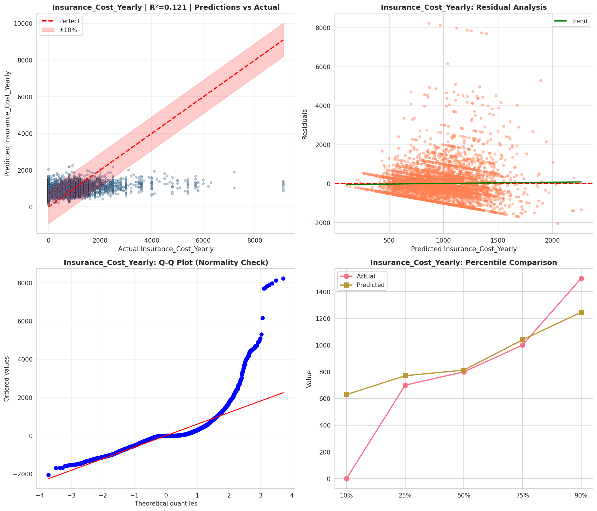
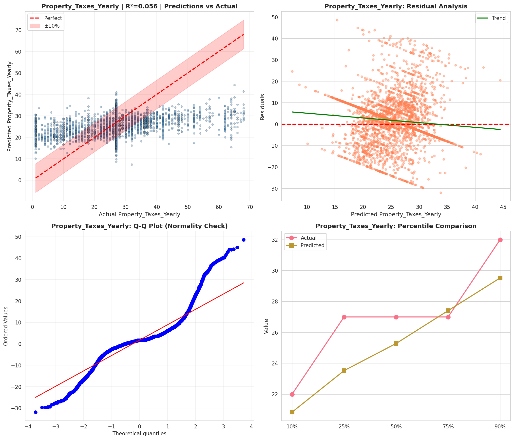
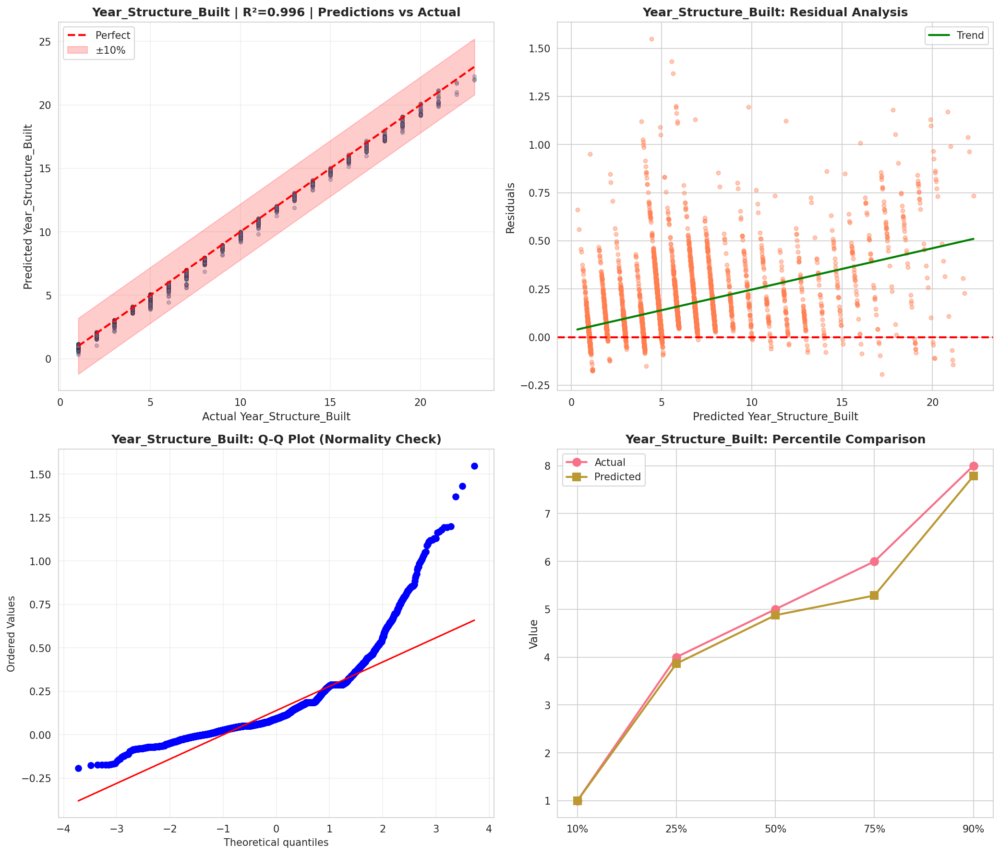
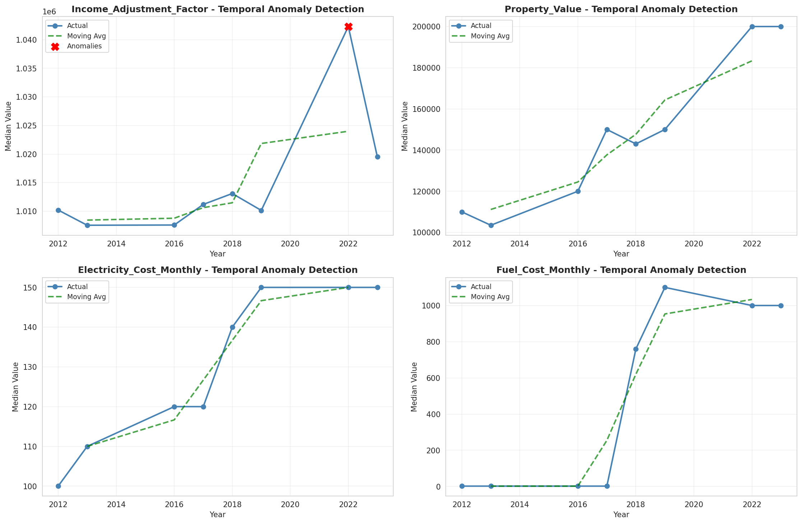
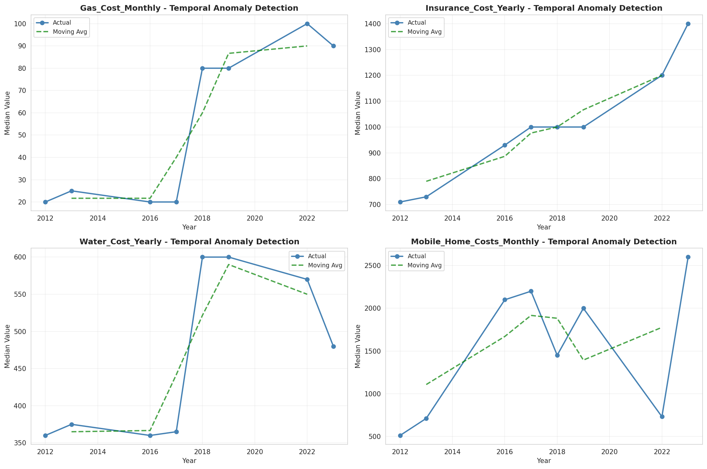
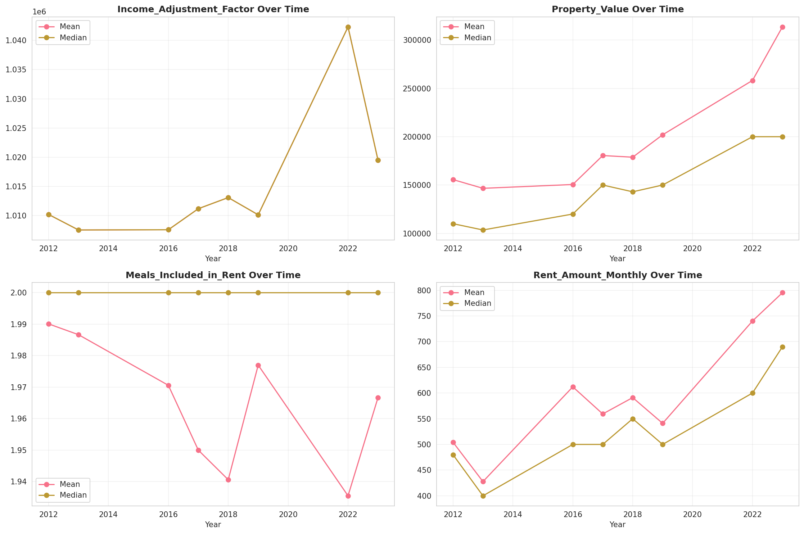
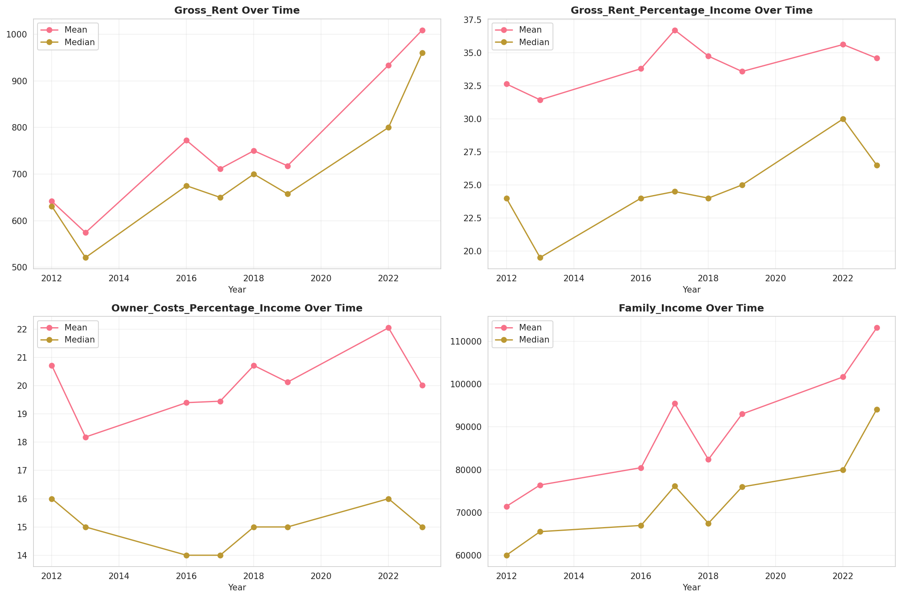

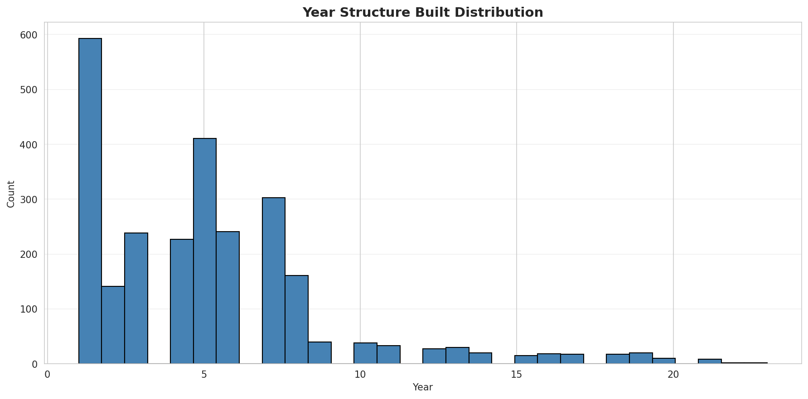
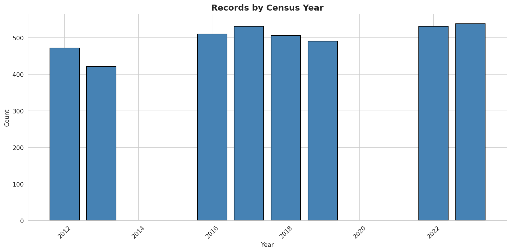
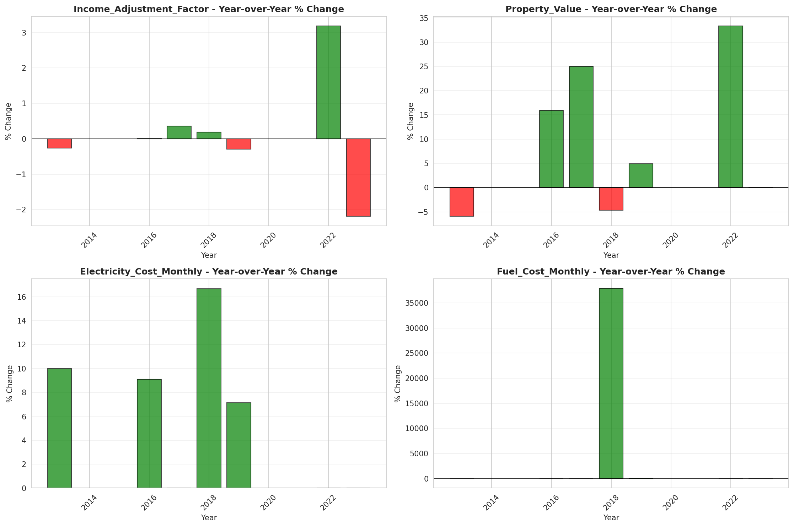
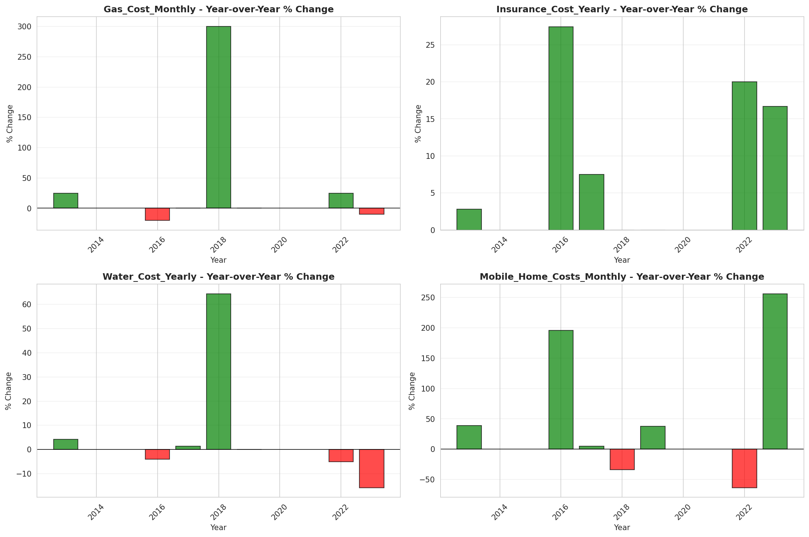
