# Temporal Analysis

## Year Distribution

- 2012: 20,430 records

- 2015: 21,336 records

- 2016: 21,332 records

- 2017: 21,552 records

- 2018: 21,814 records

- 2019: 22,070 records

- 2020: 22,376 records

- 2021: 22,541 records

- 2022: 22,731 records

## Temporal Trends

- Census_Year: {np.int64(2012): {'mean': 2012.0, 'median': 2012.0, 'std': 0.0}, np.int64(2015): {'mean': 2015.0, 'median': 2015.0, 'std': 0.0}, np.int64(2016): {'mean': 2016.0, 'median': 2016.0, 'std': 0.0}, np.int64(2017): {'mean': 2017.0, 'median': 2017.0, 'std': 0.0}, np.int64(2018): {'mean': 2018.0, 'median': 2018.0, 'std': 0.0}, np.int64(2019): {'mean': 2019.0, 'median': 2019.0, 'std': 0.0}, np.int64(2020): {'mean': 2020.0, 'median': 2020.0, 'std': 0.0}, np.int64(2021): {'mean': 2021.0, 'median': 2021.0, 'std': 0.0}, np.int64(2022): {'mean': 2022.0, 'median': 2022.0, 'std': 0.0}}

- Census_Division: {np.int64(2012): {'mean': 4.0, 'median': 4.0, 'std': 0.0}, np.int64(2015): {'mean': 4.0, 'median': 4.0, 'std': 0.0}, np.int64(2016): {'mean': 4.0, 'median': 4.0, 'std': 0.0}, np.int64(2017): {'mean': 4.0, 'median': 4.0, 'std': 0.0}, np.int64(2018): {'mean': 4.0, 'median': 4.0, 'std': 0.0}, np.int64(2019): {'mean': 4.0, 'median': 4.0, 'std': 0.0}, np.int64(2020): {'mean': 4.0, 'median': 4.0, 'std': 0.0}, np.int64(2021): {'mean': 4.0, 'median': 4.0, 'std': 0.0}, np.int64(2022): {'mean': 4.0, 'median': 4.0, 'std': 0.0}}

- Public_Use_Microdata_Area: {np.int64(2012): {'mean': None, 'median': None, 'std': None}, np.int64(2015): {'mean': None, 'median': None, 'std': None}, np.int64(2016): {'mean': 338.069566847928, 'median': 300.0, 'std': 156.65412228689706}, np.int64(2017): {'mean': 339.17037861915367, 'median': 300.0, 'std': 157.18634792235125}, np.int64(2018): {'mean': 339.4058861281746, 'median': 300.0, 'std': 157.431286941089}, np.int64(2019): {'mean': 340.04531037607615, 'median': 300.0, 'std': 157.72694863378996}, np.int64(2020): {'mean': 340.3825527350733, 'median': 300.0, 'std': 157.4475633698729}, np.int64(2021): {'mean': 341.0318974313473, 'median': 300.0, 'std': 157.25004786624805}, np.int64(2022): {'mean': None, 'median': None, 'std': None}}

- Census_Region: {np.int64(2012): {'mean': 2.0, 'median': 2.0, 'std': 0.0}, np.int64(2015): {'mean': 2.0, 'median': 2.0, 'std': 0.0}, np.int64(2016): {'mean': 2.0, 'median': 2.0, 'std': 0.0}, np.int64(2017): {'mean': 2.0, 'median': 2.0, 'std': 0.0}, np.int64(2018): {'mean': 2.0, 'median': 2.0, 'std': 0.0}, np.int64(2019): {'mean': 2.0, 'median': 2.0, 'std': 0.0}, np.int64(2020): {'mean': 2.0, 'median': 2.0, 'std': 0.0}, np.int64(2021): {'mean': 2.0, 'median': 2.0, 'std': 0.0}, np.int64(2022): {'mean': 2.0, 'median': 2.0, 'std': 0.0}}

- State_Code: {np.int64(2012): {'mean': 46.0, 'median': 46.0, 'std': 0.0}, np.int64(2015): {'mean': 46.0, 'median': 46.0, 'std': 0.0}, np.int64(2016): {'mean': 46.0, 'median': 46.0, 'std': 0.0}, np.int64(2017): {'mean': 46.0, 'median': 46.0, 'std': 0.0}, np.int64(2018): {'mean': 46.0, 'median': 46.0, 'std': 0.0}, np.int64(2019): {'mean': 46.0, 'median': 46.0, 'std': 0.0}, np.int64(2020): {'mean': 46.0, 'median': 46.0, 'std': 0.0}, np.int64(2021): {'mean': 46.0, 'median': 46.0, 'std': 0.0}, np.int64(2022): {'mean': 46.0, 'median': 46.0, 'std': 0.0}}

- Housing_Adjustment_Factor: {np.int64(2012): {'mean': 1041229.7876651982, 'median': 1053092.0, 'std': 27476.557306184714}, np.int64(2015): {'mean': 1021006.5013592051, 'median': 1017534.0, 'std': 20358.578721306545}, np.int64(2016): {'mean': 1020304.4832645791, 'median': 1013801.0, 'std': 15758.202409552618}, np.int64(2017): {'mean': 1029012.9397271714, 'median': 1034680.0, 'std': 18017.151209714983}, np.int64(2018): {'mean': 1038060.2881177226, 'median': 1046406.0, 'std': 23512.393459438517}, np.int64(2019): {'mean': 1040547.1327140916, 'median': 1042936.0, 'std': 29168.298337585227}, np.int64(2020): {'mean': 1034989.0721308545, 'median': 1030827.0, 'std': 28525.150476610936}, np.int64(2021): {'mean': 1057996.0062996317, 'median': 1059761.0, 'std': 34982.886693502354}, np.int64(2022): {'mean': 1105740.230566187, 'median': 1133141.0, 'std': 60860.74013070313}}

- Income_Adjustment_Factor: {np.int64(2012): {'mean': 1052508.0355359765, 'median': 1061121.0, 'std': 26372.650386070967}, np.int64(2015): {'mean': 1030446.2784026996, 'median': 1025215.0, 'std': 25753.330876816344}, np.int64(2016): {'mean': 1027458.3925557848, 'median': 1022342.0, 'std': 17511.75861884247}, np.int64(2017): {'mean': 1036420.9351336303, 'median': 1035988.0, 'std': 16868.74215949279}, np.int64(2018): {'mean': 1046669.5202163748, 'median': 1054346.0, 'std': 20528.039407834443}, np.int64(2019): {'mean': 1049529.5046669687, 'median': 1054606.0, 'std': 26233.191470664973}, np.int64(2020): {'mean': 1044960.8964515552, 'median': 1044328.0, 'std': 29193.94496677891}, np.int64(2021): {'mean': 1072666.923694601, 'median': 1070512.0, 'std': 30398.693790598587}, np.int64(2022): {'mean': 1127498.999604065, 'median': 1140108.0, 'std': 48973.230321822164}}

- Housing_Unit_Weight: {np.int64(2012): {'mean': 17.80680372001958, 'median': 12.0, 'std': 19.699987382671676}, np.int64(2015): {'mean': 17.45069366329209, 'median': 10.0, 'std': 20.434555037822694}, np.int64(2016): {'mean': 17.619819988749295, 'median': 11.0, 'std': 20.028216863426895}, np.int64(2017): {'mean': 17.766889383815887, 'median': 11.0, 'std': 20.099694511818743}, np.int64(2018): {'mean': 17.77010176950582, 'median': 11.0, 'std': 20.340085284468575}, np.int64(2019): {'mean': 17.771409152695966, 'median': 11.0, 'std': 20.447855896969802}, np.int64(2020): {'mean': 17.73404540579192, 'median': 10.0, 'std': 22.447418190704557}, np.int64(2021): {'mean': 17.384188811499047, 'median': 10.0, 'std': 22.38744193875957}, np.int64(2022): {'mean': 17.448682416083763, 'median': 10.0, 'std': 22.638451076379503}}

- Number_of_Persons: {np.int64(2012): {'mean': 2.0246206558981887, 'median': 2.0, 'std': 1.4726214787853213}, np.int64(2015): {'mean': 2.010873640794901, 'median': 2.0, 'std': 1.489679790553867}, np.int64(2016): {'mean': 2.0257359834989686, 'median': 2.0, 'std': 1.5088517429978732}, np.int64(2017): {'mean': 2.0283036377134374, 'median': 2.0, 'std': 1.523404631550767}, np.int64(2018): {'mean': 2.0152195837535527, 'median': 2.0, 'std': 1.5289343559802664}, np.int64(2019): {'mean': 2.014589941096511, 'median': 2.0, 'std': 1.525402320023818}, np.int64(2020): {'mean': 1.9975867000357526, 'median': 2.0, 'std': 1.5427736711209474}, np.int64(2021): {'mean': 1.9873120092276297, 'median': 2.0, 'std': 1.5351887188881848}, np.int64(2022): {'mean': 1.9889578109190094, 'median': 2.0, 'std': 1.5294473985536088}}

- Housing_Unit_Type: {np.int64(2012): {'mean': 1.1516886930983847, 'median': 1.0, 'std': 0.46875641148358793}, np.int64(2015): {'mean': 1.18714848143982, 'median': 1.0, 'std': 0.5212933076623757}, np.int64(2016): {'mean': 1.1749484342771424, 'median': 1.0, 'std': 0.5060735819634706}, np.int64(2017): {'mean': 1.172559391239792, 'median': 1.0, 'std': 0.504503941874269}, np.int64(2018): {'mean': 1.1701659484734575, 'median': 1.0, 'std': 0.5019717231484512}, np.int64(2019): {'mean': 1.1685999093792478, 'median': 1.0, 'std': 0.5003800149614958}, np.int64(2020): {'mean': None, 'median': None, 'std': None}, np.int64(2021): {'mean': None, 'median': None, 'std': None}, np.int64(2022): {'mean': None, 'median': None, 'std': None}}

- Building_Type: {np.int64(2012): {'mean': 2.500027380756804, 'median': 2.0, 'std': 1.6271796400057914}, np.int64(2015): {'mean': 2.485579247005747, 'median': 2.0, 'std': 1.616710959097819}, np.int64(2016): {'mean': 2.4954235845040444, 'median': 2.0, 'std': 1.6287229214852321}, np.int64(2017): {'mean': 2.5006566160634556, 'median': 2.0, 'std': 1.6335170353006834}, np.int64(2018): {'mean': 2.5154324184360437, 'median': 2.0, 'std': 1.6486521210731908}, np.int64(2019): {'mean': 2.5230258113979045, 'median': 2.0, 'std': 1.6589576566757436}, np.int64(2020): {'mean': 2.52991927346115, 'median': 2.0, 'std': 1.6617926964528484}, np.int64(2021): {'mean': 2.5331432287758266, 'median': 2.0, 'std': 1.6622341724357663}, np.int64(2022): {'mean': 2.5426883748634963, 'median': 2.0, 'std': 1.6759846943919408}}

- Year_Structure_Built: {np.int64(2012): {'mean': 4.330759542193746, 'median': 4.0, 'std': 2.8039462525800354}, np.int64(2015): {'mean': 4.651323916429454, 'median': 5.0, 'std': 3.203624099785828}, np.int64(2016): {'mean': 4.8067794806300554, 'median': 5.0, 'std': 3.392803839191646}, np.int64(2017): {'mean': 4.959762567631454, 'median': 5.0, 'std': 3.6298531802904503}, np.int64(2018): {'mean': 5.083894355256344, 'median': 5.0, 'std': 3.8391859902206784}, np.int64(2019): {'mean': 5.240020444671607, 'median': 5.0, 'std': 4.088889554311218}, np.int64(2020): {'mean': 5.399798183652876, 'median': 5.0, 'std': 4.340309488046631}, np.int64(2021): {'mean': None, 'median': None, 'std': None}, np.int64(2022): {'mean': None, 'median': None, 'std': None}}

- Bathtub_or_Shower: {np.int64(2012): {'mean': 1.0145118011061827, 'median': 1.0, 'std': 0.11959093583362855}, np.int64(2015): {'mean': 1.0143401901283635, 'median': 1.0, 'std': 0.11889200251800683}, np.int64(2016): {'mean': 1.0146871008939975, 'median': 1.0, 'std': 0.12030029129136909}, np.int64(2017): {'mean': 1.015128434102012, 'median': 1.0, 'std': 0.12206697869703872}, np.int64(2018): {'mean': 1.0167788710512689, 'median': 1.0, 'std': 0.12844529934403626}, np.int64(2019): {'mean': 1.0168668540761565, 'median': 1.0, 'std': 0.12877581646210925}, np.int64(2020): {'mean': 1.0168516649848638, 'median': 1.0, 'std': 0.12871877221976918}, np.int64(2021): {'mean': 1.0149081995097304, 'median': 1.0, 'std': 0.1211886126465938}, np.int64(2022): {'mean': 1.0130547006849995, 'median': 1.0, 'std': 0.1135117397094512}}

- Refrigerator: {np.int64(2012): {'mean': 1.0210831827391709, 'median': 1.0, 'std': 0.14366562710727243}, np.int64(2015): {'mean': 1.0221816424082926, 'median': 1.0, 'std': 0.14727790781176595}, np.int64(2016): {'mean': 1.0226160068114092, 'median': 1.0, 'std': 0.14867985533675143}, np.int64(2017): {'mean': 1.0235856489993171, 'median': 1.0, 'std': 0.15175828129063385}, np.int64(2018): {'mean': 1.0252718798549973, 'median': 1.0, 'std': 0.15695377561853574}, np.int64(2019): {'mean': 1.026424738052645, 'median': 1.0, 'std': 0.16039883497658997}, np.int64(2020): {'mean': 1.0273461150353178, 'median': 1.0, 'std': 0.16309398238039166}, np.int64(2021): {'mean': 1.0262144179298613, 'median': 1.0, 'std': 0.1597764042336903}, np.int64(2022): {'mean': 1.0251662861113868, 'median': 1.0, 'std': 0.15663384683003143}}

- Hot_and_Cold_Running_Water: {np.int64(2012): {'mean': 1.024314112042057, 'median': 1.0, 'std': 0.1540267352529764}, np.int64(2015): {'mean': 1.0216445566356946, 'median': 1.0, 'std': 0.1455239059447208}, np.int64(2016): {'mean': 1.0230949340144742, 'median': 1.0, 'std': 0.15020904997701892}, np.int64(2017): {'mean': 1.0246362347008457, 'median': 1.0, 'std': 0.15501791170176757}, np.int64(2018): {'mean': 1.0265147591921284, 'median': 1.0, 'std': 0.16066444382287762}, np.int64(2019): {'mean': 1.0284692052133912, 'median': 1.0, 'std': 0.16631332876006674}, np.int64(2020): {'mean': 1.0301210898082744, 'median': 1.0, 'std': 0.17092478985653295}, np.int64(2021): {'mean': 1.0299664815648606, 'median': 1.0, 'std': 0.17049910804646223}, np.int64(2022): {'mean': 1.0285416459843144, 'median': 1.0, 'std': 0.16651845783919175}}

- Running_Water: {np.int64(2012): {'mean': None, 'median': None, 'std': None}, np.int64(2015): {'mean': 9.0, 'median': 9.0, 'std': 0.0}, np.int64(2016): {'mean': 9.0, 'median': 9.0, 'std': 0.0}, np.int64(2017): {'mean': 9.0, 'median': 9.0, 'std': 0.0}, np.int64(2018): {'mean': 9.0, 'median': 9.0, 'std': 0.0}, np.int64(2019): {'mean': 9.0, 'median': 9.0, 'std': 0.0}, np.int64(2020): {'mean': 9.0, 'median': 9.0, 'std': 0.0}, np.int64(2021): {'mean': 9.0, 'median': 9.0, 'std': 0.0}, np.int64(2022): {'mean': 9.0, 'median': 9.0, 'std': 0.0}}

- Sink_with_Faucet: {np.int64(2012): {'mean': 1.0131975247795848, 'median': 1.0, 'std': 0.11412301843492732}, np.int64(2015): {'mean': 1.0123529727697513, 'median': 1.0, 'std': 0.11045828232223297}, np.int64(2016): {'mean': 1.0126117496807152, 'median': 1.0, 'std': 0.11159460625525204}, np.int64(2017): {'mean': 1.0130272626989547, 'median': 1.0, 'std': 0.11339412929724654}, np.int64(2018): {'mean': 1.014344899016054, 'median': 1.0, 'std': 0.11891112287690991}, np.int64(2019): {'mean': 1.0143112701252237, 'median': 1.0, 'std': 0.1187736448637354}, np.int64(2020): {'mean': 1.0145812310797175, 'median': 1.0, 'std': 0.11987219766082133}, np.int64(2021): {'mean': 1.013157236480064, 'median': 1.0, 'std': 0.11395074902873514}, np.int64(2022): {'mean': 1.0116152089744863, 'median': 1.0, 'std': 0.10714880203766707}}

- Stove_or_Range: {np.int64(2012): {'mean': 1.023656973878758, 'median': 1.0, 'std': 0.1519821909935833}, np.int64(2015): {'mean': 1.0244374026532037, 'median': 1.0, 'std': 0.15440691855491998}, np.int64(2016): {'mean': 1.0246913580246915, 'median': 1.0, 'std': 0.1551869080119652}, np.int64(2017): {'mean': 1.02589693754268, 'median': 1.0, 'std': 0.15883202245447664}, np.int64(2018): {'mean': 1.0285344381149664, 'median': 1.0, 'std': 0.16649822692151214}, np.int64(2019): {'mean': 1.030002555583951, 'median': 1.0, 'std': 0.17059862189084596}, np.int64(2020): {'mean': 1.0313824419778002, 'median': 1.0, 'std': 0.17435342862430714}, np.int64(2021): {'mean': 1.0301165641102605, 'median': 1.0, 'std': 0.17091231094072704}, np.int64(2022): {'mean': 1.0288394718554552, 'median': 1.0, 'std': 0.1673593350448546}}

- Telephone_Service: {np.int64(2012): {'mean': 1.0197583081570998, 'median': 1.0, 'std': 0.1391728700339882}, np.int64(2015): {'mean': 1.023947836395969, 'median': 1.0, 'std': 0.15289121350332746}, np.int64(2016): {'mean': 1.0272641620539396, 'median': 1.0, 'std': 0.16285695967826624}, np.int64(2017): {'mean': 1.0276984080704414, 'median': 1.0, 'std': 0.16411208601648355}, np.int64(2018): {'mean': 1.0269973407330326, 'median': 1.0, 'std': 0.16208023630051127}, np.int64(2019): {'mean': 1.0249600182773588, 'median': 1.0, 'std': 0.1560077110130004}, np.int64(2020): {'mean': 1.0207978179338562, 'median': 1.0, 'std': 0.14271098772643848}, np.int64(2021): {'mean': 1.0152241330702, 'median': 1.0, 'std': 0.12244674044027594}, np.int64(2022): {'mean': 1.0124220142602496, 'median': 1.0, 'std': 0.11076277001617932}}

- Lot_Acreage: {np.int64(2012): {'mean': 1.4737337601205047, 'median': 1.0, 'std': 0.7608227233282177}, np.int64(2015): {'mean': 1.451298103480022, 'median': 1.0, 'std': 0.7395480503336015}, np.int64(2016): {'mean': 1.430731707317073, 'median': 1.0, 'std': 0.7239725838619899}, np.int64(2017): {'mean': 1.4178375444732558, 'median': 1.0, 'std': 0.7145220580637813}, np.int64(2018): {'mean': 1.4113829850568553, 'median': 1.0, 'std': 0.7087611989123398}, np.int64(2019): {'mean': 1.4123286865478502, 'median': 1.0, 'std': 0.7095804853117585}, np.int64(2020): {'mean': 1.4176354336200883, 'median': 1.0, 'std': 0.7102560960615946}, np.int64(2021): {'mean': 1.4242668663939622, 'median': 1.0, 'std': 0.7144710859763165}, np.int64(2022): {'mean': 1.4334324602539175, 'median': 1.0, 'std': 0.7187992156932981}}

- Agricultural_Sales: {np.int64(2012): {'mean': 2.5432396839332747, 'median': 1.0, 'std': 2.2022083409130677}, np.int64(2015): {'mean': 2.4336633663366336, 'median': 1.0, 'std': 2.1694425470608567}, np.int64(2016): {'mean': 2.376893511191499, 'median': 1.0, 'std': 2.146527415387972}, np.int64(2017): {'mean': 2.3833218152499422, 'median': 1.0, 'std': 2.1550579503699128}, np.int64(2018): {'mean': 2.3295612009237874, 'median': 1.0, 'std': 2.124813862258303}, np.int64(2019): {'mean': 2.3003646308113037, 'median': 1.0, 'std': 2.1059317603184606}, np.int64(2020): {'mean': 2.2635210327175606, 'median': 1.0, 'std': 2.087041341748849}, np.int64(2021): {'mean': 2.2767818102317445, 'median': 1.0, 'std': 2.095239166680209}, np.int64(2022): {'mean': 2.2738195615514334, 'median': 1.0, 'std': 2.088557441966182}}

- Business_On_Property: {np.int64(2012): {'mean': 1.975522500470721, 'median': 2.0, 'std': 0.15453106585021412}, np.int64(2015): {'mean': 1.9753882035229853, 'median': 2.0, 'std': 0.15494363310101333}, np.int64(2016): {'mean': 3.4032926829268293, 'median': 2.0, 'std': 2.8306104933914886}, np.int64(2017): {'mean': 4.824639691250075, 'median': 2.0, 'std': 3.452191284769106}, np.int64(2018): {'mean': 6.231350836458891, 'median': 9.0, 'std': 3.4347849593081854}, np.int64(2019): {'mean': 7.626139638844774, 'median': 9.0, 'std': 2.7883976375277664}, np.int64(2020): {'mean': None, 'median': None, 'std': None}, np.int64(2021): {'mean': None, 'median': None, 'std': None}, np.int64(2022): {'mean': None, 'median': None, 'std': None}}

- Tenure: {np.int64(2012): {'mean': 1.8993353474320243, 'median': 2.0, 'std': 0.8522590926413705}, np.int64(2015): {'mean': 1.9259039715471251, 'median': 2.0, 'std': 0.8407270538292939}, np.int64(2016): {'mean': 1.9282181132964316, 'median': 2.0, 'std': 0.842230077503415}, np.int64(2017): {'mean': 1.9281007638929384, 'median': 2.0, 'std': 0.8368951722791742}, np.int64(2018): {'mean': 1.9271013990056653, 'median': 2.0, 'std': 0.8382193726718163}, np.int64(2019): {'mean': 1.923006625542609, 'median': 2.0, 'std': 0.8394311141332998}, np.int64(2020): {'mean': 1.9231162632117287, 'median': 2.0, 'std': 0.8386639257984168}, np.int64(2021): {'mean': 1.9202706512545813, 'median': 2.0, 'std': 0.8321139317442295}, np.int64(2022): {'mean': 1.9173908199643495, 'median': 2.0, 'std': 0.8310747446776363}}

- Vacancy_Status: {np.int64(2012): {'mean': 5.120981881940386, 'median': 5.0, 'std': 1.9282384092298948}, np.int64(2015): {'mean': 5.158947970268725, 'median': 5.0, 'std': 1.9466294969308127}, np.int64(2016): {'mean': 5.197237569060773, 'median': 5.0, 'std': 1.950830950485368}, np.int64(2017): {'mean': 5.211334745762712, 'median': 5.0, 'std': 1.9599429812878906}, np.int64(2018): {'mean': 5.2326043737574555, 'median': 5.0, 'std': 1.981157027878066}, np.int64(2019): {'mean': 5.251336898395722, 'median': 5.0, 'std': 2.000371904080572}, np.int64(2020): {'mean': 5.258775877587759, 'median': 5.0, 'std': 2.0204051232236186}, np.int64(2021): {'mean': 5.286157941437445, 'median': 5.0, 'std': 2.0291296466333453}, np.int64(2022): {'mean': 5.3163172288058345, 'median': 5.0, 'std': 2.039562626147465}}

- Vehicles_Available: {np.int64(2012): {'mean': 2.1682175226586105, 'median': 2.0, 'std': 1.2193596768166914}, np.int64(2015): {'mean': 2.164256075874333, 'median': 2.0, 'std': 1.221700132232996}, np.int64(2016): {'mean': 2.1668236956777767, 'median': 2.0, 'std': 1.2167100227894292}, np.int64(2017): {'mean': 2.173887690244329, 'median': 2.0, 'std': 1.2207259526172323}, np.int64(2018): {'mean': 2.1766100127182333, 'median': 2.0, 'std': 1.2262534581280058}, np.int64(2019): {'mean': 2.1991660954992005, 'median': 2.0, 'std': 1.2310715208506824}, np.int64(2020): {'mean': 2.2104216388225937, 'median': 2.0, 'std': 1.2381347684336443}, np.int64(2021): {'mean': 2.222385114180998, 'median': 2.0, 'std': 1.247053889392497}, np.int64(2022): {'mean': 2.2267713903743314, 'median': 2.0, 'std': 1.2501643515103162}}

- Condo_Fee_Monthly: {np.int64(2012): {'mean': 167.38571428571427, 'median': 140.0, 'std': 138.98913500905485}, np.int64(2015): {'mean': 187.9655172413793, 'median': 150.0, 'std': 143.4729443383715}, np.int64(2016): {'mean': 191.6451612903226, 'median': 150.0, 'std': 145.89673336187082}, np.int64(2017): {'mean': 192.54098360655738, 'median': 160.0, 'std': 145.04237896177892}, np.int64(2018): {'mean': 205.3146853146853, 'median': 160.0, 'std': 159.6157542605833}, np.int64(2019): {'mean': 204.29577464788733, 'median': 170.0, 'std': 147.83735498215285}, np.int64(2020): {'mean': 201.26760563380282, 'median': 165.0, 'std': 140.96858034785686}, np.int64(2021): {'mean': 209.79310344827587, 'median': 180.0, 'std': 143.3113789655105}, np.int64(2022): {'mean': 219.3835616438356, 'median': 180.0, 'std': 149.13184448085423}}

- Electricity_Cost_Monthly: {np.int64(2012): {'mean': 113.76960725075529, 'median': 100.0, 'std': 78.53562178145904}, np.int64(2015): {'mean': 128.8122703023118, 'median': 110.0, 'std': 88.61147770282037}, np.int64(2016): {'mean': 132.01301377929573, 'median': 120.0, 'std': 89.99865669909265}, np.int64(2017): {'mean': 136.47489649542248, 'median': 120.0, 'std': 93.68461515657982}, np.int64(2018): {'mean': 149.0, 'median': 130.0, 'std': 92.60885911498403}, np.int64(2019): {'mean': 152.9494054841058, 'median': 130.0, 'std': 95.10031928268832}, np.int64(2020): {'mean': 156.17623594826543, 'median': 140.0, 'std': 96.58657995799793}, np.int64(2021): {'mean': 159.6745050989802, 'median': 140.0, 'std': 99.36318617019462}, np.int64(2022): {'mean': 166.92839359810313, 'median': 150.0, 'std': 116.9716338334679}}

- Fuel_Cost_Monthly: {np.int64(2012): {'mean': 170.0407854984894, 'median': 2.0, 'std': 513.5690195105839}, np.int64(2015): {'mean': 130.00752815649082, 'median': 2.0, 'std': 479.02287615917305}, np.int64(2016): {'mean': 110.58826993287009, 'median': 2.0, 'std': 439.54550228927667}, np.int64(2017): {'mean': 91.59723599043676, 'median': 2.0, 'std': 392.45352584780284}, np.int64(2018): {'mean': 956.1347150259068, 'median': 795.0, 'std': 851.0258458268148}, np.int64(2019): {'mean': 898.3437077131258, 'median': 750.0, 'std': 758.7576139457879}, np.int64(2020): {'mean': 879.8738483345145, 'median': 750.0, 'std': 720.816757753916}, np.int64(2021): {'mean': 887.8216374269006, 'median': 750.0, 'std': 735.5725658419182}, np.int64(2022): {'mean': 959.7432835820896, 'median': 800.0, 'std': 821.3082042146815}}

- Gas_Cost_Monthly: {np.int64(2012): {'mean': 63.846042296072504, 'median': 30.0, 'std': 86.60323104547818}, np.int64(2015): {'mean': 61.59810314167161, 'median': 30.0, 'std': 87.10752877057321}, np.int64(2016): {'mean': 59.22411965610647, 'median': 30.0, 'std': 84.34077129644385}, np.int64(2017): {'mean': 58.81876494256225, 'median': 30.0, 'std': 83.87835558229668}, np.int64(2018): {'mean': 96.8156186416045, 'median': 70.0, 'std': 91.30919982722799}, np.int64(2019): {'mean': 94.15521821631879, 'median': 70.0, 'std': 88.77455989409972}, np.int64(2020): {'mean': 94.64933358363056, 'median': 70.0, 'std': 91.183286879171}, np.int64(2021): {'mean': 98.10764242704956, 'median': 70.0, 'std': 95.54390242732032}, np.int64(2022): {'mean': 109.3859872611465, 'median': 80.0, 'std': 130.2373372124502}}

- House_Heating_Fuel: {np.int64(2012): {'mean': 2.227009063444109, 'median': 2.0, 'std': 1.4088651525629607}, np.int64(2015): {'mean': 2.2802015411973917, 'median': 2.0, 'std': 1.4442940754624376}, np.int64(2016): {'mean': 2.2705806147685785, 'median': 2.0, 'std': 1.4437958234409567}, np.int64(2017): {'mean': 2.2625225960697417, 'median': 2.0, 'std': 1.4421453657376893}, np.int64(2018): {'mean': 2.246040004624812, 'median': 2.0, 'std': 1.4230336563045884}, np.int64(2019): {'mean': 2.2232122458304775, 'median': 2.0, 'std': 1.404642819736184}, np.int64(2020): {'mean': 2.2101943402659394, 'median': 2.0, 'std': 1.372562776364505}, np.int64(2021): {'mean': 2.2040033831406824, 'median': 2.0, 'std': 1.367713131670726}, np.int64(2022): {'mean': 2.2045454545454546, 'median': 2.0, 'std': 1.3847355589254944}}

- Insurance_Cost_Yearly: {np.int64(2015): {'mean': 866.506658889861, 'median': 730.0, 'std': 593.2640361057162}}

- Water_Cost_Yearly: {np.int64(2012): {'mean': 364.8161329305136, 'median': 360.0, 'std': 376.9383770092814}, np.int64(2015): {'mean': 398.03040901007705, 'median': 360.0, 'std': 429.1364690168639}, np.int64(2016): {'mean': 404.9837474973501, 'median': 360.0, 'std': 441.4893155067637}, np.int64(2017): {'mean': 412.1769782494606, 'median': 360.0, 'std': 448.76373309649205}, np.int64(2018): {'mean': 554.0385205647636, 'median': 540.0, 'std': 446.31620129206055}, np.int64(2019): {'mean': 555.2588633797516, 'median': 540.0, 'std': 452.9745088397345}, np.int64(2020): {'mean': 568.7193061163451, 'median': 550.0, 'std': 472.3483443069196}, np.int64(2021): {'mean': 578.9531146819282, 'median': 550.0, 'std': 496.4836546166051}, np.int64(2022): {'mean': 592.4550630630631, 'median': 550.0, 'std': 525.4541633216372}}

- Mobile_Home_Costs_Monthly: {np.int64(2012): {'mean': 1427.4827109266944, 'median': 900.0, 'std': 1444.8295141085607}, np.int64(2015): {'mean': 1428.1316872427983, 'median': 850.0, 'std': 1592.7545888921009}, np.int64(2016): {'mean': 1478.2042553191488, 'median': 850.0, 'std': 1703.1841514278617}, np.int64(2017): {'mean': 1550.796486090776, 'median': 900.0, 'std': 1731.6239655964869}, np.int64(2018): {'mean': 1645.148484848485, 'median': 1000.0, 'std': 1745.0397239059746}, np.int64(2019): {'mean': 1759.0692194403534, 'median': 1200.0, 'std': 1760.326097667094}, np.int64(2020): {'mean': 1946.603475513428, 'median': 1200.0, 'std': 2502.683887663437}, np.int64(2021): {'mean': 2167.3808049535605, 'median': 1200.0, 'std': 3724.4164665089593}, np.int64(2022): {'mean': 2192.0, 'median': 1200.0, 'std': 3738.1407380210535}}

- First_Mortgage_Includes_Insurance: {np.int64(2012): {'mean': 1.4211356466876972, 'median': 1.0, 'std': 0.49378018491207953}, np.int64(2015): {'mean': 1.3946372758677414, 'median': 1.0, 'std': 0.4888128495054187}, np.int64(2016): {'mean': 1.378871861754157, 'median': 1.0, 'std': 0.48514569451031625}, np.int64(2017): {'mean': 1.3686261773303021, 'median': 1.0, 'std': 0.48247147039324145}, np.int64(2018): {'mean': 1.3612136779579387, 'median': 1.0, 'std': 0.4803908880922033}, np.int64(2019): {'mean': 1.3572775856648853, 'median': 1.0, 'std': 0.47923523677348484}, np.int64(2020): {'mean': 1.3494564361115489, 'median': 1.0, 'std': 0.47683588265016164}, np.int64(2021): {'mean': 1.339359340310815, 'median': 1.0, 'std': 0.47352944647068995}, np.int64(2022): {'mean': 1.3299212598425196, 'median': 1.0, 'std': 0.4702212695216875}}

- First_Mortgage_Payment_Monthly: {np.int64(2012): {'mean': 820.6186119873817, 'median': 710.0, 'std': 550.0238836334729}, np.int64(2015): {'mean': 845.829248231617, 'median': 750.0, 'std': 534.0999783719807}, np.int64(2016): {'mean': 876.9700032605151, 'median': 780.0, 'std': 559.4468979673549}, np.int64(2017): {'mean': 897.8632672945762, 'median': 800.0, 'std': 562.6694410844912}, np.int64(2018): {'mean': 925.7206614223792, 'median': 820.0, 'std': 571.8200143099174}, np.int64(2019): {'mean': 959.2640679031751, 'median': 850.0, 'std': 589.0369287553185}, np.int64(2020): {'mean': 987.7321569245313, 'median': 870.0, 'std': 610.6526400595154}, np.int64(2021): {'mean': 1013.9019980970504, 'median': 900.0, 'std': 621.5657892471098}, np.int64(2022): {'mean': 1066.88031496063, 'median': 950.0, 'std': 655.9254443454893}}

- First_Mortgage_Includes_Taxes: {np.int64(2012): {'mean': 1.3645110410094636, 'median': 1.0, 'std': 0.4813307433205896}, np.int64(2015): {'mean': 1.3324559960519822, 'median': 1.0, 'std': 0.47113216854026724}, np.int64(2016): {'mean': 1.3126834039778286, 'median': 1.0, 'std': 0.46362434668541663}, np.int64(2017): {'mean': 1.2978239688210458, 'median': 1.0, 'std': 0.4573388435263146}, np.int64(2018): {'mean': 1.2868839300048163, 'median': 1.0, 'std': 0.45234322077782174}, np.int64(2019): {'mean': 1.2771141150581578, 'median': 1.0, 'std': 0.4476085058322649}, np.int64(2020): {'mean': 1.2703639514731369, 'median': 1.0, 'std': 0.4441828120407906}, np.int64(2021): {'mean': 1.2597526165556612, 'median': 1.0, 'std': 0.4385335692612874}, np.int64(2022): {'mean': 1.2502362204724409, 'median': 1.0, 'std': 0.43318310821185496}}

- First_Mortgage_Status: {np.int64(2012): {'mean': 1.996630024873626, 'median': 2.0, 'std': 0.9929885178193135}, np.int64(2015): {'mean': 2.049781659388646, 'median': 3.0, 'std': 0.9912186657600186}, np.int64(2016): {'mean': 2.0421127765881515, 'median': 3.0, 'std': 0.9915825185787586}, np.int64(2017): {'mean': 2.047675149230286, 'median': 3.0, 'std': 0.9913640606970903}, np.int64(2018): {'mean': 2.044888750583476, 'median': 3.0, 'std': 0.9919578270940566}, np.int64(2019): {'mean': 2.036158452326117, 'median': 3.0, 'std': 0.9928716902972988}, np.int64(2020): {'mean': 2.0449558061566595, 'median': 3.0, 'std': 0.992906183636954}, np.int64(2021): {'mean': 2.06509009009009, 'median': 3.0, 'std': 0.9919174409280418}, np.int64(2022): {'mean': 2.0743527329055103, 'median': 3.0, 'std': 0.9916683176942869}}

- Second_Mortgage_Payment_Monthly: {np.int64(2012): {'mean': 337.28051001821495, 'median': 260.0, 'std': 284.91306803675576}, np.int64(2015): {'mean': 330.27704485488124, 'median': 250.0, 'std': 317.6092200674231}, np.int64(2016): {'mean': 335.91910739191076, 'median': 240.0, 'std': 341.92450592041905}, np.int64(2017): {'mean': 335.62074074074076, 'median': 230.0, 'std': 358.8126456839482}, np.int64(2018): {'mean': 347.1820987654321, 'median': 230.0, 'std': 374.083879444016}, np.int64(2019): {'mean': 349.0944, 'median': 240.0, 'std': 365.8586743539097}, np.int64(2020): {'mean': 363.7142857142857, 'median': 250.0, 'std': 353.2705282727001}, np.int64(2021): {'mean': 389.8184663536776, 'median': 280.0, 'std': 398.2703098664967}, np.int64(2022): {'mean': 423.7496183206107, 'median': 300.0, 'std': 477.4761869230761}}

- Second_Mortgage_Status: {np.int64(2012): {'mean': 2.7981072555205047, 'median': 3.0, 'std': 0.5156606116363371}, np.int64(2015): {'mean': 2.8554038493173217, 'median': 3.0, 'std': 0.44059772428815136}, np.int64(2016): {'mean': 2.865340723834366, 'median': 3.0, 'std': 0.4224985733643307}, np.int64(2017): {'mean': 2.873010717765508, 'median': 3.0, 'std': 0.4075570013157972}, np.int64(2018): {'mean': 2.8792743618558356, 'median': 3.0, 'std': 0.3961143805255629}, np.int64(2019): {'mean': 2.886199308393587, 'median': 3.0, 'std': 0.3822850358727759}, np.int64(2020): {'mean': 2.8899874450721907, 'median': 3.0, 'std': 0.37289275018232126}, np.int64(2021): {'mean': 2.8900408419729815, 'median': 3.0, 'std': 0.37204527792536907}, np.int64(2022): {'mean': 2.8911490683229815, 'median': 3.0, 'std': 0.3673030820819682}}

- Property_Taxes_Yearly: {np.int64(2012): {'mean': 25.454384979539437, 'median': 25.0, 'std': 14.425225485412591}, np.int64(2015): {'mean': 26.31973005160778, 'median': 26.0, 'std': 14.965795120513375}, np.int64(2016): {'mean': 27.030533745737173, 'median': 26.0, 'std': 15.37140460960747}, np.int64(2017): {'mean': 27.718347470939367, 'median': 27.0, 'std': 15.547237594291554}}

- Meals_Included_in_Rent: {np.int64(2012): {'mean': 1.9653225806451613, 'median': 2.0, 'std': 0.1829860568166469}, np.int64(2015): {'mean': 1.9660243407707911, 'median': 2.0, 'std': 0.18118950784693164}, np.int64(2016): {'mean': 1.9663059517953763, 'median': 2.0, 'std': 0.18046265224443642}, np.int64(2017): {'mean': 1.962954053403897, 'median': 2.0, 'std': 0.18889713619228288}, np.int64(2018): {'mean': 1.9592371871275327, 'median': 2.0, 'std': 0.1977638214863648}, np.int64(2019): {'mean': 1.9608305804624824, 'median': 2.0, 'std': 0.19402076851766215}, np.int64(2020): {'mean': 1.9594912859161564, 'median': 2.0, 'std': 0.19717229595938082}, np.int64(2021): {'mean': 1.962124821343497, 'median': 2.0, 'std': 0.19091708159611845}, np.int64(2022): {'mean': 1.96144578313253, 'median': 2.0, 'std': 0.1925531702658201}}

- Rent_Amount_Monthly: {np.int64(2012): {'mean': 470.68333333333334, 'median': 400.0, 'std': 334.56673389081726}, np.int64(2015): {'mean': 500.59077079107504, 'median': 450.0, 'std': 357.35238382402946}, np.int64(2016): {'mean': 519.0073782587309, 'median': 470.0, 'std': 364.8207397438771}, np.int64(2017): {'mean': 534.1635795044504, 'median': 490.0, 'std': 378.4430799547341}, np.int64(2018): {'mean': 558.5077473182359, 'median': 500.0, 'std': 402.1410327589968}, np.int64(2019): {'mean': 574.3142991977347, 'median': 500.0, 'std': 402.6082807699129}, np.int64(2020): {'mean': 588.975506358926, 'median': 530.0, 'std': 399.7453027316101}, np.int64(2021): {'mean': 608.6626965221534, 'median': 550.0, 'std': 413.3770267065966}, np.int64(2022): {'mean': 640.858313253012, 'median': 580.0, 'std': 438.0211232163958}}

- Gross_Rent: {np.int64(2012): {'mean': 598.548, 'median': 550.0, 'std': 340.9924225250337}, np.int64(2015): {'mean': 642.7610857296426, 'median': 600.0, 'std': 359.59779600808827}, np.int64(2016): {'mean': 662.8945445053511, 'median': 620.0, 'std': 365.7513335073389}, np.int64(2017): {'mean': 681.2023535431057, 'median': 630.0, 'std': 379.98092762376416}, np.int64(2018): {'mean': 704.7426020408163, 'median': 650.0, 'std': 397.38771301987055}, np.int64(2019): {'mean': 724.8825316455697, 'median': 662.0, 'std': 401.9469424143602}, np.int64(2020): {'mean': 738.3929753117842, 'median': 680.0, 'std': 399.0391225116112}, np.int64(2021): {'mean': 756.7560598246519, 'median': 700.0, 'std': 409.70755854217686}, np.int64(2022): {'mean': 795.1620140881815, 'median': 728.0, 'std': 457.33175728183244}}

- Gross_Rent_Percentage_Income: {np.int64(2012): {'mean': 32.51840046363373, 'median': 24.0, 'std': 25.222462852372125}, np.int64(2015): {'mean': 32.5320250749523, 'median': 24.0, 'std': 24.998808516065857}, np.int64(2016): {'mean': 32.98939273402281, 'median': 25.0, 'std': 25.360224792269083}, np.int64(2017): {'mean': 32.673352435530084, 'median': 24.0, 'std': 25.44537305462515}, np.int64(2018): {'mean': 32.59036458333333, 'median': 24.0, 'std': 25.431061748664522}, np.int64(2019): {'mean': 32.18515645203, 'median': 24.0, 'std': 24.924642908224797}, np.int64(2020): {'mean': 32.15566528066528, 'median': 24.0, 'std': 25.277404303293466}, np.int64(2021): {'mean': 31.841344890990282, 'median': 24.0, 'std': 24.825889624914964}, np.int64(2022): {'mean': 32.02947424322889, 'median': 24.0, 'std': 24.774755435084742}}

- Selected_Monthly_Owner_Costs: {np.int64(2012): {'mean': 821.8776083467095, 'median': 630.0, 'std': 640.1976299596489}, np.int64(2015): {'mean': 824.2166626955762, 'median': 637.0, 'std': 619.2813916250346}, np.int64(2016): {'mean': 847.1512098373661, 'median': 659.0, 'std': 642.8642294218689}, np.int64(2017): {'mean': 862.4897077309868, 'median': 674.0, 'std': 649.052175513034}, np.int64(2018): {'mean': 887.5615127227453, 'median': 703.0, 'std': 660.3471411160142}, np.int64(2019): {'mean': 913.5983260385472, 'median': 726.0, 'std': 679.8553828306248}, np.int64(2020): {'mean': 932.1587410455724, 'median': 735.0, 'std': 697.4305777220707}, np.int64(2021): {'mean': 948.7477098663463, 'median': 745.5, 'std': 710.5612734268025}, np.int64(2022): {'mean': 995.1876798229436, 'median': 780.0, 'std': 753.2649371607205}}

- Owner_Costs_Percentage_Income: {np.int64(2012): {'mean': 20.724071082390953, 'median': 16.0, 'std': 17.98661085450227}, np.int64(2015): {'mean': 19.701877746703957, 'median': 15.0, 'std': 17.574341981258733}, np.int64(2016): {'mean': 19.478753993610223, 'median': 15.0, 'std': 17.58657643276923}, np.int64(2017): {'mean': 19.226837566263153, 'median': 15.0, 'std': 17.476180648798433}, np.int64(2018): {'mean': 19.265019607843136, 'median': 15.0, 'std': 17.531383284113872}, np.int64(2019): {'mean': 19.12113003095975, 'median': 15.0, 'std': 17.455955502313977}, np.int64(2020): {'mean': 19.033184821017052, 'median': 14.0, 'std': 17.43587261508221}, np.int64(2021): {'mean': 19.080263257432485, 'median': 14.0, 'std': 17.567227808182167}, np.int64(2022): {'mean': 19.4598870895855, 'median': 15.0, 'std': 17.99876148044996}}

- Satellite_Internet: {np.int64(2012): {'mean': None, 'median': None, 'std': None}, np.int64(2015): {'mean': None, 'median': None, 'std': None}, np.int64(2016): {'mean': None, 'median': None, 'std': None}, np.int64(2017): {'mean': 1.9227772149925972, 'median': 2.0, 'std': 0.2669550144549613}, np.int64(2018): {'mean': 1.9210308813584793, 'median': 2.0, 'std': 0.2697006902131597}, np.int64(2019): {'mean': 1.9203259066983922, 'median': 2.0, 'std': 0.2707977466523496}, np.int64(2020): {'mean': 1.9210874869292436, 'median': 2.0, 'std': 0.26961156438480394}, np.int64(2021): {'mean': 1.9206595931607757, 'median': 2.0, 'std': 0.27027845552929386}, np.int64(2022): {'mean': 1.9225195822454308, 'median': 2.0, 'std': 0.2673609330800935}}

- Smartphone: {np.int64(2012): {'mean': None, 'median': None, 'std': None}, np.int64(2015): {'mean': None, 'median': None, 'std': None}, np.int64(2016): {'mean': None, 'median': None, 'std': None}, np.int64(2017): {'mean': 1.3992069508426148, 'median': 1.0, 'std': 0.48974967866929026}, np.int64(2018): {'mean': 1.3402705515088449, 'median': 1.0, 'std': 0.4738137626048326}, np.int64(2019): {'mean': 1.2885538039753255, 'median': 1.0, 'std': 0.4531028938136294}, np.int64(2020): {'mean': 1.2452551426298444, 'median': 1.0, 'std': 0.43025059763969364}, np.int64(2021): {'mean': 1.2087961657738935, 'median': 1.0, 'std': 0.4064598902594435}, np.int64(2022): {'mean': 1.178475935828877, 'median': 1.0, 'std': 0.3829235486043886}}

- Tablet_Computer: {np.int64(2012): {'mean': None, 'median': None, 'std': None}, np.int64(2015): {'mean': None, 'median': None, 'std': None}, np.int64(2016): {'mean': None, 'median': None, 'std': None}, np.int64(2017): {'mean': 1.5305265613155286, 'median': 2.0, 'std': 0.4990818105992833}, np.int64(2018): {'mean': 1.4845646895594866, 'median': 1.0, 'std': 0.49977614067803133}, np.int64(2019): {'mean': 1.4488233950194196, 'median': 1.0, 'std': 0.4973882643419297}, np.int64(2020): {'mean': 1.4193090123877714, 'median': 1.0, 'std': 0.4934600302729617}, np.int64(2021): {'mean': 1.411446292641669, 'median': 1.0, 'std': 0.4921096381291969}, np.int64(2022): {'mean': 1.4094251336898396, 'median': 1.0, 'std': 0.49174145989790513}}

- Food_Stamp_SNAP: {np.int64(2012): {'mean': 1.9144185052620333, 'median': 2.0, 'std': 0.2797525394960928}, np.int64(2015): {'mean': 1.899984683718793, 'median': 2.0, 'std': 0.30002807957744493}, np.int64(2016): {'mean': 1.9004200389304375, 'median': 2.0, 'std': 0.29944679931438284}, np.int64(2017): {'mean': 1.9047497965825875, 'median': 2.0, 'std': 0.29356768367013353}, np.int64(2018): {'mean': 1.9125340874659125, 'median': 2.0, 'std': 0.28252372921109375}, np.int64(2019): {'mean': 1.9172537850397242, 'median': 2.0, 'std': 0.27550512074797007}, np.int64(2020): {'mean': 1.9191227547881313, 'median': 2.0, 'std': 0.2726532688359515}, np.int64(2021): {'mean': 1.9217725637107508, 'median': 2.0, 'std': 0.2685357686897736}, np.int64(2022): {'mean': 1.924526464430053, 'median': 2.0, 'std': 0.26416032783415927}}

- Family_Type_Employment_Status: {np.int64(2012): {'mean': 2.642785889181101, 'median': 1.0, 'std': 2.1456559453115256}, np.int64(2015): {'mean': 2.7291778613648576, 'median': 2.0, 'std': 2.182678909898114}, np.int64(2016): {'mean': 2.742795967526095, 'median': 2.0, 'std': 2.2011506783771524}, np.int64(2017): {'mean': 2.7461401952085183, 'median': 2.0, 'std': 2.197997360083095}, np.int64(2018): {'mean': 2.7550388967468176, 'median': 2.0, 'std': 2.196077807988542}, np.int64(2019): {'mean': 2.7486915561758547, 'median': 2.0, 'std': 2.1826439082444287}, np.int64(2020): {'mean': 2.754823570311142, 'median': 2.0, 'std': 2.1815742413498835}, np.int64(2021): {'mean': None, 'median': None, 'std': None}, np.int64(2022): {'mean': None, 'median': None, 'std': None}}

- Family_Income: {np.int64(2012): {'mean': 71291.62789848457, 'median': 59000.0, 'std': 60739.9006484266}, np.int64(2015): {'mean': 76092.43620178041, 'median': 62000.0, 'std': 66497.19473961051}, np.int64(2016): {'mean': 78728.9502688172, 'median': 64000.5, 'std': 70229.87535851015}, np.int64(2017): {'mean': 81752.86514652178, 'median': 66420.0, 'std': 72821.04621187551}, np.int64(2018): {'mean': 84605.49241011984, 'median': 69000.0, 'std': 77644.55125229846}, np.int64(2019): {'mean': 87236.67645511922, 'median': 71200.0, 'std': 77789.8025333338}, np.int64(2020): {'mean': 89010.31774884209, 'median': 73050.0, 'std': 78043.48742063914}, np.int64(2021): {'mean': 91660.02530320216, 'median': 75000.0, 'std': 80854.9715684473}, np.int64(2022): {'mean': 95323.78363432127, 'median': 77500.0, 'std': 85364.13512292314}}

- Family_Presence_Children: {np.int64(2012): {'mean': 3.161240591275959, 'median': 4.0, 'std': 1.061816642687147}, np.int64(2015): {'mean': 3.1720439717579767, 'median': 4.0, 'std': 1.0559015482431215}, np.int64(2016): {'mean': 3.1618013527945887, 'median': 4.0, 'std': 1.0583276536101824}, np.int64(2017): {'mean': 3.153594482270758, 'median': 4.0, 'std': 1.0611064024582004}, np.int64(2018): {'mean': 3.152443857331572, 'median': 4.0, 'std': 1.0610698701031482}, np.int64(2019): {'mean': 3.15622556260318, 'median': 4.0, 'std': 1.0584707408400176}, np.int64(2020): {'mean': 3.168961635056725, 'median': 4.0, 'std': 1.0541938981108592}, np.int64(2021): {'mean': 3.1821169145624353, 'median': 4.0, 'std': 1.048279407072787}, np.int64(2022): {'mean': 3.191345329905741, 'median': 4.0, 'std': 1.0431485378802134}}

- Household_Family_Type: {np.int64(2012): {'mean': 2.5945015105740183, 'median': 1.0, 'std': 2.0085577327169997}, np.int64(2015): {'mean': 2.613040901007706, 'median': 1.0, 'std': 2.0006805855135776}, np.int64(2016): {'mean': 2.6237192321281357, 'median': 1.0, 'std': 1.9990511543072533}, np.int64(2017): {'mean': 2.628724706979999, 'median': 1.0, 'std': 1.9978862490239637}, np.int64(2018): {'mean': 2.641403630477512, 'median': 1.0, 'std': 2.0013960947939493}, np.int64(2019): {'mean': 2.636223440712817, 'median': 1.0, 'std': 2.0041099470429833}, np.int64(2020): {'mean': 2.640640981929765, 'median': 1.0, 'std': 2.005864754147083}, np.int64(2021): {'mean': 2.6555962785452496, 'median': 1.0, 'std': 2.0141092218264665}, np.int64(2022): {'mean': 2.6613747771836005, 'median': 1.0, 'std': 2.0219465648250137}}

- Household_Income: {np.int64(2012): {'mean': 59398.884798244544, 'median': 46670.0, 'std': 56501.600196049316}, np.int64(2015): {'mean': 63815.837149518746, 'median': 49800.0, 'std': 61351.060051913584}, np.int64(2016): {'mean': 66206.68323129049, 'median': 51000.0, 'std': 64829.87142836308}, np.int64(2017): {'mean': 68861.92471281296, 'median': 53000.0, 'std': 67269.7405657956}, np.int64(2018): {'mean': 70957.22675166687, 'median': 55000.0, 'std': 71072.64861296027}, np.int64(2019): {'mean': 73167.45352601157, 'median': 56400.0, 'std': 71565.37934938545}, np.int64(2020): {'mean': 74787.15238642898, 'median': 58250.0, 'std': 72352.77975565764}, np.int64(2021): {'mean': 76637.85961911279, 'median': 60000.0, 'std': 74323.84040947646}, np.int64(2022): {'mean': 79575.6141634767, 'median': 61400.0, 'std': 78424.5153216828}}

- Number_Persons_Family: {np.int64(2012): {'mean': 2.92364196971071, 'median': 2.0, 'std': 1.2997127638449175}, np.int64(2015): {'mean': 2.9246581463937797, 'median': 2.0, 'std': 1.3272092306493337}, np.int64(2016): {'mean': 2.942862228551086, 'median': 2.0, 'std': 1.3391944237338516}, np.int64(2017): {'mean': 2.9551684499071538, 'median': 2.0, 'std': 1.3491298144029686}, np.int64(2018): {'mean': 2.9550858652575958, 'median': 2.0, 'std': 1.3491003203663734}, np.int64(2019): {'mean': 2.9530801981058303, 'median': 2.0, 'std': 1.3395102610918983}, np.int64(2020): {'mean': 2.952628388325972, 'median': 2.0, 'std': 1.3577566722542533}, np.int64(2021): {'mean': 2.944569353164995, 'median': 2.0, 'std': 1.3559414694134837}, np.int64(2022): {'mean': 2.9401885175664098, 'median': 2.0, 'std': 1.3513799419382053}}

- Workers_In_Family: {np.int64(2012): {'mean': 1.6035186360750884, 'median': 2.0, 'std': 0.8599870219577825}, np.int64(2015): {'mean': 1.5631423719724729, 'median': 2.0, 'std': 0.8605192491174544}, np.int64(2016): {'mean': 1.563189747241011, 'median': 2.0, 'std': 0.858172849154619}, np.int64(2017): {'mean': 1.561764965956318, 'median': 2.0, 'std': 0.8608587269264688}, np.int64(2018): {'mean': 1.5613386173491854, 'median': 2.0, 'std': 0.8612592247778583}, np.int64(2019): {'mean': 1.5548701016595707, 'median': 2.0, 'std': 0.8607717521391326}, np.int64(2020): {'mean': 1.5526110678098208, 'median': 2.0, 'std': 0.8607734617138916}, np.int64(2021): {'mean': 1.5426323071601522, 'median': 2.0, 'std': 0.8676083759915171}, np.int64(2022): {'mean': 1.530248500428449, 'median': 2.0, 'std': 0.8735661723736402}}

- Work_Experience_Householder_Spouse: {np.int64(2012): {'mean': 5.211662283485989, 'median': 4.0, 'std': 4.418929116799901}, np.int64(2015): {'mean': 5.427562784878005, 'median': 4.0, 'std': 4.465080616134006}, np.int64(2016): {'mean': 5.457280170879317, 'median': 4.0, 'std': 4.4892443730185185}, np.int64(2017): {'mean': 5.466265805995225, 'median': 4.0, 'std': 4.485211131008554}, np.int64(2018): {'mean': 5.464376926464113, 'median': 4.0, 'std': 4.487494027641711}, np.int64(2019): {'mean': 5.447562776957164, 'median': 4.0, 'std': 4.46717456610913}, np.int64(2020): {'mean': 5.461158742530527, 'median': 4.0, 'std': 4.466878023943806}, np.int64(2021): {'mean': 5.50441023867174, 'median': 4.0, 'std': 4.445123856381892}, np.int64(2022): {'mean': 5.523136246786632, 'median': 4.0, 'std': 4.431240743301799}}

- Work_Status_Householder_Spouse: {np.int64(2012): {'mean': 4.793234787340165, 'median': 3.0, 'std': 4.621994273505199}, np.int64(2015): {'mean': 4.977252373276016, 'median': 3.0, 'std': 4.68378707475576}, np.int64(2016): {'mean': 4.992952092068873, 'median': 3.0, 'std': 4.709403732229803}, np.int64(2017): {'mean': 4.995918367346939, 'median': 3.0, 'std': 4.703299199508128}, np.int64(2018): {'mean': 5.01432107496464, 'median': 3.0, 'std': 4.700768253366172}, np.int64(2019): {'mean': 5.00619330076762, 'median': 3.0, 'std': 4.682286147372543}, np.int64(2020): {'mean': 5.023813662436989, 'median': 3.0, 'std': 4.682806958776701}, np.int64(2021): {'mean': 5.077590696059712, 'median': 3.0, 'std': 4.66743714759535}, np.int64(2022): {'mean': 5.102028537046587, 'median': 3.0, 'std': 4.661884125246532}}

- Complete_Kitchen_Facilities: {np.int64(2012): {'mean': 1.0286950331307156, 'median': 1.0, 'std': 0.16695255188369212}, np.int64(2015): {'mean': 1.0295397174928835, 'median': 1.0, 'std': 0.16931822800983454}, np.int64(2016): {'mean': 1.0294806300553427, 'median': 1.0, 'std': 0.16915390957731616}, np.int64(2017): {'mean': 1.0304669853443296, 'median': 1.0, 'std': 0.1718729178177637}, np.int64(2018): {'mean': 1.032522009321595, 'median': 1.0, 'std': 0.1773864643863143}, np.int64(2019): {'mean': 1.0334781497572196, 'median': 1.0, 'std': 0.17988612278258595}, np.int64(2020): {'mean': 1.0339556004036328, 'median': 1.0, 'std': 0.1811194984381413}, np.int64(2021): {'mean': 1.0328180499274602, 'median': 1.0, 'std': 0.1781645686731726}, np.int64(2022): {'mean': 1.0316688176312916, 'median': 1.0, 'std': 0.1751211748473955}}

- Complete_Plumbing_Facilities: {np.int64(2012): {'mean': 1.0256283883686546, 'median': 1.0, 'std': 0.15802829377792796}, np.int64(2015): {'mean': 1.0240614426123853, 'median': 1.0, 'std': 0.15324408918664384}, np.int64(2016): {'mean': 1.0254895700298, 'median': 1.0, 'std': 0.15761083005630194}, np.int64(2017): {'mean': 1.0271576403845144, 'median': 1.0, 'std': 0.16254688817472038}, np.int64(2018): {'mean': 1.0293112377006732, 'median': 1.0, 'std': 0.16868183826216093}, np.int64(2019): {'mean': 1.0314336825964734, 'median': 1.0, 'std': 0.17449115278571917}, np.int64(2020): {'mean': 1.0323915237134207, 'median': 1.0, 'std': 0.17704206938608802}, np.int64(2021): {'mean': 1.0319675821701937, 'median': 1.0, 'std': 0.17591817436554275}, np.int64(2022): {'mean': 1.0303782388563487, 'median': 1.0, 'std': 0.17163001960519794}}

- Plumbing_Facilities_for_Project: {np.int64(2012): {'mean': None, 'median': None, 'std': None}, np.int64(2015): {'mean': None, 'median': None, 'std': None}, np.int64(2016): {'mean': None, 'median': None, 'std': None}, np.int64(2017): {'mean': 9.0, 'median': 9.0, 'std': 0.0}, np.int64(2018): {'mean': 9.0, 'median': 9.0, 'std': 0.0}, np.int64(2019): {'mean': 9.0, 'median': 9.0, 'std': 0.0}, np.int64(2020): {'mean': 9.0, 'median': 9.0, 'std': 0.0}, np.int64(2021): {'mean': 9.0, 'median': 9.0, 'std': 0.0}, np.int64(2022): {'mean': 9.0, 'median': 9.0, 'std': 0.0}}

- Response_Mode: {np.int64(2012): {'mean': 1.4108756366025956, 'median': 1.0, 'std': 0.4920062031868093}, np.int64(2015): {'mean': 1.800741178366185, 'median': 2.0, 'std': 0.7403458852789878}, np.int64(2016): {'mean': 1.9295977011494252, 'median': 2.0, 'std': 0.7718180763111088}, np.int64(2017): {'mean': 2.063507905657404, 'median': 2.0, 'std': 0.7841215153623708}, np.int64(2018): {'mean': 2.0830139823925427, 'median': 2.0, 'std': 0.7950051418234021}, np.int64(2019): {'mean': 2.10569895221058, 'median': 2.0, 'std': 0.806821971226846}, np.int64(2020): {'mean': 2.1497981836528757, 'median': 2.0, 'std': 0.8013891640121563}, np.int64(2021): {'mean': 2.187553154234829, 'median': 2.0, 'std': 0.8083224556784833}, np.int64(2022): {'mean': 2.2336940335550484, 'median': 2.0, 'std': 0.8127724658000628}}

- Specified_Rent_Unit: {np.int64(2012): {'mean': 0.2212912764908822, 'median': 0.0, 'std': 0.4151275521330732}, np.int64(2015): {'mean': 0.22874483054943875, 'median': 0.0, 'std': 0.4200358423473872}, np.int64(2016): {'mean': 0.23355683269476374, 'median': 0.0, 'std': 0.42310467364587245}, np.int64(2017): {'mean': 0.23407049430057256, 'median': 0.0, 'std': 0.4234275806110154}, np.int64(2018): {'mean': 0.23402382185396167, 'median': 0.0, 'std': 0.42339810608952466}, np.int64(2019): {'mean': 0.23363148479427548, 'median': 0.0, 'std': 0.42315123302345486}, np.int64(2020): {'mean': 0.23113017154389506, 'median': 0.0, 'std': 0.4215661062567375}, np.int64(2021): {'mean': 0.2262244234328881, 'median': 0.0, 'std': 0.4183965717792036}, np.int64(2022): {'mean': 0.22317085277474435, 'median': 0.0, 'std': 0.41638231126575015}}

- Specified_Value_Unit: {np.int64(2012): {'mean': 0.5022726028147418, 'median': 1.0, 'std': 0.5000085260490583}, np.int64(2015): {'mean': 0.5049143348192706, 'median': 1.0, 'std': 0.499989275766613}, np.int64(2016): {'mean': 0.5100042571306939, 'median': 1.0, 'std': 0.4999132062212662}, np.int64(2017): {'mean': 0.5155224037400851, 'median': 1.0, 'std': 0.4997721234081916}, np.int64(2018): {'mean': 0.5204557224236147, 'median': 1.0, 'std': 0.49959432450723806}, np.int64(2019): {'mean': 0.5227702530028111, 'median': 1.0, 'std': 0.4994940116248764}, np.int64(2020): {'mean': 0.5249747729566094, 'median': 1.0, 'std': 0.49938846943247756}, np.int64(2021): {'mean': 0.5284906698684276, 'median': 1.0, 'std': 0.49920010879873655}, np.int64(2022): {'mean': 0.5311228035342004, 'median': 1.0, 'std': 0.4990428168450369}}

- Moved_When: {np.int64(2012): {'mean': 4.4198087580136916, 'median': 5.0, 'std': 1.8715493500500595}, np.int64(2015): {'mean': 4.352756372258447, 'median': 5.0, 'std': 1.8387440593974822}, np.int64(2016): {'mean': 4.316923801672359, 'median': 5.0, 'std': 1.8434763483108916}, np.int64(2017): {'mean': 4.30112543005423, 'median': 4.0, 'std': 1.8461812300204374}, np.int64(2018): {'mean': 4.311249855474621, 'median': 5.0, 'std': 1.8465787821569302}, np.int64(2019): {'mean': 4.308601782042495, 'median': 4.0, 'std': 1.8477434188209403}, np.int64(2020): {'mean': 4.323389021479714, 'median': 4.0, 'std': 1.8413613558514657}, np.int64(2021): {'mean': 4.345700592049619, 'median': 4.0, 'std': 1.8403260346289565}, np.int64(2022): {'mean': 4.359792780748663, 'median': 5.0, 'std': 1.8402753792911535}}

- Household_Language: {np.int64(2012): {'mean': 1.174380664652568, 'median': 1.0, 'std': 0.6871812744265179}, np.int64(2015): {'mean': 1.1800829875518672, 'median': 1.0, 'std': 0.7236962858651138}, np.int64(2016): {'mean': 1.1802496761276646, 'median': 1.0, 'std': 0.7285497541051383}, np.int64(2017): {'mean': 1.1775613738410402, 'median': 1.0, 'std': 0.7253581765533949}, np.int64(2018): {'mean': 1.1759741010521447, 'median': 1.0, 'std': 0.7197418018567205}, np.int64(2019): {'mean': 1.1666095499200366, 'median': 1.0, 'std': 0.6986347220343174}, np.int64(2020): {'mean': 1.1611546766678031, 'median': 1.0, 'std': 0.6867404967779055}, np.int64(2021): {'mean': 1.1544967578235128, 'median': 1.0, 'std': 0.6678878235018055}, np.int64(2022): {'mean': 1.1565842245989304, 'median': 1.0, 'std': 0.6688615184469335}}

- Household_Language_Detailed: {np.int64(2012): {'mean': None, 'median': None, 'std': None}, np.int64(2015): {'mean': None, 'median': None, 'std': None}, np.int64(2016): {'mean': None, 'median': None, 'std': None}, np.int64(2017): {'mean': None, 'median': None, 'std': None}, np.int64(2018): {'mean': None, 'median': None, 'std': None}, np.int64(2019): {'mean': None, 'median': None, 'std': None}, np.int64(2020): {'mean': None, 'median': None, 'std': None}, np.int64(2021): {'mean': 9089.980603326754, 'median': 9500.0, 'std': 1702.3133312844973}, np.int64(2022): {'mean': 9075.820409982174, 'median': 9500.0, 'std': 1733.882623215651}}

- Limited_English_Speaking_Household: {np.int64(2012): {'mean': 1.00797583081571, 'median': 1.0, 'std': 0.08895333072443794}, np.int64(2015): {'mean': 1.0078245406046236, 'median': 1.0, 'std': 0.08811229982815096}, np.int64(2016): {'mean': 1.0081262513249323, 'median': 1.0, 'std': 0.08978134564125835}, np.int64(2017): {'mean': 1.0075806169455945, 'median': 1.0, 'std': 0.08673862986691233}, np.int64(2018): {'mean': 1.0079778009018383, 'median': 1.0, 'std': 0.08896411152590314}, np.int64(2019): {'mean': 1.0079392277815855, 'median': 1.0, 'std': 0.08875047229299964}, np.int64(2020): {'mean': 1.0081259234003863, 'median': 1.0, 'std': 0.08977945642407813}, np.int64(2021): {'mean': 1.0069918240766844, 'median': 1.0, 'std': 0.0833266462611678}, np.int64(2022): {'mean': 1.0074086452762923, 'median': 1.0, 'std': 0.08575643945914502}}

- Household_Grandchildren: {np.int64(2012): {'mean': 0.022537764350453172, 'median': 0.0, 'std': 0.14842892142547034}, np.int64(2015): {'mean': 0.026674570243034972, 'median': 0.0, 'std': 0.16113527435975106}, np.int64(2016): {'mean': 0.027381933812271816, 'median': 0.0, 'std': 0.16319844320240479}, np.int64(2017): {'mean': 0.027581783194355357, 'median': 0.0, 'std': 0.1637760437943826}, np.int64(2018): {'mean': 0.027633252399121285, 'median': 0.0, 'std': 0.16392440083660836}, np.int64(2019): {'mean': 0.026559287183002055, 'median': 0.0, 'std': 0.16079604541732}, np.int64(2020): {'mean': 0.02727582679849983, 'median': 0.0, 'std': 0.1628906498844637}, np.int64(2021): {'mean': 0.02683958274598252, 'median': 0.0, 'std': 0.16161897282483478}, np.int64(2022): {'mean': 0.027016488413547236, 'median': 0.0, 'std': 0.16213593716441882}}

- Household_Children_Present: {np.int64(2012): {'mean': 3.429365558912387, 'median': 4.0, 'std': 0.9713065226852196}, np.int64(2015): {'mean': 3.4363366923532896, 'median': 4.0, 'std': 0.9670340002796217}, np.int64(2016): {'mean': 3.4306324343422445, 'median': 4.0, 'std': 0.9705572278479144}, np.int64(2017): {'mean': 3.428246544988046, 'median': 4.0, 'std': 0.9721140254227338}, np.int64(2018): {'mean': 3.4314949705168227, 'median': 4.0, 'std': 0.9694805598557216}, np.int64(2019): {'mean': 3.4317454877770164, 'median': 4.0, 'std': 0.9689718708135535}, np.int64(2020): {'mean': 3.440504602795772, 'median': 4.0, 'std': 0.9631267486719188}, np.int64(2021): {'mean': 3.4528333803213984, 'median': 4.0, 'std': 0.9537132242447963}, np.int64(2022): {'mean': 3.460171568627451, 'median': 4.0, 'std': 0.9479673028210952}}

- Household_Own_Children_Present: {np.int64(2012): {'mean': 3.471057401812689, 'median': 4.0, 'std': 0.9466280625627217}, np.int64(2015): {'mean': 3.485358624777712, 'median': 4.0, 'std': 0.9388147553382596}, np.int64(2016): {'mean': 3.481392062183488, 'median': 4.0, 'std': 0.9411647953441361}, np.int64(2017): {'mean': 3.4795031780278736, 'median': 4.0, 'std': 0.9427898266752224}, np.int64(2018): {'mean': 3.4809804601688055, 'median': 4.0, 'std': 0.9418007452620301}, np.int64(2019): {'mean': 3.481094356865433, 'median': 4.0, 'std': 0.940351071558094}, np.int64(2020): {'mean': 3.491305830207978, 'median': 4.0, 'std': 0.934040194205058}, np.int64(2021): {'mean': 3.50380603326755, 'median': 4.0, 'std': 0.9242022670524362}, np.int64(2022): {'mean': 3.5106394830659537, 'median': 4.0, 'std': 0.9189167490501136}}

- Household_Related_Children_Present: {np.int64(2012): {'mean': 3.4350453172205437, 'median': 4.0, 'std': 0.9694616057088732}, np.int64(2015): {'mean': 3.4425014819205693, 'median': 4.0, 'std': 0.9650888215830441}, np.int64(2016): {'mean': 3.4379931692380166, 'median': 4.0, 'std': 0.9675315174898923}, np.int64(2017): {'mean': 3.435069100239081, 'median': 4.0, 'std': 0.9691698838538659}, np.int64(2018): {'mean': 3.4376806567233205, 'median': 4.0, 'std': 0.9669128667435309}, np.int64(2019): {'mean': 3.4380854466529587, 'median': 4.0, 'std': 0.9663287841823296}, np.int64(2020): {'mean': 3.44720991021707, 'median': 4.0, 'std': 0.9602682021082456}, np.int64(2021): {'mean': 3.458697490837327, 'median': 4.0, 'std': 0.9517956506744172}, np.int64(2022): {'mean': 3.465686274509804, 'median': 4.0, 'std': 0.9464187603841842}}

- Number_Own_Children: {np.int64(2012): {'mean': 0.5267673716012085, 'median': 0.0, 'std': 1.0332452512605925}, np.int64(2015): {'mean': 0.5198577356253705, 'median': 0.0, 'std': 1.036383804407837}, np.int64(2016): {'mean': 0.5303262277705806, 'median': 0.0, 'std': 1.0504578207431674}, np.int64(2017): {'mean': 0.5340836200361537, 'median': 0.0, 'std': 1.0548666507241309}, np.int64(2018): {'mean': 0.5311596716383397, 'median': 0.0, 'std': 1.0552660595493313}, np.int64(2019): {'mean': 0.5350125656842586, 'median': 0.0, 'std': 1.0634075001389574}, np.int64(2020): {'mean': 0.5278440731901353, 'median': 0.0, 'std': 1.061496497461873}, np.int64(2021): {'mean': 0.5166619678601635, 'median': 0.0, 'std': 1.0490084678224358}, np.int64(2022): {'mean': 0.5098039215686274, 'median': 0.0, 'std': 1.0435418991447734}}

- Number_Related_Children: {np.int64(2012): {'mean': 0.5682175226586103, 'median': 0.0, 'std': 1.0762933152988707}, np.int64(2015): {'mean': 0.5717842323651452, 'median': 0.0, 'std': 1.090122643426386}, np.int64(2016): {'mean': 0.5846190083617948, 'median': 0.0, 'std': 1.1064826161362844}, np.int64(2017): {'mean': 0.5904717476237682, 'median': 0.0, 'std': 1.1131171565771878}, np.int64(2018): {'mean': 0.587466759162909, 'median': 0.0, 'std': 1.1138093907006203}, np.int64(2019): {'mean': 0.5873315055974412, 'median': 0.0, 'std': 1.113060075616973}, np.int64(2020): {'mean': 0.5830207978179338, 'median': 0.0, 'std': 1.119252103938475}, np.int64(2021): {'mean': 0.5707922187764308, 'median': 0.0, 'std': 1.1074776436118003}, np.int64(2022): {'mean': 0.5628899286987522, 'median': 0.0, 'std': 1.1003617150179168}}

- Multigenerational_Household: {np.int64(2012): {'mean': 1.0172809667673717, 'median': 1.0, 'std': 0.13032022536782148}, np.int64(2015): {'mean': 1.021339656194428, 'median': 1.0, 'std': 0.14451821094520034}, np.int64(2016): {'mean': 1.022141090566482, 'median': 1.0, 'std': 0.14714665364924887}, np.int64(2017): {'mean': 1.0225669135226543, 'median': 1.0, 'std': 0.14852250417681503}, np.int64(2018): {'mean': 1.021967857555787, 'median': 1.0, 'std': 0.14658278524015764}, np.int64(2019): {'mean': 1.020904729266621, 'median': 1.0, 'std': 0.14306953091889557}, np.int64(2020): {'mean': 1.0211387657688373, 'median': 1.0, 'std': 0.14385094448150246}, np.int64(2021): {'mean': 1.021088243586129, 'median': 1.0, 'std': 0.14368261423578513}, np.int64(2022): {'mean': 1.0208890374331552, 'median': 1.0, 'std': 0.14301686932028615}}

- Grandparent_Grandchildren: {np.int64(2012): {'mean': 0.005558912386706949, 'median': 0.0, 'std': 0.07435284069053272}, np.int64(2015): {'mean': 0.005868405453467694, 'median': 0.0, 'std': 0.07638267546011758}, np.int64(2016): {'mean': 0.005770816158285243, 'median': 0.0, 'std': 0.07574860868422235}, np.int64(2017): {'mean': 0.00548136917604525, 'median': 0.0, 'std': 0.07383523323263812}, np.int64(2018): {'mean': 0.005954445600647474, 'median': 0.0, 'std': 0.07693719760777364}, np.int64(2019): {'mean': 0.006225725382682202, 'median': 0.0, 'std': 0.07865951389171232}, np.int64(2020): {'mean': 0.006705307421297875, 'median': 0.0, 'std': 0.08161326342553156}, np.int64(2021): {'mean': 0.006822667042571187, 'median': 0.0, 'std': 0.08231950166615822}, np.int64(2022): {'mean': 0.007074420677361854, 'median': 0.0, 'std': 0.08381386852799291}}

- Nonrelative_Present: {np.int64(2012): {'mean': 0.07293051359516617, 'median': 0.0, 'std': 0.26003026617121566}, np.int64(2015): {'mean': 0.08672199170124481, 'median': 0.0, 'std': 0.2814355751066765}, np.int64(2016): {'mean': 0.08927099281592274, 'median': 0.0, 'std': 0.2851428948099122}, np.int64(2017): {'mean': 0.0907341535949618, 'median': 0.0, 'std': 0.2872390609032792}, np.int64(2018): {'mean': 0.09099317840212741, 'median': 0.0, 'std': 0.287607722146299}, np.int64(2019): {'mean': 0.090815627141878, 'median': 0.0, 'std': 0.2873549465419582}, np.int64(2020): {'mean': 0.09012387771337652, 'median': 0.0, 'std': 0.28636728925173816}, np.int64(2021): {'mean': 0.09151395545531435, 'median': 0.0, 'std': 0.28834673491129315}, np.int64(2022): {'mean': 0.0919674688057041, 'median': 0.0, 'std': 0.2889880716660278}}

- Unmarried_Partner_Household: {np.int64(2012): {'mean': 0.1436858006042296, 'median': 0.0, 'std': 0.6757237037338037}, np.int64(2015): {'mean': 0.16763485477178422, 'median': 0.0, 'std': 0.722426365534499}, np.int64(2016): {'mean': 0.167000353315275, 'median': 0.0, 'std': 0.7191585601838443}, np.int64(2017): {'mean': 0.16502419966178786, 'median': 0.0, 'std': 0.716323939087702}, np.int64(2018): {'mean': 0.16678228696959185, 'median': 0.0, 'std': 0.7216469372366586}, np.int64(2019): {'mean': 0.16712360063970758, 'median': 0.0, 'std': 0.7236941031933023}, np.int64(2020): {'mean': 0.1684850551199, 'median': 0.0, 'std': 0.7266449149276086}, np.int64(2021): {'mean': 0.17761488581900198, 'median': 0.0, 'std': 0.7457451621982122}, np.int64(2022): {'mean': 0.18432486631016043, 'median': 0.0, 'std': 0.7581128263728181}}

- Subfamilies_Present: {np.int64(2012): {'mean': 0.016314199395770394, 'median': 0.0, 'std': 0.12668471108586934}, np.int64(2015): {'mean': 0.02033195020746888, 'median': 0.0, 'std': 0.14113731890358597}, np.int64(2016): {'mean': 0.020551171828995407, 'median': 0.0, 'std': 0.14188025422370446}, np.int64(2017): {'mean': 0.021284039885707623, 'median': 0.0, 'std': 0.14433379476341235}, np.int64(2018): {'mean': 0.02063822407214707, 'median': 0.0, 'std': 0.1421740353308805}, np.int64(2019): {'mean': 0.01936257710760795, 'median': 0.0, 'std': 0.13779968175258359}, np.int64(2020): {'mean': 0.018468007728150927, 'median': 0.0, 'std': 0.1346401520130163}, np.int64(2021): {'mean': 0.01764871722582464, 'median': 0.0, 'std': 0.13167466587489335}, np.int64(2022): {'mean': 0.01715686274509804, 'median': 0.0, 'std': 0.12985932453551874}}

- Persons_Under_18: {np.int64(2012): {'mean': 0.28634441087613294, 'median': 0.0, 'std': 0.4520659658635854}, np.int64(2015): {'mean': 0.2835210432720806, 'median': 0.0, 'std': 0.45072042700051573}, np.int64(2016): {'mean': 0.2867153456601107, 'median': 0.0, 'std': 0.4522407540936642}, np.int64(2017): {'mean': 0.28777188174237567, 'median': 0.0, 'std': 0.4527374274233972}, np.int64(2018): {'mean': 0.2863914903457047, 'median': 0.0, 'std': 0.4520876242811533}, np.int64(2019): {'mean': 0.2861549006168609, 'median': 0.0, 'std': 0.4519755982237344}, np.int64(2020): {'mean': 0.28202068416865556, 'median': 0.0, 'std': 0.44999613849637105}, np.int64(2021): {'mean': 0.2762334367070764, 'median': 0.0, 'std': 0.4471462835506973}, np.int64(2022): {'mean': 0.27300579322638147, 'median': 0.0, 'std': 0.445516202288991}}

- Persons_60_And_Over: {np.int64(2012): {'mean': 0.5754078549848942, 'median': 0.0, 'std': 0.7684087787765795}, np.int64(2015): {'mean': 0.6045050385299348, 'median': 0.0, 'std': 0.777951302539404}, np.int64(2016): {'mean': 0.6064067836532799, 'median': 0.0, 'std': 0.7767460898332788}, np.int64(2017): {'mean': 0.6130386611464226, 'median': 0.0, 'std': 0.7800478980888168}, np.int64(2018): {'mean': 0.624754306856284, 'median': 0.0, 'std': 0.7833203737871652}, np.int64(2019): {'mean': 0.6391363947909527, 'median': 0.0, 'std': 0.7884781673776473}, np.int64(2020): {'mean': 0.6545061938856688, 'median': 0.0, 'std': 0.7933418181878388}, np.int64(2021): {'mean': 0.6747674090780942, 'median': 0.0, 'std': 0.8013486157097865}, np.int64(2022): {'mean': 0.6912321746880571, 'median': 0.0, 'std': 0.8038505442026865}}

- Persons_65_And_Over: {np.int64(2012): {'mean': 0.42386706948640485, 'median': 0.0, 'std': 0.693694244672044}, np.int64(2015): {'mean': 0.43770005927682276, 'median': 0.0, 'std': 0.7016161809820574}, np.int64(2016): {'mean': 0.436756565775527, 'median': 0.0, 'std': 0.7006259053903862}, np.int64(2017): {'mean': 0.4423581549944603, 'median': 0.0, 'std': 0.7035628213499906}, np.int64(2018): {'mean': 0.45219100474043245, 'median': 0.0, 'std': 0.7084325933863895}, np.int64(2019): {'mean': 0.4628169979437971, 'median': 0.0, 'std': 0.7145515987666796}, np.int64(2020): {'mean': 0.47323559495397205, 'median': 0.0, 'std': 0.7182064714379499}, np.int64(2021): {'mean': 0.4922469692698055, 'median': 0.0, 'std': 0.7289268712103398}, np.int64(2022): {'mean': 0.5074643493761141, 'median': 0.0, 'std': 0.7349022520742576}}

- Same_Sex_Married_Couple: {np.int64(2012): {'mean': None, 'median': None, 'std': None}, np.int64(2015): {'mean': None, 'median': None, 'std': None}, np.int64(2016): {'mean': None, 'median': None, 'std': None}, np.int64(2017): {'mean': 0.004490057729313663, 'median': 0.0, 'std': 0.09435126659941094}, np.int64(2018): {'mean': 0.004971673025783328, 'median': 0.0, 'std': 0.09959519039320353}, np.int64(2019): {'mean': None, 'median': None, 'std': None}, np.int64(2020): {'mean': None, 'median': None, 'std': None}, np.int64(2021): {'mean': None, 'median': None, 'std': None}, np.int64(2022): {'mean': None, 'median': None, 'std': None}}

- Flag_Lot_Acreage: {np.int64(2012): {'mean': 0.030064070970921637, 'median': 0.0, 'std': 0.1707683212804861}, np.int64(2015): {'mean': 0.03093614050163811, 'median': 0.0, 'std': 0.17314937462654068}, np.int64(2016): {'mean': 0.03065134099616858, 'median': 0.0, 'std': 0.17237580301502378}, np.int64(2017): {'mean': 0.02925881178757157, 'median': 0.0, 'std': 0.16853553267493518}, np.int64(2018): {'mean': 0.02900051786639047, 'median': 0.0, 'std': 0.16781223492530928}, np.int64(2019): {'mean': 0.028418093534372604, 'median': 0.0, 'std': 0.16616833869805678}, np.int64(2020): {'mean': 0.029919273461150354, 'median': 0.0, 'std': 0.1703689378836026}, np.int64(2021): {'mean': 0.03241782980639352, 'median': 0.0, 'std': 0.17711149992113814}, np.int64(2022): {'mean': 0.03365432343889606, 'median': 0.0, 'std': 0.18034224223403714}}

- Flag_Agricultural_Sales: {np.int64(2012): {'mean': 0.018618914626800286, 'median': 0.0, 'std': 0.13517859044915637}, np.int64(2015): {'mean': 0.01605886460067673, 'median': 0.0, 'std': 0.1257053147723484}, np.int64(2016): {'mean': 0.014953171562366965, 'median': 0.0, 'std': 0.12136868659517412}, np.int64(2017): {'mean': 0.013394967694489678, 'median': 0.0, 'std': 0.11496189270546336}, np.int64(2018): {'mean': 0.011910926980838944, 'median': 0.0, 'std': 0.10848809294460396}, np.int64(2019): {'mean': 0.011397904421160236, 'median': 0.0, 'std': 0.10615351219533288}, np.int64(2020): {'mean': 0.011099899091826439, 'median': 0.0, 'std': 0.10477234930485521}, np.int64(2021): {'mean': 0.01095602581419781, 'median': 0.0, 'std': 0.10409867164088638}, np.int64(2022): {'mean': 0.01092028194182468, 'median': 0.0, 'std': 0.10393058042950559}}

- Flag_Bedrooms: {np.int64(2012): {'mean': 0.02716171074968512, 'median': 0.0, 'std': 0.16255891028700883}, np.int64(2015): {'mean': 0.03243998066491219, 'median': 0.0, 'std': 0.17717029715722338}, np.int64(2016): {'mean': 0.03836739037888463, 'median': 0.0, 'std': 0.19208669186620914}, np.int64(2017): {'mean': 0.04333666018805484, 'median': 0.0, 'std': 0.20361918371438045}, np.int64(2018): {'mean': 0.04779906784049715, 'median': 0.0, 'std': 0.2133463712127523}, np.int64(2019): {'mean': 0.05397393304370048, 'median': 0.0, 'std': 0.22597202820135556}, np.int64(2020): {'mean': 0.05928355196770938, 'median': 0.0, 'std': 0.23616059440636566}, np.int64(2021): {'mean': 0.063284806643654, 'median': 0.0, 'std': 0.2434806063389578}, np.int64(2022): {'mean': 0.06755683510374268, 'median': 0.0, 'std': 0.2509901115769253}}

- Flag_Building_Type: {np.int64(2012): {'mean': 0.007009473741854225, 'median': 0.0, 'std': 0.08343094269753853}, np.int64(2015): {'mean': 0.007143240775551856, 'median': 0.0, 'std': 0.08421755054621877}, np.int64(2016): {'mean': 0.007716049382716049, 'median': 0.0, 'std': 0.08750382517909251}, np.int64(2017): {'mean': 0.008509744182381677, 'median': 0.0, 'std': 0.09185734410729163}, np.int64(2018): {'mean': 0.009010875194199897, 'median': 0.0, 'std': 0.09449942742929039}, np.int64(2019): {'mean': 0.00966010733452594, 'median': 0.0, 'std': 0.09781246679481774}, np.int64(2020): {'mean': 0.011402623612512614, 'median': 0.0, 'std': 0.10617519750342329}, np.int64(2021): {'mean': 0.012156686177397569, 'median': 0.0, 'std': 0.10958787325303436}, np.int64(2022): {'mean': 0.012707237168668718, 'median': 0.0, 'std': 0.11201065157058877}}

- Flag_Kitchen: {np.int64(2012): {'mean': 0.020480806089480313, 'median': 0.0, 'std': 0.1416419476040154}, np.int64(2015): {'mean': 0.02395402545786562, 'median': 0.0, 'std': 0.15291005823219087}, np.int64(2016): {'mean': 0.02570242656449553, 'median': 0.0, 'std': 0.15825025902800352}, np.int64(2017): {'mean': 0.02778799180543153, 'median': 0.0, 'std': 0.1643692140063842}, np.int64(2018): {'mean': 0.028327291558777834, 'median': 0.0, 'std': 0.1659104626156277}, np.int64(2019): {'mean': 0.029593662151801686, 'median': 0.0, 'std': 0.16946782941372865}, np.int64(2020): {'mean': 0.03365287588294652, 'median': 0.0, 'std': 0.18033857240091222}, np.int64(2021): {'mean': 0.037170443744059235, 'median': 0.0, 'std': 0.18918401721691644}, np.int64(2022): {'mean': 0.03866772560309739, 'median': 0.0, 'std': 0.19280658144461443}}

- Flag_Plumbing: {np.int64(2012): {'mean': 0.016209408028037896, 'median': 0.0, 'std': 0.12628355566205637}, np.int64(2015): {'mean': 0.020838927976797896, 'median': 0.0, 'std': 0.1428487417588107}, np.int64(2016): {'mean': 0.02234993614303959, 'median': 0.0, 'std': 0.1478227969912087}, np.int64(2017): {'mean': 0.02395335399485213, 'median': 0.0, 'std': 0.15290787751112214}, np.int64(2018): {'mean': 0.024132573795960642, 'median': 0.0, 'std': 0.15346469407141278}, np.int64(2019): {'mean': 0.025504727830309225, 'median': 0.0, 'std': 0.15765629418235003}, np.int64(2020): {'mean': 0.028405650857719476, 'median': 0.0, 'std': 0.16613296601836036}, np.int64(2021): {'mean': 0.03171744459452699, 'median': 0.0, 'std': 0.17525120483817452}, np.int64(2022): {'mean': 0.033207584632185046, 'median': 0.0, 'std': 0.17918268510905974}}

- Flag_Rooms: {np.int64(2012): {'mean': 0.03143310881112754, 'median': 0.0, 'std': 0.17448993034250299}, np.int64(2015): {'mean': 0.03566249530049949, 'median': 0.0, 'std': 0.18545222808916897}, np.int64(2016): {'mean': 0.038154533844189015, 'median': 0.0, 'std': 0.1915743155755906}, np.int64(2017): {'mean': 0.040710195934233334, 'median': 0.0, 'std': 0.19762319552280605}, np.int64(2018): {'mean': 0.04153288451579493, 'median': 0.0, 'std': 0.19952434849890852}, np.int64(2019): {'mean': 0.04441604906721186, 'median': 0.0, 'std': 0.20602289462538792}, np.int64(2020): {'mean': 0.048990918264379416, 'median': 0.0, 'std': 0.21585448572425006}, np.int64(2021): {'mean': 0.05242883585972285, 'median': 0.0, 'std': 0.22289580194356565}, np.int64(2022): {'mean': 0.054948873225454185, 'median': 0.0, 'std': 0.22788609510562108}}

- Flag_Condo_Fee: {np.int64(2012): {'mean': 0.0008761842177317781, 'median': 0.0, 'std': 0.02958824869280634}, np.int64(2015): {'mean': 0.000966754390676191, 'median': 0.0, 'std': 0.03107847570613075}, np.int64(2016): {'mean': 0.001011068539804172, 'median': 0.0, 'std': 0.031782070917580334}, np.int64(2017): {'mean': 0.0011556442716814624, 'median': 0.0, 'std': 0.033976012070251735}, np.int64(2018): {'mean': 0.0010875194199896426, 'median': 0.0, 'std': 0.032960476060609686}, np.int64(2019): {'mean': 0.0009711219013544595, 'median': 0.0, 'std': 0.031148489748468084}, np.int64(2020): {'mean': 0.0012108980827447023, 'median': 0.0, 'std': 0.03477776347659861}, np.int64(2021): {'mean': 0.0016509079993996699, 'median': 0.0, 'std': 0.04059882954935342}, np.int64(2022): {'mean': 0.0015884046460835897, 'median': 0.0, 'std': 0.03982411756838477}}

- Flag_Electricity: {np.int64(2012): {'mean': 0.04506872569957834, 'median': 0.0, 'std': 0.20746058081731655}, np.int64(2015): {'mean': 0.05215102851925452, 'median': 0.0, 'std': 0.22233747720742836}, np.int64(2016): {'mean': 0.05390591741166454, 'median': 0.0, 'std': 0.22583795860884995}, np.int64(2017): {'mean': 0.05352734149288228, 'median': 0.0, 'std': 0.22508848613979848}, np.int64(2018): {'mean': 0.05168306576903159, 'median': 0.0, 'std': 0.22139210639980098}, np.int64(2019): {'mean': 0.04937388193202147, 'median': 0.0, 'std': 0.21665295017740158}, np.int64(2020): {'mean': 0.051210898082744705, 'median': 0.0, 'std': 0.22043319533232877}, np.int64(2021): {'mean': 0.053379358647255994, 'median': 0.0, 'std': 0.22479441882442183}, np.int64(2022): {'mean': 0.05723220490419934, 'median': 0.0, 'std': 0.23229153674094963}}

- Flag_Food_Stamp: {np.int64(2012): {'mean': 0.007880567792462066, 'median': 0.0, 'std': 0.08842424530487784}, np.int64(2015): {'mean': 0.010686164229471317, 'median': 0.0, 'std': 0.10282249581642601}, np.int64(2016): {'mean': 0.012703918994937183, 'median': 0.0, 'std': 0.11199605989715268}, np.int64(2017): {'mean': 0.014615812917594655, 'median': 0.0, 'std': 0.12001191280229681}, np.int64(2018): {'mean': 0.01599889978912625, 'median': 0.0, 'std': 0.12547372919165253}, np.int64(2019): {'mean': 0.017671046669687357, 'median': 0.0, 'std': 0.13175571087360935}, np.int64(2020): {'mean': 0.021183410797282802, 'median': 0.0, 'std': 0.1439986131655889}, np.int64(2021): {'mean': 0.024577436670955147, 'median': 0.0, 'std': 0.15483684920148327}, np.int64(2022): {'mean': 0.028243368087633627, 'median': 0.0, 'std': 0.1656710225468999}}

- Flag_Fuel: {np.int64(2012): {'mean': 0.11105634959750288, 'median': 0.0, 'std': 0.31421050797135924}, np.int64(2015): {'mean': 0.09474193028626672, 'median': 0.0, 'std': 0.2928660163686035}, np.int64(2016): {'mean': 0.09232652192422307, 'median': 0.0, 'std': 0.2894940327184485}, np.int64(2017): {'mean': 0.08525502967904607, 'median': 0.0, 'std': 0.2792681621479971}, np.int64(2018): {'mean': 0.0849818746763335, 'median': 0.0, 'std': 0.278861942165181}, np.int64(2019): {'mean': 0.08566317403526706, 'median': 0.0, 'std': 0.27987318230956537}, np.int64(2020): {'mean': 0.08077699293642784, 'median': 0.0, 'std': 0.27249920524288573}, np.int64(2021): {'mean': 0.08094451948571714, 'median': 0.0, 'std': 0.27275671597464146}, np.int64(2022): {'mean': 0.08140573811178398, 'median': 0.0, 'std': 0.27346399387165793}}

- Flag_Gas: {np.int64(2012): {'mean': 0.11401347133234763, 'median': 0.0, 'std': 0.31783632846397475}, np.int64(2015): {'mean': 0.12240184757505773, 'median': 0.0, 'std': 0.32775815009078163}, np.int64(2016): {'mean': 0.12239250744997872, 'median': 0.0, 'std': 0.3277473077566636}, np.int64(2017): {'mean': 0.1156694857382991, 'median': 0.0, 'std': 0.3198365665665905}, np.int64(2018): {'mean': 0.11470740548938374, 'median': 0.0, 'std': 0.31867675754747865}, np.int64(2019): {'mean': 0.11111679018655762, 'median': 0.0, 'std': 0.31428473980780464}, np.int64(2020): {'mean': 0.10963673057517659, 'median': 0.0, 'std': 0.31244430429235565}, np.int64(2021): {'mean': 0.108309570263645, 'median': 0.0, 'std': 0.3107787622769781}, np.int64(2022): {'mean': 0.10989774645090837, 'median': 0.0, 'std': 0.31277002347237276}}

- Flag_House_Heating_Fuel: {np.int64(2012): {'mean': 0.023821258419582717, 'median': 0.0, 'std': 0.15249616241153585}, np.int64(2015): {'mean': 0.025887534239218003, 'median': 0.0, 'std': 0.15880404362620099}, np.int64(2016): {'mean': 0.02767134951042997, 'median': 0.0, 'std': 0.16403377019240403}, np.int64(2017): {'mean': 0.028313284656195828, 'median': 0.0, 'std': 0.1658706960587254}, np.int64(2018): {'mean': 0.02812014500258933, 'median': 0.0, 'std': 0.1653203490766329}, np.int64(2019): {'mean': 0.02846920521339126, 'median': 0.0, 'std': 0.16631332876006674}, np.int64(2020): {'mean': 0.027749747729566093, 'median': 0.0, 'std': 0.16425912618567406}, np.int64(2021): {'mean': 0.028315573565461005, 'median': 0.0, 'std': 0.165876997727601}, np.int64(2022): {'mean': 0.02913729772659585, 'median': 0.0, 'std': 0.16819548104174378}}

- Flag_Insurance: {np.int64(2012): {'mean': 0.18367011664202398, 'median': 0.0, 'std': 0.38722553639203483}, np.int64(2015): {'mean': 0.19173962081744456, 'median': 0.0, 'std': 0.39367989863464636}, np.int64(2016): {'mean': 0.18731375053214133, 'median': 0.0, 'std': 0.3901735645443022}, np.int64(2017): {'mean': 0.18028050638230814, 'median': 0.0, 'std': 0.3844310192443583}, np.int64(2018): {'mean': 0.17125841532884517, 'median': 0.0, 'std': 0.3767443707780061}, np.int64(2019): {'mean': 0.1666240736008178, 'median': 0.0, 'std': 0.37264941896257625}, np.int64(2020): {'mean': 0.16513622603430878, 'median': 0.0, 'std': 0.3713128184594674}, np.int64(2021): {'mean': 0.1646905798189004, 'median': 0.0, 'std': 0.37091033316282424}, np.int64(2022): {'mean': 0.1674774148714385, 'median': 0.0, 'std': 0.3734108349215665}}

- Flag_Mobile_Home: {np.int64(2012): {'mean': 0.012430863589069602, 'median': 0.0, 'std': 0.11080166752862454}, np.int64(2015): {'mean': 0.011815886997153446, 'median': 0.0, 'std': 0.10805970091229174}, np.int64(2016): {'mean': 0.011174968071519796, 'median': 0.0, 'std': 0.10512219657275733}, np.int64(2017): {'mean': 0.010873562010821033, 'median': 0.0, 'std': 0.10371061980033464}, np.int64(2018): {'mean': 0.009891248058001036, 'median': 0.0, 'std': 0.09896422820381316}, np.int64(2019): {'mean': 0.009148990544339382, 'median': 0.0, 'std': 0.09521423151008979}, np.int64(2020): {'mean': 0.008476286579212917, 'median': 0.0, 'std': 0.0916780410171238}, np.int64(2021): {'mean': 0.007904347391065086, 'median': 0.0, 'std': 0.0885565413293559}, np.int64(2022): {'mean': 0.007842747940037725, 'median': 0.0, 'std': 0.08821352224207273}}

- Flag_First_Mortgage_Insurance: {np.int64(2012): {'mean': 0.0313783472975193, 'median': 0.0, 'std': 0.17434279772079786}, np.int64(2015): {'mean': 0.033406735055588374, 'median': 0.0, 'std': 0.17970102807321228}, np.int64(2016): {'mean': 0.033631332481907195, 'median': 0.0, 'std': 0.1802830982730576}, np.int64(2017): {'mean': 0.03277827388769239, 'median': 0.0, 'std': 0.17806045073836788}, np.int64(2018): {'mean': 0.030191610564474367, 'median': 0.0, 'std': 0.17111865360420658}, np.int64(2019): {'mean': 0.030360337337081524, 'median': 0.0, 'std': 0.17158115277148575}, np.int64(2020): {'mean': 0.02795156407669021, 'median': 0.0, 'std': 0.16483823907969622}, np.int64(2021): {'mean': 0.024563509930461754, 'median': 0.0, 'std': 0.1547945174636013}, np.int64(2022): {'mean': 0.02437208378834508, 'median': 0.0, 'std': 0.1542052712033904}}

- Flag_First_Mortgage_Payment: {np.int64(2012): {'mean': 0.029625978862055747, 'median': 0.0, 'std': 0.1695578208873776}, np.int64(2015): {'mean': 0.02964713464740319, 'median': 0.0, 'std': 0.16961641204706543}, np.int64(2016): {'mean': 0.03022562792677735, 'median': 0.0, 'std': 0.17121214688507877}, np.int64(2017): {'mean': 0.02857593108157798, 'median': 0.0, 'std': 0.16661574205237875}, np.int64(2018): {'mean': 0.027187985499741066, 'median': 0.0, 'std': 0.16263507834888113}, np.int64(2019): {'mean': 0.027446971633018145, 'median': 0.0, 'std': 0.16338604532657042}, np.int64(2020): {'mean': 0.027043390514631685, 'median': 0.0, 'std': 0.1622139733849019}, np.int64(2021): {'mean': 0.026064335384461453, 'median': 0.0, 'std': 0.1593306493325274}, np.int64(2022): {'mean': 0.02779708130646282, 'median': 0.0, 'std': 0.1643950883440547}}

- Flag_First_Mortgage_Taxes: {np.int64(2012): {'mean': 0.02573791139587098, 'median': 0.0, 'std': 0.15835670039128058}, np.int64(2015): {'mean': 0.031795477737794724, 'median': 0.0, 'std': 0.17545990657436153}, np.int64(2016): {'mean': 0.031768837803320564, 'median': 0.0, 'std': 0.17538875585222075}, np.int64(2017): {'mean': 0.03162262961601093, 'median': 0.0, 'std': 0.17499785022111242}, np.int64(2018): {'mean': 0.029155877783531847, 'median': 0.0, 'std': 0.16824767015628583}, np.int64(2019): {'mean': 0.029491438793764375, 'median': 0.0, 'std': 0.16918379594169564}, np.int64(2020): {'mean': 0.02734611503531786, 'median': 0.0, 'std': 0.16309398238039155}, np.int64(2021): {'mean': 0.024163289809395166, 'median': 0.0, 'std': 0.15355977635452397}, np.int64(2022): {'mean': 0.023577881465303287, 'median': 0.0, 'std': 0.1517336738623525}}

- Flag_First_Mortgage_Status: {np.int64(2012): {'mean': 0.009473741854224851, 'median': 0.0, 'std': 0.09687364956037686}, np.int64(2015): {'mean': 0.010902841183737043, 'median': 0.0, 'std': 0.10384868059158713}, np.int64(2016): {'mean': 0.01138782460621541, 'median': 0.0, 'std': 0.10610721549975602}, np.int64(2017): {'mean': 0.011976676997426066, 'median': 0.0, 'std': 0.10878353657432187}, np.int64(2018): {'mean': 0.01196271361988607, 'median': 0.0, 'std': 0.10872083163847439}, np.int64(2019): {'mean': 0.012113467927421415, 'median': 0.0, 'std': 0.10939535407507964}, np.int64(2020): {'mean': 0.012159434914228053, 'median': 0.0, 'std': 0.10960013285040775}, np.int64(2021): {'mean': 0.012957126419530741, 'median': 0.0, 'std': 0.11309234784171437}, np.int64(2022): {'mean': 0.014295641814752309, 'median': 0.0, 'std': 0.11870962864215366}}

- Flag_Meals_Included_Rent: {np.int64(2012): {'mean': 0.0028475987076282787, 'median': 0.0, 'std': 0.05328832322853088}, np.int64(2015): {'mean': 0.002900263172028573, 'median': 0.0, 'std': 0.05377738345384056}, np.int64(2016): {'mean': 0.0030864197530864196, 'median': 0.0, 'std': 0.055471231364949906}, np.int64(2017): {'mean': 0.0034669328150443873, 'median': 0.0, 'std': 0.05878005346675055}, np.int64(2018): {'mean': 0.004194717762817193, 'median': 0.0, 'std': 0.06463233274472827}, np.int64(2019): {'mean': 0.004906721185790953, 'median': 0.0, 'std': 0.06987771351403764}, np.int64(2020): {'mean': 0.005247225025227043, 'median': 0.0, 'std': 0.072249256209496}, np.int64(2021): {'mean': 0.005903246785732153, 'median': 0.0, 'std': 0.07660738906397807}, np.int64(2022): {'mean': 0.006849995036235481, 'median': 0.0, 'std': 0.08248278795910106}}

- Flag_Rent_Amount: {np.int64(2012): {'mean': 0.015168939269481409, 'median': 0.0, 'std': 0.12222790462636265}, np.int64(2015): {'mean': 0.01901283634996509, 'median': 0.0, 'std': 0.1365736072419781}, np.int64(2016): {'mean': 0.02022137079608344, 'median': 0.0, 'std': 0.1407605105083903}, np.int64(2017): {'mean': 0.020538950464884173, 'median': 0.0, 'std': 0.14183849537830828}, np.int64(2018): {'mean': 0.020611082340756086, 'median': 0.0, 'std': 0.14208205748260275}, np.int64(2019): {'mean': 0.020700230002555584, 'median': 0.0, 'std': 0.14238246610990749}, np.int64(2020): {'mean': 0.021644803229061555, 'median': 0.0, 'std': 0.1455244797527644}, np.int64(2021): {'mean': 0.022012106658662264, 'median': 0.0, 'std': 0.14672644902680568}, np.int64(2022): {'mean': 0.022634766206691154, 'median': 0.0, 'std': 0.14873981217373394}}

- Flag_Second_Mortgage_Payment: {np.int64(2012): {'mean': 0.02464268112370626, 'median': 0.0, 'std': 0.15503785240633883}, np.int64(2015): {'mean': 0.02438369407594393, 'median': 0.0, 'std': 0.15424139291410274}, np.int64(2016): {'mean': 0.025223499361430396, 'median': 0.0, 'std': 0.15680747080905216}, np.int64(2017): {'mean': 0.024898881126227873, 'median': 0.0, 'std': 0.15582105848233854}, np.int64(2018): {'mean': 0.023200414293112377, 'median': 0.0, 'std': 0.15054344465092043}, np.int64(2019): {'mean': 0.02366470738563762, 'median': 0.0, 'std': 0.1520061511577745}, np.int64(2020): {'mean': 0.02194752774974773, 'median': 0.0, 'std': 0.14651592701514884}, np.int64(2021): {'mean': 0.01986092350792936, 'median': 0.0, 'std': 0.1395257722897364}, np.int64(2022): {'mean': 0.019706145140474536, 'median': 0.0, 'std': 0.13899198510174365}}

- Flag_Second_Mortgage_Home_Equity: {np.int64(2012): {'mean': 0.00750232736432835, 'median': 0.0, 'std': 0.08629281677713559}, np.int64(2015): {'mean': 0.008754498093345508, 'median': 0.0, 'std': 0.09315751691011392}, np.int64(2016): {'mean': 0.009046402724563644, 'median': 0.0, 'std': 0.09468390776300258}, np.int64(2017): {'mean': 0.00935021274360456, 'median': 0.0, 'std': 0.09624589787806327}, np.int64(2018): {'mean': 0.009114448472294149, 'median': 0.0, 'std': 0.09503600912356826}, np.int64(2019): {'mean': 0.009506772297469972, 'median': 0.0, 'std': 0.09704058372784415}, np.int64(2020): {'mean': 0.009334006054490415, 'median': 0.0, 'std': 0.09616313717850346}, np.int64(2021): {'mean': 0.009405172845064785, 'median': 0.0, 'std': 0.09652554938598862}, np.int64(2022): {'mean': 0.010274992554353221, 'median': 0.0, 'std': 0.10084603062756504}}

- Flag_Second_Mortgage_Status: {np.int64(2012): {'mean': 0.0060237664969059745, 'median': 0.0, 'std': 0.07738093198948182}, np.int64(2015): {'mean': 0.008109995166228047, 'median': 0.0, 'std': 0.08969200193784123}, np.int64(2016): {'mean': 0.008141762452107279, 'median': 0.0, 'std': 0.0898660331188087}, np.int64(2017): {'mean': 0.008719861322687398, 'median': 0.0, 'std': 0.09297461706841481}, np.int64(2018): {'mean': 0.008751941998964266, 'median': 0.0, 'std': 0.09314394666571083}, np.int64(2019): {'mean': 0.009251213902376694, 'median': 0.0, 'std': 0.095739738031495}, np.int64(2020): {'mean': 0.009132189707366296, 'median': 0.0, 'std': 0.09512754275250178}, np.int64(2021): {'mean': 0.009355145329931463, 'median': 0.0, 'std': 0.09627092107854958}, np.int64(2022): {'mean': 0.01022535490916311, 'median': 0.0, 'std': 0.10060466899510352}}

- Flag_Property_Taxes: {np.int64(2012): {'mean': 0.10404687585564865, 'median': 0.0, 'std': 0.3053297048924636}, np.int64(2015): {'mean': 0.10671894301519953, 'median': 0.0, 'std': 0.30876387504230773}, np.int64(2016): {'mean': 0.10233077905491698, 'median': 0.0, 'std': 0.3030908761086682}, np.int64(2017): {'mean': 0.09912276093922362, 'median': 0.0, 'std': 0.2988346201163164}, np.int64(2018): {'mean': 0.09621957534955981, 'median': 0.0, 'std': 0.2948997665976538}, np.int64(2019): {'mean': 0.0945054945054945, 'median': 0.0, 'std': 0.2925381685843445}, np.int64(2020): {'mean': 0.09460141271442987, 'median': 0.0, 'std': 0.29267098786455925}, np.int64(2021): {'mean': 0.09770373705538046, 'median': 0.0, 'std': 0.296921079334146}, np.int64(2022): {'mean': 0.10170753499453986, 'median': 0.0, 'std': 0.30227081829833846}}

- Flag_Property_Value: {np.int64(2012): {'mean': 0.08378511582060127, 'median': 0.0, 'std': 0.2770728680233048}, np.int64(2015): {'mean': 0.08437617487512755, 'median': 0.0, 'std': 0.27795860405136225}, np.int64(2016): {'mean': 0.07971477224350787, 'median': 0.0, 'std': 0.2708583233790074}, np.int64(2017): {'mean': 0.07327835268162, 'median': 0.0, 'std': 0.2605996989433496}, np.int64(2018): {'mean': 0.06929052304505437, 'median': 0.0, 'std': 0.2539541027836811}, np.int64(2019): {'mean': 0.0660874009711219, 'median': 0.0, 'std': 0.2484411623921026}, np.int64(2020): {'mean': 0.06493440968718467, 'median': 0.0, 'std': 0.24641630576759727}, np.int64(2021): {'mean': 0.06508579718845366, 'median': 0.0, 'std': 0.24668336081136802}, np.int64(2022): {'mean': 0.06835103742678447, 'median': 0.0, 'std': 0.2523535895337615}}

- Flag_Water_Cost: {np.int64(2012): {'mean': 0.05279009911833963, 'median': 0.0, 'std': 0.2236203098111118}, np.int64(2015): {'mean': 0.05795155486331167, 'median': 0.0, 'std': 0.23365809301483487}, np.int64(2016): {'mean': 0.05709876543209876, 'median': 0.0, 'std': 0.23203741409445017}, np.int64(2017): {'mean': 0.055208278615328045, 'median': 0.0, 'std': 0.22839234811209297}, np.int64(2018): {'mean': 0.052356292076644224, 'median': 0.0, 'std': 0.2227502643983367}, np.int64(2019): {'mean': 0.051571684129823665, 'median': 0.0, 'std': 0.22116633023675344}, np.int64(2020): {'mean': 0.05232088799192735, 'median': 0.0, 'std': 0.22267894935017085}, np.int64(2021): {'mean': 0.05593076191905548, 'median': 0.0, 'std': 0.22979371945469987}, np.int64(2022): {'mean': 0.06244415764916112, 'median': 0.0, 'std': 0.24196650801117928}}

- Flag_Moved_When: {np.int64(2012): {'mean': 0.017719040626529615, 'median': 0.0, 'std': 0.13193152847090678}, np.int64(2015): {'mean': 0.020892636554057684, 'median': 0.0, 'std': 0.1430287838889707}, np.int64(2016): {'mean': 0.019636015325670497, 'median': 0.0, 'std': 0.13874965469478379}, np.int64(2017): {'mean': 0.02022377475442559, 'median': 0.0, 'std': 0.14076865631127541}, np.int64(2018): {'mean': 0.018902123252200934, 'median': 0.0, 'std': 0.13618294097672007}, np.int64(2019): {'mean': 0.018655762841809354, 'median': 0.0, 'std': 0.1353095012961433}, np.int64(2020): {'mean': 0.02038345105953582, 'median': 0.0, 'std': 0.1413116184139197}, np.int64(2021): {'mean': 0.023212767021862025, 'median': 0.0, 'std': 0.15058243206430375}, np.int64(2022): {'mean': 0.026109401369999008, 'median': 0.0, 'std': 0.15946461288928834}}

- Flag_Telephone: {np.int64(2012): {'mean': 0.007283281309895405, 'median': 0.0, 'std': 0.08503311756932581}, np.int64(2015): {'mean': 0.007948869434448681, 'median': 0.0, 'std': 0.08880376377625161}, np.int64(2016): {'mean': 0.009897828863346106, 'median': 0.0, 'std': 0.09899688563812765}, np.int64(2017): {'mean': 0.010873562010821033, 'median': 0.0, 'std': 0.10371061980033516}, np.int64(2018): {'mean': 0.011496633868461937, 'median': 0.0, 'std': 0.10660698774419072}, np.int64(2019): {'mean': 0.011551239458216202, 'median': 0.0, 'std': 0.10685687595273796}, np.int64(2020): {'mean': 0.011553985872855702, 'median': 0.0, 'std': 0.10686939469669288}, np.int64(2021): {'mean': 0.010505778177997898, 'median': 0.0, 'std': 0.1019604182281647}, np.int64(2022): {'mean': 0.010423905489923557, 'median': 0.0, 'std': 0.10156652861195146}}

- Flag_Tenure: {np.int64(2012): {'mean': 0.006954712228245989, 'median': 0.0, 'std': 0.08310669304359655}, np.int64(2015): {'mean': 0.0076803265481497395, 'median': 0.0, 'std': 0.08730262587992922}, np.int64(2016): {'mean': 0.008248190719455087, 'median': 0.0, 'std': 0.09044663284225085}, np.int64(2017): {'mean': 0.00945527131375742, 'median': 0.0, 'std': 0.09677996262861704}, np.int64(2018): {'mean': 0.009943034697048162, 'median': 0.0, 'std': 0.0992203637414278}, np.int64(2019): {'mean': 0.01037567084078712, 'median': 0.0, 'std': 0.10133381043743185}, np.int64(2020): {'mean': 0.010847628657921292, 'median': 0.0, 'std': 0.10358812194431018}, np.int64(2021): {'mean': 0.012306768722797538, 'median': 0.0, 'std': 0.1102538901666864}, np.int64(2022): {'mean': 0.013600714782090738, 'median': 0.0, 'std': 0.11582919018138003}}

- Flag_Vacancy_Status: {np.int64(2012): {'mean': 0.0011499917857729588, 'median': 0.0, 'std': 0.03389295223169882}, np.int64(2015): {'mean': 0.0017186744723132284, 'median': 0.0, 'std': 0.04142237057720047}, np.int64(2016): {'mean': 0.0019157088122605363, 'median': 0.0, 'std': 0.04372803019704845}, np.int64(2017): {'mean': 0.0025739349687450754, 'median': 0.0, 'std': 0.050669958491753084}, np.int64(2018): {'mean': 0.0031071983428275505, 'median': 0.0, 'std': 0.05565702184782267}, np.int64(2019): {'mean': 0.0031178124201380014, 'median': 0.0, 'std': 0.05575168637587954}, np.int64(2020): {'mean': 0.004389505549949546, 'median': 0.0, 'std': 0.06610944182534581}, np.int64(2021): {'mean': 0.0048026414527990394, 'median': 0.0, 'std': 0.06913620766394889}, np.int64(2022): {'mean': 0.005360865680532115, 'median': 0.0, 'std': 0.07302322566857776}}

- Flag_Vehicles: {np.int64(2012): {'mean': 0.0073380428235036415, 'median': 0.0, 'std': 0.08534983811621992}, np.int64(2015): {'mean': 0.007626617970889951, 'median': 0.0, 'std': 0.08699919069666226}, np.int64(2016): {'mean': 0.008354618986802894, 'median': 0.0, 'std': 0.09102340479971718}, np.int64(2017): {'mean': 0.00945527131375742, 'median': 0.0, 'std': 0.096779962628617}, np.int64(2018): {'mean': 0.009632314862765407, 'median': 0.0, 'std': 0.09767306393835691}, np.int64(2019): {'mean': 0.009915665729619218, 'median': 0.0, 'std': 0.09908504987841396}, np.int64(2020): {'mean': 0.010494450050454086, 'median': 0.0, 'std': 0.10190603773200947}, np.int64(2021): {'mean': 0.011406273450397719, 'median': 0.0, 'std': 0.10619197014548473}, np.int64(2022): {'mean': 0.012210860716767597, 'median': 0.0, 'std': 0.10982875008024245}}

- Flag_Year_Built: {np.int64(2012): {'mean': 0.0823065549531789, 'median': 0.0, 'std': 0.2748387207950659}, np.int64(2015): {'mean': 0.08840431816961168, 'median': 0.0, 'std': 0.28388963216592783}, np.int64(2016): {'mean': 0.09120902511707109, 'median': 0.0, 'std': 0.2879137891892063}, np.int64(2017): {'mean': 0.08877449177916688, 'median': 0.0, 'std': 0.28442543995525166}, np.int64(2018): {'mean': 0.08928016571724495, 'median': 0.0, 'std': 0.28515509582668697}, np.int64(2019): {'mean': 0.09220546894965499, 'median': 0.0, 'std': 0.28932317379824374}, np.int64(2020): {'mean': 0.09399596367305751, 'median': 0.0, 'std': 0.29183046347067804}, np.int64(2021): {'mean': None, 'median': None, 'std': None}, np.int64(2022): {'mean': None, 'median': None, 'std': None}}

- Flag_Business_On_Property: {np.int64(2012): {'mean': 0.02321888176989212, 'median': 0.0, 'std': 0.15060214920624573}, np.int64(2015): {'mean': 0.022289059562812182, 'median': 0.0, 'std': 0.14762597292015595}, np.int64(2016): {'mean': 0.018465304384844616, 'median': 0.0, 'std': 0.1346302396976002}, np.int64(2017): {'mean': 0.012817145558648947, 'median': 0.0, 'std': 0.11248791499230212}, np.int64(2018): {'mean': 0.007767995857068877, 'median': 0.0, 'std': 0.08779551965565212}, np.int64(2019): {'mean': 0.003986710963455149, 'median': 0.0, 'std': 0.06301603021971422}, np.int64(2020): {'mean': None, 'median': None, 'std': None}, np.int64(2021): {'mean': None, 'median': None, 'std': None}, np.int64(2022): {'mean': None, 'median': None, 'std': None}}

- Weight_Replicate_1: {np.int64(2012): {'mean': 17.805237395986296, 'median': 10.0, 'std': 23.372369598712076}, np.int64(2015): {'mean': 17.454911886014248, 'median': 9.0, 'std': 24.095739655965147}, np.int64(2016): {'mean': 17.629711231951998, 'median': 9.0, 'std': 23.684818140179463}, np.int64(2017): {'mean': 17.774870081662954, 'median': 9.0, 'std': 23.6008579311803}, np.int64(2018): {'mean': 17.77757403502338, 'median': 9.0, 'std': 23.800382419808084}, np.int64(2019): {'mean': 17.78038060715904, 'median': 9.0, 'std': 23.87279422824295}, np.int64(2020): {'mean': 17.740212727922774, 'median': 9.0, 'std': 25.925933916764198}, np.int64(2021): {'mean': 17.384366265915443, 'median': 8.0, 'std': 25.388858523364853}, np.int64(2022): {'mean': 17.447890545950465, 'median': 8.0, 'std': 25.664090392904797}}

- Weight_Replicate_2: {np.int64(2012): {'mean': 17.806216348507096, 'median': 10.0, 'std': 23.433962745189064}, np.int64(2015): {'mean': 17.457208473940756, 'median': 9.0, 'std': 23.710049280917296}, np.int64(2016): {'mean': 17.624460903806487, 'median': 9.0, 'std': 23.29570591409348}, np.int64(2017): {'mean': 17.7724573125464, 'median': 9.0, 'std': 23.485040490621255}, np.int64(2018): {'mean': 17.784771247822498, 'median': 9.0, 'std': 23.689593331472373}, np.int64(2019): {'mean': 17.783824195740824, 'median': 9.0, 'std': 23.76099865545299}, np.int64(2020): {'mean': 17.739184840900965, 'median': 9.0, 'std': 25.515932043627984}, np.int64(2021): {'mean': 17.381615722461294, 'median': 8.0, 'std': 25.489332930398753}, np.int64(2022): {'mean': 17.451585939905854, 'median': 8.0, 'std': 25.748632150999086}}

- Weight_Replicate_3: {np.int64(2012): {'mean': 17.80616740088106, 'median': 10.0, 'std': 23.164160167412998}, np.int64(2015): {'mean': 17.457958380202474, 'median': 9.0, 'std': 23.78435094409902}, np.int64(2016): {'mean': 17.626382898931183, 'median': 10.0, 'std': 23.346238369059066}, np.int64(2017): {'mean': 17.770322939866368, 'median': 10.0, 'std': 23.284866492833537}, np.int64(2018): {'mean': 17.777161455945723, 'median': 10.0, 'std': 23.467662971178278}, np.int64(2019): {'mean': 17.781694608065248, 'median': 10.0, 'std': 23.50638235751145}, np.int64(2020): {'mean': 17.740123346442616, 'median': 9.0, 'std': 25.309178953866976}, np.int64(2021): {'mean': 17.383523357437557, 'median': 9.0, 'std': 25.490441725652666}, np.int64(2022): {'mean': 17.45044212749109, 'median': 8.0, 'std': 25.881508501565627}}

- Weight_Replicate_4: {np.int64(2012): {'mean': 17.81062163485071, 'median': 10.0, 'std': 23.056870585013797}, np.int64(2015): {'mean': 17.460583052118483, 'median': 9.0, 'std': 23.68681767631472}, np.int64(2016): {'mean': 17.626382898931183, 'median': 9.0, 'std': 23.130420962490998}, np.int64(2017): {'mean': 17.765822197475874, 'median': 10.0, 'std': 23.359466192262722}, np.int64(2018): {'mean': 17.77743650866416, 'median': 9.0, 'std': 23.769028000231927}, np.int64(2019): {'mean': 17.778930675124602, 'median': 9.0, 'std': 23.82854688578999}, np.int64(2020): {'mean': 17.73538612799428, 'median': 9.0, 'std': 25.916227932013648}, np.int64(2021): {'mean': 17.38401135708265, 'median': 9.0, 'std': 25.36785094321286}, np.int64(2022): {'mean': 17.45176191104659, 'median': 9.0, 'std': 25.64433874858114}}

- Weight_Replicate_5: {np.int64(2012): {'mean': 17.805041605482135, 'median': 10.0, 'std': 22.908722334414126}, np.int64(2015): {'mean': 17.46048931383577, 'median': 9.0, 'std': 23.755828357403246}, np.int64(2016): {'mean': 17.620710669416837, 'median': 9.0, 'std': 23.407861929167904}, np.int64(2017): {'mean': 17.769812546399407, 'median': 10.0, 'std': 23.522446933155287}, np.int64(2018): {'mean': 17.7799119831301, 'median': 9.0, 'std': 23.843462856972486}, np.int64(2019): {'mean': 17.781241504304486, 'median': 9.0, 'std': 23.80726741720363}, np.int64(2020): {'mean': 17.73860386127994, 'median': 9.0, 'std': 26.011019662159242}, np.int64(2021): {'mean': 17.38387826627035, 'median': 9.0, 'std': 25.839477254748566}, np.int64(2022): {'mean': 17.449298315076327, 'median': 8.0, 'std': 26.012134902350798}}

- Weight_Replicate_6: {np.int64(2012): {'mean': 17.80797846304454, 'median': 10.0, 'std': 23.100426994417596}, np.int64(2015): {'mean': 17.457067866516685, 'median': 9.0, 'std': 23.95809429734991}, np.int64(2016): {'mean': 17.62314832177011, 'median': 9.0, 'std': 23.542897795942558}, np.int64(2017): {'mean': 17.775473273942094, 'median': 10.0, 'std': 23.463380151184644}, np.int64(2018): {'mean': 17.776703034748326, 'median': 9.0, 'std': 23.70369176859216}, np.int64(2019): {'mean': 17.777526053466243, 'median': 9.0, 'std': 23.74669371819509}, np.int64(2020): {'mean': 17.740927779764032, 'median': 9.0, 'std': 25.777918018256372}, np.int64(2021): {'mean': 17.381482631648996, 'median': 8.0, 'std': 25.45461070882143}, np.int64(2022): {'mean': 17.452685759535438, 'median': 8.0, 'std': 25.874491362713325}}

- Weight_Replicate_7: {np.int64(2012): {'mean': 17.81057268722467, 'median': 10.0, 'std': 23.23228450530494}, np.int64(2015): {'mean': 17.45678665166854, 'median': 9.0, 'std': 24.010864033261235}, np.int64(2016): {'mean': 17.6246015375961, 'median': 9.0, 'std': 23.52271796023764}, np.int64(2017): {'mean': 17.768698960653303, 'median': 10.0, 'std': 23.72121459223217}, np.int64(2018): {'mean': 17.77651966626937, 'median': 10.0, 'std': 23.757864814196566}, np.int64(2019): {'mean': 17.782193022202083, 'median': 9.0, 'std': 23.839786129181427}, np.int64(2020): {'mean': 17.741508759385056, 'median': 9.0, 'std': 25.342936725290755}, np.int64(2021): {'mean': 17.38401135708265, 'median': 8.0, 'std': 25.857544348220603}, np.int64(2022): {'mean': 17.447406625313448, 'median': 8.0, 'std': 26.003062422965808}}

- Weight_Replicate_8: {np.int64(2012): {'mean': 17.80401370533529, 'median': 10.0, 'std': 23.276342251608945}, np.int64(2015): {'mean': 17.45838020247469, 'median': 9.0, 'std': 24.0613533432102}, np.int64(2016): {'mean': 17.626195387211702, 'median': 9.0, 'std': 23.568111413114323}, np.int64(2017): {'mean': 17.775983667409058, 'median': 9.0, 'std': 23.541088398455933}, np.int64(2018): {'mean': 17.78119556248281, 'median': 9.0, 'std': 23.800885014347234}, np.int64(2019): {'mean': 17.782374263706387, 'median': 9.0, 'std': 23.954873353613742}, np.int64(2020): {'mean': 17.738827314980337, 'median': 9.0, 'std': 25.49970901955025}, np.int64(2021): {'mean': 17.384188811499047, 'median': 9.0, 'std': 25.632278588327996}, np.int64(2022): {'mean': 17.447758567594914, 'median': 8.0, 'std': 25.807124722889597}}

- Weight_Replicate_9: {np.int64(2012): {'mean': 17.802447381302006, 'median': 10.0, 'std': 23.539131007979933}, np.int64(2015): {'mean': 17.460067491563553, 'median': 9.0, 'std': 24.063861190535597}, np.int64(2016): {'mean': 17.624132758297392, 'median': 9.0, 'std': 23.967754399832696}, np.int64(2017): {'mean': 17.777143652561247, 'median': 9.0, 'std': 24.00512162588926}, np.int64(2018): {'mean': 17.78367103694875, 'median': 9.0, 'std': 24.429917994367923}, np.int64(2019): {'mean': 17.77870412324422, 'median': 9.0, 'std': 24.683071732058657}, np.int64(2020): {'mean': 17.735922416875223, 'median': 9.0, 'std': 26.362362340683998}, np.int64(2021): {'mean': 17.378598997382547, 'median': 8.0, 'std': 26.375011226931836}, np.int64(2022): {'mean': 17.447890545950465, 'median': 8.0, 'std': 26.754727494524733}}

- Weight_Replicate_10: {np.int64(2012): {'mean': 17.805775819872736, 'median': 9.0, 'std': 23.479690575504296}, np.int64(2015): {'mean': 17.458614548181476, 'median': 9.0, 'std': 24.417030881689737}, np.int64(2016): {'mean': 17.62478904931558, 'median': 9.0, 'std': 24.049004955093583}, np.int64(2017): {'mean': 17.7672141796585, 'median': 9.0, 'std': 24.220014833492733}, np.int64(2018): {'mean': 17.781424773081508, 'median': 9.0, 'std': 24.293397406195123}, np.int64(2019): {'mean': 17.77816039873131, 'median': 9.0, 'std': 24.327863348982024}, np.int64(2020): {'mean': 17.73699499463711, 'median': 9.0, 'std': 26.194735464551083}, np.int64(2021): {'mean': 17.38405572068675, 'median': 8.0, 'std': 26.180863854976472}, np.int64(2022): {'mean': 17.449782235713343, 'median': 8.0, 'std': 26.418132118641832}}

- Weight_Replicate_11: {np.int64(2012): {'mean': 17.806705824767498, 'median': 10.0, 'std': 23.202675978507546}, np.int64(2015): {'mean': 17.463254593175854, 'median': 9.0, 'std': 23.890621775918365}, np.int64(2016): {'mean': 17.62375773485843, 'median': 9.0, 'std': 23.5923971622636}, np.int64(2017): {'mean': 17.773524498886413, 'median': 9.0, 'std': 23.65831979350338}, np.int64(2018): {'mean': 17.775786192353536, 'median': 9.0, 'std': 23.908510011555993}, np.int64(2019): {'mean': 17.777707294970547, 'median': 9.0, 'std': 24.15227778450598}, np.int64(2020): {'mean': 17.74164283160529, 'median': 9.0, 'std': 25.917611998771434}, np.int64(2021): {'mean': 17.384676811144136, 'median': 9.0, 'std': 25.83755947211696}, np.int64(2022): {'mean': 17.446526769609783, 'median': 8.0, 'std': 26.07489446057563}}

- Weight_Replicate_12: {np.int64(2012): {'mean': 17.806069505628976, 'median': 10.0, 'std': 23.207065753663656}, np.int64(2015): {'mean': 17.460348706411697, 'median': 9.0, 'std': 24.072607589084814}, np.int64(2016): {'mean': 17.623288955559723, 'median': 9.0, 'std': 23.75942504502486}, np.int64(2017): {'mean': 17.770926132145508, 'median': 9.0, 'std': 23.80836798819196}, np.int64(2018): {'mean': 17.779407719812966, 'median': 9.0, 'std': 24.039029937631774}, np.int64(2019): {'mean': 17.777752605346624, 'median': 9.0, 'std': 24.137451411227243}, np.int64(2020): {'mean': 17.739452985341437, 'median': 9.0, 'std': 25.63628103909155}, np.int64(2021): {'mean': 17.382192449314584, 'median': 8.0, 'std': 26.03123372402327}, np.int64(2022): {'mean': 17.447406625313448, 'median': 8.0, 'std': 26.305195359224367}}

- Weight_Replicate_13: {np.int64(2012): {'mean': 17.80660792951542, 'median': 10.0, 'std': 22.818625119701917}, np.int64(2015): {'mean': 17.459458192725908, 'median': 9.0, 'std': 23.515955950524557}, np.int64(2016): {'mean': 17.622257641102568, 'median': 9.0, 'std': 23.200718055106787}, np.int64(2017): {'mean': 17.772735708982925, 'median': 10.0, 'std': 23.315895047825997}, np.int64(2018): {'mean': 17.778215824699735, 'median': 10.0, 'std': 23.341743258013473}, np.int64(2019): {'mean': 17.773176257362937, 'median': 10.0, 'std': 23.489355213458477}, np.int64(2020): {'mean': 17.73802288165892, 'median': 9.0, 'std': 25.404118163611177}, np.int64(2021): {'mean': 17.380329177942414, 'median': 9.0, 'std': 25.030744571874525}, np.int64(2022): {'mean': 17.44784655316528, 'median': 9.0, 'std': 25.30416891455181}}

- Weight_Replicate_14: {np.int64(2012): {'mean': 17.80739109153206, 'median': 10.0, 'std': 22.86069851807478}, np.int64(2015): {'mean': 17.45519310086239, 'median': 9.0, 'std': 23.765011576546538}, np.int64(2016): {'mean': 17.631164447777987, 'median': 9.0, 'std': 23.49885016380407}, np.int64(2017): {'mean': 17.770322939866368, 'median': 9.0, 'std': 23.60561091199175}, np.int64(2018): {'mean': 17.777253140185202, 'median': 9.0, 'std': 23.73665351660267}, np.int64(2019): {'mean': 17.77838695061169, 'median': 9.0, 'std': 23.957846106765555}, np.int64(2020): {'mean': 17.740168037182695, 'median': 9.0, 'std': 25.689610392124205}, np.int64(2021): {'mean': 17.383966993478552, 'median': 9.0, 'std': 25.459986322358258}, np.int64(2022): {'mean': 17.45193788218732, 'median': 8.0, 'std': 25.701190176970748}}

- Weight_Replicate_15: {np.int64(2012): {'mean': 17.810181106216348, 'median': 10.0, 'std': 22.828324600146004}, np.int64(2015): {'mean': 17.460723659542555, 'median': 9.0, 'std': 23.555728104343153}, np.int64(2016): {'mean': 17.625632852053254, 'median': 9.0, 'std': 23.216112342433405}, np.int64(2017): {'mean': 17.76976614699332, 'median': 10.0, 'std': 23.28554251393989}, np.int64(2018): {'mean': 17.77862840377739, 'median': 10.0, 'std': 23.294091078255292}, np.int64(2019): {'mean': 17.78142274580879, 'median': 10.0, 'std': 23.465908358842878}, np.int64(2020): {'mean': 17.745218090811584, 'median': 9.0, 'std': 25.536909415499995}, np.int64(2021): {'mean': 17.383700811853956, 'median': 9.0, 'std': 25.508549266863724}, np.int64(2022): {'mean': 17.450530113061458, 'median': 8.0, 'std': 25.910676983574255}}

- Weight_Replicate_16: {np.int64(2012): {'mean': 17.80724424865394, 'median': 10.0, 'std': 22.92523173979114}, np.int64(2015): {'mean': 17.460395575553054, 'median': 9.0, 'std': 23.749061663415844}, np.int64(2016): {'mean': 17.626382898931183, 'median': 9.0, 'std': 23.538459628833216}, np.int64(2017): {'mean': 17.770230141054196, 'median': 9.0, 'std': 23.574047277797757}, np.int64(2018): {'mean': 17.777161455945723, 'median': 9.0, 'std': 23.787054214184895}, np.int64(2019): {'mean': 17.777707294970547, 'median': 9.0, 'std': 23.88949045932415}, np.int64(2020): {'mean': 17.741553450125135, 'median': 9.0, 'std': 25.634242464975777}, np.int64(2021): {'mean': 17.384188811499047, 'median': 8.0, 'std': 25.444372685734656}, np.int64(2022): {'mean': 17.451277990409572, 'median': 8.0, 'std': 25.540968694367244}}

- Weight_Replicate_17: {np.int64(2012): {'mean': 17.806265296133137, 'median': 10.0, 'std': 23.024915046752792}, np.int64(2015): {'mean': 17.45838020247469, 'median': 9.0, 'std': 23.774957571538643}, np.int64(2016): {'mean': 17.625820363772736, 'median': 9.0, 'std': 23.5515659737606}, np.int64(2017): {'mean': 17.770972531551596, 'median': 9.0, 'std': 23.539782586615416}, np.int64(2018): {'mean': 17.776932245347023, 'median': 9.0, 'std': 23.816706890018068}, np.int64(2019): {'mean': 17.78110557317626, 'median': 9.0, 'std': 23.944164437378042}, np.int64(2020): {'mean': 17.742402574186627, 'median': 9.0, 'std': 25.773083883987653}, np.int64(2021): {'mean': 17.379796814693226, 'median': 8.0, 'std': 25.744889965536842}, np.int64(2022): {'mean': 17.4467467335357, 'median': 8.0, 'std': 26.038355652934545}}

- Weight_Replicate_18: {np.int64(2012): {'mean': 17.808418991678902, 'median': 10.0, 'std': 22.890605934052264}, np.int64(2015): {'mean': 17.45927071616048, 'median': 9.0, 'std': 23.505598818711633}, np.int64(2016): {'mean': 17.626617288580537, 'median': 9.0, 'std': 23.176009589677978}, np.int64(2017): {'mean': 17.771390126206384, 'median': 9.0, 'std': 23.322359850315355}, np.int64(2018): {'mean': 17.7777115613826, 'median': 9.0, 'std': 23.69157550073677}, np.int64(2019): {'mean': 17.77956502038967, 'median': 9.0, 'std': 24.002162234210417}, np.int64(2020): {'mean': 17.73802288165892, 'median': 9.0, 'std': 26.124138789478625}, np.int64(2021): {'mean': 17.3866731733286, 'median': 8.0, 'std': 25.54480879323835}, np.int64(2022): {'mean': 17.445734899476484, 'median': 8.0, 'std': 25.805371412802543}}

- Weight_Replicate_19: {np.int64(2012): {'mean': 17.808027410670583, 'median': 10.0, 'std': 22.4536497080636}, np.int64(2015): {'mean': 17.45959880014998, 'median': 9.0, 'std': 23.333950974169586}, np.int64(2016): {'mean': 17.628773673354583, 'median': 9.0, 'std': 23.182758901528608}, np.int64(2017): {'mean': 17.774034892353377, 'median': 10.0, 'std': 23.274332730583453}, np.int64(2018): {'mean': 17.77982029889062, 'median': 9.0, 'std': 23.65147102494406}, np.int64(2019): {'mean': 17.778341640235613, 'median': 9.0, 'std': 23.814753654159922}, np.int64(2020): {'mean': 17.738067572399, 'median': 9.0, 'std': 25.385800644663227}, np.int64(2021): {'mean': 17.38720553657779, 'median': 9.0, 'std': 25.561258318013394}, np.int64(2022): {'mean': 17.444503101491357, 'median': 9.0, 'std': 25.519219520223594}}

- Weight_Replicate_20: {np.int64(2012): {'mean': 17.804552129221733, 'median': 10.0, 'std': 23.21191755292997}, np.int64(2015): {'mean': 17.45800524934383, 'median': 9.0, 'std': 23.98443794024107}, np.int64(2016): {'mean': 17.617991749484343, 'median': 9.0, 'std': 23.726468164972417}, np.int64(2017): {'mean': 17.77343170007424, 'median': 9.0, 'std': 23.72715527419486}, np.int64(2018): {'mean': 17.77862840377739, 'median': 9.0, 'std': 24.089706122534743}, np.int64(2019): {'mean': 17.779066606252833, 'median': 9.0, 'std': 24.19956706467538}, np.int64(2020): {'mean': 17.736905613156953, 'median': 9.0, 'std': 25.95138055194202}, np.int64(2021): {'mean': 17.37953063306863, 'median': 8.0, 'std': 25.727562234643372}, np.int64(2022): {'mean': 17.45097004091329, 'median': 8.0, 'std': 25.851152756057314}}

- Weight_Replicate_21: {np.int64(2012): {'mean': 17.809838472834066, 'median': 10.0, 'std': 22.875940216276263}, np.int64(2015): {'mean': 17.46278590176228, 'median': 9.0, 'std': 23.62515893311119}, np.int64(2016): {'mean': 17.630648790549408, 'median': 9.0, 'std': 23.259267507858986}, np.int64(2017): {'mean': 17.772132516703785, 'median': 9.0, 'std': 23.303568019436934}, np.int64(2018): {'mean': 17.780874667644632, 'median': 9.0, 'std': 23.475531154988097}, np.int64(2019): {'mean': 17.776891708201177, 'median': 9.0, 'std': 23.630714871542228}, np.int64(2020): {'mean': 17.73663746871648, 'median': 9.0, 'std': 25.590811029435397}, np.int64(2021): {'mean': 17.381970631294088, 'median': 9.0, 'std': 25.111410346410754}, np.int64(2022): {'mean': 17.450882055342923, 'median': 8.0, 'std': 25.29531335418743}}

- Weight_Replicate_22: {np.int64(2012): {'mean': 17.80386686245717, 'median': 10.0, 'std': 23.22374773762311}, np.int64(2015): {'mean': 17.458848893888263, 'median': 9.0, 'std': 23.9958064742392}, np.int64(2016): {'mean': 17.621273204575285, 'median': 9.0, 'std': 23.51375730162306}, np.int64(2017): {'mean': 17.770647735708984, 'median': 9.0, 'std': 23.611265764300352}, np.int64(2018): {'mean': 17.778169982579996, 'median': 9.0, 'std': 23.77801528974439}, np.int64(2019): {'mean': 17.77652922519257, 'median': 9.0, 'std': 23.969689351736974}, np.int64(2020): {'mean': 17.741285305684663, 'median': 9.0, 'std': 25.447044192379593}, np.int64(2021): {'mean': 17.384188811499047, 'median': 8.0, 'std': 25.89242379152668}, np.int64(2022): {'mean': 17.450530113061458, 'median': 8.0, 'std': 25.91376195309952}}

- Weight_Replicate_23: {np.int64(2012): {'mean': 17.805677924620657, 'median': 10.0, 'std': 23.394434203126256}, np.int64(2015): {'mean': 17.461707911511063, 'median': 9.0, 'std': 23.708370657815244}, np.int64(2016): {'mean': 17.621413838364898, 'median': 9.0, 'std': 23.13733757682287}, np.int64(2017): {'mean': 17.7720861172977, 'median': 10.0, 'std': 23.362349673276036}, np.int64(2018): {'mean': 17.776978087466766, 'median': 9.0, 'std': 23.849060805348017}, np.int64(2019): {'mean': 17.77643860444042, 'median': 9.0, 'std': 23.968051359657323}, np.int64(2020): {'mean': 17.735117983553806, 'median': 9.0, 'std': 25.850484619287137}, np.int64(2021): {'mean': 17.383656448249855, 'median': 8.0, 'std': 25.632913121507407}, np.int64(2022): {'mean': 17.450090185209625, 'median': 8.0, 'std': 25.86713669022134}}

- Weight_Replicate_24: {np.int64(2012): {'mean': 17.807733724914343, 'median': 9.0, 'std': 23.562468360128616}, np.int64(2015): {'mean': 17.45870828646419, 'median': 9.0, 'std': 24.044994949927474}, np.int64(2016): {'mean': 17.626664166510405, 'median': 9.0, 'std': 23.708608321604974}, np.int64(2017): {'mean': 17.777514847809947, 'median': 9.0, 'std': 23.694931500977727}, np.int64(2018): {'mean': 17.779316035573483, 'median': 9.0, 'std': 23.794043269059316}, np.int64(2019): {'mean': 17.781377435432713, 'median': 9.0, 'std': 23.82906387210556}, np.int64(2020): {'mean': 17.735162674293885, 'median': 9.0, 'std': 25.885106327086906}, np.int64(2021): {'mean': 17.384987356372832, 'median': 8.0, 'std': 25.761183148668245}, np.int64(2022): {'mean': 17.45097004091329, 'median': 8.0, 'std': 25.843832073245643}}

- Weight_Replicate_25: {np.int64(2012): {'mean': 17.805628976994615, 'median': 10.0, 'std': 22.85907976417625}, np.int64(2015): {'mean': 17.460395575553054, 'median': 9.0, 'std': 23.586781892017843}, np.int64(2016): {'mean': 17.622023251453214, 'median': 9.0, 'std': 23.347171186130357}, np.int64(2017): {'mean': 17.7731997030438, 'median': 10.0, 'std': 23.364656407654795}, np.int64(2018): {'mean': 17.77390666544421, 'median': 10.0, 'std': 23.549704663224915}, np.int64(2019): {'mean': 17.78414136837336, 'median': 10.0, 'std': 23.748050376063496}, np.int64(2020): {'mean': 17.735922416875223, 'median': 9.0, 'std': 25.532537301072797}, np.int64(2021): {'mean': 17.384144447894947, 'median': 9.0, 'std': 25.46877160597619}, np.int64(2022): {'mean': 17.442479433372927, 'median': 8.0, 'std': 25.82248237041344}}

- Weight_Replicate_26: {np.int64(2012): {'mean': 17.80964268232991, 'median': 10.0, 'std': 23.129630734732544}, np.int64(2015): {'mean': 17.457536557930258, 'median': 9.0, 'std': 23.996298371014113}, np.int64(2016): {'mean': 17.62694543408963, 'median': 9.0, 'std': 23.71489789864767}, np.int64(2017): {'mean': 17.76990534521158, 'median': 10.0, 'std': 23.674148622636405}, np.int64(2018): {'mean': 17.77629045567067, 'median': 9.0, 'std': 23.816993449596442}, np.int64(2019): {'mean': 17.783189850475758, 'median': 9.0, 'std': 23.86766987193187}, np.int64(2020): {'mean': 17.741285305684663, 'median': 9.0, 'std': 25.586954864661756}, np.int64(2021): {'mean': 17.383745175458053, 'median': 8.0, 'std': 25.453362718060554}, np.int64(2022): {'mean': 17.447582596454183, 'median': 8.0, 'std': 25.73519615092702}}

- Weight_Replicate_27: {np.int64(2012): {'mean': 17.81027900146843, 'median': 10.0, 'std': 23.043842590926797}, np.int64(2015): {'mean': 17.456692913385826, 'median': 9.0, 'std': 23.807341306456603}, np.int64(2016): {'mean': 17.625023438964934, 'median': 9.0, 'std': 23.633100579340326}, np.int64(2017): {'mean': 17.771436525612472, 'median': 10.0, 'std': 23.905481537301963}, np.int64(2018): {'mean': 17.77743650866416, 'median': 9.0, 'std': 23.877624378507747}, np.int64(2019): {'mean': 17.780924331671955, 'median': 9.0, 'std': 23.91902959678464}, np.int64(2020): {'mean': 17.736145870575616, 'median': 9.0, 'std': 25.62160942460548}, np.int64(2021): {'mean': 17.38387826627035, 'median': 9.0, 'std': 25.460892033283585}, np.int64(2022): {'mean': 17.446482776824602, 'median': 8.0, 'std': 25.704491473889902}}

- Weight_Replicate_28: {np.int64(2012): {'mean': 17.809251101321586, 'median': 10.0, 'std': 23.356014940899506}, np.int64(2015): {'mean': 17.460583052118483, 'median': 9.0, 'std': 24.136774209600276}, np.int64(2016): {'mean': 17.629429964372772, 'median': 9.0, 'std': 23.755777353331872}, np.int64(2017): {'mean': 17.77148292501856, 'median': 9.0, 'std': 23.709247537467164}, np.int64(2018): {'mean': 17.777207298065463, 'median': 9.0, 'std': 23.808290492305048}, np.int64(2019): {'mean': 17.782057091073856, 'median': 9.0, 'std': 23.817502947877784}, np.int64(2020): {'mean': 17.74070432606364, 'median': 9.0, 'std': 25.41896671569961}, np.int64(2021): {'mean': 17.38015172352602, 'median': 8.0, 'std': 25.454761340146387}, np.int64(2022): {'mean': 17.45299370903172, 'median': 8.0, 'std': 25.830053504523615}}

- Weight_Replicate_29: {np.int64(2012): {'mean': 17.80797846304454, 'median': 10.0, 'std': 23.260484927524896}, np.int64(2015): {'mean': 17.459833145856766, 'median': 9.0, 'std': 23.88658223216157}, np.int64(2016): {'mean': 17.62094505906619, 'median': 9.0, 'std': 23.49251016663358}, np.int64(2017): {'mean': 17.768652561247215, 'median': 10.0, 'std': 23.36004363259107}, np.int64(2018): {'mean': 17.781149720363068, 'median': 9.0, 'std': 23.494689233285474}, np.int64(2019): {'mean': 17.77920253738106, 'median': 9.0, 'std': 23.632660730911695}, np.int64(2020): {'mean': 17.741553450125135, 'median': 9.0, 'std': 25.845623688511264}, np.int64(2021): {'mean': 17.382325540126878, 'median': 9.0, 'std': 25.780278601979962}, np.int64(2022): {'mean': 17.440631736395233, 'median': 8.0, 'std': 26.093379162134383}}

- Weight_Replicate_30: {np.int64(2012): {'mean': 17.807586882036222, 'median': 10.0, 'std': 23.021416968552703}, np.int64(2015): {'mean': 17.455849268841394, 'median': 9.0, 'std': 23.747397730968192}, np.int64(2016): {'mean': 17.626195387211702, 'median': 9.0, 'std': 23.597679242125782}, np.int64(2017): {'mean': 17.769858945805495, 'median': 9.0, 'std': 23.697861232505538}, np.int64(2018): {'mean': 17.781562299440726, 'median': 9.0, 'std': 23.723834915850244}, np.int64(2019): {'mean': 17.780743090167647, 'median': 9.0, 'std': 24.032976136792335}, np.int64(2020): {'mean': 17.738559170539865, 'median': 9.0, 'std': 26.033342240436916}, np.int64(2021): {'mean': 17.384233175103144, 'median': 8.0, 'std': 25.67607336432887}, np.int64(2022): {'mean': 17.448990365580045, 'median': 8.0, 'std': 25.971341615716245}}

- Weight_Replicate_31: {np.int64(2012): {'mean': 17.808174253548703, 'median': 10.0, 'std': 22.969997729161754}, np.int64(2015): {'mean': 17.457911511061116, 'median': 9.0, 'std': 23.99849441076365}, np.int64(2016): {'mean': 17.622773298331147, 'median': 9.0, 'std': 23.594941664972243}, np.int64(2017): {'mean': 17.774406087602078, 'median': 9.0, 'std': 23.60317534628448}, np.int64(2018): {'mean': 17.780507930686714, 'median': 9.0, 'std': 23.844726735197533}, np.int64(2019): {'mean': 17.77861350249207, 'median': 9.0, 'std': 23.98536368691692}, np.int64(2020): {'mean': 17.735207365033965, 'median': 9.0, 'std': 25.783438540192435}, np.int64(2021): {'mean': 17.3813495408367, 'median': 9.0, 'std': 25.80570182427924}, np.int64(2022): {'mean': 17.44692270467643, 'median': 8.0, 'std': 26.059391633567035}}

- Weight_Replicate_32: {np.int64(2012): {'mean': 17.81071953010279, 'median': 10.0, 'std': 22.99207730071664}, np.int64(2015): {'mean': 17.459645669291337, 'median': 9.0, 'std': 23.884335039369436}, np.int64(2016): {'mean': 17.623476467279204, 'median': 9.0, 'std': 23.51660268006372}, np.int64(2017): {'mean': 17.768930957683743, 'median': 10.0, 'std': 23.588448214211382}, np.int64(2018): {'mean': 17.780507930686714, 'median': 9.0, 'std': 23.800710143334168}, np.int64(2019): {'mean': 17.78024467603081, 'median': 9.0, 'std': 23.90780866913472}, np.int64(2020): {'mean': 17.740436181623167, 'median': 9.0, 'std': 26.09626395345064}, np.int64(2021): {'mean': 17.380462268754712, 'median': 9.0, 'std': 25.733046258151916}, np.int64(2022): {'mean': 17.450222163565176, 'median': 8.0, 'std': 26.03736563924058}}

- Weight_Replicate_33: {np.int64(2012): {'mean': 17.808223201174744, 'median': 10.0, 'std': 22.922190678854356}, np.int64(2015): {'mean': 17.46208286464192, 'median': 9.0, 'std': 23.82586948007809}, np.int64(2016): {'mean': 17.626664166510405, 'median': 9.0, 'std': 23.284313179339392}, np.int64(2017): {'mean': 17.773060504825537, 'median': 10.0, 'std': 23.336965116199725}, np.int64(2018): {'mean': 17.77876593013661, 'median': 9.0, 'std': 23.518735087644654}, np.int64(2019): {'mean': 17.783824195740824, 'median': 9.0, 'std': 23.75048489789095}, np.int64(2020): {'mean': 17.74200035752592, 'median': 9.0, 'std': 25.70139623454513}, np.int64(2021): {'mean': 17.38059535956701, 'median': 8.0, 'std': 25.331498599839673}, np.int64(2022): {'mean': 17.44956227178743, 'median': 8.0, 'std': 25.58724361423224}}

- Weight_Replicate_34: {np.int64(2012): {'mean': 17.8064610866373, 'median': 10.0, 'std': 22.72142798749274}, np.int64(2015): {'mean': 17.455005624296962, 'median': 9.0, 'std': 23.608736317981123}, np.int64(2016): {'mean': 17.622913932120756, 'median': 9.0, 'std': 23.432181272785872}, np.int64(2017): {'mean': 17.766935783221975, 'median': 9.0, 'std': 23.63350464499455}, np.int64(2018): {'mean': 17.78220408911708, 'median': 9.0, 'std': 23.945197761430414}, np.int64(2019): {'mean': 17.784005437245128, 'median': 9.0, 'std': 23.931417326097087}, np.int64(2020): {'mean': 17.73672685019664, 'median': 9.0, 'std': 25.7869795717864}, np.int64(2021): {'mean': 17.38223681291868, 'median': 8.0, 'std': 25.65660771449051}, np.int64(2022): {'mean': 17.445338964409835, 'median': 8.0, 'std': 25.790564675749778}}

- Weight_Replicate_35: {np.int64(2012): {'mean': 17.808663729809105, 'median': 10.0, 'std': 22.99691601263771}, np.int64(2015): {'mean': 17.461661042369705, 'median': 9.0, 'std': 23.4849174370032}, np.int64(2016): {'mean': 17.62450778173636, 'median': 9.0, 'std': 23.145977335389336}, np.int64(2017): {'mean': 17.77496288047513, 'median': 9.0, 'std': 23.279873523088533}, np.int64(2018): {'mean': 17.776657192628587, 'median': 9.0, 'std': 23.580871121949016}, np.int64(2019): {'mean': 17.781377435432713, 'median': 9.0, 'std': 23.760341225053924}, np.int64(2020): {'mean': 17.743609224168754, 'median': 9.0, 'std': 25.760018465345247}, np.int64(2021): {'mean': 17.38405572068675, 'median': 9.0, 'std': 25.42437873665549}, np.int64(2022): {'mean': 17.447890545950465, 'median': 9.0, 'std': 25.62104714083095}}

- Weight_Replicate_36: {np.int64(2012): {'mean': 17.81013215859031, 'median': 10.0, 'std': 23.220996327698376}, np.int64(2015): {'mean': 17.455708661417322, 'median': 9.0, 'std': 23.917775860109693}, np.int64(2016): {'mean': 17.625070316894806, 'median': 9.0, 'std': 23.64016310301059}, np.int64(2017): {'mean': 17.77514847809948, 'median': 9.0, 'std': 23.77697908332817}, np.int64(2018): {'mean': 17.775465297515357, 'median': 9.0, 'std': 23.862864663615444}, np.int64(2019): {'mean': 17.782283642954237, 'median': 9.0, 'std': 24.004480672207812}, np.int64(2020): {'mean': 17.741910976045762, 'median': 9.0, 'std': 25.889051231571077}, np.int64(2021): {'mean': 17.385741537642517, 'median': 8.0, 'std': 25.749891650714247}, np.int64(2022): {'mean': 17.447934538735648, 'median': 8.0, 'std': 26.05603722161308}}

- Weight_Replicate_37: {np.int64(2012): {'mean': 17.804894762604015, 'median': 10.0, 'std': 22.845354907721358}, np.int64(2015): {'mean': 17.454771278590176, 'median': 9.0, 'std': 24.079240285263126}, np.int64(2016): {'mean': 17.62235139696231, 'median': 9.0, 'std': 23.668019104921722}, np.int64(2017): {'mean': 17.770183741648108, 'median': 9.0, 'std': 23.84685092838486}, np.int64(2018): {'mean': 17.778445035298432, 'median': 9.0, 'std': 24.128812984646117}, np.int64(2019): {'mean': 17.78332578160399, 'median': 9.0, 'std': 24.009896708753278}, np.int64(2020): {'mean': 17.734134787272076, 'median': 9.0, 'std': 25.637128599141473}, np.int64(2021): {'mean': 17.381305177232598, 'median': 8.0, 'std': 25.856030724857913}, np.int64(2022): {'mean': 17.447582596454183, 'median': 8.0, 'std': 26.07245336032453}}

- Weight_Replicate_38: {np.int64(2012): {'mean': 17.808174253548703, 'median': 10.0, 'std': 22.92008351526978}, np.int64(2015): {'mean': 17.45627109111361, 'median': 9.0, 'std': 23.617964746634737}, np.int64(2016): {'mean': 17.624179636227264, 'median': 9.0, 'std': 23.40416643913199}, np.int64(2017): {'mean': 17.768698960653303, 'median': 9.0, 'std': 23.41165143014468}, np.int64(2018): {'mean': 17.78224993123682, 'median': 9.0, 'std': 23.731586044495405}, np.int64(2019): {'mean': 17.780425917535116, 'median': 9.0, 'std': 23.95146846695465}, np.int64(2020): {'mean': 17.740883089023953, 'median': 9.0, 'std': 25.724192156987534}, np.int64(2021): {'mean': 17.384100084290846, 'median': 8.0, 'std': 25.913582805177846}, np.int64(2022): {'mean': 17.447582596454183, 'median': 8.0, 'std': 26.15919342329068}}

- Weight_Replicate_39: {np.int64(2012): {'mean': 17.806705824767498, 'median': 10.0, 'std': 22.733778708583504}, np.int64(2015): {'mean': 17.45922384701912, 'median': 9.0, 'std': 23.642960311415642}, np.int64(2016): {'mean': 17.627367335458466, 'median': 9.0, 'std': 23.511382324758085}, np.int64(2017): {'mean': 17.768513363028955, 'median': 9.0, 'std': 23.675054279269457}, np.int64(2018): {'mean': 17.77610708719171, 'median': 9.0, 'std': 24.018354076718385}, np.int64(2019): {'mean': 17.78599909379248, 'median': 9.0, 'std': 24.23357635439848}, np.int64(2020): {'mean': 17.73860386127994, 'median': 9.0, 'std': 25.93984626616287}, np.int64(2021): {'mean': 17.380462268754712, 'median': 8.0, 'std': 25.99296809179516}, np.int64(2022): {'mean': 17.44349126743214, 'median': 8.0, 'std': 26.22224731957413}}

- Weight_Replicate_40: {np.int64(2012): {'mean': 17.802936857562408, 'median': 10.0, 'std': 23.425023702522285}, np.int64(2015): {'mean': 17.458333333333332, 'median': 9.0, 'std': 24.223609660397425}, np.int64(2016): {'mean': 17.626429776861055, 'median': 9.0, 'std': 23.957625949124775}, np.int64(2017): {'mean': 17.77491648106904, 'median': 9.0, 'std': 24.05930054924928}, np.int64(2018): {'mean': 17.77633629779041, 'median': 9.0, 'std': 24.116419587190958}, np.int64(2019): {'mean': 17.779746261893973, 'median': 9.0, 'std': 24.158470901110654}, np.int64(2020): {'mean': 17.739899892742223, 'median': 9.0, 'std': 25.751873364517703}, np.int64(2021): {'mean': 17.38569717403842, 'median': 8.0, 'std': 25.779543444247246}, np.int64(2022): {'mean': 17.444239144780255, 'median': 8.0, 'std': 26.060527260348636}}

- Weight_Replicate_41: {np.int64(2012): {'mean': 17.802006852667645, 'median': 10.0, 'std': 22.95803188525536}, np.int64(2015): {'mean': 17.459880014998124, 'median': 9.0, 'std': 24.032289872526093}, np.int64(2016): {'mean': 17.623523345209076, 'median': 9.0, 'std': 23.819329096550753}, np.int64(2017): {'mean': 17.77301410541945, 'median': 10.0, 'std': 23.664959906223633}, np.int64(2018): {'mean': 17.783808563307968, 'median': 9.0, 'std': 23.73082950267061}, np.int64(2019): {'mean': 17.778341640235613, 'median': 9.0, 'std': 24.051628625046444}, np.int64(2020): {'mean': 17.741866285305683, 'median': 9.0, 'std': 25.58206688542251}, np.int64(2021): {'mean': 17.382014994898185, 'median': 8.0, 'std': 25.522498616322473}, np.int64(2022): {'mean': 17.44973824292816, 'median': 8.0, 'std': 25.977032501718814}}

- Weight_Replicate_42: {np.int64(2012): {'mean': 17.803377386196768, 'median': 10.0, 'std': 23.23835630013988}, np.int64(2015): {'mean': 17.460958005249346, 'median': 9.0, 'std': 23.622816779642672}, np.int64(2016): {'mean': 17.625585974123382, 'median': 9.0, 'std': 23.247203021500777}, np.int64(2017): {'mean': 17.77287490720119, 'median': 9.0, 'std': 23.250819033135173}, np.int64(2018): {'mean': 17.77986614101036, 'median': 9.0, 'std': 23.564555261414945}, np.int64(2019): {'mean': 17.780108744902584, 'median': 9.0, 'std': 23.538688701216053}, np.int64(2020): {'mean': 17.736592777976405, 'median': 9.0, 'std': 25.54599880363331}, np.int64(2021): {'mean': 17.38285790337607, 'median': 8.0, 'std': 25.65370359743466}, np.int64(2022): {'mean': 17.4467467335357, 'median': 8.0, 'std': 25.82374373973754}}

- Weight_Replicate_43: {np.int64(2012): {'mean': 17.807586882036222, 'median': 10.0, 'std': 22.860526726610747}, np.int64(2015): {'mean': 17.45472440944882, 'median': 9.0, 'std': 23.480278351596585}, np.int64(2016): {'mean': 17.623523345209076, 'median': 10.0, 'std': 23.334156136932172}, np.int64(2017): {'mean': 17.772550111358573, 'median': 10.0, 'std': 23.423840517938114}, np.int64(2018): {'mean': 17.784266984505365, 'median': 10.0, 'std': 23.575208060191848}, np.int64(2019): {'mean': 17.780743090167647, 'median': 10.0, 'std': 23.674455840457355}, np.int64(2020): {'mean': 17.734179478012155, 'median': 9.0, 'std': 25.618470030100124}, np.int64(2021): {'mean': 17.388004081451577, 'median': 8.0, 'std': 25.65928081492019}, np.int64(2022): {'mean': 17.448198495446746, 'median': 8.0, 'std': 25.856672660292602}}

- Weight_Replicate_44: {np.int64(2012): {'mean': 17.80665687714146, 'median': 10.0, 'std': 23.048391837102233}, np.int64(2015): {'mean': 17.46044244469441, 'median': 9.0, 'std': 23.732724516083927}, np.int64(2016): {'mean': 17.625585974123382, 'median': 9.0, 'std': 23.52659073023341}, np.int64(2017): {'mean': 17.770833333333332, 'median': 9.0, 'std': 23.58130828836357}, np.int64(2018): {'mean': 17.783212615751353, 'median': 9.0, 'std': 23.852580034697315}, np.int64(2019): {'mean': 17.77698232895333, 'median': 9.0, 'std': 23.88281379055848}, np.int64(2020): {'mean': 17.748435824097246, 'median': 9.0, 'std': 25.83928752261084}, np.int64(2021): {'mean': 17.38609644647531, 'median': 8.0, 'std': 25.789438834453527}, np.int64(2022): {'mean': 17.446658747965333, 'median': 8.0, 'std': 25.96265217822003}}

- Weight_Replicate_45: {np.int64(2012): {'mean': 17.808565834557022, 'median': 10.0, 'std': 23.339979183206303}, np.int64(2015): {'mean': 17.459645669291337, 'median': 9.0, 'std': 23.737918743289303}, np.int64(2016): {'mean': 17.625539096193513, 'median': 9.0, 'std': 23.426530778195506}, np.int64(2017): {'mean': 17.773292501855977, 'median': 9.0, 'std': 23.520297896087424}, np.int64(2018): {'mean': 17.776840561107544, 'median': 9.0, 'std': 23.682076923814208}, np.int64(2019): {'mean': 17.785002265518802, 'median': 9.0, 'std': 23.92151026005722}, np.int64(2020): {'mean': 17.740302109402933, 'median': 9.0, 'std': 25.529730632542496}, np.int64(2021): {'mean': 17.382591721751474, 'median': 8.0, 'std': 25.604096667305047}, np.int64(2022): {'mean': 17.447494610883815, 'median': 8.0, 'std': 25.780111908826044}}

- Weight_Replicate_46: {np.int64(2012): {'mean': 17.80709740577582, 'median': 10.0, 'std': 23.194038525404157}, np.int64(2015): {'mean': 17.45594300712411, 'median': 9.0, 'std': 23.948817177883168}, np.int64(2016): {'mean': 17.62310144384024, 'median': 9.0, 'std': 23.514136575538757}, np.int64(2017): {'mean': 17.776215664439494, 'median': 10.0, 'std': 23.60334296425386}, np.int64(2018): {'mean': 17.783258457871092, 'median': 9.0, 'std': 23.821777142866253}, np.int64(2019): {'mean': 17.781694608065248, 'median': 9.0, 'std': 23.906186255741282}, np.int64(2020): {'mean': 17.74101716124419, 'median': 9.0, 'std': 25.98971020660754}, np.int64(2021): {'mean': 17.38733862739009, 'median': 8.0, 'std': 25.614647493439065}, np.int64(2022): {'mean': 17.450398134705907, 'median': 8.0, 'std': 25.693298168646372}}

- Weight_Replicate_47: {np.int64(2012): {'mean': 17.808418991678902, 'median': 10.0, 'std': 22.835204805039588}, np.int64(2015): {'mean': 17.46030183727034, 'median': 9.0, 'std': 23.720636382172806}, np.int64(2016): {'mean': 17.626523532720796, 'median': 9.0, 'std': 23.642935472931157}, np.int64(2017): {'mean': 17.773710096510765, 'median': 10.0, 'std': 23.848330347935036}, np.int64(2018): {'mean': 17.77619877143119, 'median': 9.0, 'std': 24.131137664791446}, np.int64(2019): {'mean': 17.78355233348437, 'median': 9.0, 'std': 24.075288427526594}, np.int64(2020): {'mean': 17.735967107615302, 'median': 9.0, 'std': 25.87698279984218}, np.int64(2021): {'mean': 17.382059358502286, 'median': 9.0, 'std': 25.73008978176454}, np.int64(2022): {'mean': 17.444063173639524, 'median': 9.0, 'std': 25.85559719150914}}

- Weight_Replicate_48: {np.int64(2012): {'mean': 17.81027900146843, 'median': 10.0, 'std': 23.072096416271716}, np.int64(2015): {'mean': 17.45838020247469, 'median': 9.0, 'std': 23.87696869392707}, np.int64(2016): {'mean': 17.628820551284456, 'median': 9.0, 'std': 23.6675311831688}, np.int64(2017): {'mean': 17.771993318485524, 'median': 9.0, 'std': 23.772748959943144}, np.int64(2018): {'mean': 17.784312826625104, 'median': 9.0, 'std': 23.879544015207625}, np.int64(2019): {'mean': 17.771952877208882, 'median': 9.0, 'std': 24.062066909837384}, np.int64(2020): {'mean': 17.73766535573829, 'median': 9.0, 'std': 26.035772636668565}, np.int64(2021): {'mean': 17.384809901956434, 'median': 9.0, 'std': 25.529732964874203}, np.int64(2022): {'mean': 17.451321983194756, 'median': 8.0, 'std': 25.875444390915924}}

- Weight_Replicate_49: {np.int64(2012): {'mean': 17.81111111111111, 'median': 10.0, 'std': 23.584129710511963}, np.int64(2015): {'mean': 17.457770903637044, 'median': 9.0, 'std': 24.29352954519971}, np.int64(2016): {'mean': 17.62605475342209, 'median': 9.0, 'std': 23.996050062078577}, np.int64(2017): {'mean': 17.76586859688196, 'median': 9.0, 'std': 23.944304326136756}, np.int64(2018): {'mean': 17.77729898230494, 'median': 9.0, 'std': 24.02310403081364}, np.int64(2019): {'mean': 17.781241504304486, 'median': 9.0, 'std': 24.274738731941028}, np.int64(2020): {'mean': 17.73502860207365, 'median': 9.0, 'std': 26.28889604332662}, np.int64(2021): {'mean': 17.381571358857194, 'median': 8.0, 'std': 26.11293055519116}, np.int64(2022): {'mean': 17.450530113061458, 'median': 8.0, 'std': 26.301990076172938}}

- Weight_Replicate_50: {np.int64(2012): {'mean': 17.80347528144885, 'median': 10.0, 'std': 23.16654321476904}, np.int64(2015): {'mean': 17.457020997375327, 'median': 9.0, 'std': 24.52619457260916}, np.int64(2016): {'mean': 17.62385149071817, 'median': 9.0, 'std': 23.98197738008089}, np.int64(2017): {'mean': 17.77009094283593, 'median': 9.0, 'std': 23.983066931667214}, np.int64(2018): {'mean': 17.781929036398644, 'median': 9.0, 'std': 24.143080844276824}, np.int64(2019): {'mean': 17.780969642048028, 'median': 9.0, 'std': 24.138444775196042}, np.int64(2020): {'mean': 17.73234715766893, 'median': 9.0, 'std': 25.69448000813346}, np.int64(2021): {'mean': 17.383966993478552, 'median': 8.0, 'std': 26.063719412995763}, np.int64(2022): {'mean': 17.442479433372927, 'median': 8.0, 'std': 26.30254240550454}}

- Weight_Replicate_51: {np.int64(2012): {'mean': 17.80631424375918, 'median': 10.0, 'std': 22.945758566386985}, np.int64(2015): {'mean': 17.45538057742782, 'median': 9.0, 'std': 23.623662058637006}, np.int64(2016): {'mean': 17.62464841552597, 'median': 9.0, 'std': 23.318823891742728}, np.int64(2017): {'mean': 17.771807720861172, 'median': 9.0, 'std': 23.430708182914874}, np.int64(2018): {'mean': 17.7774823507839, 'median': 9.0, 'std': 23.779968605103434}, np.int64(2019): {'mean': 17.780969642048028, 'median': 9.0, 'std': 23.7566079173847}, np.int64(2020): {'mean': 17.733196281730425, 'median': 9.0, 'std': 25.71375318963162}, np.int64(2021): {'mean': 17.379752451089125, 'median': 9.0, 'std': 25.39982788109927}, np.int64(2022): {'mean': 17.44811050987638, 'median': 8.0, 'std': 25.49371664721774}}

- Weight_Replicate_52: {np.int64(2012): {'mean': 17.808663729809105, 'median': 10.0, 'std': 23.317287079960437}, np.int64(2015): {'mean': 17.46297337832771, 'median': 9.0, 'std': 23.808724100300342}, np.int64(2016): {'mean': 17.623523345209076, 'median': 9.0, 'std': 23.455392382396294}, np.int64(2017): {'mean': 17.772039717891612, 'median': 9.0, 'std': 23.64781994214378}, np.int64(2018): {'mean': 17.77523608691666, 'median': 9.0, 'std': 23.957662750789137}, np.int64(2019): {'mean': 17.777526053466243, 'median': 9.0, 'std': 23.86288909115981}, np.int64(2020): {'mean': 17.735877726135143, 'median': 9.0, 'std': 25.987115877178837}, np.int64(2021): {'mean': 17.387604809014686, 'median': 9.0, 'std': 25.67077279168733}, np.int64(2022): {'mean': 17.449122343935596, 'median': 8.0, 'std': 25.778819878595534}}

- Weight_Replicate_53: {np.int64(2012): {'mean': 17.806558981889378, 'median': 10.0, 'std': 22.854360065476914}, np.int64(2015): {'mean': 17.45645856767904, 'median': 9.0, 'std': 23.71728012676926}, np.int64(2016): {'mean': 17.62394524657791, 'median': 9.0, 'std': 23.269843099992606}, np.int64(2017): {'mean': 17.775473273942094, 'median': 10.0, 'std': 23.377026847161773}, np.int64(2018): {'mean': 17.777803245622078, 'median': 10.0, 'std': 23.44589495031395}, np.int64(2019): {'mean': 17.778024467603082, 'median': 10.0, 'std': 23.594230890013357}, np.int64(2020): {'mean': 17.740257418662853, 'median': 9.0, 'std': 25.250640238460633}, np.int64(2021): {'mean': 17.38166008606539, 'median': 9.0, 'std': 25.334999147868903}, np.int64(2022): {'mean': 17.44837446658748, 'median': 9.0, 'std': 25.643851787729965}}

- Weight_Replicate_54: {np.int64(2012): {'mean': 17.806852667645618, 'median': 10.0, 'std': 22.927043294783083}, np.int64(2015): {'mean': 17.454255718035245, 'median': 9.0, 'std': 23.773315597557858}, np.int64(2016): {'mean': 17.6246015375961, 'median': 9.0, 'std': 23.467555565639735}, np.int64(2017): {'mean': 17.77454528582034, 'median': 9.0, 'std': 23.613612332117345}, np.int64(2018): {'mean': 17.776611350508848, 'median': 9.0, 'std': 23.945037106877518}, np.int64(2019): {'mean': 17.782328953330314, 'median': 9.0, 'std': 23.94541414725908}, np.int64(2020): {'mean': 17.7286378262424, 'median': 9.0, 'std': 25.99664807691379}, np.int64(2021): {'mean': 17.382636085355575, 'median': 9.0, 'std': 25.48682242438422}, np.int64(2022): {'mean': 17.44731863974308, 'median': 8.0, 'std': 25.810705261933375}}

- Weight_Replicate_55: {np.int64(2012): {'mean': 17.80763582966226, 'median': 10.0, 'std': 23.024431184879948}, np.int64(2015): {'mean': 17.456036745406823, 'median': 9.0, 'std': 23.386712171348115}, np.int64(2016): {'mean': 17.624132758297392, 'median': 9.0, 'std': 23.10004808399981}, np.int64(2017): {'mean': 17.770786933927244, 'median': 10.0, 'std': 23.18036447863236}, np.int64(2018): {'mean': 17.77514440267718, 'median': 10.0, 'std': 23.34882754710542}, np.int64(2019): {'mean': 17.77956502038967, 'median': 10.0, 'std': 23.567058628141638}, np.int64(2020): {'mean': 17.739274222381123, 'median': 9.0, 'std': 25.61801646564615}, np.int64(2021): {'mean': 17.37939754225633, 'median': 9.0, 'std': 25.48598566846659}, np.int64(2022): {'mean': 17.44551493555057, 'median': 8.0, 'std': 25.826107437084953}}

- Weight_Replicate_56: {np.int64(2012): {'mean': 17.806705824767498, 'median': 10.0, 'std': 23.148835878734932}, np.int64(2015): {'mean': 17.4574896887889, 'median': 9.0, 'std': 23.725744777106332}, np.int64(2016): {'mean': 17.624320270016877, 'median': 9.0, 'std': 23.321115374835216}, np.int64(2017): {'mean': 17.77222531551596, 'median': 9.0, 'std': 23.48722040286966}, np.int64(2018): {'mean': 17.77656550838911, 'median': 9.0, 'std': 23.689140952916535}, np.int64(2019): {'mean': 17.780788400543724, 'median': 9.0, 'std': 23.907753011363745}, np.int64(2020): {'mean': 17.74365391490883, 'median': 9.0, 'std': 26.013598162006453}, np.int64(2021): {'mean': 17.384942992768732, 'median': 8.0, 'std': 25.70252219682437}, np.int64(2022): {'mean': 17.4527737451058, 'median': 8.0, 'std': 25.918677222720994}}

- Weight_Replicate_57: {np.int64(2012): {'mean': 17.804845814977973, 'median': 10.0, 'std': 23.018774163402465}, np.int64(2015): {'mean': 17.46123922009749, 'median': 9.0, 'std': 23.96545629880226}, np.int64(2016): {'mean': 17.628211138196136, 'median': 9.0, 'std': 23.51442825890548}, np.int64(2017): {'mean': 17.77514847809948, 'median': 10.0, 'std': 23.687212802903694}, np.int64(2018): {'mean': 17.78009535160906, 'median': 9.0, 'std': 23.91953276980197}, np.int64(2019): {'mean': 17.781286814680563, 'median': 9.0, 'std': 24.05592521165014}, np.int64(2020): {'mean': 17.73762066499821, 'median': 9.0, 'std': 25.892327606225805}, np.int64(2021): {'mean': 17.38551971962202, 'median': 8.0, 'std': 25.92838221243732}, np.int64(2022): {'mean': 17.45057410584664, 'median': 8.0, 'std': 26.07995693980093}}

- Weight_Replicate_58: {np.int64(2012): {'mean': 17.808859520313266, 'median': 10.0, 'std': 22.950651830061002}, np.int64(2015): {'mean': 17.458848893888263, 'median': 9.0, 'std': 23.49919232248588}, np.int64(2016): {'mean': 17.622585786611662, 'median': 9.0, 'std': 23.254435294634572}, np.int64(2017): {'mean': 17.774313288789905, 'median': 9.0, 'std': 23.47931605065831}, np.int64(2018): {'mean': 17.77610708719171, 'median': 9.0, 'std': 23.732230110624965}, np.int64(2019): {'mean': 17.778568192115994, 'median': 9.0, 'std': 23.74073876658318}, np.int64(2020): {'mean': 17.73972112978191, 'median': 9.0, 'std': 25.657277174200196}, np.int64(2021): {'mean': 17.382636085355575, 'median': 8.0, 'std': 25.647226884003796}, np.int64(2022): {'mean': 17.44921032950596, 'median': 8.0, 'std': 25.86415841320697}}

- Weight_Replicate_59: {np.int64(2012): {'mean': 17.80318159569261, 'median': 10.0, 'std': 22.822799989989093}, np.int64(2015): {'mean': 17.454396325459317, 'median': 9.0, 'std': 23.78067271996409}, np.int64(2016): {'mean': 17.624882805175325, 'median': 9.0, 'std': 23.552882687356785}, np.int64(2017): {'mean': 17.769858945805495, 'median': 9.0, 'std': 23.44390440043597}, np.int64(2018): {'mean': 17.77761987714312, 'median': 9.0, 'std': 23.50627005219176}, np.int64(2019): {'mean': 17.776937018577254, 'median': 9.0, 'std': 23.574096855357258}, np.int64(2020): {'mean': 17.747407937075437, 'median': 9.0, 'std': 25.35043362353037}, np.int64(2021): {'mean': 17.389290625970453, 'median': 9.0, 'std': 25.305093965473947}, np.int64(2022): {'mean': 17.45066209141701, 'median': 8.0, 'std': 25.559789397244263}}

- Weight_Replicate_60: {np.int64(2012): {'mean': 17.808223201174744, 'median': 9.0, 'std': 23.673272683902653}, np.int64(2015): {'mean': 17.461004874390703, 'median': 9.0, 'std': 24.530611588394056}, np.int64(2016): {'mean': 17.61911681980124, 'median': 9.0, 'std': 24.01305093029734}, np.int64(2017): {'mean': 17.769209354120267, 'median': 9.0, 'std': 23.902274672203713}, np.int64(2018): {'mean': 17.7752819290364, 'median': 9.0, 'std': 24.15259488983989}, np.int64(2019): {'mean': 17.781558676937017, 'median': 9.0, 'std': 24.314825586920776}, np.int64(2020): {'mean': 17.742134429746155, 'median': 9.0, 'std': 26.153236543599284}, np.int64(2021): {'mean': 17.38551971962202, 'median': 8.0, 'std': 25.912614936549453}, np.int64(2022): {'mean': 17.44731863974308, 'median': 8.0, 'std': 26.05597857568941}}

- Weight_Replicate_61: {np.int64(2012): {'mean': 17.80318159569261, 'median': 10.0, 'std': 22.791745954305878}, np.int64(2015): {'mean': 17.459458192725908, 'median': 9.0, 'std': 23.844021822541965}, np.int64(2016): {'mean': 17.629523720232516, 'median': 9.0, 'std': 23.489576710805938}, np.int64(2017): {'mean': 17.77343170007424, 'median': 10.0, 'std': 23.446764420149822}, np.int64(2018): {'mean': 17.778995140735308, 'median': 9.0, 'std': 23.760307620040255}, np.int64(2019): {'mean': 17.78364295423652, 'median': 9.0, 'std': 23.790190631622362}, np.int64(2020): {'mean': 17.741464068644976, 'median': 9.0, 'std': 25.298452152741703}, np.int64(2021): {'mean': 17.38330153941706, 'median': 9.0, 'std': 25.49413547983572}, np.int64(2022): {'mean': 17.448022524306015, 'median': 8.0, 'std': 25.772638969042752}}

- Weight_Replicate_62: {np.int64(2012): {'mean': 17.806069505628976, 'median': 10.0, 'std': 23.100660029045414}, np.int64(2015): {'mean': 17.458989501312335, 'median': 9.0, 'std': 23.936657795076098}, np.int64(2016): {'mean': 17.625164072754547, 'median': 9.0, 'std': 23.585268936004045}, np.int64(2017): {'mean': 17.773106904231625, 'median': 9.0, 'std': 23.604322747672867}, np.int64(2018): {'mean': 17.782845878793434, 'median': 9.0, 'std': 23.836230407142036}, np.int64(2019): {'mean': 17.78060715903942, 'median': 9.0, 'std': 23.882925153952336}, np.int64(2020): {'mean': 17.744771183410798, 'median': 9.0, 'std': 25.716203954756157}, np.int64(2021): {'mean': 17.384188811499047, 'median': 8.0, 'std': 25.810589956438356}, np.int64(2022): {'mean': 17.447978531520832, 'median': 8.0, 'std': 26.249975371001035}}

- Weight_Replicate_63: {np.int64(2012): {'mean': 17.801957905041604, 'median': 10.0, 'std': 22.81167562881046}, np.int64(2015): {'mean': 17.456505436820397, 'median': 9.0, 'std': 23.60469464795648}, np.int64(2016): {'mean': 17.626195387211702, 'median': 10.0, 'std': 23.244678843942808}, np.int64(2017): {'mean': 17.775009279881218, 'median': 10.0, 'std': 23.15408680734869}, np.int64(2018): {'mean': 17.780278720088017, 'median': 10.0, 'std': 23.4049322360319}, np.int64(2019): {'mean': 17.77816039873131, 'median': 10.0, 'std': 23.43420160671447}, np.int64(2020): {'mean': 17.739497676081516, 'median': 9.0, 'std': 25.726731120869946}, np.int64(2021): {'mean': 17.38569717403842, 'median': 9.0, 'std': 25.2300108872079}, np.int64(2022): {'mean': 17.450310149135543, 'median': 8.0, 'std': 25.59679112755886}}

- Weight_Replicate_64: {np.int64(2012): {'mean': 17.802496328928047, 'median': 10.0, 'std': 23.038743312314192}, np.int64(2015): {'mean': 17.454771278590176, 'median': 9.0, 'std': 23.88228136546638}, np.int64(2016): {'mean': 17.6246015375961, 'median': 9.0, 'std': 23.431570148752158}, np.int64(2017): {'mean': 17.769302152932443, 'median': 10.0, 'std': 23.598877301635582}, np.int64(2018): {'mean': 17.77519024479692, 'median': 9.0, 'std': 23.825191178617644}, np.int64(2019): {'mean': 17.777933846850928, 'median': 9.0, 'std': 23.900348053594037}, np.int64(2020): {'mean': 17.741553450125135, 'median': 9.0, 'std': 25.549440649051814}, np.int64(2021): {'mean': 17.384942992768732, 'median': 9.0, 'std': 25.636200324254226}, np.int64(2022): {'mean': 17.448902380009677, 'median': 8.0, 'std': 26.017185595899413}}

- Weight_Replicate_65: {np.int64(2012): {'mean': 17.8064610866373, 'median': 10.0, 'std': 22.960797791268842}, np.int64(2015): {'mean': 17.461614173228348, 'median': 9.0, 'std': 23.526050823597288}, np.int64(2016): {'mean': 17.62596099756235, 'median': 9.0, 'std': 23.150347999100703}, np.int64(2017): {'mean': 17.771065330363772, 'median': 10.0, 'std': 23.345266301655016}, np.int64(2018): {'mean': 17.780416246447235, 'median': 9.0, 'std': 23.661291170383176}, np.int64(2019): {'mean': 17.777843226098778, 'median': 9.0, 'std': 23.67966679414039}, np.int64(2020): {'mean': 17.73864855202002, 'median': 9.0, 'std': 25.356377106473307}, np.int64(2021): {'mean': 17.372121911184063, 'median': 9.0, 'std': 25.426216515816606}, np.int64(2022): {'mean': 17.45189388940214, 'median': 8.0, 'std': 25.617816255907265}}

- Weight_Replicate_66: {np.int64(2012): {'mean': 17.80386686245717, 'median': 10.0, 'std': 23.061533097391628}, np.int64(2015): {'mean': 17.459458192725908, 'median': 9.0, 'std': 23.936294376645485}, np.int64(2016): {'mean': 17.629617476092257, 'median': 9.0, 'std': 23.635424372126387}, np.int64(2017): {'mean': 17.77672605790646, 'median': 9.0, 'std': 23.8148118823053}, np.int64(2018): {'mean': 17.77977445677088, 'median': 9.0, 'std': 23.935149815961594}, np.int64(2019): {'mean': 17.78033529678296, 'median': 9.0, 'std': 23.982538040009278}, np.int64(2020): {'mean': 17.738916696460493, 'median': 9.0, 'std': 26.05160221010513}, np.int64(2021): {'mean': 17.38445499312364, 'median': 8.0, 'std': 25.539157187030515}, np.int64(2022): {'mean': 17.448154502661563, 'median': 8.0, 'std': 25.720323644887827}}

- Weight_Replicate_67: {np.int64(2012): {'mean': 17.80778267254038, 'median': 10.0, 'std': 22.87839651497746}, np.int64(2015): {'mean': 17.4578177727784, 'median': 9.0, 'std': 23.74479187378548}, np.int64(2016): {'mean': 17.624132758297392, 'median': 9.0, 'std': 23.552677657534396}, np.int64(2017): {'mean': 17.770415738678544, 'median': 10.0, 'std': 23.668064026194426}, np.int64(2018): {'mean': 17.777940771981296, 'median': 9.0, 'std': 23.71375544043718}, np.int64(2019): {'mean': 17.779610330765745, 'median': 9.0, 'std': 23.962994663963936}, np.int64(2020): {'mean': 17.742760100107258, 'median': 9.0, 'std': 26.383161488937183}, np.int64(2021): {'mean': 17.38228117652278, 'median': 8.0, 'std': 25.899055701064242}, np.int64(2022): {'mean': 17.444459108706173, 'median': 8.0, 'std': 26.088307030772306}}

- Weight_Replicate_68: {np.int64(2012): {'mean': 17.808565834557022, 'median': 10.0, 'std': 23.213608483498422}, np.int64(2015): {'mean': 17.45556805399325, 'median': 9.0, 'std': 23.86835023389734}, np.int64(2016): {'mean': 17.629617476092257, 'median': 9.0, 'std': 23.536539944581275}, np.int64(2017): {'mean': 17.770415738678544, 'median': 9.0, 'std': 23.499159096962394}, np.int64(2018): {'mean': 17.779224351334005, 'median': 9.0, 'std': 23.863756557209836}, np.int64(2019): {'mean': 17.780969642048028, 'median': 9.0, 'std': 24.036710115948413}, np.int64(2020): {'mean': 17.73677154093672, 'median': 9.0, 'std': 25.897205978908648}, np.int64(2021): {'mean': 17.385209174393328, 'median': 9.0, 'std': 25.744830227446666}, np.int64(2022): {'mean': 17.44934230786151, 'median': 8.0, 'std': 26.01361822925378}}

- Weight_Replicate_69: {np.int64(2012): {'mean': 17.81076847772883, 'median': 10.0, 'std': 23.228836714410548}, np.int64(2015): {'mean': 17.462598425196852, 'median': 9.0, 'std': 24.100942079481193}, np.int64(2016): {'mean': 17.62169510594412, 'median': 9.0, 'std': 23.630527148164223}, np.int64(2017): {'mean': 17.7720861172977, 'median': 9.0, 'std': 23.694252261428563}, np.int64(2018): {'mean': 17.77858256165765, 'median': 9.0, 'std': 23.890674754920454}, np.int64(2019): {'mean': 17.774444947893066, 'median': 9.0, 'std': 23.904428165871593}, np.int64(2020): {'mean': 17.738201644619235, 'median': 9.0, 'std': 25.395959195788492}, np.int64(2021): {'mean': 17.381482631648996, 'median': 8.0, 'std': 25.8869604601542}, np.int64(2022): {'mean': 17.449254322291143, 'median': 8.0, 'std': 26.205853846817753}}

- Weight_Replicate_70: {np.int64(2012): {'mean': 17.809104258443465, 'median': 10.0, 'std': 23.40633572953923}, np.int64(2015): {'mean': 17.454302587176603, 'median': 9.0, 'std': 24.19803989007783}, np.int64(2016): {'mean': 17.63003937746109, 'median': 9.0, 'std': 23.86672309265006}, np.int64(2017): {'mean': 17.77129732739421, 'median': 9.0, 'std': 23.909987852750586}, np.int64(2018): {'mean': 17.77982029889062, 'median': 9.0, 'std': 24.179996602157686}, np.int64(2019): {'mean': 17.778251019483463, 'median': 9.0, 'std': 24.36754188070596}, np.int64(2020): {'mean': 17.738469789059707, 'median': 9.0, 'std': 25.748273056116165}, np.int64(2021): {'mean': 17.379264451444037, 'median': 8.0, 'std': 26.01402995652027}, np.int64(2022): {'mean': 17.44877040165413, 'median': 8.0, 'std': 26.170083211698056}}

- Weight_Replicate_71: {np.int64(2012): {'mean': 17.806265296133137, 'median': 10.0, 'std': 23.033302552695705}, np.int64(2015): {'mean': 17.456739782527183, 'median': 9.0, 'std': 23.842190795070977}, np.int64(2016): {'mean': 17.634211513219576, 'median': 9.0, 'std': 23.645881033735918}, np.int64(2017): {'mean': 17.771807720861172, 'median': 9.0, 'std': 23.758343794049708}, np.int64(2018): {'mean': 17.781929036398644, 'median': 9.0, 'std': 23.899930856097523}, np.int64(2019): {'mean': 17.779383778885364, 'median': 9.0, 'std': 23.95892767251489}, np.int64(2020): {'mean': 17.73972112978191, 'median': 9.0, 'std': 25.855370954392935}, np.int64(2021): {'mean': 17.385342265205626, 'median': 9.0, 'std': 25.628946483026365}, np.int64(2022): {'mean': 17.446878711891248, 'median': 8.0, 'std': 25.759559159259528}}

- Weight_Replicate_72: {np.int64(2012): {'mean': 17.806265296133137, 'median': 10.0, 'std': 23.445997055271736}, np.int64(2015): {'mean': 17.459833145856766, 'median': 9.0, 'std': 23.73241737082913}, np.int64(2016): {'mean': 17.624132758297392, 'median': 9.0, 'std': 23.24210425648617}, np.int64(2017): {'mean': 17.772689309576837, 'median': 9.0, 'std': 23.37262078964541}, np.int64(2018): {'mean': 17.78096635188411, 'median': 9.0, 'std': 23.742768198522118}, np.int64(2019): {'mean': 17.78192115994563, 'median': 9.0, 'std': 23.91554326741982}, np.int64(2020): {'mean': 17.743564533428675, 'median': 9.0, 'std': 25.784785755557788}, np.int64(2021): {'mean': 17.39057717048933, 'median': 9.0, 'std': 25.74198073679206}, np.int64(2022): {'mean': 17.450310149135543, 'median': 8.0, 'std': 26.034070729971152}}

- Weight_Replicate_73: {np.int64(2012): {'mean': 17.804698972099853, 'median': 10.0, 'std': 23.045888231079825}, np.int64(2015): {'mean': 17.462035995500564, 'median': 9.0, 'std': 23.562687580897553}, np.int64(2016): {'mean': 17.623992124507783, 'median': 10.0, 'std': 23.17231167481011}, np.int64(2017): {'mean': 17.767910170749815, 'median': 10.0, 'std': 23.210011023190695}, np.int64(2018): {'mean': 17.777849087741817, 'median': 10.0, 'std': 23.467676328117484}, np.int64(2019): {'mean': 17.778794743996375, 'median': 10.0, 'std': 23.811734279144527}, np.int64(2020): {'mean': 17.741374687164818, 'median': 9.0, 'std': 25.436949621516693}, np.int64(2021): {'mean': 17.38010735992192, 'median': 9.0, 'std': 25.58162401295513}, np.int64(2022): {'mean': 17.44643878403942, 'median': 9.0, 'std': 25.770288449950332}}

- Weight_Replicate_74: {np.int64(2012): {'mean': 17.808370044052865, 'median': 10.0, 'std': 23.23483365907401}, np.int64(2015): {'mean': 17.461332958380204, 'median': 9.0, 'std': 23.922002485962516}, np.int64(2016): {'mean': 17.61991374460904, 'median': 9.0, 'std': 23.558494951633968}, np.int64(2017): {'mean': 17.774638084632517, 'median': 9.0, 'std': 23.77221886435745}, np.int64(2018): {'mean': 17.78110387824333, 'median': 9.0, 'std': 24.088826676899846}, np.int64(2019): {'mean': 17.781694608065248, 'median': 9.0, 'std': 24.348639241938223}, np.int64(2020): {'mean': 17.735877726135143, 'median': 9.0, 'std': 25.981226602067846}, np.int64(2021): {'mean': 17.384898629164635, 'median': 8.0, 'std': 25.87396129493871}, np.int64(2022): {'mean': 17.447890545950465, 'median': 8.0, 'std': 26.15677212410056}}

- Weight_Replicate_75: {np.int64(2012): {'mean': 17.80714635340186, 'median': 10.0, 'std': 23.228716309239406}, np.int64(2015): {'mean': 17.4571616047994, 'median': 9.0, 'std': 23.787358560070874}, np.int64(2016): {'mean': 17.62521095068442, 'median': 9.0, 'std': 23.18254990929131}, np.int64(2017): {'mean': 17.77556607275427, 'median': 10.0, 'std': 23.304154882288383}, np.int64(2018): {'mean': 17.77381498120473, 'median': 9.0, 'std': 23.643753806824254}, np.int64(2019): {'mean': 17.782057091073856, 'median': 9.0, 'std': 23.847556558458496}, np.int64(2020): {'mean': 17.7386932427601, 'median': 9.0, 'std': 25.569628579059962}, np.int64(2021): {'mean': 17.384321902311342, 'median': 8.0, 'std': 25.652432181233618}, np.int64(2022): {'mean': 17.45206986054287, 'median': 8.0, 'std': 25.93491679061071}}

- Weight_Replicate_76: {np.int64(2012): {'mean': 17.80665687714146, 'median': 10.0, 'std': 23.374317534106982}, np.int64(2015): {'mean': 17.458661417322833, 'median': 9.0, 'std': 24.219064611716785}, np.int64(2016): {'mean': 17.627836114757173, 'median': 9.0, 'std': 23.851281201845865}, np.int64(2017): {'mean': 17.769023756495915, 'median': 9.0, 'std': 23.95024094083066}, np.int64(2018): {'mean': 17.780416246447235, 'median': 9.0, 'std': 24.03022687547521}, np.int64(2019): {'mean': 17.7808337109198, 'median': 9.0, 'std': 24.0367135896948}, np.int64(2020): {'mean': 17.738514479799786, 'median': 9.0, 'std': 25.79889136089446}, np.int64(2021): {'mean': 17.383124085000667, 'median': 9.0, 'std': 25.585328243219905}, np.int64(2022): {'mean': 17.442303462232193, 'median': 8.0, 'std': 25.761004406696248}}

- Weight_Replicate_77: {np.int64(2012): {'mean': 17.80783162016642, 'median': 10.0, 'std': 22.75750719388246}, np.int64(2015): {'mean': 17.45767716535433, 'median': 9.0, 'std': 23.494233152947565}, np.int64(2016): {'mean': 17.626664166510405, 'median': 9.0, 'std': 23.26212323207353}, np.int64(2017): {'mean': 17.772921306607277, 'median': 9.0, 'std': 23.32332282174216}, np.int64(2018): {'mean': 17.781608141560465, 'median': 9.0, 'std': 23.619711680386576}, np.int64(2019): {'mean': 17.780924331671955, 'median': 9.0, 'std': 23.888481685924717}, np.int64(2020): {'mean': 17.743207007508044, 'median': 9.0, 'std': 25.79094507201974}, np.int64(2021): {'mean': 17.383345903021162, 'median': 8.0, 'std': 25.695664848695884}, np.int64(2022): {'mean': 17.452377810039152, 'median': 8.0, 'std': 26.031887785047196}}

- Weight_Replicate_78: {np.int64(2012): {'mean': 17.80347528144885, 'median': 10.0, 'std': 22.835824090133553}, np.int64(2015): {'mean': 17.453927634045744, 'median': 9.0, 'std': 23.775101161527967}, np.int64(2016): {'mean': 17.620335645977875, 'median': 9.0, 'std': 23.34730845464134}, np.int64(2017): {'mean': 17.772689309576837, 'median': 9.0, 'std': 23.490585167758542}, np.int64(2018): {'mean': 17.77849087741817, 'median': 9.0, 'std': 23.803411054812866}, np.int64(2019): {'mean': 17.779836882646126, 'median': 9.0, 'std': 23.78457818001549}, np.int64(2020): {'mean': 17.73440293171255, 'median': 9.0, 'std': 25.842777370001304}, np.int64(2021): {'mean': 17.386362628099906, 'median': 8.0, 'std': 25.428517488839322}, np.int64(2022): {'mean': 17.447230654172717, 'median': 8.0, 'std': 25.75019889651891}}

- Weight_Replicate_79: {np.int64(2012): {'mean': 17.806412139011258, 'median': 10.0, 'std': 22.671960358127038}, np.int64(2015): {'mean': 17.45556805399325, 'median': 9.0, 'std': 23.841272513545885}, np.int64(2016): {'mean': 17.624320270016877, 'median': 9.0, 'std': 23.499453942552393}, np.int64(2017): {'mean': 17.776169265033406, 'median': 10.0, 'std': 23.596455992303422}, np.int64(2018): {'mean': 17.77390666544421, 'median': 9.0, 'std': 23.82490002239387}, np.int64(2019): {'mean': 17.777299501585862, 'median': 9.0, 'std': 23.736615338884587}, np.int64(2020): {'mean': 17.738559170539865, 'median': 9.0, 'std': 25.862098037700335}, np.int64(2021): {'mean': 17.381482631648996, 'median': 9.0, 'std': 25.379424757345706}, np.int64(2022): {'mean': 17.449298315076327, 'median': 8.0, 'std': 25.4644722151498}}

- Weight_Replicate_80: {np.int64(2012): {'mean': 17.808761625061184, 'median': 9.0, 'std': 23.528020806385353}, np.int64(2015): {'mean': 17.45519310086239, 'median': 9.0, 'std': 24.312917060733074}, np.int64(2016): {'mean': 17.624882805175325, 'median': 9.0, 'std': 23.945659411876495}, np.int64(2017): {'mean': 17.771204528582036, 'median': 9.0, 'std': 23.93726702275567}, np.int64(2018): {'mean': 17.783029247272395, 'median': 9.0, 'std': 24.168656692586186}, np.int64(2019): {'mean': 17.78106026280018, 'median': 9.0, 'std': 24.239334538203625}, np.int64(2020): {'mean': 17.739274222381123, 'median': 9.0, 'std': 25.84882126771369}, np.int64(2021): {'mean': 17.381704449669492, 'median': 8.0, 'std': 26.00186654186246}, np.int64(2022): {'mean': 17.44877040165413, 'median': 8.0, 'std': 26.184277995166234}}

- Property_Value_is_zero: {np.int64(2012): {'mean': 0.0, 'median': 0.0, 'std': 0.0}, np.int64(2015): {'mean': 0.0, 'median': 0.0, 'std': 0.0}, np.int64(2016): {'mean': 0.0, 'median': 0.0, 'std': 0.0}, np.int64(2017): {'mean': 0.0, 'median': 0.0, 'std': 0.0}, np.int64(2018): {'mean': 0.0, 'median': 0.0, 'std': 0.0}, np.int64(2019): {'mean': 0.0, 'median': 0.0, 'std': 0.0}, np.int64(2020): {'mean': 0.0, 'median': 0.0, 'std': 0.0}, np.int64(2021): {'mean': 0.0, 'median': 0.0, 'std': 0.0}, np.int64(2022): {'mean': 0.0, 'median': 0.0, 'std': 0.0}}

- Gross_Rent_is_zero: {np.int64(2012): {'mean': 0.0, 'median': 0.0, 'std': 0.0}, np.int64(2015): {'mean': 0.0, 'median': 0.0, 'std': 0.0}, np.int64(2016): {'mean': 0.0, 'median': 0.0, 'std': 0.0}, np.int64(2017): {'mean': 0.0, 'median': 0.0, 'std': 0.0}, np.int64(2018): {'mean': 0.0, 'median': 0.0, 'std': 0.0}, np.int64(2019): {'mean': 0.0, 'median': 0.0, 'std': 0.0}, np.int64(2020): {'mean': 0.0, 'median': 0.0, 'std': 0.0}, np.int64(2021): {'mean': 0.0, 'median': 0.0, 'std': 0.0}, np.int64(2022): {'mean': 0.0, 'median': 0.0, 'std': 0.0}}

- Total_Monthly_Utility_Cost: {np.int64(2012): {'mean': 177.6156495468278, 'median': 153.0, 'std': 121.11855814450027}, np.int64(2015): {'mean': 190.4103734439834, 'median': 170.0, 'std': 129.34529961225098}, np.int64(2016): {'mean': 191.2371334354022, 'median': 170.0, 'std': 128.25901486184537}, np.int64(2017): {'mean': 195.29366143798472, 'median': 170.0, 'std': 130.77864395972168}, np.int64(2018): {'mean': 208.91153142159854, 'median': 180.0, 'std': 129.1665841102194}, np.int64(2019): {'mean': 211.6889986745391, 'median': 180.0, 'std': 130.2441398952506}, np.int64(2020): {'mean': 215.46728243267557, 'median': 190.0, 'std': 132.38287303171398}, np.int64(2021): {'mean': 221.3340074950925, 'median': 190.0, 'std': 137.45597782076402}, np.int64(2022): {'mean': 236.07508372011046, 'median': 200.0, 'std': 175.85509538713876}}

- Years_Since_Start: {np.int64(2012): {'mean': 0.0, 'median': 0.0, 'std': 0.0}, np.int64(2015): {'mean': 3.0, 'median': 3.0, 'std': 0.0}, np.int64(2016): {'mean': 4.0, 'median': 4.0, 'std': 0.0}, np.int64(2017): {'mean': 5.0, 'median': 5.0, 'std': 0.0}, np.int64(2018): {'mean': 6.0, 'median': 6.0, 'std': 0.0}, np.int64(2019): {'mean': 7.0, 'median': 7.0, 'std': 0.0}, np.int64(2020): {'mean': 8.0, 'median': 8.0, 'std': 0.0}, np.int64(2021): {'mean': 9.0, 'median': 9.0, 'std': 0.0}, np.int64(2022): {'mean': 10.0, 'median': 10.0, 'std': 0.0}}

- Decade: {np.int64(2012): {'mean': 2010.0, 'median': 2010.0, 'std': 0.0}, np.int64(2015): {'mean': 2010.0, 'median': 2010.0, 'std': 0.0}, np.int64(2016): {'mean': 2010.0, 'median': 2010.0, 'std': 0.0}, np.int64(2017): {'mean': 2010.0, 'median': 2010.0, 'std': 0.0}, np.int64(2018): {'mean': 2010.0, 'median': 2010.0, 'std': 0.0}, np.int64(2019): {'mean': 2010.0, 'median': 2010.0, 'std': 0.0}, np.int64(2020): {'mean': 2020.0, 'median': 2020.0, 'std': 0.0}, np.int64(2021): {'mean': 2020.0, 'median': 2020.0, 'std': 0.0}, np.int64(2022): {'mean': 2020.0, 'median': 2020.0, 'std': 0.0}}

## Growth Rates

- sample_growth: 1126.28%

## Visualizations

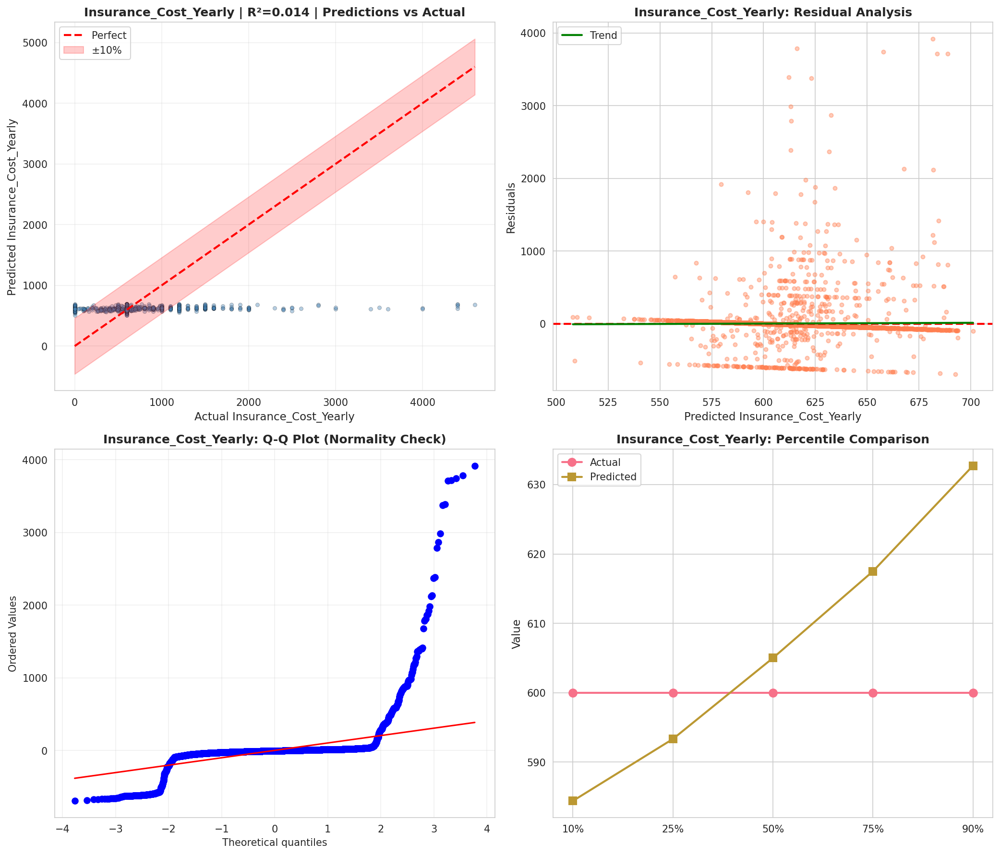
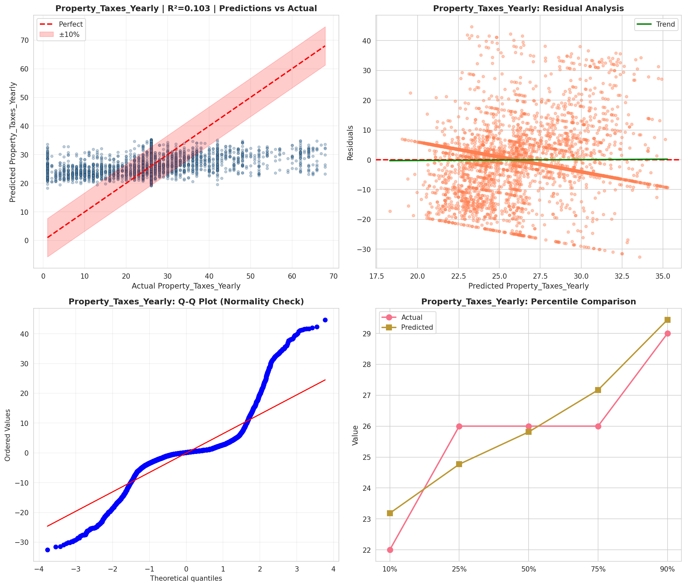
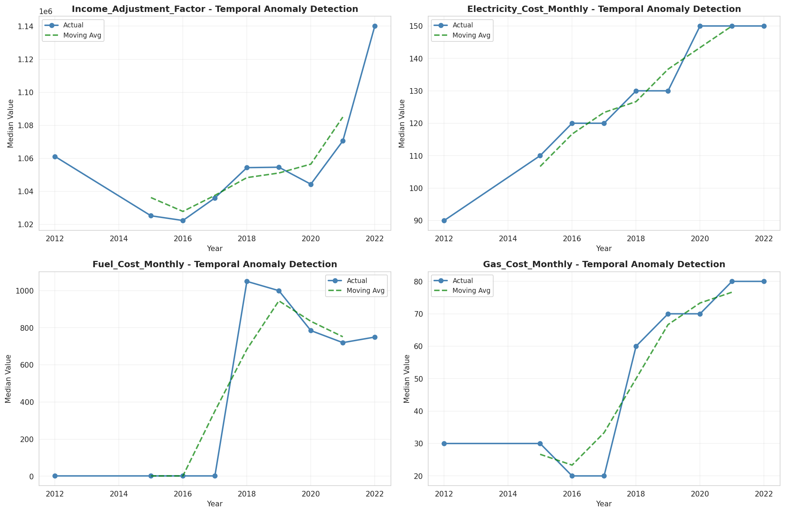
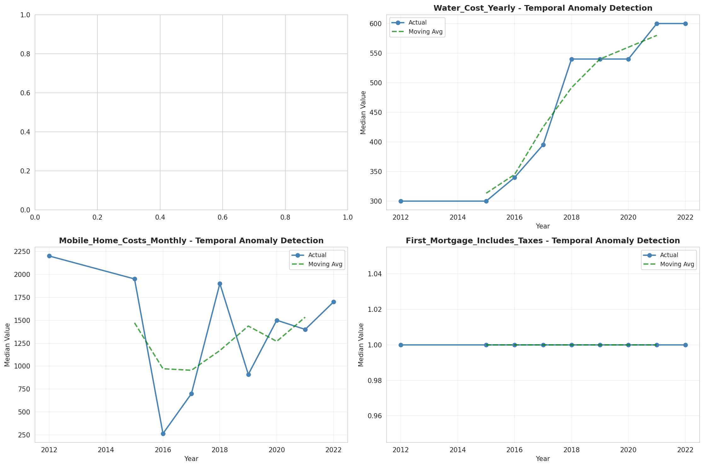
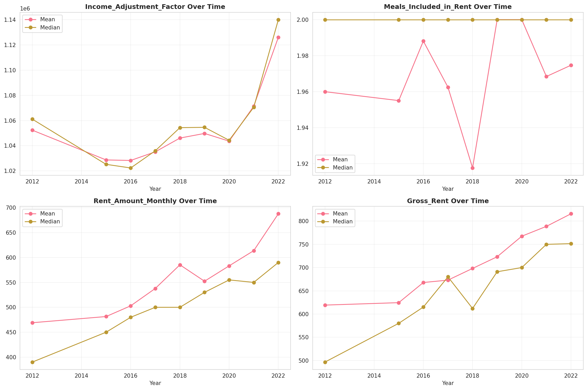
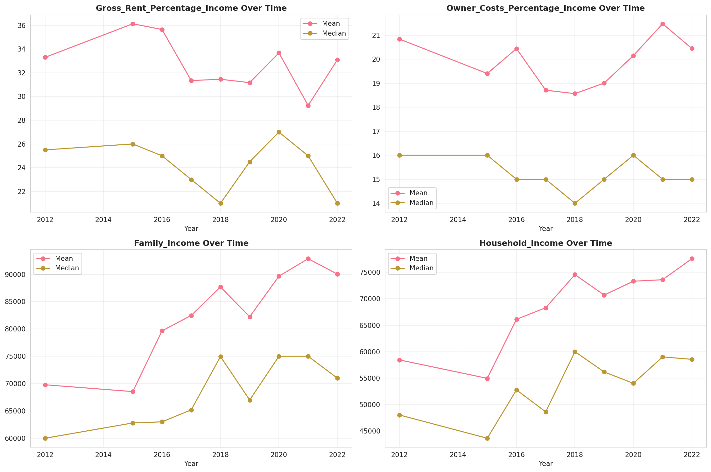
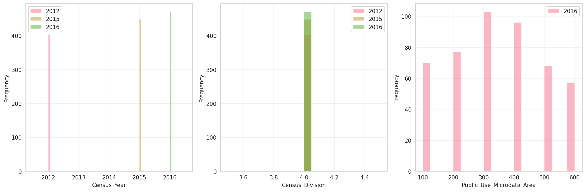
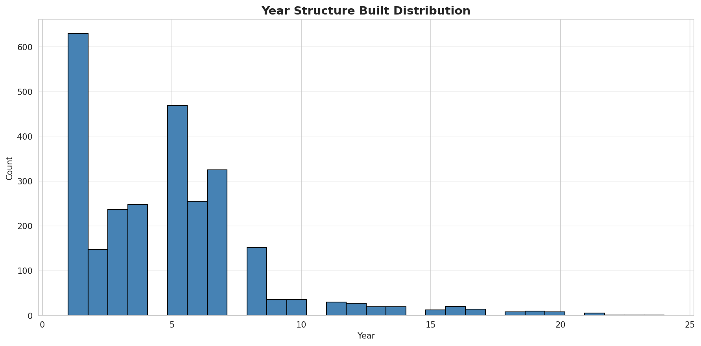
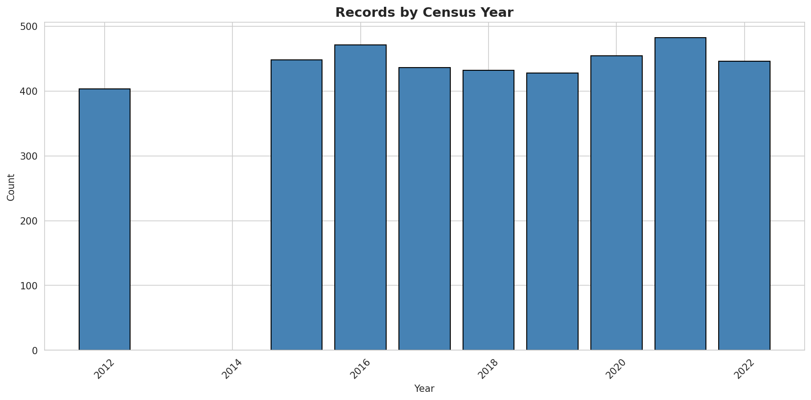
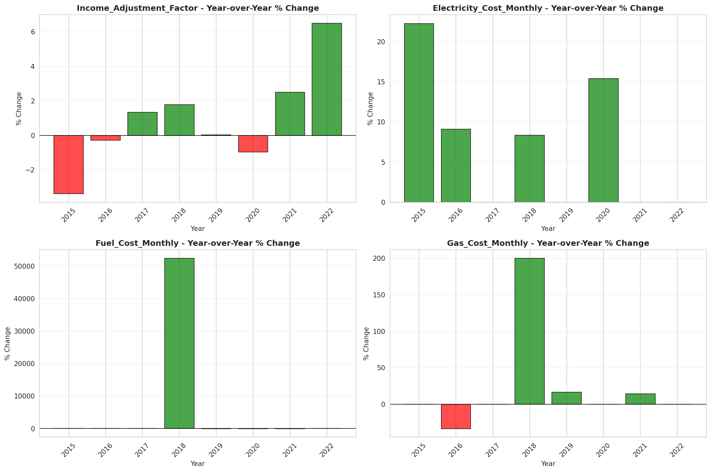
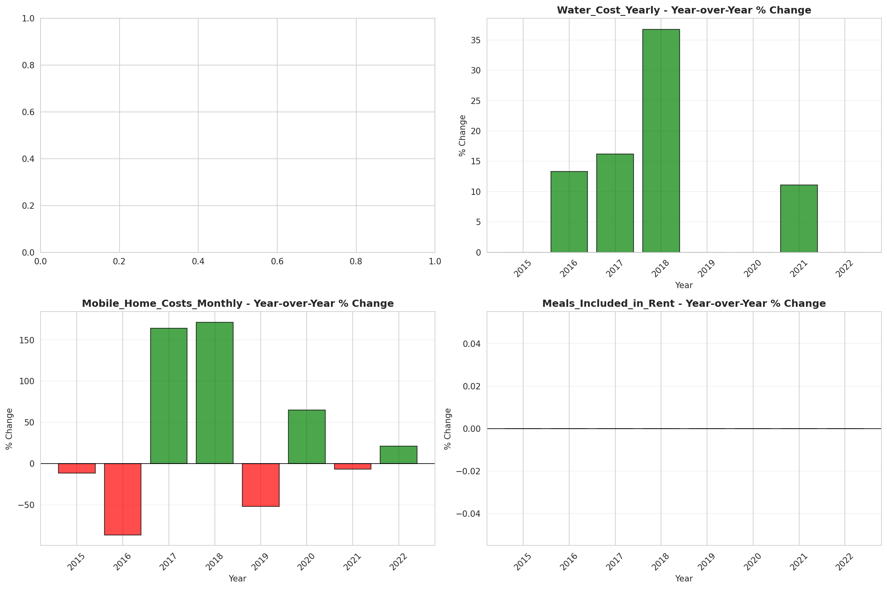
