# Temporal Analysis

## Year Distribution

- 2011: 31,395 records

- 2012: 31,271 records

- 2013: 31,111 records

- 2017: 32,449 records

- 2018: 32,809 records

- 2019: 33,077 records

- 2022: 34,653 records

- 2023: 34,990 records

## Temporal Trends

- Census_Year: {np.int64(2011): {'mean': 2011.0, 'median': 2011.0, 'std': 0.0}, np.int64(2012): {'mean': 2012.0, 'median': 2012.0, 'std': 0.0}, np.int64(2013): {'mean': 2013.0, 'median': 2013.0, 'std': 0.0}, np.int64(2017): {'mean': 2017.0, 'median': 2017.0, 'std': 0.0}, np.int64(2018): {'mean': 2018.0, 'median': 2018.0, 'std': 0.0}, np.int64(2019): {'mean': 2019.0, 'median': 2019.0, 'std': 0.0}, np.int64(2022): {'mean': 2022.0, 'median': 2022.0, 'std': 0.0}, np.int64(2023): {'mean': 2023.0, 'median': 2023.0, 'std': 0.0}}

- Census_Division: {np.int64(2011): {'mean': 6.0, 'median': 6.0, 'std': 0.0}, np.int64(2012): {'mean': 6.0, 'median': 6.0, 'std': 0.0}, np.int64(2013): {'mean': 6.0, 'median': 6.0, 'std': 0.0}, np.int64(2017): {'mean': 6.0, 'median': 6.0, 'std': 0.0}, np.int64(2018): {'mean': 6.0, 'median': 6.0, 'std': 0.0}, np.int64(2019): {'mean': 6.0, 'median': 6.0, 'std': 0.0}, np.int64(2022): {'mean': 6.0, 'median': 6.0, 'std': 0.0}, np.int64(2023): {'mean': 6.0, 'median': 6.0, 'std': 0.0}}

- Public_Use_Microdata_Area: {np.int64(2011): {'mean': 1744.8549132027392, 'median': 1800.0, 'std': 965.1681133233529}, np.int64(2012): {'mean': 1864.8444245467047, 'median': 2001.0, 'std': 965.0340839156016}, np.int64(2013): {'mean': 1864.859470926682, 'median': 2001.0, 'std': 962.6905060976765}, np.int64(2017): {'mean': 1860.0654257450153, 'median': 2001.0, 'std': 957.2028484856634}, np.int64(2018): {'mean': 1855.2024444512176, 'median': 2001.0, 'std': 954.0843716119807}, np.int64(2019): {'mean': 1845.0760044744081, 'median': 1900.0, 'std': 953.9893742457543}, np.int64(2022): {'mean': 1996.3250512221164, 'median': 2102.0, 'std': 983.6316856364905}, np.int64(2023): {'mean': 1994.0970563018004, 'median': 2102.0, 'std': 984.4920133778246}}

- Census_Region: {np.int64(2011): {'mean': 3.0, 'median': 3.0, 'std': 0.0}, np.int64(2012): {'mean': 3.0, 'median': 3.0, 'std': 0.0}, np.int64(2013): {'mean': 3.0, 'median': 3.0, 'std': 0.0}, np.int64(2017): {'mean': 3.0, 'median': 3.0, 'std': 0.0}, np.int64(2018): {'mean': 3.0, 'median': 3.0, 'std': 0.0}, np.int64(2019): {'mean': 3.0, 'median': 3.0, 'std': 0.0}, np.int64(2022): {'mean': 3.0, 'median': 3.0, 'std': 0.0}, np.int64(2023): {'mean': 3.0, 'median': 3.0, 'std': 0.0}}

- State_Code: {np.int64(2011): {'mean': 47.0, 'median': 47.0, 'std': 0.0}, np.int64(2012): {'mean': 47.0, 'median': 47.0, 'std': 0.0}, np.int64(2013): {'mean': 47.0, 'median': 47.0, 'std': 0.0}, np.int64(2017): {'mean': 47.0, 'median': 47.0, 'std': 0.0}, np.int64(2018): {'mean': 47.0, 'median': 47.0, 'std': 0.0}, np.int64(2019): {'mean': 47.0, 'median': 47.0, 'std': 0.0}, np.int64(2022): {'mean': 47.0, 'median': 47.0, 'std': 0.0}, np.int64(2023): {'mean': None, 'median': None, 'std': None}}

- Housing_Adjustment_Factor: {np.int64(2011): {'mean': 1000000.0, 'median': 1000000.0, 'std': 0.0}, np.int64(2012): {'mean': 1000000.0, 'median': 1000000.0, 'std': 0.0}, np.int64(2013): {'mean': 1000000.0, 'median': 1000000.0, 'std': 0.0}, np.int64(2017): {'mean': 1000000.0, 'median': 1000000.0, 'std': 0.0}, np.int64(2018): {'mean': 1000000.0, 'median': 1000000.0, 'std': 0.0}, np.int64(2019): {'mean': 1000000.0, 'median': 1000000.0, 'std': 0.0}, np.int64(2022): {'mean': 1000000.0, 'median': 1000000.0, 'std': 0.0}, np.int64(2023): {'mean': 1000000.0, 'median': 1000000.0, 'std': 0.0}}

- Income_Adjustment_Factor: {np.int64(2011): {'mean': 1018237.0, 'median': 1018237.0, 'std': 0.0}, np.int64(2012): {'mean': 1010207.0, 'median': 1010207.0, 'std': 0.0}, np.int64(2013): {'mean': 1007549.0, 'median': 1007549.0, 'std': 0.0}, np.int64(2017): {'mean': 1011189.0, 'median': 1011189.0, 'std': 0.0}, np.int64(2018): {'mean': 1013097.0, 'median': 1013097.0, 'std': 0.0}, np.int64(2019): {'mean': 1010145.0, 'median': 1010145.0, 'std': 0.0}, np.int64(2022): {'mean': 1042311.0, 'median': 1042311.0, 'std': 0.0}, np.int64(2023): {'mean': 1019518.0, 'median': 1019518.0, 'std': 0.0}}

- Housing_Unit_Weight: {np.int64(2011): {'mean': 90.11387163561076, 'median': 70.0, 'std': 86.02557727869714}, np.int64(2012): {'mean': 90.65293722618401, 'median': 72.0, 'std': 78.28660584791996}, np.int64(2013): {'mean': 91.31811899328211, 'median': 72.0, 'std': 77.01931791394529}, np.int64(2017): {'mean': 91.18305648864371, 'median': 72.0, 'std': 78.9880498204453}, np.int64(2018): {'mean': 91.20704684690176, 'median': 72.0, 'std': 79.3708604956329}, np.int64(2019): {'mean': 91.55718475073314, 'median': 69.0, 'std': 85.09994925424023}, np.int64(2022): {'mean': 90.74489943150665, 'median': 68.0, 'std': 85.53572120169518}, np.int64(2023): {'mean': 91.31666190340097, 'median': 68.0, 'std': 87.06051134454906}}

- Number_of_Persons: {np.int64(2011): {'mean': 2.02554546902373, 'median': 2.0, 'std': 1.3943148583159475}, np.int64(2012): {'mean': 2.0554507371046657, 'median': 2.0, 'std': 1.3882397974661924}, np.int64(2013): {'mean': 2.0940503358940568, 'median': 2.0, 'std': 1.4184214032902633}, np.int64(2017): {'mean': 2.0516810995716357, 'median': 2.0, 'std': 1.4086492604723049}, np.int64(2018): {'mean': 2.0710780578499803, 'median': 2.0, 'std': 1.415896336265191}, np.int64(2019): {'mean': 2.0683556549868487, 'median': 2.0, 'std': 1.404694372310489}, np.int64(2022): {'mean': 2.0885349031829854, 'median': 2.0, 'std': 1.3910713505770462}, np.int64(2023): {'mean': 2.087024864246928, 'median': 2.0, 'std': 1.3909430638141334}}

- Housing_Unit_Type: {np.int64(2011): {'mean': 1.1424430641821945, 'median': 1.0, 'std': 0.4575011907336965}, np.int64(2012): {'mean': 1.1360046049055035, 'median': 1.0, 'std': 0.4500141210639086}, np.int64(2013): {'mean': 1.1278325994021408, 'median': 1.0, 'std': 0.4399164816624195}, np.int64(2017): {'mean': 1.13128293630004, 'median': 1.0, 'std': 0.44752823134980707}, np.int64(2018): {'mean': 1.1293242707793594, 'median': 1.0, 'std': 0.4419577601557226}, np.int64(2019): {'mean': 1.1239834325966684, 'median': 1.0, 'std': 0.4331800286287883}, np.int64(2022): {'mean': None, 'median': None, 'std': None}, np.int64(2023): {'mean': None, 'median': None, 'std': None}}

- Number_of_Bedrooms: {np.int64(2011): {'mean': 2.770386341946202, 'median': 3.0, 'std': 0.9425421143013276}, np.int64(2012): {'mean': 2.83091685187145, 'median': 3.0, 'std': 1.040636695790664}, np.int64(2013): {'mean': 2.8504399859204503, 'median': 3.0, 'std': 1.0441943188410285}, np.int64(2017): {'mean': 2.834459916182236, 'median': 3.0, 'std': 0.9998679175531884}, np.int64(2018): {'mean': 2.8455034588777863, 'median': 3.0, 'std': 1.0073382659297136}, np.int64(2019): {'mean': 2.8665257735363077, 'median': 3.0, 'std': 1.0004374113799868}, np.int64(2022): {'mean': 2.8792889623811493, 'median': 3.0, 'std': 1.0104362392244728}, np.int64(2023): {'mean': 2.888183013081304, 'median': 3.0, 'std': 1.022904192056978}}

- Number_of_Rooms: {np.int64(2011): {'mean': 6.024636810293026, 'median': 6.0, 'std': 2.160965347164229}, np.int64(2012): {'mean': 6.119483543232088, 'median': 6.0, 'std': 2.2787654097806698}, np.int64(2013): {'mean': 6.187222808870116, 'median': 6.0, 'std': 2.423130307506425}, np.int64(2017): {'mean': 6.17821414086792, 'median': 6.0, 'std': 2.3436564919723937}, np.int64(2018): {'mean': 6.201884837750225, 'median': 6.0, 'std': 2.3589223941902784}, np.int64(2019): {'mean': 6.262985833636034, 'median': 6.0, 'std': 2.3959048346949037}, np.int64(2022): {'mean': 6.3209527140903745, 'median': 6.0, 'std': 2.4467464560791767}, np.int64(2023): {'mean': 6.351004569068035, 'median': 6.0, 'std': 2.48788340168965}}

- Building_Type: {np.int64(2011): {'mean': 2.5848503057509453, 'median': 2.0, 'std': 1.7344478040309923}, np.int64(2012): {'mean': 2.556108230147811, 'median': 2.0, 'std': 1.6855321061648953}, np.int64(2013): {'mean': 2.576698345652939, 'median': 2.0, 'std': 1.6987713236826745}, np.int64(2017): {'mean': 2.616804109774233, 'median': 2.0, 'std': 1.7668102465111564}, np.int64(2018): {'mean': 2.615947598837015, 'median': 2.0, 'std': 1.7726587440868538}, np.int64(2019): {'mean': 2.614701317570914, 'median': 2.0, 'std': 1.776925528650779}, np.int64(2022): {'mean': 2.6075937291315547, 'median': 2.0, 'std': 1.7809841176136614}, np.int64(2023): {'mean': 2.61751267446955, 'median': 2.0, 'std': 1.7914386220226546}}

- Year_Structure_Built: {np.int64(2011): {'mean': 5.3524442402177375, 'median': 5.0, 'std': 2.568377580551773}, np.int64(2012): {'mean': 5.510741877447349, 'median': 5.0, 'std': 2.6342958334528612}, np.int64(2013): {'mean': 5.6434354100668775, 'median': 6.0, 'std': 2.7584410766900525}, np.int64(2017): {'mean': 6.191090982830877, 'median': 6.0, 'std': 3.748631510116327}, np.int64(2018): {'mean': 6.387594826721919, 'median': 6.0, 'std': 4.079398286714394}, np.int64(2019): {'mean': 6.589505663243404, 'median': 6.0, 'std': 4.366120991495353}, np.int64(2022): {'mean': None, 'median': None, 'std': None}, np.int64(2023): {'mean': None, 'median': None, 'std': None}}

- Bathtub_or_Shower: {np.int64(2011): {'mean': 1.0097204057827578, 'median': 1.0, 'std': 0.09811350443698895}, np.int64(2012): {'mean': 1.0085017814936326, 'median': 1.0, 'std': 0.09181393458472643}, np.int64(2013): {'mean': 1.0086589229144667, 'median': 1.0, 'std': 0.09265121760825963}, np.int64(2017): {'mean': 1.011626335000676, 'median': 1.0, 'std': 0.10719865540518808}, np.int64(2018): {'mean': 1.009257093205895, 'median': 1.0, 'std': 0.09576902391438225}, np.int64(2019): {'mean': 1.0077271076181356, 'median': 1.0, 'std': 0.08756513362003822}, np.int64(2022): {'mean': 1.0060737113238147, 'median': 1.0, 'std': 0.07769821959858987}, np.int64(2023): {'mean': 1.0067910120798649, 'median': 1.0, 'std': 0.08212859016673937}}

- Refrigerator: {np.int64(2011): {'mean': 1.0238238309002863, 'median': 1.0, 'std': 0.15250271488676326}, np.int64(2012): {'mean': 1.021730694606131, 'median': 1.0, 'std': 0.14580542336203742}, np.int64(2013): {'mean': 1.0221048926434355, 'median': 1.0, 'std': 0.14702730106911566}, np.int64(2017): {'mean': 1.025415709071245, 'median': 1.0, 'std': 0.15738674654251625}, np.int64(2018): {'mean': 1.0239615011863783, 'median': 1.0, 'std': 0.15293177975069686}, np.int64(2019): {'mean': 1.0203744675230326, 'median': 1.0, 'std': 0.14127989139334612}, np.int64(2022): {'mean': 1.0154227748274876, 'median': 1.0, 'std': 0.12322903770070695}, np.int64(2023): {'mean': 1.0146147587156538, 'median': 1.0, 'std': 0.12000674248468725}}

- Hot_and_Cold_Running_Water: {np.int64(2011): {'mean': 1.017213954968011, 'median': 1.0, 'std': 0.13007010698066057}, np.int64(2012): {'mean': 1.0152044308039652, 'median': 1.0, 'std': 0.12236741526895113}, np.int64(2013): {'mean': 1.0160506863780359, 'median': 1.0, 'std': 0.12567266115741177}, np.int64(2017): {'mean': 1.0214952007570637, 'median': 1.0, 'std': 0.14503057606354902}, np.int64(2018): {'mean': 1.0203522374093508, 'median': 1.0, 'std': 0.14120442689606205}, np.int64(2019): {'mean': 1.0177657431562264, 'median': 1.0, 'std': 0.13210108924707606}, np.int64(2022): {'mean': 1.0149775813273125, 'median': 1.0, 'std': 0.12146490252918131}, np.int64(2023): {'mean': 1.0143643988233084, 'median': 1.0, 'std': 0.11898952037892639}}

- Running_Water: {np.int64(2011): {'mean': None, 'median': None, 'std': None}, np.int64(2012): {'mean': None, 'median': None, 'std': None}, np.int64(2013): {'mean': 9.0, 'median': 9.0, 'std': 0.0}, np.int64(2017): {'mean': 9.0, 'median': 9.0, 'std': 0.0}, np.int64(2018): {'mean': 9.0, 'median': 9.0, 'std': 0.0}, np.int64(2019): {'mean': 9.0, 'median': 9.0, 'std': 0.0}, np.int64(2022): {'mean': 9.0, 'median': 9.0, 'std': 0.0}, np.int64(2023): {'mean': 9.0, 'median': 9.0, 'std': 0.0}}

- Sink_with_Faucet: {np.int64(2011): {'mean': 1.0096850588526387, 'median': 1.0, 'std': 0.0979367016045917}, np.int64(2012): {'mean': 1.0085723356968992, 'median': 1.0, 'std': 0.092190837847357}, np.int64(2013): {'mean': 1.008236536430834, 'median': 1.0, 'std': 0.0903824288093295}, np.int64(2017): {'mean': 1.011254562660538, 'median': 1.0, 'std': 0.10549063270036295}, np.int64(2018): {'mean': 1.0086889683521036, 'median': 1.0, 'std': 0.0928103337199007}, np.int64(2019): {'mean': 1.007429911171284, 'median': 1.0, 'std': 0.08587753562855907}, np.int64(2022): {'mean': 1.005755715966547, 'median': 1.0, 'std': 0.07564898995808349}, np.int64(2023): {'mean': 1.006634537147149, 'median': 1.0, 'std': 0.08118328843231039}}

- Stove_or_Range: {np.int64(2011): {'mean': 1.02488423880386, 'median': 1.0, 'std': 0.15577506599923274}, np.int64(2012): {'mean': 1.0228595618583978, 'median': 1.0, 'std': 0.14945832296174946}, np.int64(2013): {'mean': 1.0221752903907075, 'median': 1.0, 'std': 0.14725593417614152}, np.int64(2017): {'mean': 1.0271731783155333, 'median': 1.0, 'std': 0.16259055986009568}, np.int64(2018): {'mean': 1.0246967215854026, 'median': 1.0, 'std': 0.15520179932725334}, np.int64(2019): {'mean': 1.0213321005184426, 'median': 1.0, 'std': 0.14449128495088576}, np.int64(2022): {'mean': 1.0171081502210069, 'median': 1.0, 'std': 0.12967650580538057}, np.int64(2023): {'mean': 1.0175564874507104, 'median': 1.0, 'std': 0.13133467554295553}}

- Telephone_Service: {np.int64(2011): {'mean': 1.030030376437113, 'median': 1.0, 'std': 0.17067417203150337}, np.int64(2012): {'mean': 1.028804535182135, 'median': 1.0, 'std': 0.16725999378647666}, np.int64(2013): {'mean': 1.025126777748122, 'median': 1.0, 'std': 0.15651312022011687}, np.int64(2017): {'mean': 1.0173816976615724, 'median': 1.0, 'std': 0.1306912515711351}, np.int64(2018): {'mean': 1.0166909620991254, 'median': 1.0, 'std': 0.1281131219809693}, np.int64(2019): {'mean': 1.0119852599191441, 'median': 1.0, 'std': 0.10882112448939919}, np.int64(2022): {'mean': 1.0098475330231926, 'median': 1.0, 'std': 0.09874659603060185}, np.int64(2023): {'mean': 1.0096253122398002, 'median': 1.0, 'std': 0.09763699660274988}}

- Lot_Acreage: {np.int64(2011): {'mean': 1.4536520363121512, 'median': 1.0, 'std': 0.6334659320056959}, np.int64(2012): {'mean': 1.4483185986945386, 'median': 1.0, 'std': 0.6278283351229542}, np.int64(2013): {'mean': 1.4598038810045926, 'median': 1.0, 'std': 0.6320628558591804}, np.int64(2017): {'mean': 1.4406400893890419, 'median': 1.0, 'std': 0.6242387696565072}, np.int64(2018): {'mean': 1.4446019371604064, 'median': 1.0, 'std': 0.6271650667964154}, np.int64(2019): {'mean': 1.4506812623733552, 'median': 1.0, 'std': 0.6267085511372358}, np.int64(2022): {'mean': 1.4623180873180872, 'median': 1.0, 'std': 0.6276161983201455}, np.int64(2023): {'mean': 1.4613639689740963, 'median': 1.0, 'std': 0.6280376141487485}}

- Agricultural_Sales: {np.int64(2011): {'mean': 1.1938057250117315, 'median': 1.0, 'std': 0.8040313291803295}, np.int64(2012): {'mean': 1.2038744310888085, 'median': 1.0, 'std': 0.8452116575955235}, np.int64(2013): {'mean': 1.1715424018212863, 'median': 1.0, 'std': 0.755255237413271}, np.int64(2017): {'mean': 1.1936266020090058, 'median': 1.0, 'std': 0.8161397468717551}, np.int64(2018): {'mean': 1.1848682729115063, 'median': 1.0, 'std': 0.7956676900966666}, np.int64(2019): {'mean': 1.195519791213571, 'median': 1.0, 'std': 0.818920854873545}, np.int64(2022): {'mean': 1.1817268067142426, 'median': 1.0, 'std': 0.7739889531667152}, np.int64(2023): {'mean': 1.1959466139396935, 'median': 1.0, 'std': 0.8114536164442493}}

- Tenure: {np.int64(2011): {'mean': 1.896989272119045, 'median': 2.0, 'std': 0.8761021395110942}, np.int64(2012): {'mean': 1.8777722449917646, 'median': 2.0, 'std': 0.8737638329657522}, np.int64(2013): {'mean': 1.8961375681549548, 'median': 2.0, 'std': 0.8741672233111523}, np.int64(2017): {'mean': 1.908525133492911, 'median': 2.0, 'std': 0.8681760799579589}, np.int64(2018): {'mean': 1.9026239067055393, 'median': 2.0, 'std': 0.8599984464196444}, np.int64(2019): {'mean': 1.8913097921362385, 'median': 2.0, 'std': 0.8531494666639851}, np.int64(2022): {'mean': 1.8873306394105063, 'median': 2.0, 'std': 0.8462359541261694}, np.int64(2023): {'mean': 1.8818318068276436, 'median': 2.0, 'std': 0.8394011553370373}}

- Vacancy_Status: {np.int64(2011): {'mean': 4.704465849387041, 'median': 5.0, 'std': 2.327115905991686}, np.int64(2012): {'mean': 4.767410714285714, 'median': 5.0, 'std': 2.3075135041311445}, np.int64(2013): {'mean': 4.720109940448923, 'median': 5.0, 'std': 2.330405877798318}, np.int64(2017): {'mean': 5.159884915741882, 'median': 7.0, 'std': 2.258099891131725}, np.int64(2018): {'mean': 5.01651228352799, 'median': 5.0, 'std': 2.3119284794882553}, np.int64(2019): {'mean': 5.002144082332761, 'median': 5.0, 'std': 2.3024234410935573}, np.int64(2022): {'mean': 5.143643643643643, 'median': 7.0, 'std': 2.288830543098301}, np.int64(2023): {'mean': 5.1244167962674965, 'median': 7.0, 'std': 2.302819394197112}}

- Property_Value: {np.int64(2011): {'mean': 169433.4644018035, 'median': 125000.0, 'std': 197368.61426318836}, np.int64(2012): {'mean': 175641.73755186723, 'median': 130000.0, 'std': 203984.57175729118}, np.int64(2013): {'mean': 182917.48331595413, 'median': 130000.0, 'std': 228417.7698942065}, np.int64(2017): {'mean': 219358.26188422707, 'median': 150000.0, 'std': 267358.58866156364}, np.int64(2018): {'mean': 226885.8717334929, 'median': 169000.0, 'std': 251707.09595258321}, np.int64(2019): {'mean': 243588.72653377202, 'median': 180000.0, 'std': 281447.99242624716}, np.int64(2022): {'mean': 343502.3685285176, 'median': 250000.0, 'std': 398371.70779702393}, np.int64(2023): {'mean': 372602.29162980005, 'median': 285000.0, 'std': 433117.7436962097}}

- Vehicles_Available: {np.int64(2011): {'mean': 1.8406198331218517, 'median': 2.0, 'std': 1.0665823135550718}, np.int64(2012): {'mean': 1.8848201631746275, 'median': 2.0, 'std': 1.073179541075589}, np.int64(2013): {'mean': 1.91146528386777, 'median': 2.0, 'std': 1.0889029765122962}, np.int64(2017): {'mean': 1.9758792119315043, 'median': 2.0, 'std': 1.1032236786914824}, np.int64(2018): {'mean': 2.0033892128279884, 'median': 2.0, 'std': 1.115846792369135}, np.int64(2019): {'mean': 2.01985617688097, 'median': 2.0, 'std': 1.131591875419893}, np.int64(2022): {'mean': 2.01633332201433, 'median': 2.0, 'std': 1.1147053606335813}, np.int64(2023): {'mean': 2.0220815986677767, 'median': 2.0, 'std': 1.1352448951181995}}

- Condo_Fee_Monthly: {np.int64(2011): {'mean': 180.0339558573854, 'median': 140.0, 'std': 159.5156322755766}, np.int64(2012): {'mean': 192.3167259786477, 'median': 140.0, 'std': 185.38667795031597}, np.int64(2013): {'mean': 194.23728813559322, 'median': 150.0, 'std': 186.2639945442364}, np.int64(2017): {'mean': 204.64768683274022, 'median': 170.0, 'std': 154.8301826456903}, np.int64(2018): {'mean': 215.82333333333332, 'median': 170.0, 'std': 182.3171633050901}, np.int64(2019): {'mean': 217.3255425709516, 'median': 170.0, 'std': 180.3254560482087}, np.int64(2022): {'mean': 228.18611987381703, 'median': 180.0, 'std': 173.31000285562897}, np.int64(2023): {'mean': 255.34992679355784, 'median': 190.0, 'std': 234.00932184197038}}

- Electricity_Cost_Monthly: {np.int64(2011): {'mean': 162.78363517514515, 'median': 150.0, 'std': 99.18629480168805}, np.int64(2012): {'mean': 152.75834067491476, 'median': 140.0, 'std': 89.2831299806341}, np.int64(2013): {'mean': 156.37617722194685, 'median': 140.0, 'std': 90.30832116159621}, np.int64(2017): {'mean': 156.35139016755662, 'median': 140.0, 'std': 91.96505716988419}, np.int64(2018): {'mean': 175.48462146594886, 'median': 150.0, 'std': 96.01108122941602}, np.int64(2019): {'mean': 172.115624884486, 'median': 150.0, 'std': 92.94711234319237}, np.int64(2022): {'mean': 204.25646046788125, 'median': 170.0, 'std': 206.5042862793555}, np.int64(2023): {'mean': 200.47476031751486, 'median': 160.0, 'std': 253.90134084631197}}

- Fuel_Cost_Monthly: {np.int64(2011): {'mean': 64.43084554158496, 'median': 2.0, 'std': 305.8734596286936}, np.int64(2012): {'mean': 56.970084651626, 'median': 2.0, 'std': 281.43263865753624}, np.int64(2013): {'mean': 34.50139169558089, 'median': 2.0, 'std': 204.33110268224806}, np.int64(2017): {'mean': 32.95098508561959, 'median': 2.0, 'std': 212.34475152988531}, np.int64(2018): {'mean': 571.3633355393779, 'median': 300.0, 'std': 694.0328214888929}, np.int64(2019): {'mean': 539.6907630522088, 'median': 300.0, 'std': 670.6811071165542}, np.int64(2022): {'mean': 549.7916666666666, 'median': 300.0, 'std': 626.2724183378293}, np.int64(2023): {'mean': 598.4332129963899, 'median': 350.0, 'std': 732.0124588670349}}

- Gas_Cost_Monthly: {np.int64(2011): {'mean': 37.154842926904294, 'median': 3.0, 'std': 67.86169481146577}, np.int64(2012): {'mean': 33.50335159152718, 'median': 3.0, 'std': 61.3503871957484}, np.int64(2013): {'mean': 34.1006596255767, 'median': 3.0, 'std': 61.70803680680747}, np.int64(2017): {'mean': 29.45814767077886, 'median': 3.0, 'std': 55.457587865709336}, np.int64(2018): {'mean': 79.00446987305561, 'median': 50.0, 'std': 82.29280875330721}, np.int64(2019): {'mean': 76.7762652705061, 'median': 50.0, 'std': 81.08865600154336}, np.int64(2022): {'mean': 104.42553897180763, 'median': 60.0, 'std': 159.65838815016355}, np.int64(2023): {'mean': 102.80915302717305, 'median': 60.0, 'std': 183.43578823579384}}

- House_Heating_Fuel: {np.int64(2011): {'mean': 2.357480678278925, 'median': 3.0, 'std': 1.1825837278603197}, np.int64(2012): {'mean': 2.345884245604627, 'median': 3.0, 'std': 1.1757181124043625}, np.int64(2013): {'mean': 2.36805582033782, 'median': 3.0, 'std': 1.2058121587484443}, np.int64(2017): {'mean': 2.3661204198121895, 'median': 3.0, 'std': 1.1625941698987488}, np.int64(2018): {'mean': 2.359657434402332, 'median': 3.0, 'std': 1.1605908529504756}, np.int64(2019): {'mean': 2.3650316625523238, 'median': 3.0, 'std': 1.1640190376907735}, np.int64(2022): {'mean': 2.3918299432917927, 'median': 3.0, 'std': 1.1851440839579046}, np.int64(2023): {'mean': 2.386744379683597, 'median': 3.0, 'std': 1.1718101229575242}}

- Insurance_Cost_Yearly: {np.int64(2011): {'mean': 861.4506044694102, 'median': 730.0, 'std': 633.6151037379573}, np.int64(2012): {'mean': 911.3803088803089, 'median': 800.0, 'std': 630.2971301772469}, np.int64(2013): {'mean': 972.738297356294, 'median': 850.0, 'std': 685.0685685205266}, np.int64(2017): {'mean': 1130.7544035346098, 'median': 1000.0, 'std': 777.49105324503}, np.int64(2018): {'mean': 1166.766109226991, 'median': 1000.0, 'std': 831.3340503568141}, np.int64(2019): {'mean': 1202.1441931644279, 'median': 1000.0, 'std': 872.803466947436}, np.int64(2022): {'mean': 1322.2007293483432, 'median': 1200.0, 'std': 951.338848537844}, np.int64(2023): {'mean': 1511.0788026878436, 'median': 1200.0, 'std': 1205.4247765925859}}

- Water_Cost_Yearly: {np.int64(2011): {'mean': 339.09351328488486, 'median': 270.0, 'std': 387.30179777137283}, np.int64(2012): {'mean': 361.6145095185199, 'median': 290.0, 'std': 424.6964287052096}, np.int64(2013): {'mean': 348.4561329927174, 'median': 260.0, 'std': 407.02615089410267}, np.int64(2017): {'mean': 369.52679064628984, 'median': 250.0, 'std': 440.36197828370945}, np.int64(2018): {'mean': 451.2936753648828, 'median': 360.0, 'std': 451.99102490385616}, np.int64(2019): {'mean': 457.8825409163536, 'median': 360.0, 'std': 464.9882495590498}, np.int64(2022): {'mean': 502.5324262308281, 'median': 380.0, 'std': 562.9611011198022}, np.int64(2023): {'mean': 504.47501678713905, 'median': 360.0, 'std': 585.5822917877275}}

- Mobile_Home_Costs_Monthly: {np.int64(2011): {'mean': 835.675105485232, 'median': 350.0, 'std': 1332.7424021103168}, np.int64(2012): {'mean': 876.9762419006479, 'median': 365.0, 'std': 1367.0647875974998}, np.int64(2013): {'mean': 884.8213096559379, 'median': 370.0, 'std': 1408.1445286581359}, np.int64(2017): {'mean': 825.9013933547695, 'median': 370.0, 'std': 1305.2485460977657}, np.int64(2018): {'mean': 915.8799593082401, 'median': 370.0, 'std': 1504.0367995275894}, np.int64(2019): {'mean': 882.9371316306483, 'median': 380.0, 'std': 1464.8077378702994}, np.int64(2022): {'mean': 1820.0692235734332, 'median': 400.0, 'std': 5140.406306431777}, np.int64(2023): {'mean': 1630.1497942386832, 'median': 450.0, 'std': 4552.824005564967}}

- First_Mortgage_Includes_Insurance: {np.int64(2011): {'mean': 1.4156001868285848, 'median': 1.0, 'std': 0.4928482137622429}, np.int64(2012): {'mean': 1.3976994837424146, 'median': 1.0, 'std': 0.4894448910229481}, np.int64(2013): {'mean': 1.377561427909133, 'median': 1.0, 'std': 0.4847995342644584}, np.int64(2017): {'mean': 1.346978198877748, 'median': 1.0, 'std': 0.47603064324234035}, np.int64(2018): {'mean': 1.3300200620098486, 'median': 1.0, 'std': 0.47024141189562546}, np.int64(2019): {'mean': 1.330804925932536, 'median': 1.0, 'std': 0.4705239457670704}, np.int64(2022): {'mean': 1.2947573158871895, 'median': 1.0, 'std': 0.45595374810342293}, np.int64(2023): {'mean': 1.2952256944444445, 'median': 1.0, 'std': 0.4561639472445516}}

- First_Mortgage_Payment_Monthly: {np.int64(2011): {'mean': 912.9132181223728, 'median': 770.0, 'std': 616.0797508259532}, np.int64(2012): {'mean': 934.3919934788515, 'median': 800.0, 'std': 631.6730395828914}, np.int64(2013): {'mean': 932.2792767732963, 'median': 790.0, 'std': 633.0687733958168}, np.int64(2017): {'mean': 1008.9947566921167, 'median': 840.0, 'std': 693.99141159335}, np.int64(2018): {'mean': 1040.5768739741018, 'median': 870.0, 'std': 709.3370915237196}, np.int64(2019): {'mean': 1079.5320364090667, 'median': 900.0, 'std': 718.7553083054206}, np.int64(2022): {'mean': 535.047318854507, 'median': 4.0, 'std': 799.4370025561676}, np.int64(2023): {'mean': 1325.3225694444445, 'median': 1100.0, 'std': 905.0893684819013}}

- First_Mortgage_Includes_Taxes: {np.int64(2011): {'mean': 1.3655301261092947, 'median': 1.0, 'std': 0.4816009961388248}, np.int64(2012): {'mean': 1.350240014491441, 'median': 1.0, 'std': 0.477066620233955}, np.int64(2013): {'mean': 1.32814093648586, 'median': 1.0, 'std': 0.46955820294303147}, np.int64(2017): {'mean': 1.2844264557078466, 'median': 1.0, 'std': 0.45116157951746055}, np.int64(2018): {'mean': 1.2656392485865402, 'median': 1.0, 'std': 0.4416931388397111}, np.int64(2019): {'mean': 1.261110119578797, 'median': 1.0, 'std': 0.43925942606110174}, np.int64(2022): {'mean': 1.211298735743966, 'median': 1.0, 'std': 0.40824785964494564}, np.int64(2023): {'mean': 1.2094618055555555, 'median': 1.0, 'std': 0.4069421737012936}}

- First_Mortgage_Status: {np.int64(2011): {'mean': 1.865965623999146, 'median': 1.0, 'std': 0.9865491487307463}, np.int64(2012): {'mean': 1.8450347881087918, 'median': 1.0, 'std': 0.9834003170086381}, np.int64(2013): {'mean': 1.8682359164242264, 'median': 1.0, 'std': 0.9866538428110967}, np.int64(2017): {'mean': 1.8918710869342092, 'median': 1.0, 'std': 0.9903090183202954}, np.int64(2018): {'mean': 1.8992067902793917, 'median': 1.0, 'std': 0.991269425585707}, np.int64(2019): {'mean': 1.9097048891499047, 'median': 1.0, 'std': 0.992641424126168}, np.int64(2022): {'mean': 1.9707888832928895, 'median': 1.0, 'std': 0.9963156327634667}, np.int64(2023): {'mean': 1.9785478547854785, 'median': 1.0, 'std': 0.99673168054506}}

- Second_Mortgage_Payment_Monthly: {np.int64(2011): {'mean': 324.06927374301677, 'median': 230.0, 'std': 308.9525890770366}, np.int64(2012): {'mean': 322.67099056603774, 'median': 240.0, 'std': 302.44529519515527}, np.int64(2013): {'mean': 326.69500674763833, 'median': 240.0, 'std': 324.4889402507746}, np.int64(2017): {'mean': 348.44093178036604, 'median': 230.0, 'std': 373.9725778907928}, np.int64(2018): {'mean': 353.9160839160839, 'median': 250.0, 'std': 331.8715137117787}, np.int64(2019): {'mean': 422.65489849955867, 'median': 300.0, 'std': 433.3303586230029}, np.int64(2022): {'mean': 465.97067448680355, 'median': 300.0, 'std': 541.5584362360034}, np.int64(2023): {'mean': 586.149863760218, 'median': 360.0, 'std': 702.4644663875403}}

- Second_Mortgage_Status: {np.int64(2011): {'mean': 2.797290985520785, 'median': 3.0, 'std': 0.5100010110357457}, np.int64(2012): {'mean': 2.8151435558373334, 'median': 3.0, 'std': 0.4902775756850045}, np.int64(2013): {'mean': 2.836161335187761, 'median': 3.0, 'std': 0.46775644746661166}, np.int64(2017): {'mean': 2.87268880507773, 'median': 3.0, 'std': 0.4082634602934934}, np.int64(2018): {'mean': 2.886467262447565, 'median': 3.0, 'std': 0.36585347894642395}, np.int64(2019): {'mean': 2.885864715331073, 'median': 3.0, 'std': 0.37705509712217694}, np.int64(2022): {'mean': 2.8727912163321325, 'median': 3.0, 'std': 0.37921793592703407}, np.int64(2023): {'mean': 2.8656376518218623, 'median': 3.0, 'std': 0.38998002299377327}}

- Property_Taxes_Yearly: {np.int64(2011): {'mean': 20.88432795985908, 'median': 19.0, 'std': 13.460996916295514}, np.int64(2012): {'mean': 21.42731393632722, 'median': 20.0, 'std': 13.250617767492477}, np.int64(2013): {'mean': 21.808463369478975, 'median': 21.0, 'std': 13.642085947004091}, np.int64(2017): {'mean': 23.333059632556708, 'median': 22.0, 'std': 14.169059604964149}}

- Meals_Included_in_Rent: {np.int64(2011): {'mean': 1.9832243389252204, 'median': 2.0, 'std': 0.1284390265215149}, np.int64(2012): {'mean': 1.9823622957929738, 'median': 2.0, 'std': 0.13164011885311874}, np.int64(2013): {'mean': 1.981948949372444, 'median': 2.0, 'std': 0.13314544764446415}, np.int64(2017): {'mean': 1.9808418780356178, 'median': 2.0, 'std': 0.13708983877134742}, np.int64(2018): {'mean': 1.9802981895633653, 'median': 2.0, 'std': 0.13898280643305203}, np.int64(2019): {'mean': 1.980013596193066, 'median': 2.0, 'std': 0.13996289119306085}, np.int64(2022): {'mean': 1.9785330948121647, 'median': 2.0, 'std': 0.14494470731726183}, np.int64(2023): {'mean': 1.9788548674996567, 'median': 2.0, 'std': 0.14387792820675535}}

- Rent_Amount_Monthly: {np.int64(2011): {'mean': 567.6448677850441, 'median': 500.0, 'std': 376.9879995192982}, np.int64(2012): {'mean': 602.7616018505132, 'median': 540.0, 'std': 400.83591730640904}, np.int64(2013): {'mean': 618.5065576082358, 'median': 550.0, 'std': 397.2801472972702}, np.int64(2017): {'mean': 717.8812736103616, 'median': 630.0, 'std': 443.08728956878036}, np.int64(2018): {'mean': 734.8628860489882, 'median': 650.0, 'std': 446.7695461825587}, np.int64(2019): {'mean': 780.5495581237253, 'median': 680.0, 'std': 476.75117085073015}, np.int64(2022): {'mean': 950.4898857850558, 'median': 800.0, 'std': 640.5319166536058}, np.int64(2023): {'mean': 1064.0274612110395, 'median': 900.0, 'std': 722.039935956934}}

- Gross_Rent: {np.int64(2011): {'mean': 735.6630368098159, 'median': 682.0, 'std': 397.486093032572}, np.int64(2012): {'mean': 761.0903426791277, 'median': 702.0, 'std': 412.0723557331162}, np.int64(2013): {'mean': 780.7394804800243, 'median': 720.0, 'std': 408.40866634217554}, np.int64(2017): {'mean': 878.9577039274925, 'median': 802.0, 'std': 456.96340227258827}, np.int64(2018): {'mean': 904.4834285714286, 'median': 838.0, 'std': 454.84012538432074}, np.int64(2019): {'mean': 942.3839545719278, 'median': 863.0, 'std': 479.4630914391584}, np.int64(2022): {'mean': 1144.4402268760907, 'median': 1010.0, 'std': 655.2992972190226}, np.int64(2023): {'mean': 1253.5729196868658, 'median': 1100.0, 'std': 751.6581606054223}}

- Gross_Rent_Percentage_Income: {np.int64(2011): {'mean': 40.72549329123915, 'median': 31.0, 'std': 27.39491686960598}, np.int64(2012): {'mean': 39.66736166800321, 'median': 30.0, 'std': 27.252953406512077}, np.int64(2013): {'mean': 38.76817258089729, 'median': 29.0, 'std': 27.09819080595283}, np.int64(2017): {'mean': 36.47266028002948, 'median': 28.0, 'std': 25.822653442091926}, np.int64(2018): {'mean': 36.972124413145536, 'median': 28.0, 'std': 26.425400483297114}, np.int64(2019): {'mean': 36.30110086283844, 'median': 28.0, 'std': 26.047975640023438}, np.int64(2022): {'mean': 37.63109393579072, 'median': 29.0, 'std': 26.818109492499506}, np.int64(2023): {'mean': 38.15562472209871, 'median': 29.0, 'std': 27.328818194169706}}

- Selected_Monthly_Owner_Costs: {np.int64(2011): {'mean': 917.4255205552589, 'median': 740.0, 'std': 753.5118410779829}, np.int64(2012): {'mean': 923.0611986716567, 'median': 744.0, 'std': 755.1426080969336}, np.int64(2013): {'mean': 915.6295375171976, 'median': 732.0, 'std': 756.2824513245826}, np.int64(2017): {'mean': 951.6581108829569, 'median': 750.0, 'std': 798.0319471717507}, np.int64(2018): {'mean': 988.362217057397, 'median': 788.0, 'std': 810.6818468779576}, np.int64(2019): {'mean': 998.9309906029757, 'median': 783.0, 'std': 829.9726805252835}, np.int64(2022): {'mean': 1117.5373906672162, 'median': 848.0, 'std': 944.0485033110311}, np.int64(2023): {'mean': 1187.3005352363962, 'median': 870.0, 'std': 1081.076319800298}}

- Owner_Costs_Percentage_Income: {np.int64(2011): {'mean': 24.186100344530576, 'median': 18.0, 'std': 20.943253009684792}, np.int64(2012): {'mean': 23.025204721897268, 'median': 17.0, 'std': 20.353682152988636}, np.int64(2013): {'mean': 22.137931034482758, 'median': 16.0, 'std': 20.219785633825534}, np.int64(2017): {'mean': 20.273914395274122, 'median': 15.0, 'std': 19.04920368100118}, np.int64(2018): {'mean': 20.589871611982883, 'median': 15.0, 'std': 19.29069107201164}, np.int64(2019): {'mean': 19.822718092704793, 'median': 14.0, 'std': 19.005909066112658}, np.int64(2022): {'mean': 20.762688360913376, 'median': 15.0, 'std': 20.41553900781155}, np.int64(2023): {'mean': 20.786685271876124, 'median': 14.0, 'std': 21.044946275551986}}

- Satellite_Internet: {np.int64(2011): {'mean': None, 'median': None, 'std': None}, np.int64(2012): {'mean': None, 'median': None, 'std': None}, np.int64(2013): {'mean': 1.929795558494517, 'median': 2.0, 'std': 0.25549828796444335}, np.int64(2017): {'mean': 1.90671658828364, 'median': 2.0, 'std': 0.29083582824198195}, np.int64(2018): {'mean': 1.9041329542969605, 'median': 2.0, 'std': 0.2944152615154559}, np.int64(2019): {'mean': 1.9080454892641943, 'median': 2.0, 'std': 0.28896785640306455}, np.int64(2022): {'mean': 1.9248394573849603, 'median': 2.0, 'std': 0.26365522346858294}, np.int64(2023): {'mean': 1.9300879420097876, 'median': 2.0, 'std': 0.25500344086021975}}

- Smartphone: {np.int64(2011): {'mean': None, 'median': None, 'std': None}, np.int64(2012): {'mean': None, 'median': None, 'std': None}, np.int64(2013): {'mean': None, 'median': None, 'std': None}, np.int64(2017): {'mean': 1.2320382986558645, 'median': 1.0, 'std': 0.4221410771932677}, np.int64(2018): {'mean': 1.1927478134110787, 'median': 1.0, 'std': 0.39446389499492196}, np.int64(2019): {'mean': 1.1733032807412973, 'median': 1.0, 'std': 0.37851602282872227}, np.int64(2022): {'mean': 1.1115487792454752, 'median': 1.0, 'std': 0.3148158422636312}, np.int64(2023): {'mean': 1.1036802664446295, 'median': 1.0, 'std': 0.30485039610830406}}

- Tablet_Computer: {np.int64(2011): {'mean': None, 'median': None, 'std': None}, np.int64(2012): {'mean': None, 'median': None, 'std': None}, np.int64(2013): {'mean': None, 'median': None, 'std': None}, np.int64(2017): {'mean': 1.4026146197753637, 'median': 1.0, 'std': 0.4904334258605296}, np.int64(2018): {'mean': 1.3872813411078717, 'median': 1.0, 'std': 0.48713771360018254}, np.int64(2019): {'mean': 1.4020965260634681, 'median': 1.0, 'std': 0.4903300025472138}, np.int64(2022): {'mean': 1.38113348500798, 'median': 1.0, 'std': 0.4856735131250301}, np.int64(2023): {'mean': 1.383646960865945, 'median': 1.0, 'std': 0.4862816530050592}}

- Food_Stamp_SNAP: {np.int64(2011): {'mean': 1.8315756930369964, 'median': 2.0, 'std': 0.374249076295753}, np.int64(2012): {'mean': 1.836554028452344, 'median': 2.0, 'std': 0.3697784416856382}, np.int64(2013): {'mean': 1.8378733407079646, 'median': 2.0, 'std': 0.36857333280249627}, np.int64(2017): {'mean': 1.8780983475479744, 'median': 2.0, 'std': 0.3271776365416925}, np.int64(2018): {'mean': 1.881520807228121, 'median': 2.0, 'std': 0.32318000825680904}, np.int64(2019): {'mean': 1.8971214831679948, 'median': 2.0, 'std': 0.30380508494800973}, np.int64(2022): {'mean': 1.8980248047772164, 'median': 2.0, 'std': 0.30262032189566096}, np.int64(2023): {'mean': 1.9109222346571488, 'median': 2.0, 'std': 0.28486026658360153}}

- Family_Type_Employment_Status: {np.int64(2011): {'mean': 3.267277609152463, 'median': 2.0, 'std': 2.3838022838176136}, np.int64(2012): {'mean': 3.234997709573981, 'median': 2.0, 'std': 2.3465635022902065}, np.int64(2013): {'mean': 3.2171448009978456, 'median': 2.0, 'std': 2.3481415037033035}, np.int64(2017): {'mean': 3.1762868774747646, 'median': 2.0, 'std': 2.3180678963109713}, np.int64(2018): {'mean': 3.189110167153969, 'median': 2.0, 'std': 2.3037770840216063}, np.int64(2019): {'mean': 3.1732335100278704, 'median': 2.0, 'std': 2.2863733276520692}, np.int64(2022): {'mean': None, 'median': None, 'std': None}, np.int64(2023): {'mean': None, 'median': None, 'std': None}}

- Family_Income: {np.int64(2011): {'mean': 68440.65793510324, 'median': 51300.0, 'std': 68857.75469352059}, np.int64(2012): {'mean': 72018.48667398971, 'median': 54500.0, 'std': 69467.04973706749}, np.int64(2013): {'mean': 76001.77231506302, 'median': 56400.0, 'std': 77695.0733082903}, np.int64(2017): {'mean': 89073.75457035836, 'median': 64900.0, 'std': 93427.40005698267}, np.int64(2018): {'mean': 90917.8824017709, 'median': 68000.0, 'std': 93910.77468243137}, np.int64(2019): {'mean': 96528.02792531348, 'median': 71500.0, 'std': 97843.3015157783}, np.int64(2022): {'mean': 105672.44192913386, 'median': 79200.0, 'std': 103669.44750791129}, np.int64(2023): {'mean': 113639.60854348945, 'median': 85500.0, 'std': 112377.48480550814}}

- Family_Presence_Children: {np.int64(2011): {'mean': 3.1589423301424233, 'median': 4.0, 'std': 1.0675126293238029}, np.int64(2012): {'mean': 3.1669147961520845, 'median': 4.0, 'std': 1.0605135376212873}, np.int64(2013): {'mean': 3.161314033698971, 'median': 4.0, 'std': 1.0632465063515129}, np.int64(2017): {'mean': 3.1952071892161755, 'median': 4.0, 'std': 1.0568040971027624}, np.int64(2018): {'mean': 3.1878495449062396, 'median': 4.0, 'std': 1.052403007246369}, np.int64(2019): {'mean': 3.215931319278418, 'median': 4.0, 'std': 1.0480985216938579}, np.int64(2022): {'mean': 3.233764235149277, 'median': 4.0, 'std': 1.043056459072786}, np.int64(2023): {'mean': 3.24692492216608, 'median': 4.0, 'std': 1.0398691992454783}}

- Household_Family_Type: {np.int64(2011): {'mean': 2.74937516822394, 'median': 2.0, 'std': 2.0214418881146883}, np.int64(2012): {'mean': 2.7032213582564064, 'median': 1.0, 'std': 2.0176057914501477}, np.int64(2013): {'mean': 2.6815114195294925, 'median': 1.0, 'std': 2.012133037275062}, np.int64(2017): {'mean': 2.70034984349107, 'median': 1.0, 'std': 2.0236753904100206}, np.int64(2018): {'mean': 2.7056851311953354, 'median': 1.0, 'std': 2.0314154374720164}, np.int64(2019): {'mean': 2.7173983041751635, 'median': 1.0, 'std': 2.0338699965725717}, np.int64(2022): {'mean': 2.7101769160243134, 'median': 1.0, 'std': 2.030711631500978}, np.int64(2023): {'mean': 2.7376186511240634, 'median': 1.0, 'std': 2.0426194348908733}}

- Household_Income: {np.int64(2011): {'mean': 57404.795696825335, 'median': 40000.0, 'std': 62942.300713625984}, np.int64(2012): {'mean': 60937.9947126973, 'median': 43700.0, 'std': 64385.96818795925}, np.int64(2013): {'mean': 64507.53916373342, 'median': 45600.0, 'std': 71403.00157250186}, np.int64(2017): {'mean': 74557.86917355063, 'median': 52000.0, 'std': 84689.2107849566}, np.int64(2018): {'mean': 76857.94112429315, 'median': 54530.0, 'std': 85818.2404992933}, np.int64(2019): {'mean': 80801.47628865979, 'median': 57400.0, 'std': 89296.50648262241}, np.int64(2022): {'mean': 89330.65743099057, 'median': 64000.0, 'std': 95760.71535818001}, np.int64(2023): {'mean': 94852.75373083935, 'median': 67600.0, 'std': 102989.1092116219}}

- Number_Persons_Family: {np.int64(2011): {'mean': 2.8740368900303523, 'median': 2.0, 'std': 1.182741547207516}, np.int64(2012): {'mean': 2.8773476866697205, 'median': 2.0, 'std': 1.168192049608357}, np.int64(2013): {'mean': 2.8992423385728827, 'median': 2.0, 'std': 1.2017433817713101}, np.int64(2017): {'mean': 2.8701392355910578, 'median': 2.0, 'std': 1.1913133749966218}, np.int64(2018): {'mean': 2.8918192784296526, 'median': 2.0, 'std': 1.202972854184997}, np.int64(2019): {'mean': 2.869810910671593, 'median': 2.0, 'std': 1.1996319542362035}, np.int64(2022): {'mean': 2.8627269929208987, 'median': 2.0, 'std': 1.188633073424217}, np.int64(2023): {'mean': 2.8700045934772622, 'median': 2.0, 'std': 1.1963241154977549}}

- Workers_In_Family: {np.int64(2011): {'mean': 1.3403572262432875, 'median': 1.0, 'std': 0.8904233354369501}, np.int64(2012): {'mean': 1.347114063215758, 'median': 1.0, 'std': 0.8805349736498473}, np.int64(2013): {'mean': 1.3762297862716273, 'median': 1.0, 'std': 0.8854226416190728}, np.int64(2017): {'mean': 1.3919121318022964, 'median': 1.0, 'std': 0.8952127071338477}, np.int64(2018): {'mean': 1.3957670797236539, 'median': 1.0, 'std': 0.8910413987467499}, np.int64(2019): {'mean': 1.3901869158878504, 'median': 1.0, 'std': 0.898024656270382}, np.int64(2022): {'mean': 1.382374063814507, 'median': 1.0, 'std': 0.9081273093512675}, np.int64(2023): {'mean': 1.38421885367223, 'median': 1.0, 'std': 0.9168024703157994}}

- Work_Experience_Householder_Spouse: {np.int64(2011): {'mean': 6.681006303992529, 'median': 6.0, 'std': 4.697303537653983}, np.int64(2012): {'mean': 6.557146129180028, 'median': 6.0, 'std': 4.670197093277499}, np.int64(2013): {'mean': 6.533359719552188, 'median': 6.0, 'std': 4.650181823979367}, np.int64(2017): {'mean': 6.382148998724136, 'median': 6.0, 'std': 4.624957834273874}, np.int64(2018): {'mean': 6.393190042767848, 'median': 6.0, 'std': 4.6168038972612795}, np.int64(2019): {'mean': 6.354379482721147, 'median': 6.0, 'std': 4.597360595803322}, np.int64(2022): {'mean': 6.4625012824458805, 'median': 6.0, 'std': 4.6028218224430075}, np.int64(2023): {'mean': 6.446741183075588, 'median': 6.0, 'std': 4.588512219305506}}

- Work_Status_Householder_Spouse: {np.int64(2011): {'mean': 6.195190287181882, 'median': 4.0, 'std': 4.935751379828427}, np.int64(2012): {'mean': 6.118243243243243, 'median': 4.0, 'std': 4.88421060557131}, np.int64(2013): {'mean': 6.061458215217145, 'median': 3.0, 'std': 4.893046601649077}, np.int64(2017): {'mean': 5.946963359544922, 'median': 3.0, 'std': 4.864755167722325}, np.int64(2018): {'mean': 5.988966734705136, 'median': 3.0, 'std': 4.842993310711783}, np.int64(2019): {'mean': 5.958850210394011, 'median': 3.0, 'std': 4.815868574881297}, np.int64(2022): {'mean': 6.046694214876033, 'median': 3.0, 'std': 4.846844847523752}, np.int64(2023): {'mean': 6.041242937853108, 'median': 3.0, 'std': 4.82049169354042}}

- Complete_Kitchen_Facilities: {np.int64(2011): {'mean': 1.0292672581386306, 'median': 1.0, 'std': 0.1685576756060035}, np.int64(2012): {'mean': 1.026528380428264, 'median': 1.0, 'std': 0.1607032560659349}, np.int64(2013): {'mean': 1.0270679338261175, 'median': 1.0, 'std': 0.16228428078112989}, np.int64(2017): {'mean': 1.0309584966878464, 'median': 1.0, 'std': 0.17320820457418312}, np.int64(2018): {'mean': 1.0287404337800354, 'median': 1.0, 'std': 0.1670788860162625}, np.int64(2019): {'mean': 1.0250635670177988, 'median': 1.0, 'std': 0.15632079693324116}, np.int64(2022): {'mean': 1.0199701084364168, 'median': 1.0, 'std': 0.1398996982970349}, np.int64(2023): {'mean': 1.0195906615760155, 'median': 1.0, 'std': 0.13859101216349645}}

- Complete_Plumbing_Facilities: {np.int64(2011): {'mean': 1.0186631791028948, 'median': 1.0, 'std': 0.13533481534993033}, np.int64(2012): {'mean': 1.0162274667513318, 'median': 1.0, 'std': 0.12635149093890607}, np.int64(2013): {'mean': 1.0174234424498416, 'median': 1.0, 'std': 0.13084520902292895}, np.int64(2017): {'mean': 1.0227795052048128, 'median': 1.0, 'std': 0.14920238511883127}, np.int64(2018): {'mean': 1.021221134244561, 'median': 1.0, 'std': 0.1441231829744509}, np.int64(2019): {'mean': 1.0185912888419244, 'median': 1.0, 'std': 0.1350787005631006}, np.int64(2022): {'mean': 1.015645371577575, 'median': 1.0, 'std': 0.12410110262638761}, np.int64(2023): {'mean': 1.0151154785003442, 'median': 1.0, 'std': 0.12201420701344706}}

- Plumbing_Facilities_for_Project: {np.int64(2011): {'mean': None, 'median': None, 'std': None}, np.int64(2012): {'mean': None, 'median': None, 'std': None}, np.int64(2013): {'mean': None, 'median': None, 'std': None}, np.int64(2017): {'mean': 9.0, 'median': 9.0, 'std': 0.0}, np.int64(2018): {'mean': 9.0, 'median': 9.0, 'std': 0.0}, np.int64(2019): {'mean': 9.0, 'median': 9.0, 'std': 0.0}, np.int64(2022): {'mean': 9.0, 'median': 9.0, 'std': 0.0}, np.int64(2023): {'mean': 9.0, 'median': 9.0, 'std': 0.0}}

- Response_Mode: {np.int64(2011): {'mean': 1.3480258739528472, 'median': 1.0, 'std': 0.4763526903994242}, np.int64(2012): {'mean': 1.3336861043496666, 'median': 1.0, 'std': 0.4715374130332513}, np.int64(2013): {'mean': 2.003977472720873, 'median': 2.0, 'std': 0.8235624746313949}, np.int64(2017): {'mean': 2.1298499391645263, 'median': 2.0, 'std': 0.8330613199512159}, np.int64(2018): {'mean': 2.168499147812719, 'median': 2.0, 'std': 0.8477122024016605}, np.int64(2019): {'mean': 2.173793877753195, 'median': 2.0, 'std': 0.8566095355258295}, np.int64(2022): {'mean': 2.391897478296817, 'median': 3.0, 'std': 0.8129105057431467}, np.int64(2023): {'mean': 2.393784815672529, 'median': 3.0, 'std': 0.8272350142100487}}

- Specified_Rent_Unit: {np.int64(2011): {'mean': 0.27012123997030857, 'median': 0.0, 'std': 0.444030094457874}, np.int64(2012): {'mean': 0.2646488164532402, 'median': 0.0, 'std': 0.44115381208343474}, np.int64(2013): {'mean': 0.2702569517775431, 'median': 0.0, 'std': 0.4441002971108069}, np.int64(2017): {'mean': 0.2708868460186562, 'median': 0.0, 'std': 0.44442528972122464}, np.int64(2018): {'mean': 0.26838886475286566, 'median': 0.0, 'std': 0.44312847380961595}, np.int64(2019): {'mean': 0.26001386916751973, 'median': 0.0, 'std': 0.43864907481641247}, np.int64(2022): {'mean': 0.24994435081247815, 'median': 0.0, 'std': 0.4329874525052976}, np.int64(2023): {'mean': 0.2457595293234024, 'median': 0.0, 'std': 0.4305433591941618}}

- Specified_Value_Unit: {np.int64(2011): {'mean': 0.5453677848078894, 'median': 1.0, 'std': 0.4979463107520987}, np.int64(2012): {'mean': 0.5525099657812114, 'median': 1.0, 'std': 0.4972438293305724}, np.int64(2013): {'mean': 0.5512143611404435, 'median': 1.0, 'std': 0.49737892689013447}, np.int64(2017): {'mean': 0.5541773692037313, 'median': 1.0, 'std': 0.49706454622896096}, np.int64(2018): {'mean': 0.5587340841493166, 'median': 1.0, 'std': 0.49654662130168026}, np.int64(2019): {'mean': 0.5720040947066011, 'median': 1.0, 'std': 0.49479641759483267}, np.int64(2022): {'mean': 0.5874328234807772, 'median': 1.0, 'std': 0.4923039796870261}, np.int64(2023): {'mean': 0.5917569005445328, 'median': 1.0, 'std': 0.4915162578215695}}

- Moved_When: {np.int64(2011): {'mean': 4.212359589158737, 'median': 4.0, 'std': 1.7600981459375835}, np.int64(2012): {'mean': 4.212324756294995, 'median': 4.0, 'std': 1.7513267467343132}, np.int64(2013): {'mean': 4.203530712624395, 'median': 4.0, 'std': 1.825026970902384}, np.int64(2017): {'mean': 4.193408212115632, 'median': 4.0, 'std': 1.864985174560907}, np.int64(2018): {'mean': 4.152259475218659, 'median': 4.0, 'std': 1.8802661258011562}, np.int64(2019): {'mean': 4.205574040284784, 'median': 4.0, 'std': 1.8788796148129652}, np.int64(2022): {'mean': 4.19141566776461, 'median': 4.0, 'std': 1.849469533050336}, np.int64(2023): {'mean': 4.226411323896753, 'median': 4.0, 'std': 1.8357738989388728}}

- Household_Language: {np.int64(2011): {'mean': 1.1057792132887299, 'median': 1.0, 'std': 0.47558240863493967}, np.int64(2012): {'mean': 1.1129965143448117, 'median': 1.0, 'std': 0.4998528965664644}, np.int64(2013): {'mean': 1.1072177526976017, 'median': 1.0, 'std': 0.4909966363628523}, np.int64(2017): {'mean': 1.113459767998527, 'median': 1.0, 'std': 0.5095186772029724}, np.int64(2018): {'mean': 1.1178571428571429, 'median': 1.0, 'std': 0.5151889538322882}, np.int64(2019): {'mean': 1.1213910056885263, 'median': 1.0, 'std': 0.5218352202136348}, np.int64(2022): {'mean': 1.1271690040408842, 'median': 1.0, 'std': 0.5311139667107739}, np.int64(2023): {'mean': 1.1306577851790174, 'median': 1.0, 'std': 0.5358960433728258}}

- Household_Language_Detailed: {np.int64(2011): {'mean': None, 'median': None, 'std': None}, np.int64(2012): {'mean': None, 'median': None, 'std': None}, np.int64(2013): {'mean': None, 'median': None, 'std': None}, np.int64(2017): {'mean': 9026.98158718468, 'median': 9500.0, 'std': 1880.316009779678}, np.int64(2018): {'mean': 8999.237390670554, 'median': 9500.0, 'std': 1931.0130063561905}, np.int64(2019): {'mean': 8983.592536939645, 'median': 9500.0, 'std': 1960.565008157855}, np.int64(2022): {'mean': 8951.313015722097, 'median': 9500.0, 'std': 2018.241083281823}, np.int64(2023): {'mean': 8929.967660283097, 'median': 9500.0, 'std': 2055.6315067492114}}

- Limited_English_Speaking_Household: {np.int64(2011): {'mean': 1.011727611796824, 'median': 1.0, 'std': 0.10765928008134011}, np.int64(2012): {'mean': 1.0101122304362815, 'median': 1.0, 'std': 0.10005176993745475}, np.int64(2013): {'mean': 1.0104472490181873, 'median': 1.0, 'std': 0.10167840576581588}, np.int64(2017): {'mean': 1.0113791198674278, 'median': 1.0, 'std': 0.10606625188366285}, np.int64(2018): {'mean': 1.0105685131195334, 'median': 1.0, 'std': 0.10226045542289229}, np.int64(2019): {'mean': 1.0115201602804909, 'median': 1.0, 'std': 0.10671388667670514}, np.int64(2022): {'mean': 1.0112058134401847, 'median': 1.0, 'std': 0.10526452132622262}, np.int64(2023): {'mean': 1.011623646960866, 'median': 1.0, 'std': 0.10718638177184035}}

- Household_Grandchildren: {np.int64(2011): {'mean': 0.042527011958318914, 'median': 0.0, 'std': 0.2017920487673107}, np.int64(2012): {'mean': 0.040755352970467694, 'median': 0.0, 'std': 0.19772670962325234}, np.int64(2013): {'mean': 0.041026423151713884, 'median': 0.0, 'std': 0.19835512576528652}, np.int64(2017): {'mean': 0.04106057816240103, 'median': 0.0, 'std': 0.19843401203298375}, np.int64(2018): {'mean': 0.04067055393586006, 'median': 0.0, 'std': 0.1975294456856549}, np.int64(2019): {'mean': 0.04103609888733856, 'median': 0.0, 'std': 0.19837728051145512}, np.int64(2022): {'mean': 0.03691127033175999, 'median': 0.0, 'std': 0.18854717082784908}, np.int64(2023): {'mean': 0.03663613655287261, 'median': 0.0, 'std': 0.18786991663187597}}

- Household_Children_Present: {np.int64(2011): {'mean': 3.435382781558811, 'median': 4.0, 'std': 0.971982357116595}, np.int64(2012): {'mean': 3.428429156931091, 'median': 4.0, 'std': 0.9739387296106917}, np.int64(2013): {'mean': 3.421779082624776, 'median': 4.0, 'std': 0.9779128661891031}, np.int64(2017): {'mean': 3.452255569876634, 'median': 4.0, 'std': 0.9630969675026914}, np.int64(2018): {'mean': 3.4456268221574344, 'median': 4.0, 'std': 0.9620685166364064}, np.int64(2019): {'mean': 3.4698579657257342, 'median': 4.0, 'std': 0.949462805204064}, np.int64(2022): {'mean': 3.479506944208632, 'median': 4.0, 'std': 0.944534213512379}, np.int64(2023): {'mean': 3.4960865945045794, 'median': 4.0, 'std': 0.9342170322384867}}

- Household_Own_Children_Present: {np.int64(2011): {'mean': 3.5147075787288036, 'median': 4.0, 'std': 0.920723752894795}, np.int64(2012): {'mean': 3.50971003945302, 'median': 4.0, 'std': 0.9210854440259362}, np.int64(2013): {'mean': 3.500857894536165, 'median': 4.0, 'std': 0.9283968115643791}, np.int64(2017): {'mean': 3.5311728963358497, 'median': 4.0, 'std': 0.9108117487497573}, np.int64(2018): {'mean': 3.524307580174927, 'median': 4.0, 'std': 0.9109116753695059}, np.int64(2019): {'mean': 3.5521090479768165, 'median': 4.0, 'std': 0.8922615669268373}, np.int64(2022): {'mean': 3.5530917857991784, 'median': 4.0, 'std': 0.8930753444136048}, np.int64(2023): {'mean': 3.5682597835137386, 'median': 4.0, 'std': 0.8812436931777399}}

- Household_Related_Children_Present: {np.int64(2011): {'mean': 3.4399584727188834, 'median': 4.0, 'std': 0.9705340230514474}, np.int64(2012): {'mean': 3.4357068985329606, 'median': 4.0, 'std': 0.9706256887866791}, np.int64(2013): {'mean': 3.4286041102680445, 'median': 4.0, 'std': 0.9748038536326941}, np.int64(2017): {'mean': 3.4584791014546123, 'median': 4.0, 'std': 0.9597853204453308}, np.int64(2018): {'mean': 3.4532798833819243, 'median': 4.0, 'std': 0.9580680630540869}, np.int64(2019): {'mean': 3.4773353368394693, 'median': 4.0, 'std': 0.9456309842376132}, np.int64(2022): {'mean': 3.485687120105946, 'median': 4.0, 'std': 0.9416596728419614}, np.int64(2023): {'mean': 3.5025478767693587, 'median': 4.0, 'std': 0.9303633924873498}}

- Number_Own_Children: {np.int64(2011): {'mean': 0.42776944668743033, 'median': 0.0, 'std': 0.8930776385319671}, np.int64(2012): {'mean': 0.4356685946297928, 'median': 0.0, 'std': 0.9004860363651005}, np.int64(2013): {'mean': 0.44297860982956494, 'median': 0.0, 'std': 0.9070143320328171}, np.int64(2017): {'mean': 0.4150985085619591, 'median': 0.0, 'std': 0.8829444138046333}, np.int64(2018): {'mean': 0.4284985422740525, 'median': 0.0, 'std': 0.9031151497170878}, np.int64(2019): {'mean': 0.4038138170369575, 'median': 0.0, 'std': 0.8815978631910178}, np.int64(2022): {'mean': 0.40171143332541004, 'median': 0.0, 'std': 0.8802550842247165}, np.int64(2023): {'mean': 0.38980849292256453, 'median': 0.0, 'std': 0.874896389108145}}

- Number_Related_Children: {np.int64(2011): {'mean': 0.4907140385280886, 'median': 0.0, 'std': 0.9423003738874027}, np.int64(2012): {'mean': 0.49764430995518444, 'median': 0.0, 'std': 0.9470911957825717}, np.int64(2013): {'mean': 0.5060815190452587, 'median': 0.0, 'std': 0.9563368588070116}, np.int64(2017): {'mean': 0.4794328852881606, 'median': 0.0, 'std': 0.9364671549805776}, np.int64(2018): {'mean': 0.4911807580174927, 'median': 0.0, 'std': 0.9540227836275532}, np.int64(2019): {'mean': 0.4660656148259454, 'median': 0.0, 'std': 0.9316836710034114}, np.int64(2022): {'mean': 0.4584196407348297, 'median': 0.0, 'std': 0.9264469517629472}, np.int64(2023): {'mean': 0.44429641965029143, 'median': 0.0, 'std': 0.9198691562665045}}

- Multigenerational_Household: {np.int64(2011): {'mean': 1.036451724535702, 'median': 1.0, 'std': 0.18741490572224537}, np.int64(2012): {'mean': 1.03412877772245, 'median': 1.0, 'std': 0.18156339650935877}, np.int64(2013): {'mean': 1.0351927403057917, 'median': 1.0, 'std': 0.18427019838549805}, np.int64(2017): {'mean': 1.035168477260173, 'median': 1.0, 'std': 0.1842088626206743}, np.int64(2018): {'mean': 1.0356049562682215, 'median': 1.0, 'std': 0.18530648871593738}, np.int64(2019): {'mean': 1.0350255804801258, 'median': 1.0, 'std': 0.18384775889621544}, np.int64(2022): {'mean': 1.0329383001120582, 'median': 1.0, 'std': 0.17847815042655218}, np.int64(2023): {'mean': 1.0320732722731056, 'median': 1.0, 'std': 0.1761976488800485}}

- Grandparent_Grandchildren: {np.int64(2011): {'mean': 0.009036028761487291, 'median': 0.0, 'std': 0.09462939958300867}, np.int64(2012): {'mean': 0.010035622629945992, 'median': 0.0, 'std': 0.09967592221164068}, np.int64(2013): {'mean': 0.008350173485339535, 'median': 0.0, 'std': 0.09099870231172079}, np.int64(2017): {'mean': 0.009537838335481495, 'median': 0.0, 'std': 0.0971967894276869}, np.int64(2018): {'mean': 0.009584548104956268, 'median': 0.0, 'std': 0.09743218410002982}, np.int64(2019): {'mean': 0.008944223820256877, 'median': 0.0, 'std': 0.09415169582272356}, np.int64(2022): {'mean': 0.008659037658324561, 'median': 0.0, 'std': 0.09265176859632145}, np.int64(2023): {'mean': 0.008159866777685262, 'median': 0.0, 'std': 0.08996417571633189}}

- Nonrelative_Present: {np.int64(2011): {'mean': 0.0755565809205214, 'median': 0.0, 'std': 0.264292394581352}, np.int64(2012): {'mean': 0.07871452100969088, 'median': 0.0, 'std': 0.26929783334004215}, np.int64(2013): {'mean': 0.08190033171922065, 'median': 0.0, 'std': 0.27421804187073817}, np.int64(2017): {'mean': 0.0856195912354999, 'median': 0.0, 'std': 0.27980664748286566}, np.int64(2018): {'mean': 0.09271137026239067, 'median': 0.0, 'std': 0.29003282167550787}, np.int64(2019): {'mean': 0.094916103180566, 'median': 0.0, 'std': 0.29310426495463376}, np.int64(2022): {'mean': 0.09399300485585249, 'median': 0.0, 'std': 0.2918239395837388}, np.int64(2023): {'mean': 0.09208992506244797, 'median': 0.0, 'std': 0.2891576654969842}}

- Unmarried_Partner_Household: {np.int64(2011): {'mean': 0.12934979044103512, 'median': 0.0, 'std': 0.6441565050913202}, np.int64(2012): {'mean': 0.12885433025625312, 'median': 0.0, 'std': 0.6358422254542768}, np.int64(2013): {'mean': 0.14134289091394364, 'median': 0.0, 'std': 0.6681818147176215}, np.int64(2017): {'mean': 0.14118946786963726, 'median': 0.0, 'std': 0.6706935543603274}, np.int64(2018): {'mean': 0.15728862973760932, 'median': 0.0, 'std': 0.7037912118160697}, np.int64(2019): {'mean': 0.1543773031376337, 'median': 0.0, 'std': 0.6928942162280814}, np.int64(2022): {'mean': 0.17046419233250704, 'median': 0.0, 'std': 0.7322162565638307}, np.int64(2023): {'mean': 0.1630308076602831, 'median': 0.0, 'std': 0.7170454308458062}}

- Subfamilies_Present: {np.int64(2011): {'mean': 0.030107278809551274, 'median': 0.0, 'std': 0.1708857905795103}, np.int64(2012): {'mean': 0.028881142988470526, 'median': 0.0, 'std': 0.16747566067861483}, np.int64(2013): {'mean': 0.03050291684142296, 'median': 0.0, 'std': 0.17196981277987267}, np.int64(2017): {'mean': 0.029939237709445773, 'median': 0.0, 'std': 0.17042285444321412}, np.int64(2018): {'mean': 0.029008746355685133, 'median': 0.0, 'std': 0.16783404163293553}, np.int64(2019): {'mean': 0.03005259203606311, 'median': 0.0, 'std': 0.17073510670488296}, np.int64(2022): {'mean': 0.0262827260687969, 'median': 0.0, 'std': 0.15997754040684037}, np.int64(2023): {'mean': 0.025378850957535386, 'median': 0.0, 'std': 0.1572755184849411}}

- Persons_Under_18: {np.int64(2011): {'mean': 0.2783096858538086, 'median': 0.0, 'std': 0.4481753317200749}, np.int64(2012): {'mean': 0.28180181560501016, 'median': 0.0, 'std': 0.4498858799001127}, np.int64(2013): {'mean': 0.2853929156975636, 'median': 0.0, 'std': 0.45160998191431945}, np.int64(2017): {'mean': 0.2690480574479838, 'median': 0.0, 'std': 0.44347315890691624}, np.int64(2018): {'mean': 0.2740889212827988, 'median': 0.0, 'std': 0.44606214326979693}, np.int64(2019): {'mean': 0.26163643519015417, 'median': 0.0, 'std': 0.4395335285272555}, np.int64(2022): {'mean': 0.256647084790655, 'median': 0.0, 'std': 0.4367903812766202}, np.int64(2023): {'mean': 0.2480932556203164, 'median': 0.0, 'std': 0.43191342334461247}}

- Persons_60_And_Over: {np.int64(2011): {'mean': 0.5780751336178721, 'median': 0.0, 'std': 0.7546217013973492}, np.int64(2012): {'mean': 0.5914888727161298, 'median': 0.0, 'std': 0.7620989381462819}, np.int64(2013): {'mean': 0.5937774049643497, 'median': 0.0, 'std': 0.7672892062422056}, np.int64(2017): {'mean': 0.6431596391088198, 'median': 0.0, 'std': 0.7823977011323251}, np.int64(2018): {'mean': 0.648469387755102, 'median': 0.0, 'std': 0.7884404780882888}, np.int64(2019): {'mean': 0.6692068262316196, 'median': 0.0, 'std': 0.7881838982344477}, np.int64(2022): {'mean': 0.6968997249482155, 'median': 0.0, 'std': 0.7995288391327681}, np.int64(2023): {'mean': 0.7262947543713572, 'median': 1.0, 'std': 0.8035586130199133}}

- Persons_65_And_Over: {np.int64(2011): {'mean': 0.40727496443265276, 'median': 0.0, 'std': 0.6663182335329214}, np.int64(2012): {'mean': 0.42337304171295054, 'median': 0.0, 'std': 0.678139739916946}, np.int64(2013): {'mean': 0.4259351050444199, 'median': 0.0, 'std': 0.6835786409142862}, np.int64(2017): {'mean': 0.4652181918615356, 'median': 0.0, 'std': 0.7083789857431408}, np.int64(2018): {'mean': 0.47463556851311955, 'median': 0.0, 'std': 0.7123661405944467}, np.int64(2019): {'mean': 0.4903581267217631, 'median': 0.0, 'std': 0.7196488786847265}, np.int64(2022): {'mean': 0.5245339400319196, 'median': 0.0, 'std': 0.7344911080929859}, np.int64(2023): {'mean': 0.5480099916736053, 'median': 0.0, 'std': 0.7413018933622132}}

- Same_Sex_Married_Couple: {np.int64(2011): {'mean': None, 'median': None, 'std': None}, np.int64(2012): {'mean': None, 'median': None, 'std': None}, np.int64(2013): {'mean': 0.003431578144660083, 'median': 0.0, 'std': 0.08138096340777329}, np.int64(2017): {'mean': 0.006923218560117842, 'median': 0.0, 'std': 0.11684051683874688}, np.int64(2018): {'mean': 0.007981049562682216, 'median': 0.0, 'std': 0.12565686591534234}, np.int64(2019): {'mean': None, 'median': None, 'std': None}, np.int64(2022): {'mean': None, 'median': None, 'std': None}, np.int64(2023): {'mean': None, 'median': None, 'std': None}}

- Flag_Access: {np.int64(2011): {'mean': None, 'median': None, 'std': None}, np.int64(2012): {'mean': None, 'median': None, 'std': None}, np.int64(2013): {'mean': 0.043470608940513904, 'median': 0.0, 'std': 0.2039175783294554}, np.int64(2017): {'mean': 0.02568608895498175, 'median': 0.0, 'std': 0.15819974603090528}, np.int64(2018): {'mean': 0.026000066838218094, 'median': 0.0, 'std': 0.1591380209080946}, np.int64(2019): {'mean': 0.0237757157481095, 'median': 0.0, 'std': 0.15235221549073447}, np.int64(2022): {'mean': 0.025980220688777943, 'median': 0.0, 'std': 0.15907876521551875}, np.int64(2023): {'mean': 0.02725793327908869, 'median': 0.0, 'std': 0.1628366302864595}}

- Flag_Lot_Acreage: {np.int64(2011): {'mean': 0.03509950160828532, 'median': 0.0, 'std': 0.1840345721611752}, np.int64(2012): {'mean': 0.03859314918686281, 'median': 0.0, 'std': 0.1926266517917788}, np.int64(2013): {'mean': 0.03625483984512495, 'median': 0.0, 'std': 0.1869268743115215}, np.int64(2017): {'mean': 0.034236852778153304, 'median': 0.0, 'std': 0.18184006222824833}, np.int64(2018): {'mean': 0.03234969755706313, 'median': 0.0, 'std': 0.17693004489025121}, np.int64(2019): {'mean': 0.03199815077766403, 'median': 0.0, 'std': 0.1759979885828823}, np.int64(2022): {'mean': 0.034279899513467105, 'median': 0.0, 'std': 0.18195010512000107}, np.int64(2023): {'mean': 0.033735995493521936, 'median': 0.0, 'std': 0.18055164990568803}}

- Flag_Agricultural_Sales: {np.int64(2011): {'mean': 0.011876568520024037, 'median': 0.0, 'std': 0.10833249959881558}, np.int64(2012): {'mean': 0.01255864818146541, 'median': 0.0, 'std': 0.11136142070559812}, np.int64(2013): {'mean': 0.01379795846532911, 'median': 0.0, 'std': 0.11665356315039932}, np.int64(2017): {'mean': 0.009936460727321888, 'median': 0.0, 'std': 0.09918699500048092}, np.int64(2018): {'mean': 0.010159409150152057, 'median': 0.0, 'std': 0.100282259827944}, np.int64(2019): {'mean': 0.010203744675230327, 'median': 0.0, 'std': 0.10049856610433923}, np.int64(2022): {'mean': 0.012815212897891691, 'median': 0.0, 'std': 0.11247837803088798}, np.int64(2023): {'mean': 0.012236339738373913, 'median': 0.0, 'std': 0.10994084768806399}}

- Flag_Bathtub: {np.int64(2011): {'mean': 0.012866282563359373, 'median': 0.0, 'std': 0.11269955760536339}, np.int64(2012): {'mean': 0.015028045295798497, 'median': 0.0, 'std': 0.12166645120012506}, np.int64(2013): {'mean': 0.017212249208025342, 'median': 0.0, 'std': 0.13006376563016406}, np.int64(2017): {'mean': 0.017236717588211437, 'median': 0.0, 'std': 0.1301544685774383}, np.int64(2018): {'mean': 0.01670955452327641, 'median': 0.0, 'std': 0.12818305042696657}, np.int64(2019): {'mean': 0.01690717564310009, 'median': 0.0, 'std': 0.1289258389131529}, np.int64(2022): {'mean': 0.026616211403313512, 'median': 0.0, 'std': 0.16096152514094447}, np.int64(2023): {'mean': 0.02578706891156037, 'median': 0.0, 'std': 0.15850199433688963}}

- Flag_Bedrooms: {np.int64(2011): {'mean': 0.03205966561804107, 'median': 0.0, 'std': 0.17616168816651248}, np.int64(2012): {'mean': 0.03181994567326348, 'median': 0.0, 'std': 0.17552356983046746}, np.int64(2013): {'mean': 0.03227736712425203, 'median': 0.0, 'std': 0.1767388983508133}, np.int64(2017): {'mean': 0.04130052724077329, 'median': 0.0, 'std': 0.19898776831780599}, np.int64(2018): {'mean': 0.03886642382114093, 'median': 0.0, 'std': 0.19327978000971707}, np.int64(2019): {'mean': 0.03632401017072285, 'median': 0.0, 'std': 0.18709818921917604}, np.int64(2022): {'mean': 0.048812287340604825, 'median': 0.0, 'std': 0.2154788259513763}, np.int64(2023): {'mean': 0.05119859798460287, 'median': 0.0, 'std': 0.22040603853476687}}

- Flag_Building_Type: {np.int64(2011): {'mean': 0.009755752712876887, 'median': 0.0, 'std': 0.09828997652725337}, np.int64(2012): {'mean': 0.011535612234098847, 'median': 0.0, 'std': 0.10678456886321627}, np.int64(2013): {'mean': 0.013727560718057022, 'median': 0.0, 'std': 0.11635974979843759}, np.int64(2017): {'mean': 0.011288360146005138, 'median': 0.0, 'std': 0.10564710263628523}, np.int64(2018): {'mean': 0.01139591618487451, 'median': 0.0, 'std': 0.1061434208657978}, np.int64(2019): {'mean': 0.01211901066605026, 'median': 0.0, 'std': 0.10941908243780372}, np.int64(2022): {'mean': 0.015486373898941076, 'median': 0.0, 'std': 0.12347886851971657}, np.int64(2023): {'mean': 0.01642986793515679, 'median': 0.0, 'std': 0.12712369218728287}}

- Flag_Kitchen: {np.int64(2011): {'mean': 0.021066770350995016, 'median': 0.0, 'std': 0.1436095070742921}, np.int64(2012): {'mean': 0.022683176350231066, 'median': 0.0, 'std': 0.1488940292093641}, np.int64(2013): {'mean': 0.027666314677930307, 'median': 0.0, 'std': 0.1640177936213625}, np.int64(2017): {'mean': 0.025584696498580507, 'median': 0.0, 'std': 0.15789541604332782}, np.int64(2018): {'mean': 0.025164589112054273, 'median': 0.0, 'std': 0.15662743185518993}, np.int64(2019): {'mean': 0.022091602549285078, 'median': 0.0, 'std': 0.14698393469627336}, np.int64(2022): {'mean': 0.031704137119598054, 'median': 0.0, 'std': 0.17521404353991782}, np.int64(2023): {'mean': 0.030856856731551606, 'median': 0.0, 'std': 0.17293249266988897}}

- Flag_Plumbing: {np.int64(2011): {'mean': 0.014456894418719734, 'median': 0.0, 'std': 0.11936664634458202}, np.int64(2012): {'mean': 0.01590997283663174, 'median': 0.0, 'std': 0.12512952468777355}, np.int64(2013): {'mean': 0.020344948961633226, 'median': 0.0, 'std': 0.14117979171239}, np.int64(2017): {'mean': 0.019264566716236314, 'median': 0.0, 'std': 0.13745574472507727}, np.int64(2018): {'mean': 0.018547605520836813, 'median': 0.0, 'std': 0.1349229417794929}, np.int64(2019): {'mean': 0.018261070567645213, 'median': 0.0, 'std': 0.13389621313225966}, np.int64(2022): {'mean': 0.028206188189652433, 'median': 0.0, 'std': 0.16556409879411527}, np.int64(2023): {'mean': 0.027351818238718156, 'median': 0.0, 'std': 0.1631089478420088}}

- Flag_Plumbing_Project: {np.int64(2011): {'mean': None, 'median': None, 'std': None}, np.int64(2012): {'mean': None, 'median': None, 'std': None}, np.int64(2013): {'mean': None, 'median': None, 'std': None}, np.int64(2017): {'mean': 0.0, 'median': 0.0, 'std': 0.0}, np.int64(2018): {'mean': 0.0, 'median': 0.0, 'std': 0.0}, np.int64(2019): {'mean': 0.0, 'median': 0.0, 'std': 0.0}, np.int64(2022): {'mean': 0.0, 'median': 0.0, 'std': 0.0}, np.int64(2023): {'mean': 0.0, 'median': 0.0, 'std': 0.0}}

- Flag_Refrigerator: {np.int64(2011): {'mean': 0.019794280866706728, 'median': 0.0, 'std': 0.13929520147361532}, np.int64(2012): {'mean': 0.021307369386531202, 'median': 0.0, 'std': 0.1444094909228616}, np.int64(2013): {'mean': 0.022351284758887716, 'median': 0.0, 'std': 0.14782582322106708}, np.int64(2017): {'mean': 0.02213735298093822, 'median': 0.0, 'std': 0.1471326688150954}, np.int64(2018): {'mean': 0.021421648898840358, 'median': 0.0, 'std': 0.14478764601143423}, np.int64(2019): {'mean': 0.01981309645675792, 'median': 0.0, 'std': 0.13935989017064448}, np.int64(2022): {'mean': 0.02903297611854867, 'median': 0.0, 'std': 0.16790163452346868}, np.int64(2023): {'mean': 0.02822807786192652, 'median': 0.0, 'std': 0.1656264229213515}}

- Flag_Rooms: {np.int64(2011): {'mean': 0.03937648015269874, 'median': 0.0, 'std': 0.194492442122483}, np.int64(2012): {'mean': 0.04067449818322927, 'median': 0.0, 'std': 0.19753850243630985}, np.int64(2013): {'mean': 0.04012671594508976, 'median': 0.0, 'std': 0.19625982370290196}, np.int64(2017): {'mean': 0.03795457617953224, 'median': 0.0, 'std': 0.19108966599622407}, np.int64(2018): {'mean': 0.03509006449888046, 'median': 0.0, 'std': 0.18401055252208157}, np.int64(2019): {'mean': 0.03222930356965954, 'median': 0.0, 'std': 0.176611453662809}, np.int64(2022): {'mean': 0.042515979266702704, 'median': 0.0, 'std': 0.20176636320792535}, np.int64(2023): {'mean': 0.04500219064905802, 'median': 0.0, 'std': 0.20731217642089622}}

- Flag_Running_Water: {np.int64(2011): {'mean': 0.011523099218832844, 'median': 0.0, 'std': 0.10672731623258738}, np.int64(2012): {'mean': 0.013370021519031995, 'median': 0.0, 'std': 0.11485525416624084}, np.int64(2013): {'mean': 0.01457233368532207, 'median': 0.0, 'std': 0.11983524627264969}, np.int64(2017): {'mean': 0.015851020684061107, 'median': 0.0, 'std': 0.12490113321348716}, np.int64(2018): {'mean': 0.014771246198576346, 'median': 0.0, 'std': 0.12063806551314091}, np.int64(2019): {'mean': 0.014694713205428788, 'median': 0.0, 'std': 0.12032978326564188}, np.int64(2022): {'mean': 0.023976849937990905, 'median': 0.0, 'std': 0.15297942606830897}, np.int64(2023): {'mean': 0.022845340176503724, 'median': 0.0, 'std': 0.14941261406604128}}

- Flag_Running_Water_Project: {np.int64(2011): {'mean': None, 'median': None, 'std': None}, np.int64(2012): {'mean': None, 'median': None, 'std': None}, np.int64(2013): {'mean': 0.0, 'median': 0.0, 'std': 0.0}, np.int64(2017): {'mean': 0.0, 'median': 0.0, 'std': 0.0}, np.int64(2018): {'mean': 0.0, 'median': 0.0, 'std': 0.0}, np.int64(2019): {'mean': 0.0, 'median': 0.0, 'std': 0.0}, np.int64(2022): {'mean': 0.0, 'median': 0.0, 'std': 0.0}, np.int64(2023): {'mean': 0.0, 'median': 0.0, 'std': 0.0}}

- Flag_Sink: {np.int64(2011): {'mean': 0.012442119401929942, 'median': 0.0, 'std': 0.11085011231779068}, np.int64(2012): {'mean': 0.014710551381098528, 'median': 0.0, 'std': 0.12039378052391603}, np.int64(2013): {'mean': 0.01728264695529743, 'median': 0.0, 'std': 0.1303248054159985}, np.int64(2017): {'mean': 0.017743679870217657, 'median': 0.0, 'std': 0.13202056947996413}, np.int64(2018): {'mean': 0.016976907395648833, 'median': 0.0, 'std': 0.12918687917426344}, np.int64(2019): {'mean': 0.01717135026252353, 'median': 0.0, 'std': 0.12991170964849147}, np.int64(2022): {'mean': 0.026934206760581295, 'median': 0.0, 'std': 0.16189375750631235}, np.int64(2023): {'mean': 0.02563059397884459, 'median': 0.0, 'std': 0.15803306048468665}}

- Flag_Stove: {np.int64(2011): {'mean': 0.018026934360750767, 'median': 0.0, 'std': 0.13305107940376207}, np.int64(2012): {'mean': 0.019472960101598054, 'median': 0.0, 'std': 0.13818262380955373}, np.int64(2013): {'mean': 0.0216121084125308, 'median': 0.0, 'std': 0.14541585020129}, np.int64(2017): {'mean': 0.020988238475057455, 'median': 0.0, 'std': 0.14334722461885283}, np.int64(2018): {'mean': 0.020018046318885138, 'median': 0.0, 'std': 0.14006419869425915}, np.int64(2019): {'mean': 0.019515900009906547, 'median': 0.0, 'std': 0.1383317084085328}, np.int64(2022): {'mean': 0.02881037936846122, 'median': 0.0, 'std': 0.16727591338643968}, np.int64(2023): {'mean': 0.02800901295612443, 'median': 0.0, 'std': 0.16500109141041566}}

- Flag_Condo_Fee: {np.int64(2011): {'mean': 0.0022268565975045065, 'median': 0.0, 'std': 0.04713784304821141}, np.int64(2012): {'mean': 0.002539951317599746, 'median': 0.0, 'std': 0.050334772698331656}, np.int64(2013): {'mean': 0.0025343189017951427, 'median': 0.0, 'std': 0.05027907230376932}, np.int64(2017): {'mean': 0.0030755711775043936, 'median': 0.0, 'std': 0.05537342024668569}, np.int64(2018): {'mean': 0.0033419109046552817, 'median': 0.0, 'std': 0.05771354997163727}, np.int64(2019): {'mean': 0.0033021827427929863, 'median': 0.0, 'std': 0.057370611113533955}, np.int64(2022): {'mean': 0.003497948929945623, 'median': 0.0, 'std': 0.05904086831016372}, np.int64(2023): {'mean': 0.0037553983851786946, 'median': 0.0, 'std': 0.0611670863749431}}

- Flag_Electricity: {np.int64(2011): {'mean': 0.044360397299494536, 'median': 0.0, 'std': 0.20589815674377}, np.int64(2012): {'mean': 0.04967015909972836, 'median': 0.0, 'std': 0.2172664254773912}, np.int64(2013): {'mean': 0.059626891939457936, 'median': 0.0, 'std': 0.23679843627253666}, np.int64(2017): {'mean': 0.05546167365148033, 'median': 0.0, 'std': 0.22888304212246532}, np.int64(2018): {'mean': 0.05477391972730007, 'median': 0.0, 'std': 0.22754223286020908}, np.int64(2019): {'mean': 0.05303305484925536, 'median': 0.0, 'std': 0.2241031199508581}, np.int64(2022): {'mean': 0.0637262695964639, 'median': 0.0, 'std': 0.24426856029133256}, np.int64(2023): {'mean': 0.06287162796519997, 'median': 0.0, 'std': 0.2427357210682789}}

- Flag_Family_Income: {np.int64(2011): {'mean': 0.16538828602735853, 'median': 0.0, 'std': 0.37153718543140224}, np.int64(2012): {'mean': 0.1686598229089498, 'median': 0.0, 'std': 0.37445778607509056}, np.int64(2013): {'mean': 0.1856388595564942, 'median': 0.0, 'std': 0.38882180343837575}, np.int64(2017): {'mean': 0.21363390563742057, 'median': 0.0, 'std': 0.40987819895884137}, np.int64(2018): {'mean': 0.21114193095612072, 'median': 0.0, 'std': 0.4081256944312918}, np.int64(2019): {'mean': 0.21061321533533667, 'median': 0.0, 'std': 0.4077508787191043}, np.int64(2022): {'mean': 0.23407638248481571, 'median': 0.0, 'std': 0.42342688978963566}, np.int64(2023): {'mean': 0.2342742692620642, 'median': 0.0, 'std': 0.4235510007094654}}

- Flag_Food_Stamp: {np.int64(2011): {'mean': 0.01089345437171524, 'median': 0.0, 'std': 0.10380332477927617}, np.int64(2012): {'mean': 0.013846695020945925, 'median': 0.0, 'std': 0.11685632519174095}, np.int64(2013): {'mean': 0.01719648998746424, 'median': 0.0, 'std': 0.1300050536634494}, np.int64(2017): {'mean': 0.018213196092329503, 'median': 0.0, 'std': 0.13372369521296495}, np.int64(2018): {'mean': 0.020847938065774636, 'median': 0.0, 'std': 0.14287730312816446}, np.int64(2019): {'mean': 0.022009251141276415, 'median': 0.0, 'std': 0.14671569368931012}, np.int64(2022): {'mean': 0.0382362277436297, 'median': 0.0, 'std': 0.1917688188296595}, np.int64(2023): {'mean': 0.03863961131751929, 'median': 0.0, 'std': 0.19273726525923648}}

- Flag_Fuel: {np.int64(2011): {'mean': 0.1354140892863455, 'median': 0.0, 'std': 0.3421713783646051}, np.int64(2012): {'mean': 0.1479521642501852, 'median': 0.0, 'std': 0.3550588241602806}, np.int64(2013): {'mean': 0.12115452305526223, 'median': 0.0, 'std': 0.3263125075282737}, np.int64(2017): {'mean': 0.09929701230228472, 'median': 0.0, 'std': 0.29906544183824646}, np.int64(2018): {'mean': 0.10189486348293955, 'median': 0.0, 'std': 0.3025150552294584}, np.int64(2019): {'mean': 0.1020704685797312, 'median': 0.0, 'std': 0.3027459572694954}, np.int64(2022): {'mean': 0.09113746939294687, 'median': 0.0, 'std': 0.287809077602516}, np.int64(2023): {'mean': 0.1011453965074795, 'median': 0.0, 'std': 0.30152587044188084}}

- Flag_Gas: {np.int64(2011): {'mean': 0.11943727687250362, 'median': 0.0, 'std': 0.32430808100479475}, np.int64(2012): {'mean': 0.12477510847708752, 'median': 0.0, 'std': 0.33046956501105135}, np.int64(2013): {'mean': 0.11904259063709961, 'median': 0.0, 'std': 0.3238443202195143}, np.int64(2017): {'mean': 0.1095714478842774, 'median': 0.0, 'std': 0.31236011793182505}, np.int64(2018): {'mean': 0.1080105604384587, 'median': 0.0, 'std': 0.3103989354360096}, np.int64(2019): {'mean': 0.10679258990192517, 'median': 0.0, 'std': 0.3088544683695455}, np.int64(2022): {'mean': 0.10401628136229212, 'median': 0.0, 'std': 0.30528651834968873}, np.int64(2023): {'mean': 0.10330475057895726, 'median': 0.0, 'std': 0.30436126251907625}}

- Flag_Gross_Rent: {np.int64(2011): {'mean': 0.24846625766871167, 'median': 0.0, 'std': 0.4321567083266478}, np.int64(2012): {'mean': 0.2576323987538941, 'median': 0.0, 'std': 0.43736454070325237}, np.int64(2013): {'mean': 0.2351511468935136, 'median': 0.0, 'std': 0.4241254652837577}, np.int64(2017): {'mean': 0.051304582939029335, 'median': 0.0, 'std': 0.22062200200700635}, np.int64(2018): {'mean': 0.05146542793169134, 'median': 0.0, 'std': 0.22094879299489395}, np.int64(2019): {'mean': 0.04580127464253872, 'median': 0.0, 'std': 0.20905731534997968}, np.int64(2022): {'mean': 0.04585493051801444, 'median': 0.0, 'std': 0.20917372495337475}, np.int64(2023): {'mean': 0.047224134693622084, 'median': 0.0, 'std': 0.2121212481748285}}

- Flag_House_Heating_Fuel: {np.int64(2011): {'mean': 0.03251917570958962, 'median': 0.0, 'std': 0.17737753813218501}, np.int64(2012): {'mean': 0.03354852365329664, 'median': 0.0, 'std': 0.1800671098355034}, np.int64(2013): {'mean': 0.03695881731784583, 'median': 0.0, 'std': 0.18866402946270278}, np.int64(2017): {'mean': 0.03278356090306881, 'median': 0.0, 'std': 0.1780726558219406}, np.int64(2018): {'mean': 0.034455101426995954, 'median': 0.0, 'std': 0.18239807903311345}, np.int64(2019): {'mean': 0.03751279595812832, 'median': 0.0, 'std': 0.19001783708204315}, np.int64(2022): {'mean': 0.036823862371609374, 'median': 0.0, 'std': 0.18833213594384188}, np.int64(2023): {'mean': 0.03961945296363523, 'median': 0.0, 'std': 0.1950665084381157}}

- Flag_Household_Income: {np.int64(2011): {'mean': 0.24233855289668094, 'median': 0.0, 'std': 0.4285056230393356}, np.int64(2012): {'mean': 0.25060853000317496, 'median': 0.0, 'std': 0.43337111129334505}, np.int64(2013): {'mean': 0.27272087293206615, 'median': 0.0, 'std': 0.4453663437411543}, np.int64(2017): {'mean': 0.3164458564282817, 'median': 0.0, 'std': 0.4650969654674713}, np.int64(2018): {'mean': 0.3139391103833172, 'median': 0.0, 'std': 0.4640997128293337}, np.int64(2019): {'mean': 0.3162830631047122, 'median': 0.0, 'std': 0.4650325023486424}, np.int64(2022): {'mean': 0.3444843705281903, 'median': 0.0, 'std': 0.4752073968563311}, np.int64(2023): {'mean': 0.34627902610001876, 'median': 0.0, 'std': 0.47579086440025353}}

- Flag_Insurance: {np.int64(2011): {'mean': 0.13997384327171186, 'median': 0.0, 'std': 0.3469660238792083}, np.int64(2012): {'mean': 0.15282040427558471, 'median': 0.0, 'std': 0.3598206437526579}, np.int64(2013): {'mean': 0.1579021471312918, 'median': 0.0, 'std': 0.36465564521679295}, np.int64(2017): {'mean': 0.14069893199945924, 'median': 0.0, 'std': 0.3477165927597687}, np.int64(2018): {'mean': 0.1333756642047923, 'median': 0.0, 'std': 0.33998596931768815}, np.int64(2019): {'mean': 0.13350724829112043, 'median': 0.0, 'std': 0.34012774532099677}, np.int64(2022): {'mean': 0.15066620027347602, 'median': 0.0, 'std': 0.35772889980280703}, np.int64(2023): {'mean': 0.12821555986730926, 'median': 0.0, 'std': 0.3343349042852719}}

- Flag_Mobile_Home: {np.int64(2011): {'mean': 0.013502527305503517, 'median': 0.0, 'std': 0.11541524988929949}, np.int64(2012): {'mean': 0.0143225032631319, 'median': 0.0, 'std': 0.1188186315391888}, np.int64(2013): {'mean': 0.015029919042590637, 'median': 0.0, 'std': 0.12167391536132834}, np.int64(2017): {'mean': 0.013620386643233744, 'median': 0.0, 'std': 0.1159108527755311}, np.int64(2018): {'mean': 0.012699261437690072, 'median': 0.0, 'std': 0.11197503837504252}, np.int64(2019): {'mean': 0.013109665488888155, 'median': 0.0, 'std': 0.11374633797901457}, np.int64(2022): {'mean': 0.01539097529176074, 'median': 0.0, 'std': 0.12310391983921877}, np.int64(2023): {'mean': 0.015052888527257934, 'median': 0.0, 'std': 0.12176519649552901}}

- Flag_First_Mortgage_Insurance: {np.int64(2011): {'mean': 0.03517019546852356, 'median': 0.0, 'std': 0.18421306223485745}, np.int64(2012): {'mean': 0.0379934384590962, 'median': 0.0, 'std': 0.19118375065492285}, np.int64(2013): {'mean': 0.04473776839141148, 'median': 0.0, 'std': 0.2067312380685567}, np.int64(2017): {'mean': 0.03541976476950115, 'median': 0.0, 'std': 0.18484144494734434}, np.int64(2018): {'mean': 0.03575844667981152, 'median': 0.0, 'std': 0.1856904211124033}, np.int64(2019): {'mean': 0.033748307631344315, 'median': 0.0, 'std': 0.18058359897720955}, np.int64(2022): {'mean': 0.030145959868985914, 'median': 0.0, 'std': 0.17099155163606874}, np.int64(2023): {'mean': 0.031013331664267386, 'median': 0.0, 'std': 0.17335641151749914}}

- Flag_First_Mortgage_Payment: {np.int64(2011): {'mean': 0.03258986956982786, 'median': 0.0, 'std': 0.17756374748389375}, np.int64(2012): {'mean': 0.037323173528062935, 'median': 0.0, 'std': 0.1895558540438038}, np.int64(2013): {'mean': 0.04505455825413587, 'median': 0.0, 'std': 0.20742748011536935}, np.int64(2017): {'mean': 0.03329052318507503, 'median': 0.0, 'std': 0.1793971905228992}, np.int64(2018): {'mean': 0.03168131537613207, 'median': 0.0, 'std': 0.175153175491667}, np.int64(2019): {'mean': 0.032823696463362285, 'median': 0.0, 'std': 0.17817785993032062}, np.int64(2022): {'mean': 0.03815944287213407, 'median': 0.0, 'std': 0.19158409896656697}, np.int64(2023): {'mean': 0.039087438192401576, 'median': 0.0, 'std': 0.19380605210427207}}

- Flag_First_Mortgage_Taxes: {np.int64(2011): {'mean': 0.0324838287794705, 'median': 0.0, 'std': 0.17728434954090241}, np.int64(2012): {'mean': 0.035594595548029774, 'median': 0.0, 'std': 0.18528041271940743}, np.int64(2013): {'mean': 0.04199225624780007, 'median': 0.0, 'std': 0.20057498030678025}, np.int64(2017): {'mean': 0.03254697850479924, 'median': 0.0, 'std': 0.17745066056551106}, np.int64(2018): {'mean': 0.03355278548273903, 'median': 0.0, 'std': 0.1800779825148623}, np.int64(2019): {'mean': 0.03189908529538025, 'median': 0.0, 'std': 0.17573432633110983}, np.int64(2022): {'mean': 0.02785639329665787, 'median': 0.0, 'std': 0.16456389586163106}, np.int64(2023): {'mean': 0.02807160292921074, 'median': 0.0, 'std': 0.16518002876993834}}

- Flag_First_Mortgage_Status: {np.int64(2011): {'mean': 0.01092220140680782, 'median': 0.0, 'std': 0.10393887043031895}, np.int64(2012): {'mean': 0.013123081807598688, 'median': 0.0, 'std': 0.11380388137766759}, np.int64(2013): {'mean': 0.017353044702569518, 'median': 0.0, 'std': 0.1305852854325599}, np.int64(2017): {'mean': 0.01490469109098283, 'median': 0.0, 'std': 0.12117358426741588}, np.int64(2018): {'mean': 0.014437055108110818, 'median': 0.0, 'std': 0.11928579995888063}, np.int64(2019): {'mean': 0.015685368028266686, 'median': 0.0, 'std': 0.12425718132185087}, np.int64(2022): {'mean': 0.0248672369383407, 'median': 0.0, 'std': 0.15572292250123015}, np.int64(2023): {'mean': 0.024942104274895162, 'median': 0.0, 'std': 0.15595113602341326}}

- Flag_Meals_Included_Rent: {np.int64(2011): {'mean': 0.006185712770845852, 'median': 0.0, 'std': 0.07840705981937698}, np.int64(2012): {'mean': 0.006526263802166014, 'median': 0.0, 'std': 0.08052267020016485}, np.int64(2013): {'mean': 0.006230200633579725, 'median': 0.0, 'std': 0.07868674075791071}, np.int64(2017): {'mean': 0.004968230363660944, 'median': 0.0, 'std': 0.07031155051498432}, np.int64(2018): {'mean': 0.006917755572636433, 'median': 0.0, 'std': 0.0828862462902712}, np.int64(2019): {'mean': 0.0068024964501535515, 'median': 0.0, 'std': 0.08219760095270359}, np.int64(2022): {'mean': 0.00947626164657996, 'median': 0.0, 'std': 0.09688529613111993}, np.int64(2023): {'mean': 0.010577705451586655, 'median': 0.0, 'std': 0.10230417946905887}}

- Flag_Rent_Amount: {np.int64(2011): {'mean': 0.018592485242656675, 'median': 0.0, 'std': 0.13508312154554541}, np.int64(2012): {'mean': 0.01954351430486471, 'median': 0.0, 'std': 0.13842774773077732}, np.int64(2013): {'mean': 0.02083773319253784, 'median': 0.0, 'std': 0.14284341172840068}, np.int64(2017): {'mean': 0.019805326483709612, 'median': 0.0, 'std': 0.13933316784562477}, np.int64(2018): {'mean': 0.021054038699328276, 'median': 0.0, 'std': 0.14356690067782613}, np.int64(2019): {'mean': 0.019515900009906547, 'median': 0.0, 'std': 0.1383317084085325}, np.int64(2022): {'mean': 0.021464686615575414, 'median': 0.0, 'std': 0.14492971324504594}, np.int64(2023): {'mean': 0.022939225136133192, 'median': 0.0, 'std': 0.14971211882578725}}

- Flag_Selected_Monthly_Owner_Costs: {np.int64(2011): {'mean': 0.3473897726059571, 'median': 0.0, 'std': 0.4761535683723265}, np.int64(2012): {'mean': 0.3591608686485347, 'median': 0.0, 'std': 0.4797671013217423}, np.int64(2013): {'mean': 0.3399100766992859, 'median': 0.0, 'std': 0.4736909176230325}, np.int64(2017): {'mean': 0.2044409895903745, 'median': 0.0, 'std': 0.40329935350698154}, np.int64(2018): {'mean': 0.1982421548641513, 'median': 0.0, 'std': 0.3986822228082143}, np.int64(2019): {'mean': 0.19964996862926393, 'median': 0.0, 'std': 0.3997438372045052}, np.int64(2022): {'mean': 0.19194199764683437, 'median': 0.0, 'std': 0.3938339744860894}, np.int64(2023): {'mean': 0.18942855354572197, 'median': 0.0, 'std': 0.39185479708455434}}

- Flag_Second_Mortgage_Payment: {np.int64(2011): {'mean': 0.02965607436994097, 'median': 0.0, 'std': 0.16963964401941473}, np.int64(2012): {'mean': 0.033266306840230006, 'median': 0.0, 'std': 0.17933430851080223}, np.int64(2013): {'mean': 0.03590285110876452, 'median': 0.0, 'std': 0.18605121553477222}, np.int64(2017): {'mean': 0.029876977152899824, 'median': 0.0, 'std': 0.1702507651088193}, np.int64(2018): {'mean': 0.027470507636266416, 'median': 0.0, 'std': 0.16345265888684407}, np.int64(2019): {'mean': 0.027771356866889012, 'median': 0.0, 'std': 0.16431981081729183}, np.int64(2022): {'mean': 0.02804719051101854, 'median': 0.0, 'std': 0.16511030408705035}, np.int64(2023): {'mean': 0.027508293171433936, 'median': 0.0, 'std': 0.1635616831503744}}

- Flag_Second_Mortgage_Home_Equity: {np.int64(2011): {'mean': 0.010498038245378389, 'median': 0.0, 'std': 0.10192250305618125}, np.int64(2012): {'mean': 0.013087804705965357, 'median': 0.0, 'std': 0.113652847510295}, np.int64(2013): {'mean': 0.015557902147131292, 'median': 0.0, 'std': 0.12375941559207344}, np.int64(2017): {'mean': 0.0113559551169393, 'median': 0.0, 'std': 0.10595931699207695}, np.int64(2018): {'mean': 0.011763526384386592, 'median': 0.0, 'std': 0.1078217712078153}, np.int64(2019): {'mean': 0.011425552290063732, 'median': 0.0, 'std': 0.10627973484671092}, np.int64(2022): {'mean': 0.01656755811365154, 'median': 0.0, 'std': 0.12764635623656273}, np.int64(2023): {'mean': 0.016899292733304126, 'median': 0.0, 'std': 0.12889618528263555}}

- Flag_Second_Mortgage_Status: {np.int64(2011): {'mean': 0.009084161040613622, 'median': 0.0, 'std': 0.09487864485939793}, np.int64(2012): {'mean': 0.01097117860796557, 'median': 0.0, 'std': 0.10416906760941133}, np.int64(2013): {'mean': 0.014361140443505808, 'median': 0.0, 'std': 0.11897645289163215}, np.int64(2017): {'mean': 0.01030823306745978, 'median': 0.0, 'std': 0.10100652558715334}, np.int64(2018): {'mean': 0.01112856331250209, 'median': 0.0, 'std': 0.10490512938496654}, np.int64(2019): {'mean': 0.010996268533500645, 'median': 0.0, 'std': 0.10428667099706578}, np.int64(2022): {'mean': 0.01653575857792476, 'median': 0.0, 'std': 0.1275258578370653}, np.int64(2023): {'mean': 0.01693058771984728, 'median': 0.0, 'std': 0.12901342491221074}}

- Flag_Property_Taxes: {np.int64(2011): {'mean': 0.09518928281078788, 'median': 0.0, 'std': 0.2934813924711033}, np.int64(2012): {'mean': 0.10607824461142272, 'median': 0.0, 'std': 0.3079431699578822}, np.int64(2013): {'mean': 0.1127419922562478, 'median': 0.0, 'std': 0.31628271617193315}, np.int64(2017): {'mean': 0.09557928890090578, 'median': 0.0, 'std': 0.29401838398119157}, np.int64(2018): {'mean': 0.09140126324232196, 'median': 0.0, 'std': 0.28818370490357265}, np.int64(2019): {'mean': 0.09186672390450087, 'median': 0.0, 'std': 0.28884248986962985}, np.int64(2022): {'mean': 0.11336534486596496, 'median': 0.0, 'std': 0.31704390837583574}, np.int64(2023): {'mean': 0.10605870939475497, 'median': 0.0, 'std': 0.30791756483664406}}

- Flag_Property_Value: {np.int64(2011): {'mean': 0.08299459191969177, 'median': 0.0, 'std': 0.2758789224599039}, np.int64(2012): {'mean': 0.09284933149892405, 'median': 0.0, 'std': 0.2902262989038363}, np.int64(2013): {'mean': 0.08412530799014431, 'median': 0.0, 'std': 0.2775805336338519}, np.int64(2017): {'mean': 0.07232661889955387, 'median': 0.0, 'std': 0.2590323277763523}, np.int64(2018): {'mean': 0.06780737225545568, 'median': 0.0, 'std': 0.25141926139443505}, np.int64(2019): {'mean': 0.06782683353696793, 'median': 0.0, 'std': 0.2514526637520871}, np.int64(2022): {'mean': 0.08757592139154768, 'median': 0.0, 'std': 0.2826816592043773}, np.int64(2023): {'mean': 0.08584214808787632, 'median': 0.0, 'std': 0.28013519878165516}}

- Flag_Water_Cost: {np.int64(2011): {'mean': 0.07429924711038846, 'median': 0.0, 'std': 0.2622618923843681}, np.int64(2012): {'mean': 0.08180759868769182, 'median': 0.0, 'std': 0.2740762036764428}, np.int64(2013): {'mean': 0.08634283702921507, 'median': 0.0, 'std': 0.28087457766893204}, np.int64(2017): {'mean': 0.08097877517912667, 'median': 0.0, 'std': 0.2728071268946177}, np.int64(2018): {'mean': 0.07689736991611804, 'median': 0.0, 'std': 0.2664329873024619}, np.int64(2019): {'mean': 0.07548789750024766, 'median': 0.0, 'std': 0.26418133825714757}, np.int64(2022): {'mean': 0.09390402900117659, 'median': 0.0, 'std': 0.29169979108981997}, np.int64(2023): {'mean': 0.09354071477749265, 'median': 0.0, 'std': 0.29119324007941116}}

- Flag_Broadband: {np.int64(2011): {'mean': None, 'median': None, 'std': None}, np.int64(2012): {'mean': None, 'median': None, 'std': None}, np.int64(2013): {'mean': 0.20552622316085886, 'median': 0.0, 'std': 0.4040927398646735}, np.int64(2017): {'mean': 0.06391104501825064, 'median': 0.0, 'std': 0.24459853923100067}, np.int64(2018): {'mean': 0.06242689569896066, 'median': 0.0, 'std': 0.24193332649878635}, np.int64(2019): {'mean': 0.06937885942608064, 'median': 0.0, 'std': 0.2541014864769982}, np.int64(2022): {'mean': 0.07625528667281457, 'median': 0.0, 'std': 0.26541035769366766}, np.int64(2023): {'mean': 0.07830005633097578, 'median': 0.0, 'std': 0.26864738247940934}}

- Flag_Computer_Other: {np.int64(2011): {'mean': None, 'median': None, 'std': None}, np.int64(2012): {'mean': None, 'median': None, 'std': None}, np.int64(2013): {'mean': 0.04044350580781415, 'median': 0.0, 'std': 0.19700049412559148}, np.int64(2017): {'mean': 0.017676084899283493, 'median': 0.0, 'std': 0.1317733956045497}, np.int64(2018): {'mean': 0.01707716472278849, 'median': 0.0, 'std': 0.12956116757808508}, np.int64(2019): {'mean': 0.018657332496780372, 'median': 0.0, 'std': 0.13531386131988454}, np.int64(2022): {'mean': 0.022418672687378766, 'median': 0.0, 'std': 0.14804314487848733}, np.int64(2023): {'mean': 0.024034549665143644, 'median': 0.0, 'std': 0.15315882016250645}}

- Flag_Dialup: {np.int64(2011): {'mean': None, 'median': None, 'std': None}, np.int64(2012): {'mean': None, 'median': None, 'std': None}, np.int64(2013): {'mean': 0.034706089405139036, 'median': 0.0, 'std': 0.18303758090244032}, np.int64(2017): {'mean': 0.023692037312423957, 'median': 0.0, 'std': 0.15209045488512518}, np.int64(2018): {'mean': 0.024262273167797346, 'median': 0.0, 'std': 0.15386489673118828}, np.int64(2019): {'mean': 0.024370108641812237, 'median': 0.0, 'std': 0.1541978975418022}, np.int64(2022): {'mean': 0.027792794225204313, 'median': 0.0, 'std': 0.16438130695557174}, np.int64(2023): {'mean': 0.029667647242911686, 'median': 0.0, 'std': 0.1696713849825938}}

- Flag_High_Speed: {np.int64(2011): {'mean': None, 'median': None, 'std': None}, np.int64(2012): {'mean': None, 'median': None, 'std': None}, np.int64(2013): {'mean': None, 'median': None, 'std': None}, np.int64(2017): {'mean': 0.023692037312423957, 'median': 0.0, 'std': 0.15209045488512518}, np.int64(2018): {'mean': 0.024262273167797346, 'median': 0.0, 'std': 0.15386489673118828}, np.int64(2019): {'mean': 0.02446917412409603, 'median': 0.0, 'std': 0.1545031453179881}, np.int64(2022): {'mean': 0.027792794225204313, 'median': 0.0, 'std': 0.16438130695557174}, np.int64(2023): {'mean': 0.029730237215997997, 'median': 0.0, 'std': 0.1698447908694067}}

- Flag_Hot_Water: {np.int64(2011): {'mean': None, 'median': None, 'std': None}, np.int64(2012): {'mean': None, 'median': None, 'std': None}, np.int64(2013): {'mean': None, 'median': None, 'std': None}, np.int64(2017): {'mean': 0.0, 'median': 0.0, 'std': 0.0}, np.int64(2018): {'mean': 0.0, 'median': 0.0, 'std': 0.0}, np.int64(2019): {'mean': 0.0, 'median': 0.0, 'std': 0.0}, np.int64(2022): {'mean': 0.0, 'median': 0.0, 'std': 0.0}, np.int64(2023): {'mean': 0.0, 'median': 0.0, 'std': 0.0}}

- Flag_Laptop: {np.int64(2011): {'mean': None, 'median': None, 'std': None}, np.int64(2012): {'mean': None, 'median': None, 'std': None}, np.int64(2013): {'mean': 0.030869412178810278, 'median': 0.0, 'std': 0.17296688883835012}, np.int64(2017): {'mean': 0.012065702311748005, 'median': 0.0, 'std': 0.1091811523258925}, np.int64(2018): {'mean': 0.012431908565317649, 'median': 0.0, 'std': 0.11080508348789617}, np.int64(2019): {'mean': 0.012746425387180927, 'median': 0.0, 'std': 0.11218007659968314}, np.int64(2022): {'mean': 0.01879352561452603, 'median': 0.0, 'std': 0.13579733216102208}, np.int64(2023): {'mean': 0.02027915127996495, 'median': 0.0, 'std': 0.14095576997299425}}

- Flag_Moved_When: {np.int64(2011): {'mean': 0.028507724159898072, 'median': 0.0, 'std': 0.16642090012716726}, np.int64(2012): {'mean': 0.02532698026925906, 'median': 0.0, 'std': 0.1571187887276453}, np.int64(2013): {'mean': 0.02963582012792903, 'median': 0.0, 'std': 0.16958320281128378}, np.int64(2017): {'mean': 0.02791672299580911, 'median': 0.0, 'std': 0.16473705344935408}, np.int64(2018): {'mean': 0.028038632490057815, 'median': 0.0, 'std': 0.16508597263779975}, np.int64(2019): {'mean': 0.028167618796024172, 'median': 0.0, 'std': 0.16545424752323132}, np.int64(2022): {'mean': 0.03876363405094286, 'median': 0.0, 'std': 0.19303419294714685}, np.int64(2023): {'mean': 0.04065218751955937, 'median': 0.0, 'std': 0.19748622154263323}}

- Flag_Other_Service: {np.int64(2011): {'mean': None, 'median': None, 'std': None}, np.int64(2012): {'mean': None, 'median': None, 'std': None}, np.int64(2013): {'mean': 0.034706089405139036, 'median': 0.0, 'std': 0.18303758090243985}, np.int64(2017): {'mean': 0.023692037312423957, 'median': 0.0, 'std': 0.15209045488512518}, np.int64(2018): {'mean': 0.024262273167797346, 'median': 0.0, 'std': 0.15386489673118828}, np.int64(2019): {'mean': 0.02446917412409603, 'median': 0.0, 'std': 0.1545031453179881}, np.int64(2022): {'mean': 0.027792794225204313, 'median': 0.0, 'std': 0.16438130695557174}, np.int64(2023): {'mean': 0.029730237215997997, 'median': 0.0, 'std': 0.1698447908694067}}

- Flag_Satellite: {np.int64(2011): {'mean': None, 'median': None, 'std': None}, np.int64(2012): {'mean': None, 'median': None, 'std': None}, np.int64(2013): {'mean': 0.034706089405139036, 'median': 0.0, 'std': 0.18303758090243985}, np.int64(2017): {'mean': 0.023692037312423957, 'median': 0.0, 'std': 0.15209045488512518}, np.int64(2018): {'mean': 0.024262273167797346, 'median': 0.0, 'std': 0.15386489673118828}, np.int64(2019): {'mean': 0.02446917412409603, 'median': 0.0, 'std': 0.1545031453179881}, np.int64(2022): {'mean': 0.027792794225204313, 'median': 0.0, 'std': 0.16438130695557174}, np.int64(2023): {'mean': 0.029730237215997997, 'median': 0.0, 'std': 0.1698447908694067}}

- Flag_Smartphone: {np.int64(2011): {'mean': None, 'median': None, 'std': None}, np.int64(2012): {'mean': None, 'median': None, 'std': None}, np.int64(2013): {'mean': None, 'median': None, 'std': None}, np.int64(2017): {'mean': 0.015006083547384075, 'median': 0.0, 'std': 0.12157878342097464}, np.int64(2018): {'mean': 0.015506466597600507, 'median': 0.0, 'std': 0.12355778520580844}, np.int64(2019): {'mean': 0.01670904467853251, 'median': 0.0, 'std': 0.12818110260929175}, np.int64(2022): {'mean': 0.02111489172258085, 'median': 0.0, 'std': 0.14376964337897452}, np.int64(2023): {'mean': 0.022062965512924828, 'median': 0.0, 'std': 0.14689066108313786}}

- Flag_Tablet: {np.int64(2011): {'mean': None, 'median': None, 'std': None}, np.int64(2012): {'mean': None, 'median': None, 'std': None}, np.int64(2013): {'mean': None, 'median': None, 'std': None}, np.int64(2017): {'mean': 0.014701906178180343, 'median': 0.0, 'std': 0.120358837364454}, np.int64(2018): {'mean': 0.0148046653076229, 'median': 0.0, 'std': 0.12077240845089297}, np.int64(2019): {'mean': 0.016444870059109072, 'median': 0.0, 'std': 0.12718085718743363}, np.int64(2022): {'mean': 0.02054250007949884, 'median': 0.0, 'std': 0.14184902401169852}, np.int64(2023): {'mean': 0.022062965512924828, 'median': 0.0, 'std': 0.1468906610831379}}

- Flag_Telephone: {np.int64(2011): {'mean': 0.011311017638118129, 'median': 0.0, 'std': 0.1057519447555261}, np.int64(2012): {'mean': 0.012346985571665432, 'median': 0.0, 'std': 0.11043082777048424}, np.int64(2013): {'mean': 0.014924322421682507, 'median': 0.0, 'std': 0.12125223511117374}, np.int64(2017): {'mean': 0.017338110044612682, 'median': 0.0, 'std': 0.13052998057463192}, np.int64(2018): {'mean': 0.015606723924740166, 'median': 0.0, 'std': 0.12395026233597826}, np.int64(2019): {'mean': 0.010666050259221346, 'median': 0.0, 'std': 0.10272601471074028}, np.int64(2022): {'mean': 0.016790154863738988, 'median': 0.0, 'std': 0.1284864605109386}, np.int64(2023): {'mean': 0.017274832571821993, 'median': 0.0, 'std': 0.13029560247633948}}

- Flag_Tenure: {np.int64(2011): {'mean': 0.010498038245378389, 'median': 0.0, 'std': 0.10192250305618065}, np.int64(2012): {'mean': 0.011500335132465516, 'median': 0.0, 'std': 0.10662306725693542}, np.int64(2013): {'mean': 0.014255543822597676, 'median': 0.0, 'std': 0.1185445820621187}, np.int64(2017): {'mean': 0.011727727457077194, 'median': 0.0, 'std': 0.10765955414274787}, np.int64(2018): {'mean': 0.01279951876482973, 'median': 0.0, 'std': 0.11241046824859893}, np.int64(2019): {'mean': 0.014628669550572928, 'median': 0.0, 'std': 0.12006309837859913}, np.int64(2022): {'mean': 0.023181861544821446, 'median': 0.0, 'std': 0.1504831649934377}, np.int64(2023): {'mean': 0.024942104274895162, 'median': 0.0, 'std': 0.15595113602341334}}

- Flag_Vacancy_Status: {np.int64(2011): {'mean': 0.00208546887702803, 'median': 0.0, 'std': 0.045620097110634576}, np.int64(2012): {'mean': 0.0019402405898331393, 'median': 0.0, 'std': 0.044006185610199554}, np.int64(2013): {'mean': 0.002393523407250968, 'median': 0.0, 'std': 0.048865923746345276}, np.int64(2017): {'mean': 0.002534811410031094, 'median': 0.0, 'std': 0.05028390992284443}, np.int64(2018): {'mean': 0.0027403669418173313, 'median': 0.0, 'std': 0.052277611494319004}, np.int64(2019): {'mean': 0.0037644883267840042, 'median': 0.0, 'std': 0.06124084258752844}, np.int64(2022): {'mean': 0.005469520145005883, 'median': 0.0, 'std': 0.07375484714096776}, np.int64(2023): {'mean': 0.0055079176315954185, 'median': 0.0, 'std': 0.0740118362232084}}

- Flag_Vehicles: {np.int64(2011): {'mean': 0.010851507546569581, 'median': 0.0, 'std': 0.10360565500560842}, np.int64(2012): {'mean': 0.010688961794898932, 'median': 0.0, 'std': 0.10283521259204742}, np.int64(2013): {'mean': 0.012565997888067582, 'median': 0.0, 'std': 0.11139358308015987}, np.int64(2017): {'mean': 0.010409625523861024, 'median': 0.0, 'std': 0.101496863936492}, np.int64(2018): {'mean': 0.012665842328643519, 'median': 0.0, 'std': 0.1118294983475733}, np.int64(2019): {'mean': 0.012779447214608856, 'median': 0.0, 'std': 0.11232341503453488}, np.int64(2022): {'mean': 0.02066969822240595, 'median': 0.0, 'std': 0.14227826790890433}, np.int64(2023): {'mean': 0.021499655755148027, 'median': 0.0, 'std': 0.1450450927951568}}

- Flag_Year_Built: {np.int64(2011): {'mean': 0.11802339966773885, 'median': 0.0, 'std': 0.32264152914288163}, np.int64(2012): {'mean': 0.12057713338272127, 'median': 0.0, 'std': 0.3256409512689802}, np.int64(2013): {'mean': 0.11277719112988384, 'median': 0.0, 'std': 0.3163258104566821}, np.int64(2017): {'mean': 0.12934297688251994, 'median': 0.0, 'std': 0.3355848289048584}, np.int64(2018): {'mean': 0.11603114660963139, 'median': 0.0, 'std': 0.3202676185147838}, np.int64(2019): {'mean': 0.1113496020869795, 'median': 0.0, 'std': 0.3145697630867404}, np.int64(2022): {'mean': None, 'median': None, 'std': None}, np.int64(2023): {'mean': None, 'median': None, 'std': None}}

- Weight_Replicate_1: {np.int64(2011): {'mean': None, 'median': None, 'std': None}, np.int64(2012): {'mean': None, 'median': None, 'std': None}, np.int64(2013): {'mean': None, 'median': None, 'std': None}, np.int64(2017): {'mean': 91.17880366112978, 'median': 64.0, 'std': 97.43571260016824}, np.int64(2018): {'mean': 91.20085952025359, 'median': 64.0, 'std': 97.09649407502079}, np.int64(2019): {'mean': 91.54494059316141, 'median': 62.0, 'std': 103.67717987218283}, np.int64(2022): {'mean': 90.74654431073789, 'median': 62.0, 'std': 103.77736985442303}, np.int64(2023): {'mean': 91.31480422977994, 'median': 62.0, 'std': 105.63716807415719}}

- Weight_Replicate_2: {np.int64(2011): {'mean': None, 'median': None, 'std': None}, np.int64(2012): {'mean': None, 'median': None, 'std': None}, np.int64(2013): {'mean': None, 'median': None, 'std': None}, np.int64(2017): {'mean': 91.1843508274523, 'median': 65.0, 'std': 98.30353113518427}, np.int64(2018): {'mean': 91.20747355908439, 'median': 64.0, 'std': 98.1928304582889}, np.int64(2019): {'mean': 91.5500196511171, 'median': 61.0, 'std': 104.31737554861049}, np.int64(2022): {'mean': 90.74547658211411, 'median': 62.0, 'std': 104.03314813495523}, np.int64(2023): {'mean': 91.31671906258931, 'median': 62.0, 'std': 105.1544274061428}}

- Weight_Replicate_3: {np.int64(2011): {'mean': None, 'median': None, 'std': None}, np.int64(2012): {'mean': None, 'median': None, 'std': None}, np.int64(2013): {'mean': None, 'median': None, 'std': None}, np.int64(2017): {'mean': 91.18231686646737, 'median': 64.0, 'std': 97.75344647883462}, np.int64(2018): {'mean': 91.20884513395714, 'median': 65.0, 'std': 98.67467016710911}, np.int64(2019): {'mean': 91.55177313541131, 'median': 62.0, 'std': 102.5685443113695}, np.int64(2022): {'mean': 90.74120566761897, 'median': 62.0, 'std': 103.90952118658281}, np.int64(2023): {'mean': 91.31580451557588, 'median': 62.0, 'std': 105.46714544167578}}

- Weight_Replicate_4: {np.int64(2011): {'mean': None, 'median': None, 'std': None}, np.int64(2012): {'mean': None, 'median': None, 'std': None}, np.int64(2013): {'mean': None, 'median': None, 'std': None}, np.int64(2017): {'mean': 91.1801904527104, 'median': 64.0, 'std': 97.12354393028302}, np.int64(2018): {'mean': 91.21094821542869, 'median': 64.0, 'std': 98.25621788066604}, np.int64(2019): {'mean': 91.55165220545999, 'median': 62.0, 'std': 102.81675187509487}, np.int64(2022): {'mean': 90.74354312757914, 'median': 61.0, 'std': 104.1505014939375}, np.int64(2023): {'mean': 91.31671906258931, 'median': 61.0, 'std': 105.72162771131896}}

- Weight_Replicate_5: {np.int64(2011): {'mean': None, 'median': None, 'std': None}, np.int64(2012): {'mean': None, 'median': None, 'std': None}, np.int64(2013): {'mean': None, 'median': None, 'std': None}, np.int64(2017): {'mean': 91.18530617276342, 'median': 65.0, 'std': 96.55550830729071}, np.int64(2018): {'mean': 91.20512664207992, 'median': 64.0, 'std': 97.86556423513247}, np.int64(2019): {'mean': 91.55370801463252, 'median': 62.0, 'std': 103.25712848082308}, np.int64(2022): {'mean': 90.74045537182928, 'median': 62.0, 'std': 103.62986155840771}, np.int64(2023): {'mean': 91.31931980565876, 'median': 62.0, 'std': 105.00696580041642}}

- Weight_Replicate_6: {np.int64(2011): {'mean': None, 'median': None, 'std': None}, np.int64(2012): {'mean': None, 'median': None, 'std': None}, np.int64(2013): {'mean': None, 'median': None, 'std': None}, np.int64(2017): {'mean': 91.18136152115628, 'median': 64.0, 'std': 97.41542659148398}, np.int64(2018): {'mean': 91.20591910756195, 'median': 64.0, 'std': 98.82174006026125}, np.int64(2019): {'mean': 91.54950569882395, 'median': 62.0, 'std': 103.46117144897401}, np.int64(2022): {'mean': 90.74230225377312, 'median': 61.0, 'std': 103.32071315471677}, np.int64(2023): {'mean': 91.31506144612746, 'median': 62.0, 'std': 104.97225561091953}}

- Weight_Replicate_7: {np.int64(2011): {'mean': None, 'median': None, 'std': None}, np.int64(2012): {'mean': None, 'median': None, 'std': None}, np.int64(2013): {'mean': None, 'median': None, 'std': None}, np.int64(2017): {'mean': 91.17889611390181, 'median': 64.0, 'std': 96.97597770759509}, np.int64(2018): {'mean': 91.20738212075955, 'median': 65.0, 'std': 98.03811683958403}, np.int64(2019): {'mean': 91.55694289083048, 'median': 62.0, 'std': 103.39036746990753}, np.int64(2022): {'mean': 90.74481285891554, 'median': 62.0, 'std': 103.20421875760339}, np.int64(2023): {'mean': 91.3178622463561, 'median': 62.0, 'std': 104.1265980249416}}

- Weight_Replicate_8: {np.int64(2011): {'mean': None, 'median': None, 'std': None}, np.int64(2012): {'mean': None, 'median': None, 'std': None}, np.int64(2013): {'mean': None, 'median': None, 'std': None}, np.int64(2017): {'mean': 91.18527535517273, 'median': 64.0, 'std': 97.56270111982111}, np.int64(2018): {'mean': 91.20634581974458, 'median': 64.0, 'std': 98.48900495245822}, np.int64(2019): {'mean': 91.5540708044865, 'median': 62.0, 'std': 103.77054200652928}, np.int64(2022): {'mean': 90.73921449802326, 'median': 62.0, 'std': 103.42463484569272}, np.int64(2023): {'mean': 91.31789082595027, 'median': 62.0, 'std': 105.50718926583616}}

- Weight_Replicate_9: {np.int64(2011): {'mean': None, 'median': None, 'std': None}, np.int64(2012): {'mean': None, 'median': None, 'std': None}, np.int64(2013): {'mean': None, 'median': None, 'std': None}, np.int64(2017): {'mean': 91.18123825079356, 'median': 64.0, 'std': 98.4756254849525}, np.int64(2018): {'mean': 91.20878417507392, 'median': 64.0, 'std': 98.96974065645477}, np.int64(2019): {'mean': 91.55458475677963, 'median': 62.0, 'std': 104.11466218726592}, np.int64(2022): {'mean': 90.73961850344847, 'median': 61.0, 'std': 105.2855699527133}, np.int64(2023): {'mean': 91.3172049156902, 'median': 61.0, 'std': 106.28171112203232}}

- Weight_Replicate_10: {np.int64(2011): {'mean': None, 'median': None, 'std': None}, np.int64(2012): {'mean': None, 'median': None, 'std': None}, np.int64(2013): {'mean': None, 'median': None, 'std': None}, np.int64(2017): {'mean': 91.18570680144227, 'median': 63.0, 'std': 98.82764451360003}, np.int64(2018): {'mean': 91.20866225730745, 'median': 63.0, 'std': 98.75028597463167}, np.int64(2019): {'mean': 91.55020104604408, 'median': 61.0, 'std': 105.7508017383421}, np.int64(2022): {'mean': 90.74178281822641, 'median': 61.0, 'std': 105.0625341443009}, np.int64(2023): {'mean': 91.3145470134324, 'median': 61.0, 'std': 106.09634608987099}}

- Weight_Replicate_11: {np.int64(2011): {'mean': None, 'median': None, 'std': None}, np.int64(2012): {'mean': None, 'median': None, 'std': None}, np.int64(2013): {'mean': None, 'median': None, 'std': None}, np.int64(2017): {'mean': 91.18416592190823, 'median': 64.0, 'std': 98.26648370145048}, np.int64(2018): {'mean': 91.20335883446616, 'median': 64.0, 'std': 98.7666047250182}, np.int64(2019): {'mean': 91.55277080750975, 'median': 62.0, 'std': 103.70725411527448}, np.int64(2022): {'mean': 90.74308140709319, 'median': 61.0, 'std': 104.39610307161657}, np.int64(2023): {'mean': 91.31560445841669, 'median': 62.0, 'std': 105.02795455953535}}

- Weight_Replicate_12: {np.int64(2011): {'mean': None, 'median': None, 'std': None}, np.int64(2012): {'mean': None, 'median': None, 'std': None}, np.int64(2013): {'mean': None, 'median': None, 'std': None}, np.int64(2017): {'mean': 91.18154642670036, 'median': 65.0, 'std': 97.63910598192867}, np.int64(2018): {'mean': 91.20847938065775, 'median': 64.0, 'std': 98.48934583817027}, np.int64(2019): {'mean': 91.55839405024639, 'median': 62.0, 'std': 103.45831441717438}, np.int64(2022): {'mean': 90.73855077482469, 'median': 62.0, 'std': 104.14477560471279}, np.int64(2023): {'mean': 91.31551871963418, 'median': 62.0, 'std': 104.8228692122839}}

- Weight_Replicate_13: {np.int64(2011): {'mean': None, 'median': None, 'std': None}, np.int64(2012): {'mean': None, 'median': None, 'std': None}, np.int64(2013): {'mean': None, 'median': None, 'std': None}, np.int64(2017): {'mean': 91.18105334524947, 'median': 66.0, 'std': 94.70582133460496}, np.int64(2018): {'mean': 91.20296260172513, 'median': 66.0, 'std': 95.85448969828835}, np.int64(2019): {'mean': 91.54841732926202, 'median': 64.0, 'std': 100.89963206716526}, np.int64(2022): {'mean': 90.7402245115863, 'median': 63.0, 'std': 101.95424633281263}, np.int64(2023): {'mean': 91.317004858531, 'median': 63.0, 'std': 101.97821544719332}}

- Weight_Replicate_14: {np.int64(2011): {'mean': None, 'median': None, 'std': None}, np.int64(2012): {'mean': None, 'median': None, 'std': None}, np.int64(2013): {'mean': None, 'median': None, 'std': None}, np.int64(2017): {'mean': 91.18284076550896, 'median': 64.0, 'std': 97.83447285757136}, np.int64(2018): {'mean': 91.20561431314579, 'median': 65.0, 'std': 98.22004904083774}, np.int64(2019): {'mean': 91.55295220243674, 'median': 62.0, 'std': 103.21402011943174}, np.int64(2022): {'mean': 90.73973393356997, 'median': 62.0, 'std': 103.47103255828642}, np.int64(2023): {'mean': 91.31626178908259, 'median': 62.0, 'std': 104.66168967667585}}

- Weight_Replicate_15: {np.int64(2011): {'mean': None, 'median': None, 'std': None}, np.int64(2012): {'mean': None, 'median': None, 'std': None}, np.int64(2013): {'mean': None, 'median': None, 'std': None}, np.int64(2017): {'mean': 91.18268667755555, 'median': 66.0, 'std': 95.81978717721829}, np.int64(2018): {'mean': 91.20701636746014, 'median': 65.0, 'std': 95.97213117224223}, np.int64(2019): {'mean': 91.55881730507603, 'median': 63.0, 'std': 102.09398921859598}, np.int64(2022): {'mean': 90.73272155368943, 'median': 63.0, 'std': 101.32158002325596}, np.int64(2023): {'mean': 91.31791940554444, 'median': 62.0, 'std': 103.8715684727522}}

- Weight_Replicate_16: {np.int64(2011): {'mean': None, 'median': None, 'std': None}, np.int64(2012): {'mean': None, 'median': None, 'std': None}, np.int64(2013): {'mean': None, 'median': None, 'std': None}, np.int64(2017): {'mean': 91.18219359610465, 'median': 65.0, 'std': 96.80834473936916}, np.int64(2018): {'mean': 91.20878417507392, 'median': 65.0, 'std': 97.46885375076282}, np.int64(2019): {'mean': 91.54929407140914, 'median': 63.0, 'std': 102.87508714614883}, np.int64(2022): {'mean': 90.73560730672669, 'median': 63.0, 'std': 102.0254209984034}, np.int64(2023): {'mean': 91.3165475850243, 'median': 62.0, 'std': 103.98022596082502}}

- Weight_Replicate_17: {np.int64(2011): {'mean': None, 'median': None, 'std': None}, np.int64(2012): {'mean': None, 'median': None, 'std': None}, np.int64(2013): {'mean': None, 'median': None, 'std': None}, np.int64(2017): {'mean': 91.18693950506949, 'median': 65.0, 'std': 96.18886734423317}, np.int64(2018): {'mean': 91.20939376390625, 'median': 65.0, 'std': 96.74345019481947}, np.int64(2019): {'mean': 91.5488708165795, 'median': 63.0, 'std': 102.79893129814519}, np.int64(2022): {'mean': 90.74083051972413, 'median': 62.0, 'std': 102.73775962445339}, np.int64(2023): {'mean': 91.31797656473277, 'median': 62.0, 'std': 104.72347959837799}}

- Weight_Replicate_18: {np.int64(2011): {'mean': None, 'median': None, 'std': None}, np.int64(2012): {'mean': None, 'median': None, 'std': None}, np.int64(2013): {'mean': None, 'median': None, 'std': None}, np.int64(2017): {'mean': 91.18475145613115, 'median': 65.0, 'std': 96.96156856364743}, np.int64(2018): {'mean': 91.20296260172513, 'median': 65.0, 'std': 97.2923675712225}, np.int64(2019): {'mean': 91.5534963872177, 'median': 62.0, 'std': 103.31335582450288}, np.int64(2022): {'mean': 90.7404265142989, 'median': 62.0, 'std': 103.12201739417523}, np.int64(2023): {'mean': 91.31571877679337, 'median': 61.0, 'std': 105.74248253637072}}

- Weight_Replicate_19: {np.int64(2011): {'mean': None, 'median': None, 'std': None}, np.int64(2012): {'mean': None, 'median': None, 'std': None}, np.int64(2013): {'mean': None, 'median': None, 'std': None}, np.int64(2017): {'mean': 91.18059108138925, 'median': 65.0, 'std': 96.02150953125532}, np.int64(2018): {'mean': 91.20613246365326, 'median': 65.0, 'std': 95.37282573026641}, np.int64(2019): {'mean': 91.55243825014361, 'median': 63.0, 'std': 102.3021272886768}, np.int64(2022): {'mean': 90.74492828903702, 'median': 63.0, 'std': 100.79158307564641}, np.int64(2023): {'mean': 91.31874821377536, 'median': 63.0, 'std': 103.28441846021077}}

- Weight_Replicate_20: {np.int64(2011): {'mean': None, 'median': None, 'std': None}, np.int64(2012): {'mean': None, 'median': None, 'std': None}, np.int64(2013): {'mean': None, 'median': None, 'std': None}, np.int64(2017): {'mean': 91.18351875250393, 'median': 65.0, 'std': 97.39409520158416}, np.int64(2018): {'mean': 91.20695540857692, 'median': 64.0, 'std': 98.21321568076588}, np.int64(2019): {'mean': 91.55328475980288, 'median': 62.0, 'std': 103.47334302437908}, np.int64(2022): {'mean': 90.74247539895536, 'median': 61.0, 'std': 104.28878231569139}, np.int64(2023): {'mean': 91.31711917690768, 'median': 61.0, 'std': 105.81227391079025}}

- Weight_Replicate_21: {np.int64(2011): {'mean': None, 'median': None, 'std': None}, np.int64(2012): {'mean': None, 'median': None, 'std': None}, np.int64(2013): {'mean': None, 'median': None, 'std': None}, np.int64(2017): {'mean': 91.18527535517273, 'median': 65.0, 'std': 97.0717593886165}, np.int64(2018): {'mean': 91.20756499740925, 'median': 65.0, 'std': 97.21658338185846}, np.int64(2019): {'mean': 91.54986848867793, 'median': 63.0, 'std': 102.61664606122643}, np.int64(2022): {'mean': 90.74406256312585, 'median': 62.0, 'std': 102.89122710021903}, np.int64(2023): {'mean': 91.31403258073735, 'median': 62.0, 'std': 102.95350838173397}}

- Weight_Replicate_22: {np.int64(2011): {'mean': None, 'median': None, 'std': None}, np.int64(2012): {'mean': None, 'median': None, 'std': None}, np.int64(2013): {'mean': None, 'median': None, 'std': None}, np.int64(2017): {'mean': 91.17926592498999, 'median': 65.0, 'std': 96.87822212782892}, np.int64(2018): {'mean': 91.20207869791825, 'median': 65.0, 'std': 97.72194401056655}, np.int64(2019): {'mean': 91.55618707863471, 'median': 63.0, 'std': 102.9652695894822}, np.int64(2022): {'mean': 90.74109023749747, 'median': 62.0, 'std': 103.20538907214973}, np.int64(2023): {'mean': 91.31689054015433, 'median': 62.0, 'std': 104.99622232543446}}

- Weight_Replicate_23: {np.int64(2011): {'mean': None, 'median': None, 'std': None}, np.int64(2012): {'mean': None, 'median': None, 'std': None}, np.int64(2013): {'mean': None, 'median': None, 'std': None}, np.int64(2017): {'mean': 91.18028290548244, 'median': 64.0, 'std': 97.23062237305997}, np.int64(2018): {'mean': 91.2058276692371, 'median': 65.0, 'std': 97.64553519718751}, np.int64(2019): {'mean': 91.54844756174985, 'median': 62.0, 'std': 102.12864967261427}, np.int64(2022): {'mean': 90.73653074769861, 'median': 62.0, 'std': 103.04125758883673}, np.int64(2023): {'mean': 91.3163475278651, 'median': 62.0, 'std': 105.20533108814203}}

- Weight_Replicate_24: {np.int64(2011): {'mean': None, 'median': None, 'std': None}, np.int64(2012): {'mean': None, 'median': None, 'std': None}, np.int64(2013): {'mean': None, 'median': None, 'std': None}, np.int64(2017): {'mean': 91.18222441369534, 'median': 64.0, 'std': 98.72052020258083}, np.int64(2018): {'mean': 91.2027187661922, 'median': 64.0, 'std': 98.30815209096848}, np.int64(2019): {'mean': 91.54850802672551, 'median': 62.0, 'std': 104.1609426696731}, np.int64(2022): {'mean': 90.74065737454188, 'median': 62.0, 'std': 102.91966961930291}, np.int64(2023): {'mean': 91.31554729922836, 'median': 62.0, 'std': 105.70186223021527}}

- Weight_Replicate_25: {np.int64(2011): {'mean': None, 'median': None, 'std': None}, np.int64(2012): {'mean': None, 'median': None, 'std': None}, np.int64(2013): {'mean': None, 'median': None, 'std': None}, np.int64(2017): {'mean': 91.188048938334, 'median': 64.0, 'std': 97.51999531435878}, np.int64(2018): {'mean': 91.2056447925874, 'median': 65.0, 'std': 97.67953095679928}, np.int64(2019): {'mean': 91.55884753756386, 'median': 63.0, 'std': 102.51728669511643}, np.int64(2022): {'mean': 90.74143652786195, 'median': 62.0, 'std': 102.42630476074059}, np.int64(2023): {'mean': 91.31683338096599, 'median': 62.0, 'std': 104.38182885284769}}

- Weight_Replicate_26: {np.int64(2011): {'mean': None, 'median': None, 'std': None}, np.int64(2012): {'mean': None, 'median': None, 'std': None}, np.int64(2013): {'mean': None, 'median': None, 'std': None}, np.int64(2017): {'mean': 91.18376529322937, 'median': 64.0, 'std': 97.30834017335809}, np.int64(2018): {'mean': 91.20381602609041, 'median': 64.0, 'std': 97.51151997453503}, np.int64(2019): {'mean': 91.54959639628746, 'median': 62.0, 'std': 102.03748607018761}, np.int64(2022): {'mean': 90.74299483450206, 'median': 62.0, 'std': 103.02019734865955}, np.int64(2023): {'mean': 91.31726207487854, 'median': 62.0, 'std': 104.41519278219849}}

- Weight_Replicate_27: {np.int64(2011): {'mean': None, 'median': None, 'std': None}, np.int64(2012): {'mean': None, 'median': None, 'std': None}, np.int64(2013): {'mean': None, 'median': None, 'std': None}, np.int64(2017): {'mean': 91.18715522820426, 'median': 64.0, 'std': 96.73070971704804}, np.int64(2018): {'mean': 91.21119205096163, 'median': 65.0, 'std': 97.70558416413886}, np.int64(2019): {'mean': 91.55404057199867, 'median': 62.0, 'std': 102.97130929793856}, np.int64(2022): {'mean': 90.74143652786195, 'median': 62.0, 'std': 102.99493330940506}, np.int64(2023): {'mean': 91.31903400971706, 'median': 62.0, 'std': 104.62354727804522}}

- Weight_Replicate_28: {np.int64(2011): {'mean': None, 'median': None, 'std': None}, np.int64(2012): {'mean': None, 'median': None, 'std': None}, np.int64(2013): {'mean': None, 'median': None, 'std': None}, np.int64(2017): {'mean': 91.17917347221794, 'median': 64.0, 'std': 98.3084682386807}, np.int64(2018): {'mean': 91.20960711999756, 'median': 64.0, 'std': 98.3764063328448}, np.int64(2019): {'mean': 91.55334522477855, 'median': 62.0, 'std': 104.02195165676774}, np.int64(2022): {'mean': 90.74100366490636, 'median': 62.0, 'std': 103.38015942141041}, np.int64(2023): {'mean': 91.31609031151757, 'median': 61.0, 'std': 106.11199169391683}}

- Weight_Replicate_29: {np.int64(2011): {'mean': None, 'median': None, 'std': None}, np.int64(2012): {'mean': None, 'median': None, 'std': None}, np.int64(2013): {'mean': None, 'median': None, 'std': None}, np.int64(2017): {'mean': 91.18074516934266, 'median': 64.0, 'std': 97.18260064890745}, np.int64(2018): {'mean': 91.20085952025359, 'median': 64.0, 'std': 97.6546520327407}, np.int64(2019): {'mean': 91.5513801130695, 'median': 62.0, 'std': 103.39734933431292}, np.int64(2022): {'mean': 90.74114795255822, 'median': 62.0, 'std': 102.86954932916494}, np.int64(2023): {'mean': 91.31723349528437, 'median': 62.0, 'std': 105.86938344664841}}

- Weight_Replicate_30: {np.int64(2011): {'mean': None, 'median': None, 'std': None}, np.int64(2012): {'mean': None, 'median': None, 'std': None}, np.int64(2013): {'mean': None, 'median': None, 'std': None}, np.int64(2017): {'mean': 91.18441246263367, 'median': 64.0, 'std': 97.42045547694194}, np.int64(2018): {'mean': 91.20847938065775, 'median': 64.0, 'std': 98.90311275825601}, np.int64(2019): {'mean': 91.54947546633612, 'median': 62.0, 'std': 104.2116081155826}, np.int64(2022): {'mean': 90.74065737454188, 'median': 62.0, 'std': 103.31893695027792}, np.int64(2023): {'mean': 91.3150328665333, 'median': 61.0, 'std': 105.48940346910932}}

- Weight_Replicate_31: {np.int64(2011): {'mean': None, 'median': None, 'std': None}, np.int64(2012): {'mean': None, 'median': None, 'std': None}, np.int64(2013): {'mean': None, 'median': None, 'std': None}, np.int64(2017): {'mean': 91.18247095442078, 'median': 65.0, 'std': 96.4109790408057}, np.int64(2018): {'mean': 91.20613246365326, 'median': 65.0, 'std': 97.05049015109769}, np.int64(2019): {'mean': 91.55110802067902, 'median': 63.0, 'std': 102.8093320823005}, np.int64(2022): {'mean': 90.74062851701152, 'median': 62.0, 'std': 103.72427058983695}, np.int64(2023): {'mean': 91.31889111174621, 'median': 62.0, 'std': 104.93353097735348}}

- Weight_Replicate_32: {np.int64(2011): {'mean': None, 'median': None, 'std': None}, np.int64(2012): {'mean': None, 'median': None, 'std': None}, np.int64(2013): {'mean': None, 'median': None, 'std': None}, np.int64(2017): {'mean': 91.18086843970538, 'median': 64.0, 'std': 97.97403059964704}, np.int64(2018): {'mean': 91.20561431314579, 'median': 64.0, 'std': 98.13810270267152}, np.int64(2019): {'mean': 91.54950569882395, 'median': 62.0, 'std': 103.44066698440167}, np.int64(2022): {'mean': 90.74172510316568, 'median': 62.0, 'std': 103.23648846735279}, np.int64(2023): {'mean': 91.31949128322378, 'median': 62.0, 'std': 105.72887238403074}}

- Weight_Replicate_33: {np.int64(2011): {'mean': None, 'median': None, 'std': None}, np.int64(2012): {'mean': None, 'median': None, 'std': None}, np.int64(2013): {'mean': None, 'median': None, 'std': None}, np.int64(2017): {'mean': 91.18361120527597, 'median': 64.0, 'std': 97.3860226884621}, np.int64(2018): {'mean': 91.20524855984638, 'median': 65.0, 'std': 98.02708426479597}, np.int64(2019): {'mean': 91.54998941862925, 'median': 62.0, 'std': 102.78544469703748}, np.int64(2022): {'mean': 90.74458199867256, 'median': 62.0, 'std': 102.45845064006605}, np.int64(2023): {'mean': 91.31600457273507, 'median': 62.0, 'std': 104.38543418436021}}

- Weight_Replicate_34: {np.int64(2011): {'mean': None, 'median': None, 'std': None}, np.int64(2012): {'mean': None, 'median': None, 'std': None}, np.int64(2013): {'mean': None, 'median': None, 'std': None}, np.int64(2017): {'mean': 91.18216277851397, 'median': 65.0, 'std': 96.9325265406179}, np.int64(2018): {'mean': 91.20579718979549, 'median': 65.0, 'std': 97.95482552553787}, np.int64(2019): {'mean': 91.55101732321553, 'median': 62.0, 'std': 103.12999016364364}, np.int64(2022): {'mean': 90.73618445733415, 'median': 62.0, 'std': 102.9849984702286}, np.int64(2023): {'mean': 91.31743355244356, 'median': 62.0, 'std': 104.4528324996393}}

- Weight_Replicate_35: {np.int64(2011): {'mean': None, 'median': None, 'std': None}, np.int64(2012): {'mean': None, 'median': None, 'std': None}, np.int64(2013): {'mean': None, 'median': None, 'std': None}, np.int64(2017): {'mean': 91.18185460260717, 'median': 64.0, 'std': 97.44111815614308}, np.int64(2018): {'mean': 91.20476088878051, 'median': 65.0, 'std': 97.66159999280048}, np.int64(2019): {'mean': 91.55131964809384, 'median': 63.0, 'std': 103.09294634049589}, np.int64(2022): {'mean': 90.7434854125184, 'median': 62.0, 'std': 102.77327013812355}, np.int64(2023): {'mean': 91.31711917690768, 'median': 62.0, 'std': 103.67705704312823}}

- Weight_Replicate_36: {np.int64(2011): {'mean': None, 'median': None, 'std': None}, np.int64(2012): {'mean': None, 'median': None, 'std': None}, np.int64(2013): {'mean': None, 'median': None, 'std': None}, np.int64(2017): {'mean': 91.17729359918641, 'median': 64.0, 'std': 97.8145225071354}, np.int64(2018): {'mean': 91.20668109360237, 'median': 65.0, 'std': 97.19603696545103}, np.int64(2019): {'mean': 91.55289173746108, 'median': 62.0, 'std': 103.30770338783661}, np.int64(2022): {'mean': 90.74383170288287, 'median': 62.0, 'std': 102.96978128034}, np.int64(2023): {'mean': 91.31891969134038, 'median': 62.0, 'std': 104.95169032947608}}

- Weight_Replicate_37: {np.int64(2011): {'mean': None, 'median': None, 'std': None}, np.int64(2012): {'mean': None, 'median': None, 'std': None}, np.int64(2013): {'mean': None, 'median': None, 'std': None}, np.int64(2017): {'mean': 91.18370365804802, 'median': 64.0, 'std': 98.00534434619942}, np.int64(2018): {'mean': 91.20817458624158, 'median': 65.0, 'std': 97.84102729941989}, np.int64(2019): {'mean': 91.55488708165795, 'median': 62.0, 'std': 103.28376633817295}, np.int64(2022): {'mean': 90.74391827547399, 'median': 62.0, 'std': 102.79233145326464}, np.int64(2023): {'mean': 91.32046298942555, 'median': 62.0, 'std': 103.87827207127631}}

- Weight_Replicate_38: {np.int64(2011): {'mean': None, 'median': None, 'std': None}, np.int64(2012): {'mean': None, 'median': None, 'std': None}, np.int64(2013): {'mean': None, 'median': None, 'std': None}, np.int64(2017): {'mean': 91.18296403587168, 'median': 64.0, 'std': 97.61984156493725}, np.int64(2018): {'mean': 91.20753451796763, 'median': 64.0, 'std': 97.10333655719413}, np.int64(2019): {'mean': 91.54917314145781, 'median': 62.0, 'std': 103.04581150757814}, np.int64(2022): {'mean': 90.74279283178946, 'median': 62.0, 'std': 102.65498252814533}, np.int64(2023): {'mean': 91.31774792797943, 'median': 62.0, 'std': 104.9978461416064}}

- Weight_Replicate_39: {np.int64(2011): {'mean': None, 'median': None, 'std': None}, np.int64(2012): {'mean': None, 'median': None, 'std': None}, np.int64(2013): {'mean': None, 'median': None, 'std': None}, np.int64(2017): {'mean': 91.18444328022436, 'median': 65.0, 'std': 96.46016066621621}, np.int64(2018): {'mean': 91.20390746441525, 'median': 65.0, 'std': 97.394030762088}, np.int64(2019): {'mean': 91.55528010399976, 'median': 62.0, 'std': 102.87614796032065}, np.int64(2022): {'mean': 90.73635760251638, 'median': 62.0, 'std': 102.14331284678934}, np.int64(2023): {'mean': 91.31468991140326, 'median': 62.0, 'std': 104.31618398997388}}

- Weight_Replicate_40: {np.int64(2011): {'mean': None, 'median': None, 'std': None}, np.int64(2012): {'mean': None, 'median': None, 'std': None}, np.int64(2013): {'mean': None, 'median': None, 'std': None}, np.int64(2017): {'mean': 91.18351875250393, 'median': 64.0, 'std': 98.52558797718325}, np.int64(2018): {'mean': 91.20817458624158, 'median': 64.0, 'std': 98.91967013176694}, np.int64(2019): {'mean': 91.54787314448106, 'median': 62.0, 'std': 104.24310629440566}, np.int64(2022): {'mean': 90.74045537182928, 'median': 62.0, 'std': 104.23598841382761}, np.int64(2023): {'mean': 91.315318662475, 'median': 61.0, 'std': 104.97348316095734}}

- Weight_Replicate_41: {np.int64(2011): {'mean': None, 'median': None, 'std': None}, np.int64(2012): {'mean': None, 'median': None, 'std': None}, np.int64(2013): {'mean': None, 'median': None, 'std': None}, np.int64(2017): {'mean': 91.18265585996487, 'median': 64.0, 'std': 97.07915298985039}, np.int64(2018): {'mean': 91.20939376390625, 'median': 65.0, 'std': 97.72408075944861}, np.int64(2019): {'mean': 91.55364754965686, 'median': 62.0, 'std': 103.2057180870848}, np.int64(2022): {'mean': 90.74469742879404, 'median': 61.0, 'std': 104.75733797541378}, np.int64(2023): {'mean': 91.32086310374393, 'median': 62.0, 'std': 106.13958712151998}}

- Weight_Replicate_42: {np.int64(2011): {'mean': None, 'median': None, 'std': None}, np.int64(2012): {'mean': None, 'median': None, 'std': None}, np.int64(2013): {'mean': None, 'median': None, 'std': None}, np.int64(2017): {'mean': 91.18376529322937, 'median': 64.0, 'std': 97.67024174244536}, np.int64(2018): {'mean': 91.20552287482093, 'median': 64.0, 'std': 97.24374241510165}, np.int64(2019): {'mean': 91.55428243190133, 'median': 62.0, 'std': 103.61082287959123}, np.int64(2022): {'mean': 90.7430525495628, 'median': 62.0, 'std': 103.22095677011893}, np.int64(2023): {'mean': 91.31694769934266, 'median': 62.0, 'std': 104.76158155254637}}

- Weight_Replicate_43: {np.int64(2011): {'mean': None, 'median': None, 'std': None}, np.int64(2012): {'mean': None, 'median': None, 'std': None}, np.int64(2013): {'mean': None, 'median': None, 'std': None}, np.int64(2017): {'mean': 91.18317975900644, 'median': 64.0, 'std': 98.11397571513928}, np.int64(2018): {'mean': 91.20646773751105, 'median': 64.0, 'std': 98.27714795988791}, np.int64(2019): {'mean': 91.5504126734589, 'median': 62.0, 'std': 103.83788849120715}, np.int64(2022): {'mean': 90.74210025106052, 'median': 61.0, 'std': 104.1790912186936}, np.int64(2023): {'mean': 91.31943412403544, 'median': 62.0, 'std': 105.31216994784423}}

- Weight_Replicate_44: {np.int64(2011): {'mean': None, 'median': None, 'std': None}, np.int64(2012): {'mean': None, 'median': None, 'std': None}, np.int64(2013): {'mean': None, 'median': None, 'std': None}, np.int64(2017): {'mean': 91.18200869056056, 'median': 64.0, 'std': 97.39224610360695}, np.int64(2018): {'mean': 91.20771739461733, 'median': 65.0, 'std': 98.04059695101145}, np.int64(2019): {'mean': 91.551289415606, 'median': 62.0, 'std': 104.2849649728227}, np.int64(2022): {'mean': 90.73826219952096, 'median': 61.0, 'std': 102.91158570267277}, np.int64(2023): {'mean': 91.31846241783367, 'median': 61.0, 'std': 106.41644521557907}}

- Weight_Replicate_45: {np.int64(2011): {'mean': None, 'median': None, 'std': None}, np.int64(2012): {'mean': None, 'median': None, 'std': None}, np.int64(2013): {'mean': None, 'median': None, 'std': None}, np.int64(2017): {'mean': 91.18333384695984, 'median': 64.0, 'std': 98.30212523783084}, np.int64(2018): {'mean': 91.20793075070864, 'median': 64.0, 'std': 98.87614628209005}, np.int64(2019): {'mean': 91.55558242887807, 'median': 62.0, 'std': 104.55600156599897}, np.int64(2022): {'mean': 90.73904135284103, 'median': 62.0, 'std': 102.99956084075217}, np.int64(2023): {'mean': 91.31526150328665, 'median': 62.0, 'std': 105.48710986712904}}

- Weight_Replicate_46: {np.int64(2011): {'mean': None, 'median': None, 'std': None}, np.int64(2012): {'mean': None, 'median': None, 'std': None}, np.int64(2013): {'mean': None, 'median': None, 'std': None}, np.int64(2017): {'mean': 91.18129988597491, 'median': 64.0, 'std': 97.88058849154329}, np.int64(2018): {'mean': 91.20000609588833, 'median': 64.0, 'std': 98.46146551528021}, np.int64(2019): {'mean': 91.55029174350757, 'median': 62.0, 'std': 103.10494561281945}, np.int64(2022): {'mean': 90.74143652786195, 'median': 62.0, 'std': 103.52579173969077}, np.int64(2023): {'mean': 91.31686196056016, 'median': 62.0, 'std': 105.11221545263658}}

- Weight_Replicate_47: {np.int64(2011): {'mean': None, 'median': None, 'std': None}, np.int64(2012): {'mean': None, 'median': None, 'std': None}, np.int64(2013): {'mean': None, 'median': None, 'std': None}, np.int64(2017): {'mean': 91.18330302936917, 'median': 64.0, 'std': 96.29413671317022}, np.int64(2018): {'mean': 91.2025358895425, 'median': 65.0, 'std': 98.36931701265353}, np.int64(2019): {'mean': 91.55479638419446, 'median': 62.0, 'std': 103.28907709998414}, np.int64(2022): {'mean': 90.7449571465674, 'median': 63.0, 'std': 102.70955440664042}, np.int64(2023): {'mean': 91.3212632180623, 'median': 62.0, 'std': 103.47356021632756}}

- Weight_Replicate_48: {np.int64(2011): {'mean': None, 'median': None, 'std': None}, np.int64(2012): {'mean': None, 'median': None, 'std': None}, np.int64(2013): {'mean': None, 'median': None, 'std': None}, np.int64(2017): {'mean': 91.18216277851397, 'median': 64.0, 'std': 97.56475941877297}, np.int64(2018): {'mean': 91.20594958700356, 'median': 64.0, 'std': 98.15533011880422}, np.int64(2019): {'mean': 91.55258941258276, 'median': 62.0, 'std': 103.87995145953384}, np.int64(2022): {'mean': 90.74036879923815, 'median': 62.0, 'std': 103.65980356011777}, np.int64(2023): {'mean': 91.3166333238068, 'median': 61.5, 'std': 105.23973481519337}}

- Weight_Replicate_49: {np.int64(2011): {'mean': None, 'median': None, 'std': None}, np.int64(2012): {'mean': None, 'median': None, 'std': None}, np.int64(2013): {'mean': None, 'median': None, 'std': None}, np.int64(2017): {'mean': 91.1859533421677, 'median': 64.0, 'std': 97.90214346701939}, np.int64(2018): {'mean': 91.20500472431345, 'median': 64.0, 'std': 98.4669430767396}, np.int64(2019): {'mean': 91.55966381473532, 'median': 62.0, 'std': 104.02108733199705}, np.int64(2022): {'mean': 90.74397599053474, 'median': 61.0, 'std': 104.18487364057958}, np.int64(2023): {'mean': 91.32094884252643, 'median': 61.0, 'std': 105.6573429210464}}

- Weight_Replicate_50: {np.int64(2011): {'mean': None, 'median': None, 'std': None}, np.int64(2012): {'mean': None, 'median': None, 'std': None}, np.int64(2013): {'mean': None, 'median': None, 'std': None}, np.int64(2017): {'mean': 91.18108416284015, 'median': 64.0, 'std': 98.18419346599848}, np.int64(2018): {'mean': 91.20796123015026, 'median': 63.0, 'std': 99.31515372092802}, np.int64(2019): {'mean': 91.54693593735828, 'median': 62.0, 'std': 104.73862601426154}, np.int64(2022): {'mean': 90.73771390644389, 'median': 62.0, 'std': 104.31776057540533}, np.int64(2023): {'mean': 91.31143183766791, 'median': 61.5, 'std': 105.76442536906187}}

- Weight_Replicate_51: {np.int64(2011): {'mean': None, 'median': None, 'std': None}, np.int64(2012): {'mean': None, 'median': None, 'std': None}, np.int64(2013): {'mean': None, 'median': None, 'std': None}, np.int64(2017): {'mean': 91.18321057659712, 'median': 64.0, 'std': 98.44452912556103}, np.int64(2018): {'mean': 91.20738212075955, 'median': 64.0, 'std': 98.12051727911305}, np.int64(2019): {'mean': 91.55434289687699, 'median': 62.0, 'std': 103.09150163116907}, np.int64(2022): {'mean': 90.7404265142989, 'median': 62.0, 'std': 103.80930922051617}, np.int64(2023): {'mean': 91.31726207487854, 'median': 62.0, 'std': 104.58835759349881}}

- Weight_Replicate_52: {np.int64(2011): {'mean': None, 'median': None, 'std': None}, np.int64(2012): {'mean': None, 'median': None, 'std': None}, np.int64(2013): {'mean': None, 'median': None, 'std': None}, np.int64(2017): {'mean': 91.1835803876853, 'median': 64.0, 'std': 97.30077338893183}, np.int64(2018): {'mean': 91.20686397025206, 'median': 65.0, 'std': 97.69687215447793}, np.int64(2019): {'mean': 91.5467545424313, 'median': 63.0, 'std': 101.78816176234662}, np.int64(2022): {'mean': 90.73745418867054, 'median': 62.0, 'std': 103.24697459416436}, np.int64(2023): {'mean': 91.32043440983138, 'median': 63.0, 'std': 104.47092763215727}}

- Weight_Replicate_53: {np.int64(2011): {'mean': None, 'median': None, 'std': None}, np.int64(2012): {'mean': None, 'median': None, 'std': None}, np.int64(2013): {'mean': None, 'median': None, 'std': None}, np.int64(2017): {'mean': 91.18493636167524, 'median': 66.0, 'std': 95.96460081904056}, np.int64(2018): {'mean': 91.20549239537932, 'median': 65.0, 'std': 97.12617871550403}, np.int64(2019): {'mean': 91.55131964809384, 'median': 63.0, 'std': 101.68130834628514}, np.int64(2022): {'mean': 90.74524572187113, 'median': 62.0, 'std': 101.57195606995246}, np.int64(2023): {'mean': 91.3150328665333, 'median': 62.0, 'std': 103.27648255920477}}

- Weight_Replicate_54: {np.int64(2011): {'mean': None, 'median': None, 'std': None}, np.int64(2012): {'mean': None, 'median': None, 'std': None}, np.int64(2013): {'mean': None, 'median': None, 'std': None}, np.int64(2017): {'mean': 91.18475145613115, 'median': 65.0, 'std': 97.31433091127695}, np.int64(2018): {'mean': 91.2109786948703, 'median': 65.0, 'std': 97.8011442359998}, np.int64(2019): {'mean': 91.55461498926746, 'median': 62.0, 'std': 103.14911599938955}, np.int64(2022): {'mean': 90.74614030531266, 'median': 62.0, 'std': 102.62457227089187}, np.int64(2023): {'mean': 91.31629036867676, 'median': 62.0, 'std': 104.60510273229396}}

- Weight_Replicate_55: {np.int64(2011): {'mean': None, 'median': None, 'std': None}, np.int64(2012): {'mean': None, 'median': None, 'std': None}, np.int64(2013): {'mean': None, 'median': None, 'std': None}, np.int64(2017): {'mean': 91.18780239760855, 'median': 65.0, 'std': 95.31180881861911}, np.int64(2018): {'mean': 91.21250266695114, 'median': 65.0, 'std': 95.7128834611881}, np.int64(2019): {'mean': 91.55543126643892, 'median': 63.0, 'std': 102.01310142822616}, np.int64(2022): {'mean': 90.73973393356997, 'median': 62.0, 'std': 101.13246155182878}, np.int64(2023): {'mean': 91.31837667905116, 'median': 63.0, 'std': 103.13662784146676}}

- Weight_Replicate_56: {np.int64(2011): {'mean': None, 'median': None, 'std': None}, np.int64(2012): {'mean': None, 'median': None, 'std': None}, np.int64(2013): {'mean': None, 'median': None, 'std': None}, np.int64(2017): {'mean': 91.18133070356559, 'median': 64.0, 'std': 97.95416699494426}, np.int64(2018): {'mean': 91.2080221890335, 'median': 65.0, 'std': 97.31601151688356}, np.int64(2019): {'mean': 91.55437312936482, 'median': 63.0, 'std': 102.83871111447439}, np.int64(2022): {'mean': 90.7404265142989, 'median': 62.0, 'std': 102.13948236730997}, np.int64(2023): {'mean': 91.31629036867676, 'median': 62.0, 'std': 105.28777018581623}}

- Weight_Replicate_57: {np.int64(2011): {'mean': None, 'median': None, 'std': None}, np.int64(2012): {'mean': None, 'median': None, 'std': None}, np.int64(2013): {'mean': None, 'median': None, 'std': None}, np.int64(2017): {'mean': 91.18305648864371, 'median': 64.0, 'std': 97.23886834695068}, np.int64(2018): {'mean': 91.2056447925874, 'median': 65.0, 'std': 98.14206859308875}, np.int64(2019): {'mean': 91.5573359131723, 'median': 63.0, 'std': 102.68261012259023}, np.int64(2022): {'mean': 90.74420685077772, 'median': 62.0, 'std': 102.73361962821129}, np.int64(2023): {'mean': 91.31991997713632, 'median': 62.0, 'std': 104.42839830099123}}

- Weight_Replicate_58: {np.int64(2011): {'mean': None, 'median': None, 'std': None}, np.int64(2012): {'mean': None, 'median': None, 'std': None}, np.int64(2013): {'mean': None, 'median': None, 'std': None}, np.int64(2017): {'mean': 91.18096089247743, 'median': 65.0, 'std': 96.95023807295432}, np.int64(2018): {'mean': 91.20683349081045, 'median': 64.0, 'std': 97.63380461366101}, np.int64(2019): {'mean': 91.54959639628746, 'median': 62.0, 'std': 103.6626903793331}, np.int64(2022): {'mean': 90.74207139353014, 'median': 62.0, 'std': 102.88020351820329}, np.int64(2023): {'mean': 91.31348956844813, 'median': 62.0, 'std': 104.48967787073123}}

- Weight_Replicate_59: {np.int64(2011): {'mean': None, 'median': None, 'std': None}, np.int64(2012): {'mean': None, 'median': None, 'std': None}, np.int64(2013): {'mean': None, 'median': None, 'std': None}, np.int64(2017): {'mean': 91.18012881752905, 'median': 65.0, 'std': 96.49363714240496}, np.int64(2018): {'mean': 91.20299308116675, 'median': 65.0, 'std': 96.9199236189791}, np.int64(2019): {'mean': 91.55337545726638, 'median': 63.0, 'std': 102.43730034683179}, np.int64(2022): {'mean': 90.74328340980578, 'median': 62.0, 'std': 102.96985180159245}, np.int64(2023): {'mean': 91.31931980565876, 'median': 62.0, 'std': 104.2417340292756}}

- Weight_Replicate_60: {np.int64(2011): {'mean': None, 'median': None, 'std': None}, np.int64(2012): {'mean': None, 'median': None, 'std': None}, np.int64(2013): {'mean': None, 'median': None, 'std': None}, np.int64(2017): {'mean': 91.18250177201146, 'median': 64.0, 'std': 97.48808960158908}, np.int64(2018): {'mean': 91.20881465451554, 'median': 64.0, 'std': 99.11290424901063}, np.int64(2019): {'mean': 91.5493545363848, 'median': 62.0, 'std': 103.65311921010047}, np.int64(2022): {'mean': 90.74429342336883, 'median': 62.0, 'std': 104.19667789856972}, np.int64(2023): {'mean': 91.31740497284939, 'median': 61.0, 'std': 105.40759003042372}}

- Weight_Replicate_61: {np.int64(2011): {'mean': None, 'median': None, 'std': None}, np.int64(2012): {'mean': None, 'median': None, 'std': None}, np.int64(2013): {'mean': None, 'median': None, 'std': None}, np.int64(2017): {'mean': 91.18185460260717, 'median': 65.0, 'std': 96.62924973558646}, np.int64(2018): {'mean': 91.20552287482093, 'median': 65.0, 'std': 96.88069514440025}, np.int64(2019): {'mean': 91.55325452731505, 'median': 63.0, 'std': 102.25641463065348}, np.int64(2022): {'mean': 90.74276397425908, 'median': 62.0, 'std': 103.21393755289706}, np.int64(2023): {'mean': 91.31609031151757, 'median': 62.0, 'std': 103.81531924759093}}

- Weight_Replicate_62: {np.int64(2011): {'mean': None, 'median': None, 'std': None}, np.int64(2012): {'mean': None, 'median': None, 'std': None}, np.int64(2013): {'mean': None, 'median': None, 'std': None}, np.int64(2017): {'mean': 91.18216277851397, 'median': 64.0, 'std': 96.8956450667859}, np.int64(2018): {'mean': 91.20442561492274, 'median': 64.0, 'std': 97.47820924523609}, np.int64(2019): {'mean': 91.5510777881912, 'median': 62.0, 'std': 103.72127701752282}, np.int64(2022): {'mean': 90.7390702103714, 'median': 62.0, 'std': 103.6370433307597}, np.int64(2023): {'mean': 91.31566161760503, 'median': 61.0, 'std': 105.8001570243128}}

- Weight_Replicate_63: {np.int64(2011): {'mean': None, 'median': None, 'std': None}, np.int64(2012): {'mean': None, 'median': None, 'std': None}, np.int64(2013): {'mean': None, 'median': None, 'std': None}, np.int64(2017): {'mean': 91.18025208789177, 'median': 65.0, 'std': 96.50177447780395}, np.int64(2018): {'mean': 91.20823554512481, 'median': 65.0, 'std': 96.82910774915169}, np.int64(2019): {'mean': 91.55328475980288, 'median': 62.0, 'std': 103.42604404948278}, np.int64(2022): {'mean': 90.7402245115863, 'median': 62.0, 'std': 101.96319746242415}, np.int64(2023): {'mean': 91.31620462989426, 'median': 63.0, 'std': 103.99329348815469}}

- Weight_Replicate_64: {np.int64(2011): {'mean': None, 'median': None, 'std': None}, np.int64(2012): {'mean': None, 'median': None, 'std': None}, np.int64(2013): {'mean': None, 'median': None, 'std': None}, np.int64(2017): {'mean': 91.18459736817776, 'median': 65.0, 'std': 97.09699150869504}, np.int64(2018): {'mean': 91.20844890121613, 'median': 65.0, 'std': 98.15814629608279}, np.int64(2019): {'mean': 91.55422196692565, 'median': 62.0, 'std': 103.68279200022879}, np.int64(2022): {'mean': 90.74593830260007, 'median': 62.0, 'std': 103.07069599266295}, np.int64(2023): {'mean': 91.31706201771935, 'median': 62.0, 'std': 104.57722353313537}}

- Weight_Replicate_65: {np.int64(2011): {'mean': None, 'median': None, 'std': None}, np.int64(2012): {'mean': None, 'median': None, 'std': None}, np.int64(2013): {'mean': None, 'median': None, 'std': None}, np.int64(2017): {'mean': 91.17809485654412, 'median': 65.0, 'std': 96.26264354278936}, np.int64(2018): {'mean': 91.21100917431193, 'median': 65.0, 'std': 96.71090156530525}, np.int64(2019): {'mean': 91.5478126795054, 'median': 63.0, 'std': 102.52313591604812}, np.int64(2022): {'mean': 90.7408593772545, 'median': 62.0, 'std': 102.02910331504225}, np.int64(2023): {'mean': 91.3156901971992, 'median': 62.0, 'std': 102.90012295903226}}

- Weight_Replicate_66: {np.int64(2011): {'mean': None, 'median': None, 'std': None}, np.int64(2012): {'mean': None, 'median': None, 'std': None}, np.int64(2013): {'mean': None, 'median': None, 'std': None}, np.int64(2017): {'mean': 91.18268667755555, 'median': 65.0, 'std': 97.0698844658328}, np.int64(2018): {'mean': 91.20689444969368, 'median': 64.0, 'std': 97.57942413065223}, np.int64(2019): {'mean': 91.55144057804517, 'median': 62.0, 'std': 102.36834007907892}, np.int64(2022): {'mean': 90.74749660924019, 'median': 61.0, 'std': 103.42290183241171}, np.int64(2023): {'mean': 91.31468991140326, 'median': 61.0, 'std': 105.52103372226262}}

- Weight_Replicate_67: {np.int64(2011): {'mean': None, 'median': None, 'std': None}, np.int64(2012): {'mean': None, 'median': None, 'std': None}, np.int64(2013): {'mean': None, 'median': None, 'std': None}, np.int64(2017): {'mean': 91.1817929674258, 'median': 64.0, 'std': 97.62184274191988}, np.int64(2018): {'mean': 91.20476088878051, 'median': 64.0, 'std': 97.8533378997531}, np.int64(2019): {'mean': 91.55624754361037, 'median': 62.0, 'std': 103.36011960436913}, np.int64(2022): {'mean': 90.74094594984561, 'median': 62.0, 'std': 103.68273998117738}, np.int64(2023): {'mean': 91.317004858531, 'median': 62.0, 'std': 105.1571531535493}}

- Weight_Replicate_68: {np.int64(2011): {'mean': None, 'median': None, 'std': None}, np.int64(2012): {'mean': None, 'median': None, 'std': None}, np.int64(2013): {'mean': None, 'median': None, 'std': None}, np.int64(2017): {'mean': 91.18290240069031, 'median': 65.0, 'std': 96.7781265456344}, np.int64(2018): {'mean': 91.20686397025206, 'median': 65.0, 'std': 97.19417128444525}, np.int64(2019): {'mean': 91.55700335580615, 'median': 62.0, 'std': 103.34608850487122}, np.int64(2022): {'mean': 90.73938764320549, 'median': 62.0, 'std': 104.12341578815581}, np.int64(2023): {'mean': 91.32086310374393, 'median': 62.0, 'std': 106.13988224313944}}

- Weight_Replicate_69: {np.int64(2011): {'mean': None, 'median': None, 'std': None}, np.int64(2012): {'mean': None, 'median': None, 'std': None}, np.int64(2013): {'mean': None, 'median': None, 'std': None}, np.int64(2017): {'mean': 91.18438164504299, 'median': 64.0, 'std': 98.10448830902234}, np.int64(2018): {'mean': 91.20662013471913, 'median': 64.0, 'std': 97.29644535404667}, np.int64(2019): {'mean': 91.55316382985156, 'median': 62.0, 'std': 104.81791099864837}, np.int64(2022): {'mean': 90.73964736097885, 'median': 62.0, 'std': 103.99234324733597}, np.int64(2023): {'mean': 91.3172906544727, 'median': 62.0, 'std': 105.85821717517555}}

- Weight_Replicate_70: {np.int64(2011): {'mean': None, 'median': None, 'std': None}, np.int64(2012): {'mean': None, 'median': None, 'std': None}, np.int64(2013): {'mean': None, 'median': None, 'std': None}, np.int64(2017): {'mean': 91.18000554716632, 'median': 64.0, 'std': 97.88036953469802}, np.int64(2018): {'mean': 91.20759547685087, 'median': 64.0, 'std': 98.61086528054545}, np.int64(2019): {'mean': 91.55261964507059, 'median': 61.0, 'std': 105.10749406463447}, np.int64(2022): {'mean': 90.74345655498803, 'median': 62.0, 'std': 103.39872288517543}, np.int64(2023): {'mean': 91.31614747070591, 'median': 61.0, 'std': 106.02924326825895}}

- Weight_Replicate_71: {np.int64(2011): {'mean': None, 'median': None, 'std': None}, np.int64(2012): {'mean': None, 'median': None, 'std': None}, np.int64(2013): {'mean': None, 'median': None, 'std': None}, np.int64(2017): {'mean': 91.1841967394989, 'median': 64.0, 'std': 97.36000893840311}, np.int64(2018): {'mean': 91.20210917735987, 'median': 64.0, 'std': 98.35250611993628}, np.int64(2019): {'mean': 91.55452429180397, 'median': 62.0, 'std': 102.74257506519253}, np.int64(2022): {'mean': 90.74048422935965, 'median': 61.0, 'std': 103.78140975370361}, np.int64(2023): {'mean': 91.317004858531, 'median': 61.0, 'std': 105.02002326634995}}

- Weight_Replicate_72: {np.int64(2011): {'mean': None, 'median': None, 'std': None}, np.int64(2012): {'mean': None, 'median': None, 'std': None}, np.int64(2013): {'mean': None, 'median': None, 'std': None}, np.int64(2017): {'mean': 91.18505963203796, 'median': 64.0, 'std': 98.5996548750186}, np.int64(2018): {'mean': 91.20259684842574, 'median': 63.0, 'std': 99.85163621299414}, np.int64(2019): {'mean': 91.54974755872661, 'median': 62.0, 'std': 104.09738697507764}, np.int64(2022): {'mean': 90.7369636106542, 'median': 62.0, 'std': 103.16106084041108}, np.int64(2023): {'mean': 91.31891969134038, 'median': 62.0, 'std': 105.31484382620096}}

- Weight_Replicate_73: {np.int64(2011): {'mean': None, 'median': None, 'std': None}, np.int64(2012): {'mean': None, 'median': None, 'std': None}, np.int64(2013): {'mean': None, 'median': None, 'std': None}, np.int64(2017): {'mean': 91.18379611082005, 'median': 65.0, 'std': 96.08930331231048}, np.int64(2018): {'mean': 91.20808314791672, 'median': 64.0, 'std': 97.07788196870979}, np.int64(2019): {'mean': 91.54902197901865, 'median': 63.0, 'std': 102.109359577685}, np.int64(2022): {'mean': 90.74152310045307, 'median': 62.0, 'std': 103.3151820070642}, np.int64(2023): {'mean': 91.31774792797943, 'median': 62.0, 'std': 103.51419120710352}}

- Weight_Replicate_74: {np.int64(2011): {'mean': None, 'median': None, 'std': None}, np.int64(2012): {'mean': None, 'median': None, 'std': None}, np.int64(2013): {'mean': None, 'median': None, 'std': None}, np.int64(2017): {'mean': 91.18210114333262, 'median': 64.0, 'std': 97.897278122241}, np.int64(2018): {'mean': 91.20299308116675, 'median': 64.0, 'std': 97.63857533965474}, np.int64(2019): {'mean': 91.55237778516795, 'median': 62.0, 'std': 103.47386269965503}, np.int64(2022): {'mean': 90.7372810434883, 'median': 62.0, 'std': 103.59594335487289}, np.int64(2023): {'mean': 91.32069162617891, 'median': 61.0, 'std': 104.68228595000804}}

- Weight_Replicate_75: {np.int64(2011): {'mean': None, 'median': None, 'std': None}, np.int64(2012): {'mean': None, 'median': None, 'std': None}, np.int64(2013): {'mean': None, 'median': None, 'std': None}, np.int64(2017): {'mean': 91.1845357329964, 'median': 64.0, 'std': 96.96566635885668}, np.int64(2018): {'mean': 91.20780883294218, 'median': 65.0, 'std': 97.16568101526235}, np.int64(2019): {'mean': 91.55171267043565, 'median': 62.0, 'std': 102.56463128969685}, np.int64(2022): {'mean': 90.7434854125184, 'median': 62.0, 'std': 102.66387232668674}, np.int64(2023): {'mean': 91.3154044012575, 'median': 62.0, 'std': 104.28369755929812}}

- Weight_Replicate_76: {np.int64(2011): {'mean': None, 'median': None, 'std': None}, np.int64(2012): {'mean': None, 'median': None, 'std': None}, np.int64(2013): {'mean': None, 'median': None, 'std': None}, np.int64(2017): {'mean': 91.18200869056056, 'median': 64.0, 'std': 96.23831146795067}, np.int64(2018): {'mean': 91.2091194489317, 'median': 65.0, 'std': 97.73950198594014}, np.int64(2019): {'mean': 91.55313359736373, 'median': 62.0, 'std': 103.23795873469292}, np.int64(2022): {'mean': 90.74311026462355, 'median': 62.0, 'std': 102.73550371194725}, np.int64(2023): {'mean': 91.31897685052873, 'median': 62.0, 'std': 105.21709419853254}}

- Weight_Replicate_77: {np.int64(2011): {'mean': None, 'median': None, 'std': None}, np.int64(2012): {'mean': None, 'median': None, 'std': None}, np.int64(2013): {'mean': None, 'median': None, 'std': None}, np.int64(2017): {'mean': 91.18314894141577, 'median': 64.0, 'std': 97.61106311309467}, np.int64(2018): {'mean': 91.20226157456796, 'median': 64.0, 'std': 97.6089375397713}, np.int64(2019): {'mean': 91.54766151706625, 'median': 62.0, 'std': 102.29987647617828}, np.int64(2022): {'mean': 90.74518800681038, 'median': 62.0, 'std': 102.10214282970419}, np.int64(2023): {'mean': 91.31631894827093, 'median': 62.0, 'std': 105.23452316956713}}

- Weight_Replicate_78: {np.int64(2011): {'mean': None, 'median': None, 'std': None}, np.int64(2012): {'mean': None, 'median': None, 'std': None}, np.int64(2013): {'mean': None, 'median': None, 'std': None}, np.int64(2017): {'mean': 91.17935837776203, 'median': 64.0, 'std': 97.33645347070869}, np.int64(2018): {'mean': 91.20405986162334, 'median': 65.0, 'std': 97.17713893066332}, np.int64(2019): {'mean': 91.54621035765034, 'median': 62.0, 'std': 103.07126403782527}, np.int64(2022): {'mean': 90.74357198510951, 'median': 62.0, 'std': 102.89958353857376}, np.int64(2023): {'mean': 91.31731923406687, 'median': 62.0, 'std': 104.47268730847077}}

- Weight_Replicate_79: {np.int64(2011): {'mean': None, 'median': None, 'std': None}, np.int64(2012): {'mean': None, 'median': None, 'std': None}, np.int64(2013): {'mean': None, 'median': None, 'std': None}, np.int64(2017): {'mean': 91.18672378193473, 'median': 65.0, 'std': 97.08848187295648}, np.int64(2018): {'mean': 91.20762595629247, 'median': 65.0, 'std': 96.4166840252472}, np.int64(2019): {'mean': 91.55718475073314, 'median': 63.0, 'std': 102.5166187774483}, np.int64(2022): {'mean': 90.74256197154648, 'median': 63.0, 'std': 101.93316001122375}, np.int64(2023): {'mean': 91.31563303801086, 'median': 62.0, 'std': 104.31773664293817}}

- Weight_Replicate_80: {np.int64(2011): {'mean': None, 'median': None, 'std': None}, np.int64(2012): {'mean': None, 'median': None, 'std': None}, np.int64(2013): {'mean': None, 'median': None, 'std': None}, np.int64(2017): {'mean': 91.18145397392831, 'median': 64.0, 'std': 98.60947820210129}, np.int64(2018): {'mean': 91.20878417507392, 'median': 64.0, 'std': 98.50142403082805}, np.int64(2019): {'mean': 91.55298243492457, 'median': 61.0, 'std': 105.37013587288374}, np.int64(2022): {'mean': 90.74487057397629, 'median': 61.0, 'std': 103.79796133968065}, np.int64(2023): {'mean': 91.32346384681337, 'median': 61.0, 'std': 104.76577025086024}}

- Property_Value_is_zero: {np.int64(2011): {'mean': 0.0, 'median': 0.0, 'std': 0.0}, np.int64(2012): {'mean': 0.0, 'median': 0.0, 'std': 0.0}, np.int64(2013): {'mean': 0.0, 'median': 0.0, 'std': 0.0}, np.int64(2017): {'mean': 0.0, 'median': 0.0, 'std': 0.0}, np.int64(2018): {'mean': 0.0, 'median': 0.0, 'std': 0.0}, np.int64(2019): {'mean': 0.0, 'median': 0.0, 'std': 0.0}, np.int64(2022): {'mean': 0.0, 'median': 0.0, 'std': 0.0}, np.int64(2023): {'mean': 0.0, 'median': 0.0, 'std': 0.0}}

- Gross_Rent_is_zero: {np.int64(2011): {'mean': 0.0, 'median': 0.0, 'std': 0.0}, np.int64(2012): {'mean': 0.0, 'median': 0.0, 'std': 0.0}, np.int64(2013): {'mean': 0.0, 'median': 0.0, 'std': 0.0}, np.int64(2017): {'mean': 0.0, 'median': 0.0, 'std': 0.0}, np.int64(2018): {'mean': 0.0, 'median': 0.0, 'std': 0.0}, np.int64(2019): {'mean': 0.0, 'median': 0.0, 'std': 0.0}, np.int64(2022): {'mean': 0.0, 'median': 0.0, 'std': 0.0}, np.int64(2023): {'mean': 0.0, 'median': 0.0, 'std': 0.0}}

- Annual_Rent_to_Value_Ratio: {}

- Total_Monthly_Utility_Cost: {np.int64(2011): {'mean': 199.93847810204946, 'median': 180.0, 'std': 121.4426381970472}, np.int64(2012): {'mean': 186.26169226644194, 'median': 163.0, 'std': 110.5343983489183}, np.int64(2013): {'mean': 190.47683684752354, 'median': 173.0, 'std': 110.27734368168889}, np.int64(2017): {'mean': 185.80953783833547, 'median': 163.0, 'std': 110.09620474630289}, np.int64(2018): {'mean': 207.98702224222646, 'median': 180.0, 'std': 117.44088671362138}, np.int64(2019): {'mean': 203.85535957579998, 'median': 180.0, 'std': 114.48151414542319}, np.int64(2022): {'mean': 247.45570502544086, 'median': 200.0, 'std': 250.49953224591746}, np.int64(2023): {'mean': 244.05012497004142, 'median': 190.0, 'std': 306.3611205057487}}

- Property_Tax_Rate: {np.int64(2011): {'mean': 0.018496248965954885, 'median': 0.013999999999999999, 'std': 0.030164495818152295}, np.int64(2012): {'mean': 0.018728068856944852, 'median': 0.014009345794392523, 'std': 0.028651871570955372}, np.int64(2013): {'mean': 0.06104147770820659, 'median': 0.013999999999999999, 'std': 0.5208893367118852}, np.int64(2017): {'mean': 0.02009669483367805, 'median': 0.012539843157095876, 'std': 0.10123162121661378}}

- Years_Since_Start: {np.int64(2011): {'mean': 0.0, 'median': 0.0, 'std': 0.0}, np.int64(2012): {'mean': 1.0, 'median': 1.0, 'std': 0.0}, np.int64(2013): {'mean': 2.0, 'median': 2.0, 'std': 0.0}, np.int64(2017): {'mean': 6.0, 'median': 6.0, 'std': 0.0}, np.int64(2018): {'mean': 7.0, 'median': 7.0, 'std': 0.0}, np.int64(2019): {'mean': 8.0, 'median': 8.0, 'std': 0.0}, np.int64(2022): {'mean': 11.0, 'median': 11.0, 'std': 0.0}, np.int64(2023): {'mean': 12.0, 'median': 12.0, 'std': 0.0}}

- Decade: {np.int64(2011): {'mean': 2010.0, 'median': 2010.0, 'std': 0.0}, np.int64(2012): {'mean': 2010.0, 'median': 2010.0, 'std': 0.0}, np.int64(2013): {'mean': 2010.0, 'median': 2010.0, 'std': 0.0}, np.int64(2017): {'mean': 2010.0, 'median': 2010.0, 'std': 0.0}, np.int64(2018): {'mean': 2010.0, 'median': 2010.0, 'std': 0.0}, np.int64(2019): {'mean': 2010.0, 'median': 2010.0, 'std': 0.0}, np.int64(2022): {'mean': 2020.0, 'median': 2020.0, 'std': 0.0}, np.int64(2023): {'mean': 2020.0, 'median': 2020.0, 'std': 0.0}}

## Growth Rates

- sample_growth: 1145.09%

## Visualizations

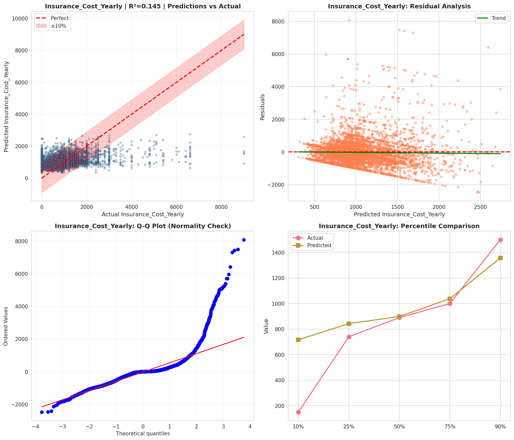
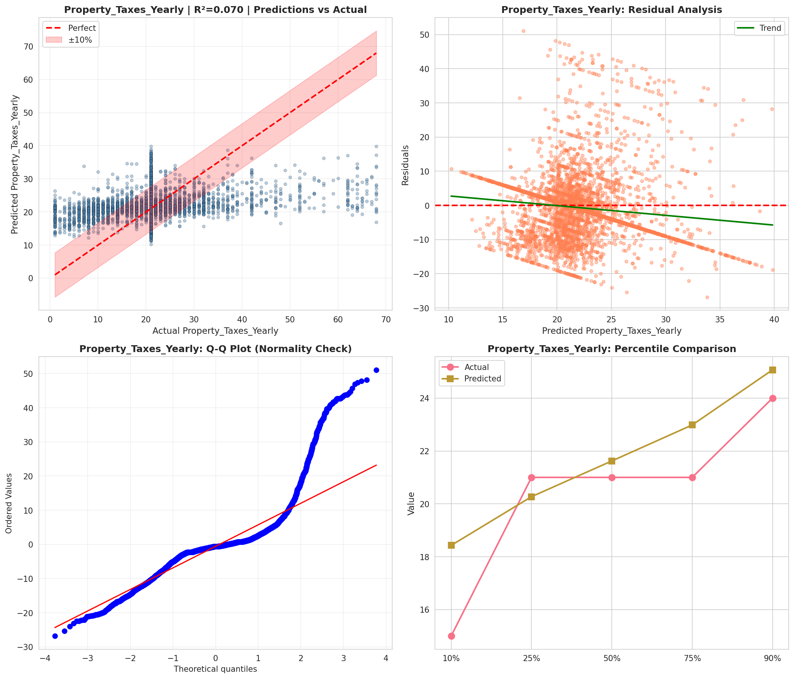
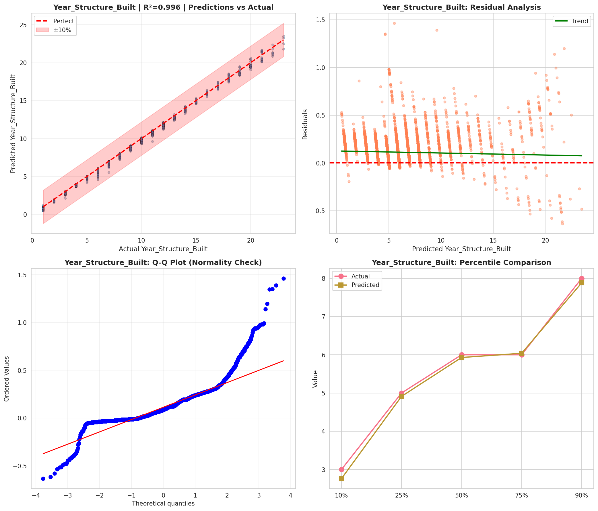
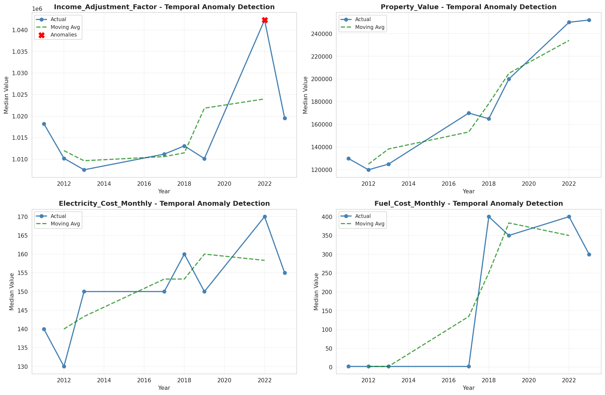
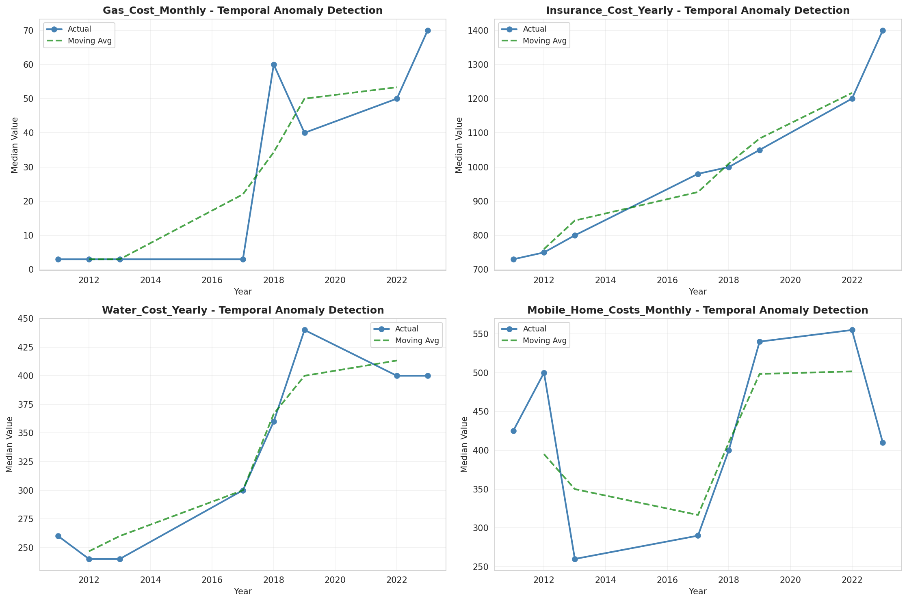
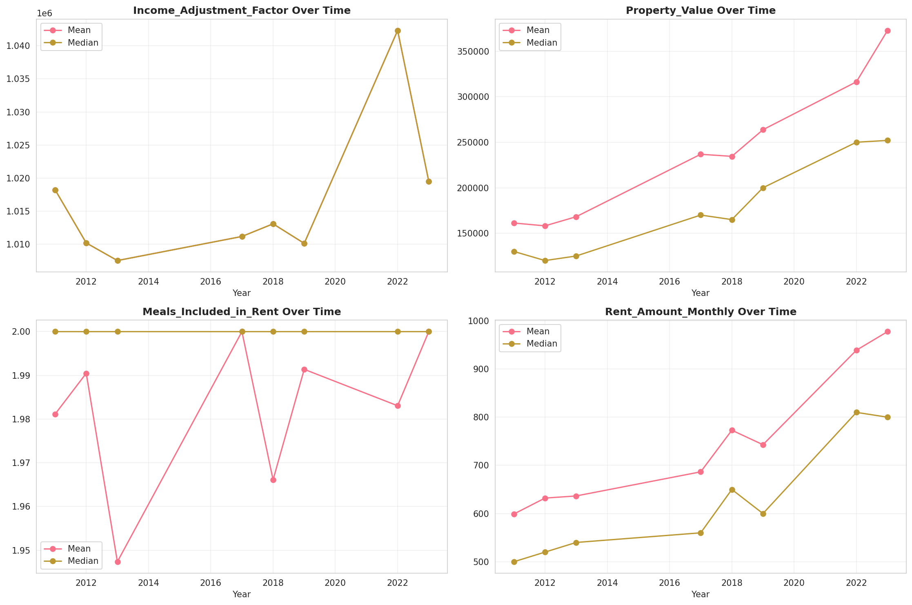
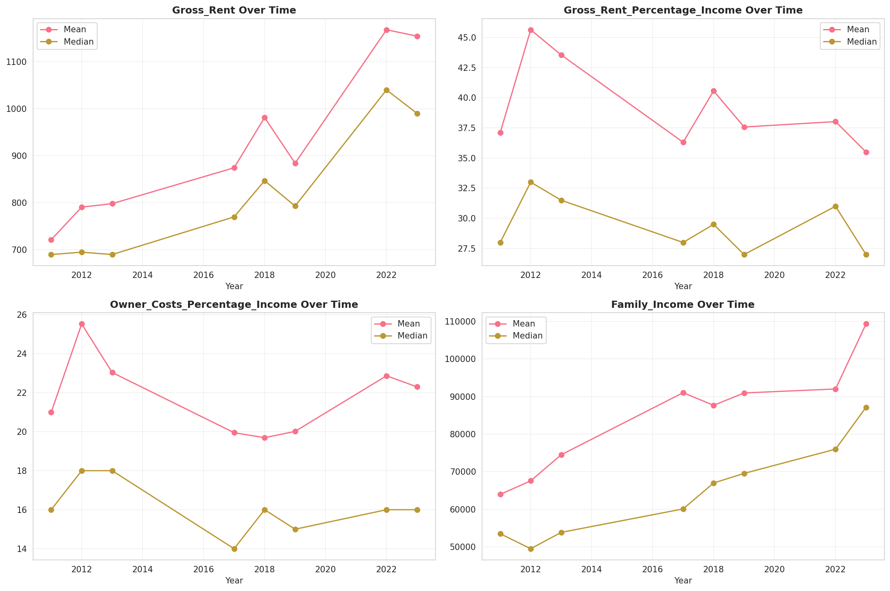
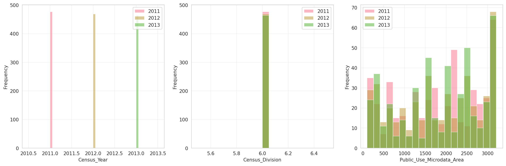
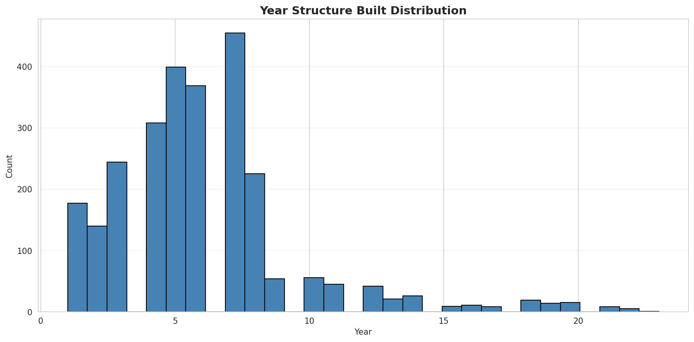
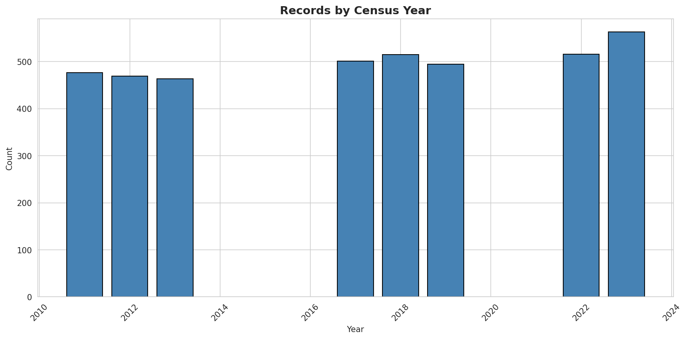
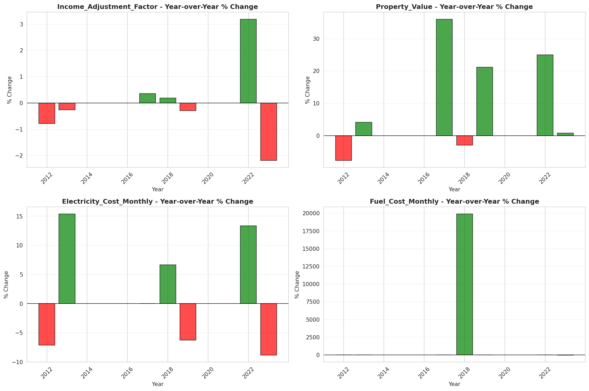
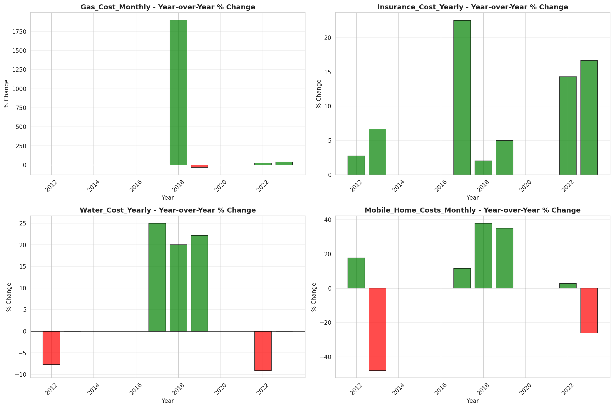
