# Temporal Analysis

## Year Distribution

- 2012: 150,777 records

- 2014: 154,912 records

- 2017: 158,764 records

- 2018: 160,462 records

- 2019: 162,088 records

- 2020: 156,168 records

- 2021: 158,319 records

- 2022: 160,523 records

## Temporal Trends

- Census_Year: {np.int64(2012): {'mean': 2012.0, 'median': 2012.0, 'std': 0.0}, np.int64(2014): {'mean': 2014.0, 'median': 2014.0, 'std': 0.0}, np.int64(2017): {'mean': 2017.0, 'median': 2017.0, 'std': 0.0}, np.int64(2018): {'mean': 2018.0, 'median': 2018.0, 'std': 0.0}, np.int64(2019): {'mean': 2019.0, 'median': 2019.0, 'std': 0.0}, np.int64(2020): {'mean': 2020.0, 'median': 2020.0, 'std': 0.0}, np.int64(2021): {'mean': 2021.0, 'median': 2021.0, 'std': 0.0}, np.int64(2022): {'mean': 2022.0, 'median': 2022.0, 'std': 0.0}}

- Census_Division: {np.int64(2012): {'mean': 6.0, 'median': 6.0, 'std': 0.0}, np.int64(2014): {'mean': 6.0, 'median': 6.0, 'std': 0.0}, np.int64(2017): {'mean': 6.0, 'median': 6.0, 'std': 0.0}, np.int64(2018): {'mean': 6.0, 'median': 6.0, 'std': 0.0}, np.int64(2019): {'mean': 6.0, 'median': 6.0, 'std': 0.0}, np.int64(2020): {'mean': 6.0, 'median': 6.0, 'std': 0.0}, np.int64(2021): {'mean': 6.0, 'median': 6.0, 'std': 0.0}, np.int64(2022): {'mean': 6.0, 'median': 6.0, 'std': 0.0}}

- Public_Use_Microdata_Area: {np.int64(2012): {'mean': None, 'median': None, 'std': None}, np.int64(2014): {'mean': None, 'median': None, 'std': None}, np.int64(2017): {'mean': 1862.7559081403845, 'median': 2001.0, 'std': 960.1124934605056}, np.int64(2018): {'mean': 1860.8036357517667, 'median': 2001.0, 'std': 958.3854444892061}, np.int64(2019): {'mean': 1857.4158605202113, 'median': 2001.0, 'std': 956.602225827768}, np.int64(2020): {'mean': 1855.427251421546, 'median': 2001.0, 'std': 955.3726284974193}, np.int64(2021): {'mean': 1853.3227723772889, 'median': 2001.0, 'std': 953.3945317091634}, np.int64(2022): {'mean': None, 'median': None, 'std': None}}

- Census_Region: {np.int64(2012): {'mean': 3.0, 'median': 3.0, 'std': 0.0}, np.int64(2014): {'mean': 3.0, 'median': 3.0, 'std': 0.0}, np.int64(2017): {'mean': 3.0, 'median': 3.0, 'std': 0.0}, np.int64(2018): {'mean': 3.0, 'median': 3.0, 'std': 0.0}, np.int64(2019): {'mean': 3.0, 'median': 3.0, 'std': 0.0}, np.int64(2020): {'mean': 3.0, 'median': 3.0, 'std': 0.0}, np.int64(2021): {'mean': 3.0, 'median': 3.0, 'std': 0.0}, np.int64(2022): {'mean': 3.0, 'median': 3.0, 'std': 0.0}}

- State_Code: {np.int64(2012): {'mean': 47.0, 'median': 47.0, 'std': 0.0}, np.int64(2014): {'mean': 47.0, 'median': 47.0, 'std': 0.0}, np.int64(2017): {'mean': 47.0, 'median': 47.0, 'std': 0.0}, np.int64(2018): {'mean': 47.0, 'median': 47.0, 'std': 0.0}, np.int64(2019): {'mean': 47.0, 'median': 47.0, 'std': 0.0}, np.int64(2020): {'mean': 47.0, 'median': 47.0, 'std': 0.0}, np.int64(2021): {'mean': 47.0, 'median': 47.0, 'std': 0.0}, np.int64(2022): {'mean': 47.0, 'median': 47.0, 'std': 0.0}}

- Housing_Adjustment_Factor: {np.int64(2012): {'mean': 1041327.8755778401, 'median': 1053092.0, 'std': 27480.265641625647}, np.int64(2014): {'mean': 1036695.2322479859, 'median': 1031130.0, 'std': 29621.571181872187}, np.int64(2017): {'mean': 1029077.8784422161, 'median': 1034680.0, 'std': 17980.92794257985}, np.int64(2018): {'mean': 1038136.2196719473, 'median': 1046406.0, 'std': 23497.308970295253}, np.int64(2019): {'mean': 1040663.7157408322, 'median': 1042936.0, 'std': 29176.811232897588}, np.int64(2020): {'mean': 1036869.3850596793, 'median': 1030827.0, 'std': 28144.952750154323}, np.int64(2021): {'mean': 1058041.0627404165, 'median': 1059761.0, 'std': 36002.72617909245}, np.int64(2022): {'mean': 1103733.139867807, 'median': 1133141.0, 'std': 62071.93475184389}}

- Income_Adjustment_Factor: {np.int64(2012): {'mean': 1052579.6871472439, 'median': 1061121.0, 'std': 26395.409168900864}, np.int64(2014): {'mean': 1047548.034593834, 'median': 1041654.0, 'std': 31056.053567638024}, np.int64(2017): {'mean': 1036477.9385377037, 'median': 1035988.0, 'std': 16842.71934163804}, np.int64(2018): {'mean': 1046733.7077438895, 'median': 1054346.0, 'std': 20515.301763249387}, np.int64(2019): {'mean': 1049632.7161171709, 'median': 1054606.0, 'std': 26235.750929227717}, np.int64(2020): {'mean': 1047030.7981340608, 'median': 1044328.0, 'std': 28584.602708589417}, np.int64(2021): {'mean': 1073257.3561038156, 'median': 1070512.0, 'std': 30948.514923587332}, np.int64(2022): {'mean': 1126401.3091581892, 'median': 1140108.0, 'std': 50110.716661141516}}

- Housing_Unit_Weight: {np.int64(2012): {'mean': 18.649091041737137, 'median': 15.0, 'std': 14.883191296802291}, np.int64(2014): {'mean': 18.327450423466225, 'median': 15.0, 'std': 15.488286457287927}, np.int64(2017): {'mean': 18.286255070418985, 'median': 14.0, 'std': 15.593486329856562}, np.int64(2018): {'mean': 18.263077862671537, 'median': 14.0, 'std': 15.668758391686659}, np.int64(2019): {'mean': 18.28319184640442, 'median': 14.0, 'std': 15.998526365446706}, np.int64(2020): {'mean': 19.185281235592438, 'median': 14.0, 'std': 20.214092269009182}, np.int64(2021): {'mean': 19.019347014571846, 'median': 14.0, 'std': 20.101248245535785}, np.int64(2022): {'mean': 19.00568765846639, 'median': 14.0, 'std': 20.41959822869873}}

- Number_of_Persons: {np.int64(2012): {'mean': 2.106388905469667, 'median': 2.0, 'std': 1.4041567112381146}, np.int64(2014): {'mean': 2.079122340425532, 'median': 2.0, 'std': 1.4078618016288638}, np.int64(2017): {'mean': 2.069631654531254, 'median': 2.0, 'std': 1.4103539819928808}, np.int64(2018): {'mean': 2.065193005197492, 'median': 2.0, 'std': 1.4098729265946968}, np.int64(2019): {'mean': 2.0621267459651547, 'median': 2.0, 'std': 1.4080936380698434}, np.int64(2020): {'mean': 2.0469174222632036, 'median': 2.0, 'std': 1.4066936561946288}, np.int64(2021): {'mean': 2.044978808607937, 'median': 2.0, 'std': 1.404817949869931}, np.int64(2022): {'mean': 2.0530266690754595, 'median': 2.0, 'std': 1.4012042946130971}}

- Housing_Unit_Type: {np.int64(2012): {'mean': 1.098038825550316, 'median': 1.0, 'std': 0.3793600993844911}, np.int64(2014): {'mean': 1.1212172071885973, 'median': 1.0, 'std': 0.42526560207283987}, np.int64(2017): {'mean': 1.1294877932024892, 'median': 1.0, 'std': 0.4426651037950886}, np.int64(2018): {'mean': 1.1297752738966236, 'median': 1.0, 'std': 0.44305098522536923}, np.int64(2019): {'mean': 1.1288435911356793, 'median': 1.0, 'std': 0.4416457787251859}, np.int64(2020): {'mean': None, 'median': None, 'std': None}, np.int64(2021): {'mean': None, 'median': None, 'std': None}, np.int64(2022): {'mean': None, 'median': None, 'std': None}}

- Building_Type: {np.int64(2012): {'mean': 2.5621638202856367, 'median': 2.0, 'std': 1.6979031933326416}, np.int64(2014): {'mean': 2.5775701066311463, 'median': 2.0, 'std': 1.7128999327413486}, np.int64(2017): {'mean': 2.594193891432399, 'median': 2.0, 'std': 1.7290828084262315}, np.int64(2018): {'mean': 2.602039282150814, 'median': 2.0, 'std': 1.7438691053344364}, np.int64(2019): {'mean': 2.6066321874049283, 'median': 2.0, 'std': 1.7541909889823486}, np.int64(2020): {'mean': 2.613320494757188, 'median': 2.0, 'std': 1.7662673923911705}, np.int64(2021): {'mean': 2.6183636058324704, 'median': 2.0, 'std': 1.779110262911472}, np.int64(2022): {'mean': 2.6163430789526396, 'median': 2.0, 'std': 1.782025761751878}}

- Year_Structure_Built: {np.int64(2012): {'mean': 5.407082423775486, 'median': 5.0, 'std': 2.4792629589350357}, np.int64(2014): {'mean': 5.52333833717431, 'median': 5.0, 'std': 2.673030966103823}, np.int64(2017): {'mean': 5.856981072141314, 'median': 6.0, 'std': 3.214479650405855}, np.int64(2018): {'mean': 6.0069502344081025, 'median': 6.0, 'std': 3.489699207344682}, np.int64(2019): {'mean': 6.192739073116317, 'median': 6.0, 'std': 3.784877606499817}, np.int64(2020): {'mean': 6.348793905452383, 'median': 6.0, 'std': 4.0511256018943405}, np.int64(2021): {'mean': None, 'median': None, 'std': None}, np.int64(2022): {'mean': None, 'median': None, 'std': None}}

- Bathtub_or_Shower: {np.int64(2012): {'mean': 1.0094023313216054, 'median': 1.0, 'std': 0.09650903549084558}, np.int64(2014): {'mean': 1.0091972006681185, 'median': 1.0, 'std': 0.09546033936176879}, np.int64(2017): {'mean': 1.0094328547851368, 'median': 1.0, 'std': 0.09666406033227935}, np.int64(2018): {'mean': 1.0095471754848762, 'median': 1.0, 'std': 0.0972424369737365}, np.int64(2019): {'mean': 1.0091674272386169, 'median': 1.0, 'std': 0.09530711896995005}, np.int64(2020): {'mean': 1.0094660898747532, 'median': 1.0, 'std': 0.09683258441308312}, np.int64(2021): {'mean': 1.0097464386667039, 'median': 1.0, 'std': 0.09824211484393176}, np.int64(2022): {'mean': 1.0085645414171553, 'median': 1.0, 'std': 0.09214797173880146}}

- Refrigerator: {np.int64(2012): {'mean': 1.0213942273395256, 'median': 1.0, 'std': 0.14469507156005937}, np.int64(2014): {'mean': 1.0223692834640674, 'median': 1.0, 'std': 0.14788188782637673}, np.int64(2017): {'mean': 1.0231609040624805, 'median': 1.0, 'std': 0.15041486900877515}, np.int64(2018): {'mean': 1.0235296529666635, 'median': 1.0, 'std': 0.1515789082238038}, np.int64(2019): {'mean': 1.0230605415272285, 'median': 1.0, 'std': 0.15009631994658582}, np.int64(2020): {'mean': 1.0233501603642001, 'median': 1.0, 'std': 0.15101354852274598}, np.int64(2021): {'mean': 1.023418040357113, 'median': 1.0, 'std': 0.1512276289460019}, np.int64(2022): {'mean': 1.0212732157780955, 'median': 1.0, 'std': 0.1442941782455587}}

- Hot_and_Cold_Running_Water: {np.int64(2012): {'mean': 1.0153661772888756, 'median': 1.0, 'std': 0.1230047390135168}, np.int64(2014): {'mean': 1.0161039107483913, 'median': 1.0, 'std': 0.1258756786476846}, np.int64(2017): {'mean': 1.0176779709004027, 'median': 1.0, 'std': 0.13177852694016948}, np.int64(2018): {'mean': 1.0185407924770717, 'median': 1.0, 'std': 0.1348968341057947}, np.int64(2019): {'mean': 1.018530913024372, 'median': 1.0, 'std': 0.134861563267455}, np.int64(2020): {'mean': 1.0196614297548163, 'median': 1.0, 'std': 0.13883441361436838}, np.int64(2021): {'mean': 1.020563376339873, 'median': 1.0, 'std': 0.141917810059489}, np.int64(2022): {'mean': 1.0191597079767651, 'median': 1.0, 'std': 0.13708662723397866}}

- Running_Water: {np.int64(2012): {'mean': None, 'median': None, 'std': None}, np.int64(2014): {'mean': 9.0, 'median': 9.0, 'std': 0.0}, np.int64(2017): {'mean': 9.0, 'median': 9.0, 'std': 0.0}, np.int64(2018): {'mean': 9.0, 'median': 9.0, 'std': 0.0}, np.int64(2019): {'mean': 9.0, 'median': 9.0, 'std': 0.0}, np.int64(2020): {'mean': 9.0, 'median': 9.0, 'std': 0.0}, np.int64(2021): {'mean': 9.0, 'median': 9.0, 'std': 0.0}, np.int64(2022): {'mean': 9.0, 'median': 9.0, 'std': 0.0}}

- Sink_with_Faucet: {np.int64(2012): {'mean': 1.0089172338027366, 'median': 1.0, 'std': 0.09400946649610908}, np.int64(2014): {'mean': 1.0089011988075354, 'median': 1.0, 'std': 0.09392566018942296}, np.int64(2017): {'mean': 1.0090530546290735, 'median': 1.0, 'std': 0.0947162012588712}, np.int64(2018): {'mean': 1.0091371321569647, 'median': 1.0, 'std': 0.09515096870996906}, np.int64(2019): {'mean': 1.0087685495047831, 'median': 1.0, 'std': 0.0932293988286792}, np.int64(2020): {'mean': 1.0090908447263895, 'median': 1.0, 'std': 0.09491188043623276}, np.int64(2021): {'mean': 1.00962049760712, 'median': 1.0, 'std': 0.0976115274841261}, np.int64(2022): {'mean': 1.0084471243170814, 'median': 1.0, 'std': 0.09151955123777085}}

- Stove_or_Range: {np.int64(2012): {'mean': 1.021301488107977, 'median': 1.0, 'std': 0.14438796153669992}, np.int64(2014): {'mean': 1.0227498572848173, 'median': 1.0, 'std': 0.14910552627322907}, np.int64(2017): {'mean': 1.023961937118905, 'median': 1.0, 'std': 0.1529311093032692}, np.int64(2018): {'mean': 1.02445908450993, 'median': 1.0, 'std': 0.1544700642916578}, np.int64(2019): {'mean': 1.0240273129838082, 'median': 1.0, 'std': 0.1531344499211857}, np.int64(2020): {'mean': 1.024525456489263, 'median': 1.0, 'std': 0.15467426372349455}, np.int64(2021): {'mean': 1.0247614116593435, 'median': 1.0, 'std': 0.15539772556919448}, np.int64(2022): {'mean': 1.0226062452083462, 'median': 1.0, 'std': 0.14864506549521836}}

- Telephone_Service: {np.int64(2012): {'mean': 1.0255205923183712, 'median': 1.0, 'std': 0.15770061347837103}, np.int64(2014): {'mean': 1.027045430202133, 'median': 1.0, 'std': 0.16221644870577612}, np.int64(2017): {'mean': 1.024863744876357, 'median': 1.0, 'std': 0.15571037564598586}, np.int64(2018): {'mean': 1.0231440495763249, 'median': 1.0, 'std': 0.15036146693979927}, np.int64(2019): {'mean': 1.0203832432233624, 'median': 1.0, 'std': 0.14130786779707016}, np.int64(2020): {'mean': 1.0175430472265314, 'median': 1.0, 'std': 0.13128374516205868}, np.int64(2021): {'mean': 1.0131857423451132, 'median': 1.0, 'std': 0.11407005568642913}, np.int64(2022): {'mean': 1.0115976295941578, 'median': 1.0, 'std': 0.10706638292952296}}

- Lot_Acreage: {np.int64(2012): {'mean': 1.4478709009204658, 'median': 1.0, 'std': 0.629442222648986}, np.int64(2014): {'mean': 1.4528047062722678, 'median': 1.0, 'std': 0.6311445750441697}, np.int64(2017): {'mean': 1.4510933697925568, 'median': 1.0, 'std': 0.629869910964042}, np.int64(2018): {'mean': 1.4480685865308687, 'median': 1.0, 'std': 0.6288768534255683}, np.int64(2019): {'mean': 1.4468144419399287, 'median': 1.0, 'std': 0.6274905197197417}, np.int64(2020): {'mean': 1.4469000717228495, 'median': 1.0, 'std': 0.6267490867320966}, np.int64(2021): {'mean': 1.4462649332685642, 'median': 1.0, 'std': 0.6248669209325975}, np.int64(2022): {'mean': 1.4509137788444386, 'median': 1.0, 'std': 0.6256183696621253}}

- Agricultural_Sales: {np.int64(2012): {'mean': 1.2024212044546378, 'median': 1.0, 'std': 0.8261324633401042}, np.int64(2014): {'mean': 1.1949635766983964, 'median': 1.0, 'std': 0.8150385338813942}, np.int64(2017): {'mean': 1.1931270373261098, 'median': 1.0, 'std': 0.8146889320126873}, np.int64(2018): {'mean': 1.1957901005520053, 'median': 1.0, 'std': 0.8222977450323061}, np.int64(2019): {'mean': 1.1931228324682095, 'median': 1.0, 'std': 0.8147446844212657}, np.int64(2020): {'mean': 1.1906029422249684, 'median': 1.0, 'std': 0.8059598976826247}, np.int64(2021): {'mean': 1.193402631455729, 'median': 1.0, 'std': 0.8125294908326792}, np.int64(2022): {'mean': 1.1907186036998318, 'median': 1.0, 'std': 0.8032723447262914}}

- Business_On_Property: {np.int64(2012): {'mean': 1.9864435943268572, 'median': 2.0, 'std': 0.1156405691643114}, np.int64(2014): {'mean': 1.9871820366227526, 'median': 2.0, 'std': 0.11248896851386848}, np.int64(2017): {'mean': 4.828983454999715, 'median': 2.0, 'std': 3.4437297897910977}, np.int64(2018): {'mean': 6.23590317954007, 'median': 9.0, 'std': 3.42756250174622}, np.int64(2019): {'mean': 7.625849256477448, 'median': 9.0, 'std': 2.784009166581509}, np.int64(2020): {'mean': None, 'median': None, 'std': None}, np.int64(2021): {'mean': None, 'median': None, 'std': None}, np.int64(2022): {'mean': None, 'median': None, 'std': None}}

- Tenure: {np.int64(2012): {'mean': 1.8522289063705075, 'median': 2.0, 'std': 0.87218605747498}, np.int64(2014): {'mean': 1.8845883127017888, 'median': 2.0, 'std': 0.8739632425549148}, np.int64(2017): {'mean': 1.9025043916940678, 'median': 2.0, 'std': 0.8701810176353098}, np.int64(2018): {'mean': 1.903771044272015, 'median': 2.0, 'std': 0.8673249184873989}, np.int64(2019): {'mean': 1.90238699474052, 'median': 2.0, 'std': 0.8639617855551536}, np.int64(2020): {'mean': 1.9003758673118927, 'median': 2.0, 'std': 0.8609016360383329}, np.int64(2021): {'mean': 1.8961889245854713, 'median': 2.0, 'std': 0.8566194958532029}, np.int64(2022): {'mean': 1.891730515982282, 'median': 2.0, 'std': 0.8519492757302415}}

- Vacancy_Status: {np.int64(2012): {'mean': 4.552956835900361, 'median': 5.0, 'std': 2.365523723349264}, np.int64(2014): {'mean': 4.71452838623156, 'median': 5.0, 'std': 2.337330952499592}, np.int64(2017): {'mean': 4.9535625053846815, 'median': 5.0, 'std': 2.2947161168060592}, np.int64(2018): {'mean': 5.009490215839422, 'median': 5.0, 'std': 2.2890401895887176}, np.int64(2019): {'mean': 5.032330827067669, 'median': 5.0, 'std': 2.2872959175076613}, np.int64(2020): {'mean': 5.061504197361659, 'median': 5.0, 'std': 2.2935784294457204}, np.int64(2021): {'mean': 5.098789974070873, 'median': 7.0, 'std': 2.2934151504013984}, np.int64(2022): {'mean': 5.093488998652896, 'median': 7.0, 'std': 2.300133116640518}}

- Vehicles_Available: {np.int64(2012): {'mean': 1.8898580903902513, 'median': 2.0, 'std': 1.0664314125242895}, np.int64(2014): {'mean': 1.8885667069606598, 'median': 2.0, 'std': 1.0754340818389103}, np.int64(2017): {'mean': 1.933584072789514, 'median': 2.0, 'std': 1.092478553554998}, np.int64(2018): {'mean': 1.952149621705265, 'median': 2.0, 'std': 1.0982349075971}, np.int64(2019): {'mean': 1.9734966346684322, 'median': 2.0, 'std': 1.1065316622639814}, np.int64(2020): {'mean': 1.9917957504611514, 'median': 2.0, 'std': 1.1130483136406848}, np.int64(2021): {'mean': 2.0022839045632415, 'median': 2.0, 'std': 1.1166783289845539}, np.int64(2022): {'mean': 2.0107446426433615, 'median': 2.0, 'std': 1.118883008790669}}

- Condo_Fee_Monthly: {np.int64(2012): {'mean': 172.71456564337035, 'median': 130.0, 'std': 166.70146220396018}, np.int64(2014): {'mean': 185.42706502636204, 'median': 140.0, 'std': 170.09623952876194}, np.int64(2017): {'mean': 199.23848138591964, 'median': 150.0, 'std': 172.19691716941034}, np.int64(2018): {'mean': 203.71202872531418, 'median': 160.0, 'std': 171.66510124450625}, np.int64(2019): {'mean': 209.11305565278263, 'median': 160.0, 'std': 175.68899629295473}, np.int64(2020): {'mean': 212.68299817184644, 'median': 170.0, 'std': 178.1122708814782}, np.int64(2021): {'mean': 222.55917053986414, 'median': 180.0, 'std': 191.14590583274912}, np.int64(2022): {'mean': 227.3112582781457, 'median': 180.0, 'std': 193.6007832262437}}

- Electricity_Cost_Monthly: {np.int64(2012): {'mean': 153.17862872127102, 'median': 140.0, 'std': 92.51027524134437}, np.int64(2014): {'mean': 159.43312472266, 'median': 140.0, 'std': 95.13031922698532}, np.int64(2017): {'mean': 160.74036454814348, 'median': 140.0, 'std': 95.45336733816885}, np.int64(2018): {'mean': 168.7255983286737, 'median': 150.0, 'std': 94.25032591490492}, np.int64(2019): {'mean': 168.47432528894493, 'median': 150.0, 'std': 93.28523826156504}, np.int64(2020): {'mean': 168.53302209971162, 'median': 150.0, 'std': 93.30200337254159}, np.int64(2021): {'mean': 170.39526790834321, 'median': 150.0, 'std': 96.98883905426891}, np.int64(2022): {'mean': 179.68997152799747, 'median': 150.0, 'std': 131.1173616405556}}

- Fuel_Cost_Monthly: {np.int64(2012): {'mean': 62.096575659416935, 'median': 2.0, 'std': 296.92488289040705}, np.int64(2014): {'mean': 51.339188713601516, 'median': 2.0, 'std': 266.39024956225006}, np.int64(2017): {'mean': 36.85299460985241, 'median': 2.0, 'std': 226.63073983096615}, np.int64(2018): {'mean': 599.2877873378708, 'median': 320.0, 'std': 744.8667215260461}, np.int64(2019): {'mean': 582.9459037711314, 'median': 300.0, 'std': 727.9982495573449}, np.int64(2020): {'mean': 562.8580598103574, 'median': 300.0, 'std': 699.8800277460741}, np.int64(2021): {'mean': 549.9151015422202, 'median': 300.0, 'std': 687.651338238008}, np.int64(2022): {'mean': 546.4478824816377, 'median': 300.0, 'std': 666.8638184481441}}

- Gas_Cost_Monthly: {np.int64(2012): {'mean': 40.114538022520435, 'median': 3.0, 'std': 71.14764603629446}, np.int64(2014): {'mean': 36.542989610270375, 'median': 3.0, 'std': 66.63032141430023}, np.int64(2017): {'mean': 33.061851568247675, 'median': 3.0, 'std': 62.32246502523774}, np.int64(2018): {'mean': 77.36709883571454, 'median': 50.0, 'std': 80.36903064201027}, np.int64(2019): {'mean': 75.25498810842214, 'median': 50.0, 'std': 79.13213943693597}, np.int64(2020): {'mean': 73.561933477091, 'median': 50.0, 'std': 77.48593071086792}, np.int64(2021): {'mean': 75.1479929669672, 'median': 50.0, 'std': 79.95281935368159}, np.int64(2022): {'mean': 82.78114934114203, 'median': 50.0, 'std': 104.8945892360542}}

- House_Heating_Fuel: {np.int64(2012): {'mean': 2.323407373129724, 'median': 3.0, 'std': 1.1683685292367418}, np.int64(2014): {'mean': 2.354314262543418, 'median': 3.0, 'std': 1.1881887910149842}, np.int64(2017): {'mean': 2.363377025058931, 'median': 3.0, 'std': 1.1859666990333932}, np.int64(2018): {'mean': 2.3617048185152396, 'median': 3.0, 'std': 1.1769012606299143}, np.int64(2019): {'mean': 2.3607267645003494, 'median': 3.0, 'std': 1.1668004261806306}, np.int64(2020): {'mean': 2.363449026372456, 'median': 3.0, 'std': 1.1591008028986272}, np.int64(2021): {'mean': 2.3652344047383407, 'median': 3.0, 'std': 1.1581815527660082}, np.int64(2022): {'mean': 2.370914641446187, 'median': 3.0, 'std': 1.1633352449693364}}

- Insurance_Cost_Yearly: {np.int64(2014): {'mean': 919.8152880956144, 'median': 800.0, 'std': 649.4870063523807}}

- Water_Cost_Yearly: {np.int64(2012): {'mean': 340.09548819990744, 'median': 260.0, 'std': 395.63761850037326}, np.int64(2014): {'mean': 349.0975854207152, 'median': 280.0, 'std': 404.9278197233888}, np.int64(2017): {'mean': 361.18208639250486, 'median': 260.0, 'std': 426.95953597779214}, np.int64(2018): {'mean': 445.8672545497433, 'median': 360.0, 'std': 441.04751986650143}, np.int64(2019): {'mean': 449.6344284142644, 'median': 360.0, 'std': 450.09431610068907}, np.int64(2020): {'mean': 455.47620206710604, 'median': 360.0, 'std': 462.41369925741}, np.int64(2021): {'mean': 461.78563030458906, 'median': 360.0, 'std': 483.7972207320195}, np.int64(2022): {'mean': 473.48476195607276, 'median': 360.0, 'std': 509.4378191041721}}

- Mobile_Home_Costs_Monthly: {np.int64(2012): {'mean': 855.9523106140535, 'median': 350.0, 'std': 1355.6037355383203}, np.int64(2014): {'mean': 873.681613387685, 'median': 350.0, 'std': 1420.2000602219985}, np.int64(2017): {'mean': 892.7818416523236, 'median': 370.0, 'std': 1455.6261804119933}, np.int64(2018): {'mean': 899.0985200845666, 'median': 370.0, 'std': 1474.6313086050982}, np.int64(2019): {'mean': 888.069820285065, 'median': 380.0, 'std': 1448.6613675852755}, np.int64(2020): {'mean': 959.5751705921198, 'median': 380.0, 'std': 1806.0807705934321}, np.int64(2021): {'mean': 1068.5267059080008, 'median': 380.0, 'std': 2358.229444393111}, np.int64(2022): {'mean': 1286.5593902180817, 'median': 390.0, 'std': 3333.1529041624653}}

- First_Mortgage_Includes_Insurance: {np.int64(2012): {'mean': 1.4147032429483908, 'median': 1.0, 'std': 0.4926750798433493}, np.int64(2014): {'mean': 1.3960050439518266, 'median': 1.0, 'std': 0.4890699544524376}, np.int64(2017): {'mean': 1.362706399065992, 'median': 1.0, 'std': 0.4807855560225555}, np.int64(2018): {'mean': 1.353126962432123, 'median': 1.0, 'std': 0.4779461580270869}, np.int64(2019): {'mean': 1.3435913414835317, 'median': 1.0, 'std': 0.47491100789835233}, np.int64(2020): {'mean': 1.3323648478509307, 'median': 1.0, 'std': 0.4710655516548346}, np.int64(2021): {'mean': 1.3233489159500587, 'median': 1.0, 'std': 0.4677591300096819}, np.int64(2022): {'mean': 1.3122794299994278, 'median': 1.0, 'std': 0.4634275396726811}}

- First_Mortgage_Payment_Monthly: {np.int64(2012): {'mean': 936.0620084109025, 'median': 800.0, 'std': 638.979894247223}, np.int64(2014): {'mean': 933.1832453078455, 'median': 790.0, 'std': 629.4432809974412}, np.int64(2017): {'mean': 965.9576731343006, 'median': 800.0, 'std': 651.9757738016606}, np.int64(2018): {'mean': 987.7798382032433, 'median': 820.0, 'std': 667.946184691547}, np.int64(2019): {'mean': 1014.9117102586191, 'median': 850.0, 'std': 685.4153059851623}, np.int64(2020): {'mean': 1043.6210510004455, 'median': 870.0, 'std': 701.1408516308442}, np.int64(2021): {'mean': 1078.2073065158422, 'median': 900.0, 'std': 719.3676825373815}, np.int64(2022): {'mean': 1124.3194902806126, 'median': 950.0, 'std': 741.6535658740482}}

- First_Mortgage_Includes_Taxes: {np.int64(2012): {'mean': 1.3711002797768823, 'median': 1.0, 'std': 0.4831034763337744}, np.int64(2014): {'mean': 1.347594071529085, 'median': 1.0, 'std': 0.4762106438871903}, np.int64(2017): {'mean': 1.3069994996386278, 'median': 1.0, 'std': 0.4612534548494732}, np.int64(2018): {'mean': 1.2944109933138783, 'median': 1.0, 'std': 0.45578174296656393}, np.int64(2019): {'mean': 1.2812001686247916, 'median': 1.0, 'std': 0.4495890774841271}, np.int64(2020): {'mean': 1.2683092180448214, 'median': 1.0, 'std': 0.4430837215245844}, np.int64(2021): {'mean': 1.2553625363113445, 'median': 1.0, 'std': 0.4360689963137048}, np.int64(2022): {'mean': 1.2398275500276608, 'median': 1.0, 'std': 0.4269821707660462}}

- First_Mortgage_Status: {np.int64(2012): {'mean': 1.8178590133026082, 'median': 1.0, 'std': 0.9789911546077691}, np.int64(2014): {'mean': 1.852666265327461, 'median': 1.0, 'std': 0.9847847272442399}, np.int64(2017): {'mean': 1.8816237086507357, 'median': 1.0, 'std': 0.9890357790966742}, np.int64(2018): {'mean': 1.887838871771542, 'median': 1.0, 'std': 0.9899527109588314}, np.int64(2019): {'mean': 1.895164906844959, 'median': 1.0, 'std': 0.9908189160297123}, np.int64(2020): {'mean': 1.906547733231025, 'median': 1.0, 'std': 0.9921387908507615}, np.int64(2021): {'mean': 1.9187401212146589, 'median': 1.0, 'std': 0.9931947163986973}, np.int64(2022): {'mean': 1.9357020268061458, 'median': 1.0, 'std': 0.994551897043701}}

- Second_Mortgage_Payment_Monthly: {np.int64(2012): {'mean': 332.9618671322246, 'median': 250.0, 'std': 316.83058192274484}, np.int64(2014): {'mean': 326.278527326778, 'median': 240.0, 'std': 309.77735258884053}, np.int64(2017): {'mean': 329.9944338655339, 'median': 230.0, 'std': 340.1091644499154}, np.int64(2018): {'mean': 334.96532593619975, 'median': 230.0, 'std': 342.2607567125393}, np.int64(2019): {'mean': 351.98331697742884, 'median': 240.0, 'std': 367.84810997675135}, np.int64(2020): {'mean': 368.14619883040933, 'median': 250.0, 'std': 373.619978694183}, np.int64(2021): {'mean': 396.51961283749364, 'median': 270.0, 'std': 440.8376186801666}, np.int64(2022): {'mean': 421.7256651793092, 'median': 290.0, 'std': 476.90444121467436}}

- Second_Mortgage_Status: {np.int64(2012): {'mean': 2.7647762664742834, 'median': 3.0, 'std': 0.5486619163684804}, np.int64(2014): {'mean': 2.8065023118112538, 'median': 3.0, 'std': 0.5020016674648914}, np.int64(2017): {'mean': 2.8504290135468207, 'median': 3.0, 'std': 0.442837165092942}, np.int64(2018): {'mean': 2.8605703520372354, 'median': 3.0, 'std': 0.42319755101414613}, np.int64(2019): {'mean': 2.8716068842904012, 'median': 3.0, 'std': 0.4035203384246982}, np.int64(2020): {'mean': 2.873313285527026, 'median': 3.0, 'std': 0.39664654321025883}, np.int64(2021): {'mean': 2.875256712557998, 'median': 3.0, 'std': 0.38674886737083236}, np.int64(2022): {'mean': 2.8752412177985947, 'median': 3.0, 'std': 0.3805672113509904}}

- Property_Taxes_Yearly: {np.int64(2012): {'mean': 21.036744527076568, 'median': 20.0, 'std': 13.225024288416495}, np.int64(2014): {'mean': 21.4118373942524, 'median': 20.0, 'std': 13.460291651715321}, np.int64(2017): {'mean': 22.446770322446, 'median': 22.0, 'std': 13.84165969142544}}

- Meals_Included_in_Rent: {np.int64(2012): {'mean': 1.9839479132287197, 'median': 2.0, 'std': 0.12567772750138081}, np.int64(2014): {'mean': 1.982721690703984, 'median': 2.0, 'std': 0.1303083046707942}, np.int64(2017): {'mean': 1.9814031888142807, 'median': 2.0, 'std': 0.13509801677693992}, np.int64(2018): {'mean': 1.9810707456978967, 'median': 2.0, 'std': 0.13627708872586208}, np.int64(2019): {'mean': 1.9803670972127805, 'median': 2.0, 'std': 0.13873707260045623}, np.int64(2020): {'mean': 1.9800872259841615, 'median': 2.0, 'std': 0.13970259638995153}, np.int64(2021): {'mean': 1.98028853020997, 'median': 2.0, 'std': 0.1390089197472907}, np.int64(2022): {'mean': 1.9798049340218016, 'median': 2.0, 'std': 0.14066909015270923}}

- Rent_Amount_Monthly: {np.int64(2012): {'mean': 568.3717483272826, 'median': 500.0, 'std': 365.67128333947767}, np.int64(2014): {'mean': 597.7831215193488, 'median': 530.0, 'std': 390.66203682052384}, np.int64(2017): {'mean': 663.7830832573434, 'median': 590.0, 'std': 424.57409127380345}, np.int64(2018): {'mean': 687.1375580442502, 'median': 600.0, 'std': 434.3611190264569}, np.int64(2019): {'mean': 717.6964785859959, 'median': 620.0, 'std': 450.4524286108939}, np.int64(2020): {'mean': 751.3178583725468, 'median': 650.0, 'std': 493.40021695241427}, np.int64(2021): {'mean': 784.7938294529353, 'median': 670.0, 'std': 519.1894165349369}, np.int64(2022): {'mean': 833.5623063683305, 'median': 700.0, 'std': 562.8961252159086}}

- Gross_Rent: {np.int64(2012): {'mean': 729.2143996873881, 'median': 680.0, 'std': 385.5537637154348}, np.int64(2014): {'mean': 763.5733370356658, 'median': 710.0, 'std': 405.4456330827651}, np.int64(2017): {'mean': 830.2543075374504, 'median': 763.0, 'std': 436.8211218879062}, np.int64(2018): {'mean': 854.9818979382951, 'median': 788.0, 'std': 445.83459362681475}, np.int64(2019): {'mean': 882.5445605051063, 'median': 808.0, 'std': 458.8631359792199}, np.int64(2020): {'mean': 910.3332820481261, 'median': 830.0, 'std': 482.01238838372086}, np.int64(2021): {'mean': 943.9357907617008, 'median': 860.0, 'std': 504.5025090884599}, np.int64(2022): {'mean': 1000.0550973478461, 'median': 900.0, 'std': 552.7720557389619}}

- Gross_Rent_Percentage_Income: {np.int64(2012): {'mean': 39.72574446041242, 'median': 30.0, 'std': 27.37887609547561}, np.int64(2014): {'mean': 39.74030380870834, 'median': 30.0, 'std': 27.290545826993824}, np.int64(2017): {'mean': 37.63268097003586, 'median': 29.0, 'std': 26.44298049752754}, np.int64(2018): {'mean': 37.27960990247562, 'median': 29.0, 'std': 26.30636890299429}, np.int64(2019): {'mean': 36.72116474729996, 'median': 28.0, 'std': 26.0712999922701}, np.int64(2020): {'mean': 36.64016023720153, 'median': 28.0, 'std': 26.168510808225154}, np.int64(2021): {'mean': 36.90364615962912, 'median': 28.0, 'std': 26.458101318547897}, np.int64(2022): {'mean': 37.14899425738224, 'median': 28.0, 'std': 26.667670406837168}}

- Selected_Monthly_Owner_Costs: {np.int64(2012): {'mean': 946.9621920046933, 'median': 771.0, 'std': 783.5811141476015}, np.int64(2014): {'mean': 930.4978238363863, 'median': 750.0, 'std': 761.3643787805386}, np.int64(2017): {'mean': 936.2208722156114, 'median': 747.0, 'std': 769.8956615248625}, np.int64(2018): {'mean': 950.9176181020931, 'median': 759.0, 'std': 781.1860880216555}, np.int64(2019): {'mean': 963.1218985096536, 'median': 764.0, 'std': 795.3163847252039}, np.int64(2020): {'mean': 975.2826429896182, 'median': 770.0, 'std': 808.6506025670477}, np.int64(2021): {'mean': 996.6273253561969, 'median': 783.0, 'std': 830.0141684321467}, np.int64(2022): {'mean': 1032.5520637515324, 'median': 802.0, 'std': 863.7051687856612}}

- Owner_Costs_Percentage_Income: {np.int64(2012): {'mean': 23.70100916269054, 'median': 18.0, 'std': 20.463916128473883}, np.int64(2014): {'mean': 23.16618743343983, 'median': 17.0, 'std': 20.536571549045288}, np.int64(2017): {'mean': 21.37852607638121, 'median': 16.0, 'std': 19.707159941361642}, np.int64(2018): {'mean': 21.068325055302807, 'median': 16.0, 'std': 19.518123665776386}, np.int64(2019): {'mean': 20.54125799354348, 'median': 15.0, 'std': 19.225781873602365}, np.int64(2020): {'mean': 20.211582895401445, 'median': 15.0, 'std': 19.05980134913847}, np.int64(2021): {'mean': 20.17089630263283, 'median': 15.0, 'std': 19.269587015200536}, np.int64(2022): {'mean': 20.282360216439063, 'median': 15.0, 'std': 19.57549426903977}}

- Satellite_Internet: {np.int64(2012): {'mean': None, 'median': None, 'std': None}, np.int64(2014): {'mean': None, 'median': None, 'std': None}, np.int64(2017): {'mean': 1.9188416996268467, 'median': 2.0, 'std': 0.2730794552520342}, np.int64(2018): {'mean': 1.9136500790732422, 'median': 2.0, 'std': 0.28088142967229385}, np.int64(2019): {'mean': 1.9096493496896245, 'median': 2.0, 'std': 0.2866847911920841}, np.int64(2020): {'mean': 1.908349827862778, 'median': 2.0, 'std': 0.28853283876399494}, np.int64(2021): {'mean': 1.9111137188351899, 'median': 2.0, 'std': 0.28458081668836444}, np.int64(2022): {'mean': 1.915085331342558, 'median': 2.0, 'std': 0.2787558828745135}}

- Smartphone: {np.int64(2012): {'mean': None, 'median': None, 'std': None}, np.int64(2014): {'mean': None, 'median': None, 'std': None}, np.int64(2017): {'mean': 1.3420116210981488, 'median': 1.0, 'std': 0.47438524592948017}, np.int64(2018): {'mean': 1.2900334030159426, 'median': 1.0, 'std': 0.4537791974564224}, np.int64(2019): {'mean': 1.2459818308874913, 'median': 1.0, 'std': 0.43066940233500467}, np.int64(2020): {'mean': 1.2117360130280086, 'median': 1.0, 'std': 0.408540281969223}, np.int64(2021): {'mean': 1.1756398739284681, 'median': 1.0, 'std': 0.3805149286369643}, np.int64(2022): {'mean': 1.1500583622650544, 'median': 1.0, 'std': 0.35712995462540303}}

- Tablet_Computer: {np.int64(2012): {'mean': None, 'median': None, 'std': None}, np.int64(2014): {'mean': None, 'median': None, 'std': None}, np.int64(2017): {'mean': 1.4975001126075402, 'median': 1.0, 'std': 0.49999562730341274}, np.int64(2018): {'mean': 1.4570559221538621, 'median': 1.0, 'std': 0.49815424551845344}, np.int64(2019): {'mean': 1.4292250542498806, 'median': 1.0, 'std': 0.4949673819554761}, np.int64(2020): {'mean': 1.4075343258700133, 'median': 1.0, 'std': 0.49137761715147704}, np.int64(2021): {'mean': 1.3942399926915054, 'median': 1.0, 'std': 0.48868869330976655}, np.int64(2022): {'mean': 1.389650424997007, 'median': 1.0, 'std': 0.48767279069341335}}

- Food_Stamp_SNAP: {np.int64(2012): {'mean': 1.8519310703769456, 'median': 2.0, 'std': 0.35516956665544486}, np.int64(2014): {'mean': 1.8383393516875743, 'median': 2.0, 'std': 0.3681404977043292}, np.int64(2017): {'mean': 1.8563031320290575, 'median': 2.0, 'std': 0.35078328677499887}, np.int64(2018): {'mean': 1.8650398842179665, 'median': 2.0, 'std': 0.3416821166112153}, np.int64(2019): {'mean': 1.8763372813386803, 'median': 2.0, 'std': 0.32919746745663486}, np.int64(2020): {'mean': 1.884714936260329, 'median': 2.0, 'std': 0.3193667542123429}, np.int64(2021): {'mean': 1.8887488160055605, 'median': 2.0, 'std': 0.31444400427419433}, np.int64(2022): {'mean': 1.8929164323774332, 'median': 2.0, 'std': 0.3092204993657683}}

- Family_Type_Employment_Status: {np.int64(2012): {'mean': 3.1625975333501133, 'median': 2.0, 'std': 2.3553809681760653}, np.int64(2014): {'mean': 3.231191696829221, 'median': 2.0, 'std': 2.3601288436255548}, np.int64(2017): {'mean': 3.222726042230644, 'median': 2.0, 'std': 2.3413559008410534}, np.int64(2018): {'mean': 3.216994783779236, 'median': 2.0, 'std': 2.3324555288611477}, np.int64(2019): {'mean': 3.200260628404041, 'median': 2.0, 'std': 2.3188106970934834}, np.int64(2020): {'mean': 3.196724004411799, 'median': 2.0, 'std': 2.312803713887882}, np.int64(2021): {'mean': None, 'median': None, 'std': None}, np.int64(2022): {'mean': None, 'median': None, 'std': None}}

- Family_Income: {np.int64(2012): {'mean': 70350.48466073633, 'median': 53740.0, 'std': 67852.26497330563}, np.int64(2014): {'mean': 72504.9825482341, 'median': 54600.0, 'std': 71607.3288386288}, np.int64(2017): {'mean': 81698.58722676124, 'median': 60100.0, 'std': 84158.53372242601}, np.int64(2018): {'mean': 84699.97170661381, 'median': 62500.0, 'std': 87433.09630184984}, np.int64(2019): {'mean': 88563.79717060197, 'median': 65200.0, 'std': 91554.87328236151}, np.int64(2020): {'mean': 91465.68636080157, 'median': 68000.0, 'std': 93681.06261993031}, np.int64(2021): {'mean': 94541.93745843979, 'median': 70000.0, 'std': 96886.48851264668}, np.int64(2022): {'mean': 98130.26657179582, 'median': 73050.0, 'std': 99156.01277682406}}

- Family_Presence_Children: {np.int64(2012): {'mean': 3.1330457863304577, 'median': 4.0, 'std': 1.074512489453779}, np.int64(2014): {'mean': 3.155754997776232, 'median': 4.0, 'std': 1.0656678465319562}, np.int64(2017): {'mean': 3.1797239163886735, 'median': 4.0, 'std': 1.0581500030182973}, np.int64(2018): {'mean': 3.1850127814429077, 'median': 4.0, 'std': 1.0559338500533395}, np.int64(2019): {'mean': 3.1966188819710633, 'median': 4.0, 'std': 1.052693606726856}, np.int64(2020): {'mean': 3.2034841660638023, 'median': 4.0, 'std': 1.0508502716224495}, np.int64(2021): {'mean': 3.2073424632182843, 'median': 4.0, 'std': 1.0494189783197745}, np.int64(2022): {'mean': 3.215688727636682, 'median': 4.0, 'std': 1.0465153439433315}}

- Household_Family_Type: {np.int64(2012): {'mean': 2.6797393182168747, 'median': 1.0, 'std': 2.011689236401645}, np.int64(2014): {'mean': 2.6971753400762015, 'median': 1.0, 'std': 2.0129128631610618}, np.int64(2017): {'mean': 2.69906010239779, 'median': 1.0, 'std': 2.018787219583879}, np.int64(2018): {'mean': 2.703836511207493, 'median': 1.0, 'std': 2.0226472437378114}, np.int64(2019): {'mean': 2.707411085365405, 'median': 1.0, 'std': 2.026203148906273}, np.int64(2020): {'mean': 2.7145646653854762, 'median': 1.0, 'std': 2.030528819986181}, np.int64(2021): {'mean': 2.728771107084672, 'median': 1.0, 'std': 2.0358333408087934}, np.int64(2022): {'mean': 2.730448641206752, 'median': 1.0, 'std': 2.0371463616737246}}

- Household_Income: {np.int64(2012): {'mean': 59587.005073205815, 'median': 43100.0, 'std': 62636.67511042205}, np.int64(2014): {'mean': 61277.72672929121, 'median': 43800.0, 'std': 65834.4080924771}, np.int64(2017): {'mean': 68989.09827510019, 'median': 49000.0, 'std': 76986.85907708821}, np.int64(2018): {'mean': 71471.16073019372, 'median': 50000.0, 'std': 79905.87613656973}, np.int64(2019): {'mean': 74625.53098401379, 'median': 52400.0, 'std': 83591.39889436953}, np.int64(2020): {'mean': 76876.6808835266, 'median': 54400.0, 'std': 85557.62295077876}, np.int64(2021): {'mean': 79285.93119096129, 'median': 56000.0, 'std': 88357.81954422747}, np.int64(2022): {'mean': 82458.0485376525, 'median': 59010.0, 'std': 90795.35549898342}}

- Number_Persons_Family: {np.int64(2012): {'mean': 2.8954762830926937, 'median': 2.0, 'std': 1.1768949660119958}, np.int64(2014): {'mean': 2.8911722108816384, 'median': 2.0, 'std': 1.185696428104618}, np.int64(2017): {'mean': 2.882681313250441, 'median': 2.0, 'std': 1.1909162645232156}, np.int64(2018): {'mean': 2.8812721163613633, 'median': 2.0, 'std': 1.1912195145832913}, np.int64(2019): {'mean': 2.8750803181707396, 'median': 2.0, 'std': 1.193537713481387}, np.int64(2020): {'mean': 2.875207113019533, 'median': 2.0, 'std': 1.195903694409462}, np.int64(2021): {'mean': 2.875370130470991, 'median': 2.0, 'std': 1.1973990722672354}, np.int64(2022): {'mean': 2.873639434505192, 'median': 2.0, 'std': 1.1967182427013021}}

- Workers_In_Family: {np.int64(2012): {'mean': 1.3935770999702537, 'median': 1.0, 'std': 0.8777291674093605}, np.int64(2014): {'mean': 1.3623373513211463, 'median': 1.0, 'std': 0.8833427420190175}, np.int64(2017): {'mean': 1.3765879300468375, 'median': 1.0, 'std': 0.8891988544379658}, np.int64(2018): {'mean': 1.3805632765145173, 'median': 1.0, 'std': 0.8903507147578865}, np.int64(2019): {'mean': 1.385571533024616, 'median': 1.0, 'std': 0.8928314767726502}, np.int64(2020): {'mean': 1.387330517374157, 'median': 1.0, 'std': 0.8959311680662558}, np.int64(2021): {'mean': 1.3875844360136949, 'median': 1.0, 'std': 0.8975991672429172}, np.int64(2022): {'mean': 1.3855418946123312, 'median': 1.0, 'std': 0.9004300819252488}}

- Work_Experience_Householder_Spouse: {np.int64(2012): {'mean': 6.420302954030616, 'median': 6.0, 'std': 4.670315322083247}, np.int64(2014): {'mean': 6.572261058969768, 'median': 6.0, 'std': 4.670465839820734}, np.int64(2017): {'mean': 6.509215891094113, 'median': 6.0, 'std': 4.650095428206003}, np.int64(2018): {'mean': 6.4808278356384585, 'median': 6.0, 'std': 4.643516195536451}, np.int64(2019): {'mean': 6.432776460682871, 'median': 6.0, 'std': 4.629491281554546}, np.int64(2020): {'mean': 6.425229282863877, 'median': 6.0, 'std': 4.622206816144305}, np.int64(2021): {'mean': 6.437158785972055, 'median': 6.0, 'std': 4.6202334334694655}, np.int64(2022): {'mean': 6.45405639025056, 'median': 6.0, 'std': 4.615326070794057}}

- Work_Status_Householder_Spouse: {np.int64(2012): {'mean': 5.953721712468251, 'median': 3.0, 'std': 4.89694471597988}, np.int64(2014): {'mean': 6.103424258686244, 'median': 4.0, 'std': 4.905681750774454}, np.int64(2017): {'mean': 6.053938819707634, 'median': 3.0, 'std': 4.893141660708479}, np.int64(2018): {'mean': 6.039239441359583, 'median': 3.0, 'std': 4.883069985251465}, np.int64(2019): {'mean': 6.005825156209973, 'median': 3.0, 'std': 4.863820085342893}, np.int64(2020): {'mean': 6.004353131673433, 'median': 3.0, 'std': 4.855979653810182}, np.int64(2021): {'mean': 6.016592006515795, 'median': 3.0, 'std': 4.854858799015304}, np.int64(2022): {'mean': 6.03755121660906, 'median': 3.0, 'std': 4.850923080592305}}

- Complete_Kitchen_Facilities: {np.int64(2012): {'mean': 1.025752971222303, 'median': 1.0, 'std': 0.15839802612967532}, np.int64(2014): {'mean': 1.0272110281836058, 'median': 1.0, 'std': 0.16269841635954838}, np.int64(2017): {'mean': 1.0281121170060699, 'median': 1.0, 'std': 0.16529372206624718}, np.int64(2018): {'mean': 1.028443338846138, 'median': 1.0, 'std': 0.16623629019307595}, np.int64(2019): {'mean': 1.0278943988101275, 'median': 1.0, 'std': 0.16467083727827408}, np.int64(2020): {'mean': 1.0284478303042317, 'median': 1.0, 'std': 0.16624905094534176}, np.int64(2021): {'mean': 1.0283927122106853, 'median': 1.0, 'std': 0.16609262211485543}, np.int64(2022): {'mean': 1.0260389686634481, 'median': 1.0, 'std': 0.15925173763819755}}

- Complete_Plumbing_Facilities: {np.int64(2012): {'mean': 1.016593188660132, 'median': 1.0, 'std': 0.12774181445068175}, np.int64(2014): {'mean': 1.0174429667843627, 'median': 1.0, 'std': 0.13091535617653835}, np.int64(2017): {'mean': 1.0190452514622306, 'median': 1.0, 'std': 0.1366845231592659}, np.int64(2018): {'mean': 1.0198050927381326, 'median': 1.0, 'std': 0.13933048377571192}, np.int64(2019): {'mean': 1.019659939830308, 'median': 1.0, 'std': 0.13882923646605425}, np.int64(2020): {'mean': 1.0206172428685722, 'median': 1.0, 'std': 0.1420996661805481}, np.int64(2021): {'mean': 1.0214589572080266, 'median': 1.0, 'std': 0.14490899656381653}, np.int64(2022): {'mean': 1.0199263725713654, 'median': 1.0, 'std': 0.13974779831976294}}

- Plumbing_Facilities_for_Project: {np.int64(2012): {'mean': None, 'median': None, 'std': None}, np.int64(2014): {'mean': None, 'median': None, 'std': None}, np.int64(2017): {'mean': 9.0, 'median': 9.0, 'std': 0.0}, np.int64(2018): {'mean': 9.0, 'median': 9.0, 'std': 0.0}, np.int64(2019): {'mean': 9.0, 'median': 9.0, 'std': 0.0}, np.int64(2020): {'mean': 9.0, 'median': 9.0, 'std': 0.0}, np.int64(2021): {'mean': 9.0, 'median': 9.0, 'std': 0.0}, np.int64(2022): {'mean': 9.0, 'median': 9.0, 'std': 0.0}}

- Response_Mode: {np.int64(2012): {'mean': 1.3362011157242935, 'median': 1.0, 'std': 0.47241032754176004}, np.int64(2014): {'mean': 1.6051335179821131, 'median': 1.0, 'std': 0.7160475454112472}, np.int64(2017): {'mean': 2.05375898572642, 'median': 2.0, 'std': 0.8300727937109822}, np.int64(2018): {'mean': 2.0868881811844786, 'median': 2.0, 'std': 0.8356293822477693}, np.int64(2019): {'mean': 2.1215292566676807, 'median': 2.0, 'std': 0.8416052222850173}, np.int64(2020): {'mean': 2.1684001104495154, 'median': 2.0, 'std': 0.8360911745069154}, np.int64(2021): {'mean': 2.2239162072150234, 'median': 2.0, 'std': 0.8332952404292062}, np.int64(2022): {'mean': 2.279625370381882, 'median': 3.0, 'std': 0.8296922392786478}}

- Specified_Rent_Unit: {np.int64(2012): {'mean': 0.257465508139651, 'median': 0.0, 'std': 0.4372395042581652}, np.int64(2014): {'mean': 0.2670993931961858, 'median': 0.0, 'std': 0.4424462532237526}, np.int64(2017): {'mean': 0.26984455815430936, 'median': 0.0, 'std': 0.44388042665782007}, np.int64(2018): {'mean': 0.26946680699260556, 'median': 0.0, 'std': 0.4436843385169449}, np.int64(2019): {'mean': 0.26747794341344694, 'median': 0.0, 'std': 0.442645250562389}, np.int64(2020): {'mean': 0.26527707960153213, 'median': 0.0, 'std': 0.44148219737242406}, np.int64(2021): {'mean': 0.26281100444991745, 'median': 0.0, 'std': 0.4401621700631374}, np.int64(2022): {'mean': 0.25836596838026565, 'median': 0.0, 'std': 0.43773772766563795}}

- Specified_Value_Unit: {np.int64(2012): {'mean': 0.5644751672873062, 'median': 1.0, 'std': 0.49582729514121693}, np.int64(2014): {'mean': 0.5519870886807479, 'median': 1.0, 'std': 0.4972917508778945}, np.int64(2017): {'mean': 0.5522225214587089, 'median': 1.0, 'std': 0.4972670467627322}, np.int64(2018): {'mean': 0.553749846233752, 'median': 1.0, 'std': 0.4971042574866519}, np.int64(2019): {'mean': 0.5584964337626339, 'median': 1.0, 'std': 0.49656805603505766}, np.int64(2020): {'mean': 0.5618198681685913, 'median': 1.0, 'std': 0.49616534227842146}, np.int64(2021): {'mean': 0.566133049732725, 'median': 1.0, 'std': 0.49560885618168204}, np.int64(2022): {'mean': 0.5732026550078393, 'median': 1.0, 'std': 0.4946140525926089}}

- Moved_When: {np.int64(2012): {'mean': 4.1903906344690895, 'median': 4.0, 'std': 1.8222887072793659}, np.int64(2014): {'mean': 4.213716279283277, 'median': 4.0, 'std': 1.8260827595031224}, np.int64(2017): {'mean': 4.220502233399647, 'median': 4.0, 'std': 1.8470367515084773}, np.int64(2018): {'mean': 4.209882605008258, 'median': 4.0, 'std': 1.8583268294339923}, np.int64(2019): {'mean': 4.202620196551521, 'median': 4.0, 'std': 1.8659650766486169}, np.int64(2020): {'mean': 4.2050460769028914, 'median': 4.0, 'std': 1.8705771043076451}, np.int64(2021): {'mean': 4.202087488770802, 'median': 4.0, 'std': 1.8746562574945396}, np.int64(2022): {'mean': 4.2014994612714, 'median': 4.0, 'std': 1.8711028787015915}}

- Household_Language: {np.int64(2012): {'mean': 1.108985037791146, 'median': 1.0, 'std': 0.4863489644076371}, np.int64(2014): {'mean': 1.1113797377320092, 'median': 1.0, 'std': 0.49631620878867416}, np.int64(2017): {'mean': 1.111976937975767, 'median': 1.0, 'std': 0.5028334713325036}, np.int64(2018): {'mean': 1.1141058927681355, 'median': 1.0, 'std': 0.50764398887729}, np.int64(2019): {'mean': 1.1151127294126302, 'median': 1.0, 'std': 0.5094845800321264}, np.int64(2020): {'mean': 1.1161638380143093, 'median': 1.0, 'std': 0.5112885125108285}, np.int64(2021): {'mean': 1.1183823865280083, 'median': 1.0, 'std': 0.5163217550514813}, np.int64(2022): {'mean': 1.1213186878965642, 'median': 1.0, 'std': 0.5209832215477559}}

- Household_Language_Detailed: {np.int64(2012): {'mean': None, 'median': None, 'std': None}, np.int64(2014): {'mean': None, 'median': None, 'std': None}, np.int64(2017): {'mean': None, 'median': None, 'std': None}, np.int64(2018): {'mean': None, 'median': None, 'std': None}, np.int64(2019): {'mean': None, 'median': None, 'std': None}, np.int64(2020): {'mean': None, 'median': None, 'std': None}, np.int64(2021): {'mean': 8996.391118656455, 'median': 9500.0, 'std': 1936.898696298513}, np.int64(2022): {'mean': 8980.242809469652, 'median': 9500.0, 'std': 1966.3025432642187}}

- Limited_English_Speaking_Household: {np.int64(2012): {'mean': 1.0111753817677, 'median': 1.0, 'std': 0.10512172866440771}, np.int64(2014): {'mean': 1.0110553455847475, 'median': 1.0, 'std': 0.10456198432549241}, np.int64(2017): {'mean': 1.0109679744155669, 'median': 1.0, 'std': 0.10415257744651842}, np.int64(2018): {'mean': 1.010988029966002, 'median': 1.0, 'std': 0.10424669783967414}, np.int64(2019): {'mean': 1.011085365405127, 'median': 1.0, 'std': 0.10470224791587635}, np.int64(2020): {'mean': 1.0108901186258847, 'median': 1.0, 'std': 0.10378635304133049}, np.int64(2021): {'mean': 1.0111987453750932, 'median': 1.0, 'std': 0.1052303082729258}, np.int64(2022): {'mean': 1.011163653777086, 'median': 1.0, 'std': 0.10506716523166747}}

- Household_Grandchildren: {np.int64(2012): {'mean': 0.04114607434829554, 'median': 0.0, 'std': 0.1986287471575299}, np.int64(2014): {'mean': 0.0420103132220403, 'median': 0.0, 'std': 0.20061344599892605}, np.int64(2017): {'mean': 0.0420701770190532, 'median': 0.0, 'std': 0.20075004300850063}, np.int64(2018): {'mean': 0.04198811179967118, 'median': 0.0, 'std': 0.20056273213402853}, np.int64(2019): {'mean': 0.04121519732244658, 'median': 0.0, 'std': 0.1987883183548429}, np.int64(2020): {'mean': 0.040712527109526345, 'median': 0.0, 'std': 0.19762418545158708}, np.int64(2021): {'mean': 0.0400520730240419, 'median': 0.0, 'std': 0.19608211845354204}, np.int64(2022): {'mean': 0.039155093978211424, 'median': 0.0, 'std': 0.1939645691777979}}

- Household_Children_Present: {np.int64(2012): {'mean': 3.4015733456732993, 'median': 4.0, 'std': 0.9930650524944965}, np.int64(2014): {'mean': 3.42050097164629, 'median': 4.0, 'std': 0.9796772994230024}, np.int64(2017): {'mean': 3.4376229298980525, 'median': 4.0, 'std': 0.9696153696829263}, np.int64(2018): {'mean': 3.4423481799447995, 'median': 4.0, 'std': 0.9664196849957168}, np.int64(2019): {'mean': 3.4521093089116923, 'median': 4.0, 'std': 0.9603235593317467}, np.int64(2020): {'mean': 3.45859671058217, 'median': 4.0, 'std': 0.9567852510163138}, np.int64(2021): {'mean': 3.464089407250636, 'median': 4.0, 'std': 0.9534118515876655}, np.int64(2022): {'mean': 3.4698910571052317, 'median': 4.0, 'std': 0.9494738185445997}}

- Household_Own_Children_Present: {np.int64(2012): {'mean': 3.479507943853154, 'median': 4.0, 'std': 0.9457172147878321}, np.int64(2014): {'mean': 3.500665615962542, 'median': 4.0, 'std': 0.929076868118464}, np.int64(2017): {'mean': 3.5190381814632974, 'median': 4.0, 'std': 0.9168223305826175}, np.int64(2018): {'mean': 3.5236610895781104, 'median': 4.0, 'std': 0.9132966267911334}, np.int64(2019): {'mean': 3.532759571885689, 'median': 4.0, 'std': 0.9067816449168203}, np.int64(2020): {'mean': 3.538810036506209, 'median': 4.0, 'std': 0.902808999077426}, np.int64(2021): {'mean': 3.5425263029675533, 'median': 4.0, 'std': 0.9003256878566823}, np.int64(2022): {'mean': 3.5471611995690173, 'median': 4.0, 'std': 0.8965709897583595}}

- Household_Related_Children_Present: {np.int64(2012): {'mean': 3.408036402899892, 'median': 4.0, 'std': 0.9903724695575744}, np.int64(2014): {'mean': 3.4267439903294417, 'median': 4.0, 'std': 0.9771697627568066}, np.int64(2017): {'mean': 3.4442817891085986, 'median': 4.0, 'std': 0.9663609728321856}, np.int64(2018): {'mean': 3.4491775716230593, 'median': 4.0, 'std': 0.9629863660274662}, np.int64(2019): {'mean': 3.45927397109125, 'median': 4.0, 'std': 0.9565948127440101}, np.int64(2020): {'mean': 3.465697284030656, 'median': 4.0, 'std': 0.9531226239877766}, np.int64(2021): {'mean': 3.4709867990316243, 'median': 4.0, 'std': 0.9497749797558959}, np.int64(2022): {'mean': 3.4767673291033163, 'median': 4.0, 'std': 0.9459328613096694}}

- Number_Own_Children: {np.int64(2012): {'mean': 0.45551442233533856, 'median': 0.0, 'std': 0.9076229136831669}, np.int64(2014): {'mean': 0.44108151117775773, 'median': 0.0, 'std': 0.901697385295998}, np.int64(2017): {'mean': 0.427908652763389, 'median': 0.0, 'std': 0.8961679815220754}, np.int64(2018): {'mean': 0.425088715136997, 'median': 0.0, 'std': 0.8954331819751988}, np.int64(2019): {'mean': 0.41875022987237487, 'median': 0.0, 'std': 0.8927709668746127}, np.int64(2020): {'mean': 0.4139479960175045, 'median': 0.0, 'std': 0.8892152053239676}, np.int64(2021): {'mean': 0.41078307474458337, 'median': 0.0, 'std': 0.8867789547118874}, np.int64(2022): {'mean': 0.4079073386807135, 'median': 0.0, 'std': 0.8861273567621336}}

- Number_Related_Children: {np.int64(2012): {'mean': 0.5167360789757828, 'median': 0.0, 'std': 0.9549371396686351}, np.int64(2014): {'mean': 0.5043838844429483, 'median': 0.0, 'std': 0.9512906034862391}, np.int64(2017): {'mean': 0.4923577016050328, 'median': 0.0, 'std': 0.9474132325396333}, np.int64(2018): {'mean': 0.48943973694195014, 'median': 0.0, 'std': 0.9469940591780212}, np.int64(2019): {'mean': 0.48192283644120787, 'median': 0.0, 'std': 0.9435137612027464}, np.int64(2020): {'mean': 0.4765410945688331, 'median': 0.0, 'std': 0.939819055559115}, np.int64(2021): {'mean': 0.4722810116174612, 'median': 0.0, 'std': 0.9368444476415697}, np.int64(2022): {'mean': 0.46777355441158863, 'median': 0.0, 'std': 0.9346464283665148}}

- Multigenerational_Household: {np.int64(2012): {'mean': 1.0349375289217955, 'median': 1.0, 'std': 0.18362232445293925}, np.int64(2014): {'mean': 1.0362110385139167, 'median': 1.0, 'std': 0.18681559414467463}, np.int64(2017): {'mean': 1.036154527573833, 'median': 1.0, 'std': 0.18667522416452648}, np.int64(2018): {'mean': 1.036229997247413, 'median': 1.0, 'std': 0.18686263487932353}, np.int64(2019): {'mean': 1.0353083967781087, 'median': 1.0, 'std': 0.18455883737176632}, np.int64(2020): {'mean': 1.0350089143068837, 'median': 1.0, 'std': 0.18380302219462447}, np.int64(2021): {'mean': 1.0344717328745223, 'median': 1.0, 'std': 0.18243817006415308}, np.int64(2022): {'mean': 1.0339922782233928, 'median': 1.0, 'std': 0.1812099581772364}}

- Grandparent_Grandchildren: {np.int64(2012): {'mean': 0.009308961900354774, 'median': 0.0, 'std': 0.09603320392486084}, np.int64(2014): {'mean': 0.009073799213502058, 'median': 0.0, 'std': 0.0948237004835224}, np.int64(2017): {'mean': 0.009444019038181463, 'median': 0.0, 'std': 0.09672073082542705}, np.int64(2018): {'mean': 0.009686130680930523, 'median': 0.0, 'std': 0.09794070101421457}, np.int64(2019): {'mean': 0.00957004671006657, 'median': 0.0, 'std': 0.09735774565646393}, np.int64(2020): {'mean': 0.009423695848479937, 'median': 0.0, 'std': 0.09661760632724897}, np.int64(2021): {'mean': 0.009181296344230096, 'median': 0.0, 'std': 0.0953785583755451}, np.int64(2022): {'mean': 0.008993774691727524, 'median': 0.0, 'std': 0.09440843923233053}}

- Nonrelative_Present: {np.int64(2012): {'mean': 0.07465679469381459, 'median': 0.0, 'std': 0.2628377646122381}, np.int64(2014): {'mean': 0.07917004575153398, 'median': 0.0, 'std': 0.2700050135983015}, np.int64(2017): {'mean': 0.08465834872303049, 'median': 0.0, 'std': 0.2783736597799731}, np.int64(2018): {'mean': 0.08684040202649923, 'median': 0.0, 'std': 0.2816020890312717}, np.int64(2019): {'mean': 0.08921254919268821, 'median': 0.0, 'std': 0.28505134267145854}, np.int64(2020): {'mean': 0.09100311035989102, 'median': 0.0, 'std': 0.28761464273526205}, np.int64(2021): {'mean': 0.09261994305464623, 'median': 0.0, 'std': 0.28990020527279087}, np.int64(2022): {'mean': 0.09434484616305519, 'median': 0.0, 'std': 0.29230897264834904}}

- Unmarried_Partner_Household: {np.int64(2012): {'mean': 0.12416319605121086, 'median': 0.0, 'std': 0.6259251273678506}, np.int64(2014): {'mean': 0.13131761357550534, 'median': 0.0, 'std': 0.6446530510132056}, np.int64(2017): {'mean': 0.13834962389081573, 'median': 0.0, 'std': 0.6617224622935425}, np.int64(2018): {'mean': 0.14163176336678596, 'median': 0.0, 'std': 0.6693188541318379}, np.int64(2019): {'mean': 0.14661076170510132, 'median': 0.0, 'std': 0.679601770222377}, np.int64(2020): {'mean': 0.14939760895907137, 'median': 0.0, 'std': 0.6862129967355909}, np.int64(2021): {'mean': 0.15714785998142425, 'median': 0.0, 'std': 0.7053046139654167}, np.int64(2022): {'mean': 0.16332455405243626, 'median': 0.0, 'std': 0.7180558323879283}}

- Subfamilies_Present: {np.int64(2012): {'mean': 0.029207157180317755, 'median': 0.0, 'std': 0.16838740401774907}, np.int64(2014): {'mean': 0.03064893730968739, 'median': 0.0, 'std': 0.17236533077746624}, np.int64(2017): {'mean': 0.030456586039667884, 'median': 0.0, 'std': 0.17184063572744282}, np.int64(2018): {'mean': 0.030151987442251466, 'median': 0.0, 'std': 0.17100603102548792}, np.int64(2019): {'mean': 0.02951929088969804, 'median': 0.0, 'std': 0.1692575348047486}, np.int64(2020): {'mean': 0.029351609591948567, 'median': 0.0, 'std': 0.1687907358090462}, np.int64(2021): {'mean': 0.02865538925346773, 'median': 0.0, 'std': 0.16683665611741944}, np.int64(2022): {'mean': 0.027871722734346942, 'median': 0.0, 'std': 0.16460587031119778}}

- Persons_Under_18: {np.int64(2012): {'mean': 0.29349066790066325, 'median': 0.0, 'std': 0.45536303646732373}, np.int64(2014): {'mean': 0.28541153428304744, 'median': 0.0, 'std': 0.45161194711722985}, np.int64(2017): {'mean': 0.27691695569268654, 'median': 0.0, 'std': 0.4474767687199839}, np.int64(2018): {'mean': 0.2746858703010735, 'median': 0.0, 'std': 0.4463575082284831}, np.int64(2019): {'mean': 0.2701092353525323, 'median': 0.0, 'std': 0.4440176646948263}, np.int64(2020): {'mean': 0.26681948335610145, 'median': 0.0, 'std': 0.4422989447423537}, np.int64(2021): {'mean': 0.26425537098223123, 'median': 0.0, 'std': 0.4409375806811952}, np.int64(2022): {'mean': 0.2616051119358314, 'median': 0.0, 'std': 0.43951032149853675}}

- Persons_60_And_Over: {np.int64(2012): {'mean': 0.5571340428813821, 'median': 0.0, 'std': 0.7494576819527807}, np.int64(2014): {'mean': 0.5852677000290729, 'median': 0.0, 'std': 0.7611315966348136}, np.int64(2017): {'mean': 0.6232527063345495, 'median': 0.0, 'std': 0.7750081559155759}, np.int64(2018): {'mean': 0.6341514220459905, 'median': 0.0, 'std': 0.7791590441596238}, np.int64(2019): {'mean': 0.6455993232557284, 'median': 0.0, 'std': 0.7825609555636706}, np.int64(2020): {'mean': 0.656926532218852, 'median': 0.0, 'std': 0.7867738064910795}, np.int64(2021): {'mean': 0.6658343103369521, 'median': 0.0, 'std': 0.7888848320667077}, np.int64(2022): {'mean': 0.6772866036154674, 'median': 0.0, 'std': 0.7925355822280216}}

- Persons_65_And_Over: {np.int64(2012): {'mean': 0.3945395650161962, 'median': 0.0, 'std': 0.6611178015763539}, np.int64(2014): {'mean': 0.4178844123452634, 'median': 0.0, 'std': 0.6762608545049549}, np.int64(2017): {'mean': 0.45076798342417007, 'median': 0.0, 'std': 0.696862382253679}, np.int64(2018): {'mean': 0.4604854968419643, 'median': 0.0, 'std': 0.7025357170882747}, np.int64(2019): {'mean': 0.4700798116885505, 'median': 0.0, 'std': 0.7082738032676268}, np.int64(2020): {'mean': 0.48047728202397216, 'median': 0.0, 'std': 0.7140007499114743}, np.int64(2021): {'mean': 0.4897452685110465, 'median': 0.0, 'std': 0.7181434619026523}, np.int64(2022): {'mean': 0.502394349335568, 'median': 0.0, 'std': 0.7237244420420665}}

- Same_Sex_Married_Couple: {np.int64(2012): {'mean': None, 'median': None, 'std': None}, np.int64(2014): {'mean': None, 'median': None, 'std': None}, np.int64(2017): {'mean': 0.005457712115069892, 'median': 0.0, 'std': 0.10350387982263275}, np.int64(2018): {'mean': 0.006368147360120221, 'median': 0.0, 'std': 0.11201359860535282}, np.int64(2019): {'mean': None, 'median': None, 'std': None}, np.int64(2020): {'mean': None, 'median': None, 'std': None}, np.int64(2021): {'mean': None, 'median': None, 'std': None}, np.int64(2022): {'mean': None, 'median': None, 'std': None}}

- Flag_Lot_Acreage: {np.int64(2012): {'mean': 0.03621823681319465, 'median': 0.0, 'std': 0.18683341551361263}, np.int64(2014): {'mean': 0.03605584568436335, 'median': 0.0, 'std': 0.186429790069629}, np.int64(2017): {'mean': 0.035100439877635295, 'median': 0.0, 'std': 0.18403432526687208}, np.int64(2018): {'mean': 0.034313792490739854, 'median': 0.0, 'std': 0.18203456428075843}, np.int64(2019): {'mean': 0.03382347970117973, 'median': 0.0, 'std': 0.18077519978573595}, np.int64(2020): {'mean': 0.03371542257559774, 'median': 0.0, 'std': 0.18049632549747385}, np.int64(2021): {'mean': 0.03374520724301027, 'median': 0.0, 'std': 0.18057324378556763}, np.int64(2022): {'mean': 0.03376086971536713, 'median': 0.0, 'std': 0.18061367252534868}}

- Flag_Agricultural_Sales: {np.int64(2012): {'mean': 0.012241578564396696, 'median': 0.0, 'std': 0.10996275996461642}, np.int64(2014): {'mean': 0.012826747291935359, 'median': 0.0, 'std': 0.11252693493359707}, np.int64(2017): {'mean': 0.012056928590665202, 'median': 0.0, 'std': 0.10914046600118653}, np.int64(2018): {'mean': 0.01133086396129191, 'median': 0.0, 'std': 0.10584210902114762}, np.int64(2019): {'mean': 0.010769698813507757, 'median': 0.0, 'std': 0.10321717118469449}, np.int64(2020): {'mean': 0.010400662697092205, 'median': 0.0, 'std': 0.10145226357696882}, np.int64(2021): {'mean': 0.010425121043351712, 'median': 0.0, 'std': 0.10157022239009134}, np.int64(2022): {'mean': 0.01104411429518659, 'median': 0.0, 'std': 0.10450941236632884}}

- Flag_Bedrooms: {np.int64(2012): {'mean': 0.029170055215511706, 'median': 0.0, 'std': 0.1682835854103281}, np.int64(2014): {'mean': 0.03265887195100464, 'median': 0.0, 'std': 0.1777427711248631}, np.int64(2017): {'mean': 0.0380214483506315, 'median': 0.0, 'std': 0.19124871343475006}, np.int64(2018): {'mean': 0.03930948703579678, 'median': 0.0, 'std': 0.19433092741385935}, np.int64(2019): {'mean': 0.03943481053307643, 'median': 0.0, 'std': 0.1946277532729286}, np.int64(2020): {'mean': 0.041468128942729096, 'median': 0.0, 'std': 0.19937102259384842}, np.int64(2021): {'mean': 0.043141809633091714, 'median': 0.0, 'std': 0.20317697390619696}, np.int64(2022): {'mean': 0.0447497289046366, 'median': 0.0, 'std': 0.20675465150681932}}

- Flag_Building_Type: {np.int64(2012): {'mean': 0.010072907303571174, 'median': 0.0, 'std': 0.09985747331416503}, np.int64(2014): {'mean': 0.011797788443241643, 'median': 0.0, 'std': 0.10797538051593868}, np.int64(2017): {'mean': 0.012913205306153454, 'median': 0.0, 'std': 0.11290058660423517}, np.int64(2018): {'mean': 0.012444815002118557, 'median': 0.0, 'std': 0.1108603877514331}, np.int64(2019): {'mean': 0.01219619375992969, 'median': 0.0, 'std': 0.10976123207533138}, np.int64(2020): {'mean': 0.013190220969831705, 'median': 0.0, 'std': 0.11408913707048585}, np.int64(2021): {'mean': 0.01393747726064202, 'median': 0.0, 'std': 0.1172319075443625}, np.int64(2022): {'mean': 0.01481527527403079, 'median': 0.0, 'std': 0.12081342518413776}}

- Flag_Kitchen: {np.int64(2012): {'mean': 0.020388363366576782, 'median': 0.0, 'std': 0.1413252294802913}, np.int64(2014): {'mean': 0.024363772191329965, 'median': 0.0, 'std': 0.15417634812557263}, np.int64(2017): {'mean': 0.02740085489562401, 'median': 0.0, 'std': 0.16324898798661752}, np.int64(2018): {'mean': 0.026892008255539, 'median': 0.0, 'std': 0.16176837449875}, np.int64(2019): {'mean': 0.025710712233377276, 'median': 0.0, 'std': 0.15827141517903626}, np.int64(2020): {'mean': 0.02666364582522072, 'median': 0.0, 'std': 0.16109897443943055}, np.int64(2021): {'mean': 0.027392180459544932, 'median': 0.0, 'std': 0.1632238809617805}, np.int64(2022): {'mean': 0.028698120635709992, 'median': 0.0, 'std': 0.16695727308308697}}

- Flag_Plumbing: {np.int64(2012): {'mean': 0.014474453908601921, 'median': 0.0, 'std': 0.11943636739473028}, np.int64(2014): {'mean': 0.017400680804279343, 'median': 0.0, 'std': 0.1307593882400008}, np.int64(2017): {'mean': 0.020626601202930677, 'median': 0.0, 'std': 0.142131221147401}, np.int64(2018): {'mean': 0.020256140398835477, 'median': 0.0, 'std': 0.14087570693133059}, np.int64(2019): {'mean': 0.01989656221478552, 'median': 0.0, 'std': 0.1396453395743638}, np.int64(2020): {'mean': 0.020879206462712668, 'median': 0.0, 'std': 0.1429804530050469}, np.int64(2021): {'mean': 0.022221600291063782, 'median': 0.0, 'std': 0.14740404606417787}, np.int64(2022): {'mean': 0.02412576062106739, 'median': 0.0, 'std': 0.15344012157974543}}

- Flag_Rooms: {np.int64(2012): {'mean': 0.03659632752643068, 'median': 0.0, 'std': 0.187769240974106}, np.int64(2014): {'mean': 0.04067206517679064, 'median': 0.0, 'std': 0.19753005664364637}, np.int64(2017): {'mean': 0.039575176261799704, 'median': 0.0, 'std': 0.19495959621640385}, np.int64(2018): {'mean': 0.038550906879160234, 'median': 0.0, 'std': 0.19252269414834403}, np.int64(2019): {'mean': 0.03633843761619849, 'median': 0.0, 'std': 0.18713148402443813}, np.int64(2020): {'mean': 0.03765195658484435, 'median': 0.0, 'std': 0.19035373202084588}, np.int64(2021): {'mean': 0.03880383980297221, 'median': 0.0, 'std': 0.19312784052519355}, np.int64(2022): {'mean': 0.03978367626033443, 'median': 0.0, 'std': 0.19545127069159837}}

- Flag_Condo_Fee: {np.int64(2012): {'mean': 0.002432621381386523, 'median': 0.0, 'std': 0.04926176048734417}, np.int64(2014): {'mean': 0.0026499214185536787, 'median': 0.0, 'std': 0.05140931784633221}, np.int64(2017): {'mean': 0.003093644907570453, 'median': 0.0, 'std': 0.055534633930969926}, np.int64(2018): {'mean': 0.003253010401432418, 'median': 0.0, 'std': 0.0569425191210145}, np.int64(2019): {'mean': 0.0032113037893384713, 'median': 0.0, 'std': 0.05657749515669548}, np.int64(2020): {'mean': 0.003157723323964005, 'median': 0.0, 'std': 0.05610503002335679}, np.int64(2021): {'mean': 0.002980605076824046, 'median': 0.0, 'std': 0.05451368509523319}, np.int64(2022): {'mean': 0.0030735652666404206, 'median': 0.0, 'std': 0.05535467122892261}}

- Flag_Electricity: {np.int64(2012): {'mean': 0.04426514859678409, 'median': 0.0, 'std': 0.20568433829248808}, np.int64(2014): {'mean': 0.052025850829157595, 'median': 0.0, 'std': 0.22207996141470648}, np.int64(2017): {'mean': 0.06050561758958105, 'median': 0.0, 'std': 0.23842206351544665}, np.int64(2018): {'mean': 0.05950412093544551, 'median': 0.0, 'std': 0.23656661426880501}, np.int64(2019): {'mean': 0.05787107460365751, 'median': 0.0, 'std': 0.2335002825138498}, np.int64(2020): {'mean': 0.05666201740287877, 'median': 0.0, 'std': 0.2311964784133467}, np.int64(2021): {'mean': 0.05761103803419999, 'median': 0.0, 'std': 0.23300726640975575}, np.int64(2022): {'mean': 0.05937851819619707, 'median': 0.0, 'std': 0.23633259517914532}}

- Flag_Food_Stamp: {np.int64(2012): {'mean': 0.012913110089735173, 'median': 0.0, 'std': 0.11290016038936675}, np.int64(2014): {'mean': 0.014743854575500929, 'median': 0.0, 'std': 0.12052620918615209}, np.int64(2017): {'mean': 0.01921090423521705, 'median': 0.0, 'std': 0.13726603393685557}, np.int64(2018): {'mean': 0.019936184267926364, 'median': 0.0, 'std': 0.13978145295783254}, np.int64(2019): {'mean': 0.020309955086126055, 'median': 0.0, 'std': 0.1410587947220307}, np.int64(2020): {'mean': 0.023000870857025766, 'median': 0.0, 'std': 0.14990655320231563}, np.int64(2021): {'mean': 0.027255098882635692, 'median': 0.0, 'std': 0.1628263674273739}, np.int64(2022): {'mean': 0.0314534365791818, 'median': 0.0, 'std': 0.17454027526079863}}

- Flag_Fuel: {np.int64(2012): {'mean': 0.14291115581617658, 'median': 0.0, 'std': 0.34998347270384594}, np.int64(2014): {'mean': 0.13224940271053132, 'median': 0.0, 'std': 0.33876290674341614}, np.int64(2017): {'mean': 0.11007989614192096, 'median': 0.0, 'std': 0.31299039775454934}, np.int64(2018): {'mean': 0.10625589437283874, 'median': 0.0, 'std': 0.3081659103280859}, np.int64(2019): {'mean': 0.10302538620153466, 'median': 0.0, 'std': 0.30399306038510304}, np.int64(2020): {'mean': 0.09786110265432842, 'median': 0.0, 'std': 0.2971278046691441}, np.int64(2021): {'mean': 0.09569421510732977, 'median': 0.0, 'std': 0.2941724626490753}, np.int64(2022): {'mean': 0.09396821450032117, 'median': 0.0, 'std': 0.2917854986252086}}

- Flag_Gas: {np.int64(2012): {'mean': 0.11939819372512092, 'median': 0.0, 'std': 0.32425763696199855}, np.int64(2014): {'mean': 0.11965522830905413, 'median': 0.0, 'std': 0.32455908096729025}, np.int64(2017): {'mean': 0.11547305835802034, 'median': 0.0, 'std': 0.3195930795137203}, np.int64(2018): {'mean': 0.11325396716919754, 'median': 0.0, 'std': 0.31690407447912855}, np.int64(2019): {'mean': 0.1107663184937295, 'median': 0.0, 'std': 0.3138436029127348}, np.int64(2020): {'mean': 0.10627225805538051, 'median': 0.0, 'std': 0.30818685514588595}, np.int64(2021): {'mean': 0.10383140690157007, 'median': 0.0, 'std': 0.3050427787956897}, np.int64(2022): {'mean': 0.1026985212352279, 'median': 0.0, 'std': 0.3035657613369393}}

- Flag_House_Heating_Fuel: {np.int64(2012): {'mean': 0.03202357003238739, 'median': 0.0, 'std': 0.1760632901257715}, np.int64(2014): {'mean': 0.034618122361531035, 'median': 0.0, 'std': 0.18281122366584582}, np.int64(2017): {'mean': 0.037337808069717496, 'median': 0.0, 'std': 0.18958888250011477}, np.int64(2018): {'mean': 0.03682189084646611, 'median': 0.0, 'std': 0.1883249361595322}, np.int64(2019): {'mean': 0.036777879187371125, 'median': 0.0, 'std': 0.1882166472151961}, np.int64(2020): {'mean': 0.03520224297477361, 'median': 0.0, 'std': 0.18429130616412612}, np.int64(2021): {'mean': 0.03538244101760376, 'median': 0.0, 'std': 0.18474512899889498}, np.int64(2022): {'mean': 0.03622662881691911, 'median': 0.0, 'std': 0.1868542248172062}}

- Flag_Insurance: {np.int64(2012): {'mean': 0.1438242805575768, 'median': 0.0, 'std': 0.3509127175414436}, np.int64(2014): {'mean': 0.1503971358296157, 'median': 0.0, 'std': 0.3574615194750204}, np.int64(2017): {'mean': 0.15118808394273994, 'median': 0.0, 'std': 0.35823335048768995}, np.int64(2018): {'mean': 0.14624195289968975, 'median': 0.0, 'std': 0.35334982295915646}, np.int64(2019): {'mean': 0.14106750498597168, 'median': 0.0, 'std': 0.34809234866353056}, np.int64(2020): {'mean': 0.14000892092239506, 'median': 0.0, 'std': 0.34699751509160237}, np.int64(2021): {'mean': 0.14027735020010634, 'median': 0.0, 'std': 0.34727576798454307}, np.int64(2022): {'mean': 0.14244766305436413, 'median': 0.0, 'std': 0.3495098998177785}}

- Flag_Mobile_Home: {np.int64(2012): {'mean': 0.01392515230635335, 'median': 0.0, 'std': 0.11718080216510031}, np.int64(2014): {'mean': 0.014060088377698374, 'median': 0.0, 'std': 0.11773911835385444}, np.int64(2017): {'mean': 0.01414928217770504, 'median': 0.0, 'std': 0.11810663113053234}, np.int64(2018): {'mean': 0.0136817790413187, 'median': 0.0, 'std': 0.11616660530021589}, np.int64(2019): {'mean': 0.01348747591522158, 'median': 0.0, 'std': 0.11535013594871728}, np.int64(2020): {'mean': 0.013062779221330917, 'median': 0.0, 'std': 0.11354397517533385}, np.int64(2021): {'mean': 0.012580112507346562, 'median': 0.0, 'std': 0.11145375807730903}, np.int64(2022): {'mean': 0.01297804300228618, 'median': 0.0, 'std': 0.11317995351340358}}

- Flag_First_Mortgage_Insurance: {np.int64(2012): {'mean': 0.03651072208192441, 'median': 0.0, 'std': 0.18755783163311104}, np.int64(2014): {'mean': 0.03938234278424988, 'median': 0.0, 'std': 0.19450357448062375}, np.int64(2017): {'mean': 0.03995497641786304, 'median': 0.0, 'std': 0.19585413236042332}, np.int64(2018): {'mean': 0.03816819977310936, 'median': 0.0, 'std': 0.19160281623339373}, np.int64(2019): {'mean': 0.036649427035797585, 'median': 0.0, 'std': 0.18790020018128173}, np.int64(2020): {'mean': 0.034168548792489435, 'median': 0.0, 'std': 0.18166257930091909}, np.int64(2021): {'mean': 0.032604740981220785, 'median': 0.0, 'std': 0.1776003731323032}, np.int64(2022): {'mean': 0.03149541037276476, 'median': 0.0, 'std': 0.17465297072648778}}

- Flag_First_Mortgage_Payment: {np.int64(2012): {'mean': 0.03459173336757551, 'median': 0.0, 'std': 0.18274403844108705}, np.int64(2014): {'mean': 0.03833928860886173, 'median': 0.0, 'std': 0.19201470621463151}, np.int64(2017): {'mean': 0.038325288475482173, 'median': 0.0, 'std': 0.19198102836277964}, np.int64(2018): {'mean': 0.03566010141738311, 'median': 0.0, 'std': 0.18544188738935136}, np.int64(2019): {'mean': 0.03415475103944833, 'median': 0.0, 'std': 0.18162716493891168}, np.int64(2020): {'mean': 0.033049893444538056, 'median': 0.0, 'std': 0.1787675145331029}, np.int64(2021): {'mean': 0.033794184321737426, 'median': 0.0, 'std': 0.1806996565780026}, np.int64(2022): {'mean': 0.034845251168990836, 'median': 0.0, 'std': 0.18338836366448005}}

- Flag_First_Mortgage_Taxes: {np.int64(2012): {'mean': 0.03041133416085263, 'median': 0.0, 'std': 0.17171690443056187}, np.int64(2014): {'mean': 0.03676061201908507, 'median': 0.0, 'std': 0.18817417191909225}, np.int64(2017): {'mean': 0.03733090261233453, 'median': 0.0, 'std': 0.1895720298138251}, np.int64(2018): {'mean': 0.03565326736191791, 'median': 0.0, 'std': 0.18542477412471794}, np.int64(2019): {'mean': 0.03441841598215191, 'median': 0.0, 'std': 0.18230198382523552}, np.int64(2020): {'mean': 0.03185335702805842, 'median': 0.0, 'std': 0.17561019052658952}, np.int64(2021): {'mean': 0.030232851025719962, 'median': 0.0, 'std': 0.17122800846178451}, np.int64(2022): {'mean': 0.029243764806641665, 'median': 0.0, 'std': 0.16848965281164843}}

- Flag_First_Mortgage_Status: {np.int64(2012): {'mean': 0.011792149980738775, 'median': 0.0, 'std': 0.10794988796132657}, np.int64(2014): {'mean': 0.014229232298031587, 'median': 0.0, 'std': 0.11843504592318989}, np.int64(2017): {'mean': 0.01617948664829815, 'median': 0.0, 'std': 0.12616584632906327}, np.int64(2018): {'mean': 0.015595314571573062, 'median': 0.0, 'std': 0.12390401790422886}, np.int64(2019): {'mean': 0.015360173072372646, 'median': 0.0, 'std': 0.12298105710138281}, np.int64(2020): {'mean': 0.0156965753570139, 'median': 0.0, 'std': 0.12429924484371097}, np.int64(2021): {'mean': 0.017113990652374688, 'median': 0.0, 'std': 0.1296966447899956}, np.int64(2022): {'mean': 0.019249497523880565, 'median': 0.0, 'std': 0.13740118181692365}}

- Flag_Meals_Included_Rent: {np.int64(2012): {'mean': 0.00555008631882321, 'median': 0.0, 'std': 0.07429214113448449}, np.int64(2014): {'mean': 0.006455659626050983, 'median': 0.0, 'std': 0.08008763505537318}, np.int64(2017): {'mean': 0.006007747923183692, 'median': 0.0, 'std': 0.07727675022520171}, np.int64(2018): {'mean': 0.00615064991867474, 'median': 0.0, 'std': 0.07818478880117916}, np.int64(2019): {'mean': 0.006152181996416861, 'median': 0.0, 'std': 0.07819446265675405}, np.int64(2020): {'mean': 0.006520769464957059, 'median': 0.0, 'std': 0.08048785559013898}, np.int64(2021): {'mean': 0.00731857490694355, 'median': 0.0, 'std': 0.08523534595421804}, np.int64(2022): {'mean': 0.00826754522285075, 'median': 0.0, 'std': 0.0905497076203962}}

- Flag_Rent_Amount: {np.int64(2012): {'mean': 0.017006948308579094, 'median': 0.0, 'std': 0.12929745271758733}, np.int64(2014): {'mean': 0.020015363906096935, 'median': 0.0, 'std': 0.14005315902515772}, np.int64(2017): {'mean': 0.022076747253354324, 'median': 0.0, 'std': 0.14693370467503786}, np.int64(2018): {'mean': 0.022108169429903093, 'median': 0.0, 'std': 0.1470358664528438}, np.int64(2019): {'mean': 0.021471791231450495, 'median': 0.0, 'std': 0.14495135549505803}, np.int64(2020): {'mean': 0.020836725879879073, 'median': 0.0, 'std': 0.14283802430582807}, np.int64(2021): {'mean': 0.021032156950547144, 'median': 0.0, 'std': 0.14349198370215482}, np.int64(2022): {'mean': 0.021376819101690116, 'median': 0.0, 'std': 0.14463746125693935}}

- Flag_Second_Mortgage_Payment: {np.int64(2012): {'mean': 0.03161694417098261, 'median': 0.0, 'std': 0.1749786599309198}, np.int64(2014): {'mean': 0.03315220838530985, 'median': 0.0, 'std': 0.17903453679615808}, np.int64(2017): {'mean': 0.03264900250668103, 'median': 0.0, 'std': 0.1777168062927034}, np.int64(2018): {'mean': 0.030958271257329525, 'median': 0.0, 'std': 0.17320525892758917}, np.int64(2019): {'mean': 0.029902308758408547, 'median': 0.0, 'std': 0.17031839831436246}, np.int64(2020): {'mean': 0.028015944378756878, 'median': 0.0, 'std': 0.16501892024606052}, np.int64(2021): {'mean': 0.027217262321233664, 'median': 0.0, 'std': 0.16271652713523282}, np.int64(2022): {'mean': 0.026853981475725743, 'median': 0.0, 'std': 0.1616571237295613}}

- Flag_Second_Mortgage_Home_Equity: {np.int64(2012): {'mean': 0.011692276962148127, 'median': 0.0, 'std': 0.10749720953185418}, np.int64(2014): {'mean': 0.013066367845740745, 'median': 0.0, 'std': 0.11355936228165188}, np.int64(2017): {'mean': 0.01327228909006788, 'median': 0.0, 'std': 0.11443874286187808}, np.int64(2018): {'mean': 0.012519989612235693, 'median': 0.0, 'std': 0.11119048504250183}, np.int64(2019): {'mean': 0.012142108643477673, 'median': 0.0, 'std': 0.10952058680179419}, np.int64(2020): {'mean': 0.011951203970518475, 'median': 0.0, 'std': 0.10866672121303496}, np.int64(2021): {'mean': 0.012636086311606167, 'median': 0.0, 'std': 0.11169826735002882}, np.int64(2022): {'mean': 0.013751614485126016, 'median': 0.0, 'std': 0.11645858173423672}}

- Flag_Second_Mortgage_Status: {np.int64(2012): {'mean': 0.009915963988643011, 'median': 0.0, 'std': 0.09908434631289958}, np.int64(2014): {'mean': 0.011508834246005737, 'median': 0.0, 'std': 0.10666049483183662}, np.int64(2017): {'mean': 0.012277903226920236, 'median': 0.0, 'std': 0.11012374886195093}, np.int64(2018): {'mean': 0.011638396457225647, 'median': 0.0, 'std': 0.1072521458872774}, np.int64(2019): {'mean': 0.011330831896697428, 'median': 0.0, 'std': 0.1058419570937024}, np.int64(2020): {'mean': 0.011299835033736662, 'median': 0.0, 'std': 0.10569875998518373}, np.int64(2021): {'mean': 0.012202289328594218, 'median': 0.0, 'std': 0.10978833179628664}, np.int64(2022): {'mean': 0.013530594061457492, 'median': 0.0, 'std': 0.11553185394620369}}

- Flag_Property_Taxes: {np.int64(2012): {'mean': 0.09970180770163649, 'median': 0.0, 'std': 0.29960306671600917}, np.int64(2014): {'mean': 0.10399532035153745, 'median': 0.0, 'std': 0.3052555493426564}, np.int64(2017): {'mean': 0.10338160248044029, 'median': 0.0, 'std': 0.30445769303278547}, np.int64(2018): {'mean': 0.09911430641171083, 'median': 0.0, 'std': 0.2988164501792635}, np.int64(2019): {'mean': 0.09580502315519047, 'median': 0.0, 'std': 0.29432466146653125}, np.int64(2020): {'mean': 0.09592823613539977, 'median': 0.0, 'std': 0.2944938431958667}, np.int64(2021): {'mean': 0.09734544233298816, 'median': 0.0, 'std': 0.2964286119653597}, np.int64(2022): {'mean': 0.10118591271074642, 'median': 0.0, 'std': 0.3015757814330937}}

- Flag_Property_Value: {np.int64(2012): {'mean': 0.08387193425501861, 'median': 0.0, 'std': 0.2771966468865273}, np.int64(2014): {'mean': 0.08452967418652346, 'median': 0.0, 'std': 0.27818151223894694}, np.int64(2017): {'mean': 0.07780378833392029, 'median': 0.0, 'std': 0.26786349943073046}, np.int64(2018): {'mean': 0.07453220890340746, 'median': 0.0, 'std': 0.2626359269717988}, np.int64(2019): {'mean': 0.07163573674069566, 'median': 0.0, 'std': 0.25788467883012933}, np.int64(2020): {'mean': 0.07133197867474741, 'median': 0.0, 'std': 0.257379479579158}, np.int64(2021): {'mean': 0.07326970977582492, 'median': 0.0, 'std': 0.26057961258508233}, np.int64(2022): {'mean': 0.07656976302466449, 'median': 0.0, 'std': 0.2659084857288093}}

- Flag_Water_Cost: {np.int64(2012): {'mean': 0.07337099972891609, 'median': 0.0, 'std': 0.26074543359549257}, np.int64(2014): {'mean': 0.0813582256802757, 'median': 0.0, 'std': 0.27338542670360627}, np.int64(2017): {'mean': 0.08697423573850414, 'median': 0.0, 'std': 0.28179827256464524}, np.int64(2018): {'mean': 0.08503615215341087, 'median': 0.0, 'std': 0.27893643847247296}, np.int64(2019): {'mean': 0.08212148869283034, 'median': 0.0, 'std': 0.2745506499566029}, np.int64(2020): {'mean': 0.07938204912171395, 'median': 0.0, 'std': 0.2703350824808576}, np.int64(2021): {'mean': 0.07935686098905712, 'median': 0.0, 'std': 0.2702958763703496}, np.int64(2022): {'mean': 0.08218506316349296, 'median': 0.0, 'std': 0.2746474095111246}}

- Flag_Moved_When: {np.int64(2012): {'mean': 0.026137938810296, 'median': 0.0, 'std': 0.15954596763933154}, np.int64(2014): {'mean': 0.03193296262624127, 'median': 0.0, 'std': 0.17582225795347028}, np.int64(2017): {'mean': 0.030756907183747316, 'median': 0.0, 'std': 0.1726589867446673}, np.int64(2018): {'mean': 0.029871656438363654, 'median': 0.0, 'std': 0.17023377640106063}, np.int64(2019): {'mean': 0.028813845789811717, 'median': 0.0, 'std': 0.16728358338157281}, np.int64(2020): {'mean': 0.028589432247010427, 'median': 0.0, 'std': 0.16665015223874338}, np.int64(2021): {'mean': 0.030344798634239178, 'median': 0.0, 'std': 0.17153482941700868}, np.int64(2022): {'mean': 0.032669581373503793, 'median': 0.0, 'std': 0.17777091466633793}}

- Flag_Telephone: {np.int64(2012): {'mean': 0.011285651100743341, 'median': 0.0, 'std': 0.10563316137167168}, np.int64(2014): {'mean': 0.013291893072851696, 'median': 0.0, 'std': 0.11452209866959448}, np.int64(2017): {'mean': 0.016718112324169792, 'median': 0.0, 'std': 0.1282136130114091}, np.int64(2018): {'mean': 0.016839112666238398, 'median': 0.0, 'std': 0.12866883885859748}, np.int64(2019): {'mean': 0.015921306155562316, 'median': 0.0, 'std': 0.1251715786073281}, np.int64(2020): {'mean': 0.015243449140122203, 'median': 0.0, 'std': 0.12252017253961603}, np.int64(2021): {'mean': 0.014567182558562593, 'median': 0.0, 'std': 0.11981268793172231}, np.int64(2022): {'mean': 0.014483744638528005, 'median': 0.0, 'std': 0.11947411589604365}}

- Flag_Tenure: {np.int64(2012): {'mean': 0.010329723637089986, 'median': 0.0, 'std': 0.1011093139925422}, np.int64(2014): {'mean': 0.012699889351685449, 'median': 0.0, 'std': 0.11197629450294495}, np.int64(2017): {'mean': 0.013569223757535581, 'median': 0.0, 'std': 0.11569439206387183}, np.int64(2018): {'mean': 0.013278569768872244, 'median': 0.0, 'std': 0.11446544848064791}, np.int64(2019): {'mean': 0.013210289693404997, 'median': 0.0, 'std': 0.1141747172994662}, np.int64(2020): {'mean': 0.01394779136369751, 'median': 0.0, 'std': 0.11727466842763212}, np.int64(2021): {'mean': 0.015931544037390503, 'median': 0.0, 'std': 0.12521118015383503}, np.int64(2022): {'mean': 0.018365415829206467, 'median': 0.0, 'std': 0.13426932579613166}}

- Flag_Vacancy_Status: {np.int64(2012): {'mean': 0.0017477778253363581, 'median': 0.0, 'std': 0.0417700316564573}, np.int64(2014): {'mean': 0.0021354419942068207, 'median': 0.0, 'std': 0.046161638830744846}, np.int64(2017): {'mean': 0.0027345611236560255, 'median': 0.0, 'std': 0.05222166342625067}, np.int64(2018): {'mean': 0.002801962740729604, 'median': 0.0, 'std': 0.05285953878699932}, np.int64(2019): {'mean': 0.003157218672886455, 'median': 0.0, 'std': 0.05610055187526312}, np.int64(2020): {'mean': 0.004170177214831388, 'median': 0.0, 'std': 0.06444234818169386}, np.int64(2021): {'mean': 0.004323976379054602, 'median': 0.0, 'std': 0.06561485906712393}, np.int64(2022): {'mean': 0.004938425091343597, 'median': 0.0, 'std': 0.07010043501933433}}

- Flag_Vehicles: {np.int64(2012): {'mean': 0.01030118848892123, 'median': 0.0, 'std': 0.10097101928099347}, np.int64(2014): {'mean': 0.012044456660394246, 'median': 0.0, 'std': 0.10908469914529556}, np.int64(2017): {'mean': 0.012070739505431142, 'median': 0.0, 'std': 0.1092021936667247}, np.int64(2018): {'mean': 0.012096278173393656, 'median': 0.0, 'std': 0.10931623802062064}, np.int64(2019): {'mean': 0.012013656491904135, 'median': 0.0, 'std': 0.10894681635731002}, np.int64(2020): {'mean': 0.012694614170106413, 'median': 0.0, 'std': 0.11195333706472399}, np.int64(2021): {'mean': 0.01420335283087515, 'median': 0.0, 'std': 0.11832884502688952}, np.int64(2022): {'mean': 0.016383138904429388, 'median': 0.0, 'std': 0.12694425141567825}}

- Flag_Year_Built: {np.int64(2012): {'mean': 0.11157242933983935, 'median': 0.0, 'std': 0.31484080022410765}, np.int64(2014): {'mean': 0.1147711976094326, 'median': 0.0, 'std': 0.31874674248955337}, np.int64(2017): {'mean': 0.12060381319356688, 'median': 0.0, 'std': 0.3256674159698457}, np.int64(2018): {'mean': 0.12118830556428796, 'median': 0.0, 'std': 0.326347097431929}, np.int64(2019): {'mean': 0.12127911300409018, 'median': 0.0, 'std': 0.3264524624544446}, np.int64(2020): {'mean': 0.12196883341239442, 'median': 0.0, 'std': 0.32725096687196964}, np.int64(2021): {'mean': None, 'median': None, 'std': None}, np.int64(2022): {'mean': None, 'median': None, 'std': None}}

- Flag_Business_On_Property: {np.int64(2012): {'mean': 0.025838576666809342, 'median': 0.0, 'std': 0.1586541023361271}, np.int64(2014): {'mean': 0.024413105834760484, 'median': 0.0, 'std': 0.15432846125841415}, np.int64(2017): {'mean': 0.013403492780344306, 'median': 0.0, 'std': 0.11499534981432914}, np.int64(2018): {'mean': 0.00897994888126512, 'median': 0.0, 'std': 0.09433647342435772}, np.int64(2019): {'mean': 0.004610756177534395, 'median': 0.0, 'std': 0.06774605621843384}, np.int64(2020): {'mean': None, 'median': None, 'std': None}, np.int64(2021): {'mean': None, 'median': None, 'std': None}, np.int64(2022): {'mean': None, 'median': None, 'std': None}}

- Weight_Replicate_1: {np.int64(2012): {'mean': 18.648547192211012, 'median': 14.0, 'std': 18.793982948325876}, np.int64(2014): {'mean': 18.327237399297665, 'median': 13.0, 'std': 19.36730793779753}, np.int64(2017): {'mean': 18.285845657705778, 'median': 13.0, 'std': 19.482111086740474}, np.int64(2018): {'mean': 18.26188754970024, 'median': 13.0, 'std': 19.456340951732248}, np.int64(2019): {'mean': 18.281014017077144, 'median': 13.0, 'std': 19.78108067961216}, np.int64(2020): {'mean': 19.18587034475693, 'median': 13.0, 'std': 23.83574265068013}, np.int64(2021): {'mean': 19.019309116404223, 'median': 12.0, 'std': 23.737095756508207}, np.int64(2022): {'mean': 19.007637534808097, 'median': 12.0, 'std': 24.043396742211137}}

- Weight_Replicate_2: {np.int64(2012): {'mean': 18.64967468513102, 'median': 14.0, 'std': 18.883544508742492}, np.int64(2014): {'mean': 18.32914816153687, 'median': 13.0, 'std': 19.327650714789883}, np.int64(2017): {'mean': 18.28583935904865, 'median': 13.0, 'std': 19.432393167006424}, np.int64(2018): {'mean': 18.261607109471402, 'median': 13.0, 'std': 19.47358428954697}, np.int64(2019): {'mean': 18.280495780070087, 'median': 13.0, 'std': 19.80979011021313}, np.int64(2020): {'mean': 19.184826596998104, 'median': 13.0, 'std': 23.954018104523136}, np.int64(2021): {'mean': 19.020073396117965, 'median': 12.0, 'std': 23.79442768294698}, np.int64(2022): {'mean': 19.006086355226355, 'median': 12.0, 'std': 24.12600872122931}}

- Weight_Replicate_3: {np.int64(2012): {'mean': 18.64768499174277, 'median': 14.0, 'std': 18.712892868017025}, np.int64(2014): {'mean': 18.326972732906423, 'median': 13.0, 'std': 19.232980402081434}, np.int64(2017): {'mean': 18.28481897659419, 'median': 13.0, 'std': 19.399568354385693}, np.int64(2018): {'mean': 18.26213059789857, 'median': 13.0, 'std': 19.48690527696878}, np.int64(2019): {'mean': 18.28238364345294, 'median': 13.0, 'std': 19.766038563790733}, np.int64(2020): {'mean': 19.186421033758517, 'median': 13.0, 'std': 24.01291215062966}, np.int64(2021): {'mean': 19.020502908684364, 'median': 12.0, 'std': 23.891882794992945}, np.int64(2022): {'mean': 19.007874261009327, 'median': 12.0, 'std': 24.20878250223811}}

- Weight_Replicate_4: {np.int64(2012): {'mean': 18.647373273111945, 'median': 14.0, 'std': 18.712877249782}, np.int64(2014): {'mean': 18.328760844866764, 'median': 13.0, 'std': 19.21686829128768}, np.int64(2017): {'mean': 18.28634955027588, 'median': 13.0, 'std': 19.33902130202238}, np.int64(2018): {'mean': 18.26248582218843, 'median': 13.0, 'std': 19.40695477443225}, np.int64(2019): {'mean': 18.28219855880756, 'median': 13.0, 'std': 19.69894318594359}, np.int64(2020): {'mean': 19.184954664207776, 'median': 13.0, 'std': 23.925511802295077}, np.int64(2021): {'mean': 19.021349301094624, 'median': 12.0, 'std': 23.847445664767143}, np.int64(2022): {'mean': 19.006217177600718, 'median': 12.0, 'std': 24.122876993086305}}

- Weight_Replicate_5: {np.int64(2012): {'mean': 18.648388016739954, 'median': 14.0, 'std': 18.79861682975831}, np.int64(2014): {'mean': 18.327837740136335, 'median': 13.0, 'std': 19.25367381525538}, np.int64(2017): {'mean': 18.285952734876926, 'median': 13.0, 'std': 19.289387720952796}, np.int64(2018): {'mean': 18.26055390061198, 'median': 13.0, 'std': 19.350658094172324}, np.int64(2019): {'mean': 18.281063372982576, 'median': 13.0, 'std': 19.661781509430195}, np.int64(2020): {'mean': 19.186004815327085, 'median': 13.0, 'std': 23.80924512669684}, np.int64(2021): {'mean': 19.020787144941544, 'median': 12.0, 'std': 23.6815386800566}, np.int64(2022): {'mean': 19.007257526958753, 'median': 12.0, 'std': 23.99727209646007}}

- Weight_Replicate_6: {np.int64(2012): {'mean': 18.65005272687479, 'median': 14.0, 'std': 18.794728292138764}, np.int64(2014): {'mean': 18.326946911795083, 'median': 13.0, 'std': 19.307932459698595}, np.int64(2017): {'mean': 18.28456073165201, 'median': 13.0, 'std': 19.40647739376682}, np.int64(2018): {'mean': 18.262909598534232, 'median': 13.0, 'std': 19.492194062244597}, np.int64(2019): {'mean': 18.282118355461233, 'median': 13.0, 'std': 19.753754284760344}, np.int64(2020): {'mean': 19.183949336611853, 'median': 13.0, 'std': 24.04530515219897}, np.int64(2021): {'mean': 19.02001654886653, 'median': 12.0, 'std': 23.82785358032441}, np.int64(2022): {'mean': 19.007581468076225, 'median': 12.0, 'std': 24.11315381536867}}

- Weight_Replicate_7: {np.int64(2012): {'mean': 18.64881248466278, 'median': 14.0, 'std': 18.735374421703348}, np.int64(2014): {'mean': 18.326049628175998, 'median': 13.0, 'std': 19.276726777546486}, np.int64(2017): {'mean': 18.28638734221864, 'median': 13.0, 'std': 19.304504620513082}, np.int64(2018): {'mean': 18.262429734142664, 'median': 13.0, 'std': 19.36443207549707}, np.int64(2019): {'mean': 18.28137801687972, 'median': 13.0, 'std': 19.670707591017983}, np.int64(2020): {'mean': 19.186056042210954, 'median': 13.0, 'std': 24.066603006849366}, np.int64(2021): {'mean': 19.02046501051674, 'median': 12.0, 'std': 23.653499820292275}, np.int64(2022): {'mean': 19.00676538564567, 'median': 12.0, 'std': 23.951996293470778}}

- Weight_Replicate_8: {np.int64(2012): {'mean': 18.64954203890514, 'median': 14.0, 'std': 18.715710842849177}, np.int64(2014): {'mean': 18.32740523652138, 'median': 13.0, 'std': 19.192610648762198}, np.int64(2017): {'mean': 18.28507722153637, 'median': 13.0, 'std': 19.316448179038566}, np.int64(2018): {'mean': 18.261283045206966, 'median': 13.0, 'std': 19.38995216023716}, np.int64(2019): {'mean': 18.281920931839494, 'median': 13.0, 'std': 19.739348822939814}, np.int64(2020): {'mean': 19.18535807591824, 'median': 13.0, 'std': 23.771759844624185}, np.int64(2021): {'mean': 19.019675465357917, 'median': 12.0, 'std': 23.7625349260827}, np.int64(2022): {'mean': 19.007681142266218, 'median': 12.0, 'std': 24.10000371055337}}

- Weight_Replicate_9: {np.int64(2012): {'mean': 18.64898492475643, 'median': 14.0, 'std': 19.03075717977387}, np.int64(2014): {'mean': 18.32814113819459, 'median': 13.0, 'std': 19.484992203182895}, np.int64(2017): {'mean': 18.28725655690207, 'median': 13.0, 'std': 19.521136117325856}, np.int64(2018): {'mean': 18.263252358813926, 'median': 13.0, 'std': 19.54087427596576}, np.int64(2019): {'mean': 18.281470559202408, 'median': 13.0, 'std': 19.86068400469475}, np.int64(2020): {'mean': 19.18419266431023, 'median': 12.0, 'std': 24.038095444119037}, np.int64(2021): {'mean': 19.02119139206286, 'median': 12.0, 'std': 23.861409081056788}, np.int64(2022): {'mean': 19.007618845897472, 'median': 12.0, 'std': 24.166586849916012}}

- Weight_Replicate_10: {np.int64(2012): {'mean': 18.64999303607314, 'median': 14.0, 'std': 19.062751569228492}, np.int64(2014): {'mean': 18.327889382359018, 'median': 13.0, 'std': 19.544547005533335}, np.int64(2017): {'mean': 18.284837872565568, 'median': 13.0, 'std': 19.61849610193978}, np.int64(2018): {'mean': 18.261806533634132, 'median': 13.0, 'std': 19.676216250606824}, np.int64(2019): {'mean': 18.28077340703815, 'median': 13.0, 'std': 20.01583214169716}, np.int64(2020): {'mean': 19.184813790277136, 'median': 12.0, 'std': 24.284371211295614}, np.int64(2021): {'mean': 19.021153493895238, 'median': 12.0, 'std': 24.04275450358699}, np.int64(2022): {'mean': 19.00686505983566, 'median': 12.0, 'std': 24.325342674368642}}

- Weight_Replicate_11: {np.int64(2012): {'mean': 18.647771211789596, 'median': 14.0, 'std': 18.87388010167198}, np.int64(2014): {'mean': 18.32804430902706, 'median': 13.0, 'std': 19.39089910648484}, np.int64(2017): {'mean': 18.28609760399083, 'median': 13.0, 'std': 19.46850791644691}, np.int64(2018): {'mean': 18.26126434919171, 'median': 13.0, 'std': 19.55941667152674}, np.int64(2019): {'mean': 18.280495780070087, 'median': 13.0, 'std': 19.819162806954722}, np.int64(2020): {'mean': 19.18574868090774, 'median': 13.0, 'std': 24.02926115548617}, np.int64(2021): {'mean': 19.02148194468131, 'median': 12.0, 'std': 23.833730099542745}, np.int64(2022): {'mean': 19.006908667293782, 'median': 12.0, 'std': 24.137483129764618}}

- Weight_Replicate_12: {np.int64(2012): {'mean': 18.646378426417822, 'median': 14.0, 'std': 18.80524097594869}, np.int64(2014): {'mean': 18.32821860152861, 'median': 13.0, 'std': 19.286542545312585}, np.int64(2017): {'mean': 18.28623617444761, 'median': 13.0, 'std': 19.349482574799037}, np.int64(2018): {'mean': 18.26221784596976, 'median': 13.0, 'std': 19.45259381030134}, np.int64(2019): {'mean': 18.281606287942353, 'median': 13.0, 'std': 19.755736145962217}, np.int64(2020): {'mean': 19.183110496388505, 'median': 13.0, 'std': 23.87880092592122}, np.int64(2021): {'mean': 19.020155508814483, 'median': 12.0, 'std': 23.855113237912843}, np.int64(2022): {'mean': 19.007257526958753, 'median': 12.0, 'std': 24.145917011736586}}

- Weight_Replicate_13: {np.int64(2012): {'mean': 18.648839013907956, 'median': 14.0, 'std': 18.385046166089523}, np.int64(2014): {'mean': 18.32671452179302, 'median': 14.0, 'std': 18.85102777650127}, np.int64(2017): {'mean': 18.28626136907611, 'median': 13.0, 'std': 18.871862332705916}, np.int64(2018): {'mean': 18.260709700739117, 'median': 13.0, 'std': 18.921731348593973}, np.int64(2019): {'mean': 18.281452050737872, 'median': 13.0, 'std': 19.225192490352345}, np.int64(2020): {'mean': 19.184525639055376, 'median': 13.0, 'std': 23.38925117385448}, np.int64(2021): {'mean': 19.02025025423354, 'median': 13.0, 'std': 23.293455785142996}, np.int64(2022): {'mean': 19.006310622153833, 'median': 13.0, 'std': 23.624183232693415}}

- Weight_Replicate_14: {np.int64(2012): {'mean': 18.65013894692161, 'median': 14.0, 'std': 18.80044874396388}, np.int64(2014): {'mean': 18.33010999793431, 'median': 13.0, 'std': 19.312511980163663}, np.int64(2017): {'mean': 18.286614093875187, 'median': 13.0, 'std': 19.379825438708906}, np.int64(2018): {'mean': 18.2618626216799, 'median': 13.0, 'std': 19.43869674503041}, np.int64(2019): {'mean': 18.279477814520508, 'median': 13.0, 'std': 19.750508427627867}, np.int64(2020): {'mean': 19.184557655857795, 'median': 13.0, 'std': 23.92721779458461}, np.int64(2021): {'mean': 19.019536505409963, 'median': 12.0, 'std': 23.806566910995233}, np.int64(2022): {'mean': 19.006715548550677, 'median': 12.0, 'std': 24.062009351770048}}

- Weight_Replicate_15: {np.int64(2012): {'mean': 18.648719632304662, 'median': 14.0, 'std': 18.33794499201734}, np.int64(2014): {'mean': 18.327114749018797, 'median': 14.0, 'std': 18.869497992391928}, np.int64(2017): {'mean': 18.286872338817364, 'median': 13.0, 'std': 18.98529819253837}, np.int64(2018): {'mean': 18.260921588912016, 'median': 13.0, 'std': 19.036074664143207}, np.int64(2019): {'mean': 18.281452050737872, 'median': 13.0, 'std': 19.41137289714715}, np.int64(2020): {'mean': 19.185255622150503, 'median': 13.0, 'std': 23.533104832470773}, np.int64(2021): {'mean': 19.01978915986079, 'median': 13.0, 'std': 23.36471369415184}, np.int64(2022): {'mean': 19.006379148159454, 'median': 12.0, 'std': 23.670377291359824}}

- Weight_Replicate_16: {np.int64(2012): {'mean': 18.647923754949364, 'median': 14.0, 'std': 18.633289606657723}, np.int64(2014): {'mean': 18.32766990291262, 'median': 13.0, 'std': 19.083323389020038}, np.int64(2017): {'mean': 18.285272479907285, 'median': 13.0, 'std': 19.161222938972397}, np.int64(2018): {'mean': 18.26206204584263, 'median': 13.0, 'std': 19.253745938315966}, np.int64(2019): {'mean': 18.28094615270717, 'median': 13.0, 'std': 19.583947677758452}, np.int64(2020): {'mean': 19.18453204241586, 'median': 13.0, 'std': 23.83937104558064}, np.int64(2021): {'mean': 19.01989653800239, 'median': 12.0, 'std': 23.602774777228092}, np.int64(2022): {'mean': 19.00748802352311, 'median': 12.0, 'std': 23.865499888837224}}

- Weight_Replicate_17: {np.int64(2012): {'mean': 18.648679838436898, 'median': 14.0, 'std': 18.646112992018132}, np.int64(2014): {'mean': 18.3273535942987, 'median': 13.0, 'std': 19.155092346586343}, np.int64(2017): {'mean': 18.28551812753521, 'median': 13.0, 'std': 19.240505322107158}, np.int64(2018): {'mean': 18.26243596614775, 'median': 13.0, 'std': 19.28758126753913}, np.int64(2019): {'mean': 18.281236118651595, 'median': 13.0, 'std': 19.582285916251486}, np.int64(2020): {'mean': 19.185262025510987, 'median': 13.0, 'std': 23.783196239929563}, np.int64(2021): {'mean': 19.019587036300127, 'median': 13.0, 'std': 23.489642147038047}, np.int64(2022): {'mean': 19.006341770338206, 'median': 12.0, 'std': 23.777992246286015}}

- Weight_Replicate_18: {np.int64(2012): {'mean': 18.64942928961314, 'median': 14.0, 'std': 18.611834734750353}, np.int64(2014): {'mean': 18.328354162363148, 'median': 13.0, 'std': 19.1413456813436}, np.int64(2017): {'mean': 18.285952734876926, 'median': 13.0, 'std': 19.252603859638942}, np.int64(2018): {'mean': 18.261202029140854, 'median': 13.0, 'std': 19.298608452181362}, np.int64(2019): {'mean': 18.283167168451705, 'median': 13.0, 'std': 19.64222195893816}, np.int64(2020): {'mean': 19.185947185082732, 'median': 13.0, 'std': 23.821260263185884}, np.int64(2021): {'mean': 19.021197708424133, 'median': 12.0, 'std': 23.679521407380868}, np.int64(2022): {'mean': 19.005575525002648, 'median': 12.0, 'std': 23.970786067198325}}

- Weight_Replicate_19: {np.int64(2012): {'mean': 18.649270114142077, 'median': 14.0, 'std': 18.436918184144265}, np.int64(2014): {'mean': 18.32839289403016, 'median': 14.0, 'std': 18.93643499156977}, np.int64(2017): {'mean': 18.285770073820263, 'median': 13.0, 'std': 19.053534051867054}, np.int64(2018): {'mean': 18.260572596627238, 'median': 13.0, 'std': 19.092763181743894}, np.int64(2019): {'mean': 18.281162084793447, 'median': 13.0, 'std': 19.39153258905158}, np.int64(2020): {'mean': 19.186453050560935, 'median': 13.0, 'std': 23.65124923984784}, np.int64(2021): {'mean': 19.018418509465068, 'median': 13.0, 'std': 23.3403422320713}, np.int64(2022): {'mean': 19.00741949751749, 'median': 12.0, 'std': 23.587985948233058}}

- Weight_Replicate_20: {np.int64(2012): {'mean': 18.649250217208195, 'median': 14.0, 'std': 18.843439747181407}, np.int64(2014): {'mean': 18.327876471803346, 'median': 13.0, 'std': 19.357179685655048}, np.int64(2017): {'mean': 18.285833060391525, 'median': 13.0, 'std': 19.438875990158767}, np.int64(2018): {'mean': 18.263202502773243, 'median': 13.0, 'std': 19.543733249704175}, np.int64(2019): {'mean': 18.28127930506885, 'median': 13.0, 'std': 19.81348554937644}, np.int64(2020): {'mean': 19.184717739869885, 'median': 13.0, 'std': 23.888685857569243}, np.int64(2021): {'mean': 19.0198081089446, 'median': 12.0, 'std': 23.822060285237107}, np.int64(2022): {'mean': 19.0070021118469, 'median': 12.0, 'std': 24.141518152926153}}

- Weight_Replicate_21: {np.int64(2012): {'mean': 18.647844167213833, 'median': 14.0, 'std': 18.569913914783655}, np.int64(2014): {'mean': 18.328915771534806, 'median': 14.0, 'std': 19.081583633291324}, np.int64(2017): {'mean': 18.28542994633544, 'median': 13.0, 'std': 19.19914590667669}, np.int64(2018): {'mean': 18.26246089416809, 'median': 13.0, 'std': 19.307459182047996}, np.int64(2019): {'mean': 18.28314249049899, 'median': 13.0, 'std': 19.574999605113444}, np.int64(2020): {'mean': 19.185671840581936, 'median': 13.0, 'std': 23.610151541069555}, np.int64(2021): {'mean': 19.01990917072493, 'median': 13.0, 'std': 23.5765901331937}, np.int64(2022): {'mean': 19.00601159958386, 'median': 12.0, 'std': 23.854694108526292}}

- Weight_Replicate_22: {np.int64(2012): {'mean': 18.649024718624194, 'median': 14.0, 'std': 18.708735342838793}, np.int64(2014): {'mean': 18.326811350960547, 'median': 13.0, 'std': 19.18334923173597}, np.int64(2017): {'mean': 18.285253583935905, 'median': 13.0, 'std': 19.29238679514552}, np.int64(2018): {'mean': 18.26206204584263, 'median': 13.0, 'std': 19.36802463702997}, np.int64(2019): {'mean': 18.28195177928039, 'median': 13.0, 'std': 19.705045163910956}, np.int64(2020): {'mean': 19.185306849034372, 'median': 13.0, 'std': 23.78063379397181}, np.int64(2021): {'mean': 19.01990917072493, 'median': 12.0, 'std': 23.81158344159665}, np.int64(2022): {'mean': 19.008403780143656, 'median': 12.0, 'std': 24.149633893282353}}

- Weight_Replicate_23: {np.int64(2012): {'mean': 18.647738050233126, 'median': 14.0, 'std': 18.610722488861906}, np.int64(2014): {'mean': 18.32827024375129, 'median': 13.0, 'std': 19.181851038655303}, np.int64(2017): {'mean': 18.2843906679096, 'median': 13.0, 'std': 19.224487652764946}, np.int64(2018): {'mean': 18.261750445588362, 'median': 13.0, 'std': 19.319698919795496}, np.int64(2019): {'mean': 18.28137184739154, 'median': 13.0, 'std': 19.56015449476019}, np.int64(2020): {'mean': 19.184570462578762, 'median': 13.0, 'std': 23.642886562995812}, np.int64(2021): {'mean': 19.021658802796885, 'median': 12.0, 'std': 23.548342944086293}, np.int64(2022): {'mean': 19.007469334612484, 'median': 12.0, 'std': 23.85925739505419}}

- Weight_Replicate_24: {np.int64(2012): {'mean': 18.648275267447953, 'median': 14.0, 'std': 18.756618777304187}, np.int64(2014): {'mean': 18.328696292088413, 'median': 13.0, 'std': 19.318939198010632}, np.int64(2017): {'mean': 18.287231362273562, 'median': 13.0, 'std': 19.47362792304408}, np.int64(2018): {'mean': 18.26150116538495, 'median': 13.0, 'std': 19.5343937053727}, np.int64(2019): {'mean': 18.281593948965995, 'median': 13.0, 'std': 19.821422642408155}, np.int64(2020): {'mean': 19.186139285897237, 'median': 13.0, 'std': 23.976591638167626}, np.int64(2021): {'mean': 19.018791174780034, 'median': 12.0, 'std': 23.926943730140867}, np.int64(2022): {'mean': 19.00789294991995, 'median': 12.0, 'std': 24.214287343194876}}

- Weight_Replicate_25: {np.int64(2012): {'mean': 18.648500766031955, 'median': 14.0, 'std': 18.637712400496486}, np.int64(2014): {'mean': 18.32691463540591, 'median': 13.0, 'std': 19.171290359488196}, np.int64(2017): {'mean': 18.285354362449926, 'median': 13.0, 'std': 19.283370874803136}, np.int64(2018): {'mean': 18.262828582468124, 'median': 13.0, 'std': 19.380421745118614}, np.int64(2019): {'mean': 18.282309609594787, 'median': 13.0, 'std': 19.636431641437294}, np.int64(2020): {'mean': 19.184576865939245, 'median': 13.0, 'std': 23.827160899827344}, np.int64(2021): {'mean': 19.020919788528225, 'median': 12.0, 'std': 23.605504989294285}, np.int64(2022): {'mean': 19.007375890059368, 'median': 12.0, 'std': 23.88601532342125}}

- Weight_Replicate_26: {np.int64(2012): {'mean': 18.648799220040193, 'median': 14.0, 'std': 18.787365779068185}, np.int64(2014): {'mean': 18.327250309853337, 'median': 13.0, 'std': 19.243845438059232}, np.int64(2017): {'mean': 18.286286563704618, 'median': 13.0, 'std': 19.308532331365807}, np.int64(2018): {'mean': 18.261625805486656, 'median': 13.0, 'std': 19.430409377812317}, np.int64(2019): {'mean': 18.28121144069888, 'median': 13.0, 'std': 19.660180290573585}, np.int64(2020): {'mean': 19.185262025510987, 'median': 13.0, 'std': 23.75561351030388}, np.int64(2021): {'mean': 19.02095137033458, 'median': 12.0, 'std': 23.617939017749457}, np.int64(2022): {'mean': 19.007967705562443, 'median': 12.0, 'std': 23.93804882589068}}

- Weight_Replicate_27: {np.int64(2012): {'mean': 18.678385960723453, 'median': 14.0, 'std': 18.777459914015374}, np.int64(2014): {'mean': 18.32801848791572, 'median': 13.0, 'std': 19.13704939694319}, np.int64(2017): {'mean': 18.283515154569045, 'median': 13.0, 'std': 19.170820781998117}, np.int64(2018): {'mean': 18.260179980306862, 'median': 13.0, 'std': 19.28003500084695}, np.int64(2019): {'mean': 18.28062533932185, 'median': 13.0, 'std': 19.633797421684694}, np.int64(2020): {'mean': 19.183616361866708, 'median': 13.0, 'std': 23.871813198793298}, np.int64(2021): {'mean': 19.020932421250766, 'median': 12.0, 'std': 23.64036573619056}, np.int64(2022): {'mean': 19.00725129732188, 'median': 12.0, 'std': 23.959977245070398}}

- Weight_Replicate_28: {np.int64(2012): {'mean': 18.64921042334043, 'median': 14.0, 'std': 18.795181390618858}, np.int64(2014): {'mean': 18.32903196653584, 'median': 13.0, 'std': 19.30772669521213}, np.int64(2017): {'mean': 18.28520949333602, 'median': 13.0, 'std': 19.4785224846766}, np.int64(2018): {'mean': 18.261881317695156, 'median': 13.0, 'std': 19.50166947285071}, np.int64(2019): {'mean': 18.282321948571145, 'median': 13.0, 'std': 19.811429360800233}, np.int64(2020): {'mean': 19.186273756467394, 'median': 13.0, 'std': 23.930558611739077}, np.int64(2021): {'mean': 19.01940386182328, 'median': 12.0, 'std': 23.738279654173216}, np.int64(2022): {'mean': 19.00662833363443, 'median': 12.0, 'std': 24.003019508736454}}

- Weight_Replicate_29: {np.int64(2012): {'mean': 18.650065991497378, 'median': 14.0, 'std': 18.761542278140404}, np.int64(2014): {'mean': 18.327450423466225, 'median': 13.0, 'std': 19.232073415047736}, np.int64(2017): {'mean': 18.2854677382782, 'median': 13.0, 'std': 19.262611560297582}, np.int64(2018): {'mean': 18.261563485435804, 'median': 13.0, 'std': 19.3228227536533}, np.int64(2019): {'mean': 18.282001135185826, 'median': 13.0, 'std': 19.655965380013253}, np.int64(2020): {'mean': 19.184218277752166, 'median': 13.0, 'std': 23.755529574699466}, np.int64(2021): {'mean': 19.01970704716427, 'median': 12.0, 'std': 23.586505705442065}, np.int64(2022): {'mean': 19.007045719305022, 'median': 12.0, 'std': 23.893413284018685}}

- Weight_Replicate_30: {np.int64(2012): {'mean': 18.64440199765216, 'median': 14.0, 'std': 18.85492612271739}, np.int64(2014): {'mean': 18.327889382359018, 'median': 13.0, 'std': 19.36637011913648}, np.int64(2017): {'mean': 18.285625204706356, 'median': 13.0, 'std': 19.430477024818604}, np.int64(2018): {'mean': 18.261937405740923, 'median': 13.0, 'std': 19.49611693158973}, np.int64(2019): {'mean': 18.280816593455405, 'median': 13.0, 'std': 19.797597414401636}, np.int64(2020): {'mean': 19.184237487833617, 'median': 13.0, 'std': 24.01592172834766}, np.int64(2021): {'mean': 19.019631250829022, 'median': 12.0, 'std': 23.823857015128997}, np.int64(2022): {'mean': 19.007282445506252, 'median': 12.0, 'std': 24.143802333757776}}

- Weight_Replicate_31: {np.int64(2012): {'mean': 18.648467604475485, 'median': 14.0, 'std': 18.653049117170855}, np.int64(2014): {'mean': 18.32848326791985, 'median': 13.0, 'std': 19.179463077516097}, np.int64(2017): {'mean': 18.28355924516893, 'median': 13.0, 'std': 19.256016566189018}, np.int64(2018): {'mean': 18.26108985304932, 'median': 13.0, 'std': 19.332005643290614}, np.int64(2019): {'mean': 18.281939440304033, 'median': 13.0, 'std': 19.61155355428858}, np.int64(2020): {'mean': 19.18524921879002, 'median': 13.0, 'std': 23.86382081614902}, np.int64(2021): {'mean': 19.021791446383567, 'median': 12.0, 'std': 23.80394409315309}, np.int64(2022): {'mean': 19.007089326763143, 'median': 12.0, 'std': 24.097120620826765}}

- Weight_Replicate_32: {np.int64(2012): {'mean': 18.64909767404843, 'median': 14.0, 'std': 18.836374152607725}, np.int64(2014): {'mean': 18.326785529849204, 'median': 13.0, 'std': 19.258679475305986}, np.int64(2017): {'mean': 18.284302486709834, 'median': 13.0, 'std': 19.31937110261864}, np.int64(2018): {'mean': 18.262249005995187, 'median': 13.0, 'std': 19.38738007638749}, np.int64(2019): {'mean': 18.280853610384483, 'median': 13.0, 'std': 19.71859561319178}, np.int64(2020): {'mean': 19.185274832231954, 'median': 13.0, 'std': 23.808168824258132}, np.int64(2021): {'mean': 19.020730297690108, 'median': 12.0, 'std': 23.76105273763607}, np.int64(2022): {'mean': 19.007706060813714, 'median': 12.0, 'std': 24.074453921182922}}

- Weight_Replicate_33: {np.int64(2012): {'mean': 18.648991557067724, 'median': 14.0, 'std': 18.62187004056797}, np.int64(2014): {'mean': 18.328760844866764, 'median': 13.0, 'std': 19.1608847116594}, np.int64(2017): {'mean': 18.284724496737297, 'median': 13.0, 'std': 19.343567741157088}, np.int64(2018): {'mean': 18.262068277847714, 'median': 13.0, 'std': 19.402712924975354}, np.int64(2019): {'mean': 18.2817111692414, 'median': 13.0, 'std': 19.673568659429225}, np.int64(2020): {'mean': 19.185345269197274, 'median': 13.0, 'std': 23.812790008131223}, np.int64(2021): {'mean': 19.0201302433694, 'median': 12.0, 'std': 23.684126315246033}, np.int64(2022): {'mean': 19.008559521065518, 'median': 12.0, 'std': 23.911589420003533}}

- Weight_Replicate_34: {np.int64(2012): {'mean': 18.650444033241143, 'median': 14.0, 'std': 18.789959921889466}, np.int64(2014): {'mean': 18.328767300144598, 'median': 13.0, 'std': 19.307245905176625}, np.int64(2017): {'mean': 18.286355848933006, 'median': 13.0, 'std': 19.30223844237913}, np.int64(2018): {'mean': 18.262454662163005, 'median': 13.0, 'std': 19.33913680281802}, np.int64(2019): {'mean': 18.280989339124424, 'median': 13.0, 'std': 19.641872076973115}, np.int64(2020): {'mean': 19.186107269094823, 'median': 13.0, 'std': 23.79862800455636}, np.int64(2021): {'mean': 19.020313417846246, 'median': 12.0, 'std': 23.718900524056103}, np.int64(2022): {'mean': 19.00691489693066, 'median': 12.0, 'std': 24.028692610692552}}

- Weight_Replicate_35: {np.int64(2012): {'mean': 18.648772690795017, 'median': 14.0, 'std': 18.714770772984078}, np.int64(2014): {'mean': 18.327521431522413, 'median': 13.0, 'std': 19.13353275642262}, np.int64(2017): {'mean': 18.286752664331964, 'median': 13.0, 'std': 19.269649285812445}, np.int64(2018): {'mean': 18.261675661527338, 'median': 13.0, 'std': 19.346421916880796}, np.int64(2019): {'mean': 18.281674152312323, 'median': 13.0, 'std': 19.68889862325445}, np.int64(2020): {'mean': 19.18533886583679, 'median': 13.0, 'std': 23.778582833465656}, np.int64(2021): {'mean': 19.021147177533965, 'median': 12.0, 'std': 23.656235141176815}, np.int64(2022): {'mean': 19.007749668271835, 'median': 12.0, 'std': 23.960812205449216}}

- Weight_Replicate_36: {np.int64(2012): {'mean': 18.649203791029137, 'median': 14.0, 'std': 18.852254237412396}, np.int64(2014): {'mean': 18.328076585416238, 'median': 13.0, 'std': 19.31323067174912}, np.int64(2017): {'mean': 18.284623718223276, 'median': 13.0, 'std': 19.424777624176183}, np.int64(2018): {'mean': 18.261856389674815, 'median': 13.0, 'std': 19.484245111584542}, np.int64(2019): {'mean': 18.281088050935296, 'median': 13.0, 'std': 19.789374169855858}, np.int64(2020): {'mean': 19.18574868090774, 'median': 13.0, 'std': 23.877881650837473}, np.int64(2021): {'mean': 19.020831359470435, 'median': 12.0, 'std': 23.895249345504745}, np.int64(2022): {'mean': 19.007220149137506, 'median': 12.0, 'std': 24.141745557131802}}

- Weight_Replicate_37: {np.int64(2012): {'mean': 18.648500766031955, 'median': 14.0, 'std': 18.742572721762986}, np.int64(2014): {'mean': 18.32725676513117, 'median': 13.0, 'std': 19.309183266791845}, np.int64(2017): {'mean': 18.28529767453579, 'median': 13.0, 'std': 19.360525087679726}, np.int64(2018): {'mean': 18.260834340840823, 'median': 13.0, 'std': 19.428329185600592}, np.int64(2019): {'mean': 18.281661813335965, 'median': 13.0, 'std': 19.740703627611715}, np.int64(2020): {'mean': 19.18290558885303, 'median': 13.0, 'std': 23.80989604145894}, np.int64(2021): {'mean': 19.02138719926225, 'median': 12.0, 'std': 23.674058996828272}, np.int64(2022): {'mean': 19.0070021118469, 'median': 12.0, 'std': 23.97072396988095}}

- Weight_Replicate_38: {np.int64(2012): {'mean': 18.648772690795017, 'median': 14.0, 'std': 18.61581039503346}, np.int64(2014): {'mean': 18.327773187357984, 'median': 13.0, 'std': 19.131817332915134}, np.int64(2017): {'mean': 18.285851956362905, 'median': 13.0, 'std': 19.34367240675575}, np.int64(2018): {'mean': 18.262411038127407, 'median': 13.0, 'std': 19.39204475473182}, np.int64(2019): {'mean': 18.28237747396476, 'median': 13.0, 'std': 19.691666206415597}, np.int64(2020): {'mean': 19.18537088263921, 'median': 13.0, 'std': 23.929630537207586}, np.int64(2021): {'mean': 19.021804079106108, 'median': 12.0, 'std': 23.85963661349823}, np.int64(2022): {'mean': 19.006310622153833, 'median': 12.0, 'std': 24.114844001065727}}

- Weight_Replicate_39: {np.int64(2012): {'mean': 18.649555303527727, 'median': 14.0, 'std': 18.619288885071263}, np.int64(2014): {'mean': 18.328612373476556, 'median': 13.0, 'std': 19.13311407926136}, np.int64(2017): {'mean': 18.285543322163715, 'median': 13.0, 'std': 19.226455140822832}, np.int64(2018): {'mean': 18.261575949445973, 'median': 13.0, 'std': 19.3253851783264}, np.int64(2019): {'mean': 18.281840728493165, 'median': 13.0, 'std': 19.62206531585817}, np.int64(2020): {'mean': 19.18455125249731, 'median': 13.0, 'std': 23.799999000255674}, np.int64(2021): {'mean': 19.020926104889494, 'median': 12.0, 'std': 23.55200870113369}, np.int64(2022): {'mean': 19.007201460226884, 'median': 12.0, 'std': 23.824752444458316}}

- Weight_Replicate_40: {np.int64(2012): {'mean': 18.648500766031955, 'median': 14.0, 'std': 18.800464224494444}, np.int64(2014): {'mean': 18.32844453625284, 'median': 13.0, 'std': 19.297234776504407}, np.int64(2017): {'mean': 18.28789901992895, 'median': 13.0, 'std': 19.516730230811007}, np.int64(2018): {'mean': 18.2609714449527, 'median': 13.0, 'std': 19.569898975165877}, np.int64(2019): {'mean': 18.28194560979221, 'median': 13.0, 'std': 19.89783562111615}, np.int64(2020): {'mean': 19.184833000358587, 'median': 13.0, 'std': 23.98604103378078}, np.int64(2021): {'mean': 19.020313417846246, 'median': 12.0, 'std': 23.984864113442494}, np.int64(2022): {'mean': 19.007973935199317, 'median': 12.0, 'std': 24.251238603655995}}

- Weight_Replicate_41: {np.int64(2012): {'mean': 18.649807331356904, 'median': 14.0, 'std': 18.79636614769718}, np.int64(2014): {'mean': 18.32899323486883, 'median': 13.0, 'std': 19.373112580949144}, np.int64(2017): {'mean': 18.285480335592453, 'median': 13.0, 'std': 19.43897384465056}, np.int64(2018): {'mean': 18.261177101120513, 'median': 13.0, 'std': 19.458232546228537}, np.int64(2019): {'mean': 18.282321948571145, 'median': 13.0, 'std': 19.741202518444048}, np.int64(2020): {'mean': 19.185326059115823, 'median': 13.0, 'std': 24.045015623685035}, np.int64(2021): {'mean': 19.02172196640959, 'median': 12.0, 'std': 23.846333787980107}, np.int64(2022): {'mean': 19.006728007824425, 'median': 12.0, 'std': 24.181208771747155}}

- Weight_Replicate_42: {np.int64(2012): {'mean': 18.650430768618556, 'median': 14.0, 'std': 18.739606562877295}, np.int64(2014): {'mean': 18.327863561247675, 'median': 13.0, 'std': 19.240526016820013}, np.int64(2017): {'mean': 18.285612607392103, 'median': 13.0, 'std': 19.33317704297242}, np.int64(2018): {'mean': 18.26108985304932, 'median': 13.0, 'std': 19.35838742608153}, np.int64(2019): {'mean': 18.281260796604315, 'median': 13.0, 'std': 19.706359343545827}, np.int64(2020): {'mean': 19.185281235592438, 'median': 13.0, 'std': 23.83543318689587}, np.int64(2021): {'mean': 19.020641868632318, 'median': 12.0, 'std': 23.69357227310934}, np.int64(2022): {'mean': 19.008204431763673, 'median': 12.0, 'std': 23.99238044152177}}

- Weight_Replicate_43: {np.int64(2012): {'mean': 18.647990078062303, 'median': 14.0, 'std': 18.72528315044289}, np.int64(2014): {'mean': 18.327482699855402, 'median': 13.0, 'std': 19.267324324368698}, np.int64(2017): {'mean': 18.284636315537526, 'median': 13.0, 'std': 19.428172803515682}, np.int64(2018): {'mean': 18.260946516932357, 'median': 13.0, 'std': 19.508985878804562}, np.int64(2019): {'mean': 18.28152608459602, 'median': 13.0, 'std': 19.80374839916447}, np.int64(2020): {'mean': 19.18417345422878, 'median': 13.0, 'std': 23.958749430078154}, np.int64(2021): {'mean': 19.019656516274104, 'median': 12.0, 'std': 23.742591761034355}, np.int64(2022): {'mean': 19.00807360938931, 'median': 12.0, 'std': 24.073472406640022}}

- Weight_Replicate_44: {np.int64(2012): {'mean': 18.649741008243964, 'median': 14.0, 'std': 18.868427921853502}, np.int64(2014): {'mean': 18.326727432348687, 'median': 13.0, 'std': 19.347116262324107}, np.int64(2017): {'mean': 18.28525988259303, 'median': 13.0, 'std': 19.41317752572209}, np.int64(2018): {'mean': 18.26198102977652, 'median': 13.0, 'std': 19.45774884237541}, np.int64(2019): {'mean': 18.281939440304033, 'median': 13.0, 'std': 19.75772745395098}, np.int64(2020): {'mean': 19.185921571640797, 'median': 13.0, 'std': 23.94210783074065}, np.int64(2021): {'mean': 19.020894523083143, 'median': 12.0, 'std': 23.744071418064415}, np.int64(2022): {'mean': 19.008067379752433, 'median': 12.0, 'std': 24.018816179940934}}

- Weight_Replicate_45: {np.int64(2012): {'mean': 18.648726264615956, 'median': 14.0, 'std': 18.864065176030063}, np.int64(2014): {'mean': 18.328922226812644, 'median': 13.0, 'std': 19.335842191331928}, np.int64(2017): {'mean': 18.286015721448187, 'median': 13.0, 'std': 19.390369472350226}, np.int64(2018): {'mean': 18.262622926300306, 'median': 13.0, 'std': 19.43825078752231}, np.int64(2019): {'mean': 18.28229110113025, 'median': 13.0, 'std': 19.843488843495475}, np.int64(2020): {'mean': 19.185114748219867, 'median': 13.0, 'std': 23.929662490388584}, np.int64(2021): {'mean': 19.021330352010814, 'median': 12.0, 'std': 23.894301370104532}, np.int64(2022): {'mean': 19.005475850812655, 'median': 12.0, 'std': 24.186603017621124}}

- Weight_Replicate_46: {np.int64(2012): {'mean': 18.650934824276913, 'median': 14.0, 'std': 18.756297000783917}, np.int64(2014): {'mean': 18.32843162569717, 'median': 13.0, 'std': 19.265731241762445}, np.int64(2017): {'mean': 18.28718727167368, 'median': 13.0, 'std': 19.406466777362176}, np.int64(2018): {'mean': 18.261226957161195, 'median': 13.0, 'std': 19.44475631740083}, np.int64(2019): {'mean': 18.281556932036917, 'median': 13.0, 'std': 19.747744034457888}, np.int64(2020): {'mean': 19.18544131960453, 'median': 13.0, 'std': 23.74942586838141}, np.int64(2021): {'mean': 19.019852323473494, 'median': 12.0, 'std': 23.75255138705689}, np.int64(2022): {'mean': 19.0081982021268, 'median': 12.0, 'std': 24.05920612684574}}

- Weight_Replicate_47: {np.int64(2012): {'mean': 18.649197158717843, 'median': 14.0, 'std': 18.602474671171375}, np.int64(2014): {'mean': 18.32823151208428, 'median': 13.0, 'std': 19.09707925195662}, np.int64(2017): {'mean': 18.286204681161976, 'median': 13.0, 'std': 19.212712241350072}, np.int64(2018): {'mean': 18.261307973227307, 'median': 13.0, 'std': 19.325808828776605}, np.int64(2019): {'mean': 18.282186219831203, 'median': 13.0, 'std': 19.6848425412003}, np.int64(2020): {'mean': 19.184282311357, 'median': 13.0, 'std': 23.75010529889956}, np.int64(2021): {'mean': 19.02011761064686, 'median': 12.0, 'std': 23.71020631999202}, np.int64(2022): {'mean': 19.007998853746816, 'median': 12.0, 'std': 24.03174823534694}}

- Weight_Replicate_48: {np.int64(2012): {'mean': 18.64980069904561, 'median': 14.0, 'std': 18.84838837723105}, np.int64(2014): {'mean': 18.32821860152861, 'median': 13.0, 'std': 19.37185381594925}, np.int64(2017): {'mean': 18.28561890604923, 'median': 13.0, 'std': 19.482504316286914}, np.int64(2018): {'mean': 18.261245653176452, 'median': 13.0, 'std': 19.508777429546925}, np.int64(2019): {'mean': 18.281155915305266, 'median': 13.0, 'std': 19.817754305895125}, np.int64(2020): {'mean': 19.18544131960453, 'median': 13.0, 'std': 24.064479895796516}, np.int64(2021): {'mean': 19.01929016732041, 'median': 12.0, 'std': 23.949260282989016}, np.int64(2022): {'mean': 19.006105044136977, 'median': 12.0, 'std': 24.221959674867065}}

- Weight_Replicate_49: {np.int64(2012): {'mean': 18.649329804943726, 'median': 14.0, 'std': 18.904431412379758}, np.int64(2014): {'mean': 18.327708634579633, 'median': 13.0, 'std': 19.379661335100632}, np.int64(2017): {'mean': 18.285631503363483, 'median': 13.0, 'std': 19.526305065831412}, np.int64(2018): {'mean': 18.260572596627238, 'median': 13.0, 'std': 19.55882927248466}, np.int64(2019): {'mean': 18.28186540644588, 'median': 13.0, 'std': 19.834463879524566}, np.int64(2020): {'mean': 19.18329619384253, 'median': 13.0, 'std': 24.005870420320676}, np.int64(2021): {'mean': 19.020806094025353, 'median': 12.0, 'std': 23.81866501712797}, np.int64(2022): {'mean': 19.00916379584234, 'median': 12.0, 'std': 24.13040008724544}}

- Weight_Replicate_50: {np.int64(2012): {'mean': 18.646889114387474, 'median': 14.0, 'std': 18.96540888348472}, np.int64(2014): {'mean': 18.327740910968807, 'median': 13.0, 'std': 19.456361131647018}, np.int64(2017): {'mean': 18.28464891285178, 'median': 13.0, 'std': 19.494603272126188}, np.int64(2018): {'mean': 18.262597998279965, 'median': 13.0, 'std': 19.626309253980697}, np.int64(2019): {'mean': 18.279348255268744, 'median': 13.0, 'std': 19.90079326750807}, np.int64(2020): {'mean': 19.185627017058554, 'median': 13.0, 'std': 23.899617639979237}, np.int64(2021): {'mean': 19.020698715883753, 'median': 12.0, 'std': 23.854190254919036}, np.int64(2022): {'mean': 19.007201460226884, 'median': 12.0, 'std': 24.21077257230376}}

- Weight_Replicate_51: {np.int64(2012): {'mean': 18.647844167213833, 'median': 14.0, 'std': 18.769036882984846}, np.int64(2014): {'mean': 18.328050764304894, 'median': 13.0, 'std': 19.326313978427187}, np.int64(2017): {'mean': 18.28432768133834, 'median': 13.0, 'std': 19.41072746213267}, np.int64(2018): {'mean': 18.262267702010444, 'median': 13.0, 'std': 19.470035598338267}, np.int64(2019): {'mean': 18.2815322540842, 'median': 13.0, 'std': 19.696355572507564}, np.int64(2020): {'mean': 19.18608805901337, 'median': 13.0, 'std': 23.89107791745575}, np.int64(2021): {'mean': 19.020850308554248, 'median': 12.0, 'std': 23.68123109139243}, np.int64(2022): {'mean': 19.006728007824425, 'median': 12.0, 'std': 23.978749050176646}}

- Weight_Replicate_52: {np.int64(2012): {'mean': 18.649508877348666, 'median': 14.0, 'std': 18.627175832253087}, np.int64(2014): {'mean': 18.326249741788885, 'median': 13.0, 'std': 19.142808829631356}, np.int64(2017): {'mean': 18.28636844624726, 'median': 13.0, 'std': 19.221797018967393}, np.int64(2018): {'mean': 18.26151362939512, 'median': 13.0, 'std': 19.35766153504558}, np.int64(2019): {'mean': 18.279409950150537, 'median': 13.0, 'std': 19.595913346075523}, np.int64(2020): {'mean': 19.186869268992368, 'median': 13.0, 'std': 23.800334173706034}, np.int64(2021): {'mean': 19.02012392700813, 'median': 12.0, 'std': 23.583552436167512}, np.int64(2022): {'mean': 19.006341770338206, 'median': 12.0, 'std': 23.863725654768373}}

- Weight_Replicate_53: {np.int64(2012): {'mean': 18.64783753490254, 'median': 14.0, 'std': 18.52584542116558}, np.int64(2014): {'mean': 18.326424034290437, 'median': 14.0, 'std': 19.009085170713238}, np.int64(2017): {'mean': 18.28560001007785, 'median': 13.0, 'std': 19.05298502294022}, np.int64(2018): {'mean': 18.263102790691878, 'median': 13.0, 'std': 19.159985468010202}, np.int64(2019): {'mean': 18.280816593455405, 'median': 13.0, 'std': 19.498963384643584}, np.int64(2020): {'mean': 19.184666512986016, 'median': 13.0, 'std': 23.642270053836615}, np.int64(2021): {'mean': 19.020730297690108, 'median': 13.0, 'std': 23.48571312681568}, np.int64(2022): {'mean': 19.005806021567004, 'median': 12.0, 'std': 23.763161816942215}}

- Weight_Replicate_54: {np.int64(2012): {'mean': 18.65032465163785, 'median': 14.0, 'std': 18.72276520240059}, np.int64(2014): {'mean': 18.32975495765338, 'median': 13.0, 'std': 19.1757747620837}, np.int64(2017): {'mean': 18.283993852510644, 'median': 13.0, 'std': 19.23006863740831}, np.int64(2018): {'mean': 18.26099637297304, 'median': 13.0, 'std': 19.27643714123444}, np.int64(2019): {'mean': 18.282729134790976, 'median': 13.0, 'std': 19.594422151631317}, np.int64(2020): {'mean': 19.185543773372267, 'median': 13.0, 'std': 23.553944364321524}, np.int64(2021): {'mean': 19.02065450135486, 'median': 12.0, 'std': 23.718868006871904}, np.int64(2022): {'mean': 19.005980451399488, 'median': 12.0, 'std': 23.949656618044443}}

- Weight_Replicate_55: {np.int64(2012): {'mean': 18.649077777114545, 'median': 14.0, 'std': 18.360229715148716}, np.int64(2014): {'mean': 18.32750852096674, 'median': 14.0, 'std': 18.87869953943813}, np.int64(2017): {'mean': 18.28583935904865, 'median': 13.0, 'std': 18.958277756957717}, np.int64(2018): {'mean': 18.26213059789857, 'median': 13.0, 'std': 19.015535589202383}, np.int64(2019): {'mean': 18.280384729282858, 'median': 13.0, 'std': 19.350459536202507}, np.int64(2020): {'mean': 19.18503150453358, 'median': 13.0, 'std': 23.48877277921115}, np.int64(2021): {'mean': 19.020193406982106, 'median': 13.0, 'std': 23.358209159817775}, np.int64(2022): {'mean': 19.00667817072943, 'median': 12.0, 'std': 23.658496975569868}}

- Weight_Replicate_56: {np.int64(2012): {'mean': 18.647930387260658, 'median': 14.0, 'std': 18.736610106677066}, np.int64(2014): {'mean': 18.329161072092543, 'median': 13.0, 'std': 19.243747772348417}, np.int64(2017): {'mean': 18.285240986621652, 'median': 13.0, 'std': 19.34988398794017}, np.int64(2018): {'mean': 18.26206204584263, 'median': 13.0, 'std': 19.365506947076973}, np.int64(2019): {'mean': 18.281174423769805, 'median': 13.0, 'std': 19.68020413985533}, np.int64(2020): {'mean': 19.186254546385943, 'median': 13.0, 'std': 23.899869164486528}, np.int64(2021): {'mean': 19.018677480277162, 'median': 12.0, 'std': 23.65103707100053}, np.int64(2022): {'mean': 19.00694604511503, 'median': 12.0, 'std': 23.888827715114463}}

- Weight_Replicate_57: {np.int64(2012): {'mean': 18.649177261783958, 'median': 14.0, 'std': 18.779547716313456}, np.int64(2014): {'mean': 18.32763117124561, 'median': 13.0, 'std': 19.245412985872584}, np.int64(2017): {'mean': 18.28640623819002, 'median': 13.0, 'std': 19.309186723202107}, np.int64(2018): {'mean': 18.262043349827373, 'median': 13.0, 'std': 19.353425360979397}, np.int64(2019): {'mean': 18.28079191550269, 'median': 13.0, 'std': 19.597961022520415}, np.int64(2020): {'mean': 19.185671840581936, 'median': 13.0, 'std': 23.903045331957806}, np.int64(2021): {'mean': 19.020098661563047, 'median': 12.0, 'std': 23.673785580006776}, np.int64(2022): {'mean': 19.007045719305022, 'median': 12.0, 'std': 23.961708736521526}}

- Weight_Replicate_58: {np.int64(2012): {'mean': 18.65017874078938, 'median': 14.0, 'std': 18.63719541074179}, np.int64(2014): {'mean': 18.328102406527577, 'median': 13.0, 'std': 19.159910537920958}, np.int64(2017): {'mean': 18.2848693658512, 'median': 13.0, 'std': 19.30014936390981}, np.int64(2018): {'mean': 18.26102130099338, 'median': 13.0, 'std': 19.361013671776757}, np.int64(2019): {'mean': 18.282593406051035, 'median': 13.0, 'std': 19.656125110444577}, np.int64(2020): {'mean': 19.18549894984888, 'median': 13.0, 'std': 23.91090489092952}, np.int64(2021): {'mean': 19.019492290881068, 'median': 12.0, 'std': 23.72295931504724}, np.int64(2022): {'mean': 19.00624832578509, 'median': 12.0, 'std': 24.052839661479403}}

- Weight_Replicate_59: {np.int64(2012): {'mean': 18.64895839551125, 'median': 14.0, 'std': 18.478030043944226}, np.int64(2014): {'mean': 18.329102974592026, 'median': 14.0, 'std': 18.971673101519603}, np.int64(2017): {'mean': 18.284592224937644, 'median': 13.0, 'std': 19.100034006254578}, np.int64(2018): {'mean': 18.26208697386297, 'median': 13.0, 'std': 19.19785597478706}, np.int64(2019): {'mean': 18.28111272888801, 'median': 13.0, 'std': 19.510068021170518}, np.int64(2020): {'mean': 19.184435992008606, 'median': 13.0, 'std': 23.680995955323876}, np.int64(2021): {'mean': 19.018810123863844, 'median': 13.0, 'std': 23.58117961710939}, np.int64(2022): {'mean': 19.007998853746816, 'median': 12.0, 'std': 23.866830952701477}}

- Weight_Replicate_60: {np.int64(2012): {'mean': 18.646517704955, 'median': 14.0, 'std': 18.889047561435394}, np.int64(2014): {'mean': 18.327921658748192, 'median': 13.0, 'std': 19.458118787179075}, np.int64(2017): {'mean': 18.284793781965686, 'median': 13.0, 'std': 19.476892589172646}, np.int64(2018): {'mean': 18.26036070845434, 'median': 13.0, 'std': 19.543969654767174}, np.int64(2019): {'mean': 18.28229727061843, 'median': 13.0, 'std': 19.812220995740688}, np.int64(2020): {'mean': 19.18489063060294, 'median': 13.0, 'std': 24.007737992714418}, np.int64(2021): {'mean': 19.02098295214093, 'median': 12.0, 'std': 23.765698770421583}, np.int64(2022): {'mean': 19.007469334612484, 'median': 12.0, 'std': 24.115691506150192}}

- Weight_Replicate_61: {np.int64(2012): {'mean': 18.64907114480325, 'median': 14.0, 'std': 18.595610840591103}, np.int64(2014): {'mean': 18.328095951249743, 'median': 14.0, 'std': 19.023323566323015}, np.int64(2017): {'mean': 18.28578896979164, 'median': 13.0, 'std': 19.102941341941175}, np.int64(2018): {'mean': 18.262411038127407, 'median': 13.0, 'std': 19.17931967521283}, np.int64(2019): {'mean': 18.28212452494941, 'median': 13.0, 'std': 19.48659992709517}, np.int64(2020): {'mean': 19.185133958301318, 'median': 13.0, 'std': 23.74235175494079}, np.int64(2021): {'mean': 19.0181532222917, 'median': 13.0, 'std': 23.37552082489711}, np.int64(2022): {'mean': 19.008248039221794, 'median': 12.0, 'std': 23.710712476514338}}

- Weight_Replicate_62: {np.int64(2012): {'mean': 18.648759426172425, 'median': 14.0, 'std': 18.699677992911806}, np.int64(2014): {'mean': 18.32927081181574, 'median': 13.0, 'std': 19.16238201186487}, np.int64(2017): {'mean': 18.286015721448187, 'median': 13.0, 'std': 19.310556313993}, np.int64(2018): {'mean': 18.261563485435804, 'median': 13.0, 'std': 19.41354177105907}, np.int64(2019): {'mean': 18.281322491486105, 'median': 13.0, 'std': 19.711813002810548}, np.int64(2020): {'mean': 19.18505071461503, 'median': 13.0, 'std': 23.827923669503562}, np.int64(2021): {'mean': 19.020894523083143, 'median': 12.0, 'std': 23.850753497138808}, np.int64(2022): {'mean': 19.0073198233275, 'median': 12.0, 'std': 24.150616027643718}}

- Weight_Replicate_63: {np.int64(2012): {'mean': 18.64852729527713, 'median': 14.0, 'std': 18.536702190855596}, np.int64(2014): {'mean': 18.327385870687873, 'median': 13.0, 'std': 19.119053357267237}, np.int64(2017): {'mean': 18.28636844624726, 'median': 13.0, 'std': 19.192166191957632}, np.int64(2018): {'mean': 18.261015068988296, 'median': 13.0, 'std': 19.286885489893184}, np.int64(2019): {'mean': 18.281853067469523, 'median': 13.0, 'std': 19.596714549904796}, np.int64(2020): {'mean': 19.185876748117412, 'median': 13.0, 'std': 23.85563687944459}, np.int64(2021): {'mean': 19.01927753459787, 'median': 12.0, 'std': 23.685785133041833}, np.int64(2022): {'mean': 19.006173570142597, 'median': 12.0, 'std': 24.028473866640653}}

- Weight_Replicate_64: {np.int64(2012): {'mean': 18.649422657301844, 'median': 14.0, 'std': 18.61298790573758}, np.int64(2014): {'mean': 18.327747366246644, 'median': 13.0, 'std': 19.164735114288174}, np.int64(2017): {'mean': 18.284982741679475, 'median': 13.0, 'std': 19.28527061852739}, np.int64(2018): {'mean': 18.261164637110344, 'median': 13.0, 'std': 19.357879371030474}, np.int64(2019): {'mean': 18.281674152312323, 'median': 13.0, 'std': 19.728779087497266}, np.int64(2020): {'mean': 19.18558219353517, 'median': 13.0, 'std': 23.96248456061903}, np.int64(2021): {'mean': 19.01994075253128, 'median': 12.0, 'std': 23.887853733676003}, np.int64(2022): {'mean': 19.00708309712627, 'median': 12.0, 'std': 24.18350154992973}}

- Weight_Replicate_65: {np.int64(2012): {'mean': 18.648182415089835, 'median': 14.0, 'std': 18.592529705515354}, np.int64(2014): {'mean': 18.328095951249743, 'median': 13.0, 'std': 19.116052177518103}, np.int64(2017): {'mean': 18.2849890403366, 'median': 13.0, 'std': 19.17573387348236}, np.int64(2018): {'mean': 18.261563485435804, 'median': 13.0, 'std': 19.235083222833868}, np.int64(2019): {'mean': 18.281489067666946, 'median': 13.0, 'std': 19.560782520084924}, np.int64(2020): {'mean': 19.185306849034372, 'median': 13.0, 'std': 23.71613758573031}, np.int64(2021): {'mean': 19.021380882900978, 'median': 13.0, 'std': 23.544243194952795}, np.int64(2022): {'mean': 19.006553577991937, 'median': 12.0, 'std': 23.817631490425676}}

- Weight_Replicate_66: {np.int64(2012): {'mean': 18.648228841268892, 'median': 14.0, 'std': 18.8944828384178}, np.int64(2014): {'mean': 18.327773187357984, 'median': 13.0, 'std': 19.31942384783466}, np.int64(2017): {'mean': 18.286651885817943, 'median': 13.0, 'std': 19.382612966510585}, np.int64(2018): {'mean': 18.260803180815394, 'median': 13.0, 'std': 19.436808136132896}, np.int64(2019): {'mean': 18.281816050540446, 'median': 13.0, 'std': 19.662755361391902}, np.int64(2020): {'mean': 19.183571538343323, 'median': 13.0, 'std': 23.876602105696374}, np.int64(2021): {'mean': 19.019132258288646, 'median': 12.0, 'std': 23.628252967235007}, np.int64(2022): {'mean': 19.006995882210028, 'median': 12.0, 'std': 23.914460661624712}}

- Weight_Replicate_67: {np.int64(2012): {'mean': 18.649077777114545, 'median': 14.0, 'std': 18.771338356610755}, np.int64(2014): {'mean': 18.328664015699236, 'median': 13.0, 'std': 19.28043615400335}, np.int64(2017): {'mean': 18.285171701393264, 'median': 13.0, 'std': 19.347597961489374}, np.int64(2018): {'mean': 18.2620745098528, 'median': 13.0, 'std': 19.434831238325366}, np.int64(2019): {'mean': 18.281674152312323, 'median': 13.0, 'std': 19.748193643704887}, np.int64(2020): {'mean': 19.184845807079554, 'median': 13.0, 'std': 23.995400190163245}, np.int64(2021): {'mean': 19.020054447034152, 'median': 12.0, 'std': 23.710581461864297}, np.int64(2022): {'mean': 19.00798016483619, 'median': 12.0, 'std': 23.965125177806154}}

- Weight_Replicate_68: {np.int64(2012): {'mean': 18.648467604475485, 'median': 14.0, 'std': 18.7366876263285}, np.int64(2014): {'mean': 18.328399349307993, 'median': 13.0, 'std': 19.239448429045108}, np.int64(2017): {'mean': 18.287388828701722, 'median': 13.0, 'std': 19.296935332973987}, np.int64(2018): {'mean': 18.262847278483378, 'median': 13.0, 'std': 19.345658035595044}, np.int64(2019): {'mean': 18.281489067666946, 'median': 13.0, 'std': 19.652493888001537}, np.int64(2020): {'mean': 19.18533886583679, 'median': 13.0, 'std': 23.94096855649105}, np.int64(2021): {'mean': 19.020894523083143, 'median': 12.0, 'std': 23.701608024018544}, np.int64(2022): {'mean': 19.00782442391433, 'median': 12.0, 'std': 24.080007548012066}}

- Weight_Replicate_69: {np.int64(2012): {'mean': 18.64704828985853, 'median': 14.0, 'std': 18.893672061288846}, np.int64(2014): {'mean': 18.328341251807476, 'median': 13.0, 'std': 19.34239980455038}, np.int64(2017): {'mean': 18.28694792270288, 'median': 13.0, 'std': 19.418756152468685}, np.int64(2018): {'mean': 18.263183806757986, 'median': 13.0, 'std': 19.4270122871648}, np.int64(2019): {'mean': 18.28119910172252, 'median': 13.0, 'std': 19.79068225077728}, np.int64(2020): {'mean': 19.185492546488398, 'median': 13.0, 'std': 23.79858867697465}, np.int64(2021): {'mean': 19.019227003707705, 'median': 12.0, 'std': 23.75260708087647}, np.int64(2022): {'mean': 19.00723883804813, 'median': 12.0, 'std': 24.020901011500538}}

- Weight_Replicate_70: {np.int64(2012): {'mean': 18.647598771695947, 'median': 14.0, 'std': 19.030356389869738}, np.int64(2014): {'mean': 18.32728904152035, 'median': 13.0, 'std': 19.51510313570926}, np.int64(2017): {'mean': 18.286085006676576, 'median': 13.0, 'std': 19.57977652459675}, np.int64(2018): {'mean': 18.26111478106966, 'median': 13.0, 'std': 19.64715590151423}, np.int64(2019): {'mean': 18.281069542470757, 'median': 13.0, 'std': 19.957342675941348}, np.int64(2020): {'mean': 19.18501229445213, 'median': 12.0, 'std': 23.98471814485195}, np.int64(2021): {'mean': 19.019258585514056, 'median': 12.0, 'std': 23.912635474816934}, np.int64(2022): {'mean': 19.0072699862325, 'median': 12.0, 'std': 24.16629128130037}}

- Weight_Replicate_71: {np.int64(2012): {'mean': 18.646729938916412, 'median': 14.0, 'std': 18.72649763665323}, np.int64(2014): {'mean': 18.32740523652138, 'median': 13.0, 'std': 19.24905228484753}, np.int64(2017): {'mean': 18.28490715779396, 'median': 13.0, 'std': 19.392290862506314}, np.int64(2018): {'mean': 18.26119579713577, 'median': 13.0, 'std': 19.45674406658447}, np.int64(2019): {'mean': 18.281563101525098, 'median': 13.0, 'std': 19.724410906039378}, np.int64(2020): {'mean': 19.18472414323037, 'median': 13.0, 'std': 23.928369656588778}, np.int64(2021): {'mean': 19.020521857768177, 'median': 12.0, 'std': 23.83210340583181}, np.int64(2022): {'mean': 19.008976906736105, 'median': 12.0, 'std': 24.122637372836913}}

- Weight_Replicate_72: {np.int64(2012): {'mean': 18.64734674386677, 'median': 14.0, 'std': 18.953674245303883}, np.int64(2014): {'mean': 18.327573073745093, 'median': 13.0, 'std': 19.447404709895082}, np.int64(2017): {'mean': 18.285782671134513, 'median': 13.0, 'std': 19.542892611945724}, np.int64(2018): {'mean': 18.260678540713688, 'median': 13.0, 'std': 19.652193082114977}, np.int64(2019): {'mean': 18.282001135185826, 'median': 13.0, 'std': 19.94309168567596}, np.int64(2020): {'mean': 19.18356513498284, 'median': 12.0, 'std': 24.204692134786935}, np.int64(2021): {'mean': 19.020370265097682, 'median': 12.0, 'std': 23.98668334602467}, np.int64(2022): {'mean': 19.00783688318808, 'median': 12.0, 'std': 24.26125030606045}}

- Weight_Replicate_73: {np.int64(2012): {'mean': 18.64948234810349, 'median': 14.0, 'std': 18.666336867495936}, np.int64(2014): {'mean': 18.327017919851272, 'median': 13.0, 'std': 19.08369296651159}, np.int64(2017): {'mean': 18.28607870801945, 'median': 13.0, 'std': 19.09354250693142}, np.int64(2018): {'mean': 18.263252358813926, 'median': 13.0, 'std': 19.184347075681778}, np.int64(2019): {'mean': 18.280995508612605, 'median': 13.0, 'std': 19.47151078457229}, np.int64(2020): {'mean': 19.185992008606117, 'median': 13.0, 'std': 23.6208527649619}, np.int64(2021): {'mean': 19.019347014571846, 'median': 12.0, 'std': 23.50701475991946}, np.int64(2022): {'mean': 19.00806115011556, 'median': 12.0, 'std': 23.846357545738442}}

- Weight_Replicate_74: {np.int64(2012): {'mean': 18.648089562731716, 'median': 14.0, 'std': 18.894627497491026}, np.int64(2014): {'mean': 18.326895269572404, 'median': 13.0, 'std': 19.298937624774545}, np.int64(2017): {'mean': 18.28600942279106, 'median': 13.0, 'std': 19.39271522905283}, np.int64(2018): {'mean': 18.261762909598534, 'median': 13.0, 'std': 19.44464558800934}, np.int64(2019): {'mean': 18.28039089877104, 'median': 13.0, 'std': 19.772354826300752}, np.int64(2020): {'mean': 19.18441037856667, 'median': 13.0, 'std': 23.84306382674816}, np.int64(2021): {'mean': 19.01898698197942, 'median': 12.0, 'std': 23.911188794461182}, np.int64(2022): {'mean': 19.007456875338736, 'median': 12.0, 'std': 24.230475844376258}}

- Weight_Replicate_75: {np.int64(2012): {'mean': 18.649396128056665, 'median': 14.0, 'std': 18.641832371688118}, np.int64(2014): {'mean': 18.327063106796118, 'median': 13.0, 'std': 19.096938904231436}, np.int64(2017): {'mean': 18.28553702350659, 'median': 13.0, 'std': 19.204460801197005}, np.int64(2018): {'mean': 18.261033765003553, 'median': 13.0, 'std': 19.29641615315514}, np.int64(2019): {'mean': 18.279736933024036, 'median': 13.0, 'std': 19.629721859833456}, np.int64(2020): {'mean': 19.183782849239282, 'median': 13.0, 'std': 23.745921668665986}, np.int64(2021): {'mean': 19.02001654886653, 'median': 12.0, 'std': 23.569235439007205}, np.int64(2022): {'mean': 19.00708309712627, 'median': 12.0, 'std': 23.836899403671126}}

- Weight_Replicate_76: {np.int64(2012): {'mean': 18.648706367682074, 'median': 14.0, 'std': 18.706677375049384}, np.int64(2014): {'mean': 18.328928682090478, 'median': 13.0, 'std': 19.145445212128582}, np.int64(2017): {'mean': 18.28575747650601, 'median': 13.0, 'std': 19.236758622853326}, np.int64(2018): {'mean': 18.262772494422354, 'median': 13.0, 'std': 19.31940795181591}, np.int64(2019): {'mean': 18.28095849168353, 'median': 13.0, 'std': 19.651494678512897}, np.int64(2020): {'mean': 19.184570462578762, 'median': 13.0, 'std': 23.91571637157389}, np.int64(2021): {'mean': 19.02108401392126, 'median': 12.0, 'std': 23.70169766544174}, np.int64(2022): {'mean': 19.00757523843935, 'median': 12.0, 'std': 23.96788072485628}}

- Weight_Replicate_77: {np.int64(2012): {'mean': 18.64743959622489, 'median': 14.0, 'std': 18.69328613372368}, np.int64(2014): {'mean': 18.328599462920884, 'median': 13.0, 'std': 19.202883820628365}, np.int64(2017): {'mean': 18.28471819808017, 'median': 13.0, 'std': 19.32358302506575}, np.int64(2018): {'mean': 18.26038563647468, 'median': 13.0, 'std': 19.38611469617304}, np.int64(2019): {'mean': 18.281137406840728, 'median': 13.0, 'std': 19.65681640984216}, np.int64(2020): {'mean': 19.18494185748681, 'median': 13.0, 'std': 23.862150098259477}, np.int64(2021): {'mean': 19.020837675831707, 'median': 12.0, 'std': 23.55512118107923}, np.int64(2022): {'mean': 19.00624832578509, 'median': 12.0, 'std': 23.783945193576375}}

- Weight_Replicate_78: {np.int64(2012): {'mean': 18.646855952831004, 'median': 14.0, 'std': 18.606330599072045}, np.int64(2014): {'mean': 18.32840580458583, 'median': 13.0, 'std': 19.182839276680628}, np.int64(2017): {'mean': 18.285952734876926, 'median': 13.0, 'std': 19.336581184186347}, np.int64(2018): {'mean': 18.261706821552767, 'median': 13.0, 'std': 19.41761710840265}, np.int64(2019): {'mean': 18.282167711366665, 'median': 13.0, 'std': 19.711095594282234}, np.int64(2020): {'mean': 19.18656831104964, 'median': 13.0, 'std': 23.79569973624537}, np.int64(2021): {'mean': 19.019467025435986, 'median': 12.0, 'std': 23.65124888480765}, np.int64(2022): {'mean': 19.00691489693066, 'median': 12.0, 'std': 23.937496003300268}}

- Weight_Replicate_79: {np.int64(2012): {'mean': 18.64999303607314, 'median': 14.0, 'std': 18.484421402334025}, np.int64(2014): {'mean': 18.32663060318116, 'median': 14.0, 'std': 18.95305171362076}, np.int64(2017): {'mean': 18.284976443022348, 'median': 13.0, 'std': 19.086352096521047}, np.int64(2018): {'mean': 18.261214493151027, 'median': 13.0, 'std': 19.19279270926287}, np.int64(2019): {'mean': 18.281556932036917, 'median': 13.0, 'std': 19.51931557854394}, np.int64(2020): {'mean': 19.18574868090774, 'median': 13.0, 'std': 23.654265518729623}, np.int64(2021): {'mean': 19.021241922953024, 'median': 13.0, 'std': 23.529938150890594}, np.int64(2022): {'mean': 19.00807360938931, 'median': 12.0, 'std': 23.76956452186772}}

- Weight_Replicate_80: {np.int64(2012): {'mean': 18.65002619762961, 'median': 14.0, 'std': 18.936070791906936}, np.int64(2014): {'mean': 18.327263220409005, 'median': 13.0, 'std': 19.422262699679298}, np.int64(2017): {'mean': 18.284403265223855, 'median': 13.0, 'std': 19.550839888508172}, np.int64(2018): {'mean': 18.26110231705949, 'median': 13.0, 'std': 19.615447447786323}, np.int64(2019): {'mean': 18.280785746014512, 'median': 13.0, 'std': 20.007830199406197}, np.int64(2020): {'mean': 19.18519158854567, 'median': 12.0, 'std': 24.09542469457156}, np.int64(2021): {'mean': 19.021488261042578, 'median': 12.0, 'std': 23.957594604784067}, np.int64(2022): {'mean': 19.007051948941896, 'median': 12.0, 'std': 24.252550486769014}}

- Property_Value_is_zero: {np.int64(2012): {'mean': 0.0, 'median': 0.0, 'std': 0.0}, np.int64(2014): {'mean': 0.0, 'median': 0.0, 'std': 0.0}, np.int64(2017): {'mean': 0.0, 'median': 0.0, 'std': 0.0}, np.int64(2018): {'mean': 0.0, 'median': 0.0, 'std': 0.0}, np.int64(2019): {'mean': 0.0, 'median': 0.0, 'std': 0.0}, np.int64(2020): {'mean': 0.0, 'median': 0.0, 'std': 0.0}, np.int64(2021): {'mean': 0.0, 'median': 0.0, 'std': 0.0}, np.int64(2022): {'mean': 0.0, 'median': 0.0, 'std': 0.0}}

- Gross_Rent_is_zero: {np.int64(2012): {'mean': 0.0, 'median': 0.0, 'std': 0.0}, np.int64(2014): {'mean': 0.0, 'median': 0.0, 'std': 0.0}, np.int64(2017): {'mean': 0.0, 'median': 0.0, 'std': 0.0}, np.int64(2018): {'mean': 0.0, 'median': 0.0, 'std': 0.0}, np.int64(2019): {'mean': 0.0, 'median': 0.0, 'std': 0.0}, np.int64(2020): {'mean': 0.0, 'median': 0.0, 'std': 0.0}, np.int64(2021): {'mean': 0.0, 'median': 0.0, 'std': 0.0}, np.int64(2022): {'mean': 0.0, 'median': 0.0, 'std': 0.0}}

- Total_Monthly_Utility_Cost: {np.int64(2012): {'mean': 193.29316674379146, 'median': 170.0, 'std': 117.25350403689706}, np.int64(2014): {'mean': 195.9761143329304, 'median': 173.0, 'std': 116.89374417336964}, np.int64(2017): {'mean': 193.80221611639115, 'median': 173.0, 'std': 115.64330261986727}, np.int64(2018): {'mean': 200.4129616020577, 'median': 180.0, 'std': 115.01824468359652}, np.int64(2019): {'mean': 199.2616276429901, 'median': 180.0, 'std': 113.94037573238155}, np.int64(2020): {'mean': 198.52880753171289, 'median': 180.0, 'std': 113.5400182238543}, np.int64(2021): {'mean': 201.221383007866, 'median': 180.0, 'std': 117.96234748923798}, np.int64(2022): {'mean': 213.8135955470816, 'median': 180.0, 'std': 159.5281455071567}}

- Years_Since_Start: {np.int64(2012): {'mean': 0.0, 'median': 0.0, 'std': 0.0}, np.int64(2014): {'mean': 2.0, 'median': 2.0, 'std': 0.0}, np.int64(2017): {'mean': 5.0, 'median': 5.0, 'std': 0.0}, np.int64(2018): {'mean': 6.0, 'median': 6.0, 'std': 0.0}, np.int64(2019): {'mean': 7.0, 'median': 7.0, 'std': 0.0}, np.int64(2020): {'mean': 8.0, 'median': 8.0, 'std': 0.0}, np.int64(2021): {'mean': 9.0, 'median': 9.0, 'std': 0.0}, np.int64(2022): {'mean': 10.0, 'median': 10.0, 'std': 0.0}}

- Decade: {np.int64(2012): {'mean': 2010.0, 'median': 2010.0, 'std': 0.0}, np.int64(2014): {'mean': 2010.0, 'median': 2010.0, 'std': 0.0}, np.int64(2017): {'mean': 2010.0, 'median': 2010.0, 'std': 0.0}, np.int64(2018): {'mean': 2010.0, 'median': 2010.0, 'std': 0.0}, np.int64(2019): {'mean': 2010.0, 'median': 2010.0, 'std': 0.0}, np.int64(2020): {'mean': 2020.0, 'median': 2020.0, 'std': 0.0}, np.int64(2021): {'mean': 2020.0, 'median': 2020.0, 'std': 0.0}, np.int64(2022): {'mean': 2020.0, 'median': 2020.0, 'std': 0.0}}

## Growth Rates

- sample_growth: 646.39%

## Visualizations

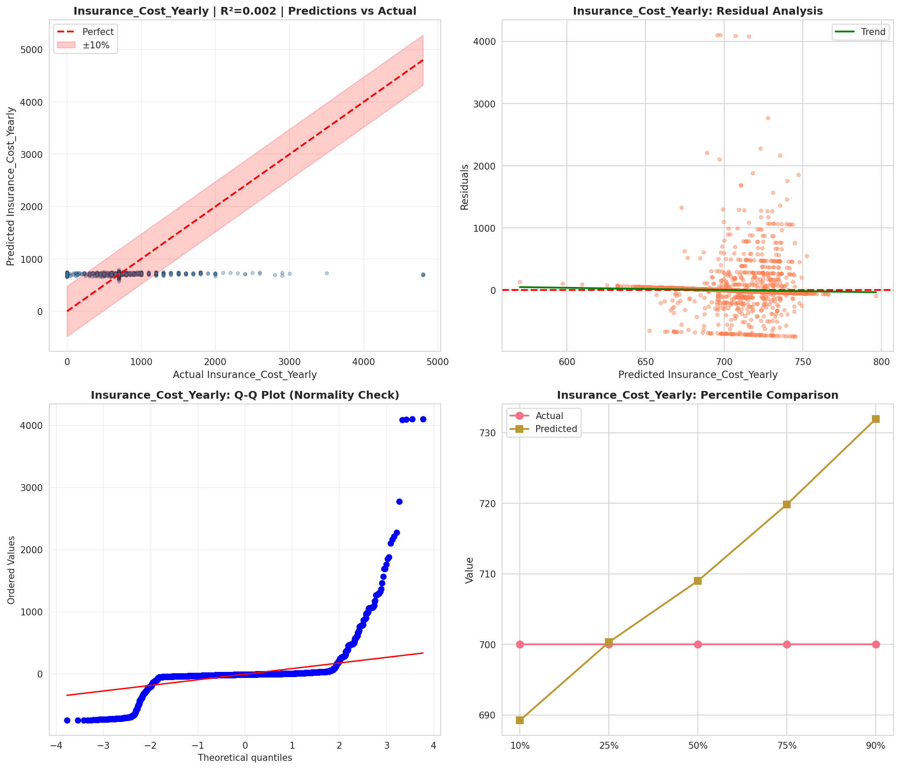
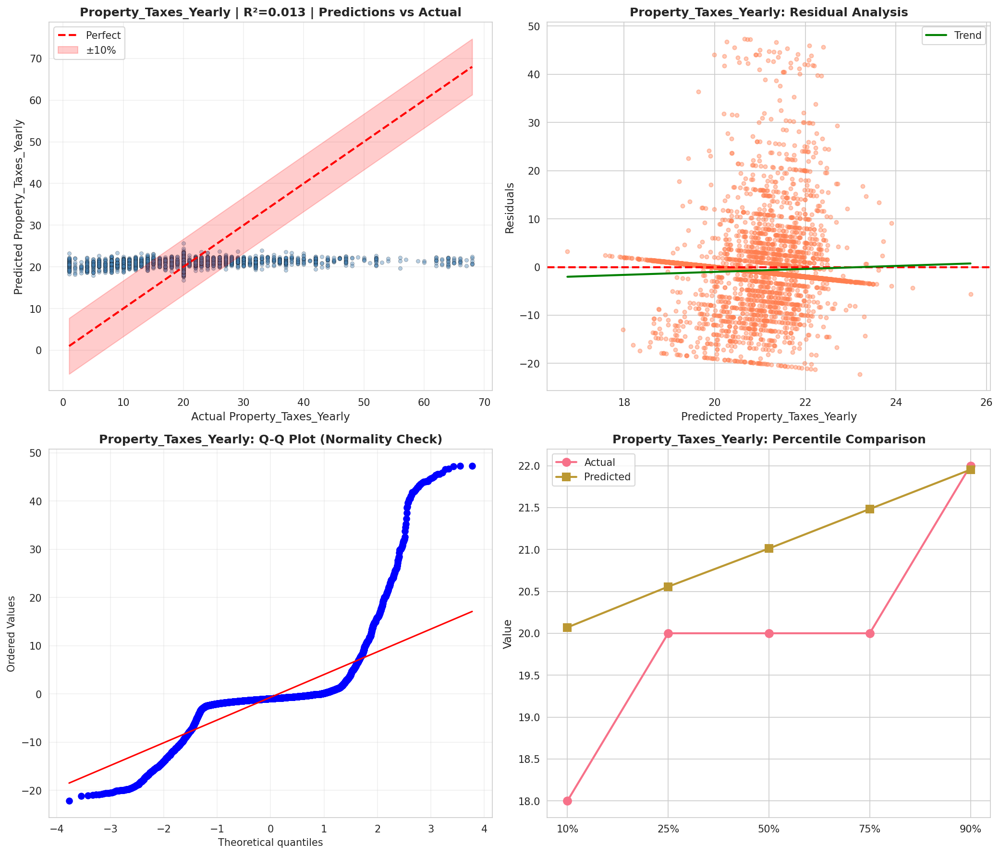
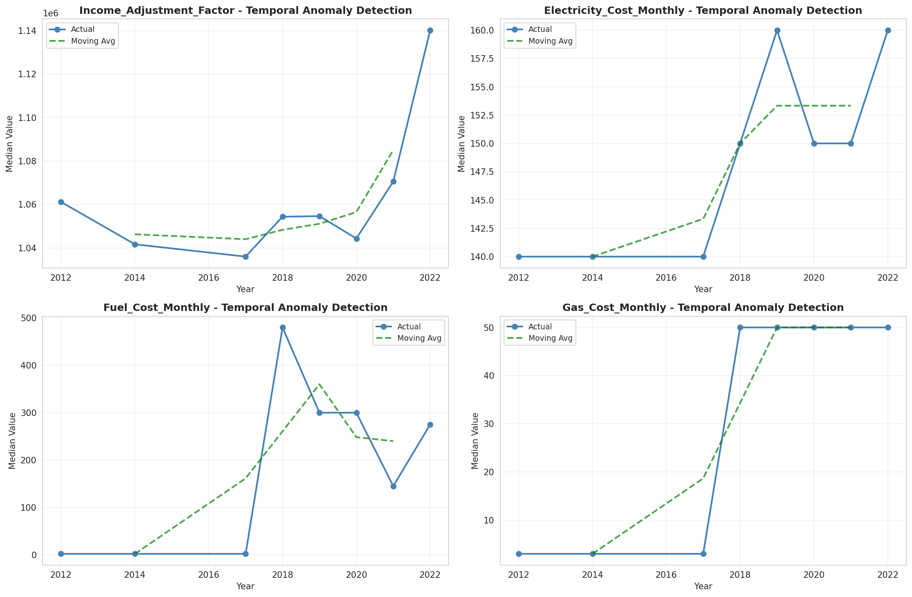
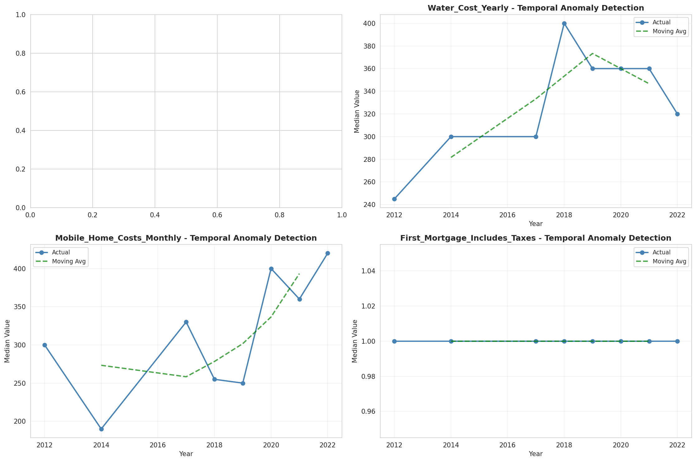
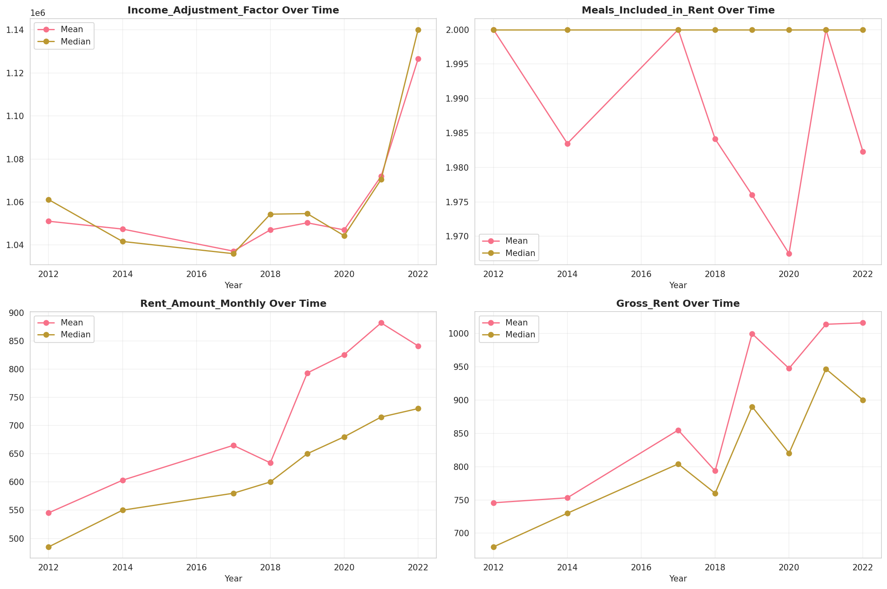
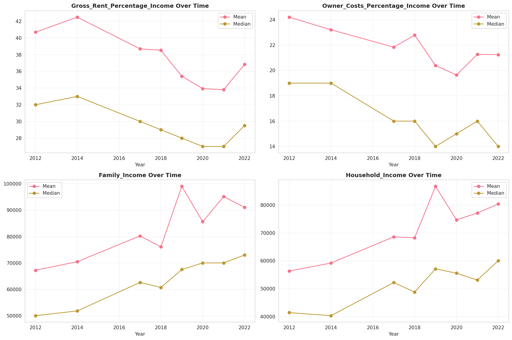
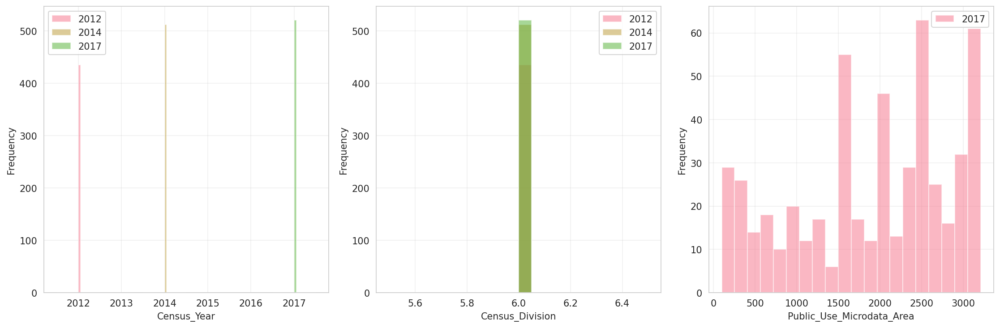
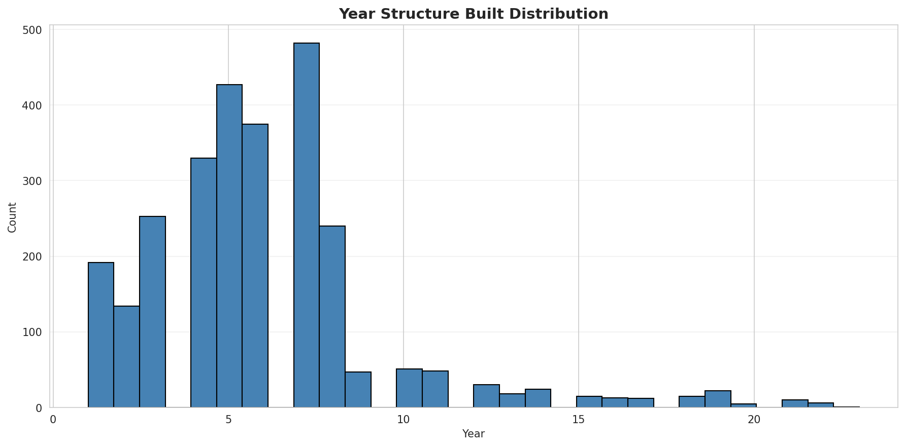
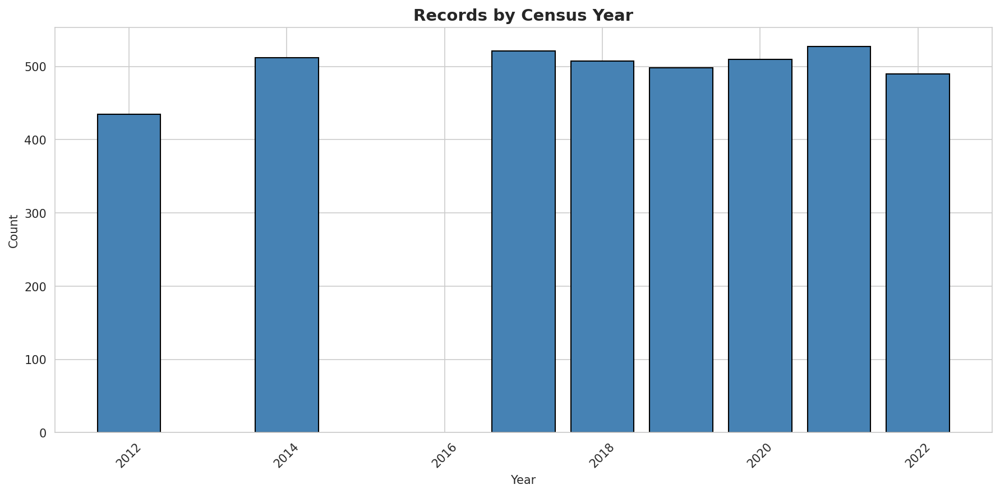
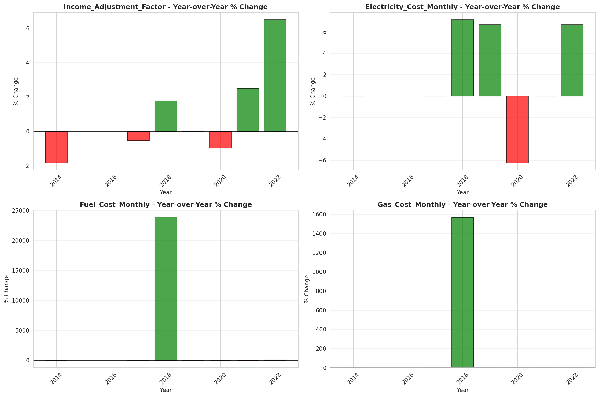
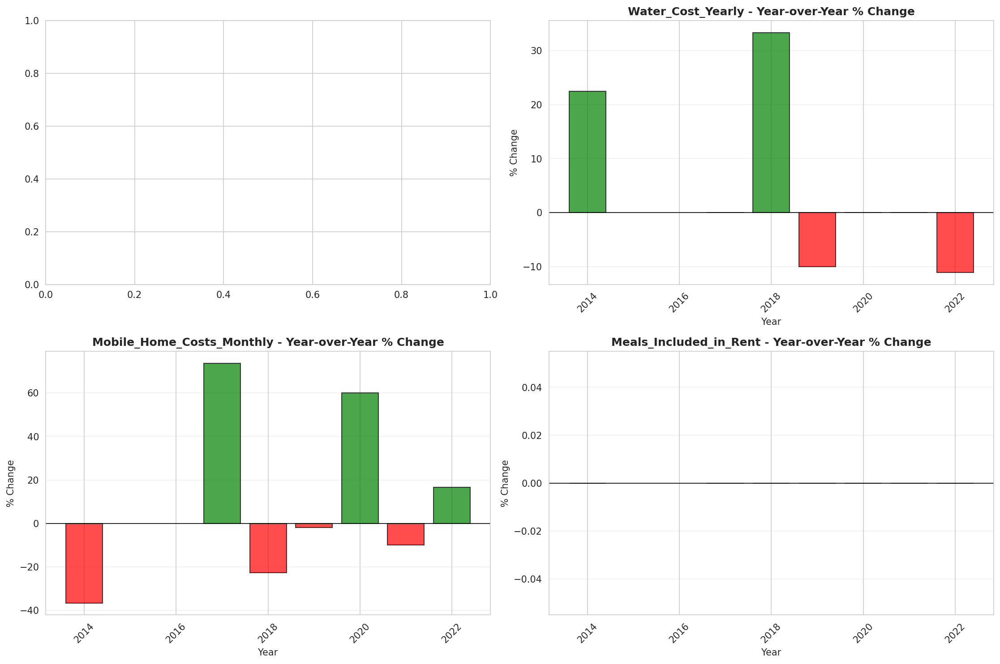
