# Temporal Analysis

## Year Distribution

- 2012: 112,072 records

- 2017: 120,205 records

- 2018: 121,855 records

- 2019: 123,710 records

- 2022: 133,016 records

## Temporal Trends

- Census_Year: {np.int64(2012): {'mean': 2012.0, 'median': 2012.0, 'std': 0.0}, np.int64(2017): {'mean': 2017.0, 'median': 2017.0, 'std': 0.0}, np.int64(2018): {'mean': 2018.0, 'median': 2018.0, 'std': 0.0}, np.int64(2019): {'mean': 2019.0, 'median': 2019.0, 'std': 0.0}, np.int64(2022): {'mean': 2022.0, 'median': 2022.0, 'std': 0.0}}

- Census_Division: {np.int64(2012): {'mean': 7.0, 'median': 7.0, 'std': 0.0}, np.int64(2017): {'mean': 7.0, 'median': 7.0, 'std': 0.0}, np.int64(2018): {'mean': 7.0, 'median': 7.0, 'std': 0.0}, np.int64(2019): {'mean': 7.0, 'median': 7.0, 'std': 0.0}, np.int64(2022): {'mean': 7.0, 'median': 7.0, 'std': 0.0}}

- Public_Use_Microdata_Area: {np.int64(2012): {'mean': 3651.012786423014, 'median': 3700.0, 'std': 1786.1374647861376}, np.int64(2017): {'mean': 3658.409483798511, 'median': 3700.0, 'std': 1773.5032705234257}, np.int64(2018): {'mean': 3653.9560132944894, 'median': 3700.0, 'std': 1778.0652837472883}, np.int64(2019): {'mean': 3649.1274351305474, 'median': 3700.0, 'std': 1779.0217838328433}, np.int64(2022): {'mean': 3760.46366602514, 'median': 3900.0, 'std': 1879.1513235311609}}

- Census_Region: {np.int64(2012): {'mean': 3.0, 'median': 3.0, 'std': 0.0}, np.int64(2017): {'mean': 3.0, 'median': 3.0, 'std': 0.0}, np.int64(2018): {'mean': 3.0, 'median': 3.0, 'std': 0.0}, np.int64(2019): {'mean': 3.0, 'median': 3.0, 'std': 0.0}, np.int64(2022): {'mean': 3.0, 'median': 3.0, 'std': 0.0}}

- State_Code: {np.int64(2012): {'mean': 48.0, 'median': 48.0, 'std': 0.0}, np.int64(2017): {'mean': 48.0, 'median': 48.0, 'std': 0.0}, np.int64(2018): {'mean': 48.0, 'median': 48.0, 'std': 0.0}, np.int64(2019): {'mean': 48.0, 'median': 48.0, 'std': 0.0}, np.int64(2022): {'mean': 48.0, 'median': 48.0, 'std': 0.0}}

- Housing_Adjustment_Factor: {np.int64(2012): {'mean': 1000000.0, 'median': 1000000.0, 'std': 0.0}, np.int64(2017): {'mean': 1000000.0, 'median': 1000000.0, 'std': 0.0}, np.int64(2018): {'mean': 1000000.0, 'median': 1000000.0, 'std': 0.0}, np.int64(2019): {'mean': 1000000.0, 'median': 1000000.0, 'std': 0.0}, np.int64(2022): {'mean': 1000000.0, 'median': 1000000.0, 'std': 0.0}}

- Income_Adjustment_Factor: {np.int64(2012): {'mean': 1010207.0, 'median': 1010207.0, 'std': 0.0}, np.int64(2017): {'mean': 1011189.0, 'median': 1011189.0, 'std': 0.0}, np.int64(2018): {'mean': 1013097.0, 'median': 1013097.0, 'std': 0.0}, np.int64(2019): {'mean': 1010145.0, 'median': 1010145.0, 'std': 0.0}, np.int64(2022): {'mean': 1042311.0, 'median': 1042311.0, 'std': 0.0}}

- Housing_Unit_Weight: {np.int64(2012): {'mean': 90.60992040830894, 'median': 69.0, 'std': 81.02990491064291}, np.int64(2017): {'mean': 90.95607503847593, 'median': 71.0, 'std': 80.10793472508365}, np.int64(2018): {'mean': 91.10416478601617, 'median': 72.0, 'std': 81.10261104982756}, np.int64(2019): {'mean': 91.21244846819174, 'median': 68.0, 'std': 88.28440112896612}, np.int64(2022): {'mean': 91.23245323870813, 'median': 65.0, 'std': 93.2024292236285}}

- Number_of_Persons: {np.int64(2012): {'mean': 2.223169034192305, 'median': 2.0, 'std': 1.5794444081828192}, np.int64(2017): {'mean': 2.2115718980075703, 'median': 2.0, 'std': 1.5744565336466059}, np.int64(2018): {'mean': 2.2001559230232655, 'median': 2.0, 'std': 1.566688467205311}, np.int64(2019): {'mean': 2.204963220434888, 'median': 2.0, 'std': 1.547317298903561}, np.int64(2022): {'mean': 2.202133577915439, 'median': 2.0, 'std': 1.5148334573949525}}

- Housing_Unit_Type: {np.int64(2012): {'mean': 1.1269362552644728, 'median': 1.0, 'std': 0.4204764729239121}, np.int64(2017): {'mean': 1.1253275654090928, 'median': 1.0, 'std': 0.42346151947159993}, np.int64(2018): {'mean': 1.1224077797382135, 'median': 1.0, 'std': 0.4173845201411545}, np.int64(2019): {'mean': 1.120919893298844, 'median': 1.0, 'std': 0.41510104872004144}, np.int64(2022): {'mean': None, 'median': None, 'std': None}}

- Number_of_Bedrooms: {np.int64(2012): {'mean': 2.7446894419113086, 'median': 3.0, 'std': 1.0243537102678202}, np.int64(2017): {'mean': 2.7735824895498906, 'median': 3.0, 'std': 1.0575997893239204}, np.int64(2018): {'mean': 2.7770971461516285, 'median': 3.0, 'std': 1.059553846290174}, np.int64(2019): {'mean': 2.7956201145044934, 'median': 3.0, 'std': 1.0591746016254804}, np.int64(2022): {'mean': 2.8324350272018326, 'median': 3.0, 'std': 1.0799822883223003}}

- Number_of_Rooms: {np.int64(2012): {'mean': 5.730902179372285, 'median': 5.0, 'std': 2.2405511706011385}, np.int64(2017): {'mean': 5.811276056672978, 'median': 6.0, 'std': 2.32526138452041}, np.int64(2018): {'mean': 5.839038627846642, 'median': 6.0, 'std': 2.349052551709915}, np.int64(2019): {'mean': 5.881587110268182, 'median': 6.0, 'std': 2.372969574199226}, np.int64(2022): {'mean': 5.937604217547287, 'median': 6.0, 'std': 2.453692204086164}}

- Building_Type: {np.int64(2012): {'mean': 2.8756782840766966, 'median': 2.0, 'std': 2.087074025521577}, np.int64(2017): {'mean': 2.9297990469134447, 'median': 2.0, 'std': 2.1337970510714412}, np.int64(2018): {'mean': 2.9462381089651197, 'median': 2.0, 'std': 2.1536909034474556}, np.int64(2019): {'mean': 2.934957548256731, 'median': 2.0, 'std': 2.1499487009917773}, np.int64(2022): {'mean': 2.9190345454851694, 'median': 2.0, 'std': 2.1532004567403034}}

- Year_Structure_Built: {np.int64(2012): {'mean': 5.799375633967876, 'median': 6.0, 'std': 2.728034188662194}, np.int64(2017): {'mean': 6.745721629210914, 'median': 6.0, 'std': 4.103881510887101}, np.int64(2018): {'mean': 6.934157898529835, 'median': 6.0, 'std': 4.42301395214187}, np.int64(2019): {'mean': 7.195464133151355, 'median': 6.0, 'std': 4.8198332701057645}, np.int64(2022): {'mean': None, 'median': None, 'std': None}}

- Bathtub_or_Shower: {np.int64(2012): {'mean': 1.0079473720492795, 'median': 1.0, 'std': 0.08879351874782314}, np.int64(2017): {'mean': 1.0091741440971747, 'median': 1.0, 'std': 0.09534181832421812}, np.int64(2018): {'mean': 1.0093326607091382, 'median': 1.0, 'std': 0.09615427937084536}, np.int64(2019): {'mean': 1.0086232873070173, 'median': 1.0, 'std': 0.09246081326283807}, np.int64(2022): {'mean': 1.0072762796651564, 'median': 1.0, 'std': 0.0849905656651901}}

- Refrigerator: {np.int64(2012): {'mean': 1.020070315038949, 'median': 1.0, 'std': 0.14024154584675658}, np.int64(2017): {'mean': 1.0235344693539683, 'median': 1.0, 'std': 0.15159422253122457}, np.int64(2018): {'mean': 1.023025367541078, 'median': 1.0, 'std': 0.14998467467496798}, np.int64(2019): {'mean': 1.0205611783682222, 'median': 1.0, 'std': 0.14191051684838998}, np.int64(2022): {'mean': 1.01585791042765, 'median': 1.0, 'std': 0.12492625239359387}}

- Hot_and_Cold_Running_Water: {np.int64(2012): {'mean': 1.0181204021941443, 'median': 1.0, 'std': 0.13338751229829343}, np.int64(2017): {'mean': 1.0221624637561855, 'median': 1.0, 'std': 0.14721238799475883}, np.int64(2018): {'mean': 1.0220614730469877, 'median': 1.0, 'std': 0.1468841679997387}, np.int64(2019): {'mean': 1.020162362408494, 'median': 1.0, 'std': 0.14055609783932796}, np.int64(2022): {'mean': 1.0165147967863097, 'median': 1.0, 'std': 0.12744487066575477}}

- Running_Water: {np.int64(2012): {'mean': None, 'median': None, 'std': None}, np.int64(2017): {'mean': 9.0, 'median': 9.0, 'std': 0.0}, np.int64(2018): {'mean': 9.0, 'median': 9.0, 'std': 0.0}, np.int64(2019): {'mean': 9.0, 'median': 9.0, 'std': 0.0}, np.int64(2022): {'mean': 9.0, 'median': 9.0, 'std': 0.0}}

- Sink_with_Faucet: {np.int64(2012): {'mean': 1.0077799552898772, 'median': 1.0, 'std': 0.08786070570841709}, np.int64(2017): {'mean': 1.0086253418580615, 'median': 1.0, 'std': 0.09247174460111686}, np.int64(2018): {'mean': 1.008972326318824, 'median': 1.0, 'std': 0.09429689168111807}, np.int64(2019): {'mean': 1.0080206320789833, 'median': 1.0, 'std': 0.08919849804787011}, np.int64(2022): {'mean': 1.0068046689461185, 'median': 1.0, 'std': 0.08220962439712792}}

- Stove_or_Range: {np.int64(2012): {'mean': 1.0210846636400344, 'median': 1.0, 'std': 0.14366733750527788}, np.int64(2017): {'mean': 1.0238454572894657, 'median': 1.0, 'std': 0.15256822855542193}, np.int64(2018): {'mean': 1.0239171951571058, 'median': 1.0, 'std': 0.15279192791650936}, np.int64(2019): {'mean': 1.0218285268624705, 'median': 1.0, 'std': 0.1461240278437396}, np.int64(2022): {'mean': 1.016927456165468, 'median': 1.0, 'std': 0.1290002230149105}}

- Telephone_Service: {np.int64(2012): {'mean': 1.0299351530689187, 'median': 1.0, 'std': 0.17040936737488696}, np.int64(2017): {'mean': 1.018029574562644, 'median': 1.0, 'std': 0.13305896374066362}, np.int64(2018): {'mean': 1.0170757631445628, 'median': 1.0, 'std': 0.1295544217140611}, np.int64(2019): {'mean': 1.0104033352724453, 'median': 1.0, 'std': 0.10146529310770774}, np.int64(2022): {'mean': 1.008921852191022, 'median': 1.0, 'std': 0.09403367969645116}}

- Lot_Acreage: {np.int64(2012): {'mean': 1.2510761448478804, 'median': 1.0, 'std': 0.5422860843443273}, np.int64(2017): {'mean': 1.234195484261087, 'median': 1.0, 'std': 0.5235167560705194}, np.int64(2018): {'mean': 1.2455875731652408, 'median': 1.0, 'std': 0.5348508861757126}, np.int64(2019): {'mean': 1.2507214133092495, 'median': 1.0, 'std': 0.5397892531579472}, np.int64(2022): {'mean': 1.2473786931877167, 'median': 1.0, 'std': 0.5313158463920985}}

- Agricultural_Sales: {np.int64(2012): {'mean': 1.3425312478655829, 'median': 1.0, 'std': 1.0785161644299814}, np.int64(2017): {'mean': 1.2998406208855935, 'median': 1.0, 'std': 0.9799652656744977}, np.int64(2018): {'mean': 1.3365490449983815, 'median': 1.0, 'std': 1.0469000026984365}, np.int64(2019): {'mean': 1.3508148511211862, 'median': 1.0, 'std': 1.0646417485343411}, np.int64(2022): {'mean': 1.3404100380909703, 'median': 1.0, 'std': 1.0475322708749935}}

- Tenure: {np.int64(2012): {'mean': 1.958021845444557, 'median': 2.0, 'std': 0.8721400947026399}, np.int64(2017): {'mean': 1.9723041493273, 'median': 2.0, 'std': 0.8601141490394477}, np.int64(2018): {'mean': 1.9802322462724373, 'median': 2.0, 'std': 0.8556842615070246}, np.int64(2019): {'mean': 1.9646790769827418, 'median': 2.0, 'std': 0.8484952622271336}, np.int64(2022): {'mean': 1.9405391192391037, 'median': 2.0, 'std': 0.8410325265996089}}

- Vacancy_Status: {np.int64(2012): {'mean': 4.593294293259846, 'median': 5.0, 'std': 2.344410773011933}, np.int64(2017): {'mean': 4.75544794188862, 'median': 5.0, 'std': 2.334890797894551}, np.int64(2018): {'mean': 4.789341328948641, 'median': 5.0, 'std': 2.3449229642167073}, np.int64(2019): {'mean': 4.765628223643491, 'median': 5.0, 'std': 2.3734993483287177}, np.int64(2022): {'mean': 4.629156312862383, 'median': 5.0, 'std': 2.4282308041872067}}

- Property_Value: {np.int64(2012): {'mean': 173366.8924653201, 'median': 120000.0, 'std': 220747.78011725537}, np.int64(2017): {'mean': 236974.6730741226, 'median': 165000.0, 'std': 305292.20506428654}, np.int64(2018): {'mean': 249830.8073735353, 'median': 180000.0, 'std': 314307.18562664784}, np.int64(2019): {'mean': 261179.90816102066, 'median': 195000.0, 'std': 309386.0401586056}, np.int64(2022): {'mean': 360367.24429097143, 'median': 260000.0, 'std': 456594.7976045315}}

- Vehicles_Available: {np.int64(2012): {'mean': 1.818073119762156, 'median': 2.0, 'std': 0.9966412247591789}, np.int64(2017): {'mean': 1.9082562320714314, 'median': 2.0, 'std': 1.0368974014256436}, np.int64(2018): {'mean': 1.9216640673891665, 'median': 2.0, 'std': 1.0418024165628932}, np.int64(2019): {'mean': 1.9378029862323056, 'median': 2.0, 'std': 1.0471949418366802}, np.int64(2022): {'mean': 1.9305927047537876, 'median': 2.0, 'std': 1.0477998622005955}}

- Condo_Fee_Monthly: {np.int64(2012): {'mean': 310.9594694178335, 'median': 230.0, 'std': 277.71727889911386}, np.int64(2017): {'mean': 347.8046875, 'median': 270.0, 'std': 270.68212443340894}, np.int64(2018): {'mean': 346.6797671033479, 'median': 280.0, 'std': 266.5874891373353}, np.int64(2019): {'mean': 368.4342857142857, 'median': 290.0, 'std': 289.72970563294217}, np.int64(2022): {'mean': 426.2972972972973, 'median': 310.0, 'std': 427.9251132504819}}

- Electricity_Cost_Monthly: {np.int64(2012): {'mean': 157.55520606674278, 'median': 140.0, 'std': 98.47211406091814}, np.int64(2017): {'mean': 151.82905741182174, 'median': 130.0, 'std': 96.22126108397083}, np.int64(2018): {'mean': 169.53412469033856, 'median': 150.0, 'std': 101.76849984147762}, np.int64(2019): {'mean': 171.9384188682658, 'median': 150.0, 'std': 101.46325516083472}, np.int64(2022): {'mean': 213.6780614208861, 'median': 180.0, 'std': 206.80186681545317}}

- Fuel_Cost_Monthly: {np.int64(2012): {'mean': 29.047633410172995, 'median': 2.0, 'std': 192.16539191921484}, np.int64(2017): {'mean': 14.933639044887075, 'median': 2.0, 'std': 136.08587677524108}, np.int64(2018): {'mean': 451.516603902773, 'median': 250.0, 'std': 580.2847616509953}, np.int64(2019): {'mean': 454.7287671232877, 'median': 250.0, 'std': 600.1262905754046}, np.int64(2022): {'mean': 477.46692607003894, 'median': 250.0, 'std': 645.0959799462725}}

- Gas_Cost_Monthly: {np.int64(2012): {'mean': 30.22161061679988, 'median': 10.0, 'std': 47.89208204576372}, np.int64(2017): {'mean': 29.46914266090259, 'median': 4.0, 'std': 45.68945705934223}, np.int64(2018): {'mean': 63.341580509571905, 'median': 40.0, 'std': 61.37610848430388}, np.int64(2019): {'mean': 60.912105242912645, 'median': 40.0, 'std': 57.5115763247913}, np.int64(2022): {'mean': 88.02082136703044, 'median': 50.0, 'std': 131.95034918490742}}

- House_Heating_Fuel: {np.int64(2012): {'mean': 2.2257147165909044, 'median': 3.0, 'std': 1.1302569558445583}, np.int64(2017): {'mean': 2.2578784695567857, 'median': 3.0, 'std': 1.1333745588762034}, np.int64(2018): {'mean': 2.2621462416434057, 'median': 3.0, 'std': 1.132647298272077}, np.int64(2019): {'mean': 2.256932324995152, 'median': 3.0, 'std': 1.1263866860873641}, np.int64(2022): {'mean': 2.2908124869662982, 'median': 3.0, 'std': 1.1684277140646464}}

- Insurance_Cost_Yearly: {np.int64(2012): {'mean': 1231.6095241703288, 'median': 1100.0, 'std': 881.0118555910636}, np.int64(2017): {'mean': 1587.8935847304801, 'median': 1300.0, 'std': 1133.6187929461526}, np.int64(2018): {'mean': 1658.7517710399547, 'median': 1400.0, 'std': 1196.0006543545646}, np.int64(2019): {'mean': 1723.600763474824, 'median': 1500.0, 'std': 1218.8334436972732}, np.int64(2022): {'mean': 1973.4577727495107, 'median': 1700.0, 'std': 1438.6190018313673}}

- Water_Cost_Yearly: {np.int64(2012): {'mean': 540.4573647586013, 'median': 470.0, 'std': 570.145546201555}, np.int64(2017): {'mean': 546.764898387944, 'median': 400.0, 'std': 597.6767660187535}, np.int64(2018): {'mean': 663.2485746179976, 'median': 600.0, 'std': 619.8696854394137}, np.int64(2019): {'mean': 664.4485030847999, 'median': 600.0, 'std': 624.3080436172135}, np.int64(2022): {'mean': 711.6329285622013, 'median': 540.0, 'std': 757.2440709441263}}

- Mobile_Home_Costs_Monthly: {np.int64(2012): {'mean': 1406.5583333333334, 'median': 600.0, 'std': 1876.1012039745165}, np.int64(2017): {'mean': 1649.5294117647059, 'median': 750.0, 'std': 2148.753181448359}, np.int64(2018): {'mean': 1766.9005563282337, 'median': 800.0, 'std': 2331.020939645123}, np.int64(2019): {'mean': 1713.1913099870299, 'median': 740.0, 'std': 2351.2726458627317}, np.int64(2022): {'mean': 2926.7611447440836, 'median': 1000.0, 'std': 6300.676047130753}}

- First_Mortgage_Includes_Insurance: {np.int64(2012): {'mean': 1.440119589977221, 'median': 1.0, 'std': 0.4964084538450529}, np.int64(2017): {'mean': 1.385137568923, 'median': 1.0, 'std': 0.48663454818262475}, np.int64(2018): {'mean': 1.3778199687290595, 'median': 1.0, 'std': 0.4848490522489037}, np.int64(2019): {'mean': 1.37101652803284, 'median': 1.0, 'std': 0.48308339494895197}, np.int64(2022): {'mean': 1.3606710393541877, 'median': 1.0, 'std': 0.48020126812773084}}

- First_Mortgage_Payment_Monthly: {np.int64(2012): {'mean': 1071.1862756264236, 'median': 910.0, 'std': 691.8561328827326}, np.int64(2017): {'mean': 1271.7110082846139, 'median': 1100.0, 'std': 823.5278514958834}, np.int64(2018): {'mean': 1337.1677462586554, 'median': 1200.0, 'std': 878.0200775775916}, np.int64(2019): {'mean': 1399.1762450037809, 'median': 1200.0, 'std': 896.6182984873841}, np.int64(2022): {'mean': 639.7652557408628, 'median': 4.0, 'std': 994.6386657869058}}

- First_Mortgage_Includes_Taxes: {np.int64(2012): {'mean': 1.3882118451025056, 'median': 1.0, 'std': 0.4873501526035491}, np.int64(2017): {'mean': 1.3280319193150647, 'median': 1.0, 'std': 0.4695030212127801}, np.int64(2018): {'mean': 1.3162553048916685, 'median': 1.0, 'std': 0.46502034864536174}, np.int64(2019): {'mean': 1.3052284757480825, 'median': 1.0, 'std': 0.4605103480076395}, np.int64(2022): {'mean': 1.2920282542885975, 'median': 1.0, 'std': 0.45470096629748263}}

- First_Mortgage_Status: {np.int64(2012): {'mean': 1.9131402071223778, 'median': 1.0, 'std': 0.9893714088280365}, np.int64(2017): {'mean': 1.943974317247093, 'median': 1.0, 'std': 0.9924845244805242}, np.int64(2018): {'mean': 1.9731334184858338, 'median': 1.0, 'std': 0.9932004110453893}, np.int64(2019): {'mean': 1.9791747978812377, 'median': 1.0, 'std': 0.9940432795805915}, np.int64(2022): {'mean': 2.000216513621254, 'median': 2.0, 'std': 0.9950268380641462}}

- Second_Mortgage_Payment_Monthly: {np.int64(2012): {'mean': 427.64624959056664, 'median': 300.0, 'std': 411.8551045127683}, np.int64(2017): {'mean': 515.4233983286908, 'median': 350.0, 'std': 558.3599465756433}, np.int64(2018): {'mean': 506.7640776699029, 'median': 350.0, 'std': 504.7797500755427}, np.int64(2019): {'mean': 542.5979087452472, 'median': 390.0, 'std': 515.7163090104499}, np.int64(2022): {'mean': 674.6764705882352, 'median': 500.0, 'std': 662.0228110444372}}

- Second_Mortgage_Status: {np.int64(2012): {'mean': 2.881890660592255, 'median': 3.0, 'std': 0.42509087740670864}, np.int64(2017): {'mean': 2.924053088027486, 'median': 3.0, 'std': 0.335934551835242}, np.int64(2018): {'mean': 2.9277976323430868, 'median': 3.0, 'std': 0.3254432292573835}, np.int64(2019): {'mean': 2.9312682294479853, 'median': 3.0, 'std': 0.31491740546054375}, np.int64(2022): {'mean': 2.925530861753205, 'median': 3.0, 'std': 0.30614392454725536}}

- Property_Taxes_Yearly: {np.int64(2012): {'mean': 33.61636924812383, 'median': 32.0, 'std': 19.816661325174625}, np.int64(2017): {'mean': 38.308888362872445, 'median': 37.0, 'std': 21.030042457854833}}

- Meals_Included_in_Rent: {np.int64(2012): {'mean': 1.9812459061605818, 'median': 2.0, 'std': 0.13565770246163703}, np.int64(2017): {'mean': 1.9798796540052652, 'median': 2.0, 'std': 0.14041415732575782}, np.int64(2018): {'mean': 1.9797162767546044, 'median': 2.0, 'std': 0.1409713164551322}, np.int64(2019): {'mean': 1.9785446880800328, 'median': 2.0, 'std': 0.14489873022466154}, np.int64(2022): {'mean': 1.979999374980468, 'median': 2.0, 'std': 0.1400043305594339}}

- Rent_Amount_Monthly: {np.int64(2012): {'mean': 729.6072672113628, 'median': 650.0, 'std': 420.7677992113996}, np.int64(2017): {'mean': 910.0739626425975, 'median': 810.0, 'std': 487.05717714827347}, np.int64(2018): {'mean': 949.4377177700349, 'median': 850.0, 'std': 503.61138132384025}, np.int64(2019): {'mean': 992.6131437380061, 'median': 900.0, 'std': 521.9174615925165}, np.int64(2022): {'mean': 1188.705209537798, 'median': 1100.0, 'std': 674.0995569708836}}

- Gross_Rent: {np.int64(2012): {'mean': 888.2192900600949, 'median': 810.0, 'std': 447.1864258507085}, np.int64(2017): {'mean': 1063.235417868413, 'median': 974.0, 'std': 508.0787257969237}, np.int64(2018): {'mean': 1112.4136944818304, 'median': 1021.0, 'std': 525.5961425962848}, np.int64(2019): {'mean': 1156.7623321434642, 'median': 1065.0, 'std': 543.1243062917179}, np.int64(2022): {'mean': 1380.2463973063973, 'median': 1260.0, 'std': 710.1213324309037}}

- Gross_Rent_Percentage_Income: {np.int64(2012): {'mean': 38.20719276142481, 'median': 29.0, 'std': 26.850898979286836}, np.int64(2017): {'mean': 37.0788458195724, 'median': 28.0, 'std': 26.12689473745273}, np.int64(2018): {'mean': 37.42232241189427, 'median': 29.0, 'std': 26.318637551299258}, np.int64(2019): {'mean': 36.719464391022306, 'median': 28.0, 'std': 25.836007473953988}, np.int64(2022): {'mean': 39.44768180102268, 'median': 30.0, 'std': 27.18878019284479}}

- Selected_Monthly_Owner_Costs: {np.int64(2012): {'mean': 1089.9627000172395, 'median': 863.0, 'std': 913.2829059436324}, np.int64(2017): {'mean': 1218.0549453802657, 'median': 957.0, 'std': 1007.7840082039355}, np.int64(2018): {'mean': 1266.1516145893831, 'median': 980.0, 'std': 1072.7060776933506}, np.int64(2019): {'mean': 1298.8687189783057, 'median': 1001.0, 'std': 1098.470732630712}, np.int64(2022): {'mean': 1516.9274887915224, 'median': 1193.0, 'std': 1248.0408913941346}}

- Owner_Costs_Percentage_Income: {np.int64(2012): {'mean': 22.583856034632582, 'median': 17.0, 'std': 20.048490868334834}, np.int64(2017): {'mean': 21.365553052119548, 'median': 16.0, 'std': 19.728058578091716}, np.int64(2018): {'mean': 21.52329072032099, 'median': 16.0, 'std': 19.7570875457399}, np.int64(2019): {'mean': 20.80504893082291, 'median': 15.0, 'std': 19.461524121341608}, np.int64(2022): {'mean': 23.042188343574054, 'median': 17.0, 'std': 21.475481300045082}}

- Satellite_Internet: {np.int64(2012): {'mean': None, 'median': None, 'std': None}, np.int64(2017): {'mean': 1.8794178794178795, 'median': 2.0, 'std': 0.3256429637108481}, np.int64(2018): {'mean': 1.8754255935147655, 'median': 2.0, 'std': 0.3302376215658262}, np.int64(2019): {'mean': 1.8845944836917343, 'median': 2.0, 'std': 0.3195124650172442}, np.int64(2022): {'mean': 1.8950336925223379, 'median': 2.0, 'std': 0.3065115191993746}}

- Smartphone: {np.int64(2012): {'mean': None, 'median': None, 'std': None}, np.int64(2017): {'mean': 1.159882428992768, 'median': 1.0, 'std': 0.3664988330391897}, np.int64(2018): {'mean': 1.138245140013311, 'median': 1.0, 'std': 0.34515881084642513}, np.int64(2019): {'mean': 1.1183536940081442, 'median': 1.0, 'std': 0.3230280310226444}, np.int64(2022): {'mean': 1.0788731628147357, 'median': 1.0, 'std': 0.2695419183357037}}

- Tablet_Computer: {np.int64(2012): {'mean': None, 'median': None, 'std': None}, np.int64(2017): {'mean': 1.3667629590723607, 'median': 1.0, 'std': 0.4819234760748364}, np.int64(2018): {'mean': 1.361700225491462, 'median': 1.0, 'std': 0.4804950216002463}, np.int64(2019): {'mean': 1.3674132247430677, 'median': 1.0, 'std': 0.4821026866736856}, np.int64(2022): {'mean': 1.349520813121651, 'median': 1.0, 'std': 0.4768208004634351}}

- Food_Stamp_SNAP: {np.int64(2012): {'mean': 1.8715207569439742, 'median': 2.0, 'std': 0.3346242825355235}, np.int64(2017): {'mean': 1.8953039679650527, 'median': 2.0, 'std': 0.30616274427788126}, np.int64(2018): {'mean': 1.8956024247641594, 'median': 2.0, 'std': 0.30577697748764426}, np.int64(2019): {'mean': 1.908381279820376, 'median': 2.0, 'std': 0.2884882324077046}, np.int64(2022): {'mean': 1.9014650985429293, 'median': 2.0, 'std': 0.2980377287280648}}

- Family_Type_Employment_Status: {np.int64(2012): {'mean': 3.1605677842791247, 'median': 2.0, 'std': 2.3731202392369966}, np.int64(2017): {'mean': 3.120750858228033, 'median': 2.0, 'std': 2.3321305685278917}, np.int64(2018): {'mean': 3.1411018972778186, 'median': 2.0, 'std': 2.3357882870832047}, np.int64(2019): {'mean': 3.1124804133316393, 'median': 2.0, 'std': 2.320101324377163}, np.int64(2022): {'mean': None, 'median': None, 'std': None}}

- Family_Income: {np.int64(2012): {'mean': 82511.52895945989, 'median': 60400.0, 'std': 82484.63257598985}, np.int64(2017): {'mean': 99667.1180262541, 'median': 73400.0, 'std': 99498.79090655902}, np.int64(2018): {'mean': 103587.54749811343, 'median': 75100.0, 'std': 105751.68095584911}, np.int64(2019): {'mean': 110534.36228645775, 'median': 81200.0, 'std': 110508.22966980714}, np.int64(2022): {'mean': 121615.82478847836, 'median': 89700.0, 'std': 121742.306078189}}

- Family_Presence_Children: {np.int64(2012): {'mean': 3.061375808798489, 'median': 4.0, 'std': 1.0695945593769571}, np.int64(2017): {'mean': 3.087844013405098, 'median': 4.0, 'std': 1.065267263814982}, np.int64(2018): {'mean': 3.107204437036611, 'median': 4.0, 'std': 1.061274846159774}, np.int64(2019): {'mean': 3.1299646583641874, 'median': 4.0, 'std': 1.0573808133351665}, np.int64(2022): {'mean': 3.158781611307235, 'median': 4.0, 'std': 1.0486968592300898}}

- Household_Family_Type: {np.int64(2012): {'mean': 2.599931059741043, 'median': 1.0, 'std': 1.9603247464356894}, np.int64(2017): {'mean': 2.580623005131106, 'median': 1.0, 'std': 1.9610086317048765}, np.int64(2018): {'mean': 2.602171472846656, 'median': 1.0, 'std': 1.9690566430693073}, np.int64(2019): {'mean': 2.592922241613341, 'median': 1.0, 'std': 1.9716192669055097}, np.int64(2022): {'mean': 2.595742172978756, 'median': 1.0, 'std': 1.9796538769496548}}

- Household_Income: {np.int64(2012): {'mean': 71920.07101063248, 'median': 50100.0, 'std': 76777.46925987575}, np.int64(2017): {'mean': 86670.03632415156, 'median': 61000.0, 'std': 92672.88289330775}, np.int64(2018): {'mean': 89672.49451446187, 'median': 62800.0, 'std': 97876.0704814099}, np.int64(2019): {'mean': 95394.38622407941, 'median': 68000.0, 'std': 102186.14882232387}, np.int64(2022): {'mean': 105113.45427912829, 'median': 74000.0, 'std': 113376.67631475625}}

- Number_Persons_Family: {np.int64(2012): {'mean': 3.114423702052568, 'median': 3.0, 'std': 1.3594317467199168}, np.int64(2017): {'mean': 3.1061527078588114, 'median': 3.0, 'std': 1.3354296026823542}, np.int64(2018): {'mean': 3.089574113454796, 'median': 3.0, 'std': 1.3330700908747288}, np.int64(2019): {'mean': 3.0679344777291595, 'median': 3.0, 'std': 1.3180998756925058}, np.int64(2022): {'mean': 3.047743408706151, 'median': 3.0, 'std': 1.300765439204607}}

- Workers_In_Family: {np.int64(2012): {'mean': 1.456177827311848, 'median': 2.0, 'std': 0.8634090216151993}, np.int64(2017): {'mean': 1.4925503053867022, 'median': 2.0, 'std': 0.8657441258531762}, np.int64(2018): {'mean': 1.488993620323007, 'median': 2.0, 'std': 0.8740708458521805}, np.int64(2019): {'mean': 1.4844749242679232, 'median': 2.0, 'std': 0.878897820842349}, np.int64(2022): {'mean': 1.4763842045171196, 'median': 2.0, 'std': 0.8957823178633958}}

- Work_Experience_Householder_Spouse: {np.int64(2012): {'mean': 6.354199560385127, 'median': 5.0, 'std': 4.718767186457951}, np.int64(2017): {'mean': 6.261413918669936, 'median': 5.0, 'std': 4.643713525257404}, np.int64(2018): {'mean': 6.295792861658716, 'median': 6.0, 'std': 4.641375204899519}, np.int64(2019): {'mean': 6.225134634803097, 'median': 5.0, 'std': 4.638630346033128}, np.int64(2022): {'mean': 6.272050814315149, 'median': 6.0, 'std': 4.629885882487121}}

- Work_Status_Householder_Spouse: {np.int64(2012): {'mean': 5.852001486022105, 'median': 3.0, 'std': 4.919937608815849}, np.int64(2017): {'mean': 5.754159666934482, 'median': 3.0, 'std': 4.866160540614182}, np.int64(2018): {'mean': 5.802110016063908, 'median': 3.0, 'std': 4.871354457249464}, np.int64(2019): {'mean': 5.7449145244851, 'median': 3.0, 'std': 4.854474173257131}, np.int64(2022): {'mean': 5.817771542767903, 'median': 3.0, 'std': 4.843381928510073}}

- Complete_Kitchen_Facilities: {np.int64(2012): {'mean': 1.0270427306658263, 'median': 1.0, 'std': 0.16220875593680847}, np.int64(2017): {'mean': 1.0295438538722572, 'median': 1.0, 'std': 0.1693259484494738}, np.int64(2018): {'mean': 1.0292321274142404, 'median': 1.0, 'std': 0.16845731144447848}, np.int64(2019): {'mean': 1.0264370668415548, 'median': 1.0, 'std': 0.16043184361812368}, np.int64(2022): {'mean': 1.021416179616311, 'median': 1.0, 'std': 0.14476775664755814}}

- Complete_Plumbing_Facilities: {np.int64(2012): {'mean': 1.0197650256541564, 'median': 1.0, 'std': 0.13919252931311063}, np.int64(2017): {'mean': 1.0235893495778796, 'median': 1.0, 'std': 0.151766606476345}, np.int64(2018): {'mean': 1.0235658691265495, 'median': 1.0, 'std': 0.1516928680846909}, np.int64(2019): {'mean': 1.0215094740946877, 'median': 1.0, 'std': 0.1450758530891395}, np.int64(2022): {'mean': 1.0178033046436812, 'median': 1.0, 'std': 0.13223650877142443}}

- Plumbing_Facilities_for_Project: {np.int64(2012): {'mean': None, 'median': None, 'std': None}, np.int64(2017): {'mean': 9.0, 'median': 9.0, 'std': 0.0}, np.int64(2018): {'mean': 9.0, 'median': 9.0, 'std': 0.0}, np.int64(2019): {'mean': 9.0, 'median': 9.0, 'std': 0.0}, np.int64(2022): {'mean': 9.0, 'median': 9.0, 'std': 0.0}}

- Response_Mode: {np.int64(2012): {'mean': 1.4098854672404795, 'median': 1.0, 'std': 0.49181475480900444}, np.int64(2017): {'mean': 2.2356831215871362, 'median': 2.0, 'std': 0.7780685617580858}, np.int64(2018): {'mean': 2.261071274142404, 'median': 2.0, 'std': 0.7884672189235515}, np.int64(2019): {'mean': 2.2857383412801107, 'median': 3.0, 'std': 0.799996621874257}, np.int64(2022): {'mean': 2.4889508345825404, 'median': 3.0, 'std': 0.7432841816090654}}

- Specified_Rent_Unit: {np.int64(2012): {'mean': 0.3045113892636617, 'median': 0.0, 'std': 0.46020244322820614}, np.int64(2017): {'mean': 0.3070914395997402, 'median': 0.0, 'std': 0.46128975019534596}, np.int64(2018): {'mean': 0.30547347938887287, 'median': 0.0, 'std': 0.46060975239853574}, np.int64(2019): {'mean': 0.2967633869223816, 'median': 0.0, 'std': 0.45683337082085335}, np.int64(2022): {'mean': 0.2846760202792609, 'median': 0.0, 'std': 0.4512618959242667}}

- Specified_Value_Unit: {np.int64(2012): {'mean': 0.5424303004638429, 'median': 1.0, 'std': 0.4981988698381929}, np.int64(2017): {'mean': 0.5493967748721749, 'median': 1.0, 'std': 0.49755625110192403}, np.int64(2018): {'mean': 0.5482848083021044, 'median': 1.0, 'std': 0.49766535784096094}, np.int64(2019): {'mean': 0.5610542921459843, 'median': 1.0, 'std': 0.4962605727213702}, np.int64(2022): {'mean': 0.5815297030536795, 'median': 1.0, 'std': 0.49331020358689864}}

- Moved_When: {np.int64(2012): {'mean': 3.886468078519393, 'median': 4.0, 'std': 1.8915332656494384}, np.int64(2017): {'mean': 3.9545573916205408, 'median': 4.0, 'std': 1.847822388492932}, np.int64(2018): {'mean': 3.982377891903168, 'median': 4.0, 'std': 1.8640111248272029}, np.int64(2019): {'mean': 4.019158425441148, 'median': 4.0, 'std': 1.8624755882216026}, np.int64(2022): {'mean': 4.0074167429799346, 'median': 4.0, 'std': 1.8293155164983073}}

- Household_Language: {np.int64(2012): {'mean': 1.4183057931361354, 'median': 1.0, 'std': 0.7306653893741257}, np.int64(2017): {'mean': 1.4341238737828774, 'median': 1.0, 'std': 0.7690712061531475}, np.int64(2018): {'mean': 1.4375329048664436, 'median': 1.0, 'std': 0.7763108256080008}, np.int64(2019): {'mean': 1.4292708939305798, 'median': 1.0, 'std': 0.774707006374599}, np.int64(2022): {'mean': 1.4639907154708907, 'median': 1.0, 'std': 0.8181332960984437}}

- Household_Language_Detailed: {np.int64(2012): {'mean': None, 'median': None, 'std': None}, np.int64(2017): {'mean': 6924.961678316027, 'median': 9500.0, 'std': 3791.3747698801394}, np.int64(2018): {'mean': 6922.695258719169, 'median': 9500.0, 'std': 3790.8181098227637}, np.int64(2019): {'mean': 6992.978534031414, 'median': 9500.0, 'std': 3761.0784905347796}, np.int64(2022): {'mean': 6893.034644712624, 'median': 9500.0, 'std': 3793.8417678872966}}

- Limited_English_Speaking_Household: {np.int64(2012): {'mean': 1.0696081177154921, 'median': 1.0, 'std': 0.2544867880476654}, np.int64(2017): {'mean': 1.0633610763201486, 'median': 1.0, 'std': 0.2436124992044337}, np.int64(2018): {'mean': 1.0611210998420566, 'median': 1.0, 'std': 0.23955350350466953}, np.int64(2019): {'mean': 1.056108202443281, 'median': 1.0, 'std': 0.2301316700160371}, np.int64(2022): {'mean': 1.0539028569874243, 'median': 1.0, 'std': 0.22582692795402845}}

- Household_Grandchildren: {np.int64(2012): {'mean': 0.0517375099640218, 'median': 0.0, 'std': 0.22149778443718277}, np.int64(2017): {'mean': 0.04878590764009535, 'median': 0.0, 'std': 0.2154212421919249}, np.int64(2018): {'mean': 0.047988953898419576, 'median': 0.0, 'std': 0.21374393097985817}, np.int64(2019): {'mean': 0.0474209811906147, 'median': 0.0, 'std': 0.21253863109523932}, np.int64(2022): {'mean': 0.043484962508273564, 'median': 0.0, 'std': 0.20394704625742285}}

- Household_Children_Present: {np.int64(2012): {'mean': 3.332518258396708, 'median': 4.0, 'std': 1.0145202736383028}, np.int64(2017): {'mean': 3.350298977819078, 'median': 4.0, 'std': 1.0049134421601322}, np.int64(2018): {'mean': 3.3694185896353397, 'median': 4.0, 'std': 0.99532369112254}, np.int64(2019): {'mean': 3.3849137095210393, 'median': 4.0, 'std': 0.9886396752161507}, np.int64(2022): {'mean': 3.406832833141417, 'median': 4.0, 'std': 0.9751533343742624}}

- Household_Own_Children_Present: {np.int64(2012): {'mean': 3.4196415106534244, 'median': 4.0, 'std': 0.9693582186497578}, np.int64(2017): {'mean': 3.4322552624136398, 'median': 4.0, 'std': 0.9626450093507769}, np.int64(2018): {'mean': 3.447645253255719, 'median': 4.0, 'std': 0.9544047404031702}, np.int64(2019): {'mean': 3.4673744425053328, 'median': 4.0, 'std': 0.9415541177814147}, np.int64(2022): {'mean': 3.480138905259722, 'median': 4.0, 'std': 0.9325675040085734}}

- Household_Related_Children_Present: {np.int64(2012): {'mean': 3.3390460391666847, 'median': 4.0, 'std': 1.0121126421718607}, np.int64(2017): {'mean': 3.3571673871762755, 'median': 4.0, 'std': 1.0021602477082194}, np.int64(2018): {'mean': 3.3754085170211288, 'median': 4.0, 'std': 0.9929949010805189}, np.int64(2019): {'mean': 3.3908473918945123, 'median': 4.0, 'std': 0.9860926092697562}, np.int64(2022): {'mean': 3.4124633922985557, 'median': 4.0, 'std': 0.9723422866247992}}

- Number_Own_Children: {np.int64(2012): {'mean': 0.5555615399530345, 'median': 0.0, 'std': 1.0165643800180026}, np.int64(2017): {'mean': 0.5386853056442164, 'median': 0.0, 'std': 1.000069870590077}, np.int64(2018): {'mean': 0.521024347117782, 'median': 0.0, 'std': 0.9866532533179039}, np.int64(2019): {'mean': 0.5058658134574365, 'median': 0.0, 'std': 0.9789148492657795}, np.int64(2022): {'mean': 0.4859417359530696, 'median': 0.0, 'std': 0.9541912956828277}}

- Number_Related_Children: {np.int64(2012): {'mean': 0.6396363401340026, 'median': 0.0, 'std': 1.0829979589111813}, np.int64(2017): {'mean': 0.6142378085733909, 'median': 0.0, 'std': 1.0559864221993192}, np.int64(2018): {'mean': 0.5956848682315311, 'median': 0.0, 'std': 1.045663265656981}, np.int64(2019): {'mean': 0.5778456466938142, 'median': 0.0, 'std': 1.033157131463131}, np.int64(2022): {'mean': 0.5497728735798932, 'median': 0.0, 'std': 1.0032476134853003}}

- Multigenerational_Household: {np.int64(2012): {'mean': 1.0470301829071245, 'median': 1.0, 'std': 0.2117045762081408}, np.int64(2017): {'mean': 1.0465435739970101, 'median': 1.0, 'std': 0.21066019547665352}, np.int64(2018): {'mean': 1.046508855754999, 'median': 1.0, 'std': 0.21058542828633595}, np.int64(2019): {'mean': 1.0456757804925345, 'median': 1.0, 'std': 0.2087820064029758}, np.int64(2022): {'mean': 1.043675367890399, 'median': 1.0, 'std': 0.20437272038892296}}

- Grandparent_Grandchildren: {np.int64(2012): {'mean': 0.008671391946916001, 'median': 0.0, 'std': 0.0927161879454947}, np.int64(2017): {'mean': 0.007151226213082299, 'median': 0.0, 'std': 0.08426243464676636}, np.int64(2018): {'mean': 0.006953481210700415, 'median': 0.0, 'std': 0.0830975264544863}, np.int64(2019): {'mean': 0.006903238316850882, 'median': 0.0, 'std': 0.08279885317415028}, np.int64(2022): {'mean': 0.0057665630015141765, 'median': 0.0, 'std': 0.07571896550147106}}

- Nonrelative_Present: {np.int64(2012): {'mean': 0.08249132860805308, 'median': 0.0, 'std': 0.275113294135333}, np.int64(2017): {'mean': 0.08915801381762353, 'median': 0.0, 'std': 0.2849731262003539}, np.int64(2018): {'mean': 0.09063366080918654, 'median': 0.0, 'std': 0.28708886962131824}, np.int64(2019): {'mean': 0.09065348070583673, 'median': 0.0, 'std': 0.2871170952888136}, np.int64(2022): {'mean': 0.09347090877768811, 'median': 0.0, 'std': 0.2910925390223297}}

- Unmarried_Partner_Household: {np.int64(2012): {'mean': 0.1319451924941293, 'median': 0.0, 'std': 0.6440135171614351}, np.int64(2017): {'mean': 0.13743889135792492, 'median': 0.0, 'std': 0.6595036714275508}, np.int64(2018): {'mean': 0.14565556427500026, 'median': 0.0, 'std': 0.6783938874942383}, np.int64(2019): {'mean': 0.14363971301144077, 'median': 0.0, 'std': 0.6719354708545774}, np.int64(2022): {'mean': 0.16827302318412202, 'median': 0.0, 'std': 0.732321931774145}}

- Subfamilies_Present: {np.int64(2012): {'mean': 0.04127798005041256, 'median': 0.0, 'std': 0.1989334931752646}, np.int64(2017): {'mean': 0.03965496343582078, 'median': 0.0, 'std': 0.19514823076383117}, np.int64(2018): {'mean': 0.03766800107282282, 'median': 0.0, 'std': 0.19039296954944296}, np.int64(2019): {'mean': 0.03733759937948419, 'median': 0.0, 'std': 0.18958863770756498}, np.int64(2022): {'mean': 0.034155098784125634, 'median': 0.0, 'std': 0.1816282662977505}}

- Persons_Under_18: {np.int64(2012): {'mean': 0.3364500075403408, 'median': 0.0, 'std': 0.47249741251943045}, np.int64(2017): {'mean': 0.32639085289483255, 'median': 0.0, 'std': 0.46889453481655125}, np.int64(2018): {'mean': 0.31705887611876543, 'median': 0.0, 'std': 0.4653328874581356}, np.int64(2019): {'mean': 0.30885204576304054, 'median': 0.0, 'std': 0.46202221726780013}, np.int64(2022): {'mean': 0.2974041399570228, 'median': 0.0, 'std': 0.4571179411145029}}

- Persons_60_And_Over: {np.int64(2012): {'mean': 0.5381541245664304, 'median': 0.0, 'std': 0.7479490417941221}, np.int64(2017): {'mean': 0.5785725829259424, 'median': 0.0, 'std': 0.7684039114609881}, np.int64(2018): {'mean': 0.5988636024992798, 'median': 0.0, 'std': 0.7742792674199862}, np.int64(2019): {'mean': 0.6303761877060307, 'median': 0.0, 'std': 0.7869552294035699}, np.int64(2022): {'mean': 0.6558921398844874, 'median': 0.0, 'std': 0.7964265239325916}}

- Persons_65_And_Over: {np.int64(2012): {'mean': 0.37967770428937675, 'median': 0.0, 'std': 0.6574362154263259}, np.int64(2017): {'mean': 0.4136196517312432, 'median': 0.0, 'std': 0.6822191877444667}, np.int64(2018): {'mean': 0.43084762935958437, 'median': 0.0, 'std': 0.6912643803028261}, np.int64(2019): {'mean': 0.4573007562536358, 'median': 0.0, 'std': 0.7073360899478893}, np.int64(2022): {'mean': 0.484599831355233, 'median': 0.0, 'std': 0.7224656355535417}}

- Same_Sex_Married_Couple: {np.int64(2012): {'mean': None, 'median': None, 'std': None}, np.int64(2017): {'mean': 0.00946426407013858, 'median': 0.0, 'std': 0.13685042341328366}, np.int64(2018): {'mean': 0.00973487369498058, 'median': 0.0, 'std': 0.13869427198899717}, np.int64(2019): {'mean': None, 'median': None, 'std': None}, np.int64(2022): {'mean': None, 'median': None, 'std': None}}

- Flag_Access: {np.int64(2012): {'mean': None, 'median': None, 'std': None}, np.int64(2017): {'mean': 0.025757118422376497, 'median': 0.0, 'std': 0.15841060191666329}, np.int64(2018): {'mean': 0.025088281925626982, 'median': 0.0, 'std': 0.15639399084313582}, np.int64(2019): {'mean': 0.023104737933601575, 'median': 0.0, 'std': 0.15023684320702047}, np.int64(2022): {'mean': 0.025458557208064544, 'median': 0.0, 'std': 0.15751389785866077}}

- Flag_Lot_Acreage: {np.int64(2012): {'mean': 0.04006184572053219, 'median': 0.0, 'std': 0.19610525991655234}, np.int64(2017): {'mean': 0.03109879354974435, 'median': 0.0, 'std': 0.17358552415848777}, np.int64(2018): {'mean': 0.031682401268377056, 'median': 0.0, 'std': 0.17515394110565358}, np.int64(2019): {'mean': 0.03146214793413333, 'median': 0.0, 'std': 0.1745638887251083}, np.int64(2022): {'mean': 0.033172761112327566, 'median': 0.0, 'std': 0.1790882439909258}}

- Flag_Agricultural_Sales: {np.int64(2012): {'mean': 0.007504210039096737, 'median': 0.0, 'std': 0.08630162349996214}, np.int64(2017): {'mean': 0.00536911523932351, 'median': 0.0, 'std': 0.07307760729080598}, np.int64(2018): {'mean': 0.0053419573364081865, 'median': 0.0, 'std': 0.07289354356773749}, np.int64(2019): {'mean': 0.005547973128666891, 'median': 0.0, 'std': 0.07427813958233012}, np.int64(2022): {'mean': 0.006358323087029021, 'median': 0.0, 'std': 0.07948552083183005}}

- Flag_Bathtub: {np.int64(2012): {'mean': 0.019115054705888146, 'median': 0.0, 'std': 0.13693010640059822}, np.int64(2017): {'mean': 0.02606810635787394, 'median': 0.0, 'std': 0.15933860929654536}, np.int64(2018): {'mean': 0.02779078985298357, 'median': 0.0, 'std': 0.16437367564956315}, np.int64(2019): {'mean': 0.027855079142811563, 'median': 0.0, 'std': 0.16455823802576794}, np.int64(2022): {'mean': 0.0334422529517778, 'median': 0.0, 'std': 0.17978915676680213}}

- Flag_Bedrooms: {np.int64(2012): {'mean': 0.038377830081837254, 'median': 0.0, 'std': 0.19210761485542788}, np.int64(2017): {'mean': 0.05091055438172854, 'median': 0.0, 'std': 0.2198160862969001}, np.int64(2018): {'mean': 0.05176203516863649, 'median': 0.0, 'std': 0.2215472162828543}, np.int64(2019): {'mean': 0.04956839250580499, 'median': 0.0, 'std': 0.21705249250356037}, np.int64(2022): {'mean': 0.06045880985666403, 'median': 0.0, 'std': 0.23833594053196258}}

- Flag_Building_Type: {np.int64(2012): {'mean': 0.015953832366583615, 'median': 0.0, 'std': 0.12529749482095676}, np.int64(2017): {'mean': 0.01508291487162601, 'median': 0.0, 'std': 0.12188337224567851}, np.int64(2018): {'mean': 0.015791654655520324, 'median': 0.0, 'std': 0.12466923562153027}, np.int64(2019): {'mean': 0.015580410160058138, 'median': 0.0, 'std': 0.1238458594855186}, np.int64(2022): {'mean': 0.0193023530006232, 'median': 0.0, 'std': 0.13758608792299043}}

- Flag_Kitchen: {np.int64(2012): {'mean': 0.02674728932570438, 'median': 0.0, 'std': 0.16134474954268935}, np.int64(2017): {'mean': 0.037336845667663654, 'median': 0.0, 'std': 0.18958674633123335}, np.int64(2018): {'mean': 0.038213462092822136, 'median': 0.0, 'std': 0.1917120875079961}, np.int64(2019): {'mean': 0.03470585107325806, 'median': 0.0, 'std': 0.1830345647289188}, np.int64(2022): {'mean': 0.04074379747688265, 'median': 0.0, 'std': 0.19769691346914658}}

- Flag_Plumbing: {np.int64(2012): {'mean': 0.021261928444107424, 'median': 0.0, 'std': 0.14425693668376235}, np.int64(2017): {'mean': 0.028473689505986517, 'median': 0.0, 'std': 0.16632255270686475}, np.int64(2018): {'mean': 0.03025007206687806, 'median': 0.0, 'std': 0.17127541992208792}, np.int64(2019): {'mean': 0.030221387170533704, 'median': 0.0, 'std': 0.17119671338905662}, np.int64(2022): {'mean': 0.035547657947482776, 'median': 0.0, 'std': 0.18516022977780203}}

- Flag_Plumbing_Project: {np.int64(2012): {'mean': None, 'median': None, 'std': None}, np.int64(2017): {'mean': 0.0, 'median': 0.0, 'std': 0.0}, np.int64(2018): {'mean': 0.0, 'median': 0.0, 'std': 0.0}, np.int64(2019): {'mean': 0.0, 'median': 0.0, 'std': 0.0}, np.int64(2022): {'mean': 0.0, 'median': 0.0, 'std': 0.0}}

- Flag_Refrigerator: {np.int64(2012): {'mean': 0.025063273687009443, 'median': 0.0, 'std': 0.15631809440843572}, np.int64(2017): {'mean': 0.032553119483394156, 'median': 0.0, 'std': 0.17746464988516314}, np.int64(2018): {'mean': 0.033727298933410206, 'median': 0.0, 'std': 0.1805271775192531}, np.int64(2019): {'mean': 0.03196731481645603, 'median': 0.0, 'std': 0.1759138421453779}, np.int64(2022): {'mean': 0.0372067170840983, 'median': 0.0, 'std': 0.18926880084396241}}

- Flag_Rooms: {np.int64(2012): {'mean': 0.058123159646652156, 'median': 0.0, 'std': 0.23397734312206014}, np.int64(2017): {'mean': 0.04834947726586725, 'median': 0.0, 'std': 0.21450460641719868}, np.int64(2018): {'mean': 0.048807293168059956, 'median': 0.0, 'std': 0.21546591266325166}, np.int64(2019): {'mean': 0.04682985624900296, 'median': 0.0, 'std': 0.21127521485840117}, np.int64(2022): {'mean': 0.05414259486954911, 'median': 0.0, 'std': 0.22629981346661132}}

- Flag_Running_Water: {np.int64(2012): {'mean': 0.01808101001546143, 'median': 0.0, 'std': 0.13324511974945685}, np.int64(2017): {'mean': 0.023378975386219577, 'median': 0.0, 'std': 0.1511046251417024}, np.int64(2018): {'mean': 0.024700922456039203, 'median': 0.0, 'std': 0.1552127697913107}, np.int64(2019): {'mean': 0.024301185812786927, 'median': 0.0, 'std': 0.15398327285811175}, np.int64(2022): {'mean': 0.029383032120058616, 'median': 0.0, 'std': 0.16887838738965916}}

- Flag_Running_Water_Project: {np.int64(2012): {'mean': None, 'median': None, 'std': None}, np.int64(2017): {'mean': 0.0, 'median': 0.0, 'std': 0.0}, np.int64(2018): {'mean': 0.0, 'median': 0.0, 'std': 0.0}, np.int64(2019): {'mean': 0.0, 'median': 0.0, 'std': 0.0}, np.int64(2022): {'mean': 0.0, 'median': 0.0, 'std': 0.0}}

- Flag_Sink: {np.int64(2012): {'mean': 0.01918399101858326, 'median': 0.0, 'std': 0.13717197530645997}, np.int64(2017): {'mean': 0.027284617987908058, 'median': 0.0, 'std': 0.16291227813286144}, np.int64(2018): {'mean': 0.028700634188526954, 'median': 0.0, 'std': 0.16696454388036966}, np.int64(2019): {'mean': 0.028333658294485704, 'median': 0.0, 'std': 0.16592500142739633}, np.int64(2022): {'mean': 0.034057031210523656, 'median': 0.0, 'std': 0.18137647831313836}}

- Flag_Stove: {np.int64(2012): {'mean': 0.023192145199570625, 'median': 0.0, 'std': 0.15051409469902993}, np.int64(2017): {'mean': 0.031071353437788694, 'median': 0.0, 'std': 0.17351138235237049}, np.int64(2018): {'mean': 0.03228596137215336, 'median': 0.0, 'std': 0.17675932656116214}, np.int64(2019): {'mean': 0.03147987308789904, 'median': 0.0, 'std': 0.17461145692880894}, np.int64(2022): {'mean': 0.03702144144447626, 'median': 0.0, 'std': 0.18881513328736327}}

- Flag_Condo_Fee: {np.int64(2012): {'mean': 0.002186265916902199, 'median': 0.0, 'std': 0.046706612399396684}, np.int64(2017): {'mean': 0.0029269452752700566, 'median': 0.0, 'std': 0.05402226356246023}, np.int64(2018): {'mean': 0.0028196166042087057, 'median': 0.0, 'std': 0.05302538727010194}, np.int64(2019): {'mean': 0.002818299448747718, 'median': 0.0, 'std': 0.053013031833572935}, np.int64(2022): {'mean': 0.003132842633609001, 'median': 0.0, 'std': 0.05588429324790615}}

- Flag_Electricity: {np.int64(2012): {'mean': 0.04969323340850674, 'median': 0.0, 'std': 0.2173114838860196}, np.int64(2017): {'mean': 0.05399299362474732, 'median': 0.0, 'std': 0.22600490583507468}, np.int64(2018): {'mean': 0.05499603632170654, 'median': 0.0, 'std': 0.22797355217775722}, np.int64(2019): {'mean': 0.053476788911143804, 'median': 0.0, 'std': 0.22498326728919643}, np.int64(2022): {'mean': 0.05812602112142292, 'median': 0.0, 'std': 0.2339825802396086}}

- Flag_Family_Income: {np.int64(2012): {'mean': 0.18429630796805294, 'median': 0.0, 'std': 0.3877275581128321}, np.int64(2017): {'mean': 0.22352715199078013, 'median': 0.0, 'std': 0.41661055178118067}, np.int64(2018): {'mean': 0.22343434707408474, 'median': 0.0, 'std': 0.4165489199232359}, np.int64(2019): {'mean': 0.22622613751174292, 'median': 0.0, 'std': 0.41838908160614974}, np.int64(2022): {'mean': 0.24933890283134863, 'median': 0.0, 'std': 0.4326321655237773}}

- Flag_Food_Stamp: {np.int64(2012): {'mean': 0.01414269398243986, 'median': 0.0, 'std': 0.11807964514974842}, np.int64(2017): {'mean': 0.01777796264714446, 'median': 0.0, 'std': 0.13214405760454487}, np.int64(2018): {'mean': 0.02005662467687005, 'median': 0.0, 'std': 0.14019457114220932}, np.int64(2019): {'mean': 0.023361086411769462, 'median': 0.0, 'std': 0.15104810651235318}, np.int64(2022): {'mean': 0.04096499669212726, 'median': 0.0, 'std': 0.19820989151603516}}

- Flag_Fuel: {np.int64(2012): {'mean': 0.13121534719281486, 'median': 0.0, 'std': 0.33763738318076353}, np.int64(2017): {'mean': 0.07327424562558882, 'median': 0.0, 'std': 0.2605873206190177}, np.int64(2018): {'mean': 0.0754540213317959, 'median': 0.0, 'std': 0.26412372182730626}, np.int64(2019): {'mean': 0.07647517592215113, 'median': 0.0, 'std': 0.26575806540938923}, np.int64(2022): {'mean': 0.07229118593252598, 'median': 0.0, 'std': 0.25897052954174404}}

- Flag_Gas: {np.int64(2012): {'mean': 0.08676127354913682, 'median': 0.0, 'std': 0.281486296765067}, np.int64(2017): {'mean': 0.06990825855902826, 'median': 0.0, 'std': 0.25499350712991253}, np.int64(2018): {'mean': 0.07166150187373883, 'median': 0.0, 'std': 0.25792776182423655}, np.int64(2019): {'mean': 0.07089175248595282, 'median': 0.0, 'std': 0.2566450772254878}, np.int64(2022): {'mean': 0.07203011571305856, 'median': 0.0, 'std': 0.25853885793863995}}

- Flag_Gross_Rent: {np.int64(2012): {'mean': 0.19812623642267926, 'median': 0.0, 'std': 0.39859523472411446}, np.int64(2017): {'mean': 0.04432492751237092, 'median': 0.0, 'std': 0.2058169472453789}, np.int64(2018): {'mean': 0.04279871720957048, 'median': 0.0, 'std': 0.20240394280613122}, np.int64(2019): {'mean': 0.04163638619565025, 'median': 0.0, 'std': 0.19975773122700977}, np.int64(2022): {'mean': 0.03766990618315339, 'median': 0.0, 'std': 0.1903974517819202}}

- Flag_House_Heating_Fuel: {np.int64(2012): {'mean': 0.03051909043459421, 'median': 0.0, 'std': 0.17201153140780803}, np.int64(2017): {'mean': 0.025546744230716463, 'median': 0.0, 'std': 0.1577793896269314}, np.int64(2018): {'mean': 0.027727731334678582, 'median': 0.0, 'std': 0.16419240879957345}, np.int64(2019): {'mean': 0.02967190740379673, 'median': 0.0, 'std': 0.16968129090689707}, np.int64(2022): {'mean': 0.03305485843256809, 'median': 0.0, 'std': 0.17878060281426947}}

- Flag_Household_Income: {np.int64(2012): {'mean': 0.25734910333553274, 'median': 0.0, 'std': 0.43717550769697167}, np.int64(2017): {'mean': 0.3108690283456356, 'median': 0.0, 'std': 0.46285141792220236}, np.int64(2018): {'mean': 0.31154511386566736, 'median': 0.0, 'std': 0.4631270755044959}, np.int64(2019): {'mean': 0.31470124253327897, 'median': 0.0, 'std': 0.46439883918921737}, np.int64(2022): {'mean': 0.34150511192332955, 'median': 0.0, 'std': 0.47421647411083706}}

- Flag_Insurance: {np.int64(2012): {'mean': 0.15570743428892195, 'median': 0.0, 'std': 0.3625795414232289}, np.int64(2017): {'mean': 0.14500269827767565, 'median': 0.0, 'std': 0.35210516860788654}, np.int64(2018): {'mean': 0.1399088353992505, 'median': 0.0, 'std': 0.3468939855364834}, np.int64(2019): {'mean': 0.1389120300618608, 'median': 0.0, 'std': 0.34585623903107393}, np.int64(2022): {'mean': 0.14443920432534402, 'median': 0.0, 'std': 0.3515360028538537}}

- Flag_Mobile_Home: {np.int64(2012): {'mean': 0.010566951931693961, 'median': 0.0, 'std': 0.10225162308618135}, np.int64(2017): {'mean': 0.01022601505547476, 'median': 0.0, 'std': 0.10060584600437518}, np.int64(2018): {'mean': 0.00946778610550591, 'median': 0.0, 'std': 0.09684127020155457}, np.int64(2019): {'mean': 0.009589308187248525, 'median': 0.0, 'std': 0.09745479735502392}, np.int64(2022): {'mean': 0.011495511276549157, 'median': 0.0, 'std': 0.10659953187412848}}

- Flag_First_Mortgage_Insurance: {np.int64(2012): {'mean': 0.03264626808347203, 'median': 0.0, 'std': 0.1777098766890171}, np.int64(2017): {'mean': 0.030888419358084316, 'median': 0.0, 'std': 0.17301618048771228}, np.int64(2018): {'mean': 0.030286105505909485, 'median': 0.0, 'std': 0.17137421593346602}, np.int64(2019): {'mean': 0.029370579789779677, 'median': 0.0, 'std': 0.16884371912724364}, np.int64(2022): {'mean': 0.028321908002223308, 'median': 0.0, 'std': 0.1658915588340679}}

- Flag_First_Mortgage_Payment: {np.int64(2012): {'mean': 0.029977447977704026, 'median': 0.0, 'std': 0.17052591287717914}, np.int64(2017): {'mean': 0.0288029708494544, 'median': 0.0, 'std': 0.1672531482097742}, np.int64(2018): {'mean': 0.028250216200634188, 'median': 0.0, 'std': 0.16568762411914068}, np.int64(2019): {'mean': 0.028475459524611377, 'median': 0.0, 'std': 0.1663275470610899}, np.int64(2022): {'mean': 0.03401492311060956, 'median': 0.0, 'std': 0.1812682675912552}}

- Flag_First_Mortgage_Taxes: {np.int64(2012): {'mean': 0.029228996582728498, 'median': 0.0, 'std': 0.1684486324645867}, np.int64(2017): {'mean': 0.028098674642592542, 'median': 0.0, 'std': 0.16525552613095393}, np.int64(2018): {'mean': 0.027286321706543673, 'median': 0.0, 'std': 0.16291721043006166}, np.int64(2019): {'mean': 0.026623180956094793, 'median': 0.0, 'std': 0.16098017537000528}, np.int64(2022): {'mean': 0.026123865186707316, 'median': 0.0, 'std': 0.15950430437482072}}

- Flag_First_Mortgage_Status: {np.int64(2012): {'mean': 0.012369144106437666, 'median': 0.0, 'std': 0.11052723052203775}, np.int64(2017): {'mean': 0.012860265803217811, 'median': 0.0, 'std': 0.11267207055900852}, np.int64(2018): {'mean': 0.013926924185644278, 'median': 0.0, 'std': 0.11718826170301741}, np.int64(2019): {'mean': 0.014596664126061294, 'median': 0.0, 'std': 0.11993218500200921}, np.int64(2022): {'mean': 0.02165198497582995, 'median': 0.0, 'std': 0.1455450271242601}}

- Flag_Meals_Included_Rent: {np.int64(2012): {'mean': 0.005869434623755453, 'median': 0.0, 'std': 0.07638744546524312}, np.int64(2017): {'mean': 0.006485013125520219, 'median': 0.0, 'std': 0.08026840388750829}, np.int64(2018): {'mean': 0.007125612568463534, 'median': 0.0, 'std': 0.08411243634118404}, np.int64(2019): {'mean': 0.008082670117163267, 'median': 0.0, 'std': 0.08954000008860422}, np.int64(2022): {'mean': 0.01045965201866231, 'median': 0.0, 'std': 0.10173659550475306}}

- Flag_Rent_Amount: {np.int64(2012): {'mean': 0.018189338506839466, 'median': 0.0, 'std': 0.13363630623609601}, np.int64(2017): {'mean': 0.02170512855692451, 'median': 0.0, 'std': 0.14571962865134697}, np.int64(2018): {'mean': 0.020854352839434997, 'median': 0.0, 'std': 0.14289728043066702}, np.int64(2019): {'mean': 0.021163833596256447, 'median': 0.0, 'std': 0.14393091864459806}, np.int64(2022): {'mean': 0.022165703794781964, 'median': 0.0, 'std': 0.14722285116461464}}

- Flag_Selected_Monthly_Owner_Costs: {np.int64(2012): {'mean': 0.3291240384163442, 'median': 0.0, 'std': 0.4698987818457784}, np.int64(2017): {'mean': 0.1545610039422294, 'median': 0.0, 'std': 0.3614873375800587}, np.int64(2018): {'mean': 0.1533673248774863, 'median': 0.0, 'std': 0.3603428343196576}, np.int64(2019): {'mean': 0.15213499477107964, 'median': 0.0, 'std': 0.35915328389207374}, np.int64(2022): {'mean': 0.15307978642771725, 'median': 0.0, 'std': 0.3600659068234283}}

- Flag_Second_Mortgage_Payment: {np.int64(2012): {'mean': 0.025210994357070405, 'median': 0.0, 'std': 0.15676620216940904}, np.int64(2017): {'mean': 0.022125876940244583, 'median': 0.0, 'std': 0.14709357706139786}, np.int64(2018): {'mean': 0.021980397809166906, 'median': 0.0, 'std': 0.14662009950246765}, np.int64(2019): {'mean': 0.021908290054416222, 'median': 0.0, 'std': 0.1463847901699377}, np.int64(2022): {'mean': 0.02096141213723872, 'median': 0.0, 'std': 0.14325572996797087}}

- Flag_Second_Mortgage_Home_Equity: {np.int64(2012): {'mean': 0.009828348581389165, 'median': 0.0, 'std': 0.09865012916983702}, np.int64(2017): {'mean': 0.009494278736657246, 'median': 0.0, 'std': 0.09697537535671427}, np.int64(2018): {'mean': 0.010242505044681464, 'median': 0.0, 'std': 0.10068608374063977}, np.int64(2019): {'mean': 0.010768030912668168, 'median': 0.0, 'std': 0.1032093737441044}, np.int64(2022): {'mean': 0.014720991729969176, 'median': 0.0, 'std': 0.12043424049269813}}

- Flag_Second_Mortgage_Status: {np.int64(2012): {'mean': 0.009306402213840442, 'median': 0.0, 'std': 0.09602022646038197}, np.int64(2017): {'mean': 0.009238171025071115, 'median': 0.0, 'std': 0.09567084686648042}, np.int64(2018): {'mean': 0.009891179014125107, 'median': 0.0, 'std': 0.09896176945968918}, np.int64(2019): {'mean': 0.010431252991119699, 'median': 0.0, 'std': 0.10159986927354372}, np.int64(2022): {'mean': 0.014704148490003536, 'median': 0.0, 'std': 0.12036635127854722}}

- Flag_Property_Taxes: {np.int64(2012): {'mean': 0.10070610480289138, 'median': 0.0, 'std': 0.30094065386586655}, np.int64(2017): {'mean': 0.09146703985218926, 'median': 0.0, 'std': 0.28827344757786016}, np.int64(2018): {'mean': 0.08908366964543096, 'median': 0.0, 'std': 0.2848657586703279}, np.int64(2019): {'mean': 0.08783699948597054, 'median': 0.0, 'std': 0.2830589533965431}, np.int64(2022): {'mean': 0.10500917956578128, 'median': 0.0, 'std': 0.30656653969763104}}

- Flag_Property_Value: {np.int64(2012): {'mean': 0.0857272288587101, 'median': 0.0, 'std': 0.2799622170387693}, np.int64(2017): {'mean': 0.07190224002780599, 'median': 0.0, 'std': 0.2583271536115378}, np.int64(2018): {'mean': 0.06951751225136928, 'median': 0.0, 'std': 0.25433326650519006}, np.int64(2019): {'mean': 0.06756828615488239, 'median': 0.0, 'std': 0.2510047235276577}, np.int64(2022): {'mean': 0.08194236243283758, 'median': 0.0, 'std': 0.27427804362934344}}

- Flag_Water_Cost: {np.int64(2012): {'mean': 0.0647902858887368, 'median': 0.0, 'std': 0.24615666041519624}, np.int64(2017): {'mean': 0.06177683871616863, 'median': 0.0, 'std': 0.2407508900636369}, np.int64(2018): {'mean': 0.06098659556068031, 'median': 0.0, 'std': 0.23930680435596294}, np.int64(2019): {'mean': 0.0598223939592676, 'median': 0.0, 'std': 0.23715854108288392}, np.int64(2022): {'mean': 0.07287227771134056, 'median': 0.0, 'std': 0.2599278319803703}}

- Flag_Broadband: {np.int64(2012): {'mean': None, 'median': None, 'std': None}, np.int64(2017): {'mean': 0.0531606435620924, 'median': 0.0, 'std': 0.2243547412870025}, np.int64(2018): {'mean': 0.05469876044969732, 'median': 0.0, 'std': 0.22739233024152364}, np.int64(2019): {'mean': 0.059122250385522095, 'median': 0.0, 'std': 0.23585441038090038}, np.int64(2022): {'mean': 0.06824038672078961, 'median': 0.0, 'std': 0.25215902090291936}}

- Flag_Computer_Other: {np.int64(2012): {'mean': None, 'median': None, 'std': None}, np.int64(2017): {'mean': 0.013994457097384958, 'median': 0.0, 'std': 0.11746803174017534}, np.int64(2018): {'mean': 0.014377342173537042, 'median': 0.0, 'std': 0.11904100915601794}, np.int64(2019): {'mean': 0.015713348813300956, 'median': 0.0, 'std': 0.12436469175813746}, np.int64(2022): {'mean': 0.021357228276431255, 'median': 0.0, 'std': 0.14457272598716212}}

- Flag_Dialup: {np.int64(2012): {'mean': None, 'median': None, 'std': None}, np.int64(2017): {'mean': 0.024668660648135443, 'median': 0.0, 'std': 0.15511395134787598}, np.int64(2018): {'mean': 0.025259440761026233, 'median': 0.0, 'std': 0.15691278856073582}, np.int64(2019): {'mean': 0.02347696616268146, 'median': 0.0, 'std': 0.15141334619487218}, np.int64(2022): {'mean': 0.02818716208249819, 'median': 0.0, 'std': 0.16550793536453481}}

- Flag_High_Speed: {np.int64(2012): {'mean': None, 'median': None, 'std': None}, np.int64(2017): {'mean': 0.024714394168061538, 'median': 0.0, 'std': 0.15525402848046368}, np.int64(2018): {'mean': 0.025295474200057653, 'median': 0.0, 'std': 0.1570217669423148}, np.int64(2019): {'mean': 0.02349469131644717, 'median': 0.0, 'std': 0.15146911939255234}, np.int64(2022): {'mean': 0.028220848562429467, 'median': 0.0, 'std': 0.16560393482323346}}

- Flag_Hot_Water: {np.int64(2012): {'mean': None, 'median': None, 'std': None}, np.int64(2017): {'mean': 0.0, 'median': 0.0, 'std': 0.0}, np.int64(2018): {'mean': 0.0, 'median': 0.0, 'std': 0.0}, np.int64(2019): {'mean': 0.0, 'median': 0.0, 'std': 0.0}, np.int64(2022): {'mean': 0.0, 'median': 0.0, 'std': 0.0}}

- Flag_Laptop: {np.int64(2012): {'mean': None, 'median': None, 'std': None}, np.int64(2017): {'mean': 0.011168125565952309, 'median': 0.0, 'std': 0.10508805616680178}, np.int64(2018): {'mean': 0.011909051599884693, 'median': 0.0, 'std': 0.10847733447239975}, np.int64(2019): {'mean': 0.012912774518318947, 'median': 0.0, 'std': 0.1128988385071892}, np.int64(2022): {'mean': 0.01866230988192889, 'median': 0.0, 'std': 0.13532990174711396}}

- Flag_Moved_When: {np.int64(2012): {'mean': 0.025831608251838105, 'median': 0.0, 'std': 0.15863341642350745}, np.int64(2017): {'mean': 0.028345635650193452, 'median': 0.0, 'std': 0.1659590687852698}, np.int64(2018): {'mean': 0.0290339434995676, 'median': 0.0, 'std': 0.16790243470882643}, np.int64(2019): {'mean': 0.029769395749508126, 'median': 0.0, 'std': 0.16995127186308276}, np.int64(2022): {'mean': 0.038166781762139765, 'median': 0.0, 'std': 0.19159955034653764}}

- Flag_Other_Service: {np.int64(2012): {'mean': None, 'median': None, 'std': None}, np.int64(2017): {'mean': 0.024714394168061538, 'median': 0.0, 'std': 0.15525402848046368}, np.int64(2018): {'mean': 0.025295474200057653, 'median': 0.0, 'std': 0.1570217669423148}, np.int64(2019): {'mean': 0.02349469131644717, 'median': 0.0, 'std': 0.15146911939255234}, np.int64(2022): {'mean': 0.028220848562429467, 'median': 0.0, 'std': 0.16560393482323346}}

- Flag_Satellite: {np.int64(2012): {'mean': None, 'median': None, 'std': None}, np.int64(2017): {'mean': 0.024714394168061538, 'median': 0.0, 'std': 0.15525402848046368}, np.int64(2018): {'mean': 0.025295474200057653, 'median': 0.0, 'std': 0.1570217669423148}, np.int64(2019): {'mean': 0.02349469131644717, 'median': 0.0, 'std': 0.15146911939255234}, np.int64(2022): {'mean': 0.028220848562429467, 'median': 0.0, 'std': 0.16560393482323346}}

- Flag_Smartphone: {np.int64(2012): {'mean': None, 'median': None, 'std': None}, np.int64(2017): {'mean': 0.012841972395247373, 'median': 0.0, 'std': 0.11259294868946107}, np.int64(2018): {'mean': 0.013242288844047276, 'median': 0.0, 'std': 0.11431119080339744}, np.int64(2019): {'mean': 0.01464983958735842, 'median': 0.0, 'std': 0.12014720022464088}, np.int64(2022): {'mean': 0.019933974499334692, 'median': 0.0, 'std': 0.13977401650984714}}

- Flag_Tablet: {np.int64(2012): {'mean': None, 'median': None, 'std': None}, np.int64(2017): {'mean': 0.01243951741989774, 'median': 0.0, 'std': 0.11083721483551288}, np.int64(2018): {'mean': 0.012917987892764486, 'median': 0.0, 'std': 0.11292133699712904}, np.int64(2019): {'mean': 0.014259886204512824, 'median': 0.0, 'std': 0.11856081320670062}, np.int64(2022): {'mean': 0.01986660153947213, 'median': 0.0, 'std': 0.1395424081390055}}

- Flag_Telephone: {np.int64(2012): {'mean': 0.01196537427493771, 'median': 0.0, 'std': 0.10873049489512558}, np.int64(2017): {'mean': 0.01508291487162601, 'median': 0.0, 'std': 0.12188337224567855}, np.int64(2018): {'mean': 0.01508900259440761, 'median': 0.0, 'std': 0.12190758168579253}, np.int64(2019): {'mean': 0.011202297179928036, 'median': 0.0, 'std': 0.10524687115412419}, np.int64(2022): {'mean': 0.01600949958734062, 'median': 0.0, 'std': 0.12551226306161087}}

- Flag_Tenure: {np.int64(2012): {'mean': 0.010025309474803778, 'median': 0.0, 'std': 0.09962379427426211}, np.int64(2017): {'mean': 0.011104098638055776, 'median': 0.0, 'std': 0.10478978037249823}, np.int64(2018): {'mean': 0.012656745459786681, 'median': 0.0, 'std': 0.1117884825400425}, np.int64(2019): {'mean': 0.013905383129198645, 'median': 0.0, 'std': 0.11709886837270486}, np.int64(2022): {'mean': 0.021550925536036113, 'median': 0.0, 'std': 0.14521246753781136}}

- Flag_Vacancy_Status: {np.int64(2012): {'mean': 0.002245354184926583, 'median': 0.0, 'std': 0.047332173333012595}, np.int64(2017): {'mean': 0.0040977233853780794, 'median': 0.0, 'std': 0.06388246532385752}, np.int64(2018): {'mean': 0.004215912366676276, 'median': 0.0, 'std': 0.06479333506059819}, np.int64(2019): {'mean': 0.003926121559104525, 'median': 0.0, 'std': 0.0625359239786012}, np.int64(2022): {'mean': 0.006804668946118475, 'median': 0.0, 'std': 0.08220962439712795}}

- Flag_Vehicles: {np.int64(2012): {'mean': 0.01023211841288912, 'median': 0.0, 'std': 0.10063558963886372}, np.int64(2017): {'mean': 0.01073823047864702, 'median': 0.0, 'std': 0.103068026324539}, np.int64(2018): {'mean': 0.012026160276736812, 'median': 0.0, 'std': 0.10900293014323771}, np.int64(2019): {'mean': 0.013533154900118758, 'median': 0.0, 'std': 0.11554274938348372}, np.int64(2022): {'mean': 0.020220309578750567, 'median': 0.0, 'std': 0.14075374064367505}}

- Flag_Year_Built: {np.int64(2012): {'mean': 0.156436189594556, 'median': 0.0, 'std': 0.36327015811783064}, np.int64(2017): {'mean': 0.15434148304658415, 'median': 0.0, 'std': 0.36127743286569136}, np.int64(2018): {'mean': 0.14361127125972903, 'median': 0.0, 'std': 0.35069670934966435}, np.int64(2019): {'mean': 0.13386036123863373, 'median': 0.0, 'std': 0.3405037334297675}, np.int64(2022): {'mean': None, 'median': None, 'std': None}}

- Weight_Replicate_1: {np.int64(2012): {'mean': None, 'median': None, 'std': None}, np.int64(2017): {'mean': 90.95699846096252, 'median': 62.0, 'std': 99.12492738435013}, np.int64(2018): {'mean': 91.10259734930861, 'median': 62.0, 'std': 100.22408802236744}, np.int64(2019): {'mean': 91.21522916498262, 'median': 60.0, 'std': 107.46618255039301}, np.int64(2022): {'mean': 91.2326111144524, 'median': 59.0, 'std': 111.9415035302098}}

- Weight_Replicate_2: {np.int64(2012): {'mean': None, 'median': None, 'std': None}, np.int64(2017): {'mean': 90.95767230980408, 'median': 62.0, 'std': 99.76107703944068}, np.int64(2018): {'mean': 91.10139099749702, 'median': 62.0, 'std': 100.61179726812227}, np.int64(2019): {'mean': 91.20935251798561, 'median': 60.0, 'std': 107.9268193183069}, np.int64(2022): {'mean': 91.23110753593552, 'median': 58.0, 'std': 112.53162522982245}}

- Weight_Replicate_3: {np.int64(2012): {'mean': None, 'median': None, 'std': None}, np.int64(2017): {'mean': 90.95712324778503, 'median': 62.0, 'std': 99.45924166460166}, np.int64(2018): {'mean': 91.10267120758279, 'median': 62.0, 'std': 101.11672207043726}, np.int64(2019): {'mean': 91.20916659930482, 'median': 59.0, 'std': 107.57151793420859}, np.int64(2022): {'mean': 91.22999488783304, 'median': 58.0, 'std': 111.87666654998091}}

- Weight_Replicate_4: {np.int64(2012): {'mean': None, 'median': None, 'std': None}, np.int64(2017): {'mean': 90.95398693897924, 'median': 63.0, 'std': 99.16567421028613}, np.int64(2018): {'mean': 91.10178490829264, 'median': 62.0, 'std': 100.2553547255511}, np.int64(2019): {'mean': 91.21440465605043, 'median': 60.0, 'std': 107.34586050048071}, np.int64(2022): {'mean': 91.22922806278945, 'median': 59.0, 'std': 111.36016455841109}}

- Weight_Replicate_5: {np.int64(2012): {'mean': None, 'median': None, 'std': None}, np.int64(2017): {'mean': 90.9557339544944, 'median': 62.0, 'std': 99.1807488875153}, np.int64(2018): {'mean': 91.10140741044684, 'median': 63.0, 'std': 99.82337216593878}, np.int64(2019): {'mean': 91.211502707946, 'median': 60.0, 'std': 106.99251896420532}, np.int64(2022): {'mean': 91.22946111745955, 'median': 58.0, 'std': 112.18296746313226}}

- Weight_Replicate_6: {np.int64(2012): {'mean': None, 'median': None, 'std': None}, np.int64(2017): {'mean': 90.95822137182313, 'median': 62.0, 'std': 99.63552861642536}, np.int64(2018): {'mean': 91.10350826802348, 'median': 62.0, 'std': 100.8677266864191}, np.int64(2019): {'mean': 91.2071619109207, 'median': 60.0, 'std': 107.69671905452006}, np.int64(2022): {'mean': 91.2328065796596, 'median': 58.0, 'std': 111.52652859432295}}

- Weight_Replicate_7: {np.int64(2012): {'mean': None, 'median': None, 'std': None}, np.int64(2017): {'mean': 90.9534461960817, 'median': 63.0, 'std': 99.1621528290896}, np.int64(2018): {'mean': 91.10068524065488, 'median': 62.0, 'std': 100.65456769029815}, np.int64(2019): {'mean': 91.21126828873979, 'median': 60.0, 'std': 107.69942866345562}, np.int64(2022): {'mean': 91.2283334335719, 'median': 59.0, 'std': 110.99938759216909}}

- Weight_Replicate_8: {np.int64(2012): {'mean': None, 'median': None, 'std': None}, np.int64(2017): {'mean': 90.956757206439, 'median': 62.0, 'std': 99.97798005639035}, np.int64(2018): {'mean': 91.10314718312749, 'median': 62.0, 'std': 100.54134630455242}, np.int64(2019): {'mean': 91.21364481448549, 'median': 60.0, 'std': 108.01159054972982}, np.int64(2022): {'mean': 91.22721326757683, 'median': 58.0, 'std': 111.79937137306356}}

- Weight_Replicate_9: {np.int64(2012): {'mean': None, 'median': None, 'std': None}, np.int64(2017): {'mean': 90.95486876585832, 'median': 62.0, 'std': 99.72545388331628}, np.int64(2018): {'mean': 91.10541217020229, 'median': 62.0, 'std': 101.6565770287252}, np.int64(2019): {'mean': 91.21262630345161, 'median': 60.0, 'std': 108.00987730946387}, np.int64(2022): {'mean': 91.22996481626271, 'median': 58.0, 'std': 112.98996893430282}}

- Weight_Replicate_10: {np.int64(2012): {'mean': None, 'median': None, 'std': None}, np.int64(2017): {'mean': 90.95833783952415, 'median': 62.0, 'std': 100.37569311852914}, np.int64(2018): {'mean': 91.1029666406795, 'median': 62.0, 'std': 101.47287741574686}, np.int64(2019): {'mean': 91.20907768167488, 'median': 59.0, 'std': 108.48931399733735}, np.int64(2022): {'mean': 91.22407078847658, 'median': 58.0, 'std': 113.4901269077533}}

- Weight_Replicate_11: {np.int64(2012): {'mean': None, 'median': None, 'std': None}, np.int64(2017): {'mean': 90.95668233434549, 'median': 62.0, 'std': 99.43422807897196}, np.int64(2018): {'mean': 91.10295022772968, 'median': 62.0, 'std': 100.06186949351195}, np.int64(2019): {'mean': 91.2108398674319, 'median': 60.0, 'std': 107.89651921167422}, np.int64(2022): {'mean': 91.23499428640163, 'median': 59.0, 'std': 112.12373537456959}}

- Weight_Replicate_12: {np.int64(2012): {'mean': None, 'median': None, 'std': None}, np.int64(2017): {'mean': 90.95673224907449, 'median': 63.0, 'std': 99.19844514635054}, np.int64(2018): {'mean': 91.10133355217266, 'median': 63.0, 'std': 100.1246230009649}, np.int64(2019): {'mean': 91.21172904373131, 'median': 60.0, 'std': 106.94632450937603}, np.int64(2022): {'mean': 91.23036326456968, 'median': 59.0, 'std': 112.01395657912362}}

- Weight_Replicate_13: {np.int64(2012): {'mean': None, 'median': None, 'std': None}, np.int64(2017): {'mean': 90.95857077492617, 'median': 64.0, 'std': 97.0970920969726}, np.int64(2018): {'mean': 91.10368881047147, 'median': 64.0, 'std': 98.17957026738955}, np.int64(2019): {'mean': 91.2102174440223, 'median': 61.0, 'std': 105.39447013085876}, np.int64(2022): {'mean': 91.23279906176701, 'median': 59.0, 'std': 110.1566912596983}}

- Weight_Replicate_14: {np.int64(2012): {'mean': None, 'median': None, 'std': None}, np.int64(2017): {'mean': 90.95507674389584, 'median': 63.0, 'std': 98.48206026610494}, np.int64(2018): {'mean': 91.10473923925977, 'median': 63.0, 'std': 99.80104028700175}, np.int64(2019): {'mean': 91.20915851588393, 'median': 60.0, 'std': 106.28763933481235}, np.int64(2022): {'mean': 91.23137066217598, 'median': 59.0, 'std': 111.26058498499147}}

- Weight_Replicate_15: {np.int64(2012): {'mean': None, 'median': None, 'std': None}, np.int64(2017): {'mean': 90.95417827877377, 'median': 64.0, 'std': 96.75599525782224}, np.int64(2018): {'mean': 91.1039185917689, 'median': 64.0, 'std': 97.75278461029484}, np.int64(2019): {'mean': 91.21377414921994, 'median': 62.0, 'std': 105.07907104851868}, np.int64(2022): {'mean': 91.22845371985325, 'median': 60.0, 'std': 109.92005541519045}}

- Weight_Replicate_16: {np.int64(2012): {'mean': None, 'median': None, 'std': None}, np.int64(2017): {'mean': 90.95657418576599, 'median': 63.0, 'std': 98.2646243692326}, np.int64(2018): {'mean': 91.10163719174429, 'median': 63.0, 'std': 99.46390968940528}, np.int64(2019): {'mean': 91.21092878506184, 'median': 60.0, 'std': 106.66814801509692}, np.int64(2022): {'mean': 91.23469357069825, 'median': 59.0, 'std': 111.14163754803354}}

- Weight_Replicate_17: {np.int64(2012): {'mean': None, 'median': None, 'std': None}, np.int64(2017): {'mean': 90.95869556174868, 'median': 63.0, 'std': 98.77431596669219}, np.int64(2018): {'mean': 91.10141561692176, 'median': 63.0, 'std': 99.58195345024494}, np.int64(2019): {'mean': 91.21123595505618, 'median': 60.0, 'std': 107.12167193943439}, np.int64(2022): {'mean': 91.23273891862632, 'median': 59.0, 'std': 111.37347013778533}}

- Weight_Replicate_18: {np.int64(2012): {'mean': None, 'median': None, 'std': None}, np.int64(2017): {'mean': 90.95973545193628, 'median': 63.0, 'std': 98.61942201709033}, np.int64(2018): {'mean': 91.1051413565303, 'median': 63.0, 'std': 99.74949325208937}, np.int64(2019): {'mean': 91.20897259720314, 'median': 61.0, 'std': 106.27623932555163}, np.int64(2022): {'mean': 91.2328516870151, 'median': 59.0, 'std': 111.07678182003166}}

- Weight_Replicate_19: {np.int64(2012): {'mean': None, 'median': None, 'std': None}, np.int64(2017): {'mean': 90.95833783952415, 'median': 64.0, 'std': 96.72842137936892}, np.int64(2018): {'mean': 91.10364777809691, 'median': 64.0, 'std': 98.55974381475477}, np.int64(2019): {'mean': 91.21374989895723, 'median': 61.0, 'std': 104.48835145557602}, np.int64(2022): {'mean': 91.23009262043664, 'median': 60.0, 'std': 109.62235742364192}}

- Weight_Replicate_20: {np.int64(2012): {'mean': None, 'median': None, 'std': None}, np.int64(2017): {'mean': 90.95628301651345, 'median': 62.0, 'std': 99.7104522985835}, np.int64(2018): {'mean': 91.10246604571006, 'median': 63.0, 'std': 100.27581780285443}, np.int64(2019): {'mean': 91.21466332551935, 'median': 60.0, 'std': 107.16834473899588}, np.int64(2022): {'mean': 91.22807030733145, 'median': 59.0, 'std': 111.31422411400564}}

- Weight_Replicate_21: {np.int64(2012): {'mean': None, 'median': None, 'std': None}, np.int64(2017): {'mean': 90.95658250488748, 'median': 63.0, 'std': 98.2656122359299}, np.int64(2018): {'mean': 91.10591276517172, 'median': 63.0, 'std': 98.81705905355435}, np.int64(2019): {'mean': 91.21252930240078, 'median': 61.0, 'std': 106.40744769717197}, np.int64(2022): {'mean': 91.23228032717869, 'median': 59.0, 'std': 110.83677745151252}}

- Weight_Replicate_22: {np.int64(2012): {'mean': None, 'median': None, 'std': None}, np.int64(2017): {'mean': 90.95528472193337, 'median': 63.0, 'std': 98.79103460830385}, np.int64(2018): {'mean': 91.1030651183784, 'median': 63.0, 'std': 99.98546953229285}, np.int64(2019): {'mean': 91.21138145663245, 'median': 60.0, 'std': 106.5657663354603}, np.int64(2022): {'mean': 91.23120526853913, 'median': 59.0, 'std': 110.73593343377792}}

- Weight_Replicate_23: {np.int64(2012): {'mean': None, 'median': None, 'std': None}, np.int64(2017): {'mean': 90.95426978911027, 'median': 63.0, 'std': 98.60194342230737}, np.int64(2018): {'mean': 91.10446021911288, 'median': 63.0, 'std': 99.81519078035213}, np.int64(2019): {'mean': 91.21531808261255, 'median': 60.0, 'std': 106.54069133946732}, np.int64(2022): {'mean': 91.23191946833464, 'median': 59.0, 'std': 110.89669687873392}}

- Weight_Replicate_24: {np.int64(2012): {'mean': None, 'median': None, 'std': None}, np.int64(2017): {'mean': 90.95649099455098, 'median': 63.0, 'std': 99.49270867069698}, np.int64(2018): {'mean': 91.10164539821919, 'median': 62.0, 'std': 100.63518154276335}, np.int64(2019): {'mean': 91.21266672055614, 'median': 60.0, 'std': 107.44955693747816}, np.int64(2022): {'mean': 91.23340801106633, 'median': 59.0, 'std': 111.18066071931133}}

- Weight_Replicate_25: {np.int64(2012): {'mean': None, 'median': None, 'std': None}, np.int64(2017): {'mean': 90.9578054157481, 'median': 63.0, 'std': 98.41096371687124}, np.int64(2018): {'mean': 91.10200648311518, 'median': 63.0, 'std': 99.99241941409593}, np.int64(2019): {'mean': 91.21209279767197, 'median': 61.0, 'std': 106.1813389473441}, np.int64(2022): {'mean': 91.23243068503037, 'median': 59.0, 'std': 110.64039281610215}}

- Weight_Replicate_26: {np.int64(2012): {'mean': None, 'median': None, 'std': None}, np.int64(2017): {'mean': 90.95421987438127, 'median': 63.0, 'std': 99.29612270858567}, np.int64(2018): {'mean': 91.10133355217266, 'median': 62.0, 'std': 100.3989056014907}, np.int64(2019): {'mean': 91.21718535284133, 'median': 60.0, 'std': 106.7245595189922}, np.int64(2022): {'mean': 91.2338590846214, 'median': 59.0, 'std': 112.09070787897161}}

- Weight_Replicate_27: {np.int64(2012): {'mean': None, 'median': None, 'std': None}, np.int64(2017): {'mean': 90.95814649972962, 'median': 63.0, 'std': 98.65858406344046}, np.int64(2018): {'mean': 91.10083295720324, 'median': 63.0, 'std': 100.21503002736328}, np.int64(2019): {'mean': 91.21509174682726, 'median': 60.0, 'std': 107.05950739816552}, np.int64(2022): {'mean': 91.22840861249774, 'median': 59.0, 'std': 112.16339514805199}}

- Weight_Replicate_28: {np.int64(2012): {'mean': None, 'median': None, 'std': None}, np.int64(2017): {'mean': 90.95473565991432, 'median': 62.0, 'std': 99.73106589197401}, np.int64(2018): {'mean': 91.10264658815805, 'median': 62.0, 'std': 100.17494610828417}, np.int64(2019): {'mean': 91.20805917064102, 'median': 60.0, 'std': 106.98903078017348}, np.int64(2022): {'mean': 91.23322006375173, 'median': 59.0, 'std': 111.38877135846057}}

- Weight_Replicate_29: {np.int64(2012): {'mean': None, 'median': None, 'std': None}, np.int64(2017): {'mean': 90.94988561207937, 'median': 62.0, 'std': 99.28015260597341}, np.int64(2018): {'mean': 91.10470641336015, 'median': 63.0, 'std': 100.27460233043428}, np.int64(2019): {'mean': 91.21270713766066, 'median': 60.0, 'std': 106.55001697311495}, np.int64(2022): {'mean': 91.23045347928068, 'median': 59.0, 'std': 111.40175308147295}}

- Weight_Replicate_30: {np.int64(2012): {'mean': None, 'median': None, 'std': None}, np.int64(2017): {'mean': 90.95873715735618, 'median': 63.0, 'std': 99.56509900197042}, np.int64(2018): {'mean': 91.10251528455952, 'median': 62.0, 'std': 100.54625881402522}, np.int64(2019): {'mean': 91.20967585482175, 'median': 60.0, 'std': 107.65567714834465}, np.int64(2022): {'mean': 91.22942352799663, 'median': 58.0, 'std': 112.98559018936254}}

- Weight_Replicate_31: {np.int64(2012): {'mean': None, 'median': None, 'std': None}, np.int64(2017): {'mean': 90.95384551391373, 'median': 63.0, 'std': 98.51809122432034}, np.int64(2018): {'mean': 91.10223626441262, 'median': 63.0, 'std': 99.77783116475753}, np.int64(2019): {'mean': 91.21307089160132, 'median': 60.0, 'std': 106.87395027469124}, np.int64(2022): {'mean': 91.2294385637818, 'median': 59.0, 'std': 111.40719396465654}}

- Weight_Replicate_32: {np.int64(2012): {'mean': None, 'median': None, 'std': None}, np.int64(2017): {'mean': 90.95538455139138, 'median': 62.0, 'std': 99.42281582885704}, np.int64(2018): {'mean': 91.10587993927209, 'median': 63.0, 'std': 99.95372055704979}, np.int64(2019): {'mean': 91.21400048500526, 'median': 60.0, 'std': 107.05045948455977}, np.int64(2022): {'mean': 91.23248331027847, 'median': 58.0, 'std': 112.09027703043434}}

- Weight_Replicate_33: {np.int64(2012): {'mean': None, 'median': None, 'std': None}, np.int64(2017): {'mean': 90.95630797387795, 'median': 63.0, 'std': 98.74003145431628}, np.int64(2018): {'mean': 91.10179311476755, 'median': 63.0, 'std': 100.10890869545675}, np.int64(2019): {'mean': 91.20946568587826, 'median': 60.0, 'std': 106.79503410190476}, np.int64(2022): {'mean': 91.23427256871354, 'median': 58.0, 'std': 111.46509742607043}}

- Weight_Replicate_34: {np.int64(2012): {'mean': None, 'median': None, 'std': None}, np.int64(2017): {'mean': 90.95528472193337, 'median': 63.0, 'std': 98.99892180412958}, np.int64(2018): {'mean': 91.10480489105905, 'median': 63.0, 'std': 99.97378956885582}, np.int64(2019): {'mean': 91.20920701640935, 'median': 60.0, 'std': 106.96819217484405}, np.int64(2022): {'mean': 91.22811541468695, 'median': 59.0, 'std': 111.88840110283724}}

- Weight_Replicate_35: {np.int64(2012): {'mean': None, 'median': None, 'std': None}, np.int64(2017): {'mean': 90.96060895969386, 'median': 63.0, 'std': 98.76726953984723}, np.int64(2018): {'mean': 91.10596200402118, 'median': 63.0, 'std': 99.79620919862256}, np.int64(2019): {'mean': 91.21195537951661, 'median': 60.0, 'std': 106.84706122331121}, np.int64(2022): {'mean': 91.22582245744873, 'median': 59.0, 'std': 111.77585260921025}}

- Weight_Replicate_36: {np.int64(2012): {'mean': None, 'median': None, 'std': None}, np.int64(2017): {'mean': 90.95666569610249, 'median': 62.0, 'std': 99.47466915717771}, np.int64(2018): {'mean': 91.10264658815805, 'median': 62.0, 'std': 100.64826502423142}, np.int64(2019): {'mean': 91.20873817799693, 'median': 60.0, 'std': 107.77299691884089}, np.int64(2022): {'mean': 91.22882209658988, 'median': 59.0, 'std': 111.79120808331784}}

- Weight_Replicate_37: {np.int64(2012): {'mean': None, 'median': None, 'std': None}, np.int64(2017): {'mean': 90.95323821804418, 'median': 63.0, 'std': 98.7898918511197}, np.int64(2018): {'mean': 91.1034426162242, 'median': 62.0, 'std': 100.10777568642231}, np.int64(2019): {'mean': 91.21045994664942, 'median': 60.0, 'std': 106.93989355827303}, np.int64(2022): {'mean': 91.23240061346003, 'median': 59.0, 'std': 111.6318275897229}}

- Weight_Replicate_38: {np.int64(2012): {'mean': None, 'median': None, 'std': None}, np.int64(2017): {'mean': 90.95489372322282, 'median': 63.0, 'std': 99.06912772788777}, np.int64(2018): {'mean': 91.1071109105084, 'median': 63.0, 'std': 100.0994380613197}, np.int64(2019): {'mean': 91.21403281868886, 'median': 60.0, 'std': 106.66807794793624}, np.int64(2022): {'mean': 91.23355085102544, 'median': 59.0, 'std': 111.52101917405656}}

- Weight_Replicate_39: {np.int64(2012): {'mean': None, 'median': None, 'std': None}, np.int64(2017): {'mean': 90.96037602429183, 'median': 63.0, 'std': 98.71644852304526}, np.int64(2018): {'mean': 91.10342620327438, 'median': 63.0, 'std': 99.23106421828584}, np.int64(2019): {'mean': 91.21119553795167, 'median': 61.0, 'std': 106.45874056738994}, np.int64(2022): {'mean': 91.2324682744933, 'median': 59.0, 'std': 111.00172385288573}}

- Weight_Replicate_40: {np.int64(2012): {'mean': None, 'median': None, 'std': None}, np.int64(2017): {'mean': 90.95555093382139, 'median': 62.0, 'std': 99.7648575418458}, np.int64(2018): {'mean': 91.10464076156087, 'median': 62.0, 'std': 100.8188767872112}, np.int64(2019): {'mean': 91.2117209603104, 'median': 60.0, 'std': 107.9943151613069}, np.int64(2022): {'mean': 91.22715312443616, 'median': 58.0, 'std': 112.59398014407043}}

- Weight_Replicate_41: {np.int64(2012): {'mean': None, 'median': None, 'std': None}, np.int64(2017): {'mean': 90.95721475812154, 'median': 62.0, 'std': 99.48691334318318}, np.int64(2018): {'mean': 91.10097246727668, 'median': 62.0, 'std': 100.55316898938905}, np.int64(2019): {'mean': 91.20937676824832, 'median': 60.0, 'std': 107.52248716527394}, np.int64(2022): {'mean': 91.22822818307571, 'median': 59.0, 'std': 111.69103915044758}}

- Weight_Replicate_42: {np.int64(2012): {'mean': None, 'median': None, 'std': None}, np.int64(2017): {'mean': 90.95480221288632, 'median': 63.0, 'std': 99.21941363563101}, np.int64(2018): {'mean': 91.10723400763202, 'median': 62.0, 'std': 100.23050131984225}, np.int64(2019): {'mean': 91.21047611349123, 'median': 60.0, 'std': 107.26625992706686}, np.int64(2022): {'mean': 91.23356588681061, 'median': 59.0, 'std': 111.75329076600211}}

- Weight_Replicate_43: {np.int64(2012): {'mean': None, 'median': None, 'std': None}, np.int64(2017): {'mean': 90.956807121168, 'median': 62.0, 'std': 99.54830407538887}, np.int64(2018): {'mean': 91.10100529317631, 'median': 62.0, 'std': 100.94096303372801}, np.int64(2019): {'mean': 91.21327297712392, 'median': 60.0, 'std': 107.8888201734376}, np.int64(2022): {'mean': 91.23360347627353, 'median': 58.0, 'std': 112.48215874230128}}

- Weight_Replicate_44: {np.int64(2012): {'mean': None, 'median': None, 'std': None}, np.int64(2017): {'mean': 90.95844598810366, 'median': 62.0, 'std': 99.56109503976342}, np.int64(2018): {'mean': 91.10166181116901, 'median': 62.0, 'std': 100.80783898057449}, np.int64(2019): {'mean': 91.20854417589524, 'median': 60.0, 'std': 107.92419935199129}, np.int64(2022): {'mean': 91.23401696036566, 'median': 58.0, 'std': 112.68700948169808}}

- Weight_Replicate_45: {np.int64(2012): {'mean': None, 'median': None, 'std': None}, np.int64(2017): {'mean': 90.95756416122458, 'median': 62.0, 'std': 99.75476604368879}, np.int64(2018): {'mean': 91.10423043781543, 'median': 62.0, 'std': 100.58983821015356}, np.int64(2019): {'mean': 91.21177754425673, 'median': 60.0, 'std': 106.90202921368605}, np.int64(2022): {'mean': 91.23282161544476, 'median': 59.0, 'std': 111.79475937399256}}

- Weight_Replicate_46: {np.int64(2012): {'mean': None, 'median': None, 'std': None}, np.int64(2017): {'mean': 90.95472734079281, 'median': 62.0, 'std': 99.57078704507535}, np.int64(2018): {'mean': 91.1042960896147, 'median': 62.0, 'std': 100.18982358955881}, np.int64(2019): {'mean': 91.21067819901383, 'median': 60.0, 'std': 107.5430206103275}, np.int64(2022): {'mean': 91.23325013532207, 'median': 58.0, 'std': 112.01819340841375}}

- Weight_Replicate_47: {np.int64(2012): {'mean': None, 'median': None, 'std': None}, np.int64(2017): {'mean': 90.95517657335385, 'median': 63.0, 'std': 98.46357959857852}, np.int64(2018): {'mean': 91.10386935291946, 'median': 63.0, 'std': 99.78108419003135}, np.int64(2019): {'mean': 91.21252121897987, 'median': 61.0, 'std': 106.44420805423081}, np.int64(2022): {'mean': 91.23051362242137, 'median': 59.0, 'std': 111.89513337728543}}

- Weight_Replicate_48: {np.int64(2012): {'mean': None, 'median': None, 'std': None}, np.int64(2017): {'mean': 90.95711492866353, 'median': 62.0, 'std': 99.59309555437329}, np.int64(2018): {'mean': 91.10333593205038, 'median': 62.0, 'std': 101.18351660544842}, np.int64(2019): {'mean': 91.21028211138955, 'median': 60.0, 'std': 107.55406456947874}, np.int64(2022): {'mean': 91.22874691766404, 'median': 58.0, 'std': 112.74315135643923}}

- Weight_Replicate_49: {np.int64(2012): {'mean': None, 'median': None, 'std': None}, np.int64(2017): {'mean': 90.95617486793395, 'median': 62.0, 'std': 99.44545689949933}, np.int64(2018): {'mean': 91.10222805793771, 'median': 62.0, 'std': 101.1774892614953}, np.int64(2019): {'mean': 91.21849486702773, 'median': 60.0, 'std': 107.82710193691712}, np.int64(2022): {'mean': 91.22894238287124, 'median': 58.0, 'std': 112.4435463952704}}

- Weight_Replicate_50: {np.int64(2012): {'mean': None, 'median': None, 'std': None}, np.int64(2017): {'mean': 90.95616654881245, 'median': 62.0, 'std': 99.82406589589706}, np.int64(2018): {'mean': 91.10066062123015, 'median': 62.0, 'std': 101.28738317604605}, np.int64(2019): {'mean': 91.21040336270309, 'median': 60.0, 'std': 107.77253007542278}, np.int64(2022): {'mean': 91.23294941961869, 'median': 58.0, 'std': 111.97241163017101}}

- Weight_Replicate_51: {np.int64(2012): {'mean': None, 'median': None, 'std': None}, np.int64(2017): {'mean': 90.9557755501019, 'median': 63.0, 'std': 99.2677033417615}, np.int64(2018): {'mean': 91.1049526076074, 'median': 63.0, 'std': 99.76585027912611}, np.int64(2019): {'mean': 91.21131678926521, 'median': 60.0, 'std': 106.85586988733255}, np.int64(2022): {'mean': 91.23226529139352, 'median': 59.0, 'std': 111.25010353567086}}

- Weight_Replicate_52: {np.int64(2012): {'mean': None, 'median': None, 'std': None}, np.int64(2017): {'mean': 90.95409508755876, 'median': 63.0, 'std': 98.11540439920267}, np.int64(2018): {'mean': 91.10100529317631, 'median': 63.0, 'std': 99.25212788819563}, np.int64(2019): {'mean': 91.211082370059, 'median': 61.0, 'std': 105.97836237899591}, np.int64(2022): {'mean': 91.22901756179708, 'median': 59.0, 'std': 111.45333804759547}}

- Weight_Replicate_53: {np.int64(2012): {'mean': None, 'median': None, 'std': None}, np.int64(2017): {'mean': 90.9536292167547, 'median': 63.0, 'std': 97.92197141016321}, np.int64(2018): {'mean': 91.10241680686062, 'median': 64.0, 'std': 98.59852106338631}, np.int64(2019): {'mean': 91.21316789265217, 'median': 61.0, 'std': 105.60039021539743}, np.int64(2022): {'mean': 91.23076171287664, 'median': 59.0, 'std': 110.24135471277985}}

- Weight_Replicate_54: {np.int64(2012): {'mean': None, 'median': None, 'std': None}, np.int64(2017): {'mean': 90.96116634083441, 'median': 63.0, 'std': 98.78255666067689}, np.int64(2018): {'mean': 91.10389397234418, 'median': 63.0, 'std': 99.09086509965091}, np.int64(2019): {'mean': 91.21029827823135, 'median': 61.0, 'std': 106.7190296429915}, np.int64(2022): {'mean': 91.22965658266675, 'median': 59.0, 'std': 111.58518859173432}}

- Weight_Replicate_55: {np.int64(2012): {'mean': None, 'median': None, 'std': None}, np.int64(2017): {'mean': 90.95862068965518, 'median': 64.0, 'std': 96.95086299825381}, np.int64(2018): {'mean': 91.1028681629806, 'median': 64.0, 'std': 98.24274739051869}, np.int64(2019): {'mean': 91.21248080187536, 'median': 62.0, 'std': 104.92580116601688}, np.int64(2022): {'mean': 91.23394929933241, 'median': 60.0, 'std': 109.85205494027994}}

- Weight_Replicate_56: {np.int64(2012): {'mean': None, 'median': None, 'std': None}, np.int64(2017): {'mean': 90.95643276070047, 'median': 63.0, 'std': 99.21019703749909}, np.int64(2018): {'mean': 91.10284354355586, 'median': 62.0, 'std': 100.33606524988737}, np.int64(2019): {'mean': 91.21315172581036, 'median': 60.0, 'std': 107.01708241985786}, np.int64(2022): {'mean': 91.23240813135261, 'median': 58.0, 'std': 111.71206986224703}}

- Weight_Replicate_57: {np.int64(2012): {'mean': None, 'median': None, 'std': None}, np.int64(2017): {'mean': 90.9533962813527, 'median': 63.0, 'std': 98.74674514938667}, np.int64(2018): {'mean': 91.10243321981044, 'median': 63.0, 'std': 99.71295950908997}, np.int64(2019): {'mean': 91.20981327297713, 'median': 60.0, 'std': 107.16432143906552}, np.int64(2022): {'mean': 91.23322758164431, 'median': 59.0, 'std': 112.14745113300575}}

- Weight_Replicate_58: {np.int64(2012): {'mean': None, 'median': None, 'std': None}, np.int64(2017): {'mean': 90.95431970383927, 'median': 63.0, 'std': 98.31608817642913}, np.int64(2018): {'mean': 91.10290919535514, 'median': 63.0, 'std': 99.8551938542894}, np.int64(2019): {'mean': 91.21143804057877, 'median': 60.0, 'std': 106.6758105658818}, np.int64(2022): {'mean': 91.23449810549107, 'median': 59.0, 'std': 111.11868589095994}}

- Weight_Replicate_59: {np.int64(2012): {'mean': None, 'median': None, 'std': None}, np.int64(2017): {'mean': 90.96094172455389, 'median': 63.0, 'std': 97.5140750812525}, np.int64(2018): {'mean': 91.10132534569776, 'median': 64.0, 'std': 98.85442562320765}, np.int64(2019): {'mean': 91.21383881658718, 'median': 61.0, 'std': 106.12292968014678}, np.int64(2022): {'mean': 91.23007006675888, 'median': 59.0, 'std': 110.74760761097964}}

- Weight_Replicate_60: {np.int64(2012): {'mean': None, 'median': None, 'std': None}, np.int64(2017): {'mean': 90.95770558629009, 'median': 62.0, 'std': 100.37540699875379}, np.int64(2018): {'mean': 91.10299946657913, 'median': 62.0, 'std': 101.05870953204581}, np.int64(2019): {'mean': 91.2108722011155, 'median': 60.0, 'std': 107.77654605583099}, np.int64(2022): {'mean': 91.23113760750586, 'median': 58.0, 'std': 112.57543750571784}}

- Weight_Replicate_61: {np.int64(2012): {'mean': None, 'median': None, 'std': None}, np.int64(2017): {'mean': 90.95835447776714, 'median': 63.0, 'std': 97.90167112685909}, np.int64(2018): {'mean': 91.10347544212384, 'median': 63.0, 'std': 98.99309143689084}, np.int64(2019): {'mean': 91.21071861611834, 'median': 61.0, 'std': 106.66313005284564}, np.int64(2022): {'mean': 91.2354904673122, 'median': 59.0, 'std': 110.35945893088942}}

- Weight_Replicate_62: {np.int64(2012): {'mean': None, 'median': None, 'std': None}, np.int64(2017): {'mean': 90.95340460047419, 'median': 63.0, 'std': 99.40868173330185}, np.int64(2018): {'mean': 91.1040991342169, 'median': 62.0, 'std': 100.1263035524427}, np.int64(2019): {'mean': 91.20959502061272, 'median': 60.0, 'std': 107.28947173333492}, np.int64(2022): {'mean': 91.23270884705599, 'median': 59.0, 'std': 111.39715061125861}}

- Weight_Replicate_63: {np.int64(2012): {'mean': None, 'median': None, 'std': None}, np.int64(2017): {'mean': 90.95322989892267, 'median': 63.0, 'std': 98.43378105655921}, np.int64(2018): {'mean': 91.10350006154856, 'median': 63.0, 'std': 99.43672101153267}, np.int64(2019): {'mean': 91.20856034273704, 'median': 60.0, 'std': 106.35521107138909}, np.int64(2022): {'mean': 91.22867925663078, 'median': 59.0, 'std': 110.90344375985549}}

- Weight_Replicate_64: {np.int64(2012): {'mean': None, 'median': None, 'std': None}, np.int64(2017): {'mean': 90.95483548937233, 'median': 63.0, 'std': 99.18835283677996}, np.int64(2018): {'mean': 91.10263838168315, 'median': 63.0, 'std': 100.02860405082376}, np.int64(2019): {'mean': 91.21131678926521, 'median': 60.0, 'std': 107.24252650736194}, np.int64(2022): {'mean': 91.22797257472786, 'median': 59.0, 'std': 110.82769798747633}}

- Weight_Replicate_65: {np.int64(2012): {'mean': None, 'median': None, 'std': None}, np.int64(2017): {'mean': 90.95773054365459, 'median': 63.0, 'std': 98.15198675515406}, np.int64(2018): {'mean': 91.10478847810923, 'median': 63.0, 'std': 99.1627519496831}, np.int64(2019): {'mean': 91.21238380082451, 'median': 61.0, 'std': 105.82969283005254}, np.int64(2022): {'mean': 91.23264870391532, 'median': 59.0, 'std': 109.96800225077149}}

- Weight_Replicate_66: {np.int64(2012): {'mean': None, 'median': None, 'std': None}, np.int64(2017): {'mean': 90.95924462376773, 'median': 63.0, 'std': 99.4399142214862}, np.int64(2018): {'mean': 91.10461614213615, 'median': 62.0, 'std': 100.55120855068557}, np.int64(2019): {'mean': 91.20979710613531, 'median': 60.0, 'std': 107.15990075982822}, np.int64(2022): {'mean': 91.22576983220064, 'median': 59.0, 'std': 112.14055400364077}}

- Weight_Replicate_67: {np.int64(2012): {'mean': None, 'median': None, 'std': None}, np.int64(2017): {'mean': 90.95854581756167, 'median': 63.0, 'std': 98.95648924039689}, np.int64(2018): {'mean': 91.10244963276025, 'median': 62.0, 'std': 100.63252363162944}, np.int64(2019): {'mean': 91.21401665184706, 'median': 60.0, 'std': 107.60660668948162}, np.int64(2022): {'mean': 91.23090455283575, 'median': 59.0, 'std': 112.14458155481773}}

- Weight_Replicate_68: {np.int64(2012): {'mean': None, 'median': None, 'std': None}, np.int64(2017): {'mean': 90.95632461212097, 'median': 63.0, 'std': 99.3799062557268}, np.int64(2018): {'mean': 91.10487874933322, 'median': 62.0, 'std': 100.18476618459705}, np.int64(2019): {'mean': 91.21424298763236, 'median': 60.0, 'std': 107.07600902083158}, np.int64(2022): {'mean': 91.23209237986407, 'median': 59.0, 'std': 111.39914661651395}}

- Weight_Replicate_69: {np.int64(2012): {'mean': None, 'median': None, 'std': None}, np.int64(2017): {'mean': 90.95535959402687, 'median': 62.0, 'std': 99.14223079942217}, np.int64(2018): {'mean': 91.1012679003734, 'median': 62.0, 'std': 101.0817064823313}, np.int64(2019): {'mean': 91.21038719586129, 'median': 60.0, 'std': 107.60287198123011}, np.int64(2022): {'mean': 91.23017531725506, 'median': 59.0, 'std': 111.82183042061206}}

- Weight_Replicate_70: {np.int64(2012): {'mean': None, 'median': None, 'std': None}, np.int64(2017): {'mean': 90.95603344286843, 'median': 62.0, 'std': 99.94264297303677}, np.int64(2018): {'mean': 91.10434532846416, 'median': 62.0, 'std': 100.79038313820332}, np.int64(2019): {'mean': 91.21157545873413, 'median': 59.0, 'std': 108.26429082507833}, np.int64(2022): {'mean': 91.22383773380646, 'median': 58.0, 'std': 112.72768220179412}}

- Weight_Replicate_71: {np.int64(2012): {'mean': None, 'median': None, 'std': None}, np.int64(2017): {'mean': 90.95842934986065, 'median': 63.0, 'std': 99.49787788440248}, np.int64(2018): {'mean': 91.10103811907595, 'median': 62.0, 'std': 100.33071481313465}, np.int64(2019): {'mean': 91.21093686848275, 'median': 60.0, 'std': 108.13649751333176}, np.int64(2022): {'mean': 91.23213748721959, 'median': 59.0, 'std': 111.65817476239381}}

- Weight_Replicate_72: {np.int64(2012): {'mean': None, 'median': None, 'std': None}, np.int64(2017): {'mean': 90.95219000873507, 'median': 62.0, 'std': 100.00236288163698}, np.int64(2018): {'mean': 91.10470641336015, 'median': 62.0, 'std': 100.65253448654182}, np.int64(2019): {'mean': 91.20970010508447, 'median': 60.0, 'std': 108.10124162196095}, np.int64(2022): {'mean': 91.23103235700968, 'median': 58.0, 'std': 113.25043571516731}}

- Weight_Replicate_73: {np.int64(2012): {'mean': None, 'median': None, 'std': None}, np.int64(2017): {'mean': 90.95222328522108, 'median': 63.0, 'std': 98.45329958790843}, np.int64(2018): {'mean': 91.10757047310328, 'median': 63.0, 'std': 99.41834878411797}, np.int64(2019): {'mean': 91.21336997817477, 'median': 61.0, 'std': 106.38844041393189}, np.int64(2022): {'mean': 91.23394178143982, 'median': 59.0, 'std': 110.8232631880351}}

- Weight_Replicate_74: {np.int64(2012): {'mean': None, 'median': None, 'std': None}, np.int64(2017): {'mean': 90.95555093382139, 'median': 62.0, 'std': 99.38810402003267}, np.int64(2018): {'mean': 91.10586352632227, 'median': 62.0, 'std': 100.79116861653088}, np.int64(2019): {'mean': 91.21225446609004, 'median': 60.0, 'std': 107.00002438727877}, np.int64(2022): {'mean': 91.23172400312744, 'median': 59.0, 'std': 112.30577592660603}}

- Weight_Replicate_75: {np.int64(2012): {'mean': None, 'median': None, 'std': None}, np.int64(2017): {'mean': 90.95768894804709, 'median': 63.0, 'std': 98.30590396191161}, np.int64(2018): {'mean': 91.10328669320094, 'median': 63.0, 'std': 99.208858429253}, np.int64(2019): {'mean': 91.21391965079621, 'median': 61.0, 'std': 106.6952978309417}, np.int64(2022): {'mean': 91.23020538882541, 'median': 59.0, 'std': 111.41273168458618}}

- Weight_Replicate_76: {np.int64(2012): {'mean': None, 'median': None, 'std': None}, np.int64(2017): {'mean': 90.95882866769269, 'median': 63.0, 'std': 98.76902129258475}, np.int64(2018): {'mean': 91.10604406877026, 'median': 63.0, 'std': 99.99461126266188}, np.int64(2019): {'mean': 91.20843100800259, 'median': 60.0, 'std': 106.91031094283986}, np.int64(2022): {'mean': 91.23497173272388, 'median': 59.0, 'std': 111.08445261924166}}

- Weight_Replicate_77: {np.int64(2012): {'mean': None, 'median': None, 'std': None}, np.int64(2017): {'mean': 90.95698182271953, 'median': 63.0, 'std': 98.85978665261027}, np.int64(2018): {'mean': 91.10233474211152, 'median': 63.0, 'std': 99.57921473185316}, np.int64(2019): {'mean': 91.20800258669469, 'median': 60.0, 'std': 106.62578538784706}, np.int64(2022): {'mean': 91.22998736994046, 'median': 59.0, 'std': 110.85331015032567}}

- Weight_Replicate_78: {np.int64(2012): {'mean': None, 'median': None, 'std': None}, np.int64(2017): {'mean': 90.95639948421447, 'median': 62.0, 'std': 99.58539272900892}, np.int64(2018): {'mean': 91.10067703417997, 'median': 63.0, 'std': 100.44547488090018}, np.int64(2019): {'mean': 91.21319214291488, 'median': 60.0, 'std': 106.7451977316321}, np.int64(2022): {'mean': 91.22925813435978, 'median': 59.0, 'std': 111.1996639962905}}

- Weight_Replicate_79: {np.int64(2012): {'mean': None, 'median': None, 'std': None}, np.int64(2017): {'mean': 90.95706501393452, 'median': 63.0, 'std': 97.69590521416575}, np.int64(2018): {'mean': 91.10430429608961, 'median': 64.0, 'std': 98.79680108008748}, np.int64(2019): {'mean': 91.21002344192063, 'median': 61.0, 'std': 105.41419993152273}, np.int64(2022): {'mean': 91.23426505082095, 'median': 59.0, 'std': 110.39018253384377}}

- Weight_Replicate_80: {np.int64(2012): {'mean': None, 'median': None, 'std': None}, np.int64(2017): {'mean': 90.951391373071, 'median': 62.0, 'std': 100.45479303436667}, np.int64(2018): {'mean': 91.1032538673013, 'median': 62.0, 'std': 101.50102873781061}, np.int64(2019): {'mean': 91.20915851588393, 'median': 60.0, 'std': 108.42237992295819}, np.int64(2022): {'mean': 91.23530251999759, 'median': 58.0, 'std': 113.0475168626008}}

- Property_Value_is_zero: {np.int64(2012): {'mean': 0.0, 'median': 0.0, 'std': 0.0}, np.int64(2017): {'mean': 0.0, 'median': 0.0, 'std': 0.0}, np.int64(2018): {'mean': 0.0, 'median': 0.0, 'std': 0.0}, np.int64(2019): {'mean': 0.0, 'median': 0.0, 'std': 0.0}, np.int64(2022): {'mean': 0.0, 'median': 0.0, 'std': 0.0}}

- Gross_Rent_is_zero: {np.int64(2012): {'mean': 0.0, 'median': 0.0, 'std': 0.0}, np.int64(2017): {'mean': 0.0, 'median': 0.0, 'std': 0.0}, np.int64(2018): {'mean': 0.0, 'median': 0.0, 'std': 0.0}, np.int64(2019): {'mean': 0.0, 'median': 0.0, 'std': 0.0}, np.int64(2022): {'mean': 0.0, 'median': 0.0, 'std': 0.0}}

- Annual_Rent_to_Value_Ratio: {}

- Total_Monthly_Utility_Cost: {np.int64(2012): {'mean': 187.77681668354268, 'median': 170.0, 'std': 112.97026355808984}, np.int64(2017): {'mean': 181.29820007272434, 'median': 160.0, 'std': 111.29057664110677}, np.int64(2018): {'mean': 201.1734343092284, 'median': 180.0, 'std': 118.20062935331815}, np.int64(2019): {'mean': 202.63049126593916, 'median': 180.0, 'std': 116.50593065201815}, np.int64(2022): {'mean': 258.2684928437386, 'median': 210.0, 'std': 246.8047409386229}}

- Property_Tax_Rate: {np.int64(2012): {'mean': 0.027625652072419526, 'median': 0.025268817204301075, 'std': 0.02424654775434608}, np.int64(2017): {'mean': 0.03335931897603272, 'median': 0.021333333333333333, 'std': 0.17401536582060573}}

- Years_Since_Start: {np.int64(2012): {'mean': 0.0, 'median': 0.0, 'std': 0.0}, np.int64(2017): {'mean': 5.0, 'median': 5.0, 'std': 0.0}, np.int64(2018): {'mean': 6.0, 'median': 6.0, 'std': 0.0}, np.int64(2019): {'mean': 7.0, 'median': 7.0, 'std': 0.0}, np.int64(2022): {'mean': 10.0, 'median': 10.0, 'std': 0.0}}

- Decade: {np.int64(2012): {'mean': 2010.0, 'median': 2010.0, 'std': 0.0}, np.int64(2017): {'mean': 2010.0, 'median': 2010.0, 'std': 0.0}, np.int64(2018): {'mean': 2010.0, 'median': 2010.0, 'std': 0.0}, np.int64(2019): {'mean': 2010.0, 'median': 2010.0, 'std': 0.0}, np.int64(2022): {'mean': 2020.0, 'median': 2020.0, 'std': 0.0}}

## Growth Rates

- sample_growth: 1868.80%

## Visualizations

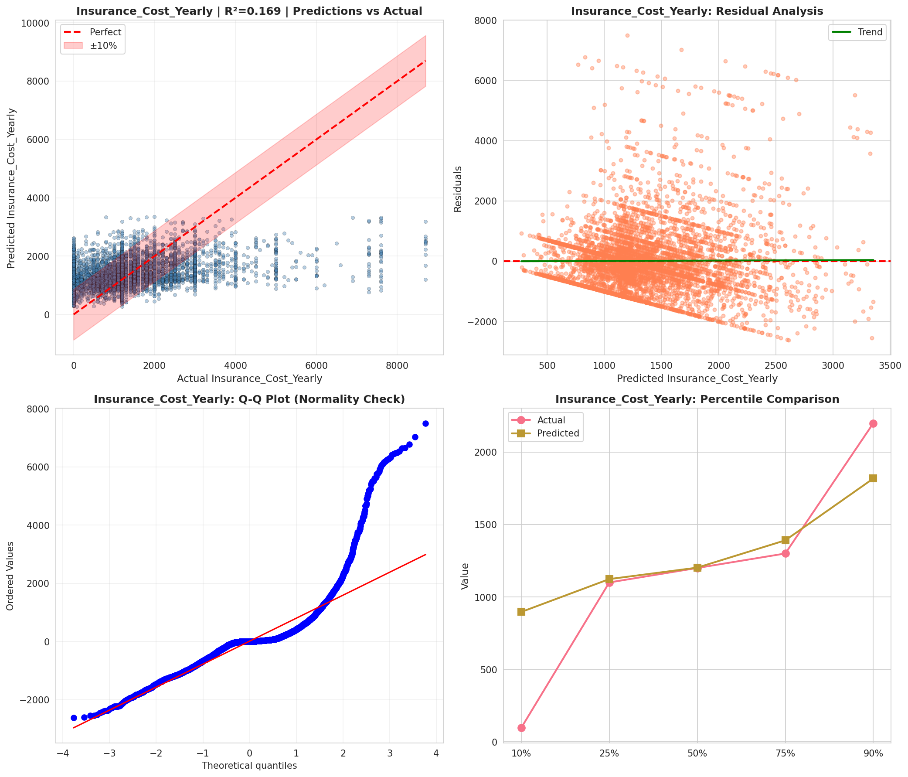
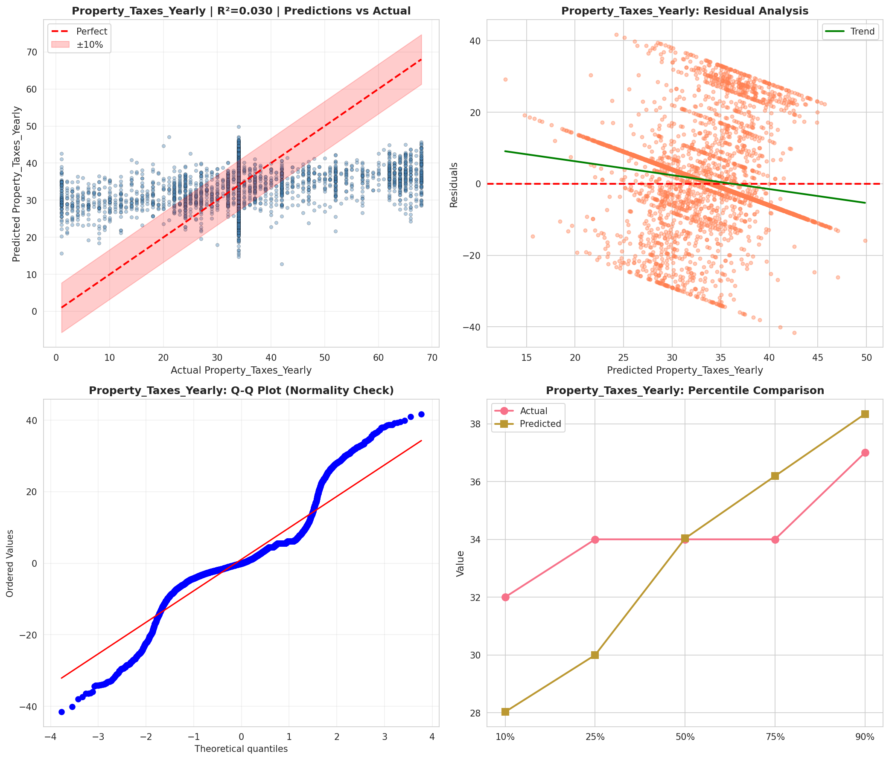
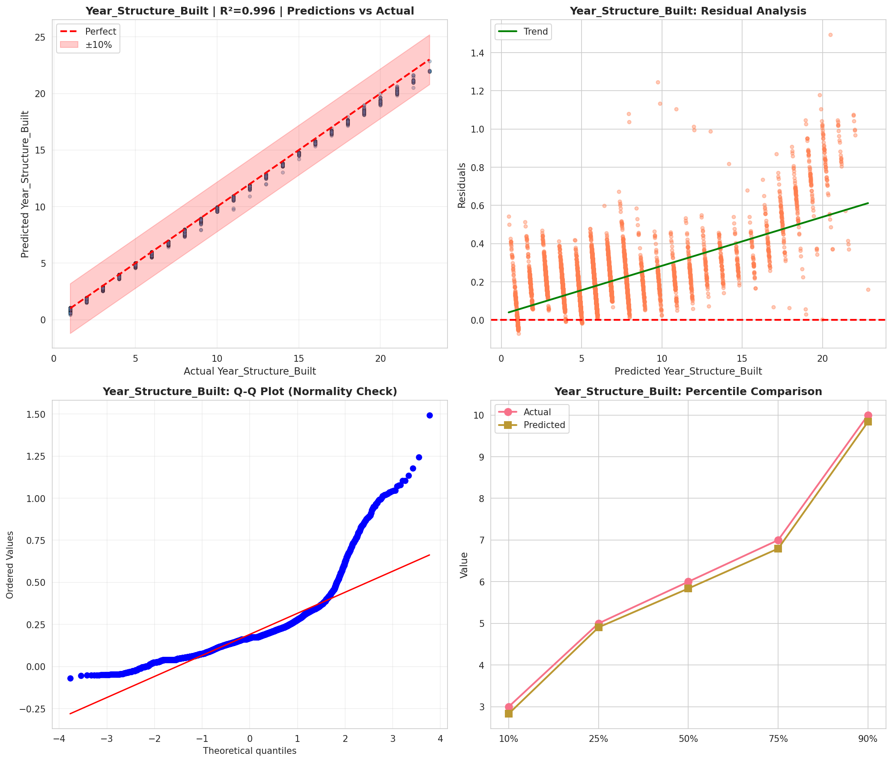
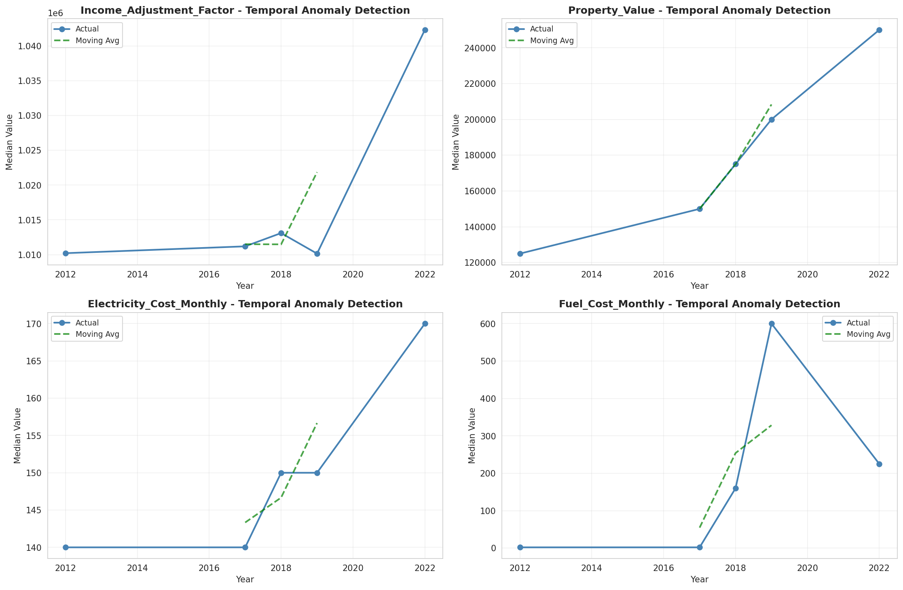
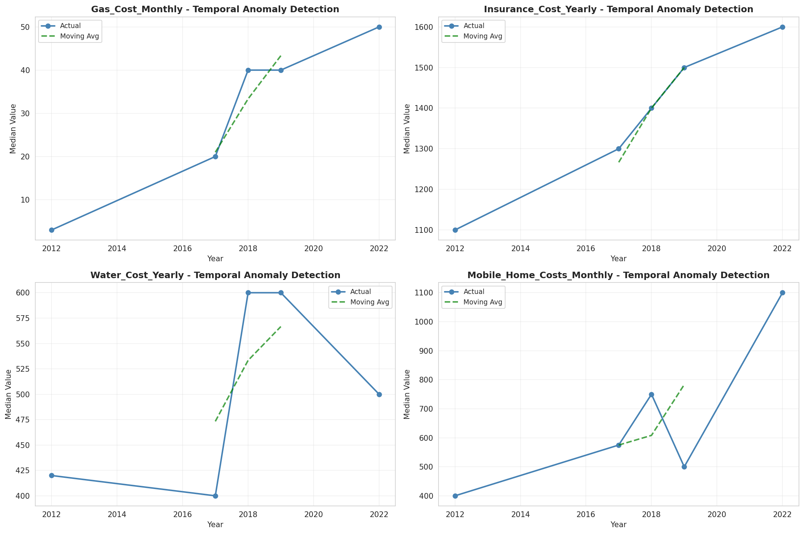
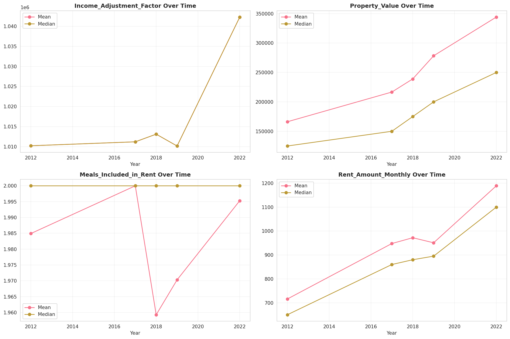
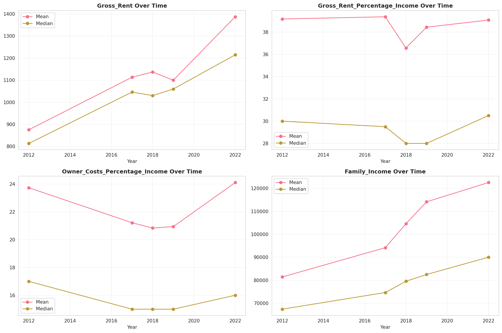
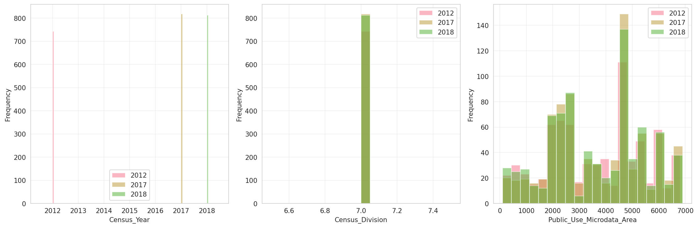
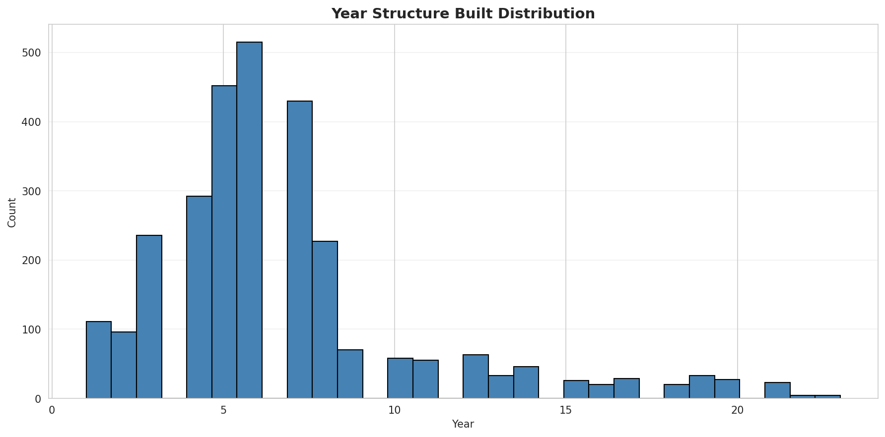
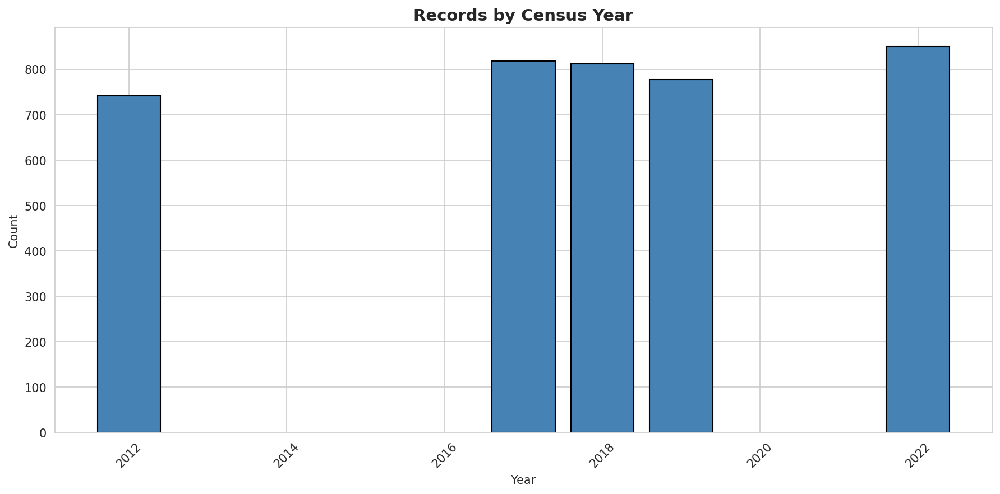
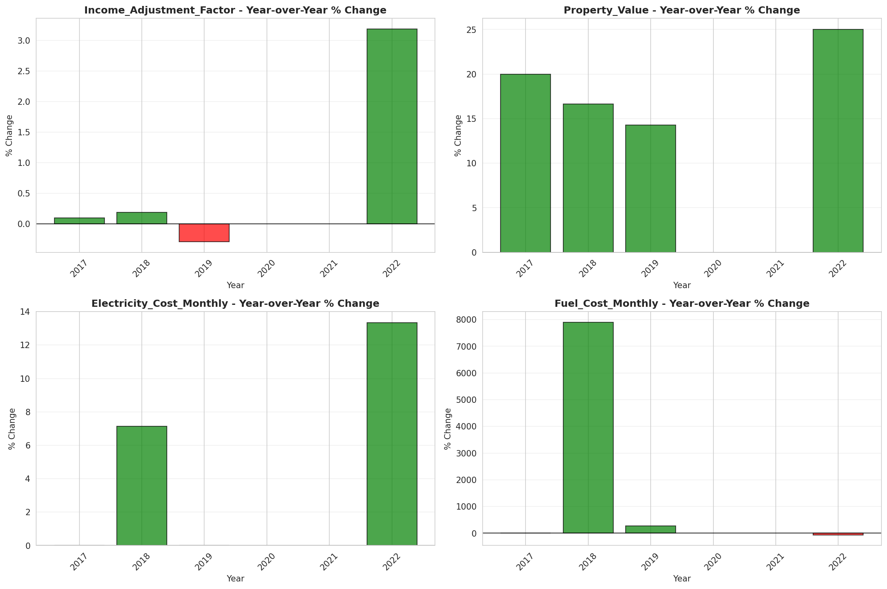
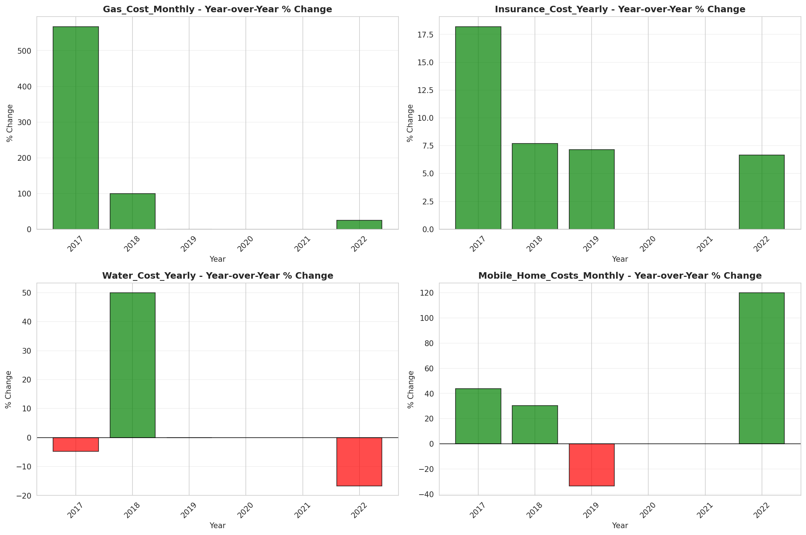
