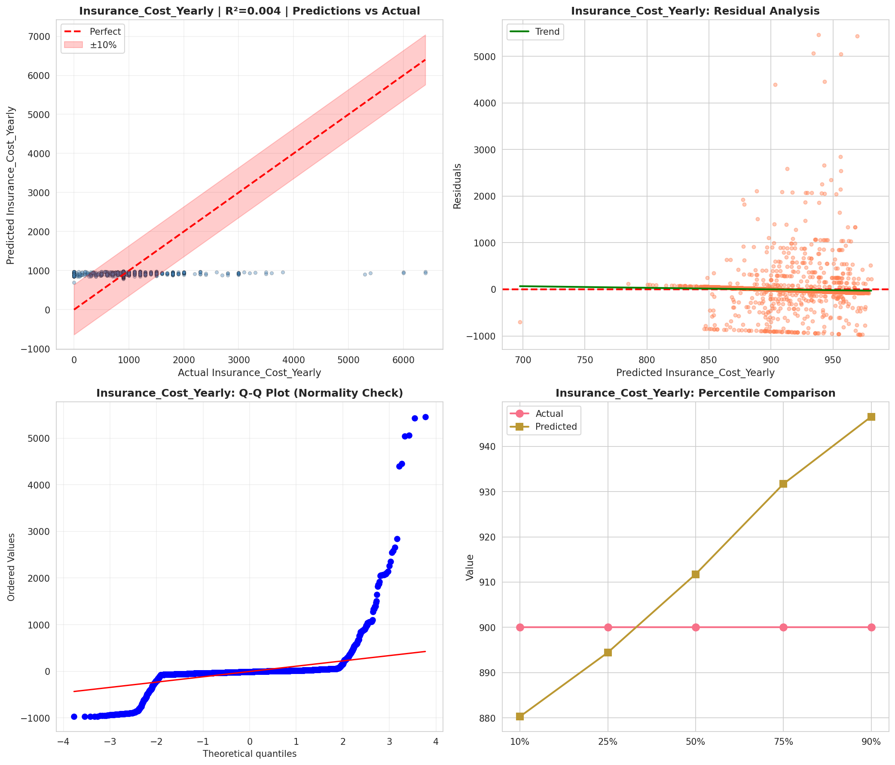
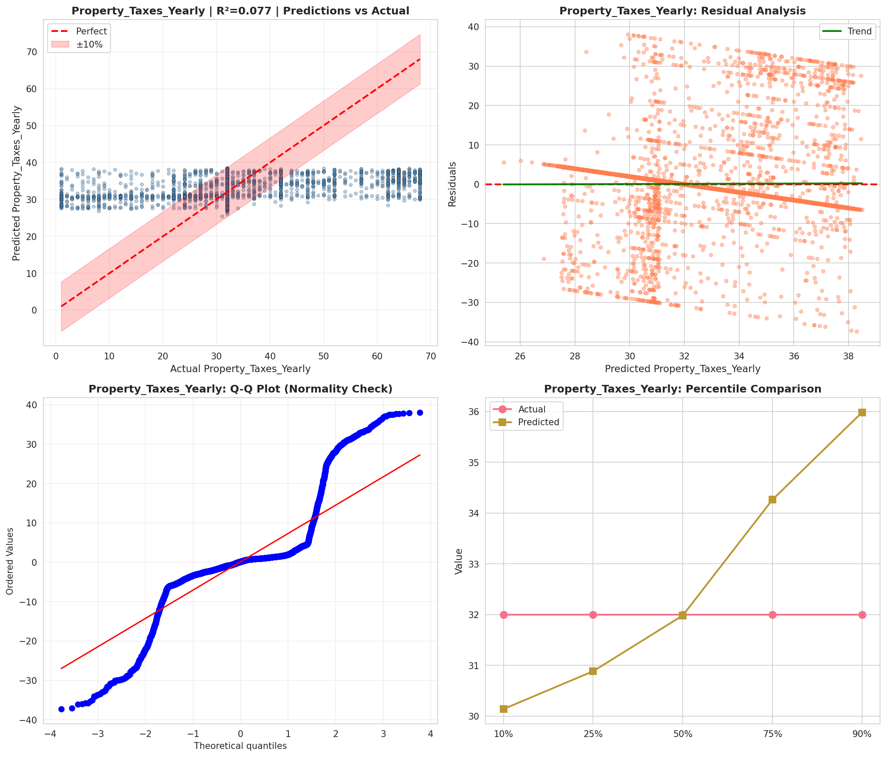
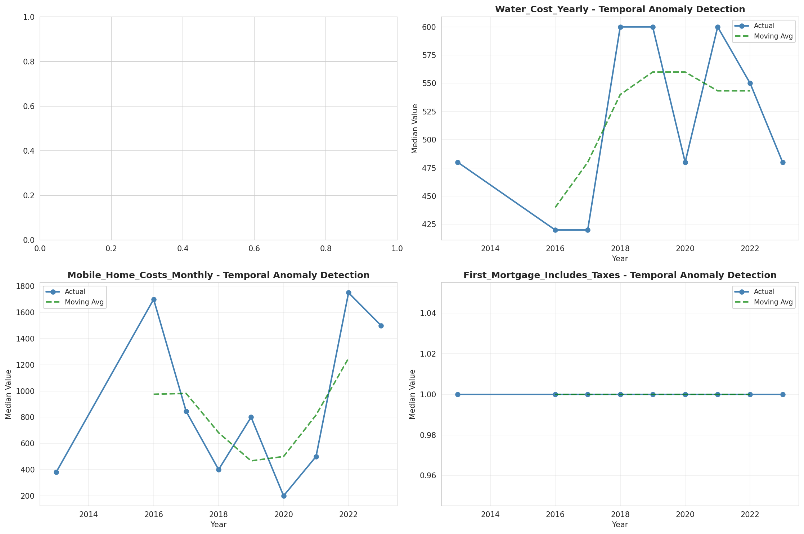
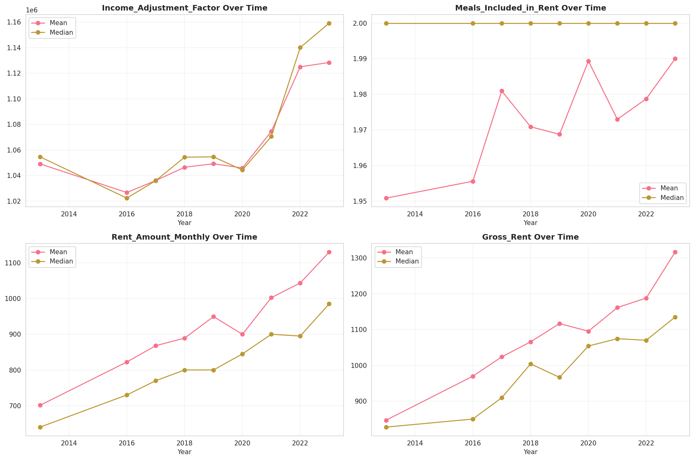
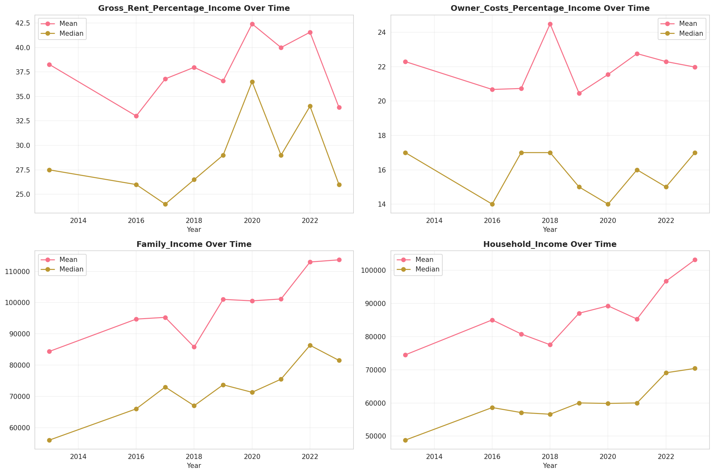
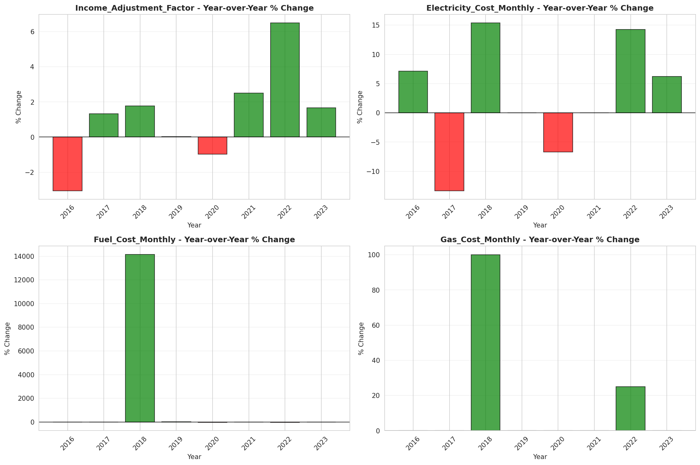

# Temporal Analysis

## Year Distribution

- 2013: 545,976 records

- 2016: 574,046 records

- 2017: 582,179 records

- 2018: 590,954 records

- 2019: 600,136 records

- 2020: 568,325 records

- 2021: 570,612 records

- 2022: 583,423 records

- 2023: 597,195 records

## Temporal Trends

- Census_Year: {np.int64(2013): {'mean': 2013.0, 'median': 2013.0, 'std': 0.0}, np.int64(2016): {'mean': 2016.0, 'median': 2016.0, 'std': 0.0}, np.int64(2017): {'mean': 2017.0, 'median': 2017.0, 'std': 0.0}, np.int64(2018): {'mean': 2018.0, 'median': 2018.0, 'std': 0.0}, np.int64(2019): {'mean': 2019.0, 'median': 2019.0, 'std': 0.0}, np.int64(2020): {'mean': 2020.0, 'median': 2020.0, 'std': 0.0}, np.int64(2021): {'mean': 2021.0, 'median': 2021.0, 'std': 0.0}, np.int64(2022): {'mean': 2022.0, 'median': 2022.0, 'std': 0.0}, np.int64(2023): {'mean': 2023.0, 'median': 2023.0, 'std': 0.0}}

- Census_Division: {np.int64(2013): {'mean': 7.0, 'median': 7.0, 'std': 0.0}, np.int64(2016): {'mean': 7.0, 'median': 7.0, 'std': 0.0}, np.int64(2017): {'mean': 7.0, 'median': 7.0, 'std': 0.0}, np.int64(2018): {'mean': 7.0, 'median': 7.0, 'std': 0.0}, np.int64(2019): {'mean': 7.0, 'median': 7.0, 'std': 0.0}, np.int64(2020): {'mean': 7.0, 'median': 7.0, 'std': 0.0}, np.int64(2021): {'mean': 7.0, 'median': 7.0, 'std': 0.0}, np.int64(2022): {'mean': 7.0, 'median': 7.0, 'std': 0.0}, np.int64(2023): {'mean': 7.0, 'median': 7.0, 'std': 0.0}}

- Public_Use_Microdata_Area: {np.int64(2013): {'mean': None, 'median': None, 'std': None}, np.int64(2016): {'mean': 3648.612855067364, 'median': 3700.0, 'std': 1781.466445437925}, np.int64(2017): {'mean': 3650.173609834776, 'median': 3700.0, 'std': 1778.9283349279674}, np.int64(2018): {'mean': 3652.4186231077206, 'median': 3700.0, 'std': 1778.3554905453605}, np.int64(2019): {'mean': 3652.615048922244, 'median': 3700.0, 'std': 1778.0537730975052}, np.int64(2020): {'mean': 3654.5297109928297, 'median': 3700.0, 'std': 1777.3205620074657}, np.int64(2021): {'mean': 3651.295486249851, 'median': 3700.0, 'std': 1778.0321255382837}, np.int64(2022): {'mean': None, 'median': None, 'std': None}, np.int64(2023): {'mean': 3759.2096718827183, 'median': 3900.0, 'std': 1881.8153743982182}}

- Census_Region: {np.int64(2013): {'mean': 3.0, 'median': 3.0, 'std': 0.0}, np.int64(2016): {'mean': 3.0, 'median': 3.0, 'std': 0.0}, np.int64(2017): {'mean': 3.0, 'median': 3.0, 'std': 0.0}, np.int64(2018): {'mean': 3.0, 'median': 3.0, 'std': 0.0}, np.int64(2019): {'mean': 3.0, 'median': 3.0, 'std': 0.0}, np.int64(2020): {'mean': 3.0, 'median': 3.0, 'std': 0.0}, np.int64(2021): {'mean': 3.0, 'median': 3.0, 'std': 0.0}, np.int64(2022): {'mean': 3.0, 'median': 3.0, 'std': 0.0}, np.int64(2023): {'mean': 3.0, 'median': 3.0, 'std': 0.0}}

- State_Code: {np.int64(2013): {'mean': 48.0, 'median': 48.0, 'std': 0.0}, np.int64(2016): {'mean': 48.0, 'median': 48.0, 'std': 0.0}, np.int64(2017): {'mean': 48.0, 'median': 48.0, 'std': 0.0}, np.int64(2018): {'mean': 48.0, 'median': 48.0, 'std': 0.0}, np.int64(2019): {'mean': 48.0, 'median': 48.0, 'std': 0.0}, np.int64(2020): {'mean': 48.0, 'median': 48.0, 'std': 0.0}, np.int64(2021): {'mean': 48.0, 'median': 48.0, 'std': 0.0}, np.int64(2022): {'mean': 48.0, 'median': 48.0, 'std': 0.0}, np.int64(2023): {'mean': None, 'median': None, 'std': None}}

- Housing_Adjustment_Factor: {np.int64(2013): {'mean': 1039809.7754461735, 'median': 1035725.0, 'std': 32012.7270129704}, np.int64(2016): {'mean': 1020153.9259710894, 'median': 1013801.0, 'std': 15741.324208251219}, np.int64(2017): {'mean': 1028951.7354095562, 'median': 1034680.0, 'std': 17999.558899245963}, np.int64(2018): {'mean': 1037979.6551846676, 'median': 1046406.0, 'std': 23517.70690718445}, np.int64(2019): {'mean': 1040465.8231884106, 'median': 1042936.0, 'std': 29177.804558818414}, np.int64(2020): {'mean': 1037517.0965539084, 'median': 1030827.0, 'std': 27909.627729516167}, np.int64(2021): {'mean': 1058899.6806323736, 'median': 1059761.0, 'std': 35961.99468813917}, np.int64(2022): {'mean': 1102702.0215178353, 'median': 1133141.0, 'std': 63212.506594777005}, np.int64(2023): {'mean': 1100436.3577893318, 'median': 1125501.0, 'std': 77234.53422306734}}

- Income_Adjustment_Factor: {np.int64(2013): {'mean': 1048841.3374818673, 'median': 1054614.0, 'std': 29662.300645207233}, np.int64(2016): {'mean': 1027294.2530459232, 'median': 1022342.0, 'std': 17480.568818842552}, np.int64(2017): {'mean': 1036359.5548826049, 'median': 1035988.0, 'std': 16847.71221047347}, np.int64(2018): {'mean': 1046595.9844336446, 'median': 1054346.0, 'std': 20529.827664917513}, np.int64(2019): {'mean': 1049457.7217147446, 'median': 1054606.0, 'std': 26254.02884493649}, np.int64(2020): {'mean': 1047761.6257247174, 'median': 1044328.0, 'std': 28250.99700399617}, np.int64(2021): {'mean': 1074122.7077996957, 'median': 1070512.0, 'std': 30917.52509890598}, np.int64(2022): {'mean': 1125702.8374284182, 'median': 1140108.0, 'std': 51125.8868610838}, np.int64(2023): {'mean': 1125013.6995018378, 'median': 1159185.0, 'std': 71248.63589160572}}

- Housing_Unit_Weight: {np.int64(2013): {'mean': 18.4453217723856, 'median': 15.0, 'std': 15.770871031026797}, np.int64(2016): {'mean': 18.189561463715453, 'median': 14.0, 'std': 16.045454051543604}, np.int64(2017): {'mean': 18.227016089553214, 'median': 14.0, 'std': 16.06536955273279}, np.int64(2018): {'mean': 18.22459954581913, 'median': 14.0, 'std': 16.09597989442681}, np.int64(2019): {'mean': 18.22424583761014, 'median': 14.0, 'std': 16.480824062771724}, np.int64(2020): {'mean': 19.5539084150794, 'median': 14.0, 'std': 21.840676803523966}, np.int64(2021): {'mean': 20.037924193672758, 'median': 14.0, 'std': 22.849523461537775}, np.int64(2022): {'mean': 19.97687955394285, 'median': 14.0, 'std': 23.225796581463552}, np.int64(2023): {'mean': 19.911097715151666, 'median': 14.0, 'std': 23.15407762279021}}

- Number_of_Persons: {np.int64(2013): {'mean': 2.2540587864668042, 'median': 2.0, 'std': 1.591683308577473}, np.int64(2016): {'mean': 2.2276211314075876, 'median': 2.0, 'std': 1.5745323530161948}, np.int64(2017): {'mean': 2.2251644253743263, 'median': 2.0, 'std': 1.5735831127318285}, np.int64(2018): {'mean': 2.216661533723437, 'median': 2.0, 'std': 1.5707953706026274}, np.int64(2019): {'mean': 2.2125618193209537, 'median': 2.0, 'std': 1.5658657497040815}, np.int64(2020): {'mean': 2.1929142656050673, 'median': 2.0, 'std': 1.5632866771259222}, np.int64(2021): {'mean': 2.183336487841125, 'median': 2.0, 'std': 1.5550150869226502}, np.int64(2022): {'mean': 2.1818046254604293, 'median': 2.0, 'std': 1.5418584568038904}, np.int64(2023): {'mean': 2.1882283006388197, 'median': 2.0, 'std': 1.5346088771170954}}

- Housing_Unit_Type: {np.int64(2013): {'mean': 1.1066109133002184, 'median': 1.0, 'std': 0.3852719163226235}, np.int64(2016): {'mean': 1.1247670047348122, 'median': 1.0, 'std': 0.4202661955529752}, np.int64(2017): {'mean': 1.124465155905658, 'median': 1.0, 'std': 0.42088639581939774}, np.int64(2018): {'mean': 1.1235781465224028, 'median': 1.0, 'std': 0.41987125827931093}, np.int64(2019): {'mean': 1.123130423770612, 'median': 1.0, 'std': 0.41925041892665943}, np.int64(2020): {'mean': None, 'median': None, 'std': None}, np.int64(2021): {'mean': None, 'median': None, 'std': None}, np.int64(2022): {'mean': None, 'median': None, 'std': None}, np.int64(2023): {'mean': None, 'median': None, 'std': None}}

- Building_Type: {np.int64(2013): {'mean': 2.86856570619703, 'median': 2.0, 'std': 2.0739727348570383}, np.int64(2016): {'mean': 2.90221474349146, 'median': 2.0, 'std': 2.1063328359262536}, np.int64(2017): {'mean': 2.912997911481564, 'median': 2.0, 'std': 2.115672669637286}, np.int64(2018): {'mean': 2.922604100644408, 'median': 2.0, 'std': 2.1264666805617765}, np.int64(2019): {'mean': 2.9306623294412955, 'median': 2.0, 'std': 2.137193363508617}, np.int64(2020): {'mean': 2.9340353545694757, 'median': 2.0, 'std': 2.1437621438118106}, np.int64(2021): {'mean': 2.933249701990179, 'median': 2.0, 'std': 2.145631686517714}, np.int64(2022): {'mean': 2.9307387256216715, 'median': 2.0, 'std': 2.149832950190064}, np.int64(2023): {'mean': 2.9252146441460516, 'median': 2.0, 'std': 2.1521493580456363}}

- Year_Structure_Built: {np.int64(2013): {'mean': 5.747115704305688, 'median': 6.0, 'std': 2.648009829444935}, np.int64(2016): {'mean': 6.1085159148753485, 'median': 6.0, 'std': 3.1991538339066317}, np.int64(2017): {'mean': 6.299345496844562, 'median': 6.0, 'std': 3.487574923429397}, np.int64(2018): {'mean': 6.498588324073953, 'median': 6.0, 'std': 3.7999297841868787}, np.int64(2019): {'mean': 6.727638468603294, 'median': 6.0, 'std': 4.146551236393518}, np.int64(2020): {'mean': 6.919653669523503, 'median': 6.0, 'std': 4.43190439062743}, np.int64(2021): {'mean': None, 'median': None, 'std': None}, np.int64(2022): {'mean': None, 'median': None, 'std': None}, np.int64(2023): {'mean': None, 'median': None, 'std': None}}

- Bathtub_or_Shower: {np.int64(2013): {'mean': 1.0095582423664464, 'median': 1.0, 'std': 0.09729800212146637}, np.int64(2016): {'mean': 1.0087144675109625, 'median': 1.0, 'std': 0.09294375784849014}, np.int64(2017): {'mean': 1.008956458356151, 'median': 1.0, 'std': 0.09421388948224296}, np.int64(2018): {'mean': 1.0092172493973195, 'median': 1.0, 'std': 0.09556311362135604}, np.int64(2019): {'mean': 1.0090031577830387, 'median': 1.0, 'std': 0.09445695980883213}, np.int64(2020): {'mean': 1.0089020192860834, 'median': 1.0, 'std': 0.09392971065469898}, np.int64(2021): {'mean': 1.0089354172235045, 'median': 1.0, 'std': 0.0941041594165383}, np.int64(2022): {'mean': 1.0085079888118318, 'median': 1.0, 'std': 0.09184562645558404}, np.int64(2023): {'mean': 1.007839992204979, 'median': 1.0, 'std': 0.088196039041783}}

- Refrigerator: {np.int64(2013): {'mean': 1.0222959292359577, 'median': 1.0, 'std': 0.14764438416177697}, np.int64(2016): {'mean': 1.0217008831375916, 'median': 1.0, 'std': 0.14570516633458416}, np.int64(2017): {'mean': 1.0223920900668855, 'median': 1.0, 'std': 0.14795514761825387}, np.int64(2018): {'mean': 1.0226593037714702, 'median': 1.0, 'std': 0.14881498878289132}, np.int64(2019): {'mean': 1.0222380375640796, 'median': 1.0, 'std': 0.14745693279744068}, np.int64(2020): {'mean': 1.0224003276099103, 'median': 1.0, 'std': 0.14798174088863852}, np.int64(2021): {'mean': 1.022059555141084, 'median': 1.0, 'std': 0.14687740893740595}, np.int64(2022): {'mean': 1.020339859764742, 'median': 1.0, 'std': 0.1411601503389989}, np.int64(2023): {'mean': 1.018299561155312, 'median': 1.0, 'std': 0.13403253664385087}}

- Hot_and_Cold_Running_Water: {np.int64(2013): {'mean': 1.0193096006482323, 'median': 1.0, 'std': 0.13761096494101585}, np.int64(2016): {'mean': 1.0193991291282083, 'median': 1.0, 'std': 0.1379233097599564}, np.int64(2017): {'mean': 1.0202148190391305, 'median': 1.0, 'std': 0.14073456409665971}, np.int64(2018): {'mean': 1.0209790469747013, 'median': 1.0, 'std': 0.14331421680463496}, np.int64(2019): {'mean': 1.0209811447786807, 'median': 1.0, 'std': 0.1433212263517006}, np.int64(2020): {'mean': 1.0215832528934001, 'median': 1.0, 'std': 0.14531846843476703}, np.int64(2021): {'mean': 1.0217142344317913, 'median': 1.0, 'std': 0.14574898935744818}, np.int64(2022): {'mean': 1.0204375646576498, 'median': 1.0, 'std': 0.14149172754016434}, np.int64(2023): {'mean': 1.0187792547510277, 'median': 1.0, 'std': 0.13574471949176667}}

- Running_Water: {np.int64(2013): {'mean': 9.0, 'median': 9.0, 'std': 0.0}, np.int64(2016): {'mean': 9.0, 'median': 9.0, 'std': 0.0}, np.int64(2017): {'mean': 9.0, 'median': 9.0, 'std': 0.0}, np.int64(2018): {'mean': 9.0, 'median': 9.0, 'std': 0.0}, np.int64(2019): {'mean': 9.0, 'median': 9.0, 'std': 0.0}, np.int64(2020): {'mean': 9.0, 'median': 9.0, 'std': 0.0}, np.int64(2021): {'mean': 9.0, 'median': 9.0, 'std': 0.0}, np.int64(2022): {'mean': 9.0, 'median': 9.0, 'std': 0.0}, np.int64(2023): {'mean': 9.0, 'median': 9.0, 'std': 0.0}}

- Sink_with_Faucet: {np.int64(2013): {'mean': 1.0093890170798085, 'median': 1.0, 'std': 0.09644108022558076}, np.int64(2016): {'mean': 1.0083062463585906, 'median': 1.0, 'std': 0.09075939850507485}, np.int64(2017): {'mean': 1.0084730399839867, 'median': 1.0, 'std': 0.09165840628097308}, np.int64(2018): {'mean': 1.0087358483902806, 'median': 1.0, 'std': 0.09305670012745208}, np.int64(2019): {'mean': 1.008501864299488, 'median': 1.0, 'std': 0.09181284237618036}, np.int64(2020): {'mean': 1.0083423523561588, 'median': 1.0, 'std': 0.09095478902026646}, np.int64(2021): {'mean': 1.0084164606773358, 'median': 1.0, 'std': 0.09135447525463725}, np.int64(2022): {'mean': 1.0080060538717959, 'median': 1.0, 'std': 0.08911774339763578}, np.int64(2023): {'mean': 1.0072722298631749, 'median': 1.0, 'std': 0.08496680565754956}}

- Stove_or_Range: {np.int64(2013): {'mean': 1.0221824487496243, 'median': 1.0, 'std': 0.14727671540424875}, np.int64(2016): {'mean': 1.0219960289472878, 'median': 1.0, 'std': 0.14667053175988565}, np.int64(2017): {'mean': 1.022552600073268, 'median': 1.0, 'std': 0.14847229347625504}, np.int64(2018): {'mean': 1.0230217485451094, 'median': 1.0, 'std': 0.14997262898384095}, np.int64(2019): {'mean': 1.0228088535015534, 'median': 1.0, 'std': 0.1492938393954571}, np.int64(2020): {'mean': 1.0229853453066955, 'median': 1.0, 'std': 0.1498568083218958}, np.int64(2021): {'mean': 1.0228711563561446, 'median': 1.0, 'std': 0.1494928431847051}, np.int64(2022): {'mean': 1.0213149929116059, 'median': 1.0, 'std': 0.1444323507852335}, np.int64(2023): {'mean': 1.0195643782533907, 'median': 1.0, 'std': 0.1384978313894574}}

- Telephone_Service: {np.int64(2013): {'mean': 1.0269372605207319, 'median': 1.0, 'std': 0.16190028313406116}, np.int64(2016): {'mean': 1.0692185977302973, 'median': 1.0, 'std': 0.5498642602568746}, np.int64(2017): {'mean': 1.066278384110071, 'median': 1.0, 'std': 0.5447674760755671}, np.int64(2018): {'mean': 1.0637615736725352, 'median': 1.0, 'std': 0.5397927358809212}, np.int64(2019): {'mean': 1.0597852615931622, 'median': 1.0, 'std': 0.5331605080702922}, np.int64(2020): {'mean': 1.0588821583537398, 'median': 1.0, 'std': 0.5470598114642798}, np.int64(2021): {'mean': 1.012815283014007, 'median': 1.0, 'std': 0.11247701408200932}, np.int64(2022): {'mean': 1.0108330416153977, 'median': 1.0, 'std': 0.10351671018138989}, np.int64(2023): {'mean': 1.0090831816412102, 'median': 1.0, 'std': 0.09487199692029938}}

- Lot_Acreage: {np.int64(2013): {'mean': 1.2499416758552775, 'median': 1.0, 'std': 0.5412676996803413}, np.int64(2016): {'mean': 1.2460008091192498, 'median': 1.0, 'std': 0.5360578028187829}, np.int64(2017): {'mean': 1.242589063979456, 'median': 1.0, 'std': 0.5322930822092561}, np.int64(2018): {'mean': 1.242261094284047, 'median': 1.0, 'std': 0.5321217611795296}, np.int64(2019): {'mean': 1.2432430583895508, 'median': 1.0, 'std': 0.5330218705723021}, np.int64(2020): {'mean': 1.2434149492673023, 'median': 1.0, 'std': 0.5333748897820468}, np.int64(2021): {'mean': 1.2438695965470308, 'median': 1.0, 'std': 0.5329331288348299}, np.int64(2022): {'mean': 1.246687608710116, 'median': 1.0, 'std': 0.5344819741488406}, np.int64(2023): {'mean': 1.2467066090236365, 'median': 1.0, 'std': 0.5330367622230415}}

- Agricultural_Sales: {np.int64(2013): {'mean': 1.342837379816006, 'median': 1.0, 'std': 1.0662170115914913}, np.int64(2016): {'mean': 1.3332469410304328, 'median': 1.0, 'std': 1.0568805372923302}, np.int64(2017): {'mean': 1.3247924048208595, 'median': 1.0, 'std': 1.0377612744156164}, np.int64(2018): {'mean': 1.3288944825626243, 'median': 1.0, 'std': 1.042419446151313}, np.int64(2019): {'mean': 1.332322523405326, 'median': 1.0, 'std': 1.043304849587033}, np.int64(2020): {'mean': 1.3357457876286327, 'median': 1.0, 'std': 1.0444333472322587}, np.int64(2021): {'mean': 1.3399450888104443, 'median': 1.0, 'std': 1.0477699692858364}, np.int64(2022): {'mean': 1.3477923779224426, 'median': 1.0, 'std': 1.0601189715632044}, np.int64(2023): {'mean': 1.3481236996892096, 'median': 1.0, 'std': 1.0599351595780662}}

- Business_On_Property: {np.int64(2013): {'mean': 1.9864393293828446, 'median': 2.0, 'std': 0.11565816737143954}, np.int64(2016): {'mean': 3.427560029509055, 'median': 2.0, 'std': 2.835321123456898}, np.int64(2017): {'mean': 4.853642090028453, 'median': 2.0, 'std': 3.4487044176634156}, np.int64(2018): {'mean': 6.255096747899705, 'median': 9.0, 'std': 3.4234675175352174}, np.int64(2019): {'mean': 7.64075755261352, 'median': 9.0, 'std': 2.7725999296567223}, np.int64(2020): {'mean': None, 'median': None, 'std': None}, np.int64(2021): {'mean': None, 'median': None, 'std': None}, np.int64(2022): {'mean': None, 'median': None, 'std': None}, np.int64(2023): {'mean': None, 'median': None, 'std': None}}

- Tenure: {np.int64(2013): {'mean': 1.936767659585604, 'median': 2.0, 'std': 0.8728655613711331}, np.int64(2016): {'mean': 1.9714139011432343, 'median': 2.0, 'std': 0.8661882353542079}, np.int64(2017): {'mean': 1.974168520146899, 'median': 2.0, 'std': 0.8637737462635382}, np.int64(2018): {'mean': 1.977218971741566, 'median': 2.0, 'std': 0.8615218958471825}, np.int64(2019): {'mean': 1.9749666040597411, 'median': 2.0, 'std': 0.858207512006247}, np.int64(2020): {'mean': 1.9700734630751386, 'median': 2.0, 'std': 0.8547693565105245}, np.int64(2021): {'mean': 1.9663526360536916, 'median': 2.0, 'std': 0.8503877959301955}, np.int64(2022): {'mean': 1.9591497068496768, 'median': 2.0, 'std': 0.8462525273144511}, np.int64(2023): {'mean': 1.9496083183679627, 'median': 2.0, 'std': 0.841576890009646}}

- Vacancy_Status: {np.int64(2013): {'mean': 4.548511727858808, 'median': 5.0, 'std': 2.359266972741784}, np.int64(2016): {'mean': 4.702673629008762, 'median': 5.0, 'std': 2.3063180378881665}, np.int64(2017): {'mean': 4.73506066570063, 'median': 5.0, 'std': 2.3049224434365767}, np.int64(2018): {'mean': 4.76175, 'median': 5.0, 'std': 2.3091065415591507}, np.int64(2019): {'mean': 4.774312603801439, 'median': 5.0, 'std': 2.326219042663063}, np.int64(2020): {'mean': 4.7567756267851475, 'median': 5.0, 'std': 2.3506051805674146}, np.int64(2021): {'mean': 4.766406667378994, 'median': 5.0, 'std': 2.3635005369672832}, np.int64(2022): {'mean': 4.7431045613410205, 'median': 5.0, 'std': 2.38292861150717}, np.int64(2023): {'mean': 4.6767988491078265, 'median': 5.0, 'std': 2.417033998508259}}

- Vehicles_Available: {np.int64(2013): {'mean': 1.8237846938263689, 'median': 2.0, 'std': 0.9956926536319014}, np.int64(2016): {'mean': 1.8544037052949252, 'median': 2.0, 'std': 1.0122657952384735}, np.int64(2017): {'mean': 1.8724129726374592, 'median': 2.0, 'std': 1.0203264538311216}, np.int64(2018): {'mean': 1.8882111290924934, 'median': 2.0, 'std': 1.0279420189833772}, np.int64(2019): {'mean': 1.905834496750801, 'median': 2.0, 'std': 1.0367666105005007}, np.int64(2020): {'mean': 1.9201336082828544, 'median': 2.0, 'std': 1.0429190095638161}, np.int64(2021): {'mean': 1.925789871439245, 'median': 2.0, 'std': 1.0446387014703509}, np.int64(2022): {'mean': 1.9305389899362553, 'median': 2.0, 'std': 1.0469299221253299}, np.int64(2023): {'mean': 1.9342325465727093, 'median': 2.0, 'std': 1.0519085939853543}}

- Condo_Fee_Monthly: {np.int64(2013): {'mean': 303.6640333879863, 'median': 220.0, 'std': 272.72817189295887}, np.int64(2016): {'mean': 327.99934587080946, 'median': 250.0, 'std': 273.39270918878447}, np.int64(2017): {'mean': 336.5080205060361, 'median': 260.0, 'std': 272.42018176920163}, np.int64(2018): {'mean': 340.16134723336006, 'median': 260.0, 'std': 270.2321396825364}, np.int64(2019): {'mean': 348.4945904173107, 'median': 280.0, 'std': 273.30457917682384}, np.int64(2020): {'mean': 356.573876495312, 'median': 280.0, 'std': 298.6270688182046}, np.int64(2021): {'mean': 371.3973489519112, 'median': 280.0, 'std': 340.394455492152}, np.int64(2022): {'mean': 389.68213058419246, 'median': 290.0, 'std': 375.62695775073576}, np.int64(2023): {'mean': 419.4197129704847, 'median': 300.0, 'std': 437.38058687817835}}

- Electricity_Cost_Monthly: {np.int64(2013): {'mean': 165.83426998759123, 'median': 150.0, 'std': 105.15358552519243}, np.int64(2016): {'mean': 160.41173622826963, 'median': 140.0, 'std': 101.77800108899507}, np.int64(2017): {'mean': 159.20232969533959, 'median': 140.0, 'std': 101.3538568405182}, np.int64(2018): {'mean': 166.92207827986886, 'median': 150.0, 'std': 99.73796059409965}, np.int64(2019): {'mean': 166.5368880065232, 'median': 150.0, 'std': 99.68746270367645}, np.int64(2020): {'mean': 166.1836094220859, 'median': 150.0, 'std': 100.21666376983919}, np.int64(2021): {'mean': 169.34050449069784, 'median': 150.0, 'std': 104.11338551395401}, np.int64(2022): {'mean': 182.02117213935972, 'median': 150.0, 'std': 137.6164625465516}, np.int64(2023): {'mean': 195.28775406364602, 'median': 160.0, 'std': 165.65390692867547}}

- Fuel_Cost_Monthly: {np.int64(2013): {'mean': 28.134053870159438, 'median': 2.0, 'std': 189.2858412001035}, np.int64(2016): {'mean': 19.630795024677514, 'median': 2.0, 'std': 154.95576755257042}, np.int64(2017): {'mean': 16.85990586044587, 'median': 2.0, 'std': 142.77708581622346}, np.int64(2018): {'mean': 478.3612440191388, 'median': 250.0, 'std': 655.1721936468851}, np.int64(2019): {'mean': 470.9837624838644, 'median': 250.0, 'std': 646.3288361765893}, np.int64(2020): {'mean': 460.8084977697135, 'median': 250.0, 'std': 642.7908155115751}, np.int64(2021): {'mean': 449.4876685790925, 'median': 250.0, 'std': 608.6651279185057}, np.int64(2022): {'mean': 455.30407832640697, 'median': 250.0, 'std': 605.3570829047089}, np.int64(2023): {'mean': 460.17069092368405, 'median': 250.0, 'std': 623.1170739000314}}

- Gas_Cost_Monthly: {np.int64(2013): {'mean': 33.61642099937411, 'median': 20.0, 'std': 51.96360066845813}, np.int64(2016): {'mean': 31.758019930630507, 'median': 10.0, 'std': 49.96840559230257}, np.int64(2017): {'mean': 31.584271452956084, 'median': 10.0, 'std': 49.52388364050983}, np.int64(2018): {'mean': 60.452100500888676, 'median': 40.0, 'std': 58.60100379829729}, np.int64(2019): {'mean': 59.19102119352817, 'median': 40.0, 'std': 56.888254804573485}, np.int64(2020): {'mean': 58.988363291123, 'median': 40.0, 'std': 56.30803481550578}, np.int64(2021): {'mean': 61.80048220013447, 'median': 40.0, 'std': 59.58156868713411}, np.int64(2022): {'mean': 69.13349839875407, 'median': 50.0, 'std': 83.89052077941622}, np.int64(2023): {'mean': 75.31249215317013, 'median': 50.0, 'std': 100.50591988631736}}

- House_Heating_Fuel: {np.int64(2013): {'mean': 2.2113349340416577, 'median': 3.0, 'std': 1.136170254010339}, np.int64(2016): {'mean': 2.2410893734740283, 'median': 3.0, 'std': 1.1424125923267388}, np.int64(2017): {'mean': 2.2474815083018673, 'median': 3.0, 'std': 1.1428783425113964}, np.int64(2018): {'mean': 2.251664751751484, 'median': 3.0, 'std': 1.1373926776314405}, np.int64(2019): {'mean': 2.255829976999488, 'median': 3.0, 'std': 1.1337179712640189}, np.int64(2020): {'mean': 2.259281694376423, 'median': 3.0, 'std': 1.1354107663197275}, np.int64(2021): {'mean': 2.2670362323196755, 'median': 3.0, 'std': 1.1384061445671212}, np.int64(2022): {'mean': 2.2744335606287693, 'median': 3.0, 'std': 1.1464772843640412}, np.int64(2023): {'mean': 2.2822961533051895, 'median': 3.0, 'std': 1.1576889275682694}}

- Insurance_Cost_Yearly: {np.int64(2013): {'mean': 1214.6903167215348, 'median': 1000.0, 'std': 859.2206958233046}}

- Water_Cost_Yearly: {np.int64(2013): {'mean': 517.0730568513152, 'median': 440.0, 'std': 540.943960273414}, np.int64(2016): {'mean': 533.7293814378976, 'median': 430.0, 'std': 571.9985115707257}, np.int64(2017): {'mean': 535.1073004706977, 'median': 420.0, 'std': 577.7242858466598}, np.int64(2018): {'mean': 651.5933460844532, 'median': 600.0, 'std': 587.6781335322162}, np.int64(2019): {'mean': 655.3595454985948, 'median': 600.0, 'std': 599.6955213565759}, np.int64(2020): {'mean': 664.6125762746923, 'median': 600.0, 'std': 621.6460486357655}, np.int64(2021): {'mean': 673.0038099997681, 'median': 600.0, 'std': 648.3428123922723}, np.int64(2022): {'mean': 685.4083081870333, 'median': 600.0, 'std': 684.9844906139807}, np.int64(2023): {'mean': 704.9791841751153, 'median': 600.0, 'std': 725.6519636527075}}

- Mobile_Home_Costs_Monthly: {np.int64(2013): {'mean': 1356.318561938257, 'median': 600.0, 'std': 1758.956416004909}, np.int64(2016): {'mean': 1464.6767176717672, 'median': 650.0, 'std': 1971.5645327182779}, np.int64(2017): {'mean': 1514.1203297927655, 'median': 700.0, 'std': 2028.107828547397}, np.int64(2018): {'mean': 1584.9258095168482, 'median': 700.0, 'std': 2122.884496850017}, np.int64(2019): {'mean': 1635.6361962755789, 'median': 720.0, 'std': 2208.785876623924}, np.int64(2020): {'mean': 1751.2048739877393, 'median': 750.0, 'std': 2662.8664750494613}, np.int64(2021): {'mean': 1912.1883938599776, 'median': 800.0, 'std': 3171.987996711302}, np.int64(2022): {'mean': 2222.6951751301167, 'median': 850.0, 'std': 4341.536033622607}, np.int64(2023): {'mean': 2502.8258459933495, 'median': 970.0, 'std': 5118.060627915312}}

- First_Mortgage_Includes_Insurance: {np.int64(2013): {'mean': 1.4478879834115561, 'median': 1.0, 'std': 0.497278308511374}, np.int64(2016): {'mean': 1.4163944147010359, 'median': 1.0, 'std': 0.492961957623527}, np.int64(2017): {'mean': 1.4052733046042187, 'median': 1.0, 'std': 0.4909462494636562}, np.int64(2018): {'mean': 1.3949398229389427, 'median': 1.0, 'std': 0.4888391428109121}, np.int64(2019): {'mean': 1.386003621674328, 'median': 1.0, 'std': 0.48683277034424594}, np.int64(2020): {'mean': 1.3779304745473324, 'median': 1.0, 'std': 0.48487156493424777}, np.int64(2021): {'mean': 1.3705191260116163, 'median': 1.0, 'std': 0.4829452408105469}, np.int64(2022): {'mean': 1.365115060606239, 'median': 1.0, 'std': 0.4814638280965892}, np.int64(2023): {'mean': 1.3615936437165967, 'median': 1.0, 'std': 0.48046331813089255}}

- First_Mortgage_Payment_Monthly: {np.int64(2013): {'mean': 1075.6660126419995, 'median': 920.0, 'std': 708.6492309863543}, np.int64(2016): {'mean': 1135.0311365022892, 'median': 980.0, 'std': 747.010129803043}, np.int64(2017): {'mean': 1175.7157858924927, 'median': 1000.0, 'std': 774.4518274450122}, np.int64(2018): {'mean': 1224.1571092440768, 'median': 1000.0, 'std': 806.4656739390853}, np.int64(2019): {'mean': 1280.4877225240284, 'median': 1100.0, 'std': 838.9713724511156}, np.int64(2020): {'mean': 1326.9043681756584, 'median': 1200.0, 'std': 861.8175443366931}, np.int64(2021): {'mean': 1384.1380487980855, 'median': 1200.0, 'std': 891.5457320849291}, np.int64(2022): {'mean': 1455.120865147439, 'median': 1300.0, 'std': 927.946035108868}, np.int64(2023): {'mean': 1537.8663351338992, 'median': 1300.0, 'std': 978.1802661029839}}

- First_Mortgage_Includes_Taxes: {np.int64(2013): {'mean': 1.3994883000189517, 'median': 1.0, 'std': 0.4897945848824703}, np.int64(2016): {'mean': 1.3631470616743353, 'median': 1.0, 'std': 0.48090809090529946}, np.int64(2017): {'mean': 1.3509696076207758, 'median': 1.0, 'std': 0.477274799013845}, np.int64(2018): {'mean': 1.338814063319923, 'median': 1.0, 'std': 0.473307889060815}, np.int64(2019): {'mean': 1.3268756094163532, 'median': 1.0, 'std': 0.46907267170987865}, np.int64(2020): {'mean': 1.3179091023061722, 'median': 1.0, 'std': 0.465665329947582}, np.int64(2021): {'mean': 1.3084332423429814, 'median': 1.0, 'std': 0.4618478752409032}, np.int64(2022): {'mean': 1.3004409332006805, 'median': 1.0, 'std': 0.4584511055324592}, np.int64(2023): {'mean': 1.2949326931321272, 'median': 1.0, 'std': 0.4560138027573121}}

- First_Mortgage_Status: {np.int64(2013): {'mean': 1.888534472484114, 'median': 1.0, 'std': 0.9867527430868045}, np.int64(2016): {'mean': 1.9378741963978996, 'median': 1.0, 'std': 0.9911451337378124}, np.int64(2017): {'mean': 1.9439112914229577, 'median': 1.0, 'std': 0.991688378364391}, np.int64(2018): {'mean': 1.9527580254817083, 'median': 1.0, 'std': 0.9923000250159548}, np.int64(2019): {'mean': 1.9600309642005753, 'median': 1.0, 'std': 0.992902554430365}, np.int64(2020): {'mean': 1.9673504641279165, 'median': 1.0, 'std': 0.9934698397936867}, np.int64(2021): {'mean': 1.9815144579917683, 'median': 1.0, 'std': 0.993981049635992}, np.int64(2022): {'mean': 1.9935145465874233, 'median': 2.0, 'std': 0.9943552757306244}, np.int64(2023): {'mean': 2.001396184723316, 'median': 2.0, 'std': 0.9946277299979673}}

- Second_Mortgage_Payment_Monthly: {np.int64(2013): {'mean': 406.6457455291035, 'median': 300.0, 'std': 385.1417291557977}, np.int64(2016): {'mean': 444.78185644143093, 'median': 300.0, 'std': 450.6565910843613}, np.int64(2017): {'mean': 461.91870600067045, 'median': 310.0, 'std': 481.4510995653865}, np.int64(2018): {'mean': 476.5447443181818, 'median': 330.0, 'std': 487.5445038227259}, np.int64(2019): {'mean': 501.7287826245665, 'median': 350.0, 'std': 514.554055700857}, np.int64(2020): {'mean': 526.6465450310559, 'median': 360.0, 'std': 546.8508459230803}, np.int64(2021): {'mean': 546.1120605942901, 'median': 390.0, 'std': 556.7626044518803}, np.int64(2022): {'mean': 583.8164134864764, 'median': 400.0, 'std': 586.1614294017867}, np.int64(2023): {'mean': 644.2534578146611, 'median': 450.0, 'std': 657.9978728928664}}

- Second_Mortgage_Status: {np.int64(2013): {'mean': 2.867002597518422, 'median': 3.0, 'std': 0.45110096018569085}, np.int64(2016): {'mean': 2.9038879291175617, 'median': 3.0, 'std': 0.38248865800264625}, np.int64(2017): {'mean': 2.912395100929916, 'median': 3.0, 'std': 0.3640283676441235}, np.int64(2018): {'mean': 2.918736987027936, 'median': 3.0, 'std': 0.34883299712430305}, np.int64(2019): {'mean': 2.9230032037888285, 'median': 3.0, 'std': 0.33691979044085785}, np.int64(2020): {'mean': 2.924168020809152, 'median': 3.0, 'std': 0.3310668305304455}, np.int64(2021): {'mean': 2.9254632061506136, 'median': 3.0, 'std': 0.3231139550772398}, np.int64(2022): {'mean': 2.925775271614206, 'median': 3.0, 'std': 0.31641231965339106}, np.int64(2023): {'mean': 2.9249299278453798, 'median': 3.0, 'std': 0.3128585339997552}}

- Property_Taxes_Yearly: {np.int64(2013): {'mean': 33.65438754963398, 'median': 32.0, 'std': 19.867802497267064}, np.int64(2016): {'mean': 35.17037591402071, 'median': 33.0, 'std': 20.3888628236815}, np.int64(2017): {'mean': 36.114381790120646, 'median': 35.0, 'std': 20.64609633343167}}

- Meals_Included_in_Rent: {np.int64(2013): {'mean': 1.9809561128526645, 'median': 2.0, 'std': 0.13667973736302952}, np.int64(2016): {'mean': 1.9806681060174576, 'median': 2.0, 'std': 0.13768913324666288}, np.int64(2017): {'mean': 1.9803957243575165, 'median': 2.0, 'std': 0.13863647755853514}, np.int64(2018): {'mean': 1.9802938976918996, 'median': 2.0, 'std': 0.1389888316275533}, np.int64(2019): {'mean': 1.979693566673634, 'median': 2.0, 'std': 0.1410468294558296}, np.int64(2020): {'mean': 1.9793986333814282, 'median': 2.0, 'std': 0.14204607574530864}, np.int64(2021): {'mean': 1.979324641693699, 'median': 2.0, 'std': 0.1422955632383262}, np.int64(2022): {'mean': 1.9793513573041133, 'median': 2.0, 'std': 0.14220553941102748}, np.int64(2023): {'mean': 1.979154983518212, 'median': 2.0, 'std': 0.1428658159124398}}

- Rent_Amount_Monthly: {np.int64(2013): {'mean': 712.4116129951553, 'median': 650.0, 'std': 407.52189388797217}, np.int64(2016): {'mean': 801.107686398135, 'median': 710.0, 'std': 455.48177954834216}, np.int64(2017): {'mean': 837.1771402579681, 'median': 750.0, 'std': 468.5770924532998}, np.int64(2018): {'mean': 873.7638207978318, 'median': 790.0, 'std': 482.4750189673616}, np.int64(2019): {'mean': 912.9567205680228, 'median': 810.0, 'std': 496.9692222483411}, np.int64(2020): {'mean': 945.827443987695, 'median': 850.0, 'std': 515.2150274512653}, np.int64(2021): {'mean': 985.9166236217002, 'median': 890.0, 'std': 539.7792386283543}, np.int64(2022): {'mean': 1047.236344364297, 'median': 940.0, 'std': 585.828033489781}, np.int64(2023): {'mean': 1121.7327078004678, 'median': 1000.0, 'std': 640.3702460491362}}

- Gross_Rent: {np.int64(2013): {'mean': 878.4675667924879, 'median': 800.0, 'std': 437.1076180241127}, np.int64(2016): {'mean': 962.6545904894766, 'median': 875.0, 'std': 480.5008318123686}, np.int64(2017): {'mean': 997.2859467651928, 'median': 907.0, 'std': 492.058564547058}, np.int64(2018): {'mean': 1034.3065252675306, 'median': 945.0, 'std': 504.83801656613423}, np.int64(2019): {'mean': 1072.2157036693304, 'median': 980.0, 'std': 518.4421275736697}, np.int64(2020): {'mean': 1103.7388395984983, 'median': 1010.0, 'std': 535.9389156423218}, np.int64(2021): {'mean': 1146.532452982388, 'median': 1050.0, 'std': 559.2230487143154}, np.int64(2022): {'mean': 1216.5928568765612, 'median': 1100.0, 'std': 610.5771193765435}, np.int64(2023): {'mean': 1301.434302321271, 'median': 1182.0, 'std': 671.0163459127061}}

- Gross_Rent_Percentage_Income: {np.int64(2013): {'mean': 38.23165909973298, 'median': 29.0, 'std': 26.726437727425125}, np.int64(2016): {'mean': 37.42808755508614, 'median': 29.0, 'std': 26.38835140170913}, np.int64(2017): {'mean': 37.21034342220983, 'median': 28.0, 'std': 26.244490778591544}, np.int64(2018): {'mean': 37.23257009279991, 'median': 29.0, 'std': 26.213230000391963}, np.int64(2019): {'mean': 36.990118784086704, 'median': 28.0, 'std': 26.042314221561295}, np.int64(2020): {'mean': 37.060074480595844, 'median': 28.0, 'std': 26.10314760820568}, np.int64(2021): {'mean': 37.48030276440382, 'median': 29.0, 'std': 26.36067342755224}, np.int64(2022): {'mean': 38.004336810390086, 'median': 29.0, 'std': 26.607325975088273}, np.int64(2023): {'mean': 38.501103736071, 'median': 30.0, 'std': 26.820796990898955}}

- Selected_Monthly_Owner_Costs: {np.int64(2013): {'mean': 1115.5327915660005, 'median': 890.0, 'std': 929.4499870002509}, np.int64(2016): {'mean': 1131.0491024578846, 'median': 890.0, 'std': 948.4792414120335}, np.int64(2017): {'mean': 1156.833336872537, 'median': 909.0, 'std': 967.7979183764959}, np.int64(2018): {'mean': 1190.8881084138666, 'median': 932.0, 'std': 996.3858469181692}, np.int64(2019): {'mean': 1225.8872741993207, 'median': 955.0, 'std': 1030.0380638508218}, np.int64(2020): {'mean': 1256.213892917856, 'median': 974.0, 'std': 1063.3439795418888}, np.int64(2021): {'mean': 1296.2034502626884, 'median': 1001.0, 'std': 1104.7295358622353}, np.int64(2022): {'mean': 1363.941840189352, 'median': 1054.0, 'std': 1160.5293858157424}, np.int64(2023): {'mean': 1444.5897782842635, 'median': 1117.0, 'std': 1225.598600502104}}

- Owner_Costs_Percentage_Income: {np.int64(2013): {'mean': 23.024913247666063, 'median': 17.0, 'std': 20.11809351525004}, np.int64(2016): {'mean': 21.80632352395443, 'median': 16.0, 'std': 19.800344381968983}, np.int64(2017): {'mean': 21.565556880369318, 'median': 16.0, 'std': 19.733718362623634}, np.int64(2018): {'mean': 21.530995930360596, 'median': 16.0, 'std': 19.716687447459964}, np.int64(2019): {'mean': 21.307276791257916, 'median': 16.0, 'std': 19.62487797929353}, np.int64(2020): {'mean': 21.22691865180407, 'median': 16.0, 'std': 19.693534381122493}, np.int64(2021): {'mean': 21.431105128701617, 'median': 16.0, 'std': 20.084574446527114}, np.int64(2022): {'mean': 21.823058074223578, 'median': 16.0, 'std': 20.501385358866987}, np.int64(2023): {'mean': 22.265004393800957, 'median': 16.0, 'std': 20.985115704352392}}

- Satellite_Internet: {np.int64(2013): {'mean': None, 'median': None, 'std': None}, np.int64(2016): {'mean': None, 'median': None, 'std': None}, np.int64(2017): {'mean': 1.895720836264207, 'median': 2.0, 'std': 0.3056227523385541}, np.int64(2018): {'mean': 1.8890660955548975, 'median': 2.0, 'std': 0.3140506694282796}, np.int64(2019): {'mean': 1.8852049566414648, 'median': 2.0, 'std': 0.3187748215235996}, np.int64(2020): {'mean': 1.8819457526140368, 'median': 2.0, 'std': 0.32267274996664064}, np.int64(2021): {'mean': 1.8831622393904117, 'median': 2.0, 'std': 0.3212272595349596}, np.int64(2022): {'mean': 1.8867336678672753, 'median': 2.0, 'std': 0.3169184551278705}, np.int64(2023): {'mean': 1.8914501314113854, 'median': 2.0, 'std': 0.3110739672664967}}

- Smartphone: {np.int64(2013): {'mean': None, 'median': None, 'std': None}, np.int64(2016): {'mean': None, 'median': None, 'std': None}, np.int64(2017): {'mean': 1.2676501318988258, 'median': 1.0, 'std': 0.44273462067750113}, np.int64(2018): {'mean': 1.2217124851789647, 'median': 1.0, 'std': 0.41539909874881387}, np.int64(2019): {'mean': 1.1816056165442985, 'median': 1.0, 'std': 0.38551953924436094}, np.int64(2020): {'mean': 1.1499355587060187, 'median': 1.0, 'std': 0.35700862835611696}, np.int64(2021): {'mean': 1.1238867943972588, 'median': 1.0, 'std': 0.3294527122391728}, np.int64(2022): {'mean': 1.106009948455013, 'median': 1.0, 'std': 0.3078506747475501}, np.int64(2023): {'mean': 1.0913006520892745, 'median': 1.0, 'std': 0.28803647709023494}}

- Tablet_Computer: {np.int64(2013): {'mean': None, 'median': None, 'std': None}, np.int64(2016): {'mean': None, 'median': None, 'std': None}, np.int64(2017): {'mean': 1.4504401800031035, 'median': 1.0, 'std': 0.4975382763279661}, np.int64(2018): {'mean': 1.4178195272370324, 'median': 1.0, 'std': 0.4932006349402414}, np.int64(2019): {'mean': 1.3937165412854173, 'median': 1.0, 'std': 0.4885737466419128}, np.int64(2020): {'mean': 1.3744447308501955, 'median': 1.0, 'std': 0.48397972843763787}, np.int64(2021): {'mean': 1.3632485422051992, 'median': 1.0, 'std': 0.48093610322463926}, np.int64(2022): {'mean': 1.3593454897612245, 'median': 1.0, 'std': 0.4798091196763333}, np.int64(2023): {'mean': 1.3565495324892933, 'median': 1.0, 'std': 0.4789806165486444}}

- Food_Stamp_SNAP: {np.int64(2013): {'mean': 1.8816248999470366, 'median': 2.0, 'std': 0.32305207558111715}, np.int64(2016): {'mean': 1.8837342399773338, 'median': 2.0, 'std': 0.32054364311923544}, np.int64(2017): {'mean': 1.8884618111661335, 'median': 2.0, 'std': 0.3147977226237971}, np.int64(2018): {'mean': 1.8921068819826357, 'median': 2.0, 'std': 0.3102456613350498}, np.int64(2019): {'mean': 1.8967399091346022, 'median': 2.0, 'std': 0.3042985580681549}, np.int64(2020): {'mean': 1.8997006102943998, 'median': 2.0, 'std': 0.30039906010994505}, np.int64(2021): {'mean': 1.9004576025596727, 'median': 2.0, 'std': 0.2993891776082438}, np.int64(2022): {'mean': 1.9017422405116415, 'median': 2.0, 'std': 0.29766312624404556}, np.int64(2023): {'mean': 1.903399759609311, 'median': 2.0, 'std': 0.2954129168539968}}

- Family_Type_Employment_Status: {np.int64(2013): {'mean': 3.116095118430365, 'median': 2.0, 'std': 2.3636789823533566}, np.int64(2016): {'mean': 3.1483497191011236, 'median': 2.0, 'std': 2.35496769901669}, np.int64(2017): {'mean': 3.140335287130372, 'median': 2.0, 'std': 2.346789896302798}, np.int64(2018): {'mean': 3.141993582077181, 'median': 2.0, 'std': 2.3426520370228276}, np.int64(2019): {'mean': 3.1319632091603586, 'median': 2.0, 'std': 2.335122396671368}, np.int64(2020): {'mean': 3.127841636332986, 'median': 2.0, 'std': 2.330606443391181}, np.int64(2021): {'mean': None, 'median': None, 'std': None}, np.int64(2022): {'mean': None, 'median': None, 'std': None}, np.int64(2023): {'mean': None, 'median': None, 'std': None}}

- Family_Income: {np.int64(2013): {'mean': 82197.48897327158, 'median': 60600.0, 'std': 81558.37283966762}, np.int64(2016): {'mean': 90547.69301570278, 'median': 66000.0, 'std': 92182.46534936212}, np.int64(2017): {'mean': 93966.29396496758, 'median': 68900.0, 'std': 95417.13545215012}, np.int64(2018): {'mean': 97158.6144984496, 'median': 70800.0, 'std': 98778.8604925498}, np.int64(2019): {'mean': 101177.70032853704, 'median': 74000.0, 'std': 102471.65062670186}, np.int64(2020): {'mean': 104083.27461110712, 'median': 76200.0, 'std': 104649.5821700246}, np.int64(2021): {'mean': 107324.94823402703, 'median': 79000.0, 'std': 108009.25710290673}, np.int64(2022): {'mean': 112225.62377162385, 'median': 82000.0, 'std': 113024.75294531362}, np.int64(2023): {'mean': 118052.68690280459, 'median': 86525.0, 'std': 119052.58474810705}}

- Family_Presence_Children: {np.int64(2013): {'mean': 3.047107286080635, 'median': 4.0, 'std': 1.0731312834602003}, np.int64(2016): {'mean': 3.073864818965283, 'median': 4.0, 'std': 1.06722583731722}, np.int64(2017): {'mean': 3.0791363693209224, 'median': 4.0, 'std': 1.066359438184506}, np.int64(2018): {'mean': 3.088096948146753, 'median': 4.0, 'std': 1.0648279201068185}, np.int64(2019): {'mean': 3.0995397959094904, 'median': 4.0, 'std': 1.062620616174376}, np.int64(2020): {'mean': 3.110519575955078, 'median': 4.0, 'std': 1.060605562910518}, np.int64(2021): {'mean': 3.122088009578936, 'median': 4.0, 'std': 1.0589497132212624}, np.int64(2022): {'mean': 3.137730400067952, 'median': 4.0, 'std': 1.0551751919438264}, np.int64(2023): {'mean': 3.150462040652494, 'median': 4.0, 'std': 1.052501762469427}}

- Household_Family_Type: {np.int64(2013): {'mean': 2.5806929278787125, 'median': 1.0, 'std': 1.959100031110151}, np.int64(2016): {'mean': 2.5984428539992246, 'median': 1.0, 'std': 1.9653848191520116}, np.int64(2017): {'mean': 2.594506801841411, 'median': 1.0, 'std': 1.9654725522838195}, np.int64(2018): {'mean': 2.598082091699608, 'median': 1.0, 'std': 1.9666447472120476}, np.int64(2019): {'mean': 2.5965288309914327, 'median': 1.0, 'std': 1.968712147969879}, np.int64(2020): {'mean': 2.593809339691541, 'median': 1.0, 'std': 1.9688961467007604}, np.int64(2021): {'mean': 2.5954007540169868, 'median': 1.0, 'std': 1.9702828977399132}, np.int64(2022): {'mean': 2.598546511018553, 'median': 1.0, 'std': 1.9743564316823572}, np.int64(2023): {'mean': 2.596866546943701, 'median': 1.0, 'std': 1.9759658682786678}}

- Household_Income: {np.int64(2013): {'mean': 71676.22122668692, 'median': 50500.0, 'std': 76018.1027035726}, np.int64(2016): {'mean': 78759.91259044985, 'median': 55000.0, 'std': 85733.25631025959}, np.int64(2017): {'mean': 81693.21890675592, 'median': 57200.0, 'std': 88760.63581442734}, np.int64(2018): {'mean': 84359.93787577223, 'median': 59500.0, 'std': 91773.23676839808}, np.int64(2019): {'mean': 87736.78006600688, 'median': 61200.0, 'std': 95111.19403805365}, np.int64(2020): {'mean': 90250.54275200529, 'median': 63600.0, 'std': 97248.89559769059}, np.int64(2021): {'mean': 92902.73396031895, 'median': 65100.0, 'std': 100294.68572254825}, np.int64(2022): {'mean': 97017.20404259565, 'median': 68300.0, 'std': 104973.78422763874}, np.int64(2023): {'mean': 101912.45405595055, 'median': 71800.0, 'std': 110489.69102901874}}

- Number_Persons_Family: {np.int64(2013): {'mean': 3.1259912690424927, 'median': 3.0, 'std': 1.3579214019425863}, np.int64(2016): {'mean': 3.107562041681875, 'median': 3.0, 'std': 1.3495995032206831}, np.int64(2017): {'mean': 3.1059528701338146, 'median': 3.0, 'std': 1.344795590411115}, np.int64(2018): {'mean': 3.1002007488343617, 'median': 3.0, 'std': 1.34046370865527}, np.int64(2019): {'mean': 3.093386342348926, 'median': 3.0, 'std': 1.3348038646997553}, np.int64(2020): {'mean': 3.0895343753585127, 'median': 3.0, 'std': 1.3326935975079144}, np.int64(2021): {'mean': 3.0800498799530978, 'median': 3.0, 'std': 1.3263456238943274}, np.int64(2022): {'mean': 3.06712392763102, 'median': 3.0, 'std': 1.3185350062488268}, np.int64(2023): {'mean': 3.060963984145114, 'median': 3.0, 'std': 1.3155421999526833}}

- Workers_In_Family: {np.int64(2013): {'mean': 1.4783767024899743, 'median': 2.0, 'std': 0.8604904925514353}, np.int64(2016): {'mean': 1.4718908271520401, 'median': 2.0, 'std': 0.8645181759158422}, np.int64(2017): {'mean': 1.4791536395524032, 'median': 2.0, 'std': 0.8649757574180502}, np.int64(2018): {'mean': 1.4814557528375643, 'median': 2.0, 'std': 0.8674414565271498}, np.int64(2019): {'mean': 1.483779763199332, 'median': 2.0, 'std': 0.8706681822239566}, np.int64(2020): {'mean': 1.4881880730389163, 'median': 2.0, 'std': 0.8739894916663054}, np.int64(2021): {'mean': 1.481747907709679, 'median': 2.0, 'std': 0.878462557853586}, np.int64(2022): {'mean': 1.4782492628411257, 'median': 2.0, 'std': 0.8851035275200716}, np.int64(2023): {'mean': 1.4801651599802848, 'median': 2.0, 'std': 0.8911955822611431}}

- Work_Experience_Householder_Spouse: {np.int64(2013): {'mean': 6.275903865988216, 'median': 5.0, 'std': 4.69641649709434}, np.int64(2016): {'mean': 6.331663202729321, 'median': 6.0, 'std': 4.674986252194388}, np.int64(2017): {'mean': 6.3129097957944005, 'median': 5.0, 'std': 4.660164946266311}, np.int64(2018): {'mean': 6.309026633071163, 'median': 6.0, 'std': 4.652916918612779}, np.int64(2019): {'mean': 6.28219181260095, 'median': 5.0, 'std': 4.6456405285054485}, np.int64(2020): {'mean': 6.272655675895235, 'median': 5.0, 'std': 4.638873424242203}, np.int64(2021): {'mean': 6.297412322333687, 'median': 6.0, 'std': 4.636233610183988}, np.int64(2022): {'mean': 6.2990771862979456, 'median': 6.0, 'std': 4.633187525586673}, np.int64(2023): {'mean': 6.286276315362298, 'median': 6.0, 'std': 4.629278260388112}}

- Work_Status_Householder_Spouse: {np.int64(2013): {'mean': 5.764479932156252, 'median': 3.0, 'std': 4.901188911139412}, np.int64(2016): {'mean': 5.817954523440527, 'median': 3.0, 'std': 4.895113616953408}, np.int64(2017): {'mean': 5.798307108170941, 'median': 3.0, 'std': 4.884401807078432}, np.int64(2018): {'mean': 5.801538762122414, 'median': 3.0, 'std': 4.879390975322765}, np.int64(2019): {'mean': 5.782391871465506, 'median': 3.0, 'std': 4.869950775351445}, np.int64(2020): {'mean': 5.78112610278279, 'median': 3.0, 'std': 4.863664892737396}, np.int64(2021): {'mean': 5.810118632894149, 'median': 3.0, 'std': 4.860812446540547}, np.int64(2022): {'mean': 5.823594677947348, 'median': 3.0, 'std': 4.855587029715136}, np.int64(2023): {'mean': 5.823716995276115, 'median': 3.0, 'std': 4.847559879153443}}

- Complete_Kitchen_Facilities: {np.int64(2013): {'mean': 1.0286767179850644, 'median': 1.0, 'std': 0.1668964328127913}, np.int64(2016): {'mean': 1.027954524546932, 'median': 1.0, 'std': 0.16484271649794366}, np.int64(2017): {'mean': 1.0284574799551327, 'median': 1.0, 'std': 0.16627598743763744}, np.int64(2018): {'mean': 1.0286963326164982, 'median': 1.0, 'std': 0.16695180417707972}, np.int64(2019): {'mean': 1.0282370935223368, 'median': 1.0, 'std': 0.1656496612551025}, np.int64(2020): {'mean': 1.0283870087070135, 'median': 1.0, 'std': 0.16607600738434833}, np.int64(2021): {'mean': 1.028097790142557, 'median': 1.0, 'std': 0.16525240575948494}, np.int64(2022): {'mean': 1.0262749530633357, 'median': 1.0, 'std': 0.1599519581606703}, np.int64(2023): {'mean': 1.0242189051743198, 'median': 1.0, 'std': 0.15372831258077083}}

- Complete_Plumbing_Facilities: {np.int64(2013): {'mean': 1.0209759720001832, 'median': 1.0, 'std': 0.14330394789991666}, np.int64(2016): {'mean': 1.0211431725491398, 'median': 1.0, 'std': 0.14386166434658665}, np.int64(2017): {'mean': 1.0219124484007538, 'median': 1.0, 'std': 0.1463978602222364}, np.int64(2018): {'mean': 1.0226091191105047, 'median': 1.0, 'std': 0.14865391995129407}, np.int64(2019): {'mean': 1.0224978319971605, 'median': 1.0, 'std': 0.14829605452364772}, np.int64(2020): {'mean': 1.023036046840417, 'median': 1.0, 'std': 0.15001810315192415}, np.int64(2021): {'mean': 1.023124781735851, 'median': 1.0, 'std': 0.1502999343910215}, np.int64(2022): {'mean': 1.0218169278516418, 'median': 1.0, 'std': 0.14608555847669286}, np.int64(2023): {'mean': 1.0200590622739725, 'median': 1.0, 'std': 0.1402024719022781}}

- Plumbing_Facilities_for_Project: {np.int64(2013): {'mean': None, 'median': None, 'std': None}, np.int64(2016): {'mean': None, 'median': None, 'std': None}, np.int64(2017): {'mean': 9.0, 'median': 9.0, 'std': 0.0}, np.int64(2018): {'mean': 9.0, 'median': 9.0, 'std': 0.0}, np.int64(2019): {'mean': 9.0, 'median': 9.0, 'std': 0.0}, np.int64(2020): {'mean': 9.0, 'median': 9.0, 'std': 0.0}, np.int64(2021): {'mean': 9.0, 'median': 9.0, 'std': 0.0}, np.int64(2022): {'mean': 9.0, 'median': 9.0, 'std': 0.0}, np.int64(2023): {'mean': 9.0, 'median': 9.0, 'std': 0.0}}

- Response_Mode: {np.int64(2013): {'mean': 1.552488706700724, 'median': 1.0, 'std': 0.6276163843789166}, np.int64(2016): {'mean': 2.003656741590261, 'median': 2.0, 'std': 0.7917680814575005}, np.int64(2017): {'mean': 2.165414059165877, 'median': 2.0, 'std': 0.7833438329853603}, np.int64(2018): {'mean': 2.1986364641746574, 'median': 2.0, 'std': 0.7841714077149305}, np.int64(2019): {'mean': 2.2307706381063546, 'median': 2.0, 'std': 0.7873994104724137}, np.int64(2020): {'mean': 2.270416630103061, 'median': 2.0, 'std': 0.7817606969032997}, np.int64(2021): {'mean': 2.3216594123304857, 'median': 3.0, 'std': 0.7763976665375428}, np.int64(2022): {'mean': 2.3777232844170273, 'median': 3.0, 'std': 0.7697252935472426}, np.int64(2023): {'mean': 2.4275850050780066, 'median': 3.0, 'std': 0.7604392625963966}}

- Specified_Rent_Unit: {np.int64(2013): {'mean': 0.29757768933820966, 'median': 0.0, 'std': 0.4571932023690659}, np.int64(2016): {'mean': 0.3068117353040385, 'median': 0.0, 'std': 0.4611710116531026}, np.int64(2017): {'mean': 0.30731056986717326, 'median': 0.0, 'std': 0.46137965439650197}, np.int64(2018): {'mean': 0.30721376621011015, 'median': 0.0, 'std': 0.46133920671619016}, np.int64(2019): {'mean': 0.3049236533683629, 'median': 0.0, 'std': 0.4603755062418517}, np.int64(2020): {'mean': 0.3019705346086719, 'median': 0.0, 'std': 0.4591129946750702}, np.int64(2021): {'mean': 0.2983824553668106, 'median': 0.0, 'std': 0.45754865766604347}, np.int64(2022): {'mean': 0.29344036169968196, 'median': 0.0, 'std': 0.4553388990972485}, np.int64(2023): {'mean': 0.288659368828161, 'median': 0.0, 'std': 0.4531396279009742}}

- Specified_Value_Unit: {np.int64(2013): {'mean': 0.5505694928616792, 'median': 1.0, 'std': 0.49743664825069833}, np.int64(2016): {'mean': 0.5449503235104719, 'median': 1.0, 'std': 0.4979758464801447}, np.int64(2017): {'mean': 0.5463515131372719, 'median': 1.0, 'std': 0.4978473714523035}, np.int64(2018): {'mean': 0.5468343701732115, 'median': 1.0, 'std': 0.4978021719188942}, np.int64(2019): {'mean': 0.5506086873794792, 'median': 1.0, 'std': 0.49743262203159544}, np.int64(2020): {'mean': 0.5537446007741734, 'median': 1.0, 'std': 0.49710361069961856}, np.int64(2021): {'mean': 0.5578919438824583, 'median': 1.0, 'std': 0.4966376989687328}, np.int64(2022): {'mean': 0.5650484692900111, 'median': 1.0, 'std': 0.4957511144548548}, np.int64(2023): {'mean': 0.5736554525796648, 'median': 1.0, 'std': 0.4945455819146506}}

- Moved_When: {np.int64(2013): {'mean': 3.9663087971352993, 'median': 4.0, 'std': 1.8345370103466039}, np.int64(2016): {'mean': 3.9993125880222653, 'median': 4.0, 'std': 1.84596178377708}, np.int64(2017): {'mean': 3.9875548805972003, 'median': 4.0, 'std': 1.84788168946737}, np.int64(2018): {'mean': 3.985937021693435, 'median': 4.0, 'std': 1.8534816512628645}, np.int64(2019): {'mean': 3.9912798405823886, 'median': 4.0, 'std': 1.8556469515755676}, np.int64(2020): {'mean': 4.000951583107788, 'median': 4.0, 'std': 1.8557740857821075}, np.int64(2021): {'mean': 4.0115142172565115, 'median': 4.0, 'std': 1.855830592594564}, np.int64(2022): {'mean': 4.0223871680442045, 'median': 4.0, 'std': 1.8511847561762782}, np.int64(2023): {'mean': 4.035990272678907, 'median': 4.0, 'std': 1.8427920959202966}}

- Household_Language: {np.int64(2013): {'mean': 1.406420715869911, 'median': 1.0, 'std': 0.7237475487924936}, np.int64(2016): {'mean': 1.419939013528099, 'median': 1.0, 'std': 0.743944200680455}, np.int64(2017): {'mean': 1.42315833031604, 'median': 1.0, 'std': 0.7516859153856763}, np.int64(2018): {'mean': 1.4290233116264262, 'median': 1.0, 'std': 0.7603889686288632}, np.int64(2019): {'mean': 1.4315297851611541, 'median': 1.0, 'std': 0.7668761215150306}, np.int64(2020): {'mean': 1.4349099969927397, 'median': 1.0, 'std': 0.7731050187816636}, np.int64(2021): {'mean': 1.4391698084041118, 'median': 1.0, 'std': 0.7809441288152063}, np.int64(2022): {'mean': 1.4459553220880437, 'median': 1.0, 'std': 0.7921694149606617}, np.int64(2023): {'mean': 1.4546483018975613, 'median': 1.0, 'std': 0.8020594693900251}}

- Household_Language_Detailed: {np.int64(2013): {'mean': None, 'median': None, 'std': None}, np.int64(2016): {'mean': None, 'median': None, 'std': None}, np.int64(2017): {'mean': None, 'median': None, 'std': None}, np.int64(2018): {'mean': None, 'median': None, 'std': None}, np.int64(2019): {'mean': None, 'median': None, 'std': None}, np.int64(2020): {'mean': None, 'median': None, 'std': None}, np.int64(2021): {'mean': 6933.337652327748, 'median': 9500.0, 'std': 3785.264678308916}, np.int64(2022): {'mean': 6925.758444972215, 'median': 9500.0, 'std': 3786.0205968580135}, np.int64(2023): {'mean': 6898.62364725619, 'median': 9500.0, 'std': 3794.966606594484}}

- Limited_English_Speaking_Household: {np.int64(2013): {'mean': 1.0686756210377562, 'median': 1.0, 'std': 0.2529019960293619}, np.int64(2016): {'mean': 1.0670599700307029, 'median': 1.0, 'std': 0.2501260913360219}, np.int64(2017): {'mean': 1.0658128588423939, 'median': 1.0, 'std': 0.24795494280009892}, np.int64(2018): {'mean': 1.0651329658600894, 'median': 1.0, 'std': 0.24676058615989}, np.int64(2019): {'mean': 1.0627441921195624, 'median': 1.0, 'std': 0.24250252907137404}, np.int64(2020): {'mean': 1.0604094170210938, 'median': 1.0, 'std': 0.2382440792122885}, np.int64(2021): {'mean': 1.058275293491236, 'median': 1.0, 'std': 0.23426352999208158}, np.int64(2022): {'mean': 1.0562089804405745, 'median': 1.0, 'std': 0.23032507931146984}, np.int64(2023): {'mean': 1.0548619278930729, 'median': 1.0, 'std': 0.22771078687072754}}

- Household_Grandchildren: {np.int64(2013): {'mean': 0.051719889128050124, 'median': 0.0, 'std': 0.22146116850173075}, np.int64(2016): {'mean': 0.05080319812220348, 'median': 0.0, 'std': 0.21959584295919252}, np.int64(2017): {'mean': 0.0502105208710495, 'median': 0.0, 'std': 0.2183793102255483}, np.int64(2018): {'mean': 0.04941297475781255, 'median': 0.0, 'std': 0.21672892871260005}, np.int64(2019): {'mean': 0.04867671725440174, 'median': 0.0, 'std': 0.21519151347814172}, np.int64(2020): {'mean': 0.048107574000085924, 'median': 0.0, 'std': 0.21399377021298738}, np.int64(2021): {'mean': 0.04726990888245751, 'median': 0.0, 'std': 0.21221583655996495}, np.int64(2022): {'mean': 0.046080254224320265, 'median': 0.0, 'std': 0.20965914369875366}, np.int64(2023): {'mean': 0.04556267415716595, 'median': 0.0, 'std': 0.2085349024144744}}

- Household_Children_Present: {np.int64(2013): {'mean': 3.318669623833544, 'median': 4.0, 'std': 1.0215106321266298}, np.int64(2016): {'mean': 3.342119437080194, 'median': 4.0, 'std': 1.0095685748484164}, np.int64(2017): {'mean': 3.3456390627424613, 'median': 4.0, 'std': 1.0076538788831566}, np.int64(2018): {'mean': 3.3534253172875004, 'median': 4.0, 'std': 1.0037680566627236}, np.int64(2019): {'mean': 3.3621244839950584, 'median': 4.0, 'std': 0.9993634725498111}, np.int64(2020): {'mean': 3.3698178459423467, 'median': 4.0, 'std': 0.9955870988122961}, np.int64(2021): {'mean': 3.378801216045619, 'median': 4.0, 'std': 0.9914855594847687}, np.int64(2022): {'mean': 3.3911968959814196, 'median': 4.0, 'std': 0.984842159205652}, np.int64(2023): {'mean': 3.400638431887349, 'median': 4.0, 'std': 0.9799705980972719}}

- Household_Own_Children_Present: {np.int64(2013): {'mean': 3.402887817388403, 'median': 4.0, 'std': 0.9798116287192428}, np.int64(2016): {'mean': 3.4268214731062234, 'median': 4.0, 'std': 0.9658507477947231}, np.int64(2017): {'mean': 3.429313608855325, 'median': 4.0, 'std': 0.9645141361899119}, np.int64(2018): {'mean': 3.435886394850749, 'median': 4.0, 'std': 0.9607946832071188}, np.int64(2019): {'mean': 3.443841587738417, 'median': 4.0, 'std': 0.9559260561334308}, np.int64(2020): {'mean': 3.4507990720453665, 'median': 4.0, 'std': 0.9518084106133706}, np.int64(2021): {'mean': 3.4586900887129324, 'median': 4.0, 'std': 0.9473678068249628}, np.int64(2022): {'mean': 3.4691348449562844, 'median': 4.0, 'std': 0.9406752487573681}, np.int64(2023): {'mean': 3.4782144291314108, 'median': 4.0, 'std': 0.9346485115124222}}

- Household_Related_Children_Present: {np.int64(2013): {'mean': 3.324488002320373, 'median': 4.0, 'std': 1.0196388183395322}, np.int64(2016): {'mean': 3.3484339470402698, 'median': 4.0, 'std': 1.0072579105477175}, np.int64(2017): {'mean': 3.3520260694149897, 'median': 4.0, 'std': 1.0052726449390974}, np.int64(2018): {'mean': 3.359857799691029, 'median': 4.0, 'std': 1.0012619023590936}, np.int64(2019): {'mean': 3.3684682060604842, 'median': 4.0, 'std': 0.9967840366370692}, np.int64(2020): {'mean': 3.3762147183915454, 'median': 4.0, 'std': 0.9928868156239364}, np.int64(2021): {'mean': 3.385057495942221, 'median': 4.0, 'std': 0.9887448119739235}, np.int64(2022): {'mean': 3.397181480697356, 'median': 4.0, 'std': 0.982090685988689}, np.int64(2023): {'mean': 3.406545761419716, 'median': 4.0, 'std': 0.9771008533476598}}

- Number_Own_Children: {np.int64(2013): {'mean': 0.5708880441917622, 'median': 0.0, 'std': 1.0222331387460677}, np.int64(2016): {'mean': 0.5463842986031793, 'median': 0.0, 'std': 1.007198331472608}, np.int64(2017): {'mean': 0.5430445352506078, 'median': 0.0, 'std': 1.0039231355470786}, np.int64(2018): {'mean': 0.5358878233842775, 'median': 0.0, 'std': 0.9990425698772571}, np.int64(2019): {'mean': 0.5281560419031166, 'median': 0.0, 'std': 0.9940272288691456}, np.int64(2020): {'mean': 0.5204472225802295, 'median': 0.0, 'std': 0.9875011935736996}, np.int64(2021): {'mean': 0.5106983674415808, 'median': 0.0, 'std': 0.9783502819779928}, np.int64(2022): {'mean': 0.49916676972869184, 'median': 0.0, 'std': 0.9681446683495865}, np.int64(2023): {'mean': 0.4892565285368046, 'median': 0.0, 'std': 0.9588450338345439}}

- Number_Related_Children: {np.int64(2013): {'mean': 0.6532678220553182, 'median': 0.0, 'std': 1.0856542415945185}, np.int64(2016): {'mean': 0.6267984198006937, 'median': 0.0, 'std': 1.0697507460037876}, np.int64(2017): {'mean': 0.6217596855118191, 'median': 0.0, 'std': 1.0643641393196357}, np.int64(2018): {'mean': 0.6131612834761526, 'median': 0.0, 'std': 1.058521258347984}, np.int64(2019): {'mean': 0.6035033094623504, 'median': 0.0, 'std': 1.0515377497660787}, np.int64(2020): {'mean': 0.5945675989173863, 'median': 0.0, 'std': 1.044493631777783}, np.int64(2021): {'mean': 0.5826563211184872, 'median': 0.0, 'std': 1.0339781510695014}, np.int64(2022): {'mean': 0.5684999130086635, 'median': 0.0, 'std': 1.0222202881010032}, np.int64(2023): {'mean': 0.5568075959533366, 'median': 0.0, 'std': 1.0119180575992235}}

- Multigenerational_Household: {np.int64(2013): {'mean': 1.0473670092705873, 'median': 1.0, 'std': 0.21242286625664375}, np.int64(2016): {'mean': 1.047456277310308, 'median': 1.0, 'std': 0.21261296712862834}, np.int64(2017): {'mean': 1.0473511612269177, 'median': 1.0, 'std': 0.21238908184793057}, np.int64(2018): {'mean': 1.0470212014783282, 'median': 1.0, 'std': 0.211684433856218}, np.int64(2019): {'mean': 1.0465413858561916, 'median': 1.0, 'std': 0.21065463298742812}, np.int64(2020): {'mean': 1.0464600249173004, 'median': 1.0, 'std': 0.2104794198103528}, np.int64(2021): {'mean': 1.0462221859622305, 'median': 1.0, 'std': 0.2099661642696585}, np.int64(2022): {'mean': 1.0455666909124448, 'median': 1.0, 'std': 0.20854366150862275}, np.int64(2023): {'mean': 1.0456992480283422, 'median': 1.0, 'std': 0.20883226679604489}}

- Grandparent_Grandchildren: {np.int64(2013): {'mean': 0.008178005744231234, 'median': 0.0, 'std': 0.09006188791643853}, np.int64(2016): {'mean': 0.007752197923106747, 'median': 0.0, 'std': 0.0877047174971894}, np.int64(2017): {'mean': 0.007452542285211814, 'median': 0.0, 'std': 0.08600591376839346}, np.int64(2018): {'mean': 0.00724674651488838, 'median': 0.0, 'std': 0.08481890037946868}, np.int64(2019): {'mean': 0.007129154404748752, 'median': 0.0, 'std': 0.0841328935734756}, np.int64(2020): {'mean': 0.006972548008764016, 'median': 0.0, 'std': 0.08321025451208068}, np.int64(2021): {'mean': 0.006732907946377198, 'median': 0.0, 'std': 0.08177768800253274}, np.int64(2022): {'mean': 0.006422685663618127, 'median': 0.0, 'std': 0.07988396678387934}, np.int64(2023): {'mean': 0.006196784602620995, 'median': 0.0, 'std': 0.07847545486701278}}

- Nonrelative_Present: {np.int64(2013): {'mean': 0.08372751321020527, 'median': 0.0, 'std': 0.27697903178260735}, np.int64(2016): {'mean': 0.08794207333046913, 'median': 0.0, 'std': 0.2832109340509938}, np.int64(2017): {'mean': 0.08923809031190193, 'median': 0.0, 'std': 0.2850873931044432}, np.int64(2018): {'mean': 0.08986700352847782, 'median': 0.0, 'std': 0.2859914196640488}, np.int64(2019): {'mean': 0.09031869268704237, 'median': 0.0, 'std': 0.28663808449396916}, np.int64(2020): {'mean': 0.09073763801177127, 'median': 0.0, 'std': 0.2872359592443692}, np.int64(2021): {'mean': 0.091145453140163, 'median': 0.0, 'std': 0.2878161520194783}, np.int64(2022): {'mean': 0.0920955269683624, 'median': 0.0, 'std': 0.2891610557297632}, np.int64(2023): {'mean': 0.09219755512386435, 'median': 0.0, 'std': 0.2893049197007178}}

- Unmarried_Partner_Household: {np.int64(2013): {'mean': 0.13534490466626103, 'median': 0.0, 'std': 0.6551773152989231}, np.int64(2016): {'mean': 0.1399608093805996, 'median': 0.0, 'std': 0.6650135035140348}, np.int64(2017): {'mean': 0.1409838100656908, 'median': 0.0, 'std': 0.6678442700169936}, np.int64(2018): {'mean': 0.14180644186990957, 'median': 0.0, 'std': 0.6692974084441705}, np.int64(2019): {'mean': 0.14244448238803573, 'median': 0.0, 'std': 0.6706823607725059}, np.int64(2020): {'mean': 0.1437341581818963, 'median': 0.0, 'std': 0.6735998755018391}, np.int64(2021): {'mean': 0.14844172685348195, 'median': 0.0, 'std': 0.6855942224427153}, np.int64(2022): {'mean': 0.15530993021827488, 'median': 0.0, 'std': 0.701896506143301}, np.int64(2023): {'mean': 0.1572678702833602, 'median': 0.0, 'std': 0.7060169338941524}}

- Subfamilies_Present: {np.int64(2013): {'mean': 0.0413152850198562, 'median': 0.0, 'std': 0.19901863888009338}, np.int64(2016): {'mean': 0.040466934224727816, 'median': 0.0, 'std': 0.19705187854009698}, np.int64(2017): {'mean': 0.0401448300832773, 'median': 0.0, 'std': 0.19629901280014092}, np.int64(2018): {'mean': 0.039478544446779985, 'median': 0.0, 'std': 0.19473075350591149}, np.int64(2019): {'mean': 0.03876540481905929, 'median': 0.0, 'std': 0.19303554869719045}, np.int64(2020): {'mean': 0.03829316492675173, 'median': 0.0, 'std': 0.191903302609326}, np.int64(2021): {'mean': 0.037582765816751545, 'median': 0.0, 'std': 0.190185118206316}, np.int64(2022): {'mean': 0.0363602824807833, 'median': 0.0, 'std': 0.1871851644365596}, np.int64(2023): {'mean': 0.03604123307859928, 'median': 0.0, 'std': 0.18639295430917133}}

- Persons_Under_18: {np.int64(2013): {'mean': 0.34330177713516824, 'median': 0.0, 'std': 0.4748117085796538}, np.int64(2016): {'mean': 0.33108528675168447, 'median': 0.0, 'std': 0.47060416890579027}, np.int64(2017): {'mean': 0.3290932602286246, 'median': 0.0, 'std': 0.46988439335465115}, np.int64(2018): {'mean': 0.32508525284023077, 'median': 0.0, 'std': 0.4684071722124135}, np.int64(2019): {'mean': 0.3206632986149473, 'median': 0.0, 'std': 0.46673202710567135}, np.int64(2020): {'mean': 0.31673540404691325, 'median': 0.0, 'std': 0.4652037754983798}, np.int64(2021): {'mean': 0.311841415971763, 'median': 0.0, 'std': 0.4632459476240303}, np.int64(2022): {'mean': 0.30548422731779507, 'median': 0.0, 'std': 0.46061269946802835}, np.int64(2023): {'mean': 0.30045232450767156, 'median': 0.0, 'std': 0.4584551817159765}}

- Persons_60_And_Over: {np.int64(2013): {'mean': 0.5201015381193204, 'median': 0.0, 'std': 0.7416862504408749}, np.int64(2016): {'mean': 0.5553331726587797, 'median': 0.0, 'std': 0.7565391710601864}, np.int64(2017): {'mean': 0.5633931619510681, 'median': 0.0, 'std': 0.7606108908036231}, np.int64(2018): {'mean': 0.5756459522502464, 'median': 0.0, 'std': 0.7654293354128248}, np.int64(2019): {'mean': 0.5910388397296185, 'median': 0.0, 'std': 0.7719357856217256}, np.int64(2020): {'mean': 0.6033724277183485, 'median': 0.0, 'std': 0.7765809352387605}, np.int64(2021): {'mean': 0.6190174591860396, 'median': 0.0, 'std': 0.7821525278239191}, np.int64(2022): {'mean': 0.6359360162998706, 'median': 0.0, 'std': 0.7880891951208056}, np.int64(2023): {'mean': 0.6516550918612165, 'median': 0.0, 'std': 0.7934382955250291}}

- Persons_65_And_Over: {np.int64(2013): {'mean': 0.3669460273428896, 'median': 0.0, 'std': 0.6489779795334569}, np.int64(2016): {'mean': 0.3953243704875774, 'median': 0.0, 'std': 0.6686726294362948}, np.int64(2017): {'mean': 0.40207727719443437, 'median': 0.0, 'std': 0.6735796535896752}, np.int64(2018): {'mean': 0.411933969098779, 'median': 0.0, 'std': 0.6800110196520939}, np.int64(2019): {'mean': 0.4243725078593453, 'median': 0.0, 'std': 0.6879725806631839}, np.int64(2020): {'mean': 0.43514628173733727, 'median': 0.0, 'std': 0.6943443987800859}, np.int64(2021): {'mean': 0.4490415911647759, 'median': 0.0, 'std': 0.7020820976527726}, np.int64(2022): {'mean': 0.46461339163499693, 'median': 0.0, 'std': 0.7107236008333032}, np.int64(2023): {'mean': 0.48001027361657805, 'median': 0.0, 'std': 0.7186619243929369}}

- Same_Sex_Married_Couple: {np.int64(2013): {'mean': None, 'median': None, 'std': None}, np.int64(2016): {'mean': None, 'median': None, 'std': None}, np.int64(2017): {'mean': 0.006552526767702891, 'median': 0.0, 'std': 0.11368166777206297}, np.int64(2018): {'mean': 0.007720203341544, 'median': 0.0, 'std': 0.12348354837558191}, np.int64(2019): {'mean': None, 'median': None, 'std': None}, np.int64(2020): {'mean': None, 'median': None, 'std': None}, np.int64(2021): {'mean': None, 'median': None, 'std': None}, np.int64(2022): {'mean': None, 'median': None, 'std': None}, np.int64(2023): {'mean': None, 'median': None, 'std': None}}

- Flag_Lot_Acreage: {np.int64(2013): {'mean': 0.035969332396289785, 'median': 0.0, 'std': 0.1862138785333388}, np.int64(2016): {'mean': 0.03374244886694674, 'median': 0.0, 'std': 0.1805656625660404}, np.int64(2017): {'mean': 0.03198492338951813, 'median': 0.0, 'std': 0.17596007084668414}, np.int64(2018): {'mean': 0.03169254274524965, 'median': 0.0, 'std': 0.17518042847145848}, np.int64(2019): {'mean': 0.031455251323670934, 'median': 0.0, 'std': 0.1745447628154996}, np.int64(2020): {'mean': 0.03238267957605718, 'median': 0.0, 'std': 0.17701441394101394}, np.int64(2021): {'mean': 0.0326845075863253, 'median': 0.0, 'std': 0.1778097079251501}, np.int64(2022): {'mean': 0.0331277060423771, 'median': 0.0, 'std': 0.178970172089849}, np.int64(2023): {'mean': 0.033571056487668505, 'median': 0.0, 'std': 0.18012246236332832}}

- Flag_Agricultural_Sales: {np.int64(2013): {'mean': 0.006782947665586943, 'median': 0.0, 'std': 0.08207894187339276}, np.int64(2016): {'mean': 0.00643762840759253, 'median': 0.0, 'std': 0.07997623151031115}, np.int64(2017): {'mean': 0.006012516003791813, 'median': 0.0, 'std': 0.07730703034398186}, np.int64(2018): {'mean': 0.005797257687081911, 'median': 0.0, 'std': 0.0759187737207053}, np.int64(2019): {'mean': 0.005662420918208662, 'median': 0.0, 'std': 0.07503577952235706}, np.int64(2020): {'mean': 0.0055888690632891645, 'median': 0.0, 'std': 0.07454961062015693}, np.int64(2021): {'mean': 0.005772903835010838, 'median': 0.0, 'std': 0.07576007269040738}, np.int64(2022): {'mean': 0.005990650982796276, 'median': 0.0, 'std': 0.07716718532932021}, np.int64(2023): {'mean': 0.0061723074386235794, 'median': 0.0, 'std': 0.07832127140074986}}

- Flag_Bedrooms: {np.int64(2013): {'mean': 0.038426085381125206, 'median': 0.0, 'std': 0.19222277416016376}, np.int64(2016): {'mean': 0.04431403514151667, 'median': 0.0, 'std': 0.2057920858459416}, np.int64(2017): {'mean': 0.04681415962625717, 'median': 0.0, 'std': 0.2112408065410509}, np.int64(2018): {'mean': 0.04897279433768329, 'median': 0.0, 'std': 0.21581136744884066}, np.int64(2019): {'mean': 0.04993724683764311, 'median': 0.0, 'std': 0.21781552978566282}, np.int64(2020): {'mean': 0.052871949376468635, 'median': 0.0, 'std': 0.22377802393875348}, np.int64(2021): {'mean': 0.055399586785727525, 'median': 0.0, 'std': 0.2287587695910002}, np.int64(2022): {'mean': 0.05749070845626269, 'median': 0.0, 'std': 0.23277807178797888}, np.int64(2023): {'mean': 0.05888238887410666, 'median': 0.0, 'std': 0.23540466646192856}}

- Flag_Building_Type: {np.int64(2013): {'mean': 0.015861386572272138, 'median': 0.0, 'std': 0.12493932153518676}, np.int64(2016): {'mean': 0.016633574560731043, 'median': 0.0, 'std': 0.12789421451586994}, np.int64(2017): {'mean': 0.016443778065646703, 'median': 0.0, 'std': 0.1271747253572149}, np.int64(2018): {'mean': 0.016049798053206894, 'median': 0.0, 'std': 0.12566714522316128}, np.int64(2019): {'mean': 0.015825505958806118, 'median': 0.0, 'std': 0.12480019156705198}, np.int64(2020): {'mean': 0.017529080254677705, 'median': 0.0, 'std': 0.13123202804085835}, np.int64(2021): {'mean': 0.01822200804967936, 'median': 0.0, 'std': 0.1337535097673092}, np.int64(2022): {'mean': 0.019125253841143337, 'median': 0.0, 'std': 0.13696537681399223}, np.int64(2023): {'mean': 0.019446328657569976, 'median': 0.0, 'std': 0.13808767030177838}}

- Flag_Kitchen: {np.int64(2013): {'mean': 0.027376669606541254, 'median': 0.0, 'std': 0.16317855428820505}, np.int64(2016): {'mean': 0.03262319462757965, 'median': 0.0, 'std': 0.1776484795421727}, np.int64(2017): {'mean': 0.034723035263104225, 'median': 0.0, 'std': 0.18307760479622437}, np.int64(2018): {'mean': 0.03616641233576141, 'median': 0.0, 'std': 0.18670422530207012}, np.int64(2019): {'mean': 0.0362047326495739, 'median': 0.0, 'std': 0.18679939460094563}, np.int64(2020): {'mean': 0.03857606692602451, 'median': 0.0, 'std': 0.19258251818475813}, np.int64(2021): {'mean': 0.04044739516980219, 'median': 0.0, 'std': 0.19700629206600795}, np.int64(2022): {'mean': 0.041166328211808885, 'median': 0.0, 'std': 0.1986749537627178}, np.int64(2023): {'mean': 0.04109062836113433, 'median': 0.0, 'std': 0.19850003137053496}}

- Flag_Plumbing: {np.int64(2013): {'mean': 0.02187386146222593, 'median': 0.0, 'std': 0.1462717957872588}, np.int64(2016): {'mean': 0.026473045904756062, 'median': 0.0, 'std': 0.16053745089120813}, np.int64(2017): {'mean': 0.02788530899120405, 'median': 0.0, 'std': 0.16464437349240998}, np.int64(2018): {'mean': 0.028889636495772406, 'median': 0.0, 'std': 0.1674965000966857}, np.int64(2019): {'mean': 0.02953789522600286, 'median': 0.0, 'std': 0.1693087724135326}, np.int64(2020): {'mean': 0.03157925527247199, 'median': 0.0, 'std': 0.1748772871065318}, np.int64(2021): {'mean': 0.033765341896766665, 'median': 0.0, 'std': 0.1806247691601994}, np.int64(2022): {'mean': 0.035279129468562015, 'median': 0.0, 'std': 0.18448462726021872}, np.int64(2023): {'mean': 0.035793386974070314, 'median': 0.0, 'std': 0.18577482362317327}}

- Flag_Rooms: {np.int64(2013): {'mean': 0.05583239927611395, 'median': 0.0, 'std': 0.22959801265956117}, np.int64(2016): {'mean': 0.05512135475759713, 'median': 0.0, 'std': 0.22821720098659515}, np.int64(2017): {'mean': 0.05314769564281425, 'median': 0.0, 'std': 0.22432813715286806}, np.int64(2018): {'mean': 0.05134262554994024, 'median': 0.0, 'std': 0.22069583340470963}, np.int64(2019): {'mean': 0.04792475475039609, 'median': 0.0, 'std': 0.2136072473273923}, np.int64(2020): {'mean': 0.05000536266222053, 'median': 0.0, 'std': 0.21795623185547017}, np.int64(2021): {'mean': 0.05206148659589868, 'median': 0.0, 'std': 0.22215126488888304}, np.int64(2022): {'mean': 0.053312387447794936, 'median': 0.0, 'std': 0.22465590017282971}, np.int64(2023): {'mean': 0.053986141352211275, 'median': 0.0, 'std': 0.2259905608481963}}

- Flag_Condo_Fee: {np.int64(2013): {'mean': 0.0022437282122443453, 'median': 0.0, 'std': 0.04731488510972477}, np.int64(2016): {'mean': 0.002424412008218086, 'median': 0.0, 'std': 0.04917864241556381}, np.int64(2017): {'mean': 0.00257382516117093, 'median': 0.0, 'std': 0.05066759746623863}, np.int64(2018): {'mean': 0.002644917501993446, 'median': 0.0, 'std': 0.05136075171268775}, np.int64(2019): {'mean': 0.0027022280116944086, 'median': 0.0, 'std': 0.051912723931098546}, np.int64(2020): {'mean': 0.002751533233880325, 'median': 0.0, 'std': 0.052382894628323004}, np.int64(2021): {'mean': 0.0028445061816308893, 'median': 0.0, 'std': 0.05325805572839814}, np.int64(2022): {'mean': 0.002892831142955669, 'median': 0.0, 'std': 0.05370724529285431}, np.int64(2023): {'mean': 0.0029606089110580614, 'median': 0.0, 'std': 0.05433092339651575}}

- Flag_Electricity: {np.int64(2013): {'mean': 0.05094875659232036, 'median': 0.0, 'std': 0.21989333109366163}, np.int64(2016): {'mean': 0.05581322253227439, 'median': 0.0, 'std': 0.22956090198594015}, np.int64(2017): {'mean': 0.056610935074646596, 'median': 0.0, 'std': 0.23109789690615967}, np.int64(2018): {'mean': 0.056362950337631244, 'median': 0.0, 'std': 0.23062147997034635}, np.int64(2019): {'mean': 0.055652724365424656, 'median': 0.0, 'std': 0.22925007042224327}, np.int64(2020): {'mean': 0.05461530211288892, 'median': 0.0, 'std': 0.22722801670253423}, np.int64(2021): {'mean': 0.05618582546281754, 'median': 0.0, 'std': 0.23028044193489827}, np.int64(2022): {'mean': 0.05708647840913445, 'median': 0.0, 'std': 0.23200800743542874}, np.int64(2023): {'mean': 0.05788739942361816, 'median': 0.0, 'std': 0.2335306202671207}}

- Flag_Food_Stamp: {np.int64(2013): {'mean': 0.013839436165692266, 'median': 0.0, 'std': 0.11682436034328594}, np.int64(2016): {'mean': 0.016817467589705353, 'median': 0.0, 'std': 0.12858720456293368}, np.int64(2017): {'mean': 0.017530690732575377, 'median': 0.0, 'std': 0.1312379335382039}, np.int64(2018): {'mean': 0.018092778794965427, 'median': 0.0, 'std': 0.1332871344608403}, np.int64(2019): {'mean': 0.019438927176506658, 'median': 0.0, 'std': 0.1380618957135236}, np.int64(2020): {'mean': 0.02380680068622707, 'median': 0.0, 'std': 0.15244696723630088}, np.int64(2021): {'mean': 0.0292124946548618, 'median': 0.0, 'std': 0.16840182454616576}, np.int64(2022): {'mean': 0.03424787846896677, 'median': 0.0, 'std': 0.1818653842287134}, np.int64(2023): {'mean': 0.03832416547358903, 'median': 0.0, 'std': 0.19197782561708587}}

- Flag_Fuel: {np.int64(2013): {'mean': 0.11512893971398935, 'median': 0.0, 'std': 0.3191778027600783}, np.int64(2016): {'mean': 0.09227906227959891, 'median': 0.0, 'std': 0.2894197600032381}, np.int64(2017): {'mean': 0.08088948980478207, 'median': 0.0, 'std': 0.2726655838868985}, np.int64(2018): {'mean': 0.07831409278214467, 'median': 0.0, 'std': 0.26866546078027825}, np.int64(2019): {'mean': 0.07643627901190297, 'median': 0.0, 'std': 0.2656951324675785}, np.int64(2020): {'mean': 0.07365372802527276, 'median': 0.0, 'std': 0.2612067943676127}, np.int64(2021): {'mean': 0.07293290438128089, 'median': 0.0, 'std': 0.2600265904709838}, np.int64(2022): {'mean': 0.07271542970995057, 'median': 0.0, 'std': 0.25966906856508065}, np.int64(2023): {'mean': 0.07299774768866386, 'median': 0.0, 'std': 0.2601330492648124}}

- Flag_Gas: {np.int64(2013): {'mean': 0.07995397072203453, 'median': 0.0, 'std': 0.2712221962530246}, np.int64(2016): {'mean': 0.0767800742080893, 'median': 0.0, 'std': 0.2662424276220168}, np.int64(2017): {'mean': 0.07344749056767669, 'median': 0.0, 'std': 0.2608698625852353}, np.int64(2018): {'mean': 0.072894149397877, 'median': 0.0, 'std': 0.25996291657295717}, np.int64(2019): {'mean': 0.07219906839911742, 'median': 0.0, 'std': 0.2588174752132398}, np.int64(2020): {'mean': 0.07049073234465343, 'median': 0.0, 'std': 0.25597249221307333}, np.int64(2021): {'mean': 0.07067954043081197, 'median': 0.0, 'std': 0.25628903828020033}, np.int64(2022): {'mean': 0.07114831985899843, 'median': 0.0, 'std': 0.2570726804763963}, np.int64(2023): {'mean': 0.07178539707761668, 'median': 0.0, 'std': 0.25813248284550305}}

- Flag_House_Heating_Fuel: {np.int64(2013): {'mean': 0.02756381286470538, 'median': 0.0, 'std': 0.16371958480575846}, np.int64(2016): {'mean': 0.02979822759191684, 'median': 0.0, 'std': 0.17003043442831792}, np.int64(2017): {'mean': 0.028782276673930532, 'median': 0.0, 'std': 0.16719422839992526}, np.int64(2018): {'mean': 0.028789267173841525, 'median': 0.0, 'std': 0.16721392657121295}, np.int64(2019): {'mean': 0.028957931597223492, 'median': 0.0, 'std': 0.1676884648399874}, np.int64(2020): {'mean': 0.02796579596532795, 'median': 0.0, 'std': 0.16487499274085182}, np.int64(2021): {'mean': 0.02908692912341216, 'median': 0.0, 'std': 0.16805039355694026}, np.int64(2022): {'mean': 0.030731062492815816, 'median': 0.0, 'std': 0.17258830017051854}, np.int64(2023): {'mean': 0.03231748220823949, 'median': 0.0, 'std': 0.17684207969720164}}

- Flag_Insurance: {np.int64(2013): {'mean': 0.15270690777620055, 'median': 0.0, 'std': 0.3597051093463665}, np.int64(2016): {'mean': 0.1580237496550244, 'median': 0.0, 'std': 0.36476362099208803}, np.int64(2017): {'mean': 0.1557796820768862, 'median': 0.0, 'std': 0.3626466890392954}, np.int64(2018): {'mean': 0.1514219916619115, 'median': 0.0, 'std': 0.35846005486383953}, np.int64(2019): {'mean': 0.14660638947942317, 'median': 0.0, 'std': 0.35371342205603157}, np.int64(2020): {'mean': 0.1436549955636158, 'median': 0.0, 'std': 0.35073990036282443}, np.int64(2021): {'mean': 0.14210044735615052, 'median': 0.0, 'std': 0.3491534734981101}, np.int64(2022): {'mean': 0.14202459864362618, 'median': 0.0, 'std': 0.349075701631}, np.int64(2023): {'mean': 0.13582074449945097, 'median': 0.0, 'std': 0.34259843811414065}}

- Flag_Mobile_Home: {np.int64(2013): {'mean': 0.00964385045262787, 'median': 0.0, 'std': 0.0977285302036068}, np.int64(2016): {'mean': 0.00970148109533593, 'median': 0.0, 'std': 0.098017247322795}, np.int64(2017): {'mean': 0.009643818854071855, 'median': 0.0, 'std': 0.0977283666461638}, np.int64(2018): {'mean': 0.00962430275848353, 'median': 0.0, 'std': 0.0976303911257665}, np.int64(2019): {'mean': 0.009742291240536714, 'median': 0.0, 'std': 0.09822116193673701}, np.int64(2020): {'mean': 0.00969374323573288, 'median': 0.0, 'std': 0.09797853488379825}, np.int64(2021): {'mean': 0.009674832753571729, 'median': 0.0, 'std': 0.09788385493756648}, np.int64(2022): {'mean': 0.009973562205448485, 'median': 0.0, 'std': 0.09936855226390963}, np.int64(2023): {'mean': 0.010536394877771823, 'median': 0.0, 'std': 0.10210484217653919}}

- Flag_First_Mortgage_Insurance: {np.int64(2013): {'mean': 0.033490679668477706, 'median': 0.0, 'std': 0.17991419756938942}, np.int64(2016): {'mean': 0.03335339302689277, 'median': 0.0, 'std': 0.17955780682382255}, np.int64(2017): {'mean': 0.03298008542909046, 'median': 0.0, 'std': 0.178584600731425}, np.int64(2018): {'mean': 0.03210888956214813, 'median': 0.0, 'std': 0.1762894396654958}, np.int64(2019): {'mean': 0.031237536270596028, 'median': 0.0, 'std': 0.17395921350556579}, np.int64(2020): {'mean': 0.029872953656848118, 'median': 0.0, 'std': 0.17023694314271792}, np.int64(2021): {'mean': 0.029024498260715185, 'median': 0.0, 'std': 0.16787534584853897}, np.int64(2022): {'mean': 0.02847427104486762, 'median': 0.0, 'std': 0.1663236000411523}, np.int64(2023): {'mean': 0.028354388634259868, 'median': 0.0, 'std': 0.16598333923497163}}

- Flag_First_Mortgage_Payment: {np.int64(2013): {'mean': 0.03054615968098047, 'median': 0.0, 'std': 0.17208471973456754}, np.int64(2016): {'mean': 0.03167834473030572, 'median': 0.0, 'std': 0.17514247341758862}, np.int64(2017): {'mean': 0.03141086407257318, 'median': 0.0, 'std': 0.17442556906189519}, np.int64(2018): {'mean': 0.03021860066578317, 'median': 0.0, 'std': 0.171188467220903}, np.int64(2019): {'mean': 0.029279930331183018, 'median': 0.0, 'std': 0.16859023699889453}, np.int64(2020): {'mean': 0.02887647351332378, 'median': 0.0, 'std': 0.167459480100808}, np.int64(2021): {'mean': 0.02979317825767168, 'median': 0.0, 'std': 0.17001647326297234}, np.int64(2022): {'mean': 0.030960956358481166, 'median': 0.0, 'std': 0.17321210413241261}, np.int64(2023): {'mean': 0.032390560529461807, 'median': 0.0, 'std': 0.1770352248728898}}

- Flag_First_Mortgage_Taxes: {np.int64(2013): {'mean': 0.029970793706412046, 'median': 0.0, 'std': 0.1705069004798658}, np.int64(2016): {'mean': 0.030484345772898717, 'median': 0.0, 'std': 0.1719159884332548}, np.int64(2017): {'mean': 0.03023253179042303, 'median': 0.0, 'std': 0.1712266952779122}, np.int64(2018): {'mean': 0.029272526872027256, 'median': 0.0, 'std': 0.1685695668220137}, np.int64(2019): {'mean': 0.028462126728456272, 'median': 0.0, 'std': 0.16628915978228218}, np.int64(2020): {'mean': 0.027201372841528456, 'median': 0.0, 'std': 0.16266994116483124}, np.int64(2021): {'mean': 0.026474587712435643, 'median': 0.0, 'std': 0.16054200136266858}, np.int64(2022): {'mean': 0.0260546381087398, 'median': 0.0, 'std': 0.15929796783496636}, np.int64(2023): {'mean': 0.026090834479476233, 'median': 0.0, 'std': 0.1594056161158058}}

- Flag_First_Mortgage_Status: {np.int64(2013): {'mean': 0.011682517435181738, 'median': 0.0, 'std': 0.10745259051527095}, np.int64(2016): {'mean': 0.013682116463769893, 'median': 0.0, 'std': 0.11616773225091098}, np.int64(2017): {'mean': 0.013764205135564863, 'median': 0.0, 'std': 0.1165108468191829}, np.int64(2018): {'mean': 0.013726434119621645, 'median': 0.0, 'std': 0.11635310175936134}, np.int64(2019): {'mean': 0.013805695718514562, 'median': 0.0, 'std': 0.1166838608961462}, np.int64(2020): {'mean': 0.014465537582511871, 'median': 0.0, 'std': 0.1193998057184902}, np.int64(2021): {'mean': 0.016222269478916904, 'median': 0.0, 'std': 0.12632948423698498}, np.int64(2022): {'mean': 0.01816161538756274, 'median': 0.0, 'std': 0.1335357827547828}, np.int64(2023): {'mean': 0.02002533381802374, 'median': 0.0, 'std': 0.14008696083390787}}

- Flag_Meals_Included_Rent: {np.int64(2013): {'mean': 0.00585320403194177, 'median': 0.0, 'std': 0.07628207928064007}, np.int64(2016): {'mean': 0.006491291282082733, 'median': 0.0, 'std': 0.08030670444989907}, np.int64(2017): {'mean': 0.006609235556931955, 'median': 0.0, 'std': 0.08102818003874532}, np.int64(2018): {'mean': 0.006734038025103483, 'median': 0.0, 'std': 0.08178449235162666}, np.int64(2019): {'mean': 0.007007131540141899, 'median': 0.0, 'std': 0.08341489302114671}, np.int64(2020): {'mean': 0.007681282358791354, 'median': 0.0, 'std': 0.0873057565343827}, np.int64(2021): {'mean': 0.008463283824358571, 'median': 0.0, 'std': 0.09160607525225901}, np.int64(2022): {'mean': 0.009331775163799379, 'median': 0.0, 'std': 0.09614941937913193}, np.int64(2023): {'mean': 0.010234712577341223, 'median': 0.0, 'std': 0.10064781277997388}}

- Flag_Rent_Amount: {np.int64(2013): {'mean': 0.017734810039638536, 'median': 0.0, 'std': 0.13198606454609166}, np.int64(2016): {'mean': 0.020150409371071112, 'median': 0.0, 'std': 0.14051479713547796}, np.int64(2017): {'mean': 0.020847417299579653, 'median': 0.0, 'std': 0.1428735141240895}, np.int64(2018): {'mean': 0.021114731428422732, 'median': 0.0, 'std': 0.1437669571295876}, np.int64(2019): {'mean': 0.02133424566307955, 'median': 0.0, 'std': 0.14449613774852252}, np.int64(2020): {'mean': 0.02132584510681448, 'median': 0.0, 'std': 0.14446831533993573}, np.int64(2021): {'mean': 0.021763008543273368, 'median': 0.0, 'std': 0.14590894947645708}, np.int64(2022): {'mean': 0.02186673818920265, 'median': 0.0, 'std': 0.1462485040132511}, np.int64(2023): {'mean': 0.02260181309188756, 'median': 0.0, 'std': 0.14863045627009164}}

- Flag_Second_Mortgage_Payment: {np.int64(2013): {'mean': 0.025089141908343604, 'median': 0.0, 'std': 0.15639605354089156}, np.int64(2016): {'mean': 0.02483632823280488, 'median': 0.0, 'std': 0.15562625565824614}, np.int64(2017): {'mean': 0.024204908962501086, 'median': 0.0, 'std': 0.15368498933133065}, np.int64(2018): {'mean': 0.023465975729211004, 'median': 0.0, 'std': 0.15137822269030288}, np.int64(2019): {'mean': 0.0229460688711383, 'median': 0.0, 'std': 0.1497317194584832}, np.int64(2020): {'mean': 0.021799709441210596, 'median': 0.0, 'std': 0.14602918781383656}, np.int64(2021): {'mean': 0.021105533520495857, 'median': 0.0, 'std': 0.14373632207097442}, np.int64(2022): {'mean': 0.020859036744702863, 'median': 0.0, 'std': 0.14291247831689632}, np.int64(2023): {'mean': 0.020836690563902308, 'median': 0.0, 'std': 0.14283753400500093}}

- Flag_Second_Mortgage_Home_Equity: {np.int64(2013): {'mean': 0.009538333509194906, 'median': 0.0, 'std': 0.09719759519505407}, np.int64(2016): {'mean': 0.01045467786943056, 'median': 0.0, 'std': 0.10171232672274315}, np.int64(2017): {'mean': 0.01037649982438317, 'median': 0.0, 'std': 0.10133532191189196}, np.int64(2018): {'mean': 0.010289714189062346, 'median': 0.0, 'std': 0.10091508757173187}, np.int64(2019): {'mean': 0.010274686874526607, 'median': 0.0, 'std': 0.10084213548403823}, np.int64(2020): {'mean': 0.010561519485964451, 'median': 0.0, 'std': 0.10222521298689922}, np.int64(2021): {'mean': 0.011399485335575641, 'median': 0.0, 'std': 0.1061581794124646}, np.int64(2022): {'mean': 0.01255412084754205, 'median': 0.0, 'std': 0.1113397442351812}, np.int64(2023): {'mean': 0.013708743540063784, 'median': 0.0, 'std': 0.1162791435555288}}

- Flag_Second_Mortgage_Status: {np.int64(2013): {'mean': 0.008905231848597123, 'median': 0.0, 'std': 0.09394650746978242}, np.int64(2016): {'mean': 0.009996626905032044, 'median': 0.0, 'std': 0.09948222616585357}, np.int64(2017): {'mean': 0.009972392278902188, 'median': 0.0, 'std': 0.09936278133574918}, np.int64(2018): {'mean': 0.009917975959688706, 'median': 0.0, 'std': 0.09909403596688936}, np.int64(2019): {'mean': 0.009903290607516475, 'median': 0.0, 'std': 0.09902137840743878}, np.int64(2020): {'mean': 0.010284611109486062, 'median': 0.0, 'std': 0.10089032527049237}, np.int64(2021): {'mean': 0.011194634067351194, 'median': 0.0, 'std': 0.10521091118001898}, np.int64(2022): {'mean': 0.012402774052645695, 'median': 0.0, 'std': 0.11067505913619918}, np.int64(2023): {'mean': 0.013631917612624935, 'median': 0.0, 'std': 0.11595737850691992}}

- Flag_Property_Taxes: {np.int64(2013): {'mean': 0.09930537997049507, 'median': 0.0, 'std': 0.2990718969615699}, np.int64(2016): {'mean': 0.09991452270706204, 'median': 0.0, 'std': 0.29988628380830273}, np.int64(2017): {'mean': 0.09801874001533342, 'median': 0.0, 'std': 0.2973402656431867}, np.int64(2018): {'mean': 0.09515197588162368, 'median': 0.0, 'std': 0.2934250115403939}, np.int64(2019): {'mean': 0.092109933295035, 'median': 0.0, 'std': 0.2891813384022301}, np.int64(2020): {'mean': 0.09081814724895428, 'median': 0.0, 'std': 0.287350608832343}, np.int64(2021): {'mean': 0.09244449993854462, 'median': 0.0, 'std': 0.28965268521627047}, np.int64(2022): {'mean': 0.09550749070845627, 'median': 0.0, 'std': 0.2939149118771355}, np.int64(2023): {'mean': 0.09805424285237804, 'median': 0.0, 'std': 0.2973882546936685}}

- Flag_Property_Value: {np.int64(2013): {'mean': 0.07802480245436393, 'median': 0.0, 'std': 0.26821087948630923}, np.int64(2016): {'mean': 0.07920448621630738, 'median': 0.0, 'std': 0.27005791111275623}, np.int64(2017): {'mean': 0.07644619515750753, 'median': 0.0, 'std': 0.26571094769604786}, np.int64(2018): {'mean': 0.07428259168458755, 'median': 0.0, 'std': 0.26223046365699565}, np.int64(2019): {'mean': 0.07167033184164981, 'median': 0.0, 'std': 0.25794149937829525}, np.int64(2020): {'mean': 0.0707578904261854, 'median': 0.0, 'std': 0.2564202402066056}, np.int64(2021): {'mean': 0.07250759412915775, 'median': 0.0, 'std': 0.2593267709393852}, np.int64(2022): {'mean': 0.07478064293651097, 'median': 0.0, 'std': 0.263037318509873}, np.int64(2023): {'mean': 0.07763728418472701, 'median': 0.0, 'std': 0.26760020641237076}}

- Flag_Water_Cost: {np.int64(2013): {'mean': 0.062083780453085775, 'median': 0.0, 'std': 0.24130789582195938}, np.int64(2016): {'mean': 0.06627173346416854, 'median': 0.0, 'std': 0.24875672735144772}, np.int64(2017): {'mean': 0.06562782072731804, 'median': 0.0, 'std': 0.24763062344842782}, np.int64(2018): {'mean': 0.06469732144018825, 'median': 0.0, 'std': 0.24599124072047043}, np.int64(2019): {'mean': 0.06312821770041677, 'median': 0.0, 'std': 0.24319365541693336}, np.int64(2020): {'mean': 0.061598463353516444, 'median': 0.0, 'std': 0.2404250514975799}, np.int64(2021): {'mean': 0.0633946391398588, 'median': 0.0, 'std': 0.24367165347739417}, np.int64(2022): {'mean': 0.06588949768190352, 'median': 0.0, 'std': 0.24808907611996334}, np.int64(2023): {'mean': 0.06874046702668671, 'median': 0.0, 'std': 0.25301251979254796}}

- Flag_Moved_When: {np.int64(2013): {'mean': 0.039248977977053935, 'median': 0.0, 'std': 0.1941869325447823}, np.int64(2016): {'mean': 0.028816963601238844, 'median': 0.0, 'std': 0.16729195990015863}, np.int64(2017): {'mean': 0.028778499967898, 'median': 0.0, 'std': 0.16718358378628073}, np.int64(2018): {'mean': 0.02884502790824757, 'median': 0.0, 'std': 0.1673709781916102}, np.int64(2019): {'mean': 0.02926163494857168, 'median': 0.0, 'std': 0.16853914571266432}, np.int64(2020): {'mean': 0.02938348885053773, 'median': 0.0, 'std': 0.1688791137159729}, np.int64(2021): {'mean': 0.03150807601737919, 'median': 0.0, 'std': 0.17468650977530298}, np.int64(2022): {'mean': 0.03368519866661558, 'median': 0.0, 'std': 0.18041776081418964}, np.int64(2023): {'mean': 0.03591143656989098, 'median': 0.0, 'std': 0.18606953046629096}}

- Flag_Telephone: {np.int64(2013): {'mean': 0.011405784319385852, 'median': 0.0, 'std': 0.10618716896172241}, np.int64(2016): {'mean': 0.014006010241942903, 'median': 0.0, 'std': 0.11751539637889853}, np.int64(2017): {'mean': 0.014619629051933484, 'median': 0.0, 'std': 0.12002467538712505}, np.int64(2018): {'mean': 0.015096289494863507, 'median': 0.0, 'std': 0.12193612743625175}, np.int64(2019): {'mean': 0.014777180535176532, 'median': 0.0, 'std': 0.12066002696239449}, np.int64(2020): {'mean': 0.01455719035500824, 'median': 0.0, 'std': 0.11977189377383343}, np.int64(2021): {'mean': 0.014427382176378893, 'median': 0.0, 'std': 0.11924454101210692}, np.int64(2022): {'mean': 0.014649986589524502, 'median': 0.0, 'std': 0.12014737674006405}, np.int64(2023): {'mean': 0.014939832182193623, 'median': 0.0, 'std': 0.12131224658989265}}

- Flag_Tenure: {np.int64(2013): {'mean': 0.009910629139798005, 'median': 0.0, 'std': 0.09905770088829235}, np.int64(2016): {'mean': 0.011539434546625371, 'median': 0.0, 'std': 0.10680027086808176}, np.int64(2017): {'mean': 0.011739890702127418, 'median': 0.0, 'std': 0.10771298704087043}, np.int64(2018): {'mean': 0.011958818838949989, 'median': 0.0, 'std': 0.10870063225621528}, np.int64(2019): {'mean': 0.012345724186129904, 'median': 0.0, 'std': 0.1104234105097878}, np.int64(2020): {'mean': 0.013293552129951931, 'median': 0.0, 'std': 0.11452885741318394}, np.int64(2021): {'mean': 0.015562843491680111, 'median': 0.0, 'std': 0.12377669927825133}, np.int64(2022): {'mean': 0.01785892179777003, 'median': 0.0, 'std': 0.13243871908486254}, np.int64(2023): {'mean': 0.01989978900977001, 'median': 0.0, 'std': 0.13965609171626783}}

- Flag_Vacancy_Status: {np.int64(2013): {'mean': 0.002476661842086926, 'median': 0.0, 'std': 0.04970445560264736}, np.int64(2016): {'mean': 0.0031105301891999632, 'median': 0.0, 'std': 0.055685372711677394}, np.int64(2017): {'mean': 0.0034802346089787407, 'median': 0.0, 'std': 0.058890823776691345}, np.int64(2018): {'mean': 0.0037118062202957922, 'median': 0.0, 'std': 0.06081147579515511}, np.int64(2019): {'mean': 0.003860325730992012, 'median': 0.0, 'std': 0.06201153643964341}, np.int64(2020): {'mean': 0.0053217109817571984, 'median': 0.0, 'std': 0.07275576057211763}, np.int64(2021): {'mean': 0.0056441401806983284, 'median': 0.0, 'std': 0.07491525086193399}, np.int64(2022): {'mean': 0.006232039541744895, 'median': 0.0, 'std': 0.07869697001627504}, np.int64(2023): {'mean': 0.006595786941091378, 'median': 0.0, 'std': 0.08094624644435111}}

- Flag_Vehicles: {np.int64(2013): {'mean': 0.010454140942764025, 'median': 0.0, 'std': 0.10170974621623817}, np.int64(2016): {'mean': 0.01143402532887676, 'median': 0.0, 'std': 0.10631702618490652}, np.int64(2017): {'mean': 0.01152084175224053, 'median': 0.0, 'std': 0.10671519789784638}, np.int64(2018): {'mean': 0.011592656683016954, 'median': 0.0, 'std': 0.10704339443172252}, np.int64(2019): {'mean': 0.01195237345998617, 'median': 0.0, 'std': 0.1086716882847461}, np.int64(2020): {'mean': 0.012788486851727265, 'median': 0.0, 'std': 0.11236087430773543}, np.int64(2021): {'mean': 0.014694664307300313, 'median': 0.0, 'std': 0.12032771665639314}, np.int64(2022): {'mean': 0.016780336411356758, 'median': 0.0, 'std': 0.12844760927850604}, np.int64(2023): {'mean': 0.018629350502366613, 'median': 0.0, 'std': 0.13521217422894038}}

- Flag_Year_Built: {np.int64(2013): {'mean': 0.14811194352255375, 'median': 0.0, 'std': 0.35521127080742554}, np.int64(2016): {'mean': 0.15223007574131428, 'median': 0.0, 'std': 0.35924410520089406}, np.int64(2017): {'mean': 0.1518594612151174, 'median': 0.0, 'std': 0.35888495158119}, np.int64(2018): {'mean': 0.1514814697786113, 'median': 0.0, 'std': 0.3585178837928716}, np.int64(2019): {'mean': 0.1481413720805143, 'median': 0.0, 'std': 0.35524039302780147}, np.int64(2020): {'mean': 0.1466990376458888, 'median': 0.0, 'std': 0.3538059837049917}, np.int64(2021): {'mean': None, 'median': None, 'std': None}, np.int64(2022): {'mean': None, 'median': None, 'std': None}, np.int64(2023): {'mean': None, 'median': None, 'std': None}}

- Flag_Business_On_Property: {np.int64(2013): {'mean': 0.02597309517031032, 'median': 0.0, 'std': 0.15905515981600302}, np.int64(2016): {'mean': 0.018368035325503664, 'median': 0.0, 'std': 0.13427838679458465}, np.int64(2017): {'mean': 0.01264630014993523, 'median': 0.0, 'std': 0.1117425381006473}, np.int64(2018): {'mean': 0.008419870895312938, 'median': 0.0, 'std': 0.09137281974207058}, np.int64(2019): {'mean': 0.004259165071919149, 'median': 0.0, 'std': 0.0651232089499598}, np.int64(2020): {'mean': None, 'median': None, 'std': None}, np.int64(2021): {'mean': None, 'median': None, 'std': None}, np.int64(2022): {'mean': None, 'median': None, 'std': None}, np.int64(2023): {'mean': None, 'median': None, 'std': None}}

- Weight_Replicate_1: {np.int64(2013): {'mean': 18.445094656175364, 'median': 13.0, 'std': 19.681840539476934}, np.int64(2016): {'mean': 18.189049309637205, 'median': 12.0, 'std': 19.879395739651702}, np.int64(2017): {'mean': 18.22667427028457, 'median': 13.0, 'std': 19.88906543053698}, np.int64(2018): {'mean': 18.225269648737466, 'median': 13.0, 'std': 19.914013036564512}, np.int64(2019): {'mean': 18.22402588746551, 'median': 12.0, 'std': 20.331923804433707}, np.int64(2020): {'mean': 19.554668543527033, 'median': 12.0, 'std': 25.766563113340936}, np.int64(2021): {'mean': 20.037484315086257, 'median': 12.0, 'std': 26.80210968110515}, np.int64(2022): {'mean': 19.976046539131985, 'median': 12.0, 'std': 27.16776124687231}, np.int64(2023): {'mean': 19.911149624494513, 'median': 12.0, 'std': 27.1000088658837}}

- Weight_Replicate_2: {np.int64(2013): {'mean': 18.445272319662404, 'median': 13.0, 'std': 19.681560829623304}, np.int64(2016): {'mean': 18.18935416325521, 'median': 12.0, 'std': 19.957501100352314}, np.int64(2017): {'mean': 18.22653342013367, 'median': 12.0, 'std': 19.982249486406175}, np.int64(2018): {'mean': 18.224454018417678, 'median': 12.0, 'std': 20.052501850445818}, np.int64(2019): {'mean': 18.22434914752656, 'median': 12.0, 'std': 20.409266481160014}, np.int64(2020): {'mean': 19.55299696476488, 'median': 12.0, 'std': 25.85834505521798}, np.int64(2021): {'mean': 20.037063714047374, 'median': 12.0, 'std': 26.95537485980671}, np.int64(2022): {'mean': 19.97648361480435, 'median': 12.0, 'std': 27.284798045287467}, np.int64(2023): {'mean': 19.910985523991325, 'median': 12.0, 'std': 27.18167618073416}}

- Weight_Replicate_3: {np.int64(2013): {'mean': 18.44562032030712, 'median': 13.0, 'std': 19.758567738328605}, np.int64(2016): {'mean': 18.189718245576138, 'median': 12.0, 'std': 19.98776591713706}, np.int64(2017): {'mean': 18.22739054483243, 'median': 12.0, 'std': 20.005497287400512}, np.int64(2018): {'mean': 18.224731535787896, 'median': 12.0, 'std': 20.07610383675351}, np.int64(2019): {'mean': 18.224435794553234, 'median': 12.0, 'std': 20.445255568215906}, np.int64(2020): {'mean': 19.555089077552456, 'median': 12.0, 'std': 25.92503492888628}, np.int64(2021): {'mean': 20.03753864272045, 'median': 12.0, 'std': 27.090711975503552}, np.int64(2022): {'mean': 19.97669272551819, 'median': 12.0, 'std': 27.42021579838727}, np.int64(2023): {'mean': 19.91139410075436, 'median': 12.0, 'std': 27.27755754024209}}

- Weight_Replicate_4: {np.int64(2013): {'mean': 18.445602004483714, 'median': 13.0, 'std': 19.6311181592466}, np.int64(2016): {'mean': 18.18932629092442, 'median': 13.0, 'std': 19.814078633533388}, np.int64(2017): {'mean': 18.226921616891026, 'median': 13.0, 'std': 19.854611936322303}, np.int64(2018): {'mean': 18.224943058173732, 'median': 13.0, 'std': 19.912284661954928}, np.int64(2019): {'mean': 18.224640748097098, 'median': 12.0, 'std': 20.291992336424098}, np.int64(2020): {'mean': 19.555303743456648, 'median': 12.0, 'std': 25.852201599914125}, np.int64(2021): {'mean': 20.03793646120306, 'median': 12.0, 'std': 26.892141823389668}, np.int64(2022): {'mean': 19.976504183071288, 'median': 12.0, 'std': 27.23408243698195}, np.int64(2023): {'mean': 19.911085993687156, 'median': 12.0, 'std': 27.132275051921148}}

- Weight_Replicate_5: {np.int64(2013): {'mean': 18.44556170967222, 'median': 13.0, 'std': 19.633254597360658}, np.int64(2016): {'mean': 18.190087553959092, 'median': 12.0, 'std': 19.90022989267447}, np.int64(2017): {'mean': 18.227272024583506, 'median': 13.0, 'std': 19.905030556789743}, np.int64(2018): {'mean': 18.224459094954938, 'median': 13.0, 'std': 19.936904500637777}, np.int64(2019): {'mean': 18.224385805884, 'median': 12.0, 'std': 20.29706923305994}, np.int64(2020): {'mean': 19.55485857563894, 'median': 12.0, 'std': 25.716858861945397}, np.int64(2021): {'mean': 20.03732133218369, 'median': 12.0, 'std': 26.83048585515467}, np.int64(2022): {'mean': 19.97747774770621, 'median': 12.0, 'std': 27.14155939812311}, np.int64(2023): {'mean': 19.911317073987558, 'median': 12.0, 'std': 27.110561758712336}}

- Weight_Replicate_6: {np.int64(2013): {'mean': 18.44544082523774, 'median': 13.0, 'std': 19.722830969051504}, np.int64(2016): {'mean': 18.189392487710045, 'median': 12.0, 'std': 19.960908902725226}, np.int64(2017): {'mean': 18.22700578344461, 'median': 13.0, 'std': 19.976603061077665}, np.int64(2018): {'mean': 18.224674001698947, 'median': 12.0, 'std': 20.02540296078199}, np.int64(2019): {'mean': 18.224384139595024, 'median': 12.0, 'std': 20.386166705853846}, np.int64(2020): {'mean': 19.558347776360357, 'median': 12.0, 'std': 25.85136194903675}, np.int64(2021): {'mean': 20.037531632703132, 'median': 12.0, 'std': 26.945591462131343}, np.int64(2022): {'mean': 19.976675585295744, 'median': 12.0, 'std': 27.24854255926429}, np.int64(2023): {'mean': 19.91143093964283, 'median': 12.0, 'std': 27.19461550608989}}

- Weight_Replicate_7: {np.int64(2013): {'mean': 18.44493530851173, 'median': 13.0, 'std': 19.624774132720102}, np.int64(2016): {'mean': 18.188939562334724, 'median': 13.0, 'std': 19.79856048247031}, np.int64(2017): {'mean': 18.227126021378304, 'median': 13.0, 'std': 19.844780163923193}, np.int64(2018): {'mean': 18.22377545460391, 'median': 13.0, 'std': 19.896728768086888}, np.int64(2019): {'mean': 18.22390424837037, 'median': 12.0, 'std': 20.293150638391072}, np.int64(2020): {'mean': 19.55572955615185, 'median': 12.0, 'std': 25.877578250178843}, np.int64(2021): {'mean': 20.03740369988714, 'median': 12.0, 'std': 26.905577248398558}, np.int64(2022): {'mean': 19.976502469049045, 'median': 12.0, 'std': 27.14930546929103}, np.int64(2023): {'mean': 19.910662346469746, 'median': 12.0, 'std': 27.111275554623674}}

- Weight_Replicate_8: {np.int64(2013): {'mean': 18.44588406816417, 'median': 13.0, 'std': 19.699758235744774}, np.int64(2016): {'mean': 18.18873400389516, 'median': 13.0, 'std': 19.903249341221905}, np.int64(2017): {'mean': 18.227895544153945, 'median': 13.0, 'std': 19.93513376243521}, np.int64(2018): {'mean': 18.224690923489813, 'median': 13.0, 'std': 19.992234892502623}, np.int64(2019): {'mean': 18.225097311276112, 'median': 12.0, 'std': 20.36897084652364}, np.int64(2020): {'mean': 19.555836889103947, 'median': 12.0, 'std': 25.96151333825517}, np.int64(2021): {'mean': 20.037475552564615, 'median': 12.0, 'std': 26.912345142606295}, np.int64(2022): {'mean': 19.976229939512155, 'median': 12.0, 'std': 27.219263166115592}, np.int64(2023): {'mean': 19.91139744974422, 'median': 12.0, 'std': 27.175258934562212}}

- Weight_Replicate_9: {np.int64(2013): {'mean': 18.445898720822893, 'median': 13.0, 'std': 19.92583096859994}, np.int64(2016): {'mean': 18.188821104928873, 'median': 12.0, 'std': 20.126453329791957}, np.int64(2017): {'mean': 18.22704185482472, 'median': 12.0, 'std': 20.119037707816368}, np.int64(2018): {'mean': 18.22436094856791, 'median': 12.0, 'std': 20.176252331752746}, np.int64(2019): {'mean': 18.22428916112348, 'median': 12.0, 'std': 20.523335450023744}, np.int64(2020): {'mean': 19.55420226103022, 'median': 12.0, 'std': 26.066769601559777}, np.int64(2021): {'mean': 20.037274014566815, 'median': 12.0, 'std': 26.99461067125362}, np.int64(2022): {'mean': 19.977640579819443, 'median': 12.0, 'std': 27.32135163567342}, np.int64(2023): {'mean': 19.911291956563602, 'median': 12.0, 'std': 27.266783283735535}}

- Weight_Replicate_10: {np.int64(2013): {'mean': 18.44558918340733, 'median': 13.0, 'std': 19.89484511525838}, np.int64(2016): {'mean': 18.189493524909153, 'median': 12.0, 'std': 20.092043565998786}, np.int64(2017): {'mean': 18.226844321076506, 'median': 12.0, 'std': 20.13024445215988}, np.int64(2018): {'mean': 18.224372793821516, 'median': 12.0, 'std': 20.128780751784138}, np.int64(2019): {'mean': 18.22401588973166, 'median': 12.0, 'std': 20.491427841529486}, np.int64(2020): {'mean': 19.55283508555844, 'median': 12.0, 'std': 25.970444957221936}, np.int64(2021): {'mean': 20.037449264999683, 'median': 12.0, 'std': 27.066578483170353}, np.int64(2022): {'mean': 19.976620736583918, 'median': 12.0, 'std': 27.40699046644716}, np.int64(2023): {'mean': 19.91096375555723, 'median': 12.0, 'std': 27.353421299162708}}

- Weight_Replicate_11: {np.int64(2013): {'mean': 18.44567893094202, 'median': 13.0, 'std': 19.709690293628007}, np.int64(2016): {'mean': 18.18923222180801, 'median': 12.0, 'std': 19.939335570263516}, np.int64(2017): {'mean': 18.2272514123663, 'median': 12.0, 'std': 19.968426625984172}, np.int64(2018): {'mean': 18.22427803179266, 'median': 12.0, 'std': 19.97991626548795}, np.int64(2019): {'mean': 18.224995667648667, 'median': 12.0, 'std': 20.357069120228847}, np.int64(2020): {'mean': 19.554198741917038, 'median': 12.0, 'std': 25.791382803031677}, np.int64(2021): {'mean': 20.036665895564763, 'median': 12.0, 'std': 26.871912616361435}, np.int64(2022): {'mean': 19.97708180856771, 'median': 12.0, 'std': 27.262649201944914}, np.int64(2023): {'mean': 19.91099724545584, 'median': 12.0, 'std': 27.208026443006105}}

- Weight_Replicate_12: {np.int64(2013): {'mean': 18.445371225108797, 'median': 13.0, 'std': 19.60258463817546}, np.int64(2016): {'mean': 18.189357647296557, 'median': 13.0, 'std': 19.860280754246432}, np.int64(2017): {'mean': 18.227732364101076, 'median': 13.0, 'std': 19.879917703416638}, np.int64(2018): {'mean': 18.22469769220616, 'median': 13.0, 'std': 19.901211521274824}, np.int64(2019): {'mean': 18.224324153191944, 'median': 12.0, 'std': 20.25647746204469}, np.int64(2020): {'mean': 19.554886728544407, 'median': 12.0, 'std': 25.699071332148776}, np.int64(2021): {'mean': 20.037125051698876, 'median': 12.0, 'std': 26.778000956109928}, np.int64(2022): {'mean': 19.976727005963085, 'median': 12.0, 'std': 27.10521446672632}, np.int64(2023): {'mean': 19.911476151005953, 'median': 12.0, 'std': 27.07399661809672}}

- Weight_Replicate_13: {np.int64(2013): {'mean': 18.44547196213753, 'median': 13.0, 'std': 19.189677033475345}, np.int64(2016): {'mean': 18.18933848506914, 'median': 13.0, 'std': 19.415985541353685}, np.int64(2017): {'mean': 18.227155222019345, 'median': 13.0, 'std': 19.4414549894883}, np.int64(2018): {'mean': 18.224320336269827, 'median': 13.0, 'std': 19.496274768712162}, np.int64(2019): {'mean': 18.223481010970847, 'median': 13.0, 'std': 19.87438242876566}, np.int64(2020): {'mean': 19.554689658206133, 'median': 13.0, 'std': 25.370452954537942}, np.int64(2021): {'mean': 20.038274694538494, 'median': 13.0, 'std': 26.33321541123142}, np.int64(2022): {'mean': 19.976500755026798, 'median': 12.0, 'std': 26.66490837748036}, np.int64(2023): {'mean': 19.91128860757374, 'median': 12.0, 'std': 26.625219376903228}}

- Weight_Replicate_14: {np.int64(2013): {'mean': 18.44536206719709, 'median': 13.0, 'std': 19.54803669255574}, np.int64(2016): {'mean': 18.18979141044446, 'median': 13.0, 'std': 19.76784655968391}, np.int64(2017): {'mean': 18.22772892873154, 'median': 13.0, 'std': 19.80498621026782}, np.int64(2018): {'mean': 18.224548780446533, 'median': 13.0, 'std': 19.836701234512578}, np.int64(2019): {'mean': 18.22503732487303, 'median': 12.0, 'std': 20.161466034573337}, np.int64(2020): {'mean': 19.55901640786522, 'median': 12.0, 'std': 25.674061032015697}, np.int64(2021): {'mean': 20.037684100579728, 'median': 13.0, 'std': 26.622131270810414}, np.int64(2022): {'mean': 19.97717436576892, 'median': 12.0, 'std': 26.974136971886747}, np.int64(2023): {'mean': 19.911273537119367, 'median': 12.0, 'std': 26.853698052439412}}

- Weight_Replicate_15: {np.int64(2013): {'mean': 18.445210045862822, 'median': 13.0, 'std': 19.254010710892743}, np.int64(2016): {'mean': 18.18964508070782, 'median': 13.0, 'std': 19.498061345624336}, np.int64(2017): {'mean': 18.226811685065933, 'median': 13.0, 'std': 19.476418411768208}, np.int64(2018): {'mean': 18.224413406119595, 'median': 13.0, 'std': 19.489427960636636}, np.int64(2019): {'mean': 18.224794046682753, 'median': 13.0, 'std': 19.85406473432524}, np.int64(2020): {'mean': 19.555059165090398, 'median': 13.0, 'std': 25.319070028820963}, np.int64(2021): {'mean': 20.038150266731158, 'median': 13.0, 'std': 26.430202123502852}, np.int64(2022): {'mean': 19.977184649902387, 'median': 12.0, 'std': 26.815708275418977}, np.int64(2023): {'mean': 19.91114292651479, 'median': 12.0, 'std': 26.721341728744303}}

- Weight_Replicate_16: {np.int64(2013): {'mean': 18.445722888918194, 'median': 13.0, 'std': 19.490849213948827}, np.int64(2016): {'mean': 18.189618950397705, 'median': 13.0, 'std': 19.73356310548838}, np.int64(2017): {'mean': 18.226694882501775, 'median': 13.0, 'std': 19.75026832119753}, np.int64(2018): {'mean': 18.224494630715757, 'median': 13.0, 'std': 19.787157091222102}, np.int64(2019): {'mean': 18.225072316941493, 'median': 12.0, 'std': 20.158951561385685}, np.int64(2020): {'mean': 19.55461575682928, 'median': 12.0, 'std': 25.56569926400427}, np.int64(2021): {'mean': 20.038136246696528, 'median': 13.0, 'std': 26.65993089371636}, np.int64(2022): {'mean': 19.975784293728562, 'median': 12.0, 'std': 27.054131021491827}, np.int64(2023): {'mean': 19.91118813787791, 'median': 12.0, 'std': 26.986549738300113}}

- Weight_Replicate_17: {np.int64(2013): {'mean': 18.445695415183085, 'median': 13.0, 'std': 19.576075819499795}, np.int64(2016): {'mean': 18.1886294826547, 'median': 13.0, 'std': 19.771525372449254}, np.int64(2017): {'mean': 18.227332143550353, 'median': 13.0, 'std': 19.81902734535513}, np.int64(2018): {'mean': 18.224499707253017, 'median': 13.0, 'std': 19.816150192686536}, np.int64(2019): {'mean': 18.223984230241147, 'median': 12.0, 'std': 20.202540581099544}, np.int64(2020): {'mean': 19.55428496019003, 'median': 12.0, 'std': 25.741227364625658}, np.int64(2021): {'mean': 20.037757705761532, 'median': 13.0, 'std': 26.661085922401842}, np.int64(2022): {'mean': 19.97689840818754, 'median': 12.0, 'std': 26.933806325356258}, np.int64(2023): {'mean': 19.910486524502048, 'median': 12.0, 'std': 26.909480827477243}}

- Weight_Replicate_18: {np.int64(2013): {'mean': 18.445939015634387, 'median': 13.0, 'std': 19.528366156208907}, np.int64(2016): {'mean': 18.18865387094414, 'median': 13.0, 'std': 19.753831715646935}, np.int64(2017): {'mean': 18.226997195020775, 'median': 13.0, 'std': 19.77764284223311}, np.int64(2018): {'mean': 18.2245403195511, 'median': 13.0, 'std': 19.83350906537733}, np.int64(2019): {'mean': 18.224792380393776, 'median': 12.0, 'std': 20.168165271408945}, np.int64(2020): {'mean': 19.55418114635112, 'median': 12.0, 'std': 25.58838812973762}, np.int64(2021): {'mean': 20.036883206101518, 'median': 13.0, 'std': 26.672712445133534}, np.int64(2022): {'mean': 19.976687583451458, 'median': 12.0, 'std': 27.019307682245778}, np.int64(2023): {'mean': 19.91082309798307, 'median': 12.0, 'std': 26.929591721162307}}

- Weight_Replicate_19: {np.int64(2013): {'mean': 18.445433498908375, 'median': 13.0, 'std': 19.223549211272857}, np.int64(2016): {'mean': 18.18949526692983, 'median': 13.0, 'std': 19.472722298997493}, np.int64(2017): {'mean': 18.227235953203397, 'median': 13.0, 'std': 19.494832422601245}, np.int64(2018): {'mean': 18.22424249603184, 'median': 13.0, 'std': 19.527448041060374}, np.int64(2019): {'mean': 18.224957343002252, 'median': 13.0, 'std': 19.868446537422834}, np.int64(2020): {'mean': 19.553947125324417, 'median': 13.0, 'std': 25.209795991096087}, np.int64(2021): {'mean': 20.036474872592937, 'median': 13.0, 'std': 26.337747749958183}, np.int64(2022): {'mean': 19.976289930290715, 'median': 12.0, 'std': 26.65648053052536}, np.int64(2023): {'mean': 19.911194835857636, 'median': 12.0, 'std': 26.570966420849725}}

- Weight_Replicate_20: {np.int64(2013): {'mean': 18.4456148255601, 'median': 13.0, 'std': 19.677324069655942}, np.int64(2016): {'mean': 18.189376809523974, 'median': 13.0, 'std': 19.903706103925433}, np.int64(2017): {'mean': 18.22730466059408, 'median': 13.0, 'std': 19.961176944324354}, np.int64(2018): {'mean': 18.224690923489813, 'median': 12.0, 'std': 19.980657598719947}, np.int64(2019): {'mean': 18.224620752629406, 'median': 12.0, 'std': 20.33523584009744}, np.int64(2020): {'mean': 19.554589363480403, 'median': 12.0, 'std': 25.93607863119467}, np.int64(2021): {'mean': 20.037813785900052, 'median': 12.0, 'std': 26.857634639711993}, np.int64(2022): {'mean': 19.976727005963085, 'median': 12.0, 'std': 27.137426775327324}, np.int64(2023): {'mean': 19.911456057066786, 'median': 12.0, 'std': 27.06786891834198}}

- Weight_Replicate_21: {np.int64(2013): {'mean': 18.44505985611089, 'median': 13.0, 'std': 19.3754659276335}, np.int64(2016): {'mean': 18.189573657860173, 'median': 13.0, 'std': 19.620480326448646}, np.int64(2017): {'mean': 18.22757261941774, 'median': 13.0, 'std': 19.66842685015086}, np.int64(2018): {'mean': 18.22478060898141, 'median': 13.0, 'std': 19.69773666242728}, np.int64(2019): {'mean': 18.22410420304731, 'median': 13.0, 'std': 20.069169240140102}, np.int64(2020): {'mean': 19.55463511195179, 'median': 13.0, 'std': 25.573130487391882}, np.int64(2021): {'mean': 20.037429987452068, 'median': 13.0, 'std': 26.54714653170026}, np.int64(2022): {'mean': 19.97675614434124, 'median': 12.0, 'std': 26.863851846690935}, np.int64(2023): {'mean': 19.911367308835473, 'median': 12.0, 'std': 26.818042232705185}}

- Weight_Replicate_22: {np.int64(2013): {'mean': 18.445250340674317, 'median': 13.0, 'std': 19.56973469650836}, np.int64(2016): {'mean': 18.18946391055769, 'median': 13.0, 'std': 19.763480290541807}, np.int64(2017): {'mean': 18.227416310103937, 'median': 13.0, 'std': 19.79347182511864}, np.int64(2018): {'mean': 18.224890600622047, 'median': 13.0, 'std': 19.839980077719684}, np.int64(2019): {'mean': 18.223799272164975, 'median': 12.0, 'std': 20.187852632691985}, np.int64(2020): {'mean': 19.55158228126512, 'median': 12.0, 'std': 25.700708549501936}, np.int64(2021): {'mean': 20.037249479506215, 'median': 13.0, 'std': 26.76988267144817}, np.int64(2022): {'mean': 19.977117803034847, 'median': 12.0, 'std': 27.069428058987032}, np.int64(2023): {'mean': 19.911067574242917, 'median': 12.0, 'std': 26.93409769557489}}

- Weight_Replicate_23: {np.int64(2013): {'mean': 18.44591886822864, 'median': 13.0, 'std': 19.59355442863733}, np.int64(2016): {'mean': 18.188721809750437, 'median': 13.0, 'std': 19.801469317086628}, np.int64(2017): {'mean': 18.226992041966476, 'median': 13.0, 'std': 19.829203007090157}, np.int64(2018): {'mean': 18.224014051855136, 'median': 13.0, 'std': 19.844147176799698}, np.int64(2019): {'mean': 18.224875694842503, 'median': 12.0, 'std': 20.20787005698829}, np.int64(2020): {'mean': 19.555089077552456, 'median': 12.0, 'std': 25.65370083146299}, np.int64(2021): {'mean': 20.03760173287628, 'median': 13.0, 'std': 26.67722467120592}, np.int64(2022): {'mean': 19.97697725321079, 'median': 12.0, 'std': 27.070912300353054}, np.int64(2023): {'mean': 19.911568248227127, 'median': 12.0, 'std': 26.961626200060174}}

- Weight_Replicate_24: {np.int64(2013): {'mean': 18.445638636130525, 'median': 13.0, 'std': 19.734336333015005}, np.int64(2016): {'mean': 18.18899879103765, 'median': 12.0, 'std': 19.971504614101615}, np.int64(2017): {'mean': 18.22676702526199, 'median': 12.0, 'std': 19.986555581541563}, np.int64(2018): {'mean': 18.22489906151748, 'median': 12.0, 'std': 20.02792565314836}, np.int64(2019): {'mean': 18.224167522028342, 'median': 12.0, 'std': 20.379292019137562}, np.int64(2020): {'mean': 19.55363568380768, 'median': 12.0, 'std': 25.733147266602277}, np.int64(2021): {'mean': 20.03712154669022, 'median': 12.0, 'std': 26.86583098473102}, np.int64(2022): {'mean': 19.974317090687205, 'median': 12.0, 'std': 27.183001536775592}, np.int64(2023): {'mean': 19.91118478888805, 'median': 12.0, 'std': 27.087886277666833}}

- Weight_Replicate_25: {np.int64(2013): {'mean': 18.445387709349863, 'median': 13.0, 'std': 19.54357807508564}, np.int64(2016): {'mean': 18.188991822954954, 'median': 13.0, 'std': 19.778818087872367}, np.int64(2017): {'mean': 18.226986888912172, 'median': 13.0, 'std': 19.776991488156238}, np.int64(2018): {'mean': 18.224696000027073, 'median': 13.0, 'std': 19.80847501878284}, np.int64(2019): {'mean': 18.22468573789941, 'median': 13.0, 'std': 20.16319915318964}, np.int64(2020): {'mean': 19.5551013944486, 'median': 13.0, 'std': 25.621546675531274}, np.int64(2021): {'mean': 20.037645545484498, 'median': 13.0, 'std': 26.680086864899394}, np.int64(2022): {'mean': 19.977128087168314, 'median': 12.0, 'std': 26.984541822196373}, np.int64(2023): {'mean': 19.911347214896306, 'median': 12.0, 'std': 26.861018428580067}}

- Weight_Replicate_26: {np.int64(2013): {'mean': 18.44531994080326, 'median': 13.0, 'std': 19.62903238031355}, np.int64(2016): {'mean': 18.189049309637205, 'median': 13.0, 'std': 19.804183450372793}, np.int64(2017): {'mean': 18.227703163460035, 'median': 13.0, 'std': 19.866662095486966}, np.int64(2018): {'mean': 18.224712921817943, 'median': 13.0, 'std': 19.89569036724328}, np.int64(2019): {'mean': 18.224042550355254, 'median': 12.0, 'std': 20.260087714890084}, np.int64(2020): {'mean': 19.555270311881404, 'median': 12.0, 'std': 25.74632840419398}, np.int64(2021): {'mean': 20.037885638577528, 'median': 12.0, 'std': 26.78393294169167}, np.int64(2022): {'mean': 19.97733548385991, 'median': 12.0, 'std': 27.073157350994716}, np.int64(2023): {'mean': 19.910856587881682, 'median': 12.0, 'std': 27.028146856831913}}

- Weight_Replicate_27: {np.int64(2013): {'mean': 18.445788825882456, 'median': 13.0, 'std': 19.595481417823528}, np.int64(2016): {'mean': 18.189568431798147, 'median': 13.0, 'std': 19.817904842763667}, np.int64(2017): {'mean': 18.22707105546576, 'median': 13.0, 'std': 19.823418490797394}, np.int64(2018): {'mean': 18.22438125471695, 'median': 13.0, 'std': 19.867961048814646}, np.int64(2019): {'mean': 18.2247190636789, 'median': 12.0, 'std': 20.234451910733704}, np.int64(2020): {'mean': 19.554084370738575, 'median': 12.0, 'std': 25.72309367230318}, np.int64(2021): {'mean': 20.037219686932627, 'median': 12.0, 'std': 26.792884492930682}, np.int64(2022): {'mean': 19.97615623655564, 'median': 12.0, 'std': 27.168780549813736}, np.int64(2023): {'mean': 19.910866634851264, 'median': 12.0, 'std': 27.059385050506762}}

- Weight_Replicate_28: {np.int64(2013): {'mean': 18.446221079314842, 'median': 13.0, 'std': 19.708263050815084}, np.int64(2016): {'mean': 18.189409907916787, 'median': 12.0, 'std': 19.958351860084296}, np.int64(2017): {'mean': 18.22765850365609, 'median': 13.0, 'std': 20.00010145484917}, np.int64(2018): {'mean': 18.22391421328902, 'median': 12.0, 'std': 19.97977513749567}, np.int64(2019): {'mean': 18.224512443846063, 'median': 12.0, 'std': 20.347646302725195}, np.int64(2020): {'mean': 19.555372366163727, 'median': 12.0, 'std': 25.79906909938293}, np.int64(2021): {'mean': 20.037004128900197, 'median': 12.0, 'std': 26.894118422577122}, np.int64(2022): {'mean': 19.976204229178485, 'median': 12.0, 'std': 27.17062497129535}, np.int64(2023): {'mean': 19.91099724545584, 'median': 12.0, 'std': 27.170773126821903}}

- Weight_Replicate_29: {np.int64(2013): {'mean': 18.445424340996674, 'median': 13.0, 'std': 19.637465619870508}, np.int64(2016): {'mean': 18.189596304128937, 'median': 13.0, 'std': 19.864530614296594}, np.int64(2017): {'mean': 18.227347602713255, 'median': 13.0, 'std': 19.895027413953322}, np.int64(2018): {'mean': 18.22533395154276, 'median': 13.0, 'std': 19.956015402077952}, np.int64(2019): {'mean': 18.22410920191423, 'median': 12.0, 'std': 20.29384684163816}, np.int64(2020): {'mean': 19.554811067610963, 'median': 12.0, 'std': 25.72597047736785}, np.int64(2021): {'mean': 20.036632597982518, 'median': 12.0, 'std': 26.799294888623333}, np.int64(2022): {'mean': 19.97649389893782, 'median': 12.0, 'std': 27.141309809705902}, np.int64(2023): {'mean': 19.91002603839617, 'median': 12.0, 'std': 27.11311098738584}}

- Weight_Replicate_30: {np.int64(2013): {'mean': 18.44523385643325, 'median': 13.0, 'std': 19.75925429500046}, np.int64(2016): {'mean': 18.189744375886253, 'median': 12.0, 'std': 19.945047128343575}, np.int64(2017): {'mean': 18.225738132086523, 'median': 12.0, 'std': 19.965086186467982}, np.int64(2018): {'mean': 18.22531364539372, 'median': 12.0, 'std': 20.007765416735573}, np.int64(2019): {'mean': 18.224680739032486, 'median': 12.0, 'std': 20.349650556226816}, np.int64(2020): {'mean': 19.554147714775876, 'median': 12.0, 'std': 25.792627672907877}, np.int64(2021): {'mean': 20.03711103166425, 'median': 12.0, 'std': 26.87841036157842}, np.int64(2022): {'mean': 19.977390332571737, 'median': 12.0, 'std': 27.233579782685148}, np.int64(2023): {'mean': 19.911665368933097, 'median': 12.0, 'std': 27.164660843100826}}

- Weight_Replicate_31: {np.int64(2013): {'mean': 18.44558185707797, 'median': 13.0, 'std': 19.659660346573443}, np.int64(2016): {'mean': 18.189124216526203, 'median': 13.0, 'std': 19.852237103114298}, np.int64(2017): {'mean': 18.228299200074204, 'median': 13.0, 'std': 19.867285414860625}, np.int64(2018): {'mean': 18.225002284441768, 'median': 13.0, 'std': 19.87090631609408}, np.int64(2019): {'mean': 18.22442246424144, 'median': 12.0, 'std': 20.20493584751922}, np.int64(2020): {'mean': 19.553252100470683, 'median': 12.0, 'std': 25.593421665057857}, np.int64(2021): {'mean': 20.037913678646785, 'median': 13.0, 'std': 26.73850435996427}, np.int64(2022): {'mean': 19.97702524583364, 'median': 12.0, 'std': 27.07470642048015}, np.int64(2023): {'mean': 19.911198184847496, 'median': 12.0, 'std': 27.00505330584483}}

- Weight_Replicate_32: {np.int64(2013): {'mean': 18.44544448840242, 'median': 13.0, 'std': 19.672933779065303}, np.int64(2016): {'mean': 18.18970256739007, 'median': 12.0, 'std': 19.913661413154276}, np.int64(2017): {'mean': 18.22711743295447, 'median': 13.0, 'std': 19.96231152300622}, np.int64(2018): {'mean': 18.224746765399676, 'median': 13.0, 'std': 19.97875975971036}, np.int64(2019): {'mean': 18.224555767359398, 'median': 12.0, 'std': 20.289759565284474}, np.int64(2020): {'mean': 19.554388774028943, 'median': 12.0, 'std': 25.629040849369325}, np.int64(2021): {'mean': 20.03662734046953, 'median': 12.0, 'std': 26.90217636909527}, np.int64(2022): {'mean': 19.97729091928155, 'median': 12.0, 'std': 27.184174617651326}, np.int64(2023): {'mean': 19.91118478888805, 'median': 12.0, 'std': 27.130863058777052}}

- Weight_Replicate_33: {np.int64(2013): {'mean': 18.446100194880362, 'median': 13.0, 'std': 19.54524619477998}, np.int64(2016): {'mean': 18.18904582559586, 'median': 13.0, 'std': 19.793952131884236}, np.int64(2017): {'mean': 18.228002040609503, 'median': 13.0, 'std': 19.816036897258666}, np.int64(2018): {'mean': 18.22424418821093, 'median': 13.0, 'std': 19.864440319450463}, np.int64(2019): {'mean': 18.224020888598584, 'median': 12.0, 'std': 20.21210015253534}, np.int64(2020): {'mean': 19.55451370254696, 'median': 12.0, 'std': 25.60123838711752}, np.int64(2021): {'mean': 20.038197584348033, 'median': 12.0, 'std': 26.739351406508717}, np.int64(2022): {'mean': 19.976732148029818, 'median': 12.0, 'std': 27.02492226782047}, np.int64(2023): {'mean': 19.91092524217383, 'median': 12.0, 'std': 26.99985371883884}}

- Weight_Replicate_34: {np.int64(2013): {'mean': 18.44479061350682, 'median': 13.0, 'std': 19.66955551400996}, np.int64(2016): {'mean': 18.18924964201475, 'median': 13.0, 'std': 19.85265490726264}, np.int64(2017): {'mean': 18.227926462479754, 'median': 13.0, 'std': 19.890738374913916}, np.int64(2018): {'mean': 18.22420188373376, 'median': 13.0, 'std': 19.911335338376304}, np.int64(2019): {'mean': 18.223654305024194, 'median': 12.0, 'std': 20.284137817716207}, np.int64(2020): {'mean': 19.55322922623499, 'median': 12.0, 'std': 25.77158217885747}, np.int64(2021): {'mean': 20.038017076402177, 'median': 13.0, 'std': 26.781515777945422}, np.int64(2022): {'mean': 19.97680413696409, 'median': 12.0, 'std': 27.13277416613875}, np.int64(2023): {'mean': 19.91189979822336, 'median': 12.0, 'std': 27.096487103779573}}

- Weight_Replicate_35: {np.int64(2013): {'mean': 18.44573937315926, 'median': 13.0, 'std': 19.589988599634705}, np.int64(2016): {'mean': 18.189308870717678, 'median': 13.0, 'std': 19.73459554430474}, np.int64(2017): {'mean': 18.228338706823845, 'median': 13.0, 'std': 19.776965200338047}, np.int64(2018): {'mean': 18.22459954581913, 'median': 13.0, 'std': 19.798204036247295}, np.int64(2019): {'mean': 18.223599317488038, 'median': 12.0, 'std': 20.178363402020135}, np.int64(2020): {'mean': 19.550072581709408, 'median': 12.0, 'std': 25.62428022687782}, np.int64(2021): {'mean': 20.03676053079851, 'median': 13.0, 'std': 26.721134787694293}, np.int64(2022): {'mean': 19.976521323293735, 'median': 12.0, 'std': 27.087282660874042}, np.int64(2023): {'mean': 19.91186295933489, 'median': 12.0, 'std': 26.989704090229196}}

- Weight_Replicate_36: {np.int64(2013): {'mean': 18.44499025598195, 'median': 13.0, 'std': 19.635387736285942}, np.int64(2016): {'mean': 18.188866397466406, 'median': 12.0, 'std': 19.880127112772946}, np.int64(2017): {'mean': 18.227272024583506, 'median': 13.0, 'std': 19.906324926973213}, np.int64(2018): {'mean': 18.22487198665209, 'median': 12.0, 'std': 19.9805863267416}, np.int64(2019): {'mean': 18.224359145260408, 'median': 12.0, 'std': 20.37427687600903}, np.int64(2020): {'mean': 19.5602129063476, 'median': 12.0, 'std': 25.925418202113132}, np.int64(2021): {'mean': 20.037740180718245, 'median': 12.0, 'std': 26.915624393620078}, np.int64(2022): {'mean': 19.97667729931799, 'median': 12.0, 'std': 27.19025210343566}, np.int64(2023): {'mean': 19.910982175001465, 'median': 12.0, 'std': 27.151816737137526}}

- Weight_Replicate_37: {np.int64(2013): {'mean': 18.4451953932041, 'median': 13.0, 'std': 19.64998248570149}, np.int64(2016): {'mean': 18.18966250091456, 'median': 12.0, 'std': 19.853633936147187}, np.int64(2017): {'mean': 18.227012654183678, 'median': 13.0, 'std': 19.858024632879378}, np.int64(2018): {'mean': 18.224491246357584, 'median': 13.0, 'std': 19.92078761332581}, np.int64(2019): {'mean': 18.22390424837037, 'median': 12.0, 'std': 20.26711056060319}, np.int64(2020): {'mean': 19.553477323714425, 'median': 12.0, 'std': 25.739044724498275}, np.int64(2021): {'mean': 20.037130309211864, 'median': 12.0, 'std': 26.843247319863053}, np.int64(2022): {'mean': 19.976315640624385, 'median': 12.0, 'std': 27.151113668478764}, np.int64(2023): {'mean': 19.911161345959027, 'median': 12.0, 'std': 27.06822675532253}}

- Weight_Replicate_38: {np.int64(2013): {'mean': 18.445636804548187, 'median': 13.0, 'std': 19.59042895699745}, np.int64(2016): {'mean': 18.18899879103765, 'median': 13.0, 'std': 19.825285120309974}, np.int64(2017): {'mean': 18.227445510744978, 'median': 13.0, 'std': 19.840531249861257}, np.int64(2018): {'mean': 18.224516629043887, 'median': 13.0, 'std': 19.89519000069072}, np.int64(2019): {'mean': 18.22432248690297, 'median': 12.0, 'std': 20.235211027694536}, np.int64(2020): {'mean': 19.554339506444375, 'median': 12.0, 'std': 25.616617787806273}, np.int64(2021): {'mean': 20.03773492320526, 'median': 12.0, 'std': 26.892494370316257}, np.int64(2022): {'mean': 19.97671500780737, 'median': 12.0, 'std': 27.216115323890996}, np.int64(2023): {'mean': 19.9108850542955, 'median': 12.0, 'std': 27.160133973832295}}

- Weight_Replicate_39: {np.int64(2013): {'mean': 18.445797983794158, 'median': 13.0, 'std': 19.508586191909643}, np.int64(2016): {'mean': 18.188707873585045, 'median': 13.0, 'std': 19.711002219608016}, np.int64(2017): {'mean': 18.2271105622154, 'median': 13.0, 'std': 19.729925054190378}, np.int64(2018): {'mean': 18.22457077877466, 'median': 13.0, 'std': 19.750917930608576}, np.int64(2019): {'mean': 18.223574323153418, 'median': 12.0, 'std': 20.135389547471057}, np.int64(2020): {'mean': 19.554826903620288, 'median': 13.0, 'std': 25.585878808467783}, np.int64(2021): {'mean': 20.038045116471437, 'median': 13.0, 'std': 26.631771046693746}, np.int64(2022): {'mean': 19.976451048381705, 'median': 12.0, 'std': 27.002597558327025}, np.int64(2023): {'mean': 19.910990547476118, 'median': 12.0, 'std': 26.895575671457095}}

- Weight_Replicate_40: {np.int64(2013): {'mean': 18.44571556258883, 'median': 13.0, 'std': 19.755169110055284}, np.int64(2016): {'mean': 18.189650306769842, 'median': 12.0, 'std': 19.990079900511763}, np.int64(2017): {'mean': 18.227141480541206, 'median': 12.0, 'std': 20.009248060743992}, np.int64(2018): {'mean': 18.22459616146096, 'median': 12.0, 'std': 20.054934777145277}, np.int64(2019): {'mean': 18.224774051215057, 'median': 12.0, 'std': 20.43992850456058}, np.int64(2020): {'mean': 19.55853252980249, 'median': 12.0, 'std': 25.93013892913174}, np.int64(2021): {'mean': 20.037838320960653, 'median': 12.0, 'std': 26.906153343961027}, np.int64(2022): {'mean': 19.97646476055966, 'median': 12.0, 'std': 27.22624832311493}, np.int64(2023): {'mean': 19.910372658846775, 'median': 12.0, 'std': 27.130628785375478}}

- Weight_Replicate_41: {np.int64(2013): {'mean': 18.44476130818937, 'median': 13.0, 'std': 19.755282913615655}, np.int64(2016): {'mean': 18.18942384408218, 'median': 12.0, 'std': 19.908032521300466}, np.int64(2017): {'mean': 18.22772377567724, 'median': 13.0, 'std': 19.921239548775898}, np.int64(2018): {'mean': 18.224450634059504, 'median': 12.0, 'std': 19.95748497359876}, np.int64(2019): {'mean': 18.22448911580042, 'median': 12.0, 'std': 20.318676030028445}, np.int64(2020): {'mean': 19.553943606211234, 'median': 12.0, 'std': 25.658341171869075}, np.int64(2021): {'mean': 20.036886711110178, 'median': 12.0, 'std': 26.90712022810768}, np.int64(2022): {'mean': 19.976814421097558, 'median': 12.0, 'std': 27.22608091081431}, np.int64(2023): {'mean': 19.911114460100972, 'median': 12.0, 'std': 27.223759266747273}}

- Weight_Replicate_42: {np.int64(2013): {'mean': 18.445574530748605, 'median': 13.0, 'std': 19.66602439939993}, np.int64(2016): {'mean': 18.188977886789562, 'median': 13.0, 'std': 19.856462044294194}, np.int64(2017): {'mean': 18.227318402072214, 'median': 13.0, 'std': 19.877609337794382}, np.int64(2018): {'mean': 18.22477891680232, 'median': 13.0, 'std': 19.909778162212824}, np.int64(2019): {'mean': 18.22402588746551, 'median': 12.0, 'std': 20.283427770014733}, np.int64(2020): {'mean': 19.55617472396956, 'median': 12.0, 'std': 25.757925053397496}, np.int64(2021): {'mean': 20.037633277954196, 'median': 12.0, 'std': 26.792653738401157}, np.int64(2022): {'mean': 19.976788710763888, 'median': 12.0, 'std': 27.069693719788493}, np.int64(2023): {'mean': 19.911114460100972, 'median': 12.0, 'std': 27.013076700354418}}

- Weight_Replicate_43: {np.int64(2013): {'mean': 18.445960994622475, 'median': 13.0, 'std': 19.83310416805316}, np.int64(2016): {'mean': 18.189789668423785, 'median': 12.0, 'std': 19.99026419461132}, np.int64(2017): {'mean': 18.227873214251975, 'median': 12.0, 'std': 19.999179386018387}, np.int64(2018): {'mean': 18.224684154773467, 'median': 12.0, 'std': 20.04979126150914}, np.int64(2019): {'mean': 18.224190850073985, 'median': 12.0, 'std': 20.426561353904663}, np.int64(2020): {'mean': 19.556039238111996, 'median': 12.0, 'std': 25.832921469569314}, np.int64(2021): {'mean': 20.037650802997483, 'median': 12.0, 'std': 26.9288535798862}, np.int64(2022): {'mean': 19.976913834387744, 'median': 12.0, 'std': 27.27411076820804}, np.int64(2023): {'mean': 19.9112149297968, 'median': 12.0, 'std': 27.17942968129326}}

- Weight_Replicate_44: {np.int64(2013): {'mean': 18.44484556097704, 'median': 13.0, 'std': 19.728856249586364}, np.int64(2016): {'mean': 18.18837514763625, 'median': 12.0, 'std': 19.96880694524954}, np.int64(2017): {'mean': 18.22750047665752, 'median': 12.0, 'std': 19.988636091123325}, np.int64(2018): {'mean': 18.22473492014607, 'median': 12.0, 'std': 20.053942186334623}, np.int64(2019): {'mean': 18.224429129397336, 'median': 12.0, 'std': 20.403816777940126}, np.int64(2020): {'mean': 19.554995821053094, 'median': 12.0, 'std': 25.837217475396574}, np.int64(2021): {'mean': 20.03749658261656, 'median': 12.0, 'std': 27.017577597955253}, np.int64(2022): {'mean': 19.977344053971134, 'median': 12.0, 'std': 27.37145855779931}, np.int64(2023): {'mean': 19.91179263054781, 'median': 12.0, 'std': 27.25134364762129}}

- Weight_Replicate_45: {np.int64(2013): {'mean': 18.44536206719709, 'median': 13.0, 'std': 19.69298118924676}, np.int64(2016): {'mean': 18.18940642387544, 'median': 12.0, 'std': 19.93821489864406}, np.int64(2017): {'mean': 18.22788695573011, 'median': 12.0, 'std': 20.00132983297825}, np.int64(2018): {'mean': 18.224943058173732, 'median': 12.0, 'std': 20.02841410322738}, np.int64(2019): {'mean': 18.2243008251463, 'median': 12.0, 'std': 20.383245092058672}, np.int64(2020): {'mean': 19.554774116922534, 'median': 12.0, 'std': 25.920097709873733}, np.int64(2021): {'mean': 20.037875123551554, 'median': 12.0, 'std': 26.959572765252556}, np.int64(2022): {'mean': 19.976068821421165, 'median': 12.0, 'std': 27.27648366396418}, np.int64(2023): {'mean': 19.911166369443816, 'median': 12.0, 'std': 27.220549815885004}}

- Weight_Replicate_46: {np.int64(2013): {'mean': 18.444852887306403, 'median': 13.0, 'std': 19.692553607094027}, np.int64(2016): {'mean': 18.189275772324866, 'median': 12.0, 'std': 19.907726221023406}, np.int64(2017): {'mean': 18.22701780723798, 'median': 13.0, 'std': 19.93407579147564}, np.int64(2018): {'mean': 18.224514936864797, 'median': 13.0, 'std': 19.944596263715148}, np.int64(2019): {'mean': 18.224769052348133, 'median': 12.0, 'std': 20.341382747696265}, np.int64(2020): {'mean': 19.55639818765671, 'median': 12.0, 'std': 25.894058974015806}, np.int64(2021): {'mean': 20.037556167763736, 'median': 12.0, 'std': 26.887792855374077}, np.int64(2022): {'mean': 19.977013247677927, 'median': 12.0, 'std': 27.22368602982559}, np.int64(2023): {'mean': 19.911129530555346, 'median': 12.0, 'std': 27.193348088315492}}

- Weight_Replicate_47: {np.int64(2013): {'mean': 18.4453217723856, 'median': 13.0, 'std': 19.503166035269434}, np.int64(2016): {'mean': 18.189138152691598, 'median': 13.0, 'std': 19.75921305519066}, np.int64(2017): {'mean': 18.22702467797705, 'median': 13.0, 'std': 19.783724997820453}, np.int64(2018): {'mean': 18.224602930177305, 'median': 13.0, 'std': 19.816797452378903}, np.int64(2019): {'mean': 18.224639081808125, 'median': 12.0, 'std': 20.186305868472154}, np.int64(2020): {'mean': 19.554467954075573, 'median': 12.0, 'std': 25.654073015356452}, np.int64(2021): {'mean': 20.038181811809075, 'median': 13.0, 'std': 26.776795404121874}, np.int64(2022): {'mean': 19.975664312171443, 'median': 12.0, 'std': 27.09928520608098}, np.int64(2023): {'mean': 19.911593365651086, 'median': 12.0, 'std': 27.04679881775615}}

- Weight_Replicate_48: {np.int64(2013): {'mean': 18.444885855788534, 'median': 13.0, 'std': 19.765770571070707}, np.int64(2016): {'mean': 18.188720067729765, 'median': 12.0, 'std': 19.98650596525146}, np.int64(2017): {'mean': 18.22671377703421, 'median': 12.0, 'std': 20.00052743061574}, np.int64(2018): {'mean': 18.224445557522245, 'median': 12.0, 'std': 20.057951333836385}, np.int64(2019): {'mean': 18.224832371329164, 'median': 12.0, 'std': 20.423979844352946}, np.int64(2020): {'mean': 19.55511195178815, 'median': 12.0, 'std': 25.906234837671413}, np.int64(2021): {'mean': 20.03749658261656, 'median': 12.0, 'std': 26.98702731369327}, np.int64(2022): {'mean': 19.976116814044012, 'median': 12.0, 'std': 27.344129827630635}, np.int64(2023): {'mean': 19.911667043428025, 'median': 12.0, 'std': 27.21989804585135}}

- Weight_Replicate_49: {np.int64(2013): {'mean': 18.44564962562457, 'median': 13.0, 'std': 19.762343616237988}, np.int64(2016): {'mean': 18.189157314919015, 'median': 12.0, 'std': 19.97706858746169}, np.int64(2017): {'mean': 18.227393980201967, 'median': 12.0, 'std': 19.999254280975226}, np.int64(2018): {'mean': 18.22485675704031, 'median': 12.0, 'std': 20.033395209926713}, np.int64(2019): {'mean': 18.224435794553234, 'median': 12.0, 'std': 20.41071196198154}, np.int64(2020): {'mean': 19.555050367307437, 'median': 12.0, 'std': 25.88369572289707}, np.int64(2021): {'mean': 20.03735988727892, 'median': 12.0, 'std': 26.893606622639226}, np.int64(2022): {'mean': 19.97619394504502, 'median': 12.0, 'std': 27.212734805730168}, np.int64(2023): {'mean': 19.911255117675132, 'median': 12.0, 'std': 27.128443661245285}}

- Weight_Replicate_50: {np.int64(2013): {'mean': 18.44556170967222, 'median': 13.0, 'std': 19.84047547843261}, np.int64(2016): {'mean': 18.189474362681736, 'median': 12.0, 'std': 20.05698639740138}, np.int64(2017): {'mean': 18.22713289211737, 'median': 12.0, 'std': 20.091973718677504}, np.int64(2018): {'mean': 18.224450634059504, 'median': 12.0, 'std': 20.097946686485287}, np.int64(2019): {'mean': 18.22461908634043, 'median': 12.0, 'std': 20.45837812450465}, np.int64(2020): {'mean': 19.551867329432984, 'median': 12.0, 'std': 26.012029368238007}, np.int64(2021): {'mean': 20.037706883136, 'median': 12.0, 'std': 27.019078898785533}, np.int64(2022): {'mean': 19.976768142496955, 'median': 12.0, 'std': 27.306670470419366}, np.int64(2023): {'mean': 19.91106255075813, 'median': 12.0, 'std': 27.250992133836768}}

- Weight_Replicate_51: {np.int64(2013): {'mean': 18.4456825941067, 'median': 13.0, 'std': 19.62834959938843}, np.int64(2016): {'mean': 18.188896011817867, 'median': 13.0, 'std': 19.839817741203657}, np.int64(2017): {'mean': 18.22756746636344, 'median': 13.0, 'std': 19.85694813826718}, np.int64(2018): {'mean': 18.22468753913164, 'median': 13.0, 'std': 19.878125261084417}, np.int64(2019): {'mean': 18.225162296546117, 'median': 12.0, 'std': 20.25485222931986}, np.int64(2020): {'mean': 19.555592310737694, 'median': 12.0, 'std': 25.71187709320559}, np.int64(2021): {'mean': 20.03673599573791, 'median': 12.0, 'std': 26.784928949473898}, np.int64(2022): {'mean': 19.976972111144057, 'median': 12.0, 'std': 27.14062434983042}, np.int64(2023): {'mean': 19.91084821540703, 'median': 12.0, 'std': 27.0995019383106}}

- Weight_Replicate_52: {np.int64(2013): {'mean': 18.445499435872637, 'median': 13.0, 'std': 19.43921385891297}, np.int64(2016): {'mean': 18.189159056939687, 'median': 13.0, 'std': 19.69278696329087}, np.int64(2017): {'mean': 18.226957688271135, 'median': 13.0, 'std': 19.722889498490844}, np.int64(2018): {'mean': 18.224917675487433, 'median': 13.0, 'std': 19.76615464235136}, np.int64(2019): {'mean': 18.224795712971726, 'median': 13.0, 'std': 20.097530997132086}, np.int64(2020): {'mean': 19.554307834425725, 'median': 13.0, 'std': 25.57554715850082}, np.int64(2021): {'mean': 20.036373227341873, 'median': 13.0, 'std': 26.619479725544487}, np.int64(2022): {'mean': 19.976725291940838, 'median': 12.0, 'std': 26.95064877132072}, np.int64(2023): {'mean': 19.911226651261313, 'median': 12.0, 'std': 26.945490019923078}}

- Weight_Replicate_53: {np.int64(2013): {'mean': 18.445548888595837, 'median': 13.0, 'std': 19.362018700621515}, np.int64(2016): {'mean': 18.18960675625298, 'median': 13.0, 'std': 19.582520260241168}, np.int64(2017): {'mean': 18.22726858921397, 'median': 13.0, 'std': 19.62431379186645}, np.int64(2018): {'mean': 18.224418482656855, 'median': 13.0, 'std': 19.656772841829643}, np.int64(2019): {'mean': 18.224529106735808, 'median': 13.0, 'std': 20.023433044783367}, np.int64(2020): {'mean': 19.55377820789161, 'median': 13.0, 'std': 25.580810340965137}, np.int64(2021): {'mean': 20.038139751705188, 'median': 13.0, 'std': 26.550967674610735}, np.int64(2022): {'mean': 19.97656588787209, 'median': 12.0, 'std': 26.859219196501797}, np.int64(2023): {'mean': 19.91124674520048, 'median': 12.0, 'std': 26.81562307910035}}

- Weight_Replicate_54: {np.int64(2013): {'mean': 18.445733878412238, 'median': 13.0, 'std': 19.507419161942575}, np.int64(2016): {'mean': 18.18932629092442, 'median': 13.0, 'std': 19.721011554151396}, np.int64(2017): {'mean': 18.227613843852147, 'median': 13.0, 'std': 19.758109400440567}, np.int64(2018): {'mean': 18.225127505694182, 'median': 13.0, 'std': 19.753284122487717}, np.int64(2019): {'mean': 18.224075876134744, 'median': 13.0, 'std': 20.136344355556993}, np.int64(2020): {'mean': 19.554775876479127, 'median': 13.0, 'std': 25.640596024673343}, np.int64(2021): {'mean': 20.037219686932627, 'median': 13.0, 'std': 26.609636596082147}, np.int64(2022): {'mean': 19.977277207103594, 'median': 12.0, 'std': 26.961739266487665}, np.int64(2023): {'mean': 19.911208231817078, 'median': 12.0, 'std': 26.934306739785896}}

- Weight_Replicate_55: {np.int64(2013): {'mean': 18.445634972965845, 'median': 13.0, 'std': 19.239334999966246}, np.int64(2016): {'mean': 18.188923884148657, 'median': 13.0, 'std': 19.46904784826506}, np.int64(2017): {'mean': 18.227435204636375, 'median': 13.0, 'std': 19.504459191447214}, np.int64(2018): {'mean': 18.22522565208121, 'median': 13.0, 'std': 19.528759451665298}, np.int64(2019): {'mean': 18.224617420051455, 'median': 13.0, 'std': 19.871689451811307}, np.int64(2020): {'mean': 19.554721330224783, 'median': 13.0, 'std': 25.14989380191762}, np.int64(2021): {'mean': 20.0379084211338, 'median': 13.0, 'std': 26.43430377159913}, np.int64(2022): {'mean': 19.97668072736248, 'median': 12.0, 'std': 26.75118559430089}, np.int64(2023): {'mean': 19.911333818936864, 'median': 12.0, 'std': 26.748866213057855}}

- Weight_Replicate_56: {np.int64(2013): {'mean': 18.445869415505445, 'median': 13.0, 'std': 19.60976329471046}, np.int64(2016): {'mean': 18.188857687363033, 'median': 13.0, 'std': 19.85836760097739}, np.int64(2017): {'mean': 18.227258283105368, 'median': 13.0, 'std': 19.915416266758566}, np.int64(2018): {'mean': 18.22381268254382, 'median': 13.0, 'std': 19.948125681789122}, np.int64(2019): {'mean': 18.224129197381927, 'median': 12.0, 'std': 20.290694323287074}, np.int64(2020): {'mean': 19.555099634892006, 'median': 12.0, 'std': 25.749237111352464}, np.int64(2021): {'mean': 20.036890216118834, 'median': 12.0, 'std': 26.846865107117523}, np.int64(2022): {'mean': 19.977225786436257, 'median': 12.0, 'std': 27.142979455388065}, np.int64(2023): {'mean': 19.910988872981186, 'median': 12.0, 'std': 27.106766223782724}}

- Weight_Replicate_57: {np.int64(2013): {'mean': 18.44543716207306, 'median': 13.0, 'std': 19.578678958539165}, np.int64(2016): {'mean': 18.18970256739007, 'median': 13.0, 'std': 19.84684873864632}, np.int64(2017): {'mean': 18.227004065759843, 'median': 13.0, 'std': 19.85652310500169}, np.int64(2018): {'mean': 18.224763687190542, 'median': 13.0, 'std': 19.85316154206901}, np.int64(2019): {'mean': 18.224240838743217, 'median': 12.0, 'std': 20.20865273371035}, np.int64(2020): {'mean': 19.552819249549113, 'median': 12.0, 'std': 25.681357821992574}, np.int64(2021): {'mean': 20.037978521306947, 'median': 12.0, 'std': 26.756719163113473}, np.int64(2022): {'mean': 19.97637734542519, 'median': 12.0, 'std': 27.088366716793573}, np.int64(2023): {'mean': 19.911995244434397, 'median': 12.0, 'std': 27.048648669387973}}

- Weight_Replicate_58: {np.int64(2013): {'mean': 18.44565512037159, 'median': 13.0, 'std': 19.56517873038523}, np.int64(2016): {'mean': 18.18921654362194, 'median': 13.0, 'std': 19.775018255348247}, np.int64(2017): {'mean': 18.227062467041925, 'median': 13.0, 'std': 19.772722472224174}, np.int64(2018): {'mean': 18.224404945224162, 'median': 13.0, 'std': 19.812792261500377}, np.int64(2019): {'mean': 18.22465241211992, 'median': 12.0, 'std': 20.17607795162749}, np.int64(2020): {'mean': 19.555319579465973, 'median': 12.0, 'std': 25.650265926744964}, np.int64(2021): {'mean': 20.036846403510616, 'median': 13.0, 'std': 26.644094064986948}, np.int64(2022): {'mean': 19.977371478327047, 'median': 12.0, 'std': 26.996649103218516}, np.int64(2023): {'mean': 19.911074272222642, 'median': 12.0, 'std': 26.952578613254428}}

- Weight_Replicate_59: {np.int64(2013): {'mean': 18.444900508447258, 'median': 13.0, 'std': 19.39481542130332}, np.int64(2016): {'mean': 18.18945171641297, 'median': 13.0, 'std': 19.628611994094193}, np.int64(2017): {'mean': 18.22747814675555, 'median': 13.0, 'std': 19.6219138976831}, np.int64(2018): {'mean': 18.22497351739729, 'median': 13.0, 'std': 19.664138250278153}, np.int64(2019): {'mean': 18.223710958849328, 'median': 13.0, 'std': 20.014854400096905}, np.int64(2020): {'mean': 19.55462807372542, 'median': 13.0, 'std': 25.516782479164984}, np.int64(2021): {'mean': 20.036672905582076, 'median': 13.0, 'std': 26.55295699042136}, np.int64(2022): {'mean': 19.9766738712735, 'median': 12.0, 'std': 26.91467079914453}, np.int64(2023): {'mean': 19.910804678538835, 'median': 12.0, 'std': 26.82184420752046}}

- Weight_Replicate_60: {np.int64(2013): {'mean': 18.4453217723856, 'median': 13.0, 'std': 19.731027727366715}, np.int64(2016): {'mean': 18.18928448242824, 'median': 12.0, 'std': 19.943180650373282}, np.int64(2017): {'mean': 18.22729091911594, 'median': 12.0, 'std': 20.001978161244683}, np.int64(2018): {'mean': 18.224592777102785, 'median': 12.0, 'std': 20.049489881495933}, np.int64(2019): {'mean': 18.224074209845767, 'median': 12.0, 'std': 20.42391821704241}, np.int64(2020): {'mean': 19.554846258742796, 'median': 12.0, 'std': 25.7418685053519}, np.int64(2021): {'mean': 20.036618577947888, 'median': 12.0, 'std': 26.867350457410197}, np.int64(2022): {'mean': 19.977386904527247, 'median': 12.0, 'std': 27.190780768904727}, np.int64(2023): {'mean': 19.91136228535068, 'median': 12.0, 'std': 27.101113564803036}}

- Weight_Replicate_61: {np.int64(2013): {'mean': 18.445277814409426, 'median': 13.0, 'std': 19.379108488484142}, np.int64(2016): {'mean': 18.189389003668694, 'median': 13.0, 'std': 19.60777440784996}, np.int64(2017): {'mean': 18.227804506861293, 'median': 13.0, 'std': 19.599059210501075}, np.int64(2018): {'mean': 18.22528826270742, 'median': 13.0, 'std': 19.633822173878162}, np.int64(2019): {'mean': 18.2242158444086, 'median': 13.0, 'std': 20.057436148696066}, np.int64(2020): {'mean': 19.554293757972992, 'median': 13.0, 'std': 25.53646887820641}, np.int64(2021): {'mean': 20.03733535221832, 'median': 13.0, 'std': 26.61791175810028}, np.int64(2022): {'mean': 19.97681270707531, 'median': 12.0, 'std': 26.9183186957715}, np.int64(2023): {'mean': 19.91121827878666, 'median': 12.0, 'std': 26.927745951584484}}

- Weight_Replicate_62: {np.int64(2013): {'mean': 18.444686213313407, 'median': 13.0, 'std': 19.694190588922}, np.int64(2016): {'mean': 18.189031889430463, 'median': 12.0, 'std': 19.89653220108205}, np.int64(2017): {'mean': 18.22671377703421, 'median': 13.0, 'std': 19.916652907877285}, np.int64(2018): {'mean': 18.224917675487433, 'median': 13.0, 'std': 19.96528788180137}, np.int64(2019): {'mean': 18.224550768492474, 'median': 12.0, 'std': 20.305265216255837}, np.int64(2020): {'mean': 19.55438525491576, 'median': 12.0, 'std': 25.748092089428898}, np.int64(2021): {'mean': 20.038157276748475, 'median': 12.0, 'std': 26.86321846990025}, np.int64(2022): {'mean': 19.97642533804804, 'median': 12.0, 'std': 27.11801647159424}, np.int64(2023): {'mean': 19.911372332320266, 'median': 12.0, 'std': 27.084270219763372}}

- Weight_Replicate_63: {np.int64(2013): {'mean': 18.444567160461265, 'median': 13.0, 'std': 19.543587385960144}, np.int64(2016): {'mean': 18.189141636732945, 'median': 13.0, 'std': 19.76708860482942}, np.int64(2017): {'mean': 18.22679622590303, 'median': 13.0, 'std': 19.79251691139535}, np.int64(2018): {'mean': 18.223763609350303, 'median': 13.0, 'std': 19.84753916770345}, np.int64(2019): {'mean': 18.224867363397628, 'median': 12.0, 'std': 20.163242952419736}, np.int64(2020): {'mean': 19.55474596401707, 'median': 12.0, 'std': 25.6127543615379}, np.int64(2021): {'mean': 20.036886711110178, 'median': 13.0, 'std': 26.705899581783918}, np.int64(2022): {'mean': 19.976499041004555, 'median': 12.0, 'std': 27.020078458391787}, np.int64(2023): {'mean': 19.910943661618063, 'median': 12.0, 'std': 26.965210537073993}}

- Weight_Replicate_64: {np.int64(2013): {'mean': 18.44615880551526, 'median': 13.0, 'std': 19.636748149730803}, np.int64(2016): {'mean': 18.189059761761253, 'median': 13.0, 'std': 19.79221851971191}, np.int64(2017): {'mean': 18.227538265722398, 'median': 13.0, 'std': 19.83814941270767}, np.int64(2018): {'mean': 18.224574163132832, 'median': 13.0, 'std': 19.878197666463006}, np.int64(2019): {'mean': 18.22541557247024, 'median': 12.0, 'std': 20.24973756121043}, np.int64(2020): {'mean': 19.554087889851758, 'median': 12.0, 'std': 25.714687915867348}, np.int64(2021): {'mean': 20.036748263268212, 'median': 13.0, 'std': 26.79125211472608}, np.int64(2022): {'mean': 19.976930974610188, 'median': 12.0, 'std': 27.06878877654713}, np.int64(2023): {'mean': 19.911414194693524, 'median': 12.0, 'std': 26.934567752326192}}

- Weight_Replicate_65: {np.int64(2013): {'mean': 18.44512029832813, 'median': 13.0, 'std': 19.480183909869034}, np.int64(2016): {'mean': 18.18912770056755, 'median': 13.0, 'std': 19.676183756077485}, np.int64(2017): {'mean': 18.226809967381165, 'median': 13.0, 'std': 19.70204233315194}, np.int64(2018): {'mean': 18.224998900083595, 'median': 13.0, 'std': 19.729146822204083}, np.int64(2019): {'mean': 18.224887358865324, 'median': 13.0, 'std': 20.066389163262123}, np.int64(2020): {'mean': 19.555206967844104, 'median': 13.0, 'std': 25.57380780537995}, np.int64(2021): {'mean': 20.037794508352437, 'median': 13.0, 'std': 26.52112622870809}, np.int64(2022): {'mean': 19.976728719985328, 'median': 12.0, 'std': 26.86081368043776}, np.int64(2023): {'mean': 19.911230000251173, 'median': 12.0, 'std': 26.751754672445692}}

- Weight_Replicate_66: {np.int64(2013): {'mean': 18.444572655208287, 'median': 13.0, 'std': 19.653002299799873}, np.int64(2016): {'mean': 18.18899879103765, 'median': 13.0, 'std': 19.877314776396165}, np.int64(2017): {'mean': 18.22786462582814, 'median': 13.0, 'std': 19.9197958767439}, np.int64(2018): {'mean': 18.22500566879994, 'median': 13.0, 'std': 19.955676020386033}, np.int64(2019): {'mean': 18.22530892997587, 'median': 12.0, 'std': 20.319973874124685}, np.int64(2020): {'mean': 19.554543615009017, 'median': 12.0, 'std': 25.832087207013945}, np.int64(2021): {'mean': 20.038250159477894, 'median': 12.0, 'std': 26.771810103176474}, np.int64(2022): {'mean': 19.977128087168314, 'median': 12.0, 'std': 27.095610594542904}, np.int64(2023): {'mean': 19.91132042297742, 'median': 12.0, 'std': 27.00412126374753}}

- Weight_Replicate_67: {np.int64(2013): {'mean': 18.444482907673596, 'median': 13.0, 'std': 19.71081805059499}, np.int64(2016): {'mean': 18.19009626406246, 'median': 12.0, 'std': 19.9176746319841}, np.int64(2017): {'mean': 18.22758464321111, 'median': 13.0, 'std': 19.915121188112433}, np.int64(2018): {'mean': 18.224448941880418, 'median': 12.0, 'std': 19.94140996398507}, np.int64(2019): {'mean': 18.224060879533972, 'median': 12.0, 'std': 20.319370472347103}, np.int64(2020): {'mean': 19.555164738485903, 'median': 12.0, 'std': 25.688961390040525}, np.int64(2021): {'mean': 20.038290467077452, 'median': 12.0, 'std': 26.93684493867642}, np.int64(2022): {'mean': 19.9771006628124, 'median': 12.0, 'std': 27.243010572908233}, np.int64(2023): {'mean': 19.910828121467862, 'median': 12.0, 'std': 27.159333707068278}}

- Weight_Replicate_68: {np.int64(2013): {'mean': 18.445788825882456, 'median': 13.0, 'std': 19.648499977533447}, np.int64(2016): {'mean': 18.188808910784154, 'median': 12.0, 'std': 19.874700522748242}, np.int64(2017): {'mean': 18.227057313987622, 'median': 13.0, 'std': 19.888632305402496}, np.int64(2018): {'mean': 18.224320336269827, 'median': 13.0, 'std': 19.924169446737043}, np.int64(2019): {'mean': 18.223975898796272, 'median': 12.0, 'std': 20.287262658174527}, np.int64(2020): {'mean': 19.55368495139225, 'median': 12.0, 'std': 25.79583728031354}, np.int64(2021): {'mean': 20.03713381422052, 'median': 12.0, 'std': 26.878982367665525}, np.int64(2022): {'mean': 19.977112660968114, 'median': 12.0, 'std': 27.211236356517187}, np.int64(2023): {'mean': 19.911020688384866, 'median': 12.0, 'std': 27.145741678967667}}

- Weight_Replicate_69: {np.int64(2013): {'mean': 18.446136826527173, 'median': 13.0, 'std': 19.730861486243114}, np.int64(2016): {'mean': 18.188685227316277, 'median': 12.0, 'std': 19.93879060164156}, np.int64(2017): {'mean': 18.227227364779562, 'median': 13.0, 'std': 19.9556620697528}, np.int64(2018): {'mean': 18.224951519069165, 'median': 12.0, 'std': 20.006053619687847}, np.int64(2019): {'mean': 18.224732393990696, 'median': 12.0, 'std': 20.38204992828748}, np.int64(2020): {'mean': 19.554807548497777, 'median': 12.0, 'std': 25.770633583144352}, np.int64(2021): {'mean': 20.038022333915166, 'median': 12.0, 'std': 26.908518031457557}, np.int64(2022): {'mean': 19.976745860207775, 'median': 12.0, 'std': 27.264458153980698}, np.int64(2023): {'mean': 19.911223302271452, 'median': 12.0, 'std': 27.176229086187256}}

- Weight_Replicate_70: {np.int64(2013): {'mean': 18.44422648614591, 'median': 13.0, 'std': 19.852221916805334}, np.int64(2016): {'mean': 18.188808910784154, 'median': 12.0, 'std': 20.014512279034637}, np.int64(2017): {'mean': 18.227387109462896, 'median': 12.0, 'std': 20.040451196926867}, np.int64(2018): {'mean': 18.224711229638856, 'median': 12.0, 'std': 20.07950422155383}, np.int64(2019): {'mean': 18.224487449511443, 'median': 12.0, 'std': 20.467330892048697}, np.int64(2020): {'mean': 19.552689042361326, 'median': 12.0, 'std': 25.95140778223042}, np.int64(2021): {'mean': 20.038211604382663, 'median': 12.0, 'std': 27.073151425011815}, np.int64(2022): {'mean': 19.97662930669514, 'median': 12.0, 'std': 27.39819920162418}, np.int64(2023): {'mean': 19.911121158080693, 'median': 12.0, 'std': 27.388904665882027}}

- Weight_Replicate_71: {np.int64(2013): {'mean': 18.445548888595837, 'median': 13.0, 'std': 19.695948035443475}, np.int64(2016): {'mean': 18.189838445002664, 'median': 13.0, 'std': 19.87709565195453}, np.int64(2017): {'mean': 18.227160375073645, 'median': 13.0, 'std': 19.892275583285}, np.int64(2018): {'mean': 18.225325490647325, 'median': 13.0, 'std': 19.930837585462665}, np.int64(2019): {'mean': 18.223499340149566, 'median': 12.0, 'std': 20.32642348283561}, np.int64(2020): {'mean': 19.553940087098052, 'median': 12.0, 'std': 25.911014310458796}, np.int64(2021): {'mean': 20.037021653943484, 'median': 12.0, 'std': 26.937165308638978}, np.int64(2022): {'mean': 19.976728719985328, 'median': 12.0, 'std': 27.247975367643868}, np.int64(2023): {'mean': 19.911943335091554, 'median': 12.0, 'std': 27.17285242950065}}

- Weight_Replicate_72: {np.int64(2013): {'mean': 18.44517890896303, 'median': 13.0, 'std': 19.7614219763011}, np.int64(2016): {'mean': 18.188948272438097, 'median': 12.0, 'std': 20.026399439774092}, np.int64(2017): {'mean': 18.227710034199102, 'median': 12.0, 'std': 20.050323637647814}, np.int64(2018): {'mean': 18.22456062570014, 'median': 12.0, 'std': 20.071973803780963}, np.int64(2019): {'mean': 18.22426749936681, 'median': 12.0, 'std': 20.43173561224769}, np.int64(2020): {'mean': 19.55721462191528, 'median': 12.0, 'std': 25.945571105984104}, np.int64(2021): {'mean': 20.03733710472265, 'median': 12.0, 'std': 27.027060359523055}, np.int64(2022): {'mean': 19.977637151774957, 'median': 12.0, 'std': 27.33802220823949}, np.int64(2023): {'mean': 19.911486197975535, 'median': 12.0, 'std': 27.290345301001036}}

- Weight_Replicate_73: {np.int64(2013): {'mean': 18.445746699488623, 'median': 13.0, 'std': 19.451019612110308}, np.int64(2016): {'mean': 18.189172993105082, 'median': 13.0, 'std': 19.688841649485173}, np.int64(2017): {'mean': 18.227402568625802, 'median': 13.0, 'std': 19.720060373588186}, np.int64(2018): {'mean': 18.224706153101597, 'median': 13.0, 'std': 19.769351286721008}, np.int64(2019): {'mean': 18.22478904781583, 'median': 13.0, 'std': 20.130072213163775}, np.int64(2020): {'mean': 19.555127787797474, 'median': 13.0, 'std': 25.620437218804344}, np.int64(2021): {'mean': 20.036657133043118, 'median': 13.0, 'std': 26.602110010420873}, np.int64(2022): {'mean': 19.97788568500042, 'median': 12.0, 'std': 26.92610211098958}, np.int64(2023): {'mean': 19.91146442954144, 'median': 12.0, 'std': 26.854790145267003}}

- Weight_Replicate_74: {np.int64(2013): {'mean': 18.445103814087066, 'median': 13.0, 'std': 19.719474025638494}, np.int64(2016): {'mean': 18.189247899994076, 'median': 12.0, 'std': 19.938505556467753}, np.int64(2017): {'mean': 18.227179269606083, 'median': 13.0, 'std': 19.956386410595293}, np.int64(2018): {'mean': 18.22436602510517, 'median': 12.0, 'std': 19.999740472970167}, np.int64(2019): {'mean': 18.224802378127624, 'median': 12.0, 'std': 20.3333455352928}, np.int64(2020): {'mean': 19.554441560726698, 'median': 12.0, 'std': 25.84303354343108}, np.int64(2021): {'mean': 20.036888463614506, 'median': 12.0, 'std': 26.90217897634608}, np.int64(2022): {'mean': 19.976908692321008, 'median': 12.0, 'std': 27.29290679810045}, np.int64(2023): {'mean': 19.910936963638342, 'median': 12.0, 'std': 27.123360339640634}}

- Weight_Replicate_75: {np.int64(2013): {'mean': 18.44475581344235, 'median': 13.0, 'std': 19.536744653051212}, np.int64(2016): {'mean': 18.189315838800376, 'median': 13.0, 'std': 19.712614750308067}, np.int64(2017): {'mean': 18.22697142974927, 'median': 13.0, 'std': 19.729986160682184}, np.int64(2018): {'mean': 18.224702768743423, 'median': 13.0, 'std': 19.76458012913837}, np.int64(2019): {'mean': 18.224547435914527, 'median': 12.0, 'std': 20.13035258071163}, np.int64(2020): {'mean': 19.55283332600185, 'median': 13.0, 'std': 25.635419566104503}, np.int64(2021): {'mean': 20.037953986246347, 'median': 13.0, 'std': 26.634885354451512}, np.int64(2022): {'mean': 19.97627621811276, 'median': 12.0, 'std': 27.013667372007706}, np.int64(2023): {'mean': 19.911702207821566, 'median': 12.0, 'std': 26.95064983969978}}

- Weight_Replicate_76: {np.int64(2013): {'mean': 18.445686257271383, 'median': 13.0, 'std': 19.53756812668638}, np.int64(2016): {'mean': 18.188859429383708, 'median': 13.0, 'std': 19.767108840482276}, np.int64(2017): {'mean': 18.22746096990788, 'median': 13.0, 'std': 19.814185136720653}, np.int64(2018): {'mean': 18.223937903796234, 'median': 13.0, 'std': 19.853056147419803}, np.int64(2019): {'mean': 18.223792607009077, 'median': 12.0, 'std': 20.240479363331463}, np.int64(2020): {'mean': 19.560086218272996, 'median': 12.0, 'std': 25.729845090448634}, np.int64(2021): {'mean': 20.037578950320007, 'median': 12.0, 'std': 26.74592986066745}, np.int64(2022): {'mean': 19.97711094694587, 'median': 12.0, 'std': 27.103854237121315}, np.int64(2023): {'mean': 19.91132544646221, 'median': 12.0, 'std': 27.06727008400996}}

- Weight_Replicate_77: {np.int64(2013): {'mean': 18.445484783213914, 'median': 13.0, 'std': 19.581191122107057}, np.int64(2016): {'mean': 18.189037115492486, 'median': 13.0, 'std': 19.815298588361376}, np.int64(2017): {'mean': 18.226998912705543, 'median': 13.0, 'std': 19.85230053764654}, np.int64(2018): {'mean': 18.22376530152939, 'median': 13.0, 'std': 19.85982428481086}, np.int64(2019): {'mean': 18.22428582854553, 'median': 12.0, 'std': 20.22357232869634}, np.int64(2020): {'mean': 19.55464566929134, 'median': 12.0, 'std': 25.646347787807596}, np.int64(2021): {'mean': 20.03782605343035, 'median': 12.0, 'std': 26.70291818452149}, np.int64(2022): {'mean': 19.976560745805358, 'median': 12.0, 'std': 26.99978157099082}, np.int64(2023): {'mean': 19.910325772988724, 'median': 12.0, 'std': 26.93597684427446}}

- Weight_Replicate_78: {np.int64(2013): {'mean': 18.44544448840242, 'median': 13.0, 'std': 19.618577445789327}, np.int64(2016): {'mean': 18.1893140967797, 'median': 13.0, 'std': 19.83475083307371}, np.int64(2017): {'mean': 18.22766022134086, 'median': 13.0, 'std': 19.880676789354155}, np.int64(2018): {'mean': 18.224878755368437, 'median': 13.0, 'std': 19.938525776534302}, np.int64(2019): {'mean': 18.224784048948905, 'median': 12.0, 'std': 20.25813969975027}, np.int64(2020): {'mean': 19.55183389785774, 'median': 12.0, 'std': 25.72123826851544}, np.int64(2021): {'mean': 20.038099444105626, 'median': 12.0, 'std': 26.746314699059877}, np.int64(2022): {'mean': 19.975822002217946, 'median': 12.0, 'std': 27.09577057926372}, np.int64(2023): {'mean': 19.911077621212502, 'median': 12.0, 'std': 26.975350804831333}}

- Weight_Replicate_79: {np.int64(2013): {'mean': 18.44547196213753, 'median': 13.0, 'std': 19.315748954980073}, np.int64(2016): {'mean': 18.188913432024613, 'median': 13.0, 'std': 19.609904239024697}, np.int64(2017): {'mean': 18.22704700787902, 'median': 13.0, 'std': 19.628604567761542}, np.int64(2018): {'mean': 18.224773840265062, 'median': 13.0, 'std': 19.635370843864827}, np.int64(2019): {'mean': 18.224542437047603, 'median': 13.0, 'std': 19.974720940062088}, np.int64(2020): {'mean': 19.554855056525756, 'median': 13.0, 'std': 25.478727024364286}, np.int64(2021): {'mean': 20.036755273285525, 'median': 13.0, 'std': 26.533255128767472}, np.int64(2022): {'mean': 19.976701295629415, 'median': 12.0, 'std': 26.85814997440742}, np.int64(2023): {'mean': 19.911482848985674, 'median': 12.0, 'std': 26.78780789061505}}

- Weight_Replicate_80: {np.int64(2013): {'mean': 18.4449023400296, 'median': 13.0, 'std': 19.81313234890754}, np.int64(2016): {'mean': 18.189369841441277, 'median': 12.0, 'std': 20.042808803378833}, np.int64(2017): {'mean': 18.227057313987622, 'median': 12.0, 'std': 20.12211822706977}, np.int64(2018): {'mean': 18.224809376025885, 'median': 12.0, 'std': 20.161982341871962}, np.int64(2019): {'mean': 18.22401588973166, 'median': 12.0, 'std': 20.521534717483014}, np.int64(2020): {'mean': 19.554770597809352, 'median': 12.0, 'std': 26.04356702442371}, np.int64(2021): {'mean': 20.03785584600394, 'median': 12.0, 'std': 27.0131271873954}, np.int64(2022): {'mean': 19.977510314128857, 'median': 12.0, 'std': 27.349603825993015}, np.int64(2023): {'mean': 19.911300329038255, 'median': 12.0, 'std': 27.286936412494487}}

- Property_Value_is_zero: {np.int64(2013): {'mean': 0.0, 'median': 0.0, 'std': 0.0}, np.int64(2016): {'mean': 0.0, 'median': 0.0, 'std': 0.0}, np.int64(2017): {'mean': 0.0, 'median': 0.0, 'std': 0.0}, np.int64(2018): {'mean': 0.0, 'median': 0.0, 'std': 0.0}, np.int64(2019): {'mean': 0.0, 'median': 0.0, 'std': 0.0}, np.int64(2020): {'mean': 0.0, 'median': 0.0, 'std': 0.0}, np.int64(2021): {'mean': 0.0, 'median': 0.0, 'std': 0.0}, np.int64(2022): {'mean': 0.0, 'median': 0.0, 'std': 0.0}, np.int64(2023): {'mean': 0.0, 'median': 0.0, 'std': 0.0}}

- Gross_Rent_is_zero: {np.int64(2013): {'mean': 0.0, 'median': 0.0, 'std': 0.0}, np.int64(2016): {'mean': 0.0, 'median': 0.0, 'std': 0.0}, np.int64(2017): {'mean': 0.0, 'median': 0.0, 'std': 0.0}, np.int64(2018): {'mean': 0.0, 'median': 0.0, 'std': 0.0}, np.int64(2019): {'mean': 0.0, 'median': 0.0, 'std': 0.0}, np.int64(2020): {'mean': 0.0, 'median': 0.0, 'std': 0.0}, np.int64(2021): {'mean': 0.0, 'median': 0.0, 'std': 0.0}, np.int64(2022): {'mean': 0.0, 'median': 0.0, 'std': 0.0}, np.int64(2023): {'mean': 0.0, 'median': 0.0, 'std': 0.0}}

- Total_Monthly_Utility_Cost: {np.int64(2013): {'mean': 199.45069098696536, 'median': 180.0, 'std': 120.24977815352223}, np.int64(2016): {'mean': 192.16975615890016, 'median': 170.0, 'std': 116.9559636021731}, np.int64(2017): {'mean': 190.78660114829566, 'median': 170.0, 'std': 116.65517200205959}, np.int64(2018): {'mean': 197.58135132685348, 'median': 180.0, 'std': 115.51225057254344}, np.int64(2019): {'mean': 196.36982269996287, 'median': 170.0, 'std': 115.08398157046075}, np.int64(2020): {'mean': 195.80587210616596, 'median': 170.0, 'std': 115.6434952186335}, np.int64(2021): {'mean': 200.31515680329883, 'median': 180.0, 'std': 120.65305758654428}, np.int64(2022): {'mean': 216.75754458902895, 'median': 190.0, 'std': 162.22750363775086}, np.int64(2023): {'mean': 233.22372837945926, 'median': 200.0, 'std': 195.94186106963954}}

- Years_Since_Start: {np.int64(2013): {'mean': 0.0, 'median': 0.0, 'std': 0.0}, np.int64(2016): {'mean': 3.0, 'median': 3.0, 'std': 0.0}, np.int64(2017): {'mean': 4.0, 'median': 4.0, 'std': 0.0}, np.int64(2018): {'mean': 5.0, 'median': 5.0, 'std': 0.0}, np.int64(2019): {'mean': 6.0, 'median': 6.0, 'std': 0.0}, np.int64(2020): {'mean': 7.0, 'median': 7.0, 'std': 0.0}, np.int64(2021): {'mean': 8.0, 'median': 8.0, 'std': 0.0}, np.int64(2022): {'mean': 9.0, 'median': 9.0, 'std': 0.0}, np.int64(2023): {'mean': 10.0, 'median': 10.0, 'std': 0.0}}

- Decade: {np.int64(2013): {'mean': 2010.0, 'median': 2010.0, 'std': 0.0}, np.int64(2016): {'mean': 2010.0, 'median': 2010.0, 'std': 0.0}, np.int64(2017): {'mean': 2010.0, 'median': 2010.0, 'std': 0.0}, np.int64(2018): {'mean': 2010.0, 'median': 2010.0, 'std': 0.0}, np.int64(2019): {'mean': 2010.0, 'median': 2010.0, 'std': 0.0}, np.int64(2020): {'mean': 2020.0, 'median': 2020.0, 'std': 0.0}, np.int64(2021): {'mean': 2020.0, 'median': 2020.0, 'std': 0.0}, np.int64(2022): {'mean': 2020.0, 'median': 2020.0, 'std': 0.0}, np.int64(2023): {'mean': 2020.0, 'median': 2020.0, 'std': 0.0}}

## Growth Rates

- sample_growth: 938.12%

## Visualizations

