# Temporal Analysis

## Year Distribution

- 2012: 10,779 records

- 2015: 11,448 records

- 2016: 11,568 records

- 2017: 11,931 records

- 2018: 12,233 records

- 2019: 12,416 records

- 2022: 13,783 records

## Temporal Trends

- Census_Year: {np.int64(2012): {'mean': 2012.0, 'median': 2012.0, 'std': 0.0}, np.int64(2015): {'mean': 2015.0, 'median': 2015.0, 'std': 0.0}, np.int64(2016): {'mean': 2016.0, 'median': 2016.0, 'std': 0.0}, np.int64(2017): {'mean': 2017.0, 'median': 2017.0, 'std': 0.0}, np.int64(2018): {'mean': 2018.0, 'median': 2018.0, 'std': 0.0}, np.int64(2019): {'mean': 2019.0, 'median': 2019.0, 'std': 0.0}, np.int64(2022): {'mean': 2022.0, 'median': 2022.0, 'std': 0.0}}

- Census_Division: {np.int64(2012): {'mean': 8.0, 'median': 8.0, 'std': 0.0}, np.int64(2015): {'mean': 8.0, 'median': 8.0, 'std': 0.0}, np.int64(2016): {'mean': 8.0, 'median': 8.0, 'std': 0.0}, np.int64(2017): {'mean': 8.0, 'median': 8.0, 'std': 0.0}, np.int64(2018): {'mean': 8.0, 'median': 8.0, 'std': 0.0}, np.int64(2019): {'mean': 8.0, 'median': 8.0, 'std': 0.0}, np.int64(2022): {'mean': 8.0, 'median': 8.0, 'std': 0.0}}

- Public_Use_Microdata_Area: {np.int64(2012): {'mean': 30868.63605158178, 'median': 35004.0, 'std': 17177.41542535531}, np.int64(2015): {'mean': 31153.862334032146, 'median': 35004.0, 'std': 17271.368811948207}, np.int64(2016): {'mean': 31236.332555325036, 'median': 35004.0, 'std': 17215.868791857833}, np.int64(2017): {'mean': 31368.682675383454, 'median': 35004.0, 'std': 17307.941334818166}, np.int64(2018): {'mean': 31586.415678901332, 'median': 35004.0, 'std': 17352.560704919782}, np.int64(2019): {'mean': 31585.233891752578, 'median': 35004.0, 'std': 17295.6108654317}, np.int64(2022): {'mean': 31790.634694914024, 'median': 35012.0, 'std': 17369.273765537553}}

- Census_Region: {np.int64(2012): {'mean': 4.0, 'median': 4.0, 'std': 0.0}, np.int64(2015): {'mean': 4.0, 'median': 4.0, 'std': 0.0}, np.int64(2016): {'mean': 4.0, 'median': 4.0, 'std': 0.0}, np.int64(2017): {'mean': 4.0, 'median': 4.0, 'std': 0.0}, np.int64(2018): {'mean': 4.0, 'median': 4.0, 'std': 0.0}, np.int64(2019): {'mean': 4.0, 'median': 4.0, 'std': 0.0}, np.int64(2022): {'mean': 4.0, 'median': 4.0, 'std': 0.0}}

- State_Code: {np.int64(2012): {'mean': 49.0, 'median': 49.0, 'std': 0.0}, np.int64(2015): {'mean': 49.0, 'median': 49.0, 'std': 0.0}, np.int64(2016): {'mean': 49.0, 'median': 49.0, 'std': 0.0}, np.int64(2017): {'mean': 49.0, 'median': 49.0, 'std': 0.0}, np.int64(2018): {'mean': 49.0, 'median': 49.0, 'std': 0.0}, np.int64(2019): {'mean': 49.0, 'median': 49.0, 'std': 0.0}, np.int64(2022): {'mean': 49.0, 'median': 49.0, 'std': 0.0}}

- Housing_Adjustment_Factor: {np.int64(2012): {'mean': 1000000.0, 'median': 1000000.0, 'std': 0.0}, np.int64(2015): {'mean': 1000000.0, 'median': 1000000.0, 'std': 0.0}, np.int64(2016): {'mean': 1000000.0, 'median': 1000000.0, 'std': 0.0}, np.int64(2017): {'mean': 1000000.0, 'median': 1000000.0, 'std': 0.0}, np.int64(2018): {'mean': 1000000.0, 'median': 1000000.0, 'std': 0.0}, np.int64(2019): {'mean': 1000000.0, 'median': 1000000.0, 'std': 0.0}, np.int64(2022): {'mean': 1000000.0, 'median': 1000000.0, 'std': 0.0}}

- Income_Adjustment_Factor: {np.int64(2012): {'mean': 1010207.0, 'median': 1010207.0, 'std': 0.0}, np.int64(2015): {'mean': 1001264.0, 'median': 1001264.0, 'std': 0.0}, np.int64(2016): {'mean': 1007588.0, 'median': 1007588.0, 'std': 0.0}, np.int64(2017): {'mean': 1011189.0, 'median': 1011189.0, 'std': 0.0}, np.int64(2018): {'mean': 1013097.0, 'median': 1013097.0, 'std': 0.0}, np.int64(2019): {'mean': 1010145.0, 'median': 1010145.0, 'std': 0.0}, np.int64(2022): {'mean': 1042311.0, 'median': 1042311.0, 'std': 0.0}}

- Housing_Unit_Weight: {np.int64(2012): {'mean': 92.47397717784581, 'median': 75.0, 'std': 81.72546783151766}, np.int64(2015): {'mean': 90.67653738644304, 'median': 73.5, 'std': 81.47787180440454}, np.int64(2016): {'mean': 91.13433609958506, 'median': 75.0, 'std': 79.89166025873406}, np.int64(2017): {'mean': 90.91316737909648, 'median': 74.0, 'std': 79.48926345305298}, np.int64(2018): {'mean': 90.63508542467098, 'median': 73.0, 'std': 80.83604035526767}, np.int64(2019): {'mean': 91.29695554123711, 'median': 71.0, 'std': 87.47226710839566}, np.int64(2022): {'mean': 89.14655735326126, 'median': 71.0, 'std': 83.11589625158642}}

- Number_of_Persons: {np.int64(2012): {'mean': 2.6161053901103997, 'median': 2.0, 'std': 1.8610441309656853}, np.int64(2015): {'mean': 2.558525506638714, 'median': 2.0, 'std': 1.8580908974127524}, np.int64(2016): {'mean': 2.5784923928077457, 'median': 2.0, 'std': 1.8637039236360107}, np.int64(2017): {'mean': 2.5902271393847958, 'median': 2.0, 'std': 1.8637950019404905}, np.int64(2018): {'mean': 2.583421891604676, 'median': 2.0, 'std': 1.8634096305547145}, np.int64(2019): {'mean': 2.6072003865979383, 'median': 2.0, 'std': 1.8540225511715793}, np.int64(2022): {'mean': 2.5783211202205614, 'median': 2.0, 'std': 1.8189971728270276}}

- Housing_Unit_Type: {np.int64(2012): {'mean': 1.111327581408294, 'median': 1.0, 'std': 0.41345065697315714}, np.int64(2015): {'mean': 1.1458770090845563, 'median': 1.0, 'std': 0.4795444785003876}, np.int64(2016): {'mean': 1.14600622406639, 'median': 1.0, 'std': 0.48921943141603574}, np.int64(2017): {'mean': 1.1499455200737574, 'median': 1.0, 'std': 0.49564300017262547}, np.int64(2018): {'mean': 1.1526199623967956, 'median': 1.0, 'std': 0.49738184130498914}, np.int64(2019): {'mean': 1.1413498711340206, 'median': 1.0, 'std': 0.47970750386016225}, np.int64(2022): {'mean': None, 'median': None, 'std': None}}

- Number_of_Bedrooms: {np.int64(2012): {'mean': 3.40985251329387, 'median': 3.0, 'std': 1.4253359706605802}, np.int64(2015): {'mean': 3.4009247664001543, 'median': 3.0, 'std': 1.3953318512697537}, np.int64(2016): {'mean': 3.399354961107949, 'median': 3.0, 'std': 1.3609093796433074}, np.int64(2017): {'mean': 3.4262929842352725, 'median': 3.0, 'std': 1.371411339273431}, np.int64(2018): {'mean': 3.4281204906204907, 'median': 3.0, 'std': 1.426112696528763}, np.int64(2019): {'mean': 3.4468066337332393, 'median': 3.0, 'std': 1.424838715058491}, np.int64(2022): {'mean': 3.513916015625, 'median': 3.0, 'std': 1.4159855528822303}}

- Number_of_Rooms: {np.int64(2012): {'mean': 6.978830139460219, 'median': 7.0, 'std': 2.9198355794977564}, np.int64(2015): {'mean': 7.087274829014546, 'median': 7.0, 'std': 3.064542213655854}, np.int64(2016): {'mean': 7.096186681844053, 'median': 7.0, 'std': 3.0485815417996074}, np.int64(2017): {'mean': 7.109892136074491, 'median': 7.0, 'std': 3.0467954068085383}, np.int64(2018): {'mean': 7.129238816738817, 'median': 7.0, 'std': 3.1361544969784205}, np.int64(2019): {'mean': 7.154904728299224, 'median': 7.0, 'std': 3.1560220658054003}, np.int64(2022): {'mean': 7.230794270833333, 'median': 7.0, 'std': 3.135753638092156}}

- Building_Type: {np.int64(2012): {'mean': 2.7032206280726396, 'median': 2.0, 'std': 1.7426237601732202}, np.int64(2015): {'mean': 2.747230517291205, 'median': 2.0, 'std': 1.80581198484292}, np.int64(2016): {'mean': 2.747011952191235, 'median': 2.0, 'std': 1.7938082185427973}, np.int64(2017): {'mean': 2.780768876186964, 'median': 2.0, 'std': 1.8384071283709893}, np.int64(2018): {'mean': 2.799152236652237, 'median': 2.0, 'std': 1.8654988258179623}, np.int64(2019): {'mean': 2.8057515878616797, 'median': 2.0, 'std': 1.8834656555765352}, np.int64(2022): {'mean': 2.7965494791666665, 'median': 2.0, 'std': 1.8693680223422264}}

- Year_Structure_Built: {np.int64(2012): {'mean': 5.792013645028594, 'median': 6.0, 'std': 2.80916628920964}, np.int64(2015): {'mean': 6.085637221847606, 'median': 6.0, 'std': 3.3202663221317423}, np.int64(2016): {'mean': 6.34689812179852, 'median': 6.0, 'std': 3.665819288602657}, np.int64(2017): {'mean': 6.567714575458652, 'median': 6.0, 'std': 3.991231557062509}, np.int64(2018): {'mean': 6.932810245310245, 'median': 6.0, 'std': 4.444510140802701}, np.int64(2019): {'mean': 7.112914608327452, 'median': 6.0, 'std': 4.767477948602795}, np.int64(2022): {'mean': None, 'median': None, 'std': None}}

- Bathtub_or_Shower: {np.int64(2012): {'mean': 1.0068225142971807, 'median': 1.0, 'std': 0.08232039543329345}, np.int64(2015): {'mean': 1.0074173971679028, 'median': 1.0, 'std': 0.08580844173076008}, np.int64(2016): {'mean': 1.0073989755264656, 'median': 1.0, 'std': 0.08570255199001563}, np.int64(2017): {'mean': 1.0064533972526966, 'median': 1.0, 'std': 0.08007710084237926}, np.int64(2018): {'mean': 1.0084776334776335, 'median': 1.0, 'std': 0.09168708399854826}, np.int64(2019): {'mean': 1.0042342978122794, 'median': 1.0, 'std': 0.06493643439650432}, np.int64(2022): {'mean': 1.0043131510416667, 'median': 1.0, 'std': 0.06553546588981132}}

- Refrigerator: {np.int64(2012): {'mean': 1.009230460519715, 'median': 1.0, 'std': 0.09563564588696488}, np.int64(2015): {'mean': 1.011655909835276, 'median': 1.0, 'std': 0.10733666397161788}, np.int64(2016): {'mean': 1.0115727565926769, 'median': 1.0, 'std': 0.1069575292924949}, np.int64(2017): {'mean': 1.0096800958790448, 'median': 1.0, 'std': 0.09791463367170603}, np.int64(2018): {'mean': 1.011002886002886, 'median': 1.0, 'std': 0.10432067866132949}, np.int64(2019): {'mean': 1.0080275229357798, 'median': 1.0, 'std': 0.08924003772326092}, np.int64(2022): {'mean': 1.0061848958333333, 'median': 1.0, 'std': 0.07840371899759961}}

- Hot_and_Cold_Running_Water: {np.int64(2012): {'mean': 1.0113374134644326, 'median': 1.0, 'std': 0.10587729327878002}, np.int64(2015): {'mean': 1.009921972834987, 'median': 1.0, 'std': 0.09911848303904325}, np.int64(2016): {'mean': 1.0096755833807627, 'median': 1.0, 'std': 0.09789216253479043}, np.int64(2017): {'mean': 1.0098644786576934, 'median': 1.0, 'std': 0.09883355326287174}, np.int64(2018): {'mean': 1.0110930735930737, 'median': 1.0, 'std': 0.10474257377014305}, np.int64(2019): {'mean': 1.0063514467184191, 'median': 1.0, 'std': 0.07944597298418014}, np.int64(2022): {'mean': 1.0069173177083333, 'median': 1.0, 'std': 0.08288562908203803}}

- Running_Water: {np.int64(2012): {'mean': None, 'median': None, 'std': None}, np.int64(2015): {'mean': 9.0, 'median': 9.0, 'std': 0.0}, np.int64(2016): {'mean': 9.0, 'median': 9.0, 'std': 0.0}, np.int64(2017): {'mean': 9.0, 'median': 9.0, 'std': 0.0}, np.int64(2018): {'mean': 9.0, 'median': 9.0, 'std': 0.0}, np.int64(2019): {'mean': 9.0, 'median': 9.0, 'std': 0.0}, np.int64(2022): {'mean': 9.0, 'median': 9.0, 'std': 0.0}}

- Sink_with_Faucet: {np.int64(2012): {'mean': 1.006220527741547, 'median': 1.0, 'std': 0.07862857666545348}, np.int64(2015): {'mean': 1.0067430883344572, 'median': 1.0, 'std': 0.081842924781915}, np.int64(2016): {'mean': 1.0061658129387212, 'median': 1.0, 'std': 0.07828395122348947}, np.int64(2017): {'mean': 1.0059924403060754, 'median': 1.0, 'std': 0.07718212329775267}, np.int64(2018): {'mean': 1.0073051948051948, 'median': 1.0, 'std': 0.08516151136528315}, np.int64(2019): {'mean': 1.003881439661256, 'median': 1.0, 'std': 0.062182917171077955}, np.int64(2022): {'mean': 1.0048014322916667, 'median': 1.0, 'std': 0.06912862964578996}}

- Stove_or_Range: {np.int64(2012): {'mean': 1.0094311227049262, 'median': 1.0, 'std': 0.09665978498988226}, np.int64(2015): {'mean': 1.012137559002023, 'median': 1.0, 'std': 0.10950522267207599}, np.int64(2016): {'mean': 1.0122367672168469, 'median': 1.0, 'std': 0.10994623873992372}, np.int64(2017): {'mean': 1.0125380289480963, 'median': 1.0, 'std': 0.11127429302876791}, np.int64(2018): {'mean': 1.0147907647907648, 'median': 1.0, 'std': 0.12071997514742705}, np.int64(2019): {'mean': 1.0107621736062102, 'median': 1.0, 'std': 0.1031856989660435}, np.int64(2022): {'mean': 1.0094401041666667, 'median': 1.0, 'std': 0.09670444481679082}}

- Telephone_Service: {np.int64(2012): {'mean': 1.0270535616886658, 'median': 1.0, 'std': 0.1622483841275398}, np.int64(2015): {'mean': 1.0247238295633876, 'median': 1.0, 'std': 0.15529036966682414}, np.int64(2016): {'mean': 1.0305112985525358, 'median': 1.0, 'std': 0.17199837167482301}, np.int64(2017): {'mean': 1.0142151426555097, 'median': 1.0, 'std': 0.11838279126525483}, np.int64(2018): {'mean': 1.0118238250073899, 'median': 1.0, 'std': 0.10809798116358606}, np.int64(2019): {'mean': 1.0064941266354694, 'median': 1.0, 'std': 0.08032788548870048}, np.int64(2022): {'mean': 1.0047813613839869, 'median': 1.0, 'std': 0.06898488006772698}}

- Lot_Acreage: {np.int64(2012): {'mean': 1.1672822590253782, 'median': 1.0, 'std': 0.41954394816672363}, np.int64(2015): {'mean': 1.1574531663027239, 'median': 1.0, 'std': 0.40969418959086307}, np.int64(2016): {'mean': 1.15864406779661, 'median': 1.0, 'std': 0.41161568882499483}, np.int64(2017): {'mean': 1.1622938115797632, 'median': 1.0, 'std': 0.41720065354878216}, np.int64(2018): {'mean': 1.1491826350546714, 'median': 1.0, 'std': 0.40198003987411635}, np.int64(2019): {'mean': 1.1560913705583757, 'median': 1.0, 'std': 0.4043142717740941}, np.int64(2022): {'mean': 1.1493159988357426, 'median': 1.0, 'std': 0.39441111529274187}}

- Agricultural_Sales: {np.int64(2012): {'mean': 1.3439490445859872, 'median': 1.0, 'std': 1.0839058013074383}, np.int64(2015): {'mean': 1.2948356807511736, 'median': 1.0, 'std': 1.0072209198743118}, np.int64(2016): {'mean': 1.307057745187901, 'median': 1.0, 'std': 1.014634048623313}, np.int64(2017): {'mean': 1.2774363476733976, 'median': 1.0, 'std': 0.9271960651215073}, np.int64(2018): {'mean': 1.311737089201878, 'median': 1.0, 'std': 1.0011756652894803}, np.int64(2019): {'mean': 1.3183361629881154, 'median': 1.0, 'std': 1.0312137592321895}, np.int64(2022): {'mean': 1.2893030794165317, 'median': 1.0, 'std': 0.9555060062708692}}

- Tenure: {np.int64(2012): {'mean': 1.7354641649394567, 'median': 1.0, 'std': 0.8573526251725513}, np.int64(2015): {'mean': 1.7511835875854813, 'median': 1.0, 'std': 0.8578802119059272}, np.int64(2016): {'mean': 1.744038321357909, 'median': 1.0, 'std': 0.8516769907135611}, np.int64(2017): {'mean': 1.7548139933461033, 'median': 1.0, 'std': 0.8577903933508226}, np.int64(2018): {'mean': 1.7402699773376686, 'median': 1.0, 'std': 0.849038482127306}, np.int64(2019): {'mean': 1.737083373125776, 'median': 1.0, 'std': 0.8466570323859386}, np.int64(2022): {'mean': 1.7353733808571676, 'median': 1.0, 'std': 0.832026966200968}}

- Vacancy_Status: {np.int64(2012): {'mean': 4.69, 'median': 5.0, 'std': 1.8091410224326931}, np.int64(2015): {'mean': 4.9006849315068495, 'median': 5.0, 'std': 1.7125952199733407}, np.int64(2016): {'mean': 4.787007454739084, 'median': 5.0, 'std': 1.7380114764490078}, np.int64(2017): {'mean': 4.692887931034483, 'median': 5.0, 'std': 1.824995178236844}, np.int64(2018): {'mean': 4.731629392971246, 'median': 5.0, 'std': 1.7626698248805726}, np.int64(2019): {'mean': 4.655491329479768, 'median': 5.0, 'std': 1.8582076490211614}, np.int64(2022): {'mean': 4.807643312101911, 'median': 5.0, 'std': 1.8189598606490136}}

- Property_Value: {np.int64(2012): {'mean': 236061.7404883589, 'median': 195000.0, 'std': 200169.9234061246}, np.int64(2015): {'mean': 274279.6510030228, 'median': 225000.0, 'std': 232260.85449087748}, np.int64(2016): {'mean': 289282.24564248073, 'median': 240000.0, 'std': 269377.2578000512}, np.int64(2017): {'mean': 327859.10471411597, 'median': 255000.0, 'std': 356684.0211979079}, np.int64(2018): {'mean': 350724.02248913876, 'median': 294000.0, 'std': 339720.7083600605}, np.int64(2019): {'mean': 382249.3194753774, 'median': 310000.0, 'std': 374604.7024184733}, np.int64(2022): {'mean': 573242.7646993194, 'median': 488000.0, 'std': 553373.1467747007}}

- Vehicles_Available: {np.int64(2012): {'mean': 2.1222864623104614, 'median': 2.0, 'std': 1.1184445768166804}, np.int64(2015): {'mean': 2.163492898474487, 'median': 2.0, 'std': 1.1319664605176318}, np.int64(2016): {'mean': 2.1883786316776006, 'median': 2.0, 'std': 1.1338380560172556}, np.int64(2017): {'mean': 2.223812884363343, 'median': 2.0, 'std': 1.1460733437996689}, np.int64(2018): {'mean': 2.2528327914080206, 'median': 2.0, 'std': 1.1682145236051051}, np.int64(2019): {'mean': 2.27676439690574, 'median': 2.0, 'std': 1.189573325615919}, np.int64(2022): {'mean': 2.2879248891593496, 'median': 2.0, 'std': 1.1996200337082705}}

- Condo_Fee_Monthly: {np.int64(2012): {'mean': 179.45823927765238, 'median': 150.0, 'std': 129.09071118262122}, np.int64(2015): {'mean': 193.7037037037037, 'median': 170.0, 'std': 99.31348986953287}, np.int64(2016): {'mean': 211.247311827957, 'median': 180.0, 'std': 138.14478563696917}, np.int64(2017): {'mean': 223.48039215686273, 'median': 180.0, 'std': 156.2903635777523}, np.int64(2018): {'mean': 220.67139479905438, 'median': 190.0, 'std': 138.96081247082674}, np.int64(2019): {'mean': 225.06756756756758, 'median': 200.0, 'std': 131.69410116670383}, np.int64(2022): {'mean': 261.77189409368634, 'median': 220.0, 'std': 152.47454422629812}}

- Electricity_Cost_Monthly: {np.int64(2012): {'mean': 96.93236609577833, 'median': 80.0, 'std': 69.86809996602649}, np.int64(2015): {'mean': 102.58200946870069, 'median': 90.0, 'std': 75.30395361250115}, np.int64(2016): {'mean': 103.75497240445694, 'median': 90.0, 'std': 76.35181539170091}, np.int64(2017): {'mean': 103.24639580602883, 'median': 90.0, 'std': 78.78371497701005}, np.int64(2018): {'mean': 107.16186161449752, 'median': 90.0, 'std': 77.70031168637111}, np.int64(2019): {'mean': 104.79344458878785, 'median': 90.0, 'std': 75.02181710123938}, np.int64(2022): {'mean': 132.6060606060606, 'median': 100.0, 'std': 208.8417598047396}}

- Fuel_Cost_Monthly: {np.int64(2012): {'mean': 49.17846623759136, 'median': 2.0, 'std': 230.57470676381297}, np.int64(2015): {'mean': 29.152130457653865, 'median': 2.0, 'std': 166.0561564591822}, np.int64(2016): {'mean': 26.783505154639176, 'median': 2.0, 'std': 160.04664458445507}, np.int64(2017): {'mean': 27.278556306079242, 'median': 2.0, 'std': 166.12938848798447}, np.int64(2018): {'mean': 511.40408163265306, 'median': 300.0, 'std': 537.2475980201291}, np.int64(2019): {'mean': 521.7729941291585, 'median': 350.0, 'std': 575.4628446930296}, np.int64(2022): {'mean': 585.2540322580645, 'median': 400.0, 'std': 683.0758006829533}}

- Gas_Cost_Monthly: {np.int64(2012): {'mean': 66.52012654085306, 'median': 50.0, 'std': 60.30048406460808}, np.int64(2015): {'mean': 64.52172540768017, 'median': 50.0, 'std': 58.72264905617054}, np.int64(2016): {'mean': 63.91846298031865, 'median': 50.0, 'std': 59.872974574601855}, np.int64(2017): {'mean': 62.60308498840609, 'median': 50.0, 'std': 58.4148305869878}, np.int64(2018): {'mean': 72.59990927647993, 'median': 60.0, 'std': 59.61275214040125}, np.int64(2019): {'mean': 70.65266382233891, 'median': 60.0, 'std': 57.13697141019572}, np.int64(2022): {'mean': 92.12466340879625, 'median': 70.0, 'std': 131.7214780998623}}

- House_Heating_Fuel: {np.int64(2012): {'mean': 1.4181302498090977, 'median': 1.0, 'std': 1.0905094502390296}, np.int64(2015): {'mean': 1.447238295633877, 'median': 1.0, 'std': 1.1324245281701117}, np.int64(2016): {'mean': 1.4739144017494532, 'median': 1.0, 'std': 1.20031827505403}, np.int64(2017): {'mean': 1.4747454380481904, 'median': 1.0, 'std': 1.1796410931781594}, np.int64(2018): {'mean': 1.4767957434229972, 'median': 1.0, 'std': 1.1811564700653778}, np.int64(2019): {'mean': 1.4637570432623437, 'median': 1.0, 'std': 1.127158686553145}, np.int64(2022): {'mean': 1.4780492045553333, 'median': 1.0, 'std': 1.1255790226977287}}

- Insurance_Cost_Yearly: {np.int64(2012): {'mean': 650.0297339593114, 'median': 530.0, 'std': 475.4023716671826}, np.int64(2015): {'mean': 752.8261776982707, 'median': 600.0, 'std': 582.5124261357302}, np.int64(2016): {'mean': 778.2468148148148, 'median': 600.0, 'std': 602.2308033927882}, np.int64(2017): {'mean': 808.119222462203, 'median': 610.0, 'std': 644.0748515160213}, np.int64(2018): {'mean': 836.1169394320884, 'median': 650.0, 'std': 667.0589306719273}, np.int64(2019): {'mean': 890.1931295645118, 'median': 700.0, 'std': 741.045550243466}, np.int64(2022): {'mean': 1069.5655586900527, 'median': 800.0, 'std': 964.4921091473822}}

- Water_Cost_Yearly: {np.int64(2012): {'mean': 431.5289625831788, 'median': 360.0, 'std': 448.7411900980818}, np.int64(2015): {'mean': 453.58074697527616, 'median': 350.0, 'std': 482.6306449710171}, np.int64(2016): {'mean': 446.0407164427783, 'median': 300.0, 'std': 477.74858839539843}, np.int64(2017): {'mean': 462.52535537856636, 'median': 300.0, 'std': 503.1761289194572}, np.int64(2018): {'mean': 584.1221769714921, 'median': 500.0, 'std': 523.5585021651679}, np.int64(2019): {'mean': 595.9622686567164, 'median': 500.0, 'std': 529.6166712774178}, np.int64(2022): {'mean': 627.2498951781971, 'median': 510.0, 'std': 610.626472213557}}

- Mobile_Home_Costs_Monthly: {np.int64(2012): {'mean': 2410.575163398693, 'median': 1200.0, 'std': 2395.423132308807}, np.int64(2015): {'mean': 2614.1804511278197, 'median': 1100.0, 'std': 2887.237617187023}, np.int64(2016): {'mean': 3027.7185185185185, 'median': 1300.0, 'std': 3113.8194922995535}, np.int64(2017): {'mean': 2552.823529411765, 'median': 710.0, 'std': 3060.422902746164}, np.int64(2018): {'mean': 3130.5061728395062, 'median': 1700.0, 'std': 3071.085739274318}, np.int64(2019): {'mean': 3144.4121212121213, 'median': 1100.0, 'std': 3321.720627428118}, np.int64(2022): {'mean': 4255.728813559322, 'median': 1600.0, 'std': 6210.474522101868}}

- First_Mortgage_Includes_Insurance: {np.int64(2012): {'mean': 1.2880537476380431, 'median': 1.0, 'std': 0.4529037997119161}, np.int64(2015): {'mean': 1.3112678979041295, 'median': 1.0, 'std': 0.4630601357491368}, np.int64(2016): {'mean': 1.2841351074718526, 'median': 1.0, 'std': 0.4510476636080125}, np.int64(2017): {'mean': 1.2893948472139005, 'median': 1.0, 'std': 0.4535267901878674}, np.int64(2018): {'mean': 1.288030888030888, 'median': 1.0, 'std': 0.4528892710625668}, np.int64(2019): {'mean': 1.2833614074489987, 'median': 1.0, 'std': 0.4506725348223979}, np.int64(2022): {'mean': 1.2865559721478308, 'median': 1.0, 'std': 0.45219260764767294}}

- First_Mortgage_Payment_Monthly: {np.int64(2012): {'mean': 1186.672265378963, 'median': 1100.0, 'std': 677.009376450133}, np.int64(2015): {'mean': 1177.5015563394895, 'median': 1100.0, 'std': 628.8823955248424}, np.int64(2016): {'mean': 1206.2067553735926, 'median': 1100.0, 'std': 635.0954340213103}, np.int64(2017): {'mean': 1266.024365887757, 'median': 1200.0, 'std': 696.6632671213299}, np.int64(2018): {'mean': 1323.7277992277993, 'median': 1200.0, 'std': 736.5493141006418}, np.int64(2019): {'mean': 1402.5124461912783, 'median': 1300.0, 'std': 747.4815633550165}, np.int64(2022): {'mean': 848.5389628790025, 'median': 620.0, 'std': 1008.7149423599717}}

- First_Mortgage_Includes_Taxes: {np.int64(2012): {'mean': 1.2019735460844005, 'median': 1.0, 'std': 0.4015147319071001}, np.int64(2015): {'mean': 1.2031541813654285, 'median': 1.0, 'std': 0.4023880707653246}, np.int64(2016): {'mean': 1.1811668372569089, 'median': 1.0, 'std': 0.3851957789088514}, np.int64(2017): {'mean': 1.1753545036948272, 'median': 1.0, 'std': 0.38030801743512826}, np.int64(2018): {'mean': 1.1714285714285715, 'median': 1.0, 'std': 0.3769194113178518}, np.int64(2019): {'mean': 1.1624555493168631, 'median': 1.0, 'std': 0.368902716681947}, np.int64(2022): {'mean': 1.1408677021960365, 'median': 1.0, 'std': 0.3479160877299419}}

- First_Mortgage_Status: {np.int64(2012): {'mean': 1.639207807118255, 'median': 1.0, 'std': 0.9293214492956892}, np.int64(2015): {'mean': 1.671940049958368, 'median': 1.0, 'std': 0.9397141235600669}, np.int64(2016): {'mean': 1.6717233839005057, 'median': 1.0, 'std': 0.9409492002773572}, np.int64(2017): {'mean': 1.6696, 'median': 1.0, 'std': 0.9413575271201976}, np.int64(2018): {'mean': 1.6680873046622755, 'median': 1.0, 'std': 0.9401479223288308}, np.int64(2019): {'mean': 1.6744301905592227, 'median': 1.0, 'std': 0.9427403708557749}, np.int64(2022): {'mean': 1.747447548524627, 'median': 1.0, 'std': 0.9654317152124147}}

- Second_Mortgage_Payment_Monthly: {np.int64(2012): {'mean': 360.40418118466897, 'median': 250.0, 'std': 376.01634573721265}, np.int64(2015): {'mean': 327.7846153846154, 'median': 210.0, 'std': 371.7907603313446}, np.int64(2016): {'mean': 318.4476067270375, 'median': 210.0, 'std': 363.20667607319}, np.int64(2017): {'mean': 337.61728395061726, 'median': 200.0, 'std': 409.1380510516282}, np.int64(2018): {'mean': 376.69501822600245, 'median': 240.0, 'std': 453.2580226502409}, np.int64(2019): {'mean': 467.62605042016804, 'median': 290.0, 'std': 682.0765557017866}, np.int64(2022): {'mean': 483.35056876938984, 'median': 300.0, 'std': 601.2304706497066}}

- Second_Mortgage_Status: {np.int64(2012): {'mean': 2.771362586605081, 'median': 3.0, 'std': 0.5556048379882914}, np.int64(2015): {'mean': 2.8086739987549283, 'median': 3.0, 'std': 0.50105687944669}, np.int64(2016): {'mean': 2.8051177072671445, 'median': 3.0, 'std': 0.5023434144933456}, np.int64(2017): {'mean': 2.8060714999001397, 'median': 3.0, 'std': 0.5042162278975535}, np.int64(2018): {'mean': 2.8191119691119693, 'median': 3.0, 'std': 0.4764198229137511}, np.int64(2019): {'mean': 2.7920643833052594, 'median': 3.0, 'std': 0.5100971361699097}, np.int64(2022): {'mean': 2.8178509532062392, 'median': 3.0, 'std': 0.4440553888757876}}

- Property_Taxes_Yearly: {np.int64(2012): {'mean': 26.067020665901264, 'median': 25.0, 'std': 11.138903395121439}, np.int64(2015): {'mean': 27.292811545933944, 'median': 26.0, 'std': 11.905201352431051}, np.int64(2016): {'mean': 28.022140221402214, 'median': 27.0, 'std': 11.784749421559274}, np.int64(2017): {'mean': 28.917333333333332, 'median': 27.0, 'std': 12.152467124683694}}

- Meals_Included_in_Rent: {np.int64(2012): {'mean': 1.9770536943552088, 'median': 2.0, 'std': 0.14976670673167902}, np.int64(2015): {'mean': 1.976423487544484, 'median': 2.0, 'std': 0.15175936735737597}, np.int64(2016): {'mean': 1.9783759929390998, 'median': 2.0, 'std': 0.14548453511498377}, np.int64(2017): {'mean': 1.972568578553616, 'median': 2.0, 'std': 0.16337084096485163}, np.int64(2018): {'mean': 1.9720833333333334, 'median': 2.0, 'std': 0.16476843848723843}, np.int64(2019): {'mean': 1.971698113207547, 'median': 2.0, 'std': 0.16586794364091412}, np.int64(2022): {'mean': 1.9766536964980546, 'median': 2.0, 'std': 0.15103022595287127}}

- Rent_Amount_Monthly: {np.int64(2012): {'mean': 785.008719596145, 'median': 700.0, 'std': 426.14573637332956}, np.int64(2015): {'mean': 848.5507117437722, 'median': 780.0, 'std': 447.485794599096}, np.int64(2016): {'mean': 879.5825242718447, 'median': 800.0, 'std': 426.1617188650709}, np.int64(2017): {'mean': 927.0781379883624, 'median': 820.0, 'std': 502.2354846499837}, np.int64(2018): {'mean': 967.0083333333333, 'median': 890.0, 'std': 487.18976183882666}, np.int64(2019): {'mean': 1020.7005742411812, 'median': 950.0, 'std': 502.53731068771003}, np.int64(2022): {'mean': 1282.617120622568, 'median': 1200.0, 'std': 652.5326296176484}}

- Gross_Rent: {np.int64(2012): {'mean': 908.6160194174757, 'median': 822.0, 'std': 454.15046687424774}, np.int64(2015): {'mean': 974.8507462686567, 'median': 900.0, 'std': 471.73680656745984}, np.int64(2016): {'mean': 1009.0251748251749, 'median': 927.0, 'std': 464.4608496911054}, np.int64(2017): {'mean': 1041.2540874944764, 'median': 950.0, 'std': 501.95177452830853}, np.int64(2018): {'mean': 1079.233245149912, 'median': 1000.0, 'std': 492.83784138128084}, np.int64(2019): {'mean': 1133.020052310375, 'median': 1054.5, 'std': 508.1564205051937}, np.int64(2022): {'mean': 1421.9967400163, 'median': 1333.0, 'std': 700.8524400127307}}

- Gross_Rent_Percentage_Income: {np.int64(2012): {'mean': 37.0593471810089, 'median': 29.0, 'std': 25.666791872309783}, np.int64(2015): {'mean': 35.29773156899811, 'median': 27.0, 'std': 25.161515410164565}, np.int64(2016): {'mean': 35.16382575757576, 'median': 27.0, 'std': 25.174740488025886}, np.int64(2017): {'mean': 35.6546438232642, 'median': 27.0, 'std': 25.124547289167605}, np.int64(2018): {'mean': 35.29790084859312, 'median': 27.0, 'std': 25.155018048805736}, np.int64(2019): {'mean': 35.514511873350926, 'median': 27.0, 'std': 25.60674217190151}, np.int64(2022): {'mean': 37.14585908529048, 'median': 28.0, 'std': 26.903420790684738}}

- Selected_Monthly_Owner_Costs: {np.int64(2012): {'mean': 1179.5731304722262, 'median': 1083.0, 'std': 854.5835906910049}, np.int64(2015): {'mean': 1165.4002221913622, 'median': 1075.0, 'std': 816.4568923232708}, np.int64(2016): {'mean': 1183.0705496308449, 'median': 1099.5, 'std': 819.6143294640575}, np.int64(2017): {'mean': 1234.0069351827153, 'median': 1130.0, 'std': 877.4512739256977}, np.int64(2018): {'mean': 1279.159819121447, 'median': 1188.0, 'std': 918.1706986601062}, np.int64(2019): {'mean': 1343.4582710513205, 'median': 1238.0, 'std': 981.610885667505}, np.int64(2022): {'mean': 1502.9350314183123, 'median': 1362.5, 'std': 1113.3486358652306}}

- Owner_Costs_Percentage_Income: {np.int64(2012): {'mean': 22.94695877774575, 'median': 18.0, 'std': 19.327531621202333}, np.int64(2015): {'mean': 20.77797934691599, 'median': 17.0, 'std': 17.968165091455376}, np.int64(2016): {'mean': 20.833310430122303, 'median': 17.0, 'std': 18.171533195769594}, np.int64(2017): {'mean': 20.950615631691647, 'median': 16.0, 'std': 18.6627164501554}, np.int64(2018): {'mean': 20.582414732200753, 'median': 16.0, 'std': 18.233232353430207}, np.int64(2019): {'mean': 20.312898786438133, 'median': 16.0, 'std': 18.134681460907426}, np.int64(2022): {'mean': 20.790671473636774, 'median': 16.0, 'std': 19.391780072423522}}

- Satellite_Internet: {np.int64(2012): {'mean': None, 'median': None, 'std': None}, np.int64(2015): {'mean': 1.9004479840716775, 'median': 2.0, 'std': 0.2994203874493669}, np.int64(2016): {'mean': 1.8775923718712753, 'median': 2.0, 'std': 0.32777554217030125}, np.int64(2017): {'mean': 1.8780487804878048, 'median': 2.0, 'std': 0.3272480226462637}, np.int64(2018): {'mean': 1.894564862215445, 'median': 2.0, 'std': 0.30713001132888884}, np.int64(2019): {'mean': 1.8983315954118873, 'median': 2.0, 'std': 0.3022275049595095}, np.int64(2022): {'mean': 1.9082152449754561, 'median': 2.0, 'std': 0.28873523369512755}}

- Smartphone: {np.int64(2012): {'mean': None, 'median': None, 'std': None}, np.int64(2015): {'mean': None, 'median': None, 'std': None}, np.int64(2016): {'mean': 1.1897323752993856, 'median': 1.0, 'std': 0.39210969343480484}, np.int64(2017): {'mean': 1.1242060691601976, 'median': 1.0, 'std': 0.32983312352205774}, np.int64(2018): {'mean': 1.0993201300620752, 'median': 1.0, 'std': 0.2991060964394073}, np.int64(2019): {'mean': 1.0861426797822558, 'median': 1.0, 'std': 0.2805880206444481}, np.int64(2022): {'mean': 1.0505085629835695, 'median': 1.0, 'std': 0.21900140989648795}}

- Tablet_Computer: {np.int64(2012): {'mean': None, 'median': None, 'std': None}, np.int64(2015): {'mean': None, 'median': None, 'std': None}, np.int64(2016): {'mean': 1.3088618140164532, 'median': 1.0, 'std': 0.46204807681585564}, np.int64(2017): {'mean': 1.2562758342574856, 'median': 1.0, 'std': 0.4365979254064258}, np.int64(2018): {'mean': 1.2421913489013696, 'median': 1.0, 'std': 0.4284306072385648}, np.int64(2019): {'mean': 1.2623436157005061, 'median': 1.0, 'std': 0.43992945597455707}, np.int64(2022): {'mean': 1.2633226114926541, 'median': 1.0, 'std': 0.4404550816984402}}

- Food_Stamp_SNAP: {np.int64(2012): {'mean': 1.912315863312957, 'median': 2.0, 'std': 0.28284915778771275}, np.int64(2015): {'mean': 1.9329360575104049, 'median': 2.0, 'std': 0.2501445357942268}, np.int64(2016): {'mean': 1.930002822466836, 'median': 2.0, 'std': 0.25515426269510694}, np.int64(2017): {'mean': 1.9396528219576479, 'median': 2.0, 'std': 0.23813977039457515}, np.int64(2018): {'mean': 1.9408535505578184, 'median': 2.0, 'std': 0.23590903888549414}, np.int64(2019): {'mean': 1.9485758808761147, 'median': 2.0, 'std': 0.22087078223490164}, np.int64(2022): {'mean': 1.9517618095091553, 'median': 2.0, 'std': 0.2142773901282026}}

- Family_Type_Employment_Status: {np.int64(2012): {'mean': 2.613105413105413, 'median': 2.0, 'std': 2.041428530763836}, np.int64(2015): {'mean': 2.6500974658869394, 'median': 2.0, 'std': 2.067503586665926}, np.int64(2016): {'mean': 2.6203012620436965, 'median': 2.0, 'std': 2.041560676563635}, np.int64(2017): {'mean': 2.6302027748132337, 'median': 2.0, 'std': 2.0589355881316513}, np.int64(2018): {'mean': 2.586917098445596, 'median': 2.0, 'std': 2.0205473415368185}, np.int64(2019): {'mean': 2.61960238065088, 'median': 2.0, 'std': 2.0326391162810666}, np.int64(2022): {'mean': None, 'median': None, 'std': None}}

- Family_Income: {np.int64(2012): {'mean': 82412.9895430454, 'median': 67000.0, 'std': 68736.62017147793}, np.int64(2015): {'mean': 91925.30623608019, 'median': 73900.0, 'std': 76954.5335011913}, np.int64(2016): {'mean': 95178.6662591687, 'median': 75175.0, 'std': 82644.37767808039}, np.int64(2017): {'mean': 98271.568460309, 'median': 79025.0, 'std': 83231.64177867417}, np.int64(2018): {'mean': 104003.23366541596, 'median': 82000.0, 'std': 91244.18757986998}, np.int64(2019): {'mean': 110997.33745895428, 'median': 88500.0, 'std': 98661.43606609301}, np.int64(2022): {'mean': 127235.92745278674, 'median': 100000.0, 'std': 115141.40968278165}}

- Family_Presence_Children: {np.int64(2012): {'mean': 3.004843304843305, 'median': 3.0, 'std': 1.0755633364038713}, np.int64(2015): {'mean': 3.0281202382601466, 'median': 3.0, 'std': 1.0700908510173477}, np.int64(2016): {'mean': 3.050101282916948, 'median': 4.0, 'std': 1.065419087236365}, np.int64(2017): {'mean': 3.0226490066225167, 'median': 3.0, 'std': 1.0649292545096842}, np.int64(2018): {'mean': 3.0382534775888717, 'median': 4.0, 'std': 1.0657647630216915}, np.int64(2019): {'mean': 3.0516656191074794, 'median': 4.0, 'std': 1.0631177924396786}, np.int64(2022): {'mean': 3.0737385321100916, 'median': 4.0, 'std': 1.058858834071498}}

- Household_Family_Type: {np.int64(2012): {'mean': 2.202683538780408, 'median': 1.0, 'std': 1.8591410995021203}, np.int64(2015): {'mean': 2.239873750657549, 'median': 1.0, 'std': 1.8839736957867343}, np.int64(2016): {'mean': 2.1828595230657086, 'median': 1.0, 'std': 1.855959138515295}, np.int64(2017): {'mean': 2.2232079846758745, 'median': 1.0, 'std': 1.870419525034348}, np.int64(2018): {'mean': 2.20297566262686, 'median': 1.0, 'std': 1.87114128325752}, np.int64(2019): {'mean': 2.2309235030083086, 'median': 1.0, 'std': 1.885287808604503}, np.int64(2022): {'mean': 2.2452403720768497, 'median': 1.0, 'std': 1.8964494025666732}}

- Household_Income: {np.int64(2012): {'mean': 74214.45753575358, 'median': 59600.0, 'std': 66221.34503242969}, np.int64(2015): {'mean': 82631.6885402311, 'median': 65000.0, 'std': 73681.54744074687}, np.int64(2016): {'mean': 86022.69972683337, 'median': 67000.0, 'std': 79938.2337246469}, np.int64(2017): {'mean': 88065.91515768057, 'median': 70000.0, 'std': 79395.18519379245}, np.int64(2018): {'mean': 93738.29919618934, 'median': 73000.0, 'std': 87796.34828056615}, np.int64(2019): {'mean': 99690.93292331348, 'median': 77900.0, 'std': 94658.20229321653}, np.int64(2022): {'mean': 114482.85379503322, 'median': 89000.0, 'std': 110783.53831882289}}

- Number_Persons_Family: {np.int64(2012): {'mean': 3.450997150997151, 'median': 3.0, 'std': 1.6259464358384776}, np.int64(2015): {'mean': 3.42679041418479, 'median': 3.0, 'std': 1.6311281164816354}, np.int64(2016): {'mean': 3.4363268062120187, 'median': 3.0, 'std': 1.6347798458504523}, np.int64(2017): {'mean': 3.4663576158940397, 'median': 3.0, 'std': 1.6310568296553527}, np.int64(2018): {'mean': 3.4484801648634726, 'median': 3.0, 'std': 1.6286115670944126}, np.int64(2019): {'mean': 3.4353236957888122, 'median': 3.0, 'std': 1.6265444118890637}, np.int64(2022): {'mean': 3.40045871559633, 'median': 3.0, 'std': 1.6214667770675402}}

- Workers_In_Family: {np.int64(2012): {'mean': 1.6015669515669515, 'median': 2.0, 'std': 0.8786283948992498}, np.int64(2015): {'mean': 1.624878792076465, 'median': 2.0, 'std': 0.88741171524901}, np.int64(2016): {'mean': 1.6099932478055368, 'median': 2.0, 'std': 0.895065747916456}, np.int64(2017): {'mean': 1.644635761589404, 'median': 2.0, 'std': 0.8944536825143681}, np.int64(2018): {'mean': 1.6549459041731067, 'median': 2.0, 'std': 0.8986084306252895}, np.int64(2019): {'mean': 1.655813953488372, 'median': 2.0, 'std': 0.8995024610732802}, np.int64(2022): {'mean': 1.6538990825688074, 'median': 2.0, 'std': 0.9202309652382172}}

- Work_Experience_Householder_Spouse: {np.int64(2012): {'mean': 5.387321937321937, 'median': 4.0, 'std': 4.144557564904574}, np.int64(2015): {'mean': 5.512536362377061, 'median': 4.0, 'std': 4.1471883109598515}, np.int64(2016): {'mean': 5.4856178257933825, 'median': 4.0, 'std': 4.112605280171926}, np.int64(2017): {'mean': 5.480662251655629, 'median': 4.0, 'std': 4.1403813281573685}, np.int64(2018): {'mean': 5.389232354456466, 'median': 4.0, 'std': 4.083845886020838}, np.int64(2019): {'mean': 5.415713387806411, 'median': 4.0, 'std': 4.11709786421831}, np.int64(2022): {'mean': 5.533715596330275, 'median': 4.0, 'std': 4.136728532495583}}

- Work_Status_Householder_Spouse: {np.int64(2012): {'mean': 4.724786324786325, 'median': 3.0, 'std': 4.38563962294381}, np.int64(2015): {'mean': 4.753411306042885, 'median': 3.0, 'std': 4.432826419550906}, np.int64(2016): {'mean': 4.706201655584204, 'median': 3.0, 'std': 4.3944511234606844}, np.int64(2017): {'mean': 4.718916755602988, 'median': 3.0, 'std': 4.431176431105305}, np.int64(2018): {'mean': 4.623963730569948, 'median': 3.0, 'std': 4.368019172326312}, np.int64(2019): {'mean': 4.696087121691781, 'median': 3.0, 'std': 4.3901169443089705}, np.int64(2022): {'mean': 4.833160143170534, 'median': 3.0, 'std': 4.417003629515179}}

- Complete_Kitchen_Facilities: {np.int64(2012): {'mean': 1.012742048760911, 'median': 1.0, 'std': 0.11216483947684754}, np.int64(2015): {'mean': 1.0159907523359986, 'median': 1.0, 'std': 0.12544546255772693}, np.int64(2016): {'mean': 1.016789982925441, 'median': 1.0, 'std': 0.12848986528774048}, np.int64(2017): {'mean': 1.0146584309025537, 'median': 1.0, 'std': 0.12018690860814726}, np.int64(2018): {'mean': 1.018488455988456, 'median': 1.0, 'std': 0.13471551407440835}, np.int64(2019): {'mean': 1.012967537050106, 'median': 1.0, 'std': 0.11313933544070433}, np.int64(2022): {'mean': 1.01123046875, 'median': 1.0, 'std': 0.10538144556390407}}

- Complete_Plumbing_Facilities: {np.int64(2012): {'mean': 1.012742048760911, 'median': 1.0, 'std': 0.11216483947684773}, np.int64(2015): {'mean': 1.0113669203352278, 'median': 1.0, 'std': 0.10601318827709443}, np.int64(2016): {'mean': 1.0110036046291027, 'median': 1.0, 'std': 0.10432429110219865}, np.int64(2017): {'mean': 1.010509818382963, 'median': 1.0, 'std': 0.10198196370219216}, np.int64(2018): {'mean': 1.012536075036075, 'median': 1.0, 'std': 0.1112656208565489}, np.int64(2019): {'mean': 1.0072335920959774, 'median': 1.0, 'std': 0.08474609601288298}, np.int64(2022): {'mean': 1.0074869791666667, 'median': 1.0, 'std': 0.08620631699017255}}

- Plumbing_Facilities_for_Project: {np.int64(2012): {'mean': None, 'median': None, 'std': None}, np.int64(2015): {'mean': 9.0, 'median': 9.0, 'std': 0.0}, np.int64(2016): {'mean': 9.0, 'median': 9.0, 'std': 0.0}, np.int64(2017): {'mean': 9.0, 'median': 9.0, 'std': 0.0}, np.int64(2018): {'mean': 9.0, 'median': 9.0, 'std': 0.0}, np.int64(2019): {'mean': 9.0, 'median': 9.0, 'std': 0.0}, np.int64(2022): {'mean': 9.0, 'median': 9.0, 'std': 0.0}}

- Response_Mode: {np.int64(2012): {'mean': 1.338115782080867, 'median': 1.0, 'std': 0.47309191040228865}, np.int64(2015): {'mean': 2.2742510355457086, 'median': 2.0, 'std': 0.7969237157039468}, np.int64(2016): {'mean': 2.3158793397837223, 'median': 3.0, 'std': 0.7875635296929152}, np.int64(2017): {'mean': 2.3565962939061493, 'median': 3.0, 'std': 0.7802351413660605}, np.int64(2018): {'mean': 2.3852813852813854, 'median': 3.0, 'std': 0.7828133762295841}, np.int64(2019): {'mean': 2.399347212420607, 'median': 3.0, 'std': 0.7918394530443739}, np.int64(2022): {'mean': 2.5875651041666665, 'median': 3.0, 'std': 0.7044707160839718}}

- Specified_Rent_Unit: {np.int64(2012): {'mean': 0.23136349954851007, 'median': 0.0, 'std': 0.4217253546305028}, np.int64(2015): {'mean': 0.2297466525382911, 'median': 0.0, 'std': 0.42069011951395324}, np.int64(2016): {'mean': 0.22690191614494404, 'median': 0.0, 'std': 0.41884851442539617}, np.int64(2017): {'mean': 0.2352724255554531, 'median': 0.0, 'std': 0.42418851925683304}, np.int64(2018): {'mean': 0.22754329004329005, 'median': 0.0, 'std': 0.41926506491989896}, np.int64(2019): {'mean': 0.22679957657021876, 'median': 0.0, 'std': 0.4187803713627542}, np.int64(2022): {'mean': 0.21923828125, 'median': 0.0, 'std': 0.41374725195589906}}

- Specified_Value_Unit: {np.int64(2012): {'mean': 0.6360991271194943, 'median': 1.0, 'std': 0.48114473318405987}, np.int64(2015): {'mean': 0.637318177439553, 'median': 1.0, 'std': 0.48079724034734084}, np.int64(2016): {'mean': 0.6568013659647126, 'median': 1.0, 'std': 0.47479965887394776}, np.int64(2017): {'mean': 0.6478288927814142, 'median': 1.0, 'std': 0.4776689790555803}, np.int64(2018): {'mean': 0.6574675324675324, 'median': 1.0, 'std': 0.47457801113666453}, np.int64(2019): {'mean': 0.66469654199012, 'median': 1.0, 'std': 0.4721172646816147}, np.int64(2022): {'mean': 0.68115234375, 'median': 1.0, 'std': 0.4660488217532035}}

- Moved_When: {np.int64(2012): {'mean': 3.9647259244413267, 'median': 4.0, 'std': 1.8789692676197196}, np.int64(2015): {'mean': 4.100263019463441, 'median': 4.0, 'std': 1.8711506317519528}, np.int64(2016): {'mean': 4.061126731229824, 'median': 4.0, 'std': 1.8866305905744782}, np.int64(2017): {'mean': 4.006553079947575, 'median': 4.0, 'std': 1.8846707062729098}, np.int64(2018): {'mean': 3.992215981870135, 'median': 4.0, 'std': 1.8608571212525078}, np.int64(2019): {'mean': 3.9961799255085473, 'median': 4.0, 'std': 1.8561919711894925}, np.int64(2022): {'mean': 4.020429453186125, 'median': 4.0, 'std': 1.8295997235842332}}

- Household_Language: {np.int64(2012): {'mean': 1.2786080506163413, 'median': 1.0, 'std': 0.7475638694429788}, np.int64(2015): {'mean': 1.2622830089426618, 'median': 1.0, 'std': 0.7350594110864804}, np.int64(2016): {'mean': 1.2738727480995522, 'median': 1.0, 'std': 0.7518438538947174}, np.int64(2017): {'mean': 1.2961992136304064, 'median': 1.0, 'std': 0.7824299865437769}, np.int64(2018): {'mean': 1.273721548921076, 'median': 1.0, 'std': 0.7409685849882053}, np.int64(2019): {'mean': 1.2722758093782829, 'median': 1.0, 'std': 0.7319128597945398}, np.int64(2022): {'mean': 1.2822741893419107, 'median': 1.0, 'std': 0.7470137445995629}}

- Household_Language_Detailed: {np.int64(2012): {'mean': None, 'median': None, 'std': None}, np.int64(2015): {'mean': None, 'median': None, 'std': None}, np.int64(2016): {'mean': 8316.627408101635, 'median': 9500.0, 'std': 2833.72641829694}, np.int64(2017): {'mean': 8243.773364250428, 'median': 9500.0, 'std': 2901.30188049898}, np.int64(2018): {'mean': 8280.591092718494, 'median': 9500.0, 'std': 2871.546562829602}, np.int64(2019): {'mean': 8274.100754464713, 'median': 9500.0, 'std': 2885.1960052980708}, np.int64(2022): {'mean': 8217.792749717464, 'median': 9500.0, 'std': 2932.149961808229}}

- Limited_English_Speaking_Household: {np.int64(2012): {'mean': 1.0220355623431876, 'median': 1.0, 'std': 0.14680717766882412}, np.int64(2015): {'mean': 1.018832193582325, 'median': 1.0, 'std': 0.13593927413748585}, np.int64(2016): {'mean': 1.0154118504633969, 'median': 1.0, 'std': 0.12319052584652715}, np.int64(2017): {'mean': 1.017138824478274, 'median': 1.0, 'std': 0.12979516019277054}, np.int64(2018): {'mean': 1.0152724406345452, 'median': 1.0, 'std': 0.1226404304360391}, np.int64(2019): {'mean': 1.0164263203132462, 'median': 1.0, 'std': 0.12711427707802891}, np.int64(2022): {'mean': 1.0171259671390072, 'median': 1.0, 'std': 0.12974641360878356}}

- Household_Grandchildren: {np.int64(2012): {'mean': 0.04298025526344496, 'median': 0.0, 'std': 0.20282366843770863}, np.int64(2015): {'mean': 0.04608100999473961, 'median': 0.0, 'std': 0.20967159005393993}, np.int64(2016): {'mean': 0.04279912527335208, 'median': 0.0, 'std': 0.20241449230149794}, np.int64(2017): {'mean': 0.041435628591591896, 'median': 0.0, 'std': 0.1993055994827136}, np.int64(2018): {'mean': 0.0414819194009262, 'median': 0.0, 'std': 0.19941185494451824}, np.int64(2019): {'mean': 0.03781873746538057, 'median': 0.0, 'std': 0.19076675827166908}, np.int64(2022): {'mean': 0.041032774058941145, 'median': 0.0, 'std': 0.19837466213357738}}

- Household_Children_Present: {np.int64(2012): {'mean': 3.2239554925275447, 'median': 4.0, 'std': 1.0542361465531382}, np.int64(2015): {'mean': 3.2506049447659127, 'median': 4.0, 'std': 1.039166647507938}, np.int64(2016): {'mean': 3.248047485160887, 'median': 4.0, 'std': 1.044278551548883}, np.int64(2017): {'mean': 3.239540276237524, 'median': 4.0, 'std': 1.0392019748204007}, np.int64(2018): {'mean': 3.247315006404572, 'median': 4.0, 'std': 1.040812770524935}, np.int64(2019): {'mean': 3.2675007162639673, 'median': 4.0, 'std': 1.0302831323164914}, np.int64(2022): {'mean': 3.283665130835434, 'median': 4.0, 'std': 1.0250471562742767}}

- Household_Own_Children_Present: {np.int64(2012): {'mean': 3.2963892222101014, 'median': 4.0, 'std': 1.026046906499522}, np.int64(2015): {'mean': 3.3298264071541293, 'median': 4.0, 'std': 1.0051945373037592}, np.int64(2016): {'mean': 3.3191710923669686, 'median': 4.0, 'std': 1.0147188287326834}, np.int64(2017): {'mean': 3.310414356285916, 'median': 4.0, 'std': 1.0120883692695475}, np.int64(2018): {'mean': 3.3203271258252043, 'median': 4.0, 'std': 1.0104702419020741}, np.int64(2019): {'mean': 3.338745105529558, 'median': 4.0, 'std': 0.9986366595093618}, np.int64(2022): {'mean': 3.3539076762583675, 'median': 4.0, 'std': 0.9946055967007066}}

- Household_Related_Children_Present: {np.int64(2012): {'mean': 3.2277735355078, 'median': 4.0, 'std': 1.0548149659848385}, np.int64(2015): {'mean': 3.2575486586007365, 'median': 4.0, 'std': 1.037163036216462}, np.int64(2016): {'mean': 3.254295532646048, 'median': 4.0, 'std': 1.0426746440670633}, np.int64(2017): {'mean': 3.2474039721746144, 'median': 4.0, 'std': 1.0373577863392942}, np.int64(2018): {'mean': 3.2537195782835746, 'median': 4.0, 'std': 1.0395069518708162}, np.int64(2019): {'mean': 3.275618374558304, 'median': 4.0, 'std': 1.0272581699640313}, np.int64(2022): {'mean': 3.2907937059897416, 'median': 4.0, 'std': 1.0221973466671301}}

- Number_Own_Children: {np.int64(2012): {'mean': 0.8429148030980692, 'median': 0.0, 'std': 1.3566412120332016}, np.int64(2015): {'mean': 0.8, 'median': 0.0, 'std': 1.3242588931782244}, np.int64(2016): {'mean': 0.8319275226491721, 'median': 0.0, 'std': 1.3678217609280727}, np.int64(2017): {'mean': 0.8250831737070269, 'median': 0.0, 'std': 1.3371662733208332}, np.int64(2018): {'mean': 0.8083555030052222, 'median': 0.0, 'std': 1.3387677611828201}, np.int64(2019): {'mean': 0.8042211823130551, 'median': 0.0, 'std': 1.352300153173599}, np.int64(2022): {'mean': 0.7469355820220812, 'median': 0.0, 'std': 1.2789621468688903}}

- Number_Related_Children: {np.int64(2012): {'mean': 0.9154576197229192, 'median': 0.0, 'std': 1.3903080741520166}, np.int64(2015): {'mean': 0.8769068911099421, 'median': 0.0, 'std': 1.3655352648748589}, np.int64(2016): {'mean': 0.9044048734770385, 'median': 0.0, 'std': 1.400086425526347}, np.int64(2017): {'mean': 0.8956548039116846, 'median': 0.0, 'std': 1.370805954803157}, np.int64(2018): {'mean': 0.8770322199231452, 'median': 0.0, 'std': 1.3701350388487725}, np.int64(2019): {'mean': 0.8654378760385828, 'median': 0.0, 'std': 1.3793192806140937}, np.int64(2022): {'mean': 0.8176127966617405, 'median': 0.0, 'std': 1.3223777754462955}}

- Multigenerational_Household: {np.int64(2012): {'mean': 1.041453038071343, 'median': 1.0, 'std': 0.19934647906105588}, np.int64(2015): {'mean': 1.0448185165702262, 'median': 1.0, 'std': 0.20691621865533524}, np.int64(2016): {'mean': 1.0409247110278037, 'median': 1.0, 'std': 0.19812613843852891}, np.int64(2017): {'mean': 1.0422421615082165, 'median': 1.0, 'std': 0.20115128765461976}, np.int64(2018): {'mean': 1.0413833875258647, 'median': 1.0, 'std': 0.19918511989230855}, np.int64(2019): {'mean': 1.0382962467768122, 'median': 1.0, 'std': 0.1919196756332619}, np.int64(2022): {'mean': 1.042597583239155, 'median': 1.0, 'std': 0.2019568638968457}}

- Grandparent_Grandchildren: {np.int64(2012): {'mean': 0.004581651576306316, 'median': 0.0, 'std': 0.06753634286720314}, np.int64(2015): {'mean': 0.004208311415044713, 'median': 0.0, 'std': 0.06473826117818117}, np.int64(2016): {'mean': 0.004581901489117984, 'median': 0.0, 'std': 0.06753800902790465}, np.int64(2017): {'mean': 0.003730214739389051, 'median': 0.0, 'std': 0.06096453838070149}, np.int64(2018): {'mean': 0.003054488126909055, 'median': 0.0, 'std': 0.05518567118291419}, np.int64(2019): {'mean': 0.002674052144016808, 'median': 0.0, 'std': 0.051644518659217604}, np.int64(2022): {'mean': 0.0034773537338085715, 'median': 0.0, 'std': 0.058869032772173036}}

- Nonrelative_Present: {np.int64(2012): {'mean': 0.07941529398930948, 'median': 0.0, 'std': 0.27040059379235515}, np.int64(2015): {'mean': 0.0855339295107838, 'median': 0.0, 'std': 0.27968930335041736}, np.int64(2016): {'mean': 0.08445277517442466, 'median': 0.0, 'std': 0.2780801260092323}, np.int64(2017): {'mean': 0.09335618509930436, 'median': 0.0, 'std': 0.29094559949083515}, np.int64(2018): {'mean': 0.08720070942950044, 'median': 0.0, 'std': 0.28214285263663724}, np.int64(2019): {'mean': 0.09588386973545984, 'median': 0.0, 'std': 0.2944459765760664}, np.int64(2022): {'mean': 0.09901764757019908, 'median': 0.0, 'std': 0.2986986932619895}}

- Unmarried_Partner_Household: {np.int64(2012): {'mean': 0.09817824806370677, 'median': 0.0, 'std': 0.5534530069790718}, np.int64(2015): {'mean': 0.10489216201998948, 'median': 0.0, 'std': 0.5817459023252942}, np.int64(2016): {'mean': 0.09632406539623034, 'median': 0.0, 'std': 0.5540839118861023}, np.int64(2017): {'mean': 0.11755217259804415, 'median': 0.0, 'std': 0.6018836941817812}, np.int64(2018): {'mean': 0.11084835944428023, 'median': 0.0, 'std': 0.5903153152556878}, np.int64(2019): {'mean': 0.1204278483430427, 'median': 0.0, 'std': 0.6130653625840621}, np.int64(2022): {'mean': 0.1410936277492828, 'median': 0.0, 'std': 0.6728976574195462}}

- Subfamilies_Present: {np.int64(2012): {'mean': 0.038725864514017674, 'median': 0.0, 'std': 0.19295137538760143}, np.int64(2015): {'mean': 0.042609153077327724, 'median': 0.0, 'std': 0.20198491381446435}, np.int64(2016): {'mean': 0.038946162657502864, 'median': 0.0, 'std': 0.1934767612692236}, np.int64(2017): {'mean': 0.04042746244581107, 'median': 0.0, 'std': 0.19696952583484892}, np.int64(2018): {'mean': 0.04217164252635728, 'median': 0.0, 'std': 0.20099048609930714}, np.int64(2019): {'mean': 0.03934676726196161, 'median': 0.0, 'std': 0.19442790270273977}, np.int64(2022): {'mean': 0.041380509432322, 'median': 0.0, 'std': 0.1991773372578275}}

- Persons_Under_18: {np.int64(2012): {'mean': 0.4000218173884586, 'median': 0.0, 'std': 0.48992912467023725}, np.int64(2015): {'mean': 0.3854813256180957, 'median': 0.0, 'std': 0.486734422489433}, np.int64(2016): {'mean': 0.3868582734562116, 'median': 0.0, 'std': 0.48705610846404973}, np.int64(2017): {'mean': 0.3927815303962093, 'median': 0.0, 'std': 0.4883935374124068}, np.int64(2018): {'mean': 0.3849640358656025, 'median': 0.0, 'std': 0.4866107873075891}, np.int64(2019): {'mean': 0.37770986534237416, 'median': 0.0, 'std': 0.48483767629624497}, np.int64(2022): {'mean': 0.36599148048335217, 'median': 0.0, 'std': 0.481728025683592}}

- Persons_60_And_Over: {np.int64(2012): {'mean': 0.5045271081051598, 'median': 0.0, 'std': 0.7600919048365965}, np.int64(2015): {'mean': 0.5453971593897948, 'median': 0.0, 'std': 0.7747502262407616}, np.int64(2016): {'mean': 0.5485785691971259, 'median': 0.0, 'std': 0.7822819296398899}, np.int64(2017): {'mean': 0.5497529992942837, 'median': 0.0, 'std': 0.7841953717085423}, np.int64(2018): {'mean': 0.5524682234702927, 'median': 0.0, 'std': 0.7851166953802514}, np.int64(2019): {'mean': 0.572247158819597, 'median': 0.0, 'std': 0.794867431376175}, np.int64(2022): {'mean': 0.5971485699382769, 'median': 0.0, 'std': 0.805194537477291}}

- Persons_65_And_Over: {np.int64(2012): {'mean': 0.36184138758590595, 'median': 0.0, 'std': 0.6659293786201026}, np.int64(2015): {'mean': 0.3815886375591794, 'median': 0.0, 'std': 0.6817252891777961}, np.int64(2016): {'mean': 0.3895657606997813, 'median': 0.0, 'std': 0.6863772849221074}, np.int64(2017): {'mean': 0.3900594818026011, 'median': 0.0, 'std': 0.6915982309240781}, np.int64(2018): {'mean': 0.39028475711892796, 'median': 0.0, 'std': 0.6926810688695579}, np.int64(2019): {'mean': 0.4151465953586095, 'median': 0.0, 'std': 0.7090867278276279}, np.int64(2022): {'mean': 0.4409284534469269, 'median': 0.0, 'std': 0.7254718563617135}}

- Same_Sex_Married_Couple: {np.int64(2012): {'mean': None, 'median': None, 'std': None}, np.int64(2015): {'mean': 0.007785376117832719, 'median': 0.0, 'std': 0.12454626495226825}, np.int64(2016): {'mean': 0.007289388732687702, 'median': 0.0, 'std': 0.11966146042172297}, np.int64(2017): {'mean': 0.010888194374432907, 'median': 0.0, 'std': 0.1471734339545841}, np.int64(2018): {'mean': 0.008473741255296088, 'median': 0.0, 'std': 0.12915207318005084}, np.int64(2019): {'mean': None, 'median': None, 'std': None}, np.int64(2022): {'mean': None, 'median': None, 'std': None}}

- Flag_Access: {np.int64(2012): {'mean': None, 'median': None, 'std': None}, np.int64(2015): {'mean': 0.016665061169444176, 'median': 0.0, 'std': 0.12801920030673497}, np.int64(2016): {'mean': 0.01906659077973819, 'median': 0.0, 'std': 0.13676560317169184}, np.int64(2017): {'mean': 0.01696321563565963, 'median': 0.0, 'std': 0.12913946889693034}, np.int64(2018): {'mean': 0.01452020202020202, 'median': 0.0, 'std': 0.11962715576786491}, np.int64(2019): {'mean': 0.012967537050105858, 'median': 0.0, 'std': 0.11313933544070438}, np.int64(2022): {'mean': 0.017171223958333332, 'median': 0.0, 'std': 0.1299143815773901}}

- Flag_Lot_Acreage: {np.int64(2012): {'mean': 0.03341025383766429, 'median': 0.0, 'std': 0.17971435444745903}, np.int64(2015): {'mean': 0.025334746170889124, 'median': 0.0, 'std': 0.15714730573299202}, np.int64(2016): {'mean': 0.0221969265793967, 'median': 0.0, 'std': 0.1473305197800786}, np.int64(2017): {'mean': 0.02369318705632894, 'median': 0.0, 'std': 0.15209849668777897}, np.int64(2018): {'mean': 0.02922077922077922, 'median': 0.0, 'std': 0.1684324311345463}, np.int64(2019): {'mean': 0.02531757233592096, 'median': 0.0, 'std': 0.15709477996806565}, np.int64(2022): {'mean': 0.028076171875, 'median': 0.0, 'std': 0.16519721947903432}}

- Flag_Agricultural_Sales: {np.int64(2012): {'mean': 0.003611919333801545, 'median': 0.0, 'std': 0.059993620391307866}, np.int64(2015): {'mean': 0.002504575667084096, 'median': 0.0, 'std': 0.04998543239871306}, np.int64(2016): {'mean': 0.0018971732119142477, 'median': 0.0, 'std': 0.043517279150318916}, np.int64(2017): {'mean': 0.0034110814049967734, 'median': 0.0, 'std': 0.05830745541681409}, np.int64(2018): {'mean': 0.002976190476190476, 'median': 0.0, 'std': 0.05447568638548098}, np.int64(2019): {'mean': 0.0023817925194071984, 'median': 0.0, 'std': 0.048747607229325175}, np.int64(2022): {'mean': 0.0027669270833333335, 'median': 0.0, 'std': 0.05253090296377182}}

- Flag_Bathtub: {np.int64(2012): {'mean': 0.013946021872178188, 'median': 0.0, 'std': 0.11727280243357731}, np.int64(2015): {'mean': 0.021385223003564203, 'median': 0.0, 'std': 0.144671736754387}, np.int64(2016): {'mean': 0.015841396319483968, 'median': 0.0, 'std': 0.12486763196002082}, np.int64(2017): {'mean': 0.015856918963768785, 'median': 0.0, 'std': 0.12492764268970194}, np.int64(2018): {'mean': 0.020743145743145744, 'median': 0.0, 'std': 0.14252964527298528}, np.int64(2019): {'mean': 0.017378263937896966, 'median': 0.0, 'std': 0.1306819283132505}, np.int64(2022): {'mean': 0.028889973958333332, 'median': 0.0, 'std': 0.1675041094974275}}

- Flag_Bedrooms: {np.int64(2012): {'mean': 0.0463529647837865, 'median': 0.0, 'std': 0.21025889507234438}, np.int64(2015): {'mean': 0.07244003467874001, 'median': 0.0, 'std': 0.2592276013816278}, np.int64(2016): {'mean': 0.08243217605767407, 'median': 0.0, 'std': 0.27503506671678246}, np.int64(2017): {'mean': 0.08168157094127408, 'median': 0.0, 'std': 0.27389159862094126}, np.int64(2018): {'mean': 0.08243145743145742, 'median': 0.0, 'std': 0.27503333315658657}, np.int64(2019): {'mean': 0.07886379675370501, 'median': 0.0, 'std': 0.2695379512496254}, np.int64(2022): {'mean': 0.08162434895833333, 'median': 0.0, 'std': 0.27380269450837186}}

- Flag_Building_Type: {np.int64(2012): {'mean': 0.006421189926758303, 'median': 0.0, 'std': 0.07987864808003224}, np.int64(2015): {'mean': 0.008766014834794335, 'median': 0.0, 'std': 0.09322021736631024}, np.int64(2016): {'mean': 0.006829823562891292, 'median': 0.0, 'std': 0.08236395192755588}, np.int64(2017): {'mean': 0.006822162809993547, 'median': 0.0, 'std': 0.08231795439687033}, np.int64(2018): {'mean': 0.008567821067821068, 'median': 0.0, 'std': 0.09216929895444313}, np.int64(2019): {'mean': 0.007410021171489062, 'median': 0.0, 'std': 0.08576573699817616}, np.int64(2022): {'mean': 0.014241536458333334, 'median': 0.0, 'std': 0.11848990532606977}}

- Flag_Kitchen: {np.int64(2012): {'mean': 0.01836058994682452, 'median': 0.0, 'std': 0.1342582853323639}, np.int64(2015): {'mean': 0.03159618533859936, 'median': 0.0, 'std': 0.17493088401416934}, np.int64(2016): {'mean': 0.02580155568203377, 'median': 0.0, 'std': 0.15855037049561935}, np.int64(2017): {'mean': 0.024430718170922835, 'median': 0.0, 'std': 0.15438929904518398}, np.int64(2018): {'mean': 0.029942279942279944, 'median': 0.0, 'std': 0.17043579323513805}, np.int64(2019): {'mean': 0.020642201834862386, 'median': 0.0, 'std': 0.14218960879627415}, np.int64(2022): {'mean': 0.032796223958333336, 'median': 0.0, 'std': 0.17811011564230445}}

- Flag_Plumbing: {np.int64(2012): {'mean': 0.01565165044647336, 'median': 0.0, 'std': 0.1241298602615184}, np.int64(2015): {'mean': 0.02841730083806955, 'median': 0.0, 'std': 0.16616984609353325}, np.int64(2016): {'mean': 0.017359134889015367, 'median': 0.0, 'std': 0.13061168997467643}, np.int64(2017): {'mean': 0.017516363971605053, 'median': 0.0, 'std': 0.13119118751879716}, np.int64(2018): {'mean': 0.022276334776334776, 'median': 0.0, 'std': 0.14758747967609914}, np.int64(2019): {'mean': 0.0187014820042343, 'median': 0.0, 'std': 0.13547455704987849}, np.int64(2022): {'mean': 0.0302734375, 'median': 0.0, 'std': 0.171345690787972}}

- Flag_Plumbing_Project: {np.int64(2012): {'mean': None, 'median': None, 'std': None}, np.int64(2015): {'mean': 0.0, 'median': 0.0, 'std': 0.0}, np.int64(2016): {'mean': 0.0, 'median': 0.0, 'std': 0.0}, np.int64(2017): {'mean': 0.0, 'median': 0.0, 'std': 0.0}, np.int64(2018): {'mean': 0.0, 'median': 0.0, 'std': 0.0}, np.int64(2019): {'mean': 0.0, 'median': 0.0, 'std': 0.0}, np.int64(2022): {'mean': 0.0, 'median': 0.0, 'std': 0.0}}

- Flag_Refrigerator: {np.int64(2012): {'mean': 0.016755292465134946, 'median': 0.0, 'std': 0.12835967324383543}, np.int64(2015): {'mean': 0.026683363837780562, 'median': 0.0, 'std': 0.1611640902622876}, np.int64(2016): {'mean': 0.021627774615822423, 'median': 0.0, 'std': 0.14547172021390728}, np.int64(2017): {'mean': 0.0203742970406564, 'median': 0.0, 'std': 0.1412834926500964}, np.int64(2018): {'mean': 0.025432900432900432, 'median': 0.0, 'std': 0.15744301701198954}, np.int64(2019): {'mean': 0.018436838390966832, 'median': 0.0, 'std': 0.1345307323012323}, np.int64(2022): {'mean': 0.0302734375, 'median': 0.0, 'std': 0.1713456907879723}}

- Flag_Rooms: {np.int64(2012): {'mean': 0.054580114377445574, 'median': 0.0, 'std': 0.22717020757303696}, np.int64(2015): {'mean': 0.05404103650900684, 'median': 0.0, 'std': 0.2261095482185824}, np.int64(2016): {'mean': 0.055018023145513184, 'median': 0.0, 'std': 0.22802625406515117}, np.int64(2017): {'mean': 0.053931962754678715, 'median': 0.0, 'std': 0.22589380356992592}, np.int64(2018): {'mean': 0.058982683982683984, 'median': 0.0, 'std': 0.2356029141835094}, np.int64(2019): {'mean': 0.05089978828510939, 'median': 0.0, 'std': 0.21980277925835023}, np.int64(2022): {'mean': 0.052490234375, 'median': 0.0, 'std': 0.2230225491853119}}

- Flag_Running_Water: {np.int64(2012): {'mean': 0.01374535968696699, 'median': 0.0, 'std': 0.11643790208273863}, np.int64(2015): {'mean': 0.020229265003371546, 'median': 0.0, 'std': 0.14079045168639434}, np.int64(2016): {'mean': 0.015177385695313982, 'median': 0.0, 'std': 0.12226385667390097}, np.int64(2017): {'mean': 0.015211579238499124, 'median': 0.0, 'std': 0.12239921677512018}, np.int64(2018): {'mean': 0.01984126984126984, 'median': 0.0, 'std': 0.13946091904966537}, np.int64(2019): {'mean': 0.015613973182780523, 'median': 0.0, 'std': 0.12398198666301319}, np.int64(2022): {'mean': 0.027587890625, 'median': 0.0, 'std': 0.16379555019605702}}

- Flag_Running_Water_Project: {np.int64(2012): {'mean': None, 'median': None, 'std': None}, np.int64(2015): {'mean': 0.0, 'median': 0.0, 'std': 0.0}, np.int64(2016): {'mean': 0.0, 'median': 0.0, 'std': 0.0}, np.int64(2017): {'mean': 0.0, 'median': 0.0, 'std': 0.0}, np.int64(2018): {'mean': 0.0, 'median': 0.0, 'std': 0.0}, np.int64(2019): {'mean': 0.0, 'median': 0.0, 'std': 0.0}, np.int64(2022): {'mean': 0.0, 'median': 0.0, 'std': 0.0}}

- Flag_Sink: {np.int64(2012): {'mean': 0.014347346242600582, 'median': 0.0, 'std': 0.11892400461176288}, np.int64(2015): {'mean': 0.02099990367016665, 'median': 0.0, 'std': 0.14339068429628848}, np.int64(2016): {'mean': 0.017169417567823943, 'median': 0.0, 'std': 0.1299085429243755}, np.int64(2017): {'mean': 0.017055407024983867, 'median': 0.0, 'std': 0.12948384379178662}, np.int64(2018): {'mean': 0.022095959595959596, 'median': 0.0, 'std': 0.14700230300983302}, np.int64(2019): {'mean': 0.017290049400141144, 'median': 0.0, 'std': 0.1303556772314282}, np.int64(2022): {'mean': 0.02978515625, 'median': 0.0, 'std': 0.17000103715531084}}

- Flag_Stove: {np.int64(2012): {'mean': 0.01575198153907896, 'median': 0.0, 'std': 0.12452073036899505}, np.int64(2015): {'mean': 0.025142086504190347, 'median': 0.0, 'std': 0.15656411868119927}, np.int64(2016): {'mean': 0.020204894706886738, 'median': 0.0, 'std': 0.14070726704503234}, np.int64(2017): {'mean': 0.01917580897944132, 'median': 0.0, 'std': 0.1371489388727381}, np.int64(2018): {'mean': 0.02426046176046176, 'median': 0.0, 'std': 0.1538636632186543}, np.int64(2019): {'mean': 0.018525052928722655, 'median': 0.0, 'std': 0.13484613227653167}, np.int64(2022): {'mean': 0.030110677083333332, 'median': 0.0, 'std': 0.1708988034829889}}

- Flag_Condo_Fee: {np.int64(2012): {'mean': 0.002307615129928765, 'median': 0.0, 'std': 0.047984591868580805}, np.int64(2015): {'mean': 0.002889895000481649, 'median': 0.0, 'std': 0.053682595994562154}, np.int64(2016): {'mean': 0.0022766078542970974, 'median': 0.0, 'std': 0.04766172883708855}, np.int64(2017): {'mean': 0.0022125933437816907, 'median': 0.0, 'std': 0.046988310503435826}, np.int64(2018): {'mean': 0.003968253968253968, 'median': 0.0, 'std': 0.06287180153235873}, np.int64(2019): {'mean': 0.0036167960479887087, 'median': 0.0, 'std': 0.06003359694721077}, np.int64(2022): {'mean': 0.0032552083333333335, 'median': 0.0, 'std': 0.05696381325654489}}

- Flag_Electricity: {np.int64(2012): {'mean': 0.052372830340122405, 'median': 0.0, 'std': 0.22278890660381845}, np.int64(2015): {'mean': 0.07089875734514979, 'median': 0.0, 'std': 0.2566680143961506}, np.int64(2016): {'mean': 0.06137355340542591, 'median': 0.0, 'std': 0.24002563482665534}, np.int64(2017): {'mean': 0.05918687194616023, 'median': 0.0, 'std': 0.2359849998925993}, np.int64(2018): {'mean': 0.060786435786435784, 'median': 0.0, 'std': 0.2389489368360428}, np.int64(2019): {'mean': 0.05857445306986592, 'median': 0.0, 'std': 0.23483686125427378}, np.int64(2022): {'mean': 0.06510416666666667, 'median': 0.0, 'std': 0.24671961374968818}}

- Flag_Family_Income: {np.int64(2012): {'mean': 0.1648439851509983, 'median': 0.0, 'std': 0.37105829693290554}, np.int64(2015): {'mean': 0.21597148636932859, 'median': 0.0, 'std': 0.4115144181377572}, np.int64(2016): {'mean': 0.20536900018971732, 'median': 0.0, 'std': 0.4039901677619772}, np.int64(2017): {'mean': 0.20023969761224303, 'median': 0.0, 'std': 0.40019810887791124}, np.int64(2018): {'mean': 0.20183982683982685, 'median': 0.0, 'std': 0.40139138221746995}, np.int64(2019): {'mean': 0.19892378263937896, 'median': 0.0, 'std': 0.39920817857483926}, np.int64(2022): {'mean': 0.233642578125, 'median': 0.0, 'std': 0.42316462095427104}}

- Flag_Food_Stamp: {np.int64(2012): {'mean': 0.00825679562111513, 'median': 0.0, 'std': 0.09049519711274782}, np.int64(2015): {'mean': 0.015286512928022362, 'median': 0.0, 'std': 0.12269535628206943}, np.int64(2016): {'mean': 0.01780774550484094, 'median': 0.0, 'std': 0.13225786108767465}, np.int64(2017): {'mean': 0.016260162601626018, 'median': 0.0, 'std': 0.12647968420244435}, np.int64(2018): {'mean': 0.016839695904520557, 'median': 0.0, 'std': 0.12867584876439653}, np.int64(2019): {'mean': 0.01441688144329897, 'median': 0.0, 'std': 0.11920645736781049}, np.int64(2022): {'mean': 0.038598273235144746, 'median': 0.0, 'std': 0.1926425162529565}}

- Flag_Fuel: {np.int64(2012): {'mean': 0.1310324069429116, 'median': 0.0, 'std': 0.33745272322304987}, np.int64(2015): {'mean': 0.0750409401791735, 'median': 0.0, 'std': 0.2634700824658633}, np.int64(2016): {'mean': 0.06573705179282868, 'median': 0.0, 'std': 0.24783365021191514}, np.int64(2017): {'mean': 0.06250576196183276, 'median': 0.0, 'std': 0.24208303221315064}, np.int64(2018): {'mean': 0.06673881673881674, 'median': 0.0, 'std': 0.24958037762817353}, np.int64(2019): {'mean': 0.06192660550458716, 'median': 0.0, 'std': 0.2410328318298541}, np.int64(2022): {'mean': 0.06388346354166667, 'median': 0.0, 'std': 0.24455517527284093}}

- Flag_Gas: {np.int64(2012): {'mean': 0.059396006822514294, 'median': 0.0, 'std': 0.2363762404898997}, np.int64(2015): {'mean': 0.07186205567864368, 'median': 0.0, 'std': 0.25827180691843676}, np.int64(2016): {'mean': 0.06308100929614874, 'median': 0.0, 'std': 0.2431201398719403}, np.int64(2017): {'mean': 0.06204480501521158, 'median': 0.0, 'std': 0.2412480316628262}, np.int64(2018): {'mean': 0.06240981240981241, 'median': 0.0, 'std': 0.24190929190933994}, np.int64(2019): {'mean': 0.05901552575864503, 'median': 0.0, 'std': 0.2356641523463931}, np.int64(2022): {'mean': 0.06949869791666667, 'median': 0.0, 'std': 0.2543106212476506}}

- Flag_Gross_Rent: {np.int64(2012): {'mean': 0.1820388349514563, 'median': 0.0, 'std': 0.3859702249116006}, np.int64(2015): {'mean': 0.1304635761589404, 'median': 0.0, 'std': 0.336868531846947}, np.int64(2016): {'mean': 0.10473411154345007, 'median': 0.0, 'std': 0.30626016871463685}, np.int64(2017): {'mean': 0.031437263759564855, 'median': 0.0, 'std': 0.17450435409416906}, np.int64(2018): {'mean': 0.03300865800865801, 'median': 0.0, 'std': 0.17866719192472125}, np.int64(2019): {'mean': 0.029640084685956247, 'median': 0.0, 'std': 0.16959978619221922}, np.int64(2022): {'mean': 0.033121744791666664, 'median': 0.0, 'std': 0.17896173111049912}}

- Flag_House_Heating_Fuel: {np.int64(2012): {'mean': 0.023878800040132438, 'median': 0.0, 'std': 0.15267921194790163}, np.int64(2015): {'mean': 0.03467874000577979, 'median': 0.0, 'std': 0.18297363213753773}, np.int64(2016): {'mean': 0.02466325175488522, 'median': 0.0, 'std': 0.15510402253653371}, np.int64(2017): {'mean': 0.02203374204849267, 'median': 0.0, 'std': 0.14680001024072242}, np.int64(2018): {'mean': 0.021825396825396824, 'median': 0.0, 'std': 0.1461197264976448}, np.int64(2019): {'mean': 0.02125970359915314, 'median': 0.0, 'std': 0.14425520548016854}, np.int64(2022): {'mean': 0.026448567708333332, 'median': 0.0, 'std': 0.16047160685732886}}

- Flag_Household_Income: {np.int64(2012): {'mean': 0.22052774154710544, 'median': 0.0, 'std': 0.4146233289682228}, np.int64(2015): {'mean': 0.2891821597148637, 'median': 0.0, 'std': 0.453404500732819}, np.int64(2016): {'mean': 0.271106051982546, 'median': 0.0, 'std': 0.4445518047739498}, np.int64(2017): {'mean': 0.2672628376509634, 'median': 0.0, 'std': 0.4425510920568993}, np.int64(2018): {'mean': 0.27290764790764793, 'median': 0.0, 'std': 0.4454738612695053}, np.int64(2019): {'mean': 0.2711714890613973, 'median': 0.0, 'std': 0.4445840175057463}, np.int64(2022): {'mean': 0.3090006510416667, 'median': 0.0, 'std': 0.46210023409713985}}

- Flag_Insurance: {np.int64(2012): {'mean': 0.130430420387278, 'median': 0.0, 'std': 0.3367932694565735}, np.int64(2015): {'mean': 0.1310085733551681, 'median': 0.0, 'std': 0.33742598421063824}, np.int64(2016): {'mean': 0.12160880288370328, 'median': 0.0, 'std': 0.3268489493909493}, np.int64(2017): {'mean': 0.12104729418272334, 'median': 0.0, 'std': 0.3261972660015163}, np.int64(2018): {'mean': 0.1277056277056277, 'median': 0.0, 'std': 0.33377679350442996}, np.int64(2019): {'mean': 0.11856033874382499, 'median': 0.0, 'std': 0.3232847110321588}, np.int64(2022): {'mean': 0.12239583333333333, 'median': 0.0, 'std': 0.32775575584585037}}

- Flag_Mobile_Home: {np.int64(2012): {'mean': 0.004414568074646333, 'median': 0.0, 'std': 0.06629872299488211}, np.int64(2015): {'mean': 0.0036605336672767557, 'median': 0.0, 'std': 0.06039441631657663}, np.int64(2016): {'mean': 0.00237146651489281, 'median': 0.0, 'std': 0.04864223579789346}, np.int64(2017): {'mean': 0.0028579330690513506, 'median': 0.0, 'std': 0.053385653837603166}, np.int64(2018): {'mean': 0.003878066378066378, 'median': 0.0, 'std': 0.06215605688709429}, np.int64(2019): {'mean': 0.003705010585744531, 'median': 0.0, 'std': 0.06075861367656078}, np.int64(2022): {'mean': 0.003662109375, 'median': 0.0, 'std': 0.060406914222811456}}

- Flag_First_Mortgage_Insurance: {np.int64(2012): {'mean': 0.039731112671817, 'median': 0.0, 'std': 0.1953365803656201}, np.int64(2015): {'mean': 0.04315576534052596, 'median': 0.0, 'std': 0.2032174289343373}, np.int64(2016): {'mean': 0.0398406374501992, 'median': 0.0, 'std': 0.1955939417890977}, np.int64(2017): {'mean': 0.037245321286991796, 'median': 0.0, 'std': 0.18937109980867997}, np.int64(2018): {'mean': 0.04329004329004329, 'median': 0.0, 'std': 0.2035184291151964}, np.int64(2019): {'mean': 0.03713832039520113, 'median': 0.0, 'std': 0.18910901697475338}, np.int64(2022): {'mean': 0.029378255208333332, 'median': 0.0, 'std': 0.16887123523222522}}

- Flag_First_Mortgage_Payment: {np.int64(2012): {'mean': 0.03611919333801545, 'median': 0.0, 'std': 0.1865960625192653}, np.int64(2015): {'mean': 0.04132549850688758, 'median': 0.0, 'std': 0.19905154712865405}, np.int64(2016): {'mean': 0.035287421741605006, 'median': 0.0, 'std': 0.18451408920225398}, np.int64(2017): {'mean': 0.03291232598875265, 'median': 0.0, 'std': 0.17841535647668483}, np.int64(2018): {'mean': 0.035443722943722944, 'median': 0.0, 'std': 0.18490686577527063}, np.int64(2019): {'mean': 0.03290402258292167, 'median': 0.0, 'std': 0.17839326005745737}, np.int64(2022): {'mean': 0.038248697916666664, 'median': 0.0, 'std': 0.191803881344378}}

- Flag_First_Mortgage_Taxes: {np.int64(2012): {'mean': 0.036620848801043444, 'median': 0.0, 'std': 0.18783850043694403}, np.int64(2015): {'mean': 0.04065118967344186, 'median': 0.0, 'std': 0.1974903226715724}, np.int64(2016): {'mean': 0.035571997723392146, 'median': 0.0, 'std': 0.185229277629437}, np.int64(2017): {'mean': 0.03613902461510095, 'median': 0.0, 'std': 0.18664460108265254}, np.int64(2018): {'mean': 0.04112554112554113, 'median': 0.0, 'std': 0.19858949567314968}, np.int64(2019): {'mean': 0.03413902611150318, 'median': 0.0, 'std': 0.18159422350673585}, np.int64(2022): {'mean': 0.026936848958333332, 'median': 0.0, 'std': 0.16190549211665586}}

- Flag_First_Mortgage_Status: {np.int64(2012): {'mean': 0.009330791612320657, 'median': 0.0, 'std': 0.09614913138760987}, np.int64(2015): {'mean': 0.012619208168769868, 'median': 0.0, 'std': 0.11162958450082863}, np.int64(2016): {'mean': 0.0114778979320812, 'median': 0.0, 'std': 0.10652338792203088}, np.int64(2017): {'mean': 0.009680095879044897, 'median': 0.0, 'std': 0.09791463367170593}, np.int64(2018): {'mean': 0.013167388167388168, 'median': 0.0, 'std': 0.11399640371613115}, np.int64(2019): {'mean': 0.011556104446012704, 'median': 0.0, 'std': 0.1068810957132782}, np.int64(2022): {'mean': 0.017985026041666668, 'median': 0.0, 'std': 0.13290222834382456}}

- Flag_Meals_Included_Rent: {np.int64(2012): {'mean': 0.004314236982040734, 'median': 0.0, 'std': 0.06554430081427831}, np.int64(2015): {'mean': 0.004142182834023697, 'median': 0.0, 'std': 0.0642294524082263}, np.int64(2016): {'mean': 0.00436349838740277, 'median': 0.0, 'std': 0.06591563105830213}, np.int64(2017): {'mean': 0.0031345072370240618, 'median': 0.0, 'std': 0.05590143286847961}, np.int64(2018): {'mean': 0.00468975468975469, 'median': 0.0, 'std': 0.06832409459905764}, np.int64(2019): {'mean': 0.00326393789696542, 'median': 0.0, 'std': 0.05704008782151873}, np.int64(2022): {'mean': 0.007080078125, 'median': 0.0, 'std': 0.0838482126473256}}

- Flag_Rent_Amount: {np.int64(2012): {'mean': 0.013344035316544597, 'median': 0.0, 'std': 0.11474882625509307}, np.int64(2015): {'mean': 0.016857720836142953, 'median': 0.0, 'std': 0.12874445527603634}, np.int64(2016): {'mean': 0.01432365774995257, 'median': 0.0, 'std': 0.11882689075614668}, np.int64(2017): {'mean': 0.01502719645985065, 'median': 0.0, 'std': 0.12166652995787328}, np.int64(2018): {'mean': 0.016323953823953824, 'median': 0.0, 'std': 0.1267238362415119}, np.int64(2019): {'mean': 0.016055045871559634, 'median': 0.0, 'std': 0.1256927804069832}, np.int64(2022): {'mean': 0.01708984375, 'median': 0.0, 'std': 0.12961152768474518}}

- Flag_Selected_Monthly_Owner_Costs: {np.int64(2012): {'mean': 0.3184557979334099, 'median': 0.0, 'std': 0.46591078064027575}, np.int64(2015): {'mean': 0.22457312546399405, 'median': 0.0, 'std': 0.41732671385987635}, np.int64(2016): {'mean': 0.2129360465116279, 'median': 0.0, 'std': 0.40940760711334095}, np.int64(2017): {'mean': 0.16179588826403615, 'median': 0.0, 'std': 0.36828044038141505}, np.int64(2018): {'mean': 0.1671176046176046, 'median': 0.0, 'std': 0.373097661645371}, np.int64(2019): {'mean': 0.16487297106563162, 'median': 0.0, 'std': 0.37108223050669586}, np.int64(2022): {'mean': 0.16495768229166666, 'median': 0.0, 'std': 0.3711574546033759}}

- Flag_Second_Mortgage_Payment: {np.int64(2012): {'mean': 0.029998996689073944, 'median': 0.0, 'std': 0.1705930148624033}, np.int64(2015): {'mean': 0.03525671900587612, 'median': 0.0, 'std': 0.18443687163598252}, np.int64(2016): {'mean': 0.03016505406943654, 'median': 0.0, 'std': 0.1710494049902851}, np.int64(2017): {'mean': 0.03069973264497096, 'median': 0.0, 'std': 0.17251087698023873}, np.int64(2018): {'mean': 0.031475468975468976, 'median': 0.0, 'std': 0.1746067393418987}, np.int64(2019): {'mean': 0.029904728299223714, 'median': 0.0, 'std': 0.17033201370413836}, np.int64(2022): {'mean': 0.031087239583333332, 'median': 0.0, 'std': 0.17356057892499885}}

- Flag_Second_Mortgage_Home_Equity: {np.int64(2012): {'mean': 0.010434433630982242, 'median': 0.0, 'std': 0.10161984207856077}, np.int64(2015): {'mean': 0.012715538002119256, 'median': 0.0, 'std': 0.11204937537762706}, np.int64(2016): {'mean': 0.011193321950294061, 'median': 0.0, 'std': 0.10520970246253651}, np.int64(2017): {'mean': 0.010970775329584216, 'median': 0.0, 'std': 0.10417013883804455}, np.int64(2018): {'mean': 0.013708513708513708, 'median': 0.0, 'std': 0.11628331720355897}, np.int64(2019): {'mean': 0.010497529992942838, 'median': 0.0, 'std': 0.10192275629861924}, np.int64(2022): {'mean': 0.014485677083333334, 'median': 0.0, 'std': 0.11948641809151118}}

- Flag_Second_Mortgage_Status: {np.int64(2012): {'mean': 0.008728805056687067, 'median': 0.0, 'std': 0.09302408952629589}, np.int64(2015): {'mean': 0.011559580001926596, 'median': 0.0, 'std': 0.10689741287136179}, np.int64(2016): {'mean': 0.010149876683741225, 'median': 0.0, 'std': 0.10023876400288695}, np.int64(2017): {'mean': 0.009864478657693371, 'median': 0.0, 'std': 0.09883355326287173}, np.int64(2018): {'mean': 0.012445887445887446, 'median': 0.0, 'std': 0.11086972502032119}, np.int64(2019): {'mean': 0.010056457304163727, 'median': 0.0, 'std': 0.09978077596672118}, np.int64(2022): {'mean': 0.014485677083333334, 'median': 0.0, 'std': 0.11948641809151118}}

- Flag_Property_Taxes: {np.int64(2012): {'mean': 0.08849202367813785, 'median': 0.0, 'std': 0.28402337766527935}, np.int64(2015): {'mean': 0.0931509488488585, 'median': 0.0, 'std': 0.2906578533485946}, np.int64(2016): {'mean': 0.08708025042686397, 'median': 0.0, 'std': 0.2819659946401287}, np.int64(2017): {'mean': 0.08583018346086475, 'median': 0.0, 'std': 0.2801260383851048}, np.int64(2018): {'mean': 0.08982683982683982, 'median': 0.0, 'std': 0.2859464161231985}, np.int64(2019): {'mean': 0.0844213126323218, 'median': 0.0, 'std': 0.27803088622141037}, np.int64(2022): {'mean': 0.092041015625, 'median': 0.0, 'std': 0.2890956044665199}}

- Flag_Property_Value: {np.int64(2012): {'mean': 0.06220527741547106, 'median': 0.0, 'std': 0.24154012991023824}, np.int64(2015): {'mean': 0.054908005009151335, 'median': 0.0, 'std': 0.22781157857288042}, np.int64(2016): {'mean': 0.05160311136406754, 'median': 0.0, 'std': 0.22123488221056173}, np.int64(2017): {'mean': 0.05319443164008482, 'median': 0.0, 'std': 0.22443134297618345}, np.int64(2018): {'mean': 0.051497113997114, 'median': 0.0, 'std': 0.22101938121305087}, np.int64(2019): {'mean': 0.04781227946365561, 'median': 0.0, 'std': 0.2133782599725427}, np.int64(2022): {'mean': 0.060546875, 'median': 0.0, 'std': 0.23850698163389183}}

- Flag_Water_Cost: {np.int64(2012): {'mean': 0.0660178589344838, 'median': 0.0, 'std': 0.24832577035431844}, np.int64(2015): {'mean': 0.08014642134669107, 'median': 0.0, 'std': 0.2715328247152405}, np.int64(2016): {'mean': 0.0658319104534244, 'median': 0.0, 'std': 0.24799980684962286}, np.int64(2017): {'mean': 0.06683875726007191, 'median': 0.0, 'std': 0.2497540558598486}, np.int64(2018): {'mean': 0.06322150072150072, 'median': 0.0, 'std': 0.24337190546273063}, np.int64(2019): {'mean': 0.062103034580098804, 'median': 0.0, 'std': 0.24135323966161668}, np.int64(2022): {'mean': 0.08528645833333333, 'median': 0.0, 'std': 0.27931886360037866}}

- Flag_Broadband: {np.int64(2012): {'mean': None, 'median': None, 'std': None}, np.int64(2015): {'mean': 0.23774202870629033, 'median': 0.0, 'std': 0.4257208183069848}, np.int64(2016): {'mean': 0.05672547903623601, 'median': 0.0, 'std': 0.2313282845104057}, np.int64(2017): {'mean': 0.052917857472112105, 'median': 0.0, 'std': 0.22387983086012972}, np.int64(2018): {'mean': 0.049873737373737376, 'median': 0.0, 'std': 0.2176938716181169}, np.int64(2019): {'mean': 0.05866266760762174, 'median': 0.0, 'std': 0.2350026186943469}, np.int64(2022): {'mean': 0.061116536458333336, 'median': 0.0, 'std': 0.23955370068590653}}

- Flag_Computer_Other: {np.int64(2012): {'mean': None, 'median': None, 'std': None}, np.int64(2015): {'mean': 0.013775166168962528, 'median': 0.0, 'std': 0.11656208548422378}, np.int64(2016): {'mean': 0.010149876683741225, 'median': 0.0, 'std': 0.10023876400288725}, np.int64(2017): {'mean': 0.009864478657693371, 'median': 0.0, 'std': 0.09883355326287167}, np.int64(2018): {'mean': 0.00974025974025974, 'median': 0.0, 'std': 0.09821536057628667}, np.int64(2019): {'mean': 0.01058574453069866, 'median': 0.0, 'std': 0.1023455448779176}, np.int64(2022): {'mean': 0.01611328125, 'median': 0.0, 'std': 0.12591637580221876}}

- Flag_Dialup: {np.int64(2012): {'mean': None, 'median': None, 'std': None}, np.int64(2015): {'mean': 0.027068683171178113, 'median': 0.0, 'std': 0.16229142536351737}, np.int64(2016): {'mean': 0.022860937203566686, 'median': 0.0, 'std': 0.14946716675371105}, np.int64(2017): {'mean': 0.02009772287268369, 'median': 0.0, 'std': 0.14034108512692894}, np.int64(2018): {'mean': 0.016504329004329004, 'median': 0.0, 'std': 0.1274103613513774}, np.int64(2019): {'mean': 0.01676076217360621, 'median': 0.0, 'std': 0.1283794879044239}, np.int64(2022): {'mean': 0.02099609375, 'median': 0.0, 'std': 0.143376883508278}}

- Flag_High_Speed: {np.int64(2012): {'mean': None, 'median': None, 'std': None}, np.int64(2015): {'mean': None, 'median': None, 'std': None}, np.int64(2016): {'mean': 0.022860937203566686, 'median': 0.0, 'std': 0.14946716675371105}, np.int64(2017): {'mean': 0.02009772287268369, 'median': 0.0, 'std': 0.14034108512692894}, np.int64(2018): {'mean': 0.016504329004329004, 'median': 0.0, 'std': 0.1274103613513774}, np.int64(2019): {'mean': 0.01676076217360621, 'median': 0.0, 'std': 0.1283794879044239}, np.int64(2022): {'mean': 0.02099609375, 'median': 0.0, 'std': 0.143376883508278}}

- Flag_Hot_Water: {np.int64(2012): {'mean': None, 'median': None, 'std': None}, np.int64(2015): {'mean': 0.0, 'median': 0.0, 'std': 0.0}, np.int64(2016): {'mean': 0.0, 'median': 0.0, 'std': 0.0}, np.int64(2017): {'mean': 0.0, 'median': 0.0, 'std': 0.0}, np.int64(2018): {'mean': 0.0, 'median': 0.0, 'std': 0.0}, np.int64(2019): {'mean': 0.0, 'median': 0.0, 'std': 0.0}, np.int64(2022): {'mean': 0.0, 'median': 0.0, 'std': 0.0}}

- Flag_Laptop: {np.int64(2012): {'mean': None, 'median': None, 'std': None}, np.int64(2015): {'mean': 0.010499951835083326, 'median': 0.0, 'std': 0.1019348016199957}, np.int64(2016): {'mean': 0.007778410168848416, 'median': 0.0, 'std': 0.08785578343979819}, np.int64(2017): {'mean': 0.007928459481884392, 'median': 0.0, 'std': 0.08869230079035699}, np.int64(2018): {'mean': 0.008567821067821068, 'median': 0.0, 'std': 0.09216929895444297}, np.int64(2019): {'mean': 0.0077628793225123505, 'median': 0.0, 'std': 0.08776842581408506}, np.int64(2022): {'mean': 0.014485677083333334, 'median': 0.0, 'std': 0.11948641809151124}}

- Flag_Moved_When: {np.int64(2012): {'mean': 0.017348548102792467, 'median': 0.0, 'std': 0.13057242313275466}, np.int64(2015): {'mean': 0.020132935170022157, 'median': 0.0, 'std': 0.14046174080855509}, np.int64(2016): {'mean': 0.01954088408271675, 'median': 0.0, 'std': 0.13842274200821075}, np.int64(2017): {'mean': 0.019728957315386743, 'median': 0.0, 'std': 0.13907375266092137}, np.int64(2018): {'mean': 0.0193001443001443, 'median': 0.0, 'std': 0.13758399588299658}, np.int64(2019): {'mean': 0.01429075511644319, 'median': 0.0, 'std': 0.11869192129608477}, np.int64(2022): {'mean': 0.02783203125, 'median': 0.0, 'std': 0.16449805896518158}}

- Flag_Other_Service: {np.int64(2012): {'mean': None, 'median': None, 'std': None}, np.int64(2015): {'mean': 0.0271650130045275, 'median': 0.0, 'std': 0.16257189496952143}, np.int64(2016): {'mean': 0.022860937203566686, 'median': 0.0, 'std': 0.14946716675371105}, np.int64(2017): {'mean': 0.02009772287268369, 'median': 0.0, 'std': 0.14034108512692894}, np.int64(2018): {'mean': 0.016504329004329004, 'median': 0.0, 'std': 0.1274103613513774}, np.int64(2019): {'mean': 0.01676076217360621, 'median': 0.0, 'std': 0.1283794879044239}, np.int64(2022): {'mean': 0.02099609375, 'median': 0.0, 'std': 0.143376883508278}}

- Flag_Satellite: {np.int64(2012): {'mean': None, 'median': None, 'std': None}, np.int64(2015): {'mean': 0.0271650130045275, 'median': 0.0, 'std': 0.16257189496952143}, np.int64(2016): {'mean': 0.022860937203566686, 'median': 0.0, 'std': 0.14946716675371105}, np.int64(2017): {'mean': 0.02009772287268369, 'median': 0.0, 'std': 0.14034108512692894}, np.int64(2018): {'mean': 0.016504329004329004, 'median': 0.0, 'std': 0.1274103613513774}, np.int64(2019): {'mean': 0.01676076217360621, 'median': 0.0, 'std': 0.1283794879044239}, np.int64(2022): {'mean': 0.02099609375, 'median': 0.0, 'std': 0.143376883508278}}

- Flag_Smartphone: {np.int64(2012): {'mean': None, 'median': None, 'std': None}, np.int64(2015): {'mean': None, 'median': None, 'std': None}, np.int64(2016): {'mean': 0.009580724720166951, 'median': 0.0, 'std': 0.09741578222754932}, np.int64(2017): {'mean': 0.008481607817829815, 'median': 0.0, 'std': 0.09170848116347449}, np.int64(2018): {'mean': 0.00937950937950938, 'median': 0.0, 'std': 0.09639695140391379}, np.int64(2019): {'mean': 0.008909668313338039, 'median': 0.0, 'std': 0.0939737471436285}, np.int64(2022): {'mean': 0.015055338541666666, 'median': 0.0, 'std': 0.12177800368688893}}

- Flag_Tablet: {np.int64(2012): {'mean': None, 'median': None, 'std': None}, np.int64(2015): {'mean': None, 'median': None, 'std': None}, np.int64(2016): {'mean': 0.0099601593625498, 'median': 0.0, 'std': 0.09930704946631783}, np.int64(2017): {'mean': 0.008573799207154053, 'median': 0.0, 'std': 0.09220126300670094}, np.int64(2018): {'mean': 0.009108946608946608, 'median': 0.0, 'std': 0.09500940903332272}, np.int64(2019): {'mean': 0.00855681016231475, 'median': 0.0, 'std': 0.09211047499745739}, np.int64(2022): {'mean': 0.015299479166666666, 'median': 0.0, 'std': 0.12274620657879272}}

- Flag_Telephone: {np.int64(2012): {'mean': 0.006822514297180697, 'median': 0.0, 'std': 0.082320395433293}, np.int64(2015): {'mean': 0.01194489933532415, 'median': 0.0, 'std': 0.10864324981554822}, np.int64(2016): {'mean': 0.009865300701954089, 'median': 0.0, 'std': 0.09883776206029761}, np.int64(2017): {'mean': 0.009403521711072185, 'median': 0.0, 'std': 0.09651919156973496}, np.int64(2018): {'mean': 0.011904761904761904, 'median': 0.0, 'std': 0.10846243370190287}, np.int64(2019): {'mean': 0.006086803105151729, 'median': 0.0, 'std': 0.07778359503416994}, np.int64(2022): {'mean': 0.012125651041666666, 'median': 0.0, 'std': 0.10945133407309837}}

- Flag_Tenure: {np.int64(2012): {'mean': 0.005618541185913515, 'median': 0.0, 'std': 0.07474980792099233}, np.int64(2015): {'mean': 0.010885271168480879, 'median': 0.0, 'std': 0.10376810349191341}, np.int64(2016): {'mean': 0.008442420793018402, 'median': 0.0, 'std': 0.09149830859219243}, np.int64(2017): {'mean': 0.007559693924587443, 'median': 0.0, 'std': 0.08662122537905201}, np.int64(2018): {'mean': 0.01001082251082251, 'median': 0.0, 'std': 0.09955651579763539}, np.int64(2019): {'mean': 0.009438955539872972, 'median': 0.0, 'std': 0.09669894789850984}, np.int64(2022): {'mean': 0.017252604166666668, 'median': 0.0, 'std': 0.13021648023942062}}

- Flag_Vacancy_Status: {np.int64(2012): {'mean': 0.0008026487408447879, 'median': 0.0, 'std': 0.028321104673105554}, np.int64(2015): {'mean': 0.0029862248338310376, 'median': 0.0, 'std': 0.05456733570753495}, np.int64(2016): {'mean': 0.0024663251754885223, 'median': 0.0, 'std': 0.04960318349720437}, np.int64(2017): {'mean': 0.0014750622291877938, 'median': 0.0, 'std': 0.03837997160724369}, np.int64(2018): {'mean': 0.0026154401154401155, 'median': 0.0, 'std': 0.051076754722408385}, np.int64(2019): {'mean': 0.0029110797459421314, 'median': 0.0, 'std': 0.05387820928014016}, np.int64(2022): {'mean': 0.004557291666666667, 'median': 0.0, 'std': 0.06735645457226452}}

- Flag_Vehicles: {np.int64(2012): {'mean': 0.007725494130631083, 'median': 0.0, 'std': 0.08755900905916734}, np.int64(2015): {'mean': 0.010692611501782101, 'median': 0.0, 'std': 0.10285571769780828}, np.int64(2016): {'mean': 0.008442420793018402, 'median': 0.0, 'std': 0.09149830859219252}, np.int64(2017): {'mean': 0.009034756153775237, 'median': 0.0, 'std': 0.09462533916743002}, np.int64(2018): {'mean': 0.010371572871572872, 'median': 0.0, 'std': 0.10131598648270197}, np.int64(2019): {'mean': 0.008468595624558928, 'median': 0.0, 'std': 0.09163852522172028}, np.int64(2022): {'mean': 0.014973958333333334, 'median': 0.0, 'std': 0.12145344515361194}}

- Flag_Year_Built: {np.int64(2012): {'mean': 0.07795725895455001, 'median': 0.0, 'std': 0.26811776749381455}, np.int64(2015): {'mean': 0.09382525768230421, 'median': 0.0, 'std': 0.29159950215125385}, np.int64(2016): {'mean': 0.08869284765699108, 'median': 0.0, 'std': 0.2843133733143679}, np.int64(2017): {'mean': 0.08020650871208629, 'median': 0.0, 'std': 0.27162515821237315}, np.int64(2018): {'mean': 0.09154040404040405, 'median': 0.0, 'std': 0.28838907609929043}, np.int64(2019): {'mean': 0.07418842625264643, 'median': 0.0, 'std': 0.26208884594556925}, np.int64(2022): {'mean': None, 'median': None, 'std': None}}

- Weight_Replicate_1: {np.int64(2012): {'mean': None, 'median': None, 'std': None}, np.int64(2015): {'mean': None, 'median': None, 'std': None}, np.int64(2016): {'mean': None, 'median': None, 'std': None}, np.int64(2017): {'mean': 90.91777721900931, 'median': 67.0, 'std': 98.56197999758226}, np.int64(2018): {'mean': 90.64154336630426, 'median': 67.0, 'std': 100.29674217938002}, np.int64(2019): {'mean': 91.30009664948453, 'median': 65.0, 'std': 104.82600501890089}, np.int64(2022): {'mean': 89.15207139229486, 'median': 65.0, 'std': 102.03708243582723}}

- Weight_Replicate_2: {np.int64(2012): {'mean': None, 'median': None, 'std': None}, np.int64(2015): {'mean': None, 'median': None, 'std': None}, np.int64(2016): {'mean': None, 'median': None, 'std': None}, np.int64(2017): {'mean': 90.9145922387059, 'median': 67.0, 'std': 99.26944290250458}, np.int64(2018): {'mean': 90.6396632060819, 'median': 66.0, 'std': 98.77395547511756}, np.int64(2019): {'mean': 91.29792203608247, 'median': 64.0, 'std': 106.91183768867367}, np.int64(2022): {'mean': 89.15301458318218, 'median': 64.0, 'std': 101.82846792953735}}

- Weight_Replicate_3: {np.int64(2012): {'mean': None, 'median': None, 'std': None}, np.int64(2015): {'mean': None, 'median': None, 'std': None}, np.int64(2016): {'mean': None, 'median': None, 'std': None}, np.int64(2017): {'mean': 90.91098818204676, 'median': 67.0, 'std': 98.07033565291508}, np.int64(2018): {'mean': 90.6464481321017, 'median': 65.0, 'std': 100.69113110045957}, np.int64(2019): {'mean': 91.2909149484536, 'median': 64.0, 'std': 106.68808093781158}, np.int64(2022): {'mean': 89.13908437930785, 'median': 64.0, 'std': 102.16698893270477}}

- Weight_Replicate_4: {np.int64(2012): {'mean': None, 'median': None, 'std': None}, np.int64(2015): {'mean': None, 'median': None, 'std': None}, np.int64(2016): {'mean': None, 'median': None, 'std': None}, np.int64(2017): {'mean': 90.91291593328305, 'median': 67.0, 'std': 97.81052235465462}, np.int64(2018): {'mean': 90.6389274912123, 'median': 65.0, 'std': 99.95234563628604}, np.int64(2019): {'mean': 91.2950225515464, 'median': 65.0, 'std': 105.53437132327815}, np.int64(2022): {'mean': 89.13494885003264, 'median': 65.0, 'std': 100.43641348154459}}

- Weight_Replicate_5: {np.int64(2012): {'mean': None, 'median': None, 'std': None}, np.int64(2015): {'mean': None, 'median': None, 'std': None}, np.int64(2016): {'mean': None, 'median': None, 'std': None}, np.int64(2017): {'mean': 90.90545637415137, 'median': 68.0, 'std': 97.64595684450855}, np.int64(2018): {'mean': 90.63434970980136, 'median': 67.0, 'std': 98.76804313403619}, np.int64(2019): {'mean': 91.2909149484536, 'median': 64.0, 'std': 107.23913124345722}, np.int64(2022): {'mean': 89.14546905608358, 'median': 65.0, 'std': 99.51811820324046}}

- Weight_Replicate_6: {np.int64(2012): {'mean': None, 'median': None, 'std': None}, np.int64(2015): {'mean': None, 'median': None, 'std': None}, np.int64(2016): {'mean': None, 'median': None, 'std': None}, np.int64(2017): {'mean': 90.91266448746961, 'median': 67.0, 'std': 98.21854576557702}, np.int64(2018): {'mean': 90.64146162020764, 'median': 66.0, 'std': 99.32782076858055}, np.int64(2019): {'mean': 91.29155927835052, 'median': 64.0, 'std': 107.25234284970612}, np.int64(2022): {'mean': 89.14597692809983, 'median': 63.0, 'std': 102.68037256344465}}

- Weight_Replicate_7: {np.int64(2012): {'mean': None, 'median': None, 'std': None}, np.int64(2015): {'mean': None, 'median': None, 'std': None}, np.int64(2016): {'mean': None, 'median': None, 'std': None}, np.int64(2017): {'mean': 90.91358645545219, 'median': 67.0, 'std': 99.65826769096867}, np.int64(2018): {'mean': 90.63786479195619, 'median': 66.0, 'std': 99.7058065172538}, np.int64(2019): {'mean': 91.29671391752578, 'median': 65.0, 'std': 105.12073985718249}, np.int64(2022): {'mean': 89.14242182398607, 'median': 65.0, 'std': 100.67007016049041}}

- Weight_Replicate_8: {np.int64(2012): {'mean': None, 'median': None, 'std': None}, np.int64(2015): {'mean': None, 'median': None, 'std': None}, np.int64(2016): {'mean': None, 'median': None, 'std': None}, np.int64(2017): {'mean': 90.90780320174336, 'median': 67.0, 'std': 96.50134465815297}, np.int64(2018): {'mean': 90.64546717894221, 'median': 66.0, 'std': 98.83044462491102}, np.int64(2019): {'mean': 91.2926868556701, 'median': 65.0, 'std': 105.62164802392614}, np.int64(2022): {'mean': 89.14633969382572, 'median': 64.0, 'std': 100.68945313432104}}

- Weight_Replicate_9: {np.int64(2012): {'mean': None, 'median': None, 'std': None}, np.int64(2015): {'mean': None, 'median': None, 'std': None}, np.int64(2016): {'mean': None, 'median': None, 'std': None}, np.int64(2017): {'mean': 90.9145922387059, 'median': 67.0, 'std': 98.6873316886888}, np.int64(2018): {'mean': 90.63835526853593, 'median': 66.0, 'std': 100.25481436214638}, np.int64(2019): {'mean': 91.29888853092784, 'median': 64.0, 'std': 105.64743372029618}, np.int64(2022): {'mean': 89.14793586301967, 'median': 64.0, 'std': 101.77612907638664}}

- Weight_Replicate_10: {np.int64(2012): {'mean': None, 'median': None, 'std': None}, np.int64(2015): {'mean': None, 'median': None, 'std': None}, np.int64(2016): {'mean': None, 'median': None, 'std': None}, np.int64(2017): {'mean': 90.91408934707904, 'median': 67.0, 'std': 99.28926933964264}, np.int64(2018): {'mean': 90.6351671707676, 'median': 65.0, 'std': 101.97056344974551}, np.int64(2019): {'mean': 91.29590850515464, 'median': 64.0, 'std': 106.6048514287203}, np.int64(2022): {'mean': 89.15823840963506, 'median': 64.0, 'std': 101.84023495347338}}

- Weight_Replicate_11: {np.int64(2012): {'mean': None, 'median': None, 'std': None}, np.int64(2015): {'mean': None, 'median': None, 'std': None}, np.int64(2016): {'mean': None, 'median': None, 'std': None}, np.int64(2017): {'mean': 90.9140055318079, 'median': 68.0, 'std': 98.69195547890997}, np.int64(2018): {'mean': 90.63410447151149, 'median': 65.0, 'std': 98.79375091597106}, np.int64(2019): {'mean': 91.29969394329896, 'median': 65.0, 'std': 106.37338315710419}, np.int64(2022): {'mean': 89.14924181963288, 'median': 64.0, 'std': 101.26133124616203}}

- Weight_Replicate_12: {np.int64(2012): {'mean': None, 'median': None, 'std': None}, np.int64(2015): {'mean': None, 'median': None, 'std': None}, np.int64(2016): {'mean': None, 'median': None, 'std': None}, np.int64(2017): {'mean': 90.91015002933534, 'median': 68.0, 'std': 99.59106397433436}, np.int64(2018): {'mean': 90.64350527262323, 'median': 66.0, 'std': 98.27808392246641}, np.int64(2019): {'mean': 91.28930412371135, 'median': 64.0, 'std': 105.01576001993433}, np.int64(2022): {'mean': 89.14786330987448, 'median': 64.0, 'std': 101.03211120673484}}

- Weight_Replicate_13: {np.int64(2012): {'mean': None, 'median': None, 'std': None}, np.int64(2015): {'mean': None, 'median': None, 'std': None}, np.int64(2016): {'mean': None, 'median': None, 'std': None}, np.int64(2017): {'mean': 90.91660380521331, 'median': 69.0, 'std': 97.41980604729291}, np.int64(2018): {'mean': 90.63222431128914, 'median': 67.0, 'std': 97.85909304201242}, np.int64(2019): {'mean': 91.2980831185567, 'median': 65.0, 'std': 103.90722022250417}, np.int64(2022): {'mean': 89.13988246390481, 'median': 66.0, 'std': 97.35036007523364}}

- Weight_Replicate_14: {np.int64(2012): {'mean': None, 'median': None, 'std': None}, np.int64(2015): {'mean': None, 'median': None, 'std': None}, np.int64(2016): {'mean': None, 'median': None, 'std': None}, np.int64(2017): {'mean': 90.920543122957, 'median': 68.0, 'std': 97.73279542799015}, np.int64(2018): {'mean': 90.64219733507726, 'median': 66.0, 'std': 100.07062699575268}, np.int64(2019): {'mean': 91.2986469072165, 'median': 64.0, 'std': 106.89220507229167}, np.int64(2022): {'mean': 89.13719799753319, 'median': 64.0, 'std': 100.68433797472073}}

- Weight_Replicate_15: {np.int64(2012): {'mean': None, 'median': None, 'std': None}, np.int64(2015): {'mean': None, 'median': None, 'std': None}, np.int64(2016): {'mean': None, 'median': None, 'std': None}, np.int64(2017): {'mean': 90.9062945268628, 'median': 68.0, 'std': 97.58755831084693}, np.int64(2018): {'mean': 90.64824654622741, 'median': 67.0, 'std': 97.1266902918271}, np.int64(2019): {'mean': 91.28390786082474, 'median': 65.0, 'std': 105.2740558755988}, np.int64(2022): {'mean': 89.15722266560256, 'median': 66.0, 'std': 99.56368109178695}}

- Weight_Replicate_16: {np.int64(2012): {'mean': None, 'median': None, 'std': None}, np.int64(2015): {'mean': None, 'median': None, 'std': None}, np.int64(2016): {'mean': None, 'median': None, 'std': None}, np.int64(2017): {'mean': 90.91509513033274, 'median': 68.0, 'std': 97.64716964370841}, np.int64(2018): {'mean': 90.642033842884, 'median': 66.0, 'std': 99.48598086170158}, np.int64(2019): {'mean': 91.29461984536083, 'median': 64.0, 'std': 105.53107254215419}, np.int64(2022): {'mean': 89.15272437060146, 'median': 65.0, 'std': 98.73027652240853}}

- Weight_Replicate_17: {np.int64(2012): {'mean': None, 'median': None, 'std': None}, np.int64(2015): {'mean': None, 'median': None, 'std': None}, np.int64(2016): {'mean': None, 'median': None, 'std': None}, np.int64(2017): {'mean': 90.91551420668846, 'median': 68.0, 'std': 96.76569329928654}, np.int64(2018): {'mean': 90.64227908117387, 'median': 66.0, 'std': 99.41651659318094}, np.int64(2019): {'mean': 91.29147873711341, 'median': 64.0, 'std': 106.29487937084846}, np.int64(2022): {'mean': 89.13879416672712, 'median': 64.0, 'std': 100.30196951349497}}

- Weight_Replicate_18: {np.int64(2012): {'mean': None, 'median': None, 'std': None}, np.int64(2015): {'mean': None, 'median': None, 'std': None}, np.int64(2016): {'mean': None, 'median': None, 'std': None}, np.int64(2017): {'mean': 90.90855753918363, 'median': 68.0, 'std': 96.9651665474626}, np.int64(2018): {'mean': 90.63467669418785, 'median': 67.0, 'std': 98.91631269469491}, np.int64(2019): {'mean': 91.29534471649484, 'median': 64.0, 'std': 104.5910956980053}, np.int64(2022): {'mean': 89.14176884567947, 'median': 64.0, 'std': 100.69811858093688}}

- Weight_Replicate_19: {np.int64(2012): {'mean': None, 'median': None, 'std': None}, np.int64(2015): {'mean': None, 'median': None, 'std': None}, np.int64(2016): {'mean': None, 'median': None, 'std': None}, np.int64(2017): {'mean': 90.91543039141732, 'median': 69.0, 'std': 96.69302870219296}, np.int64(2018): {'mean': 90.6379465380528, 'median': 67.0, 'std': 96.61238549060114}, np.int64(2019): {'mean': 91.29453930412372, 'median': 66.0, 'std': 103.28137741842443}, np.int64(2022): {'mean': 89.14873394761663, 'median': 66.0, 'std': 100.24430290660187}}

- Weight_Replicate_20: {np.int64(2012): {'mean': None, 'median': None, 'std': None}, np.int64(2015): {'mean': None, 'median': None, 'std': None}, np.int64(2016): {'mean': None, 'median': None, 'std': None}, np.int64(2017): {'mean': 90.91777721900931, 'median': 67.0, 'std': 100.07289310583901}, np.int64(2018): {'mean': 90.64334178042998, 'median': 66.0, 'std': 99.27594514705987}, np.int64(2019): {'mean': 91.29220360824742, 'median': 65.0, 'std': 107.38034218825281}, np.int64(2022): {'mean': 89.14147863309874, 'median': 64.0, 'std': 102.67590288373329}}

- Weight_Replicate_21: {np.int64(2012): {'mean': None, 'median': None, 'std': None}, np.int64(2015): {'mean': None, 'median': None, 'std': None}, np.int64(2016): {'mean': None, 'median': None, 'std': None}, np.int64(2017): {'mean': 90.90771938647221, 'median': 67.0, 'std': 97.57817224235983}, np.int64(2018): {'mean': 90.63851876072917, 'median': 66.0, 'std': 98.57841805906351}, np.int64(2019): {'mean': 91.29341172680412, 'median': 65.0, 'std': 104.21771725429541}, np.int64(2022): {'mean': 89.14590437495465, 'median': 65.0, 'std': 99.87300875310682}}

- Weight_Replicate_22: {np.int64(2012): {'mean': None, 'median': None, 'std': None}, np.int64(2015): {'mean': None, 'median': None, 'std': None}, np.int64(2016): {'mean': None, 'median': None, 'std': None}, np.int64(2017): {'mean': 90.9124130416562, 'median': 67.0, 'std': 98.07534843577515}, np.int64(2018): {'mean': 90.63843701463256, 'median': 67.0, 'std': 98.65170008968434}, np.int64(2019): {'mean': 91.29357280927834, 'median': 65.0, 'std': 103.5071382189279}, np.int64(2022): {'mean': 89.15475585866648, 'median': 64.0, 'std': 101.88403301005475}}

- Weight_Replicate_23: {np.int64(2012): {'mean': None, 'median': None, 'std': None}, np.int64(2015): {'mean': None, 'median': None, 'std': None}, np.int64(2016): {'mean': None, 'median': None, 'std': None}, np.int64(2017): {'mean': 90.91115581258906, 'median': 68.0, 'std': 98.73750319354505}, np.int64(2018): {'mean': 90.63835526853593, 'median': 67.0, 'std': 97.52653044307414}, np.int64(2019): {'mean': 91.30041881443299, 'median': 65.0, 'std': 104.62472739937171}, np.int64(2022): {'mean': 89.13893927301748, 'median': 65.0, 'std': 101.74588657038204}}

- Weight_Replicate_24: {np.int64(2012): {'mean': None, 'median': None, 'std': None}, np.int64(2015): {'mean': None, 'median': None, 'std': None}, np.int64(2016): {'mean': None, 'median': None, 'std': None}, np.int64(2017): {'mean': 90.91182633475819, 'median': 67.0, 'std': 99.31093577700281}, np.int64(2018): {'mean': 90.64137987411101, 'median': 65.0, 'std': 99.64753192706453}, np.int64(2019): {'mean': 91.29461984536083, 'median': 64.0, 'std': 107.01866033235464}, np.int64(2022): {'mean': 89.15083798882682, 'median': 64.0, 'std': 103.98313975937245}}

- Weight_Replicate_25: {np.int64(2012): {'mean': None, 'median': None, 'std': None}, np.int64(2015): {'mean': None, 'median': None, 'std': None}, np.int64(2016): {'mean': None, 'median': None, 'std': None}, np.int64(2017): {'mean': 90.91777721900931, 'median': 69.0, 'std': 95.32924036563129}, np.int64(2018): {'mean': 90.63770129976294, 'median': 67.0, 'std': 98.32160423361356}, np.int64(2019): {'mean': 91.29904961340206, 'median': 64.0, 'std': 106.13060769804935}, np.int64(2022): {'mean': 89.16513095842704, 'median': 65.0, 'std': 101.39553886270369}}

- Weight_Replicate_26: {np.int64(2012): {'mean': None, 'median': None, 'std': None}, np.int64(2015): {'mean': None, 'median': None, 'std': None}, np.int64(2016): {'mean': None, 'median': None, 'std': None}, np.int64(2017): {'mean': 90.9084737239125, 'median': 68.0, 'std': 97.42748245788272}, np.int64(2018): {'mean': 90.64293304994686, 'median': 66.0, 'std': 99.12178311780617}, np.int64(2019): {'mean': 91.29429768041237, 'median': 65.0, 'std': 104.68821078299727}, np.int64(2022): {'mean': 89.13690778495248, 'median': 64.0, 'std': 100.19787875743037}}

- Weight_Replicate_27: {np.int64(2012): {'mean': None, 'median': None, 'std': None}, np.int64(2015): {'mean': None, 'median': None, 'std': None}, np.int64(2016): {'mean': None, 'median': None, 'std': None}, np.int64(2017): {'mean': 90.91794484955159, 'median': 68.0, 'std': 96.83775313995199}, np.int64(2018): {'mean': 90.64178860459413, 'median': 66.0, 'std': 98.49916019106057}, np.int64(2019): {'mean': 91.2932506443299, 'median': 64.0, 'std': 105.28931863278339}, np.int64(2022): {'mean': 89.15344990205325, 'median': 65.0, 'std': 99.5985063249326}}

- Weight_Replicate_28: {np.int64(2012): {'mean': None, 'median': None, 'std': None}, np.int64(2015): {'mean': None, 'median': None, 'std': None}, np.int64(2016): {'mean': None, 'median': None, 'std': None}, np.int64(2017): {'mean': 90.91249685692733, 'median': 67.0, 'std': 99.31575233949198}, np.int64(2018): {'mean': 90.63336875664187, 'median': 65.0, 'std': 100.38984452858256}, np.int64(2019): {'mean': 91.29840528350516, 'median': 64.0, 'std': 105.02729384953585}, np.int64(2022): {'mean': 89.14031778277588, 'median': 64.0, 'std': 101.68157714434876}}

- Weight_Replicate_29: {np.int64(2012): {'mean': None, 'median': None, 'std': None}, np.int64(2015): {'mean': None, 'median': None, 'std': None}, np.int64(2016): {'mean': None, 'median': None, 'std': None}, np.int64(2017): {'mean': 90.91182633475819, 'median': 68.0, 'std': 98.25398909945987}, np.int64(2018): {'mean': 90.64007193656504, 'median': 66.0, 'std': 99.31024308540474}, np.int64(2019): {'mean': 91.29663337628865, 'median': 65.0, 'std': 103.69714356485373}, np.int64(2022): {'mean': 89.14648480011608, 'median': 64.0, 'std': 102.22466701276421}}

- Weight_Replicate_30: {np.int64(2012): {'mean': None, 'median': None, 'std': None}, np.int64(2015): {'mean': None, 'median': None, 'std': None}, np.int64(2016): {'mean': None, 'median': None, 'std': None}, np.int64(2017): {'mean': 90.91056910569105, 'median': 67.0, 'std': 100.1311861961886}, np.int64(2018): {'mean': 90.63917272950216, 'median': 66.0, 'std': 98.35419007877603}, np.int64(2019): {'mean': 91.2950225515464, 'median': 64.0, 'std': 107.94376167825182}, np.int64(2022): {'mean': 89.15149096713343, 'median': 65.0, 'std': 101.08760526873857}}

- Weight_Replicate_31: {np.int64(2012): {'mean': None, 'median': None, 'std': None}, np.int64(2015): {'mean': None, 'median': None, 'std': None}, np.int64(2016): {'mean': None, 'median': None, 'std': None}, np.int64(2017): {'mean': 90.90872516972593, 'median': 66.0, 'std': 99.44443308987091}, np.int64(2018): {'mean': 90.64015368266165, 'median': 66.0, 'std': 99.70391498605957}, np.int64(2019): {'mean': 91.29550579896907, 'median': 64.0, 'std': 106.07259833119805}, np.int64(2022): {'mean': 89.13741565696873, 'median': 65.0, 'std': 100.29467023514023}}

- Weight_Replicate_32: {np.int64(2012): {'mean': None, 'median': None, 'std': None}, np.int64(2015): {'mean': None, 'median': None, 'std': None}, np.int64(2016): {'mean': None, 'median': None, 'std': None}, np.int64(2017): {'mean': 90.91392171653675, 'median': 67.0, 'std': 97.74755045995911}, np.int64(2018): {'mean': 90.63246954957901, 'median': 65.0, 'std': 98.56981436880318}, np.int64(2019): {'mean': 91.29308956185567, 'median': 65.0, 'std': 105.7332072308591}, np.int64(2022): {'mean': 89.13886671987231, 'median': 64.0, 'std': 102.16088031022231}}

- Weight_Replicate_33: {np.int64(2012): {'mean': None, 'median': None, 'std': None}, np.int64(2015): {'mean': None, 'median': None, 'std': None}, np.int64(2016): {'mean': None, 'median': None, 'std': None}, np.int64(2017): {'mean': 90.91149107367362, 'median': 67.0, 'std': 98.40349582795788}, np.int64(2018): {'mean': 90.63606637783046, 'median': 67.0, 'std': 99.0389387750177}, np.int64(2019): {'mean': 91.2938949742268, 'median': 64.0, 'std': 105.77605450851976}, np.int64(2022): {'mean': 89.13284480882247, 'median': 65.0, 'std': 100.13131262445762}}

- Weight_Replicate_34: {np.int64(2012): {'mean': None, 'median': None, 'std': None}, np.int64(2015): {'mean': None, 'median': None, 'std': None}, np.int64(2016): {'mean': None, 'median': None, 'std': None}, np.int64(2017): {'mean': 90.90545637415137, 'median': 67.0, 'std': 98.64142406238557}, np.int64(2018): {'mean': 90.64661162429493, 'median': 66.0, 'std': 98.86075359916698}, np.int64(2019): {'mean': 91.29759987113403, 'median': 64.0, 'std': 104.43819029215423}, np.int64(2022): {'mean': 89.15105564826236, 'median': 64.0, 'std': 102.01572173409019}}

- Weight_Replicate_35: {np.int64(2012): {'mean': None, 'median': None, 'std': None}, np.int64(2015): {'mean': None, 'median': None, 'std': None}, np.int64(2016): {'mean': None, 'median': None, 'std': None}, np.int64(2017): {'mean': 90.90201994803454, 'median': 68.0, 'std': 97.03945864903}, np.int64(2018): {'mean': 90.64293304994686, 'median': 67.0, 'std': 97.76638256647452}, np.int64(2019): {'mean': 91.29743878865979, 'median': 65.0, 'std': 105.5824230231244}, np.int64(2022): {'mean': 89.14082565479214, 'median': 65.0, 'std': 100.17686711985985}}

- Weight_Replicate_36: {np.int64(2012): {'mean': None, 'median': None, 'std': None}, np.int64(2015): {'mean': None, 'median': None, 'std': None}, np.int64(2016): {'mean': None, 'median': None, 'std': None}, np.int64(2017): {'mean': 90.90210376330567, 'median': 67.0, 'std': 99.39308604641641}, np.int64(2018): {'mean': 90.63394097931824, 'median': 66.0, 'std': 100.4327257710192}, np.int64(2019): {'mean': 91.2980831185567, 'median': 64.0, 'std': 106.06029098466486}, np.int64(2022): {'mean': 89.14184139882464, 'median': 64.0, 'std': 101.56306697710846}}

- Weight_Replicate_37: {np.int64(2012): {'mean': None, 'median': None, 'std': None}, np.int64(2015): {'mean': None, 'median': None, 'std': None}, np.int64(2016): {'mean': None, 'median': None, 'std': None}, np.int64(2017): {'mean': 90.91040147514877, 'median': 67.0, 'std': 97.15696946577414}, np.int64(2018): {'mean': 90.6365568544102, 'median': 66.0, 'std': 99.39874681072246}, np.int64(2019): {'mean': 91.29381443298969, 'median': 64.0, 'std': 106.68854561007834}, np.int64(2022): {'mean': 89.15468330552129, 'median': 64.0, 'std': 100.55539723391942}}

- Weight_Replicate_38: {np.int64(2012): {'mean': None, 'median': None, 'std': None}, np.int64(2015): {'mean': None, 'median': None, 'std': None}, np.int64(2016): {'mean': None, 'median': None, 'std': None}, np.int64(2017): {'mean': 90.91551420668846, 'median': 68.0, 'std': 98.22659744587443}, np.int64(2018): {'mean': 90.63639336221695, 'median': 66.0, 'std': 98.84849389212398}, np.int64(2019): {'mean': 91.28962628865979, 'median': 65.0, 'std': 104.65489169421029}, np.int64(2022): {'mean': 89.14423565261554, 'median': 64.0, 'std': 100.2965228074613}}

- Weight_Replicate_39: {np.int64(2012): {'mean': None, 'median': None, 'std': None}, np.int64(2015): {'mean': None, 'median': None, 'std': None}, np.int64(2016): {'mean': None, 'median': None, 'std': None}, np.int64(2017): {'mean': 90.90998239879306, 'median': 68.0, 'std': 97.6771395003988}, np.int64(2018): {'mean': 90.64039892095153, 'median': 66.0, 'std': 97.85067452906202}, np.int64(2019): {'mean': 91.29615012886597, 'median': 65.0, 'std': 105.19287544113607}, np.int64(2022): {'mean': 89.1501850105202, 'median': 64.0, 'std': 101.56901340415807}}

- Weight_Replicate_40: {np.int64(2012): {'mean': None, 'median': None, 'std': None}, np.int64(2015): {'mean': None, 'median': None, 'std': None}, np.int64(2016): {'mean': None, 'median': None, 'std': None}, np.int64(2017): {'mean': 90.91065292096219, 'median': 66.0, 'std': 100.41158749502063}, np.int64(2018): {'mean': 90.63402272541487, 'median': 65.0, 'std': 100.33344689438371}, np.int64(2019): {'mean': 91.3010631443299, 'median': 64.0, 'std': 108.33727954784614}, np.int64(2022): {'mean': 89.14996735108467, 'median': 64.0, 'std': 102.10609458147414}}

- Weight_Replicate_41: {np.int64(2012): {'mean': None, 'median': None, 'std': None}, np.int64(2015): {'mean': None, 'median': None, 'std': None}, np.int64(2016): {'mean': None, 'median': None, 'std': None}, np.int64(2017): {'mean': 90.9173581426536, 'median': 67.0, 'std': 99.084035774904}, np.int64(2018): {'mean': 90.64375051091311, 'median': 66.0, 'std': 99.48658731204573}, np.int64(2019): {'mean': 91.2908344072165, 'median': 65.0, 'std': 105.2285910152387}, np.int64(2022): {'mean': 89.14866139447145, 'median': 64.0, 'std': 101.63556470462775}}

- Weight_Replicate_42: {np.int64(2012): {'mean': None, 'median': None, 'std': None}, np.int64(2015): {'mean': None, 'median': None, 'std': None}, np.int64(2016): {'mean': None, 'median': None, 'std': None}, np.int64(2017): {'mean': 90.89866733718884, 'median': 67.0, 'std': 98.48817481015615}, np.int64(2018): {'mean': 90.63990844437178, 'median': 66.0, 'std': 97.75309037210543}, np.int64(2019): {'mean': 91.2980831185567, 'median': 64.0, 'std': 105.86880147049413}, np.int64(2022): {'mean': 89.14909671334253, 'median': 65.0, 'std': 101.01012699619173}}

- Weight_Replicate_43: {np.int64(2012): {'mean': None, 'median': None, 'std': None}, np.int64(2015): {'mean': None, 'median': None, 'std': None}, np.int64(2016): {'mean': None, 'median': None, 'std': None}, np.int64(2017): {'mean': 90.91769340373816, 'median': 66.0, 'std': 100.15782398055542}, np.int64(2018): {'mean': 90.6379465380528, 'median': 65.0, 'std': 100.04692549473829}, np.int64(2019): {'mean': 91.29317010309278, 'median': 64.0, 'std': 106.21067858238891}, np.int64(2022): {'mean': 89.14583182180948, 'median': 64.0, 'std': 101.85231884456628}}

- Weight_Replicate_44: {np.int64(2012): {'mean': None, 'median': None, 'std': None}, np.int64(2015): {'mean': None, 'median': None, 'std': None}, np.int64(2016): {'mean': None, 'median': None, 'std': None}, np.int64(2017): {'mean': 90.91207778057162, 'median': 67.0, 'std': 97.74134518749202}, np.int64(2018): {'mean': 90.63745606147306, 'median': 66.0, 'std': 99.83831808388105}, np.int64(2019): {'mean': 91.29647229381443, 'median': 64.0, 'std': 103.48033434470705}, np.int64(2022): {'mean': 89.13168395849961, 'median': 65.0, 'std': 99.80874905327241}}

- Weight_Replicate_45: {np.int64(2012): {'mean': None, 'median': None, 'std': None}, np.int64(2015): {'mean': None, 'median': None, 'std': None}, np.int64(2016): {'mean': None, 'median': None, 'std': None}, np.int64(2017): {'mean': 90.90763557120107, 'median': 68.0, 'std': 97.7941969826788}, np.int64(2018): {'mean': 90.64497670236246, 'median': 66.0, 'std': 99.5658993190547}, np.int64(2019): {'mean': 91.29317010309278, 'median': 65.0, 'std': 104.25594256190094}, np.int64(2022): {'mean': 89.13973735761445, 'median': 63.0, 'std': 102.15022998853655}}

- Weight_Replicate_46: {np.int64(2012): {'mean': None, 'median': None, 'std': None}, np.int64(2015): {'mean': None, 'median': None, 'std': None}, np.int64(2016): {'mean': None, 'median': None, 'std': None}, np.int64(2017): {'mean': 90.90872516972593, 'median': 67.0, 'std': 97.32909736442052}, np.int64(2018): {'mean': 90.64260606556037, 'median': 66.0, 'std': 99.07789605194004}, np.int64(2019): {'mean': 91.28616301546391, 'median': 64.0, 'std': 106.39071308660233}, np.int64(2022): {'mean': 89.14256693027643, 'median': 64.0, 'std': 101.07762808857979}}

- Weight_Replicate_47: {np.int64(2012): {'mean': None, 'median': None, 'std': None}, np.int64(2015): {'mean': None, 'median': None, 'std': None}, np.int64(2016): {'mean': None, 'median': None, 'std': None}, np.int64(2017): {'mean': 90.90637834213393, 'median': 67.0, 'std': 98.28957099998078}, np.int64(2018): {'mean': 90.62846399084444, 'median': 67.0, 'std': 99.59542931097229}, np.int64(2019): {'mean': 91.2920425257732, 'median': 64.0, 'std': 104.75083646893961}, np.int64(2022): {'mean': 89.13879416672712, 'median': 65.0, 'std': 100.12838714065401}}

- Weight_Replicate_48: {np.int64(2012): {'mean': None, 'median': None, 'std': None}, np.int64(2015): {'mean': None, 'median': None, 'std': None}, np.int64(2016): {'mean': None, 'median': None, 'std': None}, np.int64(2017): {'mean': 90.91752577319588, 'median': 67.0, 'std': 97.87211014955531}, np.int64(2018): {'mean': 90.6409711436279, 'median': 66.0, 'std': 99.19526558737324}, np.int64(2019): {'mean': 91.29848582474227, 'median': 65.0, 'std': 106.79307033723033}, np.int64(2022): {'mean': 89.14866139447145, 'median': 63.0, 'std': 103.05868810293946}}

- Weight_Replicate_49: {np.int64(2012): {'mean': None, 'median': None, 'std': None}, np.int64(2015): {'mean': None, 'median': None, 'std': None}, np.int64(2016): {'mean': None, 'median': None, 'std': None}, np.int64(2017): {'mean': 90.9171905121113, 'median': 67.0, 'std': 98.42421918613064}, np.int64(2018): {'mean': 90.63557590125072, 'median': 66.0, 'std': 100.87895496284479}, np.int64(2019): {'mean': 91.29993556701031, 'median': 63.0, 'std': 108.37583025361963}, np.int64(2022): {'mean': 89.1406079953566, 'median': 64.0, 'std': 100.06616933640169}}

- Weight_Replicate_50: {np.int64(2012): {'mean': None, 'median': None, 'std': None}, np.int64(2015): {'mean': None, 'median': None, 'std': None}, np.int64(2016): {'mean': None, 'median': None, 'std': None}, np.int64(2017): {'mean': 90.90528874360909, 'median': 68.0, 'std': 98.08697962621962}, np.int64(2018): {'mean': 90.63328701054525, 'median': 65.0, 'std': 100.26773223065494}, np.int64(2019): {'mean': 91.3035599226804, 'median': 65.0, 'std': 106.90186438577378}, np.int64(2022): {'mean': 89.15475585866648, 'median': 64.0, 'std': 101.73783282487673}}

- Weight_Replicate_51: {np.int64(2012): {'mean': None, 'median': None, 'std': None}, np.int64(2015): {'mean': None, 'median': None, 'std': None}, np.int64(2016): {'mean': None, 'median': None, 'std': None}, np.int64(2017): {'mean': 90.90679741848965, 'median': 67.0, 'std': 97.49115736062733}, np.int64(2018): {'mean': 90.63361399493174, 'median': 66.0, 'std': 98.79663458203184}, np.int64(2019): {'mean': 91.30057989690722, 'median': 65.0, 'std': 105.28250786722894}, np.int64(2022): {'mean': 89.14779075672931, 'median': 65.0, 'std': 99.56656391286357}}

- Weight_Replicate_52: {np.int64(2012): {'mean': None, 'median': None, 'std': None}, np.int64(2015): {'mean': None, 'median': None, 'std': None}, np.int64(2016): {'mean': None, 'median': None, 'std': None}, np.int64(2017): {'mean': 90.90327717710167, 'median': 68.0, 'std': 97.85547204958507}, np.int64(2018): {'mean': 90.63925447559879, 'median': 67.0, 'std': 98.16991059621249}, np.int64(2019): {'mean': 91.29453930412372, 'median': 65.0, 'std': 104.66305943575438}, np.int64(2022): {'mean': 89.15439309294058, 'median': 65.0, 'std': 99.7146107053629}}

- Weight_Replicate_53: {np.int64(2012): {'mean': None, 'median': None, 'std': None}, np.int64(2015): {'mean': None, 'median': None, 'std': None}, np.int64(2016): {'mean': None, 'median': None, 'std': None}, np.int64(2017): {'mean': 90.90461822143995, 'median': 68.0, 'std': 97.86023419315924}, np.int64(2018): {'mean': 90.64023542875827, 'median': 66.0, 'std': 98.01020007886865}, np.int64(2019): {'mean': 91.29341172680412, 'median': 65.0, 'std': 105.42321364442071}, np.int64(2022): {'mean': 89.13995501704999, 'median': 66.0, 'std': 99.40969180786821}}

- Weight_Replicate_54: {np.int64(2012): {'mean': None, 'median': None, 'std': None}, np.int64(2015): {'mean': None, 'median': None, 'std': None}, np.int64(2016): {'mean': None, 'median': None, 'std': None}, np.int64(2017): {'mean': 90.91367027072333, 'median': 68.0, 'std': 97.43708743806926}, np.int64(2018): {'mean': 90.64285130385024, 'median': 66.0, 'std': 98.36476135670489}, np.int64(2019): {'mean': 91.29188144329896, 'median': 65.0, 'std': 104.92560324728277}, np.int64(2022): {'mean': 89.14133352680838, 'median': 65.0, 'std': 100.71199754327958}}

- Weight_Replicate_55: {np.int64(2012): {'mean': None, 'median': None, 'std': None}, np.int64(2015): {'mean': None, 'median': None, 'std': None}, np.int64(2016): {'mean': None, 'median': None, 'std': None}, np.int64(2017): {'mean': 90.9161847288576, 'median': 68.0, 'std': 96.14073061165193}, np.int64(2018): {'mean': 90.63639336221695, 'median': 67.0, 'std': 96.90264708243176}, np.int64(2019): {'mean': 91.2872905927835, 'median': 66.0, 'std': 104.95006281759552}, np.int64(2022): {'mean': 89.14532394979322, 'median': 65.0, 'std': 99.76870651026958}}

- Weight_Replicate_56: {np.int64(2012): {'mean': None, 'median': None, 'std': None}, np.int64(2015): {'mean': None, 'median': None, 'std': None}, np.int64(2016): {'mean': None, 'median': None, 'std': None}, np.int64(2017): {'mean': 90.92062693822814, 'median': 67.0, 'std': 97.62735651681808}, np.int64(2018): {'mean': 90.64759257745443, 'median': 66.0, 'std': 99.42613781728808}, np.int64(2019): {'mean': 91.29526417525773, 'median': 64.0, 'std': 104.22497413050166}, np.int64(2022): {'mean': 89.14068054850178, 'median': 64.0, 'std': 102.05880025721291}}

- Weight_Replicate_57: {np.int64(2012): {'mean': None, 'median': None, 'std': None}, np.int64(2015): {'mean': None, 'median': None, 'std': None}, np.int64(2016): {'mean': None, 'median': None, 'std': None}, np.int64(2017): {'mean': 90.91551420668846, 'median': 67.0, 'std': 97.82519385662545}, np.int64(2018): {'mean': 90.6389274912123, 'median': 66.0, 'std': 98.5416337194065}, np.int64(2019): {'mean': 91.29856636597938, 'median': 64.0, 'std': 105.05694837319716}, np.int64(2022): {'mean': 89.14329246172822, 'median': 64.0, 'std': 102.67990112625426}}

- Weight_Replicate_58: {np.int64(2012): {'mean': None, 'median': None, 'std': None}, np.int64(2015): {'mean': None, 'median': None, 'std': None}, np.int64(2016): {'mean': None, 'median': None, 'std': None}, np.int64(2017): {'mean': 90.90461822143995, 'median': 67.0, 'std': 96.96327691902125}, np.int64(2018): {'mean': 90.63663860050683, 'median': 67.0, 'std': 98.76108271980647}, np.int64(2019): {'mean': 91.29542525773196, 'median': 65.0, 'std': 105.842017995079}, np.int64(2022): {'mean': 89.15482841181165, 'median': 65.0, 'std': 101.13711330095505}}

- Weight_Replicate_59: {np.int64(2012): {'mean': None, 'median': None, 'std': None}, np.int64(2015): {'mean': None, 'median': None, 'std': None}, np.int64(2016): {'mean': None, 'median': None, 'std': None}, np.int64(2017): {'mean': 90.90612689632052, 'median': 68.0, 'std': 97.71870986843157}, np.int64(2018): {'mean': 90.64039892095153, 'median': 67.0, 'std': 98.0317212491136}, np.int64(2019): {'mean': 91.29461984536083, 'median': 65.0, 'std': 104.4057816391329}, np.int64(2022): {'mean': 89.14568671551912, 'median': 66.0, 'std': 99.5827885983057}}

- Weight_Replicate_60: {np.int64(2012): {'mean': None, 'median': None, 'std': None}, np.int64(2015): {'mean': None, 'median': None, 'std': None}, np.int64(2016): {'mean': None, 'median': None, 'std': None}, np.int64(2017): {'mean': 90.91492749979047, 'median': 66.0, 'std': 100.27287357241102}, np.int64(2018): {'mean': 90.64178860459413, 'median': 65.0, 'std': 101.0518892917708}, np.int64(2019): {'mean': 91.29341172680412, 'median': 64.0, 'std': 107.3075165551282}, np.int64(2022): {'mean': 89.14467097148662, 'median': 64.0, 'std': 102.33963798964548}}

- Weight_Replicate_61: {np.int64(2012): {'mean': None, 'median': None, 'std': None}, np.int64(2015): {'mean': None, 'median': None, 'std': None}, np.int64(2016): {'mean': None, 'median': None, 'std': None}, np.int64(2017): {'mean': 90.9140055318079, 'median': 68.0, 'std': 96.84012964648322}, np.int64(2018): {'mean': 90.64317828823674, 'median': 67.0, 'std': 97.89761601032896}, np.int64(2019): {'mean': 91.28857925257732, 'median': 66.0, 'std': 102.90222966466145}, np.int64(2022): {'mean': 89.14641224697091, 'median': 65.0, 'std': 100.7016814965097}}

- Weight_Replicate_62: {np.int64(2012): {'mean': None, 'median': None, 'std': None}, np.int64(2015): {'mean': None, 'median': None, 'std': None}, np.int64(2016): {'mean': None, 'median': None, 'std': None}, np.int64(2017): {'mean': 90.90554018942251, 'median': 67.0, 'std': 98.28115687043768}, np.int64(2018): {'mean': 90.63500367857435, 'median': 66.0, 'std': 101.63920052811721}, np.int64(2019): {'mean': 91.29953286082474, 'median': 65.0, 'std': 106.20715062139845}, np.int64(2022): {'mean': 89.13777842269462, 'median': 64.0, 'std': 101.39664989239925}}

- Weight_Replicate_63: {np.int64(2012): {'mean': None, 'median': None, 'std': None}, np.int64(2015): {'mean': None, 'median': None, 'std': None}, np.int64(2016): {'mean': None, 'median': None, 'std': None}, np.int64(2017): {'mean': 90.91450842343475, 'median': 68.0, 'std': 98.87959046966857}, np.int64(2018): {'mean': 90.64350527262323, 'median': 66.0, 'std': 98.64282617369675}, np.int64(2019): {'mean': 91.29526417525773, 'median': 64.0, 'std': 105.8953622858314}, np.int64(2022): {'mean': 89.14220416455053, 'median': 65.0, 'std': 101.22236846136919}}

- Weight_Replicate_64: {np.int64(2012): {'mean': None, 'median': None, 'std': None}, np.int64(2015): {'mean': None, 'median': None, 'std': None}, np.int64(2016): {'mean': None, 'median': None, 'std': None}, np.int64(2017): {'mean': 90.90780320174336, 'median': 67.0, 'std': 97.0472195985667}, np.int64(2018): {'mean': 90.64072590533802, 'median': 65.0, 'std': 99.04345321020814}, np.int64(2019): {'mean': 91.29244523195877, 'median': 65.0, 'std': 105.96018109819326}, np.int64(2022): {'mean': 89.14031778277588, 'median': 65.0, 'std': 100.73167625516851}}

- Weight_Replicate_65: {np.int64(2012): {'mean': None, 'median': None, 'std': None}, np.int64(2015): {'mean': None, 'median': None, 'std': None}, np.int64(2016): {'mean': None, 'median': None, 'std': None}, np.int64(2017): {'mean': 90.91291593328305, 'median': 68.0, 'std': 97.67280880154475}, np.int64(2018): {'mean': 90.64309654214011, 'median': 66.0, 'std': 98.86317423775584}, np.int64(2019): {'mean': 91.29526417525773, 'median': 65.0, 'std': 105.68654996478104}, np.int64(2022): {'mean': 89.14895160705217, 'median': 65.0, 'std': 99.2034401460585}}

- Weight_Replicate_66: {np.int64(2012): {'mean': None, 'median': None, 'std': None}, np.int64(2015): {'mean': None, 'median': None, 'std': None}, np.int64(2016): {'mean': None, 'median': None, 'std': None}, np.int64(2017): {'mean': 90.91358645545219, 'median': 67.0, 'std': 98.32151780769917}, np.int64(2018): {'mean': 90.63737431537643, 'median': 66.0, 'std': 99.2295547127356}, np.int64(2019): {'mean': 91.28535760309278, 'median': 64.5, 'std': 105.56494279276386}, np.int64(2022): {'mean': 89.14409054632519, 'median': 64.0, 'std': 102.48199980558238}}

- Weight_Replicate_67: {np.int64(2012): {'mean': None, 'median': None, 'std': None}, np.int64(2015): {'mean': None, 'median': None, 'std': None}, np.int64(2016): {'mean': None, 'median': None, 'std': None}, np.int64(2017): {'mean': 90.90378006872852, 'median': 67.0, 'std': 96.81911978722013}, np.int64(2018): {'mean': 90.63704733098994, 'median': 66.0, 'std': 99.24786410437115}, np.int64(2019): {'mean': 91.29792203608247, 'median': 64.0, 'std': 106.2959261758314}, np.int64(2022): {'mean': 89.14409054632519, 'median': 65.0, 'std': 101.2165701224207}}

- Weight_Replicate_68: {np.int64(2012): {'mean': None, 'median': None, 'std': None}, np.int64(2015): {'mean': None, 'median': None, 'std': None}, np.int64(2016): {'mean': None, 'median': None, 'std': None}, np.int64(2017): {'mean': 90.91551420668846, 'median': 67.0, 'std': 99.0691812258542}, np.int64(2018): {'mean': 90.63500367857435, 'median': 67.0, 'std': 99.19719993248854}, np.int64(2019): {'mean': 91.29896907216495, 'median': 64.0, 'std': 106.080968258048}, np.int64(2022): {'mean': 89.1409707610825, 'median': 64.0, 'std': 101.17584384704065}}

- Weight_Replicate_69: {np.int64(2012): {'mean': None, 'median': None, 'std': None}, np.int64(2015): {'mean': None, 'median': None, 'std': None}, np.int64(2016): {'mean': None, 'median': None, 'std': None}, np.int64(2017): {'mean': 90.9140055318079, 'median': 67.0, 'std': 100.31915197148507}, np.int64(2018): {'mean': 90.64105288972452, 'median': 66.0, 'std': 99.17547871041184}, np.int64(2019): {'mean': 91.28946520618557, 'median': 64.0, 'std': 106.10177473471664}, np.int64(2022): {'mean': 89.13908437930785, 'median': 64.0, 'std': 102.55969672720597}}

- Weight_Replicate_70: {np.int64(2012): {'mean': None, 'median': None, 'std': None}, np.int64(2015): {'mean': None, 'median': None, 'std': None}, np.int64(2016): {'mean': None, 'median': None, 'std': None}, np.int64(2017): {'mean': 90.91626854412874, 'median': 67.0, 'std': 99.23529463323598}, np.int64(2018): {'mean': 90.63614812392709, 'median': 65.0, 'std': 100.64015973139277}, np.int64(2019): {'mean': 91.29035115979381, 'median': 63.0, 'std': 106.39287836022098}, np.int64(2022): {'mean': 89.14321990858303, 'median': 63.0, 'std': 102.48992690553592}}

- Weight_Replicate_71: {np.int64(2012): {'mean': None, 'median': None, 'std': None}, np.int64(2015): {'mean': None, 'median': None, 'std': None}, np.int64(2016): {'mean': None, 'median': None, 'std': None}, np.int64(2017): {'mean': 90.91073673623335, 'median': 67.0, 'std': 98.81846239881195}, np.int64(2018): {'mean': 90.64088939753127, 'median': 66.0, 'std': 97.5957560954471}, np.int64(2019): {'mean': 91.30162693298969, 'median': 64.0, 'std': 107.48935580572235}, np.int64(2022): {'mean': 89.14380033374447, 'median': 64.0, 'std': 102.1639977681729}}

- Weight_Replicate_72: {np.int64(2012): {'mean': None, 'median': None, 'std': None}, np.int64(2015): {'mean': None, 'median': None, 'std': None}, np.int64(2016): {'mean': None, 'median': None, 'std': None}, np.int64(2017): {'mean': 90.91266448746961, 'median': 66.0, 'std': 99.12893252596933}, np.int64(2018): {'mean': 90.64105288972452, 'median': 66.0, 'std': 99.6134758794483}, np.int64(2019): {'mean': 91.29494201030928, 'median': 64.0, 'std': 107.73012772966109}, np.int64(2022): {'mean': 89.13922948559821, 'median': 64.0, 'std': 101.83320400540963}}

- Weight_Replicate_73: {np.int64(2012): {'mean': None, 'median': None, 'std': None}, np.int64(2015): {'mean': None, 'median': None, 'std': None}, np.int64(2016): {'mean': None, 'median': None, 'std': None}, np.int64(2017): {'mean': 90.90830609337021, 'median': 67.0, 'std': 99.27667980091749}, np.int64(2018): {'mean': 90.63680209270008, 'median': 66.0, 'std': 99.01058654762014}, np.int64(2019): {'mean': 91.28865979381443, 'median': 65.0, 'std': 105.97957061291343}, np.int64(2022): {'mean': 89.14401799318, 'median': 65.0, 'std': 101.60905483041088}}

- Weight_Replicate_74: {np.int64(2012): {'mean': None, 'median': None, 'std': None}, np.int64(2015): {'mean': None, 'median': None, 'std': None}, np.int64(2016): {'mean': None, 'median': None, 'std': None}, np.int64(2017): {'mean': 90.90738412538765, 'median': 67.0, 'std': 98.41149927844407}, np.int64(2018): {'mean': 90.64317828823674, 'median': 66.0, 'std': 100.36810009223}, np.int64(2019): {'mean': 91.28495489690722, 'median': 63.0, 'std': 105.05064955235306}, np.int64(2022): {'mean': 89.16404266124937, 'median': 64.0, 'std': 100.87170281135046}}

- Weight_Replicate_75: {np.int64(2012): {'mean': None, 'median': None, 'std': None}, np.int64(2015): {'mean': None, 'median': None, 'std': None}, np.int64(2016): {'mean': None, 'median': None, 'std': None}, np.int64(2017): {'mean': 90.91417316235018, 'median': 67.0, 'std': 95.73906023192438}, np.int64(2018): {'mean': 90.64187035069075, 'median': 66.0, 'std': 99.41169576352006}, np.int64(2019): {'mean': 91.29888853092784, 'median': 65.0, 'std': 104.4471087968348}, np.int64(2022): {'mean': 89.14735543785824, 'median': 65.0, 'std': 100.33591661609276}}

- Weight_Replicate_76: {np.int64(2012): {'mean': None, 'median': None, 'std': None}, np.int64(2015): {'mean': None, 'median': None, 'std': None}, np.int64(2016): {'mean': None, 'median': None, 'std': None}, np.int64(2017): {'mean': 90.91199396530048, 'median': 67.0, 'std': 96.4909785157437}, np.int64(2018): {'mean': 90.63058938935666, 'median': 67.0, 'std': 99.55074183019084}, np.int64(2019): {'mean': 91.29598904639175, 'median': 64.0, 'std': 105.42326603442751}, np.int64(2022): {'mean': 89.13944714503374, 'median': 65.0, 'std': 99.62914690040157}}

- Weight_Replicate_77: {np.int64(2012): {'mean': None, 'median': None, 'std': None}, np.int64(2015): {'mean': None, 'median': None, 'std': None}, np.int64(2016): {'mean': None, 'median': None, 'std': None}, np.int64(2017): {'mean': 90.9088928002682, 'median': 67.0, 'std': 98.14612246599933}, np.int64(2018): {'mean': 90.6386005068258, 'median': 66.0, 'std': 98.30843887526113}, np.int64(2019): {'mean': 91.2897068298969, 'median': 64.0, 'std': 104.31596528882228}, np.int64(2022): {'mean': 89.13727055067837, 'median': 65.0, 'std': 100.08494660942542}}

- Weight_Replicate_78: {np.int64(2012): {'mean': None, 'median': None, 'std': None}, np.int64(2015): {'mean': None, 'median': None, 'std': None}, np.int64(2016): {'mean': None, 'median': None, 'std': None}, np.int64(2017): {'mean': 90.9155980219596, 'median': 68.0, 'std': 98.1606147458156}, np.int64(2018): {'mean': 90.63606637783046, 'median': 66.0, 'std': 98.50705113962421}, np.int64(2019): {'mean': 91.2975193298969, 'median': 64.0, 'std': 105.53407237487536}, np.int64(2022): {'mean': 89.16034245084525, 'median': 64.0, 'std': 100.78546537425692}}

- Weight_Replicate_79: {np.int64(2012): {'mean': None, 'median': None, 'std': None}, np.int64(2015): {'mean': None, 'median': None, 'std': None}, np.int64(2016): {'mean': None, 'median': None, 'std': None}, np.int64(2017): {'mean': 90.91685525102673, 'median': 69.0, 'std': 94.80223979744704}, np.int64(2018): {'mean': 90.63557590125072, 'median': 66.0, 'std': 97.24125474833237}, np.int64(2019): {'mean': 91.3029155927835, 'median': 65.0, 'std': 105.32950111259389}, np.int64(2022): {'mean': 89.15366756148879, 'median': 65.0, 'std': 99.60017025426667}}

- Weight_Replicate_80: {np.int64(2012): {'mean': None, 'median': None, 'std': None}, np.int64(2015): {'mean': None, 'median': None, 'std': None}, np.int64(2016): {'mean': None, 'median': None, 'std': None}, np.int64(2017): {'mean': 90.90679741848965, 'median': 67.0, 'std': 99.76464271568658}, np.int64(2018): {'mean': 90.63770129976294, 'median': 66.0, 'std': 99.8119431420908}, np.int64(2019): {'mean': 91.29639175257732, 'median': 63.0, 'std': 108.33893776121134}, np.int64(2022): {'mean': 89.1430022491475, 'median': 63.0, 'std': 102.97125480776712}}

- Property_Value_is_zero: {np.int64(2012): {'mean': 0.0, 'median': 0.0, 'std': 0.0}, np.int64(2015): {'mean': 0.0, 'median': 0.0, 'std': 0.0}, np.int64(2016): {'mean': 0.0, 'median': 0.0, 'std': 0.0}, np.int64(2017): {'mean': 0.0, 'median': 0.0, 'std': 0.0}, np.int64(2018): {'mean': 0.0, 'median': 0.0, 'std': 0.0}, np.int64(2019): {'mean': 0.0, 'median': 0.0, 'std': 0.0}, np.int64(2022): {'mean': 0.0, 'median': 0.0, 'std': 0.0}}

- Gross_Rent_is_zero: {np.int64(2012): {'mean': 0.0, 'median': 0.0, 'std': 0.0}, np.int64(2015): {'mean': 0.0, 'median': 0.0, 'std': 0.0}, np.int64(2016): {'mean': 0.0, 'median': 0.0, 'std': 0.0}, np.int64(2017): {'mean': 0.0, 'median': 0.0, 'std': 0.0}, np.int64(2018): {'mean': 0.0, 'median': 0.0, 'std': 0.0}, np.int64(2019): {'mean': 0.0, 'median': 0.0, 'std': 0.0}, np.int64(2022): {'mean': 0.0, 'median': 0.0, 'std': 0.0}}

- Annual_Rent_to_Value_Ratio: {}

- Total_Monthly_Utility_Cost: {np.int64(2012): {'mean': 163.4524926366314, 'median': 150.0, 'std': 101.59384587672793}, np.int64(2015): {'mean': 167.10373487638086, 'median': 150.0, 'std': 107.11512995157382}, np.int64(2016): {'mean': 167.6734353847756, 'median': 150.0, 'std': 108.78441495467315}, np.int64(2017): {'mean': 165.84948079443492, 'median': 150.0, 'std': 108.94591025201372}, np.int64(2018): {'mean': 171.4547123623011, 'median': 150.0, 'std': 107.37742473480935}, np.int64(2019): {'mean': 167.35841975308642, 'median': 150.0, 'std': 105.69735702268044}, np.int64(2022): {'mean': 213.5277056664578, 'median': 170.0, 'std': 282.25097186163794}}

- Property_Tax_Rate: {np.int64(2012): {'mean': 0.015006026364741704, 'median': 0.01263157894736842, 'std': 0.02073570189227439}, np.int64(2015): {'mean': 0.016978325745414413, 'median': 0.011538461538461537, 'std': 0.09271111865931926}, np.int64(2016): {'mean': 0.01732645599545243, 'median': 0.011111111111111112, 'std': 0.09654358453686246}, np.int64(2017): {'mean': 0.0149638090521283, 'median': 0.010434782608695653, 'std': 0.07355885693845095}}

- Years_Since_Start: {np.int64(2012): {'mean': 0.0, 'median': 0.0, 'std': 0.0}, np.int64(2015): {'mean': 3.0, 'median': 3.0, 'std': 0.0}, np.int64(2016): {'mean': 4.0, 'median': 4.0, 'std': 0.0}, np.int64(2017): {'mean': 5.0, 'median': 5.0, 'std': 0.0}, np.int64(2018): {'mean': 6.0, 'median': 6.0, 'std': 0.0}, np.int64(2019): {'mean': 7.0, 'median': 7.0, 'std': 0.0}, np.int64(2022): {'mean': 10.0, 'median': 10.0, 'std': 0.0}}

- Decade: {np.int64(2012): {'mean': 2010.0, 'median': 2010.0, 'std': 0.0}, np.int64(2015): {'mean': 2010.0, 'median': 2010.0, 'std': 0.0}, np.int64(2016): {'mean': 2010.0, 'median': 2010.0, 'std': 0.0}, np.int64(2017): {'mean': 2010.0, 'median': 2010.0, 'std': 0.0}, np.int64(2018): {'mean': 2010.0, 'median': 2010.0, 'std': 0.0}, np.int64(2019): {'mean': 2010.0, 'median': 2010.0, 'std': 0.0}, np.int64(2022): {'mean': 2020.0, 'median': 2020.0, 'std': 0.0}}

## Growth Rates

- sample_growth: 2786.90%

## Visualizations

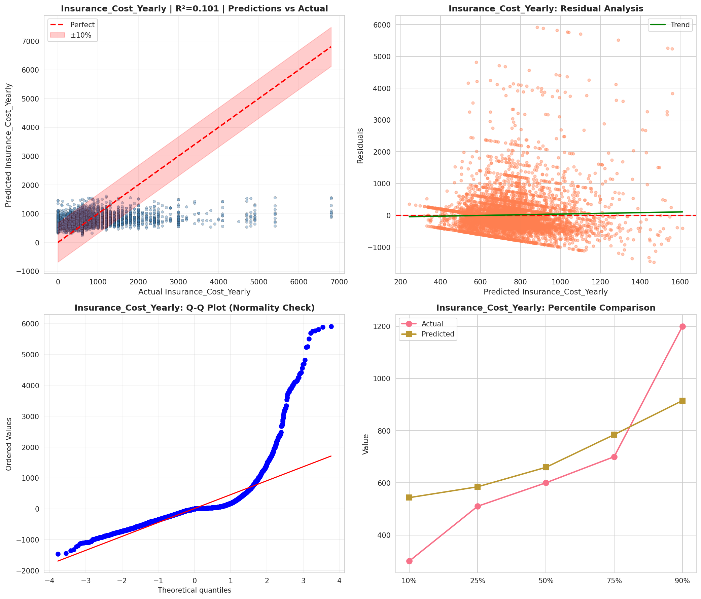
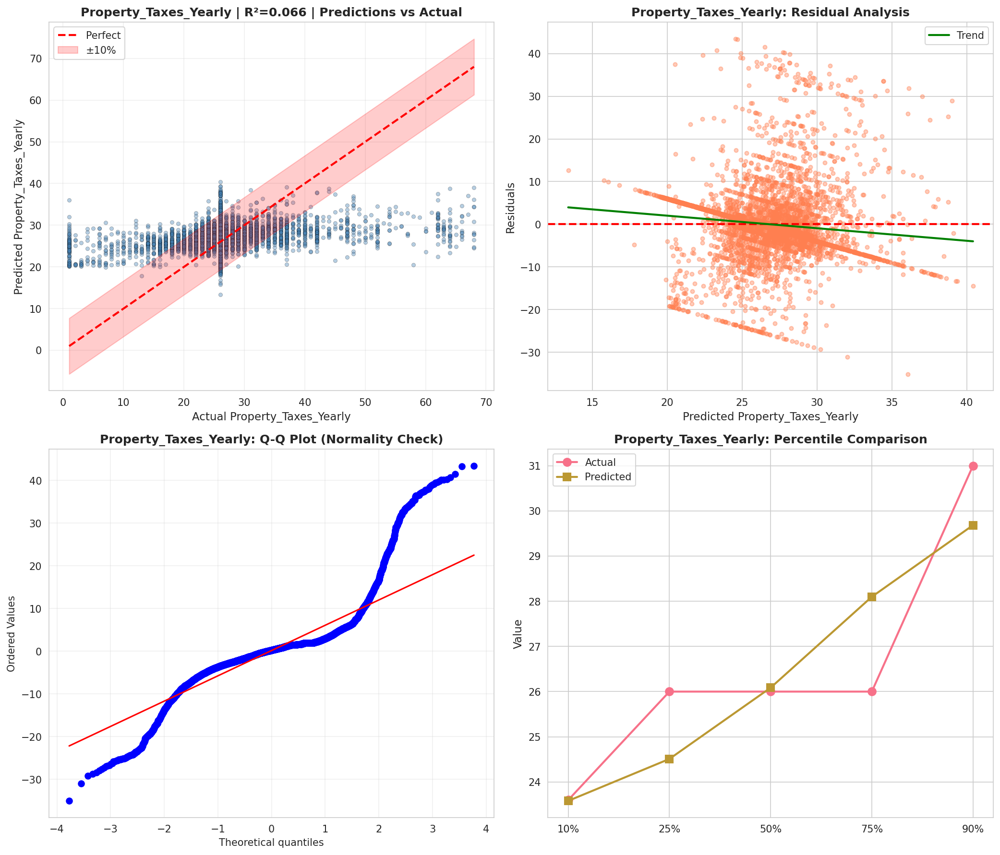
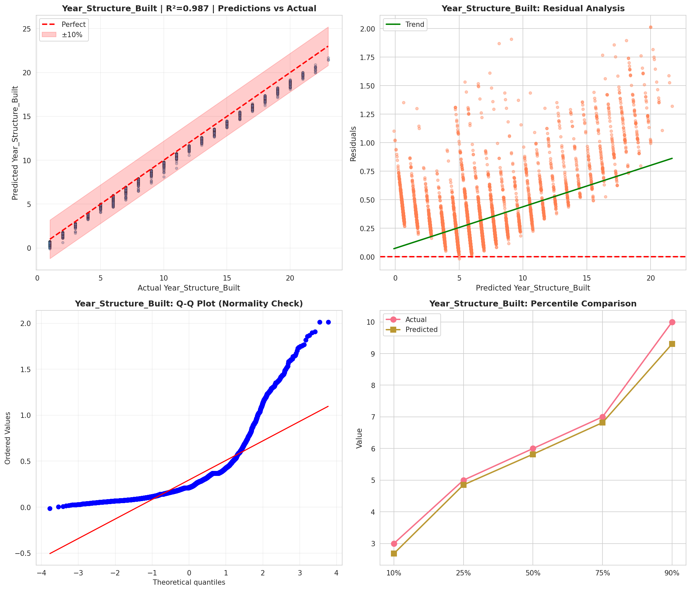
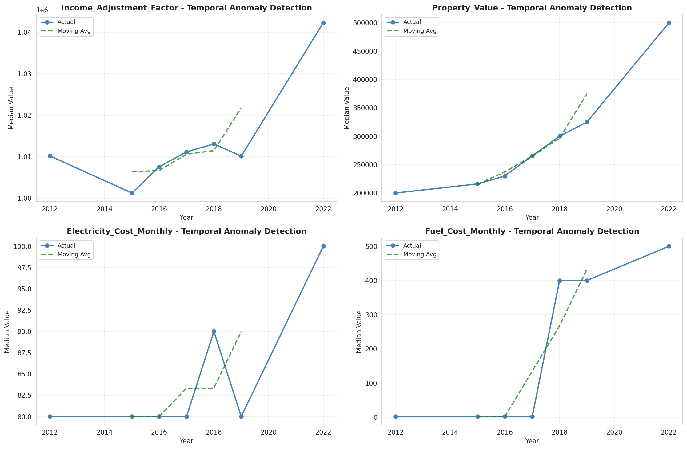
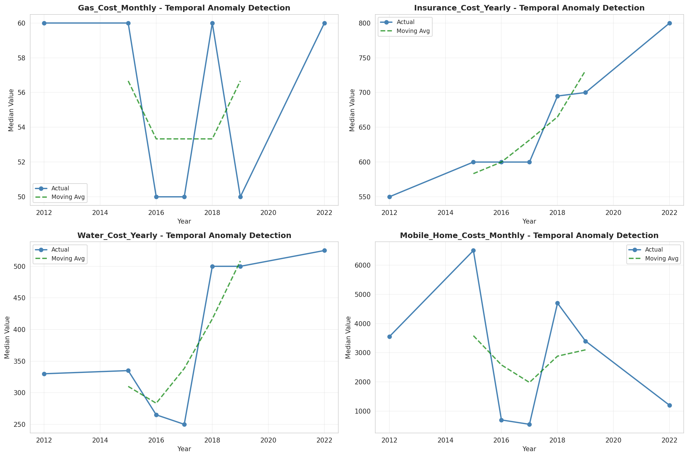
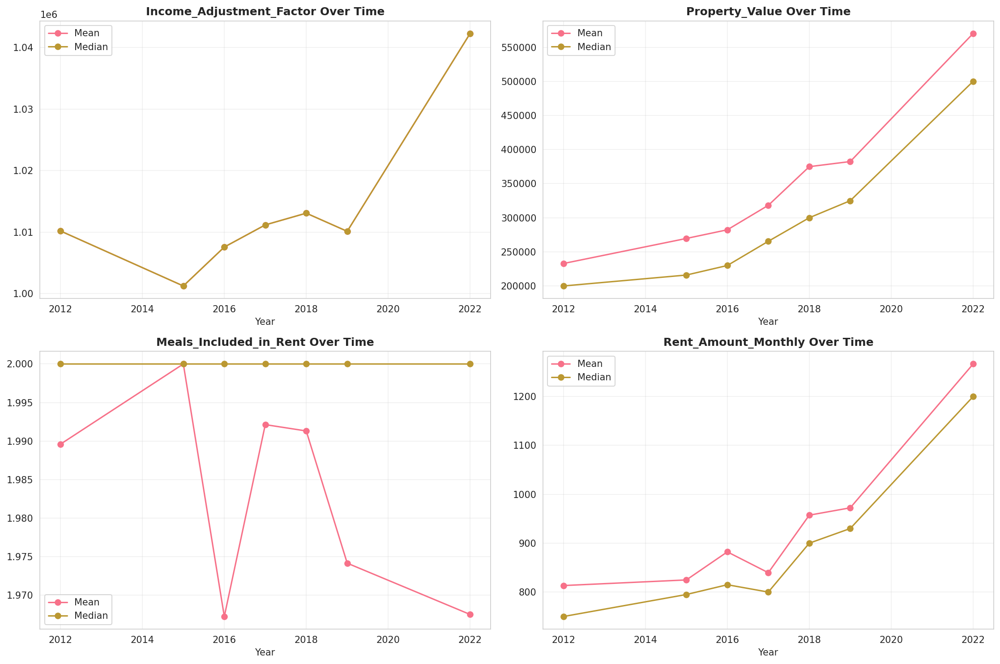
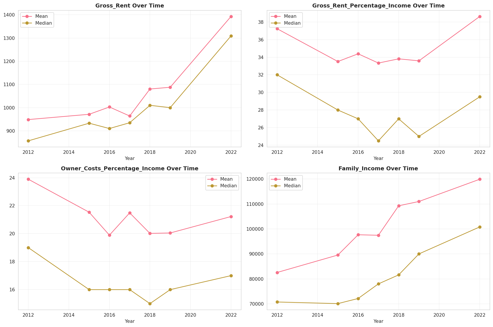
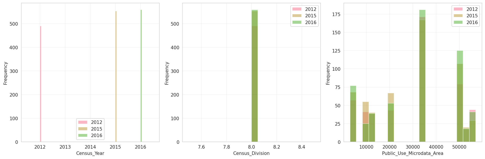
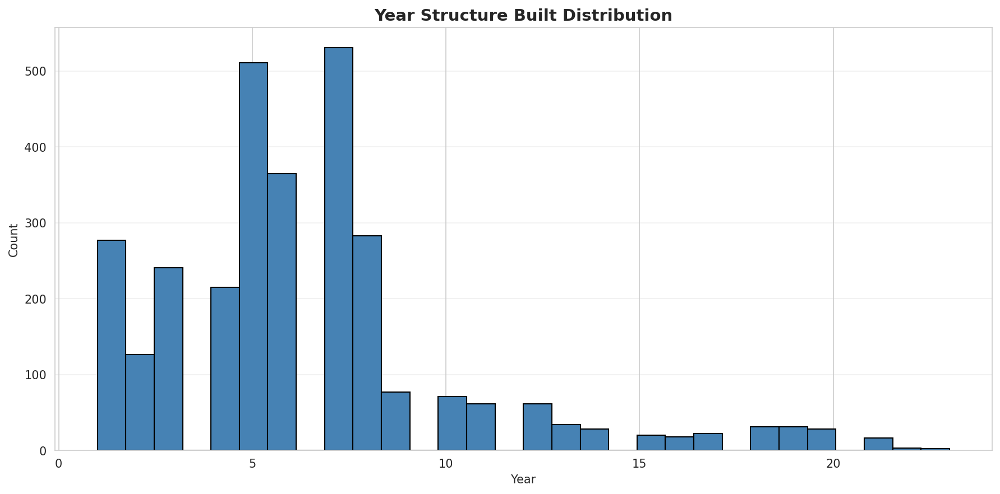
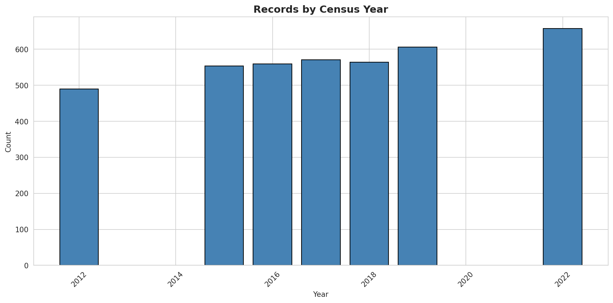
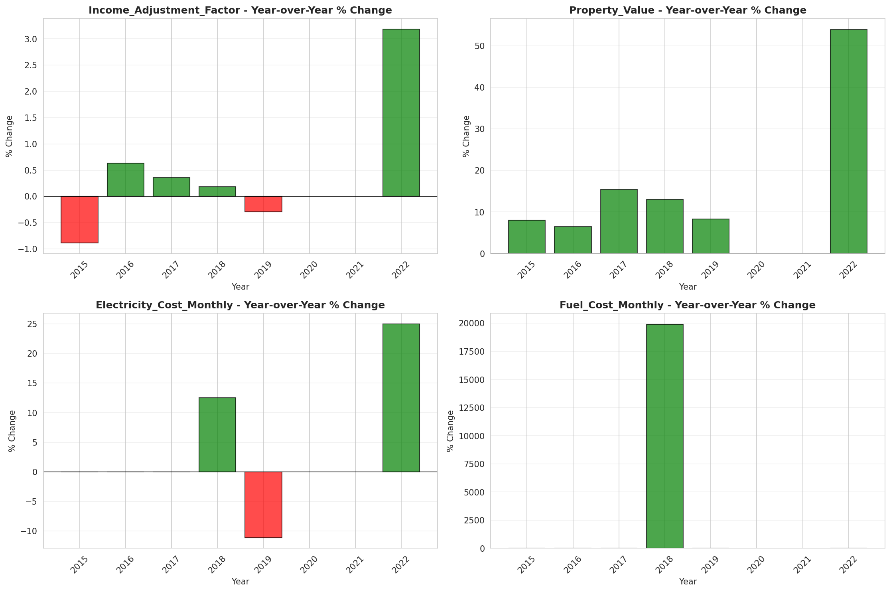
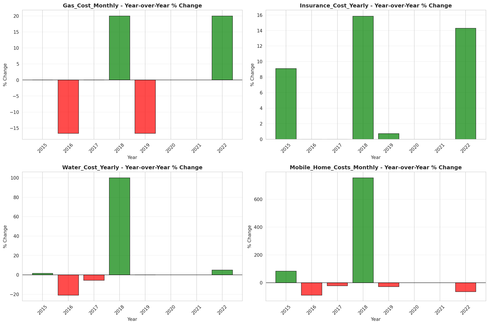
