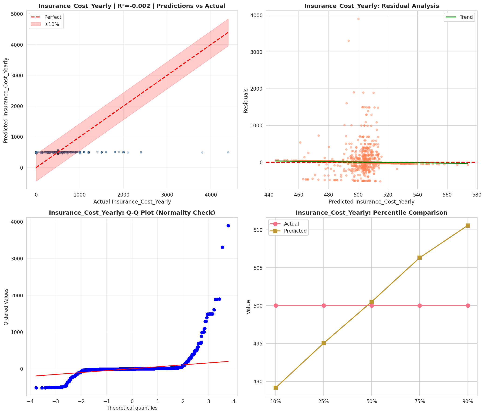
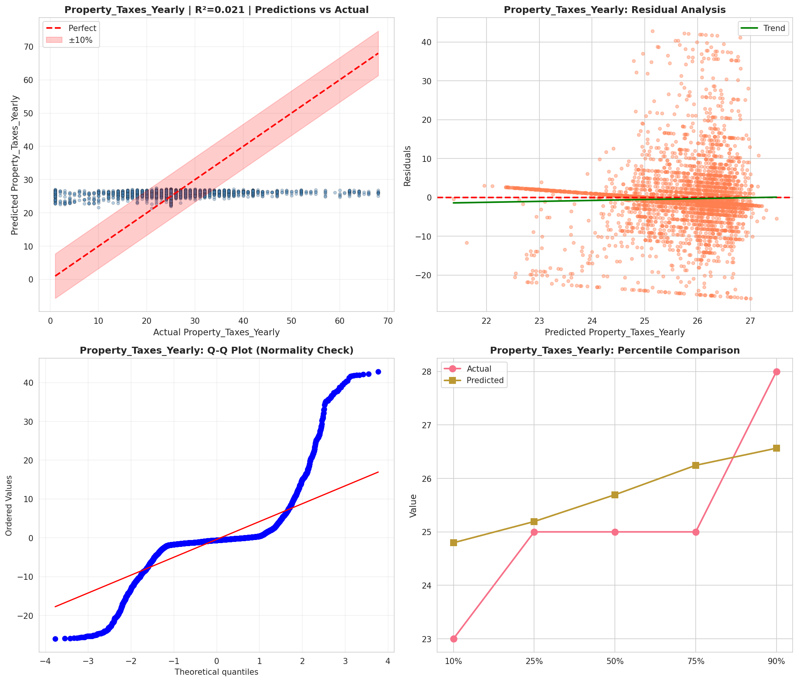
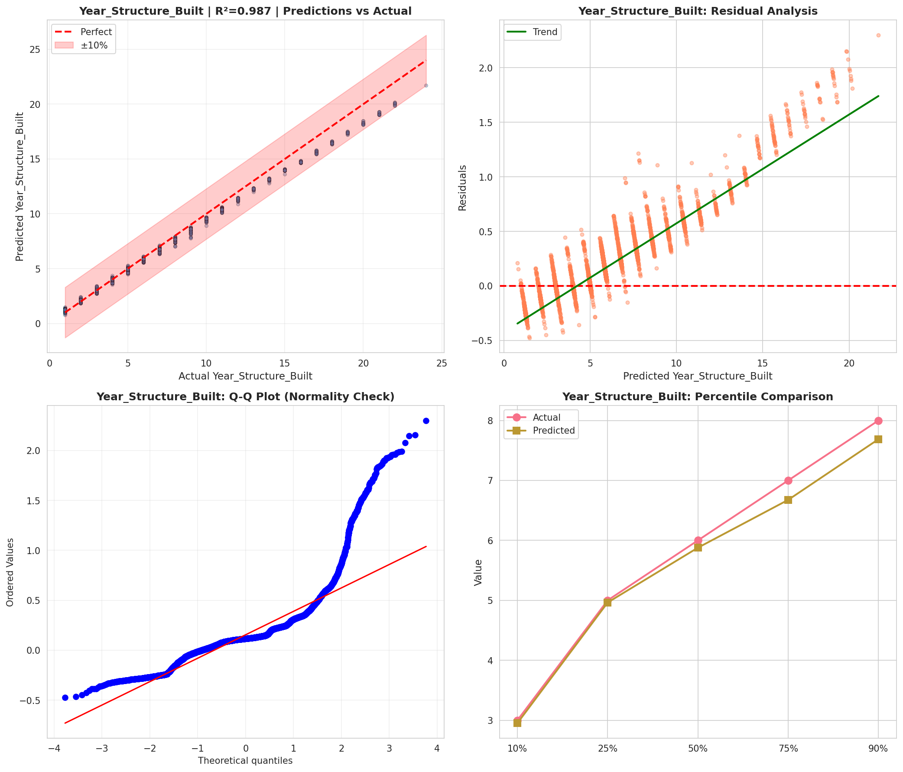
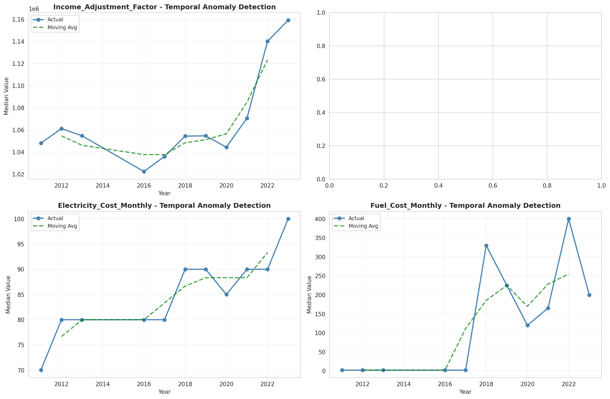
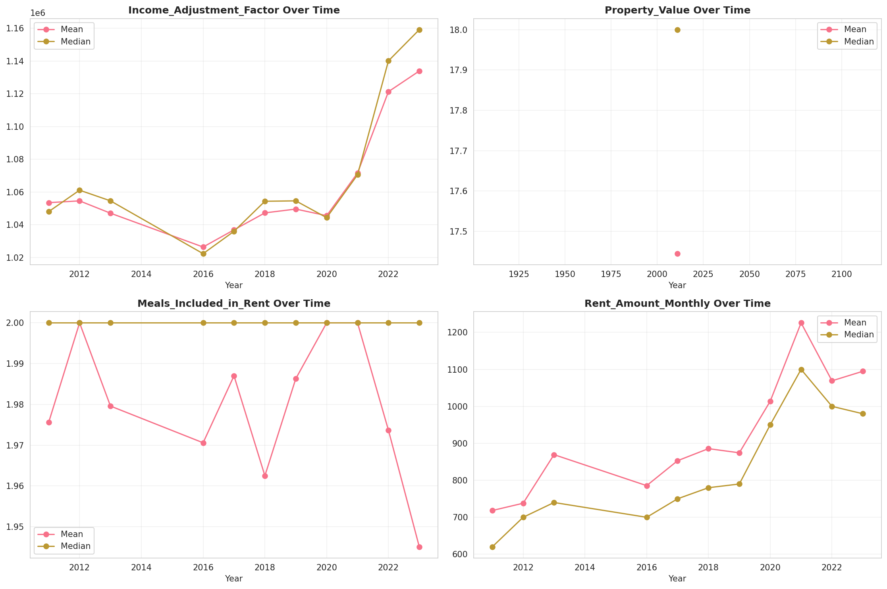
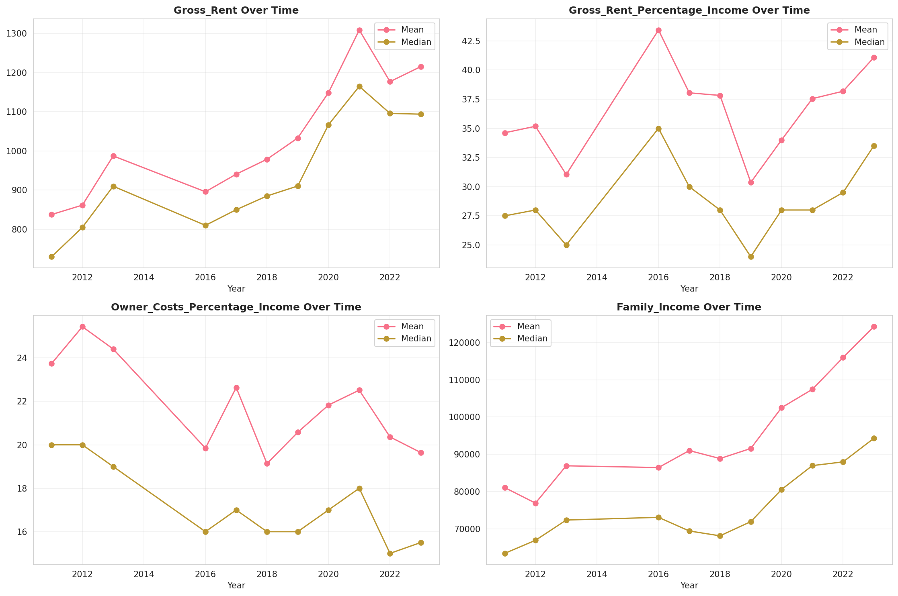
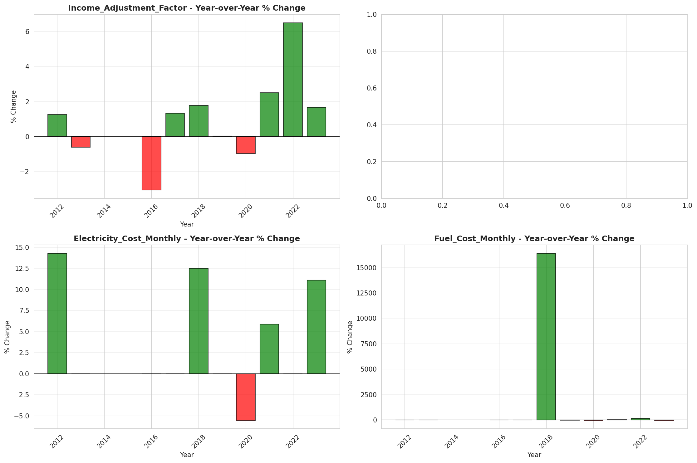
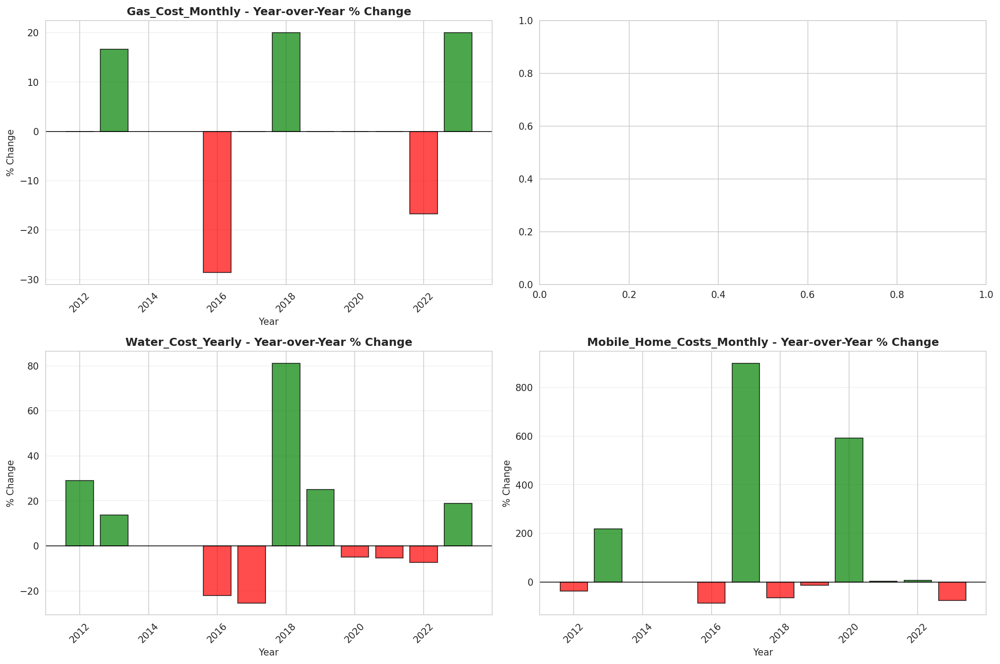

# Temporal Analysis

## Year Distribution

- 2011: 50,658 records

- 2012: 51,738 records

- 2013: 52,766 records

- 2016: 55,728 records

- 2017: 56,880 records

- 2018: 58,197 records

- 2019: 59,596 records

- 2020: 60,099 records

- 2021: 61,882 records

- 2022: 63,734 records

- 2023: 65,637 records

## Temporal Trends

- Census_Year: {np.int64(2011): {'mean': 2011.0, 'median': 2011.0, 'std': 0.0}, np.int64(2012): {'mean': 2012.0, 'median': 2012.0, 'std': 0.0}, np.int64(2013): {'mean': 2013.0, 'median': 2013.0, 'std': 0.0}, np.int64(2016): {'mean': 2016.0, 'median': 2016.0, 'std': 0.0}, np.int64(2017): {'mean': 2017.0, 'median': 2017.0, 'std': 0.0}, np.int64(2018): {'mean': 2018.0, 'median': 2018.0, 'std': 0.0}, np.int64(2019): {'mean': 2019.0, 'median': 2019.0, 'std': 0.0}, np.int64(2020): {'mean': 2020.0, 'median': 2020.0, 'std': 0.0}, np.int64(2021): {'mean': 2021.0, 'median': 2021.0, 'std': 0.0}, np.int64(2022): {'mean': 2022.0, 'median': 2022.0, 'std': 0.0}, np.int64(2023): {'mean': 2023.0, 'median': 2023.0, 'std': 0.0}}

- Census_Division: {np.int64(2011): {'mean': 8.0, 'median': 8.0, 'std': 0.0}, np.int64(2012): {'mean': 8.0, 'median': 8.0, 'std': 0.0}, np.int64(2013): {'mean': 8.0, 'median': 8.0, 'std': 0.0}, np.int64(2016): {'mean': 8.0, 'median': 8.0, 'std': 0.0}, np.int64(2017): {'mean': 8.0, 'median': 8.0, 'std': 0.0}, np.int64(2018): {'mean': 8.0, 'median': 8.0, 'std': 0.0}, np.int64(2019): {'mean': 8.0, 'median': 8.0, 'std': 0.0}, np.int64(2020): {'mean': 8.0, 'median': 8.0, 'std': 0.0}, np.int64(2021): {'mean': 8.0, 'median': 8.0, 'std': 0.0}, np.int64(2022): {'mean': 8.0, 'median': 8.0, 'std': 0.0}, np.int64(2023): {'mean': 8.0, 'median': 8.0, 'std': 0.0}}

- Public_Use_Microdata_Area: {np.int64(2011): {'mean': 452.09643096845514, 'median': 503.0, 'std': 180.77413704992998}, np.int64(2012): {'mean': None, 'median': None, 'std': None}, np.int64(2013): {'mean': None, 'median': None, 'std': None}, np.int64(2016): {'mean': 31036.93324720069, 'median': 35004.0, 'std': 17230.045387578783}, np.int64(2017): {'mean': 31138.413168073137, 'median': 35004.0, 'std': 17256.573002419973}, np.int64(2018): {'mean': 31242.075948932077, 'median': 35004.0, 'std': 17287.964819337467}, np.int64(2019): {'mean': 31391.53552251829, 'median': 35004.0, 'std': 17290.015443437158}, np.int64(2020): {'mean': 31445.78849897669, 'median': 35004.0, 'std': 17294.98006814205}, np.int64(2021): {'mean': 31576.33594583239, 'median': 35004.0, 'std': 17284.64121846946}, np.int64(2022): {'mean': None, 'median': None, 'std': None}, np.int64(2023): {'mean': 31717.224050459343, 'median': 35012.0, 'std': 17296.850342131795}}

- Census_Region: {np.int64(2011): {'mean': 4.0, 'median': 4.0, 'std': 0.0}, np.int64(2012): {'mean': 4.0, 'median': 4.0, 'std': 0.0}, np.int64(2013): {'mean': 4.0, 'median': 4.0, 'std': 0.0}, np.int64(2016): {'mean': 4.0, 'median': 4.0, 'std': 0.0}, np.int64(2017): {'mean': 4.0, 'median': 4.0, 'std': 0.0}, np.int64(2018): {'mean': 4.0, 'median': 4.0, 'std': 0.0}, np.int64(2019): {'mean': 4.0, 'median': 4.0, 'std': 0.0}, np.int64(2020): {'mean': 4.0, 'median': 4.0, 'std': 0.0}, np.int64(2021): {'mean': 4.0, 'median': 4.0, 'std': 0.0}, np.int64(2022): {'mean': 4.0, 'median': 4.0, 'std': 0.0}, np.int64(2023): {'mean': 4.0, 'median': 4.0, 'std': 0.0}}

- State_Code: {np.int64(2011): {'mean': 49.0, 'median': 49.0, 'std': 0.0}, np.int64(2012): {'mean': 49.0, 'median': 49.0, 'std': 0.0}, np.int64(2013): {'mean': 49.0, 'median': 49.0, 'std': 0.0}, np.int64(2016): {'mean': 49.0, 'median': 49.0, 'std': 0.0}, np.int64(2017): {'mean': 49.0, 'median': 49.0, 'std': 0.0}, np.int64(2018): {'mean': 49.0, 'median': 49.0, 'std': 0.0}, np.int64(2019): {'mean': 49.0, 'median': 49.0, 'std': 0.0}, np.int64(2020): {'mean': 49.0, 'median': 49.0, 'std': 0.0}, np.int64(2021): {'mean': 49.0, 'median': 49.0, 'std': 0.0}, np.int64(2022): {'mean': 49.0, 'median': 49.0, 'std': 0.0}, np.int64(2023): {'mean': None, 'median': None, 'std': None}}

- Housing_Adjustment_Factor: {np.int64(2011): {'mean': 1040895.1067156224, 'median': 1044592.0, 'std': 27511.016438745926}, np.int64(2012): {'mean': 1041200.4730758823, 'median': 1053092.0, 'std': 27473.067058226516}, np.int64(2013): {'mean': 1039883.6803434029, 'median': 1035725.0, 'std': 32016.757895541155}, np.int64(2016): {'mean': 1020050.9090044502, 'median': 1013801.0, 'std': 15726.394603906792}, np.int64(2017): {'mean': 1028782.1218530239, 'median': 1034680.0, 'std': 18032.175987244984}, np.int64(2018): {'mean': 1037690.8348368473, 'median': 1046406.0, 'std': 23589.996109800744}, np.int64(2019): {'mean': 1040198.2468286462, 'median': 1042936.0, 'std': 29188.590225334432}, np.int64(2020): {'mean': 1035103.6091615501, 'median': 1030827.0, 'std': 28390.99636171863}, np.int64(2021): {'mean': 1056912.8263469182, 'median': 1059761.0, 'std': 35601.49915964391}, np.int64(2022): {'mean': 1103238.4199171558, 'median': 1133141.0, 'std': 61666.41986529899}, np.int64(2023): {'mean': 1103939.5249021132, 'median': 1125501.0, 'std': 76716.29462634916}}

- Income_Adjustment_Factor: {np.int64(2011): {'mean': 1053511.6626791426, 'median': 1048026.0, 'std': 28289.27731224941}, np.int64(2012): {'mean': 1052453.5664501914, 'median': 1061121.0, 'std': 26382.259502233577}, np.int64(2013): {'mean': 1048911.3220255468, 'median': 1054614.0, 'std': 29664.00884457549}, np.int64(2016): {'mean': 1027164.822997416, 'median': 1022342.0, 'std': 17467.117449942692}, np.int64(2017): {'mean': 1036187.06592827, 'median': 1035988.0, 'std': 16857.062504614645}, np.int64(2018): {'mean': 1046328.4389917006, 'median': 1054346.0, 'std': 20577.177314098357}, np.int64(2019): {'mean': 1049216.313410296, 'median': 1054606.0, 'std': 26272.83100327607}, np.int64(2020): {'mean': 1045117.5932378243, 'median': 1044328.0, 'std': 29026.089738140166}, np.int64(2021): {'mean': 1071947.6503668271, 'median': 1070512.0, 'std': 30667.410102408892}, np.int64(2022): {'mean': 1125679.504361879, 'median': 1140108.0, 'std': 49631.52374960023}, np.int64(2023): {'mean': 1127861.5396651279, 'median': 1159185.0, 'std': 70383.64043915563}}

- Housing_Unit_Weight: {np.int64(2011): {'mean': 19.12473844210194, 'median': 16.0, 'std': 15.020332061084048}, np.int64(2012): {'mean': 18.938652441145774, 'median': 16.0, 'std': 15.376881519943893}, np.int64(2013): {'mean': 18.734999810484023, 'median': 15.0, 'std': 15.696853087820145}, np.int64(2016): {'mean': 18.37580749354005, 'median': 15.0, 'std': 16.109047117335248}, np.int64(2017): {'mean': 18.400087904360056, 'median': 15.0, 'std': 16.093957169282433}, np.int64(2018): {'mean': 18.319346358059693, 'median': 15.0, 'std': 16.09601361213172}, np.int64(2019): {'mean': 18.24135848043493, 'median': 15.0, 'std': 16.522273570756962}, np.int64(2020): {'mean': 18.475665152498376, 'median': 14.0, 'std': 19.486866875831712}, np.int64(2021): {'mean': 18.318056947092852, 'median': 14.0, 'std': 19.47583103303888}, np.int64(2022): {'mean': 18.24228826058305, 'median': 14.0, 'std': 19.489964107290202}, np.int64(2023): {'mean': 18.17697335344394, 'median': 13.0, 'std': 19.723037454570054}}

- Number_of_Persons: {np.int64(2011): {'mean': 2.691973627067788, 'median': 2.0, 'std': 1.8389977692764437}, np.int64(2012): {'mean': 2.672271831149252, 'median': 2.0, 'std': 1.848678703699805}, np.int64(2013): {'mean': 2.661164386157753, 'median': 2.0, 'std': 1.8619205130643637}, np.int64(2016): {'mean': 2.60102641401091, 'median': 2.0, 'std': 1.8677122204398373}, np.int64(2017): {'mean': 2.5959036568213785, 'median': 2.0, 'std': 1.868140690532057}, np.int64(2018): {'mean': 2.5824527037476157, 'median': 2.0, 'std': 1.863630446046106}, np.int64(2019): {'mean': 2.583998926102423, 'median': 2.0, 'std': 1.8605756582162458}, np.int64(2020): {'mean': 2.575899765387111, 'median': 2.0, 'std': 1.859102917098554}, np.int64(2021): {'mean': 2.5647522704502115, 'median': 2.0, 'std': 1.8492194148026722}, np.int64(2022): {'mean': 2.562917751906361, 'median': 2.0, 'std': 1.839952054001891}, np.int64(2023): {'mean': 2.5602327955269133, 'median': 2.0, 'std': 1.824508293868746}}

- Housing_Unit_Type: {np.int64(2011): {'mean': 1.0740060799873663, 'median': 1.0, 'std': 0.3326514561179995}, np.int64(2012): {'mean': 1.0837682167845684, 'median': 1.0, 'std': 0.3556199621808517}, np.int64(2013): {'mean': 1.0949664556722132, 'median': 1.0, 'std': 0.380544655247053}, np.int64(2016): {'mean': 1.1251076658053403, 'median': 1.0, 'std': 0.44314947275308925}, np.int64(2017): {'mean': 1.1329289732770746, 'median': 1.0, 'std': 0.4599680399917133}, np.int64(2018): {'mean': 1.1403336941766757, 'median': 1.0, 'std': 0.4749714607308701}, np.int64(2019): {'mean': 1.147157527350829, 'median': 1.0, 'std': 0.48839933660018087}, np.int64(2020): {'mean': None, 'median': None, 'std': None}, np.int64(2021): {'mean': None, 'median': None, 'std': None}, np.int64(2022): {'mean': None, 'median': None, 'std': None}, np.int64(2023): {'mean': None, 'median': None, 'std': None}}

- Number_of_Bedrooms: {np.int64(2011): {'mean': 3.2801400700350176, 'median': 3.0, 'std': 1.2031998111231554}, np.int64(2012): {'mean': None, 'median': None, 'std': None}, np.int64(2013): {'mean': None, 'median': None, 'std': None}, np.int64(2016): {'mean': None, 'median': None, 'std': None}, np.int64(2017): {'mean': None, 'median': None, 'std': None}, np.int64(2018): {'mean': None, 'median': None, 'std': None}, np.int64(2019): {'mean': None, 'median': None, 'std': None}, np.int64(2020): {'mean': None, 'median': None, 'std': None}, np.int64(2021): {'mean': None, 'median': None, 'std': None}, np.int64(2022): {'mean': None, 'median': None, 'std': None}, np.int64(2023): {'mean': None, 'median': None, 'std': None}}

- Number_of_Rooms: {np.int64(2011): {'mean': 6.4734033683508425, 'median': 7.0, 'std': 2.0586403922686167}, np.int64(2012): {'mean': None, 'median': None, 'std': None}, np.int64(2013): {'mean': None, 'median': None, 'std': None}, np.int64(2016): {'mean': None, 'median': None, 'std': None}, np.int64(2017): {'mean': None, 'median': None, 'std': None}, np.int64(2018): {'mean': None, 'median': None, 'std': None}, np.int64(2019): {'mean': None, 'median': None, 'std': None}, np.int64(2020): {'mean': None, 'median': None, 'std': None}, np.int64(2021): {'mean': None, 'median': None, 'std': None}, np.int64(2022): {'mean': None, 'median': None, 'std': None}, np.int64(2023): {'mean': None, 'median': None, 'std': None}}

- Building_Type: {np.int64(2011): {'mean': 2.7100425212606303, 'median': 2.0, 'std': 1.752701489701306}, np.int64(2012): {'mean': 2.712795235161224, 'median': 2.0, 'std': 1.7571192281271428}, np.int64(2013): {'mean': 2.7150158189340474, 'median': 2.0, 'std': 1.7542406502364922}, np.int64(2016): {'mean': 2.72423697682598, 'median': 2.0, 'std': 1.7718466906354704}, np.int64(2017): {'mean': 2.740039955434323, 'median': 2.0, 'std': 1.7915078479177777}, np.int64(2018): {'mean': 2.7586089970612613, 'median': 2.0, 'std': 1.8155057646083808}, np.int64(2019): {'mean': 2.7767649555301324, 'median': 2.0, 'std': 1.838873856364358}, np.int64(2020): {'mean': 2.781231068602794, 'median': 2.0, 'std': 1.8457753571867135}, np.int64(2021): {'mean': 2.797789837551269, 'median': 2.0, 'std': 1.8663862046750384}, np.int64(2022): {'mean': 2.8007472849809685, 'median': 2.0, 'std': 1.8722590090612006}, np.int64(2023): {'mean': 2.801354363398159, 'median': 2.0, 'std': 1.8713370818328041}}

- Year_Structure_Built: {np.int64(2011): {'mean': 4.575412706353177, 'median': 4.0, 'std': 2.3043613941117154}, np.int64(2012): {'mean': 5.620702402957487, 'median': 6.0, 'std': 2.6186762651899045}, np.int64(2013): {'mean': 5.703334144560721, 'median': 6.0, 'std': 2.72565144765728}, np.int64(2016): {'mean': 6.021903943100551, 'median': 6.0, 'std': 3.190582398861017}, np.int64(2017): {'mean': 6.17964577970725, 'median': 6.0, 'std': 3.441368524408046}, np.int64(2018): {'mean': 6.393376535302539, 'median': 6.0, 'std': 3.7664908736022475}, np.int64(2019): {'mean': 6.621157323688969, 'median': 6.0, 'std': 4.104800822484937}, np.int64(2020): {'mean': 6.857085161456134, 'median': 6.0, 'std': 4.450492191403078}, np.int64(2021): {'mean': None, 'median': None, 'std': None}, np.int64(2022): {'mean': None, 'median': None, 'std': None}, np.int64(2023): {'mean': None, 'median': None, 'std': None}}

- Bathtub_or_Shower: {np.int64(2011): {'mean': None, 'median': None, 'std': None}, np.int64(2012): {'mean': 1.0076196344218524, 'median': 1.0, 'std': 0.08695821350914151}, np.int64(2013): {'mean': 1.0076660988074957, 'median': 1.0, 'std': 0.08722089211624688}, np.int64(2016): {'mean': 1.0071710500605728, 'median': 1.0, 'std': 0.08437870121833634}, np.int64(2017): {'mean': 1.0070882477236929, 'median': 1.0, 'std': 0.0838936211278451}, np.int64(2018): {'mean': 1.0075163891191319, 'median': 1.0, 'std': 0.08637148572509692}, np.int64(2019): {'mean': 1.0067719673764624, 'median': 1.0, 'std': 0.08201360831151419}, np.int64(2020): {'mean': 1.0062599820094358, 'median': 1.0, 'std': 0.07887273823299569}, np.int64(2021): {'mean': 1.0059642147117296, 'median': 1.0, 'std': 0.07699837038396305}, np.int64(2022): {'mean': 1.0055173377099555, 'median': 1.0, 'std': 0.07407423639196022}, np.int64(2023): {'mean': 1.004781106970888, 'median': 1.0, 'std': 0.06898064183637777}}

- Refrigerator: {np.int64(2011): {'mean': None, 'median': None, 'std': None}, np.int64(2012): {'mean': 1.0108030396385295, 'median': 1.0, 'std': 0.10337578756450544}, np.int64(2013): {'mean': 1.011154376571753, 'median': 1.0, 'std': 0.10502466450626849}, np.int64(2016): {'mean': 1.0110594396029544, 'median': 1.0, 'std': 0.1045817484574403}, np.int64(2017): {'mean': 1.0111222098428676, 'median': 1.0, 'std': 0.10487477088996149}, np.int64(2018): {'mean': 1.011189812372843, 'median': 1.0, 'std': 0.10518939543283716}, np.int64(2019): {'mean': 1.0103516994501236, 'median': 1.0, 'std': 0.10121625762059282}, np.int64(2020): {'mean': 1.0096745176509463, 'median': 1.0, 'std': 0.09788307946858839}, np.int64(2021): {'mean': 1.0089552773449393, 'median': 1.0, 'std': 0.09420848854043778}, np.int64(2022): {'mean': 1.0082236267765479, 'median': 1.0, 'std': 0.09031135667698072}, np.int64(2023): {'mean': 1.0069419631463428, 'median': 1.0, 'std': 0.08302945014209494}}

- Hot_and_Cold_Running_Water: {np.int64(2011): {'mean': None, 'median': None, 'std': None}, np.int64(2012): {'mean': 1.0103922776750873, 'median': 1.0, 'std': 0.10141247193351266}, np.int64(2013): {'mean': 1.0106067980855034, 'median': 1.0, 'std': 0.1024426998651395}, np.int64(2016): {'mean': 1.010570948454414, 'median': 1.0, 'std': 0.10227124657651701}, np.int64(2017): {'mean': 1.0102769987321834, 'median': 1.0, 'std': 0.10085423847595983}, np.int64(2018): {'mean': 1.0106435084017784, 'median': 1.0, 'std': 0.10261784690537255}, np.int64(2019): {'mean': 1.0093552791821974, 'median': 1.0, 'std': 0.096270083346546}, np.int64(2020): {'mean': 1.008903493473831, 'median': 1.0, 'std': 0.09393818857811044}, np.int64(2021): {'mean': 1.0088119929074204, 'median': 1.0, 'std': 0.09345853694621117}, np.int64(2022): {'mean': 1.0082061668470859, 'median': 1.0, 'std': 0.09021622791142962}, np.int64(2023): {'mean': 1.0074524016129855, 'median': 1.0, 'std': 0.08600575085487855}}

- Running_Water: {np.int64(2011): {'mean': None, 'median': None, 'std': None}, np.int64(2012): {'mean': None, 'median': None, 'std': None}, np.int64(2013): {'mean': 9.0, 'median': 9.0, 'std': 0.0}, np.int64(2016): {'mean': 9.0, 'median': 9.0, 'std': 0.0}, np.int64(2017): {'mean': 9.0, 'median': 9.0, 'std': 0.0}, np.int64(2018): {'mean': 9.0, 'median': 9.0, 'std': 0.0}, np.int64(2019): {'mean': 9.0, 'median': 9.0, 'std': 0.0}, np.int64(2020): {'mean': 9.0, 'median': 9.0, 'std': 0.0}, np.int64(2021): {'mean': 9.0, 'median': 9.0, 'std': 0.0}, np.int64(2022): {'mean': 9.0, 'median': 9.0, 'std': 0.0}, np.int64(2023): {'mean': 9.0, 'median': 9.0, 'std': 0.0}}

- Sink_with_Faucet: {np.int64(2011): {'mean': None, 'median': None, 'std': None}, np.int64(2012): {'mean': 1.0071677962620662, 'median': 1.0, 'std': 0.08435973636471819}, np.int64(2013): {'mean': 1.007118520321246, 'median': 1.0, 'std': 0.08407134073728888}, np.int64(2016): {'mean': 1.0062917659932002, 'median': 1.0, 'std': 0.07907149828889878}, np.int64(2017): {'mean': 1.0062430366130086, 'median': 1.0, 'std': 0.07876661910407852}, np.int64(2018): {'mean': 1.0066498379926154, 'median': 1.0, 'std': 0.08127571646381164}, np.int64(2019): {'mean': 1.0059969738347418, 'median': 1.0, 'std': 0.07720829058793038}, np.int64(2020): {'mean': 1.0056358195803425, 'median': 1.0, 'std': 0.07486093772851149}, np.int64(2021): {'mean': 1.0055164508444827, 'median': 1.0, 'std': 0.07406833246386203}, np.int64(2022): {'mean': 1.0052728986974893, 'median': 1.0, 'std': 0.07242366199942667}, np.int64(2023): {'mean': 1.0045939461997857, 'median': 1.0, 'std': 0.06762336626173814}}

- Stove_or_Range: {np.int64(2011): {'mean': None, 'median': None, 'std': None}, np.int64(2012): {'mean': 1.0109673444239065, 'median': 1.0, 'std': 0.10415029794863286}, np.int64(2013): {'mean': 1.0111340958870771, 'median': 1.0, 'std': 0.1049302201146703}, np.int64(2016): {'mean': 1.0115283911055533, 'median': 1.0, 'std': 0.10675069073410576}, np.int64(2017): {'mean': 1.0121403050443736, 'median': 1.0, 'std': 0.10951323398708433}, np.int64(2018): {'mean': 1.0130171049657146, 'median': 1.0, 'std': 0.11334858611238569}, np.int64(2019): {'mean': 1.012492157803447, 'median': 1.0, 'std': 0.1110690390237117}, np.int64(2020): {'mean': 1.012079378774806, 'median': 1.0, 'std': 0.1092414136601926}, np.int64(2021): {'mean': 1.0120717138609783, 'median': 1.0, 'std': 0.1092071480733548}, np.int64(2022): {'mean': 1.0114187938680728, 'median': 1.0, 'std': 0.10624783345023026}, np.int64(2023): {'mean': 1.010055637792864, 'median': 1.0, 'std': 0.09977319939086134}}

- Telephone_Service: {np.int64(2011): {'mean': 1.022946048802328, 'median': 1.0, 'std': 0.14973319455015266}, np.int64(2012): {'mean': 1.0207462455488465, 'median': 1.0, 'std': 0.14253521736974015}, np.int64(2013): {'mean': 1.022607665994211, 'median': 1.0, 'std': 0.14865074495036712}, np.int64(2016): {'mean': 1.0254910333048677, 'median': 1.0, 'std': 0.15761272435845392}, np.int64(2017): {'mean': 1.0228399731047235, 'median': 1.0, 'std': 0.14939470437067048}, np.int64(2018): {'mean': 1.0204944227954063, 'median': 1.0, 'std': 0.14168562148246935}, np.int64(2019): {'mean': 1.0172618687936834, 'median': 1.0, 'std': 0.13024683634001413}, np.int64(2020): {'mean': 1.0132883696655828, 'median': 1.0, 'std': 0.11450786914575017}, np.int64(2021): {'mean': 1.0084435084435084, 'median': 1.0, 'std': 0.09150070420616495}, np.int64(2022): {'mean': 1.0065637649907313, 'median': 1.0, 'std': 0.08075150355130303}, np.int64(2023): {'mean': 1.0053511215364317, 'median': 1.0, 'std': 0.07295604550093474}}

- Lot_Acreage: {np.int64(2011): {'mean': 1.1485516216885368, 'median': 1.0, 'std': 0.4003232949697069}, np.int64(2012): {'mean': 1.1534688498987287, 'median': 1.0, 'std': 0.40543414531269906}, np.int64(2013): {'mean': 1.1554810383093699, 'median': 1.0, 'std': 0.4080244033532589}, np.int64(2016): {'mean': 1.1613750464856825, 'median': 1.0, 'std': 0.41491421121660926}, np.int64(2017): {'mean': 1.1604296445584463, 'median': 1.0, 'std': 0.41448451191720775}, np.int64(2018): {'mean': 1.159089886123239, 'median': 1.0, 'std': 0.4135854228689051}, np.int64(2019): {'mean': 1.1566799920489432, 'median': 1.0, 'std': 0.40891082189349465}, np.int64(2020): {'mean': 1.1564023720623764, 'median': 1.0, 'std': 0.40849279612122924}, np.int64(2021): {'mean': 1.153230135045194, 'median': 1.0, 'std': 0.40387902845748236}, np.int64(2022): {'mean': 1.15067605692671, 'median': 1.0, 'std': 0.3992580796951364}, np.int64(2023): {'mean': 1.149460113467678, 'median': 1.0, 'std': 0.3962537110722978}}

- Agricultural_Sales: {np.int64(2011): {'mean': 1.3017400204708292, 'median': 1.0, 'std': 0.9739896600414862}, np.int64(2012): {'mean': 1.308208366219416, 'median': 1.0, 'std': 0.9969935595967989}, np.int64(2013): {'mean': 1.3128546272745059, 'median': 1.0, 'std': 1.0022231111768076}, np.int64(2016): {'mean': 1.3218070273284996, 'median': 1.0, 'std': 1.0404564639358662}, np.int64(2017): {'mean': 1.307990404133604, 'median': 1.0, 'std': 1.0085426931369073}, np.int64(2018): {'mean': 1.3021595900439238, 'median': 1.0, 'std': 0.9982718471096632}, np.int64(2019): {'mean': 1.3019140483929217, 'median': 1.0, 'std': 0.9965807274397376}, np.int64(2020): {'mean': 1.3006146059291395, 'median': 1.0, 'std': 0.9912907592800756}, np.int64(2021): {'mean': 1.3077199281867145, 'median': 1.0, 'std': 0.9999612169789457}, np.int64(2022): {'mean': 1.3097969991173875, 'median': 1.0, 'std': 1.0045189444565323}, np.int64(2023): {'mean': 1.2978905848053508, 'median': 1.0, 'std': 0.9821358087657125}}

- Business_On_Property: {np.int64(2011): {'mean': 1.977246843278039, 'median': 2.0, 'std': 0.1491174071444531}, np.int64(2012): {'mean': 1.9781839478757413, 'median': 2.0, 'std': 0.1460843344234574}, np.int64(2013): {'mean': 1.9786017562481906, 'median': 2.0, 'std': 0.14470958537564454}, np.int64(2016): {'mean': 3.422694310152473, 'median': 2.0, 'std': 2.84122971980481}, np.int64(2017): {'mean': 4.853884206669109, 'median': 2.0, 'std': 3.455004834629605}, np.int64(2018): {'mean': 6.263964531664941, 'median': 9.0, 'std': 3.425512828870104}, np.int64(2019): {'mean': 7.650838173907282, 'median': 9.0, 'std': 2.766892078215375}, np.int64(2020): {'mean': None, 'median': None, 'std': None}, np.int64(2021): {'mean': None, 'median': None, 'std': None}, np.int64(2022): {'mean': None, 'median': None, 'std': None}, np.int64(2023): {'mean': None, 'median': None, 'std': None}}

- Tenure: {np.int64(2011): {'mean': 1.6937765838370271, 'median': 1.0, 'std': 0.8516421039477068}, np.int64(2012): {'mean': 1.706522460354323, 'median': 1.0, 'std': 0.8530283720291585}, np.int64(2013): {'mean': 1.7198052802385755, 'median': 1.0, 'std': 0.8571866923384831}, np.int64(2016): {'mean': 1.7434244235695986, 'median': 1.0, 'std': 0.8572194233604926}, np.int64(2017): {'mean': 1.7473314842830727, 'median': 1.0, 'std': 0.8573125387566514}, np.int64(2018): {'mean': 1.7469536710583287, 'median': 1.0, 'std': 0.8539461148757065}, np.int64(2019): {'mean': 1.7453219731303, 'median': 1.0, 'std': 0.8524918512506955}, np.int64(2020): {'mean': 1.7422216869404632, 'median': 1.0, 'std': 0.8493482882054375}, np.int64(2021): {'mean': 1.7428142428142428, 'median': 1.0, 'std': 0.8475699258045092}, np.int64(2022): {'mean': 1.7389437445617222, 'median': 1.0, 'std': 0.8422558538060319}, np.int64(2023): {'mean': 1.7387663099252308, 'median': 1.0, 'std': 0.8387406483089389}}

- Vacancy_Status: {np.int64(2011): {'mean': 4.639443436176649, 'median': 5.0, 'std': 1.7744374639420273}, np.int64(2012): {'mean': 4.641645096347426, 'median': 5.0, 'std': 1.7917701026371982}, np.int64(2013): {'mean': 4.6549676025917925, 'median': 5.0, 'std': 1.7988990989392037}, np.int64(2016): {'mean': 4.774781005071461, 'median': 5.0, 'std': 1.7513762197542784}, np.int64(2017): {'mean': 4.77295118674429, 'median': 5.0, 'std': 1.7564963410292043}, np.int64(2018): {'mean': 4.7717652192886755, 'median': 5.0, 'std': 1.7510529612263714}, np.int64(2019): {'mean': 4.753243897074994, 'median': 5.0, 'std': 1.7808397335906376}, np.int64(2020): {'mean': 4.721160042964554, 'median': 5.0, 'std': 1.7915708750166686}, np.int64(2021): {'mean': 4.719402329158426, 'median': 5.0, 'std': 1.8063792194523525}, np.int64(2022): {'mean': 4.7406987295825775, 'median': 5.0, 'std': 1.8049058683310688}, np.int64(2023): {'mean': 4.746967895362664, 'median': 5.0, 'std': 1.8258356949448595}}

- Property_Value: {np.int64(2011): {'mean': 17.21127727103766, 'median': 18.0, 'std': 3.8052869916126975}}

- Vehicles_Available: {np.int64(2011): {'mean': 2.140608909782852, 'median': 2.0, 'std': 1.1216681983922674}, np.int64(2012): {'mean': 2.1322407272244708, 'median': 2.0, 'std': 1.1220558779959378}, np.int64(2013): {'mean': 2.1223357600210506, 'median': 2.0, 'std': 1.1129498186121545}, np.int64(2016): {'mean': 2.1488471391972674, 'median': 2.0, 'std': 1.120661228456075}, np.int64(2017): {'mean': 2.1695873256009413, 'median': 2.0, 'std': 1.1266974655980198}, np.int64(2018): {'mean': 2.196325848951568, 'median': 2.0, 'std': 1.1411929484958123}, np.int64(2019): {'mean': 2.2225109271456485, 'median': 2.0, 'std': 1.1556094943991848}, np.int64(2020): {'mean': 2.248745433377494, 'median': 2.0, 'std': 1.1688761634272429}, np.int64(2021): {'mean': 2.261865761865762, 'median': 2.0, 'std': 1.1796424959464304}, np.int64(2022): {'mean': 2.274675594900314, 'median': 2.0, 'std': 1.1900660391173912}, np.int64(2023): {'mean': 2.2808972291452867, 'median': 2.0, 'std': 1.198318374380477}}

- Condo_Fee_Monthly: {np.int64(2011): {'mean': 160.80553077609278, 'median': 140.0, 'std': 109.5489702845913}, np.int64(2012): {'mean': 166.40830755634113, 'median': 140.0, 'std': 112.90977972312916}, np.int64(2013): {'mean': 172.6990380210719, 'median': 150.0, 'std': 114.85028964731183}, np.int64(2016): {'mean': 195.24973656480506, 'median': 160.0, 'std': 127.84534431771657}, np.int64(2017): {'mean': 205.22210300429185, 'median': 170.0, 'std': 134.32858034801293}, np.int64(2018): {'mean': 211.02845318158302, 'median': 180.0, 'std': 136.51349942551886}, np.int64(2019): {'mean': 215.43604938271605, 'median': 180.0, 'std': 134.9067017097485}, np.int64(2020): {'mean': 221.79980657640232, 'median': 190.0, 'std': 144.19650275856193}, np.int64(2021): {'mean': 225.61812297734627, 'median': 190.0, 'std': 142.6764395613757}, np.int64(2022): {'mean': 233.9100623330365, 'median': 200.0, 'std': 143.05992613029676}, np.int64(2023): {'mean': 248.3732424371538, 'median': 210.0, 'std': 170.4516554746832}}

- Electricity_Cost_Monthly: {np.int64(2011): {'mean': 87.5444817550929, 'median': 70.0, 'std': 63.266685996150564}, np.int64(2012): {'mean': 90.11569681286356, 'median': 80.0, 'std': 65.2831221933084}, np.int64(2013): {'mean': 93.42884396105605, 'median': 80.0, 'std': 68.08238115894211}, np.int64(2016): {'mean': 101.75305294619983, 'median': 90.0, 'std': 73.93909106633623}, np.int64(2017): {'mean': 102.99283493024038, 'median': 90.0, 'std': 75.68611542590301}, np.int64(2018): {'mean': 107.43863807779334, 'median': 90.0, 'std': 75.01507427195577}, np.int64(2019): {'mean': 107.04729815103398, 'median': 90.0, 'std': 75.79295292113969}, np.int64(2020): {'mean': 108.43292222501887, 'median': 90.0, 'std': 80.22638034007493}, np.int64(2021): {'mean': 109.44757398380617, 'median': 90.0, 'std': 83.20039783594589}, np.int64(2022): {'mean': 114.77465791346991, 'median': 90.0, 'std': 123.21265458072877}, np.int64(2023): {'mean': 121.11434591074507, 'median': 90.0, 'std': 148.9676251936549}}

- Fuel_Cost_Monthly: {np.int64(2011): {'mean': 50.45133199014999, 'median': 2.0, 'std': 241.89945419079237}, np.int64(2012): {'mean': 51.612898944993695, 'median': 2.0, 'std': 245.24693778281133}, np.int64(2013): {'mean': 45.423910183317254, 'median': 2.0, 'std': 230.12599700294194}, np.int64(2016): {'mean': 32.63061485909479, 'median': 2.0, 'std': 182.9841005211606}, np.int64(2017): {'mean': 28.32776517061691, 'median': 2.0, 'std': 168.52587007544653}, np.int64(2018): {'mean': 497.40555555555557, 'median': 300.0, 'std': 534.2295694168472}, np.int64(2019): {'mean': 498.93700787401576, 'median': 300.0, 'std': 543.1330964191563}, np.int64(2020): {'mean': 501.0916632102862, 'median': 300.0, 'std': 567.1321224295663}, np.int64(2021): {'mean': 511.596753524135, 'median': 300.0, 'std': 581.2686255945416}, np.int64(2022): {'mean': 526.2477650063857, 'median': 320.0, 'std': 609.6177523692476}, np.int64(2023): {'mean': 568.4128919860627, 'median': 395.0, 'std': 660.82198782912}}

- Gas_Cost_Monthly: {np.int64(2011): {'mean': 70.7621670024625, 'median': 60.0, 'std': 63.61596608291099}, np.int64(2012): {'mean': 69.6184283281357, 'median': 60.0, 'std': 62.908279156455464}, np.int64(2013): {'mean': 69.25844224190861, 'median': 60.0, 'std': 63.0708294076967}, np.int64(2016): {'mean': 66.85108881298036, 'median': 50.0, 'std': 61.19287536608584}, np.int64(2017): {'mean': 66.02947974449488, 'median': 50.0, 'std': 60.821608045935506}, np.int64(2018): {'mean': 73.80933484504914, 'median': 60.0, 'std': 58.78673101756409}, np.int64(2019): {'mean': 72.1872733572006, 'median': 60.0, 'std': 58.14302768834348}, np.int64(2020): {'mean': 72.715928430155, 'median': 60.0, 'std': 62.537052543096685}, np.int64(2021): {'mean': 72.90045633500358, 'median': 60.0, 'std': 64.69850078009488}, np.int64(2022): {'mean': 77.34727797426606, 'median': 60.0, 'std': 85.30006373168709}, np.int64(2023): {'mean': 85.86204428727793, 'median': 60.0, 'std': 108.32402398448181}}

- House_Heating_Fuel: {np.int64(2011): {'mean': 1.367450190284307, 'median': 1.0, 'std': 1.0200334149225496}, np.int64(2012): {'mean': 1.380001327051954, 'median': 1.0, 'std': 1.0380511287875864}, np.int64(2013): {'mean': 1.393890886764319, 'median': 1.0, 'std': 1.0572036203083908}, np.int64(2016): {'mean': 1.435930828351836, 'median': 1.0, 'std': 1.1280050557853216}, np.int64(2017): {'mean': 1.447449151117835, 'median': 1.0, 'std': 1.1460233643044586}, np.int64(2018): {'mean': 1.4581761200799983, 'median': 1.0, 'std': 1.1617300488423048}, np.int64(2019): {'mean': 1.4674199850947691, 'median': 1.0, 'std': 1.1642066424958022}, np.int64(2020): {'mean': 1.4656148380103577, 'median': 1.0, 'std': 1.1557859416576095}, np.int64(2021): {'mean': 1.4683709683709685, 'median': 1.0, 'std': 1.1386684921258983}, np.int64(2022): {'mean': 1.4692808232134076, 'median': 1.0, 'std': 1.1279667277614533}, np.int64(2023): {'mean': 1.471631725553438, 'median': 1.0, 'std': 1.116765692205884}}

- Insurance_Cost_Yearly: {np.int64(2013): {'mean': 642.9251632970451, 'median': 510.0, 'std': 490.08738953454423}}

- Water_Cost_Yearly: {np.int64(2011): {'mean': 397.86921871502125, 'median': 360.0, 'std': 405.0531095799893}, np.int64(2012): {'mean': 408.4704841527879, 'median': 360.0, 'std': 418.0447400847071}, np.int64(2013): {'mean': 417.32376545917026, 'median': 360.0, 'std': 434.3836253517254}, np.int64(2016): {'mean': 441.87926985482494, 'median': 350.0, 'std': 469.769517493401}, np.int64(2017): {'mean': 448.1759119179694, 'median': 330.0, 'std': 480.8384116728808}, np.int64(2018): {'mean': 568.8122123985316, 'median': 500.0, 'std': 487.07645081232886}, np.int64(2019): {'mean': 577.1768620037807, 'median': 500.0, 'std': 501.9610721262288}, np.int64(2020): {'mean': 590.7384253466139, 'median': 500.0, 'std': 525.5464817100542}, np.int64(2021): {'mean': 602.2416006588669, 'median': 510.0, 'std': 547.217893663097}, np.int64(2022): {'mean': 611.759731637431, 'median': 500.0, 'std': 569.9993663075612}, np.int64(2023): {'mean': 627.3255522200816, 'median': 530.0, 'std': 592.9840411492287}}

- Mobile_Home_Costs_Monthly: {np.int64(2011): {'mean': 2188.5885057471264, 'median': 1100.0, 'std': 2159.3048882286243}, np.int64(2012): {'mean': 2248.4794359576968, 'median': 1100.0, 'std': 2245.5519002974675}, np.int64(2013): {'mean': 2407.9258343634115, 'median': 1200.0, 'std': 2351.180351227357}, np.int64(2016): {'mean': 2726.0299727520437, 'median': 1300.0, 'std': 2726.9122695281944}, np.int64(2017): {'mean': 2755.6811989100815, 'median': 1100.0, 'std': 2858.8488341907505}, np.int64(2018): {'mean': 2830.5190217391305, 'median': 1100.0, 'std': 2968.736112974884}, np.int64(2019): {'mean': 2905.053475935829, 'median': 1100.0, 'std': 3104.874161386707}, np.int64(2020): {'mean': 3097.6497326203207, 'median': 1250.0, 'std': 3215.0540261719925}, np.int64(2021): {'mean': 3575.4311926605506, 'median': 1400.0, 'std': 5267.736009227327}, np.int64(2022): {'mean': 3927.2376111817025, 'median': 1800.0, 'std': 5788.241994991096}, np.int64(2023): {'mean': 4317.772439949431, 'median': 2000.0, 'std': 6128.360774388389}}

- First_Mortgage_Includes_Insurance: {np.int64(2011): {'mean': 1.3109813370359782, 'median': 1.0, 'std': 0.4629046293194995}, np.int64(2012): {'mean': 1.3060839619547393, 'median': 1.0, 'std': 0.4608744711722044}, np.int64(2013): {'mean': 1.2998762376237625, 'median': 1.0, 'std': 0.45821298695380885}, np.int64(2016): {'mean': 1.2937526030820492, 'median': 1.0, 'std': 0.4554894645045698}, np.int64(2017): {'mean': 1.2939721283087326, 'median': 1.0, 'std': 0.45558871133327056}, np.int64(2018): {'mean': 1.2921959336065907, 'median': 1.0, 'std': 0.45478111609489263}, np.int64(2019): {'mean': 1.2909962748672426, 'median': 1.0, 'std': 0.45423079967504654}, np.int64(2020): {'mean': 1.2848405417212756, 'median': 1.0, 'std': 0.45134742512179343}, np.int64(2021): {'mean': 1.2871055707051033, 'median': 1.0, 'std': 0.45242008757177227}, np.int64(2022): {'mean': 1.2865519342065184, 'median': 1.0, 'std': 0.45215894057452116}, np.int64(2023): {'mean': 1.2898496661319805, 'median': 1.0, 'std': 0.4537009102206372}}

- First_Mortgage_Payment_Monthly: {np.int64(2011): {'mean': 1173.9565483726058, 'median': 1100.0, 'std': 671.2284138112872}, np.int64(2012): {'mean': 1190.0866677599213, 'median': 1100.0, 'std': 678.0897670268013}, np.int64(2013): {'mean': 1179.980198019802, 'median': 1100.0, 'std': 665.0367996604713}, np.int64(2016): {'mean': 1175.8662224073303, 'median': 1100.0, 'std': 648.991925721137}, np.int64(2017): {'mean': 1192.3563948214728, 'median': 1100.0, 'std': 654.6144827524672}, np.int64(2018): {'mean': 1229.4661742624082, 'median': 1100.0, 'std': 674.4741043610059}, np.int64(2019): {'mean': 1278.2839819291432, 'median': 1200.0, 'std': 697.2619067230152}, np.int64(2020): {'mean': 1327.4902100957147, 'median': 1200.0, 'std': 710.531118100101}, np.int64(2021): {'mean': 1381.2289053369693, 'median': 1300.0, 'std': 731.2810232052774}, np.int64(2022): {'mean': 1449.9200426439234, 'median': 1300.0, 'std': 766.3807746543954}, np.int64(2023): {'mean': 1528.9701197448428, 'median': 1400.0, 'std': 809.8145028497653}}

- First_Mortgage_Includes_Taxes: {np.int64(2011): {'mean': 1.22640584800098, 'median': 1.0, 'std': 0.41851331269798153}, np.int64(2012): {'mean': 1.2184322728763528, 'median': 1.0, 'std': 0.41319077231911133}, np.int64(2013): {'mean': 1.2127475247524753, 'median': 1.0, 'std': 0.40925899530531124}, np.int64(2016): {'mean': 1.1956684714702208, 'median': 1.0, 'std': 0.39672266872621326}, np.int64(2017): {'mean': 1.190236661993898, 'median': 1.0, 'std': 0.3924958930762562}, np.int64(2018): {'mean': 1.1830688689582403, 'median': 1.0, 'std': 0.3867308208107944}, np.int64(2019): {'mean': 1.1782515653483396, 'median': 1.0, 'std': 0.38273195556976636}, np.int64(2020): {'mean': 1.1691091782834901, 'median': 1.0, 'std': 0.37485576535467513}, np.int64(2021): {'mean': 1.1648227502921698, 'median': 1.0, 'std': 0.37102772675338325}, np.int64(2022): {'mean': 1.157706366128541, 'median': 1.0, 'std': 0.3644723941394869}, np.int64(2023): {'mean': 1.153057037340993, 'median': 1.0, 'std': 0.36004918627973176}}

- First_Mortgage_Status: {np.int64(2011): {'mean': 1.590413817085893, 'median': 1.0, 'std': 0.9069961634293803}, np.int64(2012): {'mean': 1.6042212560108267, 'median': 1.0, 'std': 0.9134861552765647}, np.int64(2013): {'mean': 1.6169656954212717, 'median': 1.0, 'std': 0.919042723015061}, np.int64(2016): {'mean': 1.6588291477049273, 'median': 1.0, 'std': 0.9358662924286583}, np.int64(2017): {'mean': 1.6648491558261833, 'median': 1.0, 'std': 0.9382179591412603}, np.int64(2018): {'mean': 1.6703377187033772, 'median': 1.0, 'std': 0.9403113849331135}, np.int64(2019): {'mean': 1.6711734356396348, 'median': 1.0, 'std': 0.9409644936933189}, np.int64(2020): {'mean': 1.6816783658017194, 'median': 1.0, 'std': 0.9450370395540703}, np.int64(2021): {'mean': 1.6951440455229785, 'median': 1.0, 'std': 0.9496737957094546}, np.int64(2022): {'mean': 1.7113442687552338, 'median': 1.0, 'std': 0.9547914326595539}, np.int64(2023): {'mean': 1.728951501594403, 'median': 1.0, 'std': 0.9600768930354917}}

- Second_Mortgage_Payment_Monthly: {np.int64(2011): {'mean': 377.45016661617694, 'median': 300.0, 'std': 362.44142605506966}, np.int64(2012): {'mean': 371.7715254237288, 'median': 280.0, 'std': 362.8964520218225}, np.int64(2013): {'mean': 361.5880308880309, 'median': 260.0, 'std': 361.1325700150617}, np.int64(2016): {'mean': 341.32101847229154, 'median': 250.0, 'std': 368.5409966473186}, np.int64(2017): {'mean': 336.4080910240202, 'median': 230.0, 'std': 375.46088667884834}, np.int64(2018): {'mean': 341.0633552965028, 'median': 220.0, 'std': 394.64634090300484}, np.int64(2019): {'mean': 369.86515224746256, 'median': 235.0, 'std': 484.1339071146725}, np.int64(2020): {'mean': 387.62264150943395, 'median': 250.0, 'std': 512.1406066667937}, np.int64(2021): {'mean': 415.10308084317813, 'median': 250.0, 'std': 547.6827415031152}, np.int64(2022): {'mean': 443.8824318283415, 'median': 280.0, 'std': 579.9220986868015}, np.int64(2023): {'mean': 500.9481083316105, 'median': 300.0, 'std': 621.1547345838594}}

- Second_Mortgage_Status: {np.int64(2011): {'mean': 2.6548780985829215, 'median': 3.0, 'std': 0.6592655048816254}, np.int64(2012): {'mean': 2.693055100032798, 'median': 3.0, 'std': 0.628505210248081}, np.int64(2013): {'mean': 2.7296204620462046, 'median': 3.0, 'std': 0.5959948736039771}, np.int64(2016): {'mean': 2.7940441482715537, 'median': 3.0, 'std': 0.524407335543369}, np.int64(2017): {'mean': 2.8009812814381134, 'median': 3.0, 'std': 0.5137910322471781}, np.int64(2018): {'mean': 2.8082058358021182, 'median': 3.0, 'std': 0.5009560980518728}, np.int64(2019): {'mean': 2.8060949512562416, 'median': 3.0, 'std': 0.49896745112164553}, np.int64(2020): {'mean': 2.8039393700165784, 'median': 3.0, 'std': 0.4958743798374527}, np.int64(2021): {'mean': 2.808739806124019, 'median': 3.0, 'std': 0.48564919246697}, np.int64(2022): {'mean': 2.8112037071639446, 'median': 3.0, 'std': 0.4733814888183831}, np.int64(2023): {'mean': 2.802924487123527, 'median': 3.0, 'std': 0.4765134151139663}}

- Property_Taxes_Yearly: {np.int64(2011): {'mean': 25.033383563231716, 'median': 24.0, 'std': 10.792660108556616}, np.int64(2012): {'mean': 25.49454346511561, 'median': 25.0, 'std': 10.938714346299983}, np.int64(2013): {'mean': 25.762508970862637, 'median': 25.0, 'std': 11.013208306928695}, np.int64(2016): {'mean': 26.774172706331818, 'median': 26.0, 'std': 11.659429083443586}, np.int64(2017): {'mean': 27.35543869360642, 'median': 26.0, 'std': 11.882200010184626}}

- Meals_Included_in_Rent: {np.int64(2011): {'mean': 1.9795386158475425, 'median': 2.0, 'std': 0.1415793996850423}, np.int64(2012): {'mean': 1.9777433713953938, 'median': 2.0, 'std': 0.14752415763243085}, np.int64(2013): {'mean': 1.976902045818799, 'median': 2.0, 'std': 0.15022172349637397}, np.int64(2016): {'mean': 1.9759558889993674, 'median': 2.0, 'std': 0.15319305807474395}, np.int64(2017): {'mean': 1.975022143489814, 'median': 2.0, 'std': 0.15606447549768798}, np.int64(2018): {'mean': 1.9742097950677318, 'median': 2.0, 'std': 0.15851577903958336}, np.int64(2019): {'mean': 1.974145262799796, 'median': 2.0, 'std': 0.1587085756996363}, np.int64(2020): {'mean': 1.9742368846186549, 'median': 2.0, 'std': 0.15843456557197566}, np.int64(2021): {'mean': 1.973910882888852, 'median': 2.0, 'std': 0.1594069623624715}, np.int64(2022): {'mean': 1.9747507762706324, 'median': 2.0, 'std': 0.15688757657388036}, np.int64(2023): {'mean': 1.9760972100087937, 'median': 2.0, 'std': 0.152752453151386}}

- Rent_Amount_Monthly: {np.int64(2011): {'mean': 722.6746238716148, 'median': 650.0, 'std': 368.3917057146998}, np.int64(2012): {'mean': 743.9096187342752, 'median': 680.0, 'std': 385.11469628272454}, np.int64(2013): {'mean': 762.2867917413029, 'median': 700.0, 'std': 397.57916743537874}, np.int64(2016): {'mean': 830.7516948386514, 'median': 750.0, 'std': 430.8303206876274}, np.int64(2017): {'mean': 860.1082373782108, 'median': 780.0, 'std': 448.6591134313579}, np.int64(2018): {'mean': 891.7860368183397, 'median': 800.0, 'std': 463.0807685979935}, np.int64(2019): {'mean': 930.4740602143222, 'median': 850.0, 'std': 478.9377291864143}, np.int64(2020): {'mean': 974.4824419692203, 'median': 890.0, 'std': 506.8819237030387}, np.int64(2021): {'mean': 1036.837999006129, 'median': 940.0, 'std': 584.9185753958621}, np.int64(2022): {'mean': 1110.030887399902, 'median': 1000.0, 'std': 618.3217115829252}, np.int64(2023): {'mean': 1200.7137261171956, 'median': 1100.0, 'std': 678.9266522186582}}

- Gross_Rent: {np.int64(2011): {'mean': 840.2238335435056, 'median': 770.0, 'std': 400.4711454431963}, np.int64(2012): {'mean': 862.6459116302692, 'median': 786.0, 'std': 416.51674134370523}, np.int64(2013): {'mean': 885.6071853910282, 'median': 800.0, 'std': 431.33138259566516}, np.int64(2016): {'mean': 960.1098932520015, 'median': 870.0, 'std': 462.8072122472192}, np.int64(2017): {'mean': 987.1979429640019, 'median': 900.0, 'std': 473.1338841547896}, np.int64(2018): {'mean': 1014.2664159941306, 'median': 930.0, 'std': 481.06818064511026}, np.int64(2019): {'mean': 1048.9154219902825, 'median': 960.0, 'std': 491.59980809757695}, np.int64(2020): {'mean': 1090.8902439024391, 'median': 1000.0, 'std': 511.07468460211874}, np.int64(2021): {'mean': 1143.1689955180595, 'median': 1050.0, 'std': 557.7634833504746}, np.int64(2022): {'mean': 1222.2421780466725, 'median': 1120.0, 'std': 607.4999810168955}, np.int64(2023): {'mean': 1321.4017714044708, 'median': 1220.0, 'std': 672.9909640092985}}

- Gross_Rent_Percentage_Income: {np.int64(2011): {'mean': 36.86588610963278, 'median': 28.0, 'std': 25.980526551625815}, np.int64(2012): {'mean': 37.306788915215826, 'median': 29.0, 'std': 26.116605927121}, np.int64(2013): {'mean': 37.57671370967742, 'median': 29.0, 'std': 26.258299607989656}, np.int64(2016): {'mean': 36.00561906607247, 'median': 28.0, 'std': 25.53710541427982}, np.int64(2017): {'mean': 35.72903593839133, 'median': 27.0, 'std': 25.42041997077141}, np.int64(2018): {'mean': 35.44350256171402, 'median': 27.0, 'std': 25.19274216714956}, np.int64(2019): {'mean': 35.38917784469386, 'median': 27.0, 'std': 25.24431298818282}, np.int64(2020): {'mean': 35.17730561406722, 'median': 27.0, 'std': 25.189075695175507}, np.int64(2021): {'mean': 35.41945261656414, 'median': 27.0, 'std': 25.19940708196063}, np.int64(2022): {'mean': 35.74050411342552, 'median': 27.0, 'std': 25.595174590860978}, np.int64(2023): {'mean': 36.12534153005465, 'median': 27.0, 'std': 25.83990700464166}}

- Selected_Monthly_Owner_Costs: {np.int64(2011): {'mean': 1214.7657409554731, 'median': 1120.0, 'std': 877.910368952313}, np.int64(2012): {'mean': 1213.7513250374468, 'median': 1120.0, 'std': 876.4648483843368}, np.int64(2013): {'mean': 1194.7648477886273, 'median': 1105.0, 'std': 853.5894309575634}, np.int64(2016): {'mean': 1168.247568722244, 'median': 1076.0, 'std': 826.4106699604167}, np.int64(2017): {'mean': 1179.7172450081698, 'median': 1088.0, 'std': 832.2357330477129}, np.int64(2018): {'mean': 1204.5231245250245, 'median': 1110.0, 'std': 853.3431426469804}, np.int64(2019): {'mean': 1243.5771684179879, 'median': 1142.0, 'std': 889.6854801149739}, np.int64(2020): {'mean': 1279.0059166929632, 'median': 1178.0, 'std': 909.6264592459792}, np.int64(2021): {'mean': 1318.6363984380982, 'median': 1213.0, 'std': 935.8038331664229}, np.int64(2022): {'mean': 1374.7248072517673, 'median': 1261.0, 'std': 988.9973381357273}, np.int64(2023): {'mean': 1451.0593288910043, 'median': 1313.0, 'std': 1055.6956399488342}}

- Owner_Costs_Percentage_Income: {np.int64(2011): {'mean': 24.1266445453487, 'median': 20.0, 'std': 19.64976704852669}, np.int64(2012): {'mean': 24.02059827576231, 'median': 19.0, 'std': 19.796817870608443}, np.int64(2013): {'mean': 23.584543014631613, 'median': 19.0, 'std': 19.69137422311521}, np.int64(2016): {'mean': 21.698726096658476, 'median': 17.0, 'std': 18.702233367253065}, np.int64(2017): {'mean': 21.302195508807078, 'median': 17.0, 'std': 18.56163932674514}, np.int64(2018): {'mean': 20.953551763615547, 'median': 17.0, 'std': 18.340640344418045}, np.int64(2019): {'mean': 20.684069220340785, 'median': 16.0, 'std': 18.237061527873834}, np.int64(2020): {'mean': 20.60260878749472, 'median': 16.0, 'std': 18.3165515125867}, np.int64(2021): {'mean': 20.586653335384298, 'median': 16.0, 'std': 18.62028604015143}, np.int64(2022): {'mean': 20.564167285325414, 'median': 16.0, 'std': 18.78423770840737}, np.int64(2023): {'mean': 20.842255002749422, 'median': 16.0, 'std': 19.26787535927153}}

- Satellite_Internet: {np.int64(2011): {'mean': None, 'median': None, 'std': None}, np.int64(2012): {'mean': None, 'median': None, 'std': None}, np.int64(2013): {'mean': None, 'median': None, 'std': None}, np.int64(2016): {'mean': None, 'median': None, 'std': None}, np.int64(2017): {'mean': 1.8924151843924522, 'median': 2.0, 'std': 0.3098591376226269}, np.int64(2018): {'mean': 1.891666074936685, 'median': 2.0, 'std': 0.31080536061606645}, np.int64(2019): {'mean': 1.8899163864400619, 'median': 2.0, 'std': 0.31299750400142745}, np.int64(2020): {'mean': 1.8900983927696897, 'median': 2.0, 'std': 0.3127705574880664}, np.int64(2021): {'mean': 1.8951669689533768, 'median': 2.0, 'std': 0.3063414257059126}, np.int64(2022): {'mean': 1.9011402952074845, 'median': 2.0, 'std': 0.29847661111711987}, np.int64(2023): {'mean': 1.905240587008695, 'median': 2.0, 'std': 0.2928852234726688}}

- Smartphone: {np.int64(2011): {'mean': None, 'median': None, 'std': None}, np.int64(2012): {'mean': None, 'median': None, 'std': None}, np.int64(2013): {'mean': None, 'median': None, 'std': None}, np.int64(2016): {'mean': None, 'median': None, 'std': None}, np.int64(2017): {'mean': 1.2183350142881157, 'median': 1.0, 'std': 0.4131203479588883}, np.int64(2018): {'mean': 1.1754809179192183, 'median': 1.0, 'std': 0.38038184579458406}, np.int64(2019): {'mean': 1.1418615424899792, 'median': 1.0, 'std': 0.348911589589827}, np.int64(2020): {'mean': 1.1132120920149344, 'median': 1.0, 'std': 0.31685506073714415}, np.int64(2021): {'mean': 1.0893295893295893, 'median': 1.0, 'std': 0.28522166845049896}, np.int64(2022): {'mean': 1.0743388945636136, 'median': 1.0, 'std': 0.2623240838840835}, np.int64(2023): {'mean': 1.0647449054390852, 'median': 1.0, 'std': 0.24607745195124936}}

- Tablet_Computer: {np.int64(2011): {'mean': None, 'median': None, 'std': None}, np.int64(2012): {'mean': None, 'median': None, 'std': None}, np.int64(2013): {'mean': None, 'median': None, 'std': None}, np.int64(2016): {'mean': None, 'median': None, 'std': None}, np.int64(2017): {'mean': 1.3793494704992435, 'median': 1.0, 'std': 0.48523025148639315}, np.int64(2018): {'mean': 1.3313952289643511, 'median': 1.0, 'std': 0.4707196614629044}, np.int64(2019): {'mean': 1.2954659898886136, 'median': 1.0, 'std': 0.45625654155418793}, np.int64(2020): {'mean': 1.2660082701031756, 'median': 1.0, 'std': 0.44187304697384067}, np.int64(2021): {'mean': 1.2583947583947583, 'median': 1.0, 'std': 0.4377563752021986}, np.int64(2022): {'mean': 1.2598645632353498, 'median': 1.0, 'std': 0.4385642601019518}, np.int64(2023): {'mean': 1.266199970678786, 'median': 1.0, 'std': 0.44197412374904405}}

- Food_Stamp_SNAP: {np.int64(2011): {'mean': 1.9326744382497043, 'median': 2.0, 'std': 0.2505876225982425}, np.int64(2012): {'mean': 1.9243488531112078, 'median': 2.0, 'std': 0.26444186478113324}, np.int64(2013): {'mean': 1.9184093595858303, 'median': 2.0, 'std': 0.2737428266948299}, np.int64(2016): {'mean': 1.9247129791788287, 'median': 2.0, 'std': 0.263856476251751}, np.int64(2017): {'mean': 1.9302094860151868, 'median': 2.0, 'std': 0.25479606897027024}, np.int64(2018): {'mean': 1.9344760696832917, 'median': 2.0, 'std': 0.24745037271435666}, np.int64(2019): {'mean': 1.9386183218587076, 'median': 2.0, 'std': 0.24003127784338646}, np.int64(2020): {'mean': 1.9413642594329414, 'median': 2.0, 'std': 0.23494379342487984}, np.int64(2021): {'mean': 1.9453349845633252, 'median': 2.0, 'std': 0.22732719352307676}, np.int64(2022): {'mean': 1.9477969187202913, 'median': 2.0, 'std': 0.22243820175336562}, np.int64(2023): {'mean': 1.9486261231931241, 'median': 2.0, 'std': 0.22076094516767122}}

- Family_Type_Employment_Status: {np.int64(2011): {'mean': 2.565740875381707, 'median': 2.0, 'std': 2.0341549251795854}, np.int64(2012): {'mean': 2.5843661728252725, 'median': 2.0, 'std': 2.039139127497516}, np.int64(2013): {'mean': 2.596917808219178, 'median': 2.0, 'std': 2.042604430215861}, np.int64(2016): {'mean': 2.6199637023593465, 'median': 2.0, 'std': 2.0425769425062854}, np.int64(2017): {'mean': 2.6234052519908517, 'median': 2.0, 'std': 2.0461880734247773}, np.int64(2018): {'mean': 2.6214523867609985, 'median': 2.0, 'std': 2.044746009919853}, np.int64(2019): {'mean': 2.620964316057774, 'median': 2.0, 'std': 2.043852449494247}, np.int64(2020): {'mean': 2.6247919473725925, 'median': 2.0, 'std': 2.040859347302306}, np.int64(2021): {'mean': None, 'median': None, 'std': None}, np.int64(2022): {'mean': None, 'median': None, 'std': None}, np.int64(2023): {'mean': None, 'median': None, 'std': None}}

- Family_Income: {np.int64(2011): {'mean': 79234.55236703683, 'median': 65000.0, 'std': 64250.44738347134}, np.int64(2012): {'mean': 80135.29895115025, 'median': 65100.0, 'std': 65475.34036592825}, np.int64(2013): {'mean': 81101.89340523795, 'median': 66000.0, 'std': 66634.55136093409}, np.int64(2016): {'mean': 88747.73773885796, 'median': 71200.0, 'std': 75081.51506739264}, np.int64(2017): {'mean': 91938.46832092639, 'median': 73810.0, 'std': 77979.36171177731}, np.int64(2018): {'mean': 95681.0502398179, 'median': 76000.0, 'std': 82192.55211653758}, np.int64(2019): {'mean': 100306.028699504, 'median': 80000.0, 'std': 87397.21874092983}, np.int64(2020): {'mean': 104636.6415213779, 'median': 83000.0, 'std': 91303.02918786794}, np.int64(2021): {'mean': 110170.50505910898, 'median': 86600.0, 'std': 98766.95806129572}, np.int64(2022): {'mean': 116121.0372513653, 'median': 91200.0, 'std': 105118.41125500198}, np.int64(2023): {'mean': 122030.69597506635, 'median': 96500.0, 'std': 108992.89883287995}}

- Family_Presence_Children: {np.int64(2011): {'mean': 2.9749600116329793, 'median': 3.0, 'std': 1.0810220496208227}, np.int64(2012): {'mean': 2.9867412232662707, 'median': 3.0, 'std': 1.0781299520146068}, np.int64(2013): {'mean': 2.9906739297835325, 'median': 3.0, 'std': 1.0769274344527824}, np.int64(2016): {'mean': 3.0207823280658803, 'median': 3.0, 'std': 1.0715373504359884}, np.int64(2017): {'mean': 3.0242364423973243, 'median': 3.0, 'std': 1.0693673810710491}, np.int64(2018): {'mean': 3.034344251246799, 'median': 3.0, 'std': 1.067216435373243}, np.int64(2019): {'mean': 3.0383448130261526, 'median': 4.0, 'std': 1.0658079121056672}, np.int64(2020): {'mean': 3.0481953012206326, 'median': 4.0, 'std': 1.0636230509501434}, np.int64(2021): {'mean': 3.054771997430957, 'median': 4.0, 'std': 1.063680278951707}, np.int64(2022): {'mean': 3.0649457538346425, 'median': 4.0, 'std': 1.062294745646322}, np.int64(2023): {'mean': 3.071059713433704, 'median': 4.0, 'std': 1.0637982338503633}}

- Household_Family_Type: {np.int64(2011): {'mean': 2.186881576001791, 'median': 1.0, 'std': 1.8541717226764338}, np.int64(2012): {'mean': 2.1981288567447415, 'median': 1.0, 'std': 1.8597010645964542}, np.int64(2013): {'mean': 2.1923734760108764, 'median': 1.0, 'std': 1.8562540711599764}, np.int64(2016): {'mean': 2.1959009393680615, 'median': 1.0, 'std': 1.8574397631114072}, np.int64(2017): {'mean': 2.2002857623129937, 'median': 1.0, 'std': 1.8598590790780312}, np.int64(2018): {'mean': 2.2075008762705925, 'median': 1.0, 'std': 1.8657726139686308}, np.int64(2019): {'mean': 2.2160855640824217, 'median': 1.0, 'std': 1.8735659171836931}, np.int64(2020): {'mean': 2.2102653659319924, 'median': 1.0, 'std': 1.8717885977286712}, np.int64(2021): {'mean': 2.2334152334152333, 'median': 1.0, 'std': 1.8872388289603246}, np.int64(2022): {'mean': 2.2379033783528164, 'median': 1.0, 'std': 1.8923796430249078}, np.int64(2023): {'mean': 2.252547280457411, 'median': 1.0, 'std': 1.900037500259357}}

- Household_Income: {np.int64(2011): {'mean': 71281.739533102, 'median': 57300.0, 'std': 62153.05106428056}, np.int64(2012): {'mean': 71986.29920470493, 'median': 58000.0, 'std': 63150.86800616787}, np.int64(2013): {'mean': 72997.42566925305, 'median': 58800.0, 'std': 64376.67090614652}, np.int64(2016): {'mean': 80061.6469714261, 'median': 63000.0, 'std': 72455.97125502884}, np.int64(2017): {'mean': 82855.84184311482, 'median': 65000.0, 'std': 75066.00912613647}, np.int64(2018): {'mean': 86146.79977133354, 'median': 67500.0, 'std': 79014.6494410186}, np.int64(2019): {'mean': 90246.45601250406, 'median': 70000.0, 'std': 83890.23450060179}, np.int64(2020): {'mean': 94211.06497472194, 'median': 73200.0, 'std': 87813.61028496984}, np.int64(2021): {'mean': 98810.99593256308, 'median': 76000.0, 'std': 94448.81803919624}, np.int64(2022): {'mean': 104236.86949979047, 'median': 80000.0, 'std': 100713.59977989004}, np.int64(2023): {'mean': 109467.9383233091, 'median': 84500.0, 'std': 104586.5963596022}}

- Number_Persons_Family: {np.int64(2011): {'mean': 3.4498182346953614, 'median': 3.0, 'std': 1.604706583114522}, np.int64(2012): {'mean': 3.4519225226263908, 'median': 3.0, 'std': 1.615286939570664}, np.int64(2013): {'mean': 3.461112854005647, 'median': 3.0, 'std': 1.6272900072104715}, np.int64(2016): {'mean': 3.44789116403294, 'median': 3.0, 'std': 1.6334224472035381}, np.int64(2017): {'mean': 3.4511158633547185, 'median': 3.0, 'std': 1.634386169172962}, np.int64(2018): {'mean': 3.4426202992317023, 'median': 3.0, 'std': 1.6302858405172325}, np.int64(2019): {'mean': 3.4427730715435567, 'median': 3.0, 'std': 1.6303229606178993}, np.int64(2020): {'mean': 3.437327733298333, 'median': 3.0, 'std': 1.628067656356714}, np.int64(2021): {'mean': 3.4270520231213872, 'median': 3.0, 'std': 1.6242917732856577}, np.int64(2022): {'mean': 3.4138670657189176, 'median': 3.0, 'std': 1.6223046408641209}, np.int64(2023): {'mean': 3.3983804882779354, 'median': 3.0, 'std': 1.6122426249604154}}

- Workers_In_Family: {np.int64(2011): {'mean': 1.6422567980223934, 'median': 2.0, 'std': 0.8791308936745019}, np.int64(2012): {'mean': 1.622845448780769, 'median': 2.0, 'std': 0.8805185773585585}, np.int64(2013): {'mean': 1.6130964264324217, 'median': 2.0, 'std': 0.8800527186830042}, np.int64(2016): {'mean': 1.6128143779212107, 'median': 2.0, 'std': 0.8843565870827144}, np.int64(2017): {'mean': 1.6215660470472117, 'median': 2.0, 'std': 0.8876125938618039}, np.int64(2018): {'mean': 1.6300849171047311, 'median': 2.0, 'std': 0.8919042620800978}, np.int64(2019): {'mean': 1.6385612118333202, 'median': 2.0, 'std': 0.8952844307251145}, np.int64(2020): {'mean': 1.6410027562672267, 'median': 2.0, 'std': 0.9019552228303434}, np.int64(2021): {'mean': 1.644572896596018, 'median': 2.0, 'std': 0.9078051637904062}, np.int64(2022): {'mean': 1.646589350293054, 'median': 2.0, 'std': 0.9130144184621456}, np.int64(2023): {'mean': 1.645671200329721, 'median': 2.0, 'std': 0.9180989081890533}}

- Work_Experience_Householder_Spouse: {np.int64(2011): {'mean': 5.292220444961465, 'median': 4.0, 'std': 4.111633585345566}, np.int64(2012): {'mean': 5.332218827462962, 'median': 4.0, 'std': 4.131429847812965}, np.int64(2013): {'mean': 5.389584462253658, 'median': 4.0, 'std': 4.126197470866111}, np.int64(2016): {'mean': 5.466030491876252, 'median': 4.0, 'std': 4.114234632641921}, np.int64(2017): {'mean': 5.48420792893568, 'median': 4.0, 'std': 4.11362685612293}, np.int64(2018): {'mean': 5.4705755492654, 'median': 4.0, 'std': 4.115506334247695}, np.int64(2019): {'mean': 5.4553347583986485, 'median': 4.0, 'std': 4.119883703601236}, np.int64(2020): {'mean': 5.469221682635516, 'median': 4.0, 'std': 4.117160070525553}, np.int64(2021): {'mean': 5.485061014771998, 'median': 4.0, 'std': 4.115648354209018}, np.int64(2022): {'mean': 5.496470881656067, 'median': 4.0, 'std': 4.115619783115989}, np.int64(2023): {'mean': 5.527650495793633, 'median': 4.0, 'std': 4.14046927087926}}

- Work_Status_Householder_Spouse: {np.int64(2011): {'mean': 4.597411662061946, 'median': 3.0, 'std': 4.362540323552937}, np.int64(2012): {'mean': 4.651928287311927, 'median': 3.0, 'std': 4.372446192462558}, np.int64(2013): {'mean': 4.687071917808219, 'median': 3.0, 'std': 4.3781802271746475}, np.int64(2016): {'mean': 4.710316906324166, 'median': 3.0, 'std': 4.390097148876846}, np.int64(2017): {'mean': 4.7092943153950015, 'median': 3.0, 'std': 4.399469691192389}, np.int64(2018): {'mean': 4.701282155539292, 'median': 3.0, 'std': 4.401249635732193}, np.int64(2019): {'mean': 4.69875743415463, 'median': 3.0, 'std': 4.402794301890761}, np.int64(2020): {'mean': 4.715436844469102, 'median': 3.0, 'std': 4.403319182356812}, np.int64(2021): {'mean': 4.744643966052577, 'median': 3.0, 'std': 4.405298207437496}, np.int64(2022): {'mean': 4.7687438776279105, 'median': 3.0, 'std': 4.403074474355247}, np.int64(2023): {'mean': 4.814135294261354, 'median': 3.0, 'std': 4.427113512167105}}

- Complete_Kitchen_Facilities: {np.int64(2011): {'mean': 1.0136943471735869, 'median': 1.0, 'std': 0.11622002223209202}, np.int64(2012): {'mean': 1.0145409735058533, 'median': 1.0, 'std': 0.11970725918994092}, np.int64(2013): {'mean': 1.0151902328222602, 'median': 1.0, 'std': 0.12231023278496071}, np.int64(2016): {'mean': 1.0156121771073507, 'median': 1.0, 'std': 0.12397071159352747}, np.int64(2017): {'mean': 1.0159629643858772, 'median': 1.0, 'std': 0.1253333551090901}, np.int64(2018): {'mean': 1.0166340140155226, 'median': 1.0, 'std': 0.12789695750655045}, np.int64(2019): {'mean': 1.0157582020149831, 'median': 1.0, 'std': 0.12453982207056732}, np.int64(2020): {'mean': 1.0152001909202724, 'median': 1.0, 'std': 0.12234958079477327}, np.int64(2021): {'mean': 1.014632923181631, 'median': 1.0, 'std': 0.12007938621652013}, np.int64(2022): {'mean': 1.0138981038516603, 'median': 1.0, 'std': 0.11706914987547785}, np.int64(2023): {'mean': 1.012063362428326, 'median': 1.0, 'std': 0.10916977830941106}}

- Complete_Plumbing_Facilities: {np.int64(2011): {'mean': 1.0102968150742038, 'median': 1.0, 'std': 0.10095049822712734}, np.int64(2012): {'mean': 1.0115629492708975, 'median': 1.0, 'std': 0.10690875649302056}, np.int64(2013): {'mean': 1.0118642005354102, 'median': 1.0, 'std': 0.10827593936467877}, np.int64(2016): {'mean': 1.0118801047325023, 'median': 1.0, 'std': 0.10834757599413307}, np.int64(2017): {'mean': 1.0114295593376619, 'median': 1.0, 'std': 0.10629742028901432}, np.int64(2018): {'mean': 1.0117549544118756, 'median': 1.0, 'std': 0.10778216132727343}, np.int64(2019): {'mean': 1.0104993172675942, 'median': 1.0, 'std': 0.10192778477794977}, np.int64(2020): {'mean': 1.0099131679914821, 'median': 1.0, 'std': 0.0990710718337109}, np.int64(2021): {'mean': 1.0096896100872244, 'median': 1.0, 'std': 0.09795863112230405}, np.int64(2022): {'mean': 1.0090617033907183, 'median': 1.0, 'std': 0.09476152018674881}, np.int64(2023): {'mean': 1.0082180593129497, 'median': 1.0, 'std': 0.09028101403091612}}

- Plumbing_Facilities_for_Project: {np.int64(2011): {'mean': None, 'median': None, 'std': None}, np.int64(2012): {'mean': None, 'median': None, 'std': None}, np.int64(2013): {'mean': None, 'median': None, 'std': None}, np.int64(2016): {'mean': None, 'median': None, 'std': None}, np.int64(2017): {'mean': 9.0, 'median': 9.0, 'std': 0.0}, np.int64(2018): {'mean': 9.0, 'median': 9.0, 'std': 0.0}, np.int64(2019): {'mean': 9.0, 'median': 9.0, 'std': 0.0}, np.int64(2020): {'mean': 9.0, 'median': 9.0, 'std': 0.0}, np.int64(2021): {'mean': 9.0, 'median': 9.0, 'std': 0.0}, np.int64(2022): {'mean': 9.0, 'median': 9.0, 'std': 0.0}, np.int64(2023): {'mean': 9.0, 'median': 9.0, 'std': 0.0}}

- Response_Mode: {np.int64(2011): {'mean': 1.3366891779222945, 'median': 1.0, 'std': 0.4725825118604525}, np.int64(2012): {'mean': 1.3337030191004313, 'median': 1.0, 'std': 0.47153990370632237}, np.int64(2013): {'mean': 1.5165693193802223, 'median': 1.0, 'std': 0.6619535227675029}, np.int64(2016): {'mean': 2.085427332056743, 'median': 2.0, 'std': 0.8303139512733712}, np.int64(2017): {'mean': 2.2850090283914097, 'median': 2.0, 'std': 0.7939239582413892}, np.int64(2018): {'mean': 2.316912817421445, 'median': 3.0, 'std': 0.7901725717768108}, np.int64(2019): {'mean': 2.3477137690519245, 'median': 3.0, 'std': 0.7891333100944428}, np.int64(2020): {'mean': 2.3934426229508197, 'median': 3.0, 'std': 0.7716586508613013}, np.int64(2021): {'mean': 2.4446116096215498, 'median': 3.0, 'std': 0.7567454859637343}, np.int64(2022): {'mean': 2.491950972518071, 'median': 3.0, 'std': 0.7416980015144801}, np.int64(2023): {'mean': 2.53264253994181, 'median': 3.0, 'std': 0.7268117924162697}}

- Specified_Rent_Unit: {np.int64(2011): {'mean': 0.22008921127230283, 'median': 0.0, 'std': 0.41431090772264434}, np.int64(2012): {'mean': 0.22427603203943314, 'median': 0.0, 'std': 0.4171089386571123}, np.int64(2013): {'mean': 0.22795489575728076, 'median': 0.0, 'std': 0.41951761650410796}, np.int64(2016): {'mean': 0.22931728477079996, 'median': 0.0, 'std': 0.42039781279427013}, np.int64(2017): {'mean': 0.2301663529140574, 'median': 0.0, 'std': 0.42094323449303606}, np.int64(2018): {'mean': 0.2293346394393791, 'median': 0.0, 'std': 0.4204088392272336}, np.int64(2019): {'mean': 0.22923201830460938, 'median': 0.0, 'std': 0.42034267018111615}, np.int64(2020): {'mean': 0.22763570943403155, 'median': 0.0, 'std': 0.41931005341569183}, np.int64(2021): {'mean': 0.22784016620994751, 'median': 0.0, 'std': 0.4194426968183239}, np.int64(2022): {'mean': 0.22458707266822642, 'median': 0.0, 'std': 0.41731374302619034}, np.int64(2023): {'mean': 0.2235380191584571, 'median': 0.0, 'std': 0.4166194023390745}}

- Specified_Value_Unit: {np.int64(2011): {'mean': 0.6543896948474237, 'median': 1.0, 'std': 0.47557179933899285}, np.int64(2012): {'mean': 0.649435202300267, 'median': 1.0, 'std': 0.47715175395282605}, np.int64(2013): {'mean': 0.6435061247667722, 'median': 1.0, 'std': 0.47896831289697167}, np.int64(2016): {'mean': 0.6393762945015437, 'median': 1.0, 'std': 0.4801861659379951}, np.int64(2017): {'mean': 0.6417649544738561, 'median': 1.0, 'std': 0.4794863022524562}, np.int64(2018): {'mean': 0.6465790068570567, 'median': 1.0, 'std': 0.4780365044673489}, np.int64(2019): {'mean': 0.6530612244897959, 'median': 1.0, 'std': 0.4760004647032101}, np.int64(2020): {'mean': 0.6566923062801755, 'median': 1.0, 'std': 0.4748175017106112}, np.int64(2021): {'mean': 0.6599143875485823, 'median': 1.0, 'std': 0.47374192166830076}, np.int64(2022): {'mean': 0.6667597862904634, 'median': 1.0, 'std': 0.4713757027958866}, np.int64(2023): {'mean': 0.6717880659486499, 'median': 1.0, 'std': 0.46956640850325715}}

- Moved_When: {np.int64(2011): {'mean': 3.931111674269302, 'median': 4.0, 'std': 1.8014662630629439}, np.int64(2012): {'mean': 3.941215474192412, 'median': 4.0, 'std': 1.8119316537517238}, np.int64(2013): {'mean': 4.020064029471099, 'median': 4.0, 'std': 1.8247245199096547}, np.int64(2016): {'mean': 4.076088812980359, 'median': 4.0, 'std': 1.8501750708720508}, np.int64(2017): {'mean': 4.061628004706673, 'median': 4.0, 'std': 1.8617074403787808}, np.int64(2018): {'mean': 4.049545370198553, 'median': 4.0, 'std': 1.8694281747432717}, np.int64(2019): {'mean': 4.029931315084497, 'median': 4.0, 'std': 1.872026221802333}, np.int64(2020): {'mean': 4.025954474286403, 'median': 4.0, 'std': 1.8678861185830502}, np.int64(2021): {'mean': 4.015834015834016, 'median': 4.0, 'std': 1.8596613079179192}, np.int64(2022): {'mean': 4.018575265766277, 'median': 4.0, 'std': 1.8484108582813323}, np.int64(2023): {'mean': 4.0364316082685825, 'median': 4.0, 'std': 1.836079311202372}}

- Household_Language: {np.int64(2011): {'mean': 1.2681441683456458, 'median': 1.0, 'std': 0.7228201928074625}, np.int64(2012): {'mean': 1.271205184349634, 'median': 1.0, 'std': 0.7293483975210208}, np.int64(2013): {'mean': 1.2685948600999912, 'median': 1.0, 'std': 0.7310077525213557}, np.int64(2016): {'mean': 1.2697053800170794, 'median': 1.0, 'std': 0.7414523116419912}, np.int64(2017): {'mean': 1.27351235501765, 'median': 1.0, 'std': 0.7490854344755683}, np.int64(2018): {'mean': 1.2760767819220222, 'median': 1.0, 'std': 0.7510176174037541}, np.int64(2019): {'mean': 1.2757467722118154, 'median': 1.0, 'std': 0.7485907302288812}, np.int64(2020): {'mean': 1.27753020996427, 'median': 1.0, 'std': 0.7484031929395832}, np.int64(2021): {'mean': 1.2773097773097772, 'median': 1.0, 'std': 0.7420513138808102}, np.int64(2022): {'mean': 1.2748458366435895, 'median': 1.0, 'std': 0.7352765525251357}, np.int64(2023): {'mean': 1.2760958803694473, 'median': 1.0, 'std': 0.734749150145315}}

- Household_Language_Detailed: {np.int64(2011): {'mean': None, 'median': None, 'std': None}, np.int64(2012): {'mean': None, 'median': None, 'std': None}, np.int64(2013): {'mean': None, 'median': None, 'std': None}, np.int64(2016): {'mean': None, 'median': None, 'std': None}, np.int64(2017): {'mean': None, 'median': None, 'std': None}, np.int64(2018): {'mean': None, 'median': None, 'std': None}, np.int64(2019): {'mean': None, 'median': None, 'std': None}, np.int64(2020): {'mean': None, 'median': None, 'std': None}, np.int64(2021): {'mean': 8260.57213057213, 'median': 9500.0, 'std': 2894.88297436396}, np.int64(2022): {'mean': 8254.41951348693, 'median': 9500.0, 'std': 2901.8798821506925}, np.int64(2023): {'mean': 8239.393215804133, 'median': 9500.0, 'std': 2917.4398036265134}}

- Limited_English_Speaking_Household: {np.int64(2011): {'mean': 1.0213118423998209, 'median': 1.0, 'std': 0.1444233869953806}, np.int64(2012): {'mean': 1.0206798929511425, 'median': 1.0, 'std': 0.14231192120846994}, np.int64(2013): {'mean': 1.0197570388562407, 'median': 1.0, 'std': 0.139165811003384}, np.int64(2016): {'mean': 1.0183390264730998, 'median': 1.0, 'std': 0.13417559738656723}, np.int64(2017): {'mean': 1.0173768700621952, 'median': 1.0, 'std': 0.13067238894871605}, np.int64(2018): {'mean': 1.0168243953732912, 'median': 1.0, 'std': 0.12861444768014935}, np.int64(2019): {'mean': 1.0165971760630048, 'median': 1.0, 'std': 0.12775773390119408}, np.int64(2020): {'mean': 1.0155365530531133, 'median': 1.0, 'std': 0.1236748786109443}, np.int64(2021): {'mean': 1.0156585156585156, 'median': 1.0, 'std': 0.12415162951776708}, np.int64(2022): {'mean': 1.0157000718798472, 'median': 1.0, 'std': 0.12431360321534124}, np.int64(2023): {'mean': 1.01592508429849, 'median': 1.0, 'std': 0.12518691299623247}}

- Household_Grandchildren: {np.int64(2011): {'mean': 0.03832549809715693, 'median': 0.0, 'std': 0.1919830185163152}, np.int64(2012): {'mean': 0.03967885342711167, 'median': 0.0, 'std': 0.1952057499478421}, np.int64(2013): {'mean': 0.040895535479343915, 'median': 0.0, 'std': 0.19805037428925334}, np.int64(2016): {'mean': 0.044107600341588386, 'median': 0.0, 'std': 0.20533635840632058}, np.int64(2017): {'mean': 0.04376786014456211, 'median': 0.0, 'std': 0.2045803362442958}, np.int64(2018): {'mean': 0.043483639512587366, 'median': 0.0, 'std': 0.20394526273265573}, np.int64(2019): {'mean': 0.04183535762483131, 'median': 0.0, 'std': 0.20021480439012265}, np.int64(2020): {'mean': 0.041410735075675456, 'median': 0.0, 'std': 0.19924026433003544}, np.int64(2021): {'mean': 0.040716040716040715, 'median': 0.0, 'std': 0.19763351536578197}, np.int64(2022): {'mean': 0.04064994514432717, 'median': 0.0, 'std': 0.1974797832323305}, np.int64(2023): {'mean': 0.040005131212432196, 'median': 0.0, 'std': 0.1959730198207135}}

- Household_Children_Present: {np.int64(2011): {'mean': 3.192164763823595, 'median': 4.0, 'std': 1.067684736530607}, np.int64(2012): {'mean': 3.2050074093734104, 'median': 4.0, 'std': 1.0621739245733164}, np.int64(2013): {'mean': 3.2078107183580387, 'median': 4.0, 'std': 1.0601039170468503}, np.int64(2016): {'mean': 3.2331767719897524, 'median': 4.0, 'std': 1.049036235476285}, np.int64(2017): {'mean': 3.2362792065893426, 'median': 4.0, 'std': 1.0459795676339454}, np.int64(2018): {'mean': 3.2450877301498937, 'median': 4.0, 'std': 1.0421987280240854}, np.int64(2019): {'mean': 3.2507905815054285, 'median': 4.0, 'std': 1.038636505807096}, np.int64(2020): {'mean': 3.2564534907061704, 'median': 4.0, 'std': 1.0363406056064768}, np.int64(2021): {'mean': 3.2687297687297687, 'median': 4.0, 'std': 1.0311317471031831}, np.int64(2022): {'mean': 3.2774562100404796, 'median': 4.0, 'std': 1.0281967431986996}, np.int64(2023): {'mean': 3.2859917900601086, 'median': 4.0, 'std': 1.026245040566339}}

- Household_Own_Children_Present: {np.int64(2011): {'mean': 3.256346541302888, 'median': 4.0, 'std': 1.0461766419570644}, np.int64(2012): {'mean': 3.270254130449207, 'median': 4.0, 'std': 1.0388026575101417}, np.int64(2013): {'mean': 3.274581177089729, 'median': 4.0, 'std': 1.03572667420888}, np.int64(2016): {'mean': 3.307130657557643, 'median': 4.0, 'std': 1.0191029457681047}, np.int64(2017): {'mean': 3.30988401412002, 'median': 4.0, 'std': 1.0162867625815901}, np.int64(2018): {'mean': 3.3190655862765714, 'median': 4.0, 'std': 1.0114953720495847}, np.int64(2019): {'mean': 3.3238262130642333, 'median': 4.0, 'std': 1.0081332024753373}, np.int64(2020): {'mean': 3.3289172588221123, 'median': 4.0, 'std': 1.0055386073240602}, np.int64(2021): {'mean': 3.3414843414843416, 'median': 4.0, 'std': 0.9993067760804161}, np.int64(2022): {'mean': 3.3500170241743277, 'median': 4.0, 'std': 0.9957564837024625}, np.int64(2023): {'mean': 3.3571323852807504, 'median': 4.0, 'std': 0.9940188390434098}}

- Household_Related_Children_Present: {np.int64(2011): {'mean': 3.197783747481531, 'median': 4.0, 'std': 1.067067299646554}, np.int64(2012): {'mean': 3.209983854201225, 'median': 4.0, 'std': 1.0617326586050428}, np.int64(2013): {'mean': 3.2122401543724233, 'median': 4.0, 'std': 1.0599710039298118}, np.int64(2016): {'mean': 3.238727583262169, 'median': 4.0, 'std': 1.0481944021029945}, np.int64(2017): {'mean': 3.242645822827366, 'median': 4.0, 'std': 1.0446517222791794}, np.int64(2018): {'mean': 3.251685532257067, 'median': 4.0, 'std': 1.040684496270649}, np.int64(2019): {'mean': 3.257920921707253, 'median': 4.0, 'std': 1.0366751152780707}, np.int64(2020): {'mean': 3.2636396483198844, 'median': 4.0, 'std': 1.0341864723799363}, np.int64(2021): {'mean': 3.276003276003276, 'median': 4.0, 'std': 1.0289339003382039}, np.int64(2022): {'mean': 3.284587447508796, 'median': 4.0, 'std': 1.0257940879492655}, np.int64(2023): {'mean': 3.29277232077408, 'median': 4.0, 'std': 1.0238659710256977}}

- Number_Own_Children: {np.int64(2011): {'mean': 0.8637116633087083, 'median': 0.0, 'std': 1.3446249371776473}, np.int64(2012): {'mean': 0.8565235662309513, 'median': 0.0, 'std': 1.3478306776002782}, np.int64(2013): {'mean': 0.8592448030874484, 'median': 0.0, 'std': 1.3570637769982097}, np.int64(2016): {'mean': 0.8373612297181896, 'median': 0.0, 'std': 1.3601224685301574}, np.int64(2017): {'mean': 0.8337325600941334, 'median': 0.0, 'std': 1.3560468026491082}, np.int64(2018): {'mean': 0.8191171316055339, 'median': 0.0, 'std': 1.3457693510778646}, np.int64(2019): {'mean': 0.8137853243901948, 'median': 0.0, 'std': 1.344225448441555}, np.int64(2020): {'mean': 0.8033441727889518, 'median': 0.0, 'std': 1.3354604829134766}, np.int64(2021): {'mean': 0.7810927810927811, 'median': 0.0, 'std': 1.3174457326688895}, np.int64(2022): {'mean': 0.7654068777664284, 'median': 0.0, 'std': 1.3052765334127214}, np.int64(2023): {'mean': 0.7499266969652544, 'median': 0.0, 'std': 1.2915940601755185}}

- Number_Related_Children: {np.int64(2011): {'mean': 0.9307141258115066, 'median': 0.0, 'std': 1.377961909458252}, np.int64(2012): {'mean': 0.9252427399199346, 'median': 0.0, 'std': 1.3827506931339233}, np.int64(2013): {'mean': 0.929852644504868, 'median': 0.0, 'std': 1.3915691415750275}, np.int64(2016): {'mean': 0.9102903501280957, 'median': 0.0, 'std': 1.3926961151388046}, np.int64(2017): {'mean': 0.9062447470163053, 'median': 0.0, 'std': 1.3886319574412118}, np.int64(2018): {'mean': 0.8907651388631163, 'median': 0.0, 'std': 1.3786088438884205}, np.int64(2019): {'mean': 0.8835780611114468, 'median': 0.0, 'std': 1.377189131961641}, np.int64(2020): {'mean': 0.8726966156810791, 'median': 0.0, 'std': 1.3685421735718972}, np.int64(2021): {'mean': 0.8495573495573495, 'median': 0.0, 'std': 1.3516796905478405}, np.int64(2022): {'mean': 0.8339575530586767, 'median': 0.0, 'std': 1.3415666182557566}, np.int64(2023): {'mean': 0.817200557103064, 'median': 0.0, 'std': 1.328042001896462}}

- Multigenerational_Household: {np.int64(2011): {'mean': None, 'median': None, 'std': None}, np.int64(2012): {'mean': 1.0380200384845066, 'median': 1.0, 'std': 0.1912467623623086}, np.int64(2013): {'mean': 1.039689500920972, 'median': 1.0, 'std': 0.19523083829488633}, np.int64(2016): {'mean': 1.0428266438941076, 'median': 1.0, 'std': 0.20246826330602719}, np.int64(2017): {'mean': 1.0429694066229618, 'median': 1.0, 'std': 0.20279028776091315}, np.int64(2018): {'mean': 1.0427413867755304, 'median': 1.0, 'std': 0.20227556508689634}, np.int64(2019): {'mean': 1.041472797953552, 'median': 1.0, 'std': 0.1993830627427779}, np.int64(2020): {'mean': 1.041531173471436, 'median': 1.0, 'std': 0.19951725276965648}, np.int64(2021): {'mean': 1.0413790413790414, 'median': 1.0, 'std': 0.19916724086146326}, np.int64(2022): {'mean': 1.0414822381114517, 'median': 1.0, 'std': 0.1994046493058518}, np.int64(2023): {'mean': 1.041251282803108, 'median': 1.0, 'std': 0.19887267097361355}}

- Grandparent_Grandchildren: {np.int64(2011): {'mean': 0.0044101186478621, 'median': 0.0, 'std': 0.0662628688996339}, np.int64(2012): {'mean': 0.004357153915909141, 'median': 0.0, 'std': 0.06586550749353852}, np.int64(2013): {'mean': 0.004210157003771599, 'median': 0.0, 'std': 0.06474969895695247}, np.int64(2016): {'mean': 0.004333902647309992, 'median': 0.0, 'std': 0.06569027372297091}, np.int64(2017): {'mean': 0.00416036308623298, 'median': 0.0, 'std': 0.06436723949838982}, np.int64(2018): {'mean': 0.003999917527473661, 'median': 0.0, 'std': 0.06311893796548003}, np.int64(2019): {'mean': 0.003625596712792314, 'median': 0.0, 'std': 0.06010428042555939}, np.int64(2020): {'mean': 0.0035127865430165804, 'median': 0.0, 'std': 0.05916516829885007}, np.int64(2021): {'mean': 0.0032175032175032173, 'median': 0.0, 'std': 0.05663226493151279}, np.int64(2022): {'mean': 0.003177845874475088, 'median': 0.0, 'std': 0.056283275415684404}, np.int64(2023): {'mean': 0.003170356252748864, 'median': 0.0, 'std': 0.05621710602680842}}

- Nonrelative_Present: {np.int64(2011): {'mean': 0.07564360868591896, 'median': 0.0, 'std': 0.2644299878592902}, np.int64(2012): {'mean': 0.0771238360648486, 'median': 0.0, 'std': 0.26679078740143575}, np.int64(2013): {'mean': 0.0785457416016139, 'median': 0.0, 'std': 0.26903140183478624}, np.int64(2016): {'mean': 0.08309137489325363, 'median': 0.0, 'std': 0.2760232325144214}, np.int64(2017): {'mean': 0.08593881324592369, 'median': 0.0, 'std': 0.2802766208873128}, np.int64(2018): {'mean': 0.08713222407785406, 'median': 0.0, 'std': 0.2820316287390754}, np.int64(2019): {'mean': 0.08941124337825045, 'median': 0.0, 'std': 0.2853392943218617}, np.int64(2020): {'mean': 0.09139266931631138, 'median': 0.0, 'std': 0.28816959626823485}, np.int64(2021): {'mean': 0.09412659412659413, 'median': 0.0, 'std': 0.29200760459444586}, np.int64(2022): {'mean': 0.09533537623425264, 'median': 0.0, 'std': 0.2936803938320594}, np.int64(2023): {'mean': 0.09861090749157016, 'median': 0.0, 'std': 0.29814161964256497}}

- Unmarried_Partner_Household: {np.int64(2011): {'mean': 0.09384374300425341, 'median': 0.0, 'std': 0.5406862326845848}, np.int64(2012): {'mean': 0.09563621082432044, 'median': 0.0, 'std': 0.5476997216148365}, np.int64(2013): {'mean': 0.09799578984299623, 'median': 0.0, 'std': 0.5561089963911687}, np.int64(2016): {'mean': 0.10292485055508113, 'median': 0.0, 'std': 0.5722580033046334}, np.int64(2017): {'mean': 0.10688771222054126, 'median': 0.0, 'std': 0.5820911245519363}, np.int64(2018): {'mean': 0.1081008638997134, 'median': 0.0, 'std': 0.5845824515773969}, np.int64(2019): {'mean': 0.11025842447680625, 'median': 0.0, 'std': 0.5891573823266729}, np.int64(2020): {'mean': 0.11445662210446024, 'median': 0.0, 'std': 0.5988153043876722}, np.int64(2021): {'mean': 0.12152412152412152, 'median': 0.0, 'std': 0.6166609264459787}, np.int64(2022): {'mean': 0.12652744675216585, 'median': 0.0, 'std': 0.6320465125867757}, np.int64(2023): {'mean': 0.13326491716757075, 'median': 0.0, 'std': 0.6496099603878739}}

- Subfamilies_Present: {np.int64(2011): {'mean': 0.0352809491828968, 'median': 0.0, 'std': 0.18449109943953787}, np.int64(2012): {'mean': 0.036803574193263, 'median': 0.0, 'std': 0.18828131926240121}, np.int64(2013): {'mean': 0.03881238487851943, 'median': 0.0, 'std': 0.1931496873370961}, np.int64(2016): {'mean': 0.04022203245089667, 'median': 0.0, 'std': 0.1964816651652221}, np.int64(2017): {'mean': 0.040553034123382084, 'median': 0.0, 'std': 0.19725441213445508}, np.int64(2018): {'mean': 0.04063833735386899, 'median': 0.0, 'std': 0.19745294817709308}, np.int64(2019): {'mean': 0.040687251999113744, 'median': 0.0, 'std': 0.1975666614744934}, np.int64(2020): {'mean': 0.04080854309687262, 'median': 0.0, 'std': 0.19784840572294057}, np.int64(2021): {'mean': 0.04073554073554073, 'median': 0.0, 'std': 0.1976788265272624}, np.int64(2022): {'mean': 0.040933681383119584, 'median': 0.0, 'std': 0.19813848117479194}, np.int64(2023): {'mean': 0.03974857059082246, 'median': 0.0, 'std': 0.1953697039169053}}

- Persons_Under_18: {np.int64(2011): {'mean': 0.41374524289232145, 'median': 0.0, 'std': 0.49250943853190077}, np.int64(2012): {'mean': 0.4082896512065114, 'median': 0.0, 'std': 0.4915226906253926}, np.int64(2013): {'mean': 0.4075081133233927, 'median': 0.0, 'std': 0.4913761750458331}, np.int64(2016): {'mean': 0.3946840307429547, 'median': 0.0, 'std': 0.48878793689328914}, np.int64(2017): {'mean': 0.3932593713229114, 'median': 0.0, 'std': 0.488478711796007}, np.int64(2018): {'mean': 0.3881157089544546, 'median': 0.0, 'std': 0.48732617614013685}, np.int64(2019): {'mean': 0.3854613571817028, 'median': 0.0, 'std': 0.48670902056653415}, np.int64(2020): {'mean': 0.38253241800152554, 'median': 0.0, 'std': 0.48601039964205256}, np.int64(2021): {'mean': 0.37594087594087594, 'median': 0.0, 'std': 0.48436959928702933}, np.int64(2022): {'mean': 0.37061627511065715, 'median': 0.0, 'std': 0.4829743928016141}, np.int64(2023): {'mean': 0.36528734789620293, 'median': 0.0, 'std': 0.48151505720384247}}

- Persons_60_And_Over: {np.int64(2011): {'mean': 0.4541526751734945, 'median': 0.0, 'std': 0.7324109596719104}, np.int64(2012): {'mean': 0.46971003914803267, 'median': 0.0, 'std': 0.7411599388192106}, np.int64(2013): {'mean': 0.48296202087536183, 'median': 0.0, 'std': 0.7488892210875057}, np.int64(2016): {'mean': 0.5255123825789924, 'median': 0.0, 'std': 0.7697874382974231}, np.int64(2017): {'mean': 0.534606656580938, 'median': 0.0, 'std': 0.7746292592634473}, np.int64(2018): {'mean': 0.5455763798684563, 'median': 0.0, 'std': 0.7799352790000506}, np.int64(2019): {'mean': 0.5539911777146656, 'median': 0.0, 'std': 0.784511297196386}, np.int64(2020): {'mean': 0.5640932996105825, 'median': 0.0, 'std': 0.7905468812704971}, np.int64(2021): {'mean': 0.573944073944074, 'median': 0.0, 'std': 0.7947697644005682}, np.int64(2022): {'mean': 0.5835319487004881, 'median': 0.0, 'std': 0.7989592079900745}, np.int64(2023): {'mean': 0.5938462102331037, 'median': 0.0, 'std': 0.8024077877698734}}

- Persons_65_And_Over: {np.int64(2011): {'mean': 0.3200805910006716, 'median': 0.0, 'std': 0.6365815096974721}, np.int64(2012): {'mean': 0.33218322163979386, 'median': 0.0, 'std': 0.6457303024570525}, np.int64(2013): {'mean': 0.34128585211823526, 'median': 0.0, 'std': 0.6529781278463537}, np.int64(2016): {'mean': 0.3700256191289496, 'median': 0.0, 'std': 0.6734752766779518}, np.int64(2017): {'mean': 0.3757774415868213, 'median': 0.0, 'std': 0.6787553892657466}, np.int64(2018): {'mean': 0.38353848374260324, 'median': 0.0, 'std': 0.6847592266353714}, np.int64(2019): {'mean': 0.3936793763973654, 'median': 0.0, 'std': 0.6927397355588347}, np.int64(2020): {'mean': 0.4044923521618692, 'median': 0.0, 'std': 0.7008847469735547}, np.int64(2021): {'mean': 0.4146874146874147, 'median': 0.0, 'std': 0.7079165159496466}, np.int64(2022): {'mean': 0.4250179699617902, 'median': 0.0, 'std': 0.7147269422415264}, np.int64(2023): {'mean': 0.43739920832722473, 'median': 0.0, 'std': 0.7215842646328385}}

- Same_Sex_Married_Couple: {np.int64(2011): {'mean': None, 'median': None, 'std': None}, np.int64(2012): {'mean': None, 'median': None, 'std': None}, np.int64(2013): {'mean': None, 'median': None, 'std': None}, np.int64(2016): {'mean': None, 'median': None, 'std': None}, np.int64(2017): {'mean': 0.0076063203899815095, 'median': 0.0, 'std': 0.12276421955507807}, np.int64(2018): {'mean': 0.008288488897136142, 'median': 0.0, 'std': 0.1280035459772486}, np.int64(2019): {'mean': None, 'median': None, 'std': None}, np.int64(2020): {'mean': None, 'median': None, 'std': None}, np.int64(2021): {'mean': None, 'median': None, 'std': None}, np.int64(2022): {'mean': None, 'median': None, 'std': None}, np.int64(2023): {'mean': None, 'median': None, 'std': None}}

- Flag_Lot_Acreage: {np.int64(2011): {'mean': 0.03197432049358012, 'median': 0.0, 'std': 0.1759335342996001}, np.int64(2012): {'mean': 0.034134319162045595, 'median': 0.0, 'std': 0.18157600214591543}, np.int64(2013): {'mean': 0.03184067494118602, 'median': 0.0, 'std': 0.17557753718145636}, np.int64(2016): {'mean': 0.025890030872640586, 'median': 0.0, 'std': 0.15880878429236225}, np.int64(2017): {'mean': 0.02399246993737754, 'median': 0.0, 'std': 0.15302706020268825}, np.int64(2018): {'mean': 0.02482857358149348, 'median': 0.0, 'std': 0.15560389337504416}, np.int64(2019): {'mean': 0.025187290105915784, 'median': 0.0, 'std': 0.15669506561123778}, np.int64(2020): {'mean': 0.025388724689295615, 'median': 0.0, 'std': 0.15730413726979303}, np.int64(2021): {'mean': 0.026185230956602724, 'median': 0.0, 'std': 0.15968726109455125}, np.int64(2022): {'mean': 0.02706289066592171, 'median': 0.0, 'std': 0.1622681433654242}, np.int64(2023): {'mean': 0.027189355656508943, 'median': 0.0, 'std': 0.16263623409726816}}

- Flag_Agricultural_Sales: {np.int64(2011): {'mean': 0.003272469568117392, 'median': 0.0, 'std': 0.057112419838402095}, np.int64(2012): {'mean': 0.0035530909837749023, 'median': 0.0, 'std': 0.05950243057370435}, np.int64(2013): {'mean': 0.0034071550255536627, 'median': 0.0, 'std': 0.05827190734467472}, np.int64(2016): {'mean': 0.0029895658290671773, 'median': 0.0, 'std': 0.05459566435882082}, np.int64(2017): {'mean': 0.002958238887394829, 'median': 0.0, 'std': 0.05430970786968615}, np.int64(2018): {'mean': 0.002901062467033381, 'median': 0.0, 'std': 0.053783833969790265}, np.int64(2019): {'mean': 0.0026386684872864155, 'median': 0.0, 'std': 0.05130062843311133}, np.int64(2020): {'mean': 0.002716942338406183, 'median': 0.0, 'std': 0.052053917287743036}, np.int64(2021): {'mean': 0.0027940465316210845, 'median': 0.0, 'std': 0.05278531746229274}, np.int64(2022): {'mean': 0.002671369207668401, 'median': 0.0, 'std': 0.05161665925219381}, np.int64(2023): {'mean': 0.002739353104316608, 'median': 0.0, 'std': 0.0522675380235064}}

- Flag_Bedrooms: {np.int64(2011): {'mean': 0.03207853926963482, 'median': 0.0, 'std': 0.1762105382483303}, np.int64(2012): {'mean': 0.03433970014376669, 'median': 0.0, 'std': 0.1821020763338235}, np.int64(2013): {'mean': 0.0379045996592845, 'median': 0.0, 'std': 0.1909674856925579}, np.int64(2016): {'mean': 0.060729219586541094, 'median': 0.0, 'std': 0.2388352906528249}, np.int64(2017): {'mean': 0.06784740097583465, 'median': 0.0, 'std': 0.25148627409509106}, np.int64(2018): {'mean': 0.07437269233667396, 'median': 0.0, 'std': 0.2623789088981355}, np.int64(2019): {'mean': 0.07962136029818799, 'median': 0.0, 'std': 0.2707086099846371}, np.int64(2020): {'mean': 0.0836194077800011, 'median': 0.0, 'std': 0.2768187297654526}, np.int64(2021): {'mean': 0.08312288431572726, 'median': 0.0, 'std': 0.2760703451454713}, np.int64(2022): {'mean': 0.08307434437964871, 'median': 0.0, 'std': 0.27599697042527227}, np.int64(2023): {'mean': 0.08267401698058632, 'median': 0.0, 'std': 0.2753912022753662}}

- Flag_Building_Type: {np.int64(2011): {'mean': 0.006044689011172253, 'median': 0.0, 'std': 0.07751306974287857}, np.int64(2012): {'mean': 0.006017662764428014, 'median': 0.0, 'std': 0.07734063194351522}, np.int64(2013): {'mean': 0.006368134988237203, 'median': 0.0, 'std': 0.07954690550425937}, np.int64(2016): {'mean': 0.007464144749697136, 'median': 0.0, 'std': 0.08607308553668605}, np.int64(2017): {'mean': 0.0075300626224595645, 'median': 0.0, 'std': 0.08644943227386107}, np.int64(2018): {'mean': 0.007685931730841685, 'median': 0.0, 'std': 0.08733270786051497}, np.int64(2019): {'mean': 0.007676126508469572, 'median': 0.0, 'std': 0.08727739768840688}, np.int64(2020): {'mean': 0.009362436436399684, 'median': 0.0, 'std': 0.09630654955568976}, np.int64(2021): {'mean': 0.011194096681174217, 'median': 0.0, 'std': 0.10520925402437808}, np.int64(2022): {'mean': 0.012675908789328491, 'median': 0.0, 'std': 0.11187246598043496}, np.int64(2023): {'mean': 0.013543633981590185, 'median': 0.0, 'std': 0.11558733184378313}}

- Flag_Kitchen: {np.int64(2011): {'mean': 0.016966816741704187, 'median': 0.0, 'std': 0.12914833150462043}, np.int64(2012): {'mean': 0.017642226329841856, 'median': 0.0, 'std': 0.13164852499215657}, np.int64(2013): {'mean': 0.018232335523647277, 'median': 0.0, 'std': 0.13379192985731486}, np.int64(2016): {'mean': 0.02395560592442065, 'median': 0.0, 'std': 0.1529123662394988}, np.int64(2017): {'mean': 0.025125821199431405, 'median': 0.0, 'std': 0.15650873726748146}, np.int64(2018): {'mean': 0.02707030366965564, 'median': 0.0, 'std': 0.16228985946723087}, np.int64(2019): {'mean': 0.026405137100047976, 'median': 0.0, 'std': 0.1603383304504821}, np.int64(2020): {'mean': 0.02709599251005085, 'median': 0.0, 'std': 0.1623646625695646}, np.int64(2021): {'mean': 0.029050919706983324, 'median': 0.0, 'std': 0.1679507933371493}, np.int64(2022): {'mean': 0.030729475852917555, 'median': 0.0, 'std': 0.17258532736840657}, np.int64(2023): {'mean': 0.0320725503207255, 'median': 0.0, 'std': 0.17619429629159994}}

- Flag_Plumbing: {np.int64(2011): {'mean': 0.01411122227780557, 'median': 0.0, 'std': 0.11795077647049731}, np.int64(2012): {'mean': 0.014273978229615937, 'median': 0.0, 'std': 0.11861922591575501}, np.int64(2013): {'mean': 0.014622373651334468, 'median': 0.0, 'std': 0.12003687792308007}, np.int64(2016): {'mean': 0.019383328774082612, 'median': 0.0, 'std': 0.13786945546077148}, np.int64(2017): {'mean': 0.01970878635368243, 'median': 0.0, 'std': 0.13899899723565168}, np.int64(2018): {'mean': 0.021042121919975888, 'median': 0.0, 'std': 0.1435260919985142}, np.int64(2019): {'mean': 0.020795660036166366, 'median': 0.0, 'std': 0.14270100319606382}, np.int64(2020): {'mean': 0.021570319240724764, 'median': 0.0, 'std': 0.14527707326376132}, np.int64(2021): {'mean': 0.024788207690792183, 'median': 0.0, 'std': 0.1554804985306539}, np.int64(2022): {'mean': 0.027342249537311868, 'median': 0.0, 'std': 0.16308008853439984}, np.int64(2023): {'mean': 0.02948632875640175, 'median': 0.0, 'std': 0.16916669910610524}}

- Flag_Rooms: {np.int64(2011): {'mean': 0.045731198932799734, 'median': 0.0, 'std': 0.20890372427128343}, np.int64(2012): {'mean': 0.04218525364551243, 'median': 0.0, 'std': 0.20101365101104807}, np.int64(2013): {'mean': 0.04550985641275249, 'median': 0.0, 'std': 0.2084216648208098}, np.int64(2016): {'mean': 0.055414435890421665, 'median': 0.0, 'std': 0.22878963914970615}, np.int64(2017): {'mean': 0.055265281032694305, 'median': 0.0, 'std': 0.22849952451578323}, np.int64(2018): {'mean': 0.05596789993218296, 'median': 0.0, 'std': 0.22986189211512092}, np.int64(2019): {'mean': 0.05456323578255896, 'median': 0.0, 'std': 0.22712780758704013}, np.int64(2020): {'mean': 0.05670699245497769, 'median': 0.0, 'std': 0.23128400605774307}, np.int64(2021): {'mean': 0.05609585728870023, 'median': 0.0, 'std': 0.23010880132819736}, np.int64(2022): {'mean': 0.055732094842336835, 'median': 0.0, 'std': 0.22940563922800397}, np.int64(2023): {'mean': 0.05368111207527266, 'median': 0.0, 'std': 0.22538925136185714}}

- Flag_Condo_Fee: {np.int64(2011): {'mean': 0.0017717191929297982, 'median': 0.0, 'std': 0.042054929183776714}, np.int64(2012): {'mean': 0.0017868145409735059, 'median': 0.0, 'std': 0.042233380964852706}, np.int64(2013): {'mean': 0.0018252616208323193, 'median': 0.0, 'std': 0.04268450528688232}, np.int64(2016): {'mean': 0.002403376450818711, 'median': 0.0, 'std': 0.04896577459439841}, np.int64(2017): {'mean': 0.0023819585846555765, 'median': 0.0, 'std': 0.04874762051326555}, np.int64(2018): {'mean': 0.0027691959912591363, 'median': 0.0, 'std': 0.0525507332740918}, np.int64(2019): {'mean': 0.0030077130309628373, 'median': 0.0, 'std': 0.05476058825822029}, np.int64(2020): {'mean': 0.0029372349604391166, 'median': 0.0, 'std': 0.05411710796751273}, np.int64(2021): {'mean': 0.0030089731878996293, 'median': 0.0, 'std': 0.054772009269649966}, np.int64(2022): {'mean': 0.003212627020986835, 'median': 0.0, 'std': 0.05658941563247351}, np.int64(2023): {'mean': 0.0032668061865142157, 'median': 0.0, 'std': 0.0570630315236371}}

- Flag_Electricity: {np.int64(2011): {'mean': 0.04643988660997165, 'median': 0.0, 'std': 0.21043798751541096}, np.int64(2012): {'mean': 0.04779215444649825, 'median': 0.0, 'std': 0.2133283832220914}, np.int64(2013): {'mean': 0.050214975257564694, 'median': 0.0, 'std': 0.21839047321829225}, np.int64(2016): {'mean': 0.060201649146117475, 'median': 0.0, 'std': 0.23786238902015983}, np.int64(2017): {'mean': 0.06148910830227823, 'median': 0.0, 'std': 0.2402276137756748}, np.int64(2018): {'mean': 0.06156280611860448, 'median': 0.0, 'std': 0.24036205060356852}, np.int64(2019): {'mean': 0.062054840019190316, 'median': 0.0, 'std': 0.24125735400876802}, np.int64(2020): {'mean': 0.05957079654140583, 'median': 0.0, 'std': 0.23669208942834935}, np.int64(2021): {'mean': 0.060663048734619314, 'median': 0.0, 'std': 0.23871335083952336}, np.int64(2022): {'mean': 0.06189544994238223, 'median': 0.0, 'std': 0.24096766803224426}, np.int64(2023): {'mean': 0.06283497524373437, 'median': 0.0, 'std': 0.24266796880132954}}

- Flag_Food_Stamp: {np.int64(2011): {'mean': 0.010521536578625292, 'median': 0.0, 'std': 0.10203450084576351}, np.int64(2012): {'mean': 0.008562371950983803, 'median': 0.0, 'std': 0.09213697313531774}, np.int64(2013): {'mean': 0.008528218928855703, 'median': 0.0, 'std': 0.09195460107470496}, np.int64(2016): {'mean': 0.013260838357737583, 'median': 0.0, 'std': 0.11439066102165979}, np.int64(2017): {'mean': 0.014838255977496485, 'median': 0.0, 'std': 0.12090632382217333}, np.int64(2018): {'mean': 0.01603175421413475, 'median': 0.0, 'std': 0.12559859924845593}, np.int64(2019): {'mean': 0.016108463655278876, 'median': 0.0, 'std': 0.12589379253464927}, np.int64(2020): {'mean': 0.018120101831977237, 'median': 0.0, 'std': 0.13338688011731212}, np.int64(2021): {'mean': 0.019957338159723344, 'median': 0.0, 'std': 0.13985477785329495}, np.int64(2022): {'mean': 0.024680704176734552, 'median': 0.0, 'std': 0.15515136065146656}, np.int64(2023): {'mean': 0.02658561482090894, 'median': 0.0, 'std': 0.16087017804222606}}

- Flag_Fuel: {np.int64(2011): {'mean': 0.12497915624478906, 'median': 0.0, 'std': 0.3306987243043335}, np.int64(2012): {'mean': 0.13041692339289382, 'median': 0.0, 'std': 0.3367650200440647}, np.int64(2013): {'mean': 0.11758740975095319, 'median': 0.0, 'std': 0.3221222053785213}, np.int64(2016): {'mean': 0.08441127046777912, 'median': 0.0, 'std': 0.278006327367801}, np.int64(2017): {'mean': 0.07092089592377733, 'median': 0.0, 'std': 0.25669512693983876}, np.int64(2018): {'mean': 0.0684952151307362, 'median': 0.0, 'std': 0.2525961650431679}, np.int64(2019): {'mean': 0.06628040004428534, 'median': 0.0, 'std': 0.2487738945187091}, np.int64(2020): {'mean': 0.06122299120665284, 'median': 0.0, 'std': 0.2397410930123724}, np.int64(2021): {'mean': 0.060304837640821736, 'median': 0.0, 'std': 0.23805289154800974}, np.int64(2022): {'mean': 0.0606557949505884, 'median': 0.0, 'std': 0.23869994619919968}, np.int64(2023): {'mean': 0.060486958297177276, 'median': 0.0, 'std': 0.23838886949903362}}

- Flag_Gas: {np.int64(2011): {'mean': 0.053047357011839255, 'median': 0.0, 'std': 0.22413027907683292}, np.int64(2012): {'mean': 0.054487574450605876, 'median': 0.0, 'std': 0.22697959555543173}, np.int64(2013): {'mean': 0.05593412833617263, 'median': 0.0, 'std': 0.2297968071512153}, np.int64(2016): {'mean': 0.06410957833444059, 'median': 0.0, 'std': 0.24495042905229367}, np.int64(2017): {'mean': 0.06458181259364555, 'median': 0.0, 'std': 0.24578885766800393}, np.int64(2018): {'mean': 0.06393640268254087, 'median': 0.0, 'std': 0.2446419149423148}, np.int64(2019): {'mean': 0.06356792264826365, 'median': 0.0, 'std': 0.2439838934954849}, np.int64(2020): {'mean': 0.06157178785820498, 'median': 0.0, 'std': 0.2403783757734839}, np.int64(2021): {'mean': 0.06291977862554403, 'median': 0.0, 'std': 0.24282079014005098}, np.int64(2022): {'mean': 0.06449697943220309, 'median': 0.0, 'std': 0.24563829623363378}, np.int64(2023): {'mean': 0.0660507375835843, 'median': 0.0, 'std': 0.24837287948637277}}

- Flag_House_Heating_Fuel: {np.int64(2011): {'mean': 0.020447723861930965, 'median': 0.0, 'std': 0.1415274953918143}, np.int64(2012): {'mean': 0.022961593756418156, 'median': 0.0, 'std': 0.14978257487809996}, np.int64(2013): {'mean': 0.0225521213596171, 'median': 0.0, 'std': 0.1484721194319248}, np.int64(2016): {'mean': 0.02522568291062566, 'median': 0.0, 'std': 0.15681144189394164}, np.int64(2017): {'mean': 0.024818471704637135, 'median': 0.0, 'std': 0.15557306993898382}, np.int64(2018): {'mean': 0.02486624971742898, 'median': 0.0, 'std': 0.15571890102032238}, np.int64(2019): {'mean': 0.024762888880687898, 'median': 0.0, 'std': 0.15540313329764846}, np.int64(2020): {'mean': 0.02164375011473574, 'median': 0.0, 'std': 0.14551868241915297}, np.int64(2021): {'mean': 0.021797145057582432, 'median': 0.0, 'std': 0.1460219552709008}, np.int64(2022): {'mean': 0.02275028808883612, 'median': 0.0, 'std': 0.14910768145565256}, np.int64(2023): {'mean': 0.023820461776666156, 'median': 0.0, 'std': 0.15249079652820308}}

- Flag_Insurance: {np.int64(2011): {'mean': 0.13283725195931298, 'median': 0.0, 'std': 0.33940229451939363}, np.int64(2012): {'mean': 0.12912302320805094, 'median': 0.0, 'std': 0.3353394961046827}, np.int64(2013): {'mean': 0.12926908412428004, 'median': 0.0, 'std': 0.33550092522298447}, np.int64(2016): {'mean': 0.13159951541678064, 'median': 0.0, 'std': 0.3380581547816608}, np.int64(2017): {'mean': 0.1296246494294825, 'median': 0.0, 'std': 0.3358932374577627}, np.int64(2018): {'mean': 0.12824956672443674, 'median': 0.0, 'std': 0.3343706349629653}, np.int64(2019): {'mean': 0.1239067055393586, 'median': 0.0, 'std': 0.3294781281947367}, np.int64(2020): {'mean': 0.12114258439961081, 'median': 0.0, 'std': 0.326295898185628}, np.int64(2021): {'mean': 0.12241864130532122, 'median': 0.0, 'std': 0.327771630519092}, np.int64(2022): {'mean': 0.12267346439920383, 'median': 0.0, 'std': 0.3280648787720635}, np.int64(2023): {'mean': 0.12049750735882123, 'median': 0.0, 'std': 0.32554517548617545}}

- Flag_Mobile_Home: {np.int64(2011): {'mean': 0.004502251125562781, 'median': 0.0, 'std': 0.06694829559909908}, np.int64(2012): {'mean': 0.004497843499691929, 'median': 0.0, 'std': 0.0669156548730293}, np.int64(2013): {'mean': 0.003975014196479273, 'median': 0.0, 'std': 0.06292291916150457}, np.int64(2016): {'mean': 0.003517136269490797, 'median': 0.0, 'std': 0.05920164275742643}, np.int64(2017): {'mean': 0.0032079603519151716, 'median': 0.0, 'std': 0.05654848157646908}, np.int64(2018): {'mean': 0.0034473664380981085, 'median': 0.0, 'std': 0.05861353787141792}, np.int64(2019): {'mean': 0.0033029486659039748, 'median': 0.0, 'std': 0.05737682408943921}, np.int64(2020): {'mean': 0.003341104767499495, 'median': 0.0, 'std': 0.057706177465573334}, np.int64(2021): {'mean': 0.0035462898285959915, 'median': 0.0, 'std': 0.059445579725938356}, np.int64(2022): {'mean': 0.0037015050459196144, 'median': 0.0, 'std': 0.06072782143494791}, np.int64(2023): {'mean': 0.0036070984976094467, 'median': 0.0, 'std': 0.059951217594747724}}

- Flag_First_Mortgage_Insurance: {np.int64(2011): {'mean': 0.040290978822744704, 'median': 0.0, 'std': 0.1966428789541308}, np.int64(2012): {'mean': 0.04011090573012939, 'median': 0.0, 'std': 0.1962213335653528}, np.int64(2013): {'mean': 0.039993510180903705, 'median': 0.0, 'std': 0.19594593131093038}, np.int64(2016): {'mean': 0.04111141506115909, 'median': 0.0, 'std': 0.19854983481602828}, np.int64(2017): {'mean': 0.040570133312843364, 'median': 0.0, 'std': 0.19729405799076638}, np.int64(2018): {'mean': 0.040690226810338334, 'median': 0.0, 'std': 0.19757344862477258}, np.int64(2019): {'mean': 0.04009668967044322, 'median': 0.0, 'std': 0.19618780636874553}, np.int64(2020): {'mean': 0.03719273768656031, 'median': 0.0, 'std': 0.1892355551728833}, np.int64(2021): {'mean': 0.036000214926656275, 'median': 0.0, 'std': 0.18629229998710622}, np.int64(2022): {'mean': 0.034343681251527744, 'median': 0.0, 'std': 0.18211197616905453}, np.int64(2023): {'mean': 0.03234478416960169, 'median': 0.0, 'std': 0.1769156060083906}}

- Flag_First_Mortgage_Payment: {np.int64(2011): {'mean': 0.032016008004002, 'median': 0.0, 'std': 0.1760443955865181}, np.int64(2012): {'mean': 0.034031628671185046, 'median': 0.0, 'std': 0.18131230541178048}, np.int64(2013): {'mean': 0.036241583515859495, 'median': 0.0, 'std': 0.18689258819146118}, np.int64(2016): {'mean': 0.039997655242487, 'median': 0.0, 'std': 0.19595558964342918}, np.int64(2017): {'mean': 0.03926389795996773, 'median': 0.0, 'std': 0.19422401733673844}, np.int64(2018): {'mean': 0.03733705071207897, 'median': 0.0, 'std': 0.18958816541532197}, np.int64(2019): {'mean': 0.03550208510167177, 'median': 0.0, 'std': 0.18504680192360307}, np.int64(2020): {'mean': 0.034292218163126685, 'median': 0.0, 'std': 0.1819804107225674}, np.int64(2021): {'mean': 0.03614349936417531, 'median': 0.0, 'std': 0.18664878992826664}, np.int64(2022): {'mean': 0.03720710968327688, 'median': 0.0, 'std': 0.18927061617097168}, np.int64(2023): {'mean': 0.03867422115597298, 'median': 0.0, 'std': 0.19281897822319788}}

- Flag_First_Mortgage_Taxes: {np.int64(2011): {'mean': 0.026575787893946972, 'median': 0.0, 'std': 0.16084170672076523}, np.int64(2012): {'mean': 0.031115218730745534, 'median': 0.0, 'std': 0.1736308759124272}, np.int64(2013): {'mean': 0.03632270625456315, 'median': 0.0, 'std': 0.18709376572071915}, np.int64(2016): {'mean': 0.038297706045566454, 'median': 0.0, 'std': 0.19191589677724635}, np.int64(2017): {'mean': 0.03816896538476315, 'median': 0.0, 'std': 0.19160584723597782}, np.int64(2018): {'mean': 0.03822243990656318, 'median': 0.0, 'std': 0.19173465394276323}, np.int64(2019): {'mean': 0.03749492563752445, 'median': 0.0, 'std': 0.18997295103438483}, np.int64(2020): {'mean': 0.03473280340719256, 'median': 0.0, 'std': 0.18310393566179545}, np.int64(2021): {'mean': 0.03385094836387083, 'median': 0.0, 'std': 0.1808470277196295}, np.int64(2022): {'mean': 0.031934210985787616, 'median': 0.0, 'std': 0.1758264966592633}, np.int64(2023): {'mean': 0.03003079645415412, 'median': 0.0, 'std': 0.17067349924567465}}

- Flag_First_Mortgage_Status: {np.int64(2011): {'mean': 0.008045689511422378, 'median': 0.0, 'std': 0.08933712972934069}, np.int64(2012): {'mean': 0.008215239268843705, 'median': 0.0, 'std': 0.0902658100019455}, np.int64(2013): {'mean': 0.008274519347773181, 'median': 0.0, 'std': 0.0905881786165187}, np.int64(2016): {'mean': 0.01107897924889601, 'median': 0.0, 'std': 0.10467306030131915}, np.int64(2017): {'mean': 0.01112220984286757, 'median': 0.0, 'std': 0.10487477088996074}, np.int64(2018): {'mean': 0.011754954411875518, 'median': 0.0, 'std': 0.10778216132727361}, np.int64(2019): {'mean': 0.011698712034542568, 'median': 0.0, 'std': 0.1075270455147686}, np.int64(2020): {'mean': 0.012354744552347034, 'median': 0.0, 'std': 0.1104641518607335}, np.int64(2021): {'mean': 0.013755306001826877, 'median': 0.0, 'std': 0.11647463474639888}, np.int64(2022): {'mean': 0.015434577644306316, 'median': 0.0, 'std': 0.12327455856382279}, np.int64(2023): {'mean': 0.016214928623687747, 'median': 0.0, 'std': 0.1263023203874816}}

- Flag_Meals_Included_Rent: {np.int64(2011): {'mean': 0.00312656328164082, 'median': 0.0, 'std': 0.05582878156116759}, np.int64(2012): {'mean': 0.0035325528856027934, 'median': 0.0, 'std': 0.059330820429373425}, np.int64(2013): {'mean': 0.003528839133609151, 'median': 0.0, 'std': 0.05929972802761388}, np.int64(2016): {'mean': 0.0039860877720895695, 'median': 0.0, 'std': 0.06301012977417994}, np.int64(2017): {'mean': 0.0037458219678051406, 'median': 0.0, 'std': 0.061088971772476866}, np.int64(2018): {'mean': 0.004012508477130586, 'median': 0.0, 'std': 0.06321774702470895}, np.int64(2019): {'mean': 0.003911872162970071, 'median': 0.0, 'std': 0.062423083237385935}, np.int64(2020): {'mean': 0.00442421015916142, 'median': 0.0, 'std': 0.06636804490257993}, np.int64(2021): {'mean': 0.0046746547740583524, 'median': 0.0, 'std': 0.06821206427433353}, np.int64(2022): {'mean': 0.005482417851031882, 'median': 0.0, 'std': 0.07384074854061425}, np.int64(2023): {'mean': 0.005921086213057016, 'median': 0.0, 'std': 0.07672109945317754}}

- Flag_Rent_Amount: {np.int64(2011): {'mean': 0.009421377355344339, 'median': 0.0, 'std': 0.09660646735529621}, np.int64(2012): {'mean': 0.010474430067775724, 'median': 0.0, 'std': 0.10180829660919428}, np.int64(2013): {'mean': 0.011255779995132636, 'median': 0.0, 'std': 0.10549555972610376}, np.int64(2016): {'mean': 0.014303020829262573, 'median': 0.0, 'std': 0.11873803059009992}, np.int64(2017): {'mean': 0.01463751968957701, 'median': 0.0, 'std': 0.1200980423389285}, np.int64(2018): {'mean': 0.015447215733554367, 'median': 0.0, 'std': 0.12332431133259641}, np.int64(2019): {'mean': 0.015721297560615567, 'median': 0.0, 'std': 0.12439623748816363}, np.int64(2020): {'mean': 0.01593449966038221, 'median': 0.0, 'std': 0.1252233175016636}, np.int64(2021): {'mean': 0.016334425877169417, 'median': 0.0, 'std': 0.12675922133493028}, np.int64(2022): {'mean': 0.01674407235394769, 'median': 0.0, 'std': 0.12831210330736414}, np.int64(2023): {'mean': 0.01689551324587821, 'median': 0.0, 'std': 0.12888109829041378}}

- Flag_Second_Mortgage_Payment: {np.int64(2011): {'mean': 0.030223445055861265, 'median': 0.0, 'std': 0.17120338597053184}, np.int64(2012): {'mean': 0.0301499281166564, 'median': 0.0, 'std': 0.17100149273100104}, np.int64(2013): {'mean': 0.029812606473594547, 'median': 0.0, 'std': 0.17007175419661208}, np.int64(2016): {'mean': 0.03122435421470163, 'median': 0.0, 'std': 0.1739252281659361}, np.int64(2017): {'mean': 0.03134964846901533, 'median': 0.0, 'std': 0.17426253569916292}, np.int64(2018): {'mean': 0.03119584055459272, 'median': 0.0, 'std': 0.1738482943083864}, np.int64(2019): {'mean': 0.031461047348414956, 'median': 0.0, 'std': 0.17456177164819206}, np.int64(2020): {'mean': 0.03021680465551741, 'median': 0.0, 'std': 0.17118495065801062}, np.int64(2021): {'mean': 0.030340479644654594, 'median': 0.0, 'std': 0.17152393965968196}, np.int64(2022): {'mean': 0.03043265705206551, 'median': 0.0, 'std': 0.17177609154769785}, np.int64(2023): {'mean': 0.030949585694111242, 'median': 0.0, 'std': 0.17318261790824196}}

- Flag_Second_Mortgage_Home_Equity: {np.int64(2011): {'mean': 0.010401033850258463, 'median': 0.0, 'std': 0.10145475292597646}, np.int64(2012): {'mean': 0.010330663380570959, 'median': 0.0, 'std': 0.10111454276858654}, np.int64(2013): {'mean': 0.010241745761336903, 'median': 0.0, 'std': 0.10068295780107797}, np.int64(2016): {'mean': 0.011508851459611552, 'median': 0.0, 'std': 0.1066612398803835}, np.int64(2017): {'mean': 0.011602443428483614, 'median': 0.0, 'std': 0.10708896781940781}, np.int64(2018): {'mean': 0.011999849295456258, 'median': 0.0, 'std': 0.10888561088552069}, np.int64(2019): {'mean': 0.011809425397645497, 'median': 0.0, 'std': 0.10802859903841551}, np.int64(2020): {'mean': 0.01200594790079489, 'median': 0.0, 'std': 0.10891291418135404}, np.int64(2021): {'mean': 0.01300306270485197, 'median': 0.0, 'std': 0.11328818531964498}, np.int64(2022): {'mean': 0.013706044627579704, 'median': 0.0, 'std': 0.11626876192251069}, np.int64(2023): {'mean': 0.013968999370459225, 'median': 0.0, 'std': 0.11736311510895119}}

- Flag_Second_Mortgage_Status: {np.int64(2011): {'mean': 0.008149908287477073, 'median': 0.0, 'std': 0.08990915290516859}, np.int64(2012): {'mean': 0.008215239268843705, 'median': 0.0, 'std': 0.09026581000194621}, np.int64(2013): {'mean': 0.008173115924393607, 'median': 0.0, 'std': 0.09003599560983916}, np.int64(2016): {'mean': 0.010238774473406542, 'median': 0.0, 'std': 0.10066846570896246}, np.int64(2017): {'mean': 0.010449882823005109, 'median': 0.0, 'std': 0.10169012446414316}, np.int64(2018): {'mean': 0.01096375555723005, 'median': 0.0, 'std': 0.10413335631161609}, np.int64(2019): {'mean': 0.010813005129719158, 'median': 0.0, 'std': 0.10342282833107311}, np.int64(2020): {'mean': 0.011253281442182366, 'median': 0.0, 'std': 0.10548388200352614}, np.int64(2021): {'mean': 0.012429924954775849, 'median': 0.0, 'std': 0.11079549532335653}, np.int64(2022): {'mean': 0.013356846038342005, 'median': 0.0, 'std': 0.11479839197877557}, np.int64(2023): {'mean': 0.013849897061575894, 'median': 0.0, 'std': 0.11686877172217579}}

- Flag_Property_Taxes: {np.int64(2011): {'mean': 0.08773136568284141, 'median': 0.0, 'std': 0.28290677159461736}, np.int64(2012): {'mean': 0.08568494557403984, 'median': 0.0, 'std': 0.2799011338419648}, np.int64(2013): {'mean': 0.08740975095319219, 'median': 0.0, 'std': 0.28243743413373457}, np.int64(2016): {'mean': 0.0936926022900465, 'median': 0.0, 'std': 0.29140342790350865}, np.int64(2017): {'mean': 0.09305005954896461, 'median': 0.0, 'std': 0.2905053650245907}, np.int64(2018): {'mean': 0.09151533418732574, 'median': 0.0, 'std': 0.2883432746356614}, np.int64(2019): {'mean': 0.08799867143964277, 'median': 0.0, 'std': 0.28329558092841967}, np.int64(2020): {'mean': 0.08593248031134691, 'median': 0.0, 'std': 0.2802668926738707}, np.int64(2021): {'mean': 0.08804828685544391, 'median': 0.0, 'std': 0.2833676484800096}, np.int64(2022): {'mean': 0.08932499912700352, 'median': 0.0, 'std': 0.28521476816417934}, np.int64(2023): {'mean': 0.08944583397138142, 'median': 0.0, 'std': 0.2853886166969457}}

- Flag_Property_Value: {np.int64(2011): {'mean': 0.0522136068034017, 'median': 0.0, 'std': 0.22245983365904415}, np.int64(2012): {'mean': 0.056520846169644694, 'median': 0.0, 'std': 0.23092712131744172}, np.int64(2013): {'mean': 0.055264865741867446, 'median': 0.0, 'std': 0.22849883860933617}, np.int64(2016): {'mean': 0.055121341201297434, 'median': 0.0, 'std': 0.22821918553951948}, np.int64(2017): {'mean': 0.05336355603365477, 'median': 0.0, 'std': 0.22475955445043644}, np.int64(2018): {'mean': 0.05302916132921408, 'median': 0.0, 'std': 0.22409376472432616}, np.int64(2019): {'mean': 0.05174004502343433, 'median': 0.0, 'std': 0.22150376543745426}, np.int64(2020): {'mean': 0.051126246030143374, 'median': 0.0, 'std': 0.22025722142412907}, np.int64(2021): {'mean': 0.05220926692099654, 'median': 0.0, 'std': 0.22245077131951688}, np.int64(2022): {'mean': 0.05381150260152949, 'median': 0.0, 'std': 0.22564732170253315}, np.int64(2023): {'mean': 0.05608017286849404, 'median': 0.0, 'std': 0.23007843829163174}}

- Flag_Water_Cost: {np.int64(2011): {'mean': 0.05813323328330832, 'median': 0.0, 'std': 0.2339976533410236}, np.int64(2012): {'mean': 0.05972478948449374, 'median': 0.0, 'std': 0.23697867499497008}, np.int64(2013): {'mean': 0.061146264297882696, 'median': 0.0, 'std': 0.23960084086926406}, np.int64(2016): {'mean': 0.06977607565750908, 'median': 0.0, 'std': 0.2547717472861803}, np.int64(2017): {'mean': 0.06988359137884667, 'median': 0.0, 'std': 0.25495317935603157}, np.int64(2018): {'mean': 0.06843870092683295, 'median': 0.0, 'std': 0.25249959640168196}, np.int64(2019): {'mean': 0.0674613425840499, 'median': 0.0, 'std': 0.2508215913703539}, np.int64(2020): {'mean': 0.06456409597415233, 'median': 0.0, 'std': 0.245757364549843}, np.int64(2021): {'mean': 0.06893772500134329, 'median': 0.0, 'std': 0.25335047797106974}, np.int64(2022): {'mean': 0.07284282571498411, 'median': 0.0, 'std': 0.25988060270880564}, np.int64(2023): {'mean': 0.07831827539856737, 'median': 0.0, 'std': 0.2686740615503647}}

- Flag_Moved_When: {np.int64(2011): {'mean': 0.029335616983987893, 'median': 0.0, 'std': 0.16874716491761826}, np.int64(2012): {'mean': 0.02785186903243264, 'median': 0.0, 'std': 0.16454988837973147}, np.int64(2013): {'mean': 0.027934654891407347, 'median': 0.0, 'std': 0.16478720998552746}, np.int64(2016): {'mean': 0.018972996209308687, 'median': 0.0, 'std': 0.13643088111974272}, np.int64(2017): {'mean': 0.01917092473779246, 'median': 0.0, 'std': 0.13712680843075306}, np.int64(2018): {'mean': 0.019478562278652703, 'median': 0.0, 'std': 0.13820096847718963}, np.int64(2019): {'mean': 0.018544488319740194, 'median': 0.0, 'std': 0.13491080801893912}, np.int64(2020): {'mean': 0.0181190681622088, 'median': 0.0, 'std': 0.13338326032542525}, np.int64(2021): {'mean': 0.01927175684630953, 'median': 0.0, 'std': 0.13747979762966434}, np.int64(2022): {'mean': 0.02102175507210951, 'median': 0.0, 'std': 0.14345800854132193}, np.int64(2023): {'mean': 0.022408248685620948, 'median': 0.0, 'std': 0.14800841802749068}}

- Flag_Telephone: {np.int64(2011): {'mean': 0.006815907953976988, 'median': 0.0, 'std': 0.08227753312094285}, np.int64(2012): {'mean': 0.0071472581638940234, 'median': 0.0, 'std': 0.08423966173698719}, np.int64(2013): {'mean': 0.007321327168005192, 'median': 0.0, 'std': 0.08525181953447915}, np.int64(2016): {'mean': 0.009398569697917074, 'median': 0.0, 'std': 0.09649050993663406}, np.int64(2017): {'mean': 0.009892811863690499, 'median': 0.0, 'std': 0.09897036069036173}, np.int64(2018): {'mean': 0.01070002260568156, 'median': 0.0, 'std': 0.10288698429174384}, np.int64(2019): {'mean': 0.009798132634608997, 'median': 0.0, 'std': 0.09850029573904773}, np.int64(2020): {'mean': 0.009215574688377729, 'median': 0.0, 'std': 0.09555530070321226}, np.int64(2021): {'mean': 0.0094388623215661, 'median': 0.0, 'std': 0.09669507568749525}, np.int64(2022): {'mean': 0.010021999511121975, 'median': 0.0, 'std': 0.09960789260729597}, np.int64(2023): {'mean': 0.01005563779286407, 'median': 0.0, 'std': 0.09977319939086121}}

- Flag_Tenure: {np.int64(2011): {'mean': 0.005461063865265966, 'median': 0.0, 'std': 0.07369771947988407}, np.int64(2012): {'mean': 0.005689053193674265, 'median': 0.0, 'std': 0.07521172812421428}, np.int64(2013): {'mean': 0.006165328141478056, 'median': 0.0, 'std': 0.07827797352440605}, np.int64(2016): {'mean': 0.008382508108953066, 'median': 0.0, 'std': 0.09117238665401477}, np.int64(2017): {'mean': 0.008740251258211994, 'median': 0.0, 'std': 0.09308074825870437}, np.int64(2018): {'mean': 0.009192977168261623, 'median': 0.0, 'std': 0.09543918444845308}, np.int64(2019): {'mean': 0.009263018046278186, 'median': 0.0, 'std': 0.09579866327942616}, np.int64(2020): {'mean': 0.009913167991482019, 'median': 0.0, 'std': 0.09907107183371143}, np.int64(2021): {'mean': 0.011498576110902155, 'median': 0.0, 'std': 0.10661408180799628}, np.int64(2022): {'mean': 0.0134790655445752, 'median': 0.0, 'std': 0.1153152744088865}, np.int64(2023): {'mean': 0.014683613223759209, 'median': 0.0, 'std': 0.12028404257498601}}

- Flag_Vacancy_Status: {np.int64(2011): {'mean': 0.0008962814740703685, 'median': 0.0, 'std': 0.029924852866908026}, np.int64(2012): {'mean': 0.0009447525159170261, 'median': 0.0, 'std': 0.030722619420995384}, np.int64(2013): {'mean': 0.0012371217652307942, 'median': 0.0, 'std': 0.03515133502606185}, np.int64(2016): {'mean': 0.001973504240103169, 'median': 0.0, 'std': 0.044380716615915014}, np.int64(2017): {'mean': 0.0020938184332859504, 'median': 0.0, 'std': 0.04571077001197339}, np.int64(2018): {'mean': 0.002222892020194409, 'median': 0.0, 'std': 0.04709556830483576}, np.int64(2019): {'mean': 0.0024910506698158467, 'median': 0.0, 'std': 0.04984868291292144}, np.int64(2020): {'mean': 0.0031208121454665613, 'median': 0.0, 'std': 0.05577750254595644}, np.int64(2021): {'mean': 0.0031880787347984166, 'median': 0.0, 'std': 0.05637350271197491}, np.int64(2022): {'mean': 0.003806264622690924, 'median': 0.0, 'std': 0.061577943921727274}, np.int64(2023): {'mean': 0.004236639273135624, 'median': 0.0, 'std': 0.06495199720884257}}

- Flag_Vehicles: {np.int64(2011): {'mean': 0.006815907953976988, 'median': 0.0, 'std': 0.08227753312094349}, np.int64(2012): {'mean': 0.007106181967549805, 'median': 0.0, 'std': 0.08399898248612178}, np.int64(2013): {'mean': 0.0075849760687920825, 'median': 0.0, 'std': 0.08676172469266918}, np.int64(2016): {'mean': 0.009046856070967994, 'median': 0.0, 'std': 0.09468466424269789}, np.int64(2017): {'mean': 0.009297322217526605, 'median': 0.0, 'std': 0.09597426194300698}, np.int64(2018): {'mean': 0.009795795343229599, 'median': 0.0, 'std': 0.09848868192065517}, np.int64(2019): {'mean': 0.009392183636564933, 'median': 0.0, 'std': 0.09645798155283844}, np.int64(2020): {'mean': 0.009656159932443596, 'median': 0.0, 'std': 0.09779107354146108}, np.int64(2021): {'mean': 0.010961259470205792, 'median': 0.0, 'std': 0.10412158486504443}, np.int64(2022): {'mean': 0.012187030764395711, 'median': 0.0, 'std': 0.10972108840463325}, np.int64(2023): {'mean': 0.013458560903816379, 'median': 0.0, 'std': 0.11522870283220303}}

- Flag_Year_Built: {np.int64(2011): {'mean': 0.08001917625479406, 'median': 0.0, 'std': 0.2713257122987264}, np.int64(2012): {'mean': 0.07956459231875128, 'median': 0.0, 'std': 0.270620716293619}, np.int64(2013): {'mean': 0.07921635434412266, 'median': 0.0, 'std': 0.2700788826888865}, np.int64(2016): {'mean': 0.08204697330884364, 'median': 0.0, 'std': 0.27443895339787094}, np.int64(2017): {'mean': 0.08244650197856238, 'median': 0.0, 'std': 0.27504641333248125}, np.int64(2018): {'mean': 0.08610880868058172, 'median': 0.0, 'std': 0.28052729674771326}, np.int64(2019): {'mean': 0.08552607299701073, 'median': 0.0, 'std': 0.2796655270769078}, np.int64(2020): {'mean': 0.08580397628182769, 'median': 0.0, 'std': 0.2800769429501341}, np.int64(2021): {'mean': None, 'median': None, 'std': None}, np.int64(2022): {'mean': None, 'median': None, 'std': None}, np.int64(2023): {'mean': None, 'median': None, 'std': None}}

- Flag_Business_On_Property: {np.int64(2011): {'mean': 0.028097382024345505, 'median': 0.0, 'std': 0.16525280136557471}, np.int64(2012): {'mean': 0.02871226124460875, 'median': 0.0, 'std': 0.16699832356748426}, np.int64(2013): {'mean': 0.025979557069846677, 'median': 0.0, 'std': 0.1590758714881744}, np.int64(2016): {'mean': 0.016452381882840282, 'median': 0.0, 'std': 0.1272085579043657}, np.int64(2017): {'mean': 0.011314303277113988, 'median': 0.0, 'std': 0.10576627394343703}, np.int64(2018): {'mean': 0.007629417526938437, 'median': 0.0, 'std': 0.087013517023416}, np.int64(2019): {'mean': 0.00407794220762446, 'median': 0.0, 'std': 0.06372901644165879}, np.int64(2020): {'mean': None, 'median': None, 'std': None}, np.int64(2021): {'mean': None, 'median': None, 'std': None}, np.int64(2022): {'mean': None, 'median': None, 'std': None}, np.int64(2023): {'mean': None, 'median': None, 'std': None}}

- Weight_Replicate_1: {np.int64(2011): {'mean': 19.128370642346717, 'median': 15.0, 'std': 19.054392303981853}, np.int64(2012): {'mean': 18.938633112992385, 'median': 15.0, 'std': 19.30766430726072}, np.int64(2013): {'mean': 18.737690937346017, 'median': 14.0, 'std': 19.563220926167602}, np.int64(2016): {'mean': 18.37521533161068, 'median': 14.0, 'std': 19.853935850935336}, np.int64(2017): {'mean': 18.397151898734176, 'median': 14.0, 'std': 19.835293035764575}, np.int64(2018): {'mean': 18.31620186607557, 'median': 14.0, 'std': 19.888364313729124}, np.int64(2019): {'mean': 18.240251023558628, 'median': 13.0, 'std': 20.219026411859094}, np.int64(2020): {'mean': 18.476363999400988, 'median': 13.0, 'std': 23.242063953262832}, np.int64(2021): {'mean': 18.318687178824213, 'median': 12.0, 'std': 23.24708340001601}, np.int64(2022): {'mean': 18.242507923557284, 'median': 12.0, 'std': 23.185376847309996}, np.int64(2023): {'mean': 18.177719883602236, 'median': 12.0, 'std': 23.468375961401307}}

- Weight_Replicate_2: {np.int64(2011): {'mean': 19.129456354376405, 'median': 15.0, 'std': 19.03561298108347}, np.int64(2012): {'mean': 18.938420503305114, 'median': 15.0, 'std': 19.261438961363154}, np.int64(2013): {'mean': 18.735985293560248, 'median': 14.0, 'std': 19.61868227561408}, np.int64(2016): {'mean': 18.376866207292565, 'median': 14.0, 'std': 19.998729954073323}, np.int64(2017): {'mean': 18.401002109704642, 'median': 14.0, 'std': 19.99514372680597}, np.int64(2018): {'mean': 18.320995927625134, 'median': 14.0, 'std': 19.908793717198783}, np.int64(2019): {'mean': 18.24083831129606, 'median': 13.0, 'std': 20.337065802423428}, np.int64(2020): {'mean': 18.47604785437362, 'median': 13.0, 'std': 23.19442178380451}, np.int64(2021): {'mean': 18.31550370059145, 'median': 12.0, 'std': 23.061648453252324}, np.int64(2022): {'mean': 18.24186462484702, 'median': 12.0, 'std': 23.100644090055745}, np.int64(2023): {'mean': 18.176226823285646, 'median': 12.0, 'std': 23.379172217764562}}

- Weight_Replicate_3: {np.int64(2011): {'mean': 19.13062102728098, 'median': 15.0, 'std': 19.18860577426479}, np.int64(2012): {'mean': 18.93737678302215, 'median': 15.0, 'std': 19.37957163500341}, np.int64(2013): {'mean': 18.73575787438881, 'median': 14.0, 'std': 19.626986158200086}, np.int64(2016): {'mean': 18.375610106230262, 'median': 14.0, 'std': 19.920810498732667}, np.int64(2017): {'mean': 18.401529535864977, 'median': 14.0, 'std': 19.933548101021803}, np.int64(2018): {'mean': 18.317456226265957, 'median': 14.0, 'std': 20.026666185773063}, np.int64(2019): {'mean': 18.240804751996777, 'median': 13.0, 'std': 20.449146307695916}, np.int64(2020): {'mean': 18.475282450623137, 'median': 12.0, 'std': 23.375261336688663}, np.int64(2021): {'mean': 18.3199799618629, 'median': 12.0, 'std': 23.3328770649285}, np.int64(2022): {'mean': 18.245159569460572, 'median': 12.0, 'std': 23.29608446780339}, np.int64(2023): {'mean': 18.178786355256943, 'median': 12.0, 'std': 23.52177023843304}}

- Weight_Replicate_4: {np.int64(2011): {'mean': 19.129199731533024, 'median': 15.0, 'std': 19.011723544926305}, np.int64(2012): {'mean': 18.937028876261163, 'median': 15.0, 'std': 19.28432035364473}, np.int64(2013): {'mean': 18.735738922791192, 'median': 14.0, 'std': 19.499014421605914}, np.int64(2016): {'mean': 18.3753588860178, 'median': 14.0, 'std': 19.969202265390845}, np.int64(2017): {'mean': 18.403340365682137, 'median': 14.0, 'std': 20.079948228139866}, np.int64(2018): {'mean': 18.318298194064987, 'median': 14.0, 'std': 20.052704734021706}, np.int64(2019): {'mean': 18.243070004698303, 'median': 13.0, 'std': 20.39121319178203}, np.int64(2020): {'mean': 18.4749496663838, 'median': 13.0, 'std': 23.218435797212777}, np.int64(2021): {'mean': 18.31826702433664, 'median': 12.0, 'std': 23.25419799080866}, np.int64(2022): {'mean': 18.243072771205323, 'median': 12.0, 'std': 23.179405382010756}, np.int64(2023): {'mean': 18.175815469933116, 'median': 12.0, 'std': 23.35851308640449}}

- Weight_Replicate_5: {np.int64(2011): {'mean': 19.130147262031663, 'median': 15.0, 'std': 19.084592374206338}, np.int64(2012): {'mean': 18.93921295759403, 'median': 15.0, 'std': 19.303485176937777}, np.int64(2013): {'mean': 18.73816472728651, 'median': 14.0, 'std': 19.59911914153985}, np.int64(2016): {'mean': 18.3793245765145, 'median': 14.0, 'std': 19.949583149825393}, np.int64(2017): {'mean': 18.399648382559775, 'median': 14.0, 'std': 19.956997314721168}, np.int64(2018): {'mean': 18.316184683059266, 'median': 14.0, 'std': 19.874200072930005}, np.int64(2019): {'mean': 18.23917712598161, 'median': 13.0, 'std': 20.313635611293446}, np.int64(2020): {'mean': 18.47488310953593, 'median': 13.0, 'std': 23.111287263785574}, np.int64(2021): {'mean': 18.318961895219935, 'median': 12.0, 'std': 23.027174048434052}, np.int64(2022): {'mean': 18.24530078137258, 'median': 12.0, 'std': 22.97717815052167}, np.int64(2023): {'mean': 18.17691241220653, 'median': 12.0, 'std': 23.061076255378897}}

- Weight_Replicate_6: {np.int64(2011): {'mean': 19.128686485846263, 'median': 15.0, 'std': 19.13114612288099}, np.int64(2012): {'mean': 18.939058332366926, 'median': 15.0, 'std': 19.294854581460612}, np.int64(2013): {'mean': 18.73824053367699, 'median': 14.0, 'std': 19.623760720241446}, np.int64(2016): {'mean': 18.37618432385874, 'median': 14.0, 'std': 19.996385479110202}, np.int64(2017): {'mean': 18.400158227848102, 'median': 14.0, 'std': 20.04205874889283}, np.int64(2018): {'mean': 18.319019880749867, 'median': 14.0, 'std': 20.03371062555606}, np.int64(2019): {'mean': 18.240603396201088, 'median': 13.0, 'std': 20.46287136712892}, np.int64(2020): {'mean': 18.47523253298724, 'median': 13.0, 'std': 23.048990144490926}, np.int64(2021): {'mean': 18.315697618047253, 'median': 12.0, 'std': 23.108093340162217}, np.int64(2022): {'mean': 18.24255499419462, 'median': 12.0, 'std': 23.05514327920829}, np.int64(2023): {'mean': 18.177293294940355, 'median': 12.0, 'std': 23.242557832025195}}

- Weight_Replicate_7: {np.int64(2011): {'mean': 19.125666232381853, 'median': 15.0, 'std': 18.988996624098704}, np.int64(2012): {'mean': 18.937028876261163, 'median': 15.0, 'std': 19.324413468800405}, np.int64(2013): {'mean': 18.736648599476936, 'median': 14.0, 'std': 19.502627448107265}, np.int64(2016): {'mean': 18.37478466838932, 'median': 14.0, 'std': 19.902105891796285}, np.int64(2017): {'mean': 18.399525316455698, 'median': 14.0, 'std': 19.97766900928002}, np.int64(2018): {'mean': 18.317456226265957, 'median': 14.0, 'std': 19.89758038919162}, np.int64(2019): {'mean': 18.241509497281697, 'median': 13.0, 'std': 20.18225746289158}, np.int64(2020): {'mean': 18.479042912527664, 'median': 13.0, 'std': 22.888590088381523}, np.int64(2021): {'mean': 18.31534210271161, 'median': 12.0, 'std': 23.020361577139028}, np.int64(2022): {'mean': 18.24377883076537, 'median': 12.0, 'std': 22.969019270276092}, np.int64(2023): {'mean': 18.176272529213705, 'median': 12.0, 'std': 23.185328488280472}}

- Weight_Replicate_8: {np.int64(2011): {'mean': 19.12764025425402, 'median': 15.0, 'std': 19.15667816866444}, np.int64(2012): {'mean': 18.940662569098148, 'median': 15.0, 'std': 19.432693711944285}, np.int64(2013): {'mean': 18.73712238941743, 'median': 14.0, 'std': 19.694759026506766}, np.int64(2016): {'mean': 18.37828380706288, 'median': 14.0, 'std': 19.95400996456523}, np.int64(2017): {'mean': 18.401758087201124, 'median': 14.0, 'std': 19.92089218903581}, np.int64(2018): {'mean': 18.31941509012492, 'median': 14.0, 'std': 19.844461605641655}, np.int64(2019): {'mean': 18.240183904960066, 'median': 13.0, 'std': 20.187835126571883}, np.int64(2020): {'mean': 18.477512105026705, 'median': 13.0, 'std': 23.088056306200894}, np.int64(2021): {'mean': 18.317297437057626, 'median': 12.0, 'std': 23.271216215016263}, np.int64(2022): {'mean': 18.241503749960774, 'median': 12.0, 'std': 23.261782391918178}, np.int64(2023): {'mean': 18.176729588494293, 'median': 12.0, 'std': 23.37197188233557}}

- Weight_Replicate_9: {np.int64(2011): {'mean': 19.129791938094673, 'median': 15.0, 'std': 19.30101855169872}, np.int64(2012): {'mean': 18.9366423131934, 'median': 15.0, 'std': 19.53088238729873}, np.int64(2013): {'mean': 18.736061099950724, 'median': 14.0, 'std': 19.78543251408783}, np.int64(2016): {'mean': 18.372667240884294, 'median': 14.0, 'std': 20.166893186384}, np.int64(2017): {'mean': 18.401177918424754, 'median': 14.0, 'std': 20.169545655140492}, np.int64(2018): {'mean': 18.318418475179133, 'median': 14.0, 'std': 20.152490350617153}, np.int64(2019): {'mean': 18.24152627693134, 'median': 13.0, 'std': 20.48839020629901}, np.int64(2020): {'mean': 18.474849831112, 'median': 12.0, 'std': 23.236517607696623}, np.int64(2021): {'mean': 18.317232797905692, 'median': 12.0, 'std': 23.082760026165875}, np.int64(2022): {'mean': 18.241582201023, 'median': 12.0, 'std': 23.03942306402791}, np.int64(2023): {'mean': 18.17491658668129, 'median': 12.0, 'std': 23.332701668085612}}

- Weight_Replicate_10: {np.int64(2011): {'mean': 19.13071972837459, 'median': 15.0, 'std': 19.336905450210118}, np.int64(2012): {'mean': 18.938729753759326, 'median': 15.0, 'std': 19.617132701277214}, np.int64(2013): {'mean': 18.734279649774475, 'median': 14.0, 'std': 19.854038276267023}, np.int64(2016): {'mean': 18.377332759115706, 'median': 14.0, 'std': 20.219605365288924}, np.int64(2017): {'mean': 18.40080872011252, 'median': 14.0, 'std': 20.26882413602436}, np.int64(2018): {'mean': 18.316390879254943, 'median': 14.0, 'std': 20.15142658423868}, np.int64(2019): {'mean': 18.242147123968053, 'median': 13.0, 'std': 20.63324320871728}, np.int64(2020): {'mean': 18.47727915605917, 'median': 13.0, 'std': 23.507893306296452}, np.int64(2021): {'mean': 18.31854174073236, 'median': 12.0, 'std': 23.400591334722016}, np.int64(2022): {'mean': 18.24255499419462, 'median': 12.0, 'std': 23.332791187360808}, np.int64(2023): {'mean': 18.176927647515882, 'median': 12.0, 'std': 23.493012440787854}}

- Weight_Replicate_11: {np.int64(2011): {'mean': 19.12937739350152, 'median': 15.0, 'std': 19.27231471891962}, np.int64(2012): {'mean': 18.938942363446596, 'median': 15.0, 'std': 19.503253794550268}, np.int64(2013): {'mean': 18.736819163855515, 'median': 14.0, 'std': 19.757658174200024}, np.int64(2016): {'mean': 18.376202268159634, 'median': 14.0, 'std': 20.164210898077314}, np.int64(2017): {'mean': 18.40114275668073, 'median': 14.0, 'std': 20.157719560141327}, np.int64(2018): {'mean': 18.317937350722545, 'median': 14.0, 'std': 20.075109071019856}, np.int64(2019): {'mean': 18.240485938653602, 'median': 13.0, 'std': 20.438857128116013}, np.int64(2020): {'mean': 18.475548678014608, 'median': 13.0, 'std': 23.288679397635075}, np.int64(2021): {'mean': 18.320981868717883, 'median': 12.0, 'std': 23.122345650096324}, np.int64(2022): {'mean': 18.24155082059811, 'median': 12.0, 'std': 23.097577767170915}, np.int64(2023): {'mean': 18.1749470573, 'median': 12.0, 'std': 23.414816731250614}}

- Weight_Replicate_12: {np.int64(2011): {'mean': 19.129673496782345, 'median': 15.0, 'std': 18.929059130409506}, np.int64(2012): {'mean': 18.937106188874715, 'median': 15.0, 'std': 19.166641222568423}, np.int64(2013): {'mean': 18.737387711784102, 'median': 14.0, 'std': 19.526043362711416}, np.int64(2016): {'mean': 18.3796834625323, 'median': 14.0, 'std': 19.991708438631928}, np.int64(2017): {'mean': 18.401635021097047, 'median': 14.0, 'std': 20.050993224638912}, np.int64(2018): {'mean': 18.316442428303866, 'median': 14.0, 'std': 19.948941801318103}, np.int64(2019): {'mean': 18.24229814081482, 'median': 13.0, 'std': 20.350784488858643}, np.int64(2020): {'mean': 18.473535333366613, 'median': 13.0, 'std': 23.195371012617763}, np.int64(2021): {'mean': 18.31703888044989, 'median': 12.0, 'std': 22.89121607108644}, np.int64(2022): {'mean': 18.24180186399724, 'median': 12.0, 'std': 22.782378541870315}, np.int64(2023): {'mean': 18.175602175602176, 'median': 12.0, 'std': 23.062431334658026}}

- Weight_Replicate_13: {np.int64(2011): {'mean': 19.127719215128902, 'median': 15.0, 'std': 18.62142105005642}, np.int64(2012): {'mean': 18.93575321813754, 'median': 15.0, 'std': 18.98464971767501}, np.int64(2013): {'mean': 18.7375772277603, 'median': 15.0, 'std': 19.223011668709166}, np.int64(2016): {'mean': 18.37580749354005, 'median': 14.0, 'std': 19.677843253119693}, np.int64(2017): {'mean': 18.400949367088607, 'median': 14.0, 'std': 19.626761326577324}, np.int64(2018): {'mean': 18.317748337543172, 'median': 14.0, 'std': 19.63229854491863}, np.int64(2019): {'mean': 18.242902208201894, 'median': 14.0, 'std': 19.981458704625762}, np.int64(2020): {'mean': 18.474167623421355, 'median': 13.0, 'std': 22.775122187214322}, np.int64(2021): {'mean': 18.317895349213018, 'median': 13.0, 'std': 22.80209692605862}, np.int64(2022): {'mean': 18.243229673329775, 'median': 12.0, 'std': 22.760894722132416}, np.int64(2023): {'mean': 18.176622941328823, 'median': 12.0, 'std': 22.91408244171944}}

- Weight_Replicate_14: {np.int64(2011): {'mean': 19.12864700540882, 'median': 15.0, 'std': 19.144801239057237}, np.int64(2012): {'mean': 18.937164173334878, 'median': 15.0, 'std': 19.399284333506127}, np.int64(2013): {'mean': 18.736572793086456, 'median': 14.0, 'std': 19.599039790007783}, np.int64(2016): {'mean': 18.372541630778066, 'median': 14.0, 'std': 19.742738918498766}, np.int64(2017): {'mean': 18.399824191279887, 'median': 14.0, 'std': 19.756872049561853}, np.int64(2018): {'mean': 18.317576507380107, 'median': 14.0, 'std': 19.840616274310943}, np.int64(2019): {'mean': 18.242549835559434, 'median': 13.0, 'std': 20.309451345278994}, np.int64(2020): {'mean': 18.476297442553122, 'median': 13.0, 'std': 23.267463065988906}, np.int64(2021): {'mean': 18.317863029637053, 'median': 12.0, 'std': 23.095829219957896}, np.int64(2022): {'mean': 18.2410644240123, 'median': 12.0, 'std': 23.053482288260422}, np.int64(2023): {'mean': 18.177750354220944, 'median': 12.0, 'std': 23.35389800816755}}

- Weight_Replicate_15: {np.int64(2011): {'mean': 19.128962848908365, 'median': 15.0, 'std': 18.616172184007375}, np.int64(2012): {'mean': 18.937531408249257, 'median': 15.0, 'std': 18.954722945942255}, np.int64(2013): {'mean': 18.73594739036501, 'median': 15.0, 'std': 19.161059821774014}, np.int64(2016): {'mean': 18.376274045363193, 'median': 14.0, 'std': 19.411583398544078}, np.int64(2017): {'mean': 18.40196905766526, 'median': 14.0, 'std': 19.427521733468662}, np.int64(2018): {'mean': 18.315239617162398, 'median': 14.0, 'std': 19.44843370413898}, np.int64(2019): {'mean': 18.239999328814015, 'median': 14.0, 'std': 19.899172934407307}, np.int64(2020): {'mean': 18.475349007471007, 'median': 13.0, 'std': 22.930697828119694}, np.int64(2021): {'mean': 18.31758831324133, 'median': 13.0, 'std': 22.661485389763392}, np.int64(2022): {'mean': 18.243308124392005, 'median': 12.0, 'std': 22.5603846884143}, np.int64(2023): {'mean': 18.174886116062588, 'median': 12.0, 'std': 22.863752879174005}}

- Weight_Replicate_16: {np.int64(2011): {'mean': 19.13048284574993, 'median': 15.0, 'std': 18.927893336222432}, np.int64(2012): {'mean': 18.939039004213537, 'median': 15.0, 'std': 19.249477704245862}, np.int64(2013): {'mean': 18.736231664329303, 'median': 14.0, 'std': 19.39044032539208}, np.int64(2016): {'mean': 18.376291989664082, 'median': 14.0, 'std': 19.687908594086412}, np.int64(2017): {'mean': 18.400351617440226, 'median': 14.0, 'std': 19.73148891475101}, np.int64(2018): {'mean': 18.320205508875027, 'median': 14.0, 'std': 19.778974049744726}, np.int64(2019): {'mean': 18.23976441371904, 'median': 13.0, 'std': 20.190515121023886}, np.int64(2020): {'mean': 18.476014575949684, 'median': 13.0, 'std': 23.1156899576291}, np.int64(2021): {'mean': 18.3189942147959, 'median': 12.0, 'std': 23.433126301340053}, np.int64(2022): {'mean': 18.246352025606427, 'median': 12.0, 'std': 23.3185567317627}, np.int64(2023): {'mean': 18.176729588494293, 'median': 12.0, 'std': 23.35467913483754}}

- Weight_Replicate_17: {np.int64(2011): {'mean': 19.129416873938965, 'median': 15.0, 'std': 19.127107756265048}, np.int64(2012): {'mean': 18.93673895396034, 'median': 15.0, 'std': 19.393132487955334}, np.int64(2013): {'mean': 18.73640222870788, 'median': 14.0, 'std': 19.60443784213676}, np.int64(2016): {'mean': 18.376812374389893, 'median': 14.0, 'std': 19.81633249417406}, np.int64(2017): {'mean': 18.402601969057667, 'median': 14.0, 'std': 19.76262658579537}, np.int64(2018): {'mean': 18.31822946199976, 'median': 14.0, 'std': 19.805700285636206}, np.int64(2019): {'mean': 18.239495939324787, 'median': 13.0, 'std': 20.25636128243908}, np.int64(2020): {'mean': 18.47900963410373, 'median': 13.0, 'std': 23.136569461821058}, np.int64(2021): {'mean': 18.31804078730487, 'median': 12.0, 'std': 23.106517397055175}, np.int64(2022): {'mean': 18.242366711645275, 'median': 12.0, 'std': 23.09399983850844}, np.int64(2023): {'mean': 18.17733900086841, 'median': 12.0, 'std': 23.24819444418934}}

- Weight_Replicate_18: {np.int64(2011): {'mean': 19.131608038217063, 'median': 15.0, 'std': 18.93774968919342}, np.int64(2012): {'mean': 18.939367582821138, 'median': 15.0, 'std': 19.334748883107622}, np.int64(2013): {'mean': 18.73806996929841, 'median': 14.0, 'std': 19.660934673178268}, np.int64(2016): {'mean': 18.37537683031869, 'median': 14.0, 'std': 19.89383800862518}, np.int64(2017): {'mean': 18.402021800281293, 'median': 14.0, 'std': 19.819510296803156}, np.int64(2018): {'mean': 18.31728439610289, 'median': 14.0, 'std': 19.82570382770401}, np.int64(2019): {'mean': 18.242751191355126, 'median': 13.0, 'std': 20.176610568593052}, np.int64(2020): {'mean': 18.47646383467279, 'median': 13.0, 'std': 22.998309025059932}, np.int64(2021): {'mean': 18.31957596716331, 'median': 12.0, 'std': 22.920127301376024}, np.int64(2022): {'mean': 18.241503749960774, 'median': 12.0, 'std': 22.932281860295664}, np.int64(2023): {'mean': 18.17686670627847, 'median': 12.0, 'std': 23.071989786196415}}

- Weight_Replicate_19: {np.int64(2011): {'mean': 19.12764025425402, 'median': 15.0, 'std': 18.645964803065517}, np.int64(2012): {'mean': 18.93747342378909, 'median': 15.0, 'std': 18.87968950929573}, np.int64(2013): {'mean': 18.73744456657696, 'median': 15.0, 'std': 19.20527766952113}, np.int64(2016): {'mean': 18.375610106230262, 'median': 14.0, 'std': 19.507288746334993}, np.int64(2017): {'mean': 18.398663853727143, 'median': 14.0, 'std': 19.516135620120558}, np.int64(2018): {'mean': 18.31938072409231, 'median': 14.0, 'std': 19.454299496325472}, np.int64(2019): {'mean': 18.24161017517954, 'median': 14.0, 'std': 19.785190941809613}, np.int64(2020): {'mean': 18.475715070134278, 'median': 13.0, 'std': 22.623499095864023}, np.int64(2021): {'mean': 18.317475194725446, 'median': 13.0, 'std': 22.712073540008436}, np.int64(2022): {'mean': 18.243323814604448, 'median': 12.0, 'std': 22.727754095883967}, np.int64(2023): {'mean': 18.177826530767707, 'median': 12.0, 'std': 22.963255779268547}}

- Weight_Replicate_20: {np.int64(2011): {'mean': 19.125271428007423, 'median': 15.0, 'std': 19.168537584362596}, np.int64(2012): {'mean': 18.939290270207586, 'median': 15.0, 'std': 19.398329599995346}, np.int64(2013): {'mean': 18.739718758291325, 'median': 14.0, 'std': 19.677787928775295}, np.int64(2016): {'mean': 18.377494257823717, 'median': 14.0, 'std': 20.029724557102764}, np.int64(2017): {'mean': 18.403691983122364, 'median': 14.0, 'std': 20.077114657438678}, np.int64(2018): {'mean': 18.314569479526437, 'median': 14.0, 'std': 20.05939021057093}, np.int64(2019): {'mean': 18.241912208873078, 'median': 13.0, 'std': 20.40743534257202}, np.int64(2020): {'mean': 18.47910946937553, 'median': 13.0, 'std': 23.458012576815282}, np.int64(2021): {'mean': 18.316440968294497, 'median': 12.0, 'std': 23.1184511299239}, np.int64(2022): {'mean': 18.24481438478677, 'median': 12.0, 'std': 23.101510252759656}, np.int64(2023): {'mean': 18.176562000091412, 'median': 12.0, 'std': 23.348881225424044}}

- Weight_Replicate_21: {np.int64(2011): {'mean': 19.12754155316041, 'median': 15.0, 'std': 18.896981213094854}, np.int64(2012): {'mean': 18.93757006455603, 'median': 15.0, 'std': 19.17872314227017}, np.int64(2013): {'mean': 18.739320774741312, 'median': 14.0, 'std': 19.521589443893376}, np.int64(2016): {'mean': 18.37521533161068, 'median': 14.0, 'std': 19.76460892947795}, np.int64(2017): {'mean': 18.402127285513362, 'median': 14.0, 'std': 19.767035362702725}, np.int64(2018): {'mean': 18.316442428303866, 'median': 14.0, 'std': 19.68194871013875}, np.int64(2019): {'mean': 18.24100610779247, 'median': 13.0, 'std': 20.07005242729815}, np.int64(2020): {'mean': 18.477079485515567, 'median': 13.0, 'std': 22.90226946913101}, np.int64(2021): {'mean': 18.317976148152937, 'median': 12.0, 'std': 22.72005583209484}, np.int64(2022): {'mean': 18.242241189945712, 'median': 12.0, 'std': 22.7104989362383}, np.int64(2023): {'mean': 18.178085531026706, 'median': 12.0, 'std': 22.943788126363735}}

- Weight_Replicate_22: {np.int64(2011): {'mean': 19.12910103043942, 'median': 15.0, 'std': 18.924168729307112}, np.int64(2012): {'mean': 18.93923228574742, 'median': 15.0, 'std': 19.199750975636523}, np.int64(2013): {'mean': 18.73945343592465, 'median': 14.0, 'std': 19.503334654670816}, np.int64(2016): {'mean': 18.37489233419466, 'median': 14.0, 'std': 19.93616319475081}, np.int64(2017): {'mean': 18.401529535864977, 'median': 14.0, 'std': 19.997614296664338}, np.int64(2018): {'mean': 18.31956973727168, 'median': 14.0, 'std': 19.916581757835022}, np.int64(2019): {'mean': 18.241056446741393, 'median': 13.0, 'std': 20.210085038447424}, np.int64(2020): {'mean': 18.476264164129187, 'median': 13.0, 'std': 23.047769711817704}, np.int64(2021): {'mean': 18.317394395785527, 'median': 12.0, 'std': 22.98553503779457}, np.int64(2022): {'mean': 18.245724417108608, 'median': 12.0, 'std': 22.983998935806603}, np.int64(2023): {'mean': 18.175800234623765, 'median': 12.0, 'std': 23.183715831711826}}

- Weight_Replicate_23: {np.int64(2011): {'mean': 19.12683090528643, 'median': 15.0, 'std': 19.000887845033184}, np.int64(2012): {'mean': 18.93671962580695, 'median': 15.0, 'std': 19.183692250477606}, np.int64(2013): {'mean': 18.736515938293596, 'median': 14.0, 'std': 19.48406438404569}, np.int64(2016): {'mean': 18.37539477461958, 'median': 14.0, 'std': 19.81578844502551}, np.int64(2017): {'mean': 18.40423699015471, 'median': 14.0, 'std': 19.834335763306935}, np.int64(2018): {'mean': 18.31874495248896, 'median': 14.0, 'std': 19.71214217330564}, np.int64(2019): {'mean': 18.24028458285791, 'median': 13.0, 'std': 20.12323019303022}, np.int64(2020): {'mean': 18.47749546581474, 'median': 13.0, 'std': 22.812527258586428}, np.int64(2021): {'mean': 18.316295530202645, 'median': 12.0, 'std': 23.182360279905996}, np.int64(2022): {'mean': 18.243323814604448, 'median': 12.0, 'std': 23.154751329445187}, np.int64(2023): {'mean': 18.175739293386354, 'median': 12.0, 'std': 23.336272179439845}}

- Weight_Replicate_24: {np.int64(2011): {'mean': 19.12866674562754, 'median': 15.0, 'std': 19.097950990721046}, np.int64(2012): {'mean': 18.937009548107774, 'median': 15.0, 'std': 19.28577506301346}, np.int64(2013): {'mean': 18.736099003145966, 'median': 14.0, 'std': 19.558974316953755}, np.int64(2016): {'mean': 18.375430663221362, 'median': 14.0, 'std': 19.95188248749225}, np.int64(2017): {'mean': 18.40151195499297, 'median': 14.0, 'std': 19.99268500959439}, np.int64(2018): {'mean': 18.31838410914652, 'median': 14.0, 'std': 20.04993065422294}, np.int64(2019): {'mean': 18.239277803879457, 'median': 13.0, 'std': 20.449679952520743}, np.int64(2020): {'mean': 18.476979650243763, 'median': 13.0, 'std': 23.267761962339666}, np.int64(2021): {'mean': 18.318380142852526, 'median': 12.0, 'std': 23.300649577905332}, np.int64(2022): {'mean': 18.24144098911099, 'median': 12.0, 'std': 23.309371425680393}, np.int64(2023): {'mean': 18.174002468120115, 'median': 12.0, 'std': 23.600623989759338}}

- Weight_Replicate_25: {np.int64(2011): {'mean': 19.12718622922342, 'median': 15.0, 'std': 18.948798960317173}, np.int64(2012): {'mean': 18.94052727202443, 'median': 15.0, 'std': 19.280646182337776}, np.int64(2013): {'mean': 18.736231664329303, 'median': 14.0, 'std': 19.474763777475243}, np.int64(2016): {'mean': 18.37397717484927, 'median': 14.0, 'std': 19.735032603595275}, np.int64(2017): {'mean': 18.398277074542897, 'median': 14.0, 'std': 19.6319881473221}, np.int64(2018): {'mean': 18.316682990532158, 'median': 14.0, 'std': 19.611896785020395}, np.int64(2019): {'mean': 18.23952949862407, 'median': 14.0, 'std': 20.009543706835725}, np.int64(2020): {'mean': 18.478127755869483, 'median': 13.0, 'std': 22.84528729595202}, np.int64(2021): {'mean': 18.319899162922983, 'median': 12.0, 'std': 22.855855359379937}, np.int64(2022): {'mean': 18.245253710735245, 'median': 12.0, 'std': 22.9438710172013}, np.int64(2023): {'mean': 18.178329295976354, 'median': 12.0, 'std': 23.231311226690075}}

- Weight_Replicate_26: {np.int64(2011): {'mean': 19.127758695566346, 'median': 15.0, 'std': 19.064546126220723}, np.int64(2012): {'mean': 18.93857512853222, 'median': 15.0, 'std': 19.28479140108579}, np.int64(2013): {'mean': 18.737368760186484, 'median': 14.0, 'std': 19.578701346339344}, np.int64(2016): {'mean': 18.37941429801895, 'median': 14.0, 'std': 19.92742122857288}, np.int64(2017): {'mean': 18.403727144866384, 'median': 14.0, 'std': 19.84813153839901}, np.int64(2018): {'mean': 18.316734539581077, 'median': 14.0, 'std': 19.755238424003497}, np.int64(2019): {'mean': 18.239160346331968, 'median': 13.0, 'std': 20.216683513026048}, np.int64(2020): {'mean': 18.47468343899233, 'median': 13.0, 'std': 23.10797349539203}, np.int64(2021): {'mean': 18.315180504831776, 'median': 12.0, 'std': 23.031805478442287}, np.int64(2022): {'mean': 18.243072771205323, 'median': 12.0, 'std': 22.99797356188843}, np.int64(2023): {'mean': 18.179868062221004, 'median': 12.0, 'std': 23.211101504842343}}

- Weight_Replicate_27: {np.int64(2011): {'mean': 19.131627778435785, 'median': 15.0, 'std': 19.066401148674384}, np.int64(2012): {'mean': 18.938749081912714, 'median': 15.0, 'std': 19.271697389452058}, np.int64(2013): {'mean': 18.738941742788917, 'median': 14.0, 'std': 19.55872468285426}, np.int64(2016): {'mean': 18.375915159345393, 'median': 14.0, 'std': 19.942275856715582}, np.int64(2017): {'mean': 18.401353727144866, 'median': 14.0, 'std': 19.903046747023847}, np.int64(2018): {'mean': 18.317112565939826, 'median': 14.0, 'std': 19.86608488716813}, np.int64(2019): {'mean': 18.242046446070205, 'median': 13.0, 'std': 20.171338184038206}, np.int64(2020): {'mean': 18.477512105026705, 'median': 13.0, 'std': 22.918726002062616}, np.int64(2021): {'mean': 18.318428622216476, 'median': 12.0, 'std': 22.912488226027804}, np.int64(2022): {'mean': 18.242680515894186, 'median': 12.0, 'std': 22.921571048914252}, np.int64(2023): {'mean': 18.177095235918767, 'median': 12.0, 'std': 23.17151266977355}}

- Weight_Replicate_28: {np.int64(2011): {'mean': 19.126475581349442, 'median': 15.0, 'std': 19.051825130492322}, np.int64(2012): {'mean': 18.93956086435502, 'median': 15.0, 'std': 19.38001391494998}, np.int64(2013): {'mean': 18.737653034150778, 'median': 14.0, 'std': 19.555290524326132}, np.int64(2016): {'mean': 18.377243037611255, 'median': 14.0, 'std': 19.868586972504104}, np.int64(2017): {'mean': 18.402162447257385, 'median': 14.0, 'std': 19.894476067296043}, np.int64(2018): {'mean': 18.319363541076, 'median': 14.0, 'std': 19.92815395816975}, np.int64(2019): {'mean': 18.243103563997582, 'median': 13.0, 'std': 20.298093100869963}, np.int64(2020): {'mean': 18.47764521872244, 'median': 13.0, 'std': 22.926949754926326}, np.int64(2021): {'mean': 18.31854174073236, 'median': 12.0, 'std': 23.084248899002077}, np.int64(2022): {'mean': 18.243370885241784, 'median': 12.0, 'std': 23.004860484040798}, np.int64(2023): {'mean': 18.175815469933116, 'median': 12.0, 'std': 23.355900687418483}}

- Weight_Replicate_29: {np.int64(2011): {'mean': 19.126495321568164, 'median': 15.0, 'std': 18.86673676091533}, np.int64(2012): {'mean': 18.941358382620123, 'median': 15.0, 'std': 19.095868263296282}, np.int64(2013): {'mean': 18.737368760186484, 'median': 14.0, 'std': 19.368168328477545}, np.int64(2016): {'mean': 18.373474734424345, 'median': 14.0, 'std': 19.996574917278995}, np.int64(2017): {'mean': 18.40080872011252, 'median': 14.0, 'std': 19.981092331334963}, np.int64(2018): {'mean': 18.316803271646304, 'median': 14.0, 'std': 19.969263832403083}, np.int64(2019): {'mean': 18.24285186925297, 'median': 13.0, 'std': 20.2446477447877}, np.int64(2020): {'mean': 18.47985823391404, 'median': 13.0, 'std': 23.22218834982333}, np.int64(2021): {'mean': 18.3166348857503, 'median': 12.0, 'std': 23.070262264530623}, np.int64(2022): {'mean': 18.243229673329775, 'median': 12.0, 'std': 23.052336507775912}, np.int64(2023): {'mean': 18.176302999832412, 'median': 12.0, 'std': 23.305623976399584}}

- Weight_Replicate_30: {np.int64(2011): {'mean': 19.12829168147183, 'median': 15.0, 'std': 19.217298527458333}, np.int64(2012): {'mean': 18.938497815918666, 'median': 15.0, 'std': 19.438273070961287}, np.int64(2013): {'mean': 18.738032066103173, 'median': 14.0, 'std': 19.76720951746741}, np.int64(2016): {'mean': 18.373905397645707, 'median': 14.0, 'std': 20.091379671952847}, np.int64(2017): {'mean': 18.399033052039382, 'median': 14.0, 'std': 20.02142268818411}, np.int64(2018): {'mean': 18.318298194064987, 'median': 14.0, 'std': 19.985448106746304}, np.int64(2019): {'mean': 18.242080005369488, 'median': 13.0, 'std': 20.407842827187217}, np.int64(2020): {'mean': 18.473135992279406, 'median': 13.0, 'std': 23.08391950354702}, np.int64(2021): {'mean': 18.319430529071457, 'median': 12.0, 'std': 23.287673046445875}, np.int64(2022): {'mean': 18.242570684407067, 'median': 12.0, 'std': 23.298368770637374}, np.int64(2023): {'mean': 18.175647881530235, 'median': 12.0, 'std': 23.556776500851445}}

- Weight_Replicate_31: {np.int64(2011): {'mean': 19.128706226064985, 'median': 15.0, 'std': 18.99368394796116}, np.int64(2012): {'mean': 18.93958019250841, 'median': 15.0, 'std': 19.24766691303198}, np.int64(2013): {'mean': 18.736174809536443, 'median': 14.0, 'std': 19.527303308945218}, np.int64(2016): {'mean': 18.376937984496124, 'median': 14.0, 'std': 19.960818134644036}, np.int64(2017): {'mean': 18.401107594936708, 'median': 14.0, 'std': 20.006282408834366}, np.int64(2018): {'mean': 18.31517088509717, 'median': 14.0, 'std': 19.986491561336074}, np.int64(2019): {'mean': 18.24177797167595, 'median': 13.0, 'std': 20.322939038983748}, np.int64(2020): {'mean': 18.476363999400988, 'median': 13.0, 'std': 23.169354369811273}, np.int64(2021): {'mean': 18.31862253967228, 'median': 12.0, 'std': 23.051145097485957}, np.int64(2022): {'mean': 18.243339504816895, 'median': 12.0, 'std': 23.01760752187201}, np.int64(2023): {'mean': 18.176531529472705, 'median': 12.0, 'std': 23.28543716631857}}

- Weight_Replicate_32: {np.int64(2011): {'mean': 19.131509337123454, 'median': 15.0, 'std': 19.10575476829751}, np.int64(2012): {'mean': 18.940681897251537, 'median': 15.0, 'std': 19.33640235844285}, np.int64(2013): {'mean': 18.7351703748626, 'median': 14.0, 'std': 19.59848323884559}, np.int64(2016): {'mean': 18.377009761699686, 'median': 14.0, 'std': 19.824056531887916}, np.int64(2017): {'mean': 18.400632911392407, 'median': 14.0, 'std': 19.84412542183562}, np.int64(2018): {'mean': 18.317988899771464, 'median': 14.0, 'std': 19.758474142945165}, np.int64(2019): {'mean': 18.239412041076584, 'median': 13.0, 'std': 20.20432421927159}, np.int64(2020): {'mean': 18.47172165926222, 'median': 13.0, 'std': 23.116890797360913}, np.int64(2021): {'mean': 18.318460941792445, 'median': 12.0, 'std': 23.164686978464196}, np.int64(2022): {'mean': 18.243888662252488, 'median': 12.0, 'std': 23.23053067960689}, np.int64(2023): {'mean': 18.177826530767707, 'median': 12.0, 'std': 23.358647879327105}}

- Weight_Replicate_33: {np.int64(2011): {'mean': 19.130088041375497, 'median': 15.0, 'std': 19.103055183148708}, np.int64(2012): {'mean': 18.941918899068384, 'median': 15.0, 'std': 19.368829701164863}, np.int64(2013): {'mean': 18.738486904446045, 'median': 14.0, 'std': 19.64513586690886}, np.int64(2016): {'mean': 18.375412718920472, 'median': 14.0, 'std': 19.948086567549627}, np.int64(2017): {'mean': 18.40123066104079, 'median': 14.0, 'std': 19.936561034910866}, np.int64(2018): {'mean': 18.318109180885614, 'median': 14.0, 'std': 19.943439269436663}, np.int64(2019): {'mean': 18.240871870595342, 'median': 13.0, 'std': 20.256349937727933}, np.int64(2020): {'mean': 18.476064493585582, 'median': 13.0, 'std': 22.981286823361433}, np.int64(2021): {'mean': 18.317814550273102, 'median': 12.0, 'std': 22.938652466503676}, np.int64(2022): {'mean': 18.241629271660337, 'median': 12.0, 'std': 22.890123288668942}, np.int64(2023): {'mean': 18.178588296235354, 'median': 12.0, 'std': 23.184971032374964}}

- Weight_Replicate_34: {np.int64(2011): {'mean': 19.128015318409727, 'median': 15.0, 'std': 19.116044469018775}, np.int64(2012): {'mean': 18.939270942054197, 'median': 15.0, 'std': 19.41096726839645}, np.int64(2013): {'mean': 18.738335291665088, 'median': 14.0, 'std': 19.71390666731967}, np.int64(2016): {'mean': 18.377404536319265, 'median': 14.0, 'std': 20.081586792008967}, np.int64(2017): {'mean': 18.40195147679325, 'median': 14.0, 'std': 20.050058305375163}, np.int64(2018): {'mean': 18.31496468890149, 'median': 14.0, 'std': 19.926091485426067}, np.int64(2019): {'mean': 18.23971407477012, 'median': 13.0, 'std': 20.173725495004923}, np.int64(2020): {'mean': 18.477295795271136, 'median': 13.0, 'std': 23.164232761425257}, np.int64(2021): {'mean': 18.31859022009631, 'median': 12.0, 'std': 22.97117805668757}, np.int64(2022): {'mean': 18.24326105375467, 'median': 12.0, 'std': 22.97943134951642}, np.int64(2023): {'mean': 18.176775294422352, 'median': 12.0, 'std': 23.28989521818109}}

- Weight_Replicate_35: {np.int64(2011): {'mean': 19.12463974100833, 'median': 15.0, 'std': 18.994963412158032}, np.int64(2012): {'mean': 18.933975028025824, 'median': 15.0, 'std': 19.324803357152643}, np.int64(2013): {'mean': 18.735397794034036, 'median': 14.0, 'std': 19.54516239266293}, np.int64(2016): {'mean': 18.376274045363193, 'median': 14.0, 'std': 19.800000829051964}, np.int64(2017): {'mean': 18.401916315049228, 'median': 14.0, 'std': 19.704136801822468}, np.int64(2018): {'mean': 18.319019880749867, 'median': 14.0, 'std': 19.600491698191703}, np.int64(2019): {'mean': 18.2393784817773, 'median': 14.0, 'std': 20.060987233155853}, np.int64(2020): {'mean': 18.474267458693156, 'median': 13.0, 'std': 23.017287341619763}, np.int64(2021): {'mean': 18.319236611615654, 'median': 12.0, 'std': 23.14116657150267}, np.int64(2022): {'mean': 18.242084287821257, 'median': 12.0, 'std': 23.174037363903782}, np.int64(2023): {'mean': 18.17736947148712, 'median': 12.0, 'std': 23.25902909420539}}

- Weight_Replicate_36: {np.int64(2011): {'mean': 19.129476094595127, 'median': 15.0, 'std': 19.042734393772626}, np.int64(2012): {'mean': 18.935289342456223, 'median': 15.0, 'std': 19.33874745865876}, np.int64(2013): {'mean': 18.739036500777015, 'median': 14.0, 'std': 19.56425947713753}, np.int64(2016): {'mean': 18.375951047947172, 'median': 14.0, 'std': 20.06029118758768}, np.int64(2017): {'mean': 18.400580168776372, 'median': 14.0, 'std': 19.987224853616112}, np.int64(2018): {'mean': 18.316545526401704, 'median': 14.0, 'std': 20.154187171373138}, np.int64(2019): {'mean': 18.24171085307739, 'median': 13.0, 'std': 20.48166664602924}, np.int64(2020): {'mean': 18.474866470323967, 'median': 13.0, 'std': 23.456897576015983}, np.int64(2021): {'mean': 18.319317410555573, 'median': 12.0, 'std': 23.251526370957333}, np.int64(2022): {'mean': 18.242680515894186, 'median': 12.0, 'std': 23.22167704244296}, np.int64(2023): {'mean': 18.176881941587823, 'median': 12.0, 'std': 23.3779391628207}}

- Weight_Replicate_37: {np.int64(2011): {'mean': 19.12633739981839, 'median': 15.0, 'std': 19.178976545573867}, np.int64(2012): {'mean': 18.93998608372956, 'median': 15.0, 'std': 19.537887946338422}, np.int64(2013): {'mean': 18.7351703748626, 'median': 14.0, 'std': 19.863812487600786}, np.int64(2016): {'mean': 18.375610106230262, 'median': 14.0, 'std': 20.12012292762985}, np.int64(2017): {'mean': 18.402285513361463, 'median': 14.0, 'std': 20.047751896528638}, np.int64(2018): {'mean': 18.318126363901918, 'median': 14.0, 'std': 19.907957239141293}, np.int64(2019): {'mean': 18.240183904960066, 'median': 13.0, 'std': 20.390779979521202}, np.int64(2020): {'mean': 18.476497113096723, 'median': 13.0, 'std': 23.33615474344036}, np.int64(2021): {'mean': 18.316182411686757, 'median': 12.0, 'std': 23.134690482070148}, np.int64(2022): {'mean': 18.24128408698654, 'median': 12.0, 'std': 23.12063474163457}, np.int64(2023): {'mean': 18.176409646997882, 'median': 12.0, 'std': 23.32265930827185}}

- Weight_Replicate_38: {np.int64(2011): {'mean': 19.128331161909273, 'median': 15.0, 'std': 19.021558912944553}, np.int64(2012): {'mean': 18.93768603347636, 'median': 15.0, 'std': 19.308671838320755}, np.int64(2013): {'mean': 18.739567145510367, 'median': 14.0, 'std': 19.628073623576288}, np.int64(2016): {'mean': 18.37598693654895, 'median': 14.0, 'std': 20.022909764116342}, np.int64(2017): {'mean': 18.403463431786218, 'median': 14.0, 'std': 19.99095327913066}, np.int64(2018): {'mean': 18.316975101809373, 'median': 14.0, 'std': 19.886454163184172}, np.int64(2019): {'mean': 18.23988187126653, 'median': 13.0, 'std': 20.21489245122609}, np.int64(2020): {'mean': 18.475848183830013, 'median': 13.0, 'std': 22.95237973992299}, np.int64(2021): {'mean': 18.317200478329724, 'median': 12.0, 'std': 23.021515709149796}, np.int64(2022): {'mean': 18.24318260269244, 'median': 12.0, 'std': 22.98027645207864}, np.int64(2023): {'mean': 18.178786355256943, 'median': 12.0, 'std': 23.251908359065304}}

- Weight_Replicate_39: {np.int64(2011): {'mean': 19.127344150973194, 'median': 15.0, 'std': 18.84239420537748}, np.int64(2012): {'mean': 18.938517144072055, 'median': 15.0, 'std': 19.11582080581992}, np.int64(2013): {'mean': 18.73806996929841, 'median': 14.0, 'std': 19.455780926188716}, np.int64(2016): {'mean': 18.37483850129199, 'median': 14.0, 'std': 19.80340189884141}, np.int64(2017): {'mean': 18.400351617440226, 'median': 14.0, 'std': 19.725389820887916}, np.int64(2018): {'mean': 18.31403680602093, 'median': 14.0, 'std': 19.717183241858002}, np.int64(2019): {'mean': 18.24171085307739, 'median': 13.0, 'std': 20.155415595725568}, np.int64(2020): {'mean': 18.476397277824923, 'median': 13.0, 'std': 22.94049736471982}, np.int64(2021): {'mean': 18.319446688859443, 'median': 12.0, 'std': 22.926061409478415}, np.int64(2022): {'mean': 18.242366711645275, 'median': 12.0, 'std': 22.93791370428289}, np.int64(2023): {'mean': 18.175663116839587, 'median': 12.0, 'std': 23.21593863875164}}

- Weight_Replicate_40: {np.int64(2011): {'mean': 19.12910103043942, 'median': 15.0, 'std': 19.129100659461653}, np.int64(2012): {'mean': 18.93816923731107, 'median': 15.0, 'std': 19.328301086854903}, np.int64(2013): {'mean': 18.73621271273168, 'median': 14.0, 'std': 19.645799079873335}, np.int64(2016): {'mean': 18.372990238300314, 'median': 14.0, 'std': 19.95328180043078}, np.int64(2017): {'mean': 18.402127285513362, 'median': 14.0, 'std': 20.0939341687871}, np.int64(2018): {'mean': 18.31853875629328, 'median': 14.0, 'std': 20.082437552163917}, np.int64(2019): {'mean': 18.240334921806834, 'median': 13.0, 'std': 20.605020531296333}, np.int64(2020): {'mean': 18.44095575633538, 'median': 12.0, 'std': 23.36079408427614}, np.int64(2021): {'mean': 18.3199799618629, 'median': 12.0, 'std': 23.424464408509124}, np.int64(2022): {'mean': 18.243512097153797, 'median': 12.0, 'std': 23.287251658711032}, np.int64(2023): {'mean': 18.176257293904353, 'median': 12.0, 'std': 23.552380049567212}}

- Weight_Replicate_41: {np.int64(2011): {'mean': 19.129318172845355, 'median': 15.0, 'std': 19.16889741327187}, np.int64(2012): {'mean': 18.937531408249257, 'median': 15.0, 'std': 19.31166418143076}, np.int64(2013): {'mean': 18.737084486222187, 'median': 14.0, 'std': 19.638682403549232}, np.int64(2016): {'mean': 18.377350703416596, 'median': 14.0, 'std': 20.079190616520293}, np.int64(2017): {'mean': 18.397380450070322, 'median': 14.0, 'std': 20.065128494194717}, np.int64(2018): {'mean': 18.317731154526864, 'median': 14.0, 'std': 19.978025006165616}, np.int64(2019): {'mean': 18.237851533659978, 'median': 13.0, 'std': 20.206346989775334}, np.int64(2020): {'mean': 18.474067788149554, 'median': 13.0, 'std': 22.885542388775285}, np.int64(2021): {'mean': 18.31708735981384, 'median': 12.0, 'std': 23.18365262489109}, np.int64(2022): {'mean': 18.242241189945712, 'median': 12.0, 'std': 23.129101702296587}, np.int64(2023): {'mean': 18.177917942623825, 'median': 12.0, 'std': 23.41403726646983}}

- Weight_Replicate_42: {np.int64(2011): {'mean': 19.12902206956453, 'median': 15.0, 'std': 19.10608685894518}, np.int64(2012): {'mean': 18.939715489582124, 'median': 15.0, 'std': 19.326366852080128}, np.int64(2013): {'mean': 18.737330856991246, 'median': 14.0, 'std': 19.653510231776686}, np.int64(2016): {'mean': 18.377278926213034, 'median': 14.0, 'std': 19.98270948118447}, np.int64(2017): {'mean': 18.398189170182842, 'median': 14.0, 'std': 19.969057101015657}, np.int64(2018): {'mean': 18.319140161864013, 'median': 14.0, 'std': 19.86207234468531}, np.int64(2019): {'mean': 18.24026780320827, 'median': 13.0, 'std': 20.29846373310264}, np.int64(2020): {'mean': 18.47661358758049, 'median': 13.0, 'std': 23.071805908967196}, np.int64(2021): {'mean': 18.319592126951296, 'median': 12.0, 'std': 23.091870280363306}, np.int64(2022): {'mean': 18.24297862993065, 'median': 12.0, 'std': 22.979386541218947}, np.int64(2023): {'mean': 18.176150646738883, 'median': 12.0, 'std': 23.354738958795544}}

- Weight_Replicate_43: {np.int64(2011): {'mean': 19.130324924000156, 'median': 15.0, 'std': 19.250217931161597}, np.int64(2012): {'mean': 18.938497815918666, 'median': 15.0, 'std': 19.543521921283727}, np.int64(2013): {'mean': 18.73700867983171, 'median': 14.0, 'std': 19.87822086428917}, np.int64(2016): {'mean': 18.37521533161068, 'median': 14.0, 'std': 20.271871461249514}, np.int64(2017): {'mean': 18.40126582278481, 'median': 14.0, 'std': 20.27410727885227}, np.int64(2018): {'mean': 18.316425245287558, 'median': 13.0, 'std': 20.205105090584343}, np.int64(2019): {'mean': 18.240905429894624, 'median': 13.0, 'std': 20.48792453974667}, np.int64(2020): {'mean': 18.47576498777018, 'median': 12.0, 'std': 23.550843761247542}, np.int64(2021): {'mean': 18.317927668788986, 'median': 12.0, 'std': 23.406691213535048}, np.int64(2022): {'mean': 18.242602064831956, 'median': 12.0, 'std': 23.37680800245724}, np.int64(2023): {'mean': 18.177796060149003, 'median': 12.0, 'std': 23.56033119298702}}

- Weight_Replicate_44: {np.int64(2011): {'mean': 19.12850882387777, 'median': 15.0, 'std': 19.203584296488344}, np.int64(2012): {'mean': 18.938942363446596, 'median': 15.0, 'std': 19.41748583095262}, np.int64(2013): {'mean': 18.738467952848424, 'median': 14.0, 'std': 19.640998963573832}, np.int64(2016): {'mean': 18.37530505311513, 'median': 14.0, 'std': 19.957875270358585}, np.int64(2017): {'mean': 18.402320675105486, 'median': 14.0, 'std': 20.016774771146405}, np.int64(2018): {'mean': 18.318452841211748, 'median': 14.0, 'std': 19.949948158654287}, np.int64(2019): {'mean': 18.238321363849924, 'median': 13.0, 'std': 20.171914928592816}, np.int64(2020): {'mean': 18.47651375230869, 'median': 13.0, 'std': 23.0380460491324}, np.int64(2021): {'mean': 18.317685271969232, 'median': 12.0, 'std': 23.00859786658896}, np.int64(2022): {'mean': 18.243370885241784, 'median': 12.0, 'std': 22.925359808677314}, np.int64(2023): {'mean': 18.17480993951582, 'median': 12.0, 'std': 23.228184914492864}}

- Weight_Replicate_45: {np.int64(2011): {'mean': 19.129476094595127, 'median': 15.0, 'std': 19.247644931488043}, np.int64(2012): {'mean': 18.936661641346785, 'median': 15.0, 'std': 19.464133507313743}, np.int64(2013): {'mean': 18.7388280332032, 'median': 14.0, 'std': 19.713394066032425}, np.int64(2016): {'mean': 18.377225093310365, 'median': 14.0, 'std': 19.913605625834613}, np.int64(2017): {'mean': 18.401599859353023, 'median': 14.0, 'std': 20.012658512034225}, np.int64(2018): {'mean': 18.31776552055948, 'median': 14.0, 'std': 19.96489055329218}, np.int64(2019): {'mean': 18.242314920464462, 'median': 13.0, 'std': 20.27317579183206}, np.int64(2020): {'mean': 18.47722923842327, 'median': 13.0, 'std': 22.88698822245342}, np.int64(2021): {'mean': 18.317733751333183, 'median': 12.0, 'std': 22.849824005595483}, np.int64(2022): {'mean': 18.24255499419462, 'median': 12.0, 'std': 22.912770395275665}, np.int64(2023): {'mean': 18.174977527918703, 'median': 12.0, 'std': 23.34312810968855}}

- Weight_Replicate_46: {np.int64(2011): {'mean': 19.129555055470014, 'median': 15.0, 'std': 19.085270803512937}, np.int64(2012): {'mean': 18.93990877111601, 'median': 15.0, 'std': 19.39103749182004}, np.int64(2013): {'mean': 18.735909487169767, 'median': 14.0, 'std': 19.663374269594176}, np.int64(2016): {'mean': 18.375879270743614, 'median': 14.0, 'std': 20.05653424135151}, np.int64(2017): {'mean': 18.398136427566808, 'median': 14.0, 'std': 19.96095267119572}, np.int64(2018): {'mean': 18.318762135505267, 'median': 14.0, 'std': 19.918311956756906}, np.int64(2019): {'mean': 18.24213034431841, 'median': 13.0, 'std': 20.30236579488683}, np.int64(2020): {'mean': 18.478660210652425, 'median': 13.0, 'std': 23.158894838889605}, np.int64(2021): {'mean': 18.317151998965773, 'median': 12.0, 'std': 23.126882502448577}, np.int64(2022): {'mean': 18.245049737973453, 'median': 12.0, 'std': 23.11146975880582}, np.int64(2023): {'mean': 18.177658942364825, 'median': 12.0, 'std': 23.29227151286793}}

- Weight_Replicate_47: {np.int64(2011): {'mean': 19.13107505231158, 'median': 15.0, 'std': 18.852504733083908}, np.int64(2012): {'mean': 18.938942363446596, 'median': 15.0, 'std': 19.12083973434608}, np.int64(2013): {'mean': 18.736762309062655, 'median': 14.0, 'std': 19.363517482998102}, np.int64(2016): {'mean': 18.37586132644272, 'median': 14.0, 'std': 19.817166889249513}, np.int64(2017): {'mean': 18.400685654008438, 'median': 14.0, 'std': 19.860882821626788}, np.int64(2018): {'mean': 18.317628056429026, 'median': 14.0, 'std': 19.84491890468108}, np.int64(2019): {'mean': 18.240905429894624, 'median': 14.0, 'std': 20.126605868675025}, np.int64(2020): {'mean': 18.478044559809646, 'median': 13.0, 'std': 23.103094305410426}, np.int64(2021): {'mean': 18.315859215927087, 'median': 12.0, 'std': 23.2185692331961}, np.int64(2022): {'mean': 18.24346502651646, 'median': 12.0, 'std': 23.135824247890135}, np.int64(2023): {'mean': 18.178116001645414, 'median': 12.0, 'std': 23.215791651135124}}

- Weight_Replicate_48: {np.int64(2011): {'mean': 19.130680247937146, 'median': 15.0, 'std': 19.274452740131977}, np.int64(2012): {'mean': 18.936584328733232, 'median': 15.0, 'std': 19.648137463404055}, np.int64(2013): {'mean': 18.736534889891217, 'median': 14.0, 'std': 19.846130032046947}, np.int64(2016): {'mean': 18.373385012919897, 'median': 14.0, 'std': 20.195538014068738}, np.int64(2017): {'mean': 18.399033052039382, 'median': 14.0, 'std': 20.075081097661595}, np.int64(2018): {'mean': 18.31635651322233, 'median': 14.0, 'std': 19.988220188985636}, np.int64(2019): {'mean': 18.240402040405396, 'median': 13.0, 'std': 20.332832030821606}, np.int64(2020): {'mean': 18.474284097905123, 'median': 13.0, 'std': 23.272625094858547}, np.int64(2021): {'mean': 18.316440968294497, 'median': 12.0, 'std': 23.141627102386902}, np.int64(2022): {'mean': 18.241911695484358, 'median': 12.0, 'std': 23.18709380969793}, np.int64(2023): {'mean': 18.175190822249647, 'median': 12.0, 'std': 23.522824554954912}}

- Weight_Replicate_49: {np.int64(2011): {'mean': 19.123711950728413, 'median': 15.0, 'std': 19.139941510367514}, np.int64(2012): {'mean': 18.938091924697513, 'median': 15.0, 'std': 19.447759086421083}, np.int64(2013): {'mean': 18.73706553462457, 'median': 14.0, 'std': 19.736620777151163}, np.int64(2016): {'mean': 18.378247918461096, 'median': 14.0, 'std': 20.10911694429162}, np.int64(2017): {'mean': 18.399929676511956, 'median': 14.0, 'std': 20.154358013555356}, np.int64(2018): {'mean': 18.31712974895613, 'median': 14.0, 'std': 20.121036878079313}, np.int64(2019): {'mean': 18.23988187126653, 'median': 13.0, 'std': 20.546027614977216}, np.int64(2020): {'mean': 18.475099419291503, 'median': 13.0, 'std': 23.307585895788133}, np.int64(2021): {'mean': 18.317394395785527, 'median': 12.0, 'std': 23.297257126813918}, np.int64(2022): {'mean': 18.241644961872783, 'median': 12.0, 'std': 23.1539845365898}, np.int64(2023): {'mean': 18.17628776452306, 'median': 12.0, 'std': 23.30541718578535}}

- Weight_Replicate_50: {np.int64(2011): {'mean': 19.125054285601486, 'median': 15.0, 'std': 19.27685629360461}, np.int64(2012): {'mean': 18.93921295759403, 'median': 15.0, 'std': 19.503136705574093}, np.int64(2013): {'mean': 18.735075616874504, 'median': 14.0, 'std': 19.656965133345164}, np.int64(2016): {'mean': 18.376076658053403, 'median': 14.0, 'std': 20.098941558724327}, np.int64(2017): {'mean': 18.399982419127987, 'median': 14.0, 'std': 20.06648568676117}, np.int64(2018): {'mean': 18.31852157327697, 'median': 14.0, 'std': 20.125673341067873}, np.int64(2019): {'mean': 18.240804751996777, 'median': 13.0, 'std': 20.484098105792217}, np.int64(2020): {'mean': 18.474550325296594, 'median': 13.0, 'std': 23.308087175127984}, np.int64(2021): {'mean': 18.31745903493746, 'median': 12.0, 'std': 23.041190043139608}, np.int64(2022): {'mean': 18.24346502651646, 'median': 12.0, 'std': 23.049320950746488}, np.int64(2023): {'mean': 18.17541935188994, 'median': 12.0, 'std': 23.3685956845793}}

- Weight_Replicate_51: {np.int64(2011): {'mean': 19.12805479884717, 'median': 15.0, 'std': 18.98514681959374}, np.int64(2012): {'mean': 18.937222157795045, 'median': 15.0, 'std': 19.302412894367173}, np.int64(2013): {'mean': 18.737861501724595, 'median': 14.0, 'std': 19.53850484595738}, np.int64(2016): {'mean': 18.377924921045075, 'median': 14.0, 'std': 19.914804782298972}, np.int64(2017): {'mean': 18.40295358649789, 'median': 14.0, 'std': 19.912948220801372}, np.int64(2018): {'mean': 18.314827224771037, 'median': 14.0, 'std': 19.846449759924194}, np.int64(2019): {'mean': 18.240938989193907, 'median': 13.0, 'std': 20.191903122496015}, np.int64(2020): {'mean': 18.47809447744555, 'median': 13.0, 'std': 22.966101328543903}, np.int64(2021): {'mean': 18.317071200025854, 'median': 12.0, 'std': 23.16214356075845}, np.int64(2022): {'mean': 18.243967113314714, 'median': 12.0, 'std': 23.20723326789578}, np.int64(2023): {'mean': 18.177796060149003, 'median': 12.0, 'std': 23.292522621899295}}

- Weight_Replicate_52: {np.int64(2011): {'mean': 19.12900232934581, 'median': 15.0, 'std': 18.78281986296028}, np.int64(2012): {'mean': 18.93604314043836, 'median': 15.0, 'std': 19.1568386471537}, np.int64(2013): {'mean': 18.735985293560248, 'median': 14.0, 'std': 19.43463241730023}, np.int64(2016): {'mean': 18.375592161929372, 'median': 14.0, 'std': 19.750943338998173}, np.int64(2017): {'mean': 18.40114275668073, 'median': 14.0, 'std': 19.723716309779757}, np.int64(2018): {'mean': 18.316751722597385, 'median': 14.0, 'std': 19.622474300553534}, np.int64(2019): {'mean': 18.24211356466877, 'median': 14.0, 'std': 19.98861474050895}, np.int64(2020): {'mean': 18.475082780079536, 'median': 13.0, 'std': 22.98716861794797}, np.int64(2021): {'mean': 18.31690960214602, 'median': 12.0, 'std': 23.023085019524032}, np.int64(2022): {'mean': 18.24352778736624, 'median': 12.0, 'std': 22.941500546446868}, np.int64(2023): {'mean': 18.175967823026646, 'median': 12.0, 'std': 23.117837036197688}}

- Weight_Replicate_53: {np.int64(2011): {'mean': 19.130265703343994, 'median': 15.0, 'std': 18.604653137246547}, np.int64(2012): {'mean': 18.93958019250841, 'median': 15.0, 'std': 18.94601917272891}, np.int64(2013): {'mean': 18.737956259712693, 'median': 15.0, 'std': 19.2591505907793}, np.int64(2016): {'mean': 18.376220212460524, 'median': 14.0, 'std': 19.705158056319807}, np.int64(2017): {'mean': 18.39959563994374, 'median': 14.0, 'std': 19.67378189978723}, np.int64(2018): {'mean': 18.317988899771464, 'median': 14.0, 'std': 19.650616616486957}, np.int64(2019): {'mean': 18.238556278944895, 'median': 14.0, 'std': 20.055856829370327}, np.int64(2020): {'mean': 18.47408442736152, 'median': 13.0, 'std': 23.07999031019782}, np.int64(2021): {'mean': 18.31758831324133, 'median': 12.0, 'std': 22.975328091056856}, np.int64(2022): {'mean': 18.245551824771706, 'median': 12.0, 'std': 22.87338769653429}, np.int64(2023): {'mean': 18.176150646738883, 'median': 12.0, 'std': 23.110112400781944}}

- Weight_Replicate_54: {np.int64(2011): {'mean': 19.130324924000156, 'median': 15.0, 'std': 18.909192618579507}, np.int64(2012): {'mean': 18.93793729947041, 'median': 15.0, 'std': 19.22028023437958}, np.int64(2013): {'mean': 18.739074403972253, 'median': 14.0, 'std': 19.4497486846593}, np.int64(2016): {'mean': 18.37478466838932, 'median': 14.0, 'std': 19.886342511102796}, np.int64(2017): {'mean': 18.399033052039382, 'median': 14.0, 'std': 19.82594143656748}, np.int64(2018): {'mean': 18.31568637558637, 'median': 14.0, 'std': 19.750470234171395}, np.int64(2019): {'mean': 18.239982549164374, 'median': 13.0, 'std': 20.187002157870168}, np.int64(2020): {'mean': 18.476863175759995, 'median': 13.0, 'std': 22.811247220129324}, np.int64(2021): {'mean': 18.319640606315247, 'median': 12.0, 'std': 23.094016193733353}, np.int64(2022): {'mean': 18.245253710735245, 'median': 12.0, 'std': 23.091308604910523}, np.int64(2023): {'mean': 18.177933177933177, 'median': 12.0, 'std': 23.33005442406448}}

- Weight_Replicate_55: {np.int64(2011): {'mean': 19.127758695566346, 'median': 15.0, 'std': 18.72200934106035}, np.int64(2012): {'mean': 18.93629440643241, 'median': 15.0, 'std': 18.981993061389353}, np.int64(2013): {'mean': 18.737994162907935, 'median': 15.0, 'std': 19.216449159609038}, np.int64(2016): {'mean': 18.37516149870801, 'median': 14.0, 'std': 19.446560270290686}, np.int64(2017): {'mean': 18.40003516174402, 'median': 14.0, 'std': 19.421773565203623}, np.int64(2018): {'mean': 18.317868618657318, 'median': 14.0, 'std': 19.41129792111621}, np.int64(2019): {'mean': 18.24194576817236, 'median': 14.0, 'std': 19.91893141991554}, np.int64(2020): {'mean': 18.475349007471007, 'median': 13.0, 'std': 22.75539900314612}, np.int64(2021): {'mean': 18.316360169354578, 'median': 13.0, 'std': 22.674813770736282}, np.int64(2022): {'mean': 18.24484576521166, 'median': 12.0, 'std': 22.721017769546496}, np.int64(2023): {'mean': 18.175906881789235, 'median': 12.0, 'std': 22.901543534250806}}

- Weight_Replicate_56: {np.int64(2011): {'mean': 19.127502072722965, 'median': 15.0, 'std': 19.043622623579193}, np.int64(2012): {'mean': 18.940817194325255, 'median': 15.0, 'std': 19.231746581744485}, np.int64(2013): {'mean': 18.73806996929841, 'median': 14.0, 'std': 19.51675100743469}, np.int64(2016): {'mean': 18.375771604938272, 'median': 14.0, 'std': 19.745645122804014}, np.int64(2017): {'mean': 18.40098452883263, 'median': 14.0, 'std': 19.675241041874056}, np.int64(2018): {'mean': 18.31817791295084, 'median': 14.0, 'std': 19.751192811887762}, np.int64(2019): {'mean': 18.242063225719846, 'median': 13.0, 'std': 20.154828172951436}, np.int64(2020): {'mean': 18.474933027171833, 'median': 13.0, 'std': 22.805100259961716}, np.int64(2021): {'mean': 18.31640864871853, 'median': 12.0, 'std': 22.938666618792137}, np.int64(2022): {'mean': 18.244563341387643, 'median': 12.0, 'std': 22.969066262627663}, np.int64(2023): {'mean': 18.175800234623765, 'median': 12.0, 'std': 23.21742232701183}}

- Weight_Replicate_57: {np.int64(2011): {'mean': 19.128627265190097, 'median': 15.0, 'std': 19.17283198498585}, np.int64(2012): {'mean': 18.93619776566547, 'median': 15.0, 'std': 19.411244682935546}, np.int64(2013): {'mean': 18.73880908160558, 'median': 14.0, 'std': 19.766861700987807}, np.int64(2016): {'mean': 18.377601923629054, 'median': 14.0, 'std': 19.871003201203656}, np.int64(2017): {'mean': 18.399947257383968, 'median': 14.0, 'std': 19.848763885947594}, np.int64(2018): {'mean': 18.31620186607557, 'median': 14.0, 'std': 19.758037545611636}, np.int64(2019): {'mean': 18.242734411705484, 'median': 13.0, 'std': 20.216542559742738}, np.int64(2020): {'mean': 18.476097772009517, 'median': 13.0, 'std': 22.911767501884064}, np.int64(2021): {'mean': 18.315988494230957, 'median': 12.0, 'std': 23.08887163317681}, np.int64(2022): {'mean': 18.242225499733266, 'median': 12.0, 'std': 23.150285283392787}, np.int64(2023): {'mean': 18.17552599905541, 'median': 12.0, 'std': 23.389786899909417}}

- Weight_Replicate_58: {np.int64(2011): {'mean': 19.130068301156776, 'median': 15.0, 'std': 18.937852057673652}, np.int64(2012): {'mean': 18.93977347404229, 'median': 15.0, 'std': 19.259242475917357}, np.int64(2013): {'mean': 18.73759617935792, 'median': 14.0, 'std': 19.542092790487814}, np.int64(2016): {'mean': 18.377745478036175, 'median': 14.0, 'std': 19.845216852853852}, np.int64(2017): {'mean': 18.401213080168777, 'median': 14.0, 'std': 19.842874640026533}, np.int64(2018): {'mean': 18.318470024228052, 'median': 14.0, 'std': 19.813418239039983}, np.int64(2019): {'mean': 18.240234243908986, 'median': 13.0, 'std': 20.233371875857177}, np.int64(2020): {'mean': 18.47358525100251, 'median': 13.0, 'std': 23.168496014431664}, np.int64(2021): {'mean': 18.31970524546718, 'median': 12.0, 'std': 22.99229807866426}, np.int64(2022): {'mean': 18.243857281827594, 'median': 12.0, 'std': 23.017086351312706}, np.int64(2023): {'mean': 18.175724058076998, 'median': 12.0, 'std': 23.104934613953354}}

- Weight_Replicate_59: {np.int64(2011): {'mean': 19.126751944411545, 'median': 15.0, 'std': 18.70271851475547}, np.int64(2012): {'mean': 18.93967683327535, 'median': 15.0, 'std': 18.929461203310698}, np.int64(2013): {'mean': 18.737349808588863, 'median': 15.0, 'std': 19.230426026250367}, np.int64(2016): {'mean': 18.377081538903244, 'median': 14.0, 'std': 19.699419104199396}, np.int64(2017): {'mean': 18.400052742616033, 'median': 14.0, 'std': 19.76169841922002}, np.int64(2018): {'mean': 18.317061016890904, 'median': 14.0, 'std': 19.689654129153467}, np.int64(2019): {'mean': 18.240334921806834, 'median': 14.0, 'std': 20.038318306911158}, np.int64(2020): {'mean': 18.477745053994244, 'median': 13.0, 'std': 22.64798288787858}, np.int64(2021): {'mean': 18.317394395785527, 'median': 12.0, 'std': 22.805060091369047}, np.int64(2022): {'mean': 18.24363761885336, 'median': 12.0, 'std': 22.746682340821344}, np.int64(2023): {'mean': 18.17557170498347, 'median': 12.0, 'std': 22.998719089729533}}

- Weight_Replicate_60: {np.int64(2011): {'mean': 19.12765999447274, 'median': 15.0, 'std': 19.313196888481468}, np.int64(2012): {'mean': 18.938845722679655, 'median': 15.0, 'std': 19.49639874200358}, np.int64(2013): {'mean': 18.735795777584052, 'median': 14.0, 'std': 19.72148618918928}, np.int64(2016): {'mean': 18.376291989664082, 'median': 14.0, 'std': 19.986150550062455}, np.int64(2017): {'mean': 18.399490154711675, 'median': 14.0, 'std': 20.14455547102853}, np.int64(2018): {'mean': 18.3173015791192, 'median': 14.0, 'std': 20.12548727291764}, np.int64(2019): {'mean': 18.24100610779247, 'median': 13.0, 'std': 20.47629412713311}, np.int64(2020): {'mean': 18.47596465831378, 'median': 13.0, 'std': 23.42069533265479}, np.int64(2021): {'mean': 18.3177175915452, 'median': 12.0, 'std': 22.98104676550446}, np.int64(2022): {'mean': 18.24180186399724, 'median': 12.0, 'std': 22.904056570303787}, np.int64(2023): {'mean': 18.17645535292594, 'median': 12.0, 'std': 23.034044883384606}}

- Weight_Replicate_61: {np.int64(2011): {'mean': 19.131035571874136, 'median': 15.0, 'std': 18.787101233228448}, np.int64(2012): {'mean': 18.93934825466775, 'median': 15.0, 'std': 19.107102016916116}, np.int64(2013): {'mean': 18.736913921843612, 'median': 14.0, 'std': 19.473542900532866}, np.int64(2016): {'mean': 18.37453344817686, 'median': 14.0, 'std': 19.83288732104113}, np.int64(2017): {'mean': 18.400668073136426, 'median': 14.0, 'std': 19.729484719200677}, np.int64(2018): {'mean': 18.31792016770624, 'median': 14.0, 'std': 19.65136798492407}, np.int64(2019): {'mean': 18.241660514128466, 'median': 14.0, 'std': 19.885695513833255}, np.int64(2020): {'mean': 18.474799913476097, 'median': 13.0, 'std': 22.86580844669932}, np.int64(2021): {'mean': 18.318363983064543, 'median': 12.0, 'std': 22.85944672142327}, np.int64(2022): {'mean': 18.244312297988515, 'median': 12.0, 'std': 22.879299891039455}, np.int64(2023): {'mean': 18.17608970550147, 'median': 12.0, 'std': 23.113591511224392}}

- Weight_Replicate_62: {np.int64(2011): {'mean': 19.128114019503336, 'median': 15.0, 'std': 19.048035473722848}, np.int64(2012): {'mean': 18.938981019753374, 'median': 15.0, 'std': 19.394817988927336}, np.int64(2013): {'mean': 18.737482469772203, 'median': 14.0, 'std': 19.53133222892921}, np.int64(2016): {'mean': 18.376740597186334, 'median': 14.0, 'std': 19.822355737456917}, np.int64(2017): {'mean': 18.40195147679325, 'median': 14.0, 'std': 19.789578197955905}, np.int64(2018): {'mean': 18.31926044297816, 'median': 14.0, 'std': 19.908171267035968}, np.int64(2019): {'mean': 18.240251023558628, 'median': 13.0, 'std': 20.372033561220515}, np.int64(2020): {'mean': 18.477861528478012, 'median': 13.0, 'std': 23.21485953143777}, np.int64(2021): {'mean': 18.3177175915452, 'median': 12.0, 'std': 23.226782678564536}, np.int64(2022): {'mean': 18.242398092070168, 'median': 12.0, 'std': 23.130051814467997}, np.int64(2023): {'mean': 18.175404116580587, 'median': 12.0, 'std': 23.19751191986845}}

- Weight_Replicate_63: {np.int64(2011): {'mean': 19.130502585968653, 'median': 15.0, 'std': 19.05081359874665}, np.int64(2012): {'mean': 18.937144845181493, 'median': 15.0, 'std': 19.34307281070467}, np.int64(2013): {'mean': 18.735113520069742, 'median': 14.0, 'std': 19.64605054054277}, np.int64(2016): {'mean': 18.376238156761413, 'median': 14.0, 'std': 19.804950164259314}, np.int64(2017): {'mean': 18.401318565400842, 'median': 14.0, 'std': 19.86852038544366}, np.int64(2018): {'mean': 18.314878773819956, 'median': 14.0, 'std': 19.85099696908276}, np.int64(2019): {'mean': 18.24102288744211, 'median': 13.0, 'std': 20.21884792334478}, np.int64(2020): {'mean': 18.47608113279755, 'median': 13.0, 'std': 23.036108417767025}, np.int64(2021): {'mean': 18.31695808150997, 'median': 12.0, 'std': 23.14497377042199}, np.int64(2022): {'mean': 18.24203721718392, 'median': 12.0, 'std': 23.10385851302905}, np.int64(2023): {'mean': 18.174017703429467, 'median': 12.0, 'std': 23.262534364402836}}

- Weight_Replicate_64: {np.int64(2011): {'mean': 19.125449089975916, 'median': 15.0, 'std': 19.030398438553732}, np.int64(2012): {'mean': 18.938710425605937, 'median': 15.0, 'std': 19.34644450708733}, np.int64(2013): {'mean': 18.740211499829435, 'median': 14.0, 'std': 19.569546082655062}, np.int64(2016): {'mean': 18.37568188343382, 'median': 14.0, 'std': 19.89246970315}, np.int64(2017): {'mean': 18.400632911392407, 'median': 14.0, 'std': 19.88146910615701}, np.int64(2018): {'mean': 18.318418475179133, 'median': 14.0, 'std': 19.896822313329306}, np.int64(2019): {'mean': 18.241626954829183, 'median': 13.0, 'std': 20.315440352979692}, np.int64(2020): {'mean': 18.47430073711709, 'median': 13.0, 'std': 23.153634761029416}, np.int64(2021): {'mean': 18.32015771953072, 'median': 12.0, 'std': 22.942166367030875}, np.int64(2022): {'mean': 18.242335331220385, 'median': 12.0, 'std': 22.882650195261792}, np.int64(2023): {'mean': 18.178527354997943, 'median': 12.0, 'std': 23.20074120265514}}

- Weight_Replicate_65: {np.int64(2011): {'mean': 19.12594259544396, 'median': 15.0, 'std': 18.86288752278293}, np.int64(2012): {'mean': 18.938072596544128, 'median': 15.0, 'std': 19.0883834707975}, np.int64(2013): {'mean': 18.736478035098358, 'median': 14.0, 'std': 19.339645403618135}, np.int64(2016): {'mean': 18.377709589434396, 'median': 14.0, 'std': 19.79372904280711}, np.int64(2017): {'mean': 18.402056962025316, 'median': 14.0, 'std': 19.86380708992157}, np.int64(2018): {'mean': 18.316992284825677, 'median': 14.0, 'std': 19.81447134194125}, np.int64(2019): {'mean': 18.238170347003155, 'median': 13.0, 'std': 20.167745820386184}, np.int64(2020): {'mean': 18.476746701276227, 'median': 13.0, 'std': 22.936514574956657}, np.int64(2021): {'mean': 18.31695808150997, 'median': 12.0, 'std': 22.961799007022698}, np.int64(2022): {'mean': 18.24530078137258, 'median': 12.0, 'std': 22.916483587600727}, np.int64(2023): {'mean': 18.177019059372, 'median': 12.0, 'std': 23.05378620874555}}

- Weight_Replicate_66: {np.int64(2011): {'mean': 19.127975837972286, 'median': 15.0, 'std': 19.044741013385813}, np.int64(2012): {'mean': 18.938401175151725, 'median': 15.0, 'std': 19.273408238311468}, np.int64(2013): {'mean': 18.739586097107985, 'median': 14.0, 'std': 19.623421769404302}, np.int64(2016): {'mean': 18.373941286247486, 'median': 14.0, 'std': 20.03341925772752}, np.int64(2017): {'mean': 18.40154711673699, 'median': 14.0, 'std': 19.939654148300033}, np.int64(2018): {'mean': 18.319690018385828, 'median': 14.0, 'std': 19.945965035329692}, np.int64(2019): {'mean': 18.24194576817236, 'median': 13.0, 'std': 20.28542384914523}, np.int64(2020): {'mean': 18.47608113279755, 'median': 13.0, 'std': 23.376663742100018}, np.int64(2021): {'mean': 18.318412462428494, 'median': 12.0, 'std': 22.941712376214745}, np.int64(2022): {'mean': 18.244406439263187, 'median': 12.0, 'std': 22.98581789317384}, np.int64(2023): {'mean': 18.17654676478206, 'median': 12.0, 'std': 23.257022336079668}}

- Weight_Replicate_67: {np.int64(2011): {'mean': 19.130265703343994, 'median': 15.0, 'std': 19.094695761252947}, np.int64(2012): {'mean': 18.937164173334878, 'median': 15.0, 'std': 19.32078829765408}, np.int64(2013): {'mean': 18.736023196755486, 'median': 14.0, 'std': 19.580594451868706}, np.int64(2016): {'mean': 18.371429084122884, 'median': 14.0, 'std': 19.969576331265706}, np.int64(2017): {'mean': 18.401758087201124, 'median': 14.0, 'std': 19.945468399306737}, np.int64(2018): {'mean': 18.31946663917384, 'median': 14.0, 'std': 19.9377538796549}, np.int64(2019): {'mean': 18.240083227062218, 'median': 13.0, 'std': 20.363289530917182}, np.int64(2020): {'mean': 18.474334015541025, 'median': 13.0, 'std': 23.303194827134018}, np.int64(2021): {'mean': 18.31807310688084, 'median': 12.0, 'std': 23.257312333869365}, np.int64(2022): {'mean': 18.24432798820096, 'median': 12.0, 'std': 23.25696805425643}, np.int64(2023): {'mean': 18.176272529213705, 'median': 12.0, 'std': 23.447002739276023}}

- Weight_Replicate_68: {np.int64(2011): {'mean': 19.125646492163135, 'median': 15.0, 'std': 19.186612217897498}, np.int64(2012): {'mean': 18.93347249603773, 'median': 15.0, 'std': 19.38681410726145}, np.int64(2013): {'mean': 18.739699806693704, 'median': 14.0, 'std': 19.637005204650322}, np.int64(2016): {'mean': 18.376632931380993, 'median': 14.0, 'std': 19.899412319081353}, np.int64(2017): {'mean': 18.403182137834037, 'median': 14.0, 'std': 19.974128744208695}, np.int64(2018): {'mean': 18.3183325600976, 'median': 14.0, 'std': 19.895203037600414}, np.int64(2019): {'mean': 18.240385260755755, 'median': 13.0, 'std': 20.273172692343437}, np.int64(2020): {'mean': 18.475265811411173, 'median': 13.0, 'std': 22.86577402571097}, np.int64(2021): {'mean': 18.317232797905692, 'median': 12.0, 'std': 23.283853537819}, np.int64(2022): {'mean': 18.241582201023, 'median': 12.0, 'std': 23.264769831307206}, np.int64(2023): {'mean': 18.17686670627847, 'median': 12.0, 'std': 23.46311425255665}}

- Weight_Replicate_69: {np.int64(2011): {'mean': 19.129219471751746, 'median': 15.0, 'std': 19.128298004211754}, np.int64(2012): {'mean': 18.936661641346785, 'median': 15.0, 'std': 19.36374811595675}, np.int64(2013): {'mean': 18.738998597581777, 'median': 14.0, 'std': 19.674782875148434}, np.int64(2016): {'mean': 18.37846325007178, 'median': 14.0, 'std': 19.986741182458918}, np.int64(2017): {'mean': 18.399402250351617, 'median': 14.0, 'std': 19.9816985743861}, np.int64(2018): {'mean': 18.31848720724436, 'median': 14.0, 'std': 20.006561161567497}, np.int64(2019): {'mean': 18.242029666420564, 'median': 13.0, 'std': 20.359467358824}, np.int64(2020): {'mean': 18.47781161084211, 'median': 13.0, 'std': 23.52249809082532}, np.int64(2021): {'mean': 18.317830710061084, 'median': 12.0, 'std': 23.077203955608013}, np.int64(2022): {'mean': 18.242131358458593, 'median': 12.0, 'std': 23.028649453117026}, np.int64(2023): {'mean': 18.176059234882764, 'median': 12.0, 'std': 23.238288031737973}}

- Weight_Replicate_70: {np.int64(2011): {'mean': 19.12805479884717, 'median': 15.0, 'std': 19.348757233202083}, np.int64(2012): {'mean': 18.93813058100429, 'median': 15.0, 'std': 19.60186325835022}, np.int64(2013): {'mean': 18.738524807641284, 'median': 14.0, 'std': 19.909928623181308}, np.int64(2016): {'mean': 18.376704708584555, 'median': 14.0, 'std': 20.190408790792638}, np.int64(2017): {'mean': 18.401740506329112, 'median': 14.0, 'std': 20.160098163662074}, np.int64(2018): {'mean': 18.316390879254943, 'median': 13.0, 'std': 20.13517335682416}, np.int64(2019): {'mean': 18.239982549164374, 'median': 13.0, 'std': 20.585290139842193}, np.int64(2020): {'mean': 18.474799913476097, 'median': 13.0, 'std': 23.50045106193274}, np.int64(2021): {'mean': 18.320351636986523, 'median': 12.0, 'std': 23.368592166392503}, np.int64(2022): {'mean': 18.245347852009917, 'median': 12.0, 'std': 23.294509755171514}, np.int64(2023): {'mean': 18.17552599905541, 'median': 12.0, 'std': 23.46978040871899}}

- Weight_Replicate_71: {np.int64(2011): {'mean': 19.125784673694184, 'median': 15.0, 'std': 19.13796569277185}, np.int64(2012): {'mean': 18.936584328733232, 'median': 15.0, 'std': 19.44363917426259}, np.int64(2013): {'mean': 18.736667551074557, 'median': 14.0, 'std': 19.72793151896339}, np.int64(2016): {'mean': 18.374246339362617, 'median': 14.0, 'std': 20.011947872317215}, np.int64(2017): {'mean': 18.4042194092827, 'median': 14.0, 'std': 20.021807318172833}, np.int64(2018): {'mean': 18.316425245287558, 'median': 14.0, 'std': 19.904858255609085}, np.int64(2019): {'mean': 18.240704074098932, 'median': 13.0, 'std': 20.35927908811991}, np.int64(2020): {'mean': 18.475648513286412, 'median': 13.0, 'std': 23.198710257308864}, np.int64(2021): {'mean': 18.315891535503056, 'median': 12.0, 'std': 23.16314514835399}, np.int64(2022): {'mean': 18.242366711645275, 'median': 12.0, 'std': 23.198079611752032}, np.int64(2023): {'mean': 18.176196352666942, 'median': 12.0, 'std': 23.278978301927303}}

- Weight_Replicate_72: {np.int64(2011): {'mean': 19.129673496782345, 'median': 15.0, 'std': 19.23036762528183}, np.int64(2012): {'mean': 18.937028876261163, 'median': 15.0, 'std': 19.357682916508036}, np.int64(2013): {'mean': 18.73755827616268, 'median': 14.0, 'std': 19.714374604289254}, np.int64(2016): {'mean': 18.37465905828309, 'median': 14.0, 'std': 20.034158250056517}, np.int64(2017): {'mean': 18.402021800281293, 'median': 14.0, 'std': 20.05801987349906}, np.int64(2018): {'mean': 18.317868618657318, 'median': 14.0, 'std': 20.061167867046876}, np.int64(2019): {'mean': 18.240569836901805, 'median': 13.0, 'std': 20.498929821823783}, np.int64(2020): {'mean': 18.475448842742807, 'median': 12.0, 'std': 23.515412326215056}, np.int64(2021): {'mean': 18.316263210626676, 'median': 12.0, 'std': 23.350343230763}, np.int64(2022): {'mean': 18.240389744877145, 'median': 12.0, 'std': 23.292551437176165}, np.int64(2023): {'mean': 18.178161707573473, 'median': 12.0, 'std': 23.46229828490376}}

- Weight_Replicate_73: {np.int64(2011): {'mean': 19.127679734691462, 'median': 15.0, 'std': 18.875514766264082}, np.int64(2012): {'mean': 18.941223085546408, 'median': 15.0, 'std': 19.15064003954787}, np.int64(2013): {'mean': 18.73890383959368, 'median': 14.0, 'std': 19.40663326133376}, np.int64(2016): {'mean': 18.374246339362617, 'median': 14.0, 'std': 19.588732114866676}, np.int64(2017): {'mean': 18.400580168776372, 'median': 14.0, 'std': 19.60887072174634}, np.int64(2018): {'mean': 18.31678608863, 'median': 14.0, 'std': 19.68026772834852}, np.int64(2019): {'mean': 18.240938989193907, 'median': 13.0, 'std': 20.16900959434252}, np.int64(2020): {'mean': 18.47533236825904, 'median': 13.0, 'std': 23.221220224721574}, np.int64(2021): {'mean': 18.31316053133383, 'median': 12.0, 'std': 23.11612498743795}, np.int64(2022): {'mean': 18.241613581447893, 'median': 12.0, 'std': 23.110155221349714}, np.int64(2023): {'mean': 18.17682100035041, 'median': 12.0, 'std': 23.33236572359203}}

- Weight_Replicate_74: {np.int64(2011): {'mean': 19.1259820758814, 'median': 15.0, 'std': 19.14816413844694}, np.int64(2012): {'mean': 18.936004484131587, 'median': 15.0, 'std': 19.42470674409253}, np.int64(2013): {'mean': 18.735549406814993, 'median': 14.0, 'std': 19.64944548778181}, np.int64(2016): {'mean': 18.376381711168534, 'median': 14.0, 'std': 20.102080541710507}, np.int64(2017): {'mean': 18.40054500703235, 'median': 14.0, 'std': 20.024472704125554}, np.int64(2018): {'mean': 18.3170438338746, 'median': 14.0, 'std': 20.058657377631395}, np.int64(2019): {'mean': 18.23936170212766, 'median': 13.0, 'std': 20.351926145099362}, np.int64(2020): {'mean': 18.47355197257858, 'median': 13.0, 'std': 23.063973319899073}, np.int64(2021): {'mean': 18.32028699783459, 'median': 12.0, 'std': 23.347417152286102}, np.int64(2022): {'mean': 18.241472369535884, 'median': 12.0, 'std': 23.32474121265435}, np.int64(2023): {'mean': 18.17907582613465, 'median': 12.0, 'std': 23.510432455713435}}

- Weight_Replicate_75: {np.int64(2011): {'mean': 19.12764025425402, 'median': 15.0, 'std': 18.852606834456274}, np.int64(2012): {'mean': 18.938613784838996, 'median': 15.0, 'std': 19.149701770558217}, np.int64(2013): {'mean': 18.73570101959595, 'median': 14.0, 'std': 19.38170893565261}, np.int64(2016): {'mean': 18.374264283663507, 'median': 14.0, 'std': 19.885307804193637}, np.int64(2017): {'mean': 18.40154711673699, 'median': 14.0, 'std': 19.795176798604654}, np.int64(2018): {'mean': 18.31889959963572, 'median': 14.0, 'std': 19.799659239125027}, np.int64(2019): {'mean': 18.241643734478824, 'median': 13.0, 'std': 20.12589668149796}, np.int64(2020): {'mean': 18.474267458693156, 'median': 13.0, 'std': 23.017290233270316}, np.int64(2021): {'mean': 18.319899162922983, 'median': 12.0, 'std': 22.849624056055912}, np.int64(2022): {'mean': 18.242052907396367, 'median': 12.0, 'std': 22.895925709254787}, np.int64(2023): {'mean': 18.176028764264057, 'median': 12.0, 'std': 23.02302466822753}}

- Weight_Replicate_76: {np.int64(2011): {'mean': 19.12839038256544, 'median': 15.0, 'std': 18.8957474462075}, np.int64(2012): {'mean': 18.937879315010242, 'median': 15.0, 'std': 19.113862617741777}, np.int64(2013): {'mean': 18.737368760186484, 'median': 14.0, 'std': 19.33855847175146}, np.int64(2016): {'mean': 18.376561154177434, 'median': 14.0, 'std': 19.852045223060827}, np.int64(2017): {'mean': 18.40112517580872, 'median': 14.0, 'std': 19.907551026666624}, np.int64(2018): {'mean': 18.317404677217038, 'median': 14.0, 'std': 19.89906091452887}, np.int64(2019): {'mean': 18.239076448083765, 'median': 13.0, 'std': 20.348216075468336}, np.int64(2020): {'mean': 18.476397277824923, 'median': 13.0, 'std': 23.12457716901808}, np.int64(2021): {'mean': 18.319414369283475, 'median': 12.0, 'std': 22.849512729746063}, np.int64(2022): {'mean': 18.24290017886842, 'median': 12.0, 'std': 22.83579361400653}, np.int64(2023): {'mean': 18.177887472005118, 'median': 12.0, 'std': 23.16629654867006}}

- Weight_Replicate_77: {np.int64(2011): {'mean': 19.12769947491018, 'median': 15.0, 'std': 19.135398356003535}, np.int64(2012): {'mean': 18.93673895396034, 'median': 15.0, 'std': 19.285596784103447}, np.int64(2013): {'mean': 18.737975211310314, 'median': 14.0, 'std': 19.575437399085512}, np.int64(2016): {'mean': 18.37512561010623, 'median': 14.0, 'std': 19.91782199930831}, np.int64(2017): {'mean': 18.40130098452883, 'median': 14.0, 'std': 19.92407303298861}, np.int64(2018): {'mean': 18.320016495695654, 'median': 14.0, 'std': 19.819028825367102}, np.int64(2019): {'mean': 18.241123565339954, 'median': 13.0, 'std': 20.210355735921603}, np.int64(2020): {'mean': 18.477245877635234, 'median': 13.0, 'std': 22.875790717570137}, np.int64(2021): {'mean': 18.31776607090915, 'median': 12.0, 'std': 22.986774624346026}, np.int64(2022): {'mean': 18.241943075909248, 'median': 12.0, 'std': 22.9643086579582}, np.int64(2023): {'mean': 18.17892347304112, 'median': 12.0, 'std': 23.248800284089157}}

- Weight_Replicate_78: {np.int64(2011): {'mean': 19.12815349994078, 'median': 15.0, 'std': 19.199129927096322}, np.int64(2012): {'mean': 18.93617843751208, 'median': 15.0, 'std': 19.41668507097195}, np.int64(2013): {'mean': 18.73524618125308, 'median': 14.0, 'std': 19.620153645072154}, np.int64(2016): {'mean': 18.37618432385874, 'median': 14.0, 'std': 19.732301276653676}, np.int64(2017): {'mean': 18.402232770745428, 'median': 14.0, 'std': 19.780615319696683}, np.int64(2018): {'mean': 18.31938072409231, 'median': 14.0, 'std': 19.76860985949833}, np.int64(2019): {'mean': 18.24125780253708, 'median': 13.0, 'std': 20.17860480497632}, np.int64(2020): {'mean': 18.476497113096723, 'median': 13.0, 'std': 23.099447422680672}, np.int64(2021): {'mean': 18.315277463559678, 'median': 12.0, 'std': 22.995405849309577}, np.int64(2022): {'mean': 18.244139705651616, 'median': 12.0, 'std': 22.96870427669342}, np.int64(2023): {'mean': 18.177902707314473, 'median': 12.0, 'std': 23.199423731499916}}

- Weight_Replicate_79: {np.int64(2011): {'mean': 19.13083816968692, 'median': 15.0, 'std': 18.76940589468005}, np.int64(2012): {'mean': 18.936101124898528, 'median': 15.0, 'std': 19.05440908662426}, np.int64(2013): {'mean': 18.73750142136982, 'median': 14.0, 'std': 19.344542790548672}, np.int64(2016): {'mean': 18.37514355440712, 'median': 14.0, 'std': 19.864716996094504}, np.int64(2017): {'mean': 18.3998417721519, 'median': 14.0, 'std': 19.704526985872736}, np.int64(2018): {'mean': 18.318109180885614, 'median': 14.0, 'std': 19.62892748535377}, np.int64(2019): {'mean': 18.24152627693134, 'median': 14.0, 'std': 19.916487050357283}, np.int64(2020): {'mean': 18.47603121516165, 'median': 13.0, 'std': 22.802314049753512}, np.int64(2021): {'mean': 18.31745903493746, 'median': 12.0, 'std': 22.731132672620085}, np.int64(2022): {'mean': 18.243198292904886, 'median': 12.0, 'std': 22.821875529981714}, np.int64(2023): {'mean': 18.17634870576047, 'median': 12.0, 'std': 23.0232310017206}}

- Weight_Replicate_80: {np.int64(2011): {'mean': 19.132141024122546, 'median': 15.0, 'std': 19.24735964611023}, np.int64(2012): {'mean': 18.93782133055008, 'median': 15.0, 'std': 19.496911513366268}, np.int64(2013): {'mean': 18.736724405867413, 'median': 14.0, 'std': 19.784694674925277}, np.int64(2016): {'mean': 18.3753588860178, 'median': 14.0, 'std': 20.136572407257095}, np.int64(2017): {'mean': 18.402303094233474, 'median': 14.0, 'std': 20.23753312826113}, np.int64(2018): {'mean': 18.315978486863585, 'median': 14.0, 'std': 20.11614348399624}, np.int64(2019): {'mean': 18.23912678703269, 'median': 13.0, 'std': 20.60794246468749}, np.int64(2020): {'mean': 18.470290687033064, 'median': 12.0, 'std': 23.2737835850376}, np.int64(2021): {'mean': 18.320303157622572, 'median': 12.0, 'std': 23.298738435118445}, np.int64(2022): {'mean': 18.24231964100794, 'median': 12.0, 'std': 23.34211312834007}, np.int64(2023): {'mean': 18.179152002681416, 'median': 12.0, 'std': 23.542554647455542}}

- Property_Value_is_zero: {np.int64(2011): {'mean': 0.0, 'median': 0.0, 'std': 0.0}, np.int64(2012): {'mean': 0.0, 'median': 0.0, 'std': 0.0}, np.int64(2013): {'mean': 0.0, 'median': 0.0, 'std': 0.0}, np.int64(2016): {'mean': 0.0, 'median': 0.0, 'std': 0.0}, np.int64(2017): {'mean': 0.0, 'median': 0.0, 'std': 0.0}, np.int64(2018): {'mean': 0.0, 'median': 0.0, 'std': 0.0}, np.int64(2019): {'mean': 0.0, 'median': 0.0, 'std': 0.0}, np.int64(2020): {'mean': 0.0, 'median': 0.0, 'std': 0.0}, np.int64(2021): {'mean': 0.0, 'median': 0.0, 'std': 0.0}, np.int64(2022): {'mean': 0.0, 'median': 0.0, 'std': 0.0}, np.int64(2023): {'mean': 0.0, 'median': 0.0, 'std': 0.0}}

- Gross_Rent_is_zero: {np.int64(2011): {'mean': 0.0, 'median': 0.0, 'std': 0.0}, np.int64(2012): {'mean': 0.0, 'median': 0.0, 'std': 0.0}, np.int64(2013): {'mean': 0.0, 'median': 0.0, 'std': 0.0}, np.int64(2016): {'mean': 0.0, 'median': 0.0, 'std': 0.0}, np.int64(2017): {'mean': 0.0, 'median': 0.0, 'std': 0.0}, np.int64(2018): {'mean': 0.0, 'median': 0.0, 'std': 0.0}, np.int64(2019): {'mean': 0.0, 'median': 0.0, 'std': 0.0}, np.int64(2020): {'mean': 0.0, 'median': 0.0, 'std': 0.0}, np.int64(2021): {'mean': 0.0, 'median': 0.0, 'std': 0.0}, np.int64(2022): {'mean': 0.0, 'median': 0.0, 'std': 0.0}, np.int64(2023): {'mean': 0.0, 'median': 0.0, 'std': 0.0}}

- Annual_Rent_to_Value_Ratio: {}

- Total_Monthly_Utility_Cost: {np.int64(2011): {'mean': 158.3066487575554, 'median': 140.0, 'std': 100.48194521965144}, np.int64(2012): {'mean': 159.73412514099928, 'median': 140.0, 'std': 101.3057468805201}, np.int64(2013): {'mean': 162.68728620296466, 'median': 141.0, 'std': 103.65217477137786}, np.int64(2016): {'mean': 168.60414175918018, 'median': 150.0, 'std': 107.07347361324629}, np.int64(2017): {'mean': 169.02231467473524, 'median': 150.0, 'std': 108.46907278690863}, np.int64(2018): {'mean': 172.91295171090502, 'median': 150.0, 'std': 105.77070503185334}, np.int64(2019): {'mean': 170.98391934677554, 'median': 150.0, 'std': 106.18356030031086}, np.int64(2020): {'mean': 172.82722426203662, 'median': 150.0, 'std': 112.43538648442498}, np.int64(2021): {'mean': 173.91753034641286, 'median': 150.0, 'std': 116.28792191608076}, np.int64(2022): {'mean': 183.05435504669612, 'median': 150.0, 'std': 169.18135557938353}, np.int64(2023): {'mean': 196.8234693105275, 'median': 160.0, 'std': 210.19090375610824}}

- Property_Tax_Rate: {np.int64(2011): {'mean': 146.85283996196296, 'median': 141.1764705882353, 'std': 76.7833712138697}}

- Years_Since_Start: {np.int64(2011): {'mean': 0.0, 'median': 0.0, 'std': 0.0}, np.int64(2012): {'mean': 1.0, 'median': 1.0, 'std': 0.0}, np.int64(2013): {'mean': 2.0, 'median': 2.0, 'std': 0.0}, np.int64(2016): {'mean': 5.0, 'median': 5.0, 'std': 0.0}, np.int64(2017): {'mean': 6.0, 'median': 6.0, 'std': 0.0}, np.int64(2018): {'mean': 7.0, 'median': 7.0, 'std': 0.0}, np.int64(2019): {'mean': 8.0, 'median': 8.0, 'std': 0.0}, np.int64(2020): {'mean': 9.0, 'median': 9.0, 'std': 0.0}, np.int64(2021): {'mean': 10.0, 'median': 10.0, 'std': 0.0}, np.int64(2022): {'mean': 11.0, 'median': 11.0, 'std': 0.0}, np.int64(2023): {'mean': 12.0, 'median': 12.0, 'std': 0.0}}

- Decade: {np.int64(2011): {'mean': 2010.0, 'median': 2010.0, 'std': 0.0}, np.int64(2012): {'mean': 2010.0, 'median': 2010.0, 'std': 0.0}, np.int64(2013): {'mean': 2010.0, 'median': 2010.0, 'std': 0.0}, np.int64(2016): {'mean': 2010.0, 'median': 2010.0, 'std': 0.0}, np.int64(2017): {'mean': 2010.0, 'median': 2010.0, 'std': 0.0}, np.int64(2018): {'mean': 2010.0, 'median': 2010.0, 'std': 0.0}, np.int64(2019): {'mean': 2010.0, 'median': 2010.0, 'std': 0.0}, np.int64(2020): {'mean': 2020.0, 'median': 2020.0, 'std': 0.0}, np.int64(2021): {'mean': 2020.0, 'median': 2020.0, 'std': 0.0}, np.int64(2022): {'mean': 2020.0, 'median': 2020.0, 'std': 0.0}, np.int64(2023): {'mean': 2020.0, 'median': 2020.0, 'std': 0.0}}

## Growth Rates

- sample_growth: 2956.89%

## Visualizations

