# Temporal Analysis

## Year Distribution

- 2011: 3,681 records

- 2012: 3,627 records

- 2014: 3,609 records

- 2015: 3,655 records

- 2017: 3,745 records

- 2018: 3,788 records

- 2019: 3,829 records

- 2022: 3,910 records

- 2023: 3,837 records

## Temporal Trends

- Census_Year: {np.int64(2011): {'mean': 2011.0, 'median': 2011.0, 'std': 0.0}, np.int64(2012): {'mean': 2012.0, 'median': 2012.0, 'std': 0.0}, np.int64(2014): {'mean': 2014.0, 'median': 2014.0, 'std': 0.0}, np.int64(2015): {'mean': 2015.0, 'median': 2015.0, 'std': 0.0}, np.int64(2017): {'mean': 2017.0, 'median': 2017.0, 'std': 0.0}, np.int64(2018): {'mean': 2018.0, 'median': 2018.0, 'std': 0.0}, np.int64(2019): {'mean': 2019.0, 'median': 2019.0, 'std': 0.0}, np.int64(2022): {'mean': 2022.0, 'median': 2022.0, 'std': 0.0}, np.int64(2023): {'mean': 2023.0, 'median': 2023.0, 'std': 0.0}}

- Census_Division: {np.int64(2011): {'mean': 1.0, 'median': 1.0, 'std': 0.0}, np.int64(2012): {'mean': 1.0, 'median': 1.0, 'std': 0.0}, np.int64(2014): {'mean': 1.0, 'median': 1.0, 'std': 0.0}, np.int64(2015): {'mean': 1.0, 'median': 1.0, 'std': 0.0}, np.int64(2017): {'mean': 1.0, 'median': 1.0, 'std': 0.0}, np.int64(2018): {'mean': 1.0, 'median': 1.0, 'std': 0.0}, np.int64(2019): {'mean': 1.0, 'median': 1.0, 'std': 0.0}, np.int64(2022): {'mean': 1.0, 'median': 1.0, 'std': 0.0}, np.int64(2023): {'mean': 1.0, 'median': 1.0, 'std': 0.0}}

- Public_Use_Microdata_Area: {np.int64(2011): {'mean': 251.86090736212986, 'median': 200.0, 'std': 109.70532762291174}, np.int64(2012): {'mean': 251.88861317893577, 'median': 200.0, 'std': 109.54773771929989}, np.int64(2014): {'mean': 251.1221945137157, 'median': 200.0, 'std': 110.15252868889327}, np.int64(2015): {'mean': 250.28727770177838, 'median': 200.0, 'std': 109.60594987027775}, np.int64(2017): {'mean': 253.37783711615486, 'median': 200.0, 'std': 110.5297200147483}, np.int64(2018): {'mean': 254.11826821541712, 'median': 300.0, 'std': 111.26864629932471}, np.int64(2019): {'mean': 251.13606685818752, 'median': 200.0, 'std': 110.27129804112073}, np.int64(2022): {'mean': 258.2352941176471, 'median': 300.0, 'std': 119.70141022766457}, np.int64(2023): {'mean': 258.0140734949179, 'median': 300.0, 'std': 121.47647811039873}}

- Census_Region: {np.int64(2011): {'mean': 1.0, 'median': 1.0, 'std': 0.0}, np.int64(2012): {'mean': 1.0, 'median': 1.0, 'std': 0.0}, np.int64(2014): {'mean': 1.0, 'median': 1.0, 'std': 0.0}, np.int64(2015): {'mean': 1.0, 'median': 1.0, 'std': 0.0}, np.int64(2017): {'mean': 1.0, 'median': 1.0, 'std': 0.0}, np.int64(2018): {'mean': 1.0, 'median': 1.0, 'std': 0.0}, np.int64(2019): {'mean': 1.0, 'median': 1.0, 'std': 0.0}, np.int64(2022): {'mean': 1.0, 'median': 1.0, 'std': 0.0}, np.int64(2023): {'mean': 1.0, 'median': 1.0, 'std': 0.0}}

- State_Code: {np.int64(2011): {'mean': 50.0, 'median': 50.0, 'std': 0.0}, np.int64(2012): {'mean': 50.0, 'median': 50.0, 'std': 0.0}, np.int64(2014): {'mean': 50.0, 'median': 50.0, 'std': 0.0}, np.int64(2015): {'mean': 50.0, 'median': 50.0, 'std': 0.0}, np.int64(2017): {'mean': 50.0, 'median': 50.0, 'std': 0.0}, np.int64(2018): {'mean': 50.0, 'median': 50.0, 'std': 0.0}, np.int64(2019): {'mean': 50.0, 'median': 50.0, 'std': 0.0}, np.int64(2022): {'mean': 50.0, 'median': 50.0, 'std': 0.0}, np.int64(2023): {'mean': None, 'median': None, 'std': None}}

- Housing_Adjustment_Factor: {np.int64(2011): {'mean': 1000000.0, 'median': 1000000.0, 'std': 0.0}, np.int64(2012): {'mean': 1000000.0, 'median': 1000000.0, 'std': 0.0}, np.int64(2014): {'mean': 1000000.0, 'median': 1000000.0, 'std': 0.0}, np.int64(2015): {'mean': 1000000.0, 'median': 1000000.0, 'std': 0.0}, np.int64(2017): {'mean': 1000000.0, 'median': 1000000.0, 'std': 0.0}, np.int64(2018): {'mean': 1000000.0, 'median': 1000000.0, 'std': 0.0}, np.int64(2019): {'mean': 1000000.0, 'median': 1000000.0, 'std': 0.0}, np.int64(2022): {'mean': 1000000.0, 'median': 1000000.0, 'std': 0.0}, np.int64(2023): {'mean': 1000000.0, 'median': 1000000.0, 'std': 0.0}}

- Income_Adjustment_Factor: {np.int64(2011): {'mean': 1018237.0, 'median': 1018237.0, 'std': 0.0}, np.int64(2012): {'mean': 1010207.0, 'median': 1010207.0, 'std': 0.0}, np.int64(2014): {'mean': 1008425.0, 'median': 1008425.0, 'std': 0.0}, np.int64(2015): {'mean': 1001264.0, 'median': 1001264.0, 'std': 0.0}, np.int64(2017): {'mean': 1011189.0, 'median': 1011189.0, 'std': 0.0}, np.int64(2018): {'mean': 1013097.0, 'median': 1013097.0, 'std': 0.0}, np.int64(2019): {'mean': 1010145.0, 'median': 1010145.0, 'std': 0.0}, np.int64(2022): {'mean': 1042311.0, 'median': 1042311.0, 'std': 0.0}, np.int64(2023): {'mean': 1019518.0, 'median': 1019518.0, 'std': 0.0}}

- Housing_Unit_Weight: {np.int64(2011): {'mean': 88.12415104591143, 'median': 59.0, 'std': 93.59274385279325}, np.int64(2012): {'mean': 89.3443617314585, 'median': 63.0, 'std': 91.12528560026637}, np.int64(2014): {'mean': 90.26711000277085, 'median': 63.0, 'std': 90.567835600349}, np.int64(2015): {'mean': 89.43201094391245, 'median': 64.0, 'std': 90.17810154663312}, np.int64(2017): {'mean': 89.51882510013351, 'median': 63.0, 'std': 90.45044702012589}, np.int64(2018): {'mean': 89.00026399155227, 'median': 60.0, 'std': 96.5346531865112}, np.int64(2019): {'mean': 88.64246539566466, 'median': 62.0, 'std': 95.34109903874645}, np.int64(2022): {'mean': 86.7002557544757, 'median': 58.0, 'std': 95.33306414030334}, np.int64(2023): {'mean': 88.96455564242898, 'median': 59.0, 'std': 100.62413566694286}}

- Number_of_Persons: {np.int64(2011): {'mean': 1.7951643575115457, 'median': 2.0, 'std': 1.3650881805371808}, np.int64(2012): {'mean': 1.8067273228563552, 'median': 2.0, 'std': 1.3685777010079367}, np.int64(2014): {'mean': 1.7650318647824883, 'median': 2.0, 'std': 1.3668496622750874}, np.int64(2015): {'mean': 1.7307797537619698, 'median': 2.0, 'std': 1.360869928245976}, np.int64(2017): {'mean': 1.6929238985313753, 'median': 2.0, 'std': 1.3443914920105509}, np.int64(2018): {'mean': 1.6990496304118268, 'median': 2.0, 'std': 1.32921475959464}, np.int64(2019): {'mean': 1.708801253591016, 'median': 2.0, 'std': 1.3073133846651521}, np.int64(2022): {'mean': 1.7544757033248082, 'median': 2.0, 'std': 1.2905283656593758}, np.int64(2023): {'mean': 1.774824081313526, 'median': 2.0, 'std': 1.2950382578216812}}

- Housing_Unit_Type: {np.int64(2011): {'mean': 1.2075522955718554, 'median': 1.0, 'std': 0.5850097653827963}, np.int64(2012): {'mean': 1.1872070581748002, 'median': 1.0, 'std': 0.5601902618587118}, np.int64(2014): {'mean': 1.170684400110834, 'median': 1.0, 'std': 0.5371091652666613}, np.int64(2015): {'mean': 1.1901504787961696, 'median': 1.0, 'std': 0.5684761550116427}, np.int64(2017): {'mean': 1.1863818424566088, 'median': 1.0, 'std': 0.5613783865029082}, np.int64(2018): {'mean': 1.1953537486800423, 'median': 1.0, 'std': 0.5730129731822076}, np.int64(2019): {'mean': 1.1956124314442413, 'median': 1.0, 'std': 0.5674205804904527}, np.int64(2022): {'mean': None, 'median': None, 'std': None}, np.int64(2023): {'mean': None, 'median': None, 'std': None}}

- Number_of_Bedrooms: {np.int64(2011): {'mean': 2.7721948212083847, 'median': 3.0, 'std': 1.142168492882784}, np.int64(2012): {'mean': 2.859919777846344, 'median': 3.0, 'std': 1.4376338992004618}, np.int64(2014): {'mean': 2.7612031921424185, 'median': 3.0, 'std': 1.165755375357782}, np.int64(2015): {'mean': 2.776078311410217, 'median': 3.0, 'std': 1.1430821842870076}, np.int64(2017): {'mean': 2.72382940650164, 'median': 3.0, 'std': 1.126045792150764}, np.int64(2018): {'mean': 2.737841043890866, 'median': 3.0, 'std': 1.1388674763490738}, np.int64(2019): {'mean': 2.764359351988218, 'median': 3.0, 'std': 1.1472967230195148}, np.int64(2022): {'mean': 2.7484517841344736, 'median': 3.0, 'std': 1.0827733118240583}, np.int64(2023): {'mean': 2.7838312829525482, 'median': 3.0, 'std': 1.0831890019531372}}

- Number_of_Rooms: {np.int64(2011): {'mean': 5.959309494451294, 'median': 6.0, 'std': 2.3553187953200507}, np.int64(2012): {'mean': 6.109534094415304, 'median': 6.0, 'std': 2.739971354522841}, np.int64(2014): {'mean': 5.943216697360344, 'median': 6.0, 'std': 2.466633029953082}, np.int64(2015): {'mean': 6.0718874273478125, 'median': 6.0, 'std': 2.590828993959346}, np.int64(2017): {'mean': 5.960334029227558, 'median': 6.0, 'std': 2.462106881132318}, np.int64(2018): {'mean': 6.072657176749703, 'median': 6.0, 'std': 2.5631854411964707}, np.int64(2019): {'mean': 6.136377025036819, 'median': 6.0, 'std': 2.550368122377042}, np.int64(2022): {'mean': 6.086994986729579, 'median': 6.0, 'std': 2.437861173841673}, np.int64(2023): {'mean': 6.2261277094317515, 'median': 6.0, 'std': 2.530182839284656}}

- Building_Type: {np.int64(2011): {'mean': 2.479654747225647, 'median': 2.0, 'std': 1.4480049129658157}, np.int64(2012): {'mean': 2.5344029620487505, 'median': 2.0, 'std': 1.5029204152610687}, np.int64(2014): {'mean': 2.550951503990178, 'median': 2.0, 'std': 1.548721783248691}, np.int64(2015): {'mean': 2.5328846742122972, 'median': 2.0, 'std': 1.5163041796469685}, np.int64(2017): {'mean': 2.549060542797495, 'median': 2.0, 'std': 1.5369532849026655}, np.int64(2018): {'mean': 2.5317319098457887, 'median': 2.0, 'std': 1.4763642319867796}, np.int64(2019): {'mean': 2.5396170839469807, 'median': 2.0, 'std': 1.5298465980277527}, np.int64(2022): {'mean': 2.5402536125036863, 'median': 2.0, 'std': 1.520969976750033}, np.int64(2023): {'mean': 2.532513181019332, 'median': 2.0, 'std': 1.528313793736824}}

- Year_Structure_Built: {np.int64(2011): {'mean': 4.56750924784217, 'median': 5.0, 'std': 2.7308165579736907}, np.int64(2012): {'mean': 4.585621721690837, 'median': 5.0, 'std': 2.759410943817787}, np.int64(2014): {'mean': 4.711786372007366, 'median': 5.0, 'std': 2.910515138897822}, np.int64(2015): {'mean': 4.691648822269808, 'median': 5.0, 'std': 3.0086158415087243}, np.int64(2017): {'mean': 5.063525201312258, 'median': 5.0, 'std': 3.530529530051509}, np.int64(2018): {'mean': 4.95729537366548, 'median': 5.0, 'std': 3.5726079132244437}, np.int64(2019): {'mean': 5.073343151693667, 'median': 5.0, 'std': 3.819079414816221}, np.int64(2022): {'mean': None, 'median': None, 'std': None}, np.int64(2023): {'mean': None, 'median': None, 'std': None}}

- Bathtub_or_Shower: {np.int64(2011): {'mean': 1.0212700369913688, 'median': 1.0, 'std': 0.14430537677488353}, np.int64(2012): {'mean': 1.0185128046899106, 'median': 1.0, 'std': 0.13481724222827993}, np.int64(2014): {'mean': 1.0190300798035605, 'median': 1.0, 'std': 0.13665162824290342}, np.int64(2015): {'mean': 1.0189660446619762, 'median': 1.0, 'std': 0.1364259040814998}, np.int64(2017): {'mean': 1.0199821055770952, 'median': 1.0, 'std': 0.1399595054441854}, np.int64(2018): {'mean': 1.0213523131672597, 'median': 1.0, 'std': 0.14457728300116574}, np.int64(2019): {'mean': 1.012960235640648, 'median': 1.0, 'std': 0.11311956955299507}, np.int64(2022): {'mean': 1.0115010321439104, 'median': 1.0, 'std': 0.10664010511802469}, np.int64(2023): {'mean': 1.012009373169303, 'median': 1.0, 'std': 0.108943217239514}}

- Refrigerator: {np.int64(2011): {'mean': 1.0157213316892726, 'median': 1.0, 'std': 0.12441440021118805}, np.int64(2012): {'mean': 1.0123418697932738, 'median': 1.0, 'std': 0.11042332294160402}, np.int64(2014): {'mean': 1.0150399017802332, 'median': 1.0, 'std': 0.12173024028938534}, np.int64(2015): {'mean': 1.0143774854695626, 'median': 1.0, 'std': 0.11905926928677131}, np.int64(2017): {'mean': 1.0167014613778707, 'median': 1.0, 'std': 0.12816950450980363}, np.int64(2018): {'mean': 1.019572953736655, 'median': 1.0, 'std': 0.13854799113640223}, np.int64(2019): {'mean': 1.0111929307805596, 'median': 1.0, 'std': 0.105218392054893}, np.int64(2022): {'mean': 1.0117959304040107, 'median': 1.0, 'std': 0.10798252178006487}, np.int64(2023): {'mean': 1.0114235500878734, 'median': 1.0, 'std': 0.10628434233645645}}

- Hot_and_Cold_Running_Water: {np.int64(2011): {'mean': 1.0225030826140566, 'median': 1.0, 'std': 0.14833568926452537}, np.int64(2012): {'mean': 1.0209811786485652, 'median': 1.0, 'std': 0.14334332421241205}, np.int64(2014): {'mean': 1.022099447513812, 'median': 1.0, 'std': 0.14702957933549224}, np.int64(2015): {'mean': 1.0198837565004588, 'median': 1.0, 'std': 0.1396221906731049}, np.int64(2017): {'mean': 1.0217715478675813, 'median': 1.0, 'std': 0.14595856005960653}, np.int64(2018): {'mean': 1.0216488730723605, 'median': 1.0, 'std': 0.14555577085184832}, np.int64(2019): {'mean': 1.0170839469808541, 'median': 1.0, 'std': 0.12960336923158555}, np.int64(2022): {'mean': 1.0159245060454143, 'median': 1.0, 'std': 0.12520199216368127}, np.int64(2023): {'mean': 1.0199179847686, 'median': 1.0, 'std': 0.13973896496205143}}

- Running_Water: {np.int64(2011): {'mean': None, 'median': None, 'std': None}, np.int64(2012): {'mean': None, 'median': None, 'std': None}, np.int64(2014): {'mean': 9.0, 'median': 9.0, 'std': 0.0}, np.int64(2015): {'mean': 9.0, 'median': 9.0, 'std': 0.0}, np.int64(2017): {'mean': 9.0, 'median': 9.0, 'std': 0.0}, np.int64(2018): {'mean': 9.0, 'median': 9.0, 'std': 0.0}, np.int64(2019): {'mean': 9.0, 'median': 9.0, 'std': 0.0}, np.int64(2022): {'mean': 9.0, 'median': 9.0, 'std': 0.0}, np.int64(2023): {'mean': 9.0, 'median': 9.0, 'std': 0.0}}

- Sink_with_Faucet: {np.int64(2011): {'mean': 1.0157213316892726, 'median': 1.0, 'std': 0.12441440021118805}, np.int64(2012): {'mean': 1.015735883986424, 'median': 1.0, 'std': 0.12447106599762074}, np.int64(2014): {'mean': 1.0153468385512585, 'median': 1.0, 'std': 0.12294695091568912}, np.int64(2015): {'mean': 1.0152951973080453, 'median': 1.0, 'std': 0.1227430770116315}, np.int64(2017): {'mean': 1.0158067402326274, 'median': 1.0, 'std': 0.12474585472863677}, np.int64(2018): {'mean': 1.0154211150652432, 'median': 1.0, 'std': 0.1232388265539586}, np.int64(2019): {'mean': 1.0114874815905743, 'median': 1.0, 'std': 0.10657797671283961}, np.int64(2022): {'mean': 1.0091418460631083, 'median': 1.0, 'std': 0.09518899500737653}, np.int64(2023): {'mean': 1.0102519039250146, 'median': 1.0, 'std': 0.10074609360799335}}

- Stove_or_Range: {np.int64(2011): {'mean': 1.0166461159062885, 'median': 1.0, 'std': 0.12796120593925026}, np.int64(2012): {'mean': 1.0120333230484417, 'median': 1.0, 'std': 0.10905132498885246}, np.int64(2014): {'mean': 1.0153468385512585, 'median': 1.0, 'std': 0.12294695091568916}, np.int64(2015): {'mean': 1.0183542367696543, 'median': 1.0, 'std': 0.13424929061240098}, np.int64(2017): {'mean': 1.017297942141366, 'median': 1.0, 'std': 0.13039859875481696}, np.int64(2018): {'mean': 1.0151245551601424, 'median': 1.0, 'std': 0.12206646468098058}, np.int64(2019): {'mean': 1.0141384388807069, 'median': 1.0, 'std': 0.11807900001967775}, np.int64(2022): {'mean': 1.014450014744913, 'median': 1.0, 'std': 0.1193541485086462}, np.int64(2023): {'mean': 1.0152314001171645, 'median': 1.0, 'std': 0.1224899969533052}}

- Telephone_Service: {np.int64(2011): {'mean': 1.0161048689138577, 'median': 1.0, 'std': 0.1259024979087265}, np.int64(2012): {'mean': 1.0157362307980518, 'median': 1.0, 'std': 0.12447653257281097}, np.int64(2014): {'mean': 1.0139412207987943, 'median': 1.0, 'std': 0.11726911268944798}, np.int64(2015): {'mean': 1.0200605601816806, 'median': 1.0, 'std': 0.14023400996302887}, np.int64(2017): {'mean': 1.0145794392523364, 'median': 1.0, 'std': 0.11988432761588491}, np.int64(2018): {'mean': 1.020265291083272, 'median': 1.0, 'std': 0.1409323503782071}, np.int64(2019): {'mean': 1.0122434281598847, 'median': 1.0, 'std': 0.10999037723590688}, np.int64(2022): {'mean': 1.0076735263341472, 'median': 1.0, 'std': 0.08727714601518391}, np.int64(2023): {'mean': 1.0113597246127366, 'median': 1.0, 'std': 0.10599315347675137}}

- Lot_Acreage: {np.int64(2011): {'mean': 1.948587979724837, 'median': 2.0, 'std': 0.7866827766396989}, np.int64(2012): {'mean': 1.9689327485380117, 'median': 2.0, 'std': 0.7796214530788753}, np.int64(2014): {'mean': 1.9465983906364301, 'median': 2.0, 'std': 0.7845478432470194}, np.int64(2015): {'mean': 1.9191149800507799, 'median': 2.0, 'std': 0.7711607560463241}, np.int64(2017): {'mean': 1.9323893805309735, 'median': 2.0, 'std': 0.7813527828550226}, np.int64(2018): {'mean': 1.9611344537815125, 'median': 2.0, 'std': 0.7830708611036064}, np.int64(2019): {'mean': 1.9449477351916376, 'median': 2.0, 'std': 0.78485617346241}, np.int64(2022): {'mean': 1.9403192227619708, 'median': 2.0, 'std': 0.7735058614564043}, np.int64(2023): {'mean': 1.942778352292313, 'median': 2.0, 'std': 0.7773742733428682}}

- Agricultural_Sales: {np.int64(2011): {'mean': 1.1872561768530558, 'median': 1.0, 'std': 0.7993451374152354}, np.int64(2012): {'mean': 1.195357833655706, 'median': 1.0, 'std': 0.8307814340891976}, np.int64(2014): {'mean': 1.185430463576159, 'median': 1.0, 'std': 0.7951474225518841}, np.int64(2015): {'mean': 1.1641297154202515, 'median': 1.0, 'std': 0.7534889403055409}, np.int64(2017): {'mean': 1.1741721854304636, 'median': 1.0, 'std': 0.7905977954955374}, np.int64(2018): {'mean': 1.2132911392405064, 'median': 1.0, 'std': 0.8965209253120925}, np.int64(2019): {'mean': 1.2040557667934093, 'median': 1.0, 'std': 0.8709698539129741}, np.int64(2022): {'mean': 1.1689884918231375, 'median': 1.0, 'std': 0.7745388503984632}, np.int64(2023): {'mean': 1.2144563918757467, 'median': 1.0, 'std': 0.896966447377285}}

- Tenure: {np.int64(2011): {'mean': 1.7220973782771536, 'median': 1.0, 'std': 0.8284461737648654}, np.int64(2012): {'mean': 1.7328587485949793, 'median': 2.0, 'std': 0.8395508829505518}, np.int64(2014): {'mean': 1.749434815373022, 'median': 2.0, 'std': 0.835594804799198}, np.int64(2015): {'mean': 1.7445117335352005, 'median': 2.0, 'std': 0.815540421762813}, np.int64(2017): {'mean': 1.7671028037383179, 'median': 2.0, 'std': 0.829050210079928}, np.int64(2018): {'mean': 1.7280766396462786, 'median': 2.0, 'std': 0.8093902816989585}, np.int64(2019): {'mean': 1.753330932661145, 'median': 2.0, 'std': 0.8114880505726628}, np.int64(2022): {'mean': 1.745029647715382, 'median': 2.0, 'std': 0.7908709484555226}, np.int64(2023): {'mean': 1.7487091222030982, 'median': 2.0, 'std': 0.7812713157881627}}

- Vacancy_Status: {np.int64(2011): {'mean': 4.888501742160279, 'median': 5.0, 'std': 1.1059604588981355}, np.int64(2012): {'mean': 4.931818181818182, 'median': 5.0, 'std': 1.1058995665509423}, np.int64(2014): {'mean': 4.960264900662252, 'median': 5.0, 'std': 1.0358790321174511}, np.int64(2015): {'mean': 4.982456140350878, 'median': 5.0, 'std': 1.0789941902207474}, np.int64(2017): {'mean': 5.073746312684365, 'median': 5.0, 'std': 1.0372050020114685}, np.int64(2018): {'mean': 5.019756838905775, 'median': 5.0, 'std': 1.068963822883414}, np.int64(2019): {'mean': 5.0453074433656955, 'median': 5.0, 'std': 1.017458134792148}, np.int64(2022): {'mean': 5.114503816793893, 'median': 5.0, 'std': 0.9246256758931028}, np.int64(2023): {'mean': 5.149312377210216, 'median': 5.0, 'std': 1.0617288858421163}}

- Property_Value: {np.int64(2011): {'mean': 246873.0893932376, 'median': 200000.0, 'std': 228456.7874630759}, np.int64(2012): {'mean': 242138.88888888888, 'median': 200000.0, 'std': 190475.93086389126}, np.int64(2014): {'mean': 247051.2836243511, 'median': 200000.0, 'std': 198699.84286038703}, np.int64(2015): {'mean': 264426.72897196264, 'median': 210000.0, 'std': 259812.17433598917}, np.int64(2017): {'mean': 258665.23178807946, 'median': 217000.0, 'std': 205097.42839024993}, np.int64(2018): {'mean': 276822.93080054276, 'median': 220000.0, 'std': 291076.90556548536}, np.int64(2019): {'mean': 272250.55530875165, 'median': 219000.0, 'std': 268098.9539759988}, np.int64(2022): {'mean': 340503.61856108985, 'median': 279000.0, 'std': 364668.38663959916}, np.int64(2023): {'mean': 370621.1740041929, 'median': 300000.0, 'std': 355315.44088859385}}

- Vehicles_Available: {np.int64(2011): {'mean': 1.8898876404494382, 'median': 2.0, 'std': 0.9865386516311885}, np.int64(2012): {'mean': 1.8898463844136382, 'median': 2.0, 'std': 0.9927803168389538}, np.int64(2014): {'mean': 1.8899773926149208, 'median': 2.0, 'std': 1.0251039311201675}, np.int64(2015): {'mean': 1.8819076457229371, 'median': 2.0, 'std': 1.0535016143531717}, np.int64(2017): {'mean': 1.8478504672897196, 'median': 2.0, 'std': 1.0013220767272644}, np.int64(2018): {'mean': 1.8854089904200442, 'median': 2.0, 'std': 0.9874558216138132}, np.int64(2019): {'mean': 1.8649621894130357, 'median': 2.0, 'std': 1.019330602843166}, np.int64(2022): {'mean': 1.8479246599232648, 'median': 2.0, 'std': 0.9730663097499894}, np.int64(2023): {'mean': 1.853356282271945, 'median': 2.0, 'std': 0.980444074951441}}

- Condo_Fee_Monthly: {np.int64(2011): {'mean': 193.5593220338983, 'median': 180.0, 'std': 72.27253763418136}, np.int64(2012): {'mean': 221.40350877192984, 'median': 180.0, 'std': 146.02395347157488}, np.int64(2014): {'mean': 228.47457627118644, 'median': 200.0, 'std': 127.69594219408306}, np.int64(2015): {'mean': 260.45454545454544, 'median': 215.0, 'std': 154.85409329362335}, np.int64(2017): {'mean': 239.59459459459458, 'median': 200.0, 'std': 122.91481836264117}, np.int64(2018): {'mean': 260.9230769230769, 'median': 230.0, 'std': 135.40129104031695}, np.int64(2019): {'mean': 290.8, 'median': 240.0, 'std': 179.67508212085264}, np.int64(2022): {'mean': 294.70588235294116, 'median': 250.0, 'std': 186.03371580809468}, np.int64(2023): {'mean': 425.25, 'median': 275.0, 'std': 573.2562442040971}}

- Electricity_Cost_Monthly: {np.int64(2011): {'mean': 104.89026217228465, 'median': 100.0, 'std': 65.3074546807171}, np.int64(2012): {'mean': 110.37579617834395, 'median': 100.0, 'std': 70.62884723419747}, np.int64(2014): {'mean': 112.1103993971364, 'median': 100.0, 'std': 72.8162692420532}, np.int64(2015): {'mean': 111.59311127933384, 'median': 100.0, 'std': 76.2755065181148}, np.int64(2017): {'mean': 108.87327102803738, 'median': 100.0, 'std': 74.73663066849699}, np.int64(2018): {'mean': 126.8629644426688, 'median': 110.0, 'std': 79.50214793011028}, np.int64(2019): {'mean': 124.01471727343144, 'median': 100.0, 'std': 79.27926852560935}, np.int64(2022): {'mean': 151.13869158878504, 'median': 120.0, 'std': 180.68151497161648}, np.int64(2023): {'mean': 160.59355316783993, 'median': 120.0, 'std': 229.24341115855214}}

- Fuel_Cost_Monthly: {np.int64(2011): {'mean': 1156.3104868913858, 'median': 850.0, 'std': 1273.877300370031}, np.int64(2012): {'mean': 1071.3417010116148, 'median': 700.0, 'std': 1256.6208475156884}, np.int64(2014): {'mean': 1019.2792012057272, 'median': 500.0, 'std': 1288.9330370343127}, np.int64(2015): {'mean': 931.7482967448902, 'median': 300.0, 'std': 1277.1362538256426}, np.int64(2017): {'mean': 641.9839252336449, 'median': 200.0, 'std': 885.9918916826737}, np.int64(2018): {'mean': 1374.1213755900203, 'median': 1200.0, 'std': 1065.7565844360627}, np.int64(2019): {'mean': 1496.496, 'median': 1200.0, 'std': 1115.4019067551671}, np.int64(2022): {'mean': 1593.68, 'median': 1200.0, 'std': 1290.4456947093884}, np.int64(2023): {'mean': 1712.96875, 'median': 1500.0, 'std': 1339.8128466951564}}

- Gas_Cost_Monthly: {np.int64(2011): {'mean': 62.011610486891385, 'median': 3.0, 'std': 101.27331455678224}, np.int64(2012): {'mean': 62.46684151367553, 'median': 3.0, 'std': 103.5086824601223}, np.int64(2014): {'mean': 67.37038432554634, 'median': 4.0, 'std': 111.19724855417438}, np.int64(2015): {'mean': 62.93943981831946, 'median': 4.0, 'std': 105.4130267741891}, np.int64(2017): {'mean': 60.818317757009346, 'median': 4.0, 'std': 98.77220020175864}, np.int64(2018): {'mean': 119.20675105485232, 'median': 80.0, 'std': 117.49314806317186}, np.int64(2019): {'mean': 126.31323631323632, 'median': 100.0, 'std': 119.24062321839268}, np.int64(2022): {'mean': 181.370611183355, 'median': 100.0, 'std': 235.77740397156168}, np.int64(2023): {'mean': 164.59646910466583, 'median': 100.0, 'std': 212.83069164511224}}

- House_Heating_Fuel: {np.int64(2011): {'mean': 3.891011235955056, 'median': 4.0, 'std': 1.5774360002328514}, np.int64(2012): {'mean': 3.9340576995129264, 'median': 4.0, 'std': 1.6614053311370716}, np.int64(2014): {'mean': 3.933308214016579, 'median': 4.0, 'std': 1.6931154307955742}, np.int64(2015): {'mean': 3.838001514004542, 'median': 4.0, 'std': 1.6868272241272293}, np.int64(2017): {'mean': 3.7663551401869158, 'median': 4.0, 'std': 1.7091171732282695}, np.int64(2018): {'mean': 3.839351510685335, 'median': 4.0, 'std': 1.7059939925564518}, np.int64(2019): {'mean': 3.647821389989197, 'median': 4.0, 'std': 1.6690919418804}, np.int64(2022): {'mean': 3.691663760027904, 'median': 4.0, 'std': 1.740233515370789}, np.int64(2023): {'mean': 3.6774526678141135, 'median': 4.0, 'std': 1.7197576897979234}}

- Insurance_Cost_Yearly: {np.int64(2011): {'mean': 855.0886075949367, 'median': 680.0, 'std': 721.2498156690717}, np.int64(2012): {'mean': 870.9979188345474, 'median': 700.0, 'std': 694.1028079184441}, np.int64(2014): {'mean': 909.9026687598116, 'median': 750.0, 'std': 693.283339966099}, np.int64(2015): {'mean': 961.49377593361, 'median': 800.0, 'std': 664.4067855709096}, np.int64(2017): {'mean': 979.587552742616, 'median': 800.0, 'std': 759.6018709540259}, np.int64(2018): {'mean': 996.4994871794872, 'median': 800.0, 'std': 746.5442263785808}, np.int64(2019): {'mean': 1005.9685279187818, 'median': 840.0, 'std': 721.469084889548}, np.int64(2022): {'mean': 1137.3525179856115, 'median': 950.0, 'std': 907.6136334527}, np.int64(2023): {'mean': 1276.7169811320755, 'median': 1000.0, 'std': 1107.1837215439998}}

- Water_Cost_Yearly: {np.int64(2011): {'mean': 140.85318352059926, 'median': 2.0, 'std': 293.3166796786745}, np.int64(2012): {'mean': 146.47470962907457, 'median': 2.0, 'std': 320.40341275513083}, np.int64(2014): {'mean': 147.14958553127354, 'median': 2.0, 'std': 323.06060016857987}, np.int64(2015): {'mean': 155.12717638152915, 'median': 2.0, 'std': 322.1064363381406}, np.int64(2017): {'mean': 154.2818691588785, 'median': 2.0, 'std': 334.7548224087284}, np.int64(2018): {'mean': 560.6301020408164, 'median': 480.0, 'std': 431.1043834589687}, np.int64(2019): {'mean': 578.6562905317769, 'median': 500.0, 'std': 408.7484602885985}, np.int64(2022): {'mean': 648.3563362609787, 'median': 560.0, 'std': 484.14425723091625}, np.int64(2023): {'mean': 665.768953068592, 'median': 550.0, 'std': 534.2389921840845}}

- Mobile_Home_Costs_Monthly: {np.int64(2011): {'mean': 2288.55737704918, 'median': 1950.0, 'std': 1670.4016493748998}, np.int64(2012): {'mean': 2349.6, 'median': 2000.0, 'std': 1741.8252134348331}, np.int64(2014): {'mean': 2280.208695652174, 'median': 1800.0, 'std': 1969.5008963251262}, np.int64(2015): {'mean': 2631.754385964912, 'median': 2450.0, 'std': 2036.841753431134}, np.int64(2017): {'mean': 2601.880341880342, 'median': 2500.0, 'std': 2000.1055711895133}, np.int64(2018): {'mean': 2369.6494845360826, 'median': 2000.0, 'std': 1868.9516671632898}, np.int64(2019): {'mean': 2712.561983471074, 'median': 2200.0, 'std': 1960.5078121605886}, np.int64(2022): {'mean': 2757.0172413793102, 'median': 2350.0, 'std': 2358.9773096675253}, np.int64(2023): {'mean': 2749.622641509434, 'median': 2050.0, 'std': 2349.006649032047}}

- First_Mortgage_Includes_Insurance: {np.int64(2011): {'mean': 1.717065868263473, 'median': 2.0, 'std': 0.45059336510522235}, np.int64(2012): {'mean': 1.7177177177177176, 'median': 2.0, 'std': 0.4502790368379075}, np.int64(2014): {'mean': 1.7003891050583657, 'median': 2.0, 'std': 0.4582659016786351}, np.int64(2015): {'mean': 1.7075697211155378, 'median': 2.0, 'std': 0.45506023196104783}, np.int64(2017): {'mean': 1.6435406698564594, 'median': 2.0, 'std': 0.47914418870742526}, np.int64(2018): {'mean': 1.6367098248286367, 'median': 2.0, 'std': 0.4811306760870656}, np.int64(2019): {'mean': 1.5916149068322982, 'median': 2.0, 'std': 0.49172597800666495}, np.int64(2022): {'mean': 1.5701612903225806, 'median': 2.0, 'std': 0.49525265866789997}, np.int64(2023): {'mean': 1.5434606011372867, 'median': 2.0, 'std': 0.49831003657578354}}

- First_Mortgage_Payment_Monthly: {np.int64(2011): {'mean': 958.6302395209581, 'median': 830.0, 'std': 605.9768436870226}, np.int64(2012): {'mean': 947.7327327327328, 'median': 820.0, 'std': 618.0603629185496}, np.int64(2014): {'mean': 978.715953307393, 'median': 880.0, 'std': 623.2625578226337}, np.int64(2015): {'mean': 1025.5298804780878, 'median': 890.0, 'std': 690.5664310674899}, np.int64(2017): {'mean': 1025.2472089314194, 'median': 910.0, 'std': 631.7587615328563}, np.int64(2018): {'mean': 1039.4546839299314, 'median': 940.0, 'std': 630.682765884892}, np.int64(2019): {'mean': 1091.6288819875776, 'median': 965.0, 'std': 660.6838035487407}, np.int64(2022): {'mean': 545.30242510699, 'median': 4.0, 'std': 779.2530511399024}, np.int64(2023): {'mean': 1297.8586515028433, 'median': 1200.0, 'std': 797.1116412537488}}

- First_Mortgage_Includes_Taxes: {np.int64(2011): {'mean': 1.6339820359281436, 'median': 2.0, 'std': 0.4818948364372826}, np.int64(2012): {'mean': 1.6524024024024024, 'median': 2.0, 'std': 0.47638627817643414}, np.int64(2014): {'mean': 1.6077821011673152, 'median': 2.0, 'std': 0.48843492424739005}, np.int64(2015): {'mean': 1.600796812749004, 'median': 2.0, 'std': 0.4899298546830651}, np.int64(2017): {'mean': 1.5446570972886762, 'median': 2.0, 'std': 0.49820043479078335}, np.int64(2018): {'mean': 1.5262757044935262, 'median': 2.0, 'std': 0.49949935926355815}, np.int64(2019): {'mean': 1.4968944099378882, 'median': 1.0, 'std': 0.5001845639468344}, np.int64(2022): {'mean': 1.4379032258064517, 'median': 1.0, 'std': 0.4963291791396645}, np.int64(2023): {'mean': 1.4427294882209585, 'median': 1.0, 'std': 0.4969111328178871}}

- First_Mortgage_Status: {np.int64(2011): {'mean': 1.7469483568075117, 'median': 1.0, 'std': 0.9669515914152881}, np.int64(2012): {'mean': 1.7402843601895734, 'median': 1.0, 'std': 0.9644402581610867}, np.int64(2014): {'mean': 1.7733142037302725, 'median': 1.0, 'std': 0.9729722952649679}, np.int64(2015): {'mean': 1.813181602655287, 'median': 1.0, 'std': 0.9809363027729215}, np.int64(2017): {'mean': 1.8055422838031534, 'median': 1.0, 'std': 0.9791945878494989}, np.int64(2018): {'mean': 1.8012820512820513, 'median': 1.0, 'std': 0.97841018554837}, np.int64(2019): {'mean': 1.8477772788504714, 'median': 1.0, 'std': 0.9862934182518567}, np.int64(2022): {'mean': 1.9382768966995285, 'median': 1.0, 'std': 0.997662764618373}, np.int64(2023): {'mean': 1.9645569620253165, 'median': 1.0, 'std': 0.9978919919141724}}

- Second_Mortgage_Payment_Monthly: {np.int64(2011): {'mean': 290.970297029703, 'median': 240.0, 'std': 243.0293821161667}, np.int64(2012): {'mean': 301.0181818181818, 'median': 250.0, 'std': 237.02778571522308}, np.int64(2014): {'mean': 326.875, 'median': 230.0, 'std': 378.43741848172607}, np.int64(2015): {'mean': 299.30041152263374, 'median': 250.0, 'std': 247.94511747727904}, np.int64(2017): {'mean': 363.4009216589862, 'median': 250.0, 'std': 425.99807706821093}, np.int64(2018): {'mean': 341.1453744493392, 'median': 240.0, 'std': 321.44517556910256}, np.int64(2019): {'mean': 359.55882352941177, 'median': 255.0, 'std': 353.68893609755594}, np.int64(2022): {'mean': 369.2173913043478, 'median': 270.0, 'std': 337.0852400875304}, np.int64(2023): {'mean': 525.4448979591837, 'median': 360.0, 'std': 570.3230767822198}}

- Second_Mortgage_Status: {np.int64(2011): {'mean': 2.747754491017964, 'median': 3.0, 'std': 0.49868235630427}, np.int64(2012): {'mean': 2.774024024024024, 'median': 3.0, 'std': 0.4956468890662437}, np.int64(2014): {'mean': 2.7968871595330738, 'median': 3.0, 'std': 0.4817442579751249}, np.int64(2015): {'mean': 2.801593625498008, 'median': 3.0, 'std': 0.46538626986903997}, np.int64(2017): {'mean': 2.8149920255183414, 'median': 3.0, 'std': 0.44585360253390616}, np.int64(2018): {'mean': 2.82025894897182, 'median': 3.0, 'std': 0.4344020209680779}, np.int64(2019): {'mean': 2.8392857142857144, 'median': 3.0, 'std': 0.41507354443043903}, np.int64(2022): {'mean': 2.813740458015267, 'median': 3.0, 'std': 0.41602053755399065}, np.int64(2023): {'mean': 2.8006134969325154, 'median': 3.0, 'std': 0.44165278535381836}}

- Property_Taxes_Yearly: {np.int64(2011): {'mean': 44.401408450704224, 'median': 44.0, 'std': 15.895971640890899}, np.int64(2012): {'mean': 45.05924170616114, 'median': 46.0, 'std': 15.966025967659144}, np.int64(2014): {'mean': 46.21377331420373, 'median': 47.0, 'std': 16.444446763080975}, np.int64(2015): {'mean': 48.22522522522522, 'median': 50.0, 'std': 15.716867774659148}, np.int64(2017): {'mean': 48.910654562828476, 'median': 52.0, 'std': 15.807945886687131}}

- Meals_Included_in_Rent: {np.int64(2011): {'mean': 1.978640776699029, 'median': 2.0, 'std': 0.14471929453086854}, np.int64(2012): {'mean': 1.9827915869980879, 'median': 2.0, 'std': 0.13017174245760782}, np.int64(2014): {'mean': 1.9715909090909092, 'median': 2.0, 'std': 0.16629609196198367}, np.int64(2015): {'mean': 1.9765166340508806, 'median': 2.0, 'std': 0.15158120588538604}, np.int64(2017): {'mean': 1.9801801801801802, 'median': 2.0, 'std': 0.13950649210455282}, np.int64(2018): {'mean': 1.9783464566929134, 'median': 2.0, 'std': 0.14569300505899516}, np.int64(2019): {'mean': 1.978640776699029, 'median': 2.0, 'std': 0.1447192945308686}, np.int64(2022): {'mean': 1.982, 'median': 2.0, 'std': 0.13308426971543763}, np.int64(2023): {'mean': 1.9726027397260273, 'median': 2.0, 'std': 0.1633979765406452}}

- Rent_Amount_Monthly: {np.int64(2011): {'mean': 752.3961165048544, 'median': 700.0, 'std': 394.81700236253624}, np.int64(2012): {'mean': 755.7437858508604, 'median': 710.0, 'std': 362.87739416236576}, np.int64(2014): {'mean': 802.064393939394, 'median': 750.0, 'std': 448.54868179967286}, np.int64(2015): {'mean': 824.4031311154599, 'median': 780.0, 'std': 420.0896098499726}, np.int64(2017): {'mean': 849.2432432432432, 'median': 800.0, 'std': 412.8921550485718}, np.int64(2018): {'mean': 880.3543307086615, 'median': 805.0, 'std': 448.67795328085896}, np.int64(2019): {'mean': 874.757281553398, 'median': 800.0, 'std': 467.8280901217801}, np.int64(2022): {'mean': 1038.476, 'median': 935.0, 'std': 545.3926729976478}, np.int64(2023): {'mean': 1119.9960861056752, 'median': 990.0, 'std': 754.8338500366299}}

- Gross_Rent: {np.int64(2011): {'mean': 887.783950617284, 'median': 840.0, 'std': 437.2342746839283}, np.int64(2012): {'mean': 896.9038076152304, 'median': 840.0, 'std': 414.8645673015961}, np.int64(2014): {'mean': 952.1264822134387, 'median': 900.0, 'std': 494.83093603542983}, np.int64(2015): {'mean': 957.4382716049382, 'median': 890.0, 'std': 472.2712737141262}, np.int64(2017): {'mean': 971.4127579737336, 'median': 930.0, 'std': 440.1078840595387}, np.int64(2018): {'mean': 1006.3484536082474, 'median': 937.0, 'std': 486.0658266462963}, np.int64(2019): {'mean': 1012.1931589537223, 'median': 930.0, 'std': 524.4189285431983}, np.int64(2022): {'mean': 1210.564417177914, 'median': 1100.0, 'std': 611.212923748752}, np.int64(2023): {'mean': 1259.5100806451612, 'median': 1144.0, 'std': 765.9797528109713}}

- Gross_Rent_Percentage_Income: {np.int64(2011): {'mean': 37.375, 'median': 29.0, 'std': 25.818076398010916}, np.int64(2012): {'mean': 37.59356136820926, 'median': 29.0, 'std': 25.299014205118006}, np.int64(2014): {'mean': 37.34990059642147, 'median': 29.0, 'std': 25.07162717164412}, np.int64(2015): {'mean': 35.861635220125784, 'median': 29.0, 'std': 23.75155315242289}, np.int64(2017): {'mean': 36.39278937381404, 'median': 29.0, 'std': 25.47800410462272}, np.int64(2018): {'mean': 36.59498956158664, 'median': 28.0, 'std': 25.87891938560874}, np.int64(2019): {'mean': 36.45510204081633, 'median': 28.0, 'std': 24.962774421932387}, np.int64(2022): {'mean': 39.42203742203742, 'median': 30.0, 'std': 27.718650700811466}, np.int64(2023): {'mean': 38.48148148148148, 'median': 30.0, 'std': 27.38821077301471}}

- Selected_Monthly_Owner_Costs: {np.int64(2011): {'mean': 1264.0098591549295, 'median': 1101.0, 'std': 778.1505602434617}, np.int64(2012): {'mean': 1268.524644549763, 'median': 1130.0, 'std': 810.4264482844446}, np.int64(2014): {'mean': 1285.9358851674642, 'median': 1138.5, 'std': 801.264259947566}, np.int64(2015): {'mean': 1303.0802088277171, 'median': 1126.0, 'std': 840.8883545439033}, np.int64(2017): {'mean': 1282.3121414913958, 'median': 1132.5, 'std': 800.8369836021111}, np.int64(2018): {'mean': 1310.5808520384792, 'median': 1142.0, 'std': 829.6347720173287}, np.int64(2019): {'mean': 1308.0529860799281, 'median': 1167.0, 'std': 799.640972263647}, np.int64(2022): {'mean': 1426.639091298757, 'median': 1242.0, 'std': 881.7005443819903}, np.int64(2023): {'mean': 1509.646835443038, 'median': 1281.0, 'std': 1020.6505389959632}}

- Owner_Costs_Percentage_Income: {np.int64(2011): {'mean': 28.95233600755073, 'median': 23.0, 'std': 21.911360900547734}, np.int64(2012): {'mean': 28.514761904761905, 'median': 22.0, 'std': 22.099589893355017}, np.int64(2014): {'mean': 28.159309021113245, 'median': 22.0, 'std': 21.771288679270118}, np.int64(2015): {'mean': 26.64635887672537, 'median': 20.0, 'std': 21.513121628719983}, np.int64(2017): {'mean': 26.830370014416147, 'median': 20.0, 'std': 22.432174701401063}, np.int64(2018): {'mean': 27.049422632794457, 'median': 20.0, 'std': 22.533726127878502}, np.int64(2019): {'mean': 24.834613646633528, 'median': 19.0, 'std': 21.045067766657237}, np.int64(2022): {'mean': 25.187876182287187, 'median': 19.0, 'std': 21.606160990207627}, np.int64(2023): {'mean': 25.73848122866894, 'median': 18.5, 'std': 22.90616879632669}}

- Satellite_Internet: {np.int64(2011): {'mean': None, 'median': None, 'std': None}, np.int64(2012): {'mean': None, 'median': None, 'std': None}, np.int64(2014): {'mean': 1.9252427184466019, 'median': 2.0, 'std': 0.26306315538408237}, np.int64(2015): {'mean': 1.9298737727910238, 'median': 2.0, 'std': 0.2554193400097323}, np.int64(2017): {'mean': 1.915549597855228, 'median': 2.0, 'std': 0.27812424420465626}, np.int64(2018): {'mean': 1.9151593453919036, 'median': 2.0, 'std': 0.2787044495580378}, np.int64(2019): {'mean': 1.9141435089174617, 'median': 2.0, 'std': 0.28021013628254654}, np.int64(2022): {'mean': 1.9090214067278288, 'median': 2.0, 'std': 0.28763364658318263}, np.int64(2023): {'mean': 1.9054707852623745, 'median': 2.0, 'std': 0.292618025431428}}

- Smartphone: {np.int64(2011): {'mean': None, 'median': None, 'std': None}, np.int64(2012): {'mean': None, 'median': None, 'std': None}, np.int64(2014): {'mean': None, 'median': None, 'std': None}, np.int64(2015): {'mean': None, 'median': None, 'std': None}, np.int64(2017): {'mean': 1.2923364485981308, 'median': 1.0, 'std': 0.45492110866286906}, np.int64(2018): {'mean': 1.2593957258658806, 'median': 1.0, 'std': 0.43838384325294094}, np.int64(2019): {'mean': 1.2319049333813468, 'median': 1.0, 'std': 0.4221246277270755}, np.int64(2022): {'mean': 1.154168119986048, 'median': 1.0, 'std': 0.36117282542806645}, np.int64(2023): {'mean': 1.1432013769363167, 'median': 1.0, 'std': 0.35033839760375857}}

- Tablet_Computer: {np.int64(2011): {'mean': None, 'median': None, 'std': None}, np.int64(2012): {'mean': None, 'median': None, 'std': None}, np.int64(2014): {'mean': None, 'median': None, 'std': None}, np.int64(2015): {'mean': None, 'median': None, 'std': None}, np.int64(2017): {'mean': 1.3805607476635513, 'median': 1.0, 'std': 0.485615509345016}, np.int64(2018): {'mean': 1.3636698599852617, 'median': 1.0, 'std': 0.48114383623994866}, np.int64(2019): {'mean': 1.3716240547353258, 'median': 1.0, 'std': 0.4833257054790081}, np.int64(2022): {'mean': 1.3547261946285316, 'median': 1.0, 'std': 0.4785137274115324}, np.int64(2023): {'mean': 1.3693631669535284, 'median': 1.0, 'std': 0.48271547446735374}}

- Food_Stamp_SNAP: {np.int64(2011): {'mean': 1.8908915352429996, 'median': 2.0, 'std': 0.31182543701634824}, np.int64(2012): {'mean': 1.8782324058919804, 'median': 2.0, 'std': 0.3270707317783981}, np.int64(2014): {'mean': 1.8871880199667221, 'median': 2.0, 'std': 0.31641547778745266}, np.int64(2015): {'mean': 1.9025759577278731, 'median': 2.0, 'std': 0.2965832896182464}, np.int64(2017): {'mean': 1.896315617867623, 'median': 2.0, 'std': 0.3049003807250975}, np.int64(2018): {'mean': 1.9121405750798721, 'median': 2.0, 'std': 0.28313558313329396}, np.int64(2019): {'mean': 1.91186546247275, 'median': 2.0, 'std': 0.28353461379718314}, np.int64(2022): {'mean': 1.909037212049616, 'median': 2.0, 'std': 0.2875986562789127}, np.int64(2023): {'mean': 1.8978365384615385, 'median': 2.0, 'std': 0.3029086642454109}}

- Family_Type_Employment_Status: {np.int64(2011): {'mean': 2.675184554230551, 'median': 2.0, 'std': 2.1288341833324957}, np.int64(2012): {'mean': 2.769187038089824, 'median': 2.0, 'std': 2.151842602419714}, np.int64(2014): {'mean': 2.7086981903093985, 'median': 2.0, 'std': 2.1380017852520323}, np.int64(2015): {'mean': 2.7125890736342044, 'median': 2.0, 'std': 2.116187379823311}, np.int64(2017): {'mean': 2.84688995215311, 'median': 2.0, 'std': 2.178014818686877}, np.int64(2018): {'mean': 2.768176400476758, 'median': 2.0, 'std': 2.104998823652001}, np.int64(2019): {'mean': 2.801038062283737, 'median': 2.0, 'std': 2.0703660401932313}, np.int64(2022): {'mean': None, 'median': None, 'std': None}, np.int64(2023): {'mean': None, 'median': None, 'std': None}}

- Family_Income: {np.int64(2011): {'mean': 78755.1609589041, 'median': 65000.0, 'std': 64934.3406956158}, np.int64(2012): {'mean': 82251.89794754847, 'median': 65950.0, 'std': 69367.08028095424}, np.int64(2014): {'mean': 85065.74769053118, 'median': 67000.0, 'std': 74744.60504737764}, np.int64(2015): {'mean': 92691.66627358491, 'median': 76000.0, 'std': 77353.91199844128}, np.int64(2017): {'mean': 93509.87529691211, 'median': 73505.0, 'std': 83697.74612497969}, np.int64(2018): {'mean': 99096.19217081851, 'median': 79850.0, 'std': 87205.18301227977}, np.int64(2019): {'mean': 102761.63719338278, 'median': 84620.0, 'std': 82764.73005580796}, np.int64(2022): {'mean': 113180.61714909885, 'median': 90000.0, 'std': 95012.84995464652}, np.int64(2023): {'mean': 121911.34023991277, 'median': 95550.0, 'std': 107652.28960964273}}

- Family_Presence_Children: {np.int64(2011): {'mean': 3.220329358319137, 'median': 4.0, 'std': 1.0500303591314994}, np.int64(2012): {'mean': 3.2319499715747586, 'median': 4.0, 'std': 1.0481481615684205}, np.int64(2014): {'mean': 3.2590673575129534, 'median': 4.0, 'std': 1.041594535200666}, np.int64(2015): {'mean': 3.303529411764706, 'median': 4.0, 'std': 1.0048085752146256}, np.int64(2017): {'mean': 3.298463356973995, 'median': 4.0, 'std': 1.017375946790132}, np.int64(2018): {'mean': 3.3201883460859327, 'median': 4.0, 'std': 1.0232335002683455}, np.int64(2019): {'mean': 3.324232081911263, 'median': 4.0, 'std': 1.0147426962068602}, np.int64(2022): {'mean': 3.3298800436205016, 'median': 4.0, 'std': 1.0147366350005405}, np.int64(2023): {'mean': 3.3246471226927254, 'median': 4.0, 'std': 1.0142550027256019}}

- Household_Family_Type: {np.int64(2011): {'mean': 2.6662921348314605, 'median': 1.0, 'std': 2.08705858152525}, np.int64(2012): {'mean': 2.686399400524541, 'median': 1.0, 'std': 2.08824405427731}, np.int64(2014): {'mean': 2.6827430293896004, 'median': 1.0, 'std': 2.094710876593577}, np.int64(2015): {'mean': 2.711203633610901, 'median': 1.0, 'std': 2.098903301057152}, np.int64(2017): {'mean': 2.7790654205607477, 'median': 1.0, 'std': 2.1049881691006314}, np.int64(2018): {'mean': 2.787030213706706, 'median': 1.0, 'std': 2.113347561345977}, np.int64(2019): {'mean': 2.7432481094706516, 'median': 1.0, 'std': 2.0960316476347325}, np.int64(2022): {'mean': 2.748168817579351, 'median': 1.0, 'std': 2.10656252757574}, np.int64(2023): {'mean': 2.7493975903614456, 'median': 1.0, 'std': 2.103352421005598}}

- Household_Income: {np.int64(2011): {'mean': 67163.39140271493, 'median': 53000.0, 'std': 60207.51295576843}, np.int64(2012): {'mean': 69884.88102409638, 'median': 54550.0, 'std': 64441.76551063925}, np.int64(2014): {'mean': 71984.47482014388, 'median': 55000.0, 'std': 68550.30134951494}, np.int64(2015): {'mean': 78242.04306402439, 'median': 61650.0, 'std': 72326.51770228308}, np.int64(2017): {'mean': 78275.42093373495, 'median': 59350.0, 'std': 76643.00481255491}, np.int64(2018): {'mean': 81971.99404761905, 'median': 62000.0, 'std': 80111.87099975543}, np.int64(2019): {'mean': 86853.76769509981, 'median': 67000.0, 'std': 80109.14297096332}, np.int64(2022): {'mean': 96094.96842105263, 'median': 74950.0, 'std': 89403.75081245539}, np.int64(2023): {'mean': 102144.06278339728, 'median': 76200.0, 'std': 100222.05684434893}}

- Number_Persons_Family: {np.int64(2011): {'mean': 2.7671777399204998, 'median': 2.0, 'std': 1.0841164378317185}, np.int64(2012): {'mean': 2.7754405912450255, 'median': 2.0, 'std': 1.083619643676951}, np.int64(2014): {'mean': 2.7363270005757054, 'median': 2.0, 'std': 1.082229139989405}, np.int64(2015): {'mean': 2.736470588235294, 'median': 2.0, 'std': 1.0919845004498587}, np.int64(2017): {'mean': 2.7257683215130024, 'median': 2.0, 'std': 1.078458638245751}, np.int64(2018): {'mean': 2.7004120070629782, 'median': 2.0, 'std': 1.0399866673725937}, np.int64(2019): {'mean': 2.6871444823663255, 'median': 2.0, 'std': 1.0238836710982602}, np.int64(2022): {'mean': 2.674482006543075, 'median': 2.0, 'std': 1.0571931044884701}, np.int64(2023): {'mean': 2.6661237785016287, 'median': 2.0, 'std': 1.0099091132593412}}

- Workers_In_Family: {np.int64(2011): {'mean': 1.549687677455991, 'median': 2.0, 'std': 0.8345869719584901}, np.int64(2012): {'mean': 1.5764638999431495, 'median': 2.0, 'std': 0.8571009705041532}, np.int64(2014): {'mean': 1.5221646516983305, 'median': 2.0, 'std': 0.8618236548417013}, np.int64(2015): {'mean': 1.55, 'median': 2.0, 'std': 0.8936207110847293}, np.int64(2017): {'mean': 1.4988179669030732, 'median': 2.0, 'std': 0.8587386524957665}, np.int64(2018): {'mean': 1.531489111241907, 'median': 2.0, 'std': 0.8590491540571542}, np.int64(2019): {'mean': 1.4920364050056882, 'median': 2.0, 'std': 0.8905334391815711}, np.int64(2022): {'mean': 1.4465648854961832, 'median': 2.0, 'std': 0.8897989372972963}, np.int64(2023): {'mean': 1.3865363735070575, 'median': 2.0, 'std': 0.9248768146355454}}

- Work_Experience_Householder_Spouse: {np.int64(2011): {'mean': 5.611016467915957, 'median': 5.0, 'std': 4.237451144832499}, np.int64(2012): {'mean': 5.762364980102331, 'median': 5.0, 'std': 4.312235453736929}, np.int64(2014): {'mean': 5.635002878526195, 'median': 4.0, 'std': 4.282680788699406}, np.int64(2015): {'mean': 5.601176470588236, 'median': 4.0, 'std': 4.244693231324395}, np.int64(2017): {'mean': 5.825059101654847, 'median': 5.0, 'std': 4.331353756749578}, np.int64(2018): {'mean': 5.682165979988229, 'median': 5.0, 'std': 4.229180254350595}, np.int64(2019): {'mean': 5.788964732650739, 'median': 5.0, 'std': 4.214962771410768}, np.int64(2022): {'mean': 5.930752453653217, 'median': 5.0, 'std': 4.2810564568961915}, np.int64(2023): {'mean': 6.014115092290988, 'median': 6.0, 'std': 4.230436842211126}}

- Work_Status_Householder_Spouse: {np.int64(2011): {'mean': 4.939239068710959, 'median': 3.0, 'std': 4.5667087425011506}, np.int64(2012): {'mean': 5.150653780557135, 'median': 3.0, 'std': 4.617143990398502}, np.int64(2014): {'mean': 5.004670169293637, 'median': 3.0, 'std': 4.59364927816629}, np.int64(2015): {'mean': 5.027315914489312, 'median': 3.0, 'std': 4.583596230861304}, np.int64(2017): {'mean': 5.29066985645933, 'median': 3.0, 'std': 4.650098899854985}, np.int64(2018): {'mean': 5.1597139451728244, 'median': 3.0, 'std': 4.554133199259474}, np.int64(2019): {'mean': 5.250288350634372, 'median': 3.0, 'std': 4.512684875655876}, np.int64(2022): {'mean': 5.406976744186046, 'median': 3.0, 'std': 4.5854081517976635}, np.int64(2023): {'mean': 5.570720968629609, 'median': 3.0, 'std': 4.538210409402158}}

- Complete_Kitchen_Facilities: {np.int64(2011): {'mean': 1.0249691738594329, 'median': 1.0, 'std': 0.1560551869514878}, np.int64(2012): {'mean': 1.021289725393397, 'median': 1.0, 'std': 0.14437071723951417}, np.int64(2014): {'mean': 1.0257826887661141, 'median': 1.0, 'std': 0.15851073690171408}, np.int64(2015): {'mean': 1.0247782196390334, 'median': 1.0, 'std': 0.15547235662585648}, np.int64(2017): {'mean': 1.0265433939755444, 'median': 1.0, 'std': 0.1607686247280547}, np.int64(2018): {'mean': 1.0234282325029656, 'median': 1.0, 'std': 0.15128164969859426}, np.int64(2019): {'mean': 1.018262150220913, 'median': 1.0, 'std': 0.1339176110256295}, np.int64(2022): {'mean': 1.0173989973459157, 'median': 1.0, 'std': 0.1307719977113797}, np.int64(2023): {'mean': 1.0190392501464558, 'median': 1.0, 'std': 0.1366829519029228}}

- Complete_Plumbing_Facilities: {np.int64(2011): {'mean': 1.0262022194821208, 'median': 1.0, 'std': 0.1597608559563478}, np.int64(2012): {'mean': 1.0246837395865473, 'median': 1.0, 'std': 0.15518338497781162}, np.int64(2014): {'mean': 1.025168815224064, 'median': 1.0, 'std': 0.15666167073134443}, np.int64(2015): {'mean': 1.0229427959620678, 'median': 1.0, 'std': 0.14974405980339578}, np.int64(2017): {'mean': 1.0235609901580673, 'median': 1.0, 'std': 0.1516994832792174}, np.int64(2018): {'mean': 1.0258007117437722, 'median': 1.0, 'std': 0.15856383973691088}, np.int64(2019): {'mean': 1.0179675994108983, 'median': 1.0, 'std': 0.1328531655376756}, np.int64(2022): {'mean': 1.016809200825715, 'median': 1.0, 'std': 0.12857498478234416}, np.int64(2023): {'mean': 1.0210896309314588, 'median': 1.0, 'std': 0.14370423545499425}}

- Plumbing_Facilities_for_Project: {np.int64(2011): {'mean': None, 'median': None, 'std': None}, np.int64(2012): {'mean': None, 'median': None, 'std': None}, np.int64(2014): {'mean': 9.0, 'median': 9.0, 'std': 0.0}, np.int64(2015): {'mean': 9.0, 'median': 9.0, 'std': 0.0}, np.int64(2017): {'mean': 9.0, 'median': 9.0, 'std': 0.0}, np.int64(2018): {'mean': 9.0, 'median': 9.0, 'std': 0.0}, np.int64(2019): {'mean': 9.0, 'median': 9.0, 'std': 0.0}, np.int64(2022): {'mean': 9.0, 'median': 9.0, 'std': 0.0}, np.int64(2023): {'mean': 9.0, 'median': 9.0, 'std': 0.0}}

- Response_Mode: {np.int64(2011): {'mean': 1.431874229346486, 'median': 1.0, 'std': 0.4954135013989363}, np.int64(2012): {'mean': 1.4270286948472695, 'median': 1.0, 'std': 0.4947228574240666}, np.int64(2014): {'mean': 2.0429711479435237, 'median': 2.0, 'std': 0.774157368591266}, np.int64(2015): {'mean': 2.08106454573264, 'median': 2.0, 'std': 0.7825979659505444}, np.int64(2017): {'mean': 2.1306292872054877, 'median': 2.0, 'std': 0.8036284755975055}, np.int64(2018): {'mean': 2.176749703440095, 'median': 2.0, 'std': 0.8214452062440791}, np.int64(2019): {'mean': 2.1655375552282767, 'median': 2.0, 'std': 0.836161201614825}, np.int64(2022): {'mean': 2.3771748746682393, 'median': 3.0, 'std': 0.8016563486109471}, np.int64(2023): {'mean': 2.3760984182776803, 'median': 3.0, 'std': 0.8150161247492992}}

- Specified_Rent_Unit: {np.int64(2011): {'mean': 0.15782983970406905, 'median': 0.0, 'std': 0.36463758447896194}, np.int64(2012): {'mean': 0.16692378895402654, 'median': 0.0, 'std': 0.3729653569189622}, np.int64(2014): {'mean': 0.16175567833026397, 'median': 0.0, 'std': 0.3682830561293543}, np.int64(2015): {'mean': 0.15937595594983175, 'median': 0.0, 'std': 0.3660823086638969}, np.int64(2017): {'mean': 0.1649269311064718, 'median': 0.0, 'std': 0.3711699425096136}, np.int64(2018): {'mean': 0.1506524317912218, 'median': 0.0, 'std': 0.35776281884044825}, np.int64(2019): {'mean': 0.15552282768777614, 'median': 0.0, 'std': 0.36245575471383856}, np.int64(2022): {'mean': 0.15069301091123563, 'median': 0.0, 'std': 0.3578021533629139}, np.int64(2023): {'mean': 0.15084944346807264, 'median': 0.0, 'std': 0.357954494377574}}

- Specified_Value_Unit: {np.int64(2011): {'mean': 0.39180024660912455, 'median': 0.0, 'std': 0.4882277055785985}, np.int64(2012): {'mean': 0.39031163221228016, 'median': 0.0, 'std': 0.48789538738158833}, np.int64(2014): {'mean': 0.39717618170656843, 'median': 0.0, 'std': 0.4893881628991292}, np.int64(2015): {'mean': 0.41113490364025695, 'median': 0.0, 'std': 0.4921149028150567}, np.int64(2017): {'mean': 0.39546674619743516, 'median': 0.0, 'std': 0.4890236408226836}, np.int64(2018): {'mean': 0.4131079478054567, 'median': 0.0, 'std': 0.4924649159847052}, np.int64(2019): {'mean': 0.4132547864506627, 'median': 0.0, 'std': 0.49249031488573686}, np.int64(2022): {'mean': 0.4376290179887939, 'median': 0.0, 'std': 0.49616777342134677}, np.int64(2023): {'mean': 0.45635618043350906, 'median': 0.0, 'std': 0.49816453934218513}}

- Moved_When: {np.int64(2011): {'mean': 4.562600579336981, 'median': 5.0, 'std': 1.7231590012996856}, np.int64(2012): {'mean': 4.81342062193126, 'median': 5.0, 'std': 1.7487622860856111}, np.int64(2014): {'mean': 4.594197437829691, 'median': 5.0, 'std': 1.7458097634969754}, np.int64(2015): {'mean': 4.617713853141559, 'median': 5.0, 'std': 1.7768219304528068}, np.int64(2017): {'mean': 4.542429906542056, 'median': 5.0, 'std': 1.827441267930799}, np.int64(2018): {'mean': 4.61238025055269, 'median': 5.0, 'std': 1.8228010775637713}, np.int64(2019): {'mean': 4.581922938422759, 'median': 5.0, 'std': 1.8514357435523345}, np.int64(2022): {'mean': 4.570282525287757, 'median': 5.0, 'std': 1.8618163466270057}, np.int64(2023): {'mean': 4.655421686746988, 'median': 5.0, 'std': 1.8281994021080858}}

- Household_Language: {np.int64(2011): {'mean': 1.1337078651685393, 'median': 1.0, 'std': 0.5220023313366351}, np.int64(2012): {'mean': 1.15436493068565, 'median': 1.0, 'std': 0.5625765477008936}, np.int64(2014): {'mean': 1.1183119819140919, 'median': 1.0, 'std': 0.5013551322103506}, np.int64(2015): {'mean': 1.1245268735806206, 'median': 1.0, 'std': 0.5059399755290246}, np.int64(2017): {'mean': 1.1334579439252337, 'median': 1.0, 'std': 0.5092104238952199}, np.int64(2018): {'mean': 1.1252763448784082, 'median': 1.0, 'std': 0.5048259701453445}, np.int64(2019): {'mean': 1.117752970831833, 'median': 1.0, 'std': 0.5008978892336821}, np.int64(2022): {'mean': 1.12521799790722, 'median': 1.0, 'std': 0.5169988070458665}, np.int64(2023): {'mean': 1.1390705679862307, 'median': 1.0, 'std': 0.5371256433976173}}

- Household_Language_Detailed: {np.int64(2011): {'mean': None, 'median': None, 'std': None}, np.int64(2012): {'mean': None, 'median': None, 'std': None}, np.int64(2014): {'mean': None, 'median': None, 'std': None}, np.int64(2015): {'mean': None, 'median': None, 'std': None}, np.int64(2017): {'mean': 8924.442990654206, 'median': 9500.0, 'std': 2096.5769389420343}, np.int64(2018): {'mean': 8969.105011053794, 'median': 9500.0, 'std': 2010.8927024510865}, np.int64(2019): {'mean': 9021.754411235146, 'median': 9500.0, 'std': 1913.1588475920555}, np.int64(2022): {'mean': 9004.005231949774, 'median': 9500.0, 'std': 1945.112637532132}, np.int64(2023): {'mean': 8937.647848537004, 'median': 9500.0, 'std': 2069.690386437663}}

- Limited_English_Speaking_Household: {np.int64(2011): {'mean': 1.0044943820224719, 'median': 1.0, 'std': 0.06690186024586728}, np.int64(2012): {'mean': 1.0063694267515924, 'median': 1.0, 'std': 0.07956902217454782}, np.int64(2014): {'mean': 1.0052750565184627, 'median': 1.0, 'std': 0.07245141920639858}, np.int64(2015): {'mean': 1.0045420136260408, 'median': 1.0, 'std': 0.06725396445662873}, np.int64(2017): {'mean': 1.0029906542056075, 'median': 1.0, 'std': 0.05461524757699504}, np.int64(2018): {'mean': 1.004421518054532, 'median': 1.0, 'std': 0.06635955680209142}, np.int64(2019): {'mean': 1.0043212099387828, 'median': 1.0, 'std': 0.06560554083869173}, np.int64(2022): {'mean': 1.0034879665155214, 'median': 1.0, 'std': 0.058966205369948364}, np.int64(2023): {'mean': 1.004130808950086, 'median': 1.0, 'std': 0.0641495280301208}}

- Household_Grandchildren: {np.int64(2011): {'mean': 0.013857677902621723, 'median': 0.0, 'std': 0.11692203727976053}, np.int64(2012): {'mean': 0.02510303484451105, 'median': 0.0, 'std': 0.15646739349435793}, np.int64(2014): {'mean': 0.020346646571213264, 'median': 0.0, 'std': 0.14120968025473976}, np.int64(2015): {'mean': 0.02195306585919758, 'median': 0.0, 'std': 0.146558038613992}, np.int64(2017): {'mean': 0.017196261682242992, 'median': 0.0, 'std': 0.13002642266806277}, np.int64(2018): {'mean': 0.023212969786293294, 'median': 0.0, 'std': 0.1506070562918248}, np.int64(2019): {'mean': 0.021606049693914296, 'median': 0.0, 'std': 0.14541954238109642}, np.int64(2022): {'mean': 0.019532612486920127, 'median': 0.0, 'std': 0.1384116024868477}, np.int64(2023): {'mean': 0.016867469879518072, 'median': 0.0, 'std': 0.12879700588322962}}

- Household_Children_Present: {np.int64(2011): {'mean': 3.4689138576779026, 'median': 4.0, 'std': 0.9527857147749592}, np.int64(2012): {'mean': 3.4750843012364183, 'median': 4.0, 'std': 0.9503398559679384}, np.int64(2014): {'mean': 3.5037678975131876, 'median': 4.0, 'std': 0.9297735339098253}, np.int64(2015): {'mean': 3.537850113550341, 'median': 4.0, 'std': 0.8952554879661011}, np.int64(2017): {'mean': 3.540934579439252, 'median': 4.0, 'std': 0.907516123090485}, np.int64(2018): {'mean': 3.5442151805453204, 'median': 4.0, 'std': 0.9165702705966408}, np.int64(2019): {'mean': 3.557436082102989, 'median': 4.0, 'std': 0.8940825608891412}, np.int64(2022): {'mean': 3.564701778862923, 'median': 4.0, 'std': 0.8869740109099203}, np.int64(2023): {'mean': 3.559724612736661, 'median': 4.0, 'std': 0.8934040088525527}}

- Household_Own_Children_Present: {np.int64(2011): {'mean': 3.507116104868914, 'median': 4.0, 'std': 0.9277707873974606}, np.int64(2012): {'mean': 3.5316597976770328, 'median': 4.0, 'std': 0.9118934999677685}, np.int64(2014): {'mean': 3.541446872645064, 'median': 4.0, 'std': 0.9045974720886916}, np.int64(2015): {'mean': 3.5806207418622256, 'median': 4.0, 'std': 0.8600097262606454}, np.int64(2017): {'mean': 3.575700934579439, 'median': 4.0, 'std': 0.8805682025217125}, np.int64(2018): {'mean': 3.6024318349299924, 'median': 4.0, 'std': 0.8667218490896853}, np.int64(2019): {'mean': 3.598127475693194, 'median': 4.0, 'std': 0.866339450112889}, np.int64(2022): {'mean': 3.6013254272758983, 'median': 4.0, 'std': 0.8591112927440948}, np.int64(2023): {'mean': 3.5948364888123923, 'median': 4.0, 'std': 0.8644578523895287}}

- Household_Related_Children_Present: {np.int64(2011): {'mean': 3.4812734082397006, 'median': 4.0, 'std': 0.9452140633116907}, np.int64(2012): {'mean': 3.4844511052828775, 'median': 4.0, 'std': 0.9469838336188204}, np.int64(2014): {'mean': 3.5101733232856067, 'median': 4.0, 'std': 0.9281023849993985}, np.int64(2015): {'mean': 3.544663133989402, 'median': 4.0, 'std': 0.8911253622692671}, np.int64(2017): {'mean': 3.5435514018691587, 'median': 4.0, 'std': 0.9065696111530591}, np.int64(2018): {'mean': 3.5585851142225495, 'median': 4.0, 'std': 0.9064589803712533}, np.int64(2019): {'mean': 3.5617572920417717, 'median': 4.0, 'std': 0.8937943726343857}, np.int64(2022): {'mean': 3.5685385420299967, 'median': 4.0, 'std': 0.8847159558705351}, np.int64(2023): {'mean': 3.5645438898450945, 'median': 4.0, 'std': 0.8899786461389668}}

- Number_Own_Children: {np.int64(2011): {'mean': 0.4288389513108614, 'median': 0.0, 'std': 0.8798096205620389}, np.int64(2012): {'mean': 0.4023979018358936, 'median': 0.0, 'std': 0.8367103458988222}, np.int64(2014): {'mean': 0.3907309721175584, 'median': 0.0, 'std': 0.8462266263664474}, np.int64(2015): {'mean': 0.36828160484481454, 'median': 0.0, 'std': 0.8234222687489786}, np.int64(2017): {'mean': 0.37906542056074766, 'median': 0.0, 'std': 0.8424124952174598}, np.int64(2018): {'mean': 0.3426676492262343, 'median': 0.0, 'std': 0.8002301286724279}, np.int64(2019): {'mean': 0.33849477853799065, 'median': 0.0, 'std': 0.7829723597938271}, np.int64(2022): {'mean': 0.3404255319148936, 'median': 0.0, 'std': 0.7955179488837336}, np.int64(2023): {'mean': 0.3432013769363167, 'median': 0.0, 'std': 0.7795660451372188}}

- Number_Related_Children: {np.int64(2011): {'mean': 0.450187265917603, 'median': 0.0, 'std': 0.8951965622773379}, np.int64(2012): {'mean': 0.43649306856500564, 'median': 0.0, 'std': 0.8593967705699332}, np.int64(2014): {'mean': 0.4193669932177845, 'median': 0.0, 'std': 0.8691740052452799}, np.int64(2015): {'mean': 0.39856169568508704, 'median': 0.0, 'std': 0.8471424525365641}, np.int64(2017): {'mean': 0.40261682242990654, 'median': 0.0, 'std': 0.8590626647809614}, np.int64(2018): {'mean': 0.3728813559322034, 'median': 0.0, 'std': 0.8250242248220145}, np.int64(2019): {'mean': 0.3683831472812387, 'median': 0.0, 'std': 0.8101801931448951}, np.int64(2022): {'mean': 0.3676316707359609, 'median': 0.0, 'std': 0.8203015927608189}, np.int64(2023): {'mean': 0.36351118760757317, 'median': 0.0, 'std': 0.7942918311592303}}

- Multigenerational_Household: {np.int64(2011): {'mean': 1.0142322097378278, 'median': 1.0, 'std': 0.11846902744844094}, np.int64(2012): {'mean': 1.0232296740352191, 'median': 1.0, 'std': 0.15066041549883646}, np.int64(2014): {'mean': 1.0211002260738509, 'median': 1.0, 'std': 0.14374558101648097}, np.int64(2015): {'mean': 1.0193035579106737, 'median': 1.0, 'std': 0.1376157645566379}, np.int64(2017): {'mean': 1.016448598130841, 'median': 1.0, 'std': 0.12721671225973472}, np.int64(2018): {'mean': 1.0206337509211496, 'median': 1.0, 'std': 0.14218103890709777}, np.int64(2019): {'mean': 1.0183651422398272, 'median': 1.0, 'std': 0.13429206222849657}, np.int64(2022): {'mean': 1.0160446459713988, 'median': 1.0, 'std': 0.12566910422301988}, np.int64(2023): {'mean': 1.0151462994836489, 'median': 1.0, 'std': 0.1221557438903272}}

- Grandparent_Grandchildren: {np.int64(2011): {'mean': 0.0018726591760299626, 'median': 0.0, 'std': 0.04324179278177922}, np.int64(2012): {'mean': 0.003746721618583739, 'median': 0.0, 'std': 0.06110714158389372}, np.int64(2014): {'mean': 0.0015071590052750565, 'median': 0.0, 'std': 0.03880018965051956}, np.int64(2015): {'mean': 0.003785011355034065, 'median': 0.0, 'std': 0.061417528386053986}, np.int64(2017): {'mean': 0.00411214953271028, 'median': 0.0, 'std': 0.06400602520237067}, np.int64(2018): {'mean': 0.0036845983787767134, 'median': 0.0, 'std': 0.060600125712312276}, np.int64(2019): {'mean': 0.0025207057976233344, 'median': 0.0, 'std': 0.050152343776190454}, np.int64(2022): {'mean': 0.004883153121730032, 'median': 0.0, 'std': 0.06972089671714278}, np.int64(2023): {'mean': 0.003098106712564544, 'median': 0.0, 'std': 0.05558391838768509}}

- Nonrelative_Present: {np.int64(2011): {'mean': 0.12284644194756554, 'median': 0.0, 'std': 0.3283223515384612}, np.int64(2012): {'mean': 0.11839640314724616, 'median': 0.0, 'std': 0.32313745885983625}, np.int64(2014): {'mean': 0.10889223813112284, 'median': 0.0, 'std': 0.3115626647637232}, np.int64(2015): {'mean': 0.1161998485995458, 'median': 0.0, 'std': 0.32052508420153386}, np.int64(2017): {'mean': 0.11588785046728972, 'median': 0.0, 'std': 0.32015023490180605}, np.int64(2018): {'mean': 0.12380250552689757, 'median': 0.0, 'std': 0.3294168009216241}, np.int64(2019): {'mean': 0.11199135758012244, 'median': 0.0, 'std': 0.3154126156020098}, np.int64(2022): {'mean': 0.12556679455877223, 'median': 0.0, 'std': 0.3314182943344472}, np.int64(2023): {'mean': 0.11841652323580035, 'median': 0.0, 'std': 0.3231563068005333}}

- Unmarried_Partner_Household: {np.int64(2011): {'mean': 0.23707865168539327, 'median': 0.0, 'std': 0.8514482435583807}, np.int64(2012): {'mean': 0.21955788684900712, 'median': 0.0, 'std': 0.8189425016168437}, np.int64(2014): {'mean': 0.20497362471740768, 'median': 0.0, 'std': 0.8169183422437989}, np.int64(2015): {'mean': 0.220666161998486, 'median': 0.0, 'std': 0.8288511201108013}, np.int64(2017): {'mean': 0.2138317757009346, 'median': 0.0, 'std': 0.8158142030352223}, np.int64(2018): {'mean': 0.22181282240235814, 'median': 0.0, 'std': 0.8196060206509446}, np.int64(2019): {'mean': 0.22686352178610011, 'median': 0.0, 'std': 0.8404995386807811}, np.int64(2022): {'mean': 0.2738053714684339, 'median': 0.0, 'std': 0.9105228790414596}, np.int64(2023): {'mean': 0.23098106712564545, 'median': 0.0, 'std': 0.8479459267852024}}

- Subfamilies_Present: {np.int64(2011): {'mean': 0.0149812734082397, 'median': 0.0, 'std': 0.12150046843747024}, np.int64(2012): {'mean': 0.01910828025477707, 'median': 0.0, 'std': 0.13693129317508865}, np.int64(2014): {'mean': 0.017709118311981915, 'median': 0.0, 'std': 0.13191687670401747}, np.int64(2015): {'mean': 0.016654049962149888, 'median': 0.0, 'std': 0.12799567776222154}, np.int64(2017): {'mean': 0.014205607476635514, 'median': 0.0, 'std': 0.11835981251719448}, np.int64(2018): {'mean': 0.016212232866617538, 'median': 0.0, 'std': 0.12631419259223461}, np.int64(2019): {'mean': 0.01620453727043572, 'median': 0.0, 'std': 0.12628417565060016}, np.int64(2022): {'mean': 0.013254272758981514, 'median': 0.0, 'std': 0.11438164352352442}, np.int64(2023): {'mean': 0.011359724612736662, 'median': 0.0, 'std': 0.10599315347675137}}

- Persons_Under_18: {np.int64(2011): {'mean': 0.2588014981273408, 'median': 0.0, 'std': 0.4380583905581611}, np.int64(2012): {'mean': 0.2544023979018359, 'median': 0.0, 'std': 0.43560637389477674}, np.int64(2014): {'mean': 0.24227581009796534, 'median': 0.0, 'std': 0.42854105802360376}, np.int64(2015): {'mean': 0.23088569265707798, 'median': 0.0, 'std': 0.4214792145702119}, np.int64(2017): {'mean': 0.22467289719626168, 'median': 0.0, 'std': 0.4174447633348564}, np.int64(2018): {'mean': 0.21665438467207074, 'median': 0.0, 'std': 0.41204103992435864}, np.int64(2019): {'mean': 0.21462009362621534, 'median': 0.0, 'std': 0.4106324742273177}, np.int64(2022): {'mean': 0.21206836414370422, 'median': 0.0, 'std': 0.4088443172107225}, np.int64(2023): {'mean': 0.21308089500860586, 'median': 0.0, 'std': 0.4095548404692786}}

- Persons_60_And_Over: {np.int64(2011): {'mean': 0.6022471910112359, 'median': 0.0, 'std': 0.7794634859376376}, np.int64(2012): {'mean': 0.6301985762457849, 'median': 0.0, 'std': 0.7792295224826997}, np.int64(2014): {'mean': 0.6571213262999246, 'median': 0.0, 'std': 0.7833502058581887}, np.int64(2015): {'mean': 0.6839515518546556, 'median': 0.0, 'std': 0.7940281521925432}, np.int64(2017): {'mean': 0.7274766355140186, 'median': 1.0, 'std': 0.8034914618576411}, np.int64(2018): {'mean': 0.7652910832719234, 'median': 1.0, 'std': 0.8139699937785904}, np.int64(2019): {'mean': 0.7857400072020165, 'median': 1.0, 'std': 0.8193260269460926}, np.int64(2022): {'mean': 0.8304848273456574, 'median': 1.0, 'std': 0.8277327650801901}, np.int64(2023): {'mean': 0.832013769363167, 'median': 1.0, 'std': 0.8323732870933199}}

- Persons_65_And_Over: {np.int64(2011): {'mean': 0.41460674157303373, 'median': 0.0, 'std': 0.684909419635565}, np.int64(2012): {'mean': 0.43649306856500564, 'median': 0.0, 'std': 0.695478429247011}, np.int64(2014): {'mean': 0.4683496608892238, 'median': 0.0, 'std': 0.7093265312772931}, np.int64(2015): {'mean': 0.4837244511733535, 'median': 0.0, 'std': 0.7138485567571523}, np.int64(2017): {'mean': 0.5147663551401869, 'median': 0.0, 'std': 0.7292804234588873}, np.int64(2018): {'mean': 0.5464259395725866, 'median': 0.0, 'std': 0.7432334720396657}, np.int64(2019): {'mean': 0.5707598127475694, 'median': 0.0, 'std': 0.7559432379225117}, np.int64(2022): {'mean': 0.6041158004883153, 'median': 0.0, 'std': 0.7700951612729393}, np.int64(2023): {'mean': 0.6358003442340792, 'median': 0.0, 'std': 0.7843767077291249}}

- Same_Sex_Married_Couple: {np.int64(2011): {'mean': None, 'median': None, 'std': None}, np.int64(2012): {'mean': None, 'median': None, 'std': None}, np.int64(2014): {'mean': 0.01808590806330068, 'median': 0.0, 'std': 0.18936268657945018}, np.int64(2015): {'mean': 0.011733535200605601, 'median': 0.0, 'std': 0.1515242015187165}, np.int64(2017): {'mean': 0.014579439252336448, 'median': 0.0, 'std': 0.16906558484208173}, np.int64(2018): {'mean': 0.015106853352984525, 'median': 0.0, 'std': 0.17212770421477258}, np.int64(2019): {'mean': None, 'median': None, 'std': None}, np.int64(2022): {'mean': None, 'median': None, 'std': None}, np.int64(2023): {'mean': None, 'median': None, 'std': None}}

- Flag_Access: {np.int64(2011): {'mean': None, 'median': None, 'std': None}, np.int64(2012): {'mean': None, 'median': None, 'std': None}, np.int64(2014): {'mean': 0.013812154696132596, 'median': 0.0, 'std': 0.11672857946775785}, np.int64(2015): {'mean': 0.011930253900275314, 'median': 0.0, 'std': 0.108588811659922}, np.int64(2017): {'mean': 0.024753951685058156, 'median': 0.0, 'std': 0.15539754048166513}, np.int64(2018): {'mean': 0.021352313167259787, 'median': 0.0, 'std': 0.14457728300116568}, np.int64(2019): {'mean': 0.017083946980854196, 'median': 0.0, 'std': 0.1296033692315855}, np.int64(2022): {'mean': 0.015334709525213801, 'median': 0.0, 'std': 0.12289837409569529}, np.int64(2023): {'mean': 0.01200937316930287, 'median': 0.0, 'std': 0.10894321723951399}}

- Flag_Lot_Acreage: {np.int64(2011): {'mean': 0.030517879161528975, 'median': 0.0, 'std': 0.17203389611701608}, np.int64(2012): {'mean': 0.024992286331379204, 'median': 0.0, 'std': 0.15612556754649634}, np.int64(2014): {'mean': 0.02394106813996317, 'median': 0.0, 'std': 0.1528890711077639}, np.int64(2015): {'mean': 0.030284490669929644, 'median': 0.0, 'std': 0.17139523514098096}, np.int64(2017): {'mean': 0.04622725917089174, 'median': 0.0, 'std': 0.21000822153223245}, np.int64(2018): {'mean': 0.04478054567022539, 'median': 0.0, 'std': 0.2068524536630213}, np.int64(2019): {'mean': 0.03770250368188512, 'median': 0.0, 'std': 0.1905038441920533}, np.int64(2022): {'mean': 0.027425538189324684, 'median': 0.0, 'std': 0.16334395090563053}, np.int64(2023): {'mean': 0.023140011716461628, 'median': 0.0, 'std': 0.15037012551776102}}

- Flag_Agricultural_Sales: {np.int64(2011): {'mean': 0.014180024660912454, 'median': 0.0, 'std': 0.11825084380902873}, np.int64(2012): {'mean': 0.013267510027769207, 'median': 0.0, 'std': 0.1144356753231635}, np.int64(2014): {'mean': 0.012277470841006752, 'median': 0.0, 'std': 0.11013835768847176}, np.int64(2015): {'mean': 0.00948302233098807, 'median': 0.0, 'std': 0.09693280601745297}, np.int64(2017): {'mean': 0.011929615269907545, 'median': 0.0, 'std': 0.1085855241130166}, np.int64(2018): {'mean': 0.013641755634638196, 'median': 0.0, 'std': 0.11601573052948332}, np.int64(2019): {'mean': 0.010603829160530192, 'median': 0.0, 'std': 0.10244256500591645}, np.int64(2022): {'mean': 0.009141846063108227, 'median': 0.0, 'std': 0.09518899500737646}, np.int64(2023): {'mean': 0.01054481546572935, 'median': 0.0, 'std': 0.10216006732747047}}

- Flag_Bathtub: {np.int64(2011): {'mean': 0.016954377311960544, 'median': 0.0, 'std': 0.1291203537648103}, np.int64(2012): {'mean': 0.010490589324282628, 'median': 0.0, 'std': 0.10190064145682834}, np.int64(2014): {'mean': 0.014426028238182934, 'median': 0.0, 'std': 0.11925721483064858}, np.int64(2015): {'mean': 0.024778219639033344, 'median': 0.0, 'std': 0.15547235662585682}, np.int64(2017): {'mean': 0.03101699970175962, 'median': 0.0, 'std': 0.17338947979552846}, np.int64(2018): {'mean': 0.03825622775800712, 'median': 0.0, 'std': 0.19184265237122697}, np.int64(2019): {'mean': 0.03799705449189985, 'median': 0.0, 'std': 0.19121728036944585}, np.int64(2022): {'mean': 0.02506635210852256, 'median': 0.0, 'std': 0.15634973283933318}, np.int64(2023): {'mean': 0.023140011716461628, 'median': 0.0, 'std': 0.1503701255177609}}

- Flag_Bedrooms: {np.int64(2011): {'mean': 0.032675709001233046, 'median': 0.0, 'std': 0.1778138171674553}, np.int64(2012): {'mean': 0.02776920703486578, 'median': 0.0, 'std': 0.16433627388893235}, np.int64(2014): {'mean': 0.028852056476365868, 'median': 0.0, 'std': 0.16741630208627728}, np.int64(2015): {'mean': 0.044967880085653104, 'median': 0.0, 'std': 0.20726531583141922}, np.int64(2017): {'mean': 0.0656128839844915, 'median': 0.0, 'std': 0.247641118084564}, np.int64(2018): {'mean': 0.07354685646500593, 'median': 0.0, 'std': 0.26107073615815396}, np.int64(2019): {'mean': 0.06833578792341678, 'median': 0.0, 'std': 0.2523584086410335}, np.int64(2022): {'mean': 0.051607195517546445, 'median': 0.0, 'std': 0.22126529464621397}, np.int64(2023): {'mean': 0.05301698886936145, 'median': 0.0, 'std': 0.22410019643277598}}

- Flag_Building_Type: {np.int64(2011): {'mean': 0.011405672009864365, 'median': 0.0, 'std': 0.10620291688376886}, np.int64(2012): {'mean': 0.007096575131132366, 'median': 0.0, 'std': 0.08395468128622492}, np.int64(2014): {'mean': 0.008287292817679558, 'median': 0.0, 'std': 0.09067048563158618}, np.int64(2015): {'mean': 0.008871214438666258, 'median': 0.0, 'std': 0.09378276217631586}, np.int64(2017): {'mean': 0.009543692215926037, 'median': 0.0, 'std': 0.09723903612186839}, np.int64(2018): {'mean': 0.014234875444839857, 'median': 0.0, 'std': 0.1184753408995308}, np.int64(2019): {'mean': 0.006185567010309278, 'median': 0.0, 'std': 0.07841630569252175}, np.int64(2022): {'mean': 0.012385726924211147, 'median': 0.0, 'std': 0.11061613375523796}, np.int64(2023): {'mean': 0.011716461628588167, 'median': 0.0, 'std': 0.10762238998695169}}

- Flag_Kitchen: {np.int64(2011): {'mean': 0.028051787916152898, 'median': 0.0, 'std': 0.16514627581122437}, np.int64(2012): {'mean': 0.02591792656587473, 'median': 0.0, 'std': 0.15891500772936906}, np.int64(2014): {'mean': 0.03560466543891958, 'median': 0.0, 'std': 0.1853308278551637}, np.int64(2015): {'mean': 0.043744264301009486, 'median': 0.0, 'std': 0.2045568471958018}, np.int64(2017): {'mean': 0.04622725917089174, 'median': 0.0, 'std': 0.2100082215322326}, np.int64(2018): {'mean': 0.04893238434163701, 'median': 0.0, 'std': 0.2157586881334826}, np.int64(2019): {'mean': 0.04329896907216495, 'median': 0.0, 'std': 0.2035592627880674}, np.int64(2022): {'mean': 0.029489826010026542, 'median': 0.0, 'std': 0.16919993706195377}, np.int64(2023): {'mean': 0.026947861745752782, 'median': 0.0, 'std': 0.1619548004060551}}

- Flag_Plumbing: {np.int64(2011): {'mean': 0.018495684340320593, 'median': 0.0, 'std': 0.13475604542686576}, np.int64(2012): {'mean': 0.013267510027769207, 'median': 0.0, 'std': 0.1144356753231635}, np.int64(2014): {'mean': 0.016267648864333947, 'median': 0.0, 'std': 0.12652243234242253}, np.int64(2015): {'mean': 0.02967268277760783, 'median': 0.0, 'std': 0.16970864745673633}, np.int64(2017): {'mean': 0.036683566954965705, 'median': 0.0, 'std': 0.188011768775924}, np.int64(2018): {'mean': 0.04092526690391459, 'median': 0.0, 'std': 0.19814649373009813}, np.int64(2019): {'mean': 0.04153166421207658, 'median': 0.0, 'std': 0.19954576832221382}, np.int64(2022): {'mean': 0.026540843409023886, 'median': 0.0, 'std': 0.16076084226287862}, np.int64(2023): {'mean': 0.025776215582893967, 'median': 0.0, 'std': 0.15849025201876243}}

- Flag_Plumbing_Project: {np.int64(2011): {'mean': None, 'median': None, 'std': None}, np.int64(2012): {'mean': None, 'median': None, 'std': None}, np.int64(2014): {'mean': 0.0, 'median': 0.0, 'std': 0.0}, np.int64(2015): {'mean': 0.0, 'median': 0.0, 'std': 0.0}, np.int64(2017): {'mean': 0.0, 'median': 0.0, 'std': 0.0}, np.int64(2018): {'mean': 0.0, 'median': 0.0, 'std': 0.0}, np.int64(2019): {'mean': 0.0, 'median': 0.0, 'std': 0.0}, np.int64(2022): {'mean': 0.0, 'median': 0.0, 'std': 0.0}, np.int64(2023): {'mean': 0.0, 'median': 0.0, 'std': 0.0}}

- Flag_Refrigerator: {np.int64(2011): {'mean': 0.027435265104808877, 'median': 0.0, 'std': 0.1633731895896008}, np.int64(2012): {'mean': 0.025300833076211046, 'median': 0.0, 'std': 0.15706149193645733}, np.int64(2014): {'mean': 0.03192142418661756, 'median': 0.0, 'std': 0.17581790259809152}, np.int64(2015): {'mean': 0.04037932089323952, 'median': 0.0, 'std': 0.19687734350344413}, np.int64(2017): {'mean': 0.04264837458991948, 'median': 0.0, 'std': 0.20209322445450284}, np.int64(2018): {'mean': 0.045373665480427046, 'median': 0.0, 'std': 0.20815317733177183}, np.int64(2019): {'mean': 0.04182621502209131, 'median': 0.0, 'std': 0.200221354720057}, np.int64(2022): {'mean': 0.025361250368622825, 'median': 0.0, 'std': 0.1572429610847733}, np.int64(2023): {'mean': 0.02460456942003515, 'median': 0.0, 'std': 0.15493939551156005}}

- Flag_Rooms: {np.int64(2011): {'mean': 0.03236744759556104, 'median': 0.0, 'std': 0.17700128133184007}, np.int64(2012): {'mean': 0.029929034248688677, 'median': 0.0, 'std': 0.1704178630564518}, np.int64(2014): {'mean': 0.03161448741559239, 'median': 0.0, 'std': 0.1749983181604292}, np.int64(2015): {'mean': 0.03640256959314775, 'median': 0.0, 'std': 0.18731832832263423}, np.int64(2017): {'mean': 0.05487623024157471, 'median': 0.0, 'std': 0.22777247945535598}, np.int64(2018): {'mean': 0.06316725978647687, 'median': 0.0, 'std': 0.243299633899591}, np.int64(2019): {'mean': 0.05743740795287187, 'median': 0.0, 'std': 0.23271077180576374}, np.int64(2022): {'mean': 0.042760247714538485, 'median': 0.0, 'std': 0.20234594932898992}, np.int64(2023): {'mean': 0.03954305799648506, 'median': 0.0, 'std': 0.19491160156890905}}

- Flag_Running_Water: {np.int64(2011): {'mean': 0.016029593094944512, 'median': 0.0, 'std': 0.12560855399695997}, np.int64(2012): {'mean': 0.011107682813946312, 'median': 0.0, 'std': 0.1048221942776357}, np.int64(2014): {'mean': 0.011356660527931247, 'median': 0.0, 'std': 0.10597704486161627}, np.int64(2015): {'mean': 0.022025084123585194, 'median': 0.0, 'std': 0.1467875027855619}, np.int64(2017): {'mean': 0.033402922755741124, 'median': 0.0, 'std': 0.17971310391007095}, np.int64(2018): {'mean': 0.03766310794780545, 'median': 0.0, 'std': 0.19040837725980342}, np.int64(2019): {'mean': 0.03564064801178203, 'median': 0.0, 'std': 0.18541984529928685}, np.int64(2022): {'mean': 0.02182247124741964, 'median': 0.0, 'std': 0.14612511018054897}, np.int64(2023): {'mean': 0.020503807850029292, 'median': 0.0, 'std': 0.14173667873003426}}

- Flag_Running_Water_Project: {np.int64(2011): {'mean': None, 'median': None, 'std': None}, np.int64(2012): {'mean': None, 'median': None, 'std': None}, np.int64(2014): {'mean': 0.0, 'median': 0.0, 'std': 0.0}, np.int64(2015): {'mean': 0.0, 'median': 0.0, 'std': 0.0}, np.int64(2017): {'mean': 0.0, 'median': 0.0, 'std': 0.0}, np.int64(2018): {'mean': 0.0, 'median': 0.0, 'std': 0.0}, np.int64(2019): {'mean': 0.0, 'median': 0.0, 'std': 0.0}, np.int64(2022): {'mean': 0.0, 'median': 0.0, 'std': 0.0}, np.int64(2023): {'mean': 0.0, 'median': 0.0, 'std': 0.0}}

- Flag_Sink: {np.int64(2011): {'mean': 0.015721331689272502, 'median': 0.0, 'std': 0.12441440021118808}, np.int64(2012): {'mean': 0.010490589324282628, 'median': 0.0, 'std': 0.10190064145682831}, np.int64(2014): {'mean': 0.014119091467157766, 'median': 0.0, 'std': 0.11800006998289829}, np.int64(2015): {'mean': 0.02386050780055063, 'median': 0.0, 'std': 0.15263784266468247}, np.int64(2017): {'mean': 0.031315240083507306, 'median': 0.0, 'std': 0.1741942752286764}, np.int64(2018): {'mean': 0.03766310794780545, 'median': 0.0, 'std': 0.19040837725980336}, np.int64(2019): {'mean': 0.036818851251840944, 'median': 0.0, 'std': 0.18834455724344462}, np.int64(2022): {'mean': 0.025951046888823357, 'median': 0.0, 'std': 0.15901272455510468}, np.int64(2023): {'mean': 0.021968365553602813, 'median': 0.0, 'std': 0.14660167713397373}}

- Flag_Stove: {np.int64(2011): {'mean': 0.02681874229346486, 'median': 0.0, 'std': 0.16157829465579696}, np.int64(2012): {'mean': 0.02252391237272447, 'median': 0.0, 'std': 0.1484027661017946}, np.int64(2014): {'mean': 0.029772866789441375, 'median': 0.0, 'std': 0.16998621187146926}, np.int64(2015): {'mean': 0.04007341694707862, 'median': 0.0, 'std': 0.19616143651030402}, np.int64(2017): {'mean': 0.040262451535937965, 'median': 0.0, 'std': 0.19660344450746092}, np.int64(2018): {'mean': 0.04092526690391459, 'median': 0.0, 'std': 0.19814649373009796}, np.int64(2019): {'mean': 0.0406480117820324, 'median': 0.0, 'std': 0.19750250766634844}, np.int64(2022): {'mean': 0.02506635210852256, 'median': 0.0, 'std': 0.15634973283933318}, np.int64(2023): {'mean': 0.02460456942003515, 'median': 0.0, 'std': 0.1549393955115601}}

- Flag_Condo_Fee: {np.int64(2011): {'mean': 0.00030826140567200987, 'median': 0.0, 'std': 0.017557374680515592}, np.int64(2012): {'mean': 0.0030854674483184203, 'median': 0.0, 'std': 0.05546978191237483}, np.int64(2014): {'mean': 0.0009208103130755065, 'median': 0.0, 'std': 0.03033553820907713}, np.int64(2015): {'mean': 0.0027531355154481493, 'median': 0.0, 'std': 0.052406067335980376}, np.int64(2017): {'mean': 0.0014912019087384432, 'median': 0.0, 'std': 0.038593036049530766}, np.int64(2018): {'mean': 0.002372479240806643, 'median': 0.0, 'std': 0.04865750408995397}, np.int64(2019): {'mean': 0.0014727540500736377, 'median': 0.0, 'std': 0.038353856849394116}, np.int64(2022): {'mean': 0.0023591860808021233, 'median': 0.0, 'std': 0.048521279920454026}, np.int64(2023): {'mean': 0.0017574692442882249, 'median': 0.0, 'std': 0.04189146183910707}}

- Flag_Electricity: {np.int64(2011): {'mean': 0.03390875462392109, 'median': 0.0, 'std': 0.18102224288174307}, np.int64(2012): {'mean': 0.03455723542116631, 'median': 0.0, 'std': 0.18268368874529914}, np.int64(2014): {'mean': 0.04604051565377532, 'median': 0.0, 'std': 0.2096050371903712}, np.int64(2015): {'mean': 0.05139186295503212, 'median': 0.0, 'std': 0.22082947489851038}, np.int64(2017): {'mean': 0.03966597077244259, 'median': 0.0, 'std': 0.19520231983873856}, np.int64(2018): {'mean': 0.045670225385527875, 'median': 0.0, 'std': 0.20879986861863972}, np.int64(2019): {'mean': 0.05272459499263623, 'median': 0.0, 'std': 0.22351605684018624}, np.int64(2022): {'mean': 0.04423473901503981, 'median': 0.0, 'std': 0.20564653722752252}, np.int64(2023): {'mean': 0.04364381956649092, 'median': 0.0, 'std': 0.2043312653702109}}

- Flag_Family_Income: {np.int64(2011): {'mean': 0.11837237977805179, 'median': 0.0, 'std': 0.3230983436583271}, np.int64(2012): {'mean': 0.1320580067880284, 'median': 0.0, 'std': 0.33860606280747035}, np.int64(2014): {'mean': 0.1378146101903008, 'median': 0.0, 'std': 0.3447582129091349}, np.int64(2015): {'mean': 0.16916488222698073, 'median': 0.0, 'std': 0.37495484025447284}, np.int64(2017): {'mean': 0.13748881598568446, 'median': 0.0, 'std': 0.3444140227147286}, np.int64(2018): {'mean': 0.1553973902728351, 'median': 0.0, 'std': 0.3623368268875881}, np.int64(2019): {'mean': 0.16111929307805598, 'median': 0.0, 'std': 0.3676951042020892}, np.int64(2022): {'mean': 0.16248894131524624, 'median': 0.0, 'std': 0.36895315246312504}, np.int64(2023): {'mean': 0.16403046280023434, 'median': 0.0, 'std': 0.37035745865570635}}

- Flag_Food_Stamp: {np.int64(2011): {'mean': 0.0119532735669655, 'median': 0.0, 'std': 0.10869039591368344}, np.int64(2012): {'mean': 0.015439757375241246, 'median': 0.0, 'std': 0.12331084134276422}, np.int64(2014): {'mean': 0.01634801884178443, 'median': 0.0, 'std': 0.1268275131642832}, np.int64(2015): {'mean': 0.02270861833105335, 'median': 0.0, 'std': 0.14899332396203294}, np.int64(2017): {'mean': 0.011481975967957277, 'median': 0.0, 'std': 0.10655126348555423}, np.int64(2018): {'mean': 0.02375923970432946, 'median': 0.0, 'std': 0.15231829524011956}, np.int64(2019): {'mean': 0.016453382084095063, 'median': 0.0, 'std': 0.12722773184097744}, np.int64(2022): {'mean': 0.026342710997442457, 'median': 0.0, 'std': 0.16017282553933557}, np.int64(2023): {'mean': 0.027886369559551732, 'median': 0.0, 'std': 0.1646687185721878}}

- Flag_Fuel: {np.int64(2011): {'mean': 0.056411837237977804, 'median': 0.0, 'std': 0.23075085163550768}, np.int64(2012): {'mean': 0.054612773835236036, 'median': 0.0, 'std': 0.22725790200114937}, np.int64(2014): {'mean': 0.0521792510742787, 'median': 0.0, 'std': 0.22242248432734568}, np.int64(2015): {'mean': 0.05322728663199755, 'median': 0.0, 'std': 0.22452074085496304}, np.int64(2017): {'mean': 0.04861318222487325, 'median': 0.0, 'std': 0.2150900705608285}, np.int64(2018): {'mean': 0.051008303677342826, 'median': 0.0, 'std': 0.22004730470058334}, np.int64(2019): {'mean': 0.050073637702503684, 'median': 0.0, 'std': 0.21812905198697136}, np.int64(2022): {'mean': 0.05838985549985255, 'median': 0.0, 'std': 0.23451374950164086}, np.int64(2023): {'mean': 0.06619800820152313, 'median': 0.0, 'std': 0.2486643194899854}}

- Flag_Gas: {np.int64(2011): {'mean': 0.11498150431565968, 'median': 0.0, 'std': 0.3190487996656193}, np.int64(2012): {'mean': 0.1079913606911447, 'median': 0.0, 'std': 0.3104173931177675}, np.int64(2014): {'mean': 0.1043585021485574, 'median': 0.0, 'std': 0.30577197826567654}, np.int64(2015): {'mean': 0.10676047721015601, 'median': 0.0, 'std': 0.3088557243470663}, np.int64(2017): {'mean': 0.09901580674023262, 'median': 0.0, 'std': 0.29872778782338444}, np.int64(2018): {'mean': 0.09934756820877817, 'median': 0.0, 'std': 0.2991724790962707}, np.int64(2019): {'mean': 0.09896907216494845, 'median': 0.0, 'std': 0.29866447560791726}, np.int64(2022): {'mean': 0.09495723975228545, 'median': 0.0, 'std': 0.2931991021648175}, np.int64(2023): {'mean': 0.09753954305799649, 'median': 0.0, 'std': 0.2967345141048271}}

- Flag_Gross_Rent: {np.int64(2011): {'mean': 0.18106995884773663, 'median': 0.0, 'std': 0.3854729151205629}, np.int64(2012): {'mean': 0.17234468937875752, 'median': 0.0, 'std': 0.37805876148476597}, np.int64(2014): {'mean': 0.0936936936936937, 'median': 0.0, 'std': 0.2915334536618705}, np.int64(2015): {'mean': 0.09164420485175202, 'median': 0.0, 'std': 0.28865274235675137}, np.int64(2017): {'mean': 0.029227557411273485, 'median': 0.0, 'std': 0.16846890481488622}, np.int64(2018): {'mean': 0.0234282325029656, 'median': 0.0, 'std': 0.15128164969859456}, np.int64(2019): {'mean': 0.03181148748159057, 'median': 0.0, 'std': 0.1755237631814098}, np.int64(2022): {'mean': 0.020347979946918313, 'median': 0.0, 'std': 0.1412084270756764}, np.int64(2023): {'mean': 0.024897480960749854, 'median': 0.0, 'std': 0.1558355212212074}}

- Flag_House_Heating_Fuel: {np.int64(2011): {'mean': 0.033600493218249074, 'median': 0.0, 'std': 0.18022628240785327}, np.int64(2012): {'mean': 0.037334156124652886, 'median': 0.0, 'std': 0.18960856943059712}, np.int64(2014): {'mean': 0.03898096992019644, 'median': 0.0, 'std': 0.19357932671726702}, np.int64(2015): {'mean': 0.04405016824717039, 'median': 0.0, 'std': 0.20523799941839593}, np.int64(2017): {'mean': 0.03728004771846108, 'median': 0.0, 'std': 0.18947546773780674}, np.int64(2018): {'mean': 0.033511269276393835, 'median': 0.0, 'std': 0.1799940888410782}, np.int64(2019): {'mean': 0.04212076583210604, 'median': 0.0, 'std': 0.20089423721222624}, np.int64(2022): {'mean': 0.03627248599233265, 'median': 0.0, 'std': 0.18699493172421455}, np.int64(2023): {'mean': 0.0351493848857645, 'median': 0.0, 'std': 0.18418426184893144}}

- Flag_Household_Income: {np.int64(2011): {'mean': 0.18372379778051787, 'median': 0.0, 'std': 0.38731848384991274}, np.int64(2012): {'mean': 0.20086393088552915, 'median': 0.0, 'std': 0.40070831614483593}, np.int64(2014): {'mean': 0.20810313075506445, 'median': 0.0, 'std': 0.4060133190847305}, np.int64(2015): {'mean': 0.25910064239828695, 'median': 0.0, 'std': 0.4382079883936381}, np.int64(2017): {'mean': 0.22725917089173875, 'median': 0.0, 'std': 0.41912388441061343}, np.int64(2018): {'mean': 0.25355871886120995, 'median': 0.0, 'std': 0.4351124458278434}, np.int64(2019): {'mean': 0.25184094256259204, 'median': 0.0, 'std': 0.43413430752231424}, np.int64(2022): {'mean': 0.2574461810675317, 'median': 0.0, 'std': 0.43729170648086313}, np.int64(2023): {'mean': 0.2609841827768014, 'median': 0.0, 'std': 0.43923564283900146}}

- Flag_Insurance: {np.int64(2011): {'mean': 0.08723797780517879, 'median': 0.0, 'std': 0.2822269772571092}, np.int64(2012): {'mean': 0.09040419623572972, 'median': 0.0, 'std': 0.2868042146877078}, np.int64(2014): {'mean': 0.09238796807857581, 'median': 0.0, 'std': 0.2896172935610248}, np.int64(2015): {'mean': 0.09238299174059346, 'median': 0.0, 'std': 0.28961013790095896}, np.int64(2017): {'mean': 0.08201610498061437, 'median': 0.0, 'std': 0.27443018157913074}, np.int64(2018): {'mean': 0.07680901542111507, 'median': 0.0, 'std': 0.26632766602714364}, np.int64(2019): {'mean': 0.08041237113402062, 'median': 0.0, 'std': 0.2719706032636671}, np.int64(2022): {'mean': 0.10173989973459156, 'median': 0.0, 'std': 0.302350543098514}, np.int64(2023): {'mean': 0.08758055067369655, 'median': 0.0, 'std': 0.28272532835709585}}

- Flag_Mobile_Home: {np.int64(2011): {'mean': 0.009864364981504316, 'median': 0.0, 'std': 0.09884366960429179}, np.int64(2012): {'mean': 0.009256402344955261, 'median': 0.0, 'std': 0.09577866061988591}, np.int64(2014): {'mean': 0.008287292817679558, 'median': 0.0, 'std': 0.09067048563158624}, np.int64(2015): {'mean': 0.01284796573875803, 'median': 0.0, 'std': 0.11263559140038237}, np.int64(2017): {'mean': 0.009543692215926037, 'median': 0.0, 'std': 0.09723903612186832}, np.int64(2018): {'mean': 0.009786476868327402, 'median': 0.0, 'std': 0.09845596205893087}, np.int64(2019): {'mean': 0.012960235640648013, 'median': 0.0, 'std': 0.11311956955299515}, np.int64(2022): {'mean': 0.011206133883810086, 'median': 0.0, 'std': 0.10527974661780898}, np.int64(2023): {'mean': 0.01054481546572935, 'median': 0.0, 'std': 0.10216006732747053}}

- Flag_First_Mortgage_Insurance: {np.int64(2011): {'mean': 0.043773119605425403, 'median': 0.0, 'std': 0.20462145657810682}, np.int64(2012): {'mean': 0.0484418389385992, 'median': 0.0, 'std': 0.21473112047585202}, np.int64(2014): {'mean': 0.03591160220994475, 'median': 0.0, 'std': 0.1860983316736484}, np.int64(2015): {'mean': 0.0336494340776996, 'median': 0.0, 'std': 0.18035270952260724}, np.int64(2017): {'mean': 0.036683566954965705, 'median': 0.0, 'std': 0.1880117687759241}, np.int64(2018): {'mean': 0.029359430604982206, 'median': 0.0, 'std': 0.16883692768156164}, np.int64(2019): {'mean': 0.03357879234167894, 'median': 0.0, 'std': 0.1801688608137066}, np.int64(2022): {'mean': 0.023296962547920966, 'median': 0.0, 'std': 0.15086724708003585}, np.int64(2023): {'mean': 0.025776215582893967, 'median': 0.0, 'std': 0.1584902520187624}}

- Flag_First_Mortgage_Payment: {np.int64(2011): {'mean': 0.032675709001233046, 'median': 0.0, 'std': 0.17781381716745526}, np.int64(2012): {'mean': 0.03023758099352052, 'median': 0.0, 'std': 0.17126680963064678}, np.int64(2014): {'mean': 0.0334561080417434, 'median': 0.0, 'std': 0.17985195377268484}, np.int64(2015): {'mean': 0.028754970939125116, 'median': 0.0, 'std': 0.1671426591943505}, np.int64(2017): {'mean': 0.029824038174768863, 'median': 0.0, 'std': 0.17012700241827192}, np.int64(2018): {'mean': 0.026690391459074734, 'median': 0.0, 'std': 0.16120087092111587}, np.int64(2019): {'mean': 0.027982326951399118, 'median': 0.0, 'std': 0.16494644667574335}, np.int64(2022): {'mean': 0.03096431731052787, 'median': 0.0, 'std': 0.17324658597596884}, np.int64(2023): {'mean': 0.031048623315758642, 'median': 0.0, 'std': 0.17347455437691744}}

- Flag_First_Mortgage_Taxes: {np.int64(2011): {'mean': 0.03298397040690505, 'median': 0.0, 'std': 0.17862212474779704}, np.int64(2012): {'mean': 0.03486578216599815, 'median': 0.0, 'std': 0.18346810418058498}, np.int64(2014): {'mean': 0.03284223449969306, 'median': 0.0, 'std': 0.1782508753127149}, np.int64(2015): {'mean': 0.033955338023860505, 'median': 0.0, 'std': 0.1811419622544637}, np.int64(2017): {'mean': 0.033999403519236505, 'median': 0.0, 'std': 0.18125463371478476}, np.int64(2018): {'mean': 0.028173190984578884, 'median': 0.0, 'std': 0.16549194649209442}, np.int64(2019): {'mean': 0.03181148748159057, 'median': 0.0, 'std': 0.17552376318140997}, np.int64(2022): {'mean': 0.021527572987319374, 'median': 0.0, 'std': 0.14515629575808342}, np.int64(2023): {'mean': 0.021382542472173402, 'median': 0.0, 'std': 0.1446770901556945}}

- Flag_First_Mortgage_Status: {np.int64(2011): {'mean': 0.010789149198520346, 'median': 0.0, 'std': 0.10332489761661702}, np.int64(2012): {'mean': 0.006788028386300524, 'median': 0.0, 'std': 0.08212205493056629}, np.int64(2014): {'mean': 0.010742786985880909, 'median': 0.0, 'std': 0.10310500690424315}, np.int64(2015): {'mean': 0.009177118384827165, 'median': 0.0, 'std': 0.09537128125267566}, np.int64(2017): {'mean': 0.008052490307187594, 'median': 0.0, 'std': 0.0893869714043021}, np.int64(2018): {'mean': 0.008896797153024912, 'median': 0.0, 'std': 0.09391623868574843}, np.int64(2019): {'mean': 0.009720176730486009, 'median': 0.0, 'std': 0.09812507827469709}, np.int64(2022): {'mean': 0.012975523444411679, 'median': 0.0, 'std': 0.11318541053878639}, np.int64(2023): {'mean': 0.015524311657879321, 'median': 0.0, 'std': 0.12364378421172836}}

- Flag_Meals_Included_Rent: {np.int64(2011): {'mean': 0.0027743526510480886, 'median': 0.0, 'std': 0.05260711676711083}, np.int64(2012): {'mean': 0.004319654427645789, 'median': 0.0, 'std': 0.06559209160309033}, np.int64(2014): {'mean': 0.003683241252302026, 'median': 0.0, 'std': 0.06058714129414952}, np.int64(2015): {'mean': 0.00672988681553992, 'median': 0.0, 'std': 0.08177188336360186}, np.int64(2017): {'mean': 0.003578884580972264, 'median': 0.0, 'std': 0.059725539188299}, np.int64(2018): {'mean': 0.0050415183867141165, 'median': 0.0, 'std': 0.07083494543609802}, np.int64(2019): {'mean': 0.005301914580265096, 'median': 0.0, 'std': 0.07263166074834608}, np.int64(2022): {'mean': 0.0032438808611029196, 'median': 0.0, 'std': 0.05687101098988101}, np.int64(2023): {'mean': 0.004100761570005858, 'median': 0.0, 'std': 0.06391511487717641}}

- Flag_Rent_Amount: {np.int64(2011): {'mean': 0.012946979038224414, 'median': 0.0, 'std': 0.11306323614954439}, np.int64(2012): {'mean': 0.016044430731255787, 'median': 0.0, 'std': 0.12566574516065354}, np.int64(2014): {'mean': 0.013812154696132596, 'median': 0.0, 'std': 0.11672857946775757}, np.int64(2015): {'mean': 0.014989293361884369, 'median': 0.0, 'std': 0.1215283192604624}, np.int64(2017): {'mean': 0.01521025946913212, 'median': 0.0, 'std': 0.12240660163499689}, np.int64(2018): {'mean': 0.012158956109134046, 'median': 0.0, 'std': 0.10961149103777691}, np.int64(2019): {'mean': 0.015022091310751105, 'median': 0.0, 'std': 0.12165848785596026}, np.int64(2022): {'mean': 0.008552049542907697, 'median': 0.0, 'std': 0.09209458803590538}, np.int64(2023): {'mean': 0.013181019332161687, 'median': 0.0, 'std': 0.11406617009562929}}

- Flag_Selected_Monthly_Owner_Costs: {np.int64(2011): {'mean': 0.32723004694835683, 'median': 0.0, 'std': 0.46931220837770704}, np.int64(2012): {'mean': 0.3289099526066351, 'median': 0.0, 'std': 0.46992856457569193}, np.int64(2014): {'mean': 0.23450834879406307, 'median': 0.0, 'std': 0.42376976998342075}, np.int64(2015): {'mean': 0.22916666666666666, 'median': 0.0, 'std': 0.4203735172047509}, np.int64(2017): {'mean': 0.1861019982105577, 'median': 0.0, 'std': 0.3892470062013296}, np.int64(2018): {'mean': 0.1951364175563464, 'median': 0.0, 'std': 0.3963644624337169}, np.int64(2019): {'mean': 0.18910162002945508, 'median': 0.0, 'std': 0.3916470065097406}, np.int64(2022): {'mean': 0.18372161604246534, 'median': 0.0, 'std': 0.3873141130717114}, np.int64(2023): {'mean': 0.19859402460456943, 'median': 0.0, 'std': 0.39900008750196475}}

- Flag_Second_Mortgage_Payment: {np.int64(2011): {'mean': 0.028976572133168926, 'median': 0.0, 'std': 0.16776652408879345}, np.int64(2012): {'mean': 0.028386300524529465, 'median': 0.0, 'std': 0.16609946108509918}, np.int64(2014): {'mean': 0.026703499079189688, 'median': 0.0, 'std': 0.16124019995554492}, np.int64(2015): {'mean': 0.029978586723768737, 'median': 0.0, 'std': 0.17055430053555443}, np.int64(2017): {'mean': 0.022368028631076647, 'median': 0.0, 'std': 0.14789937019157182}, np.int64(2018): {'mean': 0.027580071174377226, 'median': 0.0, 'std': 0.1637906186865927}, np.int64(2019): {'mean': 0.02297496318114875, 'median': 0.0, 'std': 0.14984568065762652}, np.int64(2022): {'mean': 0.022117369507519906, 'median': 0.0, 'std': 0.14708695207622116}, np.int64(2023): {'mean': 0.02255418863503222, 'median': 0.0, 'std': 0.1484990117226262}}

- Flag_Second_Mortgage_Home_Equity: {np.int64(2011): {'mean': 0.012330456226880395, 'median': 0.0, 'std': 0.1103728742462923}, np.int64(2012): {'mean': 0.011416229558778156, 'median': 0.0, 'std': 0.10625150617135092}, np.int64(2014): {'mean': 0.010435850214855739, 'median': 0.0, 'std': 0.10163716808808158}, np.int64(2015): {'mean': 0.009788926277148976, 'median': 0.0, 'std': 0.09846862071411386}, np.int64(2017): {'mean': 0.007754249925439905, 'median': 0.0, 'std': 0.08772922498148944}, np.int64(2018): {'mean': 0.00741399762752076, 'median': 0.0, 'std': 0.08579751341046993}, np.int64(2019): {'mean': 0.010014727540500737, 'median': 0.0, 'std': 0.09958591234419517}, np.int64(2022): {'mean': 0.01150103214391035, 'median': 0.0, 'std': 0.10664010511802471}, np.int64(2023): {'mean': 0.01054481546572935, 'median': 0.0, 'std': 0.10216006732747036}}

- Flag_Second_Mortgage_Status: {np.int64(2011): {'mean': 0.010480887792848335, 'median': 0.0, 'std': 0.1018539972741802}, np.int64(2012): {'mean': 0.006788028386300524, 'median': 0.0, 'std': 0.0821220549305662}, np.int64(2014): {'mean': 0.00798035604665439, 'median': 0.0, 'std': 0.08898932872653302}, np.int64(2015): {'mean': 0.007341694707861731, 'median': 0.0, 'std': 0.08538163897391089}, np.int64(2017): {'mean': 0.006263048016701462, 'median': 0.0, 'std': 0.07890297202971568}, np.int64(2018): {'mean': 0.005338078291814947, 'median': 0.0, 'std': 0.0728776940398325}, np.int64(2019): {'mean': 0.007658321060382916, 'median': 0.0, 'std': 0.08718893466354366}, np.int64(2022): {'mean': 0.011206133883810086, 'median': 0.0, 'std': 0.10527974661780921}, np.int64(2023): {'mean': 0.010251903925014646, 'median': 0.0, 'std': 0.10074609360799343}}

- Flag_Property_Taxes: {np.int64(2011): {'mean': 0.04901356350184957, 'median': 0.0, 'std': 0.2159296343021138}, np.int64(2012): {'mean': 0.06109225547670472, 'median': 0.0, 'std': 0.23953641789641444}, np.int64(2014): {'mean': 0.06292203806015961, 'median': 0.0, 'std': 0.24285995678889435}, np.int64(2015): {'mean': 0.050474151116549404, 'median': 0.0, 'std': 0.2189547363742397}, np.int64(2017): {'mean': 0.05010438413361169, 'median': 0.0, 'std': 0.21819288139650703}, np.int64(2018): {'mean': 0.05545670225385528, 'median': 0.0, 'std': 0.22890346265969824}, np.int64(2019): {'mean': 0.053019145802650956, 'median': 0.0, 'std': 0.2241046835288999}, np.int64(2022): {'mean': 0.07048068416396343, 'median': 0.0, 'std': 0.2559931302572062}, np.int64(2023): {'mean': 0.07352079671939074, 'median': 0.0, 'std': 0.2610276744482173}}

- Flag_Property_Value: {np.int64(2011): {'mean': 0.049630086313193586, 'median': 0.0, 'std': 0.21721299472326683}, np.int64(2012): {'mean': 0.06417772292502315, 'median': 0.0, 'std': 0.24510707765367434}, np.int64(2014): {'mean': 0.052486187845303865, 'median': 0.0, 'std': 0.223039586192772}, np.int64(2015): {'mean': 0.056592230039767516, 'median': 0.0, 'std': 0.23109713674201116}, np.int64(2017): {'mean': 0.04503429764390098, 'median': 0.0, 'std': 0.20741031723239395}, np.int64(2018): {'mean': 0.04863582443653618, 'median': 0.0, 'std': 0.21513741429212754}, np.int64(2019): {'mean': 0.04329896907216495, 'median': 0.0, 'std': 0.20355926278806732}, np.int64(2022): {'mean': 0.06163373636095547, 'median': 0.0, 'std': 0.24052459204974472}, np.int64(2023): {'mean': 0.05828939660222613, 'median': 0.0, 'std': 0.23432418992046064}}

- Flag_Water_Cost: {np.int64(2011): {'mean': 0.05733662145499383, 'median': 0.0, 'std': 0.23252053607054424}, np.int64(2012): {'mean': 0.06325208269052761, 'median': 0.0, 'std': 0.24345337161508696}, np.int64(2014): {'mean': 0.047268262737875995, 'median': 0.0, 'std': 0.21224467225862212}, np.int64(2015): {'mean': 0.05383909452431936, 'median': 0.0, 'std': 0.2257344326349561}, np.int64(2017): {'mean': 0.03906949000894721, 'median': 0.0, 'std': 0.19378922869386983}, np.int64(2018): {'mean': 0.054863582443653615, 'median': 0.0, 'std': 0.2277475620431311}, np.int64(2019): {'mean': 0.055375552282768775, 'median': 0.0, 'std': 0.22874551956213762}, np.int64(2022): {'mean': 0.06369802418165733, 'median': 0.0, 'std': 0.24425023846497124}, np.int64(2023): {'mean': 0.06063268892794376, 'median': 0.0, 'std': 0.23869028892341895}}

- Flag_Broadband: {np.int64(2011): {'mean': None, 'median': None, 'std': None}, np.int64(2012): {'mean': None, 'median': None, 'std': None}, np.int64(2014): {'mean': 0.21240024554941683, 'median': 0.0, 'std': 0.40906936251273823}, np.int64(2015): {'mean': 0.2126032425818293, 'median': 0.0, 'std': 0.4092118384962642}, np.int64(2017): {'mean': 0.0763495377274083, 'median': 0.0, 'std': 0.2655961673060142}, np.int64(2018): {'mean': 0.08125741399762752, 'median': 0.0, 'std': 0.2732705487436122}, np.int64(2019): {'mean': 0.09278350515463918, 'median': 0.0, 'std': 0.2901715481656434}, np.int64(2022): {'mean': 0.0920082571512828, 'median': 0.0, 'std': 0.2890802339190865}, np.int64(2023): {'mean': 0.08904510837727006, 'median': 0.0, 'std': 0.2848505640647832}}

- Flag_Computer_Other: {np.int64(2011): {'mean': None, 'median': None, 'std': None}, np.int64(2012): {'mean': None, 'median': None, 'std': None}, np.int64(2014): {'mean': 0.014119091467157766, 'median': 0.0, 'std': 0.11800006998289836}, np.int64(2015): {'mean': 0.012236157846436219, 'median': 0.0, 'std': 0.1099551395201606}, np.int64(2017): {'mean': 0.011333134506412169, 'median': 0.0, 'std': 0.10586801810736896}, np.int64(2018): {'mean': 0.009489916963226572, 'median': 0.0, 'std': 0.09696724646666127}, np.int64(2019): {'mean': 0.012371134020618556, 'median': 0.0, 'std': 0.11055174793755614}, np.int64(2022): {'mean': 0.013860218224712475, 'median': 0.0, 'std': 0.11692794562075821}, np.int64(2023): {'mean': 0.011423550087873463, 'median': 0.0, 'std': 0.10628434233645652}}

- Flag_Dialup: {np.int64(2011): {'mean': None, 'median': None, 'std': None}, np.int64(2012): {'mean': None, 'median': None, 'std': None}, np.int64(2014): {'mean': 0.02117863720073665, 'median': 0.0, 'std': 0.14400162259979982}, np.int64(2015): {'mean': 0.016518813092688895, 'median': 0.0, 'std': 0.12747906936101866}, np.int64(2017): {'mean': 0.026841634357291977, 'median': 0.0, 'std': 0.16164452892522208}, np.int64(2018): {'mean': 0.021945432977461446, 'median': 0.0, 'std': 0.14652712427676579}, np.int64(2019): {'mean': 0.022385861561119293, 'median': 0.0, 'std': 0.14795669241004306}, np.int64(2022): {'mean': 0.01975818342671778, 'median': 0.0, 'std': 0.13918875970792138}, np.int64(2023): {'mean': 0.01962507322788518, 'median': 0.0, 'std': 0.1387283928305975}}

- Flag_High_Speed: {np.int64(2011): {'mean': None, 'median': None, 'std': None}, np.int64(2012): {'mean': None, 'median': None, 'std': None}, np.int64(2014): {'mean': None, 'median': None, 'std': None}, np.int64(2015): {'mean': None, 'median': None, 'std': None}, np.int64(2017): {'mean': 0.027139874739039668, 'median': 0.0, 'std': 0.16251516488697942}, np.int64(2018): {'mean': 0.021945432977461446, 'median': 0.0, 'std': 0.14652712427676579}, np.int64(2019): {'mean': 0.022385861561119293, 'median': 0.0, 'std': 0.14795669241004306}, np.int64(2022): {'mean': 0.01975818342671778, 'median': 0.0, 'std': 0.13918875970792138}, np.int64(2023): {'mean': 0.01991798476859988, 'median': 0.0, 'std': 0.1397389649620515}}

- Flag_Hot_Water: {np.int64(2011): {'mean': None, 'median': None, 'std': None}, np.int64(2012): {'mean': None, 'median': None, 'std': None}, np.int64(2014): {'mean': 0.0, 'median': 0.0, 'std': 0.0}, np.int64(2015): {'mean': 0.0, 'median': 0.0, 'std': 0.0}, np.int64(2017): {'mean': 0.0, 'median': 0.0, 'std': 0.0}, np.int64(2018): {'mean': 0.0, 'median': 0.0, 'std': 0.0}, np.int64(2019): {'mean': 0.0, 'median': 0.0, 'std': 0.0}, np.int64(2022): {'mean': 0.0, 'median': 0.0, 'std': 0.0}, np.int64(2023): {'mean': 0.0, 'median': 0.0, 'std': 0.0}}

- Flag_Laptop: {np.int64(2011): {'mean': None, 'median': None, 'std': None}, np.int64(2012): {'mean': None, 'median': None, 'std': None}, np.int64(2014): {'mean': 0.007366482504604052, 'median': 0.0, 'std': 0.08552463105807795}, np.int64(2015): {'mean': 0.006423982869379015, 'median': 0.0, 'std': 0.07990412009861636}, np.int64(2017): {'mean': 0.006263048016701462, 'median': 0.0, 'std': 0.07890297202971565}, np.int64(2018): {'mean': 0.006227758007117438, 'median': 0.0, 'std': 0.07868169407839878}, np.int64(2019): {'mean': 0.007952871870397643, 'median': 0.0, 'std': 0.0888366381577382}, np.int64(2022): {'mean': 0.011206133883810086, 'median': 0.0, 'std': 0.10527974661780921}, np.int64(2023): {'mean': 0.008787346221441126, 'median': 0.0, 'std': 0.09334174206959192}}

- Flag_Moved_When: {np.int64(2011): {'mean': 0.016843249117087747, 'median': 0.0, 'std': 0.1287014139591813}, np.int64(2012): {'mean': 0.013785497656465398, 'median': 0.0, 'std': 0.11661563852071596}, np.int64(2014): {'mean': 0.019950890116635974, 'median': 0.0, 'std': 0.1398529779165291}, np.int64(2015): {'mean': 0.019271948608137045, 'median': 0.0, 'std': 0.13750026954206057}, np.int64(2017): {'mean': 0.01550849985087981, 'median': 0.0, 'std': 0.12358212318844647}, np.int64(2018): {'mean': 0.018386714116251483, 'median': 0.0, 'std': 0.13436516271668586}, np.int64(2019): {'mean': 0.018556701030927835, 'median': 0.0, 'std': 0.13497301923257732}, np.int64(2022): {'mean': 0.0230020642878207, 'median': 0.0, 'std': 0.1499319796468094}, np.int64(2023): {'mean': 0.023140011716461628, 'median': 0.0, 'std': 0.1503701255177612}}

- Flag_Other_Service: {np.int64(2011): {'mean': None, 'median': None, 'std': None}, np.int64(2012): {'mean': None, 'median': None, 'std': None}, np.int64(2014): {'mean': 0.02117863720073665, 'median': 0.0, 'std': 0.14400162259979982}, np.int64(2015): {'mean': 0.016518813092688895, 'median': 0.0, 'std': 0.12747906936101866}, np.int64(2017): {'mean': 0.027139874739039668, 'median': 0.0, 'std': 0.16251516488697942}, np.int64(2018): {'mean': 0.021945432977461446, 'median': 0.0, 'std': 0.14652712427676579}, np.int64(2019): {'mean': 0.022385861561119293, 'median': 0.0, 'std': 0.14795669241004306}, np.int64(2022): {'mean': 0.01975818342671778, 'median': 0.0, 'std': 0.13918875970792138}, np.int64(2023): {'mean': 0.01991798476859988, 'median': 0.0, 'std': 0.1397389649620515}}

- Flag_Satellite: {np.int64(2011): {'mean': None, 'median': None, 'std': None}, np.int64(2012): {'mean': None, 'median': None, 'std': None}, np.int64(2014): {'mean': 0.02117863720073665, 'median': 0.0, 'std': 0.14400162259979982}, np.int64(2015): {'mean': 0.016518813092688895, 'median': 0.0, 'std': 0.12747906936101866}, np.int64(2017): {'mean': 0.027139874739039668, 'median': 0.0, 'std': 0.16251516488697942}, np.int64(2018): {'mean': 0.021945432977461446, 'median': 0.0, 'std': 0.14652712427676579}, np.int64(2019): {'mean': 0.022385861561119293, 'median': 0.0, 'std': 0.14795669241004306}, np.int64(2022): {'mean': 0.01975818342671778, 'median': 0.0, 'std': 0.13918875970792138}, np.int64(2023): {'mean': 0.01991798476859988, 'median': 0.0, 'std': 0.1397389649620515}}

- Flag_Smartphone: {np.int64(2011): {'mean': None, 'median': None, 'std': None}, np.int64(2012): {'mean': None, 'median': None, 'std': None}, np.int64(2014): {'mean': None, 'median': None, 'std': None}, np.int64(2015): {'mean': None, 'median': None, 'std': None}, np.int64(2017): {'mean': 0.007754249925439905, 'median': 0.0, 'std': 0.08772922498148947}, np.int64(2018): {'mean': 0.006820877817319098, 'median': 0.0, 'std': 0.08231866763195686}, np.int64(2019): {'mean': 0.010014727540500737, 'median': 0.0, 'std': 0.0995859123441953}, np.int64(2022): {'mean': 0.01150103214391035, 'median': 0.0, 'std': 0.10664010511802473}, np.int64(2023): {'mean': 0.009666080843585237, 'median': 0.0, 'std': 0.09785424101821558}}

- Flag_Tablet: {np.int64(2011): {'mean': None, 'median': None, 'std': None}, np.int64(2012): {'mean': None, 'median': None, 'std': None}, np.int64(2014): {'mean': None, 'median': None, 'std': None}, np.int64(2015): {'mean': None, 'median': None, 'std': None}, np.int64(2017): {'mean': 0.007456009543692216, 'median': 0.0, 'std': 0.08603851014022885}, np.int64(2018): {'mean': 0.006820877817319098, 'median': 0.0, 'std': 0.08231866763195683}, np.int64(2019): {'mean': 0.010014727540500737, 'median': 0.0, 'std': 0.0995859123441953}, np.int64(2022): {'mean': 0.011795930404010616, 'median': 0.0, 'std': 0.10798252178006494}, np.int64(2023): {'mean': 0.01054481546572935, 'median': 0.0, 'std': 0.1021600673274704}}

- Flag_Telephone: {np.int64(2011): {'mean': 0.0077065351418002465, 'median': 0.0, 'std': 0.08746143438283585}, np.int64(2012): {'mean': 0.006170934896636841, 'median': 0.0, 'std': 0.07832462777091796}, np.int64(2014): {'mean': 0.006445672191528545, 'median': 0.0, 'std': 0.0800380644859035}, np.int64(2015): {'mean': 0.008565310492505354, 'median': 0.0, 'std': 0.09216585302238843}, np.int64(2017): {'mean': 0.00656128839844915, 'median': 0.0, 'std': 0.08074764686795423}, np.int64(2018): {'mean': 0.0071174377224199285, 'median': 0.0, 'std': 0.08407660880367969}, np.int64(2019): {'mean': 0.006774668630338734, 'median': 0.0, 'std': 0.08204117895690102}, np.int64(2022): {'mean': 0.007962253022707167, 'median': 0.0, 'std': 0.08888861341811079}, np.int64(2023): {'mean': 0.007908611599297012, 'median': 0.0, 'std': 0.0885909946798145}}

- Flag_Tenure: {np.int64(2011): {'mean': 0.005548705302096177, 'median': 0.0, 'std': 0.07429413608739684}, np.int64(2012): {'mean': 0.004319654427645789, 'median': 0.0, 'std': 0.06559209160309046}, np.int64(2014): {'mean': 0.006445672191528545, 'median': 0.0, 'std': 0.0800380644859035}, np.int64(2015): {'mean': 0.007647598654022637, 'median': 0.0, 'std': 0.08712884217534175}, np.int64(2017): {'mean': 0.0041753653444676405, 'median': 0.0, 'std': 0.06449164365856434}, np.int64(2018): {'mean': 0.00860023724792408, 'median': 0.0, 'std': 0.09235151578644521}, np.int64(2019): {'mean': 0.007363770250368188, 'median': 0.0, 'std': 0.08550847212337237}, np.int64(2022): {'mean': 0.009731642583308758, 'median': 0.0, 'std': 0.09818238370720066}, np.int64(2023): {'mean': 0.011716461628588167, 'median': 0.0, 'std': 0.10762238998695167}}

- Flag_Vacancy_Status: {np.int64(2011): {'mean': 0.0012330456226880395, 'median': 0.0, 'std': 0.03509850381338347}, np.int64(2012): {'mean': 0.0015427337241592102, 'median': 0.0, 'std': 0.03925339621769322}, np.int64(2014): {'mean': 0.0027624309392265192, 'median': 0.0, 'std': 0.052494244670563586}, np.int64(2015): {'mean': 0.004588559192413582, 'median': 0.0, 'std': 0.06759365326782636}, np.int64(2017): {'mean': 0.0038771249627199524, 'median': 0.0, 'std': 0.06215500816844168}, np.int64(2018): {'mean': 0.00830367734282325, 'median': 0.0, 'std': 0.09075885135619537}, np.int64(2019): {'mean': 0.005007363770250369, 'median': 0.0, 'std': 0.07059573675720643}, np.int64(2022): {'mean': 0.014744913005013271, 'median': 0.0, 'std': 0.120547857483569}, np.int64(2023): {'mean': 0.01054481546572935, 'median': 0.0, 'std': 0.10216006732747038}}

- Flag_Vehicles: {np.int64(2011): {'mean': 0.006781750924784217, 'median': 0.0, 'std': 0.08208432124292331}, np.int64(2012): {'mean': 0.005553841406973156, 'median': 0.0, 'std': 0.07432833161771076}, np.int64(2014): {'mean': 0.0055248618784530384, 'median': 0.0, 'std': 0.0741351786384545}, np.int64(2015): {'mean': 0.007647598654022637, 'median': 0.0, 'std': 0.08712884217534174}, np.int64(2017): {'mean': 0.003578884580972264, 'median': 0.0, 'std': 0.059725539188298996}, np.int64(2018): {'mean': 0.00741399762752076, 'median': 0.0, 'std': 0.08579751341046984}, np.int64(2019): {'mean': 0.008247422680412371, 'median': 0.0, 'std': 0.0904533728452904}, np.int64(2022): {'mean': 0.011206133883810086, 'median': 0.0, 'std': 0.10527974661780916}, np.int64(2023): {'mean': 0.007322788517867604, 'median': 0.0, 'std': 0.08527188946218106}}

- Flag_Year_Built: {np.int64(2011): {'mean': 0.07737361282367447, 'median': 0.0, 'std': 0.2672245300967568}, np.int64(2012): {'mean': 0.07960506016661524, 'median': 0.0, 'std': 0.2707225667947126}, np.int64(2014): {'mean': 0.0748925721301412, 'median': 0.0, 'std': 0.2632583275160029}, np.int64(2015): {'mean': 0.08993576017130621, 'median': 0.0, 'std': 0.2861334728636873}, np.int64(2017): {'mean': 0.09931404712198032, 'median': 0.0, 'std': 0.29912782043126734}, np.int64(2018): {'mean': 0.099644128113879, 'median': 0.0, 'std': 0.29956934032529037}, np.int64(2019): {'mean': 0.09779086892488954, 'median': 0.0, 'std': 0.29707542831923983}, np.int64(2022): {'mean': None, 'median': None, 'std': None}, np.int64(2023): {'mean': None, 'median': None, 'std': None}}

- Weight_Replicate_1: {np.int64(2011): {'mean': None, 'median': None, 'std': None}, np.int64(2012): {'mean': None, 'median': None, 'std': None}, np.int64(2014): {'mean': None, 'median': None, 'std': None}, np.int64(2015): {'mean': None, 'median': None, 'std': None}, np.int64(2017): {'mean': 89.52469959946596, 'median': 55.0, 'std': 110.13669387121745}, np.int64(2018): {'mean': 88.98864836325238, 'median': 54.0, 'std': 114.01959734995881}, np.int64(2019): {'mean': 88.64272656045965, 'median': 53.0, 'std': 109.59398714945164}, np.int64(2022): {'mean': 86.70179028132992, 'median': 48.0, 'std': 113.89598676576642}, np.int64(2023): {'mean': 88.96924680740162, 'median': 48.0, 'std': 119.79093968770188}}

- Weight_Replicate_2: {np.int64(2011): {'mean': None, 'median': None, 'std': None}, np.int64(2012): {'mean': None, 'median': None, 'std': None}, np.int64(2014): {'mean': None, 'median': None, 'std': None}, np.int64(2015): {'mean': None, 'median': None, 'std': None}, np.int64(2017): {'mean': 89.51535380507343, 'median': 56.0, 'std': 107.76986521317195}, np.int64(2018): {'mean': 88.99155227032735, 'median': 52.0, 'std': 114.4693797662038}, np.int64(2019): {'mean': 88.64142073648472, 'median': 53.0, 'std': 110.92426209012177}, np.int64(2022): {'mean': 86.70076726342711, 'median': 49.0, 'std': 114.69551033718072}, np.int64(2023): {'mean': 88.96116757883763, 'median': 52.0, 'std': 112.00317152282017}}

- Weight_Replicate_3: {np.int64(2011): {'mean': None, 'median': None, 'std': None}, np.int64(2012): {'mean': None, 'median': None, 'std': None}, np.int64(2014): {'mean': None, 'median': None, 'std': None}, np.int64(2015): {'mean': None, 'median': None, 'std': None}, np.int64(2017): {'mean': 89.51855807743658, 'median': 54.0, 'std': 107.917209879107}, np.int64(2018): {'mean': 88.99313621964097, 'median': 53.0, 'std': 115.86911091351057}, np.int64(2019): {'mean': 88.66414207364848, 'median': 53.0, 'std': 113.94782175740232}, np.int64(2022): {'mean': 86.70332480818415, 'median': 49.0, 'std': 111.39091528659394}, np.int64(2023): {'mean': 88.97081052905916, 'median': 48.0, 'std': 119.21361940575169}}

- Weight_Replicate_4: {np.int64(2011): {'mean': None, 'median': None, 'std': None}, np.int64(2012): {'mean': None, 'median': None, 'std': None}, np.int64(2014): {'mean': None, 'median': None, 'std': None}, np.int64(2015): {'mean': None, 'median': None, 'std': None}, np.int64(2017): {'mean': 89.52176234979973, 'median': 56.0, 'std': 107.29390709182904}, np.int64(2018): {'mean': 89.00527983104541, 'median': 54.0, 'std': 110.79741681013677}, np.int64(2019): {'mean': 88.63907025332985, 'median': 51.0, 'std': 113.99479263057928}, np.int64(2022): {'mean': 86.70127877237852, 'median': 49.0, 'std': 110.77072614959185}, np.int64(2023): {'mean': 88.96116757883763, 'median': 49.0, 'std': 118.82916297087597}}

- Weight_Replicate_5: {np.int64(2011): {'mean': None, 'median': None, 'std': None}, np.int64(2012): {'mean': None, 'median': None, 'std': None}, np.int64(2014): {'mean': None, 'median': None, 'std': None}, np.int64(2015): {'mean': None, 'median': None, 'std': None}, np.int64(2017): {'mean': 89.51268357810414, 'median': 55.0, 'std': 107.06816919409478}, np.int64(2018): {'mean': 88.9831045406547, 'median': 53.0, 'std': 114.53161399523944}, np.int64(2019): {'mean': 88.65604596500391, 'median': 53.0, 'std': 110.24432352991435}, np.int64(2022): {'mean': 86.69462915601024, 'median': 48.0, 'std': 114.76139548597807}, np.int64(2023): {'mean': 88.97862913734689, 'median': 49.0, 'std': 114.49252659627912}}

- Weight_Replicate_6: {np.int64(2011): {'mean': None, 'median': None, 'std': None}, np.int64(2012): {'mean': None, 'median': None, 'std': None}, np.int64(2014): {'mean': None, 'median': None, 'std': None}, np.int64(2015): {'mean': None, 'median': None, 'std': None}, np.int64(2017): {'mean': 89.51268357810414, 'median': 56.0, 'std': 108.26118115939957}, np.int64(2018): {'mean': 88.9973600844773, 'median': 52.0, 'std': 115.05627602462232}, np.int64(2019): {'mean': 88.66022460172368, 'median': 54.0, 'std': 111.42882109859588}, np.int64(2022): {'mean': 86.70716112531969, 'median': 48.0, 'std': 111.94118675111505}, np.int64(2023): {'mean': 88.96898618712535, 'median': 48.0, 'std': 119.37612122360663}}

- Weight_Replicate_7: {np.int64(2011): {'mean': None, 'median': None, 'std': None}, np.int64(2012): {'mean': None, 'median': None, 'std': None}, np.int64(2014): {'mean': None, 'median': None, 'std': None}, np.int64(2015): {'mean': None, 'median': None, 'std': None}, np.int64(2017): {'mean': 89.51428571428572, 'median': 56.0, 'std': 107.40874367265549}, np.int64(2018): {'mean': 88.99445617740233, 'median': 53.0, 'std': 111.95667246776934}, np.int64(2019): {'mean': 88.64742752676939, 'median': 53.0, 'std': 114.67972532681962}, np.int64(2022): {'mean': 86.70332480818415, 'median': 50.0, 'std': 109.94128279690142}, np.int64(2023): {'mean': 88.96377378160021, 'median': 50.0, 'std': 120.05325543656235}}

- Weight_Replicate_8: {np.int64(2011): {'mean': None, 'median': None, 'std': None}, np.int64(2012): {'mean': None, 'median': None, 'std': None}, np.int64(2014): {'mean': None, 'median': None, 'std': None}, np.int64(2015): {'mean': None, 'median': None, 'std': None}, np.int64(2017): {'mean': 89.5078771695594, 'median': 56.0, 'std': 108.95022830768592}, np.int64(2018): {'mean': 89.00290390707498, 'median': 53.0, 'std': 109.51795013445168}, np.int64(2019): {'mean': 88.64977800992426, 'median': 52.0, 'std': 112.17068991564776}, np.int64(2022): {'mean': 86.6997442455243, 'median': 50.0, 'std': 115.28412574791606}, np.int64(2023): {'mean': 88.96611936408652, 'median': 48.0, 'std': 118.66149091140443}}

- Weight_Replicate_9: {np.int64(2011): {'mean': None, 'median': None, 'std': None}, np.int64(2012): {'mean': None, 'median': None, 'std': None}, np.int64(2014): {'mean': None, 'median': None, 'std': None}, np.int64(2015): {'mean': None, 'median': None, 'std': None}, np.int64(2017): {'mean': 89.51188251001335, 'median': 55.0, 'std': 106.34524856030806}, np.int64(2018): {'mean': 88.98996832101373, 'median': 53.0, 'std': 113.21710523396672}, np.int64(2019): {'mean': 88.6563071297989, 'median': 54.0, 'std': 111.81047567787259}, np.int64(2022): {'mean': 86.70383631713555, 'median': 49.0, 'std': 115.63501370072765}, np.int64(2023): {'mean': 88.9510033880636, 'median': 48.0, 'std': 120.3779228680852}}

- Weight_Replicate_10: {np.int64(2011): {'mean': None, 'median': None, 'std': None}, np.int64(2012): {'mean': None, 'median': None, 'std': None}, np.int64(2014): {'mean': None, 'median': None, 'std': None}, np.int64(2015): {'mean': None, 'median': None, 'std': None}, np.int64(2017): {'mean': 89.513217623498, 'median': 54.0, 'std': 109.93001075146015}, np.int64(2018): {'mean': 88.98600844772967, 'median': 52.0, 'std': 112.34571941247117}, np.int64(2019): {'mean': 88.64272656045965, 'median': 52.0, 'std': 116.76428806836661}, np.int64(2022): {'mean': 86.70843989769821, 'median': 50.0, 'std': 112.60926318649949}, np.int64(2023): {'mean': 88.97107114933542, 'median': 49.0, 'std': 119.86219471467622}}

- Weight_Replicate_11: {np.int64(2011): {'mean': None, 'median': None, 'std': None}, np.int64(2012): {'mean': None, 'median': None, 'std': None}, np.int64(2014): {'mean': None, 'median': None, 'std': None}, np.int64(2015): {'mean': None, 'median': None, 'std': None}, np.int64(2017): {'mean': 89.50253671562083, 'median': 57.0, 'std': 109.94787059498272}, np.int64(2018): {'mean': 88.99445617740233, 'median': 52.0, 'std': 116.53105324377232}, np.int64(2019): {'mean': 88.64638286758945, 'median': 54.0, 'std': 111.06621717844172}, np.int64(2022): {'mean': 86.71074168797954, 'median': 50.0, 'std': 112.03450735730883}, np.int64(2023): {'mean': 88.96637998436279, 'median': 49.0, 'std': 119.66379155420738}}

- Weight_Replicate_12: {np.int64(2011): {'mean': None, 'median': None, 'std': None}, np.int64(2012): {'mean': None, 'median': None, 'std': None}, np.int64(2014): {'mean': None, 'median': None, 'std': None}, np.int64(2015): {'mean': None, 'median': None, 'std': None}, np.int64(2017): {'mean': 89.52550066755674, 'median': 55.0, 'std': 105.82626139137896}, np.int64(2018): {'mean': 88.98732840549103, 'median': 54.0, 'std': 111.9808084010918}, np.int64(2019): {'mean': 88.64612170279446, 'median': 53.0, 'std': 113.88047306718167}, np.int64(2022): {'mean': 86.70281329923273, 'median': 50.0, 'std': 108.13536785806636}, np.int64(2023): {'mean': 88.95673703414126, 'median': 50.0, 'std': 115.47405445343743}}

- Weight_Replicate_13: {np.int64(2011): {'mean': None, 'median': None, 'std': None}, np.int64(2012): {'mean': None, 'median': None, 'std': None}, np.int64(2014): {'mean': None, 'median': None, 'std': None}, np.int64(2015): {'mean': None, 'median': None, 'std': None}, np.int64(2017): {'mean': 89.513217623498, 'median': 56.0, 'std': 105.15195759895806}, np.int64(2018): {'mean': 88.98152059134108, 'median': 54.0, 'std': 108.82648715225314}, np.int64(2019): {'mean': 88.64481587881953, 'median': 53.0, 'std': 111.52151503159038}, np.int64(2022): {'mean': 86.71304347826087, 'median': 50.0, 'std': 108.07830465578441}, np.int64(2023): {'mean': 88.96820432629659, 'median': 50.0, 'std': 117.07444861047728}}

- Weight_Replicate_14: {np.int64(2011): {'mean': None, 'median': None, 'std': None}, np.int64(2012): {'mean': None, 'median': None, 'std': None}, np.int64(2014): {'mean': None, 'median': None, 'std': None}, np.int64(2015): {'mean': None, 'median': None, 'std': None}, np.int64(2017): {'mean': 89.51054739652871, 'median': 55.0, 'std': 110.27918610109587}, np.int64(2018): {'mean': 88.99076029567054, 'median': 52.0, 'std': 114.08404783342057}, np.int64(2019): {'mean': 88.6508226691042, 'median': 52.0, 'std': 113.54078777462257}, np.int64(2022): {'mean': 86.66982097186701, 'median': 50.0, 'std': 112.4535579519558}, np.int64(2023): {'mean': 88.97002866823038, 'median': 50.0, 'std': 116.76851778139344}}

- Weight_Replicate_15: {np.int64(2011): {'mean': None, 'median': None, 'std': None}, np.int64(2012): {'mean': None, 'median': None, 'std': None}, np.int64(2014): {'mean': None, 'median': None, 'std': None}, np.int64(2015): {'mean': None, 'median': None, 'std': None}, np.int64(2017): {'mean': 89.50627503337783, 'median': 57.0, 'std': 106.42550374745598}, np.int64(2018): {'mean': 88.98785638859556, 'median': 55.0, 'std': 108.72669364565148}, np.int64(2019): {'mean': 88.64298772525464, 'median': 54.0, 'std': 112.23898661358731}, np.int64(2022): {'mean': 86.69693094629156, 'median': 51.0, 'std': 110.36973358849265}, np.int64(2023): {'mean': 88.96585874381027, 'median': 50.0, 'std': 113.13329976638693}}

- Weight_Replicate_16: {np.int64(2011): {'mean': None, 'median': None, 'std': None}, np.int64(2012): {'mean': None, 'median': None, 'std': None}, np.int64(2014): {'mean': None, 'median': None, 'std': None}, np.int64(2015): {'mean': None, 'median': None, 'std': None}, np.int64(2017): {'mean': 89.52069425901202, 'median': 56.0, 'std': 110.34438931722526}, np.int64(2018): {'mean': 88.99155227032735, 'median': 53.0, 'std': 113.12481420318935}, np.int64(2019): {'mean': 88.65134499869417, 'median': 55.0, 'std': 111.46374778564312}, np.int64(2022): {'mean': 86.70843989769821, 'median': 51.0, 'std': 110.26659897817275}, np.int64(2023): {'mean': 88.96299192077143, 'median': 50.0, 'std': 114.45769665459673}}

- Weight_Replicate_17: {np.int64(2011): {'mean': None, 'median': None, 'std': None}, np.int64(2012): {'mean': None, 'median': None, 'std': None}, np.int64(2014): {'mean': None, 'median': None, 'std': None}, np.int64(2015): {'mean': None, 'median': None, 'std': None}, np.int64(2017): {'mean': 89.51428571428572, 'median': 56.0, 'std': 105.9445930997982}, np.int64(2018): {'mean': 89.0007919746568, 'median': 53.0, 'std': 112.75468720675774}, np.int64(2019): {'mean': 88.6563071297989, 'median': 53.0, 'std': 114.51813053193135}, np.int64(2022): {'mean': 86.70485933503836, 'median': 51.0, 'std': 107.29966716857865}, np.int64(2023): {'mean': 88.96742246546782, 'median': 49.0, 'std': 117.61697184796996}}

- Weight_Replicate_18: {np.int64(2011): {'mean': None, 'median': None, 'std': None}, np.int64(2012): {'mean': None, 'median': None, 'std': None}, np.int64(2014): {'mean': None, 'median': None, 'std': None}, np.int64(2015): {'mean': None, 'median': None, 'std': None}, np.int64(2017): {'mean': 89.51562082777036, 'median': 56.0, 'std': 104.8876960166898}, np.int64(2018): {'mean': 89.00105596620908, 'median': 52.0, 'std': 113.31199232141772}, np.int64(2019): {'mean': 88.64794985635936, 'median': 54.0, 'std': 111.93250858280679}, np.int64(2022): {'mean': 86.7, 'median': 50.0, 'std': 110.98634402364074}, np.int64(2023): {'mean': 88.96559812353401, 'median': 50.0, 'std': 116.19962491678228}}

- Weight_Replicate_19: {np.int64(2011): {'mean': None, 'median': None, 'std': None}, np.int64(2012): {'mean': None, 'median': None, 'std': None}, np.int64(2014): {'mean': None, 'median': None, 'std': None}, np.int64(2015): {'mean': None, 'median': None, 'std': None}, np.int64(2017): {'mean': 89.5086782376502, 'median': 56.0, 'std': 106.40575808991476}, np.int64(2018): {'mean': 88.98706441393875, 'median': 54.0, 'std': 116.10330480834361}, np.int64(2019): {'mean': 88.65891877774875, 'median': 55.0, 'std': 108.49895211095578}, np.int64(2022): {'mean': 86.69462915601024, 'median': 51.0, 'std': 109.81388169417816}, np.int64(2023): {'mean': 88.96403440187646, 'median': 50.0, 'std': 115.41964852248543}}

- Weight_Replicate_20: {np.int64(2011): {'mean': None, 'median': None, 'std': None}, np.int64(2012): {'mean': None, 'median': None, 'std': None}, np.int64(2014): {'mean': None, 'median': None, 'std': None}, np.int64(2015): {'mean': None, 'median': None, 'std': None}, np.int64(2017): {'mean': 89.52069425901202, 'median': 55.0, 'std': 108.13008627209257}, np.int64(2018): {'mean': 88.9875923970433, 'median': 54.0, 'std': 113.47500759194158}, np.int64(2019): {'mean': 88.65787411856881, 'median': 53.0, 'std': 110.1120354401415}, np.int64(2022): {'mean': 86.69820971867007, 'median': 49.0, 'std': 112.98669079415944}, np.int64(2023): {'mean': 88.96403440187646, 'median': 49.0, 'std': 115.11138804275267}}

- Weight_Replicate_21: {np.int64(2011): {'mean': None, 'median': None, 'std': None}, np.int64(2012): {'mean': None, 'median': None, 'std': None}, np.int64(2014): {'mean': None, 'median': None, 'std': None}, np.int64(2015): {'mean': None, 'median': None, 'std': None}, np.int64(2017): {'mean': 89.5078771695594, 'median': 56.0, 'std': 107.86231432182895}, np.int64(2018): {'mean': 88.99683210137276, 'median': 54.0, 'std': 112.43618142563975}, np.int64(2019): {'mean': 88.64977800992426, 'median': 54.0, 'std': 109.04039897318691}, np.int64(2022): {'mean': 86.69335038363171, 'median': 50.0, 'std': 109.7812627003785}, np.int64(2023): {'mean': 88.96742246546782, 'median': 49.0, 'std': 114.52996489643377}}

- Weight_Replicate_22: {np.int64(2011): {'mean': None, 'median': None, 'std': None}, np.int64(2012): {'mean': None, 'median': None, 'std': None}, np.int64(2014): {'mean': None, 'median': None, 'std': None}, np.int64(2015): {'mean': None, 'median': None, 'std': None}, np.int64(2017): {'mean': 89.50173564753004, 'median': 56.0, 'std': 105.92934550432149}, np.int64(2018): {'mean': 88.99524815205913, 'median': 52.0, 'std': 113.29842387712694}, np.int64(2019): {'mean': 88.65030033951423, 'median': 52.0, 'std': 116.33878251769582}, np.int64(2022): {'mean': 86.7, 'median': 50.5, 'std': 113.58431920697032}, np.int64(2023): {'mean': 88.97237425071671, 'median': 50.0, 'std': 118.51199552946984}}

- Weight_Replicate_23: {np.int64(2011): {'mean': None, 'median': None, 'std': None}, np.int64(2012): {'mean': None, 'median': None, 'std': None}, np.int64(2014): {'mean': None, 'median': None, 'std': None}, np.int64(2015): {'mean': None, 'median': None, 'std': None}, np.int64(2017): {'mean': 89.51241655540721, 'median': 55.0, 'std': 109.17590936679103}, np.int64(2018): {'mean': 88.9865364308342, 'median': 52.0, 'std': 113.88403238217131}, np.int64(2019): {'mean': 88.65578480020893, 'median': 54.0, 'std': 116.30092655857082}, np.int64(2022): {'mean': 86.7074168797954, 'median': 50.0, 'std': 111.16824840664516}, np.int64(2023): {'mean': 88.96403440187646, 'median': 50.0, 'std': 116.72354332975168}}

- Weight_Replicate_24: {np.int64(2011): {'mean': None, 'median': None, 'std': None}, np.int64(2012): {'mean': None, 'median': None, 'std': None}, np.int64(2014): {'mean': None, 'median': None, 'std': None}, np.int64(2015): {'mean': None, 'median': None, 'std': None}, np.int64(2017): {'mean': 89.51134846461949, 'median': 56.0, 'std': 108.64650956434619}, np.int64(2018): {'mean': 88.99313621964097, 'median': 53.0, 'std': 112.92237533929551}, np.int64(2019): {'mean': 88.64246539566466, 'median': 54.0, 'std': 109.00728017150239}, np.int64(2022): {'mean': 86.70358056265985, 'median': 47.5, 'std': 112.87412813718723}, np.int64(2023): {'mean': 88.97445921292676, 'median': 48.0, 'std': 119.35392149343498}}

- Weight_Replicate_25: {np.int64(2011): {'mean': None, 'median': None, 'std': None}, np.int64(2012): {'mean': None, 'median': None, 'std': None}, np.int64(2014): {'mean': None, 'median': None, 'std': None}, np.int64(2015): {'mean': None, 'median': None, 'std': None}, np.int64(2017): {'mean': 89.50734312416556, 'median': 56.0, 'std': 104.92534490908574}, np.int64(2018): {'mean': 88.98785638859556, 'median': 54.0, 'std': 117.55487225488302}, np.int64(2019): {'mean': 88.64847218594933, 'median': 54.0, 'std': 111.78867402104768}, np.int64(2022): {'mean': 86.70434782608696, 'median': 49.0, 'std': 113.19960685258654}, np.int64(2023): {'mean': 88.95569455303622, 'median': 50.0, 'std': 113.28864514545621}}

- Weight_Replicate_26: {np.int64(2011): {'mean': None, 'median': None, 'std': None}, np.int64(2012): {'mean': None, 'median': None, 'std': None}, np.int64(2014): {'mean': None, 'median': None, 'std': None}, np.int64(2015): {'mean': None, 'median': None, 'std': None}, np.int64(2017): {'mean': 89.51989319092122, 'median': 55.0, 'std': 107.19791182263705}, np.int64(2018): {'mean': 88.98521647307287, 'median': 53.0, 'std': 112.40208387055237}, np.int64(2019): {'mean': 88.63854792373988, 'median': 54.0, 'std': 111.20461074981746}, np.int64(2022): {'mean': 86.69718670076726, 'median': 50.0, 'std': 112.60891770708638}, np.int64(2023): {'mean': 88.96794370602032, 'median': 50.0, 'std': 112.59775622660918}}

- Weight_Replicate_27: {np.int64(2011): {'mean': None, 'median': None, 'std': None}, np.int64(2012): {'mean': None, 'median': None, 'std': None}, np.int64(2014): {'mean': None, 'median': None, 'std': None}, np.int64(2015): {'mean': None, 'median': None, 'std': None}, np.int64(2017): {'mean': 89.50146862483311, 'median': 55.0, 'std': 109.43715540628558}, np.int64(2018): {'mean': 88.9865364308342, 'median': 52.0, 'std': 114.37764262126154}, np.int64(2019): {'mean': 88.65552363541394, 'median': 53.0, 'std': 111.5165040613993}, np.int64(2022): {'mean': 86.69616368286445, 'median': 50.0, 'std': 112.56252751141598}, np.int64(2023): {'mean': 88.9669012249153, 'median': 49.0, 'std': 114.02098895340414}}

- Weight_Replicate_28: {np.int64(2011): {'mean': None, 'median': None, 'std': None}, np.int64(2012): {'mean': None, 'median': None, 'std': None}, np.int64(2014): {'mean': None, 'median': None, 'std': None}, np.int64(2015): {'mean': None, 'median': None, 'std': None}, np.int64(2017): {'mean': 89.51081441922564, 'median': 56.0, 'std': 106.70951639831165}, np.int64(2018): {'mean': 88.99234424498417, 'median': 52.0, 'std': 118.28945532499274}, np.int64(2019): {'mean': 88.65970227213371, 'median': 52.0, 'std': 114.81526162948074}, np.int64(2022): {'mean': 86.68772378516624, 'median': 50.0, 'std': 111.98429076910296}, np.int64(2023): {'mean': 88.97159238988793, 'median': 48.0, 'std': 118.58820178060067}}

- Weight_Replicate_29: {np.int64(2011): {'mean': None, 'median': None, 'std': None}, np.int64(2012): {'mean': None, 'median': None, 'std': None}, np.int64(2014): {'mean': None, 'median': None, 'std': None}, np.int64(2015): {'mean': None, 'median': None, 'std': None}, np.int64(2017): {'mean': 89.51562082777036, 'median': 56.0, 'std': 106.99965219831942}, np.int64(2018): {'mean': 89.00211193241816, 'median': 54.0, 'std': 110.60697217115882}, np.int64(2019): {'mean': 88.64403238443458, 'median': 53.0, 'std': 113.4144361632816}, np.int64(2022): {'mean': 86.70409207161126, 'median': 49.0, 'std': 116.98951926098573}, np.int64(2023): {'mean': 88.96064633828512, 'median': 50.0, 'std': 116.2369091349848}}

- Weight_Replicate_30: {np.int64(2011): {'mean': None, 'median': None, 'std': None}, np.int64(2012): {'mean': None, 'median': None, 'std': None}, np.int64(2014): {'mean': None, 'median': None, 'std': None}, np.int64(2015): {'mean': None, 'median': None, 'std': None}, np.int64(2017): {'mean': 89.52202937249666, 'median': 56.0, 'std': 110.5043802944328}, np.int64(2018): {'mean': 88.99076029567054, 'median': 53.0, 'std': 110.97798519024758}, np.int64(2019): {'mean': 88.66492556803342, 'median': 53.0, 'std': 111.53789238035638}, np.int64(2022): {'mean': 86.69820971867007, 'median': 48.0, 'std': 115.88868024143389}, np.int64(2023): {'mean': 88.95465207193119, 'median': 49.0, 'std': 114.68527695445478}}

- Weight_Replicate_31: {np.int64(2011): {'mean': None, 'median': None, 'std': None}, np.int64(2012): {'mean': None, 'median': None, 'std': None}, np.int64(2014): {'mean': None, 'median': None, 'std': None}, np.int64(2015): {'mean': None, 'median': None, 'std': None}, np.int64(2017): {'mean': 89.51989319092122, 'median': 56.0, 'std': 107.54924429630614}, np.int64(2018): {'mean': 88.9973600844773, 'median': 52.0, 'std': 110.23243318077508}, np.int64(2019): {'mean': 88.65395664664403, 'median': 54.0, 'std': 111.11749795728635}, np.int64(2022): {'mean': 86.70588235294117, 'median': 49.0, 'std': 112.16463588075771}, np.int64(2023): {'mean': 88.96950742767787, 'median': 50.0, 'std': 116.65210730089518}}

- Weight_Replicate_32: {np.int64(2011): {'mean': None, 'median': None, 'std': None}, np.int64(2012): {'mean': None, 'median': None, 'std': None}, np.int64(2014): {'mean': None, 'median': None, 'std': None}, np.int64(2015): {'mean': None, 'median': None, 'std': None}, np.int64(2017): {'mean': 89.51134846461949, 'median': 55.0, 'std': 106.3003145921776}, np.int64(2018): {'mean': 88.99234424498417, 'median': 53.0, 'std': 113.60364851722596}, np.int64(2019): {'mean': 88.64481587881953, 'median': 52.0, 'std': 115.33431138590925}, np.int64(2022): {'mean': 86.7002557544757, 'median': 49.0, 'std': 114.77683274648453}, np.int64(2023): {'mean': 88.9705499087829, 'median': 50.0, 'std': 113.60568533021667}}

- Weight_Replicate_33: {np.int64(2011): {'mean': None, 'median': None, 'std': None}, np.int64(2012): {'mean': None, 'median': None, 'std': None}, np.int64(2014): {'mean': None, 'median': None, 'std': None}, np.int64(2015): {'mean': None, 'median': None, 'std': None}, np.int64(2017): {'mean': 89.51401869158879, 'median': 55.0, 'std': 106.71313530332466}, np.int64(2018): {'mean': 88.98864836325238, 'median': 53.0, 'std': 114.50627244997601}, np.int64(2019): {'mean': 88.64089840689475, 'median': 52.0, 'std': 113.8650015027347}, np.int64(2022): {'mean': 86.70127877237852, 'median': 49.0, 'std': 113.36133059780862}, np.int64(2023): {'mean': 88.95908261662757, 'median': 51.0, 'std': 117.18071408684422}}

- Weight_Replicate_34: {np.int64(2011): {'mean': None, 'median': None, 'std': None}, np.int64(2012): {'mean': None, 'median': None, 'std': None}, np.int64(2014): {'mean': None, 'median': None, 'std': None}, np.int64(2015): {'mean': None, 'median': None, 'std': None}, np.int64(2017): {'mean': 89.51268357810414, 'median': 57.0, 'std': 106.44788717318517}, np.int64(2018): {'mean': 88.99472016895459, 'median': 53.0, 'std': 114.15137094382968}, np.int64(2019): {'mean': 88.65238965787412, 'median': 51.0, 'std': 115.34206807299286}, np.int64(2022): {'mean': 86.69386189258312, 'median': 51.0, 'std': 110.67904382747759}, np.int64(2023): {'mean': 88.96924680740162, 'median': 50.0, 'std': 117.09649769952156}}

- Weight_Replicate_35: {np.int64(2011): {'mean': None, 'median': None, 'std': None}, np.int64(2012): {'mean': None, 'median': None, 'std': None}, np.int64(2014): {'mean': None, 'median': None, 'std': None}, np.int64(2015): {'mean': None, 'median': None, 'std': None}, np.int64(2017): {'mean': 89.52202937249666, 'median': 56.0, 'std': 108.4127574146121}, np.int64(2018): {'mean': 88.99577613516368, 'median': 53.0, 'std': 113.04988597233103}, np.int64(2019): {'mean': 88.6508226691042, 'median': 53.0, 'std': 111.46595619875688}, np.int64(2022): {'mean': 86.71048593350383, 'median': 49.0, 'std': 111.1566025783927}, np.int64(2023): {'mean': 88.9632525410477, 'median': 51.0, 'std': 117.31038637504355}}

- Weight_Replicate_36: {np.int64(2011): {'mean': None, 'median': None, 'std': None}, np.int64(2012): {'mean': None, 'median': None, 'std': None}, np.int64(2014): {'mean': None, 'median': None, 'std': None}, np.int64(2015): {'mean': None, 'median': None, 'std': None}, np.int64(2017): {'mean': 89.51214953271028, 'median': 55.0, 'std': 108.690979781165}, np.int64(2018): {'mean': 88.99102428722281, 'median': 53.0, 'std': 111.57944933225431}, np.int64(2019): {'mean': 88.6510838338992, 'median': 52.0, 'std': 112.41069350657713}, np.int64(2022): {'mean': 86.70281329923273, 'median': 49.0, 'std': 114.04862084823256}, np.int64(2023): {'mean': 88.9632525410477, 'median': 50.0, 'std': 117.41778769064281}}

- Weight_Replicate_37: {np.int64(2011): {'mean': None, 'median': None, 'std': None}, np.int64(2012): {'mean': None, 'median': None, 'std': None}, np.int64(2014): {'mean': None, 'median': None, 'std': None}, np.int64(2015): {'mean': None, 'median': None, 'std': None}, np.int64(2017): {'mean': 89.51535380507343, 'median': 56.0, 'std': 107.42041549121174}, np.int64(2018): {'mean': 88.99445617740233, 'median': 53.0, 'std': 117.27667075307751}, np.int64(2019): {'mean': 88.64768869156438, 'median': 55.0, 'std': 109.81940591431106}, np.int64(2022): {'mean': 86.69590792838875, 'median': 51.0, 'std': 109.84878724398075}, np.int64(2023): {'mean': 88.96716184519155, 'median': 50.0, 'std': 115.13356013356082}}

- Weight_Replicate_38: {np.int64(2011): {'mean': None, 'median': None, 'std': None}, np.int64(2012): {'mean': None, 'median': None, 'std': None}, np.int64(2014): {'mean': None, 'median': None, 'std': None}, np.int64(2015): {'mean': None, 'median': None, 'std': None}, np.int64(2017): {'mean': 89.50921228304406, 'median': 55.0, 'std': 107.79490697182365}, np.int64(2018): {'mean': 89.00184794086589, 'median': 54.0, 'std': 114.5352176315873}, np.int64(2019): {'mean': 88.64011491250979, 'median': 52.0, 'std': 113.0758454906469}, np.int64(2022): {'mean': 86.70613810741688, 'median': 51.0, 'std': 110.59280178091264}, np.int64(2023): {'mean': 88.96168881939015, 'median': 50.0, 'std': 118.45951531902554}}

- Weight_Replicate_39: {np.int64(2011): {'mean': None, 'median': None, 'std': None}, np.int64(2012): {'mean': None, 'median': None, 'std': None}, np.int64(2014): {'mean': None, 'median': None, 'std': None}, np.int64(2015): {'mean': None, 'median': None, 'std': None}, np.int64(2017): {'mean': 89.50574098798398, 'median': 55.0, 'std': 109.36614448469308}, np.int64(2018): {'mean': 88.98468848996832, 'median': 53.0, 'std': 116.04012480862558}, np.int64(2019): {'mean': 88.61922172891094, 'median': 52.0, 'std': 115.77527824896865}, np.int64(2022): {'mean': 86.71023017902813, 'median': 50.0, 'std': 110.14543362841843}, np.int64(2023): {'mean': 88.96898618712535, 'median': 49.0, 'std': 114.03714123093462}}

- Weight_Replicate_40: {np.int64(2011): {'mean': None, 'median': None, 'std': None}, np.int64(2012): {'mean': None, 'median': None, 'std': None}, np.int64(2014): {'mean': None, 'median': None, 'std': None}, np.int64(2015): {'mean': None, 'median': None, 'std': None}, np.int64(2017): {'mean': 89.50814419225634, 'median': 54.0, 'std': 111.45223863231459}, np.int64(2018): {'mean': 88.9778247096093, 'median': 53.0, 'std': 113.77182207656018}, np.int64(2019): {'mean': 88.64377121963959, 'median': 53.0, 'std': 112.64385450697242}, np.int64(2022): {'mean': 86.7076726342711, 'median': 49.0, 'std': 113.37947708899256}, np.int64(2023): {'mean': 88.96507688298149, 'median': 48.0, 'std': 120.54494283477943}}

- Weight_Replicate_41: {np.int64(2011): {'mean': None, 'median': None, 'std': None}, np.int64(2012): {'mean': None, 'median': None, 'std': None}, np.int64(2014): {'mean': None, 'median': None, 'std': None}, np.int64(2015): {'mean': None, 'median': None, 'std': None}, np.int64(2017): {'mean': 89.51642189586114, 'median': 55.0, 'std': 107.17965492341095}, np.int64(2018): {'mean': 88.98706441393875, 'median': 53.0, 'std': 112.11937266828612}, np.int64(2019): {'mean': 88.64821102115435, 'median': 52.0, 'std': 110.43967315008584}, np.int64(2022): {'mean': 86.70997442455243, 'median': 49.0, 'std': 114.96274893690837}, np.int64(2023): {'mean': 88.96168881939015, 'median': 49.0, 'std': 115.81597823918582}}

- Weight_Replicate_42: {np.int64(2011): {'mean': None, 'median': None, 'std': None}, np.int64(2012): {'mean': None, 'median': None, 'std': None}, np.int64(2014): {'mean': None, 'median': None, 'std': None}, np.int64(2015): {'mean': None, 'median': None, 'std': None}, np.int64(2017): {'mean': 89.51642189586114, 'median': 56.0, 'std': 108.12570739857186}, np.int64(2018): {'mean': 88.99445617740233, 'median': 54.0, 'std': 114.56073428016973}, np.int64(2019): {'mean': 88.64246539566466, 'median': 53.0, 'std': 112.04971133204324}, np.int64(2022): {'mean': 86.59872122762148, 'median': 48.0, 'std': 112.08358924550257}, np.int64(2023): {'mean': 88.96820432629659, 'median': 50.0, 'std': 114.96700134182299}}

- Weight_Replicate_43: {np.int64(2011): {'mean': None, 'median': None, 'std': None}, np.int64(2012): {'mean': None, 'median': None, 'std': None}, np.int64(2014): {'mean': None, 'median': None, 'std': None}, np.int64(2015): {'mean': None, 'median': None, 'std': None}, np.int64(2017): {'mean': 89.49506008010681, 'median': 55.0, 'std': 111.72651017798863}, np.int64(2018): {'mean': 88.98257655755016, 'median': 52.0, 'std': 117.20094941135886}, np.int64(2019): {'mean': 88.64298772525464, 'median': 52.0, 'std': 113.36540010292586}, np.int64(2022): {'mean': 86.70690537084398, 'median': 47.0, 'std': 114.49398848060868}, np.int64(2023): {'mean': 88.95699765441752, 'median': 48.0, 'std': 115.82177922304292}}

- Weight_Replicate_44: {np.int64(2011): {'mean': None, 'median': None, 'std': None}, np.int64(2012): {'mean': None, 'median': None, 'std': None}, np.int64(2014): {'mean': None, 'median': None, 'std': None}, np.int64(2015): {'mean': None, 'median': None, 'std': None}, np.int64(2017): {'mean': 89.50307076101468, 'median': 54.0, 'std': 109.10076819823037}, np.int64(2018): {'mean': 88.98521647307287, 'median': 52.0, 'std': 115.98387654183504}, np.int64(2019): {'mean': 88.64324889004962, 'median': 52.0, 'std': 115.21125101751062}, np.int64(2022): {'mean': 86.70102301790281, 'median': 48.0, 'std': 113.4438683007102}, np.int64(2023): {'mean': 88.9705499087829, 'median': 48.0, 'std': 117.007091476198}}

- Weight_Replicate_45: {np.int64(2011): {'mean': None, 'median': None, 'std': None}, np.int64(2012): {'mean': None, 'median': None, 'std': None}, np.int64(2014): {'mean': None, 'median': None, 'std': None}, np.int64(2015): {'mean': None, 'median': None, 'std': None}, np.int64(2017): {'mean': 89.50440587449933, 'median': 56.0, 'std': 107.16084715389852}, np.int64(2018): {'mean': 88.99181626187962, 'median': 54.0, 'std': 109.94074158968411}, np.int64(2019): {'mean': 88.64533820840951, 'median': 52.0, 'std': 113.07896692597944}, np.int64(2022): {'mean': 86.6920716112532, 'median': 48.5, 'std': 111.90415358336563}, np.int64(2023): {'mean': 88.956476413865, 'median': 51.0, 'std': 114.72945886238351}}

- Weight_Replicate_46: {np.int64(2011): {'mean': None, 'median': None, 'std': None}, np.int64(2012): {'mean': None, 'median': None, 'std': None}, np.int64(2014): {'mean': None, 'median': None, 'std': None}, np.int64(2015): {'mean': None, 'median': None, 'std': None}, np.int64(2017): {'mean': 89.51081441922564, 'median': 55.0, 'std': 109.88181030596179}, np.int64(2018): {'mean': 88.99709609292502, 'median': 52.0, 'std': 115.08339930401576}, np.int64(2019): {'mean': 88.64690519717942, 'median': 54.0, 'std': 113.0523322932584}, np.int64(2022): {'mean': 86.70537084398977, 'median': 49.0, 'std': 110.06030648466151}, np.int64(2023): {'mean': 88.96090695856138, 'median': 49.0, 'std': 113.60568815714707}}

- Weight_Replicate_47: {np.int64(2011): {'mean': None, 'median': None, 'std': None}, np.int64(2012): {'mean': None, 'median': None, 'std': None}, np.int64(2014): {'mean': None, 'median': None, 'std': None}, np.int64(2015): {'mean': None, 'median': None, 'std': None}, np.int64(2017): {'mean': 89.50066755674233, 'median': 56.0, 'std': 105.90025928558964}, np.int64(2018): {'mean': 88.9857444561774, 'median': 53.0, 'std': 112.4706565964966}, np.int64(2019): {'mean': 88.6307129798903, 'median': 55.0, 'std': 112.20758331053742}, np.int64(2022): {'mean': 86.71202046035806, 'median': 50.0, 'std': 111.46390690075683}, np.int64(2023): {'mean': 88.96637998436279, 'median': 48.0, 'std': 118.27950745144179}}

- Weight_Replicate_48: {np.int64(2011): {'mean': None, 'median': None, 'std': None}, np.int64(2012): {'mean': None, 'median': None, 'std': None}, np.int64(2014): {'mean': None, 'median': None, 'std': None}, np.int64(2015): {'mean': None, 'median': None, 'std': None}, np.int64(2017): {'mean': 89.5086782376502, 'median': 55.0, 'std': 112.13291483651072}, np.int64(2018): {'mean': 88.9831045406547, 'median': 53.0, 'std': 114.04703364375223}, np.int64(2019): {'mean': 88.64429354922956, 'median': 52.0, 'std': 110.59513359867606}, np.int64(2022): {'mean': 86.70179028132992, 'median': 48.0, 'std': 115.56115802982957}, np.int64(2023): {'mean': 88.96637998436279, 'median': 49.0, 'std': 121.68875221136781}}

- Weight_Replicate_49: {np.int64(2011): {'mean': None, 'median': None, 'std': None}, np.int64(2012): {'mean': None, 'median': None, 'std': None}, np.int64(2014): {'mean': None, 'median': None, 'std': None}, np.int64(2015): {'mean': None, 'median': None, 'std': None}, np.int64(2017): {'mean': 89.516955941255, 'median': 56.0, 'std': 104.85169519049737}, np.int64(2018): {'mean': 88.9865364308342, 'median': 54.0, 'std': 113.88374950218063}, np.int64(2019): {'mean': 88.64664403238443, 'median': 53.0, 'std': 115.51095307093745}, np.int64(2022): {'mean': 86.6994884910486, 'median': 49.0, 'std': 114.78669630336852}, np.int64(2023): {'mean': 88.9632525410477, 'median': 48.0, 'std': 116.56946200891132}}

- Weight_Replicate_50: {np.int64(2011): {'mean': None, 'median': None, 'std': None}, np.int64(2012): {'mean': None, 'median': None, 'std': None}, np.int64(2014): {'mean': None, 'median': None, 'std': None}, np.int64(2015): {'mean': None, 'median': None, 'std': None}, np.int64(2017): {'mean': 89.51562082777036, 'median': 55.0, 'std': 109.70679081489536}, np.int64(2018): {'mean': 88.99049630411827, 'median': 53.0, 'std': 115.89897950679912}, np.int64(2019): {'mean': 88.65212849307913, 'median': 52.0, 'std': 113.63469977744076}, np.int64(2022): {'mean': 86.70485933503836, 'median': 50.0, 'std': 111.87574811156014}, np.int64(2023): {'mean': 88.96533750325776, 'median': 50.0, 'std': 116.57726942720532}}

- Weight_Replicate_51: {np.int64(2011): {'mean': None, 'median': None, 'std': None}, np.int64(2012): {'mean': None, 'median': None, 'std': None}, np.int64(2014): {'mean': None, 'median': None, 'std': None}, np.int64(2015): {'mean': None, 'median': None, 'std': None}, np.int64(2017): {'mean': 89.52283044058746, 'median': 56.0, 'std': 111.48221023666244}, np.int64(2018): {'mean': 88.98680042238648, 'median': 50.0, 'std': 117.247518307438}, np.int64(2019): {'mean': 88.63619744058501, 'median': 54.0, 'std': 112.68548417864409}, np.int64(2022): {'mean': 86.69769820971867, 'median': 50.0, 'std': 113.77204826452056}, np.int64(2023): {'mean': 88.9614281991139, 'median': 50.0, 'std': 118.05996325917786}}

- Weight_Replicate_52: {np.int64(2011): {'mean': None, 'median': None, 'std': None}, np.int64(2012): {'mean': None, 'median': None, 'std': None}, np.int64(2014): {'mean': None, 'median': None, 'std': None}, np.int64(2015): {'mean': None, 'median': None, 'std': None}, np.int64(2017): {'mean': 89.50761014686249, 'median': 56.0, 'std': 104.09678942538413}, np.int64(2018): {'mean': 88.98152059134108, 'median': 54.0, 'std': 111.83544050503498}, np.int64(2019): {'mean': 88.63019065030034, 'median': 53.0, 'std': 113.9310506971077}, np.int64(2022): {'mean': 86.7074168797954, 'median': 49.0, 'std': 110.71326610719889}, np.int64(2023): {'mean': 88.97159238988793, 'median': 51.0, 'std': 114.74818499768729}}

- Weight_Replicate_53: {np.int64(2011): {'mean': None, 'median': None, 'std': None}, np.int64(2012): {'mean': None, 'median': None, 'std': None}, np.int64(2014): {'mean': None, 'median': None, 'std': None}, np.int64(2015): {'mean': None, 'median': None, 'std': None}, np.int64(2017): {'mean': 89.51748998664887, 'median': 57.0, 'std': 106.2176234034443}, np.int64(2018): {'mean': 88.98944033790919, 'median': 53.0, 'std': 113.22301285974832}, np.int64(2019): {'mean': 88.64011491250979, 'median': 54.0, 'std': 110.02230238234607}, np.int64(2022): {'mean': 86.68593350383632, 'median': 50.0, 'std': 111.31098168983058}, np.int64(2023): {'mean': 88.96559812353401, 'median': 50.0, 'std': 117.71285764871651}}

- Weight_Replicate_54: {np.int64(2011): {'mean': None, 'median': None, 'std': None}, np.int64(2012): {'mean': None, 'median': None, 'std': None}, np.int64(2014): {'mean': None, 'median': None, 'std': None}, np.int64(2015): {'mean': None, 'median': None, 'std': None}, np.int64(2017): {'mean': 89.50894526034713, 'median': 56.0, 'std': 108.73041373668103}, np.int64(2018): {'mean': 88.99313621964097, 'median': 53.0, 'std': 111.54566149211567}, np.int64(2019): {'mean': 88.64507704361452, 'median': 52.0, 'std': 112.40857966621752}, np.int64(2022): {'mean': 86.6997442455243, 'median': 50.0, 'std': 110.9419234835176}, np.int64(2023): {'mean': 88.96168881939015, 'median': 50.0, 'std': 113.89552977110004}}

- Weight_Replicate_55: {np.int64(2011): {'mean': None, 'median': None, 'std': None}, np.int64(2012): {'mean': None, 'median': None, 'std': None}, np.int64(2014): {'mean': None, 'median': None, 'std': None}, np.int64(2015): {'mean': None, 'median': None, 'std': None}, np.int64(2017): {'mean': 89.51001335113484, 'median': 58.0, 'std': 103.07255902394422}, np.int64(2018): {'mean': 89.00131995776135, 'median': 55.0, 'std': 106.14218009789286}, np.int64(2019): {'mean': 88.66022460172368, 'median': 54.0, 'std': 110.26116871826524}, np.int64(2022): {'mean': 86.70102301790281, 'median': 51.0, 'std': 109.88278772909295}, np.int64(2023): {'mean': 88.97393797237424, 'median': 50.0, 'std': 113.82046785834473}}

- Weight_Replicate_56: {np.int64(2011): {'mean': None, 'median': None, 'std': None}, np.int64(2012): {'mean': None, 'median': None, 'std': None}, np.int64(2014): {'mean': None, 'median': None, 'std': None}, np.int64(2015): {'mean': None, 'median': None, 'std': None}, np.int64(2017): {'mean': 89.51348464619493, 'median': 57.0, 'std': 108.18671237872327}, np.int64(2018): {'mean': 89.00184794086589, 'median': 52.0, 'std': 115.77407475003264}, np.int64(2019): {'mean': 88.65212849307913, 'median': 53.0, 'std': 112.17695594425689}, np.int64(2022): {'mean': 86.70153452685422, 'median': 49.0, 'std': 112.46231589739315}, np.int64(2023): {'mean': 88.96898618712535, 'median': 51.0, 'std': 114.70117282887843}}

- Weight_Replicate_57: {np.int64(2011): {'mean': None, 'median': None, 'std': None}, np.int64(2012): {'mean': None, 'median': None, 'std': None}, np.int64(2014): {'mean': None, 'median': None, 'std': None}, np.int64(2015): {'mean': None, 'median': None, 'std': None}, np.int64(2017): {'mean': 89.52229639519359, 'median': 56.0, 'std': 105.38432967622066}, np.int64(2018): {'mean': 88.99630411826821, 'median': 53.0, 'std': 114.24219029257965}, np.int64(2019): {'mean': 88.65526247061896, 'median': 53.0, 'std': 113.6845428075877}, np.int64(2022): {'mean': 86.70716112531969, 'median': 51.0, 'std': 108.63150893059218}, np.int64(2023): {'mean': 88.96950742767787, 'median': 49.0, 'std': 118.07917563462635}}

- Weight_Replicate_58: {np.int64(2011): {'mean': None, 'median': None, 'std': None}, np.int64(2012): {'mean': None, 'median': None, 'std': None}, np.int64(2014): {'mean': None, 'median': None, 'std': None}, np.int64(2015): {'mean': None, 'median': None, 'std': None}, np.int64(2017): {'mean': 89.5214953271028, 'median': 56.0, 'std': 108.70861590958225}, np.int64(2018): {'mean': 88.98363252375924, 'median': 53.0, 'std': 115.73535342326726}, np.int64(2019): {'mean': 88.65212849307913, 'median': 54.0, 'std': 110.48522059296278}, np.int64(2022): {'mean': 86.68081841432225, 'median': 50.0, 'std': 114.31336793598112}, np.int64(2023): {'mean': 88.97706541568934, 'median': 49.0, 'std': 116.39455478306631}}

- Weight_Replicate_59: {np.int64(2011): {'mean': None, 'median': None, 'std': None}, np.int64(2012): {'mean': None, 'median': None, 'std': None}, np.int64(2014): {'mean': None, 'median': None, 'std': None}, np.int64(2015): {'mean': None, 'median': None, 'std': None}, np.int64(2017): {'mean': 89.50947930574098, 'median': 56.0, 'std': 105.33954551205896}, np.int64(2018): {'mean': 88.99260823653643, 'median': 55.0, 'std': 110.31996793090238}, np.int64(2019): {'mean': 88.64429354922956, 'median': 54.0, 'std': 110.84574595346756}, np.int64(2022): {'mean': 86.69641943734015, 'median': 50.0, 'std': 111.72552369599843}, np.int64(2023): {'mean': 88.97237425071671, 'median': 50.0, 'std': 115.39105550803875}}

- Weight_Replicate_60: {np.int64(2011): {'mean': None, 'median': None, 'std': None}, np.int64(2012): {'mean': None, 'median': None, 'std': None}, np.int64(2014): {'mean': None, 'median': None, 'std': None}, np.int64(2015): {'mean': None, 'median': None, 'std': None}, np.int64(2017): {'mean': 89.50974632843791, 'median': 55.0, 'std': 104.92702986213246}, np.int64(2018): {'mean': 88.97967265047518, 'median': 54.0, 'std': 113.69844790929591}, np.int64(2019): {'mean': 88.65160616348916, 'median': 53.0, 'std': 113.20187906515702}, np.int64(2022): {'mean': 86.6851662404092, 'median': 51.0, 'std': 111.4946519619994}, np.int64(2023): {'mean': 88.9614281991139, 'median': 50.0, 'std': 115.37706724624027}}

- Weight_Replicate_61: {np.int64(2011): {'mean': None, 'median': None, 'std': None}, np.int64(2012): {'mean': None, 'median': None, 'std': None}, np.int64(2014): {'mean': None, 'median': None, 'std': None}, np.int64(2015): {'mean': None, 'median': None, 'std': None}, np.int64(2017): {'mean': 89.51134846461949, 'median': 56.0, 'std': 106.83194797855012}, np.int64(2018): {'mean': 88.9786166842661, 'median': 54.0, 'std': 112.41672829060923}, np.int64(2019): {'mean': 88.64951684512927, 'median': 54.0, 'std': 111.86159585801238}, np.int64(2022): {'mean': 86.70153452685422, 'median': 52.0, 'std': 109.56420650394347}, np.int64(2023): {'mean': 88.96273130049518, 'median': 51.0, 'std': 115.6424563189789}}

- Weight_Replicate_62: {np.int64(2011): {'mean': None, 'median': None, 'std': None}, np.int64(2012): {'mean': None, 'median': None, 'std': None}, np.int64(2014): {'mean': None, 'median': None, 'std': None}, np.int64(2015): {'mean': None, 'median': None, 'std': None}, np.int64(2017): {'mean': 89.50574098798398, 'median': 55.0, 'std': 112.4321686848264}, np.int64(2018): {'mean': 88.99445617740233, 'median': 53.0, 'std': 115.9329874859841}, np.int64(2019): {'mean': 88.64873335074432, 'median': 53.0, 'std': 114.34967698937731}, np.int64(2022): {'mean': 86.68900255754475, 'median': 50.0, 'std': 113.49921853750209}, np.int64(2023): {'mean': 88.95804013552254, 'median': 51.0, 'std': 115.73535379455782}}

- Weight_Replicate_63: {np.int64(2011): {'mean': None, 'median': None, 'std': None}, np.int64(2012): {'mean': None, 'median': None, 'std': None}, np.int64(2014): {'mean': None, 'median': None, 'std': None}, np.int64(2015): {'mean': None, 'median': None, 'std': None}, np.int64(2017): {'mean': 89.50013351134847, 'median': 56.0, 'std': 109.03830808875485}, np.int64(2018): {'mean': 88.99102428722281, 'median': 52.0, 'std': 113.57474421304825}, np.int64(2019): {'mean': 88.654740141029, 'median': 53.0, 'std': 115.4627547940717}, np.int64(2022): {'mean': 86.69769820971867, 'median': 51.0, 'std': 108.06147720055897}, np.int64(2023): {'mean': 88.95960385718008, 'median': 51.0, 'std': 116.86026871088316}}

- Weight_Replicate_64: {np.int64(2011): {'mean': None, 'median': None, 'std': None}, np.int64(2012): {'mean': None, 'median': None, 'std': None}, np.int64(2014): {'mean': None, 'median': None, 'std': None}, np.int64(2015): {'mean': None, 'median': None, 'std': None}, np.int64(2017): {'mean': 89.51001335113484, 'median': 54.0, 'std': 113.38007599726758}, np.int64(2018): {'mean': 88.9849524815206, 'median': 53.0, 'std': 113.95451464532506}, np.int64(2019): {'mean': 88.66492556803342, 'median': 54.0, 'std': 110.66898205555192}, np.int64(2022): {'mean': 86.70076726342711, 'median': 50.0, 'std': 110.30644991447366}, np.int64(2023): {'mean': 88.97784727651812, 'median': 50.0, 'std': 118.9193445582832}}

- Weight_Replicate_65: {np.int64(2011): {'mean': None, 'median': None, 'std': None}, np.int64(2012): {'mean': None, 'median': None, 'std': None}, np.int64(2014): {'mean': None, 'median': None, 'std': None}, np.int64(2015): {'mean': None, 'median': None, 'std': None}, np.int64(2017): {'mean': 89.51054739652871, 'median': 56.0, 'std': 105.69741655193218}, np.int64(2018): {'mean': 88.98020063357973, 'median': 54.0, 'std': 113.93352000386905}, np.int64(2019): {'mean': 88.65421781143901, 'median': 54.0, 'std': 110.19086720958704}, np.int64(2022): {'mean': 86.70153452685422, 'median': 50.0, 'std': 112.40095004691312}, np.int64(2023): {'mean': 88.97028928850665, 'median': 49.0, 'std': 116.72573825003352}}

- Weight_Replicate_66: {np.int64(2011): {'mean': None, 'median': None, 'std': None}, np.int64(2012): {'mean': None, 'median': None, 'std': None}, np.int64(2014): {'mean': None, 'median': None, 'std': None}, np.int64(2015): {'mean': None, 'median': None, 'std': None}, np.int64(2017): {'mean': 89.5214953271028, 'median': 55.0, 'std': 104.79873939993111}, np.int64(2018): {'mean': 88.99445617740233, 'median': 52.0, 'std': 116.13380289659735}, np.int64(2019): {'mean': 88.64559937320449, 'median': 53.0, 'std': 109.45340839740511}, np.int64(2022): {'mean': 86.71176470588236, 'median': 49.0, 'std': 110.44450545207988}, np.int64(2023): {'mean': 88.97654417513682, 'median': 48.0, 'std': 114.77984990382991}}

- Weight_Replicate_67: {np.int64(2011): {'mean': None, 'median': None, 'std': None}, np.int64(2012): {'mean': None, 'median': None, 'std': None}, np.int64(2014): {'mean': None, 'median': None, 'std': None}, np.int64(2015): {'mean': None, 'median': None, 'std': None}, np.int64(2017): {'mean': 89.51375166889186, 'median': 54.0, 'std': 111.65318702341811}, np.int64(2018): {'mean': 88.98548046462513, 'median': 53.5, 'std': 109.90632423114207}, np.int64(2019): {'mean': 88.64664403238443, 'median': 54.0, 'std': 112.12000599514344}, np.int64(2022): {'mean': 86.69872122762149, 'median': 48.0, 'std': 110.25122721067432}, np.int64(2023): {'mean': 88.96820432629659, 'median': 49.0, 'std': 117.72155705319264}}

- Weight_Replicate_68: {np.int64(2011): {'mean': None, 'median': None, 'std': None}, np.int64(2012): {'mean': None, 'median': None, 'std': None}, np.int64(2014): {'mean': None, 'median': None, 'std': None}, np.int64(2015): {'mean': None, 'median': None, 'std': None}, np.int64(2017): {'mean': 89.5241655540721, 'median': 55.0, 'std': 108.9131378577816}, np.int64(2018): {'mean': 88.99260823653643, 'median': 52.0, 'std': 113.14843205745792}, np.int64(2019): {'mean': 88.65421781143901, 'median': 53.0, 'std': 110.07818797193443}, np.int64(2022): {'mean': 86.69130434782609, 'median': 51.0, 'std': 113.69480045335125}, np.int64(2023): {'mean': 88.95569455303622, 'median': 50.0, 'std': 119.18190728900663}}

- Weight_Replicate_69: {np.int64(2011): {'mean': None, 'median': None, 'std': None}, np.int64(2012): {'mean': None, 'median': None, 'std': None}, np.int64(2014): {'mean': None, 'median': None, 'std': None}, np.int64(2015): {'mean': None, 'median': None, 'std': None}, np.int64(2017): {'mean': 89.51935914552737, 'median': 55.0, 'std': 106.32051311076435}, np.int64(2018): {'mean': 88.99762407602957, 'median': 52.0, 'std': 116.978125985029}, np.int64(2019): {'mean': 88.66675372159833, 'median': 53.0, 'std': 112.16044632763834}, np.int64(2022): {'mean': 86.70255754475703, 'median': 50.0, 'std': 114.34194370688661}, np.int64(2023): {'mean': 88.95986447745635, 'median': 49.0, 'std': 123.83830974358648}}

- Weight_Replicate_70: {np.int64(2011): {'mean': None, 'median': None, 'std': None}, np.int64(2012): {'mean': None, 'median': None, 'std': None}, np.int64(2014): {'mean': None, 'median': None, 'std': None}, np.int64(2015): {'mean': None, 'median': None, 'std': None}, np.int64(2017): {'mean': 89.51481975967957, 'median': 54.0, 'std': 109.46205562017302}, np.int64(2018): {'mean': 88.98257655755016, 'median': 52.0, 'std': 114.63941338683446}, np.int64(2019): {'mean': 88.64873335074432, 'median': 51.0, 'std': 118.59696876215152}, np.int64(2022): {'mean': 86.70511508951407, 'median': 50.0, 'std': 113.17798518684519}, np.int64(2023): {'mean': 88.97862913734689, 'median': 50.0, 'std': 117.13949894298872}}

- Weight_Replicate_71: {np.int64(2011): {'mean': None, 'median': None, 'std': None}, np.int64(2012): {'mean': None, 'median': None, 'std': None}, np.int64(2014): {'mean': None, 'median': None, 'std': None}, np.int64(2015): {'mean': None, 'median': None, 'std': None}, np.int64(2017): {'mean': 89.52309746328437, 'median': 56.0, 'std': 110.60086021818024}, np.int64(2018): {'mean': 88.98706441393875, 'median': 52.0, 'std': 113.5861648184834}, np.int64(2019): {'mean': 88.64037607730478, 'median': 53.0, 'std': 109.47413702129167}, np.int64(2022): {'mean': 86.69360613810741, 'median': 50.0, 'std': 111.0752937658781}, np.int64(2023): {'mean': 88.96351316132395, 'median': 50.0, 'std': 114.84381524878677}}

- Weight_Replicate_72: {np.int64(2011): {'mean': None, 'median': None, 'std': None}, np.int64(2012): {'mean': None, 'median': None, 'std': None}, np.int64(2014): {'mean': None, 'median': None, 'std': None}, np.int64(2015): {'mean': None, 'median': None, 'std': None}, np.int64(2017): {'mean': 89.51535380507343, 'median': 55.0, 'std': 106.66820081924122}, np.int64(2018): {'mean': 88.98891235480464, 'median': 54.0, 'std': 111.6666659846885}, np.int64(2019): {'mean': 88.65056150430922, 'median': 52.0, 'std': 111.33086150727995}, np.int64(2022): {'mean': 86.70537084398977, 'median': 49.0, 'std': 112.69102889608766}, np.int64(2023): {'mean': 88.96559812353401, 'median': 50.0, 'std': 114.3962702051464}}

- Weight_Replicate_73: {np.int64(2011): {'mean': None, 'median': None, 'std': None}, np.int64(2012): {'mean': None, 'median': None, 'std': None}, np.int64(2014): {'mean': None, 'median': None, 'std': None}, np.int64(2015): {'mean': None, 'median': None, 'std': None}, np.int64(2017): {'mean': 89.52229639519359, 'median': 55.0, 'std': 106.2701267868315}, np.int64(2018): {'mean': 88.99260823653643, 'median': 54.0, 'std': 111.65419402000927}, np.int64(2019): {'mean': 88.64377121963959, 'median': 52.0, 'std': 113.70217437527539}, np.int64(2022): {'mean': 86.69590792838875, 'median': 50.0, 'std': 113.81462381499388}, np.int64(2023): {'mean': 88.96794370602032, 'median': 50.0, 'std': 115.64773498500783}}

- Weight_Replicate_74: {np.int64(2011): {'mean': None, 'median': None, 'std': None}, np.int64(2012): {'mean': None, 'median': None, 'std': None}, np.int64(2014): {'mean': None, 'median': None, 'std': None}, np.int64(2015): {'mean': None, 'median': None, 'std': None}, np.int64(2017): {'mean': 89.51161548731642, 'median': 56.0, 'std': 105.74737543055348}, np.int64(2018): {'mean': 88.99076029567054, 'median': 54.0, 'std': 112.95575485657167}, np.int64(2019): {'mean': 88.65787411856881, 'median': 52.0, 'std': 113.65198053254302}, np.int64(2022): {'mean': 86.70153452685422, 'median': 50.0, 'std': 111.95742837767241}, np.int64(2023): {'mean': 88.97107114933542, 'median': 50.0, 'std': 115.63210893389841}}

- Weight_Replicate_75: {np.int64(2011): {'mean': None, 'median': None, 'std': None}, np.int64(2012): {'mean': None, 'median': None, 'std': None}, np.int64(2014): {'mean': None, 'median': None, 'std': None}, np.int64(2015): {'mean': None, 'median': None, 'std': None}, np.int64(2017): {'mean': 89.51081441922564, 'median': 57.0, 'std': 107.3061831255314}, np.int64(2018): {'mean': 88.98468848996832, 'median': 54.0, 'std': 111.93158855046102}, np.int64(2019): {'mean': 88.6508226691042, 'median': 53.0, 'std': 110.5036041884544}, np.int64(2022): {'mean': 86.69667519181586, 'median': 49.0, 'std': 111.01356829254766}, np.int64(2023): {'mean': 88.96247068021893, 'median': 51.0, 'std': 114.92594137523922}}

- Weight_Replicate_76: {np.int64(2011): {'mean': None, 'median': None, 'std': None}, np.int64(2012): {'mean': None, 'median': None, 'std': None}, np.int64(2014): {'mean': None, 'median': None, 'std': None}, np.int64(2015): {'mean': None, 'median': None, 'std': None}, np.int64(2017): {'mean': 89.50520694259012, 'median': 55.0, 'std': 110.1435448267598}, np.int64(2018): {'mean': 88.98442449841605, 'median': 53.0, 'std': 113.89122676691125}, np.int64(2019): {'mean': 88.64559937320449, 'median': 54.0, 'std': 113.6577339217951}, np.int64(2022): {'mean': 86.69488491048594, 'median': 49.0, 'std': 110.14581952989668}, np.int64(2023): {'mean': 88.96168881939015, 'median': 49.0, 'std': 115.52257764542703}}

- Weight_Replicate_77: {np.int64(2011): {'mean': None, 'median': None, 'std': None}, np.int64(2012): {'mean': None, 'median': None, 'std': None}, np.int64(2014): {'mean': None, 'median': None, 'std': None}, np.int64(2015): {'mean': None, 'median': None, 'std': None}, np.int64(2017): {'mean': 89.51989319092122, 'median': 57.0, 'std': 104.46821068020458}, np.int64(2018): {'mean': 88.99498416050686, 'median': 54.0, 'std': 111.74087884212092}, np.int64(2019): {'mean': 88.6563071297989, 'median': 53.0, 'std': 115.24912104124361}, np.int64(2022): {'mean': 86.70383631713555, 'median': 50.0, 'std': 111.92082663998572}, np.int64(2023): {'mean': 88.96273130049518, 'median': 50.0, 'std': 116.34872574697455}}

- Weight_Replicate_78: {np.int64(2011): {'mean': None, 'median': None, 'std': None}, np.int64(2012): {'mean': None, 'median': None, 'std': None}, np.int64(2014): {'mean': None, 'median': None, 'std': None}, np.int64(2015): {'mean': None, 'median': None, 'std': None}, np.int64(2017): {'mean': 89.51802403204272, 'median': 56.0, 'std': 107.28342703409491}, np.int64(2018): {'mean': 88.98284054910243, 'median': 53.0, 'std': 115.05871784235984}, np.int64(2019): {'mean': 88.65003917471925, 'median': 54.0, 'std': 112.74119743873624}, np.int64(2022): {'mean': 86.70971867007673, 'median': 50.0, 'std': 111.43958521963555}, np.int64(2023): {'mean': 88.96533750325776, 'median': 49.0, 'std': 120.88952806293184}}

- Weight_Replicate_79: {np.int64(2011): {'mean': None, 'median': None, 'std': None}, np.int64(2012): {'mean': None, 'median': None, 'std': None}, np.int64(2014): {'mean': None, 'median': None, 'std': None}, np.int64(2015): {'mean': None, 'median': None, 'std': None}, np.int64(2017): {'mean': 89.51882510013351, 'median': 57.0, 'std': 108.7657775700342}, np.int64(2018): {'mean': 89.00184794086589, 'median': 54.0, 'std': 112.32655083958765}, np.int64(2019): {'mean': 88.65839644815878, 'median': 53.0, 'std': 112.54137423624626}, np.int64(2022): {'mean': 86.68056265984654, 'median': 51.0, 'std': 108.95384057712741}, np.int64(2023): {'mean': 88.96168881939015, 'median': 50.0, 'std': 113.56927411499737}}

- Weight_Replicate_80: {np.int64(2011): {'mean': None, 'median': None, 'std': None}, np.int64(2012): {'mean': None, 'median': None, 'std': None}, np.int64(2014): {'mean': None, 'median': None, 'std': None}, np.int64(2015): {'mean': None, 'median': None, 'std': None}, np.int64(2017): {'mean': 89.51535380507343, 'median': 55.0, 'std': 111.05719075006367}, np.int64(2018): {'mean': 88.98627243928195, 'median': 53.0, 'std': 111.68594838114286}, np.int64(2019): {'mean': 88.64847218594933, 'median': 52.0, 'std': 112.81798765927618}, np.int64(2022): {'mean': 86.71074168797954, 'median': 49.0, 'std': 110.24790531554015}, np.int64(2023): {'mean': 88.973677352098, 'median': 50.0, 'std': 117.33962980594401}}

- Property_Value_is_zero: {np.int64(2011): {'mean': 0.0, 'median': 0.0, 'std': 0.0}, np.int64(2012): {'mean': 0.0, 'median': 0.0, 'std': 0.0}, np.int64(2014): {'mean': 0.0, 'median': 0.0, 'std': 0.0}, np.int64(2015): {'mean': 0.0, 'median': 0.0, 'std': 0.0}, np.int64(2017): {'mean': 0.0, 'median': 0.0, 'std': 0.0}, np.int64(2018): {'mean': 0.0, 'median': 0.0, 'std': 0.0}, np.int64(2019): {'mean': 0.0, 'median': 0.0, 'std': 0.0}, np.int64(2022): {'mean': 0.0, 'median': 0.0, 'std': 0.0}, np.int64(2023): {'mean': 0.0, 'median': 0.0, 'std': 0.0}}

- Gross_Rent_is_zero: {np.int64(2011): {'mean': 0.0, 'median': 0.0, 'std': 0.0}, np.int64(2012): {'mean': 0.0, 'median': 0.0, 'std': 0.0}, np.int64(2014): {'mean': 0.0, 'median': 0.0, 'std': 0.0}, np.int64(2015): {'mean': 0.0, 'median': 0.0, 'std': 0.0}, np.int64(2017): {'mean': 0.0, 'median': 0.0, 'std': 0.0}, np.int64(2018): {'mean': 0.0, 'median': 0.0, 'std': 0.0}, np.int64(2019): {'mean': 0.0, 'median': 0.0, 'std': 0.0}, np.int64(2022): {'mean': 0.0, 'median': 0.0, 'std': 0.0}, np.int64(2023): {'mean': 0.0, 'median': 0.0, 'std': 0.0}}

- Annual_Rent_to_Value_Ratio: {}

- Total_Monthly_Utility_Cost: {np.int64(2011): {'mean': 166.90187265917604, 'median': 133.0, 'std': 124.28310466490103}, np.int64(2012): {'mean': 172.84263769201948, 'median': 140.0, 'std': 130.9052982765712}, np.int64(2014): {'mean': 179.48078372268273, 'median': 143.0, 'std': 136.37367253289506}, np.int64(2015): {'mean': 174.53255109765328, 'median': 140.0, 'std': 137.99560669491592}, np.int64(2017): {'mean': 169.69158878504672, 'median': 133.0, 'std': 130.97030523341826}, np.int64(2018): {'mean': 190.70086139389193, 'median': 150.0, 'std': 135.23936137132017}, np.int64(2019): {'mean': 192.00458540313335, 'median': 150.0, 'std': 139.83329954243104}, np.int64(2022): {'mean': 251.8407666789532, 'median': 170.0, 'std': 274.7634778053575}, np.int64(2023): {'mean': 253.92760511882997, 'median': 180.0, 'std': 307.39509523442655}}

- Property_Tax_Rate: {np.int64(2011): {'mean': 0.024602454166930868, 'median': 0.022021505376344085, 'std': 0.02207065398491812}, np.int64(2012): {'mean': 0.024168526254760406, 'median': 0.022000000000000002, 'std': 0.015475060505959677}, np.int64(2014): {'mean': 0.053278599221168815, 'median': 0.0225, 'std': 0.32263856222118115}, np.int64(2015): {'mean': 0.02706829128054902, 'median': 0.022545454545454546, 'std': 0.051366586328039594}, np.int64(2017): {'mean': 0.03040171396936171, 'median': 0.022459893048128343, 'std': 0.10498509769061336}}

- Years_Since_Start: {np.int64(2011): {'mean': 0.0, 'median': 0.0, 'std': 0.0}, np.int64(2012): {'mean': 1.0, 'median': 1.0, 'std': 0.0}, np.int64(2014): {'mean': 3.0, 'median': 3.0, 'std': 0.0}, np.int64(2015): {'mean': 4.0, 'median': 4.0, 'std': 0.0}, np.int64(2017): {'mean': 6.0, 'median': 6.0, 'std': 0.0}, np.int64(2018): {'mean': 7.0, 'median': 7.0, 'std': 0.0}, np.int64(2019): {'mean': 8.0, 'median': 8.0, 'std': 0.0}, np.int64(2022): {'mean': 11.0, 'median': 11.0, 'std': 0.0}, np.int64(2023): {'mean': 12.0, 'median': 12.0, 'std': 0.0}}

- Decade: {np.int64(2011): {'mean': 2010.0, 'median': 2010.0, 'std': 0.0}, np.int64(2012): {'mean': 2010.0, 'median': 2010.0, 'std': 0.0}, np.int64(2014): {'mean': 2010.0, 'median': 2010.0, 'std': 0.0}, np.int64(2015): {'mean': 2010.0, 'median': 2010.0, 'std': 0.0}, np.int64(2017): {'mean': 2010.0, 'median': 2010.0, 'std': 0.0}, np.int64(2018): {'mean': 2010.0, 'median': 2010.0, 'std': 0.0}, np.int64(2019): {'mean': 2010.0, 'median': 2010.0, 'std': 0.0}, np.int64(2022): {'mean': 2020.0, 'median': 2020.0, 'std': 0.0}, np.int64(2023): {'mean': 2020.0, 'median': 2020.0, 'std': 0.0}}

## Growth Rates

- sample_growth: 423.80%

## Visualizations

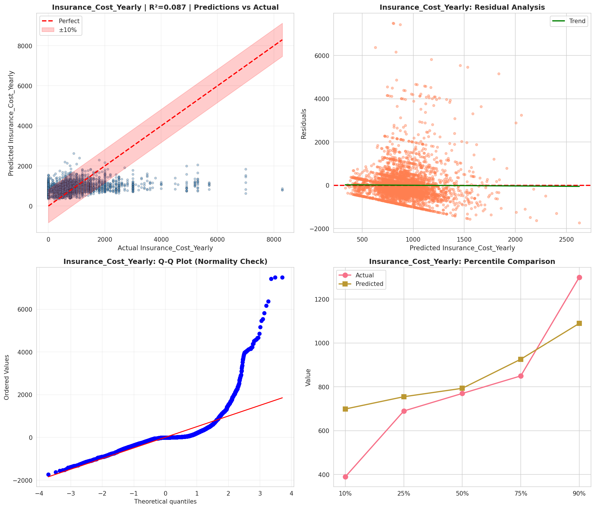
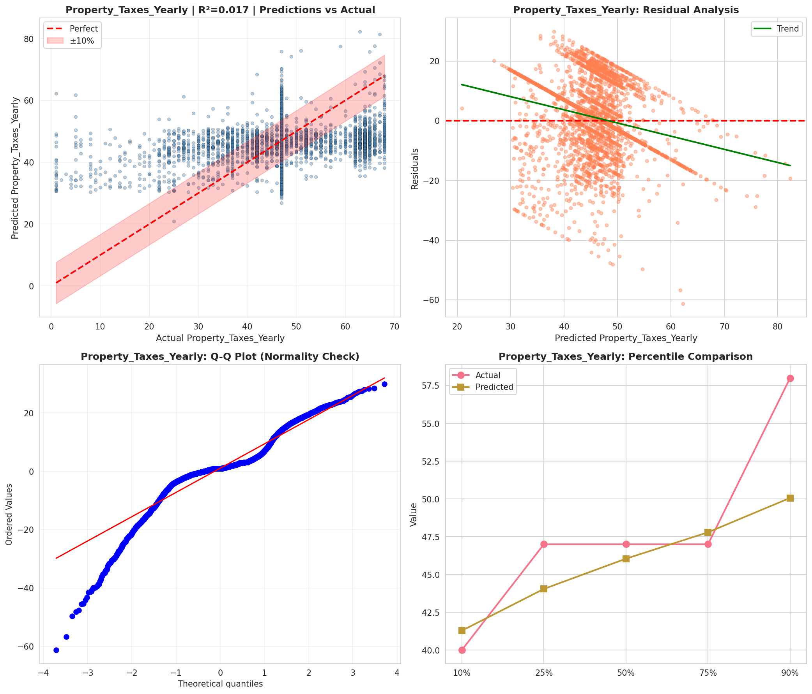
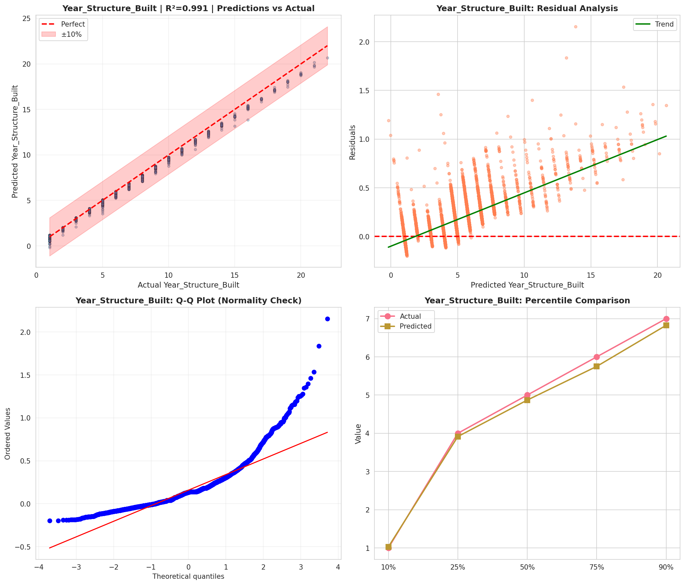
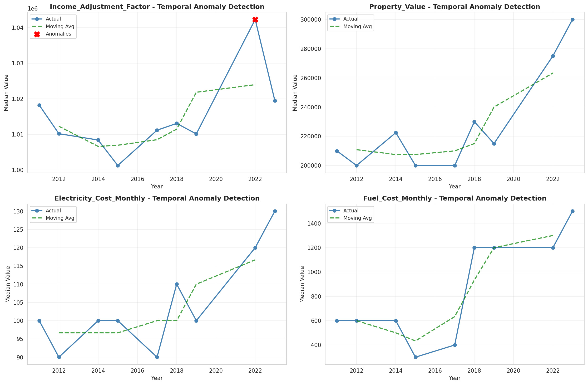
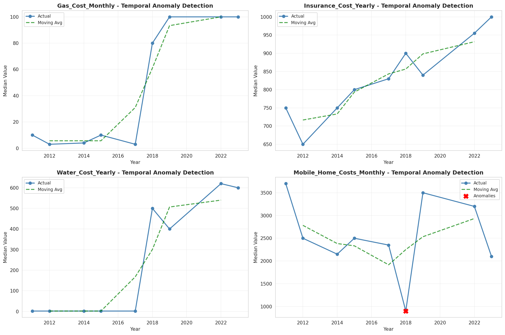
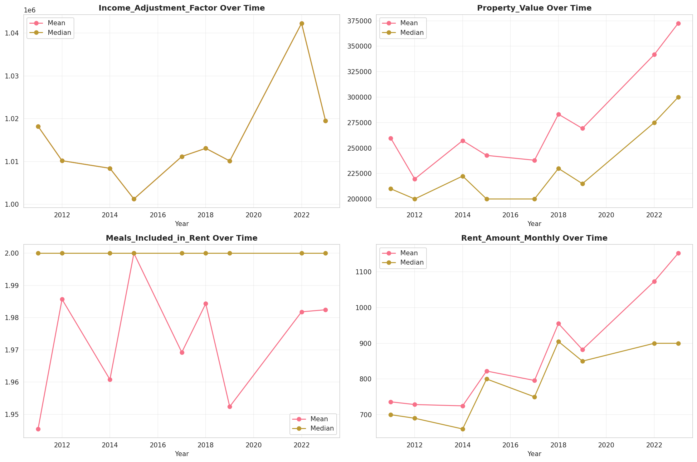
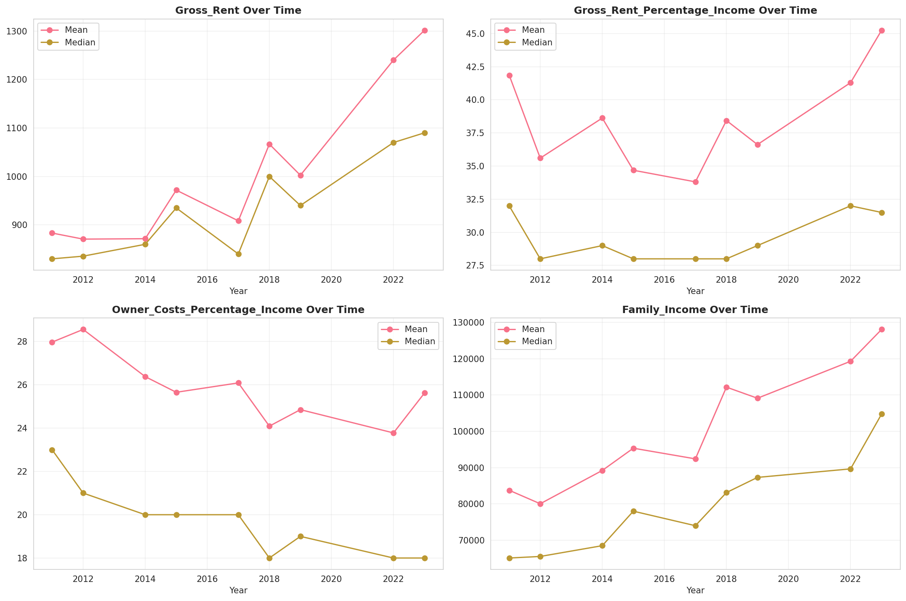
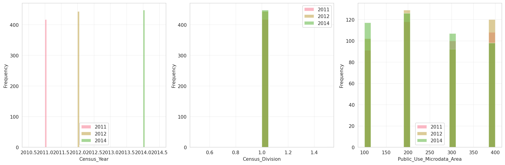
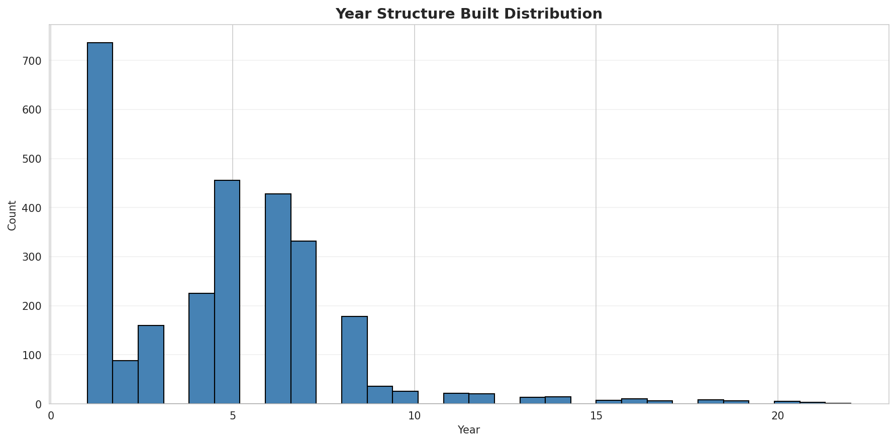
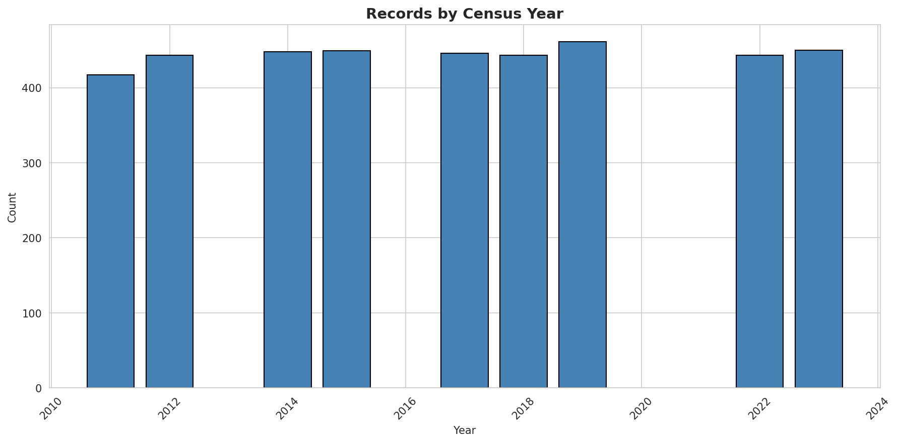
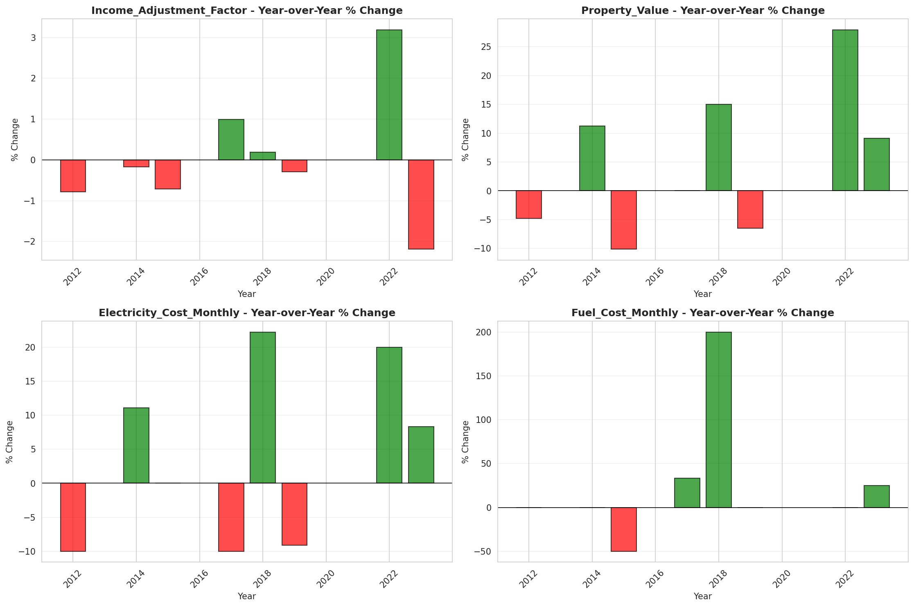
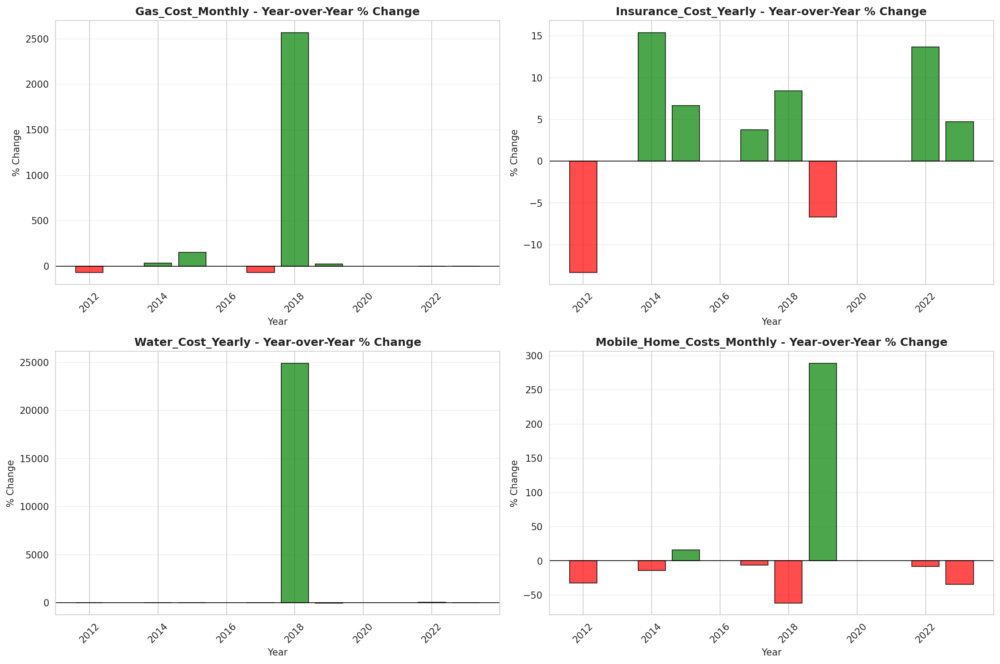
