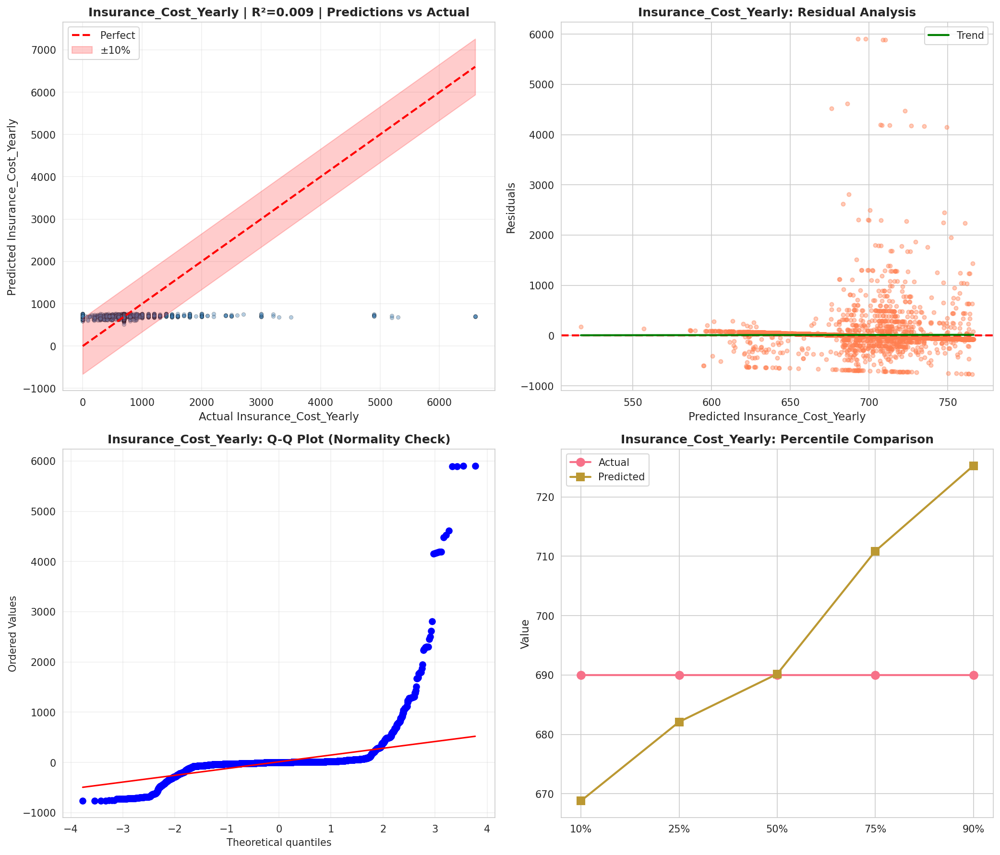
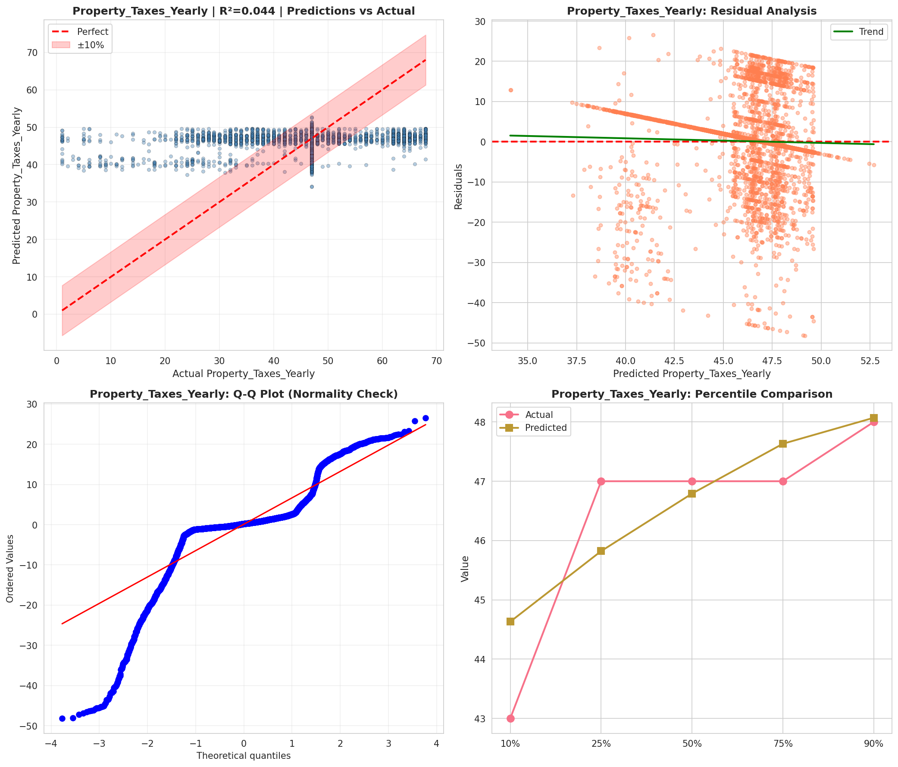
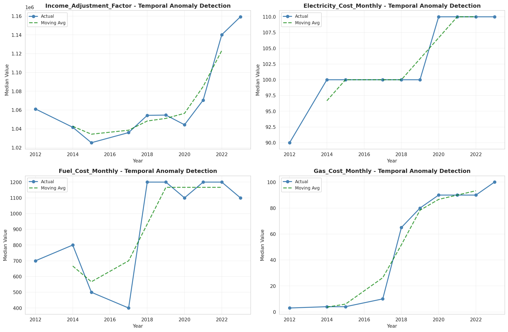
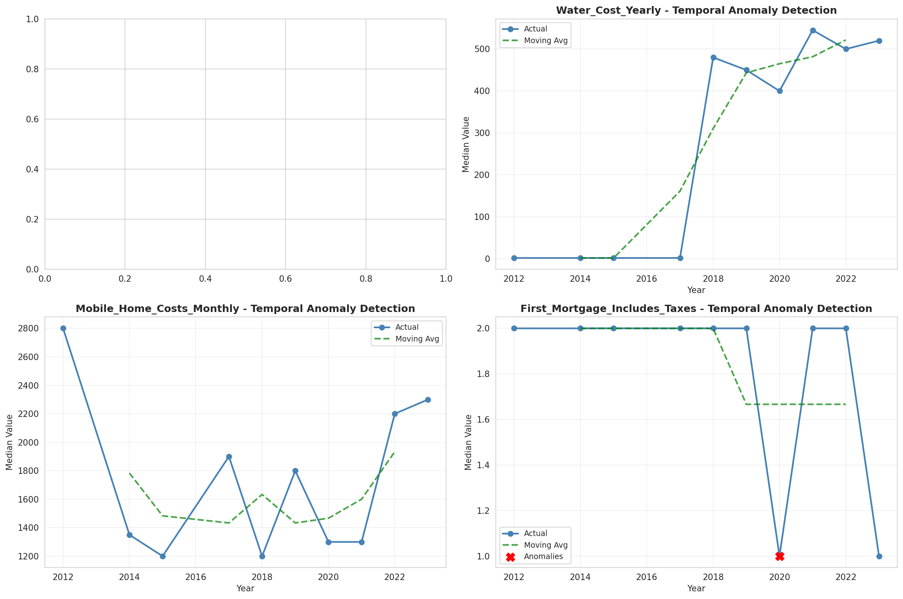
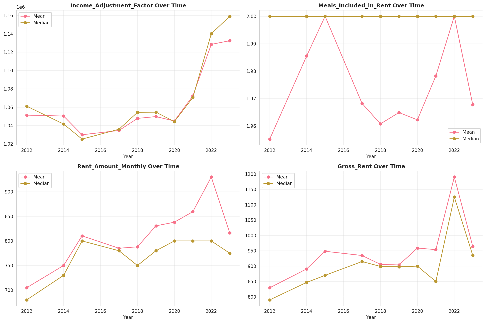
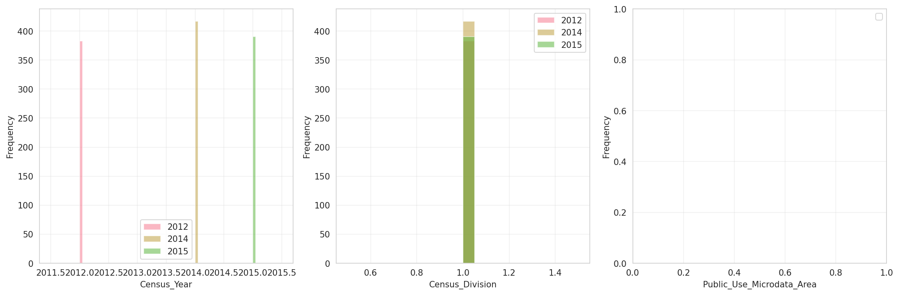
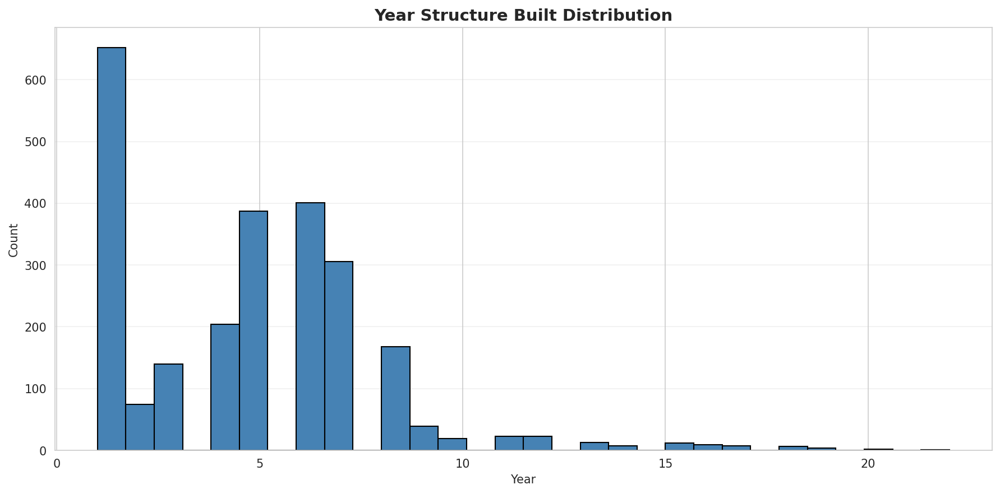
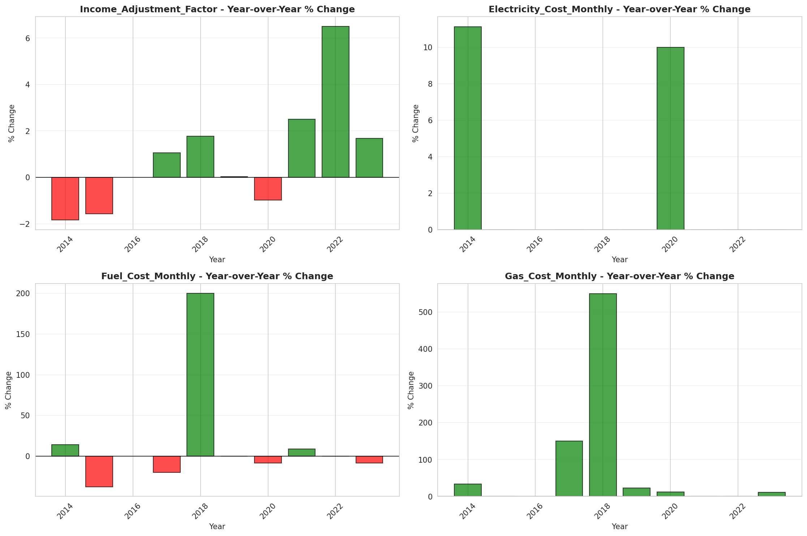
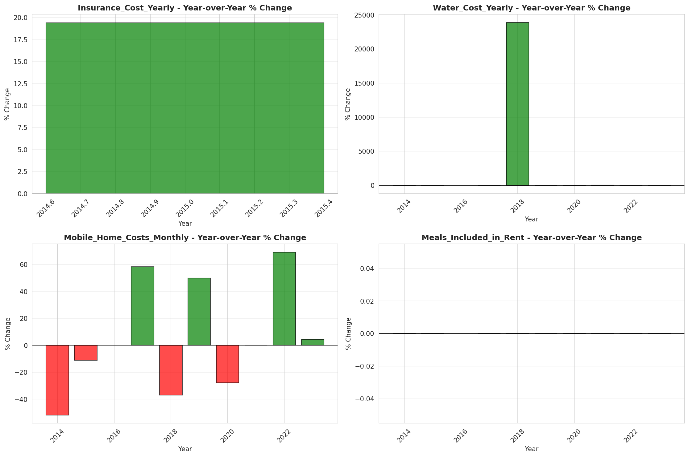

# Temporal Analysis

## Year Distribution

- 2012: 17,492 records

- 2014: 18,006 records

- 2015: 18,179 records

- 2017: 18,295 records

- 2018: 18,476 records

- 2019: 18,696 records

- 2020: 18,962 records

- 2021: 19,133 records

- 2022: 19,298 records

- 2023: 19,347 records

## Temporal Trends

- Census_Year: {np.int64(2012): {'mean': 2012.0, 'median': 2012.0, 'std': 0.0}, np.int64(2014): {'mean': 2014.0, 'median': 2014.0, 'std': 0.0}, np.int64(2015): {'mean': 2015.0, 'median': 2015.0, 'std': 0.0}, np.int64(2017): {'mean': 2017.0, 'median': 2017.0, 'std': 0.0}, np.int64(2018): {'mean': 2018.0, 'median': 2018.0, 'std': 0.0}, np.int64(2019): {'mean': 2019.0, 'median': 2019.0, 'std': 0.0}, np.int64(2020): {'mean': 2020.0, 'median': 2020.0, 'std': 0.0}, np.int64(2021): {'mean': 2021.0, 'median': 2021.0, 'std': 0.0}, np.int64(2022): {'mean': 2022.0, 'median': 2022.0, 'std': 0.0}, np.int64(2023): {'mean': 2023.0, 'median': 2023.0, 'std': 0.0}}

- Census_Division: {np.int64(2012): {'mean': 1.0, 'median': 1.0, 'std': 0.0}, np.int64(2014): {'mean': 1.0, 'median': 1.0, 'std': 0.0}, np.int64(2015): {'mean': 1.0, 'median': 1.0, 'std': 0.0}, np.int64(2017): {'mean': 1.0, 'median': 1.0, 'std': 0.0}, np.int64(2018): {'mean': 1.0, 'median': 1.0, 'std': 0.0}, np.int64(2019): {'mean': 1.0, 'median': 1.0, 'std': 0.0}, np.int64(2020): {'mean': 1.0, 'median': 1.0, 'std': 0.0}, np.int64(2021): {'mean': 1.0, 'median': 1.0, 'std': 0.0}, np.int64(2022): {'mean': 1.0, 'median': 1.0, 'std': 0.0}, np.int64(2023): {'mean': 1.0, 'median': 1.0, 'std': 0.0}}

- Public_Use_Microdata_Area: {np.int64(2012): {'mean': None, 'median': None, 'std': None}, np.int64(2014): {'mean': None, 'median': None, 'std': None}, np.int64(2015): {'mean': None, 'median': None, 'std': None}, np.int64(2017): {'mean': 251.66438917737088, 'median': 200.0, 'std': 110.02718373413462}, np.int64(2018): {'mean': 252.083784368911, 'median': 200.0, 'std': 110.2954021720155}, np.int64(2019): {'mean': 252.07531022678648, 'median': 200.0, 'std': 110.31804491137306}, np.int64(2020): {'mean': 253.09566501423902, 'median': 200.0, 'std': 110.47248934244689}, np.int64(2021): {'mean': 253.48351016568233, 'median': 200.0, 'std': 110.55528691069658}, np.int64(2022): {'mean': None, 'median': None, 'std': None}, np.int64(2023): {'mean': 264.252855739908, 'median': 300.0, 'std': 119.33368783151325}}

- Census_Region: {np.int64(2012): {'mean': 1.0, 'median': 1.0, 'std': 0.0}, np.int64(2014): {'mean': 1.0, 'median': 1.0, 'std': 0.0}, np.int64(2015): {'mean': 1.0, 'median': 1.0, 'std': 0.0}, np.int64(2017): {'mean': 1.0, 'median': 1.0, 'std': 0.0}, np.int64(2018): {'mean': 1.0, 'median': 1.0, 'std': 0.0}, np.int64(2019): {'mean': 1.0, 'median': 1.0, 'std': 0.0}, np.int64(2020): {'mean': 1.0, 'median': 1.0, 'std': 0.0}, np.int64(2021): {'mean': 1.0, 'median': 1.0, 'std': 0.0}, np.int64(2022): {'mean': 1.0, 'median': 1.0, 'std': 0.0}, np.int64(2023): {'mean': 1.0, 'median': 1.0, 'std': 0.0}}

- State_Code: {np.int64(2012): {'mean': 50.0, 'median': 50.0, 'std': 0.0}, np.int64(2014): {'mean': 50.0, 'median': 50.0, 'std': 0.0}, np.int64(2015): {'mean': 50.0, 'median': 50.0, 'std': 0.0}, np.int64(2017): {'mean': 50.0, 'median': 50.0, 'std': 0.0}, np.int64(2018): {'mean': 50.0, 'median': 50.0, 'std': 0.0}, np.int64(2019): {'mean': 50.0, 'median': 50.0, 'std': 0.0}, np.int64(2020): {'mean': 50.0, 'median': 50.0, 'std': 0.0}, np.int64(2021): {'mean': 50.0, 'median': 50.0, 'std': 0.0}, np.int64(2022): {'mean': 50.0, 'median': 50.0, 'std': 0.0}, np.int64(2023): {'mean': None, 'median': None, 'std': None}}

- Housing_Adjustment_Factor: {np.int64(2012): {'mean': 1041191.0198948091, 'median': 1053092.0, 'std': 27441.84116957697}, np.int64(2014): {'mean': 1036917.8963678774, 'median': 1031130.0, 'std': 29638.253714864593}, np.int64(2015): {'mean': 1021063.4351174432, 'median': 1017534.0, 'std': 20338.69711143959}, np.int64(2017): {'mean': 1029095.3466520908, 'median': 1034680.0, 'std': 18007.285260140055}, np.int64(2018): {'mean': 1038089.4866854297, 'median': 1046406.0, 'std': 23508.37477186057}, np.int64(2019): {'mean': 1040598.8751069747, 'median': 1042936.0, 'std': 29183.666303252332}, np.int64(2020): {'mean': 1034992.6251977639, 'median': 1030827.0, 'std': 28563.113720864087}, np.int64(2021): {'mean': 1057765.8472273035, 'median': 1059761.0, 'std': 35042.279493324444}, np.int64(2022): {'mean': 1105787.088506581, 'median': 1133141.0, 'std': 60713.40089971624}, np.int64(2023): {'mean': 1108475.873830568, 'median': 1125501.0, 'std': 76420.60820071572}}

- Income_Adjustment_Factor: {np.int64(2012): {'mean': 1052464.7022067232, 'median': 1061121.0, 'std': 26349.643365982218}, np.int64(2014): {'mean': 1047788.9722870154, 'median': 1041654.0, 'std': 31065.63459233053}, np.int64(2015): {'mean': 1030510.2540293746, 'median': 1025215.0, 'std': 25730.790392447332}, np.int64(2017): {'mean': 1036497.053839847, 'median': 1035988.0, 'std': 16869.578450218938}, np.int64(2018): {'mean': 1046690.95296601, 'median': 1054346.0, 'std': 20522.563836777827}, np.int64(2019): {'mean': 1049573.254813864, 'median': 1054606.0, 'std': 26245.47925914446}, np.int64(2020): {'mean': 1044956.9377702774, 'median': 1044328.0, 'std': 29229.69264880582}, np.int64(2021): {'mean': 1072476.9002770083, 'median': 1070512.0, 'std': 30414.285560983542}, np.int64(2022): {'mean': 1127545.7866100115, 'median': 1140108.0, 'std': 48846.36819545318}, np.int64(2023): {'mean': 1131824.6903395876, 'median': 1159185.0, 'std': 69626.31142312345}}

- Housing_Unit_Weight: {np.int64(2012): {'mean': 18.422307340498513, 'median': 13.0, 'std': 17.89263972329269}, np.int64(2014): {'mean': 18.012440297678552, 'median': 12.0, 'std': 18.09987290682376}, np.int64(2015): {'mean': 17.887342538093403, 'median': 12.0, 'std': 18.345891919747633}, np.int64(2017): {'mean': 18.098168898606176, 'median': 13.0, 'std': 18.516716567116305}, np.int64(2018): {'mean': 18.02408529984845, 'median': 13.0, 'std': 18.726384362384877}, np.int64(2019): {'mean': 17.91821780059906, 'median': 12.0, 'std': 18.807497317202156}, np.int64(2020): {'mean': 17.783672608374644, 'median': 12.0, 'std': 20.52925150732628}, np.int64(2021): {'mean': 17.43161030679977, 'median': 12.0, 'std': 20.135166502150714}, np.int64(2022): {'mean': 17.366462845890766, 'median': 11.0, 'std': 20.405055598325777}, np.int64(2023): {'mean': 17.42244275598284, 'median': 11.0, 'std': 20.715998867658847}}

- Number_of_Persons: {np.int64(2012): {'mean': 1.8115138348959525, 'median': 2.0, 'std': 1.3864004795617735}, np.int64(2014): {'mean': 1.7938464956125735, 'median': 2.0, 'std': 1.3737079348379753}, np.int64(2015): {'mean': 1.773749931239342, 'median': 2.0, 'std': 1.3651758929864175}, np.int64(2017): {'mean': 1.7400929215632686, 'median': 2.0, 'std': 1.3621799277525575}, np.int64(2018): {'mean': 1.725644078804936, 'median': 2.0, 'std': 1.3551144005047422}, np.int64(2019): {'mean': 1.7145913564398803, 'median': 2.0, 'std': 1.3430366704422574}, np.int64(2020): {'mean': 1.69681468199557, 'median': 2.0, 'std': 1.3392444267402217}, np.int64(2021): {'mean': 1.6956044530392516, 'median': 2.0, 'std': 1.3279667659511898}, np.int64(2022): {'mean': 1.708052647942792, 'median': 2.0, 'std': 1.3174472021924957}, np.int64(2023): {'mean': 1.7230578384245618, 'median': 2.0, 'std': 1.3109559862815663}}

- Housing_Unit_Type: {np.int64(2012): {'mean': 1.1493825748913788, 'median': 1.0, 'std': 0.5033001451070389}, np.int64(2014): {'mean': 1.1742197045429301, 'median': 1.0, 'std': 0.5412438381680071}, np.int64(2015): {'mean': 1.1870289894933714, 'median': 1.0, 'std': 0.5604654712728361}, np.int64(2017): {'mean': 1.18207160426346, 'median': 1.0, 'std': 0.5546803100175016}, np.int64(2018): {'mean': 1.1853756224290972, 'median': 1.0, 'std': 0.5595324015877382}, np.int64(2019): {'mean': 1.1903080872913991, 'median': 1.0, 'std': 0.5653299550107722}, np.int64(2020): {'mean': None, 'median': None, 'std': None}, np.int64(2021): {'mean': None, 'median': None, 'std': None}, np.int64(2022): {'mean': None, 'median': None, 'std': None}, np.int64(2023): {'mean': None, 'median': None, 'std': None}}

- Building_Type: {np.int64(2012): {'mean': 2.521178752424451, 'median': 2.0, 'std': 1.4977265755223501}, np.int64(2014): {'mean': 2.517796557892789, 'median': 2.0, 'std': 1.4915268746594783}, np.int64(2015): {'mean': 2.52030519320699, 'median': 2.0, 'std': 1.495882793041493}, np.int64(2017): {'mean': 2.527899610136452, 'median': 2.0, 'std': 1.505745357571918}, np.int64(2018): {'mean': 2.5334783659656757, 'median': 2.0, 'std': 1.5084711341562518}, np.int64(2019): {'mean': 2.531315552891819, 'median': 2.0, 'std': 1.5048647961328674}, np.int64(2020): {'mean': 2.5247177658942364, 'median': 2.0, 'std': 1.4898236103662212}, np.int64(2021): {'mean': 2.52922731037747, 'median': 2.0, 'std': 1.499246634643961}, np.int64(2022): {'mean': 2.527508854781582, 'median': 2.0, 'std': 1.4960479033054748}, np.int64(2023): {'mean': 2.5276763632081027, 'median': 2.0, 'std': 1.5064490873553729}}

- Year_Structure_Built: {np.int64(2012): {'mean': 4.413626978664832, 'median': 5.0, 'std': 2.6230511718005114}, np.int64(2014): {'mean': 4.586145210042564, 'median': 5.0, 'std': 2.776925814286195}, np.int64(2015): {'mean': 4.640536549347773, 'median': 5.0, 'std': 2.8584432968712568}, np.int64(2017): {'mean': 4.815728557504873, 'median': 5.0, 'std': 3.1437639599545926}, np.int64(2018): {'mean': 4.877930867778583, 'median': 5.0, 'std': 3.284107814257747}, np.int64(2019): {'mean': 4.9501348516631705, 'median': 5.0, 'std': 3.4651613375103034}, np.int64(2020): {'mean': 5.025252525252525, 'median': 5.0, 'std': 3.6176381387665444}, np.int64(2021): {'mean': None, 'median': None, 'std': None}, np.int64(2022): {'mean': None, 'median': None, 'std': None}, np.int64(2023): {'mean': None, 'median': None, 'std': None}}

- Bathtub_or_Shower: {np.int64(2012): {'mean': 1.0210223362322468, 'median': 1.0, 'std': 0.14346318459843518}, np.int64(2014): {'mean': 1.0194929368947012, 'median': 1.0, 'std': 0.13825390190001238}, np.int64(2015): {'mean': 1.0191361063253754, 'median': 1.0, 'std': 0.13700755731251288}, np.int64(2017): {'mean': 1.0182748538011697, 'median': 1.0, 'std': 0.13394766319862478}, np.int64(2018): {'mean': 1.018975102731448, 'median': 1.0, 'std': 0.136441097870215}, np.int64(2019): {'mean': 1.0177404854659875, 'median': 1.0, 'std': 0.1320106249542786}, np.int64(2020): {'mean': 1.0171717171717172, 'median': 1.0, 'std': 0.12991478801259113}, np.int64(2021): {'mean': 1.0164477576618152, 'median': 1.0, 'std': 0.127193498676453}, np.int64(2022): {'mean': 1.0147579693034239, 'median': 1.0, 'std': 0.12058619336293173}, np.int64(2023): {'mean': 1.0128960075373925, 'median': 1.0, 'std': 0.11282929659773015}}

- Refrigerator: {np.int64(2012): {'mean': 1.0159544516048302, 'median': 1.0, 'std': 0.1253031900158759}, np.int64(2014): {'mean': 1.0154216272901118, 'median': 1.0, 'std': 0.12322636647762919}, np.int64(2015): {'mean': 1.0147058823529411, 'median': 1.0, 'std': 0.12037653837512877}, np.int64(2017): {'mean': 1.0142543859649122, 'median': 1.0, 'std': 0.11854136173987581}, np.int64(2018): {'mean': 1.0149867053420354, 'median': 1.0, 'std': 0.1215030704828997}, np.int64(2019): {'mean': 1.014204375187294, 'median': 1.0, 'std': 0.11833617450565241}, np.int64(2020): {'mean': 1.0144385026737968, 'median': 1.0, 'std': 0.11929324323053828}, np.int64(2021): {'mean': 1.0154419595314164, 'median': 1.0, 'std': 0.12330614331704236}, np.int64(2022): {'mean': 1.0144628099173554, 'median': 1.0, 'std': 0.11939212082577036}, np.int64(2023): {'mean': 1.0128371216582264, 'median': 1.0, 'std': 0.11257475840966254}}

- Hot_and_Cold_Running_Water: {np.int64(2012): {'mean': 1.023587561784396, 'median': 1.0, 'std': 0.15176504796547255}, np.int64(2014): {'mean': 1.0218987107519586, 'median': 1.0, 'std': 0.14635736597079207}, np.int64(2015): {'mean': 1.0211050947575684, 'median': 1.0, 'std': 0.14373914226438303}, np.int64(2017): {'mean': 1.020772417153996, 'median': 1.0, 'std': 0.1426259548834862}, np.int64(2018): {'mean': 1.021090161953106, 'median': 1.0, 'std': 0.1436892991919168}, np.int64(2019): {'mean': 1.0200779142942762, 'median': 1.0, 'std': 0.14027106227920172}, np.int64(2020): {'mean': 1.0205585264408794, 'median': 1.0, 'std': 0.14190514412793312}, np.int64(2021): {'mean': 1.0198793042243521, 'median': 1.0, 'std': 0.13958964978125257}, np.int64(2022): {'mean': 1.0187131050767415, 'median': 1.0, 'std': 0.13551386953756112}, np.int64(2023): {'mean': 1.0183723942998468, 'median': 1.0, 'std': 0.13429784617797233}}

- Running_Water: {np.int64(2012): {'mean': None, 'median': None, 'std': None}, np.int64(2014): {'mean': 9.0, 'median': 9.0, 'std': 0.0}, np.int64(2015): {'mean': 9.0, 'median': 9.0, 'std': 0.0}, np.int64(2017): {'mean': 9.0, 'median': 9.0, 'std': 0.0}, np.int64(2018): {'mean': 9.0, 'median': 9.0, 'std': 0.0}, np.int64(2019): {'mean': 9.0, 'median': 9.0, 'std': 0.0}, np.int64(2020): {'mean': 9.0, 'median': 9.0, 'std': 0.0}, np.int64(2021): {'mean': 9.0, 'median': 9.0, 'std': 0.0}, np.int64(2022): {'mean': 9.0, 'median': 9.0, 'std': 0.0}, np.int64(2023): {'mean': 9.0, 'median': 9.0, 'std': 0.0}}

- Sink_with_Faucet: {np.int64(2012): {'mean': 1.0175186135268723, 'median': 1.0, 'std': 0.13119751769950352}, np.int64(2014): {'mean': 1.0164086114366788, 'median': 1.0, 'std': 0.1270447344447798}, np.int64(2015): {'mean': 1.0158134383460498, 'median': 1.0, 'std': 0.12475708877996955}, np.int64(2017): {'mean': 1.0148635477582846, 'median': 1.0, 'std': 0.12101039101371162}, np.int64(2018): {'mean': 1.0145636934977036, 'median': 1.0, 'std': 0.11980175145767695}, np.int64(2019): {'mean': 1.0137848366796525, 'median': 1.0, 'std': 0.11660029930849246}, np.int64(2020): {'mean': 1.0136066547831253, 'median': 1.0, 'std': 0.11585469887617181}, np.int64(2021): {'mean': 1.013430363270619, 'median': 1.0, 'std': 0.1151120001982582}, np.int64(2022): {'mean': 1.0121015348288076, 'median': 1.0, 'std': 0.1093425509878292}, np.int64(2023): {'mean': 1.0110705452832411, 'median': 1.0, 'std': 0.10463571584432549}}

- Stove_or_Range: {np.int64(2012): {'mean': 1.0163924169430019, 'median': 1.0, 'std': 0.12698312673872936}, np.int64(2014): {'mean': 1.015051508235149, 'median': 1.0, 'std': 0.12176154931448391}, np.int64(2015): {'mean': 1.0151365985724834, 'median': 1.0, 'std': 0.12209995611462325}, np.int64(2017): {'mean': 1.0143762183235867, 'median': 1.0, 'std': 0.11903951393249643}, np.int64(2018): {'mean': 1.0147449842881315, 'median': 1.0, 'std': 0.12053401048830885}, np.int64(2019): {'mean': 1.014504045549895, 'median': 1.0, 'std': 0.11955975469310542}, np.int64(2020): {'mean': 1.0141414141414142, 'median': 1.0, 'std': 0.11807736008559644}, np.int64(2021): {'mean': 1.0156194533191338, 'median': 1.0, 'std': 0.12400159569693207}, np.int64(2022): {'mean': 1.0150531286894924, 'median': 1.0, 'std': 0.12176784179674373}, np.int64(2023): {'mean': 1.0150747850665411, 'median': 1.0, 'std': 0.12185405320887964}}

- Telephone_Service: {np.int64(2012): {'mean': 1.0158023933722, 'median': 1.0, 'std': 0.12471515899607381}, np.int64(2014): {'mean': 1.015834715729151, 'median': 1.0, 'std': 0.12484050897268066}, np.int64(2015): {'mean': 1.0167483968313844, 'median': 1.0, 'std': 0.12833211024271177}, np.int64(2017): {'mean': 1.0167686381146612, 'median': 1.0, 'std': 0.12840831886729254}, np.int64(2018): {'mean': 1.0172504312607815, 'median': 1.0, 'std': 0.13020800848372896}, np.int64(2019): {'mean': 1.0168697978596908, 'median': 1.0, 'std': 0.1287883551513207}, np.int64(2020): {'mean': 1.0148676776687482, 'median': 1.0, 'std': 0.12102776011018607}, np.int64(2021): {'mean': 1.0134218289085546, 'median': 1.0, 'std': 0.11507675705654119}, np.int64(2022): {'mean': 1.0119982547993018, 'median': 1.0, 'std': 0.1088813976262464}, np.int64(2023): {'mean': 1.0102560424585814, 'median': 1.0, 'std': 0.10075506999221735}}

- Lot_Acreage: {np.int64(2012): {'mean': 1.9287141905396403, 'median': 2.0, 'std': 0.7841689348481844}, np.int64(2014): {'mean': 1.9426193604905826, 'median': 2.0, 'std': 0.7837185114670624}, np.int64(2015): {'mean': 1.9436753133197318, 'median': 2.0, 'std': 0.7816046652517459}, np.int64(2017): {'mean': 1.9325250775781193, 'median': 2.0, 'std': 0.7792557548282779}, np.int64(2018): {'mean': 1.937830877092574, 'median': 2.0, 'std': 0.7788694966390954}, np.int64(2019): {'mean': 1.937579708091257, 'median': 2.0, 'std': 0.7789845682781926}, np.int64(2020): {'mean': 1.941786339754816, 'median': 2.0, 'std': 0.7830622735986517}, np.int64(2021): {'mean': 1.9440334961618981, 'median': 2.0, 'std': 0.7821154490293806}, np.int64(2022): {'mean': 1.9455758671022452, 'median': 2.0, 'std': 0.7805320090498988}, np.int64(2023): {'mean': 1.9419345898004434, 'median': 2.0, 'std': 0.7793565673140286}}

- Agricultural_Sales: {np.int64(2012): {'mean': 1.1961722488038278, 'median': 1.0, 'std': 0.8361445191799544}, np.int64(2014): {'mean': 1.1888241525423728, 'median': 1.0, 'std': 0.8110233090996041}, np.int64(2015): {'mean': 1.1833508956796628, 'median': 1.0, 'std': 0.7967440951172398}, np.int64(2017): {'mean': 1.1738553417385533, 'median': 1.0, 'std': 0.782426567119049}, np.int64(2018): {'mean': 1.1800078606052666, 'median': 1.0, 'std': 0.8036105956593795}, np.int64(2019): {'mean': 1.1838722243864432, 'median': 1.0, 'std': 0.8195371619244406}, np.int64(2020): {'mean': 1.183350622406639, 'median': 1.0, 'std': 0.8174550037580722}, np.int64(2021): {'mean': 1.1847101077475628, 'median': 1.0, 'std': 0.8139276282767939}, np.int64(2022): {'mean': 1.183444626433161, 'median': 1.0, 'std': 0.8103184596425415}, np.int64(2023): {'mean': 1.1840368571784337, 'median': 1.0, 'std': 0.811498431449723}}

- Business_On_Property: {np.int64(2012): {'mean': 1.9638759345621437, 'median': 2.0, 'std': 0.18660572070670367}, np.int64(2014): {'mean': 1.9645933712950796, 'median': 2.0, 'std': 0.1848120472651802}, np.int64(2015): {'mean': 1.9664092101428154, 'median': 2.0, 'std': 0.18017994961813968}, np.int64(2017): {'mean': 4.825070361550119, 'median': 2.0, 'std': 3.4570522625728892}, np.int64(2018): {'mean': 6.237373014737445, 'median': 9.0, 'std': 3.4365058719065678}, np.int64(2019): {'mean': 7.626186764914269, 'median': 9.0, 'std': 2.789527049781047}, np.int64(2020): {'mean': None, 'median': None, 'std': None}, np.int64(2021): {'mean': None, 'median': None, 'std': None}, np.int64(2022): {'mean': None, 'median': None, 'std': None}, np.int64(2023): {'mean': None, 'median': None, 'std': None}}

- Tenure: {np.int64(2012): {'mean': 1.7247621969929425, 'median': 1.0, 'std': 0.8362907290937397}, np.int64(2014): {'mean': 1.7359372643643494, 'median': 2.0, 'std': 0.8309874262235141}, np.int64(2015): {'mean': 1.738890984534138, 'median': 2.0, 'std': 0.8276614750234654}, np.int64(2017): {'mean': 1.7468086713498, 'median': 2.0, 'std': 0.8261523912440615}, np.int64(2018): {'mean': 1.743193579839496, 'median': 2.0, 'std': 0.8242087377036914}, np.int64(2019): {'mean': 1.7440546967895363, 'median': 2.0, 'std': 0.8193372880913365}, np.int64(2020): {'mean': 1.7424174843889384, 'median': 2.0, 'std': 0.8167306998103839}, np.int64(2021): {'mean': 1.7462389380530974, 'median': 2.0, 'std': 0.8088039874395657}, np.int64(2022): {'mean': 1.7419284467713787, 'median': 2.0, 'std': 0.8010203685509572}, np.int64(2023): {'mean': 1.7460374381410027, 'median': 2.0, 'std': 0.7952717903444487}}

- Vacancy_Status: {np.int64(2012): {'mean': 4.8741092636579575, 'median': 5.0, 'std': 1.1541557687913941}, np.int64(2014): {'mean': 4.917599186164802, 'median': 5.0, 'std': 1.119546423080426}, np.int64(2015): {'mean': 4.944611277944611, 'median': 5.0, 'std': 1.0929445828561173}, np.int64(2017): {'mean': 4.989927604658483, 'median': 5.0, 'std': 1.0643167063578052}, np.int64(2018): {'mean': 5.002799377916019, 'median': 5.0, 'std': 1.0505243313472417}, np.int64(2019): {'mean': 5.018891297615361, 'median': 5.0, 'std': 1.0468942134075094}, np.int64(2020): {'mean': 5.036708111308466, 'median': 5.0, 'std': 1.0369895887735232}, np.int64(2021): {'mean': 5.063435068821065, 'median': 5.0, 'std': 1.02943098596593}, np.int64(2022): {'mean': 5.069636135508156, 'median': 5.0, 'std': 1.0114718168324668}, np.int64(2023): {'mean': 5.093780848963474, 'median': 5.0, 'std': 1.00726009352061}}

- Vehicles_Available: {np.int64(2012): {'mean': 1.8883092973304694, 'median': 2.0, 'std': 0.9971720018620285}, np.int64(2014): {'mean': 1.894661438697029, 'median': 2.0, 'std': 1.0031186582078635}, np.int64(2015): {'mean': 1.8896265560165975, 'median': 2.0, 'std': 1.011534639895634}, np.int64(2017): {'mean': 1.88216632676184, 'median': 2.0, 'std': 1.0219741400362778}, np.int64(2018): {'mean': 1.8799969999249981, 'median': 2.0, 'std': 1.0194623928071287}, np.int64(2019): {'mean': 1.8749256837098691, 'median': 2.0, 'std': 1.0183197418636123}, np.int64(2020): {'mean': 1.8760035682426406, 'median': 2.0, 'std': 1.0062319364697476}, np.int64(2021): {'mean': 1.8710176991150442, 'median': 2.0, 'std': 1.000531238631392}, np.int64(2022): {'mean': 1.8707097149505527, 'median': 2.0, 'std': 0.9947181385701668}, np.int64(2023): {'mean': 1.8642329484329054, 'median': 2.0, 'std': 0.9931624282599288}}

- Condo_Fee_Monthly: {np.int64(2012): {'mean': 205.3151515151515, 'median': 180.0, 'std': 129.68037893832636}, np.int64(2014): {'mean': 223.96103896103895, 'median': 190.0, 'std': 137.1127063497955}, np.int64(2015): {'mean': 232.17105263157896, 'median': 190.0, 'std': 137.74907959133978}, np.int64(2017): {'mean': 252.34421364985164, 'median': 210.0, 'std': 140.8356023121316}, np.int64(2018): {'mean': 254.07079646017698, 'median': 220.0, 'std': 136.1601726136116}, np.int64(2019): {'mean': 265.7022471910112, 'median': 230.0, 'std': 147.65132546113114}, np.int64(2020): {'mean': 271.77842565597666, 'median': 230.0, 'std': 164.725672718265}, np.int64(2021): {'mean': 282.76073619631904, 'median': 230.0, 'std': 190.40131978714618}, np.int64(2022): {'mean': 295.25222551928783, 'median': 240.0, 'std': 199.7617893954517}, np.int64(2023): {'mean': 331.1363636363636, 'median': 250.0, 'std': 333.41001449002374}}

- Electricity_Cost_Monthly: {np.int64(2012): {'mean': 102.2015955814667, 'median': 90.0, 'std': 65.17348140102344}, np.int64(2014): {'mean': 108.13783743025185, 'median': 100.0, 'std': 68.95488680678977}, np.int64(2015): {'mean': 110.20384760467748, 'median': 100.0, 'std': 71.35382246076597}, np.int64(2017): {'mean': 111.53750283254023, 'median': 100.0, 'std': 74.46978270933946}, np.int64(2018): {'mean': 121.44229367457682, 'median': 100.0, 'std': 73.07582881074991}, np.int64(2019): {'mean': 122.10218158485723, 'median': 100.0, 'std': 75.27860171953087}, np.int64(2020): {'mean': 124.10007216742844, 'median': 100.0, 'std': 76.01411842331673}, np.int64(2021): {'mean': 127.60982199618563, 'median': 110.0, 'std': 85.06749718317081}, np.int64(2022): {'mean': 134.38395997811304, 'median': 110.0, 'std': 114.15762187433371}, np.int64(2023): {'mean': 141.27939025329124, 'median': 120.0, 'std': 150.39532934488548}}

- Fuel_Cost_Monthly: {np.int64(2012): {'mean': 1088.4163086836452, 'median': 750.0, 'std': 1252.6176872156548}, np.int64(2014): {'mean': 1024.7321670939527, 'median': 600.0, 'std': 1226.0113826810782}, np.int64(2015): {'mean': 1019.6162957374576, 'median': 600.0, 'std': 1257.891797289999}, np.int64(2017): {'mean': 841.7158395649218, 'median': 300.0, 'std': 1140.4322697210707}, np.int64(2018): {'mean': 1463.0445531105677, 'median': 1200.0, 'std': 1136.868021197174}, np.int64(2019): {'mean': 1407.8648464163823, 'median': 1200.0, 'std': 1096.938142589233}, np.int64(2020): {'mean': 1352.5975877192982, 'median': 1200.0, 'std': 1037.8789132603479}, np.int64(2021): {'mean': 1364.8240930869267, 'median': 1200.0, 'std': 1042.6237072017982}, np.int64(2022): {'mean': 1445.23431984795, 'median': 1200.0, 'std': 1121.6744447575945}, np.int64(2023): {'mean': 1514.8799029518802, 'median': 1200.0, 'std': 1184.348144038119}}

- Gas_Cost_Monthly: {np.int64(2012): {'mean': 61.706735194845045, 'median': 3.0, 'std': 101.65964781068216}, np.int64(2014): {'mean': 62.362464183381086, 'median': 4.0, 'std': 102.69016769039425}, np.int64(2015): {'mean': 63.55579026782346, 'median': 4.0, 'std': 104.696829812129}, np.int64(2017): {'mean': 62.903542563637735, 'median': 4.0, 'std': 103.20115458017798}, np.int64(2018): {'mean': 120.1191414805081, 'median': 80.0, 'std': 118.90169036417906}, np.int64(2019): {'mean': 119.5338519158744, 'median': 80.0, 'std': 117.07243108304587}, np.int64(2020): {'mean': 119.47381974248927, 'median': 90.0, 'std': 116.83355902104118}, np.int64(2021): {'mean': 123.23560797528783, 'median': 90.0, 'std': 122.34114171914233}, np.int64(2022): {'mean': 136.7729640800658, 'median': 100.0, 'std': 156.38604595464696}, np.int64(2023): {'mean': 146.03915258782516, 'median': 100.0, 'std': 175.88634391729133}}

- House_Heating_Fuel: {np.int64(2012): {'mean': 3.8590825406566434, 'median': 4.0, 'std': 1.5955474733504762}, np.int64(2014): {'mean': 3.911627205549691, 'median': 4.0, 'std': 1.6487508115958518}, np.int64(2015): {'mean': 3.9047906450396077, 'median': 4.0, 'std': 1.6659236111986575}, np.int64(2017): {'mean': 3.8506684794924086, 'median': 4.0, 'std': 1.7037274081932687}, np.int64(2018): {'mean': 3.833270831770794, 'median': 4.0, 'std': 1.7029289697854701}, np.int64(2019): {'mean': 3.7752675386444707, 'median': 4.0, 'std': 1.6984573199514963}, np.int64(2020): {'mean': 3.753716919417187, 'median': 4.0, 'std': 1.6934642862132046}, np.int64(2021): {'mean': 3.731047197640118, 'median': 4.0, 'std': 1.6910965211214495}, np.int64(2022): {'mean': 3.7159685863874348, 'median': 4.0, 'std': 1.697906527288106}, np.int64(2023): {'mean': 3.683927418776447, 'median': 4.0, 'std': 1.6998246455028507}}

- Insurance_Cost_Yearly: {np.int64(2014): {'mean': 874.6376451077944, 'median': 700.0, 'std': 720.5620473367444}, np.int64(2015): {'mean': 902.1442636542647, 'median': 720.0, 'std': 722.5535304689463}}

- Water_Cost_Yearly: {np.int64(2012): {'mean': 137.12649585762503, 'median': 2.0, 'std': 285.357148396585}, np.int64(2014): {'mean': 141.43251394963053, 'median': 2.0, 'std': 305.7126201199342}, np.int64(2015): {'mean': 147.0067898906073, 'median': 2.0, 'std': 315.5741344891906}, np.int64(2017): {'mean': 151.54339451620214, 'median': 2.0, 'std': 325.7267343736329}, np.int64(2018): {'mean': 549.9463663180477, 'median': 480.0, 'std': 418.19837290083444}, np.int64(2019): {'mean': 559.1985157699444, 'median': 500.0, 'std': 415.8914202835317}, np.int64(2020): {'mean': 574.0458300026645, 'median': 500.0, 'std': 435.8471226438937}, np.int64(2021): {'mean': 587.8288713910761, 'median': 500.0, 'std': 453.39381593685647}, np.int64(2022): {'mean': 606.0309837335399, 'median': 500.0, 'std': 464.4828892560635}, np.int64(2023): {'mean': 627.775, 'median': 530.0, 'std': 486.1512395318892}}

- Mobile_Home_Costs_Monthly: {np.int64(2012): {'mean': 2341.0793036750483, 'median': 2000.0, 'std': 1769.8783132460655}, np.int64(2014): {'mean': 2221.5452865064694, 'median': 1900.0, 'std': 1740.349417949293}, np.int64(2015): {'mean': 2302.681081081081, 'median': 2000.0, 'std': 1812.5960213834999}, np.int64(2017): {'mean': 2390.106007067138, 'median': 2000.0, 'std': 1941.717984699489}, np.int64(2018): {'mean': 2472.823315118397, 'median': 2000.0, 'std': 1987.872888337014}, np.int64(2019): {'mean': 2565.001801801802, 'median': 2200.0, 'std': 1984.8262566153767}, np.int64(2020): {'mean': 2773.1297709923665, 'median': 2200.0, 'std': 2736.518641921219}, np.int64(2021): {'mean': 2821.558394160584, 'median': 2150.0, 'std': 3028.9523427371582}, np.int64(2022): {'mean': 2854.8592321755027, 'median': 2100.0, 'std': 3082.685456978747}, np.int64(2023): {'mean': 2919.4460431654675, 'median': 2100.0, 'std': 3121.7559153914676}}

- First_Mortgage_Includes_Insurance: {np.int64(2012): {'mean': 1.734864618192881, 'median': 2.0, 'std': 0.4414388444468959}, np.int64(2014): {'mean': 1.7154895051325265, 'median': 2.0, 'std': 0.4512155427143334}, np.int64(2015): {'mean': 1.7055271713887599, 'median': 2.0, 'std': 0.4558407096257353}, np.int64(2017): {'mean': 1.6793845187627572, 'median': 2.0, 'std': 0.46674982594301234}, np.int64(2018): {'mean': 1.6698802674545172, 'median': 2.0, 'std': 0.4702925544281284}, np.int64(2019): {'mean': 1.6481193658688218, 'median': 2.0, 'std': 0.47759407987746166}, np.int64(2020): {'mean': 1.6238170347003154, 'median': 2.0, 'std': 0.4844650264455747}, np.int64(2021): {'mean': 1.6099806201550388, 'median': 2.0, 'std': 0.48779369678935924}, np.int64(2022): {'mean': 1.595176432502428, 'median': 2.0, 'std': 0.49089759922032666}, np.int64(2023): {'mean': 1.5757874015748032, 'median': 2.0, 'std': 0.4942634364609839}}

- First_Mortgage_Payment_Monthly: {np.int64(2012): {'mean': 939.4484332217828, 'median': 800.0, 'std': 619.9775956281944}, np.int64(2014): {'mean': 958.1850773709208, 'median': 830.0, 'std': 623.9154410175119}, np.int64(2015): {'mean': 974.2870413376684, 'median': 850.0, 'std': 632.2805483549377}, np.int64(2017): {'mean': 1002.5394881457057, 'median': 880.0, 'std': 640.5642978740368}, np.int64(2018): {'mean': 1017.7045560566008, 'median': 900.0, 'std': 642.1678543299727}, np.int64(2019): {'mean': 1040.290021759403, 'median': 910.0, 'std': 649.8161912107248}, np.int64(2020): {'mean': 1065.1955835962144, 'median': 950.0, 'std': 645.2680841130114}, np.int64(2021): {'mean': 1097.358850129199, 'median': 980.0, 'std': 667.776050725565}, np.int64(2022): {'mean': 1138.2256393654905, 'median': 1000.0, 'std': 688.814505930891}, np.int64(2023): {'mean': 1191.7352362204724, 'median': 1100.0, 'std': 723.6247987256975}}

- First_Mortgage_Includes_Taxes: {np.int64(2012): {'mean': 1.65257073319136, 'median': 2.0, 'std': 0.4761897356360471}, np.int64(2014): {'mean': 1.6316837750880957, 'median': 2.0, 'std': 0.4823847370359581}, np.int64(2015): {'mean': 1.6188264437219384, 'median': 2.0, 'std': 0.4857126738671635}, np.int64(2017): {'mean': 1.5839221227822264, 'median': 2.0, 'std': 0.49294546363171987}, np.int64(2018): {'mean': 1.5697403203234335, 'median': 2.0, 'std': 0.49515089776818894}, np.int64(2019): {'mean': 1.5475598383587192, 'median': 2.0, 'std': 0.4977716065402557}, np.int64(2020): {'mean': 1.5242902208201892, 'median': 2.0, 'std': 0.49944902692144016}, np.int64(2021): {'mean': 1.5075904392764858, 'median': 2.0, 'std': 0.49998275682656285}, np.int64(2022): {'mean': 1.4860796374231142, 'median': 1.0, 'std': 0.49984664133758555}, np.int64(2023): {'mean': 1.4686679790026247, 'median': 1.0, 'std': 0.49905827377345346}}

- First_Mortgage_Status: {np.int64(2012): {'mean': 1.7283472195310987, 'median': 1.0, 'std': 0.9613339327695021}, np.int64(2014): {'mean': 1.7586174062083413, 'median': 1.0, 'std': 0.9696418052194876}, np.int64(2015): {'mean': 1.7740494296577947, 'median': 1.0, 'std': 0.9731598865925181}, np.int64(2017): {'mean': 1.785980326616369, 'median': 1.0, 'std': 0.9756041359001184}, np.int64(2018): {'mean': 1.786950354609929, 'median': 1.0, 'std': 0.9754407688257831}, np.int64(2019): {'mean': 1.8022593595369247, 'median': 1.0, 'std': 0.9784410571350265}, np.int64(2020): {'mean': 1.8238139534883722, 'median': 1.0, 'std': 0.9827000927619536}, np.int64(2021): {'mean': 1.8672111590345968, 'median': 1.0, 'std': 0.9893362473254167}, np.int64(2022): {'mean': 1.893687707641196, 'median': 1.0, 'std': 0.9927958101442668}, np.int64(2023): {'mean': 1.92634460831935, 'median': 1.0, 'std': 0.9957767827718357}}

- Second_Mortgage_Payment_Monthly: {np.int64(2012): {'mean': 321.01479099678454, 'median': 250.0, 'std': 290.72028184815065}, np.int64(2014): {'mean': 315.4291907514451, 'median': 240.0, 'std': 297.58833132204785}, np.int64(2015): {'mean': 305.83957219251334, 'median': 240.0, 'std': 280.8870536966299}, np.int64(2017): {'mean': 337.24543946932005, 'median': 230.0, 'std': 413.94423156556286}, np.int64(2018): {'mean': 342.5637130801688, 'median': 240.0, 'std': 420.17481826630257}, np.int64(2019): {'mean': 348.85813751087903, 'median': 250.0, 'std': 417.5504454036743}, np.int64(2020): {'mean': 365.77815699658703, 'median': 250.0, 'std': 434.26890015719465}, np.int64(2021): {'mean': 360.0615384615385, 'median': 250.0, 'std': 377.0097597051611}, np.int64(2022): {'mean': 361.229078613694, 'median': 250.0, 'std': 359.7736750024727}, np.int64(2023): {'mean': 398.52456286427974, 'median': 290.0, 'std': 422.15026701143967}}

- Second_Mortgage_Status: {np.int64(2012): {'mean': 2.7403407362336476, 'median': 3.0, 'std': 0.517422257834847}, np.int64(2014): {'mean': 2.770798222766968, 'median': 3.0, 'std': 0.49408300034080443}, np.int64(2015): {'mean': 2.7820095990091347, 'median': 3.0, 'std': 0.4824368943026014}, np.int64(2017): {'mean': 2.7985555032187155, 'median': 3.0, 'std': 0.46695896706293116}, np.int64(2018): {'mean': 2.8042295132949775, 'median': 3.0, 'std': 0.460665040466825}, np.int64(2019): {'mean': 2.8127137084239977, 'median': 3.0, 'std': 0.44768607610074485}, np.int64(2020): {'mean': 2.807668329177057, 'median': 3.0, 'std': 0.4478514949493515}, np.int64(2021): {'mean': 2.8071833648393194, 'median': 3.0, 'std': 0.44378175548842125}, np.int64(2022): {'mean': 2.806995627732667, 'median': 3.0, 'std': 0.43783406885878534}, np.int64(2023): {'mean': 2.8029710711493356, 'median': 3.0, 'std': 0.4392645255118923}}

- Property_Taxes_Yearly: {np.int64(2012): {'mean': 44.07527610928115, 'median': 44.0, 'std': 15.765585240740425}, np.int64(2014): {'mean': 45.062654732431916, 'median': 46.0, 'std': 16.11498291449452}, np.int64(2015): {'mean': 45.85313688212928, 'median': 47.0, 'std': 16.19364263650563}, np.int64(2017): {'mean': 47.57874128545507, 'median': 50.0, 'std': 16.013362459216758}}

- Meals_Included_in_Rent: {np.int64(2012): {'mean': 1.9792865362485617, 'median': 2.0, 'std': 0.14245069289728185}, np.int64(2014): {'mean': 1.9798861480075902, 'median': 2.0, 'std': 0.14041640785423096}, np.int64(2015): {'mean': 1.97847809377402, 'median': 2.0, 'std': 0.1451441013947273}, np.int64(2017): {'mean': 1.9780635400907716, 'median': 2.0, 'std': 0.14650382042937604}, np.int64(2018): {'mean': 1.9771602588503996, 'median': 2.0, 'std': 0.14942083611287346}, np.int64(2019): {'mean': 1.9785768936495791, 'median': 2.0, 'std': 0.1448177471405501}, np.int64(2020): {'mean': 1.9781591263650546, 'median': 2.0, 'std': 0.14619228898788528}, np.int64(2021): {'mean': 1.9762187871581451, 'median': 2.0, 'std': 0.15239708664550256}, np.int64(2022): {'mean': 1.9764991896272286, 'median': 2.0, 'std': 0.15151839651514618}, np.int64(2023): {'mean': 1.9753136382031566, 'median': 2.0, 'std': 0.1551988823710652}}

- Rent_Amount_Monthly: {np.int64(2012): {'mean': 733.482163406214, 'median': 700.0, 'std': 393.59045497490376}, np.int64(2014): {'mean': 764.9745730550285, 'median': 700.0, 'std': 398.48701392189304}, np.int64(2015): {'mean': 782.5242121445042, 'median': 740.0, 'std': 403.2887547093085}, np.int64(2017): {'mean': 816.9871406959153, 'median': 750.0, 'std': 419.0113923751209}, np.int64(2018): {'mean': 836.9638370765132, 'median': 780.0, 'std': 432.01818297452485}, np.int64(2019): {'mean': 851.4590665646518, 'median': 800.0, 'std': 435.7382196524326}, np.int64(2020): {'mean': 880.8556942277692, 'median': 800.0, 'std': 475.81689355742833}, np.int64(2021): {'mean': 912.3622671422909, 'median': 820.0, 'std': 521.581852845758}, np.int64(2022): {'mean': 952.1061588330632, 'median': 850.0, 'std': 548.3993675323159}, np.int64(2023): {'mean': 1001.5766895993524, 'median': 890.0, 'std': 615.6497246720686}}

- Gross_Rent: {np.int64(2012): {'mean': 864.2076167076167, 'median': 810.0, 'std': 418.7010295252367}, np.int64(2014): {'mean': 905.875751503006, 'median': 850.0, 'std': 441.36647524513637}, np.int64(2015): {'mean': 925.5740291262136, 'median': 878.5, 'std': 452.3925141160891}, np.int64(2017): {'mean': 954.2858277094085, 'median': 900.0, 'std': 458.6694315301536}, np.int64(2018): {'mean': 968.5193304105221, 'median': 910.0, 'std': 468.801537225311}, np.int64(2019): {'mean': 980.5196, 'median': 920.0, 'std': 475.2379072035581}, np.int64(2020): {'mean': 1009.9107215654301, 'median': 936.0, 'std': 510.6486452802949}, np.int64(2021): {'mean': 1038.8243075651096, 'median': 950.0, 'std': 544.9796151668052}, np.int64(2022): {'mean': 1089.3132631578947, 'median': 993.0, 'std': 581.7214492672409}, np.int64(2023): {'mean': 1141.5578373847443, 'median': 1040.0, 'std': 642.3087825377548}}

- Gross_Rent_Percentage_Income: {np.int64(2012): {'mean': 38.92390405293631, 'median': 30.0, 'std': 26.393884761657255}, np.int64(2014): {'mean': 38.36863379143088, 'median': 30.0, 'std': 25.787631596976976}, np.int64(2015): {'mean': 37.64568859828361, 'median': 29.0, 'std': 25.18050788033267}, np.int64(2017): {'mean': 37.477737665463295, 'median': 29.0, 'std': 25.433938714628898}, np.int64(2018): {'mean': 36.808622078968575, 'median': 29.0, 'std': 25.415087664030988}, np.int64(2019): {'mean': 36.628189550425276, 'median': 29.0, 'std': 25.39431876323244}, np.int64(2020): {'mean': 36.814020618556704, 'median': 28.0, 'std': 25.85649278581191}, np.int64(2021): {'mean': 36.81079949769778, 'median': 28.0, 'std': 26.17065244030336}, np.int64(2022): {'mean': 37.4408877507469, 'median': 28.0, 'std': 26.664563739474808}, np.int64(2023): {'mean': 37.82851063829787, 'median': 29.0, 'std': 26.970411627516885}}

- Selected_Monthly_Owner_Costs: {np.int64(2012): {'mean': 1258.0146289478782, 'median': 1101.0, 'std': 815.0602715589298}, np.int64(2014): {'mean': 1260.741834111037, 'median': 1112.0, 'std': 807.7290881944627}, np.int64(2015): {'mean': 1272.221450984121, 'median': 1120.0, 'std': 807.0972535729845}, np.int64(2017): {'mean': 1286.1644215152385, 'median': 1131.0, 'std': 815.2834494843565}, np.int64(2018): {'mean': 1300.4211920529801, 'median': 1139.0, 'std': 820.3318446829808}, np.int64(2019): {'mean': 1304.8360885402074, 'median': 1144.0, 'std': 819.731662120601}, np.int64(2020): {'mean': 1310.1503535541497, 'median': 1145.0, 'std': 821.5836403832553}, np.int64(2021): {'mean': 1319.2121156493804, 'median': 1149.0, 'std': 840.3143848329277}, np.int64(2022): {'mean': 1348.650143678161, 'median': 1172.0, 'std': 857.0388955695444}, np.int64(2023): {'mean': 1389.6876269539875, 'median': 1199.0, 'std': 900.6477180180267}}

- Owner_Costs_Percentage_Income: {np.int64(2012): {'mean': 28.487619418990057, 'median': 22.0, 'std': 21.764708533576744}, np.int64(2014): {'mean': 28.35031115366204, 'median': 22.0, 'std': 21.96574143025212}, np.int64(2015): {'mean': 28.04210425816307, 'median': 22.0, 'std': 21.97334051319261}, np.int64(2017): {'mean': 27.433051985421063, 'median': 21.0, 'std': 22.15784614602176}, np.int64(2018): {'mean': 27.256439501948485, 'median': 20.0, 'std': 22.163422848889606}, np.int64(2019): {'mean': 26.576525821596245, 'median': 20.0, 'std': 22.026047913536342}, np.int64(2020): {'mean': 26.02629362777206, 'median': 19.0, 'std': 21.883857098886406}, np.int64(2021): {'mean': 25.38578024007387, 'median': 19.0, 'std': 21.56208398342945}, np.int64(2022): {'mean': 25.072776523702032, 'median': 19.0, 'std': 21.39278373155055}, np.int64(2023): {'mean': 24.831171139150523, 'median': 18.0, 'std': 21.476832917992414}}

- Satellite_Internet: {np.int64(2012): {'mean': None, 'median': None, 'std': None}, np.int64(2014): {'mean': None, 'median': None, 'std': None}, np.int64(2015): {'mean': None, 'median': None, 'std': None}, np.int64(2017): {'mean': 1.9203696788648246, 'median': 2.0, 'std': 0.2707326643151623}, np.int64(2018): {'mean': 1.920014575931493, 'median': 2.0, 'std': 0.2712829895679464}, np.int64(2019): {'mean': 1.9178142655367232, 'median': 2.0, 'std': 0.2746596055721566}, np.int64(2020): {'mean': 1.916681177085147, 'median': 2.0, 'std': 0.27637555390736784}, np.int64(2021): {'mean': 1.9172977112226666, 'median': 2.0, 'std': 0.2754434161543156}, np.int64(2022): {'mean': 1.9158354628637375, 'median': 2.0, 'std': 0.2776458578647221}, np.int64(2023): {'mean': 1.9137323943661972, 'median': 2.0, 'std': 0.2807700383158916}}

- Smartphone: {np.int64(2012): {'mean': None, 'median': None, 'std': None}, np.int64(2014): {'mean': None, 'median': None, 'std': None}, np.int64(2015): {'mean': None, 'median': None, 'std': None}, np.int64(2017): {'mean': 1.3852254702016769, 'median': 1.0, 'std': 0.486666926380944}, np.int64(2018): {'mean': 1.3414835370884273, 'median': 1.0, 'std': 0.4742250500685724}, np.int64(2019): {'mean': 1.3014268727705114, 'median': 1.0, 'std': 0.45889471885272154}, np.int64(2020): {'mean': 1.2689562890276538, 'median': 1.0, 'std': 0.44343367151327284}, np.int64(2021): {'mean': 1.2351032448377581, 'median': 1.0, 'std': 0.42407896889677626}, np.int64(2022): {'mean': 1.2070971495055265, 'median': 1.0, 'std': 0.4052404985905674}, np.int64(2023): {'mean': 1.1836046761815966, 'median': 1.0, 'std': 0.3871753482867688}}

- Tablet_Computer: {np.int64(2012): {'mean': None, 'median': None, 'std': None}, np.int64(2014): {'mean': None, 'median': None, 'std': None}, np.int64(2015): {'mean': None, 'median': None, 'std': None}, np.int64(2017): {'mean': 1.500717576856258, 'median': 2.0, 'std': 0.5000183697350605}, np.int64(2018): {'mean': 1.4530863271581789, 'median': 1.0, 'std': 0.497812910732754}, np.int64(2019): {'mean': 1.4163941736028538, 'median': 1.0, 'std': 0.4929788299118207}, np.int64(2020): {'mean': 1.3835117454653583, 'median': 1.0, 'std': 0.4862592556686776}, np.int64(2021): {'mean': 1.3705014749262536, 'median': 1.0, 'std': 0.482956864672702}, np.int64(2022): {'mean': 1.3652559627690517, 'median': 1.0, 'std': 0.4815193709390741}, np.int64(2023): {'mean': 1.3664204260202253, 'median': 1.0, 'std': 0.4818434901578601}}

- Food_Stamp_SNAP: {np.int64(2012): {'mean': 1.9001718803712615, 'median': 2.0, 'std': 0.29978099476541803}, np.int64(2014): {'mean': 1.8880919173806203, 'median': 2.0, 'std': 0.3152638017031805}, np.int64(2015): {'mean': 1.8877618232116982, 'median': 2.0, 'std': 0.31566965640943656}, np.int64(2017): {'mean': 1.8922476518057945, 'median': 2.0, 'std': 0.3100776346304662}, np.int64(2018): {'mean': 1.8987615490465894, 'median': 2.0, 'std': 0.30165408931216925}, np.int64(2019): {'mean': 1.9037305230490722, 'median': 2.0, 'std': 0.294969981707681}, np.int64(2020): {'mean': 1.9069558521560575, 'median': 2.0, 'std': 0.29050361394674484}, np.int64(2021): {'mean': 1.9098853777468179, 'median': 2.0, 'std': 0.2863549718236788}, np.int64(2022): {'mean': 1.9122905027932962, 'median': 2.0, 'std': 0.282880731937098}, np.int64(2023): {'mean': 1.9093696345351974, 'median': 2.0, 'std': 0.28709154703195616}}

- Family_Type_Employment_Status: {np.int64(2012): {'mean': 2.698106632593797, 'median': 2.0, 'std': 2.158409978649328}, np.int64(2014): {'mean': 2.721109576427256, 'median': 2.0, 'std': 2.150792029636188}, np.int64(2015): {'mean': 2.720180827634172, 'median': 2.0, 'std': 2.1381813943530434}, np.int64(2017): {'mean': 2.738827968399953, 'median': 2.0, 'std': 2.141032856407787}, np.int64(2018): {'mean': 2.745413658421115, 'median': 2.0, 'std': 2.1307682623168893}, np.int64(2019): {'mean': 2.7642266824085007, 'median': 2.0, 'std': 2.117076315294502}, np.int64(2020): {'mean': 2.7850799289520425, 'median': 2.0, 'std': 2.1158679574893333}, np.int64(2021): {'mean': None, 'median': None, 'std': None}, np.int64(2022): {'mean': None, 'median': None, 'std': None}, np.int64(2023): {'mean': None, 'median': None, 'std': None}}

- Family_Income: {np.int64(2012): {'mean': 78552.64254872214, 'median': 64110.0, 'std': 64628.64586442959}, np.int64(2014): {'mean': 81175.00391074303, 'median': 65610.0, 'std': 67997.70064354321}, np.int64(2015): {'mean': 84205.71214046437, 'median': 68000.0, 'std': 71120.64599720125}, np.int64(2017): {'mean': 89355.3256113256, 'median': 72000.0, 'std': 76843.62525351012}, np.int64(2018): {'mean': 92669.22561692126, 'median': 74920.0, 'std': 80615.2251052367}, np.int64(2019): {'mean': 96286.76415426093, 'median': 78000.0, 'std': 82171.38213745011}, np.int64(2020): {'mean': 99362.32902619524, 'median': 80100.0, 'std': 83361.27077277754}, np.int64(2021): {'mean': 102917.80960168205, 'median': 82000.0, 'std': 86863.65835079087}, np.int64(2022): {'mean': 106895.09049150207, 'median': 85350.0, 'std': 89164.96513848167}, np.int64(2023): {'mean': 111489.57384823848, 'median': 89000.0, 'std': 93719.65825808942}}

- Family_Presence_Children: {np.int64(2012): {'mean': 3.2007201765594147, 'median': 4.0, 'std': 1.0547927622278679}, np.int64(2014): {'mean': 3.230381486997365, 'median': 4.0, 'std': 1.0496225386336404}, np.int64(2015): {'mean': 3.2449332105020727, 'median': 4.0, 'std': 1.040248813093852}, np.int64(2017): {'mean': 3.268082127858143, 'median': 4.0, 'std': 1.0279007785393302}, np.int64(2018): {'mean': 3.2899110486891385, 'median': 4.0, 'std': 1.0214193435638546}, np.int64(2019): {'mean': 3.303210741389375, 'median': 4.0, 'std': 1.0158460593640788}, np.int64(2020): {'mean': 3.3026438933083764, 'median': 4.0, 'std': 1.021361881116288}, np.int64(2021): {'mean': 3.306860465116279, 'median': 4.0, 'std': 1.0225504389650995}, np.int64(2022): {'mean': 3.3133150308853807, 'median': 4.0, 'std': 1.0219437754803817}, np.int64(2023): {'mean': 3.31435002813731, 'median': 4.0, 'std': 1.0201162395590604}}

- Household_Family_Type: {np.int64(2012): {'mean': 2.667919607241485, 'median': 1.0, 'std': 2.0776529198890437}, np.int64(2014): {'mean': 2.6756899411853414, 'median': 1.0, 'std': 2.0826041896918657}, np.int64(2015): {'mean': 2.6854771784232363, 'median': 1.0, 'std': 2.09124430136583}, np.int64(2017): {'mean': 2.711534103784274, 'median': 1.0, 'std': 2.0979804666035107}, np.int64(2018): {'mean': 2.732918322958074, 'median': 1.0, 'std': 2.103065964193465}, np.int64(2019): {'mean': 2.7449464922711058, 'median': 1.0, 'std': 2.103114011209397}, np.int64(2020): {'mean': 2.752081474873625, 'median': 1.0, 'std': 2.106773519744679}, np.int64(2021): {'mean': 2.7621681415929205, 'median': 1.0, 'std': 2.111781320333664}, np.int64(2022): {'mean': 2.7559627690517745, 'median': 1.0, 'std': 2.112001213908229}, np.int64(2023): {'mean': 2.7485476583231727, 'median': 1.0, 'std': 2.1098849279014904}}

- Household_Income: {np.int64(2012): {'mean': 67226.28379422215, 'median': 53000.0, 'std': 61413.054757537095}, np.int64(2014): {'mean': 69018.93072837633, 'median': 54000.0, 'std': 63562.93693638293}, np.int64(2015): {'mean': 71411.68495333486, 'median': 55400.0, 'std': 65959.481484364}, np.int64(2017): {'mean': 75260.34209526704, 'median': 58000.0, 'std': 71207.70267022653}, np.int64(2018): {'mean': 77690.27436768592, 'median': 60000.0, 'std': 74527.92009441653}, np.int64(2019): {'mean': 80708.04820720114, 'median': 61950.0, 'std': 76831.96993414164}, np.int64(2020): {'mean': 83294.14293201557, 'median': 64000.0, 'std': 78267.98700085396}, np.int64(2021): {'mean': 86367.10344827586, 'median': 66015.0, 'std': 81742.35560336923}, np.int64(2022): {'mean': 89972.66564102564, 'median': 69700.0, 'std': 84300.83837353934}, np.int64(2023): {'mean': 94051.13847711332, 'median': 72020.0, 'std': 88605.83315880812}}

- Number_Persons_Family: {np.int64(2012): {'mean': 2.7787199442443953, 'median': 2.0, 'std': 1.076719117640683}, np.int64(2014): {'mean': 2.7626303127506016, 'median': 2.0, 'std': 1.079248155910881}, np.int64(2015): {'mean': 2.7538000921234453, 'median': 2.0, 'std': 1.0779598949236966}, np.int64(2017): {'mean': 2.743117125524965, 'median': 2.0, 'std': 1.075731371105185}, np.int64(2018): {'mean': 2.732677902621723, 'median': 2.0, 'std': 1.074397240812246}, np.int64(2019): {'mean': 2.7225919439579687, 'median': 2.0, 'std': 1.0627706105833823}, np.int64(2020): {'mean': 2.717477772578381, 'median': 2.0, 'std': 1.0502028541938544}, np.int64(2021): {'mean': 2.707209302325581, 'median': 2.0, 'std': 1.0425728451150549}, np.int64(2022): {'mean': 2.6967513154884464, 'median': 2.0, 'std': 1.0386142533458527}, np.int64(2023): {'mean': 2.6897017445132247, 'median': 2.0, 'std': 1.0325361927684396}}

- Workers_In_Family: {np.int64(2012): {'mean': 1.5834591706353816, 'median': 2.0, 'std': 0.8593113290639921}, np.int64(2014): {'mean': 1.5607744300607171, 'median': 2.0, 'std': 0.8588521882233003}, np.int64(2015): {'mean': 1.551819438046983, 'median': 2.0, 'std': 0.8610529012114505}, np.int64(2017): {'mean': 1.5451469902006534, 'median': 2.0, 'std': 0.8665155254525057}, np.int64(2018): {'mean': 1.5393258426966292, 'median': 2.0, 'std': 0.8666696579520613}, np.int64(2019): {'mean': 1.5330998248686516, 'median': 2.0, 'std': 0.8727989062965896}, np.int64(2020): {'mean': 1.5265559195133365, 'median': 2.0, 'std': 0.8693103341351138}, np.int64(2021): {'mean': 1.491860465116279, 'median': 2.0, 'std': 0.8805525224554563}, np.int64(2022): {'mean': 1.4810112102493709, 'median': 2.0, 'std': 0.886819414631791}, np.int64(2023): {'mean': 1.451772650534609, 'median': 2.0, 'std': 0.9002841477475383}}

- Work_Experience_Householder_Spouse: {np.int64(2012): {'mean': 5.609129980253224, 'median': 4.0, 'std': 4.316634344172121}, np.int64(2014): {'mean': 5.654943292473365, 'median': 5.0, 'std': 4.304766414800126}, np.int64(2015): {'mean': 5.654076462459696, 'median': 5.0, 'std': 4.277714584907812}, np.int64(2017): {'mean': 5.63544097060196, 'median': 4.0, 'std': 4.287227954833847}, np.int64(2018): {'mean': 5.63998127340824, 'median': 5.0, 'std': 4.270451167931768}, np.int64(2019): {'mean': 5.671570344424985, 'median': 5.0, 'std': 4.257053483884196}, np.int64(2020): {'mean': 5.708001871782873, 'median': 5.0, 'std': 4.2557907977690705}, np.int64(2021): {'mean': 5.819651162790698, 'median': 5.0, 'std': 4.261502073778155}, np.int64(2022): {'mean': 5.841912605811027, 'median': 5.0, 'std': 4.2522230263673215}, np.int64(2023): {'mean': 5.908159819921216, 'median': 5.0, 'std': 4.251745124840201}}

- Work_Status_Householder_Spouse: {np.int64(2012): {'mean': 4.971889882680915, 'median': 3.0, 'std': 4.618976502457211}, np.int64(2014): {'mean': 5.034645488029466, 'median': 3.0, 'std': 4.608371366073509}, np.int64(2015): {'mean': 5.034774545033036, 'median': 3.0, 'std': 4.595479179980513}, np.int64(2017): {'mean': 5.066383681169674, 'median': 3.0, 'std': 4.60418731161243}, np.int64(2018): {'mean': 5.087939401112558, 'median': 3.0, 'std': 4.5914484935643705}, np.int64(2019): {'mean': 5.13801652892562, 'median': 3.0, 'std': 4.575157376828911}, np.int64(2020): {'mean': 5.192658377738307, 'median': 3.0, 'std': 4.570355646615363}, np.int64(2021): {'mean': 5.306848992101851, 'median': 3.0, 'std': 4.575807950576722}, np.int64(2022): {'mean': 5.330973656725078, 'median': 3.0, 'std': 4.563439943130251}, np.int64(2023): {'mean': 5.413544997715852, 'median': 3.0, 'std': 4.55994471250149}}

- Complete_Kitchen_Facilities: {np.int64(2012): {'mean': 1.0250265907526748, 'median': 1.0, 'std': 0.15621071423506844}, np.int64(2014): {'mean': 1.024736290173339, 'median': 1.0, 'std': 0.15532512470300253}, np.int64(2015): {'mean': 1.0240585774058577, 'median': 1.0, 'std': 0.15323578915709873}, np.int64(2017): {'mean': 1.0234527290448343, 'median': 1.0, 'std': 0.15134098511331232}, np.int64(2018): {'mean': 1.023446942228668, 'median': 1.0, 'std': 0.15132272431867028}, np.int64(2019): {'mean': 1.0219358705424033, 'median': 1.0, 'std': 0.1464785788771047}, np.int64(2020): {'mean': 1.0213309566250743, 'median': 1.0, 'std': 0.14448940234192165}, np.int64(2021): {'mean': 1.021831735889244, 'median': 1.0, 'std': 0.14613820424032703}, np.int64(2022): {'mean': 1.0200118063754426, 'median': 1.0, 'std': 0.14004460626257198}, np.int64(2023): {'mean': 1.0191379107290073, 'median': 1.0, 'std': 0.13701370935862517}}

- Complete_Plumbing_Facilities: {np.int64(2012): {'mean': 1.0272789839204155, 'median': 1.0, 'std': 0.16290028008593882}, np.int64(2014): {'mean': 1.0256615878107458, 'median': 1.0, 'std': 0.15812847045701953}, np.int64(2015): {'mean': 1.024673886290918, 'median': 1.0, 'std': 0.15513402741964352}, np.int64(2017): {'mean': 1.0234527290448343, 'median': 1.0, 'std': 0.15134098511331212}, np.int64(2018): {'mean': 1.0237490935460478, 'median': 1.0, 'std': 0.15227105853246764}, np.int64(2019): {'mean': 1.0222954749775248, 'median': 1.0, 'std': 0.14764719204052454}, np.int64(2020): {'mean': 1.0224004753416518, 'median': 1.0, 'std': 0.14798646996807524}, np.int64(2021): {'mean': 1.021772571293338, 'median': 1.0, 'std': 0.1459444641837544}, np.int64(2022): {'mean': 1.0204250295159385, 'median': 1.0, 'std': 0.14145327446102549}, np.int64(2023): {'mean': 1.0194912260040043, 'median': 1.0, 'std': 0.13824776152222976}}

- Plumbing_Facilities_for_Project: {np.int64(2012): {'mean': None, 'median': None, 'std': None}, np.int64(2014): {'mean': None, 'median': None, 'std': None}, np.int64(2015): {'mean': None, 'median': None, 'std': None}, np.int64(2017): {'mean': 9.0, 'median': 9.0, 'std': 0.0}, np.int64(2018): {'mean': 9.0, 'median': 9.0, 'std': 0.0}, np.int64(2019): {'mean': 9.0, 'median': 9.0, 'std': 0.0}, np.int64(2020): {'mean': 9.0, 'median': 9.0, 'std': 0.0}, np.int64(2021): {'mean': 9.0, 'median': 9.0, 'std': 0.0}, np.int64(2022): {'mean': 9.0, 'median': 9.0, 'std': 0.0}, np.int64(2023): {'mean': 9.0, 'median': 9.0, 'std': 0.0}}

- Response_Mode: {np.int64(2012): {'mean': 1.4460989801664268, 'median': 1.0, 'std': 0.4971017409663907}, np.int64(2014): {'mean': 1.6733082474862748, 'median': 2.0, 'std': 0.6896538876892463}, np.int64(2015): {'mean': 1.8037164656657643, 'median': 2.0, 'std': 0.744014142480537}, np.int64(2017): {'mean': 2.078825536062378, 'median': 2.0, 'std': 0.7859565339420055}, np.int64(2018): {'mean': 2.1078680203045685, 'median': 2.0, 'std': 0.7961522709975997}, np.int64(2019): {'mean': 2.132274498052143, 'median': 2.0, 'std': 0.8081738304536301}, np.int64(2020): {'mean': 2.176589423648247, 'median': 2.0, 'std': 0.8030623629386666}, np.int64(2021): {'mean': 2.2206247781327653, 'median': 2.0, 'std': 0.8049272191184768}, np.int64(2022): {'mean': 2.269775678866588, 'median': 2.0, 'std': 0.8050817533196778}, np.int64(2023): {'mean': 2.3096219526557533, 'median': 3.0, 'std': 0.8031652158015222}}

- Specified_Rent_Unit: {np.int64(2012): {'mean': 0.16617656259776012, 'median': 0.0, 'std': 0.37225069847362263}, np.int64(2014): {'mean': 0.16346924927518353, 'median': 0.0, 'std': 0.36980466436399206}, np.int64(2015): {'mean': 0.1612724587743047, 'median': 0.0, 'std': 0.3677933879504639}, np.int64(2017): {'mean': 0.16203703703703703, 'median': 0.0, 'std': 0.3684960073475669}, np.int64(2018): {'mean': 0.1600193376843123, 'median': 0.0, 'std': 0.3666350670139059}, np.int64(2019): {'mean': 0.1587653581060833, 'median': 0.0, 'std': 0.36546808941583814}, np.int64(2020): {'mean': 0.15496137849079025, 'median': 0.0, 'std': 0.36187861332215093}, np.int64(2021): {'mean': 0.1515205301147793, 'median': 0.0, 'std': 0.35856612478152683}, np.int64(2022): {'mean': 0.1487012987012987, 'median': 0.0, 'std': 0.3558042941090547}, np.int64(2023): {'mean': 0.14874573077376047, 'median': 0.0, 'std': 0.3558481346659858}}

- Specified_Value_Unit: {np.int64(2012): {'mean': 0.39485703560032537, 'median': 0.0, 'std': 0.4888352564175421}, np.int64(2014): {'mean': 0.3936833014619703, 'median': 0.0, 'std': 0.488581093463689}, np.int64(2015): {'mean': 0.39570514398227913, 'median': 0.0, 'std': 0.48901666366149865}, np.int64(2017): {'mean': 0.39973196881091616, 'median': 0.0, 'std': 0.48985808090209615}, np.int64(2018): {'mean': 0.40476190476190477, 'median': 0.0, 'std': 0.490860739457607}, np.int64(2019): {'mean': 0.4079712316451903, 'median': 0.0, 'std': 0.4914724637063466}, np.int64(2020): {'mean': 0.405941770647653, 'median': 0.0, 'std': 0.49108795454953313}, np.int64(2021): {'mean': 0.4093598390722991, 'median': 0.0, 'std': 0.4917302788596935}, np.int64(2022): {'mean': 0.4177685950413223, 'median': 0.0, 'std': 0.4932061999627661}, np.int64(2023): {'mean': 0.4264515369214462, 'median': 0.0, 'std': 0.49457560328110495}}

- Moved_When: {np.int64(2012): {'mean': 4.617738054314198, 'median': 5.0, 'std': 1.73951012092706}, np.int64(2014): {'mean': 4.571105413964712, 'median': 5.0, 'std': 1.7452240752889607}, np.int64(2015): {'mean': 4.578498679743493, 'median': 5.0, 'std': 1.7515018049627034}, np.int64(2017): {'mean': 4.582219200845985, 'median': 5.0, 'std': 1.7778550490139418}, np.int64(2018): {'mean': 4.594389859746494, 'median': 5.0, 'std': 1.7932947659893959}, np.int64(2019): {'mean': 4.591854934601665, 'median': 5.0, 'std': 1.8146041865469458}, np.int64(2020): {'mean': 4.603999405292893, 'median': 5.0, 'std': 1.8253924113341002}, np.int64(2021): {'mean': 4.6027286135693215, 'median': 5.0, 'std': 1.8353756587238925}, np.int64(2022): {'mean': 4.607693426410704, 'median': 5.0, 'std': 1.842313010977933}, np.int64(2023): {'mean': 4.616725238470917, 'median': 5.0, 'std': 1.8432665551523002}}

- Household_Language: {np.int64(2012): {'mean': 1.1486652347345812, 'median': 1.0, 'std': 0.5483795408610825}, np.int64(2014): {'mean': 1.1396471120494647, 'median': 1.0, 'std': 0.533004903654307}, np.int64(2015): {'mean': 1.1317238777819691, 'median': 1.0, 'std': 0.5201543941342669}, np.int64(2017): {'mean': 1.1261424578895687, 'median': 1.0, 'std': 0.5107502794539228}, np.int64(2018): {'mean': 1.1257031425785644, 'median': 1.0, 'std': 0.5105635929990742}, np.int64(2019): {'mean': 1.1255202140309155, 'median': 1.0, 'std': 0.5103897388343334}, np.int64(2020): {'mean': 1.1311329170383586, 'median': 1.0, 'std': 0.5240964508167408}, np.int64(2021): {'mean': 1.1355457227138643, 'median': 1.0, 'std': 0.5308442625366389}, np.int64(2022): {'mean': 1.1337987201861548, 'median': 1.0, 'std': 0.5321330789973308}, np.int64(2023): {'mean': 1.1365559779100625, 'median': 1.0, 'std': 0.5383044928441107}}

- Household_Language_Detailed: {np.int64(2012): {'mean': None, 'median': None, 'std': None}, np.int64(2014): {'mean': None, 'median': None, 'std': None}, np.int64(2015): {'mean': None, 'median': None, 'std': None}, np.int64(2017): {'mean': None, 'median': None, 'std': None}, np.int64(2018): {'mean': None, 'median': None, 'std': None}, np.int64(2019): {'mean': None, 'median': None, 'std': None}, np.int64(2020): {'mean': None, 'median': None, 'std': None}, np.int64(2021): {'mean': 8946.904203539823, 'median': 9500.0, 'std': 2049.0587484130338}, np.int64(2022): {'mean': 8963.177646887725, 'median': 9500.0, 'std': 2018.4448337445226}, np.int64(2023): {'mean': 8956.704798106577, 'median': 9500.0, 'std': 2030.705509620166}}

- Limited_English_Speaking_Household: {np.int64(2012): {'mean': 1.00682724762197, 'median': 1.0, 'std': 0.08234777774040833}, np.int64(2014): {'mean': 1.0063338862916604, 'median': 1.0, 'std': 0.07933626398730165}, np.int64(2015): {'mean': 1.005205582798944, 'median': 1.0, 'std': 0.0719644038240511}, np.int64(2017): {'mean': 1.0046075987612357, 'median': 1.0, 'std': 0.06772529254054736}, np.int64(2018): {'mean': 1.0044251106277657, 'median': 1.0, 'std': 0.06637664854012512}, np.int64(2019): {'mean': 1.0042360285374554, 'median': 1.0, 'std': 0.06494919626432659}, np.int64(2020): {'mean': 1.0043859649122806, 'median': 1.0, 'std': 0.06608368076719566}, np.int64(2021): {'mean': 1.0043510324483775, 'median': 1.0, 'std': 0.06582112476283757}, np.int64(2022): {'mean': 1.004435718440954, 'median': 1.0, 'std': 0.06645572952171205}, np.int64(2023): {'mean': 1.0043749551746397, 'median': 1.0, 'std': 0.06600096488556867}}

- Household_Grandchildren: {np.int64(2012): {'mean': 0.018870819269714637, 'median': 0.0, 'std': 0.13607399396749362}, np.int64(2014): {'mean': 0.020585130447896244, 'median': 0.0, 'std': 0.14199613798959707}, np.int64(2015): {'mean': 0.020596001508864578, 'median': 0.0, 'std': 0.14203284187724946}, np.int64(2017): {'mean': 0.02205604652919405, 'median': 0.0, 'std': 0.1468713951352671}, np.int64(2018): {'mean': 0.0223505587639691, 'median': 0.0, 'std': 0.14782641941362473}, np.int64(2019): {'mean': 0.022592152199762187, 'median': 0.0, 'std': 0.14860480481537505}, np.int64(2020): {'mean': 0.022821885221528396, 'median': 0.0, 'std': 0.14934090104050043}, np.int64(2021): {'mean': 0.02064896755162242, 'median': 0.0, 'std': 0.1422113889318942}, np.int64(2022): {'mean': 0.02108784176847004, 'median': 0.0, 'std': 0.143682448157224}, np.int64(2023): {'mean': 0.019794879150828372, 'median': 0.0, 'std': 0.13929979758563887}}

- Household_Children_Present: {np.int64(2012): {'mean': 3.4512120282295182, 'median': 4.0, 'std': 0.9635461789496504}, np.int64(2014): {'mean': 3.4763987332227417, 'median': 4.0, 'std': 0.9489699210088082}, np.int64(2015): {'mean': 3.489475669558657, 'median': 4.0, 'std': 0.9383550366105673}, np.int64(2017): {'mean': 3.5119722033386207, 'median': 4.0, 'std': 0.9213623755703796}, np.int64(2018): {'mean': 3.5283882097052426, 'median': 4.0, 'std': 0.9121518962350369}, np.int64(2019): {'mean': 3.5392390011890607, 'median': 4.0, 'std': 0.904889144170909}, np.int64(2020): {'mean': 3.5403657448706514, 'median': 4.0, 'std': 0.9067388858280655}, np.int64(2021): {'mean': 3.545575221238938, 'median': 4.0, 'std': 0.9047829783266415}, np.int64(2022): {'mean': 3.5504653868528213, 'median': 4.0, 'std': 0.9005923688897706}, np.int64(2023): {'mean': 3.5536111310334935, 'median': 4.0, 'std': 0.8959525688129386}}

- Household_Own_Children_Present: {np.int64(2012): {'mean': 3.4967781528076096, 'median': 4.0, 'std': 0.933494890495167}, np.int64(2014): {'mean': 3.524204494043131, 'median': 4.0, 'std': 0.9157121794109837}, np.int64(2015): {'mean': 3.533685401735194, 'median': 4.0, 'std': 0.907387544235771}, np.int64(2017): {'mean': 3.5557821587733214, 'median': 4.0, 'std': 0.8890970955100722}, np.int64(2018): {'mean': 3.574739368484212, 'median': 4.0, 'std': 0.8761761723057787}, np.int64(2019): {'mean': 3.5861325802615935, 'median': 4.0, 'std': 0.8682933169396472}, np.int64(2020): {'mean': 3.588908712459114, 'median': 4.0, 'std': 0.8687002871105938}, np.int64(2021): {'mean': 3.588569321533923, 'median': 4.0, 'std': 0.8713900486701905}, np.int64(2022): {'mean': 3.593731820826062, 'median': 4.0, 'std': 0.8670295346858378}, np.int64(2023): {'mean': 3.5922685218389154, 'median': 4.0, 'std': 0.8665448113645781}}

- Household_Related_Children_Present: {np.int64(2012): {'mean': 3.4628720466400735, 'median': 4.0, 'std': 0.9579990522770351}, np.int64(2014): {'mean': 3.4863519831096363, 'median': 4.0, 'std': 0.9443863611073251}, np.int64(2015): {'mean': 3.4978498679743493, 'median': 4.0, 'std': 0.9342214049204791}, np.int64(2017): {'mean': 3.5177883525946068, 'median': 4.0, 'std': 0.9184763440632099}, np.int64(2018): {'mean': 3.5357383934598365, 'median': 4.0, 'std': 0.9080192724076056}, np.int64(2019): {'mean': 3.546150416171225, 'median': 4.0, 'std': 0.901023019528978}, np.int64(2020): {'mean': 3.547799583705025, 'median': 4.0, 'std': 0.9025140572303865}, np.int64(2021): {'mean': 3.5519174041297936, 'median': 4.0, 'std': 0.9013371972160162}, np.int64(2022): {'mean': 3.5570098894706224, 'median': 4.0, 'std': 0.8968834867743138}, np.int64(2023): {'mean': 3.558272968514667, 'median': 4.0, 'std': 0.8935768826344648}}

- Number_Own_Children: {np.int64(2012): {'mean': 0.4294262043571648, 'median': 0.0, 'std': 0.8676105969328268}, np.int64(2014): {'mean': 0.40846026240386063, 'median': 0.0, 'std': 0.8578285965770611}, np.int64(2015): {'mean': 0.3999245567710298, 'median': 0.0, 'std': 0.8467532647325315}, np.int64(2017): {'mean': 0.38243069718256667, 'median': 0.0, 'std': 0.8308684926295309}, np.int64(2018): {'mean': 0.3690842271056776, 'median': 0.0, 'std': 0.8217498196882004}, np.int64(2019): {'mean': 0.35850178359096313, 'median': 0.0, 'std': 0.8089331875787683}, np.int64(2020): {'mean': 0.35325602140945583, 'median': 0.0, 'std': 0.801702865109038}, np.int64(2021): {'mean': 0.3513274336283186, 'median': 0.0, 'std': 0.8005767200931617}, np.int64(2022): {'mean': 0.3436591041303083, 'median': 0.0, 'std': 0.7910058675151981}, np.int64(2023): {'mean': 0.34375672380405936, 'median': 0.0, 'std': 0.7868236928662335}}

- Number_Related_Children: {np.int64(2012): {'mean': 0.45420374347959497, 'median': 0.0, 'std': 0.8831048391184149}, np.int64(2014): {'mean': 0.43711355753280046, 'median': 0.0, 'std': 0.8787880914581958}, np.int64(2015): {'mean': 0.42866842700867597, 'median': 0.0, 'std': 0.8685398091977207}, np.int64(2017): {'mean': 0.41324873479870083, 'median': 0.0, 'std': 0.8570652383433702}, np.int64(2018): {'mean': 0.4000600015000375, 'median': 0.0, 'std': 0.8479551280520872}, np.int64(2019): {'mean': 0.38971462544589774, 'median': 0.0, 'std': 0.8360307071540352}, np.int64(2020): {'mean': 0.3835860838537021, 'median': 0.0, 'std': 0.8271423302037614}, np.int64(2021): {'mean': 0.37846607669616517, 'median': 0.0, 'std': 0.8213767650303165}, np.int64(2022): {'mean': 0.3715095986038394, 'median': 0.0, 'std': 0.8135352982698488}, np.int64(2023): {'mean': 0.3695761313920964, 'median': 0.0, 'std': 0.8073048272676937}}

- Multigenerational_Household: {np.int64(2012): {'mean': 1.0173366063209575, 'median': 1.0, 'std': 0.13052722071962203}, np.int64(2014): {'mean': 1.0197556929573217, 'median': 1.0, 'std': 0.13916488738468466}, np.int64(2015): {'mean': 1.019615239532252, 'median': 1.0, 'std': 0.13867924440757634}, np.int64(2017): {'mean': 1.020620892816678, 'median': 1.0, 'std': 0.14211684340503516}, np.int64(2018): {'mean': 1.0207005175129378, 'median': 1.0, 'std': 0.14238513489878868}, np.int64(2019): {'mean': 1.0201397146254458, 'median': 1.0, 'std': 0.1404833555793528}, np.int64(2020): {'mean': 1.0202943800178412, 'median': 1.0, 'std': 0.14101062478328225}, np.int64(2021): {'mean': 1.0184365781710913, 'median': 1.0, 'std': 0.13452882745939324}, np.int64(2022): {'mean': 1.0183246073298429, 'median': 1.0, 'std': 0.13412726895916324}, np.int64(2023): {'mean': 1.0172129383920248, 'median': 1.0, 'std': 0.1300686991673172}}

- Grandparent_Grandchildren: {np.int64(2012): {'mean': 0.003451979134703897, 'median': 0.0, 'std': 0.058654299795156996}, np.int64(2014): {'mean': 0.0027145226964258784, 'median': 0.0, 'std': 0.05203228043236792}, np.int64(2015): {'mean': 0.002866842700867597, 'median': 0.0, 'std': 0.0534681175457502}, np.int64(2017): {'mean': 0.003550117078329179, 'median': 0.0, 'std': 0.05947924824040116}, np.int64(2018): {'mean': 0.0036000900022500563, 'median': 0.0, 'std': 0.05989489473931371}, np.int64(2019): {'mean': 0.00379013079667063, 'median': 0.0, 'std': 0.06144954293539654}, np.int64(2020): {'mean': 0.0037169194171870353, 'median': 0.0, 'std': 0.06085539606704235}, np.int64(2021): {'mean': 0.00331858407079646, 'median': 0.0, 'std': 0.05751360717014299}, np.int64(2022): {'mean': 0.0034904013961605585, 'median': 0.0, 'std': 0.05897856760894941}, np.int64(2023): {'mean': 0.0033708671017714984, 'median': 0.0, 'std': 0.05796331011618782}}

- Nonrelative_Present: {np.int64(2012): {'mean': 0.11782755446455968, 'median': 0.0, 'std': 0.32241618463366056}, np.int64(2014): {'mean': 0.11725229980395113, 'median': 0.0, 'std': 0.3217328132977205}, np.int64(2015): {'mean': 0.11776688042248208, 'median': 0.0, 'std': 0.3223440417909771}, np.int64(2017): {'mean': 0.11496336581312788, 'median': 0.0, 'std': 0.3189897745978102}, np.int64(2018): {'mean': 0.11527788194704867, 'median': 0.0, 'std': 0.31936897440536544}, np.int64(2019): {'mean': 0.11585909631391202, 'median': 0.0, 'std': 0.3200677730218022}, np.int64(2020): {'mean': 0.1192387749033601, 'median': 0.0, 'std': 0.3240813125235404}, np.int64(2021): {'mean': 0.12345132743362831, 'median': 0.0, 'std': 0.32896668212216224}, np.int64(2022): {'mean': 0.12536358347876672, 'median': 0.0, 'std': 0.3311427625721031}, np.int64(2023): {'mean': 0.12422003872911139, 'median': 0.0, 'std': 0.32984424158513}}

- Unmarried_Partner_Household: {np.int64(2012): {'mean': 0.2246087756980669, 'median': 0.0, 'std': 0.8268761955632246}, np.int64(2014): {'mean': 0.21836827024581512, 'median': 0.0, 'std': 0.8225209083665321}, np.int64(2015): {'mean': 0.22127499056959637, 'median': 0.0, 'std': 0.8301508774321065}, np.int64(2017): {'mean': 0.2173124858372989, 'median': 0.0, 'std': 0.8275451284289567}, np.int64(2018): {'mean': 0.2169054226355659, 'median': 0.0, 'std': 0.824573347829615}, np.int64(2019): {'mean': 0.22131391200951248, 'median': 0.0, 'std': 0.8293629908824803}, np.int64(2020): {'mean': 0.22896223609872138, 'median': 0.0, 'std': 0.8414047534757014}, np.int64(2021): {'mean': 0.2411504424778761, 'median': 0.0, 'std': 0.861679285222585}, np.int64(2022): {'mean': 0.2532722513089005, 'median': 0.0, 'std': 0.8805815155033773}, np.int64(2023): {'mean': 0.25475148820196514, 'median': 0.0, 'std': 0.8852998098950875}}

- Subfamilies_Present: {np.int64(2012): {'mean': 0.01541884013501074, 'median': 0.0, 'std': 0.12321633067582356}, np.int64(2014): {'mean': 0.01696576685266174, 'median': 0.0, 'std': 0.12914792787857657}, np.int64(2015): {'mean': 0.016748396831384384, 'median': 0.0, 'std': 0.128332110242712}, np.int64(2017): {'mean': 0.01699524133242692, 'median': 0.0, 'std': 0.12925813362430166}, np.int64(2018): {'mean': 0.017175429385734645, 'median': 0.0, 'std': 0.12992959697588904}, np.int64(2019): {'mean': 0.016869797859690845, 'median': 0.0, 'std': 0.1287883551513207}, np.int64(2020): {'mean': 0.01672613737734166, 'median': 0.0, 'std': 0.12824818280811645}, np.int64(2021): {'mean': 0.015486725663716814, 'median': 0.0, 'std': 0.12348283879371949}, np.int64(2022): {'mean': 0.015270506108202443, 'median': 0.0, 'std': 0.12263120033246251}, np.int64(2023): {'mean': 0.01427239475005379, 'median': 0.0, 'std': 0.1186157771349788}}

- Persons_Under_18: {np.int64(2012): {'mean': 0.26603252531451366, 'median': 0.0, 'std': 0.4418984050657314}, np.int64(2014): {'mean': 0.25410948574875586, 'median': 0.0, 'std': 0.43537586965660746}, np.int64(2015): {'mean': 0.24903809883062994, 'median': 0.0, 'std': 0.4324722354985881}, np.int64(2017): {'mean': 0.23944406677241484, 'median': 0.0, 'std': 0.42676031014541965}, np.int64(2018): {'mean': 0.23100577514437862, 'median': 0.0, 'std': 0.42149191152950655}, np.int64(2019): {'mean': 0.2254013079667063, 'median': 0.0, 'std': 0.41786186065746794}, np.int64(2020): {'mean': 0.22323818019625336, 'median': 0.0, 'std': 0.41643221122891594}, np.int64(2021): {'mean': 0.21976401179941002, 'median': 0.0, 'std': 0.4141019644570187}, np.int64(2022): {'mean': 0.21720477021524143, 'median': 0.0, 'std': 0.41235812433054997}, np.int64(2023): {'mean': 0.21645270027971025, 'median': 0.0, 'std': 0.41184110233220705}}

- Persons_60_And_Over: {np.int64(2012): {'mean': 0.5853022399509051, 'median': 0.0, 'std': 0.7696857173574129}, np.int64(2014): {'mean': 0.6204946463580154, 'median': 0.0, 'std': 0.7788853316995044}, np.int64(2015): {'mean': 0.6411920030177292, 'median': 0.0, 'std': 0.7845223166392324}, np.int64(2017): {'mean': 0.6842661832464688, 'median': 0.0, 'std': 0.7943101332923432}, np.int64(2018): {'mean': 0.7108677716942924, 'median': 0.0, 'std': 0.8002772574926759}, np.int64(2019): {'mean': 0.7369203329369798, 'median': 1.0, 'std': 0.8074669173645427}, np.int64(2020): {'mean': 0.7560957478441868, 'median': 1.0, 'std': 0.8119045011213483}, np.int64(2021): {'mean': 0.7752949852507375, 'median': 1.0, 'std': 0.8191564675876389}, np.int64(2022): {'mean': 0.7961023851076207, 'median': 1.0, 'std': 0.8238089993361482}, np.int64(2023): {'mean': 0.809581869038227, 'median': 1.0, 'std': 0.8274379462482028}}

- Persons_65_And_Over: {np.int64(2012): {'mean': 0.4035747161706045, 'median': 0.0, 'std': 0.6758360642553009}, np.int64(2014): {'mean': 0.4290453928517569, 'median': 0.0, 'std': 0.6909375840787931}, np.int64(2015): {'mean': 0.44715201810637495, 'median': 0.0, 'std': 0.7001223237385276}, np.int64(2017): {'mean': 0.48153183775209607, 'median': 0.0, 'std': 0.7144524142151467}, np.int64(2018): {'mean': 0.5043126078151954, 'median': 0.0, 'std': 0.7240356169666391}, np.int64(2019): {'mean': 0.5251189060642093, 'median': 0.0, 'std': 0.7337239159382717}, np.int64(2020): {'mean': 0.5431162652393696, 'median': 0.0, 'std': 0.7426187503979287}, np.int64(2021): {'mean': 0.565929203539823, 'median': 0.0, 'std': 0.7548090182510704}, np.int64(2022): {'mean': 0.5838423502036068, 'median': 0.0, 'std': 0.7625196669403006}, np.int64(2023): {'mean': 0.6019507996844294, 'median': 0.0, 'std': 0.7707734639748514}}

- Same_Sex_Married_Couple: {np.int64(2012): {'mean': None, 'median': None, 'std': None}, np.int64(2014): {'mean': None, 'median': None, 'std': None}, np.int64(2015): {'mean': None, 'median': None, 'std': None}, np.int64(2017): {'mean': 0.013596193065941536, 'median': 0.0, 'std': 0.16388559910562092}, np.int64(2018): {'mean': 0.014025350633765844, 'median': 0.0, 'std': 0.16622592325843105}, np.int64(2019): {'mean': None, 'median': None, 'std': None}, np.int64(2020): {'mean': None, 'median': None, 'std': None}, np.int64(2021): {'mean': None, 'median': None, 'std': None}, np.int64(2022): {'mean': None, 'median': None, 'std': None}, np.int64(2023): {'mean': None, 'median': None, 'std': None}}

- Flag_Lot_Acreage: {np.int64(2012): {'mean': 0.02634048676719014, 'median': 0.0, 'std': 0.16015077347913406}, np.int64(2014): {'mean': 0.026648571957312937, 'median': 0.0, 'std': 0.16105907524750973}, np.int64(2015): {'mean': 0.02793502338173763, 'median': 0.0, 'std': 0.1647917740769824}, np.int64(2017): {'mean': 0.03332115009746589, 'median': 0.0, 'std': 0.17947928386073494}, np.int64(2018): {'mean': 0.0363185883490452, 'median': 0.0, 'std': 0.18708731557519895}, np.int64(2019): {'mean': 0.03901708121066826, 'median': 0.0, 'std': 0.19364141068516774}, np.int64(2020): {'mean': 0.04242424242424243, 'median': 0.0, 'std': 0.2015610082149515}, np.int64(2021): {'mean': 0.042598509052183174, 'median': 0.0, 'std': 0.2019561565861068}, np.int64(2022): {'mean': 0.03884297520661157, 'median': 0.0, 'std': 0.19322629873192582}, np.int64(2023): {'mean': 0.03450712519137911, 'median': 0.0, 'std': 0.18253313530006515}}

- Flag_Agricultural_Sales: {np.int64(2012): {'mean': 0.012826127760745792, 'median': 0.0, 'std': 0.11252737644600738}, np.int64(2014): {'mean': 0.012584047868731109, 'median': 0.0, 'std': 0.11147401559408318}, np.int64(2015): {'mean': 0.012552301255230125, 'median': 0.0, 'std': 0.11133509641970016}, np.int64(2017): {'mean': 0.01145224171539961, 'median': 0.0, 'std': 0.10640384182219938}, np.int64(2018): {'mean': 0.011481750060430264, 'median': 0.0, 'std': 0.10653921998989309}, np.int64(2019): {'mean': 0.011147737488762362, 'median': 0.0, 'std': 0.1049958387671659}, np.int64(2020): {'mean': 0.011229946524064172, 'median': 0.0, 'std': 0.105377865933664}, np.int64(2021): {'mean': 0.011300437818009703, 'median': 0.0, 'std': 0.1057042997837236}, np.int64(2022): {'mean': 0.010743801652892562, 'median': 0.0, 'std': 0.1030970408341026}, np.int64(2023): {'mean': 0.010128371216582263, 'median': 0.0, 'std': 0.10013180176721331}}

- Flag_Bedrooms: {np.int64(2012): {'mean': 0.029906775949446286, 'median': 0.0, 'std': 0.17033548079166846}, np.int64(2014): {'mean': 0.030041329961137498, 'median': 0.0, 'std': 0.17070631517326043}, np.int64(2015): {'mean': 0.03347280334728033, 'median': 0.0, 'std': 0.17987319304503263}, np.int64(2017): {'mean': 0.04672270955165692, 'median': 0.0, 'std': 0.21105073161996918}, np.int64(2018): {'mean': 0.05487067923616147, 'median': 0.0, 'std': 0.22773454259817788}, np.int64(2019): {'mean': 0.06269103985615823, 'median': 0.0, 'std': 0.24241368642765518}, np.int64(2020): {'mean': 0.06803327391562686, 'median': 0.0, 'std': 0.2518104746520467}, np.int64(2021): {'mean': 0.06934090640160928, 'median': 0.0, 'std': 0.254040475870885}, np.int64(2022): {'mean': 0.06652892561983471, 'median': 0.0, 'std': 0.24921174518595512}, np.int64(2023): {'mean': 0.062419031916146506, 'median': 0.0, 'std': 0.2419221832448285}}

- Flag_Building_Type: {np.int64(2012): {'mean': 0.007445410748920728, 'median': 0.0, 'std': 0.08596766253325425}, np.int64(2014): {'mean': 0.00857442477330208, 'median': 0.0, 'std': 0.09220319103237277}, np.int64(2015): {'mean': 0.008737386167856263, 'median': 0.0, 'std': 0.09306759481877318}, np.int64(2017): {'mean': 0.009076510721247563, 'median': 0.0, 'std': 0.09484026357853673}, np.int64(2018): {'mean': 0.010333575054387237, 'median': 0.0, 'std': 0.10113065967392505}, np.int64(2019): {'mean': 0.009889121965837579, 'median': 0.0, 'std': 0.09895410098562005}, np.int64(2020): {'mean': 0.010754604872251931, 'median': 0.0, 'std': 0.10314831809326452}, np.int64(2021): {'mean': 0.011477931605727134, 'median': 0.0, 'std': 0.10652164110719228}, np.int64(2022): {'mean': 0.012042502951593861, 'median': 0.0, 'std': 0.10907879466861983}, np.int64(2023): {'mean': 0.011541632316570486, 'median': 0.0, 'std': 0.10681336468168083}}

- Flag_Kitchen: {np.int64(2012): {'mean': 0.028718012888694237, 'median': 0.0, 'std': 0.16701806464695287}, np.int64(2014): {'mean': 0.030041329961137498, 'median': 0.0, 'std': 0.17070631517326026}, np.int64(2015): {'mean': 0.03390351956682255, 'median': 0.0, 'std': 0.1809864261178373}, np.int64(2017): {'mean': 0.04136208576998051, 'median': 0.0, 'std': 0.1991323157635883}, np.int64(2018): {'mean': 0.043932801547014746, 'median': 0.0, 'std': 0.20495182088359834}, np.int64(2019): {'mean': 0.04543002697033263, 'median': 0.0, 'std': 0.20825162396713523}, np.int64(2020): {'mean': 0.04634581105169341, 'median': 0.0, 'std': 0.21023915701452006}, np.int64(2021): {'mean': 0.04549757425156786, 'median': 0.0, 'std': 0.2083989311728024}, np.int64(2022): {'mean': 0.04214876033057851, 'median': 0.0, 'std': 0.20093438163520513}, np.int64(2023): {'mean': 0.03774584854551878, 'median': 0.0, 'std': 0.19058656403042773}}

- Flag_Plumbing: {np.int64(2012): {'mean': 0.017894012388162423, 'median': 0.0, 'std': 0.13257042019021326}, np.int64(2014): {'mean': 0.01714884954660416, 'median': 0.0, 'std': 0.12982991289252488}, np.int64(2015): {'mean': 0.020243662318483877, 'median': 0.0, 'std': 0.14083705806472183}, np.int64(2017): {'mean': 0.026803118908382065, 'median': 0.0, 'std': 0.1615125406986814}, np.int64(2018): {'mean': 0.030335992264926274, 'median': 0.0, 'std': 0.17151529828372725}, np.int64(2019): {'mean': 0.03536110278693437, 'median': 0.0, 'std': 0.18469634460931214}, np.int64(2020): {'mean': 0.03897801544860369, 'median': 0.0, 'std': 0.19354832885963366}, np.int64(2021): {'mean': 0.04153354632587859, 'median': 0.0, 'std': 0.19952660536702632}, np.int64(2022): {'mean': 0.03949232585596222, 'median': 0.0, 'std': 0.19476889234185282}, np.int64(2023): {'mean': 0.036450359203862914, 'median': 0.0, 'std': 0.18741344352405678}}

- Flag_Rooms: {np.int64(2012): {'mean': 0.029906775949446286, 'median': 0.0, 'std': 0.1703354807916682}, np.int64(2014): {'mean': 0.030904941089383752, 'median': 0.0, 'std': 0.1730655174198951}, np.int64(2015): {'mean': 0.032734432685207975, 'median': 0.0, 'std': 0.17794616592554116}, np.int64(2017): {'mean': 0.04111842105263158, 'median': 0.0, 'std': 0.19857013479805424}, np.int64(2018): {'mean': 0.04713560551124003, 'median': 0.0, 'std': 0.2119352602177209}, np.int64(2019): {'mean': 0.0522625112376386, 'median': 0.0, 'std': 0.22256259779601625}, np.int64(2020): {'mean': 0.057754010695187166, 'median': 0.0, 'std': 0.23328462992127552}, np.int64(2021): {'mean': 0.059342089693527396, 'median': 0.0, 'std': 0.23627083798756016}, np.int64(2022): {'mean': 0.05690672963400236, 'median': 0.0, 'std': 0.2316711507440377}, np.int64(2023): {'mean': 0.05217288894123189, 'median': 0.0, 'std': 0.2223820827555656}}

- Flag_Condo_Fee: {np.int64(2012): {'mean': 0.0020021272602139773, 'median': 0.0, 'std': 0.04470171998615397}, np.int64(2014): {'mean': 0.001727222256492505, 'median': 0.0, 'std': 0.04152523724932938}, np.int64(2015): {'mean': 0.0019689884321929607, 'median': 0.0, 'std': 0.04433094223276738}, np.int64(2017): {'mean': 0.0021929824561403508, 'median': 0.0, 'std': 0.04677933932158439}, np.int64(2018): {'mean': 0.0021150592216582064, 'median': 0.0, 'std': 0.04594249990050345}, np.int64(2019): {'mean': 0.0022175606832484265, 'median': 0.0, 'std': 0.04704015017541447}, np.int64(2020): {'mean': 0.00196078431372549, 'median': 0.0, 'std': 0.044238624779426756}, np.int64(2021): {'mean': 0.001479114897645249, 'median': 0.0, 'std': 0.03843194639529827}, np.int64(2022): {'mean': 0.001652892561983471, 'median': 0.0, 'std': 0.04062336674852632}, np.int64(2023): {'mean': 0.0015310328583205747, 'median': 0.0, 'std': 0.03909960127919708}}

- Flag_Electricity: {np.int64(2012): {'mean': 0.03591315773008822, 'median': 0.0, 'std': 0.1860794702051217}, np.int64(2014): {'mean': 0.038430695206958236, 'median': 0.0, 'std': 0.1922395811558844}, np.int64(2015): {'mean': 0.042148658626630565, 'median': 0.0, 'std': 0.20093440096130433}, np.int64(2017): {'mean': 0.045260721247563356, 'median': 0.0, 'std': 0.20788174725427488}, np.int64(2018): {'mean': 0.045443558133913466, 'median': 0.0, 'std': 0.20828121059541377}, np.int64(2019): {'mean': 0.04680851063829787, 'median': 0.0, 'std': 0.21123481776762748}, np.int64(2020): {'mean': 0.046405228758169936, 'median': 0.0, 'std': 0.21036732873189662}, np.int64(2021): {'mean': 0.04845580404685836, 'median': 0.0, 'std': 0.2147337123371802}, np.int64(2022): {'mean': 0.04935064935064935, 'median': 0.0, 'std': 0.21660547641494163}, np.int64(2023): {'mean': 0.04893416558709222, 'median': 0.0, 'std': 0.21573676949654166}}

- Flag_Food_Stamp: {np.int64(2012): {'mean': 0.014749599817059226, 'median': 0.0, 'std': 0.12055239505039662}, np.int64(2014): {'mean': 0.015050538709319116, 'median': 0.0, 'std': 0.12175731321708144}, np.int64(2015): {'mean': 0.017272677264976073, 'median': 0.0, 'std': 0.13028916174964184}, np.int64(2017): {'mean': 0.01705383984695272, 'median': 0.0, 'std': 0.12947556798537568}, np.int64(2018): {'mean': 0.017861008876380167, 'median': 0.0, 'std': 0.1324497743948834}, np.int64(2019): {'mean': 0.017864783910997006, 'median': 0.0, 'std': 0.13246347393496}, np.int64(2020): {'mean': 0.021358506486657526, 'median': 0.0, 'std': 0.14458016140621996}, np.int64(2021): {'mean': 0.024355825014373073, 'median': 0.0, 'std': 0.15415531400997204}, np.int64(2022): {'mean': 0.027256710539952326, 'median': 0.0, 'std': 0.16283475137441816}, np.int64(2023): {'mean': 0.028066366878585828, 'median': 0.0, 'std': 0.1651667520097411}}

- Flag_Fuel: {np.int64(2012): {'mean': 0.055308765563411126, 'median': 0.0, 'std': 0.22858909707121608}, np.int64(2014): {'mean': 0.055517858244401946, 'median': 0.0, 'std': 0.22899532840344305}, np.int64(2015): {'mean': 0.055377799655427024, 'median': 0.0, 'std': 0.2287232342968527}, np.int64(2017): {'mean': 0.0535453216374269, 'median': 0.0, 'std': 0.22512509295897418}, np.int64(2018): {'mean': 0.051667875271936184, 'median': 0.0, 'std': 0.2213622982720884}, np.int64(2019): {'mean': 0.051243632004794724, 'median': 0.0, 'std': 0.22050087577261213}, np.int64(2020): {'mean': 0.05175282234105764, 'median': 0.0, 'std': 0.2215341594119905}, np.int64(2021): {'mean': 0.054372263637439355, 'median': 0.0, 'std': 0.22675749770742798}, np.int64(2022): {'mean': 0.05631641086186541, 'median': 0.0, 'std': 0.23053852206586403}, np.int64(2023): {'mean': 0.05935696619950536, 'median': 0.0, 'std': 0.23629855008910294}}

- Flag_Gas: {np.int64(2012): {'mean': 0.10986673340424201, 'median': 0.0, 'std': 0.312733358360592}, np.int64(2014): {'mean': 0.10665597433841219, 'median': 0.0, 'std': 0.3086848803536858}, np.int64(2015): {'mean': 0.10817130199360078, 'median': 0.0, 'std': 0.31060619389411587}, np.int64(2017): {'mean': 0.10416666666666667, 'median': 0.0, 'std': 0.3054859358808807}, np.int64(2018): {'mean': 0.10267101764563694, 'median': 0.0, 'std': 0.30353788484887706}, np.int64(2019): {'mean': 0.10158825292178604, 'median': 0.0, 'std': 0.3021151273697846}, np.int64(2020): {'mean': 0.09946524064171124, 'median': 0.0, 'std': 0.2992945522713341}, np.int64(2021): {'mean': 0.09827239379955034, 'median': 0.0, 'std': 0.2976914066499343}, np.int64(2022): {'mean': 0.0974616292798111, 'median': 0.0, 'std': 0.29659408796744396}, np.int64(2023): {'mean': 0.09710281474502415, 'median': 0.0, 'std': 0.29610643554280175}}

- Flag_House_Heating_Fuel: {np.int64(2012): {'mean': 0.0340987299005193, 'median': 0.0, 'std': 0.18148847715080813}, np.int64(2014): {'mean': 0.03651841342298439, 'median': 0.0, 'std': 0.18758195400038008}, np.int64(2015): {'mean': 0.038395274427762735, 'median': 0.0, 'std': 0.19215449319718172}, np.int64(2017): {'mean': 0.03862085769980507, 'median': 0.0, 'std': 0.1926954824650344}, np.int64(2018): {'mean': 0.03770848440899202, 'median': 0.0, 'std': 0.1904960565238673}, np.int64(2019): {'mean': 0.03835780641294576, 'median': 0.0, 'std': 0.19206430170626024}, np.int64(2020): {'mean': 0.035056446821152706, 'median': 0.0, 'std': 0.18392798163649254}, np.int64(2021): {'mean': 0.03532126375576855, 'median': 0.0, 'std': 0.1845960133826949}, np.int64(2022): {'mean': 0.03512396694214876, 'median': 0.0, 'std': 0.18409854592850305}, np.int64(2023): {'mean': 0.03544929925803792, 'median': 0.0, 'std': 0.18491798188053576}}

- Flag_Insurance: {np.int64(2012): {'mean': 0.0885941312644685, 'median': 0.0, 'std': 0.28416590828150395}, np.int64(2014): {'mean': 0.09203627166738634, 'median': 0.0, 'std': 0.2890860625365481}, np.int64(2015): {'mean': 0.09401919763721388, 'median': 0.0, 'std': 0.29186440278170606}, np.int64(2017): {'mean': 0.08991228070175439, 'median': 0.0, 'std': 0.2860647609150008}, np.int64(2018): {'mean': 0.08375634517766498, 'median': 0.0, 'std': 0.277030427196255}, np.int64(2019): {'mean': 0.08139047048246928, 'median': 0.0, 'std': 0.27344202877440793}, np.int64(2020): {'mean': 0.0815805109922757, 'median': 0.0, 'std': 0.27373268595932243}, np.int64(2021): {'mean': 0.08714944976925808, 'median': 0.0, 'std': 0.28206228081394646}, np.int64(2022): {'mean': 0.091086186540732, 'median': 0.0, 'std': 0.28774012697208695}, np.int64(2023): {'mean': 0.09321634672005653, 'median': 0.0, 'std': 0.290743937456225}}

- Flag_Mobile_Home: {np.int64(2012): {'mean': 0.009822936870424827, 'median': 0.0, 'std': 0.09862583520178342}, np.int64(2014): {'mean': 0.008821170809943865, 'median': 0.0, 'std': 0.09350880779892594}, np.int64(2015): {'mean': 0.009906473049470834, 'median': 0.0, 'std': 0.09904008478331208}, np.int64(2017): {'mean': 0.00992933723196881, 'median': 0.0, 'std': 0.09915313601717346}, np.int64(2018): {'mean': 0.010031423737007493, 'median': 0.0, 'std': 0.09965638179062246}, np.int64(2019): {'mean': 0.010967935271201679, 'median': 0.0, 'std': 0.10415512397034984}, np.int64(2020): {'mean': 0.009982174688057042, 'median': 0.0, 'std': 0.0994138728184602}, np.int64(2021): {'mean': 0.010294639687610933, 'median': 0.0, 'std': 0.1009418789449489}, np.int64(2022): {'mean': 0.010625737898465172, 'median': 0.0, 'std': 0.1025351267683367}, np.int64(2023): {'mean': 0.010776115887410198, 'median': 0.0, 'std': 0.10325027348008364}}

- Flag_First_Mortgage_Insurance: {np.int64(2012): {'mean': 0.04648689232309328, 'median': 0.0, 'std': 0.21054366447777403}, np.int64(2014): {'mean': 0.0436740484855962, 'median': 0.0, 'std': 0.20437515154923044}, np.int64(2015): {'mean': 0.04079497907949791, 'median': 0.0, 'std': 0.19782102178307642}, np.int64(2017): {'mean': 0.03661062378167641, 'median': 0.0, 'std': 0.18780957022992426}, np.int64(2018): {'mean': 0.03402223833695915, 'median': 0.0, 'std': 0.18129178629919984}, np.int64(2019): {'mean': 0.03356308061132754, 'median': 0.0, 'std': 0.1801070359682757}, np.int64(2020): {'mean': 0.03071895424836601, 'median': 0.0, 'std': 0.17256033548710226}, np.int64(2021): {'mean': 0.028044018459353923, 'median': 0.0, 'std': 0.16510349561848725}, np.int64(2022): {'mean': 0.02538370720188902, 'median': 0.0, 'std': 0.15729219659130592}, np.int64(2023): {'mean': 0.024673183370627724, 'median': 0.0, 'std': 0.15513166836855524}}

- Flag_First_Mortgage_Payment: {np.int64(2012): {'mean': 0.030282174810736407, 'median': 0.0, 'std': 0.1713680311181923}, np.int64(2014): {'mean': 0.03300228240083894, 'median': 0.0, 'std': 0.17864797924497458}, np.int64(2015): {'mean': 0.03205759291164165, 'median': 0.0, 'std': 0.17615848847950183}, np.int64(2017): {'mean': 0.03192007797270955, 'median': 0.0, 'std': 0.17579268782240248}, np.int64(2018): {'mean': 0.03021513173797438, 'median': 0.0, 'std': 0.1711839606895271}, np.int64(2019): {'mean': 0.029127959244830685, 'median': 0.0, 'std': 0.16817020022443788}, np.int64(2020): {'mean': 0.029530600118835414, 'median': 0.0, 'std': 0.1692933746535382}, np.int64(2021): {'mean': 0.029641462548810792, 'median': 0.0, 'std': 0.1696011441283415}, np.int64(2022): {'mean': 0.02987012987012987, 'median': 0.0, 'std': 0.17023400345642128}, np.int64(2023): {'mean': 0.030738428924743846, 'median': 0.0, 'std': 0.1726132452517129}}

- Flag_First_Mortgage_Taxes: {np.int64(2012): {'mean': 0.029406244134392794, 'median': 0.0, 'std': 0.168947633289714}, np.int64(2014): {'mean': 0.03534636974893591, 'median': 0.0, 'std': 0.18465943612338165}, np.int64(2015): {'mean': 0.03507260644843711, 'median': 0.0, 'std': 0.18396902242968488}, np.int64(2017): {'mean': 0.03453947368421053, 'median': 0.0, 'std': 0.18261579862338465}, np.int64(2018): {'mean': 0.03202803964225284, 'median': 0.0, 'std': 0.17607986229532624}, np.int64(2019): {'mean': 0.03182499250824093, 'median': 0.0, 'std': 0.17553919553521793}, np.int64(2020): {'mean': 0.028342245989304814, 'median': 0.0, 'std': 0.16595360641107737}, np.int64(2021): {'mean': 0.026091586794462194, 'median': 0.0, 'std': 0.1594124192232766}, np.int64(2022): {'mean': 0.023612750885478158, 'median': 0.0, 'std': 0.1518438340945207}, np.int64(2023): {'mean': 0.02225886232481451, 'median': 0.0, 'std': 0.1475285972465968}}

- Flag_First_Mortgage_Status: {np.int64(2012): {'mean': 0.007945942563974222, 'median': 0.0, 'std': 0.0887879371925784}, np.int64(2014): {'mean': 0.009067916846585651, 'median': 0.0, 'std': 0.09479580191482966}, np.int64(2015): {'mean': 0.009537287718434654, 'median': 0.0, 'std': 0.09719521149790969}, np.int64(2017): {'mean': 0.009015594541910331, 'median': 0.0, 'std': 0.09452437714352262}, np.int64(2018): {'mean': 0.00876238820401257, 'median': 0.0, 'std': 0.09319942951714125}, np.int64(2019): {'mean': 0.008570572370392568, 'median': 0.0, 'std': 0.092182574042097}, np.int64(2020): {'mean': 0.00980392156862745, 'median': 0.0, 'std': 0.09853111965398738}, np.int64(2021): {'mean': 0.011477931605727134, 'median': 0.0, 'std': 0.1065216411071925}, np.int64(2022): {'mean': 0.012455726092089729, 'median': 0.0, 'std': 0.11091125798971783}, np.int64(2023): {'mean': 0.013779295724885173, 'median': 0.0, 'std': 0.11657712900340599}}

- Flag_Meals_Included_Rent: {np.int64(2012): {'mean': 0.0038791215666645813, 'median': 0.0, 'std': 0.06216362086589097}, np.int64(2014): {'mean': 0.0038245635679476898, 'median': 0.0, 'std': 0.06172658517713664}, np.int64(2015): {'mean': 0.004430223972434162, 'median': 0.0, 'std': 0.06641436962469512}, np.int64(2017): {'mean': 0.003959551656920078, 'median': 0.0, 'std': 0.06280218043940813}, np.int64(2018): {'mean': 0.004048827652888567, 'median': 0.0, 'std': 0.06350337269264184}, np.int64(2019): {'mean': 0.004375187293976626, 'median': 0.0, 'std': 0.06600231905991054}, np.int64(2020): {'mean': 0.0037433155080213902, 'median': 0.0, 'std': 0.061069834589857264}, np.int64(2021): {'mean': 0.004614838480653177, 'median': 0.0, 'std': 0.06777767728074112}, np.int64(2022): {'mean': 0.004545454545454545, 'median': 0.0, 'std': 0.0672685700104162}, np.int64(2023): {'mean': 0.004357555058297021, 'median': 0.0, 'std': 0.06586973711481392}}

- Flag_Rent_Amount: {np.int64(2012): {'mean': 0.015954451604830132, 'median': 0.0, 'std': 0.12530319001587603}, np.int64(2014): {'mean': 0.015174881253469866, 'median': 0.0, 'std': 0.12225189638508657}, np.int64(2015): {'mean': 0.014644351464435146, 'median': 0.0, 'std': 0.12012819141851153}, np.int64(2017): {'mean': 0.014498050682261208, 'median': 0.0, 'std': 0.11953546596458411}, np.int64(2018): {'mean': 0.013838530335992265, 'median': 0.0, 'std': 0.11682401361583601}, np.int64(2019): {'mean': 0.014084507042253521, 'median': 0.0, 'std': 0.11784297181443598}, np.int64(2020): {'mean': 0.01289364230540701, 'median': 0.0, 'std': 0.11281911438732693}, np.int64(2021): {'mean': 0.012957046503372382, 'median': 0.0, 'std': 0.11309252035223834}, np.int64(2022): {'mean': 0.011629279811097994, 'median': 0.0, 'std': 0.107213423678976}, np.int64(2023): {'mean': 0.011836061712401365, 'median': 0.0, 'std': 0.10815108933126145}}

- Flag_Second_Mortgage_Payment: {np.int64(2012): {'mean': 0.030469874241381468, 'median': 0.0, 'std': 0.1718816727457643}, np.int64(2014): {'mean': 0.029177718832891247, 'median': 0.0, 'std': 0.1683096165400741}, np.int64(2015): {'mean': 0.02873492493231602, 'median': 0.0, 'std': 0.1670656948831262}, np.int64(2017): {'mean': 0.02722953216374269, 'median': 0.0, 'std': 0.16275656175129885}, np.int64(2018): {'mean': 0.026831036983321246, 'median': 0.0, 'std': 0.1615942772368274}, np.int64(2019): {'mean': 0.02607132154629907, 'median': 0.0, 'std': 0.15935221885120615}, np.int64(2020): {'mean': 0.0243612596553773, 'median': 0.0, 'std': 0.15417263374149326}, np.int64(2021): {'mean': 0.024375813513193706, 'median': 0.0, 'std': 0.15421750984481272}, np.int64(2022): {'mean': 0.024321133412042503, 'median': 0.0, 'std': 0.1540487480249812}, np.int64(2023): {'mean': 0.023318808149805678, 'median': 0.0, 'std': 0.15091846322961455}}

- Flag_Second_Mortgage_Home_Equity: {np.int64(2012): {'mean': 0.012012763561283864, 'median': 0.0, 'std': 0.10894585667620563}, np.int64(2014): {'mean': 0.011782123249645303, 'median': 0.0, 'std': 0.10790747472030447}, np.int64(2015): {'mean': 0.011075559931085405, 'median': 0.0, 'std': 0.10465928475744343}, np.int64(2017): {'mean': 0.009381091617933723, 'median': 0.0, 'std': 0.09640359366649517}, np.int64(2018): {'mean': 0.008581097413584723, 'median': 0.0, 'std': 0.09223869209834873}, np.int64(2019): {'mean': 0.00851063829787234, 'median': 0.0, 'std': 0.09186246839747983}, np.int64(2020): {'mean': 0.00873440285204991, 'median': 0.0, 'std': 0.09305174654275619}, np.int64(2021): {'mean': 0.009821322920364453, 'median': 0.0, 'std': 0.09861764516648275}, np.int64(2022): {'mean': 0.010566706021251477, 'median': 0.0, 'std': 0.10225296065551998}, np.int64(2023): {'mean': 0.01118831704157343, 'median': 0.0, 'std': 0.1051845525937999}}

- Flag_Second_Mortgage_Status: {np.int64(2012): {'mean': 0.008258774948382657, 'median': 0.0, 'std': 0.09050458591561306}, np.int64(2014): {'mean': 0.008636111282462526, 'median': 0.0, 'std': 0.09253138401530986}, np.int64(2015): {'mean': 0.008552793502338174, 'median': 0.0, 'std': 0.09208781145044552}, np.int64(2017): {'mean': 0.007492690058479532, 'median': 0.0, 'std': 0.08623805823391749}, np.int64(2018): {'mean': 0.006526468455402465, 'median': 0.0, 'std': 0.08052493719821466}, np.int64(2019): {'mean': 0.006472879832184597, 'median': 0.0, 'std': 0.08019580485839582}, np.int64(2020): {'mean': 0.00718954248366013, 'median': 0.0, 'std': 0.08448832524431657}, np.int64(2021): {'mean': 0.008578866406342445, 'median': 0.0, 'std': 0.09222674611049189}, np.int64(2022): {'mean': 0.009563164108618655, 'median': 0.0, 'std': 0.09732558331025115}, np.int64(2023): {'mean': 0.010540572370745495, 'median': 0.0, 'std': 0.102127777266732}}

- Flag_Property_Taxes: {np.int64(2012): {'mean': 0.05355690421072389, 'median': 0.0, 'std': 0.22514824855032628}, np.int64(2014): {'mean': 0.058293751156622046, 'median': 0.0, 'std': 0.23430530565677288}, np.int64(2015): {'mean': 0.059131183854294854, 'median': 0.0, 'std': 0.23587732068313153}, np.int64(2017): {'mean': 0.056834795321637425, 'median': 0.0, 'std': 0.2315337274541696}, np.int64(2018): {'mean': 0.053541213439690594, 'median': 0.0, 'std': 0.2251168904473511}, np.int64(2019): {'mean': 0.05160323643991609, 'median': 0.0, 'std': 0.22123127219876304}, np.int64(2020): {'mean': 0.05359477124183006, 'median': 0.0, 'std': 0.2252229689073603}, np.int64(2021): {'mean': 0.05975624186486806, 'median': 0.0, 'std': 0.23704167947474017}, np.int64(2022): {'mean': 0.06381345926800472, 'median': 0.0, 'std': 0.24442755273012354}, np.int64(2023): {'mean': 0.06742433164527147, 'median': 0.0, 'std': 0.25076282421635104}}

- Flag_Property_Value: {np.int64(2012): {'mean': 0.0554338985171745, 'median': 0.0, 'std': 0.22883237895778308}, np.int64(2014): {'mean': 0.055024366171118375, 'median': 0.0, 'std': 0.2280348503857699}, np.int64(2015): {'mean': 0.05593157765198129, 'median': 0.0, 'std': 0.22979661769337165}, np.int64(2017): {'mean': 0.051900584795321635, 'median': 0.0, 'std': 0.2218330718649404}, np.int64(2018): {'mean': 0.050277979211989364, 'median': 0.0, 'std': 0.21852457469149802}, np.int64(2019): {'mean': 0.048426730596344024, 'median': 0.0, 'std': 0.21467264470009018}, np.int64(2020): {'mean': 0.048068924539512774, 'median': 0.0, 'std': 0.21391826020259092}, np.int64(2021): {'mean': 0.051118210862619806, 'median': 0.0, 'std': 0.22024533896905768}, np.int64(2022): {'mean': 0.05442739079102715, 'median': 0.0, 'std': 0.2268657933240921}, np.int64(2023): {'mean': 0.05635378636203039, 'median': 0.0, 'std': 0.2306104263570266}}

- Flag_Water_Cost: {np.int64(2012): {'mean': 0.05718575986986173, 'median': 0.0, 'std': 0.23220448370987845}, np.int64(2014): {'mean': 0.05644315588180865, 'median': 0.0, 'std': 0.2307826065740428}, np.int64(2015): {'mean': 0.056546886537041596, 'median': 0.0, 'std': 0.2309818585821393}, np.int64(2017): {'mean': 0.05062134502923977, 'median': 0.0, 'std': 0.21922990716365887}, np.int64(2018): {'mean': 0.049431955523326084, 'median': 0.0, 'std': 0.21677471483481556}, np.int64(2019): {'mean': 0.05106382978723404, 'median': 0.0, 'std': 0.2201345484767578}, np.int64(2020): {'mean': 0.049970291146761735, 'median': 0.0, 'std': 0.21789006877179723}, np.int64(2021): {'mean': 0.05247899656845344, 'median': 0.0, 'std': 0.22299751930986347}, np.int64(2022): {'mean': 0.05737898465171192, 'median': 0.0, 'std': 0.23257220340410872}, np.int64(2023): {'mean': 0.0585325638911789, 'median': 0.0, 'std': 0.2347546549942473}}

- Flag_Moved_When: {np.int64(2012): {'mean': 0.027098101989480906, 'median': 0.0, 'std': 0.16237395768959778}, np.int64(2014): {'mean': 0.019246190858059342, 'median': 0.0, 'std': 0.13739337483304148}, np.int64(2015): {'mean': 0.019074575436869308, 'median': 0.0, 'std': 0.13679140092793812}, np.int64(2017): {'mean': 0.019005847953216373, 'median': 0.0, 'std': 0.1365494837974445}, np.int64(2018): {'mean': 0.01837080009668842, 'median': 0.0, 'std': 0.13429223218138384}, np.int64(2019): {'mean': 0.01810008990110878, 'median': 0.0, 'std': 0.13331744779821192}, np.int64(2020): {'mean': 0.01818181818181818, 'median': 0.0, 'std': 0.13361250095768507}, np.int64(2021): {'mean': 0.020293456395692817, 'median': 0.0, 'std': 0.14100641255465043}, np.int64(2022): {'mean': 0.0217827626918536, 'median': 0.0, 'std': 0.14597784723386475}, np.int64(2023): {'mean': 0.022729949358143917, 'median': 0.0, 'std': 0.14904565370039158}}

- Flag_Telephone: {np.int64(2012): {'mean': 0.0066946130263404865, 'median': 0.0, 'std': 0.08154882747812678}, np.int64(2014): {'mean': 0.007402381099253594, 'median': 0.0, 'std': 0.08572070419798238}, np.int64(2015): {'mean': 0.007445237509229634, 'median': 0.0, 'std': 0.08596662536686282}, np.int64(2017): {'mean': 0.0074317738791423, 'median': 0.0, 'std': 0.08588941724286475}, np.int64(2018): {'mean': 0.0071912013536379014, 'median': 0.0, 'std': 0.0844980440243592}, np.int64(2019): {'mean': 0.007252022774947558, 'median': 0.0, 'std': 0.08485200326272714}, np.int64(2020): {'mean': 0.006773618538324421, 'median': 0.0, 'std': 0.08202521807746382}, np.int64(2021): {'mean': 0.007277245296414625, 'median': 0.0, 'std': 0.08499832024587932}, np.int64(2022): {'mean': 0.007556080283353011, 'median': 0.0, 'std': 0.08659924156397175}, np.int64(2023): {'mean': 0.007714050170769049, 'median': 0.0, 'std': 0.0874928246875452}}

- Flag_Tenure: {np.int64(2012): {'mean': 0.005568416442470124, 'median': 0.0, 'std': 0.07441609811495596}, np.int64(2014): {'mean': 0.0056134723336006415, 'median': 0.0, 'std': 0.07471482861458613}, np.int64(2015): {'mean': 0.0060915579620969725, 'median': 0.0, 'std': 0.07781274601476006}, np.int64(2017): {'mean': 0.0060916179337231965, 'median': 0.0, 'std': 0.07781310278330753}, np.int64(2018): {'mean': 0.006526468455402465, 'median': 0.0, 'std': 0.08052493719821446}, np.int64(2019): {'mean': 0.006712616122265508, 'median': 0.0, 'std': 0.08165755656919768}, np.int64(2020): {'mean': 0.007664884135472371, 'median': 0.0, 'std': 0.08721574199957101}, np.int64(2021): {'mean': 0.009407170749023783, 'median': 0.0, 'std': 0.09653614481548997}, np.int64(2022): {'mean': 0.01050767414403778, 'median': 0.0, 'std': 0.10196997957390774}, np.int64(2023): {'mean': 0.011129431162407255, 'median': 0.0, 'std': 0.10491050965016388}}

- Flag_Vacancy_Status: {np.int64(2012): {'mean': 0.0009384971532253019, 'median': 0.0, 'std': 0.03062148009719019}, np.int64(2014): {'mean': 0.0018505952748133984, 'median': 0.0, 'std': 0.04298004798131323}, np.int64(2015): {'mean': 0.002522766428747231, 'median': 0.0, 'std': 0.050165296015041584}, np.int64(2017): {'mean': 0.003594054580896686, 'median': 0.0, 'std': 0.05984442760241787}, np.int64(2018): {'mean': 0.004773990814599951, 'median': 0.0, 'std': 0.06893103045734165}, np.int64(2019): {'mean': 0.0052142643092598145, 'median': 0.0, 'std': 0.07202351461974887}, np.int64(2020): {'mean': 0.006357694592988711, 'median': 0.0, 'std': 0.07948364418360584}, np.int64(2021): {'mean': 0.007218080700508816, 'median': 0.0, 'std': 0.08465461599290984}, np.int64(2022): {'mean': 0.009386068476977568, 'median': 0.0, 'std': 0.09642882921907284}, np.int64(2023): {'mean': 0.009833941820751384, 'median': 0.0, 'std': 0.09868033658460765}}

- Flag_Vehicles: {np.int64(2012): {'mean': 0.0065694800725771135, 'median': 0.0, 'std': 0.08078818204834914}, np.int64(2014): {'mean': 0.006353710443526001, 'median': 0.0, 'std': 0.07945898488595554}, np.int64(2015): {'mean': 0.006399212404627123, 'median': 0.0, 'std': 0.07974116715249327}, np.int64(2017): {'mean': 0.005543372319688109, 'median': 0.0, 'std': 0.07424943887088542}, np.int64(2018): {'mean': 0.005740875030215132, 'median': 0.0, 'std': 0.0755530431941663}, np.int64(2019): {'mean': 0.006293077614623914, 'median': 0.0, 'std': 0.07908128481149074}, np.int64(2020): {'mean': 0.006535947712418301, 'median': 0.0, 'std': 0.08058296926537928}, np.int64(2021): {'mean': 0.008105549639095965, 'median': 0.0, 'std': 0.08966786161578615}, np.int64(2022): {'mean': 0.00962219598583235, 'median': 0.0, 'std': 0.09762259940290907}, np.int64(2023): {'mean': 0.00959839830408668, 'median': 0.0, 'std': 0.09750296852947095}}

- Flag_Year_Built: {np.int64(2012): {'mean': 0.07695676656447475, 'median': 0.0, 'std': 0.2665311750922656}, np.int64(2014): {'mean': 0.07612115230399112, 'median': 0.0, 'std': 0.26520003950516186}, np.int64(2015): {'mean': 0.07900566084174256, 'median': 0.0, 'std': 0.26975589686122514}, np.int64(2017): {'mean': 0.08613547758284601, 'median': 0.0, 'std': 0.28057254403109205}, np.int64(2018): {'mean': 0.09143098863911046, 'median': 0.0, 'std': 0.28822974045597005}, np.int64(2019): {'mean': 0.09595445010488463, 'median': 0.0, 'std': 0.2945375918862806}, np.int64(2020): {'mean': 0.10047534165181224, 'median': 0.0, 'std': 0.30064167686133036}, np.int64(2021): {'mean': None, 'median': None, 'std': None}, np.int64(2022): {'mean': None, 'median': None, 'std': None}, np.int64(2023): {'mean': None, 'median': None, 'std': None}}

- Flag_Business_On_Property: {np.int64(2012): {'mean': 0.01758118000375399, 'median': 0.0, 'std': 0.1314274051877031}, np.int64(2014): {'mean': 0.017333909074085496, 'median': 0.0, 'std': 0.13051626515058412}, np.int64(2015): {'mean': 0.01685946345065223, 'median': 0.0, 'std': 0.1287487549209704}, np.int64(2017): {'mean': 0.009259259259259259, 'median': 0.0, 'std': 0.09578143988993458}, np.int64(2018): {'mean': 0.006103456611070824, 'median': 0.0, 'std': 0.07788819572280181}, np.int64(2019): {'mean': 0.003296373988612526, 'median': 0.0, 'std': 0.05732106796642459}, np.int64(2020): {'mean': None, 'median': None, 'std': None}, np.int64(2021): {'mean': None, 'median': None, 'std': None}, np.int64(2022): {'mean': None, 'median': None, 'std': None}, np.int64(2023): {'mean': None, 'median': None, 'std': None}}

- Weight_Replicate_1: {np.int64(2012): {'mean': 18.426766521838555, 'median': 11.0, 'std': 21.512720970740723}, np.int64(2014): {'mean': 18.00510940797512, 'median': 11.0, 'std': 21.59906239278453}, np.int64(2015): {'mean': 17.89031299851477, 'median': 11.0, 'std': 21.69060907296422}, np.int64(2017): {'mean': 18.094178737359936, 'median': 11.0, 'std': 22.157228016241085}, np.int64(2018): {'mean': 18.02338168434726, 'median': 11.0, 'std': 22.49234288485585}, np.int64(2019): {'mean': 17.922122379118527, 'median': 11.0, 'std': 22.400221374684648}, np.int64(2020): {'mean': 17.782301444995255, 'median': 10.0, 'std': 23.97617761444839}, np.int64(2021): {'mean': 17.429624209481002, 'median': 10.0, 'std': 23.54584641035255}, np.int64(2022): {'mean': 17.370711990879883, 'median': 10.0, 'std': 23.748952488107616}, np.int64(2023): {'mean': 17.421615754380525, 'median': 9.0, 'std': 23.88941003739618}}

- Weight_Replicate_2: {np.int64(2012): {'mean': 18.425623142007776, 'median': 11.0, 'std': 21.592883098852482}, np.int64(2014): {'mean': 18.010107741863823, 'median': 11.0, 'std': 21.84830710168909}, np.int64(2015): {'mean': 17.89696903019968, 'median': 11.0, 'std': 21.897366625791484}, np.int64(2017): {'mean': 18.100136649357747, 'median': 11.0, 'std': 22.240580261969537}, np.int64(2018): {'mean': 18.03090495778307, 'median': 11.0, 'std': 22.428137355514806}, np.int64(2019): {'mean': 17.926080445014975, 'median': 11.0, 'std': 22.446069619363506}, np.int64(2020): {'mean': 17.782459656154415, 'median': 10.0, 'std': 23.907769406798078}, np.int64(2021): {'mean': 17.431662572518686, 'median': 10.0, 'std': 23.418018953103957}, np.int64(2022): {'mean': 17.370141983625246, 'median': 10.0, 'std': 23.73567003948264}, np.int64(2023): {'mean': 17.42011681397633, 'median': 10.0, 'std': 23.83114044614993}}

- Weight_Replicate_3: {np.int64(2012): {'mean': 18.424422593185458, 'median': 11.0, 'std': 21.864838998235044}, np.int64(2014): {'mean': 18.010052204820614, 'median': 11.0, 'std': 22.051059352806675}, np.int64(2015): {'mean': 17.89234831398867, 'median': 11.0, 'std': 22.109252133599142}, np.int64(2017): {'mean': 18.094616015304727, 'median': 11.0, 'std': 22.433667658433084}, np.int64(2018): {'mean': 18.022840441654036, 'median': 11.0, 'std': 22.638119577126705}, np.int64(2019): {'mean': 17.92025032092426, 'median': 11.0, 'std': 22.62135983991995}, np.int64(2020): {'mean': 17.781932285623878, 'median': 10.0, 'std': 24.202025876714412}, np.int64(2021): {'mean': 17.425965609156954, 'median': 10.0, 'std': 23.71538365546399}, np.int64(2022): {'mean': 17.36532283138149, 'median': 10.0, 'std': 23.9282045200218}, np.int64(2023): {'mean': 17.426319325993695, 'median': 9.0, 'std': 24.116266713151116}}

- Weight_Replicate_4: {np.int64(2012): {'mean': 18.433512462840156, 'median': 11.0, 'std': 21.507629049060817}, np.int64(2014): {'mean': 18.00510940797512, 'median': 11.0, 'std': 21.80062842230877}, np.int64(2015): {'mean': 17.89317344188349, 'median': 11.0, 'std': 21.886730361983588}, np.int64(2017): {'mean': 18.097349002459687, 'median': 11.0, 'std': 22.10462121540566}, np.int64(2018): {'mean': 18.024843039618965, 'median': 11.0, 'std': 22.282165902265145}, np.int64(2019): {'mean': 17.923833975181857, 'median': 11.0, 'std': 22.443874355813122}, np.int64(2020): {'mean': 17.77966459234258, 'median': 10.0, 'std': 24.046885446598036}, np.int64(2021): {'mean': 17.432655621178068, 'median': 10.0, 'std': 23.631284696133427}, np.int64(2022): {'mean': 17.37034925899057, 'median': 10.0, 'std': 23.87698226552953}, np.int64(2023): {'mean': 17.423683258386312, 'median': 10.0, 'std': 24.298456186243357}}

- Weight_Replicate_5: {np.int64(2012): {'mean': 18.428538760576263, 'median': 11.0, 'std': 21.66184901061084}, np.int64(2014): {'mean': 18.008552704654004, 'median': 11.0, 'std': 21.88374611334955}, np.int64(2015): {'mean': 17.889432862093624, 'median': 11.0, 'std': 22.131991552126966}, np.int64(2017): {'mean': 18.10068324678874, 'median': 11.0, 'std': 22.140015972991634}, np.int64(2018): {'mean': 18.028956484087466, 'median': 11.0, 'std': 22.244250609029244}, np.int64(2019): {'mean': 17.923940949935815, 'median': 11.0, 'std': 22.196889209090106}, np.int64(2020): {'mean': 17.78615124986816, 'median': 10.0, 'std': 23.8166548672316}, np.int64(2021): {'mean': 17.432498824021323, 'median': 10.0, 'std': 23.307420256760704}, np.int64(2022): {'mean': 17.365996476318788, 'median': 10.0, 'std': 23.786378021673244}, np.int64(2023): {'mean': 17.421822504781105, 'median': 10.0, 'std': 23.855977140523652}}

- Weight_Replicate_6: {np.int64(2012): {'mean': 18.42253601646467, 'median': 11.0, 'std': 21.7324283335477}, np.int64(2014): {'mean': 18.005220482061535, 'median': 11.0, 'std': 21.767672706969346}, np.int64(2015): {'mean': 17.885857307882723, 'median': 11.0, 'std': 22.01401117401674}, np.int64(2017): {'mean': 18.09527193222192, 'median': 11.0, 'std': 22.274111706495546}, np.int64(2018): {'mean': 18.023652305693872, 'median': 11.0, 'std': 22.45288636907744}, np.int64(2019): {'mean': 17.92811296534018, 'median': 11.0, 'std': 22.50076505647148}, np.int64(2020): {'mean': 17.78103575572197, 'median': 10.0, 'std': 24.18237675722297}, np.int64(2021): {'mean': 17.43474624993467, 'median': 10.0, 'std': 23.757254887057346}, np.int64(2022): {'mean': 17.367965592289355, 'median': 10.0, 'std': 24.041477602233773}, np.int64(2023): {'mean': 17.42187419238125, 'median': 9.0, 'std': 24.205607555615103}}

- Weight_Replicate_7: {np.int64(2012): {'mean': 18.432311914017838, 'median': 12.0, 'std': 21.52098143152691}, np.int64(2014): {'mean': 18.009219149172498, 'median': 11.0, 'std': 21.65167236938231}, np.int64(2015): {'mean': 17.88789262335662, 'median': 11.0, 'std': 21.834572839514806}, np.int64(2017): {'mean': 18.09800491937688, 'median': 11.0, 'std': 22.122897927811486}, np.int64(2018): {'mean': 18.025925525005412, 'median': 11.0, 'std': 22.22113804475317}, np.int64(2019): {'mean': 17.92324561403509, 'median': 11.0, 'std': 22.36895134671625}, np.int64(2020): {'mean': 17.785518405231517, 'median': 10.0, 'std': 24.144481757392498}, np.int64(2021): {'mean': 17.42983327235666, 'median': 10.0, 'std': 23.55477583248269}, np.int64(2022): {'mean': 17.364338273396207, 'median': 10.0, 'std': 23.76658067383556}, np.int64(2023): {'mean': 17.425750762392102, 'median': 10.0, 'std': 24.185959081977536}}

- Weight_Replicate_8: {np.int64(2012): {'mean': 18.427852732677795, 'median': 11.0, 'std': 22.01320276562958}, np.int64(2014): {'mean': 18.008997000999667, 'median': 11.0, 'std': 22.05524424093736}, np.int64(2015): {'mean': 17.89487870619946, 'median': 11.0, 'std': 22.17027707710046}, np.int64(2017): {'mean': 18.097676960918285, 'median': 11.0, 'std': 22.344545089799453}, np.int64(2018): {'mean': 18.022623944576747, 'median': 11.0, 'std': 22.346079194849207}, np.int64(2019): {'mean': 17.920838682071032, 'median': 11.0, 'std': 22.308480417598172}, np.int64(2020): {'mean': 17.78219597088915, 'median': 10.0, 'std': 24.184472104297456}, np.int64(2021): {'mean': 17.433491872680708, 'median': 10.0, 'std': 23.43826618334576}, np.int64(2022): {'mean': 17.367758316924032, 'median': 10.0, 'std': 23.71785867634244}, np.int64(2023): {'mean': 17.424355197188195, 'median': 10.0, 'std': 24.245072317429862}}

- Weight_Replicate_9: {np.int64(2012): {'mean': 18.42413674822776, 'median': 11.0, 'std': 22.026374813782866}, np.int64(2014): {'mean': 18.00838609352438, 'median': 11.0, 'std': 21.905966179874515}, np.int64(2015): {'mean': 17.88448209472468, 'median': 11.0, 'std': 22.051312712950594}, np.int64(2017): {'mean': 18.096802405028697, 'median': 11.0, 'std': 21.930246071067}, np.int64(2018): {'mean': 18.02316518726997, 'median': 11.0, 'std': 22.088546233552}, np.int64(2019): {'mean': 17.92089216944801, 'median': 11.0, 'std': 22.018273914495907}, np.int64(2020): {'mean': 17.788260731990295, 'median': 10.0, 'std': 23.729405663672786}, np.int64(2021): {'mean': 17.43432812418335, 'median': 10.0, 'std': 23.26050412901177}, np.int64(2022): {'mean': 17.37418385324904, 'median': 10.0, 'std': 23.557067545241498}, np.int64(2023): {'mean': 17.420271876776763, 'median': 9.0, 'std': 24.07905688626299}}

- Weight_Replicate_10: {np.int64(2012): {'mean': 18.432026069060143, 'median': 11.0, 'std': 21.587004248943146}, np.int64(2014): {'mean': 18.006997667444185, 'median': 11.0, 'std': 21.603165450289584}, np.int64(2015): {'mean': 17.88965289619891, 'median': 11.0, 'std': 21.928773069476318}, np.int64(2017): {'mean': 18.096911724514896, 'median': 11.0, 'std': 22.24605877576017}, np.int64(2018): {'mean': 18.023002814462004, 'median': 11.0, 'std': 22.400922105276216}, np.int64(2019): {'mean': 17.924689773213522, 'median': 11.0, 'std': 22.68938125130997}, np.int64(2020): {'mean': 17.781563126252504, 'median': 10.0, 'std': 23.963242110403204}, np.int64(2021): {'mean': 17.43474624993467, 'median': 10.0, 'std': 23.61972205932103}, np.int64(2022): {'mean': 17.36459736760286, 'median': 10.0, 'std': 23.846104822063186}, np.int64(2023): {'mean': 17.42047862717734, 'median': 10.0, 'std': 24.26575485317599}}

- Weight_Replicate_11: {np.int64(2012): {'mean': 18.427967070660873, 'median': 11.0, 'std': 21.998932202231202}, np.int64(2014): {'mean': 18.008330556481173, 'median': 11.0, 'std': 21.718019129850475}, np.int64(2015): {'mean': 17.887397546619727, 'median': 11.0, 'std': 21.93352375566451}, np.int64(2017): {'mean': 18.09723968297349, 'median': 11.0, 'std': 22.288285801584276}, np.int64(2018): {'mean': 18.025979649274735, 'median': 11.0, 'std': 22.717074381582847}, np.int64(2019): {'mean': 17.926775780915705, 'median': 11.0, 'std': 22.583798669515865}, np.int64(2020): {'mean': 17.784147241852125, 'median': 10.0, 'std': 23.988158650207083}, np.int64(2021): {'mean': 17.42983327235666, 'median': 10.0, 'std': 23.79062823471965}, np.int64(2022): {'mean': 17.365841019794797, 'median': 10.0, 'std': 23.73166348378325}, np.int64(2023): {'mean': 17.419341499974156, 'median': 10.0, 'std': 24.141208268207315}}

- Weight_Replicate_12: {np.int64(2012): {'mean': 18.430939858220903, 'median': 11.0, 'std': 21.73281181115215}, np.int64(2014): {'mean': 18.007275352660223, 'median': 11.0, 'std': 21.875363348500684}, np.int64(2015): {'mean': 17.898069200726113, 'median': 11.0, 'std': 21.81544495504724}, np.int64(2017): {'mean': 18.094779994534026, 'median': 11.0, 'std': 21.811492557391492}, np.int64(2018): {'mean': 18.024572418272353, 'median': 11.0, 'std': 21.877529508183507}, np.int64(2019): {'mean': 17.922764227642276, 'median': 11.0, 'std': 22.116850892997753}, np.int64(2020): {'mean': 17.782617867313576, 'median': 10.0, 'std': 23.6030584785121}, np.int64(2021): {'mean': 17.43234202686458, 'median': 10.0, 'std': 23.162857399915087}, np.int64(2022): {'mean': 17.368691056067988, 'median': 10.0, 'std': 23.295383905155987}, np.int64(2023): {'mean': 17.424045071587326, 'median': 10.0, 'std': 23.583811641046236}}

- Weight_Replicate_13: {np.int64(2012): {'mean': 18.42865309855934, 'median': 12.0, 'std': 21.257685617673676}, np.int64(2014): {'mean': 18.004442963456626, 'median': 11.0, 'std': 21.29945657928344}, np.int64(2015): {'mean': 17.891798228725452, 'median': 11.0, 'std': 21.51062569208727}, np.int64(2017): {'mean': 18.096802405028697, 'median': 11.0, 'std': 21.726697660204266}, np.int64(2018): {'mean': 18.021920329075556, 'median': 11.0, 'std': 21.772615197027203}, np.int64(2019): {'mean': 17.921694480102694, 'median': 11.0, 'std': 21.844243500192125}, np.int64(2020): {'mean': 17.783567134268537, 'median': 10.0, 'std': 23.28973550609893}, np.int64(2021): {'mean': 17.43077405529713, 'median': 10.0, 'std': 22.68927354563503}, np.int64(2022): {'mean': 17.37112654161053, 'median': 10.0, 'std': 22.918313761029943}, np.int64(2023): {'mean': 17.420271876776763, 'median': 10.0, 'std': 23.228045885314092}}

- Weight_Replicate_14: {np.int64(2012): {'mean': 18.42876743654242, 'median': 11.0, 'std': 21.59814881553669}, np.int64(2014): {'mean': 18.009496834388536, 'median': 11.0, 'std': 21.65490796415273}, np.int64(2015): {'mean': 17.88756257219869, 'median': 11.0, 'std': 22.016614938822325}, np.int64(2017): {'mean': 18.094779994534026, 'median': 11.0, 'std': 22.109257471949174}, np.int64(2018): {'mean': 18.023760554232517, 'median': 11.0, 'std': 22.28839946466405}, np.int64(2019): {'mean': 17.922978177150192, 'median': 11.0, 'std': 22.41786898622752}, np.int64(2020): {'mean': 17.78361987132159, 'median': 10.0, 'std': 24.078155351372704}, np.int64(2021): {'mean': 17.43657555009669, 'median': 10.0, 'std': 23.5577283085239}, np.int64(2022): {'mean': 17.368431961861333, 'median': 10.0, 'std': 23.74746703190077}, np.int64(2023): {'mean': 17.424768697989354, 'median': 9.0, 'std': 24.13287809975953}}

- Weight_Replicate_15: {np.int64(2012): {'mean': 18.433455293848617, 'median': 12.0, 'std': 21.36773905335172}, np.int64(2014): {'mean': 18.0078307230923, 'median': 11.0, 'std': 21.31260810926757}, np.int64(2015): {'mean': 17.88750756367237, 'median': 11.0, 'std': 21.616796535348147}, np.int64(2017): {'mean': 18.094725334790926, 'median': 11.0, 'std': 21.57389314599322}, np.int64(2018): {'mean': 18.02311106300065, 'median': 11.0, 'std': 21.49822805622753}, np.int64(2019): {'mean': 17.926080445014975, 'median': 11.0, 'std': 21.762519759526167}, np.int64(2020): {'mean': 17.782090496783038, 'median': 10.0, 'std': 23.557695394177102}, np.int64(2021): {'mean': 17.4317148382376, 'median': 10.0, 'std': 23.06540849334524}, np.int64(2022): {'mean': 17.36744740387605, 'median': 10.0, 'std': 23.29734104861964}, np.int64(2023): {'mean': 17.42037525197705, 'median': 10.0, 'std': 23.593765601416994}}

- Weight_Replicate_16: {np.int64(2012): {'mean': 18.426766521838555, 'median': 12.0, 'std': 21.31255191764123}, np.int64(2014): {'mean': 18.010718649339108, 'median': 11.0, 'std': 21.485246685128775}, np.int64(2015): {'mean': 17.893558501567743, 'median': 11.0, 'std': 21.91863126444698}, np.int64(2017): {'mean': 18.098114238863076, 'median': 11.0, 'std': 22.311125410774146}, np.int64(2018): {'mean': 18.02381467850184, 'median': 11.0, 'std': 22.398039641578794}, np.int64(2019): {'mean': 17.921266581086865, 'median': 11.0, 'std': 22.325326982930264}, np.int64(2020): {'mean': 17.78662588334564, 'median': 10.0, 'std': 23.816223989013846}, np.int64(2021): {'mean': 17.427794909318976, 'median': 10.0, 'std': 23.596319636108433}, np.int64(2022): {'mean': 17.36749922271738, 'median': 10.0, 'std': 23.603849603325592}, np.int64(2023): {'mean': 17.423838321186746, 'median': 10.0, 'std': 23.81014942063506}}

- Weight_Replicate_17: {np.int64(2012): {'mean': 18.42933912645781, 'median': 12.0, 'std': 21.267435062363752}, np.int64(2014): {'mean': 18.004998333888704, 'median': 11.0, 'std': 21.52375327448319}, np.int64(2015): {'mean': 17.894053578304636, 'median': 11.0, 'std': 21.846728949761996}, np.int64(2017): {'mean': 18.101065864990435, 'median': 11.0, 'std': 21.949239433013293}, np.int64(2018): {'mean': 18.02451829400303, 'median': 11.0, 'std': 22.216143167164926}, np.int64(2019): {'mean': 17.921373555840823, 'median': 11.0, 'std': 22.32181462944435}, np.int64(2020): {'mean': 17.781932285623878, 'median': 10.0, 'std': 23.742142382905897}, np.int64(2021): {'mean': 17.42769037788115, 'median': 10.0, 'std': 23.56878050007704}, np.int64(2022): {'mean': 17.374650222821018, 'median': 10.0, 'std': 23.623983989170796}, np.int64(2023): {'mean': 17.420065126376183, 'median': 10.0, 'std': 24.010397325169276}}

- Weight_Replicate_18: {np.int64(2012): {'mean': 18.42865309855934, 'median': 11.0, 'std': 21.7332226994094}, np.int64(2014): {'mean': 18.012384760635342, 'median': 11.0, 'std': 21.383378791528294}, np.int64(2015): {'mean': 17.889927938830517, 'median': 11.0, 'std': 21.60251238659528}, np.int64(2017): {'mean': 18.097622301175186, 'median': 11.0, 'std': 21.819806350992764}, np.int64(2018): {'mean': 18.025546655120156, 'median': 11.0, 'std': 22.181241318125604}, np.int64(2019): {'mean': 17.925759520753104, 'median': 11.0, 'std': 22.44651180417954}, np.int64(2020): {'mean': 17.781457652146397, 'median': 10.0, 'std': 23.98202916187187}, np.int64(2021): {'mean': 17.426592797783933, 'median': 10.0, 'std': 23.16479850766939}, np.int64(2022): {'mean': 17.367706498082704, 'median': 10.0, 'std': 23.489658232438156}, np.int64(2023): {'mean': 17.421822504781105, 'median': 10.0, 'std': 23.923599174538882}}

- Weight_Replicate_19: {np.int64(2012): {'mean': 18.42310770638006, 'median': 12.0, 'std': 21.28575557285444}, np.int64(2014): {'mean': 18.007941797178717, 'median': 11.0, 'std': 21.303985758117197}, np.int64(2015): {'mean': 17.88613235051433, 'median': 11.0, 'std': 21.589816150259374}, np.int64(2017): {'mean': 18.0965837660563, 'median': 11.0, 'std': 21.719386126447155}, np.int64(2018): {'mean': 18.021920329075556, 'median': 11.0, 'std': 22.166807797177466}, np.int64(2019): {'mean': 17.925224646983313, 'median': 11.0, 'std': 22.141787576974256}, np.int64(2020): {'mean': 17.78029743697922, 'median': 10.0, 'std': 23.544163985533054}, np.int64(2021): {'mean': 17.429049286572937, 'median': 10.0, 'std': 23.278281033757846}, np.int64(2022): {'mean': 17.371489273499844, 'median': 10.0, 'std': 23.50077349897068}, np.int64(2023): {'mean': 17.42342482038559, 'median': 10.0, 'std': 23.68984795425895}}

- Weight_Replicate_20: {np.int64(2012): {'mean': 18.42876743654242, 'median': 11.0, 'std': 21.432483232252128}, np.int64(2014): {'mean': 18.00838609352438, 'median': 11.0, 'std': 21.693829924678592}, np.int64(2015): {'mean': 17.89102810935695, 'median': 11.0, 'std': 21.927451578455862}, np.int64(2017): {'mean': 18.09882481552337, 'median': 11.0, 'std': 22.19396456765247}, np.int64(2018): {'mean': 18.0210543407664, 'median': 11.0, 'std': 22.26272309276997}, np.int64(2019): {'mean': 17.921106118955926, 'median': 11.0, 'std': 22.371516763900622}, np.int64(2020): {'mean': 17.781299440987237, 'median': 10.0, 'std': 24.03712435656651}, np.int64(2021): {'mean': 17.431453509643024, 'median': 10.0, 'std': 23.373770025339674}, np.int64(2022): {'mean': 17.368017411130687, 'median': 10.0, 'std': 23.644048055797125}, np.int64(2023): {'mean': 17.422080942781825, 'median': 10.0, 'std': 23.861693224644554}}

- Weight_Replicate_21: {np.int64(2012): {'mean': 18.4218499885662, 'median': 11.0, 'std': 21.275571529579643}, np.int64(2014): {'mean': 18.002832389203597, 'median': 11.0, 'std': 21.541658143609197}, np.int64(2015): {'mean': 17.8858022993564, 'median': 11.0, 'std': 21.510662465681538}, np.int64(2017): {'mean': 18.093577480185843, 'median': 11.0, 'std': 21.67908978812139}, np.int64(2018): {'mean': 18.025600779389478, 'median': 11.0, 'std': 21.901631343929118}, np.int64(2019): {'mean': 17.925545571245188, 'median': 11.0, 'std': 21.887001445558777}, np.int64(2020): {'mean': 17.785834827549838, 'median': 10.0, 'std': 23.541032826321903}, np.int64(2021): {'mean': 17.430826321016045, 'median': 10.0, 'std': 23.35518466583906}, np.int64(2022): {'mean': 17.369209244481294, 'median': 10.0, 'std': 23.517273522175817}, np.int64(2023): {'mean': 17.41970331317517, 'median': 10.0, 'std': 23.81762872496065}}

- Weight_Replicate_22: {np.int64(2012): {'mean': 18.428252915618568, 'median': 11.0, 'std': 21.545249045030527}, np.int64(2014): {'mean': 18.00583138953682, 'median': 11.0, 'std': 21.452111295095616}, np.int64(2015): {'mean': 17.88547224819847, 'median': 11.0, 'std': 21.61960408879266}, np.int64(2017): {'mean': 18.09718502323039, 'median': 11.0, 'std': 22.039065573172955}, np.int64(2018): {'mean': 18.024139424117774, 'median': 11.0, 'std': 22.18102083282677}, np.int64(2019): {'mean': 17.925545571245188, 'median': 11.0, 'std': 22.555611770216053}, np.int64(2020): {'mean': 17.783356186056324, 'median': 10.0, 'std': 23.94171106186469}, np.int64(2021): {'mean': 17.430303663826894, 'median': 10.0, 'std': 23.507944918273136}, np.int64(2022): {'mean': 17.36734376619339, 'median': 10.0, 'std': 23.76860355604599}, np.int64(2023): {'mean': 17.42233938078255, 'median': 9.0, 'std': 24.19038265704282}}

- Weight_Replicate_23: {np.int64(2012): {'mean': 18.42648067688086, 'median': 12.0, 'std': 21.19630965999141}, np.int64(2014): {'mean': 18.0078307230923, 'median': 11.0, 'std': 21.35520450755398}, np.int64(2015): {'mean': 17.88404202651411, 'median': 11.0, 'std': 21.62695651576202}, np.int64(2017): {'mean': 18.097075703744192, 'median': 11.0, 'std': 22.239387025648956}, np.int64(2018): {'mean': 18.0287941112795, 'median': 11.0, 'std': 22.647053274200676}, np.int64(2019): {'mean': 17.92367351305092, 'median': 11.0, 'std': 22.78001836713043}, np.int64(2020): {'mean': 17.78361987132159, 'median': 10.0, 'std': 24.21574834317206}, np.int64(2021): {'mean': 17.436680081534522, 'median': 10.0, 'std': 23.68288357409667}, np.int64(2022): {'mean': 17.36667012125609, 'median': 10.0, 'std': 23.730320809684166}, np.int64(2023): {'mean': 17.42497544838993, 'median': 10.0, 'std': 24.047608896416943}}

- Weight_Replicate_24: {np.int64(2012): {'mean': 18.42482277612623, 'median': 11.0, 'std': 21.461182743646596}, np.int64(2014): {'mean': 18.00938576030212, 'median': 11.0, 'std': 21.75431140344284}, np.int64(2015): {'mean': 17.891083117883273, 'median': 11.0, 'std': 21.93240742270584}, np.int64(2017): {'mean': 18.103634872916096, 'median': 11.0, 'std': 22.45491761374233}, np.int64(2018): {'mean': 18.023544057155227, 'median': 11.0, 'std': 22.544427055251045}, np.int64(2019): {'mean': 17.924315361574667, 'median': 11.0, 'std': 22.418934116342403}, np.int64(2020): {'mean': 17.785940301655945, 'median': 10.0, 'std': 23.905204261089956}, np.int64(2021): {'mean': 17.43432812418335, 'median': 10.0, 'std': 23.525728387398384}, np.int64(2022): {'mean': 17.36744740387605, 'median': 10.0, 'std': 23.744495771992906}, np.int64(2023): {'mean': 17.42451025998863, 'median': 9.0, 'std': 24.126857795737997}}

- Weight_Replicate_25: {np.int64(2012): {'mean': 18.42436542419392, 'median': 11.0, 'std': 21.365054411894825}, np.int64(2014): {'mean': 18.008163945351548, 'median': 11.0, 'std': 21.592077650551083}, np.int64(2015): {'mean': 17.894053578304636, 'median': 11.0, 'std': 21.828024286472772}, np.int64(2017): {'mean': 18.100901885761136, 'median': 11.0, 'std': 21.83837703815445}, np.int64(2018): {'mean': 18.02635851915999, 'median': 11.0, 'std': 22.111157444602096}, np.int64(2019): {'mean': 17.922336328626443, 'median': 11.0, 'std': 22.06595093239595}, np.int64(2020): {'mean': 17.784780086488766, 'median': 11.0, 'std': 23.491039743646787}, np.int64(2021): {'mean': 17.430930852453876, 'median': 10.0, 'std': 23.32120561542578}, np.int64(2022): {'mean': 17.367706498082704, 'median': 10.0, 'std': 23.841134342199087}, np.int64(2023): {'mean': 17.42244275598284, 'median': 10.0, 'std': 23.902504052009668}}

- Weight_Replicate_26: {np.int64(2012): {'mean': 18.429910816373198, 'median': 12.0, 'std': 21.236133399625093}, np.int64(2014): {'mean': 18.005664778407198, 'median': 11.0, 'std': 21.45384462430244}, np.int64(2015): {'mean': 17.888717751251445, 'median': 11.0, 'std': 21.689255454695775}, np.int64(2017): {'mean': 18.096474446570102, 'median': 11.0, 'std': 21.98366309872674}, np.int64(2018): {'mean': 18.02722450746915, 'median': 11.0, 'std': 22.17282017066356}, np.int64(2019): {'mean': 17.923940949935815, 'median': 11.0, 'std': 22.351503786803026}, np.int64(2020): {'mean': 17.78409450479907, 'median': 10.0, 'std': 23.794099545737897}, np.int64(2021): {'mean': 17.43098311817279, 'median': 10.0, 'std': 23.452511295724392}, np.int64(2022): {'mean': 17.367654679241372, 'median': 10.0, 'std': 23.8749446235346}, np.int64(2023): {'mean': 17.420065126376183, 'median': 10.0, 'std': 24.015836907062646}}

- Weight_Replicate_27: {np.int64(2012): {'mean': 18.428881774525497, 'median': 11.0, 'std': 21.75473143148984}, np.int64(2014): {'mean': 18.007441963789848, 'median': 11.0, 'std': 21.813418241353705}, np.int64(2015): {'mean': 17.889927938830517, 'median': 11.0, 'std': 22.13262659927525}, np.int64(2017): {'mean': 18.099699371412953, 'median': 11.0, 'std': 22.37663011712997}, np.int64(2018): {'mean': 18.020675470881145, 'median': 11.0, 'std': 22.61438356034389}, np.int64(2019): {'mean': 17.926240907145914, 'median': 11.0, 'std': 22.61703127221573}, np.int64(2020): {'mean': 17.781932285623878, 'median': 10.0, 'std': 24.23876025191292}, np.int64(2021): {'mean': 17.432707886896985, 'median': 10.0, 'std': 23.627623978193892}, np.int64(2022): {'mean': 17.37610115037828, 'median': 10.0, 'std': 23.83101346066924}, np.int64(2023): {'mean': 17.42471701038921, 'median': 9.0, 'std': 23.983450284285727}}

- Weight_Replicate_28: {np.int64(2012): {'mean': 18.43111136519552, 'median': 11.0, 'std': 21.76034086012468}, np.int64(2014): {'mean': 18.007164278573807, 'median': 11.0, 'std': 22.03742755044863}, np.int64(2015): {'mean': 17.887012486935475, 'median': 11.0, 'std': 22.493142588530972}, np.int64(2017): {'mean': 18.097403662202787, 'median': 11.0, 'std': 22.245785106279136}, np.int64(2018): {'mean': 18.02424767265642, 'median': 11.0, 'std': 22.604693893912696}, np.int64(2019): {'mean': 17.923833975181857, 'median': 11.0, 'std': 22.69188899440275}, np.int64(2020): {'mean': 17.783356186056324, 'median': 10.0, 'std': 23.885962687361943}, np.int64(2021): {'mean': 17.428213035070296, 'median': 10.0, 'std': 23.605569399616297}, np.int64(2022): {'mean': 17.36677375893875, 'median': 10.0, 'std': 23.930943445063242}, np.int64(2023): {'mean': 17.423218069985012, 'median': 9.0, 'std': 24.269180233224777}}

- Weight_Replicate_29: {np.int64(2012): {'mean': 18.426309169906244, 'median': 11.0, 'std': 21.75488580661246}, np.int64(2014): {'mean': 18.009941130734198, 'median': 11.0, 'std': 21.681739284790787}, np.int64(2015): {'mean': 17.888662742725124, 'median': 11.0, 'std': 21.790325325126606}, np.int64(2017): {'mean': 18.099590051926757, 'median': 11.0, 'std': 21.849088516756996}, np.int64(2018): {'mean': 18.025763152197445, 'median': 11.0, 'std': 21.957113737159382}, np.int64(2019): {'mean': 17.928326914848096, 'median': 11.0, 'std': 22.129553573857358}, np.int64(2020): {'mean': 17.781774074464717, 'median': 10.0, 'std': 23.897992018708255}, np.int64(2021): {'mean': 17.43370093555637, 'median': 10.0, 'std': 23.185012440876122}, np.int64(2022): {'mean': 17.36682557778008, 'median': 10.0, 'std': 23.619770767543535}, np.int64(2023): {'mean': 17.42213263038197, 'median': 10.0, 'std': 24.248708580417826}}

- Weight_Replicate_30: {np.int64(2012): {'mean': 18.421735650583123, 'median': 11.0, 'std': 21.888689693517442}, np.int64(2014): {'mean': 18.002999000333222, 'median': 11.0, 'std': 22.034102772279887}, np.int64(2015): {'mean': 17.89130315198856, 'median': 11.0, 'std': 22.29153647625569}, np.int64(2017): {'mean': 18.09434271658923, 'median': 11.0, 'std': 22.564535395096055}, np.int64(2018): {'mean': 18.02652089196796, 'median': 11.0, 'std': 22.66822662291948}, np.int64(2019): {'mean': 17.9280594779632, 'median': 11.0, 'std': 22.49229191315778}, np.int64(2020): {'mean': 17.78040291108533, 'median': 10.0, 'std': 24.003418613784053}, np.int64(2021): {'mean': 17.432707886896985, 'median': 10.0, 'std': 23.415417120067957}, np.int64(2022): {'mean': 17.36895015027464, 'median': 10.0, 'std': 23.663214404695506}, np.int64(2023): {'mean': 17.424148446787616, 'median': 10.0, 'std': 23.95966647487802}}

- Weight_Replicate_31: {np.int64(2012): {'mean': 18.42402241024468, 'median': 11.0, 'std': 21.587682040494588}, np.int64(2014): {'mean': 18.00888592691325, 'median': 11.0, 'std': 22.02785918552309}, np.int64(2015): {'mean': 17.880246438197922, 'median': 11.0, 'std': 22.0661224096237}, np.int64(2017): {'mean': 18.099808690899152, 'median': 11.0, 'std': 22.196543654327108}, np.int64(2018): {'mean': 18.028198744316953, 'median': 11.0, 'std': 22.119515821100187}, np.int64(2019): {'mean': 17.92581300813008, 'median': 11.0, 'std': 22.06410716437004}, np.int64(2020): {'mean': 17.77982280350174, 'median': 10.0, 'std': 23.59803692406896}, np.int64(2021): {'mean': 17.42810850363247, 'median': 10.0, 'std': 23.200302663048486}, np.int64(2022): {'mean': 17.36812104881335, 'median': 10.0, 'std': 23.483257466854123}, np.int64(2023): {'mean': 17.427559828397168, 'median': 10.0, 'std': 23.875033497274757}}

- Weight_Replicate_32: {np.int64(2012): {'mean': 18.429396295449347, 'median': 11.0, 'std': 21.59963055343473}, np.int64(2014): {'mean': 18.003832055981338, 'median': 11.0, 'std': 21.76021497137753}, np.int64(2015): {'mean': 17.8878376148303, 'median': 11.0, 'std': 22.052621008599296}, np.int64(2017): {'mean': 18.096255807597704, 'median': 11.0, 'std': 22.226828279119097}, np.int64(2018): {'mean': 18.02100021649708, 'median': 11.0, 'std': 22.315532618428925}, np.int64(2019): {'mean': 17.92153401797176, 'median': 11.0, 'std': 22.618027647592434}, np.int64(2020): {'mean': 17.78040291108533, 'median': 10.0, 'std': 23.99946556122436}, np.int64(2021): {'mean': 17.431192181048452, 'median': 10.0, 'std': 23.426765287307393}, np.int64(2022): {'mean': 17.36827650533734, 'median': 10.0, 'std': 23.94417907132169}, np.int64(2023): {'mean': 17.424768697989354, 'median': 10.0, 'std': 24.075894047531097}}

- Weight_Replicate_33: {np.int64(2012): {'mean': 18.428595929567802, 'median': 11.0, 'std': 21.1955535495113}, np.int64(2014): {'mean': 18.01371764967233, 'median': 11.0, 'std': 21.468940142016095}, np.int64(2015): {'mean': 17.892898399251884, 'median': 11.0, 'std': 21.755369410922683}, np.int64(2017): {'mean': 18.094014758130637, 'median': 11.0, 'std': 21.950708935055026}, np.int64(2018): {'mean': 18.0251677852349, 'median': 11.0, 'std': 22.19010165532993}, np.int64(2019): {'mean': 17.921320068463842, 'median': 11.0, 'std': 22.437245119179646}, np.int64(2020): {'mean': 17.785834827549838, 'median': 10.0, 'std': 23.928740785509785}, np.int64(2021): {'mean': 17.42868342654053, 'median': 10.0, 'std': 23.503904171817407}, np.int64(2022): {'mean': 17.371852005389158, 'median': 10.0, 'std': 23.855596293746213}, np.int64(2023): {'mean': 17.41773918436967, 'median': 10.0, 'std': 24.29751351956259}}

- Weight_Replicate_34: {np.int64(2012): {'mean': 18.42590898696547, 'median': 12.0, 'std': 21.364013490913734}, np.int64(2014): {'mean': 18.006442297012107, 'median': 11.0, 'std': 21.918978388380893}, np.int64(2015): {'mean': 17.88398701798779, 'median': 11.0, 'std': 22.056270280273445}, np.int64(2017): {'mean': 18.101721781907624, 'median': 11.0, 'std': 22.080744834192206}, np.int64(2018): {'mean': 18.022840441654036, 'median': 11.0, 'std': 22.026007952506436}, np.int64(2019): {'mean': 17.92148053059478, 'median': 11.0, 'std': 22.301424981689035}, np.int64(2020): {'mean': 17.78235418204831, 'median': 10.0, 'std': 24.163008880078966}, np.int64(2021): {'mean': 17.427847175037893, 'median': 10.0, 'std': 23.64078610954225}, np.int64(2022): {'mean': 17.371333816975852, 'median': 10.0, 'std': 23.840986826067628}, np.int64(2023): {'mean': 17.42507882359022, 'median': 9.0, 'std': 24.064309313229444}}

- Weight_Replicate_35: {np.int64(2012): {'mean': 18.430539675280126, 'median': 11.0, 'std': 21.44167946016502}, np.int64(2014): {'mean': 18.00633122292569, 'median': 11.0, 'std': 21.605445946396493}, np.int64(2015): {'mean': 17.892238296936025, 'median': 11.0, 'std': 21.81339696873551}, np.int64(2017): {'mean': 18.09505329324952, 'median': 11.0, 'std': 21.995347836837798}, np.int64(2018): {'mean': 18.025979649274735, 'median': 11.0, 'std': 22.10892891438169}, np.int64(2019): {'mean': 17.920517757809158, 'median': 11.0, 'std': 22.21867046949095}, np.int64(2020): {'mean': 17.784727349435713, 'median': 10.0, 'std': 23.594520563340822}, np.int64(2021): {'mean': 17.436000627188626, 'median': 10.0, 'std': 23.28100445532988}, np.int64(2022): {'mean': 17.36895015027464, 'median': 10.0, 'std': 23.58350791591549}, np.int64(2023): {'mean': 17.422597818783274, 'median': 10.0, 'std': 23.71968876001535}}

- Weight_Replicate_36: {np.int64(2012): {'mean': 18.428824605533958, 'median': 12.0, 'std': 21.671001133502998}, np.int64(2014): {'mean': 18.01099633455515, 'median': 11.0, 'std': 21.665185746003125}, np.int64(2015): {'mean': 17.889212827988338, 'median': 11.0, 'std': 21.75892742758119}, np.int64(2017): {'mean': 18.09248428532386, 'median': 11.0, 'std': 21.987199627207243}, np.int64(2018): {'mean': 18.02273219311539, 'median': 11.0, 'std': 22.11809911948147}, np.int64(2019): {'mean': 17.925706033376123, 'median': 11.0, 'std': 22.25241879106573}, np.int64(2020): {'mean': 17.783514397215484, 'median': 10.0, 'std': 23.93593263669202}, np.int64(2021): {'mean': 17.429049286572937, 'median': 10.0, 'std': 23.29537103921774}, np.int64(2022): {'mean': 17.369520157529276, 'median': 10.0, 'std': 23.573598887974242}, np.int64(2023): {'mean': 17.422959631984288, 'median': 9.0, 'std': 23.878933159665312}}

- Weight_Replicate_37: {np.int64(2012): {'mean': 18.426766521838555, 'median': 11.0, 'std': 21.72826499603303}, np.int64(2014): {'mean': 18.00605353770965, 'median': 11.0, 'std': 21.75235685189765}, np.int64(2015): {'mean': 17.88750756367237, 'median': 11.0, 'std': 21.96847699202901}, np.int64(2017): {'mean': 18.09877015578027, 'median': 11.0, 'std': 22.06055814740503}, np.int64(2018): {'mean': 18.02906473262611, 'median': 11.0, 'std': 22.42624283389552}, np.int64(2019): {'mean': 17.9280594779632, 'median': 11.0, 'std': 22.241243670981618}, np.int64(2020): {'mean': 17.78630946102732, 'median': 10.0, 'std': 23.947340975772832}, np.int64(2021): {'mean': 17.426749594940677, 'median': 10.0, 'std': 23.70733134629228}, np.int64(2022): {'mean': 17.37034925899057, 'median': 10.0, 'std': 23.92590187057889}, np.int64(2023): {'mean': 17.422959631984288, 'median': 10.0, 'std': 24.06386012838507}}

- Weight_Replicate_38: {np.int64(2012): {'mean': 18.4265378458724, 'median': 11.0, 'std': 21.335241582123142}, np.int64(2014): {'mean': 18.007553037876264, 'median': 11.0, 'std': 21.64312676130543}, np.int64(2015): {'mean': 17.890863083777987, 'median': 11.0, 'std': 22.18456656165145}, np.int64(2017): {'mean': 18.098387537578574, 'median': 11.0, 'std': 22.446548516644366}, np.int64(2018): {'mean': 18.02408529984845, 'median': 11.0, 'std': 22.677643676286422}, np.int64(2019): {'mean': 17.924047924689773, 'median': 11.0, 'std': 22.535316727962478}, np.int64(2020): {'mean': 17.779928277607848, 'median': 10.0, 'std': 23.996754787256773}, np.int64(2021): {'mean': 17.426749594940677, 'median': 10.0, 'std': 23.85266534433237}, np.int64(2022): {'mean': 17.371852005389158, 'median': 10.0, 'std': 24.096758270232645}, np.int64(2023): {'mean': 17.423683258386312, 'median': 10.0, 'std': 24.367737401935475}}

- Weight_Replicate_39: {np.int64(2012): {'mean': 18.426709352847016, 'median': 11.0, 'std': 21.264358641937402}, np.int64(2014): {'mean': 18.01271798289459, 'median': 11.0, 'std': 21.451316060090768}, np.int64(2015): {'mean': 17.892183288409704, 'median': 11.0, 'std': 21.725999893295494}, np.int64(2017): {'mean': 18.101721781907624, 'median': 11.0, 'std': 22.209650965954197}, np.int64(2018): {'mean': 18.026142022082702, 'median': 11.0, 'std': 22.42412722149178}, np.int64(2019): {'mean': 17.920464270432177, 'median': 11.0, 'std': 22.701140680557312}, np.int64(2020): {'mean': 17.78087754456281, 'median': 10.0, 'std': 24.261634208725756}, np.int64(2021): {'mean': 17.427429049286573, 'median': 10.0, 'std': 23.620413258412064}, np.int64(2022): {'mean': 17.363560990776246, 'median': 10.0, 'std': 23.82812223050541}, np.int64(2023): {'mean': 17.421305628779656, 'median': 9.0, 'std': 23.78671612571343}}

- Weight_Replicate_40: {np.int64(2012): {'mean': 18.428310084610107, 'median': 11.0, 'std': 21.82028705479701}, np.int64(2014): {'mean': 18.011551704987227, 'median': 11.0, 'std': 21.878586987689985}, np.int64(2015): {'mean': 17.882996864514, 'median': 11.0, 'std': 22.104247621631636}, np.int64(2017): {'mean': 18.1033069144575, 'median': 11.0, 'std': 22.38936668525797}, np.int64(2018): {'mean': 18.022299198960813, 'median': 11.0, 'std': 22.5952859067696}, np.int64(2019): {'mean': 17.921801454856652, 'median': 11.0, 'std': 22.638134618526507}, np.int64(2020): {'mean': 17.780930281615863, 'median': 10.0, 'std': 24.070324407491814}, np.int64(2021): {'mean': 17.432080698270006, 'median': 10.0, 'std': 23.424451840193754}, np.int64(2022): {'mean': 17.36962379521194, 'median': 10.0, 'std': 23.57282125512646}, np.int64(2023): {'mean': 17.42616426319326, 'median': 9.0, 'std': 23.99149897218565}}

- Weight_Replicate_41: {np.int64(2012): {'mean': 18.428252915618568, 'median': 11.0, 'std': 21.677285148457305}, np.int64(2014): {'mean': 18.010718649339108, 'median': 11.0, 'std': 21.694750543103794}, np.int64(2015): {'mean': 17.88888277683041, 'median': 11.0, 'std': 21.88629175825729}, np.int64(2017): {'mean': 18.09576386990981, 'median': 11.0, 'std': 22.195007477611483}, np.int64(2018): {'mean': 18.022623944576747, 'median': 11.0, 'std': 22.267492454243524}, np.int64(2019): {'mean': 17.925224646983313, 'median': 11.0, 'std': 22.228018509299716}, np.int64(2020): {'mean': 17.78040291108533, 'median': 10.0, 'std': 23.809724698712106}, np.int64(2021): {'mean': 17.42361365180578, 'median': 10.0, 'std': 23.06686733310905}, np.int64(2022): {'mean': 17.370815628562546, 'median': 10.0, 'std': 23.399806358721094}, np.int64(2023): {'mean': 17.421977567581536, 'median': 10.0, 'std': 23.83877167126482}}

- Weight_Replicate_42: {np.int64(2012): {'mean': 18.431968900068604, 'median': 12.0, 'std': 21.53449545455772}, np.int64(2014): {'mean': 18.009552371431745, 'median': 11.0, 'std': 21.77097262251771}, np.int64(2015): {'mean': 17.89245833104131, 'median': 11.0, 'std': 21.841247446081198}, np.int64(2017): {'mean': 18.096091828368408, 'median': 11.0, 'std': 22.03905548535731}, np.int64(2018): {'mean': 18.029660099588657, 'median': 11.0, 'std': 22.264647300574232}, np.int64(2019): {'mean': 17.92201540436457, 'median': 11.0, 'std': 22.301326120845435}, np.int64(2020): {'mean': 17.774443624090285, 'median': 10.0, 'std': 23.731634143486822}, np.int64(2021): {'mean': 17.430303663826894, 'median': 10.0, 'std': 23.58067223754578}, np.int64(2022): {'mean': 17.363353715410923, 'median': 10.0, 'std': 23.886030985216983}, np.int64(2023): {'mean': 17.42177081718096, 'median': 9.0, 'std': 24.083189533332387}}

- Weight_Replicate_43: {np.int64(2012): {'mean': 18.42813857763549, 'median': 11.0, 'std': 21.55066396093031}, np.int64(2014): {'mean': 18.009830056647782, 'median': 11.0, 'std': 21.68726914301157}, np.int64(2015): {'mean': 17.889872930304197, 'median': 11.0, 'std': 21.812498682615384}, np.int64(2017): {'mean': 18.097676960918285, 'median': 11.0, 'std': 22.36991653064931}, np.int64(2018): {'mean': 18.02949772678069, 'median': 11.0, 'std': 22.694520060970042}, np.int64(2019): {'mean': 17.9204107830552, 'median': 11.0, 'std': 22.689300634116528}, np.int64(2020): {'mean': 17.781879548570824, 'median': 10.0, 'std': 24.01072999707637}, np.int64(2021): {'mean': 17.430826321016045, 'median': 10.0, 'std': 23.65489441587619}, np.int64(2022): {'mean': 17.365892838636128, 'median': 10.0, 'std': 23.89321243338617}, np.int64(2023): {'mean': 17.420685377577918, 'median': 9.0, 'std': 24.010870847001392}}

- Weight_Replicate_44: {np.int64(2012): {'mean': 18.42648067688086, 'median': 11.0, 'std': 21.747907876553526}, np.int64(2014): {'mean': 18.012273686548927, 'median': 11.0, 'std': 22.040935744998446}, np.int64(2015): {'mean': 17.88613235051433, 'median': 11.0, 'std': 22.335783901377326}, np.int64(2017): {'mean': 18.08756490844493, 'median': 11.0, 'std': 22.452449324078373}, np.int64(2018): {'mean': 18.02495128815761, 'median': 11.0, 'std': 22.489926173599837}, np.int64(2019): {'mean': 17.922496790757382, 'median': 11.0, 'std': 22.67001641320316}, np.int64(2020): {'mean': 17.78346166016243, 'median': 10.0, 'std': 24.007020945316803}, np.int64(2021): {'mean': 17.432498824021323, 'median': 10.0, 'std': 23.960317296443073}, np.int64(2022): {'mean': 17.36812104881335, 'median': 10.0, 'std': 24.29871331853979}, np.int64(2023): {'mean': 17.42662945159456, 'median': 9.0, 'std': 24.60420550617774}}

- Weight_Replicate_45: {np.int64(2012): {'mean': 18.427738394694718, 'median': 11.0, 'std': 21.66622980051785}, np.int64(2014): {'mean': 18.00666444518494, 'median': 11.0, 'std': 21.887588907777577}, np.int64(2015): {'mean': 17.896363936410143, 'median': 11.0, 'std': 21.994726697815917}, np.int64(2017): {'mean': 18.099644711669857, 'median': 11.0, 'std': 22.067228530901193}, np.int64(2018): {'mean': 18.022515696038102, 'median': 11.0, 'std': 22.12157897188849}, np.int64(2019): {'mean': 17.923780487804876, 'median': 11.0, 'std': 22.24711368352461}, np.int64(2020): {'mean': 17.783830819533804, 'median': 10.0, 'std': 23.904799187912037}, np.int64(2021): {'mean': 17.432603355459154, 'median': 10.0, 'std': 23.32133601822223}, np.int64(2022): {'mean': 17.371489273499844, 'median': 10.0, 'std': 23.6929230784327}, np.int64(2023): {'mean': 17.418927999172997, 'median': 9.0, 'std': 23.842644655200843}}

- Weight_Replicate_46: {np.int64(2012): {'mean': 18.43379830779785, 'median': 11.0, 'std': 21.687844655992077}, np.int64(2014): {'mean': 18.014161946017992, 'median': 11.0, 'std': 21.96542863029839}, np.int64(2015): {'mean': 17.882776830408712, 'median': 11.0, 'std': 22.29088493990771}, np.int64(2017): {'mean': 18.090680513801583, 'median': 11.0, 'std': 22.585022190465104}, np.int64(2018): {'mean': 18.021866204806233, 'median': 11.0, 'std': 22.744550913748665}, np.int64(2019): {'mean': 17.925492083868207, 'median': 11.0, 'std': 22.7658208766071}, np.int64(2020): {'mean': 17.7799810146609, 'median': 10.0, 'std': 24.287568440234075}, np.int64(2021): {'mean': 17.427010923535253, 'median': 10.0, 'std': 23.576328460587582}, np.int64(2022): {'mean': 17.369261063322625, 'median': 10.0, 'std': 23.70740988371471}, np.int64(2023): {'mean': 17.4248203855895, 'median': 10.0, 'std': 23.722238914304615}}

- Weight_Replicate_47: {np.int64(2012): {'mean': 18.42762405671164, 'median': 11.0, 'std': 21.706807413407784}, np.int64(2014): {'mean': 18.00844163056759, 'median': 11.0, 'std': 21.80929782546114}, np.int64(2015): {'mean': 17.88888277683041, 'median': 11.0, 'std': 21.9120451760785}, np.int64(2017): {'mean': 18.099098114238863, 'median': 11.0, 'std': 22.017804565672304}, np.int64(2018): {'mean': 18.019322364148085, 'median': 11.0, 'std': 22.255767648150105}, np.int64(2019): {'mean': 17.924422336328625, 'median': 11.0, 'std': 22.133203457855654}, np.int64(2020): {'mean': 17.785518405231517, 'median': 10.0, 'std': 23.937916007039743}, np.int64(2021): {'mean': 17.428944755135106, 'median': 10.0, 'std': 23.66825329881219}, np.int64(2022): {'mean': 17.372422012643796, 'median': 10.0, 'std': 23.898056107402418}, np.int64(2023): {'mean': 17.42399338398718, 'median': 10.0, 'std': 24.300090875019922}}

- Weight_Replicate_48: {np.int64(2012): {'mean': 18.42928195746627, 'median': 11.0, 'std': 21.931175865883066}, np.int64(2014): {'mean': 18.00455403754304, 'median': 11.0, 'std': 22.166206665627076}, np.int64(2015): {'mean': 17.89174322019913, 'median': 11.0, 'std': 22.341534919617587}, np.int64(2017): {'mean': 18.09805957911998, 'median': 11.0, 'std': 22.548665930666917}, np.int64(2018): {'mean': 18.02273219311539, 'median': 11.0, 'std': 22.776466800574333}, np.int64(2019): {'mean': 17.922122379118527, 'median': 11.0, 'std': 22.633797139317693}, np.int64(2020): {'mean': 17.78499103470098, 'median': 10.0, 'std': 24.280269373561786}, np.int64(2021): {'mean': 17.43181936967543, 'median': 10.0, 'std': 23.822092085150498}, np.int64(2022): {'mean': 17.366151932842783, 'median': 10.0, 'std': 23.985914198373475}, np.int64(2023): {'mean': 17.42275288158371, 'median': 9.0, 'std': 24.506420149893113}}

- Weight_Replicate_49: {np.int64(2012): {'mean': 18.429053281500114, 'median': 11.0, 'std': 21.871604891178603}, np.int64(2014): {'mean': 18.00683105631456, 'median': 11.0, 'std': 21.885846781695452}, np.int64(2015): {'mean': 17.890533032620056, 'median': 11.0, 'std': 21.91658959759339}, np.int64(2017): {'mean': 18.097075703744192, 'median': 11.0, 'std': 21.70490389386673}, np.int64(2018): {'mean': 18.02473479108032, 'median': 11.0, 'std': 21.930217407000185}, np.int64(2019): {'mean': 17.919448010269576, 'median': 11.0, 'std': 22.12179407579867}, np.int64(2020): {'mean': 17.785201982913193, 'median': 10.0, 'std': 23.724799267730294}, np.int64(2021): {'mean': 17.429781006637747, 'median': 10.0, 'std': 23.62922587008838}, np.int64(2022): {'mean': 17.368017411130687, 'median': 10.0, 'std': 24.120861252752796}, np.int64(2023): {'mean': 17.41980668837546, 'median': 9.0, 'std': 24.502183373720925}}

- Weight_Replicate_50: {np.int64(2012): {'mean': 18.421735650583123, 'median': 11.0, 'std': 21.815967001718974}, np.int64(2014): {'mean': 18.01094079751194, 'median': 11.0, 'std': 22.094637332856944}, np.int64(2015): {'mean': 17.892623356620277, 'median': 11.0, 'std': 22.270302085470536}, np.int64(2017): {'mean': 18.093522820442743, 'median': 11.0, 'std': 22.566940595274897}, np.int64(2018): {'mean': 18.022569820307424, 'median': 11.0, 'std': 22.750709472658993}, np.int64(2019): {'mean': 17.92153401797176, 'median': 11.0, 'std': 22.708664401699913}, np.int64(2020): {'mean': 17.785623879337624, 'median': 10.0, 'std': 24.489270272434105}, np.int64(2021): {'mean': 17.429728740918833, 'median': 10.0, 'std': 23.525519582424767}, np.int64(2022): {'mean': 17.37190382423049, 'median': 10.0, 'std': 23.672660857321947}, np.int64(2023): {'mean': 17.425337261590943, 'median': 9.0, 'std': 23.85528419190346}}

- Weight_Replicate_51: {np.int64(2012): {'mean': 18.427738394694718, 'median': 11.0, 'std': 21.727397292646593}, np.int64(2014): {'mean': 18.007941797178717, 'median': 11.0, 'std': 21.787787514389237}, np.int64(2015): {'mean': 17.891193134935914, 'median': 11.0, 'std': 21.893727031061733}, np.int64(2017): {'mean': 18.098934135009564, 'median': 11.0, 'std': 22.26693231435372}, np.int64(2018): {'mean': 18.02673738904525, 'median': 11.0, 'std': 22.54620850210265}, np.int64(2019): {'mean': 17.92912922550278, 'median': 11.0, 'std': 22.578623257438164}, np.int64(2020): {'mean': 17.784305453011285, 'median': 10.0, 'std': 24.40150309226675}, np.int64(2021): {'mean': 17.438927507447865, 'median': 10.0, 'std': 23.82464104992715}, np.int64(2022): {'mean': 17.36656648357343, 'median': 10.0, 'std': 23.976187972928017}, np.int64(2023): {'mean': 17.42430350958805, 'median': 10.0, 'std': 24.140333597898184}}

- Weight_Replicate_52: {np.int64(2012): {'mean': 18.421621312600045, 'median': 12.0, 'std': 21.4583872437096}, np.int64(2014): {'mean': 18.008552704654004, 'median': 11.0, 'std': 21.581586619768622}, np.int64(2015): {'mean': 17.889432862093624, 'median': 11.0, 'std': 21.71280521821396}, np.int64(2017): {'mean': 18.096474446570102, 'median': 11.0, 'std': 21.888094993603122}, np.int64(2018): {'mean': 18.02408529984845, 'median': 11.0, 'std': 22.101667265517474}, np.int64(2019): {'mean': 17.92533162173727, 'median': 11.0, 'std': 22.412660430581802}, np.int64(2020): {'mean': 17.78483282354182, 'median': 10.0, 'std': 23.871555760075967}, np.int64(2021): {'mean': 17.42878795797836, 'median': 10.0, 'std': 23.265255666798943}, np.int64(2022): {'mean': 17.372214737278476, 'median': 10.0, 'std': 23.630914855094915}, np.int64(2023): {'mean': 17.42451025998863, 'median': 10.0, 'std': 23.736179302042537}}

- Weight_Replicate_53: {np.int64(2012): {'mean': 18.430596844271665, 'median': 11.0, 'std': 21.060319598881982}, np.int64(2014): {'mean': 18.01038542707986, 'median': 11.0, 'std': 21.291188167431116}, np.int64(2015): {'mean': 17.891138126409594, 'median': 11.0, 'std': 21.50491857341402}, np.int64(2017): {'mean': 18.103798852145395, 'median': 11.0, 'std': 21.881439936312287}, np.int64(2018): {'mean': 18.020946092227756, 'median': 11.0, 'std': 22.055124558453464}, np.int64(2019): {'mean': 17.92313863928113, 'median': 11.0, 'std': 22.076623294346504}, np.int64(2020): {'mean': 17.78282881552579, 'median': 10.0, 'std': 23.60564106798618}, np.int64(2021): {'mean': 17.43234202686458, 'median': 10.0, 'std': 23.117107788935947}, np.int64(2022): {'mean': 17.373251114105088, 'median': 10.0, 'std': 23.418122933842863}, np.int64(2023): {'mean': 17.4272497027963, 'median': 10.0, 'std': 23.76928323035098}}

- Weight_Replicate_54: {np.int64(2012): {'mean': 18.426766521838555, 'median': 12.0, 'std': 21.237934573640402}, np.int64(2014): {'mean': 18.00455403754304, 'median': 11.0, 'std': 21.173484524458058}, np.int64(2015): {'mean': 17.89553880851532, 'median': 11.0, 'std': 21.565045682814343}, np.int64(2017): {'mean': 18.09603716862531, 'median': 11.0, 'std': 21.904433625577873}, np.int64(2018): {'mean': 18.025113660965577, 'median': 11.0, 'std': 22.13414184704434}, np.int64(2019): {'mean': 17.924315361574667, 'median': 11.0, 'std': 22.351321981992317}, np.int64(2020): {'mean': 17.782459656154415, 'median': 10.0, 'std': 23.83753402469169}, np.int64(2021): {'mean': 17.434903047091414, 'median': 10.0, 'std': 23.76953752739879}, np.int64(2022): {'mean': 17.368483780702665, 'median': 10.0, 'std': 23.916927439354936}, np.int64(2023): {'mean': 17.421822504781105, 'median': 9.0, 'std': 24.15615498288677}}

- Weight_Replicate_55: {np.int64(2012): {'mean': 18.426309169906244, 'median': 12.0, 'std': 21.041337074996203}, np.int64(2014): {'mean': 18.009552371431745, 'median': 11.0, 'std': 21.16568032724662}, np.int64(2015): {'mean': 17.890147972935804, 'median': 11.0, 'std': 21.51528921519095}, np.int64(2017): {'mean': 18.092757584039354, 'median': 11.0, 'std': 21.542749633917417}, np.int64(2018): {'mean': 18.02359818142455, 'median': 11.0, 'std': 21.57499393413755}, np.int64(2019): {'mean': 17.926508344030808, 'median': 11.0, 'std': 21.72436317133459}, np.int64(2020): {'mean': 17.779928277607848, 'median': 10.0, 'std': 23.323457814866988}, np.int64(2021): {'mean': 17.43516437568599, 'median': 10.0, 'std': 22.974345541795234}, np.int64(2022): {'mean': 17.36578920095347, 'median': 10.0, 'std': 23.32403741989186}, np.int64(2023): {'mean': 17.423373132785446, 'median': 10.0, 'std': 23.656219571649}}

- Weight_Replicate_56: {np.int64(2012): {'mean': 18.425680310999315, 'median': 11.0, 'std': 21.389051682967345}, np.int64(2014): {'mean': 18.011051871598355, 'median': 11.0, 'std': 21.889318918981527}, np.int64(2015): {'mean': 17.88607734198801, 'median': 11.0, 'std': 22.232328638524184}, np.int64(2017): {'mean': 18.09723968297349, 'median': 11.0, 'std': 22.417727345170423}, np.int64(2018): {'mean': 18.02863173847153, 'median': 11.0, 'std': 22.560312013565127}, np.int64(2019): {'mean': 17.919448010269576, 'median': 11.0, 'std': 22.54153064535392}, np.int64(2020): {'mean': 17.780824807509756, 'median': 10.0, 'std': 23.981649529491754}, np.int64(2021): {'mean': 17.42983327235666, 'median': 10.0, 'std': 23.486323985264214}, np.int64(2022): {'mean': 17.372992019898437, 'median': 10.0, 'std': 23.70870668404299}, np.int64(2023): {'mean': 17.422959631984288, 'median': 10.0, 'std': 23.933466308466116}}

- Weight_Replicate_57: {np.int64(2012): {'mean': 18.429682140407042, 'median': 12.0, 'std': 21.188936801234743}, np.int64(2014): {'mean': 18.008552704654004, 'median': 11.0, 'std': 21.55344510732888}, np.int64(2015): {'mean': 17.89036800704109, 'median': 11.0, 'std': 21.653260933817737}, np.int64(2017): {'mean': 18.09237496583766, 'median': 11.0, 'std': 21.950880253172762}, np.int64(2018): {'mean': 18.02857761420221, 'median': 11.0, 'std': 22.244096583186938}, np.int64(2019): {'mean': 17.923994437312793, 'median': 11.0, 'std': 22.256715387479893}, np.int64(2020): {'mean': 17.778240691910135, 'median': 10.0, 'std': 23.796041592904594}, np.int64(2021): {'mean': 17.43516437568599, 'median': 10.0, 'std': 23.259048067998886}, np.int64(2022): {'mean': 17.372784744533114, 'median': 10.0, 'std': 23.501715490731662}, np.int64(2023): {'mean': 17.423011319584432, 'median': 10.0, 'std': 23.864018346037145}}

- Weight_Replicate_58: {np.int64(2012): {'mean': 18.430082323347815, 'median': 12.0, 'std': 21.26483244174414}, np.int64(2014): {'mean': 18.00688659335777, 'median': 11.0, 'std': 21.394535277552325}, np.int64(2015): {'mean': 17.88717751251444, 'median': 11.0, 'std': 21.781963487833448}, np.int64(2017): {'mean': 18.104454769062585, 'median': 11.0, 'std': 22.193129686882852}, np.int64(2018): {'mean': 18.02993072093527, 'median': 11.0, 'std': 22.306161516194155}, np.int64(2019): {'mean': 17.928273427471115, 'median': 11.0, 'std': 22.250544965293283}, np.int64(2020): {'mean': 17.783514397215484, 'median': 10.0, 'std': 23.54485122769852}, np.int64(2021): {'mean': 17.43161030679977, 'median': 10.0, 'std': 23.466963983517882}, np.int64(2022): {'mean': 17.367861954606695, 'median': 10.0, 'std': 23.65919381194284}, np.int64(2023): {'mean': 17.42115056597922, 'median': 10.0, 'std': 24.101293514542974}}

- Weight_Replicate_59: {np.int64(2012): {'mean': 18.424594100160075, 'median': 11.0, 'std': 21.242804294599907}, np.int64(2014): {'mean': 18.01194046428968, 'median': 11.0, 'std': 21.254656523376113}, np.int64(2015): {'mean': 17.88965289619891, 'median': 11.0, 'std': 21.60160312449337}, np.int64(2017): {'mean': 18.093358841213448, 'median': 11.0, 'std': 21.924605875486257}, np.int64(2018): {'mean': 18.027765750162374, 'median': 11.0, 'std': 21.961058851567515}, np.int64(2019): {'mean': 17.924047924689773, 'median': 11.0, 'std': 21.98351414702934}, np.int64(2020): {'mean': 17.783567134268537, 'median': 10.0, 'std': 23.438079856041337}, np.int64(2021): {'mean': 17.431139915329535, 'median': 10.0, 'std': 23.074054855311886}, np.int64(2022): {'mean': 17.365581925588145, 'median': 10.0, 'std': 23.326262371432524}, np.int64(2023): {'mean': 17.41980668837546, 'median': 10.0, 'std': 23.774964929757513}}

- Weight_Replicate_60: {np.int64(2012): {'mean': 18.4322547450263, 'median': 11.0, 'std': 21.413073976304254}, np.int64(2014): {'mean': 18.006220148839276, 'median': 11.0, 'std': 21.479603292109772}, np.int64(2015): {'mean': 17.892678365146597, 'median': 11.0, 'std': 21.761362912379635}, np.int64(2017): {'mean': 18.097622301175186, 'median': 11.0, 'std': 21.898357943097725}, np.int64(2018): {'mean': 18.025600779389478, 'median': 11.0, 'std': 22.258562860466434}, np.int64(2019): {'mean': 17.922817715019256, 'median': 11.0, 'std': 22.39039886359943}, np.int64(2020): {'mean': 17.780350174032275, 'median': 10.0, 'std': 24.033365691171756}, np.int64(2021): {'mean': 17.428474363664872, 'median': 10.0, 'std': 23.39754665742509}, np.int64(2022): {'mean': 17.367965592289355, 'median': 10.0, 'std': 23.697804749753956}, np.int64(2023): {'mean': 17.426009200392826, 'median': 10.0, 'std': 23.949836907648113}}

- Weight_Replicate_61: {np.int64(2012): {'mean': 18.433569631831695, 'median': 12.0, 'std': 21.38838800602612}, np.int64(2014): {'mean': 18.010774186382317, 'median': 11.0, 'std': 21.709935389809576}, np.int64(2015): {'mean': 17.88673744430387, 'median': 11.0, 'std': 21.580811434710686}, np.int64(2017): {'mean': 18.10079256627494, 'median': 11.0, 'std': 21.764828981904646}, np.int64(2018): {'mean': 18.019592985494697, 'median': 11.0, 'std': 21.92339091950496}, np.int64(2019): {'mean': 17.92640136927685, 'median': 11.0, 'std': 21.8749866964041}, np.int64(2020): {'mean': 17.778768062440673, 'median': 10.0, 'std': 23.53229798978473}, np.int64(2021): {'mean': 17.43161030679977, 'median': 10.0, 'std': 23.219090499086494}, np.int64(2022): {'mean': 17.369934708259922, 'median': 10.0, 'std': 23.383201488182834}, np.int64(2023): {'mean': 17.425337261590943, 'median': 10.0, 'std': 23.60323123083044}}

- Weight_Replicate_62: {np.int64(2012): {'mean': 18.426709352847016, 'median': 11.0, 'std': 21.574779298730736}, np.int64(2014): {'mean': 18.009774519604576, 'median': 11.0, 'std': 21.623950589166878}, np.int64(2015): {'mean': 17.897079047252323, 'median': 11.0, 'std': 22.031427201025934}, np.int64(2017): {'mean': 18.096638425799398, 'median': 11.0, 'std': 22.42737528310846}, np.int64(2018): {'mean': 18.023706429963195, 'median': 11.0, 'std': 22.8002488135222}, np.int64(2019): {'mean': 17.924475823705606, 'median': 11.0, 'std': 22.971356001971184}, np.int64(2020): {'mean': 17.786098512815105, 'median': 10.0, 'std': 24.600803578552256}, np.int64(2021): {'mean': 17.428892489416192, 'median': 10.0, 'std': 23.910574682667917}, np.int64(2022): {'mean': 17.366462845890766, 'median': 10.0, 'std': 24.099034299139547}, np.int64(2023): {'mean': 17.423476507985733, 'median': 10.0, 'std': 24.17643529598414}}

- Weight_Replicate_63: {np.int64(2012): {'mean': 18.429053281500114, 'median': 11.0, 'std': 21.233325077026365}, np.int64(2014): {'mean': 18.00960790847495, 'median': 11.0, 'std': 21.399482922731565}, np.int64(2015): {'mean': 17.895373782936357, 'median': 11.0, 'std': 21.8235946076848}, np.int64(2017): {'mean': 18.089204700737906, 'median': 11.0, 'std': 22.16992677268898}, np.int64(2018): {'mean': 18.024897163888287, 'median': 11.0, 'std': 22.473013793760344}, np.int64(2019): {'mean': 17.92763157894737, 'median': 11.0, 'std': 22.722175288197395}, np.int64(2020): {'mean': 17.783356186056324, 'median': 10.0, 'std': 24.13527881149281}, np.int64(2021): {'mean': 17.430460460983642, 'median': 10.0, 'std': 23.621254394952373}, np.int64(2022): {'mean': 17.36744740387605, 'median': 10.0, 'std': 23.555759063721545}, np.int64(2023): {'mean': 17.425337261590943, 'median': 10.0, 'std': 23.86696919446699}}

- Weight_Replicate_64: {np.int64(2012): {'mean': 18.42539446604162, 'median': 12.0, 'std': 21.25536672440899}, np.int64(2014): {'mean': 18.00916361212929, 'median': 11.0, 'std': 21.700492737722016}, np.int64(2015): {'mean': 17.89691402167336, 'median': 11.0, 'std': 21.937479072484752}, np.int64(2017): {'mean': 18.09789559989068, 'median': 11.0, 'std': 22.321286745369015}, np.int64(2018): {'mean': 18.026250270621347, 'median': 11.0, 'std': 22.510377421776823}, np.int64(2019): {'mean': 17.919661959777493, 'median': 11.0, 'std': 22.407232112351736}, np.int64(2020): {'mean': 17.78409450479907, 'median': 10.0, 'std': 24.076353592808985}, np.int64(2021): {'mean': 17.434537187059007, 'median': 10.0, 'std': 23.65538004142359}, np.int64(2022): {'mean': 17.370971085086538, 'median': 10.0, 'std': 23.5521638349665}, np.int64(2023): {'mean': 17.42187419238125, 'median': 9.0, 'std': 23.9754180155219}}

- Weight_Replicate_65: {np.int64(2012): {'mean': 18.422650354447747, 'median': 11.0, 'std': 21.4730717494164}, np.int64(2014): {'mean': 18.007553037876264, 'median': 11.0, 'std': 21.48583870374836}, np.int64(2015): {'mean': 17.889102810935697, 'median': 11.0, 'std': 21.590731049452657}, np.int64(2017): {'mean': 18.09926209346816, 'median': 11.0, 'std': 21.672994517978292}, np.int64(2018): {'mean': 18.020621346611822, 'median': 11.0, 'std': 21.957080958915547}, np.int64(2019): {'mean': 17.92089216944801, 'median': 11.0, 'std': 22.02460633643348}, np.int64(2020): {'mean': 17.786573146292586, 'median': 10.0, 'std': 23.693324434944753}, np.int64(2021): {'mean': 17.429781006637747, 'median': 10.0, 'std': 23.27112839164546}, np.int64(2022): {'mean': 17.366411027049434, 'median': 10.0, 'std': 23.556545178146376}, np.int64(2023): {'mean': 17.423166382384867, 'median': 10.0, 'std': 23.877108930113568}}

- Weight_Replicate_66: {np.int64(2012): {'mean': 18.426938028813172, 'median': 11.0, 'std': 21.540249989433146}, np.int64(2014): {'mean': 18.006997667444185, 'median': 11.0, 'std': 21.72050518208165}, np.int64(2015): {'mean': 17.88789262335662, 'median': 11.0, 'std': 21.840933574914445}, np.int64(2017): {'mean': 18.094834654277125, 'median': 11.0, 'std': 21.94151570914044}, np.int64(2018): {'mean': 18.02884823554882, 'median': 11.0, 'std': 22.25453154978016}, np.int64(2019): {'mean': 17.92313863928113, 'median': 11.0, 'std': 22.161787552135703}, np.int64(2020): {'mean': 17.778557114228455, 'median': 10.0, 'std': 23.59633541584018}, np.int64(2021): {'mean': 17.434223592745518, 'median': 10.0, 'std': 23.35928067479201}, np.int64(2022): {'mean': 17.369520157529276, 'median': 10.0, 'std': 23.604339469179553}, np.int64(2023): {'mean': 17.425699074791957, 'median': 9.0, 'std': 23.717778713602442}}

- Weight_Replicate_67: {np.int64(2012): {'mean': 18.430539675280126, 'median': 11.0, 'std': 21.817579631027655}, np.int64(2014): {'mean': 18.007219815617017, 'median': 11.0, 'std': 21.667971187070734}, np.int64(2015): {'mean': 17.8906430496727, 'median': 11.0, 'std': 21.852349374779436}, np.int64(2017): {'mean': 18.089969937141294, 'median': 11.0, 'std': 22.33825885208778}, np.int64(2018): {'mean': 18.02635851915999, 'median': 11.0, 'std': 22.330849870417158}, np.int64(2019): {'mean': 17.922389816003424, 'median': 11.0, 'std': 22.47458924387327}, np.int64(2020): {'mean': 17.78298702668495, 'median': 10.0, 'std': 24.01830911194965}, np.int64(2021): {'mean': 17.433491872680708, 'median': 10.0, 'std': 23.507380501258332}, np.int64(2022): {'mean': 17.370193802466577, 'median': 10.0, 'std': 23.547917026858965}, np.int64(2023): {'mean': 17.420840440378353, 'median': 9.0, 'std': 23.91620325429213}}

- Weight_Replicate_68: {np.int64(2012): {'mean': 18.430539675280126, 'median': 11.0, 'std': 21.895394532603166}, np.int64(2014): {'mean': 18.008497167610795, 'median': 11.0, 'std': 21.92787867915145}, np.int64(2015): {'mean': 17.890092964409483, 'median': 11.0, 'std': 22.132571494683244}, np.int64(2017): {'mean': 18.099098114238863, 'median': 11.0, 'std': 22.222054044779735}, np.int64(2018): {'mean': 18.021866204806233, 'median': 11.0, 'std': 22.489141166846952}, np.int64(2019): {'mean': 17.923566538296964, 'median': 11.0, 'std': 22.43705978054581}, np.int64(2020): {'mean': 17.782037759729985, 'median': 10.0, 'std': 23.99408599547691}, np.int64(2021): {'mean': 17.43516437568599, 'median': 10.0, 'std': 23.586337702761988}, np.int64(2022): {'mean': 17.370452896673232, 'median': 10.0, 'std': 23.82545291650873}, np.int64(2023): {'mean': 17.424045071587326, 'median': 10.0, 'std': 24.18518651746898}}

- Weight_Replicate_69: {np.int64(2012): {'mean': 18.424251086210838, 'median': 12.0, 'std': 21.4296612947543}, np.int64(2014): {'mean': 18.010774186382317, 'median': 11.0, 'std': 21.631155996308262}, np.int64(2015): {'mean': 17.884702128829968, 'median': 11.0, 'std': 21.815767996689956}, np.int64(2017): {'mean': 18.09445203607543, 'median': 11.0, 'std': 22.099176638879882}, np.int64(2018): {'mean': 18.023327560077938, 'median': 11.0, 'std': 22.404159368593817}, np.int64(2019): {'mean': 17.921320068463842, 'median': 11.0, 'std': 22.46328705113121}, np.int64(2020): {'mean': 17.782459656154415, 'median': 10.0, 'std': 24.132308557985766}, np.int64(2021): {'mean': 17.432707886896985, 'median': 10.0, 'std': 23.693766146890155}, np.int64(2022): {'mean': 17.36806922997202, 'median': 10.0, 'std': 24.088527761757174}, np.int64(2023): {'mean': 17.423476507985733, 'median': 10.0, 'std': 24.364363718834486}}

- Weight_Replicate_70: {np.int64(2012): {'mean': 18.42356505831237, 'median': 11.0, 'std': 21.828368312099176}, np.int64(2014): {'mean': 18.008219482394757, 'median': 11.0, 'std': 22.092734274439703}, np.int64(2015): {'mean': 17.889157819462017, 'median': 11.0, 'std': 22.1302887090927}, np.int64(2017): {'mean': 18.09926209346816, 'median': 11.0, 'std': 22.575500114607213}, np.int64(2018): {'mean': 18.02543840658151, 'median': 11.0, 'std': 22.593557758260527}, np.int64(2019): {'mean': 17.924957210098416, 'median': 11.0, 'std': 22.78091724867259}, np.int64(2020): {'mean': 17.778979010652886, 'median': 10.0, 'std': 24.27857102843208}, np.int64(2021): {'mean': 17.43255108974024, 'median': 10.0, 'std': 23.69120439641537}, np.int64(2022): {'mean': 17.365996476318788, 'median': 10.0, 'std': 23.92980004515188}, np.int64(2023): {'mean': 17.423373132785446, 'median': 9.0, 'std': 24.086332402308813}}

- Weight_Replicate_71: {np.int64(2012): {'mean': 18.427452549737023, 'median': 11.0, 'std': 21.803647832172725}, np.int64(2014): {'mean': 18.001832722425856, 'median': 11.0, 'std': 21.569101883043484}, np.int64(2015): {'mean': 17.896363936410143, 'median': 11.0, 'std': 21.785162056342624}, np.int64(2017): {'mean': 18.09439737633233, 'median': 11.0, 'std': 21.968501626693676}, np.int64(2018): {'mean': 18.0210543407664, 'median': 11.0, 'std': 22.12943937693158}, np.int64(2019): {'mean': 17.922496790757382, 'median': 11.0, 'std': 22.30594088012714}, np.int64(2020): {'mean': 17.78298702668495, 'median': 10.0, 'std': 23.713545928740068}, np.int64(2021): {'mean': 17.431767103956513, 'median': 10.0, 'std': 23.50076418786113}, np.int64(2022): {'mean': 17.366877396621412, 'median': 10.0, 'std': 23.64998490879081}, np.int64(2023): {'mean': 17.423528195585877, 'median': 10.0, 'std': 23.969927153228376}}

- Weight_Replicate_72: {np.int64(2012): {'mean': 18.432426252000916, 'median': 11.0, 'std': 21.863293648503678}, np.int64(2014): {'mean': 18.007775186049095, 'median': 11.0, 'std': 22.094727911209198}, np.int64(2015): {'mean': 17.88541723967215, 'median': 11.0, 'std': 22.17503103822823}, np.int64(2017): {'mean': 18.098988794752664, 'median': 11.0, 'std': 22.330287185190407}, np.int64(2018): {'mean': 18.025113660965577, 'median': 11.0, 'std': 22.149085634378714}, np.int64(2019): {'mean': 17.923352588789047, 'median': 11.0, 'std': 22.216666511618282}, np.int64(2020): {'mean': 17.78425271595823, 'median': 10.0, 'std': 23.55189718634031}, np.int64(2021): {'mean': 17.426801860659594, 'median': 10.0, 'std': 23.302951136604683}, np.int64(2022): {'mean': 17.3697274328946, 'median': 10.0, 'std': 23.713090683863175}, np.int64(2023): {'mean': 17.42342482038559, 'median': 10.0, 'std': 24.016435436761906}}

- Weight_Replicate_73: {np.int64(2012): {'mean': 18.419963411845416, 'median': 12.0, 'std': 21.376975229579898}, np.int64(2014): {'mean': 18.011607242030433, 'median': 11.0, 'std': 21.79880556675036}, np.int64(2015): {'mean': 17.885912316409044, 'median': 11.0, 'std': 22.015149694001657}, np.int64(2017): {'mean': 18.0965837660563, 'median': 11.0, 'std': 22.091393020662714}, np.int64(2018): {'mean': 18.02311106300065, 'median': 11.0, 'std': 22.104778329216973}, np.int64(2019): {'mean': 17.921640992725717, 'median': 11.0, 'std': 22.142706457599495}, np.int64(2020): {'mean': 17.786414935133426, 'median': 10.0, 'std': 23.858228601796288}, np.int64(2021): {'mean': 17.432080698270006, 'median': 10.0, 'std': 23.527621532073496}, np.int64(2022): {'mean': 17.371592911182507, 'median': 10.0, 'std': 23.907664602850534}, np.int64(2023): {'mean': 17.42399338398718, 'median': 10.0, 'std': 24.181869084623763}}

- Weight_Replicate_74: {np.int64(2012): {'mean': 18.43162588611937, 'median': 12.0, 'std': 21.36002338140709}, np.int64(2014): {'mean': 18.009108075086083, 'median': 11.0, 'std': 21.748235659606625}, np.int64(2015): {'mean': 17.8886077341988, 'median': 11.0, 'std': 22.11267447561721}, np.int64(2017): {'mean': 18.093577480185843, 'median': 11.0, 'std': 22.03904398285577}, np.int64(2018): {'mean': 18.02473479108032, 'median': 11.0, 'std': 22.221704510466797}, np.int64(2019): {'mean': 17.922764227642276, 'median': 11.0, 'std': 22.379544101672355}, np.int64(2020): {'mean': 17.782037759729985, 'median': 10.0, 'std': 23.91099047588222}, np.int64(2021): {'mean': 17.434066795588773, 'median': 10.0, 'std': 23.458046673927264}, np.int64(2022): {'mean': 17.37055653435589, 'median': 10.0, 'std': 23.83767629451497}, np.int64(2023): {'mean': 17.421719129580815, 'median': 9.0, 'std': 23.919769876937863}}

- Weight_Replicate_75: {np.int64(2012): {'mean': 18.427166704779328, 'median': 11.0, 'std': 21.524409946973478}, np.int64(2014): {'mean': 18.012440297678552, 'median': 11.0, 'std': 21.67293067624639}, np.int64(2015): {'mean': 17.891908245778097, 'median': 11.0, 'std': 21.803398691591813}, np.int64(2017): {'mean': 18.09931675321126, 'median': 11.0, 'std': 21.967541851968864}, np.int64(2018): {'mean': 18.02127083784369, 'median': 11.0, 'std': 22.132246926650566}, np.int64(2019): {'mean': 17.922978177150192, 'median': 11.0, 'std': 22.22782313557985}, np.int64(2020): {'mean': 17.78694230566396, 'median': 10.0, 'std': 23.73247078707908}, np.int64(2021): {'mean': 17.436000627188626, 'median': 10.0, 'std': 23.226764485790145}, np.int64(2022): {'mean': 17.369520157529276, 'median': 10.0, 'std': 23.40807814830429}, np.int64(2023): {'mean': 17.4233214451853, 'median': 10.0, 'std': 23.619282709952262}}

- Weight_Replicate_76: {np.int64(2012): {'mean': 18.428024239652412, 'median': 12.0, 'std': 21.700823834675912}, np.int64(2014): {'mean': 18.01044096412307, 'median': 11.0, 'std': 21.84237801170613}, np.int64(2015): {'mean': 17.885582265251113, 'median': 11.0, 'std': 21.885729311405626}, np.int64(2017): {'mean': 18.093960098387537, 'median': 11.0, 'std': 22.22279708587165}, np.int64(2018): {'mean': 18.02749512881576, 'median': 11.0, 'std': 22.34873559764036}, np.int64(2019): {'mean': 17.9237270004279, 'median': 11.0, 'std': 22.32985860758521}, np.int64(2020): {'mean': 17.784410927117392, 'median': 10.0, 'std': 24.11333474225997}, np.int64(2021): {'mean': 17.431767103956513, 'median': 10.0, 'std': 23.51141529495328}, np.int64(2022): {'mean': 17.370660172038555, 'median': 10.0, 'std': 23.619636304192326}, np.int64(2023): {'mean': 17.421098878379077, 'median': 10.0, 'std': 23.85018012684614}}

- Weight_Replicate_77: {np.int64(2012): {'mean': 18.432369083009377, 'median': 11.0, 'std': 21.570024685474376}, np.int64(2014): {'mean': 18.007330889703432, 'median': 11.0, 'std': 21.603160197925092}, np.int64(2015): {'mean': 17.892128279883384, 'median': 11.0, 'std': 21.826902147663283}, np.int64(2017): {'mean': 18.098114238863076, 'median': 11.0, 'std': 21.93316881900675}, np.int64(2018): {'mean': 18.02749512881576, 'median': 11.0, 'std': 22.128880745686413}, np.int64(2019): {'mean': 17.923299101412066, 'median': 11.0, 'std': 22.269894971311448}, np.int64(2020): {'mean': 17.784727349435713, 'median': 10.0, 'std': 23.90343826525427}, np.int64(2021): {'mean': 17.434066795588773, 'median': 10.0, 'std': 23.47103106715051}, np.int64(2022): {'mean': 17.372007461913153, 'median': 10.0, 'std': 23.81204401872813}, np.int64(2023): {'mean': 17.423114694784722, 'median': 10.0, 'std': 24.166840980841997}}

- Weight_Replicate_78: {np.int64(2012): {'mean': 18.42659501486394, 'median': 11.0, 'std': 22.06815388581789}, np.int64(2014): {'mean': 18.00944129734533, 'median': 11.0, 'std': 21.850056280352383}, np.int64(2015): {'mean': 17.887452555146048, 'median': 11.0, 'std': 22.213535911316367}, np.int64(2017): {'mean': 18.099043454495764, 'median': 11.0, 'std': 22.239744576674184}, np.int64(2018): {'mean': 18.026953886122538, 'median': 11.0, 'std': 22.55189003953616}, np.int64(2019): {'mean': 17.917896876337185, 'median': 11.0, 'std': 22.58105600917973}, np.int64(2020): {'mean': 17.786414935133426, 'median': 10.0, 'std': 24.09228098988482}, np.int64(2021): {'mean': 17.43474624993467, 'median': 10.0, 'std': 23.546939989101723}, np.int64(2022): {'mean': 17.37050471551456, 'median': 10.0, 'std': 23.7938919091537}, np.int64(2023): {'mean': 17.422287693182405, 'median': 10.0, 'std': 24.159620634014512}}

- Weight_Replicate_79: {np.int64(2012): {'mean': 18.42710953578779, 'median': 12.0, 'std': 21.36692634427698}, np.int64(2014): {'mean': 18.009830056647782, 'median': 11.0, 'std': 21.40935343100756}, np.int64(2015): {'mean': 17.88888277683041, 'median': 11.0, 'std': 21.63370376231464}, np.int64(2017): {'mean': 18.09155506969117, 'median': 11.0, 'std': 21.966463258890887}, np.int64(2018): {'mean': 18.026683264775926, 'median': 11.0, 'std': 22.25238895830859}, np.int64(2019): {'mean': 17.927310654685495, 'median': 11.0, 'std': 22.43647621262701}, np.int64(2020): {'mean': 17.781299440987237, 'median': 10.0, 'std': 23.668539901426886}, np.int64(2021): {'mean': 17.430303663826894, 'median': 10.0, 'std': 23.31368317138388}, np.int64(2022): {'mean': 17.369520157529276, 'median': 10.0, 'std': 23.43728249821211}, np.int64(2023): {'mean': 17.421615754380525, 'median': 10.0, 'std': 23.66488473187812}}

- Weight_Replicate_80: {np.int64(2012): {'mean': 18.427452549737023, 'median': 11.0, 'std': 21.705942924079718}, np.int64(2014): {'mean': 18.004165278240585, 'median': 11.0, 'std': 21.962345255963285}, np.int64(2015): {'mean': 17.891963254304418, 'median': 11.0, 'std': 22.22111030522112}, np.int64(2017): {'mean': 18.096693085542498, 'median': 11.0, 'std': 22.70582515580279}, np.int64(2018): {'mean': 18.021324962113013, 'median': 11.0, 'std': 22.75933937932334}, np.int64(2019): {'mean': 17.919929396662386, 'median': 11.0, 'std': 22.702229731571848}, np.int64(2020): {'mean': 17.78409450479907, 'median': 10.0, 'std': 24.23883074153146}, np.int64(2021): {'mean': 17.433021481210474, 'median': 10.0, 'std': 23.568587789478315}, np.int64(2022): {'mean': 17.369261063322625, 'median': 10.0, 'std': 23.69910646159311}, np.int64(2023): {'mean': 17.42399338398718, 'median': 10.0, 'std': 24.024625300182706}}

- Property_Value_is_zero: {np.int64(2012): {'mean': 0.0, 'median': 0.0, 'std': 0.0}, np.int64(2014): {'mean': 0.0, 'median': 0.0, 'std': 0.0}, np.int64(2015): {'mean': 0.0, 'median': 0.0, 'std': 0.0}, np.int64(2017): {'mean': 0.0, 'median': 0.0, 'std': 0.0}, np.int64(2018): {'mean': 0.0, 'median': 0.0, 'std': 0.0}, np.int64(2019): {'mean': 0.0, 'median': 0.0, 'std': 0.0}, np.int64(2020): {'mean': 0.0, 'median': 0.0, 'std': 0.0}, np.int64(2021): {'mean': 0.0, 'median': 0.0, 'std': 0.0}, np.int64(2022): {'mean': 0.0, 'median': 0.0, 'std': 0.0}, np.int64(2023): {'mean': 0.0, 'median': 0.0, 'std': 0.0}}

- Gross_Rent_is_zero: {np.int64(2012): {'mean': 0.0, 'median': 0.0, 'std': 0.0}, np.int64(2014): {'mean': 0.0, 'median': 0.0, 'std': 0.0}, np.int64(2015): {'mean': 0.0, 'median': 0.0, 'std': 0.0}, np.int64(2017): {'mean': 0.0, 'median': 0.0, 'std': 0.0}, np.int64(2018): {'mean': 0.0, 'median': 0.0, 'std': 0.0}, np.int64(2019): {'mean': 0.0, 'median': 0.0, 'std': 0.0}, np.int64(2020): {'mean': 0.0, 'median': 0.0, 'std': 0.0}, np.int64(2021): {'mean': 0.0, 'median': 0.0, 'std': 0.0}, np.int64(2022): {'mean': 0.0, 'median': 0.0, 'std': 0.0}, np.int64(2023): {'mean': 0.0, 'median': 0.0, 'std': 0.0}}

- Total_Monthly_Utility_Cost: {np.int64(2012): {'mean': 163.90833077631174, 'median': 130.0, 'std': 125.5793770298124}, np.int64(2014): {'mean': 170.50030161363293, 'median': 140.0, 'std': 128.11667406391342}, np.int64(2015): {'mean': 173.75963787250095, 'median': 140.0, 'std': 131.83438294848472}, np.int64(2017): {'mean': 174.44104539617797, 'median': 140.0, 'std': 132.94889261568213}, np.int64(2018): {'mean': 185.14941795566895, 'median': 150.0, 'std': 132.2045802227572}, np.int64(2019): {'mean': 185.7957345971564, 'median': 150.0, 'std': 133.54798879361635}, np.int64(2020): {'mean': 187.9307516365644, 'median': 150.0, 'std': 133.21693507395463}, np.int64(2021): {'mean': 194.20753831717235, 'median': 150.0, 'std': 143.45236980782363}, np.int64(2022): {'mean': 209.11299261083744, 'median': 160.0, 'std': 182.37349988163106}, np.int64(2023): {'mean': 221.98724664085628, 'median': 170.0, 'std': 221.4870466471583}}

- Years_Since_Start: {np.int64(2012): {'mean': 0.0, 'median': 0.0, 'std': 0.0}, np.int64(2014): {'mean': 2.0, 'median': 2.0, 'std': 0.0}, np.int64(2015): {'mean': 3.0, 'median': 3.0, 'std': 0.0}, np.int64(2017): {'mean': 5.0, 'median': 5.0, 'std': 0.0}, np.int64(2018): {'mean': 6.0, 'median': 6.0, 'std': 0.0}, np.int64(2019): {'mean': 7.0, 'median': 7.0, 'std': 0.0}, np.int64(2020): {'mean': 8.0, 'median': 8.0, 'std': 0.0}, np.int64(2021): {'mean': 9.0, 'median': 9.0, 'std': 0.0}, np.int64(2022): {'mean': 10.0, 'median': 10.0, 'std': 0.0}, np.int64(2023): {'mean': 11.0, 'median': 11.0, 'std': 0.0}}

- Decade: {np.int64(2012): {'mean': 2010.0, 'median': 2010.0, 'std': 0.0}, np.int64(2014): {'mean': 2010.0, 'median': 2010.0, 'std': 0.0}, np.int64(2015): {'mean': 2010.0, 'median': 2010.0, 'std': 0.0}, np.int64(2017): {'mean': 2010.0, 'median': 2010.0, 'std': 0.0}, np.int64(2018): {'mean': 2010.0, 'median': 2010.0, 'std': 0.0}, np.int64(2019): {'mean': 2010.0, 'median': 2010.0, 'std': 0.0}, np.int64(2020): {'mean': 2020.0, 'median': 2020.0, 'std': 0.0}, np.int64(2021): {'mean': 2020.0, 'median': 2020.0, 'std': 0.0}, np.int64(2022): {'mean': 2020.0, 'median': 2020.0, 'std': 0.0}, np.int64(2023): {'mean': 2020.0, 'median': 2020.0, 'std': 0.0}}

## Growth Rates

- sample_growth: 1060.48%

## Visualizations

