# Temporal Analysis

## Year Distribution

- 2012: 38,630 records

- 2014: 38,747 records

- 2015: 39,154 records

- 2017: 39,392 records

- 2018: 39,596 records

- 2019: 39,936 records

- 2022: 41,947 records

- 2023: 41,725 records

## Temporal Trends

- Census_Year: {np.int64(2012): {'mean': 2012.0, 'median': 2012.0, 'std': 0.0}, np.int64(2014): {'mean': 2014.0, 'median': 2014.0, 'std': 0.0}, np.int64(2015): {'mean': 2015.0, 'median': 2015.0, 'std': 0.0}, np.int64(2017): {'mean': 2017.0, 'median': 2017.0, 'std': 0.0}, np.int64(2018): {'mean': 2018.0, 'median': 2018.0, 'std': 0.0}, np.int64(2019): {'mean': 2019.0, 'median': 2019.0, 'std': 0.0}, np.int64(2022): {'mean': 2022.0, 'median': 2022.0, 'std': 0.0}, np.int64(2023): {'mean': 2023.0, 'median': 2023.0, 'std': 0.0}}

- Census_Division: {np.int64(2012): {'mean': 5.0, 'median': 5.0, 'std': 0.0}, np.int64(2014): {'mean': 5.0, 'median': 5.0, 'std': 0.0}, np.int64(2015): {'mean': 5.0, 'median': 5.0, 'std': 0.0}, np.int64(2017): {'mean': 5.0, 'median': 5.0, 'std': 0.0}, np.int64(2018): {'mean': 5.0, 'median': 5.0, 'std': 0.0}, np.int64(2019): {'mean': 5.0, 'median': 5.0, 'std': 0.0}, np.int64(2022): {'mean': 5.0, 'median': 5.0, 'std': 0.0}, np.int64(2023): {'mean': 5.0, 'median': 5.0, 'std': 0.0}}

- Public_Use_Microdata_Area: {np.int64(2012): {'mean': 48066.093683665546, 'median': 51125.0, 'std': 13765.66642614488}, np.int64(2014): {'mean': 47980.774821276485, 'median': 51135.0, 'std': 13952.647660238801}, np.int64(2015): {'mean': 47909.48641262706, 'median': 51125.0, 'std': 14044.40265714595}, np.int64(2017): {'mean': 47815.14523253452, 'median': 51135.0, 'std': 14197.792360935926}, np.int64(2018): {'mean': 47865.63107384584, 'median': 51125.0, 'std': 14153.771749196145}, np.int64(2019): {'mean': 47781.89966446314, 'median': 51125.0, 'std': 14241.717027205093}, np.int64(2022): {'mean': 28580.493098433737, 'median': 15301.0, 'std': 27917.058388492296}, np.int64(2023): {'mean': 28367.123283403234, 'median': 14900.0, 'std': 27876.354217531112}}

- Census_Region: {np.int64(2012): {'mean': 3.0, 'median': 3.0, 'std': 0.0}, np.int64(2014): {'mean': 3.0, 'median': 3.0, 'std': 0.0}, np.int64(2015): {'mean': 3.0, 'median': 3.0, 'std': 0.0}, np.int64(2017): {'mean': 3.0, 'median': 3.0, 'std': 0.0}, np.int64(2018): {'mean': 3.0, 'median': 3.0, 'std': 0.0}, np.int64(2019): {'mean': 3.0, 'median': 3.0, 'std': 0.0}, np.int64(2022): {'mean': 3.0, 'median': 3.0, 'std': 0.0}, np.int64(2023): {'mean': 3.0, 'median': 3.0, 'std': 0.0}}

- State_Code: {np.int64(2012): {'mean': 51.0, 'median': 51.0, 'std': 0.0}, np.int64(2014): {'mean': 51.0, 'median': 51.0, 'std': 0.0}, np.int64(2015): {'mean': 51.0, 'median': 51.0, 'std': 0.0}, np.int64(2017): {'mean': 51.0, 'median': 51.0, 'std': 0.0}, np.int64(2018): {'mean': 51.0, 'median': 51.0, 'std': 0.0}, np.int64(2019): {'mean': 51.0, 'median': 51.0, 'std': 0.0}, np.int64(2022): {'mean': 51.0, 'median': 51.0, 'std': 0.0}, np.int64(2023): {'mean': None, 'median': None, 'std': None}}

- Housing_Adjustment_Factor: {np.int64(2012): {'mean': 1000000.0, 'median': 1000000.0, 'std': 0.0}, np.int64(2014): {'mean': 1000000.0, 'median': 1000000.0, 'std': 0.0}, np.int64(2015): {'mean': 1000000.0, 'median': 1000000.0, 'std': 0.0}, np.int64(2017): {'mean': 1000000.0, 'median': 1000000.0, 'std': 0.0}, np.int64(2018): {'mean': 1000000.0, 'median': 1000000.0, 'std': 0.0}, np.int64(2019): {'mean': 1000000.0, 'median': 1000000.0, 'std': 0.0}, np.int64(2022): {'mean': 1000000.0, 'median': 1000000.0, 'std': 0.0}, np.int64(2023): {'mean': 1000000.0, 'median': 1000000.0, 'std': 0.0}}

- Income_Adjustment_Factor: {np.int64(2012): {'mean': 1010207.0, 'median': 1010207.0, 'std': 0.0}, np.int64(2014): {'mean': 1008425.0, 'median': 1008425.0, 'std': 0.0}, np.int64(2015): {'mean': 1001264.0, 'median': 1001264.0, 'std': 0.0}, np.int64(2017): {'mean': 1011189.0, 'median': 1011189.0, 'std': 0.0}, np.int64(2018): {'mean': 1013097.0, 'median': 1013097.0, 'std': 0.0}, np.int64(2019): {'mean': 1010145.0, 'median': 1010145.0, 'std': 0.0}, np.int64(2022): {'mean': 1042311.0, 'median': 1042311.0, 'std': 0.0}, np.int64(2023): {'mean': 1019518.0, 'median': 1019518.0, 'std': 0.0}}

- Housing_Unit_Weight: {np.int64(2012): {'mean': 87.97279316593321, 'median': 71.0, 'std': 75.58983290039592}, np.int64(2014): {'mean': 88.95101556249516, 'median': 71.0, 'std': 74.75864312036494}, np.int64(2015): {'mean': 88.5976400878582, 'median': 71.0, 'std': 75.28646544425003}, np.int64(2017): {'mean': 89.17843724614134, 'median': 71.0, 'std': 75.12060467337035}, np.int64(2018): {'mean': 89.377336094555, 'median': 71.0, 'std': 75.99801029247726}, np.int64(2019): {'mean': 89.1991686698718, 'median': 69.0, 'std': 81.40866337391567}, np.int64(2022): {'mean': 87.85450687772665, 'median': 67.0, 'std': 81.8017573948449}, np.int64(2023): {'mean': 89.09826243259437, 'median': 67.0, 'std': 83.21411304010002}}

- Number_of_Persons: {np.int64(2012): {'mean': 2.1440331348692725, 'median': 2.0, 'std': 1.4292590110637478}, np.int64(2014): {'mean': 2.1522440447002347, 'median': 2.0, 'std': 1.4414439303897961}, np.int64(2015): {'mean': 2.131889462123921, 'median': 2.0, 'std': 1.4176311234362122}, np.int64(2017): {'mean': 2.143125507717303, 'median': 2.0, 'std': 1.4373697484457744}, np.int64(2018): {'mean': 2.1404939892918478, 'median': 2.0, 'std': 1.4215116386241837}, np.int64(2019): {'mean': 2.12685296474359, 'median': 2.0, 'std': 1.4058790409621589}, np.int64(2022): {'mean': 2.1160273678689774, 'median': 2.0, 'std': 1.403963224388589}, np.int64(2023): {'mean': 2.1312881965248653, 'median': 2.0, 'std': 1.4105550320709017}}

- Housing_Unit_Type: {np.int64(2012): {'mean': 1.1812839761843128, 'median': 1.0, 'std': 0.5200046476129631}, np.int64(2014): {'mean': 1.1707745115750896, 'median': 1.0, 'std': 0.5119988313525152}, np.int64(2015): {'mean': 1.1777340757010777, 'median': 1.0, 'std': 0.5230163016841348}, np.int64(2017): {'mean': 1.1697045085296507, 'median': 1.0, 'std': 0.5136932138374598}, np.int64(2018): {'mean': 1.1661026366299627, 'median': 1.0, 'std': 0.5081615233635057}, np.int64(2019): {'mean': 1.168018830128205, 'median': 1.0, 'std': 0.509693040086923}, np.int64(2022): {'mean': None, 'median': None, 'std': None}, np.int64(2023): {'mean': None, 'median': None, 'std': None}}

- Number_of_Bedrooms: {np.int64(2012): {'mean': 2.9962628373010034, 'median': 3.0, 'std': 1.1607651906398242}, np.int64(2014): {'mean': 2.9956767735383725, 'median': 3.0, 'std': 1.1246885961157684}, np.int64(2015): {'mean': 2.9852691054801235, 'median': 3.0, 'std': 1.0971526869475139}, np.int64(2017): {'mean': 2.99712488257565, 'median': 3.0, 'std': 1.1091982760886787}, np.int64(2018): {'mean': 2.999802198423239, 'median': 3.0, 'std': 1.1171490004519145}, np.int64(2019): {'mean': 3.013053730840492, 'median': 3.0, 'std': 1.1105600090650518}, np.int64(2022): {'mean': 3.022141422912031, 'median': 3.0, 'std': 1.1176417461417303}, np.int64(2023): {'mean': 3.022137342980875, 'median': 3.0, 'std': 1.1328855449800357}}

- Number_of_Rooms: {np.int64(2012): {'mean': 6.548244710590589, 'median': 6.0, 'std': 2.608645937930229}, np.int64(2014): {'mean': 6.632264616277383, 'median': 6.0, 'std': 2.7076448400648427}, np.int64(2015): {'mean': 6.615526535789443, 'median': 6.0, 'std': 2.650026094523489}, np.int64(2017): {'mean': 6.651826126562099, 'median': 6.0, 'std': 2.703231560098493}, np.int64(2018): {'mean': 6.651445364378762, 'median': 6.0, 'std': 2.7178226230526485}, np.int64(2019): {'mean': 6.687524563472012, 'median': 6.0, 'std': 2.751485052780932}, np.int64(2022): {'mean': 6.70746730341347, 'median': 6.0, 'std': 2.781309970945569}, np.int64(2023): {'mean': 6.696263819027894, 'median': 6.0, 'std': 2.807475509971795}}

- Building_Type: {np.int64(2012): {'mean': 2.936733072418562, 'median': 2.0, 'std': 1.997879931781303}, np.int64(2014): {'mean': 2.949252865225591, 'median': 2.0, 'std': 2.008875409357258}, np.int64(2015): {'mean': 2.969904004151172, 'median': 2.0, 'std': 2.023362879330677}, np.int64(2017): {'mean': 2.9892965925588544, 'median': 2.0, 'std': 2.0564509284887413}, np.int64(2018): {'mean': 2.9982480431772585, 'median': 2.0, 'std': 2.0607089013413495}, np.int64(2019): {'mean': 3.0059513783616865, 'median': 2.0, 'std': 2.0785016126829676}, np.int64(2022): {'mean': 3.00765181527107, 'median': 2.0, 'std': 2.100762945812167}, np.int64(2023): {'mean': 3.0031471070823357, 'median': 2.0, 'std': 2.093652933689865}}

- Year_Structure_Built: {np.int64(2012): {'mean': 5.391431009622458, 'median': 5.0, 'std': 2.62318309289946}, np.int64(2014): {'mean': 5.538517336428261, 'median': 5.0, 'std': 2.843473026630808}, np.int64(2015): {'mean': 5.66300556372337, 'median': 6.0, 'std': 3.062438977477405}, np.int64(2017): {'mean': 5.969797033789747, 'median': 6.0, 'std': 3.6033357521661973}, np.int64(2018): {'mean': 6.035886857498093, 'median': 6.0, 'std': 3.7545888568793977}, np.int64(2019): {'mean': 6.217477963056538, 'median': 6.0, 'std': 4.076574661430813}, np.int64(2022): {'mean': None, 'median': None, 'std': None}, np.int64(2023): {'mean': None, 'median': None, 'std': None}}

- Bathtub_or_Shower: {np.int64(2012): {'mean': 1.005061354206515, 'median': 1.0, 'std': 0.07096397035448868}, np.int64(2014): {'mean': 1.0060351080806615, 'median': 1.0, 'std': 0.07745230537359121}, np.int64(2015): {'mean': 1.006543861166364, 'median': 1.0, 'std': 0.08063018331890197}, np.int64(2017): {'mean': 1.008084488599163, 'median': 1.0, 'std': 0.08955086781477282}, np.int64(2018): {'mean': 1.0071773714996186, 'median': 1.0, 'std': 0.0844159830933977}, np.int64(2019): {'mean': 1.0071023524788052, 'median': 1.0, 'std': 0.08397682441379335}, np.int64(2022): {'mean': 1.0066207195962447, 'median': 1.0, 'std': 0.08109910067914879}, np.int64(2023): {'mean': 1.00599833230223, 'median': 1.0, 'std': 0.07721730825133669}}

- Refrigerator: {np.int64(2012): {'mean': 1.0090339287290704, 'median': 1.0, 'std': 0.09461807598812864}, np.int64(2014): {'mean': 1.009807050631075, 'median': 1.0, 'std': 0.09854518840398002}, np.int64(2015): {'mean': 1.0104067571852748, 'median': 1.0, 'std': 0.10148277429359298}, np.int64(2017): {'mean': 1.0126106635543284, 'median': 1.0, 'std': 0.11158848141144281}, np.int64(2018): {'mean': 1.0121789256548646, 'median': 1.0, 'std': 0.1096856389298105}, np.int64(2019): {'mean': 1.0113413059345349, 'median': 1.0, 'std': 0.10589143256889273}, np.int64(2022): {'mean': 1.0097140066207195, 'median': 1.0, 'std': 0.09808111807858028}, np.int64(2023): {'mean': 1.0090647443311724, 'median': 1.0, 'std': 0.09477772082262635}}

- Hot_and_Cold_Running_Water: {np.int64(2012): {'mean': 1.007886296089221, 'median': 1.0, 'std': 0.08845525798824452}, np.int64(2014): {'mean': 1.0086464529232555, 'median': 1.0, 'std': 0.09258477460934628}, np.int64(2015): {'mean': 1.008705929833665, 'median': 1.0, 'std': 0.09289986766697404}, np.int64(2017): {'mean': 1.013037661191608, 'median': 1.0, 'std': 0.11343741398072998}, np.int64(2018): {'mean': 1.0116702930289072, 'median': 1.0, 'std': 0.10739843212063048}, np.int64(2019): {'mean': 1.010920217842906, 'median': 1.0, 'std': 0.10392915810418552}, np.int64(2022): {'mean': 1.009551202040484, 'median': 1.0, 'std': 0.09726373052145616}, np.int64(2023): {'mean': 1.0091454393845658, 'median': 1.0, 'std': 0.0951947691686495}}

- Running_Water: {np.int64(2012): {'mean': None, 'median': None, 'std': None}, np.int64(2014): {'mean': 9.0, 'median': 9.0, 'std': 0.0}, np.int64(2015): {'mean': 9.0, 'median': 9.0, 'std': 0.0}, np.int64(2017): {'mean': 9.0, 'median': 9.0, 'std': 0.0}, np.int64(2018): {'mean': 9.0, 'median': 9.0, 'std': 0.0}, np.int64(2019): {'mean': 9.0, 'median': 9.0, 'std': 0.0}, np.int64(2022): {'mean': 9.0, 'median': 9.0, 'std': 0.0}, np.int64(2023): {'mean': 9.0, 'median': 9.0, 'std': 0.0}}

- Sink_with_Faucet: {np.int64(2012): {'mean': 1.0045905305593974, 'median': 1.0, 'std': 0.0675987577961343}, np.int64(2014): {'mean': 1.0056288988829247, 'median': 1.0, 'std': 0.07481561860906642}, np.int64(2015): {'mean': 1.0058808267750583, 'median': 1.0, 'std': 0.07646182831583011}, np.int64(2017): {'mean': 1.0077144239801874, 'median': 1.0, 'std': 0.0874935972380656}, np.int64(2018): {'mean': 1.0064426799287913, 'median': 1.0, 'std': 0.08000845386273812}, np.int64(2019): {'mean': 1.0068777721632698, 'median': 1.0, 'std': 0.08264780800067861}, np.int64(2022): {'mean': 1.0062408422423617, 'median': 1.0, 'std': 0.07875317401749012}, np.int64(2023): {'mean': 1.005702450439788, 'median': 1.0, 'std': 0.07529996689712087}}

- Stove_or_Range: {np.int64(2012): {'mean': 1.0101815613689198, 'median': 1.0, 'std': 0.10039020740468953}, np.int64(2014): {'mean': 1.0112577977658495, 'median': 1.0, 'std': 0.1055053682603151}, np.int64(2015): {'mean': 1.0112715846521951, 'median': 1.0, 'std': 0.1055692062625946}, np.int64(2017): {'mean': 1.0140909220302314, 'median': 1.0, 'std': 0.11786756731623237}, np.int64(2018): {'mean': 1.013280963011105, 'median': 1.0, 'std': 0.11447685069034934}, np.int64(2019): {'mean': 1.0131379484588177, 'median': 1.0, 'std': 0.11386705734945976}, np.int64(2022): {'mean': 1.0115048570033103, 'median': 1.0, 'std': 0.10664334887560215}, np.int64(2023): {'mean': 1.011781477795411, 'median': 1.0, 'std': 0.10790267723064235}}

- Telephone_Service: {np.int64(2012): {'mean': 1.0227550540667607, 'median': 1.0, 'std': 0.14912397052995927}, np.int64(2014): {'mean': 1.0192129199925748, 'median': 1.0, 'std': 0.13727478544057742}, np.int64(2015): {'mean': 1.0232844268093877, 'median': 1.0, 'std': 0.15080769815966577}, np.int64(2017): {'mean': 1.0112846163230451, 'median': 1.0, 'std': 0.10562960784337518}, np.int64(2018): {'mean': 1.0104926732195623, 'median': 1.0, 'std': 0.10189646748795904}, np.int64(2019): {'mean': 1.0075807318092282, 'median': 1.0, 'std': 0.08673804733797752}, np.int64(2022): {'mean': 1.0078755942493842, 'median': 1.0, 'std': 0.08839566188511251}, np.int64(2023): {'mean': 1.0071840304398445, 'median': 1.0, 'std': 0.08445485586983982}}

- Lot_Acreage: {np.int64(2012): {'mean': 1.330601092896175, 'median': 1.0, 'std': 0.5704633647014863}, np.int64(2014): {'mean': 1.325451769801541, 'median': 1.0, 'std': 0.5647577768612132}, np.int64(2015): {'mean': 1.327270789669994, 'median': 1.0, 'std': 0.5658064307193325}, np.int64(2017): {'mean': 1.3192144782441277, 'median': 1.0, 'std': 0.5636694762661207}, np.int64(2018): {'mean': 1.3261119832548405, 'median': 1.0, 'std': 0.5687921079459538}, np.int64(2019): {'mean': 1.3262669299248329, 'median': 1.0, 'std': 0.5663626529626098}, np.int64(2022): {'mean': 1.3328887258661508, 'median': 1.0, 'std': 0.5679683942744507}, np.int64(2023): {'mean': 1.3412405146816233, 'median': 1.0, 'std': 0.5741569354284973}}

- Agricultural_Sales: {np.int64(2012): {'mean': 1.1447913788339321, 'median': 1.0, 'std': 0.7150505648883242}, np.int64(2014): {'mean': 1.1524490919097414, 'median': 1.0, 'std': 0.744234886128408}, np.int64(2015): {'mean': 1.1570723684210527, 'median': 1.0, 'std': 0.7668594049244671}, np.int64(2017): {'mean': 1.1704978141305882, 'median': 1.0, 'std': 0.7777647026460537}, np.int64(2018): {'mean': 1.1497610921501706, 'median': 1.0, 'std': 0.7209428639225591}, np.int64(2019): {'mean': 1.1413189771197847, 'median': 1.0, 'std': 0.7037785327663052}, np.int64(2022): {'mean': 1.1553859627173777, 'median': 1.0, 'std': 0.7499591775931425}, np.int64(2023): {'mean': 1.147875422501207, 'median': 1.0, 'std': 0.7279995966379796}}

- Tenure: {np.int64(2012): {'mean': 1.8053283184453848, 'median': 2.0, 'std': 0.8931067193480834}, np.int64(2014): {'mean': 1.8156673473176166, 'median': 2.0, 'std': 0.8878817983883688}, np.int64(2015): {'mean': 1.8287656485497217, 'median': 2.0, 'std': 0.8887301217629057}, np.int64(2017): {'mean': 1.8174332072709527, 'median': 2.0, 'std': 0.8874015307434979}, np.int64(2018): {'mean': 1.826810589157571, 'median': 2.0, 'std': 0.8829114568055256}, np.int64(2019): {'mean': 1.8197337790246524, 'median': 2.0, 'std': 0.8778083170236379}, np.int64(2022): {'mean': 1.817572598659717, 'median': 2.0, 'std': 0.8689337680267233}, np.int64(2023): {'mean': 1.8072521793452025, 'median': 2.0, 'std': 0.8597337312422435}}

- Vacancy_Status: {np.int64(2012): {'mean': 4.542348411934553, 'median': 5.0, 'std': 2.2398084960685916}, np.int64(2014): {'mean': 4.617358842743817, 'median': 5.0, 'std': 2.2404725403446144}, np.int64(2015): {'mean': 4.813590449954086, 'median': 5.0, 'std': 2.1890777567755872}, np.int64(2017): {'mean': 4.895343870140965, 'median': 5.0, 'std': 2.2537110182818507}, np.int64(2018): {'mean': 4.953666216824112, 'median': 5.0, 'std': 2.2300447841071955}, np.int64(2019): {'mean': 4.953686200378072, 'median': 5.0, 'std': 2.2692789752343536}, np.int64(2022): {'mean': 5.003615702479339, 'median': 5.0, 'std': 2.1943049013395353}, np.int64(2023): {'mean': 4.956632653061225, 'median': 5.0, 'std': 2.212927097235127}}

- Property_Value: {np.int64(2012): {'mean': 304761.1192676397, 'median': 230000.0, 'std': 288147.50910602516}, np.int64(2014): {'mean': 325705.84049237083, 'median': 250000.0, 'std': 320318.4553019222}, np.int64(2015): {'mean': 335871.39015749714, 'median': 250000.0, 'std': 324758.02381144307}, np.int64(2017): {'mean': 354700.0970505085, 'median': 270000.0, 'std': 342558.89741803776}, np.int64(2018): {'mean': 367611.6889074228, 'median': 280000.0, 'std': 365755.7332826218}, np.int64(2019): {'mean': 379251.31324756466, 'median': 300000.0, 'std': 361645.60237528814}, np.int64(2022): {'mean': 461925.1690108011, 'median': 350000.0, 'std': 463661.08781927434}, np.int64(2023): {'mean': 484263.4174268158, 'median': 375000.0, 'std': 517724.2715678348}}

- Vehicles_Available: {np.int64(2012): {'mean': 1.9637047484720263, 'median': 2.0, 'std': 1.1082061759304744}, np.int64(2014): {'mean': 1.9633376647484686, 'median': 2.0, 'std': 1.1073048546404658}, np.int64(2015): {'mean': 1.9703792562517302, 'median': 2.0, 'std': 1.1011651113217302}, np.int64(2017): {'mean': 2.003080395266561, 'median': 2.0, 'std': 1.1202270388908717}, np.int64(2018): {'mean': 2.0157691611891697, 'median': 2.0, 'std': 1.1205998793115173}, np.int64(2019): {'mean': 2.018116158300006, 'median': 2.0, 'std': 1.1286715741161961}, np.int64(2022): {'mean': 1.9833323787158486, 'median': 2.0, 'std': 1.1226615067991275}, np.int64(2023): {'mean': 1.9956271119061817, 'median': 2.0, 'std': 1.120156880148318}}

- Condo_Fee_Monthly: {np.int64(2012): {'mean': 267.8324483775811, 'median': 230.0, 'std': 203.468391436261}, np.int64(2014): {'mean': 311.27140783744557, 'median': 280.0, 'std': 201.21955782868932}, np.int64(2015): {'mean': 329.5310245310245, 'median': 290.0, 'std': 210.18917929937595}, np.int64(2017): {'mean': 338.3889273356401, 'median': 290.0, 'std': 222.73566283956376}, np.int64(2018): {'mean': 353.0279402209227, 'median': 310.0, 'std': 218.20834730578264}, np.int64(2019): {'mean': 357.4349489795918, 'median': 320.0, 'std': 225.2286016810156}, np.int64(2022): {'mean': 403.4032946918853, 'median': 340.0, 'std': 279.665713173191}, np.int64(2023): {'mean': 428.181168057211, 'median': 360.0, 'std': 291.2987807748683}}

- Electricity_Cost_Monthly: {np.int64(2012): {'mean': 140.95878388967247, 'median': 130.0, 'std': 86.37210601297639}, np.int64(2014): {'mean': 151.08068807623292, 'median': 130.0, 'std': 95.35630724974145}, np.int64(2015): {'mean': 154.77632186029345, 'median': 140.0, 'std': 100.57102811073261}, np.int64(2017): {'mean': 143.7493290228132, 'median': 130.0, 'std': 89.38996064126606}, np.int64(2018): {'mean': 161.00164048204934, 'median': 140.0, 'std': 95.23475012054811}, np.int64(2019): {'mean': 158.03815888083938, 'median': 140.0, 'std': 92.25170098603608}, np.int64(2022): {'mean': 182.69227552422487, 'median': 150.0, 'std': 222.3735634629911}, np.int64(2023): {'mean': 192.7474245115453, 'median': 150.0, 'std': 209.55212616343985}}

- Fuel_Cost_Monthly: {np.int64(2012): {'mean': 147.12665726375175, 'median': 2.0, 'std': 505.17928226869464}, np.int64(2014): {'mean': 121.9646989666481, 'median': 2.0, 'std': 489.7310204048936}, np.int64(2015): {'mean': 117.33437913321644, 'median': 2.0, 'std': 470.171625894743}, np.int64(2017): {'mean': 80.53421983652555, 'median': 2.0, 'std': 337.8543246963944}, np.int64(2018): {'mean': 828.7880652107044, 'median': 600.0, 'std': 842.5518281208725}, np.int64(2019): {'mean': 877.7779816513762, 'median': 600.0, 'std': 876.5078326354884}, np.int64(2022): {'mean': 950.5337770382696, 'median': 600.0, 'std': 1026.9267882551126}, np.int64(2023): {'mean': 954.4953998584572, 'median': 600.0, 'std': 965.8201057215564}}

- Gas_Cost_Monthly: {np.int64(2012): {'mean': 42.90653502585801, 'median': 3.0, 'std': 68.7165632393167}, np.int64(2014): {'mean': 48.797630097147454, 'median': 3.0, 'std': 79.43497819351022}, np.int64(2015): {'mean': 47.06336316938882, 'median': 3.0, 'std': 78.2642833346706}, np.int64(2017): {'mean': 41.96260827131878, 'median': 3.0, 'std': 66.16221723744314}, np.int64(2018): {'mean': 95.14998713660921, 'median': 70.0, 'std': 88.4042906037759}, np.int64(2019): {'mean': 92.79718951766047, 'median': 70.0, 'std': 85.43533707944545}, np.int64(2022): {'mean': 123.81117345694072, 'median': 80.0, 'std': 180.68561766281647}, np.int64(2023): {'mean': 125.88536187193905, 'median': 80.0, 'std': 174.10251570408073}}

- House_Heating_Fuel: {np.int64(2012): {'mean': 2.453878702397743, 'median': 3.0, 'std': 1.273480353239041}, np.int64(2014): {'mean': 2.460862570385496, 'median': 3.0, 'std': 1.3025500327108552}, np.int64(2015): {'mean': 2.448678908677063, 'median': 3.0, 'std': 1.2810057467221876}, np.int64(2017): {'mean': 2.427930950347688, 'median': 3.0, 'std': 1.2754942890456602}, np.int64(2018): {'mean': 2.428420671772297, 'median': 3.0, 'std': 1.270732728255733}, np.int64(2019): {'mean': 2.4343401181877873, 'median': 3.0, 'std': 1.26526551724544}, np.int64(2022): {'mean': 2.4477060541840885, 'median': 3.0, 'std': 1.2556714567107945}, np.int64(2023): {'mean': 2.456342107504898, 'median': 3.0, 'std': 1.254672389616977}}

- Insurance_Cost_Yearly: {np.int64(2012): {'mean': 867.2480183363575, 'median': 700.0, 'std': 657.9523055060672}, np.int64(2014): {'mean': 972.4516591756718, 'median': 800.0, 'std': 784.2371689421842}, np.int64(2015): {'mean': 1021.7743165027529, 'median': 800.0, 'std': 829.5879249680515}, np.int64(2017): {'mean': 1074.5076246608662, 'median': 880.0, 'std': 881.1982777972678}, np.int64(2018): {'mean': 1109.449080720604, 'median': 900.0, 'std': 920.1115951099295}, np.int64(2019): {'mean': 1140.4914364010049, 'median': 920.0, 'std': 906.1872114912114}, np.int64(2022): {'mean': 1304.068986542398, 'median': 1000.0, 'std': 1098.5938390120418}, np.int64(2023): {'mean': 1453.221717921527, 'median': 1200.0, 'std': 1244.78368822767}}

- Water_Cost_Yearly: {np.int64(2012): {'mean': 376.1986522488638, 'median': 230.0, 'std': 467.6556707488866}, np.int64(2014): {'mean': 406.6538580533383, 'median': 240.0, 'std': 504.5024677171271}, np.int64(2015): {'mean': 415.9198732736612, 'median': 240.0, 'std': 520.4153059702335}, np.int64(2017): {'mean': 429.1187629620593, 'median': 240.0, 'std': 539.2315398208766}, np.int64(2018): {'mean': 633.1070374675847, 'median': 530.0, 'std': 546.2658774278749}, np.int64(2019): {'mean': 632.9482169455883, 'median': 540.0, 'std': 542.208433701365}, np.int64(2022): {'mean': 682.4585092596463, 'median': 570.0, 'std': 650.8569664402551}, np.int64(2023): {'mean': 696.2981453883093, 'median': 600.0, 'std': 660.2852806339532}}

- Mobile_Home_Costs_Monthly: {np.int64(2012): {'mean': 1170.4193138500636, 'median': 350.0, 'std': 1949.6824957234244}, np.int64(2014): {'mean': 1190.710353866317, 'median': 390.0, 'std': 1834.6035791514855}, np.int64(2015): {'mean': 1341.2958801498128, 'median': 450.0, 'std': 2012.1793368374263}, np.int64(2017): {'mean': 1328.8582781456953, 'median': 410.0, 'std': 2198.835979686678}, np.int64(2018): {'mean': 1408.9831824062096, 'median': 450.0, 'std': 2235.017693239819}, np.int64(2019): {'mean': 1319.4523489932885, 'median': 450.0, 'std': 2126.3458687237826}, np.int64(2022): {'mean': 1540.7946859903382, 'median': 480.0, 'std': 3007.613066743497}, np.int64(2023): {'mean': 1722.740291262136, 'median': 500.0, 'std': 4196.04233838208}}

- First_Mortgage_Includes_Insurance: {np.int64(2012): {'mean': 1.3025294896864947, 'median': 1.0, 'std': 0.4593677269032781}, np.int64(2014): {'mean': 1.2966047812817905, 'median': 1.0, 'std': 0.45677527379273025}, np.int64(2015): {'mean': 1.288888888888889, 'median': 1.0, 'std': 0.4532607769916968}, np.int64(2017): {'mean': 1.282526712759271, 'median': 1.0, 'std': 0.4502422802113089}, np.int64(2018): {'mean': 1.2749492127983748, 'median': 1.0, 'std': 0.44650285514795374}, np.int64(2019): {'mean': 1.2680205591074338, 'median': 1.0, 'std': 0.4429422498745346}, np.int64(2022): {'mean': 1.2495893872394188, 'median': 1.0, 'std': 0.43278904489727726}, np.int64(2023): {'mean': 1.2592155156337415, 'median': 1.0, 'std': 0.4382177191222254}}

- First_Mortgage_Payment_Monthly: {np.int64(2012): {'mean': 1486.9292878319561, 'median': 1300.0, 'std': 969.1371043788164}, np.int64(2014): {'mean': 1488.8290946083418, 'median': 1300.0, 'std': 1007.4743173254317}, np.int64(2015): {'mean': 1512.0977777777778, 'median': 1300.0, 'std': 988.9136062164326}, np.int64(2017): {'mean': 1576.4677561282213, 'median': 1300.0, 'std': 1019.7563242139464}, np.int64(2018): {'mean': 1611.7997714575927, 'median': 1400.0, 'std': 1042.743091929441}, np.int64(2019): {'mean': 1670.0221887927792, 'median': 1400.0, 'std': 1093.4765332930629}, np.int64(2022): {'mean': 885.6718022890202, 'median': 4.0, 'std': 1188.732143130479}, np.int64(2023): {'mean': 1869.8864921986697, 'median': 1600.0, 'std': 1193.6360121702041}}

- First_Mortgage_Includes_Taxes: {np.int64(2012): {'mean': 1.220336844761244, 'median': 1.0, 'std': 0.4144868594139741}, np.int64(2014): {'mean': 1.2084816887080365, 'median': 1.0, 'std': 0.40623585117337574}, np.int64(2015): {'mean': 1.1969726247987118, 'median': 1.0, 'std': 0.39772427497287827}, np.int64(2017): {'mean': 1.184098051539912, 'median': 1.0, 'std': 0.38757631575019164}, np.int64(2018): {'mean': 1.1761681056373794, 'median': 1.0, 'std': 0.3809752201863732}, np.int64(2019): {'mean': 1.1633446157703398, 'median': 1.0, 'std': 0.36969138329235773}, np.int64(2022): {'mean': 1.1505369551484523, 'median': 1.0, 'std': 0.3576082477327664}, np.int64(2023): {'mean': 1.1554671473860882, 'median': 1.0, 'std': 0.3623606982931501}}

- First_Mortgage_Status: {np.int64(2012): {'mean': 1.6162668534407285, 'median': 1.0, 'std': 0.9211859761928533}, np.int64(2014): {'mean': 1.6423436688030486, 'median': 1.0, 'std': 0.9314357142296593}, np.int64(2015): {'mean': 1.6616076447442383, 'median': 1.0, 'std': 0.9387941683458224}, np.int64(2017): {'mean': 1.6450455069862837, 'median': 1.0, 'std': 0.9323862946677159}, np.int64(2018): {'mean': 1.6754704244367564, 'median': 1.0, 'std': 0.9434390011254928}, np.int64(2019): {'mean': 1.6801459914561818, 'median': 1.0, 'std': 0.9456242056812998}, np.int64(2022): {'mean': 1.7633991537376588, 'median': 1.0, 'std': 0.9696682592043665}, np.int64(2023): {'mean': 1.7672692307692308, 'median': 1.0, 'std': 0.9701246402317076}}

- Second_Mortgage_Payment_Monthly: {np.int64(2012): {'mean': 439.0160806759335, 'median': 300.0, 'std': 430.3237438841852}, np.int64(2014): {'mean': 435.93382589142306, 'median': 300.0, 'std': 437.4704978551305}, np.int64(2015): {'mean': 414.6975138121547, 'median': 300.0, 'std': 395.9269794603904}, np.int64(2017): {'mean': 455.9498502994012, 'median': 300.0, 'std': 495.0591300277809}, np.int64(2018): {'mean': 477.2642942822871, 'median': 350.0, 'std': 491.7579137345849}, np.int64(2019): {'mean': 473.1148482362592, 'median': 350.0, 'std': 449.74299953517465}, np.int64(2022): {'mean': 510.5777777777778, 'median': 330.0, 'std': 584.7405246751131}, np.int64(2023): {'mean': 619.4128205128205, 'median': 420.0, 'std': 705.4309557668711}}

- Second_Mortgage_Status: {np.int64(2012): {'mean': 2.7295149183119913, 'median': 3.0, 'std': 0.564765775908706}, np.int64(2014): {'mean': 2.7776576805696847, 'median': 3.0, 'std': 0.5164964134536268}, np.int64(2015): {'mean': 2.7868599033816426, 'median': 3.0, 'std': 0.5056826915751985}, np.int64(2017): {'mean': 2.811313639220616, 'median': 3.0, 'std': 0.46686441566032993}, np.int64(2018): {'mean': 2.820721178263078, 'median': 3.0, 'std': 0.4568705055501557}, np.int64(2019): {'mean': 2.8286949981195937, 'median': 3.0, 'std': 0.4484889295524487}, np.int64(2022): {'mean': 2.8447053069210075, 'median': 3.0, 'std': 0.4196016133005202}, np.int64(2023): {'mean': 2.8441393492197897, 'median': 3.0, 'std': 0.4176116739850042}}

- Property_Taxes_Yearly: {np.int64(2012): {'mean': 32.71935738049378, 'median': 30.0, 'std': 18.53524962631276}, np.int64(2014): {'mean': 33.44768751082626, 'median': 30.0, 'std': 19.203263041531567}, np.int64(2015): {'mean': 34.49003329441778, 'median': 31.0, 'std': 19.047455554963868}, np.int64(2017): {'mean': 35.93188907405033, 'median': 32.0, 'std': 19.362687269202414}}

- Meals_Included_in_Rent: {np.int64(2012): {'mean': 1.9777158774373258, 'median': 2.0, 'std': 0.14761425505657133}, np.int64(2014): {'mean': 1.976260481324186, 'median': 2.0, 'std': 0.15224479627451123}, np.int64(2015): {'mean': 1.9776887252247373, 'median': 2.0, 'std': 0.14770187746036964}, np.int64(2017): {'mean': 1.9784126302223177, 'median': 2.0, 'std': 0.14533968459370114}, np.int64(2018): {'mean': 1.9764630362683213, 'median': 2.0, 'std': 0.1516094792359763}, np.int64(2019): {'mean': 1.9758428172643332, 'median': 2.0, 'std': 0.1535452523419336}, np.int64(2022): {'mean': 1.9721615720524017, 'median': 2.0, 'std': 0.16451870630624985}, np.int64(2023): {'mean': 1.9713750963338104, 'median': 2.0, 'std': 0.16675904822140108}}

- Rent_Amount_Monthly: {np.int64(2012): {'mean': 1007.2020055710307, 'median': 860.0, 'std': 627.2382510459686}, np.int64(2014): {'mean': 1055.4923227703364, 'median': 900.0, 'std': 649.185818955622}, np.int64(2015): {'mean': 1089.2832232210549, 'median': 950.0, 'std': 658.9945702566433}, np.int64(2017): {'mean': 1140.2178068950705, 'median': 1000.0, 'std': 682.6024181435215}, np.int64(2018): {'mean': 1170.5312934631434, 'median': 1000.0, 'std': 693.3946835697012}, np.int64(2019): {'mean': 1194.5836375348938, 'median': 1100.0, 'std': 698.8931719320619}, np.int64(2022): {'mean': 1406.5458515283842, 'median': 1300.0, 'std': 916.5977234835968}, np.int64(2023): {'mean': 1497.3160849939447, 'median': 1400.0, 'std': 950.521073123284}}

- Gross_Rent: {np.int64(2012): {'mean': 1165.171108490566, 'median': 1037.0, 'std': 643.9423036101665}, np.int64(2014): {'mean': 1226.0406214039126, 'median': 1099.5, 'std': 668.01437557027}, np.int64(2015): {'mean': 1261.6726447219069, 'median': 1130.0, 'std': 679.4755748834077}, np.int64(2017): {'mean': 1301.440651141759, 'median': 1180.0, 'std': 702.2342752343727}, np.int64(2018): {'mean': 1339.6840807174888, 'median': 1210.0, 'std': 707.3955003823155}, np.int64(2019): {'mean': 1358.4064894096439, 'median': 1250.0, 'std': 714.8305750521795}, np.int64(2022): {'mean': 1585.5305612360828, 'median': 1441.5, 'std': 939.7254267991631}, np.int64(2023): {'mean': 1688.2752071823204, 'median': 1560.0, 'std': 968.6015821081425}}

- Gross_Rent_Percentage_Income: {np.int64(2012): {'mean': 38.65494901019796, 'median': 29.0, 'std': 26.63605071452198}, np.int64(2014): {'mean': 38.53150299190426, 'median': 29.0, 'std': 26.759518835873457}, np.int64(2015): {'mean': 38.068268453274804, 'median': 29.0, 'std': 26.50038941694162}, np.int64(2017): {'mean': 36.532460071239804, 'median': 28.0, 'std': 26.2537880293823}, np.int64(2018): {'mean': 37.12841311550326, 'median': 28.0, 'std': 26.18857762016023}, np.int64(2019): {'mean': 36.32656106519743, 'median': 27.0, 'std': 26.316830859230926}, np.int64(2022): {'mean': 39.147972190034764, 'median': 29.0, 'std': 27.923824080353356}, np.int64(2023): {'mean': 37.43981752251725, 'median': 28.0, 'std': 26.96404451395774}}

- Selected_Monthly_Owner_Costs: {np.int64(2012): {'mean': 1491.2415695892091, 'median': 1235.0, 'std': 1169.1839176192755}, np.int64(2014): {'mean': 1488.7612774624085, 'median': 1217.0, 'std': 1170.2309319640242}, np.int64(2015): {'mean': 1495.9865022712524, 'median': 1239.0, 'std': 1148.7814388420898}, np.int64(2017): {'mean': 1541.816389375989, 'median': 1281.0, 'std': 1180.1667015673845}, np.int64(2018): {'mean': 1567.8209717590444, 'median': 1283.0, 'std': 1211.5775812479053}, np.int64(2019): {'mean': 1592.10590724301, 'median': 1290.0, 'std': 1253.689612238219}, np.int64(2022): {'mean': 1664.6016142303022, 'median': 1356.0, 'std': 1310.2690679599718}, np.int64(2023): {'mean': 1759.3270377351232, 'median': 1420.0, 'std': 1390.2666007807782}}

- Owner_Costs_Percentage_Income: {np.int64(2012): {'mean': 24.079561465304685, 'median': 19.0, 'std': 19.907696420047497}, np.int64(2014): {'mean': 23.35715530006097, 'median': 18.0, 'std': 19.934750460423395}, np.int64(2015): {'mean': 23.049880304679, 'median': 18.0, 'std': 19.692615713958602}, np.int64(2017): {'mean': 22.129830450124796, 'median': 17.0, 'std': 19.18155074189692}, np.int64(2018): {'mean': 22.008194633152176, 'median': 17.0, 'std': 19.48416286040651}, np.int64(2019): {'mean': 21.31884360268658, 'median': 16.0, 'std': 19.047489208663062}, np.int64(2022): {'mean': 22.037645016178676, 'median': 16.0, 'std': 20.70328344897551}, np.int64(2023): {'mean': 21.97366994501665, 'median': 16.0, 'std': 20.76051813155233}}

- Satellite_Internet: {np.int64(2012): {'mean': None, 'median': None, 'std': None}, np.int64(2014): {'mean': 1.9401872805306282, 'median': 2.0, 'std': 0.23714415923504095}, np.int64(2015): {'mean': 1.9368517738910789, 'median': 2.0, 'std': 0.24323402703160504}, np.int64(2017): {'mean': 1.9292222183135752, 'median': 2.0, 'std': 0.25645779569471644}, np.int64(2018): {'mean': 1.9257944440614876, 'median': 2.0, 'std': 0.26210963217534483}, np.int64(2019): {'mean': 1.9288875375831898, 'median': 2.0, 'std': 0.257016948293076}, np.int64(2022): {'mean': 1.9307033236041804, 'median': 2.0, 'std': 0.2539619483767969}, np.int64(2023): {'mean': 1.9269485011529592, 'median': 2.0, 'std': 0.2602250167903328}}

- Smartphone: {np.int64(2012): {'mean': None, 'median': None, 'std': None}, np.int64(2014): {'mean': None, 'median': None, 'std': None}, np.int64(2015): {'mean': None, 'median': None, 'std': None}, np.int64(2017): {'mean': 1.1761010125655729, 'median': 1.0, 'std': 0.3809118942112022}, np.int64(2018): {'mean': 1.156003135741422, 'median': 1.0, 'std': 0.36286378630783106}, np.int64(2019): {'mean': 1.1357667283471617, 'median': 1.0, 'std': 0.3425458010391361}, np.int64(2022): {'mean': 1.0966263818088091, 'median': 1.0, 'std': 0.29545257498936894}, np.int64(2023): {'mean': 1.0851861316977596, 'median': 1.0, 'std': 0.2791624393847257}}

- Tablet_Computer: {np.int64(2012): {'mean': None, 'median': None, 'std': None}, np.int64(2014): {'mean': None, 'median': None, 'std': None}, np.int64(2015): {'mean': None, 'median': None, 'std': None}, np.int64(2017): {'mean': 1.324600463584238, 'median': 1.0, 'std': 0.4682325162452004}, np.int64(2018): {'mean': 1.323855755894591, 'median': 1.0, 'std': 0.46795278373732757}, np.int64(2019): {'mean': 1.330060287709664, 'median': 1.0, 'std': 0.47024152710434475}, np.int64(2022): {'mean': 1.326736926513546, 'median': 1.0, 'std': 0.46902687284038425}, np.int64(2023): {'mean': 1.3235653235653235, 'median': 1.0, 'std': 0.46784294378235913}}

- Food_Stamp_SNAP: {np.int64(2012): {'mean': 1.9142317793827972, 'median': 2.0, 'std': 0.2800253171174464}, np.int64(2014): {'mean': 1.9182056605835427, 'median': 2.0, 'std': 0.2740548801066147}, np.int64(2015): {'mean': 1.9223550411077455, 'median': 2.0, 'std': 0.2676156873822457}, np.int64(2017): {'mean': 1.9335510512536773, 'median': 2.0, 'std': 0.2490685854838812}, np.int64(2018): {'mean': 1.9351938565274396, 'median': 2.0, 'std': 0.24618677654249096}, np.int64(2019): {'mean': 1.937493389740878, 'median': 2.0, 'std': 0.24207660648319804}, np.int64(2022): {'mean': 1.9181974956886856, 'median': 2.0, 'std': 0.2740670208210963}, np.int64(2023): {'mean': 1.9190745630579655, 'median': 2.0, 'std': 0.27272400159535887}}

- Family_Type_Employment_Status: {np.int64(2012): {'mean': 2.949594170817192, 'median': 2.0, 'std': 2.3148190104382302}, np.int64(2014): {'mean': 2.953429453222166, 'median': 2.0, 'std': 2.3011473289909254}, np.int64(2015): {'mean': 2.95850660752241, 'median': 2.0, 'std': 2.2900521690356133}, np.int64(2017): {'mean': 2.9241407640695605, 'median': 2.0, 'std': 2.262751402300422}, np.int64(2018): {'mean': 2.9124313030839803, 'median': 2.0, 'std': 2.2562812795006315}, np.int64(2019): {'mean': 2.916481925530471, 'median': 2.0, 'std': 2.248998868704624}, np.int64(2022): {'mean': None, 'median': None, 'std': None}, np.int64(2023): {'mean': None, 'median': None, 'std': None}}

- Family_Income: {np.int64(2012): {'mean': 103375.29681552316, 'median': 78600.0, 'std': 93769.53015816258}, np.int64(2014): {'mean': 108908.73907627001, 'median': 83500.0, 'std': 97383.04534028734}, np.int64(2015): {'mean': 112590.87426616743, 'median': 85050.0, 'std': 103744.27279775728}, np.int64(2017): {'mean': 120541.03270239453, 'median': 92100.0, 'std': 109962.55326530765}, np.int64(2018): {'mean': 127508.51611148879, 'median': 95000.0, 'std': 120954.20358718083}, np.int64(2019): {'mean': 132594.86821075444, 'median': 100200.0, 'std': 121440.07052045241}, np.int64(2022): {'mean': 143427.2658017007, 'median': 108000.0, 'std': 133367.7369291415}, np.int64(2023): {'mean': 152808.1600658636, 'median': 115000.0, 'std': 140766.9324744392}}

- Family_Presence_Children: {np.int64(2012): {'mean': 3.106484043534403, 'median': 4.0, 'std': 1.08166577369554}, np.int64(2014): {'mean': 3.121508187697812, 'median': 4.0, 'std': 1.0754799400325008}, np.int64(2015): {'mean': 3.1376618605932594, 'median': 4.0, 'std': 1.0702317731282882}, np.int64(2017): {'mean': 3.148628428927681, 'median': 4.0, 'std': 1.0679039239062837}, np.int64(2018): {'mean': 3.1612278013161452, 'median': 4.0, 'std': 1.0653281018549408}, np.int64(2019): {'mean': 3.1737939089030633, 'median': 4.0, 'std': 1.0608500288132128}, np.int64(2022): {'mean': 3.1904098253560385, 'median': 4.0, 'std': 1.0532744744942897}, np.int64(2023): {'mean': 3.2018609459808736, 'median': 4.0, 'std': 1.0556006992315912}}

- Household_Family_Type: {np.int64(2012): {'mean': 2.646763830120671, 'median': 1.0, 'std': 2.027464914210768}, np.int64(2014): {'mean': 2.6676567044118555, 'median': 1.0, 'std': 2.042765211682008}, np.int64(2015): {'mean': 2.6864753468056963, 'median': 1.0, 'std': 2.053912271767362}, np.int64(2017): {'mean': 2.6586861046724413, 'median': 1.0, 'std': 2.0456956559989283}, np.int64(2018): {'mean': 2.6671591388771634, 'median': 1.0, 'std': 2.0467384395995967}, np.int64(2019): {'mean': 2.683668596669253, 'median': 1.0, 'std': 2.055971051913538}, np.int64(2022): {'mean': 2.7181110029211295, 'median': 1.0, 'std': 2.0603933044027296}, np.int64(2023): {'mean': 2.704091773859216, 'median': 1.0, 'std': 2.064273760397429}}

- Household_Income: {np.int64(2012): {'mean': 88669.44147051379, 'median': 64980.0, 'std': 87277.34988116288}, np.int64(2014): {'mean': 93182.81985500906, 'median': 68660.0, 'std': 90566.12821301047}, np.int64(2015): {'mean': 96272.56967964453, 'median': 70000.0, 'std': 96329.52658169903}, np.int64(2017): {'mean': 103347.81719038817, 'median': 76000.0, 'std': 102962.09185392817}, np.int64(2018): {'mean': 108289.50682427493, 'median': 77600.0, 'std': 112210.98146127418}, np.int64(2019): {'mean': 112207.29397227245, 'median': 81000.0, 'std': 112591.43673059499}, np.int64(2022): {'mean': 120662.97205571482, 'median': 86500.0, 'std': 123279.01905627124}, np.int64(2023): {'mean': 128613.23575114679, 'median': 93520.0, 'std': 129681.83534399382}}

- Number_Persons_Family: {np.int64(2012): {'mean': 2.9715458402508763, 'median': 3.0, 'std': 1.2258541646672672}, np.int64(2014): {'mean': 2.970093114994725, 'median': 3.0, 'std': 1.2298374008841984}, np.int64(2015): {'mean': 2.949444393424557, 'median': 3.0, 'std': 1.195561626343883}, np.int64(2017): {'mean': 2.9643618227159374, 'median': 3.0, 'std': 1.2269824802092657}, np.int64(2018): {'mean': 2.9485260975389886, 'median': 3.0, 'std': 1.1966299459560137}, np.int64(2019): {'mean': 2.934552151648549, 'median': 2.0, 'std': 1.2032487223166732}, np.int64(2022): {'mean': 2.9381124515482777, 'median': 2.0, 'std': 1.2142278233678017}, np.int64(2023): {'mean': 2.935685362281382, 'median': 2.0, 'std': 1.2187767296550422}}

- Workers_In_Family: {np.int64(2012): {'mean': 1.5154952960708357, 'median': 2.0, 'std': 0.8683532860227462}, np.int64(2014): {'mean': 1.5273152607678546, 'median': 2.0, 'std': 0.8630536718353469}, np.int64(2015): {'mean': 1.5174947194416384, 'median': 2.0, 'std': 0.8709185278463002}, np.int64(2017): {'mean': 1.5280888687372478, 'median': 2.0, 'std': 0.8736841910778882}, np.int64(2018): {'mean': 1.5321373839358154, 'median': 2.0, 'std': 0.8785010397632832}, np.int64(2019): {'mean': 1.5212020483334832, 'median': 2.0, 'std': 0.8813918325675624}, np.int64(2022): {'mean': 1.4869125909150298, 'median': 2.0, 'std': 0.905661568151463}, np.int64(2023): {'mean': 1.4956060997673817, 'median': 2.0, 'std': 0.9032137660298591}}

- Work_Experience_Householder_Spouse: {np.int64(2012): {'mean': 5.8804187419295335, 'median': 4.0, 'std': 4.654501910689293}, np.int64(2014): {'mean': 5.904132837943213, 'median': 4.0, 'std': 4.621001309494873}, np.int64(2015): {'mean': 5.921113049866838, 'median': 4.0, 'std': 4.592582691581923}, np.int64(2017): {'mean': 5.855270913625028, 'median': 4.0, 'std': 4.554159163034119}, np.int64(2018): {'mean': 5.813305688271883, 'median': 4.0, 'std': 4.55678969273831}, np.int64(2019): {'mean': 5.784565627526727, 'median': 4.0, 'std': 4.556020568912885}, np.int64(2022): {'mean': 5.947345498889421, 'median': 4.0, 'std': 4.606583971285183}, np.int64(2023): {'mean': 5.918842078056345, 'median': 5.0, 'std': 4.542722610460925}}

- Work_Status_Householder_Spouse: {np.int64(2012): {'mean': 5.4168050175244415, 'median': 3.0, 'std': 4.8442557178505625}, np.int64(2014): {'mean': 5.416877792620572, 'median': 3.0, 'std': 4.83059841408688}, np.int64(2015): {'mean': 5.435033730708807, 'median': 3.0, 'std': 4.814382618516722}, np.int64(2017): {'mean': 5.366698617006709, 'median': 3.0, 'std': 4.776748309911172}, np.int64(2018): {'mean': 5.338284053231594, 'median': 3.0, 'std': 4.774343128234472}, np.int64(2019): {'mean': 5.362439487852328, 'median': 3.0, 'std': 4.764214747670658}, np.int64(2022): {'mean': 5.553607522629405, 'median': 3.0, 'std': 4.805786026283425}, np.int64(2023): {'mean': 5.487461428136816, 'median': 3.0, 'std': 4.756705210936715}}

- Complete_Kitchen_Facilities: {np.int64(2012): {'mean': 1.012565106082453, 'median': 1.0, 'std': 0.11138935902159937}, np.int64(2014): {'mean': 1.0136950529522704, 'median': 1.0, 'std': 0.1162234503341348}, np.int64(2015): {'mean': 1.0141255152930324, 'median': 1.0, 'std': 0.11801011217176614}, np.int64(2017): {'mean': 1.016453642289846, 'median': 1.0, 'std': 0.12721391680785765}, np.int64(2018): {'mean': 1.0158806408771086, 'median': 1.0, 'std': 0.12501555004748535}, np.int64(2019): {'mean': 1.015411824153613, 'median': 1.0, 'std': 0.12318573709224707}, np.int64(2022): {'mean': 1.013377109676019, 'median': 1.0, 'std': 0.11488481510919028}, np.int64(2023): {'mean': 1.0133146838098825, 'median': 1.0, 'std': 0.11462005229849526}}

- Complete_Plumbing_Facilities: {np.int64(2012): {'mean': 1.0090045022511256, 'median': 1.0, 'std': 0.09446525172209672}, np.int64(2014): {'mean': 1.009923110401857, 'median': 1.0, 'std': 0.09912077154418096}, np.int64(2015): {'mean': 1.0102914468563522, 'median': 1.0, 'std': 0.10092485625805564}, np.int64(2017): {'mean': 1.0140624555210795, 'median': 1.0, 'std': 0.11775014886072813}, np.int64(2018): {'mean': 1.012659300912713, 'median': 1.0, 'std': 0.11180069862551953}, np.int64(2019): {'mean': 1.0122115546572343, 'median': 1.0, 'std': 0.10983064792082696}, np.int64(2022): {'mean': 1.0103109567482498, 'median': 1.0, 'std': 0.10101939328867779}, np.int64(2023): {'mean': 1.0100061866207601, 'median': 1.0, 'std': 0.09953054462824429}}

- Plumbing_Facilities_for_Project: {np.int64(2012): {'mean': None, 'median': None, 'std': None}, np.int64(2014): {'mean': 9.0, 'median': 9.0, 'std': 0.0}, np.int64(2015): {'mean': 9.0, 'median': 9.0, 'std': 0.0}, np.int64(2017): {'mean': 9.0, 'median': 9.0, 'std': 0.0}, np.int64(2018): {'mean': 9.0, 'median': 9.0, 'std': 0.0}, np.int64(2019): {'mean': 9.0, 'median': 9.0, 'std': 0.0}, np.int64(2022): {'mean': 9.0, 'median': 9.0, 'std': 0.0}, np.int64(2023): {'mean': 9.0, 'median': 9.0, 'std': 0.0}}

- Response_Mode: {np.int64(2012): {'mean': 1.2968837359856398, 'median': 1.0, 'std': 0.45689159115477906}, np.int64(2014): {'mean': 2.1596982445959667, 'median': 2.0, 'std': 0.843777762047896}, np.int64(2015): {'mean': 2.202254316930439, 'median': 2.0, 'std': 0.8457312176143292}, np.int64(2017): {'mean': 2.289418998548208, 'median': 3.0, 'std': 0.8359941831420464}, np.int64(2018): {'mean': 2.313119896012885, 'median': 3.0, 'std': 0.840463199114858}, np.int64(2019): {'mean': 2.3196339340856773, 'median': 3.0, 'std': 0.8470301946539589}, np.int64(2022): {'mean': 2.5118033320670756, 'median': 3.0, 'std': 0.7745365109456112}, np.int64(2023): {'mean': 2.513086047825268, 'median': 3.0, 'std': 0.781378312255924}}

- Specified_Rent_Unit: {np.int64(2012): {'mean': 0.27657946620369006, 'median': 0.0, 'std': 0.44731326047549735}, np.int64(2014): {'mean': 0.2784854199912955, 'median': 0.0, 'std': 0.4482601042058278}, np.int64(2015): {'mean': 0.2780996857793537, 'median': 0.0, 'std': 0.448069233655082}, np.int64(2017): {'mean': 0.276267471319992, 'median': 0.0, 'std': 0.44715707248485603}, np.int64(2018): {'mean': 0.27468987538500667, 'median': 0.0, 'std': 0.4463641761741498}, np.int64(2019): {'mean': 0.27177025433720736, 'median': 0.0, 'std': 0.4448783420443897}, np.int64(2022): {'mean': 0.2604059260867206, 'median': 0.0, 'std': 0.4388620577927722}, np.int64(2023): {'mean': 0.2549694703714662, 'median': 0.0, 'std': 0.4358499160252855}}

- Specified_Value_Unit: {np.int64(2012): {'mean': 0.5859400288379484, 'median': 1.0, 'std': 0.492566189398042}, np.int64(2014): {'mean': 0.5870303206151167, 'median': 1.0, 'std': 0.49237461090738277}, np.int64(2015): {'mean': 0.5817694369973191, 'median': 1.0, 'std': 0.4932755553671292}, np.int64(2017): {'mean': 0.5908508639585528, 'median': 1.0, 'std': 0.4916838439302627}, np.int64(2018): {'mean': 0.5916245160925712, 'median': 1.0, 'std': 0.4915402072706539}, np.int64(2019): {'mean': 0.5983381056650384, 'median': 1.0, 'std': 0.49024112824840066}, np.int64(2022): {'mean': 0.6113311987843925, 'median': 1.0, 'std': 0.4874544199810911}, np.int64(2023): {'mean': 0.6157839524437152, 'median': 1.0, 'std': 0.4864159131013698}}

- Moved_When: {np.int64(2012): {'mean': 4.071158896913985, 'median': 4.0, 'std': 1.801190299727163}, np.int64(2014): {'mean': 4.1758863931687396, 'median': 4.0, 'std': 1.8488160826889117}, np.int64(2015): {'mean': 4.193749807757374, 'median': 4.0, 'std': 1.8586183895799555}, np.int64(2017): {'mean': 4.141362693668415, 'median': 4.0, 'std': 1.871947420401494}, np.int64(2018): {'mean': 4.158656455406139, 'median': 4.0, 'std': 1.8810804697846581}, np.int64(2019): {'mean': 4.164388467737122, 'median': 4.0, 'std': 1.8863591763602596}, np.int64(2022): {'mean': 4.171831147259293, 'median': 4.0, 'std': 1.8760684013276279}, np.int64(2023): {'mean': 4.208677627282278, 'median': 4.0, 'std': 1.8573122869042165}}

- Household_Language: {np.int64(2012): {'mean': 1.2968186804576085, 'median': 1.0, 'std': 0.8127603952780138}, np.int64(2014): {'mean': 1.2950003093867954, 'median': 1.0, 'std': 0.8156404802143113}, np.int64(2015): {'mean': 1.302482236781397, 'median': 1.0, 'std': 0.8208185830110697}, np.int64(2017): {'mean': 1.3142003171892156, 'median': 1.0, 'std': 0.838993647442853}, np.int64(2018): {'mean': 1.307332810709763, 'median': 1.0, 'std': 0.828418007778016}, np.int64(2019): {'mean': 1.3185996537933504, 'median': 1.0, 'std': 0.844055359090413}, np.int64(2022): {'mean': 1.3368749642018443, 'median': 1.0, 'std': 0.8734113107886216}, np.int64(2023): {'mean': 1.344748274980833, 'median': 1.0, 'std': 0.8785813188568318}}

- Household_Language_Detailed: {np.int64(2012): {'mean': None, 'median': None, 'std': None}, np.int64(2014): {'mean': None, 'median': None, 'std': None}, np.int64(2015): {'mean': None, 'median': None, 'std': None}, np.int64(2017): {'mean': 8344.970233012078, 'median': 9500.0, 'std': 2777.853539148323}, np.int64(2018): {'mean': 8356.372610504734, 'median': 9500.0, 'std': 2768.9171613217304}, np.int64(2019): {'mean': 8329.67787858891, 'median': 9500.0, 'std': 2794.0655963280396}, np.int64(2022): {'mean': 8288.731198808637, 'median': 9500.0, 'std': 2825.880180358035}, np.int64(2023): {'mean': 8251.89607291933, 'median': 9500.0, 'std': 2862.2596881623476}}

- Limited_English_Speaking_Household: {np.int64(2012): {'mean': 1.0198401504466386, 'median': 1.0, 'std': 0.13945296127800638}, np.int64(2014): {'mean': 1.020450467174061, 'median': 1.0, 'std': 0.14153750512434934}, np.int64(2015): {'mean': 1.0200239918796714, 'median': 1.0, 'std': 0.14008438609902224}, np.int64(2017): {'mean': 1.0220202513114554, 'median': 1.0, 'std': 0.1467515474187996}, np.int64(2018): {'mean': 1.0203220165229452, 'median': 1.0, 'std': 0.14110149705045325}, np.int64(2019): {'mean': 1.0205336357667283, 'median': 1.0, 'std': 0.14181891918115347}, np.int64(2022): {'mean': 1.0203906294747696, 'median': 1.0, 'std': 0.14133443943730015}, np.int64(2023): {'mean': 1.019848368685578, 'median': 1.0, 'std': 0.13948105024383636}}

- Household_Grandchildren: {np.int64(2012): {'mean': 0.03789374706158909, 'median': 0.0, 'std': 0.19094227852945395}, np.int64(2014): {'mean': 0.03746674091949755, 'median': 0.0, 'std': 0.18990550286919605}, np.int64(2015): {'mean': 0.03617237242779367, 'median': 0.0, 'std': 0.18672172960620817}, np.int64(2017): {'mean': 0.03662925460534342, 'median': 0.0, 'std': 0.1878526778594833}, np.int64(2018): {'mean': 0.03744798890429958, 'median': 0.0, 'std': 0.18985974794322613}, np.int64(2019): {'mean': 0.034680355757177816, 'median': 0.0, 'std': 0.1829716586381649}, np.int64(2022): {'mean': 0.034051205681883266, 'median': 0.0, 'std': 0.18136334544452992}, np.int64(2023): {'mean': 0.033904080415708325, 'median': 0.0, 'std': 0.18098487188803855}}

- Household_Children_Present: {np.int64(2012): {'mean': 3.3757404795486603, 'median': 4.0, 'std': 1.0103778069551201}, np.int64(2014): {'mean': 3.3960769754346884, 'median': 4.0, 'std': 0.9939550369750867}, np.int64(2015): {'mean': 3.405555042908554, 'median': 4.0, 'std': 0.9912219583701594}, np.int64(2017): {'mean': 3.4114615103086496, 'median': 4.0, 'std': 0.9873382183357108}, np.int64(2018): {'mean': 3.4229331242839054, 'median': 4.0, 'std': 0.9813659160727447}, np.int64(2019): {'mean': 3.4350862532083806, 'median': 4.0, 'std': 0.9731711096601502}, np.int64(2022): {'mean': 3.4543788304026575, 'median': 4.0, 'std': 0.9580188319602936}, np.int64(2023): {'mean': 3.4620211829514154, 'median': 4.0, 'std': 0.9562714948482525}}

- Household_Own_Children_Present: {np.int64(2012): {'mean': 3.443786240401191, 'median': 4.0, 'std': 0.9706615054781654}, np.int64(2014): {'mean': 3.4605531835901244, 'median': 4.0, 'std': 0.956628939836044}, np.int64(2015): {'mean': 3.4717787825659006, 'median': 4.0, 'std': 0.9508347129110565}, np.int64(2017): {'mean': 3.4795351958033427, 'median': 4.0, 'std': 0.9445425109479051}, np.int64(2018): {'mean': 3.4888439968642584, 'median': 4.0, 'std': 0.9410063270500947}, np.int64(2019): {'mean': 3.4935533934220735, 'median': 4.0, 'std': 0.9377125392343055}, np.int64(2022): {'mean': 3.5146629245661263, 'median': 4.0, 'std': 0.9189447787178497}, np.int64(2023): {'mean': 3.523383593151035, 'median': 4.0, 'std': 0.9144610587817158}}

- Household_Related_Children_Present: {np.int64(2012): {'mean': 3.3816956589876197, 'median': 4.0, 'std': 1.008547196774097}, np.int64(2014): {'mean': 3.4013984283150793, 'median': 4.0, 'std': 0.9918179048819513}, np.int64(2015): {'mean': 3.412352742148811, 'median': 4.0, 'std': 0.9879931148125699}, np.int64(2017): {'mean': 3.4178662925460532, 'median': 4.0, 'std': 0.9841488377356523}, np.int64(2018): {'mean': 3.429264909847434, 'median': 4.0, 'std': 0.9785819632416627}, np.int64(2019): {'mean': 3.4417119321912493, 'median': 4.0, 'std': 0.96999706003689}, np.int64(2022): {'mean': 3.4610229680966835, 'median': 4.0, 'std': 0.9544491760417976}, np.int64(2023): {'mean': 3.4677002583979326, 'median': 4.0, 'std': 0.9536258350041732}}

- Number_Own_Children: {np.int64(2012): {'mean': 0.48337251214543175, 'median': 0.0, 'std': 0.9212577312294107}, np.int64(2014): {'mean': 0.47657941959037187, 'median': 0.0, 'std': 0.9207442045344513}, np.int64(2015): {'mean': 0.4627972070991357, 'median': 0.0, 'std': 0.9031329526569787}, np.int64(2017): {'mean': 0.46739660851531045, 'median': 0.0, 'std': 0.922668685450565}, np.int64(2018): {'mean': 0.4542603871434602, 'median': 0.0, 'std': 0.9099366533004635}, np.int64(2019): {'mean': 0.4460693607115144, 'median': 0.0, 'std': 0.8986392627427143}, np.int64(2022): {'mean': 0.43542012715504896, 'median': 0.0, 'std': 0.9029085958029801}, np.int64(2023): {'mean': 0.42550472783030924, 'median': 0.0, 'std': 0.8920749384149487}}

- Number_Related_Children: {np.int64(2012): {'mean': 0.5354019746121298, 'median': 0.0, 'std': 0.9602536094233626}, np.int64(2014): {'mean': 0.5294536229193738, 'median': 0.0, 'std': 0.9613434283252829}, np.int64(2015): {'mean': 0.5123189074467104, 'median': 0.0, 'std': 0.9406702630347442}, np.int64(2017): {'mean': 0.5177808954495547, 'median': 0.0, 'std': 0.9588259024936014}, np.int64(2018): {'mean': 0.5026231683048905, 'median': 0.0, 'std': 0.9435007320448352}, np.int64(2019): {'mean': 0.49167313317017847, 'median': 0.0, 'std': 0.9348925500355967}, np.int64(2022): {'mean': 0.47958073200068735, 'median': 0.0, 'std': 0.9363104686143402}, np.int64(2023): {'mean': 0.4692336087684925, 'median': 0.0, 'std': 0.9242817522728908}}

- Multigenerational_Household: {np.int64(2012): {'mean': 1.0365459959254035, 'median': 1.0, 'std': 0.1876472481617999}, np.int64(2014): {'mean': 1.0370645380855146, 'median': 1.0, 'std': 0.18892290057352434}, np.int64(2015): {'mean': 1.0345421549629357, 'median': 1.0, 'std': 0.18261987925942477}, np.int64(2017): {'mean': 1.0350738074905452, 'median': 1.0, 'std': 0.18396920325405583}, np.int64(2018): {'mean': 1.035729361394199, 'median': 1.0, 'std': 0.18561738323194152}, np.int64(2019): {'mean': 1.0345012833522353, 'median': 1.0, 'std': 0.18251558565628334}, np.int64(2022): {'mean': 1.033879374534624, 'median': 1.0, 'std': 0.1809212533846403}, np.int64(2023): {'mean': 1.0343868018286624, 'median': 1.0, 'std': 0.18222319436742204}}

- Grandparent_Grandchildren: {np.int64(2012): {'mean': 0.005265632346027269, 'median': 0.0, 'std': 0.07237450959488911}, np.int64(2014): {'mean': 0.004981127405482334, 'median': 0.0, 'std': 0.07040219543354091}, np.int64(2015): {'mean': 0.0055365876164990314, 'median': 0.0, 'std': 0.07420312106172404}, np.int64(2017): {'mean': 0.0056118091984872515, 'median': 0.0, 'std': 0.07470265721561475}, np.int64(2018): {'mean': 0.00609057468491829, 'median': 0.0, 'std': 0.07780528331077724}, np.int64(2019): {'mean': 0.005043872739210887, 'median': 0.0, 'std': 0.07084194992085532}, np.int64(2022): {'mean': 0.0054413196632109515, 'median': 0.0, 'std': 0.0735653905815147}, np.int64(2023): {'mean': 0.0045716557344464325, 'median': 0.0, 'std': 0.06746024697839643}}

- Nonrelative_Present: {np.int64(2012): {'mean': 0.08932769158439116, 'median': 0.0, 'std': 0.2852206249255376}, np.int64(2014): {'mean': 0.09185693954582018, 'median': 0.0, 'std': 0.28882836281111507}, np.int64(2015): {'mean': 0.09652117744763311, 'median': 0.0, 'std': 0.29530919754088303}, np.int64(2017): {'mean': 0.09613273148712943, 'median': 0.0, 'std': 0.29477767825460327}, np.int64(2018): {'mean': 0.09775070855695592, 'median': 0.0, 'std': 0.29698176177710517}, np.int64(2019): {'mean': 0.09699755267713245, 'median': 0.0, 'std': 0.29595885129428673}, np.int64(2022): {'mean': 0.09751417606964889, 'median': 0.0, 'std': 0.2966608871173718}, np.int64(2023): {'mean': 0.09654428259079421, 'median': 0.0, 'std': 0.2953404152903696}}

- Unmarried_Partner_Household: {np.int64(2012): {'mean': 0.13392885127722928, 'median': 0.0, 'std': 0.64858271770299}, np.int64(2014): {'mean': 0.13764618526081307, 'median': 0.0, 'std': 0.6642891226115751}, np.int64(2015): {'mean': 0.14425886622989142, 'median': 0.0, 'std': 0.6732445740263454}, np.int64(2017): {'mean': 0.14319263145053068, 'median': 0.0, 'std': 0.6738271915016967}, np.int64(2018): {'mean': 0.14744014955074475, 'median': 0.0, 'std': 0.680964225976708}, np.int64(2019): {'mean': 0.14328776935474244, 'median': 0.0, 'std': 0.6712612868669793}, np.int64(2022): {'mean': 0.1641273841571682, 'median': 0.0, 'std': 0.7184353307277003}, np.int64(2023): {'mean': 0.165374677002584, 'median': 0.0, 'std': 0.7197018469864351}}

- Subfamilies_Present: {np.int64(2012): {'mean': 0.028553518257326438, 'median': 0.0, 'std': 0.16655054572096553}, np.int64(2014): {'mean': 0.03062929274178578, 'median': 0.0, 'std': 0.17231383519898988}, np.int64(2015): {'mean': 0.026421826458737044, 'median': 0.0, 'std': 0.16038860558261814}, np.int64(2017): {'mean': 0.028333536659753567, 'median': 0.0, 'std': 0.16592645070922074}, np.int64(2018): {'mean': 0.028161370077790508, 'median': 0.0, 'std': 0.1654361886942979}, np.int64(2019): {'mean': 0.02456276487793231, 'median': 0.0, 'std': 0.15479066690140242}, np.int64(2022): {'mean': 0.025115986024400024, 'median': 0.0, 'std': 0.15647962969581805}, np.int64(2023): {'mean': 0.025839793281653745, 'median': 0.0, 'std': 0.1586594250473026}}

- Persons_Under_18: {np.int64(2012): {'mean': 0.30390220968500237, 'median': 0.0, 'std': 0.4599481354755419}, np.int64(2014): {'mean': 0.2967328754408762, 'median': 0.0, 'std': 0.45682483802161744}, np.int64(2015): {'mean': 0.2902094675648242, 'median': 0.0, 'std': 0.4538659148264094}, np.int64(2017): {'mean': 0.28861168720263514, 'median': 0.0, 'std': 0.4531238719132916}, np.int64(2018): {'mean': 0.2828800578906109, 'median': 0.0, 'std': 0.4504054255839471}, np.int64(2019): {'mean': 0.27669671103682925, 'median': 0.0, 'std': 0.4473718972453858}, np.int64(2022): {'mean': 0.2686293602153617, 'median': 0.0, 'std': 0.44325303580432185}, np.int64(2023): {'mean': 0.26373626373626374, 'median': 0.0, 'std': 0.44066422691423024}}

- Persons_60_And_Over: {np.int64(2012): {'mean': 0.5471242751919762, 'median': 0.0, 'std': 0.7503634745338544}, np.int64(2014): {'mean': 0.5762638450590929, 'median': 0.0, 'std': 0.7619089398156873}, np.int64(2015): {'mean': 0.5887853341945803, 'median': 0.0, 'std': 0.7682060966809442}, np.int64(2017): {'mean': 0.603208490911309, 'median': 0.0, 'std': 0.7749026026391371}, np.int64(2018): {'mean': 0.6274497979858892, 'median': 0.0, 'std': 0.7821845980854484}, np.int64(2019): {'mean': 0.6482421058914821, 'median': 0.0, 'std': 0.787307563676372}, np.int64(2022): {'mean': 0.6825419554384559, 'median': 0.0, 'std': 0.7986581519391277}, np.int64(2023): {'mean': 0.6932731351336002, 'median': 0.0, 'std': 0.801923240623106}}

- Persons_65_And_Over: {np.int64(2012): {'mean': 0.3852374236013164, 'median': 0.0, 'std': 0.6592079555912322}, np.int64(2014): {'mean': 0.4090402821607574, 'median': 0.0, 'std': 0.6745144811381575}, np.int64(2015): {'mean': 0.41998092953154315, 'median': 0.0, 'std': 0.6837207177918118}, np.int64(2017): {'mean': 0.43043186531657923, 'median': 0.0, 'std': 0.6922600182028745}, np.int64(2018): {'mean': 0.4502502562865585, 'median': 0.0, 'std': 0.7022913312233297}, np.int64(2019): {'mean': 0.469587536560616, 'median': 0.0, 'std': 0.7104126668934404}, np.int64(2022): {'mean': 0.508247895068446, 'median': 0.0, 'std': 0.7296832371305036}, np.int64(2023): {'mean': 0.5218218474032428, 'median': 0.0, 'std': 0.7391399075919015}}

- Same_Sex_Married_Couple: {np.int64(2012): {'mean': None, 'median': None, 'std': None}, np.int64(2014): {'mean': 0.0055380236371511665, 'median': 0.0, 'std': 0.10436005521569695}, np.int64(2015): {'mean': 0.008181846144381902, 'median': 0.0, 'std': 0.1269357804926931}, np.int64(2017): {'mean': 0.008753202391118702, 'median': 0.0, 'std': 0.13144511543037712}, np.int64(2018): {'mean': 0.010070554181993608, 'median': 0.0, 'std': 0.14113712292949002}, np.int64(2019): {'mean': None, 'median': None, 'std': None}, np.int64(2022): {'mean': None, 'median': None, 'std': None}, np.int64(2023): {'mean': None, 'median': None, 'std': None}}

- Flag_Access: {np.int64(2012): {'mean': None, 'median': None, 'std': None}, np.int64(2014): {'mean': 0.021064848396924418, 'median': 0.0, 'std': 0.1436026423744742}, np.int64(2015): {'mean': 0.022860272708927903, 'median': 0.0, 'std': 0.14946011039903123}, np.int64(2017): {'mean': 0.023712602123601583, 'median': 0.0, 'std': 0.15215444013085047}, np.int64(2018): {'mean': 0.022238548701573935, 'median': 0.0, 'std': 0.14746053742840365}, np.int64(2019): {'mean': 0.022317668856324743, 'median': 0.0, 'std': 0.1477166309582482}, np.int64(2022): {'mean': 0.022656970749443752, 'median': 0.0, 'std': 0.14880938575799002}, np.int64(2023): {'mean': 0.021680071011646988, 'median': 0.0, 'std': 0.14563864893350092}}

- Flag_Lot_Acreage: {np.int64(2012): {'mean': 0.039843451137333376, 'median': 0.0, 'std': 0.19559416225903176}, np.int64(2014): {'mean': 0.03423763238067605, 'median': 0.0, 'std': 0.18184162430163275}, np.int64(2015): {'mean': 0.032344547262821065, 'median': 0.0, 'std': 0.17691602473418436}, np.int64(2017): {'mean': 0.03168322468615674, 'median': 0.0, 'std': 0.1751578468692392}, np.int64(2018): {'mean': 0.02916160388821385, 'median': 0.0, 'std': 0.16826171510364926}, np.int64(2019): {'mean': 0.0307113581494582, 'median': 0.0, 'std': 0.1725369708835695}, np.int64(2022): {'mean': 0.028897812991805504, 'median': 0.0, 'std': 0.16752161315356126}, np.int64(2023): {'mean': 0.02905021922156172, 'median': 0.0, 'std': 0.16794958382865469}}

- Flag_Agricultural_Sales: {np.int64(2012): {'mean': 0.009181061118794692, 'median': 0.0, 'std': 0.09537838816673418}, np.int64(2014): {'mean': 0.009603946032206587, 'median': 0.0, 'std': 0.097529412192183}, np.int64(2015): {'mean': 0.007985240277897893, 'median': 0.0, 'std': 0.0890039582220495}, np.int64(2017): {'mean': 0.008056022090011102, 'median': 0.0, 'std': 0.08939435152142822}, np.int64(2018): {'mean': 0.007544717285032072, 'median': 0.0, 'std': 0.08653326595862568}, np.int64(2019): {'mean': 0.008169108977598113, 'median': 0.0, 'std': 0.09001445493212257}, np.int64(2022): {'mean': 0.007977424431540673, 'median': 0.0, 'std': 0.08896066473569968}, np.int64(2023): {'mean': 0.007531538316701186, 'median': 0.0, 'std': 0.08645817088553204}}

- Flag_Bathtub: {np.int64(2012): {'mean': 0.008327693258393902, 'median': 0.0, 'std': 0.09087676163068881}, np.int64(2014): {'mean': 0.015552009284781662, 'median': 0.0, 'std': 0.12373596295271835}, np.int64(2015): {'mean': 0.016979445933869526, 'median': 0.0, 'std': 0.1291960739684285}, np.int64(2017): {'mean': 0.01967035782402004, 'median': 0.0, 'std': 0.1388667843467128}, np.int64(2018): {'mean': 0.015541552459803893, 'median': 0.0, 'std': 0.12369496738852542}, np.int64(2019): {'mean': 0.019033181741620348, 'median': 0.0, 'std': 0.13664349193889777}, np.int64(2022): {'mean': 0.022955445813208877, 'median': 0.0, 'std': 0.14976348658516922}, np.int64(2023): {'mean': 0.02098071388223902, 'median': 0.0, 'std': 0.14332158263257735}}

- Flag_Bedrooms: {np.int64(2012): {'mean': 0.025041932731071418, 'median': 0.0, 'std': 0.15625476888687226}, np.int64(2014): {'mean': 0.032409690990860295, 'median': 0.0, 'std': 0.17708814990144237}, np.int64(2015): {'mean': 0.037965925797803335, 'median': 0.0, 'std': 0.19111663250463534}, np.int64(2017): {'mean': 0.041304904779526884, 'median': 0.0, 'std': 0.19899732885806998}, np.int64(2018): {'mean': 0.0379213880019215, 'median': 0.0, 'std': 0.19100886703682315}, np.int64(2019): {'mean': 0.03879624950873056, 'median': 0.0, 'std': 0.19311174852417975}, np.int64(2022): {'mean': 0.048732837683833505, 'median': 0.0, 'std': 0.2153118810709179}, np.int64(2023): {'mean': 0.04494714474002744, 'median': 0.0, 'std': 0.20719086276572618}}

- Flag_Building_Type: {np.int64(2012): {'mean': 0.010063855457140334, 'median': 0.0, 'std': 0.0998141645387928}, np.int64(2014): {'mean': 0.011489917307413318, 'median': 0.0, 'std': 0.1065749908094577}, np.int64(2015): {'mean': 0.011502205310040647, 'median': 0.0, 'std': 0.10663129165191}, np.int64(2017): {'mean': 0.009337015001850323, 'median': 0.0, 'std': 0.09617743223188208}, np.int64(2018): {'mean': 0.009494475684534742, 'median': 0.0, 'std': 0.09697729819474213}, np.int64(2019): {'mean': 0.010330694514625793, 'median': 0.0, 'std': 0.1011150744763873}, np.int64(2022): {'mean': 0.013051500515547838, 'median': 0.0, 'std': 0.11349673289542092}, np.int64(2023): {'mean': 0.012131156360115126, 'median': 0.0, 'std': 0.10947289054264171}}

- Flag_Kitchen: {np.int64(2012): {'mean': 0.01409528293558544, 'median': 0.0, 'std': 0.11788560079480842}, np.int64(2014): {'mean': 0.025852313941679965, 'median': 0.0, 'std': 0.15869688887385874}, np.int64(2015): {'mean': 0.026031306754302517, 'median': 0.0, 'std': 0.15923067772658783}, np.int64(2017): {'mean': 0.029092772353326312, 'median': 0.0, 'std': 0.168068994906653}, np.int64(2018): {'mean': 0.026194580236796744, 'median': 0.0, 'std': 0.15971582584176108}, np.int64(2019): {'mean': 0.024338891696142832, 'median': 0.0, 'std': 0.1541011897770443}, np.int64(2022): {'mean': 0.028897812991805504, 'median': 0.0, 'std': 0.16752161315356126}, np.int64(2023): {'mean': 0.025903112139225866, 'median': 0.0, 'std': 0.15884841718434345}}

- Flag_Plumbing: {np.int64(2012): {'mean': 0.009622458287967513, 'median': 0.0, 'std': 0.09762247191669046}, np.int64(2014): {'mean': 0.019323951835195124, 'median': 0.0, 'std': 0.13766294557853043}, np.int64(2015): {'mean': 0.02208192798869959, 'median': 0.0, 'std': 0.14695216560119298}, np.int64(2017): {'mean': 0.021492214409746933, 'median': 0.0, 'std': 0.14502033583521068}, np.int64(2018): {'mean': 0.01766085506795897, 'median': 0.0, 'std': 0.13171727113680418}, np.int64(2019): {'mean': 0.020801751726461176, 'median': 0.0, 'std': 0.14272214501706104}, np.int64(2022): {'mean': 0.024529223422152278, 'median': 0.0, 'std': 0.15468739408974785}, np.int64(2023): {'mean': 0.021949054522957742, 'median': 0.0, 'std': 0.14651918297218794}}

- Flag_Plumbing_Project: {np.int64(2012): {'mean': None, 'median': None, 'std': None}, np.int64(2014): {'mean': 0.0, 'median': 0.0, 'std': 0.0}, np.int64(2015): {'mean': 0.0, 'median': 0.0, 'std': 0.0}, np.int64(2017): {'mean': 0.0, 'median': 0.0, 'std': 0.0}, np.int64(2018): {'mean': 0.0, 'median': 0.0, 'std': 0.0}, np.int64(2019): {'mean': 0.0, 'median': 0.0, 'std': 0.0}, np.int64(2022): {'mean': 0.0, 'median': 0.0, 'std': 0.0}, np.int64(2023): {'mean': 0.0, 'median': 0.0, 'std': 0.0}}

- Flag_Refrigerator: {np.int64(2012): {'mean': 0.012623959038342701, 'median': 0.0, 'std': 0.11164659196077348}, np.int64(2014): {'mean': 0.0193819817205861, 'median': 0.0, 'std': 0.13786541258949}, np.int64(2015): {'mean': 0.019919859321398715, 'median': 0.0, 'std': 0.13972695282161596}, np.int64(2017): {'mean': 0.024111133251729342, 'median': 0.0, 'std': 0.15339640261426382}, np.int64(2018): {'mean': 0.021306055553985702, 'median': 0.0, 'std': 0.14440462871059687}, np.int64(2019): {'mean': 0.021756218067486385, 'median': 0.0, 'std': 0.1458885962791099}, np.int64(2022): {'mean': 0.026075866934389753, 'median': 0.0, 'std': 0.15936312375186287}, np.int64(2023): {'mean': 0.02302498856820077, 'median': 0.0, 'std': 0.1499848110975737}}

- Flag_Rooms: {np.int64(2012): {'mean': 0.035046935232322045, 'median': 0.0, 'std': 0.18390117660340038}, np.int64(2014): {'mean': 0.041781517481502974, 'median': 0.0, 'std': 0.20009243851090613}, np.int64(2015): {'mean': 0.03381475395658566, 'median': 0.0, 'std': 0.18075469076528067}, np.int64(2017): {'mean': 0.03544080389421845, 'median': 0.0, 'std': 0.18489382483426856}, np.int64(2018): {'mean': 0.0315069654412388, 'median': 0.0, 'std': 0.1746858289828762}, np.int64(2019): {'mean': 0.03287294368648588, 'median': 0.0, 'std': 0.1783064939251903}, np.int64(2022): {'mean': 0.03910023335323167, 'median': 0.0, 'std': 0.19383607661825267}, np.int64(2023): {'mean': 0.03703902950749119, 'median': 0.0, 'std': 0.18885999897726108}}

- Flag_Running_Water: {np.int64(2012): {'mean': 0.0077097372215519525, 'median': 0.0, 'std': 0.08746726417038773}, np.int64(2014): {'mean': 0.011896126505150153, 'median': 0.0, 'std': 0.10842024602682357}, np.int64(2015): {'mean': 0.013923722217417625, 'median': 0.0, 'std': 0.11717614086017082}, np.int64(2017): {'mean': 0.017506903128469357, 'median': 0.0, 'std': 0.13115220593237883}, np.int64(2018): {'mean': 0.01486337562519427, 'median': 0.0, 'std': 0.12100772479131716}, np.int64(2019): {'mean': 0.016506653191847735, 'median': 0.0, 'std': 0.12741522412884912}, np.int64(2022): {'mean': 0.020676181689911543, 'median': 0.0, 'std': 0.14229977738953542}, np.int64(2023): {'mean': 0.017860505151034243, 'median': 0.0, 'std': 0.1324461375695961}}

- Flag_Running_Water_Project: {np.int64(2012): {'mean': None, 'median': None, 'std': None}, np.int64(2014): {'mean': 0.0, 'median': 0.0, 'std': 0.0}, np.int64(2015): {'mean': 0.0, 'median': 0.0, 'std': 0.0}, np.int64(2017): {'mean': 0.0, 'median': 0.0, 'std': 0.0}, np.int64(2018): {'mean': 0.0, 'median': 0.0, 'std': 0.0}, np.int64(2019): {'mean': 0.0, 'median': 0.0, 'std': 0.0}, np.int64(2022): {'mean': 0.0, 'median': 0.0, 'std': 0.0}, np.int64(2023): {'mean': 0.0, 'median': 0.0, 'std': 0.0}}

- Flag_Sink: {np.int64(2012): {'mean': 0.008651384515787305, 'median': 0.0, 'std': 0.09261096288497518}, np.int64(2014): {'mean': 0.014652546061221529, 'median': 0.0, 'std': 0.1201593437093449}, np.int64(2015): {'mean': 0.01657585978264003, 'median': 0.0, 'std': 0.1276776041049209}, np.int64(2017): {'mean': 0.020552819607731504, 'median': 0.0, 'std': 0.14188366457230686}, np.int64(2018): {'mean': 0.016474045607392126, 'median': 0.0, 'std': 0.12729143445629512}, np.int64(2019): {'mean': 0.019706922688226377, 'median': 0.0, 'std': 0.13899317329511426}, np.int64(2022): {'mean': 0.023199652683562163, 'median': 0.0, 'std': 0.15053917667175512}, np.int64(2023): {'mean': 0.021357290798074077, 'median': 0.0, 'std': 0.14457426862903858}}

- Flag_Stove: {np.int64(2012): {'mean': 0.010770090927816849, 'median': 0.0, 'std': 0.10322019952980192}, np.int64(2014): {'mean': 0.018192369070071088, 'median': 0.0, 'std': 0.13364851304979372}, np.int64(2015): {'mean': 0.01951627317016922, 'median': 0.0, 'std': 0.13833271447708004}, np.int64(2017): {'mean': 0.02271627430328219, 'median': 0.0, 'std': 0.14899958780658812}, np.int64(2018): {'mean': 0.019836672412331516, 'median': 0.0, 'std': 0.13944076975018593}, np.int64(2019): {'mean': 0.021447420133625286, 'median': 0.0, 'std': 0.14487241797590694}, np.int64(2022): {'mean': 0.025777391870624628, 'median': 0.0, 'std': 0.1584727086087913}, np.int64(2023): {'mean': 0.022890496812545392, 'median': 0.0, 'std': 0.14955642282083648}}

- Flag_Condo_Fee: {np.int64(2012): {'mean': 0.0031192066621546066, 'median': 0.0, 'std': 0.05576350702393634}, np.int64(2014): {'mean': 0.0040620919773683446, 'median': 0.0, 'std': 0.06360588630106438}, np.int64(2015): {'mean': 0.003689930525526824, 'median': 0.0, 'std': 0.06063349668763983}, np.int64(2017): {'mean': 0.0041845768453414554, 'median': 0.0, 'std': 0.06455373565620182}, np.int64(2018): {'mean': 0.003306112068721919, 'median': 0.0, 'std': 0.05740448421076734}, np.int64(2019): {'mean': 0.0041828083768457695, 'median': 0.0, 'std': 0.06454013809336151}, np.int64(2022): {'mean': 0.003907309925652575, 'median': 0.0, 'std': 0.062387085720767045}, np.int64(2023): {'mean': 0.0037926675094816687, 'median': 0.0, 'std': 0.06146856769899275}}

- Flag_Electricity: {np.int64(2012): {'mean': 0.047200070623547065, 'median': 0.0, 'std': 0.2120696757430898}, np.int64(2014): {'mean': 0.05855215435949514, 'median': 0.0, 'std': 0.2347879874262129}, np.int64(2015): {'mean': 0.06284412926287872, 'median': 0.0, 'std': 0.24268589271341956}, np.int64(2017): {'mean': 0.05667681972159754, 'median': 0.0, 'std': 0.23122733363617168}, np.int64(2018): {'mean': 0.05332165362118172, 'median': 0.0, 'std': 0.22467728257407846}, np.int64(2019): {'mean': 0.05373084049183089, 'median': 0.0, 'std': 0.22548894568818445}, np.int64(2022): {'mean': 0.0590980626254952, 'median': 0.0, 'std': 0.23581134507242246}, np.int64(2023): {'mean': 0.059364660946283995, 'median': 0.0, 'std': 0.2363091196605443}}

- Flag_Family_Income: {np.int64(2012): {'mean': 0.15955036341700263, 'median': 0.0, 'std': 0.36619392537572215}, np.int64(2014): {'mean': 0.1761497171043087, 'median': 0.0, 'std': 0.38095302212725485}, np.int64(2015): {'mean': 0.21003776413272218, 'median': 0.0, 'std': 0.4073409935619127}, np.int64(2017): {'mean': 0.20404793760141193, 'median': 0.0, 'std': 0.40300992569295946}, np.int64(2018): {'mean': 0.20000565147362176, 'median': 0.0, 'std': 0.400009890196118}, np.int64(2019): {'mean': 0.2003817865364101, 'median': 0.0, 'std': 0.40029167405781757}, np.int64(2022): {'mean': 0.22570141639984806, 'median': 0.0, 'std': 0.41804907502128524}, np.int64(2023): {'mean': 0.223605992952632, 'median': 0.0, 'std': 0.41666656059557866}}

- Flag_Food_Stamp: {np.int64(2012): {'mean': 0.012347916127362154, 'median': 0.0, 'std': 0.11043441855534926}, np.int64(2014): {'mean': 0.01909825276795623, 'median': 0.0, 'std': 0.13687217761285012}, np.int64(2015): {'mean': 0.025642335393574092, 'median': 0.0, 'std': 0.15806784670433832}, np.int64(2017): {'mean': 0.024522745735174656, 'median': 0.0, 'std': 0.15466734612432934}, np.int64(2018): {'mean': 0.022679058490756642, 'median': 0.0, 'std': 0.14888008121481688}, np.int64(2019): {'mean': 0.025115184294871796, 'median': 0.0, 'std': 0.15647691497246394}, np.int64(2022): {'mean': 0.039692945860252224, 'median': 0.0, 'std': 0.19523914729139372}, np.int64(2023): {'mean': 0.04546434991012582, 'median': 0.0, 'std': 0.20832278536544563}}

- Flag_Fuel: {np.int64(2012): {'mean': 0.1205897066180149, 'median': 0.0, 'std': 0.32565464833430025}, np.int64(2014): {'mean': 0.08721891774263746, 'median': 0.0, 'std': 0.28215968551273507}, np.int64(2015): {'mean': 0.07927585113436536, 'median': 0.0, 'std': 0.27017271287362626}, np.int64(2017): {'mean': 0.07281733041077172, 'median': 0.0, 'std': 0.2598401215608394}, np.int64(2018): {'mean': 0.072225832885925, 'median': 0.0, 'std': 0.2588651299591137}, np.int64(2019): {'mean': 0.07486946269159508, 'median': 0.0, 'std': 0.2631842904117989}, np.int64(2022): {'mean': 0.06889347153633256, 'median': 0.0, 'std': 0.25327633473838174}, np.int64(2023): {'mean': 0.07259864970277322, 'median': 0.0, 'std': 0.25948005092359955}}

- Flag_Gas: {np.int64(2012): {'mean': 0.11040814524909513, 'median': 0.0, 'std': 0.31340242023970755}, np.int64(2014): {'mean': 0.10706513854635137, 'median': 0.0, 'std': 0.30920053141462756}, np.int64(2015): {'mean': 0.10473060624405431, 'median': 0.0, 'std': 0.30621040049704373}, np.int64(2017): {'mean': 0.09872185373907598, 'median': 0.0, 'std': 0.2982924441505826}, np.int64(2018): {'mean': 0.09630111051456668, 'median': 0.0, 'std': 0.2950079081271078}, np.int64(2019): {'mean': 0.0965414631407557, 'median': 0.0, 'std': 0.2953365159017201}, np.int64(2022): {'mean': 0.09030227383730395, 'median': 0.0, 'std': 0.28661821687258754}, np.int64(2023): {'mean': 0.0917502757080991, 'median': 0.0, 'std': 0.28867698933869235}}

- Flag_Gross_Rent: {np.int64(2012): {'mean': 0.20919811320754716, 'median': 0.0, 'std': 0.40676009353938336}, np.int64(2014): {'mean': 0.17022062217298994, 'median': 0.0, 'std': 0.3758438527058591}, np.int64(2015): {'mean': 0.16372406261376046, 'median': 0.0, 'std': 0.37004182979559935}, np.int64(2017): {'mean': 0.048364599049218596, 'median': 0.0, 'std': 0.21453851595840218}, np.int64(2018): {'mean': 0.04620079685778067, 'median': 0.0, 'std': 0.20992267257221175}, np.int64(2019): {'mean': 0.04693728594688676, 'median': 0.0, 'std': 0.2115075246227268}, np.int64(2022): {'mean': 0.041542302056764534, 'median': 0.0, 'std': 0.19954352811286646}, np.int64(2023): {'mean': 0.04169244425316728, 'median': 0.0, 'std': 0.19988811639502788}}

- Flag_House_Heating_Fuel: {np.int64(2012): {'mean': 0.03339905246741018, 'median': 0.0, 'std': 0.17967889631502865}, np.int64(2014): {'mean': 0.03153924270999565, 'median': 0.0, 'std': 0.17477243819451546}, np.int64(2015): {'mean': 0.03819654645564877, 'median': 0.0, 'std': 0.19167323595215266}, np.int64(2017): {'mean': 0.03014603319194967, 'median': 0.0, 'std': 0.17099146815228425}, np.int64(2018): {'mean': 0.030178869140128288, 'median': 0.0, 'std': 0.1710816531967663}, np.int64(2019): {'mean': 0.031020156083319296, 'median': 0.0, 'std': 0.17337459394422744}, np.int64(2022): {'mean': 0.03323926846475281, 'median': 0.0, 'std': 0.17926319047363648}, np.int64(2023): {'mean': 0.032681496624256935, 'median': 0.0, 'std': 0.1778040122559222}}

- Flag_Household_Income: {np.int64(2012): {'mean': 0.233234264190919, 'median': 0.0, 'std': 0.422896328747311}, np.int64(2014): {'mean': 0.2601189612650515, 'median': 0.0, 'std': 0.43870567758900525}, np.int64(2015): {'mean': 0.3137305774164721, 'median': 0.0, 'std': 0.4640149879847716}, np.int64(2017): {'mean': 0.29884141307751433, 'median': 0.0, 'std': 0.4577566906266804}, np.int64(2018): {'mean': 0.296561078301167, 'median': 0.0, 'std': 0.45674774235650967}, np.int64(2019): {'mean': 0.29894447251698386, 'median': 0.0, 'std': 0.4578018767798594}, np.int64(2022): {'mean': 0.32853964291528737, 'median': 0.0, 'std': 0.4696885477942388}, np.int64(2023): {'mean': 0.3239368426715442, 'median': 0.0, 'std': 0.4679825376831432}}

- Flag_Insurance: {np.int64(2012): {'mean': 0.13621516640673278, 'median': 0.0, 'std': 0.3430219486946947}, np.int64(2014): {'mean': 0.14034527781807632, 'median': 0.0, 'std': 0.3473499410142076}, np.int64(2015): {'mean': 0.12966646487359104, 'median': 0.0, 'std': 0.3359409563238739}, np.int64(2017): {'mean': 0.1262774345981952, 'median': 0.0, 'std': 0.3321665018480437}, np.int64(2018): {'mean': 0.11853965921614061, 'median': 0.0, 'std': 0.32325061647058434}, np.int64(2019): {'mean': 0.11818539105047443, 'median': 0.0, 'std': 0.3228320463145875}, np.int64(2022): {'mean': 0.13189884408748032, 'median': 0.0, 'std': 0.3383853513318854}, np.int64(2023): {'mean': 0.12394760201199667, 'median': 0.0, 'std': 0.3295261974298454}}

- Flag_Mobile_Home: {np.int64(2012): {'mean': 0.007856869611276227, 'median': 0.0, 'std': 0.08829138463876189}, np.int64(2014): {'mean': 0.008182213840127666, 'median': 0.0, 'std': 0.09008607377164118}, np.int64(2015): {'mean': 0.00818703335351264, 'median': 0.0, 'std': 0.09011237387432013}, np.int64(2017): {'mean': 0.007287426342907569, 'median': 0.0, 'std': 0.08505601508356943}, np.int64(2018): {'mean': 0.006386165192573964, 'median': 0.0, 'std': 0.07965903210290305}, np.int64(2019): {'mean': 0.006260176295547695, 'median': 0.0, 'std': 0.07887433760157767}, np.int64(2022): {'mean': 0.007299072013892657, 'median': 0.0, 'std': 0.0851233938179221}, np.int64(2023): {'mean': 0.006590096027113538, 'median': 0.0, 'std': 0.08091256244083714}}

- Flag_First_Mortgage_Insurance: {np.int64(2012): {'mean': 0.03949033340199511, 'median': 0.0, 'std': 0.19476129793640223}, np.int64(2014): {'mean': 0.04569853474539388, 'median': 0.0, 'std': 0.20883353191254456}, np.int64(2015): {'mean': 0.04525930410216495, 'median': 0.0, 'std': 0.2078753116558625}, np.int64(2017): {'mean': 0.040764041105639214, 'median': 0.0, 'std': 0.19774591575305667}, np.int64(2018): {'mean': 0.037808358529486566, 'median': 0.0, 'std': 0.1907351948525228}, np.int64(2019): {'mean': 0.040873617427432486, 'median': 0.0, 'std': 0.19800016510977966}, np.int64(2022): {'mean': 0.03133988169533836, 'median': 0.0, 'std': 0.17423695722091762}, np.int64(2023): {'mean': 0.033219463646878444, 'median': 0.0, 'std': 0.17921159217727836}}

- Flag_First_Mortgage_Payment: {np.int64(2012): {'mean': 0.03822499485036636, 'median': 0.0, 'std': 0.19174182246279467}, np.int64(2014): {'mean': 0.04517626577687509, 'median': 0.0, 'std': 0.20769357812402198}, np.int64(2015): {'mean': 0.04009916688287354, 'median': 0.0, 'std': 0.1961946312697608}, np.int64(2017): {'mean': 0.03706339491588147, 'median': 0.0, 'std': 0.18891986571897332}, np.int64(2018): {'mean': 0.03461527593319958, 'median': 0.0, 'std': 0.18280591596028212}, np.int64(2019): {'mean': 0.03492223906574589, 'median': 0.0, 'std': 0.18358546356030048}, np.int64(2022): {'mean': 0.03899169696640799, 'median': 0.0, 'std': 0.1935777913727784}, np.int64(2023): {'mean': 0.041719342604298354, 'median': 0.0, 'std': 0.1999497798216856}}

- Flag_First_Mortgage_Taxes: {np.int64(2012): {'mean': 0.03687137686490304, 'median': 0.0, 'std': 0.18844872897753395}, np.int64(2014): {'mean': 0.0429421151893225, 'median': 0.0, 'std': 0.20272957955294507}, np.int64(2015): {'mean': 0.042578338954711865, 'median': 0.0, 'std': 0.20190740256132444}, np.int64(2017): {'mean': 0.038942184519912326, 'median': 0.0, 'std': 0.19345996018253184}, np.int64(2018): {'mean': 0.03580208539376643, 'median': 0.0, 'std': 0.1857990084890168}, np.int64(2019): {'mean': 0.037813710628263435, 'median': 0.0, 'std': 0.19074814633980505}, np.int64(2022): {'mean': 0.02838226515439301, 'median': 0.0, 'std': 0.16606462738517844}, np.int64(2023): {'mean': 0.030825510396212712, 'median': 0.0, 'std': 0.1728470477702919}}

- Flag_First_Mortgage_Status: {np.int64(2012): {'mean': 0.009740164199746932, 'median': 0.0, 'std': 0.09821189966839414}, np.int64(2014): {'mean': 0.013666038009574931, 'median': 0.0, 'std': 0.11610197468822676}, np.int64(2015): {'mean': 0.014846204848799331, 'median': 0.0, 'std': 0.12093889650915042}, np.int64(2017): {'mean': 0.012183665917048593, 'median': 0.0, 'std': 0.10970673093499447}, np.int64(2018): {'mean': 0.012348469863516912, 'median': 0.0, 'std': 0.11043699466993487}, np.int64(2019): {'mean': 0.013783616865981696, 'median': 0.0, 'std': 0.11659335482979435}, np.int64(2022): {'mean': 0.02054051120638194, 'median': 0.0, 'std': 0.14184197023651188}, np.int64(2023): {'mean': 0.02141108750033623, 'median': 0.0, 'std': 0.14475225884027612}}

- Flag_Meals_Included_Rent: {np.int64(2012): {'mean': 0.0055321778536326985, 'median': 0.0, 'std': 0.07417367968831667}, np.int64(2014): {'mean': 0.006499347163789352, 'median': 0.0, 'std': 0.08035728347959815}, np.int64(2015): {'mean': 0.0063132405085185505, 'median': 0.0, 'std': 0.07920583535631986}, np.int64(2017): {'mean': 0.006433431068348088, 'median': 0.0, 'std': 0.07995138521213868}, np.int64(2018): {'mean': 0.006329650456356495, 'median': 0.0, 'std': 0.07930803057462352}, np.int64(2019): {'mean': 0.007158497557689068, 'median': 0.0, 'std': 0.08430571151861621}, np.int64(2022): {'mean': 0.009849677104249199, 'median': 0.0, 'std': 0.09875690154119737}, np.int64(2023): {'mean': 0.00944132124700756, 'median': 0.0, 'std': 0.09670798449548611}}

- Flag_Rent_Amount: {np.int64(2012): {'mean': 0.019627460789218138, 'median': 0.0, 'std': 0.1387183831354587}, np.int64(2014): {'mean': 0.02210938633396199, 'median': 0.0, 'std': 0.1470414523440551}, np.int64(2015): {'mean': 0.023321514024618756, 'median': 0.0, 'std': 0.15092474167905795}, np.int64(2017): {'mean': 0.021805346010418742, 'median': 0.0, 'std': 0.14604958096513515}, np.int64(2018): {'mean': 0.020995224504789623, 'median': 0.0, 'std': 0.1433701708276537}, np.int64(2019): {'mean': 0.021700072988602548, 'median': 0.0, 'std': 0.14570441240611184}, np.int64(2022): {'mean': 0.022819775329679274, 'median': 0.0, 'std': 0.1493306340444698}, np.int64(2023): {'mean': 0.023051886919331844, 'median': 0.0, 'std': 0.15007032754456193}}

- Flag_Selected_Monthly_Owner_Costs: {np.int64(2012): {'mean': 0.33037121344773246, 'median': 0.0, 'std': 0.4703570552313889}, np.int64(2014): {'mean': 0.2782643154349118, 'median': 0.0, 'std': 0.44815314907650367}, np.int64(2015): {'mean': 0.25975103734439836, 'median': 0.0, 'std': 0.4385065960264961}, np.int64(2017): {'mean': 0.18153092886219363, 'median': 0.0, 'std': 0.3854629428756864}, np.int64(2018): {'mean': 0.17615643278984996, 'median': 0.0, 'std': 0.38095858692613127}, np.int64(2019): {'mean': 0.17590253214305765, 'median': 0.0, 'std': 0.38074256507726545}, np.int64(2022): {'mean': 0.16470396700493842, 'median': 0.0, 'std': 0.3709181895985048}, np.int64(2023): {'mean': 0.16841057643166474, 'median': 0.0, 'std': 0.37423551588731685}}

- Flag_Second_Mortgage_Payment: {np.int64(2012): {'mean': 0.036841950386958186, 'median': 0.0, 'std': 0.18837639262070574}, np.int64(2014): {'mean': 0.03673291745248803, 'median': 0.0, 'std': 0.18810804584368232}, np.int64(2015): {'mean': 0.03744702931765113, 'median': 0.0, 'std': 0.18985728436345048}, np.int64(2017): {'mean': 0.03384667938170742, 'median': 0.0, 'std': 0.18083697793504536}, np.int64(2018): {'mean': 0.030998332815281585, 'median': 0.0, 'std': 0.17331556473909254}, np.int64(2019): {'mean': 0.03214305766099601, 'median': 0.0, 'std': 0.1763824108665335}, np.int64(2022): {'mean': 0.03049872469745482, 'median': 0.0, 'std': 0.1719574215525963}, np.int64(2023): {'mean': 0.030448933480377652, 'median': 0.0, 'std': 0.17182138993524187}}

- Flag_Second_Mortgage_Home_Equity: {np.int64(2012): {'mean': 0.01335962098696407, 'median': 0.0, 'std': 0.11481084182268202}, np.int64(2014): {'mean': 0.014681561003917017, 'median': 0.0, 'std': 0.12027648362467055}, np.int64(2015): {'mean': 0.015624549569027646, 'median': 0.0, 'std': 0.12401962108063382}, np.int64(2017): {'mean': 0.012866862136696177, 'median': 0.0, 'std': 0.1127016750877619}, np.int64(2018): {'mean': 0.011500748820254881, 'median': 0.0, 'std': 0.10662458838971099}, np.int64(2019): {'mean': 0.013811689405423615, 'median': 0.0, 'std': 0.11671036383255157}, np.int64(2022): {'mean': 0.017013078634612253, 'median': 0.0, 'std': 0.1293216439077176}, np.int64(2023): {'mean': 0.01699975791483982, 'median': 0.0, 'std': 0.12927186720173525}}

- Flag_Second_Mortgage_Status: {np.int64(2012): {'mean': 0.010505252626313157, 'median': 0.0, 'std': 0.10195684473168429}, np.int64(2014): {'mean': 0.01273755984331931, 'median': 0.0, 'std': 0.11214133624659244}, np.int64(2015): {'mean': 0.013750756724033555, 'median': 0.0, 'std': 0.1164562766667213}, np.int64(2017): {'mean': 0.011699735261464887, 'median': 0.0, 'std': 0.10753223060861064}, np.int64(2018): {'mean': 0.010342196727796772, 'median': 0.0, 'std': 0.10117077109341381}, np.int64(2019): {'mean': 0.012604570209421144, 'median': 0.0, 'std': 0.11156184119729069}, np.int64(2022): {'mean': 0.016985944537906333, 'median': 0.0, 'std': 0.12922025889087504}, np.int64(2023): {'mean': 0.017107351319364122, 'median': 0.0, 'std': 0.1296732129230932}}

- Flag_Property_Taxes: {np.int64(2012): {'mean': 0.11596974958067269, 'median': 0.0, 'std': 0.3201933535798766}, np.int64(2014): {'mean': 0.12058610184244886, 'median': 0.0, 'std': 0.32565038133939367}, np.int64(2015): {'mean': 0.10862232984519589, 'median': 0.0, 'std': 0.311169263540966}, np.int64(2017): {'mean': 0.10267869851120157, 'median': 0.0, 'std': 0.30354308794968676}, np.int64(2018): {'mean': 0.09446438158749894, 'median': 0.0, 'std': 0.2924778272394795}, np.int64(2019): {'mean': 0.09631688282522037, 'median': 0.0, 'std': 0.29502946362833365}, np.int64(2022): {'mean': 0.11049004178650892, 'median': 0.0, 'std': 0.31350384258885156}, np.int64(2023): {'mean': 0.10651747047905963, 'median': 0.0, 'std': 0.30850293189378275}}

- Flag_Property_Value: {np.int64(2012): {'mean': 0.0698878851190301, 'median': 0.0, 'std': 0.25496172558834707}, np.int64(2014): {'mean': 0.06447120266937473, 'median': 0.0, 'std': 0.24559400801549602}, np.int64(2015): {'mean': 0.05947130214188936, 'median': 0.0, 'std': 0.23650809471422052}, np.int64(2017): {'mean': 0.05303310655014375, 'median': 0.0, 'std': 0.22410271262423806}, np.int64(2018): {'mean': 0.05043940207409082, 'median': 0.0, 'std': 0.2188529694223601}, np.int64(2019): {'mean': 0.049912975127730054, 'median': 0.0, 'std': 0.21776822845792645}, np.int64(2022): {'mean': 0.06466055245020894, 'median': 0.0, 'std': 0.24592927135652143}, np.int64(2023): {'mean': 0.06700379266750948, 'median': 0.0, 'std': 0.25003192998512014}}

- Flag_Water_Cost: {np.int64(2012): {'mean': 0.06588588411852986, 'median': 0.0, 'std': 0.2480861654675614}, np.int64(2014): {'mean': 0.07274046133758885, 'median': 0.0, 'std': 0.2597137726728299}, np.int64(2015): {'mean': 0.07247254172792528, 'median': 0.0, 'std': 0.25927246339944016}, np.int64(2017): {'mean': 0.06598536821429588, 'median': 0.0, 'std': 0.24826005291591277}, np.int64(2018): {'mean': 0.06089462827432253, 'median': 0.0, 'std': 0.23914031133734748}, np.int64(2019): {'mean': 0.0633035764415249, 'median': 0.0, 'std': 0.24351159786307047}, np.int64(2022): {'mean': 0.07299072013892657, 'median': 0.0, 'std': 0.2601247987769802}, np.int64(2023): {'mean': 0.07432014417516206, 'median': 0.0, 'std': 0.26229470240828096}}

- Flag_Broadband: {np.int64(2012): {'mean': None, 'median': None, 'std': None}, np.int64(2014): {'mean': 0.22959524154939795, 'median': 0.0, 'std': 0.42057864776519577}, np.int64(2015): {'mean': 0.2368762431894837, 'median': 0.0, 'std': 0.4251718473695833}, np.int64(2017): {'mean': 0.06564377010447209, 'median': 0.0, 'std': 0.24766188964890196}, np.int64(2018): {'mean': 0.06420074034304445, 'median': 0.0, 'std': 0.24511365324067597}, np.int64(2019): {'mean': 0.06467913087417888, 'median': 0.0, 'std': 0.2459622719448822}, np.int64(2022): {'mean': 0.07136267433657134, 'median': 0.0, 'std': 0.2574331782708941}, np.int64(2023): {'mean': 0.07214137773354494, 'median': 0.0, 'std': 0.25872533678709386}}

- Flag_Computer_Other: {np.int64(2012): {'mean': None, 'median': None, 'std': None}, np.int64(2014): {'mean': 0.019498041491368055, 'median': 0.0, 'std': 0.13826938413584114}, np.int64(2015): {'mean': 0.021505376344086023, 'median': 0.0, 'std': 0.1450637851624683}, np.int64(2017): {'mean': 0.01522958239631074, 'median': 0.0, 'std': 0.12246660426017192}, np.int64(2018): {'mean': 0.013422249851648818, 'median': 0.0, 'std': 0.11507591953940947}, np.int64(2019): {'mean': 0.016394363034080064, 'median': 0.0, 'std': 0.12698834825958394}, np.int64(2022): {'mean': 0.019156672274379987, 'median': 0.0, 'std': 0.13707736515182084}, np.int64(2023): {'mean': 0.019097829303063724, 'median': 0.0, 'std': 0.1368707643073944}}

- Flag_Dialup: {np.int64(2012): {'mean': None, 'median': None, 'std': None}, np.int64(2014): {'mean': 0.023647178296822863, 'median': 0.0, 'std': 0.15194952836894166}, np.int64(2015): {'mean': 0.02669434114560812, 'median': 0.0, 'std': 0.16119088779807578}, np.int64(2017): {'mean': 0.02271627430328219, 'median': 0.0, 'std': 0.1489995878065881}, np.int64(2018): {'mean': 0.022577637118878748, 'median': 0.0, 'std': 0.14855474081646308}, np.int64(2019): {'mean': 0.022935264724046937, 'median': 0.0, 'std': 0.1496992567048112}, np.int64(2022): {'mean': 0.02458349161556412, 'median': 0.0, 'std': 0.15485410626007712}, np.int64(2023): {'mean': 0.025042364903031446, 'median': 0.0, 'std': 0.15625588504305918}}

- Flag_High_Speed: {np.int64(2012): {'mean': None, 'median': None, 'std': None}, np.int64(2014): {'mean': None, 'median': None, 'std': None}, np.int64(2015): {'mean': None, 'median': None, 'std': None}, np.int64(2017): {'mean': 0.02274474081243417, 'median': 0.0, 'std': 0.14909074529563396}, np.int64(2018): {'mean': 0.022634151855096218, 'median': 0.0, 'std': 0.14873625028128012}, np.int64(2019): {'mean': 0.02301948234237269, 'median': 0.0, 'std': 0.14996738689651676}, np.int64(2022): {'mean': 0.02466489390568188, 'median': 0.0, 'std': 0.1551038029334378}, np.int64(2023): {'mean': 0.025042364903031446, 'median': 0.0, 'std': 0.15625588504305918}}

- Flag_Hot_Water: {np.int64(2012): {'mean': None, 'median': None, 'std': None}, np.int64(2014): {'mean': 0.0, 'median': 0.0, 'std': 0.0}, np.int64(2015): {'mean': 0.0, 'median': 0.0, 'std': 0.0}, np.int64(2017): {'mean': 0.0, 'median': 0.0, 'std': 0.0}, np.int64(2018): {'mean': 0.0, 'median': 0.0, 'std': 0.0}, np.int64(2019): {'mean': 0.0, 'median': 0.0, 'std': 0.0}, np.int64(2022): {'mean': 0.0, 'median': 0.0, 'std': 0.0}, np.int64(2023): {'mean': 0.0, 'median': 0.0, 'std': 0.0}}

- Flag_Laptop: {np.int64(2012): {'mean': None, 'median': None, 'std': None}, np.int64(2014): {'mean': 0.013172783983751633, 'median': 0.0, 'std': 0.11401595910067873}, np.int64(2015): {'mean': 0.013981377381878981, 'median': 0.0, 'std': 0.11741505820789347}, np.int64(2017): {'mean': 0.01110193856927325, 'median': 0.0, 'std': 0.10478071417501522}, np.int64(2018): {'mean': 0.010172652519144367, 'median': 0.0, 'std': 0.10034667007999341}, np.int64(2019): {'mean': 0.012211554657234294, 'median': 0.0, 'std': 0.10983064792082714}, np.int64(2022): {'mean': 0.016226189830140555, 'median': 0.0, 'std': 0.12634608717478502}, np.int64(2023): {'mean': 0.016327299136562928, 'median': 0.0, 'std': 0.12673259429970085}}

- Flag_Moved_When: {np.int64(2012): {'mean': 0.02164121149365778, 'median': 0.0, 'std': 0.14551088470244278}, np.int64(2014): {'mean': 0.025184970259683737, 'median': 0.0, 'std': 0.15668886332526555}, np.int64(2015): {'mean': 0.028251030586064745, 'median': 0.0, 'std': 0.16569158482168367}, np.int64(2017): {'mean': 0.025591391727632442, 'median': 0.0, 'std': 0.15791511096662827}, np.int64(2018): {'mean': 0.02345361553024951, 'median': 0.0, 'std': 0.15134130520434727}, np.int64(2019): {'mean': 0.02330020773679187, 'median': 0.0, 'std': 0.15085737280483547}, np.int64(2022): {'mean': 0.03378195039887122, 'median': 0.0, 'std': 0.1806699087476455}, np.int64(2023): {'mean': 0.0333808537536649, 'median': 0.0, 'std': 0.17963140120057108}}

- Flag_Other_Service: {np.int64(2012): {'mean': None, 'median': None, 'std': None}, np.int64(2014): {'mean': 0.02387929783838677, 'median': 0.0, 'std': 0.15267531989253777}, np.int64(2015): {'mean': 0.02680965147453083, 'median': 0.0, 'std': 0.16152908784928488}, np.int64(2017): {'mean': 0.02274474081243417, 'median': 0.0, 'std': 0.14909074529563396}, np.int64(2018): {'mean': 0.022634151855096218, 'median': 0.0, 'std': 0.14873625028128012}, np.int64(2019): {'mean': 0.02301948234237269, 'median': 0.0, 'std': 0.14996738689651676}, np.int64(2022): {'mean': 0.02466489390568188, 'median': 0.0, 'std': 0.1551038029334378}, np.int64(2023): {'mean': 0.025042364903031446, 'median': 0.0, 'std': 0.15625588504305918}}

- Flag_Satellite: {np.int64(2012): {'mean': None, 'median': None, 'std': None}, np.int64(2014): {'mean': 0.02387929783838677, 'median': 0.0, 'std': 0.15267531989253777}, np.int64(2015): {'mean': 0.02680965147453083, 'median': 0.0, 'std': 0.16152908784928488}, np.int64(2017): {'mean': 0.02274474081243417, 'median': 0.0, 'std': 0.14909074529563396}, np.int64(2018): {'mean': 0.022634151855096218, 'median': 0.0, 'std': 0.14873625028128012}, np.int64(2019): {'mean': 0.02301948234237269, 'median': 0.0, 'std': 0.14996738689651676}, np.int64(2022): {'mean': 0.02466489390568188, 'median': 0.0, 'std': 0.1551038029334378}, np.int64(2023): {'mean': 0.025042364903031446, 'median': 0.0, 'std': 0.15625588504305918}}

- Flag_Smartphone: {np.int64(2012): {'mean': None, 'median': None, 'std': None}, np.int64(2014): {'mean': None, 'median': None, 'std': None}, np.int64(2015): {'mean': None, 'median': None, 'std': None}, np.int64(2017): {'mean': 0.012980728173304108, 'median': 0.0, 'std': 0.11319272767809657}, np.int64(2018): {'mean': 0.011839837237559693, 'median': 0.0, 'std': 0.1081664740229704}, np.int64(2019): {'mean': 0.014906518443658413, 'median': 0.0, 'std': 0.12118055285031525}, np.int64(2022): {'mean': 0.017854235632495795, 'median': 0.0, 'std': 0.13242332771949614}, np.int64(2023): {'mean': 0.017779810097641013, 'median': 0.0, 'std': 0.1321520268765961}}

- Flag_Tablet: {np.int64(2012): {'mean': None, 'median': None, 'std': None}, np.int64(2014): {'mean': None, 'median': None, 'std': None}, np.int64(2015): {'mean': None, 'median': None, 'std': None}, np.int64(2017): {'mean': 0.012610663554328333, 'median': 0.0, 'std': 0.11158848141144324}, np.int64(2018): {'mean': 0.01135946197971121, 'median': 0.0, 'std': 0.10597519499605645}, np.int64(2019): {'mean': 0.01428892257593622, 'median': 0.0, 'std': 0.1186808521764762}, np.int64(2022): {'mean': 0.017501492375318825, 'median': 0.0, 'std': 0.13113221087348545}, np.int64(2023): {'mean': 0.017268741426150577, 'median': 0.0, 'std': 0.13027274652556767}}

- Flag_Telephone: {np.int64(2012): {'mean': 0.009916723067416061, 'median': 0.0, 'std': 0.09908920526431801}, np.int64(2014): {'mean': 0.011344842593935877, 'median': 0.0, 'std': 0.10590780228799894}, np.int64(2015): {'mean': 0.01418317045749373, 'median': 0.0, 'std': 0.11824724610905903}, np.int64(2017): {'mean': 0.012069799880440662, 'median': 0.0, 'std': 0.1091991724282533}, np.int64(2018): {'mean': 0.012320212495408179, 'median': 0.0, 'std': 0.11031214220045411}, np.int64(2019): {'mean': 0.00996575150188086, 'median': 0.0, 'std': 0.09933132578674977}, np.int64(2022): {'mean': 0.012888695935312314, 'median': 0.0, 'std': 0.11279593378049446}, np.int64(2023): {'mean': 0.013368480512144605, 'median': 0.0, 'std': 0.11484824349285555}}

- Flag_Tenure: {np.int64(2012): {'mean': 0.008592531559897596, 'median': 0.0, 'std': 0.09229816165018133}, np.int64(2014): {'mean': 0.011315827651240389, 'median': 0.0, 'std': 0.10577383569679939}, np.int64(2015): {'mean': 0.011156274323272507, 'median': 0.0, 'std': 0.10503394639890543}, np.int64(2017): {'mean': 0.010589541404537562, 'median': 0.0, 'std': 0.10236064322266933}, np.int64(2018): {'mean': 0.010087880414818165, 'median': 0.0, 'std': 0.09993196321927389}, np.int64(2019): {'mean': 0.012716860367188816, 'median': 0.0, 'std': 0.11205130206382724}, np.int64(2022): {'mean': 0.0189124654040267, 'median': 0.0, 'std': 0.1362177944959273}, np.int64(2023): {'mean': 0.019770288081340615, 'median': 0.0, 'std': 0.13921187118593323}}

- Flag_Vacancy_Status: {np.int64(2012): {'mean': 0.0010005002501250625, 'median': 0.0, 'std': 0.03161532321490151}, np.int64(2014): {'mean': 0.0021761207021616133, 'median': 0.0, 'std': 0.04659880047057499}, np.int64(2015): {'mean': 0.0027962754763757964, 'median': 0.0, 'std': 0.05280659718829899}, np.int64(2017): {'mean': 0.002675851860286373, 'median': 0.0, 'std': 0.051660116604657705}, np.int64(2018): {'mean': 0.002740964706547232, 'median': 0.0, 'std': 0.052283162312178666}, np.int64(2019): {'mean': 0.003284487114704396, 'median': 0.0, 'std': 0.05721705307623985}, np.int64(2022): {'mean': 0.005698160308243339, 'median': 0.0, 'std': 0.07527180757050704}, np.int64(2023): {'mean': 0.0060790273556231, 'median': 0.0, 'std': 0.07773181657596599}}

- Flag_Vehicles: {np.int64(2012): {'mean': 0.009445899420298385, 'median': 0.0, 'std': 0.09673132763750997}, np.int64(2014): {'mean': 0.012273320760191499, 'median': 0.0, 'std': 0.11010466886996628}, np.int64(2015): {'mean': 0.012597653434806422, 'median': 0.0, 'std': 0.11153165989085016}, np.int64(2017): {'mean': 0.01067494093199351, 'median': 0.0, 'std': 0.10276812351634643}, np.int64(2018): {'mean': 0.009635762525078414, 'median': 0.0, 'std': 0.09768922290053082}, np.int64(2019): {'mean': 0.012295772275560047, 'median': 0.0, 'std': 0.11020402532873025}, np.int64(2022): {'mean': 0.01774569924567211, 'median': 0.0, 'std': 0.13202750617016734}, np.int64(2023): {'mean': 0.01708045296823305, 'median': 0.0, 'std': 0.12957300141397673}}

- Flag_Year_Built: {np.int64(2012): {'mean': 0.0954006414972192, 'median': 0.0, 'std': 0.293771847970591}, np.int64(2014): {'mean': 0.09763528217031771, 'median': 0.0, 'std': 0.29682518460010315}, np.int64(2015): {'mean': 0.10346219262590446, 'median': 0.0, 'std': 0.3045659885512427}, np.int64(2017): {'mean': 0.0962168009337015, 'median': 0.0, 'std': 0.29489252897466306}, np.int64(2018): {'mean': 0.08963237164090537, 'median': 0.0, 'std': 0.2856583893681142}, np.int64(2019): {'mean': 0.0839930380102184, 'median': 0.0, 'std': 0.277381267369542}, np.int64(2022): {'mean': None, 'median': None, 'std': None}, np.int64(2023): {'mean': None, 'median': None, 'std': None}}

- Weight_Replicate_1: {np.int64(2012): {'mean': None, 'median': None, 'std': None}, np.int64(2014): {'mean': None, 'median': None, 'std': None}, np.int64(2015): {'mean': None, 'median': None, 'std': None}, np.int64(2017): {'mean': 89.17767567018684, 'median': 65.0, 'std': 92.92434615316778}, np.int64(2018): {'mean': 89.36521365794525, 'median': 65.0, 'std': 93.7535413846819}, np.int64(2019): {'mean': 89.19921875, 'median': 63.0, 'std': 98.7767870635218}, np.int64(2022): {'mean': 87.84842777791022, 'median': 62.0, 'std': 99.69489218495245}, np.int64(2023): {'mean': 89.09847813061714, 'median': 62.0, 'std': 100.00588856612166}}

- Weight_Replicate_2: {np.int64(2012): {'mean': None, 'median': None, 'std': None}, np.int64(2014): {'mean': None, 'median': None, 'std': None}, np.int64(2015): {'mean': None, 'median': None, 'std': None}, np.int64(2017): {'mean': 89.17924959382616, 'median': 65.0, 'std': 93.10346921712916}, np.int64(2018): {'mean': 89.3871350641479, 'median': 65.0, 'std': 94.48858905424719}, np.int64(2019): {'mean': 89.1942608173077, 'median': 63.0, 'std': 99.60621665090575}, np.int64(2022): {'mean': 87.84792714616063, 'median': 62.0, 'std': 99.07738854636237}, np.int64(2023): {'mean': 89.0943319352906, 'median': 62.0, 'std': 100.79489396182422}}

- Weight_Replicate_3: {np.int64(2012): {'mean': None, 'median': None, 'std': None}, np.int64(2014): {'mean': None, 'median': None, 'std': None}, np.int64(2015): {'mean': None, 'median': None, 'std': None}, np.int64(2017): {'mean': 89.18021425670187, 'median': 65.0, 'std': 92.97975337300726}, np.int64(2018): {'mean': 89.38584705525811, 'median': 66.0, 'std': 93.62647371924768}, np.int64(2019): {'mean': 89.2022235576923, 'median': 63.0, 'std': 98.77193326099167}, np.int64(2022): {'mean': 87.85727227215295, 'median': 62.0, 'std': 99.23837658698223}, np.int64(2023): {'mean': 89.09505092869982, 'median': 62.0, 'std': 100.6201851145119}}

- Weight_Replicate_4: {np.int64(2012): {'mean': None, 'median': None, 'std': None}, np.int64(2014): {'mean': None, 'median': None, 'std': None}, np.int64(2015): {'mean': None, 'median': None, 'std': None}, np.int64(2017): {'mean': 89.17414703493095, 'median': 66.0, 'std': 93.26804689324854}, np.int64(2018): {'mean': 89.378270532377, 'median': 65.0, 'std': 93.58410523275485}, np.int64(2019): {'mean': 89.2040514823718, 'median': 63.0, 'std': 98.68045364458183}, np.int64(2022): {'mean': 87.85405392519131, 'median': 62.0, 'std': 99.00956793874009}, np.int64(2023): {'mean': 89.09464349910125, 'median': 62.0, 'std': 100.73533938312426}}

- Weight_Replicate_5: {np.int64(2012): {'mean': None, 'median': None, 'std': None}, np.int64(2014): {'mean': None, 'median': None, 'std': None}, np.int64(2015): {'mean': None, 'median': None, 'std': None}, np.int64(2017): {'mean': 89.17917343623071, 'median': 66.0, 'std': 92.53384536612488}, np.int64(2018): {'mean': 89.37736134963127, 'median': 65.0, 'std': 93.46533391686084}, np.int64(2019): {'mean': 89.19200721153847, 'median': 63.0, 'std': 99.39583508260851}, np.int64(2022): {'mean': 87.85460223615515, 'median': 62.0, 'std': 98.55091305320738}, np.int64(2023): {'mean': 89.09392450569203, 'median': 62.0, 'std': 100.89897533573279}}

- Weight_Replicate_6: {np.int64(2012): {'mean': None, 'median': None, 'std': None}, np.int64(2014): {'mean': None, 'median': None, 'std': None}, np.int64(2015): {'mean': None, 'median': None, 'std': None}, np.int64(2017): {'mean': 89.18112814784728, 'median': 65.0, 'std': 93.280569359903}, np.int64(2018): {'mean': 89.37513890291949, 'median': 65.0, 'std': 94.24999356873418}, np.int64(2019): {'mean': 89.19741586538461, 'median': 63.0, 'std': 99.70093474217911}, np.int64(2022): {'mean': 87.85500750947624, 'median': 61.0, 'std': 99.29780809803337}, np.int64(2023): {'mean': 89.09725584182145, 'median': 62.0, 'std': 100.50897451378667}}

- Weight_Replicate_7: {np.int64(2012): {'mean': None, 'median': None, 'std': None}, np.int64(2014): {'mean': None, 'median': None, 'std': None}, np.int64(2015): {'mean': None, 'median': None, 'std': None}, np.int64(2017): {'mean': 89.18026502843217, 'median': 66.0, 'std': 93.38550532257192}, np.int64(2018): {'mean': 89.39395393474088, 'median': 66.0, 'std': 93.19545940418185}, np.int64(2019): {'mean': 89.19288361378206, 'median': 64.0, 'std': 98.58991395437023}, np.int64(2022): {'mean': 87.84969127708776, 'median': 62.0, 'std': 98.71270434899824}, np.int64(2023): {'mean': 89.09203115638107, 'median': 62.0, 'std': 100.06773789102732}}

- Weight_Replicate_8: {np.int64(2012): {'mean': None, 'median': None, 'std': None}, np.int64(2014): {'mean': None, 'median': None, 'std': None}, np.int64(2015): {'mean': None, 'median': None, 'std': None}, np.int64(2017): {'mean': 89.18516450040617, 'median': 66.0, 'std': 92.73328308121974}, np.int64(2018): {'mean': 89.39698454389332, 'median': 65.0, 'std': 94.27617322517622}, np.int64(2019): {'mean': 89.1962139423077, 'median': 63.0, 'std': 99.88669033916598}, np.int64(2022): {'mean': 87.84854697594584, 'median': 62.0, 'std': 99.08066406318395}, np.int64(2023): {'mean': 89.09905332534451, 'median': 62.0, 'std': 101.5591216561023}}

- Weight_Replicate_9: {np.int64(2012): {'mean': None, 'median': None, 'std': None}, np.int64(2014): {'mean': None, 'median': None, 'std': None}, np.int64(2015): {'mean': None, 'median': None, 'std': None}, np.int64(2017): {'mean': 89.1796303818034, 'median': 65.0, 'std': 94.26979724318255}, np.int64(2018): {'mean': 89.37488635215678, 'median': 64.0, 'std': 95.79555792135719}, np.int64(2019): {'mean': 89.19874298878206, 'median': 62.0, 'std': 100.96425696178915}, np.int64(2022): {'mean': 87.85395856676281, 'median': 61.0, 'std': 101.07339179299801}, np.int64(2023): {'mean': 89.09411623726783, 'median': 61.0, 'std': 101.6892629435594}}

- Weight_Replicate_10: {np.int64(2012): {'mean': None, 'median': None, 'std': None}, np.int64(2014): {'mean': None, 'median': None, 'std': None}, np.int64(2015): {'mean': None, 'median': None, 'std': None}, np.int64(2017): {'mean': 89.17770105605199, 'median': 65.0, 'std': 94.42423755383464}, np.int64(2018): {'mean': 89.35872310334378, 'median': 64.0, 'std': 95.4925208352606}, np.int64(2019): {'mean': 89.20367588141026, 'median': 63.0, 'std': 100.49446218583809}, np.int64(2022): {'mean': 87.86125348654254, 'median': 61.0, 'std': 100.38032412574428}, np.int64(2023): {'mean': 89.10113840623127, 'median': 61.0, 'std': 102.00347247984554}}

- Weight_Replicate_11: {np.int64(2012): {'mean': None, 'median': None, 'std': None}, np.int64(2014): {'mean': None, 'median': None, 'std': None}, np.int64(2015): {'mean': None, 'median': None, 'std': None}, np.int64(2017): {'mean': 89.18364134849716, 'median': 65.0, 'std': 93.67964126854132}, np.int64(2018): {'mean': 89.38039195878372, 'median': 65.0, 'std': 94.41994794495719}, np.int64(2019): {'mean': 89.19608874198718, 'median': 63.0, 'std': 99.04777046750051}, np.int64(2022): {'mean': 87.85124085155077, 'median': 61.0, 'std': 99.24717530350354}, np.int64(2023): {'mean': 89.09368484122228, 'median': 62.0, 'std': 100.78821070146059}}

- Weight_Replicate_12: {np.int64(2012): {'mean': None, 'median': None, 'std': None}, np.int64(2014): {'mean': None, 'median': None, 'std': None}, np.int64(2015): {'mean': None, 'median': None, 'std': None}, np.int64(2017): {'mean': 89.1822451259139, 'median': 65.0, 'std': 94.17133818093575}, np.int64(2018): {'mean': 89.36773916557227, 'median': 65.0, 'std': 93.9155876410842}, np.int64(2019): {'mean': 89.20259915865384, 'median': 63.0, 'std': 99.54014886599272}, np.int64(2022): {'mean': 87.85238515269269, 'median': 62.0, 'std': 98.57074596628853}, np.int64(2023): {'mean': 89.094883163571, 'median': 62.0, 'std': 100.57986196005562}}

- Weight_Replicate_13: {np.int64(2012): {'mean': None, 'median': None, 'std': None}, np.int64(2014): {'mean': None, 'median': None, 'std': None}, np.int64(2015): {'mean': None, 'median': None, 'std': None}, np.int64(2017): {'mean': 89.17912266450041, 'median': 66.0, 'std': 91.72370496281378}, np.int64(2018): {'mean': 89.36624911607232, 'median': 66.0, 'std': 91.66763077013287}, np.int64(2019): {'mean': 89.20079627403847, 'median': 64.0, 'std': 97.57533811679039}, np.int64(2022): {'mean': 87.85507902829761, 'median': 63.0, 'std': 96.67877967948267}, np.int64(2023): {'mean': 89.09644098262433, 'median': 63.0, 'std': 98.83458279393544}}

- Weight_Replicate_14: {np.int64(2012): {'mean': None, 'median': None, 'std': None}, np.int64(2014): {'mean': None, 'median': None, 'std': None}, np.int64(2015): {'mean': None, 'median': None, 'std': None}, np.int64(2017): {'mean': 89.17693948009749, 'median': 66.0, 'std': 92.61355578386113}, np.int64(2018): {'mean': 89.36736033942823, 'median': 65.0, 'std': 93.98806489325692}, np.int64(2019): {'mean': 89.19471153846153, 'median': 63.0, 'std': 98.77563523214904}, np.int64(2022): {'mean': 87.856700121582, 'median': 62.0, 'std': 99.28767750009148}, np.int64(2023): {'mean': 89.0957219892151, 'median': 62.0, 'std': 101.09766367989555}}

- Weight_Replicate_15: {np.int64(2012): {'mean': None, 'median': None, 'std': None}, np.int64(2014): {'mean': None, 'median': None, 'std': None}, np.int64(2015): {'mean': None, 'median': None, 'std': None}, np.int64(2017): {'mean': 89.18107737611697, 'median': 67.0, 'std': 91.36642767667327}, np.int64(2018): {'mean': 89.37938175573291, 'median': 66.0, 'std': 92.48948758908182}, np.int64(2019): {'mean': 89.19869290865384, 'median': 64.0, 'std': 96.56490889263095}, np.int64(2022): {'mean': 87.85827353565213, 'median': 63.0, 'std': 97.17176537836909}, np.int64(2023): {'mean': 89.09529059316957, 'median': 63.0, 'std': 98.47449774962821}}

- Weight_Replicate_16: {np.int64(2012): {'mean': None, 'median': None, 'std': None}, np.int64(2014): {'mean': None, 'median': None, 'std': None}, np.int64(2015): {'mean': None, 'median': None, 'std': None}, np.int64(2017): {'mean': 89.18130584890334, 'median': 66.0, 'std': 92.72811433913428}, np.int64(2018): {'mean': 89.39190827356299, 'median': 66.0, 'std': 93.54008419450639}, np.int64(2019): {'mean': 89.2002453926282, 'median': 63.0, 'std': 98.23061502529784}, np.int64(2022): {'mean': 87.85400624597706, 'median': 62.0, 'std': 97.90514779310053}, np.int64(2023): {'mean': 89.0998202516477, 'median': 62.0, 'std': 99.68591304168984}}

- Weight_Replicate_17: {np.int64(2012): {'mean': None, 'median': None, 'std': None}, np.int64(2014): {'mean': None, 'median': None, 'std': None}, np.int64(2015): {'mean': None, 'median': None, 'std': None}, np.int64(2017): {'mean': 89.18638302193338, 'median': 66.0, 'std': 92.59020023608414}, np.int64(2018): {'mean': 89.37789170623296, 'median': 66.0, 'std': 93.43576249220092}, np.int64(2019): {'mean': 89.19473657852564, 'median': 63.0, 'std': 98.76350711492239}, np.int64(2022): {'mean': 87.85105013469378, 'median': 63.0, 'std': 98.25732257202289}, np.int64(2023): {'mean': 89.10082684242062, 'median': 62.0, 'std': 99.98944398573839}}

- Weight_Replicate_18: {np.int64(2012): {'mean': None, 'median': None, 'std': None}, np.int64(2014): {'mean': None, 'median': None, 'std': None}, np.int64(2015): {'mean': None, 'median': None, 'std': None}, np.int64(2017): {'mean': 89.18120430544273, 'median': 66.0, 'std': 92.61758896055511}, np.int64(2018): {'mean': 89.37723507424992, 'median': 66.0, 'std': 93.60465371369395}, np.int64(2019): {'mean': 89.20164763621794, 'median': 64.0, 'std': 98.05781686532322}, np.int64(2022): {'mean': 87.856700121582, 'median': 63.0, 'std': 98.94262916713562}, np.int64(2023): {'mean': 89.09426003594967, 'median': 63.0, 'std': 99.00852175833528}}

- Weight_Replicate_19: {np.int64(2012): {'mean': None, 'median': None, 'std': None}, np.int64(2014): {'mean': None, 'median': None, 'std': None}, np.int64(2015): {'mean': None, 'median': None, 'std': None}, np.int64(2017): {'mean': 89.1745278229082, 'median': 66.0, 'std': 91.26599442006628}, np.int64(2018): {'mean': 89.3758965552076, 'median': 66.0, 'std': 92.12093452627329}, np.int64(2019): {'mean': 89.19974459134616, 'median': 64.0, 'std': 97.26916154073996}, np.int64(2022): {'mean': 87.85360097265597, 'median': 63.0, 'std': 97.6815732013368}, np.int64(2023): {'mean': 89.09291791491911, 'median': 63.0, 'std': 98.47591515747386}}

- Weight_Replicate_20: {np.int64(2012): {'mean': None, 'median': None, 'std': None}, np.int64(2014): {'mean': None, 'median': None, 'std': None}, np.int64(2015): {'mean': None, 'median': None, 'std': None}, np.int64(2017): {'mean': 89.17673639317628, 'median': 65.0, 'std': 94.25037987080712}, np.int64(2018): {'mean': 89.36432973027578, 'median': 64.0, 'std': 95.06303186443586}, np.int64(2019): {'mean': 89.2061047676282, 'median': 63.0, 'std': 100.01595297211816}, np.int64(2022): {'mean': 87.85503134908336, 'median': 62.0, 'std': 99.55979894110905}, np.int64(2023): {'mean': 89.094883163571, 'median': 61.0, 'std': 102.34502951101719}}

- Weight_Replicate_21: {np.int64(2012): {'mean': None, 'median': None, 'std': None}, np.int64(2014): {'mean': None, 'median': None, 'std': None}, np.int64(2015): {'mean': None, 'median': None, 'std': None}, np.int64(2017): {'mean': 89.18541835905768, 'median': 66.0, 'std': 92.21140329825417}, np.int64(2018): {'mean': 89.36869885847055, 'median': 66.0, 'std': 92.63624987766427}, np.int64(2019): {'mean': 89.20350060096153, 'median': 63.0, 'std': 97.84961173584333}, np.int64(2022): {'mean': 87.85615181061816, 'median': 62.0, 'std': 97.41000906242668}, np.int64(2023): {'mean': 89.09996405032953, 'median': 62.0, 'std': 99.63116214409867}}

- Weight_Replicate_22: {np.int64(2012): {'mean': None, 'median': None, 'std': None}, np.int64(2014): {'mean': None, 'median': None, 'std': None}, np.int64(2015): {'mean': None, 'median': None, 'std': None}, np.int64(2017): {'mean': 89.17775182778229, 'median': 65.0, 'std': 92.84892232946903}, np.int64(2018): {'mean': 89.3818567532074, 'median': 65.0, 'std': 93.62378957637061}, np.int64(2019): {'mean': 89.20162259615384, 'median': 63.0, 'std': 98.92686270745565}, np.int64(2022): {'mean': 87.85739147018857, 'median': 62.0, 'std': 98.66343348107256}, np.int64(2023): {'mean': 89.094883163571, 'median': 62.0, 'std': 100.9879618291987}}

- Weight_Replicate_23: {np.int64(2012): {'mean': None, 'median': None, 'std': None}, np.int64(2014): {'mean': None, 'median': None, 'std': None}, np.int64(2015): {'mean': None, 'median': None, 'std': None}, np.int64(2017): {'mean': 89.17742181153534, 'median': 65.0, 'std': 93.17526055358086}, np.int64(2018): {'mean': 89.38604909586827, 'median': 65.0, 'std': 93.45950728143481}, np.int64(2019): {'mean': 89.19603866185898, 'median': 64.0, 'std': 97.96975054765257}, np.int64(2022): {'mean': 87.8551743867261, 'median': 62.0, 'std': 98.61032629603248}, np.int64(2023): {'mean': 89.09754343918515, 'median': 62.0, 'std': 100.29678887409926}}

- Weight_Replicate_24: {np.int64(2012): {'mean': None, 'median': None, 'std': None}, np.int64(2014): {'mean': None, 'median': None, 'std': None}, np.int64(2015): {'mean': None, 'median': None, 'std': None}, np.int64(2017): {'mean': 89.17523862713242, 'median': 65.0, 'std': 92.81590895933829}, np.int64(2018): {'mean': 89.37450752601274, 'median': 65.0, 'std': 93.98665348016426}, np.int64(2019): {'mean': 89.19348457532051, 'median': 63.0, 'std': 99.34114971985197}, np.int64(2022): {'mean': 87.85248051112117, 'median': 62.0, 'std': 98.90316262825756}, np.int64(2023): {'mean': 89.10058717795087, 'median': 62.0, 'std': 100.55303633211513}}

- Weight_Replicate_25: {np.int64(2012): {'mean': None, 'median': None, 'std': None}, np.int64(2014): {'mean': None, 'median': None, 'std': None}, np.int64(2015): {'mean': None, 'median': None, 'std': None}, np.int64(2017): {'mean': 89.18450446791226, 'median': 66.0, 'std': 92.80276041106441}, np.int64(2018): {'mean': 89.37599757551268, 'median': 66.0, 'std': 92.51920428054105}, np.int64(2019): {'mean': 89.20179787660257, 'median': 63.0, 'std': 98.62585862874347}, np.int64(2022): {'mean': 87.85054950294419, 'median': 63.0, 'std': 98.38529289665999}, np.int64(2023): {'mean': 89.09751947273817, 'median': 63.0, 'std': 99.70752120624626}}

- Weight_Replicate_26: {np.int64(2012): {'mean': None, 'median': None, 'std': None}, np.int64(2014): {'mean': None, 'median': None, 'std': None}, np.int64(2015): {'mean': None, 'median': None, 'std': None}, np.int64(2017): {'mean': 89.17561941510967, 'median': 66.0, 'std': 92.75877081286971}, np.int64(2018): {'mean': 89.3695070209112, 'median': 65.0, 'std': 93.34290064983196}, np.int64(2019): {'mean': 89.19468649839743, 'median': 63.0, 'std': 98.93933644052672}, np.int64(2022): {'mean': 87.85405392519131, 'median': 62.0, 'std': 98.94144403719328}, np.int64(2023): {'mean': 89.09807070101857, 'median': 62.0, 'std': 100.07006373725032}}

- Weight_Replicate_27: {np.int64(2012): {'mean': None, 'median': None, 'std': None}, np.int64(2014): {'mean': None, 'median': None, 'std': None}, np.int64(2015): {'mean': None, 'median': None, 'std': None}, np.int64(2017): {'mean': 89.1784626320065, 'median': 66.0, 'std': 92.44919871236252}, np.int64(2018): {'mean': 89.37738660470755, 'median': 65.0, 'std': 94.27085663773634}, np.int64(2019): {'mean': 89.20132211538461, 'median': 63.0, 'std': 99.12963859402748}, np.int64(2022): {'mean': 87.85541278279734, 'median': 62.0, 'std': 98.88486761294418}, np.int64(2023): {'mean': 89.09617735170761, 'median': 62.0, 'std': 100.37899982847141}}

- Weight_Replicate_28: {np.int64(2012): {'mean': None, 'median': None, 'std': None}, np.int64(2014): {'mean': None, 'median': None, 'std': None}, np.int64(2015): {'mean': None, 'median': None, 'std': None}, np.int64(2017): {'mean': 89.18173740861089, 'median': 65.0, 'std': 93.12976759497766}, np.int64(2018): {'mean': 89.38269017072432, 'median': 65.0, 'std': 94.71186418139663}, np.int64(2019): {'mean': 89.19999499198718, 'median': 63.0, 'std': 99.3632263388531}, np.int64(2022): {'mean': 87.85176532290748, 'median': 62.0, 'std': 99.22671792661606}, np.int64(2023): {'mean': 89.10058717795087, 'median': 62.0, 'std': 101.47092535428156}}

- Weight_Replicate_29: {np.int64(2012): {'mean': None, 'median': None, 'std': None}, np.int64(2014): {'mean': None, 'median': None, 'std': None}, np.int64(2015): {'mean': None, 'median': None, 'std': None}, np.int64(2017): {'mean': 89.1822451259139, 'median': 66.0, 'std': 92.40547998572083}, np.int64(2018): {'mean': 89.37816951207192, 'median': 65.0, 'std': 93.90282399012578}, np.int64(2019): {'mean': 89.19739082532051, 'median': 63.0, 'std': 99.04650430721078}, np.int64(2022): {'mean': 87.85717691372446, 'median': 62.0, 'std': 98.98702158686226}, np.int64(2023): {'mean': 89.09368484122228, 'median': 62.0, 'std': 100.2609571754855}}

- Weight_Replicate_30: {np.int64(2012): {'mean': None, 'median': None, 'std': None}, np.int64(2014): {'mean': None, 'median': None, 'std': None}, np.int64(2015): {'mean': None, 'median': None, 'std': None}, np.int64(2017): {'mean': 89.18419983753046, 'median': 65.0, 'std': 93.8025523387517}, np.int64(2018): {'mean': 89.38221032427518, 'median': 65.0, 'std': 94.77791530559352}, np.int64(2019): {'mean': 89.20069611378206, 'median': 63.0, 'std': 99.738995105356}, np.int64(2022): {'mean': 87.85965623286528, 'median': 62.0, 'std': 99.04046907102834}, np.int64(2023): {'mean': 89.09883762732174, 'median': 62.0, 'std': 100.70682544709362}}

- Weight_Replicate_31: {np.int64(2012): {'mean': None, 'median': None, 'std': None}, np.int64(2014): {'mean': None, 'median': None, 'std': None}, np.int64(2015): {'mean': None, 'median': None, 'std': None}, np.int64(2017): {'mean': 89.18026502843217, 'median': 65.0, 'std': 93.47361211602714}, np.int64(2018): {'mean': 89.37933124558036, 'median': 65.0, 'std': 94.35286375070508}, np.int64(2019): {'mean': 89.19931891025641, 'median': 63.0, 'std': 98.98265292264017}, np.int64(2022): {'mean': 87.85481679261926, 'median': 62.0, 'std': 98.23354492266328}, np.int64(2023): {'mean': 89.09797483523067, 'median': 63.0, 'std': 100.31729040722014}}

- Weight_Replicate_32: {np.int64(2012): {'mean': None, 'median': None, 'std': None}, np.int64(2014): {'mean': None, 'median': None, 'std': None}, np.int64(2015): {'mean': None, 'median': None, 'std': None}, np.int64(2017): {'mean': 89.18209281072299, 'median': 65.0, 'std': 93.36045021988873}, np.int64(2018): {'mean': 89.3703656935044, 'median': 65.0, 'std': 94.88635849046942}, np.int64(2019): {'mean': 89.19761618589743, 'median': 63.0, 'std': 98.9996372144895}, np.int64(2022): {'mean': 87.85522206594035, 'median': 62.0, 'std': 99.26738909063435}, np.int64(2023): {'mean': 89.1010185739964, 'median': 62.0, 'std': 100.97672880664442}}

- Weight_Replicate_33: {np.int64(2012): {'mean': None, 'median': None, 'std': None}, np.int64(2014): {'mean': None, 'median': None, 'std': None}, np.int64(2015): {'mean': None, 'median': None, 'std': None}, np.int64(2017): {'mean': 89.17536555645816, 'median': 66.0, 'std': 92.56488476066538}, np.int64(2018): {'mean': 89.38286695625821, 'median': 66.0, 'std': 93.62218982162811}, np.int64(2019): {'mean': 89.20177283653847, 'median': 63.0, 'std': 98.82907026121505}, np.int64(2022): {'mean': 87.85541278279734, 'median': 62.0, 'std': 98.14583618720694}, np.int64(2023): {'mean': 89.09742360695027, 'median': 62.0, 'std': 99.78789376014025}}

- Weight_Replicate_34: {np.int64(2012): {'mean': None, 'median': None, 'std': None}, np.int64(2014): {'mean': None, 'median': None, 'std': None}, np.int64(2015): {'mean': None, 'median': None, 'std': None}, np.int64(2017): {'mean': 89.18051888708368, 'median': 65.0, 'std': 92.87435485866845}, np.int64(2018): {'mean': 89.3807455298515, 'median': 65.0, 'std': 93.65419109978042}, np.int64(2019): {'mean': 89.20284955929488, 'median': 63.0, 'std': 98.47315093596723}, np.int64(2022): {'mean': 87.85341025579899, 'median': 62.0, 'std': 98.61932212363399}, np.int64(2023): {'mean': 89.09900539245056, 'median': 62.0, 'std': 100.97837041442146}}

- Weight_Replicate_35: {np.int64(2012): {'mean': None, 'median': None, 'std': None}, np.int64(2014): {'mean': None, 'median': None, 'std': None}, np.int64(2015): {'mean': None, 'median': None, 'std': None}, np.int64(2017): {'mean': 89.18204203899269, 'median': 66.0, 'std': 92.94942049191833}, np.int64(2018): {'mean': 89.37486109708051, 'median': 65.0, 'std': 93.69338845511163}, np.int64(2019): {'mean': 89.19310897435898, 'median': 64.0, 'std': 97.86085086004893}, np.int64(2022): {'mean': 87.8491191265168, 'median': 62.0, 'std': 99.19484834977534}, np.int64(2023): {'mean': 89.09632115038946, 'median': 62.0, 'std': 100.07974122524702}}

- Weight_Replicate_36: {np.int64(2012): {'mean': None, 'median': None, 'std': None}, np.int64(2014): {'mean': None, 'median': None, 'std': None}, np.int64(2015): {'mean': None, 'median': None, 'std': None}, np.int64(2017): {'mean': 89.1783610885459, 'median': 65.0, 'std': 94.15982814285049}, np.int64(2018): {'mean': 89.38072027477523, 'median': 65.0, 'std': 94.65795018016793}, np.int64(2019): {'mean': 89.19183193108974, 'median': 63.0, 'std': 99.44090575166527}, np.int64(2022): {'mean': 87.84959591865926, 'median': 61.0, 'std': 98.86481917172357}, np.int64(2023): {'mean': 89.1010185739964, 'median': 62.0, 'std': 100.71474214326801}}

- Weight_Replicate_37: {np.int64(2012): {'mean': None, 'median': None, 'std': None}, np.int64(2014): {'mean': None, 'median': None, 'std': None}, np.int64(2015): {'mean': None, 'median': None, 'std': None}, np.int64(2017): {'mean': 89.17539094232332, 'median': 66.0, 'std': 93.15572644093606}, np.int64(2018): {'mean': 89.37225982422467, 'median': 65.0, 'std': 93.79526552326564}, np.int64(2019): {'mean': 89.19766626602564, 'median': 63.0, 'std': 99.8701079054616}, np.int64(2022): {'mean': 87.85805897918803, 'median': 62.0, 'std': 98.29238648496055}, np.int64(2023): {'mean': 89.10535650089874, 'median': 62.0, 'std': 100.57130197554855}}

- Weight_Replicate_38: {np.int64(2012): {'mean': None, 'median': None, 'std': None}, np.int64(2014): {'mean': None, 'median': None, 'std': None}, np.int64(2015): {'mean': None, 'median': None, 'std': None}, np.int64(2017): {'mean': 89.17767567018684, 'median': 66.0, 'std': 93.05516605501617}, np.int64(2018): {'mean': 89.36943125568239, 'median': 65.0, 'std': 94.48190224182366}, np.int64(2019): {'mean': 89.19856770833333, 'median': 63.0, 'std': 100.52137545169815}, np.int64(2022): {'mean': 87.85467375497652, 'median': 62.0, 'std': 99.44062403160981}, np.int64(2023): {'mean': 89.09893349310964, 'median': 62.0, 'std': 100.3340207627844}}

- Weight_Replicate_39: {np.int64(2012): {'mean': None, 'median': None, 'std': None}, np.int64(2014): {'mean': None, 'median': None, 'std': None}, np.int64(2015): {'mean': None, 'median': None, 'std': None}, np.int64(2017): {'mean': 89.17749796913078, 'median': 66.0, 'std': 92.48272968585785}, np.int64(2018): {'mean': 89.36834528740278, 'median': 66.0, 'std': 93.84140173710321}, np.int64(2019): {'mean': 89.19806690705128, 'median': 63.0, 'std': 98.62241835428415}, np.int64(2022): {'mean': 87.85383936872721, 'median': 62.0, 'std': 98.6467773917213}, np.int64(2023): {'mean': 89.09493109646495, 'median': 62.0, 'std': 99.4872472794747}}

- Weight_Replicate_40: {np.int64(2012): {'mean': None, 'median': None, 'std': None}, np.int64(2014): {'mean': None, 'median': None, 'std': None}, np.int64(2015): {'mean': None, 'median': None, 'std': None}, np.int64(2017): {'mean': 89.17668562144598, 'median': 64.0, 'std': 94.90187579548127}, np.int64(2018): {'mean': 89.37642691180928, 'median': 64.0, 'std': 95.00813748877817}, np.int64(2019): {'mean': 89.19648938301282, 'median': 62.0, 'std': 100.37583750795264}, np.int64(2022): {'mean': 87.85436384008392, 'median': 61.0, 'std': 99.59011181417823}, np.int64(2023): {'mean': 89.10010784901138, 'median': 62.0, 'std': 102.03268587987431}}

- Weight_Replicate_41: {np.int64(2012): {'mean': None, 'median': None, 'std': None}, np.int64(2014): {'mean': None, 'median': None, 'std': None}, np.int64(2015): {'mean': None, 'median': None, 'std': None}, np.int64(2017): {'mean': 89.18102660438667, 'median': 65.0, 'std': 93.7239920986732}, np.int64(2018): {'mean': 89.36129912112335, 'median': 65.0, 'std': 94.17138155269204}, np.int64(2019): {'mean': 89.19786658653847, 'median': 63.0, 'std': 99.79658721387995}, np.int64(2022): {'mean': 87.8522897942642, 'median': 62.0, 'std': 99.9714330993166}, np.int64(2023): {'mean': 89.10396644697424, 'median': 62.0, 'std': 101.07420347084414}}

- Weight_Replicate_42: {np.int64(2012): {'mean': None, 'median': None, 'std': None}, np.int64(2014): {'mean': None, 'median': None, 'std': None}, np.int64(2015): {'mean': None, 'median': None, 'std': None}, np.int64(2017): {'mean': 89.17531478472786, 'median': 66.0, 'std': 93.54924141363452}, np.int64(2018): {'mean': 89.37523992322457, 'median': 65.0, 'std': 94.79299472855469}, np.int64(2019): {'mean': 89.19411057692308, 'median': 63.0, 'std': 99.07143432218768}, np.int64(2022): {'mean': 87.86101509047131, 'median': 62.0, 'std': 98.7695691060008}, np.int64(2023): {'mean': 89.10710605152786, 'median': 62.0, 'std': 100.44965418153852}}

- Weight_Replicate_43: {np.int64(2012): {'mean': None, 'median': None, 'std': None}, np.int64(2014): {'mean': None, 'median': None, 'std': None}, np.int64(2015): {'mean': None, 'median': None, 'std': None}, np.int64(2017): {'mean': 89.17767567018684, 'median': 66.0, 'std': 92.74027844316407}, np.int64(2018): {'mean': 89.37473482169916, 'median': 65.0, 'std': 93.92887740990099}, np.int64(2019): {'mean': 89.20184795673077, 'median': 62.0, 'std': 99.15708247004791}, np.int64(2022): {'mean': 87.8570100364746, 'median': 62.0, 'std': 98.85954510696706}, np.int64(2023): {'mean': 89.09557819053326, 'median': 62.0, 'std': 100.91609324771925}}

- Weight_Replicate_44: {np.int64(2012): {'mean': None, 'median': None, 'std': None}, np.int64(2014): {'mean': None, 'median': None, 'std': None}, np.int64(2015): {'mean': None, 'median': None, 'std': None}, np.int64(2017): {'mean': 89.1786657189277, 'median': 65.0, 'std': 93.97945177003601}, np.int64(2018): {'mean': 89.37829578745328, 'median': 65.0, 'std': 94.34100777703932}, np.int64(2019): {'mean': 89.19203225160257, 'median': 63.0, 'std': 99.3808601294873}, np.int64(2022): {'mean': 87.86282690061267, 'median': 62.0, 'std': 99.14422513792873}, np.int64(2023): {'mean': 89.10041941282205, 'median': 62.0, 'std': 101.47858754580118}}

- Weight_Replicate_45: {np.int64(2012): {'mean': None, 'median': None, 'std': None}, np.int64(2014): {'mean': None, 'median': None, 'std': None}, np.int64(2015): {'mean': None, 'median': None, 'std': None}, np.int64(2017): {'mean': 89.18232128350934, 'median': 66.0, 'std': 92.83550547805754}, np.int64(2018): {'mean': 89.38519042327508, 'median': 66.0, 'std': 94.64505081639246}, np.int64(2019): {'mean': 89.19976963141026, 'median': 62.0, 'std': 100.37913183212696}, np.int64(2022): {'mean': 87.85081173862255, 'median': 62.0, 'std': 99.60407297477862}, np.int64(2023): {'mean': 89.10461354104254, 'median': 62.0, 'std': 101.15720221521944}}

- Weight_Replicate_46: {np.int64(2012): {'mean': None, 'median': None, 'std': None}, np.int64(2014): {'mean': None, 'median': None, 'std': None}, np.int64(2015): {'mean': None, 'median': None, 'std': None}, np.int64(2017): {'mean': 89.17424857839156, 'median': 66.0, 'std': 92.45048527788833}, np.int64(2018): {'mean': 89.37660369734317, 'median': 65.0, 'std': 94.05210020174614}, np.int64(2019): {'mean': 89.20034555288461, 'median': 63.0, 'std': 98.4215823062154}, np.int64(2022): {'mean': 87.8575106682242, 'median': 62.0, 'std': 98.7911296450965}, np.int64(2023): {'mean': 89.099532654284, 'median': 62.0, 'std': 100.38621345679228}}

- Weight_Replicate_47: {np.int64(2012): {'mean': None, 'median': None, 'std': None}, np.int64(2014): {'mean': None, 'median': None, 'std': None}, np.int64(2015): {'mean': None, 'median': None, 'std': None}, np.int64(2017): {'mean': 89.18188972380179, 'median': 66.0, 'std': 92.35411040125744}, np.int64(2018): {'mean': 89.36975957167391, 'median': 66.0, 'std': 92.91493330007881}, np.int64(2019): {'mean': 89.19258313301282, 'median': 64.0, 'std': 98.45448611191287}, np.int64(2022): {'mean': 87.8552697451546, 'median': 62.0, 'std': 98.69572746821012}, np.int64(2023): {'mean': 89.09548232474536, 'median': 62.0, 'std': 99.62532406979831}}

- Weight_Replicate_48: {np.int64(2012): {'mean': None, 'median': None, 'std': None}, np.int64(2014): {'mean': None, 'median': None, 'std': None}, np.int64(2015): {'mean': None, 'median': None, 'std': None}, np.int64(2017): {'mean': 89.18282900081235, 'median': 65.0, 'std': 93.0724129322698}, np.int64(2018): {'mean': 89.38516516819881, 'median': 65.0, 'std': 94.71664427925923}, np.int64(2019): {'mean': 89.2011969150641, 'median': 62.0, 'std': 99.98264384035527}, np.int64(2022): {'mean': 87.8546499153694, 'median': 62.0, 'std': 98.97399379186076}, np.int64(2023): {'mean': 89.09241461953265, 'median': 62.0, 'std': 101.04575118266244}}

- Weight_Replicate_49: {np.int64(2012): {'mean': None, 'median': None, 'std': None}, np.int64(2014): {'mean': None, 'median': None, 'std': None}, np.int64(2015): {'mean': None, 'median': None, 'std': None}, np.int64(2017): {'mean': 89.1828036149472, 'median': 65.0, 'std': 93.82199499298477}, np.int64(2018): {'mean': 89.37829578745328, 'median': 65.0, 'std': 94.44882177413395}, np.int64(2019): {'mean': 89.20044571314102, 'median': 63.0, 'std': 99.58869419427121}, np.int64(2022): {'mean': 87.85457839654802, 'median': 62.0, 'std': 99.19025911437078}, np.int64(2023): {'mean': 89.09778310365488, 'median': 61.0, 'std': 101.52697171747833}}

- Weight_Replicate_50: {np.int64(2012): {'mean': None, 'median': None, 'std': None}, np.int64(2014): {'mean': None, 'median': None, 'std': None}, np.int64(2015): {'mean': None, 'median': None, 'std': None}, np.int64(2017): {'mean': 89.1780564581641, 'median': 65.0, 'std': 93.30891684008266}, np.int64(2018): {'mean': 89.38041721385999, 'median': 65.0, 'std': 95.22860575397165}, np.int64(2019): {'mean': 89.19516225961539, 'median': 63.0, 'std': 99.38076470964823}, np.int64(2022): {'mean': 87.85197987937158, 'median': 62.0, 'std': 99.63320825445487}, np.int64(2023): {'mean': 89.1036309167166, 'median': 62.0, 'std': 100.94524731799113}}

- Weight_Replicate_51: {np.int64(2012): {'mean': None, 'median': None, 'std': None}, np.int64(2014): {'mean': None, 'median': None, 'std': None}, np.int64(2015): {'mean': None, 'median': None, 'std': None}, np.int64(2017): {'mean': 89.17706640942323, 'median': 65.0, 'std': 93.27796881590571}, np.int64(2018): {'mean': 89.38221032427518, 'median': 65.0, 'std': 93.9189798998383}, np.int64(2019): {'mean': 89.19678986378206, 'median': 63.0, 'std': 98.48032656135372}, np.int64(2022): {'mean': 87.84845161751734, 'median': 62.0, 'std': 99.22269653907605}, np.int64(2023): {'mean': 89.09934092270821, 'median': 62.0, 'std': 100.68489422559833}}

- Weight_Replicate_52: {np.int64(2012): {'mean': None, 'median': None, 'std': None}, np.int64(2014): {'mean': None, 'median': None, 'std': None}, np.int64(2015): {'mean': None, 'median': None, 'std': None}, np.int64(2017): {'mean': 89.18194049553209, 'median': 66.0, 'std': 92.48937949735473}, np.int64(2018): {'mean': 89.38155369229214, 'median': 66.0, 'std': 93.4559718598421}, np.int64(2019): {'mean': 89.2041766826923, 'median': 64.0, 'std': 98.2103642774881}, np.int64(2022): {'mean': 87.84947672062364, 'median': 62.0, 'std': 98.14418824302389}, np.int64(2023): {'mean': 89.10061114439785, 'median': 62.0, 'std': 99.96043480004924}}

- Weight_Replicate_53: {np.int64(2012): {'mean': None, 'median': None, 'std': None}, np.int64(2014): {'mean': None, 'median': None, 'std': None}, np.int64(2015): {'mean': None, 'median': None, 'std': None}, np.int64(2017): {'mean': 89.18214358245329, 'median': 66.0, 'std': 91.58609500269141}, np.int64(2018): {'mean': 89.36829477725023, 'median': 66.0, 'std': 92.47701272474069}, np.int64(2019): {'mean': 89.19714042467949, 'median': 64.0, 'std': 97.19881088365415}, np.int64(2022): {'mean': 87.85305266169213, 'median': 62.0, 'std': 97.53685137948163}, np.int64(2023): {'mean': 89.09735170760935, 'median': 62.0, 'std': 99.44916700061626}}

- Weight_Replicate_54: {np.int64(2012): {'mean': None, 'median': None, 'std': None}, np.int64(2014): {'mean': None, 'median': None, 'std': None}, np.int64(2015): {'mean': None, 'median': None, 'std': None}, np.int64(2017): {'mean': 89.1796811535337, 'median': 66.0, 'std': 92.8739042369429}, np.int64(2018): {'mean': 89.36743610465703, 'median': 65.0, 'std': 93.78677312007851}, np.int64(2019): {'mean': 89.19909354967949, 'median': 64.0, 'std': 97.88806909191895}, np.int64(2022): {'mean': 87.85362481226309, 'median': 62.0, 'std': 98.7492504658226}, np.int64(2023): {'mean': 89.09763930497304, 'median': 62.0, 'std': 100.67871344738879}}

- Weight_Replicate_55: {np.int64(2012): {'mean': None, 'median': None, 'std': None}, np.int64(2014): {'mean': None, 'median': None, 'std': None}, np.int64(2015): {'mean': None, 'median': None, 'std': None}, np.int64(2017): {'mean': 89.18379366368806, 'median': 66.0, 'std': 92.17330325177879}, np.int64(2018): {'mean': 89.38208404889383, 'median': 66.0, 'std': 92.07335157208365}, np.int64(2019): {'mean': 89.20362580128206, 'median': 64.0, 'std': 97.76493863147626}, np.int64(2022): {'mean': 87.85217059622858, 'median': 62.0, 'std': 98.22615555831672}, np.int64(2023): {'mean': 89.09687237866986, 'median': 62.0, 'std': 98.87011648569656}}

- Weight_Replicate_56: {np.int64(2012): {'mean': None, 'median': None, 'std': None}, np.int64(2014): {'mean': None, 'median': None, 'std': None}, np.int64(2015): {'mean': None, 'median': None, 'std': None}, np.int64(2017): {'mean': 89.18140739236394, 'median': 66.0, 'std': 93.12380330678721}, np.int64(2018): {'mean': 89.37486109708051, 'median': 65.0, 'std': 93.96350229490238}, np.int64(2019): {'mean': 89.19446113782051, 'median': 63.0, 'std': 99.10664206265025}, np.int64(2022): {'mean': 87.84537630819844, 'median': 62.0, 'std': 99.22158450655725}, np.int64(2023): {'mean': 89.09533852606351, 'median': 62.0, 'std': 100.55202355819925}}

- Weight_Replicate_57: {np.int64(2012): {'mean': None, 'median': None, 'std': None}, np.int64(2014): {'mean': None, 'median': None, 'std': None}, np.int64(2015): {'mean': None, 'median': None, 'std': None}, np.int64(2017): {'mean': 89.18359057676686, 'median': 66.0, 'std': 93.06528937493194}, np.int64(2018): {'mean': 89.38433175068188, 'median': 66.0, 'std': 93.77607718167138}, np.int64(2019): {'mean': 89.19290865384616, 'median': 63.0, 'std': 98.45000177971137}, np.int64(2022): {'mean': 87.85426848165542, 'median': 62.0, 'std': 98.54260463292634}, np.int64(2023): {'mean': 89.0915278609946, 'median': 62.0, 'std': 100.88411578981068}}

- Weight_Replicate_58: {np.int64(2012): {'mean': None, 'median': None, 'std': None}, np.int64(2014): {'mean': None, 'median': None, 'std': None}, np.int64(2015): {'mean': None, 'median': None, 'std': None}, np.int64(2017): {'mean': 89.18001116978067, 'median': 65.0, 'std': 93.36213089623851}, np.int64(2018): {'mean': 89.37034043842813, 'median': 66.0, 'std': 93.68628271433167}, np.int64(2019): {'mean': 89.1972906650641, 'median': 64.0, 'std': 97.78753712820372}, np.int64(2022): {'mean': 87.85553198083295, 'median': 63.0, 'std': 97.89155410909751}, np.int64(2023): {'mean': 89.09349310964649, 'median': 62.0, 'std': 100.34658498089374}}

- Weight_Replicate_59: {np.int64(2012): {'mean': None, 'median': None, 'std': None}, np.int64(2014): {'mean': None, 'median': None, 'std': None}, np.int64(2015): {'mean': None, 'median': None, 'std': None}, np.int64(2017): {'mean': 89.18173740861089, 'median': 66.0, 'std': 91.7049797112917}, np.int64(2018): {'mean': 89.36344580260632, 'median': 66.0, 'std': 93.08478140189605}, np.int64(2019): {'mean': 89.1983173076923, 'median': 64.0, 'std': 98.2416109962381}, np.int64(2022): {'mean': 87.85043030490857, 'median': 63.0, 'std': 97.35402884686748}, np.int64(2023): {'mean': 89.09936488915518, 'median': 63.0, 'std': 99.55931852478031}}

- Weight_Replicate_60: {np.int64(2012): {'mean': None, 'median': None, 'std': None}, np.int64(2014): {'mean': None, 'median': None, 'std': None}, np.int64(2015): {'mean': None, 'median': None, 'std': None}, np.int64(2017): {'mean': 89.17328391551584, 'median': 65.0, 'std': 94.34856800789923}, np.int64(2018): {'mean': 89.36849681786039, 'median': 64.0, 'std': 95.78245469645576}, np.int64(2019): {'mean': 89.20582932692308, 'median': 62.0, 'std': 100.15666107056002}, np.int64(2022): {'mean': 87.85074021980118, 'median': 62.0, 'std': 99.18157490945043}, np.int64(2023): {'mean': 89.09725584182145, 'median': 62.0, 'std': 101.26908655300815}}

- Weight_Replicate_61: {np.int64(2012): {'mean': None, 'median': None, 'std': None}, np.int64(2014): {'mean': None, 'median': None, 'std': None}, np.int64(2015): {'mean': None, 'median': None, 'std': None}, np.int64(2017): {'mean': 89.17899573517465, 'median': 66.0, 'std': 92.2453957716983}, np.int64(2018): {'mean': 89.37218405899586, 'median': 66.0, 'std': 93.01341838728919}, np.int64(2019): {'mean': 89.20049579326923, 'median': 64.0, 'std': 97.2260863788489}, np.int64(2022): {'mean': 87.86111044889981, 'median': 62.0, 'std': 97.99190408077762}, np.int64(2023): {'mean': 89.08965847813062, 'median': 63.0, 'std': 99.5978715502666}}

- Weight_Replicate_62: {np.int64(2012): {'mean': None, 'median': None, 'std': None}, np.int64(2014): {'mean': None, 'median': None, 'std': None}, np.int64(2015): {'mean': None, 'median': None, 'std': None}, np.int64(2017): {'mean': 89.17610174654752, 'median': 65.0, 'std': 93.59913398270766}, np.int64(2018): {'mean': 89.37574502474997, 'median': 65.0, 'std': 94.21296342178624}, np.int64(2019): {'mean': 89.1981670673077, 'median': 63.0, 'std': 99.09427791759384}, np.int64(2022): {'mean': 87.85197987937158, 'median': 62.0, 'std': 99.22393419929824}, np.int64(2023): {'mean': 89.10286399041343, 'median': 62.0, 'std': 100.93517314176626}}

- Weight_Replicate_63: {np.int64(2012): {'mean': None, 'median': None, 'std': None}, np.int64(2014): {'mean': None, 'median': None, 'std': None}, np.int64(2015): {'mean': None, 'median': None, 'std': None}, np.int64(2017): {'mean': 89.18295593013809, 'median': 66.0, 'std': 92.06280802460778}, np.int64(2018): {'mean': 89.37917971512275, 'median': 66.0, 'std': 93.18129726920372}, np.int64(2019): {'mean': 89.19759114583333, 'median': 64.0, 'std': 98.49025043389474}, np.int64(2022): {'mean': 87.85512670751186, 'median': 62.0, 'std': 98.39481811965176}, np.int64(2023): {'mean': 89.10005991611743, 'median': 62.0, 'std': 100.04969492484719}}

- Weight_Replicate_64: {np.int64(2012): {'mean': None, 'median': None, 'std': None}, np.int64(2014): {'mean': None, 'median': None, 'std': None}, np.int64(2015): {'mean': None, 'median': None, 'std': None}, np.int64(2017): {'mean': 89.183108245329, 'median': 65.0, 'std': 93.40014300696808}, np.int64(2018): {'mean': 89.37203252853824, 'median': 65.0, 'std': 93.85820373900606}, np.int64(2019): {'mean': 89.19443609775641, 'median': 63.0, 'std': 99.4177725914312}, np.int64(2022): {'mean': 87.85252819033542, 'median': 62.0, 'std': 98.82879699132167}, np.int64(2023): {'mean': 89.10049131216297, 'median': 62.0, 'std': 100.57688548838355}}

- Weight_Replicate_65: {np.int64(2012): {'mean': None, 'median': None, 'std': None}, np.int64(2014): {'mean': None, 'median': None, 'std': None}, np.int64(2015): {'mean': None, 'median': None, 'std': None}, np.int64(2017): {'mean': 89.18318440292445, 'median': 66.0, 'std': 91.88628427120987}, np.int64(2018): {'mean': 89.38554399434287, 'median': 66.0, 'std': 93.00674917976967}, np.int64(2019): {'mean': 89.19856770833333, 'median': 64.0, 'std': 99.07638212197796}, np.int64(2022): {'mean': 87.85174148330036, 'median': 62.0, 'std': 98.8865584729727}, np.int64(2023): {'mean': 89.09835829838227, 'median': 63.0, 'std': 98.96785092962647}}

- Weight_Replicate_66: {np.int64(2012): {'mean': None, 'median': None, 'std': None}, np.int64(2014): {'mean': None, 'median': None, 'std': None}, np.int64(2015): {'mean': None, 'median': None, 'std': None}, np.int64(2017): {'mean': 89.17891957757921, 'median': 65.0, 'std': 93.01819461170882}, np.int64(2018): {'mean': 89.37092130518234, 'median': 65.0, 'std': 93.66832308097219}, np.int64(2019): {'mean': 89.20164763621794, 'median': 63.0, 'std': 99.51403228967854}, np.int64(2022): {'mean': 87.86995494314253, 'median': 62.0, 'std': 98.97945144151186}, np.int64(2023): {'mean': 89.09624925104853, 'median': 62.0, 'std': 100.37701285449664}}

- Weight_Replicate_67: {np.int64(2012): {'mean': None, 'median': None, 'std': None}, np.int64(2014): {'mean': None, 'median': None, 'std': None}, np.int64(2015): {'mean': None, 'median': None, 'std': None}, np.int64(2017): {'mean': 89.173309301381, 'median': 66.0, 'std': 93.3201426642136}, np.int64(2018): {'mean': 89.38327103747854, 'median': 65.0, 'std': 93.9474654549322}, np.int64(2019): {'mean': 89.20039563301282, 'median': 63.0, 'std': 99.94758251015553}, np.int64(2022): {'mean': 87.85012039001597, 'median': 62.0, 'std': 99.5864651547972}, np.int64(2023): {'mean': 89.0970161773517, 'median': 62.0, 'std': 100.28633262380811}}

- Weight_Replicate_68: {np.int64(2012): {'mean': None, 'median': None, 'std': None}, np.int64(2014): {'mean': None, 'median': None, 'std': None}, np.int64(2015): {'mean': None, 'median': None, 'std': None}, np.int64(2017): {'mean': 89.17622867587328, 'median': 65.0, 'std': 93.52141953461773}, np.int64(2018): {'mean': 89.37688150318213, 'median': 65.0, 'std': 93.74349432120384}, np.int64(2019): {'mean': 89.1942858573718, 'median': 63.0, 'std': 98.67162933365546}, np.int64(2022): {'mean': 87.85395856676281, 'median': 62.0, 'std': 98.38154631181202}, np.int64(2023): {'mean': 89.09313361294188, 'median': 62.0, 'std': 100.58578191098177}}

- Weight_Replicate_69: {np.int64(2012): {'mean': None, 'median': None, 'std': None}, np.int64(2014): {'mean': None, 'median': None, 'std': None}, np.int64(2015): {'mean': None, 'median': None, 'std': None}, np.int64(2017): {'mean': 89.18534220146222, 'median': 65.0, 'std': 93.7852500057765}, np.int64(2018): {'mean': 89.37940701080917, 'median': 65.0, 'std': 94.9287133483276}, np.int64(2019): {'mean': 89.2001452323718, 'median': 63.0, 'std': 99.58695053642492}, np.int64(2022): {'mean': 87.8573199513672, 'median': 62.0, 'std': 99.24647452609}, np.int64(2023): {'mean': 89.09840623127621, 'median': 62.0, 'std': 101.30185847806378}}

- Weight_Replicate_70: {np.int64(2012): {'mean': None, 'median': None, 'std': None}, np.int64(2014): {'mean': None, 'median': None, 'std': None}, np.int64(2015): {'mean': None, 'median': None, 'std': None}, np.int64(2017): {'mean': 89.17930036555646, 'median': 65.0, 'std': 93.91304915041977}, np.int64(2018): {'mean': 89.37359834326699, 'median': 65.0, 'std': 94.93645070214554}, np.int64(2019): {'mean': 89.1973407451923, 'median': 63.0, 'std': 99.64076853082757}, np.int64(2022): {'mean': 87.8572245929387, 'median': 61.0, 'std': 100.05800705399972}, np.int64(2023): {'mean': 89.10226482923906, 'median': 61.0, 'std': 102.1310725637929}}

- Weight_Replicate_71: {np.int64(2012): {'mean': None, 'median': None, 'std': None}, np.int64(2014): {'mean': None, 'median': None, 'std': None}, np.int64(2015): {'mean': None, 'median': None, 'std': None}, np.int64(2017): {'mean': 89.18031580016248, 'median': 65.0, 'std': 93.25717026026601}, np.int64(2018): {'mean': 89.37377512880089, 'median': 65.0, 'std': 93.99177032432355}, np.int64(2019): {'mean': 89.20069611378206, 'median': 63.0, 'std': 99.27272992740993}, np.int64(2022): {'mean': 87.86065749636445, 'median': 62.0, 'std': 98.38073442644055}, np.int64(2023): {'mean': 89.09735170760935, 'median': 62.0, 'std': 100.64109551445881}}

- Weight_Replicate_72: {np.int64(2012): {'mean': None, 'median': None, 'std': None}, np.int64(2014): {'mean': None, 'median': None, 'std': None}, np.int64(2015): {'mean': None, 'median': None, 'std': None}, np.int64(2017): {'mean': 89.1785641754671, 'median': 65.0, 'std': 93.69455070848005}, np.int64(2018): {'mean': 89.38120012122437, 'median': 65.0, 'std': 95.03066228977598}, np.int64(2019): {'mean': 89.20174779647436, 'median': 62.0, 'std': 100.32880106916718}, np.int64(2022): {'mean': 87.85214675662145, 'median': 62.0, 'std': 98.95436962447481}, np.int64(2023): {'mean': 89.09682444577591, 'median': 61.0, 'std': 101.81282614751392}}

- Weight_Replicate_73: {np.int64(2012): {'mean': None, 'median': None, 'std': None}, np.int64(2014): {'mean': None, 'median': None, 'std': None}, np.int64(2015): {'mean': None, 'median': None, 'std': None}, np.int64(2017): {'mean': 89.18138200649878, 'median': 66.0, 'std': 92.12136942214158}, np.int64(2018): {'mean': 89.37157793716537, 'median': 66.0, 'std': 92.68772284260979}, np.int64(2019): {'mean': 89.20527844551282, 'median': 63.0, 'std': 98.08380846292529}, np.int64(2022): {'mean': 87.8555796600472, 'median': 62.0, 'std': 97.71670435673427}, np.int64(2023): {'mean': 89.09847813061714, 'median': 62.0, 'std': 99.67996295014252}}

- Weight_Replicate_74: {np.int64(2012): {'mean': None, 'median': None, 'std': None}, np.int64(2014): {'mean': None, 'median': None, 'std': None}, np.int64(2015): {'mean': None, 'median': None, 'std': None}, np.int64(2017): {'mean': 89.17617790414297, 'median': 65.0, 'std': 93.65638500155032}, np.int64(2018): {'mean': 89.37193150823316, 'median': 65.0, 'std': 94.2872092445018}, np.int64(2019): {'mean': 89.19556290064102, 'median': 63.0, 'std': 99.31769290032685}, np.int64(2022): {'mean': 87.84609149641214, 'median': 62.0, 'std': 99.01114457849603}, np.int64(2023): {'mean': 89.09672857998801, 'median': 62.0, 'std': 100.41028043823066}}

- Weight_Replicate_75: {np.int64(2012): {'mean': None, 'median': None, 'std': None}, np.int64(2014): {'mean': None, 'median': None, 'std': None}, np.int64(2015): {'mean': None, 'median': None, 'std': None}, np.int64(2017): {'mean': 89.17869110479285, 'median': 66.0, 'std': 91.9020841678272}, np.int64(2018): {'mean': 89.38352358824123, 'median': 65.0, 'std': 93.05089708560085}, np.int64(2019): {'mean': 89.20047075320512, 'median': 64.0, 'std': 98.46012400616858}, np.int64(2022): {'mean': 87.85150308722912, 'median': 62.0, 'std': 98.41128009961383}, np.int64(2023): {'mean': 89.09783103654883, 'median': 62.0, 'std': 99.96481293667873}}

- Weight_Replicate_76: {np.int64(2012): {'mean': None, 'median': None, 'std': None}, np.int64(2014): {'mean': None, 'median': None, 'std': None}, np.int64(2015): {'mean': None, 'median': None, 'std': None}, np.int64(2017): {'mean': 89.18359057676686, 'median': 65.0, 'std': 92.8177517384139}, np.int64(2018): {'mean': 89.39299424184262, 'median': 65.0, 'std': 94.46500471717967}, np.int64(2019): {'mean': 89.20172275641026, 'median': 63.0, 'std': 99.3583771737345}, np.int64(2022): {'mean': 87.85367249147734, 'median': 62.0, 'std': 98.81146187510903}, np.int64(2023): {'mean': 89.09512282804074, 'median': 63.0, 'std': 100.02304492608448}}

- Weight_Replicate_77: {np.int64(2012): {'mean': None, 'median': None, 'std': None}, np.int64(2014): {'mean': None, 'median': None, 'std': None}, np.int64(2015): {'mean': None, 'median': None, 'std': None}, np.int64(2017): {'mean': 89.18128046303818, 'median': 66.0, 'std': 92.999905752701}, np.int64(2018): {'mean': 89.38029093847864, 'median': 66.0, 'std': 93.62478082899382}, np.int64(2019): {'mean': 89.20202323717949, 'median': 63.0, 'std': 99.71210493567386}, np.int64(2022): {'mean': 87.86204019357761, 'median': 62.0, 'std': 98.52087332624501}, np.int64(2023): {'mean': 89.09080886758538, 'median': 62.0, 'std': 100.58948782552223}}

- Weight_Replicate_78: {np.int64(2012): {'mean': None, 'median': None, 'std': None}, np.int64(2014): {'mean': None, 'median': None, 'std': None}, np.int64(2015): {'mean': None, 'median': None, 'std': None}, np.int64(2017): {'mean': 89.1796303818034, 'median': 66.0, 'std': 92.93484302587987}, np.int64(2018): {'mean': 89.38703404384282, 'median': 66.0, 'std': 93.12412567784195}, np.int64(2019): {'mean': 89.20179787660257, 'median': 63.0, 'std': 98.70638993408802}, np.int64(2022): {'mean': 87.8556750184757, 'median': 62.0, 'std': 98.76330948122549}, np.int64(2023): {'mean': 89.09847813061714, 'median': 62.0, 'std': 99.61286971327857}}

- Weight_Replicate_79: {np.int64(2012): {'mean': None, 'median': None, 'std': None}, np.int64(2014): {'mean': None, 'median': None, 'std': None}, np.int64(2015): {'mean': None, 'median': None, 'std': None}, np.int64(2017): {'mean': 89.18419983753046, 'median': 66.0, 'std': 91.69750636525035}, np.int64(2018): {'mean': 89.37516415799575, 'median': 66.0, 'std': 93.33360061399078}, np.int64(2019): {'mean': 89.19986979166667, 'median': 64.0, 'std': 98.14702837911165}, np.int64(2022): {'mean': 87.85550814122583, 'median': 62.0, 'std': 98.3411874969936}, np.int64(2023): {'mean': 89.0957219892151, 'median': 63.0, 'std': 99.19736363204274}}

- Weight_Replicate_80: {np.int64(2012): {'mean': None, 'median': None, 'std': None}, np.int64(2014): {'mean': None, 'median': None, 'std': None}, np.int64(2015): {'mean': None, 'median': None, 'std': None}, np.int64(2017): {'mean': 89.18062043054427, 'median': 64.0, 'std': 94.85121673643823}, np.int64(2018): {'mean': 89.36430447519952, 'median': 64.0, 'std': 94.95750199668954}, np.int64(2019): {'mean': 89.1992437900641, 'median': 62.0, 'std': 100.8671283372079}, np.int64(2022): {'mean': 87.84940520180227, 'median': 61.0, 'std': 99.68529506921399}, np.int64(2023): {'mean': 89.0942360695027, 'median': 61.0, 'std': 102.24900260534605}}

- Property_Value_is_zero: {np.int64(2012): {'mean': 0.0, 'median': 0.0, 'std': 0.0}, np.int64(2014): {'mean': 0.0, 'median': 0.0, 'std': 0.0}, np.int64(2015): {'mean': 0.0, 'median': 0.0, 'std': 0.0}, np.int64(2017): {'mean': 0.0, 'median': 0.0, 'std': 0.0}, np.int64(2018): {'mean': 0.0, 'median': 0.0, 'std': 0.0}, np.int64(2019): {'mean': 0.0, 'median': 0.0, 'std': 0.0}, np.int64(2022): {'mean': 0.0, 'median': 0.0, 'std': 0.0}, np.int64(2023): {'mean': 0.0, 'median': 0.0, 'std': 0.0}}

- Gross_Rent_is_zero: {np.int64(2012): {'mean': 0.0, 'median': 0.0, 'std': 0.0}, np.int64(2014): {'mean': 0.0, 'median': 0.0, 'std': 0.0}, np.int64(2015): {'mean': 0.0, 'median': 0.0, 'std': 0.0}, np.int64(2017): {'mean': 0.0, 'median': 0.0, 'std': 0.0}, np.int64(2018): {'mean': 0.0, 'median': 0.0, 'std': 0.0}, np.int64(2019): {'mean': 0.0, 'median': 0.0, 'std': 0.0}, np.int64(2022): {'mean': 0.0, 'median': 0.0, 'std': 0.0}, np.int64(2023): {'mean': 0.0, 'median': 0.0, 'std': 0.0}}

- Annual_Rent_to_Value_Ratio: {}

- Total_Monthly_Utility_Cost: {np.int64(2012): {'mean': 183.86531891553048, 'median': 163.0, 'std': 114.75329691806884}, np.int64(2014): {'mean': 199.87831817338036, 'median': 180.0, 'std': 126.50560351803412}, np.int64(2015): {'mean': 201.83968502968227, 'median': 180.0, 'std': 130.85183193440488}, np.int64(2017): {'mean': 185.711937294132, 'median': 164.0, 'std': 114.81425911208406}, np.int64(2018): {'mean': 206.56526923559684, 'median': 180.0, 'std': 124.76100141043264}, np.int64(2019): {'mean': 202.68372511877774, 'median': 180.0, 'std': 121.25624829707387}, np.int64(2022): {'mean': 242.06400618072684, 'median': 190.0, 'std': 280.6539294913105}, np.int64(2023): {'mean': 252.9741521431936, 'median': 200.0, 'std': 265.99051723638723}}

- Property_Tax_Rate: {np.int64(2012): {'mean': 0.015299291611053638, 'median': 0.01253012048192771, 'std': 0.024815085128130947}, np.int64(2014): {'mean': 0.05394113870130374, 'median': 0.01225, 'std': 0.49107633449128113}, np.int64(2015): {'mean': 0.020494869866103133, 'median': 0.012203389830508475, 'std': 0.1321594944094928}, np.int64(2017): {'mean': 0.021594322949970133, 'median': 0.012, 'std': 0.13998367403723372}}

- Years_Since_Start: {np.int64(2012): {'mean': 0.0, 'median': 0.0, 'std': 0.0}, np.int64(2014): {'mean': 2.0, 'median': 2.0, 'std': 0.0}, np.int64(2015): {'mean': 3.0, 'median': 3.0, 'std': 0.0}, np.int64(2017): {'mean': 5.0, 'median': 5.0, 'std': 0.0}, np.int64(2018): {'mean': 6.0, 'median': 6.0, 'std': 0.0}, np.int64(2019): {'mean': 7.0, 'median': 7.0, 'std': 0.0}, np.int64(2022): {'mean': 10.0, 'median': 10.0, 'std': 0.0}, np.int64(2023): {'mean': 11.0, 'median': 11.0, 'std': 0.0}}

- Decade: {np.int64(2012): {'mean': 2010.0, 'median': 2010.0, 'std': 0.0}, np.int64(2014): {'mean': 2010.0, 'median': 2010.0, 'std': 0.0}, np.int64(2015): {'mean': 2010.0, 'median': 2010.0, 'std': 0.0}, np.int64(2017): {'mean': 2010.0, 'median': 2010.0, 'std': 0.0}, np.int64(2018): {'mean': 2010.0, 'median': 2010.0, 'std': 0.0}, np.int64(2019): {'mean': 2010.0, 'median': 2010.0, 'std': 0.0}, np.int64(2022): {'mean': 2020.0, 'median': 2020.0, 'std': 0.0}, np.int64(2023): {'mean': 2020.0, 'median': 2020.0, 'std': 0.0}}

## Growth Rates

- sample_growth: 801.19%

## Visualizations

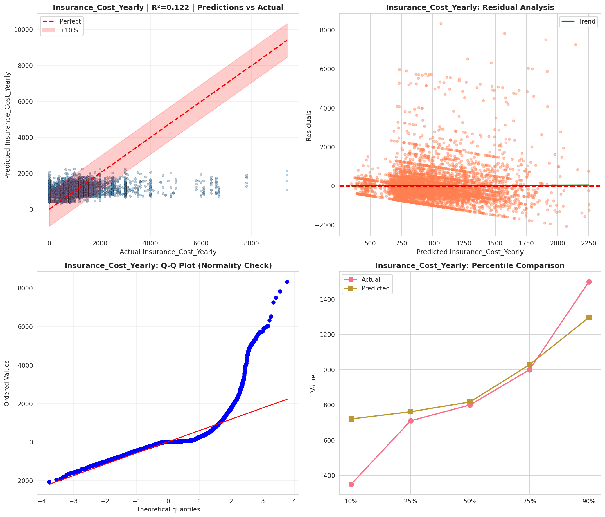
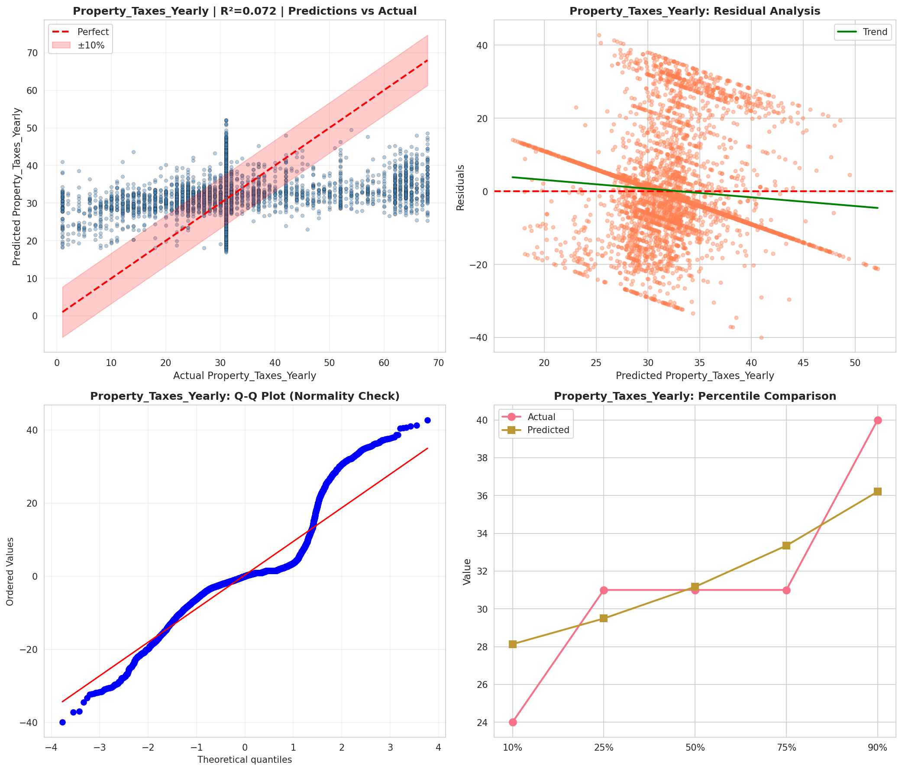
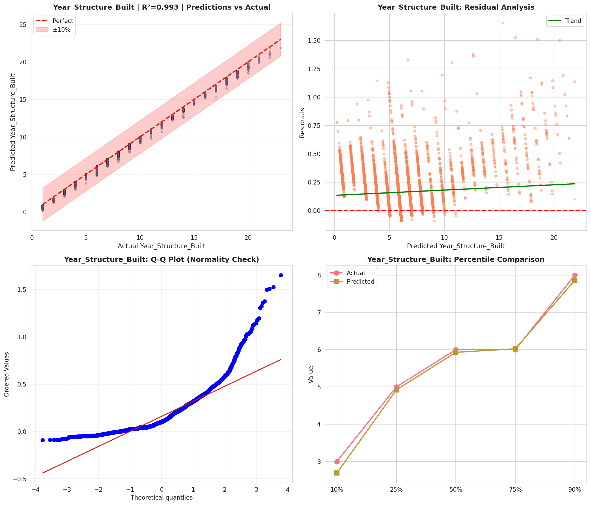
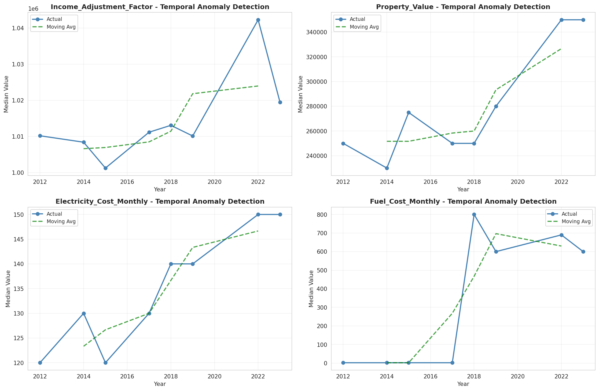
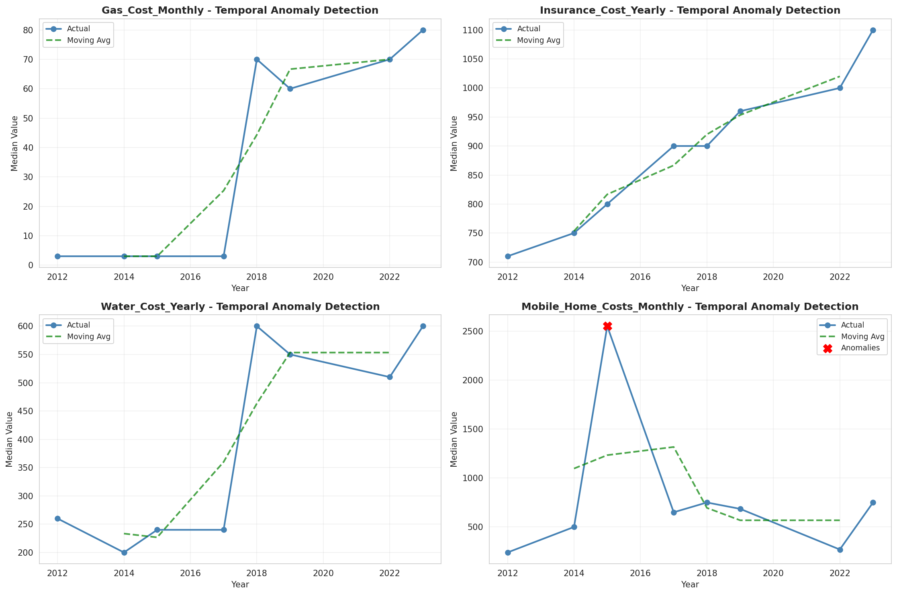
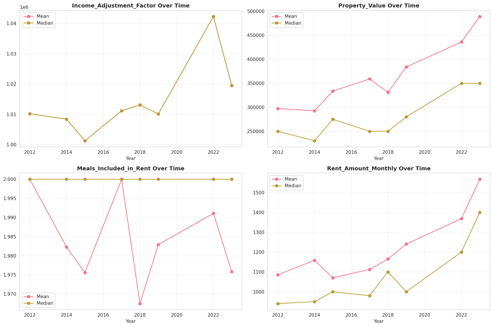
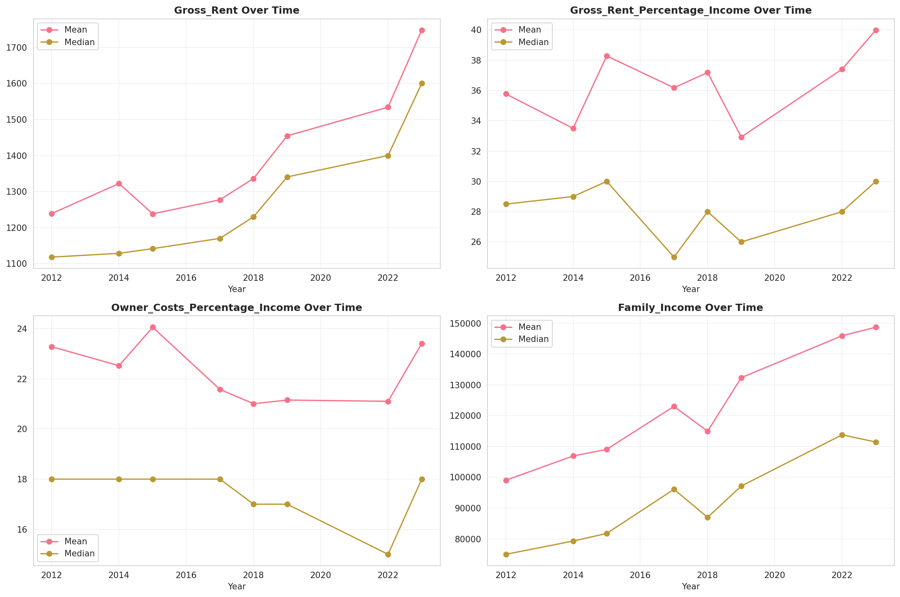
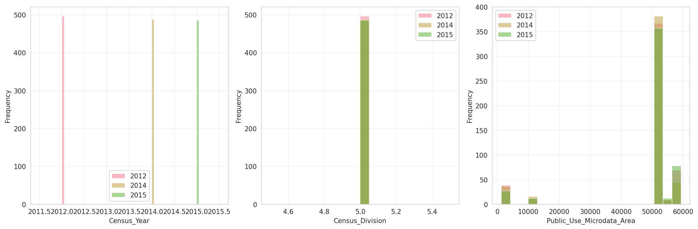
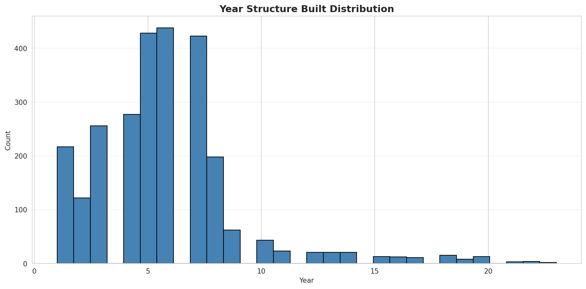
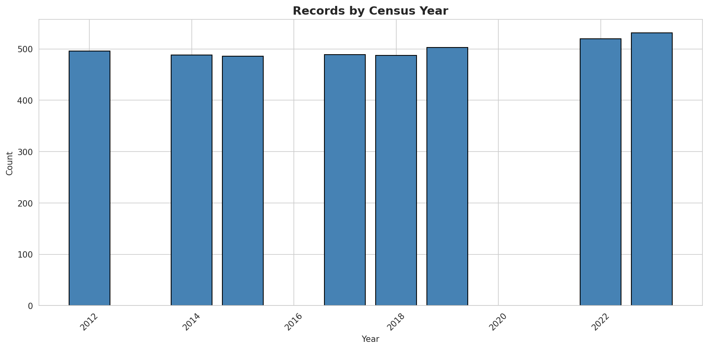

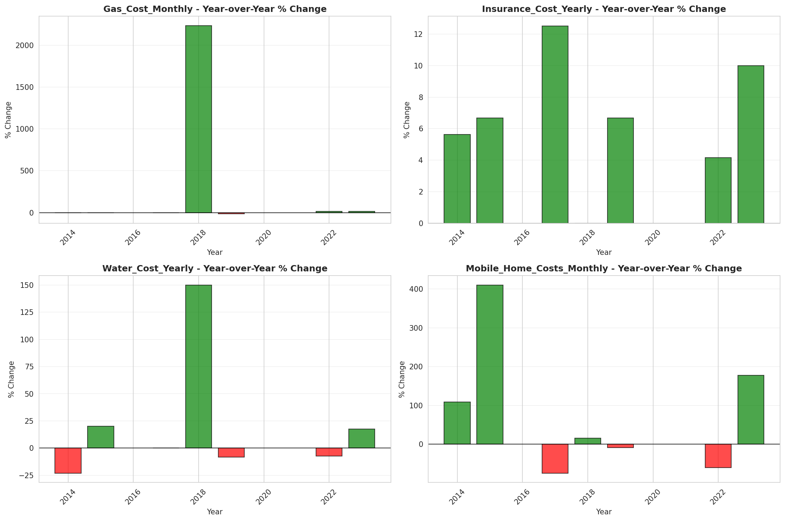
