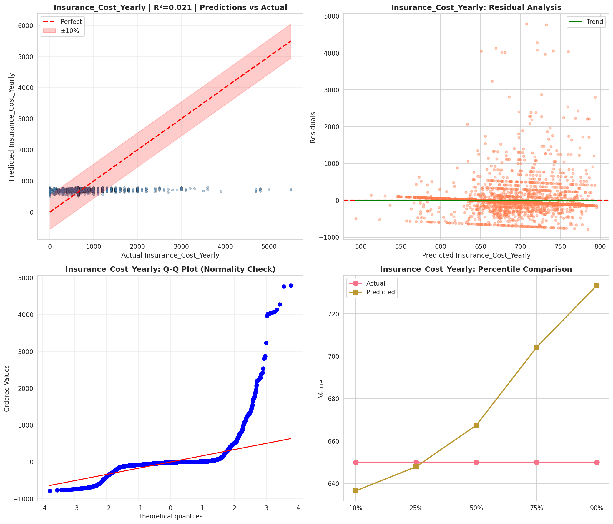
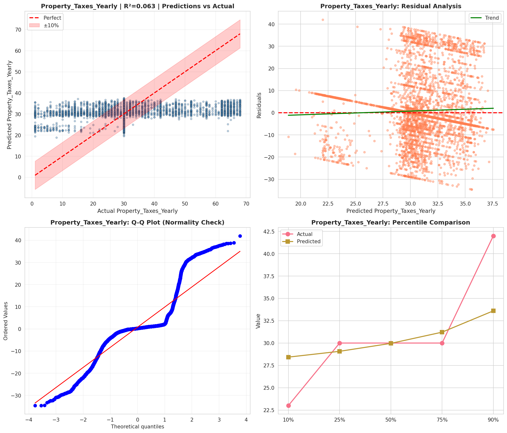
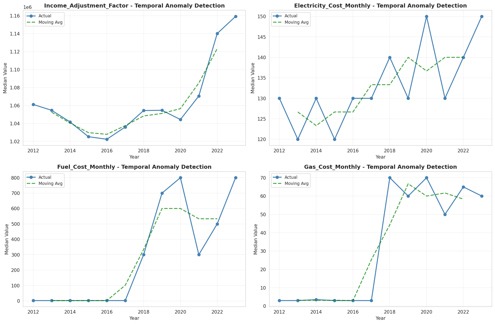
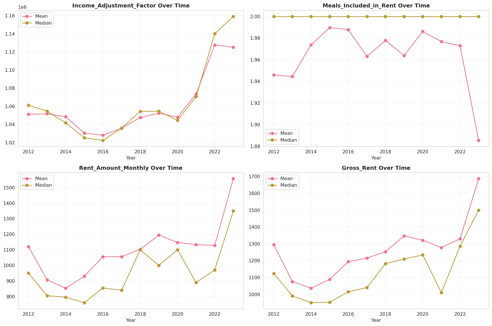
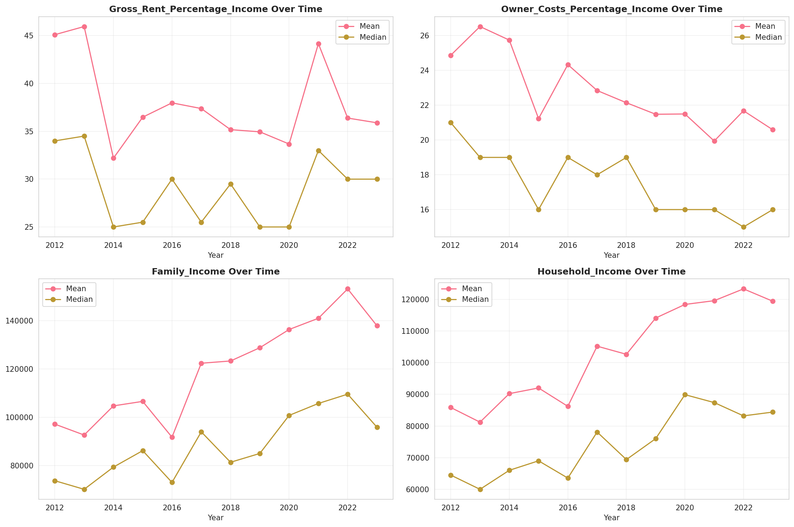
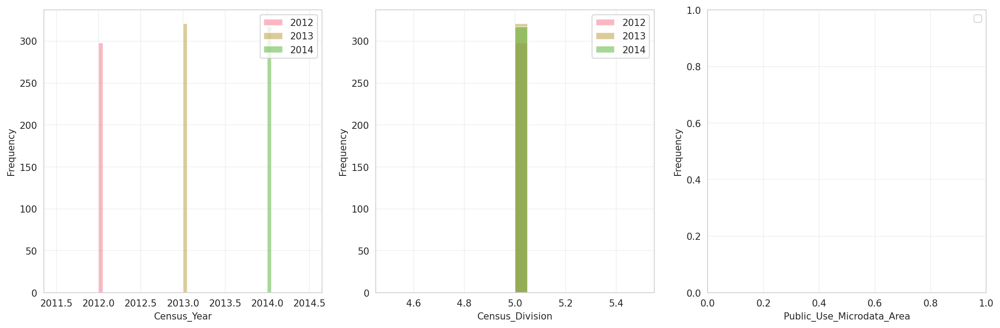
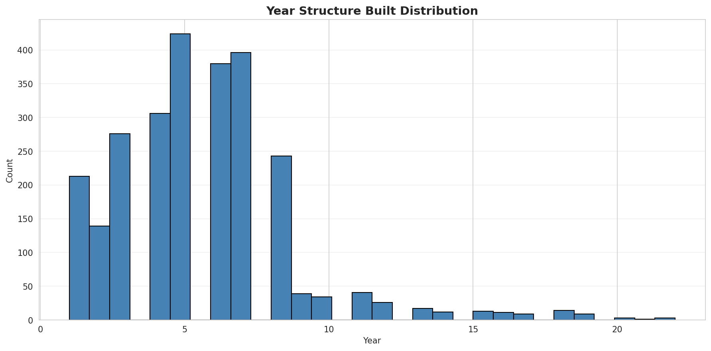
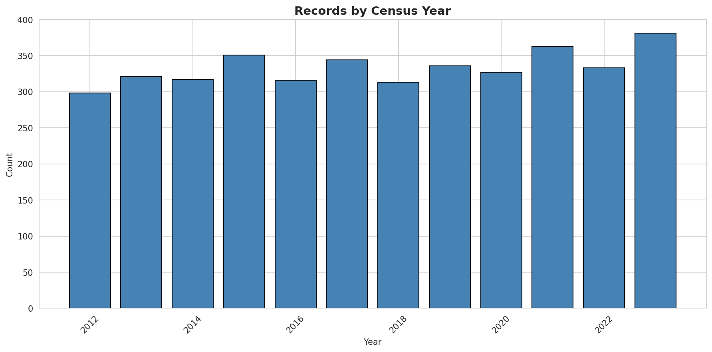
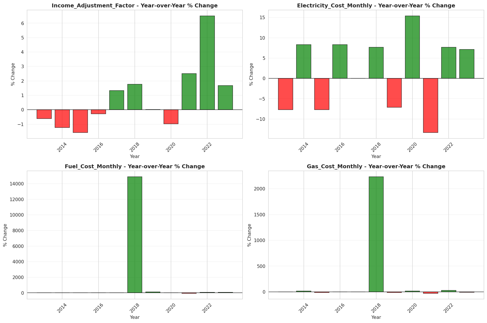
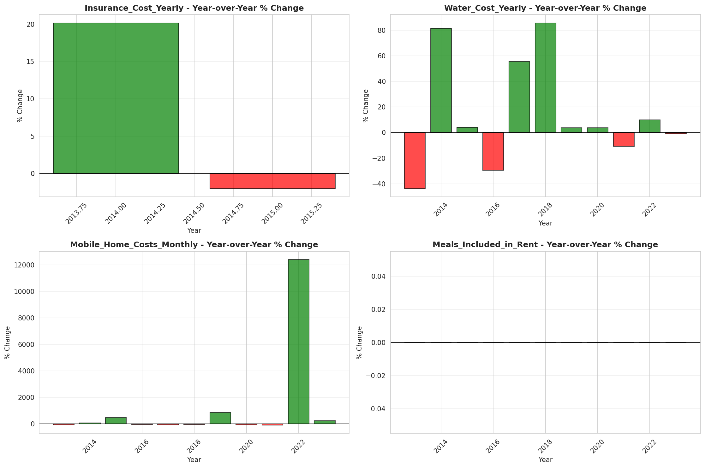

# Temporal Analysis

## Year Distribution

- 2012: 185,017 records

- 2013: 188,074 records

- 2014: 190,968 records

- 2015: 194,035 records

- 2016: 194,229 records

- 2017: 194,991 records

- 2018: 195,969 records

- 2019: 197,158 records

- 2020: 191,461 records

- 2021: 193,685 records

- 2022: 196,240 records

- 2023: 198,369 records

## Temporal Trends

- Census_Year: {np.int64(2012): {'mean': 2012.0, 'median': 2012.0, 'std': 0.0}, np.int64(2013): {'mean': 2013.0, 'median': 2013.0, 'std': 0.0}, np.int64(2014): {'mean': 2014.0, 'median': 2014.0, 'std': 0.0}, np.int64(2015): {'mean': 2015.0, 'median': 2015.0, 'std': 0.0}, np.int64(2016): {'mean': 2016.0, 'median': 2016.0, 'std': 0.0}, np.int64(2017): {'mean': 2017.0, 'median': 2017.0, 'std': 0.0}, np.int64(2018): {'mean': 2018.0, 'median': 2018.0, 'std': 0.0}, np.int64(2019): {'mean': 2019.0, 'median': 2019.0, 'std': 0.0}, np.int64(2020): {'mean': 2020.0, 'median': 2020.0, 'std': 0.0}, np.int64(2021): {'mean': 2021.0, 'median': 2021.0, 'std': 0.0}, np.int64(2022): {'mean': 2022.0, 'median': 2022.0, 'std': 0.0}, np.int64(2023): {'mean': 2023.0, 'median': 2023.0, 'std': 0.0}}

- Census_Division: {np.int64(2012): {'mean': 5.0, 'median': 5.0, 'std': 0.0}, np.int64(2013): {'mean': 5.0, 'median': 5.0, 'std': 0.0}, np.int64(2014): {'mean': 5.0, 'median': 5.0, 'std': 0.0}, np.int64(2015): {'mean': 5.0, 'median': 5.0, 'std': 0.0}, np.int64(2016): {'mean': 5.0, 'median': 5.0, 'std': 0.0}, np.int64(2017): {'mean': 5.0, 'median': 5.0, 'std': 0.0}, np.int64(2018): {'mean': 5.0, 'median': 5.0, 'std': 0.0}, np.int64(2019): {'mean': 5.0, 'median': 5.0, 'std': 0.0}, np.int64(2020): {'mean': 5.0, 'median': 5.0, 'std': 0.0}, np.int64(2021): {'mean': 5.0, 'median': 5.0, 'std': 0.0}, np.int64(2022): {'mean': 5.0, 'median': 5.0, 'std': 0.0}, np.int64(2023): {'mean': 5.0, 'median': 5.0, 'std': 0.0}}

- Public_Use_Microdata_Area: {np.int64(2012): {'mean': None, 'median': None, 'std': None}, np.int64(2013): {'mean': None, 'median': None, 'std': None}, np.int64(2014): {'mean': None, 'median': None, 'std': None}, np.int64(2015): {'mean': None, 'median': None, 'std': None}, np.int64(2016): {'mean': 47946.63136812732, 'median': 51135.0, 'std': 13985.414227187835}, np.int64(2017): {'mean': 47896.40171084819, 'median': 51135.0, 'std': 14071.503968235884}, np.int64(2018): {'mean': 47887.854951548456, 'median': 51135.0, 'std': 14094.370648018486}, np.int64(2019): {'mean': 47848.13149859504, 'median': 51125.0, 'std': 14151.931139963754}, np.int64(2020): {'mean': 47835.139135385274, 'median': 51125.0, 'std': 14171.854593901371}, np.int64(2021): {'mean': 47820.07798745386, 'median': 51125.0, 'std': 14193.443746610457}, np.int64(2022): {'mean': None, 'median': None, 'std': None}, np.int64(2023): {'mean': 28960.236740619755, 'median': 15301.0, 'std': 28098.274278462457}}

- Census_Region: {np.int64(2012): {'mean': 3.0, 'median': 3.0, 'std': 0.0}, np.int64(2013): {'mean': 3.0, 'median': 3.0, 'std': 0.0}, np.int64(2014): {'mean': 3.0, 'median': 3.0, 'std': 0.0}, np.int64(2015): {'mean': 3.0, 'median': 3.0, 'std': 0.0}, np.int64(2016): {'mean': 3.0, 'median': 3.0, 'std': 0.0}, np.int64(2017): {'mean': 3.0, 'median': 3.0, 'std': 0.0}, np.int64(2018): {'mean': 3.0, 'median': 3.0, 'std': 0.0}, np.int64(2019): {'mean': 3.0, 'median': 3.0, 'std': 0.0}, np.int64(2020): {'mean': 3.0, 'median': 3.0, 'std': 0.0}, np.int64(2021): {'mean': 3.0, 'median': 3.0, 'std': 0.0}, np.int64(2022): {'mean': 3.0, 'median': 3.0, 'std': 0.0}, np.int64(2023): {'mean': 3.0, 'median': 3.0, 'std': 0.0}}

- State_Code: {np.int64(2012): {'mean': 51.0, 'median': 51.0, 'std': 0.0}, np.int64(2013): {'mean': 51.0, 'median': 51.0, 'std': 0.0}, np.int64(2014): {'mean': 51.0, 'median': 51.0, 'std': 0.0}, np.int64(2015): {'mean': 51.0, 'median': 51.0, 'std': 0.0}, np.int64(2016): {'mean': 51.0, 'median': 51.0, 'std': 0.0}, np.int64(2017): {'mean': 51.0, 'median': 51.0, 'std': 0.0}, np.int64(2018): {'mean': 51.0, 'median': 51.0, 'std': 0.0}, np.int64(2019): {'mean': 51.0, 'median': 51.0, 'std': 0.0}, np.int64(2020): {'mean': 51.0, 'median': 51.0, 'std': 0.0}, np.int64(2021): {'mean': 51.0, 'median': 51.0, 'std': 0.0}, np.int64(2022): {'mean': 51.0, 'median': 51.0, 'std': 0.0}, np.int64(2023): {'mean': None, 'median': None, 'std': None}}

- Housing_Adjustment_Factor: {np.int64(2012): {'mean': 1041168.0214574877, 'median': 1053092.0, 'std': 27513.17486597271}, np.int64(2013): {'mean': 1039894.9910194923, 'median': 1035725.0, 'std': 32002.939177176897}, np.int64(2014): {'mean': 1036554.346524025, 'median': 1031130.0, 'std': 29524.149937350412}, np.int64(2015): {'mean': 1020949.6218517278, 'median': 1017534.0, 'std': 20301.006437882337}, np.int64(2016): {'mean': 1020364.7876836106, 'median': 1013801.0, 'std': 15758.543234419152}, np.int64(2017): {'mean': 1029217.0369452949, 'median': 1034680.0, 'std': 17960.715564574642}, np.int64(2018): {'mean': 1038327.6035597466, 'median': 1046406.0, 'std': 23456.895580483244}, np.int64(2019): {'mean': 1040883.5338358068, 'median': 1042936.0, 'std': 29196.487449197084}, np.int64(2020): {'mean': 1036548.1996437917, 'median': 1030827.0, 'std': 28293.73531356148}, np.int64(2021): {'mean': 1057939.3828071353, 'median': 1059761.0, 'std': 35836.377727006264}, np.int64(2022): {'mean': 1104004.1864910314, 'median': 1133141.0, 'std': 61813.46140807821}, np.int64(2023): {'mean': 1104568.9128694504, 'median': 1125501.0, 'std': 76572.83757383288}}

- Income_Adjustment_Factor: {np.int64(2012): {'mean': 1052439.6095980369, 'median': 1061121.0, 'std': 26424.456475964533}, np.int64(2013): {'mean': 1048932.7574624883, 'median': 1054614.0, 'std': 29627.429315389316}, np.int64(2014): {'mean': 1047417.7403491684, 'median': 1041654.0, 'std': 30981.736282531805}, np.int64(2015): {'mean': 1030367.4057000026, 'median': 1025215.0, 'std': 25677.577255171906}, np.int64(2016): {'mean': 1027522.0463370557, 'median': 1022342.0, 'std': 17515.880543859006}, np.int64(2017): {'mean': 1036604.5691493454, 'median': 1035988.0, 'std': 16837.254411367638}, np.int64(2018): {'mean': 1046897.1979598814, 'median': 1054346.0, 'std': 20478.499152187742}, np.int64(2019): {'mean': 1049821.3258604773, 'median': 1054606.0, 'std': 26237.72715992681}, np.int64(2020): {'mean': 1046658.987537932, 'median': 1044328.0, 'std': 28783.318173728123}, np.int64(2021): {'mean': 1073054.2303172678, 'median': 1070512.0, 'std': 30866.465648910715}, np.int64(2022): {'mean': 1126504.8303556868, 'median': 1140108.0, 'std': 49858.04534572917}, np.int64(2023): {'mean': 1128669.8520333318, 'median': 1159185.0, 'std': 70227.6980998305}}

- Housing_Unit_Weight: {np.int64(2012): {'mean': 18.192139100731286, 'median': 15.0, 'std': 14.525094220899998}, np.int64(2013): {'mean': 17.97873177579038, 'median': 15.0, 'std': 14.749825682344474}, np.int64(2014): {'mean': 17.8210014243224, 'median': 15.0, 'std': 14.994963955103824}, np.int64(2015): {'mean': 17.642646945138765, 'median': 14.0, 'std': 15.302085173415726}, np.int64(2016): {'mean': 17.738633262798036, 'median': 14.0, 'std': 15.048543126617641}, np.int64(2017): {'mean': 17.779902662174152, 'median': 14.0, 'std': 15.013399673804468}, np.int64(2018): {'mean': 17.81450637600845, 'median': 14.0, 'std': 15.037811605702572}, np.int64(2019): {'mean': 17.82343095385427, 'median': 14.0, 'std': 15.301230042251074}, np.int64(2020): {'mean': 18.477851886284935, 'median': 14.0, 'std': 19.309396979575634}, np.int64(2021): {'mean': 18.566744972506907, 'median': 14.0, 'std': 18.964892037310058}, np.int64(2022): {'mean': 18.473731145536078, 'median': 14.0, 'std': 19.215526124841762}, np.int64(2023): {'mean': 18.424169099002363, 'median': 13.0, 'std': 19.47737124516122}}

- Number_of_Persons: {np.int64(2012): {'mean': 2.166730624753401, 'median': 2.0, 'std': 1.4292617808368935}, np.int64(2013): {'mean': 2.154662526452354, 'median': 2.0, 'std': 1.4276568876874574}, np.int64(2014): {'mean': 2.1473807129990363, 'median': 2.0, 'std': 1.430235351604337}, np.int64(2015): {'mean': 2.1341407478032313, 'median': 2.0, 'std': 1.4231801901280676}, np.int64(2016): {'mean': 2.1432381364265893, 'median': 2.0, 'std': 1.4255955569239251}, np.int64(2017): {'mean': 2.1430578847228845, 'median': 2.0, 'std': 1.427256236152912}, np.int64(2018): {'mean': 2.14109374441876, 'median': 2.0, 'std': 1.4278212235836512}, np.int64(2019): {'mean': 2.136017813124499, 'median': 2.0, 'std': 1.4206999835461382}, np.int64(2020): {'mean': 2.121408537508944, 'median': 2.0, 'std': 1.4206893352619108}, np.int64(2021): {'mean': 2.1153625732503807, 'median': 2.0, 'std': 1.4161550878230922}, np.int64(2022): {'mean': 2.109931716265797, 'median': 2.0, 'std': 1.4091878439773828}, np.int64(2023): {'mean': 2.1083233771405814, 'median': 2.0, 'std': 1.4069701441932256}}

- Housing_Unit_Type: {np.int64(2012): {'mean': 1.1360469578471168, 'median': 1.0, 'std': 0.452532127924997}, np.int64(2013): {'mean': 1.1525091187511298, 'median': 1.0, 'std': 0.48083318261531544}, np.int64(2014): {'mean': 1.1660801809727284, 'median': 1.0, 'std': 0.5025012501767778}, np.int64(2015): {'mean': 1.1818383281366764, 'median': 1.0, 'std': 0.525787572648061}, np.int64(2016): {'mean': 1.1754835786623006, 'median': 1.0, 'std': 0.5182125783301026}, np.int64(2017): {'mean': 1.1731669666805136, 'median': 1.0, 'std': 0.516941282614965}, np.int64(2018): {'mean': 1.1701544632059153, 'median': 1.0, 'std': 0.5130820414476776}, np.int64(2019): {'mean': 1.1696000162306373, 'median': 1.0, 'std': 0.5126108140262182}, np.int64(2020): {'mean': None, 'median': None, 'std': None}, np.int64(2021): {'mean': None, 'median': None, 'std': None}, np.int64(2022): {'mean': None, 'median': None, 'std': None}, np.int64(2023): {'mean': None, 'median': None, 'std': None}}

- Building_Type: {np.int64(2012): {'mean': 2.9228428330663365, 'median': 2.0, 'std': 1.9913106453031986}, np.int64(2013): {'mean': 2.9291446223768776, 'median': 2.0, 'std': 1.9939822124757574}, np.int64(2014): {'mean': 2.930615147703629, 'median': 2.0, 'std': 1.9926393051262734}, np.int64(2015): {'mean': 2.9350060477155995, 'median': 2.0, 'std': 1.993515285405827}, np.int64(2016): {'mean': 2.9542727373049202, 'median': 2.0, 'std': 2.011618826717159}, np.int64(2017): {'mean': 2.9648105516417704, 'median': 2.0, 'std': 2.0234754391576817}, np.int64(2018): {'mean': 2.9752324109449373, 'median': 2.0, 'std': 2.036487829721163}, np.int64(2019): {'mean': 2.986554000227609, 'median': 2.0, 'std': 2.050405327704347}, np.int64(2020): {'mean': 2.9901048074193244, 'median': 2.0, 'std': 2.0572515030318046}, np.int64(2021): {'mean': 2.996514046342678, 'median': 2.0, 'std': 2.0652666011949146}, np.int64(2022): {'mean': 3.0003654080389768, 'median': 2.0, 'std': 2.0746903689792964}, np.int64(2023): {'mean': 3.0013892237568744, 'median': 2.0, 'std': 2.0815749891705972}}

- Year_Structure_Built: {np.int64(2012): {'mean': 5.241452622426556, 'median': 5.0, 'std': 2.4642619901173264}, np.int64(2013): {'mean': 5.318455656949426, 'median': 5.0, 'std': 2.564101836367485}, np.int64(2014): {'mean': 5.379009980133774, 'median': 5.0, 'std': 2.6557303998080717}, np.int64(2015): {'mean': 5.454303227201281, 'median': 5.0, 'std': 2.7802043578206472}, np.int64(2016): {'mean': 5.5837094085599945, 'median': 5.0, 'std': 2.9316640520691832}, np.int64(2017): {'mean': 5.699663626030614, 'median': 6.0, 'std': 3.135248438559785}, np.int64(2018): {'mean': 5.804620152019384, 'median': 6.0, 'std': 3.3364933241309433}, np.int64(2019): {'mean': 5.940491635370433, 'median': 6.0, 'std': 3.5838431057917925}, np.int64(2020): {'mean': 6.051699867512066, 'median': 6.0, 'std': 3.7869480633154704}, np.int64(2021): {'mean': None, 'median': None, 'std': None}, np.int64(2022): {'mean': None, 'median': None, 'std': None}, np.int64(2023): {'mean': None, 'median': None, 'std': None}}

- Bathtub_or_Shower: {np.int64(2012): {'mean': 1.0080099096577475, 'median': 1.0, 'std': 0.0891392075622121}, np.int64(2013): {'mean': 1.0075157712838358, 'median': 1.0, 'std': 0.08636740478693633}, np.int64(2014): {'mean': 1.0069590567656843, 'median': 1.0, 'std': 0.08313043313154168}, np.int64(2015): {'mean': 1.0064801126569631, 'median': 1.0, 'std': 0.08023813567366768}, np.int64(2016): {'mean': 1.006086900965889, 'median': 1.0, 'std': 0.07778101144194524}, np.int64(2017): {'mean': 1.0066928611404404, 'median': 1.0, 'std': 0.08153591299433496}, np.int64(2018): {'mean': 1.006913617018839, 'median': 1.0, 'std': 0.08286047456865502}, np.int64(2019): {'mean': 1.0071241606919312, 'median': 1.0, 'std': 0.08410378871292036}, np.int64(2020): {'mean': 1.0072868363774012, 'median': 1.0, 'std': 0.0850516383041574}, np.int64(2021): {'mean': 1.007382019509623, 'median': 1.0, 'std': 0.0856012162760613}, np.int64(2022): {'mean': 1.0070761556754249, 'median': 1.0, 'std': 0.08382198070136639}, np.int64(2023): {'mean': 1.0068255663096017, 'median': 1.0, 'std': 0.08233478529600198}}

- Refrigerator: {np.int64(2012): {'mean': 1.012142903934682, 'median': 1.0, 'std': 0.10952408527782587}, np.int64(2013): {'mean': 1.011646486524873, 'median': 1.0, 'std': 0.10728892765464745}, np.int64(2014): {'mean': 1.0111909156096817, 'median': 1.0, 'std': 0.10519384039625924}, np.int64(2015): {'mean': 1.0107514943992895, 'median': 1.0, 'std': 0.10313080003355656}, np.int64(2016): {'mean': 1.0099086384043956, 'median': 1.0, 'std': 0.09904804021245622}, np.int64(2017): {'mean': 1.010627801914389, 'median': 1.0, 'std': 0.1025422469464692}, np.int64(2018): {'mean': 1.011146560661691, 'median': 1.0, 'std': 0.10498751346024907}, np.int64(2019): {'mean': 1.0114487310800047, 'median': 1.0, 'std': 0.10638478292048167}, np.int64(2020): {'mean': 1.0117523895145264, 'median': 1.0, 'std': 0.10776984527158652}, np.int64(2021): {'mean': 1.0118756774174649, 'median': 1.0, 'std': 0.10832688703202252}, np.int64(2022): {'mean': 1.0112638478046516, 'median': 1.0, 'std': 0.1055321663452791}, np.int64(2023): {'mean': 1.010608617779768, 'median': 1.0, 'std': 0.10245064793656734}}

- Hot_and_Cold_Running_Water: {np.int64(2012): {'mean': 1.0104694581251452, 'median': 1.0, 'std': 0.101783644404809}, np.int64(2013): {'mean': 1.0100959888269478, 'median': 1.0, 'std': 0.09997059058069109}, np.int64(2014): {'mean': 1.0094922944903548, 'median': 1.0, 'std': 0.09696517982313664}, np.int64(2015): {'mean': 1.0089634741350597, 'median': 1.0, 'std': 0.09425063486646074}, np.int64(2016): {'mean': 1.0090258054398773, 'median': 1.0, 'std': 0.09457479699194256}, np.int64(2017): {'mean': 1.0100623705421794, 'median': 1.0, 'std': 0.09980569479909993}, np.int64(2018): {'mean': 1.0106596862237445, 'median': 1.0, 'std': 0.10269429254261539}, np.int64(2019): {'mean': 1.0111073176283145, 'median': 1.0, 'std': 0.10480461642925988}, np.int64(2020): {'mean': 1.0117997066338602, 'median': 1.0, 'std': 0.10798399198550399}, np.int64(2021): {'mean': 1.0116706213199753, 'median': 1.0, 'std': 0.10739872203894142}, np.int64(2022): {'mean': 1.0109390406588945, 'median': 1.0, 'std': 0.10401654100427841}, np.int64(2023): {'mean': 1.0104076969884843, 'median': 1.0, 'std': 0.10148613677128888}}

- Running_Water: {np.int64(2012): {'mean': None, 'median': None, 'std': None}, np.int64(2013): {'mean': 9.0, 'median': 9.0, 'std': 0.0}, np.int64(2014): {'mean': 9.0, 'median': 9.0, 'std': 0.0}, np.int64(2015): {'mean': 9.0, 'median': 9.0, 'std': 0.0}, np.int64(2016): {'mean': 9.0, 'median': 9.0, 'std': 0.0}, np.int64(2017): {'mean': 9.0, 'median': 9.0, 'std': 0.0}, np.int64(2018): {'mean': 9.0, 'median': 9.0, 'std': 0.0}, np.int64(2019): {'mean': 9.0, 'median': 9.0, 'std': 0.0}, np.int64(2020): {'mean': 9.0, 'median': 9.0, 'std': 0.0}, np.int64(2021): {'mean': 9.0, 'median': 9.0, 'std': 0.0}, np.int64(2022): {'mean': 9.0, 'median': 9.0, 'std': 0.0}, np.int64(2023): {'mean': 9.0, 'median': 9.0, 'std': 0.0}}

- Sink_with_Faucet: {np.int64(2012): {'mean': 1.0074560646033457, 'median': 1.0, 'std': 0.08602625050785086}, np.int64(2013): {'mean': 1.0068825527583471, 'median': 1.0, 'std': 0.08267541155780264}, np.int64(2014): {'mean': 1.0063360331025404, 'median': 1.0, 'std': 0.07934686378097229}, np.int64(2015): {'mean': 1.0058724194952642, 'median': 1.0, 'std': 0.07640659851722481}, np.int64(2016): {'mean': 1.005430584354109, 'median': 1.0, 'std': 0.07349234298901947}, np.int64(2017): {'mean': 1.0060581932736745, 'median': 1.0, 'std': 0.07759849425331122}, np.int64(2018): {'mean': 1.0063064559550472, 'median': 1.0, 'std': 0.0791626203690798}, np.int64(2019): {'mean': 1.006555138272448, 'median': 1.0, 'std': 0.08069823722105925}, np.int64(2020): {'mean': 1.0067663480647298, 'median': 1.0, 'std': 0.08197929219352577}, np.int64(2021): {'mean': 1.0069660485690013, 'median': 1.0, 'std': 0.08317188987019272}, np.int64(2022): {'mean': 1.0066585464880227, 'median': 1.0, 'std': 0.08132803090063985}, np.int64(2023): {'mean': 1.0064983524495115, 'median': 1.0, 'std': 0.08035023912318091}}

- Stove_or_Range: {np.int64(2012): {'mean': 1.0130421577326894, 'median': 1.0, 'std': 0.11345543844213851}, np.int64(2013): {'mean': 1.0124927505355727, 'median': 1.0, 'std': 0.11107094457004243}, np.int64(2014): {'mean': 1.0121607165947641, 'median': 1.0, 'std': 0.10960339489948347}, np.int64(2015): {'mean': 1.0116396613279264, 'median': 1.0, 'std': 0.1072578520843695}, np.int64(2016): {'mean': 1.0108611687082178, 'median': 1.0, 'std': 0.10364972802954313}, np.int64(2017): {'mean': 1.0116490402090943, 'median': 1.0, 'std': 0.10730054287045027}, np.int64(2018): {'mean': 1.0122176844251731, 'median': 1.0, 'std': 0.10985664176522889}, np.int64(2019): {'mean': 1.012592466143166, 'median': 1.0, 'std': 0.11150769790313687}, np.int64(2020): {'mean': 1.012953061417621, 'median': 1.0, 'std': 0.1130723451525824}, np.int64(2021): {'mean': 1.0133813750476024, 'median': 1.0, 'std': 0.11490165881696235}, np.int64(2022): {'mean': 1.0128356823850124, 'median': 1.0, 'std': 0.11256554151314248}, np.int64(2023): {'mean': 1.0125202355939793, 'median': 1.0, 'std': 0.11119150268241552}}

- Telephone_Service: {np.int64(2012): {'mean': 1.0212783552372107, 'median': 1.0, 'std': 0.14431118914711646}, np.int64(2013): {'mean': 1.0212010338268656, 'median': 1.0, 'std': 0.14405443806523266}, np.int64(2014): {'mean': 1.0212988936373164, 'median': 1.0, 'std': 0.14437929762051388}, np.int64(2015): {'mean': 1.0214892834203257, 'median': 1.0, 'std': 0.1450090522927617}, np.int64(2016): {'mean': 1.0217144980031578, 'median': 1.0, 'std': 0.14575016333384141}, np.int64(2017): {'mean': 1.0194041431632879, 'median': 1.0, 'std': 0.1379410728025861}, np.int64(2018): {'mean': 1.0178700338924984, 'median': 1.0, 'std': 0.1324794442663573}, np.int64(2019): {'mean': 1.0155124451840964, 'median': 1.0, 'std': 0.12357953708743995}, np.int64(2020): {'mean': 1.0123548166704623, 'median': 1.0, 'std': 0.11046380569135117}, np.int64(2021): {'mean': 1.0085648683988264, 'median': 1.0, 'std': 0.09214968558749025}, np.int64(2022): {'mean': 1.007865702696195, 'median': 1.0, 'std': 0.08833958115487411}, np.int64(2023): {'mean': 1.0071881477868552, 'median': 1.0, 'std': 0.08447793693219864}}

- Lot_Acreage: {np.int64(2012): {'mean': 1.3298614394297559, 'median': 1.0, 'std': 0.5699164260016489}, np.int64(2013): {'mean': 1.3297208918727301, 'median': 1.0, 'std': 0.5696022012086113}, np.int64(2014): {'mean': 1.3296915628726171, 'median': 1.0, 'std': 0.5693499030667777}, np.int64(2015): {'mean': 1.329536603665726, 'median': 1.0, 'std': 0.5691214959935491}, np.int64(2016): {'mean': 1.3280068361461226, 'median': 1.0, 'std': 0.5676211512314144}, np.int64(2017): {'mean': 1.3257166332580164, 'median': 1.0, 'std': 0.5662693745300008}, np.int64(2018): {'mean': 1.3250841584855697, 'median': 1.0, 'std': 0.5659490180862945}, np.int64(2019): {'mean': 1.3252508829960195, 'median': 1.0, 'std': 0.5662677284226112}, np.int64(2020): {'mean': 1.324867740268813, 'median': 1.0, 'std': 0.5664963757179277}, np.int64(2021): {'mean': 1.3252303964694174, 'median': 1.0, 'std': 0.5666752104707268}, np.int64(2022): {'mean': 1.32809644814984, 'median': 1.0, 'std': 0.5675602228786345}, np.int64(2023): {'mean': 1.3313085134153138, 'median': 1.0, 'std': 0.568751142727396}}

- Agricultural_Sales: {np.int64(2012): {'mean': 1.1491277276041958, 'median': 1.0, 'std': 0.7304341207647671}, np.int64(2013): {'mean': 1.1465803499176828, 'median': 1.0, 'std': 0.724205062067633}, np.int64(2014): {'mean': 1.1463698288752284, 'median': 1.0, 'std': 0.7245872592931794}, np.int64(2015): {'mean': 1.1498692360633174, 'median': 1.0, 'std': 0.7374862116089891}, np.int64(2016): {'mean': 1.1508336778283037, 'median': 1.0, 'std': 0.7396343416548798}, np.int64(2017): {'mean': 1.1559023742321102, 'median': 1.0, 'std': 0.7520741080690813}, np.int64(2018): {'mean': 1.1579600960344398, 'median': 1.0, 'std': 0.7533608769690963}, np.int64(2019): {'mean': 1.155663617132339, 'median': 1.0, 'std': 0.7453725579601935}, np.int64(2020): {'mean': 1.1538925076759734, 'median': 1.0, 'std': 0.734021607600178}, np.int64(2021): {'mean': 1.1519703527681122, 'median': 1.0, 'std': 0.728266936046344}, np.int64(2022): {'mean': 1.1490993351907535, 'median': 1.0, 'std': 0.723041813896398}, np.int64(2023): {'mean': 1.148696586938995, 'median': 1.0, 'std': 0.7245602466195555}}

- Business_On_Property: {np.int64(2012): {'mean': 1.986129395934102, 'median': 2.0, 'std': 0.11695430688185944}, np.int64(2013): {'mean': 1.986500368960977, 'median': 2.0, 'std': 0.11540141830402816}, np.int64(2014): {'mean': 1.9867474033530148, 'median': 2.0, 'std': 0.11435497042692375}, np.int64(2015): {'mean': 1.9866876272821465, 'median': 2.0, 'std': 0.11460910657771993}, np.int64(2016): {'mean': 3.4069643238624225, 'median': 2.0, 'std': 2.8206923338862593}, np.int64(2017): {'mean': 4.8184599910752866, 'median': 2.0, 'std': 3.4426073034601132}, np.int64(2018): {'mean': 6.218030339310111, 'median': 9.0, 'std': 3.4321157752560807}, np.int64(2019): {'mean': 7.616240118854067, 'median': 9.0, 'std': 2.791775004320848}, np.int64(2020): {'mean': None, 'median': None, 'std': None}, np.int64(2021): {'mean': None, 'median': None, 'std': None}, np.int64(2022): {'mean': None, 'median': None, 'std': None}, np.int64(2023): {'mean': None, 'median': None, 'std': None}}

- Tenure: {np.int64(2012): {'mean': 1.7887240620348341, 'median': 1.0, 'std': 0.8912819836371401}, np.int64(2013): {'mean': 1.7980435648069157, 'median': 1.0, 'std': 0.8913764583461352}, np.int64(2014): {'mean': 1.806935632659977, 'median': 2.0, 'std': 0.8908958861757786}, np.int64(2015): {'mean': 1.8147469116170591, 'median': 2.0, 'std': 0.8902596153720385}, np.int64(2016): {'mean': 1.8159499705891458, 'median': 2.0, 'std': 0.8890909224542984}, np.int64(2017): {'mean': 1.8183363302707096, 'median': 2.0, 'std': 0.887943226950497}, np.int64(2018): {'mean': 1.8218992034651103, 'median': 2.0, 'std': 0.886531657060169}, np.int64(2019): {'mean': 1.822681940209667, 'median': 2.0, 'std': 0.8844934607887596}, np.int64(2020): {'mean': 1.8176826336698804, 'median': 2.0, 'std': 0.880928059728485}, np.int64(2021): {'mean': 1.8147323244014288, 'median': 2.0, 'std': 0.8771662986515472}, np.int64(2022): {'mean': 1.8147978934240503, 'median': 2.0, 'std': 0.8733075262025636}, np.int64(2023): {'mean': 1.810748689184246, 'median': 2.0, 'std': 0.8684304625653092}}

- Vacancy_Status: {np.int64(2012): {'mean': 4.516472235184321, 'median': 5.0, 'std': 2.252492089500446}, np.int64(2013): {'mean': 4.53415338738235, 'median': 5.0, 'std': 2.2561964542602704}, np.int64(2014): {'mean': 4.565310095485306, 'median': 5.0, 'std': 2.249765404621692}, np.int64(2015): {'mean': 4.625324675324675, 'median': 5.0, 'std': 2.246265341490268}, np.int64(2016): {'mean': 4.698631421072366, 'median': 5.0, 'std': 2.232020652206552}, np.int64(2017): {'mean': 4.770469307474156, 'median': 5.0, 'std': 2.234862825193952}, np.int64(2018): {'mean': 4.830741573033708, 'median': 5.0, 'std': 2.227050170410773}, np.int64(2019): {'mean': 4.89538655613624, 'median': 5.0, 'std': 2.2303085598446386}, np.int64(2020): {'mean': 4.904874499818115, 'median': 5.0, 'std': 2.2482674594139236}, np.int64(2021): {'mean': 4.932878480545823, 'median': 5.0, 'std': 2.251030920706902}, np.int64(2022): {'mean': 4.954410497078824, 'median': 5.0, 'std': 2.240054635447579}, np.int64(2023): {'mean': 4.955000982511299, 'median': 5.0, 'std': 2.2370431020486716}}

- Vehicles_Available: {np.int64(2012): {'mean': 1.9581811936234907, 'median': 2.0, 'std': 1.1013231408856552}, np.int64(2013): {'mean': 1.9557590349264125, 'median': 2.0, 'std': 1.0998035363109702}, np.int64(2014): {'mean': 1.9556576362871898, 'median': 2.0, 'std': 1.1019470370243174}, np.int64(2015): {'mean': 1.9598525807718932, 'median': 2.0, 'std': 1.1030524225174139}, np.int64(2016): {'mean': 1.96996996996997, 'median': 2.0, 'std': 1.1051398886493993}, np.int64(2017): {'mean': 1.977886297017021, 'median': 2.0, 'std': 1.1076690226502743}, np.int64(2018): {'mean': 1.9878439721518677, 'median': 2.0, 'std': 1.112497988175173}, np.int64(2019): {'mean': 1.9988156120552472, 'median': 2.0, 'std': 1.116798801900353}, np.int64(2020): {'mean': 2.009723171132873, 'median': 2.0, 'std': 1.1219773542842186}, np.int64(2021): {'mean': 2.0114990709401335, 'median': 2.0, 'std': 1.126666831764943}, np.int64(2022): {'mean': 2.007130994202594, 'median': 2.0, 'std': 1.1271657337158043}, np.int64(2023): {'mean': 2.0029142787464944, 'median': 2.0, 'std': 1.1269873369829326}}

- Condo_Fee_Monthly: {np.int64(2012): {'mean': 250.40882103477523, 'median': 210.0, 'std': 190.13260948673724}, np.int64(2013): {'mean': 264.4195575666164, 'median': 220.0, 'std': 196.49923832442582}, np.int64(2014): {'mean': 278.123746701847, 'median': 240.0, 'std': 200.13181034710811}, np.int64(2015): {'mean': 293.962962962963, 'median': 250.0, 'std': 204.40235420273902}, np.int64(2016): {'mean': 307.83746066493364, 'median': 270.0, 'std': 208.08613081052843}, np.int64(2017): {'mean': 323.68592466723305, 'median': 280.0, 'std': 211.14899867922458}, np.int64(2018): {'mean': 333.08750872295883, 'median': 290.0, 'std': 213.43773818367904}, np.int64(2019): {'mean': 342.3250883392226, 'median': 300.0, 'std': 218.04514560625708}, np.int64(2020): {'mean': 349.87554188225425, 'median': 300.0, 'std': 227.32698769214673}, np.int64(2021): {'mean': 365.0018893387314, 'median': 320.0, 'std': 245.95644934176815}, np.int64(2022): {'mean': 378.3364018937401, 'median': 330.0, 'std': 257.6515554284999}, np.int64(2023): {'mean': 394.16866847475137, 'median': 340.0, 'std': 272.5333222628065}}

- Electricity_Cost_Monthly: {np.int64(2012): {'mean': 142.36678922660016, 'median': 130.0, 'std': 90.64617516776494}, np.int64(2013): {'mean': 144.93594191359077, 'median': 130.0, 'std': 91.3508452746401}, np.int64(2014): {'mean': 146.56869426611695, 'median': 130.0, 'std': 92.19361578366447}, np.int64(2015): {'mean': 147.75272981248324, 'median': 130.0, 'std': 93.04917630696814}, np.int64(2016): {'mean': 147.55653385344107, 'median': 130.0, 'std': 92.99129153096673}, np.int64(2017): {'mean': 148.0841010419489, 'median': 130.0, 'std': 93.49928570976692}, np.int64(2018): {'mean': 156.96626322493103, 'median': 140.0, 'std': 91.98338300319783}, np.int64(2019): {'mean': 156.97430976965845, 'median': 140.0, 'std': 92.07708720286499}, np.int64(2020): {'mean': 157.16954646486028, 'median': 140.0, 'std': 95.54178419812685}, np.int64(2021): {'mean': 158.54461039470587, 'median': 140.0, 'std': 98.56301312364191}, np.int64(2022): {'mean': 165.39134808204426, 'median': 140.0, 'std': 137.22932237765409}, np.int64(2023): {'mean': 172.15625218713615, 'median': 150.0, 'std': 162.17951973803721}}

- Fuel_Cost_Monthly: {np.int64(2012): {'mean': 163.4121257999262, 'median': 2.0, 'std': 524.74500919719}, np.int64(2013): {'mean': 150.63574664922558, 'median': 2.0, 'std': 504.7834484974254}, np.int64(2014): {'mean': 143.7148558841802, 'median': 2.0, 'std': 501.8552161186911}, np.int64(2015): {'mean': 135.58597895970917, 'median': 2.0, 'std': 495.80015368240487}, np.int64(2016): {'mean': 118.19979567196062, 'median': 2.0, 'std': 461.35987995402587}, np.int64(2017): {'mean': 104.91131118062911, 'median': 2.0, 'std': 429.59009737442403}, np.int64(2018): {'mean': 910.7878403322566, 'median': 600.0, 'std': 925.5577344481273}, np.int64(2019): {'mean': 869.4100270683771, 'median': 600.0, 'std': 880.828734630051}, np.int64(2020): {'mean': 820.1775664910703, 'median': 600.0, 'std': 831.3784235910484}, np.int64(2021): {'mean': 812.5410795001329, 'median': 590.0, 'std': 815.4693988525017}, np.int64(2022): {'mean': 850.6858154097469, 'median': 600.0, 'std': 874.374656738208}, np.int64(2023): {'mean': 876.238172005327, 'median': 600.0, 'std': 900.9292896424333}}

- Gas_Cost_Monthly: {np.int64(2012): {'mean': 49.33856439485503, 'median': 3.0, 'std': 80.11016627201639}, np.int64(2013): {'mean': 47.45991393201767, 'median': 3.0, 'std': 77.3965794536718}, np.int64(2014): {'mean': 46.60896385965573, 'median': 3.0, 'std': 76.09872609931186}, np.int64(2015): {'mean': 46.1295842453495, 'median': 3.0, 'std': 75.5072417159412}, np.int64(2016): {'mean': 44.83607318658865, 'median': 3.0, 'std': 73.09959679505823}, np.int64(2017): {'mean': 44.63499150183511, 'median': 3.0, 'std': 72.60512411706041}, np.int64(2018): {'mean': 93.20423991046152, 'median': 70.0, 'std': 85.1446480729997}, np.int64(2019): {'mean': 91.44470220252835, 'median': 70.0, 'std': 83.83370616959934}, np.int64(2020): {'mean': 90.02731362033798, 'median': 70.0, 'std': 83.11943257111568}, np.int64(2021): {'mean': 92.488210965863, 'median': 70.0, 'std': 86.73617504769969}, np.int64(2022): {'mean': 100.50110888022782, 'median': 70.0, 'std': 115.96429292623817}, np.int64(2023): {'mean': 107.01754022333343, 'median': 80.0, 'std': 135.22169268831888}}

- House_Heating_Fuel: {np.int64(2012): {'mean': 2.4591926311370083, 'median': 3.0, 'std': 1.2841494836036396}, np.int64(2013): {'mean': 2.4591366660979355, 'median': 3.0, 'std': 1.283306586999778}, np.int64(2014): {'mean': 2.462607702493238, 'median': 3.0, 'std': 1.2914843778797882}, np.int64(2015): {'mean': 2.460547895659115, 'median': 3.0, 'std': 1.288085244883302}, np.int64(2016): {'mean': 2.451744528033188, 'median': 3.0, 'std': 1.2874472327344761}, np.int64(2017): {'mean': 2.446516984013597, 'median': 3.0, 'std': 1.2878076891857577}, np.int64(2018): {'mean': 2.443025119602589, 'median': 3.0, 'std': 1.2841036964946078}, np.int64(2019): {'mean': 2.437755858164988, 'median': 3.0, 'std': 1.2765998564295202}, np.int64(2020): {'mean': 2.432981603785521, 'median': 3.0, 'std': 1.2744896789955695}, np.int64(2021): {'mean': 2.42948216642997, 'median': 3.0, 'std': 1.2677570644912555}, np.int64(2022): {'mean': 2.433724972062555, 'median': 3.0, 'std': 1.2636072096722448}, np.int64(2023): {'mean': 2.439653700768199, 'median': 3.0, 'std': 1.2602736704959543}}

- Insurance_Cost_Yearly: {np.int64(2013): {'mean': 841.6157948659026, 'median': 680.0, 'std': 661.138608138871}, np.int64(2014): {'mean': 880.9955199019739, 'median': 700.0, 'std': 701.2673072552539}, np.int64(2015): {'mean': 923.0000667143197, 'median': 740.0, 'std': 740.3362770939618}}

- Water_Cost_Yearly: {np.int64(2012): {'mean': 356.4580030788412, 'median': 230.0, 'std': 442.33133173796625}, np.int64(2013): {'mean': 367.7894620435143, 'median': 240.0, 'std': 454.73345036260224}, np.int64(2014): {'mean': 380.79899718232076, 'median': 240.0, 'std': 470.99293625795747}, np.int64(2015): {'mean': 392.82375794311514, 'median': 240.0, 'std': 487.65025926290826}, np.int64(2016): {'mean': 402.0022661837095, 'median': 240.0, 'std': 501.1791350341854}, np.int64(2017): {'mean': 412.5471340246816, 'median': 240.0, 'std': 515.229600394184}, np.int64(2018): {'mean': 621.235334613573, 'median': 500.0, 'std': 535.1552702848214}, np.int64(2019): {'mean': 627.1687810655135, 'median': 510.0, 'std': 541.3555109170268}, np.int64(2020): {'mean': 635.645037599583, 'median': 530.0, 'std': 552.4210986191422}, np.int64(2021): {'mean': 644.4380863211617, 'median': 540.0, 'std': 568.6716072746002}, np.int64(2022): {'mean': 655.4823148508225, 'median': 550.0, 'std': 591.3637539502987}, np.int64(2023): {'mean': 668.7108033783363, 'median': 560.0, 'std': 615.2653143462372}}

- Mobile_Home_Costs_Monthly: {np.int64(2012): {'mean': 1188.1690629647992, 'median': 380.0, 'std': 1780.710010364242}, np.int64(2013): {'mean': 1195.665404996215, 'median': 380.0, 'std': 1821.2062646877378}, np.int64(2014): {'mean': 1181.3068647540983, 'median': 370.0, 'std': 1848.0960974306663}, np.int64(2015): {'mean': 1226.4239298607529, 'median': 400.0, 'std': 1924.7046231220902}, np.int64(2016): {'mean': 1275.3345559339796, 'median': 400.0, 'std': 1997.1984233904009}, np.int64(2017): {'mean': 1307.8256274768823, 'median': 400.0, 'std': 2047.8214256010367}, np.int64(2018): {'mean': 1342.8146981627297, 'median': 430.0, 'std': 2109.6247049388553}, np.int64(2019): {'mean': 1368.8301687763712, 'median': 450.0, 'std': 2162.6898842369496}, np.int64(2020): {'mean': 1339.1177313090805, 'median': 430.0, 'std': 2221.5990035453533}, np.int64(2021): {'mean': 1323.0551586167476, 'median': 450.0, 'std': 2330.154354113688}, np.int64(2022): {'mean': 1372.3012318029116, 'median': 450.0, 'std': 2530.060151381632}, np.int64(2023): {'mean': 1444.1772012144631, 'median': 460.0, 'std': 3044.5856359625086}}

- First_Mortgage_Includes_Insurance: {np.int64(2012): {'mean': 1.3087617850408548, 'median': 1.0, 'std': 0.4619855280350496}, np.int64(2013): {'mean': 1.3049159610767092, 'median': 1.0, 'std': 0.46037473453329847}, np.int64(2014): {'mean': 1.3011169421960176, 'median': 1.0, 'std': 0.45874633892427946}, np.int64(2015): {'mean': 1.2987441070128145, 'median': 1.0, 'std': 0.4577103255551851}, np.int64(2016): {'mean': 1.2954320014243204, 'median': 1.0, 'std': 0.4562396092962383}, np.int64(2017): {'mean': 1.291392916597832, 'median': 1.0, 'std': 0.45440698581900074}, np.int64(2018): {'mean': 1.2862483786464558, 'median': 1.0, 'std': 0.4520097814347189}, np.int64(2019): {'mean': 1.2804955366200041, 'median': 1.0, 'std': 0.4492441982371716}, np.int64(2020): {'mean': 1.2735493794420283, 'median': 1.0, 'std': 0.4457833010219345}, np.int64(2021): {'mean': 1.2664088573396197, 'median': 1.0, 'std': 0.44208343825125157}, np.int64(2022): {'mean': 1.2594792384790794, 'median': 1.0, 'std': 0.43835181164278947}, np.int64(2023): {'mean': 1.25620685558914, 'median': 1.0, 'std': 0.4365402822742577}}

- First_Mortgage_Payment_Monthly: {np.int64(2012): {'mean': 1483.1009428032685, 'median': 1300.0, 'std': 989.3302670467897}, np.int64(2013): {'mean': 1474.3593580184506, 'median': 1300.0, 'std': 977.5463817771017}, np.int64(2014): {'mean': 1471.3655666670902, 'median': 1300.0, 'std': 978.5329433421298}, np.int64(2015): {'mean': 1475.6655210742165, 'median': 1300.0, 'std': 979.6757074544795}, np.int64(2016): {'mean': 1495.1591169214335, 'median': 1300.0, 'std': 984.3457570741792}, np.int64(2017): {'mean': 1513.2563317278978, 'median': 1300.0, 'std': 995.1203869779549}, np.int64(2018): {'mean': 1544.9020320964419, 'median': 1300.0, 'std': 1011.5789437808011}, np.int64(2019): {'mean': 1581.3962771353215, 'median': 1400.0, 'std': 1030.0616169452273}, np.int64(2020): {'mean': 1623.5376047523073, 'median': 1400.0, 'std': 1049.2010393478843}, np.int64(2021): {'mean': 1664.6906552948033, 'median': 1400.0, 'std': 1068.2477754669876}, np.int64(2022): {'mean': 1706.5263562602747, 'median': 1500.0, 'std': 1089.6180660236082}, np.int64(2023): {'mean': 1760.9078837955203, 'median': 1500.0, 'std': 1122.1934633164274}}

- First_Mortgage_Includes_Taxes: {np.int64(2012): {'mean': 1.2277812696417347, 'median': 1.0, 'std': 0.41940335480260726}, np.int64(2013): {'mean': 1.2238468343232656, 'median': 1.0, 'std': 0.41682325359161315}, np.int64(2014): {'mean': 1.2189918294217061, 'median': 1.0, 'std': 0.4135656917879447}, np.int64(2015): {'mean': 1.2138339870450103, 'median': 1.0, 'std': 0.4100136105527164}, np.int64(2016): {'mean': 1.208065213520869, 'median': 1.0, 'std': 0.4059263183460108}, np.int64(2017): {'mean': 1.2007472264935, 'median': 1.0, 'std': 0.40056187603699117}, np.int64(2018): {'mean': 1.1926422340344363, 'median': 1.0, 'std': 0.39437695360924824}, np.int64(2019): {'mean': 1.1835565023331305, 'median': 1.0, 'std': 0.38712454467045726}, np.int64(2020): {'mean': 1.1758380184576218, 'median': 1.0, 'std': 0.38068481890274547}, np.int64(2021): {'mean': 1.167571648037294, 'median': 1.0, 'std': 0.37348793582680406}, np.int64(2022): {'mean': 1.1605106856870129, 'median': 1.0, 'std': 0.36708145134717735}, np.int64(2023): {'mean': 1.1561844171957287, 'median': 1.0, 'std': 0.36303248416432954}}

- First_Mortgage_Status: {np.int64(2012): {'mean': 1.606986976262196, 'median': 1.0, 'std': 0.9172467299367407}, np.int64(2013): {'mean': 1.6161112085599019, 'median': 1.0, 'std': 0.9211533662947182}, np.int64(2014): {'mean': 1.6274669326055007, 'median': 1.0, 'std': 0.9256775138492372}, np.int64(2015): {'mean': 1.6392270396595625, 'median': 1.0, 'std': 0.9303454357972831}, np.int64(2016): {'mean': 1.6413907256072726, 'median': 1.0, 'std': 0.9311959410450213}, np.int64(2017): {'mean': 1.6470781012832896, 'median': 1.0, 'std': 0.9333126606540976}, np.int64(2018): {'mean': 1.6565017655730399, 'median': 1.0, 'std': 0.9367724143766973}, np.int64(2019): {'mean': 1.6641233697268363, 'median': 1.0, 'std': 0.9396430860551095}, np.int64(2020): {'mean': 1.676279765834764, 'median': 1.0, 'std': 0.9439959575925857}, np.int64(2021): {'mean': 1.696146617355379, 'median': 1.0, 'std': 0.9505522286959103}, np.int64(2022): {'mean': 1.7209171783837112, 'median': 1.0, 'std': 0.9582141051227198}, np.int64(2023): {'mean': 1.7399562881644366, 'median': 1.0, 'std': 0.9635382197425699}}

- Second_Mortgage_Payment_Monthly: {np.int64(2012): {'mean': 462.29443917423316, 'median': 340.0, 'std': 447.0387442008285}, np.int64(2013): {'mean': 446.0111503808054, 'median': 310.0, 'std': 433.51600996867353}, np.int64(2014): {'mean': 438.1074447777475, 'median': 300.0, 'std': 423.3117656011405}, np.int64(2015): {'mean': 429.3547660003559, 'median': 300.0, 'std': 413.75951914262345}, np.int64(2016): {'mean': 427.0473443280868, 'median': 300.0, 'std': 417.5873354102525}, np.int64(2017): {'mean': 429.2757190635451, 'median': 300.0, 'std': 429.50157603752524}, np.int64(2018): {'mean': 440.9578827546955, 'median': 300.0, 'std': 451.33194863602824}, np.int64(2019): {'mean': 447.9856512966146, 'median': 300.0, 'std': 454.35491066611723}, np.int64(2020): {'mean': 463.06481036965914, 'median': 320.0, 'std': 477.84462311132904}, np.int64(2021): {'mean': 473.2584955460244, 'median': 330.0, 'std': 492.0165142124506}, np.int64(2022): {'mean': 484.48659232144377, 'median': 340.0, 'std': 510.85638333375005}, np.int64(2023): {'mean': 513.2963921974797, 'median': 350.0, 'std': 561.8926546856245}}

- Second_Mortgage_Status: {np.int64(2012): {'mean': 2.674054054054054, 'median': 3.0, 'std': 0.6073705728623463}, np.int64(2013): {'mean': 2.703096170858082, 'median': 3.0, 'std': 0.5864091701379378}, np.int64(2014): {'mean': 2.7297736889589186, 'median': 3.0, 'std': 0.5632840313167679}, np.int64(2015): {'mean': 2.7519898813098083, 'median': 3.0, 'std': 0.5426916385852479}, np.int64(2016): {'mean': 2.76840806775695, 'median': 3.0, 'std': 0.526067878645599}, np.int64(2017): {'mean': 2.7849182244475226, 'median': 3.0, 'std': 0.5061163700250151}, np.int64(2018): {'mean': 2.7984816500928305, 'median': 3.0, 'std': 0.48852882269985304}, np.int64(2019): {'mean': 2.8087467031852302, 'median': 3.0, 'std': 0.4748246088740913}, np.int64(2020): {'mean': 2.815222121128209, 'median': 3.0, 'std': 0.46272679534157485}, np.int64(2021): {'mean': 2.8228782770067173, 'median': 3.0, 'std': 0.44927011172307135}, np.int64(2022): {'mean': 2.829907489215737, 'median': 3.0, 'std': 0.43938360137991844}, np.int64(2023): {'mean': 2.834795359246778, 'median': 3.0, 'std': 0.4311808534069998}}

- Property_Taxes_Yearly: {np.int64(2012): {'mean': 32.37569487744689, 'median': 29.0, 'std': 18.375496829611187}, np.int64(2013): {'mean': 32.416733906332226, 'median': 29.0, 'std': 18.500291490540672}, np.int64(2014): {'mean': 32.56228567429491, 'median': 30.0, 'std': 18.68081902183065}, np.int64(2015): {'mean': 32.99774146290418, 'median': 30.0, 'std': 18.831222980139724}, np.int64(2016): {'mean': 33.724688672623124, 'median': 30.0, 'std': 19.020057536527275}, np.int64(2017): {'mean': 34.36823858148199, 'median': 31.0, 'std': 19.193064763549103}}

- Meals_Included_in_Rent: {np.int64(2012): {'mean': 1.9787110012591522, 'median': 2.0, 'std': 0.14434771603940422}, np.int64(2013): {'mean': 1.9783857729138168, 'median': 2.0, 'std': 0.14542191868345758}, np.int64(2014): {'mean': 1.9773189880779296, 'median': 2.0, 'std': 0.14888612914046825}, np.int64(2015): {'mean': 1.9775608463271346, 'median': 2.0, 'std': 0.14810848230845264}, np.int64(2016): {'mean': 1.9774200613228208, 'median': 2.0, 'std': 0.14856166535885715}, np.int64(2017): {'mean': 1.9775632663709888, 'median': 2.0, 'std': 0.1481006531935399}, np.int64(2018): {'mean': 1.97718877584084, 'median': 2.0, 'std': 0.14930289260106855}, np.int64(2019): {'mean': 1.9771023608478373, 'median': 2.0, 'std': 0.14957880604723958}, np.int64(2020): {'mean': 1.976452474754336, 'median': 2.0, 'std': 0.1516362750704164}, np.int64(2021): {'mean': 1.975548290423648, 'median': 2.0, 'std': 0.15444858385110022}, np.int64(2022): {'mean': 1.9742339674222578, 'median': 2.0, 'std': 0.15843836664120986}, np.int64(2023): {'mean': 1.9731612844078752, 'median': 2.0, 'std': 0.16161372952640224}}

- Rent_Amount_Monthly: {np.int64(2012): {'mean': 945.8144849134916, 'median': 820.0, 'std': 595.035752451589}, np.int64(2013): {'mean': 973.572366621067, 'median': 850.0, 'std': 611.5751132807771}, np.int64(2014): {'mean': 997.3309772518845, 'median': 850.0, 'std': 625.590028932935}, np.int64(2015): {'mean': 1025.7218075003314, 'median': 890.0, 'std': 639.3835432754857}, np.int64(2016): {'mean': 1062.8847568988174, 'median': 900.0, 'std': 652.7859103446838}, np.int64(2017): {'mean': 1089.404469953909, 'median': 950.0, 'std': 663.6802916296217}, np.int64(2018): {'mean': 1113.8112889637741, 'median': 970.0, 'std': 670.9587579530148}, np.int64(2019): {'mean': 1141.5524728588662, 'median': 1000.0, 'std': 680.7451988570213}, np.int64(2020): {'mean': 1174.7366299868677, 'median': 1000.0, 'std': 714.3068411378086}, np.int64(2021): {'mean': 1212.085501521137, 'median': 1100.0, 'std': 753.9375134187919}, np.int64(2022): {'mean': 1267.910012529901, 'median': 1100.0, 'std': 806.5580923100227}, np.int64(2023): {'mean': 1336.5285232976553, 'median': 1200.0, 'std': 862.4191478744596}}

- Gross_Rent: {np.int64(2012): {'mean': 1106.3168687544942, 'median': 990.0, 'std': 616.8207513219796}, np.int64(2013): {'mean': 1136.0280987331348, 'median': 1010.0, 'std': 633.3127434690521}, np.int64(2014): {'mean': 1162.272078014521, 'median': 1035.0, 'std': 646.7855793802017}, np.int64(2015): {'mean': 1192.1867903369002, 'median': 1060.0, 'std': 660.2877969526562}, np.int64(2016): {'mean': 1227.6177998383932, 'median': 1096.0, 'std': 672.0426271736961}, np.int64(2017): {'mean': 1254.6910098212038, 'median': 1115.0, 'std': 683.2533650925153}, np.int64(2018): {'mean': 1280.7002134520187, 'median': 1150.0, 'std': 688.9813338762654}, np.int64(2019): {'mean': 1307.0368804269176, 'median': 1183.0, 'std': 698.2114565536202}, np.int64(2020): {'mean': 1339.5338657766122, 'median': 1210.0, 'std': 730.0244929798918}, np.int64(2021): {'mean': 1376.2309180821328, 'median': 1250.0, 'std': 766.6517619332423}, np.int64(2022): {'mean': 1436.1101518593805, 'median': 1300.0, 'std': 821.2086756842035}, np.int64(2023): {'mean': 1509.4798114614146, 'median': 1374.0, 'std': 879.0449919373161}}

- Gross_Rent_Percentage_Income: {np.int64(2012): {'mean': 38.39657912661772, 'median': 29.0, 'std': 26.447437881317313}, np.int64(2013): {'mean': 38.61543586074169, 'median': 29.0, 'std': 26.516142402668816}, np.int64(2014): {'mean': 38.67087505441881, 'median': 29.0, 'std': 26.61893031563511}, np.int64(2015): {'mean': 38.51871161262677, 'median': 29.0, 'std': 26.623415562688468}, np.int64(2016): {'mean': 38.18477775427215, 'median': 29.0, 'std': 26.579658023209422}, np.int64(2017): {'mean': 37.75833702314092, 'median': 29.0, 'std': 26.50910765207329}, np.int64(2018): {'mean': 37.598530023575094, 'median': 29.0, 'std': 26.498118686454053}, np.int64(2019): {'mean': 37.16053388562881, 'median': 28.0, 'std': 26.40951473837909}, np.int64(2020): {'mean': 36.87280180464259, 'median': 28.0, 'std': 26.39589812723976}, np.int64(2021): {'mean': 37.00666439655592, 'median': 28.0, 'std': 26.559853738529988}, np.int64(2022): {'mean': 37.55749128919861, 'median': 28.0, 'std': 26.92752374561656}, np.int64(2023): {'mean': 37.624825525871145, 'median': 28.0, 'std': 27.09011806570147}}

- Selected_Monthly_Owner_Costs: {np.int64(2012): {'mean': 1516.9200832813558, 'median': 1251.0, 'std': 1206.8895752405017}, np.int64(2013): {'mean': 1496.6884788502541, 'median': 1235.0, 'std': 1181.3179469254494}, np.int64(2014): {'mean': 1482.5925938892146, 'median': 1220.0, 'std': 1167.2974751776255}, np.int64(2015): {'mean': 1476.280128076497, 'median': 1215.0, 'std': 1156.1653699083224}, np.int64(2016): {'mean': 1487.7538756329334, 'median': 1225.0, 'std': 1155.9744189777587}, np.int64(2017): {'mean': 1497.9745087717783, 'median': 1235.0, 'std': 1158.4949314714897}, np.int64(2018): {'mean': 1519.632545774195, 'median': 1252.0, 'std': 1173.9371584313312}, np.int64(2019): {'mean': 1540.5402689698556, 'median': 1267.0, 'std': 1191.620256220762}, np.int64(2020): {'mean': 1563.2732132634637, 'median': 1283.0, 'std': 1213.6919885035063}, np.int64(2021): {'mean': 1582.7034726554377, 'median': 1298.0, 'std': 1231.445490179539}, np.int64(2022): {'mean': 1608.6163595842052, 'median': 1312.0, 'std': 1258.9681944360652}, np.int64(2023): {'mean': 1649.3654247242755, 'median': 1341.0, 'std': 1298.6586203795148}}

- Owner_Costs_Percentage_Income: {np.int64(2012): {'mean': 25.16559840378571, 'median': 20.0, 'std': 20.363361796766913}, np.int64(2013): {'mean': 24.71304815759062, 'median': 20.0, 'std': 20.268470512423896}, np.int64(2014): {'mean': 24.24981958354602, 'median': 19.0, 'std': 20.16052905458175}, np.int64(2015): {'mean': 23.73614023389863, 'median': 19.0, 'std': 19.979945950776553}, np.int64(2016): {'mean': 23.23272584583188, 'median': 18.0, 'std': 19.814067357187}, np.int64(2017): {'mean': 22.84331545232019, 'median': 18.0, 'std': 19.6682839377983}, np.int64(2018): {'mean': 22.611851468495278, 'median': 17.0, 'std': 19.605474702105912}, np.int64(2019): {'mean': 22.20047202079628, 'median': 17.0, 'std': 19.428379423948396}, np.int64(2020): {'mean': 21.793150794142917, 'median': 17.0, 'std': 19.258467022411345}, np.int64(2021): {'mean': 21.627524823251477, 'median': 17.0, 'std': 19.38219631697058}, np.int64(2022): {'mean': 21.616573214056412, 'median': 16.0, 'std': 19.71504465869418}, np.int64(2023): {'mean': 21.616564082324984, 'median': 16.0, 'std': 19.991164279460623}}

- Satellite_Internet: {np.int64(2012): {'mean': None, 'median': None, 'std': None}, np.int64(2013): {'mean': None, 'median': None, 'std': None}, np.int64(2014): {'mean': None, 'median': None, 'std': None}, np.int64(2015): {'mean': None, 'median': None, 'std': None}, np.int64(2016): {'mean': None, 'median': None, 'std': None}, np.int64(2017): {'mean': 1.9348531510553595, 'median': 2.0, 'std': 0.24678572586117578}, np.int64(2018): {'mean': 1.931366536714997, 'median': 2.0, 'std': 0.25283072931325823}, np.int64(2019): {'mean': 1.9292419028699137, 'median': 2.0, 'std': 0.2564212458588439}, np.int64(2020): {'mean': 1.928413252087826, 'median': 2.0, 'std': 0.2578033483374473}, np.int64(2021): {'mean': 1.9293344811041178, 'median': 2.0, 'std': 0.2562662028383203}, np.int64(2022): {'mean': 1.9296569302838247, 'median': 2.0, 'std': 0.2557251899296253}, np.int64(2023): {'mean': 1.9298181891559214, 'median': 2.0, 'std': 0.25545403344783774}}

- Smartphone: {np.int64(2012): {'mean': None, 'median': None, 'std': None}, np.int64(2013): {'mean': None, 'median': None, 'std': None}, np.int64(2014): {'mean': None, 'median': None, 'std': None}, np.int64(2015): {'mean': None, 'median': None, 'std': None}, np.int64(2016): {'mean': None, 'median': None, 'std': None}, np.int64(2017): {'mean': 1.2757531344680642, 'median': 1.0, 'std': 0.4468943646540203}, np.int64(2018): {'mean': 1.2325245628846553, 'median': 1.0, 'std': 0.422442874607371}, np.int64(2019): {'mean': 1.196578029907314, 'median': 1.0, 'std': 0.39741171011267257}, np.int64(2020): {'mean': 1.1668437966547736, 'median': 1.0, 'std': 0.37283752969082185}, np.int64(2021): {'mean': 1.1392526229518454, 'median': 1.0, 'std': 0.3462110336853183}, np.int64(2022): {'mean': 1.1226037081169853, 'median': 1.0, 'std': 0.32798277855563396}, np.int64(2023): {'mean': 1.1078161199853676, 'median': 1.0, 'std': 0.31014898149779135}}

- Tablet_Computer: {np.int64(2012): {'mean': None, 'median': None, 'std': None}, np.int64(2013): {'mean': None, 'median': None, 'std': None}, np.int64(2014): {'mean': None, 'median': None, 'std': None}, np.int64(2015): {'mean': None, 'median': None, 'std': None}, np.int64(2016): {'mean': None, 'median': None, 'std': None}, np.int64(2017): {'mean': 1.435851171268813, 'median': 1.0, 'std': 0.4958693799413084}, np.int64(2018): {'mean': 1.395055610615571, 'median': 1.0, 'std': 0.48886412960397874}, np.int64(2019): {'mean': 1.3632548195478675, 'median': 1.0, 'std': 0.48093883239197616}, np.int64(2020): {'mean': 1.3360408917229687, 'median': 1.0, 'std': 0.4723545514531529}, np.int64(2021): {'mean': 1.326541081963726, 'median': 1.0, 'std': 0.468949229231425}, np.int64(2022): {'mean': 1.3269761497570522, 'median': 1.0, 'std': 0.4691099081532034}, np.int64(2023): {'mean': 1.3268747713693452, 'median': 1.0, 'std': 0.46907248553737474}}

- Food_Stamp_SNAP: {np.int64(2012): {'mean': 1.9250381521726658, 'median': 2.0, 'std': 0.26333052810100305}, np.int64(2013): {'mean': 1.919134107351291, 'median': 2.0, 'std': 0.2726298207630932}, np.int64(2014): {'mean': 1.9163230307302102, 'median': 2.0, 'std': 0.27690352043813654}, np.int64(2015): {'mean': 1.9162805926168454, 'median': 2.0, 'std': 0.2769673027858084}, np.int64(2016): {'mean': 1.9197324050315698, 'median': 2.0, 'std': 0.271707766450275}, np.int64(2017): {'mean': 1.923606432684994, 'median': 2.0, 'std': 0.2656275089860576}, np.int64(2018): {'mean': 1.9275497175997056, 'median': 2.0, 'std': 0.2592327188818662}, np.int64(2019): {'mean': 1.9314092228313446, 'median': 2.0, 'std': 0.25275764245755167}, np.int64(2020): {'mean': 1.933865292438977, 'median': 2.0, 'std': 0.2485181084967312}, np.int64(2021): {'mean': 1.9336137257368504, 'median': 2.0, 'std': 0.24895677503634728}, np.int64(2022): {'mean': 1.930306406385395, 'median': 2.0, 'std': 0.2546306061443599}, np.int64(2023): {'mean': 1.9269625008634845, 'median': 2.0, 'std': 0.2601987367672559}}

- Family_Type_Employment_Status: {np.int64(2012): {'mean': 2.925849726621949, 'median': 2.0, 'std': 2.308312776963959}, np.int64(2013): {'mean': 2.94125459459965, 'median': 2.0, 'std': 2.3096211543502254}, np.int64(2014): {'mean': 2.9565714710832953, 'median': 2.0, 'std': 2.3124095500225277}, np.int64(2015): {'mean': 2.9594733670205366, 'median': 2.0, 'std': 2.3062965997945097}, np.int64(2016): {'mean': 2.9491534801372135, 'median': 2.0, 'std': 2.2964172127204123}, np.int64(2017): {'mean': 2.944022674359753, 'median': 2.0, 'std': 2.285991325388527}, np.int64(2018): {'mean': 2.940934154151032, 'median': 2.0, 'std': 2.2787057812436355}, np.int64(2019): {'mean': 2.9335137259920834, 'median': 2.0, 'std': 2.268250973046579}, np.int64(2020): {'mean': 2.932253243600849, 'median': 2.0, 'std': 2.2600952966332915}, np.int64(2021): {'mean': None, 'median': None, 'std': None}, np.int64(2022): {'mean': None, 'median': None, 'std': None}, np.int64(2023): {'mean': None, 'median': None, 'std': None}}

- Family_Income: {np.int64(2012): {'mean': 98845.22470052526, 'median': 75800.0, 'std': 89536.97324863813}, np.int64(2013): {'mean': 100651.18147364461, 'median': 76700.0, 'std': 91314.13857645978}, np.int64(2014): {'mean': 102762.35692460077, 'median': 78100.0, 'std': 93506.39136722007}, np.int64(2015): {'mean': 105798.01911373323, 'median': 80000.0, 'std': 96902.11447299653}, np.int64(2016): {'mean': 109876.28540530548, 'median': 83270.0, 'std': 100213.35844477236}, np.int64(2017): {'mean': 113319.76472972102, 'median': 86000.0, 'std': 103475.64495718465}, np.int64(2018): {'mean': 117317.46504141101, 'median': 89000.0, 'std': 108473.05143944343}, np.int64(2019): {'mean': 122071.78238436602, 'median': 92000.0, 'std': 113277.62556206943}, np.int64(2020): {'mean': 126730.88193923036, 'median': 95600.0, 'std': 117522.78841352821}, np.int64(2021): {'mean': 130935.57453272572, 'median': 99000.0, 'std': 121150.5433882329}, np.int64(2022): {'mean': 135734.46085182828, 'median': 102000.0, 'std': 125935.40930634043}, np.int64(2023): {'mean': 141068.94630592552, 'median': 106300.0, 'std': 130297.30641186591}}

- Family_Presence_Children: {np.int64(2012): {'mean': 3.088965296958082, 'median': 4.0, 'std': 1.085111618131474}, np.int64(2013): {'mean': 3.1003551733806898, 'median': 4.0, 'std': 1.0825997558143585}, np.int64(2014): {'mean': 3.107840588322686, 'median': 4.0, 'std': 1.0802840786487187}, np.int64(2015): {'mean': 3.11660225234388, 'median': 4.0, 'std': 1.077972802151569}, np.int64(2016): {'mean': 3.124068886337543, 'median': 4.0, 'std': 1.075608857744737}, np.int64(2017): {'mean': 3.1325174377093896, 'median': 4.0, 'std': 1.0728447610513014}, np.int64(2018): {'mean': 3.1417499452914144, 'median': 4.0, 'std': 1.0701108928507639}, np.int64(2019): {'mean': 3.152234116931347, 'median': 4.0, 'std': 1.0671853806051133}, np.int64(2020): {'mean': 3.163021079497117, 'median': 4.0, 'std': 1.0636500595749425}, np.int64(2021): {'mean': 3.1721960556191475, 'median': 4.0, 'std': 1.0603906052580476}, np.int64(2022): {'mean': 3.180922521583805, 'median': 4.0, 'std': 1.0572677877766337}, np.int64(2023): {'mean': 3.189428287072874, 'median': 4.0, 'std': 1.0552279747558748}}

- Household_Family_Type: {np.int64(2012): {'mean': 2.6543364588236793, 'median': 1.0, 'std': 2.0312129628800735}, np.int64(2013): {'mean': 2.6580851453740038, 'median': 1.0, 'std': 2.0314455588905442}, np.int64(2014): {'mean': 2.661106613701828, 'median': 1.0, 'std': 2.03303396750275}, np.int64(2015): {'mean': 2.6671406032714096, 'median': 1.0, 'std': 2.0383640801398726}, np.int64(2016): {'mean': 2.6637131977338164, 'median': 1.0, 'std': 2.0389412691103153}, np.int64(2017): {'mean': 2.6660282779515727, 'median': 1.0, 'std': 2.042538606772918}, np.int64(2018): {'mean': 2.67130394352066, 'median': 1.0, 'std': 2.0467322357432574}, np.int64(2019): {'mean': 2.6745362665662467, 'median': 1.0, 'std': 2.0493973044076768}, np.int64(2020): {'mean': 2.669595637541436, 'median': 1.0, 'std': 2.048935275171432}, np.int64(2021): {'mean': 2.6776318670662356, 'median': 1.0, 'std': 2.051188576008068}, np.int64(2022): {'mean': 2.690193802517766, 'median': 1.0, 'std': 2.0543153639940814}, np.int64(2023): {'mean': 2.6978356298012436, 'median': 1.0, 'std': 2.0579544711789945}}

- Household_Income: {np.int64(2012): {'mean': 84783.56919215908, 'median': 62000.0, 'std': 83248.82763891244}, np.int64(2013): {'mean': 86245.5921768816, 'median': 63000.0, 'std': 84846.97204662154}, np.int64(2014): {'mean': 88014.98488085352, 'median': 64150.0, 'std': 86822.97986914811}, np.int64(2015): {'mean': 90565.82775020157, 'median': 65700.0, 'std': 89994.43717050273}, np.int64(2016): {'mean': 94031.1728325579, 'median': 68500.0, 'std': 93208.5560601734}, np.int64(2017): {'mean': 96966.48099076908, 'median': 70410.0, 'std': 96373.63466646941}, np.int64(2018): {'mean': 100176.90270036458, 'median': 72835.0, 'std': 100898.72433043644}, np.int64(2019): {'mean': 103998.75820205144, 'median': 75050.0, 'std': 105272.4196218649}, np.int64(2020): {'mean': 107871.37257970755, 'median': 78100.0, 'std': 109106.49276289408}, np.int64(2021): {'mean': 111141.96445138213, 'median': 80000.0, 'std': 112408.0365886088}, np.int64(2022): {'mean': 114771.16951224838, 'median': 82500.0, 'std': 116591.01976292077}, np.int64(2023): {'mean': 119055.18352087606, 'median': 86000.0, 'std': 120428.17972861735}}

- Number_Persons_Family: {np.int64(2012): {'mean': 2.9684910658925654, 'median': 3.0, 'std': 1.2066809457878427}, np.int64(2013): {'mean': 2.9665763155435085, 'median': 3.0, 'std': 1.2087011158064809}, np.int64(2014): {'mean': 2.9678632446887536, 'median': 3.0, 'std': 1.2146091188798178}, np.int64(2015): {'mean': 2.9622297834569227, 'median': 3.0, 'std': 1.2092964047209553}, np.int64(2016): {'mean': 2.9628840413318027, 'median': 3.0, 'std': 1.2118226745242393}, np.int64(2017): {'mean': 2.9614631199311647, 'median': 3.0, 'std': 1.2120942996668342}, np.int64(2018): {'mean': 2.9576646728426583, 'median': 3.0, 'std': 1.2111717066057661}, np.int64(2019): {'mean': 2.95053253793141, 'median': 3.0, 'std': 1.205851502206343}, np.int64(2020): {'mean': 2.9494564703658193, 'median': 3.0, 'std': 1.209582243372045}, np.int64(2021): {'mean': 2.944530971458595, 'median': 2.0, 'std': 1.2073716833087753}, np.int64(2022): {'mean': 2.939090875260494, 'median': 2.0, 'std': 1.2047390766873816}, np.int64(2023): {'mean': 2.9364333370194258, 'median': 2.0, 'std': 1.2093932579320827}}

- Workers_In_Family: {np.int64(2012): {'mean': 1.5314055953253294, 'median': 2.0, 'std': 0.8621372696153444}, np.int64(2013): {'mean': 1.5195251892700252, 'median': 2.0, 'std': 0.8628733889588862}, np.int64(2014): {'mean': 1.514986629029862, 'median': 2.0, 'std': 0.8646334420951715}, np.int64(2015): {'mean': 1.51518205521756, 'median': 2.0, 'std': 0.8660938434305219}, np.int64(2016): {'mean': 1.5200826636050517, 'median': 2.0, 'std': 0.8694514163216299}, np.int64(2017): {'mean': 1.5226095234608132, 'median': 2.0, 'std': 0.8705265171247077}, np.int64(2018): {'mean': 1.5238529433219052, 'median': 2.0, 'std': 0.874023764870598}, np.int64(2019): {'mean': 1.522631727093605, 'median': 2.0, 'std': 0.8776681948491061}, np.int64(2020): {'mean': 1.5221760090745817, 'median': 2.0, 'std': 0.8824268421090056}, np.int64(2021): {'mean': 1.5159126306505788, 'median': 2.0, 'std': 0.8846904200058399}, np.int64(2022): {'mean': 1.5072194105388508, 'median': 2.0, 'std': 0.891482848204571}, np.int64(2023): {'mean': 1.4996406059935863, 'median': 2.0, 'std': 0.8965418928589661}}

- Work_Experience_Householder_Spouse: {np.int64(2012): {'mean': 5.837401123574394, 'median': 4.0, 'std': 4.636667662098962}, np.int64(2013): {'mean': 5.885774371436582, 'median': 4.0, 'std': 4.632313455046126}, np.int64(2014): {'mean': 5.919690610607637, 'median': 4.0, 'std': 4.636943321202863}, np.int64(2015): {'mean': 5.92449655121401, 'median': 4.0, 'std': 4.62564286156748}, np.int64(2016): {'mean': 5.902585533869116, 'median': 4.0, 'std': 4.608479241659807}, np.int64(2017): {'mean': 5.89743331563627, 'median': 4.0, 'std': 4.588389493154605}, np.int64(2018): {'mean': 5.883817200379313, 'median': 4.0, 'std': 4.581625091480042}, np.int64(2019): {'mean': 5.85973323163811, 'median': 4.0, 'std': 4.568763353617678}, np.int64(2020): {'mean': 5.85317137725683, 'median': 4.0, 'std': 4.559320179078578}, np.int64(2021): {'mean': 5.868955358315663, 'median': 4.0, 'std': 4.558149884469895}, np.int64(2022): {'mean': 5.888508484668056, 'median': 4.0, 'std': 4.5694529970219415}, np.int64(2023): {'mean': 5.910372663938959, 'median': 4.0, 'std': 4.566178543949659}}

- Work_Status_Householder_Spouse: {np.int64(2012): {'mean': 5.364241023617609, 'median': 3.0, 'std': 4.833096366694791}, np.int64(2013): {'mean': 5.40655075337405, 'median': 3.0, 'std': 4.834471784425956}, np.int64(2014): {'mean': 5.436665953707234, 'median': 3.0, 'std': 4.8419501069357445}, np.int64(2015): {'mean': 5.439247137360345, 'median': 3.0, 'std': 4.835027270422341}, np.int64(2016): {'mean': 5.415117479989672, 'median': 3.0, 'std': 4.821964896835334}, np.int64(2017): {'mean': 5.405018910636888, 'median': 3.0, 'std': 4.808453134166238}, np.int64(2018): {'mean': 5.398625650247254, 'median': 3.0, 'std': 4.801306515900452}, np.int64(2019): {'mean': 5.387691857648252, 'median': 3.0, 'std': 4.788000347637818}, np.int64(2020): {'mean': 5.393239602867125, 'median': 3.0, 'std': 4.777448043878553}, np.int64(2021): {'mean': 5.419020973733211, 'median': 3.0, 'std': 4.773781914113388}, np.int64(2022): {'mean': 5.45848961068187, 'median': 3.0, 'std': 4.780202947637394}, np.int64(2023): {'mean': 5.489269788182832, 'median': 3.0, 'std': 4.775999097560893}}

- Complete_Kitchen_Facilities: {np.int64(2012): {'mean': 1.0156208126633992, 'median': 1.0, 'std': 0.12400360659879994}, np.int64(2013): {'mean': 1.0150848039389744, 'median': 1.0, 'std': 0.12189069100550955}, np.int64(2014): {'mean': 1.014717464646346, 'median': 1.0, 'std': 0.12041987423687842}, np.int64(2015): {'mean': 1.014310005317315, 'median': 1.0, 'std': 0.11876578415241604}, np.int64(2016): {'mean': 1.0134748189321205, 'median': 1.0, 'std': 0.11529668423673202}, np.int64(2017): {'mean': 1.0142569481707142, 'median': 1.0, 'std': 0.1185485920865858}, np.int64(2018): {'mean': 1.014858262259212, 'median': 1.0, 'std': 0.1209858592767697}, np.int64(2019): {'mean': 1.0151985888243997, 'median': 1.0, 'std': 0.12234245743642719}, np.int64(2020): {'mean': 1.0153898930633103, 'median': 1.0, 'std': 0.12309806611048235}, np.int64(2021): {'mean': 1.015625274628702, 'median': 1.0, 'std': 0.12402102860446299}, np.int64(2022): {'mean': 1.0149759294704483, 'median': 1.0, 'std': 0.12145672714551012}, np.int64(2023): {'mean': 1.0144375940022274, 'median': 1.0, 'std': 0.11928634274675394}}

- Complete_Plumbing_Facilities: {np.int64(2012): {'mean': 1.011606924849777, 'median': 1.0, 'std': 0.1071086946349295}, np.int64(2013): {'mean': 1.0112677389956088, 'median': 1.0, 'std': 0.10555019177749686}, np.int64(2014): {'mean': 1.010708953908004, 'median': 1.0, 'std': 0.10292878355089537}, np.int64(2015): {'mean': 1.0102431356967143, 'median': 1.0, 'std': 0.10068899198922253}, np.int64(2016): {'mean': 1.0103500548866546, 'median': 1.0, 'std': 0.10120766148336528}, np.int64(2017): {'mean': 1.0113663245229894, 'median': 1.0, 'std': 0.10600564147801697}, np.int64(2018): {'mean': 1.0118854642204567, 'median': 1.0, 'std': 0.10837097042619463}, np.int64(2019): {'mean': 1.0123364060543985, 'median': 1.0, 'std': 0.11038246451041343}, np.int64(2020): {'mean': 1.0128584271789534, 'median': 1.0, 'std': 0.11266393879554425}, np.int64(2021): {'mean': 1.0126490318422825, 'median': 1.0, 'std': 0.11175467330826404}, np.int64(2022): {'mean': 1.0118612609477409, 'median': 1.0, 'std': 0.10826190196774964}, np.int64(2023): {'mean': 1.011303229658205, 'median': 1.0, 'std': 0.10571438318263349}}

- Plumbing_Facilities_for_Project: {np.int64(2012): {'mean': None, 'median': None, 'std': None}, np.int64(2013): {'mean': None, 'median': None, 'std': None}, np.int64(2014): {'mean': None, 'median': None, 'std': None}, np.int64(2015): {'mean': None, 'median': None, 'std': None}, np.int64(2016): {'mean': None, 'median': None, 'std': None}, np.int64(2017): {'mean': 9.0, 'median': 9.0, 'std': 0.0}, np.int64(2018): {'mean': 9.0, 'median': 9.0, 'std': 0.0}, np.int64(2019): {'mean': 9.0, 'median': 9.0, 'std': 0.0}, np.int64(2020): {'mean': 9.0, 'median': 9.0, 'std': 0.0}, np.int64(2021): {'mean': 9.0, 'median': 9.0, 'std': 0.0}, np.int64(2022): {'mean': 9.0, 'median': 9.0, 'std': 0.0}, np.int64(2023): {'mean': 9.0, 'median': 9.0, 'std': 0.0}}

- Response_Mode: {np.int64(2012): {'mean': 1.3108500032754278, 'median': 1.0, 'std': 0.46284290478475487}, np.int64(2013): {'mean': 1.4782456887878896, 'median': 1.0, 'std': 0.65224380972427}, np.int64(2014): {'mean': 1.6477095064006866, 'median': 1.0, 'std': 0.7646003197547248}, np.int64(2015): {'mean': 1.8268132921192715, 'median': 2.0, 'std': 0.8317474391756493}, np.int64(2016): {'mean': 2.0112793527440425, 'median': 2.0, 'std': 0.8589717633116076}, np.int64(2017): {'mean': 2.207726792792481, 'median': 2.0, 'std': 0.8430272018617242}, np.int64(2018): {'mean': 2.241443897744912, 'median': 3.0, 'std': 0.8432993676896141}, np.int64(2019): {'mean': 2.2733242289746216, 'median': 3.0, 'std': 0.8433185380749783}, np.int64(2020): {'mean': 2.320236349011072, 'median': 3.0, 'std': 0.8299837218551219}, np.int64(2021): {'mean': 2.37116325394733, 'median': 3.0, 'std': 0.8173813163711411}, np.int64(2022): {'mean': 2.417881793399455, 'median': 3.0, 'std': 0.8049514652587779}, np.int64(2023): {'mean': 2.4594828872891767, 'median': 3.0, 'std': 0.7912459054102977}}

- Specified_Rent_Unit: {np.int64(2012): {'mean': 0.2686565386470697, 'median': 0.0, 'std': 0.4432621944169368}, np.int64(2013): {'mean': 0.2723845707725266, 'median': 0.0, 'std': 0.4451880380988518}, np.int64(2014): {'mean': 0.27539409185484726, 'median': 0.0, 'std': 0.4467139564838634}, np.int64(2015): {'mean': 0.27689772640952676, 'median': 0.0, 'std': 0.44746680936490196}, np.int64(2016): {'mean': 0.27707015618012115, 'median': 0.0, 'std': 0.44755273222183145}, np.int64(2017): {'mean': 0.27700367530391934, 'median': 0.0, 'std': 0.447519602579961}, np.int64(2018): {'mean': 0.2765675924918234, 'median': 0.0, 'std': 0.4473020291873513}, np.int64(2019): {'mean': 0.27521907363150105, 'median': 0.0, 'std': 0.44662587273523924}, np.int64(2020): {'mean': 0.2719078262515378, 'median': 0.0, 'std': 0.4449439641419102}, np.int64(2021): {'mean': 0.26862934645692355, 'median': 0.0, 'std': 0.44324797996111615}, np.int64(2022): {'mean': 0.2653152369352126, 'median': 0.0, 'std': 0.4415021999610127}, np.int64(2023): {'mean': 0.2612027692625633, 'median': 0.0, 'std': 0.4392914640585358}}

- Specified_Value_Unit: {np.int64(2012): {'mean': 0.5914290989000518, 'median': 1.0, 'std': 0.4915711127919042}, np.int64(2013): {'mean': 0.5886446756382487, 'median': 1.0, 'std': 0.4920808413966497}, np.int64(2014): {'mean': 0.5870763732969707, 'median': 1.0, 'std': 0.4923607722510928}, np.int64(2015): {'mean': 0.5856876574012937, 'median': 1.0, 'std': 0.49260434760084176}, np.int64(2016): {'mean': 0.5869851835072862, 'median': 1.0, 'std': 0.4923768738879412}, np.int64(2017): {'mean': 0.587973620895574, 'median': 1.0, 'std': 0.492201218819826}, np.int64(2018): {'mean': 0.5888488569906577, 'median': 1.0, 'std': 0.4920439689560672}, np.int64(2019): {'mean': 0.5911289404802549, 'median': 1.0, 'std': 0.4916267807152508}, np.int64(2020): {'mean': 0.5957461909718936, 'median': 1.0, 'std': 0.49074850112996576}, np.int64(2021): {'mean': 0.5996308990245188, 'median': 1.0, 'std': 0.48997458148199297}, np.int64(2022): {'mean': 0.6039208862594977, 'median': 1.0, 'std': 0.4890826482305591}, np.int64(2023): {'mean': 0.6089507342219773, 'median': 1.0, 'std': 0.48798678724581895}}

- Moved_When: {np.int64(2012): {'mean': 4.119166733600303, 'median': 4.0, 'std': 1.8395389739488353}, np.int64(2013): {'mean': 4.149279291234589, 'median': 4.0, 'std': 1.8236880478222417}, np.int64(2014): {'mean': 4.172060420078945, 'median': 4.0, 'std': 1.8280635726070296}, np.int64(2015): {'mean': 4.183825042560755, 'median': 4.0, 'std': 1.8370646162809283}, np.int64(2016): {'mean': 4.1812142038946165, 'median': 4.0, 'std': 1.8428370571488233}, np.int64(2017): {'mean': 4.176367711899894, 'median': 4.0, 'std': 1.8528161510524301}, np.int64(2018): {'mean': 4.173720466419509, 'median': 4.0, 'std': 1.8648274627105361}, np.int64(2019): {'mean': 4.171396120066569, 'median': 4.0, 'std': 1.8723521426462308}, np.int64(2020): {'mean': 4.178161137680609, 'median': 4.0, 'std': 1.8748802656768933}, np.int64(2021): {'mean': 4.177822684075851, 'median': 4.0, 'std': 1.877251391066416}, np.int64(2022): {'mean': 4.183911736196433, 'median': 4.0, 'std': 1.8779889693275618}, np.int64(2023): {'mean': 4.194336056578466, 'median': 4.0, 'std': 1.872913293991141}}

- Household_Language: {np.int64(2012): {'mean': 1.275759850383583, 'median': 1.0, 'std': 0.7812334483139105}, np.int64(2013): {'mean': 1.2790953383002521, 'median': 1.0, 'std': 0.7874768464422064}, np.int64(2014): {'mean': 1.284171420323688, 'median': 1.0, 'std': 0.796371066315834}, np.int64(2015): {'mean': 1.289076384861467, 'median': 1.0, 'std': 0.8035329293696077}, np.int64(2016): {'mean': 1.2973468313674499, 'median': 1.0, 'std': 0.8166716613909589}, np.int64(2017): {'mean': 1.3008535113432027, 'median': 1.0, 'std': 0.8220168709835918}, np.int64(2018): {'mean': 1.3051364876604388, 'median': 1.0, 'std': 0.8270840504348999}, np.int64(2019): {'mean': 1.309866255269008, 'median': 1.0, 'std': 0.8327811328751812}, np.int64(2020): {'mean': 1.3148422277891647, 'median': 1.0, 'std': 0.8406771374550285}, np.int64(2021): {'mean': 1.3197530014577168, 'median': 1.0, 'std': 0.8462223067243713}, np.int64(2022): {'mean': 1.3245682815847477, 'median': 1.0, 'std': 0.8536225020794121}, np.int64(2023): {'mean': 1.332386294354347, 'median': 1.0, 'std': 0.8639980120998756}}

- Household_Language_Detailed: {np.int64(2012): {'mean': None, 'median': None, 'std': None}, np.int64(2013): {'mean': None, 'median': None, 'std': None}, np.int64(2014): {'mean': None, 'median': None, 'std': None}, np.int64(2015): {'mean': None, 'median': None, 'std': None}, np.int64(2016): {'mean': None, 'median': None, 'std': None}, np.int64(2017): {'mean': None, 'median': None, 'std': None}, np.int64(2018): {'mean': None, 'median': None, 'std': None}, np.int64(2019): {'mean': None, 'median': None, 'std': None}, np.int64(2020): {'mean': None, 'median': None, 'std': None}, np.int64(2021): {'mean': 8326.404300577457, 'median': 9500.0, 'std': 2795.5447410819925}, np.int64(2022): {'mean': 8314.524810303206, 'median': 9500.0, 'std': 2805.687948211919}, np.int64(2023): {'mean': 8292.615162785027, 'median': 9500.0, 'std': 2825.2766516929855}}

- Limited_English_Speaking_Household: {np.int64(2012): {'mean': 1.0209793768527118, 'median': 1.0, 'std': 0.1433156420475867}, np.int64(2013): {'mean': 1.0202721062642577, 'median': 1.0, 'std': 0.14093003044037503}, np.int64(2014): {'mean': 1.020056353584226, 'median': 1.0, 'std': 0.14019350771094155}, np.int64(2015): {'mean': 1.0198180332878104, 'median': 1.0, 'std': 0.13937503356542305}, np.int64(2016): {'mean': 1.0199498467539705, 'median': 1.0, 'std': 0.13982836418107092}, np.int64(2017): {'mean': 1.0203894376431757, 'median': 1.0, 'std': 0.1413288062513538}, np.int64(2018): {'mean': 1.0205924457658848, 'median': 1.0, 'std': 0.14201591576236833}, np.int64(2019): {'mean': 1.0206083502386998, 'median': 1.0, 'std': 0.14206959115517045}, np.int64(2020): {'mean': 1.020591361117437, 'median': 1.0, 'std': 0.14201226899711103}, np.int64(2021): {'mean': 1.0208272073774236, 'median': 1.0, 'std': 0.14280603067949185}, np.int64(2022): {'mean': 1.0204915755484074, 'median': 1.0, 'std': 0.1416749618091804}, np.int64(2023): {'mean': 1.0203877575905378, 'median': 1.0, 'std': 0.14132310036911538}}

- Household_Grandchildren: {np.int64(2012): {'mean': 0.03699698477118612, 'median': 0.0, 'std': 0.18875495895506608}, np.int64(2013): {'mean': 0.037201337150151344, 'median': 0.0, 'std': 0.1892554464325374}, np.int64(2014): {'mean': 0.037859818890374076, 'median': 0.0, 'std': 0.19085775226056825}, np.int64(2015): {'mean': 0.037515823870191256, 'median': 0.0, 'std': 0.19002266181464664}, np.int64(2016): {'mean': 0.037404414724002355, 'median': 0.0, 'std': 0.18975127778442313}, np.int64(2017): {'mean': 0.0371517599822647, 'median': 0.0, 'std': 0.1891341507978308}, np.int64(2018): {'mean': 0.03710433261143535, 'median': 0.0, 'std': 0.18901804064114772}, np.int64(2019): {'mean': 0.03653988654170868, 'median': 0.0, 'std': 0.18762978724185245}, np.int64(2020): {'mean': 0.036602646828108, 'median': 0.0, 'std': 0.18778476016509096}, np.int64(2021): {'mean': 0.03582980374001339, 'median': 0.0, 'std': 0.1858662019719548}, np.int64(2022): {'mean': 0.03528452975569399, 'median': 0.0, 'std': 0.18449862296964042}, np.int64(2023): {'mean': 0.03455066455310328, 'median': 0.0, 'std': 0.18263931533027353}}

- Household_Children_Present: {np.int64(2012): {'mean': 3.3679787788959428, 'median': 4.0, 'std': 1.0126851479823349}, np.int64(2013): {'mean': 3.3770624403622187, 'median': 4.0, 'std': 1.0080376062008962}, np.int64(2014): {'mean': 3.3827713663547767, 'median': 4.0, 'std': 1.004289077742871}, np.int64(2015): {'mean': 3.3892952687407627, 'median': 4.0, 'std': 1.000842958602814}, np.int64(2016): {'mean': 3.394755580322591, 'median': 4.0, 'std': 0.9971829686409697}, np.int64(2017): {'mean': 3.4018646698031874, 'median': 4.0, 'std': 0.9925520747126363}, np.int64(2018): {'mean': 3.409248859034125, 'median': 4.0, 'std': 0.98825609703761}, np.int64(2019): {'mean': 3.4170928438673, 'median': 4.0, 'std': 0.9840993156150221}, np.int64(2020): {'mean': 3.4246185379184695, 'median': 4.0, 'std': 0.978881074240625}, np.int64(2021): {'mean': 3.433467426598014, 'median': 4.0, 'std': 0.9731508972806946}, np.int64(2022): {'mean': 3.4424303416085795, 'median': 4.0, 'std': 0.9669583276138332}, np.int64(2023): {'mean': 3.450579197658822, 'median': 4.0, 'std': 0.9616957287856835}}

- Household_Own_Children_Present: {np.int64(2012): {'mean': 3.433652243610132, 'median': 4.0, 'std': 0.9757803061201948}, np.int64(2013): {'mean': 3.442953104956176, 'median': 4.0, 'std': 0.9700947771827338}, np.int64(2014): {'mean': 3.449084097369957, 'median': 4.0, 'std': 0.9659033136505297}, np.int64(2015): {'mean': 3.456457074439227, 'median': 4.0, 'std': 0.9613170419382352}, np.int64(2016): {'mean': 3.461087892015727, 'median': 4.0, 'std': 0.9579261538376828}, np.int64(2017): {'mean': 3.4682119368426236, 'median': 4.0, 'std': 0.9526884082942241}, np.int64(2018): {'mean': 3.4755533531549387, 'median': 4.0, 'std': 0.948055986281453}, np.int64(2019): {'mean': 3.4821612954167223, 'median': 4.0, 'std': 0.944252781077792}, np.int64(2020): {'mean': 3.488657354690149, 'median': 4.0, 'std': 0.9394466141129906}, np.int64(2021): {'mean': 3.495974073911874, 'median': 4.0, 'std': 0.9342060243252596}, np.int64(2022): {'mean': 3.5033308843050213, 'median': 4.0, 'std': 0.9288053482100951}, np.int64(2023): {'mean': 3.5105657846604075, 'median': 4.0, 'std': 0.9232448551334864}}

- Household_Related_Children_Present: {np.int64(2012): {'mean': 3.37380567677256, 'median': 4.0, 'std': 1.0105928641825122}, np.int64(2013): {'mean': 3.3824148325086734, 'median': 4.0, 'std': 1.0061794336321184}, np.int64(2014): {'mean': 3.3882247365877842, 'median': 4.0, 'std': 1.0022718620441473}, np.int64(2015): {'mean': 3.3952506563398375, 'median': 4.0, 'std': 0.9984404672244708}, np.int64(2016): {'mean': 3.4006129841181387, 'median': 4.0, 'std': 0.9948691288958401}, np.int64(2017): {'mean': 3.4078133852255093, 'median': 4.0, 'std': 0.9899672421859843}, np.int64(2018): {'mean': 3.4154033452018258, 'median': 4.0, 'std': 0.9855111231998663}, np.int64(2019): {'mean': 3.4235067601219615, 'median': 4.0, 'std': 0.9811456950626052}, np.int64(2020): {'mean': 3.4308307396442217, 'median': 4.0, 'std': 0.9760785939273176}, np.int64(2021): {'mean': 3.439348344271423, 'median': 4.0, 'std': 0.9704906702616758}, np.int64(2022): {'mean': 3.448369749766931, 'median': 4.0, 'std': 0.9642186211361556}, np.int64(2023): {'mean': 3.4563833678819655, 'median': 4.0, 'std': 0.958986676706055}}

- Number_Own_Children: {np.int64(2012): {'mean': 0.4929262986475999, 'median': 0.0, 'std': 0.9259125775880993}, np.int64(2013): {'mean': 0.48623354629155685, 'median': 0.0, 'std': 0.9220732208923802}, np.int64(2014): {'mean': 0.48218712151163157, 'median': 0.0, 'std': 0.9209726926591527}, np.int64(2015): {'mean': 0.47551431475626565, 'median': 0.0, 'std': 0.9150404836803236}, np.int64(2016): {'mean': 0.47220209900622273, 'median': 0.0, 'std': 0.9125072480159204}, np.int64(2017): {'mean': 0.46903712096952976, 'median': 0.0, 'std': 0.9128264680933372}, np.int64(2018): {'mean': 0.4640029854763915, 'median': 0.0, 'std': 0.9111218669195729}, np.int64(2019): {'mean': 0.45788437944145477, 'median': 0.0, 'std': 0.9066876040565559}, np.int64(2020): {'mean': 0.4536045952579772, 'median': 0.0, 'std': 0.9058431791784378}, np.int64(2021): {'mean': 0.4474314779246617, 'median': 0.0, 'std': 0.9022261112454886}, np.int64(2022): {'mean': 0.44080040007655785, 'median': 0.0, 'std': 0.8981270871213038}, np.int64(2023): {'mean': 0.4347945372515547, 'median': 0.0, 'std': 0.8944081986097505}}

- Number_Related_Children: {np.int64(2012): {'mean': 0.5432818920878869, 'median': 0.0, 'std': 0.9617992473967238}, np.int64(2013): {'mean': 0.5367115964283683, 'median': 0.0, 'std': 0.9576371073746872}, np.int64(2014): {'mean': 0.5338717673563391, 'median': 0.0, 'std': 0.9584821148324479}, np.int64(2015): {'mean': 0.52689902032315, 'median': 0.0, 'std': 0.9524932019917942}, np.int64(2016): {'mean': 0.5232903006098882, 'median': 0.0, 'std': 0.9502713690028116}, np.int64(2017): {'mean': 0.519798260955243, 'median': 0.0, 'std': 0.950016468284141}, np.int64(2018): {'mean': 0.5142727795519338, 'median': 0.0, 'std': 0.9482056533977078}, np.int64(2019): {'mean': 0.5066933103339366, 'median': 0.0, 'std': 0.9429042804889058}, np.int64(2020): {'mean': 0.5019231255851616, 'median': 0.0, 'std': 0.9418668570799871}, np.int64(2021): {'mean': 0.49486045333116446, 'median': 0.0, 'std': 0.9378166360933944}, np.int64(2022): {'mean': 0.48692651062857706, 'median': 0.0, 'std': 0.9331164744415112}, np.int64(2023): {'mean': 0.47995366418729424, 'median': 0.0, 'std': 0.9290917628722491}}

- Multigenerational_Household: {np.int64(2012): {'mean': 1.0349041360796936, 'median': 1.0, 'std': 0.18353760282121548}, np.int64(2013): {'mean': 1.0355583360190082, 'median': 1.0, 'std': 0.18518681775820825}, np.int64(2014): {'mean': 1.0364352906476897, 'median': 1.0, 'std': 0.18737123728484312}, np.int64(2015): {'mean': 1.0360753060320904, 'median': 1.0, 'std': 0.18647813592567788}, np.int64(2016): {'mean': 1.0360793783474196, 'median': 1.0, 'std': 0.18648826274508012}, np.int64(2017): {'mean': 1.0357846638914205, 'median': 1.0, 'std': 0.1857534231243455}, np.int64(2018): {'mean': 1.0356727722105985, 'median': 1.0, 'std': 0.18547354525023477}, np.int64(2019): {'mean': 1.0351611374983296, 'median': 1.0, 'std': 0.18418750761524705}, np.int64(2020): {'mean': 1.035438649763405, 'median': 1.0, 'std': 0.18488636539841347}, np.int64(2021): {'mean': 1.0350790482923442, 'median': 1.0, 'std': 0.18398021749862525}, np.int64(2022): {'mean': 1.034821478184097, 'median': 1.0, 'std': 0.18332798571077494}, np.int64(2023): {'mean': 1.034544567735642, 'median': 1.0, 'std': 0.1826237769658277}}

- Grandparent_Grandchildren: {np.int64(2012): {'mean': 0.005578809429905472, 'median': 0.0, 'std': 0.07448302897742001}, np.int64(2013): {'mean': 0.005402946027412842, 'median': 0.0, 'std': 0.07330612634608744}, np.int64(2014): {'mean': 0.0054470947781940495, 'median': 0.0, 'std': 0.07360338262392445}, np.int64(2015): {'mean': 0.005444034946588592, 'median': 0.0, 'std': 0.07358281860954316}, np.int64(2016): {'mean': 0.00538683012909817, 'median': 0.0, 'std': 0.07319730435435716}, np.int64(2017): {'mean': 0.005456068182378008, 'median': 0.0, 'std': 0.07366364719599756}, np.int64(2018): {'mean': 0.0056161215725140405, 'median': 0.0, 'std': 0.07473028112110527}, np.int64(2019): {'mean': 0.005624324291493058, 'median': 0.0, 'std': 0.07478452538302414}, np.int64(2020): {'mean': 0.0055606164123586125, 'median': 0.0, 'std': 0.0743621606661868}, np.int64(2021): {'mean': 0.005486771063382529, 'median': 0.0, 'std': 0.07386948318088521}, np.int64(2022): {'mean': 0.0054516605029357465, 'median': 0.0, 'std': 0.07363405038481703}, np.int64(2023): {'mean': 0.005133520302402146, 'median': 0.0, 'std': 0.07146466546037557}}

- Nonrelative_Present: {np.int64(2012): {'mean': 0.08621391585348787, 'median': 0.0, 'std': 0.2806805616985165}, np.int64(2013): {'mean': 0.08803326445367053, 'median': 0.0, 'std': 0.28334416552356245}, np.int64(2014): {'mean': 0.08938757836474198, 'median': 0.0, 'std': 0.2853032597219776}, np.int64(2015): {'mean': 0.09186886922467713, 'median': 0.0, 'std': 0.28884165274261625}, np.int64(2016): {'mean': 0.09262251942664314, 'median': 0.0, 'std': 0.2899036196782537}, np.int64(2017): {'mean': 0.09397861910978644, 'median': 0.0, 'std': 0.29179986738163033}, np.int64(2018): {'mean': 0.09547406673273869, 'median': 0.0, 'std': 0.29386952485991374}, np.int64(2019): {'mean': 0.09649421168353155, 'median': 0.0, 'std': 0.29526870529999977}, np.int64(2020): {'mean': 0.09707355955363244, 'median': 0.0, 'std': 0.29605884225039625}, np.int64(2021): {'mean': 0.09747308228905335, 'median': 0.0, 'std': 0.29660180528933133}, np.int64(2022): {'mean': 0.0977532737746112, 'median': 0.0, 'std': 0.2969816758286127}, np.int64(2023): {'mean': 0.09749420802341179, 'median': 0.0, 'std': 0.2966304500248978}}

- Unmarried_Partner_Household: {np.int64(2012): {'mean': 0.12681136372310786, 'median': 0.0, 'std': 0.633242666946192}, np.int64(2013): {'mean': 0.1298729201817412, 'median': 0.0, 'std': 0.6403518579899429}, np.int64(2014): {'mean': 0.13325300751171942, 'median': 0.0, 'std': 0.6500151123656336}, np.int64(2015): {'mean': 0.13772223573357278, 'median': 0.0, 'std': 0.6601863919096325}, np.int64(2016): {'mean': 0.13859013652828087, 'median': 0.0, 'std': 0.6614796564750187}, np.int64(2017): {'mean': 0.1404352538364904, 'median': 0.0, 'std': 0.6664836252083732}, np.int64(2018): {'mean': 0.14266661772443073, 'median': 0.0, 'std': 0.6714100298414728}, np.int64(2019): {'mean': 0.14377862270866487, 'median': 0.0, 'std': 0.6727643565485473}, np.int64(2020): {'mean': 0.14697993370277587, 'median': 0.0, 'std': 0.6812788498362625}, np.int64(2021): {'mean': 0.15183403299570192, 'median': 0.0, 'std': 0.6927295624971654}, np.int64(2022): {'mean': 0.15623360025683927, 'median': 0.0, 'std': 0.7020836811004685}, np.int64(2023): {'mean': 0.1599743933666626, 'median': 0.0, 'std': 0.7100663495374797}}

- Subfamilies_Present: {np.int64(2012): {'mean': 0.02779862851617664, 'median': 0.0, 'std': 0.16439597527908656}, np.int64(2013): {'mean': 0.028607177387249046, 'median': 0.0, 'std': 0.16670027712723598}, np.int64(2014): {'mean': 0.029243619431318285, 'median': 0.0, 'std': 0.1684891934377489}, np.int64(2015): {'mean': 0.028966256960943883, 'median': 0.0, 'std': 0.16771221875949874}, np.int64(2016): {'mean': 0.028667843100832792, 'median': 0.0, 'std': 0.16687171806375137}, np.int64(2017): {'mean': 0.028622804640737, 'median': 0.0, 'std': 0.16674444792256993}, np.int64(2018): {'mean': 0.028447674632015564, 'median': 0.0, 'std': 0.16624852939723944}, np.int64(2019): {'mean': 0.027228775160651596, 'median': 0.0, 'std': 0.1627498996726133}, np.int64(2020): {'mean': 0.02737290923353324, 'median': 0.0, 'std': 0.16316801616029017}, np.int64(2021): {'mean': 0.02658299914288753, 'median': 0.0, 'std': 0.16086175801139715}, np.int64(2022): {'mean': 0.025912365946570023, 'median': 0.0, 'std': 0.15887438772981255}, np.int64(2023): {'mean': 0.025442019265943177, 'median': 0.0, 'std': 0.15746388186322555}}

- Persons_Under_18: {np.int64(2012): {'mean': 0.30848844162288014, 'median': 0.0, 'std': 0.46187084776799797}, np.int64(2013): {'mean': 0.3041637440204238, 'median': 0.0, 'std': 0.4600537993613828}, np.int64(2014): {'mean': 0.301761520166174, 'median': 0.0, 'std': 0.45902377647486226}, np.int64(2015): {'mean': 0.29836180070965773, 'median': 0.0, 'std': 0.4575405359677918}, np.int64(2016): {'mean': 0.29590415157425465, 'median': 0.0, 'std': 0.45644953136642485}, np.int64(2017): {'mean': 0.2928603098751139, 'median': 0.0, 'std': 0.45507628380434223}, np.int64(2018): {'mean': 0.28947497216410334, 'median': 0.0, 'std': 0.45352008881907463}, np.int64(2019): {'mean': 0.28544964225410285, 'median': 0.0, 'std': 0.4516296966067975}, np.int64(2020): {'mean': 0.2823198967585212, 'median': 0.0, 'std': 0.45012959736071995}, np.int64(2021): {'mean': 0.2782487377924036, 'median': 0.0, 'std': 0.4481379632951678}, np.int64(2022): {'mean': 0.2740771382178071, 'median': 0.0, 'std': 0.4460494242882751}, np.int64(2023): {'mean': 0.2700768199000122, 'median': 0.0, 'std': 0.44400060040293926}}

- Persons_60_And_Over: {np.int64(2012): {'mean': 0.5240836630577219, 'median': 0.0, 'std': 0.7403869555933913}, np.int64(2013): {'mean': 0.5372740083540288, 'median': 0.0, 'std': 0.7459045200024683}, np.int64(2014): {'mean': 0.5510602380907557, 'median': 0.0, 'std': 0.7515877905610618}, np.int64(2015): {'mean': 0.5643899001615126, 'median': 0.0, 'std': 0.757501932342157}, np.int64(2016): {'mean': 0.5760007430110523, 'median': 0.0, 'std': 0.7628813350999409}, np.int64(2017): {'mean': 0.5871677710175629, 'median': 0.0, 'std': 0.7676607080496338}, np.int64(2018): {'mean': 0.6009127727000207, 'median': 0.0, 'std': 0.7729827704420288}, np.int64(2019): {'mean': 0.6153836809562566, 'median': 0.0, 'std': 0.7781482915970733}, np.int64(2020): {'mean': 0.6299691287735013, 'median': 0.0, 'std': 0.7838589289486195}, np.int64(2021): {'mean': 0.6432722927445742, 'median': 0.0, 'std': 0.7875564367588842}, np.int64(2022): {'mean': 0.6598484895257735, 'median': 0.0, 'std': 0.792323437229472}, np.int64(2023): {'mean': 0.6735763931227899, 'median': 0.0, 'std': 0.7963224605312479}}

- Persons_65_And_Over: {np.int64(2012): {'mean': 0.36606404498670503, 'median': 0.0, 'std': 0.6462854361870959}, np.int64(2013): {'mean': 0.3761524705049701, 'median': 0.0, 'std': 0.6529661555785886}, np.int64(2014): {'mean': 0.3875093347390352, 'median': 0.0, 'std': 0.6603728044465644}, np.int64(2015): {'mean': 0.3984809084616392, 'median': 0.0, 'std': 0.668100262868415}, np.int64(2016): {'mean': 0.4092195288071577, 'median': 0.0, 'std': 0.6759167363484699}, np.int64(2017): {'mean': 0.41821440007882354, 'median': 0.0, 'std': 0.6823913824025687}, np.int64(2018): {'mean': 0.42946812025107367, 'median': 0.0, 'std': 0.689793649130893}, np.int64(2019): {'mean': 0.44164308013751047, 'median': 0.0, 'std': 0.6970510946709358}, np.int64(2020): {'mean': 0.45468635339963054, 'median': 0.0, 'std': 0.7048527857819382}, np.int64(2021): {'mean': 0.4671325521305814, 'median': 0.0, 'std': 0.711112689849325}, np.int64(2022): {'mean': 0.4834258407473035, 'median': 0.0, 'std': 0.7187707651308378}, np.int64(2023): {'mean': 0.4983782465552981, 'median': 0.0, 'std': 0.7263697907805048}}

- Same_Sex_Married_Couple: {np.int64(2012): {'mean': None, 'median': None, 'std': None}, np.int64(2013): {'mean': None, 'median': None, 'std': None}, np.int64(2014): {'mean': None, 'median': None, 'std': None}, np.int64(2015): {'mean': None, 'median': None, 'std': None}, np.int64(2016): {'mean': None, 'median': None, 'std': None}, np.int64(2017): {'mean': 0.006964800354706013, 'median': 0.0, 'std': 0.11721578730394207}, np.int64(2018): {'mean': 0.008112175604742502, 'median': 0.0, 'std': 0.12653780093481315}, np.int64(2019): {'mean': None, 'median': None, 'std': None}, np.int64(2020): {'mean': None, 'median': None, 'std': None}, np.int64(2021): {'mean': None, 'median': None, 'std': None}, np.int64(2022): {'mean': None, 'median': None, 'std': None}, np.int64(2023): {'mean': None, 'median': None, 'std': None}}

- Flag_Lot_Acreage: {np.int64(2012): {'mean': 0.03667288005383612, 'median': 0.0, 'std': 0.1879579482575386}, np.int64(2013): {'mean': 0.0346376451372368, 'median': 0.0, 'std': 0.1828608119876553}, np.int64(2014): {'mean': 0.03510679565999365, 'median': 0.0, 'std': 0.18405028567939907}, np.int64(2015): {'mean': 0.03466772623423065, 'median': 0.0, 'std': 0.18293734047765736}, np.int64(2016): {'mean': 0.034552455959993726, 'median': 0.0, 'std': 0.18264385425912846}, np.int64(2017): {'mean': 0.032933492577270816, 'median': 0.0, 'std': 0.1784630533295739}, np.int64(2018): {'mean': 0.03240865376353941, 'median': 0.0, 'std': 0.1770833491446383}, np.int64(2019): {'mean': 0.03170592921361102, 'median': 0.0, 'std': 0.1752165459109474}, np.int64(2020): {'mean': 0.03140082331787641, 'median': 0.0, 'std': 0.174398943536245}, np.int64(2021): {'mean': 0.030277997480739373, 'median': 0.0, 'std': 0.17135172123542403}, np.int64(2022): {'mean': 0.029696653326373182, 'median': 0.0, 'std': 0.16974960747481316}, np.int64(2023): {'mean': 0.029667389981515288, 'median': 0.0, 'std': 0.16966850388325794}}

- Flag_Agricultural_Sales: {np.int64(2012): {'mean': 0.00862330794380557, 'median': 0.0, 'std': 0.09246078853197306}, np.int64(2013): {'mean': 0.008302855993087858, 'median': 0.0, 'std': 0.09074121061287006}, np.int64(2014): {'mean': 0.008763474356110922, 'median': 0.0, 'std': 0.09320261225023715}, np.int64(2015): {'mean': 0.008788178030723563, 'median': 0.0, 'std': 0.09333272125975549}, np.int64(2016): {'mean': 0.00875863230587839, 'median': 0.0, 'std': 0.0931770845855043}, np.int64(2017): {'mean': 0.008533397954061587, 'median': 0.0, 'std': 0.09198167148280519}, np.int64(2018): {'mean': 0.008345600659858062, 'median': 0.0, 'std': 0.0909725179043919}, np.int64(2019): {'mean': 0.008063047684078752, 'median': 0.0, 'std': 0.08943198788461525}, np.int64(2020): {'mean': 0.007795495410239424, 'median': 0.0, 'std': 0.08794754919800818}, np.int64(2021): {'mean': 0.00786243665231274, 'median': 0.0, 'std': 0.08832137025833595}, np.int64(2022): {'mean': 0.007847572646598225, 'median': 0.0, 'std': 0.08823850299127822}, np.int64(2023): {'mean': 0.00784165145409247, 'median': 0.0, 'std': 0.08820546819535195}}

- Flag_Bedrooms: {np.int64(2012): {'mean': 0.023731962814962156, 'median': 0.0, 'std': 0.15221331983163391}, np.int64(2013): {'mean': 0.02557729408562061, 'median': 0.0, 'std': 0.15787097138768927}, np.int64(2014): {'mean': 0.027983166605931656, 'median': 0.0, 'std': 0.16492504013775344}, np.int64(2015): {'mean': 0.030454776526682988, 'median': 0.0, 'std': 0.17183554826730277}, np.int64(2016): {'mean': 0.03404134213843053, 'median': 0.0, 'std': 0.18133593176850998}, np.int64(2017): {'mean': 0.03727808261067742, 'median': 0.0, 'std': 0.1894429577326242}, np.int64(2018): {'mean': 0.038422985055818724, 'median': 0.0, 'std': 0.19221568849726728}, np.int64(2019): {'mean': 0.039677933310572434, 'median': 0.0, 'std': 0.19520197677791581}, np.int64(2020): {'mean': 0.04161540645405508, 'median': 0.0, 'std': 0.19970928946354982}, np.int64(2021): {'mean': 0.04308521545537101, 'median': 0.0, 'std': 0.20304955359583815}, np.int64(2022): {'mean': 0.04465518241401311, 'median': 0.0, 'std': 0.20654622857565297}, np.int64(2023): {'mean': 0.0460854889263941, 'median': 0.0, 'std': 0.20967085873828975}}

- Flag_Building_Type: {np.int64(2012): {'mean': 0.008932984748417373, 'median': 0.0, 'std': 0.09409165348638898}, np.int64(2013): {'mean': 0.009226053095669259, 'median': 0.0, 'std': 0.09560850974504642}, np.int64(2014): {'mean': 0.010044787172765638, 'median': 0.0, 'std': 0.09971934551422774}, np.int64(2015): {'mean': 0.010576198294953225, 'median': 0.0, 'std': 0.10229566691809482}, np.int64(2016): {'mean': 0.011209655404738257, 'median': 0.0, 'std': 0.10528087864338237}, np.int64(2017): {'mean': 0.011054760297486138, 'median': 0.0, 'std': 0.10455914905090805}, np.int64(2018): {'mean': 0.010768516980462016, 'median': 0.0, 'std': 0.103211516024118}, np.int64(2019): {'mean': 0.010538295208831228, 'median': 0.0, 'std': 0.10211414630985867}, np.int64(2020): {'mean': 0.01201854831077884, 'median': 0.0, 'std': 0.10896867916396062}, np.int64(2021): {'mean': 0.012320942086299323, 'median': 0.0, 'std': 0.11031413222565124}, np.int64(2022): {'mean': 0.013085087871933182, 'median': 0.0, 'std': 0.11363953207328815}, np.int64(2023): {'mean': 0.013610948460946739, 'median': 0.0, 'std': 0.11586961471767238}}

- Flag_Kitchen: {np.int64(2012): {'mean': 0.013774662482059588, 'median': 0.0, 'std': 0.11655471701583951}, np.int64(2013): {'mean': 0.015700268674028572, 'median': 0.0, 'std': 0.12431356198124953}, np.int64(2014): {'mean': 0.01850850486076009, 'median': 0.0, 'std': 0.13478147825648928}, np.int64(2015): {'mean': 0.02071415632906585, 'median': 0.0, 'std': 0.14242611623990778}, np.int64(2016): {'mean': 0.023389265448124853, 'median': 0.0, 'std': 0.15113682668623324}, np.int64(2017): {'mean': 0.026367565010183534, 'median': 0.0, 'std': 0.16022629200052832}, np.int64(2018): {'mean': 0.026915564516590964, 'median': 0.0, 'std': 0.16183716175590634}, np.int64(2019): {'mean': 0.026601798110845568, 'median': 0.0, 'std': 0.1609170276646614}, np.int64(2020): {'mean': 0.027852039367843286, 'median': 0.0, 'std': 0.16454927352749443}, np.int64(2021): {'mean': 0.028332893927410143, 'median': 0.0, 'std': 0.16592257936202254}, np.int64(2022): {'mean': 0.02829882257409663, 'median': 0.0, 'std': 0.16582568772010364}, np.int64(2023): {'mean': 0.028215019690237545, 'median': 0.0, 'std': 0.16558710624918904}}

- Flag_Plumbing: {np.int64(2012): {'mean': 0.01042777086298588, 'median': 0.0, 'std': 0.10158294104500996}, np.int64(2013): {'mean': 0.01178259891820237, 'median': 0.0, 'std': 0.10790661790806053}, np.int64(2014): {'mean': 0.013741786079535436, 'median': 0.0, 'std': 0.11641747744181506}, np.int64(2015): {'mean': 0.015893513459819212, 'median': 0.0, 'std': 0.12506398795526016}, np.int64(2016): {'mean': 0.0181503487771021, 'median': 0.0, 'std': 0.13349538240264439}, np.int64(2017): {'mean': 0.020499772096538752, 'median': 0.0, 'std': 0.14170267214921559}, np.int64(2018): {'mean': 0.020391447048108923, 'median': 0.0, 'std': 0.14133559479191293}, np.int64(2019): {'mean': 0.02068396494821896, 'median': 0.0, 'std': 0.14232446664177406}, np.int64(2020): {'mean': 0.021665326014952208, 'median': 0.0, 'std': 0.14558868441850184}, np.int64(2021): {'mean': 0.022550311978205465, 'median': 0.0, 'std': 0.14846523009082052}, np.int64(2022): {'mean': 0.023188910156023434, 'median': 0.0, 'std': 0.15050354142784161}, np.int64(2023): {'mean': 0.02404734841961446, 'median': 0.0, 'std': 0.15319663240684034}}

- Flag_Rooms: {np.int64(2012): {'mean': 0.03192648749084369, 'median': 0.0, 'std': 0.1758049229991093}, np.int64(2013): {'mean': 0.034057687983051046, 'median': 0.0, 'std': 0.18137793846030428}, np.int64(2014): {'mean': 0.036922968413875795, 'median': 0.0, 'std': 0.18857325320266446}, np.int64(2015): {'mean': 0.03687061394538942, 'median': 0.0, 'std': 0.18844463184950377}, np.int64(2016): {'mean': 0.03760171455454688, 'median': 0.0, 'std': 0.1902315320898599}, np.int64(2017): {'mean': 0.03766465303861666, 'median': 0.0, 'std': 0.1903844428525905}, np.int64(2018): {'mean': 0.0357594954835236, 'median': 0.0, 'std': 0.18569047221363158}, np.int64(2019): {'mean': 0.03399339933993399, 'median': 0.0, 'std': 0.18121267890804715}, np.int64(2020): {'mean': 0.03539320526166367, 'median': 0.0, 'std': 0.1847720980372391}, np.int64(2021): {'mean': 0.03626563552743357, 'median': 0.0, 'std': 0.18695091327446903}, np.int64(2022): {'mean': 0.037039614871527175, 'median': 0.0, 'std': 0.1888594415961277}, np.int64(2023): {'mean': 0.03816346915578824, 'median': 0.0, 'std': 0.1915913085165548}}

- Flag_Condo_Fee: {np.int64(2012): {'mean': 0.0029419296438121215, 'median': 0.0, 'std': 0.05415987594599641}, np.int64(2013): {'mean': 0.0030595698848370793, 'median': 0.0, 'std': 0.05522885991931239}, np.int64(2014): {'mean': 0.0033325888396478153, 'median': 0.0, 'std': 0.0576324753387738}, np.int64(2015): {'mean': 0.0034591764589018284, 'median': 0.0, 'std': 0.058713122042677986}, np.int64(2016): {'mean': 0.003757848210811219, 'median': 0.0, 'std': 0.06118617925434687}, np.int64(2017): {'mean': 0.003969559021226756, 'median': 0.0, 'std': 0.0628794436586055}, np.int64(2018): {'mean': 0.003872083765315065, 'median': 0.0, 'std': 0.06210565856602234}, np.int64(2019): {'mean': 0.0038978035734607945, 'median': 0.0, 'std': 0.06231077590444996}, np.int64(2020): {'mean': 0.004004211223620706, 'median': 0.0, 'std': 0.06315220585910535}, np.int64(2021): {'mean': 0.0039019245979435803, 'median': 0.0, 'std': 0.06234358309957165}, np.int64(2022): {'mean': 0.0038454846006612145, 'median': 0.0, 'std': 0.061892803034817305}, np.int64(2023): {'mean': 0.003943788103192919, 'median': 0.0, 'std': 0.06267581023903679}}

- Flag_Electricity: {np.int64(2012): {'mean': 0.04706491897782833, 'median': 0.0, 'std': 0.21177837348548165}, np.int64(2013): {'mean': 0.04992957663127744, 'median': 0.0, 'std': 0.2178001256586609}, np.int64(2014): {'mean': 0.05310395091043741, 'median': 0.0, 'std': 0.22424142538285224}, np.int64(2015): {'mean': 0.055072192778969145, 'median': 0.0, 'std': 0.22812178861118798}, np.int64(2016): {'mean': 0.05805207552868336, 'median': 0.0, 'std': 0.23384257451688556}, np.int64(2017): {'mean': 0.05990110720694211, 'median': 0.0, 'std': 0.23730421292837367}, np.int64(2018): {'mean': 0.05839056494618605, 'median': 0.0, 'std': 0.2344811757933625}, np.int64(2019): {'mean': 0.05741436212586776, 'median': 0.0, 'std': 0.2326333189648171}, np.int64(2020): {'mean': 0.05594066433235544, 'median': 0.0, 'std': 0.2298077865698167}, np.int64(2021): {'mean': 0.05650760172247122, 'median': 0.0, 'std': 0.23089998923327862}, np.int64(2022): {'mean': 0.057026854590801, 'median': 0.0, 'std': 0.2318945974979748}, np.int64(2023): {'mean': 0.058278510660283125, 'median': 0.0, 'std': 0.23427001710273468}}

- Flag_Food_Stamp: {np.int64(2012): {'mean': 0.01282044352681105, 'median': 0.0, 'std': 0.11249954737647809}, np.int64(2013): {'mean': 0.013425566532322384, 'median': 0.0, 'std': 0.11508862290468068}, np.int64(2014): {'mean': 0.014347953583846508, 'median': 0.0, 'std': 0.11892083024833207}, np.int64(2015): {'mean': 0.017079392893034763, 'median': 0.0, 'std': 0.1295676416037092}, np.int64(2016): {'mean': 0.02082593227581875, 'median': 0.0, 'std': 0.14280167300059698}, np.int64(2017): {'mean': 0.02325235523690837, 'median': 0.0, 'std': 0.15070434528900759}, np.int64(2018): {'mean': 0.024279350305405446, 'median': 0.0, 'std': 0.15391551039625526}, np.int64(2019): {'mean': 0.02546688442771787, 'median': 0.0, 'std': 0.157538719387562}, np.int64(2020): {'mean': 0.030591086435357594, 'median': 0.0, 'std': 0.17220751074280022}, np.int64(2021): {'mean': 0.034075948059994324, 'median': 0.0, 'std': 0.18142477163943224}, np.int64(2022): {'mean': 0.0371942519364044, 'median': 0.0, 'std': 0.18923800370205374}, np.int64(2023): {'mean': 0.041831132888707406, 'median': 0.0, 'std': 0.20020362450557877}}

- Flag_Fuel: {np.int64(2012): {'mean': 0.11412781314578035, 'median': 0.0, 'std': 0.31796738435712674}, np.int64(2013): {'mean': 0.10601380061309756, 'median': 0.0, 'std': 0.3078561929977577}, np.int64(2014): {'mean': 0.10250502533237725, 'median': 0.0, 'std': 0.30331219204217347}, np.int64(2015): {'mean': 0.09660568309970258, 'median': 0.0, 'std': 0.29542094551599823}, np.int64(2016): {'mean': 0.08965981890308004, 'median': 0.0, 'std': 0.2856946094059254}, np.int64(2017): {'mean': 0.08018163040405264, 'median': 0.0, 'std': 0.2715749658618164}, np.int64(2018): {'mean': 0.07781971898753029, 'median': 0.0, 'std': 0.26788844951769764}, np.int64(2019): {'mean': 0.07537839990895641, 'median': 0.0, 'std': 0.2640016919019073}, np.int64(2020): {'mean': 0.0718037285890035, 'median': 0.0, 'std': 0.2581634121069372}, np.int64(2021): {'mean': 0.0701291853414184, 'median': 0.0, 'std': 0.25536535544617506}, np.int64(2022): {'mean': 0.06931732498114959, 'median': 0.0, 'std': 0.25399371571187107}, np.int64(2023): {'mean': 0.06942674427949805, 'median': 0.0, 'std': 0.25417915402536234}}

- Flag_Gas: {np.int64(2012): {'mean': 0.1058737352382427, 'median': 0.0, 'std': 0.30767686163557767}, np.int64(2013): {'mean': 0.10340991134940643, 'median': 0.0, 'std': 0.3044944174791342}, np.int64(2014): {'mean': 0.10548495926835863, 'median': 0.0, 'std': 0.30717818483079123}, np.int64(2015): {'mean': 0.10562174606606325, 'median': 0.0, 'std': 0.3073537779336602}, np.int64(2016): {'mean': 0.10544045814384369, 'median': 0.0, 'std': 0.30712101160716027}, np.int64(2017): {'mean': 0.10310467981006122, 'median': 0.0, 'std': 0.30409642938215464}, np.int64(2018): {'mean': 0.10180258100731457, 'median': 0.0, 'std': 0.3023893835208423}, np.int64(2019): {'mean': 0.09970410834186867, 'median': 0.0, 'std': 0.29960592433604305}, np.int64(2020): {'mean': 0.09553917857480837, 'median': 0.0, 'std': 0.29395910434558453}, np.int64(2021): {'mean': 0.09350558045522453, 'median': 0.0, 'std': 0.29114048753573085}, np.int64(2022): {'mean': 0.09175801867641088, 'median': 0.0, 'std': 0.2886848940655508}, np.int64(2023): {'mean': 0.09083341944224388, 'median': 0.0, 'std': 0.28737289961164625}}

- Flag_House_Heating_Fuel: {np.int64(2012): {'mean': 0.03093790384535217, 'median': 0.0, 'std': 0.1731500173177188}, np.int64(2013): {'mean': 0.03131768632603061, 'median': 0.0, 'std': 0.1741753954548881}, np.int64(2014): {'mean': 0.03210922897882895, 'median': 0.0, 'std': 0.176290694760396}, np.int64(2015): {'mean': 0.033575047183868084, 'median': 0.0, 'std': 0.18013315350168385}, np.int64(2016): {'mean': 0.03431432338403815, 'median': 0.0, 'std': 0.18203582905125795}, np.int64(2017): {'mean': 0.03364893635435238, 'median': 0.0, 'std': 0.18032435511996783}, np.int64(2018): {'mean': 0.0328554326595373, 'median': 0.0, 'std': 0.17825861891060188}, np.int64(2019): {'mean': 0.03274155001707067, 'median': 0.0, 'std': 0.1779598862872293}, np.int64(2020): {'mean': 0.030844847165704552, 'median': 0.0, 'std': 0.1728977136315675}, np.int64(2021): {'mean': 0.030676392184433313, 'median': 0.0, 'std': 0.17243991811602274}, np.int64(2022): {'mean': 0.03133228931036483, 'median': 0.0, 'std': 0.17421467502818608}, np.int64(2023): {'mean': 0.03185455630948691, 'median': 0.0, 'std': 0.17561326997653273}}

- Flag_Insurance: {np.int64(2012): {'mean': 0.13507268471923628, 'median': 0.0, 'std': 0.34180220934765665}, np.int64(2013): {'mean': 0.13583425061250576, 'median': 0.0, 'std': 0.34261348724672974}, np.int64(2014): {'mean': 0.13818782400169274, 'median': 0.0, 'std': 0.3450980285022687}, np.int64(2015): {'mean': 0.13683613904486996, 'median': 0.0, 'std': 0.34367528315650664}, np.int64(2016): {'mean': 0.13656612825472053, 'median': 0.0, 'std': 0.3433897286472931}, np.int64(2017): {'mean': 0.134549587754372, 'median': 0.0, 'std': 0.3412428285733779}, np.int64(2018): {'mean': 0.12927375517662087, 'median': 0.0, 'std': 0.33550364551061646}, np.int64(2019): {'mean': 0.12485489928303176, 'median': 0.0, 'std': 0.33055525281033393}, np.int64(2020): {'mean': 0.12490536576133245, 'median': 0.0, 'std': 0.3306125555133632}, np.int64(2021): {'mean': 0.125611506576442, 'median': 0.0, 'std': 0.33141197848134585}, np.int64(2022): {'mean': 0.12681979003538077, 'median': 0.0, 'std': 0.3327719537167986}, np.int64(2023): {'mean': 0.12788895394895464, 'median': 0.0, 'std': 0.33396707873421716}}

- Flag_Mobile_Home: {np.int64(2012): {'mean': 0.007616858328817214, 'median': 0.0, 'std': 0.08694185881167726}, np.int64(2013): {'mean': 0.007178449265584869, 'median': 0.0, 'std': 0.08442133207066514}, np.int64(2014): {'mean': 0.0073587323231729534, 'median': 0.0, 'std': 0.08546709492720181}, np.int64(2015): {'mean': 0.007531889282980501, 'median': 0.0, 'std': 0.08645925980451742}, np.int64(2016): {'mean': 0.007550545091274474, 'median': 0.0, 'std': 0.08656545433159767}, np.int64(2017): {'mean': 0.0074371534569204764, 'median': 0.0, 'std': 0.08591789567195866}, np.int64(2018): {'mean': 0.0074062193913496735, 'median': 0.0, 'std': 0.08574036047316815}, np.int64(2019): {'mean': 0.007021736656424263, 'median': 0.0, 'std': 0.08350132661029103}, np.int64(2020): {'mean': 0.0065889088672281635, 'median': 0.0, 'std': 0.08090447368126992}, np.int64(2021): {'mean': 0.006620382576090459, 'median': 0.0, 'std': 0.08109618758742164}, np.int64(2022): {'mean': 0.0066295458500087, 'median': 0.0, 'std': 0.08115191414467049}, np.int64(2023): {'mean': 0.006670570270611603, 'median': 0.0, 'std': 0.08140093243135688}}

- Flag_First_Mortgage_Insurance: {np.int64(2012): {'mean': 0.041091729842719915, 'median': 0.0, 'std': 0.19850298295350072}, np.int64(2013): {'mean': 0.041579377197031565, 'median': 0.0, 'std': 0.19962657243714502}, np.int64(2014): {'mean': 0.043059163737671775, 'median': 0.0, 'std': 0.20299092182530304}, np.int64(2015): {'mean': 0.04352017950321084, 'median': 0.0, 'std': 0.20402552955657957}, np.int64(2016): {'mean': 0.04432169968578116, 'median': 0.0, 'std': 0.2058094571199805}, np.int64(2017): {'mean': 0.04454791453908689, 'median': 0.0, 'std': 0.2063095815251777}, np.int64(2018): {'mean': 0.04263874489497832, 'median': 0.0, 'std': 0.2020418673154051}, np.int64(2019): {'mean': 0.04168089222715375, 'median': 0.0, 'std': 0.19985950750366818}, np.int64(2020): {'mean': 0.03874089145452825, 'median': 0.0, 'std': 0.19297734335028915}, np.int64(2021): {'mean': 0.03631250549257404, 'median': 0.0, 'std': 0.1870671335618036}, np.int64(2022): {'mean': 0.0343425555362218, 'median': 0.0, 'std': 0.1821080359760333}, np.int64(2023): {'mean': 0.03339877610535138, 'median': 0.0, 'std': 0.17967605067561546}}

- Flag_First_Mortgage_Payment: {np.int64(2012): {'mean': 0.03729818898622534, 'median': 0.0, 'std': 0.18949207878916205}, np.int64(2013): {'mean': 0.04008805880055392, 'median': 0.0, 'std': 0.1961663428608803}, np.int64(2014): {'mean': 0.04244201765625551, 'median': 0.0, 'std': 0.20159596142760305}, np.int64(2015): {'mean': 0.04199510339548554, 'median': 0.0, 'std': 0.20057853765691971}, np.int64(2016): {'mean': 0.04275350955143954, 'median': 0.0, 'std': 0.2023014697785951}, np.int64(2017): {'mean': 0.04248812882603754, 'median': 0.0, 'std': 0.20170057626251958}, np.int64(2018): {'mean': 0.039396733931711565, 'median': 0.0, 'std': 0.1945375235270525}, np.int64(2019): {'mean': 0.03735632183908046, 'median': 0.0, 'std': 0.18963394127652303}, np.int64(2020): {'mean': 0.0367535724425097, 'median': 0.0, 'std': 0.18815673453523785}, np.int64(2021): {'mean': 0.03723232855845564, 'median': 0.0, 'std': 0.18933117092248622}, np.int64(2022): {'mean': 0.03764282814221913, 'median': 0.0, 'std': 0.19033143657162924}, np.int64(2023): {'mean': 0.039127888953948954, 'median': 0.0, 'std': 0.1938997501022612}}

- Flag_First_Mortgage_Taxes: {np.int64(2012): {'mean': 0.031890755551850024, 'median': 0.0, 'std': 0.17570975819899157}, np.int64(2013): {'mean': 0.03765578951106061, 'median': 0.0, 'std': 0.19036293095448328}, np.int64(2014): {'mean': 0.03967367666247399, 'median': 0.0, 'std': 0.19519195674471515}, np.int64(2015): {'mean': 0.0403181039973355, 'median': 0.0, 'std': 0.19670480567892926}, np.int64(2016): {'mean': 0.04151638177879226, 'median': 0.0, 'std': 0.19948183612798495}, np.int64(2017): {'mean': 0.04190538833018884, 'median': 0.0, 'std': 0.20037354718202635}, np.int64(2018): {'mean': 0.040124181621349155, 'median': 0.0, 'std': 0.1962509930645675}, np.int64(2019): {'mean': 0.03910322066689428, 'median': 0.0, 'std': 0.19384110143871475}, np.int64(2020): {'mean': 0.036221254850004735, 'median': 0.0, 'std': 0.18684079325487718}, np.int64(2021): {'mean': 0.03394557225298064, 'median': 0.0, 'std': 0.18108965322721662}, np.int64(2022): {'mean': 0.03173829824256134, 'median': 0.0, 'std': 0.1753030430764364}, np.int64(2023): {'mean': 0.030717918690226064, 'median': 0.0, 'std': 0.17255288779060762}}

- Flag_First_Mortgage_Status: {np.int64(2012): {'mean': 0.009439187217494358, 'median': 0.0, 'std': 0.0966961459692179}, np.int64(2013): {'mean': 0.010161086058540165, 'median': 0.0, 'std': 0.10028907174058506}, np.int64(2014): {'mean': 0.011390753388425866, 'median': 0.0, 'std': 0.10611819030463591}, np.int64(2015): {'mean': 0.012159706437457271, 'median': 0.0, 'std': 0.10959889673210323}, np.int64(2016): {'mean': 0.013196029574904311, 'median': 0.0, 'std': 0.11411384671203503}, np.int64(2017): {'mean': 0.013668437966985731, 'median': 0.0, 'std': 0.1161106780444356}, np.int64(2018): {'mean': 0.013363271337988234, 'median': 0.0, 'std': 0.11482495303127518}, np.int64(2019): {'mean': 0.0133890975304427, 'median': 0.0, 'std': 0.11493434980493233}, np.int64(2020): {'mean': 0.013751537806378347, 'median': 0.0, 'std': 0.1164582037974154}, np.int64(2021): {'mean': 0.01501596508187597, 'median': 0.0, 'std': 0.121616497765469}, np.int64(2022): {'mean': 0.016773969027318602, 'median': 0.0, 'std': 0.12842390217613792}, np.int64(2023): {'mean': 0.018662671213217144, 'median': 0.0, 'std': 0.13533100551021265}}

- Flag_Meals_Included_Rent: {np.int64(2012): {'mean': 0.004782124501986101, 'median': 0.0, 'std': 0.0689875650411626}, np.int64(2013): {'mean': 0.005089419924487211, 'median': 0.0, 'std': 0.07115860942318192}, np.int64(2014): {'mean': 0.005642478458662968, 'median': 0.0, 'std': 0.07490443159587244}, np.int64(2015): {'mean': 0.0058607330883083345, 'median': 0.0, 'std': 0.07633098283742625}, np.int64(2016): {'mean': 0.006162406416801706, 'median': 0.0, 'std': 0.07825897223668475}, np.int64(2017): {'mean': 0.006340908959779366, 'median': 0.0, 'std': 0.07937718933523577}, np.int64(2018): {'mean': 0.006380919104380152, 'median': 0.0, 'std': 0.07962561957209029}, np.int64(2019): {'mean': 0.006515306703084102, 'median': 0.0, 'std': 0.08045429953625084}, np.int64(2020): {'mean': 0.0070265922210655815, 'median': 0.0, 'std': 0.08352999755062777}, np.int64(2021): {'mean': 0.007546064387614611, 'median': 0.0, 'std': 0.08653996288990697}, np.int64(2022): {'mean': 0.008265181834000348, 'median': 0.0, 'std': 0.09053682204722495}, np.int64(2023): {'mean': 0.00890940194491326, 'median': 0.0, 'std': 0.09396847977792544}}

- Flag_Rent_Amount: {np.int64(2012): {'mean': 0.018282842118427556, 'median': 0.0, 'std': 0.13397270876088888}, np.int64(2013): {'mean': 0.019298370202038135, 'median': 0.0, 'std': 0.13757199974070006}, np.int64(2014): {'mean': 0.020395208595375518, 'median': 0.0, 'std': 0.14134836925856864}, np.int64(2015): {'mean': 0.021169926200340073, 'median': 0.0, 'std': 0.14395096910817395}, np.int64(2016): {'mean': 0.021739761751261813, 'median': 0.0, 'std': 0.14583301420777983}, np.int64(2017): {'mean': 0.022167217673769175, 'median': 0.0, 'std': 0.1472275694233733}, np.int64(2018): {'mean': 0.022041092202562677, 'median': 0.0, 'std': 0.14681759405819114}, np.int64(2019): {'mean': 0.021958575167861615, 'median': 0.0, 'std': 0.1465486893515704}, np.int64(2020): {'mean': 0.021872338412037475, 'median': 0.0, 'std': 0.14626710417117816}, np.int64(2021): {'mean': 0.02195271992266456, 'median': 0.0, 'std': 0.1465296004339831}, np.int64(2022): {'mean': 0.022168087697929353, 'median': 0.0, 'std': 0.14723039534651244}, np.int64(2023): {'mean': 0.02259497812833672, 'median': 0.0, 'std': 0.14860878799814797}}

- Flag_Second_Mortgage_Payment: {np.int64(2012): {'mean': 0.0375364019128498, 'median': 0.0, 'std': 0.19007271133971798}, np.int64(2013): {'mean': 0.03770313295221863, 'median': 0.0, 'std': 0.1904778764872449}, np.int64(2014): {'mean': 0.03814550541325277, 'median': 0.0, 'std': 0.19154801351688405}, np.int64(2015): {'mean': 0.03750167992099989, 'median': 0.0, 'std': 0.1899881965742599}, np.int64(2016): {'mean': 0.038037322925197334, 'median': 0.0, 'std': 0.1912869507121049}, np.int64(2017): {'mean': 0.037422325307669674, 'median': 0.0, 'std': 0.18979489643625064}, np.int64(2018): {'mean': 0.03522679756906457, 'median': 0.0, 'std': 0.1843530986234013}, np.int64(2019): {'mean': 0.03430636167064982, 'median': 0.0, 'std': 0.18201544916451246}, np.int64(2020): {'mean': 0.03249503170246995, 'median': 0.0, 'std': 0.17731128156213985}, np.int64(2021): {'mean': 0.031074786888127252, 'median': 0.0, 'std': 0.17352037606816342}, np.int64(2022): {'mean': 0.030386868511107244, 'median': 0.0, 'std': 0.17164986928712073}, np.int64(2023): {'mean': 0.030275892949402403, 'median': 0.0, 'std': 0.1713459418722777}}

- Flag_Second_Mortgage_Home_Equity: {np.int64(2012): {'mean': 0.013393521799460448, 'median': 0.0, 'std': 0.11495309507874488}, np.int64(2013): {'mean': 0.013865710329155274, 'median': 0.0, 'std': 0.11693388441866694}, np.int64(2014): {'mean': 0.014582280266607107, 'median': 0.0, 'std': 0.1198737745632782}, np.int64(2015): {'mean': 0.014532047049474403, 'median': 0.0, 'std': 0.1196701731353857}, np.int64(2016): {'mean': 0.015130130740592312, 'median': 0.0, 'std': 0.12207086643731903}, np.int64(2017): {'mean': 0.015018549610833204, 'median': 0.0, 'std': 0.12162679856906497}, np.int64(2018): {'mean': 0.013936064794395788, 'median': 0.0, 'std': 0.117225976666077}, np.int64(2019): {'mean': 0.013764652327301695, 'median': 0.0, 'std': 0.11651293456052658}, np.int64(2020): {'mean': 0.013497208289959307, 'median': 0.0, 'std': 0.11539112796238692}, np.int64(2021): {'mean': 0.013797345988223922, 'median': 0.0, 'std': 0.1166492989786164}, np.int64(2022): {'mean': 0.014674322835102373, 'median': 0.0, 'std': 0.12024587705568182}, np.int64(2023): {'mean': 0.01581533657102837, 'median': 0.0, 'std': 0.12476097568650268}}

- Flag_Second_Mortgage_Status: {np.int64(2012): {'mean': 0.010409904893489046, 'median': 0.0, 'std': 0.10149679858476135}, np.int64(2013): {'mean': 0.01088899146634473, 'median': 0.0, 'std': 0.1037809475297315}, np.int64(2014): {'mean': 0.011690510056542336, 'median': 0.0, 'std': 0.10748911544993721}, np.int64(2015): {'mean': 0.012019469553988279, 'median': 0.0, 'std': 0.10897280070773081}, np.int64(2016): {'mean': 0.012806886097123242, 'median': 0.0, 'std': 0.11244084310091093}, np.int64(2017): {'mean': 0.013033770100219826, 'median': 0.0, 'std': 0.11341942143440688}, np.int64(2018): {'mean': 0.012315059312762411, 'median': 0.0, 'std': 0.11028811494642603}, np.int64(2019): {'mean': 0.012290884260839878, 'median': 0.0, 'std': 0.11018115766140824}, np.int64(2020): {'mean': 0.012361597425948709, 'median': 0.0, 'std': 0.11049371269914611}, np.int64(2021): {'mean': 0.01309429651111697, 'median': 0.0, 'std': 0.1136789849622519}, np.int64(2022): {'mean': 0.014210312626877792, 'median': 0.0, 'std': 0.11835734405935604}, np.int64(2023): {'mean': 0.015614415779744888, 'median': 0.0, 'std': 0.12397860313988196}}

- Flag_Property_Taxes: {np.int64(2012): {'mean': 0.11472930078550712, 'median': 0.0, 'std': 0.3186959259100106}, np.int64(2013): {'mean': 0.11551207849542544, 'median': 0.0, 'std': 0.31963986430028}, np.int64(2014): {'mean': 0.11783375847841164, 'median': 0.0, 'std': 0.32241211952001353}, np.int64(2015): {'mean': 0.11654269336621109, 'median': 0.0, 'std': 0.32087551419793714}, np.int64(2016): {'mean': 0.11540136955271732, 'median': 0.0, 'std': 0.3195066296278782}, np.int64(2017): {'mean': 0.11271124342974516, 'median': 0.0, 'std': 0.3162404086311361}, np.int64(2018): {'mean': 0.10686034722739328, 'median': 0.0, 'std': 0.3089364984944154}, np.int64(2019): {'mean': 0.10203141003755548, 'median': 0.0, 'std': 0.3026904735043875}, np.int64(2020): {'mean': 0.10143015993186334, 'median': 0.0, 'std': 0.3018983631354216}, np.int64(2021): {'mean': 0.10263936491197234, 'median': 0.0, 'std': 0.3034881633648819}, np.int64(2022): {'mean': 0.1043094948088858, 'median': 0.0, 'std': 0.3056625034331274}, np.int64(2023): {'mean': 0.10678078967611568, 'median': 0.0, 'std': 0.30883523141883956}}

- Flag_Property_Value: {np.int64(2012): {'mean': 0.06475222877969473, 'median': 0.0, 'std': 0.24608888292762968}, np.int64(2013): {'mean': 0.06406751174709134, 'median': 0.0, 'std': 0.24487388701896665}, np.int64(2014): {'mean': 0.0655703017550459, 'median': 0.0, 'std': 0.24753019494451234}, np.int64(2015): {'mean': 0.06436872951226781, 'median': 0.0, 'std': 0.2454093479974748}, np.int64(2016): {'mean': 0.06363947889622647, 'median': 0.0, 'std': 0.24411030647331788}, np.int64(2017): {'mean': 0.06026459880336259, 'median': 0.0, 'std': 0.23797710749334056}, np.int64(2018): {'mean': 0.05738817639747284, 'median': 0.0, 'std': 0.232583497824637}, np.int64(2019): {'mean': 0.05448389666552862, 'median': 0.0, 'std': 0.22697069151218685}, np.int64(2020): {'mean': 0.05321992997066339, 'median': 0.0, 'std': 0.22447241935407203}, np.int64(2021): {'mean': 0.05412309224595014, 'median': 0.0, 'std': 0.2262610948987865}, np.int64(2022): {'mean': 0.05659764514819326, 'median': 0.0, 'std': 0.231072848703004}, np.int64(2023): {'mean': 0.06006957599972445, 'median': 0.0, 'std': 0.237616384455602}}

- Flag_Water_Cost: {np.int64(2012): {'mean': 0.06288225730569269, 'median': 0.0, 'std': 0.24275178672808487}, np.int64(2013): {'mean': 0.06404384002651232, 'median': 0.0, 'std': 0.24483174082863715}, np.int64(2014): {'mean': 0.06754516921557795, 'median': 0.0, 'std': 0.2509645184484475}, np.int64(2015): {'mean': 0.06872775930676234, 'median': 0.0, 'std': 0.2529913603258041}, np.int64(2016): {'mean': 0.07064406149628571, 'median': 0.0, 'std': 0.2562300907320175}, np.int64(2017): {'mean': 0.07063276386316561, 'median': 0.0, 'std': 0.25621115369908587}, np.int64(2018): {'mean': 0.0683800828259338, 'median': 0.0, 'std': 0.25239772581087483}, np.int64(2019): {'mean': 0.06649595994082166, 'median': 0.0, 'std': 0.24914774827552266}, np.int64(2020): {'mean': 0.06418567237626573, 'median': 0.0, 'std': 0.2450841225130207}, np.int64(2021): {'mean': 0.06482116178926092, 'median': 0.0, 'std': 0.24621075104299103}, np.int64(2022): {'mean': 0.06633025926570385, 'median': 0.0, 'std': 0.24885922763413781}, np.int64(2023): {'mean': 0.06913971457766449, 'median': 0.0, 'std': 0.25369230163561585}}

- Flag_Moved_When: {np.int64(2012): {'mean': 0.021943929476750786, 'median': 0.0, 'std': 0.1465008854538937}, np.int64(2013): {'mean': 0.02362368004083499, 'median': 0.0, 'std': 0.15187404131026797}, np.int64(2014): {'mean': 0.027107406928493342, 'median': 0.0, 'std': 0.16239689167623483}, np.int64(2015): {'mean': 0.02660994863824143, 'median': 0.0, 'std': 0.16094101597302726}, np.int64(2016): {'mean': 0.026479180823938714, 'median': 0.0, 'std': 0.16055585797285288}, np.int64(2017): {'mean': 0.026667589819927416, 'median': 0.0, 'std': 0.16111045662837256}, np.int64(2018): {'mean': 0.025924631837005895, 'median': 0.0, 'std': 0.15891094973876702}, np.int64(2019): {'mean': 0.025537726186411744, 'median': 0.0, 'std': 0.15775199628787018}, np.int64(2020): {'mean': 0.024900634049399073, 'median': 0.0, 'std': 0.15582277139477319}, np.int64(2021): {'mean': 0.026036265635527432, 'median': 0.0, 'std': 0.15924360921695851}, np.int64(2022): {'mean': 0.027782611217446785, 'median': 0.0, 'std': 0.1643499145056697}, np.int64(2023): {'mean': 0.029856829584725426, 'median': 0.0, 'std': 0.17019273072439617}}

- Flag_Telephone: {np.int64(2012): {'mean': 0.009129510412882555, 'median': 0.0, 'std': 0.09511159932229679}, np.int64(2013): {'mean': 0.009723159227828475, 'median': 0.0, 'std': 0.09812581915221318}, np.int64(2014): {'mean': 0.010538504037898647, 'median': 0.0, 'std': 0.10211515685272274}, np.int64(2015): {'mean': 0.01138840357837781, 'median': 0.0, 'std': 0.10610736840398453}, np.int64(2016): {'mean': 0.013045018673078822, 'median': 0.0, 'std': 0.11346770879803422}, np.int64(2017): {'mean': 0.01346072848331689, 'median': 0.0, 'std': 0.11523720706225166}, np.int64(2018): {'mean': 0.013397638945372688, 'median': 0.0, 'std': 0.11497050895403407}, np.int64(2019): {'mean': 0.013104586320701035, 'median': 0.0, 'std': 0.11372303957129341}, np.int64(2020): {'mean': 0.012568609823033974, 'median': 0.0, 'std': 0.11140338089596113}, np.int64(2021): {'mean': 0.011951841110818174, 'median': 0.0, 'std': 0.10866951638422273}, np.int64(2022): {'mean': 0.012128066817469984, 'median': 0.0, 'std': 0.10945796592454195}, np.int64(2023): {'mean': 0.012353758366915808, 'median': 0.0, 'std': 0.11045910131509537}}

- Flag_Tenure: {np.int64(2012): {'mean': 0.00760494768248599, 'median': 0.0, 'std': 0.08687437711427866}, np.int64(2013): {'mean': 0.008509983548154198, 'median': 0.0, 'std': 0.09185648404643285}, np.int64(2014): {'mean': 0.009580458216271497, 'median': 0.0, 'std': 0.09741010628993768}, np.int64(2015): {'mean': 0.010009407557599378, 'median': 0.0, 'std': 0.0995453525779497}, np.int64(2016): {'mean': 0.010808895703739843, 'median': 0.0, 'std': 0.10340273486936438}, np.int64(2017): {'mean': 0.01119900299447839, 'median': 0.0, 'std': 0.10523140794520137}, np.int64(2018): {'mean': 0.010911715344563904, 'median': 0.0, 'std': 0.10388797636275905}, np.int64(2019): {'mean': 0.011198361215431888, 'median': 0.0, 'std': 0.10522842263139857}, np.int64(2020): {'mean': 0.012012633670862118, 'median': 0.0, 'std': 0.10894218879968995}, np.int64(2021): {'mean': 0.013375516301959751, 'median': 0.0, 'std': 0.11487684353977103}, np.int64(2022): {'mean': 0.01512673278812134, 'median': 0.0, 'std': 0.1220573682887911}, np.int64(2023): {'mean': 0.01714141379349935, 'median': 0.0, 'std': 0.12979862265203249}}

- Flag_Vacancy_Status: {np.int64(2012): {'mean': 0.0011970199562879279, 'median': 0.0, 'std': 0.034577365713167274}, np.int64(2013): {'mean': 0.0013315342825693285, 'median': 0.0, 'std': 0.03646600017145734}, np.int64(2014): {'mean': 0.0015222936674934465, 'median': 0.0, 'std': 0.038986987871862264}, np.int64(2015): {'mean': 0.0018873547233535313, 'median': 0.0, 'std': 0.043402806625259145}, np.int64(2016): {'mean': 0.0022942040854257053, 'median': 0.0, 'std': 0.04784301419790007}, np.int64(2017): {'mean': 0.0026252170852589735, 'median': 0.0, 'std': 0.05116972178518891}, np.int64(2018): {'mean': 0.0028181438055251656, 'median': 0.0, 'std': 0.05301148901663847}, np.int64(2019): {'mean': 0.0030385797200409696, 'median': 0.0, 'std': 0.05503965834819633}, np.int64(2020): {'mean': 0.004323601779123687, 'median': 0.0, 'std': 0.06561199363616359}, np.int64(2021): {'mean': 0.004499516653484489, 'median': 0.0, 'std': 0.06692755222203155}, np.int64(2022): {'mean': 0.005127312800881619, 'median': 0.0, 'std': 0.07142165673716962}, np.int64(2023): {'mean': 0.005815221759147637, 'median': 0.0, 'std': 0.07603576884551677}}

- Flag_Vehicles: {np.int64(2012): {'mean': 0.008664995205964851, 'median': 0.0, 'std': 0.09268205986089428}, np.int64(2013): {'mean': 0.009581128904354414, 'median': 0.0, 'std': 0.09741348485092918}, np.int64(2014): {'mean': 0.010656055672454125, 'median': 0.0, 'std': 0.10267699895669775}, np.int64(2015): {'mean': 0.011026124962749578, 'median': 0.0, 'std': 0.10442515620734943}, np.int64(2016): {'mean': 0.011645263775388708, 'median': 0.0, 'std': 0.10728335591656095}, np.int64(2017): {'mean': 0.011879828524281816, 'median': 0.0, 'std': 0.10834558564042135}, np.int64(2018): {'mean': 0.011375678044254023, 'median': 0.0, 'std': 0.10604874545022451}, np.int64(2019): {'mean': 0.011386138613861386, 'median': 0.0, 'std': 0.10609692980321737}, np.int64(2020): {'mean': 0.011740560234692912, 'median': 0.0, 'std': 0.10771623882396862}, np.int64(2021): {'mean': 0.012877522922342326, 'median': 0.0, 'std': 0.11274647134494015}, np.int64(2022): {'mean': 0.014366916072153587, 'median': 0.0, 'std': 0.11899827699575201}, np.int64(2023): {'mean': 0.015907186075615105, 'median': 0.0, 'std': 0.1251168948279686}}

- Flag_Year_Built: {np.int64(2012): {'mean': 0.09004448626404712, 'median': 0.0, 'std': 0.28624633572955094}, np.int64(2013): {'mean': 0.09097634011528127, 'median': 0.0, 'std': 0.28757631172982895}, np.int64(2014): {'mean': 0.09337126332741656, 'median': 0.0, 'std': 0.29095286228240425}, np.int64(2015): {'mean': 0.09603304915887086, 'median': 0.0, 'std': 0.2946374210511687}, np.int64(2016): {'mean': 0.09852299721791453, 'median': 0.0, 'std': 0.2980213618091921}, np.int64(2017): {'mean': 0.09866777445057957, 'median': 0.0, 'std': 0.29821629374119657}, np.int64(2018): {'mean': 0.09781593855071799, 'median': 0.0, 'std': 0.29706646764270583}, np.int64(2019): {'mean': 0.09504950495049505, 'median': 0.0, 'std': 0.2932841386899883}, np.int64(2020): {'mean': 0.09378253051954197, 'median': 0.0, 'std': 0.29152679149872895}, np.int64(2021): {'mean': None, 'median': None, 'std': None}, np.int64(2022): {'mean': None, 'median': None, 'std': None}, np.int64(2023): {'mean': None, 'median': None, 'std': None}}

- Flag_Business_On_Property: {np.int64(2012): {'mean': 0.027364709945985218, 'median': 0.0, 'std': 0.1631442340466974}, np.int64(2013): {'mean': 0.02529323343867249, 'median': 0.0, 'std': 0.15701474987834518}, np.int64(2014): {'mean': 0.024221514300156344, 'median': 0.0, 'std': 0.1537366952345471}, np.int64(2015): {'mean': 0.023676660492348324, 'median': 0.0, 'std': 0.15204016348651092}, np.int64(2016): {'mean': 0.018458178692361753, 'median': 0.0, 'std': 0.13460155853721364}, np.int64(2017): {'mean': 0.012577963177724312, 'median': 0.0, 'std': 0.11144428957471814}, np.int64(2018): {'mean': 0.008368512398114364, 'median': 0.0, 'std': 0.09109625640926222}, np.int64(2019): {'mean': 0.004432684647775123, 'median': 0.0, 'std': 0.06643087434239645}, np.int64(2020): {'mean': None, 'median': None, 'std': None}, np.int64(2021): {'mean': None, 'median': None, 'std': None}, np.int64(2022): {'mean': None, 'median': None, 'std': None}, np.int64(2023): {'mean': None, 'median': None, 'std': None}}

- Weight_Replicate_1: {np.int64(2012): {'mean': 18.18867995913889, 'median': 14.0, 'std': 18.32458276888956}, np.int64(2013): {'mean': 17.977418462945437, 'median': 14.0, 'std': 18.50662747047366}, np.int64(2014): {'mean': 17.821844497507435, 'median': 13.0, 'std': 18.71707058030073}, np.int64(2015): {'mean': 17.644394052619372, 'median': 13.0, 'std': 18.970225399086}, np.int64(2016): {'mean': 17.738679599853782, 'median': 13.0, 'std': 18.749492159960237}, np.int64(2017): {'mean': 17.778364129626496, 'median': 13.0, 'std': 18.685636893538955}, np.int64(2018): {'mean': 17.81372564027984, 'median': 13.0, 'std': 18.691169168087004}, np.int64(2019): {'mean': 17.822487548057904, 'median': 13.0, 'std': 18.908069283121282}, np.int64(2020): {'mean': 18.476916970035674, 'median': 13.0, 'std': 22.70023513083142}, np.int64(2021): {'mean': 18.566600407878774, 'median': 13.0, 'std': 22.488771942435076}, np.int64(2022): {'mean': 18.473165511618426, 'median': 12.0, 'std': 22.73993752036716}, np.int64(2023): {'mean': 18.425953652032323, 'median': 12.0, 'std': 22.972424305971582}}

- Weight_Replicate_2: {np.int64(2012): {'mean': 18.19113919261473, 'median': 14.0, 'std': 18.33306876761153}, np.int64(2013): {'mean': 17.97886470219169, 'median': 14.0, 'std': 18.53006003467591}, np.int64(2014): {'mean': 17.822582841104268, 'median': 13.0, 'std': 18.74225479249855}, np.int64(2015): {'mean': 17.64297162882985, 'median': 13.0, 'std': 18.99213546695084}, np.int64(2016): {'mean': 17.738411874642818, 'median': 13.0, 'std': 18.77602006983113}, np.int64(2017): {'mean': 17.77985650619772, 'median': 13.0, 'std': 18.708041604065695}, np.int64(2018): {'mean': 17.813189841250402, 'median': 13.0, 'std': 18.7287665622939}, np.int64(2019): {'mean': 17.823025187920347, 'median': 13.0, 'std': 18.970201537168915}, np.int64(2020): {'mean': 18.478410746836172, 'median': 13.0, 'std': 22.75109758445757}, np.int64(2021): {'mean': 18.565949867052172, 'median': 13.0, 'std': 22.58065164396593}, np.int64(2022): {'mean': 18.473445780676723, 'median': 12.0, 'std': 22.791892602584216}, np.int64(2023): {'mean': 18.425615897645297, 'median': 12.0, 'std': 23.0488185675921}}

- Weight_Replicate_3: {np.int64(2012): {'mean': 18.190998664987543, 'median': 14.0, 'std': 18.20942481819275}, np.int64(2013): {'mean': 17.978747726958538, 'median': 14.0, 'std': 18.414787858553122}, np.int64(2014): {'mean': 17.82291797578652, 'median': 13.0, 'std': 18.575036261232608}, np.int64(2015): {'mean': 17.642476872729148, 'median': 13.0, 'std': 18.81480525980877}, np.int64(2016): {'mean': 17.73804632675862, 'median': 13.0, 'std': 18.61226539867985}, np.int64(2017): {'mean': 17.781159130421404, 'median': 13.0, 'std': 18.559720689589035}, np.int64(2018): {'mean': 17.81295000739913, 'median': 13.0, 'std': 18.557853568981812}, np.int64(2019): {'mean': 17.82315706184887, 'median': 13.0, 'std': 18.84060903721263}, np.int64(2020): {'mean': 18.47809214409201, 'median': 13.0, 'std': 22.715862319229426}, np.int64(2021): {'mean': 18.566522962542273, 'median': 13.0, 'std': 22.45758367804283}, np.int64(2022): {'mean': 18.473384631064004, 'median': 12.0, 'std': 22.658510638208234}, np.int64(2023): {'mean': 18.426140173111726, 'median': 12.0, 'std': 22.920916357381564}}

- Weight_Replicate_4: {np.int64(2012): {'mean': 18.191328364420567, 'median': 14.0, 'std': 18.20976136220819}, np.int64(2013): {'mean': 17.978428703595394, 'median': 14.0, 'std': 18.364065431673342}, np.int64(2014): {'mean': 17.82317979975703, 'median': 13.0, 'std': 18.537480975186003}, np.int64(2015): {'mean': 17.641317288118124, 'median': 13.0, 'std': 18.760642211661384}, np.int64(2016): {'mean': 17.737711670244916, 'median': 13.0, 'std': 18.610572790929602}, np.int64(2017): {'mean': 17.780036001661614, 'median': 13.0, 'std': 18.610628625644928}, np.int64(2018): {'mean': 17.8123223571075, 'median': 13.0, 'std': 18.65317592303506}, np.int64(2019): {'mean': 17.822436827316164, 'median': 13.0, 'std': 18.879433373415754}, np.int64(2020): {'mean': 18.47831150991586, 'median': 13.0, 'std': 22.83666395199202}, np.int64(2021): {'mean': 18.565516173167772, 'median': 13.0, 'std': 22.354565654872772}, np.int64(2022): {'mean': 18.473252140236447, 'median': 12.0, 'std': 22.583691974752117}, np.int64(2023): {'mean': 18.42499584108404, 'median': 12.0, 'std': 22.86147615032696}}

- Weight_Replicate_5: {np.int64(2012): {'mean': 18.190966235535114, 'median': 14.0, 'std': 18.259759934427432}, np.int64(2013): {'mean': 17.978870019247744, 'median': 14.0, 'std': 18.39468144617174}, np.int64(2014): {'mean': 17.822687570692473, 'median': 13.0, 'std': 18.586441191158055}, np.int64(2015): {'mean': 17.64294586028294, 'median': 13.0, 'std': 18.833780485148505}, np.int64(2016): {'mean': 17.73860751998929, 'median': 13.0, 'std': 18.594512930262272}, np.int64(2017): {'mean': 17.7806360293552, 'median': 13.0, 'std': 18.557756112788358}, np.int64(2018): {'mean': 17.814133868111792, 'median': 13.0, 'std': 18.592942529356854}, np.int64(2019): {'mean': 17.822452043538686, 'median': 13.0, 'std': 18.8559867912089}, np.int64(2020): {'mean': 18.477684750419144, 'median': 13.0, 'std': 22.790489996584704}, np.int64(2021): {'mean': 18.566290626532773, 'median': 13.0, 'std': 22.517841370373485}, np.int64(2022): {'mean': 18.47346616388096, 'median': 12.0, 'std': 22.737192586452515}, np.int64(2023): {'mean': 18.42499584108404, 'median': 12.0, 'std': 22.9551559623277}}

- Weight_Replicate_6: {np.int64(2012): {'mean': 18.189836609608847, 'median': 14.0, 'std': 18.411752340633555}, np.int64(2013): {'mean': 17.97853504471644, 'median': 14.0, 'std': 18.568423056523486}, np.int64(2014): {'mean': 17.82229483473671, 'median': 13.0, 'std': 18.752675239635135}, np.int64(2015): {'mean': 17.642430489344704, 'median': 13.0, 'std': 18.985488382765407}, np.int64(2016): {'mean': 17.73784038428865, 'median': 13.0, 'std': 18.73198320835183}, np.int64(2017): {'mean': 17.779605212548272, 'median': 13.0, 'std': 18.680298008569206}, np.int64(2018): {'mean': 17.814440038985758, 'median': 13.0, 'std': 18.667799116138525}, np.int64(2019): {'mean': 17.823446170076792, 'median': 13.0, 'std': 18.9867511051348}, np.int64(2020): {'mean': 18.47636855547605, 'median': 13.0, 'std': 22.84613857728835}, np.int64(2021): {'mean': 18.565521336190205, 'median': 13.0, 'std': 22.65855489726207}, np.int64(2022): {'mean': 18.47378210354668, 'median': 12.0, 'std': 22.82500784071245}, np.int64(2023): {'mean': 18.425525157660722, 'median': 12.0, 'std': 23.09785114498982}}

- Weight_Replicate_7: {np.int64(2012): {'mean': 18.19037169557392, 'median': 14.0, 'std': 18.120602136136668}, np.int64(2013): {'mean': 17.978694556398015, 'median': 14.0, 'std': 18.273689798501728}, np.int64(2014): {'mean': 17.8222895982573, 'median': 13.0, 'std': 18.539502833740027}, np.int64(2015): {'mean': 17.64357461282758, 'median': 13.0, 'std': 18.80321587776878}, np.int64(2016): {'mean': 17.737449093595703, 'median': 13.0, 'std': 18.58097721921065}, np.int64(2017): {'mean': 17.779574441897317, 'median': 13.0, 'std': 18.58360407655962}, np.int64(2018): {'mean': 17.815021763646293, 'median': 13.0, 'std': 18.601761129521982}, np.int64(2019): {'mean': 17.82220858397833, 'median': 13.0, 'std': 18.83992908984969}, np.int64(2020): {'mean': 18.477695196410757, 'median': 13.0, 'std': 22.764483682176458}, np.int64(2021): {'mean': 18.566161550971938, 'median': 13.0, 'std': 22.49449212199794}, np.int64(2022): {'mean': 18.473185894822667, 'median': 12.0, 'std': 22.684206937459418}, np.int64(2023): {'mean': 18.426135132001473, 'median': 12.0, 'std': 22.9307095406095}}

- Weight_Replicate_8: {np.int64(2012): {'mean': 18.19103649934871, 'median': 14.0, 'std': 18.29596838408055}, np.int64(2013): {'mean': 17.978141582568565, 'median': 14.0, 'std': 18.4176679706971}, np.int64(2014): {'mean': 17.822849901554186, 'median': 13.0, 'std': 18.67541745397651}, np.int64(2015): {'mean': 17.641786275671915, 'median': 13.0, 'std': 18.929090338342302}, np.int64(2016): {'mean': 17.738489103069057, 'median': 13.0, 'std': 18.694382343353368}, np.int64(2017): {'mean': 17.77969752450113, 'median': 13.0, 'std': 18.63480422053466}, np.int64(2018): {'mean': 17.813705228888242, 'median': 13.0, 'std': 18.66027502396778}, np.int64(2019): {'mean': 17.822796944582517, 'median': 13.0, 'std': 18.96690630094975}, np.int64(2020): {'mean': 18.477522837549163, 'median': 13.0, 'std': 22.738519799396887}, np.int64(2021): {'mean': 18.568433280842605, 'median': 13.0, 'std': 22.562238942479777}, np.int64(2022): {'mean': 18.47308397880147, 'median': 12.0, 'std': 22.805626626346683}, np.int64(2023): {'mean': 18.425404171014623, 'median': 12.0, 'std': 23.049265808486712}}

- Weight_Replicate_9: {np.int64(2012): {'mean': 18.190587891923446, 'median': 14.0, 'std': 18.60686099052594}, np.int64(2013): {'mean': 17.97786509565384, 'median': 14.0, 'std': 18.73124198070735}, np.int64(2014): {'mean': 17.823446860206946, 'median': 13.0, 'std': 18.973092633118384}, np.int64(2015): {'mean': 17.643785914912257, 'median': 13.0, 'std': 19.199009414972455}, np.int64(2016): {'mean': 17.738411874642818, 'median': 13.0, 'std': 18.9704448774996}, np.int64(2017): {'mean': 17.78094373586473, 'median': 13.0, 'std': 18.906495666632622}, np.int64(2018): {'mean': 17.81223560869321, 'median': 13.0, 'std': 18.971339042928328}, np.int64(2019): {'mean': 17.82270057517321, 'median': 13.0, 'std': 19.207004011177617}, np.int64(2020): {'mean': 18.47788322425977, 'median': 12.0, 'std': 22.9535275961095}, np.int64(2021): {'mean': 18.565846606603504, 'median': 12.0, 'std': 22.733792717895444}, np.int64(2022): {'mean': 18.47298715858133, 'median': 12.0, 'std': 22.967841882407306}, np.int64(2023): {'mean': 18.425252937707, 'median': 12.0, 'std': 23.21992800486554}}

- Weight_Replicate_10: {np.int64(2012): {'mean': 18.19068518028073, 'median': 14.0, 'std': 18.59256109505795}, np.int64(2013): {'mean': 17.977896997990154, 'median': 14.0, 'std': 18.70651524298957}, np.int64(2014): {'mean': 17.8223419630514, 'median': 13.0, 'std': 18.91988459818892}, np.int64(2015): {'mean': 17.643028319633057, 'median': 13.0, 'std': 19.17533528761337}, np.int64(2016): {'mean': 17.73952911254241, 'median': 13.0, 'std': 18.924741383329824}, np.int64(2017): {'mean': 17.78122067172331, 'median': 13.0, 'std': 18.919459841243278}, np.int64(2018): {'mean': 17.81390423995632, 'median': 13.0, 'std': 18.9141554433585}, np.int64(2019): {'mean': 17.82215786323659, 'median': 13.0, 'std': 19.16264182890446}, np.int64(2020): {'mean': 18.47811825907104, 'median': 12.0, 'std': 23.074409401958214}, np.int64(2021): {'mean': 18.56587242171567, 'median': 12.0, 'std': 22.699332939803412}, np.int64(2022): {'mean': 18.47285976355483, 'median': 12.0, 'std': 22.875549392249777}, np.int64(2023): {'mean': 18.42533863658132, 'median': 12.0, 'std': 23.154985069990364}}

- Weight_Replicate_11: {np.int64(2012): {'mean': 18.191820211115736, 'median': 14.0, 'std': 18.361800213426836}, np.int64(2013): {'mean': 17.979385773684825, 'median': 14.0, 'std': 18.531599723820893}, np.int64(2014): {'mean': 17.82200682836915, 'median': 13.0, 'std': 18.731185062539993}, np.int64(2015): {'mean': 17.642940706573555, 'median': 13.0, 'std': 18.997757479597286}, np.int64(2016): {'mean': 17.73940039849868, 'median': 13.0, 'std': 18.815321100229973}, np.int64(2017): {'mean': 17.778466698463006, 'median': 13.0, 'std': 18.76960095544201}, np.int64(2018): {'mean': 17.813618480473952, 'median': 13.0, 'std': 18.760032072215143}, np.int64(2019): {'mean': 17.82257377331886, 'median': 13.0, 'std': 19.038842407449216}, np.int64(2020): {'mean': 18.47744971560788, 'median': 13.0, 'std': 22.809124661224466}, np.int64(2021): {'mean': 18.56654877765444, 'median': 13.0, 'std': 22.48123682352737}, np.int64(2022): {'mean': 18.473894211169995, 'median': 12.0, 'std': 22.6823456292605}, np.int64(2023): {'mean': 18.425172279942934, 'median': 12.0, 'std': 22.96351197975671}}

- Weight_Replicate_12: {np.int64(2012): {'mean': 18.190441959387517, 'median': 14.0, 'std': 18.350012182101906}, np.int64(2013): {'mean': 17.979040165041418, 'median': 14.0, 'std': 18.559792873705494}, np.int64(2014): {'mean': 17.821436052113445, 'median': 13.0, 'std': 18.70224494605611}, np.int64(2015): {'mean': 17.643244775427114, 'median': 13.0, 'std': 18.94457445362951}, np.int64(2016): {'mean': 17.740291099681304, 'median': 13.0, 'std': 18.711420484387272}, np.int64(2017): {'mean': 17.77993856126693, 'median': 13.0, 'std': 18.70577920095735}, np.int64(2018): {'mean': 17.813450086493273, 'median': 13.0, 'std': 18.67104622562024}, np.int64(2019): {'mean': 17.82265999857982, 'median': 13.0, 'std': 18.955187806080303}, np.int64(2020): {'mean': 18.478415969831975, 'median': 13.0, 'std': 22.65267386903535}, np.int64(2021): {'mean': 18.566497147430105, 'median': 13.0, 'std': 22.6778966700424}, np.int64(2022): {'mean': 18.474108234814512, 'median': 12.0, 'std': 22.847393415691684}, np.int64(2023): {'mean': 18.42551003432996, 'median': 12.0, 'std': 23.075565837767996}}

- Weight_Replicate_13: {np.int64(2012): {'mean': 18.19036629066518, 'median': 14.0, 'std': 17.916662333999138}, np.int64(2013): {'mean': 17.976620904537576, 'median': 14.0, 'std': 18.008671287313106}, np.int64(2014): {'mean': 17.821614092413387, 'median': 14.0, 'std': 18.253754500257596}, np.int64(2015): {'mean': 17.643620996212025, 'median': 13.0, 'std': 18.487171091720015}, np.int64(2016): {'mean': 17.73910693047897, 'median': 13.0, 'std': 18.244409542299962}, np.int64(2017): {'mean': 17.78012318517265, 'median': 13.0, 'std': 18.24481967023625}, np.int64(2018): {'mean': 17.813317412447887, 'median': 13.0, 'std': 18.290511894989656}, np.int64(2019): {'mean': 17.822974467178607, 'median': 13.0, 'std': 18.545036998932318}, np.int64(2020): {'mean': 18.478301063924246, 'median': 13.0, 'std': 22.351060149430317}, np.int64(2021): {'mean': 18.56758654516354, 'median': 13.0, 'std': 22.11733894853545}, np.int64(2022): {'mean': 18.473226661231145, 'median': 13.0, 'std': 22.29779897659308}, np.int64(2023): {'mean': 18.4254949109992, 'median': 12.0, 'std': 22.557862262479176}}

- Weight_Replicate_14: {np.int64(2012): {'mean': 18.191095953344828, 'median': 14.0, 'std': 18.309340091805744}, np.int64(2013): {'mean': 17.97790763210226, 'median': 14.0, 'std': 18.419488976800505}, np.int64(2014): {'mean': 17.82327929286582, 'median': 13.0, 'std': 18.618658044004597}, np.int64(2015): {'mean': 17.64259025433556, 'median': 13.0, 'std': 18.843429641862258}, np.int64(2016): {'mean': 17.738360389025324, 'median': 13.0, 'std': 18.636646084848195}, np.int64(2017): {'mean': 17.77904621238929, 'median': 13.0, 'std': 18.568140371295286}, np.int64(2018): {'mean': 17.81433287917987, 'median': 13.0, 'std': 18.60537345841336}, np.int64(2019): {'mean': 17.823151989774697, 'median': 13.0, 'std': 18.840252954642523}, np.int64(2020): {'mean': 18.47771608839398, 'median': 13.0, 'std': 22.84254121149192}, np.int64(2021): {'mean': 18.56610475772517, 'median': 13.0, 'std': 22.41620507956279}, np.int64(2022): {'mean': 18.473338768854465, 'median': 12.0, 'std': 22.633970497694918}, np.int64(2023): {'mean': 18.42469337446879, 'median': 12.0, 'std': 22.923940849089288}}

- Weight_Replicate_15: {np.int64(2012): {'mean': 18.191636444218638, 'median': 14.0, 'std': 17.924636625162865}, np.int64(2013): {'mean': 17.97892850686432, 'median': 14.0, 'std': 18.113807103490622}, np.int64(2014): {'mean': 17.82193875413682, 'median': 14.0, 'std': 18.3144122559103}, np.int64(2015): {'mean': 17.643734377818436, 'median': 13.0, 'std': 18.612307736240876}, np.int64(2016): {'mean': 17.739482775486668, 'median': 13.0, 'std': 18.34130174818426}, np.int64(2017): {'mean': 17.781000148724814, 'median': 13.0, 'std': 18.3018097202045}, np.int64(2018): {'mean': 17.813960371283212, 'median': 13.0, 'std': 18.330372287761985}, np.int64(2019): {'mean': 17.8222542326459, 'median': 13.0, 'std': 18.537409876848994}, np.int64(2020): {'mean': 18.47807647510459, 'median': 13.0, 'std': 22.375878753577506}, np.int64(2021): {'mean': 18.56624415933087, 'median': 13.0, 'std': 22.2284765046572}, np.int64(2022): {'mean': 18.47350183448838, 'median': 13.0, 'std': 22.435722333466604}, np.int64(2023): {'mean': 18.425404171014623, 'median': 12.0, 'std': 22.627268889502894}}

- Weight_Replicate_16: {np.int64(2012): {'mean': 18.19028521703411, 'median': 14.0, 'std': 18.13523353325066}, np.int64(2013): {'mean': 17.978827482799325, 'median': 14.0, 'std': 18.279329960609076}, np.int64(2014): {'mean': 17.82197540949269, 'median': 13.0, 'std': 18.4990682955443}, np.int64(2015): {'mean': 17.642822171257762, 'median': 13.0, 'std': 18.745974797790115}, np.int64(2016): {'mean': 17.7381904864876, 'median': 13.0, 'std': 18.561441790554188}, np.int64(2017): {'mean': 17.780897579888304, 'median': 13.0, 'std': 18.516053011525567}, np.int64(2018): {'mean': 17.813322515295788, 'median': 13.0, 'std': 18.550859499038015}, np.int64(2019): {'mean': 17.82244697146451, 'median': 13.0, 'std': 18.78108780967087}, np.int64(2020): {'mean': 18.478149597045874, 'median': 13.0, 'std': 22.60764514784991}, np.int64(2021): {'mean': 18.565970519141906, 'median': 13.0, 'std': 22.432625205054595}, np.int64(2022): {'mean': 18.474271300448432, 'median': 12.0, 'std': 22.613448357011244}, np.int64(2023): {'mean': 18.425444499896656, 'median': 12.0, 'std': 22.815110273513607}}

- Weight_Replicate_17: {np.int64(2012): {'mean': 18.19149051168271, 'median': 14.0, 'std': 18.168388828746952}, np.int64(2013): {'mean': 17.97848719121197, 'median': 14.0, 'std': 18.385041365156066}, np.int64(2014): {'mean': 17.821525072263416, 'median': 13.0, 'std': 18.583576119589793}, np.int64(2015): {'mean': 17.643492153477464, 'median': 13.0, 'std': 18.830716750754057}, np.int64(2016): {'mean': 17.738839205268008, 'median': 13.0, 'std': 18.622384099348476}, np.int64(2017): {'mean': 17.778789790298013, 'median': 13.0, 'std': 18.601105885268144}, np.int64(2018): {'mean': 17.81414917665549, 'median': 13.0, 'std': 18.625962757584702}, np.int64(2019): {'mean': 17.822310025461814, 'median': 13.0, 'std': 18.82483013494435}, np.int64(2020): {'mean': 18.478478645781646, 'median': 13.0, 'std': 22.60721389708029}, np.int64(2021): {'mean': 18.565893073805405, 'median': 13.0, 'std': 22.346985407616607}, np.int64(2022): {'mean': 18.474684060334283, 'median': 12.0, 'std': 22.585341202204095}, np.int64(2023): {'mean': 18.42553523988123, 'median': 12.0, 'std': 22.806501604475056}}

- Weight_Replicate_18: {np.int64(2012): {'mean': 18.191809401298258, 'median': 14.0, 'std': 18.11455691667951}, np.int64(2013): {'mean': 17.978237289577507, 'median': 14.0, 'std': 18.32803717655807}, np.int64(2014): {'mean': 17.822436219680785, 'median': 14.0, 'std': 18.51259619642131}, np.int64(2015): {'mean': 17.644095137475198, 'median': 13.0, 'std': 18.775869273179996}, np.int64(2016): {'mean': 17.73883405670626, 'median': 13.0, 'std': 18.59161549110209}, np.int64(2017): {'mean': 17.77985650619772, 'median': 13.0, 'std': 18.551997319582586}, np.int64(2018): {'mean': 17.811664089728477, 'median': 13.0, 'std': 18.58324564735463}, np.int64(2019): {'mean': 17.82489678329056, 'median': 13.0, 'std': 18.801708495863927}, np.int64(2020): {'mean': 18.47665059724957, 'median': 13.0, 'std': 22.445319755174378}, np.int64(2021): {'mean': 18.564726230735474, 'median': 13.0, 'std': 22.258018169693237}, np.int64(2022): {'mean': 18.474077660008152, 'median': 12.0, 'std': 22.511043048066075}, np.int64(2023): {'mean': 18.42571671985038, 'median': 12.0, 'std': 22.700692082826755}}

- Weight_Replicate_19: {np.int64(2012): {'mean': 18.191025689531234, 'median': 14.0, 'std': 17.814253937054026}, np.int64(2013): {'mean': 17.978917872752216, 'median': 14.0, 'std': 18.027924552004272}, np.int64(2014): {'mean': 17.821645511289848, 'median': 14.0, 'std': 18.24712167532925}, np.int64(2015): {'mean': 17.642853093514056, 'median': 13.0, 'std': 18.48837377750413}, np.int64(2016): {'mean': 17.739446735554424, 'median': 13.0, 'std': 18.34851055972158}, np.int64(2017): {'mean': 17.781128359770452, 'median': 13.0, 'std': 18.33189340442678}, np.int64(2018): {'mean': 17.814026708305907, 'median': 13.0, 'std': 18.318511794468893}, np.int64(2019): {'mean': 17.82139705211049, 'median': 13.0, 'std': 18.54187154777}, np.int64(2020): {'mean': 18.47819138101232, 'median': 13.0, 'std': 22.43535767815212}, np.int64(2021): {'mean': 18.56690502620234, 'median': 13.0, 'std': 22.1310132831178}, np.int64(2022): {'mean': 18.474149001222994, 'median': 13.0, 'std': 22.35654484020509}, np.int64(2023): {'mean': 18.42483956666616, 'median': 12.0, 'std': 22.56958438081742}}

- Weight_Replicate_20: {np.int64(2012): {'mean': 18.191528346043878, 'median': 14.0, 'std': 18.469612585542507}, np.int64(2013): {'mean': 17.978912555696162, 'median': 14.0, 'std': 18.62111046450525}, np.int64(2014): {'mean': 17.82321121863349, 'median': 13.0, 'std': 18.81811014149906}, np.int64(2015): {'mean': 17.64297162882985, 'median': 13.0, 'std': 19.05686132460838}, np.int64(2016): {'mean': 17.739014256367483, 'median': 13.0, 'std': 18.80153863257651}, np.int64(2017): {'mean': 17.779179551876755, 'median': 13.0, 'std': 18.780149756836302}, np.int64(2018): {'mean': 17.814113456720197, 'median': 13.0, 'std': 18.792149245632565}, np.int64(2019): {'mean': 17.824034530680976, 'median': 13.0, 'std': 19.07220153407022}, np.int64(2020): {'mean': 18.477554175524, 'median': 13.0, 'std': 22.872899760430293}, np.int64(2021): {'mean': 18.566171877016806, 'median': 12.0, 'std': 22.582216730294515}, np.int64(2022): {'mean': 18.4751019160212, 'median': 12.0, 'std': 22.78564878450348}, np.int64(2023): {'mean': 18.425762089842667, 'median': 12.0, 'std': 23.072185046616998}}

- Weight_Replicate_21: {np.int64(2012): {'mean': 18.19278768977986, 'median': 14.0, 'std': 18.080701951717366}, np.int64(2013): {'mean': 17.97921562789115, 'median': 14.0, 'std': 18.26823070649689}, np.int64(2014): {'mean': 17.822446692639605, 'median': 14.0, 'std': 18.4626467939356}, np.int64(2015): {'mean': 17.64326023655526, 'median': 13.0, 'std': 18.76069120808568}, np.int64(2016): {'mean': 17.738226526419844, 'median': 13.0, 'std': 18.55503855121928}, np.int64(2017): {'mean': 17.77909236836572, 'median': 13.0, 'std': 18.501958680584178}, np.int64(2018): {'mean': 17.813174532706704, 'median': 13.0, 'std': 18.500141769154432}, np.int64(2019): {'mean': 17.82267521480234, 'median': 13.0, 'std': 18.724742289511138}, np.int64(2020): {'mean': 18.47767952742334, 'median': 13.0, 'std': 22.474899339043212}, np.int64(2021): {'mean': 18.565629759661306, 'median': 13.0, 'std': 22.157700661123627}, np.int64(2022): {'mean': 18.473491642886263, 'median': 13.0, 'std': 22.33948852219119}, np.int64(2023): {'mean': 18.424673210027777, 'median': 12.0, 'std': 22.633067406728994}}

- Weight_Replicate_22: {np.int64(2012): {'mean': 18.189836609608847, 'median': 14.0, 'std': 18.095145895303848}, np.int64(2013): {'mean': 17.986553165243468, 'median': 14.0, 'std': 18.33059096180719}, np.int64(2014): {'mean': 17.82422185915965, 'median': 13.0, 'std': 18.499243341751008}, np.int64(2015): {'mean': 17.64340969412735, 'median': 13.0, 'std': 18.76814447020277}, np.int64(2016): {'mean': 17.738736234033023, 'median': 13.0, 'std': 18.580476921491634}, np.int64(2017): {'mean': 17.779471873060807, 'median': 13.0, 'std': 18.5677409365658}, np.int64(2018): {'mean': 17.81371543458404, 'median': 13.0, 'std': 18.592738539397196}, np.int64(2019): {'mean': 17.822517980502948, 'median': 13.0, 'std': 18.862978683809832}, np.int64(2020): {'mean': 18.47678117214472, 'median': 13.0, 'std': 22.670600033398525}, np.int64(2021): {'mean': 18.566357745824405, 'median': 13.0, 'std': 22.295883538588807}, np.int64(2022): {'mean': 18.47306869139829, 'median': 12.0, 'std': 22.501862721493083}, np.int64(2023): {'mean': 18.424895018878956, 'median': 12.0, 'std': 22.80379161132905}}

- Weight_Replicate_23: {np.int64(2012): {'mean': 18.190912186447733, 'median': 14.0, 'std': 18.224207935433192}, np.int64(2013): {'mean': 17.97879558046301, 'median': 14.0, 'std': 18.365950506115645}, np.int64(2014): {'mean': 17.82234719953081, 'median': 13.0, 'std': 18.544684654555088}, np.int64(2015): {'mean': 17.642492333857295, 'median': 13.0, 'std': 18.794539000530047}, np.int64(2016): {'mean': 17.738092663814363, 'median': 13.0, 'std': 18.569862695017655}, np.int64(2017): {'mean': 17.78148735069824, 'median': 13.0, 'std': 18.515924955646184}, np.int64(2018): {'mean': 17.813776668758834, 'median': 13.0, 'std': 18.582683139417043}, np.int64(2019): {'mean': 17.82159993507745, 'median': 13.0, 'std': 18.807742807997347}, np.int64(2020): {'mean': 18.478494314769065, 'median': 13.0, 'std': 22.626457509825997}, np.int64(2021): {'mean': 18.567669153522473, 'median': 13.0, 'std': 22.42249251414937}, np.int64(2022): {'mean': 18.475234406848756, 'median': 12.0, 'std': 22.58621000228056}, np.int64(2023): {'mean': 18.426397269734686, 'median': 12.0, 'std': 22.87637622867403}}

- Weight_Replicate_24: {np.int64(2012): {'mean': 18.19017171395061, 'median': 14.0, 'std': 18.301265770282306}, np.int64(2013): {'mean': 17.978503142380127, 'median': 14.0, 'std': 18.476521503781207}, np.int64(2014): {'mean': 17.82134703196347, 'median': 13.0, 'std': 18.70148655813612}, np.int64(2015): {'mean': 17.64203880743165, 'median': 13.0, 'std': 18.95577587364241}, np.int64(2016): {'mean': 17.739560003912906, 'median': 13.0, 'std': 18.741288678377185}, np.int64(2017): {'mean': 17.779523157479062, 'median': 13.0, 'std': 18.68223436080815}, np.int64(2018): {'mean': 17.814292056396674, 'median': 13.0, 'std': 18.69817633096376}, np.int64(2019): {'mean': 17.82090506091561, 'median': 13.0, 'std': 18.928397211329493}, np.int64(2020): {'mean': 18.47792500822622, 'median': 13.0, 'std': 22.811517928536365}, np.int64(2021): {'mean': 18.56761752329814, 'median': 13.0, 'std': 22.535231532316875}, np.int64(2022): {'mean': 18.473216469629026, 'median': 12.0, 'std': 22.741496083512956}, np.int64(2023): {'mean': 18.426538420821803, 'median': 12.0, 'std': 22.97278716412976}}

- Weight_Replicate_25: {np.int64(2012): {'mean': 18.192868763410928, 'median': 14.0, 'std': 18.141206792139137}, np.int64(2013): {'mean': 17.97798207088699, 'median': 14.0, 'std': 18.29628388926734}, np.int64(2014): {'mean': 17.821666457207492, 'median': 13.0, 'std': 18.540647380192773}, np.int64(2015): {'mean': 17.642801556420235, 'median': 13.0, 'std': 18.79584433740901}, np.int64(2016): {'mean': 17.73877742252702, 'median': 13.0, 'std': 18.565523780942407}, np.int64(2017): {'mean': 17.780148827381776, 'median': 13.0, 'std': 18.53471940375596}, np.int64(2018): {'mean': 17.81414917665549, 'median': 13.0, 'std': 18.563760195569486}, np.int64(2019): {'mean': 17.823877296381582, 'median': 13.0, 'std': 18.786682131494533}, np.int64(2020): {'mean': 18.484161265218503, 'median': 13.0, 'std': 22.765283856346844}, np.int64(2021): {'mean': 18.565753672199705, 'median': 13.0, 'std': 22.2627937910331}, np.int64(2022): {'mean': 18.47304830819405, 'median': 12.0, 'std': 22.47911618157537}, np.int64(2023): {'mean': 18.426271241978334, 'median': 12.0, 'std': 22.754065554183793}}

- Weight_Replicate_26: {np.int64(2012): {'mean': 18.19174994730214, 'median': 14.0, 'std': 18.29333949782555}, np.int64(2013): {'mean': 17.978545678828546, 'median': 14.0, 'std': 18.43040269969712}, np.int64(2014): {'mean': 17.821849733986845, 'median': 13.0, 'std': 18.58207248860283}, np.int64(2015): {'mean': 17.641946040662766, 'median': 13.0, 'std': 18.80879880057184}, np.int64(2016): {'mean': 17.73761384757168, 'median': 13.0, 'std': 18.58872174461638}, np.int64(2017): {'mean': 17.77966675385018, 'median': 13.0, 'std': 18.58239170325298}, np.int64(2018): {'mean': 17.812868361832738, 'median': 13.0, 'std': 18.58864843422307}, np.int64(2019): {'mean': 17.823309224074094, 'median': 13.0, 'std': 18.85692566463965}, np.int64(2020): {'mean': 18.478708457597108, 'median': 13.0, 'std': 22.702767234584737}, np.int64(2021): {'mean': 18.56667785321527, 'median': 13.0, 'std': 22.334265324516036}, np.int64(2022): {'mean': 18.47427639624949, 'median': 12.0, 'std': 22.576665357312265}, np.int64(2023): {'mean': 18.425752007622158, 'median': 12.0, 'std': 22.80999932854574}}

- Weight_Replicate_27: {np.int64(2012): {'mean': 18.19143646259533, 'median': 14.0, 'std': 18.14532513196072}, np.int64(2013): {'mean': 17.977365292384913, 'median': 14.0, 'std': 18.321191807865727}, np.int64(2014): {'mean': 17.819838925893343, 'median': 13.0, 'std': 18.54554666194718}, np.int64(2015): {'mean': 17.640884376530007, 'median': 13.0, 'std': 18.840000124991903}, np.int64(2016): {'mean': 17.73967842083314, 'median': 13.0, 'std': 18.609712620448786}, np.int64(2017): {'mean': 17.78169248837126, 'median': 13.0, 'std': 18.598689256030575}, np.int64(2018): {'mean': 17.814695181380728, 'median': 13.0, 'std': 18.611693368025325}, np.int64(2019): {'mean': 17.82280201665669, 'median': 13.0, 'std': 18.86237069115558}, np.int64(2020): {'mean': 18.47788322425977, 'median': 13.0, 'std': 22.64074698846587}, np.int64(2021): {'mean': 18.565831117536206, 'median': 13.0, 'std': 22.47353664636691}, np.int64(2022): {'mean': 18.473950264981656, 'median': 12.0, 'std': 22.71388317667725}, np.int64(2023): {'mean': 18.426039350906645, 'median': 12.0, 'std': 22.936264848543587}}

- Weight_Replicate_28: {np.int64(2012): {'mean': 18.18971229670787, 'median': 14.0, 'std': 18.321270225541465}, np.int64(2013): {'mean': 17.97992811340217, 'median': 14.0, 'std': 18.476694044401917}, np.int64(2014): {'mean': 17.82430564283021, 'median': 13.0, 'std': 18.657040824380296}, np.int64(2015): {'mean': 17.642363491122737, 'median': 13.0, 'std': 18.93331817137668}, np.int64(2016): {'mean': 17.738205932172846, 'median': 13.0, 'std': 18.736461195900024}, np.int64(2017): {'mean': 17.78056935961147, 'median': 13.0, 'std': 18.69117847908545}, np.int64(2018): {'mean': 17.81378687445463, 'median': 13.0, 'std': 18.74572299230083}, np.int64(2019): {'mean': 17.821818034266933, 'median': 13.0, 'std': 19.01994977024341}, np.int64(2020): {'mean': 18.47835851687811, 'median': 13.0, 'std': 22.795691421079255}, np.int64(2021): {'mean': 18.566300952577638, 'median': 13.0, 'std': 22.62180108338854}, np.int64(2022): {'mean': 18.47291581736649, 'median': 12.0, 'std': 22.848369363035534}, np.int64(2023): {'mean': 18.4241539756716, 'median': 12.0, 'std': 23.092058805812616}}

- Weight_Replicate_29: {np.int64(2012): {'mean': 18.191301339876876, 'median': 14.0, 'std': 18.276546271120996}, np.int64(2013): {'mean': 17.978253240745666, 'median': 14.0, 'std': 18.41222727946944}, np.int64(2014): {'mean': 17.823027941854132, 'median': 13.0, 'std': 18.607938051530706}, np.int64(2015): {'mean': 17.642456257891617, 'median': 13.0, 'std': 18.835432548993438}, np.int64(2016): {'mean': 17.738592074304044, 'median': 13.0, 'std': 18.621078674338058}, np.int64(2017): {'mean': 17.78033857972932, 'median': 13.0, 'std': 18.53840174913994}, np.int64(2018): {'mean': 17.813072475748715, 'median': 13.0, 'std': 18.583640178102975}, np.int64(2019): {'mean': 17.82341573763175, 'median': 13.0, 'std': 18.850110736451217}, np.int64(2020): {'mean': 18.478588328693572, 'median': 13.0, 'std': 22.63007937213867}, np.int64(2021): {'mean': 18.565020523014173, 'median': 13.0, 'std': 22.386237234319104}, np.int64(2022): {'mean': 18.474098043212393, 'median': 12.0, 'std': 22.611955424803988}, np.int64(2023): {'mean': 18.42562093875555, 'median': 12.0, 'std': 22.86951958210277}}

- Weight_Replicate_30: {np.int64(2012): {'mean': 18.19165806385359, 'median': 14.0, 'std': 18.485854661670547}, np.int64(2013): {'mean': 17.979077384433786, 'median': 14.0, 'std': 18.617339275728053}, np.int64(2014): {'mean': 17.823111725524694, 'median': 13.0, 'std': 18.806607176068276}, np.int64(2015): {'mean': 17.641935733244, 'median': 13.0, 'std': 19.073126653694487}, np.int64(2016): {'mean': 17.738072069567366, 'median': 13.0, 'std': 18.7946222915471}, np.int64(2017): {'mean': 17.78086680923735, 'median': 13.0, 'std': 18.73942468512777}, np.int64(2018): {'mean': 17.81381238869413, 'median': 13.0, 'std': 18.80486686749128}, np.int64(2019): {'mean': 17.822010773085545, 'median': 13.0, 'std': 19.026498327144523}, np.int64(2020): {'mean': 18.47781010231849, 'median': 13.0, 'std': 22.708646204297356}, np.int64(2021): {'mean': 18.565061827193638, 'median': 13.0, 'std': 22.554308291813612}, np.int64(2022): {'mean': 18.474607623318384, 'median': 12.0, 'std': 22.70890149060217}, np.int64(2023): {'mean': 18.425121868840392, 'median': 12.0, 'std': 22.985989051827758}}

- Weight_Replicate_31: {np.int64(2012): {'mean': 18.191387818416686, 'median': 14.0, 'std': 18.217445299928293}, np.int64(2013): {'mean': 17.978258557801716, 'median': 14.0, 'std': 18.377953722489625}, np.int64(2014): {'mean': 17.823268819907, 'median': 13.0, 'std': 18.578188985613675}, np.int64(2015): {'mean': 17.641657432937357, 'median': 13.0, 'std': 18.87751032388482}, np.int64(2016): {'mean': 17.73877742252702, 'median': 13.0, 'std': 18.644953814025367}, np.int64(2017): {'mean': 17.779579570339145, 'median': 13.0, 'std': 18.67257346744369}, np.int64(2018): {'mean': 17.814465553225254, 'median': 13.0, 'std': 18.705368057748263}, np.int64(2019): {'mean': 17.823111413181305, 'median': 13.0, 'std': 18.962079313094872}, np.int64(2020): {'mean': 18.478081698100397, 'median': 13.0, 'std': 22.76170356587936}, np.int64(2021): {'mean': 18.56725094870537, 'median': 13.0, 'std': 22.372958276894675}, np.int64(2022): {'mean': 18.472655931512435, 'median': 12.0, 'std': 22.556557542489465}, np.int64(2023): {'mean': 18.42443123673558, 'median': 12.0, 'std': 22.83878401388682}}

- Weight_Replicate_32: {np.int64(2012): {'mean': 18.190798683364232, 'median': 14.0, 'std': 18.25461865555368}, np.int64(2013): {'mean': 17.977939534438573, 'median': 14.0, 'std': 18.464823967632693}, np.int64(2014): {'mean': 17.823818650245066, 'median': 13.0, 'std': 18.636446423839967}, np.int64(2015): {'mean': 17.64188419615018, 'median': 13.0, 'std': 18.894000735542598}, np.int64(2016): {'mean': 17.738525143001304, 'median': 13.0, 'std': 18.706107295779336}, np.int64(2017): {'mean': 17.781318112117994, 'median': 13.0, 'std': 18.71042832588155}, np.int64(2018): {'mean': 17.81327148681679, 'median': 13.0, 'std': 18.725595379901655}, np.int64(2019): {'mean': 17.823933089197496, 'median': 13.0, 'std': 18.99658352534569}, np.int64(2020): {'mean': 18.477569844511414, 'median': 13.0, 'std': 22.790779101495378}, np.int64(2021): {'mean': 18.566626222990937, 'median': 13.0, 'std': 22.478839501072386}, np.int64(2022): {'mean': 18.47359865470852, 'median': 12.0, 'std': 22.713470638649945}, np.int64(2023): {'mean': 18.426251077537316, 'median': 12.0, 'std': 22.912311861199623}}

- Weight_Replicate_33: {np.int64(2012): {'mean': 18.190663560645778, 'median': 14.0, 'std': 18.20640941176603}, np.int64(2013): {'mean': 17.979991918074802, 'median': 14.0, 'std': 18.3486428570657}, np.int64(2014): {'mean': 17.823415441330486, 'median': 13.0, 'std': 18.57508765329895}, np.int64(2015): {'mean': 17.641033834102096, 'median': 13.0, 'std': 18.844304510637574}, np.int64(2016): {'mean': 17.739580598159904, 'median': 13.0, 'std': 18.647847710184603}, np.int64(2017): {'mean': 17.78073859819171, 'median': 13.0, 'std': 18.617801506630272}, np.int64(2018): {'mean': 17.813225561185696, 'median': 13.0, 'std': 18.62064042745339}, np.int64(2019): {'mean': 17.82162529544832, 'median': 13.0, 'std': 18.858106726362667}, np.int64(2020): {'mean': 18.477851886284935, 'median': 13.0, 'std': 22.731727357557553}, np.int64(2021): {'mean': 18.564994707902006, 'median': 13.0, 'std': 22.37495918610249}, np.int64(2022): {'mean': 18.473710762331837, 'median': 12.0, 'std': 22.548676659217683}, np.int64(2023): {'mean': 18.425807459834953, 'median': 12.0, 'std': 22.823658201432355}}

- Weight_Replicate_34: {np.int64(2012): {'mean': 18.19083111281666, 'median': 14.0, 'std': 18.241590026149655}, np.int64(2013): {'mean': 17.978508459436178, 'median': 14.0, 'std': 18.41953977115794}, np.int64(2014): {'mean': 17.820912404172425, 'median': 13.0, 'std': 18.64040389225949}, np.int64(2015): {'mean': 17.64317262349576, 'median': 13.0, 'std': 18.910572591226014}, np.int64(2016): {'mean': 17.739348912881187, 'median': 13.0, 'std': 18.727176218992824}, np.int64(2017): {'mean': 17.780389864147576, 'median': 13.0, 'std': 18.697944489530297}, np.int64(2018): {'mean': 17.81399609121851, 'median': 13.0, 'std': 18.701465456799916}, np.int64(2019): {'mean': 17.82508952210917, 'median': 13.0, 'std': 18.924773617365915}, np.int64(2020): {'mean': 18.47798768417589, 'median': 13.0, 'std': 22.72998440274427}, np.int64(2021): {'mean': 18.566461006273073, 'median': 13.0, 'std': 22.536395843601706}, np.int64(2022): {'mean': 18.473211373827965, 'median': 12.0, 'std': 22.744214182925237}, np.int64(2023): {'mean': 18.42509666328912, 'median': 12.0, 'std': 23.03295826794928}}

- Weight_Replicate_35: {np.int64(2012): {'mean': 18.19200938292157, 'median': 14.0, 'std': 18.22461206096079}, np.int64(2013): {'mean': 17.979050799153526, 'median': 14.0, 'std': 18.413644904660288}, np.int64(2014): {'mean': 17.821650747769258, 'median': 13.0, 'std': 18.574145117196533}, np.int64(2015): {'mean': 17.64352822944314, 'median': 13.0, 'std': 18.818529323023984}, np.int64(2016): {'mean': 17.739076039108475, 'median': 13.0, 'std': 18.602761037565806}, np.int64(2017): {'mean': 17.781697616813084, 'median': 13.0, 'std': 18.6036651318647}, np.int64(2018): {'mean': 17.814261439309277, 'median': 13.0, 'std': 18.604225717725868}, np.int64(2019): {'mean': 17.822578845393036, 'median': 13.0, 'std': 18.83124646038825}, np.int64(2020): {'mean': 18.477914562234606, 'median': 13.0, 'std': 22.67926599651843}, np.int64(2021): {'mean': 18.56664171205824, 'median': 13.0, 'std': 22.401050936128073}, np.int64(2022): {'mean': 18.471871178149204, 'median': 12.0, 'std': 22.64008159098787}, np.int64(2023): {'mean': 18.424990799973788, 'median': 12.0, 'std': 22.861810200786813}}

- Weight_Replicate_36: {np.int64(2012): {'mean': 18.19252284925169, 'median': 14.0, 'std': 18.214694978460916}, np.int64(2013): {'mean': 17.978194753129088, 'median': 14.0, 'std': 18.413641456391044}, np.int64(2014): {'mean': 17.82324787398936, 'median': 13.0, 'std': 18.642918919715203}, np.int64(2015): {'mean': 17.64168835519365, 'median': 13.0, 'std': 18.879712329438355}, np.int64(2016): {'mean': 17.73832434909308, 'median': 13.0, 'std': 18.704574252369742}, np.int64(2017): {'mean': 17.780241139334635, 'median': 13.0, 'std': 18.712752238201972}, np.int64(2018): {'mean': 17.814001194066407, 'median': 13.0, 'std': 18.725899809703925}, np.int64(2019): {'mean': 17.82243175524199, 'median': 13.0, 'std': 18.971289378094127}, np.int64(2020): {'mean': 18.47739748564982, 'median': 13.0, 'std': 22.848899319962925}, np.int64(2021): {'mean': 18.567137362211838, 'median': 13.0, 'std': 22.53059942749203}, np.int64(2022): {'mean': 18.472339991846717, 'median': 12.0, 'std': 22.698729100123607}, np.int64(2023): {'mean': 18.423241534715604, 'median': 12.0, 'std': 22.940921960184244}}

- Weight_Replicate_37: {np.int64(2012): {'mean': 18.191095953344828, 'median': 14.0, 'std': 18.349105372813977}, np.int64(2013): {'mean': 17.97906143326563, 'median': 14.0, 'std': 18.49716093247842}, np.int64(2014): {'mean': 17.82204348372502, 'median': 13.0, 'std': 18.664589823149928}, np.int64(2015): {'mean': 17.64217280387559, 'median': 13.0, 'std': 18.86239971119229}, np.int64(2016): {'mean': 17.73882375958276, 'median': 13.0, 'std': 18.653232221942197}, np.int64(2017): {'mean': 17.78020011180003, 'median': 13.0, 'std': 18.620013997323912}, np.int64(2018): {'mean': 17.813705228888242, 'median': 13.0, 'std': 18.65707004893153}, np.int64(2019): {'mean': 17.823268647480702, 'median': 13.0, 'std': 18.91071787774811}, np.int64(2020): {'mean': 18.47842119282778, 'median': 13.0, 'std': 22.8144947448903}, np.int64(2021): {'mean': 18.56667785321527, 'median': 13.0, 'std': 22.486299882017324}, np.int64(2022): {'mean': 18.47311455360783, 'median': 12.0, 'std': 22.68579636456635}, np.int64(2023): {'mean': 18.426412393065448, 'median': 12.0, 'std': 22.90065788901302}}

- Weight_Replicate_38: {np.int64(2012): {'mean': 18.19069058518947, 'median': 14.0, 'std': 18.29100211126314}, np.int64(2013): {'mean': 17.97862011761328, 'median': 14.0, 'std': 18.447813907465537}, np.int64(2014): {'mean': 17.822441456160195, 'median': 13.0, 'std': 18.642899740372503}, np.int64(2015): {'mean': 17.642363491122737, 'median': 13.0, 'std': 18.87830627789538}, np.int64(2016): {'mean': 17.738983364996987, 'median': 13.0, 'std': 18.633317145773376}, np.int64(2017): {'mean': 17.780312937520193, 'median': 13.0, 'std': 18.577961257105315}, np.int64(2018): {'mean': 17.813490909276467, 'median': 13.0, 'std': 18.627430192051435}, np.int64(2019): {'mean': 17.82335487274166, 'median': 13.0, 'std': 18.957531894782406}, np.int64(2020): {'mean': 18.47805036012556, 'median': 13.0, 'std': 22.73008281137873}, np.int64(2021): {'mean': 18.56767947956734, 'median': 13.0, 'std': 22.493477443613415}, np.int64(2022): {'mean': 18.474801263758664, 'median': 12.0, 'std': 22.760217577547436}, np.int64(2023): {'mean': 18.426543461932056, 'median': 12.0, 'std': 22.93482658661345}}

- Weight_Replicate_39: {np.int64(2012): {'mean': 18.192058027100213, 'median': 14.0, 'std': 18.12724451834626}, np.int64(2013): {'mean': 17.979247530227465, 'median': 14.0, 'std': 18.29138270127221}, np.int64(2014): {'mean': 17.823033178333542, 'median': 14.0, 'std': 18.477373887922777}, np.int64(2015): {'mean': 17.642719097070117, 'median': 13.0, 'std': 18.757875505216667}, np.int64(2016): {'mean': 17.739153267534714, 'median': 13.0, 'std': 18.567587080027263}, np.int64(2017): {'mean': 17.780589873378773, 'median': 13.0, 'std': 18.536389153227862}, np.int64(2018): {'mean': 17.812934698855432, 'median': 13.0, 'std': 18.59450565569618}, np.int64(2019): {'mean': 17.82260927783808, 'median': 13.0, 'std': 18.828743558745174}, np.int64(2020): {'mean': 18.477005760964374, 'median': 13.0, 'std': 22.59650659271522}, np.int64(2021): {'mean': 18.565996334254073, 'median': 13.0, 'std': 22.330575926220103}, np.int64(2022): {'mean': 18.47275275173257, 'median': 12.0, 'std': 22.547660115663543}, np.int64(2023): {'mean': 18.42448164783812, 'median': 12.0, 'std': 22.77114886289663}}

- Weight_Replicate_40: {np.int64(2012): {'mean': 18.192366106898284, 'median': 14.0, 'std': 18.528397149777003}, np.int64(2013): {'mean': 17.978317045418294, 'median': 14.0, 'std': 18.66229089271794}, np.int64(2014): {'mean': 17.823148380880568, 'median': 13.0, 'std': 18.849169409597177}, np.int64(2015): {'mean': 17.642610869173087, 'median': 13.0, 'std': 19.132711023065973}, np.int64(2016): {'mean': 17.739441586992672, 'median': 13.0, 'std': 18.923148176081295}, np.int64(2017): {'mean': 17.781261699257914, 'median': 13.0, 'std': 18.90927434648324}, np.int64(2018): {'mean': 17.813939959891616, 'median': 13.0, 'std': 18.9025724022278}, np.int64(2019): {'mean': 17.822025989308067, 'median': 13.0, 'std': 19.15184945754061}, np.int64(2020): {'mean': 18.479110628274164, 'median': 12.0, 'std': 22.826565050149703}, np.int64(2021): {'mean': 18.566099594702738, 'median': 12.0, 'std': 22.640989099505212}, np.int64(2022): {'mean': 18.475346514472076, 'median': 12.0, 'std': 22.840131528186536}, np.int64(2023): {'mean': 18.425268061037762, 'median': 12.0, 'std': 23.080190962930043}}

- Weight_Replicate_41: {np.int64(2012): {'mean': 18.190123069771968, 'median': 14.0, 'std': 18.367654339682797}, np.int64(2013): {'mean': 17.977881046821995, 'median': 14.0, 'std': 18.5400026927208}, np.int64(2014): {'mean': 17.822640442377782, 'median': 13.0, 'std': 18.766209532593713}, np.int64(2015): {'mean': 17.64177596825315, 'median': 13.0, 'std': 19.00960204400061}, np.int64(2016): {'mean': 17.737860978535647, 'median': 13.0, 'std': 18.795360751093472}, np.int64(2017): {'mean': 17.77878466185619, 'median': 13.0, 'std': 18.744324046635533}, np.int64(2018): {'mean': 17.813312309599986, 'median': 13.0, 'std': 18.768766603224847}, np.int64(2019): {'mean': 17.823897584678278, 'median': 13.0, 'std': 18.971039292505193}, np.int64(2020): {'mean': 18.47794590020944, 'median': 13.0, 'std': 22.72593908636048}, np.int64(2021): {'mean': 18.567891163487104, 'median': 13.0, 'std': 22.484928201269263}, np.int64(2022): {'mean': 18.473945169180595, 'median': 12.0, 'std': 22.731648443468906}, np.int64(2023): {'mean': 18.425010964414803, 'median': 12.0, 'std': 23.02133172828368}}

- Weight_Replicate_42: {np.int64(2012): {'mean': 18.191101358253565, 'median': 14.0, 'std': 18.196330566552138}, np.int64(2013): {'mean': 17.978242606633557, 'median': 14.0, 'std': 18.377045654669267}, np.int64(2014): {'mean': 17.821216119978217, 'median': 13.0, 'std': 18.57802897658464}, np.int64(2015): {'mean': 17.641636818099826, 'median': 13.0, 'std': 18.839283779272087}, np.int64(2016): {'mean': 17.73790216702964, 'median': 13.0, 'std': 18.681209922937477}, np.int64(2017): {'mean': 17.77922057941136, 'median': 13.0, 'std': 18.640278423933093}, np.int64(2018): {'mean': 17.814649255749632, 'median': 13.0, 'std': 18.699998715401513}, np.int64(2019): {'mean': 17.823294007851572, 'median': 13.0, 'std': 18.93952544671963}, np.int64(2020): {'mean': 18.479162858232225, 'median': 13.0, 'std': 22.686521371946803}, np.int64(2021): {'mean': 18.56678111366394, 'median': 13.0, 'std': 22.572845881972377}, np.int64(2022): {'mean': 18.474087851610275, 'median': 12.0, 'std': 22.763004507100305}, np.int64(2023): {'mean': 18.425797377614447, 'median': 12.0, 'std': 22.94951878115881}}

- Weight_Replicate_43: {np.int64(2012): {'mean': 18.191085143527353, 'median': 14.0, 'std': 18.31308976066936}, np.int64(2013): {'mean': 17.978231972521453, 'median': 14.0, 'std': 18.46078224504058}, np.int64(2014): {'mean': 17.823043651292362, 'median': 13.0, 'std': 18.678082719646355}, np.int64(2015): {'mean': 17.642780941582703, 'median': 13.0, 'std': 18.9545938274964}, np.int64(2016): {'mean': 17.739410695622176, 'median': 13.0, 'std': 18.773243932610544}, np.int64(2017): {'mean': 17.780687313773456, 'median': 13.0, 'std': 18.70399212913305}, np.int64(2018): {'mean': 17.81442983328996, 'median': 13.0, 'std': 18.70809184874565}, np.int64(2019): {'mean': 17.82264985443147, 'median': 13.0, 'std': 18.948325354464654}, np.int64(2020): {'mean': 18.478651004643243, 'median': 13.0, 'std': 22.84608572735458}, np.int64(2021): {'mean': 18.565784650334304, 'median': 13.0, 'std': 22.5242528070019}, np.int64(2022): {'mean': 18.473996127191196, 'median': 12.0, 'std': 22.750117356564466}, np.int64(2023): {'mean': 18.42578729539394, 'median': 12.0, 'std': 23.03300077488538}}

- Weight_Replicate_44: {np.int64(2012): {'mean': 18.191998573104094, 'median': 14.0, 'std': 18.275520286218917}, np.int64(2013): {'mean': 17.978104363176197, 'median': 14.0, 'std': 18.431789646586196}, np.int64(2014): {'mean': 17.821645511289848, 'median': 13.0, 'std': 18.628141254262413}, np.int64(2015): {'mean': 17.64332723477723, 'median': 13.0, 'std': 18.87501398903432}, np.int64(2016): {'mean': 17.738530291563052, 'median': 13.0, 'std': 18.74628537331549}, np.int64(2017): {'mean': 17.78052320363504, 'median': 13.0, 'std': 18.733449405465162}, np.int64(2018): {'mean': 17.814276747852976, 'median': 13.0, 'std': 18.783684148016743}, np.int64(2019): {'mean': 17.82308098073626, 'median': 13.0, 'std': 19.02928601010311}, np.int64(2020): {'mean': 18.477287802737894, 'median': 13.0, 'std': 22.88450722837164}, np.int64(2021): {'mean': 18.56644551720577, 'median': 13.0, 'std': 22.622171307133776}, np.int64(2022): {'mean': 18.47355279249898, 'median': 12.0, 'std': 22.76541165026011}, np.int64(2023): {'mean': 18.424496771168883, 'median': 12.0, 'std': 23.077310830495946}}

- Weight_Replicate_45: {np.int64(2012): {'mean': 18.191506726408925, 'median': 14.0, 'std': 18.328959705878493}, np.int64(2013): {'mean': 17.978226655465402, 'median': 14.0, 'std': 18.52006809113325}, np.int64(2014): {'mean': 17.821514599304596, 'median': 13.0, 'std': 18.714724062251683}, np.int64(2015): {'mean': 17.643332388486613, 'median': 13.0, 'std': 18.958449424111915}, np.int64(2016): {'mean': 17.739590895283403, 'median': 13.0, 'std': 18.71148669597053}, np.int64(2017): {'mean': 17.779369304224296, 'median': 13.0, 'std': 18.641751925481675}, np.int64(2018): {'mean': 17.813858314325223, 'median': 13.0, 'std': 18.657180433101008}, np.int64(2019): {'mean': 17.82191440367624, 'median': 13.0, 'std': 18.96495594225579}, np.int64(2020): {'mean': 18.477888447255577, 'median': 13.0, 'std': 22.6944539722508}, np.int64(2021): {'mean': 18.567168340346438, 'median': 13.0, 'std': 22.66330940872365}, np.int64(2022): {'mean': 18.474087851610275, 'median': 12.0, 'std': 22.92702445349923}, np.int64(2023): {'mean': 18.42327178137713, 'median': 12.0, 'std': 23.192132983068937}}

- Weight_Replicate_46: {np.int64(2012): {'mean': 18.191674278579807, 'median': 14.0, 'std': 18.311427051314485}, np.int64(2013): {'mean': 17.97894977508853, 'median': 14.0, 'std': 18.44080337106955}, np.int64(2014): {'mean': 17.823651082903943, 'median': 13.0, 'std': 18.65553229158407}, np.int64(2015): {'mean': 17.64341484783673, 'median': 13.0, 'std': 18.936105844808928}, np.int64(2016): {'mean': 17.73824712066684, 'median': 13.0, 'std': 18.69515572988254}, np.int64(2017): {'mean': 17.780287295311066, 'median': 13.0, 'std': 18.663649076552268}, np.int64(2018): {'mean': 17.8140828396328, 'median': 13.0, 'std': 18.673865170266982}, np.int64(2019): {'mean': 17.82247233183538, 'median': 13.0, 'std': 18.937975945753166}, np.int64(2020): {'mean': 18.478541321731317, 'median': 13.0, 'std': 22.649282282651807}, np.int64(2021): {'mean': 18.565526499212638, 'median': 13.0, 'std': 22.476370040562657}, np.int64(2022): {'mean': 18.474016510395433, 'median': 12.0, 'std': 22.680169828426013}, np.int64(2023): {'mean': 18.425459623227418, 'median': 12.0, 'std': 22.94798856887327}}

- Weight_Replicate_47: {np.int64(2012): {'mean': 18.19149051168271, 'median': 14.0, 'std': 18.125873090062967}, np.int64(2013): {'mean': 17.979098652657996, 'median': 14.0, 'std': 18.29656331061087}, np.int64(2014): {'mean': 17.823509697959867, 'median': 14.0, 'std': 18.460044739125685}, np.int64(2015): {'mean': 17.6433066199397, 'median': 13.0, 'std': 18.732001080223288}, np.int64(2016): {'mean': 17.738437617451567, 'median': 13.0, 'std': 18.505161483643494}, np.int64(2017): {'mean': 17.779374432666124, 'median': 13.0, 'std': 18.44399457504708}, np.int64(2018): {'mean': 17.81373584597564, 'median': 13.0, 'std': 18.44441197226379}, np.int64(2019): {'mean': 17.82428813438968, 'median': 13.0, 'std': 18.73716793040692}, np.int64(2020): {'mean': 18.4786980116055, 'median': 13.0, 'std': 22.560281536069926}, np.int64(2021): {'mean': 18.565361282494774, 'median': 13.0, 'std': 22.332315268324045}, np.int64(2022): {'mean': 18.473425397472482, 'median': 12.0, 'std': 22.555230956414906}, np.int64(2023): {'mean': 18.4242749623177, 'median': 12.0, 'std': 22.785093444514132}}

- Weight_Replicate_48: {np.int64(2012): {'mean': 18.190474388839945, 'median': 14.0, 'std': 18.31576975432918}, np.int64(2013): {'mean': 17.97955060242245, 'median': 14.0, 'std': 18.458978063939803}, np.int64(2014): {'mean': 17.821556491139876, 'median': 13.0, 'std': 18.684601683528026}, np.int64(2015): {'mean': 17.64221918726003, 'median': 13.0, 'std': 18.978994800293194}, np.int64(2016): {'mean': 17.736990871600018, 'median': 13.0, 'std': 18.734449921589846}, np.int64(2017): {'mean': 17.780312937520193, 'median': 13.0, 'std': 18.704739415600002}, np.int64(2018): {'mean': 17.81461353581434, 'median': 13.0, 'std': 18.746732911226275}, np.int64(2019): {'mean': 17.823714990008014, 'median': 13.0, 'std': 18.99233424878177}, np.int64(2020): {'mean': 18.47774742636882, 'median': 13.0, 'std': 22.89668209570783}, np.int64(2021): {'mean': 18.56515476159744, 'median': 13.0, 'std': 22.54022183766012}, np.int64(2022): {'mean': 18.473833061557276, 'median': 12.0, 'std': 22.74567118095491}, np.int64(2023): {'mean': 18.42551003432996, 'median': 12.0, 'std': 22.959653010940595}}

- Weight_Replicate_49: {np.int64(2012): {'mean': 18.190701395006947, 'median': 14.0, 'std': 18.411236126392353}, np.int64(2013): {'mean': 17.976690026266258, 'median': 14.0, 'std': 18.616970441531357}, np.int64(2014): {'mean': 17.82198588245151, 'median': 13.0, 'std': 18.772347749362773}, np.int64(2015): {'mean': 17.642523256113588, 'median': 13.0, 'std': 19.023766011936765}, np.int64(2016): {'mean': 17.73775800730066, 'median': 13.0, 'std': 18.798486498428016}, np.int64(2017): {'mean': 17.77992830438328, 'median': 13.0, 'std': 18.763511094659336}, np.int64(2018): {'mean': 17.813103092836112, 'median': 13.0, 'std': 18.764325671724883}, np.int64(2019): {'mean': 17.822538268799644, 'median': 13.0, 'std': 19.037701416506412}, np.int64(2020): {'mean': 18.47889648544612, 'median': 13.0, 'std': 22.941948683753136}, np.int64(2021): {'mean': 18.56744714355784, 'median': 13.0, 'std': 22.579853565648357}, np.int64(2022): {'mean': 18.474026701997555, 'median': 12.0, 'std': 22.78784341889341}, np.int64(2023): {'mean': 18.425444499896656, 'median': 12.0, 'std': 23.051284337484322}}

- Weight_Replicate_50: {np.int64(2012): {'mean': 18.19180399638952, 'median': 14.0, 'std': 18.409923241791287}, np.int64(2013): {'mean': 17.978348947754608, 'median': 14.0, 'std': 18.588886082596915}, np.int64(2014): {'mean': 17.82323740103054, 'median': 13.0, 'std': 18.746197109441095}, np.int64(2015): {'mean': 17.6421985724225, 'median': 13.0, 'std': 19.029045043676742}, np.int64(2016): {'mean': 17.73804632675862, 'median': 13.0, 'std': 18.797323192461683}, np.int64(2017): {'mean': 17.779841120872245, 'median': 13.0, 'std': 18.76271947320661}, np.int64(2018): {'mean': 17.81378687445463, 'median': 13.0, 'std': 18.798330741983452}, np.int64(2019): {'mean': 17.82351717911523, 'median': 13.0, 'std': 19.02562475876007}, np.int64(2020): {'mean': 18.477005760964374, 'median': 13.0, 'std': 22.85676083382322}, np.int64(2021): {'mean': 18.566512636497407, 'median': 13.0, 'std': 22.540659264833998}, np.int64(2022): {'mean': 18.47275275173257, 'median': 12.0, 'std': 22.75812665821824}, np.int64(2023): {'mean': 18.424673210027777, 'median': 12.0, 'std': 22.946710742804697}}

- Weight_Replicate_51: {np.int64(2012): {'mean': 18.191041904257446, 'median': 14.0, 'std': 18.355065711832868}, np.int64(2013): {'mean': 17.978519093548286, 'median': 14.0, 'std': 18.467837736140336}, np.int64(2014): {'mean': 17.821415106195804, 'median': 13.0, 'std': 18.661968552709226}, np.int64(2015): {'mean': 17.64314685494885, 'median': 13.0, 'std': 18.910522367819556}, np.int64(2016): {'mean': 17.738664154168532, 'median': 13.0, 'std': 18.66531129273226}, np.int64(2017): {'mean': 17.779923175941455, 'median': 13.0, 'std': 18.677787636073287}, np.int64(2018): {'mean': 17.812898978920135, 'median': 13.0, 'std': 18.677364992557322}, np.int64(2019): {'mean': 17.8232889357774, 'median': 13.0, 'std': 18.935380529325787}, np.int64(2020): {'mean': 18.482813732300574, 'median': 13.0, 'std': 22.716824013840547}, np.int64(2021): {'mean': 18.56634741977954, 'median': 13.0, 'std': 22.484841878750096}, np.int64(2022): {'mean': 18.473919690175297, 'median': 12.0, 'std': 22.692670277797273}, np.int64(2023): {'mean': 18.42533863658132, 'median': 12.0, 'std': 22.91956793218502}}

- Weight_Replicate_52: {np.int64(2012): {'mean': 18.193144413756574, 'median': 14.0, 'std': 18.19514666066614}, np.int64(2013): {'mean': 17.979183725554837, 'median': 14.0, 'std': 18.426154848758795}, np.int64(2014): {'mean': 17.821870679904485, 'median': 13.0, 'std': 18.56319151246433}, np.int64(2015): {'mean': 17.642270724353853, 'median': 13.0, 'std': 18.793495344563738}, np.int64(2016): {'mean': 17.73833464621658, 'median': 13.0, 'std': 18.581778566806527}, np.int64(2017): {'mean': 17.780610387146073, 'median': 13.0, 'std': 18.507843539550723}, np.int64(2018): {'mean': 17.81293980170333, 'median': 13.0, 'std': 18.521806037255327}, np.int64(2019): {'mean': 17.823121557329653, 'median': 13.0, 'std': 18.803135083868845}, np.int64(2020): {'mean': 18.47702142995179, 'median': 13.0, 'std': 22.670357678851655}, np.int64(2021): {'mean': 18.565722694065105, 'median': 13.0, 'std': 22.431413887547873}, np.int64(2022): {'mean': 18.473318385650224, 'median': 12.0, 'std': 22.598674218021447}, np.int64(2023): {'mean': 18.425222691045477, 'median': 12.0, 'std': 22.8474778546245}}

- Weight_Replicate_53: {np.int64(2012): {'mean': 18.191501321500187, 'median': 14.0, 'std': 18.02983214371126}, np.int64(2013): {'mean': 17.97826919191382, 'median': 14.0, 'std': 18.219267104998366}, np.int64(2014): {'mean': 17.822090612039712, 'median': 14.0, 'std': 18.41307651863775}, np.int64(2015): {'mean': 17.642677867395058, 'median': 13.0, 'std': 18.680699540751878}, np.int64(2016): {'mean': 17.737850681412148, 'median': 13.0, 'std': 18.426627400460713}, np.int64(2017): {'mean': 17.779487258386286, 'median': 13.0, 'std': 18.40670870764667}, np.int64(2018): {'mean': 17.814980940863094, 'median': 13.0, 'std': 18.401021308955976}, np.int64(2019): {'mean': 17.822178151533286, 'median': 13.0, 'std': 18.59800391575282}, np.int64(2020): {'mean': 18.47505758352876, 'median': 13.0, 'std': 22.512548601829156}, np.int64(2021): {'mean': 18.567891163487104, 'median': 13.0, 'std': 22.057874234779458}, np.int64(2022): {'mean': 18.47306869139829, 'median': 13.0, 'std': 22.26876805774282}, np.int64(2023): {'mean': 18.425752007622158, 'median': 12.0, 'std': 22.54782413287226}}

- Weight_Replicate_54: {np.int64(2012): {'mean': 18.189620413259323, 'median': 14.0, 'std': 18.134782559911706}, np.int64(2013): {'mean': 17.978476557099864, 'median': 14.0, 'std': 18.31867724595141}, np.int64(2014): {'mean': 17.820818147543044, 'median': 14.0, 'std': 18.49937288305667}, np.int64(2015): {'mean': 17.642033653722265, 'median': 13.0, 'std': 18.785131268483898}, np.int64(2016): {'mean': 17.737495430651446, 'median': 13.0, 'std': 18.616022240756795}, np.int64(2017): {'mean': 17.780882194562825, 'median': 13.0, 'std': 18.58914454875043}, np.int64(2018): {'mean': 17.812404002673894, 'median': 13.0, 'std': 18.612582439278604}, np.int64(2019): {'mean': 17.822512908428774, 'median': 13.0, 'std': 18.81946033207215}, np.int64(2020): {'mean': 18.478724126584527, 'median': 13.0, 'std': 22.71464564613015}, np.int64(2021): {'mean': 18.56665720112554, 'median': 13.0, 'std': 22.24721171174412}, np.int64(2022): {'mean': 18.47354260089686, 'median': 12.0, 'std': 22.45188640223109}, np.int64(2023): {'mean': 18.426296447529605, 'median': 12.0, 'std': 22.753683460972958}}

- Weight_Replicate_55: {np.int64(2012): {'mean': 18.19071760973316, 'median': 14.0, 'std': 17.927937998591503}, np.int64(2013): {'mean': 17.977684315748057, 'median': 14.0, 'std': 18.140865425735125}, np.int64(2014): {'mean': 17.821896862301536, 'median': 14.0, 'std': 18.366608718667234}, np.int64(2015): {'mean': 17.642136727909914, 'median': 13.0, 'std': 18.596462434349412}, np.int64(2016): {'mean': 17.739086336231974, 'median': 13.0, 'std': 18.366678748937588}, np.int64(2017): {'mean': 17.779589827222797, 'median': 13.0, 'std': 18.328046937320163}, np.int64(2018): {'mean': 17.81346029218907, 'median': 13.0, 'std': 18.335311188568838}, np.int64(2019): {'mean': 17.822228872275026, 'median': 13.0, 'std': 18.639005895318327}, np.int64(2020): {'mean': 18.478019022150725, 'median': 13.0, 'std': 22.4503687602054}, np.int64(2021): {'mean': 18.566368071869274, 'median': 13.0, 'std': 22.186546362127597}, np.int64(2022): {'mean': 18.474087851610275, 'median': 13.0, 'std': 22.40397753096023}, np.int64(2023): {'mean': 18.423155835841285, 'median': 12.0, 'std': 22.649173994968905}}

- Weight_Replicate_56: {np.int64(2012): {'mean': 18.190625726284612, 'median': 14.0, 'std': 18.3022385678933}, np.int64(2013): {'mean': 17.97870519051012, 'median': 14.0, 'std': 18.454649101001525}, np.int64(2014): {'mean': 17.822169159230867, 'median': 13.0, 'std': 18.667665967741428}, np.int64(2015): {'mean': 17.64215218903806, 'median': 13.0, 'std': 18.89517923738455}, np.int64(2016): {'mean': 17.738525143001304, 'median': 13.0, 'std': 18.672879130633568}, np.int64(2017): {'mean': 17.778179505720775, 'median': 13.0, 'std': 18.60232671741098}, np.int64(2018): {'mean': 17.814761518403422, 'median': 13.0, 'std': 18.620087258210884}, np.int64(2019): {'mean': 17.82233031375851, 'median': 13.0, 'std': 18.882622811803557}, np.int64(2020): {'mean': 18.47715200484694, 'median': 13.0, 'std': 22.697452759156125}, np.int64(2021): {'mean': 18.566156387949505, 'median': 13.0, 'std': 22.507901812776087}, np.int64(2022): {'mean': 18.47427639624949, 'median': 12.0, 'std': 22.696017254745737}, np.int64(2023): {'mean': 18.42412877012033, 'median': 12.0, 'std': 22.98092809018625}}

- Weight_Replicate_57: {np.int64(2012): {'mean': 18.190387910300135, 'median': 14.0, 'std': 18.227199884699985}, np.int64(2013): {'mean': 17.978715824622224, 'median': 14.0, 'std': 18.376114677918206}, np.int64(2014): {'mean': 17.82129466716937, 'median': 13.0, 'std': 18.574550480795295}, np.int64(2015): {'mean': 17.64275517303579, 'median': 13.0, 'std': 18.846444617386396}, np.int64(2016): {'mean': 17.737917612714888, 'median': 13.0, 'std': 18.644041376215913}, np.int64(2017): {'mean': 17.780082157638045, 'median': 13.0, 'std': 18.622582581220453}, np.int64(2018): {'mean': 17.814363496267266, 'median': 13.0, 'std': 18.643908944130064}, np.int64(2019): {'mean': 17.82423234157376, 'median': 13.0, 'std': 18.860308856400962}, np.int64(2020): {'mean': 18.478588328693572, 'median': 13.0, 'std': 22.658403659858834}, np.int64(2021): {'mean': 18.566058290523273, 'median': 13.0, 'std': 22.37040311667024}, np.int64(2022): {'mean': 18.473303098247044, 'median': 12.0, 'std': 22.56951276005406}, np.int64(2023): {'mean': 18.424658086697015, 'median': 12.0, 'std': 22.857223693285558}}

- Weight_Replicate_58: {np.int64(2012): {'mean': 18.192966051768217, 'median': 14.0, 'std': 18.146092161458625}, np.int64(2013): {'mean': 17.97913055499431, 'median': 14.0, 'std': 18.30667362960054}, np.int64(2014): {'mean': 17.821839261028025, 'median': 13.0, 'std': 18.545055474417833}, np.int64(2015): {'mean': 17.641791429381296, 'median': 13.0, 'std': 18.814315733534226}, np.int64(2016): {'mean': 17.73767048175092, 'median': 13.0, 'std': 18.625755406819614}, np.int64(2017): {'mean': 17.78070269909893, 'median': 13.0, 'std': 18.63930639536349}, np.int64(2018): {'mean': 17.814465553225254, 'median': 13.0, 'std': 18.61637766142118}, np.int64(2019): {'mean': 17.82258391746721, 'median': 13.0, 'std': 18.852440777321625}, np.int64(2020): {'mean': 18.477585513498834, 'median': 13.0, 'std': 22.752776046269823}, np.int64(2021): {'mean': 18.567860185352504, 'median': 13.0, 'std': 22.402527387723392}, np.int64(2022): {'mean': 18.473190990623728, 'median': 12.0, 'std': 22.607025660855765}, np.int64(2023): {'mean': 18.425999022024612, 'median': 12.0, 'std': 22.781438725384955}}

- Weight_Replicate_59: {np.int64(2012): {'mean': 18.191809401298258, 'median': 14.0, 'std': 18.03284752596621}, np.int64(2013): {'mean': 17.978540361772495, 'median': 14.0, 'std': 18.277960695069858}, np.int64(2014): {'mean': 17.8222372334632, 'median': 14.0, 'std': 18.479323312279906}, np.int64(2015): {'mean': 17.64058030767645, 'median': 13.0, 'std': 18.68525541324377}, np.int64(2016): {'mean': 17.739081187670223, 'median': 13.0, 'std': 18.495191728692895}, np.int64(2017): {'mean': 17.77966162540835, 'median': 13.0, 'std': 18.432214949272158}, np.int64(2018): {'mean': 17.813399058014276, 'median': 13.0, 'std': 18.434780417605268}, np.int64(2019): {'mean': 17.823121557329653, 'median': 13.0, 'std': 18.69029259876303}, np.int64(2020): {'mean': 18.478865147471286, 'median': 13.0, 'std': 22.422909443209264}, np.int64(2021): {'mean': 18.566016986343804, 'median': 13.0, 'std': 22.41793295172459}, np.int64(2022): {'mean': 18.475219119445576, 'median': 13.0, 'std': 22.65501282937909}, np.int64(2023): {'mean': 18.425474746558184, 'median': 12.0, 'std': 22.841819146849556}}

- Weight_Replicate_60: {np.int64(2012): {'mean': 18.191231076063282, 'median': 14.0, 'std': 18.44921372052062}, np.int64(2013): {'mean': 17.982740836053893, 'median': 14.0, 'std': 18.5881157926009}, np.int64(2014): {'mean': 17.82202253780738, 'median': 13.0, 'std': 18.81807430981825}, np.int64(2015): {'mean': 17.64248718014791, 'median': 13.0, 'std': 19.074216318085575}, np.int64(2016): {'mean': 17.73826256635209, 'median': 13.0, 'std': 18.872951806592656}, np.int64(2017): {'mean': 17.780559102727818, 'median': 13.0, 'std': 18.872441043551838}, np.int64(2018): {'mean': 17.81399098837061, 'median': 13.0, 'std': 18.92763525603433}, np.int64(2019): {'mean': 17.82345631422514, 'median': 13.0, 'std': 19.179316560327123}, np.int64(2020): {'mean': 18.479852293678608, 'median': 12.0, 'std': 22.912761025955902}, np.int64(2021): {'mean': 18.566202855151406, 'median': 12.0, 'std': 22.60931652933246}, np.int64(2022): {'mean': 18.474159192825113, 'median': 12.0, 'std': 22.798286262747098}, np.int64(2023): {'mean': 18.425247896596748, 'median': 12.0, 'std': 23.006198204258215}}

- Weight_Replicate_61: {np.int64(2012): {'mean': 18.191636444218638, 'median': 14.0, 'std': 18.04263999807159}, np.int64(2013): {'mean': 17.977014366685452, 'median': 14.0, 'std': 18.17900865376755}, np.int64(2014): {'mean': 17.823975744627372, 'median': 14.0, 'std': 18.39479042160177}, np.int64(2015): {'mean': 17.6410905249053, 'median': 13.0, 'std': 18.699169971749914}, np.int64(2016): {'mean': 17.738427320328068, 'median': 13.0, 'std': 18.428183462113815}, np.int64(2017): {'mean': 17.780687313773456, 'median': 13.0, 'std': 18.449072382351538}, np.int64(2018): {'mean': 17.81302655011762, 'median': 13.0, 'std': 18.457352064945304}, np.int64(2019): {'mean': 17.822670142728168, 'median': 13.0, 'std': 18.64265333114612}, np.int64(2020): {'mean': 18.478541321731317, 'median': 13.0, 'std': 22.545685258614988}, np.int64(2021): {'mean': 18.566001497276506, 'median': 13.0, 'std': 22.071445202678046}, np.int64(2022): {'mean': 18.474128618018753, 'median': 13.0, 'std': 22.280096408058125}, np.int64(2023): {'mean': 18.425857870937495, 'median': 12.0, 'std': 22.572444338383455}}

- Weight_Replicate_62: {np.int64(2012): {'mean': 18.190333861212753, 'median': 14.0, 'std': 18.256178189255742}, np.int64(2013): {'mean': 17.978008656167255, 'median': 14.0, 'std': 18.42621653444075}, np.int64(2014): {'mean': 17.822813246198315, 'median': 13.0, 'std': 18.64130511551722}, np.int64(2015): {'mean': 17.641714123740563, 'median': 13.0, 'std': 18.90455802879043}, np.int64(2016): {'mean': 17.73867445129203, 'median': 13.0, 'std': 18.71405388617355}, np.int64(2017): {'mean': 17.78077449728449, 'median': 13.0, 'std': 18.73603769491402}, np.int64(2018): {'mean': 17.812934698855432, 'median': 13.0, 'std': 18.733607216408984}, np.int64(2019): {'mean': 17.82128039440449, 'median': 13.0, 'std': 18.97746299124047}, np.int64(2020): {'mean': 18.47740793164143, 'median': 13.0, 'std': 22.840487280903734}, np.int64(2021): {'mean': 18.56709089500994, 'median': 13.0, 'std': 22.406548692895047}, np.int64(2022): {'mean': 18.473201182225846, 'median': 12.0, 'std': 22.598949629250534}, np.int64(2023): {'mean': 18.426674530798664, 'median': 12.0, 'std': 22.837365165296823}}

- Weight_Replicate_63: {np.int64(2012): {'mean': 18.190798683364232, 'median': 14.0, 'std': 18.130366680232722}, np.int64(2013): {'mean': 17.978870019247744, 'median': 14.0, 'std': 18.288979720762345}, np.int64(2014): {'mean': 17.822729462527754, 'median': 14.0, 'std': 18.487671151817334}, np.int64(2015): {'mean': 17.642523256113588, 'median': 13.0, 'std': 18.690742464220747}, np.int64(2016): {'mean': 17.738906136570748, 'median': 13.0, 'std': 18.471947368660828}, np.int64(2017): {'mean': 17.780266781543762, 'median': 13.0, 'std': 18.431815391023278}, np.int64(2018): {'mean': 17.812740790635253, 'median': 13.0, 'std': 18.461383230598855}, np.int64(2019): {'mean': 17.822289737165118, 'median': 13.0, 'std': 18.759694639029785}, np.int64(2020): {'mean': 18.477178119825968, 'median': 13.0, 'std': 22.485287682700246}, np.int64(2021): {'mean': 18.566466169295506, 'median': 13.0, 'std': 22.31214065405495}, np.int64(2022): {'mean': 18.473914594374236, 'median': 13.0, 'std': 22.519826569603296}, np.int64(2023): {'mean': 18.425358801022337, 'median': 12.0, 'std': 22.779301602119286}}

- Weight_Replicate_64: {np.int64(2012): {'mean': 18.191074333709874, 'median': 14.0, 'std': 18.305431732487296}, np.int64(2013): {'mean': 17.978901921584058, 'median': 14.0, 'std': 18.471002618447518}, np.int64(2014): {'mean': 17.82224246994261, 'median': 13.0, 'std': 18.622987084629532}, np.int64(2015): {'mean': 17.64261602288247, 'median': 13.0, 'std': 18.85628408294234}, np.int64(2016): {'mean': 17.73946732980142, 'median': 13.0, 'std': 18.62045167973929}, np.int64(2017): {'mean': 17.779907790615976, 'median': 13.0, 'std': 18.58759684475393}, np.int64(2018): {'mean': 17.81259280804617, 'median': 13.0, 'std': 18.60397707347595}, np.int64(2019): {'mean': 17.82308098073626, 'median': 13.0, 'std': 18.856151407079903}, np.int64(2020): {'mean': 18.477669081431728, 'median': 13.0, 'std': 22.62857338657792}, np.int64(2021): {'mean': 18.567540077961638, 'median': 13.0, 'std': 22.433738154159695}, np.int64(2022): {'mean': 18.473863636363635, 'median': 12.0, 'std': 22.644128527794123}, np.int64(2023): {'mean': 18.42636198196291, 'median': 12.0, 'std': 22.879805166707747}}

- Weight_Replicate_65: {np.int64(2012): {'mean': 18.19206343200895, 'median': 14.0, 'std': 18.045453992384903}, np.int64(2013): {'mean': 17.978747726958538, 'median': 14.0, 'std': 18.24574357709977}, np.int64(2014): {'mean': 17.821703112563362, 'median': 13.0, 'std': 18.47426099859186}, np.int64(2015): {'mean': 17.643842605715463, 'median': 13.0, 'std': 18.726149820256353}, np.int64(2016): {'mean': 17.739225347399206, 'median': 13.0, 'std': 18.555569824421248}, np.int64(2017): {'mean': 17.780902708330128, 'median': 13.0, 'std': 18.477779033023882}, np.int64(2018): {'mean': 17.814021605458006, 'median': 13.0, 'std': 18.48917678718683}, np.int64(2019): {'mean': 17.824688828249425, 'median': 13.0, 'std': 18.794071245975246}, np.int64(2020): {'mean': 18.4784368618152, 'median': 13.0, 'std': 22.636364194531676}, np.int64(2021): {'mean': 18.564989544879573, 'median': 13.0, 'std': 22.354148454601685}, np.int64(2022): {'mean': 18.472839380350592, 'median': 13.0, 'std': 22.584339516345626}, np.int64(2023): {'mean': 18.425746966511905, 'median': 12.0, 'std': 22.786795190764472}}

- Weight_Replicate_66: {np.int64(2012): {'mean': 18.191566180405044, 'median': 14.0, 'std': 18.289552060543464}, np.int64(2013): {'mean': 17.977944851494623, 'median': 14.0, 'std': 18.407202031177963}, np.int64(2014): {'mean': 17.822420510242555, 'median': 13.0, 'std': 18.61246526961839}, np.int64(2015): {'mean': 17.641940886953385, 'median': 13.0, 'std': 18.92688533520565}, np.int64(2016): {'mean': 17.73810810949961, 'median': 13.0, 'std': 18.678340261477384}, np.int64(2017): {'mean': 17.7798718915232, 'median': 13.0, 'std': 18.66911885924077}, np.int64(2018): {'mean': 17.813399058014276, 'median': 13.0, 'std': 18.654923376799083}, np.int64(2019): {'mean': 17.823035332068695, 'median': 13.0, 'std': 18.96431933891181}, np.int64(2020): {'mean': 18.478196604008126, 'median': 13.0, 'std': 22.651597102843304}, np.int64(2021): {'mean': 18.56588274776054, 'median': 13.0, 'std': 22.489598245626727}, np.int64(2022): {'mean': 18.473884019567876, 'median': 12.0, 'std': 22.692840675868982}, np.int64(2023): {'mean': 18.425706637629872, 'median': 12.0, 'std': 22.967269532780115}}

- Weight_Replicate_67: {np.int64(2012): {'mean': 18.190874352086563, 'median': 14.0, 'std': 18.34328430832797}, np.int64(2013): {'mean': 17.978784946350906, 'median': 14.0, 'std': 18.485819664310394}, np.int64(2014): {'mean': 17.822661388295423, 'median': 13.0, 'std': 18.71589318796942}, np.int64(2015): {'mean': 17.641750199706237, 'median': 13.0, 'std': 18.935774632444467}, np.int64(2016): {'mean': 17.73806692100562, 'median': 13.0, 'std': 18.699429218602766}, np.int64(2017): {'mean': 17.78033857972932, 'median': 13.0, 'std': 18.704814156510892}, np.int64(2018): {'mean': 17.81352662921176, 'median': 13.0, 'std': 18.699893410157387}, np.int64(2019): {'mean': 17.821868755008673, 'median': 13.0, 'std': 18.95213771441846}, np.int64(2020): {'mean': 18.47910540527836, 'median': 13.0, 'std': 22.769838770093855}, np.int64(2021): {'mean': 18.566786276686372, 'median': 13.0, 'std': 22.46183844397907}, np.int64(2022): {'mean': 18.474047085201793, 'median': 12.0, 'std': 22.677483405755247}, np.int64(2023): {'mean': 18.42564614430682, 'median': 12.0, 'std': 22.932740090850682}}

- Weight_Replicate_68: {np.int64(2012): {'mean': 18.192290438175952, 'median': 14.0, 'std': 18.304162752816698}, np.int64(2013): {'mean': 17.977482267618065, 'median': 14.0, 'std': 18.444434270499208}, np.int64(2014): {'mean': 17.822069666122072, 'median': 13.0, 'std': 18.65746407309991}, np.int64(2015): {'mean': 17.641812044218828, 'median': 13.0, 'std': 18.901336848033182}, np.int64(2016): {'mean': 17.739565152474658, 'median': 13.0, 'std': 18.684558713846084}, np.int64(2017): {'mean': 17.780092414521697, 'median': 13.0, 'std': 18.65803540178551}, np.int64(2018): {'mean': 17.813424572253776, 'median': 13.0, 'std': 18.72311310368362}, np.int64(2019): {'mean': 17.822426683167816, 'median': 13.0, 'std': 18.912493791439797}, np.int64(2020): {'mean': 18.479700826800237, 'median': 13.0, 'std': 22.86552716162242}, np.int64(2021): {'mean': 18.566058290523273, 'median': 13.0, 'std': 22.413898837311066}, np.int64(2022): {'mean': 18.47354260089686, 'median': 12.0, 'std': 22.61910116584113}, np.int64(2023): {'mean': 18.42553523988123, 'median': 12.0, 'std': 22.90130905237719}}

- Weight_Replicate_69: {np.int64(2012): {'mean': 18.191982358377878, 'median': 14.0, 'std': 18.339023179841444}, np.int64(2013): {'mean': 17.972468283760648, 'median': 14.0, 'std': 18.47264755056115}, np.int64(2014): {'mean': 17.823708684177454, 'median': 13.0, 'std': 18.717425353074578}, np.int64(2015): {'mean': 17.642492333857295, 'median': 13.0, 'std': 18.901768536369012}, np.int64(2016): {'mean': 17.7374696878427, 'median': 13.0, 'std': 18.700311803181176}, np.int64(2017): {'mean': 17.780246267776462, 'median': 13.0, 'std': 18.706317158072924}, np.int64(2018): {'mean': 17.813016344421822, 'median': 13.0, 'std': 18.7310002470198}, np.int64(2019): {'mean': 17.82338023311253, 'median': 13.0, 'std': 18.997651839234358}, np.int64(2020): {'mean': 18.478024245146532, 'median': 13.0, 'std': 22.885122345138637}, np.int64(2021): {'mean': 18.566755298551772, 'median': 13.0, 'std': 22.521649508986886}, np.int64(2022): {'mean': 18.474602527517327, 'median': 12.0, 'std': 22.756192097031665}, np.int64(2023): {'mean': 18.425232773265986, 'median': 12.0, 'std': 22.992747220050433}}

- Weight_Replicate_70: {np.int64(2012): {'mean': 18.189955517601085, 'median': 14.0, 'std': 18.475215783512912}, np.int64(2013): {'mean': 17.97927943256378, 'median': 14.0, 'std': 18.651011959013626}, np.int64(2014): {'mean': 17.822472875036656, 'median': 13.0, 'std': 18.872538177157352}, np.int64(2015): {'mean': 17.642255263225707, 'median': 13.0, 'std': 19.07482057185238}, np.int64(2016): {'mean': 17.73774771017716, 'median': 13.0, 'std': 18.860170719740857}, np.int64(2017): {'mean': 17.780723212866235, 'median': 13.0, 'std': 18.824873771652445}, np.int64(2018): {'mean': 17.814383907658865, 'median': 13.0, 'std': 18.852305158103423}, np.int64(2019): {'mean': 17.82227959301677, 'median': 13.0, 'std': 19.02645725400574}, np.int64(2020): {'mean': 18.477878001263964, 'median': 13.0, 'std': 22.84022453586701}, np.int64(2021): {'mean': 18.56754524098407, 'median': 13.0, 'std': 22.59322165335094}, np.int64(2022): {'mean': 18.474006318793315, 'median': 12.0, 'std': 22.798111744260876}, np.int64(2023): {'mean': 18.42533863658132, 'median': 12.0, 'std': 23.0522383477828}}

- Weight_Replicate_71: {np.int64(2012): {'mean': 18.190901376630254, 'median': 14.0, 'std': 18.358540068476294}, np.int64(2013): {'mean': 17.978625434669333, 'median': 14.0, 'std': 18.53172324178572}, np.int64(2014): {'mean': 17.821828788069205, 'median': 13.0, 'std': 18.7135106966576}, np.int64(2015): {'mean': 17.641590434715386, 'median': 13.0, 'std': 18.903832140222356}, np.int64(2016): {'mean': 17.737598401886434, 'median': 13.0, 'std': 18.702157205658946}, np.int64(2017): {'mean': 17.780256524660114, 'median': 13.0, 'std': 18.644790117645417}, np.int64(2018): {'mean': 17.813934857043716, 'median': 13.0, 'std': 18.681123290098004}, np.int64(2019): {'mean': 17.822731007618255, 'median': 13.0, 'std': 18.91750492582622}, np.int64(2020): {'mean': 18.477778764343654, 'median': 13.0, 'std': 22.94060688423076}, np.int64(2021): {'mean': 18.566801765753674, 'median': 13.0, 'std': 22.433512058229677}, np.int64(2022): {'mean': 18.475, 'median': 12.0, 'std': 22.595870617286764}, np.int64(2023): {'mean': 18.426503133050023, 'median': 12.0, 'std': 22.837814479431813}}

- Weight_Replicate_72: {np.int64(2012): {'mean': 18.191879665111856, 'median': 14.0, 'std': 18.452554958443102}, np.int64(2013): {'mean': 17.978455288875654, 'median': 14.0, 'std': 18.636018619004613}, np.int64(2014): {'mean': 17.822430983201375, 'median': 13.0, 'std': 18.855093415865507}, np.int64(2015): {'mean': 17.644311593269254, 'median': 13.0, 'std': 19.098606318097136}, np.int64(2016): {'mean': 17.73955485535116, 'median': 13.0, 'std': 18.85892373596181}, np.int64(2017): {'mean': 17.779169294993103, 'median': 13.0, 'std': 18.817430815516722}, np.int64(2018): {'mean': 17.81224071154111, 'median': 13.0, 'std': 18.85260711987784}, np.int64(2019): {'mean': 17.823359944815834, 'median': 13.0, 'std': 19.114601689684385}, np.int64(2020): {'mean': 18.479110628274164, 'median': 13.0, 'std': 22.922142565200428}, np.int64(2021): {'mean': 18.56560910757157, 'median': 12.0, 'std': 22.70931218071844}, np.int64(2022): {'mean': 18.474225438238893, 'median': 12.0, 'std': 22.918606411539432}, np.int64(2023): {'mean': 18.425883076488766, 'median': 12.0, 'std': 23.15514661970191}}

- Weight_Replicate_73: {np.int64(2012): {'mean': 18.192074241826425, 'median': 14.0, 'std': 18.106700807703437}, np.int64(2013): {'mean': 17.978513776492232, 'median': 14.0, 'std': 18.212503365092154}, np.int64(2014): {'mean': 17.82197540949269, 'median': 14.0, 'std': 18.427510820434726}, np.int64(2015): {'mean': 17.642059422269178, 'median': 13.0, 'std': 18.705770672805315}, np.int64(2016): {'mean': 17.739709312203637, 'median': 13.0, 'std': 18.49113753864844}, np.int64(2017): {'mean': 17.779533414362714, 'median': 13.0, 'std': 18.47063629545522}, np.int64(2018): {'mean': 17.81354193775546, 'median': 13.0, 'std': 18.502324119640733}, np.int64(2019): {'mean': 17.823547611560272, 'median': 13.0, 'std': 18.744181545431466}, np.int64(2020): {'mean': 18.477413154637237, 'median': 13.0, 'std': 22.641005127855014}, np.int64(2021): {'mean': 18.565474868988307, 'median': 13.0, 'std': 22.251359253611458}, np.int64(2022): {'mean': 18.473440684875662, 'median': 12.0, 'std': 22.44352327688415}, np.int64(2023): {'mean': 18.425172279942934, 'median': 12.0, 'std': 22.72846710124905}}

- Weight_Replicate_74: {np.int64(2012): {'mean': 18.191182431884638, 'median': 14.0, 'std': 18.3645818591187}, np.int64(2013): {'mean': 17.979646309431395, 'median': 14.0, 'std': 18.490465855661064}, np.int64(2014): {'mean': 17.822221524024968, 'median': 13.0, 'std': 18.73056213273117}, np.int64(2015): {'mean': 17.642780941582703, 'median': 13.0, 'std': 18.971485913680798}, np.int64(2016): {'mean': 17.738489103069057, 'median': 13.0, 'std': 18.75139608411443}, np.int64(2017): {'mean': 17.780574488053293, 'median': 13.0, 'std': 18.712933330718784}, np.int64(2018): {'mean': 17.813240869729395, 'median': 13.0, 'std': 18.758192718415902}, np.int64(2019): {'mean': 17.82260927783808, 'median': 13.0, 'std': 19.004563132246485}, np.int64(2020): {'mean': 18.478415969831975, 'median': 13.0, 'std': 22.898193704058286}, np.int64(2021): {'mean': 18.56557296641454, 'median': 13.0, 'std': 22.557613723301536}, np.int64(2022): {'mean': 18.473726049735017, 'median': 12.0, 'std': 22.772301522212672}, np.int64(2023): {'mean': 18.425414253235132, 'median': 12.0, 'std': 22.99910164293816}}

- Weight_Replicate_75: {np.int64(2012): {'mean': 18.19143105768659, 'median': 14.0, 'std': 18.209818013434557}, np.int64(2013): {'mean': 17.977987387943045, 'median': 14.0, 'std': 18.330052572934715}, np.int64(2014): {'mean': 17.821896862301536, 'median': 13.0, 'std': 18.53014799018236}, np.int64(2015): {'mean': 17.642430489344704, 'median': 13.0, 'std': 18.755971657942155}, np.int64(2016): {'mean': 17.738061772443867, 'median': 13.0, 'std': 18.565049596859133}, np.int64(2017): {'mean': 17.780553974285993, 'median': 13.0, 'std': 18.53966435346102}, np.int64(2018): {'mean': 17.814894192448804, 'median': 13.0, 'std': 18.564347084804457}, np.int64(2019): {'mean': 17.823070836587913, 'median': 13.0, 'std': 18.777329841286292}, np.int64(2020): {'mean': 18.479188973211254, 'median': 13.0, 'std': 22.643504588615546}, np.int64(2021): {'mean': 18.567349046131607, 'median': 13.0, 'std': 22.421043931529177}, np.int64(2022): {'mean': 18.474638198124744, 'median': 12.0, 'std': 22.631349175712835}, np.int64(2023): {'mean': 18.424864772217433, 'median': 12.0, 'std': 22.85214831818408}}

- Weight_Replicate_76: {np.int64(2012): {'mean': 18.192906597772097, 'median': 14.0, 'std': 18.233811245707688}, np.int64(2013): {'mean': 17.97804055850357, 'median': 14.0, 'std': 18.417257755040257}, np.int64(2014): {'mean': 17.822609023501318, 'median': 13.0, 'std': 18.657076974933457}, np.int64(2015): {'mean': 17.64290978431726, 'median': 13.0, 'std': 18.92026633016972}, np.int64(2016): {'mean': 17.738798016774012, 'median': 13.0, 'std': 18.705453696199132}, np.int64(2017): {'mean': 17.77975393736121, 'median': 13.0, 'std': 18.71155142112603}, np.int64(2018): {'mean': 17.812868361832738, 'median': 13.0, 'std': 18.725473768063885}, np.int64(2019): {'mean': 17.822239016423378, 'median': 13.0, 'std': 18.956555046308022}, np.int64(2020): {'mean': 18.477841440293325, 'median': 13.0, 'std': 22.701377943792423}, np.int64(2021): {'mean': 18.566094431680305, 'median': 13.0, 'std': 22.478049563089233}, np.int64(2022): {'mean': 18.472839380350592, 'median': 12.0, 'std': 22.710351476283407}, np.int64(2023): {'mean': 18.425469705447927, 'median': 12.0, 'std': 22.8900006809675}}

- Weight_Replicate_77: {np.int64(2012): {'mean': 18.19006361577585, 'median': 14.0, 'std': 18.236791462100502}, np.int64(2013): {'mean': 17.9784393377075, 'median': 14.0, 'std': 18.41761231480451}, np.int64(2014): {'mean': 17.822640442377782, 'median': 13.0, 'std': 18.63082164257351}, np.int64(2015): {'mean': 17.642069729687943, 'median': 13.0, 'std': 18.881921816471067}, np.int64(2016): {'mean': 17.739642380900897, 'median': 13.0, 'std': 18.643264547018347}, np.int64(2017): {'mean': 17.780343708171145, 'median': 13.0, 'std': 18.61127046122186}, np.int64(2018): {'mean': 17.812536676719276, 'median': 13.0, 'std': 18.599940587074137}, np.int64(2019): {'mean': 17.823035332068695, 'median': 13.0, 'std': 18.878274327458424}, np.int64(2020): {'mean': 18.478107813079426, 'median': 13.0, 'std': 22.590825710743967}, np.int64(2021): {'mean': 18.56581046544647, 'median': 13.0, 'std': 22.5447555395564}, np.int64(2022): {'mean': 18.473817774154096, 'median': 12.0, 'std': 22.77673928605614}, np.int64(2023): {'mean': 18.425000882194293, 'median': 12.0, 'std': 23.037163742651092}}

- Weight_Replicate_78: {np.int64(2012): {'mean': 18.191733732575926, 'median': 14.0, 'std': 18.21824982894769}, np.int64(2013): {'mean': 17.978162850792774, 'median': 14.0, 'std': 18.38642088265092}, np.int64(2014): {'mean': 17.82358824515102, 'median': 13.0, 'std': 18.522204481659024}, np.int64(2015): {'mean': 17.642322261447678, 'median': 13.0, 'std': 18.78110857539795}, np.int64(2016): {'mean': 17.738087515252616, 'median': 13.0, 'std': 18.539333510378118}, np.int64(2017): {'mean': 17.7798924052905, 'median': 13.0, 'std': 18.528202085949463}, np.int64(2018): {'mean': 17.81425123361348, 'median': 13.0, 'std': 18.544175322558623}, np.int64(2019): {'mean': 17.822690431024863, 'median': 13.0, 'std': 18.826266127202082}, np.int64(2020): {'mean': 18.478217495991352, 'median': 13.0, 'std': 22.76015567011793}, np.int64(2021): {'mean': 18.565345793427472, 'median': 13.0, 'std': 22.36166548248857}, np.int64(2022): {'mean': 18.47492865878516, 'median': 12.0, 'std': 22.593453508140122}, np.int64(2023): {'mean': 18.424965594422517, 'median': 12.0, 'std': 22.826205288849973}}

- Weight_Replicate_79: {np.int64(2012): {'mean': 18.19146889204776, 'median': 14.0, 'std': 18.058538811518115}, np.int64(2013): {'mean': 17.978609483501174, 'median': 14.0, 'std': 18.24697023168961}, np.int64(2014): {'mean': 17.82193875413682, 'median': 14.0, 'std': 18.47366419265408}, np.int64(2015): {'mean': 17.64259025433556, 'median': 13.0, 'std': 18.7022179281284}, np.int64(2016): {'mean': 17.737459390719202, 'median': 13.0, 'std': 18.446627086869125}, np.int64(2017): {'mean': 17.779200065644055, 'median': 13.0, 'std': 18.388634323930365}, np.int64(2018): {'mean': 17.813919548500017, 'median': 13.0, 'std': 18.40727851869943}, np.int64(2019): {'mean': 17.82316720599722, 'median': 13.0, 'std': 18.677048573748223}, np.int64(2020): {'mean': 18.478734572576137, 'median': 13.0, 'std': 22.441679545436887}, np.int64(2021): {'mean': 18.56675013552934, 'median': 13.0, 'std': 22.062943074996767}, np.int64(2022): {'mean': 18.4736903791276, 'median': 13.0, 'std': 22.3170073902331}, np.int64(2023): {'mean': 18.42741557400602, 'median': 12.0, 'std': 22.601475204867512}}

- Weight_Replicate_80: {np.int64(2012): {'mean': 18.190301431760325, 'median': 14.0, 'std': 18.618723236513652}, np.int64(2013): {'mean': 17.978609483501174, 'median': 14.0, 'std': 18.752278534686642}, np.int64(2014): {'mean': 17.822472875036656, 'median': 13.0, 'std': 18.938152721652582}, np.int64(2015): {'mean': 17.64215218903806, 'median': 13.0, 'std': 19.193237493678872}, np.int64(2016): {'mean': 17.73895762218824, 'median': 13.0, 'std': 18.943460607358055}, np.int64(2017): {'mean': 17.78136939653625, 'median': 13.0, 'std': 18.919872089113564}, np.int64(2018): {'mean': 17.81296531594283, 'median': 13.0, 'std': 18.92532033882531}, np.int64(2019): {'mean': 17.822416539019468, 'median': 13.0, 'std': 19.19870735928291}, np.int64(2020): {'mean': 18.477371370670788, 'median': 12.0, 'std': 23.055870854967292}, np.int64(2021): {'mean': 18.56640937604874, 'median': 12.0, 'std': 22.695417012800153}, np.int64(2022): {'mean': 18.47282918874847, 'median': 12.0, 'std': 22.843636784136848}, np.int64(2023): {'mean': 18.42649809193977, 'median': 12.0, 'std': 23.136191888859138}}

- Property_Value_is_zero: {np.int64(2012): {'mean': 0.0, 'median': 0.0, 'std': 0.0}, np.int64(2013): {'mean': 0.0, 'median': 0.0, 'std': 0.0}, np.int64(2014): {'mean': 0.0, 'median': 0.0, 'std': 0.0}, np.int64(2015): {'mean': 0.0, 'median': 0.0, 'std': 0.0}, np.int64(2016): {'mean': 0.0, 'median': 0.0, 'std': 0.0}, np.int64(2017): {'mean': 0.0, 'median': 0.0, 'std': 0.0}, np.int64(2018): {'mean': 0.0, 'median': 0.0, 'std': 0.0}, np.int64(2019): {'mean': 0.0, 'median': 0.0, 'std': 0.0}, np.int64(2020): {'mean': 0.0, 'median': 0.0, 'std': 0.0}, np.int64(2021): {'mean': 0.0, 'median': 0.0, 'std': 0.0}, np.int64(2022): {'mean': 0.0, 'median': 0.0, 'std': 0.0}, np.int64(2023): {'mean': 0.0, 'median': 0.0, 'std': 0.0}}

- Gross_Rent_is_zero: {np.int64(2012): {'mean': 0.0, 'median': 0.0, 'std': 0.0}, np.int64(2013): {'mean': 0.0, 'median': 0.0, 'std': 0.0}, np.int64(2014): {'mean': 0.0, 'median': 0.0, 'std': 0.0}, np.int64(2015): {'mean': 0.0, 'median': 0.0, 'std': 0.0}, np.int64(2016): {'mean': 0.0, 'median': 0.0, 'std': 0.0}, np.int64(2017): {'mean': 0.0, 'median': 0.0, 'std': 0.0}, np.int64(2018): {'mean': 0.0, 'median': 0.0, 'std': 0.0}, np.int64(2019): {'mean': 0.0, 'median': 0.0, 'std': 0.0}, np.int64(2020): {'mean': 0.0, 'median': 0.0, 'std': 0.0}, np.int64(2021): {'mean': 0.0, 'median': 0.0, 'std': 0.0}, np.int64(2022): {'mean': 0.0, 'median': 0.0, 'std': 0.0}, np.int64(2023): {'mean': 0.0, 'median': 0.0, 'std': 0.0}}

- Total_Monthly_Utility_Cost: {np.int64(2012): {'mean': 191.7053536214552, 'median': 170.0, 'std': 124.19596220068937}, np.int64(2013): {'mean': 192.39585584560845, 'median': 170.0, 'std': 122.9151359823265}, np.int64(2014): {'mean': 193.17765812577267, 'median': 170.0, 'std': 122.62688489588469}, np.int64(2015): {'mean': 193.88231405783273, 'median': 173.0, 'std': 123.14561566899}, np.int64(2016): {'mean': 192.39260704002973, 'median': 170.0, 'std': 121.89819695294298}, np.int64(2017): {'mean': 192.71909254378403, 'median': 170.0, 'std': 121.84999096920632}, np.int64(2018): {'mean': 201.1907969289143, 'median': 180.0, 'std': 120.65292067588206}, np.int64(2019): {'mean': 200.46629969728187, 'median': 180.0, 'std': 120.29831474277087}, np.int64(2020): {'mean': 200.13707947952162, 'median': 180.0, 'std': 123.34040477520479}, np.int64(2021): {'mean': 202.88928917472478, 'median': 180.0, 'std': 127.91517265379878}, np.int64(2022): {'mean': 213.6162050190153, 'median': 180.0, 'std': 175.55724995666307}, np.int64(2023): {'mean': 223.4981237383485, 'median': 190.0, 'std': 206.6514726673692}}

- Years_Since_Start: {np.int64(2012): {'mean': 0.0, 'median': 0.0, 'std': 0.0}, np.int64(2013): {'mean': 1.0, 'median': 1.0, 'std': 0.0}, np.int64(2014): {'mean': 2.0, 'median': 2.0, 'std': 0.0}, np.int64(2015): {'mean': 3.0, 'median': 3.0, 'std': 0.0}, np.int64(2016): {'mean': 4.0, 'median': 4.0, 'std': 0.0}, np.int64(2017): {'mean': 5.0, 'median': 5.0, 'std': 0.0}, np.int64(2018): {'mean': 6.0, 'median': 6.0, 'std': 0.0}, np.int64(2019): {'mean': 7.0, 'median': 7.0, 'std': 0.0}, np.int64(2020): {'mean': 8.0, 'median': 8.0, 'std': 0.0}, np.int64(2021): {'mean': 9.0, 'median': 9.0, 'std': 0.0}, np.int64(2022): {'mean': 10.0, 'median': 10.0, 'std': 0.0}, np.int64(2023): {'mean': 11.0, 'median': 11.0, 'std': 0.0}}

- Decade: {np.int64(2012): {'mean': 2010.0, 'median': 2010.0, 'std': 0.0}, np.int64(2013): {'mean': 2010.0, 'median': 2010.0, 'std': 0.0}, np.int64(2014): {'mean': 2010.0, 'median': 2010.0, 'std': 0.0}, np.int64(2015): {'mean': 2010.0, 'median': 2010.0, 'std': 0.0}, np.int64(2016): {'mean': 2010.0, 'median': 2010.0, 'std': 0.0}, np.int64(2017): {'mean': 2010.0, 'median': 2010.0, 'std': 0.0}, np.int64(2018): {'mean': 2010.0, 'median': 2010.0, 'std': 0.0}, np.int64(2019): {'mean': 2010.0, 'median': 2010.0, 'std': 0.0}, np.int64(2020): {'mean': 2020.0, 'median': 2020.0, 'std': 0.0}, np.int64(2021): {'mean': 2020.0, 'median': 2020.0, 'std': 0.0}, np.int64(2022): {'mean': 2020.0, 'median': 2020.0, 'std': 0.0}, np.int64(2023): {'mean': 2020.0, 'median': 2020.0, 'std': 0.0}}

## Growth Rates

- sample_growth: 721.66%

## Visualizations

