# Temporal Analysis

## Year Distribution

- 2011: 32,627 records

- 2012: 32,149 records

- 2013: 32,224 records

- 2014: 32,459 records

- 2015: 32,821 records

- 2016: 33,241 records

- 2017: 34,091 records

- 2018: 34,724 records

- 2019: 35,273 records

- 2022: 37,223 records

- 2023: 37,803 records

## Temporal Trends

- Census_Year: {np.int64(2011): {'mean': 2011.0, 'median': 2011.0, 'std': 0.0}, np.int64(2012): {'mean': 2012.0, 'median': 2012.0, 'std': 0.0}, np.int64(2013): {'mean': 2013.0, 'median': 2013.0, 'std': 0.0}, np.int64(2014): {'mean': 2014.0, 'median': 2014.0, 'std': 0.0}, np.int64(2015): {'mean': 2015.0, 'median': 2015.0, 'std': 0.0}, np.int64(2016): {'mean': 2016.0, 'median': 2016.0, 'std': 0.0}, np.int64(2017): {'mean': 2017.0, 'median': 2017.0, 'std': 0.0}, np.int64(2018): {'mean': 2018.0, 'median': 2018.0, 'std': 0.0}, np.int64(2019): {'mean': 2019.0, 'median': 2019.0, 'std': 0.0}, np.int64(2022): {'mean': 2022.0, 'median': 2022.0, 'std': 0.0}, np.int64(2023): {'mean': 2023.0, 'median': 2023.0, 'std': 0.0}}

- Census_Division: {np.int64(2011): {'mean': 9.0, 'median': 9.0, 'std': 0.0}, np.int64(2012): {'mean': 9.0, 'median': 9.0, 'std': 0.0}, np.int64(2013): {'mean': 9.0, 'median': 9.0, 'std': 0.0}, np.int64(2014): {'mean': 9.0, 'median': 9.0, 'std': 0.0}, np.int64(2015): {'mean': 9.0, 'median': 9.0, 'std': 0.0}, np.int64(2016): {'mean': 9.0, 'median': 9.0, 'std': 0.0}, np.int64(2017): {'mean': 9.0, 'median': 9.0, 'std': 0.0}, np.int64(2018): {'mean': 9.0, 'median': 9.0, 'std': 0.0}, np.int64(2019): {'mean': 9.0, 'median': 9.0, 'std': 0.0}, np.int64(2022): {'mean': 9.0, 'median': 9.0, 'std': 0.0}, np.int64(2023): {'mean': 9.0, 'median': 9.0, 'std': 0.0}}

- Public_Use_Microdata_Area: {np.int64(2011): {'mean': 1251.323505072486, 'median': 1401.0, 'std': 637.3239589214695}, np.int64(2012): {'mean': 11193.818065880743, 'median': 11502.0, 'std': 535.9310251050301}, np.int64(2013): {'mean': 11198.53382571996, 'median': 11502.0, 'std': 534.6831851938118}, np.int64(2014): {'mean': 11197.61884223174, 'median': 11502.0, 'std': 535.4174347079515}, np.int64(2015): {'mean': 11198.722799427196, 'median': 11502.0, 'std': 535.3181098499934}, np.int64(2016): {'mean': 11201.45645437863, 'median': 11502.0, 'std': 536.0676480274344}, np.int64(2017): {'mean': 11199.711683435511, 'median': 11502.0, 'std': 537.0789948178784}, np.int64(2018): {'mean': 11197.804141227969, 'median': 11502.0, 'std': 538.8945236627357}, np.int64(2019): {'mean': 11194.418308621325, 'median': 11502.0, 'std': 539.8467028186066}, np.int64(2022): {'mean': 24232.918142008974, 'median': 23501.0, 'std': 2042.601520622225}, np.int64(2023): {'mean': 24229.049678596937, 'median': 23501.0, 'std': 2043.0889241564082}}

- Census_Region: {np.int64(2011): {'mean': 4.0, 'median': 4.0, 'std': 0.0}, np.int64(2012): {'mean': 4.0, 'median': 4.0, 'std': 0.0}, np.int64(2013): {'mean': 4.0, 'median': 4.0, 'std': 0.0}, np.int64(2014): {'mean': 4.0, 'median': 4.0, 'std': 0.0}, np.int64(2015): {'mean': 4.0, 'median': 4.0, 'std': 0.0}, np.int64(2016): {'mean': 4.0, 'median': 4.0, 'std': 0.0}, np.int64(2017): {'mean': 4.0, 'median': 4.0, 'std': 0.0}, np.int64(2018): {'mean': 4.0, 'median': 4.0, 'std': 0.0}, np.int64(2019): {'mean': 4.0, 'median': 4.0, 'std': 0.0}, np.int64(2022): {'mean': 4.0, 'median': 4.0, 'std': 0.0}, np.int64(2023): {'mean': 4.0, 'median': 4.0, 'std': 0.0}}

- State_Code: {np.int64(2011): {'mean': 53.0, 'median': 53.0, 'std': 0.0}, np.int64(2012): {'mean': 53.0, 'median': 53.0, 'std': 0.0}, np.int64(2013): {'mean': 53.0, 'median': 53.0, 'std': 0.0}, np.int64(2014): {'mean': 53.0, 'median': 53.0, 'std': 0.0}, np.int64(2015): {'mean': 53.0, 'median': 53.0, 'std': 0.0}, np.int64(2016): {'mean': 53.0, 'median': 53.0, 'std': 0.0}, np.int64(2017): {'mean': 53.0, 'median': 53.0, 'std': 0.0}, np.int64(2018): {'mean': 53.0, 'median': 53.0, 'std': 0.0}, np.int64(2019): {'mean': 53.0, 'median': 53.0, 'std': 0.0}, np.int64(2022): {'mean': 53.0, 'median': 53.0, 'std': 0.0}, np.int64(2023): {'mean': None, 'median': None, 'std': None}}

- Housing_Adjustment_Factor: {np.int64(2011): {'mean': 1000000.0, 'median': 1000000.0, 'std': 0.0}, np.int64(2012): {'mean': 1000000.0, 'median': 1000000.0, 'std': 0.0}, np.int64(2013): {'mean': 1000000.0, 'median': 1000000.0, 'std': 0.0}, np.int64(2014): {'mean': 1000000.0, 'median': 1000000.0, 'std': 0.0}, np.int64(2015): {'mean': 1000000.0, 'median': 1000000.0, 'std': 0.0}, np.int64(2016): {'mean': 1000000.0, 'median': 1000000.0, 'std': 0.0}, np.int64(2017): {'mean': 1000000.0, 'median': 1000000.0, 'std': 0.0}, np.int64(2018): {'mean': 1000000.0, 'median': 1000000.0, 'std': 0.0}, np.int64(2019): {'mean': 1000000.0, 'median': 1000000.0, 'std': 0.0}, np.int64(2022): {'mean': 1000000.0, 'median': 1000000.0, 'std': 0.0}, np.int64(2023): {'mean': 1000000.0, 'median': 1000000.0, 'std': 0.0}}

- Income_Adjustment_Factor: {np.int64(2011): {'mean': 1018237.0, 'median': 1018237.0, 'std': 0.0}, np.int64(2012): {'mean': 1010207.0, 'median': 1010207.0, 'std': 0.0}, np.int64(2013): {'mean': 1007549.0, 'median': 1007549.0, 'std': 0.0}, np.int64(2014): {'mean': 1008425.0, 'median': 1008425.0, 'std': 0.0}, np.int64(2015): {'mean': 1001264.0, 'median': 1001264.0, 'std': 0.0}, np.int64(2016): {'mean': 1007588.0, 'median': 1007588.0, 'std': 0.0}, np.int64(2017): {'mean': 1011189.0, 'median': 1011189.0, 'std': 0.0}, np.int64(2018): {'mean': 1013097.0, 'median': 1013097.0, 'std': 0.0}, np.int64(2019): {'mean': 1010145.0, 'median': 1010145.0, 'std': 0.0}, np.int64(2022): {'mean': 1042311.0, 'median': 1042311.0, 'std': 0.0}, np.int64(2023): {'mean': 1019518.0, 'median': 1019518.0, 'std': 0.0}}

- Housing_Unit_Weight: {np.int64(2011): {'mean': 89.11652925491158, 'median': 71.0, 'std': 83.18164249476206}, np.int64(2012): {'mean': 90.6645618837289, 'median': 73.0, 'std': 78.39973491405954}, np.int64(2013): {'mean': 90.87326216484608, 'median': 73.0, 'std': 79.37415456686294}, np.int64(2014): {'mean': 91.29341630980622, 'median': 74.0, 'std': 78.30574449251496}, np.int64(2015): {'mean': 91.14847201486853, 'median': 74.0, 'std': 77.97207259063289}, np.int64(2016): {'mean': 91.02620258114979, 'median': 74.0, 'std': 76.90455861981651}, np.int64(2017): {'mean': 91.02880525651932, 'median': 73.0, 'std': 79.02577745825548}, np.int64(2018): {'mean': 90.66017739891717, 'median': 74.0, 'std': 78.45574205556721}, np.int64(2019): {'mean': 90.5819748816375, 'median': 72.0, 'std': 84.23137618522075}, np.int64(2022): {'mean': 89.01697874969777, 'median': 70.0, 'std': 81.58237874549175}, np.int64(2023): {'mean': 88.92312779409042, 'median': 68.0, 'std': 83.14603047163823}}

- Number_of_Persons: {np.int64(2011): {'mean': 2.138167775155546, 'median': 2.0, 'std': 1.4618416211489267}, np.int64(2012): {'mean': 2.1556191483405396, 'median': 2.0, 'std': 1.4664388396726797}, np.int64(2013): {'mean': 2.1596636047666338, 'median': 2.0, 'std': 1.4645097605770836}, np.int64(2014): {'mean': 2.175051603561416, 'median': 2.0, 'std': 1.4792436693804174}, np.int64(2015): {'mean': 2.187745650650498, 'median': 2.0, 'std': 1.4821619758000046}, np.int64(2016): {'mean': 2.177521735206522, 'median': 2.0, 'std': 1.4685782748067062}, np.int64(2017): {'mean': 2.1910474905400252, 'median': 2.0, 'std': 1.4698166672485338}, np.int64(2018): {'mean': 2.1951676074185, 'median': 2.0, 'std': 1.4632589974245507}, np.int64(2019): {'mean': 2.2078927224789497, 'median': 2.0, 'std': 1.47730355570672}, np.int64(2022): {'mean': 2.1711844827123015, 'median': 2.0, 'std': 1.457189237842728}, np.int64(2023): {'mean': 2.1645372060418486, 'median': 2.0, 'std': 1.4495426776577105}}

- Housing_Unit_Type: {np.int64(2011): {'mean': 1.169460875961627, 'median': 1.0, 'std': 0.5118006339852609}, np.int64(2012): {'mean': 1.1481539083641792, 'median': 1.0, 'std': 0.4855554118058764}, np.int64(2013): {'mean': 1.1446747765640517, 'median': 1.0, 'std': 0.48017282005029516}, np.int64(2014): {'mean': 1.1392834036784867, 'median': 1.0, 'std': 0.47356971705416756}, np.int64(2015): {'mean': 1.1427439748941226, 'median': 1.0, 'std': 0.48039709344081205}, np.int64(2016): {'mean': 1.1444902379591468, 'median': 1.0, 'std': 0.482765966023631}, np.int64(2017): {'mean': 1.1433222844739082, 'median': 1.0, 'std': 0.4795534039453451}, np.int64(2018): {'mean': 1.1482260108282456, 'median': 1.0, 'std': 0.4857820897834138}, np.int64(2019): {'mean': 1.150426671958722, 'median': 1.0, 'std': 0.4902033011311412}, np.int64(2022): {'mean': None, 'median': None, 'std': None}, np.int64(2023): {'mean': None, 'median': None, 'std': None}}

- Number_of_Bedrooms: {np.int64(2011): {'mean': 2.78067067927773, 'median': 3.0, 'std': 1.17362406315789}, np.int64(2012): {'mean': 2.805228668473599, 'median': 3.0, 'std': 1.2733684481696415}, np.int64(2013): {'mean': 2.811187378342383, 'median': 3.0, 'std': 1.2577884539077542}, np.int64(2014): {'mean': 2.813849892008639, 'median': 3.0, 'std': 1.2610042908527463}, np.int64(2015): {'mean': 2.7939495236503427, 'median': 3.0, 'std': 1.143771702783911}, np.int64(2016): {'mean': 2.7772746802392834, 'median': 3.0, 'std': 1.145832210199586}, np.int64(2017): {'mean': 2.7726540345449857, 'median': 3.0, 'std': 1.125278752466383}, np.int64(2018): {'mean': 2.7921987167270186, 'median': 3.0, 'std': 1.1494604383854419}, np.int64(2019): {'mean': 2.790022221526713, 'median': 3.0, 'std': 1.1273837077700384}, np.int64(2022): {'mean': 2.803976587014241, 'median': 3.0, 'std': 1.187177618327363}, np.int64(2023): {'mean': 2.8085789927715146, 'median': 3.0, 'std': 1.1842815464949743}}

- Number_of_Rooms: {np.int64(2011): {'mean': 6.011625107480653, 'median': 6.0, 'std': 2.5048626487492784}, np.int64(2012): {'mean': 6.042714516073695, 'median': 6.0, 'std': 2.564917926012848}, np.int64(2013): {'mean': 6.098760372912611, 'median': 6.0, 'std': 2.673463568431273}, np.int64(2014): {'mean': 6.09047651187905, 'median': 6.0, 'std': 2.7270287217422102}, np.int64(2015): {'mean': 6.073942838041116, 'median': 6.0, 'std': 2.549938735027179}, np.int64(2016): {'mean': 6.043725418911326, 'median': 6.0, 'std': 2.5453524548102986}, np.int64(2017): {'mean': 6.013888888888889, 'median': 6.0, 'std': 2.537305139191771}, np.int64(2018): {'mean': 6.042849882472524, 'median': 6.0, 'std': 2.557102975407876}, np.int64(2019): {'mean': 6.061375230822197, 'median': 6.0, 'std': 2.575985419555773}, np.int64(2022): {'mean': 6.055515327057687, 'median': 6.0, 'std': 2.641864531573611}, np.int64(2023): {'mean': 6.04450129398816, 'median': 6.0, 'std': 2.632300290818539}}

- Building_Type: {np.int64(2011): {'mean': 2.9172141014617368, 'median': 2.0, 'std': 2.1016813594776327}, np.int64(2012): {'mean': 2.9192712800631284, 'median': 2.0, 'std': 2.1098222529389496}, np.int64(2013): {'mean': 2.929037325410648, 'median': 2.0, 'std': 2.1216063960968676}, np.int64(2014): {'mean': 2.94178590712743, 'median': 2.0, 'std': 2.1285869831798903}, np.int64(2015): {'mean': 2.944509443423032, 'median': 2.0, 'std': 2.1362924877545866}, np.int64(2016): {'mean': 2.955712727633275, 'median': 2.0, 'std': 2.141160167897253}, np.int64(2017): {'mean': 2.9667117813869552, 'median': 2.0, 'std': 2.155806418455281}, np.int64(2018): {'mean': 2.9794485737881966, 'median': 2.0, 'std': 2.1769189219475855}, np.int64(2019): {'mean': 2.9969953992050327, 'median': 2.0, 'std': 2.1934438629507316}, np.int64(2022): {'mean': 3.0789283128167995, 'median': 2.0, 'std': 2.2702456105928785}, np.int64(2023): {'mean': 3.0624981408216083, 'median': 2.0, 'std': 2.2553264166283835}}

- Year_Structure_Built: {np.int64(2011): {'mean': 5.280859845227859, 'median': 5.0, 'std': 2.7225620858304453}, np.int64(2012): {'mean': 5.3845335712080145, 'median': 5.0, 'std': 2.779272984932451}, np.int64(2013): {'mean': 5.479732267868729, 'median': 5.0, 'std': 2.886207430245975}, np.int64(2014): {'mean': 5.540496760259179, 'median': 5.0, 'std': 3.0107039302412084}, np.int64(2015): {'mean': 5.714056493397961, 'median': 6.0, 'std': 3.261517355742263}, np.int64(2016): {'mean': 5.841920877813399, 'median': 6.0, 'std': 3.5459182276845227}, np.int64(2017): {'mean': 6.006992781644754, 'median': 6.0, 'std': 3.817918749686447}, np.int64(2018): {'mean': 6.208817737119624, 'median': 6.0, 'std': 4.137357752987667}, np.int64(2019): {'mean': 6.354480297956245, 'median': 6.0, 'std': 4.38892173490934}, np.int64(2022): {'mean': None, 'median': None, 'std': None}, np.int64(2023): {'mean': None, 'median': None, 'std': None}}

- Bathtub_or_Shower: {np.int64(2011): {'mean': 1.0074290627687017, 'median': 1.0, 'std': 0.085872728030163}, np.int64(2012): {'mean': 1.006655916560881, 'median': 1.0, 'std': 0.08131323496396921}, np.int64(2013): {'mean': 1.0065225557490693, 'median': 1.0, 'std': 0.08049989634986866}, np.int64(2014): {'mean': 1.0061757559395248, 'median': 1.0, 'std': 0.07834426024323365}, np.int64(2015): {'mean': 1.0056493397960888, 'median': 1.0, 'std': 0.07495073409759505}, np.int64(2016): {'mean': 1.0059820867898337, 'median': 1.0, 'std': 0.0771135394106566}, np.int64(2017): {'mean': 1.0062838360402167, 'median': 1.0, 'std': 0.0790224694263228}, np.int64(2018): {'mean': 1.005654024521949, 'median': 1.0, 'std': 0.07498156516342981}, np.int64(2019): {'mean': 1.0053519451660355, 'median': 1.0, 'std': 0.0729621029198832}, np.int64(2022): {'mean': 1.0060644460535844, 'median': 1.0, 'std': 0.07763923245481748}, np.int64(2023): {'mean': 1.0053841806228991, 'median': 1.0, 'std': 0.07318026049933678}}

- Refrigerator: {np.int64(2011): {'mean': 1.008804815133276, 'median': 1.0, 'std': 0.09342157426862313}, np.int64(2012): {'mean': 1.008645829759495, 'median': 1.0, 'std': 0.09258171234761335}, np.int64(2013): {'mean': 1.008981320219923, 'median': 1.0, 'std': 0.09434489954642047}, np.int64(2014): {'mean': 1.009550485961123, 'median': 1.0, 'std': 0.09726044116067144}, np.int64(2015): {'mean': 1.006886177502925, 'median': 1.0, 'std': 0.0826981660998913}, np.int64(2016): {'mean': 1.00819645040817, 'median': 1.0, 'std': 0.09016394674001547}, np.int64(2017): {'mean': 1.0084428976540345, 'median': 1.0, 'std': 0.09149800498129339}, np.int64(2018): {'mean': 1.0071151769264977, 'median': 1.0, 'std': 0.08405221942712152}, np.int64(2019): {'mean': 1.0062908829144628, 'median': 1.0, 'std': 0.07906644905206242}, np.int64(2022): {'mean': 1.0070299300024137, 'median': 1.0, 'std': 0.083550707384832}, np.int64(2023): {'mean': 1.0061873456881936, 'median': 1.0, 'std': 0.07841712416452135}}

- Hot_and_Cold_Running_Water: {np.int64(2011): {'mean': 1.0099398108340498, 'median': 1.0, 'std': 0.09920357592409904}, np.int64(2012): {'mean': 1.0079596527944557, 'median': 1.0, 'std': 0.08886263356433015}, np.int64(2013): {'mean': 1.0074445924256394, 'median': 1.0, 'std': 0.08596175204355894}, np.int64(2014): {'mean': 1.0093142548596112, 'median': 1.0, 'std': 0.09606149556261954}, np.int64(2015): {'mean': 1.007788734748454, 'median': 1.0, 'std': 0.0879109134431018}, np.int64(2016): {'mean': 1.0086261030505337, 'median': 1.0, 'std': 0.09247689463450753}, np.int64(2017): {'mean': 1.0081206496519721, 'median': 1.0, 'std': 0.08974945276053953}, np.int64(2018): {'mean': 1.0080998665904326, 'median': 1.0, 'std': 0.08963545036099967}, np.int64(2019): {'mean': 1.006509968389096, 'median': 1.0, 'std': 0.08042257847837325}, np.int64(2022): {'mean': 1.0076031860970311, 'median': 1.0, 'std': 0.08686544375918787}, np.int64(2023): {'mean': 1.0063360799595442, 'median': 1.0, 'std': 0.07934810230934607}}

- Running_Water: {np.int64(2011): {'mean': None, 'median': None, 'std': None}, np.int64(2012): {'mean': None, 'median': None, 'std': None}, np.int64(2013): {'mean': 9.0, 'median': 9.0, 'std': 0.0}, np.int64(2014): {'mean': 9.0, 'median': 9.0, 'std': 0.0}, np.int64(2015): {'mean': 9.0, 'median': 9.0, 'std': 0.0}, np.int64(2016): {'mean': 9.0, 'median': 9.0, 'std': 0.0}, np.int64(2017): {'mean': 9.0, 'median': 9.0, 'std': 0.0}, np.int64(2018): {'mean': 9.0, 'median': 9.0, 'std': 0.0}, np.int64(2019): {'mean': 9.0, 'median': 9.0, 'std': 0.0}, np.int64(2022): {'mean': 9.0, 'median': 9.0, 'std': 0.0}, np.int64(2023): {'mean': 9.0, 'median': 9.0, 'std': 0.0}}

- Sink_with_Faucet: {np.int64(2011): {'mean': 1.0059845227858986, 'median': 1.0, 'std': 0.07712919602003897}, np.int64(2012): {'mean': 1.0051463272377947, 'median': 1.0, 'std': 0.07155430256584255}, np.int64(2013): {'mean': 1.00461018338285, 'median': 1.0, 'std': 0.06774279524096609}, np.int64(2014): {'mean': 1.0051295896328294, 'median': 1.0, 'std': 0.07143842922866843}, np.int64(2015): {'mean': 1.0047467825505598, 'median': 1.0, 'std': 0.06873433300559506}, np.int64(2016): {'mean': 1.0049905806920714, 'median': 1.0, 'std': 0.0704687087891697}, np.int64(2017): {'mean': 1.005413766434648, 'median': 1.0, 'std': 0.07338004555940358}, np.int64(2018): {'mean': 1.004224636300108, 'median': 1.0, 'std': 0.06486079229928379}, np.int64(2019): {'mean': 1.0041939219429752, 'median': 1.0, 'std': 0.06462556519178855}, np.int64(2022): {'mean': 1.0052799903451606, 'median': 1.0, 'std': 0.07247255008160289}, np.int64(2023): {'mean': 1.004610762411875, 'median': 1.0, 'std': 0.0677468804389011}}

- Stove_or_Range: {np.int64(2011): {'mean': 1.0125537403267413, 'median': 1.0, 'std': 0.11133988636523029}, np.int64(2012): {'mean': 1.012454111915463, 'median': 1.0, 'std': 0.11090279072729836}, np.int64(2013): {'mean': 1.0125328689000443, 'median': 1.0, 'std': 0.11124845499574995}, np.int64(2014): {'mean': 1.0140051295896328, 'median': 1.0, 'std': 0.1175136245995832}, np.int64(2015): {'mean': 1.01093097108474, 'median': 1.0, 'std': 0.10398002873044476}, np.int64(2016): {'mean': 1.0129226294741713, 'median': 1.0, 'std': 0.11294271429318317}, np.int64(2017): {'mean': 1.0125998968806393, 'median': 1.0, 'std': 0.11154165323048787}, np.int64(2018): {'mean': 1.012451559621371, 'median': 1.0, 'std': 0.11089142836859373}, np.int64(2019): {'mean': 1.0118619135551312, 'median': 1.0, 'std': 0.10826622475606026}, np.int64(2022): {'mean': 1.0127021482017862, 'median': 1.0, 'std': 0.11198741901451054}, np.int64(2023): {'mean': 1.0111550703513104, 'median': 1.0, 'std': 0.10502839089128858}}

- Telephone_Service: {np.int64(2011): {'mean': 1.0210325047801148, 'median': 1.0, 'std': 0.14349528094106187}, np.int64(2012): {'mean': 1.0247508366738995, 'median': 1.0, 'std': 0.15536769458047592}, np.int64(2013): {'mean': 1.021304586150192, 'median': 1.0, 'std': 0.14440035572939944}, np.int64(2014): {'mean': 1.02367184676545, 'median': 1.0, 'std': 0.15202738477259073}, np.int64(2015): {'mean': 1.0244928517950729, 'median': 1.0, 'std': 0.15457620730695118}, np.int64(2016): {'mean': 1.0291621174233085, 'median': 1.0, 'std': 0.16826373792955288}, np.int64(2017): {'mean': 1.0113023463533615, 'median': 1.0, 'std': 0.10571181212010886}, np.int64(2018): {'mean': 1.0128494823108833, 'median': 1.0, 'std': 0.11262682148894775}, np.int64(2019): {'mean': 1.0082409399304981, 'median': 1.0, 'std': 0.09040629040165443}, np.int64(2022): {'mean': 1.0071433106863927, 'median': 1.0, 'std': 0.08421703492846408}, np.int64(2023): {'mean': 1.0080203013878881, 'median': 1.0, 'std': 0.08919767607133475}}

- Lot_Acreage: {np.int64(2011): {'mean': 1.2636937749710013, 'median': 1.0, 'std': 0.5281818777140348}, np.int64(2012): {'mean': 1.2624304664099273, 'median': 1.0, 'std': 0.5285107678309802}, np.int64(2013): {'mean': 1.2585757614592679, 'median': 1.0, 'std': 0.5240230680346957}, np.int64(2014): {'mean': 1.2595991204330177, 'median': 1.0, 'std': 0.5281167515215685}, np.int64(2015): {'mean': 1.2599549211119458, 'median': 1.0, 'std': 0.5299007346988875}, np.int64(2016): {'mean': 1.256365668861011, 'median': 1.0, 'std': 0.521982161299278}, np.int64(2017): {'mean': 1.2513923641940432, 'median': 1.0, 'std': 0.5182653581438408}, np.int64(2018): {'mean': 1.255221619897959, 'median': 1.0, 'std': 0.5222675770169568}, np.int64(2019): {'mean': 1.2583818668345663, 'median': 1.0, 'std': 0.521372905055355}, np.int64(2022): {'mean': 1.25574878114323, 'median': 1.0, 'std': 0.5203993465447542}, np.int64(2023): {'mean': 1.2505572556575617, 'median': 1.0, 'std': 0.5140574978498301}}

- Agricultural_Sales: {np.int64(2011): {'mean': 1.2374973398595446, 'median': 1.0, 'std': 0.9379371231489889}, np.int64(2012): {'mean': 1.2360341151385927, 'median': 1.0, 'std': 0.9425500314867857}, np.int64(2013): {'mean': 1.2081903945111492, 'median': 1.0, 'std': 0.8602608373785159}, np.int64(2014): {'mean': 1.2350936967632027, 'median': 1.0, 'std': 0.9451920325730078}, np.int64(2015): {'mean': 1.2408068922042446, 'median': 1.0, 'std': 0.9480001850684714}, np.int64(2016): {'mean': 1.2189535616726204, 'median': 1.0, 'std': 0.9023171316803305}, np.int64(2017): {'mean': 1.189920866305706, 'median': 1.0, 'std': 0.828918103200817}, np.int64(2018): {'mean': 1.202951283606226, 'median': 1.0, 'std': 0.8682098224778486}, np.int64(2019): {'mean': 1.1998450813323005, 'median': 1.0, 'std': 0.8435373573845584}, np.int64(2022): {'mean': 1.2144756838905775, 'median': 1.0, 'std': 0.8755831316461297}, np.int64(2023): {'mean': 1.1906020003774298, 'median': 1.0, 'std': 0.8235734981386381}}

- Tenure: {np.int64(2011): {'mean': 1.8529563171054566, 'median': 2.0, 'std': 0.8976480947088039}, np.int64(2012): {'mean': 1.8569011805376778, 'median': 2.0, 'std': 0.8972230972630537}, np.int64(2013): {'mean': 1.870381874657409, 'median': 2.0, 'std': 0.8939785514995411}, np.int64(2014): {'mean': 1.8764727141308275, 'median': 2.0, 'std': 0.8939943979017291}, np.int64(2015): {'mean': 1.8724018681592927, 'median': 2.0, 'std': 0.8900702116571145}, np.int64(2016): {'mean': 1.8662346352974324, 'median': 2.0, 'std': 0.889656743780829}, np.int64(2017): {'mean': 1.863856539214676, 'median': 2.0, 'std': 0.8887449068458335}, np.int64(2018): {'mean': 1.8700212471754747, 'median': 2.0, 'std': 0.8840551570053765}, np.int64(2019): {'mean': 1.8558993877213306, 'median': 2.0, 'std': 0.8760583238228002}, np.int64(2022): {'mean': 1.8560226046098165, 'median': 2.0, 'std': 0.8680634004002834}, np.int64(2023): {'mean': 1.8597387136188477, 'median': 2.0, 'std': 0.864333380064637}}

- Vacancy_Status: {np.int64(2011): {'mean': 4.577434805747738, 'median': 5.0, 'std': 2.0128029026461576}, np.int64(2012): {'mean': 4.638036809815951, 'median': 5.0, 'std': 1.9817234047324295}, np.int64(2013): {'mean': 4.725234619395203, 'median': 5.0, 'std': 1.963437130353808}, np.int64(2014): {'mean': 4.7543323139653415, 'median': 5.0, 'std': 1.9595069803351828}, np.int64(2015): {'mean': 4.82475884244373, 'median': 5.0, 'std': 1.8610867910144646}, np.int64(2016): {'mean': 4.918454935622318, 'median': 5.0, 'std': 1.8168421150951333}, np.int64(2017): {'mean': 4.896515860634425, 'median': 5.0, 'std': 1.8724141595111645}, np.int64(2018): {'mean': 4.8798470780994, 'median': 5.0, 'std': 1.93099062280097}, np.int64(2019): {'mean': 4.798387096774194, 'median': 5.0, 'std': 1.9042551296433186}, np.int64(2022): {'mean': 4.679222357229648, 'median': 5.0, 'std': 2.0188517914889963}, np.int64(2023): {'mean': 4.595995288574794, 'median': 5.0, 'std': 2.0897444064110537}}

- Property_Value: {np.int64(2011): {'mean': 312393.2819787245, 'median': 250000.0, 'std': 319838.9948743197}, np.int64(2012): {'mean': 298652.45668544946, 'median': 230000.0, 'std': 297283.1169155197}, np.int64(2013): {'mean': 306339.910751785, 'median': 245000.0, 'std': 309288.4002073495}, np.int64(2014): {'mean': 322848.72855806217, 'median': 250000.0, 'std': 343238.88009262714}, np.int64(2015): {'mean': 348942.05445165245, 'median': 270000.0, 'std': 338820.533369185}, np.int64(2016): {'mean': 381888.2480354624, 'median': 299000.0, 'std': 412005.8481811668}, np.int64(2017): {'mean': 417327.6093123349, 'median': 320000.0, 'std': 427886.3122175701}, np.int64(2018): {'mean': 461743.08106548706, 'median': 350000.0, 'std': 480976.91733477823}, np.int64(2019): {'mean': 476593.6185067957, 'median': 377000.0, 'std': 449133.9840347308}, np.int64(2022): {'mean': 693019.159582005, 'median': 520000.0, 'std': 732778.9251611435}, np.int64(2023): {'mean': 709426.6940811059, 'median': 550000.0, 'std': 782827.326634279}}

- Vehicles_Available: {np.int64(2011): {'mean': 1.9584130019120458, 'median': 2.0, 'std': 1.1136546591968364}, np.int64(2012): {'mean': 1.9618991578095692, 'median': 2.0, 'std': 1.1190701679213626}, np.int64(2013): {'mean': 1.9567330531701077, 'median': 2.0, 'std': 1.1195001823782933}, np.int64(2014): {'mean': 1.9799060354174196, 'median': 2.0, 'std': 1.1289485543958002}, np.int64(2015): {'mean': 1.992655709650968, 'median': 2.0, 'std': 1.1243697460696112}, np.int64(2016): {'mean': 2.001796217377523, 'median': 2.0, 'std': 1.1469099884417913}, np.int64(2017): {'mean': 2.028376103610567, 'median': 2.0, 'std': 1.1445685428068308}, np.int64(2018): {'mean': 2.047317122525379, 'median': 2.0, 'std': 1.1647813027376908}, np.int64(2019): {'mean': 2.068409730266424, 'median': 2.0, 'std': 1.1855632584866773}, np.int64(2022): {'mean': 2.009365674011048, 'median': 2.0, 'std': 1.1649144420267465}, np.int64(2023): {'mean': 2.0093361320843384, 'median': 2.0, 'std': 1.1681866282902567}}

- Condo_Fee_Monthly: {np.int64(2011): {'mean': 274.0228789323165, 'median': 260.0, 'std': 166.15494312511436}, np.int64(2012): {'mean': 289.5723622782446, 'median': 260.0, 'std': 197.0359617584989}, np.int64(2013): {'mean': 302.64973544973543, 'median': 280.0, 'std': 176.69332411406083}, np.int64(2014): {'mean': 327.7187176835574, 'median': 300.0, 'std': 214.06313645374817}, np.int64(2015): {'mean': 332.5297741273101, 'median': 310.0, 'std': 197.6406120926462}, np.int64(2016): {'mean': 343.69140625, 'median': 320.0, 'std': 197.73953879957233}, np.int64(2017): {'mean': 360.619093539055, 'median': 330.0, 'std': 220.35183901104222}, np.int64(2018): {'mean': 356.809738503156, 'median': 330.0, 'std': 202.07680933888722}, np.int64(2019): {'mean': 378.0483437779767, 'median': 350.0, 'std': 207.72695708600645}, np.int64(2022): {'mean': 442.9869130100077, 'median': 400.0, 'std': 277.3779535298501}, np.int64(2023): {'mean': 477.32797427652736, 'median': 430.0, 'std': 310.0227357641111}}

- Electricity_Cost_Monthly: {np.int64(2011): {'mean': 114.73885865568467, 'median': 100.0, 'std': 82.54747916434543}, np.int64(2012): {'mean': 117.38652495310949, 'median': 100.0, 'std': 85.22707432050078}, np.int64(2013): {'mean': 123.36137401790609, 'median': 100.0, 'std': 87.95382516285605}, np.int64(2014): {'mean': 124.77177448500181, 'median': 100.0, 'std': 90.18448485285172}, np.int64(2015): {'mean': 119.71888480872758, 'median': 100.0, 'std': 85.97374456743029}, np.int64(2016): {'mean': 121.23843905187898, 'median': 100.0, 'std': 87.27374478540457}, np.int64(2017): {'mean': 132.54227214950703, 'median': 110.0, 'std': 97.31731284841919}, np.int64(2018): {'mean': 134.69006053780092, 'median': 110.0, 'std': 91.8734468375994}, np.int64(2019): {'mean': 133.83379960625842, 'median': 110.0, 'std': 92.39751427366562}, np.int64(2022): {'mean': 165.571371795721, 'median': 130.0, 'std': 214.67796050021423}, np.int64(2023): {'mean': 173.04823360709165, 'median': 130.0, 'std': 224.7561444472242}}

- Fuel_Cost_Monthly: {np.int64(2011): {'mean': 116.76728195322842, 'median': 2.0, 'std': 422.3935132742535}, np.int64(2012): {'mean': 113.62130852120187, 'median': 2.0, 'std': 423.00832873508654}, np.int64(2013): {'mean': 86.55874291978805, 'median': 2.0, 'std': 358.4145994507316}, np.int64(2014): {'mean': 85.58843512829779, 'median': 2.0, 'std': 353.3193512845931}, np.int64(2015): {'mean': 72.4851509857749, 'median': 2.0, 'std': 300.9480937576901}, np.int64(2016): {'mean': 64.76652696087064, 'median': 2.0, 'std': 273.0479853177994}, np.int64(2017): {'mean': 67.84101137105363, 'median': 2.0, 'std': 280.52566066173256}, np.int64(2018): {'mean': 666.7285245901639, 'median': 480.0, 'std': 698.2750393458308}, np.int64(2019): {'mean': 682.0345821325649, 'median': 450.0, 'std': 716.7018533040851}, np.int64(2022): {'mean': 761.2608542181433, 'median': 500.0, 'std': 807.2996472312809}, np.int64(2023): {'mean': 839.2670349907919, 'median': 500.0, 'std': 958.316251224871}}

- Gas_Cost_Monthly: {np.int64(2011): {'mean': 42.26375202235623, 'median': 3.0, 'std': 67.41194500496633}, np.int64(2012): {'mean': 41.15100584752308, 'median': 3.0, 'std': 67.07627578694094}, np.int64(2013): {'mean': 34.85554540471405, 'median': 3.0, 'std': 61.345550504441135}, np.int64(2014): {'mean': 34.454607878568844, 'median': 3.0, 'std': 62.282502686239695}, np.int64(2015): {'mean': 31.46789546864416, 'median': 3.0, 'std': 57.34886115752391}, np.int64(2016): {'mean': 29.764730743493114, 'median': 3.0, 'std': 54.563429216658626}, np.int64(2017): {'mean': 33.356796866948365, 'median': 3.0, 'std': 62.233545333338974}, np.int64(2018): {'mean': 84.24247491638796, 'median': 60.0, 'std': 77.1022066386948}, np.int64(2019): {'mean': 81.26584775396755, 'median': 60.0, 'std': 70.94068488031756}, np.int64(2022): {'mean': 112.68706278971766, 'median': 80.0, 'std': 155.27164954927866}, np.int64(2023): {'mean': 123.74835309617919, 'median': 80.0, 'std': 177.50154524500093}}

- House_Heating_Fuel: {np.int64(2011): {'mean': 2.4974260920723634, 'median': 3.0, 'std': 1.4231663491336144}, np.int64(2012): {'mean': 2.498731197822809, 'median': 3.0, 'std': 1.4185202032347308}, np.int64(2013): {'mean': 2.513868079663804, 'median': 3.0, 'std': 1.4460020425375062}, np.int64(2014): {'mean': 2.5214311528731477, 'median': 3.0, 'std': 1.4417853004491423}, np.int64(2015): {'mean': 2.5002317373168386, 'median': 3.0, 'std': 1.4320541079069031}, np.int64(2016): {'mean': 2.49874969182545, 'median': 3.0, 'std': 1.4261698595302696}, np.int64(2017): {'mean': 2.47851180047408, 'median': 3.0, 'std': 1.4000751998295793}, np.int64(2018): {'mean': 2.4790394927658426, 'median': 3.0, 'std': 1.403293200259272}, np.int64(2019): {'mean': 2.4797617077610457, 'median': 3.0, 'std': 1.4025501163112457}, np.int64(2022): {'mean': 2.473426884246619, 'median': 3.0, 'std': 1.3676752365453757}, np.int64(2023): {'mean': 2.468467057238635, 'median': 3.0, 'std': 1.352636793559675}}

- Insurance_Cost_Yearly: {np.int64(2011): {'mean': 847.976948279897, 'median': 680.0, 'std': 702.285267020407}, np.int64(2012): {'mean': 851.9694755450796, 'median': 700.0, 'std': 653.2486091155141}, np.int64(2013): {'mean': 891.7643050170368, 'median': 700.0, 'std': 733.1123873863529}, np.int64(2014): {'mean': 920.8899929857376, 'median': 720.0, 'std': 769.9709687668238}, np.int64(2015): {'mean': 962.4669598492204, 'median': 780.0, 'std': 789.7078161539824}, np.int64(2016): {'mean': 998.3997759731168, 'median': 800.0, 'std': 837.589355630668}, np.int64(2017): {'mean': 1031.8548906224428, 'median': 800.0, 'std': 878.1106956307864}, np.int64(2018): {'mean': 1078.056520806521, 'median': 850.0, 'std': 931.0795586000801}, np.int64(2019): {'mean': 1131.0561727429197, 'median': 900.0, 'std': 962.3690676834196}, np.int64(2022): {'mean': 1347.4374411108356, 'median': 1100.0, 'std': 1225.3048328731124}, np.int64(2023): {'mean': 1481.630709614919, 'median': 1200.0, 'std': 1322.8303207059087}}

- Water_Cost_Yearly: {np.int64(2011): {'mean': 493.1295778790999, 'median': 300.0, 'std': 584.3083061454291}, np.int64(2012): {'mean': 505.1693207311243, 'median': 300.0, 'std': 595.28695274065}, np.int64(2013): {'mean': 528.277617394482, 'median': 320.0, 'std': 623.4386375834583}, np.int64(2014): {'mean': 552.0262016624503, 'median': 350.0, 'std': 645.9176968003966}, np.int64(2015): {'mean': 570.0819280544761, 'median': 360.0, 'std': 667.1486905832019}, np.int64(2016): {'mean': 577.8858521466559, 'median': 330.0, 'std': 679.2938730245334}, np.int64(2017): {'mean': 605.2060874643581, 'median': 360.0, 'std': 717.4236075241731}, np.int64(2018): {'mean': 884.1851994233541, 'median': 780.0, 'std': 737.3227716130917}, np.int64(2019): {'mean': 888.7636054421769, 'median': 780.0, 'std': 739.2483811232314}, np.int64(2022): {'mean': 981.0216514726508, 'median': 840.0, 'std': 888.1966602432883}, np.int64(2023): {'mean': 1008.8111115903895, 'median': 890.0, 'std': 909.5596362751932}}

- Mobile_Home_Costs_Monthly: {np.int64(2011): {'mean': 3102.5823336968374, 'median': 2600.0, 'std': 2669.0677184823858}, np.int64(2012): {'mean': 3185.9767195767195, 'median': 2700.0, 'std': 2734.7486474467264}, np.int64(2013): {'mean': 2980.0138888888887, 'median': 2000.0, 'std': 2684.2276078696464}, np.int64(2014): {'mean': 3051.0766045548653, 'median': 1900.0, 'std': 2906.3319546113603}, np.int64(2015): {'mean': 3293.8689217758983, 'median': 2400.0, 'std': 2985.329951674765}, np.int64(2016): {'mean': 3106.3084994753413, 'median': 1800.0, 'std': 2975.093840992464}, np.int64(2017): {'mean': 3529.9392670157067, 'median': 2200.0, 'std': 3238.127319483923}, np.int64(2018): {'mean': 3574.849949647533, 'median': 2500.0, 'std': 3156.8225377619615}, np.int64(2019): {'mean': 3759.4429133858266, 'median': 2500.0, 'std': 3324.587885966655}, np.int64(2022): {'mean': 4970.069406392694, 'median': 2600.0, 'std': 6578.201738760868}, np.int64(2023): {'mean': 5038.690248565966, 'median': 2500.0, 'std': 6528.050179353218}}

- First_Mortgage_Includes_Insurance: {np.int64(2011): {'mean': 1.3724800750117205, 'median': 1.0, 'std': 0.4834841609043302}, np.int64(2012): {'mean': 1.348904765643401, 'median': 1.0, 'std': 0.47664249392311614}, np.int64(2013): {'mean': 1.3533738407419251, 'median': 1.0, 'std': 0.4780366505318121}, np.int64(2014): {'mean': 1.3485682380154742, 'median': 1.0, 'std': 0.476535974266008}, np.int64(2015): {'mean': 1.3404439546599496, 'median': 1.0, 'std': 0.47387714091526023}, np.int64(2016): {'mean': 1.330609097918273, 'median': 1.0, 'std': 0.4704506207645183}, np.int64(2017): {'mean': 1.3223184042152805, 'median': 1.0, 'std': 0.4673817428531049}, np.int64(2018): {'mean': 1.316966966966967, 'median': 1.0, 'std': 0.4653118993867452}, np.int64(2019): {'mean': 1.3164436645463187, 'median': 1.0, 'std': 0.4651052442834665}, np.int64(2022): {'mean': 1.3131844064826983, 'median': 1.0, 'std': 0.46380560387166203}, np.int64(2023): {'mean': 1.3126182506185418, 'median': 1.0, 'std': 0.4635770900927122}}

- First_Mortgage_Payment_Monthly: {np.int64(2011): {'mean': 1428.773558368495, 'median': 1300.0, 'std': 838.505795377203}, np.int64(2012): {'mean': 1421.1412420507183, 'median': 1300.0, 'std': 835.5348501294864}, np.int64(2013): {'mean': 1386.9242085065557, 'median': 1300.0, 'std': 842.7080027010521}, np.int64(2014): {'mean': 1390.8869745553163, 'median': 1300.0, 'std': 812.4923276277549}, np.int64(2015): {'mean': 1448.2249685138538, 'median': 1300.0, 'std': 828.1939860443536}, np.int64(2016): {'mean': 1466.1574402467231, 'median': 1300.0, 'std': 860.5243306953279}, np.int64(2017): {'mean': 1547.5333082423786, 'median': 1400.0, 'std': 893.5749256413533}, np.int64(2018): {'mean': 1635.0596096096097, 'median': 1500.0, 'std': 980.685794291122}, np.int64(2019): {'mean': 1732.2192001169847, 'median': 1500.0, 'std': 1033.9998682849}, np.int64(2022): {'mean': 961.1406359434094, 'median': 4.0, 'std': 1298.215436297325}, np.int64(2023): {'mean': 2153.383059234464, 'median': 1900.0, 'std': 1304.82936477232}}

- First_Mortgage_Includes_Taxes: {np.int64(2011): {'mean': 1.2861384591342397, 'median': 1.0, 'std': 0.45197256901862987}, np.int64(2012): {'mean': 1.270000785114234, 'median': 1.0, 'std': 0.4439772933347725}, np.int64(2013): {'mean': 1.2639910457307324, 'median': 1.0, 'std': 0.4408121014523641}, np.int64(2014): {'mean': 1.2540480178671134, 'median': 1.0, 'std': 0.43534209486050546}, np.int64(2015): {'mean': 1.244883501259446, 'median': 1.0, 'std': 0.4300350321927293}, np.int64(2016): {'mean': 1.233384734001542, 'median': 1.0, 'std': 0.4230012950645524}, np.int64(2017): {'mean': 1.221302220549492, 'median': 1.0, 'std': 0.41513915774583904}, np.int64(2018): {'mean': 1.2085585585585585, 'median': 1.0, 'std': 0.40629334128734756}, np.int64(2019): {'mean': 1.201798640052643, 'median': 1.0, 'std': 0.4013573556409267}, np.int64(2022): {'mean': 1.1850635129215943, 'median': 1.0, 'std': 0.3883632576759341}, np.int64(2023): {'mean': 1.1725367486537621, 'median': 1.0, 'std': 0.3778600388140197}}

- First_Mortgage_Status: {np.int64(2011): {'mean': 1.651069022229296, 'median': 1.0, 'std': 0.9323487783227052}, np.int64(2012): {'mean': 1.6534405624201107, 'median': 1.0, 'std': 0.9326147752548096}, np.int64(2013): {'mean': 1.6820643517043645, 'median': 1.0, 'std': 0.9426895497533854}, np.int64(2014): {'mean': 1.688273392659681, 'median': 1.0, 'std': 0.9456693922836471}, np.int64(2015): {'mean': 1.6975397973950797, 'median': 1.0, 'std': 0.9475303499710145}, np.int64(2016): {'mean': 1.689307535641548, 'median': 1.0, 'std': 0.9452164919934114}, np.int64(2017): {'mean': 1.697071460319028, 'median': 1.0, 'std': 0.9481791367173427}, np.int64(2018): {'mean': 1.7175335692471763, 'median': 1.0, 'std': 0.9546399377273385}, np.int64(2019): {'mean': 1.7230516431924883, 'median': 1.0, 'std': 0.9571131699710596}, np.int64(2022): {'mean': 1.7848157730395218, 'median': 1.0, 'std': 0.9730716857252524}, np.int64(2023): {'mean': 1.7967780272019014, 'median': 1.0, 'std': 0.9758218955555991}}

- Second_Mortgage_Payment_Monthly: {np.int64(2011): {'mean': 411.3785030152536, 'median': 300.0, 'std': 392.90418703630655}, np.int64(2012): {'mean': 412.7711119602598, 'median': 300.0, 'std': 400.7376187781727}, np.int64(2013): {'mean': 415.6039775183744, 'median': 300.0, 'std': 429.2787209506067}, np.int64(2014): {'mean': 386.2023593466425, 'median': 290.0, 'std': 376.5678640268743}, np.int64(2015): {'mean': 398.8309652131308, 'median': 300.0, 'std': 382.4530515100036}, np.int64(2016): {'mean': 404.9597249508841, 'median': 295.0, 'std': 413.44405258500154}, np.int64(2017): {'mean': 428.6403461330449, 'median': 300.0, 'std': 434.9017067072164}, np.int64(2018): {'mean': 504.49136939010356, 'median': 330.0, 'std': 592.9303245880462}, np.int64(2019): {'mean': 543.2816241540864, 'median': 360.0, 'std': 619.4221469784244}, np.int64(2022): {'mean': 578.5993227990971, 'median': 350.0, 'std': 679.679257866379}, np.int64(2023): {'mean': 702.3191595797899, 'median': 480.0, 'std': 747.5153747071142}}

- Second_Mortgage_Status: {np.int64(2011): {'mean': 2.745350836068136, 'median': 3.0, 'std': 0.5539643352266798}, np.int64(2012): {'mean': 2.7570856559629426, 'median': 3.0, 'std': 0.5496989111019087}, np.int64(2013): {'mean': 2.7840582027502396, 'median': 3.0, 'std': 0.5257988934407528}, np.int64(2014): {'mean': 2.795006779931403, 'median': 3.0, 'std': 0.5076919054601835}, np.int64(2015): {'mean': 2.8123425692695214, 'median': 3.0, 'std': 0.48747394782712855}, np.int64(2016): {'mean': 2.820894371626831, 'median': 3.0, 'std': 0.4685281950341066}, np.int64(2017): {'mean': 2.844335716974031, 'median': 3.0, 'std': 0.438140099357881}, np.int64(2018): {'mean': 2.853978978978979, 'median': 3.0, 'std': 0.415824556604194}, np.int64(2019): {'mean': 2.845507055640857, 'median': 3.0, 'std': 0.42295880527887947}, np.int64(2022): {'mean': 2.8675024932326543, 'median': 3.0, 'std': 0.37874295157497473}, np.int64(2023): {'mean': 2.848323387325945, 'median': 3.0, 'std': 0.40557136259314286}}

- Property_Taxes_Yearly: {np.int64(2011): {'mean': 37.15878826462942, 'median': 37.0, 'std': 17.036023930188556}, np.int64(2012): {'mean': 37.44445036216447, 'median': 37.0, 'std': 17.06968573419145}, np.int64(2013): {'mean': 37.22862907507699, 'median': 37.0, 'std': 17.734068541170227}, np.int64(2014): {'mean': 37.446316676320365, 'median': 37.0, 'std': 17.825570825146492}, np.int64(2015): {'mean': 39.25268761629109, 'median': 38.0, 'std': 17.54719781172419}, np.int64(2016): {'mean': 39.955855397148675, 'median': 40.0, 'std': 17.804656437472282}, np.int64(2017): {'mean': 41.28712529013779, 'median': 42.0, 'std': 18.18746036743193}}

- Meals_Included_in_Rent: {np.int64(2011): {'mean': 1.9656886517943744, 'median': 2.0, 'std': 0.1820387247345904}, np.int64(2012): {'mean': 1.9654469106178765, 'median': 2.0, 'std': 0.18265589554366896}, np.int64(2013): {'mean': 1.9646164806459274, 'median': 2.0, 'std': 0.18475816370657866}, np.int64(2014): {'mean': 1.9655091780661755, 'median': 2.0, 'std': 0.1824968468305078}, np.int64(2015): {'mean': 1.9684827182190978, 'median': 2.0, 'std': 0.1747212622297322}, np.int64(2016): {'mean': 1.9628764884426804, 'median': 2.0, 'std': 0.18907546077856038}, np.int64(2017): {'mean': 1.9660782277604707, 'median': 2.0, 'std': 0.1810383030677687}, np.int64(2018): {'mean': 1.9658244980825625, 'median': 2.0, 'std': 0.18169001166975227}, np.int64(2019): {'mean': 1.967502850627138, 'median': 2.0, 'std': 0.1773264507531275}, np.int64(2022): {'mean': 1.967116263515773, 'median': 2.0, 'std': 0.1783422041377673}, np.int64(2023): {'mean': 1.9709765411893072, 'median': 2.0, 'std': 0.16788142495678637}}

- Rent_Amount_Monthly: {np.int64(2011): {'mean': 868.2131425800194, 'median': 800.0, 'std': 474.44065632732134}, np.int64(2012): {'mean': 892.7980803839232, 'median': 800.0, 'std': 493.5545457729485}, np.int64(2013): {'mean': 928.8321063880313, 'median': 840.0, 'std': 506.491029884375}, np.int64(2014): {'mean': 965.9081024202035, 'median': 870.0, 'std': 524.9617942096858}, np.int64(2015): {'mean': 1002.8400702987698, 'median': 900.0, 'std': 547.5788622165514}, np.int64(2016): {'mean': 1078.0553350455289, 'median': 960.0, 'std': 603.6924051175699}, np.int64(2017): {'mean': 1135.410868812738, 'median': 1000.0, 'std': 616.0922572967917}, np.int64(2018): {'mean': 1231.6706519287166, 'median': 1100.0, 'std': 665.3942834375093}, np.int64(2019): {'mean': 1269.4636259977194, 'median': 1200.0, 'std': 668.8451094722136}, np.int64(2022): {'mean': 1558.0169434845614, 'median': 1500.0, 'std': 896.85733871141}, np.int64(2023): {'mean': 1652.805019094381, 'median': 1500.0, 'std': 938.2069835685055}}

- Gross_Rent: {np.int64(2011): {'mean': 999.9113362887904, 'median': 904.0, 'std': 512.9851964214753}, np.int64(2012): {'mean': 1028.5614979959919, 'median': 930.0, 'std': 524.4520654068327}, np.int64(2013): {'mean': 1066.2836686828787, 'median': 960.0, 'std': 538.3830620454669}, np.int64(2014): {'mean': 1105.839422259983, 'median': 1000.0, 'std': 558.9436081536803}, np.int64(2015): {'mean': 1133.1157424187506, 'median': 1032.0, 'std': 575.1701399067518}, np.int64(2016): {'mean': 1211.4923206143508, 'median': 1100.0, 'std': 630.8593563878754}, np.int64(2017): {'mean': 1276.093117408907, 'median': 1190.0, 'std': 640.6594900986386}, np.int64(2018): {'mean': 1372.70377710422, 'median': 1280.0, 'std': 696.0327413584654}, np.int64(2019): {'mean': 1405.4639708475372, 'median': 1320.0, 'std': 698.9383275824997}, np.int64(2022): {'mean': 1714.2691463555504, 'median': 1600.0, 'std': 935.4073563093456}, np.int64(2023): {'mean': 1817.6428814907397, 'median': 1700.0, 'std': 978.2882639274782}}

- Gross_Rent_Percentage_Income: {np.int64(2011): {'mean': 39.05051413881748, 'median': 30.0, 'std': 26.560346479945967}, np.int64(2012): {'mean': 39.046091163738225, 'median': 30.0, 'std': 26.66232981707548}, np.int64(2013): {'mean': 38.389734557806015, 'median': 29.0, 'std': 26.424410053887982}, np.int64(2014): {'mean': 38.08517466979385, 'median': 29.0, 'std': 26.334639511623124}, np.int64(2015): {'mean': 37.5130498713393, 'median': 29.0, 'std': 26.02407647536557}, np.int64(2016): {'mean': 37.08444173276388, 'median': 28.0, 'std': 26.092215427623593}, np.int64(2017): {'mean': 37.249001814882035, 'median': 28.0, 'std': 26.03700070839169}, np.int64(2018): {'mean': 36.90388257575758, 'median': 28.0, 'std': 25.669517125670296}, np.int64(2019): {'mean': 35.823235329127485, 'median': 28.0, 'std': 25.252473958160795}, np.int64(2022): {'mean': 38.85012919896641, 'median': 30.0, 'std': 27.273647463871388}, np.int64(2023): {'mean': 38.80363929517448, 'median': 29.0, 'std': 27.490280590639976}}

- Selected_Monthly_Owner_Costs: {np.int64(2011): {'mean': 1455.4125358242225, 'median': 1280.0, 'std': 1051.6961394954208}, np.int64(2012): {'mean': 1447.896478235388, 'median': 1282.0, 'std': 1041.5077168546366}, np.int64(2013): {'mean': 1399.31711721281, 'median': 1215.0, 'std': 1030.7077330811119}, np.int64(2014): {'mean': 1399.7487879426644, 'median': 1225.0, 'std': 1001.4101722807716}, np.int64(2015): {'mean': 1431.0536138972184, 'median': 1260.0, 'std': 1013.2146077933116}, np.int64(2016): {'mean': 1450.951704111264, 'median': 1278.0, 'std': 1032.179121397861}, np.int64(2017): {'mean': 1526.4171278908875, 'median': 1350.0, 'std': 1073.69278837405}, np.int64(2018): {'mean': 1584.6735545207605, 'median': 1358.0, 'std': 1157.4719742555692}, np.int64(2019): {'mean': 1644.6977180955957, 'median': 1408.0, 'std': 1223.0666954879937}, np.int64(2022): {'mean': 1871.4221071890759, 'median': 1574.0, 'std': 1414.9687627403282}, np.int64(2023): {'mean': 2008.6244993177518, 'median': 1672.0, 'std': 1525.5273958928094}}

- Owner_Costs_Percentage_Income: {np.int64(2011): {'mean': 27.01615827645051, 'median': 21.0, 'std': 21.641719882366342}, np.int64(2012): {'mean': 26.42657380123225, 'median': 21.0, 'std': 21.47177597430923}, np.int64(2013): {'mean': 25.142521241917382, 'median': 19.0, 'std': 21.137021291592195}, np.int64(2014): {'mean': 24.555567327047356, 'median': 19.0, 'std': 20.739968027112294}, np.int64(2015): {'mean': 23.933860644221262, 'median': 18.0, 'std': 20.525444365642866}, np.int64(2016): {'mean': 23.836194966941726, 'median': 18.0, 'std': 20.508190509303446}, np.int64(2017): {'mean': 23.854572564612326, 'median': 18.0, 'std': 20.225485307980623}, np.int64(2018): {'mean': 23.695537673738112, 'median': 18.0, 'std': 20.40274868268671}, np.int64(2019): {'mean': 22.88528690071725, 'median': 18.0, 'std': 20.041825611470042}, np.int64(2022): {'mean': 24.064956650644625, 'median': 18.0, 'std': 21.589066307690985}, np.int64(2023): {'mean': 24.252749201844626, 'median': 18.0, 'std': 21.86415759871944}}

- Satellite_Internet: {np.int64(2011): {'mean': None, 'median': None, 'std': None}, np.int64(2012): {'mean': None, 'median': None, 'std': None}, np.int64(2013): {'mean': 1.9322535779981156, 'median': 2.0, 'std': 0.2513158928085473}, np.int64(2014): {'mean': 1.93535045711798, 'median': 2.0, 'std': 0.24591179753135214}, np.int64(2015): {'mean': 1.9322083948534066, 'median': 2.0, 'std': 0.25139325659629785}, np.int64(2016): {'mean': 1.9265493802479008, 'median': 2.0, 'std': 0.2608799483584957}, np.int64(2017): {'mean': 1.9261029130667482, 'median': 2.0, 'std': 0.261608340545313}, np.int64(2018): {'mean': 1.9248808814770697, 'median': 2.0, 'std': 0.2635883587573236}, np.int64(2019): {'mean': 1.9307262569832402, 'median': 2.0, 'std': 0.25392364101672926}, np.int64(2022): {'mean': 1.9293096460416104, 'median': 2.0, 'std': 0.25631123006358136}, np.int64(2023): {'mean': 1.924090546999469, 'median': 2.0, 'std': 0.26485757744329846}}

- Smartphone: {np.int64(2011): {'mean': None, 'median': None, 'std': None}, np.int64(2012): {'mean': None, 'median': None, 'std': None}, np.int64(2013): {'mean': None, 'median': None, 'std': None}, np.int64(2014): {'mean': None, 'median': None, 'std': None}, np.int64(2015): {'mean': None, 'median': None, 'std': None}, np.int64(2016): {'mean': 1.2298453844257387, 'median': 1.0, 'std': 0.4207406783458938}, np.int64(2017): {'mean': 1.1617369198529663, 'median': 1.0, 'std': 0.368215624831164}, np.int64(2018): {'mean': 1.134430541971603, 'median': 1.0, 'std': 0.34112006064444605}, np.int64(2019): {'mean': 1.115273870594076, 'median': 1.0, 'std': 0.3193574498911533}, np.int64(2022): {'mean': 1.0780367007429044, 'median': 1.0, 'std': 0.26823358911317846}, np.int64(2023): {'mean': 1.0683605376108274, 'median': 1.0, 'std': 0.2523675293137122}}

- Tablet_Computer: {np.int64(2011): {'mean': None, 'median': None, 'std': None}, np.int64(2012): {'mean': None, 'median': None, 'std': None}, np.int64(2013): {'mean': None, 'median': None, 'std': None}, np.int64(2014): {'mean': None, 'median': None, 'std': None}, np.int64(2015): {'mean': None, 'median': None, 'std': None}, np.int64(2016): {'mean': 1.3672736237805092, 'median': 1.0, 'std': 0.48207042419774393}, np.int64(2017): {'mean': 1.3176680751657563, 'median': 1.0, 'std': 0.4655776151909338}, np.int64(2018): {'mean': 1.306532663316583, 'median': 1.0, 'std': 0.4610613396917647}, np.int64(2019): {'mean': 1.3126261790501406, 'median': 1.0, 'std': 0.4635710986712586}, np.int64(2022): {'mean': 1.3088132579846339, 'median': 1.0, 'std': 0.46201126224171524}, np.int64(2023): {'mean': 1.3088442620382843, 'median': 1.0, 'std': 0.46202399460475246}}

- Food_Stamp_SNAP: {np.int64(2011): {'mean': 1.86317809288409, 'median': 2.0, 'std': 0.34366482788994174}, np.int64(2012): {'mean': 1.8585433709800285, 'median': 2.0, 'std': 0.3484977383056069}, np.int64(2013): {'mean': 1.8675179832376427, 'median': 2.0, 'std': 0.3390196520232733}, np.int64(2014): {'mean': 1.8686100272157917, 'median': 2.0, 'std': 0.33783189633911104}, np.int64(2015): {'mean': 1.8708447746729122, 'median': 2.0, 'std': 0.33537708133988925}, np.int64(2016): {'mean': 1.8817286547471077, 'median': 2.0, 'std': 0.32293429332830004}, np.int64(2017): {'mean': 1.8879942800298433, 'median': 2.0, 'std': 0.31537839283382285}, np.int64(2018): {'mean': 1.8934423737573345, 'median': 2.0, 'std': 0.30855468388472834}, np.int64(2019): {'mean': 1.899603423084951, 'median': 2.0, 'std': 0.30053252302809647}, np.int64(2022): {'mean': 1.8966467099530595, 'median': 2.0, 'std': 0.3044240338218682}, np.int64(2023): {'mean': 1.8907353552139592, 'median': 2.0, 'std': 0.311975284109086}}

- Family_Type_Employment_Status: {np.int64(2011): {'mean': 2.907081616746465, 'median': 2.0, 'std': 2.2070327991273486}, np.int64(2012): {'mean': 2.91880151481399, 'median': 2.0, 'std': 2.2084318886423495}, np.int64(2013): {'mean': 2.92725557651759, 'median': 2.0, 'std': 2.20664875103371}, np.int64(2014): {'mean': 2.9549835706462213, 'median': 2.0, 'std': 2.2115633518710247}, np.int64(2015): {'mean': 2.9237976603119584, 'median': 2.0, 'std': 2.1786109894779053}, np.int64(2016): {'mean': 2.945945945945946, 'median': 2.0, 'std': 2.1931417568440477}, np.int64(2017): {'mean': 2.957721452835119, 'median': 2.0, 'std': 2.192101672987198}, np.int64(2018): {'mean': 2.9512057465366857, 'median': 2.0, 'std': 2.18351682769418}, np.int64(2019): {'mean': 2.9482202278914995, 'median': 2.0, 'std': 2.1823517851102525}, np.int64(2022): {'mean': None, 'median': None, 'std': None}, np.int64(2023): {'mean': None, 'median': None, 'std': None}}

- Family_Income: {np.int64(2011): {'mean': 87236.42016007163, 'median': 69410.0, 'std': 75052.22307814486}, np.int64(2012): {'mean': 91128.5988900101, 'median': 71300.0, 'std': 80670.38863111351}, np.int64(2013): {'mean': 94222.37495142398, 'median': 73900.0, 'std': 84641.20671257366}, np.int64(2014): {'mean': 96383.79515237731, 'median': 75200.0, 'std': 85247.41665044383}, np.int64(2015): {'mean': 102700.58745411359, 'median': 79900.0, 'std': 93882.00806966359}, np.int64(2016): {'mean': 106956.74137653559, 'median': 83000.0, 'std': 97393.39352209709}, np.int64(2017): {'mean': 112024.31435862716, 'median': 86000.0, 'std': 102383.85435228048}, np.int64(2018): {'mean': 117611.8461656129, 'median': 90000.0, 'std': 108004.91331406368}, np.int64(2019): {'mean': 126846.60314351712, 'median': 97700.0, 'std': 116016.29164506226}, np.int64(2022): {'mean': 145192.8885567263, 'median': 107550.0, 'std': 142284.6545613212}, np.int64(2023): {'mean': 155249.66949724982, 'median': 115000.0, 'std': 147458.2820091136}}

- Family_Presence_Children: {np.int64(2011): {'mean': 3.1107894443825854, 'median': 4.0, 'std': 1.0815922634098605}, np.int64(2012): {'mean': 3.123190020049009, 'median': 4.0, 'std': 1.077490604387134}, np.int64(2013): {'mean': 3.137392360344447, 'median': 4.0, 'std': 1.0686879188026766}, np.int64(2014): {'mean': 3.142802783213742, 'median': 4.0, 'std': 1.0724719533413738}, np.int64(2015): {'mean': 3.1543991416309014, 'median': 4.0, 'std': 1.066782326901433}, np.int64(2016): {'mean': 3.1615187985940993, 'median': 4.0, 'std': 1.0674417722526708}, np.int64(2017): {'mean': 3.163864894222314, 'median': 4.0, 'std': 1.067135895762106}, np.int64(2018): {'mean': 3.1779884416506134, 'median': 4.0, 'std': 1.0577274963791208}, np.int64(2019): {'mean': 3.1910516328772593, 'median': 4.0, 'std': 1.0489882516931925}, np.int64(2022): {'mean': 3.1849005205039647, 'median': 4.0, 'std': 1.0568164090486782}, np.int64(2023): {'mean': 3.199203760552571, 'median': 4.0, 'std': 1.0542830612208443}}

- Household_Family_Type: {np.int64(2011): {'mean': 2.6800632445947934, 'median': 1.0, 'std': 2.0498407356213586}, np.int64(2012): {'mean': 2.6802986282225736, 'median': 1.0, 'std': 2.04714420855836}, np.int64(2013): {'mean': 2.6818198428649733, 'median': 1.0, 'std': 2.057006286756607}, np.int64(2014): {'mean': 2.670545717383448, 'median': 1.0, 'std': 2.050261985197584}, np.int64(2015): {'mean': 2.6591322328781777, 'median': 1.0, 'std': 2.0541371864281652}, np.int64(2016): {'mean': 2.6744972352340364, 'median': 1.0, 'std': 2.0554076825138}, np.int64(2017): {'mean': 2.6667353739393316, 'median': 1.0, 'std': 2.0523584828832386}, np.int64(2018): {'mean': 2.657650669454656, 'median': 1.0, 'std': 2.0480880891945716}, np.int64(2019): {'mean': 2.665828231011087, 'median': 1.0, 'std': 2.0491807413567216}, np.int64(2022): {'mean': 2.7072830020953713, 'median': 1.0, 'std': 2.066819998259998}, np.int64(2023): {'mean': 2.703123531438955, 'median': 1.0, 'std': 2.0678599615544906}}

- Household_Income: {np.int64(2011): {'mean': 74784.40011861957, 'median': 57000.0, 'std': 70109.048910037}, np.int64(2012): {'mean': 77675.65586247866, 'median': 59000.0, 'std': 74593.95910790541}, np.int64(2013): {'mean': 80765.15723572431, 'median': 60190.0, 'std': 78614.76786097992}, np.int64(2014): {'mean': 83012.39527668273, 'median': 62915.0, 'std': 79849.7801848474}, np.int64(2015): {'mean': 88203.43821073844, 'median': 66000.0, 'std': 86782.7147839173}, np.int64(2016): {'mean': 91364.89136698324, 'median': 68280.0, 'std': 90576.08064723485}, np.int64(2017): {'mean': 96188.76380793782, 'median': 72000.0, 'std': 95144.98314488716}, np.int64(2018): {'mean': 101574.74856150625, 'median': 75000.0, 'std': 101407.1721411888}, np.int64(2019): {'mean': 109236.1566240955, 'median': 81000.0, 'std': 107929.33921230191}, np.int64(2022): {'mean': 124997.89610472952, 'median': 90000.0, 'std': 131984.6674706651}, np.int64(2023): {'mean': 132606.58330961643, 'median': 95900.0, 'std': 136628.15825804672}}

- Number_Persons_Family: {np.int64(2011): {'mean': 2.9634784545150876, 'median': 2.0, 'std': 1.2634674404438515}, np.int64(2012): {'mean': 2.9715972376921362, 'median': 2.0, 'std': 1.269602950083909}, np.int64(2013): {'mean': 2.9472289688672997, 'median': 2.0, 'std': 1.2675606329796274}, np.int64(2014): {'mean': 2.9578712763644273, 'median': 2.0, 'std': 1.2764696796710284}, np.int64(2015): {'mean': 2.958530042918455, 'median': 2.0, 'std': 1.2803940668078118}, np.int64(2016): {'mean': 2.9487698370433484, 'median': 2.0, 'std': 1.276092983530903}, np.int64(2017): {'mean': 2.9575337505819066, 'median': 2.0, 'std': 1.2666465582306454}, np.int64(2018): {'mean': 2.95341174084964, 'median': 2.0, 'std': 1.2535614236370571}, np.int64(2019): {'mean': 2.957505243183861, 'median': 2.0, 'std': 1.2721709101244107}, np.int64(2022): {'mean': 2.956803035462373, 'median': 2.0, 'std': 1.2619470152460053}, np.int64(2023): {'mean': 2.945222563315426, 'median': 2.0, 'std': 1.2573083548956339}}

- Workers_In_Family: {np.int64(2011): {'mean': 1.432023160004454, 'median': 2.0, 'std': 0.8734750414815301}, np.int64(2012): {'mean': 1.4459790599242592, 'median': 2.0, 'std': 0.8753119247693141}, np.int64(2013): {'mean': 1.4410465886509163, 'median': 2.0, 'std': 0.8662735748733367}, np.int64(2014): {'mean': 1.4448793215916504, 'median': 2.0, 'std': 0.8776499927438033}, np.int64(2015): {'mean': 1.4428648068669527, 'median': 2.0, 'std': 0.8819825293058943}, np.int64(2016): {'mean': 1.4562786239216103, 'median': 2.0, 'std': 0.8883631882835206}, np.int64(2017): {'mean': 1.4631459163089018, 'median': 2.0, 'std': 0.8876171690802072}, np.int64(2018): {'mean': 1.4684680117611275, 'median': 2.0, 'std': 0.8843345002918066}, np.int64(2019): {'mean': 1.4763307699990014, 'median': 2.0, 'std': 0.8964148536039422}, np.int64(2022): {'mean': 1.4380016539378313, 'median': 2.0, 'std': 0.9079076056891306}, np.int64(2023): {'mean': 1.4350057559478127, 'median': 2.0, 'std': 0.912856026736135}}

- Work_Experience_Householder_Spouse: {np.int64(2011): {'mean': 6.081672419552389, 'median': 5.0, 'std': 4.38321595065421}, np.int64(2012): {'mean': 6.048340387614168, 'median': 5.0, 'std': 4.402121210566894}, np.int64(2013): {'mean': 6.06739898432325, 'median': 5.0, 'std': 4.378306405433362}, np.int64(2014): {'mean': 6.09262883235486, 'median': 5.0, 'std': 4.393861148316577}, np.int64(2015): {'mean': 6.013251072961373, 'median': 5.0, 'std': 4.351351852296599}, np.int64(2016): {'mean': 6.026200873362446, 'median': 5.0, 'std': 4.367724226748992}, np.int64(2017): {'mean': 6.026534940257591, 'median': 5.0, 'std': 4.393281246457161}, np.int64(2018): {'mean': 6.022001419446416, 'median': 5.0, 'std': 4.368538582607378}, np.int64(2019): {'mean': 6.012533706181963, 'median': 5.0, 'std': 4.378769880902648}, np.int64(2022): {'mean': 6.125407403804057, 'median': 6.0, 'std': 4.386659953476124}, np.int64(2023): {'mean': 6.11128165771297, 'median': 6.0, 'std': 4.385957187613758}}

- Work_Status_Householder_Spouse: {np.int64(2011): {'mean': 5.4479456630664735, 'median': 3.0, 'std': 4.662531847498578}, np.int64(2012): {'mean': 5.443918467364669, 'median': 3.0, 'std': 4.66996259010307}, np.int64(2013): {'mean': 5.459105537676174, 'median': 3.0, 'std': 4.671634577242502}, np.int64(2014): {'mean': 5.499671412924425, 'median': 3.0, 'std': 4.691834225270465}, np.int64(2015): {'mean': 5.442699306759099, 'median': 3.0, 'std': 4.64729201485788}, np.int64(2016): {'mean': 5.482017874448153, 'median': 3.0, 'std': 4.66759434578432}, np.int64(2017): {'mean': 5.501855239090672, 'median': 3.0, 'std': 4.673290130835459}, np.int64(2018): {'mean': 5.493278604412519, 'median': 3.0, 'std': 4.662060193623635}, np.int64(2019): {'mean': 5.492991832207321, 'median': 3.0, 'std': 4.657532563842588}, np.int64(2022): {'mean': 5.619183613176424, 'median': 3.0, 'std': 4.665018476223797}, np.int64(2023): {'mean': 5.623254682558988, 'median': 3.0, 'std': 4.65155671476435}}

- Complete_Kitchen_Facilities: {np.int64(2011): {'mean': 1.0160963026655203, 'median': 1.0, 'std': 0.12584814828511162}, np.int64(2012): {'mean': 1.0156448348028957, 'median': 1.0, 'std': 0.12409916326798417}, np.int64(2013): {'mean': 1.0154697264624526, 'median': 1.0, 'std': 0.12341367085746675}, np.int64(2014): {'mean': 1.0172448704103672, 'median': 1.0, 'std': 0.13018470265763904}, np.int64(2015): {'mean': 1.0136052147751964, 'median': 1.0, 'std': 0.11584714726425992}, np.int64(2016): {'mean': 1.0152691939055425, 'median': 1.0, 'std': 0.1226235808635766}, np.int64(2017): {'mean': 1.0154356792987884, 'median': 1.0, 'std': 0.12327979904651697}, np.int64(2018): {'mean': 1.014420938949241, 'median': 1.0, 'std': 0.11922007778454796}, np.int64(2019): {'mean': 1.013583299427248, 'median': 1.0, 'std': 0.1157549686686212}, np.int64(2022): {'mean': 1.0146029447260438, 'median': 1.0, 'std': 0.11995888004414257}, np.int64(2023): {'mean': 1.012731653627629, 'median': 1.0, 'std': 0.11211571049360715}}

- Complete_Plumbing_Facilities: {np.int64(2011): {'mean': 1.012347377472055, 'median': 1.0, 'std': 0.11043250964179743}, np.int64(2012): {'mean': 1.0105671252616049, 'median': 1.0, 'std': 0.10225370336788385}, np.int64(2013): {'mean': 1.0102107024553495, 'median': 1.0, 'std': 0.10053252783343351}, np.int64(2014): {'mean': 1.011406587473002, 'median': 1.0, 'std': 0.1061925505802015}, np.int64(2015): {'mean': 1.009928129700819, 'median': 1.0, 'std': 0.09914580442710107}, np.int64(2016): {'mean': 1.01004726179066, 'median': 1.0, 'std': 0.09973285847575385}, np.int64(2017): {'mean': 1.009699664862078, 'median': 1.0, 'std': 0.09800964703311946}, np.int64(2018): {'mean': 1.0094021980814434, 'median': 1.0, 'std': 0.09650954671544172}, np.int64(2019): {'mean': 1.0079809708616319, 'median': 1.0, 'std': 0.08898046284309302}, np.int64(2022): {'mean': 1.0085988414192615, 'median': 1.0, 'std': 0.09233178521641479}, np.int64(2023): {'mean': 1.0074069667132701, 'median': 1.0, 'std': 0.08574568365718215}}

- Plumbing_Facilities_for_Project: {np.int64(2011): {'mean': None, 'median': None, 'std': None}, np.int64(2012): {'mean': None, 'median': None, 'std': None}, np.int64(2013): {'mean': None, 'median': None, 'std': None}, np.int64(2014): {'mean': 9.0, 'median': 9.0, 'std': 0.0}, np.int64(2015): {'mean': 9.0, 'median': 9.0, 'std': 0.0}, np.int64(2016): {'mean': 9.0, 'median': 9.0, 'std': 0.0}, np.int64(2017): {'mean': 9.0, 'median': 9.0, 'std': 0.0}, np.int64(2018): {'mean': 9.0, 'median': 9.0, 'std': 0.0}, np.int64(2019): {'mean': 9.0, 'median': 9.0, 'std': 0.0}, np.int64(2022): {'mean': 9.0, 'median': 9.0, 'std': 0.0}, np.int64(2023): {'mean': 9.0, 'median': 9.0, 'std': 0.0}}

- Response_Mode: {np.int64(2011): {'mean': 1.3117454858125537, 'median': 1.0, 'std': 0.46321444028196623}, np.int64(2012): {'mean': 1.3111126359488112, 'median': 1.0, 'std': 0.46295671188577275}, np.int64(2013): {'mean': 2.1603319332035653, 'median': 2.0, 'std': 0.8324214079233808}, np.int64(2014): {'mean': 2.176295896328294, 'median': 2.0, 'std': 0.8339799773363776}, np.int64(2015): {'mean': 2.230218953702156, 'median': 2.0, 'std': 0.8350939449944625}, np.int64(2016): {'mean': 2.2649634795253992, 'median': 3.0, 'std': 0.8325730051188424}, np.int64(2017): {'mean': 2.309132508378448, 'median': 3.0, 'std': 0.8216145647216231}, np.int64(2018): {'mean': 2.326218156406836, 'median': 3.0, 'std': 0.8360720871149935}, np.int64(2019): {'mean': 2.335106882413696, 'median': 3.0, 'std': 0.8434412447427636}, np.int64(2022): {'mean': 2.547761284093652, 'median': 3.0, 'std': 0.7487005888894356}, np.int64(2023): {'mean': 2.546271231817235, 'median': 3.0, 'std': 0.7590928081129343}}

- Specified_Rent_Unit: {np.int64(2011): {'mean': 0.2956835769561479, 'median': 0.0, 'std': 0.4563572747275315}, np.int64(2012): {'mean': 0.29680584622774214, 'median': 0.0, 'std': 0.4568580707303498}, np.int64(2013): {'mean': 0.29856913567598947, 'median': 0.0, 'std': 0.4576382402324483}, np.int64(2014): {'mean': 0.2994735421166307, 'median': 0.0, 'std': 0.4580351730432514}, np.int64(2015): {'mean': 0.29533678756476683, 'median': 0.0, 'std': 0.45620162923667334}, np.int64(2016): {'mean': 0.2930892024985954, 'median': 0.0, 'std': 0.45518652188590164}, np.int64(2017): {'mean': 0.2904421242588296, 'median': 0.0, 'std': 0.453973719495764}, np.int64(2018): {'mean': 0.2922304809097262, 'median': 0.0, 'std': 0.45479489551844016}, np.int64(2019): {'mean': 0.28431035022378015, 'median': 0.0, 'std': 0.45109238922545064}, np.int64(2022): {'mean': 0.28089548636253925, 'median': 0.0, 'std': 0.44944332979831764}, np.int64(2023): {'mean': 0.281702709938424, 'median': 0.0, 'std': 0.4498358728431101}}

- Specified_Value_Unit: {np.int64(2011): {'mean': 0.5429750644883921, 'median': 1.0, 'std': 0.49815828715142346}, np.int64(2012): {'mean': 0.5372079459292551, 'median': 1.0, 'std': 0.49862220043455985}, np.int64(2013): {'mean': 0.5376839804664822, 'median': 1.0, 'std': 0.4985864085468283}, np.int64(2014): {'mean': 0.5394168466522679, 'median': 1.0, 'std': 0.49845230150460557}, np.int64(2015): {'mean': 0.546080561591175, 'median': 1.0, 'std': 0.49788037534155616}, np.int64(2016): {'mean': 0.5588458869022045, 'median': 1.0, 'std': 0.4965332919022645}, np.int64(2017): {'mean': 0.5638051044083526, 'median': 1.0, 'std': 0.4959201890594668}, np.int64(2018): {'mean': 0.5622895622895623, 'median': 1.0, 'std': 0.49611271751396135}, np.int64(2019): {'mean': 0.573002409940221, 'median': 1.0, 'std': 0.49464968014361554}, np.int64(2022): {'mean': 0.5818851074100893, 'median': 1.0, 'std': 0.49325669782077447}, np.int64(2023): {'mean': 0.5829491031323437, 'median': 1.0, 'std': 0.4930787751905512}}

- Moved_When: {np.int64(2011): {'mean': 4.145895668010928, 'median': 4.0, 'std': 1.7840399976325056}, np.int64(2012): {'mean': 3.956645580101348, 'median': 4.0, 'std': 1.690341741241816}, np.int64(2013): {'mean': 4.02203625200994, 'median': 4.0, 'std': 1.7845601430237352}, np.int64(2014): {'mean': 4.0231658836284785, 'median': 4.0, 'std': 1.7960662203314652}, np.int64(2015): {'mean': 3.9857382251221165, 'median': 4.0, 'std': 1.8305751344980217}, np.int64(2016): {'mean': 3.9902792941922303, 'median': 4.0, 'std': 1.8365450979416853}, np.int64(2017): {'mean': 3.9547562609502216, 'median': 4.0, 'std': 1.8287571049701212}, np.int64(2018): {'mean': 3.9444200870122423, 'median': 4.0, 'std': 1.848716835917902}, np.int64(2019): {'mean': 3.9646864140327653, 'median': 4.0, 'std': 1.8264486004529141}, np.int64(2022): {'mean': 3.9890151755667027, 'median': 4.0, 'std': 1.811901116890184}, np.int64(2023): {'mean': 4.029355556251763, 'median': 4.0, 'std': 1.8015238677990142}}

- Household_Language: {np.int64(2011): {'mean': 1.3402338579202824, 'median': 1.0, 'std': 0.8612261408159274}, np.int64(2012): {'mean': 1.346033614063477, 'median': 1.0, 'std': 0.860672131552723}, np.int64(2013): {'mean': 1.3373652475790243, 'median': 1.0, 'std': 0.8550358155986131}, np.int64(2014): {'mean': 1.3333212865919768, 'median': 1.0, 'std': 0.8491050317891541}, np.int64(2015): {'mean': 1.3498876965310707, 'median': 1.0, 'std': 0.8689886438025316}, np.int64(2016): {'mean': 1.351037227485648, 'median': 1.0, 'std': 0.8793883626829357}, np.int64(2017): {'mean': 1.3584801951286545, 'median': 1.0, 'std': 0.8790825597720836}, np.int64(2018): {'mean': 1.3752655896934336, 'median': 1.0, 'std': 0.9054718387159364}, np.int64(2019): {'mean': 1.3688234320701638, 'median': 1.0, 'std': 0.8946238757321023}, np.int64(2022): {'mean': 1.430122547463331, 'median': 1.0, 'std': 0.9597860756174765}, np.int64(2023): {'mean': 1.4214104451893856, 'median': 1.0, 'std': 0.9475995922380195}}

- Household_Language_Detailed: {np.int64(2011): {'mean': None, 'median': None, 'std': None}, np.int64(2012): {'mean': None, 'median': None, 'std': None}, np.int64(2013): {'mean': None, 'median': None, 'std': None}, np.int64(2014): {'mean': None, 'median': None, 'std': None}, np.int64(2015): {'mean': None, 'median': None, 'std': None}, np.int64(2016): {'mean': 8229.636987989998, 'median': 9500.0, 'std': 2881.159071928201}, np.int64(2017): {'mean': 8179.448074478683, 'median': 9500.0, 'std': 2934.6456643761844}, np.int64(2018): {'mean': 8143.669724461232, 'median': 9500.0, 'std': 2959.6509635525813}, np.int64(2019): {'mean': 8157.662948866457, 'median': 9500.0, 'std': 2950.6858732013384}, np.int64(2022): {'mean': 7968.240110483205, 'median': 9500.0, 'std': 3099.9873342058795}, np.int64(2023): {'mean': 7970.833954697829, 'median': 9500.0, 'std': 3101.0212738058653}}

- Limited_English_Speaking_Household: {np.int64(2011): {'mean': 1.0339755846448007, 'median': 1.0, 'std': 0.1811696751062152}, np.int64(2012): {'mean': 1.0321797653635394, 'median': 1.0, 'std': 0.17648051873843065}, np.int64(2013): {'mean': 1.0306596016809793, 'median': 1.0, 'std': 0.17239685782896963}, np.int64(2014): {'mean': 1.0309721720274665, 'median': 1.0, 'std': 0.17324543659033848}, np.int64(2015): {'mean': 1.0284502121287746, 'median': 1.0, 'std': 0.16625818187549782}, np.int64(2016): {'mean': 1.0315570739266722, 'median': 1.0, 'std': 0.1748207694026747}, np.int64(2017): {'mean': 1.0274485554295922, 'median': 1.0, 'std': 0.16338925711561123}, np.int64(2018): {'mean': 1.0291727091835015, 'median': 1.0, 'std': 0.16829324829533962}, np.int64(2019): {'mean': 1.0257818964090684, 'median': 1.0, 'std': 0.15848666043640888}, np.int64(2022): {'mean': 1.0311448345926726, 'median': 1.0, 'std': 0.17371180700614985}, np.int64(2023): {'mean': 1.0287289702058335, 'median': 1.0, 'std': 0.16704637291773383}}

- Household_Grandchildren: {np.int64(2011): {'mean': 0.029747021620826593, 'median': 0.0, 'std': 0.16989172324913976}, np.int64(2012): {'mean': 0.031333897245412086, 'median': 0.0, 'std': 0.17422169906379262}, np.int64(2013): {'mean': 0.030038370180887997, 'median': 0.0, 'std': 0.17069602003798634}, np.int64(2014): {'mean': 0.0332128659197687, 'median': 0.0, 'std': 0.17919523418171604}, np.int64(2015): {'mean': 0.03215800919818888, 'median': 0.0, 'std': 0.17642273466636924}, np.int64(2016): {'mean': 0.030394815623569188, 'median': 0.0, 'std': 0.1716741355283699}, np.int64(2017): {'mean': 0.034181868150743755, 'median': 0.0, 'std': 0.18169920806681286}, np.int64(2018): {'mean': 0.03311861320022933, 'median': 0.0, 'std': 0.1789492963165486}, np.int64(2019): {'mean': 0.03216945225881185, 'median': 0.0, 'std': 0.17645285225461924}, np.int64(2022): {'mean': 0.03184329163756429, 'median': 0.0, 'std': 0.17558552108955633}, np.int64(2023): {'mean': 0.030953350668880605, 'median': 0.0, 'std': 0.173194054489919}}

- Household_Children_Present: {np.int64(2011): {'mean': 3.3983306368583617, 'median': 4.0, 'std': 0.9958894042483583}, np.int64(2012): {'mean': 3.4060534735758154, 'median': 4.0, 'std': 0.9913521549839079}, np.int64(2013): {'mean': 3.41059747853097, 'median': 4.0, 'std': 0.9860992390346603}, np.int64(2014): {'mean': 3.4110227683411636, 'median': 4.0, 'std': 0.9898914080151858}, np.int64(2015): {'mean': 3.4214053976968875, 'median': 4.0, 'std': 0.9801762308369227}, np.int64(2016): {'mean': 3.4306343112739057, 'median': 4.0, 'std': 0.9762903959930077}, np.int64(2017): {'mean': 3.4251949568861866, 'median': 4.0, 'std': 0.9829234903946599}, np.int64(2018): {'mean': 3.4381302485582275, 'median': 4.0, 'std': 0.9692619876522506}, np.int64(2019): {'mean': 3.4464338904517624, 'median': 4.0, 'std': 0.962235440429093}, np.int64(2022): {'mean': 3.4529811416597878, 'median': 4.0, 'std': 0.9606154346214447}, np.int64(2023): {'mean': 3.4616059400357155, 'median': 4.0, 'std': 0.957239443700361}}

- Household_Own_Children_Present: {np.int64(2011): {'mean': 3.4463891748786586, 'median': 4.0, 'std': 0.9692616344860312}, np.int64(2012): {'mean': 3.4563642381670405, 'median': 4.0, 'std': 0.9622896290703987}, np.int64(2013): {'mean': 3.465850539009684, 'median': 4.0, 'std': 0.9548217622149189}, np.int64(2014): {'mean': 3.4725695699313337, 'median': 4.0, 'std': 0.9507493141330164}, np.int64(2015): {'mean': 3.4769510499483047, 'median': 4.0, 'std': 0.9472569168355842}, np.int64(2016): {'mean': 3.4840629732680592, 'median': 4.0, 'std': 0.9426540907638893}, np.int64(2017): {'mean': 3.489264488646123, 'median': 4.0, 'std': 0.9424467226066243}, np.int64(2018): {'mean': 3.494553303429901, 'median': 4.0, 'std': 0.9345507863639951}, np.int64(2019): {'mean': 3.5025649511831873, 'median': 4.0, 'std': 0.9266033339790997}, np.int64(2022): {'mean': 3.5050161915042226, 'median': 4.0, 'std': 0.9276063889281578}, np.int64(2023): {'mean': 3.514239167893731, 'median': 4.0, 'std': 0.9234989853306633}}

- Household_Related_Children_Present: {np.int64(2011): {'mean': 3.4052434181497278, 'median': 4.0, 'std': 0.9936887120363536}, np.int64(2012): {'mean': 3.412857195395535, 'median': 4.0, 'std': 0.9886309427818517}, np.int64(2013): {'mean': 3.4188196601498264, 'median': 4.0, 'std': 0.9832857643758302}, np.int64(2014): {'mean': 3.42013010480665, 'median': 4.0, 'std': 0.9856938199111873}, np.int64(2015): {'mean': 3.43014011194695, 'median': 4.0, 'std': 0.9766118280921766}, np.int64(2016): {'mean': 3.4388053393442046, 'median': 4.0, 'std': 0.9721017619707326}, np.int64(2017): {'mean': 3.434401731423271, 'median': 4.0, 'std': 0.9786435693080494}, np.int64(2018): {'mean': 3.4458534282149, 'median': 4.0, 'std': 0.965506580574771}, np.int64(2019): {'mean': 3.454774118815158, 'median': 4.0, 'std': 0.957838081691315}, np.int64(2022): {'mean': 3.461362626198489, 'median': 4.0, 'std': 0.9560537348303311}, np.int64(2023): {'mean': 3.469500924214418, 'median': 4.0, 'std': 0.9531618038552969}}

- Number_Own_Children: {np.int64(2011): {'mean': 0.5011398735108105, 'median': 0.0, 'std': 0.9669851564760753}, np.int64(2012): {'mean': 0.49626714721782944, 'median': 0.0, 'std': 0.966206702655323}, np.int64(2013): {'mean': 0.49216152019002374, 'median': 0.0, 'std': 0.9686574980678666}, np.int64(2014): {'mean': 0.48478496566678714, 'median': 0.0, 'std': 0.9582542840626467}, np.int64(2015): {'mean': 0.48290491639630645, 'median': 0.0, 'std': 0.9576390876515514}, np.int64(2016): {'mean': 0.4726164899799246, 'median': 0.0, 'std': 0.9493913927660144}, np.int64(2017): {'mean': 0.4704043422996324, 'median': 0.0, 'std': 0.9491277709148968}, np.int64(2018): {'mean': 0.46824727665171495, 'median': 0.0, 'std': 0.9397867579691765}, np.int64(2019): {'mean': 0.4597716366043356, 'median': 0.0, 'std': 0.9355134551569304}, np.int64(2022): {'mean': 0.4511715029525684, 'median': 0.0, 'std': 0.9220052689428536}, np.int64(2023): {'mean': 0.439612769823616, 'median': 0.0, 'std': 0.9150822779095683}}

- Number_Related_Children: {np.int64(2011): {'mean': 0.5404838946903956, 'median': 0.0, 'std': 0.9992169618931357}, np.int64(2012): {'mean': 0.5377882387554705, 'median': 0.0, 'std': 0.9999066264733295}, np.int64(2013): {'mean': 0.5342956331079847, 'median': 0.0, 'std': 1.0024648680074766}, np.int64(2014): {'mean': 0.5311528731478136, 'median': 0.0, 'std': 0.997351768713753}, np.int64(2015): {'mean': 0.5273984812292773, 'median': 0.0, 'std': 0.9951249227717806}, np.int64(2016): {'mean': 0.5156200471947311, 'median': 0.0, 'std': 0.9872268644214146}, np.int64(2017): {'mean': 0.5182589577106737, 'median': 0.0, 'std': 0.9848994776297443}, np.int64(2018): {'mean': 0.5144851775656808, 'median': 0.0, 'std': 0.9803899939190417}, np.int64(2019): {'mean': 0.5034916432235644, 'median': 0.0, 'std': 0.9719604639240847}, np.int64(2022): {'mean': 0.4905708298939615, 'median': 0.0, 'std': 0.956356236148425}, np.int64(2023): {'mean': 0.47946364234468497, 'median': 0.0, 'std': 0.9468004635550098}}

- Multigenerational_Household: {np.int64(2011): {'mean': 1.0277982056184733, 'median': 1.0, 'std': 0.16439726016217573}, np.int64(2012): {'mean': 1.0298260453826633, 'median': 1.0, 'std': 0.1701103072447937}, np.int64(2013): {'mean': 1.0278823314452767, 'median': 1.0, 'std': 0.16463868795050834}, np.int64(2014): {'mean': 1.032309360318034, 'median': 1.0, 'std': 0.17682362832959275}, np.int64(2015): {'mean': 1.0312667118257335, 'median': 1.0, 'std': 0.17404075516904946}, np.int64(2016): {'mean': 1.0300073961892016, 'median': 1.0, 'std': 0.17061060208737963}, np.int64(2017): {'mean': 1.034972001786389, 'median': 1.0, 'std': 0.1837120581693028}, np.int64(2018): {'mean': 1.0329837104988027, 'median': 1.0, 'std': 0.1785969235001427}, np.int64(2019): {'mean': 1.0333609134535826, 'median': 1.0, 'std': 0.17958014986541057}, np.int64(2022): {'mean': 1.033335449869833, 'median': 1.0, 'std': 0.17951384553746122}, np.int64(2023): {'mean': 1.0322378520630346, 'median': 1.0, 'std': 0.17663394469224497}}

- Grandparent_Grandchildren: {np.int64(2011): {'mean': 0.004191792910722165, 'median': 0.0, 'std': 0.06460940546984963}, np.int64(2012): {'mean': 0.0043764480894413595, 'median': 0.0, 'std': 0.06601102214888067}, np.int64(2013): {'mean': 0.004385163530056642, 'median': 0.0, 'std': 0.06607642106796954}, np.int64(2014): {'mean': 0.004481387784604264, 'median': 0.0, 'std': 0.0667942077317782}, np.int64(2015): {'mean': 0.004278227387785661, 'median': 0.0, 'std': 0.06526925798557266}, np.int64(2016): {'mean': 0.0038037544465185083, 'median': 0.0, 'std': 0.06155825989892955}, np.int64(2017): {'mean': 0.004294204541550723, 'median': 0.0, 'std': 0.06539045222359188}, np.int64(2018): {'mean': 0.004755320225287511, 'median': 0.0, 'std': 0.0687958339870288}, np.int64(2019): {'mean': 0.0038060565944067516, 'median': 0.0, 'std': 0.061576749005817694}, np.int64(2022): {'mean': 0.003111308654517747, 'median': 0.0, 'std': 0.05569314936997719}, np.int64(2023): {'mean': 0.0029762837181615967, 'median': 0.0, 'std': 0.054474933902414}}

- Nonrelative_Present: {np.int64(2011): {'mean': 0.11071481100161788, 'median': 0.0, 'std': 0.3137844196836225}, np.int64(2012): {'mean': 0.11106616159758743, 'median': 0.0, 'std': 0.3142198282686955}, np.int64(2013): {'mean': 0.11474511236981545, 'median': 0.0, 'std': 0.31871991416459944}, np.int64(2014): {'mean': 0.11647994217564149, 'median': 0.0, 'std': 0.3208053688091283}, np.int64(2015): {'mean': 0.12089557559984312, 'median': 0.0, 'std': 0.32601169398173385}, np.int64(2016): {'mean': 0.12140316275138238, 'median': 0.0, 'std': 0.32660096704322544}, np.int64(2017): {'mean': 0.1271771617025662, 'median': 0.0, 'std': 0.3331770471326845}, np.int64(2018): {'mean': 0.12822501770597955, 'median': 0.0, 'std': 0.3343458279040209}, np.int64(2019): {'mean': 0.13205361575376467, 'median': 0.0, 'std': 0.33855465109110233}, np.int64(2022): {'mean': 0.12588100831798846, 'median': 0.0, 'std': 0.3317204750531999}, np.int64(2023): {'mean': 0.12823083429932017, 'median': 0.0, 'std': 0.3343518951257776}}

- Unmarried_Partner_Household: {np.int64(2011): {'mean': 0.18940285336078835, 'median': 0.0, 'std': 0.7687446973606497}, np.int64(2012): {'mean': 0.18568644036629767, 'median': 0.0, 'std': 0.758705008732307}, np.int64(2013): {'mean': 0.19046226932212681, 'median': 0.0, 'std': 0.7704079323739914}, np.int64(2014): {'mean': 0.1852547885796892, 'median': 0.0, 'std': 0.7640969546135796}, np.int64(2015): {'mean': 0.19854540268815288, 'median': 0.0, 'std': 0.7866202483795992}, np.int64(2016): {'mean': 0.1932870778008664, 'median': 0.0, 'std': 0.7749612674727739}, np.int64(2017): {'mean': 0.20412930708715518, 'median': 0.0, 'std': 0.8005568621819735}, np.int64(2018): {'mean': 0.20879565613301407, 'median': 0.0, 'std': 0.8053017008795369}, np.int64(2019): {'mean': 0.22273705113354295, 'median': 0.0, 'std': 0.8260940088797136}, np.int64(2022): {'mean': 0.2202362054733634, 'median': 0.0, 'std': 0.8250688024839584}, np.int64(2023): {'mean': 0.22391052351264137, 'median': 0.0, 'std': 0.8335482384634089}}

- Subfamilies_Present: {np.int64(2011): {'mean': 0.02265038976320047, 'median': 0.0, 'std': 0.14878899028341908}, np.int64(2012): {'mean': 0.02544959729322202, 'median': 0.0, 'std': 0.15748913442302154}, np.int64(2013): {'mean': 0.02331445276813448, 'median': 0.0, 'std': 0.15090301921411264}, np.int64(2014): {'mean': 0.025045175280086738, 'median': 0.0, 'std': 0.15626514958899412}, np.int64(2015): {'mean': 0.025098934008342542, 'median': 0.0, 'std': 0.1564284178674215}, np.int64(2016): {'mean': 0.024759623850949177, 'median': 0.0, 'std': 0.15539445083123174}, np.int64(2017): {'mean': 0.027517262702257034, 'median': 0.0, 'std': 0.16358784274109586}, np.int64(2018): {'mean': 0.02671073488246602, 'median': 0.0, 'std': 0.16123941307761896}, np.int64(2019): {'mean': 0.026840973026642397, 'median': 0.0, 'std': 0.16162116108740088}, np.int64(2022): {'mean': 0.02473172899866658, 'median': 0.0, 'std': 0.15530884188886873}, np.int64(2023): {'mean': 0.02456217300040728, 'median': 0.0, 'std': 0.15478896374156226}}

- Persons_Under_18: {np.int64(2011): {'mean': 0.2958523312251802, 'median': 0.0, 'std': 0.45643333544188097}, np.int64(2012): {'mean': 0.29141995513221286, 'median': 0.0, 'std': 0.4544248665947297}, np.int64(2013): {'mean': 0.29073634204275534, 'median': 0.0, 'std': 0.4541104020225776}, np.int64(2014): {'mean': 0.28904951210697505, 'median': 0.0, 'std': 0.45332915054984224}, np.int64(2015): {'mean': 0.28621341224286073, 'median': 0.0, 'std': 0.45199842772870535}, np.int64(2016): {'mean': 0.2807382101222132, 'median': 0.0, 'std': 0.44936775531004913}, np.int64(2017): {'mean': 0.28252430519770516, 'median': 0.0, 'std': 0.4502347010616333}, np.int64(2018): {'mean': 0.2788776095241307, 'median': 0.0, 'std': 0.448454759208958}, np.int64(2019): {'mean': 0.2749627668376634, 'median': 0.0, 'std': 0.4465029024521731}, np.int64(2022): {'mean': 0.26973141151819163, 'median': 0.0, 'std': 0.44382725352609864}, np.int64(2023): {'mean': 0.26394937184748896, 'median': 0.0, 'std': 0.44077906914861004}}

- Persons_60_And_Over: {np.int64(2011): {'mean': 0.5499338137961465, 'median': 0.0, 'std': 0.7567843516572035}, np.int64(2012): {'mean': 0.563495274171601, 'median': 0.0, 'std': 0.7618169327032526}, np.int64(2013): {'mean': 0.5780010962908825, 'median': 0.0, 'std': 0.7668288480738294}, np.int64(2014): {'mean': 0.592482833393567, 'median': 0.0, 'std': 0.773462887437407}, np.int64(2015): {'mean': 0.6046204855788085, 'median': 0.0, 'std': 0.7793789759627449}, np.int64(2016): {'mean': 0.6174761384848378, 'median': 0.0, 'std': 0.7825857254807631}, np.int64(2017): {'mean': 0.6294616785186712, 'median': 0.0, 'std': 0.7881511753024495}, np.int64(2018): {'mean': 0.6381572290985127, 'median': 0.0, 'std': 0.7935827974177863}, np.int64(2019): {'mean': 0.6559655800099289, 'median': 0.0, 'std': 0.797551239245263}, np.int64(2022): {'mean': 0.6762969077401739, 'median': 0.0, 'std': 0.8074942510427849}, np.int64(2023): {'mean': 0.6880228077320718, 'median': 0.0, 'std': 0.8101533746692658}}

- Persons_65_And_Over: {np.int64(2011): {'mean': 0.37630533902044416, 'median': 0.0, 'std': 0.6585149114481412}, np.int64(2012): {'mean': 0.3886212349674525, 'median': 0.0, 'std': 0.6671077206319637}, np.int64(2013): {'mean': 0.4025580120591997, 'median': 0.0, 'std': 0.6748835471331687}, np.int64(2014): {'mean': 0.4190097578604987, 'median': 0.0, 'std': 0.6857649908910264}, np.int64(2015): {'mean': 0.4278583906734643, 'median': 0.0, 'std': 0.6916674486926471}, np.int64(2016): {'mean': 0.43838269996125806, 'median': 0.0, 'std': 0.6974385201209384}, np.int64(2017): {'mean': 0.44979216050018894, 'median': 0.0, 'std': 0.7061312795085208}, np.int64(2018): {'mean': 0.46011938889076254, 'median': 0.0, 'std': 0.709929364402249}, np.int64(2019): {'mean': 0.48187986099619395, 'median': 0.0, 'std': 0.723047955483511}, np.int64(2022): {'mean': 0.5095244142485237, 'median': 0.0, 'std': 0.7384513741397809}, np.int64(2023): {'mean': 0.5241392274194053, 'median': 0.0, 'std': 0.7483120241978232}}

- Same_Sex_Married_Couple: {np.int64(2011): {'mean': None, 'median': None, 'std': None}, np.int64(2012): {'mean': None, 'median': None, 'std': None}, np.int64(2013): {'mean': 0.006577745295084963, 'median': 0.0, 'std': 0.11322697609679538}, np.int64(2014): {'mean': 0.009685580050596315, 'median': 0.0, 'std': 0.13832382380581193}, np.int64(2015): {'mean': 0.012371207529680203, 'median': 0.0, 'std': 0.15624333311358113}, np.int64(2016): {'mean': 0.014228859225865531, 'median': 0.0, 'std': 0.16767638010279545}, np.int64(2017): {'mean': 0.013466625442303069, 'median': 0.0, 'std': 0.1631422712673479}, np.int64(2018): {'mean': 0.01574989039155509, 'median': 0.0, 'std': 0.1763069530468166}, np.int64(2019): {'mean': None, 'median': None, 'std': None}, np.int64(2022): {'mean': None, 'median': None, 'std': None}, np.int64(2023): {'mean': None, 'median': None, 'std': None}}

- Flag_Access: {np.int64(2011): {'mean': None, 'median': None, 'std': None}, np.int64(2012): {'mean': None, 'median': None, 'std': None}, np.int64(2013): {'mean': 0.042208790082983304, 'median': 0.0, 'std': 0.2010686169919855}, np.int64(2014): {'mean': 0.022610691144708425, 'median': 0.0, 'std': 0.14866133866118525}, np.int64(2015): {'mean': 0.019956543540030087, 'median': 0.0, 'std': 0.13985325783443076}, np.int64(2016): {'mean': 0.023035991671348777, 'median': 0.0, 'std': 0.15002026059682166}, np.int64(2017): {'mean': 0.020527197731374066, 'median': 0.0, 'std': 0.14179731948089092}, np.int64(2018): {'mean': 0.019185566355377676, 'median': 0.0, 'std': 0.13717900036038094}, np.int64(2019): {'mean': 0.018903946668335888, 'median': 0.0, 'std': 0.13618798756339437}, np.int64(2022): {'mean': 0.021874245715664976, 'median': 0.0, 'std': 0.1462751128834655}, np.int64(2023): {'mean': 0.02103102596900378, 'median': 0.0, 'std': 0.14348984069830317}}

- Flag_Lot_Acreage: {np.int64(2011): {'mean': 0.02885640584694755, 'median': 0.0, 'std': 0.1674057273929257}, np.int64(2012): {'mean': 0.03249047929461008, 'median': 0.0, 'std': 0.17730179519748643}, np.int64(2013): {'mean': 0.02585117645050029, 'median': 0.0, 'std': 0.1586938976122511}, np.int64(2014): {'mean': 0.022509449244060474, 'median': 0.0, 'std': 0.14833582338082305}, np.int64(2015): {'mean': 0.02440247367541367, 'median': 0.0, 'std': 0.15429772779207343}, np.int64(2016): {'mean': 0.02422579898866378, 'median': 0.0, 'std': 0.1537520437217518}, np.int64(2017): {'mean': 0.023362980149523073, 'median': 0.0, 'std': 0.1510559055776803}, np.int64(2018): {'mean': 0.024934883425449462, 'median': 0.0, 'std': 0.15592917406759862}, np.int64(2019): {'mean': 0.02388031673500047, 'median': 0.0, 'std': 0.15267867168199645}, np.int64(2022): {'mean': 0.02271904417089066, 'median': 0.0, 'std': 0.14900858738584397}, np.int64(2023): {'mean': 0.02302406520510456, 'median': 0.0, 'std': 0.14998208816695469}}

- Flag_Agricultural_Sales: {np.int64(2011): {'mean': 0.005709372312983663, 'median': 0.0, 'std': 0.07534567428472423}, np.int64(2012): {'mean': 0.006621607712629087, 'median': 0.0, 'std': 0.0811047946000186}, np.int64(2013): {'mean': 0.00542977153980125, 'median': 0.0, 'std': 0.07348791427393653}, np.int64(2014): {'mean': 0.004454643628509719, 'median': 0.0, 'std': 0.06659541610518795}, np.int64(2015): {'mean': 0.0051813471502590676, 'median': 0.0, 'std': 0.07179605213810726}, np.int64(2016): {'mean': 0.004428727236672506, 'median': 0.0, 'std': 0.06640225401786508}, np.int64(2017): {'mean': 0.0041892240268110335, 'median': 0.0, 'std': 0.0645895414488396}, np.int64(2018): {'mean': 0.0043199288482307354, 'median': 0.0, 'std': 0.06558508743266088}, np.int64(2019): {'mean': 0.004913774216769428, 'median': 0.0, 'std': 0.06992697676682867}, np.int64(2022): {'mean': 0.006154960173787111, 'median': 0.0, 'std': 0.07821292223934735}, np.int64(2023): {'mean': 0.005592408602790255, 'median': 0.0, 'std': 0.07457411749367636}}

- Flag_Bathtub: {np.int64(2011): {'mean': 0.009527085124677558, 'median': 0.0, 'std': 0.09714239206365406}, np.int64(2012): {'mean': 0.011459155316156037, 'median': 0.0, 'std': 0.10643416619760651}, np.int64(2013): {'mean': 0.014479390772803333, 'median': 0.0, 'std': 0.1194580484387941}, np.int64(2014): {'mean': 0.01565874730021598, 'median': 0.0, 'std': 0.1241534176593197}, np.int64(2015): {'mean': 0.015844893865953533, 'median': 0.0, 'std': 0.12487735780809743}, np.int64(2016): {'mean': 0.014839541263178768, 'median': 0.0, 'std': 0.12091241650902022}, np.int64(2017): {'mean': 0.01691802010827533, 'median': 0.0, 'std': 0.1289664168596527}, np.int64(2018): {'mean': 0.01721618702750778, 'median': 0.0, 'std': 0.13007815878198947}, np.int64(2019): {'mean': 0.01665049607211042, 'median': 0.0, 'std': 0.12796003093807287}, np.int64(2022): {'mean': 0.02087859039343471, 'median': 0.0, 'std': 0.14298003937194942}, np.int64(2023): {'mean': 0.02046583573787072, 'median': 0.0, 'std': 0.14158948286476405}}

- Flag_Bedrooms: {np.int64(2011): {'mean': 0.02527944969905417, 'median': 0.0, 'std': 0.15697530579138913}, np.int64(2012): {'mean': 0.028407726352626343, 'median': 0.0, 'std': 0.16613751658719325}, np.int64(2013): {'mean': 0.034798347163883483, 'median': 0.0, 'std': 0.1832718451688911}, np.int64(2014): {'mean': 0.03276862850971922, 'median': 0.0, 'std': 0.1780334663676335}, np.int64(2015): {'mean': 0.03817482868126358, 'median': 0.0, 'std': 0.19162134164050312}, np.int64(2016): {'mean': 0.0400237961463463, 'median': 0.0, 'std': 0.19601826899982724}, np.int64(2017): {'mean': 0.03947538025264243, 'median': 0.0, 'std': 0.19472620911444055}, np.int64(2018): {'mean': 0.040372276221332826, 'median': 0.0, 'std': 0.19683390508850718}, np.int64(2019): {'mean': 0.03833995806078057, 'median': 0.0, 'std': 0.19201864406214889}, np.int64(2022): {'mean': 0.04492517499396573, 'median': 0.0, 'std': 0.2071429415765796}, np.int64(2023): {'mean': 0.04640509266145105, 'median': 0.0, 'std': 0.21036391426139045}}

- Flag_Building_Type: {np.int64(2011): {'mean': 0.00887360275150473, 'median': 0.0, 'std': 0.09378253795307281}, np.int64(2012): {'mean': 0.01042988986859711, 'median': 0.0, 'std': 0.10159459327827612}, np.int64(2013): {'mean': 0.010825393573062869, 'median': 0.0, 'std': 0.10348222127223784}, np.int64(2014): {'mean': 0.00968547516198704, 'median': 0.0, 'std': 0.09793870755045982}, np.int64(2015): {'mean': 0.009928129700818987, 'median': 0.0, 'std': 0.09914580442710101}, np.int64(2016): {'mean': 0.009948111180883762, 'median': 0.0, 'std': 0.09924450509656099}, np.int64(2017): {'mean': 0.00905516885795308, 'median': 0.0, 'std': 0.0947283587049062}, np.int64(2018): {'mean': 0.009116320437075155, 'median': 0.0, 'std': 0.0950447267369986}, np.int64(2019): {'mean': 0.010203123532909768, 'median': 0.0, 'std': 0.1004954520928118}, np.int64(2022): {'mean': 0.012732319575187062, 'median': 0.0, 'std': 0.11211862862741935}, np.int64(2023): {'mean': 0.011720260582443407, 'median': 0.0, 'std': 0.10762546464147929}}

- Flag_Kitchen: {np.int64(2011): {'mean': 0.013172828890799656, 'median': 0.0, 'std': 0.11401645749988112}, np.int64(2012): {'mean': 0.015713452499399594, 'median': 0.0, 'std': 0.12436667788168056}, np.int64(2013): {'mean': 0.02301676740771096, 'median': 0.0, 'std': 0.14995920702593163}, np.int64(2014): {'mean': 0.023758099352051837, 'median': 0.0, 'std': 0.15229719241268022}, np.int64(2015): {'mean': 0.024970750459635635, 'median': 0.0, 'std': 0.1560385400728107}, np.int64(2016): {'mean': 0.02323429289090128, 'median': 0.0, 'std': 0.1506492967327917}, np.int64(2017): {'mean': 0.02442639855632895, 'median': 0.0, 'std': 0.15437136244641694}, np.int64(2018): {'mean': 0.02569722381043136, 'median': 0.0, 'std': 0.15823296685599242}, np.int64(2019): {'mean': 0.019874182341710744, 'median': 0.0, 'std': 0.13957008596241569}, np.int64(2022): {'mean': 0.0240164132271301, 'median': 0.0, 'std': 0.15310235906038056}, np.int64(2023): {'mean': 0.0243626736472618, 'median': 0.0, 'std': 0.15417470887927934}}

- Flag_Plumbing: {np.int64(2011): {'mean': 0.010249355116079106, 'median': 0.0, 'std': 0.1007206768697598}, np.int64(2012): {'mean': 0.01231687652245514, 'median': 0.0, 'std': 0.11029772646122032}, np.int64(2013): {'mean': 0.017416248335211555, 'median': 0.0, 'std': 0.13081860359657757}, np.int64(2014): {'mean': 0.018189794816414688, 'median': 0.0, 'std': 0.1336395483823357}, np.int64(2015): {'mean': 0.020758816647166972, 'median': 0.0, 'std': 0.1425782862951995}, np.int64(2016): {'mean': 0.01599629837723502, 'median': 0.0, 'std': 0.12546289115364245}, np.int64(2017): {'mean': 0.018561484918793503, 'median': 0.0, 'std': 0.13497237959336134}, np.int64(2018): {'mean': 0.01848675433581094, 'median': 0.0, 'std': 0.13470549591297012}, np.int64(2019): {'mean': 0.01790241307001346, 'median': 0.0, 'std': 0.1325988950595582}, np.int64(2022): {'mean': 0.02160270335505672, 'median': 0.0, 'std': 0.14538453936027967}, np.int64(2023): {'mean': 0.021269000803165065, 'median': 0.0, 'std': 0.14428184104623878}}

- Flag_Plumbing_Project: {np.int64(2011): {'mean': None, 'median': None, 'std': None}, np.int64(2012): {'mean': None, 'median': None, 'std': None}, np.int64(2013): {'mean': None, 'median': None, 'std': None}, np.int64(2014): {'mean': 0.0, 'median': 0.0, 'std': 0.0}, np.int64(2015): {'mean': 0.0, 'median': 0.0, 'std': 0.0}, np.int64(2016): {'mean': 0.0, 'median': 0.0, 'std': 0.0}, np.int64(2017): {'mean': 0.0, 'median': 0.0, 'std': 0.0}, np.int64(2018): {'mean': 0.0, 'median': 0.0, 'std': 0.0}, np.int64(2019): {'mean': 0.0, 'median': 0.0, 'std': 0.0}, np.int64(2022): {'mean': 0.0, 'median': 0.0, 'std': 0.0}, np.int64(2023): {'mean': 0.0, 'median': 0.0, 'std': 0.0}}

- Flag_Refrigerator: {np.int64(2011): {'mean': 0.011900257953568357, 'median': 0.0, 'std': 0.10843913616678758}, np.int64(2012): {'mean': 0.014409716265824957, 'median': 0.0, 'std': 0.11917450908882864}, np.int64(2013): {'mean': 0.01697230475019636, 'median': 0.0, 'std': 0.12916971549041725}, np.int64(2014): {'mean': 0.018459773218142548, 'median': 0.0, 'std': 0.134609143371404}, np.int64(2015): {'mean': 0.019521978940330937, 'median': 0.0, 'std': 0.13835285014014584}, np.int64(2016): {'mean': 0.018937766467263775, 'median': 0.0, 'std': 0.1363075255909563}, np.int64(2017): {'mean': 0.02039829853054911, 'median': 0.0, 'std': 0.14136071551537052}, np.int64(2018): {'mean': 0.02109141731783241, 'median': 0.0, 'std': 0.14369142380668937}, np.int64(2019): {'mean': 0.017620731745485275, 'median': 0.0, 'std': 0.13157045013922022}, np.int64(2022): {'mean': 0.02108979000724113, 'median': 0.0, 'std': 0.1436858854300389}, np.int64(2023): {'mean': 0.021269000803165065, 'median': 0.0, 'std': 0.14428184104623806}}

- Flag_Rooms: {np.int64(2011): {'mean': 0.045124677558039554, 'median': 0.0, 'std': 0.20758112404530168}, np.int64(2012): {'mean': 0.04662572477441932, 'median': 0.0, 'std': 0.2108394927543671}, np.int64(2013): {'mean': 0.05402451934569545, 'median': 0.0, 'std': 0.22606993598226954}, np.int64(2014): {'mean': 0.051194654427645786, 'median': 0.0, 'std': 0.2203982782925563}, np.int64(2015): {'mean': 0.033561758315226474, 'median': 0.0, 'std': 0.1801012242634585}, np.int64(2016): {'mean': 0.03252140000661004, 'median': 0.0, 'std': 0.17738319668504507}, np.int64(2017): {'mean': 0.03254704820830111, 'median': 0.0, 'std': 0.177450704647765}, np.int64(2018): {'mean': 0.033542976939203356, 'median': 0.0, 'std': 0.1800524240223959}, np.int64(2019): {'mean': 0.03242465024568871, 'median': 0.0, 'std': 0.17712784719465863}, np.int64(2022): {'mean': 0.036386676321506155, 'median': 0.0, 'std': 0.1872531549242737}, np.int64(2023): {'mean': 0.037867745485914865, 'median': 0.0, 'std': 0.19087918472241433}}

- Flag_Running_Water: {np.int64(2011): {'mean': 0.007807394668959587, 'median': 0.0, 'std': 0.08801537193104213}, np.int64(2012): {'mean': 0.010464198716849076, 'median': 0.0, 'std': 0.10175978838449899}, np.int64(2013): {'mean': 0.01161083222347437, 'median': 0.0, 'std': 0.10712802020192347}, np.int64(2014): {'mean': 0.011575323974082074, 'median': 0.0, 'std': 0.10696598513641482}, np.int64(2015): {'mean': 0.012502089252883168, 'median': 0.0, 'std': 0.11111345430023395}, np.int64(2016): {'mean': 0.012724328254618765, 'median': 0.0, 'std': 0.1120840529662245}, np.int64(2017): {'mean': 0.015177880897138438, 'median': 0.0, 'std': 0.1222619913331515}, np.int64(2018): {'mean': 0.01546915697859094, 'median': 0.0, 'std': 0.12341128773517313}, np.int64(2019): {'mean': 0.01430315170104222, 'median': 0.0, 'std': 0.11873926402965622}, np.int64(2022): {'mean': 0.017801110306541152, 'median': 0.0, 'std': 0.13222994485958}, np.int64(2023): {'mean': 0.017937353124907043, 'median': 0.0, 'std': 0.1327257643119345}}

- Flag_Running_Water_Project: {np.int64(2011): {'mean': None, 'median': None, 'std': None}, np.int64(2012): {'mean': None, 'median': None, 'std': None}, np.int64(2013): {'mean': 0.0, 'median': 0.0, 'std': 0.0}, np.int64(2014): {'mean': 0.0, 'median': 0.0, 'std': 0.0}, np.int64(2015): {'mean': 0.0, 'median': 0.0, 'std': 0.0}, np.int64(2016): {'mean': 0.0, 'median': 0.0, 'std': 0.0}, np.int64(2017): {'mean': 0.0, 'median': 0.0, 'std': 0.0}, np.int64(2018): {'mean': 0.0, 'median': 0.0, 'std': 0.0}, np.int64(2019): {'mean': 0.0, 'median': 0.0, 'std': 0.0}, np.int64(2022): {'mean': 0.0, 'median': 0.0, 'std': 0.0}, np.int64(2023): {'mean': 0.0, 'median': 0.0, 'std': 0.0}}

- Flag_Sink: {np.int64(2011): {'mean': 0.008942390369733448, 'median': 0.0, 'std': 0.09414206736211504}, np.int64(2012): {'mean': 0.011390537619652108, 'median': 0.0, 'std': 0.10611870537511511}, np.int64(2013): {'mean': 0.014172045213946658, 'median': 0.0, 'std': 0.11820184209319062}, np.int64(2014): {'mean': 0.014106371490280777, 'median': 0.0, 'std': 0.1179315527163373}, np.int64(2015): {'mean': 0.015176332943339461, 'median': 0.0, 'std': 0.12225592621385707}, np.int64(2016): {'mean': 0.015500545328353769, 'median': 0.0, 'std': 0.12353454089788263}, np.int64(2017): {'mean': 0.017046919309100284, 'median': 0.0, 'std': 0.12944829793278112}, np.int64(2018): {'mean': 0.01848675433581094, 'median': 0.0, 'std': 0.13470549591296968}, np.int64(2019): {'mean': 0.01702607117148133, 'median': 0.0, 'std': 0.12937042898658338}, np.int64(2022): {'mean': 0.020908761766835628, 'median': 0.0, 'std': 0.1430811067985494}, np.int64(2023): {'mean': 0.020882291697652974, 'median': 0.0, 'std': 0.14299241175661756}}

- Flag_Stove: {np.int64(2011): {'mean': 0.01052450558899398, 'median': 0.0, 'std': 0.10204949069749854}, np.int64(2012): {'mean': 0.012865818094486567, 'median': 0.0, 'std': 0.11269749139389874}, np.int64(2013): {'mean': 0.016528361165181162, 'median': 0.0, 'std': 0.12749795907196929}, np.int64(2014): {'mean': 0.017109881209503238, 'median': 0.0, 'std': 0.1296830780267616}, np.int64(2015): {'mean': 0.01808457295671068, 'median': 0.0, 'std': 0.13325957675441072}, np.int64(2016): {'mean': 0.01725220610106752, 'median': 0.0, 'std': 0.13021185758653367}, np.int64(2017): {'mean': 0.019012632121680844, 'median': 0.0, 'std': 0.1365714208408919}, np.int64(2018): {'mean': 0.02029731275014294, 'median': 0.0, 'std': 0.1410175999889511}, np.int64(2019): {'mean': 0.017401646270852243, 'median': 0.0, 'std': 0.13076453706006166}, np.int64(2022): {'mean': 0.02142167511465122, 'median': 0.0, 'std': 0.1447874975441219}, np.int64(2023): {'mean': 0.02144748192878603, 'median': 0.0, 'std': 0.14487274339227127}}

- Flag_Condo_Fee: {np.int64(2011): {'mean': 0.002648323301805675, 'median': 0.0, 'std': 0.05139455742897825}, np.int64(2012): {'mean': 0.002435928225889457, 'median': 0.0, 'std': 0.04929581983028663}, np.int64(2013): {'mean': 0.003483249667042311, 'median': 0.0, 'std': 0.058917189170630324}, np.int64(2014): {'mean': 0.003172246220302376, 'median': 0.0, 'std': 0.056234240396427375}, np.int64(2015): {'mean': 0.0036102289821159953, 'median': 0.0, 'std': 0.05997762482826839}, np.int64(2016): {'mean': 0.003966024391050005, 'median': 0.0, 'std': 0.06285241128189722}, np.int64(2017): {'mean': 0.004479247228667182, 'median': 0.0, 'std': 0.06677819459870214}, np.int64(2018): {'mean': 0.0031446540880503146, 'median': 0.0, 'std': 0.05598986350345538}, np.int64(2019): {'mean': 0.004037432318237301, 'median': 0.0, 'std': 0.06341338435632173}, np.int64(2022): {'mean': 0.004465363263335747, 'median': 0.0, 'std': 0.06667501723172065}, np.int64(2023): {'mean': 0.0048189903917660705, 'median': 0.0, 'std': 0.0692525117711804}}

- Flag_Electricity: {np.int64(2011): {'mean': 0.04701633705932932, 'median': 0.0, 'std': 0.21167744850131587}, np.int64(2012): {'mean': 0.05369334751432395, 'median': 0.0, 'std': 0.22541542815916954}, np.int64(2013): {'mean': 0.062117952395587886, 'median': 0.0, 'std': 0.24137378064006956}, np.int64(2014): {'mean': 0.05973272138228942, 'median': 0.0, 'std': 0.23699497642419223}, np.int64(2015): {'mean': 0.060337623265920105, 'median': 0.0, 'std': 0.2381152868205755}, np.int64(2016): {'mean': 0.06150642826453383, 'median': 0.0, 'std': 0.24026089024104452}, np.int64(2017): {'mean': 0.056780097963392624, 'median': 0.0, 'std': 0.231425677766088}, np.int64(2018): {'mean': 0.057779048345086084, 'median': 0.0, 'std': 0.23332886498345673}, np.int64(2019): {'mean': 0.05520953960752402, 'median': 0.0, 'std': 0.22839237933867015}, np.int64(2022): {'mean': 0.06495896693217475, 'median': 0.0, 'std': 0.24645716096445516}, np.int64(2023): {'mean': 0.06240890025879763, 'median': 0.0, 'std': 0.2419003308955372}}

- Flag_Family_Income: {np.int64(2011): {'mean': 0.13630266552020637, 'median': 0.0, 'std': 0.34311557530503023}, np.int64(2012): {'mean': 0.14275911757642296, 'median': 0.0, 'std': 0.3498330326744045}, np.int64(2013): {'mean': 0.1560632448861114, 'median': 0.0, 'std': 0.36292148790303413}, np.int64(2014): {'mean': 0.1564187365010799, 'median': 0.0, 'std': 0.3632579917134223}, np.int64(2015): {'mean': 0.18783219120842387, 'median': 0.0, 'std': 0.3905846371982203}, np.int64(2016): {'mean': 0.18306507585021647, 'median': 0.0, 'std': 0.38672625557352797}, np.int64(2017): {'mean': 0.1826823923691673, 'median': 0.0, 'std': 0.3864121472113185}, np.int64(2018): {'mean': 0.18496283590623214, 'median': 0.0, 'std': 0.388273581244927}, np.int64(2019): {'mean': 0.18403179869174674, 'median': 0.0, 'std': 0.38751618770539903}, np.int64(2022): {'mean': 0.20552739560704802, 'median': 0.0, 'std': 0.4040925784645055}, np.int64(2023): {'mean': 0.20028556980099355, 'median': 0.0, 'std': 0.4002199708452332}}

- Flag_Food_Stamp: {np.int64(2011): {'mean': 0.012872774082814847, 'median': 0.0, 'std': 0.1127273491522605}, np.int64(2012): {'mean': 0.015179321285265482, 'median': 0.0, 'std': 0.12226763469278376}, np.int64(2013): {'mean': 0.019271350546176763, 'median': 0.0, 'std': 0.13747927891432057}, np.int64(2014): {'mean': 0.020826273144582397, 'median': 0.0, 'std': 0.14280464896552664}, np.int64(2015): {'mean': 0.02242466713384723, 'median': 0.0, 'std': 0.14806238340006375}, np.int64(2016): {'mean': 0.01768899852591679, 'median': 0.0, 'std': 0.13182041042150247}, np.int64(2017): {'mean': 0.019271948608137045, 'median': 0.0, 'std': 0.13748125339705367}, np.int64(2018): {'mean': 0.022002073493837114, 'median': 0.0, 'std': 0.14669220142807998}, np.int64(2019): {'mean': 0.02177302752813767, 'median': 0.0, 'std': 0.14594371055109326}, np.int64(2022): {'mean': 0.03753055906294495, 'median': 0.0, 'std': 0.19006048155097305}, np.int64(2023): {'mean': 0.031161548025288997, 'median': 0.0, 'std': 0.17375645196174322}}

- Flag_Fuel: {np.int64(2011): {'mean': 0.12085984522785899, 'median': 0.0, 'std': 0.32596993358531096}, np.int64(2012): {'mean': 0.13346141970014067, 'median': 0.0, 'std': 0.3400785748734951}, np.int64(2013): {'mean': 0.08769593279377114, 'median': 0.0, 'std': 0.2828570105228788}, np.int64(2014): {'mean': 0.08416576673866091, 'median': 0.0, 'std': 0.2776409404994926}, np.int64(2015): {'mean': 0.07922446932976768, 'median': 0.0, 'std': 0.27009330124650016}, np.int64(2016): {'mean': 0.08080774696764385, 'median': 0.0, 'std': 0.2725441431713398}, np.int64(2017): {'mean': 0.0745681876772364, 'median': 0.0, 'std': 0.2626975388105704}, np.int64(2018): {'mean': 0.07293056349660124, 'median': 0.0, 'std': 0.26002662191238735}, np.int64(2019): {'mean': 0.07702419329598448, 'median': 0.0, 'std': 0.26663400388570946}, np.int64(2022): {'mean': 0.06863987448708665, 'median': 0.0, 'std': 0.2528445589380523}, np.int64(2023): {'mean': 0.07106523485141446, 'median': 0.0, 'std': 0.256937601457932}}

- Flag_Gas: {np.int64(2011): {'mean': 0.10531384350816853, 'median': 0.0, 'std': 0.30696266656951826}, np.int64(2012): {'mean': 0.11424846467904072, 'median': 0.0, 'std': 0.31811825635505026}, np.int64(2013): {'mean': 0.09636990745483728, 'median': 0.0, 'std': 0.29510290125044114}, np.int64(2014): {'mean': 0.09682100431965443, 'median': 0.0, 'std': 0.295718867561294}, np.int64(2015): {'mean': 0.08885174661541033, 'median': 0.0, 'std': 0.28453439171284894}, np.int64(2016): {'mean': 0.09214396668539511, 'median': 0.0, 'std': 0.2892338516563754}, np.int64(2017): {'mean': 0.08533127094612013, 'median': 0.0, 'std': 0.279378525242293}, np.int64(2018): {'mean': 0.08646210533002986, 'median': 0.0, 'std': 0.28104967299460276}, np.int64(2019): {'mean': 0.08503646208256392, 'median': 0.0, 'std': 0.2789403115695518}, np.int64(2022): {'mean': 0.0797731112720251, 'median': 0.0, 'std': 0.27094570843271415}, np.int64(2023): {'mean': 0.08100068417764822, 'median': 0.0, 'std': 0.27284022384797396}}

- Flag_Gross_Rent: {np.int64(2011): {'mean': 0.21304623179227358, 'median': 0.0, 'std': 0.40948598695772764}, np.int64(2012): {'mean': 0.22557615230460923, 'median': 0.0, 'std': 0.41798736196360375}, np.int64(2013): {'mean': 0.19886433773608198, 'median': 0.0, 'std': 0.39917036678207407}, np.int64(2014): {'mean': 0.16155278894226055, 'median': 0.0, 'std': 0.3680581001427648}, np.int64(2015): {'mean': 0.1518288474810214, 'median': 0.0, 'std': 0.35887260404722554}, np.int64(2016): {'mean': 0.1567954500882526, 'median': 0.0, 'std': 0.363625635180535}, np.int64(2017): {'mean': 0.04849832431038927, 'median': 0.0, 'std': 0.21482021308679913}, np.int64(2018): {'mean': 0.05060034305317324, 'median': 0.0, 'std': 0.21918365435005152}, np.int64(2019): {'mean': 0.04672780194673093, 'median': 0.0, 'std': 0.21105854320591733}, np.int64(2022): {'mean': 0.04607168718320058, 'median': 0.0, 'std': 0.20964353762425308}, np.int64(2023): {'mean': 0.04509623107356397, 'median': 0.0, 'std': 0.20751829324268586}}

- Flag_House_Heating_Fuel: {np.int64(2011): {'mean': 0.027893379191745487, 'median': 0.0, 'std': 0.1646701892294633}, np.int64(2012): {'mean': 0.03166706693656294, 'median': 0.0, 'std': 0.17511515040072348}, np.int64(2013): {'mean': 0.028446538947512208, 'median': 0.0, 'std': 0.16624763818757846}, np.int64(2014): {'mean': 0.02902267818574514, 'median': 0.0, 'std': 0.16787290841560806}, np.int64(2015): {'mean': 0.03279291325422029, 'median': 0.0, 'std': 0.17809715995852277}, np.int64(2016): {'mean': 0.027266417688468783, 'median': 0.0, 'std': 0.1628614035709602}, np.int64(2017): {'mean': 0.02574761536478474, 'median': 0.0, 'std': 0.15838397659650788}, np.int64(2018): {'mean': 0.027348961311225464, 'median': 0.0, 'std': 0.16310070696397339}, np.int64(2019): {'mean': 0.029482645300616568, 'median': 0.0, 'std': 0.16915766165137813}, np.int64(2022): {'mean': 0.03167994207096307, 'median': 0.0, 'std': 0.1751492189993313}, np.int64(2023): {'mean': 0.03126394383793914, 'median': 0.0, 'std': 0.17403278601696556}}

- Flag_Household_Income: {np.int64(2011): {'mean': 0.2033018056749785, 'median': 0.0, 'std': 0.40246211305833757}, np.int64(2012): {'mean': 0.21631728822863416, 'median': 0.0, 'std': 0.41174013093075235}, np.int64(2013): {'mean': 0.23143120581907592, 'median': 0.0, 'std': 0.4217545224414154}, np.int64(2014): {'mean': 0.23194519438444924, 'median': 0.0, 'std': 0.4220813113095771}, np.int64(2015): {'mean': 0.2812301520976099, 'median': 0.0, 'std': 0.4496070629023314}, np.int64(2016): {'mean': 0.2785801632680041, 'median': 0.0, 'std': 0.44830781649227053}, np.int64(2017): {'mean': 0.2726862593451921, 'median': 0.0, 'std': 0.4453480151640775}, np.int64(2018): {'mean': 0.27796836287402327, 'median': 0.0, 'std': 0.4480048297185458}, np.int64(2019): {'mean': 0.2769240399361522, 'median': 0.0, 'std': 0.44748562350535065}, np.int64(2022): {'mean': 0.3034636736664253, 'median': 0.0, 'std': 0.45976064430493435}, np.int64(2023): {'mean': 0.2932147425409763, 'median': 0.0, 'std': 0.45524281676356687}}

- Flag_Insurance: {np.int64(2011): {'mean': 0.115597592433362, 'median': 0.0, 'std': 0.31974725240685564}, np.int64(2012): {'mean': 0.12649672350499194, 'median': 0.0, 'std': 0.33241403933066027}, np.int64(2013): {'mean': 0.12816309804323328, 'median': 0.0, 'std': 0.33427703218705845}, np.int64(2014): {'mean': 0.12925215982721383, 'median': 0.0, 'std': 0.33548448140019893}, np.int64(2015): {'mean': 0.12090924285475514, 'median': 0.0, 'std': 0.326027224383883}, np.int64(2016): {'mean': 0.11957563539015766, 'median': 0.0, 'std': 0.3244700022536034}, np.int64(2017): {'mean': 0.12035962877030162, 'median': 0.0, 'std': 0.32538684728315426}, np.int64(2018): {'mean': 0.11269932024649006, 'median': 0.0, 'std': 0.31622991623806973}, np.int64(2019): {'mean': 0.11611530155550687, 'median': 0.0, 'std': 0.32036814852010415}, np.int64(2022): {'mean': 0.12159063480569636, 'median': 0.0, 'std': 0.3268173418360971}, np.int64(2023): {'mean': 0.11205640003569622, 'median': 0.0, 'std': 0.3154405223488903}}

- Flag_Mobile_Home: {np.int64(2011): {'mean': 0.00997420464316423, 'median': 0.0, 'std': 0.0993733340781764}, np.int64(2012): {'mean': 0.01173362610217175, 'median': 0.0, 'std': 0.10768633143505552}, np.int64(2013): {'mean': 0.011747430249632892, 'median': 0.0, 'std': 0.10774889605905022}, np.int64(2014): {'mean': 0.010900377969762419, 'median': 0.0, 'std': 0.10383604186741212}, np.int64(2015): {'mean': 0.010061841885341802, 'median': 0.0, 'std': 0.09980447984827177}, np.int64(2016): {'mean': 0.011204018904716263, 'median': 0.0, 'std': 0.10525614007510105}, np.int64(2017): {'mean': 0.010086362464552719, 'median': 0.0, 'std': 0.09992471926300182}, np.int64(2018): {'mean': 0.010609237024331364, 'median': 0.0, 'std': 0.10245493908631637}, np.int64(2019): {'mean': 0.010860379956808863, 'median': 0.0, 'std': 0.1036473266918135}, np.int64(2022): {'mean': 0.011344436398744872, 'median': 0.0, 'std': 0.10590598928310971}, np.int64(2023): {'mean': 0.009994943034774073, 'median': 0.0, 'std': 0.09947531605226535}}

- Flag_First_Mortgage_Insurance: {np.int64(2011): {'mean': 0.03470335339638865, 'median': 0.0, 'std': 0.18303055170743637}, np.int64(2012): {'mean': 0.03643599684358596, 'median': 0.0, 'std': 0.18737561086814275}, np.int64(2013): {'mean': 0.03756445719359355, 'median': 0.0, 'std': 0.1901436388923112}, np.int64(2014): {'mean': 0.03529967602591793, 'median': 0.0, 'std': 0.18453931330350898}, np.int64(2015): {'mean': 0.03677085074377403, 'median': 0.0, 'std': 0.18820185785139862}, np.int64(2016): {'mean': 0.03609082195855504, 'median': 0.0, 'std': 0.18651923312746072}, np.int64(2017): {'mean': 0.0357050786285125, 'median': 0.0, 'std': 0.18555682561294404}, np.int64(2018): {'mean': 0.03367003367003367, 'median': 0.0, 'std': 0.18038125187082144}, np.int64(2019): {'mean': 0.03301931081969266, 'median': 0.0, 'std': 0.17868977384431636}, np.int64(2022): {'mean': 0.02929640357229061, 'median': 0.0, 'std': 0.1686386146562402}, np.int64(2023): {'mean': 0.02965761370735045, 'median': 0.0, 'std': 0.169643437061837}}

- Flag_First_Mortgage_Payment: {np.int64(2011): {'mean': 0.029613069647463457, 'median': 0.0, 'std': 0.1695202764647339}, np.int64(2012): {'mean': 0.034102995162452396, 'median': 0.0, 'std': 0.1814968623833005}, np.int64(2013): {'mean': 0.04224293958952293, 'median': 0.0, 'std': 0.20114635300808406}, np.int64(2014): {'mean': 0.03779697624190065, 'median': 0.0, 'std': 0.1907081335560093}, np.int64(2015): {'mean': 0.03533344476015377, 'median': 0.0, 'std': 0.18462429925208543}, np.int64(2016): {'mean': 0.03364510691740754, 'median': 0.0, 'std': 0.18031691073899825}, np.int64(2017): {'mean': 0.03299819541118845, 'median': 0.0, 'std': 0.178634662972266}, np.int64(2018): {'mean': 0.03062067213010609, 'median': 0.0, 'std': 0.17229042183496765}, np.int64(2019): {'mean': 0.03161090419705174, 'median': 0.0, 'std': 0.17496460511818404}, np.int64(2022): {'mean': 0.0376840453777456, 'median': 0.0, 'std': 0.19043385273671015}, np.int64(2023): {'mean': 0.03673736502364875, 'median': 0.0, 'std': 0.1881190679855727}}

- Flag_First_Mortgage_Taxes: {np.int64(2011): {'mean': 0.029716251074806535, 'median': 0.0, 'std': 0.16980632265730425}, np.int64(2012): {'mean': 0.032387552749854186, 'median': 0.0, 'std': 0.17703015111800346}, np.int64(2013): {'mean': 0.03490079568350237, 'median': 0.0, 'std': 0.18353168781454612}, np.int64(2014): {'mean': 0.03313984881209503, 'median': 0.0, 'std': 0.17900469431489138}, np.int64(2015): {'mean': 0.03409660705331773, 'median': 0.0, 'std': 0.18148038295582888}, np.int64(2016): {'mean': 0.034306110982582544, 'median': 0.0, 'std': 0.1820172977902734}, np.int64(2017): {'mean': 0.03341711781386955, 'median': 0.0, 'std': 0.1797260553142367}, np.int64(2018): {'mean': 0.03131948414967283, 'median': 0.0, 'std': 0.17418248411620593}, np.int64(2019): {'mean': 0.03079715814841476, 'median': 0.0, 'std': 0.1727704472118868}, np.int64(2022): {'mean': 0.0268223509534154, 'median': 0.0, 'std': 0.1615663951050093}, np.int64(2023): {'mean': 0.027010143677306125, 'median': 0.0, 'std': 0.1621153219290115}}

- Flag_First_Mortgage_Status: {np.int64(2011): {'mean': 0.00818572656921754, 'median': 0.0, 'std': 0.09010549202505486}, np.int64(2012): {'mean': 0.011596390709163894, 'median': 0.0, 'std': 0.10706216740875113}, np.int64(2013): {'mean': 0.011849878769251785, 'median': 0.0, 'std': 0.10821210204183843}, np.int64(2014): {'mean': 0.012621490280777537, 'median': 0.0, 'std': 0.11163605530146593}, np.int64(2015): {'mean': 0.013003509944843724, 'median': 0.0, 'std': 0.11329098692234826}, np.int64(2016): {'mean': 0.011468420530786264, 'median': 0.0, 'std': 0.10647661978299136}, np.int64(2017): {'mean': 0.012245424078370714, 'median': 0.0, 'std': 0.10998119591227737}, np.int64(2018): {'mean': 0.01219744615971031, 'median': 0.0, 'std': 0.10976817022778025}, np.int64(2019): {'mean': 0.013239022252824638, 'median': 0.0, 'std': 0.11429855390027906}, np.int64(2022): {'mean': 0.019188993482983346, 'median': 0.0, 'std': 0.13719090304348666}, np.int64(2023): {'mean': 0.018621530773120742, 'median': 0.0, 'std': 0.13518621600540148}}

- Flag_Meals_Included_Rent: {np.int64(2011): {'mean': 0.004608770421324162, 'median': 0.0, 'std': 0.0677324696476802}, np.int64(2012): {'mean': 0.005523724568566233, 'median': 0.0, 'std': 0.07411748449411627}, np.int64(2013): {'mean': 0.005907864631356077, 'median': 0.0, 'std': 0.07663656002489361}, np.int64(2014): {'mean': 0.006648218142548596, 'median': 0.0, 'std': 0.08126648887101214}, np.int64(2015): {'mean': 0.005515627611566104, 'median': 0.0, 'std': 0.07406341086830583}, np.int64(2016): {'mean': 0.0058168357735400075, 'median': 0.0, 'std': 0.07604729666972151}, np.int64(2017): {'mean': 0.005381541634441866, 'median': 0.0, 'std': 0.07316251181772683}, np.int64(2018): {'mean': 0.006924591830252208, 'median': 0.0, 'std': 0.08292683700759057}, np.int64(2019): {'mean': 0.005884009890144284, 'median': 0.0, 'std': 0.07648249078843761}, np.int64(2022): {'mean': 0.008447984552256819, 'median': 0.0, 'std': 0.09152523614227756}, np.int64(2023): {'mean': 0.009667727637802303, 'median': 0.0, 'std': 0.09784961672276803}}

- Flag_Rent_Amount: {np.int64(2011): {'mean': 0.01630266552020636, 'median': 0.0, 'std': 0.1266390153380853}, np.int64(2012): {'mean': 0.01928157271760387, 'median': 0.0, 'std': 0.13751524448816813}, np.int64(2013): {'mean': 0.020592152443397193, 'median': 0.0, 'std': 0.14201691609052966}, np.int64(2014): {'mean': 0.020079643628509718, 'median': 0.0, 'std': 0.14027514245150158}, np.int64(2015): {'mean': 0.020391108139729233, 'median': 0.0, 'std': 0.1413364022695409}, np.int64(2016): {'mean': 0.021185180288858775, 'median': 0.0, 'std': 0.14400365894250716}, np.int64(2017): {'mean': 0.01988270172724929, 'median': 0.0, 'std': 0.13959945521539613}, np.int64(2018): {'mean': 0.023092560828409884, 'median': 0.0, 'std': 0.1501999036721041}, np.int64(2019): {'mean': 0.019780288566868018, 'median': 0.0, 'std': 0.13924667179663347}, np.int64(2022): {'mean': 0.0240164132271301, 'median': 0.0, 'std': 0.15310235906038114}, np.int64(2023): {'mean': 0.02534431983817711, 'median': 0.0, 'std': 0.15717099006601967}}

- Flag_Selected_Monthly_Owner_Costs: {np.int64(2011): {'mean': 0.3252692450527879, 'median': 0.0, 'std': 0.46848778792778223}, np.int64(2012): {'mean': 0.34123348956114186, 'median': 0.0, 'std': 0.4741362337656417}, np.int64(2013): {'mean': 0.29122862907507696, 'median': 0.0, 'std': 0.4543407035902051}, np.int64(2014): {'mean': 0.2574810289695986, 'median': 0.0, 'std': 0.43725698802118496}, np.int64(2015): {'mean': 0.24794946733289336, 'median': 0.0, 'std': 0.43183251310150733}, np.int64(2016): {'mean': 0.255859375, 'median': 0.0, 'std': 0.43635330821139967}, np.int64(2017): {'mean': 0.17591518432585718, 'median': 0.0, 'std': 0.3807541253855359}, np.int64(2018): {'mean': 0.1713042373419732, 'median': 0.0, 'std': 0.37678057934100573}, np.int64(2019): {'mean': 0.1731401208099903, 'median': 0.0, 'std': 0.378374285871872}, np.int64(2022): {'mean': 0.17070963070238956, 'median': 0.0, 'std': 0.37626071295481145}, np.int64(2023): {'mean': 0.16649314335009072, 'median': 0.0, 'std': 0.37252826034511416}}

- Flag_Second_Mortgage_Payment: {np.int64(2011): {'mean': 0.02644883920894239, 'median': 0.0, 'std': 0.1604686379338553}, np.int64(2012): {'mean': 0.030431948399492228, 'median': 0.0, 'std': 0.1717756014758523}, np.int64(2013): {'mean': 0.03332991838267937, 'median': 0.0, 'std': 0.1794996802922}, np.int64(2014): {'mean': 0.02990010799136069, 'median': 0.0, 'std': 0.1703146219318246}, np.int64(2015): {'mean': 0.03185692796256059, 'median': 0.0, 'std': 0.17562202347016617}, np.int64(2016): {'mean': 0.03255445020986879, 'median': 0.0, 'std': 0.17747027616097583}, np.int64(2017): {'mean': 0.03067800979633926, 'median': 0.0, 'std': 0.17244659407142401}, np.int64(2018): {'mean': 0.02954068991804841, 'median': 0.0, 'std': 0.16931907217712608}, np.int64(2019): {'mean': 0.030421583049043847, 'median': 0.0, 'std': 0.17174700442737217}, np.int64(2022): {'mean': 0.029930002413709873, 'median': 0.0, 'std': 0.17039681158186723}, np.int64(2023): {'mean': 0.029211410893298033, 'median': 0.0, 'std': 0.16840115188564875}}

- Flag_Second_Mortgage_Home_Equity: {np.int64(2011): {'mean': 0.009664660361134995, 'median': 0.0, 'std': 0.09783447196396887}, np.int64(2012): {'mean': 0.012934435790990496, 'median': 0.0, 'std': 0.11299369098549307}, np.int64(2013): {'mean': 0.013113410511218114, 'median': 0.0, 'std': 0.1137624320027113}, np.int64(2014): {'mean': 0.012014038876889848, 'median': 0.0, 'std': 0.10894999922286093}, np.int64(2015): {'mean': 0.012067524653184022, 'median': 0.0, 'std': 0.10918927621821523}, np.int64(2016): {'mean': 0.012492976831807516, 'median': 0.0, 'std': 0.11107344467645833}, np.int64(2017): {'mean': 0.012309873678783192, 'median': 0.0, 'std': 0.11026664274167974}, np.int64(2018): {'mean': 0.010609237024331364, 'median': 0.0, 'std': 0.10245493908631577}, np.int64(2019): {'mean': 0.012268786579449782, 'median': 0.0, 'std': 0.11008470712905045}, np.int64(2022): {'mean': 0.015417571807868694, 'median': 0.0, 'std': 0.12320847494702318}, np.int64(2023): {'mean': 0.014962667697890949, 'median': 0.0, 'std': 0.12140520877961998}}

- Flag_Second_Mortgage_Status: {np.int64(2011): {'mean': 0.007807394668959587, 'median': 0.0, 'std': 0.08801537193104235}, np.int64(2012): {'mean': 0.010978831440628539, 'median': 0.0, 'std': 0.10420493869899948}, np.int64(2013): {'mean': 0.012293822354266981, 'median': 0.0, 'std': 0.11019573025769336}, np.int64(2014): {'mean': 0.010562904967602591, 'median': 0.0, 'std': 0.10223347163391497}, np.int64(2015): {'mean': 0.01123182349991643, 'median': 0.0, 'std': 0.10538520244337189}, np.int64(2016): {'mean': 0.011005717685163764, 'median': 0.0, 'std': 0.1043309714958191}, np.int64(2017): {'mean': 0.011375354472802269, 'median': 0.0, 'std': 0.10604865955672042}, np.int64(2018): {'mean': 0.010101010101010102, 'median': 0.0, 'std': 0.09999648651555837}, np.int64(2019): {'mean': 0.011267252981127351, 'median': 0.0, 'std': 0.10554928076796685}, np.int64(2022): {'mean': 0.015417571807868694, 'median': 0.0, 'std': 0.12320847494702349}, np.int64(2023): {'mean': 0.01499241455216111, 'median': 0.0, 'std': 0.12152399500518926}}

- Flag_Property_Taxes: {np.int64(2011): {'mean': 0.07944969905417025, 'median': 0.0, 'std': 0.27044400517702866}, np.int64(2012): {'mean': 0.09177616907400418, 'median': 0.0, 'std': 0.28871467527314165}, np.int64(2013): {'mean': 0.09268176074855718, 'median': 0.0, 'std': 0.2899909029028733}, np.int64(2014): {'mean': 0.09321004319654427, 'median': 0.0, 'std': 0.290731462912234}, np.int64(2015): {'mean': 0.08484038107972589, 'median': 0.0, 'std': 0.27864867905931556}, np.int64(2016): {'mean': 0.08358396404137886, 'median': 0.0, 'std': 0.2767674414544434}, np.int64(2017): {'mean': 0.08491234854343903, 'median': 0.0, 'std': 0.27875570958848456}, np.int64(2018): {'mean': 0.08125277936598692, 'median': 0.0, 'std': 0.27322726164707073}, np.int64(2019): {'mean': 0.08268911771149573, 'median': 0.0, 'std': 0.27541605181332246}, np.int64(2022): {'mean': 0.09383297127685253, 'median': 0.0, 'std': 0.2916006006124728}, np.int64(2023): {'mean': 0.09040069012701907, 'median': 0.0, 'std': 0.28675922210232857}}

- Flag_Property_Value: {np.int64(2011): {'mean': 0.05238177128116939, 'median': 0.0, 'std': 0.22279952561558142}, np.int64(2012): {'mean': 0.06467217895495249, 'median': 0.0, 'std': 0.24595073414590538}, np.int64(2013): {'mean': 0.05819075914353038, 'median': 0.0, 'std': 0.2341078091555461}, np.int64(2014): {'mean': 0.05514308855291577, 'median': 0.0, 'std': 0.22826319613555215}, np.int64(2015): {'mean': 0.05288316897877319, 'median': 0.0, 'std': 0.22380396280820503}, np.int64(2016): {'mean': 0.050335459563076314, 'median': 0.0, 'std': 0.2186398430870009}, np.int64(2017): {'mean': 0.050625161124001034, 'median': 0.0, 'std': 0.21923458447886335}, np.int64(2018): {'mean': 0.04758274569595324, 'median': 0.0, 'std': 0.21288510413576053}, np.int64(2019): {'mean': 0.04848048574379519, 'median': 0.0, 'std': 0.21478261584290617}, np.int64(2022): {'mean': 0.062092686459087616, 'median': 0.0, 'std': 0.24132745781664242}, np.int64(2023): {'mean': 0.062379153404527474, 'median': 0.0, 'std': 0.24184651023049844}}

- Flag_Water_Cost: {np.int64(2011): {'mean': 0.06115219260533104, 'median': 0.0, 'std': 0.23961338996575607}, np.int64(2012): {'mean': 0.06964696195148729, 'median': 0.0, 'std': 0.25455546704762017}, np.int64(2013): {'mean': 0.07106512310897108, 'median': 0.0, 'std': 0.256937980529833}, np.int64(2014): {'mean': 0.07174676025917927, 'median': 0.0, 'std': 0.25807249033804075}, np.int64(2015): {'mean': 0.06929633962894868, 'median': 0.0, 'std': 0.2539616367394642}, np.int64(2016): {'mean': 0.06920712562382259, 'median': 0.0, 'std': 0.2538102213633763}, np.int64(2017): {'mean': 0.06747873163186388, 'median': 0.0, 'std': 0.2508533042068097}, np.int64(2018): {'mean': 0.0664824344069627, 'median': 0.0, 'std': 0.24912746085115164}, np.int64(2019): {'mean': 0.0661638133391756, 'median': 0.0, 'std': 0.2485721162616914}, np.int64(2022): {'mean': 0.08743664011585807, 'median': 0.0, 'std': 0.2824781081289381}, np.int64(2023): {'mean': 0.08370764791623286, 'median': 0.0, 'std': 0.2769529910802847}}

- Flag_Broadband: {np.int64(2011): {'mean': None, 'median': None, 'std': None}, np.int64(2012): {'mean': None, 'median': None, 'std': None}, np.int64(2013): {'mean': 0.2407198715978554, 'median': 0.0, 'std': 0.4275278433792514}, np.int64(2014): {'mean': 0.24152942764578833, 'median': 0.0, 'std': 0.42801769321308974}, np.int64(2015): {'mean': 0.2484706668895203, 'median': 0.0, 'std': 0.43213335547354265}, np.int64(2016): {'mean': 0.0702647321281026, 'median': 0.0, 'std': 0.25559686756467237}, np.int64(2017): {'mean': 0.06351508120649652, 'median': 0.0, 'std': 0.24389102584601524}, np.int64(2018): {'mean': 0.06276602503017598, 'median': 0.0, 'std': 0.24254550040267633}, np.int64(2019): {'mean': 0.06754092203686896, 'median': 0.0, 'std': 0.25096038943537186}, np.int64(2022): {'mean': 0.06966570118271784, 'median': 0.0, 'std': 0.25458661944276867}, np.int64(2023): {'mean': 0.06996460124341851, 'median': 0.0, 'std': 0.2550911434927571}}

- Flag_Computer_Other: {np.int64(2011): {'mean': None, 'median': None, 'std': None}, np.int64(2012): {'mean': None, 'median': None, 'std': None}, np.int64(2013): {'mean': 0.03681316804972168, 'median': 0.0, 'std': 0.1883060530652413}, np.int64(2014): {'mean': 0.017717332613390927, 'median': 0.0, 'std': 0.13192428160506642}, np.int64(2015): {'mean': 0.01581146581982283, 'median': 0.0, 'std': 0.12474767963836544}, np.int64(2016): {'mean': 0.013451432726311267, 'median': 0.0, 'std': 0.11519952383089253}, np.int64(2017): {'mean': 0.013405516885795308, 'median': 0.0, 'std': 0.1150053703772446}, np.int64(2018): {'mean': 0.013277428371767994, 'median': 0.0, 'std': 0.11446202177040742}, np.int64(2019): {'mean': 0.013645895277143126, 'median': 0.0, 'std': 0.11601769732510063}, np.int64(2022): {'mean': 0.018434709147960415, 'median': 0.0, 'std': 0.13451920535805273}, np.int64(2023): {'mean': 0.017610137727935272, 'median': 0.0, 'std': 0.13153149970119007}}

- Flag_Dialup: {np.int64(2011): {'mean': None, 'median': None, 'std': None}, np.int64(2012): {'mean': None, 'median': None, 'std': None}, np.int64(2013): {'mean': 0.04248198613530035, 'median': 0.0, 'std': 0.2016895043013756}, np.int64(2014): {'mean': 0.027571544276457884, 'median': 0.0, 'std': 0.16374449323267432}, np.int64(2015): {'mean': 0.02711014541200067, 'median': 0.0, 'std': 0.16240710307166245}, np.int64(2016): {'mean': 0.02462240142776878, 'median': 0.0, 'std': 0.1549739737510809}, np.int64(2017): {'mean': 0.022879608146429493, 'median': 0.0, 'std': 0.14952207904717008}, np.int64(2018): {'mean': 0.020678482942633886, 'median': 0.0, 'std': 0.1423078583881261}, np.int64(2019): {'mean': 0.021814653688460455, 'median': 0.0, 'std': 0.14608026031323143}, np.int64(2022): {'mean': 0.026218923485397054, 'median': 0.0, 'std': 0.1597881781611864}, np.int64(2023): {'mean': 0.025701282089419044, 'median': 0.0, 'std': 0.15824497177910718}}

- Flag_High_Speed: {np.int64(2011): {'mean': None, 'median': None, 'std': None}, np.int64(2012): {'mean': None, 'median': None, 'std': None}, np.int64(2013): {'mean': None, 'median': None, 'std': None}, np.int64(2014): {'mean': None, 'median': None, 'std': None}, np.int64(2015): {'mean': None, 'median': None, 'std': None}, np.int64(2016): {'mean': 0.02462240142776878, 'median': 0.0, 'std': 0.1549739737510809}, np.int64(2017): {'mean': 0.02294405774684197, 'median': 0.0, 'std': 0.14972758726371627}, np.int64(2018): {'mean': 0.020710247125341464, 'median': 0.0, 'std': 0.1424148062168144}, np.int64(2019): {'mean': 0.02200244123814591, 'median': 0.0, 'std': 0.14669358308386946}, np.int64(2022): {'mean': 0.026218923485397054, 'median': 0.0, 'std': 0.1597881781611864}, np.int64(2023): {'mean': 0.025731028943689206, 'median': 0.0, 'std': 0.15833410509921264}}

- Flag_Hot_Water: {np.int64(2011): {'mean': None, 'median': None, 'std': None}, np.int64(2012): {'mean': None, 'median': None, 'std': None}, np.int64(2013): {'mean': None, 'median': None, 'std': None}, np.int64(2014): {'mean': 0.0, 'median': 0.0, 'std': 0.0}, np.int64(2015): {'mean': 0.0, 'median': 0.0, 'std': 0.0}, np.int64(2016): {'mean': 0.0, 'median': 0.0, 'std': 0.0}, np.int64(2017): {'mean': 0.0, 'median': 0.0, 'std': 0.0}, np.int64(2018): {'mean': 0.0, 'median': 0.0, 'std': 0.0}, np.int64(2019): {'mean': 0.0, 'median': 0.0, 'std': 0.0}, np.int64(2022): {'mean': 0.0, 'median': 0.0, 'std': 0.0}, np.int64(2023): {'mean': 0.0, 'median': 0.0, 'std': 0.0}}

- Flag_Laptop: {np.int64(2011): {'mean': None, 'median': None, 'std': None}, np.int64(2012): {'mean': None, 'median': None, 'std': None}, np.int64(2013): {'mean': 0.03251033022572824, 'median': 0.0, 'std': 0.17735411697902245}, np.int64(2014): {'mean': 0.014038876889848811, 'median': 0.0, 'std': 0.11765310860415266}, np.int64(2015): {'mean': 0.011298679592177837, 'median': 0.0, 'std': 0.10569481004045264}, np.int64(2016): {'mean': 0.010675215652576264, 'median': 0.0, 'std': 0.10276966715194917}, np.int64(2017): {'mean': 0.010988656870327403, 'median': 0.0, 'std': 0.10425093053737433}, np.int64(2018): {'mean': 0.0107045295724541, 'median': 0.0, 'std': 0.10290908128364532}, np.int64(2019): {'mean': 0.010922975806704016, 'median': 0.0, 'std': 0.10394230394353968}, np.int64(2022): {'mean': 0.016141684769490707, 'median': 0.0, 'std': 0.12602225974912948}, np.int64(2023): {'mean': 0.015914567034536097, 'median': 0.0, 'std': 0.1251469515358494}}

- Flag_Moved_When: {np.int64(2011): {'mean': 0.021056180464032855, 'median': 0.0, 'std': 0.14357384692010827}, np.int64(2012): {'mean': 0.020249463435876698, 'median': 0.0, 'std': 0.14085467615304278}, np.int64(2013): {'mean': 0.022002234359483615, 'median': 0.0, 'std': 0.14669288950312848}, np.int64(2014): {'mean': 0.022745680345572353, 'median': 0.0, 'std': 0.1490941465722378}, np.int64(2015): {'mean': 0.021594517800434563, 'median': 0.0, 'std': 0.14535783741950453}, np.int64(2016): {'mean': 0.02263938923224378, 'median': 0.0, 'std': 0.14875341545122772}, np.int64(2017): {'mean': 0.021558391337973704, 'median': 0.0, 'std': 0.14523879254770936}, np.int64(2018): {'mean': 0.02198081443364462, 'median': 0.0, 'std': 0.14662312610128403}, np.int64(2019): {'mean': 0.023191762386153798, 'median': 0.0, 'std': 0.15051449626522265}, np.int64(2022): {'mean': 0.031046343229543808, 'median': 0.0, 'std': 0.17344559797922626}, np.int64(2023): {'mean': 0.028675967516435138, 'median': 0.0, 'std': 0.16689662964463156}}

- Flag_Other_Service: {np.int64(2011): {'mean': None, 'median': None, 'std': None}, np.int64(2012): {'mean': None, 'median': None, 'std': None}, np.int64(2013): {'mean': 0.042516135641839974, 'median': 0.0, 'std': 0.20176695486392193}, np.int64(2014): {'mean': 0.02777402807775378, 'median': 0.0, 'std': 0.1643275471086745}, np.int64(2015): {'mean': 0.02721042955039278, 'median': 0.0, 'std': 0.16269882281311815}, np.int64(2016): {'mean': 0.02462240142776878, 'median': 0.0, 'std': 0.1549739737510809}, np.int64(2017): {'mean': 0.02294405774684197, 'median': 0.0, 'std': 0.14972758726371627}, np.int64(2018): {'mean': 0.020710247125341464, 'median': 0.0, 'std': 0.1424148062168144}, np.int64(2019): {'mean': 0.02200244123814591, 'median': 0.0, 'std': 0.14669358308386946}, np.int64(2022): {'mean': 0.026218923485397054, 'median': 0.0, 'std': 0.1597881781611864}, np.int64(2023): {'mean': 0.025731028943689206, 'median': 0.0, 'std': 0.15833410509921264}}

- Flag_Satellite: {np.int64(2011): {'mean': None, 'median': None, 'std': None}, np.int64(2012): {'mean': None, 'median': None, 'std': None}, np.int64(2013): {'mean': 0.042516135641839974, 'median': 0.0, 'std': 0.20176695486392193}, np.int64(2014): {'mean': 0.02777402807775378, 'median': 0.0, 'std': 0.1643275471086745}, np.int64(2015): {'mean': 0.02721042955039278, 'median': 0.0, 'std': 0.16269882281311815}, np.int64(2016): {'mean': 0.02462240142776878, 'median': 0.0, 'std': 0.1549739737510809}, np.int64(2017): {'mean': 0.02294405774684197, 'median': 0.0, 'std': 0.14972758726371627}, np.int64(2018): {'mean': 0.020710247125341464, 'median': 0.0, 'std': 0.1424148062168144}, np.int64(2019): {'mean': 0.02200244123814591, 'median': 0.0, 'std': 0.14669358308386946}, np.int64(2022): {'mean': 0.026218923485397054, 'median': 0.0, 'std': 0.1597881781611864}, np.int64(2023): {'mean': 0.025731028943689206, 'median': 0.0, 'std': 0.15833410509921264}}

- Flag_Smartphone: {np.int64(2011): {'mean': None, 'median': None, 'std': None}, np.int64(2012): {'mean': None, 'median': None, 'std': None}, np.int64(2013): {'mean': None, 'median': None, 'std': None}, np.int64(2014): {'mean': None, 'median': None, 'std': None}, np.int64(2015): {'mean': None, 'median': None, 'std': None}, np.int64(2016): {'mean': 0.012592127441583766, 'median': 0.0, 'std': 0.11150774284118725}, np.int64(2017): {'mean': 0.01160092807424594, 'median': 0.0, 'std': 0.10708275330180853}, np.int64(2018): {'mean': 0.011498634140143574, 'median': 0.0, 'std': 0.10661508621871359}, np.int64(2019): {'mean': 0.012018403179869176, 'median': 0.0, 'std': 0.10896941225340431}, np.int64(2022): {'mean': 0.016805454984310887, 'median': 0.0, 'std': 0.1285438843534798}, np.int64(2023): {'mean': 0.01621203557723771, 'median': 0.0, 'std': 0.12629204223736598}}

- Flag_Tablet: {np.int64(2011): {'mean': None, 'median': None, 'std': None}, np.int64(2012): {'mean': None, 'median': None, 'std': None}, np.int64(2013): {'mean': None, 'median': None, 'std': None}, np.int64(2014): {'mean': None, 'median': None, 'std': None}, np.int64(2015): {'mean': None, 'median': None, 'std': None}, np.int64(2016): {'mean': 0.013253131506758766, 'median': 0.0, 'std': 0.11435872612039415}, np.int64(2017): {'mean': 0.011794276875483373, 'median': 0.0, 'std': 0.10796086099210911}, np.int64(2018): {'mean': 0.011403341592020838, 'median': 0.0, 'std': 0.10617750934761801}, np.int64(2019): {'mean': 0.011674126005445838, 'median': 0.0, 'std': 0.1074160225908228}, np.int64(2022): {'mean': 0.016503741250301712, 'median': 0.0, 'std': 0.1274043072760054}, np.int64(2023): {'mean': 0.016420263557128834, 'median': 0.0, 'std': 0.12708705263253567}}

- Flag_Telephone: {np.int64(2011): {'mean': 0.007704213241616509, 'median': 0.0, 'std': 0.0874363842161048}, np.int64(2012): {'mean': 0.010464198716849076, 'median': 0.0, 'std': 0.10175978838449852}, np.int64(2013): {'mean': 0.01157668271693474, 'median': 0.0, 'std': 0.10697221091877282}, np.int64(2014): {'mean': 0.011980291576673865, 'median': 0.0, 'std': 0.10879873006027023}, np.int64(2015): {'mean': 0.011800100284138393, 'median': 0.0, 'std': 0.10798725725820497}, np.int64(2016): {'mean': 0.012988729880688766, 'median': 0.0, 'std': 0.11322741052915486}, np.int64(2017): {'mean': 0.013179943284351637, 'median': 0.0, 'std': 0.11404670760753842}, np.int64(2018): {'mean': 0.011593926688266311, 'median': 0.0, 'std': 0.107050789654573}, np.int64(2019): {'mean': 0.008732121060373698, 'median': 0.0, 'std': 0.09303839014860826}, np.int64(2022): {'mean': 0.012671976828385228, 'median': 0.0, 'std': 0.11185604735145718}, np.int64(2023): {'mean': 0.01246393193919743, 'median': 0.0, 'std': 0.11094570064815266}}

- Flag_Tenure: {np.int64(2011): {'mean': 0.0070507308684436805, 'median': 0.0, 'std': 0.08367352545832724}, np.int64(2012): {'mean': 0.009057535938518544, 'median': 0.0, 'std': 0.09474072477435644}, np.int64(2013): {'mean': 0.009766758870334324, 'median': 0.0, 'std': 0.09834479943174963}, np.int64(2014): {'mean': 0.011102861771058315, 'median': 0.0, 'std': 0.10478529847033027}, np.int64(2015): {'mean': 0.009794417516296172, 'median': 0.0, 'std': 0.09848254217940376}, np.int64(2016): {'mean': 0.009749809961331263, 'median': 0.0, 'std': 0.09826021712312707}, np.int64(2017): {'mean': 0.009893013663315287, 'median': 0.0, 'std': 0.09897200412559518}, np.int64(2018): {'mean': 0.011308049043898101, 'median': 0.0, 'std': 0.10573803578271533}, np.int64(2019): {'mean': 0.01158023223060311, 'median': 0.0, 'std': 0.10698826432573222}, np.int64(2022): {'mean': 0.018525223268163166, 'median': 0.0, 'std': 0.13484282689367985}, np.int64(2023): {'mean': 0.01856203706458042, 'median': 0.0, 'std': 0.13497418187812943}}

- Flag_Vacancy_Status: {np.int64(2011): {'mean': 0.0010318142734307824, 'median': 0.0, 'std': 0.03210584191952273}, np.int64(2012): {'mean': 0.0017497512608501732, 'median': 0.0, 'std': 0.04179413308517034}, np.int64(2013): {'mean': 0.0023563159512345047, 'median': 0.0, 'std': 0.04848550305540051}, np.int64(2014): {'mean': 0.0018898488120950325, 'median': 0.0, 'std': 0.04343202669087141}, np.int64(2015): {'mean': 0.0028079558749791074, 'median': 0.0, 'std': 0.05291658400561664}, np.int64(2016): {'mean': 0.002478765244406253, 'median': 0.0, 'std': 0.049726277666802154}, np.int64(2017): {'mean': 0.002803557617942769, 'median': 0.0, 'std': 0.0528752094684091}, np.int64(2018): {'mean': 0.0031446540880503146, 'median': 0.0, 'std': 0.055989863503455695}, np.int64(2019): {'mean': 0.002848111170229414, 'median': 0.0, 'std': 0.05329247903656362}, np.int64(2022): {'mean': 0.004827419744146753, 'median': 0.0, 'std': 0.06931277453618853}, np.int64(2023): {'mean': 0.005562661748520094, 'median': 0.0, 'std': 0.07437663005885657}}

- Flag_Vehicles: {np.int64(2011): {'mean': 0.008907996560619089, 'median': 0.0, 'std': 0.09396248091148438}, np.int64(2012): {'mean': 0.012522729611966927, 'median': 0.0, 'std': 0.11120402479113745}, np.int64(2013): {'mean': 0.013113410511218114, 'median': 0.0, 'std': 0.11376243200271136}, np.int64(2014): {'mean': 0.013498920086393088, 'median': 0.0, 'std': 0.11539995086960891}, np.int64(2015): {'mean': 0.011532675915092763, 'median': 0.0, 'std': 0.10677103719115018}, np.int64(2016): {'mean': 0.010906567075387513, 'median': 0.0, 'std': 0.10386515495888171}, np.int64(2017): {'mean': 0.010666408868265016, 'median': 0.0, 'std': 0.1027276820418159}, np.int64(2018): {'mean': 0.010799822120576837, 'median': 0.0, 'std': 0.10336114026166104}, np.int64(2019): {'mean': 0.012362680354292511, 'median': 0.0, 'std': 0.11049989431446168}, np.int64(2022): {'mean': 0.017046825971518225, 'median': 0.0, 'std': 0.12944781678186768}, np.int64(2023): {'mean': 0.017342416039503823, 'median': 0.0, 'std': 0.1305456379821764}}

- Flag_Year_Built: {np.int64(2011): {'mean': 0.08842648323301806, 'median': 0.0, 'std': 0.2839190250431463}, np.int64(2012): {'mean': 0.09901533605516863, 'median': 0.0, 'std': 0.29868773011791844}, np.int64(2013): {'mean': 0.08503227128367995, 'median': 0.0, 'std': 0.2789344745765369}, np.int64(2014): {'mean': 0.0880804535637149, 'median': 0.0, 'std': 0.28341665091442353}, np.int64(2015): {'mean': 0.0931639645662711, 'median': 0.0, 'std': 0.2906669305523787}, np.int64(2016): {'mean': 0.08890504676603761, 'median': 0.0, 'std': 0.28461134308309105}, np.int64(2017): {'mean': 0.08436452693993297, 'median': 0.0, 'std': 0.2779381997647007}, np.int64(2018): {'mean': 0.0857950574931707, 'median': 0.0, 'std': 0.28006562995554746}, np.int64(2019): {'mean': 0.07743106632030296, 'median': 0.0, 'std': 0.2672783794877228}, np.int64(2022): {'mean': None, 'median': None, 'std': None}, np.int64(2023): {'mean': None, 'median': None, 'std': None}}

- Weight_Replicate_1: {np.int64(2011): {'mean': None, 'median': None, 'std': None}, np.int64(2012): {'mean': None, 'median': None, 'std': None}, np.int64(2013): {'mean': None, 'median': None, 'std': None}, np.int64(2014): {'mean': None, 'median': None, 'std': None}, np.int64(2015): {'mean': None, 'median': None, 'std': None}, np.int64(2016): {'mean': None, 'median': None, 'std': None}, np.int64(2017): {'mean': 91.02557859845707, 'median': 66.0, 'std': 98.77178535467021}, np.int64(2018): {'mean': 90.66501555120378, 'median': 66.0, 'std': 97.12060596620357}, np.int64(2019): {'mean': 90.57916820230771, 'median': 64.0, 'std': 102.92694594929614}, np.int64(2022): {'mean': 89.01351315047148, 'median': 64.0, 'std': 99.98332865746549}, np.int64(2023): {'mean': 88.92553501044891, 'median': 62.0, 'std': 102.72141165701647}}

- Weight_Replicate_2: {np.int64(2011): {'mean': None, 'median': None, 'std': None}, np.int64(2012): {'mean': None, 'median': None, 'std': None}, np.int64(2013): {'mean': None, 'median': None, 'std': None}, np.int64(2014): {'mean': None, 'median': None, 'std': None}, np.int64(2015): {'mean': None, 'median': None, 'std': None}, np.int64(2016): {'mean': None, 'median': None, 'std': None}, np.int64(2017): {'mean': 91.0261945968144, 'median': 66.0, 'std': 98.53962571160672}, np.int64(2018): {'mean': 90.65675037438083, 'median': 67.0, 'std': 96.9375100336859}, np.int64(2019): {'mean': 90.5862274260766, 'median': 63.0, 'std': 103.88968460862198}, np.int64(2022): {'mean': 89.01405045267711, 'median': 64.0, 'std': 99.36495414579636}, np.int64(2023): {'mean': 88.92646086289447, 'median': 63.0, 'std': 102.07995400006577}}

- Weight_Replicate_3: {np.int64(2011): {'mean': None, 'median': None, 'std': None}, np.int64(2012): {'mean': None, 'median': None, 'std': None}, np.int64(2013): {'mean': None, 'median': None, 'std': None}, np.int64(2014): {'mean': None, 'median': None, 'std': None}, np.int64(2015): {'mean': None, 'median': None, 'std': None}, np.int64(2016): {'mean': None, 'median': None, 'std': None}, np.int64(2017): {'mean': 91.03053591857089, 'median': 65.0, 'std': 99.1065427292108}, np.int64(2018): {'mean': 90.6646699688976, 'median': 66.0, 'std': 98.67560383609369}, np.int64(2019): {'mean': 90.57426360105462, 'median': 63.0, 'std': 103.48903695520856}, np.int64(2022): {'mean': 89.02785911936168, 'median': 63.0, 'std': 100.9700061105056}, np.int64(2023): {'mean': 88.9243975345872, 'median': 63.0, 'std': 101.70732717583675}}

- Weight_Replicate_4: {np.int64(2011): {'mean': None, 'median': None, 'std': None}, np.int64(2012): {'mean': None, 'median': None, 'std': None}, np.int64(2013): {'mean': None, 'median': None, 'std': None}, np.int64(2014): {'mean': None, 'median': None, 'std': None}, np.int64(2015): {'mean': None, 'median': None, 'std': None}, np.int64(2016): {'mean': None, 'median': None, 'std': None}, np.int64(2017): {'mean': 91.02939192162154, 'median': 66.0, 'std': 98.19509865319169}, np.int64(2018): {'mean': 90.66328763967284, 'median': 67.0, 'std': 96.55593398387163}, np.int64(2019): {'mean': 90.57843109460494, 'median': 64.0, 'std': 102.43614827001598}, np.int64(2022): {'mean': 89.02732181715606, 'median': 63.0, 'std': 99.46626506793471}, np.int64(2023): {'mean': 88.92265164140412, 'median': 62.0, 'std': 102.60280470530554}}

- Weight_Replicate_5: {np.int64(2011): {'mean': None, 'median': None, 'std': None}, np.int64(2012): {'mean': None, 'median': None, 'std': None}, np.int64(2013): {'mean': None, 'median': None, 'std': None}, np.int64(2014): {'mean': None, 'median': None, 'std': None}, np.int64(2015): {'mean': None, 'median': None, 'std': None}, np.int64(2016): {'mean': None, 'median': None, 'std': None}, np.int64(2017): {'mean': 91.02622393006952, 'median': 66.0, 'std': 97.59064151098349}, np.int64(2018): {'mean': 90.66495795415275, 'median': 67.0, 'std': 97.80563143699666}, np.int64(2019): {'mean': 90.5792532531965, 'median': 64.0, 'std': 102.87979726252948}, np.int64(2022): {'mean': 89.03511269913763, 'median': 64.0, 'std': 100.63051842617963}, np.int64(2023): {'mean': 88.92209612993678, 'median': 63.0, 'std': 100.95260042328421}}

- Weight_Replicate_6: {np.int64(2011): {'mean': None, 'median': None, 'std': None}, np.int64(2012): {'mean': None, 'median': None, 'std': None}, np.int64(2013): {'mean': None, 'median': None, 'std': None}, np.int64(2014): {'mean': None, 'median': None, 'std': None}, np.int64(2015): {'mean': None, 'median': None, 'std': None}, np.int64(2016): {'mean': None, 'median': None, 'std': None}, np.int64(2017): {'mean': 91.02481593382417, 'median': 65.0, 'std': 99.19550743254254}, np.int64(2018): {'mean': 90.65787351687594, 'median': 66.0, 'std': 97.04983866262751}, np.int64(2019): {'mean': 90.58656762963173, 'median': 64.0, 'std': 103.05805136152665}, np.int64(2022): {'mean': 89.01020874190688, 'median': 64.0, 'std': 99.62348441534692}, np.int64(2023): {'mean': 88.92521757532471, 'median': 62.0, 'std': 101.51869422803505}}

- Weight_Replicate_7: {np.int64(2011): {'mean': None, 'median': None, 'std': None}, np.int64(2012): {'mean': None, 'median': None, 'std': None}, np.int64(2013): {'mean': None, 'median': None, 'std': None}, np.int64(2014): {'mean': None, 'median': None, 'std': None}, np.int64(2015): {'mean': None, 'median': None, 'std': None}, np.int64(2016): {'mean': None, 'median': None, 'std': None}, np.int64(2017): {'mean': 91.02560793171219, 'median': 66.0, 'std': 98.16398159216132}, np.int64(2018): {'mean': 90.66328763967284, 'median': 67.0, 'std': 96.88983218405875}, np.int64(2019): {'mean': 90.57834604371615, 'median': 64.0, 'std': 103.30875000030133}, np.int64(2022): {'mean': 89.03368884829273, 'median': 64.0, 'std': 99.74842000442823}, np.int64(2023): {'mean': 88.92511176361664, 'median': 62.0, 'std': 100.98046079590036}}

- Weight_Replicate_8: {np.int64(2011): {'mean': None, 'median': None, 'std': None}, np.int64(2012): {'mean': None, 'median': None, 'std': None}, np.int64(2013): {'mean': None, 'median': None, 'std': None}, np.int64(2014): {'mean': None, 'median': None, 'std': None}, np.int64(2015): {'mean': None, 'median': None, 'std': None}, np.int64(2016): {'mean': None, 'median': None, 'std': None}, np.int64(2017): {'mean': 91.02399460268106, 'median': 66.0, 'std': 98.19672939663104}, np.int64(2018): {'mean': 90.65963022693238, 'median': 66.0, 'std': 99.45111902198082}, np.int64(2019): {'mean': 90.58186148045247, 'median': 64.0, 'std': 103.1538752813903}, np.int64(2022): {'mean': 89.02511887811299, 'median': 64.0, 'std': 100.11673664407132}, np.int64(2023): {'mean': 88.91982117821337, 'median': 63.0, 'std': 101.70115544701592}}

- Weight_Replicate_9: {np.int64(2011): {'mean': None, 'median': None, 'std': None}, np.int64(2012): {'mean': None, 'median': None, 'std': None}, np.int64(2013): {'mean': None, 'median': None, 'std': None}, np.int64(2014): {'mean': None, 'median': None, 'std': None}, np.int64(2015): {'mean': None, 'median': None, 'std': None}, np.int64(2016): {'mean': None, 'median': None, 'std': None}, np.int64(2017): {'mean': 91.02663459564108, 'median': 65.0, 'std': 99.80299894438207}, np.int64(2018): {'mean': 90.6672906347195, 'median': 66.0, 'std': 99.0793168793746}, np.int64(2019): {'mean': 90.57273268505656, 'median': 63.0, 'std': 104.28680548960072}, np.int64(2022): {'mean': 89.01552803374258, 'median': 64.0, 'std': 99.79341175085315}, np.int64(2023): {'mean': 88.92537629288681, 'median': 62.0, 'std': 102.19414131229736}}

- Weight_Replicate_10: {np.int64(2011): {'mean': None, 'median': None, 'std': None}, np.int64(2012): {'mean': None, 'median': None, 'std': None}, np.int64(2013): {'mean': None, 'median': None, 'std': None}, np.int64(2014): {'mean': None, 'median': None, 'std': None}, np.int64(2015): {'mean': None, 'median': None, 'std': None}, np.int64(2016): {'mean': None, 'median': None, 'std': None}, np.int64(2017): {'mean': 91.02698659470241, 'median': 65.0, 'std': 99.13505328905019}, np.int64(2018): {'mean': 90.66484276005069, 'median': 66.0, 'std': 98.39456405356884}, np.int64(2019): {'mean': 90.5862274260766, 'median': 63.0, 'std': 104.17785684059457}, np.int64(2022): {'mean': 89.02213685087177, 'median': 63.0, 'std': 100.51179224013987}, np.int64(2023): {'mean': 88.92339232336057, 'median': 62.0, 'std': 102.33418457501038}}

- Weight_Replicate_11: {np.int64(2011): {'mean': None, 'median': None, 'std': None}, np.int64(2012): {'mean': None, 'median': None, 'std': None}, np.int64(2013): {'mean': None, 'median': None, 'std': None}, np.int64(2014): {'mean': None, 'median': None, 'std': None}, np.int64(2015): {'mean': None, 'median': None, 'std': None}, np.int64(2016): {'mean': None, 'median': None, 'std': None}, np.int64(2017): {'mean': 91.02945058813177, 'median': 66.0, 'std': 97.90045087714407}, np.int64(2018): {'mean': 90.65954383135583, 'median': 66.0, 'std': 97.82227099825735}, np.int64(2019): {'mean': 90.57843109460494, 'median': 64.0, 'std': 104.03703756151631}, np.int64(2022): {'mean': 89.02573677564946, 'median': 64.0, 'std': 100.47435066303068}, np.int64(2023): {'mean': 88.925693728011, 'median': 62.0, 'std': 101.0498148596117}}

- Weight_Replicate_12: {np.int64(2011): {'mean': None, 'median': None, 'std': None}, np.int64(2012): {'mean': None, 'median': None, 'std': None}, np.int64(2013): {'mean': None, 'median': None, 'std': None}, np.int64(2014): {'mean': None, 'median': None, 'std': None}, np.int64(2015): {'mean': None, 'median': None, 'std': None}, np.int64(2016): {'mean': None, 'median': None, 'std': None}, np.int64(2017): {'mean': 91.02569593147751, 'median': 66.0, 'std': 97.29610559819466}, np.int64(2018): {'mean': 90.66743462734708, 'median': 66.0, 'std': 97.41774577224145}, np.int64(2019): {'mean': 90.58228673489639, 'median': 64.0, 'std': 103.25480885414997}, np.int64(2022): {'mean': 89.01018187679661, 'median': 64.0, 'std': 99.84429271703408}, np.int64(2023): {'mean': 88.92468851678439, 'median': 62.0, 'std': 101.38856516224718}}

- Weight_Replicate_13: {np.int64(2011): {'mean': None, 'median': None, 'std': None}, np.int64(2012): {'mean': None, 'median': None, 'std': None}, np.int64(2013): {'mean': None, 'median': None, 'std': None}, np.int64(2014): {'mean': None, 'median': None, 'std': None}, np.int64(2015): {'mean': None, 'median': None, 'std': None}, np.int64(2016): {'mean': None, 'median': None, 'std': None}, np.int64(2017): {'mean': 91.02505059986507, 'median': 67.0, 'std': 95.57204384589085}, np.int64(2018): {'mean': 90.66181891487156, 'median': 68.0, 'std': 95.008261529909}, np.int64(2019): {'mean': 90.5808408697871, 'median': 65.0, 'std': 101.59833204480925}, np.int64(2022): {'mean': 89.02235177175402, 'median': 64.0, 'std': 99.06933670372497}, np.int64(2023): {'mean': 88.92402719360898, 'median': 63.0, 'std': 99.71960766866435}}

- Weight_Replicate_14: {np.int64(2011): {'mean': None, 'median': None, 'std': None}, np.int64(2012): {'mean': None, 'median': None, 'std': None}, np.int64(2013): {'mean': None, 'median': None, 'std': None}, np.int64(2014): {'mean': None, 'median': None, 'std': None}, np.int64(2015): {'mean': None, 'median': None, 'std': None}, np.int64(2016): {'mean': None, 'median': None, 'std': None}, np.int64(2017): {'mean': 91.02226394062949, 'median': 66.0, 'std': 97.29550270205135}, np.int64(2018): {'mean': 90.65715355373806, 'median': 67.0, 'std': 97.34130879588136}, np.int64(2019): {'mean': 90.58095427097213, 'median': 64.0, 'std': 103.01867164749454}, np.int64(2022): {'mean': 89.00985949547322, 'median': 64.0, 'std': 99.62657877315316}, np.int64(2023): {'mean': 88.92659312752956, 'median': 63.0, 'std': 100.99903735787679}}

- Weight_Replicate_15: {np.int64(2011): {'mean': None, 'median': None, 'std': None}, np.int64(2012): {'mean': None, 'median': None, 'std': None}, np.int64(2013): {'mean': None, 'median': None, 'std': None}, np.int64(2014): {'mean': None, 'median': None, 'std': None}, np.int64(2015): {'mean': None, 'median': None, 'std': None}, np.int64(2016): {'mean': None, 'median': None, 'std': None}, np.int64(2017): {'mean': 91.02537326567129, 'median': 67.0, 'std': 96.33784742431983}, np.int64(2018): {'mean': 90.66147333256538, 'median': 68.0, 'std': 95.35323168765183}, np.int64(2019): {'mean': 90.57587956794148, 'median': 65.0, 'std': 101.70032101623023}, np.int64(2022): {'mean': 89.02716062649438, 'median': 65.0, 'std': 98.288829405132}, np.int64(2023): {'mean': 88.92503240483559, 'median': 63.0, 'std': 99.7642975805364}}

- Weight_Replicate_16: {np.int64(2011): {'mean': None, 'median': None, 'std': None}, np.int64(2012): {'mean': None, 'median': None, 'std': None}, np.int64(2013): {'mean': None, 'median': None, 'std': None}, np.int64(2014): {'mean': None, 'median': None, 'std': None}, np.int64(2015): {'mean': None, 'median': None, 'std': None}, np.int64(2016): {'mean': None, 'median': None, 'std': None}, np.int64(2017): {'mean': 91.02519726614062, 'median': 67.0, 'std': 96.5287973749914}, np.int64(2018): {'mean': 90.66199170602465, 'median': 67.0, 'std': 96.23708619250816}, np.int64(2019): {'mean': 90.58086922008334, 'median': 64.0, 'std': 102.16885580037962}, np.int64(2022): {'mean': 89.0124922762808, 'median': 64.0, 'std': 99.04307598636387}, np.int64(2023): {'mean': 88.92609052191625, 'median': 63.0, 'std': 100.7078386528144}}

- Weight_Replicate_17: {np.int64(2011): {'mean': None, 'median': None, 'std': None}, np.int64(2012): {'mean': None, 'median': None, 'std': None}, np.int64(2013): {'mean': None, 'median': None, 'std': None}, np.int64(2014): {'mean': None, 'median': None, 'std': None}, np.int64(2015): {'mean': None, 'median': None, 'std': None}, np.int64(2016): {'mean': None, 'median': None, 'std': None}, np.int64(2017): {'mean': 91.02452260127306, 'median': 66.0, 'std': 97.37944815424352}, np.int64(2018): {'mean': 90.66458357332104, 'median': 67.0, 'std': 96.37164942749838}, np.int64(2019): {'mean': 90.58305219289542, 'median': 64.0, 'std': 102.27508874751187}, np.int64(2022): {'mean': 89.02912177954491, 'median': 64.0, 'std': 99.63045339058306}, np.int64(2023): {'mean': 88.92770415046425, 'median': 63.0, 'std': 101.31170629851108}}

- Weight_Replicate_18: {np.int64(2011): {'mean': None, 'median': None, 'std': None}, np.int64(2012): {'mean': None, 'median': None, 'std': None}, np.int64(2013): {'mean': None, 'median': None, 'std': None}, np.int64(2014): {'mean': None, 'median': None, 'std': None}, np.int64(2015): {'mean': None, 'median': None, 'std': None}, np.int64(2016): {'mean': None, 'median': None, 'std': None}, np.int64(2017): {'mean': 91.02537326567129, 'median': 66.0, 'std': 97.66526501765479}, np.int64(2018): {'mean': 90.66219329570326, 'median': 67.0, 'std': 96.53502780093982}, np.int64(2019): {'mean': 90.58265528874777, 'median': 64.0, 'std': 102.22151610747277}, np.int64(2022): {'mean': 89.03145904413938, 'median': 64.0, 'std': 100.3442703954191}, np.int64(2023): {'mean': 88.92413300531703, 'median': 63.0, 'std': 101.16134569016388}}

- Weight_Replicate_19: {np.int64(2011): {'mean': None, 'median': None, 'std': None}, np.int64(2012): {'mean': None, 'median': None, 'std': None}, np.int64(2013): {'mean': None, 'median': None, 'std': None}, np.int64(2014): {'mean': None, 'median': None, 'std': None}, np.int64(2015): {'mean': None, 'median': None, 'std': None}, np.int64(2016): {'mean': None, 'median': None, 'std': None}, np.int64(2017): {'mean': 91.02466926754862, 'median': 68.0, 'std': 95.96654078798015}, np.int64(2018): {'mean': 90.66602349959682, 'median': 68.0, 'std': 95.02324534050648}, np.int64(2019): {'mean': 90.58095427097213, 'median': 65.0, 'std': 100.22394535899988}, np.int64(2022): {'mean': 89.00703865889369, 'median': 65.0, 'std': 98.15927571363763}, np.int64(2023): {'mean': 88.92683120387271, 'median': 64.0, 'std': 99.49293212620417}}

- Weight_Replicate_20: {np.int64(2011): {'mean': None, 'median': None, 'std': None}, np.int64(2012): {'mean': None, 'median': None, 'std': None}, np.int64(2013): {'mean': None, 'median': None, 'std': None}, np.int64(2014): {'mean': None, 'median': None, 'std': None}, np.int64(2015): {'mean': None, 'median': None, 'std': None}, np.int64(2016): {'mean': None, 'median': None, 'std': None}, np.int64(2017): {'mean': 91.02478660056906, 'median': 66.0, 'std': 97.24445251624371}, np.int64(2018): {'mean': 90.65997580923856, 'median': 67.0, 'std': 97.447299417501}, np.int64(2019): {'mean': 90.581918181045, 'median': 64.0, 'std': 102.50304189615441}, np.int64(2022): {'mean': 89.01278779249388, 'median': 63.0, 'std': 101.0267534838344}, np.int64(2023): {'mean': 88.92741316826707, 'median': 63.0, 'std': 100.94156233147262}}

- Weight_Replicate_21: {np.int64(2011): {'mean': None, 'median': None, 'std': None}, np.int64(2012): {'mean': None, 'median': None, 'std': None}, np.int64(2013): {'mean': None, 'median': None, 'std': None}, np.int64(2014): {'mean': None, 'median': None, 'std': None}, np.int64(2015): {'mean': None, 'median': None, 'std': None}, np.int64(2016): {'mean': None, 'median': None, 'std': None}, np.int64(2017): {'mean': 91.02757325980464, 'median': 66.0, 'std': 97.3741978724219}, np.int64(2018): {'mean': 90.66803939638291, 'median': 67.0, 'std': 95.84815087768624}, np.int64(2019): {'mean': 90.58262693845151, 'median': 64.0, 'std': 101.82040269244051}, np.int64(2022): {'mean': 89.02522633855412, 'median': 65.0, 'std': 98.91007467539562}, np.int64(2023): {'mean': 88.9279422268074, 'median': 63.0, 'std': 100.95842542459872}}

- Weight_Replicate_22: {np.int64(2011): {'mean': None, 'median': None, 'std': None}, np.int64(2012): {'mean': None, 'median': None, 'std': None}, np.int64(2013): {'mean': None, 'median': None, 'std': None}, np.int64(2014): {'mean': None, 'median': None, 'std': None}, np.int64(2015): {'mean': None, 'median': None, 'std': None}, np.int64(2016): {'mean': None, 'median': None, 'std': None}, np.int64(2017): {'mean': 91.0251092663753, 'median': 66.0, 'std': 97.57166173109712}, np.int64(2018): {'mean': 90.66590830549475, 'median': 67.0, 'std': 96.36216759951176}, np.int64(2019): {'mean': 90.5816913786749, 'median': 64.0, 'std': 102.9667810344974}, np.int64(2022): {'mean': 89.03162023480107, 'median': 64.0, 'std': 99.04148759039104}, np.int64(2023): {'mean': 88.92045604846176, 'median': 62.0, 'std': 101.27667404625379}}

- Weight_Replicate_23: {np.int64(2011): {'mean': None, 'median': None, 'std': None}, np.int64(2012): {'mean': None, 'median': None, 'std': None}, np.int64(2013): {'mean': None, 'median': None, 'std': None}, np.int64(2014): {'mean': None, 'median': None, 'std': None}, np.int64(2015): {'mean': None, 'median': None, 'std': None}, np.int64(2016): {'mean': None, 'median': None, 'std': None}, np.int64(2017): {'mean': 91.03361591035757, 'median': 66.0, 'std': 97.82033528761214}, np.int64(2018): {'mean': 90.66236608685635, 'median': 66.0, 'std': 96.28777276267182}, np.int64(2019): {'mean': 90.57559606497888, 'median': 65.0, 'std': 101.28199181150842}, np.int64(2022): {'mean': 89.01311017381727, 'median': 64.0, 'std': 99.7710262870666}, np.int64(2023): {'mean': 88.92505885776261, 'median': 63.0, 'std': 100.7477814243395}}

- Weight_Replicate_24: {np.int64(2011): {'mean': None, 'median': None, 'std': None}, np.int64(2012): {'mean': None, 'median': None, 'std': None}, np.int64(2013): {'mean': None, 'median': None, 'std': None}, np.int64(2014): {'mean': None, 'median': None, 'std': None}, np.int64(2015): {'mean': None, 'median': None, 'std': None}, np.int64(2016): {'mean': None, 'median': None, 'std': None}, np.int64(2017): {'mean': 91.02880525651932, 'median': 65.0, 'std': 98.69156401764982}, np.int64(2018): {'mean': 90.66083976500403, 'median': 66.0, 'std': 96.89339653168787}, np.int64(2019): {'mean': 90.58030221415814, 'median': 63.0, 'std': 102.39304627924346}, np.int64(2022): {'mean': 89.00231039948419, 'median': 64.0, 'std': 100.77081992542263}, np.int64(2023): {'mean': 88.92204322408274, 'median': 63.0, 'std': 101.6659046743544}}

- Weight_Replicate_25: {np.int64(2011): {'mean': None, 'median': None, 'std': None}, np.int64(2012): {'mean': None, 'median': None, 'std': None}, np.int64(2013): {'mean': None, 'median': None, 'std': None}, np.int64(2014): {'mean': None, 'median': None, 'std': None}, np.int64(2015): {'mean': None, 'median': None, 'std': None}, np.int64(2016): {'mean': None, 'median': None, 'std': None}, np.int64(2017): {'mean': 91.0282479246722, 'median': 66.0, 'std': 97.25300849840184}, np.int64(2018): {'mean': 90.66875935952079, 'median': 66.0, 'std': 97.45839737088805}, np.int64(2019): {'mean': 90.57721203186573, 'median': 64.0, 'std': 101.79038505336614}, np.int64(2022): {'mean': 89.01988018160814, 'median': 64.0, 'std': 99.74884172089033}, np.int64(2023): {'mean': 88.92352458799566, 'median': 63.0, 'std': 100.67313336608998}}

- Weight_Replicate_26: {np.int64(2011): {'mean': None, 'median': None, 'std': None}, np.int64(2012): {'mean': None, 'median': None, 'std': None}, np.int64(2013): {'mean': None, 'median': None, 'std': None}, np.int64(2014): {'mean': None, 'median': None, 'std': None}, np.int64(2015): {'mean': None, 'median': None, 'std': None}, np.int64(2016): {'mean': None, 'median': None, 'std': None}, np.int64(2017): {'mean': 91.02839459094776, 'median': 66.0, 'std': 97.65970793648636}, np.int64(2018): {'mean': 90.6652459394079, 'median': 66.5, 'std': 97.24705370456047}, np.int64(2019): {'mean': 90.57103166728092, 'median': 64.0, 'std': 102.13589361964883}, np.int64(2022): {'mean': 89.02780538914112, 'median': 64.0, 'std': 99.90433662685987}, np.int64(2023): {'mean': 88.92437108166018, 'median': 63.0, 'std': 101.80555670770289}}

- Weight_Replicate_27: {np.int64(2011): {'mean': None, 'median': None, 'std': None}, np.int64(2012): {'mean': None, 'median': None, 'std': None}, np.int64(2013): {'mean': None, 'median': None, 'std': None}, np.int64(2014): {'mean': None, 'median': None, 'std': None}, np.int64(2015): {'mean': None, 'median': None, 'std': None}, np.int64(2016): {'mean': None, 'median': None, 'std': None}, np.int64(2017): {'mean': 91.03012525299933, 'median': 67.0, 'std': 96.9507188777733}, np.int64(2018): {'mean': 90.6695081211842, 'median': 67.0, 'std': 96.73940744720069}, np.int64(2019): {'mean': 90.58787174325971, 'median': 64.0, 'std': 103.12428228738263}, np.int64(2022): {'mean': 89.03078741638234, 'median': 64.0, 'std': 100.23647188522537}, np.int64(2023): {'mean': 88.92474142263842, 'median': 62.0, 'std': 101.57024179106308}}

- Weight_Replicate_28: {np.int64(2011): {'mean': None, 'median': None, 'std': None}, np.int64(2012): {'mean': None, 'median': None, 'std': None}, np.int64(2013): {'mean': None, 'median': None, 'std': None}, np.int64(2014): {'mean': None, 'median': None, 'std': None}, np.int64(2015): {'mean': None, 'median': None, 'std': None}, np.int64(2016): {'mean': None, 'median': None, 'std': None}, np.int64(2017): {'mean': 91.02874659000909, 'median': 66.0, 'std': 97.75881382216254}, np.int64(2018): {'mean': 90.66567791729064, 'median': 67.0, 'std': 97.01655210884067}, np.int64(2019): {'mean': 90.58429960593088, 'median': 64.0, 'std': 102.94705455604205}, np.int64(2022): {'mean': 89.01222362517798, 'median': 64.0, 'std': 99.2569970592268}, np.int64(2023): {'mean': 88.92357749384969, 'median': 62.0, 'std': 101.9147741486086}}

- Weight_Replicate_29: {np.int64(2011): {'mean': None, 'median': None, 'std': None}, np.int64(2012): {'mean': None, 'median': None, 'std': None}, np.int64(2013): {'mean': None, 'median': None, 'std': None}, np.int64(2014): {'mean': None, 'median': None, 'std': None}, np.int64(2015): {'mean': None, 'median': None, 'std': None}, np.int64(2016): {'mean': None, 'median': None, 'std': None}, np.int64(2017): {'mean': 91.03024258601977, 'median': 66.0, 'std': 97.46616622609004}, np.int64(2018): {'mean': 90.65660638175325, 'median': 67.0, 'std': 96.6721728864291}, np.int64(2019): {'mean': 90.58072746860205, 'median': 64.0, 'std': 102.54361329749113}, np.int64(2022): {'mean': 89.02149208822502, 'median': 64.0, 'std': 99.45325722974134}, np.int64(2023): {'mean': 88.9226251884771, 'median': 62.0, 'std': 100.96633629837703}}

- Weight_Replicate_30: {np.int64(2011): {'mean': None, 'median': None, 'std': None}, np.int64(2012): {'mean': None, 'median': None, 'std': None}, np.int64(2013): {'mean': None, 'median': None, 'std': None}, np.int64(2014): {'mean': None, 'median': None, 'std': None}, np.int64(2015): {'mean': None, 'median': None, 'std': None}, np.int64(2016): {'mean': None, 'median': None, 'std': None}, np.int64(2017): {'mean': 91.02777859259042, 'median': 66.0, 'std': 97.90149273159815}, np.int64(2018): {'mean': 90.6619053104481, 'median': 67.0, 'std': 96.98305377623129}, np.int64(2019): {'mean': 90.5829954923029, 'median': 64.0, 'std': 103.49184898166915}, np.int64(2022): {'mean': 89.0307068210515, 'median': 64.0, 'std': 99.19183589358042}, np.int64(2023): {'mean': 88.92304843530937, 'median': 62.0, 'std': 101.49737006466444}}

- Weight_Replicate_31: {np.int64(2011): {'mean': None, 'median': None, 'std': None}, np.int64(2012): {'mean': None, 'median': None, 'std': None}, np.int64(2013): {'mean': None, 'median': None, 'std': None}, np.int64(2014): {'mean': None, 'median': None, 'std': None}, np.int64(2015): {'mean': None, 'median': None, 'std': None}, np.int64(2016): {'mean': None, 'median': None, 'std': None}, np.int64(2017): {'mean': 91.0269279281922, 'median': 66.0, 'std': 97.70961330755661}, np.int64(2018): {'mean': 90.66011980186614, 'median': 67.0, 'std': 97.4169161198006}, np.int64(2019): {'mean': 90.58225838460012, 'median': 64.0, 'std': 103.28766001578306}, np.int64(2022): {'mean': 89.0240980039223, 'median': 64.0, 'std': 99.30303076105122}, np.int64(2023): {'mean': 88.92704282728884, 'median': 63.0, 'std': 101.15302710207729}}

- Weight_Replicate_32: {np.int64(2011): {'mean': None, 'median': None, 'std': None}, np.int64(2012): {'mean': None, 'median': None, 'std': None}, np.int64(2013): {'mean': None, 'median': None, 'std': None}, np.int64(2014): {'mean': None, 'median': None, 'std': None}, np.int64(2015): {'mean': None, 'median': None, 'std': None}, np.int64(2016): {'mean': None, 'median': None, 'std': None}, np.int64(2017): {'mean': 91.02821859141709, 'median': 65.0, 'std': 99.17393197917438}, np.int64(2018): {'mean': 90.66202050455017, 'median': 66.0, 'std': 97.26261237936622}, np.int64(2019): {'mean': 90.58693618348312, 'median': 64.0, 'std': 103.337188354711}, np.int64(2022): {'mean': 89.03621416865916, 'median': 64.0, 'std': 100.18592130197968}, np.int64(2023): {'mean': 88.92222839457186, 'median': 63.0, 'std': 100.47054198451924}}

- Weight_Replicate_33: {np.int64(2011): {'mean': None, 'median': None, 'std': None}, np.int64(2012): {'mean': None, 'median': None, 'std': None}, np.int64(2013): {'mean': None, 'median': None, 'std': None}, np.int64(2014): {'mean': None, 'median': None, 'std': None}, np.int64(2015): {'mean': None, 'median': None, 'std': None}, np.int64(2016): {'mean': None, 'median': None, 'std': None}, np.int64(2017): {'mean': 91.02569593147751, 'median': 66.0, 'std': 98.82474531812238}, np.int64(2018): {'mean': 90.6646987674231, 'median': 67.0, 'std': 96.75944266166941}, np.int64(2019): {'mean': 90.5803305644544, 'median': 64.0, 'std': 103.30193907536913}, np.int64(2022): {'mean': 89.01910109340999, 'median': 64.0, 'std': 100.26177405260448}, np.int64(2023): {'mean': 88.9255085575219, 'median': 63.0, 'std': 101.79496923679447}}

- Weight_Replicate_34: {np.int64(2011): {'mean': None, 'median': None, 'std': None}, np.int64(2012): {'mean': None, 'median': None, 'std': None}, np.int64(2013): {'mean': None, 'median': None, 'std': None}, np.int64(2014): {'mean': None, 'median': None, 'std': None}, np.int64(2015): {'mean': None, 'median': None, 'std': None}, np.int64(2016): {'mean': None, 'median': None, 'std': None}, np.int64(2017): {'mean': 91.03091725088733, 'median': 66.0, 'std': 97.72879713060732}, np.int64(2018): {'mean': 90.66299965441769, 'median': 66.0, 'std': 97.4240895651585}, np.int64(2019): {'mean': 90.58914750659144, 'median': 64.0, 'std': 103.11210281773685}, np.int64(2022): {'mean': 89.03092174193375, 'median': 64.0, 'std': 99.1566589956884}, np.int64(2023): {'mean': 88.92402719360898, 'median': 63.0, 'std': 101.06703295937643}}

- Weight_Replicate_35: {np.int64(2011): {'mean': None, 'median': None, 'std': None}, np.int64(2012): {'mean': None, 'median': None, 'std': None}, np.int64(2013): {'mean': None, 'median': None, 'std': None}, np.int64(2014): {'mean': None, 'median': None, 'std': None}, np.int64(2015): {'mean': None, 'median': None, 'std': None}, np.int64(2016): {'mean': None, 'median': None, 'std': None}, np.int64(2017): {'mean': 91.02830659118243, 'median': 66.0, 'std': 96.63927563223933}, np.int64(2018): {'mean': 90.6654475290865, 'median': 67.0, 'std': 96.51377492025495}, np.int64(2019): {'mean': 90.57624812179287, 'median': 64.0, 'std': 102.39013041518143}, np.int64(2022): {'mean': 89.02216371598206, 'median': 63.0, 'std': 100.8837909189966}, np.int64(2023): {'mean': 88.92558791630294, 'median': 63.0, 'std': 100.96340848750759}}

- Weight_Replicate_36: {np.int64(2011): {'mean': None, 'median': None, 'std': None}, np.int64(2012): {'mean': None, 'median': None, 'std': None}, np.int64(2013): {'mean': None, 'median': None, 'std': None}, np.int64(2014): {'mean': None, 'median': None, 'std': None}, np.int64(2015): {'mean': None, 'median': None, 'std': None}, np.int64(2016): {'mean': None, 'median': None, 'std': None}, np.int64(2017): {'mean': 91.02557859845707, 'median': 66.0, 'std': 98.17533923373924}, np.int64(2018): {'mean': 90.65948623430481, 'median': 66.0, 'std': 97.55304447057213}, np.int64(2019): {'mean': 90.56848014061747, 'median': 64.0, 'std': 103.52237013899179}, np.int64(2022): {'mean': 89.03522015957876, 'median': 64.0, 'std': 100.45522557883977}, np.int64(2023): {'mean': 88.92548210459488, 'median': 62.0, 'std': 102.06956683205908}}

- Weight_Replicate_37: {np.int64(2011): {'mean': None, 'median': None, 'std': None}, np.int64(2012): {'mean': None, 'median': None, 'std': None}, np.int64(2013): {'mean': None, 'median': None, 'std': None}, np.int64(2014): {'mean': None, 'median': None, 'std': None}, np.int64(2015): {'mean': None, 'median': None, 'std': None}, np.int64(2016): {'mean': None, 'median': None, 'std': None}, np.int64(2017): {'mean': 91.02783725910064, 'median': 66.0, 'std': 97.93103046905523}, np.int64(2018): {'mean': 90.66700264946435, 'median': 66.0, 'std': 98.13983139140481}, np.int64(2019): {'mean': 90.57826099282738, 'median': 64.0, 'std': 102.46581064516934}, np.int64(2022): {'mean': 89.01775783789593, 'median': 64.0, 'std': 99.90137031504868}, np.int64(2023): {'mean': 88.92913260852313, 'median': 63.0, 'std': 100.89446680957383}}

- Weight_Replicate_38: {np.int64(2011): {'mean': None, 'median': None, 'std': None}, np.int64(2012): {'mean': None, 'median': None, 'std': None}, np.int64(2013): {'mean': None, 'median': None, 'std': None}, np.int64(2014): {'mean': None, 'median': None, 'std': None}, np.int64(2015): {'mean': None, 'median': None, 'std': None}, np.int64(2016): {'mean': None, 'median': None, 'std': None}, np.int64(2017): {'mean': 91.02725059399842, 'median': 66.0, 'std': 97.0943844819214}, np.int64(2018): {'mean': 90.66161732519295, 'median': 67.0, 'std': 97.4858738905346}, np.int64(2019): {'mean': 90.56504975476993, 'median': 64.0, 'std': 102.7696406055966}, np.int64(2022): {'mean': 89.01023560701717, 'median': 64.0, 'std': 100.22234470876175}, np.int64(2023): {'mean': 88.92119673041822, 'median': 63.0, 'std': 101.52489564052698}}

- Weight_Replicate_39: {np.int64(2011): {'mean': None, 'median': None, 'std': None}, np.int64(2012): {'mean': None, 'median': None, 'std': None}, np.int64(2013): {'mean': None, 'median': None, 'std': None}, np.int64(2014): {'mean': None, 'median': None, 'std': None}, np.int64(2015): {'mean': None, 'median': None, 'std': None}, np.int64(2016): {'mean': None, 'median': None, 'std': None}, np.int64(2017): {'mean': 91.02751459329441, 'median': 66.0, 'std': 97.25756331776148}, np.int64(2018): {'mean': 90.65795991245248, 'median': 67.0, 'std': 97.4150172490436}, np.int64(2019): {'mean': 90.58154962719361, 'median': 64.0, 'std': 102.1321513819107}, np.int64(2022): {'mean': 89.02243236708486, 'median': 64.0, 'std': 99.48196812150194}, np.int64(2023): {'mean': 88.92566727508398, 'median': 63.0, 'std': 100.79482590587861}}

- Weight_Replicate_40: {np.int64(2011): {'mean': None, 'median': None, 'std': None}, np.int64(2012): {'mean': None, 'median': None, 'std': None}, np.int64(2013): {'mean': None, 'median': None, 'std': None}, np.int64(2014): {'mean': None, 'median': None, 'std': None}, np.int64(2015): {'mean': None, 'median': None, 'std': None}, np.int64(2016): {'mean': None, 'median': None, 'std': None}, np.int64(2017): {'mean': 91.02246927341527, 'median': 66.0, 'std': 97.63529049373359}, np.int64(2018): {'mean': 90.65971662250892, 'median': 66.0, 'std': 98.03166436133098}, np.int64(2019): {'mean': 90.57100331698466, 'median': 64.0, 'std': 103.83364314410194}, np.int64(2022): {'mean': 89.0064476264675, 'median': 64.0, 'std': 100.46171530660388}, np.int64(2023): {'mean': 88.92328651165252, 'median': 62.0, 'std': 101.73625812310077}}

- Weight_Replicate_41: {np.int64(2011): {'mean': None, 'median': None, 'std': None}, np.int64(2012): {'mean': None, 'median': None, 'std': None}, np.int64(2013): {'mean': None, 'median': None, 'std': None}, np.int64(2014): {'mean': None, 'median': None, 'std': None}, np.int64(2015): {'mean': None, 'median': None, 'std': None}, np.int64(2016): {'mean': None, 'median': None, 'std': None}, np.int64(2017): {'mean': 91.02915725558066, 'median': 65.0, 'std': 98.72167230999055}, np.int64(2018): {'mean': 90.66403640133625, 'median': 66.0, 'std': 96.97077607639088}, np.int64(2019): {'mean': 90.57681512771808, 'median': 64.0, 'std': 102.6611559589482}, np.int64(2022): {'mean': 89.01939660962309, 'median': 64.0, 'std': 99.41553232885603}, np.int64(2023): {'mean': 88.92267809433113, 'median': 62.0, 'std': 101.865114930526}}

- Weight_Replicate_42: {np.int64(2011): {'mean': None, 'median': None, 'std': None}, np.int64(2012): {'mean': None, 'median': None, 'std': None}, np.int64(2013): {'mean': None, 'median': None, 'std': None}, np.int64(2014): {'mean': None, 'median': None, 'std': None}, np.int64(2015): {'mean': None, 'median': None, 'std': None}, np.int64(2016): {'mean': None, 'median': None, 'std': None}, np.int64(2017): {'mean': 91.03050658531578, 'median': 67.0, 'std': 97.57150716604072}, np.int64(2018): {'mean': 90.6488883769151, 'median': 66.0, 'std': 97.21327241534826}, np.int64(2019): {'mean': 90.58052901652822, 'median': 64.0, 'std': 102.59575592212003}, np.int64(2022): {'mean': 89.02691884050184, 'median': 64.0, 'std': 99.77772581324348}, np.int64(2023): {'mean': 88.92458270507632, 'median': 62.0, 'std': 102.13170253059585}}

- Weight_Replicate_43: {np.int64(2011): {'mean': None, 'median': None, 'std': None}, np.int64(2012): {'mean': None, 'median': None, 'std': None}, np.int64(2013): {'mean': None, 'median': None, 'std': None}, np.int64(2014): {'mean': None, 'median': None, 'std': None}, np.int64(2015): {'mean': None, 'median': None, 'std': None}, np.int64(2016): {'mean': None, 'median': None, 'std': None}, np.int64(2017): {'mean': 91.02868792349886, 'median': 65.0, 'std': 98.98369006503799}, np.int64(2018): {'mean': 90.66645547747956, 'median': 65.0, 'std': 98.6470219616015}, np.int64(2019): {'mean': 90.58617072548408, 'median': 64.0, 'std': 103.46338915036262}, np.int64(2022): {'mean': 89.03363511807216, 'median': 63.0, 'std': 101.5968944591986}, np.int64(2023): {'mean': 88.927307356559, 'median': 63.0, 'std': 101.83004223056031}}

- Weight_Replicate_44: {np.int64(2011): {'mean': None, 'median': None, 'std': None}, np.int64(2012): {'mean': None, 'median': None, 'std': None}, np.int64(2013): {'mean': None, 'median': None, 'std': None}, np.int64(2014): {'mean': None, 'median': None, 'std': None}, np.int64(2015): {'mean': None, 'median': None, 'std': None}, np.int64(2016): {'mean': None, 'median': None, 'std': None}, np.int64(2017): {'mean': 91.02713326097798, 'median': 65.0, 'std': 99.46226731573849}, np.int64(2018): {'mean': 90.66299965441769, 'median': 66.0, 'std': 98.04733946957936}, np.int64(2019): {'mean': 90.58259858815525, 'median': 64.0, 'std': 103.06115493082828}, np.int64(2022): {'mean': 89.03137844880854, 'median': 63.0, 'std': 101.16445595262759}, np.int64(2023): {'mean': 88.92376266433881, 'median': 62.0, 'std': 102.0062768743735}}

- Weight_Replicate_45: {np.int64(2011): {'mean': None, 'median': None, 'std': None}, np.int64(2012): {'mean': None, 'median': None, 'std': None}, np.int64(2013): {'mean': None, 'median': None, 'std': None}, np.int64(2014): {'mean': None, 'median': None, 'std': None}, np.int64(2015): {'mean': None, 'median': None, 'std': None}, np.int64(2016): {'mean': None, 'median': None, 'std': None}, np.int64(2017): {'mean': 91.02425860197707, 'median': 66.0, 'std': 98.85520149967721}, np.int64(2018): {'mean': 90.66014860039166, 'median': 67.0, 'std': 97.59266768229978}, np.int64(2019): {'mean': 90.57979190882544, 'median': 63.0, 'std': 103.72524826905877}, np.int64(2022): {'mean': 89.03393063428526, 'median': 63.0, 'std': 101.27576387699632}, np.int64(2023): {'mean': 88.92167288310452, 'median': 62.0, 'std': 101.64944713050161}}

- Weight_Replicate_46: {np.int64(2011): {'mean': None, 'median': None, 'std': None}, np.int64(2012): {'mean': None, 'median': None, 'std': None}, np.int64(2013): {'mean': None, 'median': None, 'std': None}, np.int64(2014): {'mean': None, 'median': None, 'std': None}, np.int64(2015): {'mean': None, 'median': None, 'std': None}, np.int64(2016): {'mean': None, 'median': None, 'std': None}, np.int64(2017): {'mean': 91.03338124431669, 'median': 66.0, 'std': 98.00545000921656}, np.int64(2018): {'mean': 90.66527473793342, 'median': 66.0, 'std': 97.34226280142236}, np.int64(2019): {'mean': 90.57698522949565, 'median': 63.0, 'std': 103.43662495497696}, np.int64(2022): {'mean': 89.01337882492008, 'median': 64.0, 'std': 100.16368465701673}, np.int64(2023): {'mean': 88.9222813004259, 'median': 62.0, 'std': 101.59492584667883}}

- Weight_Replicate_47: {np.int64(2011): {'mean': None, 'median': None, 'std': None}, np.int64(2012): {'mean': None, 'median': None, 'std': None}, np.int64(2013): {'mean': None, 'median': None, 'std': None}, np.int64(2014): {'mean': None, 'median': None, 'std': None}, np.int64(2015): {'mean': None, 'median': None, 'std': None}, np.int64(2016): {'mean': None, 'median': None, 'std': None}, np.int64(2017): {'mean': 91.02930392185621, 'median': 67.0, 'std': 96.8729199533134}, np.int64(2018): {'mean': 90.66443958069347, 'median': 67.0, 'std': 96.65696689576284}, np.int64(2019): {'mean': 90.57451875372098, 'median': 64.0, 'std': 102.14458935629285}, np.int64(2022): {'mean': 89.02536066410552, 'median': 64.0, 'std': 99.68224326724967}, np.int64(2023): {'mean': 88.92841837949369, 'median': 63.0, 'std': 100.0849726676241}}

- Weight_Replicate_48: {np.int64(2011): {'mean': None, 'median': None, 'std': None}, np.int64(2012): {'mean': None, 'median': None, 'std': None}, np.int64(2013): {'mean': None, 'median': None, 'std': None}, np.int64(2014): {'mean': None, 'median': None, 'std': None}, np.int64(2015): {'mean': None, 'median': None, 'std': None}, np.int64(2016): {'mean': None, 'median': None, 'std': None}, np.int64(2017): {'mean': 91.02678126191664, 'median': 65.0, 'std': 99.48605220541063}, np.int64(2018): {'mean': 90.66101255615712, 'median': 66.0, 'std': 98.40608131958177}, np.int64(2019): {'mean': 90.58427125563462, 'median': 63.0, 'std': 102.90812978158922}, np.int64(2022): {'mean': 89.02291593906993, 'median': 64.0, 'std': 100.89588452227596}, np.int64(2023): {'mean': 88.91966246065127, 'median': 62.0, 'std': 102.37644342226619}}

- Weight_Replicate_49: {np.int64(2011): {'mean': None, 'median': None, 'std': None}, np.int64(2012): {'mean': None, 'median': None, 'std': None}, np.int64(2013): {'mean': None, 'median': None, 'std': None}, np.int64(2014): {'mean': None, 'median': None, 'std': None}, np.int64(2015): {'mean': None, 'median': None, 'std': None}, np.int64(2016): {'mean': None, 'median': None, 'std': None}, np.int64(2017): {'mean': 91.03191458156111, 'median': 65.0, 'std': 98.7790692686334}, np.int64(2018): {'mean': 90.66481396152517, 'median': 66.0, 'std': 98.0548538506361}, np.int64(2019): {'mean': 90.58282539052533, 'median': 63.0, 'std': 104.01470776635291}, np.int64(2022): {'mean': 89.01705934502861, 'median': 64.0, 'std': 99.77743840003326}, np.int64(2023): {'mean': 88.92095865407508, 'median': 62.0, 'std': 101.8792553639919}}

- Weight_Replicate_50: {np.int64(2011): {'mean': None, 'median': None, 'std': None}, np.int64(2012): {'mean': None, 'median': None, 'std': None}, np.int64(2013): {'mean': None, 'median': None, 'std': None}, np.int64(2014): {'mean': None, 'median': None, 'std': None}, np.int64(2015): {'mean': None, 'median': None, 'std': None}, np.int64(2016): {'mean': None, 'median': None, 'std': None}, np.int64(2017): {'mean': 91.02235194039483, 'median': 65.0, 'std': 98.97398180851047}, np.int64(2018): {'mean': 90.66740582882156, 'median': 66.0, 'std': 97.43710187656474}, np.int64(2019): {'mean': 90.57948005556658, 'median': 63.0, 'std': 104.6919261169203}, np.int64(2022): {'mean': 89.0365902802031, 'median': 63.0, 'std': 101.14408165046572}, np.int64(2023): {'mean': 88.92495304605454, 'median': 62.0, 'std': 102.0424850251776}}

- Weight_Replicate_51: {np.int64(2011): {'mean': None, 'median': None, 'std': None}, np.int64(2012): {'mean': None, 'median': None, 'std': None}, np.int64(2013): {'mean': None, 'median': None, 'std': None}, np.int64(2014): {'mean': None, 'median': None, 'std': None}, np.int64(2015): {'mean': None, 'median': None, 'std': None}, np.int64(2016): {'mean': None, 'median': None, 'std': None}, np.int64(2017): {'mean': 91.02939192162154, 'median': 66.0, 'std': 98.15582503620979}, np.int64(2018): {'mean': 90.66006220481512, 'median': 67.0, 'std': 97.65704100509751}, np.int64(2019): {'mean': 90.58038726504692, 'median': 64.0, 'std': 103.42956152861485}, np.int64(2022): {'mean': 89.0266770545093, 'median': 64.0, 'std': 99.86743974483743}, np.int64(2023): {'mean': 88.92413300531703, 'median': 63.0, 'std': 100.74124285040044}}

- Weight_Replicate_52: {np.int64(2011): {'mean': None, 'median': None, 'std': None}, np.int64(2012): {'mean': None, 'median': None, 'std': None}, np.int64(2013): {'mean': None, 'median': None, 'std': None}, np.int64(2014): {'mean': None, 'median': None, 'std': None}, np.int64(2015): {'mean': None, 'median': None, 'std': None}, np.int64(2016): {'mean': None, 'median': None, 'std': None}, np.int64(2017): {'mean': 91.02402393593617, 'median': 66.0, 'std': 97.04800463990848}, np.int64(2018): {'mean': 90.66495795415275, 'median': 67.0, 'std': 96.79323855014397}, np.int64(2019): {'mean': 90.59127377881099, 'median': 65.0, 'std': 101.9124050733679}, np.int64(2022): {'mean': 89.00427155253472, 'median': 64.0, 'std': 99.77657194603138}, np.int64(2023): {'mean': 88.92185805359362, 'median': 63.0, 'std': 99.88938212416393}}

- Weight_Replicate_53: {np.int64(2011): {'mean': None, 'median': None, 'std': None}, np.int64(2012): {'mean': None, 'median': None, 'std': None}, np.int64(2013): {'mean': None, 'median': None, 'std': None}, np.int64(2014): {'mean': None, 'median': None, 'std': None}, np.int64(2015): {'mean': None, 'median': None, 'std': None}, np.int64(2016): {'mean': None, 'median': None, 'std': None}, np.int64(2017): {'mean': 91.02402393593617, 'median': 67.0, 'std': 96.66568440577387}, np.int64(2018): {'mean': 90.66328763967284, 'median': 68.0, 'std': 95.5160283470797}, np.int64(2019): {'mean': 90.57250588268647, 'median': 65.0, 'std': 101.42478009686236}, np.int64(2022): {'mean': 89.0195040700642, 'median': 64.0, 'std': 99.16658293946001}, np.int64(2023): {'mean': 88.92357749384969, 'median': 63.0, 'std': 99.81874401865628}}

- Weight_Replicate_54: {np.int64(2011): {'mean': None, 'median': None, 'std': None}, np.int64(2012): {'mean': None, 'median': None, 'std': None}, np.int64(2013): {'mean': None, 'median': None, 'std': None}, np.int64(2014): {'mean': None, 'median': None, 'std': None}, np.int64(2015): {'mean': None, 'median': None, 'std': None}, np.int64(2016): {'mean': None, 'median': None, 'std': None}, np.int64(2017): {'mean': 91.02651726262063, 'median': 66.0, 'std': 97.18984667100872}, np.int64(2018): {'mean': 90.66308604999423, 'median': 67.0, 'std': 96.5739672959568}, np.int64(2019): {'mean': 90.57247753239021, 'median': 65.0, 'std': 102.10193172199423}, np.int64(2022): {'mean': 89.02562931520833, 'median': 64.0, 'std': 98.52542353111097}, np.int64(2023): {'mean': 88.92315424701744, 'median': 63.0, 'std': 100.87366827654097}}

- Weight_Replicate_55: {np.int64(2011): {'mean': None, 'median': None, 'std': None}, np.int64(2012): {'mean': None, 'median': None, 'std': None}, np.int64(2013): {'mean': None, 'median': None, 'std': None}, np.int64(2014): {'mean': None, 'median': None, 'std': None}, np.int64(2015): {'mean': None, 'median': None, 'std': None}, np.int64(2016): {'mean': None, 'median': None, 'std': None}, np.int64(2017): {'mean': 91.03038925229532, 'median': 67.0, 'std': 96.14812605981827}, np.int64(2018): {'mean': 90.67204239142956, 'median': 68.0, 'std': 95.51636665342201}, np.int64(2019): {'mean': 90.58339239645055, 'median': 65.0, 'std': 101.85133731292389}, np.int64(2022): {'mean': 89.0182145447707, 'median': 65.0, 'std': 97.00436762823503}, np.int64(2023): {'mean': 88.92437108166018, 'median': 63.0, 'std': 100.49480446249146}}

- Weight_Replicate_56: {np.int64(2011): {'mean': None, 'median': None, 'std': None}, np.int64(2012): {'mean': None, 'median': None, 'std': None}, np.int64(2013): {'mean': None, 'median': None, 'std': None}, np.int64(2014): {'mean': None, 'median': None, 'std': None}, np.int64(2015): {'mean': None, 'median': None, 'std': None}, np.int64(2016): {'mean': None, 'median': None, 'std': None}, np.int64(2017): {'mean': 91.02610659704908, 'median': 66.0, 'std': 97.93195007534457}, np.int64(2018): {'mean': 90.6587374726414, 'median': 67.0, 'std': 96.30253391648925}, np.int64(2019): {'mean': 90.58086922008334, 'median': 64.0, 'std': 102.67164646164072}, np.int64(2022): {'mean': 89.00668941246003, 'median': 64.0, 'std': 100.32402869613244}, np.int64(2023): {'mean': 88.92661958045657, 'median': 62.0, 'std': 101.9034442640611}}

- Weight_Replicate_57: {np.int64(2011): {'mean': None, 'median': None, 'std': None}, np.int64(2012): {'mean': None, 'median': None, 'std': None}, np.int64(2013): {'mean': None, 'median': None, 'std': None}, np.int64(2014): {'mean': None, 'median': None, 'std': None}, np.int64(2015): {'mean': None, 'median': None, 'std': None}, np.int64(2016): {'mean': None, 'median': None, 'std': None}, np.int64(2017): {'mean': 91.02458126778329, 'median': 66.0, 'std': 97.84040641590636}, np.int64(2018): {'mean': 90.65974542103444, 'median': 67.0, 'std': 96.17922132237987}, np.int64(2019): {'mean': 90.58194653134126, 'median': 64.0, 'std': 101.86171958468249}, np.int64(2022): {'mean': 89.00752223087876, 'median': 64.0, 'std': 99.53369544144331}, np.int64(2023): {'mean': 88.92675184509166, 'median': 62.0, 'std': 101.05970497444403}}

- Weight_Replicate_58: {np.int64(2011): {'mean': None, 'median': None, 'std': None}, np.int64(2012): {'mean': None, 'median': None, 'std': None}, np.int64(2013): {'mean': None, 'median': None, 'std': None}, np.int64(2014): {'mean': None, 'median': None, 'std': None}, np.int64(2015): {'mean': None, 'median': None, 'std': None}, np.int64(2016): {'mean': None, 'median': None, 'std': None}, np.int64(2017): {'mean': 91.02578393124286, 'median': 67.0, 'std': 97.32987253303133}, np.int64(2018): {'mean': 90.66694505241331, 'median': 67.0, 'std': 96.72909931300207}, np.int64(2019): {'mean': 90.58183313015621, 'median': 65.0, 'std': 101.65253943734385}, np.int64(2022): {'mean': 89.02039061870349, 'median': 65.0, 'std': 98.6992474195106}, np.int64(2023): {'mean': 88.92373621141179, 'median': 63.0, 'std': 100.7967543726806}}

- Weight_Replicate_59: {np.int64(2011): {'mean': None, 'median': None, 'std': None}, np.int64(2012): {'mean': None, 'median': None, 'std': None}, np.int64(2013): {'mean': None, 'median': None, 'std': None}, np.int64(2014): {'mean': None, 'median': None, 'std': None}, np.int64(2015): {'mean': None, 'median': None, 'std': None}, np.int64(2016): {'mean': None, 'median': None, 'std': None}, np.int64(2017): {'mean': 91.0280132586313, 'median': 67.0, 'std': 96.09708842241818}, np.int64(2018): {'mean': 90.66406519986177, 'median': 67.0, 'std': 95.12944029877846}, np.int64(2019): {'mean': 90.56918889802398, 'median': 65.0, 'std': 101.44740016305929}, np.int64(2022): {'mean': 89.01875184697633, 'median': 65.0, 'std': 98.65879300277061}, np.int64(2023): {'mean': 88.92421236409808, 'median': 63.0, 'std': 100.22698484593828}}

- Weight_Replicate_60: {np.int64(2011): {'mean': None, 'median': None, 'std': None}, np.int64(2012): {'mean': None, 'median': None, 'std': None}, np.int64(2013): {'mean': None, 'median': None, 'std': None}, np.int64(2014): {'mean': None, 'median': None, 'std': None}, np.int64(2015): {'mean': None, 'median': None, 'std': None}, np.int64(2016): {'mean': None, 'median': None, 'std': None}, np.int64(2017): {'mean': 91.02329060455838, 'median': 66.0, 'std': 98.59162738853341}, np.int64(2018): {'mean': 90.65988941366201, 'median': 66.0, 'std': 98.34540691928363}, np.int64(2019): {'mean': 90.57809089104981, 'median': 63.0, 'std': 104.29261239697252}, np.int64(2022): {'mean': 89.00483571985063, 'median': 63.0, 'std': 100.59784205895582}, np.int64(2023): {'mean': 88.92434462873317, 'median': 62.0, 'std': 102.43402292232379}}

- Weight_Replicate_61: {np.int64(2011): {'mean': None, 'median': None, 'std': None}, np.int64(2012): {'mean': None, 'median': None, 'std': None}, np.int64(2013): {'mean': None, 'median': None, 'std': None}, np.int64(2014): {'mean': None, 'median': None, 'std': None}, np.int64(2015): {'mean': None, 'median': None, 'std': None}, np.int64(2016): {'mean': None, 'median': None, 'std': None}, np.int64(2017): {'mean': 91.02578393124286, 'median': 67.0, 'std': 96.84326947370293}, np.int64(2018): {'mean': 90.66291325884114, 'median': 67.0, 'std': 96.19082317769845}, np.int64(2019): {'mean': 90.57758058571712, 'median': 64.0, 'std': 103.60882798548361}, np.int64(2022): {'mean': 89.03790667060689, 'median': 65.0, 'std': 98.8052713045792}, np.int64(2023): {'mean': 88.91910694918393, 'median': 63.0, 'std': 100.1462005484378}}

- Weight_Replicate_62: {np.int64(2011): {'mean': None, 'median': None, 'std': None}, np.int64(2012): {'mean': None, 'median': None, 'std': None}, np.int64(2013): {'mean': None, 'median': None, 'std': None}, np.int64(2014): {'mean': None, 'median': None, 'std': None}, np.int64(2015): {'mean': None, 'median': None, 'std': None}, np.int64(2016): {'mean': None, 'median': None, 'std': None}, np.int64(2017): {'mean': 91.02381860315039, 'median': 66.0, 'std': 98.32063146960162}, np.int64(2018): {'mean': 90.66855776984218, 'median': 66.0, 'std': 97.62836176117207}, np.int64(2019): {'mean': 90.58483826155984, 'median': 64.0, 'std': 102.03429439225197}, np.int64(2022): {'mean': 89.01681755903608, 'median': 64.0, 'std': 99.49484972345469}, np.int64(2023): {'mean': 88.9247149697114, 'median': 63.0, 'std': 100.5979953182452}}

- Weight_Replicate_63: {np.int64(2011): {'mean': None, 'median': None, 'std': None}, np.int64(2012): {'mean': None, 'median': None, 'std': None}, np.int64(2013): {'mean': None, 'median': None, 'std': None}, np.int64(2014): {'mean': None, 'median': None, 'std': None}, np.int64(2015): {'mean': None, 'median': None, 'std': None}, np.int64(2016): {'mean': None, 'median': None, 'std': None}, np.int64(2017): {'mean': 91.02842392420287, 'median': 66.0, 'std': 97.0527957279746}, np.int64(2018): {'mean': 90.6672906347195, 'median': 67.0, 'std': 96.46405327056587}, np.int64(2019): {'mean': 90.584639809486, 'median': 65.0, 'std': 101.47695388296411}, np.int64(2022): {'mean': 89.02742927759718, 'median': 64.0, 'std': 99.28483929164224}, np.int64(2023): {'mean': 88.92283681189323, 'median': 63.0, 'std': 101.15946568864554}}

- Weight_Replicate_64: {np.int64(2011): {'mean': None, 'median': None, 'std': None}, np.int64(2012): {'mean': None, 'median': None, 'std': None}, np.int64(2013): {'mean': None, 'median': None, 'std': None}, np.int64(2014): {'mean': None, 'median': None, 'std': None}, np.int64(2015): {'mean': None, 'median': None, 'std': None}, np.int64(2016): {'mean': None, 'median': None, 'std': None}, np.int64(2017): {'mean': 91.02378926989527, 'median': 66.0, 'std': 97.84660615963215}, np.int64(2018): {'mean': 90.66346043082594, 'median': 66.0, 'std': 97.60029252526091}, np.int64(2019): {'mean': 90.57123011935475, 'median': 64.0, 'std': 102.93400933039243}, np.int64(2022): {'mean': 88.9992746420224, 'median': 64.0, 'std': 100.25066522599857}, np.int64(2023): {'mean': 88.92254582969606, 'median': 62.0, 'std': 101.70879479178652}}

- Weight_Replicate_65: {np.int64(2011): {'mean': None, 'median': None, 'std': None}, np.int64(2012): {'mean': None, 'median': None, 'std': None}, np.int64(2013): {'mean': None, 'median': None, 'std': None}, np.int64(2014): {'mean': None, 'median': None, 'std': None}, np.int64(2015): {'mean': None, 'median': None, 'std': None}, np.int64(2016): {'mean': None, 'median': None, 'std': None}, np.int64(2017): {'mean': 91.0292745886011, 'median': 67.0, 'std': 96.63473834117255}, np.int64(2018): {'mean': 90.66740582882156, 'median': 67.0, 'std': 96.72790013761471}, np.int64(2019): {'mean': 90.57792078927224, 'median': 64.0, 'std': 102.25011223767497}, np.int64(2022): {'mean': 89.02245923219515, 'median': 64.0, 'std': 99.83461435611088}, np.int64(2023): {'mean': 88.92273100018517, 'median': 63.0, 'std': 100.83015236462194}}

- Weight_Replicate_66: {np.int64(2011): {'mean': None, 'median': None, 'std': None}, np.int64(2012): {'mean': None, 'median': None, 'std': None}, np.int64(2013): {'mean': None, 'median': None, 'std': None}, np.int64(2014): {'mean': None, 'median': None, 'std': None}, np.int64(2015): {'mean': None, 'median': None, 'std': None}, np.int64(2016): {'mean': None, 'median': None, 'std': None}, np.int64(2017): {'mean': 91.02710392772286, 'median': 66.0, 'std': 98.49795112562056}, np.int64(2018): {'mean': 90.66147333256538, 'median': 66.0, 'std': 97.33065700423323}, np.int64(2019): {'mean': 90.57667337623678, 'median': 64.0, 'std': 103.49945062912157}, np.int64(2022): {'mean': 89.03468285737313, 'median': 63.0, 'std': 99.79151527825957}, np.int64(2023): {'mean': 88.92910615559612, 'median': 63.0, 'std': 101.4826612948071}}

- Weight_Replicate_67: {np.int64(2011): {'mean': None, 'median': None, 'std': None}, np.int64(2012): {'mean': None, 'median': None, 'std': None}, np.int64(2013): {'mean': None, 'median': None, 'std': None}, np.int64(2014): {'mean': None, 'median': None, 'std': None}, np.int64(2015): {'mean': None, 'median': None, 'std': None}, np.int64(2016): {'mean': None, 'median': None, 'std': None}, np.int64(2017): {'mean': 91.03065325159133, 'median': 66.0, 'std': 97.29082502390747}, np.int64(2018): {'mean': 90.66210690012672, 'median': 66.0, 'std': 97.39293459082383}, np.int64(2019): {'mean': 90.5781759419386, 'median': 64.0, 'std': 102.5712508249733}, np.int64(2022): {'mean': 89.03105606748515, 'median': 64.0, 'std': 100.09103509027464}, np.int64(2023): {'mean': 88.9238949289739, 'median': 63.0, 'std': 101.56274522976021}}

- Weight_Replicate_68: {np.int64(2011): {'mean': None, 'median': None, 'std': None}, np.int64(2012): {'mean': None, 'median': None, 'std': None}, np.int64(2013): {'mean': None, 'median': None, 'std': None}, np.int64(2014): {'mean': None, 'median': None, 'std': None}, np.int64(2015): {'mean': None, 'median': None, 'std': None}, np.int64(2016): {'mean': None, 'median': None, 'std': None}, np.int64(2017): {'mean': 91.0259012642633, 'median': 66.0, 'std': 97.41047504832333}, np.int64(2018): {'mean': 90.6619053104481, 'median': 67.0, 'std': 96.59178212843517}, np.int64(2019): {'mean': 90.57582286734896, 'median': 64.0, 'std': 102.29812412405673}, np.int64(2022): {'mean': 89.02192192998952, 'median': 64.0, 'std': 99.22173646835105}, np.int64(2023): {'mean': 88.92519112239769, 'median': 63.0, 'std': 102.19168472778807}}

- Weight_Replicate_69: {np.int64(2011): {'mean': None, 'median': None, 'std': None}, np.int64(2012): {'mean': None, 'median': None, 'std': None}, np.int64(2013): {'mean': None, 'median': None, 'std': None}, np.int64(2014): {'mean': None, 'median': None, 'std': None}, np.int64(2015): {'mean': None, 'median': None, 'std': None}, np.int64(2016): {'mean': None, 'median': None, 'std': None}, np.int64(2017): {'mean': 91.02716259423308, 'median': 66.0, 'std': 98.46483542273596}, np.int64(2018): {'mean': 90.66527473793342, 'median': 66.0, 'std': 97.90916359915325}, np.int64(2019): {'mean': 90.57508575964619, 'median': 63.0, 'std': 103.80091303597231}, np.int64(2022): {'mean': 89.02385621792978, 'median': 64.0, 'std': 100.14620616157254}, np.int64(2023): {'mean': 88.92765124461022, 'median': 62.0, 'std': 101.90317852712113}}

- Weight_Replicate_70: {np.int64(2011): {'mean': None, 'median': None, 'std': None}, np.int64(2012): {'mean': None, 'median': None, 'std': None}, np.int64(2013): {'mean': None, 'median': None, 'std': None}, np.int64(2014): {'mean': None, 'median': None, 'std': None}, np.int64(2015): {'mean': None, 'median': None, 'std': None}, np.int64(2016): {'mean': None, 'median': None, 'std': None}, np.int64(2017): {'mean': 91.02469860080373, 'median': 66.0, 'std': 98.62280490593818}, np.int64(2018): {'mean': 90.66348922935146, 'median': 66.0, 'std': 98.34066538948413}, np.int64(2019): {'mean': 90.58835369829615, 'median': 63.0, 'std': 103.31723575860822}, np.int64(2022): {'mean': 89.01300271337614, 'median': 64.0, 'std': 100.11482415641203}, np.int64(2023): {'mean': 88.9238949289739, 'median': 62.0, 'std': 102.47047318294938}}

- Weight_Replicate_71: {np.int64(2011): {'mean': None, 'median': None, 'std': None}, np.int64(2012): {'mean': None, 'median': None, 'std': None}, np.int64(2013): {'mean': None, 'median': None, 'std': None}, np.int64(2014): {'mean': None, 'median': None, 'std': None}, np.int64(2015): {'mean': None, 'median': None, 'std': None}, np.int64(2016): {'mean': None, 'median': None, 'std': None}, np.int64(2017): {'mean': 91.02258660643571, 'median': 66.0, 'std': 97.89124906967383}, np.int64(2018): {'mean': 90.66199170602465, 'median': 66.0, 'std': 97.7868256865218}, np.int64(2019): {'mean': 90.57655997505174, 'median': 64.0, 'std': 102.40094338678385}, np.int64(2022): {'mean': 89.02278161351852, 'median': 64.0, 'std': 99.9085814308385}, np.int64(2023): {'mean': 88.924053646536, 'median': 62.0, 'std': 101.93076019028929}}

- Weight_Replicate_72: {np.int64(2011): {'mean': None, 'median': None, 'std': None}, np.int64(2012): {'mean': None, 'median': None, 'std': None}, np.int64(2013): {'mean': None, 'median': None, 'std': None}, np.int64(2014): {'mean': None, 'median': None, 'std': None}, np.int64(2015): {'mean': None, 'median': None, 'std': None}, np.int64(2016): {'mean': None, 'median': None, 'std': None}, np.int64(2017): {'mean': 91.02672259540641, 'median': 65.0, 'std': 98.14714330134106}, np.int64(2018): {'mean': 90.66262527358599, 'median': 66.0, 'std': 98.18001469445805}, np.int64(2019): {'mean': 90.58308054319167, 'median': 63.0, 'std': 104.56303095916677}, np.int64(2022): {'mean': 89.02737554737662, 'median': 63.0, 'std': 100.36625597994257}, np.int64(2023): {'mean': 88.92214903579081, 'median': 62.0, 'std': 101.7060407292735}}

- Weight_Replicate_73: {np.int64(2011): {'mean': None, 'median': None, 'std': None}, np.int64(2012): {'mean': None, 'median': None, 'std': None}, np.int64(2013): {'mean': None, 'median': None, 'std': None}, np.int64(2014): {'mean': None, 'median': None, 'std': None}, np.int64(2015): {'mean': None, 'median': None, 'std': None}, np.int64(2016): {'mean': None, 'median': None, 'std': None}, np.int64(2017): {'mean': 91.02716259423308, 'median': 66.0, 'std': 97.91863781620751}, np.int64(2018): {'mean': 90.66458357332104, 'median': 67.0, 'std': 97.43447342796219}, np.int64(2019): {'mean': 90.57746718453208, 'median': 64.0, 'std': 102.7881939144882}, np.int64(2022): {'mean': 89.00913413749564, 'median': 64.0, 'std': 99.51165225684817}, np.int64(2023): {'mean': 88.92638150411344, 'median': 63.0, 'std': 101.05450492404687}}

- Weight_Replicate_74: {np.int64(2011): {'mean': None, 'median': None, 'std': None}, np.int64(2012): {'mean': None, 'median': None, 'std': None}, np.int64(2013): {'mean': None, 'median': None, 'std': None}, np.int64(2014): {'mean': None, 'median': None, 'std': None}, np.int64(2015): {'mean': None, 'median': None, 'std': None}, np.int64(2016): {'mean': None, 'median': None, 'std': None}, np.int64(2017): {'mean': 91.03308791176556, 'median': 66.0, 'std': 98.24574355776086}, np.int64(2018): {'mean': 90.66795300080636, 'median': 66.0, 'std': 97.65175238455818}, np.int64(2019): {'mean': 90.58634082726165, 'median': 63.0, 'std': 103.60417214966353}, np.int64(2022): {'mean': 89.00924159793676, 'median': 64.0, 'std': 100.59060625451652}, np.int64(2023): {'mean': 88.92286326482025, 'median': 62.0, 'std': 101.24684974132576}}

- Weight_Replicate_75: {np.int64(2011): {'mean': None, 'median': None, 'std': None}, np.int64(2012): {'mean': None, 'median': None, 'std': None}, np.int64(2013): {'mean': None, 'median': None, 'std': None}, np.int64(2014): {'mean': None, 'median': None, 'std': None}, np.int64(2015): {'mean': None, 'median': None, 'std': None}, np.int64(2016): {'mean': None, 'median': None, 'std': None}, np.int64(2017): {'mean': 91.02924525534598, 'median': 66.0, 'std': 96.71019113313707}, np.int64(2018): {'mean': 90.66135813846331, 'median': 67.0, 'std': 96.84983674050538}, np.int64(2019): {'mean': 90.58361919882063, 'median': 64.0, 'std': 102.85970711226412}, np.int64(2022): {'mean': 89.0314321790291, 'median': 64.0, 'std': 99.47325095894728}, np.int64(2023): {'mean': 88.92759833875618, 'median': 63.0, 'std': 100.69603054543082}}

- Weight_Replicate_76: {np.int64(2011): {'mean': None, 'median': None, 'std': None}, np.int64(2012): {'mean': None, 'median': None, 'std': None}, np.int64(2013): {'mean': None, 'median': None, 'std': None}, np.int64(2014): {'mean': None, 'median': None, 'std': None}, np.int64(2015): {'mean': None, 'median': None, 'std': None}, np.int64(2016): {'mean': None, 'median': None, 'std': None}, np.int64(2017): {'mean': 91.02554926520196, 'median': 66.0, 'std': 97.66647809249498}, np.int64(2018): {'mean': 90.65914065199861, 'median': 66.0, 'std': 97.33819721735298}, np.int64(2019): {'mean': 90.5748589572761, 'median': 64.0, 'std': 102.48052586564944}, np.int64(2022): {'mean': 89.00811326330495, 'median': 64.0, 'std': 99.10818245376588}, np.int64(2023): {'mean': 88.92413300531703, 'median': 63.0, 'std': 101.06056148835103}}

- Weight_Replicate_77: {np.int64(2011): {'mean': None, 'median': None, 'std': None}, np.int64(2012): {'mean': None, 'median': None, 'std': None}, np.int64(2013): {'mean': None, 'median': None, 'std': None}, np.int64(2014): {'mean': None, 'median': None, 'std': None}, np.int64(2015): {'mean': None, 'median': None, 'std': None}, np.int64(2016): {'mean': None, 'median': None, 'std': None}, np.int64(2017): {'mean': 91.02373060338506, 'median': 66.0, 'std': 98.48939735064877}, np.int64(2018): {'mean': 90.66556272318857, 'median': 67.0, 'std': 97.13709229028856}, np.int64(2019): {'mean': 90.57380999631447, 'median': 64.0, 'std': 101.96594938241115}, np.int64(2022): {'mean': 89.02342637616528, 'median': 64.0, 'std': 99.56080567392691}, np.int64(2023): {'mean': 88.9222813004259, 'median': 63.0, 'std': 101.09791394155857}}

- Weight_Replicate_78: {np.int64(2011): {'mean': None, 'median': None, 'std': None}, np.int64(2012): {'mean': None, 'median': None, 'std': None}, np.int64(2013): {'mean': None, 'median': None, 'std': None}, np.int64(2014): {'mean': None, 'median': None, 'std': None}, np.int64(2015): {'mean': None, 'median': None, 'std': None}, np.int64(2016): {'mean': None, 'median': None, 'std': None}, np.int64(2017): {'mean': 91.02857059047842, 'median': 66.0, 'std': 97.04438932130894}, np.int64(2018): {'mean': 90.66184771339708, 'median': 67.0, 'std': 97.23022648907522}, np.int64(2019): {'mean': 90.58030221415814, 'median': 64.0, 'std': 102.61282103558851}, np.int64(2022): {'mean': 89.00905354216479, 'median': 64.0, 'std': 99.56869590464807}, np.int64(2023): {'mean': 88.92786286802635, 'median': 63.0, 'std': 101.45534580949464}}

- Weight_Replicate_79: {np.int64(2011): {'mean': None, 'median': None, 'std': None}, np.int64(2012): {'mean': None, 'median': None, 'std': None}, np.int64(2013): {'mean': None, 'median': None, 'std': None}, np.int64(2014): {'mean': None, 'median': None, 'std': None}, np.int64(2015): {'mean': None, 'median': None, 'std': None}, np.int64(2016): {'mean': None, 'median': None, 'std': None}, np.int64(2017): {'mean': 91.02748526003931, 'median': 67.0, 'std': 96.28960747792037}, np.int64(2018): {'mean': 90.6568655684829, 'median': 67.0, 'std': 96.27940531452481}, np.int64(2019): {'mean': 90.58427125563462, 'median': 65.0, 'std': 101.40474529185065}, np.int64(2022): {'mean': 89.02656959406818, 'median': 65.0, 'std': 98.8192084321265}, np.int64(2023): {'mean': 88.92479432849245, 'median': 64.0, 'std': 99.87160997595001}}

- Weight_Replicate_80: {np.int64(2011): {'mean': None, 'median': None, 'std': None}, np.int64(2012): {'mean': None, 'median': None, 'std': None}, np.int64(2013): {'mean': None, 'median': None, 'std': None}, np.int64(2014): {'mean': None, 'median': None, 'std': None}, np.int64(2015): {'mean': None, 'median': None, 'std': None}, np.int64(2016): {'mean': None, 'median': None, 'std': None}, np.int64(2017): {'mean': 91.02226394062949, 'median': 66.0, 'std': 99.15986217418202}, np.int64(2018): {'mean': 90.66515954383135, 'median': 66.0, 'std': 99.04627015927053}, np.int64(2019): {'mean': 90.57344144246308, 'median': 63.0, 'std': 104.40312320169893}, np.int64(2022): {'mean': 89.01114902076674, 'median': 64.0, 'std': 100.48947992209703}, np.int64(2023): {'mean': 88.92251937676905, 'median': 61.0, 'std': 103.02368124302322}}

- Property_Value_is_zero: {np.int64(2011): {'mean': 0.0, 'median': 0.0, 'std': 0.0}, np.int64(2012): {'mean': 0.0, 'median': 0.0, 'std': 0.0}, np.int64(2013): {'mean': 0.0, 'median': 0.0, 'std': 0.0}, np.int64(2014): {'mean': 0.0, 'median': 0.0, 'std': 0.0}, np.int64(2015): {'mean': 0.0, 'median': 0.0, 'std': 0.0}, np.int64(2016): {'mean': 0.0, 'median': 0.0, 'std': 0.0}, np.int64(2017): {'mean': 0.0, 'median': 0.0, 'std': 0.0}, np.int64(2018): {'mean': 0.0, 'median': 0.0, 'std': 0.0}, np.int64(2019): {'mean': 0.0, 'median': 0.0, 'std': 0.0}, np.int64(2022): {'mean': 0.0, 'median': 0.0, 'std': 0.0}, np.int64(2023): {'mean': 0.0, 'median': 0.0, 'std': 0.0}}

- Gross_Rent_is_zero: {np.int64(2011): {'mean': 0.0, 'median': 0.0, 'std': 0.0}, np.int64(2012): {'mean': 0.0, 'median': 0.0, 'std': 0.0}, np.int64(2013): {'mean': 0.0, 'median': 0.0, 'std': 0.0}, np.int64(2014): {'mean': 0.0, 'median': 0.0, 'std': 0.0}, np.int64(2015): {'mean': 0.0, 'median': 0.0, 'std': 0.0}, np.int64(2016): {'mean': 0.0, 'median': 0.0, 'std': 0.0}, np.int64(2017): {'mean': 0.0, 'median': 0.0, 'std': 0.0}, np.int64(2018): {'mean': 0.0, 'median': 0.0, 'std': 0.0}, np.int64(2019): {'mean': 0.0, 'median': 0.0, 'std': 0.0}, np.int64(2022): {'mean': 0.0, 'median': 0.0, 'std': 0.0}, np.int64(2023): {'mean': 0.0, 'median': 0.0, 'std': 0.0}}

- Annual_Rent_to_Value_Ratio: {}

- Total_Monthly_Utility_Cost: {np.int64(2011): {'mean': 157.0026106780409, 'median': 133.0, 'std': 110.10283595266169}, np.int64(2012): {'mean': 158.53753080063257, 'median': 133.0, 'std': 112.06524977793227}, np.int64(2013): {'mean': 158.21691942262012, 'median': 133.0, 'std': 110.56543395929295}, np.int64(2014): {'mean': 159.22638236357065, 'median': 133.0, 'std': 112.37291960957782}, np.int64(2015): {'mean': 151.18678027737175, 'median': 130.0, 'std': 106.82303469198952}, np.int64(2016): {'mean': 151.0031697953721, 'median': 130.0, 'std': 106.46297125052126}, np.int64(2017): {'mean': 165.8990690164554, 'median': 140.0, 'std': 117.85827893354596}, np.int64(2018): {'mean': 165.67268654626906, 'median': 140.0, 'std': 114.06378120136613}, np.int64(2019): {'mean': 164.3661865309911, 'median': 140.0, 'std': 112.0517538942585}, np.int64(2022): {'mean': 208.81538360137094, 'median': 160.0, 'std': 251.66016150921823}, np.int64(2023): {'mean': 221.09538181936196, 'median': 170.0, 'std': 271.13631508703804}}

- Property_Tax_Rate: {np.int64(2011): {'mean': 0.016301775692625017, 'median': 0.014594594594594595, 'std': 0.015306197488478853}, np.int64(2012): {'mean': 0.0171112111887253, 'median': 0.015476975458872331, 'std': 0.016224415394673883}, np.int64(2013): {'mean': 0.05220171540880531, 'median': 0.015, 'std': 0.4206620081246978}, np.int64(2014): {'mean': 0.04243323149665882, 'median': 0.0144, 'std': 0.3461727500152861}, np.int64(2015): {'mean': 0.02414922226702847, 'median': 0.013846153846153848, 'std': 0.16634009757741483}, np.int64(2016): {'mean': 0.022630541858531146, 'median': 0.013181818181818182, 'std': 0.16660185492027085}, np.int64(2017): {'mean': 0.021281347274399183, 'median': 0.012400000000000001, 'std': 0.15661078774592127}}

- Years_Since_Start: {np.int64(2011): {'mean': 0.0, 'median': 0.0, 'std': 0.0}, np.int64(2012): {'mean': 1.0, 'median': 1.0, 'std': 0.0}, np.int64(2013): {'mean': 2.0, 'median': 2.0, 'std': 0.0}, np.int64(2014): {'mean': 3.0, 'median': 3.0, 'std': 0.0}, np.int64(2015): {'mean': 4.0, 'median': 4.0, 'std': 0.0}, np.int64(2016): {'mean': 5.0, 'median': 5.0, 'std': 0.0}, np.int64(2017): {'mean': 6.0, 'median': 6.0, 'std': 0.0}, np.int64(2018): {'mean': 7.0, 'median': 7.0, 'std': 0.0}, np.int64(2019): {'mean': 8.0, 'median': 8.0, 'std': 0.0}, np.int64(2022): {'mean': 11.0, 'median': 11.0, 'std': 0.0}, np.int64(2023): {'mean': 12.0, 'median': 12.0, 'std': 0.0}}

- Decade: {np.int64(2011): {'mean': 2010.0, 'median': 2010.0, 'std': 0.0}, np.int64(2012): {'mean': 2010.0, 'median': 2010.0, 'std': 0.0}, np.int64(2013): {'mean': 2010.0, 'median': 2010.0, 'std': 0.0}, np.int64(2014): {'mean': 2010.0, 'median': 2010.0, 'std': 0.0}, np.int64(2015): {'mean': 2010.0, 'median': 2010.0, 'std': 0.0}, np.int64(2016): {'mean': 2010.0, 'median': 2010.0, 'std': 0.0}, np.int64(2017): {'mean': 2010.0, 'median': 2010.0, 'std': 0.0}, np.int64(2018): {'mean': 2010.0, 'median': 2010.0, 'std': 0.0}, np.int64(2019): {'mean': 2010.0, 'median': 2010.0, 'std': 0.0}, np.int64(2022): {'mean': 2020.0, 'median': 2020.0, 'std': 0.0}, np.int64(2023): {'mean': 2020.0, 'median': 2020.0, 'std': 0.0}}

## Growth Rates

- sample_growth: 1586.42%

## Visualizations

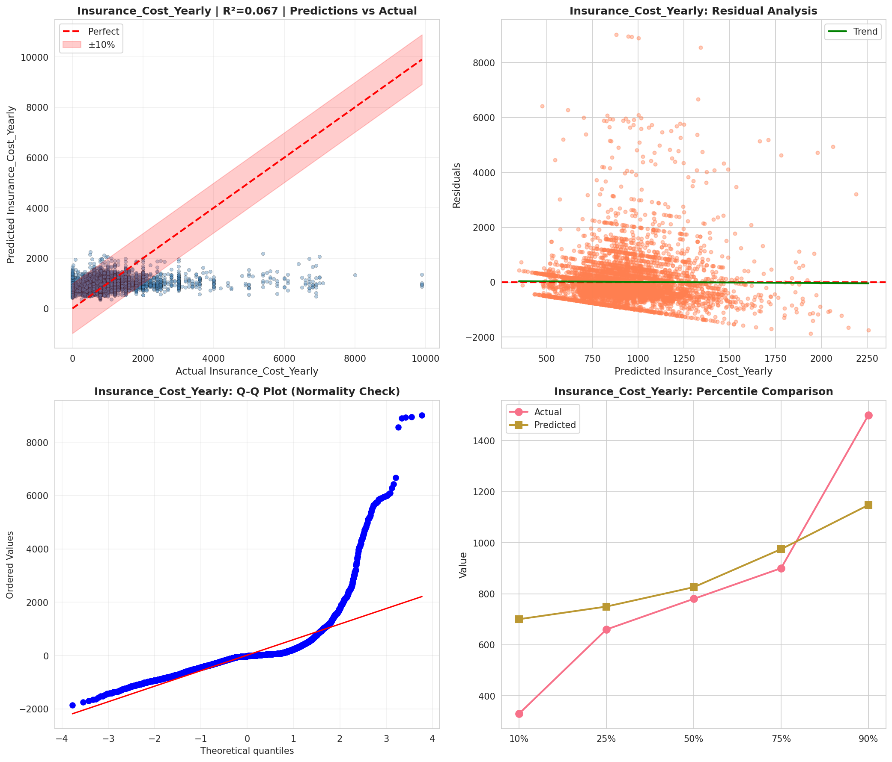
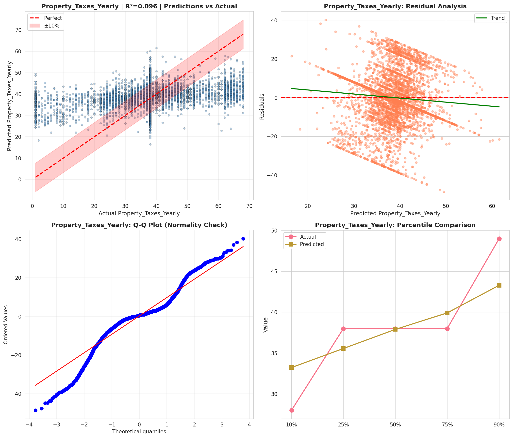
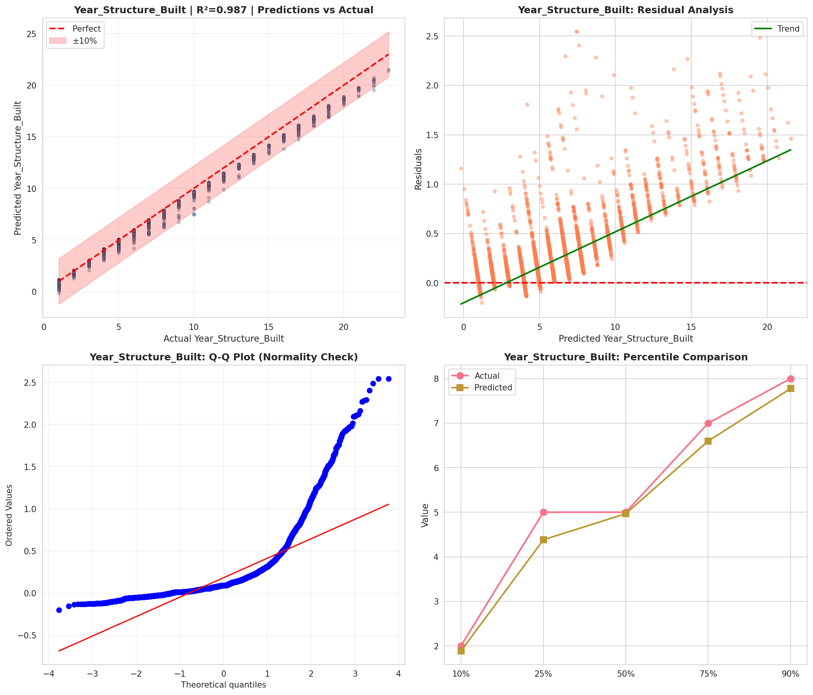
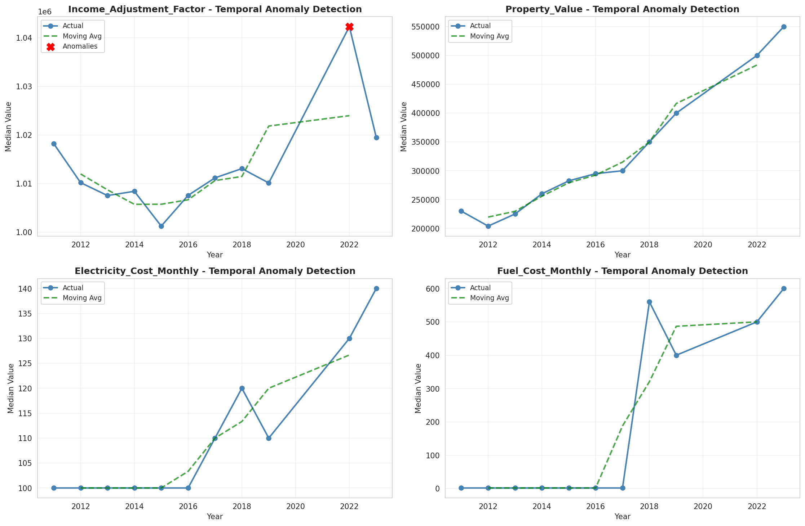
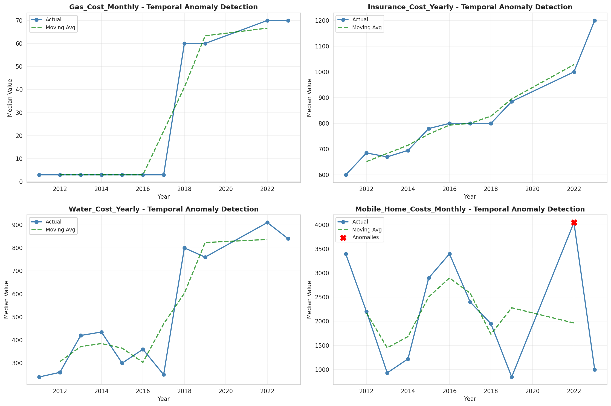
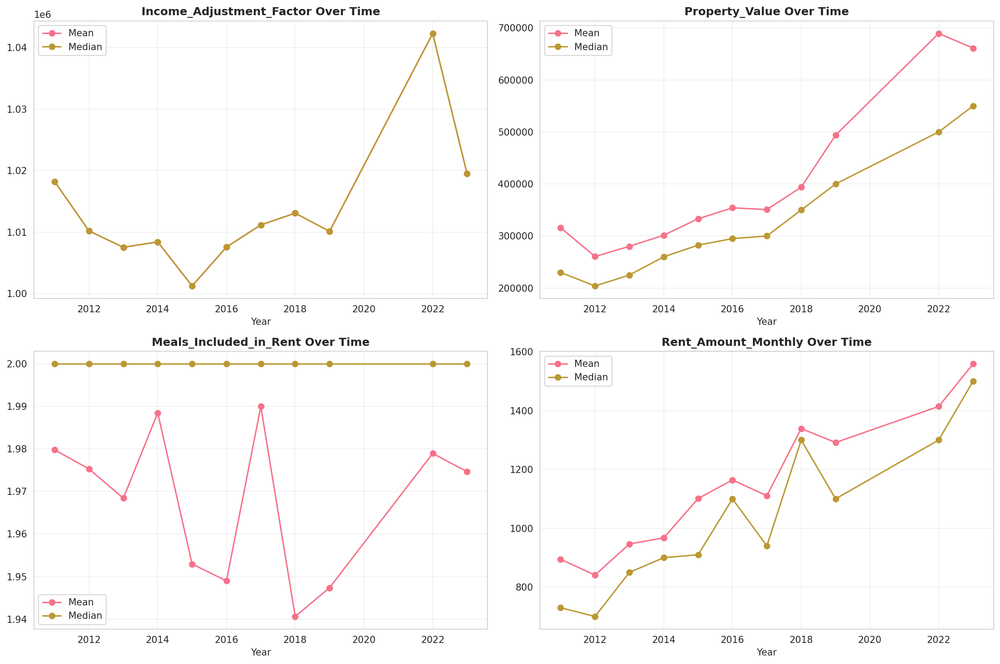

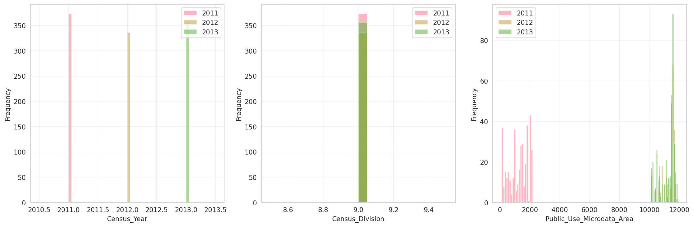
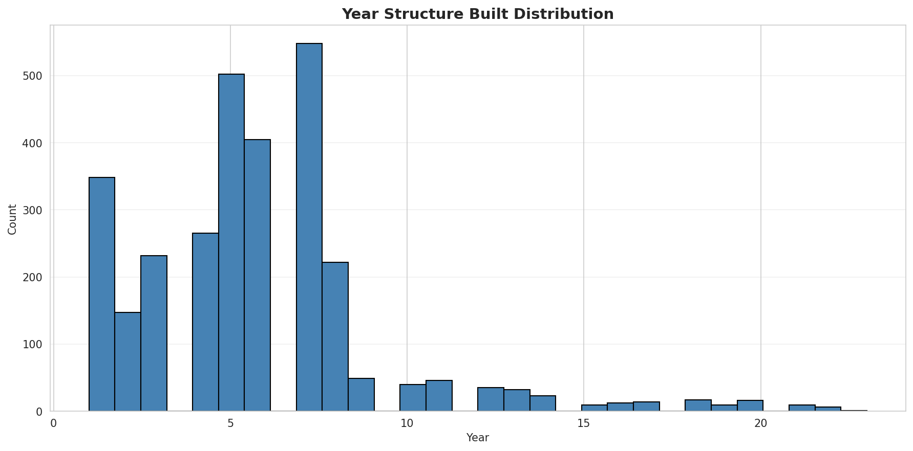
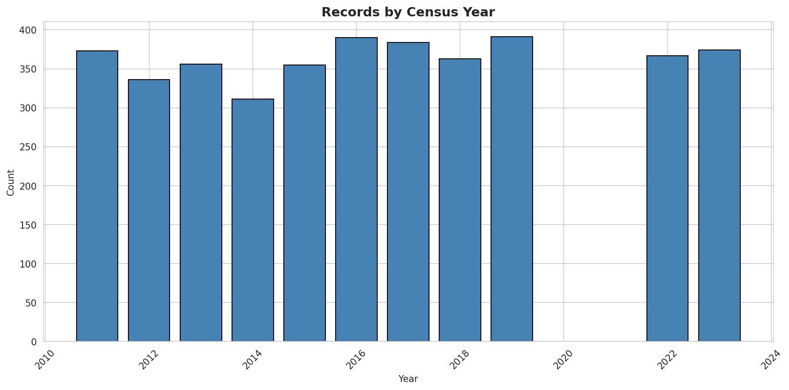
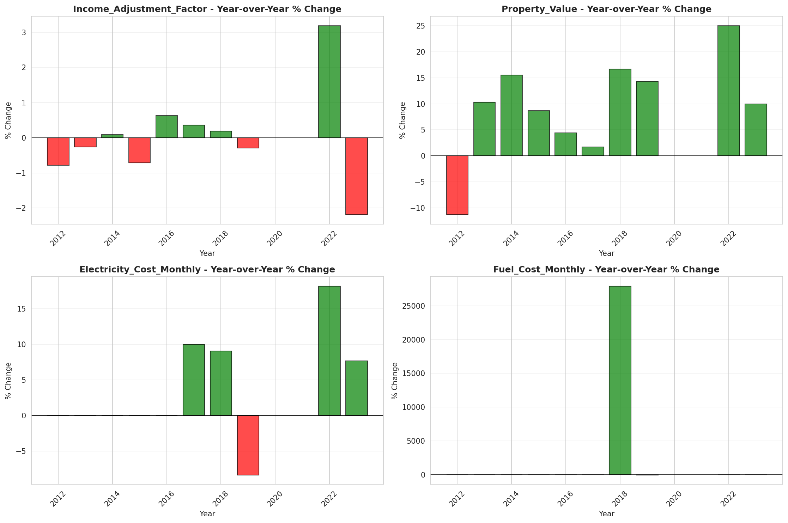
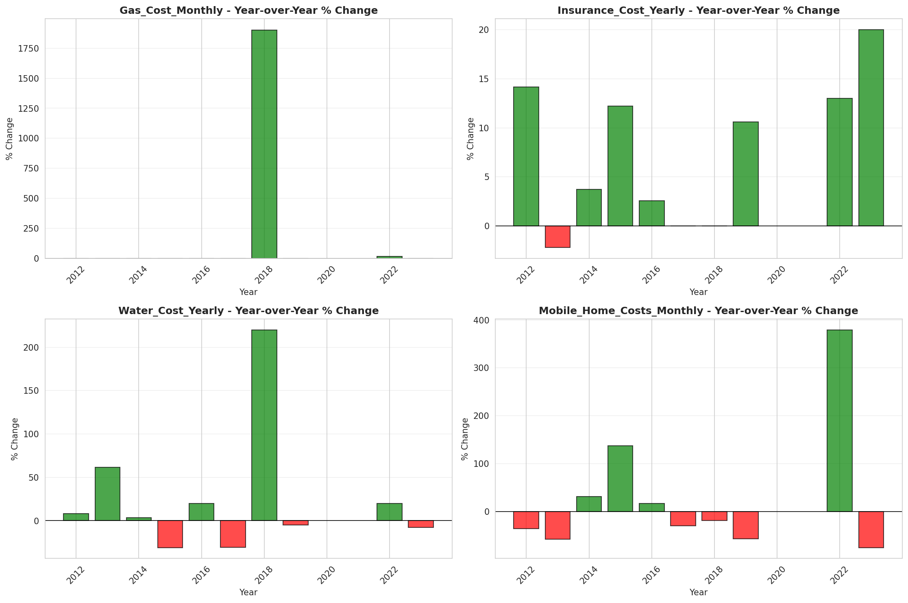
