# Temporal Analysis

## Year Distribution

- 2011: 150,678 records

- 2012: 153,996 records

- 2013: 156,867 records

- 2014: 159,737 records

- 2015: 162,280 records

- 2017: 164,836 records

- 2018: 167,336 records

- 2019: 170,150 records

- 2020: 167,643 records

- 2021: 170,114 records

- 2022: 173,246 records

- 2023: 176,325 records

## Temporal Trends

- Census_Year: {np.int64(2011): {'mean': 2011.0, 'median': 2011.0, 'std': 0.0}, np.int64(2012): {'mean': 2012.0, 'median': 2012.0, 'std': 0.0}, np.int64(2013): {'mean': 2013.0, 'median': 2013.0, 'std': 0.0}, np.int64(2014): {'mean': 2014.0, 'median': 2014.0, 'std': 0.0}, np.int64(2015): {'mean': 2015.0, 'median': 2015.0, 'std': 0.0}, np.int64(2017): {'mean': 2017.0, 'median': 2017.0, 'std': 0.0}, np.int64(2018): {'mean': 2018.0, 'median': 2018.0, 'std': 0.0}, np.int64(2019): {'mean': 2019.0, 'median': 2019.0, 'std': 0.0}, np.int64(2020): {'mean': 2020.0, 'median': 2020.0, 'std': 0.0}, np.int64(2021): {'mean': 2021.0, 'median': 2021.0, 'std': 0.0}, np.int64(2022): {'mean': 2022.0, 'median': 2022.0, 'std': 0.0}, np.int64(2023): {'mean': 2023.0, 'median': 2023.0, 'std': 0.0}}

- Census_Division: {np.int64(2011): {'mean': 9.0, 'median': 9.0, 'std': 0.0}, np.int64(2012): {'mean': 9.0, 'median': 9.0, 'std': 0.0}, np.int64(2013): {'mean': 9.0, 'median': 9.0, 'std': 0.0}, np.int64(2014): {'mean': 9.0, 'median': 9.0, 'std': 0.0}, np.int64(2015): {'mean': 9.0, 'median': 9.0, 'std': 0.0}, np.int64(2017): {'mean': 9.0, 'median': 9.0, 'std': 0.0}, np.int64(2018): {'mean': 9.0, 'median': 9.0, 'std': 0.0}, np.int64(2019): {'mean': 9.0, 'median': 9.0, 'std': 0.0}, np.int64(2020): {'mean': 9.0, 'median': 9.0, 'std': 0.0}, np.int64(2021): {'mean': 9.0, 'median': 9.0, 'std': 0.0}, np.int64(2022): {'mean': 9.0, 'median': 9.0, 'std': 0.0}, np.int64(2023): {'mean': 9.0, 'median': 9.0, 'std': 0.0}}

- Public_Use_Microdata_Area: {np.int64(2011): {'mean': 1257.0564913258738, 'median': 1401.0, 'std': 631.292336684175}, np.int64(2012): {'mean': None, 'median': None, 'std': None}, np.int64(2013): {'mean': None, 'median': None, 'std': None}, np.int64(2014): {'mean': None, 'median': None, 'std': None}, np.int64(2015): {'mean': None, 'median': None, 'std': None}, np.int64(2017): {'mean': 11199.224259263752, 'median': 11502.0, 'std': 535.7245946285907}, np.int64(2018): {'mean': 11199.062526892001, 'median': 11502.0, 'std': 536.5842553761579}, np.int64(2019): {'mean': 11198.37516309139, 'median': 11502.0, 'std': 537.4875575661493}, np.int64(2020): {'mean': 11197.972173010505, 'median': 11502.0, 'std': 539.0412048131682}, np.int64(2021): {'mean': 11197.268602231445, 'median': 11502.0, 'std': 539.7468995573256}, np.int64(2022): {'mean': None, 'median': None, 'std': None}, np.int64(2023): {'mean': 24230.093321990644, 'median': 23501.0, 'std': 2034.582367493758}}

- Census_Region: {np.int64(2011): {'mean': 4.0, 'median': 4.0, 'std': 0.0}, np.int64(2012): {'mean': 4.0, 'median': 4.0, 'std': 0.0}, np.int64(2013): {'mean': 4.0, 'median': 4.0, 'std': 0.0}, np.int64(2014): {'mean': 4.0, 'median': 4.0, 'std': 0.0}, np.int64(2015): {'mean': 4.0, 'median': 4.0, 'std': 0.0}, np.int64(2017): {'mean': 4.0, 'median': 4.0, 'std': 0.0}, np.int64(2018): {'mean': 4.0, 'median': 4.0, 'std': 0.0}, np.int64(2019): {'mean': 4.0, 'median': 4.0, 'std': 0.0}, np.int64(2020): {'mean': 4.0, 'median': 4.0, 'std': 0.0}, np.int64(2021): {'mean': 4.0, 'median': 4.0, 'std': 0.0}, np.int64(2022): {'mean': 4.0, 'median': 4.0, 'std': 0.0}, np.int64(2023): {'mean': 4.0, 'median': 4.0, 'std': 0.0}}

- State_Code: {np.int64(2011): {'mean': 53.0, 'median': 53.0, 'std': 0.0}, np.int64(2012): {'mean': 53.0, 'median': 53.0, 'std': 0.0}, np.int64(2013): {'mean': 53.0, 'median': 53.0, 'std': 0.0}, np.int64(2014): {'mean': 53.0, 'median': 53.0, 'std': 0.0}, np.int64(2015): {'mean': 53.0, 'median': 53.0, 'std': 0.0}, np.int64(2017): {'mean': 53.0, 'median': 53.0, 'std': 0.0}, np.int64(2018): {'mean': 53.0, 'median': 53.0, 'std': 0.0}, np.int64(2019): {'mean': 53.0, 'median': 53.0, 'std': 0.0}, np.int64(2020): {'mean': 53.0, 'median': 53.0, 'std': 0.0}, np.int64(2021): {'mean': 53.0, 'median': 53.0, 'std': 0.0}, np.int64(2022): {'mean': 53.0, 'median': 53.0, 'std': 0.0}, np.int64(2023): {'mean': None, 'median': None, 'std': None}}

- Housing_Adjustment_Factor: {np.int64(2011): {'mean': 1040775.4088055324, 'median': 1044592.0, 'std': 27596.720387247045}, np.int64(2012): {'mean': 1041065.1063144497, 'median': 1053092.0, 'std': 27484.788986189713}, np.int64(2013): {'mean': 1039837.7055212377, 'median': 1035725.0, 'std': 31948.5356852893}, np.int64(2014): {'mean': 1036597.3949491978, 'median': 1031130.0, 'std': 29553.769904621666}, np.int64(2015): {'mean': 1020945.1897892532, 'median': 1017534.0, 'std': 20323.165717296168}, np.int64(2017): {'mean': 1028981.6051226674, 'median': 1034680.0, 'std': 18027.305799117275}, np.int64(2018): {'mean': 1037907.7046660611, 'median': 1046406.0, 'std': 23554.043097754122}, np.int64(2019): {'mean': 1040329.1013752571, 'median': 1042936.0, 'std': 29184.113532068146}, np.int64(2020): {'mean': 1035988.4732854936, 'median': 1030827.0, 'std': 28251.83097343046}, np.int64(2021): {'mean': 1057925.0350000588, 'median': 1059761.0, 'std': 35594.508880731104}, np.int64(2022): {'mean': 1104037.399414705, 'median': 1133141.0, 'std': 61877.57663960091}, np.int64(2023): {'mean': 1104177.9692045937, 'median': 1125501.0, 'std': 76886.82980974067}}

- Income_Adjustment_Factor: {np.int64(2011): {'mean': 1053423.7333253694, 'median': 1048026.0, 'std': 28344.00762447578}, np.int64(2012): {'mean': 1052350.1866866671, 'median': 1061121.0, 'std': 26387.46675490663}, np.int64(2013): {'mean': 1048905.144485456, 'median': 1054614.0, 'std': 29595.65908719536}, np.int64(2014): {'mean': 1047465.6996437894, 'median': 1041654.0, 'std': 31010.805745322374}, np.int64(2015): {'mean': 1030364.9267007641, 'median': 1025215.0, 'std': 25707.706059851716}, np.int64(2017): {'mean': 1036394.2117801936, 'median': 1035988.0, 'std': 16877.082279977305}, np.int64(2018): {'mean': 1046535.3986052015, 'median': 1054346.0, 'std': 20564.38218201986}, np.int64(2019): {'mean': 1049334.0056303262, 'median': 1054606.0, 'std': 26264.36437897202}, np.int64(2020): {'mean': 1046083.714458701, 'median': 1044328.0, 'std': 28786.878916404097}, np.int64(2021): {'mean': 1072946.7140153074, 'median': 1070512.0, 'std': 30702.96039346192}, np.int64(2022): {'mean': 1126456.0516202394, 'median': 1140108.0, 'std': 49893.113622499484}, np.int64(2023): {'mean': 1128159.1418913938, 'median': 1159185.0, 'std': 70549.13567425474}}

- Housing_Unit_Weight: {np.int64(2011): {'mean': 18.99404690797595, 'median': 16.0, 'std': 14.6762563205238}, np.int64(2012): {'mean': 18.728966986155484, 'median': 16.0, 'std': 14.947446629639623}, np.int64(2013): {'mean': 18.484053370052337, 'median': 15.0, 'std': 15.248225746961175}, np.int64(2014): {'mean': 18.288586864658782, 'median': 15.0, 'std': 15.523728019846075}, np.int64(2015): {'mean': 18.12994207542519, 'median': 15.0, 'std': 15.844045593900146}, np.int64(2017): {'mean': 18.35470406949938, 'median': 15.0, 'std': 15.78870922111614}, np.int64(2018): {'mean': 18.31274202801549, 'median': 15.0, 'std': 15.745769125540095}, np.int64(2019): {'mean': 18.257584484278578, 'median': 15.0, 'std': 15.967084040591315}, np.int64(2020): {'mean': 18.791085819270712, 'median': 14.0, 'std': 19.303946697818464}, np.int64(2021): {'mean': 18.63864820061841, 'median': 14.0, 'std': 19.033598612412916}, np.int64(2022): {'mean': 18.56460178012768, 'median': 14.0, 'std': 19.150325675007018}, np.int64(2023): {'mean': 18.503711895647243, 'median': 14.0, 'std': 19.36992367267504}}

- Number_of_Persons: {np.int64(2011): {'mean': 2.2123800422092144, 'median': 2.0, 'std': 1.463640047524226}, np.int64(2012): {'mean': 2.1964466609522324, 'median': 2.0, 'std': 1.4691986691587873}, np.int64(2013): {'mean': 2.183065909337209, 'median': 2.0, 'std': 1.4719288815602911}, np.int64(2014): {'mean': 2.170092088871082, 'median': 2.0, 'std': 1.4709474224410102}, np.int64(2015): {'mean': 2.1632980034508256, 'median': 2.0, 'std': 1.4709762249012863}, np.int64(2017): {'mean': 2.178377296221699, 'median': 2.0, 'std': 1.4728823946132537}, np.int64(2018): {'mean': 2.185465171869771, 'median': 2.0, 'std': 1.4724795632296646}, np.int64(2019): {'mean': 2.192101087275933, 'median': 2.0, 'std': 1.4722013224059933}, np.int64(2020): {'mean': 2.186992597364638, 'median': 2.0, 'std': 1.4711450105632908}, np.int64(2021): {'mean': 2.1913481547668034, 'median': 2.0, 'std': 1.470450300962846}, np.int64(2022): {'mean': 2.1870750262632326, 'median': 2.0, 'std': 1.46775966748871}, np.int64(2023): {'mean': 2.1806493690628104, 'median': 2.0, 'std': 1.4647789326593974}}

- Housing_Unit_Type: {np.int64(2011): {'mean': 1.0918979545786378, 'median': 1.0, 'std': 0.3806345880419623}, np.int64(2012): {'mean': 1.1077430582612535, 'median': 1.0, 'std': 0.41346792739797616}, np.int64(2013): {'mean': 1.1220333148463348, 'median': 1.0, 'std': 0.44038854074635125}, np.int64(2014): {'mean': 1.1347402292518327, 'median': 1.0, 'std': 0.46296308193144453}, np.int64(2015): {'mean': 1.1488784816366773, 'median': 1.0, 'std': 0.48661738503585533}, np.int64(2017): {'mean': 1.1429117425805042, 'median': 1.0, 'std': 0.4793198237429956}, np.int64(2018): {'mean': 1.1436750011952002, 'median': 1.0, 'std': 0.48050882397787725}, np.int64(2019): {'mean': 1.1459124302086394, 'median': 1.0, 'std': 0.4838421638152793}, np.int64(2020): {'mean': None, 'median': None, 'std': None}, np.int64(2021): {'mean': None, 'median': None, 'std': None}, np.int64(2022): {'mean': None, 'median': None, 'std': None}, np.int64(2023): {'mean': None, 'median': None, 'std': None}}

- Number_of_Bedrooms: {np.int64(2011): {'mean': 2.755710135092147, 'median': 3.0, 'std': 1.0722499160633445}, np.int64(2012): {'mean': None, 'median': None, 'std': None}, np.int64(2013): {'mean': None, 'median': None, 'std': None}, np.int64(2014): {'mean': None, 'median': None, 'std': None}, np.int64(2015): {'mean': None, 'median': None, 'std': None}, np.int64(2017): {'mean': None, 'median': None, 'std': None}, np.int64(2018): {'mean': None, 'median': None, 'std': None}, np.int64(2019): {'mean': None, 'median': None, 'std': None}, np.int64(2020): {'mean': None, 'median': None, 'std': None}, np.int64(2021): {'mean': None, 'median': None, 'std': None}, np.int64(2022): {'mean': None, 'median': None, 'std': None}, np.int64(2023): {'mean': None, 'median': None, 'std': None}}

- Number_of_Rooms: {np.int64(2011): {'mean': 5.833478251648888, 'median': 6.0, 'std': 2.0318989976991375}, np.int64(2012): {'mean': None, 'median': None, 'std': None}, np.int64(2013): {'mean': None, 'median': None, 'std': None}, np.int64(2014): {'mean': None, 'median': None, 'std': None}, np.int64(2015): {'mean': None, 'median': None, 'std': None}, np.int64(2017): {'mean': None, 'median': None, 'std': None}, np.int64(2018): {'mean': None, 'median': None, 'std': None}, np.int64(2019): {'mean': None, 'median': None, 'std': None}, np.int64(2020): {'mean': None, 'median': None, 'std': None}, np.int64(2021): {'mean': None, 'median': None, 'std': None}, np.int64(2022): {'mean': None, 'median': None, 'std': None}, np.int64(2023): {'mean': None, 'median': None, 'std': None}}

- Building_Type: {np.int64(2011): {'mean': 2.938575841763338, 'median': 2.0, 'std': 2.1223836106652545}, np.int64(2012): {'mean': 2.9390493486536515, 'median': 2.0, 'std': 2.123716356920762}, np.int64(2013): {'mean': 2.93653308609858, 'median': 2.0, 'std': 2.1237314564212704}, np.int64(2014): {'mean': 2.9347833530793515, 'median': 2.0, 'std': 2.1231080056268614}, np.int64(2015): {'mean': 2.930480374289367, 'median': 2.0, 'std': 2.1197630750939136}, np.int64(2017): {'mean': 2.947801410880701, 'median': 2.0, 'std': 2.1369637516730786}, np.int64(2018): {'mean': 2.957949815517536, 'median': 2.0, 'std': 2.1482195229143057}, np.int64(2019): {'mean': 2.969114765547702, 'median': 2.0, 'std': 2.1613988464621037}, np.int64(2020): {'mean': 2.978270477798814, 'median': 2.0, 'std': 2.1711735255900764}, np.int64(2021): {'mean': 2.9873689134926513, 'median': 2.0, 'std': 2.1820575536839883}, np.int64(2022): {'mean': 3.0109282262303068, 'median': 2.0, 'std': 2.206484617960191}, np.int64(2023): {'mean': 3.02815627904624, 'median': 2.0, 'std': 2.2227828151506905}}

- Year_Structure_Built: {np.int64(2011): {'mean': 4.90146261460918, 'median': 5.0, 'std': 2.33734611554209}, np.int64(2012): {'mean': 5.259162504802151, 'median': 5.0, 'std': 2.618208258328348}, np.int64(2013): {'mean': 5.3316774139982845, 'median': 5.0, 'std': 2.7142526113761796}, np.int64(2014): {'mean': 5.400284890529444, 'median': 5.0, 'std': 2.811226622841534}, np.int64(2015): {'mean': 5.481455539537034, 'median': 5.0, 'std': 2.94401780160283}, np.int64(2017): {'mean': 5.720415137324389, 'median': 5.0, 'std': 3.3344750055026404}, np.int64(2018): {'mean': 5.86763219054872, 'median': 6.0, 'std': 3.593212129776416}, np.int64(2019): {'mean': 6.030911101482827, 'median': 6.0, 'std': 3.868126628218523}, np.int64(2020): {'mean': 6.18553871931711, 'median': 6.0, 'std': 4.136848277966679}, np.int64(2021): {'mean': None, 'median': None, 'std': None}, np.int64(2022): {'mean': None, 'median': None, 'std': None}, np.int64(2023): {'mean': None, 'median': None, 'std': None}}

- Bathtub_or_Shower: {np.int64(2011): {'mean': None, 'median': None, 'std': None}, np.int64(2012): {'mean': 1.0068662033318199, 'median': 1.0, 'std': 0.08257787969380485}, np.int64(2013): {'mean': 1.0068704508344173, 'median': 1.0, 'std': 0.0826032381285909}, np.int64(2014): {'mean': 1.0070058416255196, 'median': 1.0, 'std': 0.08340747838863877}, np.int64(2015): {'mean': 1.0064807007045127, 'median': 1.0, 'std': 0.08024179090965619}, np.int64(2017): {'mean': 1.006121810030709, 'median': 1.0, 'std': 0.07800239741826029}, np.int64(2018): {'mean': 1.0059480823015008, 'median': 1.0, 'std': 0.0768943524378599}, np.int64(2019): {'mean': 1.0057812813233573, 'median': 1.0, 'std': 0.07581487505670033}, np.int64(2020): {'mean': 1.005719336899948, 'median': 1.0, 'std': 0.07540997015364392}, np.int64(2021): {'mean': 1.0057567606201188, 'median': 1.0, 'std': 0.07565485785188372}, np.int64(2022): {'mean': 1.0057172890307529, 'median': 1.0, 'std': 0.07539653886403003}, np.int64(2023): {'mean': 1.0056590769697697, 'median': 1.0, 'std': 0.07501391469349589}}

- Refrigerator: {np.int64(2011): {'mean': None, 'median': None, 'std': None}, np.int64(2012): {'mean': 1.008263192819474, 'median': 1.0, 'std': 0.09052607196457131}, np.int64(2013): {'mean': 1.0086209282373453, 'median': 1.0, 'std': 0.09244818530972335}, np.int64(2014): {'mean': 1.0091562172564221, 'median': 1.0, 'std': 0.09524937308486398}, np.int64(2015): {'mean': 1.0085683975736475, 'median': 1.0, 'std': 0.09216852990910454}, np.int64(2017): {'mean': 1.008406664046523, 'median': 1.0, 'std': 0.09130195822505183}, np.int64(2018): {'mean': 1.0080292545858007, 'median': 1.0, 'std': 0.08924594078975816}, np.int64(2019): {'mean': 1.0073785704585578, 'median': 1.0, 'std': 0.08558139120280354}, np.int64(2020): {'mean': 1.0073948981140042, 'median': 1.0, 'std': 0.08567532910574181}, np.int64(2021): {'mean': 1.00719919951139, 'median': 1.0, 'std': 0.08454240047416245}, np.int64(2022): {'mean': 1.0069158686818187, 'median': 1.0, 'std': 0.08287390097787899}, np.int64(2023): {'mean': 1.0067213394624193, 'median': 1.0, 'std': 0.08170804900275239}}

- Hot_and_Cold_Running_Water: {np.int64(2011): {'mean': None, 'median': None, 'std': None}, np.int64(2012): {'mean': 1.008465756295184, 'median': 1.0, 'std': 0.09161957158927535}, np.int64(2013): {'mean': 1.0084687128110037, 'median': 1.0, 'std': 0.09163542880648126}, np.int64(2014): {'mean': 1.008889132385068, 'median': 1.0, 'std': 0.09386253803036501}, np.int64(2015): {'mean': 1.0084867937872317, 'median': 1.0, 'std': 0.09173235711520962}, np.int64(2017): {'mean': 1.0082601136431764, 'median': 1.0, 'std': 0.09050932954901}, np.int64(2018): {'mean': 1.0083837760474796, 'median': 1.0, 'std': 0.09117863196406932}, np.int64(2019): {'mean': 1.0078183099775604, 'median': 1.0, 'std': 0.08807516205383037}, np.int64(2020): {'mean': 1.0078104900686715, 'median': 1.0, 'std': 0.08803145707594817}, np.int64(2021): {'mean': 1.0076020428053487, 'median': 1.0, 'std': 0.0868579344068288}, np.int64(2022): {'mean': 1.0074991347152251, 'median': 1.0, 'std': 0.08627250662541283}, np.int64(2023): {'mean': 1.0071323338792182, 'median': 1.0, 'std': 0.08415169914486659}}

- Running_Water: {np.int64(2011): {'mean': None, 'median': None, 'std': None}, np.int64(2012): {'mean': None, 'median': None, 'std': None}, np.int64(2013): {'mean': 9.0, 'median': 9.0, 'std': 0.0}, np.int64(2014): {'mean': 9.0, 'median': 9.0, 'std': 0.0}, np.int64(2015): {'mean': 9.0, 'median': 9.0, 'std': 0.0}, np.int64(2017): {'mean': 9.0, 'median': 9.0, 'std': 0.0}, np.int64(2018): {'mean': 9.0, 'median': 9.0, 'std': 0.0}, np.int64(2019): {'mean': 9.0, 'median': 9.0, 'std': 0.0}, np.int64(2020): {'mean': 9.0, 'median': 9.0, 'std': 0.0}, np.int64(2021): {'mean': 9.0, 'median': 9.0, 'std': 0.0}, np.int64(2022): {'mean': 9.0, 'median': 9.0, 'std': 0.0}, np.int64(2023): {'mean': 9.0, 'median': 9.0, 'std': 0.0}}

- Sink_with_Faucet: {np.int64(2011): {'mean': None, 'median': None, 'std': None}, np.int64(2012): {'mean': 1.0055460482659868, 'median': 1.0, 'std': 0.07426525526041992}, np.int64(2013): {'mean': 1.0053898098690948, 'median': 1.0, 'std': 0.07321746314504826}, np.int64(2014): {'mean': 1.0054923606878463, 'median': 1.0, 'std': 0.07390691489359304}, np.int64(2015): {'mean': 1.0051206375975845, 'median': 1.0, 'std': 0.07137542512696604}, np.int64(2017): {'mean': 1.004982713713787, 'median': 1.0, 'std': 0.07041249395120017}, np.int64(2018): {'mean': 1.0048976483409708, 'median': 1.0, 'std': 0.06981184268109844}, np.int64(2019): {'mean': 1.0047077995563805, 'median': 1.0, 'std': 0.06845192824739764}, np.int64(2020): {'mean': 1.0046902520598189, 'median': 1.0, 'std': 0.06832484460791106}, np.int64(2021): {'mean': 1.0046002105181084, 'median': 1.0, 'std': 0.06766888748703546}, np.int64(2022): {'mean': 1.0045828045481933, 'median': 1.0, 'std': 0.06754133319533495}, np.int64(2023): {'mean': 1.004660044387397, 'median': 1.0, 'std': 0.06810548951441879}}

- Stove_or_Range: {np.int64(2011): {'mean': None, 'median': None, 'std': None}, np.int64(2012): {'mean': 1.011720741801418, 'median': 1.0, 'std': 0.107626422976936}, np.int64(2013): {'mean': 1.0120734508620928, 'median': 1.0, 'std': 0.10921430846361406}, np.int64(2014): {'mean': 1.0128543154751715, 'median': 1.0, 'std': 0.11264621142520893}, np.int64(2015): {'mean': 1.0124921796371351, 'median': 1.0, 'std': 0.11106848776841349}, np.int64(2017): {'mean': 1.012596673305844, 'median': 1.0, 'std': 0.11152614035405181}, np.int64(2018): {'mean': 1.012578946677346, 'median': 1.0, 'std': 0.11144863535733311}, np.int64(2019): {'mean': 1.0121575043488944, 'median': 1.0, 'std': 0.10958912857222149}, np.int64(2020): {'mean': 1.012474355337718, 'median': 1.0, 'std': 0.11099021155130874}, np.int64(2021): {'mean': 1.0123776850805037, 'median': 1.0, 'std': 0.11056472050919684}, np.int64(2022): {'mean': 1.0124024151059494, 'median': 1.0, 'std': 0.11067372639235365}, np.int64(2023): {'mean': 1.012127496791082, 'median': 1.0, 'std': 0.10945545379393139}}

- Telephone_Service: {np.int64(2011): {'mean': 1.0212945076255835, 'median': 1.0, 'std': 0.1443648441465058}, np.int64(2012): {'mean': 1.0195385187941943, 'median': 1.0, 'std': 0.1384084811963679}, np.int64(2013): {'mean': 1.0204858084248165, 'median': 1.0, 'std': 0.14165552696475936}, np.int64(2014): {'mean': 1.0222453359507189, 'median': 1.0, 'std': 0.14748098283393526}, np.int64(2015): {'mean': 1.023059408893512, 'median': 1.0, 'std': 0.15009275941352562}, np.int64(2017): {'mean': 1.0219225242911811, 'median': 1.0, 'std': 0.14643114333772647}, np.int64(2018): {'mean': 1.020157903578028, 'median': 1.0, 'std': 0.1405407440883048}, np.int64(2019): {'mean': 1.0170131415171542, 'median': 1.0, 'std': 0.12932056889276278}, np.int64(2020): {'mean': 1.013780425340827, 'median': 1.0, 'std': 0.11657881701654052}, np.int64(2021): {'mean': 1.009321741530394, 'median': 1.0, 'std': 0.09609844111656002}, np.int64(2022): {'mean': 1.0084646243865354, 'median': 1.0, 'std': 0.09161348968547073}, np.int64(2023): {'mean': 1.007500651794608, 'median': 1.0, 'std': 0.08628117861909329}}

- Lot_Acreage: {np.int64(2011): {'mean': 1.2585357627825655, 'median': 1.0, 'std': 0.5266510300232962}, np.int64(2012): {'mean': 1.2592316724793635, 'median': 1.0, 'std': 0.5267218167548499}, np.int64(2013): {'mean': 1.25964465024323, 'median': 1.0, 'std': 0.5267876690299639}, np.int64(2014): {'mean': 1.260017152658662, 'median': 1.0, 'std': 0.5272918447665669}, np.int64(2015): {'mean': 1.2608403732725944, 'median': 1.0, 'std': 0.5277548234288029}, np.int64(2017): {'mean': 1.2571240391509513, 'median': 1.0, 'std': 0.5244216139404545}, np.int64(2018): {'mean': 1.2564522096608428, 'median': 1.0, 'std': 0.5240546621242893}, np.int64(2019): {'mean': 1.2562465049558713, 'median': 1.0, 'std': 0.5227194570173587}, np.int64(2020): {'mean': 1.2564713670969878, 'median': 1.0, 'std': 0.5218632093783844}, np.int64(2021): {'mean': 1.2556370130558523, 'median': 1.0, 'std': 0.5201114943496334}, np.int64(2022): {'mean': 1.25650938675362, 'median': 1.0, 'std': 0.5205361987878211}, np.int64(2023): {'mean': 1.2555097023443673, 'median': 1.0, 'std': 0.5188317693233958}}

- Agricultural_Sales: {np.int64(2011): {'mean': 1.2547885956395093, 'median': 1.0, 'std': 0.9690925969955313}, np.int64(2012): {'mean': 1.2454791648466847, 'median': 1.0, 'std': 0.9532469873424461}, np.int64(2013): {'mean': 1.2354498502669156, 'median': 1.0, 'std': 0.9288883309364553}, np.int64(2014): {'mean': 1.233631977946244, 'median': 1.0, 'std': 0.9288906431361338}, np.int64(2015): {'mean': 1.2315807384720094, 'median': 1.0, 'std': 0.9275282251712424}, np.int64(2017): {'mean': 1.2185388513513513, 'median': 1.0, 'std': 0.8981697830438127}, np.int64(2018): {'mean': 1.2173350582147477, 'median': 1.0, 'std': 0.8993250447602056}, np.int64(2019): {'mean': 1.210224714502067, 'median': 1.0, 'std': 0.8785963078793869}, np.int64(2020): {'mean': 1.204245912579246, 'median': 1.0, 'std': 0.8619111525405633}, np.int64(2021): {'mean': 1.195456599433102, 'median': 1.0, 'std': 0.8391266254541232}, np.int64(2022): {'mean': 1.2005644023382382, 'median': 1.0, 'std': 0.8489630569035804}, np.int64(2023): {'mean': 1.1979965814683786, 'median': 1.0, 'std': 0.8398273790146499}}

- Business_On_Property: {np.int64(2011): {'mean': 1.9797910768329592, 'median': 2.0, 'std': 0.14071495417131016}, np.int64(2012): {'mean': 1.9801959375383376, 'median': 2.0, 'std': 0.13932706727905814}, np.int64(2013): {'mean': 1.9808537759163394, 'median': 2.0, 'std': 0.1370394433449851}, np.int64(2014): {'mean': 1.981509433962264, 'median': 2.0, 'std': 0.13471755882439013}, np.int64(2015): {'mean': 1.981412860566708, 'median': 2.0, 'std': 0.1350622549667299}, np.int64(2017): {'mean': 4.844930218598369, 'median': 2.0, 'std': 3.450548927224453}, np.int64(2018): {'mean': 6.25299897225077, 'median': 9.0, 'std': 3.4263373946138502}, np.int64(2019): {'mean': 7.637188079974714, 'median': 9.0, 'std': 2.776988590213594}, np.int64(2020): {'mean': None, 'median': None, 'std': None}, np.int64(2021): {'mean': None, 'median': None, 'std': None}, np.int64(2022): {'mean': None, 'median': None, 'std': None}, np.int64(2023): {'mean': None, 'median': None, 'std': None}}

- Tenure: {np.int64(2011): {'mean': 1.8154901946045896, 'median': 2.0, 'std': 0.8934242058730947}, np.int64(2012): {'mean': 1.8309490137700037, 'median': 2.0, 'std': 0.8952311959649296}, np.int64(2013): {'mean': 1.846168053072502, 'median': 2.0, 'std': 0.8963288418644679}, np.int64(2014): {'mean': 1.859071365264461, 'median': 2.0, 'std': 0.8963207598432174}, np.int64(2015): {'mean': 1.8659062638665609, 'median': 2.0, 'std': 0.8945903067280621}, np.int64(2017): {'mean': 1.8697950009247009, 'median': 2.0, 'std': 0.8912467983968593}, np.int64(2018): {'mean': 1.8697295481269949, 'median': 2.0, 'std': 0.8892340203485849}, np.int64(2019): {'mean': 1.8655728009792527, 'median': 2.0, 'std': 0.8856088769725549}, np.int64(2020): {'mean': 1.8618028220402607, 'median': 2.0, 'std': 0.8826931891821979}, np.int64(2021): {'mean': 1.8608017663699716, 'median': 2.0, 'std': 0.8793677911737849}, np.int64(2022): {'mean': 1.8591763452100545, 'median': 2.0, 'std': 0.8750935873123119}, np.int64(2023): {'mean': 1.8571466771845146, 'median': 2.0, 'std': 0.8710011310150749}}

- Vacancy_Status: {np.int64(2011): {'mean': 4.492874109263658, 'median': 5.0, 'std': 2.0135711447047213}, np.int64(2012): {'mean': 4.513329551900171, 'median': 5.0, 'std': 2.0139118989075397}, np.int64(2013): {'mean': 4.561723009814613, 'median': 5.0, 'std': 2.0105394883969394}, np.int64(2014): {'mean': 4.639292482627922, 'median': 5.0, 'std': 1.9945227739136058}, np.int64(2015): {'mean': 4.703788748564868, 'median': 5.0, 'std': 1.9582636974126033}, np.int64(2017): {'mean': 4.823035770481486, 'median': 5.0, 'std': 1.8975673337376529}, np.int64(2018): {'mean': 4.853906415413932, 'median': 5.0, 'std': 1.8898853352908789}, np.int64(2019): {'mean': 4.864642082429501, 'median': 5.0, 'std': 1.877038923052502}, np.int64(2020): {'mean': 4.846085997794928, 'median': 5.0, 'std': 1.8968067499383587}, np.int64(2021): {'mean': 4.827762923351159, 'median': 5.0, 'std': 1.924066071737756}, np.int64(2022): {'mean': 4.784457983676285, 'median': 5.0, 'std': 1.9537906956089217}, np.int64(2023): {'mean': 4.726710249824889, 'median': 5.0, 'std': 1.9866815359728334}}

- Property_Value: {np.int64(2011): {'mean': 18.163393063462387, 'median': 19.0, 'std': 4.223597006931178}}

- Vehicles_Available: {np.int64(2011): {'mean': 1.9759469027879042, 'median': 2.0, 'std': 1.1230901901030719}, np.int64(2012): {'mean': 1.9701302567919612, 'median': 2.0, 'std': 1.1226808561086965}, np.int64(2013): {'mean': 1.964938461311151, 'median': 2.0, 'std': 1.1220981053574985}, np.int64(2014): {'mean': 1.9620357009441634, 'median': 2.0, 'std': 1.1207813722510338}, np.int64(2015): {'mean': 1.970080962530279, 'median': 2.0, 'std': 1.1212384654958598}, np.int64(2017): {'mean': 1.9923961134110082, 'median': 2.0, 'std': 1.1333435298286452}, np.int64(2018): {'mean': 2.0106248950109187, 'median': 2.0, 'std': 1.142577992030404}, np.int64(2019): {'mean': 2.0284767255547838, 'median': 2.0, 'std': 1.1542808310563812}, np.int64(2020): {'mean': 2.040015155661271, 'median': 2.0, 'std': 1.1632010667266046}, np.int64(2021): {'mean': 2.0448078382667494, 'median': 2.0, 'std': 1.1665854783037974}, np.int64(2022): {'mean': 2.0404767884658463, 'median': 2.0, 'std': 1.170614900428401}, np.int64(2023): {'mean': 2.0324760841516976, 'median': 2.0, 'std': 1.1713075976284735}}

- Condo_Fee_Monthly: {np.int64(2011): {'mean': 258.4472424188686, 'median': 230.0, 'std': 172.66632816602544}, np.int64(2012): {'mean': 266.5617021276596, 'median': 240.0, 'std': 175.7193895699582}, np.int64(2013): {'mean': 276.0770783630024, 'median': 250.0, 'std': 176.41581650561295}, np.int64(2014): {'mean': 290.57038601882084, 'median': 260.0, 'std': 187.02376372265869}, np.int64(2015): {'mean': 304.50938873351976, 'median': 280.0, 'std': 192.11250089139727}, np.int64(2017): {'mean': 334.10109179134656, 'median': 300.0, 'std': 203.02896905578612}, np.int64(2018): {'mean': 344.8457925636008, 'median': 320.0, 'std': 206.87767113243677}, np.int64(2019): {'mean': 355.0214788063106, 'median': 330.0, 'std': 205.88488171685097}, np.int64(2020): {'mean': 368.467397576457, 'median': 340.0, 'std': 225.59989551347832}, np.int64(2021): {'mean': 380.01193361924294, 'median': 350.0, 'std': 235.32391955780395}, np.int64(2022): {'mean': 398.13013333333333, 'median': 360.0, 'std': 249.2562766610049}, np.int64(2023): {'mean': 423.1902777777778, 'median': 380.0, 'std': 271.9535289453131}}

- Electricity_Cost_Monthly: {np.int64(2011): {'mean': 110.42573230406121, 'median': 90.0, 'std': 81.44315349599373}, np.int64(2012): {'mean': 113.00010420543357, 'median': 100.0, 'std': 82.83229914608185}, np.int64(2013): {'mean': 115.58271893145786, 'median': 100.0, 'std': 84.11049929296698}, np.int64(2014): {'mean': 117.89985570196963, 'median': 100.0, 'std': 85.37077611602332}, np.int64(2015): {'mean': 120.01446850608492, 'median': 100.0, 'std': 86.50598561691152}, np.int64(2017): {'mean': 124.38443372739818, 'median': 100.0, 'std': 90.00348018763033}, np.int64(2018): {'mean': 131.00281998831093, 'median': 110.0, 'std': 89.31517032475399}, np.int64(2019): {'mean': 131.74760988774366, 'median': 110.0, 'std': 90.16520676466166}, np.int64(2020): {'mean': 134.84843691645247, 'median': 110.0, 'std': 95.02157805768833}, np.int64(2021): {'mean': 139.10738612635186, 'median': 110.0, 'std': 105.34881351562667}, np.int64(2022): {'mean': 144.90913339990226, 'median': 120.0, 'std': 138.17290853418302}, np.int64(2023): {'mean': 152.95048055813047, 'median': 120.0, 'std': 167.34635661405852}}

- Fuel_Cost_Monthly: {np.int64(2011): {'mean': 117.07878140996249, 'median': 2.0, 'std': 411.2373565127602}, np.int64(2012): {'mean': 117.59254186825456, 'median': 2.0, 'std': 419.74567513289463}, np.int64(2013): {'mean': 108.94943928133449, 'median': 2.0, 'std': 400.49262225643935}, np.int64(2014): {'mean': 101.34226467335175, 'median': 2.0, 'std': 386.58748423081244}, np.int64(2015): {'mean': 94.82092950513199, 'median': 2.0, 'std': 374.37940468782335}, np.int64(2017): {'mean': 75.28308650932526, 'median': 2.0, 'std': 314.76070129049134}, np.int64(2018): {'mean': 657.1313276651406, 'median': 450.0, 'std': 688.3542034008819}, np.int64(2019): {'mean': 649.8294001318392, 'median': 450.0, 'std': 671.541724975734}, np.int64(2020): {'mean': 647.3502057613168, 'median': 450.0, 'std': 671.8932442831829}, np.int64(2021): {'mean': 663.9358414743989, 'median': 450.0, 'std': 687.4111646188196}, np.int64(2022): {'mean': 691.8720045108543, 'median': 500.0, 'std': 724.8129899593239}, np.int64(2023): {'mean': 726.2952429076735, 'median': 500.0, 'std': 783.3285117708906}}

- Gas_Cost_Monthly: {np.int64(2011): {'mean': 44.12112989424154, 'median': 3.0, 'std': 70.20145103410714}, np.int64(2012): {'mean': 43.2839970227019, 'median': 3.0, 'std': 69.1469778861398}, np.int64(2013): {'mean': 41.04405224509094, 'median': 3.0, 'std': 66.91010216131268}, np.int64(2014): {'mean': 38.54424529200208, 'median': 3.0, 'std': 64.3532317178659}, np.int64(2015): {'mean': 36.79442209629667, 'median': 3.0, 'std': 63.30154947107325}, np.int64(2017): {'mean': 32.76227362610786, 'median': 3.0, 'std': 59.656712458637394}, np.int64(2018): {'mean': 84.47168531048254, 'median': 60.0, 'std': 74.56058479186936}, np.int64(2019): {'mean': 82.69048973862904, 'median': 60.0, 'std': 73.40121463185575}, np.int64(2020): {'mean': 83.7566969014193, 'median': 60.0, 'std': 76.37059501644279}, np.int64(2021): {'mean': 86.14276853679165, 'median': 60.0, 'std': 81.12145641639529}, np.int64(2022): {'mean': 91.68268402236686, 'median': 70.0, 'std': 102.95596911423574}, np.int64(2023): {'mean': 100.07771122038444, 'median': 70.0, 'std': 127.19116400649649}}

- House_Heating_Fuel: {np.int64(2011): {'mean': 2.4825126466675185, 'median': 3.0, 'std': 1.4212255384852837}, np.int64(2012): {'mean': 2.4858727205061406, 'median': 3.0, 'std': 1.420396648476675}, np.int64(2013): {'mean': 2.4939791078737015, 'median': 3.0, 'std': 1.4259695583433578}, np.int64(2014): {'mean': 2.5025819825230915, 'median': 3.0, 'std': 1.430220245321138}, np.int64(2015): {'mean': 2.5063613416647876, 'median': 3.0, 'std': 1.4324035500568293}, np.int64(2017): {'mean': 2.5022619606504204, 'median': 3.0, 'std': 1.4290235112581884}, np.int64(2018): {'mean': 2.495219497172294, 'median': 3.0, 'std': 1.4204476161714694}, np.int64(2019): {'mean': 2.4870200870599724, 'median': 3.0, 'std': 1.4125878968434318}, np.int64(2020): {'mean': 2.479894191031497, 'median': 3.0, 'std': 1.4013611441894702}, np.int64(2021): {'mean': 2.474346236113986, 'median': 3.0, 'std': 1.3908083930922468}, np.int64(2022): {'mean': 2.4733265905959176, 'median': 3.0, 'std': 1.3840485302516927}, np.int64(2023): {'mean': 2.4711572529698436, 'median': 3.0, 'std': 1.3735388943235725}}

- Insurance_Cost_Yearly: {np.int64(2013): {'mean': 839.4522284007948, 'median': 670.0, 'std': 676.4729221507116}, np.int64(2014): {'mean': 864.964510865099, 'median': 700.0, 'std': 701.1715429097823}, np.int64(2015): {'mean': 895.4105086288374, 'median': 700.0, 'std': 732.9531891214871}}

- Water_Cost_Yearly: {np.int64(2011): {'mean': 458.21680860499555, 'median': 300.0, 'std': 542.4113786070166}, np.int64(2012): {'mean': 474.9865277260886, 'median': 300.0, 'std': 561.4552030269474}, np.int64(2013): {'mean': 492.84014716094623, 'median': 300.0, 'std': 582.5425881561301}, np.int64(2014): {'mean': 511.16463160053615, 'median': 300.0, 'std': 604.0038119523692}, np.int64(2015): {'mean': 530.0632206065279, 'median': 320.0, 'std': 624.9792387359929}, np.int64(2017): {'mean': 567.2397464896932, 'median': 350.0, 'std': 668.5708027849721}, np.int64(2018): {'mean': 844.3234637943044, 'median': 740.0, 'std': 687.102170976913}, np.int64(2019): {'mean': 860.5880727244014, 'median': 750.0, 'std': 707.1429016136033}, np.int64(2020): {'mean': 880.4904837192547, 'median': 780.0, 'std': 731.5833284842302}, np.int64(2021): {'mean': 908.0811755516501, 'median': 800.0, 'std': 768.9977531649113}, np.int64(2022): {'mean': 932.5959638347385, 'median': 800.0, 'std': 806.1634890523034}, np.int64(2023): {'mean': 958.4698158078807, 'median': 840.0, 'std': 842.0249685837174}}

- Mobile_Home_Costs_Monthly: {np.int64(2011): {'mean': 2892.43020120307, 'median': 2300.0, 'std': 2531.051727002838}, np.int64(2012): {'mean': 2984.9573893161505, 'median': 2400.0, 'std': 2608.4953352429775}, np.int64(2013): {'mean': 2992.9206740649406, 'median': 2300.0, 'std': 2636.5218398488673}, np.int64(2014): {'mean': 3030.915065096094, 'median': 2200.0, 'std': 2710.7168790497817}, np.int64(2015): {'mean': 3120.662902551234, 'median': 2300.0, 'std': 2799.570557447735}, np.int64(2017): {'mean': 3189.436205468103, 'median': 2000.0, 'std': 2965.4616518595444}, np.int64(2018): {'mean': 3312.8132142115105, 'median': 2100.0, 'std': 3061.735996583687}, np.int64(2019): {'mean': 3458.1172115977793, 'median': 2300.0, 'std': 3148.920999152507}, np.int64(2020): {'mean': 3637.2410999786825, 'median': 2400.0, 'std': 3435.837778808082}, np.int64(2021): {'mean': 3952.628081905558, 'median': 2500.0, 'std': 4074.7359805999426}, np.int64(2022): {'mean': 4260.741372310191, 'median': 2500.0, 'std': 4879.879297427721}, np.int64(2023): {'mean': 4560.9672625025105, 'median': 2500.0, 'std': 5519.324912531342}}

- First_Mortgage_Includes_Insurance: {np.int64(2011): {'mean': 1.3873587032692483, 'median': 1.0, 'std': 0.4871504424418484}, np.int64(2012): {'mean': 1.376363245368806, 'median': 1.0, 'std': 0.4844765817724826}, np.int64(2013): {'mean': 1.3675024888003982, 'median': 1.0, 'std': 0.48212863973790326}, np.int64(2014): {'mean': 1.3592184211352998, 'median': 1.0, 'std': 0.4797751166414014}, np.int64(2015): {'mean': 1.352790594779091, 'median': 1.0, 'std': 0.47784202314455726}, np.int64(2017): {'mean': 1.338806949565652, 'median': 1.0, 'std': 0.4733078285747139}, np.int64(2018): {'mean': 1.3315076524314984, 'median': 1.0, 'std': 0.47075869395251224}, np.int64(2019): {'mean': 1.3251410030929711, 'median': 1.0, 'std': 0.4684310601145866}, np.int64(2020): {'mean': 1.3183867657576418, 'median': 1.0, 'std': 0.4658540622557928}, np.int64(2021): {'mean': 1.311169103908337, 'median': 1.0, 'std': 0.46297538010915523}, np.int64(2022): {'mean': 1.3093199533542013, 'median': 1.0, 'std': 0.4622168300414058}, np.int64(2023): {'mean': 1.3084580906790255, 'median': 1.0, 'std': 0.4618603133236173}}

- First_Mortgage_Payment_Monthly: {np.int64(2011): {'mean': 1419.5812741842112, 'median': 1300.0, 'std': 856.7192022926438}, np.int64(2012): {'mean': 1434.6459709379128, 'median': 1300.0, 'std': 858.9254352441124}, np.int64(2013): {'mean': 1426.3228285216526, 'median': 1300.0, 'std': 849.6594967825814}, np.int64(2014): {'mean': 1413.3441083152702, 'median': 1300.0, 'std': 835.957378837642}, np.int64(2015): {'mean': 1415.365147588648, 'median': 1300.0, 'std': 831.8795226444469}, np.int64(2017): {'mean': 1449.2608274482845, 'median': 1300.0, 'std': 850.5719317751115}, np.int64(2018): {'mean': 1499.4729079239694, 'median': 1300.0, 'std': 882.5125588427084}, np.int64(2019): {'mean': 1568.3766147128388, 'median': 1400.0, 'std': 930.5005885024505}, np.int64(2020): {'mean': 1636.7818340122517, 'median': 1500.0, 'std': 974.5972225835724}, np.int64(2021): {'mean': 1722.5292546209794, 'median': 1500.0, 'std': 1020.1227302440678}, np.int64(2022): {'mean': 1816.3811452771129, 'median': 1600.0, 'std': 1084.15627055757}, np.int64(2023): {'mean': 1923.803823520444, 'median': 1700.0, 'std': 1155.3329019926966}}

- First_Mortgage_Includes_Taxes: {np.int64(2011): {'mean': 1.307409890009445, 'median': 1.0, 'std': 0.46142420078642704}, np.int64(2012): {'mean': 1.2957512826026851, 'median': 1.0, 'std': 0.456383238973319}, np.int64(2013): {'mean': 1.2855276256844201, 'median': 1.0, 'std': 0.45166887644623405}, np.int64(2014): {'mean': 1.274165174504445, 'median': 1.0, 'std': 0.44609613012014804}, np.int64(2015): {'mean': 1.2638739649832502, 'median': 1.0, 'std': 0.44073525505118266}, np.int64(2017): {'mean': 1.2431879257546403, 'median': 1.0, 'std': 0.4290109953487231}, np.int64(2018): {'mean': 1.23205689953098, 'median': 1.0, 'std': 0.42214836772730596}, np.int64(2019): {'mean': 1.2216022803080842, 'median': 1.0, 'std': 0.4153279728235694}, np.int64(2020): {'mean': 1.2120557231257192, 'median': 1.0, 'std': 0.4087672825693895}, np.int64(2021): {'mean': 1.2005744375299185, 'median': 1.0, 'std': 0.40043327608217366}, np.int64(2022): {'mean': 1.1930890566500951, 'median': 1.0, 'std': 0.39472530140971135}, np.int64(2023): {'mean': 1.1856419794493398, 'median': 1.0, 'std': 0.38882044663297893}}

- First_Mortgage_Status: {np.int64(2011): {'mean': 1.6128214954862885, 'median': 1.0, 'std': 0.9163462231665025}, np.int64(2012): {'mean': 1.624433329786102, 'median': 1.0, 'std': 0.9213762719032718}, np.int64(2013): {'mean': 1.6421162377522687, 'median': 1.0, 'std': 0.9284065392116775}, np.int64(2014): {'mean': 1.6587265377147282, 'median': 1.0, 'std': 0.9347563857275607}, np.int64(2015): {'mean': 1.6746344859596194, 'median': 1.0, 'std': 0.9404139901067948}, np.int64(2017): {'mean': 1.6909604170530177, 'median': 1.0, 'std': 0.9458943892901432}, np.int64(2018): {'mean': 1.6982004309254781, 'median': 1.0, 'std': 0.9483762091130858}, np.int64(2019): {'mean': 1.705296245774272, 'median': 1.0, 'std': 0.950760774968371}, np.int64(2020): {'mean': 1.7179762430274088, 'median': 1.0, 'std': 0.9549629064385842}, np.int64(2021): {'mean': 1.7359923000618744, 'median': 1.0, 'std': 0.9603515649731091}, np.int64(2022): {'mean': 1.754096626533831, 'median': 1.0, 'std': 0.9653970921096283}, np.int64(2023): {'mean': 1.7703482343181431, 'median': 1.0, 'std': 0.9696432786663411}}

- Second_Mortgage_Payment_Monthly: {np.int64(2011): {'mean': 446.5162841530055, 'median': 330.0, 'std': 429.60453655125417}, np.int64(2012): {'mean': 432.44746496662054, 'median': 310.0, 'std': 412.8012672631949}, np.int64(2013): {'mean': 420.6484104927811, 'median': 300.0, 'std': 415.13812298003194}, np.int64(2014): {'mean': 410.74738596757084, 'median': 300.0, 'std': 404.73661834014393}, np.int64(2015): {'mean': 405.7357011839253, 'median': 300.0, 'std': 397.33049161557886}, np.int64(2017): {'mean': 406.35353825529063, 'median': 300.0, 'std': 407.7814533876509}, np.int64(2018): {'mean': 421.46980137819213, 'median': 300.0, 'std': 442.870426713828}, np.int64(2019): {'mean': 453.9924882629108, 'median': 300.0, 'std': 497.8208782500973}, np.int64(2020): {'mean': 489.46205260888314, 'median': 320.0, 'std': 578.7549696495674}, np.int64(2021): {'mean': 524.2213774597495, 'median': 340.0, 'std': 630.5855848089359}, np.int64(2022): {'mean': 555.0195105447164, 'median': 350.0, 'std': 672.0738434347635}, np.int64(2023): {'mean': 596.8983347940404, 'median': 390.0, 'std': 704.7647489320153}}

- Second_Mortgage_Status: {np.int64(2011): {'mean': 2.6693732671155663, 'median': 3.0, 'std': 0.6231739891029789}, np.int64(2012): {'mean': 2.6992258302356302, 'median': 3.0, 'std': 0.5984257749439701}, np.int64(2013): {'mean': 2.7311162269785965, 'median': 3.0, 'std': 0.5731464215198997}, np.int64(2014): {'mean': 2.7576257343008828, 'median': 3.0, 'std': 0.5481156213853169}, np.int64(2015): {'mean': 2.7786486315656407, 'median': 3.0, 'std': 0.5261865679278375}, np.int64(2017): {'mean': 2.8117930129366915, 'median': 3.0, 'std': 0.48625079232480956}, np.int64(2018): {'mean': 2.8258146136756355, 'median': 3.0, 'std': 0.46441606362973403}, np.int64(2019): {'mean': 2.835754139123052, 'median': 3.0, 'std': 0.447056336031353}, np.int64(2020): {'mean': 2.8402438269694907, 'median': 3.0, 'std': 0.4347474013346497}, np.int64(2021): {'mean': 2.8491422805247226, 'median': 3.0, 'std': 0.418962042684742}, np.int64(2022): {'mean': 2.8540032346317203, 'median': 3.0, 'std': 0.40677359148326403}, np.int64(2023): {'mean': 2.8528132705671374, 'median': 3.0, 'std': 0.4047007963692862}}

- Property_Taxes_Yearly: {np.int64(2011): {'mean': 36.7271865951286, 'median': 36.0, 'std': 16.69495034489163}, np.int64(2012): {'mean': 37.057028838991165, 'median': 37.0, 'std': 16.86928504916297}, np.int64(2013): {'mean': 37.15964339287424, 'median': 37.0, 'std': 17.0852057467012}, np.int64(2014): {'mean': 37.239201247785076, 'median': 37.0, 'std': 17.28340038959071}, np.int64(2015): {'mean': 37.71420283128336, 'median': 37.0, 'std': 17.464389600992035}, np.int64(2017): {'mean': 39.07321093733902, 'median': 39.0, 'std': 17.89068152812628}}

- Meals_Included_in_Rent: {np.int64(2011): {'mean': 1.964046801146783, 'median': 2.0, 'std': 0.18617588887172618}, np.int64(2012): {'mean': 1.9643160365579584, 'median': 2.0, 'std': 0.18550330857926048}, np.int64(2013): {'mean': 1.9643946604192595, 'median': 2.0, 'std': 0.18530633385569129}, np.int64(2014): {'mean': 1.9646239954075775, 'median': 2.0, 'std': 0.184730504063169}, np.int64(2015): {'mean': 1.9659563347825053, 'median': 2.0, 'std': 0.18134352851324478}, np.int64(2017): {'mean': 1.9655148211403037, 'median': 2.0, 'std': 0.18247391675839747}, np.int64(2018): {'mean': 1.9657535832542201, 'median': 2.0, 'std': 0.1818635904369781}, np.int64(2019): {'mean': 1.9661551930697632, 'median': 2.0, 'std': 0.18083166028916306}, np.int64(2020): {'mean': 1.9659185369908563, 'median': 2.0, 'std': 0.18144062047893877}, np.int64(2021): {'mean': 1.9671288436144123, 'median': 2.0, 'std': 0.17830141087222154}, np.int64(2022): {'mean': 1.9673393893987638, 'median': 2.0, 'std': 0.17774879698523682}, np.int64(2023): {'mean': 1.9684266815465812, 'median': 2.0, 'std': 0.1748632463670458}}

- Rent_Amount_Monthly: {np.int64(2011): {'mean': 841.2424516362321, 'median': 750.0, 'std': 462.35750616402095}, np.int64(2012): {'mean': 863.3338660540379, 'median': 780.0, 'std': 474.5569318201367}, np.int64(2013): {'mean': 883.3016082192449, 'median': 800.0, 'std': 485.3173006470128}, np.int64(2014): {'mean': 904.3153941829315, 'median': 800.0, 'std': 497.32711543436795}, np.int64(2015): {'mean': 932.3585869384458, 'median': 840.0, 'std': 512.6341787134651}, np.int64(2017): {'mean': 1022.8225440422993, 'median': 900.0, 'std': 566.7352512418423}, np.int64(2018): {'mean': 1084.026952555167, 'median': 980.0, 'std': 601.8599198662944}, np.int64(2019): {'mean': 1144.7713574785735, 'median': 1000.0, 'std': 630.0909328566897}, np.int64(2020): {'mean': 1213.3589834936467, 'median': 1100.0, 'std': 680.3846150319235}, np.int64(2021): {'mean': 1282.5207979626487, 'median': 1200.0, 'std': 727.5004971606083}, np.int64(2022): {'mean': 1370.2356714740588, 'median': 1300.0, 'std': 788.1998270016961}, np.int64(2023): {'mean': 1459.0098346934506, 'median': 1400.0, 'std': 847.5885445332456}}

- Gross_Rent: {np.int64(2011): {'mean': 964.2698930236318, 'median': 880.0, 'std': 493.6139445897919}, np.int64(2012): {'mean': 991.1831118060985, 'median': 900.0, 'std': 505.7974687034086}, np.int64(2013): {'mean': 1014.367477397173, 'median': 920.0, 'std': 517.1983901094238}, np.int64(2014): {'mean': 1038.1514230174948, 'median': 940.0, 'std': 530.3675433502152}, np.int64(2015): {'mean': 1067.6143075859345, 'median': 970.0, 'std': 545.0083755504847}, np.int64(2017): {'mean': 1159.4229848363927, 'median': 1050.0, 'std': 595.4195208214579}, np.int64(2018): {'mean': 1221.20379668149, 'median': 1108.0, 'std': 630.4970654174293}, np.int64(2019): {'mean': 1281.0220221409227, 'median': 1180.0, 'std': 658.215799411671}, np.int64(2020): {'mean': 1349.939828220859, 'median': 1250.0, 'std': 704.604121674305}, np.int64(2021): {'mean': 1420.6055379360819, 'median': 1325.0, 'std': 751.3548541042625}, np.int64(2022): {'mean': 1511.65892506485, 'median': 1409.0, 'std': 816.4610179802359}, np.int64(2023): {'mean': 1605.3347077546296, 'median': 1500.0, 'std': 879.2101563731782}}

- Gross_Rent_Percentage_Income: {np.int64(2011): {'mean': 38.50210164310279, 'median': 29.0, 'std': 26.560553153481308}, np.int64(2012): {'mean': 38.75627543201395, 'median': 30.0, 'std': 26.603674055197075}, np.int64(2013): {'mean': 38.85495966073645, 'median': 30.0, 'std': 26.60321407585383}, np.int64(2014): {'mean': 38.78682337445224, 'median': 30.0, 'std': 26.592366513228722}, np.int64(2015): {'mean': 38.406650771740495, 'median': 29.0, 'std': 26.403751960607185}, np.int64(2017): {'mean': 37.65833148926754, 'median': 29.0, 'std': 26.18445200468617}, np.int64(2018): {'mean': 37.3623026475589, 'median': 29.0, 'std': 26.031436652253966}, np.int64(2019): {'mean': 36.90930793344587, 'median': 28.0, 'std': 25.818888655116876}, np.int64(2020): {'mean': 36.787785993477236, 'median': 28.0, 'std': 25.813725635903545}, np.int64(2021): {'mean': 37.06639445681762, 'median': 28.0, 'std': 26.09895699125524}, np.int64(2022): {'mean': 37.402789050394745, 'median': 29.0, 'std': 26.372065170026527}, np.int64(2023): {'mean': 37.80329632708955, 'median': 29.0, 'std': 26.758743711036033}}

- Selected_Monthly_Owner_Costs: {np.int64(2011): {'mean': 1493.2345061123654, 'median': 1317.0, 'std': 1096.7527054315601}, np.int64(2012): {'mean': 1490.00380041943, 'median': 1316.0, 'std': 1086.9458027507492}, np.int64(2013): {'mean': 1463.7636698380265, 'median': 1289.0, 'std': 1066.3458522953292}, np.int64(2014): {'mean': 1437.0808538643626, 'median': 1263.0, 'std': 1041.4748463214153}, np.int64(2015): {'mean': 1426.6580763629456, 'median': 1253.0, 'std': 1027.9921547116107}, np.int64(2017): {'mean': 1442.688760153383, 'median': 1268.0, 'std': 1032.110636373585}, np.int64(2018): {'mean': 1480.5818884806527, 'median': 1295.0, 'std': 1060.8913658445915}, np.int64(2019): {'mean': 1530.3166404604385, 'median': 1330.0, 'std': 1108.373956290328}, np.int64(2020): {'mean': 1581.8621440687323, 'median': 1365.0, 'std': 1160.316800464638}, np.int64(2021): {'mean': 1642.7928713882911, 'median': 1410.0, 'std': 1214.26573624236}, np.int64(2022): {'mean': 1714.7275779145825, 'median': 1454.0, 'std': 1286.173809156649}, np.int64(2023): {'mean': 1802.9604008938084, 'median': 1523.0, 'std': 1366.3647984480008}}

- Owner_Costs_Percentage_Income: {np.int64(2011): {'mean': 27.192457834675565, 'median': 22.0, 'std': 21.374118919518686}, np.int64(2012): {'mean': 27.06093542727545, 'median': 22.0, 'std': 21.479914652471837}, np.int64(2013): {'mean': 26.648058797727685, 'median': 21.0, 'std': 21.44066525870889}, np.int64(2014): {'mean': 26.0927331134804, 'median': 20.0, 'std': 21.342619552376345}, np.int64(2015): {'mean': 25.40565667285752, 'median': 20.0, 'std': 21.134618428586293}, np.int64(2017): {'mean': 24.253787368180923, 'median': 19.0, 'std': 20.62813004130671}, np.int64(2018): {'mean': 23.967953090165018, 'median': 18.0, 'std': 20.47861432504676}, np.int64(2019): {'mean': 23.62942960863295, 'median': 18.0, 'std': 20.339332682961498}, np.int64(2020): {'mean': 23.45769723632034, 'median': 18.0, 'std': 20.273632987094928}, np.int64(2021): {'mean': 23.469943195850828, 'median': 18.0, 'std': 20.494434865343983}, np.int64(2022): {'mean': 23.523218466420293, 'median': 18.0, 'std': 20.787461331209375}, np.int64(2023): {'mean': 23.645774240368834, 'median': 18.0, 'std': 21.097827120513305}}

- Satellite_Internet: {np.int64(2011): {'mean': None, 'median': None, 'std': None}, np.int64(2012): {'mean': None, 'median': None, 'std': None}, np.int64(2013): {'mean': None, 'median': None, 'std': None}, np.int64(2014): {'mean': None, 'median': None, 'std': None}, np.int64(2015): {'mean': None, 'median': None, 'std': None}, np.int64(2017): {'mean': 1.9303099923417575, 'median': 2.0, 'std': 0.25462492057782604}, np.int64(2018): {'mean': 1.9287930910053164, 'median': 2.0, 'std': 0.25717117926654465}, np.int64(2019): {'mean': 1.9280440524551674, 'median': 2.0, 'std': 0.2584159532534532}, np.int64(2020): {'mean': 1.9275184941322283, 'median': 2.0, 'std': 0.2592845115741334}, np.int64(2021): {'mean': 1.9285880927474282, 'median': 2.0, 'std': 0.25751261291192484}, np.int64(2022): {'mean': 1.9292216508835374, 'median': 2.0, 'std': 0.2564551751287351}, np.int64(2023): {'mean': 1.9289495741129443, 'median': 2.0, 'std': 0.256909975862699}}

- Smartphone: {np.int64(2011): {'mean': None, 'median': None, 'std': None}, np.int64(2012): {'mean': None, 'median': None, 'std': None}, np.int64(2013): {'mean': None, 'median': None, 'std': None}, np.int64(2014): {'mean': None, 'median': None, 'std': None}, np.int64(2015): {'mean': None, 'median': None, 'std': None}, np.int64(2017): {'mean': 1.2664987978888367, 'median': 1.0, 'std': 0.4421295953316913}, np.int64(2018): {'mean': 1.2180203258861078, 'median': 1.0, 'std': 0.4129027206051275}, np.int64(2019): {'mean': 1.1792225118108612, 'median': 1.0, 'std': 0.38353984755698606}, np.int64(2020): {'mean': 1.1485675795145978, 'median': 1.0, 'std': 0.3556629603897359}, np.int64(2021): {'mean': 1.1201200579590147, 'median': 1.0, 'std': 0.32510299736707504}, np.int64(2022): {'mean': 1.1028991508223651, 'median': 1.0, 'std': 0.3038281458197845}, np.int64(2023): {'mean': 1.0892791485891153, 'median': 1.0, 'std': 0.28514720018336787}}

- Tablet_Computer: {np.int64(2011): {'mean': None, 'median': None, 'std': None}, np.int64(2012): {'mean': None, 'median': None, 'std': None}, np.int64(2013): {'mean': None, 'median': None, 'std': None}, np.int64(2014): {'mean': None, 'median': None, 'std': None}, np.int64(2015): {'mean': None, 'median': None, 'std': None}, np.int64(2017): {'mean': 1.426799254548817, 'median': 1.0, 'std': 0.4946143861983098}, np.int64(2018): {'mean': 1.3817263004647518, 'median': 1.0, 'std': 0.4858116753612788}, np.int64(2019): {'mean': 1.3485906049499028, 'median': 1.0, 'std': 0.4765257145698876}, np.int64(2020): {'mean': 1.32225426428386, 'median': 1.0, 'std': 0.46734140186432177}, np.int64(2021): {'mean': 1.310342924170289, 'median': 1.0, 'std': 0.46263556973187997}, np.int64(2022): {'mean': 1.3085684806440445, 'median': 1.0, 'std': 0.4619041260388174}, np.int64(2023): {'mean': 1.3090308649815827, 'median': 1.0, 'std': 0.46209546302550647}}

- Food_Stamp_SNAP: {np.int64(2011): {'mean': 1.8994995009068032, 'median': 2.0, 'std': 0.3006672317461084}, np.int64(2012): {'mean': 1.8852742438748873, 'median': 2.0, 'std': 0.3186917893167377}, np.int64(2013): {'mean': 1.874452426251041, 'median': 2.0, 'std': 0.33133989164397193}, np.int64(2014): {'mean': 1.8678305899267167, 'median': 2.0, 'std': 0.338675981690249}, np.int64(2015): {'mean': 1.8657620547613278, 'median': 2.0, 'std': 0.3409089033665983}, np.int64(2017): {'mean': 1.8755078781478787, 'median': 2.0, 'std': 0.33014320418188986}, np.int64(2018): {'mean': 1.8807777566660333, 'median': 2.0, 'std': 0.3240508680826468}, np.int64(2019): {'mean': 1.887006773131175, 'median': 2.0, 'std': 0.31658550242466454}, np.int64(2020): {'mean': 1.8923271931539418, 'median': 2.0, 'std': 0.30996770705304844}, np.int64(2021): {'mean': 1.8929923419677543, 'median': 2.0, 'std': 0.3091239430583476}, np.int64(2022): {'mean': 1.8947595519821085, 'median': 2.0, 'std': 0.30686392487523917}, np.int64(2023): {'mean': 1.8941517295644348, 'median': 2.0, 'std': 0.30764423975372684}}

- Family_Type_Employment_Status: {np.int64(2011): {'mean': 2.840951033116332, 'median': 2.0, 'std': 2.1850648507926453}, np.int64(2012): {'mean': 2.8596652917177123, 'median': 2.0, 'std': 2.192270256757308}, np.int64(2013): {'mean': 2.885984209762253, 'median': 2.0, 'std': 2.1985517949053963}, np.int64(2014): {'mean': 2.9159997780120985, 'median': 2.0, 'std': 2.2068642480474936}, np.int64(2015): {'mean': 2.926464748963205, 'median': 2.0, 'std': 2.202399742038489}, np.int64(2017): {'mean': 2.942101562922503, 'median': 2.0, 'std': 2.1963236265006403}, np.int64(2018): {'mean': 2.9468394323009273, 'median': 2.0, 'std': 2.191672432120399}, np.int64(2019): {'mean': 2.945568970753008, 'median': 2.0, 'std': 2.1859096140914547}, np.int64(2020): {'mean': 2.9550151910650864, 'median': 2.0, 'std': 2.185379801546903}, np.int64(2021): {'mean': None, 'median': None, 'std': None}, np.int64(2022): {'mean': None, 'median': None, 'std': None}, np.int64(2023): {'mean': None, 'median': None, 'std': None}}

- Family_Income: {np.int64(2011): {'mean': 87199.52806189204, 'median': 70000.0, 'std': 74567.06915315271}, np.int64(2012): {'mean': 88359.09790581242, 'median': 70500.0, 'std': 75775.8633508624}, np.int64(2013): {'mean': 89303.8271215725, 'median': 71000.0, 'std': 77138.6567338623}, np.int64(2014): {'mean': 91025.92844093927, 'median': 72000.0, 'std': 79640.10034210492}, np.int64(2015): {'mean': 94405.20787900883, 'median': 74000.0, 'std': 84366.71206422006}, np.int64(2017): {'mean': 102594.75287083405, 'median': 80000.0, 'std': 93338.36987970206}, np.int64(2018): {'mean': 107319.45582727707, 'median': 82780.0, 'std': 98150.3091218882}, np.int64(2019): {'mean': 113459.0157677387, 'median': 87100.0, 'std': 104392.38671721153}, np.int64(2020): {'mean': 119002.59114192305, 'median': 91000.0, 'std': 110023.69783635945}, np.int64(2021): {'mean': 124741.16580756014, 'median': 95000.0, 'std': 116455.32785673873}, np.int64(2022): {'mean': 131585.2421574308, 'median': 100000.0, 'std': 124875.03791564943}, np.int64(2023): {'mean': 139405.0891721048, 'median': 104200.0, 'std': 133056.41962135135}}

- Family_Presence_Children: {np.int64(2011): {'mean': 3.0990659496178883, 'median': 4.0, 'std': 1.0805767378876676}, np.int64(2012): {'mean': 3.108864486979196, 'median': 4.0, 'std': 1.0790140014979674}, np.int64(2013): {'mean': 3.1186484164965473, 'median': 4.0, 'std': 1.0760554610827933}, np.int64(2014): {'mean': 3.1270080265707167, 'median': 4.0, 'std': 1.0746409812371367}, np.int64(2015): {'mean': 3.1339189634347204, 'median': 4.0, 'std': 1.0734417134159076}, np.int64(2017): {'mean': 3.1522039822866517, 'median': 4.0, 'std': 1.0685098436232032}, np.int64(2018): {'mean': 3.1603933679761367, 'median': 4.0, 'std': 1.066256697381962}, np.int64(2019): {'mean': 3.170108701283898, 'median': 4.0, 'std': 1.0615232085288533}, np.int64(2020): {'mean': 3.1755622585595598, 'median': 4.0, 'std': 1.0597181480919486}, np.int64(2021): {'mean': 3.182818534828279, 'median': 4.0, 'std': 1.056891918159418}, np.int64(2022): {'mean': 3.187025215612504, 'median': 4.0, 'std': 1.054786548600241}, np.int64(2023): {'mean': 3.1914169283456806, 'median': 4.0, 'std': 1.0540873240691617}}

- Household_Family_Type: {np.int64(2011): {'mean': 2.660430400108239, 'median': 1.0, 'std': 2.0494378402652447}, np.int64(2012): {'mean': 2.669415705247488, 'median': 1.0, 'std': 2.0507147166303135}, np.int64(2013): {'mean': 2.6727885226282115, 'median': 1.0, 'std': 2.0508801070438207}, np.int64(2014): {'mean': 2.677790555437545, 'median': 1.0, 'std': 2.0502208472510706}, np.int64(2015): {'mean': 2.6742731194215508, 'median': 1.0, 'std': 2.051686462421786}, np.int64(2017): {'mean': 2.6704721665030657, 'median': 1.0, 'std': 2.0538071990317843}, np.int64(2018): {'mean': 2.665637773671538, 'median': 1.0, 'std': 2.0520045892949415}, np.int64(2019): {'mean': 2.6647434619061046, 'median': 1.0, 'std': 2.0517483712781344}, np.int64(2020): {'mean': 2.667368317651434, 'median': 1.0, 'std': 2.0523801921070244}, np.int64(2021): {'mean': 2.6683157386324434, 'median': 1.0, 'std': 2.0517267517217075}, np.int64(2022): {'mean': 2.676959523211534, 'median': 1.0, 'std': 2.054899096510173}, np.int64(2023): {'mean': 2.686369804862722, 'median': 1.0, 'std': 2.0590130431281883}}

- Household_Income: {np.int64(2011): {'mean': 74873.98393410104, 'median': 58000.0, 'std': 69813.17737377476}, np.int64(2012): {'mean': 75700.09162464734, 'median': 58200.0, 'std': 70756.24519132607}, np.int64(2013): {'mean': 76488.4099703379, 'median': 58600.0, 'std': 71922.58290889427}, np.int64(2014): {'mean': 77960.63372669062, 'median': 59700.0, 'std': 74212.35584582803}, np.int64(2015): {'mean': 80939.24069354993, 'median': 60600.0, 'std': 78383.37957459004}, np.int64(2017): {'mean': 88027.06065591436, 'median': 65800.0, 'std': 86735.54416104301}, np.int64(2018): {'mean': 92228.83824527182, 'median': 69000.0, 'std': 91451.17510845477}, np.int64(2019): {'mean': 97521.03481278411, 'median': 72000.0, 'std': 97164.84999594264}, np.int64(2020): {'mean': 102260.45101467331, 'median': 75300.0, 'std': 102460.36589750629}, np.int64(2021): {'mean': 107373.17817536287, 'median': 79000.0, 'std': 108609.82273051192}, np.int64(2022): {'mean': 113344.06269736346, 'median': 82500.0, 'std': 116380.0218102717}, np.int64(2023): {'mean': 119785.11542171764, 'median': 87000.0, 'std': 123666.58784504393}}

- Number_Persons_Family: {np.int64(2011): {'mean': 2.9649929238607418, 'median': 2.0, 'std': 1.2586899970161685}, np.int64(2012): {'mean': 2.967743023164331, 'median': 2.0, 'std': 1.2672024612971482}, np.int64(2013): {'mean': 2.964949856653615, 'median': 2.0, 'std': 1.2723970045667277}, np.int64(2014): {'mean': 2.9623692222529754, 'median': 2.0, 'std': 1.2714093357632648}, np.int64(2015): {'mean': 2.9597013286482925, 'median': 2.0, 'std': 1.2715938525955393}, np.int64(2017): {'mean': 2.954033217889195, 'median': 2.0, 'std': 1.273404933747767}, np.int64(2018): {'mean': 2.955203271742224, 'median': 2.0, 'std': 1.270417257547012}, np.int64(2019): {'mean': 2.9551723780607855, 'median': 2.0, 'std': 1.2696246102388773}, np.int64(2020): {'mean': 2.9562258559559718, 'median': 2.0, 'std': 1.269165132506428}, np.int64(2021): {'mean': 2.956359245031596, 'median': 2.0, 'std': 1.2681474302784417}, np.int64(2022): {'mean': 2.9562196112293253, 'median': 2.0, 'std': 1.2671380223655042}, np.int64(2023): {'mean': 2.9544526081521907, 'median': 2.0, 'std': 1.2677786173487193}}

- Workers_In_Family: {np.int64(2011): {'mean': 1.4906651570902916, 'median': 2.0, 'std': 0.8685224528464797}, np.int64(2012): {'mean': 1.4745372191563733, 'median': 2.0, 'std': 0.8698233623156781}, np.int64(2013): {'mean': 1.458697276976451, 'median': 2.0, 'std': 0.8692675127121213}, np.int64(2014): {'mean': 1.4460669803487407, 'median': 2.0, 'std': 0.8720481870581717}, np.int64(2015): {'mean': 1.4413857472274074, 'median': 2.0, 'std': 0.8749994603380684}, np.int64(2017): {'mean': 1.4498139669536687, 'median': 2.0, 'std': 0.8805893044005686}, np.int64(2018): {'mean': 1.4553666480452816, 'median': 2.0, 'std': 0.8840891632704927}, np.int64(2019): {'mean': 1.461716216076184, 'median': 2.0, 'std': 0.8878963544075194}, np.int64(2020): {'mean': 1.4651849499920622, 'median': 2.0, 'std': 0.8916748834427024}, np.int64(2021): {'mean': 1.4560209042547654, 'median': 2.0, 'std': 0.8957278809110378}, np.int64(2022): {'mean': 1.4507971751935116, 'median': 2.0, 'std': 0.8999311278875918}, np.int64(2023): {'mean': 1.443909230409642, 'median': 2.0, 'std': 0.9057377864248725}}

- Work_Experience_Householder_Spouse: {np.int64(2011): {'mean': 5.892476648740447, 'median': 5.0, 'std': 4.351817588200047}, np.int64(2012): {'mean': 5.9221336810043494, 'median': 5.0, 'std': 4.374363932981318}, np.int64(2013): {'mean': 5.99525897169885, 'median': 5.0, 'std': 4.374937629318191}, np.int64(2014): {'mean': 6.053484638804318, 'median': 5.0, 'std': 4.387138516638956}, np.int64(2015): {'mean': 6.060469968156363, 'median': 5.0, 'std': 4.381624073492656}, np.int64(2017): {'mean': 6.044787321874699, 'median': 5.0, 'std': 4.376998158484649}, np.int64(2018): {'mean': 6.035731978539732, 'median': 5.0, 'std': 4.374982525103058}, np.int64(2019): {'mean': 6.020071914862751, 'median': 5.0, 'std': 4.37207565105504}, np.int64(2020): {'mean': 6.034979097211197, 'median': 5.0, 'std': 4.371140449040438}, np.int64(2021): {'mean': 6.08040017906035, 'median': 5.0, 'std': 4.372553355089344}, np.int64(2022): {'mean': 6.100615742025679, 'median': 5.0, 'std': 4.371346187024288}, np.int64(2023): {'mean': 6.118634594473746, 'median': 5.0, 'std': 4.374831914814727}}

- Work_Status_Householder_Spouse: {np.int64(2011): {'mean': 5.272086045853382, 'median': 3.0, 'std': 4.632794764515906}, np.int64(2012): {'mean': 5.321580704258595, 'median': 3.0, 'std': 4.641503234258654}, np.int64(2013): {'mean': 5.389875933846274, 'median': 3.0, 'std': 4.649036437213836}, np.int64(2014): {'mean': 5.447405516399356, 'median': 3.0, 'std': 4.667550683266633}, np.int64(2015): {'mean': 5.458715697520515, 'median': 3.0, 'std': 4.668579332076377}, np.int64(2017): {'mean': 5.477291655399925, 'median': 3.0, 'std': 4.670271014385656}, np.int64(2018): {'mean': 5.484098676575493, 'median': 3.0, 'std': 4.668300590315528}, np.int64(2019): {'mean': 5.482968051352398, 'median': 3.0, 'std': 4.661547579844116}, np.int64(2020): {'mean': 5.509895588172365, 'median': 3.0, 'std': 4.661765229863874}, np.int64(2021): {'mean': 5.555293696802634, 'median': 3.0, 'std': 4.663252582346918}, np.int64(2022): {'mean': 5.579405743029069, 'median': 3.0, 'std': 4.661596030954786}, np.int64(2023): {'mean': 5.605924799046112, 'median': 3.0, 'std': 4.659192381628977}}

- Complete_Kitchen_Facilities: {np.int64(2011): {'mean': 1.0138273280597205, 'median': 1.0, 'std': 0.1167742670946527}, np.int64(2012): {'mean': 1.0147871337268186, 'median': 1.0, 'std': 0.12070035693278909}, np.int64(2013): {'mean': 1.0152007859851107, 'median': 1.0, 'std': 0.12235123891901561}, np.int64(2014): {'mean': 1.0161415138918375, 'median': 1.0, 'std': 0.12602013402609288}, np.int64(2015): {'mean': 1.0156067241520006, 'median': 1.0, 'std': 0.12394861349870535}, np.int64(2017): {'mean': 1.015401115115342, 'median': 1.0, 'std': 0.12314228267287845}, np.int64(2018): {'mean': 1.015185335941911, 'median': 1.0, 'std': 0.12228998199337072}, np.int64(2019): {'mean': 1.0144596700660256, 'median': 1.0, 'std': 0.119376212719713}, np.int64(2020): {'mean': 1.014578701901828, 'median': 1.0, 'std': 0.11985932638950995}, np.int64(2021): {'mean': 1.0144178914402298, 'median': 1.0, 'std': 0.11920615829911771}, np.int64(2022): {'mean': 1.0142547654757785, 'median': 1.0, 'std': 0.11853968618712739}, np.int64(2023): {'mean': 1.0138979342788312, 'median': 1.0, 'std': 0.11706779385199116}}

- Complete_Plumbing_Facilities: {np.int64(2011): {'mean': 1.0100028983663112, 'median': 1.0, 'std': 0.0995133679266315}, np.int64(2012): {'mean': 1.0105053609471588, 'median': 1.0, 'std': 0.10195622073984881}, np.int64(2013): {'mean': 1.0107588630891429, 'median': 1.0, 'std': 0.10316580631737528}, np.int64(2014): {'mean': 1.011292896227255, 'median': 1.0, 'std': 0.1056666607151725}, np.int64(2015): {'mean': 1.01088730517096, 'median': 1.0, 'std': 0.1037730455784073}, np.int64(2017): {'mean': 1.0102518668522973, 'median': 1.0, 'std': 0.10073149294175511}, np.int64(2018): {'mean': 1.0100841660210875, 'median': 1.0, 'std': 0.09991266763653325}, np.int64(2019): {'mean': 1.0093961988398636, 'median': 1.0, 'std': 0.09647782377113645}, np.int64(2020): {'mean': 1.0092287800726956, 'median': 1.0, 'std': 0.09562253923156569}, np.int64(2021): {'mean': 1.0090054968617208, 'median': 1.0, 'std': 0.09446933827650568}, np.int64(2022): {'mean': 1.008781038085349, 'median': 1.0, 'std': 0.09329516195304982}, np.int64(2023): {'mean': 1.008365317129615, 'median': 1.0, 'std': 0.09107903738302929}}

- Plumbing_Facilities_for_Project: {np.int64(2011): {'mean': None, 'median': None, 'std': None}, np.int64(2012): {'mean': None, 'median': None, 'std': None}, np.int64(2013): {'mean': None, 'median': None, 'std': None}, np.int64(2014): {'mean': None, 'median': None, 'std': None}, np.int64(2015): {'mean': None, 'median': None, 'std': None}, np.int64(2017): {'mean': 9.0, 'median': 9.0, 'std': 0.0}, np.int64(2018): {'mean': 9.0, 'median': 9.0, 'std': 0.0}, np.int64(2019): {'mean': 9.0, 'median': 9.0, 'std': 0.0}, np.int64(2020): {'mean': 9.0, 'median': 9.0, 'std': 0.0}, np.int64(2021): {'mean': 9.0, 'median': 9.0, 'std': 0.0}, np.int64(2022): {'mean': 9.0, 'median': 9.0, 'std': 0.0}, np.int64(2023): {'mean': 9.0, 'median': 9.0, 'std': 0.0}}

- Response_Mode: {np.int64(2011): {'mean': 1.3039184498688665, 'median': 1.0, 'std': 0.4599494768008641}, np.int64(2012): {'mean': 1.3020081723885029, 'median': 1.0, 'std': 0.45913038304051734}, np.int64(2013): {'mean': 1.4768840118451276, 'median': 1.0, 'std': 0.6538706449227276}, np.int64(2014): {'mean': 1.653734736784435, 'median': 1.0, 'std': 0.7654098137582926}, np.int64(2015): {'mean': 1.8416614530914235, 'median': 2.0, 'std': 0.8304906746538245}, np.int64(2017): {'mean': 2.229258121889967, 'median': 2.0, 'std': 0.8328985273214299}, np.int64(2018): {'mean': 2.262549403222206, 'median': 3.0, 'std': 0.8335999413073548}, np.int64(2019): {'mean': 2.2940693365753346, 'median': 3.0, 'std': 0.8347730731356603}, np.int64(2020): {'mean': 2.3367746106299188, 'median': 3.0, 'std': 0.8245562551244039}, np.int64(2021): {'mean': 2.3912063207412317, 'median': 3.0, 'std': 0.8101114453038945}, np.int64(2022): {'mean': 2.4407888833339744, 'median': 3.0, 'std': 0.7960025776375546}, np.int64(2023): {'mean': 2.486016705342295, 'median': 3.0, 'std': 0.7785299251158082}}

- Specified_Rent_Unit: {np.int64(2011): {'mean': 0.2838419612749984, 'median': 0.0, 'std': 0.4508626612378684}, np.int64(2012): {'mean': 0.289749589634338, 'median': 0.0, 'std': 0.4536476632990941}, np.int64(2013): {'mean': 0.2941355547560402, 'median': 0.0, 'std': 0.45565476700200774}, np.int64(2014): {'mean': 0.29708055690619845, 'median': 0.0, 'std': 0.45697388297134406}, np.int64(2015): {'mean': 0.2971737888638033, 'median': 0.0, 'std': 0.4570152605877494}, np.int64(2017): {'mean': 0.2953190468894677, 'median': 0.0, 'std': 0.4561875641823268}, np.int64(2018): {'mean': 0.29405585682585117, 'median': 0.0, 'std': 0.45561867033078857}, np.int64(2019): {'mean': 0.2910040934575813, 'median': 0.0, 'std': 0.45422686543529445}, np.int64(2020): {'mean': 0.28813056184074254, 'median': 0.0, 'std': 0.45289368977776273}, np.int64(2021): {'mean': 0.28603173365560797, 'median': 0.0, 'std': 0.45190586177245756}, np.int64(2022): {'mean': 0.28406337730261894, 'median': 0.0, 'std': 0.4509686003466986}, np.int64(2023): {'mean': 0.2819358469330332, 'median': 0.0, 'std': 0.4499436689546047}}

- Specified_Value_Unit: {np.int64(2011): {'mean': 0.5536233113481644, 'median': 1.0, 'std': 0.49711798143075303}, np.int64(2012): {'mean': 0.547584954423218, 'median': 1.0, 'std': 0.49773225990011827}, np.int64(2013): {'mean': 0.5427863725680127, 'median': 1.0, 'std': 0.49816768601434647}, np.int64(2014): {'mean': 0.5399497332575451, 'median': 1.0, 'std': 0.4984031701113087}, np.int64(2015): {'mean': 0.5406930881592906, 'median': 1.0, 'std': 0.49834301580898693}, np.int64(2017): {'mean': 0.5493641710909345, 'median': 1.0, 'std': 0.4975588686139397}, np.int64(2018): {'mean': 0.5542811749103849, 'median': 1.0, 'std': 0.4970464525776445}, np.int64(2019): {'mean': 0.5609976913675252, 'median': 1.0, 'std': 0.4962669385386801}, np.int64(2020): {'mean': 0.5663528837463966, 'median': 1.0, 'std': 0.49557937301741106}, np.int64(2021): {'mean': 0.5706405208373942, 'median': 1.0, 'std': 0.49498637230873027}, np.int64(2022): {'mean': 0.5743888525682934, 'median': 1.0, 'std': 0.4944369176492341}, np.int64(2023): {'mean': 0.5786169089426062, 'median': 1.0, 'std': 0.493782263053081}}

- Moved_When: {np.int64(2011): {'mean': 3.952515851481112, 'median': 4.0, 'std': 1.7661898036275538}, np.int64(2012): {'mean': 3.980128253697109, 'median': 4.0, 'std': 1.7532990374979502}, np.int64(2013): {'mean': 3.968240482856953, 'median': 4.0, 'std': 1.769042097475467}, np.int64(2014): {'mean': 3.9961031921595054, 'median': 4.0, 'std': 1.7784866258464944}, np.int64(2015): {'mean': 4.007856373847004, 'median': 4.0, 'std': 1.7906165992829959}, np.int64(2017): {'mean': 3.9946721865374903, 'median': 4.0, 'std': 1.815929134610389}, np.int64(2018): {'mean': 3.9790018898299153, 'median': 4.0, 'std': 1.8287431374211847}, np.int64(2019): {'mean': 3.9676236976928103, 'median': 4.0, 'std': 1.8342951515700843}, np.int64(2020): {'mean': 3.974003831014377, 'median': 4.0, 'std': 1.8326885805558981}, np.int64(2021): {'mean': 3.972262471537984, 'median': 4.0, 'std': 1.8283737726826819}, np.int64(2022): {'mean': 3.979303416395713, 'median': 4.0, 'std': 1.8247747392628135}, np.int64(2023): {'mean': 3.996898126174066, 'median': 4.0, 'std': 1.81503797379729}}

- Household_Language: {np.int64(2011): {'mean': 1.3306624373304068, 'median': 1.0, 'std': 0.8432830843100745}, np.int64(2012): {'mean': 1.3357201339784146, 'median': 1.0, 'std': 0.8497483204061561}, np.int64(2013): {'mean': 1.34027275010712, 'median': 1.0, 'std': 0.856738271809414}, np.int64(2014): {'mean': 1.340777744409367, 'median': 1.0, 'std': 0.8584483987543962}, np.int64(2015): {'mean': 1.341388365546188, 'median': 1.0, 'std': 0.8590626700672993}, np.int64(2017): {'mean': 1.3462009019390266, 'median': 1.0, 'std': 0.8666752858803077}, np.int64(2018): {'mean': 1.3539251917800548, 'median': 1.0, 'std': 0.8771164722751882}, np.int64(2019): {'mean': 1.360941292971248, 'median': 1.0, 'std': 0.8859429345845821}, np.int64(2020): {'mean': 1.3710190077251774, 'median': 1.0, 'std': 0.8997117171277921}, np.int64(2021): {'mean': 1.3845235630994273, 'median': 1.0, 'std': 0.9137915419709818}, np.int64(2022): {'mean': 1.3994189479972035, 'median': 1.0, 'std': 0.930496387095789}, np.int64(2023): {'mean': 1.4088991690454384, 'median': 1.0, 'std': 0.9389791965954891}}

- Household_Language_Detailed: {np.int64(2011): {'mean': None, 'median': None, 'std': None}, np.int64(2012): {'mean': None, 'median': None, 'std': None}, np.int64(2013): {'mean': None, 'median': None, 'std': None}, np.int64(2014): {'mean': None, 'median': None, 'std': None}, np.int64(2015): {'mean': None, 'median': None, 'std': None}, np.int64(2017): {'mean': None, 'median': None, 'std': None}, np.int64(2018): {'mean': None, 'median': None, 'std': None}, np.int64(2019): {'mean': None, 'median': None, 'std': None}, np.int64(2020): {'mean': None, 'median': None, 'std': None}, np.int64(2021): {'mean': 8114.290843855654, 'median': 9500.0, 'std': 2984.473007635051}, np.int64(2022): {'mean': 8070.189588579885, 'median': 9500.0, 'std': 3019.5031455933695}, np.int64(2023): {'mean': 8034.423833621906, 'median': 9500.0, 'std': 3048.6964940977628}}

- Limited_English_Speaking_Household: {np.int64(2011): {'mean': 1.0335540706108735, 'median': 1.0, 'std': 0.18007897908330744}, np.int64(2012): {'mean': 1.0333457387420915, 'median': 1.0, 'std': 0.17953840919341882}, np.int64(2013): {'mean': 1.0328600345739571, 'median': 1.0, 'std': 0.1782708262257514}, np.int64(2014): {'mean': 1.032507343085048, 'median': 1.0, 'std': 0.1773438640069344}, np.int64(2015): {'mean': 1.0312284045362294, 'median': 1.0, 'std': 0.17393507799629018}, np.int64(2017): {'mean': 1.0297967080648145, 'median': 1.0, 'std': 0.17002667404248986}, np.int64(2018): {'mean': 1.029501931799093, 'median': 1.0, 'std': 0.16920924389864164}, np.int64(2019): {'mean': 1.0284492184545135, 'median': 1.0, 'std': 0.166252971396757}, np.int64(2020): {'mean': 1.0284168648830698, 'median': 1.0, 'std': 0.16616118799496965}, np.int64(2021): {'mean': 1.0281653211895398, 'median': 1.0, 'std': 0.165445534049638}, np.int64(2022): {'mean': 1.0289439922888426, 'median': 1.0, 'std': 0.16764971931202344}, np.int64(2023): {'mean': 1.0288527746395075, 'median': 1.0, 'std': 0.1673931878962128}}

- Household_Grandchildren: {np.int64(2011): {'mean': 0.028127090552394412, 'median': 0.0, 'std': 0.16533651382637482}, np.int64(2012): {'mean': 0.02917007815407518, 'median': 0.0, 'std': 0.16828367562769145}, np.int64(2013): {'mean': 0.029890220298163444, 'median': 0.0, 'std': 0.1702850822794803}, np.int64(2014): {'mean': 0.03067614980625975, 'median': 0.0, 'std': 0.17243938483987212}, np.int64(2015): {'mean': 0.031308421412516094, 'median': 0.0, 'std': 0.17415058075718304}, np.int64(2017): {'mean': 0.032015990212396685, 'median': 0.0, 'std': 0.17604313967328342}, np.int64(2018): {'mean': 0.03262360714485694, 'median': 0.0, 'std': 0.1776500163113978}, np.int64(2019): {'mean': 0.03241711766849818, 'median': 0.0, 'std': 0.17710579846713417}, np.int64(2020): {'mean': 0.032668869850758835, 'median': 0.0, 'std': 0.17776905390992523}, np.int64(2021): {'mean': 0.03311253708686952, 'median': 0.0, 'std': 0.17893104225756526}, np.int64(2022): {'mean': 0.03262987123181667, 'median': 0.0, 'std': 0.17766647686239734}, np.int64(2023): {'mean': 0.03217525587116527, 'median': 0.0, 'std': 0.1764659087626024}}

- Household_Children_Present: {np.int64(2011): {'mean': 3.384413593006562, 'median': 4.0, 'std': 1.0023361519171232}, np.int64(2012): {'mean': 3.3928991440267957, 'median': 4.0, 'std': 0.9982098685235276}, np.int64(2013): {'mean': 3.3994843456804715, 'median': 4.0, 'std': 0.9941536238388016}, np.int64(2014): {'mean': 3.4051991239571353, 'median': 4.0, 'std': 0.9913478031202075}, np.int64(2015): {'mean': 3.409562744142401, 'median': 4.0, 'std': 0.9886582723227643}, np.int64(2017): {'mean': 3.4199066763404606, 'median': 4.0, 'std': 0.98305394441028}, np.int64(2018): {'mean': 3.4254717509379025, 'median': 4.0, 'std': 0.9796325196114027}, np.int64(2019): {'mean': 3.4325766588500657, 'median': 4.0, 'std': 0.9740724674175552}, np.int64(2020): {'mean': 3.4371776790788724, 'median': 4.0, 'std': 0.9710363865347239}, np.int64(2021): {'mean': 3.4424549782653693, 'median': 4.0, 'std': 0.9674389444323248}, np.int64(2022): {'mean': 3.4481159931848575, 'median': 4.0, 'std': 0.9628555874416761}, np.int64(2023): {'mean': 3.452973854679885, 'median': 4.0, 'std': 0.9603811396216512}}

- Household_Own_Children_Present: {np.int64(2011): {'mean': 3.4331586978254496, 'median': 4.0, 'std': 0.9758172953276061}, np.int64(2012): {'mean': 3.4422255303312244, 'median': 4.0, 'std': 0.9705296360372188}, np.int64(2013): {'mean': 3.4501263279206866, 'median': 4.0, 'std': 0.9655443723706727}, np.int64(2014): {'mean': 3.4582378060839565, 'median': 4.0, 'std': 0.9603965561349476}, np.int64(2015): {'mean': 3.4637414436499334, 'median': 4.0, 'std': 0.9568755501885184}, np.int64(2017): {'mean': 3.477913874781273, 'median': 4.0, 'std': 0.9475257502286788}, np.int64(2018): {'mean': 3.483677697519458, 'median': 4.0, 'std': 0.9434379775259247}, np.int64(2019): {'mean': 3.489715782886458, 'median': 4.0, 'std': 0.9385697485641705}, np.int64(2020): {'mean': 3.494706043319932, 'median': 4.0, 'std': 0.9348337967493496}, np.int64(2021): {'mean': 3.499917201407576, 'median': 4.0, 'std': 0.931035922068858}, np.int64(2022): {'mean': 3.503112293729933, 'median': 4.0, 'std': 0.9280161598536015}, np.int64(2023): {'mean': 3.5071831108318237, 'median': 4.0, 'std': 0.9257495514860314}}

- Household_Related_Children_Present: {np.int64(2011): {'mean': 3.392569096280038, 'median': 4.0, 'std': 0.9991287933996931}, np.int64(2012): {'mean': 3.4007368812802383, 'median': 4.0, 'std': 0.9949882489552945}, np.int64(2013): {'mean': 3.406901493772255, 'median': 4.0, 'std': 0.9913048759667962}, np.int64(2014): {'mean': 3.4131538275601914, 'median': 4.0, 'std': 0.9881479948564725}, np.int64(2015): {'mean': 3.4175280604636615, 'median': 4.0, 'std': 0.9855607145475193}, np.int64(2017): {'mean': 3.4285988647518244, 'median': 4.0, 'std': 0.9792373690668174}, np.int64(2018): {'mean': 3.434052858502716, 'median': 4.0, 'std': 0.9756311763053914}, np.int64(2019): {'mean': 3.4410075850828994, 'median': 4.0, 'std': 0.9700293117240067}, np.int64(2020): {'mean': 3.4455062762680586, 'median': 4.0, 'std': 0.9668916625206182}, np.int64(2021): {'mean': 3.4503829434899607, 'median': 4.0, 'std': 0.9635337975588858}, np.int64(2022): {'mean': 3.4558882425213313, 'median': 4.0, 'std': 0.9588921362980952}, np.int64(2023): {'mean': 3.4607820198279264, 'median': 4.0, 'std': 0.956351838249466}}

- Number_Own_Children: {np.int64(2011): {'mean': 0.5143454175091514, 'median': 0.0, 'std': 0.9745262319864975}, np.int64(2012): {'mean': 0.507785634536658, 'median': 0.0, 'std': 0.9727600016211408}, np.int64(2013): {'mean': 0.5017065350689263, 'median': 0.0, 'std': 0.9700949719619041}, np.int64(2014): {'mean': 0.49577726829911445, 'median': 0.0, 'std': 0.9660985395354729}, np.int64(2015): {'mean': 0.4913763630147449, 'median': 0.0, 'std': 0.9635214877561545}, np.int64(2017): {'mean': 0.48041056719730274, 'median': 0.0, 'std': 0.9565238851676384}, np.int64(2018): {'mean': 0.47563553390447394, 'median': 0.0, 'std': 0.9507148030649804}, np.int64(2019): {'mean': 0.4705983481986288, 'median': 0.0, 'std': 0.946136066179239}, np.int64(2020): {'mean': 0.46569277509980983, 'median': 0.0, 'std': 0.9416177640843074}, np.int64(2021): {'mean': 0.4605809701235079, 'median': 0.0, 'std': 0.9372360917676527}, np.int64(2022): {'mean': 0.45662813350620085, 'median': 0.0, 'std': 0.9316163642891626}, np.int64(2023): {'mean': 0.4506942448207398, 'median': 0.0, 'std': 0.9264788456154576}}

- Number_Related_Children: {np.int64(2011): {'mean': 0.5531761363209284, 'median': 0.0, 'std': 1.0066883301522886}, np.int64(2012): {'mean': 0.5475772236695199, 'median': 0.0, 'std': 1.0059532445614259}, np.int64(2013): {'mean': 0.5428037410794758, 'median': 0.0, 'std': 1.004487148064928}, np.int64(2014): {'mean': 0.5376603209715579, 'median': 0.0, 'std': 1.0007216725418915}, np.int64(2015): {'mean': 0.5341708433051334, 'median': 0.0, 'std': 0.9987889388250564}, np.int64(2017): {'mean': 0.5252087690097165, 'median': 0.0, 'std': 0.993313205944218}, np.int64(2018): {'mean': 0.521242790749762, 'median': 0.0, 'std': 0.9888740280448796}, np.int64(2019): {'mean': 0.5156687319914453, 'median': 0.0, 'std': 0.9837645744970713}, np.int64(2020): {'mean': 0.5108229664400334, 'median': 0.0, 'std': 0.979388894756727}, np.int64(2021): {'mean': 0.5053888083902573, 'median': 0.0, 'std': 0.9743953103559345}, np.int64(2022): {'mean': 0.4996775704423734, 'median': 0.0, 'std': 0.9684600222960543}, np.int64(2023): {'mean': 0.4924291549399346, 'median': 0.0, 'std': 0.9614811374566177}}

- Multigenerational_Household: {np.int64(2011): {'mean': None, 'median': None, 'std': None}, np.int64(2012): {'mean': 1.027368812802382, 'median': 1.0, 'std': 0.163156241152625}, np.int64(2013): {'mean': 1.0281245844476292, 'median': 1.0, 'std': 0.1653293504745977}, np.int64(2014): {'mean': 1.0290939988133867, 'median': 1.0, 'std': 0.16807065465082266}, np.int64(2015): {'mean': 1.0298317463319537, 'median': 1.0, 'std': 0.17012355443790927}, np.int64(2017): {'mean': 1.0313260210831805, 'median': 1.0, 'std': 0.17419792574028142}, np.int64(2018): {'mean': 1.0323296377176774, 'median': 1.0, 'std': 0.1768746765721611}, np.int64(2019): {'mean': 1.032547776394782, 'median': 1.0, 'std': 0.17745037387055232}, np.int64(2020): {'mean': 1.0330196953431423, 'median': 1.0, 'std': 0.1786886093098143}, np.int64(2021): {'mean': 1.033692127233837, 'median': 1.0, 'std': 0.18043611732994339}, np.int64(2022): {'mean': 1.0333629742259993, 'median': 1.0, 'std': 0.1795831425557759}, np.int64(2023): {'mean': 1.0331980720249754, 'median': 1.0, 'std': 0.1791540527146034}}

- Grandparent_Grandchildren: {np.int64(2011): {'mean': 0.004164192454844068, 'median': 0.0, 'std': 0.06439629745936695}, np.int64(2012): {'mean': 0.00401190919240789, 'median': 0.0, 'std': 0.0632126847957202}, np.int64(2013): {'mean': 0.004114891919445635, 'median': 0.0, 'std': 0.06401554387988496}, np.int64(2014): {'mean': 0.0042483684067886, 'median': 0.0, 'std': 0.06504114666138883}, np.int64(2015): {'mean': 0.004342734103920099, 'median': 0.0, 'std': 0.0657564157907596}, np.int64(2017): {'mean': 0.004246511032392984, 'median': 0.0, 'std': 0.06502698097081155}, np.int64(2018): {'mean': 0.00432555014278515, 'median': 0.0, 'std': 0.06562674686209623}, np.int64(2019): {'mean': 0.004187956016146668, 'median': 0.0, 'std': 0.06457898822194835}, np.int64(2020): {'mean': 0.004160790339669242, 'median': 0.0, 'std': 0.06437008028873262}, np.int64(2021): {'mean': 0.0042089284482163805, 'median': 0.0, 'std': 0.06473980451479888}, np.int64(2022): {'mean': 0.003957398570449161, 'median': 0.0, 'std': 0.06278347173948974}, np.int64(2023): {'mean': 0.0035898841476866305, 'median': 0.0, 'std': 0.05980820004094366}}

- Nonrelative_Present: {np.int64(2011): {'mean': 0.10660032020685664, 'median': 0.0, 'std': 0.3086055861443095}, np.int64(2012): {'mean': 0.10830666170450316, 'median': 0.0, 'std': 0.31076847906694477}, np.int64(2013): {'mean': 0.11057017479056161, 'median': 0.0, 'std': 0.3136002834368299}, np.int64(2014): {'mean': 0.11240596822513423, 'median': 0.0, 'std': 0.31586642325010783}, np.int64(2015): {'mean': 0.11482421747132122, 'median': 0.0, 'std': 0.31881084660335246}, np.int64(2017): {'mean': 0.12023245557879163, 'median': 0.0, 'std': 0.3252343226160876}, np.int64(2018): {'mean': 0.12294221400974299, 'median': 0.0, 'std': 0.32837201577311625}, np.int64(2019): {'mean': 0.12606504053858902, 'median': 0.0, 'std': 0.331923792052197}, np.int64(2020): {'mean': 0.12785484244427137, 'median': 0.0, 'std': 0.333929280103084}, np.int64(2021): {'mean': 0.129055406058097, 'median': 0.0, 'std': 0.3352624103268816}, np.int64(2022): {'mean': 0.12874781935799184, 'median': 0.0, 'std': 0.33492175174954064}, np.int64(2023): {'mean': 0.12874113392206543, 'median': 0.0, 'std': 0.3349143236816502}}

- Unmarried_Partner_Household: {np.int64(2011): {'mean': 0.17853411405678035, 'median': 0.0, 'std': 0.7444753739762481}, np.int64(2012): {'mean': 0.18093784890212133, 'median': 0.0, 'std': 0.7499268999056108}, np.int64(2013): {'mean': 0.1839955083405978, 'median': 0.0, 'std': 0.7562624475675782}, np.int64(2014): {'mean': 0.1849724954769526, 'median': 0.0, 'std': 0.7599555792739754}, np.int64(2015): {'mean': 0.18990914447410726, 'median': 0.0, 'std': 0.7698633770353761}, np.int64(2017): {'mean': 0.19445037201428308, 'median': 0.0, 'std': 0.7796871243066326}, np.int64(2018): {'mean': 0.19819138809563805, 'median': 0.0, 'std': 0.7868405392031311}, np.int64(2019): {'mean': 0.2057531100215243, 'median': 0.0, 'std': 0.7993878444246671}, np.int64(2020): {'mean': 0.2108952364914644, 'median': 0.0, 'std': 0.8082081452793051}, np.int64(2021): {'mean': 0.21793969502518457, 'median': 0.0, 'std': 0.8206135999749073}, np.int64(2022): {'mean': 0.2211595245691323, 'median': 0.0, 'std': 0.8254404374561045}, np.int64(2023): {'mean': 0.22419728987144605, 'median': 0.0, 'std': 0.8310797901817755}}

- Subfamilies_Present: {np.int64(2011): {'mean': 0.021121625989371538, 'median': 0.0, 'std': 0.14379032761435145}, np.int64(2012): {'mean': 0.022694454782285076, 'median': 0.0, 'std': 0.14892810880584434}, np.int64(2013): {'mean': 0.02355166147072295, 'median': 0.0, 'std': 0.1516481144175166}, np.int64(2014): {'mean': 0.023966657632779824, 'median': 0.0, 'std': 0.1529458345262231}, np.int64(2015): {'mean': 0.024317856129656437, 'median': 0.0, 'std': 0.15403464089911642}, np.int64(2017): {'mean': 0.025173203590684704, 'median': 0.0, 'std': 0.15665148567608264}, np.int64(2018): {'mean': 0.02584831177557534, 'median': 0.0, 'std': 0.15868318372804288}, np.int64(2019): {'mean': 0.026207389782487604, 'median': 0.0, 'std': 0.15975211423843702}, np.int64(2020): {'mean': 0.026550473263589225, 'median': 0.0, 'std': 0.1607660628984451}, np.int64(2021): {'mean': 0.026467950044849236, 'median': 0.0, 'std': 0.16052281912089944}, np.int64(2022): {'mean': 0.02588939647974803, 'median': 0.0, 'std': 0.15880587778190777}, np.int64(2023): {'mean': 0.025443387460140254, 'median': 0.0, 'std': 0.15746805155018942}}

- Persons_Under_18: {np.int64(2011): {'mean': 0.3022948158058915, 'median': 0.0, 'std': 0.4592540097803068}, np.int64(2012): {'mean': 0.29819129140305173, 'median': 0.0, 'std': 0.4574656302041937}, np.int64(2013): {'mean': 0.29527489251045347, 'median': 0.0, 'std': 0.4561679160599213}, np.int64(2014): {'mean': 0.2925294638998557, 'median': 0.0, 'std': 0.45492580995915877}, np.int64(2015): {'mean': 0.2906212946730583, 'median': 0.0, 'std': 0.45405072121110973}, np.int64(2017): {'mean': 0.28578236808786084, 'median': 0.0, 'std': 0.4517878462791523}, np.int64(2018): {'mean': 0.2834005263452601, 'median': 0.0, 'std': 0.45065074000525257}, np.int64(2019): {'mean': 0.28057242275662403, 'median': 0.0, 'std': 0.44928045410664674}, np.int64(2020): {'mean': 0.27845720981469396, 'median': 0.0, 'std': 0.44824123178873937}, np.int64(2021): {'mean': 0.2758504105430208, 'median': 0.0, 'std': 0.4469433295792451}, np.int64(2022): {'mean': 0.27322341313747717, 'median': 0.0, 'std': 0.44561612130576644}, np.int64(2023): {'mean': 0.2701237406993923, 'median': 0.0, 'std': 0.4440250256765427}}

- Persons_60_And_Over: {np.int64(2011): {'mean': 0.51176722615173, 'median': 0.0, 'std': 0.7405367359028774}, np.int64(2012): {'mean': 0.5280238183848158, 'median': 0.0, 'std': 0.7476077677026876}, np.int64(2013): {'mean': 0.5449830824012648, 'median': 0.0, 'std': 0.7547721910345123}, np.int64(2014): {'mean': 0.5621983109073196, 'median': 0.0, 'std': 0.7614418440819279}, np.int64(2015): {'mean': 0.5779255261109616, 'median': 0.0, 'std': 0.768027787385573}, np.int64(2017): {'mean': 0.6047899506351984, 'median': 0.0, 'std': 0.7784701810552572}, np.int64(2018): {'mean': 0.6168458480318046, 'median': 0.0, 'std': 0.783798467022685}, np.int64(2019): {'mean': 0.6296100180859184, 'median': 0.0, 'std': 0.7886465421426093}, np.int64(2020): {'mean': 0.6417440236877372, 'median': 0.0, 'std': 0.792872791992516}, np.int64(2021): {'mean': 0.6530876975091423, 'median': 0.0, 'std': 0.7971027482055425}, np.int64(2022): {'mean': 0.6627183187504667, 'median': 0.0, 'std': 0.8010329297931335}, np.int64(2023): {'mean': 0.6729862889154806, 'median': 0.0, 'std': 0.8043977098616044}}

- Persons_65_And_Over: {np.int64(2011): {'mean': 0.35301678455189833, 'median': 0.0, 'std': 0.6428195906038721}, np.int64(2012): {'mean': 0.36407889839970226, 'median': 0.0, 'std': 0.6504978935964422}, np.int64(2013): {'mean': 0.3764128780603124, 'median': 0.0, 'std': 0.6589344192496787}, np.int64(2014): {'mean': 0.39030786021402986, 'median': 0.0, 'std': 0.6677513835051012}, np.int64(2015): {'mean': 0.4030813771631835, 'median': 0.0, 'std': 0.6760858874564866}, np.int64(2017): {'mean': 0.4278591040359638, 'median': 0.0, 'std': 0.6916594293277466}, np.int64(2018): {'mean': 0.43940030236855365, 'median': 0.0, 'std': 0.6986114464449417}, np.int64(2019): {'mean': 0.4521067000419483, 'median': 0.0, 'std': 0.7062538305619591}, np.int64(2020): {'mean': 0.4652367019597112, 'median': 0.0, 'std': 0.7141370226087416}, np.int64(2021): {'mean': 0.477872076174705, 'median': 0.0, 'std': 0.721504635409179}, np.int64(2022): {'mean': 0.4901879594621196, 'median': 0.0, 'std': 0.7280810406546974}, np.int64(2023): {'mean': 0.5033926744971154, 'median': 0.0, 'std': 0.7358950396289001}}

- Same_Sex_Married_Couple: {np.int64(2011): {'mean': None, 'median': None, 'std': None}, np.int64(2012): {'mean': None, 'median': None, 'std': None}, np.int64(2013): {'mean': None, 'median': None, 'std': None}, np.int64(2014): {'mean': None, 'median': None, 'std': None}, np.int64(2015): {'mean': None, 'median': None, 'std': None}, np.int64(2017): {'mean': 0.01131691633590827, 'median': 0.0, 'std': 0.14942587394053267}, np.int64(2018): {'mean': 0.01314463295817235, 'median': 0.0, 'std': 0.16112939606090096}, np.int64(2019): {'mean': None, 'median': None, 'std': None}, np.int64(2020): {'mean': None, 'median': None, 'std': None}, np.int64(2021): {'mean': None, 'median': None, 'std': None}, np.int64(2022): {'mean': None, 'median': None, 'std': None}, np.int64(2023): {'mean': None, 'median': None, 'std': None}}

- Flag_Lot_Acreage: {np.int64(2011): {'mean': 0.026099435172028645, 'median': 0.0, 'std': 0.1594315976943484}, np.int64(2012): {'mean': 0.029106275975273287, 'median': 0.0, 'std': 0.16810502093583074}, np.int64(2013): {'mean': 0.02835358259762544, 'median': 0.0, 'std': 0.16598146753682314}, np.int64(2014): {'mean': 0.02790009656145349, 'median': 0.0, 'std': 0.16468717895698767}, np.int64(2015): {'mean': 0.026793243206484782, 'median': 0.0, 'std': 0.16147923286565571}, np.int64(2017): {'mean': 0.024060911676736456, 'median': 0.0, 'std': 0.1532388352524547}, np.int64(2018): {'mean': 0.023897372602056224, 'median': 0.0, 'std': 0.15272996211553544}, np.int64(2019): {'mean': 0.02415980651461164, 'median': 0.0, 'std': 0.1535456372736315}, np.int64(2020): {'mean': 0.023992189509931327, 'median': 0.0, 'std': 0.15302522284076545}, np.int64(2021): {'mean': 0.02359882005899705, 'median': 0.0, 'std': 0.1517961312616574}, np.int64(2022): {'mean': 0.023458831673268468, 'median': 0.0, 'std': 0.1513560759376617}, np.int64(2023): {'mean': 0.023072594259988744, 'median': 0.0, 'std': 0.1501345802165519}}

- Flag_Agricultural_Sales: {np.int64(2011): {'mean': 0.005181713429332881, 'median': 0.0, 'std': 0.0717976302966516}, np.int64(2012): {'mean': 0.005734641846820102, 'median': 0.0, 'std': 0.07551023477947308}, np.int64(2013): {'mean': 0.005666565189715772, 'median': 0.0, 'std': 0.0750632680681622}, np.int64(2014): {'mean': 0.005540298998089316, 'median': 0.0, 'std': 0.07422696152306558}, np.int64(2015): {'mean': 0.00547425400538585, 'median': 0.0, 'std': 0.07378565966086213}, np.int64(2017): {'mean': 0.004729581198915527, 'median': 0.0, 'std': 0.0686093551736657}, np.int64(2018): {'mean': 0.004510300818025447, 'median': 0.0, 'std': 0.06700736886549996}, np.int64(2019): {'mean': 0.004604331434262175, 'median': 0.0, 'std': 0.06769904877100118}, np.int64(2020): {'mean': 0.004479157733638541, 'median': 0.0, 'std': 0.06677667478342063}, np.int64(2021): {'mean': 0.0045287383207932115, 'median': 0.0, 'std': 0.06714356366993168}, np.int64(2022): {'mean': 0.004941737491827866, 'median': 0.0, 'std': 0.07012380651544892}, np.int64(2023): {'mean': 0.005203821615777127, 'median': 0.0, 'std': 0.07194980603912401}}

- Flag_Bedrooms: {np.int64(2011): {'mean': 0.0215680868661591, 'median': 0.0, 'std': 0.14526890127108216}, np.int64(2012): {'mean': 0.02345545349771243, 'median': 0.0, 'std': 0.1513454828937076}, np.int64(2013): {'mean': 0.0262917554589987, 'median': 0.0, 'std': 0.16000211305469147}, np.int64(2014): {'mean': 0.02916018928784216, 'median': 0.0, 'std': 0.16825595539302193}, np.int64(2015): {'mean': 0.03192748143513859, 'median': 0.0, 'std': 0.1758076436072306}, np.int64(2017): {'mean': 0.037090574810650215, 'median': 0.0, 'std': 0.18898439613577103}, np.int64(2018): {'mean': 0.03820953531427671, 'median': 0.0, 'std': 0.1917023943398553}, np.int64(2019): {'mean': 0.03927908585914108, 'median': 0.0, 'std': 0.1942588049636444}, np.int64(2020): {'mean': 0.0410776365351505, 'median': 0.0, 'std': 0.19847046167935692}, np.int64(2021): {'mean': 0.042103621691162135, 'median': 0.0, 'std': 0.200826215376153}, np.int64(2022): {'mean': 0.043225781640579934, 'median': 0.0, 'std': 0.20336562768628752}, np.int64(2023): {'mean': 0.04446959589764342, 'median': 0.0, 'std': 0.20613665277407597}}

- Flag_Building_Type: {np.int64(2011): {'mean': 0.01020790476392453, 'median': 0.0, 'std': 0.10051753513551936}, np.int64(2012): {'mean': 0.010218978102189781, 'median': 0.0, 'std': 0.10057147328559209}, np.int64(2013): {'mean': 0.010426756704397641, 'median': 0.0, 'std': 0.10157810216196599}, np.int64(2014): {'mean': 0.01053273159340095, 'median': 0.0, 'std': 0.102087533670621}, np.int64(2015): {'mean': 0.0099488616271795, 'median': 0.0, 'std': 0.09924690807406598}, np.int64(2017): {'mean': 0.009878829461960179, 'median': 0.0, 'std': 0.09890047192718292}, np.int64(2018): {'mean': 0.009539253404062554, 'median': 0.0, 'std': 0.0972024592218185}, np.int64(2019): {'mean': 0.009648402387526917, 'median': 0.0, 'std': 0.09775158572203994}, np.int64(2020): {'mean': 0.010739423844423482, 'median': 0.0, 'std': 0.10307355967597356}, np.int64(2021): {'mean': 0.01119514508856055, 'median': 0.0, 'std': 0.1052135245169779}, np.int64(2022): {'mean': 0.011947339409555308, 'median': 0.0, 'std': 0.10864932651820203}, np.int64(2023): {'mean': 0.012462615315548868, 'median': 0.0, 'std': 0.11093861525400335}}

- Flag_Kitchen: {np.int64(2011): {'mean': 0.011148106518496525, 'median': 0.0, 'std': 0.10499478163022649}, np.int64(2012): {'mean': 0.012684664547899276, 'median': 0.0, 'std': 0.11191001434925232}, np.int64(2013): {'mean': 0.015145434920986356, 'median': 0.0, 'std': 0.12213170728833991}, np.int64(2014): {'mean': 0.017983714671177434, 'median': 0.0, 'std': 0.13289251906032465}, np.int64(2015): {'mean': 0.020169735875744634, 'median': 0.0, 'std': 0.14058112257852112}, np.int64(2017): {'mean': 0.023887715745508565, 'median': 0.0, 'std': 0.1526998628259587}, np.int64(2018): {'mean': 0.02442915479457451, 'median': 0.0, 'std': 0.15437787294881417}, np.int64(2019): {'mean': 0.02361659887349082, 'median': 0.0, 'std': 0.15185191552341823}, np.int64(2020): {'mean': 0.0235700008575707, 'median': 0.0, 'std': 0.15170566152110182}, np.int64(2021): {'mean': 0.02396917599053968, 'median': 0.0, 'std': 0.15295360930682886}, np.int64(2022): {'mean': 0.023888269302259995, 'median': 0.0, 'std': 0.15270156956507763}, np.int64(2023): {'mean': 0.02362901747042421, 'median': 0.0, 'std': 0.1518908584493345}}

- Flag_Plumbing: {np.int64(2011): {'mean': 0.009048558239489888, 'median': 0.0, 'std': 0.09469289952719423}, np.int64(2012): {'mean': 0.010058324311109559, 'median': 0.0, 'std': 0.09978589065518396}, np.int64(2013): {'mean': 0.011741344477347577, 'median': 0.0, 'std': 0.10771984771120244}, np.int64(2014): {'mean': 0.013963744940796188, 'median': 0.0, 'std': 0.11734075618332536}, np.int64(2015): {'mean': 0.01582433424910916, 'median': 0.0, 'std': 0.1247959558759973}, np.int64(2017): {'mean': 0.018185572778928717, 'median': 0.0, 'std': 0.13362251554453905}, np.int64(2018): {'mean': 0.018395724733780643, 'median': 0.0, 'std': 0.13437797660416562}, np.int64(2019): {'mean': 0.018333257887827623, 'median': 0.0, 'std': 0.13415388897457575}, np.int64(2020): {'mean': 0.018602687494640183, 'median': 0.0, 'std': 0.13511753382468178}, np.int64(2021): {'mean': 0.019550894701960937, 'median': 0.0, 'std': 0.13845136968244795}, np.int64(2022): {'mean': 0.020183568562601752, 'median': 0.0, 'std': 0.14062830042110908}, np.int64(2023): {'mean': 0.02075205655283175, 'median': 0.0, 'std': 0.14255362918760522}}

- Flag_Rooms: {np.int64(2011): {'mean': 0.04616885457977223, 'median': 0.0, 'std': 0.2098513825462527}, np.int64(2012): {'mean': 0.040722243565117174, 'median': 0.0, 'std': 0.1976466931310288}, np.int64(2013): {'mean': 0.0442462568842886, 'median': 0.0, 'std': 0.2056424523959108}, np.int64(2014): {'mean': 0.04789722026283891, 'median': 0.0, 'std': 0.21354949979100718}, np.int64(2015): {'mean': 0.046065337431656826, 'median': 0.0, 'std': 0.2096273382683023}, np.int64(2017): {'mean': 0.0406144458729408, 'median': 0.0, 'std': 0.1973959782297258}, np.int64(2018): {'mean': 0.03657479746320198, 'median': 0.0, 'std': 0.18771604351830726}, np.int64(2019): {'mean': 0.03291579634886864, 'median': 0.0, 'std': 0.17841679448132364}, np.int64(2020): {'mean': 0.034111523771200136, 'median': 0.0, 'std': 0.18151623912520748}, np.int64(2021): {'mean': 0.03497589437708731, 'median': 0.0, 'std': 0.18371935253941815}, np.int64(2022): {'mean': 0.03575869450960786, 'median': 0.0, 'std': 0.18568853297444143}, np.int64(2023): {'mean': 0.03664805599640854, 'median': 0.0, 'std': 0.18789677810582786}}

- Flag_Condo_Fee: {np.int64(2011): {'mean': 0.0031528570115722577, 'median': 0.0, 'std': 0.05606191864586568}, np.int64(2012): {'mean': 0.003031467188209409, 'median': 0.0, 'std': 0.05497543547342234}, np.int64(2013): {'mean': 0.0030443085268314282, 'median': 0.0, 'std': 0.05509139417061295}, np.int64(2014): {'mean': 0.002965326905034207, 'median': 0.0, 'std': 0.0543742033398004}, np.int64(2015): {'mean': 0.003073742621657645, 'median': 0.0, 'std': 0.05535626040716796}, np.int64(2017): {'mean': 0.0037503580492809037, 'median': 0.0, 'std': 0.06112542640197146}, np.int64(2018): {'mean': 0.003676518861854804, 'median': 0.0, 'std': 0.060522938787349004}, np.int64(2019): {'mean': 0.003847720791272464, 'median': 0.0, 'std': 0.06191074723085573}, np.int64(2020): {'mean': 0.0038986483366426766, 'median': 0.0, 'std': 0.062317529603612296}, np.int64(2021): {'mean': 0.003924473379855236, 'median': 0.0, 'std': 0.06252277415308825}, np.int64(2022): {'mean': 0.003929033829429937, 'median': 0.0, 'std': 0.06255894506000584}, np.int64(2023): {'mean': 0.004274341934708795, 'median': 0.0, 'std': 0.06523878330417349}}

- Flag_Electricity: {np.int64(2011): {'mean': 0.045907294693161974, 'median': 0.0, 'std': 0.2092847930891065}, np.int64(2012): {'mean': 0.04783990500471484, 'median': 0.0, 'std': 0.21342812998560892}, np.int64(2013): {'mean': 0.05011346968145462, 'median': 0.0, 'std': 0.21817983223398038}, np.int64(2014): {'mean': 0.053855267393046205, 'median': 0.0, 'std': 0.2257326439070743}, np.int64(2015): {'mean': 0.05661942714141936, 'median': 0.0, 'std': 0.23111475687168898}, np.int64(2017): {'mean': 0.06006568122622719, 'median': 0.0, 'std': 0.23760928276163693}, np.int64(2018): {'mean': 0.059198518888115656, 'median': 0.0, 'std': 0.23599665229671446}, np.int64(2019): {'mean': 0.058271953025472556, 'median': 0.0, 'std': 0.23425773709806383}, np.int64(2020): {'mean': 0.05756278407029441, 'median': 0.0, 'std': 0.23291558090653847}, np.int64(2021): {'mean': 0.05769755565085182, 'median': 0.0, 'std': 0.23317139829577205}, np.int64(2022): {'mean': 0.05942263072209617, 'median': 0.0, 'std': 0.2364147624842652}, np.int64(2023): {'mean': 0.06038456431430324, 'median': 0.0, 'std': 0.23819871423814948}}

- Flag_Food_Stamp: {np.int64(2011): {'mean': 0.013545441272116699, 'median': 0.0, 'std': 0.11559433797712014}, np.int64(2012): {'mean': 0.012188628276059118, 'median': 0.0, 'std': 0.10972758906305106}, np.int64(2013): {'mean': 0.013399886528077927, 'median': 0.0, 'std': 0.11498005847521907}, np.int64(2014): {'mean': 0.015876096333347942, 'median': 0.0, 'std': 0.12499657479402546}, np.int64(2015): {'mean': 0.018122997288636925, 'median': 0.0, 'std': 0.13339664130701218}, np.int64(2017): {'mean': 0.019886432575408286, 'median': 0.0, 'std': 0.139610460281893}, np.int64(2018): {'mean': 0.02044389730840943, 'median': 0.0, 'std': 0.14151347655618954}, np.int64(2019): {'mean': 0.02064648839259477, 'median': 0.0, 'std': 0.14219820585333875}, np.int64(2020): {'mean': 0.02220790608614735, 'median': 0.0, 'std': 0.14735957560910268}, np.int64(2021): {'mean': 0.025053787460173765, 'median': 0.0, 'std': 0.15628895924390737}, np.int64(2022): {'mean': 0.02887223947450446, 'median': 0.0, 'std': 0.16744788773243705}, np.int64(2023): {'mean': 0.030716007372749186, 'median': 0.0, 'std': 0.17254768359822475}}

- Flag_Fuel: {np.int64(2011): {'mean': 0.12081946005556381, 'median': 0.0, 'std': 0.32591850060510436}, np.int64(2012): {'mean': 0.12720986274578283, 'median': 0.0, 'std': 0.33320907714638204}, np.int64(2013): {'mean': 0.11672155647192317, 'median': 0.0, 'std': 0.32108931475853314}, np.int64(2014): {'mean': 0.11045671513001555, 'median': 0.0, 'std': 0.3134592511109307}, np.int64(2015): {'mean': 0.10088948127193102, 'median': 0.0, 'std': 0.30118335064678914}, np.int64(2017): {'mean': 0.0812089075999707, 'median': 0.0, 'std': 0.2731565814001103}, np.int64(2018): {'mean': 0.07825076484722751, 'median': 0.0, 'std': 0.2685666699053531}, np.int64(2019): {'mean': 0.0768638812185958, 'median': 0.0, 'std': 0.2663762073453643}, np.int64(2020): {'mean': 0.07402814151235891, 'median': 0.0, 'std': 0.26181754710072797}, np.int64(2021): {'mean': 0.07069250061725989, 'median': 0.0, 'std': 0.25631132988697364}, np.int64(2022): {'mean': 0.06948557217756926, 'median': 0.0, 'std': 0.25427886632909863}, np.int64(2023): {'mean': 0.06913558389660646, 'median': 0.0, 'std': 0.25368535996377073}}

- Flag_Gas: {np.int64(2011): {'mean': 0.10511172848669932, 'median': 0.0, 'std': 0.3066984153473576}, np.int64(2012): {'mean': 0.10943317151538434, 'median': 0.0, 'std': 0.31218301239514173}, np.int64(2013): {'mean': 0.10475880773807876, 'median': 0.0, 'std': 0.30624344699463507}, np.int64(2014): {'mean': 0.10380698666630142, 'median': 0.0, 'std': 0.30501103799301543}, np.int64(2015): {'mean': 0.10024345129614014, 'median': 0.0, 'std': 0.30032534878857875}, np.int64(2017): {'mean': 0.09182715046063457, 'median': 0.0, 'std': 0.2887827564590096}, np.int64(2018): {'mean': 0.08984492968657677, 'median': 0.0, 'std': 0.28596040837085007}, np.int64(2019): {'mean': 0.08751463103914328, 'median': 0.0, 'std': 0.28258863530722844}, np.int64(2020): {'mean': 0.08474117856600985, 'median': 0.0, 'std': 0.27849707873734547}, np.int64(2021): {'mean': 0.08148480241186179, 'median': 0.0, 'std': 0.2735790848994857}, np.int64(2022): {'mean': 0.08035611275622044, 'median': 0.0, 'std': 0.2718445908214861}, np.int64(2023): {'mean': 0.07927766150499832, 'median': 0.0, 'std': 0.27017249198704524}}

- Flag_House_Heating_Fuel: {np.int64(2011): {'mean': 0.023844364798280775, 'median': 0.0, 'std': 0.15256466041600503}, np.int64(2012): {'mean': 0.02767436175042783, 'median': 0.0, 'std': 0.1640386521763874}, np.int64(2013): {'mean': 0.02784850413749204, 'median': 0.0, 'std': 0.16453921195499127}, np.int64(2014): {'mean': 0.029043767677251902, 'median': 0.0, 'std': 0.1679298078428824}, np.int64(2015): {'mean': 0.02997579087669668, 'median': 0.0, 'std': 0.1705210854228426}, np.int64(2017): {'mean': 0.028630619708364696, 'median': 0.0, 'std': 0.1667665811360009}, np.int64(2018): {'mean': 0.02840110820782836, 'median': 0.0, 'std': 0.16611642430908982}, np.int64(2019): {'mean': 0.028505467643578187, 'median': 0.0, 'std': 0.16641239449773015}, np.int64(2020): {'mean': 0.02736310203112322, 'median': 0.0, 'std': 0.1631396280687817}, np.int64(2021): {'mean': 0.027406338934154614, 'median': 0.0, 'std': 0.16326482999451852}, np.int64(2022): {'mean': 0.028644130805419887, 'median': 0.0, 'std': 0.1668047448758077}, np.int64(2023): {'mean': 0.029458815197941236, 'median': 0.0, 'std': 0.16908924917573273}}

- Flag_Insurance: {np.int64(2011): {'mean': 0.11823213793395966, 'median': 0.0, 'std': 0.3228839365541641}, np.int64(2012): {'mean': 0.11686515558970419, 'median': 0.0, 'std': 0.3212606603741436}, np.int64(2013): {'mean': 0.11842360169374257, 'median': 0.0, 'std': 0.32311015859644293}, np.int64(2014): {'mean': 0.12309188404407585, 'median': 0.0, 'std': 0.32854377386008377}, np.int64(2015): {'mean': 0.12409215787612546, 'median': 0.0, 'std': 0.3296877816715324}, np.int64(2017): {'mean': 0.12358861969504194, 'median': 0.0, 'std': 0.3291127379877594}, np.int64(2018): {'mean': 0.12045851442377133, 'median': 0.0, 'std': 0.32549801274965523}, np.int64(2019): {'mean': 0.1178760581232176, 'median': 0.0, 'std': 0.3224623473689891}, np.int64(2020): {'mean': 0.11664940530770296, 'median': 0.0, 'std': 0.32100311726304326}, np.int64(2021): {'mean': 0.11575896976076307, 'median': 0.0, 'std': 0.319936705863357}, np.int64(2022): {'mean': 0.1160827596815752, 'median': 0.0, 'std': 0.3203251633189912}, np.int64(2023): {'mean': 0.11590042553729617, 'median': 0.0, 'std': 0.3201064897855981}}

- Flag_Mobile_Home: {np.int64(2011): {'mean': 0.01155105012759881, 'median': 0.0, 'std': 0.10685365731889448}, np.int64(2012): {'mean': 0.011315614849998254, 'median': 0.0, 'std': 0.1057716874012652}, np.int64(2013): {'mean': 0.01108405059087261, 'median': 0.0, 'std': 0.1046960851852544}, np.int64(2014): {'mean': 0.011073749666143912, 'median': 0.0, 'std': 0.10464796573218747}, np.int64(2015): {'mean': 0.010880504855425292, 'median': 0.0, 'std': 0.10374098831138161}, np.int64(2017): {'mean': 0.010791438791891766, 'median': 0.0, 'std': 0.10332015655867843}, np.int64(2018): {'mean': 0.01056999172783256, 'median': 0.0, 'std': 0.10226600443891216}, np.int64(2019): {'mean': 0.010566681971326397, 'median': 0.0, 'std': 0.10225015801458333}, np.int64(2020): {'mean': 0.010330428587449123, 'median': 0.0, 'std': 0.10111270086306191}, np.int64(2021): {'mean': 0.009895650591919743, 'median': 0.0, 'std': 0.09898378832998639}, np.int64(2022): {'mean': 0.010165493725083003, 'median': 0.0, 'std': 0.10031062235069131}, np.int64(2023): {'mean': 0.010040909751949063, 'median': 0.0, 'std': 0.09970031461735142}}

- Flag_First_Mortgage_Insurance: {np.int64(2011): {'mean': 0.03470970387179324, 'median': 0.0, 'std': 0.1830441946177448}, np.int64(2012): {'mean': 0.0349806167708588, 'median': 0.0, 'std': 0.18373135011075215}, np.int64(2013): {'mean': 0.03510641242077879, 'median': 0.0, 'std': 0.18404941347164053}, np.int64(2014): {'mean': 0.035898946042007655, 'median': 0.0, 'std': 0.18603883664132131}, np.int64(2015): {'mean': 0.036157277697685175, 'median': 0.0, 'std': 0.18668199152382844}, np.int64(2017): {'mean': 0.03627788621027318, 'median': 0.0, 'std': 0.18698137361205405}, np.int64(2018): {'mean': 0.03549153744140548, 'median': 0.0, 'std': 0.1850192231973151}, np.int64(2019): {'mean': 0.03501749257939562, 'median': 0.0, 'std': 0.18382460747734292}, np.int64(2020): {'mean': 0.03327374316417202, 'median': 0.0, 'std': 0.1793510896949341}, np.int64(2021): {'mean': 0.031486751653606745, 'median': 0.0, 'std': 0.1746297061436152}, np.int64(2022): {'mean': 0.03018241484956864, 'median': 0.0, 'std': 0.17108952130503732}, np.int64(2023): {'mean': 0.02937661631458145, 'median': 0.0, 'std': 0.16886032992108746}}

- Flag_First_Mortgage_Payment: {np.int64(2011): {'mean': 0.0292381538113517, 'median': 0.0, 'std': 0.16847398855963716}, np.int64(2012): {'mean': 0.030950302098976704, 'median': 0.0, 'std': 0.17318368975058443}, np.int64(2013): {'mean': 0.03350815044419229, 'median': 0.0, 'std': 0.17995993545795155}, np.int64(2014): {'mean': 0.03541956293957718, 'median': 0.0, 'std': 0.18483844696292281}, np.int64(2015): {'mean': 0.03583086255202241, 'median': 0.0, 'std': 0.18586889673363566}, np.int64(2017): {'mean': 0.03634450002997622, 'median': 0.0, 'std': 0.18714649517030213}, np.int64(2018): {'mean': 0.03402749510891687, 'median': 0.0, 'std': 0.1813004150105811}, np.int64(2019): {'mean': 0.032805861469118, 'median': 0.0, 'std': 0.17812872343220135}, np.int64(2020): {'mean': 0.03212591776556656, 'median': 0.0, 'std': 0.1763350455562453}, np.int64(2021): {'mean': 0.03192857978246462, 'median': 0.0, 'std': 0.17581054123165424}, np.int64(2022): {'mean': 0.032938507095335155, 'median': 0.0, 'std': 0.1784762337481251}, np.int64(2023): {'mean': 0.03420738145972571, 'median': 0.0, 'std': 0.18176205712102145}}

- Flag_First_Mortgage_Taxes: {np.int64(2011): {'mean': 0.023137446185820625, 'median': 0.0, 'std': 0.15034049537444508}, np.int64(2012): {'mean': 0.02692697237453288, 'median': 0.0, 'std': 0.16187060744162365}, np.int64(2013): {'mean': 0.031038109207649517, 'median': 0.0, 'std': 0.17342131665266877}, np.int64(2014): {'mean': 0.032296724443744394, 'median': 0.0, 'std': 0.17678761288817316}, np.int64(2015): {'mean': 0.03285912466338438, 'median': 0.0, 'std': 0.17826838951753257}, np.int64(2017): {'mean': 0.03396638666657785, 'median': 0.0, 'std': 0.1811432853367378}, np.int64(2018): {'mean': 0.03323966963851941, 'median': 0.0, 'std': 0.1792623914098276}, np.int64(2019): {'mean': 0.03275412740805887, 'median': 0.0, 'std': 0.17799297576694909}, np.int64(2020): {'mean': 0.031011075855426774, 'median': 0.0, 'std': 0.17334816773695305}, np.int64(2021): {'mean': 0.029180148922069316, 'median': 0.0, 'std': 0.16831176992976582}, np.int64(2022): {'mean': 0.027836531682241792, 'median': 0.0, 'std': 0.16450481038382267}, np.int64(2023): {'mean': 0.026967556733036996, 'median': 0.0, 'std': 0.16198911548362163}}

- Flag_First_Mortgage_Status: {np.int64(2011): {'mean': 0.0077054128758156076, 'median': 0.0, 'std': 0.08744194382495922}, np.int64(2012): {'mean': 0.00889183808891838, 'median': 0.0, 'std': 0.09387670031220344}, np.int64(2013): {'mean': 0.009541139678410318, 'median': 0.0, 'std': 0.09721199368740438}, np.int64(2014): {'mean': 0.010888844755206442, 'median': 0.0, 'std': 0.10378030436467983}, np.int64(2015): {'mean': 0.011465331991404402, 'median': 0.0, 'std': 0.10646105028696305}, np.int64(2017): {'mean': 0.012236958679447638, 'median': 0.0, 'std': 0.10994223956160301}, np.int64(2018): {'mean': 0.012303207762706969, 'median': 0.0, 'std': 0.11023574112500688}, np.int64(2019): {'mean': 0.012435574927087308, 'median': 0.0, 'std': 0.1108197221691182}, np.int64(2020): {'mean': 0.012678852966205119, 'median': 0.0, 'std': 0.11188468274223431}, np.int64(2021): {'mean': 0.013794134081842163, 'median': 0.0, 'std': 0.1166359478806951}, np.int64(2022): {'mean': 0.015248240587624504, 'median': 0.0, 'std': 0.12253908760395221}, np.int64(2023): {'mean': 0.016572559483538092, 'median': 0.0, 'std': 0.1276636706659001}}

- Flag_Meals_Included_Rent: {np.int64(2011): {'mean': 0.004001159346524435, 'median': 0.0, 'std': 0.06312826817183327}, np.int64(2012): {'mean': 0.004540215834875842, 'median': 0.0, 'std': 0.06722822208309136}, np.int64(2013): {'mean': 0.004891650291976864, 'median': 0.0, 'std': 0.06976930362867545}, np.int64(2014): {'mean': 0.005601933968401805, 'median': 0.0, 'std': 0.0746363882664314}, np.int64(2015): {'mean': 0.0056442618937518705, 'median': 0.0, 'std': 0.07491623567562403}, np.int64(2017): {'mean': 0.005848693369926525, 'median': 0.0, 'std': 0.07625303199586501}, np.int64(2018): {'mean': 0.006059690909807114, 'median': 0.0, 'std': 0.07760805755994428}, np.int64(2019): {'mean': 0.005910616476005096, 'median': 0.0, 'std': 0.07665323923833858}, np.int64(2020): {'mean': 0.006339426483102559, 'median': 0.0, 'std': 0.07936800179802787}, np.int64(2021): {'mean': 0.006640416877834523, 'median': 0.0, 'std': 0.08121800663166152}, np.int64(2022): {'mean': 0.007274801625453474, 'median': 0.0, 'std': 0.08498191087410809}, np.int64(2023): {'mean': 0.007853154856373258, 'median': 0.0, 'std': 0.08826965549362067}}

- Flag_Rent_Amount: {np.int64(2011): {'mean': 0.01457666178892824, 'median': 0.0, 'std': 0.11985109204266169}, np.int64(2012): {'mean': 0.016086333950337022, 'median': 0.0, 'std': 0.12580808545498462}, np.int64(2013): {'mean': 0.017179586527550993, 'median': 0.0, 'std': 0.1299406216570654}, np.int64(2014): {'mean': 0.01862060936440649, 'median': 0.0, 'std': 0.13518138709799643}, np.int64(2015): {'mean': 0.019340097380518458, 'median': 0.0, 'std': 0.13771778022422002}, np.int64(2017): {'mean': 0.02042379712095071, 'median': 0.0, 'std': 0.1414453919540776}, np.int64(2018): {'mean': 0.020943027088065756, 'median': 0.0, 'std': 0.143194103653697}, np.int64(2019): {'mean': 0.020868226879724776, 'median': 0.0, 'std': 0.14294361168334532}, np.int64(2020): {'mean': 0.020964305268782447, 'median': 0.0, 'std': 0.14326527342728515}, np.int64(2021): {'mean': 0.02107130326303068, 'median': 0.0, 'std': 0.14362255208718208}, np.int64(2022): {'mean': 0.021933366662820957, 'median': 0.0, 'std': 0.1464664862327789}, np.int64(2023): {'mean': 0.02242764917516582, 'median': 0.0, 'std': 0.14807021428323017}}

- Flag_Second_Mortgage_Payment: {np.int64(2011): {'mean': 0.029938003237687246, 'median': 0.0, 'std': 0.1704169137808718}, np.int64(2012): {'mean': 0.029720951349841093, 'median': 0.0, 'std': 0.16981701278536}, np.int64(2013): {'mean': 0.029924169042149836, 'median': 0.0, 'std': 0.170378736927313}, np.int64(2014): {'mean': 0.030324405393744737, 'median': 0.0, 'std': 0.17147897015861624}, np.int64(2015): {'mean': 0.03040421075537905, 'median': 0.0, 'std': 0.17169739426383537}, np.int64(2017): {'mean': 0.031654887122882516, 'median': 0.0, 'std': 0.17508015146171615}, np.int64(2018): {'mean': 0.030895888864086975, 'median': 0.0, 'std': 0.1730362086035218}, np.int64(2019): {'mean': 0.030988702574416212, 'median': 0.0, 'std': 0.17328761373748006}, np.int64(2020): {'mean': 0.030028167899149687, 'median': 0.0, 'std': 0.17066537191709838}, np.int64(2021): {'mean': 0.028842280352942704, 'median': 0.0, 'std': 0.1673636316975471}, np.int64(2022): {'mean': 0.028708225973926086, 'median': 0.0, 'std': 0.166985755260377}, np.int64(2023): {'mean': 0.028649472346398742, 'median': 0.0, 'std': 0.16681983108215637}}

- Flag_Second_Mortgage_Home_Equity: {np.int64(2011): {'mean': 0.010624986745276016, 'median': 0.0, 'std': 0.10252887746596008}, np.int64(2012): {'mean': 0.011147976111479762, 'median': 0.0, 'std': 0.10499417003144434}, np.int64(2013): {'mean': 0.011353887028478123, 'median': 0.0, 'std': 0.10594835507292112}, np.int64(2014): {'mean': 0.011895549270310436, 'median': 0.0, 'std': 0.1084164455882957}, np.int64(2015): {'mean': 0.01196175502543318, 'median': 0.0, 'std': 0.10871408286595774}, np.int64(2017): {'mean': 0.012396831846734924, 'median': 0.0, 'std': 0.1106491390104018}, np.int64(2018): {'mean': 0.011889599390748302, 'median': 0.0, 'std': 0.10838963948298207}, np.int64(2019): {'mean': 0.011944101347025615, 'median': 0.0, 'std': 0.10863478313865213}, np.int64(2020): {'mean': 0.012005989801505367, 'median': 0.0, 'std': 0.10891246145377408}, np.int64(2021): {'mean': 0.012247735630839604, 'median': 0.0, 'std': 0.10999003231168797}, np.int64(2022): {'mean': 0.012908766937148278, 'median': 0.0, 'std': 0.11288140832190016}, np.int64(2023): {'mean': 0.013803089413416122, 'median': 0.0, 'std': 0.11667326261284776}}

- Flag_Second_Mortgage_Status: {np.int64(2011): {'mean': 0.008221463462911515, 'median': 0.0, 'std': 0.09029910654640469}, np.int64(2012): {'mean': 0.008856913351727029, 'median': 0.0, 'std': 0.09369380852103272}, np.int64(2013): {'mean': 0.009492707497301635, 'median': 0.0, 'std': 0.09696731953387275}, np.int64(2014): {'mean': 0.010217708411803781, 'median': 0.0, 'std': 0.10056528280849522}, np.int64(2015): {'mean': 0.010581290971901096, 'median': 0.0, 'std': 0.10232007842296603}, np.int64(2017): {'mean': 0.011291042439664533, 'median': 0.0, 'std': 0.10565807666945537}, np.int64(2018): {'mean': 0.010852295854724983, 'median': 0.0, 'std': 0.10360788582098736}, np.int64(2019): {'mean': 0.010993487975064182, 'median': 0.0, 'std': 0.10427224706666516}, np.int64(2020): {'mean': 0.011194595985249784, 'median': 0.0, 'std': 0.10521097864354506}, np.int64(2021): {'mean': 0.011727937832183281, 'median': 0.0, 'std': 0.10765903870617903}, np.int64(2022): {'mean': 0.012581881577766667, 'median': 0.0, 'std': 0.11146146178555019}, np.int64(2023): {'mean': 0.013588107718475148, 'median': 0.0, 'std': 0.11577372671581916}}

- Flag_Property_Taxes: {np.int64(2011): {'mean': 0.08270240847171265, 'median': 0.0, 'std': 0.2754328527902411}, np.int64(2012): {'mean': 0.08186358397653058, 'median': 0.0, 'std': 0.2741577330678438}, np.int64(2013): {'mean': 0.08371848448786427, 'median': 0.0, 'std': 0.27696611813005517}, np.int64(2014): {'mean': 0.08766547277446395, 'median': 0.0, 'std': 0.2828087434866664}, np.int64(2015): {'mean': 0.08839730163479585, 'median': 0.0, 'std': 0.2838728002002374}, np.int64(2017): {'mean': 0.0877836916046603, 'median': 0.0, 'std': 0.28298100382307995}, np.int64(2018): {'mean': 0.08549219396263082, 'median': 0.0, 'std': 0.2796136477843616}, np.int64(2019): {'mean': 0.08343410697310476, 'median': 0.0, 'std': 0.27653815523600644}, np.int64(2020): {'mean': 0.08313818102657809, 'median': 0.0, 'std': 0.27609188095060433}, np.int64(2021): {'mean': 0.08422673579977388, 'median': 0.0, 'std': 0.2777284536133177}, np.int64(2022): {'mean': 0.08613108743862888, 'median': 0.0, 'std': 0.28055842123833347}, np.int64(2023): {'mean': 0.08800971211421851, 'median': 0.0, 'std': 0.28330991899255603}}

- Flag_Property_Value: {np.int64(2011): {'mean': 0.04878445344587477, 'median': 0.0, 'std': 0.2154178697147598}, np.int64(2012): {'mean': 0.053867914643942305, 'median': 0.0, 'std': 0.22575765416549645}, np.int64(2013): {'mean': 0.05450004151329809, 'median': 0.0, 'std': 0.22700251875118518}, np.int64(2014): {'mean': 0.056642537717177664, 'median': 0.0, 'std': 0.23115909364636508}, np.int64(2015): {'mean': 0.056633027772488645, 'median': 0.0, 'std': 0.23114084721677292}, np.int64(2017): {'mean': 0.05338431511001272, 'median': 0.0, 'std': 0.2247993919956877}, np.int64(2018): {'mean': 0.051261177273861265, 'median': 0.0, 'std': 0.22053069688708163}, np.int64(2019): {'mean': 0.04994276919495334, 'median': 0.0, 'std': 0.2178274451026665}, np.int64(2020): {'mean': 0.04911241432538871, 'median': 0.0, 'std': 0.21610343161290943}, np.int64(2021): {'mean': 0.05033591932738165, 'median': 0.0, 'std': 0.21863788589455557}, np.int64(2022): {'mean': 0.05277596174800343, 'median': 0.0, 'std': 0.22358662756883618}, np.int64(2023): {'mean': 0.055850979747459735, 'median': 0.0, 'std': 0.2296344513189446}}

- Flag_Water_Cost: {np.int64(2011): {'mean': 0.05976289949738087, 'median': 0.0, 'std': 0.23704786978705297}, np.int64(2012): {'mean': 0.06255020430971257, 'median': 0.0, 'std': 0.2421530215266216}, np.int64(2013): {'mean': 0.06341156283729554, 'median': 0.0, 'std': 0.2437025799101115}, np.int64(2014): {'mean': 0.06688079111908561, 'median': 0.0, 'std': 0.2498162890809427}, np.int64(2015): {'mean': 0.06860158311345646, 'median': 0.0, 'std': 0.2527762655386382}, np.int64(2017): {'mean': 0.06973134646513766, 'median': 0.0, 'std': 0.2546945580584742}, np.int64(2018): {'mean': 0.06880342441471132, 'median': 0.0, 'std': 0.25312039395559494}, np.int64(2019): {'mean': 0.0676940188958658, 'median': 0.0, 'std': 0.2512209124082945}, np.int64(2020): {'mean': 0.06675198395683121, 'median': 0.0, 'std': 0.24959280347454293}, np.int64(2021): {'mean': 0.06946447831793433, 'median': 0.0, 'std': 0.2542431603089332}, np.int64(2022): {'mean': 0.0736773961978746, 'median': 0.0, 'std': 0.26124600462693304}, np.int64(2023): {'mean': 0.07724165839408674, 'median': 0.0, 'std': 0.2669753458263248}}

- Flag_Moved_When: {np.int64(2011): {'mean': 0.021100155404319167, 'median': 0.0, 'std': 0.1437187433965484}, np.int64(2012): {'mean': 0.020455076755240397, 'median': 0.0, 'std': 0.14155139244326223}, np.int64(2013): {'mean': 0.02154691553991598, 'median': 0.0, 'std': 0.14519910595355323}, np.int64(2014): {'mean': 0.024284178303120785, 'median': 0.0, 'std': 0.15393056634676527}, np.int64(2015): {'mean': 0.022896662405135597, 'median': 0.0, 'std': 0.14957458806993396}, np.int64(2017): {'mean': 0.02253545520553694, 'median': 0.0, 'std': 0.14841750300927414}, np.int64(2018): {'mean': 0.022098504444648694, 'median': 0.0, 'std': 0.14700442994066837}, np.int64(2019): {'mean': 0.02220037895199726, 'median': 0.0, 'std': 0.14733520456624377}, np.int64(2020): {'mean': 0.022481545738203455, 'median': 0.0, 'std': 0.1482439570783229}, np.int64(2021): {'mean': 0.023618312476446662, 'median': 0.0, 'std': 0.15185729362816333}, np.int64(2022): {'mean': 0.025606019818226102, 'median': 0.0, 'std': 0.15795730906804675}, np.int64(2023): {'mean': 0.026980202715092348, 'median': 0.0, 'std': 0.16202603917417355}}

- Flag_Telephone: {np.int64(2011): {'mean': 0.007443852989205353, 'median': 0.0, 'std': 0.08595635097258165}, np.int64(2012): {'mean': 0.00861244019138756, 'median': 0.0, 'std': 0.09240306112404285}, np.int64(2013): {'mean': 0.00941659978413085, 'median': 0.0, 'std': 0.09658153018005845}, np.int64(2014): {'mean': 0.010512186603296786, 'median': 0.0, 'std': 0.10198897867291011}, np.int64(2015): {'mean': 0.010717297282593912, 'median': 0.0, 'std': 0.10296848509110246}, np.int64(2017): {'mean': 0.012316895263091281, 'median': 0.0, 'std': 0.11029628457786979}, np.int64(2018): {'mean': 0.012309772974960281, 'median': 0.0, 'std': 0.11026478261998122}, np.int64(2019): {'mean': 0.011633696980670861, 'median': 0.0, 'std': 0.10723072522734747}, np.int64(2020): {'mean': 0.011425480404509502, 'median': 0.0, 'std': 0.10627800013090138}, np.int64(2021): {'mean': 0.011143165308694917, 'median': 0.0, 'std': 0.10497174272956102}, np.int64(2022): {'mean': 0.011062826084169775, 'median': 0.0, 'std': 0.10459689329318053}, np.int64(2023): {'mean': 0.011254924029262802, 'median': 0.0, 'std': 0.10549085779645885}}

- Flag_Tenure: {np.int64(2011): {'mean': 0.006277437278646109, 'median': 0.0, 'std': 0.07898148617222323}, np.int64(2012): {'mean': 0.0070967065972828555, 'median': 0.0, 'std': 0.08394279344551697}, np.int64(2013): {'mean': 0.00785293222262198, 'median': 0.0, 'std': 0.08826844048324271}, np.int64(2014): {'mean': 0.009197307236630347, 'median': 0.0, 'std': 0.09546087776437445}, np.int64(2015): {'mean': 0.009364034491200391, 'median': 0.0, 'std': 0.09631413412256587}, np.int64(2017): {'mean': 0.010058686775158374, 'median': 0.0, 'std': 0.09978765417993649}, np.int64(2018): {'mean': 0.010373035360233197, 'median': 0.0, 'std': 0.10131881805890697}, np.int64(2019): {'mean': 0.010482614122105318, 'median': 0.0, 'std': 0.10184692436018923}, np.int64(2020): {'mean': 0.011412287009123234, 'median': 0.0, 'std': 0.10621732974937319}, np.int64(2021): {'mean': 0.01274154353956311, 'median': 0.0, 'std': 0.11215738201878393}, np.int64(2022): {'mean': 0.014536784217205707, 'median': 0.0, 'std': 0.11968942284819092}, np.int64(2023): {'mean': 0.016035105246185656, 'median': 0.0, 'std': 0.12561082919314834}}

- Flag_Vacancy_Status: {np.int64(2011): {'mean': 0.0007281261708339519, 'median': 0.0, 'std': 0.026974082869696023}, np.int64(2012): {'mean': 0.0009848775887961443, 'median': 0.0, 'std': 0.03136741107458739}, np.int64(2013): {'mean': 0.0013284255389809868, 'median': 0.0, 'std': 0.03642348148712458}, np.int64(2014): {'mean': 0.0015682675779511166, 'median': 0.0, 'std': 0.03957042883264287}, np.int64(2015): {'mean': 0.001972091505045834, 'median': 0.0, 'std': 0.044364577588766135}, np.int64(2017): {'mean': 0.0024713727109826203, 'median': 0.0, 'std': 0.04965160068001256}, np.int64(2018): {'mean': 0.002632650113578172, 'median': 0.0, 'std': 0.051241940883178225}, np.int64(2019): {'mean': 0.0028195063277223435, 'median': 0.0, 'std': 0.05302428588452345}, np.int64(2020): {'mean': 0.00342368610273697, 'median': 0.0, 'std': 0.05841221605155517}, np.int64(2021): {'mean': 0.003671071953010279, 'median': 0.0, 'std': 0.060478251867961706}, np.int64(2022): {'mean': 0.004089271750695432, 'median': 0.0, 'std': 0.0638167353480819}, np.int64(2023): {'mean': 0.0045904914860925815, 'median': 0.0, 'std': 0.0675976905418068}}

- Flag_Vehicles: {np.int64(2011): {'mean': 0.008270947765783725, 'median': 0.0, 'std': 0.09056819074336019}, np.int64(2012): {'mean': 0.009324904830091154, 'median': 0.0, 'std': 0.09611459570249262}, np.int64(2013): {'mean': 0.010385243406304485, 'median': 0.0, 'std': 0.10137781430987916}, np.int64(2014): {'mean': 0.01173118934947713, 'median': 0.0, 'std': 0.1076738034205682}, np.int64(2015): {'mean': 0.011920953132225335, 'median': 0.0, 'std': 0.10853075190490964}, np.int64(2017): {'mean': 0.011923873726843372, 'median': 0.0, 'std': 0.10854387797145965}, np.int64(2018): {'mean': 0.011462860594283013, 'median': 0.0, 'std': 0.106449696172558}, np.int64(2019): {'mean': 0.011258625037992201, 'median': 0.0, 'std': 0.10550801101246522}, np.int64(2020): {'mean': 0.01173552519608684, 'median': 0.0, 'std': 0.10769344990370265}, np.int64(2021): {'mean': 0.012592101672449417, 'median': 0.0, 'std': 0.11150614976328953}, np.int64(2022): {'mean': 0.013921470599546206, 'median': 0.0, 'std': 0.11716548657409838}, np.int64(2023): {'mean': 0.015270023331836892, 'median': 0.0, 'std': 0.12262522088766782}}

- Flag_Year_Built: {np.int64(2011): {'mean': 0.08199548985925251, 'median': 0.0, 'std': 0.274358819102204}, np.int64(2012): {'mean': 0.08539796738029547, 'median': 0.0, 'std': 0.27947397036543714}, np.int64(2013): {'mean': 0.08670052306755598, 'median': 0.0, 'std': 0.2813966777217252}, np.int64(2014): {'mean': 0.08900774546126927, 'median': 0.0, 'std': 0.2847558989947839}, np.int64(2015): {'mean': 0.09074341049424693, 'median': 0.0, 'std': 0.2872448520643473}, np.int64(2017): {'mean': 0.08789693509815547, 'median': 0.0, 'std': 0.283145895170921}, np.int64(2018): {'mean': 0.08801323546790268, 'median': 0.0, 'std': 0.28331507694280533}, np.int64(2019): {'mean': 0.08581387378182453, 'median': 0.0, 'std': 0.2800899144343599}, np.int64(2020): {'mean': 0.08482033893832747, 'median': 0.0, 'std': 0.2786150769760174}, np.int64(2021): {'mean': None, 'median': None, 'std': None}, np.int64(2022): {'mean': None, 'median': None, 'std': None}, np.int64(2023): {'mean': None, 'median': None, 'std': None}}

- Flag_Business_On_Property: {np.int64(2011): {'mean': 0.024466453177245703, 'median': 0.0, 'std': 0.15449276544100388}, np.int64(2012): {'mean': 0.02625641742045891, 'median': 0.0, 'std': 0.15989745635945973}, np.int64(2013): {'mean': 0.02413998284117012, 'median': 0.0, 'std': 0.1534842241422281}, np.int64(2014): {'mean': 0.02327747378801679, 'median': 0.0, 'std': 0.15078391394392732}, np.int64(2015): {'mean': 0.02199902075456301, 'median': 0.0, 'std': 0.14668063999935593}, np.int64(2017): {'mean': 0.011350994877397266, 'median': 0.0, 'std': 0.10593500152553324}, np.int64(2018): {'mean': 0.007536863666802348, 'median': 0.0, 'std': 0.0864876202781082}, np.int64(2019): {'mean': 0.0038347872760076825, 'median': 0.0, 'std': 0.06180700920007075}, np.int64(2020): {'mean': None, 'median': None, 'std': None}, np.int64(2021): {'mean': None, 'median': None, 'std': None}, np.int64(2022): {'mean': None, 'median': None, 'std': None}, np.int64(2023): {'mean': None, 'median': None, 'std': None}}

- Weight_Replicate_1: {np.int64(2011): {'mean': 18.9944052880978, 'median': 15.0, 'std': 18.779927596229808}, np.int64(2012): {'mean': 18.729129328034496, 'median': 15.0, 'std': 18.963256028479368}, np.int64(2013): {'mean': 18.4841426176315, 'median': 14.0, 'std': 19.15601433742112}, np.int64(2014): {'mean': 18.289444524437044, 'median': 14.0, 'std': 19.379835708295314}, np.int64(2015): {'mean': 18.131377865417797, 'median': 13.0, 'std': 19.608366327203445}, np.int64(2017): {'mean': 18.356281394840934, 'median': 13.0, 'std': 19.685384237353208}, np.int64(2018): {'mean': 18.311445235932496, 'median': 13.0, 'std': 19.61137115927211}, np.int64(2019): {'mean': 18.25640317367029, 'median': 13.0, 'std': 19.82778930094983}, np.int64(2020): {'mean': 18.79081142666261, 'median': 13.0, 'std': 23.171602264687312}, np.int64(2021): {'mean': 18.636902312566868, 'median': 13.0, 'std': 22.90496916697666}, np.int64(2022): {'mean': 18.566483497454488, 'median': 12.0, 'std': 22.957346602174464}, np.int64(2023): {'mean': 18.503899050049625, 'median': 12.0, 'std': 23.206615844417303}}

- Weight_Replicate_2: {np.int64(2011): {'mean': 18.994929584942724, 'median': 15.0, 'std': 18.83872016207404}, np.int64(2012): {'mean': 18.727785137276292, 'median': 15.0, 'std': 19.018053826034322}, np.int64(2013): {'mean': 18.485003219287677, 'median': 14.0, 'std': 19.227209577725223}, np.int64(2014): {'mean': 18.286940408296136, 'median': 14.0, 'std': 19.442205204302304}, np.int64(2015): {'mean': 18.131149864431848, 'median': 13.0, 'std': 19.65760057914773}, np.int64(2017): {'mean': 18.356184328666068, 'median': 13.0, 'std': 19.743297188641176}, np.int64(2018): {'mean': 18.311510971936702, 'median': 13.0, 'std': 19.66253721098607}, np.int64(2019): {'mean': 18.255257126065235, 'median': 13.0, 'std': 19.82976164534616}, np.int64(2020): {'mean': 18.789970353668213, 'median': 13.0, 'std': 23.130029212473836}, np.int64(2021): {'mean': 18.636255687362592, 'median': 13.0, 'std': 22.870533868139226}, np.int64(2022): {'mean': 18.565127044780255, 'median': 12.0, 'std': 22.91153818909325}, np.int64(2023): {'mean': 18.50345668509854, 'median': 12.0, 'std': 23.197284349139473}}

- Weight_Replicate_3: {np.int64(2011): {'mean': 18.994989314963032, 'median': 15.0, 'std': 18.979461234298135}, np.int64(2012): {'mean': 18.729324138289307, 'median': 15.0, 'std': 19.160933626383947}, np.int64(2013): {'mean': 18.48281665359827, 'median': 14.0, 'std': 19.31048399028147}, np.int64(2014): {'mean': 18.289144030500136, 'median': 14.0, 'std': 19.49141059024105}, np.int64(2015): {'mean': 18.131488784816366, 'median': 13.0, 'std': 19.766719523897656}, np.int64(2017): {'mean': 18.3542066053532, 'median': 13.0, 'std': 19.82130490984837}, np.int64(2018): {'mean': 18.31237749199216, 'median': 13.0, 'std': 19.82207458146544}, np.int64(2019): {'mean': 18.257020276226857, 'median': 13.0, 'std': 19.99166174344435}, np.int64(2020): {'mean': 18.79201040305888, 'median': 13.0, 'std': 23.374899794207586}, np.int64(2021): {'mean': 18.63817792774257, 'median': 12.0, 'std': 23.111062641612968}, np.int64(2022): {'mean': 18.565940916384793, 'median': 12.0, 'std': 23.163140451851604}, np.int64(2023): {'mean': 18.50342265702538, 'median': 12.0, 'std': 23.285160462478196}}

- Weight_Replicate_4: {np.int64(2011): {'mean': 18.9954671551255, 'median': 15.0, 'std': 18.819655404261265}, np.int64(2012): {'mean': 18.72805787163303, 'median': 15.0, 'std': 18.97661174417217}, np.int64(2013): {'mean': 18.48263178361287, 'median': 14.0, 'std': 19.228685926607064}, np.int64(2014): {'mean': 18.286420804196897, 'median': 14.0, 'std': 19.459934735756427}, np.int64(2015): {'mean': 18.13113137786542, 'median': 13.0, 'std': 19.669397574551436}, np.int64(2017): {'mean': 18.354861802033536, 'median': 13.0, 'std': 19.65941427465878}, np.int64(2018): {'mean': 18.310692259884306, 'median': 13.0, 'std': 19.564369267412527}, np.int64(2019): {'mean': 18.256867469879516, 'median': 13.0, 'std': 19.741062702550316}, np.int64(2020): {'mean': 18.791920927208412, 'median': 13.0, 'std': 23.03863982955535}, np.int64(2021): {'mean': 18.6380956299893, 'median': 13.0, 'std': 22.768599136479615}, np.int64(2022): {'mean': 18.565450284566456, 'median': 13.0, 'std': 22.84757793969222}, np.int64(2023): {'mean': 18.5030029774564, 'median': 12.0, 'std': 23.0847699105594}}

- Weight_Replicate_5: {np.int64(2011): {'mean': 18.996661755531665, 'median': 15.0, 'std': 18.688172829848938}, np.int64(2012): {'mean': 18.727940985480142, 'median': 15.0, 'std': 18.89480050841993}, np.int64(2013): {'mean': 18.48220467019832, 'median': 14.0, 'std': 19.142049803349853}, np.int64(2014): {'mean': 18.28830515159293, 'median': 14.0, 'std': 19.335624894516236}, np.int64(2015): {'mean': 18.13142100073946, 'median': 13.0, 'std': 19.611958545775153}, np.int64(2017): {'mean': 18.355747530879178, 'median': 13.0, 'std': 19.64297694596218}, np.int64(2018): {'mean': 18.311833675957356, 'median': 13.0, 'std': 19.586962662071162}, np.int64(2019): {'mean': 18.255968263297092, 'median': 13.0, 'std': 19.842330689009056}, np.int64(2020): {'mean': 18.79145565278598, 'median': 13.0, 'std': 23.064235014159387}, np.int64(2021): {'mean': 18.63689055574497, 'median': 13.0, 'std': 22.81628634774126}, np.int64(2022): {'mean': 18.565438740288375, 'median': 12.0, 'std': 22.925548805268534}, np.int64(2023): {'mean': 18.504210974053596, 'median': 12.0, 'std': 23.13659614033384}}

- Weight_Replicate_6: {np.int64(2011): {'mean': 18.995579978497194, 'median': 15.0, 'std': 18.894426777464496}, np.int64(2012): {'mean': 18.728181251461077, 'median': 15.0, 'std': 19.078053414209194}, np.int64(2013): {'mean': 18.482555285687877, 'median': 14.0, 'std': 19.29581074074024}, np.int64(2014): {'mean': 18.288505480884204, 'median': 14.0, 'std': 19.562292108938053}, np.int64(2015): {'mean': 18.131149864431848, 'median': 13.0, 'std': 19.771855746566104}, np.int64(2017): {'mean': 18.356257128297216, 'median': 13.0, 'std': 19.793076310872348}, np.int64(2018): {'mean': 18.311086675909547, 'median': 13.0, 'std': 19.72120108122029}, np.int64(2019): {'mean': 18.257637378783425, 'median': 13.0, 'std': 19.90377839557972}, np.int64(2020): {'mean': 18.79103213376043, 'median': 13.0, 'std': 23.26476318966426}, np.int64(2021): {'mean': 18.638630565385565, 'median': 13.0, 'std': 22.91184814362757}, np.int64(2022): {'mean': 18.56662780093047, 'median': 12.0, 'std': 22.927081432965053}, np.int64(2023): {'mean': 18.503365943570113, 'median': 12.0, 'std': 23.130570300716606}}

- Weight_Replicate_7: {np.int64(2011): {'mean': 18.99518841503073, 'median': 15.0, 'std': 18.70452260041502}, np.int64(2012): {'mean': 18.729239720512222, 'median': 15.0, 'std': 18.913560206793566}, np.int64(2013): {'mean': 18.48507971721267, 'median': 14.0, 'std': 19.176661367800456}, np.int64(2014): {'mean': 18.289150290790488, 'median': 14.0, 'std': 19.33968052710749}, np.int64(2015): {'mean': 18.131192999753512, 'median': 13.0, 'std': 19.58497574127264}, np.int64(2017): {'mean': 18.354825402217962, 'median': 14.0, 'std': 19.646327032659414}, np.int64(2018): {'mean': 18.31162451594397, 'median': 13.0, 'std': 19.555510120778074}, np.int64(2019): {'mean': 18.254734058183956, 'median': 13.0, 'std': 19.78596188371563}, np.int64(2020): {'mean': 18.79070405564205, 'median': 13.0, 'std': 22.937941488209862}, np.int64(2021): {'mean': 18.637919277660863, 'median': 13.0, 'std': 22.914422076165284}, np.int64(2022): {'mean': 18.565692714406104, 'median': 13.0, 'std': 22.950298948632735}, np.int64(2023): {'mean': 18.504199631362543, 'median': 12.0, 'std': 23.226857541546035}}

- Weight_Replicate_8: {np.int64(2011): {'mean': 18.99453802147626, 'median': 15.0, 'std': 18.697075425254404}, np.int64(2012): {'mean': 18.728505935219097, 'median': 15.0, 'std': 18.91888970936127}, np.int64(2013): {'mean': 18.482249293987902, 'median': 14.0, 'std': 19.13323518803981}, np.int64(2014): {'mean': 18.28882475569217, 'median': 14.0, 'std': 19.37000270882397}, np.int64(2015): {'mean': 18.13021321173281, 'median': 13.0, 'std': 19.663404979904563}, np.int64(2017): {'mean': 18.35592952995705, 'median': 13.0, 'std': 19.74531311995881}, np.int64(2018): {'mean': 18.312263947984892, 'median': 13.0, 'std': 19.746362881676646}, np.int64(2019): {'mean': 18.254963267704966, 'median': 13.0, 'std': 19.964727311136176}, np.int64(2020): {'mean': 18.791658464713706, 'median': 13.0, 'std': 23.175489315015195}, np.int64(2021): {'mean': 18.637978061770344, 'median': 13.0, 'std': 22.884127515777216}, np.int64(2022): {'mean': 18.56547337312261, 'median': 12.0, 'std': 22.949532213232114}, np.int64(2023): {'mean': 18.503309230114844, 'median': 12.0, 'std': 23.14576977373945}}

- Weight_Replicate_9: {np.int64(2011): {'mean': 18.993907537928564, 'median': 15.0, 'std': 19.021041645156227}, np.int64(2012): {'mean': 18.728479960518456, 'median': 15.0, 'std': 19.210681076632756}, np.int64(2013): {'mean': 18.48317364391491, 'median': 14.0, 'std': 19.451857369442777}, np.int64(2014): {'mean': 18.288298891302578, 'median': 13.0, 'std': 19.657738600993856}, np.int64(2015): {'mean': 18.13113137786542, 'median': 13.0, 'std': 19.93239078160588}, np.int64(2017): {'mean': 18.3556686646121, 'median': 13.0, 'std': 19.938563876060513}, np.int64(2018): {'mean': 18.312658364010137, 'median': 13.0, 'std': 19.879429954195174}, np.int64(2019): {'mean': 18.256362033499855, 'median': 13.0, 'std': 20.090390085780957}, np.int64(2020): {'mean': 18.79087107722959, 'median': 13.0, 'std': 23.338797092285027}, np.int64(2021): {'mean': 18.638113265222145, 'median': 12.0, 'std': 23.011894709954362}, np.int64(2022): {'mean': 18.564544058737287, 'median': 12.0, 'std': 23.04111141404199}, np.int64(2023): {'mean': 18.503286544732738, 'median': 12.0, 'std': 23.285781069512982}}

- Weight_Replicate_10: {np.int64(2011): {'mean': 18.99434555807749, 'median': 15.0, 'std': 19.026155129614}, np.int64(2012): {'mean': 18.728856593677758, 'median': 15.0, 'std': 19.189756236615484}, np.int64(2013): {'mean': 18.484085244187753, 'median': 14.0, 'std': 19.365616758377264}, np.int64(2014): {'mean': 18.287985876784965, 'median': 14.0, 'std': 19.629345415550244}, np.int64(2015): {'mean': 18.130348779886617, 'median': 13.0, 'std': 19.915968460431596}, np.int64(2017): {'mean': 18.35552913198573, 'median': 13.0, 'std': 19.902263475024768}, np.int64(2018): {'mean': 18.311301811923315, 'median': 13.0, 'std': 19.879023315257008}, np.int64(2019): {'mean': 18.25522774022921, 'median': 13.0, 'std': 20.08081270445412}, np.int64(2020): {'mean': 18.789797367023972, 'median': 13.0, 'std': 23.347080029218912}, np.int64(2021): {'mean': 18.638571781276084, 'median': 12.0, 'std': 22.987649513698763}, np.int64(2022): {'mean': 18.565652309432828, 'median': 12.0, 'std': 23.049119903225684}, np.int64(2023): {'mean': 18.50186303700553, 'median': 12.0, 'std': 23.24036524649315}}

- Weight_Replicate_11: {np.int64(2011): {'mean': 18.995161868355034, 'median': 15.0, 'std': 18.903159777427277}, np.int64(2012): {'mean': 18.728499441543935, 'median': 15.0, 'std': 19.016083182460886}, np.int64(2013): {'mean': 18.48423824003774, 'median': 14.0, 'std': 19.279037999971024}, np.int64(2014): {'mean': 18.288668248433364, 'median': 14.0, 'std': 19.414028272867846}, np.int64(2015): {'mean': 18.13165516391422, 'median': 13.0, 'std': 19.65836802902426}, np.int64(2017): {'mean': 18.356408794195442, 'median': 14.0, 'std': 19.68007263282016}, np.int64(2018): {'mean': 18.310028923841852, 'median': 13.0, 'std': 19.653260314421406}, np.int64(2019): {'mean': 18.256138701146046, 'median': 13.0, 'std': 19.879506583503893}, np.int64(2020): {'mean': 18.791228980631463, 'median': 13.0, 'std': 23.094412873782723}, np.int64(2021): {'mean': 18.637831101496644, 'median': 13.0, 'std': 22.99283558607238}, np.int64(2022): {'mean': 18.565519550234924, 'median': 12.0, 'std': 23.090321379906513}, np.int64(2023): {'mean': 18.503944420813838, 'median': 12.0, 'std': 23.24082620111582}}

- Weight_Replicate_12: {np.int64(2011): {'mean': 18.996821035585818, 'median': 15.0, 'std': 18.758667608159552}, np.int64(2012): {'mean': 18.72973973349957, 'median': 15.0, 'std': 18.887134468294786}, np.int64(2013): {'mean': 18.484187241421075, 'median': 14.0, 'std': 19.147254089590668}, np.int64(2014): {'mean': 18.28719708020058, 'median': 14.0, 'std': 19.40749442362037}, np.int64(2015): {'mean': 18.132037219620408, 'median': 13.0, 'std': 19.639102013775062}, np.int64(2017): {'mean': 18.356008396224126, 'median': 13.0, 'std': 19.694139124084117}, np.int64(2018): {'mean': 18.31090141989769, 'median': 13.0, 'std': 19.60599505261966}, np.int64(2019): {'mean': 18.255997649133118, 'median': 13.0, 'std': 19.798309682383078}, np.int64(2020): {'mean': 18.790471418430833, 'median': 13.0, 'std': 23.160604658758665}, np.int64(2021): {'mean': 18.636796501169805, 'median': 13.0, 'std': 22.82693717116483}, np.int64(2022): {'mean': 18.56459600798864, 'median': 13.0, 'std': 22.908577776935847}, np.int64(2023): {'mean': 18.502742095562173, 'median': 12.0, 'std': 23.102363233554595}}

- Weight_Replicate_13: {np.int64(2011): {'mean': 18.995858718591965, 'median': 15.0, 'std': 18.274610720901087}, np.int64(2012): {'mean': 18.728298137613965, 'median': 15.0, 'std': 18.472852484675627}, np.int64(2013): {'mean': 18.483664505600284, 'median': 14.0, 'std': 18.743471298908787}, np.int64(2014): {'mean': 18.288868577724635, 'median': 14.0, 'std': 18.957009743575007}, np.int64(2015): {'mean': 18.12970175006162, 'median': 13.0, 'std': 19.236968817962495}, np.int64(2017): {'mean': 18.355062001019196, 'median': 14.0, 'std': 19.21894046084972}, np.int64(2018): {'mean': 18.31102093990534, 'median': 14.0, 'std': 19.157376468289616}, np.int64(2019): {'mean': 18.256285630326182, 'median': 14.0, 'std': 19.407678152306964}, np.int64(2020): {'mean': 18.79100827353364, 'median': 13.0, 'std': 22.647838482000832}, np.int64(2021): {'mean': 18.63861880856367, 'median': 13.0, 'std': 22.399957072856587}, np.int64(2022): {'mean': 18.565698486545145, 'median': 13.0, 'std': 22.523387522350585}, np.int64(2023): {'mean': 18.503666524883027, 'median': 12.0, 'std': 22.767169522664204}}

- Weight_Replicate_14: {np.int64(2011): {'mean': 18.996847582261513, 'median': 15.0, 'std': 18.739213334219365}, np.int64(2012): {'mean': 18.7292592015377, 'median': 15.0, 'std': 18.872474950298415}, np.int64(2013): {'mean': 18.48398962178151, 'median': 14.0, 'std': 19.169448426760162}, np.int64(2014): {'mean': 18.287040572941773, 'median': 14.0, 'std': 19.35622138608902}, np.int64(2015): {'mean': 18.13074315997042, 'median': 13.0, 'std': 19.61463680030006}, np.int64(2017): {'mean': 18.357397655851877, 'median': 14.0, 'std': 19.58699774643613}, np.int64(2018): {'mean': 18.311935267963857, 'median': 14.0, 'std': 19.490331725343523}, np.int64(2019): {'mean': 18.256050543637965, 'median': 13.0, 'std': 19.7300632973114}, np.int64(2020): {'mean': 18.791497408182863, 'median': 13.0, 'std': 23.08276379822762}, np.int64(2021): {'mean': 18.637113935360993, 'median': 13.0, 'std': 22.634625148025176}, np.int64(2022): {'mean': 18.565381018897984, 'median': 13.0, 'std': 22.76039383034011}, np.int64(2023): {'mean': 18.502617325960586, 'median': 12.0, 'std': 22.930027124467397}}

- Weight_Replicate_15: {np.int64(2011): {'mean': 18.995898538605502, 'median': 15.0, 'std': 18.258565923036524}, np.int64(2012): {'mean': 18.728953998805164, 'median': 15.0, 'std': 18.438630476965876}, np.int64(2013): {'mean': 18.484525107256466, 'median': 14.0, 'std': 18.70646845917842}, np.int64(2014): {'mean': 18.287741725461228, 'median': 14.0, 'std': 18.92412115371773}, np.int64(2015): {'mean': 18.13044737490757, 'median': 14.0, 'std': 19.191286013898615}, np.int64(2017): {'mean': 18.356657526268535, 'median': 14.0, 'std': 19.2508052617189}, np.int64(2018): {'mean': 18.311857579958886, 'median': 14.0, 'std': 19.18712546684834}, np.int64(2019): {'mean': 18.256220981486923, 'median': 14.0, 'std': 19.441553385102452}, np.int64(2020): {'mean': 18.791378107048907, 'median': 13.0, 'std': 22.837059984350297}, np.int64(2021): {'mean': 18.63812502204404, 'median': 13.0, 'std': 22.50697633626279}, np.int64(2022): {'mean': 18.56581392932593, 'median': 13.0, 'std': 22.577324021789142}, np.int64(2023): {'mean': 18.50333191549695, 'median': 13.0, 'std': 22.817046208379168}}

- Weight_Replicate_16: {np.int64(2011): {'mean': 18.99510877500365, 'median': 15.0, 'std': 18.588949529575242}, np.int64(2012): {'mean': 18.728850100002596, 'median': 15.0, 'std': 18.80800613068824}, np.int64(2013): {'mean': 18.483364888727394, 'median': 14.0, 'std': 19.00403273957053}, np.int64(2014): {'mean': 18.28777928720334, 'median': 14.0, 'std': 19.23846006656011}, np.int64(2015): {'mean': 18.13142100073946, 'median': 13.0, 'std': 19.474804616869537}, np.int64(2017): {'mean': 18.356718192627824, 'median': 14.0, 'std': 19.403897659943627}, np.int64(2018): {'mean': 18.311319739924464, 'median': 14.0, 'std': 19.36552864635723}, np.int64(2019): {'mean': 18.25585071995298, 'median': 13.0, 'std': 19.576876544478477}, np.int64(2020): {'mean': 18.789851052534253, 'median': 13.0, 'std': 22.88354153174892}, np.int64(2021): {'mean': 18.637936912893707, 'median': 13.0, 'std': 22.612219432330235}, np.int64(2022): {'mean': 18.56557149948628, 'median': 13.0, 'std': 22.717887012250973}, np.int64(2023): {'mean': 18.502963278037715, 'median': 12.0, 'std': 22.92833006028801}}

- Weight_Replicate_17: {np.int64(2011): {'mean': 18.9937748045501, 'median': 15.0, 'std': 18.605346288695742}, np.int64(2012): {'mean': 18.729499467518636, 'median': 15.0, 'std': 18.813752191777585}, np.int64(2013): {'mean': 18.481783931610856, 'median': 14.0, 'std': 19.02679927893707}, np.int64(2014): {'mean': 18.288611905820193, 'median': 14.0, 'std': 19.233987533611202}, np.int64(2015): {'mean': 18.12935050529948, 'median': 13.0, 'std': 19.565855915014257}, np.int64(2017): {'mean': 18.353976073187894, 'median': 14.0, 'std': 19.606267573843766}, np.int64(2018): {'mean': 18.311248027919873, 'median': 14.0, 'std': 19.51080788691057}, np.int64(2019): {'mean': 18.25689097854834, 'median': 13.0, 'std': 19.69403774840097}, np.int64(2020): {'mean': 18.791765835734267, 'median': 13.0, 'std': 22.91635603374788}, np.int64(2021): {'mean': 18.638054481112665, 'median': 13.0, 'std': 22.591205124024754}, np.int64(2022): {'mean': 18.56583124574305, 'median': 13.0, 'std': 22.65155648123975}, np.int64(2023): {'mean': 18.501851694314475, 'median': 12.0, 'std': 22.87689689899831}}

- Weight_Replicate_18: {np.int64(2011): {'mean': 18.99559325183504, 'median': 15.0, 'std': 18.567114588457184}, np.int64(2012): {'mean': 18.729648822047327, 'median': 15.0, 'std': 18.759112935407348}, np.int64(2013): {'mean': 18.48254253603371, 'median': 14.0, 'std': 18.955121098403737}, np.int64(2014): {'mean': 18.287735465170876, 'median': 14.0, 'std': 19.228004018084913}, np.int64(2015): {'mean': 18.13143948730589, 'median': 13.0, 'std': 19.569197635904455}, np.int64(2017): {'mean': 18.35483753548982, 'median': 14.0, 'std': 19.59568784732453}, np.int64(2018): {'mean': 18.311421331930966, 'median': 14.0, 'std': 19.559338401828736}, np.int64(2019): {'mean': 18.257625624449016, 'median': 13.0, 'std': 19.72556871164984}, np.int64(2020): {'mean': 18.79215952947633, 'median': 13.0, 'std': 22.917047826463815}, np.int64(2021): {'mean': 18.637196233114263, 'median': 13.0, 'std': 22.55750083437166}, np.int64(2022): {'mean': 18.564405527400343, 'median': 13.0, 'std': 22.64049900582819}, np.int64(2023): {'mean': 18.50307670494825, 'median': 12.0, 'std': 22.882511701842155}}

- Weight_Replicate_19: {np.int64(2011): {'mean': 18.994518111469493, 'median': 15.0, 'std': 18.302895797048883}, np.int64(2012): {'mean': 18.729479986493157, 'median': 15.0, 'std': 18.518045603313034}, np.int64(2013): {'mean': 18.482561660514957, 'median': 14.0, 'std': 18.788946528975455}, np.int64(2014): {'mean': 18.288280110431522, 'median': 14.0, 'std': 19.03588261407528}, np.int64(2015): {'mean': 18.129245748089723, 'median': 14.0, 'std': 19.262223459564208}, np.int64(2017): {'mean': 18.355638331432456, 'median': 14.0, 'std': 19.25213851449315}, np.int64(2018): {'mean': 18.312275899985657, 'median': 14.0, 'std': 19.145613350054322}, np.int64(2019): {'mean': 18.255715545107257, 'median': 14.0, 'std': 19.323882718265715}, np.int64(2020): {'mean': 18.791318456481928, 'median': 13.0, 'std': 22.613920186936223}, np.int64(2021): {'mean': 18.637642992346308, 'median': 13.0, 'std': 22.3689726910762}, np.int64(2022): {'mean': 18.56493079205292, 'median': 13.0, 'std': 22.45675974923164}, np.int64(2023): {'mean': 18.502855522472707, 'median': 13.0, 'std': 22.66072932315997}}

- Weight_Replicate_20: {np.int64(2011): {'mean': 18.994239371374718, 'median': 15.0, 'std': 18.844365639099703}, np.int64(2012): {'mean': 18.728979973505805, 'median': 15.0, 'std': 18.952579701318108}, np.int64(2013): {'mean': 18.484697227587702, 'median': 14.0, 'std': 19.153481781150575}, np.int64(2014): {'mean': 18.287791807784046, 'median': 14.0, 'std': 19.34992695666706}, np.int64(2015): {'mean': 18.130508996795662, 'median': 13.0, 'std': 19.622539581132504}, np.int64(2017): {'mean': 18.355177267101848, 'median': 14.0, 'std': 19.576988259899448}, np.int64(2018): {'mean': 18.311815747956206, 'median': 14.0, 'std': 19.525293231946264}, np.int64(2019): {'mean': 18.256244490155744, 'median': 13.0, 'std': 19.73531156617198}, np.int64(2020): {'mean': 18.79142582750249, 'median': 13.0, 'std': 23.11453029098858}, np.int64(2021): {'mean': 18.637825223085695, 'median': 13.0, 'std': 22.824295604455664}, np.int64(2022): {'mean': 18.564809577133094, 'median': 13.0, 'std': 22.96671450154207}, np.int64(2023): {'mean': 18.50269105345243, 'median': 12.0, 'std': 23.12391645460773}}

- Weight_Replicate_21: {np.int64(2011): {'mean': 18.994697301530415, 'median': 15.0, 'std': 18.51706919746697}, np.int64(2012): {'mean': 18.727966960180783, 'median': 15.0, 'std': 18.669881087795662}, np.int64(2013): {'mean': 18.483141769779493, 'median': 14.0, 'std': 18.90617794186998}, np.int64(2014): {'mean': 18.286796421618035, 'median': 14.0, 'std': 19.15132852045354}, np.int64(2015): {'mean': 18.132000246487554, 'median': 13.0, 'std': 19.477886187926792}, np.int64(2017): {'mean': 18.35534713290786, 'median': 14.0, 'std': 19.532082041543536}, np.int64(2018): {'mean': 18.312431275995603, 'median': 14.0, 'std': 19.436053467293117}, np.int64(2019): {'mean': 18.255756685277696, 'median': 13.0, 'std': 19.62057730536867}, np.int64(2020): {'mean': 18.79234444623396, 'median': 13.0, 'std': 22.851252106420052}, np.int64(2021): {'mean': 18.63746664001787, 'median': 13.0, 'std': 22.483273078839066}, np.int64(2022): {'mean': 18.565421423871257, 'median': 13.0, 'std': 22.541160879907263}, np.int64(2023): {'mean': 18.50459662554941, 'median': 12.0, 'std': 22.797096886230033}}

- Weight_Replicate_22: {np.int64(2011): {'mean': 18.996794488910126, 'median': 15.0, 'std': 18.71275008864055}, np.int64(2012): {'mean': 18.729863113327617, 'median': 15.0, 'std': 18.845361488568503}, np.int64(2013): {'mean': 18.483505134923217, 'median': 14.0, 'std': 19.04324654712499}, np.int64(2014): {'mean': 18.288762152788646, 'median': 14.0, 'std': 19.273244968973827}, np.int64(2015): {'mean': 18.131291594774464, 'median': 13.0, 'std': 19.552220986828843}, np.int64(2017): {'mean': 18.355371399451577, 'median': 14.0, 'std': 19.583416955138784}, np.int64(2018): {'mean': 18.31317230004303, 'median': 14.0, 'std': 19.53896641808016}, np.int64(2019): {'mean': 18.256932118718776, 'median': 13.0, 'std': 19.734588038409374}, np.int64(2020): {'mean': 18.789731751400296, 'median': 13.0, 'std': 23.13782521450346}, np.int64(2021): {'mean': 18.63798981859224, 'median': 13.0, 'std': 22.697750225157918}, np.int64(2022): {'mean': 18.565259803978158, 'median': 13.0, 'std': 22.776965101614067}, np.int64(2023): {'mean': 18.503037005529563, 'median': 12.0, 'std': 23.007235493442632}}

- Weight_Replicate_23: {np.int64(2011): {'mean': 18.99561979851073, 'median': 15.0, 'std': 18.72227880505881}, np.int64(2012): {'mean': 18.729356606665107, 'median': 15.0, 'std': 18.86493372296624}, np.int64(2013): {'mean': 18.48222379467957, 'median': 14.0, 'std': 19.123221729191187}, np.int64(2014): {'mean': 18.288348973625396, 'median': 14.0, 'std': 19.322183850192303}, np.int64(2015): {'mean': 18.130693862459946, 'median': 13.0, 'std': 19.591625831504633}, np.int64(2017): {'mean': 18.35415200562984, 'median': 14.0, 'std': 19.565369107816366}, np.int64(2018): {'mean': 18.30995123583688, 'median': 14.0, 'std': 19.484918056492504}, np.int64(2019): {'mean': 18.25733764325595, 'median': 13.0, 'std': 19.610021421512275}, np.int64(2020): {'mean': 18.79088897239968, 'median': 13.0, 'std': 22.88242360738715}, np.int64(2021): {'mean': 18.63671420341653, 'median': 13.0, 'std': 22.517224918549477}, np.int64(2022): {'mean': 18.565715802962263, 'median': 13.0, 'std': 22.602699367030116}, np.int64(2023): {'mean': 18.502827165745074, 'median': 12.0, 'std': 22.862072520487843}}

- Weight_Replicate_24: {np.int64(2011): {'mean': 18.994670754854724, 'median': 15.0, 'std': 18.805925834435357}, np.int64(2012): {'mean': 18.728648796072626, 'median': 15.0, 'std': 19.06199878561509}, np.int64(2013): {'mean': 18.48297602427534, 'median': 14.0, 'std': 19.2406208911426}, np.int64(2014): {'mean': 18.28954468908268, 'median': 14.0, 'std': 19.473251535002333}, np.int64(2015): {'mean': 18.13190781365541, 'median': 13.0, 'std': 19.83710093864405}, np.int64(2017): {'mean': 18.35649979373438, 'median': 13.0, 'std': 19.865734694876284}, np.int64(2018): {'mean': 18.311923315963092, 'median': 13.0, 'std': 19.75653116827821}, np.int64(2019): {'mean': 18.255709667940053, 'median': 13.0, 'std': 19.923947420661037}, np.int64(2020): {'mean': 18.79106195904392, 'median': 13.0, 'std': 23.139663367343758}, np.int64(2021): {'mean': 18.63703751601867, 'median': 13.0, 'std': 22.84497087235484}, np.int64(2022): {'mean': 18.56394952841624, 'median': 12.0, 'std': 22.918909612111786}, np.int64(2023): {'mean': 18.50264001134269, 'median': 12.0, 'std': 23.184229464083995}}

- Weight_Replicate_25: {np.int64(2011): {'mean': 18.99366861784733, 'median': 15.0, 'std': 18.64438216872701}, np.int64(2012): {'mean': 18.728479960518456, 'median': 15.0, 'std': 18.86069722342788}, np.int64(2013): {'mean': 18.483250141839903, 'median': 14.0, 'std': 19.04620099894257}, np.int64(2014): {'mean': 18.2887809336597, 'median': 14.0, 'std': 19.305955020036865}, np.int64(2015): {'mean': 18.13191397584422, 'median': 13.0, 'std': 19.610441325109015}, np.int64(2017): {'mean': 18.355614064888737, 'median': 14.0, 'std': 19.591798218506316}, np.int64(2018): {'mean': 18.31221613998183, 'median': 14.0, 'std': 19.529110300997235}, np.int64(2019): {'mean': 18.256744049368205, 'median': 13.0, 'std': 19.676048480996982}, np.int64(2020): {'mean': 18.791807591131153, 'median': 13.0, 'std': 23.00515529380093}, np.int64(2021): {'mean': 18.63746664001787, 'median': 13.0, 'std': 22.824826772820895}, np.int64(2022): {'mean': 18.56460178012768, 'median': 13.0, 'std': 22.890617418983318}, np.int64(2023): {'mean': 18.50311073302141, 'median': 12.0, 'std': 23.138230510709683}}

- Weight_Replicate_26: {np.int64(2011): {'mean': 18.994737121543956, 'median': 15.0, 'std': 18.776803429691764}, np.int64(2012): {'mean': 18.729466999142836, 'median': 15.0, 'std': 18.9510535013324}, np.int64(2013): {'mean': 18.48358800767529, 'median': 14.0, 'std': 19.187918855719623}, np.int64(2014): {'mean': 18.287647821105942, 'median': 14.0, 'std': 19.43054156597611}, np.int64(2015): {'mean': 18.130884890313038, 'median': 13.0, 'std': 19.650640802718108}, np.int64(2017): {'mean': 18.354691936227525, 'median': 14.0, 'std': 19.616994943656394}, np.int64(2018): {'mean': 18.311206195917197, 'median': 14.0, 'std': 19.546435495076494}, np.int64(2019): {'mean': 18.25646782250955, 'median': 13.0, 'std': 19.684375490404875}, np.int64(2020): {'mean': 18.790674230358558, 'median': 13.0, 'std': 23.28515101595216}, np.int64(2021): {'mean': 18.63817792774257, 'median': 13.0, 'std': 22.66772079160969}, np.int64(2022): {'mean': 18.567245419807673, 'median': 13.0, 'std': 22.809244651084942}, np.int64(2023): {'mean': 18.503031334184037, 'median': 12.0, 'std': 23.023836978243814}}

- Weight_Replicate_27: {np.int64(2011): {'mean': 18.995148595017188, 'median': 15.0, 'std': 18.727974881692855}, np.int64(2012): {'mean': 18.730564430244943, 'median': 15.0, 'std': 18.893040241650976}, np.int64(2013): {'mean': 18.48378562731486, 'median': 14.0, 'std': 19.124447499732554}, np.int64(2014): {'mean': 18.288518001464908, 'median': 14.0, 'std': 19.407458863828012}, np.int64(2015): {'mean': 18.130866403746612, 'median': 13.0, 'std': 19.62546947062756}, np.int64(2017): {'mean': 18.355705064427674, 'median': 14.0, 'std': 19.57671821443292}, np.int64(2018): {'mean': 18.3121922359803, 'median': 14.0, 'std': 19.5313070747619}, np.int64(2019): {'mean': 18.255715545107257, 'median': 13.0, 'std': 19.740680800486807}, np.int64(2020): {'mean': 18.791306526368533, 'median': 13.0, 'std': 23.113629575833677}, np.int64(2021): {'mean': 18.637213868347107, 'median': 13.0, 'std': 22.74933903237643}, np.int64(2022): {'mean': 18.565034690555628, 'median': 13.0, 'std': 22.880244133602925}, np.int64(2023): {'mean': 18.503099390330355, 'median': 12.0, 'std': 23.135251026204678}}

- Weight_Replicate_28: {np.int64(2011): {'mean': 18.996157368693506, 'median': 15.0, 'std': 18.78468906305934}, np.int64(2012): {'mean': 18.72873321384971, 'median': 15.0, 'std': 18.97974129361498}, np.int64(2013): {'mean': 18.482606284304538, 'median': 14.0, 'std': 19.196307708604692}, np.int64(2014): {'mean': 18.287209600781285, 'median': 14.0, 'std': 19.446420702690645}, np.int64(2015): {'mean': 18.13042888834114, 'median': 13.0, 'std': 19.69520667962247}, np.int64(2017): {'mean': 18.35631779465651, 'median': 13.0, 'std': 19.673161308896866}, np.int64(2018): {'mean': 18.31143328393173, 'median': 13.0, 'std': 19.593201135516242}, np.int64(2019): {'mean': 18.256961504554805, 'median': 13.0, 'std': 19.7721784945972}, np.int64(2020): {'mean': 18.789505079245778, 'median': 13.0, 'std': 23.08142333185966}, np.int64(2021): {'mean': 18.63743724796313, 'median': 13.0, 'std': 22.69140489433983}, np.int64(2022): {'mean': 18.565611904459555, 'median': 13.0, 'std': 22.77997707238814}, np.int64(2023): {'mean': 18.503677867574083, 'median': 12.0, 'std': 23.002323528051537}}

- Weight_Replicate_29: {np.int64(2011): {'mean': 18.99613082201781, 'median': 15.0, 'std': 18.729963044663904}, np.int64(2012): {'mean': 18.728674770773267, 'median': 15.0, 'std': 18.914693155904942}, np.int64(2013): {'mean': 18.48383662593152, 'median': 14.0, 'std': 19.14779947608422}, np.int64(2014): {'mean': 18.28772294459017, 'median': 14.0, 'std': 19.373435642610097}, np.int64(2015): {'mean': 18.132191274340645, 'median': 13.0, 'std': 19.635419913997954}, np.int64(2017): {'mean': 18.356214661845712, 'median': 13.0, 'std': 19.65586185572535}, np.int64(2018): {'mean': 18.31208466797342, 'median': 13.0, 'std': 19.569038491242917}, np.int64(2019): {'mean': 18.25553335292389, 'median': 13.0, 'std': 19.751789021442065}, np.int64(2020): {'mean': 18.79072791586884, 'median': 13.0, 'std': 22.94750708015344}, np.int64(2021): {'mean': 18.63689643415592, 'median': 13.0, 'std': 22.69330932822029}, np.int64(2022): {'mean': 18.5646190965448, 'median': 13.0, 'std': 22.788892861422166}, np.int64(2023): {'mean': 18.503224159931943, 'median': 12.0, 'std': 23.04923864582288}}

- Weight_Replicate_30: {np.int64(2011): {'mean': 18.994564568151954, 'median': 15.0, 'std': 18.81332618605303}, np.int64(2012): {'mean': 18.72903841658225, 'median': 15.0, 'std': 19.02405178938842}, np.int64(2013): {'mean': 18.482886776696184, 'median': 14.0, 'std': 19.28862237443661}, np.int64(2014): {'mean': 18.288643207271953, 'median': 14.0, 'std': 19.506407362178862}, np.int64(2015): {'mean': 18.129362829677103, 'median': 13.0, 'std': 19.74654992008232}, np.int64(2017): {'mean': 18.3551044674707, 'median': 13.0, 'std': 19.716068461239885}, np.int64(2018): {'mean': 18.31058469187742, 'median': 13.0, 'std': 19.640404637433484}, np.int64(2019): {'mean': 18.256156332647663, 'median': 13.0, 'std': 19.859613495626203}, np.int64(2020): {'mean': 18.790459488317435, 'median': 13.0, 'std': 23.214671439602814}, np.int64(2021): {'mean': 18.637601843469675, 'median': 13.0, 'std': 22.87334732622266}, np.int64(2022): {'mean': 18.56612562483405, 'median': 12.0, 'std': 22.953160939842512}, np.int64(2023): {'mean': 18.5028328370906, 'median': 12.0, 'std': 23.111480360648542}}

- Weight_Replicate_31: {np.int64(2011): {'mean': 18.99576580522704, 'median': 15.0, 'std': 18.70211425357752}, np.int64(2012): {'mean': 18.728434504792332, 'median': 15.0, 'std': 18.881023180399467}, np.int64(2013): {'mean': 18.48358800767529, 'median': 14.0, 'std': 19.146194809997002}, np.int64(2014): {'mean': 18.289031345273795, 'median': 14.0, 'std': 19.359355273336597}, np.int64(2015): {'mean': 18.130804781858515, 'median': 13.0, 'std': 19.61137728803587}, np.int64(2017): {'mean': 18.354594870052658, 'median': 14.0, 'std': 19.643829185126474}, np.int64(2018): {'mean': 18.311367547927524, 'median': 13.0, 'std': 19.600009484919994}, np.int64(2019): {'mean': 18.256362033499855, 'median': 13.0, 'std': 19.8048782969439}, np.int64(2020): {'mean': 18.791545128636447, 'median': 13.0, 'std': 23.331860988834084}, np.int64(2021): {'mean': 18.63694933985445, 'median': 13.0, 'std': 22.80556425862408}, np.int64(2022): {'mean': 18.56524825970008, 'median': 13.0, 'std': 22.85467983319363}, np.int64(2023): {'mean': 18.505061675882605, 'median': 12.0, 'std': 23.065914803916865}}

- Weight_Replicate_32: {np.int64(2011): {'mean': 18.994206188030105, 'median': 15.0, 'std': 18.72095846025743}, np.int64(2012): {'mean': 18.729070884958052, 'median': 15.0, 'std': 18.941815944674754}, np.int64(2013): {'mean': 18.482886776696184, 'median': 14.0, 'std': 19.143705843444284}, np.int64(2014): {'mean': 18.286477146810068, 'median': 14.0, 'std': 19.343176017706494}, np.int64(2015): {'mean': 18.1306630515159, 'median': 13.0, 'std': 19.567635229896418}, np.int64(2017): {'mean': 18.355189400373703, 'median': 13.0, 'std': 19.6631894418228}, np.int64(2018): {'mean': 18.31371611607783, 'median': 13.0, 'std': 19.66382709210042}, np.int64(2019): {'mean': 18.255204231560388, 'median': 13.0, 'std': 19.8799684146056}, np.int64(2020): {'mean': 18.790763706209027, 'median': 13.0, 'std': 23.23711657674366}, np.int64(2021): {'mean': 18.635697238322535, 'median': 13.0, 'std': 22.972478423554357}, np.int64(2022): {'mean': 18.566033270609424, 'median': 12.0, 'std': 22.977714023329288}, np.int64(2023): {'mean': 18.503258188005105, 'median': 12.0, 'std': 23.135945966124712}}

- Weight_Replicate_33: {np.int64(2011): {'mean': 18.99402699796918, 'median': 15.0, 'std': 18.70651145046744}, np.int64(2012): {'mean': 18.72886958102808, 'median': 15.0, 'std': 18.913380660169604}, np.int64(2013): {'mean': 18.483084396335748, 'median': 14.0, 'std': 19.14857986307449}, np.int64(2014): {'mean': 18.287516355008545, 'median': 14.0, 'std': 19.338874732065406}, np.int64(2015): {'mean': 18.13005915701257, 'median': 13.0, 'std': 19.65572169519118}, np.int64(2017): {'mean': 18.35521973355335, 'median': 14.0, 'std': 19.676748869567366}, np.int64(2018): {'mean': 18.312688244012048, 'median': 13.0, 'std': 19.63504636785951}, np.int64(2019): {'mean': 18.256485454011166, 'median': 13.0, 'std': 19.840419679887763}, np.int64(2020): {'mean': 18.79095458802336, 'median': 13.0, 'std': 23.038380707448965}, np.int64(2021): {'mean': 18.63813090045499, 'median': 13.0, 'std': 22.8906187966157}, np.int64(2022): {'mean': 18.56613139697309, 'median': 12.0, 'std': 22.916639662410184}, np.int64(2023): {'mean': 18.502021834680278, 'median': 12.0, 'std': 23.125419183570934}}

- Weight_Replicate_34: {np.int64(2011): {'mean': 18.996847582261513, 'median': 15.0, 'std': 18.722664192900677}, np.int64(2012): {'mean': 18.729252707862543, 'median': 15.0, 'std': 18.903399707117117}, np.int64(2013): {'mean': 18.481968801596256, 'median': 14.0, 'std': 19.14102548943084}, np.int64(2014): {'mean': 18.288518001464908, 'median': 14.0, 'std': 19.40625304708534}, np.int64(2015): {'mean': 18.129596992851862, 'median': 13.0, 'std': 19.69149090101387}, np.int64(2017): {'mean': 18.35574146424325, 'median': 14.0, 'std': 19.700115101117717}, np.int64(2018): {'mean': 18.312736052015108, 'median': 13.0, 'std': 19.626041311896543}, np.int64(2019): {'mean': 18.255838965618572, 'median': 13.0, 'std': 19.813735734637245}, np.int64(2020): {'mean': 18.790990378363546, 'median': 13.0, 'std': 23.117115267957637}, np.int64(2021): {'mean': 18.638889215467273, 'median': 13.0, 'std': 22.742616689060327}, np.int64(2022): {'mean': 18.565357930341825, 'median': 12.0, 'std': 22.847416262372366}, np.int64(2023): {'mean': 18.502163618318445, 'median': 12.0, 'std': 23.017713327738996}}

- Weight_Replicate_35: {np.int64(2011): {'mean': 18.99521496170642, 'median': 15.0, 'std': 18.64620382617536}, np.int64(2012): {'mean': 18.72756435232084, 'median': 15.0, 'std': 18.798392638641477}, np.int64(2013): {'mean': 18.482415039492054, 'median': 14.0, 'std': 19.03744300685159}, np.int64(2014): {'mean': 18.286852764231206, 'median': 14.0, 'std': 19.337681292262612}, np.int64(2015): {'mean': 18.13026867143209, 'median': 13.0, 'std': 19.538464978193407}, np.int64(2017): {'mean': 18.356002329588197, 'median': 14.0, 'std': 19.482481585592208}, np.int64(2018): {'mean': 18.311475115934407, 'median': 14.0, 'std': 19.46015964480133}, np.int64(2019): {'mean': 18.25639141933588, 'median': 13.0, 'std': 19.61534339888188}, np.int64(2020): {'mean': 18.790381942580364, 'median': 13.0, 'std': 22.92150689921388}, np.int64(2021): {'mean': 18.63798981859224, 'median': 13.0, 'std': 22.59076654145347}, np.int64(2022): {'mean': 18.56475762788174, 'median': 13.0, 'std': 22.74286443427536}, np.int64(2023): {'mean': 18.50456259747625, 'median': 12.0, 'std': 22.94637991373699}}

- Weight_Replicate_36: {np.int64(2011): {'mean': 18.99481012490211, 'median': 15.0, 'std': 18.806226369969114}, np.int64(2012): {'mean': 18.726882516428997, 'median': 15.0, 'std': 18.95912575283252}, np.int64(2013): {'mean': 18.48282940325244, 'median': 14.0, 'std': 19.225637121368976}, np.int64(2014): {'mean': 18.288787193950057, 'median': 14.0, 'std': 19.432532774620622}, np.int64(2015): {'mean': 18.131753758935172, 'median': 13.0, 'std': 19.708060680428048}, np.int64(2017): {'mean': 18.355171200465918, 'median': 13.0, 'std': 19.70851496024275}, np.int64(2018): {'mean': 18.314259932112634, 'median': 13.0, 'std': 19.634978513585924}, np.int64(2019): {'mean': 18.256185718483692, 'median': 13.0, 'std': 19.7973819349251}, np.int64(2020): {'mean': 18.792219180043308, 'median': 13.0, 'std': 23.094719870341773}, np.int64(2021): {'mean': 18.63677886593696, 'median': 13.0, 'std': 22.829418111920372}, np.int64(2022): {'mean': 18.565525322373965, 'median': 13.0, 'std': 22.902389807541752}, np.int64(2023): {'mean': 18.50381965121225, 'median': 12.0, 'std': 23.133481429599108}}

- Weight_Replicate_37: {np.int64(2011): {'mean': 18.994803488233185, 'median': 15.0, 'std': 18.774220944730214}, np.int64(2012): {'mean': 18.729083872308372, 'median': 15.0, 'std': 19.015656460337354}, np.int64(2013): {'mean': 18.482803903944106, 'median': 14.0, 'std': 19.202984687519837}, np.int64(2014): {'mean': 18.288543042626316, 'median': 14.0, 'std': 19.42917778452978}, np.int64(2015): {'mean': 18.13121148631994, 'median': 13.0, 'std': 19.67777529539191}, np.int64(2017): {'mean': 18.35593559659298, 'median': 14.0, 'std': 19.631018295529046}, np.int64(2018): {'mean': 18.312240043983362, 'median': 13.0, 'std': 19.592876119477165}, np.int64(2019): {'mean': 18.255456949750222, 'median': 13.0, 'std': 19.784417851512817}, np.int64(2020): {'mean': 18.79147951301277, 'median': 13.0, 'std': 22.98235260393001}, np.int64(2021): {'mean': 18.635997037280884, 'median': 13.0, 'std': 22.769740511860157}, np.int64(2022): {'mean': 18.566991445689943, 'median': 13.0, 'std': 22.84604091741182}, np.int64(2023): {'mean': 18.503587126045655, 'median': 12.0, 'std': 23.008844536694557}}

- Weight_Replicate_38: {np.int64(2011): {'mean': 18.99573925855135, 'median': 15.0, 'std': 18.706606645090485}, np.int64(2012): {'mean': 18.72890854307904, 'median': 15.0, 'std': 18.864079968773254}, np.int64(2013): {'mean': 18.483677255254452, 'median': 14.0, 'std': 19.107884433752574}, np.int64(2014): {'mean': 18.287460012395375, 'median': 14.0, 'std': 19.284239879171587}, np.int64(2015): {'mean': 18.131759921123983, 'median': 13.0, 'std': 19.58926410643512}, np.int64(2017): {'mean': 18.356918391613483, 'median': 13.0, 'std': 19.59233728806477}, np.int64(2018): {'mean': 18.312443227996365, 'median': 13.0, 'std': 19.550078589028573}, np.int64(2019): {'mean': 18.25704378489568, 'median': 13.0, 'std': 19.727746587156084}, np.int64(2020): {'mean': 18.79123494568816, 'median': 13.0, 'std': 23.040400016732725}, np.int64(2021): {'mean': 18.637931034482758, 'median': 13.0, 'std': 22.732428745196717}, np.int64(2022): {'mean': 18.565877422855362, 'median': 13.0, 'std': 22.813821535714236}, np.int64(2023): {'mean': 18.503207145895363, 'median': 12.0, 'std': 22.968662467089743}}

- Weight_Replicate_39: {np.int64(2011): {'mean': 18.99481012490211, 'median': 15.0, 'std': 18.516276945962076}, np.int64(2012): {'mean': 18.728492947868776, 'median': 15.0, 'std': 18.682645295195712}, np.int64(2013): {'mean': 18.48330751528365, 'median': 14.0, 'std': 18.934792828607115}, np.int64(2014): {'mean': 18.28730976542692, 'median': 14.0, 'std': 19.15421585082973}, np.int64(2015): {'mean': 18.130016021690906, 'median': 13.0, 'std': 19.483703113159876}, np.int64(2017): {'mean': 18.35566259797617, 'median': 14.0, 'std': 19.53175606796058}, np.int64(2018): {'mean': 18.31087153989578, 'median': 14.0, 'std': 19.530144452619506}, np.int64(2019): {'mean': 18.257167205406994, 'median': 13.0, 'std': 19.682802233799965}, np.int64(2020): {'mean': 18.790572824394697, 'median': 13.0, 'std': 23.131024321571118}, np.int64(2021): {'mean': 18.63847184828997, 'median': 13.0, 'std': 22.751439087688663}, np.int64(2022): {'mean': 18.565450284566456, 'median': 13.0, 'std': 22.817120033069497}, np.int64(2023): {'mean': 18.50423933078123, 'median': 12.0, 'std': 22.96931217892868}}

- Weight_Replicate_40: {np.int64(2011): {'mean': 18.99551361180796, 'median': 15.0, 'std': 18.875506913078627}, np.int64(2012): {'mean': 18.72873321384971, 'median': 15.0, 'std': 19.041563391927998}, np.int64(2013): {'mean': 18.483709129389865, 'median': 14.0, 'std': 19.252710037669402}, np.int64(2014): {'mean': 18.288568083787727, 'median': 14.0, 'std': 19.43883398583144}, np.int64(2015): {'mean': 18.131125215676608, 'median': 13.0, 'std': 19.704791201910513}, np.int64(2017): {'mean': 18.354740469314955, 'median': 13.0, 'std': 19.657187402241668}, np.int64(2018): {'mean': 18.31317827604341, 'median': 13.0, 'std': 19.604580276269278}, np.int64(2019): {'mean': 18.2573905377608, 'median': 13.0, 'std': 19.81763067500443}, np.int64(2020): {'mean': 18.79100827353364, 'median': 13.0, 'std': 23.176251622688604}, np.int64(2021): {'mean': 18.63740785590839, 'median': 13.0, 'std': 22.87753232316166}, np.int64(2022): {'mean': 18.565450284566456, 'median': 13.0, 'std': 22.974882148280823}, np.int64(2023): {'mean': 18.50319580320431, 'median': 12.0, 'std': 23.12762074983733}}

- Weight_Replicate_41: {np.int64(2011): {'mean': 18.99610427534212, 'median': 15.0, 'std': 18.785099234033307}, np.int64(2012): {'mean': 18.728479960518456, 'median': 15.0, 'std': 18.99453405557415}, np.int64(2013): {'mean': 18.48317364391491, 'median': 14.0, 'std': 19.25847574972854}, np.int64(2014): {'mean': 18.28758521820242, 'median': 14.0, 'std': 19.49551787713227}, np.int64(2015): {'mean': 18.13134089228494, 'median': 13.0, 'std': 19.73855025322945}, np.int64(2017): {'mean': 18.355802130602537, 'median': 13.0, 'std': 19.836563621043307}, np.int64(2018): {'mean': 18.311188267916048, 'median': 13.0, 'std': 19.738156038412694}, np.int64(2019): {'mean': 18.25572729944167, 'median': 13.0, 'std': 19.861076906372162}, np.int64(2020): {'mean': 18.790322292013386, 'median': 13.0, 'std': 23.10141543931949}, np.int64(2021): {'mean': 18.63672596023843, 'median': 13.0, 'std': 22.872977869955744}, np.int64(2022): {'mean': 18.565369474619903, 'median': 13.0, 'std': 22.912982792719603}, np.int64(2023): {'mean': 18.503904721395152, 'median': 12.0, 'std': 23.114885752273487}}

- Weight_Replicate_42: {np.int64(2011): {'mean': 18.995646345186422, 'median': 15.0, 'std': 18.719776709297225}, np.int64(2012): {'mean': 18.728421517442012, 'median': 15.0, 'std': 18.887361559195252}, np.int64(2013): {'mean': 18.483007898410754, 'median': 14.0, 'std': 19.1001675477361}, np.int64(2014): {'mean': 18.288292631012226, 'median': 14.0, 'std': 19.3347087853841}, np.int64(2015): {'mean': 18.131057431599704, 'median': 13.0, 'std': 19.629167763969615}, np.int64(2017): {'mean': 18.356196461937927, 'median': 14.0, 'std': 19.677541299070533}, np.int64(2018): {'mean': 18.311815747956206, 'median': 13.0, 'std': 19.623857682630113}, np.int64(2019): {'mean': 18.255568615927125, 'median': 13.0, 'std': 19.747381017601324}, np.int64(2020): {'mean': 18.790572824394697, 'median': 13.0, 'std': 23.02959714987395}, np.int64(2021): {'mean': 18.6369552182654, 'median': 13.0, 'std': 22.74397762754108}, np.int64(2022): {'mean': 18.565132816919295, 'median': 13.0, 'std': 22.894291150777466}, np.int64(2023): {'mean': 18.503411314334326, 'median': 12.0, 'std': 23.099246204903867}}

- Weight_Replicate_43: {np.int64(2011): {'mean': 18.996011361977196, 'median': 15.0, 'std': 18.972448074291464}, np.int64(2012): {'mean': 18.728259175563, 'median': 15.0, 'std': 19.129764189066233}, np.int64(2013): {'mean': 18.48283577807952, 'median': 14.0, 'std': 19.371705970452282}, np.int64(2014): {'mean': 18.28697797003825, 'median': 13.0, 'std': 19.59562237221952}, np.int64(2015): {'mean': 18.131143702243037, 'median': 13.0, 'std': 19.84181011150663}, np.int64(2017): {'mean': 18.35629352811279, 'median': 13.0, 'std': 19.860009487206877}, np.int64(2018): {'mean': 18.31182172395659, 'median': 13.0, 'std': 19.81248372453947}, np.int64(2019): {'mean': 18.257655010285042, 'median': 13.0, 'std': 20.04056480255904}, np.int64(2020): {'mean': 18.791753905620872, 'median': 13.0, 'std': 23.260654458534287}, np.int64(2021): {'mean': 18.637019880785825, 'median': 12.0, 'std': 23.01657376277571}, np.int64(2022): {'mean': 18.564965424887156, 'median': 12.0, 'std': 23.090386191054076}, np.int64(2023): {'mean': 18.50447752729335, 'median': 12.0, 'std': 23.297333734619066}}

- Weight_Replicate_44: {np.int64(2011): {'mean': 18.995712711875655, 'median': 15.0, 'std': 18.868602645694224}, np.int64(2012): {'mean': 18.72772669419985, 'median': 15.0, 'std': 19.08469196507862}, np.int64(2013): {'mean': 18.48448685829397, 'median': 14.0, 'std': 19.316116510203248}, np.int64(2014): {'mean': 18.287873191558624, 'median': 14.0, 'std': 19.55567860694902}, np.int64(2015): {'mean': 18.131162188809466, 'median': 13.0, 'std': 19.796973750132295}, np.int64(2017): {'mean': 18.35535319954379, 'median': 13.0, 'std': 19.8113262391094}, np.int64(2018): {'mean': 18.312903380025816, 'median': 13.0, 'std': 19.799255543796967}, np.int64(2019): {'mean': 18.255286511901264, 'median': 13.0, 'std': 19.934662819454044}, np.int64(2020): {'mean': 18.790799496549216, 'median': 13.0, 'std': 23.400843077845288}, np.int64(2021): {'mean': 18.636220416896904, 'median': 13.0, 'std': 22.971337352536395}, np.int64(2022): {'mean': 18.564971197026193, 'median': 12.0, 'std': 23.01220204482693}, np.int64(2023): {'mean': 18.50375159506593, 'median': 12.0, 'std': 23.191388297997623}}

- Weight_Replicate_45: {np.int64(2011): {'mean': 18.994385378091028, 'median': 15.0, 'std': 18.79768378040774}, np.int64(2012): {'mean': 18.72821371983688, 'median': 15.0, 'std': 18.993948200142174}, np.int64(2013): {'mean': 18.48252341155246, 'median': 14.0, 'std': 19.168423851506645}, np.int64(2014): {'mean': 18.287090655264592, 'median': 14.0, 'std': 19.361562601214448}, np.int64(2015): {'mean': 18.132893763864924, 'median': 13.0, 'std': 19.67862845649888}, np.int64(2017): {'mean': 18.35508626756291, 'median': 13.0, 'std': 19.74739611349822}, np.int64(2018): {'mean': 18.312174307979156, 'median': 13.0, 'std': 19.703717606483732}, np.int64(2019): {'mean': 18.255321774904495, 'median': 13.0, 'std': 19.953672645490723}, np.int64(2020): {'mean': 18.79184338147134, 'median': 13.0, 'std': 23.20889966168751}, np.int64(2021): {'mean': 18.638307252783427, 'median': 13.0, 'std': 23.001091244513457}, np.int64(2022): {'mean': 18.5660448148875, 'median': 12.0, 'std': 23.102364391334554}, np.int64(2023): {'mean': 18.504125903870694, 'median': 12.0, 'std': 23.241112410938914}}

- Weight_Replicate_46: {np.int64(2011): {'mean': 18.996011361977196, 'median': 15.0, 'std': 18.79416473935523}, np.int64(2012): {'mean': 18.728804644276476, 'median': 15.0, 'std': 18.99387784232585}, np.int64(2013): {'mean': 18.48319914322324, 'median': 14.0, 'std': 19.191286738151536}, np.int64(2014): {'mean': 18.28882475569217, 'median': 14.0, 'std': 19.4201883877261}, np.int64(2015): {'mean': 18.13122997288637, 'median': 13.0, 'std': 19.67851874860632}, np.int64(2017): {'mean': 18.355049867747336, 'median': 13.0, 'std': 19.67744378608424}, np.int64(2018): {'mean': 18.31094922790075, 'median': 13.0, 'std': 19.63444380736599}, np.int64(2019): {'mean': 18.255797825448134, 'median': 13.0, 'std': 19.82512937840282}, np.int64(2020): {'mean': 18.791879171811527, 'median': 13.0, 'std': 23.108993536680426}, np.int64(2021): {'mean': 18.637548937771143, 'median': 13.0, 'std': 22.943939868583485}, np.int64(2022): {'mean': 18.566160257668287, 'median': 12.0, 'std': 22.9989100589284}, np.int64(2023): {'mean': 18.504834822061532, 'median': 12.0, 'std': 23.1945051249268}}

- Weight_Replicate_47: {np.int64(2011): {'mean': 18.99518841503073, 'median': 15.0, 'std': 18.71119129211743}, np.int64(2012): {'mean': 18.72955141691992, 'median': 15.0, 'std': 18.87582557605668}, np.int64(2013): {'mean': 18.484219115556492, 'median': 14.0, 'std': 19.102528122650043}, np.int64(2014): {'mean': 18.289757538954657, 'median': 14.0, 'std': 19.285144153524644}, np.int64(2015): {'mean': 18.130009859502096, 'median': 13.0, 'std': 19.563498583978607}, np.int64(2017): {'mean': 18.35674852580747, 'median': 14.0, 'std': 19.528346792995585}, np.int64(2018): {'mean': 18.311325715924845, 'median': 14.0, 'std': 19.452926092376444}, np.int64(2019): {'mean': 18.25603291213635, 'median': 13.0, 'std': 19.651175544222713}, np.int64(2020): {'mean': 18.790883007342984, 'median': 13.0, 'std': 22.881392131553746}, np.int64(2021): {'mean': 18.638054481112665, 'median': 13.0, 'std': 22.631402169832707}, np.int64(2022): {'mean': 18.566015954192306, 'median': 13.0, 'std': 22.701050971990934}, np.int64(2023): {'mean': 18.503830993903303, 'median': 12.0, 'std': 22.898692056540114}}

- Weight_Replicate_48: {np.int64(2011): {'mean': 18.994491564793798, 'median': 15.0, 'std': 18.86514341959139}, np.int64(2012): {'mean': 18.729174783760616, 'median': 15.0, 'std': 19.10001037184602}, np.int64(2013): {'mean': 18.48395137281901, 'median': 14.0, 'std': 19.29738513743656}, np.int64(2014): {'mean': 18.28789197242968, 'median': 14.0, 'std': 19.534524163535195}, np.int64(2015): {'mean': 18.130478185851615, 'median': 13.0, 'std': 19.80018207972037}, np.int64(2017): {'mean': 18.354570603508943, 'median': 13.0, 'std': 19.879462772163794}, np.int64(2018): {'mean': 18.311170339914902, 'median': 13.0, 'std': 19.786122879971526}, np.int64(2019): {'mean': 18.256397296503085, 'median': 13.0, 'std': 19.988558283746613}, np.int64(2020): {'mean': 18.79022685110622, 'median': 13.0, 'std': 23.315029045135912}, np.int64(2021): {'mean': 18.637801709441902, 'median': 13.0, 'std': 22.871757809042187}, np.int64(2022): {'mean': 18.56371287071563, 'median': 12.0, 'std': 22.89780266138154}, np.int64(2023): {'mean': 18.503207145895363, 'median': 12.0, 'std': 23.183553736146745}}

- Weight_Replicate_49: {np.int64(2011): {'mean': 18.99557334182827, 'median': 15.0, 'std': 18.924387508152332}, np.int64(2012): {'mean': 18.728363074365568, 'median': 15.0, 'std': 19.067257915038642}, np.int64(2013): {'mean': 18.483792002141943, 'median': 14.0, 'std': 19.26089022996233}, np.int64(2014): {'mean': 18.28799839736567, 'median': 14.0, 'std': 19.48090931853012}, np.int64(2015): {'mean': 18.13167981266946, 'median': 13.0, 'std': 19.773871097643784}, np.int64(2017): {'mean': 18.35528646654857, 'median': 13.0, 'std': 19.83322814817104}, np.int64(2018): {'mean': 18.311738059951235, 'median': 13.0, 'std': 19.74194216736655}, np.int64(2019): {'mean': 18.257331766088747, 'median': 13.0, 'std': 19.962176137661633}, np.int64(2020): {'mean': 18.790292466729895, 'median': 13.0, 'std': 23.102315669869817}, np.int64(2021): {'mean': 18.63780758785285, 'median': 13.0, 'std': 22.853510980329865}, np.int64(2022): {'mean': 18.56530598109047, 'median': 12.0, 'std': 22.888219744352703}, np.int64(2023): {'mean': 18.503014320147454, 'median': 12.0, 'std': 23.160427689615616}}

- Weight_Replicate_50: {np.int64(2011): {'mean': 18.995885265267656, 'median': 15.0, 'std': 18.907157564936494}, np.int64(2012): {'mean': 18.72855139094522, 'median': 15.0, 'std': 19.092487051763857}, np.int64(2013): {'mean': 18.482102672964995, 'median': 14.0, 'std': 19.317973739188528}, np.int64(2014): {'mean': 18.288862317434283, 'median': 14.0, 'std': 19.51972504075766}, np.int64(2015): {'mean': 18.130225536110427, 'median': 13.0, 'std': 19.78511446057389}, np.int64(2017): {'mean': 18.355177267101848, 'median': 13.0, 'std': 19.7982222612546}, np.int64(2018): {'mean': 18.3126703160109, 'median': 13.0, 'std': 19.73333500883675}, np.int64(2019): {'mean': 18.256397296503085, 'median': 13.0, 'std': 19.933448448576772}, np.int64(2020): {'mean': 18.79011351502896, 'median': 13.0, 'std': 23.411530106235016}, np.int64(2021): {'mean': 18.637713533277683, 'median': 13.0, 'std': 22.905190920390453}, np.int64(2022): {'mean': 18.565421423871257, 'median': 12.0, 'std': 23.03145678118761}, np.int64(2023): {'mean': 18.503207145895363, 'median': 12.0, 'std': 23.288968028442284}}

- Weight_Replicate_51: {np.int64(2011): {'mean': 18.99536096842273, 'median': 15.0, 'std': 18.75150124309733}, np.int64(2012): {'mean': 18.728025403257227, 'median': 15.0, 'std': 18.919483811068798}, np.int64(2013): {'mean': 18.48335213907323, 'median': 14.0, 'std': 19.19634822047977}, np.int64(2014): {'mean': 18.288336453044693, 'median': 14.0, 'std': 19.411423164572085}, np.int64(2015): {'mean': 18.130817106236137, 'median': 13.0, 'std': 19.61702224321997}, np.int64(2017): {'mean': 18.355802130602537, 'median': 14.0, 'std': 19.656867149375525}, np.int64(2018): {'mean': 18.31170220394894, 'median': 13.0, 'std': 19.621921824478953}, np.int64(2019): {'mean': 18.25610931531002, 'median': 13.0, 'std': 19.828140194589935}, np.int64(2020): {'mean': 18.79105599398722, 'median': 13.0, 'std': 23.01330001031165}, np.int64(2021): {'mean': 18.63726677404564, 'median': 13.0, 'std': 22.77034939253276}, np.int64(2022): {'mean': 18.565363702480866, 'median': 12.0, 'std': 22.872105797091983}, np.int64(2023): {'mean': 18.502163618318445, 'median': 12.0, 'std': 23.04570785784443}}

- Weight_Replicate_52: {np.int64(2011): {'mean': 18.996343195423353, 'median': 15.0, 'std': 18.55001727916629}, np.int64(2012): {'mean': 18.72841502376685, 'median': 15.0, 'std': 18.668479417998938}, np.int64(2013): {'mean': 18.48435298692523, 'median': 14.0, 'std': 18.95198461264373}, np.int64(2014): {'mean': 18.288611905820193, 'median': 14.0, 'std': 19.17589586715051}, np.int64(2015): {'mean': 18.13167365048065, 'median': 13.0, 'std': 19.443003743032616}, np.int64(2017): {'mean': 18.35484360212575, 'median': 14.0, 'std': 19.455281071079305}, np.int64(2018): {'mean': 18.31053688387436, 'median': 14.0, 'std': 19.407889021774587}, np.int64(2019): {'mean': 18.256744049368205, 'median': 13.0, 'std': 19.625122025763368}, np.int64(2020): {'mean': 18.79064440507507, 'median': 13.0, 'std': 22.927285636622468}, np.int64(2021): {'mean': 18.636073456623205, 'median': 13.0, 'std': 22.49109231624456}, np.int64(2022): {'mean': 18.565254031839117, 'median': 13.0, 'std': 22.555634035884665}, np.int64(2023): {'mean': 18.503677867574083, 'median': 12.0, 'std': 22.745074793343473}}

- Weight_Replicate_53: {np.int64(2011): {'mean': 18.994650844847953, 'median': 15.0, 'std': 18.404747985940382}, np.int64(2012): {'mean': 18.729200758461257, 'median': 15.0, 'std': 18.587341135712187}, np.int64(2013): {'mean': 18.48365175594612, 'median': 14.0, 'std': 18.80427843711375}, np.int64(2014): {'mean': 18.28893744091851, 'median': 14.0, 'std': 19.054602945419322}, np.int64(2015): {'mean': 18.12904239585901, 'median': 13.0, 'std': 19.326955129230978}, np.int64(2017): {'mean': 18.355237933461137, 'median': 14.0, 'std': 19.371451887362376}, np.int64(2018): {'mean': 18.31288545202467, 'median': 14.0, 'std': 19.338790870184305}, np.int64(2019): {'mean': 18.25709667940053, 'median': 14.0, 'std': 19.503818459398392}, np.int64(2020): {'mean': 18.79201636811558, 'median': 13.0, 'std': 22.86771155989726}, np.int64(2021): {'mean': 18.637537180949245, 'median': 13.0, 'std': 22.592804607806947}, np.int64(2022): {'mean': 18.56606790344366, 'median': 13.0, 'std': 22.649250277239428}, np.int64(2023): {'mean': 18.503830993903303, 'median': 12.0, 'std': 22.874950736397096}}

- Weight_Replicate_54: {np.int64(2011): {'mean': 18.99421946136795, 'median': 15.0, 'std': 18.56692530119097}, np.int64(2012): {'mean': 18.728272162913324, 'median': 15.0, 'std': 18.772343665839696}, np.int64(2013): {'mean': 18.482599909477454, 'median': 14.0, 'std': 19.002161168027992}, np.int64(2014): {'mean': 18.28700301119966, 'median': 14.0, 'std': 19.22096983225813}, np.int64(2015): {'mean': 18.12950456001972, 'median': 13.0, 'std': 19.499287156719447}, np.int64(2017): {'mean': 18.355589798345022, 'median': 14.0, 'std': 19.550922914956793}, np.int64(2018): {'mean': 18.31208466797342, 'median': 14.0, 'std': 19.517790550697466}, np.int64(2019): {'mean': 18.257178959741406, 'median': 13.0, 'std': 19.694898360281336}, np.int64(2020): {'mean': 18.7908472170028, 'median': 13.0, 'std': 22.829329154007027}, np.int64(2021): {'mean': 18.638518875577553, 'median': 13.0, 'std': 22.679218685928998}, np.int64(2022): {'mean': 18.56629878900523, 'median': 13.0, 'std': 22.741352616595712}, np.int64(2023): {'mean': 18.503394300297746, 'median': 12.0, 'std': 22.942863037888575}}

- Weight_Replicate_55: {np.int64(2011): {'mean': 18.994139821340873, 'median': 15.0, 'std': 18.388316524446733}, np.int64(2012): {'mean': 18.731135873659056, 'median': 15.0, 'std': 18.59489854649293}, np.int64(2013): {'mean': 18.48358163284821, 'median': 14.0, 'std': 18.88432323104616}, np.int64(2014): {'mean': 18.2873911492015, 'median': 14.0, 'std': 19.12781159939812}, np.int64(2015): {'mean': 18.132524032536356, 'median': 13.0, 'std': 19.413168005167012}, np.int64(2017): {'mean': 18.354758669222743, 'median': 14.0, 'std': 19.36255425189212}, np.int64(2018): {'mean': 18.310835683893483, 'median': 14.0, 'std': 19.2751332757418}, np.int64(2019): {'mean': 18.256550102850426, 'median': 14.0, 'std': 19.49061559173067}, np.int64(2020): {'mean': 18.79212373913614, 'median': 13.0, 'std': 22.682326269236672}, np.int64(2021): {'mean': 18.636326228293967, 'median': 13.0, 'std': 22.44788047498483}, np.int64(2022): {'mean': 18.56549646167877, 'median': 13.0, 'std': 22.520456138436472}, np.int64(2023): {'mean': 18.503774280448038, 'median': 13.0, 'std': 22.76751052495777}}

- Weight_Replicate_56: {np.int64(2011): {'mean': 18.99622373538274, 'median': 15.0, 'std': 18.653311660399694}, np.int64(2012): {'mean': 18.730304683238526, 'median': 15.0, 'std': 18.87210368172999}, np.int64(2013): {'mean': 18.48337763838156, 'median': 14.0, 'std': 19.107624613449307}, np.int64(2014): {'mean': 18.287816848945454, 'median': 14.0, 'std': 19.358368293201323}, np.int64(2015): {'mean': 18.130767808725658, 'median': 13.0, 'std': 19.610986959078087}, np.int64(2017): {'mean': 18.35630566138465, 'median': 14.0, 'std': 19.64078532186384}, np.int64(2018): {'mean': 18.311056795907636, 'median': 13.0, 'std': 19.55825662561325}, np.int64(2019): {'mean': 18.25572729944167, 'median': 13.0, 'std': 19.74260888855456}, np.int64(2020): {'mean': 18.79123494568816, 'median': 13.0, 'std': 23.05505359179357}, np.int64(2021): {'mean': 18.638348401660064, 'median': 13.0, 'std': 22.72194276014605}, np.int64(2022): {'mean': 18.566108308416933, 'median': 13.0, 'std': 22.85892906265896}, np.int64(2023): {'mean': 18.503167446476677, 'median': 12.0, 'std': 23.06887752338831}}

- Weight_Replicate_57: {np.int64(2011): {'mean': 18.995433971780884, 'median': 15.0, 'std': 18.71361817741154}, np.int64(2012): {'mean': 18.72836956804073, 'median': 15.0, 'std': 18.88325730383945}, np.int64(2013): {'mean': 18.484161742112747, 'median': 14.0, 'std': 19.113225431092722}, np.int64(2014): {'mean': 18.287516355008545, 'median': 14.0, 'std': 19.319390727792786}, np.int64(2015): {'mean': 18.13087872812423, 'median': 13.0, 'std': 19.592425383917224}, np.int64(2017): {'mean': 18.354819335582032, 'median': 13.0, 'std': 19.597871763990046}, np.int64(2018): {'mean': 18.31213845197686, 'median': 13.0, 'std': 19.539163260324123}, np.int64(2019): {'mean': 18.254792829856008, 'median': 13.0, 'std': 19.647248097549504}, np.int64(2020): {'mean': 18.79234444623396, 'median': 13.0, 'std': 22.916879402254008}, np.int64(2021): {'mean': 18.63717859788142, 'median': 13.0, 'std': 22.584357065487136}, np.int64(2022): {'mean': 18.565600360181477, 'median': 13.0, 'std': 22.68764035970013}, np.int64(2023): {'mean': 18.503025662838507, 'median': 12.0, 'std': 22.865592079069017}}

- Weight_Replicate_58: {np.int64(2011): {'mean': 18.996290102071967, 'median': 15.0, 'std': 18.600379645752422}, np.int64(2012): {'mean': 18.728648796072626, 'median': 15.0, 'std': 18.765584135364094}, np.int64(2013): {'mean': 18.4841426176315, 'median': 14.0, 'std': 18.9606005997191}, np.int64(2014): {'mean': 18.287541396169953, 'median': 14.0, 'std': 19.208274388373496}, np.int64(2015): {'mean': 18.13029332018733, 'median': 13.0, 'std': 19.508798832603325}, np.int64(2017): {'mean': 18.354576670144873, 'median': 14.0, 'std': 19.541515052629048}, np.int64(2018): {'mean': 18.31160061194244, 'median': 14.0, 'std': 19.487320976808256}, np.int64(2019): {'mean': 18.25659712018807, 'median': 13.0, 'std': 19.597515394873955}, np.int64(2020): {'mean': 18.79095458802336, 'median': 13.0, 'std': 23.041552515236607}, np.int64(2021): {'mean': 18.636567243142835, 'median': 13.0, 'std': 22.66398083494182}, np.int64(2022): {'mean': 18.56535215820279, 'median': 13.0, 'std': 22.712443571253445}, np.int64(2023): {'mean': 18.504505884020983, 'median': 12.0, 'std': 22.949726445221312}}

- Weight_Replicate_59: {np.int64(2011): {'mean': 18.99623037205166, 'median': 15.0, 'std': 18.41523482110783}, np.int64(2012): {'mean': 18.72840853009169, 'median': 15.0, 'std': 18.539449604867944}, np.int64(2013): {'mean': 18.482956899794093, 'median': 14.0, 'std': 18.777460850727582}, np.int64(2014): {'mean': 18.287103175845296, 'median': 14.0, 'std': 19.004984901392337}, np.int64(2015): {'mean': 18.131612028592556, 'median': 13.0, 'std': 19.303283951263037}, np.int64(2017): {'mean': 18.354291538256206, 'median': 14.0, 'std': 19.34516778350914}, np.int64(2018): {'mean': 18.31131376392408, 'median': 14.0, 'std': 19.22402979619657}, np.int64(2019): {'mean': 18.256420805171906, 'median': 13.0, 'std': 19.451471554519774}, np.int64(2020): {'mean': 18.791718115280684, 'median': 13.0, 'std': 22.77986037616931}, np.int64(2021): {'mean': 18.638959756398652, 'median': 13.0, 'std': 22.4922724858196}, np.int64(2022): {'mean': 18.56517899403161, 'median': 13.0, 'std': 22.56317051474476}, np.int64(2023): {'mean': 18.50401247696016, 'median': 13.0, 'std': 22.830596235549994}}

- Weight_Replicate_60: {np.int64(2011): {'mean': 18.99479021489534, 'median': 15.0, 'std': 18.937896920039094}, np.int64(2012): {'mean': 18.72905140393257, 'median': 15.0, 'std': 19.057383201129266}, np.int64(2013): {'mean': 18.48435936175231, 'median': 14.0, 'std': 19.267132863507676}, np.int64(2014): {'mean': 18.2886369469816, 'median': 14.0, 'std': 19.509343647687015}, np.int64(2015): {'mean': 18.131192999753512, 'median': 13.0, 'std': 19.73988081965124}, np.int64(2017): {'mean': 18.356196461937927, 'median': 13.0, 'std': 19.710453942168144}, np.int64(2018): {'mean': 18.312461155997514, 'median': 13.0, 'std': 19.70294752846224}, np.int64(2019): {'mean': 18.2557625624449, 'median': 13.0, 'std': 19.90720465235757}, np.int64(2020): {'mean': 18.789761576683787, 'median': 13.0, 'std': 23.297175980643406}, np.int64(2021): {'mean': 18.638483605111865, 'median': 13.0, 'std': 22.965706048276896}, np.int64(2022): {'mean': 18.565825473604008, 'median': 12.0, 'std': 23.050728611153147}, np.int64(2023): {'mean': 18.50181199489579, 'median': 12.0, 'std': 23.298108933937392}}

- Weight_Replicate_61: {np.int64(2011): {'mean': 18.996051181990737, 'median': 15.0, 'std': 18.55792198162827}, np.int64(2012): {'mean': 18.727811111976933, 'median': 15.0, 'std': 18.701104139055797}, np.int64(2013): {'mean': 18.48425736451899, 'median': 14.0, 'std': 18.96734131140158}, np.int64(2014): {'mean': 18.28866198814301, 'median': 14.0, 'std': 19.20406955824278}, np.int64(2015): {'mean': 18.130496672418044, 'median': 13.0, 'std': 19.479178842306627}, np.int64(2017): {'mean': 18.356985124608702, 'median': 14.0, 'std': 19.41869182155984}, np.int64(2018): {'mean': 18.311636467944734, 'median': 14.0, 'std': 19.334530822327125}, np.int64(2019): {'mean': 18.256015280634735, 'median': 13.0, 'std': 19.629613849415595}, np.int64(2020): {'mean': 18.790375977523667, 'median': 13.0, 'std': 22.95269737416467}, np.int64(2021): {'mean': 18.637196233114263, 'median': 13.0, 'std': 22.484958722306107}, np.int64(2022): {'mean': 18.566258384031954, 'median': 13.0, 'std': 22.564768508850072}, np.int64(2023): {'mean': 18.50375159506593, 'median': 12.0, 'std': 22.784821849522196}}

- Weight_Replicate_62: {np.int64(2011): {'mean': 18.995102138334726, 'median': 15.0, 'std': 18.727747182729395}, np.int64(2012): {'mean': 18.729811163926335, 'median': 15.0, 'std': 18.887687480328243}, np.int64(2013): {'mean': 18.483148144606577, 'median': 14.0, 'std': 19.067936664061968}, np.int64(2014): {'mean': 18.28727846397516, 'median': 14.0, 'std': 19.29536833116819}, np.int64(2015): {'mean': 18.12949839783091, 'median': 13.0, 'std': 19.6368021954495}, np.int64(2017): {'mean': 18.355984129680408, 'median': 13.0, 'std': 19.68171436199675}, np.int64(2018): {'mean': 18.311170339914902, 'median': 13.0, 'std': 19.66672985797456}, np.int64(2019): {'mean': 18.257190714075815, 'median': 13.0, 'std': 19.802991821333446}, np.int64(2020): {'mean': 18.791897066981623, 'median': 13.0, 'std': 23.018061291380004}, np.int64(2021): {'mean': 18.638060359523614, 'median': 13.0, 'std': 22.700431458831314}, np.int64(2022): {'mean': 18.564145781143576, 'median': 13.0, 'std': 22.74295449094885}, np.int64(2023): {'mean': 18.503632496809868, 'median': 12.0, 'std': 22.917505988528642}}

- Weight_Replicate_63: {np.int64(2011): {'mean': 18.997006862315665, 'median': 15.0, 'std': 18.613093752468178}, np.int64(2012): {'mean': 18.72837606171589, 'median': 15.0, 'std': 18.802662311981447}, np.int64(2013): {'mean': 18.48304614737325, 'median': 14.0, 'std': 19.03529332544431}, np.int64(2014): {'mean': 18.28700301119966, 'median': 14.0, 'std': 19.282617114931966}, np.int64(2015): {'mean': 18.130595267438995, 'median': 13.0, 'std': 19.49324274461102}, np.int64(2017): {'mean': 18.355765730786963, 'median': 14.0, 'std': 19.526343156061284}, np.int64(2018): {'mean': 18.310913371898454, 'median': 14.0, 'std': 19.472689906499955}, np.int64(2019): {'mean': 18.257073170731708, 'median': 13.0, 'std': 19.57995696833607}, np.int64(2020): {'mean': 18.79170022011059, 'median': 13.0, 'std': 23.01996015601061}, np.int64(2021): {'mean': 18.638113265222145, 'median': 13.0, 'std': 22.596947378345366}, np.int64(2022): {'mean': 18.565542638791083, 'median': 13.0, 'std': 22.684878128619754}, np.int64(2023): {'mean': 18.502844179781654, 'median': 12.0, 'std': 22.91101430991308}}

- Weight_Replicate_64: {np.int64(2011): {'mean': 18.994929584942724, 'median': 15.0, 'std': 18.731441878093975}, np.int64(2012): {'mean': 18.72954492324476, 'median': 15.0, 'std': 18.919269794253793}, np.int64(2013): {'mean': 18.483690004908617, 'median': 14.0, 'std': 19.11480957810531}, np.int64(2014): {'mean': 18.288317672173637, 'median': 14.0, 'std': 19.352569325809053}, np.int64(2015): {'mean': 18.131766083312794, 'median': 13.0, 'std': 19.63799963546358}, np.int64(2017): {'mean': 18.35573539760732, 'median': 14.0, 'std': 19.61537620121942}, np.int64(2018): {'mean': 18.31376392408089, 'median': 13.0, 'std': 19.597008481919016}, np.int64(2019): {'mean': 18.256385542168676, 'median': 13.0, 'std': 19.811789107075953}, np.int64(2020): {'mean': 18.791300561311836, 'median': 13.0, 'std': 23.010569690179818}, np.int64(2021): {'mean': 18.636961096676348, 'median': 13.0, 'std': 22.852304774769664}, np.int64(2022): {'mean': 18.566321877561386, 'median': 13.0, 'std': 22.93680633461116}, np.int64(2023): {'mean': 18.504273358854388, 'median': 12.0, 'std': 23.131132609216753}}

- Weight_Replicate_65: {np.int64(2011): {'mean': 18.995453881787654, 'median': 15.0, 'std': 18.40381909795807}, np.int64(2012): {'mean': 18.728642302397464, 'median': 15.0, 'std': 18.64001974460603}, np.int64(2013): {'mean': 18.482459663281634, 'median': 14.0, 'std': 18.883702425093595}, np.int64(2014): {'mean': 18.28926923630718, 'median': 14.0, 'std': 19.14748188681185}, np.int64(2015): {'mean': 18.131605866403746, 'median': 13.0, 'std': 19.39683633648148}, np.int64(2017): {'mean': 18.355686864519885, 'median': 14.0, 'std': 19.478949312258752}, np.int64(2018): {'mean': 18.312048811971124, 'median': 14.0, 'std': 19.40131316595172}, np.int64(2019): {'mean': 18.256667646194533, 'median': 13.0, 'std': 19.598554480494403}, np.int64(2020): {'mean': 18.790674230358558, 'median': 13.0, 'std': 22.800905872848187}, np.int64(2021): {'mean': 18.636673054539898, 'median': 13.0, 'std': 22.581670411006495}, np.int64(2022): {'mean': 18.565525322373965, 'median': 13.0, 'std': 22.68698263884168}, np.int64(2023): {'mean': 18.503694881610663, 'median': 12.0, 'std': 22.94665144756761}}

- Weight_Replicate_66: {np.int64(2011): {'mean': 18.99483003490888, 'median': 15.0, 'std': 18.799640994986177}, np.int64(2012): {'mean': 18.72838904906621, 'median': 15.0, 'std': 18.989401233106243}, np.int64(2013): {'mean': 18.48494584584393, 'median': 14.0, 'std': 19.293562764173117}, np.int64(2014): {'mean': 18.286214214615274, 'median': 14.0, 'std': 19.51776635819192}, np.int64(2015): {'mean': 18.130866403746612, 'median': 13.0, 'std': 19.734368490048862}, np.int64(2017): {'mean': 18.35528039991264, 'median': 13.0, 'std': 19.671440000589484}, np.int64(2018): {'mean': 18.31167829994741, 'median': 13.0, 'std': 19.592756348794023}, np.int64(2019): {'mean': 18.256744049368205, 'median': 13.0, 'std': 19.82230969297719}, np.int64(2020): {'mean': 18.791336351652024, 'median': 13.0, 'std': 23.194576744599193}, np.int64(2021): {'mean': 18.63694933985445, 'median': 13.0, 'std': 22.80074743612066}, np.int64(2022): {'mean': 18.565190538309686, 'median': 13.0, 'std': 22.911777847475708}, np.int64(2023): {'mean': 18.50304267687509, 'median': 12.0, 'std': 23.09412606007697}}

- Weight_Replicate_67: {np.int64(2011): {'mean': 18.99638301543689, 'median': 15.0, 'std': 18.792823946347493}, np.int64(2012): {'mean': 18.72909036598353, 'median': 15.0, 'std': 18.989068599162614}, np.int64(2013): {'mean': 18.483384013208642, 'median': 14.0, 'std': 19.213634255005438}, np.int64(2014): {'mean': 18.28764156081559, 'median': 14.0, 'std': 19.409001132689248}, np.int64(2015): {'mean': 18.13073699778161, 'median': 13.0, 'std': 19.704584409458185}, np.int64(2017): {'mean': 18.354091339270546, 'median': 13.0, 'std': 19.62723160941819}, np.int64(2018): {'mean': 18.312299803987187, 'median': 13.0, 'std': 19.599586997365215}, np.int64(2019): {'mean': 18.25653247134881, 'median': 13.0, 'std': 19.7990257339889}, np.int64(2020): {'mean': 18.791557058749845, 'median': 13.0, 'std': 23.191531891805976}, np.int64(2021): {'mean': 18.637131570593837, 'median': 13.0, 'std': 22.877569183438847}, np.int64(2022): {'mean': 18.567228103390555, 'median': 12.0, 'std': 22.966950330722923}, np.int64(2023): {'mean': 18.50321281724089, 'median': 12.0, 'std': 23.16984677026703}}

- Weight_Replicate_68: {np.int64(2011): {'mean': 18.994478291455952, 'median': 15.0, 'std': 18.783916128604666}, np.int64(2012): {'mean': 18.728960492480326, 'median': 15.0, 'std': 18.976722696472496}, np.int64(2013): {'mean': 18.484862973091854, 'median': 14.0, 'std': 19.131020306814335}, np.int64(2014): {'mean': 18.287622779944535, 'median': 14.0, 'std': 19.407040705540325}, np.int64(2015): {'mean': 18.13005299482376, 'median': 13.0, 'std': 19.613269697756955}, np.int64(2017): {'mean': 18.356354194472082, 'median': 14.0, 'std': 19.570437676421744}, np.int64(2018): {'mean': 18.3123296839891, 'median': 13.5, 'std': 19.505945502576097}, np.int64(2019): {'mean': 18.255985894798705, 'median': 13.0, 'std': 19.678925204373108}, np.int64(2020): {'mean': 18.791616709316823, 'median': 13.0, 'std': 23.13953728503752}, np.int64(2021): {'mean': 18.63790164242802, 'median': 13.0, 'std': 22.751191148961404}, np.int64(2022): {'mean': 18.56695104071667, 'median': 13.0, 'std': 22.83138359233453}, np.int64(2023): {'mean': 18.502543598468737, 'median': 12.0, 'std': 23.030605336823264}}

- Weight_Replicate_69: {np.int64(2011): {'mean': 18.993715074529792, 'median': 15.0, 'std': 18.848551260030618}, np.int64(2012): {'mean': 18.727038364632847, 'median': 15.0, 'std': 19.050915331408554}, np.int64(2013): {'mean': 18.484231865210656, 'median': 14.0, 'std': 19.307743647806447}, np.int64(2014): {'mean': 18.287485053556782, 'median': 14.0, 'std': 19.564738012617024}, np.int64(2015): {'mean': 18.130829430613755, 'median': 13.0, 'std': 19.820604448762897}, np.int64(2017): {'mean': 18.354382537795143, 'median': 13.0, 'std': 19.781590172647146}, np.int64(2018): {'mean': 18.31245517999713, 'median': 13.0, 'std': 19.736980332133747}, np.int64(2019): {'mean': 18.256309138995004, 'median': 13.0, 'std': 19.921630465613504}, np.int64(2020): {'mean': 18.790018074121793, 'median': 13.0, 'std': 23.333026383944645}, np.int64(2021): {'mean': 18.635897104294767, 'median': 13.0, 'std': 22.935322046500648}, np.int64(2022): {'mean': 18.56539256317606, 'median': 12.0, 'std': 22.997242451351713}, np.int64(2023): {'mean': 18.50321281724089, 'median': 12.0, 'std': 23.212455801609412}}

- Weight_Replicate_70: {np.int64(2011): {'mean': 18.9967878522412, 'median': 15.0, 'std': 18.87436864327766}, np.int64(2012): {'mean': 18.729356606665107, 'median': 15.0, 'std': 19.07491236487523}, np.int64(2013): {'mean': 18.482797529117022, 'median': 14.0, 'std': 19.336911518858564}, np.int64(2014): {'mean': 18.2901456769565, 'median': 14.0, 'std': 19.556157381896032}, np.int64(2015): {'mean': 18.131605866403746, 'median': 13.0, 'std': 19.824980961451313}, np.int64(2017): {'mean': 18.35426120507656, 'median': 13.0, 'std': 19.84586156744666}, np.int64(2018): {'mean': 18.310853611894633, 'median': 13.0, 'std': 19.811287857895717}, np.int64(2019): {'mean': 18.256138701146046, 'median': 13.0, 'std': 19.95744742411606}, np.int64(2020): {'mean': 18.790584754508092, 'median': 13.0, 'std': 23.176002129630646}, np.int64(2021): {'mean': 18.636767109115063, 'median': 12.0, 'std': 23.03448158315665}, np.int64(2022): {'mean': 18.564607552266718, 'median': 12.0, 'std': 23.131282470665553}, np.int64(2023): {'mean': 18.503813979866724, 'median': 12.0, 'std': 23.339750967200803}}

- Weight_Replicate_71: {np.int64(2011): {'mean': 18.99559988850396, 'median': 15.0, 'std': 18.88944905537888}, np.int64(2012): {'mean': 18.727674744798566, 'median': 15.0, 'std': 19.084279507339108}, np.int64(2013): {'mean': 18.482491537417047, 'median': 14.0, 'std': 19.318463144464797}, np.int64(2014): {'mean': 18.288449138271034, 'median': 14.0, 'std': 19.48328890257136}, np.int64(2015): {'mean': 18.131285432585653, 'median': 13.0, 'std': 19.76037252016511}, np.int64(2017): {'mean': 18.357027591060206, 'median': 13.0, 'std': 19.672249974286085}, np.int64(2018): {'mean': 18.311128507912226, 'median': 13.0, 'std': 19.64030916014039}, np.int64(2019): {'mean': 18.2565207170144, 'median': 13.0, 'std': 19.786665642446362}, np.int64(2020): {'mean': 18.790942657909962, 'median': 13.0, 'std': 23.211111705580194}, np.int64(2021): {'mean': 18.63788988560612, 'median': 13.0, 'std': 22.855457320882547}, np.int64(2022): {'mean': 18.566593168096233, 'median': 12.0, 'std': 22.919735446444033}, np.int64(2023): {'mean': 18.503365943570113, 'median': 12.0, 'std': 23.12500897485382}}

- Weight_Replicate_72: {np.int64(2011): {'mean': 18.995944995287964, 'median': 15.0, 'std': 19.021273342934105}, np.int64(2012): {'mean': 18.729161796410295, 'median': 14.0, 'std': 19.16915426099156}, np.int64(2013): {'mean': 18.483364888727394, 'median': 14.0, 'std': 19.403010015285492}, np.int64(2014): {'mean': 18.287597738783123, 'median': 14.0, 'std': 19.555046554399436}, np.int64(2015): {'mean': 18.13158121764851, 'median': 13.0, 'std': 19.8628337826308}, np.int64(2017): {'mean': 18.355577665073163, 'median': 13.0, 'std': 19.829579818100008}, np.int64(2018): {'mean': 18.312251995984127, 'median': 13.0, 'std': 19.725146607236066}, np.int64(2019): {'mean': 18.25488098736409, 'median': 13.0, 'std': 19.97745914909014}, np.int64(2020): {'mean': 18.790191060766034, 'median': 13.0, 'std': 23.24078791411451}, np.int64(2021): {'mean': 18.637560694593038, 'median': 12.0, 'std': 23.159580163173878}, np.int64(2022): {'mean': 18.565438740288375, 'median': 12.0, 'std': 23.22973634471674}, np.int64(2023): {'mean': 18.503360272224587, 'median': 12.0, 'std': 23.401891815026723}}

- Weight_Replicate_73: {np.int64(2011): {'mean': 18.99532114840919, 'median': 15.0, 'std': 18.56176370030443}, np.int64(2012): {'mean': 18.729096859658693, 'median': 15.0, 'std': 18.781285958334077}, np.int64(2013): {'mean': 18.484199991075243, 'median': 14.0, 'std': 18.995760171073126}, np.int64(2014): {'mean': 18.287741725461228, 'median': 14.0, 'std': 19.204295098025707}, np.int64(2015): {'mean': 18.13171678580232, 'median': 13.0, 'std': 19.47442227742227}, np.int64(2017): {'mean': 18.35611152903492, 'median': 14.0, 'std': 19.514118647888047}, np.int64(2018): {'mean': 18.311660371946264, 'median': 14.0, 'std': 19.490545846802043}, np.int64(2019): {'mean': 18.255656773435206, 'median': 13.0, 'std': 19.751379623860732}, np.int64(2020): {'mean': 18.79106195904392, 'median': 13.0, 'std': 23.00528064365289}, np.int64(2021): {'mean': 18.63701400237488, 'median': 13.0, 'std': 22.808257599099605}, np.int64(2022): {'mean': 18.56492501991388, 'median': 13.0, 'std': 22.87475170317024}, np.int64(2023): {'mean': 18.503088047639302, 'median': 12.0, 'std': 23.07384479760124}}

- Weight_Replicate_74: {np.int64(2011): {'mean': 18.99421946136795, 'median': 15.0, 'std': 18.772948479412022}, np.int64(2012): {'mean': 18.729148809059975, 'median': 15.0, 'std': 19.020973691060576}, np.int64(2013): {'mean': 18.483843000758604, 'median': 14.0, 'std': 19.23580458779539}, np.int64(2014): {'mean': 18.288912399757102, 'median': 14.0, 'std': 19.533642994176375}, np.int64(2015): {'mean': 18.131174513187084, 'median': 13.0, 'std': 19.809705855887074}, np.int64(2017): {'mean': 18.355638331432456, 'median': 13.0, 'std': 19.749183145131795}, np.int64(2018): {'mean': 18.31167829994741, 'median': 13.0, 'std': 19.705843706931987}, np.int64(2019): {'mean': 18.25710843373494, 'median': 13.0, 'std': 19.848700004025023}, np.int64(2020): {'mean': 18.792785860429603, 'median': 13.0, 'std': 23.067514683723683}, np.int64(2021): {'mean': 18.637284409278482, 'median': 13.0, 'std': 22.83399930414226}, np.int64(2022): {'mean': 18.56509241194602, 'median': 12.0, 'std': 22.946501324075225}, np.int64(2023): {'mean': 18.503337586842477, 'median': 12.0, 'std': 23.159369032446346}}

- Weight_Replicate_75: {np.int64(2011): {'mean': 18.995958268625813, 'median': 15.0, 'std': 18.594594150251122}, np.int64(2012): {'mean': 18.729876100677938, 'median': 15.0, 'std': 18.77422413419201}, np.int64(2013): {'mean': 18.483804751796107, 'median': 14.0, 'std': 18.993715959290846}, np.int64(2014): {'mean': 18.288624426400897, 'median': 14.0, 'std': 19.252592375789195}, np.int64(2015): {'mean': 18.132037219620408, 'median': 13.0, 'std': 19.52085700375149}, np.int64(2017): {'mean': 18.356081195855275, 'median': 14.0, 'std': 19.484059923472497}, np.int64(2018): {'mean': 18.31208466797342, 'median': 14.0, 'std': 19.401859937040836}, np.int64(2019): {'mean': 18.256508962679987, 'median': 13.0, 'std': 19.6754284527813}, np.int64(2020): {'mean': 18.79204022834237, 'median': 13.0, 'std': 22.94415377599273}, np.int64(2021): {'mean': 18.637789952620007, 'median': 13.0, 'std': 22.63553001078787}, np.int64(2022): {'mean': 18.566264156170995, 'median': 13.0, 'std': 22.72328179420359}, np.int64(2023): {'mean': 18.5036608535375, 'median': 12.0, 'std': 22.891552057337357}}

- Weight_Replicate_76: {np.int64(2011): {'mean': 18.994504838131643, 'median': 15.0, 'std': 18.711201921955816}, np.int64(2012): {'mean': 18.730083898283073, 'median': 15.0, 'std': 18.865171671977002}, np.int64(2013): {'mean': 18.481688309204614, 'median': 14.0, 'std': 19.042677129685018}, np.int64(2014): {'mean': 18.28807978114025, 'median': 14.0, 'std': 19.28323219085921}, np.int64(2015): {'mean': 18.131957111165885, 'median': 13.0, 'std': 19.563947625669673}, np.int64(2017): {'mean': 18.354479603970006, 'median': 14.0, 'std': 19.590790546566843}, np.int64(2018): {'mean': 18.31241932399484, 'median': 13.0, 'std': 19.56782257846573}, np.int64(2019): {'mean': 18.256103438142816, 'median': 13.0, 'std': 19.77654142271986}, np.int64(2020): {'mean': 18.79184934652804, 'median': 13.0, 'std': 23.143460128938244}, np.int64(2021): {'mean': 18.638295495961533, 'median': 13.0, 'std': 22.766864938848464}, np.int64(2022): {'mean': 18.565196310448727, 'median': 13.0, 'std': 22.85180541810874}, np.int64(2023): {'mean': 18.50173826740394, 'median': 12.0, 'std': 23.03016018023138}}

- Weight_Replicate_77: {np.int64(2011): {'mean': 18.994909674935958, 'median': 15.0, 'std': 18.695063863883977}, np.int64(2012): {'mean': 18.728661783422947, 'median': 15.0, 'std': 18.89988785121412}, np.int64(2013): {'mean': 18.483645381119036, 'median': 14.0, 'std': 19.06496505997088}, np.int64(2014): {'mean': 18.286790161327684, 'median': 14.0, 'std': 19.311849180113107}, np.int64(2015): {'mean': 18.130706186837564, 'median': 13.0, 'std': 19.605663078035736}, np.int64(2017): {'mean': 18.35565653134024, 'median': 14.0, 'std': 19.618586627985366}, np.int64(2018): {'mean': 18.311528899937848, 'median': 13.0, 'std': 19.576404907896528}, np.int64(2019): {'mean': 18.25546870408463, 'median': 13.0, 'std': 19.73950469126456}, np.int64(2020): {'mean': 18.791384072105604, 'median': 13.0, 'std': 23.079005401049503}, np.int64(2021): {'mean': 18.637548937771143, 'median': 13.0, 'std': 22.63967980260064}, np.int64(2022): {'mean': 18.564798032855016, 'median': 13.0, 'std': 22.684916654125487}, np.int64(2023): {'mean': 18.503961434850417, 'median': 12.0, 'std': 22.961240521635112}}

- Weight_Replicate_78: {np.int64(2011): {'mean': 18.99470393819934, 'median': 15.0, 'std': 18.73622756064356}, np.int64(2012): {'mean': 18.728181251461077, 'median': 15.0, 'std': 18.88678822442045}, np.int64(2013): {'mean': 18.482727406019112, 'median': 14.0, 'std': 19.11496848032302}, np.int64(2014): {'mean': 18.287297244846215, 'median': 14.0, 'std': 19.305695202418995}, np.int64(2015): {'mean': 18.131390189795415, 'median': 13.0, 'std': 19.63982880292584}, np.int64(2017): {'mean': 18.356342061200223, 'median': 14.0, 'std': 19.658341971687044}, np.int64(2018): {'mean': 18.31252689200172, 'median': 13.5, 'std': 19.58737326110315}, np.int64(2019): {'mean': 18.25639141933588, 'median': 13.0, 'std': 19.746713494677447}, np.int64(2020): {'mean': 18.791413897389095, 'median': 13.0, 'std': 23.024623967475065}, np.int64(2021): {'mean': 18.638307252783427, 'median': 13.0, 'std': 22.60622100065782}, np.int64(2022): {'mean': 18.565698486545145, 'median': 13.0, 'std': 22.7456320642282}, np.int64(2023): {'mean': 18.50416560328938, 'median': 12.0, 'std': 23.00834036809731}}

- Weight_Replicate_79: {np.int64(2011): {'mean': 18.995274691726728, 'median': 15.0, 'std': 18.40015536976869}, np.int64(2012): {'mean': 18.729116340684172, 'median': 15.0, 'std': 18.59326781464784}, np.int64(2013): {'mean': 18.48363263146487, 'median': 14.0, 'std': 18.850758110704625}, np.int64(2014): {'mean': 18.287522615298897, 'median': 14.0, 'std': 19.04242874177859}, np.int64(2015): {'mean': 18.13122997288637, 'median': 13.0, 'std': 19.285783745943473}, np.int64(2017): {'mean': 18.35546239899051, 'median': 14.0, 'std': 19.348106635842704}, np.int64(2018): {'mean': 18.31176793995315, 'median': 14.0, 'std': 19.31459101716966}, np.int64(2019): {'mean': 18.257320011754334, 'median': 13.0, 'std': 19.520693574009133}, np.int64(2020): {'mean': 18.790453523260737, 'median': 13.0, 'std': 22.9258752653592}, np.int64(2021): {'mean': 18.63746664001787, 'median': 13.0, 'std': 22.498666675837562}, np.int64(2022): {'mean': 18.56475762788174, 'median': 13.0, 'std': 22.59717666744906}, np.int64(2023): {'mean': 18.50434141500071, 'median': 12.0, 'std': 22.805040969984162}}

- Weight_Replicate_80: {np.int64(2011): {'mean': 18.99571934854458, 'median': 15.0, 'std': 18.908612608534007}, np.int64(2012): {'mean': 18.72873970752487, 'median': 15.0, 'std': 19.03506526966654}, np.int64(2013): {'mean': 18.484295613481486, 'median': 14.0, 'std': 19.22717187864445}, np.int64(2014): {'mean': 18.286846503940854, 'median': 14.0, 'std': 19.419667752054323}, np.int64(2015): {'mean': 18.131513433571605, 'median': 13.0, 'std': 19.731562873267283}, np.int64(2017): {'mean': 18.3552925331845, 'median': 13.0, 'std': 19.750858700472477}, np.int64(2018): {'mean': 18.310817755892337, 'median': 13.0, 'std': 19.766493118478948}, np.int64(2019): {'mean': 18.256937995885984, 'median': 13.0, 'std': 19.984644203533247}, np.int64(2020): {'mean': 18.791670394827104, 'median': 13.0, 'std': 23.27946408304052}, np.int64(2021): {'mean': 18.63677886593696, 'median': 13.0, 'std': 23.044788346997137}, np.int64(2022): {'mean': 18.565034690555628, 'median': 12.0, 'std': 23.078424276475538}, np.int64(2023): {'mean': 18.503348929533534, 'median': 12.0, 'std': 23.226261401013893}}

- Property_Value_is_zero: {np.int64(2011): {'mean': 0.0, 'median': 0.0, 'std': 0.0}, np.int64(2012): {'mean': 0.0, 'median': 0.0, 'std': 0.0}, np.int64(2013): {'mean': 0.0, 'median': 0.0, 'std': 0.0}, np.int64(2014): {'mean': 0.0, 'median': 0.0, 'std': 0.0}, np.int64(2015): {'mean': 0.0, 'median': 0.0, 'std': 0.0}, np.int64(2017): {'mean': 0.0, 'median': 0.0, 'std': 0.0}, np.int64(2018): {'mean': 0.0, 'median': 0.0, 'std': 0.0}, np.int64(2019): {'mean': 0.0, 'median': 0.0, 'std': 0.0}, np.int64(2020): {'mean': 0.0, 'median': 0.0, 'std': 0.0}, np.int64(2021): {'mean': 0.0, 'median': 0.0, 'std': 0.0}, np.int64(2022): {'mean': 0.0, 'median': 0.0, 'std': 0.0}, np.int64(2023): {'mean': 0.0, 'median': 0.0, 'std': 0.0}}

- Gross_Rent_is_zero: {np.int64(2011): {'mean': 0.0, 'median': 0.0, 'std': 0.0}, np.int64(2012): {'mean': 0.0, 'median': 0.0, 'std': 0.0}, np.int64(2013): {'mean': 0.0, 'median': 0.0, 'std': 0.0}, np.int64(2014): {'mean': 0.0, 'median': 0.0, 'std': 0.0}, np.int64(2015): {'mean': 0.0, 'median': 0.0, 'std': 0.0}, np.int64(2017): {'mean': 0.0, 'median': 0.0, 'std': 0.0}, np.int64(2018): {'mean': 0.0, 'median': 0.0, 'std': 0.0}, np.int64(2019): {'mean': 0.0, 'median': 0.0, 'std': 0.0}, np.int64(2020): {'mean': 0.0, 'median': 0.0, 'std': 0.0}, np.int64(2021): {'mean': 0.0, 'median': 0.0, 'std': 0.0}, np.int64(2022): {'mean': 0.0, 'median': 0.0, 'std': 0.0}, np.int64(2023): {'mean': 0.0, 'median': 0.0, 'std': 0.0}}

- Annual_Rent_to_Value_Ratio: {}

- Total_Monthly_Utility_Cost: {np.int64(2011): {'mean': 154.54686219830276, 'median': 130.0, 'std': 110.9006380257194}, np.int64(2012): {'mean': 156.28410122813546, 'median': 133.0, 'std': 111.42851852650676}, np.int64(2013): {'mean': 156.6267711765488, 'median': 133.0, 'std': 110.86118114212931}, np.int64(2014): {'mean': 156.44410099397172, 'median': 133.0, 'std': 110.12566533505199}, np.int64(2015): {'mean': 156.80889060238158, 'median': 133.0, 'std': 110.42618225191161}, np.int64(2017): {'mean': 157.14670735350603, 'median': 133.0, 'std': 111.0770506745103}, np.int64(2018): {'mean': 162.0037504906165, 'median': 140.0, 'std': 110.45487224881876}, np.int64(2019): {'mean': 162.19706241476075, 'median': 140.0, 'std': 110.76936091043638}, np.int64(2020): {'mean': 165.87530786831252, 'median': 140.0, 'std': 116.2496993479443}, np.int64(2021): {'mean': 171.2696722603574, 'median': 140.0, 'std': 127.63080946178228}, np.int64(2022): {'mean': 179.4534998449525, 'median': 150.0, 'std': 164.75952274362686}, np.int64(2023): {'mean': 191.08759270951134, 'median': 150.0, 'std': 200.14501796990828}}

- Property_Tax_Rate: {np.int64(2011): {'mean': 198.50830701243333, 'median': 200.0, 'std': 80.47844797373368}}

- Years_Since_Start: {np.int64(2011): {'mean': 0.0, 'median': 0.0, 'std': 0.0}, np.int64(2012): {'mean': 1.0, 'median': 1.0, 'std': 0.0}, np.int64(2013): {'mean': 2.0, 'median': 2.0, 'std': 0.0}, np.int64(2014): {'mean': 3.0, 'median': 3.0, 'std': 0.0}, np.int64(2015): {'mean': 4.0, 'median': 4.0, 'std': 0.0}, np.int64(2017): {'mean': 6.0, 'median': 6.0, 'std': 0.0}, np.int64(2018): {'mean': 7.0, 'median': 7.0, 'std': 0.0}, np.int64(2019): {'mean': 8.0, 'median': 8.0, 'std': 0.0}, np.int64(2020): {'mean': 9.0, 'median': 9.0, 'std': 0.0}, np.int64(2021): {'mean': 10.0, 'median': 10.0, 'std': 0.0}, np.int64(2022): {'mean': 11.0, 'median': 11.0, 'std': 0.0}, np.int64(2023): {'mean': 12.0, 'median': 12.0, 'std': 0.0}}

- Decade: {np.int64(2011): {'mean': 2010.0, 'median': 2010.0, 'std': 0.0}, np.int64(2012): {'mean': 2010.0, 'median': 2010.0, 'std': 0.0}, np.int64(2013): {'mean': 2010.0, 'median': 2010.0, 'std': 0.0}, np.int64(2014): {'mean': 2010.0, 'median': 2010.0, 'std': 0.0}, np.int64(2015): {'mean': 2010.0, 'median': 2010.0, 'std': 0.0}, np.int64(2017): {'mean': 2010.0, 'median': 2010.0, 'std': 0.0}, np.int64(2018): {'mean': 2010.0, 'median': 2010.0, 'std': 0.0}, np.int64(2019): {'mean': 2010.0, 'median': 2010.0, 'std': 0.0}, np.int64(2020): {'mean': 2020.0, 'median': 2020.0, 'std': 0.0}, np.int64(2021): {'mean': 2020.0, 'median': 2020.0, 'std': 0.0}, np.int64(2022): {'mean': 2020.0, 'median': 2020.0, 'std': 0.0}, np.int64(2023): {'mean': 2020.0, 'median': 2020.0, 'std': 0.0}}

## Growth Rates

- sample_growth: 1702.11%

## Visualizations

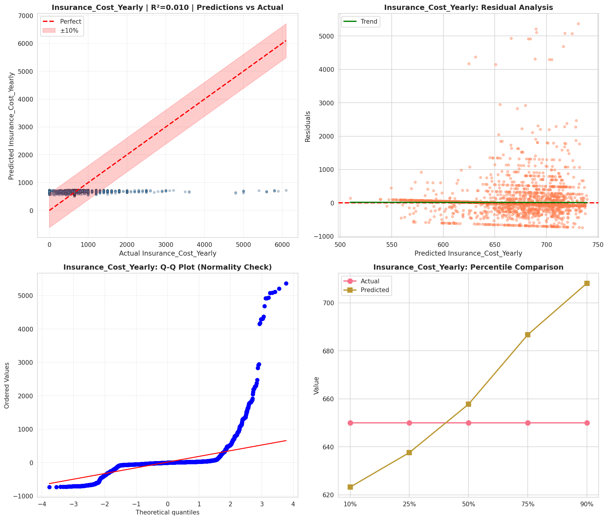
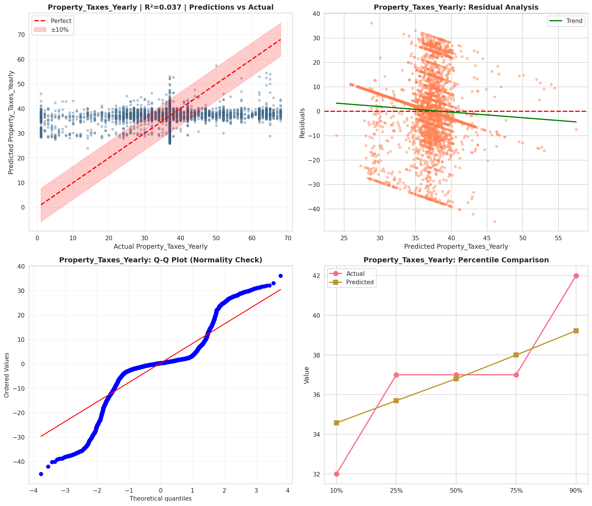
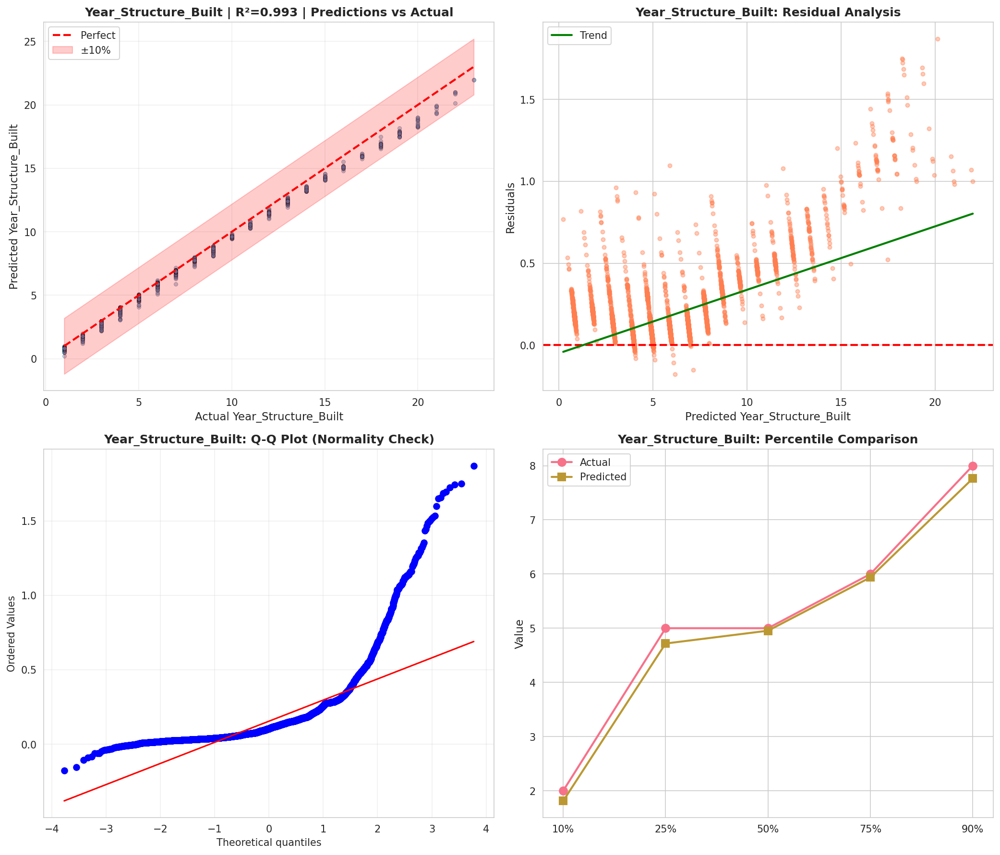
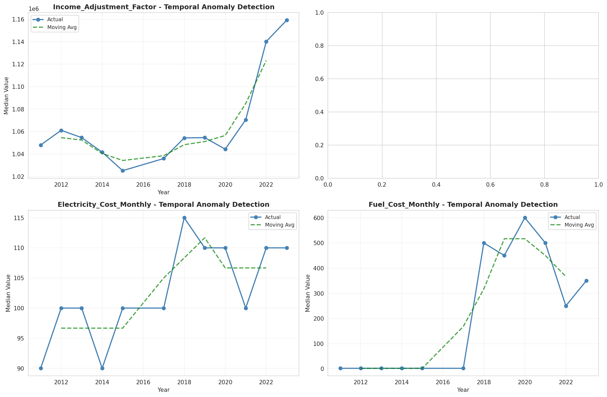
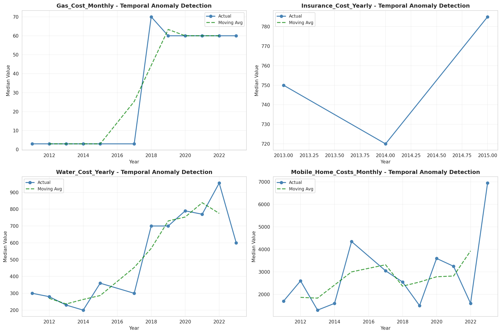
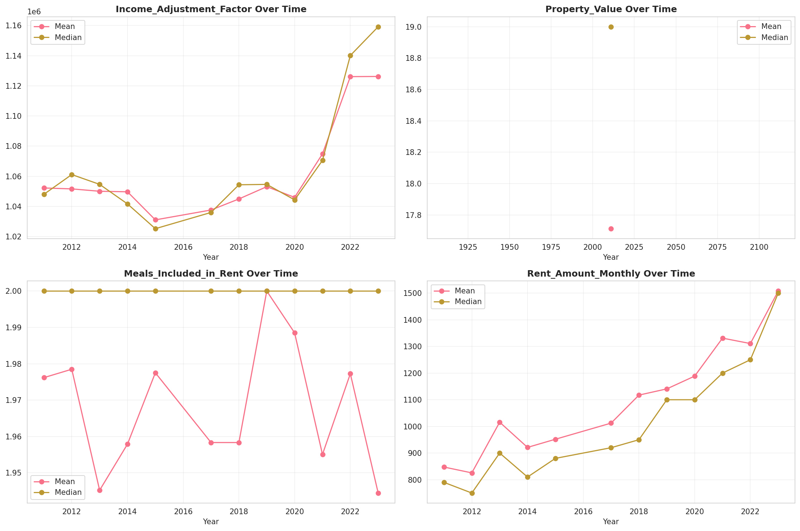
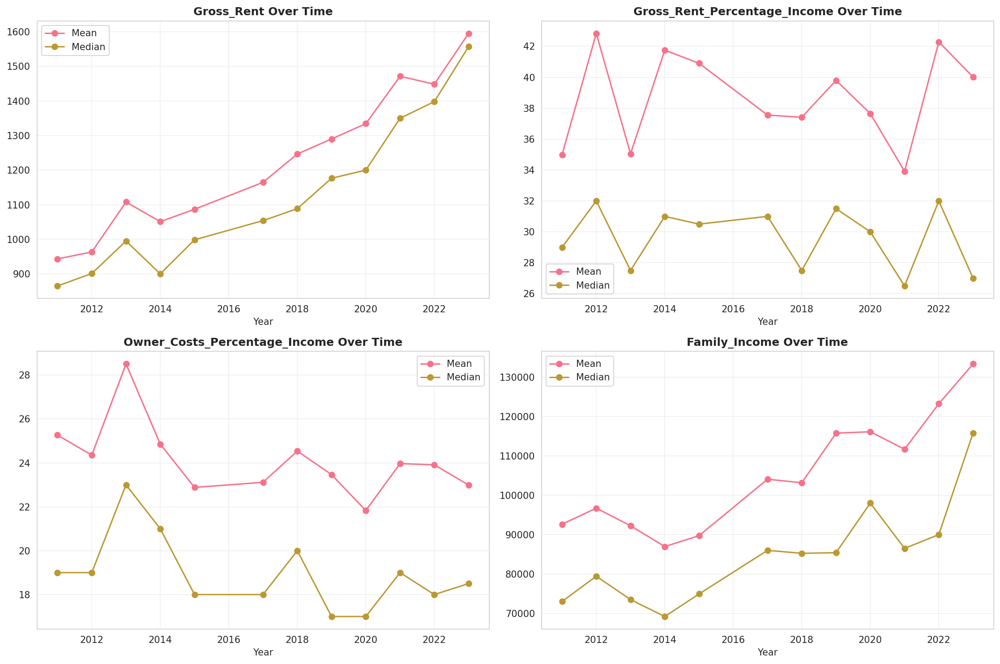
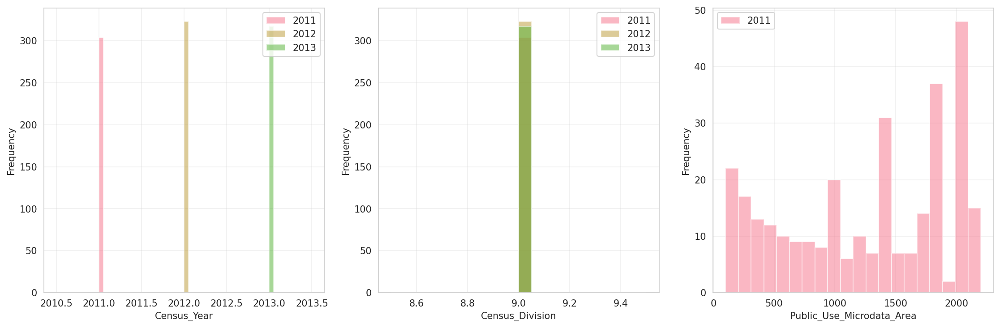
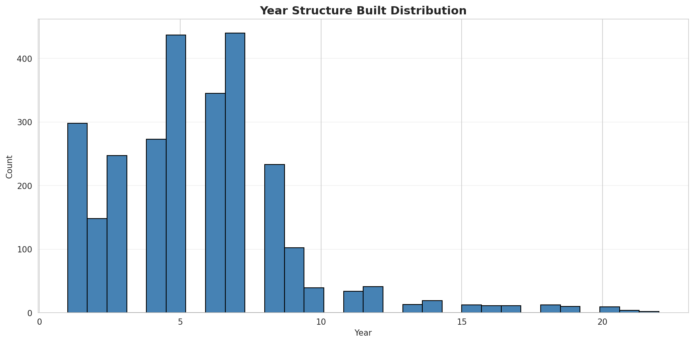
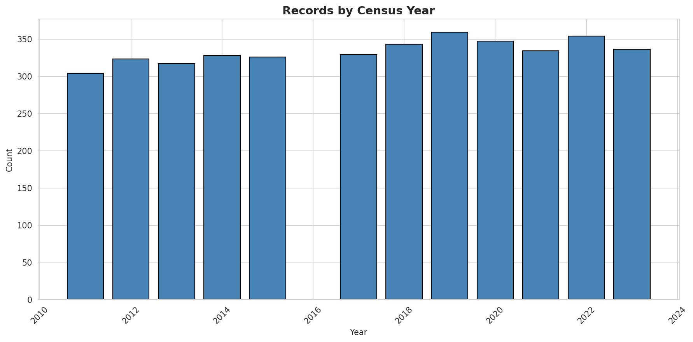
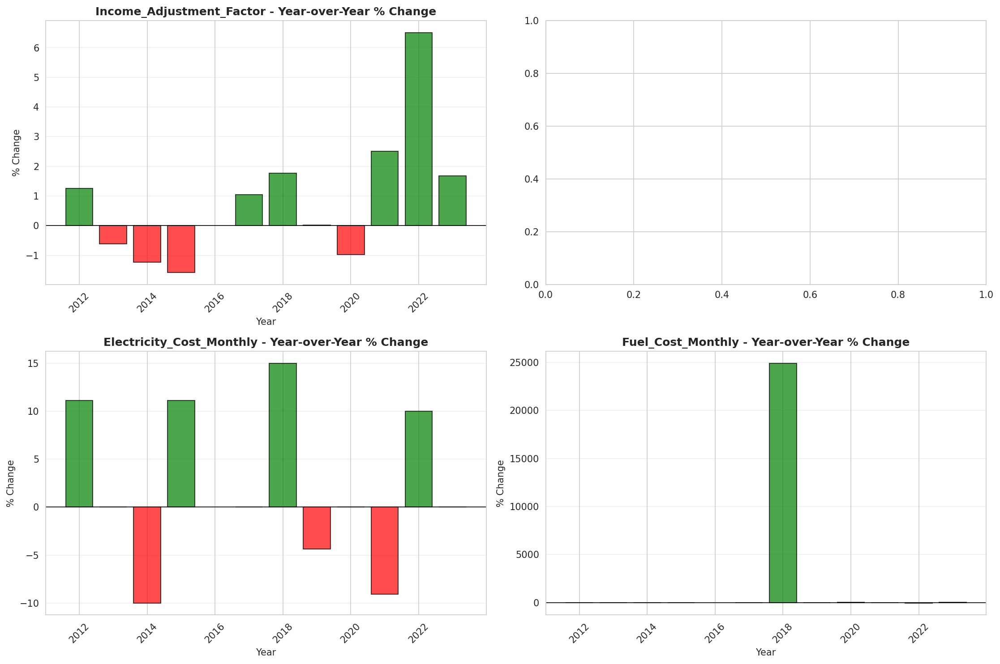
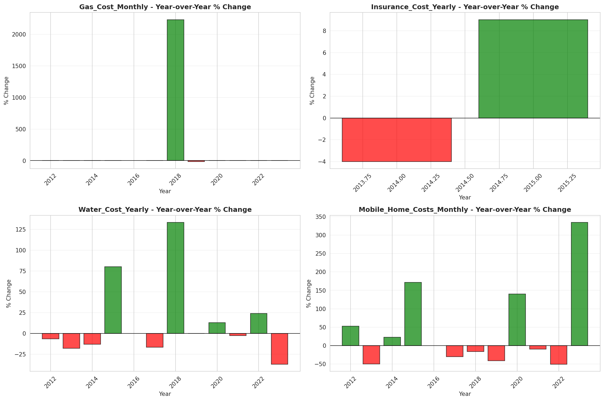
