# Temporal Analysis

## Year Distribution

- 2011: 9,820 records

- 2012: 9,759 records

- 2014: 9,713 records

- 2015: 9,767 records

- 2016: 9,733 records

- 2017: 9,834 records

- 2018: 9,845 records

- 2019: 9,844 records

- 2021: 9,420 records

- 2022: 9,545 records

- 2023: 9,486 records

## Temporal Trends

- Census_Year: {np.int64(2011): {'mean': 2011.0, 'median': 2011.0, 'std': 0.0}, np.int64(2012): {'mean': 2012.0, 'median': 2012.0, 'std': 0.0}, np.int64(2014): {'mean': 2014.0, 'median': 2014.0, 'std': 0.0}, np.int64(2015): {'mean': 2015.0, 'median': 2015.0, 'std': 0.0}, np.int64(2016): {'mean': 2016.0, 'median': 2016.0, 'std': 0.0}, np.int64(2017): {'mean': 2017.0, 'median': 2017.0, 'std': 0.0}, np.int64(2018): {'mean': 2018.0, 'median': 2018.0, 'std': 0.0}, np.int64(2019): {'mean': 2019.0, 'median': 2019.0, 'std': 0.0}, np.int64(2021): {'mean': 2021.0, 'median': 2021.0, 'std': 0.0}, np.int64(2022): {'mean': 2022.0, 'median': 2022.0, 'std': 0.0}, np.int64(2023): {'mean': 2023.0, 'median': 2023.0, 'std': 0.0}}

- Census_Division: {np.int64(2011): {'mean': 5.0, 'median': 5.0, 'std': 0.0}, np.int64(2012): {'mean': 5.0, 'median': 5.0, 'std': 0.0}, np.int64(2014): {'mean': 5.0, 'median': 5.0, 'std': 0.0}, np.int64(2015): {'mean': 5.0, 'median': 5.0, 'std': 0.0}, np.int64(2016): {'mean': 5.0, 'median': 5.0, 'std': 0.0}, np.int64(2017): {'mean': 5.0, 'median': 5.0, 'std': 0.0}, np.int64(2018): {'mean': 5.0, 'median': 5.0, 'std': 0.0}, np.int64(2019): {'mean': 5.0, 'median': 5.0, 'std': 0.0}, np.int64(2021): {'mean': 5.0, 'median': 5.0, 'std': 0.0}, np.int64(2022): {'mean': 5.0, 'median': 5.0, 'std': 0.0}, np.int64(2023): {'mean': 5.0, 'median': 5.0, 'std': 0.0}}

- Public_Use_Microdata_Area: {np.int64(2011): {'mean': 609.8167006109979, 'median': 600.0, 'std': 328.9280658106892}, np.int64(2012): {'mean': 682.8773439901629, 'median': 700.0, 'std': 379.6996693703292}, np.int64(2014): {'mean': 684.8244620611551, 'median': 700.0, 'std': 377.14558159225527}, np.int64(2015): {'mean': 676.1646360192485, 'median': 600.0, 'std': 375.89011395121713}, np.int64(2016): {'mean': 673.2867563957669, 'median': 600.0, 'std': 377.5059517340437}, np.int64(2017): {'mean': 677.5676225340654, 'median': 600.0, 'std': 378.62541794215235}, np.int64(2018): {'mean': 670.1777552056882, 'median': 600.0, 'std': 375.0828418490125}, np.int64(2019): {'mean': 675.1726940268184, 'median': 600.0, 'std': 375.3304218598861}, np.int64(2021): {'mean': 670.307855626327, 'median': 600.0, 'std': 374.7986835803695}, np.int64(2022): {'mean': 628.9785227867993, 'median': 600.0, 'std': 346.3019429443709}, np.int64(2023): {'mean': 628.0413240565043, 'median': 600.0, 'std': 349.57327820817915}}

- Census_Region: {np.int64(2011): {'mean': 3.0, 'median': 3.0, 'std': 0.0}, np.int64(2012): {'mean': 3.0, 'median': 3.0, 'std': 0.0}, np.int64(2014): {'mean': 3.0, 'median': 3.0, 'std': 0.0}, np.int64(2015): {'mean': 3.0, 'median': 3.0, 'std': 0.0}, np.int64(2016): {'mean': 3.0, 'median': 3.0, 'std': 0.0}, np.int64(2017): {'mean': 3.0, 'median': 3.0, 'std': 0.0}, np.int64(2018): {'mean': 3.0, 'median': 3.0, 'std': 0.0}, np.int64(2019): {'mean': 3.0, 'median': 3.0, 'std': 0.0}, np.int64(2021): {'mean': 3.0, 'median': 3.0, 'std': 0.0}, np.int64(2022): {'mean': 3.0, 'median': 3.0, 'std': 0.0}, np.int64(2023): {'mean': 3.0, 'median': 3.0, 'std': 0.0}}

- State_Code: {np.int64(2011): {'mean': 54.0, 'median': 54.0, 'std': 0.0}, np.int64(2012): {'mean': 54.0, 'median': 54.0, 'std': 0.0}, np.int64(2014): {'mean': 54.0, 'median': 54.0, 'std': 0.0}, np.int64(2015): {'mean': 54.0, 'median': 54.0, 'std': 0.0}, np.int64(2016): {'mean': 54.0, 'median': 54.0, 'std': 0.0}, np.int64(2017): {'mean': 54.0, 'median': 54.0, 'std': 0.0}, np.int64(2018): {'mean': 54.0, 'median': 54.0, 'std': 0.0}, np.int64(2019): {'mean': 54.0, 'median': 54.0, 'std': 0.0}, np.int64(2021): {'mean': 54.0, 'median': 54.0, 'std': 0.0}, np.int64(2022): {'mean': 54.0, 'median': 54.0, 'std': 0.0}, np.int64(2023): {'mean': None, 'median': None, 'std': None}}

- Housing_Adjustment_Factor: {np.int64(2011): {'mean': 1000000.0, 'median': 1000000.0, 'std': 0.0}, np.int64(2012): {'mean': 1000000.0, 'median': 1000000.0, 'std': 0.0}, np.int64(2014): {'mean': 1000000.0, 'median': 1000000.0, 'std': 0.0}, np.int64(2015): {'mean': 1000000.0, 'median': 1000000.0, 'std': 0.0}, np.int64(2016): {'mean': 1000000.0, 'median': 1000000.0, 'std': 0.0}, np.int64(2017): {'mean': 1000000.0, 'median': 1000000.0, 'std': 0.0}, np.int64(2018): {'mean': 1000000.0, 'median': 1000000.0, 'std': 0.0}, np.int64(2019): {'mean': 1000000.0, 'median': 1000000.0, 'std': 0.0}, np.int64(2021): {'mean': 1000000.0, 'median': 1000000.0, 'std': 0.0}, np.int64(2022): {'mean': 1000000.0, 'median': 1000000.0, 'std': 0.0}, np.int64(2023): {'mean': 1000000.0, 'median': 1000000.0, 'std': 0.0}}

- Income_Adjustment_Factor: {np.int64(2011): {'mean': 1018237.0, 'median': 1018237.0, 'std': 0.0}, np.int64(2012): {'mean': 1010207.0, 'median': 1010207.0, 'std': 0.0}, np.int64(2014): {'mean': 1008425.0, 'median': 1008425.0, 'std': 0.0}, np.int64(2015): {'mean': 1001264.0, 'median': 1001264.0, 'std': 0.0}, np.int64(2016): {'mean': 1007588.0, 'median': 1007588.0, 'std': 0.0}, np.int64(2017): {'mean': 1011189.0, 'median': 1011189.0, 'std': 0.0}, np.int64(2018): {'mean': 1013097.0, 'median': 1013097.0, 'std': 0.0}, np.int64(2019): {'mean': 1010145.0, 'median': 1010145.0, 'std': 0.0}, np.int64(2021): {'mean': 1029928.0, 'median': 1029928.0, 'std': 0.0}, np.int64(2022): {'mean': 1042311.0, 'median': 1042311.0, 'std': 0.0}, np.int64(2023): {'mean': 1019518.0, 'median': 1019518.0, 'std': 0.0}}

- Housing_Unit_Weight: {np.int64(2011): {'mean': 89.79847250509165, 'median': 72.0, 'std': 83.18021017655303}, np.int64(2012): {'mean': 90.46008812378318, 'median': 76.0, 'std': 77.76892409478243}, np.int64(2014): {'mean': 91.07114176876351, 'median': 73.0, 'std': 78.97392188459048}, np.int64(2015): {'mean': 90.66642776697041, 'median': 73.0, 'std': 78.74002881762463}, np.int64(2016): {'mean': 91.10346244734409, 'median': 72.0, 'std': 79.60849331899128}, np.int64(2017): {'mean': 90.73011999186495, 'median': 72.0, 'std': 79.32772787807448}, np.int64(2018): {'mean': 90.78131030980192, 'median': 73.0, 'std': 78.66271835469014}, np.int64(2019): {'mean': 90.91659894351889, 'median': 69.0, 'std': 84.9214663276137}, np.int64(2021): {'mean': 91.13184713375796, 'median': 71.0, 'std': 83.47322188098586}, np.int64(2022): {'mean': 90.27616553169199, 'median': 70.0, 'std': 85.92551821305571}, np.int64(2023): {'mean': 91.05587181109003, 'median': 68.0, 'std': 88.2328641258717}}

- Number_of_Persons: {np.int64(2011): {'mean': 1.870162932790224, 'median': 2.0, 'std': 1.3406254056170634}, np.int64(2012): {'mean': 1.8741674351880315, 'median': 2.0, 'std': 1.3445813157926645}, np.int64(2014): {'mean': 1.8754246885617214, 'median': 2.0, 'std': 1.3638537994524338}, np.int64(2015): {'mean': 1.8481621787652298, 'median': 2.0, 'std': 1.3554988287187388}, np.int64(2016): {'mean': 1.8400287681084968, 'median': 2.0, 'std': 1.3715716813571204}, np.int64(2017): {'mean': 1.805775879601383, 'median': 2.0, 'std': 1.357751622022418}, np.int64(2018): {'mean': 1.8350431691213813, 'median': 2.0, 'std': 1.3750294631933675}, np.int64(2019): {'mean': 1.84173100365705, 'median': 2.0, 'std': 1.3772884184347085}, np.int64(2021): {'mean': 1.8501061571125266, 'median': 2.0, 'std': 1.365102416324186}, np.int64(2022): {'mean': 1.8999476165531692, 'median': 2.0, 'std': 1.3330322802252041}, np.int64(2023): {'mean': 1.9251528568416614, 'median': 2.0, 'std': 1.356172889224421}}

- Housing_Unit_Type: {np.int64(2011): {'mean': 1.1478615071283096, 'median': 1.0, 'std': 0.466551543092204}, np.int64(2012): {'mean': 1.1403832359872939, 'median': 1.0, 'std': 0.459206450658569}, np.int64(2014): {'mean': 1.1282816843405745, 'median': 1.0, 'std': 0.4359939388511673}, np.int64(2015): {'mean': 1.1368895259547456, 'median': 1.0, 'std': 0.4529895579443822}, np.int64(2016): {'mean': 1.1308948936607417, 'median': 1.0, 'std': 0.4445449496232466}, np.int64(2017): {'mean': 1.1364653243847875, 'median': 1.0, 'std': 0.45334149669808155}, np.int64(2018): {'mean': 1.1310309801929914, 'median': 1.0, 'std': 0.43782111168624555}, np.int64(2019): {'mean': 1.1341934173100365, 'median': 1.0, 'std': 0.45051028172755114}, np.int64(2021): {'mean': None, 'median': None, 'std': None}, np.int64(2022): {'mean': None, 'median': None, 'std': None}, np.int64(2023): {'mean': None, 'median': None, 'std': None}}

- Number_of_Bedrooms: {np.int64(2011): {'mean': 2.740757541392606, 'median': 3.0, 'std': 0.9925074725623744}, np.int64(2012): {'mean': 2.7215992751160947, 'median': 3.0, 'std': 0.9445243801718077}, np.int64(2014): {'mean': 2.7339211031988246, 'median': 3.0, 'std': 0.9548743471633752}, np.int64(2015): {'mean': 2.732919254658385, 'median': 3.0, 'std': 0.9592648598262055}, np.int64(2016): {'mean': 2.7394834780647344, 'median': 3.0, 'std': 0.967565988712939}, np.int64(2017): {'mean': 2.762860024655385, 'median': 3.0, 'std': 0.9982169607200748}, np.int64(2018): {'mean': 2.7624748265831283, 'median': 3.0, 'std': 0.958740061789372}, np.int64(2019): {'mean': 2.773296089385475, 'median': 3.0, 'std': 0.9836646429427794}, np.int64(2021): {'mean': 2.7876528829353524, 'median': 3.0, 'std': 1.0215462580853125}, np.int64(2022): {'mean': 2.802019264245097, 'median': 3.0, 'std': 0.9803219906197806}, np.int64(2023): {'mean': 2.8067839777726324, 'median': 3.0, 'std': 0.9974218507600333}}

- Number_of_Rooms: {np.int64(2011): {'mean': 6.032433658425947, 'median': 6.0, 'std': 2.122822830374853}, np.int64(2012): {'mean': 5.9797259032733034, 'median': 6.0, 'std': 2.111616170593693}, np.int64(2014): {'mean': 6.040691759918617, 'median': 6.0, 'std': 2.1995043674952064}, np.int64(2015): {'mean': 6.074647092038396, 'median': 6.0, 'std': 2.2027781469110757}, np.int64(2016): {'mean': 6.0496221946543365, 'median': 6.0, 'std': 2.171949796520398}, np.int64(2017): {'mean': 6.106914714782024, 'median': 6.0, 'std': 2.2343631681818756}, np.int64(2018): {'mean': 6.164466323562318, 'median': 6.0, 'std': 2.176405013566523}, np.int64(2019): {'mean': 6.209497206703911, 'median': 6.0, 'std': 2.2640577280780576}, np.int64(2021): {'mean': 6.310891089108911, 'median': 6.0, 'std': 2.404252980766138}, np.int64(2022): {'mean': 6.341882325635372, 'median': 6.0, 'std': 2.3595854083973307}, np.int64(2023): {'mean': 6.315582310720074, 'median': 6.0, 'std': 2.303520887162467}}

- Building_Type: {np.int64(2011): {'mean': 2.3538217282830574, 'median': 2.0, 'std': 1.507008924894464}, np.int64(2012): {'mean': 2.345792275455884, 'median': 2.0, 'std': 1.5041588692131178}, np.int64(2014): {'mean': 2.351870690629592, 'median': 2.0, 'std': 1.5109677609085084}, np.int64(2015): {'mean': 2.388368153585545, 'median': 2.0, 'std': 1.559504256508939}, np.int64(2016): {'mean': 2.3639336867035072, 'median': 2.0, 'std': 1.5052575726900497}, np.int64(2017): {'mean': 2.3548134035638237, 'median': 2.0, 'std': 1.5130257404669272}, np.int64(2018): {'mean': 2.363392257775789, 'median': 2.0, 'std': 1.5191037396205842}, np.int64(2019): {'mean': 2.3518435754189944, 'median': 2.0, 'std': 1.4826084031017026}, np.int64(2021): {'mean': 2.380663948747816, 'median': 2.0, 'std': 1.5285413793253624}, np.int64(2022): {'mean': 2.390739236393176, 'median': 2.0, 'std': 1.562211198604865}, np.int64(2023): {'mean': 2.3969668904839083, 'median': 2.0, 'std': 1.555793459451403}}

- Year_Structure_Built: {np.int64(2011): {'mean': 4.409843501927875, 'median': 5.0, 'std': 2.6304423824897065}, np.int64(2012): {'mean': 4.481708007701892, 'median': 5.0, 'std': 2.688820767293272}, np.int64(2014): {'mean': 4.592856335480954, 'median': 5.0, 'std': 2.8507898901902005}, np.int64(2015): {'mean': 4.693167701863354, 'median': 5.0, 'std': 2.970400941548722}, np.int64(2016): {'mean': 4.814029547761362, 'median': 5.0, 'std': 3.2392447229864705}, np.int64(2017): {'mean': 4.957973775635997, 'median': 5.0, 'std': 3.443970462261511}, np.int64(2018): {'mean': 4.92996196017006, 'median': 5.0, 'std': 3.3618810470405927}, np.int64(2019): {'mean': 4.9306145251396645, 'median': 5.0, 'std': 3.578344490497087}, np.int64(2021): {'mean': None, 'median': None, 'std': None}, np.int64(2022): {'mean': None, 'median': None, 'std': None}, np.int64(2023): {'mean': None, 'median': None, 'std': None}}

- Bathtub_or_Shower: {np.int64(2011): {'mean': 1.0260830120208664, 'median': 1.0, 'std': 0.15939124696220383}, np.int64(2012): {'mean': 1.0220863064899761, 'median': 1.0, 'std': 0.14697261019039368}, np.int64(2014): {'mean': 1.0276930032779474, 'median': 1.0, 'std': 0.16410101986406928}, np.int64(2015): {'mean': 1.028797289666855, 'median': 1.0, 'std': 0.16724582079571867}, np.int64(2016): {'mean': 1.0322544265253186, 'median': 1.0, 'std': 0.17668502807070183}, np.int64(2017): {'mean': 1.035750308192312, 'median': 1.0, 'std': 0.1856773744677138}, np.int64(2018): {'mean': 1.0314388006265385, 'median': 1.0, 'std': 0.1745101993304483}, np.int64(2019): {'mean': 1.0293854748603353, 'median': 1.0, 'std': 0.1688939190611205}, np.int64(2021): {'mean': 1.0299359347699475, 'median': 1.0, 'std': 0.17042053160152704}, np.int64(2022): {'mean': 1.015202506672856, 'median': 1.0, 'std': 0.12236473385040468}, np.int64(2023): {'mean': 1.0113452188006482, 'median': 1.0, 'std': 0.10591413252494596}}

- Refrigerator: {np.int64(2011): {'mean': 1.0330006804264005, 'median': 1.0, 'std': 0.178648411266725}, np.int64(2012): {'mean': 1.0309208290859666, 'median': 1.0, 'std': 0.17311304311843906}, np.int64(2014): {'mean': 1.041935119249463, 'median': 1.0, 'std': 0.20045225566363323}, np.int64(2015): {'mean': 1.046188594014681, 'median': 1.0, 'std': 0.2099051774928082}, np.int64(2016): {'mean': 1.04747941806699, 'median': 1.0, 'std': 0.21267398498244783}, np.int64(2017): {'mean': 1.05480219657066, 'median': 1.0, 'std': 0.22760650599949034}, np.int64(2018): {'mean': 1.0481091966882972, 'median': 1.0, 'std': 0.21400893918642497}, np.int64(2019): {'mean': 1.0433519553072625, 'median': 1.0, 'std': 0.20365951390017173}, np.int64(2021): {'mean': 1.0384391380314502, 'median': 1.0, 'std': 0.19226512051546032}, np.int64(2022): {'mean': 1.0227457351746547, 'median': 1.0, 'std': 0.14910045808118585}, np.int64(2023): {'mean': 1.0182912711275758, 'median': 1.0, 'std': 0.1340103711353118}}

- Hot_and_Cold_Running_Water: {np.int64(2011): {'mean': 1.0408255840326606, 'median': 1.0, 'std': 0.19789718798218373}, np.int64(2012): {'mean': 1.035677879714577, 'median': 1.0, 'std': 0.18549626915066547}, np.int64(2014): {'mean': 1.0478128179043744, 'median': 1.0, 'std': 0.21338204924586024}, np.int64(2015): {'mean': 1.0494635798983625, 'median': 1.0, 'std': 0.216846130723646}, np.int64(2016): {'mean': 1.05458441411977, 'median': 1.0, 'std': 0.22718005282244633}, np.int64(2017): {'mean': 1.0671298890507677, 'median': 1.0, 'std': 0.25026083601132787}, np.int64(2018): {'mean': 1.0636607742224211, 'median': 1.0, 'std': 0.24416131932902296}, np.int64(2019): {'mean': 1.0554189944134078, 'median': 1.0, 'std': 0.2288090449119477}, np.int64(2021): {'mean': 1.0491555037856728, 'median': 1.0, 'std': 0.21620519225661378}, np.int64(2022): {'mean': 1.029360566322386, 'median': 1.0, 'std': 0.16882485331161015}, np.int64(2023): {'mean': 1.0265107663811068, 'median': 1.0, 'std': 0.16065781560591152}}

- Running_Water: {np.int64(2011): {'mean': None, 'median': None, 'std': None}, np.int64(2012): {'mean': None, 'median': None, 'std': None}, np.int64(2014): {'mean': 9.0, 'median': 9.0, 'std': 0.0}, np.int64(2015): {'mean': 9.0, 'median': 9.0, 'std': 0.0}, np.int64(2016): {'mean': 9.0, 'median': 9.0, 'std': 0.0}, np.int64(2017): {'mean': 9.0, 'median': 9.0, 'std': 0.0}, np.int64(2018): {'mean': 9.0, 'median': 9.0, 'std': 0.0}, np.int64(2019): {'mean': 9.0, 'median': 9.0, 'std': 0.0}, np.int64(2021): {'mean': 9.0, 'median': 9.0, 'std': 0.0}, np.int64(2022): {'mean': 9.0, 'median': 9.0, 'std': 0.0}, np.int64(2023): {'mean': 9.0, 'median': 9.0, 'std': 0.0}}

- Sink_with_Faucet: {np.int64(2011): {'mean': 1.0249489680199593, 'median': 1.0, 'std': 0.15597844742673492}, np.int64(2012): {'mean': 1.019141465624646, 'median': 1.0, 'std': 0.1370299116327662}, np.int64(2014): {'mean': 1.0250932519498135, 'median': 1.0, 'std': 0.15641721821059365}, np.int64(2015): {'mean': 1.02540937323546, 'median': 1.0, 'std': 0.15737386658997088}, np.int64(2016): {'mean': 1.026841096199391, 'median': 1.0, 'std': 0.16162796142341707}, np.int64(2017): {'mean': 1.0322761403115543, 'median': 1.0, 'std': 0.1767424451187488}, np.int64(2018): {'mean': 1.0264041172521816, 'median': 1.0, 'std': 0.16034280871369716}, np.int64(2019): {'mean': 1.0250279329608938, 'median': 1.0, 'std': 0.1562186361027804}, np.int64(2021): {'mean': 1.0278392545136867, 'median': 1.0, 'std': 0.16452168030733758}, np.int64(2022): {'mean': 1.013113612626204, 'median': 1.0, 'std': 0.1137679561129567}, np.int64(2023): {'mean': 1.010071775874045, 'median': 1.0, 'std': 0.0998573461473643}}

- Stove_or_Range: {np.int64(2011): {'mean': 1.0337945112270357, 'median': 1.0, 'std': 0.18071011479317092}, np.int64(2012): {'mean': 1.0327330388492468, 'median': 1.0, 'std': 0.17794710875138656}, np.int64(2014): {'mean': 1.0418220865830226, 'median': 1.0, 'std': 0.20019373048852956}, np.int64(2015): {'mean': 1.0452851496329758, 'median': 1.0, 'std': 0.20794058740938232}, np.int64(2016): {'mean': 1.047704973497237, 'median': 1.0, 'std': 0.2131533086328399}, np.int64(2017): {'mean': 1.0559228958870335, 'median': 1.0, 'std': 0.22978564588928374}, np.int64(2018): {'mean': 1.0467666144551353, 'median': 1.0, 'std': 0.21115038816560405}, np.int64(2019): {'mean': 1.0429050279329608, 'median': 1.0, 'std': 0.2026543244073493}, np.int64(2021): {'mean': 1.0380896913220734, 'median': 1.0, 'std': 0.19142396665877484}, np.int64(2022): {'mean': 1.0230938841824302, 'median': 1.0, 'std': 0.15021043620471763}, np.int64(2023): {'mean': 1.0189858763602686, 'median': 1.0, 'std': 0.1364828536005736}}

- Telephone_Service: {np.int64(2011): {'mean': 1.0334021150374, 'median': 1.0, 'std': 0.17969579328766233}, np.int64(2012): {'mean': 1.0348972469949593, 'median': 1.0, 'std': 0.18353142168165154}, np.int64(2014): {'mean': 1.0296373326400623, 'median': 1.0, 'std': 0.16959569560736878}, np.int64(2015): {'mean': 1.0269527672379954, 'median': 1.0, 'std': 0.16195600464828352}, np.int64(2016): {'mean': 1.0284466790156126, 'median': 1.0, 'std': 0.16625619588233714}, np.int64(2017): {'mean': 1.0243055555555556, 'median': 1.0, 'std': 0.15400637320480318}, np.int64(2018): {'mean': 1.0156739811912225, 'median': 1.0, 'std': 0.12421885106444933}, np.int64(2019): {'mean': 1.01515745459297, 'median': 1.0, 'std': 0.12218697552256409}, np.int64(2021): {'mean': 1.0108283703302654, 'median': 1.0, 'std': 0.10350153004546153}, np.int64(2022): {'mean': 1.0135939927498705, 'median': 1.0, 'std': 0.11580558008478214}, np.int64(2023): {'mean': 1.0121096239643084, 'median': 1.0, 'std': 0.10938238470641914}}

- Lot_Acreage: {np.int64(2011): {'mean': 1.3996927410062732, 'median': 1.0, 'std': 0.6462894447729225}, np.int64(2012): {'mean': 1.411065678507539, 'median': 1.0, 'std': 0.6492661585939677}, np.int64(2014): {'mean': 1.3915532375015902, 'median': 1.0, 'std': 0.6361460711091002}, np.int64(2015): {'mean': 1.39514687100894, 'median': 1.0, 'std': 0.6300086654330016}, np.int64(2016): {'mean': 1.3977879481311977, 'median': 1.0, 'std': 0.6328897699762233}, np.int64(2017): {'mean': 1.3939278937381405, 'median': 1.0, 'std': 0.6366136112611352}, np.int64(2018): {'mean': 1.3976328380760514, 'median': 1.0, 'std': 0.6268431326717135}, np.int64(2019): {'mean': 1.4184966746141296, 'median': 1.0, 'std': 0.6442627544389522}, np.int64(2021): {'mean': 1.4168633621820088, 'median': 1.0, 'std': 0.644959408723858}, np.int64(2022): {'mean': 1.446192161489055, 'median': 1.0, 'std': 0.6520471054097324}, np.int64(2023): {'mean': 1.4444589820751015, 'median': 1.0, 'std': 0.6494388734027938}}

- Agricultural_Sales: {np.int64(2011): {'mean': 1.1677330895795246, 'median': 1.0, 'std': 0.721808034485984}, np.int64(2012): {'mean': 1.1644204851752022, 'median': 1.0, 'std': 0.6998626197215706}, np.int64(2014): {'mean': 1.1511627906976745, 'median': 1.0, 'std': 0.6922666935335845}, np.int64(2015): {'mean': 1.1415051825146463, 'median': 1.0, 'std': 0.6632051082737509}, np.int64(2016): {'mean': 1.1719184430027803, 'median': 1.0, 'std': 0.7248225711769142}, np.int64(2017): {'mean': 1.1520912547528517, 'median': 1.0, 'std': 0.6647609942644986}, np.int64(2018): {'mean': 1.1563055062166963, 'median': 1.0, 'std': 0.6858927719620755}, np.int64(2019): {'mean': 1.1711864406779662, 'median': 1.0, 'std': 0.7235049275792776}, np.int64(2021): {'mean': 1.1994584837545126, 'median': 1.0, 'std': 0.7864080555782301}, np.int64(2022): {'mean': 1.1365255243371586, 'median': 1.0, 'std': 0.6416214040766652}, np.int64(2023): {'mean': 1.1517403206883066, 'median': 1.0, 'std': 0.6739986357718203}}

- Tenure: {np.int64(2011): {'mean': 1.9378385349497034, 'median': 2.0, 'std': 0.8530669530254306}, np.int64(2012): {'mean': 1.954633578906553, 'median': 2.0, 'std': 0.8451054701710647}, np.int64(2014): {'mean': 1.959053685168335, 'median': 2.0, 'std': 0.8377238922583214}, np.int64(2015): {'mean': 1.9387674996729034, 'median': 2.0, 'std': 0.8352467669603602}, np.int64(2016): {'mean': 1.9321249007673988, 'median': 2.0, 'std': 0.8330366078123425}, np.int64(2017): {'mean': 1.9448450854700854, 'median': 2.0, 'std': 0.8374037023075109}, np.int64(2018): {'mean': 1.9366509926854754, 'median': 2.0, 'std': 0.8310024583325412}, np.int64(2019): {'mean': 1.922906049915066, 'median': 2.0, 'std': 0.8237612926112979}, np.int64(2021): {'mean': 1.9124255549539795, 'median': 2.0, 'std': 0.8123137983934573}, np.int64(2022): {'mean': 1.9140341791817712, 'median': 2.0, 'std': 0.8218906062936875}, np.int64(2023): {'mean': 1.9232632249840662, 'median': 2.0, 'std': 0.8017227484008858}}

- Vacancy_Status: {np.int64(2011): {'mean': 5.163533834586466, 'median': 5.0, 'std': 1.9965975556978366}, np.int64(2012): {'mean': 5.152014652014652, 'median': 5.0, 'std': 1.927837836513083}, np.int64(2014): {'mean': 5.2331022530329285, 'median': 5.0, 'std': 1.9624169333344454}, np.int64(2015): {'mean': 5.4438943894389435, 'median': 6.5, 'std': 1.9137437679365923}, np.int64(2016): {'mean': 5.454545454545454, 'median': 7.0, 'std': 1.9057585065077103}, np.int64(2017): {'mean': 5.512195121951219, 'median': 7.0, 'std': 1.8766971092864417}, np.int64(2018): {'mean': 5.558502340093604, 'median': 7.0, 'std': 1.9426018760375279}, np.int64(2019): {'mean': 5.686969930609098, 'median': 7.0, 'std': 1.853614626898463}, np.int64(2021): {'mean': 5.70843776106934, 'median': 7.0, 'std': 1.845006996799325}, np.int64(2022): {'mean': 5.55431131019037, 'median': 7.0, 'std': 1.9776259438602988}, np.int64(2023): {'mean': 5.563682219419924, 'median': 7.0, 'std': 1.975555812315832}}

- Property_Value: {np.int64(2011): {'mean': 120274.47200804559, 'median': 90000.0, 'std': 133003.02040579403}, np.int64(2012): {'mean': 124283.52722980948, 'median': 90000.0, 'std': 143581.09042602923}, np.int64(2014): {'mean': 128634.12641925097, 'median': 99000.0, 'std': 144606.31923847125}, np.int64(2015): {'mean': 137587.47237803842, 'median': 100000.0, 'std': 146150.6304158408}, np.int64(2016): {'mean': 153368.85582349924, 'median': 100000.0, 'std': 231824.10420893674}, np.int64(2017): {'mean': 145763.68996011792, 'median': 110000.0, 'std': 156517.3692412667}, np.int64(2018): {'mean': 150411.00824776973, 'median': 110000.0, 'std': 175043.05310719315}, np.int64(2019): {'mean': 154768.7739144901, 'median': 120000.0, 'std': 176640.43519506173}, np.int64(2021): {'mean': 170340.31539252657, 'median': 130000.0, 'std': 191611.23451981816}, np.int64(2022): {'mean': 184522.53101736974, 'median': 150000.0, 'std': 203687.53254720345}, np.int64(2023): {'mean': 197589.81676666127, 'median': 150000.0, 'std': 242254.57397502623}}

- Vehicles_Available: {np.int64(2011): {'mean': 1.7009285530049008, 'median': 2.0, 'std': 1.0403601278981025}, np.int64(2012): {'mean': 1.6882512601783637, 'median': 2.0, 'std': 1.0283005502568325}, np.int64(2014): {'mean': 1.7358637722604966, 'median': 2.0, 'std': 1.0460829535281437}, np.int64(2015): {'mean': 1.7412010990448776, 'median': 2.0, 'std': 1.0690683153096938}, np.int64(2016): {'mean': 1.7589309341095527, 'median': 2.0, 'std': 1.0464134453346665}, np.int64(2017): {'mean': 1.7625534188034189, 'median': 2.0, 'std': 1.0513603657913104}, np.int64(2018): {'mean': 1.7911442006269593, 'median': 2.0, 'std': 1.065769246038023}, np.int64(2019): {'mean': 1.8071344570756567, 'median': 2.0, 'std': 1.1008556797950488}, np.int64(2021): {'mean': 1.797509474824039, 'median': 2.0, 'std': 1.064526667793397}, np.int64(2022): {'mean': 1.7940186431900569, 'median': 2.0, 'std': 1.0722497354558833}, np.int64(2023): {'mean': 1.7919694072657744, 'median': 2.0, 'std': 1.0887734370511457}}

- Condo_Fee_Monthly: {np.int64(2011): {'mean': 129.26829268292684, 'median': 80.0, 'std': 105.86288877369725}, np.int64(2012): {'mean': 123.52941176470588, 'median': 95.0, 'std': 91.64762401460435}, np.int64(2014): {'mean': 194.4, 'median': 150.0, 'std': 153.19051319625942}, np.int64(2015): {'mean': 164.86486486486487, 'median': 130.0, 'std': 121.60093250788329}, np.int64(2016): {'mean': 223.46153846153845, 'median': 145.0, 'std': 228.92692821408858}, np.int64(2017): {'mean': 178.4848484848485, 'median': 140.0, 'std': 143.18085617762443}, np.int64(2018): {'mean': 203.03030303030303, 'median': 180.0, 'std': 155.0500896582466}, np.int64(2019): {'mean': 240.2941176470588, 'median': 185.0, 'std': 197.7982641422384}, np.int64(2021): {'mean': 181.48936170212767, 'median': 140.0, 'std': 136.85884069241078}, np.int64(2022): {'mean': 320.63492063492066, 'median': 200.0, 'std': 347.0608063106662}, np.int64(2023): {'mean': 219.84848484848484, 'median': 195.0, 'std': 156.1605921355658}}

- Electricity_Cost_Monthly: {np.int64(2011): {'mean': 126.40043848336343, 'median': 100.0, 'std': 87.93159639216398}, np.int64(2012): {'mean': 123.83404420317953, 'median': 100.0, 'std': 80.31431830639093}, np.int64(2014): {'mean': 129.1587157155856, 'median': 100.0, 'std': 91.87011593430472}, np.int64(2015): {'mean': 131.49208426010728, 'median': 110.0, 'std': 90.0545854061257}, np.int64(2016): {'mean': 138.6930404869013, 'median': 120.0, 'std': 91.23956621457405}, np.int64(2017): {'mean': 140.62660256410257, 'median': 120.0, 'std': 95.01722336948389}, np.int64(2018): {'mean': 156.1755859639615, 'median': 130.0, 'std': 100.65493688768187}, np.int64(2019): {'mean': 147.75912408759123, 'median': 130.0, 'std': 88.97466100725065}, np.int64(2021): {'mean': 157.52685457860048, 'median': 130.0, 'std': 101.5688986804089}, np.int64(2022): {'mean': 186.62463186077645, 'median': 150.0, 'std': 236.72483478708358}, np.int64(2023): {'mean': 193.83981030167303, 'median': 150.0, 'std': 298.21604613519213}}

- Fuel_Cost_Monthly: {np.int64(2011): {'mean': 127.44854268764509, 'median': 2.0, 'std': 424.8754839134806}, np.int64(2012): {'mean': 135.0489853948559, 'median': 2.0, 'std': 444.7498556836508}, np.int64(2014): {'mean': 113.10139087482126, 'median': 2.0, 'std': 417.67634819347694}, np.int64(2015): {'mean': 99.96506607353133, 'median': 2.0, 'std': 378.5678959985163}, np.int64(2016): {'mean': 85.41862926700185, 'median': 2.0, 'std': 329.6925590100378}, np.int64(2017): {'mean': 78.48170405982906, 'median': 2.0, 'std': 297.18124357219193}, np.int64(2018): {'mean': 784.3808487486398, 'median': 600.0, 'std': 691.4075557680395}, np.int64(2019): {'mean': 773.4502673796792, 'median': 600.0, 'std': 689.851234185853}, np.int64(2021): {'mean': 727.5924050632912, 'median': 500.0, 'std': 743.8570333923635}, np.int64(2022): {'mean': 846.3245109321059, 'median': 600.0, 'std': 794.4898259332366}, np.int64(2023): {'mean': 950.2305084745763, 'median': 620.0, 'std': 964.1155237759767}}

- Gas_Cost_Monthly: {np.int64(2011): {'mean': 52.16417332989425, 'median': 20.0, 'std': 74.6448904358077}, np.int64(2012): {'mean': 46.26625306966525, 'median': 20.0, 'std': 64.21383365049662}, np.int64(2014): {'mean': 50.53893149616535, 'median': 20.0, 'std': 71.75864671826896}, np.int64(2015): {'mean': 51.07771817349209, 'median': 20.0, 'std': 73.13619586204936}, np.int64(2016): {'mean': 45.01759724794919, 'median': 20.0, 'std': 68.29077609156533}, np.int64(2017): {'mean': 42.15785256410256, 'median': 20.0, 'std': 59.24082894293903}, np.int64(2018): {'mean': 88.3198273795253, 'median': 70.0, 'std': 82.89902174224686}, np.int64(2019): {'mean': 85.92454632282713, 'median': 70.0, 'std': 75.63075764175562}, np.int64(2021): {'mean': 87.91234084231147, 'median': 70.0, 'std': 85.68394300658325}, np.int64(2022): {'mean': 119.06070287539936, 'median': 80.0, 'std': 200.78328793370335}, np.int64(2023): {'mean': 140.79728146238574, 'median': 90.0, 'std': 263.87405346490294}}

- House_Heating_Fuel: {np.int64(2011): {'mean': 2.310807325251483, 'median': 2.0, 'std': 1.5146626043011346}, np.int64(2012): {'mean': 2.3465167377536513, 'median': 3.0, 'std': 1.5059339979097008}, np.int64(2014): {'mean': 2.3119719225269724, 'median': 2.0, 'std': 1.5121826040596784}, np.int64(2015): {'mean': 2.3212089493654324, 'median': 3.0, 'std': 1.4845638636070708}, np.int64(2016): {'mean': 2.2889653347446415, 'median': 2.0, 'std': 1.454842734599171}, np.int64(2017): {'mean': 2.280181623931624, 'median': 2.0, 'std': 1.44745365106808}, np.int64(2018): {'mean': 2.293103448275862, 'median': 2.0, 'std': 1.4749055195446077}, np.int64(2019): {'mean': 2.2839409381941724, 'median': 2.0, 'std': 1.4636203645496033}, np.int64(2021): {'mean': 2.2543313481321063, 'median': 2.0, 'std': 1.4340382147305815}, np.int64(2022): {'mean': 2.3371310201967894, 'median': 3.0, 'std': 1.4760424751689416}, np.int64(2023): {'mean': 2.2921606118546847, 'median': 3.0, 'std': 1.4316114899431711}}

- Insurance_Cost_Yearly: {np.int64(2011): {'mean': 652.6979583245633, 'median': 580.0, 'std': 470.3222880603863}, np.int64(2012): {'mean': 690.2152838427947, 'median': 600.0, 'std': 474.79580138141375}, np.int64(2014): {'mean': 741.6994977069229, 'median': 650.0, 'std': 529.3804919172526}, np.int64(2015): {'mean': 783.1350201998724, 'median': 700.0, 'std': 542.8679754048445}, np.int64(2016): {'mean': 817.401164043975, 'median': 700.0, 'std': 571.4859406351312}, np.int64(2017): {'mean': 825.0545938748336, 'median': 700.0, 'std': 589.3696741257671}, np.int64(2018): {'mean': 843.7028281975518, 'median': 750.0, 'std': 586.092849902108}, np.int64(2019): {'mean': 874.3136507936508, 'median': 800.0, 'std': 629.2465602007327}, np.int64(2021): {'mean': 887.6046908315565, 'median': 800.0, 'std': 636.8029042125696}, np.int64(2022): {'mean': 895.3046907430469, 'median': 800.0, 'std': 651.7417418360443}, np.int64(2023): {'mean': 1045.6717680225534, 'median': 900.0, 'std': 920.8551012066458}}

- Water_Cost_Yearly: {np.int64(2011): {'mean': 453.9048233169977, 'median': 380.0, 'std': 460.7361459413758}, np.int64(2012): {'mean': 464.9060359312395, 'median': 400.0, 'std': 481.55139653378166}, np.int64(2014): {'mean': 479.1102300792929, 'median': 400.0, 'std': 490.4047720219019}, np.int64(2015): {'mean': 480.60552139212353, 'median': 400.0, 'std': 496.83074641625427}, np.int64(2016): {'mean': 512.2070653612067, 'median': 420.0, 'std': 530.5985126739499}, np.int64(2017): {'mean': 525.845219017094, 'median': 460.0, 'std': 536.2428697282847}, np.int64(2018): {'mean': 677.1670253269326, 'median': 600.0, 'std': 552.3541610989739}, np.int64(2019): {'mean': 660.6164862614488, 'median': 600.0, 'std': 545.1009211926901}, np.int64(2021): {'mean': 708.0642201834862, 'median': 600.0, 'std': 649.2894734585304}, np.int64(2022): {'mean': 691.1940886699507, 'median': 600.0, 'std': 679.9052232439325}, np.int64(2023): {'mean': 701.1704654895666, 'median': 600.0, 'std': 685.0806853994727}}

- Mobile_Home_Costs_Monthly: {np.int64(2011): {'mean': 789.2429667519182, 'median': 310.0, 'std': 1052.1545074191615}, np.int64(2012): {'mean': 799.8920187793427, 'median': 300.0, 'std': 1237.640098815069}, np.int64(2014): {'mean': 672.5, 'median': 300.0, 'std': 881.606334256539}, np.int64(2015): {'mean': 707.1540130151844, 'median': 300.0, 'std': 930.3926450991071}, np.int64(2016): {'mean': 780.1097852028639, 'median': 300.0, 'std': 1064.3741550720595}, np.int64(2017): {'mean': 791.9814814814815, 'median': 400.0, 'std': 1168.1880071606204}, np.int64(2018): {'mean': 735.9310344827586, 'median': 330.0, 'std': 1131.005674347513}, np.int64(2019): {'mean': 975.9317697228145, 'median': 350.0, 'std': 1644.787392943007}, np.int64(2021): {'mean': 878.5929411764706, 'median': 400.0, 'std': 1244.7237575049433}, np.int64(2022): {'mean': 865.0109090909091, 'median': 350.0, 'std': 1591.513315608939}, np.int64(2023): {'mean': 1241.8280373831776, 'median': 400.0, 'std': 3003.6455328862316}}

- First_Mortgage_Includes_Insurance: {np.int64(2011): {'mean': 1.5628873496172075, 'median': 2.0, 'std': 0.4961198577679704}, np.int64(2012): {'mean': 1.5444826269568537, 'median': 2.0, 'std': 0.49811247006478754}, np.int64(2014): {'mean': 1.500392772977219, 'median': 2.0, 'std': 0.5000980678785747}, np.int64(2015): {'mean': 1.4885670731707317, 'median': 1.0, 'std': 0.4999645478072373}, np.int64(2016): {'mean': 1.4734834032811903, 'median': 1.0, 'std': 0.49939165148767634}, np.int64(2017): {'mean': 1.426332288401254, 'median': 1.0, 'std': 0.49464021437561295}, np.int64(2018): {'mean': 1.4476007677543186, 'median': 1.0, 'std': 0.4973422083395199}, np.int64(2019): {'mean': 1.4152380952380952, 'median': 1.0, 'std': 0.4928569324512676}, np.int64(2021): {'mean': 1.343308395677473, 'median': 1.0, 'std': 0.4749120785991211}, np.int64(2022): {'mean': 1.363109048723898, 'median': 1.0, 'std': 0.4809889084757534}, np.int64(2023): {'mean': 1.348546042003231, 'median': 1.0, 'std': 0.4766061693972915}}

- First_Mortgage_Payment_Monthly: {np.int64(2011): {'mean': 660.6183011301495, 'median': 540.0, 'std': 447.38811475377116}, np.int64(2012): {'mean': 687.0897289041619, 'median': 560.0, 'std': 465.65154740793287}, np.int64(2014): {'mean': 709.1720345640219, 'median': 600.0, 'std': 464.49941902504236}, np.int64(2015): {'mean': 713.7934451219512, 'median': 595.0, 'std': 479.4482612009417}, np.int64(2016): {'mean': 759.2155665776421, 'median': 600.0, 'std': 547.5767307258391}, np.int64(2017): {'mean': 758.8495297805642, 'median': 630.0, 'std': 493.5990744950702}, np.int64(2018): {'mean': 772.4660268714011, 'median': 630.0, 'std': 501.6920732335556}, np.int64(2019): {'mean': 803.9801904761905, 'median': 680.0, 'std': 521.6113953683958}, np.int64(2021): {'mean': 243.58159580663948, 'median': 4.0, 'std': 474.8615024816785}, np.int64(2022): {'mean': 341.49031121550206, 'median': 4.0, 'std': 548.5173296755693}, np.int64(2023): {'mean': 921.7197092084007, 'median': 780.0, 'std': 575.9043724906194}}

- First_Mortgage_Includes_Taxes: {np.int64(2011): {'mean': 1.5446591323368575, 'median': 2.0, 'std': 0.49809236980507515}, np.int64(2012): {'mean': 1.5127911416571211, 'median': 2.0, 'std': 0.4999318122925625}, np.int64(2014): {'mean': 1.4630793401413982, 'median': 1.0, 'std': 0.4987329556884144}, np.int64(2015): {'mean': 1.4546493902439024, 'median': 1.0, 'std': 0.4980339835934525}, np.int64(2016): {'mean': 1.425791682563907, 'median': 1.0, 'std': 0.49455681535106083}, np.int64(2017): {'mean': 1.384796238244514, 'median': 1.0, 'std': 0.48664246776492365}, np.int64(2018): {'mean': 1.3904030710172746, 'median': 1.0, 'std': 0.4879343261093525}, np.int64(2019): {'mean': 1.3641904761904762, 'median': 1.0, 'std': 0.48129410819481605}, np.int64(2021): {'mean': 1.2826267664172901, 'median': 1.0, 'std': 0.4503700482817324}, np.int64(2022): {'mean': 1.291183294663573, 'median': 1.0, 'std': 0.4543956724321646}, np.int64(2023): {'mean': 1.2839256865912763, 'median': 1.0, 'std': 0.4509922807582946}}

- First_Mortgage_Status: {np.int64(2011): {'mean': 2.070876952119444, 'median': 3.0, 'std': 0.9913570730769148}, np.int64(2012): {'mean': 2.1088681849551416, 'median': 3.0, 'std': 0.9877859936048481}, np.int64(2014): {'mean': 2.128741996885274, 'median': 3.0, 'std': 0.9867779358898193}, np.int64(2015): {'mean': 2.1007443309676304, 'median': 3.0, 'std': 0.9903767225271872}, np.int64(2016): {'mean': 2.09292576419214, 'median': 3.0, 'std': 0.9914522426821805}, np.int64(2017): {'mean': 2.105496453900709, 'median': 3.0, 'std': 0.9892335482245733}, np.int64(2018): {'mean': 2.1147119341563787, 'median': 3.0, 'std': 0.9894190445037517}, np.int64(2019): {'mean': 2.1185034704587777, 'median': 3.0, 'std': 0.9893650173733878}, np.int64(2021): {'mean': 2.1725156358582347, 'median': 3.0, 'std': 0.9807612403274901}, np.int64(2022): {'mean': 2.1420445039317384, 'median': 3.0, 'std': 0.986217285471942}, np.int64(2023): {'mean': 2.194954128440367, 'median': 3.0, 'std': 0.9777136943016085}}

- Second_Mortgage_Payment_Monthly: {np.int64(2011): {'mean': 320.0945626477541, 'median': 240.0, 'std': 276.9501992013433}, np.int64(2012): {'mean': 281.4092140921409, 'median': 200.0, 'std': 222.5242244303934}, np.int64(2014): {'mean': 304.6542056074766, 'median': 220.0, 'std': 311.4279743015551}, np.int64(2015): {'mean': 310.96153846153845, 'median': 230.0, 'std': 321.8950695723512}, np.int64(2016): {'mean': 301.3114754098361, 'median': 240.0, 'std': 241.33179967081728}, np.int64(2017): {'mean': 307.0498084291188, 'median': 230.0, 'std': 264.5680685460624}, np.int64(2018): {'mean': 328.86925795053, 'median': 250.0, 'std': 287.5306839163763}, np.int64(2019): {'mean': 331.87265917602997, 'median': 270.0, 'std': 256.20321814237866}, np.int64(2021): {'mean': 343.08539944903583, 'median': 260.0, 'std': 314.2901514788869}, np.int64(2022): {'mean': 340.3746223564955, 'median': 280.0, 'std': 267.168370172613}, np.int64(2023): {'mean': 385.85051546391753, 'median': 300.0, 'std': 379.692583831694}}

- Second_Mortgage_Status: {np.int64(2011): {'mean': 2.8228217280349983, 'median': 3.0, 'std': 0.4785292931473224}, np.int64(2012): {'mean': 2.8400152730049637, 'median': 3.0, 'std': 0.44992419333857453}, np.int64(2014): {'mean': 2.8554595443833466, 'median': 3.0, 'std': 0.4236658765861666}, np.int64(2015): {'mean': 2.862042682926829, 'median': 3.0, 'std': 0.39635176327529403}, np.int64(2016): {'mean': 2.8668447157573445, 'median': 3.0, 'std': 0.4119071292530747}, np.int64(2017): {'mean': 2.885188087774295, 'median': 3.0, 'std': 0.36900711692245614}, np.int64(2018): {'mean': 2.8859884836852205, 'median': 3.0, 'std': 0.37033767319411637}, np.int64(2019): {'mean': 2.8914285714285715, 'median': 3.0, 'std': 0.36524775611213245}, np.int64(2021): {'mean': 2.8441199684293608, 'median': 3.0, 'std': 0.41078405553300246}, np.int64(2022): {'mean': 2.875092936802974, 'median': 3.0, 'std': 0.36591034164179675}, np.int64(2023): {'mean': 2.840786430223593, 'median': 3.0, 'std': 0.4087572031075463}}

- Property_Taxes_Yearly: {np.int64(2011): {'mean': 12.741204736571135, 'median': 11.0, 'std': 9.726060214462844}, np.int64(2012): {'mean': 13.070738440303657, 'median': 11.0, 'std': 9.89059215396523}, np.int64(2014): {'mean': 13.740266482090327, 'median': 12.0, 'std': 10.21517494890292}, np.int64(2015): {'mean': 14.338757140384283, 'median': 12.0, 'std': 10.128349214164338}, np.int64(2016): {'mean': 15.03580786026201, 'median': 13.0, 'std': 10.790551385095327}, np.int64(2017): {'mean': 15.434042553191489, 'median': 14.0, 'std': 10.886372971740148}}

- Meals_Included_in_Rent: {np.int64(2011): {'mean': 1.992485549132948, 'median': 2.0, 'std': 0.08638458984044471}, np.int64(2012): {'mean': 1.9902857142857142, 'median': 2.0, 'std': 0.09810921774507578}, np.int64(2014): {'mean': 1.9890678941311852, 'median': 2.0, 'std': 0.10401355583593552}, np.int64(2015): {'mean': 1.9923708920187793, 'median': 2.0, 'std': 0.08703648844452558}, np.int64(2016): {'mean': 1.9917208752217623, 'median': 2.0, 'std': 0.09063906002944047}, np.int64(2017): {'mean': 1.9929286977018268, 'median': 2.0, 'std': 0.08381789128123943}, np.int64(2018): {'mean': 1.987987987987988, 'median': 2.0, 'std': 0.10897181114790942}, np.int64(2019): {'mean': 1.9879288437102922, 'median': 2.0, 'std': 0.10923838525342316}, np.int64(2021): {'mean': 1.991930060524546, 'median': 2.0, 'std': 0.089499733927041}, np.int64(2022): {'mean': 1.9936305732484076, 'median': 2.0, 'std': 0.0795794624440465}, np.int64(2023): {'mean': 1.9860759493670885, 'median': 2.0, 'std': 0.11721291282228125}}

- Rent_Amount_Monthly: {np.int64(2011): {'mean': 451.19190751445086, 'median': 400.0, 'std': 316.89927963566964}, np.int64(2012): {'mean': 456.78742857142856, 'median': 400.0, 'std': 268.1675646373279}, np.int64(2014): {'mean': 479.4902186421174, 'median': 450.0, 'std': 266.72571057665857}, np.int64(2015): {'mean': 514.9906103286385, 'median': 480.0, 'std': 299.6430601656588}, np.int64(2016): {'mean': 530.956830277942, 'median': 500.0, 'std': 309.0032686376689}, np.int64(2017): {'mean': 524.1685327047732, 'median': 500.0, 'std': 275.21568278657094}, np.int64(2018): {'mean': 546.0012012012012, 'median': 500.0, 'std': 303.4328076338418}, np.int64(2019): {'mean': 550.4205844980941, 'median': 500.0, 'std': 292.96245338414246}, np.int64(2021): {'mean': 592.827168796234, 'median': 550.0, 'std': 325.97385987724647}, np.int64(2022): {'mean': 633.6917197452229, 'median': 550.0, 'std': 416.80390866004075}, np.int64(2023): {'mean': 665.0949367088608, 'median': 600.0, 'std': 401.42807595426166}}

- Gross_Rent: {np.int64(2011): {'mean': 606.6064030131827, 'median': 568.0, 'std': 326.3541581886401}, np.int64(2012): {'mean': 619.0545229244113, 'median': 583.0, 'std': 307.1087026443814}, np.int64(2014): {'mean': 649.4245460237946, 'median': 627.0, 'std': 317.4862519054881}, np.int64(2015): {'mean': 683.991116751269, 'median': 645.0, 'std': 332.8801279793933}, np.int64(2016): {'mean': 694.5083440308088, 'median': 653.0, 'std': 343.6311683005065}, np.int64(2017): {'mean': 699.9473346178548, 'median': 665.0, 'std': 320.0714168393225}, np.int64(2018): {'mean': 733.4260471204188, 'median': 700.0, 'std': 362.80201983291465}, np.int64(2019): {'mean': 726.7412491420728, 'median': 700.0, 'std': 343.61934025388535}, np.int64(2021): {'mean': 771.7007988380537, 'median': 740.0, 'std': 373.13024248305857}, np.int64(2022): {'mean': 838.3780653950954, 'median': 768.0, 'std': 492.2270462020057}, np.int64(2023): {'mean': 885.0731543624161, 'median': 806.5, 'std': 518.2233462052494}}

- Gross_Rent_Percentage_Income: {np.int64(2011): {'mean': 38.92457737321196, 'median': 30.0, 'std': 28.553152742541464}, np.int64(2012): {'mean': 37.6555910543131, 'median': 29.0, 'std': 27.141517959996452}, np.int64(2014): {'mean': 37.761966364812416, 'median': 29.0, 'std': 27.531781031124602}, np.int64(2015): {'mean': 36.1683038637852, 'median': 28.0, 'std': 26.066551405337606}, np.int64(2016): {'mean': 37.32562747688243, 'median': 28.0, 'std': 27.204477315760485}, np.int64(2017): {'mean': 37.36708860759494, 'median': 28.0, 'std': 27.791590264889077}, np.int64(2018): {'mean': 38.81762711864407, 'median': 29.0, 'std': 28.30424382042756}, np.int64(2019): {'mean': 36.27415891195419, 'median': 27.0, 'std': 27.190245558588366}, np.int64(2021): {'mean': 39.29248120300752, 'median': 29.0, 'std': 28.330538854074923}, np.int64(2022): {'mean': 39.03867791842475, 'median': 30.0, 'std': 28.45410483806263}, np.int64(2023): {'mean': 37.10027662517289, 'median': 28.0, 'std': 27.208441340882466}}

- Selected_Monthly_Owner_Costs: {np.int64(2011): {'mean': 652.0686931135153, 'median': 472.0, 'std': 541.555654307979}, np.int64(2012): {'mean': 640.1865723161892, 'median': 456.5, 'std': 538.7486683252096}, np.int64(2014): {'mean': 652.9214124978363, 'median': 468.0, 'std': 541.4541728039031}, np.int64(2015): {'mean': 670.9890927977839, 'median': 486.0, 'std': 551.2680501212415}, np.int64(2016): {'mean': 700.5190426275332, 'median': 503.0, 'std': 594.94089806188}, np.int64(2017): {'mean': 692.2152617568767, 'median': 500.0, 'std': 568.6520606787726}, np.int64(2018): {'mean': 720.4303363074811, 'median': 531.0, 'std': 580.7413931912083}, np.int64(2019): {'mean': 719.6650296359018, 'median': 513.0, 'std': 587.3641576545676}, np.int64(2021): {'mean': 747.4894023627519, 'median': 547.0, 'std': 597.652910664116}, np.int64(2022): {'mean': 818.8167670682731, 'median': 588.0, 'std': 677.1370737371251}, np.int64(2023): {'mean': 853.947877397148, 'median': 597.0, 'std': 756.067967218081}}

- Owner_Costs_Percentage_Income: {np.int64(2011): {'mean': 19.69060006937218, 'median': 14.0, 'std': 18.75954584653871}, np.int64(2012): {'mean': 18.416130714409874, 'median': 13.0, 'std': 17.754614001328772}, np.int64(2014): {'mean': 18.260520342238518, 'median': 13.0, 'std': 18.068935523577036}, np.int64(2015): {'mean': 18.16064887493459, 'median': 13.0, 'std': 17.94563707863536}, np.int64(2016): {'mean': 18.610316198551494, 'median': 13.0, 'std': 18.84326443070051}, np.int64(2017): {'mean': 18.041472172351884, 'median': 13.0, 'std': 17.688925411909068}, np.int64(2018): {'mean': 18.37692440754195, 'median': 13.0, 'std': 17.9066189929056}, np.int64(2019): {'mean': 17.251964468739324, 'median': 12.0, 'std': 17.315848363454464}, np.int64(2021): {'mean': 18.39796633941094, 'median': 13.0, 'std': 19.518060697495425}, np.int64(2022): {'mean': 18.718204911092293, 'median': 13.0, 'std': 19.73387944961976}, np.int64(2023): {'mean': 18.70605809128631, 'median': 12.0, 'std': 20.07725132408212}}

- Satellite_Internet: {np.int64(2011): {'mean': None, 'median': None, 'std': None}, np.int64(2012): {'mean': None, 'median': None, 'std': None}, np.int64(2014): {'mean': 1.9222437137330755, 'median': 2.0, 'std': 0.2678135906747557}, np.int64(2015): {'mean': 1.9228782287822879, 'median': 2.0, 'std': 0.26680917859064907}, np.int64(2016): {'mean': 1.918502973067506, 'median': 2.0, 'std': 0.2736208233761408}, np.int64(2017): {'mean': 1.9168384879725087, 'median': 2.0, 'std': 0.2761499191156522}, np.int64(2018): {'mean': 1.914876168607512, 'median': 2.0, 'std': 0.2790887671430418}, np.int64(2019): {'mean': 1.9160012775471096, 'median': 2.0, 'std': 0.2774080502077067}, np.int64(2021): {'mean': 1.9146302761028244, 'median': 2.0, 'std': 0.27945326281503996}, np.int64(2022): {'mean': 1.9204952267303104, 'median': 2.0, 'std': 0.2705451577061326}, np.int64(2023): {'mean': 1.9122601435476783, 'median': 2.0, 'std': 0.2829369188124992}}

- Smartphone: {np.int64(2011): {'mean': None, 'median': None, 'std': None}, np.int64(2012): {'mean': None, 'median': None, 'std': None}, np.int64(2014): {'mean': None, 'median': None, 'std': None}, np.int64(2015): {'mean': None, 'median': None, 'std': None}, np.int64(2016): {'mean': 1.3766869542206932, 'median': 1.0, 'std': 0.4845874146767587}, np.int64(2017): {'mean': 1.3068910256410255, 'median': 1.0, 'std': 0.46123457638889925}, np.int64(2018): {'mean': 1.28239289446186, 'median': 1.0, 'std': 0.4501928699349082}, np.int64(2019): {'mean': 1.2533646935842153, 'median': 1.0, 'std': 0.43496637502757324}, np.int64(2021): {'mean': 1.1961288576069302, 'median': 1.0, 'std': 0.3970940342484124}, np.int64(2022): {'mean': 1.1734852408078715, 'median': 1.0, 'std': 0.3786907424329709}, np.int64(2023): {'mean': 1.1660930528999363, 'median': 1.0, 'std': 0.3721878669035195}}

- Tablet_Computer: {np.int64(2011): {'mean': None, 'median': None, 'std': None}, np.int64(2012): {'mean': None, 'median': None, 'std': None}, np.int64(2014): {'mean': None, 'median': None, 'std': None}, np.int64(2015): {'mean': None, 'median': None, 'std': None}, np.int64(2016): {'mean': 1.4768457263826409, 'median': 1.0, 'std': 0.49949663720641485}, np.int64(2017): {'mean': 1.4456463675213675, 'median': 1.0, 'std': 0.49707009491103754}, np.int64(2018): {'mean': 1.4268547544409613, 'median': 1.0, 'std': 0.4946531436532608}, np.int64(2019): {'mean': 1.453939631517052, 'median': 1.0, 'std': 0.4979064534598739}, np.int64(2021): {'mean': 1.4172983216025987, 'median': 1.0, 'std': 0.493146377595854}, np.int64(2022): {'mean': 1.4295701708959088, 'median': 1.0, 'std': 0.49504683387384846}, np.int64(2023): {'mean': 1.4272785213511792, 'median': 1.0, 'std': 0.4947148510391729}}

- Food_Stamp_SNAP: {np.int64(2011): {'mean': 1.8477615349474645, 'median': 2.0, 'std': 0.3592723984950487}, np.int64(2012): {'mean': 1.8530056536287065, 'median': 2.0, 'std': 0.3541207101412011}, np.int64(2014): {'mean': 1.853721229115551, 'median': 2.0, 'std': 0.353406118252642}, np.int64(2015): {'mean': 1.8540035067212157, 'median': 2.0, 'std': 0.3531233397038238}, np.int64(2016): {'mean': 1.842355175688509, 'median': 2.0, 'std': 0.3644292787282459}, np.int64(2017): {'mean': 1.8485533992141923, 'median': 2.0, 'std': 0.3585049935664164}, np.int64(2018): {'mean': 1.8532056522246876, 'median': 2.0, 'std': 0.3539214536215872}, np.int64(2019): {'mean': 1.8541008541008541, 'median': 2.0, 'std': 0.35302573067427984}, np.int64(2021): {'mean': 1.8409339657059467, 'median': 2.0, 'std': 0.3657598940098387}, np.int64(2022): {'mean': 1.8448913546000925, 'median': 2.0, 'std': 0.3620291453108192}, np.int64(2023): {'mean': 1.836765213390084, 'median': 2.0, 'std': 0.3696010083959893}}

- Family_Type_Employment_Status: {np.int64(2011): {'mean': 3.336677367576244, 'median': 3.0, 'std': 2.307882268523169}, np.int64(2012): {'mean': 3.324079662039831, 'median': 3.0, 'std': 2.290866637891959}, np.int64(2014): {'mean': 3.3027430415490118, 'median': 3.0, 'std': 2.2803589313719077}, np.int64(2015): {'mean': 3.3751027115858667, 'median': 3.0, 'std': 2.2879366892350537}, np.int64(2016): {'mean': 3.351996706463565, 'median': 3.0, 'std': 2.2573780677081414}, np.int64(2017): {'mean': 3.305095407842315, 'median': 3.0, 'std': 2.265563537425485}, np.int64(2018): {'mean': 3.352574750830565, 'median': 3.0, 'std': 2.265334411165633}, np.int64(2019): {'mean': 3.3190196475592466, 'median': 3.0, 'std': 2.2417028745519203}, np.int64(2021): {'mean': None, 'median': None, 'std': None}, np.int64(2022): {'mean': None, 'median': None, 'std': None}, np.int64(2023): {'mean': None, 'median': None, 'std': None}}

- Family_Income: {np.int64(2011): {'mean': 62963.832248881656, 'median': 49000.0, 'std': 55958.79996679649}, np.int64(2012): {'mean': 65963.36395041658, 'median': 51700.0, 'std': 58095.77388159194}, np.int64(2014): {'mean': 67865.63699186992, 'median': 54000.0, 'std': 58448.779093887846}, np.int64(2015): {'mean': 70332.82793480503, 'median': 55700.0, 'std': 60405.44004462883}, np.int64(2016): {'mean': 73828.76629306766, 'median': 57800.0, 'std': 68755.91402806084}, np.int64(2017): {'mean': 73205.29605401984, 'median': 59000.0, 'std': 62157.86450149466}, np.int64(2018): {'mean': 77694.20783007081, 'median': 60650.0, 'std': 71581.38013610574}, np.int64(2019): {'mean': 81725.87046843178, 'median': 63000.0, 'std': 72898.06959160468}, np.int64(2021): {'mean': 88251.33532934132, 'median': 66000.0, 'std': 90426.24960390922}, np.int64(2022): {'mean': 91540.63336120402, 'median': 71025.0, 'std': 86755.24125380213}, np.int64(2023): {'mean': 94022.60950413223, 'median': 74800.0, 'std': 82278.51766691697}}

- Family_Presence_Children: {np.int64(2011): {'mean': 3.212279293739968, 'median': 4.0, 'std': 1.0628841699943727}, np.int64(2012): {'mean': 3.231341782337558, 'median': 4.0, 'std': 1.0492842199843704}, np.int64(2014): {'mean': 3.261377366089408, 'median': 4.0, 'std': 1.0346204677801627}, np.int64(2015): {'mean': 3.2321684038422234, 'median': 4.0, 'std': 1.0395153335210376}, np.int64(2016): {'mean': 3.2428776388604224, 'median': 4.0, 'std': 1.0395214070077576}, np.int64(2017): {'mean': 3.2144643601500626, 'median': 4.0, 'std': 1.059843343095779}, np.int64(2018): {'mean': 3.256907216494845, 'median': 4.0, 'std': 1.0377384718489215}, np.int64(2019): {'mean': 3.293476065441325, 'median': 4.0, 'std': 1.0190686257671675}, np.int64(2021): {'mean': 3.2798901563160117, 'median': 4.0, 'std': 1.0239211100733152}, np.int64(2022): {'mean': 3.2636682484010726, 'median': 4.0, 'std': 1.03179259107607}, np.int64(2023): {'mean': 3.2856559051900285, 'median': 4.0, 'std': 1.020998922238415}}

- Household_Family_Type: {np.int64(2011): {'mean': 2.7833376321898373, 'median': 2.0, 'std': 2.0418050306192037}, np.int64(2012): {'mean': 2.782603076127698, 'median': 2.0, 'std': 2.048984487987223}, np.int64(2014): {'mean': 2.773820356167945, 'median': 1.0, 'std': 2.0573690663719497}, np.int64(2015): {'mean': 2.7817610885777837, 'median': 2.0, 'std': 2.0350236646911184}, np.int64(2016): {'mean': 2.761312516538767, 'median': 2.0, 'std': 2.0366305354798513}, np.int64(2017): {'mean': 2.7737713675213675, 'median': 2.0, 'std': 2.0487177412082915}, np.int64(2018): {'mean': 2.803944618599791, 'median': 2.0, 'std': 2.0569526797942905}, np.int64(2019): {'mean': 2.7440219521756175, 'median': 1.0, 'std': 2.039582784724332}, np.int64(2021): {'mean': 2.78938819707634, 'median': 2.0, 'std': 2.051202173191793}, np.int64(2022): {'mean': 2.8214655618850335, 'median': 2.0, 'std': 2.0503440024228436}, np.int64(2023): {'mean': 2.8281708094327596, 'median': 2.0, 'std': 2.0580674907348406}}

- Household_Income: {np.int64(2011): {'mean': 51865.473035034775, 'median': 37600.0, 'std': 51536.923808025276}, np.int64(2012): {'mean': 54539.04379179232, 'median': 40000.0, 'std': 53963.67663466982}, np.int64(2014): {'mean': 56104.03709081309, 'median': 41700.0, 'std': 54369.099875316104}, np.int64(2015): {'mean': 58671.55260713812, 'median': 43700.0, 'std': 56554.0644990102}, np.int64(2016): {'mean': 61564.084631918326, 'median': 44400.0, 'std': 63900.241451182184}, np.int64(2017): {'mean': 61162.91151647155, 'median': 45675.0, 'std': 58129.514284147386}, np.int64(2018): {'mean': 64233.423566878984, 'median': 46000.0, 'std': 66163.81047110475}, np.int64(2019): {'mean': 68177.76339226372, 'median': 50000.0, 'std': 67850.92179016369}, np.int64(2021): {'mean': 72613.85967808502, 'median': 50000.0, 'std': 81689.55023850742}, np.int64(2022): {'mean': 74751.34414129432, 'median': 54500.0, 'std': 79427.95378021276}, np.int64(2023): {'mean': 76823.30878921441, 'median': 57800.0, 'std': 76905.64051623964}}

- Number_Persons_Family: {np.int64(2011): {'mean': 2.7806982343499196, 'median': 2.0, 'std': 1.094134762731514}, np.int64(2012): {'mean': 2.780325890162945, 'median': 2.0, 'std': 1.0869738947642589}, np.int64(2014): {'mean': 2.7849375755134917, 'median': 2.0, 'std': 1.1093590077092177}, np.int64(2015): {'mean': 2.7827508685877786, 'median': 2.0, 'std': 1.0835935654042295}, np.int64(2016): {'mean': 2.774543963927034, 'median': 2.0, 'std': 1.097165302760969}, np.int64(2017): {'mean': 2.783659858274281, 'median': 2.0, 'std': 1.0714945981850261}, np.int64(2018): {'mean': 2.778556701030928, 'median': 2.0, 'std': 1.1325960208858872}, np.int64(2019): {'mean': 2.762472227832761, 'median': 2.0, 'std': 1.099556140011336}, np.int64(2021): {'mean': 2.770595690747782, 'median': 2.0, 'std': 1.1032544025800157}, np.int64(2022): {'mean': 2.780482772849185, 'median': 2.0, 'std': 1.1043785656015037}, np.int64(2023): {'mean': 2.7813649366571314, 'median': 2.0, 'std': 1.1426070564249182}}

- Workers_In_Family: {np.int64(2011): {'mean': 1.2502006420545746, 'median': 1.0, 'std': 0.8998628342593238}, np.int64(2012): {'mean': 1.228123114061557, 'median': 1.0, 'std': 0.8990614812196744}, np.int64(2014): {'mean': 1.2503020539669754, 'median': 1.0, 'std': 0.9038214212522365}, np.int64(2015): {'mean': 1.225832822399346, 'median': 1.0, 'std': 0.8937246850131992}, np.int64(2016): {'mean': 1.2287353965976635, 'median': 1.0, 'std': 0.8940066601795927}, np.int64(2017): {'mean': 1.2432263443101292, 'median': 1.0, 'std': 0.9153401461273163}, np.int64(2018): {'mean': 1.2259793814432989, 'median': 1.0, 'std': 0.9112308363009936}, np.int64(2019): {'mean': 1.2456069480912948, 'median': 1.0, 'std': 0.9053535445506924}, np.int64(2021): {'mean': 1.1818757921419518, 'median': 1.0, 'std': 0.9225678325495307}, np.int64(2022): {'mean': 1.2312770786053229, 'median': 1.0, 'std': 0.9222496668333885}, np.int64(2023): {'mean': 1.2445852063751532, 'median': 1.0, 'std': 0.9376899911545035}}

- Work_Experience_Householder_Spouse: {np.int64(2011): {'mean': 6.846709470304976, 'median': 7.0, 'std': 4.564978631795817}, np.int64(2012): {'mean': 6.841882920941461, 'median': 7.0, 'std': 4.537075525170219}, np.int64(2014): {'mean': 6.796818364881192, 'median': 7.0, 'std': 4.506591116405645}, np.int64(2015): {'mean': 6.914163090128755, 'median': 7.0, 'std': 4.514488995988441}, np.int64(2016): {'mean': 6.871285099405616, 'median': 7.0, 'std': 4.4814127319739505}, np.int64(2017): {'mean': 6.792830345977491, 'median': 7.0, 'std': 4.503862409405543}, np.int64(2018): {'mean': 6.843298969072165, 'median': 7.0, 'std': 4.514930370454283}, np.int64(2019): {'mean': 6.7473237729751565, 'median': 7.0, 'std': 4.491313772385384}, np.int64(2021): {'mean': 7.005703422053232, 'median': 7.0, 'std': 4.507262163856711}, np.int64(2022): {'mean': 6.795131008871467, 'median': 7.0, 'std': 4.559632968205673}, np.int64(2023): {'mean': 6.763179403351042, 'median': 7.0, 'std': 4.526970856951261}}

- Work_Status_Householder_Spouse: {np.int64(2011): {'mean': 6.419141252006421, 'median': 7.0, 'std': 4.816925597352234}, np.int64(2012): {'mean': 6.389056527861597, 'median': 7.0, 'std': 4.791205152768838}, np.int64(2014): {'mean': 6.3215006050826945, 'median': 7.0, 'std': 4.7800423986574785}, np.int64(2015): {'mean': 6.491372226787181, 'median': 7.0, 'std': 4.7859168965934025}, np.int64(2016): {'mean': 6.459654178674351, 'median': 7.0, 'std': 4.743852522475477}, np.int64(2017): {'mean': 6.354791360872301, 'median': 7.0, 'std': 4.771491758626802}, np.int64(2018): {'mean': 6.450581395348837, 'median': 7.0, 'std': 4.7725904495990354}, np.int64(2019): {'mean': 6.402471136317602, 'median': 7.0, 'std': 4.729457195823495}, np.int64(2021): {'mean': 6.617459643160577, 'median': 7.0, 'std': 4.752780202709247}, np.int64(2022): {'mean': 6.444398426175192, 'median': 7.0, 'std': 4.782561203883918}, np.int64(2023): {'mean': 6.426425190368389, 'median': 7.0, 'std': 4.7412341816845105}}

- Complete_Kitchen_Facilities: {np.int64(2011): {'mean': 1.0392379224313903, 'median': 1.0, 'std': 0.19417153116130004}, np.int64(2012): {'mean': 1.037263563257447, 'median': 1.0, 'std': 0.18941767046408148}, np.int64(2014): {'mean': 1.0474737199050526, 'median': 1.0, 'std': 0.2126618859470487}, np.int64(2015): {'mean': 1.0518351214003387, 'median': 1.0, 'std': 0.2217065460343159}, np.int64(2016): {'mean': 1.0537949701139055, 'median': 1.0, 'std': 0.2256253807937898}, np.int64(2017): {'mean': 1.06197467219545, 'median': 1.0, 'std': 0.24112305568796022}, np.int64(2018): {'mean': 1.0512418885656747, 'median': 1.0, 'std': 0.22050305507245854}, np.int64(2019): {'mean': 1.0492737430167598, 'median': 1.0, 'std': 0.21645109383640362}, np.int64(2021): {'mean': 1.0437973209085614, 'median': 1.0, 'std': 0.20465579476556578}, np.int64(2022): {'mean': 1.0263432749216665, 'median': 1.0, 'std': 0.1601633033098097}, np.int64(2023): {'mean': 1.023037740217643, 'median': 1.0, 'std': 0.15003202533224988}}

- Complete_Plumbing_Facilities: {np.int64(2011): {'mean': 1.0429802676343842, 'median': 1.0, 'std': 0.20282413420657347}, np.int64(2012): {'mean': 1.038509457469702, 'median': 1.0, 'std': 0.19243355571295084}, np.int64(2014): {'mean': 1.0506386345653893, 'median': 1.0, 'std': 0.21927106020287868}, np.int64(2015): {'mean': 1.0529644268774703, 'median': 1.0, 'std': 0.22397513591534574}, np.int64(2016): {'mean': 1.0563888575617457, 'median': 1.0, 'std': 0.23068410389167812}, np.int64(2017): {'mean': 1.0692592177518772, 'median': 1.0, 'std': 0.2539086521021779}, np.int64(2018): {'mean': 1.065003356455583, 'median': 1.0, 'std': 0.24654557552768086}, np.int64(2019): {'mean': 1.0579888268156425, 'median': 1.0, 'std': 0.23373537802314448}, np.int64(2021): {'mean': 1.0516016307513105, 'median': 1.0, 'std': 0.22123427318571}, np.int64(2022): {'mean': 1.0313334106997796, 'median': 1.0, 'std': 0.17422729630831862}, np.int64(2023): {'mean': 1.0273211391525816, 'median': 1.0, 'std': 0.16302690376487708}}

- Plumbing_Facilities_for_Project: {np.int64(2011): {'mean': None, 'median': None, 'std': None}, np.int64(2012): {'mean': None, 'median': None, 'std': None}, np.int64(2014): {'mean': 9.0, 'median': 9.0, 'std': 0.0}, np.int64(2015): {'mean': 9.0, 'median': 9.0, 'std': 0.0}, np.int64(2016): {'mean': 9.0, 'median': 9.0, 'std': 0.0}, np.int64(2017): {'mean': 9.0, 'median': 9.0, 'std': 0.0}, np.int64(2018): {'mean': 9.0, 'median': 9.0, 'std': 0.0}, np.int64(2019): {'mean': 9.0, 'median': 9.0, 'std': 0.0}, np.int64(2021): {'mean': 9.0, 'median': 9.0, 'std': 0.0}, np.int64(2022): {'mean': 9.0, 'median': 9.0, 'std': 0.0}, np.int64(2023): {'mean': 9.0, 'median': 9.0, 'std': 0.0}}

- Response_Mode: {np.int64(2011): {'mean': 1.468473576774779, 'median': 1.0, 'std': 0.49903339189576423}, np.int64(2012): {'mean': 1.475252010420206, 'median': 1.0, 'std': 0.4994154449148379}, np.int64(2014): {'mean': 1.942466372781734, 'median': 2.0, 'std': 0.7265604243030672}, np.int64(2015): {'mean': 1.9852060982495765, 'median': 2.0, 'std': 0.7447627546735223}, np.int64(2016): {'mean': 2.011164993797226, 'median': 2.0, 'std': 0.7409804037052344}, np.int64(2017): {'mean': 2.048190070604057, 'median': 2.0, 'std': 0.7399690304775841}, np.int64(2018): {'mean': 2.060863727903334, 'median': 2.0, 'std': 0.7879654656312541}, np.int64(2019): {'mean': 2.041675977653631, 'median': 2.0, 'std': 0.8037691172651322}, np.int64(2021): {'mean': 2.238788584740827, 'median': 2.0, 'std': 0.798011522876211}, np.int64(2022): {'mean': 2.2924451665312753, 'median': 3.0, 'std': 0.8232236003297505}, np.int64(2023): {'mean': 2.2769159527668443, 'median': 3.0, 'std': 0.8449029245025799}}

- Specified_Rent_Unit: {np.int64(2011): {'mean': 0.2286232705828986, 'median': 0.0, 'std': 0.41996984700665313}, np.int64(2012): {'mean': 0.22833843017329256, 'median': 0.0, 'std': 0.4197856008714279}, np.int64(2014): {'mean': 0.22730869221204927, 'median': 0.0, 'std': 0.419117293721731}, np.int64(2015): {'mean': 0.22089215132693393, 'median': 0.0, 'std': 0.41487136104690303}, np.int64(2016): {'mean': 0.21720987932784483, 'median': 0.0, 'std': 0.4123698890310634}, np.int64(2017): {'mean': 0.2179760170346296, 'median': 0.0, 'std': 0.412894149742087}, np.int64(2018): {'mean': 0.21503692101141195, 'median': 0.0, 'std': 0.41087094195208257}, np.int64(2019): {'mean': 0.20312849162011173, 'median': 0.0, 'std': 0.4023498418862751}, np.int64(2021): {'mean': 0.1976703552708212, 'median': 0.0, 'std': 0.398265315811403}, np.int64(2022): {'mean': 0.2097017523500058, 'median': 0.0, 'std': 0.4071193463821716}, np.int64(2023): {'mean': 0.20652928918731187, 'median': 0.0, 'std': 0.40483813492593984}}

- Specified_Value_Unit: {np.int64(2011): {'mean': 0.5275572692220458, 'median': 1.0, 'std': 0.499268329757789}, np.int64(2012): {'mean': 0.5182919922981085, 'median': 1.0, 'std': 0.49969359021406984}, np.int64(2014): {'mean': 0.5213066576240534, 'median': 1.0, 'std': 0.4995740549531219}, np.int64(2015): {'mean': 0.5219649915302089, 'median': 1.0, 'std': 0.4995455139243778}, np.int64(2016): {'mean': 0.5291530393594226, 'median': 1.0, 'std': 0.4991775255802214}, np.int64(2017): {'mean': 0.5159699652583212, 'median': 1.0, 'std': 0.49977290067322694}, np.int64(2018): {'mean': 0.534123965092862, 'median': 1.0, 'std': 0.4988621034959748}, np.int64(2019): {'mean': 0.531731843575419, 'median': 1.0, 'std': 0.4990199531773044}, np.int64(2021): {'mean': 0.5485148514851486, 'median': 1.0, 'std': 0.4976697287778334}, np.int64(2022): {'mean': 0.5526285250087037, 'median': 1.0, 'std': 0.49725137774848294}, np.int64(2023): {'mean': 0.5649455892567724, 'median': 1.0, 'std': 0.4957928270112875}}

- Moved_When: {np.int64(2011): {'mean': 4.649725902238465, 'median': 5.0, 'std': 1.861470508722795}, np.int64(2012): {'mean': 4.748009691934926, 'median': 5.0, 'std': 1.8081173600262204}, np.int64(2014): {'mean': 4.602625763681269, 'median': 5.0, 'std': 1.8493096827185742}, np.int64(2015): {'mean': 4.637446029046186, 'median': 5.0, 'std': 1.8377800771434585}, np.int64(2016): {'mean': 4.594601746493781, 'median': 5.0, 'std': 1.8597033970655532}, np.int64(2017): {'mean': 4.5539529914529915, 'median': 5.0, 'std': 1.8643815751791155}, np.int64(2018): {'mean': 4.6391065830721, 'median': 5.0, 'std': 1.8572101271631618}, np.int64(2019): {'mean': 4.651378544361688, 'median': 5.0, 'std': 1.861721248145593}, np.int64(2021): {'mean': 4.6675690308608555, 'median': 5.0, 'std': 1.8647060565618374}, np.int64(2022): {'mean': 4.590238218539617, 'median': 5.0, 'std': 1.8616565505539302}, np.int64(2023): {'mean': 4.645506692160612, 'median': 5.0, 'std': 1.8671846848901539}}

- Household_Language: {np.int64(2011): {'mean': 1.0619035336600464, 'median': 1.0, 'std': 0.3634760424891645}, np.int64(2012): {'mean': 1.0608763086467623, 'median': 1.0, 'std': 0.37438803196443493}, np.int64(2014): {'mean': 1.0555050045495906, 'median': 1.0, 'std': 0.3579022785050273}, np.int64(2015): {'mean': 1.0612325003270966, 'median': 1.0, 'std': 0.36878731183742447}, np.int64(2016): {'mean': 1.0636411749139985, 'median': 1.0, 'std': 0.3833211523571729}, np.int64(2017): {'mean': 1.063034188034188, 'median': 1.0, 'std': 0.3857775835408054}, np.int64(2018): {'mean': 1.06021421107628, 'median': 1.0, 'std': 0.36845596391880103}, np.int64(2019): {'mean': 1.063765843460081, 'median': 1.0, 'std': 0.3994380312045166}, np.int64(2021): {'mean': 1.069707634001083, 'median': 1.0, 'std': 0.4177431627272179}, np.int64(2022): {'mean': 1.0622734334541688, 'median': 1.0, 'std': 0.3826900833878709}, np.int64(2023): {'mean': 1.0610579987253028, 'median': 1.0, 'std': 0.3778264582599623}}

- Household_Language_Detailed: {np.int64(2011): {'mean': None, 'median': None, 'std': None}, np.int64(2012): {'mean': None, 'median': None, 'std': None}, np.int64(2014): {'mean': None, 'median': None, 'std': None}, np.int64(2015): {'mean': None, 'median': None, 'std': None}, np.int64(2016): {'mean': 9239.730748875363, 'median': 9500.0, 'std': 1418.8891440884722}, np.int64(2017): {'mean': 9252.109508547008, 'median': 9500.0, 'std': 1384.382542966671}, np.int64(2018): {'mean': 9246.897204806688, 'median': 9500.0, 'std': 1401.1340562251935}, np.int64(2019): {'mean': 9270.421926042074, 'median': 9500.0, 'std': 1326.5475675037358}, np.int64(2021): {'mean': 9247.314022739578, 'median': 9500.0, 'std': 1388.6356743481895}, np.int64(2022): {'mean': 9247.046349041948, 'median': 9500.0, 'std': 1394.047523735892}, np.int64(2023): {'mean': 9259.921988527725, 'median': 9500.0, 'std': 1366.5170932416092}}

- Limited_English_Speaking_Household: {np.int64(2011): {'mean': 1.002837245292752, 'median': 1.0, 'std': 0.05319361097072831}, np.int64(2012): {'mean': 1.004006720951273, 'median': 1.0, 'std': 0.06317581020575753}, np.int64(2014): {'mean': 1.0023397894189523, 'median': 1.0, 'std': 0.04831788775899406}, np.int64(2015): {'mean': 1.0036634829255529, 'median': 1.0, 'std': 0.06041969422427587}, np.int64(2016): {'mean': 1.0035723736438211, 'median': 1.0, 'std': 0.0596664296351738}, np.int64(2017): {'mean': 1.0024038461538463, 'median': 1.0, 'std': 0.0489733394313089}, np.int64(2018): {'mean': 1.0033960292580981, 'median': 1.0, 'std': 0.05818022320525124}, np.int64(2019): {'mean': 1.0026133542401672, 'median': 1.0, 'std': 0.05105747009890701}, np.int64(2021): {'mean': 1.0037899296155928, 'median': 1.0, 'std': 0.06144979380457729}, np.int64(2022): {'mean': 1.0031071983428275, 'median': 1.0, 'std': 0.055659183803314756}, np.int64(2023): {'mean': 1.002804333970682, 'median': 1.0, 'std': 0.052885028054555125}}

- Household_Grandchildren: {np.int64(2011): {'mean': 0.03327314934227495, 'median': 0.0, 'std': 0.17936051886291965}, np.int64(2012): {'mean': 0.03231226573607341, 'median': 0.0, 'std': 0.17683954626968568}, np.int64(2014): {'mean': 0.03613674769270766, 'median': 0.0, 'std': 0.18664246932260503}, np.int64(2015): {'mean': 0.03859740939421693, 'median': 0.0, 'std': 0.1926460618162321}, np.int64(2016): {'mean': 0.03532680603334215, 'median': 0.0, 'std': 0.18461671749636227}, np.int64(2017): {'mean': 0.035924145299145296, 'median': 0.0, 'std': 0.18611347859641209}, np.int64(2018): {'mean': 0.037225705329153605, 'median': 0.0, 'std': 0.1893267917990089}, np.int64(2019): {'mean': 0.03867764275447537, 'median': 0.0, 'std': 0.19283812326862473}, np.int64(2021): {'mean': 0.03383865728207905, 'median': 0.0, 'std': 0.18082596158995035}, np.int64(2022): {'mean': 0.03120145002589332, 'median': 0.0, 'std': 0.17387303860807496}, np.int64(2023): {'mean': 0.03479923518164436, 'median': 0.0, 'std': 0.18328265177879283}}

- Household_Children_Present: {np.int64(2011): {'mean': 3.479881351560485, 'median': 4.0, 'std': 0.9540832902079996}, np.int64(2012): {'mean': 3.4950239110766446, 'median': 4.0, 'std': 0.937420001452452}, np.int64(2014): {'mean': 3.50604445599896, 'median': 4.0, 'std': 0.9291719408609532}, np.int64(2015): {'mean': 3.4931309695145885, 'median': 4.0, 'std': 0.9345493784081216}, np.int64(2016): {'mean': 3.499867689865044, 'median': 4.0, 'std': 0.9283943595077984}, np.int64(2017): {'mean': 3.4813034188034186, 'median': 4.0, 'std': 0.9514305256976966}, np.int64(2018): {'mean': 3.5172413793103448, 'median': 4.0, 'std': 0.9179055005251453}, np.int64(2019): {'mean': 3.5251535345616096, 'median': 4.0, 'std': 0.9134248740869407}, np.int64(2021): {'mean': 3.52896589063346, 'median': 4.0, 'std': 0.9057971993331678}, np.int64(2022): {'mean': 3.5275763852925945, 'median': 4.0, 'std': 0.90884030883893}, np.int64(2023): {'mean': 3.547609942638623, 'median': 4.0, 'std': 0.8904464675536915}}

- Household_Own_Children_Present: {np.int64(2011): {'mean': 3.5488779984524115, 'median': 4.0, 'std': 0.9044350387962461}, np.int64(2012): {'mean': 3.5578389556675716, 'median': 4.0, 'std': 0.8939622150871159}, np.int64(2014): {'mean': 3.583517483426492, 'median': 4.0, 'std': 0.8695153503386698}, np.int64(2015): {'mean': 3.5728117231453616, 'median': 4.0, 'std': 0.8761451007928052}, np.int64(2016): {'mean': 3.567478168827732, 'median': 4.0, 'std': 0.8812731336530679}, np.int64(2017): {'mean': 3.561832264957265, 'median': 4.0, 'std': 0.895305690883769}, np.int64(2018): {'mean': 3.5914315569487982, 'median': 4.0, 'std': 0.863059881618924}, np.int64(2019): {'mean': 3.6100875473670455, 'median': 4.0, 'std': 0.8458333380293102}, np.int64(2021): {'mean': 3.5998917162966975, 'median': 4.0, 'std': 0.8506505297284129}, np.int64(2022): {'mean': 3.5926980838943554, 'median': 4.0, 'std': 0.8582439614634852}, np.int64(2023): {'mean': 3.6179732313575528, 'median': 4.0, 'std': 0.8330918566452872}}

- Household_Related_Children_Present: {np.int64(2011): {'mean': 3.4859427392313647, 'median': 4.0, 'std': 0.95148453042135}, np.int64(2012): {'mean': 3.5012278660979708, 'median': 4.0, 'std': 0.9348087594041616}, np.int64(2014): {'mean': 3.5152736253737165, 'median': 4.0, 'std': 0.9238740915871053}, np.int64(2015): {'mean': 3.50124296742117, 'median': 4.0, 'std': 0.9298010491911055}, np.int64(2016): {'mean': 3.5067478168827733, 'median': 4.0, 'std': 0.9249426135390639}, np.int64(2017): {'mean': 3.4889155982905984, 'median': 4.0, 'std': 0.9476112822958906}, np.int64(2018): {'mean': 3.5244252873563218, 'median': 4.0, 'std': 0.9147483420215283}, np.int64(2019): {'mean': 3.534822945250229, 'median': 4.0, 'std': 0.9069322443290982}, np.int64(2021): {'mean': 3.5343800757985924, 'median': 4.0, 'std': 0.9030630502435548}, np.int64(2022): {'mean': 3.5343086483687207, 'median': 4.0, 'std': 0.9043257294879369}, np.int64(2023): {'mean': 3.5519439133205863, 'median': 4.0, 'std': 0.8880533845349731}}

- Number_Own_Children: {np.int64(2011): {'mean': 0.37271085891152955, 'median': 0.0, 'std': 0.8131882131490837}, np.int64(2012): {'mean': 0.3732712937831201, 'median': 0.0, 'std': 0.8173399124705502}, np.int64(2014): {'mean': 0.35876771090601844, 'median': 0.0, 'std': 0.8124903389880744}, np.int64(2015): {'mean': 0.36111474551877537, 'median': 0.0, 'std': 0.8060653432918056}, np.int64(2016): {'mean': 0.3756284731410426, 'median': 0.0, 'std': 0.8286096714743254}, np.int64(2017): {'mean': 0.35723824786324787, 'median': 0.0, 'std': 0.7947829495021042}, np.int64(2018): {'mean': 0.3513584117032393, 'median': 0.0, 'std': 0.811965213442301}, np.int64(2019): {'mean': 0.3430027440219522, 'median': 0.0, 'std': 0.8145162503142118}, np.int64(2021): {'mean': 0.3544937736870601, 'median': 0.0, 'std': 0.822271944204107}, np.int64(2022): {'mean': 0.3577162092180218, 'median': 0.0, 'std': 0.8209220437613208}, np.int64(2023): {'mean': 0.3398342893562779, 'median': 0.0, 'std': 0.8077582902411837}}

- Number_Related_Children: {np.int64(2011): {'mean': 0.4255867939128192, 'median': 0.0, 'std': 0.8644462540884906}, np.int64(2012): {'mean': 0.4230321830166731, 'median': 0.0, 'std': 0.8615670519636112}, np.int64(2014): {'mean': 0.4147926686598206, 'median': 0.0, 'std': 0.8624449603958703}, np.int64(2015): {'mean': 0.41881460159623185, 'median': 0.0, 'std': 0.8577413890782445}, np.int64(2016): {'mean': 0.4281555967187087, 'median': 0.0, 'std': 0.8733848958293451}, np.int64(2017): {'mean': 0.41359508547008544, 'median': 0.0, 'std': 0.8402598404535263}, np.int64(2018): {'mean': 0.40882967607105536, 'median': 0.0, 'std': 0.8733190900449366}, np.int64(2019): {'mean': 0.40128054357768195, 'median': 0.0, 'std': 0.8629769112380523}, np.int64(2021): {'mean': 0.4080942068218733, 'median': 0.0, 'std': 0.874297642373971}, np.int64(2022): {'mean': 0.40367685137234594, 'median': 0.0, 'std': 0.8625110798516691}, np.int64(2023): {'mean': 0.39094964945825367, 'median': 0.0, 'std': 0.8528948085495259}}

- Multigenerational_Household: {np.int64(2011): {'mean': 1.0290172814031469, 'median': 1.0, 'std': 0.16786575855786362}, np.int64(2012): {'mean': 1.028176295721856, 'median': 1.0, 'std': 0.16548695322368767}, np.int64(2014): {'mean': 1.031717145456909, 'median': 1.0, 'std': 0.1752574128319167}, np.int64(2015): {'mean': 1.0328405076540625, 'median': 1.0, 'std': 0.17823065099484792}, np.int64(2016): {'mean': 1.0284466790156126, 'median': 1.0, 'std': 0.1662561958823373}, np.int64(2017): {'mean': 1.0289797008547008, 'median': 1.0, 'std': 0.16776065179746244}, np.int64(2018): {'mean': 1.029649947753396, 'median': 1.0, 'std': 0.16963073656539263}, np.int64(2019): {'mean': 1.0297922383379068, 'median': 1.0, 'std': 0.17002481663630994}, np.int64(2021): {'mean': 1.024769897130482, 'median': 1.0, 'std': 0.15543364964819154}, np.int64(2022): {'mean': 1.025245986535474, 'median': 1.0, 'std': 0.15688152570340672}, np.int64(2023): {'mean': 1.0274059910771192, 'median': 1.0, 'std': 0.16327369921853369}}

- Grandparent_Grandchildren: {np.int64(2011): {'mean': 0.0070931132318803195, 'median': 0.0, 'std': 0.08392680962264477}, np.int64(2012): {'mean': 0.008013441902546206, 'median': 0.0, 'std': 0.08916419805240268}, np.int64(2014): {'mean': 0.008319251267385936, 'median': 0.0, 'std': 0.09083564209059304}, np.int64(2015): {'mean': 0.009812900693444983, 'median': 0.0, 'std': 0.09857930385159915}, np.int64(2016): {'mean': 0.008600158772161947, 'median': 0.0, 'std': 0.09234351245584885}, np.int64(2017): {'mean': 0.010283119658119658, 'median': 0.0, 'std': 0.10088972419438921}, np.int64(2018): {'mean': 0.010318704284221526, 'median': 0.0, 'std': 0.1010621723793245}, np.int64(2019): {'mean': 0.012544100352802822, 'median': 0.0, 'std': 0.1113030307691892}, np.int64(2021): {'mean': 0.011911207363291824, 'median': 0.0, 'std': 0.1084938880834279}, np.int64(2022): {'mean': 0.009192128430864838, 'median': 0.0, 'std': 0.09544009897698709}, np.int64(2023): {'mean': 0.009560229445506692, 'median': 0.0, 'std': 0.09731412334127627}}

- Nonrelative_Present: {np.int64(2011): {'mean': 0.078669074026309, 'median': 0.0, 'std': 0.2692389264013279}, np.int64(2012): {'mean': 0.0834948946620137, 'median': 0.0, 'std': 0.276646686400213}, np.int64(2014): {'mean': 0.08618224359807618, 'median': 0.0, 'std': 0.28065121241213836}, np.int64(2015): {'mean': 0.08622268742640324, 'median': 0.0, 'std': 0.2807109643562466}, np.int64(2016): {'mean': 0.0899708917703096, 'median': 0.0, 'std': 0.28615898532064143}, np.int64(2017): {'mean': 0.09188034188034189, 'median': 0.0, 'std': 0.2888762522013987}, np.int64(2018): {'mean': 0.09561128526645768, 'median': 0.0, 'std': 0.2940766281954587}, np.int64(2019): {'mean': 0.0943420880700379, 'median': 0.0, 'std': 0.2923231506632242}, np.int64(2021): {'mean': 0.09596643205197618, 'median': 0.0, 'std': 0.294565137967204}, np.int64(2022): {'mean': 0.09697048161574313, 'median': 0.0, 'std': 0.29593672601977605}, np.int64(2023): {'mean': 0.09190567240280434, 'median': 0.0, 'std': 0.2889111621894028}}

- Unmarried_Partner_Household: {np.int64(2011): {'mean': 0.1528243487232396, 'median': 0.0, 'std': 0.6945368382439677}, np.int64(2012): {'mean': 0.1549696264702081, 'median': 0.0, 'std': 0.7050188870219571}, np.int64(2014): {'mean': 0.1640452359287664, 'median': 0.0, 'std': 0.7163290191553559}, np.int64(2015): {'mean': 0.15766060447468272, 'median': 0.0, 'std': 0.7024668623496033}, np.int64(2016): {'mean': 0.16737232071976713, 'median': 0.0, 'std': 0.7194231525292081}, np.int64(2017): {'mean': 0.17321047008547008, 'median': 0.0, 'std': 0.7331515227944844}, np.int64(2018): {'mean': 0.1865203761755486, 'median': 0.0, 'std': 0.772963192550202}, np.int64(2019): {'mean': 0.1683000130667712, 'median': 0.0, 'std': 0.7288783625746006}, np.int64(2021): {'mean': 0.17920952896589062, 'median': 0.0, 'std': 0.7488745749208816}, np.int64(2022): {'mean': 0.19277576385292594, 'median': 0.0, 'std': 0.7830885117267176}, np.int64(2023): {'mean': 0.17361376673040152, 'median': 0.0, 'std': 0.7348276699001891}}

- Subfamilies_Present: {np.int64(2011): {'mean': 0.026180036110394635, 'median': 0.0, 'std': 0.15968071323094302}, np.int64(2012): {'mean': 0.025849812588858732, 'median': 0.0, 'std': 0.1586973689034429}, np.int64(2014): {'mean': 0.0272975432211101, 'median': 0.0, 'std': 0.16295962476526457}, np.int64(2015): {'mean': 0.029046186052597147, 'median': 0.0, 'std': 0.16794700232418117}, np.int64(2016): {'mean': 0.025006615506747817, 'median': 0.0, 'std': 0.1561554065845544}, np.int64(2017): {'mean': 0.024839743589743588, 'median': 0.0, 'std': 0.155646927478291}, np.int64(2018): {'mean': 0.025992685475444095, 'median': 0.0, 'std': 0.15912376640833636}, np.int64(2019): {'mean': 0.024696197569580556, 'median': 0.0, 'std': 0.15520774177726807}, np.int64(2021): {'mean': 0.0192203573362209, 'median': 0.0, 'std': 0.13730800088430373}, np.int64(2022): {'mean': 0.02136198860693941, 'median': 0.0, 'std': 0.1445972371245549}, np.int64(2023): {'mean': 0.022052262587635436, 'median': 0.0, 'std': 0.14686289408802586}}

- Persons_Under_18: {np.int64(2011): {'mean': 0.250709311323188, 'median': 0.0, 'std': 0.43344940005175486}, np.int64(2012): {'mean': 0.24777045366421094, 'median': 0.0, 'std': 0.43174569892776066}, np.int64(2014): {'mean': 0.24229819316261536, 'median': 0.0, 'std': 0.428501629376937}, np.int64(2015): {'mean': 0.24767761350255135, 'median': 0.0, 'std': 0.43169178365995897}, np.int64(2016): {'mean': 0.2474199523683514, 'median': 0.0, 'std': 0.43154137621418526}, np.int64(2017): {'mean': 0.25, 'median': 0.0, 'std': 0.43304161856405327}, np.int64(2018): {'mean': 0.23693834900731453, 'median': 0.0, 'std': 0.4252319204150523}, np.int64(2019): {'mean': 0.2324578596628773, 'median': 0.0, 'std': 0.4224269405246201}, np.int64(2021): {'mean': 0.2330806713589605, 'median': 0.0, 'std': 0.4228217951623497}, np.int64(2022): {'mean': 0.23252200932159503, 'median': 0.0, 'std': 0.4224673141484597}, np.int64(2023): {'mean': 0.2235818992989165, 'median': 0.0, 'std': 0.41667153044360483}}

- Persons_60_And_Over: {np.int64(2011): {'mean': 0.6274181067835956, 'median': 0.0, 'std': 0.761227574656633}, np.int64(2012): {'mean': 0.6356468915600362, 'median': 0.0, 'std': 0.7669060265649651}, np.int64(2014): {'mean': 0.6754192122708956, 'median': 0.0, 'std': 0.7807254394367611}, np.int64(2015): {'mean': 0.6772209865236164, 'median': 0.0, 'std': 0.7784307836406263}, np.int64(2016): {'mean': 0.6896004233924319, 'median': 0.0, 'std': 0.7884473004565881}, np.int64(2017): {'mean': 0.6935096153846154, 'median': 0.0, 'std': 0.788050580070884}, np.int64(2018): {'mean': 0.720350052246604, 'median': 1.0, 'std': 0.792541114973587}, np.int64(2019): {'mean': 0.767280804913106, 'median': 1.0, 'std': 0.7987941049842784}, np.int64(2021): {'mean': 0.7731456415809421, 'median': 1.0, 'std': 0.8027123452083026}, np.int64(2022): {'mean': 0.7458570688762299, 'median': 1.0, 'std': 0.7949176110222715}, np.int64(2023): {'mean': 0.7732313575525812, 'median': 1.0, 'std': 0.7981987135218783}}

- Persons_65_And_Over: {np.int64(2011): {'mean': 0.4446737167913335, 'median': 0.0, 'std': 0.6795994511248787}, np.int64(2012): {'mean': 0.4455215199689802, 'median': 0.0, 'std': 0.6790641676820737}, np.int64(2014): {'mean': 0.486936175744183, 'median': 0.0, 'std': 0.7037837974843131}, np.int64(2015): {'mean': 0.4892058092372105, 'median': 0.0, 'std': 0.7047767143741768}, np.int64(2016): {'mean': 0.5092617094469436, 'median': 0.0, 'std': 0.7206707798600688}, np.int64(2017): {'mean': 0.4931891025641026, 'median': 0.0, 'std': 0.7095724585214553}, np.int64(2018): {'mean': 0.5390543364681296, 'median': 0.0, 'std': 0.730087076702767}, np.int64(2019): {'mean': 0.5638311773160852, 'median': 0.0, 'std': 0.7380400704347384}, np.int64(2021): {'mean': 0.5882512181916622, 'median': 0.0, 'std': 0.7516472777345541}, np.int64(2022): {'mean': 0.5695235629207664, 'median': 0.0, 'std': 0.7416212320891832}, np.int64(2023): {'mean': 0.5969407265774379, 'median': 0.0, 'std': 0.7482366298420292}}

- Same_Sex_Married_Couple: {np.int64(2011): {'mean': None, 'median': None, 'std': None}, np.int64(2012): {'mean': None, 'median': None, 'std': None}, np.int64(2014): {'mean': 0.0019498245157935786, 'median': 0.0, 'std': 0.06137058331264314}, np.int64(2015): {'mean': 0.006541933795629988, 'median': 0.0, 'std': 0.11420497884580937}, np.int64(2016): {'mean': 0.005557025668166181, 'median': 0.0, 'std': 0.10528360466818963}, np.int64(2017): {'mean': 0.007612179487179487, 'median': 0.0, 'std': 0.12261677924243161}, np.int64(2018): {'mean': 0.008620689655172414, 'median': 0.0, 'std': 0.13003091351419055}, np.int64(2019): {'mean': None, 'median': None, 'std': None}, np.int64(2021): {'mean': None, 'median': None, 'std': None}, np.int64(2022): {'mean': None, 'median': None, 'std': None}, np.int64(2023): {'mean': None, 'median': None, 'std': None}}

- Flag_Access: {np.int64(2011): {'mean': None, 'median': None, 'std': None}, np.int64(2012): {'mean': None, 'median': None, 'std': None}, np.int64(2014): {'mean': 0.021815304623036057, 'median': 0.0, 'std': 0.14608836171600595}, np.int64(2015): {'mean': 0.019198193111236588, 'median': 0.0, 'std': 0.1372288204869834}, np.int64(2016): {'mean': 0.026615540769144016, 'median': 0.0, 'std': 0.16096607045542782}, np.int64(2017): {'mean': 0.027232993387874032, 'median': 0.0, 'std': 0.1627707795533015}, np.int64(2018): {'mean': 0.03199820989035578, 'median': 0.0, 'std': 0.1760050860252127}, np.int64(2019): {'mean': 0.020446927374301677, 'median': 0.0, 'std': 0.14153122851764877}, np.int64(2021): {'mean': 0.02842166569598136, 'median': 0.0, 'std': 0.16618390871450647}, np.int64(2022): {'mean': 0.026111175583149588, 'median': 0.0, 'std': 0.15947518147570014}, np.int64(2023): {'mean': 0.028826117156749247, 'median': 0.0, 'std': 0.16732726446645727}}

- Flag_Lot_Acreage: {np.int64(2011): {'mean': 0.04445452483556362, 'median': 0.0, 'std': 0.2061143804589283}, np.int64(2012): {'mean': 0.043493034318722396, 'median': 0.0, 'std': 0.2039757405209512}, np.int64(2014): {'mean': 0.04091782525149768, 'median': 0.0, 'std': 0.19811106262271666}, np.int64(2015): {'mean': 0.033314511575381144, 'median': 0.0, 'std': 0.17946668825705048}, np.int64(2016): {'mean': 0.04646441863087854, 'median': 0.0, 'std': 0.21050053127284288}, np.int64(2017): {'mean': 0.04684523142440883, 'median': 0.0, 'std': 0.21131909588393705}, np.int64(2018): {'mean': 0.04520026851644663, 'median': 0.0, 'std': 0.20775474312453487}, np.int64(2019): {'mean': 0.0535195530726257, 'median': 0.0, 'std': 0.2250796990935428}, np.int64(2021): {'mean': 0.047291788002329645, 'median': 0.0, 'std': 0.21227464177435415}, np.int64(2022): {'mean': 0.04665196704189393, 'median': 0.0, 'std': 0.21090453524333425}, np.int64(2023): {'mean': 0.041907849039129426, 'median': 0.0, 'std': 0.20039019441070133}}

- Flag_Agricultural_Sales: {np.int64(2011): {'mean': 0.010546609208437287, 'median': 0.0, 'std': 0.10215949194603104}, np.int64(2012): {'mean': 0.009740627477630536, 'median': 0.0, 'std': 0.09821832967988671}, np.int64(2014): {'mean': 0.01005990731321352, 'median': 0.0, 'std': 0.0997989547257859}, np.int64(2015): {'mean': 0.007792207792207792, 'median': 0.0, 'std': 0.08793385303661044}, np.int64(2016): {'mean': 0.009360550355249802, 'median': 0.0, 'std': 0.09630148674947595}, np.int64(2017): {'mean': 0.008965594530987336, 'median': 0.0, 'std': 0.09426668829695285}, np.int64(2018): {'mean': 0.009398075632132468, 'median': 0.0, 'std': 0.09649245315243236}, np.int64(2019): {'mean': 0.009944134078212291, 'median': 0.0, 'std': 0.09922876813862491}, np.int64(2021): {'mean': 0.01094933022714036, 'median': 0.0, 'std': 0.10407066819877415}, np.int64(2022): {'mean': 0.011372867587327376, 'median': 0.0, 'std': 0.10604164478647352}, np.int64(2023): {'mean': 0.012039824033341051, 'median': 0.0, 'std': 0.10906990359150744}}

- Flag_Bathtub: {np.int64(2011): {'mean': 0.02676343842141075, 'median': 0.0, 'std': 0.16140046772696287}, np.int64(2012): {'mean': 0.024125042473666328, 'median': 0.0, 'std': 0.15344605455201207}, np.int64(2014): {'mean': 0.02622357861421951, 'median': 0.0, 'std': 0.1598086019472379}, np.int64(2015): {'mean': 0.020101637492941842, 'median': 0.0, 'std': 0.14035592745128006}, np.int64(2016): {'mean': 0.025713319048156085, 'median': 0.0, 'std': 0.1582876176898975}, np.int64(2017): {'mean': 0.03362097949120251, 'median': 0.0, 'std': 0.18026161781623645}, np.int64(2018): {'mean': 0.0318863280375923, 'median': 0.0, 'std': 0.17570726864664168}, np.int64(2019): {'mean': 0.03173184357541899, 'median': 0.0, 'std': 0.1752950855438362}, np.int64(2021): {'mean': 0.04100174723354688, 'median': 0.0, 'std': 0.19830578570177793}, np.int64(2022): {'mean': 0.03597539747011721, 'median': 0.0, 'std': 0.18623961300489425}, np.int64(2023): {'mean': 0.03658254225515165, 'median': 0.0, 'std': 0.18774541398107178}}

- Flag_Bedrooms: {np.int64(2011): {'mean': 0.04831027443864822, 'median': 0.0, 'std': 0.2144332211640556}, np.int64(2012): {'mean': 0.0490429267187677, 'median': 0.0, 'std': 0.21596990760054185}, np.int64(2014): {'mean': 0.05357748389284503, 'median': 0.0, 'std': 0.22519473639672433}, np.int64(2015): {'mean': 0.04426877470355731, 'median': 0.0, 'std': 0.20570325426124564}, np.int64(2016): {'mean': 0.059095522724709595, 'median': 0.0, 'std': 0.23581669455843637}, np.int64(2017): {'mean': 0.06634539952930629, 'median': 0.0, 'std': 0.24889883546032293}, np.int64(2018): {'mean': 0.060080554933989706, 'median': 0.0, 'std': 0.23764932279865364}, np.int64(2019): {'mean': 0.057206703910614526, 'median': 0.0, 'std': 0.23225013190043386}, np.int64(2021): {'mean': 0.06709376820034944, 'median': 0.0, 'std': 0.2501988932772898}, np.int64(2022): {'mean': 0.0628989207380759, 'median': 0.0, 'std': 0.24279515558716852}, np.int64(2023): {'mean': 0.06043065524426951, 'median': 0.0, 'std': 0.23829680034144157}}

- Flag_Building_Type: {np.int64(2011): {'mean': 0.0052166024041732815, 'median': 0.0, 'std': 0.07204150213505424}, np.int64(2012): {'mean': 0.006342734171480349, 'median': 0.0, 'std': 0.07939280708454959}, np.int64(2014): {'mean': 0.007912286650842093, 'median': 0.0, 'std': 0.08860344091302531}, np.int64(2015): {'mean': 0.008582721626199887, 'median': 0.0, 'std': 0.09224976724554179}, np.int64(2016): {'mean': 0.00778166234352092, 'median': 0.0, 'std': 0.0878747912761883}, np.int64(2017): {'mean': 0.010310433710635437, 'median': 0.0, 'std': 0.10102114813993701}, np.int64(2018): {'mean': 0.008503020810024613, 'median': 0.0, 'std': 0.09182408614946576}, np.int64(2019): {'mean': 0.009832402234636871, 'median': 0.0, 'std': 0.09867529586027815}, np.int64(2021): {'mean': 0.014676761793826442, 'median': 0.0, 'std': 0.12026237626215132}, np.int64(2022): {'mean': 0.014390158988046884, 'median': 0.0, 'std': 0.11909965762079354}, np.int64(2023): {'mean': 0.014586709886547812, 'median': 0.0, 'std': 0.11989829860884833}}

- Flag_Kitchen: {np.int64(2011): {'mean': 0.033000680426400544, 'median': 0.0, 'std': 0.17864841126672504}, np.int64(2012): {'mean': 0.03250651262883679, 'median': 0.0, 'std': 0.17735106928253788}, np.int64(2014): {'mean': 0.03990053125353227, 'median': 0.0, 'std': 0.1957365818088945}, np.int64(2015): {'mean': 0.03387916431394692, 'median': 0.0, 'std': 0.18092833754823054}, np.int64(2016): {'mean': 0.03935942257809857, 'median': 0.0, 'std': 0.19445956666599698}, np.int64(2017): {'mean': 0.04751765101423288, 'median': 0.0, 'std': 0.2127552506496417}, np.int64(2018): {'mean': 0.04005370328932647, 'median': 0.0, 'std': 0.19609616624007803}, np.int64(2019): {'mean': 0.03899441340782123, 'median': 0.0, 'std': 0.19359244980351492}, np.int64(2021): {'mean': 0.046243447874199185, 'median': 0.0, 'std': 0.2100241163519898}, np.int64(2022): {'mean': 0.04270627828710688, 'median': 0.0, 'std': 0.20220582837213935}, np.int64(2023): {'mean': 0.04121324380643668, 'median': 0.0, 'std': 0.19879458592231236}}

- Flag_Plumbing: {np.int64(2011): {'mean': 0.029144930823315946, 'median': 0.0, 'std': 0.16822221324544046}, np.int64(2012): {'mean': 0.02763619889002152, 'median': 0.0, 'std': 0.16393743746250006}, np.int64(2014): {'mean': 0.030518819938962362, 'median': 0.0, 'std': 0.17201966832810564}, np.int64(2015): {'mean': 0.023941276115189158, 'median': 0.0, 'std': 0.15287488571567884}, np.int64(2016): {'mean': 0.02966053907747829, 'median': 0.0, 'std': 0.16965859158060687}, np.int64(2017): {'mean': 0.03698307744032276, 'median': 0.0, 'std': 0.1887308169808696}, np.int64(2018): {'mean': 0.036025956589841125, 'median': 0.0, 'std': 0.18636516015368434}, np.int64(2019): {'mean': 0.035418994413407824, 'median': 0.0, 'std': 0.18484671199693162}, np.int64(2021): {'mean': 0.043214909726266744, 'median': 0.0, 'std': 0.20335239880595077}, np.int64(2022): {'mean': 0.038180341186027617, 'median': 0.0, 'std': 0.19164254452878549}, np.int64(2023): {'mean': 0.03901366056957629, 'median': 0.0, 'std': 0.19363867297294962}}

- Flag_Plumbing_Project: {np.int64(2011): {'mean': None, 'median': None, 'std': None}, np.int64(2012): {'mean': None, 'median': None, 'std': None}, np.int64(2014): {'mean': 0.0, 'median': 0.0, 'std': 0.0}, np.int64(2015): {'mean': 0.0, 'median': 0.0, 'std': 0.0}, np.int64(2016): {'mean': 0.0, 'median': 0.0, 'std': 0.0}, np.int64(2017): {'mean': 0.0, 'median': 0.0, 'std': 0.0}, np.int64(2018): {'mean': 0.0, 'median': 0.0, 'std': 0.0}, np.int64(2019): {'mean': 0.0, 'median': 0.0, 'std': 0.0}, np.int64(2021): {'mean': 0.0, 'median': 0.0, 'std': 0.0}, np.int64(2022): {'mean': 0.0, 'median': 0.0, 'std': 0.0}, np.int64(2023): {'mean': 0.0, 'median': 0.0, 'std': 0.0}}

- Flag_Refrigerator: {np.int64(2011): {'mean': 0.031072805624858243, 'median': 0.0, 'std': 0.17352435293482074}, np.int64(2012): {'mean': 0.030807565975761696, 'median': 0.0, 'std': 0.1728057930149431}, np.int64(2014): {'mean': 0.036057420594551824, 'median': 0.0, 'std': 0.18644358977213274}, np.int64(2015): {'mean': 0.028458498023715414, 'median': 0.0, 'std': 0.16628810733028282}, np.int64(2016): {'mean': 0.035073869403405886, 'median': 0.0, 'std': 0.18397692880727376}, np.int64(2017): {'mean': 0.043258993612013893, 'median': 0.0, 'std': 0.20345095702653904}, np.int64(2018): {'mean': 0.037032893264712465, 'median': 0.0, 'std': 0.18885298090738}, np.int64(2019): {'mean': 0.03553072625698324, 'median': 0.0, 'std': 0.18512731574817545}, np.int64(2021): {'mean': 0.043913803145020386, 'median': 0.0, 'std': 0.2049152804433369}, np.int64(2022): {'mean': 0.039921086224904256, 'median': 0.0, 'std': 0.19578519223132237}, np.int64(2023): {'mean': 0.03866635795322992, 'median': 0.0, 'std': 0.19280968450941002}}

- Flag_Rooms: {np.int64(2011): {'mean': 0.05057836244046269, 'median': 0.0, 'std': 0.21914752568069695}, np.int64(2012): {'mean': 0.05312039868614792, 'median': 0.0, 'std': 0.22428624468134903}, np.int64(2014): {'mean': 0.05662936588674127, 'median': 0.0, 'std': 0.23114610092771082}, np.int64(2015): {'mean': 0.04246188594014681, 'median': 0.0, 'std': 0.2016518443507951}, np.int64(2016): {'mean': 0.05435885868952295, 'median': 0.0, 'std': 0.2267372290736771}, np.int64(2017): {'mean': 0.061414322537263255, 'median': 0.0, 'std': 0.24010219543194872}, np.int64(2018): {'mean': 0.05471022600134258, 'median': 0.0, 'std': 0.22742648046207828}, np.int64(2019): {'mean': 0.051620111731843575, 'median': 0.0, 'std': 0.22127120529664054}, np.int64(2021): {'mean': 0.06126965637740245, 'median': 0.0, 'std': 0.2398382494952714}, np.int64(2022): {'mean': 0.05315074852036672, 'median': 0.0, 'std': 0.22434702453155975}, np.int64(2023): {'mean': 0.051979624913174344, 'median': 0.0, 'std': 0.2219987588493359}}

- Flag_Running_Water: {np.int64(2011): {'mean': 0.02540258562032207, 'median': 0.0, 'std': 0.15735343074956126}, np.int64(2012): {'mean': 0.02401177936346132, 'median': 0.0, 'std': 0.15309431230826367}, np.int64(2014): {'mean': 0.0253193172826947, 'median': 0.0, 'std': 0.15710200259292176}, np.int64(2015): {'mean': 0.016826651609260303, 'median': 0.0, 'std': 0.12862886100772672}, np.int64(2016): {'mean': 0.024472764181797675, 'median': 0.0, 'std': 0.15452035703042238}, np.int64(2017): {'mean': 0.029922671747170233, 'median': 0.0, 'std': 0.1703835641000459}, np.int64(2018): {'mean': 0.02987245468784963, 'median': 0.0, 'std': 0.1702449231191994}, np.int64(2019): {'mean': 0.028603351955307263, 'median': 0.0, 'std': 0.1666982454940102}, np.int64(2021): {'mean': 0.03762376237623762, 'median': 0.0, 'std': 0.19029564626148415}, np.int64(2022): {'mean': 0.03202970871533016, 'median': 0.0, 'std': 0.17608919579014912}, np.int64(2023): {'mean': 0.031604538087520256, 'median': 0.0, 'std': 0.17495495081755555}}

- Flag_Running_Water_Project: {np.int64(2011): {'mean': None, 'median': None, 'std': None}, np.int64(2012): {'mean': None, 'median': None, 'std': None}, np.int64(2014): {'mean': 0.0, 'median': 0.0, 'std': 0.0}, np.int64(2015): {'mean': 0.0, 'median': 0.0, 'std': 0.0}, np.int64(2016): {'mean': 0.0, 'median': 0.0, 'std': 0.0}, np.int64(2017): {'mean': 0.0, 'median': 0.0, 'std': 0.0}, np.int64(2018): {'mean': 0.0, 'median': 0.0, 'std': 0.0}, np.int64(2019): {'mean': 0.0, 'median': 0.0, 'std': 0.0}, np.int64(2021): {'mean': 0.0, 'median': 0.0, 'std': 0.0}, np.int64(2022): {'mean': 0.0, 'median': 0.0, 'std': 0.0}, np.int64(2023): {'mean': 0.0, 'median': 0.0, 'std': 0.0}}

- Flag_Sink: {np.int64(2011): {'mean': 0.026876842821501476, 'median': 0.0, 'std': 0.161732632794846}, np.int64(2012): {'mean': 0.02401177936346132, 'median': 0.0, 'std': 0.15309431230826392}, np.int64(2014): {'mean': 0.026562676613541312, 'median': 0.0, 'std': 0.1608105215839931}, np.int64(2015): {'mean': 0.020892151326933936, 'median': 0.0, 'std': 0.14303139400395917}, np.int64(2016): {'mean': 0.027066651629637985, 'median': 0.0, 'std': 0.1622868393553116}, np.int64(2017): {'mean': 0.033957189286114534, 'median': 0.0, 'std': 0.18112916757673758}, np.int64(2018): {'mean': 0.03199820989035578, 'median': 0.0, 'std': 0.17600508602521275}, np.int64(2019): {'mean': 0.03195530726256983, 'median': 0.0, 'std': 0.17589093870322597}, np.int64(2021): {'mean': 0.041118229470005825, 'median': 0.0, 'std': 0.19857520947002308}, np.int64(2022): {'mean': 0.03725194383196008, 'median': 0.0, 'std': 0.18938954308130287}, np.int64(2023): {'mean': 0.03577216948367678, 'median': 0.0, 'std': 0.18573237453589062}}

- Flag_Stove: {np.int64(2011): {'mean': 0.030392379224313905, 'median': 0.0, 'std': 0.1716741820038396}, np.int64(2012): {'mean': 0.030241250424736663, 'median': 0.0, 'std': 0.17126015067419575}, np.int64(2014): {'mean': 0.03537922459590822, 'median': 0.0, 'std': 0.1847468349533042}, np.int64(2015): {'mean': 0.02924901185770751, 'median': 0.0, 'std': 0.1685132458281032}, np.int64(2016): {'mean': 0.03450998082778843, 'median': 0.0, 'std': 0.18254533716398622}, np.int64(2017): {'mean': 0.04202622436400314, 'median': 0.0, 'std': 0.20066024337970145}, np.int64(2018): {'mean': 0.035466547326023716, 'median': 0.0, 'std': 0.1849662107104486}, np.int64(2019): {'mean': 0.0353072625698324, 'median': 0.0, 'std': 0.18456561398383178}, np.int64(2021): {'mean': 0.043680838672102505, 'median': 0.0, 'std': 0.20439591327542556}, np.int64(2022): {'mean': 0.03899268887083672, 'median': 0.0, 'std': 0.19358876060724456}, np.int64(2023): {'mean': 0.03797175272053716, 'median': 0.0, 'std': 0.1911390284111767}}

- Flag_Condo_Fee: {np.int64(2011): {'mean': 0.0015876616012701294, 'median': 0.0, 'std': 0.03981608612426049}, np.int64(2012): {'mean': 0.0009061048816400498, 'median': 0.0, 'std': 0.030089639453861818}, np.int64(2014): {'mean': 0.00169548999660902, 'median': 0.0, 'std': 0.04114373163350823}, np.int64(2015): {'mean': 0.0016939582156973462, 'median': 0.0, 'std': 0.04112517134804127}, np.int64(2016): {'mean': 0.001691665726852374, 'median': 0.0, 'std': 0.0410973779560046}, np.int64(2017): {'mean': 0.0023534685643841757, 'median': 0.0, 'std': 0.04845815629922112}, np.int64(2018): {'mean': 0.0012307003803982994, 'median': 0.0, 'std': 0.03506170697413322}, np.int64(2019): {'mean': 0.002011173184357542, 'median': 0.0, 'std': 0.04480348928367729}, np.int64(2021): {'mean': 0.00209668025626092, 'median': 0.0, 'std': 0.04574415733727244}, np.int64(2022): {'mean': 0.0031333410699779505, 'median': 0.0, 'std': 0.055891732569562744}, np.int64(2023): {'mean': 0.0028941884695531375, 'median': 0.0, 'std': 0.05372286538063177}}

- Flag_Electricity: {np.int64(2011): {'mean': 0.052959854842367884, 'median': 0.0, 'std': 0.22396606232316363}, np.int64(2012): {'mean': 0.05379997734737796, 'median': 0.0, 'std': 0.22563533889371043}, np.int64(2014): {'mean': 0.05798575788402848, 'median': 0.0, 'std': 0.23372972573951284}, np.int64(2015): {'mean': 0.059514398644833426, 'median': 0.0, 'std': 0.23659830242508667}, np.int64(2016): {'mean': 0.05345663696853502, 'median': 0.0, 'std': 0.22495495553243702}, np.int64(2017): {'mean': 0.05883671410960439, 'median': 0.0, 'std': 0.23533202447903223}, np.int64(2018): {'mean': 0.05325576191541732, 'median': 0.0, 'std': 0.22455562207634427}, np.int64(2019): {'mean': 0.048044692737430165, 'median': 0.0, 'std': 0.21387265140861372}, np.int64(2021): {'mean': 0.05917297612114152, 'median': 0.0, 'std': 0.23596190480342324}, np.int64(2022): {'mean': 0.0533828478588836, 'median': 0.0, 'std': 0.22480877306232558}, np.int64(2023): {'mean': 0.05985181755035888, 'median': 0.0, 'std': 0.2372258258094812}}

- Flag_Family_Income: {np.int64(2011): {'mean': 0.1533227489226582, 'median': 0.0, 'std': 0.36031875726103313}, np.int64(2012): {'mean': 0.16072035338090385, 'median': 0.0, 'std': 0.36729361702148255}, np.int64(2014): {'mean': 0.170114162993105, 'median': 0.0, 'std': 0.3757542997367748}, np.int64(2015): {'mean': 0.18633540372670807, 'median': 0.0, 'std': 0.3893990817778354}, np.int64(2016): {'mean': 0.18224878763956243, 'median': 0.0, 'std': 0.38607120673790024}, np.int64(2017): {'mean': 0.18816541521909672, 'median': 0.0, 'std': 0.39086610669833705}, np.int64(2018): {'mean': 0.1821436562989483, 'median': 0.0, 'std': 0.3859844729732641}, np.int64(2019): {'mean': 0.19564245810055866, 'median': 0.0, 'std': 0.3967166135938713}, np.int64(2021): {'mean': 0.2083867210250437, 'median': 0.0, 'std': 0.40617842492084577}, np.int64(2022): {'mean': 0.20227457351746547, 'median': 0.0, 'std': 0.4017191784368015}, np.int64(2023): {'mean': 0.20803426719147952, 'median': 0.0, 'std': 0.4059249764079529}}

- Flag_Food_Stamp: {np.int64(2011): {'mean': 0.015173116089613034, 'median': 0.0, 'std': 0.12224734955086694}, np.int64(2012): {'mean': 0.015165488267240497, 'median': 0.0, 'std': 0.1222171298253874}, np.int64(2014): {'mean': 0.015546175229074437, 'median': 0.0, 'std': 0.12371769274433991}, np.int64(2015): {'mean': 0.021091430326610015, 'median': 0.0, 'std': 0.1436965414412998}, np.int64(2016): {'mean': 0.022603513818966404, 'median': 0.0, 'std': 0.14864341586538676}, np.int64(2017): {'mean': 0.017693715680292862, 'median': 0.0, 'std': 0.13184238957623637}, np.int64(2018): {'mean': 0.02244794311833418, 'median': 0.0, 'std': 0.1481427087188949}, np.int64(2019): {'mean': 0.02956115400243803, 'median': 0.0, 'std': 0.1693818368749734}, np.int64(2021): {'mean': 0.053821656050955416, 'median': 0.0, 'std': 0.22567740694102956}, np.int64(2022): {'mean': 0.05615505500261917, 'median': 0.0, 'std': 0.23023296506335658}, np.int64(2023): {'mean': 0.05766392578536791, 'median': 0.0, 'std': 0.23311912484278288}}

- Flag_Fuel: {np.int64(2011): {'mean': 0.1104558856883647, 'median': 0.0, 'std': 0.3134749222213653}, np.int64(2012): {'mean': 0.12017215992751161, 'median': 0.0, 'std': 0.32518116283541704}, np.int64(2014): {'mean': 0.10037300779925398, 'median': 0.0, 'std': 0.3005136850665985}, np.int64(2015): {'mean': 0.09350649350649351, 'median': 0.0, 'std': 0.2911573502336083}, np.int64(2016): {'mean': 0.09067328295928724, 'median': 0.0, 'std': 0.2871601268855061}, np.int64(2017): {'mean': 0.09066457469460944, 'median': 0.0, 'std': 0.2871476104309425}, np.int64(2018): {'mean': 0.09521145670172299, 'median': 0.0, 'std': 0.29352320946276783}, np.int64(2019): {'mean': 0.09698324022346369, 'median': 0.0, 'std': 0.2959514785015017}, np.int64(2021): {'mean': 0.09574839836924869, 'median': 0.0, 'std': 0.29426302666275767}, np.int64(2022): {'mean': 0.09852616920041778, 'median': 0.0, 'std': 0.2980420637552817}, np.int64(2023): {'mean': 0.11078953461449409, 'median': 0.0, 'std': 0.3138895025620941}}

- Flag_Gas: {np.int64(2011): {'mean': 0.09219777727375822, 'median': 0.0, 'std': 0.28932134360170314}, np.int64(2012): {'mean': 0.09298901347831011, 'median': 0.0, 'std': 0.2904334876980062}, np.int64(2014): {'mean': 0.10093817113145699, 'median': 0.0, 'std': 0.30126386370648095}, np.int64(2015): {'mean': 0.09497459062676454, 'median': 0.0, 'std': 0.29319639448302653}, np.int64(2016): {'mean': 0.08537273034848314, 'median': 0.0, 'std': 0.27945130956092606}, np.int64(2017): {'mean': 0.08920766558332399, 'median': 0.0, 'std': 0.2850592300710452}, np.int64(2018): {'mean': 0.08603714477511748, 'median': 0.0, 'std': 0.2804345793237915}, np.int64(2019): {'mean': 0.08983240223463687, 'median': 0.0, 'std': 0.2859574762858165}, np.int64(2021): {'mean': 0.08479906814210833, 'median': 0.0, 'std': 0.27859868487225775}, np.int64(2022): {'mean': 0.08401996054311245, 'median': 0.0, 'std': 0.2774338462823111}, np.int64(2023): {'mean': 0.09874971058115305, 'median': 0.0, 'std': 0.29834293947967233}}

- Flag_Gross_Rent: {np.int64(2011): {'mean': 0.21594475831763968, 'median': 0.0, 'std': 0.4116053593198364}, np.int64(2012): {'mean': 0.2211895910780669, 'median': 0.0, 'std': 0.41517653307667035}, np.int64(2014): {'mean': 0.12504543802253726, 'median': 0.0, 'std': 0.330830563235924}, np.int64(2015): {'mean': 0.12553802008608322, 'median': 0.0, 'std': 0.3313874092167587}, np.int64(2016): {'mean': 0.10184862225322637, 'median': 0.0, 'std': 0.30250189730366356}, np.int64(2017): {'mean': 0.036534797713773395, 'median': 0.0, 'std': 0.18762716107811556}, np.int64(2018): {'mean': 0.032893264712463635, 'median': 0.0, 'std': 0.17836719808923876}, np.int64(2019): {'mean': 0.029497206703910615, 'median': 0.0, 'std': 0.16920496570449697}, np.int64(2021): {'mean': 0.027955736750145604, 'median': 0.0, 'std': 0.16485563143191156}, np.int64(2022): {'mean': 0.027387721944992456, 'median': 0.0, 'std': 0.163219870968978}, np.int64(2023): {'mean': 0.03426719147950914, 'median': 0.0, 'std': 0.1819252115587039}}

- Flag_House_Heating_Fuel: {np.int64(2011): {'mean': 0.026309820821047856, 'median': 0.0, 'std': 0.16006411099640913}, np.int64(2012): {'mean': 0.03035451353494167, 'median': 0.0, 'std': 0.17157054265521382}, np.int64(2014): {'mean': 0.029049395275234542, 'median': 0.0, 'std': 0.1679545069827276}, np.int64(2015): {'mean': 0.033766233766233764, 'median': 0.0, 'std': 0.18063709508337425}, np.int64(2016): {'mean': 0.03191609337994812, 'median': 0.0, 'std': 0.17578663572884493}, np.int64(2017): {'mean': 0.02846576263588479, 'median': 0.0, 'std': 0.16630863683727198}, np.int64(2018): {'mean': 0.033228910270754086, 'median': 0.0, 'std': 0.17924381264542041}, np.int64(2019): {'mean': 0.03206703910614525, 'median': 0.0, 'std': 0.17618800331674944}, np.int64(2021): {'mean': 0.032382061735585325, 'median': 0.0, 'std': 0.17702291950610358}, np.int64(2022): {'mean': 0.03388650342346524, 'median': 0.0, 'std': 0.18094752832906302}, np.int64(2023): {'mean': 0.043065524426950684, 'median': 0.0, 'std': 0.20301639457908577}}

- Flag_Household_Income: {np.int64(2011): {'mean': 0.2390564753912452, 'median': 0.0, 'std': 0.42653148597280754}, np.int64(2012): {'mean': 0.24532789670404348, 'median': 0.0, 'std': 0.4303058121272636}, np.int64(2014): {'mean': 0.26800045213066576, 'median': 0.0, 'std': 0.4429428705998269}, np.int64(2015): {'mean': 0.2831168831168831, 'median': 0.0, 'std': 0.4505381635081252}, np.int64(2016): {'mean': 0.28013984436675315, 'median': 0.0, 'std': 0.44909270474441826}, np.int64(2017): {'mean': 0.29115768239381373, 'median': 0.0, 'std': 0.45432149245815023}, np.int64(2018): {'mean': 0.2828373237860819, 'median': 0.0, 'std': 0.45040322906879665}, np.int64(2019): {'mean': 0.3012290502793296, 'median': 0.0, 'std': 0.45881764419340954}, np.int64(2021): {'mean': 0.3129877693651718, 'median': 0.0, 'std': 0.46373642866371756}, np.int64(2022): {'mean': 0.31008471625855866, 'median': 0.0, 'std': 0.4625548774385508}, np.int64(2023): {'mean': 0.3190553368835379, 'median': 0.0, 'std': 0.4661375154874287}}

- Flag_Insurance: {np.int64(2011): {'mean': 0.15366296212293037, 'median': 0.0, 'std': 0.3606458181982677}, np.int64(2012): {'mean': 0.15562351342167857, 'median': 0.0, 'std': 0.3625185795214608}, np.int64(2014): {'mean': 0.1612976150107381, 'median': 0.0, 'std': 0.36782602853629726}, np.int64(2015): {'mean': 0.14805194805194805, 'median': 0.0, 'std': 0.3551715283617654}, np.int64(2016): {'mean': 0.15055824968986128, 'median': 0.0, 'std': 0.35763792858308996}, np.int64(2017): {'mean': 0.15140647764204865, 'median': 0.0, 'std': 0.35846472185592004}, np.int64(2018): {'mean': 0.1441038263593645, 'median': 0.0, 'std': 0.351214627267009}, np.int64(2019): {'mean': 0.1430167597765363, 'median': 0.0, 'std': 0.3501094998939218}, np.int64(2021): {'mean': 0.1493302271403611, 'median': 0.0, 'std': 0.3564344384982792}, np.int64(2022): {'mean': 0.15515840779853776, 'median': 0.0, 'std': 0.3620766360046648}, np.int64(2023): {'mean': 0.1258393146561704, 'median': 0.0, 'std': 0.3316873797486676}}

- Flag_Mobile_Home: {np.int64(2011): {'mean': 0.01644363801315491, 'median': 0.0, 'std': 0.12718128442184343}, np.int64(2012): {'mean': 0.01982104428587609, 'median': 0.0, 'std': 0.13939286650891342}, np.int64(2014): {'mean': 0.02102407595795185, 'median': 0.0, 'std': 0.14347261375139203}, np.int64(2015): {'mean': 0.020101637492941842, 'median': 0.0, 'std': 0.14035592745127976}, np.int64(2016): {'mean': 0.018608322995376115, 'median': 0.0, 'std': 0.13514478567676802}, np.int64(2017): {'mean': 0.020732937352908216, 'median': 0.0, 'std': 0.14249687112966058}, np.int64(2018): {'mean': 0.020026851644663234, 'median': 0.0, 'std': 0.1400998674940016}, np.int64(2019): {'mean': 0.02346368715083799, 'median': 0.0, 'std': 0.15137933461956762}, np.int64(2021): {'mean': 0.01933605125218404, 'median': 0.0, 'std': 0.13771121010015142}, np.int64(2022): {'mean': 0.020656841128002784, 'median': 0.0, 'std': 0.14224093649752692}, np.int64(2023): {'mean': 0.02442695068302848, 'median': 0.0, 'std': 0.15437951241997253}}

- Flag_First_Mortgage_Insurance: {np.int64(2011): {'mean': 0.04150601043320481, 'median': 0.0, 'std': 0.1994687284757291}, np.int64(2012): {'mean': 0.039302299241137165, 'median': 0.0, 'std': 0.1943242278934014}, np.int64(2014): {'mean': 0.03944840058776986, 'median': 0.0, 'std': 0.19467025407638597}, np.int64(2015): {'mean': 0.038396386222473176, 'median': 0.0, 'std': 0.19216210305848302}, np.int64(2016): {'mean': 0.03631442426976429, 'median': 0.0, 'std': 0.1870818912628287}, np.int64(2017): {'mean': 0.035862378123949344, 'median': 0.0, 'std': 0.18595736972098162}, np.int64(2018): {'mean': 0.033900201387334974, 'median': 0.0, 'std': 0.18098243667082628}, np.int64(2019): {'mean': 0.03474860335195531, 'median': 0.0, 'std': 0.1831526301994961}, np.int64(2021): {'mean': 0.022597553873034363, 'median': 0.0, 'std': 0.14862529214008924}, np.int64(2022): {'mean': 0.021237089474295, 'median': 0.0, 'std': 0.14418213482298292}, np.int64(2023): {'mean': 0.0231535077564251, 'median': 0.0, 'std': 0.15039960605510222}}

- Flag_First_Mortgage_Payment: {np.int64(2011): {'mean': 0.030165570424132458, 'median': 0.0, 'std': 0.17105240973505415}, np.int64(2012): {'mean': 0.027183146449201494, 'median': 0.0, 'std': 0.16262600804467145}, np.int64(2014): {'mean': 0.029049395275234542, 'median': 0.0, 'std': 0.16795450698272754}, np.int64(2015): {'mean': 0.02416713721061547, 'median': 0.0, 'std': 0.15357652894030305}, np.int64(2016): {'mean': 0.025487763617909102, 'median': 0.0, 'std': 0.1576100854260661}, np.int64(2017): {'mean': 0.024655384960215174, 'median': 0.0, 'std': 0.1550812440499519}, np.int64(2018): {'mean': 0.024390243902439025, 'median': 0.0, 'std': 0.15426607686612354}, np.int64(2019): {'mean': 0.022458100558659218, 'median': 0.0, 'std': 0.148176204173483}, np.int64(2021): {'mean': 0.025975538730343622, 'median': 0.0, 'std': 0.1590715485443046}, np.int64(2022): {'mean': 0.026923523267958688, 'median': 0.0, 'std': 0.16186935429539634}, np.int64(2023): {'mean': 0.029983792544570502, 'median': 0.0, 'std': 0.17055243237985837}}

- Flag_First_Mortgage_Taxes: {np.int64(2011): {'mean': 0.043887502835110004, 'median': 0.0, 'std': 0.2048564108734904}, np.int64(2012): {'mean': 0.04088798278400725, 'median': 0.0, 'std': 0.19804190944030897}, np.int64(2014): {'mean': 0.03944840058776986, 'median': 0.0, 'std': 0.1946702540763856}, np.int64(2015): {'mean': 0.036589497459062675, 'median': 0.0, 'std': 0.1877623164160501}, np.int64(2016): {'mean': 0.03732942370587572, 'median': 0.0, 'std': 0.18957845621730463}, np.int64(2017): {'mean': 0.03541409839739998, 'median': 0.0, 'std': 0.18483443608626887}, np.int64(2018): {'mean': 0.03255761915417319, 'median': 0.0, 'std': 0.1774856191234977}, np.int64(2019): {'mean': 0.03430167597765363, 'median': 0.0, 'std': 0.18201311090580577}, np.int64(2021): {'mean': 0.020151426907396623, 'median': 0.0, 'std': 0.14052632191549558}, np.int64(2022): {'mean': 0.01868399675060926, 'median': 0.0, 'std': 0.13541430139630756}, np.int64(2023): {'mean': 0.02130122713591109, 'median': 0.0, 'std': 0.14439493966154152}}

- Flag_First_Mortgage_Status: {np.int64(2011): {'mean': 0.010886822408709458, 'median': 0.0, 'std': 0.10377630181114697}, np.int64(2012): {'mean': 0.009514101257220523, 'median': 0.0, 'std': 0.09708063967510407}, np.int64(2014): {'mean': 0.013111789307109755, 'median': 0.0, 'std': 0.11375998014091442}, np.int64(2015): {'mean': 0.010954263128176172, 'median': 0.0, 'std': 0.10409366409833738}, np.int64(2016): {'mean': 0.011164993797225669, 'median': 0.0, 'std': 0.10507893202311205}, np.int64(2017): {'mean': 0.011543202958646196, 'median': 0.0, 'std': 0.10682338826573286}, np.int64(2018): {'mean': 0.014432759006489148, 'median': 0.0, 'std': 0.11927298986084849}, np.int64(2019): {'mean': 0.013184357541899441, 'median': 0.0, 'std': 0.11407008420738568}, np.int64(2021): {'mean': 0.018520675596971462, 'median': 0.0, 'std': 0.1348324063182846}, np.int64(2022): {'mean': 0.017407450388766392, 'median': 0.0, 'std': 0.1307914991644236}, np.int64(2023): {'mean': 0.024311183144246355, 'median': 0.0, 'std': 0.15402238752739755}}

- Flag_Meals_Included_Rent: {np.int64(2011): {'mean': 0.005103198004082559, 'median': 0.0, 'std': 0.0712582010106594}, np.int64(2012): {'mean': 0.0033978933061501867, 'median': 0.0, 'std': 0.0581956288645588}, np.int64(2014): {'mean': 0.005651633322030066, 'median': 0.0, 'std': 0.07496884448518056}, np.int64(2015): {'mean': 0.0033879164313946925, 'median': 0.0, 'std': 0.058110410424966744}, np.int64(2016): {'mean': 0.0038344423141987143, 'median': 0.0, 'std': 0.06180752540268815}, np.int64(2017): {'mean': 0.00526728678695506, 'median': 0.0, 'std': 0.0723887404078875}, np.int64(2018): {'mean': 0.00570597449093757, 'median': 0.0, 'std': 0.07532629799348854}, np.int64(2019): {'mean': 0.004022346368715084, 'median': 0.0, 'std': 0.06329782590942083}, np.int64(2021): {'mean': 0.005358182877111241, 'median': 0.0, 'std': 0.07300749012663998}, np.int64(2022): {'mean': 0.006382731809214344, 'median': 0.0, 'std': 0.07964124945920922}, np.int64(2023): {'mean': 0.007872192637184533, 'median': 0.0, 'std': 0.08838057193207846}}

- Flag_Rent_Amount: {np.int64(2011): {'mean': 0.01712406441369925, 'median': 0.0, 'std': 0.12974104877950793}, np.int64(2012): {'mean': 0.01381809944501076, 'median': 0.0, 'std': 0.11674203699632472}, np.int64(2014): {'mean': 0.01853735729625862, 'median': 0.0, 'std': 0.13489173584139932}, np.int64(2015): {'mean': 0.01818181818181818, 'median': 0.0, 'std': 0.1336160763058954}, np.int64(2016): {'mean': 0.017029434983647233, 'median': 0.0, 'std': 0.12938825826077824}, np.int64(2017): {'mean': 0.016922559677238595, 'median': 0.0, 'std': 0.12898857033271596}, np.int64(2018): {'mean': 0.016782277914522265, 'median': 0.0, 'std': 0.12846197643852192}, np.int64(2019): {'mean': 0.013631284916201117, 'median': 0.0, 'std': 0.11596109452351341}, np.int64(2021): {'mean': 0.01479324403028538, 'median': 0.0, 'std': 0.12073152785533875}, np.int64(2022): {'mean': 0.013925960311013114, 'median': 0.0, 'std': 0.11719053597747482}, np.int64(2023): {'mean': 0.018407038666357952, 'median': 0.0, 'std': 0.13442585893118275}}

- Flag_Selected_Monthly_Owner_Costs: {np.int64(2011): {'mean': 0.3422001029689377, 'median': 0.0, 'std': 0.4744869118344796}, np.int64(2012): {'mean': 0.35127674258109043, 'median': 0.0, 'std': 0.477410427722128}, np.int64(2014): {'mean': 0.2803980960623107, 'median': 0.0, 'std': 0.4492261251848517}, np.int64(2015): {'mean': 0.25883531263413934, 'median': 0.0, 'std': 0.4380263077553138}, np.int64(2016): {'mean': 0.2546204151265283, 'median': 0.0, 'std': 0.43567860264679553}, np.int64(2017): {'mean': 0.19937240838283088, 'median': 0.0, 'std': 0.39955092555008453}, np.int64(2018): {'mean': 0.1969120608637279, 'median': 0.0, 'std': 0.39768756061617294}, np.int64(2019): {'mean': 0.19977653631284917, 'median': 0.0, 'std': 0.39985464353470535}, np.int64(2021): {'mean': 0.1868375072801398, 'median': 0.0, 'std': 0.3898037355828032}, np.int64(2022): {'mean': 0.18428687478240688, 'median': 0.0, 'std': 0.38774046704263915}, np.int64(2023): {'mean': 0.19055336883537857, 'median': 0.0, 'std': 0.39276028418818926}}

- Flag_Second_Mortgage_Payment: {np.int64(2011): {'mean': 0.024948968019959175, 'median': 0.0, 'std': 0.155978447426735}, np.int64(2012): {'mean': 0.024464831804281346, 'median': 0.0, 'std': 0.15449597822296998}, np.int64(2014): {'mean': 0.02373685995252628, 'median': 0.0, 'std': 0.15223679279938032}, np.int64(2015): {'mean': 0.020553359683794466, 'median': 0.0, 'std': 0.14189148227425974}, np.int64(2016): {'mean': 0.02097665501296944, 'median': 0.0, 'std': 0.14331416989758605}, np.int64(2017): {'mean': 0.020284657626358848, 'median': 0.0, 'std': 0.14098020331963743}, np.int64(2018): {'mean': 0.021257552025061535, 'median': 0.0, 'std': 0.1442497713834201}, np.int64(2019): {'mean': 0.017541899441340783, 'median': 0.0, 'std': 0.13128635506915748}, np.int64(2021): {'mean': 0.018986604542807223, 'median': 0.0, 'std': 0.13648546902449785}, np.int64(2022): {'mean': 0.017639549727283276, 'median': 0.0, 'std': 0.13164500446551594}, np.int64(2023): {'mean': 0.02188006482982172, 'median': 0.0, 'std': 0.14630039459530872}}

- Flag_Second_Mortgage_Home_Equity: {np.int64(2011): {'mean': 0.010092991608074394, 'median': 0.0, 'std': 0.09996127397299576}, np.int64(2012): {'mean': 0.008494733265375467, 'median': 0.0, 'std': 0.09177977362673756}, np.int64(2014): {'mean': 0.01005990731321352, 'median': 0.0, 'std': 0.09979895472578623}, np.int64(2015): {'mean': 0.007792207792207792, 'median': 0.0, 'std': 0.08793385303661054}, np.int64(2016): {'mean': 0.009022217209879328, 'median': 0.0, 'std': 0.09456122484992066}, np.int64(2017): {'mean': 0.008181105009525944, 'median': 0.0, 'std': 0.09008376095199808}, np.int64(2018): {'mean': 0.009062430073842023, 'median': 0.0, 'std': 0.0947697593132826}, np.int64(2019): {'mean': 0.008938547486033519, 'median': 0.0, 'std': 0.09412565940675852}, np.int64(2021): {'mean': 0.011648223645894, 'median': 0.0, 'std': 0.10730276648210095}, np.int64(2022): {'mean': 0.009864221886967622, 'median': 0.0, 'std': 0.09883345887302014}, np.int64(2023): {'mean': 0.014007872192637185, 'median': 0.0, 'std': 0.11752978701301087}}

- Flag_Second_Mortgage_Status: {np.int64(2011): {'mean': 0.008505330006804264, 'median': 0.0, 'std': 0.09183651678305942}, np.int64(2012): {'mean': 0.006682523502095367, 'median': 0.0, 'std': 0.08147772267563579}, np.int64(2014): {'mean': 0.0084774499830451, 'median': 0.0, 'std': 0.09168714761445472}, np.int64(2015): {'mean': 0.006888763410502541, 'median': 0.0, 'std': 0.08271687269919464}, np.int64(2016): {'mean': 0.008119995488891396, 'median': 0.0, 'std': 0.0897494823562608}, np.int64(2017): {'mean': 0.0077328252829765775, 'median': 0.0, 'std': 0.08760073463334916}, np.int64(2018): {'mean': 0.008614902662788096, 'median': 0.0, 'std': 0.09242100285977004}, np.int64(2019): {'mean': 0.008268156424581006, 'median': 0.0, 'std': 0.0905577732411716}, np.int64(2021): {'mean': 0.011648223645894, 'median': 0.0, 'std': 0.10730276648210095}, np.int64(2022): {'mean': 0.00974817221770918, 'median': 0.0, 'std': 0.09825612311946767}, np.int64(2023): {'mean': 0.01389210465385506, 'median': 0.0, 'std': 0.11704999008321462}}

- Flag_Property_Taxes: {np.int64(2011): {'mean': 0.11726014969380812, 'median': 0.0, 'std': 0.3217482662453219}, np.int64(2012): {'mean': 0.1216445803601767, 'median': 0.0, 'std': 0.3268933765672529}, np.int64(2014): {'mean': 0.12467503108398327, 'median': 0.0, 'std': 0.3303687401821304}, np.int64(2015): {'mean': 0.11439864483342745, 'median': 0.0, 'std': 0.31831279798306567}, np.int64(2016): {'mean': 0.10849216194879892, 'median': 0.0, 'std': 0.31101852359190046}, np.int64(2017): {'mean': 0.1126302812955284, 'median': 0.0, 'std': 0.31615803497941286}, np.int64(2018): {'mean': 0.10360259565898411, 'median': 0.0, 'std': 0.30476136461346004}, np.int64(2019): {'mean': 0.10793296089385475, 'median': 0.0, 'std': 0.31031306123749}, np.int64(2021): {'mean': 0.11753057658707047, 'median': 0.0, 'std': 0.322070214031095}, np.int64(2022): {'mean': 0.11813856330509458, 'median': 0.0, 'std': 0.3227908530875367}, np.int64(2023): {'mean': 0.11495716601065062, 'median': 0.0, 'std': 0.3189887079191827}}

- Flag_Property_Value: {np.int64(2011): {'mean': 0.12077568609662055, 'median': 0.0, 'std': 0.32588489287025113}, np.int64(2012): {'mean': 0.12866689319288707, 'median': 0.0, 'std': 0.3348498519484455}, np.int64(2014): {'mean': 0.11563241776873516, 'median': 0.0, 'std': 0.3198016915736514}, np.int64(2015): {'mean': 0.10095990965556183, 'median': 0.0, 'std': 0.3012926448211912}, np.int64(2016): {'mean': 0.09946994473891958, 'median': 0.0, 'std': 0.2993088340024707}, np.int64(2017): {'mean': 0.10288019724307969, 'median': 0.0, 'std': 0.3038193657563878}, np.int64(2018): {'mean': 0.09364511076303424, 'median': 0.0, 'std': 0.2913506497449165}, np.int64(2019): {'mean': 0.08502793296089385, 'median': 0.0, 'std': 0.2789388411159523}, np.int64(2021): {'mean': 0.09539895165987188, 'median': 0.0, 'std': 0.29378230892308616}, np.int64(2022): {'mean': 0.09736567250783336, 'median': 0.0, 'std': 0.29647225604310423}, np.int64(2023): {'mean': 0.10407501736513082, 'median': 0.0, 'std': 0.3053755129922005}}

- Flag_Water_Cost: {np.int64(2011): {'mean': 0.05182581084146065, 'median': 0.0, 'std': 0.2216877747747268}, np.int64(2012): {'mean': 0.05742439687393816, 'median': 0.0, 'std': 0.23266492384067125}, np.int64(2014): {'mean': 0.06295919520741494, 'median': 0.0, 'std': 0.24290328136955724}, np.int64(2015): {'mean': 0.05511010728402033, 'median': 0.0, 'std': 0.22820794169764064}, np.int64(2016): {'mean': 0.055373858125634376, 'median': 0.0, 'std': 0.22872143266037157}, np.int64(2017): {'mean': 0.05693152527176958, 'median': 0.0, 'std': 0.23172471695451693}, np.int64(2018): {'mean': 0.053815171179234726, 'median': 0.0, 'std': 0.22566523013243012}, np.int64(2019): {'mean': 0.04949720670391061, 'median': 0.0, 'std': 0.21691586040197358}, np.int64(2021): {'mean': 0.059871869539895164, 'median': 0.0, 'std': 0.23726311555693883}, np.int64(2022): {'mean': 0.06197052338400835, 'median': 0.0, 'std': 0.2411159977819122}, np.int64(2023): {'mean': 0.06946052326927529, 'median': 0.0, 'std': 0.2542503541109127}}

- Flag_Broadband: {np.int64(2011): {'mean': None, 'median': None, 'std': None}, np.int64(2012): {'mean': None, 'median': None, 'std': None}, np.int64(2014): {'mean': 0.1617497456765005, 'median': 0.0, 'std': 0.3682418945696223}, np.int64(2015): {'mean': 0.17346132128740824, 'median': 0.0, 'std': 0.3786669833340174}, np.int64(2016): {'mean': 0.06281718732378481, 'median': 0.0, 'std': 0.24264753946305062}, np.int64(2017): {'mean': 0.06051776308416452, 'median': 0.0, 'std': 0.238456989678037}, np.int64(2018): {'mean': 0.06601029313045424, 'median': 0.0, 'std': 0.2483139805722527}, np.int64(2019): {'mean': 0.07374301675977654, 'median': 0.0, 'std': 0.26136682447007886}, np.int64(2021): {'mean': 0.0768782760629004, 'median': 0.0, 'std': 0.2664137275135274}, np.int64(2022): {'mean': 0.08355576186607869, 'median': 0.0, 'std': 0.2767364883180797}, np.int64(2023): {'mean': 0.08833063209076175, 'median': 0.0, 'std': 0.2837915699440823}}

- Flag_Computer_Other: {np.int64(2011): {'mean': None, 'median': None, 'std': None}, np.int64(2012): {'mean': None, 'median': None, 'std': None}, np.int64(2014): {'mean': 0.020798010625070647, 'median': 0.0, 'std': 0.1427156459566892}, np.int64(2015): {'mean': 0.01987577639751553, 'median': 0.0, 'std': 0.13958126711017468}, np.int64(2016): {'mean': 0.015676102402165333, 'median': 0.0, 'std': 0.12422601423580491}, np.int64(2017): {'mean': 0.014120811386305054, 'median': 0.0, 'std': 0.11799565423730124}, np.int64(2018): {'mean': 0.013873349742671738, 'median': 0.0, 'std': 0.11697183730732463}, np.int64(2019): {'mean': 0.013519553072625699, 'median': 0.0, 'std': 0.1154914068937082}, np.int64(2021): {'mean': 0.01933605125218404, 'median': 0.0, 'std': 0.13771121010015133}, np.int64(2022): {'mean': 0.020656841128002784, 'median': 0.0, 'std': 0.14224093649752703}, np.int64(2023): {'mean': 0.022806205140078722, 'median': 0.0, 'std': 0.1492938794819868}}

- Flag_Dialup: {np.int64(2011): {'mean': None, 'median': None, 'std': None}, np.int64(2012): {'mean': None, 'median': None, 'std': None}, np.int64(2014): {'mean': 0.020571945292189444, 'median': 0.0, 'std': 0.1419542816627589}, np.int64(2015): {'mean': 0.021343873517786563, 'median': 0.0, 'std': 0.14453605701017694}, np.int64(2016): {'mean': 0.026051652193526557, 'median': 0.0, 'std': 0.15929791410789557}, np.int64(2017): {'mean': 0.026112294071500616, 'median': 0.0, 'std': 0.1594781880922065}, np.int64(2018): {'mean': 0.029648690982322666, 'median': 0.0, 'std': 0.16962566217065386}, np.int64(2019): {'mean': 0.02033519553072626, 'median': 0.0, 'std': 0.1411520509510853}, np.int64(2021): {'mean': 0.026441467676179383, 'median': 0.0, 'std': 0.1604534678192326}, np.int64(2022): {'mean': 0.027851920622026228, 'median': 0.0, 'std': 0.16455799490577366}, np.int64(2023): {'mean': 0.03206760824264876, 'median': 0.0, 'std': 0.17618987059691996}}

- Flag_High_Speed: {np.int64(2011): {'mean': None, 'median': None, 'std': None}, np.int64(2012): {'mean': None, 'median': None, 'std': None}, np.int64(2014): {'mean': None, 'median': None, 'std': None}, np.int64(2015): {'mean': None, 'median': None, 'std': None}, np.int64(2016): {'mean': 0.026051652193526557, 'median': 0.0, 'std': 0.15929791410789557}, np.int64(2017): {'mean': 0.02622436400313796, 'median': 0.0, 'std': 0.1598108536576622}, np.int64(2018): {'mean': 0.02976057283508615, 'median': 0.0, 'std': 0.16993561156007614}, np.int64(2019): {'mean': 0.02033519553072626, 'median': 0.0, 'std': 0.1411520509510853}, np.int64(2021): {'mean': 0.026557949912638323, 'median': 0.0, 'std': 0.1607968809756299}, np.int64(2022): {'mean': 0.027851920622026228, 'median': 0.0, 'std': 0.16455799490577366}, np.int64(2023): {'mean': 0.032183375781430885, 'median': 0.0, 'std': 0.17649706060989284}}

- Flag_Hot_Water: {np.int64(2011): {'mean': None, 'median': None, 'std': None}, np.int64(2012): {'mean': None, 'median': None, 'std': None}, np.int64(2014): {'mean': 0.0, 'median': 0.0, 'std': 0.0}, np.int64(2015): {'mean': 0.0, 'median': 0.0, 'std': 0.0}, np.int64(2016): {'mean': 0.0, 'median': 0.0, 'std': 0.0}, np.int64(2017): {'mean': 0.0, 'median': 0.0, 'std': 0.0}, np.int64(2018): {'mean': 0.0, 'median': 0.0, 'std': 0.0}, np.int64(2019): {'mean': 0.0, 'median': 0.0, 'std': 0.0}, np.int64(2021): {'mean': 0.0, 'median': 0.0, 'std': 0.0}, np.int64(2022): {'mean': 0.0, 'median': 0.0, 'std': 0.0}, np.int64(2023): {'mean': 0.0, 'median': 0.0, 'std': 0.0}}

- Flag_Laptop: {np.int64(2011): {'mean': None, 'median': None, 'std': None}, np.int64(2012): {'mean': None, 'median': None, 'std': None}, np.int64(2014): {'mean': 0.013789985305753363, 'median': 0.0, 'std': 0.11662486445392528}, np.int64(2015): {'mean': 0.00971202710333145, 'median': 0.0, 'std': 0.09807542958399897}, np.int64(2016): {'mean': 0.01048832750648472, 'median': 0.0, 'std': 0.10187979715387048}, np.int64(2017): {'mean': 0.009413874257536703, 'median': 0.0, 'std': 0.09657276234336001}, np.int64(2018): {'mean': 0.009174311926605505, 'median': 0.0, 'std': 0.09534758026936184}, np.int64(2019): {'mean': 0.008603351955307263, 'median': 0.0, 'std': 0.09235955497498487}, np.int64(2021): {'mean': 0.014909726266744321, 'median': 0.0, 'std': 0.12119875144969762}, np.int64(2022): {'mean': 0.016479053034698852, 'median': 0.0, 'std': 0.1273160435231119}, np.int64(2023): {'mean': 0.019564714054179207, 'median': 0.0, 'std': 0.13850688401948744}}

- Flag_Moved_When: {np.int64(2011): {'mean': 0.03319755600814664, 'median': 0.0, 'std': 0.17916123184087335}, np.int64(2012): {'mean': 0.0756225023055641, 'median': 0.0, 'std': 0.2644067003443257}, np.int64(2014): {'mean': 0.0253193172826947, 'median': 0.0, 'std': 0.15710200259292154}, np.int64(2015): {'mean': 0.029587803500846978, 'median': 0.0, 'std': 0.16945680350523037}, np.int64(2016): {'mean': 0.025262208187662116, 'median': 0.0, 'std': 0.15692930376478348}, np.int64(2017): {'mean': 0.028129552840972766, 'median': 0.0, 'std': 0.16535218547280178}, np.int64(2018): {'mean': 0.027411053927053033, 'median': 0.0, 'std': 0.1632870819100692}, np.int64(2019): {'mean': 0.026368715083798882, 'median': 0.0, 'std': 0.1602381814866498}, np.int64(2021): {'mean': 0.037507280139778686, 'median': 0.0, 'std': 0.19001234073420026}, np.int64(2022): {'mean': 0.03864453986306139, 'median': 0.0, 'std': 0.1927574934462095}, np.int64(2023): {'mean': 0.0476962259782357, 'median': 0.0, 'std': 0.21313506263899415}}

- Flag_Other_Service: {np.int64(2011): {'mean': None, 'median': None, 'std': None}, np.int64(2012): {'mean': None, 'median': None, 'std': None}, np.int64(2014): {'mean': 0.020798010625070647, 'median': 0.0, 'std': 0.14271564595668898}, np.int64(2015): {'mean': 0.021343873517786563, 'median': 0.0, 'std': 0.14453605701017694}, np.int64(2016): {'mean': 0.026051652193526557, 'median': 0.0, 'std': 0.15929791410789557}, np.int64(2017): {'mean': 0.02622436400313796, 'median': 0.0, 'std': 0.1598108536576622}, np.int64(2018): {'mean': 0.02976057283508615, 'median': 0.0, 'std': 0.16993561156007614}, np.int64(2019): {'mean': 0.02033519553072626, 'median': 0.0, 'std': 0.1411520509510853}, np.int64(2021): {'mean': 0.026557949912638323, 'median': 0.0, 'std': 0.1607968809756299}, np.int64(2022): {'mean': 0.027851920622026228, 'median': 0.0, 'std': 0.16455799490577366}, np.int64(2023): {'mean': 0.032183375781430885, 'median': 0.0, 'std': 0.17649706060989284}}

- Flag_Satellite: {np.int64(2011): {'mean': None, 'median': None, 'std': None}, np.int64(2012): {'mean': None, 'median': None, 'std': None}, np.int64(2014): {'mean': 0.020798010625070647, 'median': 0.0, 'std': 0.14271564595668898}, np.int64(2015): {'mean': 0.021343873517786563, 'median': 0.0, 'std': 0.14453605701017694}, np.int64(2016): {'mean': 0.026051652193526557, 'median': 0.0, 'std': 0.15929791410789557}, np.int64(2017): {'mean': 0.02622436400313796, 'median': 0.0, 'std': 0.1598108536576622}, np.int64(2018): {'mean': 0.02976057283508615, 'median': 0.0, 'std': 0.16993561156007614}, np.int64(2019): {'mean': 0.02033519553072626, 'median': 0.0, 'std': 0.1411520509510853}, np.int64(2021): {'mean': 0.026557949912638323, 'median': 0.0, 'std': 0.1607968809756299}, np.int64(2022): {'mean': 0.027851920622026228, 'median': 0.0, 'std': 0.16455799490577366}, np.int64(2023): {'mean': 0.032183375781430885, 'median': 0.0, 'std': 0.17649706060989284}}

- Flag_Smartphone: {np.int64(2011): {'mean': None, 'median': None, 'std': None}, np.int64(2012): {'mean': None, 'median': None, 'std': None}, np.int64(2014): {'mean': None, 'median': None, 'std': None}, np.int64(2015): {'mean': None, 'median': None, 'std': None}, np.int64(2016): {'mean': 0.013871658960189466, 'median': 0.0, 'std': 0.11696486192387007}, np.int64(2017): {'mean': 0.011767342821920879, 'median': 0.0, 'std': 0.1078432930591681}, np.int64(2018): {'mean': 0.010964421570821213, 'median': 0.0, 'std': 0.10414132914325298}, np.int64(2019): {'mean': 0.011843575418994414, 'median': 0.0, 'std': 0.1081878593848156}, np.int64(2021): {'mean': 0.0180547466511357, 'median': 0.0, 'std': 0.13315719320478153}, np.int64(2022): {'mean': 0.01949634443541836, 'median': 0.0, 'std': 0.1382695037943371}, np.int64(2023): {'mean': 0.02188006482982172, 'median': 0.0, 'std': 0.14630039459530897}}

- Flag_Tablet: {np.int64(2011): {'mean': None, 'median': None, 'std': None}, np.int64(2012): {'mean': None, 'median': None, 'std': None}, np.int64(2014): {'mean': None, 'median': None, 'std': None}, np.int64(2015): {'mean': None, 'median': None, 'std': None}, np.int64(2016): {'mean': 0.014661102966053908, 'median': 0.0, 'std': 0.1201989368255289}, np.int64(2017): {'mean': 0.011655272890283537, 'median': 0.0, 'std': 0.10733461058897012}, np.int64(2018): {'mean': 0.010964421570821213, 'median': 0.0, 'std': 0.10414132914325307}, np.int64(2019): {'mean': 0.010726256983240224, 'median': 0.0, 'std': 0.10301645565774607}, np.int64(2021): {'mean': 0.01665695981362842, 'median': 0.0, 'std': 0.12798989666021884}, np.int64(2022): {'mean': 0.01856794708135082, 'median': 0.0, 'std': 0.13500108689123017}, np.int64(2023): {'mean': 0.020375086825654087, 'median': 0.0, 'std': 0.14128783968719322}}

- Flag_Telephone: {np.int64(2011): {'mean': 0.009639374007711499, 'median': 0.0, 'std': 0.09771151011732115}, np.int64(2012): {'mean': 0.007022312832710386, 'median': 0.0, 'std': 0.08350922001980274}, np.int64(2014): {'mean': 0.011981462642703741, 'median': 0.0, 'std': 0.10880829663735833}, np.int64(2015): {'mean': 0.011518915866741954, 'median': 0.0, 'std': 0.10671230689318736}, np.int64(2016): {'mean': 0.014661102966053908, 'median': 0.0, 'std': 0.12019893682552894}, np.int64(2017): {'mean': 0.011767342821920879, 'median': 0.0, 'std': 0.10784329305916797}, np.int64(2018): {'mean': 0.012418885656746476, 'median': 0.0, 'std': 0.11075210734732444}, np.int64(2019): {'mean': 0.00871508379888268, 'median': 0.0, 'std': 0.09295211932586746}, np.int64(2021): {'mean': 0.01292952824694234, 'median': 0.0, 'std': 0.11297717604521547}, np.int64(2022): {'mean': 0.014506208657305326, 'median': 0.0, 'std': 0.11957189377366965}, np.int64(2023): {'mean': 0.015512850196804815, 'median': 0.0, 'std': 0.1235879035564552}}

- Flag_Tenure: {np.int64(2011): {'mean': 0.009072352007257882, 'median': 0.0, 'std': 0.09482122158325365}, np.int64(2012): {'mean': 0.006229471061275343, 'median': 0.0, 'std': 0.07868523371600415}, np.int64(2014): {'mean': 0.010285972646094722, 'median': 0.0, 'std': 0.10090253829720355}, np.int64(2015): {'mean': 0.008356860530773575, 'median': 0.0, 'std': 0.09103823030262927}, np.int64(2016): {'mean': 0.010037216645990752, 'median': 0.0, 'std': 0.09968746995923926}, np.int64(2017): {'mean': 0.009301804325899362, 'median': 0.0, 'std': 0.09600163349558652}, np.int64(2018): {'mean': 0.012307003803982993, 'median': 0.0, 'std': 0.11025834026515365}, np.int64(2019): {'mean': 0.010949720670391062, 'median': 0.0, 'std': 0.1040722559526765}, np.int64(2021): {'mean': 0.01828771112405358, 'median': 0.0, 'std': 0.13399762022754524}, np.int64(2022): {'mean': 0.01682720204247418, 'median': 0.0, 'std': 0.12863112946696895}, np.int64(2023): {'mean': 0.02465848576059273, 'median': 0.0, 'std': 0.15509103592328438}}

- Flag_Vacancy_Status: {np.int64(2011): {'mean': 0.0036289408029031526, 'median': 0.0, 'std': 0.06013469616175423}, np.int64(2012): {'mean': 0.0013591573224600749, 'median': 0.0, 'std': 0.03684377511060478}, np.int64(2014): {'mean': 0.002373685995252628, 'median': 0.0, 'std': 0.048665380996092945}, np.int64(2015): {'mean': 0.004517221908526256, 'median': 0.0, 'std': 0.06706209436093112}, np.int64(2016): {'mean': 0.0034961091688282394, 'median': 0.0, 'std': 0.05902778446266242}, np.int64(2017): {'mean': 0.005603496581867085, 'median': 0.0, 'std': 0.07465066605524168}, np.int64(2018): {'mean': 0.0045871559633027525, 'median': 0.0, 'std': 0.06757680730786425}, np.int64(2019): {'mean': 0.004916201117318436, 'median': 0.0, 'std': 0.06994697091894009}, np.int64(2021): {'mean': 0.006057076295864881, 'median': 0.0, 'std': 0.07759567947108029}, np.int64(2022): {'mean': 0.006614831147731229, 'median': 0.0, 'std': 0.08106687249563309}, np.int64(2023): {'mean': 0.005672609400324149, 'median': 0.0, 'std': 0.07510714984155172}}

- Flag_Vehicles: {np.int64(2011): {'mean': 0.008732138806985711, 'median': 0.0, 'std': 0.09304230374417145}, np.int64(2012): {'mean': 0.00781515460414543, 'median': 0.0, 'std': 0.08806222977605235}, np.int64(2014): {'mean': 0.009494743981010512, 'median': 0.0, 'std': 0.09698276632594009}, np.int64(2015): {'mean': 0.007340485601355167, 'median': 0.0, 'std': 0.08536642106521505}, np.int64(2016): {'mean': 0.010262772076237735, 'median': 0.0, 'std': 0.10078984695138878}, np.int64(2017): {'mean': 0.008181105009525944, 'median': 0.0, 'std': 0.09008376095199815}, np.int64(2018): {'mean': 0.00883866636831506, 'median': 0.0, 'std': 0.09360301598105715}, np.int64(2019): {'mean': 0.009050279329608939, 'median': 0.0, 'std': 0.09470677873495027}, np.int64(2021): {'mean': 0.014443797320908561, 'median': 0.0, 'std': 0.11931819801663339}, np.int64(2022): {'mean': 0.015434606011372868, 'median': 0.0, 'std': 0.12328074743478346}, np.int64(2023): {'mean': 0.01875434128270433, 'median': 0.0, 'std': 0.13566409487398073}}

- Flag_Year_Built: {np.int64(2011): {'mean': 0.14776593331821275, 'median': 0.0, 'std': 0.35488793306683314}, np.int64(2012): {'mean': 0.15528372409106353, 'median': 0.0, 'std': 0.36219545497784733}, np.int64(2014): {'mean': 0.14818582570362834, 'median': 0.0, 'std': 0.35530417409221415}, np.int64(2015): {'mean': 0.12399774138904573, 'median': 0.0, 'std': 0.32959758749255974}, np.int64(2016): {'mean': 0.1356715912935604, 'median': 0.0, 'std': 0.3424588106013283}, np.int64(2017): {'mean': 0.14658747058164295, 'median': 0.0, 'std': 0.35371401657742796}, np.int64(2018): {'mean': 0.1282166032669501, 'median': 0.0, 'std': 0.3343495373746963}, np.int64(2019): {'mean': 0.12603351955307263, 'median': 0.0, 'std': 0.33190567942748417}, np.int64(2021): {'mean': None, 'median': None, 'std': None}, np.int64(2022): {'mean': None, 'median': None, 'std': None}, np.int64(2023): {'mean': None, 'median': None, 'std': None}}

- Weight_Replicate_1: {np.int64(2011): {'mean': None, 'median': None, 'std': None}, np.int64(2012): {'mean': None, 'median': None, 'std': None}, np.int64(2014): {'mean': None, 'median': None, 'std': None}, np.int64(2015): {'mean': None, 'median': None, 'std': None}, np.int64(2016): {'mean': None, 'median': None, 'std': None}, np.int64(2017): {'mean': 90.72991661582266, 'median': 63.0, 'std': 97.27009425042074}, np.int64(2018): {'mean': 90.7887252412392, 'median': 64.0, 'std': 95.72321252518645}, np.int64(2019): {'mean': 90.91243396993092, 'median': 60.0, 'std': 104.85131706974883}, np.int64(2021): {'mean': 91.12983014861996, 'median': 60.0, 'std': 102.10545719382382}, np.int64(2022): {'mean': 90.27050811943425, 'median': 61.0, 'std': 101.83972292143437}, np.int64(2023): {'mean': 91.0607210626186, 'median': 61.0, 'std': 107.90715811887232}}

- Weight_Replicate_2: {np.int64(2011): {'mean': None, 'median': None, 'std': None}, np.int64(2012): {'mean': None, 'median': None, 'std': None}, np.int64(2014): {'mean': None, 'median': None, 'std': None}, np.int64(2015): {'mean': None, 'median': None, 'std': None}, np.int64(2016): {'mean': None, 'median': None, 'std': None}, np.int64(2017): {'mean': 90.7248322147651, 'median': 63.0, 'std': 96.02973231269404}, np.int64(2018): {'mean': 90.78740477399695, 'median': 63.0, 'std': 97.83050030404162}, np.int64(2019): {'mean': 90.91030069077611, 'median': 60.0, 'std': 104.37047259489154}, np.int64(2021): {'mean': 91.11762208067941, 'median': 60.0, 'std': 102.34266143596547}, np.int64(2022): {'mean': 90.27082242011524, 'median': 61.0, 'std': 103.30176729445233}, np.int64(2023): {'mean': 91.05703141471642, 'median': 61.0, 'std': 105.34486486338255}}

- Weight_Replicate_3: {np.int64(2011): {'mean': None, 'median': None, 'std': None}, np.int64(2012): {'mean': None, 'median': None, 'std': None}, np.int64(2014): {'mean': None, 'median': None, 'std': None}, np.int64(2015): {'mean': None, 'median': None, 'std': None}, np.int64(2016): {'mean': None, 'median': None, 'std': None}, np.int64(2017): {'mean': 90.73896684970511, 'median': 63.0, 'std': 96.60131040920552}, np.int64(2018): {'mean': 90.78354494667344, 'median': 63.0, 'std': 96.36799417929937}, np.int64(2019): {'mean': 90.91253555465258, 'median': 62.0, 'std': 100.72472916336031}, np.int64(2021): {'mean': 91.13089171974522, 'median': 60.0, 'std': 100.6573455941103}, np.int64(2022): {'mean': 90.26757464641173, 'median': 62.0, 'std': 102.19888642371865}, np.int64(2023): {'mean': 91.0538688593717, 'median': 62.0, 'std': 103.59383069386676}}

- Weight_Replicate_4: {np.int64(2011): {'mean': None, 'median': None, 'std': None}, np.int64(2012): {'mean': None, 'median': None, 'std': None}, np.int64(2014): {'mean': None, 'median': None, 'std': None}, np.int64(2015): {'mean': None, 'median': None, 'std': None}, np.int64(2016): {'mean': None, 'median': None, 'std': None}, np.int64(2017): {'mean': 90.73489932885906, 'median': 63.0, 'std': 96.01693228128904}, np.int64(2018): {'mean': 90.78171660741494, 'median': 63.0, 'std': 96.28577685073435}, np.int64(2019): {'mean': 90.91954490044698, 'median': 61.0, 'std': 102.36030307096186}, np.int64(2021): {'mean': 91.13885350318472, 'median': 61.0, 'std': 102.76267391099904}, np.int64(2022): {'mean': 90.27061288632792, 'median': 61.0, 'std': 101.9302002225305}, np.int64(2023): {'mean': 91.05808559983133, 'median': 62.0, 'std': 103.68351697160395}}

- Weight_Replicate_5: {np.int64(2011): {'mean': None, 'median': None, 'std': None}, np.int64(2012): {'mean': None, 'median': None, 'std': None}, np.int64(2014): {'mean': None, 'median': None, 'std': None}, np.int64(2015): {'mean': None, 'median': None, 'std': None}, np.int64(2016): {'mean': None, 'median': None, 'std': None}, np.int64(2017): {'mean': 90.72534065487086, 'median': 64.0, 'std': 97.11410771944468}, np.int64(2018): {'mean': 90.78466226510919, 'median': 63.0, 'std': 95.59428284280916}, np.int64(2019): {'mean': 90.91822429906541, 'median': 61.0, 'std': 103.28726142908569}, np.int64(2021): {'mean': 91.12653927813163, 'median': 61.0, 'std': 100.25307246998999}, np.int64(2022): {'mean': 90.27270822420115, 'median': 62.0, 'std': 101.75718263792824}, np.int64(2023): {'mean': 91.05576639257853, 'median': 61.0, 'std': 105.29340861463655}}

- Weight_Replicate_6: {np.int64(2011): {'mean': None, 'median': None, 'std': None}, np.int64(2012): {'mean': None, 'median': None, 'std': None}, np.int64(2014): {'mean': None, 'median': None, 'std': None}, np.int64(2015): {'mean': None, 'median': None, 'std': None}, np.int64(2016): {'mean': None, 'median': None, 'std': None}, np.int64(2017): {'mean': 90.73327232052064, 'median': 63.0, 'std': 97.43821724839152}, np.int64(2018): {'mean': 90.79136617572372, 'median': 63.0, 'std': 96.75328226801834}, np.int64(2019): {'mean': 90.91334823242585, 'median': 60.0, 'std': 103.53381057676373}, np.int64(2021): {'mean': 91.12749469214437, 'median': 61.0, 'std': 101.70854477031176}, np.int64(2022): {'mean': 90.27951807228915, 'median': 61.0, 'std': 103.6135201183631}, np.int64(2023): {'mean': 91.05407969639468, 'median': 61.0, 'std': 105.22236576887317}}

- Weight_Replicate_7: {np.int64(2011): {'mean': None, 'median': None, 'std': None}, np.int64(2012): {'mean': None, 'median': None, 'std': None}, np.int64(2014): {'mean': None, 'median': None, 'std': None}, np.int64(2015): {'mean': None, 'median': None, 'std': None}, np.int64(2016): {'mean': None, 'median': None, 'std': None}, np.int64(2017): {'mean': 90.72950986373804, 'median': 63.0, 'std': 96.57970821172906}, np.int64(2018): {'mean': 90.7871000507872, 'median': 64.0, 'std': 96.40093444935526}, np.int64(2019): {'mean': 90.91172287687932, 'median': 61.0, 'std': 102.44847367295087}, np.int64(2021): {'mean': 91.13237791932059, 'median': 62.0, 'std': 99.87549842030745}, np.int64(2022): {'mean': 90.2682032477737, 'median': 62.0, 'std': 100.75591569395155}, np.int64(2023): {'mean': 91.04638414505587, 'median': 62.0, 'std': 105.05593740114938}}

- Weight_Replicate_8: {np.int64(2011): {'mean': None, 'median': None, 'std': None}, np.int64(2012): {'mean': None, 'median': None, 'std': None}, np.int64(2014): {'mean': None, 'median': None, 'std': None}, np.int64(2015): {'mean': None, 'median': None, 'std': None}, np.int64(2016): {'mean': None, 'median': None, 'std': None}, np.int64(2017): {'mean': 90.72991661582266, 'median': 62.0, 'std': 97.20968175570165}, np.int64(2018): {'mean': 90.7832402234637, 'median': 64.0, 'std': 96.01514309545395}, np.int64(2019): {'mean': 90.90908167411621, 'median': 61.0, 'std': 102.39688361797067}, np.int64(2021): {'mean': 91.13566878980892, 'median': 61.0, 'std': 100.53502833445147}, np.int64(2022): {'mean': 90.27302252488214, 'median': 62.0, 'std': 103.83449381771443}, np.int64(2023): {'mean': 91.05534471853258, 'median': 62.0, 'std': 106.72323165757913}}

- Weight_Replicate_9: {np.int64(2011): {'mean': None, 'median': None, 'std': None}, np.int64(2012): {'mean': None, 'median': None, 'std': None}, np.int64(2014): {'mean': None, 'median': None, 'std': None}, np.int64(2015): {'mean': None, 'median': None, 'std': None}, np.int64(2016): {'mean': None, 'median': None, 'std': None}, np.int64(2017): {'mean': 90.74761033150295, 'median': 62.0, 'std': 99.08797343313157}, np.int64(2018): {'mean': 90.797968511935, 'median': 62.0, 'std': 98.21675001588282}, np.int64(2019): {'mean': 90.91507517269403, 'median': 59.0, 'std': 103.32989231890569}, np.int64(2021): {'mean': 91.14203821656051, 'median': 60.0, 'std': 102.18427713999986}, np.int64(2022): {'mean': 90.26705081194342, 'median': 61.0, 'std': 106.2971320872333}, np.int64(2023): {'mean': 91.04543537845245, 'median': 60.0, 'std': 106.5524723009148}}

- Weight_Replicate_10: {np.int64(2011): {'mean': None, 'median': None, 'std': None}, np.int64(2012): {'mean': None, 'median': None, 'std': None}, np.int64(2014): {'mean': None, 'median': None, 'std': None}, np.int64(2015): {'mean': None, 'median': None, 'std': None}, np.int64(2016): {'mean': None, 'median': None, 'std': None}, np.int64(2017): {'mean': 90.71944274964409, 'median': 61.0, 'std': 99.72488594781977}, np.int64(2018): {'mean': 90.78131030980192, 'median': 61.0, 'std': 98.92111428297343}, np.int64(2019): {'mean': 90.9095895977245, 'median': 60.0, 'std': 102.9787282080566}, np.int64(2021): {'mean': 91.13577494692144, 'median': 61.0, 'std': 102.23599190373032}, np.int64(2022): {'mean': 90.26935568360398, 'median': 60.0, 'std': 104.09130531135938}, np.int64(2023): {'mean': 91.05597722960152, 'median': 60.5, 'std': 107.9923625621483}}

- Weight_Replicate_11: {np.int64(2011): {'mean': None, 'median': None, 'std': None}, np.int64(2012): {'mean': None, 'median': None, 'std': None}, np.int64(2014): {'mean': None, 'median': None, 'std': None}, np.int64(2015): {'mean': None, 'median': None, 'std': None}, np.int64(2016): {'mean': None, 'median': None, 'std': None}, np.int64(2017): {'mean': 90.72371364653245, 'median': 63.0, 'std': 98.44249632077054}, np.int64(2018): {'mean': 90.78557643473845, 'median': 63.0, 'std': 97.21055367823837}, np.int64(2019): {'mean': 90.91091019910606, 'median': 60.0, 'std': 103.98348308002409}, np.int64(2021): {'mean': 91.1436305732484, 'median': 61.0, 'std': 102.1606086692559}, np.int64(2022): {'mean': 90.2682032477737, 'median': 61.0, 'std': 103.15755869206387}, np.int64(2023): {'mean': 91.0494412818891, 'median': 61.0, 'std': 106.45490347864803}}

- Weight_Replicate_12: {np.int64(2011): {'mean': None, 'median': None, 'std': None}, np.int64(2012): {'mean': None, 'median': None, 'std': None}, np.int64(2014): {'mean': None, 'median': None, 'std': None}, np.int64(2015): {'mean': None, 'median': None, 'std': None}, np.int64(2016): {'mean': None, 'median': None, 'std': None}, np.int64(2017): {'mean': 90.7290014236323, 'median': 63.0, 'std': 97.71836550756022}, np.int64(2018): {'mean': 90.7842559674962, 'median': 63.0, 'std': 97.67246478850682}, np.int64(2019): {'mean': 90.91984965461195, 'median': 61.0, 'std': 102.5223945579515}, np.int64(2021): {'mean': 91.12515923566879, 'median': 61.0, 'std': 102.25825315536326}, np.int64(2022): {'mean': 90.2695652173913, 'median': 62.0, 'std': 101.53193179283593}, np.int64(2023): {'mean': 91.05313092979127, 'median': 61.0, 'std': 105.01261978132956}}

- Weight_Replicate_13: {np.int64(2011): {'mean': None, 'median': None, 'std': None}, np.int64(2012): {'mean': None, 'median': None, 'std': None}, np.int64(2014): {'mean': None, 'median': None, 'std': None}, np.int64(2015): {'mean': None, 'median': None, 'std': None}, np.int64(2016): {'mean': None, 'median': None, 'std': None}, np.int64(2017): {'mean': 90.72279845434208, 'median': 64.0, 'std': 96.19536522787241}, np.int64(2018): {'mean': 90.78354494667344, 'median': 66.0, 'std': 94.767892491099}, np.int64(2019): {'mean': 90.92127184071515, 'median': 62.0, 'std': 100.20986714337106}, np.int64(2021): {'mean': 91.12505307855626, 'median': 63.0, 'std': 98.5984523884947}, np.int64(2022): {'mean': 90.27386066003143, 'median': 63.0, 'std': 100.64791159777513}, np.int64(2023): {'mean': 91.04691123761333, 'median': 62.0, 'std': 103.52766616728712}}

- Weight_Replicate_14: {np.int64(2011): {'mean': None, 'median': None, 'std': None}, np.int64(2012): {'mean': None, 'median': None, 'std': None}, np.int64(2014): {'mean': None, 'median': None, 'std': None}, np.int64(2015): {'mean': None, 'median': None, 'std': None}, np.int64(2016): {'mean': None, 'median': None, 'std': None}, np.int64(2017): {'mean': 90.72930648769575, 'median': 63.0, 'std': 97.85176080081757}, np.int64(2018): {'mean': 90.7860843067547, 'median': 63.0, 'std': 97.74514576321018}, np.int64(2019): {'mean': 90.9173100365705, 'median': 61.0, 'std': 102.52332353853113}, np.int64(2021): {'mean': 91.13736730360934, 'median': 62.0, 'std': 101.6336389445122}, np.int64(2022): {'mean': 90.27386066003143, 'median': 62.0, 'std': 102.06722681463722}, np.int64(2023): {'mean': 91.05102255956146, 'median': 61.0, 'std': 105.15381574755662}}

- Weight_Replicate_15: {np.int64(2011): {'mean': None, 'median': None, 'std': None}, np.int64(2012): {'mean': None, 'median': None, 'std': None}, np.int64(2014): {'mean': None, 'median': None, 'std': None}, np.int64(2015): {'mean': None, 'median': None, 'std': None}, np.int64(2016): {'mean': None, 'median': None, 'std': None}, np.int64(2017): {'mean': 90.7292047996746, 'median': 64.0, 'std': 96.21059177307804}, np.int64(2018): {'mean': 90.78273235144744, 'median': 64.0, 'std': 95.61715970280783}, np.int64(2019): {'mean': 90.9180211296221, 'median': 62.0, 'std': 100.30529788101039}, np.int64(2021): {'mean': 91.1380042462845, 'median': 63.0, 'std': 99.642597645676}, np.int64(2022): {'mean': 90.26987951807229, 'median': 63.0, 'std': 100.99066333644853}, np.int64(2023): {'mean': 91.04986295593507, 'median': 62.0, 'std': 103.43199957503887}}

- Weight_Replicate_16: {np.int64(2011): {'mean': None, 'median': None, 'std': None}, np.int64(2012): {'mean': None, 'median': None, 'std': None}, np.int64(2014): {'mean': None, 'median': None, 'std': None}, np.int64(2015): {'mean': None, 'median': None, 'std': None}, np.int64(2016): {'mean': None, 'median': None, 'std': None}, np.int64(2017): {'mean': 90.74577994712223, 'median': 63.0, 'std': 96.9095130632004}, np.int64(2018): {'mean': 90.78273235144744, 'median': 63.0, 'std': 97.14288534499622}, np.int64(2019): {'mean': 90.91436407964243, 'median': 62.0, 'std': 101.35873666745972}, np.int64(2021): {'mean': 91.12738853503184, 'median': 62.0, 'std': 101.25847421346035}, np.int64(2022): {'mean': 90.27291775798848, 'median': 62.0, 'std': 103.10701317610787}, np.int64(2023): {'mean': 91.05049546700401, 'median': 62.0, 'std': 103.39616215411182}}

- Weight_Replicate_17: {np.int64(2011): {'mean': None, 'median': None, 'std': None}, np.int64(2012): {'mean': None, 'median': None, 'std': None}, np.int64(2014): {'mean': None, 'median': None, 'std': None}, np.int64(2015): {'mean': None, 'median': None, 'std': None}, np.int64(2016): {'mean': None, 'median': None, 'std': None}, np.int64(2017): {'mean': 90.73723815334553, 'median': 63.0, 'std': 97.92658936492346}, np.int64(2018): {'mean': 90.78537328593194, 'median': 64.0, 'std': 95.1492782833249}, np.int64(2019): {'mean': 90.9178179601788, 'median': 62.0, 'std': 100.38260471083089}, np.int64(2021): {'mean': 91.13184713375796, 'median': 62.0, 'std': 101.79544064679527}, np.int64(2022): {'mean': 90.26642221058145, 'median': 62.0, 'std': 103.15462330162151}, np.int64(2023): {'mean': 91.04691123761333, 'median': 62.0, 'std': 104.24916227962754}}

- Weight_Replicate_18: {np.int64(2011): {'mean': None, 'median': None, 'std': None}, np.int64(2012): {'mean': None, 'median': None, 'std': None}, np.int64(2014): {'mean': None, 'median': None, 'std': None}, np.int64(2015): {'mean': None, 'median': None, 'std': None}, np.int64(2016): {'mean': None, 'median': None, 'std': None}, np.int64(2017): {'mean': 90.72727272727273, 'median': 64.0, 'std': 95.98851934038589}, np.int64(2018): {'mean': 90.78395124428644, 'median': 64.0, 'std': 96.47898097114043}, np.int64(2019): {'mean': 90.90583096302316, 'median': 61.0, 'std': 100.64687136803728}, np.int64(2021): {'mean': 91.1359872611465, 'median': 62.0, 'std': 101.66986745976095}, np.int64(2022): {'mean': 90.27187008905186, 'median': 61.0, 'std': 104.20156830634569}, np.int64(2023): {'mean': 91.05197132616487, 'median': 61.0, 'std': 105.91966569147375}}

- Weight_Replicate_19: {np.int64(2011): {'mean': None, 'median': None, 'std': None}, np.int64(2012): {'mean': None, 'median': None, 'std': None}, np.int64(2014): {'mean': None, 'median': None, 'std': None}, np.int64(2015): {'mean': None, 'median': None, 'std': None}, np.int64(2016): {'mean': None, 'median': None, 'std': None}, np.int64(2017): {'mean': 90.73235712833028, 'median': 64.0, 'std': 95.68230125106881}, np.int64(2018): {'mean': 90.78405281868969, 'median': 65.0, 'std': 95.01169911084068}, np.int64(2019): {'mean': 90.91385615603413, 'median': 61.0, 'std': 101.87788782775894}, np.int64(2021): {'mean': 91.13354564755839, 'median': 64.0, 'std': 99.28157689486517}, np.int64(2022): {'mean': 90.26946045049765, 'median': 63.0, 'std': 100.4595960721107}, np.int64(2023): {'mean': 91.06029938857263, 'median': 62.0, 'std': 105.03461964544978}}

- Weight_Replicate_20: {np.int64(2011): {'mean': None, 'median': None, 'std': None}, np.int64(2012): {'mean': None, 'median': None, 'std': None}, np.int64(2014): {'mean': None, 'median': None, 'std': None}, np.int64(2015): {'mean': None, 'median': None, 'std': None}, np.int64(2016): {'mean': None, 'median': None, 'std': None}, np.int64(2017): {'mean': 90.72269676632092, 'median': 62.0, 'std': 97.88993626047679}, np.int64(2018): {'mean': 90.7842559674962, 'median': 63.0, 'std': 98.79657628862755}, np.int64(2019): {'mean': 90.90440877691995, 'median': 60.0, 'std': 105.3279620250011}, np.int64(2021): {'mean': 91.1312101910828, 'median': 61.0, 'std': 101.55422504611208}, np.int64(2022): {'mean': 90.27218438973284, 'median': 60.0, 'std': 105.2305968166425}, np.int64(2023): {'mean': 91.05639890364748, 'median': 60.0, 'std': 107.71630813937244}}

- Weight_Replicate_21: {np.int64(2011): {'mean': None, 'median': None, 'std': None}, np.int64(2012): {'mean': None, 'median': None, 'std': None}, np.int64(2014): {'mean': None, 'median': None, 'std': None}, np.int64(2015): {'mean': None, 'median': None, 'std': None}, np.int64(2016): {'mean': None, 'median': None, 'std': None}, np.int64(2017): {'mean': 90.72534065487086, 'median': 63.0, 'std': 96.64263213977645}, np.int64(2018): {'mean': 90.79187404773997, 'median': 64.0, 'std': 96.09602495832985}, np.int64(2019): {'mean': 90.92076391710687, 'median': 61.0, 'std': 101.84822071380466}, np.int64(2021): {'mean': 91.14723991507431, 'median': 62.0, 'std': 100.90732282120223}, np.int64(2022): {'mean': 90.27606076479833, 'median': 61.0, 'std': 103.34851578311614}, np.int64(2023): {'mean': 91.05323634830276, 'median': 62.0, 'std': 104.91366238055267}}

- Weight_Replicate_22: {np.int64(2011): {'mean': None, 'median': None, 'std': None}, np.int64(2012): {'mean': None, 'median': None, 'std': None}, np.int64(2014): {'mean': None, 'median': None, 'std': None}, np.int64(2015): {'mean': None, 'median': None, 'std': None}, np.int64(2016): {'mean': None, 'median': None, 'std': None}, np.int64(2017): {'mean': 90.73805165751475, 'median': 62.0, 'std': 99.0055646039325}, np.int64(2018): {'mean': 90.78567800914169, 'median': 64.0, 'std': 97.2445610335582}, np.int64(2019): {'mean': 90.91609101991061, 'median': 60.0, 'std': 101.87952712123993}, np.int64(2021): {'mean': 91.12993630573249, 'median': 61.0, 'std': 100.29155870153944}, np.int64(2022): {'mean': 90.27103195390256, 'median': 62.0, 'std': 102.94268166476684}, np.int64(2023): {'mean': 91.05513388150959, 'median': 61.0, 'std': 106.35608136207763}}

- Weight_Replicate_23: {np.int64(2011): {'mean': None, 'median': None, 'std': None}, np.int64(2012): {'mean': None, 'median': None, 'std': None}, np.int64(2014): {'mean': None, 'median': None, 'std': None}, np.int64(2015): {'mean': None, 'median': None, 'std': None}, np.int64(2016): {'mean': None, 'median': None, 'std': None}, np.int64(2017): {'mean': 90.7246288387228, 'median': 63.0, 'std': 97.75567451674227}, np.int64(2018): {'mean': 90.7868969019807, 'median': 63.0, 'std': 96.45304375447306}, np.int64(2019): {'mean': 90.90806582689963, 'median': 62.0, 'std': 101.48228240505307}, np.int64(2021): {'mean': 91.12133757961783, 'median': 62.0, 'std': 99.55568577238014}, np.int64(2022): {'mean': 90.26788894709271, 'median': 62.0, 'std': 101.80073974552938}, np.int64(2023): {'mean': 91.04680581910183, 'median': 61.0, 'std': 104.96586247191016}}

- Weight_Replicate_24: {np.int64(2011): {'mean': None, 'median': None, 'std': None}, np.int64(2012): {'mean': None, 'median': None, 'std': None}, np.int64(2014): {'mean': None, 'median': None, 'std': None}, np.int64(2015): {'mean': None, 'median': None, 'std': None}, np.int64(2016): {'mean': None, 'median': None, 'std': None}, np.int64(2017): {'mean': 90.73337400854179, 'median': 63.0, 'std': 97.9537811563196}, np.int64(2018): {'mean': 90.79065515490096, 'median': 63.0, 'std': 97.20600636657034}, np.int64(2019): {'mean': 90.91527834213734, 'median': 61.0, 'std': 102.07245204280352}, np.int64(2021): {'mean': 91.13662420382165, 'median': 61.0, 'std': 101.18714662217937}, np.int64(2022): {'mean': 90.27019381875327, 'median': 61.0, 'std': 103.78994104400276}, np.int64(2023): {'mean': 91.05566097406705, 'median': 61.0, 'std': 104.36270872379235}}

- Weight_Replicate_25: {np.int64(2011): {'mean': None, 'median': None, 'std': None}, np.int64(2012): {'mean': None, 'median': None, 'std': None}, np.int64(2014): {'mean': None, 'median': None, 'std': None}, np.int64(2015): {'mean': None, 'median': None, 'std': None}, np.int64(2016): {'mean': None, 'median': None, 'std': None}, np.int64(2017): {'mean': 90.74181411429734, 'median': 64.0, 'std': 96.26079310621336}, np.int64(2018): {'mean': 90.77877094972067, 'median': 64.0, 'std': 96.81643140498842}, np.int64(2019): {'mean': 90.91263713937424, 'median': 61.0, 'std': 103.59190423962019}, np.int64(2021): {'mean': 91.12462845010616, 'median': 62.0, 'std': 100.439622727236}, np.int64(2022): {'mean': 90.2695652173913, 'median': 62.0, 'std': 102.52772783868977}, np.int64(2023): {'mean': 91.0416403120388, 'median': 62.0, 'std': 102.87795459987716}}

- Weight_Replicate_26: {np.int64(2011): {'mean': None, 'median': None, 'std': None}, np.int64(2012): {'mean': None, 'median': None, 'std': None}, np.int64(2014): {'mean': None, 'median': None, 'std': None}, np.int64(2015): {'mean': None, 'median': None, 'std': None}, np.int64(2016): {'mean': None, 'median': None, 'std': None}, np.int64(2017): {'mean': 90.72310351840554, 'median': 62.0, 'std': 97.25127629215773}, np.int64(2018): {'mean': 90.78242762823768, 'median': 62.0, 'std': 97.39120768536995}, np.int64(2019): {'mean': 90.91842746850874, 'median': 60.0, 'std': 102.22241076967262}, np.int64(2021): {'mean': 91.12144373673036, 'median': 61.0, 'std': 100.44701398747716}, np.int64(2022): {'mean': 90.27867993713987, 'median': 62.0, 'std': 103.06079834255569}, np.int64(2023): {'mean': 91.05302551127978, 'median': 60.0, 'std': 105.57103019914213}}

- Weight_Replicate_27: {np.int64(2011): {'mean': None, 'median': None, 'std': None}, np.int64(2012): {'mean': None, 'median': None, 'std': None}, np.int64(2014): {'mean': None, 'median': None, 'std': None}, np.int64(2015): {'mean': None, 'median': None, 'std': None}, np.int64(2016): {'mean': None, 'median': None, 'std': None}, np.int64(2017): {'mean': 90.73154362416108, 'median': 63.0, 'std': 96.84381354544325}, np.int64(2018): {'mean': 90.7871000507872, 'median': 63.0, 'std': 96.72305110240148}, np.int64(2019): {'mean': 90.91934173100366, 'median': 61.0, 'std': 102.1345266887838}, np.int64(2021): {'mean': 91.13853503184713, 'median': 63.0, 'std': 100.7521834222839}, np.int64(2022): {'mean': 90.2744892613934, 'median': 62.0, 'std': 103.2928958962707}, np.int64(2023): {'mean': 91.05471220746364, 'median': 62.0, 'std': 103.70414641973404}}

- Weight_Replicate_28: {np.int64(2011): {'mean': None, 'median': None, 'std': None}, np.int64(2012): {'mean': None, 'median': None, 'std': None}, np.int64(2014): {'mean': None, 'median': None, 'std': None}, np.int64(2015): {'mean': None, 'median': None, 'std': None}, np.int64(2016): {'mean': None, 'median': None, 'std': None}, np.int64(2017): {'mean': 90.73733984136669, 'median': 61.0, 'std': 98.36388945742499}, np.int64(2018): {'mean': 90.7848654139157, 'median': 64.0, 'std': 95.98391141224978}, np.int64(2019): {'mean': 90.91487200325071, 'median': 61.0, 'std': 103.54715287397458}, np.int64(2021): {'mean': 91.12569002123142, 'median': 61.0, 'std': 101.48681043213737}, np.int64(2022): {'mean': 90.26893661602934, 'median': 62.0, 'std': 104.08026647355643}, np.int64(2023): {'mean': 91.05144423360743, 'median': 61.0, 'std': 105.20679182142828}}

- Weight_Replicate_29: {np.int64(2011): {'mean': None, 'median': None, 'std': None}, np.int64(2012): {'mean': None, 'median': None, 'std': None}, np.int64(2014): {'mean': None, 'median': None, 'std': None}, np.int64(2015): {'mean': None, 'median': None, 'std': None}, np.int64(2016): {'mean': None, 'median': None, 'std': None}, np.int64(2017): {'mean': 90.73296725645719, 'median': 63.0, 'std': 96.34454319239263}, np.int64(2018): {'mean': 90.78445911630268, 'median': 64.0, 'std': 95.63968354025587}, np.int64(2019): {'mean': 90.91111336854937, 'median': 60.0, 'std': 101.15289255816688}, np.int64(2021): {'mean': 91.13609341825902, 'median': 62.0, 'std': 100.21397085317253}, np.int64(2022): {'mean': 90.2676794133054, 'median': 62.0, 'std': 102.64653065527182}, np.int64(2023): {'mean': 91.04859793379717, 'median': 62.0, 'std': 104.38480096887061}}

- Weight_Replicate_30: {np.int64(2011): {'mean': None, 'median': None, 'std': None}, np.int64(2012): {'mean': None, 'median': None, 'std': None}, np.int64(2014): {'mean': None, 'median': None, 'std': None}, np.int64(2015): {'mean': None, 'median': None, 'std': None}, np.int64(2016): {'mean': None, 'median': None, 'std': None}, np.int64(2017): {'mean': 90.7339841366687, 'median': 63.0, 'std': 96.0251851045445}, np.int64(2018): {'mean': 90.78293550025394, 'median': 64.0, 'std': 95.80140657391443}, np.int64(2019): {'mean': 90.91426249492076, 'median': 60.0, 'std': 104.23707321507023}, np.int64(2021): {'mean': 91.13832271762207, 'median': 62.0, 'std': 102.35300417261578}, np.int64(2022): {'mean': 90.26788894709271, 'median': 62.0, 'std': 102.94921802943018}, np.int64(2023): {'mean': 91.05334176681426, 'median': 61.0, 'std': 105.44795877299022}}

- Weight_Replicate_31: {np.int64(2011): {'mean': None, 'median': None, 'std': None}, np.int64(2012): {'mean': None, 'median': None, 'std': None}, np.int64(2014): {'mean': None, 'median': None, 'std': None}, np.int64(2015): {'mean': None, 'median': None, 'std': None}, np.int64(2016): {'mean': None, 'median': None, 'std': None}, np.int64(2017): {'mean': 90.73327232052064, 'median': 64.0, 'std': 96.22237677410082}, np.int64(2018): {'mean': 90.78598273235144, 'median': 64.0, 'std': 95.34842117583824}, np.int64(2019): {'mean': 90.90948801300284, 'median': 62.0, 'std': 102.22932228295647}, np.int64(2021): {'mean': 91.13014861995754, 'median': 61.0, 'std': 102.04952408274926}, np.int64(2022): {'mean': 90.27197485594552, 'median': 61.0, 'std': 102.71180554977734}, np.int64(2023): {'mean': 91.056082648113, 'median': 62.0, 'std': 105.03651204623745}}

- Weight_Replicate_32: {np.int64(2011): {'mean': None, 'median': None, 'std': None}, np.int64(2012): {'mean': None, 'median': None, 'std': None}, np.int64(2014): {'mean': None, 'median': None, 'std': None}, np.int64(2015): {'mean': None, 'median': None, 'std': None}, np.int64(2016): {'mean': None, 'median': None, 'std': None}, np.int64(2017): {'mean': 90.7285946715477, 'median': 63.0, 'std': 97.69190545825863}, np.int64(2018): {'mean': 90.78994413407821, 'median': 64.0, 'std': 95.55345083844009}, np.int64(2019): {'mean': 90.91395774075579, 'median': 60.5, 'std': 102.96446673665307}, np.int64(2021): {'mean': 91.13142250530785, 'median': 61.0, 'std': 101.5866124233296}, np.int64(2022): {'mean': 90.26202200104767, 'median': 62.0, 'std': 102.28371763803597}, np.int64(2023): {'mean': 91.05302551127978, 'median': 61.0, 'std': 105.45083289358729}}

- Weight_Replicate_33: {np.int64(2011): {'mean': None, 'median': None, 'std': None}, np.int64(2012): {'mean': None, 'median': None, 'std': None}, np.int64(2014): {'mean': None, 'median': None, 'std': None}, np.int64(2015): {'mean': None, 'median': None, 'std': None}, np.int64(2016): {'mean': None, 'median': None, 'std': None}, np.int64(2017): {'mean': 90.72391702257474, 'median': 64.0, 'std': 96.33957695959549}, np.int64(2018): {'mean': 90.78222447943118, 'median': 64.0, 'std': 95.49051230779389}, np.int64(2019): {'mean': 90.90928484355953, 'median': 60.0, 'std': 102.60234047719106}, np.int64(2021): {'mean': 91.14734607218683, 'median': 62.0, 'std': 99.39085705243477}, np.int64(2022): {'mean': 90.27281299109481, 'median': 62.0, 'std': 101.34231409664918}, np.int64(2023): {'mean': 91.04975753742357, 'median': 62.0, 'std': 104.18610963891152}}

- Weight_Replicate_34: {np.int64(2011): {'mean': None, 'median': None, 'std': None}, np.int64(2012): {'mean': None, 'median': None, 'std': None}, np.int64(2014): {'mean': None, 'median': None, 'std': None}, np.int64(2015): {'mean': None, 'median': None, 'std': None}, np.int64(2016): {'mean': None, 'median': None, 'std': None}, np.int64(2017): {'mean': 90.72279845434208, 'median': 63.0, 'std': 98.09841657097215}, np.int64(2018): {'mean': 90.7848654139157, 'median': 64.0, 'std': 96.52967888384995}, np.int64(2019): {'mean': 90.91101178382772, 'median': 62.0, 'std': 101.17756535121556}, np.int64(2021): {'mean': 91.12834394904459, 'median': 62.0, 'std': 100.71238336516629}, np.int64(2022): {'mean': 90.27270822420115, 'median': 61.0, 'std': 102.2928022242596}, np.int64(2023): {'mean': 91.0471220746363, 'median': 62.0, 'std': 105.23414560796289}}

- Weight_Replicate_35: {np.int64(2011): {'mean': None, 'median': None, 'std': None}, np.int64(2012): {'mean': None, 'median': None, 'std': None}, np.int64(2014): {'mean': None, 'median': None, 'std': None}, np.int64(2015): {'mean': None, 'median': None, 'std': None}, np.int64(2016): {'mean': None, 'median': None, 'std': None}, np.int64(2017): {'mean': 90.72300183038438, 'median': 64.0, 'std': 96.68088685750631}, np.int64(2018): {'mean': 90.78364652107669, 'median': 64.0, 'std': 97.21247165448314}, np.int64(2019): {'mean': 90.91527834213734, 'median': 61.0, 'std': 100.39827290086708}, np.int64(2021): {'mean': 91.14087048832272, 'median': 62.0, 'std': 102.4471732173687}, np.int64(2022): {'mean': 90.2695652173913, 'median': 61.0, 'std': 101.9853307667667}, np.int64(2023): {'mean': 91.04670040059034, 'median': 62.0, 'std': 104.73118956479281}}

- Weight_Replicate_36: {np.int64(2011): {'mean': None, 'median': None, 'std': None}, np.int64(2012): {'mean': None, 'median': None, 'std': None}, np.int64(2014): {'mean': None, 'median': None, 'std': None}, np.int64(2015): {'mean': None, 'median': None, 'std': None}, np.int64(2016): {'mean': None, 'median': None, 'std': None}, np.int64(2017): {'mean': 90.72269676632092, 'median': 62.0, 'std': 97.23010311473294}, np.int64(2018): {'mean': 90.78720162519045, 'median': 62.0, 'std': 97.80070331451603}, np.int64(2019): {'mean': 90.90979276716781, 'median': 61.0, 'std': 103.71254100070351}, np.int64(2021): {'mean': 91.11995753715499, 'median': 62.0, 'std': 100.223657121764}, np.int64(2022): {'mean': 90.26673651126244, 'median': 62.0, 'std': 102.1763883826468}, np.int64(2023): {'mean': 91.05239300021084, 'median': 61.0, 'std': 106.19452166817756}}

- Weight_Replicate_37: {np.int64(2011): {'mean': None, 'median': None, 'std': None}, np.int64(2012): {'mean': None, 'median': None, 'std': None}, np.int64(2014): {'mean': None, 'median': None, 'std': None}, np.int64(2015): {'mean': None, 'median': None, 'std': None}, np.int64(2016): {'mean': None, 'median': None, 'std': None}, np.int64(2017): {'mean': 90.73184868822453, 'median': 62.0, 'std': 97.34886111923105}, np.int64(2018): {'mean': 90.79278821736922, 'median': 64.0, 'std': 96.65830247221699}, np.int64(2019): {'mean': 90.91883380739537, 'median': 61.0, 'std': 100.69421642173688}, np.int64(2021): {'mean': 91.1131634819533, 'median': 62.0, 'std': 100.66229212425827}, np.int64(2022): {'mean': 90.26474594028286, 'median': 62.0, 'std': 102.91053373379613}, np.int64(2023): {'mean': 91.05144423360743, 'median': 62.0, 'std': 103.95565378641356}}

- Weight_Replicate_38: {np.int64(2011): {'mean': None, 'median': None, 'std': None}, np.int64(2012): {'mean': None, 'median': None, 'std': None}, np.int64(2014): {'mean': None, 'median': None, 'std': None}, np.int64(2015): {'mean': None, 'median': None, 'std': None}, np.int64(2016): {'mean': None, 'median': None, 'std': None}, np.int64(2017): {'mean': 90.72971323978035, 'median': 63.0, 'std': 98.14799094993509}, np.int64(2018): {'mean': 90.78263077704419, 'median': 63.0, 'std': 96.67400030731565}, np.int64(2019): {'mean': 90.92350670459163, 'median': 60.0, 'std': 103.36014835644647}, np.int64(2021): {'mean': 91.14501061571126, 'median': 61.0, 'std': 101.52026367305082}, np.int64(2022): {'mean': 90.26966998428496, 'median': 61.0, 'std': 103.07542154237325}, np.int64(2023): {'mean': 91.05081172253848, 'median': 61.0, 'std': 105.37423206462911}}

- Weight_Replicate_39: {np.int64(2011): {'mean': None, 'median': None, 'std': None}, np.int64(2012): {'mean': None, 'median': None, 'std': None}, np.int64(2014): {'mean': None, 'median': None, 'std': None}, np.int64(2015): {'mean': None, 'median': None, 'std': None}, np.int64(2016): {'mean': None, 'median': None, 'std': None}, np.int64(2017): {'mean': 90.720052877771, 'median': 62.0, 'std': 97.40410294424203}, np.int64(2018): {'mean': 90.78466226510919, 'median': 64.0, 'std': 95.62717411221402}, np.int64(2019): {'mean': 90.90938642828118, 'median': 61.0, 'std': 103.08838535860465}, np.int64(2021): {'mean': 91.12016985138004, 'median': 62.0, 'std': 100.44488783861007}, np.int64(2022): {'mean': 90.27218438973284, 'median': 62.0, 'std': 101.78048469447994}, np.int64(2023): {'mean': 91.04775458570525, 'median': 61.0, 'std': 106.17485372854316}}

- Weight_Replicate_40: {np.int64(2011): {'mean': None, 'median': None, 'std': None}, np.int64(2012): {'mean': None, 'median': None, 'std': None}, np.int64(2014): {'mean': None, 'median': None, 'std': None}, np.int64(2015): {'mean': None, 'median': None, 'std': None}, np.int64(2016): {'mean': None, 'median': None, 'std': None}, np.int64(2017): {'mean': 90.73083180801302, 'median': 61.0, 'std': 99.75471214187266}, np.int64(2018): {'mean': 90.79065515490096, 'median': 63.0, 'std': 98.6064015357995}, np.int64(2019): {'mean': 90.91791954490044, 'median': 60.0, 'std': 103.95712864473172}, np.int64(2021): {'mean': 91.14458598726115, 'median': 61.0, 'std': 100.7071920785727}, np.int64(2022): {'mean': 90.27983237297015, 'median': 60.0, 'std': 104.93597295856074}, np.int64(2023): {'mean': 91.04764916719375, 'median': 59.0, 'std': 109.35348922147145}}

- Weight_Replicate_41: {np.int64(2011): {'mean': None, 'median': None, 'std': None}, np.int64(2012): {'mean': None, 'median': None, 'std': None}, np.int64(2014): {'mean': None, 'median': None, 'std': None}, np.int64(2015): {'mean': None, 'median': None, 'std': None}, np.int64(2016): {'mean': None, 'median': None, 'std': None}, np.int64(2017): {'mean': 90.71232458816351, 'median': 62.0, 'std': 97.81628569207724}, np.int64(2018): {'mean': 90.78202133062469, 'median': 64.0, 'std': 96.73036720301195}, np.int64(2019): {'mean': 90.91680211296222, 'median': 61.0, 'std': 102.30364434237428}, np.int64(2021): {'mean': 91.14097664543525, 'median': 60.0, 'std': 102.78604215628008}, np.int64(2022): {'mean': 90.26254583551598, 'median': 62.0, 'std': 102.78314196820315}, np.int64(2023): {'mean': 91.05323634830276, 'median': 61.0, 'std': 105.40511006991163}}

- Weight_Replicate_42: {np.int64(2011): {'mean': None, 'median': None, 'std': None}, np.int64(2012): {'mean': None, 'median': None, 'std': None}, np.int64(2014): {'mean': None, 'median': None, 'std': None}, np.int64(2015): {'mean': None, 'median': None, 'std': None}, np.int64(2016): {'mean': None, 'median': None, 'std': None}, np.int64(2017): {'mean': 90.71801911734798, 'median': 63.0, 'std': 97.23734413787516}, np.int64(2018): {'mean': 90.78506856272219, 'median': 63.0, 'std': 97.07720466563025}, np.int64(2019): {'mean': 90.91284030881755, 'median': 61.0, 'std': 104.87007739040169}, np.int64(2021): {'mean': 91.15042462845011, 'median': 61.0, 'std': 101.82621139746597}, np.int64(2022): {'mean': 90.27700366684128, 'median': 62.0, 'std': 101.9634720036599}, np.int64(2023): {'mean': 91.05724225173941, 'median': 61.0, 'std': 105.42410667668707}}

- Weight_Replicate_43: {np.int64(2011): {'mean': None, 'median': None, 'std': None}, np.int64(2012): {'mean': None, 'median': None, 'std': None}, np.int64(2014): {'mean': None, 'median': None, 'std': None}, np.int64(2015): {'mean': None, 'median': None, 'std': None}, np.int64(2016): {'mean': None, 'median': None, 'std': None}, np.int64(2017): {'mean': 90.73093349603417, 'median': 63.0, 'std': 97.36953948525122}, np.int64(2018): {'mean': 90.78567800914169, 'median': 63.0, 'std': 96.31120184396912}, np.int64(2019): {'mean': 90.91365298659082, 'median': 61.0, 'std': 104.04259994529603}, np.int64(2021): {'mean': 91.12197452229299, 'median': 61.0, 'std': 102.07810734468764}, np.int64(2022): {'mean': 90.26642221058145, 'median': 62.0, 'std': 103.44838452851221}, np.int64(2023): {'mean': 91.05334176681426, 'median': 61.0, 'std': 104.75766296720073}}

- Weight_Replicate_44: {np.int64(2011): {'mean': None, 'median': None, 'std': None}, np.int64(2012): {'mean': None, 'median': None, 'std': None}, np.int64(2014): {'mean': None, 'median': None, 'std': None}, np.int64(2015): {'mean': None, 'median': None, 'std': None}, np.int64(2016): {'mean': None, 'median': None, 'std': None}, np.int64(2017): {'mean': 90.73367907260524, 'median': 63.0, 'std': 96.49106133034964}, np.int64(2018): {'mean': 90.78842051802945, 'median': 64.0, 'std': 96.6150270813898}, np.int64(2019): {'mean': 90.9062373019098, 'median': 62.0, 'std': 101.18505304927247}, np.int64(2021): {'mean': 91.12070063694267, 'median': 61.0, 'std': 102.03837461038044}, np.int64(2022): {'mean': 90.26946045049765, 'median': 62.0, 'std': 101.51340600984342}, np.int64(2023): {'mean': 91.05587181109003, 'median': 61.0, 'std': 104.38683096269065}}

- Weight_Replicate_45: {np.int64(2011): {'mean': None, 'median': None, 'std': None}, np.int64(2012): {'mean': None, 'median': None, 'std': None}, np.int64(2014): {'mean': None, 'median': None, 'std': None}, np.int64(2015): {'mean': None, 'median': None, 'std': None}, np.int64(2016): {'mean': None, 'median': None, 'std': None}, np.int64(2017): {'mean': 90.72351027049014, 'median': 63.0, 'std': 97.44000922404591}, np.int64(2018): {'mean': 90.78506856272219, 'median': 63.0, 'std': 97.23431235889144}, np.int64(2019): {'mean': 90.90288500609509, 'median': 60.5, 'std': 102.47378830338894}, np.int64(2021): {'mean': 91.13046709129512, 'median': 61.0, 'std': 100.29515135690205}, np.int64(2022): {'mean': 90.26872708224201, 'median': 61.0, 'std': 102.45619232055972}, np.int64(2023): {'mean': 91.05871811090027, 'median': 61.0, 'std': 106.83194291400132}}

- Weight_Replicate_46: {np.int64(2011): {'mean': None, 'median': None, 'std': None}, np.int64(2012): {'mean': None, 'median': None, 'std': None}, np.int64(2014): {'mean': None, 'median': None, 'std': None}, np.int64(2015): {'mean': None, 'median': None, 'std': None}, np.int64(2016): {'mean': None, 'median': None, 'std': None}, np.int64(2017): {'mean': 90.73134024811877, 'median': 62.0, 'std': 98.16927922418638}, np.int64(2018): {'mean': 90.78730319959371, 'median': 64.0, 'std': 95.53846765890032}, np.int64(2019): {'mean': 90.91944331572532, 'median': 61.0, 'std': 101.47521197107577}, np.int64(2021): {'mean': 91.14087048832272, 'median': 61.0, 'std': 101.17662803746822}, np.int64(2022): {'mean': 90.27501309586171, 'median': 62.0, 'std': 102.98660744452185}, np.int64(2023): {'mean': 91.0539742778832, 'median': 62.0, 'std': 104.36534625896812}}

- Weight_Replicate_47: {np.int64(2011): {'mean': None, 'median': None, 'std': None}, np.int64(2012): {'mean': None, 'median': None, 'std': None}, np.int64(2014): {'mean': None, 'median': None, 'std': None}, np.int64(2015): {'mean': None, 'median': None, 'std': None}, np.int64(2016): {'mean': None, 'median': None, 'std': None}, np.int64(2017): {'mean': 90.74445800284727, 'median': 63.0, 'std': 96.538335604703}, np.int64(2018): {'mean': 90.78842051802945, 'median': 64.0, 'std': 97.20419880714749}, np.int64(2019): {'mean': 90.9095895977245, 'median': 62.0, 'std': 99.80480977551676}, np.int64(2021): {'mean': 91.11634819532908, 'median': 62.0, 'std': 100.00301220772673}, np.int64(2022): {'mean': 90.27511786275537, 'median': 63.0, 'std': 101.64068758858294}, np.int64(2023): {'mean': 91.06029938857263, 'median': 62.0, 'std': 103.74807465743103}}

- Weight_Replicate_48: {np.int64(2011): {'mean': None, 'median': None, 'std': None}, np.int64(2012): {'mean': None, 'median': None, 'std': None}, np.int64(2014): {'mean': None, 'median': None, 'std': None}, np.int64(2015): {'mean': None, 'median': None, 'std': None}, np.int64(2016): {'mean': None, 'median': None, 'std': None}, np.int64(2017): {'mean': 90.7198495017287, 'median': 62.0, 'std': 99.018578334691}, np.int64(2018): {'mean': 90.77775520568817, 'median': 63.0, 'std': 97.60009278364682}, np.int64(2019): {'mean': 90.92614790735473, 'median': 60.0, 'std': 101.786510313285}, np.int64(2021): {'mean': 91.13131634819533, 'median': 62.0, 'std': 100.53461222798614}, np.int64(2022): {'mean': 90.26977475117863, 'median': 62.0, 'std': 103.54320822341234}, np.int64(2023): {'mean': 91.05249841872232, 'median': 61.0, 'std': 105.83986365053237}}

- Weight_Replicate_49: {np.int64(2011): {'mean': None, 'median': None, 'std': None}, np.int64(2012): {'mean': None, 'median': None, 'std': None}, np.int64(2014): {'mean': None, 'median': None, 'std': None}, np.int64(2015): {'mean': None, 'median': None, 'std': None}, np.int64(2016): {'mean': None, 'median': None, 'std': None}, np.int64(2017): {'mean': 90.71852755745373, 'median': 62.0, 'std': 98.29676355631531}, np.int64(2018): {'mean': 90.79035043169121, 'median': 63.0, 'std': 97.35908730921494}, np.int64(2019): {'mean': 90.92015440877692, 'median': 60.0, 'std': 103.17224808396548}, np.int64(2021): {'mean': 91.12154989384288, 'median': 61.0, 'std': 101.71561866241606}, np.int64(2022): {'mean': 90.27595599790466, 'median': 61.0, 'std': 103.02810060890054}, np.int64(2023): {'mean': 91.0472274931478, 'median': 61.0, 'std': 105.62199578136905}}

- Weight_Replicate_50: {np.int64(2011): {'mean': None, 'median': None, 'std': None}, np.int64(2012): {'mean': None, 'median': None, 'std': None}, np.int64(2014): {'mean': None, 'median': None, 'std': None}, np.int64(2015): {'mean': None, 'median': None, 'std': None}, np.int64(2016): {'mean': None, 'median': None, 'std': None}, np.int64(2017): {'mean': 90.72991661582266, 'median': 62.5, 'std': 97.27577965186407}, np.int64(2018): {'mean': 90.78842051802945, 'median': 64.0, 'std': 96.51399729629898}, np.int64(2019): {'mean': 90.91456724908574, 'median': 59.0, 'std': 102.90127734538008}, np.int64(2021): {'mean': 91.13811040339702, 'median': 62.0, 'std': 100.51508775488762}, np.int64(2022): {'mean': 90.27281299109481, 'median': 61.0, 'std': 103.85082614019565}, np.int64(2023): {'mean': 91.05439595192915, 'median': 60.0, 'std': 107.50118604324867}}

- Weight_Replicate_51: {np.int64(2011): {'mean': None, 'median': None, 'std': None}, np.int64(2012): {'mean': None, 'median': None, 'std': None}, np.int64(2014): {'mean': None, 'median': None, 'std': None}, np.int64(2015): {'mean': None, 'median': None, 'std': None}, np.int64(2016): {'mean': None, 'median': None, 'std': None}, np.int64(2017): {'mean': 90.72381533455359, 'median': 64.0, 'std': 97.35323091430878}, np.int64(2018): {'mean': 90.77287963433214, 'median': 63.0, 'std': 97.75200096931471}, np.int64(2019): {'mean': 90.91284030881755, 'median': 60.0, 'std': 103.19368501385289}, np.int64(2021): {'mean': 91.1244161358811, 'median': 61.0, 'std': 102.11247552762978}, np.int64(2022): {'mean': 90.25971712938711, 'median': 62.0, 'std': 103.1860147607626}, np.int64(2023): {'mean': 91.05492304448661, 'median': 60.0, 'std': 107.32352244358577}}

- Weight_Replicate_52: {np.int64(2011): {'mean': None, 'median': None, 'std': None}, np.int64(2012): {'mean': None, 'median': None, 'std': None}, np.int64(2014): {'mean': None, 'median': None, 'std': None}, np.int64(2015): {'mean': None, 'median': None, 'std': None}, np.int64(2016): {'mean': None, 'median': None, 'std': None}, np.int64(2017): {'mean': 90.7337807606264, 'median': 64.0, 'std': 96.0378820718346}, np.int64(2018): {'mean': 90.7877094972067, 'median': 64.0, 'std': 96.59398342744373}, np.int64(2019): {'mean': 90.91294189353921, 'median': 62.0, 'std': 101.82076452327162}, np.int64(2021): {'mean': 91.13099787685775, 'median': 61.0, 'std': 102.39495631182027}, np.int64(2022): {'mean': 90.27281299109481, 'median': 61.0, 'std': 102.91621971835136}, np.int64(2023): {'mean': 91.05091714104996, 'median': 61.0, 'std': 103.84262981399506}}

- Weight_Replicate_53: {np.int64(2011): {'mean': None, 'median': None, 'std': None}, np.int64(2012): {'mean': None, 'median': None, 'std': None}, np.int64(2014): {'mean': None, 'median': None, 'std': None}, np.int64(2015): {'mean': None, 'median': None, 'std': None}, np.int64(2016): {'mean': None, 'median': None, 'std': None}, np.int64(2017): {'mean': 90.74506813097418, 'median': 64.0, 'std': 96.69491732290284}, np.int64(2018): {'mean': 90.7881157948197, 'median': 65.0, 'std': 94.36020578912074}, np.int64(2019): {'mean': 90.91019910605445, 'median': 61.0, 'std': 100.01586007319042}, np.int64(2021): {'mean': 91.14734607218683, 'median': 62.0, 'std': 99.64729576251325}, np.int64(2022): {'mean': 90.26705081194342, 'median': 63.0, 'std': 101.54094094151593}, np.int64(2023): {'mean': 91.05197132616487, 'median': 63.0, 'std': 103.81322050958137}}

- Weight_Replicate_54: {np.int64(2011): {'mean': None, 'median': None, 'std': None}, np.int64(2012): {'mean': None, 'median': None, 'std': None}, np.int64(2014): {'mean': None, 'median': None, 'std': None}, np.int64(2015): {'mean': None, 'median': None, 'std': None}, np.int64(2016): {'mean': None, 'median': None, 'std': None}, np.int64(2017): {'mean': 90.74283099450885, 'median': 63.0, 'std': 98.15782842935825}, np.int64(2018): {'mean': 90.7739969527679, 'median': 63.0, 'std': 97.17063485362502}, np.int64(2019): {'mean': 90.91446566436407, 'median': 62.0, 'std': 101.24131026214243}, np.int64(2021): {'mean': 91.12346072186837, 'median': 62.0, 'std': 100.78971507420472}, np.int64(2022): {'mean': 90.26432687270822, 'median': 62.0, 'std': 102.58832398817576}, np.int64(2023): {'mean': 91.05112797807296, 'median': 62.0, 'std': 104.69209829662012}}

- Weight_Replicate_55: {np.int64(2011): {'mean': None, 'median': None, 'std': None}, np.int64(2012): {'mean': None, 'median': None, 'std': None}, np.int64(2014): {'mean': None, 'median': None, 'std': None}, np.int64(2015): {'mean': None, 'median': None, 'std': None}, np.int64(2016): {'mean': None, 'median': None, 'std': None}, np.int64(2017): {'mean': 90.74171242627618, 'median': 64.0, 'std': 96.27180556152317}, np.int64(2018): {'mean': 90.78445911630268, 'median': 64.0, 'std': 96.0468448527101}, np.int64(2019): {'mean': 90.92106867127184, 'median': 61.0, 'std': 101.15356570862042}, np.int64(2021): {'mean': 91.13811040339702, 'median': 63.0, 'std': 100.15208591978922}, np.int64(2022): {'mean': 90.27878470403353, 'median': 63.0, 'std': 101.32460884347068}, np.int64(2023): {'mean': 91.05481762597512, 'median': 63.0, 'std': 103.72881978639701}}

- Weight_Replicate_56: {np.int64(2011): {'mean': None, 'median': None, 'std': None}, np.int64(2012): {'mean': None, 'median': None, 'std': None}, np.int64(2014): {'mean': None, 'median': None, 'std': None}, np.int64(2015): {'mean': None, 'median': None, 'std': None}, np.int64(2016): {'mean': None, 'median': None, 'std': None}, np.int64(2017): {'mean': 90.73073011999186, 'median': 64.0, 'std': 96.18770790688664}, np.int64(2018): {'mean': 90.78405281868969, 'median': 62.0, 'std': 98.33262143803383}, np.int64(2019): {'mean': 90.90786265745632, 'median': 60.0, 'std': 101.30519433278953}, np.int64(2021): {'mean': 91.12738853503184, 'median': 63.0, 'std': 101.59309071843388}, np.int64(2022): {'mean': 90.27008905185961, 'median': 61.0, 'std': 102.04602804076272}, np.int64(2023): {'mean': 91.05239300021084, 'median': 62.0, 'std': 104.22163691140763}}

- Weight_Replicate_57: {np.int64(2011): {'mean': None, 'median': None, 'std': None}, np.int64(2012): {'mean': None, 'median': None, 'std': None}, np.int64(2014): {'mean': None, 'median': None, 'std': None}, np.int64(2015): {'mean': None, 'median': None, 'std': None}, np.int64(2016): {'mean': None, 'median': None, 'std': None}, np.int64(2017): {'mean': 90.71354484441733, 'median': 64.0, 'std': 96.98975573725706}, np.int64(2018): {'mean': 90.78374809547994, 'median': 65.0, 'std': 95.45047316848486}, np.int64(2019): {'mean': 90.9233035351483, 'median': 61.0, 'std': 102.4832281826598}, np.int64(2021): {'mean': 91.12218683651804, 'median': 62.0, 'std': 101.83050205117084}, np.int64(2022): {'mean': 90.2573074908329, 'median': 61.0, 'std': 103.89157094536414}, np.int64(2023): {'mean': 91.04395951929159, 'median': 60.0, 'std': 106.21647893501107}}

- Weight_Replicate_58: {np.int64(2011): {'mean': None, 'median': None, 'std': None}, np.int64(2012): {'mean': None, 'median': None, 'std': None}, np.int64(2014): {'mean': None, 'median': None, 'std': None}, np.int64(2015): {'mean': None, 'median': None, 'std': None}, np.int64(2016): {'mean': None, 'median': None, 'std': None}, np.int64(2017): {'mean': 90.73601789709173, 'median': 62.0, 'std': 98.40930445512711}, np.int64(2018): {'mean': 90.78445911630268, 'median': 64.0, 'std': 95.5088282202507}, np.int64(2019): {'mean': 90.91822429906541, 'median': 61.0, 'std': 102.67015506311878}, np.int64(2021): {'mean': 91.13662420382165, 'median': 61.0, 'std': 101.1298792933892}, np.int64(2022): {'mean': 90.27113672079624, 'median': 62.0, 'std': 102.47608756407473}, np.int64(2023): {'mean': 91.04891418933164, 'median': 62.0, 'std': 103.88699879732803}}

- Weight_Replicate_59: {np.int64(2011): {'mean': None, 'median': None, 'std': None}, np.int64(2012): {'mean': None, 'median': None, 'std': None}, np.int64(2014): {'mean': None, 'median': None, 'std': None}, np.int64(2015): {'mean': None, 'median': None, 'std': None}, np.int64(2016): {'mean': None, 'median': None, 'std': None}, np.int64(2017): {'mean': 90.7292047996746, 'median': 63.0, 'std': 97.020891454685}, np.int64(2018): {'mean': 90.78415439309295, 'median': 63.0, 'std': 95.87582248337492}, np.int64(2019): {'mean': 90.91030069077611, 'median': 61.0, 'std': 101.82386329336538}, np.int64(2021): {'mean': 91.1208067940552, 'median': 63.0, 'std': 99.73516503674047}, np.int64(2022): {'mean': 90.26663174436878, 'median': 61.0, 'std': 102.31434560539779}, np.int64(2023): {'mean': 91.05091714104996, 'median': 62.0, 'std': 103.81007677871878}}

- Weight_Replicate_60: {np.int64(2011): {'mean': None, 'median': None, 'std': None}, np.int64(2012): {'mean': None, 'median': None, 'std': None}, np.int64(2014): {'mean': None, 'median': None, 'std': None}, np.int64(2015): {'mean': None, 'median': None, 'std': None}, np.int64(2016): {'mean': None, 'median': None, 'std': None}, np.int64(2017): {'mean': 90.73561114500711, 'median': 62.0, 'std': 98.09067848180837}, np.int64(2018): {'mean': 90.78506856272219, 'median': 62.0, 'std': 100.35926686996086}, np.int64(2019): {'mean': 90.91284030881755, 'median': 59.0, 'std': 104.4777393058579}, np.int64(2021): {'mean': 91.13811040339702, 'median': 61.5, 'std': 101.627589938298}, np.int64(2022): {'mean': 90.26830801466737, 'median': 61.0, 'std': 104.47467571119616}, np.int64(2023): {'mean': 91.04279991566519, 'median': 60.0, 'std': 106.87696265994535}}

- Weight_Replicate_61: {np.int64(2011): {'mean': None, 'median': None, 'std': None}, np.int64(2012): {'mean': None, 'median': None, 'std': None}, np.int64(2014): {'mean': None, 'median': None, 'std': None}, np.int64(2015): {'mean': None, 'median': None, 'std': None}, np.int64(2016): {'mean': None, 'median': None, 'std': None}, np.int64(2017): {'mean': 90.72076469391905, 'median': 63.0, 'std': 97.16977691964404}, np.int64(2018): {'mean': 90.78882681564245, 'median': 65.0, 'std': 95.1697418372688}, np.int64(2019): {'mean': 90.9108086143844, 'median': 61.0, 'std': 101.59377691807445}, np.int64(2021): {'mean': 91.13142250530785, 'median': 63.0, 'std': 98.7689687810358}, np.int64(2022): {'mean': 90.26317443687795, 'median': 62.0, 'std': 100.20734105525231}, np.int64(2023): {'mean': 91.05270925574531, 'median': 62.0, 'std': 102.1024724524521}}

- Weight_Replicate_62: {np.int64(2011): {'mean': None, 'median': None, 'std': None}, np.int64(2012): {'mean': None, 'median': None, 'std': None}, np.int64(2014): {'mean': None, 'median': None, 'std': None}, np.int64(2015): {'mean': None, 'median': None, 'std': None}, np.int64(2016): {'mean': None, 'median': None, 'std': None}, np.int64(2017): {'mean': 90.73245881635144, 'median': 63.0, 'std': 98.22630765442703}, np.int64(2018): {'mean': 90.78232605383444, 'median': 63.0, 'std': 96.42143909726565}, np.int64(2019): {'mean': 90.90796424217798, 'median': 60.0, 'std': 104.29896921219468}, np.int64(2021): {'mean': 91.1328025477707, 'median': 62.0, 'std': 100.11226147136952}, np.int64(2022): {'mean': 90.2736511262441, 'median': 60.0, 'std': 104.3947556471496}, np.int64(2023): {'mean': 91.04459203036053, 'median': 60.0, 'std': 106.23719403124393}}

- Weight_Replicate_63: {np.int64(2011): {'mean': None, 'median': None, 'std': None}, np.int64(2012): {'mean': None, 'median': None, 'std': None}, np.int64(2014): {'mean': None, 'median': None, 'std': None}, np.int64(2015): {'mean': None, 'median': None, 'std': None}, np.int64(2016): {'mean': None, 'median': None, 'std': None}, np.int64(2017): {'mean': 90.73245881635144, 'median': 63.0, 'std': 96.47065943443232}, np.int64(2018): {'mean': 90.77968511934992, 'median': 65.0, 'std': 94.51344269984885}, np.int64(2019): {'mean': 90.9120276310443, 'median': 61.0, 'std': 102.51693725255362}, np.int64(2021): {'mean': 91.1343949044586, 'median': 61.0, 'std': 101.14402082118703}, np.int64(2022): {'mean': 90.26726034573075, 'median': 61.0, 'std': 103.17666634509263}, np.int64(2023): {'mean': 91.04786000421674, 'median': 61.0, 'std': 105.31427089099}}

- Weight_Replicate_64: {np.int64(2011): {'mean': None, 'median': None, 'std': None}, np.int64(2012): {'mean': None, 'median': None, 'std': None}, np.int64(2014): {'mean': None, 'median': None, 'std': None}, np.int64(2015): {'mean': None, 'median': None, 'std': None}, np.int64(2016): {'mean': None, 'median': None, 'std': None}, np.int64(2017): {'mean': 90.72889973561115, 'median': 63.0, 'std': 95.63861862442567}, np.int64(2018): {'mean': 90.78273235144744, 'median': 63.0, 'std': 96.36596101397774}, np.int64(2019): {'mean': 90.91527834213734, 'median': 60.0, 'std': 101.62590106543352}, np.int64(2021): {'mean': 91.12749469214437, 'median': 61.0, 'std': 101.77659141380506}, np.int64(2022): {'mean': 90.26568884232583, 'median': 61.0, 'std': 104.8765800674116}, np.int64(2023): {'mean': 91.05007379295805, 'median': 62.0, 'std': 103.61369152111294}}

- Weight_Replicate_65: {np.int64(2011): {'mean': None, 'median': None, 'std': None}, np.int64(2012): {'mean': None, 'median': None, 'std': None}, np.int64(2014): {'mean': None, 'median': None, 'std': None}, np.int64(2015): {'mean': None, 'median': None, 'std': None}, np.int64(2016): {'mean': None, 'median': None, 'std': None}, np.int64(2017): {'mean': 90.72971323978035, 'median': 64.0, 'std': 97.3152164638942}, np.int64(2018): {'mean': 90.78466226510919, 'median': 65.0, 'std': 95.18663817660057}, np.int64(2019): {'mean': 90.91355140186916, 'median': 62.0, 'std': 101.54873024148937}, np.int64(2021): {'mean': 91.12197452229299, 'median': 62.0, 'std': 99.8260695985324}, np.int64(2022): {'mean': 90.26516500785752, 'median': 61.0, 'std': 103.02464318121082}, np.int64(2023): {'mean': 91.05334176681426, 'median': 61.0, 'std': 104.89976891844125}}

- Weight_Replicate_66: {np.int64(2011): {'mean': None, 'median': None, 'std': None}, np.int64(2012): {'mean': None, 'median': None, 'std': None}, np.int64(2014): {'mean': None, 'median': None, 'std': None}, np.int64(2015): {'mean': None, 'median': None, 'std': None}, np.int64(2016): {'mean': None, 'median': None, 'std': None}, np.int64(2017): {'mean': 90.73591620907057, 'median': 64.0, 'std': 95.72918043320225}, np.int64(2018): {'mean': 90.7838496698832, 'median': 63.0, 'std': 97.29461433228278}, np.int64(2019): {'mean': 90.90857375050793, 'median': 61.0, 'std': 101.95941651814258}, np.int64(2021): {'mean': 91.13768577494692, 'median': 61.0, 'std': 101.26844342998959}, np.int64(2022): {'mean': 90.27145102147722, 'median': 63.0, 'std': 101.3891049084309}, np.int64(2023): {'mean': 91.05692599620494, 'median': 61.0, 'std': 105.37497632865121}}

- Weight_Replicate_67: {np.int64(2011): {'mean': None, 'median': None, 'std': None}, np.int64(2012): {'mean': None, 'median': None, 'std': None}, np.int64(2014): {'mean': None, 'median': None, 'std': None}, np.int64(2015): {'mean': None, 'median': None, 'std': None}, np.int64(2016): {'mean': None, 'median': None, 'std': None}, np.int64(2017): {'mean': 90.73500101688022, 'median': 63.0, 'std': 96.67132671896799}, np.int64(2018): {'mean': 90.78567800914169, 'median': 64.0, 'std': 97.52684945880077}, np.int64(2019): {'mean': 90.915379926859, 'median': 61.0, 'std': 103.61951364386083}, np.int64(2021): {'mean': 91.13895966029725, 'median': 62.0, 'std': 99.77912921021134}, np.int64(2022): {'mean': 90.27019381875327, 'median': 61.0, 'std': 104.6300172225753}, np.int64(2023): {'mean': 91.0494412818891, 'median': 61.0, 'std': 107.07320657801914}}

- Weight_Replicate_68: {np.int64(2011): {'mean': None, 'median': None, 'std': None}, np.int64(2012): {'mean': None, 'median': None, 'std': None}, np.int64(2014): {'mean': None, 'median': None, 'std': None}, np.int64(2015): {'mean': None, 'median': None, 'std': None}, np.int64(2016): {'mean': None, 'median': None, 'std': None}, np.int64(2017): {'mean': 90.73215375228799, 'median': 62.0, 'std': 98.58898574763728}, np.int64(2018): {'mean': 90.79177247333672, 'median': 64.0, 'std': 96.21566398300108}, np.int64(2019): {'mean': 90.90776107273466, 'median': 62.0, 'std': 100.5871012315787}, np.int64(2021): {'mean': 91.12409766454353, 'median': 62.0, 'std': 100.11269683782429}, np.int64(2022): {'mean': 90.27197485594552, 'median': 63.0, 'std': 102.75761380763655}, np.int64(2023): {'mean': 91.05260383723382, 'median': 62.0, 'std': 104.73910794353807}}

- Weight_Replicate_69: {np.int64(2011): {'mean': None, 'median': None, 'std': None}, np.int64(2012): {'mean': None, 'median': None, 'std': None}, np.int64(2014): {'mean': None, 'median': None, 'std': None}, np.int64(2015): {'mean': None, 'median': None, 'std': None}, np.int64(2016): {'mean': None, 'median': None, 'std': None}, np.int64(2017): {'mean': 90.73205206426682, 'median': 62.0, 'std': 98.03507704101237}, np.int64(2018): {'mean': 90.79329608938548, 'median': 63.0, 'std': 97.09456612070942}, np.int64(2019): {'mean': 90.90877691995124, 'median': 61.0, 'std': 102.64070292208619}, np.int64(2021): {'mean': 91.13885350318472, 'median': 61.0, 'std': 102.27408450717732}, np.int64(2022): {'mean': 90.27731796752227, 'median': 62.0, 'std': 102.89203387475992}, np.int64(2023): {'mean': 91.05913978494624, 'median': 61.0, 'std': 104.97288041098855}}

- Weight_Replicate_70: {np.int64(2011): {'mean': None, 'median': None, 'std': None}, np.int64(2012): {'mean': None, 'median': None, 'std': None}, np.int64(2014): {'mean': None, 'median': None, 'std': None}, np.int64(2015): {'mean': None, 'median': None, 'std': None}, np.int64(2016): {'mean': None, 'median': None, 'std': None}, np.int64(2017): {'mean': 90.72747610331503, 'median': 61.0, 'std': 99.35961107626457}, np.int64(2018): {'mean': 90.78202133062469, 'median': 63.0, 'std': 97.53804320252321}, np.int64(2019): {'mean': 90.90857375050793, 'median': 61.0, 'std': 102.75345764819026}, np.int64(2021): {'mean': 91.13566878980892, 'median': 61.0, 'std': 102.35384739716709}, np.int64(2022): {'mean': 90.27019381875327, 'median': 61.0, 'std': 103.924773599471}, np.int64(2023): {'mean': 91.05302551127978, 'median': 61.0, 'std': 106.53346645923799}}

- Weight_Replicate_71: {np.int64(2011): {'mean': None, 'median': None, 'std': None}, np.int64(2012): {'mean': None, 'median': None, 'std': None}, np.int64(2014): {'mean': None, 'median': None, 'std': None}, np.int64(2015): {'mean': None, 'median': None, 'std': None}, np.int64(2016): {'mean': None, 'median': None, 'std': None}, np.int64(2017): {'mean': 90.72767947935733, 'median': 63.0, 'std': 98.9586986269079}, np.int64(2018): {'mean': 90.7881157948197, 'median': 64.0, 'std': 96.06860760880195}, np.int64(2019): {'mean': 90.919240146282, 'median': 61.0, 'std': 103.1761945184151}, np.int64(2021): {'mean': 91.13343949044587, 'median': 60.0, 'std': 101.86675245127712}, np.int64(2022): {'mean': 90.26851754845468, 'median': 61.0, 'std': 102.81123132427082}, np.int64(2023): {'mean': 91.05239300021084, 'median': 62.0, 'std': 105.42994134228134}}

- Weight_Replicate_72: {np.int64(2011): {'mean': None, 'median': None, 'std': None}, np.int64(2012): {'mean': None, 'median': None, 'std': None}, np.int64(2014): {'mean': None, 'median': None, 'std': None}, np.int64(2015): {'mean': None, 'median': None, 'std': None}, np.int64(2016): {'mean': None, 'median': None, 'std': None}, np.int64(2017): {'mean': 90.73611958511287, 'median': 63.0, 'std': 97.81712526937683}, np.int64(2018): {'mean': 90.7897409852717, 'median': 62.0, 'std': 99.02432950847896}, np.int64(2019): {'mean': 90.91558309630231, 'median': 60.0, 'std': 104.31294344727412}, np.int64(2021): {'mean': 91.13057324840764, 'median': 61.0, 'std': 101.77942014837762}, np.int64(2022): {'mean': 90.2816134101624, 'median': 60.0, 'std': 105.17292222366306}, np.int64(2023): {'mean': 91.056293485136, 'median': 59.0, 'std': 108.16583547533797}}

- Weight_Replicate_73: {np.int64(2011): {'mean': None, 'median': None, 'std': None}, np.int64(2012): {'mean': None, 'median': None, 'std': None}, np.int64(2014): {'mean': None, 'median': None, 'std': None}, np.int64(2015): {'mean': None, 'median': None, 'std': None}, np.int64(2016): {'mean': None, 'median': None, 'std': None}, np.int64(2017): {'mean': 90.72188326215172, 'median': 64.0, 'std': 95.64813581747262}, np.int64(2018): {'mean': 90.78405281868969, 'median': 64.0, 'std': 95.33455862111063}, np.int64(2019): {'mean': 90.92015440877692, 'median': 61.0, 'std': 101.41959120292739}, np.int64(2021): {'mean': 91.13630573248408, 'median': 62.0, 'std': 100.48822160919437}, np.int64(2022): {'mean': 90.27407019381876, 'median': 62.0, 'std': 103.13944482511064}, np.int64(2023): {'mean': 91.04754374868227, 'median': 63.0, 'std': 103.55226273903023}}

- Weight_Replicate_74: {np.int64(2011): {'mean': None, 'median': None, 'std': None}, np.int64(2012): {'mean': None, 'median': None, 'std': None}, np.int64(2014): {'mean': None, 'median': None, 'std': None}, np.int64(2015): {'mean': None, 'median': None, 'std': None}, np.int64(2016): {'mean': None, 'median': None, 'std': None}, np.int64(2017): {'mean': 90.71669717307302, 'median': 63.0, 'std': 97.29033564009372}, np.int64(2018): {'mean': 90.79888268156425, 'median': 63.0, 'std': 98.22390013572954}, np.int64(2019): {'mean': 90.91172287687932, 'median': 60.0, 'std': 103.51053174718297}, np.int64(2021): {'mean': 91.1212314225053, 'median': 62.0, 'std': 102.83033747336155}, np.int64(2022): {'mean': 90.26024096385542, 'median': 61.0, 'std': 101.2483354728728}, np.int64(2023): {'mean': 91.05292009276829, 'median': 62.0, 'std': 104.61213521063272}}

- Weight_Replicate_75: {np.int64(2011): {'mean': None, 'median': None, 'std': None}, np.int64(2012): {'mean': None, 'median': None, 'std': None}, np.int64(2014): {'mean': None, 'median': None, 'std': None}, np.int64(2015): {'mean': None, 'median': None, 'std': None}, np.int64(2016): {'mean': None, 'median': None, 'std': None}, np.int64(2017): {'mean': 90.7298149278015, 'median': 64.0, 'std': 96.93230089503159}, np.int64(2018): {'mean': 90.7871000507872, 'median': 63.0, 'std': 97.67630563664183}, np.int64(2019): {'mean': 90.91659894351889, 'median': 60.0, 'std': 102.34855302237514}, np.int64(2021): {'mean': 91.14033970276009, 'median': 62.0, 'std': 100.3849710952678}, np.int64(2022): {'mean': 90.26558407543216, 'median': 62.0, 'std': 101.31695872741174}, np.int64(2023): {'mean': 91.05481762597512, 'median': 62.0, 'std': 103.78075888168007}}

- Weight_Replicate_76: {np.int64(2011): {'mean': None, 'median': None, 'std': None}, np.int64(2012): {'mean': None, 'median': None, 'std': None}, np.int64(2014): {'mean': None, 'median': None, 'std': None}, np.int64(2015): {'mean': None, 'median': None, 'std': None}, np.int64(2016): {'mean': None, 'median': None, 'std': None}, np.int64(2017): {'mean': 90.73815334553589, 'median': 62.0, 'std': 97.16791892965898}, np.int64(2018): {'mean': 90.7866937531742, 'median': 63.0, 'std': 95.81952279407633}, np.int64(2019): {'mean': 90.91903697683868, 'median': 61.0, 'std': 102.81033457836858}, np.int64(2021): {'mean': 91.14065817409767, 'median': 62.0, 'std': 100.55676550196583}, np.int64(2022): {'mean': 90.27459402828705, 'median': 63.0, 'std': 101.93680413781001}, np.int64(2023): {'mean': 91.05692599620494, 'median': 61.0, 'std': 105.64693653263616}}

- Weight_Replicate_77: {np.int64(2011): {'mean': None, 'median': None, 'std': None}, np.int64(2012): {'mean': None, 'median': None, 'std': None}, np.int64(2014): {'mean': None, 'median': None, 'std': None}, np.int64(2015): {'mean': None, 'median': None, 'std': None}, np.int64(2016): {'mean': None, 'median': None, 'std': None}, np.int64(2017): {'mean': 90.72717103925157, 'median': 62.0, 'std': 97.82044842548817}, np.int64(2018): {'mean': 90.78364652107669, 'median': 64.0, 'std': 95.82519298935748}, np.int64(2019): {'mean': 90.92137342543681, 'median': 61.0, 'std': 101.62560705475927}, np.int64(2021): {'mean': 91.145966029724, 'median': 62.0, 'std': 100.12022091689853}, np.int64(2022): {'mean': 90.26684127815611, 'median': 62.0, 'std': 103.08502691478428}, np.int64(2023): {'mean': 91.05144423360743, 'median': 61.0, 'std': 106.41524423755003}}

- Weight_Replicate_78: {np.int64(2011): {'mean': None, 'median': None, 'std': None}, np.int64(2012): {'mean': None, 'median': None, 'std': None}, np.int64(2014): {'mean': None, 'median': None, 'std': None}, np.int64(2015): {'mean': None, 'median': None, 'std': None}, np.int64(2016): {'mean': None, 'median': None, 'std': None}, np.int64(2017): {'mean': 90.73052674394957, 'median': 63.0, 'std': 97.24738761547431}, np.int64(2018): {'mean': 90.7891315388522, 'median': 63.0, 'std': 96.94082415870582}, np.int64(2019): {'mean': 90.91700528240553, 'median': 60.0, 'std': 103.30334526665183}, np.int64(2021): {'mean': 91.13747346072186, 'median': 61.0, 'std': 100.07552672427944}, np.int64(2022): {'mean': 90.26872708224201, 'median': 62.0, 'std': 101.34417102703117}, np.int64(2023): {'mean': 91.056082648113, 'median': 61.0, 'std': 104.01770568436304}}

- Weight_Replicate_79: {np.int64(2011): {'mean': None, 'median': None, 'std': None}, np.int64(2012): {'mean': None, 'median': None, 'std': None}, np.int64(2014): {'mean': None, 'median': None, 'std': None}, np.int64(2015): {'mean': None, 'median': None, 'std': None}, np.int64(2016): {'mean': None, 'median': None, 'std': None}, np.int64(2017): {'mean': 90.72798454342079, 'median': 64.0, 'std': 96.32123159575288}, np.int64(2018): {'mean': 90.7877094972067, 'median': 65.0, 'std': 95.30515070338112}, np.int64(2019): {'mean': 90.91934173100366, 'median': 61.0, 'std': 102.54597765393585}, np.int64(2021): {'mean': 91.11263269639066, 'median': 62.0, 'std': 98.62932237127166}, np.int64(2022): {'mean': 90.26286013619696, 'median': 63.0, 'std': 102.71830527858268}, np.int64(2023): {'mean': 91.0528146742568, 'median': 61.0, 'std': 104.83389403690113}}

- Weight_Replicate_80: {np.int64(2011): {'mean': None, 'median': None, 'std': None}, np.int64(2012): {'mean': None, 'median': None, 'std': None}, np.int64(2014): {'mean': None, 'median': None, 'std': None}, np.int64(2015): {'mean': None, 'median': None, 'std': None}, np.int64(2016): {'mean': None, 'median': None, 'std': None}, np.int64(2017): {'mean': 90.7290014236323, 'median': 61.5, 'std': 99.65447414086067}, np.int64(2018): {'mean': 90.7862874555612, 'median': 62.0, 'std': 99.10528242301388}, np.int64(2019): {'mean': 90.91842746850874, 'median': 59.0, 'std': 104.07199692650637}, np.int64(2021): {'mean': 91.13471337579618, 'median': 60.0, 'std': 102.29253345348269}, np.int64(2022): {'mean': 90.26401257202724, 'median': 60.0, 'std': 104.80777353402708}, np.int64(2023): {'mean': 91.04227282310774, 'median': 59.0, 'std': 107.57580355571949}}

- Property_Value_is_zero: {np.int64(2011): {'mean': 0.0, 'median': 0.0, 'std': 0.0}, np.int64(2012): {'mean': 0.0, 'median': 0.0, 'std': 0.0}, np.int64(2014): {'mean': 0.0, 'median': 0.0, 'std': 0.0}, np.int64(2015): {'mean': 0.0, 'median': 0.0, 'std': 0.0}, np.int64(2016): {'mean': 0.0, 'median': 0.0, 'std': 0.0}, np.int64(2017): {'mean': 0.0, 'median': 0.0, 'std': 0.0}, np.int64(2018): {'mean': 0.0, 'median': 0.0, 'std': 0.0}, np.int64(2019): {'mean': 0.0, 'median': 0.0, 'std': 0.0}, np.int64(2021): {'mean': 0.0, 'median': 0.0, 'std': 0.0}, np.int64(2022): {'mean': 0.0, 'median': 0.0, 'std': 0.0}, np.int64(2023): {'mean': 0.0, 'median': 0.0, 'std': 0.0}}

- Gross_Rent_is_zero: {np.int64(2011): {'mean': 0.0, 'median': 0.0, 'std': 0.0}, np.int64(2012): {'mean': 0.0, 'median': 0.0, 'std': 0.0}, np.int64(2014): {'mean': 0.0, 'median': 0.0, 'std': 0.0}, np.int64(2015): {'mean': 0.0, 'median': 0.0, 'std': 0.0}, np.int64(2016): {'mean': 0.0, 'median': 0.0, 'std': 0.0}, np.int64(2017): {'mean': 0.0, 'median': 0.0, 'std': 0.0}, np.int64(2018): {'mean': 0.0, 'median': 0.0, 'std': 0.0}, np.int64(2019): {'mean': 0.0, 'median': 0.0, 'std': 0.0}, np.int64(2021): {'mean': 0.0, 'median': 0.0, 'std': 0.0}, np.int64(2022): {'mean': 0.0, 'median': 0.0, 'std': 0.0}, np.int64(2023): {'mean': 0.0, 'median': 0.0, 'std': 0.0}}

- Annual_Rent_to_Value_Ratio: {}

- Total_Monthly_Utility_Cost: {np.int64(2011): {'mean': 178.56461181325767, 'median': 153.0, 'std': 113.3981411432318}, np.int64(2012): {'mean': 170.10029727284478, 'median': 153.0, 'std': 100.04853538375713}, np.int64(2014): {'mean': 179.69764721175093, 'median': 160.0, 'std': 113.49053942362536}, np.int64(2015): {'mean': 182.56980243359936, 'median': 160.0, 'std': 112.25619224341504}, np.int64(2016): {'mean': 183.71063773485048, 'median': 163.0, 'std': 111.77633918655893}, np.int64(2017): {'mean': 182.78445512820514, 'median': 163.0, 'std': 111.22382701959536}, np.int64(2018): {'mean': 205.25084334097963, 'median': 180.0, 'std': 123.190243077545}, np.int64(2019): {'mean': 195.5550471063257, 'median': 180.0, 'std': 109.73012145201739}, np.int64(2021): {'mean': 207.09108689578093, 'median': 180.0, 'std': 125.96408299266845}, np.int64(2022): {'mean': 250.30566289140572, 'median': 200.0, 'std': 304.8750082086769}, np.int64(2023): {'mean': 271.48172409275514, 'median': 210.0, 'std': 400.63293963333757}}

- Property_Tax_Rate: {np.int64(2011): {'mean': 0.016375885281939957, 'median': 0.011504424778761062, 'std': 0.022915758122771357}, np.int64(2012): {'mean': 0.016688740975845336, 'median': 0.012, 'std': 0.02529013821059268}, np.int64(2014): {'mean': 0.03453637510889588, 'median': 0.012, 'std': 0.3361279466267839}, np.int64(2015): {'mean': 0.01735315657423463, 'median': 0.011904761904761904, 'std': 0.04155914007300888}, np.int64(2016): {'mean': 0.018552316973208475, 'median': 0.011666666666666667, 'std': 0.07034891488116359}, np.int64(2017): {'mean': 0.01854464384403424, 'median': 0.011844293272864702, 'std': 0.05847311333215839}}

- Years_Since_Start: {np.int64(2011): {'mean': 0.0, 'median': 0.0, 'std': 0.0}, np.int64(2012): {'mean': 1.0, 'median': 1.0, 'std': 0.0}, np.int64(2014): {'mean': 3.0, 'median': 3.0, 'std': 0.0}, np.int64(2015): {'mean': 4.0, 'median': 4.0, 'std': 0.0}, np.int64(2016): {'mean': 5.0, 'median': 5.0, 'std': 0.0}, np.int64(2017): {'mean': 6.0, 'median': 6.0, 'std': 0.0}, np.int64(2018): {'mean': 7.0, 'median': 7.0, 'std': 0.0}, np.int64(2019): {'mean': 8.0, 'median': 8.0, 'std': 0.0}, np.int64(2021): {'mean': 10.0, 'median': 10.0, 'std': 0.0}, np.int64(2022): {'mean': 11.0, 'median': 11.0, 'std': 0.0}, np.int64(2023): {'mean': 12.0, 'median': 12.0, 'std': 0.0}}

- Decade: {np.int64(2011): {'mean': 2010.0, 'median': 2010.0, 'std': 0.0}, np.int64(2012): {'mean': 2010.0, 'median': 2010.0, 'std': 0.0}, np.int64(2014): {'mean': 2010.0, 'median': 2010.0, 'std': 0.0}, np.int64(2015): {'mean': 2010.0, 'median': 2010.0, 'std': 0.0}, np.int64(2016): {'mean': 2010.0, 'median': 2010.0, 'std': 0.0}, np.int64(2017): {'mean': 2010.0, 'median': 2010.0, 'std': 0.0}, np.int64(2018): {'mean': 2010.0, 'median': 2010.0, 'std': 0.0}, np.int64(2019): {'mean': 2010.0, 'median': 2010.0, 'std': 0.0}, np.int64(2021): {'mean': 2020.0, 'median': 2020.0, 'std': 0.0}, np.int64(2022): {'mean': 2020.0, 'median': 2020.0, 'std': 0.0}, np.int64(2023): {'mean': 2020.0, 'median': 2020.0, 'std': 0.0}}

## Growth Rates

- sample_growth: -340.12%

## Visualizations

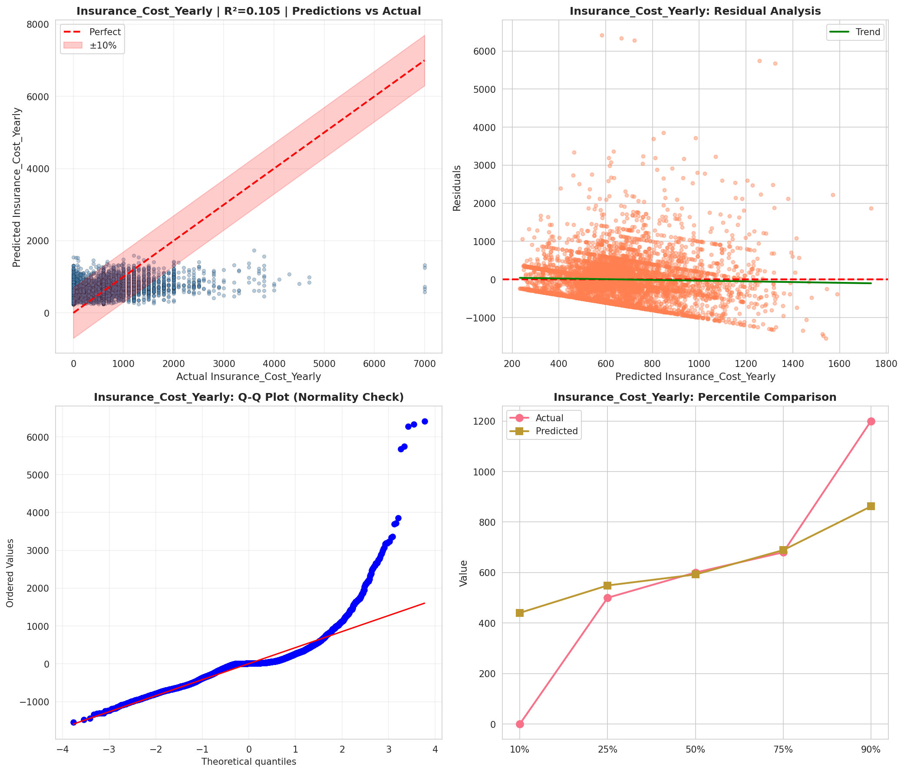
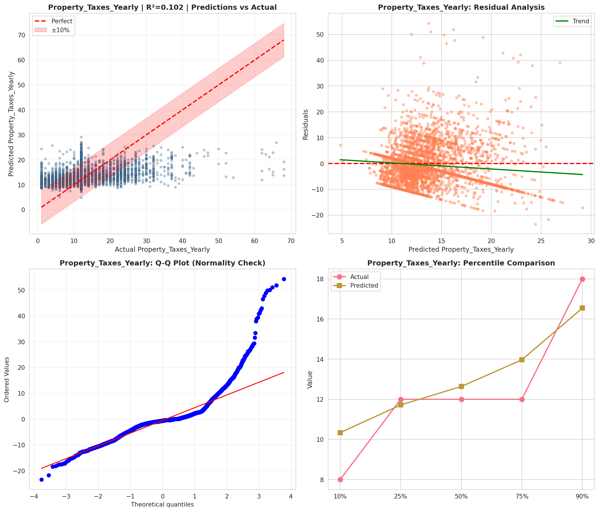
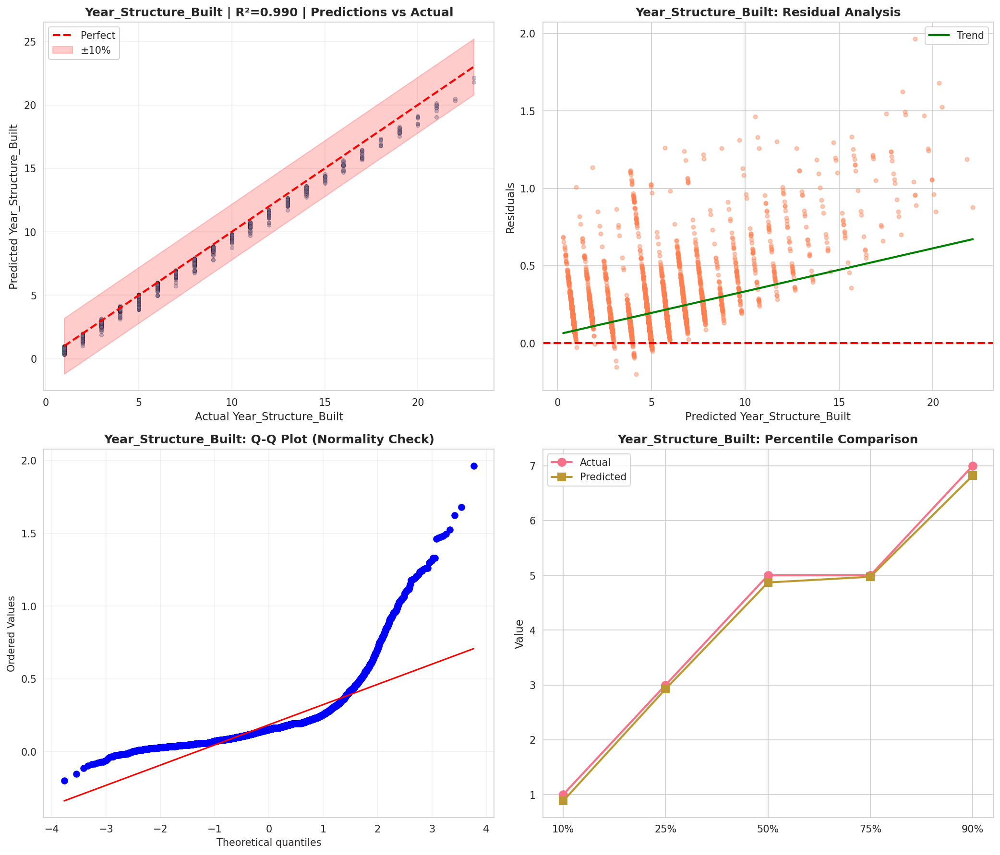
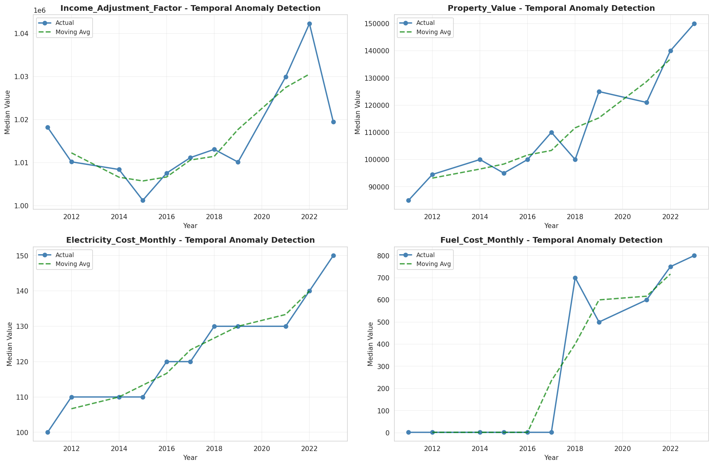
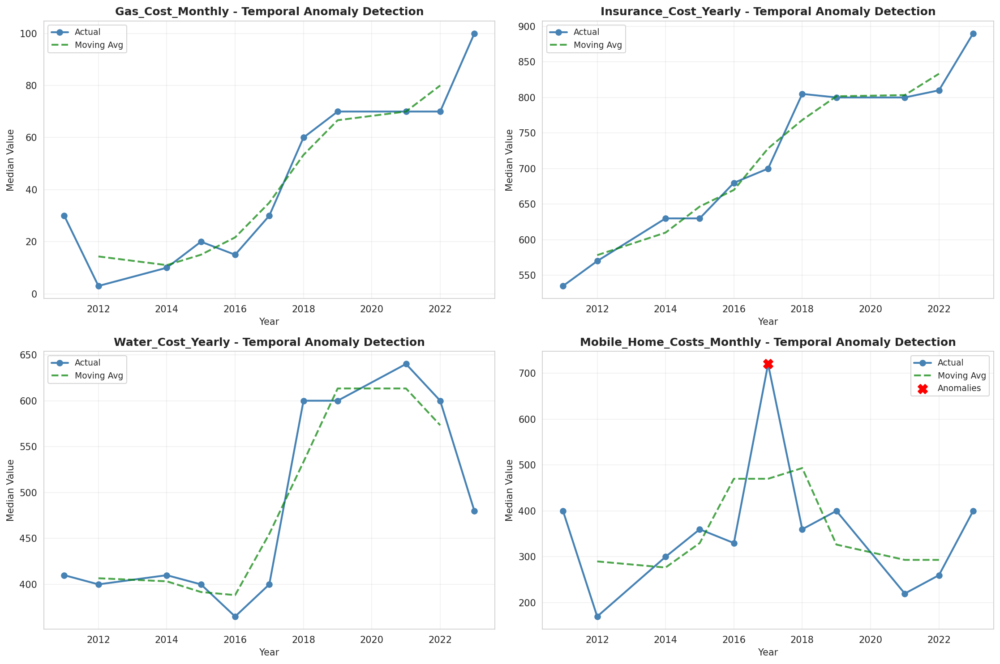
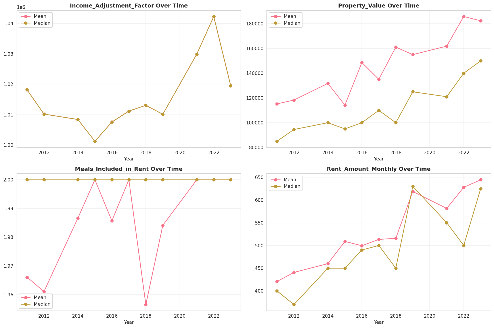
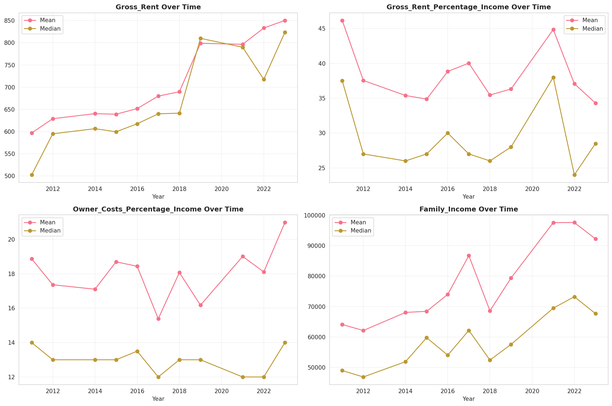
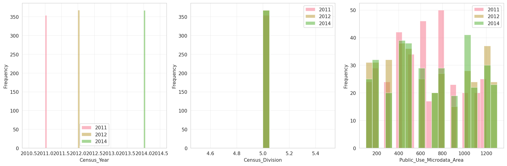
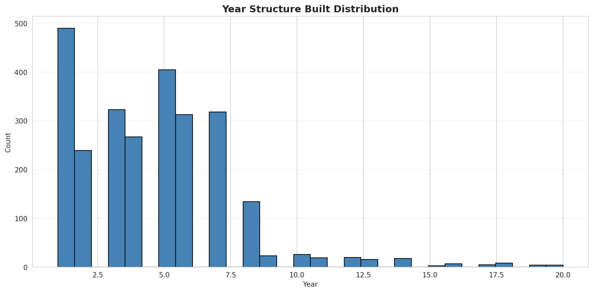
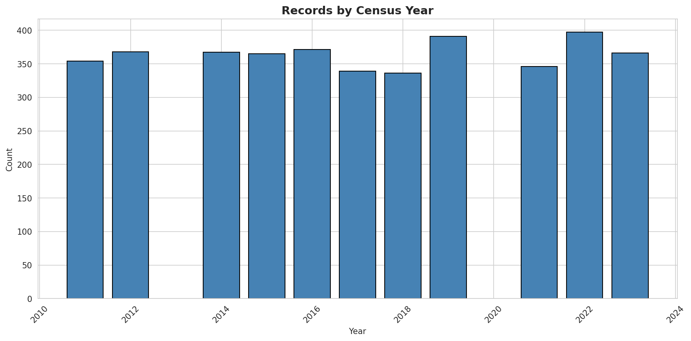
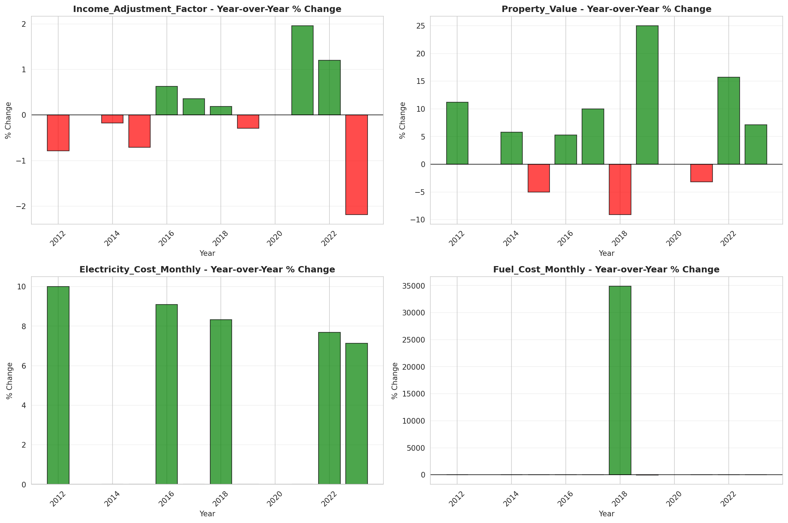
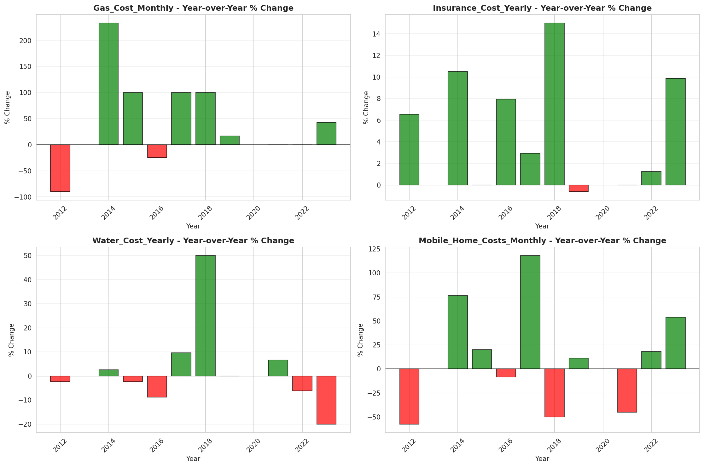
