# Temporal Analysis

## Year Distribution

- 2011: 47,136 records

- 2012: 47,612 records

- 2014: 48,298 records

- 2015: 48,749 records

- 2016: 48,662 records

- 2017: 48,737 records

- 2018: 48,892 records

- 2019: 49,023 records

- 2020: 47,387 records

- 2021: 47,074 records

- 2022: 46,785 records

- 2023: 46,426 records

## Temporal Trends

- Census_Year: {np.int64(2011): {'mean': 2011.0, 'median': 2011.0, 'std': 0.0}, np.int64(2012): {'mean': 2012.0, 'median': 2012.0, 'std': 0.0}, np.int64(2014): {'mean': 2014.0, 'median': 2014.0, 'std': 0.0}, np.int64(2015): {'mean': 2015.0, 'median': 2015.0, 'std': 0.0}, np.int64(2016): {'mean': 2016.0, 'median': 2016.0, 'std': 0.0}, np.int64(2017): {'mean': 2017.0, 'median': 2017.0, 'std': 0.0}, np.int64(2018): {'mean': 2018.0, 'median': 2018.0, 'std': 0.0}, np.int64(2019): {'mean': 2019.0, 'median': 2019.0, 'std': 0.0}, np.int64(2020): {'mean': 2020.0, 'median': 2020.0, 'std': 0.0}, np.int64(2021): {'mean': 2021.0, 'median': 2021.0, 'std': 0.0}, np.int64(2022): {'mean': 2022.0, 'median': 2022.0, 'std': 0.0}, np.int64(2023): {'mean': 2023.0, 'median': 2023.0, 'std': 0.0}}

- Census_Division: {np.int64(2011): {'mean': 5.0, 'median': 5.0, 'std': 0.0}, np.int64(2012): {'mean': 5.0, 'median': 5.0, 'std': 0.0}, np.int64(2014): {'mean': 5.0, 'median': 5.0, 'std': 0.0}, np.int64(2015): {'mean': 5.0, 'median': 5.0, 'std': 0.0}, np.int64(2016): {'mean': 5.0, 'median': 5.0, 'std': 0.0}, np.int64(2017): {'mean': 5.0, 'median': 5.0, 'std': 0.0}, np.int64(2018): {'mean': 5.0, 'median': 5.0, 'std': 0.0}, np.int64(2019): {'mean': 5.0, 'median': 5.0, 'std': 0.0}, np.int64(2020): {'mean': 5.0, 'median': 5.0, 'std': 0.0}, np.int64(2021): {'mean': 5.0, 'median': 5.0, 'std': 0.0}, np.int64(2022): {'mean': 5.0, 'median': 5.0, 'std': 0.0}, np.int64(2023): {'mean': 5.0, 'median': 5.0, 'std': 0.0}}

- Public_Use_Microdata_Area: {np.int64(2011): {'mean': 614.4178547182621, 'median': 600.0, 'std': 328.1955974479642}, np.int64(2012): {'mean': None, 'median': None, 'std': None}, np.int64(2014): {'mean': None, 'median': None, 'std': None}, np.int64(2015): {'mean': None, 'median': None, 'std': None}, np.int64(2016): {'mean': 679.2281451646048, 'median': 700.0, 'std': 377.6738125217121}, np.int64(2017): {'mean': 678.1623817633421, 'median': 600.0, 'std': 377.4549817842855}, np.int64(2018): {'mean': 676.3887752597562, 'median': 600.0, 'std': 376.8674419327508}, np.int64(2019): {'mean': 674.4732064541133, 'median': 600.0, 'std': 376.4809542452344}, np.int64(2020): {'mean': 673.1276510435351, 'median': 600.0, 'std': 376.72942146394297}, np.int64(2021): {'mean': 672.5304839189362, 'median': 600.0, 'std': 376.1846135655101}, np.int64(2022): {'mean': None, 'median': None, 'std': None}, np.int64(2023): {'mean': 639.3723344677551, 'median': 600.0, 'std': 348.6705672336919}}

- Census_Region: {np.int64(2011): {'mean': 3.0, 'median': 3.0, 'std': 0.0}, np.int64(2012): {'mean': 3.0, 'median': 3.0, 'std': 0.0}, np.int64(2014): {'mean': 3.0, 'median': 3.0, 'std': 0.0}, np.int64(2015): {'mean': 3.0, 'median': 3.0, 'std': 0.0}, np.int64(2016): {'mean': 3.0, 'median': 3.0, 'std': 0.0}, np.int64(2017): {'mean': 3.0, 'median': 3.0, 'std': 0.0}, np.int64(2018): {'mean': 3.0, 'median': 3.0, 'std': 0.0}, np.int64(2019): {'mean': 3.0, 'median': 3.0, 'std': 0.0}, np.int64(2020): {'mean': 3.0, 'median': 3.0, 'std': 0.0}, np.int64(2021): {'mean': 3.0, 'median': 3.0, 'std': 0.0}, np.int64(2022): {'mean': 3.0, 'median': 3.0, 'std': 0.0}, np.int64(2023): {'mean': 3.0, 'median': 3.0, 'std': 0.0}}

- State_Code: {np.int64(2011): {'mean': 54.0, 'median': 54.0, 'std': 0.0}, np.int64(2012): {'mean': 54.0, 'median': 54.0, 'std': 0.0}, np.int64(2014): {'mean': 54.0, 'median': 54.0, 'std': 0.0}, np.int64(2015): {'mean': 54.0, 'median': 54.0, 'std': 0.0}, np.int64(2016): {'mean': 54.0, 'median': 54.0, 'std': 0.0}, np.int64(2017): {'mean': 54.0, 'median': 54.0, 'std': 0.0}, np.int64(2018): {'mean': 54.0, 'median': 54.0, 'std': 0.0}, np.int64(2019): {'mean': 54.0, 'median': 54.0, 'std': 0.0}, np.int64(2020): {'mean': 54.0, 'median': 54.0, 'std': 0.0}, np.int64(2021): {'mean': 54.0, 'median': 54.0, 'std': 0.0}, np.int64(2022): {'mean': 54.0, 'median': 54.0, 'std': 0.0}, np.int64(2023): {'mean': None, 'median': None, 'std': None}}

- Housing_Adjustment_Factor: {np.int64(2011): {'mean': 1041420.7621138833, 'median': 1044592.0, 'std': 27537.174812062334}, np.int64(2012): {'mean': 1041606.7853062253, 'median': 1053092.0, 'std': 27461.305785780292}, np.int64(2014): {'mean': 1036841.4632489958, 'median': 1031130.0, 'std': 29631.031122735534}, np.int64(2015): {'mean': 1021035.9017620875, 'median': 1017534.0, 'std': 20312.16250364664}, np.int64(2016): {'mean': 1020439.5965024043, 'median': 1013801.0, 'std': 15775.086906558276}, np.int64(2017): {'mean': 1029250.84010095, 'median': 1034680.0, 'std': 17967.60846887594}, np.int64(2018): {'mean': 1038370.8926000163, 'median': 1046406.0, 'std': 23446.159784830747}, np.int64(2019): {'mean': 1040989.5392162863, 'median': 1042936.0, 'std': 29165.598430761103}, np.int64(2020): {'mean': 1036767.09821259, 'median': 1030827.0, 'std': 28262.34288409553}, np.int64(2021): {'mean': 1059066.6091897862, 'median': 1059761.0, 'std': 35402.42076481569}, np.int64(2022): {'mean': 1106192.248776317, 'median': 1133141.0, 'std': 61310.23283146181}, np.int64(2023): {'mean': 1106921.037155904, 'median': 1125501.0, 'std': 76758.43838386856}}

- Income_Adjustment_Factor: {np.int64(2011): {'mean': 1054050.3611464698, 'median': 1048026.0, 'std': 28395.924767666627}, np.int64(2012): {'mean': 1052839.1987944215, 'median': 1061121.0, 'std': 26377.770758608553}, np.int64(2014): {'mean': 1047701.725475175, 'median': 1041654.0, 'std': 31057.465418644475}, np.int64(2015): {'mean': 1030477.6239717738, 'median': 1025215.0, 'std': 25690.03851414696}, np.int64(2016): {'mean': 1027607.6505692326, 'median': 1022342.0, 'std': 17537.145262164042}, np.int64(2017): {'mean': 1036640.8237683895, 'median': 1035988.0, 'std': 16847.56524899701}, np.int64(2018): {'mean': 1046938.5162807822, 'median': 1054346.0, 'std': 20472.120802576123}, np.int64(2019): {'mean': 1049922.226934296, 'median': 1054606.0, 'std': 26200.264385990722}, np.int64(2020): {'mean': 1046894.0475235825, 'median': 1044328.0, 'std': 28733.84226662016}, np.int64(2021): {'mean': 1073954.2858903003, 'median': 1070512.0, 'std': 30665.575311068733}, np.int64(2022): {'mean': 1128221.6236400555, 'median': 1140108.0, 'std': 49493.33897020709}, np.int64(2023): {'mean': 1130644.1988540904, 'median': 1159185.0, 'std': 70210.85027415626}}

- Housing_Unit_Weight: {np.int64(2011): {'mean': 18.689791242362524, 'median': 16.0, 'std': 14.42163442041217}, np.int64(2012): {'mean': 18.529782407796354, 'median': 16.0, 'std': 14.735156607157615}, np.int64(2014): {'mean': 18.286409375129406, 'median': 15.0, 'std': 15.574092435850032}, np.int64(2015): {'mean': 18.133377094914767, 'median': 15.0, 'std': 15.880215166530693}, np.int64(2016): {'mean': 18.181085857547984, 'median': 15.0, 'std': 15.765544667556147}, np.int64(2017): {'mean': 18.24644520590106, 'median': 15.0, 'std': 15.857270621728906}, np.int64(2018): {'mean': 18.218011126564672, 'median': 15.0, 'std': 15.833514919519}, np.int64(2019): {'mean': 18.199253411663914, 'median': 14.0, 'std': 16.08712388550198}, np.int64(2020): {'mean': 18.857809103762634, 'median': 14.0, 'std': 19.23116627382906}, np.int64(2021): {'mean': 18.257148319666907, 'median': 14.0, 'std': 18.840986601157475}, np.int64(2022): {'mean': 18.363620818638452, 'median': 14.0, 'std': 19.170092203137745}, np.int64(2023): {'mean': 18.516628613277042, 'median': 13.0, 'std': 19.706184111849232}}

- Number_of_Persons: {np.int64(2011): {'mean': 1.9368635437881874, 'median': 2.0, 'std': 1.3565106171910806}, np.int64(2012): {'mean': 1.91539947912291, 'median': 2.0, 'std': 1.3504369711549806}, np.int64(2014): {'mean': 1.8914447803221666, 'median': 2.0, 'std': 1.3543989229529128}, np.int64(2015): {'mean': 1.8706024738969005, 'median': 2.0, 'std': 1.3501863606355673}, np.int64(2016): {'mean': 1.8645760552381736, 'median': 2.0, 'std': 1.3564608168913082}, np.int64(2017): {'mean': 1.8507909801588116, 'median': 2.0, 'std': 1.3592669102558714}, np.int64(2018): {'mean': 1.840791949603207, 'median': 2.0, 'std': 1.3648935398613236}, np.int64(2019): {'mean': 1.834118678987414, 'median': 2.0, 'std': 1.3674937021006999}, np.int64(2020): {'mean': 1.8180724671323358, 'median': 2.0, 'std': 1.3714919699643806}, np.int64(2021): {'mean': 1.8199430683604538, 'median': 2.0, 'std': 1.370236634414621}, np.int64(2022): {'mean': 1.8392433472266752, 'median': 2.0, 'std': 1.3656796819942145}, np.int64(2023): {'mean': 1.8576875026924569, 'median': 2.0, 'std': 1.3621765133935917}}

- Housing_Unit_Type: {np.int64(2011): {'mean': 1.0835879158180584, 'median': 1.0, 'std': 0.3495337363634549}, np.int64(2012): {'mean': 1.0988826346299252, 'median': 1.0, 'std': 0.3828478058212937}, np.int64(2014): {'mean': 1.1251811669220257, 'median': 1.0, 'std': 0.4318508040748954}, np.int64(2015): {'mean': 1.1379720609653532, 'median': 1.0, 'std': 0.4538250387432678}, np.int64(2016): {'mean': 1.134560848300522, 'median': 1.0, 'std': 0.44933831931353707}, np.int64(2017): {'mean': 1.1337792642140467, 'median': 1.0, 'std': 0.4481430826556407}, np.int64(2018): {'mean': 1.1327210995663912, 'median': 1.0, 'std': 0.4450030452851048}, np.int64(2019): {'mean': 1.1338963343736614, 'median': 1.0, 'std': 0.4478677733811883}, np.int64(2020): {'mean': None, 'median': None, 'std': None}, np.int64(2021): {'mean': None, 'median': None, 'std': None}, np.int64(2022): {'mean': None, 'median': None, 'std': None}, np.int64(2023): {'mean': None, 'median': None, 'std': None}}

- Number_of_Bedrooms: {np.int64(2011): {'mean': 2.7298170318500112, 'median': 3.0, 'std': 0.9310327404857264}, np.int64(2012): {'mean': None, 'median': None, 'std': None}, np.int64(2014): {'mean': None, 'median': None, 'std': None}, np.int64(2015): {'mean': None, 'median': None, 'std': None}, np.int64(2016): {'mean': None, 'median': None, 'std': None}, np.int64(2017): {'mean': None, 'median': None, 'std': None}, np.int64(2018): {'mean': None, 'median': None, 'std': None}, np.int64(2019): {'mean': None, 'median': None, 'std': None}, np.int64(2020): {'mean': None, 'median': None, 'std': None}, np.int64(2021): {'mean': None, 'median': None, 'std': None}, np.int64(2022): {'mean': None, 'median': None, 'std': None}, np.int64(2023): {'mean': None, 'median': None, 'std': None}}

- Number_of_Rooms: {np.int64(2011): {'mean': 5.875242828100293, 'median': 6.0, 'std': 1.77416590101502}, np.int64(2012): {'mean': None, 'median': None, 'std': None}, np.int64(2014): {'mean': None, 'median': None, 'std': None}, np.int64(2015): {'mean': None, 'median': None, 'std': None}, np.int64(2016): {'mean': None, 'median': None, 'std': None}, np.int64(2017): {'mean': None, 'median': None, 'std': None}, np.int64(2018): {'mean': None, 'median': None, 'std': None}, np.int64(2019): {'mean': None, 'median': None, 'std': None}, np.int64(2020): {'mean': None, 'median': None, 'std': None}, np.int64(2021): {'mean': None, 'median': None, 'std': None}, np.int64(2022): {'mean': None, 'median': None, 'std': None}, np.int64(2023): {'mean': None, 'median': None, 'std': None}}

- Building_Type: {np.int64(2011): {'mean': 2.330065507115428, 'median': 2.0, 'std': 1.47084647147681}, np.int64(2012): {'mean': 2.3375045175280085, 'median': 2.0, 'std': 1.4849352879057818}, np.int64(2014): {'mean': 2.342227562286051, 'median': 2.0, 'std': 1.4975361970656582}, np.int64(2015): {'mean': 2.357489126495107, 'median': 2.0, 'std': 1.5170422884691603}, np.int64(2016): {'mean': 2.3595139501731044, 'median': 2.0, 'std': 1.5166828308414835}, np.int64(2017): {'mean': 2.36130241380089, 'median': 2.0, 'std': 1.5184202203621928}, np.int64(2018): {'mean': 2.364460949808688, 'median': 2.0, 'std': 1.5216614296510966}, np.int64(2019): {'mean': 2.364426380436979, 'median': 2.0, 'std': 1.5160206490872106}, np.int64(2020): {'mean': 2.3601001708521543, 'median': 2.0, 'std': 1.5038801938919788}, np.int64(2021): {'mean': 2.3634585934739074, 'median': 2.0, 'std': 1.5086369341489239}, np.int64(2022): {'mean': 2.370867842141484, 'median': 2.0, 'std': 1.5188476631981234}, np.int64(2023): {'mean': 2.37785319916824, 'median': 2.0, 'std': 1.5265197055878754}}

- Year_Structure_Built: {np.int64(2011): {'mean': 5.749943528348769, 'median': 6.0, 'std': 2.340321142195623}, np.int64(2012): {'mean': 4.354467835200579, 'median': 4.0, 'std': 2.525344577225855}, np.int64(2014): {'mean': 4.497925687470246, 'median': 5.0, 'std': 2.708892633855172}, np.int64(2015): {'mean': 4.548432403044582, 'median': 5.0, 'std': 2.7999325702893434}, np.int64(2016): {'mean': 4.629375692983052, 'median': 5.0, 'std': 2.9256279786415242}, np.int64(2017): {'mean': 4.725020886490392, 'median': 5.0, 'std': 3.081841790643256}, np.int64(2018): {'mean': 4.7981318928651815, 'median': 5.0, 'std': 3.185108376398025}, np.int64(2019): {'mean': 4.865537915702962, 'median': 5.0, 'std': 3.3272878384644375}, np.int64(2020): {'mean': 4.927797411472839, 'median': 5.0, 'std': 3.4655818180775073}, np.int64(2021): {'mean': None, 'median': None, 'std': None}, np.int64(2022): {'mean': None, 'median': None, 'std': None}, np.int64(2023): {'mean': None, 'median': None, 'std': None}}

- Bathtub_or_Shower: {np.int64(2011): {'mean': None, 'median': None, 'std': None}, np.int64(2012): {'mean': 1.0251174557282254, 'median': 1.0, 'std': 0.15648361656182844}, np.int64(2014): {'mean': 1.0242343179705742, 'median': 1.0, 'std': 0.15377760531047033}, np.int64(2015): {'mean': 1.0250090612540776, 'median': 1.0, 'std': 0.15615428424142394}, np.int64(2016): {'mean': 1.0262485008938067, 'median': 1.0, 'std': 0.1598752497071865}, np.int64(2017): {'mean': 1.0289927066633549, 'median': 1.0, 'std': 0.16778785806141056}, np.int64(2018): {'mean': 1.0311951384199864, 'median': 1.0, 'std': 0.17384671981479538}, np.int64(2019): {'mean': 1.0315271820896863, 'median': 1.0, 'std': 0.1747395333800305}, np.int64(2020): {'mean': 1.031853394808903, 'median': 1.0, 'std': 0.1756117246304222}, np.int64(2021): {'mean': 1.0313817881964895, 'median': 1.0, 'std': 0.17434932673398976}, np.int64(2022): {'mean': 1.0271482474667173, 'median': 1.0, 'std': 0.16251722033483218}, np.int64(2023): {'mean': 1.0229690002151104, 'median': 1.0, 'std': 0.14980641385736645}}

- Refrigerator: {np.int64(2011): {'mean': None, 'median': None, 'std': None}, np.int64(2012): {'mean': 1.0339718106252258, 'median': 1.0, 'std': 0.1811586818229028}, np.int64(2014): {'mean': 1.0350479472240484, 'median': 1.0, 'std': 0.1839031139749062}, np.int64(2015): {'mean': 1.0372870605291773, 'median': 1.0, 'std': 0.18946648473621314}, np.int64(2016): {'mean': 1.0401873599891385, 'median': 1.0, 'std': 0.19640063370953909}, np.int64(2017): {'mean': 1.044979339309504, 'median': 1.0, 'std': 0.20726111144447454}, np.int64(2018): {'mean': 1.0477155075399505, 'median': 1.0, 'std': 0.21316603999501257}, np.int64(2019): {'mean': 1.0479868861293873, 'median': 1.0, 'std': 0.21374089632375903}, np.int64(2020): {'mean': 1.0474641327497836, 'median': 1.0, 'std': 0.21263195202076648}, np.int64(2021): {'mean': 1.045635528330781, 'median': 1.0, 'std': 0.20869583851043805}, np.int64(2022): {'mean': 1.039013740240632, 'median': 1.0, 'std': 0.19362995132061006}, np.int64(2023): {'mean': 1.0327923707545592, 'median': 1.0, 'std': 0.1780948883778834}}

- Hot_and_Cold_Running_Water: {np.int64(2011): {'mean': None, 'median': None, 'std': None}, np.int64(2012): {'mean': 1.0378117094325985, 'median': 1.0, 'std': 0.19074277408097493}, np.int64(2014): {'mean': 1.040307406315885, 'median': 1.0, 'std': 0.19668145889300814}, np.int64(2015): {'mean': 1.042927691192461, 'median': 1.0, 'std': 0.20269641152305976}, np.int64(2016): {'mean': 1.045685968366031, 'median': 1.0, 'std': 0.20880552491817542}, np.int64(2017): {'mean': 1.0520017160792106, 'median': 1.0, 'std': 0.2220329947711604}, np.int64(2018): {'mean': 1.0565608822867432, 'median': 1.0, 'std': 0.231004220607341}, np.int64(2019): {'mean': 1.0580692969258751, 'median': 1.0, 'std': 0.23387706588917298}, np.int64(2020): {'mean': 1.0594705923654832, 'median': 1.0, 'std': 0.2365061312906557}, np.int64(2021): {'mean': 1.0584049946990222, 'median': 1.0, 'std': 0.2345104410755541}, np.int64(2022): {'mean': 1.050618192173521, 'median': 1.0, 'std': 0.219219367843474}, np.int64(2023): {'mean': 1.0428547527426564, 'median': 1.0, 'std': 0.20253198097076666}}

- Running_Water: {np.int64(2011): {'mean': None, 'median': None, 'std': None}, np.int64(2012): {'mean': None, 'median': None, 'std': None}, np.int64(2014): {'mean': 9.0, 'median': 9.0, 'std': 0.0}, np.int64(2015): {'mean': 9.0, 'median': 9.0, 'std': 0.0}, np.int64(2016): {'mean': 9.0, 'median': 9.0, 'std': 0.0}, np.int64(2017): {'mean': 9.0, 'median': 9.0, 'std': 0.0}, np.int64(2018): {'mean': 9.0, 'median': 9.0, 'std': 0.0}, np.int64(2019): {'mean': 9.0, 'median': 9.0, 'std': 0.0}, np.int64(2020): {'mean': 9.0, 'median': 9.0, 'std': 0.0}, np.int64(2021): {'mean': 9.0, 'median': 9.0, 'std': 0.0}, np.int64(2022): {'mean': 9.0, 'median': 9.0, 'std': 0.0}, np.int64(2023): {'mean': 9.0, 'median': 9.0, 'std': 0.0}}

- Sink_with_Faucet: {np.int64(2011): {'mean': None, 'median': None, 'std': None}, np.int64(2012): {'mean': 1.0226779906035417, 'median': 1.0, 'std': 0.14887645879284783}, np.int64(2014): {'mean': 1.0220126499059192, 'median': 1.0, 'std': 0.14672621171674144}, np.int64(2015): {'mean': 1.0225398695179413, 'median': 1.0, 'std': 0.14843289022735118}, np.int64(2016): {'mean': 1.022922182246057, 'median': 1.0, 'std': 0.149657150222759}, np.int64(2017): {'mean': 1.0255605482421477, 'median': 1.0, 'std': 0.15782195358338041}, np.int64(2018): {'mean': 1.027211343686698, 'median': 1.0, 'std': 0.16270059085156824}, np.int64(2019): {'mean': 1.0271933173152494, 'median': 1.0, 'std': 0.16264819350302848}, np.int64(2020): {'mean': 1.027781028389543, 'median': 1.0, 'std': 0.1643468131763064}, np.int64(2021): {'mean': 1.0279891624455177, 'median': 1.0, 'std': 0.1649436576878567}, np.int64(2022): {'mean': 1.0240394883599515, 'median': 1.0, 'std': 0.15317358825607572}, np.int64(2023): {'mean': 1.020650589163221, 'median': 1.0, 'std': 0.14221331063631845}}

- Stove_or_Range: {np.int64(2011): {'mean': None, 'median': None, 'std': None}, np.int64(2012): {'mean': 1.033361944344055, 'median': 1.0, 'std': 0.1795818851031556}, np.int64(2014): {'mean': 1.0351612976355105, 'median': 1.0, 'std': 0.18418944020664993}, np.int64(2015): {'mean': 1.037830735773831, 'median': 1.0, 'std': 0.19078887752625473}, np.int64(2016): {'mean': 1.0406172923313648, 'median': 1.0, 'std': 0.19740417845858704}, np.int64(2017): {'mean': 1.0452728791744756, 'median': 1.0, 'std': 0.20790435682833427}, np.int64(2018): {'mean': 1.0475129417060545, 'median': 1.0, 'std': 0.21273570616695398}, np.int64(2019): {'mean': 1.0477174230346036, 'median': 1.0, 'std': 0.21317009868632855}, np.int64(2020): {'mean': 1.047253493107403, 'median': 1.0, 'std': 0.2121830676599027}, np.int64(2021): {'mean': 1.0453056897161033, 'median': 1.0, 'std': 0.20797620839375755}, np.int64(2022): {'mean': 1.0385153895441277, 'median': 1.0, 'std': 0.1924391673698987}, np.int64(2023): {'mean': 1.0327206673199647, 'median': 1.0, 'std': 0.17790666581109335}}

- Telephone_Service: {np.int64(2011): {'mean': 1.0355936540429886, 'median': 1.0, 'std': 0.18527715517169666}, np.int64(2012): {'mean': 1.0327852056759388, 'median': 1.0, 'std': 0.17807624265010263}, np.int64(2014): {'mean': 1.031338073691015, 'median': 1.0, 'std': 0.1742319825646898}, np.int64(2015): {'mean': 1.0304957176226317, 'median': 1.0, 'std': 0.17194910930943352}, np.int64(2016): {'mean': 1.029503834715918, 'median': 1.0, 'std': 0.16921614998766002}, np.int64(2017): {'mean': 1.0273861100170671, 'median': 1.0, 'std': 0.1632078748082888}, np.int64(2018): {'mean': 1.0250013144749988, 'median': 1.0, 'std': 0.15613100142431527}, np.int64(2019): {'mean': 1.0220801094794463, 'median': 1.0, 'std': 0.14694606668920643}, np.int64(2020): {'mean': 1.0188814663501353, 'median': 1.0, 'std': 0.13610829498810442}, np.int64(2021): {'mean': 1.0152263146216995, 'median': 1.0, 'std': 0.12245362323156235}, np.int64(2022): {'mean': 1.0130056210735148, 'median': 1.0, 'std': 0.11329972905352202}, np.int64(2023): {'mean': 1.0122529535922808, 'median': 1.0, 'std': 0.11001431946074244}}

- Lot_Acreage: {np.int64(2011): {'mean': 1.4014698428788648, 'median': 1.0, 'std': 0.6432291605539802}, np.int64(2012): {'mean': 1.402621485000127, 'median': 1.0, 'std': 0.6437228798429723}, np.int64(2014): {'mean': 1.4008220157255182, 'median': 1.0, 'std': 0.6424535078047893}, np.int64(2015): {'mean': 1.3986453674121406, 'median': 1.0, 'std': 0.6400426874564741}, np.int64(2016): {'mean': 1.3982644206227668, 'median': 1.0, 'std': 0.6373576812267086}, np.int64(2017): {'mean': 1.3948393998828295, 'median': 1.0, 'std': 0.6347750681878047}, np.int64(2018): {'mean': 1.3952136838899605, 'median': 1.0, 'std': 0.6324783500676991}, np.int64(2019): {'mean': 1.4006377809273132, 'median': 1.0, 'std': 0.6342039676398973}, np.int64(2020): {'mean': 1.406949786606249, 'median': 1.0, 'std': 0.6384267868643835}, np.int64(2021): {'mean': 1.4108648390688796, 'median': 1.0, 'std': 0.6408889100580423}, np.int64(2022): {'mean': 1.421638801346082, 'median': 1.0, 'std': 0.6441338958782343}, np.int64(2023): {'mean': 1.431467571278572, 'median': 1.0, 'std': 0.6487728960134923}}

- Agricultural_Sales: {np.int64(2011): {'mean': 1.154419021982952, 'median': 1.0, 'std': 0.6929579159603504}, np.int64(2012): {'mean': 1.1552174304492662, 'median': 1.0, 'std': 0.694087942702296}, np.int64(2014): {'mean': 1.153405474220242, 'median': 1.0, 'std': 0.6867639228977932}, np.int64(2015): {'mean': 1.1520964647848726, 'median': 1.0, 'std': 0.6831050459174107}, np.int64(2016): {'mean': 1.1528808280663185, 'median': 1.0, 'std': 0.6836467200599896}, np.int64(2017): {'mean': 1.1503473830477073, 'median': 1.0, 'std': 0.6765744816440602}, np.int64(2018): {'mean': 1.154552972525958, 'median': 1.0, 'std': 0.686469777481333}, np.int64(2019): {'mean': 1.1587487604795816, 'median': 1.0, 'std': 0.6934240755144115}, np.int64(2020): {'mean': 1.16263879817113, 'median': 1.0, 'std': 0.6976417760325813}, np.int64(2021): {'mean': 1.168352668213457, 'median': 1.0, 'std': 0.7115301334853592}, np.int64(2022): {'mean': 1.1642257545990355, 'median': 1.0, 'std': 0.7051139975298893}, np.int64(2023): {'mean': 1.1630009562722767, 'median': 1.0, 'std': 0.7020706889025435}}

- Business_On_Property: {np.int64(2011): {'mean': 1.9854536239229599, 'median': 2.0, 'std': 0.11972945461724074}, np.int64(2012): {'mean': 1.9857240836233394, 'median': 2.0, 'std': 0.11862745068917058}, np.int64(2014): {'mean': 1.98779740631063, 'median': 2.0, 'std': 0.10979070141124797}, np.int64(2015): {'mean': 1.9879872204472844, 'median': 2.0, 'std': 0.10894391233764064}, np.int64(2016): {'mean': 3.395737621235324, 'median': 2.0, 'std': 2.8105621334401865}, np.int64(2017): {'mean': 4.805089278891464, 'median': 2.0, 'std': 3.438433803387538}, np.int64(2018): {'mean': 6.208151456704903, 'median': 9.0, 'std': 3.4327749571751403}, np.int64(2019): {'mean': 7.610801781737194, 'median': 9.0, 'std': 2.794800732359452}, np.int64(2020): {'mean': None, 'median': None, 'std': None}, np.int64(2021): {'mean': None, 'median': None, 'std': None}, np.int64(2022): {'mean': None, 'median': None, 'std': None}, np.int64(2023): {'mean': None, 'median': None, 'std': None}}

- Tenure: {np.int64(2011): {'mean': 1.9017911975435005, 'median': 2.0, 'std': 0.8394047218194328}, np.int64(2012): {'mean': 1.9182931202294964, 'median': 2.0, 'std': 0.8417366922863784}, np.int64(2014): {'mean': 1.9372979961215255, 'median': 2.0, 'std': 0.843817159876313}, np.int64(2015): {'mean': 1.9459382299506878, 'median': 2.0, 'std': 0.8437969462099648}, np.int64(2016): {'mean': 1.9448531329889915, 'median': 2.0, 'std': 0.8398082796083919}, np.int64(2017): {'mean': 1.9428646448733098, 'median': 2.0, 'std': 0.838241438897276}, np.int64(2018): {'mean': 1.9423208370576792, 'median': 2.0, 'std': 0.8348914410824547}, np.int64(2019): {'mean': 1.9350228959418916, 'median': 2.0, 'std': 0.8320654157078435}, np.int64(2020): {'mean': 1.9308507701650748, 'median': 2.0, 'std': 0.8276081791852584}, np.int64(2021): {'mean': 1.9268082982027956, 'median': 2.0, 'std': 0.8233832525357158}, np.int64(2022): {'mean': 1.9203681252066571, 'median': 2.0, 'std': 0.8200973690611665}, np.int64(2023): {'mean': 1.9175735314273183, 'median': 2.0, 'std': 0.813825565268969}}

- Vacancy_Status: {np.int64(2011): {'mean': 5.094797687861272, 'median': 5.0, 'std': 2.027245502626436}, np.int64(2012): {'mean': 5.09942638623327, 'median': 5.0, 'std': 2.0017346789308386}, np.int64(2014): {'mean': 5.154341427520236, 'median': 5.0, 'std': 1.9752613299237827}, np.int64(2015): {'mean': 5.232632703954399, 'median': 5.0, 'std': 1.9569653718726447}, np.int64(2016): {'mean': 5.294760197986005, 'median': 5.0, 'std': 1.9399463383059563}, np.int64(2017): {'mean': 5.37020316027088, 'median': 5.0, 'std': 1.928073419032287}, np.int64(2018): {'mean': 5.446339173967459, 'median': 7.0, 'std': 1.9210514815225024}, np.int64(2019): {'mean': 5.531752104055088, 'median': 7.0, 'std': 1.8994127553492552}, np.int64(2020): {'mean': 5.545146900476849, 'median': 7.0, 'std': 1.902468007805811}, np.int64(2021): {'mean': 5.594302707778995, 'median': 7.0, 'std': 1.8914016554044952}, np.int64(2022): {'mean': 5.60834616042415, 'median': 7.0, 'std': 1.9079533874095085}, np.int64(2023): {'mean': 5.613661814109743, 'median': 7.0, 'std': 1.9096778545500517}}

- Property_Value: {np.int64(2011): {'mean': 12.192783269713875, 'median': 13.0, 'std': 5.161837134102249}}

- Vehicles_Available: {np.int64(2011): {'mean': 1.7213408393039917, 'median': 2.0, 'std': 1.0299067149758014}, np.int64(2012): {'mean': 1.7118743916807542, 'median': 2.0, 'std': 1.031457208790883}, np.int64(2014): {'mean': 1.71278603749192, 'median': 2.0, 'std': 1.031760557029057}, np.int64(2015): {'mean': 1.7146119906566313, 'median': 2.0, 'std': 1.0395120792728394}, np.int64(2016): {'mean': 1.726117806646841, 'median': 2.0, 'std': 1.0408091160228512}, np.int64(2017): {'mean': 1.7409741367992648, 'median': 2.0, 'std': 1.0452892946820258}, np.int64(2018): {'mean': 1.7578999947421, 'median': 2.0, 'std': 1.05593866713132}, np.int64(2019): {'mean': 1.7722774882888572, 'median': 2.0, 'std': 1.0671892963977672}, np.int64(2020): {'mean': 1.7847402418152707, 'median': 2.0, 'std': 1.0673316302772784}, np.int64(2021): {'mean': 1.7927668071888174, 'median': 2.0, 'std': 1.0710128230586875}, np.int64(2022): {'mean': 1.799267056100518, 'median': 2.0, 'std': 1.0751777938602258}, np.int64(2023): {'mean': 1.7994024286614951, 'median': 2.0, 'std': 1.080073033148123}}

- Condo_Fee_Monthly: {np.int64(2011): {'mean': 158.93023255813952, 'median': 100.0, 'std': 225.0882895674783}, np.int64(2012): {'mean': 155.24752475247524, 'median': 100.0, 'std': 210.56235558821427}, np.int64(2014): {'mean': 151.6860465116279, 'median': 100.0, 'std': 158.1806474606238}, np.int64(2015): {'mean': 153.93939393939394, 'median': 110.0, 'std': 127.50273535897453}, np.int64(2016): {'mean': 172.73333333333332, 'median': 130.0, 'std': 154.9145539181518}, np.int64(2017): {'mean': 185.23489932885906, 'median': 140.0, 'std': 161.28949921675357}, np.int64(2018): {'mean': 190.64935064935065, 'median': 150.0, 'std': 159.53230387594778}, np.int64(2019): {'mean': 200.42944785276075, 'median': 150.0, 'std': 170.14282197087172}, np.int64(2020): {'mean': 251.58227848101265, 'median': 160.0, 'std': 382.22033554859087}, np.int64(2021): {'mean': 237.26256983240222, 'median': 160.0, 'std': 356.80825004332064}, np.int64(2022): {'mean': 271.67464114832535, 'median': 170.0, 'std': 376.9176218123571}, np.int64(2023): {'mean': 266.900826446281, 'median': 180.0, 'std': 355.05814858834356}}

- Electricity_Cost_Monthly: {np.int64(2011): {'mean': 107.00486182190379, 'median': 90.0, 'std': 75.54410480256062}, np.int64(2012): {'mean': 112.59292556733774, 'median': 100.0, 'std': 78.38156195514543}, np.int64(2014): {'mean': 124.93212669683258, 'median': 100.0, 'std': 85.68291364599298}, np.int64(2015): {'mean': 127.6676615624189, 'median': 100.0, 'std': 87.13645416609091}, np.int64(2016): {'mean': 130.09777221265716, 'median': 110.0, 'std': 87.90125612596407}, np.int64(2017): {'mean': 133.44035709596955, 'median': 110.0, 'std': 90.79877819849007}, np.int64(2018): {'mean': 142.9965961386597, 'median': 120.0, 'std': 92.65154957853603}, np.int64(2019): {'mean': 145.79103095030516, 'median': 120.0, 'std': 92.32061181395366}, np.int64(2020): {'mean': 148.95233193217237, 'median': 130.0, 'std': 94.21332147778026}, np.int64(2021): {'mean': 151.8124048378293, 'median': 130.0, 'std': 96.81581408013052}, np.int64(2022): {'mean': 160.414074306407, 'median': 130.0, 'std': 140.17447017065044}, np.int64(2023): {'mean': 168.492616422437, 'median': 140.0, 'std': 191.61583223588747}}

- Fuel_Cost_Monthly: {np.int64(2011): {'mean': 131.07052200614126, 'median': 2.0, 'std': 431.0001894146338}, np.int64(2012): {'mean': 133.36386455611904, 'median': 2.0, 'std': 440.19335882584375}, np.int64(2014): {'mean': 120.68095669036846, 'median': 2.0, 'std': 417.8131426401208}, np.int64(2015): {'mean': 115.69849467947054, 'median': 2.0, 'std': 412.3665539155085}, np.int64(2016): {'mean': 107.35172431783795, 'median': 2.0, 'std': 394.86295794274463}, np.int64(2017): {'mean': 96.048785611133, 'median': 2.0, 'std': 366.05897679483223}, np.int64(2018): {'mean': 780.4879664385074, 'median': 600.0, 'std': 734.2376129429746}, np.int64(2019): {'mean': 760.5742397137745, 'median': 600.0, 'std': 697.7253705900503}, np.int64(2020): {'mean': 744.2112370388232, 'median': 590.0, 'std': 678.4856706991175}, np.int64(2021): {'mean': 740.3642141285749, 'median': 560.0, 'std': 688.9289510460953}, np.int64(2022): {'mean': 776.3090776344609, 'median': 600.0, 'std': 726.856388304415}, np.int64(2023): {'mean': 812.2606134969325, 'median': 600.0, 'std': 794.9633459852745}}

- Gas_Cost_Monthly: {np.int64(2011): {'mean': 60.2904042988741, 'median': 20.0, 'std': 83.38592935441551}, np.int64(2012): {'mean': 56.65757389477998, 'median': 20.0, 'std': 79.18438887847978}, np.int64(2014): {'mean': 50.70378797672915, 'median': 20.0, 'std': 71.53787995152928}, np.int64(2015): {'mean': 49.967194393978716, 'median': 20.0, 'std': 70.77192657001041}, np.int64(2016): {'mean': 48.54692961861533, 'median': 20.0, 'std': 69.48793800831027}, np.int64(2017): {'mean': 47.754076408034656, 'median': 20.0, 'std': 68.6937331558569}, np.int64(2018): {'mean': 85.31378242353853, 'median': 70.0, 'std': 76.48842834478997}, np.int64(2019): {'mean': 84.26957824049471, 'median': 70.0, 'std': 76.12389007359728}, np.int64(2020): {'mean': 83.34942923527629, 'median': 60.0, 'std': 77.70010093385724}, np.int64(2021): {'mean': 84.94181928564201, 'median': 70.0, 'std': 79.6702675729592}, np.int64(2022): {'mean': 94.1080040526849, 'median': 70.0, 'std': 118.1121322976796}, np.int64(2023): {'mean': 105.36862270619076, 'median': 80.0, 'std': 166.57968713776495}}

- House_Heating_Fuel: {np.int64(2011): {'mean': 2.2836233367451384, 'median': 2.0, 'std': 1.4950494399004988}, np.int64(2012): {'mean': 2.303083858408893, 'median': 2.0, 'std': 1.4978499374668284}, np.int64(2014): {'mean': 2.3133031674208144, 'median': 2.0, 'std': 1.501276848085296}, np.int64(2015): {'mean': 2.3204775499610695, 'median': 2.0, 'std': 1.5045653074344978}, np.int64(2016): {'mean': 2.316220587468044, 'median': 2.0, 'std': 1.4928832646537689}, np.int64(2017): {'mean': 2.302980175922279, 'median': 2.0, 'std': 1.4813452590981178}, np.int64(2018): {'mean': 2.2992007992007992, 'median': 2.0, 'std': 1.475174196356414}, np.int64(2019): {'mean': 2.2935417653560712, 'median': 2.0, 'std': 1.4652310385020053}, np.int64(2020): {'mean': 2.280075084193673, 'median': 2.0, 'std': 1.4550106964786842}, np.int64(2021): {'mean': 2.272936543155092, 'median': 2.0, 'std': 1.450797355151223}, np.int64(2022): {'mean': 2.285104155185716, 'median': 2.0, 'std': 1.4571391325780474}, np.int64(2023): {'mean': 2.284942846961432, 'median': 2.0, 'std': 1.4479172419458235}}

- Insurance_Cost_Yearly: {np.int64(2014): {'mean': 684.7437812006656, 'median': 600.0, 'std': 482.78427712121714}, np.int64(2015): {'mean': 715.1068535424971, 'median': 600.0, 'std': 504.8263726768971}}

- Water_Cost_Yearly: {np.int64(2011): {'mean': 435.057395087001, 'median': 360.0, 'std': 442.575521874888}, np.int64(2012): {'mean': 447.6890015880334, 'median': 370.0, 'std': 456.0167075525871}, np.int64(2014): {'mean': 465.8339237233355, 'median': 400.0, 'std': 477.8611164692005}, np.int64(2015): {'mean': 470.9810277705684, 'median': 400.0, 'std': 483.9774783142951}, np.int64(2016): {'mean': 482.563311942401, 'median': 400.0, 'std': 498.13834458115434}, np.int64(2017): {'mean': 494.66018117369043, 'median': 420.0, 'std': 509.2640979281027}, np.int64(2018): {'mean': 646.7931312588212, 'median': 600.0, 'std': 510.8411964402538}, np.int64(2019): {'mean': 655.1979201610197, 'median': 600.0, 'std': 524.6851095316266}, np.int64(2020): {'mean': 669.7497019426327, 'median': 600.0, 'std': 546.1143157429578}, np.int64(2021): {'mean': 681.2195104821435, 'median': 600.0, 'std': 574.6548534724741}, np.int64(2022): {'mean': 686.1861114017648, 'median': 600.0, 'std': 608.612661476442}, np.int64(2023): {'mean': 691.3086625086626, 'median': 600.0, 'std': 636.7392691348045}}

- Mobile_Home_Costs_Monthly: {np.int64(2011): {'mean': 793.662573897226, 'median': 340.0, 'std': 1065.3969296304479}, np.int64(2012): {'mean': 774.8532235939643, 'median': 320.0, 'std': 1034.9936251764495}, np.int64(2014): {'mean': 749.1145595618439, 'median': 300.0, 'std': 1052.675218279889}, np.int64(2015): {'mean': 727.5034293552812, 'median': 300.0, 'std': 1029.2604333561985}, np.int64(2016): {'mean': 726.5562076749436, 'median': 300.0, 'std': 1031.8489685637103}, np.int64(2017): {'mean': 725.2156686177398, 'median': 300.0, 'std': 1016.5304703548186}, np.int64(2018): {'mean': 735.4929078014185, 'median': 320.0, 'std': 1037.8527594424331}, np.int64(2019): {'mean': 799.1910913140312, 'median': 340.0, 'std': 1219.794755503318}, np.int64(2020): {'mean': 812.1929411764706, 'median': 340.0, 'std': 1262.3105926973844}, np.int64(2021): {'mean': 831.7437822618489, 'median': 350.0, 'std': 1294.342892379777}, np.int64(2022): {'mean': 847.5171187194309, 'median': 350.0, 'std': 1394.2889231581514}, np.int64(2023): {'mean': 960.7637931034483, 'median': 370.0, 'std': 1930.5857088452033}}

- First_Mortgage_Includes_Insurance: {np.int64(2011): {'mean': 1.5799444829979181, 'median': 2.0, 'std': 0.4935846293745433}, np.int64(2012): {'mean': 1.5692428124110447, 'median': 2.0, 'std': 0.4951998425194806}, np.int64(2014): {'mean': 1.5387352657721105, 'median': 2.0, 'std': 0.49851580008909385}, np.int64(2015): {'mean': 1.5201088599939523, 'median': 2.0, 'std': 0.4996143551898968}, np.int64(2016): {'mean': 1.5018312223409125, 'median': 2.0, 'std': 0.5000157228099334}, np.int64(2017): {'mean': 1.4784876140808345, 'median': 1.0, 'std': 0.49955615948279236}, np.int64(2018): {'mean': 1.4673308619091752, 'median': 1.0, 'std': 0.4989508537671642}, np.int64(2019): {'mean': 1.4503723036769787, 'median': 1.0, 'std': 0.49755009302160097}, np.int64(2020): {'mean': 1.4303951862091397, 'median': 1.0, 'std': 0.49515159908279416}, np.int64(2021): {'mean': 1.4037076884879582, 'median': 1.0, 'std': 0.4906604887721824}, np.int64(2022): {'mean': 1.3902781216472724, 'median': 1.0, 'std': 0.4878327066193687}, np.int64(2023): {'mean': 1.3692025358692026, 'median': 1.0, 'std': 0.4826090054001724}}

- First_Mortgage_Payment_Monthly: {np.int64(2011): {'mean': 676.6158223455933, 'median': 550.0, 'std': 484.06409274750655}, np.int64(2012): {'mean': 682.1984059208654, 'median': 550.0, 'std': 483.38168476538993}, np.int64(2014): {'mean': 689.7348950997109, 'median': 560.0, 'std': 466.9311158641128}, np.int64(2015): {'mean': 695.9622013909889, 'median': 570.0, 'std': 467.97532154227275}, np.int64(2016): {'mean': 716.0091561117046, 'median': 590.0, 'std': 489.12409288956786}, np.int64(2017): {'mean': 730.2026229005291, 'median': 600.0, 'std': 494.56310567095045}, np.int64(2018): {'mean': 742.7639789928946, 'median': 600.0, 'std': 498.9618599898742}, np.int64(2019): {'mean': 761.6645428724955, 'median': 620.0, 'std': 510.18032550902313}, np.int64(2020): {'mean': 784.5701740120345, 'median': 650.0, 'std': 519.0918244275391}, np.int64(2021): {'mean': 804.8640238351403, 'median': 670.0, 'std': 515.01668262252}, np.int64(2022): {'mean': 833.3676652636791, 'median': 700.0, 'std': 527.3371208349588}, np.int64(2023): {'mean': 864.8498498498499, 'median': 730.0, 'std': 542.8586150276268}}

- First_Mortgage_Includes_Taxes: {np.int64(2011): {'mean': 1.5581540596807772, 'median': 2.0, 'std': 0.49662382232705515}, np.int64(2012): {'mean': 1.544691147167663, 'median': 2.0, 'std': 0.49801641694467996}, np.int64(2014): {'mean': 1.5119727185113796, 'median': 2.0, 'std': 0.49987516279352046}, np.int64(2015): {'mean': 1.4902479588751134, 'median': 1.0, 'std': 0.49992378542857147}, np.int64(2016): {'mean': 1.4659697848313749, 'median': 1.0, 'std': 0.49885963233799957}, np.int64(2017): {'mean': 1.4406779661016949, 'median': 1.0, 'std': 0.4964874631880482}, np.int64(2018): {'mean': 1.4237720111214087, 'median': 1.0, 'std': 0.49417421462163663}, np.int64(2019): {'mean': 1.4040838259000537, 'median': 1.0, 'std': 0.4907326906345884}, np.int64(2020): {'mean': 1.381281509188486, 'median': 1.0, 'std': 0.4857212204151164}, np.int64(2021): {'mean': 1.3519821236447902, 'median': 1.0, 'std': 0.4776081938522988}, np.int64(2022): {'mean': 1.3320954031525956, 'median': 1.0, 'std': 0.47098445132866185}, np.int64(2023): {'mean': 1.309476142809476, 'median': 1.0, 'std': 0.4622969689960197}}

- First_Mortgage_Status: {np.int64(2011): {'mean': 2.050011677176125, 'median': 3.0, 'std': 0.9929692872065156}, np.int64(2012): {'mean': 2.065085567982752, 'median': 3.0, 'std': 0.9919368809655886}, np.int64(2014): {'mean': 2.0868775489221703, 'median': 3.0, 'std': 0.9904742927559472}, np.int64(2015): {'mean': 2.0980635808222017, 'median': 3.0, 'std': 0.9895275136509101}, np.int64(2016): {'mean': 2.102532127888046, 'median': 3.0, 'std': 0.9894571178293274}, np.int64(2017): {'mean': 2.1018354055654234, 'median': 3.0, 'std': 0.9897467048587338}, np.int64(2018): {'mean': 2.108579974263555, 'median': 3.0, 'std': 0.9894584423785141}, np.int64(2019): {'mean': 2.106575257089436, 'median': 3.0, 'std': 0.9899418223252353}, np.int64(2020): {'mean': 2.119407300325262, 'median': 3.0, 'std': 0.9886682815262859}, np.int64(2021): {'mean': 2.1359156709144074, 'median': 3.0, 'std': 0.9865389579168284}, np.int64(2022): {'mean': 2.143341179827377, 'median': 3.0, 'std': 0.9858092119382957}, np.int64(2023): {'mean': 2.160367361356411, 'median': 3.0, 'std': 0.9833818625785835}}

- Second_Mortgage_Payment_Monthly: {np.int64(2011): {'mean': 327.7177152317881, 'median': 250.0, 'std': 286.5533163270822}, np.int64(2012): {'mean': 317.037627268703, 'median': 250.0, 'std': 266.5547069197644}, np.int64(2014): {'mean': 312.77313590692756, 'median': 230.0, 'std': 301.9695433635792}, np.int64(2015): {'mean': 309.8601478112564, 'median': 230.0, 'std': 306.624250414388}, np.int64(2016): {'mean': 305.63315051797684, 'median': 220.0, 'std': 303.0036053442145}, np.int64(2017): {'mean': 311.7051532941944, 'median': 230.0, 'std': 313.1939592163522}, np.int64(2018): {'mean': 310.3400809716599, 'median': 230.0, 'std': 287.7353008852933}, np.int64(2019): {'mean': 315.6442577030812, 'median': 250.0, 'std': 276.51843299535057}, np.int64(2020): {'mean': 327.3505376344086, 'median': 250.0, 'std': 282.00168857301566}, np.int64(2021): {'mean': 336.7474191328286, 'median': 250.0, 'std': 297.67814110318653}, np.int64(2022): {'mean': 342.6250820748523, 'median': 270.0, 'std': 296.43368285734425}, np.int64(2023): {'mean': 355.3181818181818, 'median': 290.0, 'std': 320.0242837876195}}

- Second_Mortgage_Status: {np.int64(2011): {'mean': 2.8038167938931298, 'median': 3.0, 'std': 0.5001485015322673}, np.int64(2012): {'mean': 2.812624537432394, 'median': 3.0, 'std': 0.4895637344982751}, np.int64(2014): {'mean': 2.8366076061976426, 'median': 3.0, 'std': 0.4556130719774539}, np.int64(2015): {'mean': 2.8468400362866646, 'median': 3.0, 'std': 0.4369784561377236}, np.int64(2016): {'mean': 2.8558675415840074, 'median': 3.0, 'std': 0.42262725325830247}, np.int64(2017): {'mean': 2.8647902446506635, 'median': 3.0, 'std': 0.4068957307527256}, np.int64(2018): {'mean': 2.871099783750386, 'median': 3.0, 'std': 0.39498141005296983}, np.int64(2019): {'mean': 2.8782528594457664, 'median': 3.0, 'std': 0.3832142254239138}, np.int64(2020): {'mean': 2.876803999032492, 'median': 3.0, 'std': 0.38242266942581193}, np.int64(2021): {'mean': 2.8721987658330628, 'median': 3.0, 'std': 0.38218986268948774}, np.int64(2022): {'mean': 2.870162196884535, 'median': 3.0, 'std': 0.38135416918902104}, np.int64(2023): {'mean': 2.8607249055693966, 'median': 3.0, 'std': 0.3895059150366758}}

- Property_Taxes_Yearly: {np.int64(2011): {'mean': 12.3358022219998, 'median': 10.0, 'std': 9.55833542057034}, np.int64(2012): {'mean': 12.567106858913894, 'median': 10.0, 'std': 9.68228452030955}, np.int64(2014): {'mean': 13.088316940265258, 'median': 11.0, 'std': 9.882869105838713}, np.int64(2015): {'mean': 13.47047047047047, 'median': 12.0, 'std': 9.987578559964229}, np.int64(2016): {'mean': 13.928088953548789, 'median': 12.0, 'std': 10.211245137127236}, np.int64(2017): {'mean': 14.396963048096682, 'median': 12.0, 'std': 10.41370055970667}}

- Meals_Included_in_Rent: {np.int64(2011): {'mean': 1.9930655188904831, 'median': 2.0, 'std': 0.08298926145662967}, np.int64(2012): {'mean': 1.9924056548662228, 'median': 2.0, 'std': 0.08681907459627598}, np.int64(2014): {'mean': 1.990616311399444, 'median': 2.0, 'std': 0.09641945858779703}, np.int64(2015): {'mean': 1.9906455710821112, 'median': 2.0, 'std': 0.09627042073374657}, np.int64(2016): {'mean': 1.9904872389791184, 'median': 2.0, 'std': 0.09707400061830251}, np.int64(2017): {'mean': 1.991012022878487, 'median': 2.0, 'std': 0.09438343721171463}, np.int64(2018): {'mean': 1.990818128310771, 'median': 2.0, 'std': 0.09538677046272057}, np.int64(2019): {'mean': 1.9906373784659706, 'median': 2.0, 'std': 0.09631238909381623}, np.int64(2020): {'mean': 1.9900700190961171, 'median': 2.0, 'std': 0.09915960946838799}, np.int64(2021): {'mean': 1.9900666579532087, 'median': 2.0, 'std': 0.0991763900353817}, np.int64(2022): {'mean': 1.9901648059542796, 'median': 2.0, 'std': 0.09869020972600023}, np.int64(2023): {'mean': 1.9897835730608953, 'median': 2.0, 'std': 0.10056545665325603}}

- Rent_Amount_Monthly: {np.int64(2011): {'mean': 432.0521281683405, 'median': 400.0, 'std': 316.51561540118627}, np.int64(2012): {'mean': 442.7795303189625, 'median': 400.0, 'std': 311.91535916004256}, np.int64(2014): {'mean': 459.91844300278035, 'median': 410.0, 'std': 282.52866303967147}, np.int64(2015): {'mean': 472.246217808061, 'median': 430.0, 'std': 282.734120573433}, np.int64(2016): {'mean': 487.9890951276102, 'median': 450.0, 'std': 281.4538414678488}, np.int64(2017): {'mean': 501.5293568343644, 'median': 450.0, 'std': 282.660195595404}, np.int64(2018): {'mean': 518.8171865803414, 'median': 490.0, 'std': 291.9039105492895}, np.int64(2019): {'mean': 532.9924378826071, 'median': 500.0, 'std': 296.5178175916083}, np.int64(2020): {'mean': 544.746530872056, 'median': 500.0, 'std': 300.2421750521254}, np.int64(2021): {'mean': 557.1389360867861, 'median': 500.0, 'std': 303.8913701921249}, np.int64(2022): {'mean': 580.5491759702286, 'median': 540.0, 'std': 336.8903740486863}, np.int64(2023): {'mean': 606.2387417663665, 'median': 550.0, 'std': 359.1580636067554}}

- Gross_Rent: {np.int64(2011): {'mean': 570.4628369536771, 'median': 540.0, 'std': 292.3605608586239}, np.int64(2012): {'mean': 587.5649350649351, 'median': 552.5, 'std': 300.98228429926564}, np.int64(2014): {'mean': 621.3693239152371, 'median': 588.5, 'std': 313.4513270092858}, np.int64(2015): {'mean': 638.4872695346795, 'median': 600.0, 'std': 318.4996484865148}, np.int64(2016): {'mean': 655.8804484756865, 'median': 620.0, 'std': 322.17994238623754}, np.int64(2017): {'mean': 672.1282832127903, 'median': 638.0, 'std': 324.5239229419509}, np.int64(2018): {'mean': 691.8677072671443, 'median': 657.0, 'std': 336.5884104603336}, np.int64(2019): {'mean': 707.3174830640959, 'median': 670.0, 'std': 341.19567671684115}, np.int64(2020): {'mean': 722.3408649847519, 'median': 690.0, 'std': 349.23626458762885}, np.int64(2021): {'mean': 738.1707663870326, 'median': 700.0, 'std': 355.328194347388}, np.int64(2022): {'mean': 767.9256912442396, 'median': 727.0, 'std': 396.25851988821114}, np.int64(2023): {'mean': 800.8340573414422, 'median': 750.0, 'std': 433.9390977983837}}

- Gross_Rent_Percentage_Income: {np.int64(2011): {'mean': 38.00861836789658, 'median': 29.0, 'std': 27.78638440022314}, np.int64(2012): {'mean': 38.20380078636959, 'median': 29.0, 'std': 27.73240690388805}, np.int64(2014): {'mean': 38.17024599765716, 'median': 29.0, 'std': 27.758923589985436}, np.int64(2015): {'mean': 37.790953862104715, 'median': 29.0, 'std': 27.531159060121738}, np.int64(2016): {'mean': 37.47269890795632, 'median': 29.0, 'std': 27.25209716216611}, np.int64(2017): {'mean': 37.41439433665443, 'median': 28.0, 'std': 27.381423916680752}, np.int64(2018): {'mean': 37.48036493454978, 'median': 29.0, 'std': 27.38875417675605}, np.int64(2019): {'mean': 37.19436201780415, 'median': 28.0, 'std': 27.32475507472564}, np.int64(2020): {'mean': 37.555858310626704, 'median': 28.0, 'std': 27.629825749864487}, np.int64(2021): {'mean': 37.947414935925764, 'median': 28.0, 'std': 27.86949822864104}, np.int64(2022): {'mean': 38.30849478390462, 'median': 29.0, 'std': 28.01248421672813}, np.int64(2023): {'mean': 37.93459063014519, 'median': 29.0, 'std': 27.777474439612398}}

- Selected_Monthly_Owner_Costs: {np.int64(2011): {'mean': 653.3476621166105, 'median': 467.0, 'std': 567.9180524849382}, np.int64(2012): {'mean': 653.094867387861, 'median': 466.0, 'std': 563.2080304114647}, np.int64(2014): {'mean': 654.5118798642301, 'median': 467.0, 'std': 550.4110390039659}, np.int64(2015): {'mean': 656.2633977900553, 'median': 470.0, 'std': 547.6983498864839}, np.int64(2016): {'mean': 665.8869408544402, 'median': 476.0, 'std': 558.8561000325507}, np.int64(2017): {'mean': 676.243989965856, 'median': 485.0, 'std': 564.6577403104401}, np.int64(2018): {'mean': 687.4263048016702, 'median': 497.0, 'std': 568.1565762682645}, np.int64(2019): {'mean': 700.9258348344188, 'median': 507.0, 'std': 577.1151352938108}, np.int64(2020): {'mean': 712.2830386520592, 'median': 512.0, 'std': 586.3616560596726}, np.int64(2021): {'mean': 722.0336595760049, 'median': 520.0, 'std': 587.0587298973121}, np.int64(2022): {'mean': 748.6623617552622, 'median': 539.5, 'std': 611.7993792511505}, np.int64(2023): {'mean': 777.1711126029043, 'median': 555.0, 'std': 652.5871578550486}}

- Owner_Costs_Percentage_Income: {np.int64(2011): {'mean': 19.440621009476445, 'median': 14.0, 'std': 18.220605792026543}, np.int64(2012): {'mean': 19.171801832371905, 'median': 14.0, 'std': 18.02459961166883}, np.int64(2014): {'mean': 18.846241575946085, 'median': 14.0, 'std': 18.12618394964381}, np.int64(2015): {'mean': 18.58744082428293, 'median': 13.0, 'std': 18.137214584447218}, np.int64(2016): {'mean': 18.369737623589423, 'median': 13.0, 'std': 18.143990480713867}, np.int64(2017): {'mean': 18.29606188466948, 'median': 13.0, 'std': 18.13432263041571}, np.int64(2018): {'mean': 18.29074178139927, 'median': 13.0, 'std': 18.09482867042924}, np.int64(2019): {'mean': 18.08416378195042, 'median': 13.0, 'std': 17.948337577556224}, np.int64(2020): {'mean': 17.971677798459798, 'median': 13.0, 'std': 18.016524463192443}, np.int64(2021): {'mean': 17.92854019386342, 'median': 13.0, 'std': 18.165200861325033}, np.int64(2022): {'mean': 18.07376606544983, 'median': 13.0, 'std': 18.604947619942585}, np.int64(2023): {'mean': 18.147175332786123, 'median': 12.0, 'std': 19.071164529763916}}

- Satellite_Internet: {np.int64(2011): {'mean': None, 'median': None, 'std': None}, np.int64(2012): {'mean': None, 'median': None, 'std': None}, np.int64(2014): {'mean': None, 'median': None, 'std': None}, np.int64(2015): {'mean': None, 'median': None, 'std': None}, np.int64(2016): {'mean': None, 'median': None, 'std': None}, np.int64(2017): {'mean': 1.920387068396745, 'median': 2.0, 'std': 0.2706979841992298}, np.int64(2018): {'mean': 1.918901682905226, 'median': 2.0, 'std': 0.27299087972712344}, np.int64(2019): {'mean': 1.917692806221646, 'median': 2.0, 'std': 0.2748368536645752}, np.int64(2020): {'mean': 1.9169008708927517, 'median': 2.0, 'std': 0.27603678672640136}, np.int64(2021): {'mean': 1.916102703621833, 'median': 2.0, 'std': 0.27723844235427914}, np.int64(2022): {'mean': 1.916933540229126, 'median': 2.0, 'std': 0.2759872058108466}, np.int64(2023): {'mean': 1.9163093587801026, 'median': 2.0, 'std': 0.2769277705741992}}

- Smartphone: {np.int64(2011): {'mean': None, 'median': None, 'std': None}, np.int64(2012): {'mean': None, 'median': None, 'std': None}, np.int64(2014): {'mean': None, 'median': None, 'std': None}, np.int64(2015): {'mean': None, 'median': None, 'std': None}, np.int64(2016): {'mean': None, 'median': None, 'std': None}, np.int64(2017): {'mean': 1.4196927924379676, 'median': 1.0, 'std': 0.49351509349501377}, np.int64(2018): {'mean': 1.3701035806298965, 'median': 1.0, 'std': 0.48283853324493214}, np.int64(2019): {'mean': 1.326306647718301, 'median': 1.0, 'std': 0.46886715053007444}, np.int64(2020): {'mean': 1.2900679070281014, 'median': 1.0, 'std': 0.45379973672048596}, np.int64(2021): {'mean': 1.2526625249611716, 'median': 1.0, 'std': 0.434545061594534}, np.int64(2022): {'mean': 1.224622506337485, 'median': 1.0, 'std': 0.4173392327226314}, np.int64(2023): {'mean': 1.1999122831062745, 'median': 1.0, 'std': 0.3999396788160689}}

- Tablet_Computer: {np.int64(2011): {'mean': None, 'median': None, 'std': None}, np.int64(2012): {'mean': None, 'median': None, 'std': None}, np.int64(2014): {'mean': None, 'median': None, 'std': None}, np.int64(2015): {'mean': None, 'median': None, 'std': None}, np.int64(2016): {'mean': None, 'median': None, 'std': None}, np.int64(2017): {'mean': 1.5486149402651963, 'median': 2.0, 'std': 0.4976375085960042}, np.int64(2018): {'mean': 1.5040222934959777, 'median': 2.0, 'std': 0.4999903931851764}, np.int64(2019): {'mean': 1.4738144112848044, 'median': 1.0, 'std': 0.499320414528256}, np.int64(2020): {'mean': 1.4470269971843428, 'median': 1.0, 'std': 0.497192804473061}, np.int64(2021): {'mean': 1.4346849345462613, 'median': 1.0, 'std': 0.49572246041005275}, np.int64(2022): {'mean': 1.4313347294169514, 'median': 1.0, 'std': 0.49526946146139306}, np.int64(2023): {'mean': 1.4314026479537294, 'median': 1.0, 'std': 0.4952788380006521}}

- Food_Stamp_SNAP: {np.int64(2011): {'mean': 1.8700233633719545, 'median': 2.0, 'std': 0.33628173684403484}, np.int64(2012): {'mean': 1.8629370959369544, 'median': 2.0, 'std': 0.34391780295212016}, np.int64(2014): {'mean': 1.8540198777471886, 'median': 2.0, 'std': 0.35309040607615777}, np.int64(2015): {'mean': 1.8528804914802364, 'median': 2.0, 'std': 0.35422911752016245}, np.int64(2016): {'mean': 1.851856178305259, 'median': 2.0, 'std': 0.3552466441559278}, np.int64(2017): {'mean': 1.8509697895850477, 'median': 2.0, 'std': 0.35612243458984394}, np.int64(2018): {'mean': 1.8504, 'median': 2.0, 'std': 0.3566830995133281}, np.int64(2019): {'mean': 1.8504754283562417, 'median': 2.0, 'std': 0.3566089836195055}, np.int64(2020): {'mean': 1.8507557599178204, 'median': 2.0, 'std': 0.3563334147032934}, np.int64(2021): {'mean': 1.850510015976404, 'median': 2.0, 'std': 0.35657517275988376}, np.int64(2022): {'mean': 1.849723972836973, 'median': 2.0, 'std': 0.35734613763553086}, np.int64(2023): {'mean': 1.846254991721048, 'median': 2.0, 'std': 0.3607085373042645}}

- Family_Type_Employment_Status: {np.int64(2011): {'mean': 3.2276524318838318, 'median': 3.0, 'std': 2.2701933837579844}, np.int64(2012): {'mean': 3.2522675289849357, 'median': 3.0, 'std': 2.279994947729201}, np.int64(2014): {'mean': 3.305877648940424, 'median': 3.0, 'std': 2.2945557401048786}, np.int64(2015): {'mean': 3.3363980966206954, 'median': 3.0, 'std': 2.2946603821101137}, np.int64(2016): {'mean': 3.339413099870298, 'median': 3.0, 'std': 2.2846887737328574}, np.int64(2017): {'mean': 3.3358398038414383, 'median': 3.0, 'std': 2.2797527967426694}, np.int64(2018): {'mean': 3.3374675511970002, 'median': 3.0, 'std': 2.2714115069435863}, np.int64(2019): {'mean': 3.3408116133289343, 'median': 3.0, 'std': 2.2635152237806553}, np.int64(2020): {'mean': 3.344500714192962, 'median': 3.0, 'std': 2.255929564113187}, np.int64(2021): {'mean': None, 'median': None, 'std': None}, np.int64(2022): {'mean': None, 'median': None, 'std': None}, np.int64(2023): {'mean': None, 'median': None, 'std': None}}

- Family_Income: {np.int64(2011): {'mean': 61024.633597102475, 'median': 48800.0, 'std': 53028.8998440626}, np.int64(2012): {'mean': 62545.28666348373, 'median': 49900.0, 'std': 54531.72335961354}, np.int64(2014): {'mean': 65117.796237232025, 'median': 51170.0, 'std': 56785.701970774775}, np.int64(2015): {'mean': 66826.37593067253, 'median': 52600.0, 'std': 58234.04607846366}, np.int64(2016): {'mean': 68980.61044160301, 'median': 54200.0, 'std': 60896.23366500148}, np.int64(2017): {'mean': 70415.71169280157, 'median': 55500.0, 'std': 61690.23213176071}, np.int64(2018): {'mean': 72557.26730498218, 'median': 57250.0, 'std': 64521.46563869656}, np.int64(2019): {'mean': 75381.14616851883, 'median': 59150.0, 'std': 67485.71483614428}, np.int64(2020): {'mean': 77512.25959279561, 'median': 60745.0, 'std': 68953.01186608581}, np.int64(2021): {'mean': 80487.35103309403, 'median': 62500.0, 'std': 73976.717435026}, np.int64(2022): {'mean': 84305.27934815851, 'median': 65000.0, 'std': 78960.85590767823}, np.int64(2023): {'mean': 87741.32607842282, 'median': 68500.0, 'std': 81113.1376565984}}

- Family_Presence_Children: {np.int64(2011): {'mean': 3.2207041923647437, 'median': 4.0, 'std': 1.0518460341194904}, np.int64(2012): {'mean': 3.223795251991482, 'median': 4.0, 'std': 1.0529792539185225}, np.int64(2014): {'mean': 3.230932118742259, 'median': 4.0, 'std': 1.0507197536479427}, np.int64(2015): {'mean': 3.2341598905080104, 'median': 4.0, 'std': 1.0471530952846233}, np.int64(2016): {'mean': 3.2402878279500342, 'median': 4.0, 'std': 1.0423931540720395}, np.int64(2017): {'mean': 3.2370542256961405, 'median': 4.0, 'std': 1.0444782770844059}, np.int64(2018): {'mean': 3.24169605511359, 'median': 4.0, 'std': 1.042257519116961}, np.int64(2019): {'mean': 3.248204833613721, 'median': 4.0, 'std': 1.0393491098159056}, np.int64(2020): {'mean': 3.2559321303992075, 'median': 4.0, 'std': 1.0385754204296638}, np.int64(2021): {'mean': 3.263607210955105, 'median': 4.0, 'std': 1.0353968748457336}, np.int64(2022): {'mean': 3.273816216216216, 'median': 4.0, 'std': 1.0292007914449153}, np.int64(2023): {'mean': 3.2798567050800638, 'median': 4.0, 'std': 1.0256425927604935}}

- Household_Family_Type: {np.int64(2011): {'mean': 2.722134083930399, 'median': 1.0, 'std': 2.0434621873761643}, np.int64(2012): {'mean': 2.7493468572306745, 'median': 1.0, 'std': 2.047770397518825}, np.int64(2014): {'mean': 2.7626632191338074, 'median': 2.0, 'std': 2.0416266245689383}, np.int64(2015): {'mean': 2.7726187386452117, 'median': 2.0, 'std': 2.0404492324965005}, np.int64(2016): {'mean': 2.768221422236135, 'median': 2.0, 'std': 2.0394182913947323}, np.int64(2017): {'mean': 2.7663909675725353, 'median': 2.0, 'std': 2.039293274162045}, np.int64(2018): {'mean': 2.7789841737210157, 'median': 2.0, 'std': 2.0469353986733516}, np.int64(2019): {'mean': 2.772988052002737, 'median': 2.0, 'std': 2.0433867734532076}, np.int64(2020): {'mean': 2.773643239662121, 'median': 2.0, 'std': 2.045418550820206}, np.int64(2021): {'mean': 2.7794541823829597, 'median': 2.0, 'std': 2.048437306903403}, np.int64(2022): {'mean': 2.789567948859253, 'median': 2.0, 'std': 2.0488504505127425}, np.int64(2023): {'mean': 2.7948521147994847, 'median': 2.0, 'std': 2.0491940089388434}}

- Household_Income: {np.int64(2011): {'mean': 50896.21270639467, 'median': 38000.0, 'std': 49527.69970350212}, np.int64(2012): {'mean': 51882.6524436139, 'median': 38400.0, 'std': 50769.38929182648}, np.int64(2014): {'mean': 53974.81902387825, 'median': 40000.0, 'std': 52706.97610884209}, np.int64(2015): {'mean': 55478.32715008432, 'median': 40800.0, 'std': 54212.69020145439}, np.int64(2016): {'mean': 57406.47909993382, 'median': 42000.0, 'std': 56767.087716419825}, np.int64(2017): {'mean': 58725.74835973756, 'median': 43300.0, 'std': 57581.76600899275}, np.int64(2018): {'mean': 60335.49376318812, 'median': 44200.0, 'std': 60044.77719238542}, np.int64(2019): {'mean': 62771.02872733109, 'median': 46000.0, 'std': 62774.55243089021}, np.int64(2020): {'mean': 64521.42335745946, 'median': 47500.0, 'std': 64195.48247167716}, np.int64(2021): {'mean': 66800.42166840518, 'median': 48900.0, 'std': 68251.96821421936}, np.int64(2022): {'mean': 69649.2343469982, 'median': 50000.0, 'std': 72600.52692161092}, np.int64(2023): {'mean': 72328.37506269156, 'median': 52600.0, 'std': 74795.82694513233}}

- Number_Persons_Family: {np.int64(2011): {'mean': 2.788195799828246, 'median': 2.0, 'std': 1.0869730176846766}, np.int64(2012): {'mean': 2.7833425349002288, 'median': 2.0, 'std': 1.0851597267484463}, np.int64(2014): {'mean': 2.7858084621838666, 'median': 2.0, 'std': 1.0953196220954013}, np.int64(2015): {'mean': 2.7793655905321635, 'median': 2.0, 'std': 1.0904082212797777}, np.int64(2016): {'mean': 2.778146096939807, 'median': 2.0, 'std': 1.0909939778934212}, np.int64(2017): {'mean': 2.778781957335939, 'median': 2.0, 'std': 1.0880298838069544}, np.int64(2018): {'mean': 2.7808988764044944, 'median': 2.0, 'std': 1.0990394653638613}, np.int64(2019): {'mean': 2.7763325263633005, 'median': 2.0, 'std': 1.097050707333378}, np.int64(2020): {'mean': 2.7753757374790062, 'median': 2.0, 'std': 1.1034430464256053}, np.int64(2021): {'mean': 2.7745709828393137, 'median': 2.0, 'std': 1.1047286965929974}, np.int64(2022): {'mean': 2.7739243243243243, 'median': 2.0, 'std': 1.1114210358311838}, np.int64(2023): {'mean': 2.774526306702922, 'median': 2.0, 'std': 1.1136266221443762}}

- Workers_In_Family: {np.int64(2011): {'mean': 1.2808181747208993, 'median': 1.0, 'std': 0.901430725552991}, np.int64(2012): {'mean': 1.2648868207271866, 'median': 1.0, 'std': 0.8994868510585203}, np.int64(2014): {'mean': 1.2497902433177515, 'median': 1.0, 'std': 0.8987034371465399}, np.int64(2015): {'mean': 1.2411641574752434, 'median': 1.0, 'std': 0.8981861036236941}, np.int64(2016): {'mean': 1.236892104944011, 'median': 1.0, 'std': 0.8970226252856861}, np.int64(2017): {'mean': 1.2399039244422732, 'median': 1.0, 'std': 0.9002084233792794}, np.int64(2018): {'mean': 1.2348478635282538, 'median': 1.0, 'std': 0.9035964930943033}, np.int64(2019): {'mean': 1.2338845348980345, 'median': 1.0, 'std': 0.9038934193501857}, np.int64(2020): {'mean': 1.2329357047500107, 'median': 1.0, 'std': 0.9083555759789349}, np.int64(2021): {'mean': 1.2233489339573582, 'median': 1.0, 'std': 0.9145237076702541}, np.int64(2022): {'mean': 1.2208864864864866, 'median': 1.0, 'std': 0.9159381725803073}, np.int64(2023): {'mean': 1.2248262764901376, 'median': 1.0, 'std': 0.921605124271232}}

- Work_Experience_Householder_Spouse: {np.int64(2011): {'mean': 6.653407760168632, 'median': 7.0, 'std': 4.502278107663239}, np.int64(2012): {'mean': 6.690156952441044, 'median': 7.0, 'std': 4.527213761114736}, np.int64(2014): {'mean': 6.810739542131128, 'median': 7.0, 'std': 4.533215512240396}, np.int64(2015): {'mean': 6.858304484341035, 'median': 7.0, 'std': 4.531854929416812}, np.int64(2016): {'mean': 6.8632008731859155, 'median': 7.0, 'std': 4.515233449979409}, np.int64(2017): {'mean': 6.853769744341313, 'median': 7.0, 'std': 4.508667713957888}, np.int64(2018): {'mean': 6.843721807594521, 'median': 7.0, 'std': 4.504140777356885}, np.int64(2019): {'mean': 6.833695785975134, 'median': 7.0, 'std': 4.501187410113776}, np.int64(2020): {'mean': 6.83484776710736, 'median': 7.0, 'std': 4.496604332698526}, np.int64(2021): {'mean': 6.862194487779512, 'median': 7.0, 'std': 4.50254666579065}, np.int64(2022): {'mean': 6.862529729729729, 'median': 7.0, 'std': 4.5142913524254}, np.int64(2023): {'mean': 6.845569510984505, 'median': 7.0, 'std': 4.51702889702475}}

- Work_Status_Householder_Spouse: {np.int64(2011): {'mean': 6.175033179795457, 'median': 7.0, 'std': 4.769419375046731}, np.int64(2012): {'mean': 6.230420380156164, 'median': 7.0, 'std': 4.781285958628522}, np.int64(2014): {'mean': 6.341823270691723, 'median': 7.0, 'std': 4.798906072693696}, np.int64(2015): {'mean': 6.405435922251795, 'median': 7.0, 'std': 4.798844089446647}, np.int64(2016): {'mean': 6.413343060959792, 'median': 7.0, 'std': 4.7844491902331825}, np.int64(2017): {'mean': 6.406865549652636, 'median': 7.0, 'std': 4.780605915692244}, np.int64(2018): {'mean': 6.415385883225514, 'median': 7.0, 'std': 4.770898846979416}, np.int64(2019): {'mean': 6.431953150775322, 'median': 7.0, 'std': 4.7604024216638}, np.int64(2020): {'mean': 6.450028134874259, 'median': 7.0, 'std': 4.748273622374826}, np.int64(2021): {'mean': 6.482333464035202, 'median': 7.0, 'std': 4.750626374560011}, np.int64(2022): {'mean': 6.500803893451527, 'median': 7.0, 'std': 4.7526568412395385}, np.int64(2023): {'mean': 6.495619361554476, 'median': 7.0, 'std': 4.746140929405158}}

- Complete_Kitchen_Facilities: {np.int64(2011): {'mean': 1.0405918229049018, 'median': 1.0, 'std': 0.19734489234254046}, np.int64(2012): {'mean': 1.0392121431152874, 'median': 1.0, 'std': 0.19410152484205462}, np.int64(2014): {'mean': 1.0404887669742242, 'median': 1.0, 'std': 0.19710481339327615}, np.int64(2015): {'mean': 1.0430183037332368, 'median': 1.0, 'std': 0.2029006206900682}, np.int64(2016): {'mean': 1.0459348765641618, 'median': 1.0, 'std': 0.20934625712307736}, np.int64(2017): {'mean': 1.0508952965881635, 'median': 1.0, 'std': 0.219786387484784}, np.int64(2018): {'mean': 1.0532748143146522, 'median': 1.0, 'std': 0.2245834893587917}, np.int64(2019): {'mean': 1.053623155861945, 'median': 1.0, 'std': 0.2252750598622119}, np.int64(2020): {'mean': 1.053455660355279, 'median': 1.0, 'std': 0.22494296383443685}, np.int64(2021): {'mean': 1.0514312639886914, 'median': 1.0, 'std': 0.22087833414739444}, np.int64(2022): {'mean': 1.04406844016232, 'median': 1.0, 'std': 0.20524963451610884}, np.int64(2023): {'mean': 1.0381940294940128, 'median': 1.0, 'std': 0.19166669935185934}}

- Complete_Plumbing_Facilities: {np.int64(2011): {'mean': 1.0405918229049018, 'median': 1.0, 'std': 0.19734489234254238}, np.int64(2012): {'mean': 1.0403189374774124, 'median': 1.0, 'std': 0.19670840035099715}, np.int64(2014): {'mean': 1.042982476026388, 'median': 1.0, 'std': 0.20281990862736954}, np.int64(2015): {'mean': 1.045714026821312, 'median': 1.0, 'std': 0.2088665670269316}, np.int64(2016): {'mean': 1.048401330527459, 'median': 1.0, 'std': 0.21461519976457713}, np.int64(2017): {'mean': 1.054575834895116, 'median': 1.0, 'std': 0.22715298420606056}, np.int64(2018): {'mean': 1.0588791357191087, 'median': 1.0, 'std': 0.23540099895307462}, np.int64(2019): {'mean': 1.0603372779736375, 'median': 1.0, 'std': 0.23811334281760485}, np.int64(2020): {'mean': 1.0615301799798722, 'median': 1.0, 'std': 0.24030307620205457}, np.int64(2021): {'mean': 1.060596065496525, 'median': 1.0, 'std': 0.23859070288376086}, np.int64(2022): {'mean': 1.0527777118583734, 'median': 1.0, 'std': 0.22359206466753395}, np.int64(2023): {'mean': 1.0449102512010324, 'median': 1.0, 'std': 0.20710950186329996}}

- Plumbing_Facilities_for_Project: {np.int64(2011): {'mean': None, 'median': None, 'std': None}, np.int64(2012): {'mean': None, 'median': None, 'std': None}, np.int64(2014): {'mean': None, 'median': None, 'std': None}, np.int64(2015): {'mean': None, 'median': None, 'std': None}, np.int64(2016): {'mean': None, 'median': None, 'std': None}, np.int64(2017): {'mean': 9.0, 'median': 9.0, 'std': 0.0}, np.int64(2018): {'mean': 9.0, 'median': 9.0, 'std': 0.0}, np.int64(2019): {'mean': 9.0, 'median': 9.0, 'std': 0.0}, np.int64(2020): {'mean': 9.0, 'median': 9.0, 'std': 0.0}, np.int64(2021): {'mean': 9.0, 'median': 9.0, 'std': 0.0}, np.int64(2022): {'mean': 9.0, 'median': 9.0, 'std': 0.0}, np.int64(2023): {'mean': 9.0, 'median': 9.0, 'std': 0.0}}

- Response_Mode: {np.int64(2011): {'mean': 1.4809125818838942, 'median': 1.0, 'std': 0.49964118078121306}, np.int64(2012): {'mean': 1.4772994217564148, 'median': 1.0, 'std': 0.4994900591052147}, np.int64(2014): {'mean': 1.664709482895423, 'median': 2.0, 'std': 0.6456005878765158}, np.int64(2015): {'mean': 1.765472091337441, 'median': 2.0, 'std': 0.6940012177731641}, np.int64(2016): {'mean': 1.8740298237277397, 'median': 2.0, 'std': 0.7240834181566445}, np.int64(2017): {'mean': 1.9886196852349447, 'median': 2.0, 'std': 0.7382777695232257}, np.int64(2018): {'mean': 2.0097456673418863, 'median': 2.0, 'std': 0.7496017703179539}, np.int64(2019): {'mean': 2.0295286641367074, 'median': 2.0, 'std': 0.7645144801381383}, np.int64(2020): {'mean': 2.0654387155662697, 'median': 2.0, 'std': 0.7670274253731447}, np.int64(2021): {'mean': 2.111838850276829, 'median': 2.0, 'std': 0.780802626732613}, np.int64(2022): {'mean': 2.162248748190512, 'median': 2.0, 'std': 0.7999908827115468}, np.int64(2023): {'mean': 2.207581443151127, 'median': 2.0, 'std': 0.8110357186959353}}

- Specified_Rent_Unit: {np.int64(2011): {'mean': 0.21617348091258187, 'median': 0.0, 'std': 0.4116385971072753}, np.int64(2012): {'mean': 0.22140404770509578, 'median': 0.0, 'std': 0.4151965669502358}, np.int64(2014): {'mean': 0.22579401963229126, 'median': 0.0, 'std': 0.41810888940801455}, np.int64(2015): {'mean': 0.22682584269662923, 'median': 0.0, 'std': 0.41878377796316774}, np.int64(2016): {'mean': 0.2245378227321069, 'median': 0.0, 'std': 0.41728231329378124}, np.int64(2017): {'mean': 0.22245805766929347, 'median': 0.0, 'std': 0.4159018826681503}, np.int64(2018): {'mean': 0.21967139320279092, 'median': 0.0, 'std': 0.4140286589222824}, np.int64(2019): {'mean': 0.21482945231625986, 'median': 0.0, 'std': 0.4107085907567403}, np.int64(2020): {'mean': 0.21045240714302432, 'median': 0.0, 'std': 0.4076347390605078}, np.int64(2021): {'mean': 0.20645541288726588, 'median': 0.0, 'std': 0.40476590187843137}, np.int64(2022): {'mean': 0.20467975035003202, 'median': 0.0, 'std': 0.40347219645148924}, np.int64(2023): {'mean': 0.2028490164678888, 'median': 0.0, 'std': 0.4021257986306074}}

- Specified_Value_Unit: {np.int64(2011): {'mean': 0.5403207589789926, 'median': 1.0, 'std': 0.4983772135274597}, np.int64(2012): {'mean': 0.5335878207444886, 'median': 1.0, 'std': 0.4988762169642552}, np.int64(2014): {'mean': 0.5261272698419895, 'median': 1.0, 'std': 0.49932255901765144}, np.int64(2015): {'mean': 0.5223359913011961, 'median': 1.0, 'std': 0.4995065120725224}, np.int64(2016): {'mean': 0.5226619600389202, 'median': 1.0, 'std': 0.4994918228344644}, np.int64(2017): {'mean': 0.5221848397949737, 'median': 1.0, 'std': 0.4995132299496821}, np.int64(2018): {'mean': 0.5245104659014179, 'median': 1.0, 'std': 0.4994044958696272}, np.int64(2019): {'mean': 0.5265982529809354, 'median': 1.0, 'std': 0.4992976376793596}, np.int64(2020): {'mean': 0.5290097596367637, 'median': 1.0, 'std': 0.49916356576489096}, np.int64(2021): {'mean': 0.5329249617151608, 'median': 1.0, 'std': 0.4989206464652504}, np.int64(2022): {'mean': 0.5405443888084672, 'median': 1.0, 'std': 0.49835935469526643}, np.int64(2023): {'mean': 0.5469537990869763, 'median': 1.0, 'std': 0.4977964076660211}}

- Moved_When: {np.int64(2011): {'mean': 4.613697770915758, 'median': 5.0, 'std': 1.8731525435137244}, np.int64(2012): {'mean': 4.654960847975554, 'median': 5.0, 'std': 1.8701627610914593}, np.int64(2014): {'mean': 4.5911053652230125, 'median': 5.0, 'std': 1.8469503609933418}, np.int64(2015): {'mean': 4.606099143524526, 'median': 5.0, 'std': 1.8437974549907978}, np.int64(2016): {'mean': 4.603432983774195, 'median': 5.0, 'std': 1.8479732250625873}, np.int64(2017): {'mean': 4.593330707627675, 'median': 5.0, 'std': 1.854727564016457}, np.int64(2018): {'mean': 4.605788947894211, 'median': 5.0, 'std': 1.8538058379178752}, np.int64(2019): {'mean': 4.615611347965682, 'median': 5.0, 'std': 1.8563968919490608}, np.int64(2020): {'mean': 4.626704576823276, 'median': 5.0, 'std': 1.8642466270137468}, np.int64(2021): {'mean': 4.6418071888173955, 'median': 5.0, 'std': 1.8652642295548159}, np.int64(2022): {'mean': 4.648958448142841, 'median': 5.0, 'std': 1.8643901962941942}, np.int64(2023): {'mean': 4.650283709328144, 'median': 5.0, 'std': 1.866488866774161}}

- Household_Language: {np.int64(2011): {'mean': 1.0607215967246673, 'median': 1.0, 'std': 0.36481093720951085}, np.int64(2012): {'mean': 1.0610112186875673, 'median': 1.0, 'std': 0.3696522594095882}, np.int64(2014): {'mean': 1.0596250808015515, 'median': 1.0, 'std': 0.3663491954981448}, np.int64(2015): {'mean': 1.0593044381001817, 'median': 1.0, 'std': 0.3647319423669787}, np.int64(2016): {'mean': 1.0596337455000782, 'median': 1.0, 'std': 0.3687248028984865}, np.int64(2017): {'mean': 1.0600498884075096, 'median': 1.0, 'std': 0.37099101355665765}, np.int64(2018): {'mean': 1.0607024554392976, 'median': 1.0, 'std': 0.37288679605604297}, np.int64(2019): {'mean': 1.062371703773883, 'median': 1.0, 'std': 0.3812933397588265}, np.int64(2020): {'mean': 1.06318666151383, 'median': 1.0, 'std': 0.3853194826468581}, np.int64(2021): {'mean': 1.0644275571333481, 'median': 1.0, 'std': 0.392600212394758}, np.int64(2022): {'mean': 1.0642565854733825, 'median': 1.0, 'std': 0.39191329812856485}, np.int64(2023): {'mean': 1.0644170938296647, 'median': 1.0, 'std': 0.3937080466893816}}

- Household_Language_Detailed: {np.int64(2011): {'mean': None, 'median': None, 'std': None}, np.int64(2012): {'mean': None, 'median': None, 'std': None}, np.int64(2014): {'mean': None, 'median': None, 'std': None}, np.int64(2015): {'mean': None, 'median': None, 'std': None}, np.int64(2016): {'mean': None, 'median': None, 'std': None}, np.int64(2017): {'mean': None, 'median': None, 'std': None}, np.int64(2018): {'mean': None, 'median': None, 'std': None}, np.int64(2019): {'mean': None, 'median': None, 'std': None}, np.int64(2020): {'mean': None, 'median': None, 'std': None}, np.int64(2021): {'mean': 9250.768221655204, 'median': 9500.0, 'std': 1384.8971582394463}, np.int64(2022): {'mean': 9249.699355229803, 'median': 9500.0, 'std': 1386.9559937785793}, np.int64(2023): {'mean': 9252.485732299005, 'median': 9500.0, 'std': 1379.5883583354114}}

- Limited_English_Speaking_Household: {np.int64(2011): {'mean': 1.0029682702149436, 'median': 1.0, 'std': 0.054401611346097195}, np.int64(2012): {'mean': 1.0030736130321192, 'median': 1.0, 'std': 0.05535561778983767}, np.int64(2014): {'mean': 1.0032320620555915, 'median': 1.0, 'std': 0.05676001349816991}, np.int64(2015): {'mean': 1.0032701790812355, 'median': 1.0, 'std': 0.05709264057859849}, np.int64(2016): {'mean': 1.0034173318724893, 'median': 1.0, 'std': 0.058358740213231175}, np.int64(2017): {'mean': 1.003098332676907, 'median': 1.0, 'std': 0.05557710063233874}, np.int64(2018): {'mean': 1.0030758714969241, 'median': 1.0, 'std': 0.055375907468654506}, np.int64(2019): {'mean': 1.0031317437759881, 'median': 1.0, 'std': 0.05587502232308878}, np.int64(2020): {'mean': 1.0030640976094518, 'median': 1.0, 'std': 0.055270184017058764}, np.int64(2021): {'mean': 1.0031062791213667, 'median': 1.0, 'std': 0.055648144961678456}, np.int64(2022): {'mean': 1.0032514052683787, 'median': 1.0, 'std': 0.05692910444986566}, np.int64(2023): {'mean': 1.0031249143389709, 'median': 1.0, 'std': 0.0558142870839602}}

- Household_Grandchildren: {np.int64(2011): {'mean': 0.03303480040941658, 'median': 0.0, 'std': 0.17872973949433782}, np.int64(2012): {'mean': 0.03309256697915066, 'median': 0.0, 'std': 0.1788805986564083}, np.int64(2014): {'mean': 0.03436328377504848, 'median': 0.0, 'std': 0.18216285710125096}, np.int64(2015): {'mean': 0.03495977160654036, 'median': 0.0, 'std': 0.18368032452366576}, np.int64(2016): {'mean': 0.03537329785568947, 'median': 0.0, 'std': 0.18472389613175247}, np.int64(2017): {'mean': 0.03610345280294079, 'median': 0.0, 'std': 0.18655001277951644}, np.int64(2018): {'mean': 0.036647562963352434, 'median': 0.0, 'std': 0.18789743812717133}, np.int64(2019): {'mean': 0.03715985051844834, 'median': 0.0, 'std': 0.18915585545988398}, np.int64(2020): {'mean': 0.03748688787059019, 'median': 0.0, 'std': 0.1899542501508157}, np.int64(2021): {'mean': 0.03719214555136455, 'median': 0.0, 'std': 0.18923499421271506}, np.int64(2022): {'mean': 0.03617877218119696, 'median': 0.0, 'std': 0.18673732745577284}, np.int64(2023): {'mean': 0.03566239960527398, 'median': 0.0, 'std': 0.18544954997047672}}

- Household_Children_Present: {np.int64(2011): {'mean': 3.473157625383828, 'median': 4.0, 'std': 0.9524351900492203}, np.int64(2012): {'mean': 3.480892372316992, 'median': 4.0, 'std': 0.9493762025884989}, np.int64(2014): {'mean': 3.4882482223658693, 'median': 4.0, 'std': 0.9432822888023682}, np.int64(2015): {'mean': 3.4920581365169996, 'median': 4.0, 'std': 0.9397493317940375}, np.int64(2016): {'mean': 3.4960609380706424, 'median': 4.0, 'std': 0.9345707641919111}, np.int64(2017): {'mean': 3.4933700932125507, 'median': 4.0, 'std': 0.9373502884142179}, np.int64(2018): {'mean': 3.4996056575003944, 'median': 4.0, 'std': 0.9323052067451588}, np.int64(2019): {'mean': 3.503447549871046, 'median': 4.0, 'std': 0.9292277320371289}, np.int64(2020): {'mean': 3.5083641583393144, 'median': 4.0, 'std': 0.926981724894894}, np.int64(2021): {'mean': 3.5143665409363214, 'median': 4.0, 'std': 0.9224026997928225}, np.int64(2022): {'mean': 3.5239997795657447, 'median': 4.0, 'std': 0.9132571584489594}, np.int64(2023): {'mean': 3.5304953263342562, 'median': 4.0, 'std': 0.9074545677189824}}

- Household_Own_Children_Present: {np.int64(2011): {'mean': 3.5405834186284544, 'median': 4.0, 'std': 0.9053527612793418}, np.int64(2012): {'mean': 3.5483325649300754, 'median': 4.0, 'std': 0.9007977596698115}, np.int64(2014): {'mean': 3.5598707175177764, 'median': 4.0, 'std': 0.8910517354579619}, np.int64(2015): {'mean': 3.564521152348819, 'median': 4.0, 'std': 0.8869513905618411}, np.int64(2016): {'mean': 3.568268377941253, 'median': 4.0, 'std': 0.8822170849467256}, np.int64(2017): {'mean': 3.5691217014572665, 'median': 4.0, 'std': 0.8823992760232033}, np.int64(2018): {'mean': 3.5755034439244966, 'median': 4.0, 'std': 0.8770493764460293}, np.int64(2019): {'mean': 3.5808463603347547, 'median': 4.0, 'std': 0.8724952680467354}, np.int64(2020): {'mean': 3.58789267377022, 'median': 4.0, 'std': 0.8677752064221722}, np.int64(2021): {'mean': 3.5946305746616374, 'median': 4.0, 'std': 0.8613670184416977}, np.int64(2022): {'mean': 3.6009864432932877, 'median': 4.0, 'std': 0.8533750677378228}, np.int64(2023): {'mean': 3.606644554699707, 'median': 4.0, 'std': 0.8470043535887979}}

- Household_Related_Children_Present: {np.int64(2011): {'mean': 3.480527123848516, 'median': 4.0, 'std': 0.9491158677711254}, np.int64(2012): {'mean': 3.4877311613134574, 'median': 4.0, 'std': 0.9459215795712835}, np.int64(2014): {'mean': 3.4959276018099548, 'median': 4.0, 'std': 0.9394188896147927}, np.int64(2015): {'mean': 3.4995847391642876, 'median': 4.0, 'std': 0.935908358631387}, np.int64(2016): {'mean': 3.503756456409454, 'median': 4.0, 'std': 0.9305432874151542}, np.int64(2017): {'mean': 3.5013522384140736, 'median': 4.0, 'std': 0.9330770713745569}, np.int64(2018): {'mean': 3.5074136389925865, 'median': 4.0, 'std': 0.9282061277005216}, np.int64(2019): {'mean': 3.511342702247487, 'median': 4.0, 'std': 0.924906505253109}, np.int64(2020): {'mean': 3.5167283166786287, 'median': 4.0, 'std': 0.9222405375563895}, np.int64(2021): {'mean': 3.5224373197248724, 'median': 4.0, 'std': 0.9177799392406829}, np.int64(2022): {'mean': 3.5318803041992726, 'median': 4.0, 'std': 0.9084777094617918}, np.int64(2023): {'mean': 3.537759381595899, 'median': 4.0, 'std': 0.9028196032821239}}

- Number_Own_Children: {np.int64(2011): {'mean': 0.38654042988741044, 'median': 0.0, 'std': 0.8283550686205332}, np.int64(2012): {'mean': 0.37933507504738484, 'median': 0.0, 'std': 0.8217610950372861}, np.int64(2014): {'mean': 0.37388493859082095, 'median': 0.0, 'std': 0.8215629664954867}, np.int64(2015): {'mean': 0.3689592525304957, 'median': 0.0, 'std': 0.8160335467749652}, np.int64(2016): {'mean': 0.3695153127771691, 'median': 0.0, 'std': 0.8191040583413328}, np.int64(2017): {'mean': 0.3663384534593672, 'median': 0.0, 'std': 0.8147502875876889}, np.int64(2018): {'mean': 0.3607970976392029, 'median': 0.0, 'std': 0.8108814578279632}, np.int64(2019): {'mean': 0.3576240854781831, 'median': 0.0, 'std': 0.811321550739951}, np.int64(2020): {'mean': 0.35281289681444267, 'median': 0.0, 'std': 0.809837689875215}, np.int64(2021): {'mean': 0.3483747503882849, 'median': 0.0, 'std': 0.8083441004474065}, np.int64(2022): {'mean': 0.34853411220103603, 'median': 0.0, 'std': 0.8137989076292836}, np.int64(2023): {'mean': 0.34607055727639047, 'median': 0.0, 'std': 0.8128939533184559}}

- Number_Related_Children: {np.int64(2011): {'mean': 0.43597748208802456, 'median': 0.0, 'std': 0.8698076268432778}, np.int64(2012): {'mean': 0.4290507658419138, 'median': 0.0, 'std': 0.8645041347059856}, np.int64(2014): {'mean': 0.42665804783451844, 'median': 0.0, 'std': 0.867505292732161}, np.int64(2015): {'mean': 0.42239813132623927, 'median': 0.0, 'std': 0.8629588810505463}, np.int64(2016): {'mean': 0.42288829759482444, 'median': 0.0, 'std': 0.8647262505986684}, np.int64(2017): {'mean': 0.4210319023237495, 'median': 0.0, 'std': 0.8606230453639373}, np.int64(2018): {'mean': 0.41682002208318, 'median': 0.0, 'std': 0.8615599985448819}, np.int64(2019): {'mean': 0.4141007421443234, 'median': 0.0, 'std': 0.8616897773404613}, np.int64(2020): {'mean': 0.40992657207530503, 'median': 0.0, 'std': 0.860394414262058}, np.int64(2021): {'mean': 0.4057299755935212, 'median': 0.0, 'std': 0.8604723104558446}, np.int64(2022): {'mean': 0.40367023035379695, 'median': 0.0, 'std': 0.865006333659391}, np.int64(2023): {'mean': 0.3998519777418382, 'median': 0.0, 'std': 0.8606651472161929}}

- Multigenerational_Household: {np.int64(2011): {'mean': None, 'median': None, 'std': None}, np.int64(2012): {'mean': 1.0282260130116285, 'median': 1.0, 'std': 0.16562007057723166}, np.int64(2014): {'mean': 1.0293471234647704, 'median': 1.0, 'std': 0.16877975699991574}, np.int64(2015): {'mean': 1.029846872566831, 'median': 1.0, 'std': 0.17016694245230785}, np.int64(2016): {'mean': 1.029738613241509, 'median': 1.0, 'std': 0.16986753912834818}, np.int64(2017): {'mean': 1.029906787449127, 'median': 1.0, 'std': 0.17033242002943166}, np.int64(2018): {'mean': 1.030338082969662, 'median': 1.0, 'std': 0.1715180955115668}, np.int64(2019): {'mean': 1.029948944681299, 'median': 1.0, 'std': 0.17044873123785678}, np.int64(2020): {'mean': 1.0298128416054768, 'median': 1.0, 'std': 0.17007302706774488}, np.int64(2021): {'mean': 1.029065897492789, 'median': 1.0, 'std': 0.16799361243375474}, np.int64(2022): {'mean': 1.0282706932657335, 'median': 1.0, 'std': 0.16574745290728435}, np.int64(2023): {'mean': 1.027795290699268, 'median': 1.0, 'std': 0.16438811778346987}}

- Grandparent_Grandchildren: {np.int64(2011): {'mean': 0.008034800409416582, 'median': 0.0, 'std': 0.08927735627724065}, np.int64(2012): {'mean': 0.007530351928692178, 'median': 0.0, 'std': 0.08645135718550857}, np.int64(2014): {'mean': 0.007834518422753716, 'median': 0.0, 'std': 0.08816654544195617}, np.int64(2015): {'mean': 0.008357124318712692, 'median': 0.0, 'std': 0.09103569565788665}, np.int64(2016): {'mean': 0.008660718944018365, 'median': 0.0, 'std': 0.09266031981601086}, np.int64(2017): {'mean': 0.009111198634633057, 'median': 0.0, 'std': 0.09501800752412237}, np.int64(2018): {'mean': 0.00946421999053578, 'median': 0.0, 'std': 0.09682404139369598}, np.int64(2019): {'mean': 0.010316332438549397, 'median': 0.0, 'std': 0.1010454077457734}, np.int64(2020): {'mean': 0.01046209904488489, 'median': 0.0, 'std': 0.10174934552969297}, np.int64(2021): {'mean': 0.011149323274905702, 'median': 0.0, 'std': 0.10500153164925319}, np.int64(2022): {'mean': 0.010911495646423455, 'median': 0.0, 'std': 0.10388807580839143}, np.int64(2023): {'mean': 0.010745319481373866, 'median': 0.0, 'std': 0.1031026138332933}}

- Nonrelative_Present: {np.int64(2011): {'mean': 0.07581883316274309, 'median': 0.0, 'std': 0.2647114103015704}, np.int64(2012): {'mean': 0.07730136775779929, 'median': 0.0, 'std': 0.2670724494370428}, np.int64(2014): {'mean': 0.08188752424046541, 'median': 0.0, 'std': 0.2741968300446179}, np.int64(2015): {'mean': 0.08349338178043084, 'median': 0.0, 'std': 0.27663011960712014}, np.int64(2016): {'mean': 0.0857463348463505, 'median': 0.0, 'std': 0.2799927605900471}, np.int64(2017): {'mean': 0.08740974136799265, 'median': 0.0, 'std': 0.2824382641276318}, np.int64(2018): {'mean': 0.08996266891003733, 'median': 0.0, 'std': 0.28613203154218075}, np.int64(2019): {'mean': 0.09161008474130218, 'median': 0.0, 'std': 0.2884785385895604}, np.int64(2020): {'mean': 0.09322033898305085, 'median': 0.0, 'std': 0.290744975644948}, np.int64(2021): {'mean': 0.09446416685156424, 'median': 0.0, 'std': 0.2924774530423957}, np.int64(2022): {'mean': 0.09553069547007605, 'median': 0.0, 'std': 0.29395061247578147}, np.int64(2023): {'mean': 0.09473424522354103, 'median': 0.0, 'std': 0.29285153042721135}}

- Unmarried_Partner_Household: {np.int64(2011): {'mean': 0.13963664278403276, 'median': 0.0, 'std': 0.6644859408257637}, np.int64(2012): {'mean': 0.14561241739664976, 'median': 0.0, 'std': 0.6812538407980254}, np.int64(2014): {'mean': 0.15384615384615385, 'median': 0.0, 'std': 0.6967855068276687}, np.int64(2015): {'mean': 0.1553854139631456, 'median': 0.0, 'std': 0.6988403115617207}, np.int64(2016): {'mean': 0.1582668127510826, 'median': 0.0, 'std': 0.7038211303480131}, np.int64(2017): {'mean': 0.16187475384009453, 'median': 0.0, 'std': 0.7094616552820256}, np.int64(2018): {'mean': 0.1697513013302487, 'median': 0.0, 'std': 0.7292973634632602}, np.int64(2019): {'mean': 0.1706142428548871, 'median': 0.0, 'std': 0.7318058860240021}, np.int64(2020): {'mean': 0.17230718268646827, 'median': 0.0, 'std': 0.7352404819786045}, np.int64(2021): {'mean': 0.17475593521189262, 'median': 0.0, 'std': 0.7413133587304348}, np.int64(2022): {'mean': 0.17890995260663506, 'median': 0.0, 'std': 0.7520848591276198}, np.int64(2023): {'mean': 0.1761738987418108, 'median': 0.0, 'std': 0.7439214632221662}}

- Subfamilies_Present: {np.int64(2011): {'mean': 0.02469293756397134, 'median': 0.0, 'std': 0.15518960231906206}, np.int64(2012): {'mean': 0.025792736027867424, 'median': 0.0, 'std': 0.15851849864783468}, np.int64(2014): {'mean': 0.026270200387847446, 'median': 0.0, 'std': 0.15993979613498596}, np.int64(2015): {'mean': 0.026550739683363613, 'median': 0.0, 'std': 0.16076836977393072}, np.int64(2016): {'mean': 0.02632128136901967, 'median': 0.0, 'std': 0.16009103688448145}, np.int64(2017): {'mean': 0.026125771301037153, 'median': 0.0, 'std': 0.15951138973894846}, np.int64(2018): {'mean': 0.02644723697355276, 'median': 0.0, 'std': 0.16046325917197177}, np.int64(2019): {'mean': 0.025922416969314174, 'median': 0.0, 'std': 0.15890597787889743}, np.int64(2020): {'mean': 0.025782587092143764, 'median': 0.0, 'std': 0.15848829193114858}, np.int64(2021): {'mean': 0.024600621255824275, 'median': 0.0, 'std': 0.1549067339163217}, np.int64(2022): {'mean': 0.02386200815606745, 'median': 0.0, 'std': 0.15262127817486876}, np.int64(2023): {'mean': 0.023025684602943998, 'median': 0.0, 'std': 0.14998706312391627}}

- Persons_Under_18: {np.int64(2011): {'mean': 0.2568577277379734, 'median': 0.0, 'std': 0.4369058479249604}, np.int64(2012): {'mean': 0.2525997643563342, 'median': 0.0, 'std': 0.43450887122016635}, np.int64(2014): {'mean': 0.24979961215255334, 'median': 0.0, 'std': 0.43290254278262036}, np.int64(2015): {'mean': 0.24804048793148195, 'median': 0.0, 'std': 0.4318810544741509}, np.int64(2016): {'mean': 0.2473783064642354, 'median': 0.0, 'std': 0.4314940751926966}, np.int64(2017): {'mean': 0.2478141000393856, 'median': 0.0, 'std': 0.4317489622043926}, np.int64(2018): {'mean': 0.24483411325516588, 'median': 0.0, 'std': 0.4299944546676089}, np.int64(2019): {'mean': 0.24285488709932102, 'median': 0.0, 'std': 0.42881374761746527}, np.int64(2020): {'mean': 0.2401037928559598, 'median': 0.0, 'std': 0.4271521955912782}, np.int64(2021): {'mean': 0.2371311293543377, 'median': 0.0, 'std': 0.4253292538480084}, np.int64(2022): {'mean': 0.23349498512068775, 'median': 0.0, 'std': 0.42306028968670445}, np.int64(2023): {'mean': 0.23064060743948905, 'median': 0.0, 'std': 0.42124859860392583}}

- Persons_60_And_Over: {np.int64(2011): {'mean': 0.6015353121801433, 'median': 0.0, 'std': 0.7549847633685641}, np.int64(2012): {'mean': 0.6124173966497618, 'median': 0.0, 'std': 0.758093714131948}, np.int64(2014): {'mean': 0.6378021978021978, 'median': 0.0, 'std': 0.7664409241425397}, np.int64(2015): {'mean': 0.6517259278484298, 'median': 0.0, 'std': 0.772014165395954}, np.int64(2016): {'mean': 0.6641101893880107, 'median': 0.0, 'std': 0.7774420308980489}, np.int64(2017): {'mean': 0.675672837074964, 'median': 0.0, 'std': 0.7815739656379297}, np.int64(2018): {'mean': 0.6912035333087965, 'median': 0.0, 'std': 0.7857619850560429}, np.int64(2019): {'mean': 0.7097215642928575, 'median': 1.0, 'std': 0.7899050693163908}, np.int64(2020): {'mean': 0.727295312758792, 'median': 1.0, 'std': 0.7947194667999593}, np.int64(2021): {'mean': 0.7445917461726204, 'median': 1.0, 'std': 0.7975650329023982}, np.int64(2022): {'mean': 0.7554006392593409, 'median': 1.0, 'std': 0.7985425861546419}, np.int64(2023): {'mean': 0.7665908281022998, 'median': 1.0, 'std': 0.7995256423508994}}

- Persons_65_And_Over: {np.int64(2011): {'mean': 0.43413510747185263, 'median': 0.0, 'std': 0.6758163586536902}, np.int64(2012): {'mean': 0.43704215972542393, 'median': 0.0, 'std': 0.6756768974194213}, np.int64(2014): {'mean': 0.45277310924369746, 'median': 0.0, 'std': 0.6856354222581378}, np.int64(2015): {'mean': 0.4648845055800675, 'median': 0.0, 'std': 0.693027620836636}, np.int64(2016): {'mean': 0.4777221265717118, 'median': 0.0, 'std': 0.7013274118996587}, np.int64(2017): {'mean': 0.4873047131416568, 'median': 0.0, 'std': 0.7072016862978423}, np.int64(2018): {'mean': 0.5035490824964509, 'median': 0.0, 'std': 0.7140719891846888}, np.int64(2019): {'mean': 0.5190536344018106, 'median': 0.0, 'std': 0.721315794374177}, np.int64(2020): {'mean': 0.5354717606139237, 'median': 0.0, 'std': 0.7294820531792324}, np.int64(2021): {'mean': 0.5517805635677835, 'median': 0.0, 'std': 0.7360089764149912}, np.int64(2022): {'mean': 0.5676457621514384, 'median': 0.0, 'std': 0.7419333659831383}, np.int64(2023): {'mean': 0.5799457251720074, 'median': 0.0, 'std': 0.745657903983763}}

- Same_Sex_Married_Couple: {np.int64(2011): {'mean': None, 'median': None, 'std': None}, np.int64(2012): {'mean': None, 'median': None, 'std': None}, np.int64(2014): {'mean': None, 'median': None, 'std': None}, np.int64(2015): {'mean': None, 'median': None, 'std': None}, np.int64(2016): {'mean': None, 'median': None, 'std': None}, np.int64(2017): {'mean': 0.004857555468032034, 'median': 0.0, 'std': 0.09804588889992173}, np.int64(2018): {'mean': 0.006046584993953415, 'median': 0.0, 'std': 0.10932412818700474}, np.int64(2019): {'mean': None, 'median': None, 'std': None}, np.int64(2020): {'mean': None, 'median': None, 'std': None}, np.int64(2021): {'mean': None, 'median': None, 'std': None}, np.int64(2022): {'mean': None, 'median': None, 'std': None}, np.int64(2023): {'mean': None, 'median': None, 'std': None}}

- Flag_Lot_Acreage: {np.int64(2011): {'mean': 0.03835554551615089, 'median': 0.0, 'std': 0.19205528066748304}, np.int64(2012): {'mean': 0.04106432959884351, 'median': 0.0, 'std': 0.19844127572347708}, np.int64(2014): {'mean': 0.04305048627326517, 'median': 0.0, 'std': 0.20297309148916998}, np.int64(2015): {'mean': 0.041613809351214205, 'median': 0.0, 'std': 0.1997072950534605}, np.int64(2016): {'mean': 0.04202022944810264, 'median': 0.0, 'std': 0.20063758537738635}, np.int64(2017): {'mean': 0.04269876035857024, 'median': 0.0, 'std': 0.20217937385732251}, np.int64(2018): {'mean': 0.042561332433040736, 'median': 0.0, 'std': 0.20186823079737126}, np.int64(2019): {'mean': 0.045090157860463026, 'median': 0.0, 'std': 0.20750422261518045}, np.int64(2020): {'mean': 0.04905563226999321, 'median': 0.0, 'std': 0.215986733468425}, np.int64(2021): {'mean': 0.049240193191188594, 'median': 0.0, 'std': 0.21637166996280333}, np.int64(2022): {'mean': 0.04921806402619901, 'median': 0.0, 'std': 0.2163255803941585}, np.int64(2023): {'mean': 0.0485671263653529, 'median': 0.0, 'std': 0.214963869199183}}

- Flag_Agricultural_Sales: {np.int64(2011): {'mean': 0.008380393042692568, 'median': 0.0, 'std': 0.09116111986374556}, np.int64(2012): {'mean': 0.00887694253704373, 'median': 0.0, 'std': 0.09379947314351436}, np.int64(2014): {'mean': 0.01008818662011743, 'median': 0.0, 'std': 0.09993318522302716}, np.int64(2015): {'mean': 0.009967379485320768, 'median': 0.0, 'std': 0.09933908786785252}, np.int64(2016): {'mean': 0.009730047745118006, 'median': 0.0, 'std': 0.0981610510861809}, np.int64(2017): {'mean': 0.009573915595998825, 'median': 0.0, 'std': 0.09737797415345116}, np.int64(2018): {'mean': 0.00911546252532073, 'median': 0.0, 'std': 0.0950398556778213}, np.int64(2019): {'mean': 0.00909437944894797, 'median': 0.0, 'std': 0.09493089104892574}, np.int64(2020): {'mean': 0.009268144264750627, 'median': 0.0, 'std': 0.09582515680479918}, np.int64(2021): {'mean': 0.009588879726705147, 'median': 0.0, 'std': 0.09745335737863496}, np.int64(2022): {'mean': 0.010085668857827666, 'median': 0.0, 'std': 0.09992089409162458}, np.int64(2023): {'mean': 0.010636009464853366, 'median': 0.0, 'std': 0.1025823390380705}}

- Flag_Bedrooms: {np.int64(2011): {'mean': 0.04289586627512988, 'median': 0.0, 'std': 0.20262462423989794}, np.int64(2012): {'mean': 0.04522045536682327, 'median': 0.0, 'std': 0.2077896557565079}, np.int64(2014): {'mean': 0.04935276915055202, 'median': 0.0, 'std': 0.2166059485927152}, np.int64(2015): {'mean': 0.04904403769481696, 'median': 0.0, 'std': 0.2159624425648369}, np.int64(2016): {'mean': 0.05120720476093499, 'median': 0.0, 'std': 0.2204226085256433}, np.int64(2017): {'mean': 0.05468873484318197, 'median': 0.0, 'std': 0.22737423884055488}, np.int64(2018): {'mean': 0.0566959261760072, 'median': 0.0, 'std': 0.23126327396079083}, np.int64(2019): {'mean': 0.05741809444681472, 'median': 0.0, 'std': 0.23264236976738117}, np.int64(2020): {'mean': 0.06349614997542538, 'median': 0.0, 'std': 0.2438560654872474}, np.int64(2021): {'mean': 0.06514312639886913, 'median': 0.0, 'std': 0.24678114656884997}, np.int64(2022): {'mean': 0.06442962576235792, 'median': 0.0, 'std': 0.24551961141104797}, np.int64(2023): {'mean': 0.06453309113506538, 'median': 0.0, 'std': 0.24570310172253196}}

- Flag_Building_Type: {np.int64(2011): {'mean': 0.005534221820646035, 'median': 0.0, 'std': 0.07418705096656197}, np.int64(2012): {'mean': 0.00587278641127575, 'median': 0.0, 'std': 0.07640961109290134}, np.int64(2014): {'mean': 0.006642334111672825, 'median': 0.0, 'std': 0.081230308965657}, np.int64(2015): {'mean': 0.007249003262051468, 'median': 0.0, 'std': 0.08483288418840998}, np.int64(2016): {'mean': 0.007761410178082502, 'median': 0.0, 'std': 0.08775730713907842}, np.int64(2017): {'mean': 0.00855781606340461, 'median': 0.0, 'std': 0.09211281905185859}, np.int64(2018): {'mean': 0.008620301598019357, 'median': 0.0, 'std': 0.09244557507009546}, np.int64(2019): {'mean': 0.009004558417353424, 'median': 0.0, 'std': 0.09446521438351933}, np.int64(2020): {'mean': 0.01165539354506518, 'median': 0.0, 'std': 0.10733040091598652}, np.int64(2021): {'mean': 0.013075745081870656, 'median': 0.0, 'std': 0.11360050182411788}, np.int64(2022): {'mean': 0.013930088516576093, 'median': 0.0, 'std': 0.11720224881812724}, np.int64(2023): {'mean': 0.01522502927890246, 'median': 0.0, 'std': 0.12244829980948345}}

- Flag_Kitchen: {np.int64(2011): {'mean': 0.029116783374745877, 'median': 0.0, 'std': 0.16813576322079224}, np.int64(2012): {'mean': 0.03135164438019516, 'median': 0.0, 'std': 0.17426819775287644}, np.int64(2014): {'mean': 0.035614699281358395, 'median': 0.0, 'std': 0.1853296283042348}, np.int64(2015): {'mean': 0.03556542225444002, 'median': 0.0, 'std': 0.18520610148234867}, np.int64(2016): {'mean': 0.036838413323377006, 'median': 0.0, 'std': 0.18836705528798292}, np.int64(2017): {'mean': 0.039853681667306434, 'median': 0.0, 'std': 0.19561755998871422}, np.int64(2018): {'mean': 0.04015304974116588, 'median': 0.0, 'std': 0.19632027354987477}, np.int64(2019): {'mean': 0.0399703590595738, 'median': 0.0, 'std': 0.19589178427159284}, np.int64(2020): {'mean': 0.0442811337093641, 'median': 0.0, 'std': 0.20572142672006047}, np.int64(2021): {'mean': 0.045706208033926256, 'median': 0.0, 'std': 0.20884965458685414}, np.int64(2022): {'mean': 0.04470917677211134, 'median': 0.0, 'std': 0.20666707494237438}, np.int64(2023): {'mean': 0.04498195463562705, 'median': 0.0, 'std': 0.20726699007929933}}

- Flag_Plumbing: {np.int64(2011): {'mean': 0.02471199457872148, 'median': 0.0, 'std': 0.15524772568805187}, np.int64(2012): {'mean': 0.026269425370437298, 'median': 0.0, 'std': 0.15993723910077887}, np.int64(2014): {'mean': 0.028972365169685568, 'median': 0.0, 'std': 0.16773075155528588}, np.int64(2015): {'mean': 0.02818050018122508, 'median': 0.0, 'std': 0.16549012052603512}, np.int64(2016): {'mean': 0.02828502251487792, 'median': 0.0, 'std': 0.16578782211280557}, np.int64(2017): {'mean': 0.030166866123241584, 'median': 0.0, 'std': 0.17104820064910176}, np.int64(2018): {'mean': 0.03144271888363718, 'median': 0.0, 'std': 0.17451292149210307}, np.int64(2019): {'mean': 0.032425392405631775, 'median': 0.0, 'std': 0.17712902319989088}, np.int64(2020): {'mean': 0.037938540033234255, 'median': 0.0, 'std': 0.19104989263433692}, np.int64(2021): {'mean': 0.040735068912710566, 'median': 0.0, 'std': 0.19767813160601802}, np.int64(2022): {'mean': 0.04100714302664989, 'median': 0.0, 'std': 0.19830907821836907}, np.int64(2023): {'mean': 0.04165969549941442, 'median': 0.0, 'std': 0.19981271112313115}}

- Flag_Rooms: {np.int64(2011): {'mean': 0.046510051953919135, 'median': 0.0, 'std': 0.21058933681484127}, np.int64(2012): {'mean': 0.0474792193711601, 'median': 0.0, 'std': 0.2126639712007541}, np.int64(2014): {'mean': 0.05207317902563986, 'median': 0.0, 'std': 0.22217714128116112}, np.int64(2015): {'mean': 0.0512187386734324, 'median': 0.0, 'std': 0.22044609396579165}, np.int64(2016): {'mean': 0.05197655737333967, 'median': 0.0, 'std': 0.2219822287428834}, np.int64(2017): {'mean': 0.053650055320974555, 'median': 0.0, 'std': 0.22532836780126805}, np.int64(2018): {'mean': 0.053927526446094984, 'median': 0.0, 'std': 0.22587717164840782}, np.int64(2019): {'mean': 0.052927042867087326, 'median': 0.0, 'std': 0.2238903673962413}, np.int64(2020): {'mean': 0.05818335010649004, 'median': 0.0, 'std': 0.23409256806353906}, np.int64(2021): {'mean': 0.05960654965249146, 'median': 0.0, 'std': 0.23675922271288533}, np.int64(2022): {'mean': 0.057903604736704715, 'median': 0.0, 'std': 0.23356384966348898}, np.int64(2023): {'mean': 0.05736274767561366, 'median': 0.0, 'std': 0.2325372126662646}}

- Flag_Condo_Fee: {np.int64(2011): {'mean': 0.0011520216851140727, 'median': 0.0, 'std': 0.03392227180461743}, np.int64(2012): {'mean': 0.00117455728225515, 'median': 0.0, 'std': 0.034252068512134554}, np.int64(2014): {'mean': 0.0014962254312983155, 'median': 0.0, 'std': 0.038652562791194424}, np.int64(2015): {'mean': 0.0015404131931859369, 'median': 0.0, 'std': 0.03921830137327218}, np.int64(2016): {'mean': 0.0015613332428212612, 'median': 0.0, 'std': 0.039483297188043734}, np.int64(2017): {'mean': 0.0018515591482827919, 'median': 0.0, 'std': 0.04299037809465651}, np.int64(2018): {'mean': 0.0017330632455548054, 'median': 0.0, 'std': 0.041594454885446115}, np.int64(2019): {'mean': 0.0017964206318909573, 'median': 0.0, 'std': 0.042346591035537985}, np.int64(2020): {'mean': 0.0017787347578814333, 'median': 0.0, 'std': 0.04213801629994163}, np.int64(2021): {'mean': 0.001861232182824832, 'median': 0.0, 'std': 0.04310234062609416}, np.int64(2022): {'mean': 0.002017133771565533, 'median': 0.0, 'std': 0.044867724658844886}, np.int64(2023): {'mean': 0.0023662133416190636, 'median': 0.0, 'std': 0.048586734802574916}}

- Flag_Electricity: {np.int64(2011): {'mean': 0.047549130336571044, 'median': 0.0, 'std': 0.2128126724702454}, np.int64(2012): {'mean': 0.04910552945428261, 'median': 0.0, 'std': 0.21609079380290733}, np.int64(2014): {'mean': 0.05511097005282129, 'median': 0.0, 'std': 0.22819932422258066}, np.int64(2015): {'mean': 0.056700797390358826, 'median': 0.0, 'std': 0.23127262832974324}, np.int64(2016): {'mean': 0.05679632520987487, 'median': 0.0, 'std': 0.2314556434271113}, np.int64(2017): {'mean': 0.05780477340980423, 'median': 0.0, 'std': 0.23337654421814727}, np.int64(2018): {'mean': 0.05660589691649786, 'median': 0.0, 'std': 0.23109061276048512}, np.int64(2019): {'mean': 0.0546111872094851, 'median': 0.0, 'std': 0.22722228060916744}, np.int64(2020): {'mean': 0.0530811898799354, 'median': 0.0, 'std': 0.2241980231346842}, np.int64(2021): {'mean': 0.05423489221345271, 'median': 0.0, 'std': 0.22648328233573134}, np.int64(2022): {'mean': 0.05308621467049526, 'median': 0.0, 'std': 0.2242080761738289}, np.int64(2023): {'mean': 0.0544468080021033, 'median': 0.0, 'std': 0.22689994186221343}}

- Flag_Food_Stamp: {np.int64(2011): {'mean': 0.015487101154107265, 'median': 0.0, 'std': 0.12348106872066}, np.int64(2012): {'mean': 0.012769889943711669, 'median': 0.0, 'std': 0.11228127467437846}, np.int64(2014): {'mean': 0.015797755600645988, 'median': 0.0, 'std': 0.1246936584083064}, np.int64(2015): {'mean': 0.017743953722127632, 'median': 0.0, 'std': 0.13202069293569899}, np.int64(2016): {'mean': 0.019234721137643334, 'median': 0.0, 'std': 0.13735040705189427}, np.int64(2017): {'mean': 0.019738596959189118, 'median': 0.0, 'std': 0.13910205521680147}, np.int64(2018): {'mean': 0.019880553055714636, 'median': 0.0, 'std': 0.13959124332134534}, np.int64(2019): {'mean': 0.022683230320461822, 'median': 0.0, 'std': 0.14889309454145433}, np.int64(2020): {'mean': 0.02922742524321016, 'median': 0.0, 'std': 0.16844518878278927}, np.int64(2021): {'mean': 0.0355185452691507, 'median': 0.0, 'std': 0.18508837335896902}, np.int64(2022): {'mean': 0.04347547290798333, 'median': 0.0, 'std': 0.20392705814405127}, np.int64(2023): {'mean': 0.05083358462930255, 'median': 0.0, 'std': 0.21966012520177214}}

- Flag_Fuel: {np.int64(2011): {'mean': 0.10472103004291845, 'median': 0.0, 'std': 0.3061970831782852}, np.int64(2012): {'mean': 0.11221539573545355, 'median': 0.0, 'std': 0.3156348380596741}, np.int64(2014): {'mean': 0.10620933553988801, 'median': 0.0, 'std': 0.3081088519973289}, np.int64(2015): {'mean': 0.10443095324392895, 'median': 0.0, 'std': 0.3058222489190165}, np.int64(2016): {'mean': 0.10046839997284637, 'median': 0.0, 'std': 0.3006269209865352}, np.int64(2017): {'mean': 0.09456499650010161, 'median': 0.0, 'std': 0.29261645773077205}, np.int64(2018): {'mean': 0.09408057618726086, 'median': 0.0, 'std': 0.2919440694724488}, np.int64(2019): {'mean': 0.09341387285832978, 'median': 0.0, 'std': 0.29101481567656107}, np.int64(2020): {'mean': 0.08991972289184824, 'median': 0.0, 'std': 0.2860700642354521}, np.int64(2021): {'mean': 0.09094121804688421, 'median': 0.0, 'std': 0.2875288866730607}, np.int64(2022): {'mean': 0.09255084363653622, 'median': 0.0, 'std': 0.28980541416131445}, np.int64(2023): {'mean': 0.09574798632854514, 'median': 0.0, 'std': 0.29424883833339666}}

- Flag_Gas: {np.int64(2011): {'mean': 0.08710187485882087, 'median': 0.0, 'std': 0.28198747212586284}, np.int64(2012): {'mean': 0.0901924466931695, 'median': 0.0, 'std': 0.28646050824832875}, np.int64(2014): {'mean': 0.09272063657591077, 'median': 0.0, 'std': 0.29004383678890144}, np.int64(2015): {'mean': 0.09373867343240304, 'median': 0.0, 'std': 0.2914681097517512}, np.int64(2016): {'mean': 0.09236756952458534, 'median': 0.0, 'std': 0.2895474032100132}, np.int64(2017): {'mean': 0.09160701786077179, 'median': 0.0, 'std': 0.2884736576874553}, np.int64(2018): {'mean': 0.0912896691424713, 'median': 0.0, 'std': 0.28802384034336226}, np.int64(2019): {'mean': 0.08908000808389284, 'median': 0.0, 'std': 0.28486239206168124}, np.int64(2020): {'mean': 0.08582395206777915, 'median': 0.0, 'std': 0.280107189535937}, np.int64(2021): {'mean': 0.08571092001413594, 'median': 0.0, 'std': 0.2799400016239246}, np.int64(2022): {'mean': 0.08462469446356106, 'median': 0.0, 'std': 0.27832569747672664}, np.int64(2023): {'mean': 0.08723917875666244, 'median': 0.0, 'std': 0.282188603073257}}

- Flag_House_Heating_Fuel: {np.int64(2011): {'mean': 0.022724192455387395, 'median': 0.0, 'std': 0.14902451203914063}, np.int64(2012): {'mean': 0.02647271413082761, 'median': 0.0, 'std': 0.1605381315362179}, np.int64(2014): {'mean': 0.02908571558114756, 'median': 0.0, 'std': 0.16804873383024732}, np.int64(2015): {'mean': 0.030377854295034434, 'median': 0.0, 'std': 0.17162665156550894}, np.int64(2016): {'mean': 0.03149820107256805, 'median': 0.0, 'std': 0.17466182957118928}, np.int64(2017): {'mean': 0.031115225686996185, 'median': 0.0, 'std': 0.17363107196958244}, np.int64(2018): {'mean': 0.03128516767949584, 'median': 0.0, 'std': 0.17408931068258082}, np.int64(2019): {'mean': 0.031886466216064495, 'median': 0.0, 'std': 0.17569977999814038}, np.int64(2020): {'mean': 0.030847005406417487, 'median': 0.0, 'std': 0.17290508195502585}, np.int64(2021): {'mean': 0.030934150076569678, 'median': 0.0, 'std': 0.17314137204257535}, np.int64(2022): {'mean': 0.032060561475118064, 'median': 0.0, 'std': 0.1761630447245399}, np.int64(2023): {'mean': 0.034083032577260454, 'median': 0.0, 'std': 0.18144466469164885}}

- Flag_Insurance: {np.int64(2011): {'mean': 0.1453128529478202, 'median': 0.0, 'std': 0.35241996711856677}, np.int64(2012): {'mean': 0.14867184676544995, 'median': 0.0, 'std': 0.35576872781871366}, np.int64(2014): {'mean': 0.15413388950601892, 'median': 0.0, 'std': 0.3610811395348471}, np.int64(2015): {'mean': 0.15453968829285974, 'median': 0.0, 'std': 0.36146940796817173}, np.int64(2016): {'mean': 0.1539157785169597, 'median': 0.0, 'std': 0.36087208046190855}, np.int64(2017): {'mean': 0.1530697495879152, 'median': 0.0, 'std': 0.360058785021895}, np.int64(2018): {'mean': 0.1510690974566734, 'median': 0.0, 'std': 0.35812024770452405}, np.int64(2019): {'mean': 0.14741876810455168, 'median': 0.0, 'std': 0.3545268640042301}, np.int64(2020): {'mean': 0.14852435228309968, 'median': 0.0, 'std': 0.3556231558352697}, np.int64(2021): {'mean': 0.14826245729767934, 'median': 0.0, 'std': 0.3553641460314357}, np.int64(2022): {'mean': 0.14900685825482332, 'median': 0.0, 'std': 0.3560994575940128}, np.int64(2023): {'mean': 0.1452711584884916, 'median': 0.0, 'std': 0.35237822976884453}}

- Flag_Mobile_Home: {np.int64(2011): {'mean': 0.018929297492658686, 'median': 0.0, 'std': 0.13627691914668813}, np.int64(2012): {'mean': 0.018905854716299242, 'median': 0.0, 'std': 0.13619413477943734}, np.int64(2014): {'mean': 0.019042869125614925, 'median': 0.0, 'std': 0.13667721738906952}, np.int64(2015): {'mean': 0.019368430590793767, 'median': 0.0, 'std': 0.13781772293380193}, np.int64(2016): {'mean': 0.019799515760414544, 'median': 0.0, 'std': 0.13931236161644045}, np.int64(2017): {'mean': 0.019983290807686228, 'median': 0.0, 'std': 0.13994427859600295}, np.int64(2018): {'mean': 0.020099032185460275, 'median': 0.0, 'std': 0.1403406725920427}, np.int64(2019): {'mean': 0.020591471493050097, 'median': 0.0, 'std': 0.14201378690306313}, np.int64(2020): {'mean': 0.02045544971563648, 'median': 0.0, 'std': 0.1415538528552611}, np.int64(2021): {'mean': 0.020614913417363646, 'median': 0.0, 'std': 0.14209297817388702}, np.int64(2022): {'mean': 0.02059849545551627, 'median': 0.0, 'std': 0.1420375872979926}, np.int64(2023): {'mean': 0.021511030378355122, 'median': 0.0, 'std': 0.14508207691183134}}

- Flag_First_Mortgage_Insurance: {np.int64(2011): {'mean': 0.03858143212107522, 'median': 0.0, 'std': 0.1925973600923221}, np.int64(2012): {'mean': 0.03889591615468016, 'median': 0.0, 'std': 0.19334908397644}, np.int64(2014): {'mean': 0.04021672598671533, 'median': 0.0, 'std': 0.19646937676823337}, np.int64(2015): {'mean': 0.03975625226531352, 'median': 0.0, 'std': 0.19538822249523832}, np.int64(2016): {'mean': 0.0387165388183649, 'median': 0.0, 'std': 0.19292073662298884}, np.int64(2017): {'mean': 0.03802470250863685, 'median': 0.0, 'std': 0.1912580729692063}, np.int64(2018): {'mean': 0.03677695250956561, 'median': 0.0, 'std': 0.18821584842922146}, np.int64(2019): {'mean': 0.035838591606224594, 'median': 0.0, 'std': 0.18588965247831965}, np.int64(2020): {'mean': 0.03269595337842582, 'median': 0.0, 'std': 0.17784169431786492}, np.int64(2021): {'mean': 0.029897514430439392, 'median': 0.0, 'std': 0.1703065952939484}, np.int64(2022): {'mean': 0.026863475640143335, 'median': 0.0, 'std': 0.16168626936994615}, np.int64(2023): {'mean': 0.024594278065919357, 'median': 0.0, 'std': 0.15488696827091092}}

- Flag_First_Mortgage_Payment: {np.int64(2011): {'mean': 0.024418341992319854, 'median': 0.0, 'std': 0.1543457958217427}, np.int64(2012): {'mean': 0.02516263100831225, 'median': 0.0, 'std': 0.15662064705674564}, np.int64(2014): {'mean': 0.027589490149849245, 'median': 0.0, 'std': 0.16379535523606428}, np.int64(2015): {'mean': 0.02736498731424429, 'median': 0.0, 'std': 0.16314639970382616}, np.int64(2016): {'mean': 0.02642952503790193, 'median': 0.0, 'std': 0.1604106838679963}, np.int64(2017): {'mean': 0.025921828075959084, 'median': 0.0, 'std': 0.158903923992512}, np.int64(2018): {'mean': 0.025545802385775376, 'median': 0.0, 'std': 0.15777761139739385}, np.int64(2019): {'mean': 0.024229223272629285, 'median': 0.0, 'std': 0.15376182528552407}, np.int64(2020): {'mean': 0.02427036768319798, 'median': 0.0, 'std': 0.15388915230066816}, np.int64(2021): {'mean': 0.024360937684061727, 'median': 0.0, 'std': 0.15416887614541816}, np.int64(2022): {'mean': 0.024822610883029974, 'median': 0.0, 'std': 0.1555860640562014}, np.int64(2023): {'mean': 0.02598054446808002, 'median': 0.0, 'std': 0.15907910178094786}}

- Flag_First_Mortgage_Taxes: {np.int64(2011): {'mean': 0.029184549356223177, 'median': 0.0, 'std': 0.16832543316389395}, np.int64(2012): {'mean': 0.03503342970726418, 'median': 0.0, 'std': 0.18386639749344472}, np.int64(2014): {'mean': 0.041372900183627666, 'median': 0.0, 'std': 0.19915341437368522}, np.int64(2015): {'mean': 0.04020931496919174, 'median': 0.0, 'std': 0.1964520303290677}, np.int64(2016): {'mean': 0.038897562962460115, 'median': 0.0, 'std': 0.19335301527332363}, np.int64(2017): {'mean': 0.0377989026125048, 'median': 0.0, 'std': 0.19071173752511392}, np.int64(2018): {'mean': 0.0362592842673869, 'median': 0.0, 'std': 0.18693671415070987}, np.int64(2019): {'mean': 0.0352322996429614, 'median': 0.0, 'std': 0.18436851140663268}, np.int64(2020): {'mean': 0.03213424766541063, 'median': 0.0, 'std': 0.1763586281550859}, np.int64(2021): {'mean': 0.02862527977382495, 'median': 0.0, 'std': 0.1667528957792017}, np.int64(2022): {'mean': 0.02515484468069959, 'median': 0.0, 'std': 0.15659712774086754}, np.int64(2023): {'mean': 0.02277779105619159, 'median': 0.0, 'std': 0.14919616388571907}}

- Flag_First_Mortgage_Status: {np.int64(2011): {'mean': 0.007793087869889316, 'median': 0.0, 'std': 0.08793480720877055}, np.int64(2012): {'mean': 0.008854354897000361, 'median': 0.0, 'std': 0.09368112685570805}, np.int64(2014): {'mean': 0.011199020652444968, 'median': 0.0, 'std': 0.10523237920927346}, np.int64(2015): {'mean': 0.01110003624501631, 'median': 0.0, 'std': 0.10477153289667636}, np.int64(2016): {'mean': 0.011155612879867853, 'median': 0.0, 'std': 0.10503054222556002}, np.int64(2017): {'mean': 0.011560954681960845, 'median': 0.0, 'std': 0.10689975230524101}, np.int64(2018): {'mean': 0.012243979293270313, 'median': 0.0, 'std': 0.10997425369319691}, np.int64(2019): {'mean': 0.012260570812655783, 'median': 0.0, 'std': 0.1100478130672279}, np.int64(2020): {'mean': 0.012989444613476257, 'median': 0.0, 'std': 0.11322993866653576}, np.int64(2021): {'mean': 0.014489339144775591, 'median': 0.0, 'std': 0.11949784360003324}, np.int64(2022): {'mean': 0.015709912432663328, 'median': 0.0, 'std': 0.12435223378611004}, np.int64(2023): {'mean': 0.017758550634575397, 'median': 0.0, 'std': 0.13207422699368473}}

- Flag_Meals_Included_Rent: {np.int64(2011): {'mean': 0.003817483623221143, 'median': 0.0, 'std': 0.06166843882084959}, np.int64(2012): {'mean': 0.003975424647632815, 'median': 0.0, 'std': 0.06292622733812903}, np.int64(2014): {'mean': 0.005010088186620117, 'median': 0.0, 'std': 0.07060524212559983}, np.int64(2015): {'mean': 0.004757158390721276, 'median': 0.0, 'std': 0.06880868469238174}, np.int64(2016): {'mean': 0.004502975584368565, 'median': 0.0, 'std': 0.06695371708978917}, np.int64(2017): {'mean': 0.004877277756452232, 'median': 0.0, 'std': 0.06966777958543824}, np.int64(2018): {'mean': 0.004771550753995048, 'median': 0.0, 'std': 0.06891219008389131}, np.int64(2019): {'mean': 0.004446141063930119, 'median': 0.0, 'std': 0.06653173897581978}, np.int64(2020): {'mean': 0.005078755821845671, 'median': 0.0, 'std': 0.0710850218082875}, np.int64(2021): {'mean': 0.005395217340087172, 'median': 0.0, 'std': 0.07325459301583334}, np.int64(2022): {'mean': 0.005624243574835663, 'median': 0.0, 'std': 0.07478465203755291}, np.int64(2023): {'mean': 0.006070890795669113, 'median': 0.0, 'std': 0.07767998007472625}}

- Flag_Rent_Amount: {np.int64(2011): {'mean': 0.01565394172125593, 'median': 0.0, 'std': 0.12413397562320506}, np.int64(2012): {'mean': 0.015427358149620528, 'median': 0.0, 'std': 0.12324649232157307}, np.int64(2014): {'mean': 0.01736528303597742, 'median': 0.0, 'std': 0.1306296935079868}, np.int64(2015): {'mean': 0.017669445451250453, 'median': 0.0, 'std': 0.13174835616970784}, np.int64(2016): {'mean': 0.017649854049283823, 'median': 0.0, 'std': 0.1316766078025854}, np.int64(2017): {'mean': 0.018267211597082667, 'median': 0.0, 'std': 0.13391760722698953}, np.int64(2018): {'mean': 0.017488183659689398, 'median': 0.0, 'std': 0.1310829272986198}, np.int64(2019): {'mean': 0.01650461455549817, 'median': 0.0, 'std': 0.12740712994401124}, np.int64(2020): {'mean': 0.01619584805860463, 'median': 0.0, 'std': 0.12622961414847897}, np.int64(2021): {'mean': 0.01573801390034162, 'median': 0.0, 'std': 0.1244616156814098}, np.int64(2022): {'mean': 0.015116637793967583, 'median': 0.0, 'std': 0.12201835261155826}, np.int64(2023): {'mean': 0.01544013958268601, 'median': 0.0, 'std': 0.12329681674750376}}

- Flag_Second_Mortgage_Payment: {np.int64(2011): {'mean': 0.022340185227016036, 'median': 0.0, 'std': 0.1477890209839904}, np.int64(2012): {'mean': 0.022542464763281533, 'median': 0.0, 'std': 0.14844123335449314}, np.int64(2014): {'mean': 0.02344086509034028, 'median': 0.0, 'std': 0.15130072668575636}, np.int64(2015): {'mean': 0.022834360275462123, 'median': 0.0, 'std': 0.14937689826759468}, np.int64(2016): {'mean': 0.022039689543592877, 'median': 0.0, 'std': 0.14681426825220645}, np.int64(2017): {'mean': 0.021202610246799286, 'median': 0.0, 'std': 0.1440608488798126}, np.int64(2018): {'mean': 0.021359441818591042, 'median': 0.0, 'std': 0.14458107258436204}, np.int64(2019): {'mean': 0.020119911077178722, 'median': 0.0, 'std': 0.1404120471078856}, np.int64(2020): {'mean': 0.01905118543309851, 'median': 0.0, 'std': 0.1367065293393457}, np.int64(2021): {'mean': 0.018635881729296738, 'median': 0.0, 'std': 0.1352368904141481}, np.int64(2022): {'mean': 0.01808301098744631, 'median': 0.0, 'std': 0.13325328168126285}, np.int64(2023): {'mean': 0.0181887712421425, 'median': 0.0, 'std': 0.13363519999705342}}

- Flag_Second_Mortgage_Home_Equity: {np.int64(2011): {'mean': 0.007860853851366614, 'median': 0.0, 'std': 0.08831328893439952}, np.int64(2012): {'mean': 0.00822190097578605, 'median': 0.0, 'std': 0.09030218995524872}, np.int64(2014): {'mean': 0.009430754233637867, 'median': 0.0, 'std': 0.09665416128000451}, np.int64(2015): {'mean': 0.008970641536788691, 'median': 0.0, 'std': 0.09428876137680678}, np.int64(2016): {'mean': 0.008757042970606204, 'median': 0.0, 'std': 0.09316948852891807}, np.int64(2017): {'mean': 0.00869329600108384, 'median': 0.0, 'std': 0.09283273775022587}, np.int64(2018): {'mean': 0.008822867431915373, 'median': 0.0, 'std': 0.09351588781401371}, np.int64(2019): {'mean': 0.008600363775177958, 'median': 0.0, 'std': 0.09233953099765649}, np.int64(2020): {'mean': 0.0088000561705713, 'median': 0.0, 'std': 0.09339603489634843}, np.int64(2021): {'mean': 0.009329720815172577, 'median': 0.0, 'std': 0.09613997548560325}, np.int64(2022): {'mean': 0.009682242103514559, 'median': 0.0, 'std': 0.09792202939701736}, np.int64(2023): {'mean': 0.010707712899447884, 'median': 0.0, 'std': 0.10292381151206514}}

- Flag_Second_Mortgage_Status: {np.int64(2011): {'mean': 0.006008583690987125, 'median': 0.0, 'std': 0.07728269875204828}, np.int64(2012): {'mean': 0.00652782797253343, 'median': 0.0, 'std': 0.0805317448185193}, np.int64(2014): {'mean': 0.007707827979415566, 'median': 0.0, 'std': 0.08745622197098007}, np.int64(2015): {'mean': 0.007520840884378398, 'median': 0.0, 'std': 0.08639703079328404}, np.int64(2016): {'mean': 0.007444617925915869, 'median': 0.0, 'std': 0.08596140294624915}, np.int64(2017): {'mean': 0.00765461647887642, 'median': 0.0, 'std': 0.08715615209174049}, np.int64(2018): {'mean': 0.007967589466576637, 'median': 0.0, 'std': 0.08890604528882007}, np.int64(2019): {'mean': 0.007926706038218849, 'median': 0.0, 'std': 0.08867947879229134}, np.int64(2020): {'mean': 0.008285159266974044, 'median': 0.0, 'std': 0.09064605733316555}, np.int64(2021): {'mean': 0.008999882200494759, 'median': 0.0, 'std': 0.0944409575017895}, np.int64(2022): {'mean': 0.009421201262488431, 'median': 0.0, 'std': 0.09660571257729858}, np.int64(2023): {'mean': 0.010516503740529171, 'median': 0.0, 'std': 0.10201056616173323}}

- Flag_Property_Taxes: {np.int64(2011): {'mean': 0.12421504404788795, 'median': 0.0, 'std': 0.329830447742584}, np.int64(2012): {'mean': 0.1141805204192266, 'median': 0.0, 'std': 0.3180339821728775}, np.int64(2014): {'mean': 0.11892725170592369, 'median': 0.0, 'std': 0.3237065584961052}, np.int64(2015): {'mean': 0.11888365349764407, 'median': 0.0, 'std': 0.3236552230473796}, np.int64(2016): {'mean': 0.1171226212296065, 'median': 0.0, 'std': 0.3215699810726882}, np.int64(2017): {'mean': 0.1153160069546368, 'median': 0.0, 'std': 0.3194065264160432}, np.int64(2018): {'mean': 0.11273914022057169, 'median': 0.0, 'std': 0.31627721688159605}, np.int64(2019): {'mean': 0.1094020164821593, 'median': 0.0, 'std': 0.3121464451325756}, np.int64(2020): {'mean': 0.11072623867811922, 'median': 0.0, 'std': 0.3137964998799921}, np.int64(2021): {'mean': 0.11256920720932972, 'median': 0.0, 'std': 0.3160691924649575}, np.int64(2022): {'mean': 0.11369515175965259, 'median': 0.0, 'std': 0.3174444134334285}, np.int64(2023): {'mean': 0.11611176175338798, 'median': 0.0, 'std': 0.3203627218712422}}

- Flag_Property_Value: {np.int64(2011): {'mean': 0.11373390557939914, 'median': 0.0, 'std': 0.31749138768741453}, np.int64(2012): {'mean': 0.11711691362486447, 'median': 0.0, 'std': 0.3215631785432422}, np.int64(2014): {'mean': 0.11756704676837977, 'median': 0.0, 'std': 0.3220984139116032}, np.int64(2015): {'mean': 0.11544037694816962, 'median': 0.0, 'std': 0.31955626980319746}, np.int64(2016): {'mean': 0.11117145249247619, 'median': 0.0, 'std': 0.3143478910723945}, np.int64(2017): {'mean': 0.10601305123399643, 'median': 0.0, 'std': 0.3078577987524916}, np.int64(2018): {'mean': 0.1024983119513842, 'median': 0.0, 'std': 0.30330591578008564}, np.int64(2019): {'mean': 0.09637796690094985, 'median': 0.0, 'std': 0.2951121990914159}, np.int64(2020): {'mean': 0.0959112504973436, 'median': 0.0, 'std': 0.29447293937174}, np.int64(2021): {'mean': 0.09506420073035693, 'median': 0.0, 'std': 0.2933070495320202}, np.int64(2022): {'mean': 0.0938797788272147, 'median': 0.0, 'std': 0.29166484997540437}, np.int64(2023): {'mean': 0.0960348000669232, 'median': 0.0, 'std': 0.2946424820042306}}

- Flag_Water_Cost: {np.int64(2011): {'mean': 0.04940140049695053, 'median': 0.0, 'std': 0.21670709017871834}, np.int64(2012): {'mean': 0.05269696422117817, 'median': 0.0, 'std': 0.2234303510792106}, np.int64(2014): {'mean': 0.05726462787059917, 'median': 0.0, 'std': 0.23235019721624128}, np.int64(2015): {'mean': 0.05704059441826749, 'median': 0.0, 'std': 0.2319227963734275}, np.int64(2016): {'mean': 0.05774670196637476, 'median': 0.0, 'std': 0.23326648203807715}, np.int64(2017): {'mean': 0.0576467134825118, 'median': 0.0, 'std': 0.23307680399498815}, np.int64(2018): {'mean': 0.056830970065271214, 'median': 0.0, 'std': 0.23152195868469358}, np.int64(2019): {'mean': 0.05413962679361373, 'median': 0.0, 'std': 0.22629555349316477}, np.int64(2020): {'mean': 0.05317480749877127, 'median': 0.0, 'std': 0.22438454875764496}, np.int64(2021): {'mean': 0.054069972906113796, 'median': 0.0, 'std': 0.22615838690797338}, np.int64(2022): {'mean': 0.05507961745651297, 'median': 0.0, 'std': 0.2281383096414495}, np.int64(2023): {'mean': 0.05831879347020722, 'median': 0.0, 'std': 0.23434808389646614}}

- Flag_Moved_When: {np.int64(2011): {'mean': 0.02615681233933162, 'median': 0.0, 'std': 0.15960319296775682}, np.int64(2012): {'mean': 0.036041334117449385, 'median': 0.0, 'std': 0.1863949732833174}, np.int64(2014): {'mean': 0.030717961506200268, 'median': 0.0, 'std': 0.17255446487931553}, np.int64(2015): {'mean': 0.029924791591156217, 'median': 0.0, 'std': 0.17038179497499506}, np.int64(2016): {'mean': 0.02758355395650895, 'median': 0.0, 'std': 0.16377822952378093}, np.int64(2017): {'mean': 0.027705647255402262, 'median': 0.0, 'std': 0.16412998702266002}, np.int64(2018): {'mean': 0.02714382174206617, 'median': 0.0, 'std': 0.16250424316959605}, np.int64(2019): {'mean': 0.027350504120539826, 'median': 0.0, 'std': 0.1631044187729832}, np.int64(2020): {'mean': 0.027125705057691858, 'median': 0.0, 'std': 0.16245158921105685}, np.int64(2021): {'mean': 0.029614795617858406, 'median': 0.0, 'std': 0.16952414746310532}, np.int64(2022): {'mean': 0.031775789648544106, 'median': 0.0, 'std': 0.17540472903457316}, np.int64(2023): {'mean': 0.035995124166447574, 'median': 0.0, 'std': 0.18628017763491736}}

- Flag_Telephone: {np.int64(2011): {'mean': 0.006528122882313078, 'median': 0.0, 'std': 0.08053355199021181}, np.int64(2012): {'mean': 0.007182869533791109, 'median': 0.0, 'std': 0.08444783597809745}, np.int64(2014): {'mean': 0.009589444809684659, 'median': 0.0, 'std': 0.09745615768963904}, np.int64(2015): {'mean': 0.010352482783617252, 'median': 0.0, 'std': 0.10122025971838407}, np.int64(2016): {'mean': 0.011359265041974974, 'median': 0.0, 'std': 0.10597398861667218}, np.int64(2017): {'mean': 0.012306094339196603, 'median': 0.0, 'std': 0.11024939382816704}, np.int64(2018): {'mean': 0.012469052442043663, 'median': 0.0, 'std': 0.11096779859487534}, np.int64(2019): {'mean': 0.011811465654683044, 'median': 0.0, 'std': 0.10803803513770123}, np.int64(2020): {'mean': 0.011374540688557587, 'median': 0.0, 'std': 0.10604444212276971}, np.int64(2021): {'mean': 0.011002473789610084, 'median': 0.0, 'std': 0.10431527084431388}, np.int64(2022): {'mean': 0.011556989961793114, 'median': 0.0, 'std': 0.106881696470469}, np.int64(2023): {'mean': 0.012189583881067903, 'median': 0.0, 'std': 0.1097327923931078}}

- Flag_Tenure: {np.int64(2011): {'mean': 0.00605376101197199, 'median': 0.0, 'std': 0.077570928260365}, np.int64(2012): {'mean': 0.00652782797253343, 'median': 0.0, 'std': 0.08053174481851917}, np.int64(2014): {'mean': 0.008659971435696311, 'median': 0.0, 'std': 0.09265619761765148}, np.int64(2015): {'mean': 0.008857375860819137, 'median': 0.0, 'std': 0.0936969670176596}, np.int64(2016): {'mean': 0.009051207204760934, 'median': 0.0, 'std': 0.09470736937843822}, np.int64(2017): {'mean': 0.009664235554451645, 'median': 0.0, 'std': 0.09783176488188577}, np.int64(2018): {'mean': 0.010060769750168804, 'median': 0.0, 'std': 0.09979867148409885}, np.int64(2019): {'mean': 0.010194687085981183, 'median': 0.0, 'std': 0.1004538801480761}, np.int64(2020): {'mean': 0.01104687902263206, 'median': 0.0, 'std': 0.10452320881976847}, np.int64(2021): {'mean': 0.012722346566144422, 'median': 0.0, 'std': 0.11207490528585251}, np.int64(2022): {'mean': 0.01428605329979354, 'median': 0.0, 'std': 0.1186688508736638}, np.int64(2023): {'mean': 0.016850307129711514, 'median': 0.0, 'std': 0.12871196620408465}}

- Flag_Vacancy_Status: {np.int64(2011): {'mean': 0.0033431217528800544, 'median': 0.0, 'std': 0.057723656811627826}, np.int64(2012): {'mean': 0.0031396819660281894, 'median': 0.0, 'std': 0.05594546505413451}, np.int64(2014): {'mean': 0.0032644918501054158, 'median': 0.0, 'std': 0.0570430426033204}, np.int64(2015): {'mean': 0.003194092062341428, 'median': 0.0, 'std': 0.05642660688859078}, np.int64(2016): {'mean': 0.0031679225216663274, 'median': 0.0, 'std': 0.05619571377693406}, np.int64(2017): {'mean': 0.00401923815115045, 'median': 0.0, 'std': 0.0632706430144991}, np.int64(2018): {'mean': 0.00411883862255233, 'median': 0.0, 'std': 0.06404659331452912}, np.int64(2019): {'mean': 0.004625783127119215, 'median': 0.0, 'std': 0.06785638254844029}, np.int64(2020): {'mean': 0.006974512603271935, 'median': 0.0, 'std': 0.08322277859365414}, np.int64(2021): {'mean': 0.007515608434444575, 'median': 0.0, 'std': 0.08636723802849065}, np.int64(2022): {'mean': 0.0077363012885925155, 'median': 0.0, 'std': 0.08761639746664936}, np.int64(2023): {'mean': 0.007982982384856235, 'median': 0.0, 'std': 0.08899125609221112}}

- Flag_Vehicles: {np.int64(2011): {'mean': 0.00677659814772984, 'median': 0.0, 'std': 0.08204162300722964}, np.int64(2012): {'mean': 0.007228044813877846, 'median': 0.0, 'std': 0.08471105164085234}, np.int64(2014): {'mean': 0.008659971435696311, 'median': 0.0, 'std': 0.09265619761765156}, np.int64(2015): {'mean': 0.008608191373686118, 'median': 0.0, 'std': 0.09238118717165106}, np.int64(2016): {'mean': 0.008915439096689522, 'median': 0.0, 'std': 0.0940008190765074}, np.int64(2017): {'mean': 0.008986835866055502, 'median': 0.0, 'std': 0.0943730562752996}, np.int64(2018): {'mean': 0.008822867431915373, 'median': 0.0, 'std': 0.09351588781401383}, np.int64(2019): {'mean': 0.00873509532256978, 'median': 0.0, 'std': 0.09305368274324859}, np.int64(2020): {'mean': 0.009385166288295457, 'median': 0.0, 'std': 0.09642252091637031}, np.int64(2021): {'mean': 0.01022499705501237, 'median': 0.0, 'std': 0.10060161496006305}, np.int64(2022): {'mean': 0.011723106860627922, 'median': 0.0, 'std': 0.10763805355072081}, np.int64(2023): {'mean': 0.013790960587012117, 'median': 0.0, 'std': 0.11662373289705352}}

- Flag_Year_Built: {np.int64(2011): {'mean': 0.14160831262706122, 'median': 0.0, 'std': 0.34865189553138615}, np.int64(2012): {'mean': 0.1434992771955186, 'median': 0.0, 'std': 0.35058524054353046}, np.int64(2014): {'mean': 0.15018929518714152, 'median': 0.0, 'std': 0.3572609190809185}, np.int64(2015): {'mean': 0.14531986226893803, 'median': 0.0, 'std': 0.35242703291249805}, np.int64(2016): {'mean': 0.14289593374516327, 'median': 0.0, 'std': 0.3499706521004684}, np.int64(2017): {'mean': 0.14117009506175626, 'median': 0.0, 'std': 0.34820085727434863}, np.int64(2018): {'mean': 0.13652937204591492, 'median': 0.0, 'std': 0.3433536894246768}, np.int64(2019): {'mean': 0.13210428221768128, 'median': 0.0, 'std': 0.3386079081358107}, np.int64(2020): {'mean': 0.1355583120743324, 'median': 0.0, 'std': 0.3423229451074332}, np.int64(2021): {'mean': None, 'median': None, 'std': None}, np.int64(2022): {'mean': None, 'median': None, 'std': None}, np.int64(2023): {'mean': None, 'median': None, 'std': None}}

- Flag_Business_On_Property: {np.int64(2011): {'mean': 0.017867630449514345, 'median': 0.0, 'std': 0.13247178807182394}, np.int64(2012): {'mean': 0.01956089627755692, 'median': 0.0, 'std': 0.13848718646851826}, np.int64(2014): {'mean': 0.01967763142980209, 'median': 0.0, 'std': 0.13889153889452385}, np.int64(2015): {'mean': 0.020455781080101487, 'median': 0.0, 'std': 0.14155492227191052}, np.int64(2016): {'mean': 0.01606589278845066, 'median': 0.0, 'std': 0.12573041630481718}, np.int64(2017): {'mean': 0.011831914557319304, 'median': 0.0, 'std': 0.10813040444125434}, np.int64(2018): {'mean': 0.007832545577312626, 'median': 0.0, 'std': 0.08815538395244096}, np.int64(2019): {'mean': 0.004109312195450565, 'median': 0.0, 'std': 0.06397278833433871}, np.int64(2020): {'mean': None, 'median': None, 'std': None}, np.int64(2021): {'mean': None, 'median': None, 'std': None}, np.int64(2022): {'mean': None, 'median': None, 'std': None}, np.int64(2023): {'mean': None, 'median': None, 'std': None}}

- Weight_Replicate_1: {np.int64(2011): {'mean': 18.689324507807196, 'median': 14.0, 'std': 18.398184396758126}, np.int64(2012): {'mean': 18.52812316222801, 'median': 14.0, 'std': 18.576053967347114}, np.int64(2014): {'mean': 18.285664002650215, 'median': 13.0, 'std': 19.37445854593046}, np.int64(2015): {'mean': 18.131059098648176, 'median': 13.0, 'std': 19.66061205858016}, np.int64(2016): {'mean': 18.179359664625377, 'median': 13.0, 'std': 19.60186872764681}, np.int64(2017): {'mean': 18.249748650922296, 'median': 13.0, 'std': 19.665146631206678}, np.int64(2018): {'mean': 18.219790558782623, 'median': 13.0, 'std': 19.553650822564897}, np.int64(2019): {'mean': 18.197397140117904, 'median': 13.0, 'std': 19.872334771732728}, np.int64(2020): {'mean': 18.856564036550107, 'median': 12.0, 'std': 22.999241217124197}, np.int64(2021): {'mean': 18.253728172664317, 'median': 12.0, 'std': 22.56955696399244}, np.int64(2022): {'mean': 18.36394143422037, 'median': 12.0, 'std': 22.874987464394913}, np.int64(2023): {'mean': 18.515659328824366, 'median': 12.0, 'std': 23.516877206185672}}

- Weight_Replicate_2: {np.int64(2011): {'mean': 18.687330278343516, 'median': 14.0, 'std': 18.328477381838653}, np.int64(2012): {'mean': 18.526127866924305, 'median': 14.0, 'std': 18.514895027023663}, np.int64(2014): {'mean': 18.29015694231645, 'median': 13.0, 'std': 19.279714428986374}, np.int64(2015): {'mean': 18.13110012513077, 'median': 13.0, 'std': 19.48527833045374}, np.int64(2016): {'mean': 18.179893962434754, 'median': 13.0, 'std': 19.402825597195704}, np.int64(2017): {'mean': 18.24775837659273, 'median': 13.0, 'std': 19.45498750588879}, np.int64(2018): {'mean': 18.218665630368978, 'median': 13.0, 'std': 19.46388025418409}, np.int64(2019): {'mean': 18.193623401260634, 'median': 13.0, 'std': 19.765360029978464}, np.int64(2020): {'mean': 18.85791461793319, 'median': 12.0, 'std': 22.852539434983882}, np.int64(2021): {'mean': 18.255193949951142, 'median': 12.0, 'std': 22.315958990937304}, np.int64(2022): {'mean': 18.36344982366143, 'median': 12.0, 'std': 22.656978188542354}, np.int64(2023): {'mean': 18.51671477189506, 'median': 12.0, 'std': 23.2538006942473}}

- Weight_Replicate_3: {np.int64(2011): {'mean': 18.690257976917856, 'median': 14.0, 'std': 18.11821310305737}, np.int64(2012): {'mean': 18.52755607829959, 'median': 14.0, 'std': 18.423062447236855}, np.int64(2014): {'mean': 18.288562673402627, 'median': 13.0, 'std': 19.235440735826238}, np.int64(2015): {'mean': 18.13177706209358, 'median': 13.0, 'std': 19.528884179810866}, np.int64(2016): {'mean': 18.183017549628048, 'median': 13.0, 'std': 19.404337376727945}, np.int64(2017): {'mean': 18.24515255350145, 'median': 13.0, 'std': 19.478134215531924}, np.int64(2018): {'mean': 18.220976846927922, 'median': 13.0, 'std': 19.41669513251443}, np.int64(2019): {'mean': 18.197050364114805, 'median': 13.0, 'std': 19.61008813228245}, np.int64(2020): {'mean': 18.855741026019796, 'median': 12.0, 'std': 22.691501273839254}, np.int64(2021): {'mean': 18.255682542380082, 'median': 12.0, 'std': 22.154124452998108}, np.int64(2022): {'mean': 18.361269637704392, 'median': 12.0, 'std': 22.415251083071137}, np.int64(2023): {'mean': 18.515874725369404, 'median': 12.0, 'std': 22.946162458548358}}

- Weight_Replicate_4: {np.int64(2011): {'mean': 18.691743041412085, 'median': 14.0, 'std': 18.21649622242581}, np.int64(2012): {'mean': 18.530916575653197, 'median': 14.0, 'std': 18.543312398443714}, np.int64(2014): {'mean': 18.28876972131351, 'median': 13.0, 'std': 19.3055316842062}, np.int64(2015): {'mean': 18.132741184434554, 'median': 13.0, 'std': 19.53766512177209}, np.int64(2016): {'mean': 18.181126957379476, 'median': 13.0, 'std': 19.41893286982554}, np.int64(2017): {'mean': 18.24808666926565, 'median': 13.0, 'std': 19.445181854188398}, np.int64(2018): {'mean': 18.218440644686247, 'median': 13.0, 'std': 19.415365945616568}, np.int64(2019): {'mean': 18.19884543989556, 'median': 13.0, 'std': 19.614849291545344}, np.int64(2020): {'mean': 18.858188954776626, 'median': 12.0, 'std': 22.698241521942066}, np.int64(2021): {'mean': 18.25676594298339, 'median': 12.0, 'std': 22.181932788829528}, np.int64(2022): {'mean': 18.360863524633963, 'median': 12.0, 'std': 22.539967040024404}, np.int64(2023): {'mean': 18.515853185714903, 'median': 12.0, 'std': 23.022708853013846}}

- Weight_Replicate_5: {np.int64(2011): {'mean': 18.691552104548542, 'median': 14.0, 'std': 18.126640110691035}, np.int64(2012): {'mean': 18.526757960178106, 'median': 14.0, 'std': 18.42978651953944}, np.int64(2014): {'mean': 18.28771377696799, 'median': 13.0, 'std': 19.193046234950504}, np.int64(2015): {'mean': 18.13185911505877, 'median': 13.0, 'std': 19.487856027989906}, np.int64(2016): {'mean': 18.180818708643294, 'median': 13.0, 'std': 19.36182249916979}, np.int64(2017): {'mean': 18.248497035106798, 'median': 13.0, 'std': 19.458206182607725}, np.int64(2018): {'mean': 18.22073140800131, 'median': 13.0, 'std': 19.41890679062577}, np.int64(2019): {'mean': 18.19980417355119, 'median': 13.0, 'std': 19.723245260786864}, np.int64(2020): {'mean': 18.859117479477494, 'median': 12.0, 'std': 22.56821913688838}, np.int64(2021): {'mean': 18.25878404214641, 'median': 12.0, 'std': 21.944630088624624}, np.int64(2022): {'mean': 18.363492572405686, 'median': 12.0, 'std': 22.276650433252904}, np.int64(2023): {'mean': 18.515250075388792, 'median': 12.0, 'std': 22.848665435420696}}

- Weight_Replicate_6: {np.int64(2011): {'mean': 18.69206126951799, 'median': 14.0, 'std': 18.320479109356672}, np.int64(2012): {'mean': 18.531378644039318, 'median': 14.0, 'std': 18.639992796764734}, np.int64(2014): {'mean': 18.284960039753198, 'median': 13.0, 'std': 19.349234700935096}, np.int64(2015): {'mean': 18.130874479476503, 'median': 13.0, 'std': 19.58011014989462}, np.int64(2016): {'mean': 18.179092515720686, 'median': 13.0, 'std': 19.519154551272035}, np.int64(2017): {'mean': 18.247389047335698, 'median': 13.0, 'std': 19.62231316126515}, np.int64(2018): {'mean': 18.21905424200278, 'median': 13.0, 'std': 19.587688125720565}, np.int64(2019): {'mean': 18.196764783876954, 'median': 13.0, 'std': 19.77860818929304}, np.int64(2020): {'mean': 18.86010931268069, 'median': 12.0, 'std': 22.66943066473964}, np.int64(2021): {'mean': 18.25821047712113, 'median': 12.0, 'std': 22.273402145475778}, np.int64(2022): {'mean': 18.362616223148446, 'median': 12.0, 'std': 22.62210333193427}, np.int64(2023): {'mean': 18.517124025330634, 'median': 12.0, 'std': 23.18005051254499}}

- Weight_Replicate_7: {np.int64(2011): {'mean': 18.689854887983707, 'median': 14.0, 'std': 18.107092164315635}, np.int64(2012): {'mean': 18.531063597412416, 'median': 14.0, 'std': 18.44935657972562}, np.int64(2014): {'mean': 18.289059588388753, 'median': 13.0, 'std': 19.15202438591517}, np.int64(2015): {'mean': 18.131571929680607, 'median': 13.0, 'std': 19.425607633228438}, np.int64(2016): {'mean': 18.184456043730222, 'median': 13.0, 'std': 19.302558737477366}, np.int64(2017): {'mean': 18.24580913884728, 'median': 13.0, 'std': 19.388313636031977}, np.int64(2018): {'mean': 18.21946330688047, 'median': 13.0, 'std': 19.350283659676688}, np.int64(2019): {'mean': 18.198335475185118, 'median': 13.0, 'std': 19.61001744367653}, np.int64(2020): {'mean': 18.85736594424631, 'median': 12.0, 'std': 22.728005925126162}, np.int64(2021): {'mean': 18.25355822747164, 'median': 12.0, 'std': 22.216405198239862}, np.int64(2022): {'mean': 18.363578069894196, 'median': 12.0, 'std': 22.50142282371942}, np.int64(2023): {'mean': 18.51568086847887, 'median': 12.0, 'std': 23.069790901096276}}

- Weight_Replicate_8: {np.int64(2011): {'mean': 18.690936863543786, 'median': 14.0, 'std': 18.25260302241984}, np.int64(2012): {'mean': 18.526064857598925, 'median': 14.0, 'std': 18.574008066969164}, np.int64(2014): {'mean': 18.287486024266016, 'median': 13.0, 'std': 19.274038644717173}, np.int64(2015): {'mean': 18.133828386223307, 'median': 13.0, 'std': 19.57542326123264}, np.int64(2016): {'mean': 18.180859808474786, 'median': 13.0, 'std': 19.432943295131565}, np.int64(2017): {'mean': 18.250323163099903, 'median': 13.0, 'std': 19.51794301835636}, np.int64(2018): {'mean': 18.219545119856008, 'median': 13.0, 'std': 19.51451389440415}, np.int64(2019): {'mean': 18.19674438528854, 'median': 13.0, 'std': 19.690073134907692}, np.int64(2020): {'mean': 18.859180787979827, 'median': 12.0, 'std': 22.727479626417274}, np.int64(2021): {'mean': 18.256192377958108, 'median': 12.0, 'std': 22.159528020421874}, np.int64(2022): {'mean': 18.364967404082506, 'median': 12.0, 'std': 22.48671289424301}, np.int64(2023): {'mean': 18.515336234006806, 'median': 12.0, 'std': 23.14539820025091}}

- Weight_Replicate_9: {np.int64(2011): {'mean': 18.690385268160217, 'median': 14.0, 'std': 18.582332929879033}, np.int64(2012): {'mean': 18.527136016130388, 'median': 14.0, 'std': 18.85538348994365}, np.int64(2014): {'mean': 18.2878794152967, 'median': 13.0, 'std': 19.5271214746437}, np.int64(2015): {'mean': 18.129335986379207, 'median': 12.0, 'std': 19.817657506377433}, np.int64(2016): {'mean': 18.180798158727548, 'median': 12.0, 'std': 19.78615736153848}, np.int64(2017): {'mean': 18.24685557174221, 'median': 12.0, 'std': 19.90210420167034}, np.int64(2018): {'mean': 18.21780659412583, 'median': 12.0, 'std': 19.873574961923083}, np.int64(2019): {'mean': 18.19629561634335, 'median': 12.0, 'std': 19.98707001528147}, np.int64(2020): {'mean': 18.857661383923862, 'median': 12.0, 'std': 23.11233594257901}, np.int64(2021): {'mean': 18.258167990822958, 'median': 11.0, 'std': 22.471879142748808}, np.int64(2022): {'mean': 18.36424067543016, 'median': 12.0, 'std': 22.88300795681631}, np.int64(2023): {'mean': 18.517447120148194, 'median': 11.0, 'std': 23.380801797276458}}

- Weight_Replicate_10: {np.int64(2011): {'mean': 18.691679395790903, 'median': 14.0, 'std': 18.69094883633924}, np.int64(2012): {'mean': 18.529299336301772, 'median': 14.0, 'std': 18.882147896280124}, np.int64(2014): {'mean': 18.287962234461055, 'median': 13.0, 'std': 19.652623876211784}, np.int64(2015): {'mean': 18.13208476071304, 'median': 12.0, 'std': 19.85552690097487}, np.int64(2016): {'mean': 18.180798158727548, 'median': 13.0, 'std': 19.72752440434768}, np.int64(2017): {'mean': 18.24527566325379, 'median': 13.0, 'std': 19.85659043384044}, np.int64(2018): {'mean': 18.220649595025773, 'median': 12.0, 'std': 19.861378446897977}, np.int64(2019): {'mean': 18.196540399404363, 'median': 12.0, 'std': 19.99628261587629}, np.int64(2020): {'mean': 18.85764028108975, 'median': 12.0, 'std': 23.105188531612082}, np.int64(2021): {'mean': 18.25527892254748, 'median': 11.0, 'std': 22.505344756952066}, np.int64(2022): {'mean': 18.363193331195895, 'median': 11.0, 'std': 22.86651559505849}, np.int64(2023): {'mean': 18.518653340800412, 'median': 11.0, 'std': 23.388416717180643}}

- Weight_Replicate_11: {np.int64(2011): {'mean': 18.68894263408011, 'median': 14.0, 'std': 18.542750914456285}, np.int64(2012): {'mean': 18.527703100058808, 'median': 14.0, 'std': 18.734353540922392}, np.int64(2014): {'mean': 18.28450453434925, 'median': 13.0, 'std': 19.57068658653018}, np.int64(2015): {'mean': 18.13352068760385, 'median': 13.0, 'std': 19.816233324739812}, np.int64(2016): {'mean': 18.179873412519008, 'median': 13.0, 'std': 19.700623321542814}, np.int64(2017): {'mean': 18.24927673020498, 'median': 13.0, 'std': 19.831447983966704}, np.int64(2018): {'mean': 18.216783931931605, 'median': 13.0, 'std': 19.728684387159387}, np.int64(2019): {'mean': 18.197009566937968, 'median': 12.0, 'std': 19.903389155457322}, np.int64(2020): {'mean': 18.8555511005128, 'median': 12.0, 'std': 22.894624016864114}, np.int64(2021): {'mean': 18.25413179249692, 'median': 12.0, 'std': 22.501576017601497}, np.int64(2022): {'mean': 18.36295821310249, 'median': 12.0, 'std': 22.754467890158462}, np.int64(2023): {'mean': 18.516197820186964, 'median': 12.0, 'std': 23.32934360192985}}

- Weight_Replicate_12: {np.int64(2011): {'mean': 18.691743041412085, 'median': 14.0, 'std': 18.368589829315596}, np.int64(2012): {'mean': 18.52839620263799, 'median': 14.0, 'std': 18.575920131387583}, np.int64(2014): {'mean': 18.2847736966334, 'median': 13.0, 'std': 19.20794352255398}, np.int64(2015): {'mean': 18.131695009128393, 'median': 13.0, 'std': 19.569584173505465}, np.int64(2016): {'mean': 18.181846204430563, 'median': 13.0, 'std': 19.501214325367762}, np.int64(2017): {'mean': 18.2445985596159, 'median': 13.0, 'std': 19.6159433501084}, np.int64(2018): {'mean': 18.219401947148818, 'median': 13.0, 'std': 19.609930510730496}, np.int64(2019): {'mean': 18.19847826530404, 'median': 13.0, 'std': 19.825214796870302}, np.int64(2020): {'mean': 18.85755586975331, 'median': 12.0, 'std': 22.749420175194246}, np.int64(2021): {'mean': 18.257891829884862, 'median': 12.0, 'std': 22.287508037790136}, np.int64(2022): {'mean': 18.36323607994015, 'median': 12.0, 'std': 22.543700515377143}, np.int64(2023): {'mean': 18.515443932279325, 'median': 12.0, 'std': 23.030178710365128}}

- Weight_Replicate_13: {np.int64(2011): {'mean': 18.691721826205026, 'median': 15.0, 'std': 17.83609201054091}, np.int64(2012): {'mean': 18.527745106275727, 'median': 14.0, 'std': 18.124028263901334}, np.int64(2014): {'mean': 18.291482048946126, 'median': 13.0, 'std': 18.833843956919022}, np.int64(2015): {'mean': 18.13192065478266, 'median': 13.0, 'std': 19.08047558799118}, np.int64(2016): {'mean': 18.179174715383667, 'median': 13.0, 'std': 18.945572768222426}, np.int64(2017): {'mean': 18.247142827831013, 'median': 13.0, 'std': 19.08836954881553}, np.int64(2018): {'mean': 18.219586026343777, 'median': 13.0, 'std': 19.111117139378617}, np.int64(2019): {'mean': 18.198702649776635, 'median': 13.0, 'std': 19.287813115065973}, np.int64(2020): {'mean': 18.854517061641378, 'median': 13.0, 'std': 22.276044421755866}, np.int64(2021): {'mean': 18.25553384033649, 'median': 12.0, 'std': 21.817795781514945}, np.int64(2022): {'mean': 18.36118414021588, 'median': 12.0, 'std': 22.1045372220331}, np.int64(2023): {'mean': 18.516865549476588, 'median': 12.0, 'std': 22.6333094032998}}

- Weight_Replicate_14: {np.int64(2011): {'mean': 18.689706381534283, 'median': 14.0, 'std': 18.29448280504229}, np.int64(2012): {'mean': 18.529089305217173, 'median': 14.0, 'std': 18.56216141875547}, np.int64(2014): {'mean': 18.285312021201705, 'median': 13.0, 'std': 19.330375687928374}, np.int64(2015): {'mean': 18.13058729409834, 'median': 13.0, 'std': 19.46559173348026}, np.int64(2016): {'mean': 18.179585713698575, 'median': 13.0, 'std': 19.434085545395778}, np.int64(2017): {'mean': 18.248373925354453, 'median': 13.0, 'std': 19.53026131568965}, np.int64(2018): {'mean': 18.220240530148082, 'median': 13.0, 'std': 19.588385917619867}, np.int64(2019): {'mean': 18.196050833282335, 'median': 13.0, 'std': 19.74903573898393}, np.int64(2020): {'mean': 18.85521345516703, 'median': 12.0, 'std': 22.924545606802194}, np.int64(2021): {'mean': 18.257530696350425, 'median': 12.0, 'std': 22.38710240556813}, np.int64(2022): {'mean': 18.363321577428664, 'median': 12.0, 'std': 22.599051552371577}, np.int64(2023): {'mean': 18.517016327058116, 'median': 12.0, 'std': 23.19268219552801}}

- Weight_Replicate_15: {np.int64(2011): {'mean': 18.689324507807196, 'median': 15.0, 'std': 17.85057342598897}, np.int64(2012): {'mean': 18.525182727043603, 'median': 14.0, 'std': 18.10032554971819}, np.int64(2014): {'mean': 18.287775891341255, 'median': 13.0, 'std': 18.90131009812812}, np.int64(2015): {'mean': 18.131223204578557, 'median': 13.0, 'std': 19.183851973035758}, np.int64(2016): {'mean': 18.18118860712671, 'median': 13.0, 'std': 19.04260740596715}, np.int64(2017): {'mean': 18.24418819377475, 'median': 13.0, 'std': 19.195246912398495}, np.int64(2018): {'mean': 18.218420191442362, 'median': 13.0, 'std': 19.144718030915698}, np.int64(2019): {'mean': 18.19821308365461, 'median': 13.0, 'std': 19.32209447497773}, np.int64(2020): {'mean': 18.855888745858568, 'median': 12.0, 'std': 22.35334685192185}, np.int64(2021): {'mean': 18.256808429281556, 'median': 12.0, 'std': 22.075888584006943}, np.int64(2022): {'mean': 18.36041466281928, 'median': 12.0, 'std': 22.365408497567685}, np.int64(2023): {'mean': 18.52065652866928, 'median': 12.0, 'std': 22.825526193201636}}

- Weight_Replicate_16: {np.int64(2011): {'mean': 18.69295230821453, 'median': 14.0, 'std': 18.218502828484166}, np.int64(2012): {'mean': 18.53272284298076, 'median': 14.0, 'std': 18.509993439487815}, np.int64(2014): {'mean': 18.28829351111847, 'median': 13.0, 'std': 19.290951023143865}, np.int64(2015): {'mean': 18.133377094914767, 'median': 13.0, 'std': 19.62720416440113}, np.int64(2016): {'mean': 18.179544613867083, 'median': 13.0, 'std': 19.423749893863082}, np.int64(2017): {'mean': 18.244865297412645, 'median': 13.0, 'std': 19.55799842507833}, np.int64(2018): {'mean': 18.21950421336824, 'median': 13.0, 'std': 19.547840399425382}, np.int64(2019): {'mean': 18.1997021806091, 'median': 13.0, 'std': 19.684830002916563}, np.int64(2020): {'mean': 18.855614409015132, 'median': 12.0, 'std': 22.572308209722653}, np.int64(2021): {'mean': 18.259208905128098, 'median': 12.0, 'std': 22.244518032022842}, np.int64(2022): {'mean': 18.360072672865236, 'median': 12.0, 'std': 22.586081445508015}, np.int64(2023): {'mean': 18.518007151165296, 'median': 12.0, 'std': 22.978111588905094}}

- Weight_Replicate_17: {np.int64(2011): {'mean': 18.690215546503733, 'median': 14.0, 'std': 18.121164121100204}, np.int64(2012): {'mean': 18.526169873141225, 'median': 14.0, 'std': 18.39686531411041}, np.int64(2014): {'mean': 18.28883183568678, 'median': 13.0, 'std': 19.20439111590473}, np.int64(2015): {'mean': 18.13081293975261, 'median': 13.0, 'std': 19.52830714127459}, np.int64(2016): {'mean': 18.1801405614237, 'median': 13.0, 'std': 19.42330053950189}, np.int64(2017): {'mean': 18.249235693620864, 'median': 13.0, 'std': 19.564731448123155}, np.int64(2018): {'mean': 18.219483760124355, 'median': 13.0, 'std': 19.49444576161005}, np.int64(2019): {'mean': 18.19480651938886, 'median': 13.0, 'std': 19.60224380251771}, np.int64(2020): {'mean': 18.857387047080422, 'median': 12.0, 'std': 22.881636452497787}, np.int64(2021): {'mean': 18.256893401877896, 'median': 12.0, 'std': 22.04502627154159}, np.int64(2022): {'mean': 18.36323607994015, 'median': 12.0, 'std': 22.429777733295698}, np.int64(2023): {'mean': 18.517684056347736, 'median': 12.0, 'std': 22.971232029331723}}

- Weight_Replicate_18: {np.int64(2011): {'mean': 18.69100050916497, 'median': 14.0, 'std': 18.082277464380503}, np.int64(2012): {'mean': 18.527241031672688, 'median': 14.0, 'std': 18.312093060902612}, np.int64(2014): {'mean': 18.28585034577001, 'median': 13.0, 'std': 19.233056473553848}, np.int64(2015): {'mean': 18.134197624566657, 'median': 13.0, 'std': 19.554084787296844}, np.int64(2016): {'mean': 18.179585713698575, 'median': 13.0, 'std': 19.430716256270305}, np.int64(2017): {'mean': 18.250220571639616, 'median': 13.0, 'std': 19.507885777825827}, np.int64(2018): {'mean': 18.221549537756687, 'median': 13.0, 'std': 19.419069158595093}, np.int64(2019): {'mean': 18.199335006017584, 'median': 13.0, 'std': 19.55915661392661}, np.int64(2020): {'mean': 18.85795682360141, 'median': 12.0, 'std': 22.534129729055984}, np.int64(2021): {'mean': 18.25438671028593, 'median': 12.0, 'std': 22.138450529463945}, np.int64(2022): {'mean': 18.36088489900609, 'median': 12.0, 'std': 22.57053601116193}, np.int64(2023): {'mean': 18.516628613277042, 'median': 12.0, 'std': 23.080990909438107}}

- Weight_Replicate_19: {np.int64(2011): {'mean': 18.688094025797692, 'median': 14.0, 'std': 17.86916748680898}, np.int64(2012): {'mean': 18.526547929093507, 'median': 14.0, 'std': 18.059769892098164}, np.int64(2014): {'mean': 18.284359600811626, 'median': 13.0, 'std': 18.846115488755693}, np.int64(2015): {'mean': 18.13245399905639, 'median': 13.0, 'std': 19.148438816966387}, np.int64(2016): {'mean': 18.18125025687395, 'median': 13.0, 'std': 19.0866720399853}, np.int64(2017): {'mean': 18.246157949812257, 'median': 13.0, 'std': 19.21068428607932}, np.int64(2018): {'mean': 18.217274809784833, 'median': 13.0, 'std': 19.173640704801493}, np.int64(2019): {'mean': 18.198641454011383, 'median': 13.0, 'std': 19.4568717689433}, np.int64(2020): {'mean': 18.857408149914534, 'median': 12.0, 'std': 22.410260131143186}, np.int64(2021): {'mean': 18.2560649190636, 'median': 12.0, 'std': 21.849640290366764}, np.int64(2022): {'mean': 18.362530725659933, 'median': 12.0, 'std': 22.168552663162714}, np.int64(2023): {'mean': 18.516413216732005, 'median': 12.0, 'std': 22.822458680155552}}

- Weight_Replicate_20: {np.int64(2011): {'mean': 18.687881873727086, 'median': 14.0, 'std': 18.542001963429993}, np.int64(2012): {'mean': 18.527409056540368, 'median': 14.0, 'std': 18.691368941945598}, np.int64(2014): {'mean': 18.288728311731333, 'median': 13.0, 'std': 19.51812108848998}, np.int64(2015): {'mean': 18.132884777123632, 'median': 13.0, 'std': 19.7734414733574}, np.int64(2016): {'mean': 18.18264765114463, 'median': 13.0, 'std': 19.681050744398224}, np.int64(2017): {'mean': 18.247984077805363, 'median': 13.0, 'std': 19.805900543322583}, np.int64(2018): {'mean': 18.21821565900352, 'median': 12.0, 'std': 19.806784297353236}, np.int64(2019): {'mean': 18.196866776819043, 'median': 12.0, 'std': 20.02322355245376}, np.int64(2020): {'mean': 18.856205288370226, 'median': 12.0, 'std': 23.077112488628018}, np.int64(2021): {'mean': 18.257764370990355, 'median': 12.0, 'std': 22.487369276241328}, np.int64(2022): {'mean': 18.36344982366143, 'median': 12.0, 'std': 22.888381120591355}, np.int64(2023): {'mean': 18.51770559600224, 'median': 12.0, 'std': 23.43691354350827}}

- Weight_Replicate_21: {np.int64(2011): {'mean': 18.688242532247116, 'median': 14.0, 'std': 18.109387764191073}, np.int64(2012): {'mean': 18.52814416533647, 'median': 14.0, 'std': 18.413119759744365}, np.int64(2014): {'mean': 18.288604082984804, 'median': 13.0, 'std': 19.195292257028783}, np.int64(2015): {'mean': 18.132864263882336, 'median': 13.0, 'std': 19.340989069121598}, np.int64(2016): {'mean': 18.179236365130905, 'median': 13.0, 'std': 19.231064566488286}, np.int64(2017): {'mean': 18.247963559513305, 'median': 13.0, 'std': 19.317958659347603}, np.int64(2018): {'mean': 18.218686083612862, 'median': 13.0, 'std': 19.262180483763967}, np.int64(2019): {'mean': 18.198437468127207, 'median': 13.0, 'std': 19.503326375647593}, np.int64(2020): {'mean': 18.858864245468165, 'median': 12.0, 'std': 22.516929521065634}, np.int64(2021): {'mean': 18.26095084335302, 'median': 12.0, 'std': 22.041152118596294}, np.int64(2022): {'mean': 18.365095650315272, 'median': 12.0, 'std': 22.389339134184585}, np.int64(2023): {'mean': 18.517253263257658, 'median': 12.0, 'std': 22.98849642322131}}

- Weight_Replicate_22: {np.int64(2011): {'mean': 18.69100050916497, 'median': 14.0, 'std': 18.18283929701723}, np.int64(2012): {'mean': 18.528900277241032, 'median': 14.0, 'std': 18.467646954089453}, np.int64(2014): {'mean': 18.290301875854073, 'median': 13.0, 'std': 19.17348688370033}, np.int64(2015): {'mean': 18.130484727891854, 'median': 13.0, 'std': 19.416346787649697}, np.int64(2016): {'mean': 18.182627101228885, 'median': 13.0, 'std': 19.328665122834074}, np.int64(2017): {'mean': 18.24886636436383, 'median': 13.0, 'std': 19.488831728144305}, np.int64(2018): {'mean': 18.22050642231858, 'median': 13.0, 'std': 19.53893373461235}, np.int64(2019): {'mean': 18.196438406462274, 'median': 13.0, 'std': 19.741998056265626}, np.int64(2020): {'mean': 18.855677717517462, 'median': 12.0, 'std': 22.684118661211315}, np.int64(2021): {'mean': 18.25610740536177, 'median': 12.0, 'std': 22.19970289818491}, np.int64(2022): {'mean': 18.360820775889707, 'median': 12.0, 'std': 22.49970169303795}, np.int64(2023): {'mean': 18.51518545642528, 'median': 12.0, 'std': 23.137632636755495}}

- Weight_Replicate_23: {np.int64(2011): {'mean': 18.68947301425662, 'median': 14.0, 'std': 18.133426850239097}, np.int64(2012): {'mean': 18.52843820885491, 'median': 14.0, 'std': 18.41581454685262}, np.int64(2014): {'mean': 18.285498364321505, 'median': 13.0, 'std': 19.155819110182247}, np.int64(2015): {'mean': 18.132351432849905, 'median': 13.0, 'std': 19.345782333502388}, np.int64(2016): {'mean': 18.1829969997123, 'median': 13.0, 'std': 19.304867325684828}, np.int64(2017): {'mean': 18.244372858403267, 'median': 13.0, 'std': 19.449416014552657}, np.int64(2018): {'mean': 18.2187678965884, 'median': 13.0, 'std': 19.418166417549717}, np.int64(2019): {'mean': 18.196866776819043, 'median': 13.0, 'std': 19.59236945283344}, np.int64(2020): {'mean': 18.858463291620065, 'median': 12.0, 'std': 22.502376203819775}, np.int64(2021): {'mean': 18.256319836852615, 'median': 12.0, 'std': 22.05782307937219}, np.int64(2022): {'mean': 18.363214705568023, 'median': 12.0, 'std': 22.39673964923887}, np.int64(2023): {'mean': 18.519191832163013, 'median': 12.0, 'std': 23.01536346239009}}

- Weight_Replicate_24: {np.int64(2011): {'mean': 18.688772912423627, 'median': 14.0, 'std': 18.38205058123631}, np.int64(2012): {'mean': 18.5242375871629, 'median': 14.0, 'std': 18.610762599856063}, np.int64(2014): {'mean': 18.289080293179843, 'median': 13.0, 'std': 19.410177543112432}, np.int64(2015): {'mean': 18.131325770785043, 'median': 13.0, 'std': 19.68052109912397}, np.int64(2016): {'mean': 18.180654309317333, 'median': 13.0, 'std': 19.521290972061596}, np.int64(2017): {'mean': 18.246670907113693, 'median': 13.0, 'std': 19.555441940045974}, np.int64(2018): {'mean': 18.218195205759635, 'median': 13.0, 'std': 19.527390528857577}, np.int64(2019): {'mean': 18.197254349998982, 'median': 13.0, 'std': 19.763339375146725}, np.int64(2020): {'mean': 18.856057568531455, 'median': 12.0, 'std': 22.920791993809832}, np.int64(2021): {'mean': 18.256171134809023, 'median': 12.0, 'std': 22.2747552021199}, np.int64(2022): {'mean': 18.364582665384205, 'median': 12.0, 'std': 22.65171071134746}, np.int64(2023): {'mean': 18.517727135656745, 'median': 12.0, 'std': 23.11139930479975}}

- Weight_Replicate_25: {np.int64(2011): {'mean': 18.69244314324508, 'median': 14.0, 'std': 18.177244774905393}, np.int64(2012): {'mean': 18.526568932201965, 'median': 14.0, 'std': 18.467027195818762}, np.int64(2014): {'mean': 18.287775891341255, 'median': 13.0, 'std': 19.220021388246384}, np.int64(2015): {'mean': 18.13177706209358, 'median': 13.0, 'std': 19.37742934113144}, np.int64(2016): {'mean': 18.181517405778635, 'median': 13.0, 'std': 19.236345379377195}, np.int64(2017): {'mean': 18.245111516917333, 'median': 13.0, 'std': 19.30764423590164}, np.int64(2018): {'mean': 18.219995091221467, 'median': 13.0, 'std': 19.321297755256154}, np.int64(2019): {'mean': 18.19717275564531, 'median': 13.0, 'std': 19.59997117501138}, np.int64(2020): {'mean': 18.855044632494145, 'median': 12.0, 'std': 22.510857035104575}, np.int64(2021): {'mean': 18.256914645026978, 'median': 12.0, 'std': 22.08772189490452}, np.int64(2022): {'mean': 18.362915464358235, 'median': 12.0, 'std': 22.407755248169206}, np.int64(2023): {'mean': 18.516240899495973, 'median': 12.0, 'std': 22.829781612469663}}

- Weight_Replicate_26: {np.int64(2011): {'mean': 18.690300407331975, 'median': 14.0, 'std': 18.25127525931274}, np.int64(2012): {'mean': 18.527094009913466, 'median': 14.0, 'std': 18.5814333568957}, np.int64(2014): {'mean': 18.284463124767072, 'median': 13.0, 'std': 19.373901253973784}, np.int64(2015): {'mean': 18.128166731625264, 'median': 13.0, 'std': 19.589031297396076}, np.int64(2016): {'mean': 18.179544613867083, 'median': 13.0, 'std': 19.406333744803447}, np.int64(2017): {'mean': 18.246342614440774, 'median': 13.0, 'std': 19.463902272697467}, np.int64(2018): {'mean': 18.21905424200278, 'median': 13.0, 'std': 19.44754246161414}, np.int64(2019): {'mean': 18.199844970728027, 'median': 13.0, 'std': 19.686688071344648}, np.int64(2020): {'mean': 18.85696499039821, 'median': 12.0, 'std': 22.838715836323058}, np.int64(2021): {'mean': 18.25648978204529, 'median': 12.0, 'std': 22.245283936429086}, np.int64(2022): {'mean': 18.36426204980229, 'median': 12.0, 'std': 22.562125550694915}, np.int64(2023): {'mean': 18.516930168440098, 'median': 12.0, 'std': 23.12877447652491}}

- Weight_Replicate_27: {np.int64(2011): {'mean': 18.69085200271555, 'median': 14.0, 'std': 18.192403731355352}, np.int64(2012): {'mean': 18.52772410316727, 'median': 14.0, 'std': 18.43961083485038}, np.int64(2014): {'mean': 18.288314215909562, 'median': 13.0, 'std': 19.283353921528185}, np.int64(2015): {'mean': 18.129787277687747, 'median': 13.0, 'std': 19.569381504202003}, np.int64(2016): {'mean': 18.181517405778635, 'median': 13.0, 'std': 19.389849130179257}, np.int64(2017): {'mean': 18.24574758397111, 'median': 13.0, 'std': 19.49615035214834}, np.int64(2018): {'mean': 18.22042460934304, 'median': 13.0, 'std': 19.43805221000257}, np.int64(2019): {'mean': 18.197968300593597, 'median': 13.0, 'std': 19.64275287626892}, np.int64(2020): {'mean': 18.85696499039821, 'median': 12.0, 'std': 22.475858970371366}, np.int64(2021): {'mean': 18.257424480605003, 'median': 12.0, 'std': 22.16764749880163}, np.int64(2022): {'mean': 18.363300203056536, 'median': 12.0, 'std': 22.52576708302919}, np.int64(2023): {'mean': 18.51645629604101, 'median': 12.0, 'std': 23.044637879565865}}

- Weight_Replicate_28: {np.int64(2011): {'mean': 18.690788357094366, 'median': 14.0, 'std': 18.357214912695692}, np.int64(2012): {'mean': 18.52766109384189, 'median': 14.0, 'std': 18.6428199778798}, np.int64(2014): {'mean': 18.28893535964222, 'median': 13.0, 'std': 19.4584851945401}, np.int64(2015): {'mean': 18.12962317175737, 'median': 13.0, 'std': 19.662267976099077}, np.int64(2016): {'mean': 18.181907854177798, 'median': 13.0, 'std': 19.57021712292222}, np.int64(2017): {'mean': 18.24792252292919, 'median': 13.0, 'std': 19.697106915742715}, np.int64(2018): {'mean': 18.218931522539474, 'median': 13.0, 'std': 19.5707210441984}, np.int64(2019): {'mean': 18.19682597964221, 'median': 13.0, 'std': 19.793530473391726}, np.int64(2020): {'mean': 18.858822039799946, 'median': 12.0, 'std': 22.715962959715203}, np.int64(2021): {'mean': 18.25744572375409, 'median': 12.0, 'std': 22.41483646104464}, np.int64(2022): {'mean': 18.362423853799296, 'median': 12.0, 'std': 22.74342346669195}, np.int64(2023): {'mean': 18.517404040839185, 'median': 12.0, 'std': 23.217415166002304}}

- Weight_Replicate_29: {np.int64(2011): {'mean': 18.690661065852, 'median': 14.0, 'std': 18.22598527599576}, np.int64(2012): {'mean': 18.527745106275727, 'median': 14.0, 'std': 18.43675727431977}, np.int64(2014): {'mean': 18.288728311731333, 'median': 13.0, 'std': 19.277840822378124}, np.int64(2015): {'mean': 18.13021805575499, 'median': 13.0, 'std': 19.48756811150624}, np.int64(2016): {'mean': 18.18040771032839, 'median': 13.0, 'std': 19.370537277164328}, np.int64(2017): {'mean': 18.24691712661838, 'median': 13.0, 'std': 19.482377826727614}, np.int64(2018): {'mean': 18.219258774441627, 'median': 13.0, 'std': 19.42928608777354}, np.int64(2019): {'mean': 18.19664239234645, 'median': 13.0, 'std': 19.60640426576443}, np.int64(2020): {'mean': 18.858020132103743, 'median': 12.0, 'std': 22.70841224416836}, np.int64(2021): {'mean': 18.25455665547861, 'median': 12.0, 'std': 22.17847483443613}, np.int64(2022): {'mean': 18.362594848776318, 'median': 12.0, 'std': 22.508420553908145}, np.int64(2023): {'mean': 18.51512083746177, 'median': 12.0, 'std': 23.07154188421001}}

- Weight_Replicate_30: {np.int64(2011): {'mean': 18.693334181941616, 'median': 14.0, 'std': 18.331865299617387}, np.int64(2012): {'mean': 18.526925985045786, 'median': 14.0, 'std': 18.519741733068322}, np.int64(2014): {'mean': 18.285001449335375, 'median': 13.0, 'std': 19.28773197282584}, np.int64(2015): {'mean': 18.13253605202158, 'median': 13.0, 'std': 19.4846074603933}, np.int64(2016): {'mean': 18.182236652829722, 'median': 13.0, 'std': 19.40833590779542}, np.int64(2017): {'mean': 18.24621950468843, 'median': 13.0, 'std': 19.507151494076005}, np.int64(2018): {'mean': 18.220526875562463, 'median': 13.0, 'std': 19.42472343522073}, np.int64(2019): {'mean': 18.198111090712523, 'median': 13.0, 'std': 19.713849868785076}, np.int64(2020): {'mean': 18.857070504568764, 'median': 12.0, 'std': 22.684956371324404}, np.int64(2021): {'mean': 18.255894973870927, 'median': 12.0, 'std': 22.191573767491356}, np.int64(2022): {'mean': 18.363513946777815, 'median': 12.0, 'std': 22.589595288213847}, np.int64(2023): {'mean': 18.51486236160772, 'median': 12.0, 'std': 23.147635668645915}}

- Weight_Replicate_31: {np.int64(2011): {'mean': 18.691424813306178, 'median': 14.0, 'std': 18.144897727578343}, np.int64(2012): {'mean': 18.52831219020415, 'median': 14.0, 'std': 18.41026528972951}, np.int64(2014): {'mean': 18.287320385937306, 'median': 13.0, 'std': 19.075255480826083}, np.int64(2015): {'mean': 18.13081293975261, 'median': 13.0, 'std': 19.368066262961218}, np.int64(2016): {'mean': 18.17711972380913, 'median': 13.0, 'std': 19.358258269622365}, np.int64(2017): {'mean': 18.25011798017933, 'median': 13.0, 'std': 19.372611507311458}, np.int64(2018): {'mean': 18.220199623660314, 'median': 13.0, 'std': 19.334443087670635}, np.int64(2019): {'mean': 18.195887644574995, 'median': 13.0, 'std': 19.57051081440021}, np.int64(2020): {'mean': 18.85728153290987, 'median': 12.0, 'std': 22.58858287286057}, np.int64(2021): {'mean': 18.255937460169097, 'median': 12.0, 'std': 22.003908699979327}, np.int64(2022): {'mean': 18.359944426632467, 'median': 12.0, 'std': 22.380037461436423}, np.int64(2023): {'mean': 18.512105285831215, 'median': 12.0, 'std': 22.98120873012244}}

- Weight_Replicate_32: {np.int64(2011): {'mean': 18.6885183299389, 'median': 14.0, 'std': 18.27684676693499}, np.int64(2012): {'mean': 18.526715953961187, 'median': 14.0, 'std': 18.569235669628235}, np.int64(2014): {'mean': 18.28630585117396, 'median': 13.0, 'std': 19.37236234791984}, np.int64(2015): {'mean': 18.130546267615745, 'median': 13.0, 'std': 19.63254862955866}, np.int64(2016): {'mean': 18.180777608811805, 'median': 13.0, 'std': 19.550503948170554}, np.int64(2017): {'mean': 18.24816874243388, 'median': 13.0, 'std': 19.60780060412049}, np.int64(2018): {'mean': 18.220813220976847, 'median': 13.0, 'std': 19.54979581434784}, np.int64(2019): {'mean': 18.19629561634335, 'median': 13.0, 'std': 19.68866030915697}, np.int64(2020): {'mean': 18.8555511005128, 'median': 12.0, 'std': 22.511253087738062}, np.int64(2021): {'mean': 18.255257679398394, 'median': 12.0, 'std': 22.08555679043991}, np.int64(2022): {'mean': 18.361141391471627, 'median': 12.0, 'std': 22.408910918201325}, np.int64(2023): {'mean': 18.515314694352302, 'median': 12.0, 'std': 22.96240734381329}}

- Weight_Replicate_33: {np.int64(2011): {'mean': 18.6885183299389, 'median': 14.0, 'std': 18.259985418656637}, np.int64(2012): {'mean': 18.525749810972023, 'median': 14.0, 'std': 18.453823503927108}, np.int64(2014): {'mean': 18.28601598409872, 'median': 13.0, 'std': 19.23349215922259}, np.int64(2015): {'mean': 18.13493610125336, 'median': 13.0, 'std': 19.453762822679433}, np.int64(2016): {'mean': 18.183366898195718, 'median': 13.0, 'std': 19.32775649915186}, np.int64(2017): {'mean': 18.247737858300674, 'median': 13.0, 'std': 19.375254860914016}, np.int64(2018): {'mean': 18.217786140881945, 'median': 13.0, 'std': 19.346803555649775}, np.int64(2019): {'mean': 18.19972257919752, 'median': 13.0, 'std': 19.59466847182283}, np.int64(2020): {'mean': 18.856374111043113, 'median': 12.0, 'std': 22.624843917251535}, np.int64(2021): {'mean': 18.256702213536133, 'median': 12.0, 'std': 22.199570669599645}, np.int64(2022): {'mean': 18.362915464358235, 'median': 12.0, 'std': 22.52397598639866}, np.int64(2023): {'mean': 18.516844009822083, 'median': 12.0, 'std': 23.05108434680396}}

- Weight_Replicate_34: {np.int64(2011): {'mean': 18.68949422946368, 'median': 14.0, 'std': 18.28901631873398}, np.int64(2012): {'mean': 18.529614382928674, 'median': 14.0, 'std': 18.498648056404747}, np.int64(2014): {'mean': 18.288169282371943, 'median': 13.0, 'std': 19.25366431242148}, np.int64(2015): {'mean': 18.13395146567109, 'median': 13.0, 'std': 19.600058409912084}, np.int64(2016): {'mean': 18.179811762771774, 'median': 13.0, 'std': 19.51521048495247}, np.int64(2017): {'mean': 18.246281059564602, 'median': 13.0, 'std': 19.666496140118497}, np.int64(2018): {'mean': 18.221815429927187, 'median': 13.0, 'std': 19.707590906650537}, np.int64(2019): {'mean': 18.197376741529485, 'median': 13.0, 'std': 19.8474477445429}, np.int64(2020): {'mean': 18.856078671365566, 'median': 12.0, 'std': 22.933601533018834}, np.int64(2021): {'mean': 18.25869906955007, 'median': 12.0, 'std': 22.20227650956138}, np.int64(2022): {'mean': 18.36129101207652, 'median': 12.0, 'std': 22.492904384477622}, np.int64(2023): {'mean': 18.517037866712617, 'median': 12.0, 'std': 23.001853322837945}}

- Weight_Replicate_35: {np.int64(2011): {'mean': 18.690894433129667, 'median': 14.0, 'std': 18.141646703449457}, np.int64(2012): {'mean': 18.524426615139042, 'median': 14.0, 'std': 18.40627056394955}, np.int64(2014): {'mean': 18.288107167998675, 'median': 13.0, 'std': 19.009809011663}, np.int64(2015): {'mean': 18.130853966235204, 'median': 13.0, 'std': 19.36541793301829}, np.int64(2016): {'mean': 18.181661255188853, 'median': 13.0, 'std': 19.314617267722504}, np.int64(2017): {'mean': 18.248435480230626, 'median': 13.0, 'std': 19.436530684073766}, np.int64(2018): {'mean': 18.21776568763806, 'median': 13.0, 'std': 19.486321509104304}, np.int64(2019): {'mean': 18.197131958468475, 'median': 13.0, 'std': 19.680276060421416}, np.int64(2020): {'mean': 18.855445586342245, 'median': 12.0, 'std': 22.66619371139876}, np.int64(2021): {'mean': 18.255746271827334, 'median': 12.0, 'std': 22.013260734769652}, np.int64(2022): {'mean': 18.36295821310249, 'median': 12.0, 'std': 22.30039502183252}, np.int64(2023): {'mean': 18.515874725369404, 'median': 12.0, 'std': 22.892353651126697}}

- Weight_Replicate_36: {np.int64(2011): {'mean': 18.690661065852, 'median': 14.0, 'std': 18.420246889509396}, np.int64(2012): {'mean': 18.52778711249265, 'median': 14.0, 'std': 18.680009912171826}, np.int64(2014): {'mean': 18.2847736966334, 'median': 13.0, 'std': 19.417042463698607}, np.int64(2015): {'mean': 18.132597591745473, 'median': 13.0, 'std': 19.77557417797051}, np.int64(2016): {'mean': 18.181044757716492, 'median': 13.0, 'std': 19.641858718418604}, np.int64(2017): {'mean': 18.24582965713934, 'median': 13.0, 'std': 19.752851487428302}, np.int64(2018): {'mean': 18.217152090321527, 'median': 13.0, 'std': 19.75036340322042}, np.int64(2019): {'mean': 18.197376741529485, 'median': 13.0, 'std': 19.95458624660104}, np.int64(2020): {'mean': 18.85593095152679, 'median': 12.0, 'std': 22.76755895152752}, np.int64(2021): {'mean': 18.256362323150785, 'median': 12.0, 'std': 22.224909409293854}, np.int64(2022): {'mean': 18.36276584375334, 'median': 12.0, 'std': 22.495085693231754}, np.int64(2023): {'mean': 18.517511739111704, 'median': 12.0, 'std': 23.088347686202514}}

- Weight_Replicate_37: {np.int64(2011): {'mean': 18.691170230821452, 'median': 14.0, 'std': 18.319751907758288}, np.int64(2012): {'mean': 18.529845417121734, 'median': 14.0, 'std': 18.696276272537645}, np.int64(2014): {'mean': 18.28802434883432, 'median': 13.0, 'std': 19.47688141698015}, np.int64(2015): {'mean': 18.130607807339636, 'median': 13.0, 'std': 19.686445959359027}, np.int64(2016): {'mean': 18.181579055525873, 'median': 13.0, 'std': 19.54047710059671}, np.int64(2017): {'mean': 18.249092065576463, 'median': 13.0, 'std': 19.565967104754417}, np.int64(2018): {'mean': 18.21936104066105, 'median': 13.0, 'std': 19.51372933047484}, np.int64(2019): {'mean': 18.197213552822145, 'median': 13.0, 'std': 19.613838243286942}, np.int64(2020): {'mean': 18.857344841412203, 'median': 12.0, 'std': 22.536799889089643}, np.int64(2021): {'mean': 18.25699961762332, 'median': 12.0, 'std': 22.044620780307483}, np.int64(2022): {'mean': 18.36402693170888, 'median': 12.0, 'std': 22.381195338545123}, np.int64(2023): {'mean': 18.517447120148194, 'median': 12.0, 'std': 22.877352920216563}}

- Weight_Replicate_38: {np.int64(2011): {'mean': 18.692294636795655, 'median': 14.0, 'std': 18.196572323606677}, np.int64(2012): {'mean': 18.526694950852725, 'median': 14.0, 'std': 18.49021334531605}, np.int64(2014): {'mean': 18.286098803263076, 'median': 13.0, 'std': 19.271082838299897}, np.int64(2015): {'mean': 18.136248948696384, 'median': 13.0, 'std': 19.584378981942972}, np.int64(2016): {'mean': 18.1801405614237, 'median': 13.0, 'std': 19.446919284297966}, np.int64(2017): {'mean': 18.246198986396372, 'median': 13.0, 'std': 19.550247597040578}, np.int64(2018): {'mean': 18.219238321197743, 'median': 13.0, 'std': 19.42843517315791}, np.int64(2019): {'mean': 18.19674438528854, 'median': 13.0, 'std': 19.729313109518138}, np.int64(2020): {'mean': 18.856838373393547, 'median': 12.0, 'std': 22.775397032515457}, np.int64(2021): {'mean': 18.258826528444576, 'median': 12.0, 'std': 22.322302385997187}, np.int64(2022): {'mean': 18.36028641658651, 'median': 12.0, 'std': 22.612565649655203}, np.int64(2023): {'mean': 18.51671477189506, 'median': 12.0, 'std': 23.15596322406833}}

- Weight_Replicate_39: {np.int64(2011): {'mean': 18.69250678886626, 'median': 14.0, 'std': 18.161340495817637}, np.int64(2012): {'mean': 18.526358901117366, 'median': 14.0, 'std': 18.47298172302576}, np.int64(2014): {'mean': 18.285312021201705, 'median': 13.0, 'std': 19.141086473488077}, np.int64(2015): {'mean': 18.134074545118875, 'median': 13.0, 'std': 19.373929290273505}, np.int64(2016): {'mean': 18.182154453166742, 'median': 13.0, 'std': 19.300082783040523}, np.int64(2017): {'mean': 18.24872273631943, 'median': 13.0, 'std': 19.40377551104487}, np.int64(2018): {'mean': 18.21831792522294, 'median': 13.0, 'std': 19.33776369257874}, np.int64(2019): {'mean': 18.196927972584298, 'median': 13.0, 'std': 19.606758262177934}, np.int64(2020): {'mean': 18.85481250131893, 'median': 12.0, 'std': 22.673818308297594}, np.int64(2021): {'mean': 18.258422908611973, 'median': 12.0, 'std': 22.121373297606564}, np.int64(2022): {'mean': 18.36011542160949, 'median': 12.0, 'std': 22.314197480223275}, np.int64(2023): {'mean': 18.516693232240556, 'median': 12.0, 'std': 22.98732368840061}}

- Weight_Replicate_40: {np.int64(2011): {'mean': 18.69307959945689, 'median': 14.0, 'std': 18.806354811035828}, np.int64(2012): {'mean': 18.526778963286567, 'median': 14.0, 'std': 18.945081388467255}, np.int64(2014): {'mean': 18.28427678164727, 'median': 13.0, 'std': 19.657603349311117}, np.int64(2015): {'mean': 18.13110012513077, 'median': 13.0, 'std': 19.855838202465694}, np.int64(2016): {'mean': 18.183366898195718, 'median': 13.0, 'std': 19.677893023724213}, np.int64(2017): {'mean': 18.2486406631512, 'median': 13.0, 'std': 19.85271552662939}, np.int64(2018): {'mean': 18.219442853636586, 'median': 13.0, 'std': 19.80374894476691}, np.int64(2019): {'mean': 18.19760112600208, 'median': 12.0, 'std': 19.984600389837063}, np.int64(2020): {'mean': 18.85563551184924, 'median': 12.0, 'std': 22.980723436277504}, np.int64(2021): {'mean': 18.254450439733187, 'median': 12.0, 'std': 22.325041015577597}, np.int64(2022): {'mean': 18.363364326172917, 'median': 12.0, 'std': 22.675125395408184}, np.int64(2023): {'mean': 18.51354844268298, 'median': 12.0, 'std': 23.329207718059898}}

- Weight_Replicate_41: {np.int64(2011): {'mean': 18.690894433129667, 'median': 14.0, 'std': 18.27819295174497}, np.int64(2012): {'mean': 18.52818617155339, 'median': 14.0, 'std': 18.567916855990106}, np.int64(2014): {'mean': 18.290736676466935, 'median': 13.0, 'std': 19.336852262652457}, np.int64(2015): {'mean': 18.131243717819853, 'median': 13.0, 'std': 19.54865100058494}, np.int64(2016): {'mean': 18.18141465619991, 'median': 13.0, 'std': 19.513870876945614}, np.int64(2017): {'mean': 18.24644520590106, 'median': 13.0, 'std': 19.561938092089566}, np.int64(2018): {'mean': 18.217745234394176, 'median': 13.0, 'std': 19.511672471312508}, np.int64(2019): {'mean': 18.196234420578097, 'median': 13.0, 'std': 19.766283751275342}, np.int64(2020): {'mean': 18.858885348302277, 'median': 12.0, 'std': 22.874505721293733}, np.int64(2021): {'mean': 18.25744572375409, 'median': 12.0, 'std': 22.434094942275607}, np.int64(2022): {'mean': 18.36297958747462, 'median': 12.0, 'std': 22.74187699828321}, np.int64(2023): {'mean': 18.51540085297032, 'median': 12.0, 'std': 23.272036181479514}}

- Weight_Replicate_42: {np.int64(2011): {'mean': 18.691191446028512, 'median': 14.0, 'std': 18.15993266509932}, np.int64(2012): {'mean': 18.525602789212805, 'median': 14.0, 'std': 18.43819118024551}, np.int64(2014): {'mean': 18.286347260756138, 'median': 13.0, 'std': 19.234608930321375}, np.int64(2015): {'mean': 18.13064883382223, 'median': 13.0, 'std': 19.434034254476053}, np.int64(2016): {'mean': 18.18357239735317, 'median': 13.0, 'std': 19.36415271965232}, np.int64(2017): {'mean': 18.246096394936085, 'median': 13.0, 'std': 19.496077016622245}, np.int64(2018): {'mean': 18.215883989200687, 'median': 13.0, 'std': 19.433248554557217}, np.int64(2019): {'mean': 18.19645880505069, 'median': 13.0, 'std': 19.730783067116448}, np.int64(2020): {'mean': 18.855403380674023, 'median': 12.0, 'std': 22.802592864329142}, np.int64(2021): {'mean': 18.25523643624931, 'median': 12.0, 'std': 22.315097928733817}, np.int64(2022): {'mean': 18.363684941754837, 'median': 12.0, 'std': 22.639764315941612}, np.int64(2023): {'mean': 18.518114849437815, 'median': 12.0, 'std': 23.217905400534914}}

- Weight_Replicate_43: {np.int64(2011): {'mean': 18.68998217922607, 'median': 14.0, 'std': 18.288292028581868}, np.int64(2012): {'mean': 18.526169873141225, 'median': 14.0, 'std': 18.552239638511512}, np.int64(2014): {'mean': 18.28845914944718, 'median': 13.0, 'std': 19.240863939221878}, np.int64(2015): {'mean': 18.131982194506556, 'median': 13.0, 'std': 19.484304322429185}, np.int64(2016): {'mean': 18.18414779499404, 'median': 13.0, 'std': 19.40866145956654}, np.int64(2017): {'mean': 18.247655785132444, 'median': 13.0, 'std': 19.538754901346845}, np.int64(2018): {'mean': 18.21817475251575, 'median': 13.0, 'std': 19.49121394886754}, np.int64(2019): {'mean': 18.200456928380557, 'median': 13.0, 'std': 19.791236909752502}, np.int64(2020): {'mean': 18.858442188785954, 'median': 12.0, 'std': 22.82966052160117}, np.int64(2021): {'mean': 18.255193949951142, 'median': 12.0, 'std': 22.40697841968016}, np.int64(2022): {'mean': 18.363984182964625, 'median': 12.0, 'std': 22.682464621248798}, np.int64(2023): {'mean': 18.51714556498514, 'median': 12.0, 'std': 23.226777321712174}}

- Weight_Replicate_44: {np.int64(2011): {'mean': 18.691700610997962, 'median': 14.0, 'std': 18.361752575346785}, np.int64(2012): {'mean': 18.527640090733428, 'median': 14.0, 'std': 18.611506084604706}, np.int64(2014): {'mean': 18.286616423040293, 'median': 13.0, 'std': 19.39184344318216}, np.int64(2015): {'mean': 18.132720671193255, 'median': 13.0, 'std': 19.697571520708763}, np.int64(2016): {'mean': 18.182709300891865, 'median': 13.0, 'std': 19.604897273764315}, np.int64(2017): {'mean': 18.24566551080288, 'median': 13.0, 'std': 19.687417806079345}, np.int64(2018): {'mean': 18.218849709563937, 'median': 13.0, 'std': 19.640590707517944}, np.int64(2019): {'mean': 18.198253880831448, 'median': 13.0, 'std': 19.721751860345197}, np.int64(2020): {'mean': 18.857766898094415, 'median': 12.0, 'std': 22.66847351847332}, np.int64(2021): {'mean': 18.255597569783745, 'median': 12.0, 'std': 22.106859714755238}, np.int64(2022): {'mean': 18.363813187987603, 'median': 12.0, 'std': 22.425434343627014}, np.int64(2023): {'mean': 18.515767027096885, 'median': 12.0, 'std': 23.052989441906213}}

- Weight_Replicate_45: {np.int64(2011): {'mean': 18.69204005431093, 'median': 14.0, 'std': 18.29212619792301}, np.int64(2012): {'mean': 18.527178022347307, 'median': 14.0, 'std': 18.701994243393052}, np.int64(2014): {'mean': 18.286678537413557, 'median': 13.0, 'std': 19.335787450616035}, np.int64(2015): {'mean': 18.133048883054013, 'median': 13.0, 'std': 19.645792116426634}, np.int64(2016): {'mean': 18.17849656816407, 'median': 13.0, 'std': 19.430928825532096}, np.int64(2017): {'mean': 18.247224900999242, 'median': 13.0, 'std': 19.502341195702293}, np.int64(2018): {'mean': 18.217233903297064, 'median': 13.0, 'std': 19.476153760763403}, np.int64(2019): {'mean': 18.197907104828346, 'median': 13.0, 'std': 19.73992705227528}, np.int64(2020): {'mean': 18.858611011458837, 'median': 12.0, 'std': 22.667950011999856}, np.int64(2021): {'mean': 18.256617240939796, 'median': 12.0, 'std': 22.273298953580365}, np.int64(2022): {'mean': 18.361932243240354, 'median': 12.0, 'std': 22.571164628094476}, np.int64(2023): {'mean': 18.515056218498255, 'median': 12.0, 'std': 23.15691688658145}}

- Weight_Replicate_46: {np.int64(2011): {'mean': 18.69148845892736, 'median': 14.0, 'std': 18.322832280422272}, np.int64(2012): {'mean': 18.526169873141225, 'median': 14.0, 'std': 18.495121788992584}, np.int64(2014): {'mean': 18.287941529669965, 'median': 13.0, 'std': 19.252399254520217}, np.int64(2015): {'mean': 18.131223204578557, 'median': 13.0, 'std': 19.574901732060294}, np.int64(2016): {'mean': 18.18172290493609, 'median': 13.0, 'std': 19.423357215975148}, np.int64(2017): {'mean': 18.245706547386995, 'median': 13.0, 'std': 19.568825972354368}, np.int64(2018): {'mean': 18.22124273909842, 'median': 13.0, 'std': 19.45931827027734}, np.int64(2019): {'mean': 18.197805111886257, 'median': 13.0, 'std': 19.660046245625068}, np.int64(2020): {'mean': 18.858167851942515, 'median': 12.0, 'std': 22.678003726019654}, np.int64(2021): {'mean': 18.25731826485958, 'median': 12.0, 'std': 22.411043771397566}, np.int64(2022): {'mean': 18.36344982366143, 'median': 12.0, 'std': 22.700654672004312}, np.int64(2023): {'mean': 18.517576358075218, 'median': 12.0, 'std': 23.226214071395468}}

- Weight_Replicate_47: {np.int64(2011): {'mean': 18.69204005431093, 'median': 14.0, 'std': 18.157708539589535}, np.int64(2012): {'mean': 18.525833823405865, 'median': 14.0, 'std': 18.368766705228104}, np.int64(2014): {'mean': 18.290778086049112, 'median': 13.0, 'std': 19.14710306660542}, np.int64(2015): {'mean': 18.131223204578557, 'median': 13.0, 'std': 19.457183884131805}, np.int64(2016): {'mean': 18.179174715383667, 'median': 13.0, 'std': 19.325762770709648}, np.int64(2017): {'mean': 18.246116913228143, 'median': 13.0, 'std': 19.449224697700355}, np.int64(2018): {'mean': 18.219422400392702, 'median': 13.0, 'std': 19.4175291331454}, np.int64(2019): {'mean': 18.20086490014891, 'median': 13.0, 'std': 19.5980877931928}, np.int64(2020): {'mean': 18.85685947622766, 'median': 12.0, 'std': 22.59205906459581}, np.int64(2021): {'mean': 18.255448867740153, 'median': 12.0, 'std': 22.161732320369445}, np.int64(2022): {'mean': 18.361462007053543, 'median': 12.0, 'std': 22.492779999440906}, np.int64(2023): {'mean': 18.51606858225994, 'median': 12.0, 'std': 23.015264777312222}}

- Weight_Replicate_48: {np.int64(2011): {'mean': 18.68949422946368, 'median': 14.0, 'std': 18.418675196705884}, np.int64(2012): {'mean': 18.527157019238846, 'median': 14.0, 'std': 18.603646088063677}, np.int64(2014): {'mean': 18.29108865791544, 'median': 13.0, 'std': 19.352529992161475}, np.int64(2015): {'mean': 18.13261810498677, 'median': 13.0, 'std': 19.617585686572106}, np.int64(2016): {'mean': 18.181353006452674, 'median': 13.0, 'std': 19.489747064512237}, np.int64(2017): {'mean': 18.245316699837904, 'median': 13.0, 'std': 19.678115496988443}, np.int64(2018): {'mean': 18.21860427063732, 'median': 13.0, 'std': 19.682484796366698}, np.int64(2019): {'mean': 18.19821308365461, 'median': 13.0, 'std': 19.79915212682521}, np.int64(2020): {'mean': 18.855424483508134, 'median': 12.0, 'std': 22.814246867942963}, np.int64(2021): {'mean': 18.256659727237967, 'median': 12.0, 'std': 22.43151725104471}, np.int64(2022): {'mean': 18.360457411563534, 'median': 12.0, 'std': 22.73850507005386}, np.int64(2023): {'mean': 18.517317882221167, 'median': 12.0, 'std': 23.2653252663835}}

- Weight_Replicate_49: {np.int64(2011): {'mean': 18.689197216564832, 'median': 14.0, 'std': 18.400708600386587}, np.int64(2012): {'mean': 18.52835419642107, 'median': 14.0, 'std': 18.625733657840353}, np.int64(2014): {'mean': 18.284297486438362, 'median': 13.0, 'std': 19.445127791509126}, np.int64(2015): {'mean': 18.13187962830007, 'median': 13.0, 'std': 19.731719525511483}, np.int64(2016): {'mean': 18.182195552998234, 'median': 13.0, 'std': 19.603128903166784}, np.int64(2017): {'mean': 18.246588833945463, 'median': 13.0, 'std': 19.757113515364452}, np.int64(2018): {'mean': 18.217111183833754, 'median': 13.0, 'std': 19.65651974227131}, np.int64(2019): {'mean': 18.19707076270322, 'median': 12.0, 'std': 19.876307099883476}, np.int64(2020): {'mean': 18.85755586975331, 'median': 12.0, 'std': 22.813723304332445}, np.int64(2021): {'mean': 18.254896545863957, 'median': 12.0, 'std': 22.296030201973615}, np.int64(2022): {'mean': 18.364390296035054, 'median': 12.0, 'std': 22.555053995015268}, np.int64(2023): {'mean': 18.52044113212424, 'median': 12.0, 'std': 23.05277460156814}}

- Weight_Replicate_50: {np.int64(2011): {'mean': 18.691806687033264, 'median': 14.0, 'std': 18.55980381114157}, np.int64(2012): {'mean': 18.529992438880953, 'median': 14.0, 'std': 18.76314080739929}, np.int64(2014): {'mean': 18.287320385937306, 'median': 13.0, 'std': 19.39128634055115}, np.int64(2015): {'mean': 18.12886418182937, 'median': 13.0, 'std': 19.70002246880427}, np.int64(2016): {'mean': 18.18088035839053, 'median': 13.0, 'std': 19.60443466549805}, np.int64(2017): {'mean': 18.246958163202496, 'median': 13.0, 'std': 19.62983926409948}, np.int64(2018): {'mean': 18.220710954757426, 'median': 13.0, 'std': 19.592954089511814}, np.int64(2019): {'mean': 18.197907104828346, 'median': 12.0, 'std': 19.818351128079893}, np.int64(2020): {'mean': 18.858273366113067, 'median': 12.0, 'std': 22.965844288452818}, np.int64(2021): {'mean': 18.255427624591068, 'median': 12.0, 'std': 22.220964528889848}, np.int64(2022): {'mean': 18.36364219301058, 'median': 12.0, 'std': 22.60399963103094}, np.int64(2023): {'mean': 18.514840821953214, 'median': 12.0, 'std': 23.17678646394575}}

- Weight_Replicate_51: {np.int64(2011): {'mean': 18.691127800407333, 'median': 14.0, 'std': 18.329161614067832}, np.int64(2012): {'mean': 18.52869024615643, 'median': 14.0, 'std': 18.59243732532773}, np.int64(2014): {'mean': 18.28355211395917, 'median': 13.0, 'std': 19.423697716963265}, np.int64(2015): {'mean': 18.13327452870828, 'median': 13.0, 'std': 19.658096001322317}, np.int64(2016): {'mean': 18.179709013193047, 'median': 13.0, 'std': 19.466965115936482}, np.int64(2017): {'mean': 18.246629870529578, 'median': 13.0, 'std': 19.545597935524462}, np.int64(2018): {'mean': 18.21805203305244, 'median': 13.0, 'std': 19.53890998602161}, np.int64(2019): {'mean': 18.1976215245905, 'median': 13.0, 'std': 19.781930683862}, np.int64(2020): {'mean': 18.859539536159705, 'median': 12.0, 'std': 22.78203424157309}, np.int64(2021): {'mean': 18.256426052598037, 'median': 12.0, 'std': 22.56169437166321}, np.int64(2022): {'mean': 18.361205514588008, 'median': 12.0, 'std': 22.853035280437364}, np.int64(2023): {'mean': 18.5147546633352, 'median': 12.0, 'std': 23.427294646974364}}

- Weight_Replicate_52: {np.int64(2011): {'mean': 18.689960964019008, 'median': 14.0, 'std': 18.109792736737983}, np.int64(2012): {'mean': 18.52782911870957, 'median': 14.0, 'std': 18.42783032557073}, np.int64(2014): {'mean': 18.28972214170359, 'median': 13.0, 'std': 19.18252786479356}, np.int64(2015): {'mean': 18.130792426511313, 'median': 13.0, 'std': 19.467212151921824}, np.int64(2016): {'mean': 18.18291480004932, 'median': 13.0, 'std': 19.369337181621894}, np.int64(2017): {'mean': 18.24558343763465, 'median': 13.0, 'std': 19.38774870840339}, np.int64(2018): {'mean': 18.218522457661784, 'median': 13.0, 'std': 19.341906087164915}, np.int64(2019): {'mean': 18.19682597964221, 'median': 13.0, 'std': 19.534581909481773}, np.int64(2020): {'mean': 18.857408149914534, 'median': 12.0, 'std': 22.59298820995583}, np.int64(2021): {'mean': 18.256213621107193, 'median': 12.0, 'std': 22.056222160259978}, np.int64(2022): {'mean': 18.36131238644865, 'median': 12.0, 'std': 22.447057514548742}, np.int64(2023): {'mean': 18.515637789169862, 'median': 12.0, 'std': 23.0754418862073}}

- Weight_Replicate_53: {np.int64(2011): {'mean': 18.689770027155465, 'median': 14.0, 'std': 18.01702370677212}, np.int64(2012): {'mean': 18.527157019238846, 'median': 14.0, 'std': 18.329771038150486}, np.int64(2014): {'mean': 18.28771377696799, 'median': 13.0, 'std': 19.13699148559575}, np.int64(2015): {'mean': 18.13044370140926, 'median': 13.0, 'std': 19.332063423821793}, np.int64(2016): {'mean': 18.181126957379476, 'median': 13.0, 'std': 19.1854339753164}, np.int64(2017): {'mean': 18.24427026694298, 'median': 13.0, 'std': 19.27574840085761}, np.int64(2018): {'mean': 18.219545119856008, 'median': 13.0, 'std': 19.213176991498262}, np.int64(2019): {'mean': 18.195765253044488, 'median': 13.0, 'std': 19.3715942630146}, np.int64(2020): {'mean': 18.85628969970667, 'median': 12.0, 'std': 22.41395206987565}, np.int64(2021): {'mean': 18.257891829884862, 'median': 12.0, 'std': 21.911863938482842}, np.int64(2022): {'mean': 18.361141391471627, 'median': 12.0, 'std': 22.24905379788158}, np.int64(2023): {'mean': 18.518868737345453, 'median': 12.0, 'std': 22.791595901728275}}

- Weight_Replicate_54: {np.int64(2011): {'mean': 18.691933978275628, 'median': 14.0, 'std': 18.11743077347694}, np.int64(2012): {'mean': 18.52854322439721, 'median': 14.0, 'std': 18.346700522025976}, np.int64(2014): {'mean': 18.288272806327385, 'median': 13.0, 'std': 19.159832614704605}, np.int64(2015): {'mean': 18.13231040636731, 'median': 13.0, 'std': 19.402250724604443}, np.int64(2016): {'mean': 18.179667913361556, 'median': 13.0, 'std': 19.346839604878497}, np.int64(2017): {'mean': 18.247655785132444, 'median': 13.0, 'std': 19.456011293819536}, np.int64(2018): {'mean': 18.218849709563937, 'median': 13.0, 'std': 19.42700299796563}, np.int64(2019): {'mean': 18.197968300593597, 'median': 13.0, 'std': 19.618377651062712}, np.int64(2020): {'mean': 18.85666955072066, 'median': 12.0, 'std': 22.59225635616474}, np.int64(2021): {'mean': 18.25561881293283, 'median': 12.0, 'std': 22.214603434622273}, np.int64(2022): {'mean': 18.363407074917173, 'median': 12.0, 'std': 22.54085597192347}, np.int64(2023): {'mean': 18.51830870632835, 'median': 12.0, 'std': 22.94948630470766}}

- Weight_Replicate_55: {np.int64(2011): {'mean': 18.69095807875085, 'median': 15.0, 'std': 17.78267565167357}, np.int64(2012): {'mean': 18.527871124926488, 'median': 14.0, 'std': 18.082490296867686}, np.int64(2014): {'mean': 18.2869684044888, 'median': 13.0, 'std': 18.85167492591986}, np.int64(2015): {'mean': 18.131633469404502, 'median': 13.0, 'std': 19.17766108216748}, np.int64(2016): {'mean': 18.179585713698575, 'median': 13.0, 'std': 19.120053590976045}, np.int64(2017): {'mean': 18.24638365102489, 'median': 13.0, 'std': 19.181706325064148}, np.int64(2018): {'mean': 18.217438435735907, 'median': 13.0, 'std': 19.21678446617872}, np.int64(2019): {'mean': 18.196520000815944, 'median': 13.0, 'std': 19.432870702944054}, np.int64(2020): {'mean': 18.859138582311605, 'median': 12.0, 'std': 22.46931284278251}, np.int64(2021): {'mean': 18.257679398394018, 'median': 12.0, 'std': 21.978153797389684}, np.int64(2022): {'mean': 18.36344982366143, 'median': 12.0, 'std': 22.31595091144557}, np.int64(2023): {'mean': 18.516930168440098, 'median': 12.0, 'std': 22.808439326963487}}

- Weight_Replicate_56: {np.int64(2011): {'mean': 18.68898506449423, 'median': 14.0, 'std': 18.165971333839178}, np.int64(2012): {'mean': 18.529257330084853, 'median': 14.0, 'std': 18.504349774787073}, np.int64(2014): {'mean': 18.28599527930763, 'median': 13.0, 'std': 19.372240282071775}, np.int64(2015): {'mean': 18.135551498492276, 'median': 13.0, 'std': 19.711415073877884}, np.int64(2016): {'mean': 18.18287370021783, 'median': 13.0, 'std': 19.61867819718861}, np.int64(2017): {'mean': 18.246958163202496, 'median': 13.0, 'std': 19.633451425541388}, np.int64(2018): {'mean': 18.21754070195533, 'median': 13.0, 'std': 19.644362250196195}, np.int64(2019): {'mean': 18.196152826224424, 'median': 13.0, 'std': 19.76910484346539}, np.int64(2020): {'mean': 18.857429252748645, 'median': 12.0, 'std': 22.798689593094497}, np.int64(2021): {'mean': 18.25687215872881, 'median': 12.0, 'std': 22.07633482580278}, np.int64(2022): {'mean': 18.361462007053543, 'median': 12.0, 'std': 22.513136610075293}, np.int64(2023): {'mean': 18.51589626502391, 'median': 12.0, 'std': 22.894555308158964}}

- Weight_Replicate_57: {np.int64(2011): {'mean': 18.690279192124915, 'median': 14.0, 'std': 18.217259254901116}, np.int64(2012): {'mean': 18.52839620263799, 'median': 14.0, 'std': 18.49920176747565}, np.int64(2014): {'mean': 18.28690629011553, 'median': 13.0, 'std': 19.412460977691193}, np.int64(2015): {'mean': 18.13442327022093, 'median': 13.0, 'std': 19.627310427154434}, np.int64(2016): {'mean': 18.182216102913976, 'median': 13.0, 'std': 19.466856301748845}, np.int64(2017): {'mean': 18.25050782772842, 'median': 13.0, 'std': 19.509020123408092}, np.int64(2018): {'mean': 18.220935940440153, 'median': 13.0, 'std': 19.406468546732224}, np.int64(2019): {'mean': 18.199151418721826, 'median': 13.0, 'std': 19.581210986179208}, np.int64(2020): {'mean': 18.85565661468335, 'median': 12.0, 'std': 22.539796631274676}, np.int64(2021): {'mean': 18.255470110889238, 'median': 12.0, 'std': 22.06156939635446}, np.int64(2022): {'mean': 18.36208186384525, 'median': 12.0, 'std': 22.465885719119655}, np.int64(2023): {'mean': 18.51951492698057, 'median': 12.0, 'std': 23.146361042260576}}

- Weight_Replicate_58: {np.int64(2011): {'mean': 18.689366938221315, 'median': 14.0, 'std': 18.306555716297304}, np.int64(2012): {'mean': 18.526337898008904, 'median': 14.0, 'std': 18.4756261966625}, np.int64(2014): {'mean': 18.286719946995735, 'median': 13.0, 'std': 19.23081926046356}, np.int64(2015): {'mean': 18.133869412705902, 'median': 13.0, 'std': 19.5511997753894}, np.int64(2016): {'mean': 18.182976449796556, 'median': 13.0, 'std': 19.389165048809165}, np.int64(2017): {'mean': 18.247286455875415, 'median': 13.0, 'std': 19.559588789566003}, np.int64(2018): {'mean': 18.218624723881206, 'median': 13.0, 'std': 19.441168003029308}, np.int64(2019): {'mean': 18.196601595169614, 'median': 13.0, 'std': 19.681091907807556}, np.int64(2020): {'mean': 18.857387047080422, 'median': 12.0, 'std': 22.708399913177708}, np.int64(2021): {'mean': 18.256893401877896, 'median': 12.0, 'std': 22.186787270157335}, np.int64(2022): {'mean': 18.36171849951908, 'median': 12.0, 'std': 22.501332627844935}, np.int64(2023): {'mean': 18.515810106405894, 'median': 12.0, 'std': 23.06633775513966}}

- Weight_Replicate_59: {np.int64(2011): {'mean': 18.689176001357772, 'median': 14.0, 'std': 18.07461000519355}, np.int64(2012): {'mean': 18.525938838948164, 'median': 14.0, 'std': 18.35405490705641}, np.int64(2014): {'mean': 18.289556503374882, 'median': 13.0, 'std': 18.997112248198015}, np.int64(2015): {'mean': 18.13222835340212, 'median': 13.0, 'std': 19.33493256087803}, np.int64(2016): {'mean': 18.180736508980313, 'median': 13.0, 'std': 19.231870660628992}, np.int64(2017): {'mean': 18.248107187557707, 'median': 13.0, 'std': 19.34926986354944}, np.int64(2018): {'mean': 18.21766342141864, 'median': 13.0, 'std': 19.31301549909454}, np.int64(2019): {'mean': 18.19847826530404, 'median': 13.0, 'std': 19.60382615012115}, np.int64(2020): {'mean': 18.85736594424631, 'median': 12.0, 'std': 22.75573487553406}, np.int64(2021): {'mean': 18.257105833368737, 'median': 12.0, 'std': 21.87143526767955}, np.int64(2022): {'mean': 18.361077268355242, 'median': 12.0, 'std': 22.199337929691158}, np.int64(2023): {'mean': 18.51542239262482, 'median': 12.0, 'std': 22.709870822976395}}

- Weight_Replicate_60: {np.int64(2011): {'mean': 18.6905549898167, 'median': 14.0, 'std': 18.59599929774839}, np.int64(2012): {'mean': 18.525854826514323, 'median': 14.0, 'std': 18.86745863689923}, np.int64(2014): {'mean': 18.287196157190774, 'median': 13.0, 'std': 19.575950172782612}, np.int64(2015): {'mean': 18.13380787298201, 'median': 12.0, 'std': 19.778798580604626}, np.int64(2016): {'mean': 18.178845916731742, 'median': 13.0, 'std': 19.63054626345707}, np.int64(2017): {'mean': 18.245008925457046, 'median': 13.0, 'std': 19.722929653801515}, np.int64(2018): {'mean': 18.219565573099892, 'median': 13.0, 'std': 19.721765298755745}, np.int64(2019): {'mean': 18.1983150765967, 'median': 12.0, 'std': 19.966874152379013}, np.int64(2020): {'mean': 18.85685947622766, 'median': 12.0, 'std': 23.06197669050159}, np.int64(2021): {'mean': 18.25629859370353, 'median': 12.0, 'std': 22.43672808828243}, np.int64(2022): {'mean': 18.360457411563534, 'median': 12.0, 'std': 22.787835924107384}, np.int64(2023): {'mean': 18.51497005988024, 'median': 12.0, 'std': 23.29769973729562}}

- Weight_Replicate_61: {np.int64(2011): {'mean': 18.690661065852, 'median': 14.0, 'std': 18.0859108241895}, np.int64(2012): {'mean': 18.525623792321262, 'median': 14.0, 'std': 18.421467931456736}, np.int64(2014): {'mean': 18.289059588388753, 'median': 13.0, 'std': 19.162395796372174}, np.int64(2015): {'mean': 18.13253605202158, 'median': 13.0, 'std': 19.373906523228268}, np.int64(2016): {'mean': 18.18188730426205, 'median': 13.0, 'std': 19.300603310945966}, np.int64(2017): {'mean': 18.246629870529578, 'median': 13.0, 'std': 19.421487559527332}, np.int64(2018): {'mean': 18.219299680929396, 'median': 13.0, 'std': 19.310576879840454}, np.int64(2019): {'mean': 18.197335944352652, 'median': 13.0, 'std': 19.53173985014833}, np.int64(2020): {'mean': 18.858062337771962, 'median': 12.0, 'std': 22.564293228474963}, np.int64(2021): {'mean': 18.255215193100224, 'median': 12.0, 'std': 21.989511776924328}, np.int64(2022): {'mean': 18.363791813615475, 'median': 12.0, 'std': 22.172233728588132}, np.int64(2023): {'mean': 18.518394864946366, 'median': 12.0, 'std': 22.684675979687114}}

- Weight_Replicate_62: {np.int64(2011): {'mean': 18.69214613034623, 'median': 14.0, 'std': 18.41487269819908}, np.int64(2012): {'mean': 18.530454507267077, 'median': 14.0, 'std': 18.635218338418316}, np.int64(2014): {'mean': 18.287962234461055, 'median': 13.0, 'std': 19.310096513073407}, np.int64(2015): {'mean': 18.13148987671542, 'median': 13.0, 'std': 19.50954869163279}, np.int64(2016): {'mean': 18.18268875097612, 'median': 13.0, 'std': 19.347604236919576}, np.int64(2017): {'mean': 18.24792252292919, 'median': 13.0, 'std': 19.54786946012227}, np.int64(2018): {'mean': 18.216824838419374, 'median': 13.0, 'std': 19.5134295978106}, np.int64(2019): {'mean': 18.19839667095037, 'median': 13.0, 'std': 19.81177615765935}, np.int64(2020): {'mean': 18.85633190537489, 'median': 12.0, 'std': 22.737555996618507}, np.int64(2021): {'mean': 18.25682967243064, 'median': 12.0, 'std': 22.12865211613404}, np.int64(2022): {'mean': 18.363407074917173, 'median': 12.0, 'std': 22.481085944070774}, np.int64(2023): {'mean': 18.515637789169862, 'median': 12.0, 'std': 23.20175617132936}}

- Weight_Replicate_63: {np.int64(2011): {'mean': 18.689409368635438, 'median': 14.0, 'std': 18.097242694108193}, np.int64(2012): {'mean': 18.525623792321262, 'median': 14.0, 'std': 18.331204382270787}, np.int64(2014): {'mean': 18.28883183568678, 'median': 13.0, 'std': 19.13320909217422}, np.int64(2015): {'mean': 18.13185911505877, 'median': 13.0, 'std': 19.415791804505954}, np.int64(2016): {'mean': 18.18092145822202, 'median': 13.0, 'std': 19.324115756603224}, np.int64(2017): {'mean': 18.246322096148717, 'median': 13.0, 'std': 19.375709750855187}, np.int64(2018): {'mean': 18.217867953857482, 'median': 13.0, 'std': 19.236020601141448}, np.int64(2019): {'mean': 18.197968300593597, 'median': 13.0, 'std': 19.538514105926236}, np.int64(2020): {'mean': 18.85669065355477, 'median': 12.0, 'std': 22.424763082077554}, np.int64(2021): {'mean': 18.25610740536177, 'median': 12.0, 'std': 21.972735469468432}, np.int64(2022): {'mean': 18.36176124826333, 'median': 12.0, 'std': 22.35996196523417}, np.int64(2023): {'mean': 18.515163916770774, 'median': 12.0, 'std': 22.908532424113414}}

- Weight_Replicate_64: {np.int64(2011): {'mean': 18.689260862186014, 'median': 14.0, 'std': 18.18143511012248}, np.int64(2012): {'mean': 18.52797614046879, 'median': 14.0, 'std': 18.483730982027417}, np.int64(2014): {'mean': 18.286989109279887, 'median': 13.0, 'std': 19.303815344897878}, np.int64(2015): {'mean': 18.131592442921907, 'median': 13.0, 'std': 19.56053696693164}, np.int64(2016): {'mean': 18.182175003082488, 'median': 13.0, 'std': 19.437694466845283}, np.int64(2017): {'mean': 18.245727065679052, 'median': 13.0, 'std': 19.46836983237642}, np.int64(2018): {'mean': 18.217867953857482, 'median': 13.0, 'std': 19.49988174629792}, np.int64(2019): {'mean': 18.196621993758033, 'median': 13.0, 'std': 19.6408108070305}, np.int64(2020): {'mean': 18.856226391204338, 'median': 12.0, 'std': 22.437273797023664}, np.int64(2021): {'mean': 18.255725028678253, 'median': 12.0, 'std': 22.075611988357668}, np.int64(2022): {'mean': 18.360542909052047, 'median': 12.0, 'std': 22.522182959305653}, np.int64(2023): {'mean': 18.517317882221167, 'median': 12.0, 'std': 22.99985089339546}}

- Weight_Replicate_65: {np.int64(2011): {'mean': 18.690703496266124, 'median': 14.0, 'std': 18.02783449901043}, np.int64(2012): {'mean': 18.527283037889607, 'median': 14.0, 'std': 18.316550755405416}, np.int64(2014): {'mean': 18.288479854238272, 'median': 13.0, 'std': 19.12008274131796}, np.int64(2015): {'mean': 18.130402674926664, 'median': 13.0, 'std': 19.279202773981673}, np.int64(2016): {'mean': 18.18211335333525, 'median': 13.0, 'std': 19.225024638122783}, np.int64(2017): {'mean': 18.24736852904364, 'median': 13.0, 'std': 19.3255831075531}, np.int64(2018): {'mean': 18.218420191442362, 'median': 13.0, 'std': 19.292915109278677}, np.int64(2019): {'mean': 18.196499602227526, 'median': 13.0, 'std': 19.462239203933557}, np.int64(2020): {'mean': 18.854728089982483, 'median': 12.0, 'std': 22.69216161763618}, np.int64(2021): {'mean': 18.257764370990355, 'median': 12.0, 'std': 22.154880860188324}, np.int64(2022): {'mean': 18.365437640269317, 'median': 12.0, 'std': 22.43970923293777}, np.int64(2023): {'mean': 18.51798561151079, 'median': 12.0, 'std': 23.043152364864913}}

- Weight_Replicate_66: {np.int64(2011): {'mean': 18.690618635437882, 'median': 14.0, 'std': 18.39217488468026}, np.int64(2012): {'mean': 18.52818617155339, 'median': 14.0, 'std': 18.577865130919076}, np.int64(2014): {'mean': 18.285788231396744, 'median': 13.0, 'std': 19.404799679361428}, np.int64(2015): {'mean': 18.130320621961477, 'median': 13.0, 'std': 19.650352562009946}, np.int64(2016): {'mean': 18.179852862603262, 'median': 13.0, 'std': 19.491251327614584}, np.int64(2017): {'mean': 18.246896608326324, 'median': 13.0, 'std': 19.513485124742854}, np.int64(2018): {'mean': 18.219238321197743, 'median': 13.0, 'std': 19.527046281709}, np.int64(2019): {'mean': 18.196560797992777, 'median': 13.0, 'std': 19.653824438660735}, np.int64(2020): {'mean': 18.85696499039821, 'median': 12.0, 'std': 22.37834413767408}, np.int64(2021): {'mean': 18.257573182648596, 'median': 12.0, 'std': 22.131018878108165}, np.int64(2022): {'mean': 18.361077268355242, 'median': 12.0, 'std': 22.461495839571562}, np.int64(2023): {'mean': 18.516262439150477, 'median': 12.0, 'std': 22.949276662674553}}

- Weight_Replicate_67: {np.int64(2011): {'mean': 18.69210369993211, 'median': 14.0, 'std': 18.44411885493985}, np.int64(2012): {'mean': 18.530580525917834, 'median': 14.0, 'std': 18.649624650546652}, np.int64(2014): {'mean': 18.28647148950267, 'median': 13.0, 'std': 19.3898344145414}, np.int64(2015): {'mean': 18.132351432849905, 'median': 13.0, 'std': 19.6401313578952}, np.int64(2016): {'mean': 18.17734577288233, 'median': 13.0, 'std': 19.445162172855504}, np.int64(2017): {'mean': 18.245521882758478, 'median': 13.0, 'std': 19.512717499854496}, np.int64(2018): {'mean': 18.219299680929396, 'median': 13.0, 'std': 19.499793321896455}, np.int64(2019): {'mean': 18.19627521775493, 'median': 13.0, 'std': 19.71955648995985}, np.int64(2020): {'mean': 18.85688057906177, 'median': 12.0, 'std': 22.68129563627985}, np.int64(2021): {'mean': 18.258486638059225, 'median': 12.0, 'std': 22.17801797805571}, np.int64(2022): {'mean': 18.363813187987603, 'median': 12.0, 'std': 22.58710176259547}, np.int64(2023): {'mean': 18.514022315082066, 'median': 12.0, 'std': 23.20850092684495}}

- Weight_Replicate_68: {np.int64(2011): {'mean': 18.69095807875085, 'median': 14.0, 'std': 18.14441039097304}, np.int64(2012): {'mean': 18.52898428967487, 'median': 14.0, 'std': 18.44760781621447}, np.int64(2014): {'mean': 18.28785871050561, 'median': 13.0, 'std': 19.28181663397219}, np.int64(2015): {'mean': 18.13319247574309, 'median': 13.0, 'std': 19.459932568574395}, np.int64(2016): {'mean': 18.177674571534258, 'median': 13.0, 'std': 19.393176864171284}, np.int64(2017): {'mean': 18.24589121201551, 'median': 13.0, 'std': 19.570218686800146}, np.int64(2018): {'mean': 18.218133846027982, 'median': 13.0, 'std': 19.500662819832613}, np.int64(2019): {'mean': 18.19753993023683, 'median': 13.0, 'std': 19.652439335082374}, np.int64(2020): {'mean': 18.857197121573428, 'median': 12.0, 'std': 22.779333676218236}, np.int64(2021): {'mean': 18.25648978204529, 'median': 12.0, 'std': 22.209150002067243}, np.int64(2022): {'mean': 18.365736881479105, 'median': 12.0, 'std': 22.430979253893014}, np.int64(2023): {'mean': 18.516219359841468, 'median': 12.0, 'std': 23.010726017065767}}

- Weight_Replicate_69: {np.int64(2011): {'mean': 18.69013068567549, 'median': 14.0, 'std': 18.373306819846885}, np.int64(2012): {'mean': 18.527136016130388, 'median': 14.0, 'std': 18.666237680639835}, np.int64(2014): {'mean': 18.285746821814566, 'median': 13.0, 'std': 19.452948309280043}, np.int64(2015): {'mean': 18.131141151613367, 'median': 13.0, 'std': 19.79047579297807}, np.int64(2016): {'mean': 18.180428260244135, 'median': 13.0, 'std': 19.692456659893956}, np.int64(2017): {'mean': 18.24716334612307, 'median': 13.0, 'std': 19.70032206321892}, np.int64(2018): {'mean': 18.218890616051706, 'median': 13.0, 'std': 19.64345700984644}, np.int64(2019): {'mean': 18.196764783876954, 'median': 12.0, 'std': 19.799815134134505}, np.int64(2020): {'mean': 18.856015362863232, 'median': 12.0, 'std': 22.883860133080706}, np.int64(2021): {'mean': 18.257424480605003, 'median': 12.0, 'std': 22.32359951728372}, np.int64(2022): {'mean': 18.36364219301058, 'median': 12.0, 'std': 22.699604983776837}, np.int64(2023): {'mean': 18.51714556498514, 'median': 12.0, 'std': 23.18517661552672}}

- Weight_Replicate_70: {np.int64(2011): {'mean': 18.689642735913104, 'median': 14.0, 'std': 18.47195746971596}, np.int64(2012): {'mean': 18.527115013021927, 'median': 14.0, 'std': 18.7721329714521}, np.int64(2014): {'mean': 18.286450784711583, 'median': 13.0, 'std': 19.3889564030473}, np.int64(2015): {'mean': 18.13290529036493, 'median': 13.0, 'std': 19.674275830484937}, np.int64(2016): {'mean': 18.18102420780075, 'median': 13.0, 'std': 19.62270262812639}, np.int64(2017): {'mean': 18.247902004637133, 'median': 13.0, 'std': 19.679490717273428}, np.int64(2018): {'mean': 18.220445062586926, 'median': 13.0, 'std': 19.67990459336783}, np.int64(2019): {'mean': 18.196703588111703, 'median': 12.0, 'std': 19.81375698030524}, np.int64(2020): {'mean': 18.857133813071094, 'median': 12.0, 'std': 22.800998013291295}, np.int64(2021): {'mean': 18.256022432765434, 'median': 12.0, 'std': 22.38614277034293}, np.int64(2022): {'mean': 18.36263759752057, 'median': 12.0, 'std': 22.729282581013877}, np.int64(2023): {'mean': 18.518782578727436, 'median': 12.0, 'std': 23.22018791942213}}

- Weight_Replicate_71: {np.int64(2011): {'mean': 18.68998217922607, 'median': 14.0, 'std': 18.318931592348978}, np.int64(2012): {'mean': 18.52900529278333, 'median': 14.0, 'std': 18.568851052078315}, np.int64(2014): {'mean': 18.290467514182783, 'median': 13.0, 'std': 19.27767936495199}, np.int64(2015): {'mean': 18.133828386223307, 'median': 13.0, 'std': 19.525774374657054}, np.int64(2016): {'mean': 18.180551559738603, 'median': 13.0, 'std': 19.44371857073327}, np.int64(2017): {'mean': 18.246260541272544, 'median': 13.0, 'std': 19.6214672645485}, np.int64(2018): {'mean': 18.21735662276037, 'median': 13.0, 'std': 19.55590227850119}, np.int64(2019): {'mean': 18.197295147175815, 'median': 13.0, 'std': 19.779273283219172}, np.int64(2020): {'mean': 18.85593095152679, 'median': 12.0, 'std': 22.67470729509248}, np.int64(2021): {'mean': 18.25808301822662, 'median': 12.0, 'std': 22.358823100459876}, np.int64(2022): {'mean': 18.362060489473123, 'median': 12.0, 'std': 22.602873226809734}, np.int64(2023): {'mean': 18.51774867531125, 'median': 12.0, 'std': 23.17141567922092}}

- Weight_Replicate_72: {np.int64(2011): {'mean': 18.687839443312967, 'median': 14.0, 'std': 18.486779136857972}, np.int64(2012): {'mean': 18.530433504158616, 'median': 14.0, 'std': 18.81947241817678}, np.int64(2014): {'mean': 18.285022154126466, 'median': 13.0, 'std': 19.49338814570151}, np.int64(2015): {'mean': 18.13021805575499, 'median': 13.0, 'std': 19.80278751503218}, np.int64(2016): {'mean': 18.17964736344581, 'median': 13.0, 'std': 19.72043752369697}, np.int64(2017): {'mean': 18.248825327779716, 'median': 13.0, 'std': 19.75859598711038}, np.int64(2018): {'mean': 18.21895197578336, 'median': 13.0, 'std': 19.747847552427107}, np.int64(2019): {'mean': 18.197805111886257, 'median': 12.0, 'std': 20.018894263447958}, np.int64(2020): {'mean': 18.858125646274296, 'median': 12.0, 'std': 23.09542612792016}, np.int64(2021): {'mean': 18.257466966903173, 'median': 12.0, 'std': 22.35058115360108}, np.int64(2022): {'mean': 18.362060489473123, 'median': 12.0, 'std': 22.78364121407738}, np.int64(2023): {'mean': 18.51518545642528, 'median': 12.0, 'std': 23.409011420993252}}

- Weight_Replicate_73: {np.int64(2011): {'mean': 18.68957909029192, 'median': 14.0, 'std': 18.05026156996698}, np.int64(2012): {'mean': 18.527346047214987, 'median': 14.0, 'std': 18.344848799106245}, np.int64(2014): {'mean': 18.287630957803636, 'median': 13.0, 'std': 19.05412765641419}, np.int64(2015): {'mean': 18.131818088576175, 'median': 13.0, 'std': 19.204912082260762}, np.int64(2016): {'mean': 18.179174715383667, 'median': 13.0, 'std': 19.086688945509234}, np.int64(2017): {'mean': 18.24527566325379, 'median': 13.0, 'std': 19.18927220012823}, np.int64(2018): {'mean': 18.21932013417328, 'median': 13.0, 'std': 19.161180287595304}, np.int64(2019): {'mean': 18.19680558105379, 'median': 13.0, 'std': 19.441708614659685}, np.int64(2020): {'mean': 18.8551501466647, 'median': 12.0, 'std': 22.614877766170228}, np.int64(2021): {'mean': 18.255257679398394, 'median': 12.0, 'std': 22.109276456894097}, np.int64(2022): {'mean': 18.36088489900609, 'median': 12.0, 'std': 22.503139894989886}, np.int64(2023): {'mean': 18.517404040839185, 'median': 12.0, 'std': 22.976464011961138}}

- Weight_Replicate_74: {np.int64(2011): {'mean': 18.690173116089614, 'median': 14.0, 'std': 18.38215848798977}, np.int64(2012): {'mean': 18.527178022347307, 'median': 14.0, 'std': 18.62030153906726}, np.int64(2014): {'mean': 18.287009814070977, 'median': 13.0, 'std': 19.37578034629674}, np.int64(2015): {'mean': 18.13551047200968, 'median': 13.0, 'std': 19.624954859606913}, np.int64(2016): {'mean': 18.179873412519008, 'median': 13.0, 'std': 19.482385841832986}, np.int64(2017): {'mean': 18.24736852904364, 'median': 13.0, 'std': 19.58683531860663}, np.int64(2018): {'mean': 18.21835883171071, 'median': 13.0, 'std': 19.63093587768066}, np.int64(2019): {'mean': 18.200477326968972, 'median': 13.0, 'std': 19.84696957302861}, np.int64(2020): {'mean': 18.857682486757973, 'median': 12.0, 'std': 22.97076999646698}, np.int64(2021): {'mean': 18.259633768109783, 'median': 12.0, 'std': 22.370300097025847}, np.int64(2022): {'mean': 18.36372769049909, 'median': 12.0, 'std': 22.59645661065258}, np.int64(2023): {'mean': 18.517339421875672, 'median': 12.0, 'std': 23.051336279968677}}

- Weight_Replicate_75: {np.int64(2011): {'mean': 18.68633316361168, 'median': 14.0, 'std': 18.073374156954984}, np.int64(2012): {'mean': 18.526589935310426, 'median': 14.0, 'std': 18.3418694185011}, np.int64(2014): {'mean': 18.285622593068037, 'median': 13.0, 'std': 19.09361731722505}, np.int64(2015): {'mean': 18.131818088576175, 'median': 13.0, 'std': 19.277722068909885}, np.int64(2016): {'mean': 18.178845916731742, 'median': 13.0, 'std': 19.316103795722423}, np.int64(2017): {'mean': 18.250487309436362, 'median': 13.0, 'std': 19.412490759799628}, np.int64(2018): {'mean': 18.217602061686982, 'median': 13.0, 'std': 19.412848432159056}, np.int64(2019): {'mean': 18.198723048365054, 'median': 13.0, 'std': 19.699426365460628}, np.int64(2020): {'mean': 18.857197121573428, 'median': 12.0, 'std': 22.82970776786614}, np.int64(2021): {'mean': 18.25438671028593, 'median': 12.0, 'std': 22.117290328026478}, np.int64(2022): {'mean': 18.3647322859891, 'median': 12.0, 'std': 22.390471082276267}, np.int64(2023): {'mean': 18.516047042605436, 'median': 12.0, 'std': 22.894712322750067}}

- Weight_Replicate_76: {np.int64(2011): {'mean': 18.6925916496945, 'median': 14.0, 'std': 18.184336952035096}, np.int64(2012): {'mean': 18.526169873141225, 'median': 14.0, 'std': 18.421223166400626}, np.int64(2014): {'mean': 18.289515093792705, 'median': 13.0, 'std': 19.27620500065699}, np.int64(2015): {'mean': 18.13231040636731, 'median': 13.0, 'std': 19.512626856286403}, np.int64(2016): {'mean': 18.179400764456865, 'median': 13.0, 'std': 19.368302151732806}, np.int64(2017): {'mean': 18.247286455875415, 'median': 13.0, 'std': 19.488713390024827}, np.int64(2018): {'mean': 18.21913605497832, 'median': 13.0, 'std': 19.40039400117132}, np.int64(2019): {'mean': 18.196050833282335, 'median': 13.0, 'std': 19.61724478615446}, np.int64(2020): {'mean': 18.85799902926963, 'median': 12.0, 'std': 22.815686574491828}, np.int64(2021): {'mean': 18.259824956451546, 'median': 12.0, 'std': 22.18409593760675}, np.int64(2022): {'mean': 18.363321577428664, 'median': 12.0, 'std': 22.543487698958653}, np.int64(2023): {'mean': 18.519644164907596, 'median': 12.0, 'std': 23.166397491656873}}

- Weight_Replicate_77: {np.int64(2011): {'mean': 18.690236761710793, 'median': 14.0, 'std': 18.165033284306297}, np.int64(2012): {'mean': 18.52841720574645, 'median': 14.0, 'std': 18.447913827736514}, np.int64(2014): {'mean': 18.286823470951177, 'median': 13.0, 'std': 19.18270418940343}, np.int64(2015): {'mean': 18.13103858540688, 'median': 13.0, 'std': 19.502535074276626}, np.int64(2016): {'mean': 18.18092145822202, 'median': 13.0, 'std': 19.457630769233027}, np.int64(2017): {'mean': 18.247122309538955, 'median': 13.0, 'std': 19.608901581549578}, np.int64(2018): {'mean': 18.218972429027243, 'median': 13.0, 'std': 19.54408860139217}, np.int64(2019): {'mean': 18.197295147175815, 'median': 13.0, 'std': 19.701050873460428}, np.int64(2020): {'mean': 18.856732859222994, 'median': 12.0, 'std': 22.767354531234634}, np.int64(2021): {'mean': 18.255193949951142, 'median': 12.0, 'std': 22.011156509334253}, np.int64(2022): {'mean': 18.36199636635674, 'median': 12.0, 'std': 22.285792173022312}, np.int64(2023): {'mean': 18.516757851204066, 'median': 12.0, 'std': 22.905699056581756}}

- Weight_Replicate_78: {np.int64(2011): {'mean': 18.689748811948405, 'median': 14.0, 'std': 18.061220270584812}, np.int64(2012): {'mean': 18.52799714357725, 'median': 14.0, 'std': 18.297937340812652}, np.int64(2014): {'mean': 18.287962234461055, 'median': 13.0, 'std': 19.224961031938875}, np.int64(2015): {'mean': 18.13044370140926, 'median': 13.0, 'std': 19.454339151407193}, np.int64(2016): {'mean': 18.180037811844972, 'median': 13.0, 'std': 19.408647079220327}, np.int64(2017): {'mean': 18.24533721812996, 'median': 13.0, 'std': 19.558350782592214}, np.int64(2018): {'mean': 18.217295263028717, 'median': 13.0, 'std': 19.574300706446728}, np.int64(2019): {'mean': 18.200783305795238, 'median': 13.0, 'std': 19.78947822581753}, np.int64(2020): {'mean': 18.85962394749615, 'median': 12.0, 'std': 22.5792854156218}, np.int64(2021): {'mean': 18.257190805965077, 'median': 12.0, 'std': 22.282716930738122}, np.int64(2022): {'mean': 18.361547504542052, 'median': 12.0, 'std': 22.569312709875604}, np.int64(2023): {'mean': 18.517942532201783, 'median': 12.0, 'std': 23.068228997864445}}

- Weight_Replicate_79: {np.int64(2011): {'mean': 18.689663951120163, 'median': 14.0, 'std': 18.065999016028975}, np.int64(2012): {'mean': 18.52799714357725, 'median': 14.0, 'std': 18.346249156625614}, np.int64(2014): {'mean': 18.286782061369, 'median': 13.0, 'std': 19.079426908710637}, np.int64(2015): {'mean': 18.131674495887093, 'median': 13.0, 'std': 19.31819504587242}, np.int64(2016): {'mean': 18.17938021454112, 'median': 13.0, 'std': 19.184969973764826}, np.int64(2017): {'mean': 18.24736852904364, 'median': 13.0, 'std': 19.241113465982796}, np.int64(2018): {'mean': 18.21557719054242, 'median': 13.0, 'std': 19.216625026075906}, np.int64(2019): {'mean': 18.197152357056893, 'median': 13.0, 'std': 19.434914811281736}, np.int64(2020): {'mean': 18.85662734505244, 'median': 12.0, 'std': 22.57018482113926}, np.int64(2021): {'mean': 18.260589709818582, 'median': 12.0, 'std': 22.116239339687016}, np.int64(2022): {'mean': 18.36178262263546, 'median': 12.0, 'std': 22.509963436254914}, np.int64(2023): {'mean': 18.516628613277042, 'median': 12.0, 'std': 22.98216941903876}}

- Weight_Replicate_80: {np.int64(2011): {'mean': 18.68800916496945, 'median': 14.0, 'std': 18.778666986271027}, np.int64(2012): {'mean': 18.52852222128875, 'median': 14.0, 'std': 18.95082080500068}, np.int64(2014): {'mean': 18.288148577580852, 'median': 13.0, 'std': 19.76155604133153}, np.int64(2015): {'mean': 18.13134628402634, 'median': 12.0, 'std': 19.967190199264063}, np.int64(2016): {'mean': 18.178928116394722, 'median': 13.0, 'std': 19.853000122839042}, np.int64(2017): {'mean': 18.24347005355274, 'median': 13.0, 'std': 19.97097213485136}, np.int64(2018): {'mean': 18.22005645095312, 'median': 12.0, 'std': 19.963160428312978}, np.int64(2019): {'mean': 18.19621402198968, 'median': 12.0, 'std': 20.076990452225463}, np.int64(2020): {'mean': 18.857112710236986, 'median': 12.0, 'std': 23.009434676259907}, np.int64(2021): {'mean': 18.259548795513446, 'median': 12.0, 'std': 22.242689936226345}, np.int64(2022): {'mean': 18.36000854974885, 'median': 12.0, 'std': 22.673028158635383}, np.int64(2023): {'mean': 18.51158833412312, 'median': 11.0, 'std': 23.246255981010126}}

- Property_Value_is_zero: {np.int64(2011): {'mean': 0.0, 'median': 0.0, 'std': 0.0}, np.int64(2012): {'mean': 0.0, 'median': 0.0, 'std': 0.0}, np.int64(2014): {'mean': 0.0, 'median': 0.0, 'std': 0.0}, np.int64(2015): {'mean': 0.0, 'median': 0.0, 'std': 0.0}, np.int64(2016): {'mean': 0.0, 'median': 0.0, 'std': 0.0}, np.int64(2017): {'mean': 0.0, 'median': 0.0, 'std': 0.0}, np.int64(2018): {'mean': 0.0, 'median': 0.0, 'std': 0.0}, np.int64(2019): {'mean': 0.0, 'median': 0.0, 'std': 0.0}, np.int64(2020): {'mean': 0.0, 'median': 0.0, 'std': 0.0}, np.int64(2021): {'mean': 0.0, 'median': 0.0, 'std': 0.0}, np.int64(2022): {'mean': 0.0, 'median': 0.0, 'std': 0.0}, np.int64(2023): {'mean': 0.0, 'median': 0.0, 'std': 0.0}}

- Gross_Rent_is_zero: {np.int64(2011): {'mean': 0.0, 'median': 0.0, 'std': 0.0}, np.int64(2012): {'mean': 0.0, 'median': 0.0, 'std': 0.0}, np.int64(2014): {'mean': 0.0, 'median': 0.0, 'std': 0.0}, np.int64(2015): {'mean': 0.0, 'median': 0.0, 'std': 0.0}, np.int64(2016): {'mean': 0.0, 'median': 0.0, 'std': 0.0}, np.int64(2017): {'mean': 0.0, 'median': 0.0, 'std': 0.0}, np.int64(2018): {'mean': 0.0, 'median': 0.0, 'std': 0.0}, np.int64(2019): {'mean': 0.0, 'median': 0.0, 'std': 0.0}, np.int64(2020): {'mean': 0.0, 'median': 0.0, 'std': 0.0}, np.int64(2021): {'mean': 0.0, 'median': 0.0, 'std': 0.0}, np.int64(2022): {'mean': 0.0, 'median': 0.0, 'std': 0.0}, np.int64(2023): {'mean': 0.0, 'median': 0.0, 'std': 0.0}}

- Annual_Rent_to_Value_Ratio: {}

- Total_Monthly_Utility_Cost: {np.int64(2011): {'mean': 167.29526612077788, 'median': 150.0, 'std': 109.20959310747624}, np.int64(2012): {'mean': 169.25049946211772, 'median': 150.0, 'std': 107.57604409945614}, np.int64(2014): {'mean': 175.63591467356173, 'median': 153.0, 'std': 108.7106781343405}, np.int64(2015): {'mean': 177.63485595639762, 'median': 160.0, 'std': 109.28365702549658}, np.int64(2016): {'mean': 178.6447018312725, 'median': 160.0, 'std': 108.96019084928811}, np.int64(2017): {'mean': 181.1944335040042, 'median': 160.0, 'std': 111.04367072274144}, np.int64(2018): {'mean': 190.12761574325057, 'median': 170.0, 'std': 112.74575321488491}, np.int64(2019): {'mean': 192.3970281189837, 'median': 170.0, 'std': 112.50198842651992}, np.int64(2020): {'mean': 195.1564571656187, 'median': 170.0, 'std': 115.57431535916817}, np.int64(2021): {'mean': 199.1192130622516, 'median': 180.0, 'std': 119.07318502290784}, np.int64(2022): {'mean': 212.49287296268955, 'median': 180.0, 'std': 178.35925794458473}, np.int64(2023): {'mean': 226.71218961625283, 'median': 190.0, 'std': 252.07538008324426}}

- Property_Tax_Rate: {np.int64(2011): {'mean': 106.64030994599229, 'median': 93.75, 'std': 90.3340930984217}}

- Years_Since_Start: {np.int64(2011): {'mean': 0.0, 'median': 0.0, 'std': 0.0}, np.int64(2012): {'mean': 1.0, 'median': 1.0, 'std': 0.0}, np.int64(2014): {'mean': 3.0, 'median': 3.0, 'std': 0.0}, np.int64(2015): {'mean': 4.0, 'median': 4.0, 'std': 0.0}, np.int64(2016): {'mean': 5.0, 'median': 5.0, 'std': 0.0}, np.int64(2017): {'mean': 6.0, 'median': 6.0, 'std': 0.0}, np.int64(2018): {'mean': 7.0, 'median': 7.0, 'std': 0.0}, np.int64(2019): {'mean': 8.0, 'median': 8.0, 'std': 0.0}, np.int64(2020): {'mean': 9.0, 'median': 9.0, 'std': 0.0}, np.int64(2021): {'mean': 10.0, 'median': 10.0, 'std': 0.0}, np.int64(2022): {'mean': 11.0, 'median': 11.0, 'std': 0.0}, np.int64(2023): {'mean': 12.0, 'median': 12.0, 'std': 0.0}}

- Decade: {np.int64(2011): {'mean': 2010.0, 'median': 2010.0, 'std': 0.0}, np.int64(2012): {'mean': 2010.0, 'median': 2010.0, 'std': 0.0}, np.int64(2014): {'mean': 2010.0, 'median': 2010.0, 'std': 0.0}, np.int64(2015): {'mean': 2010.0, 'median': 2010.0, 'std': 0.0}, np.int64(2016): {'mean': 2010.0, 'median': 2010.0, 'std': 0.0}, np.int64(2017): {'mean': 2010.0, 'median': 2010.0, 'std': 0.0}, np.int64(2018): {'mean': 2010.0, 'median': 2010.0, 'std': 0.0}, np.int64(2019): {'mean': 2010.0, 'median': 2010.0, 'std': 0.0}, np.int64(2020): {'mean': 2020.0, 'median': 2020.0, 'std': 0.0}, np.int64(2021): {'mean': 2020.0, 'median': 2020.0, 'std': 0.0}, np.int64(2022): {'mean': 2020.0, 'median': 2020.0, 'std': 0.0}, np.int64(2023): {'mean': 2020.0, 'median': 2020.0, 'std': 0.0}}

## Growth Rates

- sample_growth: -150.63%

## Visualizations

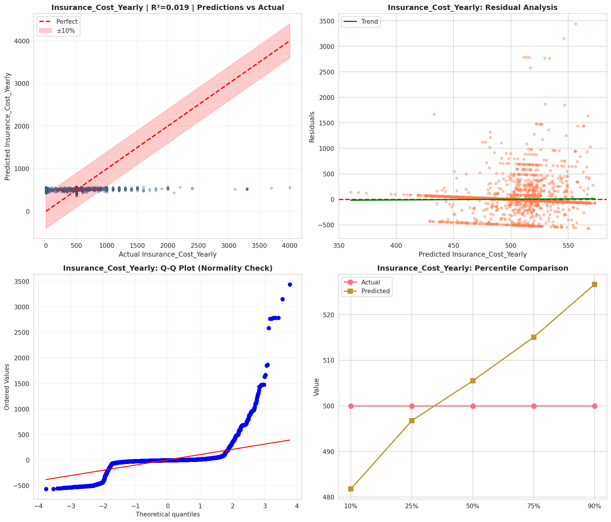
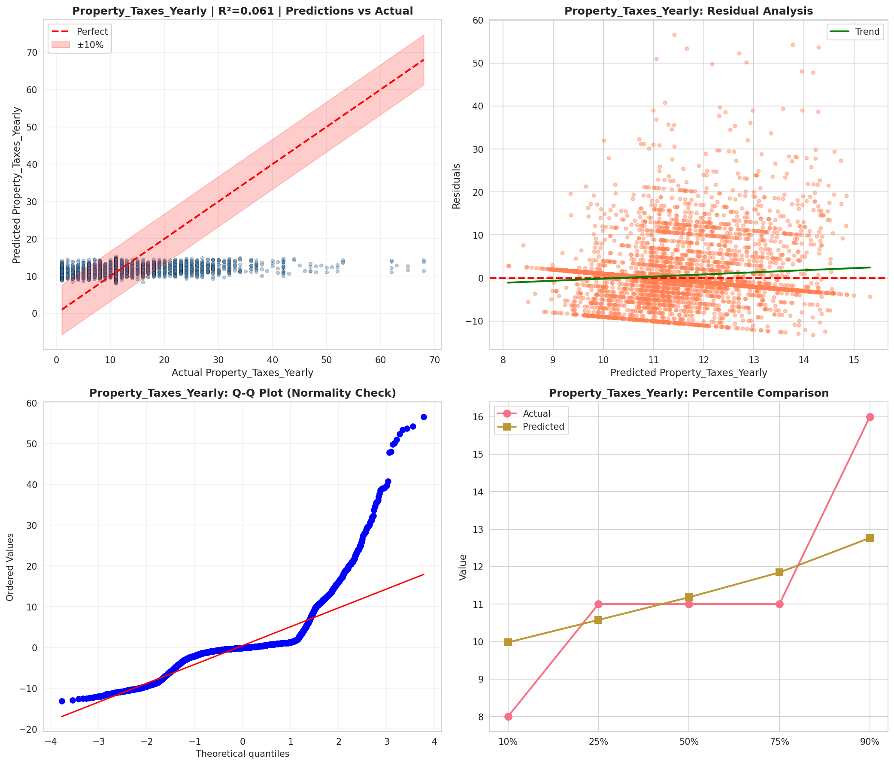
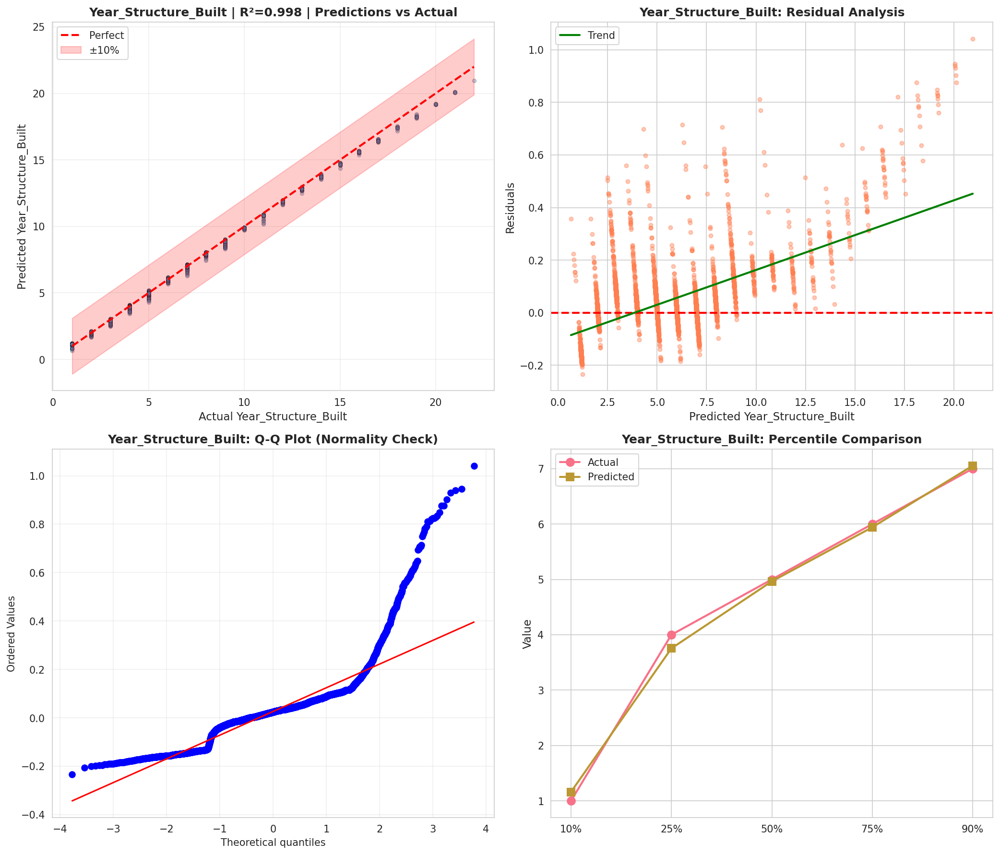
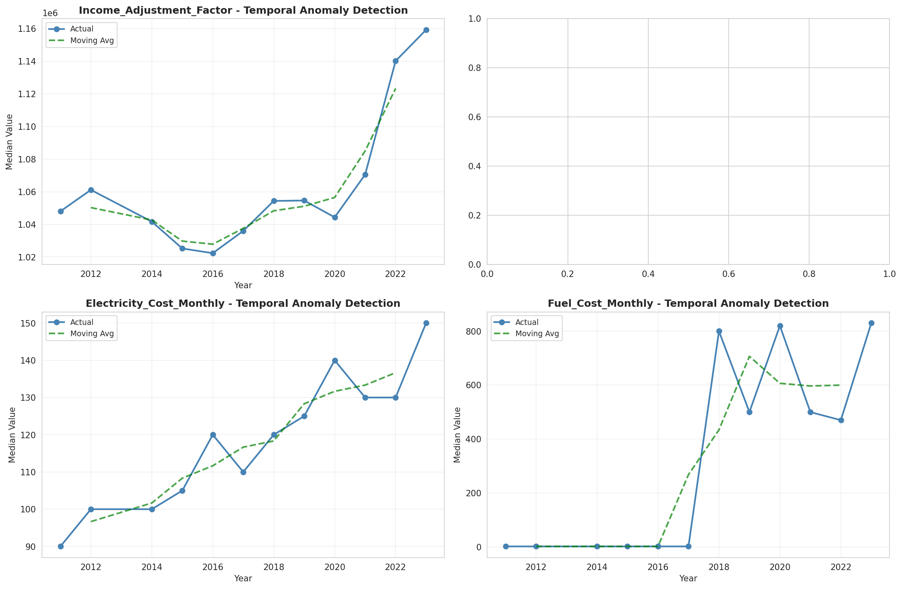
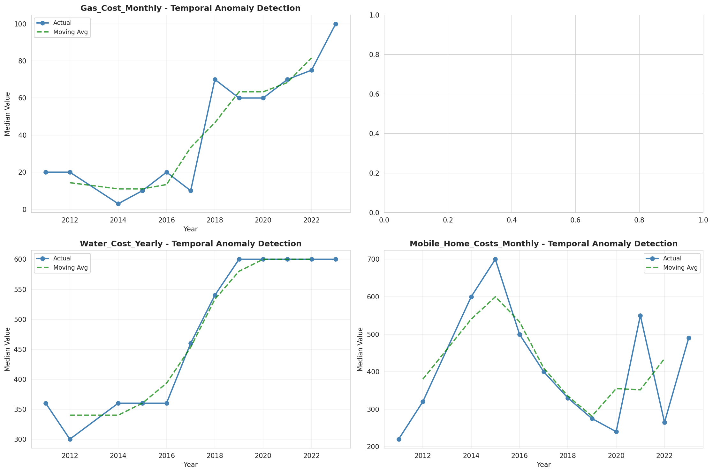
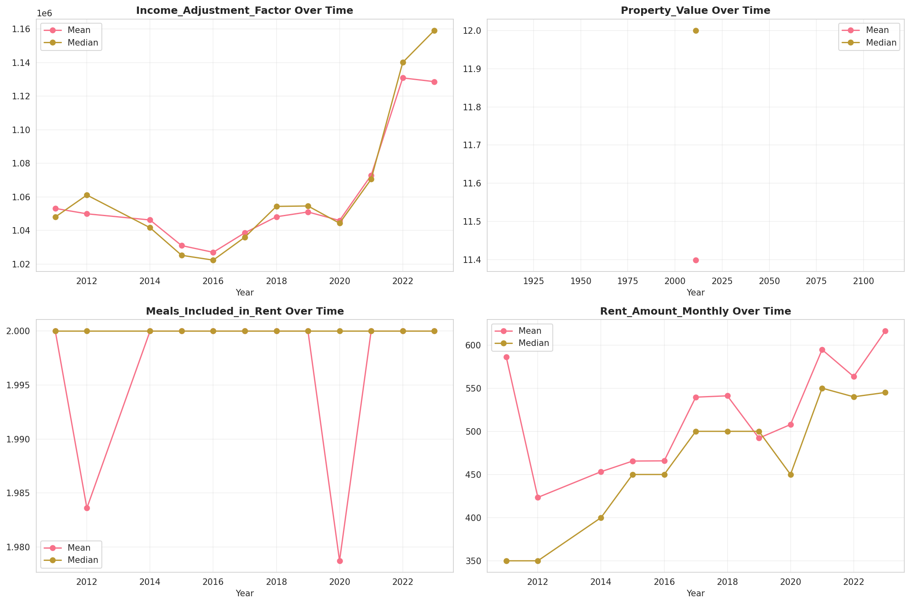
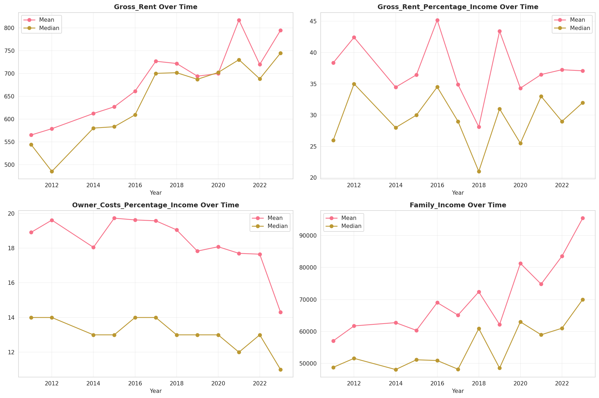
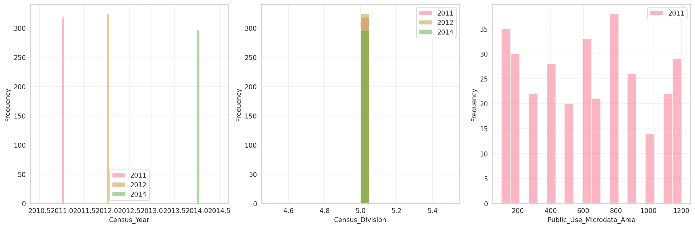
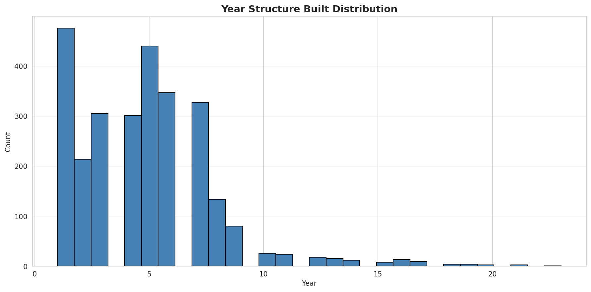
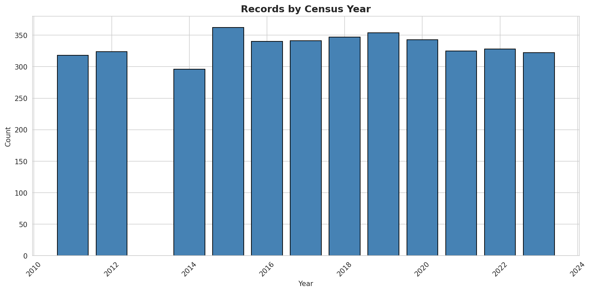
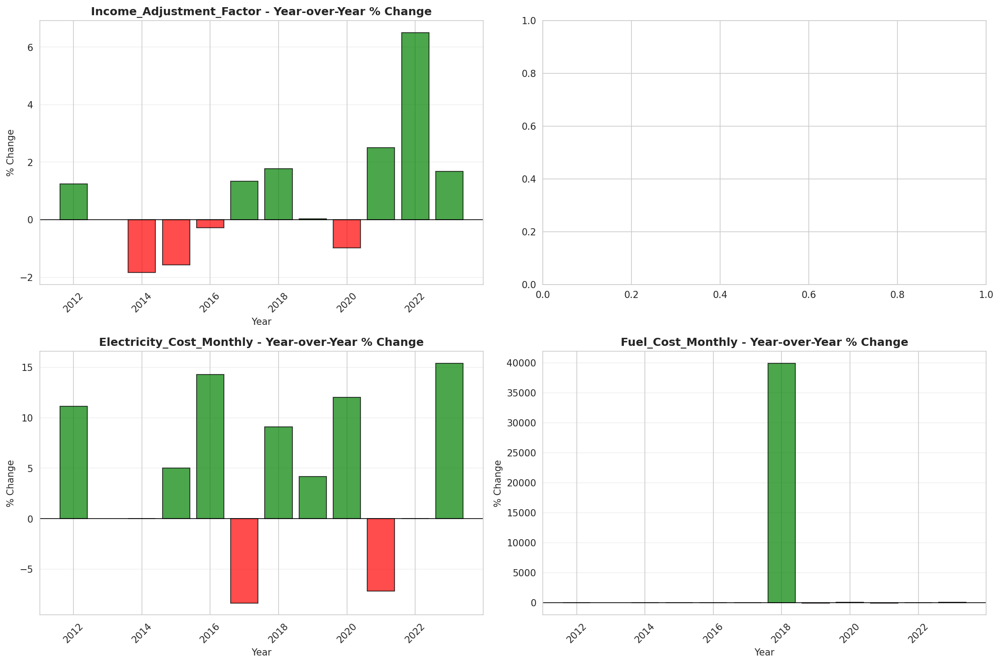
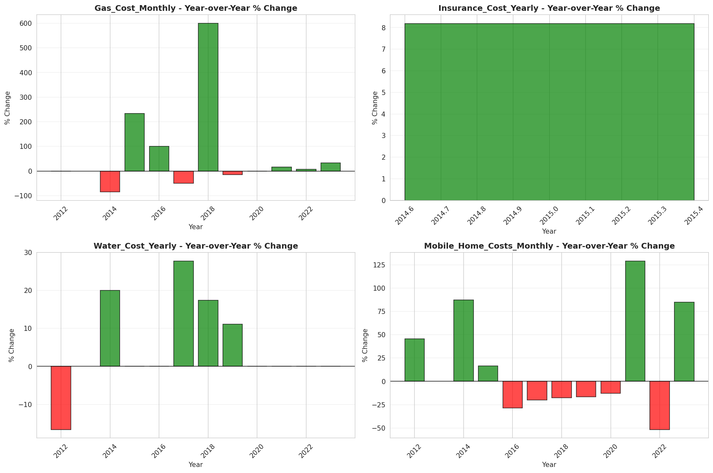
