# Temporal Analysis

## Year Distribution

- 2011: 29,510 records

- 2012: 29,167 records

- 2014: 29,161 records

- 2015: 29,300 records

- 2016: 29,340 records

- 2017: 29,646 records

- 2018: 29,863 records

- 2019: 30,028 records

- 2021: 30,139 records

- 2022: 31,210 records

- 2023: 31,308 records

## Temporal Trends

- Census_Year: {np.int64(2011): {'mean': 2011.0, 'median': 2011.0, 'std': 0.0}, np.int64(2012): {'mean': 2012.0, 'median': 2012.0, 'std': 0.0}, np.int64(2014): {'mean': 2014.0, 'median': 2014.0, 'std': 0.0}, np.int64(2015): {'mean': 2015.0, 'median': 2015.0, 'std': 0.0}, np.int64(2016): {'mean': 2016.0, 'median': 2016.0, 'std': 0.0}, np.int64(2017): {'mean': 2017.0, 'median': 2017.0, 'std': 0.0}, np.int64(2018): {'mean': 2018.0, 'median': 2018.0, 'std': 0.0}, np.int64(2019): {'mean': 2019.0, 'median': 2019.0, 'std': 0.0}, np.int64(2021): {'mean': 2021.0, 'median': 2021.0, 'std': 0.0}, np.int64(2022): {'mean': 2022.0, 'median': 2022.0, 'std': 0.0}, np.int64(2023): {'mean': 2023.0, 'median': 2023.0, 'std': 0.0}}

- Census_Division: {np.int64(2011): {'mean': 3.0, 'median': 3.0, 'std': 0.0}, np.int64(2012): {'mean': 3.0, 'median': 3.0, 'std': 0.0}, np.int64(2014): {'mean': 3.0, 'median': 3.0, 'std': 0.0}, np.int64(2015): {'mean': 3.0, 'median': 3.0, 'std': 0.0}, np.int64(2016): {'mean': 3.0, 'median': 3.0, 'std': 0.0}, np.int64(2017): {'mean': 3.0, 'median': 3.0, 'std': 0.0}, np.int64(2018): {'mean': 3.0, 'median': 3.0, 'std': 0.0}, np.int64(2019): {'mean': 3.0, 'median': 3.0, 'std': 0.0}, np.int64(2021): {'mean': 3.0, 'median': 3.0, 'std': 0.0}, np.int64(2022): {'mean': 3.0, 'median': 3.0, 'std': 0.0}, np.int64(2023): {'mean': 3.0, 'median': 3.0, 'std': 0.0}}

- Public_Use_Microdata_Area: {np.int64(2011): {'mean': 1178.2702812605896, 'median': 1200.0, 'std': 687.2653309822709}, np.int64(2012): {'mean': 14887.583879041382, 'median': 1400.0, 'std': 22383.29448901897}, np.int64(2014): {'mean': 14988.449367305648, 'median': 1400.0, 'std': 22488.951242166673}, np.int64(2015): {'mean': 14901.339556313993, 'median': 1400.0, 'std': 22478.218352790667}, np.int64(2016): {'mean': 14882.829652351738, 'median': 1400.0, 'std': 22503.238219550003}, np.int64(2017): {'mean': 14917.186163394725, 'median': 1400.0, 'std': 22492.004972003688}, np.int64(2018): {'mean': 14841.864280212973, 'median': 1400.0, 'std': 22493.477548654642}, np.int64(2019): {'mean': 14728.915811908884, 'median': 1400.0, 'std': 22462.91418592485}, np.int64(2021): {'mean': 14925.703507083845, 'median': 1400.0, 'std': 22528.566141944993}, np.int64(2022): {'mean': 1484.4713553348286, 'median': 1500.0, 'std': 899.2985965070258}, np.int64(2023): {'mean': 1484.1992781397726, 'median': 1500.0, 'std': 899.9885544518366}}

- Census_Region: {np.int64(2011): {'mean': 2.0, 'median': 2.0, 'std': 0.0}, np.int64(2012): {'mean': 2.0, 'median': 2.0, 'std': 0.0}, np.int64(2014): {'mean': 2.0, 'median': 2.0, 'std': 0.0}, np.int64(2015): {'mean': 2.0, 'median': 2.0, 'std': 0.0}, np.int64(2016): {'mean': 2.0, 'median': 2.0, 'std': 0.0}, np.int64(2017): {'mean': 2.0, 'median': 2.0, 'std': 0.0}, np.int64(2018): {'mean': 2.0, 'median': 2.0, 'std': 0.0}, np.int64(2019): {'mean': 2.0, 'median': 2.0, 'std': 0.0}, np.int64(2021): {'mean': 2.0, 'median': 2.0, 'std': 0.0}, np.int64(2022): {'mean': 2.0, 'median': 2.0, 'std': 0.0}, np.int64(2023): {'mean': 2.0, 'median': 2.0, 'std': 0.0}}

- State_Code: {np.int64(2011): {'mean': 55.0, 'median': 55.0, 'std': 0.0}, np.int64(2012): {'mean': 55.0, 'median': 55.0, 'std': 0.0}, np.int64(2014): {'mean': 55.0, 'median': 55.0, 'std': 0.0}, np.int64(2015): {'mean': 55.0, 'median': 55.0, 'std': 0.0}, np.int64(2016): {'mean': 55.0, 'median': 55.0, 'std': 0.0}, np.int64(2017): {'mean': 55.0, 'median': 55.0, 'std': 0.0}, np.int64(2018): {'mean': 55.0, 'median': 55.0, 'std': 0.0}, np.int64(2019): {'mean': 55.0, 'median': 55.0, 'std': 0.0}, np.int64(2021): {'mean': 55.0, 'median': 55.0, 'std': 0.0}, np.int64(2022): {'mean': 55.0, 'median': 55.0, 'std': 0.0}, np.int64(2023): {'mean': None, 'median': None, 'std': None}}

- Housing_Adjustment_Factor: {np.int64(2011): {'mean': 1000000.0, 'median': 1000000.0, 'std': 0.0}, np.int64(2012): {'mean': 1000000.0, 'median': 1000000.0, 'std': 0.0}, np.int64(2014): {'mean': 1000000.0, 'median': 1000000.0, 'std': 0.0}, np.int64(2015): {'mean': 1000000.0, 'median': 1000000.0, 'std': 0.0}, np.int64(2016): {'mean': 1000000.0, 'median': 1000000.0, 'std': 0.0}, np.int64(2017): {'mean': 1000000.0, 'median': 1000000.0, 'std': 0.0}, np.int64(2018): {'mean': 1000000.0, 'median': 1000000.0, 'std': 0.0}, np.int64(2019): {'mean': 1000000.0, 'median': 1000000.0, 'std': 0.0}, np.int64(2021): {'mean': 1000000.0, 'median': 1000000.0, 'std': 0.0}, np.int64(2022): {'mean': 1000000.0, 'median': 1000000.0, 'std': 0.0}, np.int64(2023): {'mean': 1000000.0, 'median': 1000000.0, 'std': 0.0}}

- Income_Adjustment_Factor: {np.int64(2011): {'mean': 1018237.0, 'median': 1018237.0, 'std': 0.0}, np.int64(2012): {'mean': 1010207.0, 'median': 1010207.0, 'std': 0.0}, np.int64(2014): {'mean': 1008425.0, 'median': 1008425.0, 'std': 0.0}, np.int64(2015): {'mean': 1001264.0, 'median': 1001264.0, 'std': 0.0}, np.int64(2016): {'mean': 1007588.0, 'median': 1007588.0, 'std': 0.0}, np.int64(2017): {'mean': 1011189.0, 'median': 1011189.0, 'std': 0.0}, np.int64(2018): {'mean': 1013097.0, 'median': 1013097.0, 'std': 0.0}, np.int64(2019): {'mean': 1010145.0, 'median': 1010145.0, 'std': 0.0}, np.int64(2021): {'mean': 1029928.0, 'median': 1029928.0, 'std': 0.0}, np.int64(2022): {'mean': 1042311.0, 'median': 1042311.0, 'std': 0.0}, np.int64(2023): {'mean': 1019518.0, 'median': 1019518.0, 'std': 0.0}}

- Housing_Unit_Weight: {np.int64(2011): {'mean': 89.28519146052186, 'median': 51.0, 'std': 104.3497791314415}, np.int64(2012): {'mean': 90.260397024034, 'median': 57.0, 'std': 96.39841866895357}, np.int64(2014): {'mean': 90.81794177154418, 'median': 59.0, 'std': 95.94697296146754}, np.int64(2015): {'mean': 90.67129692832765, 'median': 57.0, 'std': 97.57535325834496}, np.int64(2016): {'mean': 90.94897750511248, 'median': 57.0, 'std': 97.4976283784871}, np.int64(2017): {'mean': 90.91624502462389, 'median': 57.0, 'std': 97.5271613954965}, np.int64(2018): {'mean': 90.77179117972072, 'median': 56.0, 'std': 99.55412313421024}, np.int64(2019): {'mean': 90.75372985213801, 'median': 54.0, 'std': 105.58148585777195}, np.int64(2021): {'mean': 91.18663525664421, 'median': 55.0, 'std': 103.5968142667944}, np.int64(2022): {'mean': 88.76497917334187, 'median': 51.0, 'std': 106.95019120343062}, np.int64(2023): {'mean': 89.03117414079469, 'median': 51.0, 'std': 107.21627187305266}}

- Number_of_Persons: {np.int64(2011): {'mean': 2.0142663503896983, 'median': 2.0, 'std': 1.4328886947013146}, np.int64(2012): {'mean': 2.0051427983680186, 'median': 2.0, 'std': 1.4363358614878285}, np.int64(2014): {'mean': 2.0077843695346527, 'median': 2.0, 'std': 1.4214122035995336}, np.int64(2015): {'mean': 1.9992491467576792, 'median': 2.0, 'std': 1.4326046809657342}, np.int64(2016): {'mean': 1.9962167689161554, 'median': 2.0, 'std': 1.4335857868411896}, np.int64(2017): {'mean': 1.9921405923227418, 'median': 2.0, 'std': 1.4385386500653603}, np.int64(2018): {'mean': 2.0035830291665273, 'median': 2.0, 'std': 1.4279590079550415}, np.int64(2019): {'mean': 1.990375649393899, 'median': 2.0, 'std': 1.4108918212479529}, np.int64(2021): {'mean': 2.0000995388035436, 'median': 2.0, 'std': 1.429162156470174}, np.int64(2022): {'mean': 1.9854854213393143, 'median': 2.0, 'std': 1.395676631194837}, np.int64(2023): {'mean': 1.9969336910693753, 'median': 2.0, 'std': 1.4040323772916743}}

- Housing_Unit_Type: {np.int64(2011): {'mean': 1.1593019315486275, 'median': 1.0, 'std': 0.4880947911223875}, np.int64(2012): {'mean': 1.146741180100799, 'median': 1.0, 'std': 0.4731691455414392}, np.int64(2014): {'mean': 1.1401872363773533, 'median': 1.0, 'std': 0.4661709072170559}, np.int64(2015): {'mean': 1.1423890784982935, 'median': 1.0, 'std': 0.4698476087736602}, np.int64(2016): {'mean': 1.1376278118609406, 'median': 1.0, 'std': 0.4614842191293821}, np.int64(2017): {'mean': 1.140153815017203, 'median': 1.0, 'std': 0.4682772170256389}, np.int64(2018): {'mean': 1.1419817165053745, 'median': 1.0, 'std': 0.470408856989125}, np.int64(2019): {'mean': 1.1419674970027973, 'median': 1.0, 'std': 0.4700293436057346}, np.int64(2021): {'mean': None, 'median': None, 'std': None}, np.int64(2022): {'mean': None, 'median': None, 'std': None}, np.int64(2023): {'mean': None, 'median': None, 'std': None}}

- Number_of_Bedrooms: {np.int64(2011): {'mean': 2.846022468498558, 'median': 3.0, 'std': 1.1354588629355358}, np.int64(2012): {'mean': 2.8258375750208917, 'median': 3.0, 'std': 1.1170178940171247}, np.int64(2014): {'mean': 2.8487388611992146, 'median': 3.0, 'std': 1.1383217716281817}, np.int64(2015): {'mean': 2.8227524178677603, 'median': 3.0, 'std': 1.0489875961965192}, np.int64(2016): {'mean': 2.823871088626569, 'median': 3.0, 'std': 1.0336526470743506}, np.int64(2017): {'mean': 2.8258208124652198, 'median': 3.0, 'std': 1.0485581728444262}, np.int64(2018): {'mean': 2.836911612808027, 'median': 3.0, 'std': 1.0329000848670384}, np.int64(2019): {'mean': 2.847869959270539, 'median': 3.0, 'std': 1.045481019005801}, np.int64(2021): {'mean': 2.8602764641687886, 'median': 3.0, 'std': 1.0599602148811706}, np.int64(2022): {'mean': 2.873312639861402, 'median': 3.0, 'std': 1.050559572208809}, np.int64(2023): {'mean': 2.8647940881044627, 'median': 3.0, 'std': 1.0427526338286561}}

- Number_of_Rooms: {np.int64(2011): {'mean': 6.143502353119781, 'median': 6.0, 'std': 2.355687255059612}, np.int64(2012): {'mean': 6.117792296588924, 'median': 6.0, 'std': 2.3544726271251104}, np.int64(2014): {'mean': 6.19411720283945, 'median': 6.0, 'std': 2.491575076194614}, np.int64(2015): {'mean': 6.191171489858126, 'median': 6.0, 'std': 2.4035891988571745}, np.int64(2016): {'mean': 6.169421023046655, 'median': 6.0, 'std': 2.377701522765177}, np.int64(2017): {'mean': 6.2197365980337596, 'median': 6.0, 'std': 2.4258040919838297}, np.int64(2018): {'mean': 6.230116570754021, 'median': 6.0, 'std': 2.405712916476348}, np.int64(2019): {'mean': 6.270172091145929, 'median': 6.0, 'std': 2.459519043198266}, np.int64(2021): {'mean': 6.329356129501637, 'median': 6.0, 'std': 2.483237188830803}, np.int64(2022): {'mean': 6.348877499458601, 'median': 6.0, 'std': 2.506124964676632}, np.int64(2023): {'mean': 6.327701248385708, 'median': 6.0, 'std': 2.4740551421690546}}

- Building_Type: {np.int64(2011): {'mean': 2.5964020039471687, 'median': 2.0, 'std': 1.641980421420942}, np.int64(2012): {'mean': 2.583719516827471, 'median': 2.0, 'std': 1.6124984558386808}, np.int64(2014): {'mean': 2.60070231082918, 'median': 2.0, 'std': 1.6379236099726475}, np.int64(2015): {'mean': 2.595341135739284, 'median': 2.0, 'std': 1.6370331200439694}, np.int64(2016): {'mean': 2.6053213415776653, 'median': 2.0, 'std': 1.6511131549150073}, np.int64(2017): {'mean': 2.6191801150064924, 'median': 2.0, 'std': 1.6719746236897393}, np.int64(2018): {'mean': 2.6060941419507158, 'median': 2.0, 'std': 1.6625517742839466}, np.int64(2019): {'mean': 2.613877371298573, 'median': 2.0, 'std': 1.6773089505234842}, np.int64(2021): {'mean': 2.604437977446344, 'median': 2.0, 'std': 1.655610956615417}, np.int64(2022): {'mean': 2.5992925720060636, 'median': 2.0, 'std': 1.663425971922004}, np.int64(2023): {'mean': 2.6048930980054528, 'median': 2.0, 'std': 1.6715857252926183}}

- Year_Structure_Built: {np.int64(2011): {'mean': 4.514308486412631, 'median': 5.0, 'std': 2.753850895499728}, np.int64(2012): {'mean': 4.64464787662387, 'median': 5.0, 'std': 2.8409612813817495}, np.int64(2014): {'mean': 4.805656245280169, 'median': 5.0, 'std': 3.006423114835344}, np.int64(2015): {'mean': 4.863658600835435, 'median': 5.0, 'std': 3.096113503813646}, np.int64(2016): {'mean': 4.964624320779464, 'median': 5.0, 'std': 3.298499755273963}, np.int64(2017): {'mean': 5.075236505286589, 'median': 5.0, 'std': 3.554843948652078}, np.int64(2018): {'mean': 5.175593920613841, 'median': 5.0, 'std': 3.684820401117671}, np.int64(2019): {'mean': 5.337907753274869, 'median': 5.0, 'std': 3.9602327825784984}, np.int64(2021): {'mean': None, 'median': None, 'std': None}, np.int64(2022): {'mean': None, 'median': None, 'std': None}, np.int64(2023): {'mean': None, 'median': None, 'std': None}}

- Bathtub_or_Shower: {np.int64(2011): {'mean': 1.0148777895855472, 'median': 1.0, 'std': 0.12106608628182468}, np.int64(2012): {'mean': 1.014510369976449, 'median': 1.0, 'std': 0.11958412245194579}, np.int64(2014): {'mean': 1.0132532850022655, 'median': 1.0, 'std': 0.11435964870257598}, np.int64(2015): {'mean': 1.0147894479358748, 'median': 1.0, 'std': 0.12071150945237435}, np.int64(2016): {'mean': 1.014914746112048, 'median': 1.0, 'std': 0.12121405472834562}, np.int64(2017): {'mean': 1.0136894824707847, 'median': 1.0, 'std': 0.11620060873748027}, np.int64(2018): {'mean': 1.0129850966504352, 'median': 1.0, 'std': 0.1132119990384048}, np.int64(2019): {'mean': 1.0121454518768576, 'median': 1.0, 'std': 0.10953711761144508}, np.int64(2021): {'mean': 1.0131320480174608, 'median': 1.0, 'std': 0.11384229784658846}, np.int64(2022): {'mean': 1.0105392333790515, 'median': 1.0, 'std': 0.10212019554763258}, np.int64(2023): {'mean': 1.0098651169464772, 'median': 1.0, 'std': 0.09883393561085498}}

- Refrigerator: {np.int64(2011): {'mean': 1.0145741612266586, 'median': 1.0, 'std': 0.11984281435030246}, np.int64(2012): {'mean': 1.0133708121248954, 'median': 1.0, 'std': 0.11485875948266569}, np.int64(2014): {'mean': 1.0132155263555354, 'median': 1.0, 'std': 0.11419881191638173}, np.int64(2015): {'mean': 1.0147141835697888, 'median': 1.0, 'std': 0.12040856269969565}, np.int64(2016): {'mean': 1.0148772718755856, 'median': 1.0, 'std': 0.12106398266131274}, np.int64(2017): {'mean': 1.0147653496568354, 'median': 1.0, 'std': 0.1206145671799404}, np.int64(2018): {'mean': 1.0137966651910875, 'median': 1.0, 'std': 0.1166482711794914}, np.int64(2019): {'mean': 1.0126591567900782, 'median': 1.0, 'std': 0.11180054195353083}, np.int64(2021): {'mean': 1.0138595853037469, 'median': 1.0, 'std': 0.11691019800570279}, np.int64(2022): {'mean': 1.0112971919439833, 'median': 1.0, 'std': 0.10568807197976103}, np.int64(2023): {'mean': 1.0115511551155116, 'median': 1.0, 'std': 0.10685567619703971}}

- Hot_and_Cold_Running_Water: {np.int64(2011): {'mean': 1.0159784423865188, 'median': 1.0, 'std': 0.1253942922810126}, np.int64(2012): {'mean': 1.0158778393983134, 'median': 1.0, 'std': 0.12500530862520481}, np.int64(2014): {'mean': 1.0147636308714696, 'median': 1.0, 'std': 0.12060769179602994}, np.int64(2015): {'mean': 1.0166710570880217, 'median': 1.0, 'std': 0.12803807978951356}, np.int64(2016): {'mean': 1.0178002623196551, 'median': 1.0, 'std': 0.1322273352341042}, np.int64(2017): {'mean': 1.016620293081061, 'median': 1.0, 'std': 0.12784625652536466}, np.int64(2018): {'mean': 1.016010033938321, 'median': 1.0, 'std': 0.12551611019829764}, np.int64(2019): {'mean': 1.0145672036106117, 'median': 1.0, 'std': 0.11981455228775784}, np.int64(2021): {'mean': 1.0150600218261185, 'median': 1.0, 'std': 0.12179391271441839}, np.int64(2022): {'mean': 1.0126687360138598, 'median': 1.0, 'std': 0.11184225776135037}, np.int64(2023): {'mean': 1.0114794088104462, 'median': 1.0, 'std': 0.10652717528286182}}

- Running_Water: {np.int64(2011): {'mean': None, 'median': None, 'std': None}, np.int64(2012): {'mean': None, 'median': None, 'std': None}, np.int64(2014): {'mean': 9.0, 'median': 9.0, 'std': 0.0}, np.int64(2015): {'mean': 9.0, 'median': 9.0, 'std': 0.0}, np.int64(2016): {'mean': 9.0, 'median': 9.0, 'std': 0.0}, np.int64(2017): {'mean': 9.0, 'median': 9.0, 'std': 0.0}, np.int64(2018): {'mean': 9.0, 'median': 9.0, 'std': 0.0}, np.int64(2019): {'mean': 9.0, 'median': 9.0, 'std': 0.0}, np.int64(2021): {'mean': 9.0, 'median': 9.0, 'std': 0.0}, np.int64(2022): {'mean': 9.0, 'median': 9.0, 'std': 0.0}, np.int64(2023): {'mean': 9.0, 'median': 9.0, 'std': 0.0}}

- Sink_with_Faucet: {np.int64(2011): {'mean': 1.01218308790041, 'median': 1.0, 'std': 0.10970468105315909}, np.int64(2012): {'mean': 1.0111676669452252, 'median': 1.0, 'std': 0.10508743809567381}, np.int64(2014): {'mean': 1.0102325932638574, 'median': 1.0, 'std': 0.10063930508858136}, np.int64(2015): {'mean': 1.0117788732924398, 'median': 1.0, 'std': 0.1078914709161126}, np.int64(2016): {'mean': 1.0110548997564175, 'median': 1.0, 'std': 0.1045614587566441}, np.int64(2017): {'mean': 1.0106102763865703, 'median': 1.0, 'std': 0.10246017708726016}, np.int64(2018): {'mean': 1.0106610594658403, 'median': 1.0, 'std': 0.10270243609281654}, np.int64(2019): {'mean': 1.0099805525997139, 'median': 1.0, 'std': 0.09940474710119598}, np.int64(2021): {'mean': 1.0100036376864314, 'median': 1.0, 'std': 0.09951846659395902}, np.int64(2022): {'mean': 1.0081931711542627, 'median': 1.0, 'std': 0.09014619463245786}, np.int64(2023): {'mean': 1.0074257425742574, 'median': 1.0, 'std': 0.08585374387675138}}

- Stove_or_Range: {np.int64(2011): {'mean': 1.0146500683163808, 'median': 1.0, 'std': 0.12014987187577506}, np.int64(2012): {'mean': 1.0131049152928664, 'median': 1.0, 'std': 0.11372628445873262}, np.int64(2014): {'mean': 1.0135553541761064, 'median': 1.0, 'std': 0.11563784614951733}, np.int64(2015): {'mean': 1.0156926203289052, 'median': 1.0, 'std': 0.12428573248090735}, np.int64(2016): {'mean': 1.0145025295109613, 'median': 1.0, 'std': 0.1195522553460586}, np.int64(2017): {'mean': 1.0152847338156186, 'median': 1.0, 'std': 0.12268524413187552}, np.int64(2018): {'mean': 1.0136859967537257, 'median': 1.0, 'std': 0.11618600700861072}, np.int64(2019): {'mean': 1.0134664073679962, 'median': 1.0, 'std': 0.11526296339272576}, np.int64(2021): {'mean': 1.0133139323390323, 'median': 1.0, 'std': 0.11461740458153127}, np.int64(2022): {'mean': 1.011766404388941, 'median': 1.0, 'std': 0.10783494713100679}, np.int64(2023): {'mean': 1.0117305208781748, 'median': 1.0, 'std': 0.10767233464291548}}

- Telephone_Service: {np.int64(2011): {'mean': 1.0213844983517877, 'median': 1.0, 'std': 0.14466542794239515}, np.int64(2012): {'mean': 1.0242375191685125, 'median': 1.0, 'std': 0.15378904151610304}, np.int64(2014): {'mean': 1.0246265814750561, 'median': 1.0, 'std': 0.15498751363611227}, np.int64(2015): {'mean': 1.3498755116681436, 'median': 1.0, 'std': 1.4797214419539144}, np.int64(2016): {'mean': 1.0286363062949413, 'median': 1.0, 'std': 0.166785604865828}, np.int64(2017): {'mean': 1.015634119903277, 'median': 1.0, 'std': 0.12405779232442088}, np.int64(2018): {'mean': 1.015560508502559, 'median': 1.0, 'std': 0.12376999379142455}, np.int64(2019): {'mean': 1.009196711972003, 'median': 1.0, 'std': 0.09545943263916842}, np.int64(2021): {'mean': 1.0088317135137315, 'median': 1.0, 'std': 0.0935631732009766}, np.int64(2022): {'mean': 1.0097229358523379, 'median': 1.0, 'std': 0.09812635191391655}, np.int64(2023): {'mean': 1.0100074273875141, 'median': 1.0, 'std': 0.0995372598088672}}

- Lot_Acreage: {np.int64(2011): {'mean': 1.6763745358564845, 'median': 1.0, 'std': 0.7806861678320661}, np.int64(2012): {'mean': 1.6751094434021263, 'median': 1.0, 'std': 0.767675959283364}, np.int64(2014): {'mean': 1.6702464239561516, 'median': 1.0, 'std': 0.7669017562896536}, np.int64(2015): {'mean': 1.6756852499667891, 'median': 1.0, 'std': 0.761436547302537}, np.int64(2016): {'mean': 1.67776257118891, 'median': 1.0, 'std': 0.7706248434357899}, np.int64(2017): {'mean': 1.6793385537425085, 'median': 1.0, 'std': 0.7612874943173307}, np.int64(2018): {'mean': 1.6778351634043662, 'median': 1.0, 'std': 0.7616448534084287}, np.int64(2019): {'mean': 1.6932332772674343, 'median': 2.0, 'std': 0.767418796775197}, np.int64(2021): {'mean': 1.6848531420765027, 'median': 2.0, 'std': 0.7620885601009493}, np.int64(2022): {'mean': 1.6821855531234216, 'median': 2.0, 'std': 0.7573814388470252}, np.int64(2023): {'mean': 1.6876100259870903, 'median': 2.0, 'std': 0.7610734693445251}}

- Agricultural_Sales: {np.int64(2011): {'mean': 1.5455118110236221, 'median': 1.0, 'std': 1.4331498832187712}, np.int64(2012): {'mean': 1.4996878901373283, 'median': 1.0, 'std': 1.3764446375168267}, np.int64(2014): {'mean': 1.4470918738944958, 'median': 1.0, 'std': 1.306106932543352}, np.int64(2015): {'mean': 1.4611759885269413, 'median': 1.0, 'std': 1.3333677867388287}, np.int64(2016): {'mean': 1.4987654320987653, 'median': 1.0, 'std': 1.3675341772013943}, np.int64(2017): {'mean': 1.4642069380389011, 'median': 1.0, 'std': 1.3232535234730831}, np.int64(2018): {'mean': 1.4125235685223776, 'median': 1.0, 'std': 1.2438869787741649}, np.int64(2019): {'mean': 1.4223805855161786, 'median': 1.0, 'std': 1.255612028920557}, np.int64(2021): {'mean': 1.4049760765550239, 'median': 1.0, 'std': 1.243689833808976}, np.int64(2022): {'mean': 1.409628534466827, 'median': 1.0, 'std': 1.2474580644119373}, np.int64(2023): {'mean': 1.4199122325836533, 'median': 1.0, 'std': 1.2608981124903282}}

- Tenure: {np.int64(2011): {'mean': 1.7525568421942355, 'median': 2.0, 'std': 0.8386660943699279}, np.int64(2012): {'mean': 1.7661015505196798, 'median': 2.0, 'std': 0.8340634998517988}, np.int64(2014): {'mean': 1.777895315871874, 'median': 2.0, 'std': 0.835768706712152}, np.int64(2015): {'mean': 1.77495041566443, 'median': 2.0, 'std': 0.8360446975333118}, np.int64(2016): {'mean': 1.7774694083512048, 'median': 2.0, 'std': 0.8335976956087691}, np.int64(2017): {'mean': 1.7786625531560076, 'median': 2.0, 'std': 0.8349744814083192}, np.int64(2018): {'mean': 1.7725771834241373, 'median': 2.0, 'std': 0.8268340896602466}, np.int64(2019): {'mean': 1.7672336615935542, 'median': 2.0, 'std': 0.8174075799530757}, np.int64(2021): {'mean': 1.7732790256885913, 'median': 2.0, 'std': 0.8104161062699294}, np.int64(2022): {'mean': 1.762894747243192, 'median': 2.0, 'std': 0.8050386185888506}, np.int64(2023): {'mean': 1.7759274461514405, 'median': 2.0, 'std': 0.7978571800781084}}

- Vacancy_Status: {np.int64(2011): {'mean': 4.918838421444527, 'median': 5.0, 'std': 1.4216085488796257}, np.int64(2012): {'mean': 4.844912280701754, 'median': 5.0, 'std': 1.4091725823404309}, np.int64(2014): {'mean': 4.891616976499474, 'median': 5.0, 'std': 1.3855785599788621}, np.int64(2015): {'mean': 4.909596662030598, 'median': 5.0, 'std': 1.4137824852228038}, np.int64(2016): {'mean': 4.9207988980716255, 'median': 5.0, 'std': 1.3839023024377668}, np.int64(2017): {'mean': 4.900976759851802, 'median': 5.0, 'std': 1.424052998730337}, np.int64(2018): {'mean': 4.930208333333334, 'median': 5.0, 'std': 1.4199701911904337}, np.int64(2019): {'mean': 4.9753639417693165, 'median': 5.0, 'std': 1.4108263274133965}, np.int64(2021): {'mean': 5.0070553286297805, 'median': 5.0, 'std': 1.381643876930035}, np.int64(2022): {'mean': 5.041164241164241, 'median': 5.0, 'std': 1.3840253242703349}, np.int64(2023): {'mean': 5.030936819172113, 'median': 5.0, 'std': 1.4290551267503764}}

- Property_Value: {np.int64(2011): {'mean': 191557.88796569285, 'median': 150000.0, 'std': 172891.60933103893}, np.int64(2012): {'mean': 195285.10246123822, 'median': 155000.0, 'std': 192009.30952487953}, np.int64(2014): {'mean': 197295.57701671807, 'median': 151000.0, 'std': 198147.3914517858}, np.int64(2015): {'mean': 202378.99499111326, 'median': 160000.0, 'std': 180547.39036442875}, np.int64(2016): {'mean': 210554.0780141844, 'median': 165000.0, 'std': 212810.36749681697}, np.int64(2017): {'mean': 217429.05308082156, 'median': 175000.0, 'std': 213632.8601479711}, np.int64(2018): {'mean': 226314.69908623045, 'median': 180000.0, 'std': 226040.7399743022}, np.int64(2019): {'mean': 232622.85494223362, 'median': 188000.0, 'std': 213418.88860120354}, np.int64(2021): {'mean': 265192.7845990602, 'median': 210000.0, 'std': 247752.12152174694}, np.int64(2022): {'mean': 296960.45973616856, 'median': 240000.0, 'std': 324650.2070454366}, np.int64(2023): {'mean': 315078.426124197, 'median': 250000.0, 'std': 315823.309431515}}

- Vehicles_Available: {np.int64(2011): {'mean': 1.9592173104555828, 'median': 2.0, 'std': 1.0716214938279114}, np.int64(2012): {'mean': 1.972269551882774, 'median': 2.0, 'std': 1.0754882979125278}, np.int64(2014): {'mean': 1.982482122455888, 'median': 2.0, 'std': 1.0777718825513338}, np.int64(2015): {'mean': 2.005992319702916, 'median': 2.0, 'std': 1.0918941468516332}, np.int64(2016): {'mean': 2.0142130272065937, 'median': 2.0, 'std': 1.0981901924403885}, np.int64(2017): {'mean': 2.0313516217793715, 'median': 2.0, 'std': 1.0972405280229718}, np.int64(2018): {'mean': 2.0517170216278684, 'median': 2.0, 'std': 1.1102251721151526}, np.int64(2019): {'mean': 2.0482623911451125, 'median': 2.0, 'std': 1.1077680970505275}, np.int64(2021): {'mean': 2.032140984796548, 'median': 2.0, 'std': 1.1068387854224806}, np.int64(2022): {'mean': 2.0208292162365122, 'median': 2.0, 'std': 1.1000543106075698}, np.int64(2023): {'mean': 2.0274813338024313, 'median': 2.0, 'std': 1.107259445728016}}

- Condo_Fee_Monthly: {np.int64(2011): {'mean': 197.74423480083857, 'median': 170.0, 'std': 136.3632444859489}, np.int64(2012): {'mean': 195.72519083969465, 'median': 175.0, 'std': 117.67525417229479}, np.int64(2014): {'mean': 215.40377358490565, 'median': 180.0, 'std': 133.56716761804262}, np.int64(2015): {'mean': 222.4022346368715, 'median': 200.0, 'std': 130.93094566339354}, np.int64(2016): {'mean': 230.69565217391303, 'median': 200.0, 'std': 145.12987913652316}, np.int64(2017): {'mean': 227.61431411530816, 'median': 200.0, 'std': 136.03328319689794}, np.int64(2018): {'mean': 236.66786355475762, 'median': 210.0, 'std': 146.89907191231927}, np.int64(2019): {'mean': 250.66298342541435, 'median': 220.0, 'std': 164.64297348959664}, np.int64(2021): {'mean': 281.01184433164127, 'median': 240.0, 'std': 196.45695141119114}, np.int64(2022): {'mean': 286.77777777777777, 'median': 250.0, 'std': 165.35724629194272}, np.int64(2023): {'mean': 288.1136363636364, 'median': 250.0, 'std': 163.7095387631396}}

- Electricity_Cost_Monthly: {np.int64(2011): {'mean': 122.37253824697828, 'median': 100.0, 'std': 79.05265099596329}, np.int64(2012): {'mean': 120.7255920940535, 'median': 100.0, 'std': 76.38375013674667}, np.int64(2014): {'mean': 137.76562433884823, 'median': 120.0, 'std': 90.0086269640067}, np.int64(2015): {'mean': 133.17879900409335, 'median': 120.0, 'std': 85.63262401644039}, np.int64(2016): {'mean': 130.69652243387577, 'median': 120.0, 'std': 81.3623628957521}, np.int64(2017): {'mean': 131.08946885683315, 'median': 120.0, 'std': 79.26125082810957}, np.int64(2018): {'mean': 140.92748908483864, 'median': 130.0, 'std': 80.55271566579717}, np.int64(2019): {'mean': 141.2247020035506, 'median': 130.0, 'std': 80.53671660008987}, np.int64(2021): {'mean': 147.92124603307167, 'median': 130.0, 'std': 92.77665055909226}, np.int64(2022): {'mean': 174.3235715748515, 'median': 140.0, 'std': 214.5747272670719}, np.int64(2023): {'mean': 182.28467389545233, 'median': 150.0, 'std': 238.45764952802173}}

- Fuel_Cost_Monthly: {np.int64(2011): {'mean': 223.37968050038035, 'median': 2.0, 'std': 573.7445458517329}, np.int64(2012): {'mean': 204.87008008178566, 'median': 2.0, 'std': 538.4200509024648}, np.int64(2014): {'mean': 176.00977446790506, 'median': 2.0, 'std': 538.3979980588074}, np.int64(2015): {'mean': 150.97944887538506, 'median': 2.0, 'std': 472.0511711616867}, np.int64(2016): {'mean': 115.67385728102266, 'median': 2.0, 'std': 374.3885143114319}, np.int64(2017): {'mean': 109.83936462936713, 'median': 2.0, 'std': 360.92896668740036}, np.int64(2018): {'mean': 894.4549116826774, 'median': 760.0, 'std': 745.1829893372072}, np.int64(2019): {'mean': 873.4107142857143, 'median': 730.0, 'std': 715.5072132784605}, np.int64(2021): {'mean': 883.9402232625135, 'median': 700.0, 'std': 771.0727383945007}, np.int64(2022): {'mean': 1011.472250595846, 'median': 800.0, 'std': 869.1154892459815}, np.int64(2023): {'mean': 1091.1565129585997, 'median': 900.0, 'std': 943.5348841010846}}

- Gas_Cost_Monthly: {np.int64(2011): {'mean': 69.37389062632069, 'median': 40.0, 'std': 90.57745127466674}, np.int64(2012): {'mean': 62.62336002726188, 'median': 30.0, 'std': 82.8052360939417}, np.int64(2014): {'mean': 72.71273219650489, 'median': 30.0, 'std': 103.17157192761478}, np.int64(2015): {'mean': 62.75313330801367, 'median': 20.0, 'std': 91.83794814797903}, np.int64(2016): {'mean': 52.291325007358815, 'median': 20.0, 'std': 74.93255158908792}, np.int64(2017): {'mean': 54.994455098807634, 'median': 20.0, 'std': 79.35811130301785}, np.int64(2018): {'mean': 106.36858532336502, 'median': 80.0, 'std': 95.4294576238619}, np.int64(2019): {'mean': 108.63950947917401, 'median': 80.0, 'std': 98.28785229838716}, np.int64(2021): {'mean': 111.89220725100708, 'median': 80.0, 'std': 114.55404855950498}, np.int64(2022): {'mean': 162.6123787219806, 'median': 100.0, 'std': 240.41407271428523}, np.int64(2023): {'mean': 163.58138301398927, 'median': 100.0, 'std': 253.71880861523974}}

- House_Heating_Fuel: {np.int64(2011): {'mean': 2.205139041501141, 'median': 1.0, 'std': 1.7319685146260138}, np.int64(2012): {'mean': 2.186403135116715, 'median': 1.0, 'std': 1.7153358247656187}, np.int64(2014): {'mean': 2.1835568907883043, 'median': 1.0, 'std': 1.7352937814030038}, np.int64(2015): {'mean': 2.131366839684348, 'median': 1.0, 'std': 1.672402485578858}, np.int64(2016): {'mean': 2.1126109078676256, 'median': 1.0, 'std': 1.6487427734232802}, np.int64(2017): {'mean': 2.094972067039106, 'median': 1.0, 'std': 1.6344433903374709}, np.int64(2018): {'mean': 2.055473006438831, 'median': 1.0, 'std': 1.5890803063070564}, np.int64(2019): {'mean': 2.038984292341499, 'median': 1.0, 'std': 1.5540382615374775}, np.int64(2021): {'mean': 2.0183893212888657, 'median': 1.0, 'std': 1.5399662288588252}, np.int64(2022): {'mean': 2.013122010987708, 'median': 1.0, 'std': 1.53318552222082}, np.int64(2023): {'mean': 2.0197803056956336, 'median': 1.0, 'std': 1.515130764648487}}

- Insurance_Cost_Yearly: {np.int64(2011): {'mean': 698.388037475957, 'median': 600.0, 'std': 512.1507776405568}, np.int64(2012): {'mean': 722.4362872956295, 'median': 600.0, 'std': 508.26244857052774}, np.int64(2014): {'mean': 808.7784324906545, 'median': 700.0, 'std': 584.0879304016734}, np.int64(2015): {'mean': 849.9884104928656, 'median': 700.0, 'std': 603.4976791744656}, np.int64(2016): {'mean': 882.7144544606776, 'median': 750.0, 'std': 637.3410413018404}, np.int64(2017): {'mean': 901.0115127506808, 'median': 790.0, 'std': 650.8365826940469}, np.int64(2018): {'mean': 931.7211160275319, 'median': 800.0, 'std': 661.0228580629611}, np.int64(2019): {'mean': 958.5701818181818, 'median': 800.0, 'std': 654.2657899093103}, np.int64(2021): {'mean': 1015.3908327501749, 'median': 900.0, 'std': 702.1112521909035}, np.int64(2022): {'mean': 1078.2879873610564, 'median': 920.0, 'std': 784.4269829475203}, np.int64(2023): {'mean': 1219.0310892417804, 'median': 1000.0, 'std': 982.5400534282887}}

- Water_Cost_Yearly: {np.int64(2011): {'mean': 236.39666976586932, 'median': 2.0, 'std': 363.5417971867124}, np.int64(2012): {'mean': 242.48193900153348, 'median': 2.0, 'std': 374.6392842241839}, np.int64(2014): {'mean': 247.63064359158804, 'median': 2.0, 'std': 388.5338473830628}, np.int64(2015): {'mean': 255.4962653500443, 'median': 2.0, 'std': 398.8414183039896}, np.int64(2016): {'mean': 257.7696059879736, 'median': 2.0, 'std': 403.51216646975683}, np.int64(2017): {'mean': 260.9518052197115, 'median': 2.0, 'std': 412.50525547529645}, np.int64(2018): {'mean': 591.7629684327119, 'median': 530.0, 'std': 435.5032599011863}, np.int64(2019): {'mean': 596.6595139844109, 'median': 540.0, 'std': 439.8641156954524}, np.int64(2021): {'mean': 645.5577487329955, 'median': 600.0, 'std': 499.8383722618736}, np.int64(2022): {'mean': 654.77277486911, 'median': 600.0, 'std': 525.6391894564455}, np.int64(2023): {'mean': 682.8470627954085, 'median': 600.0, 'std': 548.8669830151279}}

- Mobile_Home_Costs_Monthly: {np.int64(2011): {'mean': 1955.9729272419627, 'median': 1600.0, 'std': 1613.2939751059885}, np.int64(2012): {'mean': 1885.6152512998267, 'median': 1600.0, 'std': 1587.7222540098453}, np.int64(2014): {'mean': 2039.1115311909264, 'median': 1700.0, 'std': 1741.8627711945614}, np.int64(2015): {'mean': 2028.0677361853832, 'median': 1700.0, 'std': 1784.1984041590256}, np.int64(2016): {'mean': 1964.1488933601609, 'median': 1500.0, 'std': 1803.8707446128014}, np.int64(2017): {'mean': 2134.9203187250996, 'median': 1300.0, 'std': 2112.059767313438}, np.int64(2018): {'mean': 2146.964705882353, 'median': 1500.0, 'std': 1960.3301937299223}, np.int64(2019): {'mean': 2022.3734290843806, 'median': 1300.0, 'std': 1860.8615676532684}, np.int64(2021): {'mean': 2561.72, 'median': 1800.0, 'std': 2867.7567557842312}, np.int64(2022): {'mean': 2546.6860068259384, 'median': 1400.0, 'std': 3695.3801826607964}, np.int64(2023): {'mean': 2404.306477093207, 'median': 1400.0, 'std': 2545.7851442845445}}

- First_Mortgage_Includes_Insurance: {np.int64(2011): {'mean': 1.683195831524099, 'median': 2.0, 'std': 0.46525056177865975}, np.int64(2012): {'mean': 1.675074050803339, 'median': 2.0, 'std': 0.46836819592884216}, np.int64(2014): {'mean': 1.6572412543048758, 'median': 2.0, 'std': 0.4746531430974071}, np.int64(2015): {'mean': 1.6417883540652605, 'median': 2.0, 'std': 0.479496389014472}, np.int64(2016): {'mean': 1.63324896040499, 'median': 2.0, 'std': 0.4819395307198859}, np.int64(2017): {'mean': 1.6254144636616183, 'median': 2.0, 'std': 0.4840374036283481}, np.int64(2018): {'mean': 1.6095695482034864, 'median': 2.0, 'std': 0.48786850927863085}, np.int64(2019): {'mean': 1.5857873390936343, 'median': 2.0, 'std': 0.4926072750547856}, np.int64(2021): {'mean': 1.5513992537313432, 'median': 2.0, 'std': 0.49737429901404856}, np.int64(2022): {'mean': 1.5572283693089062, 'median': 2.0, 'std': 0.49673664292382097}, np.int64(2023): {'mean': 1.5461773134880281, 'median': 2.0, 'std': 0.4978861039205041}}

- First_Mortgage_Payment_Monthly: {np.int64(2011): {'mean': 961.1808944854538, 'median': 850.0, 'std': 576.7631669544458}, np.int64(2012): {'mean': 956.3084103760883, 'median': 850.0, 'std': 574.0879098307324}, np.int64(2014): {'mean': 950.8276237085372, 'median': 840.0, 'std': 576.3543391981573}, np.int64(2015): {'mean': 961.8633495583198, 'median': 850.0, 'std': 570.0845032369913}, np.int64(2016): {'mean': 966.2516723919725, 'median': 860.0, 'std': 579.105595849345}, np.int64(2017): {'mean': 986.8185321265346, 'median': 870.0, 'std': 606.6124296923716}, np.int64(2018): {'mean': 1005.3584133760228, 'median': 900.0, 'std': 607.5855910329474}, np.int64(2019): {'mean': 1034.9583847645918, 'median': 920.0, 'std': 602.4838487205303}, np.int64(2021): {'mean': 435.64154237904694, 'median': 4.0, 'std': 667.593260168873}, np.int64(2022): {'mean': 561.1959548200683, 'median': 4.0, 'std': 747.1249325601102}, np.int64(2023): {'mean': 1206.468891559582, 'median': 1100.0, 'std': 713.1300016148642}}

- First_Mortgage_Includes_Taxes: {np.int64(2011): {'mean': 1.5483282674772036, 'median': 2.0, 'std': 0.49768050836824}, np.int64(2012): {'mean': 1.538192262813033, 'median': 2.0, 'std': 0.4985615927595698}, np.int64(2014): {'mean': 1.5131411999274968, 'median': 2.0, 'std': 0.49984992998606104}, np.int64(2015): {'mean': 1.4916170903190915, 'median': 1.0, 'std': 0.49995225494565787}, np.int64(2016): {'mean': 1.4863496655216055, 'median': 1.0, 'std': 0.49983622663581645}, np.int64(2017): {'mean': 1.4739672013621292, 'median': 1.0, 'std': 0.49934420804371155}, np.int64(2018): {'mean': 1.4582888651725365, 'median': 1.0, 'std': 0.4982793017400508}, np.int64(2019): {'mean': 1.4337859284076881, 'median': 1.0, 'std': 0.4956181534668261}, np.int64(2021): {'mean': 1.3974813432835822, 'median': 1.0, 'std': 0.48939990558574675}, np.int64(2022): {'mean': 1.3940685652095048, 'median': 1.0, 'std': 0.48867186233697074}, np.int64(2023): {'mean': 1.3818988629009892, 'median': 1.0, 'std': 0.48587441356945965}}

- First_Mortgage_Status: {np.int64(2011): {'mean': 1.7578006500541712, 'median': 1.0, 'std': 0.9674850043665857}, np.int64(2012): {'mean': 1.7840772014475272, 'median': 1.0, 'std': 0.9734563486203769}, np.int64(2014): {'mean': 1.797701778385773, 'median': 1.0, 'std': 0.9766650127623101}, np.int64(2015): {'mean': 1.799673735725938, 'median': 1.0, 'std': 0.9765870301974431}, np.int64(2016): {'mean': 1.8067873793776428, 'median': 1.0, 'std': 0.9780289043891552}, np.int64(2017): {'mean': 1.8043057050592035, 'median': 1.0, 'std': 0.9778882535539184}, np.int64(2018): {'mean': 1.817268545444932, 'median': 1.0, 'std': 0.9799836862035659}, np.int64(2019): {'mean': 1.8322563970018093, 'median': 1.0, 'std': 0.9833884973592907}, np.int64(2021): {'mean': 1.9153963414634145, 'median': 1.0, 'std': 0.994014683872674}, np.int64(2022): {'mean': 1.9143563133185075, 'median': 1.0, 'std': 0.9942649495517429}, np.int64(2023): {'mean': 1.9471395769211979, 'median': 1.0, 'std': 0.9965938919594826}}

- Second_Mortgage_Payment_Monthly: {np.int64(2011): {'mean': 325.5366395262768, 'median': 250.0, 'std': 292.7289743977162}, np.int64(2012): {'mean': 303.561177934467, 'median': 230.0, 'std': 282.7746252461372}, np.int64(2014): {'mean': 319.7443820224719, 'median': 230.0, 'std': 332.15372448571924}, np.int64(2015): {'mean': 302.8898508898509, 'median': 220.0, 'std': 296.051940673331}, np.int64(2016): {'mean': 300.3508064516129, 'median': 200.0, 'std': 302.26595897315883}, np.int64(2017): {'mean': 314.93415637860085, 'median': 200.0, 'std': 355.91833158842456}, np.int64(2018): {'mean': 337.87538619979404, 'median': 220.0, 'std': 389.70953783051596}, np.int64(2019): {'mean': 342.45762711864404, 'median': 230.0, 'std': 402.8073692076076}, np.int64(2021): {'mean': 367.30298273155415, 'median': 250.0, 'std': 428.6802000472665}, np.int64(2022): {'mean': 390.948, 'median': 250.0, 'std': 501.0133735702552}, np.int64(2023): {'mean': 444.94212523719165, 'median': 300.0, 'std': 502.4934905916553}}

- Second_Mortgage_Status: {np.int64(2011): {'mean': 2.730438558402084, 'median': 3.0, 'std': 0.5701814957535117}, np.int64(2012): {'mean': 2.7424827214792207, 'median': 3.0, 'std': 0.5597337569136918}, np.int64(2014): {'mean': 2.7779590357078123, 'median': 3.0, 'std': 0.5190122004665508}, np.int64(2015): {'mean': 2.785649900847305, 'median': 3.0, 'std': 0.5143111439414616}, np.int64(2016): {'mean': 2.798318568070873, 'median': 3.0, 'std': 0.494161621259376}, np.int64(2017): {'mean': 2.803208172775338, 'median': 3.0, 'std': 0.48084337945616484}, np.int64(2018): {'mean': 2.8056741373176806, 'median': 3.0, 'std': 0.48092660773907114}, np.int64(2019): {'mean': 2.8118497619467466, 'median': 3.0, 'std': 0.4655950103826078}, np.int64(2021): {'mean': 2.813255709807434, 'median': 3.0, 'std': 0.44549158381435033}, np.int64(2022): {'mean': 2.8096108644554714, 'median': 3.0, 'std': 0.4492936550711697}, np.int64(2023): {'mean': 2.7968347114786165, 'median': 3.0, 'std': 0.4583649889267943}}

- Property_Taxes_Yearly: {np.int64(2011): {'mean': 40.17800650054171, 'median': 40.0, 'std': 15.218201069300104}, np.int64(2012): {'mean': 40.469130387103846, 'median': 40.0, 'std': 15.315232551480698}, np.int64(2014): {'mean': 40.28399452804378, 'median': 40.0, 'std': 15.852144052891594}, np.int64(2015): {'mean': 41.06188145731376, 'median': 40.0, 'std': 15.040803311521982}, np.int64(2016): {'mean': 41.19223679930608, 'median': 40.0, 'std': 15.010021642391123}, np.int64(2017): {'mean': 41.28708288482239, 'median': 41.0, 'std': 15.116225715438961}}

- Meals_Included_in_Rent: {np.int64(2011): {'mean': 1.975318632409468, 'median': 2.0, 'std': 0.15516787240554236}, np.int64(2012): {'mean': 1.9748763600395647, 'median': 2.0, 'std': 0.1565160976567189}, np.int64(2014): {'mean': 1.9749027237354086, 'median': 2.0, 'std': 0.15643581466567194}, np.int64(2015): {'mean': 1.9736116581331233, 'median': 2.0, 'std': 0.16030301852628587}, np.int64(2016): {'mean': 1.9753713838936668, 'median': 2.0, 'std': 0.1550056249542856}, np.int64(2017): {'mean': 1.9669421487603307, 'median': 2.0, 'std': 0.1788048502385077}, np.int64(2018): {'mean': 1.970955165692008, 'median': 2.0, 'std': 0.16794859420663646}, np.int64(2019): {'mean': 1.9716269841269842, 'median': 2.0, 'std': 0.16605257832278328}, np.int64(2021): {'mean': 1.9762538382804504, 'median': 2.0, 'std': 0.1522728738154866}, np.int64(2022): {'mean': 1.9742524916943522, 'median': 2.0, 'std': 0.15839754983715254}, np.int64(2023): {'mean': 1.9764826175869121, 'median': 2.0, 'std': 0.1515553109496645}}

- Rent_Amount_Monthly: {np.int64(2011): {'mean': 615.5731337244588, 'median': 570.0, 'std': 343.5269914742353}, np.int64(2012): {'mean': 629.8813056379822, 'median': 590.0, 'std': 343.655691105446}, np.int64(2014): {'mean': 663.9731517509728, 'median': 600.0, 'std': 362.75758629243717}, np.int64(2015): {'mean': 685.5667585663647, 'median': 620.0, 'std': 392.53357313832646}, np.int64(2016): {'mean': 694.0160281469898, 'median': 640.0, 'std': 386.5620001981606}, np.int64(2017): {'mean': 724.0069190851432, 'median': 650.0, 'std': 407.5186906483928}, np.int64(2018): {'mean': 738.0803118908382, 'median': 680.0, 'std': 391.7198115797453}, np.int64(2019): {'mean': 760.8150793650793, 'median': 700.0, 'std': 405.67597336659173}, np.int64(2021): {'mean': 817.0972364380757, 'median': 730.0, 'std': 484.18001446485306}, np.int64(2022): {'mean': 869.5182724252492, 'median': 780.0, 'std': 524.7653448575404}, np.int64(2023): {'mean': 946.3791411042945, 'median': 840.0, 'std': 587.1295684112323}}

- Gross_Rent: {np.int64(2011): {'mean': 750.5421585160202, 'median': 700.0, 'std': 363.26454779144143}, np.int64(2012): {'mean': 765.8054289266473, 'median': 720.0, 'std': 365.97332281886366}, np.int64(2014): {'mean': 808.5471506793754, 'median': 750.0, 'std': 379.82624932054665}, np.int64(2015): {'mean': 826.234494127344, 'median': 763.0, 'std': 405.1043119169859}, np.int64(2016): {'mean': 826.9651020408163, 'median': 780.0, 'std': 390.24063554403494}, np.int64(2017): {'mean': 859.8333333333334, 'median': 800.0, 'std': 422.85963384893654}, np.int64(2018): {'mean': 881.8051470588235, 'median': 820.0, 'std': 402.68901718046874}, np.int64(2019): {'mean': 902.0779569892474, 'median': 840.0, 'std': 423.4427133157818}, np.int64(2021): {'mean': 961.9351950543594, 'median': 880.0, 'std': 493.5162099979763}, np.int64(2022): {'mean': 1050.3656330749354, 'median': 940.0, 'std': 574.4173054722354}, np.int64(2023): {'mean': 1126.6387768103632, 'median': 1010.0, 'std': 633.0229906929333}}

- Gross_Rent_Percentage_Income: {np.int64(2011): {'mean': 37.981767481767484, 'median': 29.0, 'std': 26.754726167321163}, np.int64(2012): {'mean': 37.34995791245791, 'median': 28.0, 'std': 26.488191592313466}, np.int64(2014): {'mean': 36.498658410732716, 'median': 28.0, 'std': 25.97427442154602}, np.int64(2015): {'mean': 35.262882279011315, 'median': 27.0, 'std': 25.7655999206474}, np.int64(2016): {'mean': 34.78135382059801, 'median': 26.0, 'std': 25.815861906504665}, np.int64(2017): {'mean': 34.32348717948718, 'median': 26.0, 'std': 25.17752668477683}, np.int64(2018): {'mean': 34.51242236024845, 'median': 25.0, 'std': 26.039128030353694}, np.int64(2019): {'mean': 33.45771981489272, 'median': 25.0, 'std': 24.935211659276256}, np.int64(2021): {'mean': 34.431180691454664, 'median': 26.0, 'std': 25.861426687625976}, np.int64(2022): {'mean': 35.56106117079588, 'median': 27.0, 'std': 26.68340720892251}, np.int64(2023): {'mean': 35.122625215889464, 'median': 26.0, 'std': 26.63451110479976}}

- Selected_Monthly_Owner_Costs: {np.int64(2011): {'mean': 1138.2474936324718, 'median': 983.0, 'std': 767.1970179106188}, np.int64(2012): {'mean': 1107.924928712437, 'median': 950.0, 'std': 750.3365210923489}, np.int64(2014): {'mean': 1126.332840803371, 'median': 966.0, 'std': 757.2128870891004}, np.int64(2015): {'mean': 1114.7185205330431, 'median': 952.0, 'std': 747.6628536511298}, np.int64(2016): {'mean': 1099.2149983732784, 'median': 943.0, 'std': 739.9341365719512}, np.int64(2017): {'mean': 1116.5010230454448, 'median': 938.0, 'std': 768.3971719980898}, np.int64(2018): {'mean': 1134.2829340525675, 'median': 964.0, 'std': 773.3138378757745}, np.int64(2019): {'mean': 1141.0618860510806, 'median': 963.0, 'std': 779.7686754180019}, np.int64(2021): {'mean': 1169.0681402439025, 'median': 980.0, 'std': 803.0098586267013}, np.int64(2022): {'mean': 1275.2505065480602, 'median': 1057.0, 'std': 898.8104673738851}, np.int64(2023): {'mean': 1315.3014414854629, 'median': 1071.0, 'std': 940.7664398777649}}

- Owner_Costs_Percentage_Income: {np.int64(2011): {'mean': 26.241183844770262, 'median': 21.0, 'std': 20.750462505286546}, np.int64(2012): {'mean': 25.003745524648856, 'median': 19.0, 'std': 20.38894924085082}, np.int64(2014): {'mean': 24.144263557364425, 'median': 19.0, 'std': 19.69639562148158}, np.int64(2015): {'mean': 22.899179879715692, 'median': 18.0, 'std': 19.023716873698596}, np.int64(2016): {'mean': 22.43466172381835, 'median': 17.0, 'std': 19.105525986442384}, np.int64(2017): {'mean': 22.122356250338076, 'median': 17.0, 'std': 18.961912019661952}, np.int64(2018): {'mean': 22.05615229182176, 'median': 17.0, 'std': 19.20028458418755}, np.int64(2019): {'mean': 20.953412277968216, 'median': 16.0, 'std': 18.45775400326178}, np.int64(2021): {'mean': 21.649785363859362, 'median': 16.0, 'std': 19.775539355984268}, np.int64(2022): {'mean': 22.59895600298285, 'median': 17.0, 'std': 20.71717263106618}, np.int64(2023): {'mean': 22.218291842959754, 'median': 16.0, 'std': 20.622945984082314}}

- Satellite_Internet: {np.int64(2011): {'mean': None, 'median': None, 'std': None}, np.int64(2012): {'mean': None, 'median': None, 'std': None}, np.int64(2014): {'mean': 1.9024211711711712, 'median': 2.0, 'std': 0.2967526907176183}, np.int64(2015): {'mean': 1.897522026431718, 'median': 2.0, 'std': 0.3032841960132042}, np.int64(2016): {'mean': 1.8780651489339735, 'median': 2.0, 'std': 0.32721899488480966}, np.int64(2017): {'mean': 1.8773288047550072, 'median': 2.0, 'std': 0.32806759802674734}, np.int64(2018): {'mean': 1.8761316071254746, 'median': 2.0, 'std': 0.3294393668477182}, np.int64(2019): {'mean': 1.879992419576444, 'median': 2.0, 'std': 0.324978098729732}, np.int64(2021): {'mean': 1.8802387026239067, 'median': 2.0, 'std': 0.3246895924950002}, np.int64(2022): {'mean': 1.887174028738691, 'median': 2.0, 'std': 0.3163869638905989}, np.int64(2023): {'mean': 1.8883125864453665, 'median': 2.0, 'std': 0.3149882913062518}}

- Smartphone: {np.int64(2011): {'mean': None, 'median': None, 'std': None}, np.int64(2012): {'mean': None, 'median': None, 'std': None}, np.int64(2014): {'mean': None, 'median': None, 'std': None}, np.int64(2015): {'mean': None, 'median': None, 'std': None}, np.int64(2016): {'mean': 1.328287288171229, 'median': 1.0, 'std': 0.4695998485033294}, np.int64(2017): {'mean': 1.2574418410739598, 'median': 1.0, 'std': 0.437233930237128}, np.int64(2018): {'mean': 1.2232128116229157, 'median': 1.0, 'std': 0.4164084643640293}, np.int64(2019): {'mean': 1.196223651013266, 'median': 1.0, 'std': 0.397147766228342}, np.int64(2021): {'mean': 1.1500988022744687, 'median': 1.0, 'std': 0.35717544229334725}, np.int64(2022): {'mean': 1.1311015374886368, 'median': 1.0, 'std': 0.33751803934516833}, np.int64(2023): {'mean': 1.1182127360150111, 'median': 1.0, 'std': 0.32286616431312964}}

- Tablet_Computer: {np.int64(2011): {'mean': None, 'median': None, 'std': None}, np.int64(2012): {'mean': None, 'median': None, 'std': None}, np.int64(2014): {'mean': None, 'median': None, 'std': None}, np.int64(2015): {'mean': None, 'median': None, 'std': None}, np.int64(2016): {'mean': 1.4433791682435557, 'median': 1.0, 'std': 0.49679418236491185}, np.int64(2017): {'mean': 1.3937296756441258, 'median': 1.0, 'std': 0.48858629789484925}, np.int64(2018): {'mean': 1.381046722800066, 'median': 1.0, 'std': 0.48565404647203086}, np.int64(2019): {'mean': 1.3912264995523724, 'median': 1.0, 'std': 0.4880348531380581}, np.int64(2021): {'mean': 1.3927087954188007, 'median': 1.0, 'std': 0.4883627908087512}, np.int64(2022): {'mean': 1.396150349788546, 'median': 1.0, 'std': 0.48910602664370023}, np.int64(2023): {'mean': 1.3906805832453775, 'median': 1.0, 'std': 0.48791246263055704}}

- Food_Stamp_SNAP: {np.int64(2011): {'mean': 1.8991947509692813, 'median': 2.0, 'std': 0.3010762862140659}, np.int64(2012): {'mean': 1.8940988714519131, 'median': 2.0, 'std': 0.30771687890423793}, np.int64(2014): {'mean': 1.8954009882174079, 'median': 2.0, 'std': 0.306041857335531}, np.int64(2015): {'mean': 1.9058431728731455, 'median': 2.0, 'std': 0.29205230174035024}, np.int64(2016): {'mean': 1.9106899682251475, 'median': 2.0, 'std': 0.28519611979140497}, np.int64(2017): {'mean': 1.9168197323537128, 'median': 2.0, 'std': 0.2761596811975839}, np.int64(2018): {'mean': 1.9191713300967275, 'median': 2.0, 'std': 0.2725768690515622}, np.int64(2019): {'mean': 1.9259205089765623, 'median': 2.0, 'std': 0.26190499831141945}, np.int64(2021): {'mean': 1.9128470451067552, 'median': 2.0, 'std': 0.28206420570068863}, np.int64(2022): {'mean': 1.9065440027772955, 'median': 2.0, 'std': 0.2910754457739409}, np.int64(2023): {'mean': 1.9138661979112812, 'median': 2.0, 'std': 0.2805663618579153}}

- Family_Type_Employment_Status: {np.int64(2011): {'mean': 2.7133639409356, 'median': 2.0, 'std': 2.1146886320727005}, np.int64(2012): {'mean': 2.731105107746435, 'median': 2.0, 'std': 2.1170381032370615}, np.int64(2014): {'mean': 2.7763404574428194, 'median': 2.0, 'std': 2.1120496819341317}, np.int64(2015): {'mean': 2.7672424662715924, 'median': 2.0, 'std': 2.1125069897687325}, np.int64(2016): {'mean': 2.7606547056971986, 'median': 2.0, 'std': 2.0975938234896194}, np.int64(2017): {'mean': 2.75578841689151, 'median': 2.0, 'std': 2.0916729945364634}, np.int64(2018): {'mean': 2.7646949404761907, 'median': 2.0, 'std': 2.0813435332492456}, np.int64(2019): {'mean': 2.785404265873016, 'median': 2.0, 'std': 2.077918586983624}, np.int64(2021): {'mean': None, 'median': None, 'std': None}, np.int64(2022): {'mean': None, 'median': None, 'std': None}, np.int64(2023): {'mean': None, 'median': None, 'std': None}}

- Family_Income: {np.int64(2011): {'mean': 75182.44902670327, 'median': 62000.0, 'std': 62187.85525007438}, np.int64(2012): {'mean': 77923.61506909825, 'median': 64004.0, 'std': 65002.75124204133}, np.int64(2014): {'mean': 82080.74718609305, 'median': 67600.0, 'std': 68760.51172754147}, np.int64(2015): {'mean': 86803.34613202194, 'median': 71000.0, 'std': 74406.80138658834}, np.int64(2016): {'mean': 89148.21617192916, 'median': 72600.0, 'std': 77930.6760196887}, np.int64(2017): {'mean': 92248.02644110276, 'median': 74800.0, 'std': 78910.74462425875}, np.int64(2018): {'mean': 95401.28950468043, 'median': 77040.0, 'std': 84109.86350060001}, np.int64(2019): {'mean': 99571.24461948768, 'median': 81000.0, 'std': 83668.80525057182}, np.int64(2021): {'mean': 103440.32170019628, 'median': 84000.0, 'std': 89532.31648379663}, np.int64(2022): {'mean': 109511.96088137639, 'median': 88000.0, 'std': 95252.11958848938}, np.int64(2023): {'mean': 116249.75180592343, 'median': 94000.0, 'std': 98767.11260473837}}

- Family_Presence_Children: {np.int64(2011): {'mean': 3.223352773296935, 'median': 4.0, 'std': 1.0397548529606377}, np.int64(2012): {'mean': 3.2275554438650498, 'median': 4.0, 'std': 1.0375518464268028}, np.int64(2014): {'mean': 3.239519093004423, 'median': 4.0, 'std': 1.036646276498881}, np.int64(2015): {'mean': 3.2453706609754565, 'median': 4.0, 'std': 1.0293814867255215}, np.int64(2016): {'mean': 3.262279656232357, 'median': 4.0, 'std': 1.0244320505426194}, np.int64(2017): {'mean': 3.251388628846034, 'median': 4.0, 'std': 1.029444388266689}, np.int64(2018): {'mean': 3.2515273063869174, 'median': 4.0, 'std': 1.0337066381104434}, np.int64(2019): {'mean': 3.2877355576150755, 'median': 4.0, 'std': 1.0166378972861396}, np.int64(2021): {'mean': 3.295097979366339, 'median': 4.0, 'std': 1.0133268377389406}, np.int64(2022): {'mean': 3.2966406718656267, 'median': 4.0, 'std': 1.0146834832091853}, np.int64(2023): {'mean': 3.299173454719693, 'median': 4.0, 'std': 1.0175056145162238}}

- Household_Family_Type: {np.int64(2011): {'mean': 2.5395993576198124, 'median': 1.0, 'std': 2.0021584587151366}, np.int64(2012): {'mean': 2.5515420003407736, 'median': 1.0, 'std': 2.0055368956496467}, np.int64(2014): {'mean': 2.5472432615410656, 'median': 1.0, 'std': 2.0014329550343035}, np.int64(2015): {'mean': 2.5736169135333586, 'median': 1.0, 'std': 2.0144002314088496}, np.int64(2016): {'mean': 2.5705815567049326, 'median': 1.0, 'std': 2.0082125210579242}, np.int64(2017): {'mean': 2.5781289085299757, 'median': 1.0, 'std': 2.0140023326943264}, np.int64(2018): {'mean': 2.5693825326069013, 'median': 1.0, 'std': 2.008262619844764}, np.int64(2019): {'mean': 2.612110360543664, 'median': 1.0, 'std': 2.0264461967204084}, np.int64(2021): {'mean': 2.6037020607331534, 'median': 1.0, 'std': 2.021925512351371}, np.int64(2022): {'mean': 2.6041263191178214, 'median': 1.0, 'std': 2.0246595303715402}, np.int64(2023): {'mean': 2.621398694343458, 'median': 1.0, 'std': 2.0339980383770877}}

- Household_Income: {np.int64(2011): {'mean': 63889.73672094808, 'median': 50500.0, 'std': 58112.71550644557}, np.int64(2012): {'mean': 66094.49277103264, 'median': 52000.0, 'std': 60951.38798554551}, np.int64(2014): {'mean': 69927.45723670178, 'median': 55000.0, 'std': 64057.7310595588}, np.int64(2015): {'mean': 73951.44617870965, 'median': 58000.0, 'std': 69645.36957964275}, np.int64(2016): {'mean': 75896.37744329023, 'median': 59190.0, 'std': 73033.91623860663}, np.int64(2017): {'mean': 78297.86272696705, 'median': 60400.0, 'std': 74249.07973740574}, np.int64(2018): {'mean': 81010.96321724296, 'median': 63000.0, 'std': 78091.29639539294}, np.int64(2019): {'mean': 84608.9196293107, 'median': 66600.0, 'std': 78497.79342071428}, np.int64(2021): {'mean': 87544.06726347914, 'median': 68000.0, 'std': 83742.92304989234}, np.int64(2022): {'mean': 92413.1806623889, 'median': 71300.0, 'std': 89090.62010996898}, np.int64(2023): {'mean': 97799.46723736636, 'median': 75030.0, 'std': 92357.90978987144}}

- Number_Persons_Family: {np.int64(2011): {'mean': 2.8742399801464202, 'median': 2.0, 'std': 1.234297273198338}, np.int64(2012): {'mean': 2.8673116793365585, 'median': 2.0, 'std': 1.2340910788204653}, np.int64(2014): {'mean': 2.8416495359122904, 'median': 2.0, 'std': 1.2088085502497061}, np.int64(2015): {'mean': 2.8439520431862406, 'median': 2.0, 'std': 1.2297337602566445}, np.int64(2016): {'mean': 2.845618217175836, 'median': 2.0, 'std': 1.2234396877411409}, np.int64(2017): {'mean': 2.839917618423516, 'median': 2.0, 'std': 1.2253406816056407}, np.int64(2018): {'mean': 2.8477630360999693, 'median': 2.0, 'std': 1.2260399645591795}, np.int64(2019): {'mean': 2.819524250849552, 'median': 2.0, 'std': 1.2273108968852067}, np.int64(2021): {'mean': 2.8249801599413957, 'median': 2.0, 'std': 1.2509146377451308}, np.int64(2022): {'mean': 2.810977804439112, 'median': 2.0, 'std': 1.221161205922684}, np.int64(2023): {'mean': 2.8242692860565404, 'median': 2.0, 'std': 1.2408251147024787}}

- Workers_In_Family: {np.int64(2011): {'mean': 1.5344335525499442, 'median': 2.0, 'std': 0.8907704932372806}, np.int64(2012): {'mean': 1.5176854934975184, 'median': 2.0, 'std': 0.8954617201382752}, np.int64(2014): {'mean': 1.511742353454183, 'median': 2.0, 'std': 0.8974670369326276}, np.int64(2015): {'mean': 1.52068294520118, 'median': 2.0, 'std': 0.8975776485917467}, np.int64(2016): {'mean': 1.5211718210902703, 'median': 2.0, 'std': 0.8986293937722302}, np.int64(2017): {'mean': 1.5148848530237784, 'median': 2.0, 'std': 0.9020912181600753}, np.int64(2018): {'mean': 1.5176180191298982, 'median': 2.0, 'std': 0.9084282684966652}, np.int64(2019): {'mean': 1.4984862527031202, 'median': 2.0, 'std': 0.9079008980100581}, np.int64(2021): {'mean': 1.452902753189671, 'median': 2.0, 'std': 0.9244644845950141}, np.int64(2022): {'mean': 1.443251349730054, 'median': 2.0, 'std': 0.9295740806921554}, np.int64(2023): {'mean': 1.4396262577862962, 'median': 2.0, 'std': 0.9443053979022135}}

- Work_Experience_Householder_Spouse: {np.int64(2011): {'mean': 5.603610869834967, 'median': 4.0, 'std': 4.313262789410312}, np.int64(2012): {'mean': 5.619400640824276, 'median': 4.0, 'std': 4.318949586027494}, np.int64(2014): {'mean': 5.681928611474491, 'median': 5.0, 'std': 4.3020889771184345}, np.int64(2015): {'mean': 5.609252400979223, 'median': 4.0, 'std': 4.324216080152886}, np.int64(2016): {'mean': 5.625807665767518, 'median': 4.0, 'std': 4.293300657407985}, np.int64(2017): {'mean': 5.5880921175809775, 'median': 4.0, 'std': 4.294499883081755}, np.int64(2018): {'mean': 5.586300524529467, 'median': 4.0, 'std': 4.291341384817151}, np.int64(2019): {'mean': 5.628112449799197, 'median': 4.0, 'std': 4.28609969210311}, np.int64(2021): {'mean': 5.8377388437824305, 'median': 5.0, 'std': 4.2634167299089665}, np.int64(2022): {'mean': 5.7740851829634074, 'median': 5.0, 'std': 4.253494960292019}, np.int64(2023): {'mean': 5.808397220891232, 'median': 5.0, 'std': 4.220133595718997}}

- Work_Status_Householder_Spouse: {np.int64(2011): {'mean': 5.076126070232038, 'median': 3.0, 'std': 4.559885308934878}, np.int64(2012): {'mean': 5.10636426462273, 'median': 3.0, 'std': 4.561832084709742}, np.int64(2014): {'mean': 5.179352580927384, 'median': 3.0, 'std': 4.569781006748913}, np.int64(2015): {'mean': 5.148341949312823, 'median': 3.0, 'std': 4.57838408935228}, np.int64(2016): {'mean': 5.137802958766131, 'median': 3.0, 'std': 4.554721630230348}, np.int64(2017): {'mean': 5.116646796762251, 'median': 3.0, 'std': 4.551662346965602}, np.int64(2018): {'mean': 5.144469246031746, 'median': 3.0, 'std': 4.537978924869666}, np.int64(2019): {'mean': 5.199776785714286, 'median': 3.0, 'std': 4.53696036740015}, np.int64(2021): {'mean': 5.367206676485027, 'median': 3.0, 'std': 4.549200100629113}, np.int64(2022): {'mean': 5.362031570068683, 'median': 3.0, 'std': 4.513785277815117}, np.int64(2023): {'mean': 5.3992416034669555, 'median': 3.0, 'std': 4.481795211635564}}

- Complete_Kitchen_Facilities: {np.int64(2011): {'mean': 1.022354637923182, 'median': 1.0, 'std': 0.14783686140209557}, np.int64(2012): {'mean': 1.0204740560662462, 'median': 1.0, 'std': 0.14161790463367216}, np.int64(2014): {'mean': 1.020578462467905, 'median': 1.0, 'std': 0.14197094915587946}, np.int64(2015): {'mean': 1.0223158845444624, 'median': 1.0, 'std': 0.14771156666637017}, np.int64(2016): {'mean': 1.0220723252763726, 'median': 1.0, 'std': 0.14692156632072628}, np.int64(2017): {'mean': 1.0226303097755518, 'median': 1.0, 'std': 0.14872457579319528}, np.int64(2018): {'mean': 1.020289213516305, 'median': 1.0, 'std': 0.14099040616697922}, np.int64(2019): {'mean': 1.0187135361244635, 'median': 1.0, 'std': 0.1355138868336059}, np.int64(2021): {'mean': 1.0198617679156057, 'median': 1.0, 'std': 0.13952772582955517}, np.int64(2022): {'mean': 1.0170360210784668, 'median': 1.0, 'std': 0.12940788034936512}, np.int64(2023): {'mean': 1.0168245085378103, 'median': 1.0, 'std': 0.12861585386459595}}

- Complete_Plumbing_Facilities: {np.int64(2011): {'mean': 1.0189388188856838, 'median': 1.0, 'std': 0.1363115741008167}, np.int64(2012): {'mean': 1.0186507635037605, 'median': 1.0, 'std': 0.1352908267097949}, np.int64(2014): {'mean': 1.0175577707294972, 'median': 1.0, 'std': 0.1313398140652906}, np.int64(2015): {'mean': 1.0192300455349415, 'median': 1.0, 'std': 0.1373352127561963}, np.int64(2016): {'mean': 1.0197489226157017, 'median': 1.0, 'std': 0.1391388808295661}, np.int64(2017): {'mean': 1.0186236319792246, 'median': 1.0, 'std': 0.1351941950846893}, np.int64(2018): {'mean': 1.0174487236240224, 'median': 1.0, 'std': 0.13093852807434725}, np.int64(2019): {'mean': 1.0161817047664476, 'median': 1.0, 'std': 0.12617623139627845}, np.int64(2021): {'mean': 1.0168061113132048, 'median': 1.0, 'std': 0.12854675039359362}, np.int64(2022): {'mean': 1.0145094925286942, 'median': 1.0, 'std': 0.11958044685605163}, np.int64(2023): {'mean': 1.0131654469794806, 'median': 1.0, 'std': 0.1139850168673989}}

- Plumbing_Facilities_for_Project: {np.int64(2011): {'mean': None, 'median': None, 'std': None}, np.int64(2012): {'mean': None, 'median': None, 'std': None}, np.int64(2014): {'mean': 9.0, 'median': 9.0, 'std': 0.0}, np.int64(2015): {'mean': 9.0, 'median': 9.0, 'std': 0.0}, np.int64(2016): {'mean': 9.0, 'median': 9.0, 'std': 0.0}, np.int64(2017): {'mean': 9.0, 'median': 9.0, 'std': 0.0}, np.int64(2018): {'mean': 9.0, 'median': 9.0, 'std': 0.0}, np.int64(2019): {'mean': 9.0, 'median': 9.0, 'std': 0.0}, np.int64(2021): {'mean': 9.0, 'median': 9.0, 'std': 0.0}, np.int64(2022): {'mean': 9.0, 'median': 9.0, 'std': 0.0}, np.int64(2023): {'mean': 9.0, 'median': 9.0, 'std': 0.0}}

- Response_Mode: {np.int64(2011): {'mean': 1.27577045696068, 'median': 1.0, 'std': 0.44691016148692275}, np.int64(2012): {'mean': 1.2766846463572135, 'median': 1.0, 'std': 0.44736769565560214}, np.int64(2014): {'mean': 2.061546594170065, 'median': 2.0, 'std': 0.8626052803185587}, np.int64(2015): {'mean': 2.0856508486057277, 'median': 2.0, 'std': 0.8681967333717179}, np.int64(2016): {'mean': 2.1220535881581415, 'median': 2.0, 'std': 0.8674624260951544}, np.int64(2017): {'mean': 2.1630495269894268, 'median': 2.0, 'std': 0.8662587913376961}, np.int64(2018): {'mean': 2.1855171904972703, 'median': 2.0, 'std': 0.8767318851439418}, np.int64(2019): {'mean': 2.1773382746853556, 'median': 2.0, 'std': 0.8894971614880128}, np.int64(2021): {'mean': 2.35554747180793, 'median': 3.0, 'std': 0.8394073593892772}, np.int64(2022): {'mean': 2.4001299357539883, 'median': 3.0, 'std': 0.8364153697282298}, np.int64(2023): {'mean': 2.3947840436217533, 'median': 3.0, 'std': 0.8444681845967619}}

- Specified_Rent_Unit: {np.int64(2011): {'mean': 0.19306968270836497, 'median': 0.0, 'std': 0.39471469883690846}, np.int64(2012): {'mean': 0.19668768517815088, 'median': 0.0, 'std': 0.3975017504854949}, np.int64(2014): {'mean': 0.1993278960882042, 'median': 0.0, 'std': 0.3995025810887599}, np.int64(2015): {'mean': 0.19617657020283746, 'median': 0.0, 'std': 0.39711114061225444}, np.int64(2016): {'mean': 0.19614015364436949, 'median': 0.0, 'std': 0.3970832438252819}, np.int64(2017): {'mean': 0.19855314412910408, 'median': 0.0, 'std': 0.39891815807235254}, np.int64(2018): {'mean': 0.19344842850818947, 'median': 0.0, 'std': 0.3950087213607423}, np.int64(2019): {'mean': 0.1891167944813415, 'median': 0.0, 'std': 0.39160855416638407}, np.int64(2021): {'mean': 0.1839578028373954, 'median': 0.0, 'std': 0.3874568241869249}, np.int64(2022): {'mean': 0.17909478091388148, 'median': 0.0, 'std': 0.3834385830623736}, np.int64(2023): {'mean': 0.17950925527335343, 'median': 0.0, 'std': 0.38378505225693976}}

- Specified_Value_Unit: {np.int64(2011): {'mean': 0.5140428115986033, 'median': 1.0, 'std': 0.4998122454522387}, np.int64(2012): {'mean': 0.5169034414647117, 'median': 1.0, 'std': 0.4997236831380016}, np.int64(2014): {'mean': 0.5136686301162966, 'median': 1.0, 'std': 0.49982257003270736}, np.int64(2015): {'mean': 0.51921122944342, 'median': 1.0, 'std': 0.49964019371304536}, np.int64(2016): {'mean': 0.5266629192430204, 'median': 1.0, 'std': 0.49929793811490114}, np.int64(2017): {'mean': 0.5311815989612317, 'median': 1.0, 'std': 0.4990360176131195}, np.int64(2018): {'mean': 0.5332374206876199, 'median': 1.0, 'std': 0.4989032529677073}, np.int64(2019): {'mean': 0.5395369317139398, 'median': 1.0, 'std': 0.4984435246941097}, np.int64(2021): {'mean': 0.5485994907238996, 'median': 1.0, 'std': 0.49764153577275105}, np.int64(2022): {'mean': 0.5633075868043023, 'median': 1.0, 'std': 0.49598490746526186}, np.int64(2023): {'mean': 0.561773568661214, 'median': 1.0, 'std': 0.496178252172343}}

- Moved_When: {np.int64(2011): {'mean': 4.491164628690725, 'median': 5.0, 'std': 1.7335666064147361}, np.int64(2012): {'mean': 4.218603944218566, 'median': 4.0, 'std': 1.8800616586388539}, np.int64(2014): {'mean': 4.496847628316337, 'median': 5.0, 'std': 1.7832584772627345}, np.int64(2015): {'mean': 4.492889395282103, 'median': 5.0, 'std': 1.8112887331149055}, np.int64(2016): {'mean': 4.488036667928178, 'median': 5.0, 'std': 1.8303561956243988}, np.int64(2017): {'mean': 4.445384807804553, 'median': 5.0, 'std': 1.8408533484725558}, np.int64(2018): {'mean': 4.46772329536074, 'median': 5.0, 'std': 1.8309466204033673}, np.int64(2019): {'mean': 4.490681207780581, 'median': 5.0, 'std': 1.8334308064998879}, np.int64(2021): {'mean': 4.5232084526354, 'median': 5.0, 'std': 1.8221882340461844}, np.int64(2022): {'mean': 4.529386190269159, 'median': 5.0, 'std': 1.8400614503350992}, np.int64(2023): {'mean': 4.571635197998514, 'median': 5.0, 'std': 1.8157289765192202}}

- Household_Language: {np.int64(2011): {'mean': 1.1333361507902966, 'median': 1.0, 'std': 0.521071338058057}, np.int64(2012): {'mean': 1.1328590901346056, 'median': 1.0, 'std': 0.5168353154083567}, np.int64(2014): {'mean': 1.1225828290949096, 'median': 1.0, 'std': 0.5103812920834145}, np.int64(2015): {'mean': 1.1208591804869814, 'median': 1.0, 'std': 0.5036103326104148}, np.int64(2016): {'mean': 1.1236701568479037, 'median': 1.0, 'std': 0.5157439721153851}, np.int64(2017): {'mean': 1.1223213541232386, 'median': 1.0, 'std': 0.5106785125019697}, np.int64(2018): {'mean': 1.1203153376258874, 'median': 1.0, 'std': 0.5068678770829865}, np.int64(2019): {'mean': 1.1173191177667454, 'median': 1.0, 'std': 0.5024162908462614}, np.int64(2021): {'mean': 1.1231600596846392, 'median': 1.0, 'std': 0.5090672120934341}, np.int64(2022): {'mean': 1.1202719260108296, 'median': 1.0, 'std': 0.5102511405656821}, np.int64(2023): {'mean': 1.1245064696454399, 'median': 1.0, 'std': 0.5158339950836344}}

- Household_Language_Detailed: {np.int64(2011): {'mean': None, 'median': None, 'std': None}, np.int64(2012): {'mean': None, 'median': None, 'std': None}, np.int64(2014): {'mean': None, 'median': None, 'std': None}, np.int64(2015): {'mean': None, 'median': None, 'std': None}, np.int64(2016): {'mean': 8968.817038812498, 'median': 9500.0, 'std': 1996.9438617555497}, np.int64(2017): {'mean': 8968.892228800134, 'median': 9500.0, 'std': 1998.8755638192229}, np.int64(2018): {'mean': 8977.432887568102, 'median': 9500.0, 'std': 1981.5529827339863}, np.int64(2019): {'mean': 8995.492105477333, 'median': 9500.0, 'std': 1950.4328227309445}, np.int64(2021): {'mean': 8963.80489575352, 'median': 9500.0, 'std': 2009.781976966186}, np.int64(2022): {'mean': 8991.768151456465, 'median': 9500.0, 'std': 1955.579769657358}, np.int64(2023): {'mean': 8964.690825221844, 'median': 9500.0, 'std': 2004.9066098498358}}

- Limited_English_Speaking_Household: {np.int64(2011): {'mean': 1.010480939903643, 'median': 1.0, 'std': 0.1018406997343947}, np.int64(2012): {'mean': 1.0107343670131197, 'median': 1.0, 'std': 0.10305140822664653}, np.int64(2014): {'mean': 1.0086743113443066, 'median': 1.0, 'std': 0.0927331199782174}, np.int64(2015): {'mean': 1.0099168671139807, 'median': 1.0, 'std': 0.09909055057987302}, np.int64(2016): {'mean': 1.01017619107691, 'median': 1.0, 'std': 0.10036463414984112}, np.int64(2017): {'mean': 1.0080463603768866, 'median': 1.0, 'std': 0.08934175528222492}, np.int64(2018): {'mean': 1.0089153046062407, 'median': 1.0, 'std': 0.09400099286561066}, np.int64(2019): {'mean': 1.0079759094978433, 'median': 1.0, 'std': 0.08895288841242302}, np.int64(2021): {'mean': 1.0096785901520344, 'median': 1.0, 'std': 0.09790455349757862}, np.int64(2022): {'mean': 1.0086557843563495, 'median': 1.0, 'std': 0.09263477164662383}, np.int64(2023): {'mean': 1.0083264923185176, 'median': 1.0, 'std': 0.0908707028791867}}

- Household_Grandchildren: {np.int64(2011): {'mean': 0.018679739666976586, 'median': 0.0, 'std': 0.1353941716603373}, np.int64(2012): {'mean': 0.02197989436019765, 'median': 0.0, 'std': 0.14662092052238038}, np.int64(2014): {'mean': 0.019802818093344055, 'median': 0.0, 'std': 0.13932511568647302}, np.int64(2015): {'mean': 0.019200742710047684, 'median': 0.0, 'std': 0.13723290030400676}, np.int64(2016): {'mean': 0.018039611454522517, 'median': 0.0, 'std': 0.13309744096906972}, np.int64(2017): {'mean': 0.01938630868006337, 'median': 0.0, 'std': 0.1378813704403911}, np.int64(2018): {'mean': 0.01935776787188377, 'median': 0.0, 'std': 0.1377818139089073}, np.int64(2019): {'mean': 0.019492146170749573, 'median': 0.0, 'std': 0.13824970228126185}, np.int64(2021): {'mean': 0.018268338911965158, 'median': 0.0, 'std': 0.13392285089426315}, np.int64(2022): {'mean': 0.016955851547369668, 'median': 0.0, 'std': 0.1291085182075994}, np.int64(2023): {'mean': 0.01892029240451898, 'median': 0.0, 'std': 0.13624624984634878}}

- Household_Children_Present: {np.int64(2011): {'mean': 3.4566393373341224, 'median': 4.0, 'std': 0.9533963622999154}, np.int64(2012): {'mean': 3.4620463452036123, 'median': 4.0, 'std': 0.9506498711803116}, np.int64(2014): {'mean': 3.468539753734185, 'median': 4.0, 'std': 0.9467646889396414}, np.int64(2015): {'mean': 3.481748744566823, 'median': 4.0, 'std': 0.9323948062819832}, np.int64(2016): {'mean': 3.4904335393801773, 'median': 4.0, 'std': 0.9299943846699401}, np.int64(2017): {'mean': 3.4892437255065456, 'median': 4.0, 'std': 0.9305176164080513}, np.int64(2018): {'mean': 3.486296846623741, 'median': 4.0, 'std': 0.9361603454493915}, np.int64(2019): {'mean': 3.516562220232766, 'median': 4.0, 'std': 0.9145023897057315}, np.int64(2021): {'mean': 3.5228455055046983, 'median': 4.0, 'std': 0.907886704558839}, np.int64(2022): {'mean': 3.525078060155725, 'median': 4.0, 'std': 0.9085308901153124}, np.int64(2023): {'mean': 3.5310191157499706, 'median': 4.0, 'std': 0.9062944757445829}}

- Household_Own_Children_Present: {np.int64(2011): {'mean': 3.496830360916237, 'median': 4.0, 'std': 0.9260575662427608}, np.int64(2012): {'mean': 3.505793150451525, 'median': 4.0, 'std': 0.920485405389564}, np.int64(2014): {'mean': 3.5091186053399905, 'median': 4.0, 'std': 0.9193135000075331}, np.int64(2015): {'mean': 3.522682196058573, 'median': 4.0, 'std': 0.9051035600452512}, np.int64(2016): {'mean': 3.5290357848702745, 'median': 4.0, 'std': 0.9039024074866607}, np.int64(2017): {'mean': 3.528391561744351, 'median': 4.0, 'std': 0.9034519155002676}, np.int64(2018): {'mean': 3.5242694403169885, 'median': 4.0, 'std': 0.9115941097364338}, np.int64(2019): {'mean': 3.558354358264833, 'median': 4.0, 'std': 0.8826893643795994}, np.int64(2021): {'mean': 3.561559866112836, 'median': 4.0, 'std': 0.8795245489363854}, np.int64(2022): {'mean': 3.560491680170744, 'median': 4.0, 'std': 0.8833252724207402}, np.int64(2023): {'mean': 3.5713615574058872, 'median': 4.0, 'std': 0.8757657093516148}}

- Household_Related_Children_Present: {np.int64(2011): {'mean': 3.4637815907362013, 'median': 4.0, 'std': 0.9500535692837122}, np.int64(2012): {'mean': 3.468734026239564, 'median': 4.0, 'std': 0.9477522486518811}, np.int64(2014): {'mean': 3.4756061439512544, 'median': 4.0, 'std': 0.9442433946126552}, np.int64(2015): {'mean': 3.4883740557876526, 'median': 4.0, 'std': 0.9299631674195435}, np.int64(2016): {'mean': 3.4984231108868427, 'median': 4.0, 'std': 0.9257368321319929}, np.int64(2017): {'mean': 3.494746935712499, 'median': 4.0, 'std': 0.9281873259562771}, np.int64(2018): {'mean': 3.4929007759616972, 'median': 4.0, 'std': 0.9336731382546741}, np.int64(2019): {'mean': 3.523968421909335, 'median': 4.0, 'std': 0.9100554799907469}, np.int64(2021): {'mean': 3.528813969431786, 'median': 4.0, 'std': 0.9054036134744041}, np.int64(2022): {'mean': 3.5304138176356665, 'median': 4.0, 'std': 0.906451330474478}, np.int64(2023): {'mean': 3.5363355615495875, 'median': 4.0, 'std': 0.9041533064396399}}

- Number_Own_Children: {np.int64(2011): {'mean': 0.4859268024680923, 'median': 0.0, 'std': 0.9955909229601506}, np.int64(2012): {'mean': 0.4760180609984665, 'median': 0.0, 'std': 0.9772164543495073}, np.int64(2014): {'mean': 0.46595861718783055, 'median': 0.0, 'std': 0.9655732707456121}, np.int64(2015): {'mean': 0.4626324007258303, 'median': 0.0, 'std': 0.9714258445485695}, np.int64(2016): {'mean': 0.4597788150203944, 'median': 0.0, 'std': 0.974847218768021}, np.int64(2017): {'mean': 0.45785041274076543, 'median': 0.0, 'std': 0.9659598625227876}, np.int64(2018): {'mean': 0.46083044411424795, 'median': 0.0, 'std': 0.9770518370569617}, np.int64(2019): {'mean': 0.43468706763245707, 'median': 0.0, 'std': 0.9582645657891433}, np.int64(2021): {'mean': 0.4386417711819978, 'median': 0.0, 'std': 0.9840208544829313}, np.int64(2022): {'mean': 0.43235445239318604, 'median': 0.0, 'std': 0.9647026338462256}, np.int64(2023): {'mean': 0.4218756108048943, 'median': 0.0, 'std': 0.9602156066563169}}

- Number_Related_Children: {np.int64(2011): {'mean': 0.5121291522271997, 'median': 0.0, 'std': 1.0144557400681173}, np.int64(2012): {'mean': 0.5075396149258817, 'median': 0.0, 'std': 1.0017166413350167}, np.int64(2014): {'mean': 0.49481657005035334, 'median': 0.0, 'std': 0.9893563349939791}, np.int64(2015): {'mean': 0.4917500105498586, 'median': 0.0, 'std': 0.9940877965380132}, np.int64(2016): {'mean': 0.4878684664227745, 'median': 0.0, 'std': 0.9985639405353015}, np.int64(2017): {'mean': 0.4887017426832319, 'median': 0.0, 'std': 0.9922240548571662}, np.int64(2018): {'mean': 0.4884018491002146, 'median': 0.0, 'std': 0.9998914565188073}, np.int64(2019): {'mean': 0.4621958167168552, 'median': 0.0, 'std': 0.9815450020474019}, np.int64(2021): {'mean': 0.46489494696939143, 'median': 0.0, 'std': 1.0017063005874505}, np.int64(2022): {'mean': 0.4570570333188412, 'median': 0.0, 'std': 0.9840746233373144}, np.int64(2023): {'mean': 0.4492787615808608, 'median': 0.0, 'std': 0.9804866910944093}}

- Multigenerational_Household: {np.int64(2011): {'mean': 1.0177499788690727, 'median': 1.0, 'std': 0.13204413649341312}, np.int64(2012): {'mean': 1.0192537059124211, 'median': 1.0, 'std': 0.13741835797569538}, np.int64(2014): {'mean': 1.0177717598273601, 'median': 1.0, 'std': 0.13212366569333292}, np.int64(2015): {'mean': 1.0181457568468582, 'median': 1.0, 'std': 0.13348123550812466}, np.int64(2016): {'mean': 1.0177032084437156, 'median': 1.0, 'std': 0.13187318200871337}, np.int64(2017): {'mean': 1.0178020511965313, 'median': 1.0, 'std': 0.13223413769816797}, np.int64(2018): {'mean': 1.0178718837708436, 'median': 1.0, 'std': 0.13248850532053613}, np.int64(2019): {'mean': 1.0177423292911207, 'median': 1.0, 'std': 0.13201609090334113}, np.int64(2021): {'mean': 1.016776222930193, 'median': 1.0, 'std': 0.12843460006490148}, np.int64(2022): {'mean': 1.0145053555195447, 'median': 1.0, 'std': 0.11956385406380096}, np.int64(2023): {'mean': 1.017278448848755, 'median': 1.0, 'std': 0.1303095079041766}}

- Grandparent_Grandchildren: {np.int64(2011): {'mean': 0.002155354576958837, 'median': 0.0, 'std': 0.04637671743881426}, np.int64(2012): {'mean': 0.004046685977168171, 'median': 0.0, 'std': 0.06348607717429527}, np.int64(2014): {'mean': 0.0030042736851013416, 'median': 0.0, 'std': 0.05473001708530051}, np.int64(2015): {'mean': 0.002911760982402836, 'median': 0.0, 'std': 0.05388325484266739}, np.int64(2016): {'mean': 0.0024809722047012322, 'median': 0.0, 'std': 0.04974857840162331}, np.int64(2017): {'mean': 0.0033352789126990744, 'median': 0.0, 'std': 0.057656685825196244}, np.int64(2018): {'mean': 0.002930493643718012, 'median': 0.0, 'std': 0.05405577171841734}, np.int64(2019): {'mean': 0.0029299259379832344, 'median': 0.0, 'std': 0.05405053520717604}, np.int64(2021): {'mean': 0.0035891438480461346, 'median': 0.0, 'std': 0.059803061141176776}, np.int64(2022): {'mean': 0.003517647523813288, 'median': 0.0, 'std': 0.05920652183736423}, np.int64(2023): {'mean': 0.003440053164457996, 'median': 0.0, 'std': 0.0585521410214768}}

- Nonrelative_Present: {np.int64(2011): {'mean': 0.08448144704589637, 'median': 0.0, 'std': 0.27811436677019014}, np.int64(2012): {'mean': 0.08583233941046174, 'median': 0.0, 'std': 0.28012227940695206}, np.int64(2014): {'mean': 0.09241315110227225, 'median': 0.0, 'std': 0.289614415615408}, np.int64(2015): {'mean': 0.09427353673460775, 'median': 0.0, 'std': 0.2922150584769648}, np.int64(2016): {'mean': 0.09162777006854211, 'median': 0.0, 'std': 0.2885058438056945}, np.int64(2017): {'mean': 0.09697323438672559, 'median': 0.0, 'std': 0.2959274864004262}, np.int64(2018): {'mean': 0.09843982169390787, 'median': 0.0, 'std': 0.29791456232152547}, np.int64(2019): {'mean': 0.09953609505981932, 'median': 0.0, 'std': 0.2993865532799561}, np.int64(2021): {'mean': 0.09860063717385167, 'median': 0.0, 'std': 0.29813107170077235}, np.int64(2022): {'mean': 0.09809888937196158, 'median': 0.0, 'std': 0.2974541886260426}, np.int64(2023): {'mean': 0.09976154176928188, 'median': 0.0, 'std': 0.29968764984055934}}

- Unmarried_Partner_Household: {np.int64(2011): {'mean': 0.16659623024258305, 'median': 0.0, 'std': 0.7201589190022993}, np.int64(2012): {'mean': 0.16510478786846142, 'median': 0.0, 'std': 0.7112081200914381}, np.int64(2014): {'mean': 0.1748825794439978, 'median': 0.0, 'std': 0.7331442121534234}, np.int64(2015): {'mean': 0.183905135671182, 'median': 0.0, 'std': 0.7555372181182685}, np.int64(2016): {'mean': 0.1702619738446659, 'median': 0.0, 'std': 0.7265715332513114}, np.int64(2017): {'mean': 0.19031935295589095, 'median': 0.0, 'std': 0.7648792867343346}, np.int64(2018): {'mean': 0.19683836882945352, 'median': 0.0, 'std': 0.7777363377123113}, np.int64(2019): {'mean': 0.20090339383087816, 'median': 0.0, 'std': 0.7864150949783267}, np.int64(2021): {'mean': 0.2097027866274146, 'median': 0.0, 'std': 0.8012116144935005}, np.int64(2022): {'mean': 0.20900359669578278, 'median': 0.0, 'std': 0.7981398576926586}, np.int64(2023): {'mean': 0.20898322974082326, 'median': 0.0, 'std': 0.7992562916696234}}

- Subfamilies_Present: {np.int64(2011): {'mean': 0.01589045727326515, 'median': 0.0, 'std': 0.12505443437814256}, np.int64(2012): {'mean': 0.016825694326120293, 'median': 0.0, 'std': 0.12862074104221485}, np.int64(2014): {'mean': 0.01578301527525071, 'median': 0.0, 'std': 0.12463775122081167}, np.int64(2015): {'mean': 0.015993585685951807, 'median': 0.0, 'std': 0.12545299939324506}, np.int64(2016): {'mean': 0.015011984357259997, 'median': 0.0, 'std': 0.1216028227147615}, np.int64(2017): {'mean': 0.01642624864504294, 'median': 0.0, 'std': 0.12711058416180718}, np.int64(2018): {'mean': 0.014735017335314512, 'median': 0.0, 'std': 0.1204927211243336}, np.int64(2019): {'mean': 0.015056563847969398, 'median': 0.0, 'std': 0.12178040579432814}, np.int64(2021): {'mean': 0.013509698753881519, 'median': 0.0, 'std': 0.1154457633121042}, np.int64(2022): {'mean': 0.012726769692897514, 'median': 0.0, 'std': 0.11209502958853276}, np.int64(2023): {'mean': 0.014307493843086666, 'median': 0.0, 'std': 0.11875748727532756}}

- Persons_Under_18: {np.int64(2011): {'mean': 0.2699264643732567, 'median': 0.0, 'std': 0.44393073439210484}, np.int64(2012): {'mean': 0.26776282160504344, 'median': 0.0, 'std': 0.44280271576161856}, np.int64(2014): {'mean': 0.26255659459230735, 'median': 0.0, 'std': 0.4400327514890075}, np.int64(2015): {'mean': 0.2590623285647972, 'median': 0.0, 'std': 0.4381291350345226}, np.int64(2016): {'mean': 0.25406837391194653, 'median': 0.0, 'std': 0.4353453857716892}, np.int64(2017): {'mean': 0.25510714583507044, 'median': 0.0, 'std': 0.4359305136633178}, np.int64(2018): {'mean': 0.25462275053656924, 'median': 0.0, 'std': 0.4356579383733922}, np.int64(2019): {'mean': 0.24102710181492634, 'median': 0.0, 'std': 0.42771542230640175}, np.int64(2021): {'mean': 0.2385369197886841, 'median': 0.0, 'std': 0.4261975867397789}, np.int64(2022): {'mean': 0.23564285996600925, 'median': 0.0, 'std': 0.42440831954023656}, np.int64(2023): {'mean': 0.23196903952151987, 'median': 0.0, 'std': 0.4220975823408087}}

- Persons_60_And_Over: {np.int64(2011): {'mean': 0.5821147831966866, 'median': 0.0, 'std': 0.7763230274126912}, np.int64(2012): {'mean': 0.6014653262906798, 'median': 0.0, 'std': 0.7881797039372678}, np.int64(2014): {'mean': 0.6281047687555537, 'median': 0.0, 'std': 0.7944248869507979}, np.int64(2015): {'mean': 0.6363252732413386, 'median': 0.0, 'std': 0.7939213272114715}, np.int64(2016): {'mean': 0.6536731003742483, 'median': 0.0, 'std': 0.8013773796223121}, np.int64(2017): {'mean': 0.6640540315183857, 'median': 0.0, 'std': 0.8055712662957312}, np.int64(2018): {'mean': 0.682639920752848, 'median': 0.0, 'std': 0.8116667544769448}, np.int64(2019): {'mean': 0.7121347765931473, 'median': 0.0, 'std': 0.8146913701726927}, np.int64(2021): {'mean': 0.7395652699923377, 'median': 0.0, 'std': 0.8229770329174271}, np.int64(2022): {'mean': 0.7540413422394372, 'median': 1.0, 'std': 0.8242471537498127}, np.int64(2023): {'mean': 0.7724483014737501, 'median': 1.0, 'std': 0.8310440122098319}}

- Persons_65_And_Over: {np.int64(2011): {'mean': 0.40537570788606203, 'median': 0.0, 'std': 0.6839287967021841}, np.int64(2012): {'mean': 0.42383711024024534, 'median': 0.0, 'std': 0.6981741211430331}, np.int64(2014): {'mean': 0.44234756484576654, 'median': 0.0, 'std': 0.7093085306250001}, np.int64(2015): {'mean': 0.4506477613199983, 'median': 0.0, 'std': 0.712355170161935}, np.int64(2016): {'mean': 0.46360539926832345, 'median': 0.0, 'std': 0.7195968428174794}, np.int64(2017): {'mean': 0.467647794546819, 'median': 0.0, 'std': 0.7221847048420469}, np.int64(2018): {'mean': 0.4854300808981344, 'median': 0.0, 'std': 0.7337585787004094}, np.int64(2019): {'mean': 0.5106209815251892, 'median': 0.0, 'std': 0.7426501439500534}, np.int64(2021): {'mean': 0.5390168165503891, 'median': 0.0, 'std': 0.7544966889718208}, np.int64(2022): {'mean': 0.551243033872179, 'median': 0.0, 'std': 0.7604557975471767}, np.int64(2023): {'mean': 0.5747234275438802, 'median': 0.0, 'std': 0.7704069213109576}}

- Same_Sex_Married_Couple: {np.int64(2011): {'mean': None, 'median': None, 'std': None}, np.int64(2012): {'mean': None, 'median': None, 'std': None}, np.int64(2014): {'mean': 0.004104430245842678, 'median': 0.0, 'std': 0.08933522973188623}, np.int64(2015): {'mean': 0.0057391230957505165, 'median': 0.0, 'std': 0.10658981767851383}, np.int64(2016): {'mean': 0.004583491022244649, 'median': 0.0, 'std': 0.09497474310766672}, np.int64(2017): {'mean': 0.006962394730259318, 'median': 0.0, 'std': 0.11691205856711666}, np.int64(2018): {'mean': 0.006149909195971603, 'median': 0.0, 'std': 0.10980037262285333}, np.int64(2019): {'mean': None, 'median': None, 'std': None}, np.int64(2021): {'mean': None, 'median': None, 'std': None}, np.int64(2022): {'mean': None, 'median': None, 'std': None}, np.int64(2023): {'mean': None, 'median': None, 'std': None}}

- Flag_Access: {np.int64(2011): {'mean': None, 'median': None, 'std': None}, np.int64(2012): {'mean': None, 'median': None, 'std': None}, np.int64(2014): {'mean': 0.019823289533303125, 'median': 0.0, 'std': 0.13939533857316716}, np.int64(2015): {'mean': 0.016671057088021676, 'median': 0.0, 'std': 0.12803807978951268}, np.int64(2016): {'mean': 0.02398351133595653, 'median': 0.0, 'std': 0.15300058745342263}, np.int64(2017): {'mean': 0.02251901317009831, 'median': 0.0, 'std': 0.14836685567568902}, np.int64(2018): {'mean': 0.021469676848162905, 'median': 0.0, 'std': 0.14494655861347375}, np.int64(2019): {'mean': 0.0205848897369097, 'median': 0.0, 'std': 0.14199257676344318}, np.int64(2021): {'mean': 0.021353219352491817, 'median': 0.0, 'std': 0.14456147336064032}, np.int64(2022): {'mean': 0.021764238793041218, 'median': 0.0, 'std': 0.1459154727102043}, np.int64(2023): {'mean': 0.02112928684172765, 'median': 0.0, 'std': 0.143817878111805}}

- Flag_Lot_Acreage: {np.int64(2011): {'mean': 0.032867769849703965, 'median': 0.0, 'std': 0.1782938194333515}, np.int64(2012): {'mean': 0.03825115855048241, 'median': 0.0, 'std': 0.19180564349153248}, np.int64(2014): {'mean': 0.03349191964959976, 'median': 0.0, 'std': 0.17992063047159795}, np.int64(2015): {'mean': 0.029277838407406012, 'median': 0.0, 'std': 0.1685874139929211}, np.int64(2016): {'mean': 0.03024170882518269, 'median': 0.0, 'std': 0.17125491796201334}, np.int64(2017): {'mean': 0.028343535522166573, 'median': 0.0, 'std': 0.1659554195067876}, np.int64(2018): {'mean': 0.02862623579755054, 'median': 0.0, 'std': 0.16675670972071824}, np.int64(2019): {'mean': 0.028804168348438703, 'median': 0.0, 'std': 0.16725882561341085}, np.int64(2021): {'mean': 0.03412149872680975, 'median': 0.0, 'std': 0.181544542676044}, np.int64(2022): {'mean': 0.032953150942034215, 'median': 0.0, 'std': 0.17851720090598477}, np.int64(2023): {'mean': 0.025326445688047067, 'median': 0.0, 'std': 0.15711747960682035}}

- Flag_Agricultural_Sales: {np.int64(2011): {'mean': 0.01624411720054653, 'median': 0.0, 'std': 0.1264153961624907}, np.int64(2012): {'mean': 0.016029780445187266, 'median': 0.0, 'std': 0.1255922996913877}, np.int64(2014): {'mean': 0.015556562452801691, 'median': 0.0, 'std': 0.12375432960584377}, np.int64(2015): {'mean': 0.01501524103413239, 'median': 0.0, 'std': 0.12161554244259887}, np.int64(2016): {'mean': 0.014465055274498782, 'median': 0.0, 'std': 0.11939996522737809}, np.int64(2017): {'mean': 0.014134668892598776, 'median': 0.0, 'std': 0.11804828255996166}, np.int64(2018): {'mean': 0.012726870296591412, 'median': 0.0, 'std': 0.11209531925398432}, np.int64(2019): {'mean': 0.013099475287124353, 'median': 0.0, 'std': 0.11370291736401796}, np.int64(2021): {'mean': 0.013568570389232449, 'median': 0.0, 'std': 0.11569334980619322}, np.int64(2022): {'mean': 0.01436511946870714, 'median': 0.0, 'std': 0.11899274711418667}, np.int64(2023): {'mean': 0.013595924809872291, 'median': 0.0, 'std': 0.11580827584096814}}

- Flag_Bathtub: {np.int64(2011): {'mean': 0.015522999848185821, 'median': 0.0, 'std': 0.12362287957075112}, np.int64(2012): {'mean': 0.016751500417837878, 'median': 0.0, 'std': 0.12834139365899716}, np.int64(2014): {'mean': 0.021069324875396468, 'median': 0.0, 'std': 0.1436181995486949}, np.int64(2015): {'mean': 0.018289240958868025, 'median': 0.0, 'std': 0.13399783701866544}, np.int64(2016): {'mean': 0.02143526325651115, 'median': 0.0, 'std': 0.1448329341928499}, np.int64(2017): {'mean': 0.01969949916527546, 'median': 0.0, 'std': 0.13896814511481895}, np.int64(2018): {'mean': 0.021912350597609563, 'median': 0.0, 'std': 0.14640010293964717}, np.int64(2019): {'mean': 0.02337357355153561, 'median': 0.0, 'std': 0.1510896662473056}, np.int64(2021): {'mean': 0.029392506365951254, 'median': 0.0, 'std': 0.16890714832051182}, np.int64(2022): {'mean': 0.027791814047498736, 'median': 0.0, 'std': 0.16437884405866576}, np.int64(2023): {'mean': 0.024214377959535086, 'median': 0.0, 'std': 0.15371691352068217}}

- Flag_Bedrooms: {np.int64(2011): {'mean': 0.035220889631091545, 'median': 0.0, 'std': 0.18434117361419283}, np.int64(2012): {'mean': 0.0393147458785991, 'median': 0.0, 'std': 0.19434642100800115}, np.int64(2014): {'mean': 0.04293158133212506, 'median': 0.0, 'std': 0.2027067146389129}, np.int64(2015): {'mean': 0.04493282655326836, 'median': 0.0, 'std': 0.20716052388063905}, np.int64(2016): {'mean': 0.045905939666479295, 'median': 0.0, 'std': 0.2092850347010832}, np.int64(2017): {'mean': 0.04741235392320534, 'median': 0.0, 'std': 0.21252317104213328}, np.int64(2018): {'mean': 0.04762431754463627, 'median': 0.0, 'std': 0.2129739776425937}, np.int64(2019): {'mean': 0.05203096906762558, 'median': 0.0, 'std': 0.22209357766141136}, np.int64(2021): {'mean': 0.06267733721353219, 'median': 0.0, 'std': 0.24238610890776546}, np.int64(2022): {'mean': 0.05836280949974735, 'median': 0.0, 'std': 0.23443245424103823}, np.int64(2023): {'mean': 0.05158559334194289, 'median': 0.0, 'std': 0.22119284581837032}}

- Flag_Building_Type: {np.int64(2011): {'mean': 0.007249127068468195, 'median': 0.0, 'std': 0.0848342523465424}, np.int64(2012): {'mean': 0.00926840385930259, 'median': 0.0, 'std': 0.0958271848805952}, np.int64(2014): {'mean': 0.010836731611539042, 'median': 0.0, 'std': 0.10353599191076053}, np.int64(2015): {'mean': 0.010047792872464531, 'median': 0.0, 'std': 0.09973569604734771}, np.int64(2016): {'mean': 0.009968146899006932, 'median': 0.0, 'std': 0.09934360968563519}, np.int64(2017): {'mean': 0.009608606937488407, 'median': 0.0, 'std': 0.09755324016447198}, np.int64(2018): {'mean': 0.010439722591117013, 'median': 0.0, 'std': 0.10164209705049179}, np.int64(2019): {'mean': 0.008953142773272667, 'median': 0.0, 'std': 0.09419824625729281}, np.int64(2021): {'mean': 0.018552200800291015, 'median': 0.0, 'std': 0.13493953838813463}, np.int64(2022): {'mean': 0.015231357828629178, 'median': 0.0, 'std': 0.12247409915108654}, np.int64(2023): {'mean': 0.013021954369349978, 'median': 0.0, 'std': 0.11337038478276018}}

- Flag_Kitchen: {np.int64(2011): {'mean': 0.021064217397904966, 'median': 0.0, 'std': 0.14360117964246516}, np.int64(2012): {'mean': 0.022259363367013597, 'median': 0.0, 'std': 0.14752867805191852}, np.int64(2014): {'mean': 0.028394502341036097, 'median': 0.0, 'std': 0.16610025982018836}, np.int64(2015): {'mean': 0.025702781018326872, 'median': 0.0, 'std': 0.1582500884436287}, np.int64(2016): {'mean': 0.02829304852913622, 'median': 0.0, 'std': 0.16581188809933467}, np.int64(2017): {'mean': 0.0261176034130959, 'median': 0.0, 'std': 0.15948798659263763}, np.int64(2018): {'mean': 0.02888446215139442, 'median': 0.0, 'std': 0.16748487929128084}, np.int64(2019): {'mean': 0.026859428319818003, 'median': 0.0, 'std': 0.16167547294625723}, np.int64(2021): {'mean': 0.03426700618406693, 'median': 0.0, 'std': 0.181917515172544}, np.int64(2022): {'mean': 0.03244784523207969, 'median': 0.0, 'std': 0.17718949111107166}, np.int64(2023): {'mean': 0.027909312670397476, 'median': 0.0, 'std': 0.16471598654636976}}

- Flag_Plumbing: {np.int64(2011): {'mean': 0.016395931379990892, 'median': 0.0, 'std': 0.12699494839638728}, np.int64(2012): {'mean': 0.017853073007673022, 'median': 0.0, 'std': 0.13241981295743005}, np.int64(2014): {'mean': 0.02409001661380456, 'median': 0.0, 'std': 0.15333158657257745}, np.int64(2015): {'mean': 0.023219056937492943, 'median': 0.0, 'std': 0.15060141387089115}, np.int64(2016): {'mean': 0.022746861532696273, 'median': 0.0, 'std': 0.14909820550793432}, np.int64(2017): {'mean': 0.02096086069374884, 'median': 0.0, 'std': 0.14325594007060422}, np.int64(2018): {'mean': 0.02283458757562343, 'median': 0.0, 'std': 0.14937868769482815}, np.int64(2019): {'mean': 0.024144130921366455, 'median': 0.0, 'std': 0.15349936948032714}, np.int64(2021): {'mean': 0.03055656602400873, 'median': 0.0, 'std': 0.17211606526664566}, np.int64(2022): {'mean': 0.028658052407420774, 'median': 0.0, 'std': 0.1668465558402666}, np.int64(2023): {'mean': 0.025326445688047067, 'median': 0.0, 'std': 0.15711747960682024}}

- Flag_Plumbing_Project: {np.int64(2011): {'mean': None, 'median': None, 'std': None}, np.int64(2012): {'mean': None, 'median': None, 'std': None}, np.int64(2014): {'mean': 0.0, 'median': 0.0, 'std': 0.0}, np.int64(2015): {'mean': 0.0, 'median': 0.0, 'std': 0.0}, np.int64(2016): {'mean': 0.0, 'median': 0.0, 'std': 0.0}, np.int64(2017): {'mean': 0.0, 'median': 0.0, 'std': 0.0}, np.int64(2018): {'mean': 0.0, 'median': 0.0, 'std': 0.0}, np.int64(2019): {'mean': 0.0, 'median': 0.0, 'std': 0.0}, np.int64(2021): {'mean': 0.0, 'median': 0.0, 'std': 0.0}, np.int64(2022): {'mean': 0.0, 'median': 0.0, 'std': 0.0}, np.int64(2023): {'mean': 0.0, 'median': 0.0, 'std': 0.0}}

- Flag_Refrigerator: {np.int64(2011): {'mean': 0.020343100045544255, 'median': 0.0, 'std': 0.14117370414064304}, np.int64(2012): {'mean': 0.021461672870926082, 'median': 0.0, 'std': 0.1449202098740226}, np.int64(2014): {'mean': 0.02341036097266274, 'median': 0.0, 'std': 0.1512057513935927}, np.int64(2015): {'mean': 0.021224551236217214, 'median': 0.0, 'std': 0.14413483778757794}, np.int64(2016): {'mean': 0.02473299606520517, 'median': 0.0, 'std': 0.15531316406242282}, np.int64(2017): {'mean': 0.02274160638100538, 'median': 0.0, 'std': 0.1490813544741687}, np.int64(2018): {'mean': 0.025453740593182825, 'median': 0.0, 'std': 0.15750162790128866}, np.int64(2019): {'mean': 0.024988074707371667, 'median': 0.0, 'std': 0.156091527136607}, np.int64(2021): {'mean': 0.03128410331029465, 'median': 0.0, 'std': 0.17408765219334554}, np.int64(2022): {'mean': 0.029776943622320074, 'median': 0.0, 'std': 0.16997446876782132}, np.int64(2023): {'mean': 0.025326445688047067, 'median': 0.0, 'std': 0.15711747960682035}}

- Flag_Rooms: {np.int64(2011): {'mean': 0.039927129193866706, 'median': 0.0, 'std': 0.19579174771908706}, np.int64(2012): {'mean': 0.0439489478082504, 'median': 0.0, 'std': 0.20498544801716592}, np.int64(2014): {'mean': 0.047802446760308114, 'median': 0.0, 'std': 0.21335203674522135}, np.int64(2015): {'mean': 0.0399653783916005, 'median': 0.0, 'std': 0.19588157354147107}, np.int64(2016): {'mean': 0.03856098931984261, 'median': 0.0, 'std': 0.19254980861040338}, np.int64(2017): {'mean': 0.04040066777963272, 'median': 0.0, 'std': 0.19690071645812293}, np.int64(2018): {'mean': 0.03888151099306478, 'median': 0.0, 'std': 0.1933161082192251}, np.int64(2019): {'mean': 0.04406854291270686, 'median': 0.0, 'std': 0.20525119305778852}, np.int64(2021): {'mean': 0.05292833757730084, 'median': 0.0, 'std': 0.22389451128918142}, np.int64(2022): {'mean': 0.0484010683606439, 'median': 0.0, 'std': 0.2146160930601674}, np.int64(2023): {'mean': 0.041182379107475964, 'median': 0.0, 'std': 0.1987153927370978}}

- Flag_Running_Water: {np.int64(2011): {'mean': 0.01461211477151966, 'median': 0.0, 'std': 0.11999644733119944}, np.int64(2012): {'mean': 0.016257692015497986, 'median': 0.0, 'std': 0.1264673357100933}, np.int64(2014): {'mean': 0.018539495544479687, 'median': 0.0, 'std': 0.13489429092258864}, np.int64(2015): {'mean': 0.015993677793248787, 'median': 0.0, 'std': 0.1254530682644562}, np.int64(2016): {'mean': 0.019149334832302793, 'median': 0.0, 'std': 0.13705233197275962}, np.int64(2017): {'mean': 0.017770358004080875, 'median': 0.0, 'std': 0.13211820445872283}, np.int64(2018): {'mean': 0.02028921351630515, 'median': 0.0, 'std': 0.14099040616697922}, np.int64(2019): {'mean': 0.02109859465013026, 'median': 0.0, 'std': 0.14371569789986455}, np.int64(2021): {'mean': 0.027137140778464897, 'median': 0.0, 'std': 0.1624859279416175}, np.int64(2022): {'mean': 0.025806684472677397, 'median': 0.0, 'std': 0.1585610511818316}, np.int64(2023): {'mean': 0.02220548141770699, 'median': 0.0, 'std': 0.14735391726324323}}

- Flag_Running_Water_Project: {np.int64(2011): {'mean': None, 'median': None, 'std': None}, np.int64(2012): {'mean': None, 'median': None, 'std': None}, np.int64(2014): {'mean': 0.0, 'median': 0.0, 'std': 0.0}, np.int64(2015): {'mean': 0.0, 'median': 0.0, 'std': 0.0}, np.int64(2016): {'mean': 0.0, 'median': 0.0, 'std': 0.0}, np.int64(2017): {'mean': 0.0, 'median': 0.0, 'std': 0.0}, np.int64(2018): {'mean': 0.0, 'median': 0.0, 'std': 0.0}, np.int64(2019): {'mean': 0.0, 'median': 0.0, 'std': 0.0}, np.int64(2021): {'mean': 0.0, 'median': 0.0, 'std': 0.0}, np.int64(2022): {'mean': 0.0, 'median': 0.0, 'std': 0.0}, np.int64(2023): {'mean': 0.0, 'median': 0.0, 'std': 0.0}}

- Flag_Sink: {np.int64(2011): {'mean': 0.015295278579019281, 'median': 0.0, 'std': 0.12272695174608023}, np.int64(2012): {'mean': 0.016979411988148597, 'median': 0.0, 'std': 0.1291965386417545}, np.int64(2014): {'mean': 0.020767255701555656, 'median': 0.0, 'std': 0.1426069587367316}, np.int64(2015): {'mean': 0.01727317201670869, 'median': 0.0, 'std': 0.13028986287647307}, np.int64(2016): {'mean': 0.02214727374929736, 'median': 0.0, 'std': 0.1471651576161311}, np.int64(2017): {'mean': 0.019291411611945836, 'median': 0.0, 'std': 0.13754982718595085}, np.int64(2018): {'mean': 0.02257636122177955, 'median': 0.0, 'std': 0.14855128136008716}, np.int64(2019): {'mean': 0.023336880343448427, 'median': 0.0, 'std': 0.1509738610206799}, np.int64(2021): {'mean': 0.02964714441615133, 'median': 0.0, 'std': 0.1696149692060761}, np.int64(2022): {'mean': 0.027936187107485744, 'median': 0.0, 'std': 0.16479301178349892}, np.int64(2023): {'mean': 0.024250251112067727, 'median': 0.0, 'std': 0.15382790806737776}}

- Flag_Stove: {np.int64(2011): {'mean': 0.018635190526795204, 'median': 0.0, 'std': 0.1352354033475302}, np.int64(2012): {'mean': 0.0193344982146927, 'median': 0.0, 'std': 0.13770038361259193}, np.int64(2014): {'mean': 0.022579670744600513, 'median': 0.0, 'std': 0.1485619822566227}, np.int64(2015): {'mean': 0.02107402250404546, 'median': 0.0, 'std': 0.14363385553983485}, np.int64(2016): {'mean': 0.02270938729623384, 'median': 0.0, 'std': 0.14897819554185682}, np.int64(2017): {'mean': 0.021739936931923578, 'median': 0.0, 'std': 0.14583587040438667}, np.int64(2018): {'mean': 0.02390438247011952, 'median': 0.0, 'std': 0.1527541283941134}, np.int64(2019): {'mean': 0.024364290169889554, 'median': 0.0, 'std': 0.15418023151042962}, np.int64(2021): {'mean': 0.031538741360494726, 'median': 0.0, 'std': 0.17477173767815507}, np.int64(2022): {'mean': 0.0292355446473688, 'median': 0.0, 'std': 0.16846914248682132}, np.int64(2023): {'mean': 0.02550581145071029, 'median': 0.0, 'std': 0.1576583543668133}}

- Flag_Condo_Fee: {np.int64(2011): {'mean': 0.0020874449673599516, 'median': 0.0, 'std': 0.045641719998542794}, np.int64(2012): {'mean': 0.002203145179670288, 'median': 0.0, 'std': 0.04688683010005182}, np.int64(2014): {'mean': 0.003058450385138197, 'median': 0.0, 'std': 0.05521966497975079}, np.int64(2015): {'mean': 0.0029729424603921273, 'median': 0.0, 'std': 0.05444461060035485}, np.int64(2016): {'mean': 0.002548248079445381, 'median': 0.0, 'std': 0.050416760755230286}, np.int64(2017): {'mean': 0.002819514004822853, 'median': 0.0, 'std': 0.05302517001693732}, np.int64(2018): {'mean': 0.0026929319758005016, 'median': 0.0, 'std': 0.05182450356895698}, np.int64(2019): {'mean': 0.0026419109822771805, 'median': 0.0, 'std': 0.05133252357198864}, np.int64(2021): {'mean': 0.002655511094943616, 'median': 0.0, 'std': 0.05146412052993481}, np.int64(2022): {'mean': 0.0027069948747563705, 'median': 0.0, 'std': 0.05195925804724155}, np.int64(2023): {'mean': 0.0029415985076768547, 'median': 0.0, 'std': 0.05415764695472383}}

- Flag_Electricity: {np.int64(2011): {'mean': 0.04015485046303325, 'median': 0.0, 'std': 0.1963260077651777}, np.int64(2012): {'mean': 0.045164476183240904, 'median': 0.0, 'std': 0.20766868911209463}, np.int64(2014): {'mean': 0.055580727986708954, 'median': 0.0, 'std': 0.2291145843162855}, np.int64(2015): {'mean': 0.05505588379181876, 'median': 0.0, 'std': 0.22809360212353966}, np.int64(2016): {'mean': 0.05474985947161327, 'median': 0.0, 'std': 0.22749560833238508}, np.int64(2017): {'mean': 0.05197551474680022, 'median': 0.0, 'std': 0.22198173053951828}, np.int64(2018): {'mean': 0.04972701785450789, 'median': 0.0, 'std': 0.2173844171012947}, np.int64(2019): {'mean': 0.04898543279638939, 'median': 0.0, 'std': 0.2158415382115448}, np.int64(2021): {'mean': 0.06111313204801746, 'median': 0.0, 'std': 0.23954207241836845}, np.int64(2022): {'mean': 0.05201039486031907, 'median': 0.0, 'std': 0.22205200593730007}, np.int64(2023): {'mean': 0.051764959104606115, 'median': 0.0, 'std': 0.2215561080693863}}

- Flag_Family_Income: {np.int64(2011): {'mean': 0.14327463185061484, 'median': 0.0, 'std': 0.3503593449299172}, np.int64(2012): {'mean': 0.1402036010028109, 'median': 0.0, 'std': 0.34720473849718037}, np.int64(2014): {'mean': 0.15288476061017972, 'median': 0.0, 'std': 0.35988317677893333}, np.int64(2015): {'mean': 0.18609114514733, 'median': 0.0, 'std': 0.3891875266196918}, np.int64(2016): {'mean': 0.18148772718755857, 'median': 0.0, 'std': 0.38542898058105646}, np.int64(2017): {'mean': 0.17915043591170468, 'median': 0.0, 'std': 0.38348534916151983}, np.int64(2018): {'mean': 0.18053711081599527, 'median': 0.0, 'std': 0.3846412876860865}, np.int64(2019): {'mean': 0.18038381095659192, 'median': 0.0, 'std': 0.3845138707846908}, np.int64(2021): {'mean': 0.19694434339759911, 'median': 0.0, 'std': 0.39769714919281846}, np.int64(2022): {'mean': 0.19104165162780626, 'median': 0.0, 'std': 0.3931288811530899}, np.int64(2023): {'mean': 0.18862103601664515, 'median': 0.0, 'std': 0.39121430332433044}}

- Flag_Food_Stamp: {np.int64(2011): {'mean': 0.011657065401558794, 'median': 0.0, 'std': 0.10733857022097452}, np.int64(2012): {'mean': 0.011691294956629067, 'median': 0.0, 'std': 0.10749420796456802}, np.int64(2014): {'mean': 0.01851788347450362, 'median': 0.0, 'std': 0.13481689341648556}, np.int64(2015): {'mean': 0.016416382252559727, 'median': 0.0, 'std': 0.12707256097726155}, np.int64(2016): {'mean': 0.018575323790047716, 'median': 0.0, 'std': 0.13502185935233887}, np.int64(2017): {'mean': 0.01700060716454159, 'median': 0.0, 'std': 0.12927548199172165}, np.int64(2018): {'mean': 0.016676154438602955, 'median': 0.0, 'std': 0.12805705540790008}, np.int64(2019): {'mean': 0.019581723724523777, 'median': 0.0, 'std': 0.13856016450528083}, np.int64(2021): {'mean': 0.028235840605195926, 'median': 0.0, 'std': 0.16564868952634074}, np.int64(2022): {'mean': 0.029541813521307272, 'median': 0.0, 'std': 0.16932221765449737}, np.int64(2023): {'mean': 0.028107831864060306, 'median': 0.0, 'std': 0.16528355704483613}}

- Flag_Fuel: {np.int64(2011): {'mean': 0.10019735843327766, 'median': 0.0, 'std': 0.30026866259412816}, np.int64(2012): {'mean': 0.10913165691711615, 'median': 0.0, 'std': 0.31181024921689016}, np.int64(2014): {'mean': 0.08148315964355837, 'median': 0.0, 'std': 0.2735808480867671}, np.int64(2015): {'mean': 0.07624280284499303, 'median': 0.0, 'std': 0.2653911987757467}, np.int64(2016): {'mean': 0.07554806070826307, 'median': 0.0, 'std': 0.26427858133208015}, np.int64(2017): {'mean': 0.07134112409571508, 'median': 0.0, 'std': 0.257398574312046}, np.int64(2018): {'mean': 0.07377895824110964, 'median': 0.0, 'std': 0.2614156546967332}, np.int64(2019): {'mean': 0.07445051920889444, 'median': 0.0, 'std': 0.26250746262449626}, np.int64(2021): {'mean': 0.0710803928701346, 'median': 0.0, 'std': 0.2569637573617465}, np.int64(2022): {'mean': 0.07139247816357468, 'median': 0.0, 'std': 0.2574839512202349}, np.int64(2023): {'mean': 0.07321710431912756, 'median': 0.0, 'std': 0.26049720586433694}}

- Flag_Gas: {np.int64(2011): {'mean': 0.08592682556550782, 'median': 0.0, 'std': 0.2802612840325572}, np.int64(2012): {'mean': 0.0896832029172681, 'median': 0.0, 'std': 0.28573278998239615}, np.int64(2014): {'mean': 0.11123697326687812, 'median': 0.0, 'std': 0.31443129954096344}, np.int64(2015): {'mean': 0.09916080231814248, 'median': 0.0, 'std': 0.2988834209747555}, np.int64(2016): {'mean': 0.10414090312909874, 'median': 0.0, 'std': 0.3054489674823445}, np.int64(2017): {'mean': 0.0988313856427379, 'median': 0.0, 'std': 0.2984410279122873}, np.int64(2018): {'mean': 0.09499040873542866, 'median': 0.0, 'std': 0.29320709811849416}, np.int64(2019): {'mean': 0.09232011154735259, 'median': 0.0, 'std': 0.2894826133791208}, np.int64(2021): {'mean': 0.10425609312477264, 'median': 0.0, 'std': 0.3055980324089413}, np.int64(2022): {'mean': 0.09539449938641449, 'median': 0.0, 'std': 0.2937643675327173}, np.int64(2023): {'mean': 0.09517147366910604, 'median': 0.0, 'std': 0.2934569023815365}}

- Flag_Gross_Rent: {np.int64(2011): {'mean': 0.19898819561551434, 'median': 0.0, 'std': 0.39928122837610974}, np.int64(2012): {'mean': 0.21156237049316204, 'median': 0.0, 'std': 0.4084584490575809}, np.int64(2014): {'mean': 0.12811616551015162, 'median': 0.0, 'std': 0.33424058616006747}, np.int64(2015): {'mean': 0.12524259283219044, 'median': 0.0, 'std': 0.33101519963366377}, np.int64(2016): {'mean': 0.1277549974372117, 'median': 0.0, 'std': 0.3338381927533229}, np.int64(2017): {'mean': 0.03491003524392506, 'median': 0.0, 'std': 0.18355537213491824}, np.int64(2018): {'mean': 0.03275785745905268, 'median': 0.0, 'std': 0.1780054749492365}, np.int64(2019): {'mean': 0.03104245404175687, 'median': 0.0, 'std': 0.17343564748265025}, np.int64(2021): {'mean': 0.0327028010185522, 'median': 0.0, 'std': 0.17786084051085665}, np.int64(2022): {'mean': 0.027972280372482495, 'median': 0.0, 'std': 0.1648963714230118}, np.int64(2023): {'mean': 0.027335342229875163, 'median': 0.0, 'std': 0.16306156852244086}}

- Flag_House_Heating_Fuel: {np.int64(2011): {'mean': 0.02876878700470624, 'median': 0.0, 'std': 0.16715921872482123}, np.int64(2012): {'mean': 0.032667325077869784, 'median': 0.0, 'std': 0.17776774548969093}, np.int64(2014): {'mean': 0.032094849720586016, 'median': 0.0, 'std': 0.17625533566385773}, np.int64(2015): {'mean': 0.03537425206036202, 'median': 0.0, 'std': 0.1847273626716322}, np.int64(2016): {'mean': 0.030466554243957278, 'median': 0.0, 'std': 0.17187044622273528}, np.int64(2017): {'mean': 0.02697087738823966, 'median': 0.0, 'std': 0.16200130493159018}, np.int64(2018): {'mean': 0.029364025379961634, 'median': 0.0, 'std': 0.16882781420142226}, np.int64(2019): {'mean': 0.029941657799141378, 'median': 0.0, 'std': 0.1704295183540736}, np.int64(2021): {'mean': 0.032229901782466354, 'median': 0.0, 'std': 0.17661333440748003}, np.int64(2022): {'mean': 0.030823648307225872, 'median': 0.0, 'std': 0.1728427877730799}, np.int64(2023): {'mean': 0.031317262160998706, 'median': 0.0, 'std': 0.17417686286173864}}

- Flag_Household_Income: {np.int64(2011): {'mean': 0.20859268255655078, 'median': 0.0, 'std': 0.40631027677968434}, np.int64(2012): {'mean': 0.20895692471321128, 'median': 0.0, 'std': 0.4065712819411181}, np.int64(2014): {'mean': 0.22636308714695666, 'median': 0.0, 'std': 0.41848471008555066}, np.int64(2015): {'mean': 0.27825236141948595, 'median': 0.0, 'std': 0.448146786961447}, np.int64(2016): {'mean': 0.2765223908562863, 'median': 0.0, 'std': 0.44728654742134044}, np.int64(2017): {'mean': 0.2706733444629939, 'median': 0.0, 'std': 0.4443158887469881}, np.int64(2018): {'mean': 0.269883429245979, 'median': 0.0, 'std': 0.4439072347577753}, np.int64(2019): {'mean': 0.2759696180237038, 'median': 0.0, 'std': 0.4470097537020099}, np.int64(2021): {'mean': 0.29476173153874136, 'median': 0.0, 'std': 0.4559438730334534}, np.int64(2022): {'mean': 0.2860752183642532, 'median': 0.0, 'std': 0.4519331362259472}, np.int64(2023): {'mean': 0.28264456880470656, 'median': 0.0, 'std': 0.45029311599209854}}

- Flag_Insurance: {np.int64(2011): {'mean': 0.10490359799605282, 'median': 0.0, 'std': 0.3064349801383244}, np.int64(2012): {'mean': 0.10461141077262022, 'median': 0.0, 'std': 0.30605787302771403}, np.int64(2014): {'mean': 0.11486180335296783, 'median': 0.0, 'std': 0.31886111160821556}, np.int64(2015): {'mean': 0.10303691717156513, 'median': 0.0, 'std': 0.30401281055292617}, np.int64(2016): {'mean': 0.09728311785647367, 'median': 0.0, 'std': 0.296348450163196}, np.int64(2017): {'mean': 0.09968465961788166, 'median': 0.0, 'std': 0.29958464231955007}, np.int64(2018): {'mean': 0.0979784565441936, 'median': 0.0, 'std': 0.2972910004710919}, np.int64(2019): {'mean': 0.0977140131361685, 'median': 0.0, 'std': 0.2969330227248712}, np.int64(2021): {'mean': 0.11353219352491815, 'median': 0.0, 'std': 0.31724800354767174}, np.int64(2022): {'mean': 0.10936259294015736, 'median': 0.0, 'std': 0.31209923406454354}, np.int64(2023): {'mean': 0.09380829387286554, 'median': 0.0, 'std': 0.29156705489228973}}

- Flag_Mobile_Home: {np.int64(2011): {'mean': 0.006869591619857294, 'median': 0.0, 'std': 0.08259939028188112}, np.int64(2012): {'mean': 0.007293170249943022, 'median': 0.0, 'std': 0.08508968762798017}, np.int64(2014): {'mean': 0.006154659417006494, 'median': 0.0, 'std': 0.07821131986169073}, np.int64(2015): {'mean': 0.006660896398600083, 'median': 0.0, 'std': 0.08134357910470137}, np.int64(2016): {'mean': 0.005283867341202923, 'median': 0.0, 'std': 0.0724992762525685}, np.int64(2017): {'mean': 0.00608421443145984, 'median': 0.0, 'std': 0.07776516648662557}, np.int64(2018): {'mean': 0.006492548325217648, 'median': 0.0, 'std': 0.08031583344495336}, np.int64(2019): {'mean': 0.006384618207169853, 'median': 0.0, 'std': 0.07964978118266569}, np.int64(2021): {'mean': 0.006038559476173154, 'median': 0.0, 'std': 0.07747459984391053}, np.int64(2022): {'mean': 0.005955388724464015, 'median': 0.0, 'std': 0.07694241838305342}, np.int64(2023): {'mean': 0.0064212943033433775, 'median': 0.0, 'std': 0.07987671853509908}}

- Flag_First_Mortgage_Insurance: {np.int64(2011): {'mean': 0.04000303628358889, 'median': 0.0, 'std': 0.1959700256394941}, np.int64(2012): {'mean': 0.04087214160905569, 'median': 0.0, 'std': 0.19799772420235637}, np.int64(2014): {'mean': 0.03964657906660625, 'median': 0.0, 'std': 0.1951311495876685}, np.int64(2015): {'mean': 0.038874045083355284, 'median': 0.0, 'std': 0.19329836988675492}, np.int64(2016): {'mean': 0.035862844294547495, 'median': 0.0, 'std': 0.18595159713664547}, np.int64(2017): {'mean': 0.03650528658875904, 'median': 0.0, 'std': 0.18754720886694845}, np.int64(2018): {'mean': 0.03489744724804486, 'median': 0.0, 'std': 0.18352345325031003}, np.int64(2019): {'mean': 0.03456500201812644, 'median': 0.0, 'std': 0.18267864451143648}, np.int64(2021): {'mean': 0.0252091669698072, 'median': 0.0, 'std': 0.15676274690080924}, np.int64(2022): {'mean': 0.026781202627589692, 'median': 0.0, 'std': 0.16144630866369966}, np.int64(2023): {'mean': 0.026259147653895823, 'median': 0.0, 'std': 0.15990785507168498}}

- Flag_First_Mortgage_Payment: {np.int64(2011): {'mean': 0.035676332169424625, 'median': 0.0, 'std': 0.18548540987877332}, np.int64(2012): {'mean': 0.03601002810909367, 'median': 0.0, 'std': 0.1863186105271774}, np.int64(2014): {'mean': 0.04032623470774807, 'median': 0.0, 'std': 0.19672694481937}, np.int64(2015): {'mean': 0.035487148609490836, 'median': 0.0, 'std': 0.1850110780704168}, np.int64(2016): {'mean': 0.032977328086940226, 'median': 0.0, 'std': 0.1785805672820366}, np.int64(2017): {'mean': 0.03220181784455574, 'median': 0.0, 'std': 0.1765389956809189}, np.int64(2018): {'mean': 0.031060941419507156, 'median': 0.0, 'std': 0.17348564669804822}, np.int64(2019): {'mean': 0.032510182365244195, 'median': 0.0, 'std': 0.1773539527937533}, np.int64(2021): {'mean': 0.03543106584212441, 'median': 0.0, 'std': 0.18487008591343218}, np.int64(2022): {'mean': 0.03529921316682307, 'median': 0.0, 'std': 0.1845383641723129}, np.int64(2023): {'mean': 0.03282393456736978, 'median': 0.0, 'std': 0.1781787382816372}}

- Flag_First_Mortgage_Taxes: {np.int64(2011): {'mean': 0.03229846667678761, 'median': 0.0, 'std': 0.17679497170635144}, np.int64(2012): {'mean': 0.033958823976297195, 'median': 0.0, 'std': 0.18112666404460578}, np.int64(2014): {'mean': 0.037796405376831294, 'median': 0.0, 'std': 0.1907071324559937}, np.int64(2015): {'mean': 0.03718059684642306, 'median': 0.0, 'std': 0.18920768292985035}, np.int64(2016): {'mean': 0.03249016301292861, 'median': 0.0, 'std': 0.177301241818309}, np.int64(2017): {'mean': 0.034130959005750326, 'median': 0.0, 'std': 0.18156888414904623}, np.int64(2018): {'mean': 0.03368009443706655, 'median': 0.0, 'std': 0.18040772243912787}, np.int64(2019): {'mean': 0.03335412615124941, 'median': 0.0, 'std': 0.1795628344400031}, np.int64(2021): {'mean': 0.022917424518006546, 'median': 0.0, 'std': 0.1496430110620253}, np.int64(2022): {'mean': 0.024182487547823577, 'median': 0.0, 'std': 0.15361818444578254}, np.int64(2023): {'mean': 0.023640407519012772, 'median': 0.0, 'std': 0.15192882112558095}}

- Flag_First_Mortgage_Status: {np.int64(2011): {'mean': 0.009754061029300137, 'median': 0.0, 'std': 0.09828166628053563}, np.int64(2012): {'mean': 0.011243637468662158, 'median': 0.0, 'std': 0.1054402218871689}, np.int64(2014): {'mean': 0.014121733877057846, 'median': 0.0, 'std': 0.11799506861228386}, np.int64(2015): {'mean': 0.011778873292439694, 'median': 0.0, 'std': 0.10789147091611255}, np.int64(2016): {'mean': 0.011617013303353943, 'median': 0.0, 'std': 0.10715637453160091}, np.int64(2017): {'mean': 0.012391022073826748, 'median': 0.0, 'std': 0.11062521710473479}, np.int64(2018): {'mean': 0.011804633318577541, 'median': 0.0, 'std': 0.10800793624968175}, np.int64(2019): {'mean': 0.014200271529739844, 'median': 0.0, 'std': 0.11831795084215455}, np.int64(2021): {'mean': 0.01942524554383412, 'median': 0.0, 'std': 0.1380166595294636}, np.int64(2022): {'mean': 0.018948964123294592, 'median': 0.0, 'std': 0.13634724741037477}, np.int64(2023): {'mean': 0.019801980198019802, 'median': 0.0, 'std': 0.13932177897288117}}

- Flag_Meals_Included_Rent: {np.int64(2011): {'mean': 0.0036435403066646423, 'median': 0.0, 'std': 0.060252823231367145}, np.int64(2012): {'mean': 0.003912481957000683, 'median': 0.0, 'std': 0.06242853900862454}, np.int64(2014): {'mean': 0.004002416553390726, 'median': 0.0, 'std': 0.06313911419850395}, np.int64(2015): {'mean': 0.003311632107778572, 'median': 0.0, 'std': 0.057452497042973096}, np.int64(2016): {'mean': 0.004796702267191306, 'median': 0.0, 'std': 0.06909321827639699}, np.int64(2017): {'mean': 0.004080875533296235, 'median': 0.0, 'std': 0.06375243345793863}, np.int64(2018): {'mean': 0.0049800796812749, 'median': 0.0, 'std': 0.07039503741052279}, np.int64(2019): {'mean': 0.004329798554287601, 'median': 0.0, 'std': 0.06565980194059005}, np.int64(2021): {'mean': 0.005492906511458712, 'median': 0.0, 'std': 0.07391165817308777}, np.int64(2022): {'mean': 0.006171948314444524, 'median': 0.0, 'std': 0.07832034708367053}, np.int64(2023): {'mean': 0.006708279523604534, 'median': 0.0, 'std': 0.08163037149749612}}

- Flag_Rent_Amount: {np.int64(2011): {'mean': 0.012524669804159708, 'median': 0.0, 'std': 0.11121273250045469}, np.int64(2012): {'mean': 0.013560738433487807, 'median': 0.0, 'std': 0.11566050729993907}, np.int64(2014): {'mean': 0.013102250415345114, 'median': 0.0, 'std': 0.11371486142581248}, np.int64(2015): {'mean': 0.01501524103413239, 'median': 0.0, 'std': 0.12161554244259906}, np.int64(2016): {'mean': 0.01461495222034851, 'median': 0.0, 'std': 0.12000789595675632}, np.int64(2017): {'mean': 0.013874976813207197, 'median': 0.0, 'std': 0.11697422559831029}, np.int64(2018): {'mean': 0.013317101962520289, 'median': 0.0, 'std': 0.11463089240908973}, np.int64(2019): {'mean': 0.014310351154001394, 'median': 0.0, 'std': 0.11876903048048666}, np.int64(2021): {'mean': 0.01476900691160422, 'median': 0.0, 'std': 0.12062923642804771}, np.int64(2022): {'mean': 0.014581679058687649, 'median': 0.0, 'std': 0.11987315103599923}, np.int64(2023): {'mean': 0.014241641555459894, 'median': 0.0, 'std': 0.11848764001347778}}

- Flag_Selected_Monthly_Owner_Costs: {np.int64(2011): {'mean': 0.31365113759479957, 'median': 0.0, 'std': 0.46398896944253787}, np.int64(2012): {'mean': 0.3287641188726834, 'median': 0.0, 'std': 0.4697769402538896}, np.int64(2014): {'mean': 0.2759159329735871, 'median': 0.0, 'std': 0.4469852215073885}, np.int64(2015): {'mean': 0.24757829399040723, 'median': 0.0, 'std': 0.43161561883662825}, np.int64(2016): {'mean': 0.25072599531615924, 'median': 0.0, 'std': 0.43344119575784384}, np.int64(2017): {'mean': 0.1959933222036728, 'median': 0.0, 'std': 0.3969707622855792}, np.int64(2018): {'mean': 0.1940755496532389, 'median': 0.0, 'std': 0.3954946280100741}, np.int64(2019): {'mean': 0.19007081789160826, 'median': 0.0, 'std': 0.39236405413917796}, np.int64(2021): {'mean': 0.19308839578028375, 'median': 0.0, 'std': 0.39472893877764553}, np.int64(2022): {'mean': 0.185844221468274, 'median': 0.0, 'std': 0.3889879280197454}, np.int64(2023): {'mean': 0.1848184818481848, 'median': 0.0, 'std': 0.38815720459688774}}

- Flag_Second_Mortgage_Payment: {np.int64(2011): {'mean': 0.03400637619553666, 'median': 0.0, 'std': 0.1812489707354904}, np.int64(2012): {'mean': 0.03316113348020968, 'median': 0.0, 'std': 0.17906057806287753}, np.int64(2014): {'mean': 0.034058299350551276, 'median': 0.0, 'std': 0.1813823967183306}, np.int64(2015): {'mean': 0.033304481993000415, 'median': 0.0, 'std': 0.17943384601838974}, np.int64(2016): {'mean': 0.03204047217537943, 'median': 0.0, 'std': 0.17611088150139356}, np.int64(2017): {'mean': 0.03183082915971063, 'median': 0.0, 'std': 0.1755527579283259}, np.int64(2018): {'mean': 0.02925335694259997, 'median': 0.0, 'std': 0.16851897715520073}, np.int64(2019): {'mean': 0.03005173742340293, 'median': 0.0, 'std': 0.17073283251105795}, np.int64(2021): {'mean': 0.028737722808293925, 'median': 0.0, 'std': 0.1670714861344987}, np.int64(2022): {'mean': 0.029163358117375297, 'median': 0.0, 'std': 0.1682672832163653}, np.int64(2023): {'mean': 0.028447409958387144, 'median': 0.0, 'std': 0.1662502521151731}}

- Flag_Second_Mortgage_Home_Equity: {np.int64(2011): {'mean': 0.011651738272354637, 'median': 0.0, 'std': 0.10731454867006683}, np.int64(2012): {'mean': 0.012763047937400289, 'median': 0.0, 'std': 0.11225253308064428}, np.int64(2014): {'mean': 0.01393294064340734, 'median': 0.0, 'std': 0.11721489916832294}, np.int64(2015): {'mean': 0.012042298573740264, 'median': 0.0, 'std': 0.10907671317164853}, np.int64(2016): {'mean': 0.010942477047030167, 'median': 0.0, 'std': 0.10403434448389651}, np.int64(2017): {'mean': 0.010758671860508254, 'median': 0.0, 'std': 0.10316645625080659}, np.int64(2018): {'mean': 0.01025527519551424, 'median': 0.0, 'std': 0.10074958546843092}, np.int64(2019): {'mean': 0.011448280923201116, 'median': 0.0, 'std': 0.10638436476931068}, np.int64(2021): {'mean': 0.013895962168061113, 'median': 0.0, 'std': 0.11706136377497671}, np.int64(2022): {'mean': 0.01436511946870714, 'median': 0.0, 'std': 0.11899274711418605}, np.int64(2023): {'mean': 0.01381116372506816, 'median': 0.0, 'std': 0.11670862909998667}}

- Flag_Second_Mortgage_Status: {np.int64(2011): {'mean': 0.009602246849855776, 'median': 0.0, 'std': 0.097521303615467}, np.int64(2012): {'mean': 0.010635873281166908, 'median': 0.0, 'std': 0.10258241177398036}, np.int64(2014): {'mean': 0.011818456426521674, 'median': 0.0, 'std': 0.10807044695852347}, np.int64(2015): {'mean': 0.010838068716366236, 'median': 0.0, 'std': 0.10354230264880843}, np.int64(2016): {'mean': 0.009893198426082068, 'median': 0.0, 'std': 0.09897317887686913}, np.int64(2017): {'mean': 0.009386013726581339, 'median': 0.0, 'std': 0.09642749311209746}, np.int64(2018): {'mean': 0.009665043529585362, 'median': 0.0, 'std': 0.09783651449558396}, np.int64(2019): {'mean': 0.010641030345283088, 'median': 0.0, 'std': 0.10260694484956458}, np.int64(2021): {'mean': 0.013895962168061113, 'median': 0.0, 'std': 0.11706136377497638}, np.int64(2022): {'mean': 0.014401212733703891, 'median': 0.0, 'std': 0.11913996023677828}, np.int64(2023): {'mean': 0.01381116372506816, 'median': 0.0, 'std': 0.1167086290999862}}

- Flag_Property_Taxes: {np.int64(2011): {'mean': 0.057385759829968117, 'median': 0.0, 'std': 0.2325826465664482}, np.int64(2012): {'mean': 0.06256172605029249, 'median': 0.0, 'std': 0.2421775883910498}, np.int64(2014): {'mean': 0.07140160096662136, 'median': 0.0, 'std': 0.2574993513927407}, np.int64(2015): {'mean': 0.061754412373461784, 'median': 0.0, 'std': 0.24071349244881257}, np.int64(2016): {'mean': 0.05613640622072325, 'median': 0.0, 'std': 0.23018926075797183}, np.int64(2017): {'mean': 0.057837135967352994, 'median': 0.0, 'std': 0.2334395496419834}, np.int64(2018): {'mean': 0.05695735576213664, 'median': 0.0, 'std': 0.231765391964282}, np.int64(2019): {'mean': 0.05874582614758008, 'median': 0.0, 'std': 0.23515268034659123}, np.int64(2021): {'mean': 0.07817388141142234, 'median': 0.0, 'std': 0.2684498969786579}, np.int64(2022): {'mean': 0.07511008445824009, 'median': 0.0, 'std': 0.2635736464606248}, np.int64(2023): {'mean': 0.07149519299756063, 'median': 0.0, 'std': 0.2576548308325128}}

- Flag_Property_Value: {np.int64(2011): {'mean': 0.0665705176863519, 'median': 0.0, 'std': 0.24928145206122349}, np.int64(2012): {'mean': 0.07654030236268328, 'median': 0.0, 'std': 0.26586569814246885}, np.int64(2014): {'mean': 0.06445400996828274, 'median': 0.0, 'std': 0.245564589238715}, np.int64(2015): {'mean': 0.05802882625221089, 'median': 0.0, 'std': 0.23380234961243504}, np.int64(2016): {'mean': 0.0557241896196365, 'median': 0.0, 'std': 0.22939262464555757}, np.int64(2017): {'mean': 0.05494342422556112, 'median': 0.0, 'std': 0.22787402391881112}, np.int64(2018): {'mean': 0.05374797107864837, 'median': 0.0, 'std': 0.2255238411332203}, np.int64(2019): {'mean': 0.0543793343852053, 'median': 0.0, 'std': 0.22676884550698378}, np.int64(2021): {'mean': 0.06653328483084758, 'median': 0.0, 'std': 0.2492165046024484}, np.int64(2022): {'mean': 0.06395726557424385, 'median': 0.0, 'std': 0.2446812101866184}, np.int64(2023): {'mean': 0.06711866838857798, 'median': 0.0, 'std': 0.2502318904048894}}

- Flag_Water_Cost: {np.int64(2011): {'mean': 0.060915439502049494, 'median': 0.0, 'std': 0.23917968128108896}, np.int64(2012): {'mean': 0.06901922054242954, 'median': 0.0, 'std': 0.25349163417245013}, np.int64(2014): {'mean': 0.06532245884307507, 'median': 0.0, 'std': 0.24709864562848127}, np.int64(2015): {'mean': 0.06096413652956008, 'median': 0.0, 'std': 0.2392690222670667}, np.int64(2016): {'mean': 0.06445568671538317, 'median': 0.0, 'std': 0.2455675283699252}, np.int64(2017): {'mean': 0.05932109070673344, 'median': 0.0, 'std': 0.23622906081943}, np.int64(2018): {'mean': 0.05843293492695883, 'median': 0.0, 'std': 0.2345646109762906}, np.int64(2019): {'mean': 0.05958976993358529, 'median': 0.0, 'std': 0.23672956210140642}, np.int64(2021): {'mean': 0.07097126227719171, 'median': 0.0, 'std': 0.25678150396756855}, np.int64(2022): {'mean': 0.0686132967588248, 'median': 0.0, 'std': 0.2527999582843191}, np.int64(2023): {'mean': 0.0693786769981346, 'median': 0.0, 'std': 0.254101539584503}}

- Flag_Broadband: {np.int64(2011): {'mean': None, 'median': None, 'std': None}, np.int64(2012): {'mean': None, 'median': None, 'std': None}, np.int64(2014): {'mean': 0.21005135175955295, 'median': 0.0, 'std': 0.4073524848385135}, np.int64(2015): {'mean': 0.21518082263952132, 'median': 0.0, 'std': 0.41095546193723026}, np.int64(2016): {'mean': 0.06891512085441259, 'median': 0.0, 'std': 0.25331449154661445}, np.int64(2017): {'mean': 0.06421814134668892, 'median': 0.0, 'std': 0.24514567338043858}, np.int64(2018): {'mean': 0.06533126752250258, 'median': 0.0, 'std': 0.24711403374798485}, np.int64(2019): {'mean': 0.07188199464279162, 'median': 0.0, 'std': 0.2582971574857111}, np.int64(2021): {'mean': 0.0747544561658785, 'median': 0.0, 'std': 0.2629995125303893}, np.int64(2022): {'mean': 0.07348588753338627, 'median': 0.0, 'std': 0.2609370985336459}, np.int64(2023): {'mean': 0.0756564786913474, 'median': 0.0, 'std': 0.2644524242946814}}

- Flag_Computer_Other: {np.int64(2011): {'mean': None, 'median': None, 'std': None}, np.int64(2012): {'mean': None, 'median': None, 'std': None}, np.int64(2014): {'mean': 0.01955897900619242, 'median': 0.0, 'std': 0.1384815852365908}, np.int64(2015): {'mean': 0.018289240958868025, 'median': 0.0, 'std': 0.13399783701866527}, np.int64(2016): {'mean': 0.015776653550683906, 'median': 0.0, 'std': 0.12461273075346559}, np.int64(2017): {'mean': 0.015210536078649601, 'median': 0.0, 'std': 0.12239171296266313}, np.int64(2018): {'mean': 0.01401800206581083, 'median': 0.0, 'std': 0.11756703436998557}, np.int64(2019): {'mean': 0.014970828899570689, 'median': 0.0, 'std': 0.12143823246957498}, np.int64(2021): {'mean': 0.018188432157148052, 'median': 0.0, 'std': 0.13363481103519678}, np.int64(2022): {'mean': 0.0190933371832816, 'median': 0.0, 'std': 0.13685560882099734}, np.int64(2023): {'mean': 0.01743435213086526, 'median': 0.0, 'std': 0.1308854844510214}}

- Flag_Dialup: {np.int64(2011): {'mean': None, 'median': None, 'std': None}, np.int64(2012): {'mean': None, 'median': None, 'std': None}, np.int64(2014): {'mean': 0.022655188038060717, 'median': 0.0, 'std': 0.14880445750689572}, np.int64(2015): {'mean': 0.022127723629247732, 'median': 0.0, 'std': 0.14710167162662924}, np.int64(2016): {'mean': 0.02379614015364437, 'median': 0.0, 'std': 0.15241638501885807}, np.int64(2017): {'mean': 0.02207382674828418, 'median': 0.0, 'std': 0.14692642304266484}, np.int64(2018): {'mean': 0.020990113619595692, 'median': 0.0, 'std': 0.1433537123314545}, np.int64(2019): {'mean': 0.02131875389865336, 'median': 0.0, 'std': 0.1444473268557028}, np.int64(2021): {'mean': 0.023426700618406692, 'median': 0.0, 'std': 0.15125714056773937}, np.int64(2022): {'mean': 0.02335234245289829, 'median': 0.0, 'std': 0.15102262666252658}, np.int64(2023): {'mean': 0.023819773281675994, 'median': 0.0, 'std': 0.15249008442847495}}

- Flag_High_Speed: {np.int64(2011): {'mean': None, 'median': None, 'std': None}, np.int64(2012): {'mean': None, 'median': None, 'std': None}, np.int64(2014): {'mean': None, 'median': None, 'std': None}, np.int64(2015): {'mean': None, 'median': None, 'std': None}, np.int64(2016): {'mean': 0.023946037099494097, 'median': 0.0, 'std': 0.1528839439274164}, np.int64(2017): {'mean': 0.0221480244852532, 'median': 0.0, 'std': 0.1471675677410525}, np.int64(2018): {'mean': 0.021027003098716246, 'median': 0.0, 'std': 0.14347692369326678}, np.int64(2019): {'mean': 0.021392140314827727, 'median': 0.0, 'std': 0.14469030662190502}, np.int64(2021): {'mean': 0.02346307748272099, 'median': 0.0, 'std': 0.15137171134403365}, np.int64(2022): {'mean': 0.02338843571789504, 'median': 0.0, 'std': 0.1511364987143453}, np.int64(2023): {'mean': 0.023819773281675994, 'median': 0.0, 'std': 0.15249008442847495}}

- Flag_Hot_Water: {np.int64(2011): {'mean': None, 'median': None, 'std': None}, np.int64(2012): {'mean': None, 'median': None, 'std': None}, np.int64(2014): {'mean': 0.0, 'median': 0.0, 'std': 0.0}, np.int64(2015): {'mean': 0.0, 'median': 0.0, 'std': 0.0}, np.int64(2016): {'mean': 0.0, 'median': 0.0, 'std': 0.0}, np.int64(2017): {'mean': 0.0, 'median': 0.0, 'std': 0.0}, np.int64(2018): {'mean': 0.0, 'median': 0.0, 'std': 0.0}, np.int64(2019): {'mean': 0.0, 'median': 0.0, 'std': 0.0}, np.int64(2021): {'mean': 0.0, 'median': 0.0, 'std': 0.0}, np.int64(2022): {'mean': 0.0, 'median': 0.0, 'std': 0.0}, np.int64(2023): {'mean': 0.0, 'median': 0.0, 'std': 0.0}}

- Flag_Laptop: {np.int64(2011): {'mean': None, 'median': None, 'std': None}, np.int64(2012): {'mean': None, 'median': None, 'std': None}, np.int64(2014): {'mean': 0.011856215073251774, 'median': 0.0, 'std': 0.10824087777268845}, np.int64(2015): {'mean': 0.009069356113348135, 'median': 0.0, 'std': 0.09480211553581672}, np.int64(2016): {'mean': 0.01045531197301855, 'median': 0.0, 'std': 0.10171718708009196}, np.int64(2017): {'mean': 0.010202188833240587, 'median': 0.0, 'std': 0.1004911877648439}, np.int64(2018): {'mean': 0.009775711966947027, 'median': 0.0, 'std': 0.09838955499063955}, np.int64(2019): {'mean': 0.010053939015888158, 'median': 0.0, 'std': 0.09976583855117344}, np.int64(2021): {'mean': 0.014368861404146963, 'median': 0.0, 'std': 0.11900803514233445}, np.int64(2022): {'mean': 0.015808850068577202, 'median': 0.0, 'std': 0.12473769246283004}, np.int64(2023): {'mean': 0.014815611995982208, 'median': 0.0, 'std': 0.12081652728173517}}

- Flag_Moved_When: {np.int64(2011): {'mean': 0.019349373093866487, 'median': 0.0, 'std': 0.13775201587654173}, np.int64(2012): {'mean': 0.01786265299825145, 'median': 0.0, 'std': 0.1324544455048175}, np.int64(2014): {'mean': 0.021597945929617883, 'median': 0.0, 'std': 0.14536943484534284}, np.int64(2015): {'mean': 0.020283746660143754, 'median': 0.0, 'std': 0.1409718558732858}, np.int64(2016): {'mean': 0.019936293798013864, 'median': 0.0, 'std': 0.1397840127414001}, np.int64(2017): {'mean': 0.02062697087738824, 'median': 0.0, 'std': 0.1421346137658563}, np.int64(2018): {'mean': 0.01977276080861738, 'median': 0.0, 'std': 0.13922109663933427}, np.int64(2019): {'mean': 0.021135287858217444, 'median': 0.0, 'std': 0.14383791789326153}, np.int64(2021): {'mean': 0.03263004728992361, 'median': 0.0, 'std': 0.1776695685624869}, np.int64(2022): {'mean': 0.03129286075218364, 'median': 0.0, 'std': 0.17411120519671797}, np.int64(2023): {'mean': 0.03052805280528053, 'median': 0.0, 'std': 0.1720382298803558}}

- Flag_Other_Service: {np.int64(2011): {'mean': None, 'median': None, 'std': None}, np.int64(2012): {'mean': None, 'median': None, 'std': None}, np.int64(2014): {'mean': 0.02273070533152092, 'median': 0.0, 'std': 0.14904650002489833}, np.int64(2015): {'mean': 0.022202987995333608, 'median': 0.0, 'std': 0.14734596141540285}, np.int64(2016): {'mean': 0.023946037099494097, 'median': 0.0, 'std': 0.1528839439274164}, np.int64(2017): {'mean': 0.0221480244852532, 'median': 0.0, 'std': 0.1471675677410525}, np.int64(2018): {'mean': 0.021027003098716246, 'median': 0.0, 'std': 0.14347692369326678}, np.int64(2019): {'mean': 0.021392140314827727, 'median': 0.0, 'std': 0.14469030662190502}, np.int64(2021): {'mean': 0.02346307748272099, 'median': 0.0, 'std': 0.15137171134403365}, np.int64(2022): {'mean': 0.02338843571789504, 'median': 0.0, 'std': 0.1511364987143453}, np.int64(2023): {'mean': 0.023819773281675994, 'median': 0.0, 'std': 0.15249008442847495}}

- Flag_Satellite: {np.int64(2011): {'mean': None, 'median': None, 'std': None}, np.int64(2012): {'mean': None, 'median': None, 'std': None}, np.int64(2014): {'mean': 0.02273070533152092, 'median': 0.0, 'std': 0.14904650002489833}, np.int64(2015): {'mean': 0.022202987995333608, 'median': 0.0, 'std': 0.14734596141540285}, np.int64(2016): {'mean': 0.023946037099494097, 'median': 0.0, 'std': 0.1528839439274164}, np.int64(2017): {'mean': 0.0221480244852532, 'median': 0.0, 'std': 0.1471675677410525}, np.int64(2018): {'mean': 0.021027003098716246, 'median': 0.0, 'std': 0.14347692369326678}, np.int64(2019): {'mean': 0.021392140314827727, 'median': 0.0, 'std': 0.14469030662190502}, np.int64(2021): {'mean': 0.02346307748272099, 'median': 0.0, 'std': 0.15137171134403365}, np.int64(2022): {'mean': 0.02338843571789504, 'median': 0.0, 'std': 0.1511364987143453}, np.int64(2023): {'mean': 0.023819773281675994, 'median': 0.0, 'std': 0.15249008442847495}}

- Flag_Smartphone: {np.int64(2011): {'mean': None, 'median': None, 'std': None}, np.int64(2012): {'mean': None, 'median': None, 'std': None}, np.int64(2014): {'mean': None, 'median': None, 'std': None}, np.int64(2015): {'mean': None, 'median': None, 'std': None}, np.int64(2016): {'mean': 0.01334082818062582, 'median': 0.0, 'std': 0.11473161626307651}, np.int64(2017): {'mean': 0.011611945835652013, 'median': 0.0, 'std': 0.10713325512229767}, np.int64(2018): {'mean': 0.011251291131769219, 'median': 0.0, 'std': 0.10547563689852582}, np.int64(2019): {'mean': 0.012035372252596044, 'median': 0.0, 'std': 0.10904567109586623}, np.int64(2021): {'mean': 0.014878137504547109, 'median': 0.0, 'std': 0.1210673850216584}, np.int64(2022): {'mean': 0.016927741283476502, 'median': 0.0, 'std': 0.12900307560356647}, np.int64(2023): {'mean': 0.015425455589037164, 'median': 0.0, 'std': 0.12323983021875835}}

- Flag_Tablet: {np.int64(2011): {'mean': None, 'median': None, 'std': None}, np.int64(2012): {'mean': None, 'median': None, 'std': None}, np.int64(2014): {'mean': None, 'median': None, 'std': None}, np.int64(2015): {'mean': None, 'median': None, 'std': None}, np.int64(2016): {'mean': 0.014502529510961214, 'median': 0.0, 'std': 0.11955225534605854}, np.int64(2017): {'mean': 0.011389352624744945, 'median': 0.0, 'std': 0.10611339692404441}, np.int64(2018): {'mean': 0.010993064777925336, 'median': 0.0, 'std': 0.10427184850161034}, np.int64(2019): {'mean': 0.011778519795985763, 'median': 0.0, 'std': 0.10788982057716655}, np.int64(2021): {'mean': 0.015205529283375773, 'median': 0.0, 'std': 0.1223718345913519}, np.int64(2022): {'mean': 0.016494622103515485, 'median': 0.0, 'std': 0.12737007141040427}, np.int64(2023): {'mean': 0.015533075046635099, 'median': 0.0, 'std': 0.12366223033301156}}

- Flag_Telephone: {np.int64(2011): {'mean': 0.007590708972218006, 'median': 0.0, 'std': 0.08679502305917172}, np.int64(2012): {'mean': 0.00983818278507939, 'median': 0.0, 'std': 0.0987003697459302}, np.int64(2014): {'mean': 0.010987766198459448, 'median': 0.0, 'std': 0.1042470408810924}, np.int64(2015): {'mean': 0.011778873292439694, 'median': 0.0, 'std': 0.10789147091611269}, np.int64(2016): {'mean': 0.014727374929735807, 'median': 0.0, 'std': 0.12046170821853522}, np.int64(2017): {'mean': 0.01242812094231126, 'median': 0.0, 'std': 0.11078861903664997}, np.int64(2018): {'mean': 0.011841522797698097, 'median': 0.0, 'std': 0.10817454786759075}, np.int64(2019): {'mean': 0.009209995229882948, 'median': 0.0, 'std': 0.09552751468472967}, np.int64(2021): {'mean': 0.011895234630774828, 'median': 0.0, 'std': 0.10841662973705134}, np.int64(2022): {'mean': 0.012740922543853317, 'median': 0.0, 'std': 0.11215634380366525}, np.int64(2023): {'mean': 0.012160998708566509, 'median': 0.0, 'std': 0.1096062944475449}}

- Flag_Tenure: {np.int64(2011): {'mean': 0.007552755427356915, 'median': 0.0, 'std': 0.08657941910422362}, np.int64(2012): {'mean': 0.008470713363215072, 'median': 0.0, 'std': 0.0916475827676903}, np.int64(2014): {'mean': 0.01106328349191965, 'median': 0.0, 'std': 0.10460067102553842}, np.int64(2015): {'mean': 0.008768298649004629, 'median': 0.0, 'std': 0.0932295161258384}, np.int64(2016): {'mean': 0.009443507588532884, 'median': 0.0, 'std': 0.09671958598125478}, np.int64(2017): {'mean': 0.00942311259506585, 'median': 0.0, 'std': 0.09661606413818065}, np.int64(2018): {'mean': 0.009923269883429247, 'median': 0.0, 'std': 0.09912195036077012}, np.int64(2019): {'mean': 0.011741826587898579, 'median': 0.0, 'std': 0.10772363667402826}, np.int64(2021): {'mean': 0.0168424881775191, 'median': 0.0, 'std': 0.12868341442985373}, np.int64(2022): {'mean': 0.017613513318414785, 'median': 0.0, 'std': 0.13154429680270432}, np.int64(2023): {'mean': 0.01861816616444253, 'median': 0.0, 'std': 0.1351746482666574}}

- Flag_Vacancy_Status: {np.int64(2011): {'mean': 0.0006831638074996204, 'median': 0.0, 'std': 0.026128968721899362}, np.int64(2012): {'mean': 0.0014814252070196763, 'median': 0.0, 'std': 0.03846149733787138}, np.int64(2014): {'mean': 0.0026808639178371846, 'median': 0.0, 'std': 0.05170858579311841}, np.int64(2015): {'mean': 0.0025213562638768676, 'median': 0.0, 'std': 0.05015070961544842}, np.int64(2016): {'mean': 0.003297732808694023, 'median': 0.0, 'std': 0.05733219814482673}, np.int64(2017): {'mean': 0.00333889816360601, 'median': 0.0, 'std': 0.057687722983283805}, np.int64(2018): {'mean': 0.004352958536225468, 'median': 0.0, 'std': 0.06583441481085321}, np.int64(2019): {'mean': 0.004183025721938869, 'median': 0.0, 'std': 0.0645420860365037}, np.int64(2021): {'mean': 0.004183339396144053, 'median': 0.0, 'std': 0.06454448553761954}, np.int64(2022): {'mean': 0.007760051974301596, 'median': 0.0, 'std': 0.08775027914384205}, np.int64(2023): {'mean': 0.007963839862247094, 'median': 0.0, 'std': 0.08888588493079895}}

- Flag_Vehicles: {np.int64(2011): {'mean': 0.008425686959161986, 'median': 0.0, 'std': 0.09140575398051072}, np.int64(2012): {'mean': 0.009572285953050217, 'median': 0.0, 'std': 0.09737051624394219}, np.int64(2014): {'mean': 0.011101042138649752, 'median': 0.0, 'std': 0.10477701811442007}, np.int64(2015): {'mean': 0.008241448086403492, 'median': 0.0, 'std': 0.09040925958699199}, np.int64(2016): {'mean': 0.009256136406220724, 'median': 0.0, 'std': 0.09576431492956197}, np.int64(2017): {'mean': 0.00845854201446856, 'median': 0.0, 'std': 0.0915822375847478}, np.int64(2018): {'mean': 0.009480596133982588, 'median': 0.0, 'std': 0.09690748610025174}, np.int64(2019): {'mean': 0.010347484680585623, 'median': 0.0, 'std': 0.10119678853011797}, np.int64(2021): {'mean': 0.015278283012004365, 'median': 0.0, 'std': 0.12265970970470806}, np.int64(2022): {'mean': 0.016025409658557713, 'median': 0.0, 'std': 0.12557533621092384}, np.int64(2023): {'mean': 0.015246089826373942, 'median': 0.0, 'std': 0.12253238419917864}}

- Flag_Year_Built: {np.int64(2011): {'mean': 0.09025352967967208, 'median': 0.0, 'std': 0.286550076708282}, np.int64(2012): {'mean': 0.09807794575704627, 'median': 0.0, 'std': 0.29742565889009026}, np.int64(2014): {'mean': 0.09262196042893822, 'median': 0.0, 'std': 0.2899074099605422}, np.int64(2015): {'mean': 0.09942422759944304, 'median': 0.0, 'std': 0.29923639525038753}, np.int64(2016): {'mean': 0.09821997376803447, 'median': 0.0, 'std': 0.2976174219427939}, np.int64(2017): {'mean': 0.08807271378222964, 'median': 0.0, 'std': 0.28340587610214346}, np.int64(2018): {'mean': 0.09067433967832374, 'median': 0.0, 'std': 0.28715073662512053}, np.int64(2019): {'mean': 0.09125600851282428, 'median': 0.0, 'std': 0.28797811104660714}, np.int64(2021): {'mean': None, 'median': None, 'std': None}, np.int64(2022): {'mean': None, 'median': None, 'std': None}, np.int64(2023): {'mean': None, 'median': None, 'std': None}}

- Weight_Replicate_1: {np.int64(2011): {'mean': None, 'median': None, 'std': None}, np.int64(2012): {'mean': None, 'median': None, 'std': None}, np.int64(2014): {'mean': None, 'median': None, 'std': None}, np.int64(2015): {'mean': None, 'median': None, 'std': None}, np.int64(2016): {'mean': None, 'median': None, 'std': None}, np.int64(2017): {'mean': 90.90565337650948, 'median': 50.0, 'std': 116.2514053382878}, np.int64(2018): {'mean': 90.76512741519606, 'median': 49.0, 'std': 117.82227531683564}, np.int64(2019): {'mean': 90.75409617690156, 'median': 47.0, 'std': 123.49379321625447}, np.int64(2021): {'mean': 91.20833471581672, 'median': 47.0, 'std': 122.56960638833104}, np.int64(2022): {'mean': 88.76113425184236, 'median': 45.0, 'std': 124.91436013498934}, np.int64(2023): {'mean': 89.0305992078702, 'median': 44.0, 'std': 125.17692754614286}}

- Weight_Replicate_2: {np.int64(2011): {'mean': None, 'median': None, 'std': None}, np.int64(2012): {'mean': None, 'median': None, 'std': None}, np.int64(2014): {'mean': None, 'median': None, 'std': None}, np.int64(2015): {'mean': None, 'median': None, 'std': None}, np.int64(2016): {'mean': None, 'median': None, 'std': None}, np.int64(2017): {'mean': 90.90933009512244, 'median': 50.0, 'std': 117.75299570404859}, np.int64(2018): {'mean': 90.76455814887989, 'median': 49.0, 'std': 117.79502646947842}, np.int64(2019): {'mean': 90.74753563340882, 'median': 47.0, 'std': 122.55855102902436}, np.int64(2021): {'mean': 91.20017253392614, 'median': 47.0, 'std': 122.56360252260345}, np.int64(2022): {'mean': 88.75818647869272, 'median': 44.0, 'std': 125.1508658016875}, np.int64(2023): {'mean': 89.03325028746646, 'median': 43.0, 'std': 125.03500061124167}}

- Weight_Replicate_3: {np.int64(2011): {'mean': None, 'median': None, 'std': None}, np.int64(2012): {'mean': None, 'median': None, 'std': None}, np.int64(2014): {'mean': None, 'median': None, 'std': None}, np.int64(2015): {'mean': None, 'median': None, 'std': None}, np.int64(2016): {'mean': None, 'median': None, 'std': None}, np.int64(2017): {'mean': 90.90858800512717, 'median': 50.0, 'std': 115.72224356059259}, np.int64(2018): {'mean': 90.77493888758664, 'median': 49.0, 'std': 118.81743965028056}, np.int64(2019): {'mean': 90.75163181031037, 'median': 47.0, 'std': 123.12161880008563}, np.int64(2021): {'mean': 91.16506851587644, 'median': 48.0, 'std': 123.24191429885741}, np.int64(2022): {'mean': 88.75562319769304, 'median': 45.0, 'std': 124.8364396469354}, np.int64(2023): {'mean': 89.02960904561135, 'median': 44.0, 'std': 125.54064758962144}}

- Weight_Replicate_4: {np.int64(2011): {'mean': None, 'median': None, 'std': None}, np.int64(2012): {'mean': None, 'median': None, 'std': None}, np.int64(2014): {'mean': None, 'median': None, 'std': None}, np.int64(2015): {'mean': None, 'median': None, 'std': None}, np.int64(2016): {'mean': None, 'median': None, 'std': None}, np.int64(2017): {'mean': 90.91378263509411, 'median': 50.0, 'std': 116.54061125112055}, np.int64(2018): {'mean': 90.7658975990356, 'median': 49.0, 'std': 118.52285524542745}, np.int64(2019): {'mean': 90.74666977487678, 'median': 47.0, 'std': 123.45309121851791}, np.int64(2021): {'mean': 91.1857725870135, 'median': 47.0, 'std': 122.83902529362615}, np.int64(2022): {'mean': 88.76494713232938, 'median': 45.0, 'std': 123.47254475632255}, np.int64(2023): {'mean': 89.03200459946339, 'median': 44.0, 'std': 123.5724631039196}}

- Weight_Replicate_5: {np.int64(2011): {'mean': None, 'median': None, 'std': None}, np.int64(2012): {'mean': None, 'median': None, 'std': None}, np.int64(2014): {'mean': None, 'median': None, 'std': None}, np.int64(2015): {'mean': None, 'median': None, 'std': None}, np.int64(2016): {'mean': None, 'median': None, 'std': None}, np.int64(2017): {'mean': 90.9109829319301, 'median': 50.0, 'std': 115.7767374265085}, np.int64(2018): {'mean': 90.76706961792185, 'median': 49.0, 'std': 117.96713235074415}, np.int64(2019): {'mean': 90.74367257226588, 'median': 47.0, 'std': 124.27355153401085}, np.int64(2021): {'mean': 91.18852649391154, 'median': 48.0, 'std': 121.40241614227013}, np.int64(2022): {'mean': 88.767958987504, 'median': 45.0, 'std': 125.4250709156949}, np.int64(2023): {'mean': 89.02960904561135, 'median': 44.0, 'std': 123.29958762219674}}

- Weight_Replicate_6: {np.int64(2011): {'mean': None, 'median': None, 'std': None}, np.int64(2012): {'mean': None, 'median': None, 'std': None}, np.int64(2014): {'mean': None, 'median': None, 'std': None}, np.int64(2015): {'mean': None, 'median': None, 'std': None}, np.int64(2016): {'mean': None, 'median': None, 'std': None}, np.int64(2017): {'mean': 90.91526681508466, 'median': 50.0, 'std': 116.90046496802273}, np.int64(2018): {'mean': 90.76502695643438, 'median': 49.0, 'std': 117.84347981191986}, np.int64(2019): {'mean': 90.74790195817238, 'median': 47.0, 'std': 124.07008613259038}, np.int64(2021): {'mean': 91.19121404160722, 'median': 47.0, 'std': 122.16061846714825}, np.int64(2022): {'mean': 88.764017942967, 'median': 44.0, 'std': 123.56662411853347}, np.int64(2023): {'mean': 89.0289702312508, 'median': 44.0, 'std': 124.786636663602}}

- Weight_Replicate_7: {np.int64(2011): {'mean': None, 'median': None, 'std': None}, np.int64(2012): {'mean': None, 'median': None, 'std': None}, np.int64(2014): {'mean': None, 'median': None, 'std': None}, np.int64(2015): {'mean': None, 'median': None, 'std': None}, np.int64(2016): {'mean': None, 'median': None, 'std': None}, np.int64(2017): {'mean': 90.91492950145044, 'median': 50.0, 'std': 115.41973230154686}, np.int64(2018): {'mean': 90.76871044436258, 'median': 49.0, 'std': 116.39380293914338}, np.int64(2019): {'mean': 90.75446250166512, 'median': 47.0, 'std': 123.79804277617569}, np.int64(2021): {'mean': 91.19330435648163, 'median': 48.0, 'std': 121.281003530099}, np.int64(2022): {'mean': 88.76347324575457, 'median': 44.0, 'std': 123.56935215315549}, np.int64(2023): {'mean': 89.02954516417529, 'median': 44.0, 'std': 124.63306986520648}}

- Weight_Replicate_8: {np.int64(2011): {'mean': None, 'median': None, 'std': None}, np.int64(2012): {'mean': None, 'median': None, 'std': None}, np.int64(2014): {'mean': None, 'median': None, 'std': None}, np.int64(2015): {'mean': None, 'median': None, 'std': None}, np.int64(2016): {'mean': None, 'median': None, 'std': None}, np.int64(2017): {'mean': 90.91550293462862, 'median': 50.0, 'std': 115.80803486347193}, np.int64(2018): {'mean': 90.76777282925359, 'median': 49.0, 'std': 116.90508897976788}, np.int64(2019): {'mean': 90.74723591314773, 'median': 47.0, 'std': 124.72335197392385}, np.int64(2021): {'mean': 91.17435880420717, 'median': 48.0, 'std': 122.45499548373824}, np.int64(2022): {'mean': 88.74463313040692, 'median': 44.0, 'std': 124.02241586696312}, np.int64(2023): {'mean': 89.02922575699502, 'median': 44.0, 'std': 124.51437878972631}}

- Weight_Replicate_9: {np.int64(2011): {'mean': None, 'median': None, 'std': None}, np.int64(2012): {'mean': None, 'median': None, 'std': None}, np.int64(2014): {'mean': None, 'median': None, 'std': None}, np.int64(2015): {'mean': None, 'median': None, 'std': None}, np.int64(2016): {'mean': None, 'median': None, 'std': None}, np.int64(2017): {'mean': 90.91395129191122, 'median': 49.0, 'std': 117.42036750496345}, np.int64(2018): {'mean': 90.76151089977564, 'median': 49.0, 'std': 120.20460888337918}, np.int64(2019): {'mean': 90.75243106433994, 'median': 47.0, 'std': 125.11877004056156}, np.int64(2021): {'mean': 91.1970536514151, 'median': 48.0, 'std': 122.19251874160727}, np.int64(2022): {'mean': 88.76827939762896, 'median': 44.0, 'std': 124.88584761054358}, np.int64(2023): {'mean': 89.02893829053276, 'median': 43.0, 'std': 126.19660009556455}}

- Weight_Replicate_10: {np.int64(2011): {'mean': None, 'median': None, 'std': None}, np.int64(2012): {'mean': None, 'median': None, 'std': None}, np.int64(2014): {'mean': None, 'median': None, 'std': None}, np.int64(2015): {'mean': None, 'median': None, 'std': None}, np.int64(2016): {'mean': None, 'median': None, 'std': None}, np.int64(2017): {'mean': 90.89782770019565, 'median': 49.0, 'std': 117.15945278247779}, np.int64(2018): {'mean': 90.76954760070991, 'median': 49.0, 'std': 118.15880181124325}, np.int64(2019): {'mean': 90.75519515119223, 'median': 46.0, 'std': 124.66715981894181}, np.int64(2021): {'mean': 91.17064268887488, 'median': 47.0, 'std': 122.9721635533032}, np.int64(2022): {'mean': 88.75943607818007, 'median': 44.0, 'std': 125.31908862470986}, np.int64(2023): {'mean': 89.03347387249265, 'median': 43.0, 'std': 125.70549483586022}}

- Weight_Replicate_11: {np.int64(2011): {'mean': None, 'median': None, 'std': None}, np.int64(2012): {'mean': None, 'median': None, 'std': None}, np.int64(2014): {'mean': None, 'median': None, 'std': None}, np.int64(2015): {'mean': None, 'median': None, 'std': None}, np.int64(2016): {'mean': None, 'median': None, 'std': None}, np.int64(2017): {'mean': 90.89941307427647, 'median': 50.0, 'std': 115.3941518886134}, np.int64(2018): {'mean': 90.76613200281284, 'median': 49.0, 'std': 118.50198423978654}, np.int64(2019): {'mean': 90.74776874916745, 'median': 47.0, 'std': 123.39579213781161}, np.int64(2021): {'mean': 91.18799562029264, 'median': 48.0, 'std': 123.6226341376847}, np.int64(2022): {'mean': 88.76610060877924, 'median': 44.0, 'std': 123.69952666337403}, np.int64(2023): {'mean': 89.03117414079469, 'median': 44.0, 'std': 123.80053543500651}}

- Weight_Replicate_12: {np.int64(2011): {'mean': None, 'median': None, 'std': None}, np.int64(2012): {'mean': None, 'median': None, 'std': None}, np.int64(2014): {'mean': None, 'median': None, 'std': None}, np.int64(2015): {'mean': None, 'median': None, 'std': None}, np.int64(2016): {'mean': None, 'median': None, 'std': None}, np.int64(2017): {'mean': 90.89519665384874, 'median': 50.0, 'std': 115.873182167503}, np.int64(2018): {'mean': 90.77092053711951, 'median': 49.0, 'std': 118.2912316282225}, np.int64(2019): {'mean': 90.75376315438923, 'median': 47.0, 'std': 123.85208962601801}, np.int64(2021): {'mean': 91.17717907030757, 'median': 48.0, 'std': 122.83948327389552}, np.int64(2022): {'mean': 88.76706183915412, 'median': 45.0, 'std': 123.78954378288608}, np.int64(2023): {'mean': 89.02925769771305, 'median': 44.0, 'std': 123.96984297131212}}

- Weight_Replicate_13: {np.int64(2011): {'mean': None, 'median': None, 'std': None}, np.int64(2012): {'mean': None, 'median': None, 'std': None}, np.int64(2014): {'mean': None, 'median': None, 'std': None}, np.int64(2015): {'mean': None, 'median': None, 'std': None}, np.int64(2016): {'mean': None, 'median': None, 'std': None}, np.int64(2017): {'mean': 90.916413681441, 'median': 51.0, 'std': 113.32236110539016}, np.int64(2018): {'mean': 90.77028429829555, 'median': 49.0, 'std': 116.71610166379116}, np.int64(2019): {'mean': 90.75499533768483, 'median': 47.0, 'std': 121.40360619843756}, np.int64(2021): {'mean': 91.20495039649623, 'median': 49.0, 'std': 120.35362943662325}, np.int64(2022): {'mean': 88.75293175264338, 'median': 45.0, 'std': 122.68362328984082}, np.int64(2023): {'mean': 89.03254759166985, 'median': 44.0, 'std': 122.31224717652657}}

- Weight_Replicate_14: {np.int64(2011): {'mean': None, 'median': None, 'std': None}, np.int64(2012): {'mean': None, 'median': None, 'std': None}, np.int64(2014): {'mean': None, 'median': None, 'std': None}, np.int64(2015): {'mean': None, 'median': None, 'std': None}, np.int64(2016): {'mean': None, 'median': None, 'std': None}, np.int64(2017): {'mean': 90.91499696417729, 'median': 50.0, 'std': 114.74417897191536}, np.int64(2018): {'mean': 90.76281686367746, 'median': 49.0, 'std': 117.30559923126201}, np.int64(2019): {'mean': 90.74653656587185, 'median': 47.0, 'std': 124.52547073892269}, np.int64(2021): {'mean': 91.17963436079498, 'median': 48.0, 'std': 121.84531814356353}, np.int64(2022): {'mean': 88.756007689843, 'median': 44.0, 'std': 125.56369218798112}, np.int64(2023): {'mean': 89.03452791618756, 'median': 43.5, 'std': 125.45783706716135}}

- Weight_Replicate_15: {np.int64(2011): {'mean': None, 'median': None, 'std': None}, np.int64(2012): {'mean': None, 'median': None, 'std': None}, np.int64(2014): {'mean': None, 'median': None, 'std': None}, np.int64(2015): {'mean': None, 'median': None, 'std': None}, np.int64(2016): {'mean': None, 'median': None, 'std': None}, np.int64(2017): {'mean': 90.9174930850705, 'median': 50.0, 'std': 114.03245702188114}, np.int64(2018): {'mean': 90.7719251247363, 'median': 50.0, 'std': 114.43529318572473}, np.int64(2019): {'mean': 90.74580391634474, 'median': 48.0, 'std': 122.38159214259875}, np.int64(2021): {'mean': 91.18670161584657, 'median': 48.0, 'std': 119.37886012470855}, np.int64(2022): {'mean': 88.76270426145466, 'median': 45.0, 'std': 123.55639542617136}, np.int64(2023): {'mean': 89.0324837102338, 'median': 44.0, 'std': 123.7949522876586}}

- Weight_Replicate_16: {np.int64(2011): {'mean': None, 'median': None, 'std': None}, np.int64(2012): {'mean': None, 'median': None, 'std': None}, np.int64(2014): {'mean': None, 'median': None, 'std': None}, np.int64(2015): {'mean': None, 'median': None, 'std': None}, np.int64(2016): {'mean': None, 'median': None, 'std': None}, np.int64(2017): {'mean': 90.91752681643392, 'median': 50.0, 'std': 115.30547654529742}, np.int64(2018): {'mean': 90.77132237216622, 'median': 49.0, 'std': 116.19765587168366}, np.int64(2019): {'mean': 90.7488677234581, 'median': 48.0, 'std': 123.02927913256514}, np.int64(2021): {'mean': 91.19522877335014, 'median': 48.0, 'std': 120.50653831731069}, np.int64(2022): {'mean': 88.75975648830503, 'median': 45.0, 'std': 123.64159658299863}, np.int64(2023): {'mean': 89.0281397725821, 'median': 44.0, 'std': 123.45467520925949}}

- Weight_Replicate_17: {np.int64(2011): {'mean': None, 'median': None, 'std': None}, np.int64(2012): {'mean': None, 'median': None, 'std': None}, np.int64(2014): {'mean': None, 'median': None, 'std': None}, np.int64(2015): {'mean': None, 'median': None, 'std': None}, np.int64(2016): {'mean': None, 'median': None, 'std': None}, np.int64(2017): {'mean': 90.91705457734602, 'median': 50.0, 'std': 114.83933514780644}, np.int64(2018): {'mean': 90.7691457656632, 'median': 49.0, 'std': 116.39049094775365}, np.int64(2019): {'mean': 90.75329692287198, 'median': 47.0, 'std': 124.04269379219915}, np.int64(2021): {'mean': 91.20000663592023, 'median': 48.0, 'std': 121.02946065211933}, np.int64(2022): {'mean': 88.76139057994233, 'median': 45.0, 'std': 123.28684361975998}, np.int64(2023): {'mean': 89.03187683659128, 'median': 44.0, 'std': 124.25092720664287}}

- Weight_Replicate_18: {np.int64(2011): {'mean': None, 'median': None, 'std': None}, np.int64(2012): {'mean': None, 'median': None, 'std': None}, np.int64(2014): {'mean': None, 'median': None, 'std': None}, np.int64(2015): {'mean': None, 'median': None, 'std': None}, np.int64(2016): {'mean': None, 'median': None, 'std': None}, np.int64(2017): {'mean': 90.92363219321325, 'median': 50.0, 'std': 114.81673196764278}, np.int64(2018): {'mean': 90.7648930114188, 'median': 49.0, 'std': 116.46258655538257}, np.int64(2019): {'mean': 90.73311575862529, 'median': 48.0, 'std': 123.54781281138716}, np.int64(2021): {'mean': 91.17751086631938, 'median': 48.0, 'std': 121.78306647589798}, np.int64(2022): {'mean': 88.75453380326819, 'median': 45.0, 'std': 122.98704358582889}, np.int64(2023): {'mean': 89.03401686469911, 'median': 44.0, 'std': 124.4965923243223}}

- Weight_Replicate_19: {np.int64(2011): {'mean': None, 'median': None, 'std': None}, np.int64(2012): {'mean': None, 'median': None, 'std': None}, np.int64(2014): {'mean': None, 'median': None, 'std': None}, np.int64(2015): {'mean': None, 'median': None, 'std': None}, np.int64(2016): {'mean': None, 'median': None, 'std': None}, np.int64(2017): {'mean': 90.91199487283276, 'median': 50.0, 'std': 113.71254817551758}, np.int64(2018): {'mean': 90.76027190838161, 'median': 50.0, 'std': 114.12725602075554}, np.int64(2019): {'mean': 90.73824430531504, 'median': 48.0, 'std': 121.55555509997512}, np.int64(2021): {'mean': 91.16204917216895, 'median': 49.0, 'std': 120.24965604142996}, np.int64(2022): {'mean': 88.76030118551746, 'median': 45.0, 'std': 123.24832298114147}, np.int64(2023): {'mean': 89.03047144499808, 'median': 44.0, 'std': 122.45888919258823}}

- Weight_Replicate_20: {np.int64(2011): {'mean': None, 'median': None, 'std': None}, np.int64(2012): {'mean': None, 'median': None, 'std': None}, np.int64(2014): {'mean': None, 'median': None, 'std': None}, np.int64(2015): {'mean': None, 'median': None, 'std': None}, np.int64(2016): {'mean': None, 'median': None, 'std': None}, np.int64(2017): {'mean': 90.92140592322741, 'median': 50.0, 'std': 116.13260443989148}, np.int64(2018): {'mean': 90.76650035160567, 'median': 49.0, 'std': 118.26171255787398}, np.int64(2019): {'mean': 90.7491674437192, 'median': 48.0, 'std': 124.23123211110894}, np.int64(2021): {'mean': 91.1841799661568, 'median': 48.0, 'std': 123.16108133216348}, np.int64(2022): {'mean': 88.76308875360462, 'median': 44.0, 'std': 125.27934760885998}, np.int64(2023): {'mean': 89.03273923597803, 'median': 44.0, 'std': 124.08571352121818}}

- Weight_Replicate_21: {np.int64(2011): {'mean': None, 'median': None, 'std': None}, np.int64(2012): {'mean': None, 'median': None, 'std': None}, np.int64(2014): {'mean': None, 'median': None, 'std': None}, np.int64(2015): {'mean': None, 'median': None, 'std': None}, np.int64(2016): {'mean': None, 'median': None, 'std': None}, np.int64(2017): {'mean': 90.9118936787425, 'median': 50.0, 'std': 114.96499160849005}, np.int64(2018): {'mean': 90.77939255935439, 'median': 49.0, 'std': 117.213005431824}, np.int64(2019): {'mean': 90.75359664313308, 'median': 48.0, 'std': 122.45935787226637}, np.int64(2021): {'mean': 91.17021135405952, 'median': 48.0, 'std': 120.04869535572354}, np.int64(2022): {'mean': 88.77077859660365, 'median': 45.0, 'std': 122.88451592280956}, np.int64(2023): {'mean': 89.02964098632937, 'median': 44.0, 'std': 124.86155139746427}}

- Weight_Replicate_22: {np.int64(2011): {'mean': None, 'median': None, 'std': None}, np.int64(2012): {'mean': None, 'median': None, 'std': None}, np.int64(2014): {'mean': None, 'median': None, 'std': None}, np.int64(2015): {'mean': None, 'median': None, 'std': None}, np.int64(2016): {'mean': None, 'median': None, 'std': None}, np.int64(2017): {'mean': 90.92120353504689, 'median': 50.0, 'std': 115.8071115908093}, np.int64(2018): {'mean': 90.77088705086562, 'median': 49.0, 'std': 117.0384933316595}, np.int64(2019): {'mean': 90.75183162381776, 'median': 47.0, 'std': 123.61162096968793}, np.int64(2021): {'mean': 91.1827864229072, 'median': 48.0, 'std': 121.91111323888151}, np.int64(2022): {'mean': 88.75479013136815, 'median': 45.0, 'std': 124.32798865042261}, np.int64(2023): {'mean': 89.0269899067331, 'median': 44.0, 'std': 125.03715718137516}}

- Weight_Replicate_23: {np.int64(2011): {'mean': None, 'median': None, 'std': None}, np.int64(2012): {'mean': None, 'median': None, 'std': None}, np.int64(2014): {'mean': None, 'median': None, 'std': None}, np.int64(2015): {'mean': None, 'median': None, 'std': None}, np.int64(2016): {'mean': None, 'median': None, 'std': None}, np.int64(2017): {'mean': 90.91509815826755, 'median': 50.0, 'std': 115.95852768014153}, np.int64(2018): {'mean': 90.77256136356026, 'median': 49.0, 'std': 117.75908700844315}, np.int64(2019): {'mean': 90.75253097109365, 'median': 47.0, 'std': 123.65800269474734}, np.int64(2021): {'mean': 91.1818905736753, 'median': 48.0, 'std': 121.61938182419756}, np.int64(2022): {'mean': 88.76068567766741, 'median': 44.0, 'std': 123.3672223430283}, np.int64(2023): {'mean': 89.03082279289639, 'median': 44.0, 'std': 123.16326743319584}}

- Weight_Replicate_24: {np.int64(2011): {'mean': None, 'median': None, 'std': None}, np.int64(2012): {'mean': None, 'median': None, 'std': None}, np.int64(2014): {'mean': None, 'median': None, 'std': None}, np.int64(2015): {'mean': None, 'median': None, 'std': None}, np.int64(2016): {'mean': None, 'median': None, 'std': None}, np.int64(2017): {'mean': 90.91000472239088, 'median': 49.0, 'std': 117.02046387640577}, np.int64(2018): {'mean': 90.75384254763419, 'median': 49.0, 'std': 119.84930923903698}, np.int64(2019): {'mean': 90.76445317703477, 'median': 47.0, 'std': 123.19283314862696}, np.int64(2021): {'mean': 91.19021865357179, 'median': 47.0, 'std': 122.02815934387243}, np.int64(2022): {'mean': 88.76664530599167, 'median': 44.0, 'std': 125.00903405180168}, np.int64(2023): {'mean': 89.03012009709978, 'median': 44.0, 'std': 124.50926248332644}}

- Weight_Replicate_25: {np.int64(2011): {'mean': None, 'median': None, 'std': None}, np.int64(2012): {'mean': None, 'median': None, 'std': None}, np.int64(2014): {'mean': None, 'median': None, 'std': None}, np.int64(2015): {'mean': None, 'median': None, 'std': None}, np.int64(2016): {'mean': None, 'median': None, 'std': None}, np.int64(2017): {'mean': 90.91472711326992, 'median': 50.0, 'std': 114.63840008404044}, np.int64(2018): {'mean': 90.77175769346684, 'median': 50.0, 'std': 117.87348900396232}, np.int64(2019): {'mean': 90.75349673637938, 'median': 48.0, 'std': 123.21241500002725}, np.int64(2021): {'mean': 91.17548691064734, 'median': 48.0, 'std': 120.54037516224243}, np.int64(2022): {'mean': 88.76113425184236, 'median': 45.0, 'std': 123.2695935070274}, np.int64(2023): {'mean': 89.02912993484094, 'median': 44.0, 'std': 125.28968004871662}}

- Weight_Replicate_26: {np.int64(2011): {'mean': None, 'median': None, 'std': None}, np.int64(2012): {'mean': None, 'median': None, 'std': None}, np.int64(2014): {'mean': None, 'median': None, 'std': None}, np.int64(2015): {'mean': None, 'median': None, 'std': None}, np.int64(2016): {'mean': None, 'median': None, 'std': None}, np.int64(2017): {'mean': 90.90828442285637, 'median': 50.0, 'std': 115.57790199439654}, np.int64(2018): {'mean': 90.76683521414459, 'median': 49.0, 'std': 118.65224883707563}, np.int64(2019): {'mean': 90.73278273611297, 'median': 48.0, 'std': 122.54127739972253}, np.int64(2021): {'mean': 91.18776336308437, 'median': 48.0, 'std': 120.99590861961137}, np.int64(2022): {'mean': 88.76699775712912, 'median': 45.0, 'std': 123.28842502986784}, np.int64(2023): {'mean': 89.0234764277501, 'median': 44.0, 'std': 124.25101584046996}}

- Weight_Replicate_27: {np.int64(2011): {'mean': None, 'median': None, 'std': None}, np.int64(2012): {'mean': None, 'median': None, 'std': None}, np.int64(2014): {'mean': None, 'median': None, 'std': None}, np.int64(2015): {'mean': None, 'median': None, 'std': None}, np.int64(2016): {'mean': None, 'median': None, 'std': None}, np.int64(2017): {'mean': 90.9181002496121, 'median': 50.0, 'std': 115.90909820617757}, np.int64(2018): {'mean': 90.76509392894216, 'median': 49.0, 'std': 117.22801247816598}, np.int64(2019): {'mean': 90.76255494871454, 'median': 48.0, 'std': 122.71796433963954}, np.int64(2021): {'mean': 91.16898370881582, 'median': 48.0, 'std': 122.6108210709457}, np.int64(2022): {'mean': 88.76276834347965, 'median': 45.0, 'std': 123.97680605310917}, np.int64(2023): {'mean': 89.02798006899195, 'median': 44.0, 'std': 122.56829465909216}}

- Weight_Replicate_28: {np.int64(2011): {'mean': None, 'median': None, 'std': None}, np.int64(2012): {'mean': None, 'median': None, 'std': None}, np.int64(2014): {'mean': None, 'median': None, 'std': None}, np.int64(2015): {'mean': None, 'median': None, 'std': None}, np.int64(2016): {'mean': None, 'median': None, 'std': None}, np.int64(2017): {'mean': 90.92204681913243, 'median': 50.0, 'std': 116.28368119996628}, np.int64(2018): {'mean': 90.76874393061648, 'median': 49.0, 'std': 117.43304827571006}, np.int64(2019): {'mean': 90.75449580391634, 'median': 47.0, 'std': 123.02768756416388}, np.int64(2021): {'mean': 91.18003251600916, 'median': 47.0, 'std': 121.88801175410633}, np.int64(2022): {'mean': 88.76603652675425, 'median': 44.0, 'std': 125.47450590658153}, np.int64(2023): {'mean': 89.03190877730931, 'median': 44.0, 'std': 125.64365971838534}}

- Weight_Replicate_29: {np.int64(2011): {'mean': None, 'median': None, 'std': None}, np.int64(2012): {'mean': None, 'median': None, 'std': None}, np.int64(2014): {'mean': None, 'median': None, 'std': None}, np.int64(2015): {'mean': None, 'median': None, 'std': None}, np.int64(2016): {'mean': None, 'median': None, 'std': None}, np.int64(2017): {'mean': 90.91071308102273, 'median': 50.0, 'std': 116.08069826322256}, np.int64(2018): {'mean': 90.76951411445602, 'median': 49.0, 'std': 117.42835009309852}, np.int64(2019): {'mean': 90.75596110297056, 'median': 47.0, 'std': 122.5182068763009}, np.int64(2021): {'mean': 91.20169879558048, 'median': 48.0, 'std': 122.27342255126612}, np.int64(2022): {'mean': 88.76337712271707, 'median': 44.0, 'std': 125.09124761318269}, np.int64(2023): {'mean': 89.03251565095184, 'median': 44.0, 'std': 125.38725128437518}}

- Weight_Replicate_30: {np.int64(2011): {'mean': None, 'median': None, 'std': None}, np.int64(2012): {'mean': None, 'median': None, 'std': None}, np.int64(2014): {'mean': None, 'median': None, 'std': None}, np.int64(2015): {'mean': None, 'median': None, 'std': None}, np.int64(2016): {'mean': None, 'median': None, 'std': None}, np.int64(2017): {'mean': 90.91307427646225, 'median': 50.0, 'std': 116.73355784933308}, np.int64(2018): {'mean': 90.76931319693266, 'median': 48.0, 'std': 117.24985668588693}, np.int64(2019): {'mean': 90.7440055947782, 'median': 47.0, 'std': 123.93878958781303}, np.int64(2021): {'mean': 91.17193669332094, 'median': 48.0, 'std': 121.86212304533416}, np.int64(2022): {'mean': 88.76046139057995, 'median': 44.0, 'std': 125.77557034238397}, np.int64(2023): {'mean': 89.0376261658362, 'median': 43.0, 'std': 125.3262307830453}}

- Weight_Replicate_31: {np.int64(2011): {'mean': None, 'median': None, 'std': None}, np.int64(2012): {'mean': None, 'median': None, 'std': None}, np.int64(2014): {'mean': None, 'median': None, 'std': None}, np.int64(2015): {'mean': None, 'median': None, 'std': None}, np.int64(2016): {'mean': None, 'median': None, 'std': None}, np.int64(2017): {'mean': 90.91465965054307, 'median': 51.0, 'std': 114.6407404849958}, np.int64(2018): {'mean': 90.77011686702609, 'median': 49.0, 'std': 116.83202478923128}, np.int64(2019): {'mean': 90.74683628613295, 'median': 47.0, 'std': 123.59226717178002}, np.int64(2021): {'mean': 91.18922326553634, 'median': 48.0, 'std': 122.16757200665228}, np.int64(2022): {'mean': 88.76055751361743, 'median': 45.0, 'std': 123.25107039233599}, np.int64(2023): {'mean': 89.03264341382395, 'median': 44.0, 'std': 123.93978713563403}}

- Weight_Replicate_32: {np.int64(2011): {'mean': None, 'median': None, 'std': None}, np.int64(2012): {'mean': None, 'median': None, 'std': None}, np.int64(2014): {'mean': None, 'median': None, 'std': None}, np.int64(2015): {'mean': None, 'median': None, 'std': None}, np.int64(2016): {'mean': None, 'median': None, 'std': None}, np.int64(2017): {'mean': 90.90379815152129, 'median': 50.0, 'std': 115.40273414648703}, np.int64(2018): {'mean': 90.77182466597462, 'median': 49.0, 'std': 117.15150801102368}, np.int64(2019): {'mean': 90.75153190355668, 'median': 47.0, 'std': 124.19459397197214}, np.int64(2021): {'mean': 91.19021865357179, 'median': 47.0, 'std': 123.54180383038128}, np.int64(2022): {'mean': 88.77125921179109, 'median': 44.0, 'std': 123.70062773349238}, np.int64(2023): {'mean': 89.030375622844, 'median': 43.0, 'std': 124.80661427698725}}

- Weight_Replicate_33: {np.int64(2011): {'mean': None, 'median': None, 'std': None}, np.int64(2012): {'mean': None, 'median': None, 'std': None}, np.int64(2014): {'mean': None, 'median': None, 'std': None}, np.int64(2015): {'mean': None, 'median': None, 'std': None}, np.int64(2016): {'mean': None, 'median': None, 'std': None}, np.int64(2017): {'mean': 90.89695068474667, 'median': 50.0, 'std': 115.41907453075896}, np.int64(2018): {'mean': 90.76613200281284, 'median': 49.0, 'std': 118.07502117045084}, np.int64(2019): {'mean': 90.7473025176502, 'median': 47.0, 'std': 122.4208529581531}, np.int64(2021): {'mean': 91.19068316798833, 'median': 47.0, 'std': 122.11371861588574}, np.int64(2022): {'mean': 88.77036206344121, 'median': 45.0, 'std': 123.21315981374279}, np.int64(2023): {'mean': 89.02542481154977, 'median': 43.0, 'std': 125.29063535869074}}

- Weight_Replicate_34: {np.int64(2011): {'mean': None, 'median': None, 'std': None}, np.int64(2012): {'mean': None, 'median': None, 'std': None}, np.int64(2014): {'mean': None, 'median': None, 'std': None}, np.int64(2015): {'mean': None, 'median': None, 'std': None}, np.int64(2016): {'mean': None, 'median': None, 'std': None}, np.int64(2017): {'mean': 90.91702084598259, 'median': 50.0, 'std': 116.7156054878181}, np.int64(2018): {'mean': 90.76422328634095, 'median': 49.0, 'std': 117.46241650821005}, np.int64(2019): {'mean': 90.7548621286799, 'median': 47.0, 'std': 122.98303246528529}, np.int64(2021): {'mean': 91.16430538504927, 'median': 48.0, 'std': 121.80999919069897}, np.int64(2022): {'mean': 88.76738224927908, 'median': 44.0, 'std': 125.04726027604569}, np.int64(2023): {'mean': 89.03075891146032, 'median': 44.0, 'std': 124.42407360942136}}

- Weight_Replicate_35: {np.int64(2011): {'mean': None, 'median': None, 'std': None}, np.int64(2012): {'mean': None, 'median': None, 'std': None}, np.int64(2014): {'mean': None, 'median': None, 'std': None}, np.int64(2015): {'mean': None, 'median': None, 'std': None}, np.int64(2016): {'mean': None, 'median': None, 'std': None}, np.int64(2017): {'mean': 90.90760979558794, 'median': 50.0, 'std': 116.96709132689301}, np.int64(2018): {'mean': 90.76978200448715, 'median': 49.0, 'std': 116.93067465532462}, np.int64(2019): {'mean': 90.74963367523645, 'median': 47.0, 'std': 123.511705912913}, np.int64(2021): {'mean': 91.1868343342513, 'median': 48.0, 'std': 120.89724934008187}, np.int64(2022): {'mean': 88.77196411406601, 'median': 45.0, 'std': 123.80179673636202}, np.int64(2023): {'mean': 89.02638303309058, 'median': 44.0, 'std': 124.37961887074057}}

- Weight_Replicate_36: {np.int64(2011): {'mean': None, 'median': None, 'std': None}, np.int64(2012): {'mean': None, 'median': None, 'std': None}, np.int64(2014): {'mean': None, 'median': None, 'std': None}, np.int64(2015): {'mean': None, 'median': None, 'std': None}, np.int64(2016): {'mean': None, 'median': None, 'std': None}, np.int64(2017): {'mean': 90.92265398367402, 'median': 50.0, 'std': 116.98864495147608}, np.int64(2018): {'mean': 90.76830860931588, 'median': 49.0, 'std': 118.74858443470562}, np.int64(2019): {'mean': 90.74893432796057, 'median': 47.0, 'std': 125.1265017089097}, np.int64(2021): {'mean': 91.20312551843126, 'median': 47.0, 'std': 122.54907512276067}, np.int64(2022): {'mean': 88.76773470041654, 'median': 44.0, 'std': 124.9275961038353}, np.int64(2023): {'mean': 89.03296282100422, 'median': 44.0, 'std': 125.63109159444646}}

- Weight_Replicate_37: {np.int64(2011): {'mean': None, 'median': None, 'std': None}, np.int64(2012): {'mean': None, 'median': None, 'std': None}, np.int64(2014): {'mean': None, 'median': None, 'std': None}, np.int64(2015): {'mean': None, 'median': None, 'std': None}, np.int64(2016): {'mean': None, 'median': None, 'std': None}, np.int64(2017): {'mean': 90.91917965324159, 'median': 50.0, 'std': 114.68364111486927}, np.int64(2018): {'mean': 90.76616548906674, 'median': 49.0, 'std': 118.56405444095941}, np.int64(2019): {'mean': 90.75885839882775, 'median': 47.0, 'std': 122.98743720823266}, np.int64(2021): {'mean': 91.19181127442849, 'median': 48.0, 'std': 122.0854900618248}, np.int64(2022): {'mean': 88.76312079461711, 'median': 44.0, 'std': 124.36608767684052}, np.int64(2023): {'mean': 89.02916187555897, 'median': 44.0, 'std': 124.8993378024335}}

- Weight_Replicate_38: {np.int64(2011): {'mean': None, 'median': None, 'std': None}, np.int64(2012): {'mean': None, 'median': None, 'std': None}, np.int64(2014): {'mean': None, 'median': None, 'std': None}, np.int64(2015): {'mean': None, 'median': None, 'std': None}, np.int64(2016): {'mean': None, 'median': None, 'std': None}, np.int64(2017): {'mean': 90.92383458139378, 'median': 50.0, 'std': 115.93783528314997}, np.int64(2018): {'mean': 90.76562970900446, 'median': 49.0, 'std': 117.86100891113344}, np.int64(2019): {'mean': 90.7526974823498, 'median': 47.0, 'std': 123.19343228490112}, np.int64(2021): {'mean': 91.1878960814891, 'median': 48.0, 'std': 122.18972210657714}, np.int64(2022): {'mean': 88.75789810958027, 'median': 44.0, 'std': 123.81796821301388}, np.int64(2023): {'mean': 89.02871470550657, 'median': 44.0, 'std': 125.24449518878849}}

- Weight_Replicate_39: {np.int64(2011): {'mean': None, 'median': None, 'std': None}, np.int64(2012): {'mean': None, 'median': None, 'std': None}, np.int64(2014): {'mean': None, 'median': None, 'std': None}, np.int64(2015): {'mean': None, 'median': None, 'std': None}, np.int64(2016): {'mean': None, 'median': None, 'std': None}, np.int64(2017): {'mean': 90.90524860014841, 'median': 50.0, 'std': 115.71154643416416}, np.int64(2018): {'mean': 90.75826273314804, 'median': 49.0, 'std': 117.63699214728801}, np.int64(2019): {'mean': 90.74397229252698, 'median': 48.0, 'std': 122.78582111364855}, np.int64(2021): {'mean': 91.1865025382395, 'median': 48.0, 'std': 121.61881513897032}, np.int64(2022): {'mean': 88.7655879525793, 'median': 44.0, 'std': 123.58280685047659}, np.int64(2023): {'mean': 89.03165325156509, 'median': 44.0, 'std': 124.2626761673374}}

- Weight_Replicate_40: {np.int64(2011): {'mean': None, 'median': None, 'std': None}, np.int64(2012): {'mean': None, 'median': None, 'std': None}, np.int64(2014): {'mean': None, 'median': None, 'std': None}, np.int64(2015): {'mean': None, 'median': None, 'std': None}, np.int64(2016): {'mean': None, 'median': None, 'std': None}, np.int64(2017): {'mean': 90.91101666329352, 'median': 51.0, 'std': 115.8138626255545}, np.int64(2018): {'mean': 90.77152328968958, 'median': 49.0, 'std': 118.84659706034704}, np.int64(2019): {'mean': 90.74510456906887, 'median': 47.0, 'std': 124.92629605562453}, np.int64(2021): {'mean': 91.18182421447294, 'median': 48.0, 'std': 121.92934974128713}, np.int64(2022): {'mean': 88.75555911566805, 'median': 44.0, 'std': 125.88123388620912}, np.int64(2023): {'mean': 89.03270729526, 'median': 43.0, 'std': 125.42416365858034}}

- Weight_Replicate_41: {np.int64(2011): {'mean': None, 'median': None, 'std': None}, np.int64(2012): {'mean': None, 'median': None, 'std': None}, np.int64(2014): {'mean': None, 'median': None, 'std': None}, np.int64(2015): {'mean': None, 'median': None, 'std': None}, np.int64(2016): {'mean': None, 'median': None, 'std': None}, np.int64(2017): {'mean': 90.90575457059974, 'median': 50.0, 'std': 116.48694311503317}, np.int64(2018): {'mean': 90.76134346850618, 'median': 49.0, 'std': 118.44768803956775}, np.int64(2019): {'mean': 90.75079925402957, 'median': 47.0, 'std': 124.4299805900141}, np.int64(2021): {'mean': 91.18394770894854, 'median': 47.0, 'std': 123.6933927831487}, np.int64(2022): {'mean': 88.7616469080423, 'median': 44.0, 'std': 125.86162293116033}, np.int64(2023): {'mean': 89.02992845279162, 'median': 44.0, 'std': 125.38646642086812}}

- Weight_Replicate_42: {np.int64(2011): {'mean': None, 'median': None, 'std': None}, np.int64(2012): {'mean': None, 'median': None, 'std': None}, np.int64(2014): {'mean': None, 'median': None, 'std': None}, np.int64(2015): {'mean': None, 'median': None, 'std': None}, np.int64(2016): {'mean': None, 'median': None, 'std': None}, np.int64(2017): {'mean': 90.90872293058085, 'median': 50.0, 'std': 115.81570919212037}, np.int64(2018): {'mean': 90.76804071928473, 'median': 49.0, 'std': 116.80028087761158}, np.int64(2019): {'mean': 90.75146529905422, 'median': 47.0, 'std': 125.13577162816942}, np.int64(2021): {'mean': 91.19698729221275, 'median': 48.0, 'std': 122.1044757672864}, np.int64(2022): {'mean': 88.7615828260173, 'median': 44.0, 'std': 125.2537118170114}, np.int64(2023): {'mean': 89.03270729526, 'median': 44.0, 'std': 124.41825385046151}}

- Weight_Replicate_43: {np.int64(2011): {'mean': None, 'median': None, 'std': None}, np.int64(2012): {'mean': None, 'median': None, 'std': None}, np.int64(2014): {'mean': None, 'median': None, 'std': None}, np.int64(2015): {'mean': None, 'median': None, 'std': None}, np.int64(2016): {'mean': None, 'median': None, 'std': None}, np.int64(2017): {'mean': 90.91533427781151, 'median': 50.0, 'std': 116.23003831924093}, np.int64(2018): {'mean': 90.76747145296855, 'median': 49.0, 'std': 116.83395012355167}, np.int64(2019): {'mean': 90.75276408685227, 'median': 47.0, 'std': 124.56664689816377}, np.int64(2021): {'mean': 91.1861375626265, 'median': 47.0, 'std': 122.94669373583474}, np.int64(2022): {'mean': 88.748061518744, 'median': 45.0, 'std': 125.3707038642263}, np.int64(2023): {'mean': 89.02596780375623, 'median': 44.0, 'std': 126.05142228253162}}

- Weight_Replicate_44: {np.int64(2011): {'mean': None, 'median': None, 'std': None}, np.int64(2012): {'mean': None, 'median': None, 'std': None}, np.int64(2014): {'mean': None, 'median': None, 'std': None}, np.int64(2015): {'mean': None, 'median': None, 'std': None}, np.int64(2016): {'mean': None, 'median': None, 'std': None}, np.int64(2017): {'mean': 90.91435606827228, 'median': 49.0, 'std': 117.64906572751079}, np.int64(2018): {'mean': 90.77219301476744, 'median': 49.0, 'std': 117.82825721936625}, np.int64(2019): {'mean': 90.73621286798988, 'median': 47.0, 'std': 123.95942873414667}, np.int64(2021): {'mean': 91.1695477620359, 'median': 47.0, 'std': 122.84387440958056}, np.int64(2022): {'mean': 88.7695930791413, 'median': 44.0, 'std': 124.32871307027598}, np.int64(2023): {'mean': 89.02881052766067, 'median': 44.0, 'std': 124.915737020524}}

- Weight_Replicate_45: {np.int64(2011): {'mean': None, 'median': None, 'std': None}, np.int64(2012): {'mean': None, 'median': None, 'std': None}, np.int64(2014): {'mean': None, 'median': None, 'std': None}, np.int64(2015): {'mean': None, 'median': None, 'std': None}, np.int64(2016): {'mean': None, 'median': None, 'std': None}, np.int64(2017): {'mean': 90.91830263779262, 'median': 50.0, 'std': 117.36288291168951}, np.int64(2018): {'mean': 90.77306365736865, 'median': 49.0, 'std': 117.1601771126971}, np.int64(2019): {'mean': 90.740675369655, 'median': 47.0, 'std': 125.19229072090052}, np.int64(2021): {'mean': 91.19413384651116, 'median': 48.0, 'std': 121.82950218967784}, np.int64(2022): {'mean': 88.75786606856776, 'median': 45.0, 'std': 124.69535630823236}, np.int64(2023): {'mean': 89.03197265874537, 'median': 44.0, 'std': 125.5748165868175}}

- Weight_Replicate_46: {np.int64(2011): {'mean': None, 'median': None, 'std': None}, np.int64(2012): {'mean': None, 'median': None, 'std': None}, np.int64(2014): {'mean': None, 'median': None, 'std': None}, np.int64(2015): {'mean': None, 'median': None, 'std': None}, np.int64(2016): {'mean': None, 'median': None, 'std': None}, np.int64(2017): {'mean': 90.91239964919382, 'median': 50.0, 'std': 116.81980933467611}, np.int64(2018): {'mean': 90.76991594950273, 'median': 49.0, 'std': 117.84679599427616}, np.int64(2019): {'mean': 90.74024244038897, 'median': 47.0, 'std': 123.18784602724926}, np.int64(2021): {'mean': 91.2000729951226, 'median': 47.0, 'std': 122.1164730638652}, np.int64(2022): {'mean': 88.7551746235181, 'median': 45.0, 'std': 123.42990430285514}, np.int64(2023): {'mean': 89.0321323623355, 'median': 44.0, 'std': 124.50282250481914}}

- Weight_Replicate_47: {np.int64(2011): {'mean': None, 'median': None, 'std': None}, np.int64(2012): {'mean': None, 'median': None, 'std': None}, np.int64(2014): {'mean': None, 'median': None, 'std': None}, np.int64(2015): {'mean': None, 'median': None, 'std': None}, np.int64(2016): {'mean': None, 'median': None, 'std': None}, np.int64(2017): {'mean': 90.92120353504689, 'median': 50.0, 'std': 114.69439295679673}, np.int64(2018): {'mean': 90.76730402169909, 'median': 50.0, 'std': 116.55545892354138}, np.int64(2019): {'mean': 90.75666045024644, 'median': 47.0, 'std': 123.90392541321724}, np.int64(2021): {'mean': 91.17933574438435, 'median': 48.0, 'std': 121.75383800859035}, np.int64(2022): {'mean': 88.7592438321051, 'median': 44.0, 'std': 124.04995703649358}, np.int64(2023): {'mean': 89.03194071802734, 'median': 44.0, 'std': 125.019045926183}}

- Weight_Replicate_48: {np.int64(2011): {'mean': None, 'median': None, 'std': None}, np.int64(2012): {'mean': None, 'median': None, 'std': None}, np.int64(2014): {'mean': None, 'median': None, 'std': None}, np.int64(2015): {'mean': None, 'median': None, 'std': None}, np.int64(2016): {'mean': None, 'median': None, 'std': None}, np.int64(2017): {'mean': 90.90184173244282, 'median': 50.0, 'std': 115.09745522090539}, np.int64(2018): {'mean': 90.77055218832669, 'median': 49.0, 'std': 118.0059549016809}, np.int64(2019): {'mean': 90.75013320900493, 'median': 47.0, 'std': 125.31717753828237}, np.int64(2021): {'mean': 91.18620392182886, 'median': 47.0, 'std': 122.94501551772132}, np.int64(2022): {'mean': 88.75430951618071, 'median': 44.0, 'std': 124.54567685097808}, np.int64(2023): {'mean': 89.03174907371918, 'median': 44.0, 'std': 125.52872565801292}}

- Weight_Replicate_49: {np.int64(2011): {'mean': None, 'median': None, 'std': None}, np.int64(2012): {'mean': None, 'median': None, 'std': None}, np.int64(2014): {'mean': None, 'median': None, 'std': None}, np.int64(2015): {'mean': None, 'median': None, 'std': None}, np.int64(2016): {'mean': None, 'median': None, 'std': None}, np.int64(2017): {'mean': 90.90420292788235, 'median': 50.0, 'std': 115.94727137711347}, np.int64(2018): {'mean': 90.76579714027392, 'median': 48.0, 'std': 118.56405470244202}, np.int64(2019): {'mean': 90.73891035033968, 'median': 47.0, 'std': 124.38560246914994}, np.int64(2021): {'mean': 91.1806629284316, 'median': 48.0, 'std': 122.46095197973715}, np.int64(2022): {'mean': 88.76433835309196, 'median': 44.0, 'std': 123.55686029229713}, np.int64(2023): {'mean': 89.03647629998723, 'median': 43.0, 'std': 125.90584067066123}}

- Weight_Replicate_50: {np.int64(2011): {'mean': None, 'median': None, 'std': None}, np.int64(2012): {'mean': None, 'median': None, 'std': None}, np.int64(2014): {'mean': None, 'median': None, 'std': None}, np.int64(2015): {'mean': None, 'median': None, 'std': None}, np.int64(2016): {'mean': None, 'median': None, 'std': None}, np.int64(2017): {'mean': 90.91044323011536, 'median': 50.0, 'std': 117.24195641620813}, np.int64(2018): {'mean': 90.7686769581087, 'median': 48.0, 'std': 118.68891863728311}, np.int64(2019): {'mean': 90.7576595177834, 'median': 47.0, 'std': 124.90805776918837}, np.int64(2021): {'mean': 91.1818905736753, 'median': 47.0, 'std': 122.21009403187387}, np.int64(2022): {'mean': 88.76706183915412, 'median': 44.0, 'std': 125.18012227162086}, np.int64(2023): {'mean': 89.02903411268686, 'median': 44.0, 'std': 127.13628912065624}}

- Weight_Replicate_51: {np.int64(2011): {'mean': None, 'median': None, 'std': None}, np.int64(2012): {'mean': None, 'median': None, 'std': None}, np.int64(2014): {'mean': None, 'median': None, 'std': None}, np.int64(2015): {'mean': None, 'median': None, 'std': None}, np.int64(2016): {'mean': None, 'median': None, 'std': None}, np.int64(2017): {'mean': 90.90012143290832, 'median': 50.0, 'std': 115.54282941649195}, np.int64(2018): {'mean': 90.76921273817098, 'median': 49.0, 'std': 116.81026746236344}, np.int64(2019): {'mean': 90.75343013187691, 'median': 48.0, 'std': 122.64834606077737}, np.int64(2021): {'mean': 91.17780948273001, 'median': 47.0, 'std': 122.49101076322962}, np.int64(2022): {'mean': 88.77170778596604, 'median': 45.0, 'std': 125.18194421924917}, np.int64(2023): {'mean': 89.03066308930624, 'median': 43.0, 'std': 124.18793858989535}}

- Weight_Replicate_52: {np.int64(2011): {'mean': None, 'median': None, 'std': None}, np.int64(2012): {'mean': None, 'median': None, 'std': None}, np.int64(2014): {'mean': None, 'median': None, 'std': None}, np.int64(2015): {'mean': None, 'median': None, 'std': None}, np.int64(2016): {'mean': None, 'median': None, 'std': None}, np.int64(2017): {'mean': 90.91280442555488, 'median': 50.0, 'std': 116.00458572650503}, np.int64(2018): {'mean': 90.76288383618525, 'median': 50.0, 'std': 116.47007087128353}, np.int64(2019): {'mean': 90.75749300652724, 'median': 48.0, 'std': 122.9396962611233}, np.int64(2021): {'mean': 91.16486943826935, 'median': 48.0, 'std': 122.63325452716953}, np.int64(2022): {'mean': 88.76786286446652, 'median': 45.0, 'std': 122.73865530228692}, np.int64(2023): {'mean': 89.0334099910566, 'median': 44.0, 'std': 124.12989684932644}}

- Weight_Replicate_53: {np.int64(2011): {'mean': None, 'median': None, 'std': None}, np.int64(2012): {'mean': None, 'median': None, 'std': None}, np.int64(2014): {'mean': None, 'median': None, 'std': None}, np.int64(2015): {'mean': None, 'median': None, 'std': None}, np.int64(2016): {'mean': None, 'median': None, 'std': None}, np.int64(2017): {'mean': 90.91142143965459, 'median': 51.0, 'std': 113.6773933190758}, np.int64(2018): {'mean': 90.76763888423802, 'median': 49.0, 'std': 115.70704230315705}, np.int64(2019): {'mean': 90.75116557879312, 'median': 48.0, 'std': 121.75795849373709}, np.int64(2021): {'mean': 91.18600484422177, 'median': 48.0, 'std': 121.17255718300704}, np.int64(2022): {'mean': 88.7672540852291, 'median': 45.0, 'std': 124.05966954004464}, np.int64(2023): {'mean': 89.03066308930624, 'median': 44.0, 'std': 123.48193282097807}}

- Weight_Replicate_54: {np.int64(2011): {'mean': None, 'median': None, 'std': None}, np.int64(2012): {'mean': None, 'median': None, 'std': None}, np.int64(2014): {'mean': None, 'median': None, 'std': None}, np.int64(2015): {'mean': None, 'median': None, 'std': None}, np.int64(2016): {'mean': None, 'median': None, 'std': None}, np.int64(2017): {'mean': 90.9171895027997, 'median': 50.0, 'std': 113.91855688002259}, np.int64(2018): {'mean': 90.75909988949536, 'median': 49.0, 'std': 117.61602783423264}, np.int64(2019): {'mean': 90.7539296656454, 'median': 48.0, 'std': 121.95751290818727}, np.int64(2021): {'mean': 91.19612462258203, 'median': 48.0, 'std': 120.26841589136302}, np.int64(2022): {'mean': 88.76388977891702, 'median': 45.0, 'std': 123.33048568595979}, np.int64(2023): {'mean': 89.03216430305353, 'median': 44.0, 'std': 124.90700953675994}}

- Weight_Replicate_55: {np.int64(2011): {'mean': None, 'median': None, 'std': None}, np.int64(2012): {'mean': None, 'median': None, 'std': None}, np.int64(2014): {'mean': None, 'median': None, 'std': None}, np.int64(2015): {'mean': None, 'median': None, 'std': None}, np.int64(2016): {'mean': None, 'median': None, 'std': None}, np.int64(2017): {'mean': 90.91648114416785, 'median': 50.0, 'std': 114.81990021693085}, np.int64(2018): {'mean': 90.7700498945183, 'median': 50.0, 'std': 114.559843473515}, np.int64(2019): {'mean': 90.76335420274411, 'median': 48.0, 'std': 121.13938557505473}, np.int64(2021): {'mean': 91.1900195759647, 'median': 49.0, 'std': 120.29685763033498}, np.int64(2022): {'mean': 88.75421339314322, 'median': 45.0, 'std': 122.4203331906016}, np.int64(2023): {'mean': 89.03283505813211, 'median': 44.0, 'std': 123.58132398167562}}

- Weight_Replicate_56: {np.int64(2011): {'mean': None, 'median': None, 'std': None}, np.int64(2012): {'mean': None, 'median': None, 'std': None}, np.int64(2014): {'mean': None, 'median': None, 'std': None}, np.int64(2015): {'mean': None, 'median': None, 'std': None}, np.int64(2016): {'mean': None, 'median': None, 'std': None}, np.int64(2017): {'mean': 90.89270053295554, 'median': 50.0, 'std': 116.1303499425694}, np.int64(2018): {'mean': 90.76429025884875, 'median': 50.0, 'std': 117.42668656458987}, np.int64(2019): {'mean': 90.74726921539896, 'median': 48.0, 'std': 122.71819935687779}, np.int64(2021): {'mean': 91.19456518132652, 'median': 48.0, 'std': 121.6204906028612}, np.int64(2022): {'mean': 88.76382569689203, 'median': 44.0, 'std': 124.77985101696139}, np.int64(2023): {'mean': 89.0305992078702, 'median': 44.0, 'std': 123.44495172024992}}

- Weight_Replicate_57: {np.int64(2011): {'mean': None, 'median': None, 'std': None}, np.int64(2012): {'mean': None, 'median': None, 'std': None}, np.int64(2014): {'mean': None, 'median': None, 'std': None}, np.int64(2015): {'mean': None, 'median': None, 'std': None}, np.int64(2016): {'mean': None, 'median': None, 'std': None}, np.int64(2017): {'mean': 90.91577278553599, 'median': 50.0, 'std': 115.50044208981599}, np.int64(2018): {'mean': 90.76619897532063, 'median': 49.0, 'std': 117.49511332101424}, np.int64(2019): {'mean': 90.7528972958572, 'median': 47.0, 'std': 123.39678842097584}, np.int64(2021): {'mean': 91.19181127442849, 'median': 48.0, 'std': 121.60869773426377}, np.int64(2022): {'mean': 88.75530278756808, 'median': 44.0, 'std': 124.92539402563204}, np.int64(2023): {'mean': 89.0286188833525, 'median': 43.0, 'std': 124.47736877466751}}

- Weight_Replicate_58: {np.int64(2011): {'mean': None, 'median': None, 'std': None}, np.int64(2012): {'mean': None, 'median': None, 'std': None}, np.int64(2014): {'mean': None, 'median': None, 'std': None}, np.int64(2015): {'mean': None, 'median': None, 'std': None}, np.int64(2016): {'mean': None, 'median': None, 'std': None}, np.int64(2017): {'mean': 90.91685218916548, 'median': 50.0, 'std': 115.54822810732912}, np.int64(2018): {'mean': 90.77092053711951, 'median': 49.0, 'std': 116.98320729006655}, np.int64(2019): {'mean': 90.7541294791528, 'median': 48.0, 'std': 122.01775864404358}, np.int64(2021): {'mean': 91.18902418792926, 'median': 48.0, 'std': 121.35530464357024}, np.int64(2022): {'mean': 88.76565203460429, 'median': 45.0, 'std': 122.89822376435727}, np.int64(2023): {'mean': 89.0265107959627, 'median': 44.0, 'std': 124.3021325444995}}

- Weight_Replicate_59: {np.int64(2011): {'mean': None, 'median': None, 'std': None}, np.int64(2012): {'mean': None, 'median': None, 'std': None}, np.int64(2014): {'mean': None, 'median': None, 'std': None}, np.int64(2015): {'mean': None, 'median': None, 'std': None}, np.int64(2016): {'mean': None, 'median': None, 'std': None}, np.int64(2017): {'mean': 90.9167172637118, 'median': 50.0, 'std': 114.60204912441935}, np.int64(2018): {'mean': 90.76231456986906, 'median': 49.0, 'std': 117.62200560905568}, np.int64(2019): {'mean': 90.75106567203943, 'median': 48.0, 'std': 121.04941364049691}, np.int64(2021): {'mean': 91.18962142075053, 'median': 48.0, 'std': 120.92606442391525}, np.int64(2022): {'mean': 88.7711951297661, 'median': 45.0, 'std': 122.52841405083643}, np.int64(2023): {'mean': 89.02935351986713, 'median': 44.0, 'std': 123.20661455509808}}

- Weight_Replicate_60: {np.int64(2011): {'mean': None, 'median': None, 'std': None}, np.int64(2012): {'mean': None, 'median': None, 'std': None}, np.int64(2014): {'mean': None, 'median': None, 'std': None}, np.int64(2015): {'mean': None, 'median': None, 'std': None}, np.int64(2016): {'mean': None, 'median': None, 'std': None}, np.int64(2017): {'mean': 90.91310800782567, 'median': 50.0, 'std': 116.57868668607215}, np.int64(2018): {'mean': 90.7622141111074, 'median': 49.0, 'std': 118.72236442739077}, np.int64(2019): {'mean': 90.75339682962569, 'median': 47.0, 'std': 124.75441581608096}, np.int64(2021): {'mean': 91.18517535419224, 'median': 48.0, 'std': 123.2286425531377}, np.int64(2022): {'mean': 88.76622877282922, 'median': 44.0, 'std': 124.91254788332435}, np.int64(2023): {'mean': 89.02596780375623, 'median': 44.0, 'std': 124.8627117017197}}

- Weight_Replicate_61: {np.int64(2011): {'mean': None, 'median': None, 'std': None}, np.int64(2012): {'mean': None, 'median': None, 'std': None}, np.int64(2014): {'mean': None, 'median': None, 'std': None}, np.int64(2015): {'mean': None, 'median': None, 'std': None}, np.int64(2016): {'mean': None, 'median': None, 'std': None}, np.int64(2017): {'mean': 90.92143965459084, 'median': 51.0, 'std': 114.72020977893953}, np.int64(2018): {'mean': 90.7719251247363, 'median': 50.0, 'std': 117.06850650248298}, np.int64(2019): {'mean': 90.74943386172906, 'median': 48.0, 'std': 122.20812363237401}, np.int64(2021): {'mean': 91.18729884866784, 'median': 48.0, 'std': 119.85050962695429}, np.int64(2022): {'mean': 88.76062159564242, 'median': 45.0, 'std': 121.6774384956599}, np.int64(2023): {'mean': 89.02954516417529, 'median': 44.0, 'std': 123.69120406881322}}

- Weight_Replicate_62: {np.int64(2011): {'mean': None, 'median': None, 'std': None}, np.int64(2012): {'mean': None, 'median': None, 'std': None}, np.int64(2014): {'mean': None, 'median': None, 'std': None}, np.int64(2015): {'mean': None, 'median': None, 'std': None}, np.int64(2016): {'mean': None, 'median': None, 'std': None}, np.int64(2017): {'mean': 90.91567159144573, 'median': 50.0, 'std': 115.68704755853601}, np.int64(2018): {'mean': 90.77068613334227, 'median': 49.0, 'std': 117.34279118425685}, np.int64(2019): {'mean': 90.76072332489676, 'median': 47.0, 'std': 123.2143273588062}, np.int64(2021): {'mean': 91.183848170145, 'median': 48.0, 'std': 120.76023896188359}, np.int64(2022): {'mean': 88.76135853892983, 'median': 45.0, 'std': 125.10898764949775}, np.int64(2023): {'mean': 89.02705378816916, 'median': 43.0, 'std': 124.53877037861277}}

- Weight_Replicate_63: {np.int64(2011): {'mean': None, 'median': None, 'std': None}, np.int64(2012): {'mean': None, 'median': None, 'std': None}, np.int64(2014): {'mean': None, 'median': None, 'std': None}, np.int64(2015): {'mean': None, 'median': None, 'std': None}, np.int64(2016): {'mean': None, 'median': None, 'std': None}, np.int64(2017): {'mean': 90.9056871078729, 'median': 51.0, 'std': 115.33411952396027}, np.int64(2018): {'mean': 90.76964805947159, 'median': 49.0, 'std': 117.97497438882628}, np.int64(2019): {'mean': 90.74820167843346, 'median': 48.0, 'std': 122.25969306821985}, np.int64(2021): {'mean': 91.18958824114934, 'median': 47.0, 'std': 122.43549248720677}, np.int64(2022): {'mean': 88.7584107657802, 'median': 45.0, 'std': 123.16590721603237}, np.int64(2023): {'mean': 89.0343362718794, 'median': 44.0, 'std': 123.17908395765281}}

- Weight_Replicate_64: {np.int64(2011): {'mean': None, 'median': None, 'std': None}, np.int64(2012): {'mean': None, 'median': None, 'std': None}, np.int64(2014): {'mean': None, 'median': None, 'std': None}, np.int64(2015): {'mean': None, 'median': None, 'std': None}, np.int64(2016): {'mean': None, 'median': None, 'std': None}, np.int64(2017): {'mean': 90.91263576873777, 'median': 50.0, 'std': 116.73797940231303}, np.int64(2018): {'mean': 90.7746709975555, 'median': 49.0, 'std': 117.71860959726799}, np.int64(2019): {'mean': 90.7460703343546, 'median': 48.0, 'std': 124.20995796332821}, np.int64(2021): {'mean': 91.17256710574338, 'median': 48.0, 'std': 121.14426068078895}, np.int64(2022): {'mean': 88.74847805190645, 'median': 44.0, 'std': 124.45036191491155}, np.int64(2023): {'mean': 89.02986457135556, 'median': 44.0, 'std': 125.0667751596967}}

- Weight_Replicate_65: {np.int64(2011): {'mean': None, 'median': None, 'std': None}, np.int64(2012): {'mean': None, 'median': None, 'std': None}, np.int64(2014): {'mean': None, 'median': None, 'std': None}, np.int64(2015): {'mean': None, 'median': None, 'std': None}, np.int64(2016): {'mean': None, 'median': None, 'std': None}, np.int64(2017): {'mean': 90.91887607097078, 'median': 51.0, 'std': 114.23087466692137}, np.int64(2018): {'mean': 90.76609851655896, 'median': 50.0, 'std': 117.10074406625847}, np.int64(2019): {'mean': 90.75066604502464, 'median': 47.0, 'std': 123.70006308073188}, np.int64(2021): {'mean': 91.17299844055874, 'median': 48.0, 'std': 119.69735515643792}, np.int64(2022): {'mean': 88.76751041332906, 'median': 45.0, 'std': 124.04950476586346}, np.int64(2023): {'mean': 89.03427239044333, 'median': 44.0, 'std': 123.3236005610962}}

- Weight_Replicate_66: {np.int64(2011): {'mean': None, 'median': None, 'std': None}, np.int64(2012): {'mean': None, 'median': None, 'std': None}, np.int64(2014): {'mean': None, 'median': None, 'std': None}, np.int64(2015): {'mean': None, 'median': None, 'std': None}, np.int64(2016): {'mean': None, 'median': None, 'std': None}, np.int64(2017): {'mean': 90.89624232611482, 'median': 50.0, 'std': 116.10943489525282}, np.int64(2018): {'mean': 90.77524026387168, 'median': 49.0, 'std': 117.06647722627474}, np.int64(2019): {'mean': 90.74530438257626, 'median': 47.0, 'std': 122.49946787067371}, np.int64(2021): {'mean': 91.1840140681509, 'median': 47.0, 'std': 121.86034319258515}, np.int64(2022): {'mean': 88.76529958346684, 'median': 44.0, 'std': 123.77129702959715}, np.int64(2023): {'mean': 89.03366551680082, 'median': 44.0, 'std': 125.15435673758424}}

- Weight_Replicate_67: {np.int64(2011): {'mean': None, 'median': None, 'std': None}, np.int64(2012): {'mean': None, 'median': None, 'std': None}, np.int64(2014): {'mean': None, 'median': None, 'std': None}, np.int64(2015): {'mean': None, 'median': None, 'std': None}, np.int64(2016): {'mean': None, 'median': None, 'std': None}, np.int64(2017): {'mean': 90.90642919786818, 'median': 51.0, 'std': 114.99461139040788}, np.int64(2018): {'mean': 90.76850952683924, 'median': 49.0, 'std': 117.44770006217607}, np.int64(2019): {'mean': 90.7454375915812, 'median': 48.0, 'std': 122.3694559471074}, np.int64(2021): {'mean': 91.1836822721391, 'median': 48.0, 'std': 122.73937854098104}, np.int64(2022): {'mean': 88.76382569689203, 'median': 45.0, 'std': 124.28183856386825}, np.int64(2023): {'mean': 89.03404880541714, 'median': 44.0, 'std': 123.7881630106899}}

- Weight_Replicate_68: {np.int64(2011): {'mean': None, 'median': None, 'std': None}, np.int64(2012): {'mean': None, 'median': None, 'std': None}, np.int64(2014): {'mean': None, 'median': None, 'std': None}, np.int64(2015): {'mean': None, 'median': None, 'std': None}, np.int64(2016): {'mean': None, 'median': None, 'std': None}, np.int64(2017): {'mean': 90.90325844970654, 'median': 50.0, 'std': 115.17646006067295}, np.int64(2018): {'mean': 90.76583062652782, 'median': 49.0, 'std': 118.1417701177129}, np.int64(2019): {'mean': 90.75333022512322, 'median': 47.0, 'std': 123.37342756120772}, np.int64(2021): {'mean': 91.19695411261156, 'median': 48.0, 'std': 122.05027864898706}, np.int64(2022): {'mean': 88.76904838192887, 'median': 44.0, 'std': 125.28420794259965}, np.int64(2023): {'mean': 89.0343362718794, 'median': 44.0, 'std': 123.56794755168694}}

- Weight_Replicate_69: {np.int64(2011): {'mean': None, 'median': None, 'std': None}, np.int64(2012): {'mean': None, 'median': None, 'std': None}, np.int64(2014): {'mean': None, 'median': None, 'std': None}, np.int64(2015): {'mean': None, 'median': None, 'std': None}, np.int64(2016): {'mean': None, 'median': None, 'std': None}, np.int64(2017): {'mean': 90.9109829319301, 'median': 50.0, 'std': 115.57688288367929}, np.int64(2018): {'mean': 90.76499347018049, 'median': 49.0, 'std': 117.77418298772736}, np.int64(2019): {'mean': 90.75, 'median': 47.0, 'std': 123.82304017259263}, np.int64(2021): {'mean': 91.1910813232025, 'median': 48.0, 'std': 123.23653340975802}, np.int64(2022): {'mean': 88.76110221082986, 'median': 45.0, 'std': 125.17607769481734}, np.int64(2023): {'mean': 89.02504152293344, 'median': 43.0, 'std': 124.42808487014072}}

- Weight_Replicate_70: {np.int64(2011): {'mean': None, 'median': None, 'std': None}, np.int64(2012): {'mean': None, 'median': None, 'std': None}, np.int64(2014): {'mean': None, 'median': None, 'std': None}, np.int64(2015): {'mean': None, 'median': None, 'std': None}, np.int64(2016): {'mean': None, 'median': None, 'std': None}, np.int64(2017): {'mean': 90.92032651959792, 'median': 50.0, 'std': 116.48522604621506}, np.int64(2018): {'mean': 90.7714563171818, 'median': 48.0, 'std': 118.5031714648294}, np.int64(2019): {'mean': 90.75596110297056, 'median': 47.0, 'std': 125.31484812019941}, np.int64(2021): {'mean': 91.16022429410398, 'median': 48.0, 'std': 122.46012043186572}, np.int64(2022): {'mean': 88.75495033643062, 'median': 44.0, 'std': 125.62186240364879}, np.int64(2023): {'mean': 89.02849112048038, 'median': 44.0, 'std': 123.48283275232095}}

- Weight_Replicate_71: {np.int64(2011): {'mean': None, 'median': None, 'std': None}, np.int64(2012): {'mean': None, 'median': None, 'std': None}, np.int64(2014): {'mean': None, 'median': None, 'std': None}, np.int64(2015): {'mean': None, 'median': None, 'std': None}, np.int64(2016): {'mean': None, 'median': None, 'std': None}, np.int64(2017): {'mean': 90.91587397962626, 'median': 50.0, 'std': 116.38926929376544}, np.int64(2018): {'mean': 90.76877741687038, 'median': 49.0, 'std': 118.70595389303139}, np.int64(2019): {'mean': 90.74407219928067, 'median': 47.0, 'std': 124.66096002238777}, np.int64(2021): {'mean': 91.18909054713163, 'median': 48.0, 'std': 122.66111472967081}, np.int64(2022): {'mean': 88.76760653636654, 'median': 44.0, 'std': 125.49706705961508}, np.int64(2023): {'mean': 89.03548613772837, 'median': 44.0, 'std': 125.52099743255705}}

- Weight_Replicate_72: {np.int64(2011): {'mean': None, 'median': None, 'std': None}, np.int64(2012): {'mean': None, 'median': None, 'std': None}, np.int64(2014): {'mean': None, 'median': None, 'std': None}, np.int64(2015): {'mean': None, 'median': None, 'std': None}, np.int64(2016): {'mean': None, 'median': None, 'std': None}, np.int64(2017): {'mean': 90.91789786143156, 'median': 50.0, 'std': 116.4445692232233}, np.int64(2018): {'mean': 90.76013796336603, 'median': 49.0, 'std': 118.59378312159471}, np.int64(2019): {'mean': 90.74293992273877, 'median': 47.0, 'std': 123.28096439385229}, np.int64(2021): {'mean': 91.17173761571387, 'median': 48.0, 'std': 121.63076136063523}, np.int64(2022): {'mean': 88.76312079461711, 'median': 44.0, 'std': 125.61564420339964}, np.int64(2023): {'mean': 89.0281397725821, 'median': 43.0, 'std': 125.10747444205472}}

- Weight_Replicate_73: {np.int64(2011): {'mean': None, 'median': None, 'std': None}, np.int64(2012): {'mean': None, 'median': None, 'std': None}, np.int64(2014): {'mean': None, 'median': None, 'std': None}, np.int64(2015): {'mean': None, 'median': None, 'std': None}, np.int64(2016): {'mean': None, 'median': None, 'std': None}, np.int64(2017): {'mean': 90.91290561964514, 'median': 50.0, 'std': 114.88886342984958}, np.int64(2018): {'mean': 90.7728292535914, 'median': 49.0, 'std': 116.65610745775354}, np.int64(2019): {'mean': 90.74883442120688, 'median': 47.0, 'std': 122.74307087708317}, np.int64(2021): {'mean': 91.18782972228674, 'median': 49.0, 'std': 121.39392936715116}, np.int64(2022): {'mean': 88.76353732777956, 'median': 45.0, 'std': 123.43836877363971}, np.int64(2023): {'mean': 89.03021591925386, 'median': 44.0, 'std': 122.85624262575163}}

- Weight_Replicate_74: {np.int64(2011): {'mean': None, 'median': None, 'std': None}, np.int64(2012): {'mean': None, 'median': None, 'std': None}, np.int64(2014): {'mean': None, 'median': None, 'std': None}, np.int64(2015): {'mean': None, 'median': None, 'std': None}, np.int64(2016): {'mean': None, 'median': None, 'std': None}, np.int64(2017): {'mean': 90.92042771368818, 'median': 50.0, 'std': 115.9282091678121}, np.int64(2018): {'mean': 90.76077420219, 'median': 49.0, 'std': 118.58301021561914}, np.int64(2019): {'mean': 90.74933395497536, 'median': 47.0, 'std': 123.3971678482114}, np.int64(2021): {'mean': 91.19386840970172, 'median': 47.0, 'std': 123.69745375147757}, np.int64(2022): {'mean': 88.76417814802947, 'median': 44.0, 'std': 124.95342005668581}, np.int64(2023): {'mean': 89.03388910182701, 'median': 44.0, 'std': 124.98395604624858}}

- Weight_Replicate_75: {np.int64(2011): {'mean': None, 'median': None, 'std': None}, np.int64(2012): {'mean': None, 'median': None, 'std': None}, np.int64(2014): {'mean': None, 'median': None, 'std': None}, np.int64(2015): {'mean': None, 'median': None, 'std': None}, np.int64(2016): {'mean': None, 'median': None, 'std': None}, np.int64(2017): {'mean': 90.91455845645281, 'median': 50.0, 'std': 114.71136710241692}, np.int64(2018): {'mean': 90.76840906807756, 'median': 49.0, 'std': 116.09218303022439}, np.int64(2019): {'mean': 90.75915811908885, 'median': 47.0, 'std': 123.68037861871025}, np.int64(2021): {'mean': 91.1827864229072, 'median': 48.0, 'std': 120.1484236542573}, np.int64(2022): {'mean': 88.76014098045498, 'median': 45.0, 'std': 121.64353873004329}, np.int64(2023): {'mean': 89.03289893956816, 'median': 44.0, 'std': 123.21576587322083}}

- Weight_Replicate_76: {np.int64(2011): {'mean': None, 'median': None, 'std': None}, np.int64(2012): {'mean': None, 'median': None, 'std': None}, np.int64(2014): {'mean': None, 'median': None, 'std': None}, np.int64(2015): {'mean': None, 'median': None, 'std': None}, np.int64(2016): {'mean': None, 'median': None, 'std': None}, np.int64(2017): {'mean': 90.9049112865142, 'median': 50.0, 'std': 117.26328116951082}, np.int64(2018): {'mean': 90.7631182399625, 'median': 49.0, 'std': 117.13251983007255}, np.int64(2019): {'mean': 90.7423404822166, 'median': 47.0, 'std': 123.91437025450472}, np.int64(2021): {'mean': 91.18321775772255, 'median': 48.0, 'std': 121.69860670946981}, np.int64(2022): {'mean': 88.76754245434155, 'median': 44.0, 'std': 124.21000380289375}, np.int64(2023): {'mean': 89.03053532643413, 'median': 44.0, 'std': 123.23650502625944}}

- Weight_Replicate_77: {np.int64(2011): {'mean': None, 'median': None, 'std': None}, np.int64(2012): {'mean': None, 'median': None, 'std': None}, np.int64(2014): {'mean': None, 'median': None, 'std': None}, np.int64(2015): {'mean': None, 'median': None, 'std': None}, np.int64(2016): {'mean': None, 'median': None, 'std': None}, np.int64(2017): {'mean': 90.90784591513189, 'median': 50.0, 'std': 116.48380481037393}, np.int64(2018): {'mean': 90.75903291698758, 'median': 49.0, 'std': 118.15381255422716}, np.int64(2019): {'mean': 90.7517650193153, 'median': 47.0, 'std': 122.33888942225157}, np.int64(2021): {'mean': 91.19181127442849, 'median': 47.0, 'std': 121.30201474928519}, np.int64(2022): {'mean': 88.7655559115668, 'median': 45.0, 'std': 123.23135603884744}, np.int64(2023): {'mean': 89.02590392232017, 'median': 44.0, 'std': 125.44069387998113}}

- Weight_Replicate_78: {np.int64(2011): {'mean': None, 'median': None, 'std': None}, np.int64(2012): {'mean': None, 'median': None, 'std': None}, np.int64(2014): {'mean': None, 'median': None, 'std': None}, np.int64(2015): {'mean': None, 'median': None, 'std': None}, np.int64(2016): {'mean': None, 'median': None, 'std': None}, np.int64(2017): {'mean': 90.90572083923632, 'median': 50.0, 'std': 115.80337869034172}, np.int64(2018): {'mean': 90.77088705086562, 'median': 49.0, 'std': 118.70004988252467}, np.int64(2019): {'mean': 90.75416278140402, 'median': 47.0, 'std': 123.96703082700203}, np.int64(2021): {'mean': 91.19881217027772, 'median': 48.0, 'std': 122.41489839927735}, np.int64(2022): {'mean': 88.76542774751682, 'median': 45.0, 'std': 122.68427281234132}, np.int64(2023): {'mean': 89.02622332950045, 'median': 44.0, 'std': 124.52222596652825}}

- Weight_Replicate_79: {np.int64(2011): {'mean': None, 'median': None, 'std': None}, np.int64(2012): {'mean': None, 'median': None, 'std': None}, np.int64(2014): {'mean': None, 'median': None, 'std': None}, np.int64(2015): {'mean': None, 'median': None, 'std': None}, np.int64(2016): {'mean': None, 'median': None, 'std': None}, np.int64(2017): {'mean': 90.9095662146664, 'median': 50.0, 'std': 114.64269049953877}, np.int64(2018): {'mean': 90.76613200281284, 'median': 49.0, 'std': 116.75036331105485}, np.int64(2019): {'mean': 90.73115092580258, 'median': 48.0, 'std': 122.54087038327755}, np.int64(2021): {'mean': 91.183848170145, 'median': 48.0, 'std': 120.5859673531963}, np.int64(2022): {'mean': 88.75655238705544, 'median': 45.0, 'std': 123.43711024649444}, np.int64(2023): {'mean': 89.02893829053276, 'median': 44.0, 'std': 123.35316033678306}}

- Weight_Replicate_80: {np.int64(2011): {'mean': None, 'median': None, 'std': None}, np.int64(2012): {'mean': None, 'median': None, 'std': None}, np.int64(2014): {'mean': None, 'median': None, 'std': None}, np.int64(2015): {'mean': None, 'median': None, 'std': None}, np.int64(2016): {'mean': None, 'median': None, 'std': None}, np.int64(2017): {'mean': 90.90852054240032, 'median': 50.0, 'std': 115.8446339614666}, np.int64(2018): {'mean': 90.77159026219736, 'median': 49.0, 'std': 118.80913535104575}, np.int64(2019): {'mean': 90.74214066870921, 'median': 47.0, 'std': 123.94818370117919}, np.int64(2021): {'mean': 91.16898370881582, 'median': 48.0, 'std': 122.24667384259313}, np.int64(2022): {'mean': 88.77190003204102, 'median': 44.0, 'std': 125.53647550640378}, np.int64(2023): {'mean': 89.02842723904433, 'median': 44.0, 'std': 124.37965848243078}}

- Property_Value_is_zero: {np.int64(2011): {'mean': 0.0, 'median': 0.0, 'std': 0.0}, np.int64(2012): {'mean': 0.0, 'median': 0.0, 'std': 0.0}, np.int64(2014): {'mean': 0.0, 'median': 0.0, 'std': 0.0}, np.int64(2015): {'mean': 0.0, 'median': 0.0, 'std': 0.0}, np.int64(2016): {'mean': 0.0, 'median': 0.0, 'std': 0.0}, np.int64(2017): {'mean': 0.0, 'median': 0.0, 'std': 0.0}, np.int64(2018): {'mean': 0.0, 'median': 0.0, 'std': 0.0}, np.int64(2019): {'mean': 0.0, 'median': 0.0, 'std': 0.0}, np.int64(2021): {'mean': 0.0, 'median': 0.0, 'std': 0.0}, np.int64(2022): {'mean': 0.0, 'median': 0.0, 'std': 0.0}, np.int64(2023): {'mean': 0.0, 'median': 0.0, 'std': 0.0}}

- Gross_Rent_is_zero: {np.int64(2011): {'mean': 0.0, 'median': 0.0, 'std': 0.0}, np.int64(2012): {'mean': 0.0, 'median': 0.0, 'std': 0.0}, np.int64(2014): {'mean': 0.0, 'median': 0.0, 'std': 0.0}, np.int64(2015): {'mean': 0.0, 'median': 0.0, 'std': 0.0}, np.int64(2016): {'mean': 0.0, 'median': 0.0, 'std': 0.0}, np.int64(2017): {'mean': 0.0, 'median': 0.0, 'std': 0.0}, np.int64(2018): {'mean': 0.0, 'median': 0.0, 'std': 0.0}, np.int64(2019): {'mean': 0.0, 'median': 0.0, 'std': 0.0}, np.int64(2021): {'mean': 0.0, 'median': 0.0, 'std': 0.0}, np.int64(2022): {'mean': 0.0, 'median': 0.0, 'std': 0.0}, np.int64(2023): {'mean': 0.0, 'median': 0.0, 'std': 0.0}}

- Annual_Rent_to_Value_Ratio: {}

- Total_Monthly_Utility_Cost: {np.int64(2011): {'mean': 191.74642887329895, 'median': 170.0, 'std': 125.26875121172137}, np.int64(2012): {'mean': 183.3489521213154, 'median': 160.0, 'std': 116.91598202738601}, np.int64(2014): {'mean': 210.4783565353531, 'median': 182.0, 'std': 140.65837149047465}, np.int64(2015): {'mean': 195.93193231210702, 'median': 170.0, 'std': 129.7299767358855}, np.int64(2016): {'mean': 182.9878474412346, 'median': 160.0, 'std': 114.89438333727256}, np.int64(2017): {'mean': 186.08392395564078, 'median': 162.0, 'std': 117.3194211259152}, np.int64(2018): {'mean': 202.09786764081215, 'median': 170.0, 'std': 123.40460041795049}, np.int64(2019): {'mean': 204.8405772780668, 'median': 180.0, 'std': 126.98894504058092}, np.int64(2021): {'mean': 213.79141257000623, 'median': 180.0, 'std': 144.59140607422393}, np.int64(2022): {'mean': 272.32321915855493, 'median': 200.0, 'std': 313.30509084598987}, np.int64(2023): {'mean': 279.9360044965473, 'median': 210.0, 'std': 345.6058073458729}}

- Property_Tax_Rate: {np.int64(2011): {'mean': 0.028522001650269458, 'median': 0.025333333333333333, 'std': 0.0291970332310795}, np.int64(2012): {'mean': 0.028477315939383525, 'median': 0.0253788748564868, 'std': 0.028369018860650005}, np.int64(2014): {'mean': 0.06453646802549019, 'median': 0.025157232704402514, 'std': 0.4633852933680119}, np.int64(2015): {'mean': 0.035309204794406815, 'median': 0.02447734557109557, 'std': 0.16176915719923304}, np.int64(2016): {'mean': 0.033760264568527584, 'median': 0.024, 'std': 0.14516109458992954}, np.int64(2017): {'mean': 0.033965274001709865, 'median': 0.0232, 'std': 0.15424763576366782}}

- Years_Since_Start: {np.int64(2011): {'mean': 0.0, 'median': 0.0, 'std': 0.0}, np.int64(2012): {'mean': 1.0, 'median': 1.0, 'std': 0.0}, np.int64(2014): {'mean': 3.0, 'median': 3.0, 'std': 0.0}, np.int64(2015): {'mean': 4.0, 'median': 4.0, 'std': 0.0}, np.int64(2016): {'mean': 5.0, 'median': 5.0, 'std': 0.0}, np.int64(2017): {'mean': 6.0, 'median': 6.0, 'std': 0.0}, np.int64(2018): {'mean': 7.0, 'median': 7.0, 'std': 0.0}, np.int64(2019): {'mean': 8.0, 'median': 8.0, 'std': 0.0}, np.int64(2021): {'mean': 10.0, 'median': 10.0, 'std': 0.0}, np.int64(2022): {'mean': 11.0, 'median': 11.0, 'std': 0.0}, np.int64(2023): {'mean': 12.0, 'median': 12.0, 'std': 0.0}}

- Decade: {np.int64(2011): {'mean': 2010.0, 'median': 2010.0, 'std': 0.0}, np.int64(2012): {'mean': 2010.0, 'median': 2010.0, 'std': 0.0}, np.int64(2014): {'mean': 2010.0, 'median': 2010.0, 'std': 0.0}, np.int64(2015): {'mean': 2010.0, 'median': 2010.0, 'std': 0.0}, np.int64(2016): {'mean': 2010.0, 'median': 2010.0, 'std': 0.0}, np.int64(2017): {'mean': 2010.0, 'median': 2010.0, 'std': 0.0}, np.int64(2018): {'mean': 2010.0, 'median': 2010.0, 'std': 0.0}, np.int64(2019): {'mean': 2010.0, 'median': 2010.0, 'std': 0.0}, np.int64(2021): {'mean': 2020.0, 'median': 2020.0, 'std': 0.0}, np.int64(2022): {'mean': 2020.0, 'median': 2020.0, 'std': 0.0}, np.int64(2023): {'mean': 2020.0, 'median': 2020.0, 'std': 0.0}}

## Growth Rates

- sample_growth: 609.28%

## Visualizations

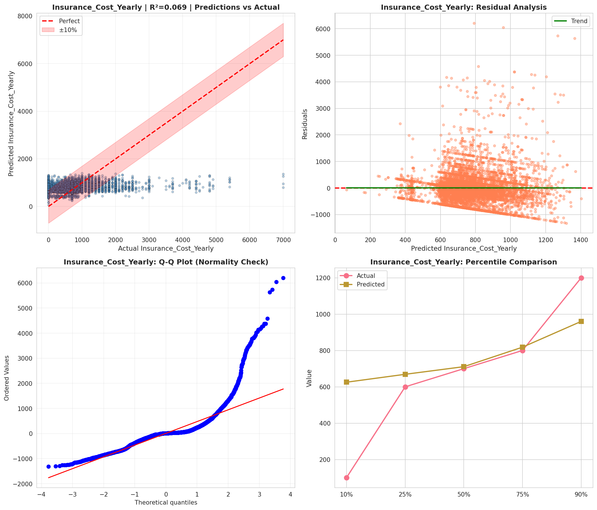
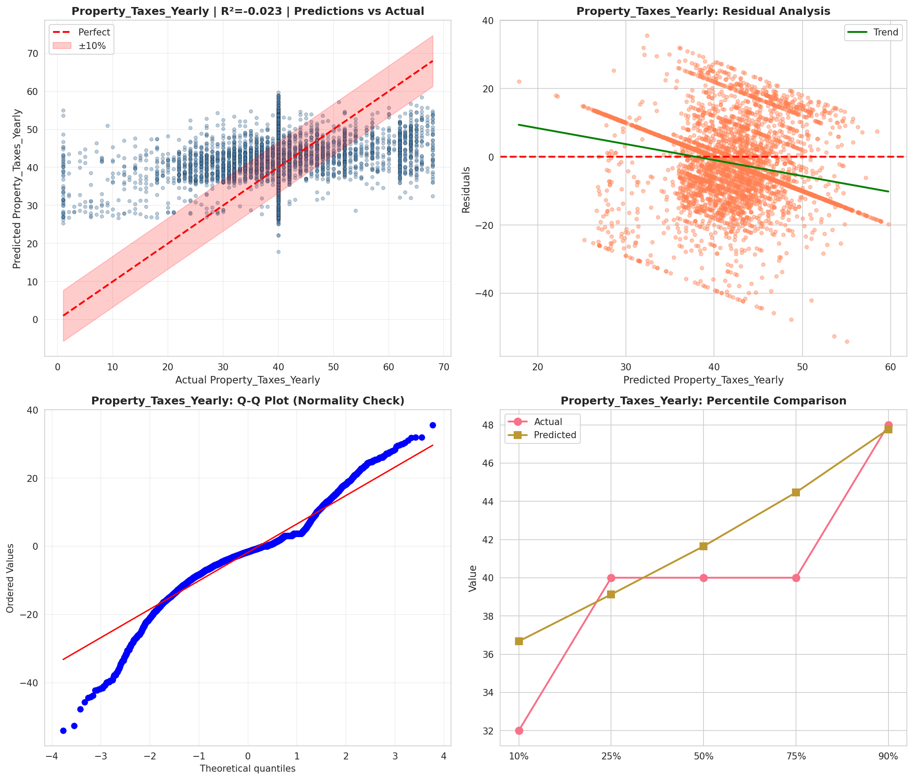
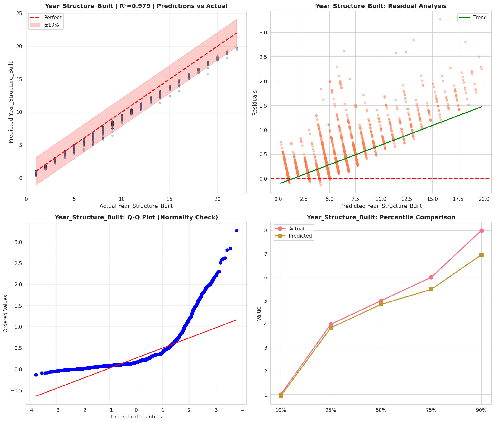
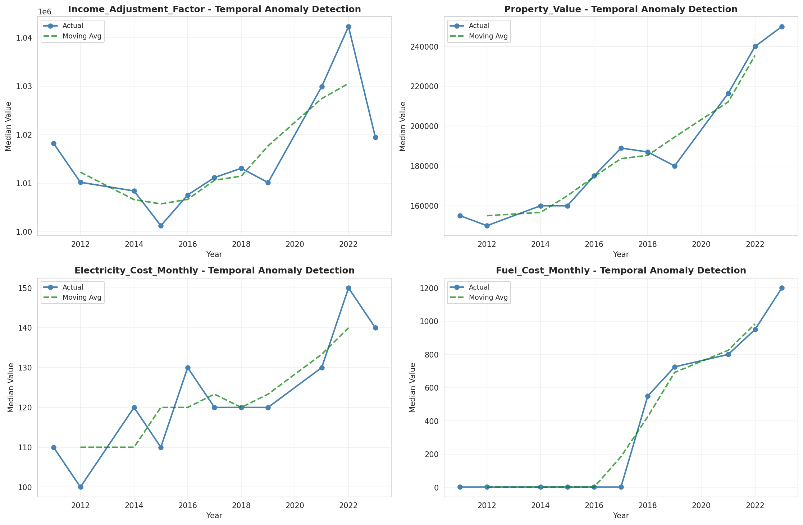
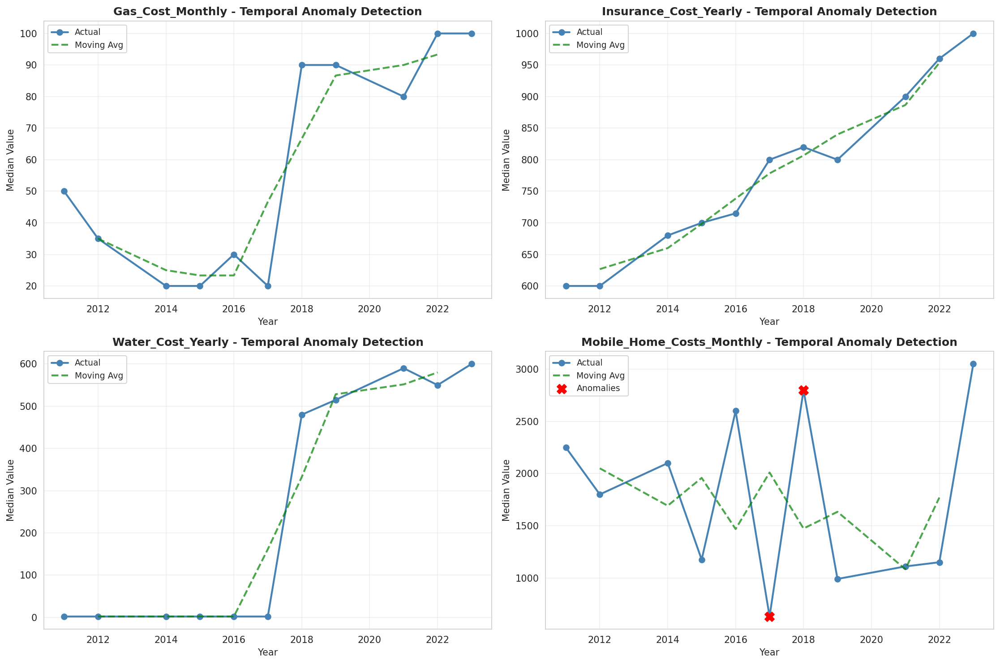
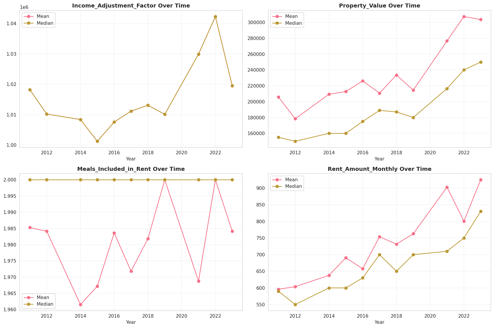
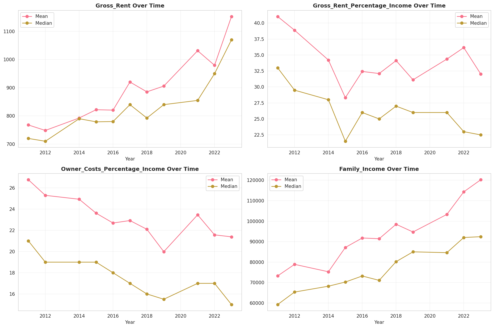
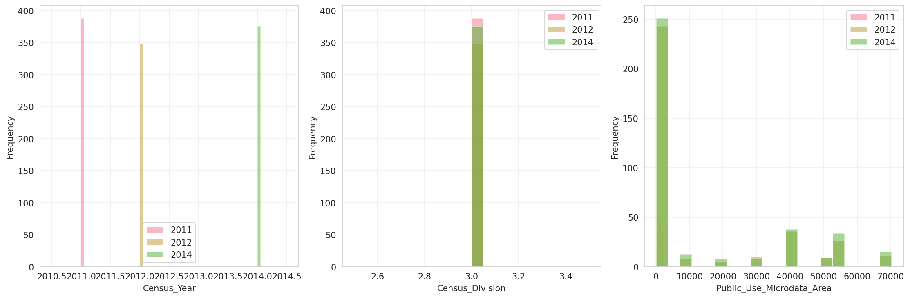
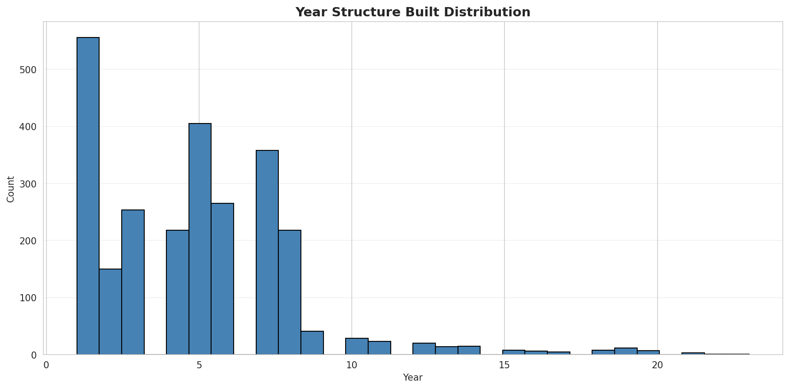
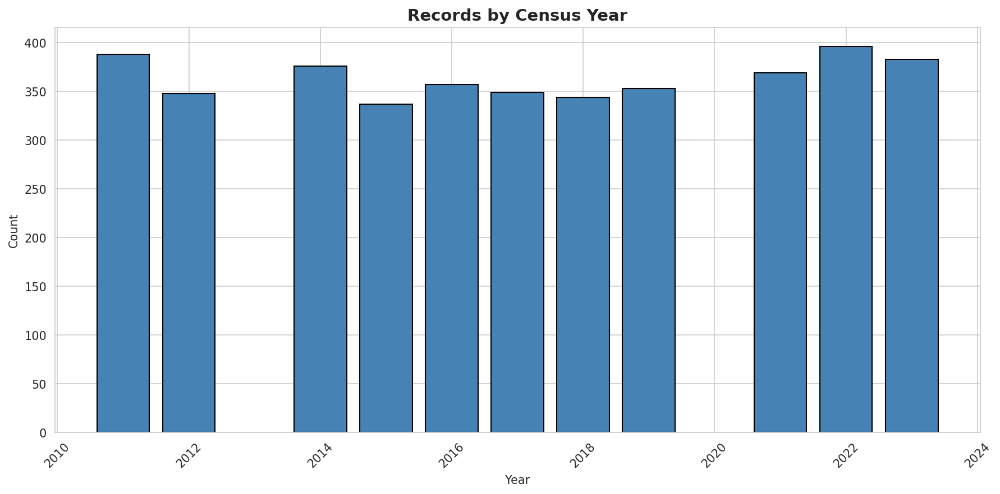
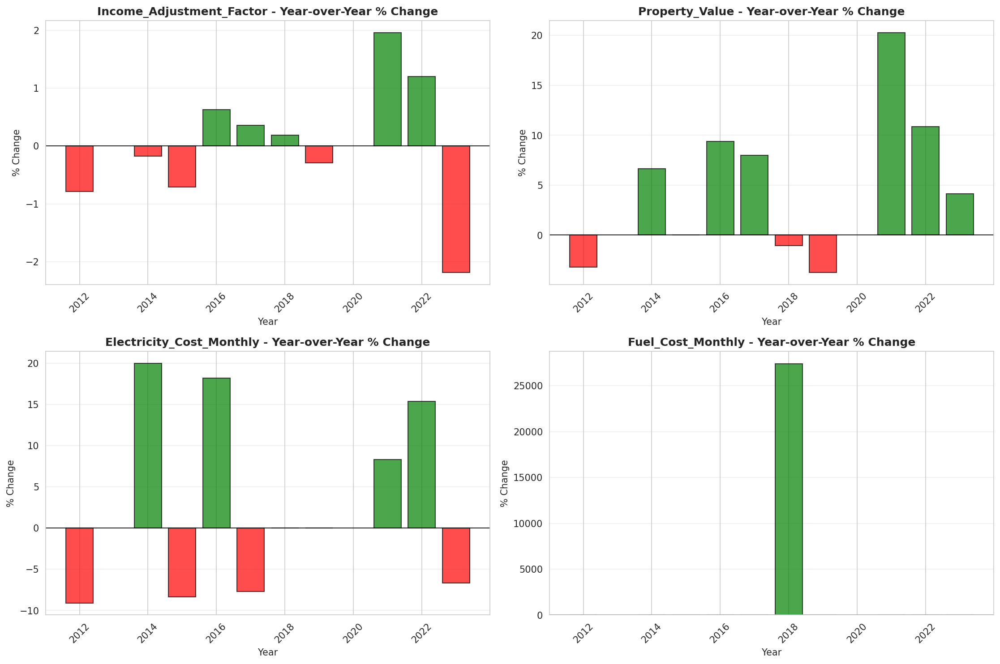
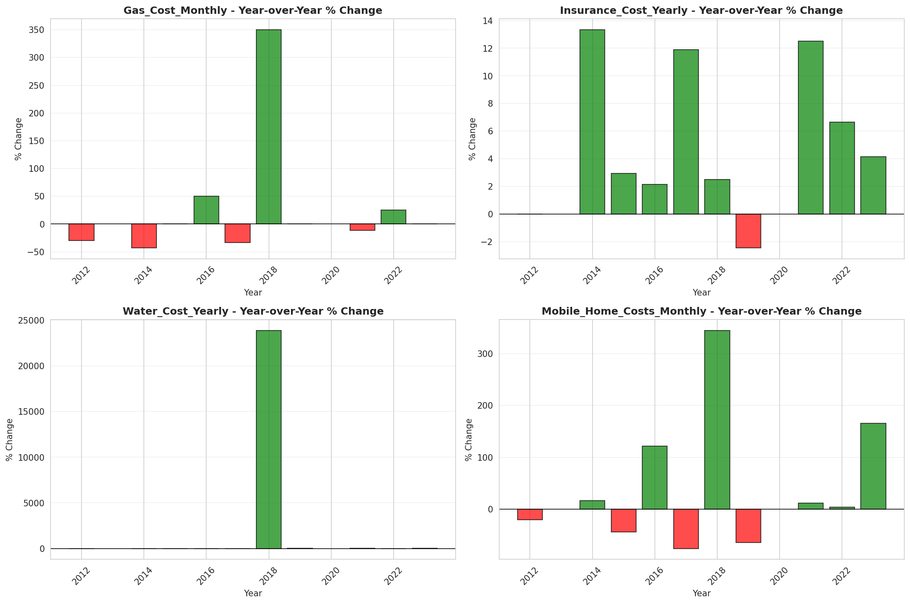
