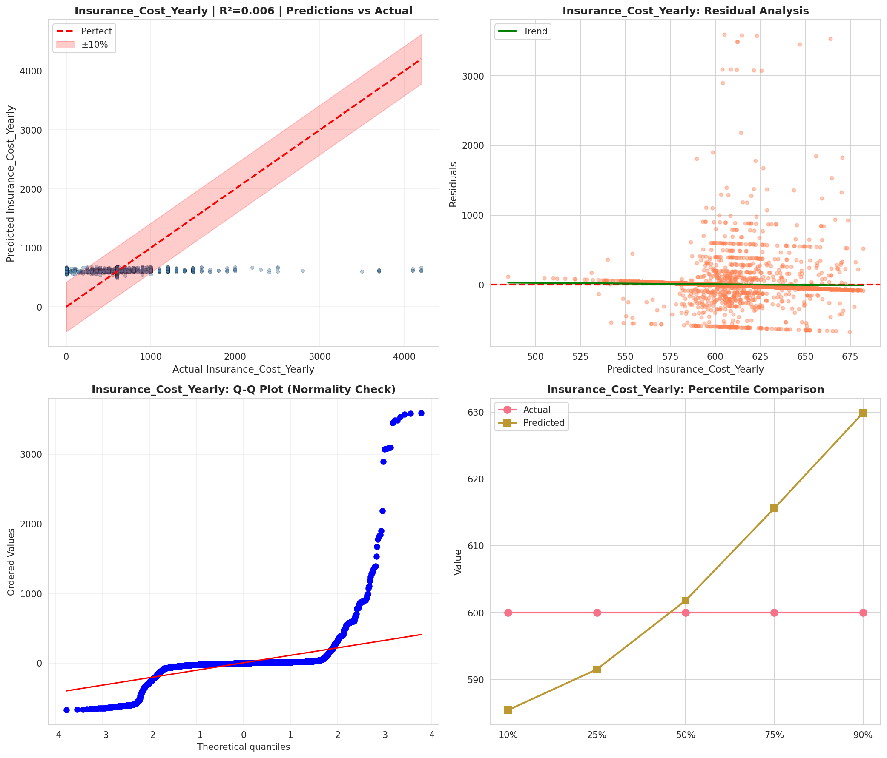
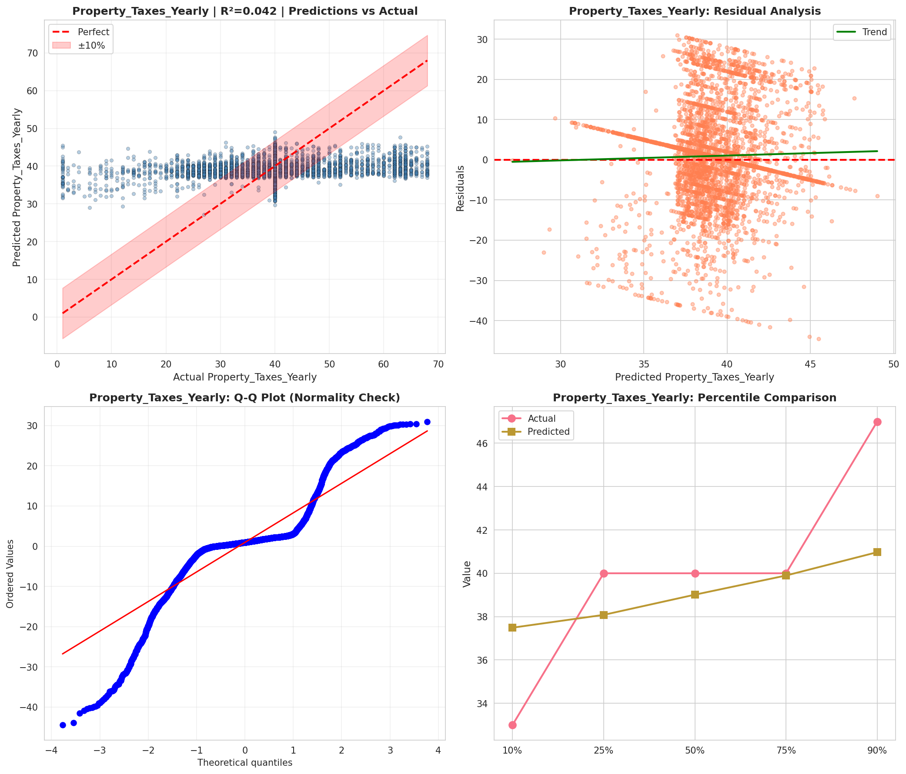
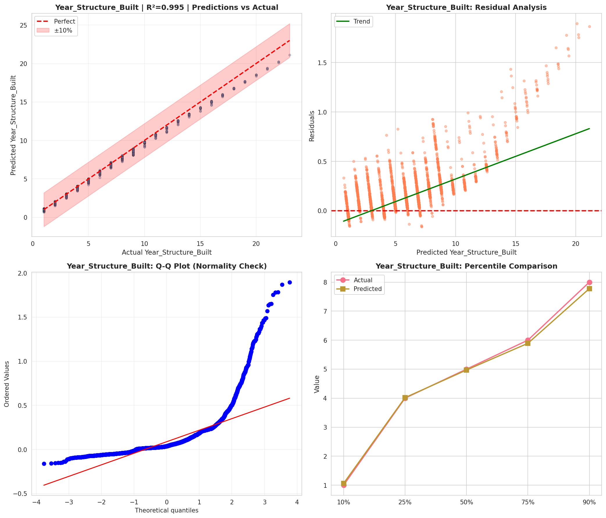
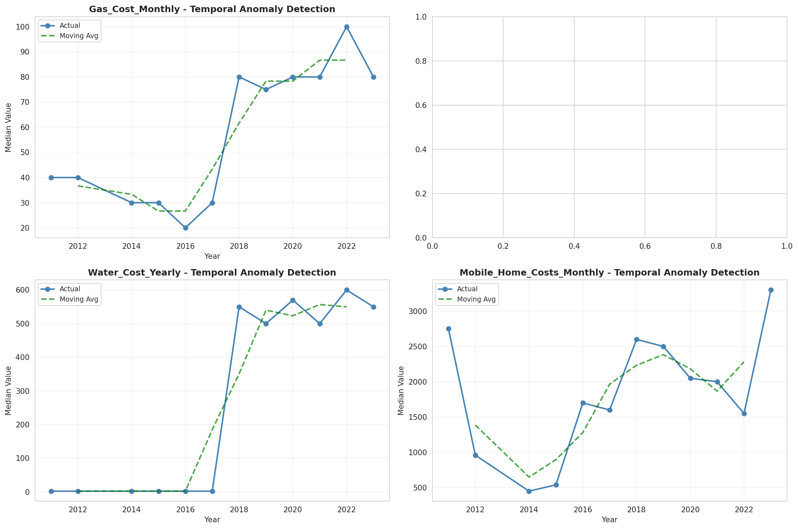
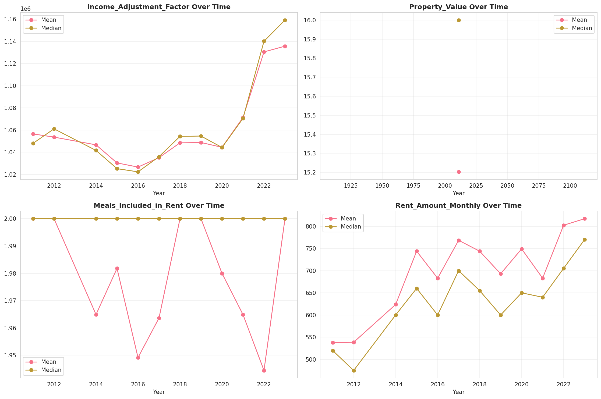
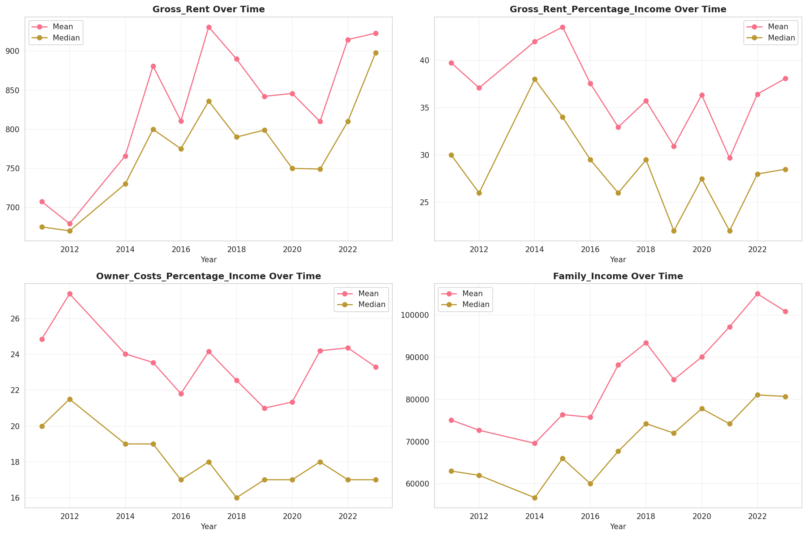
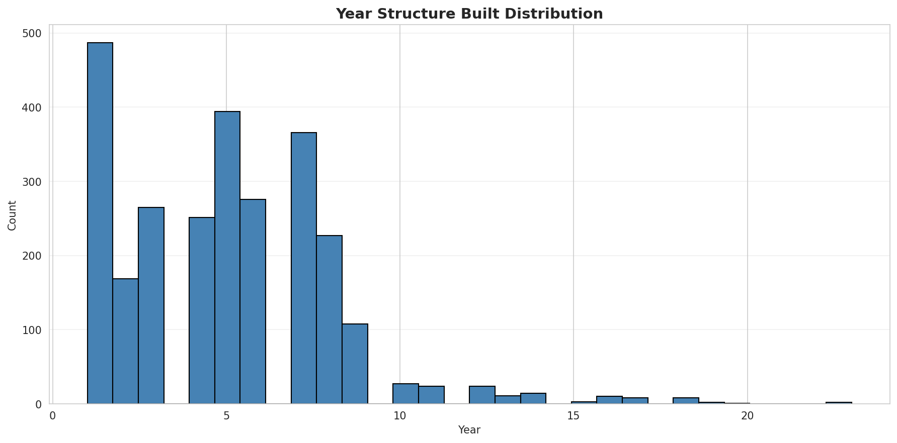
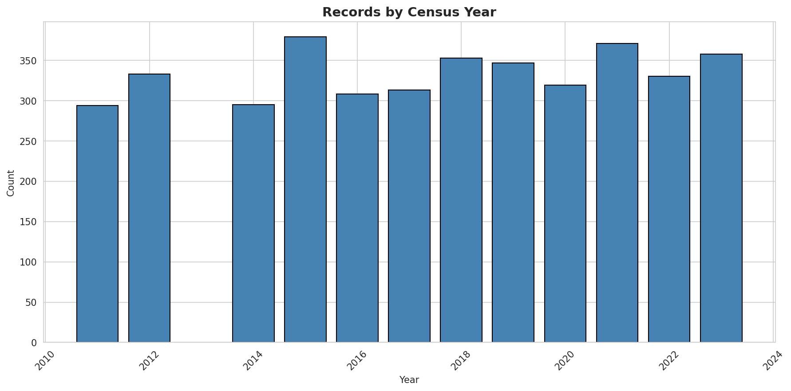
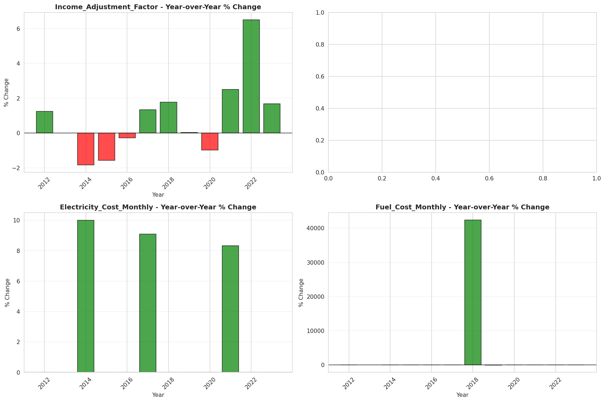
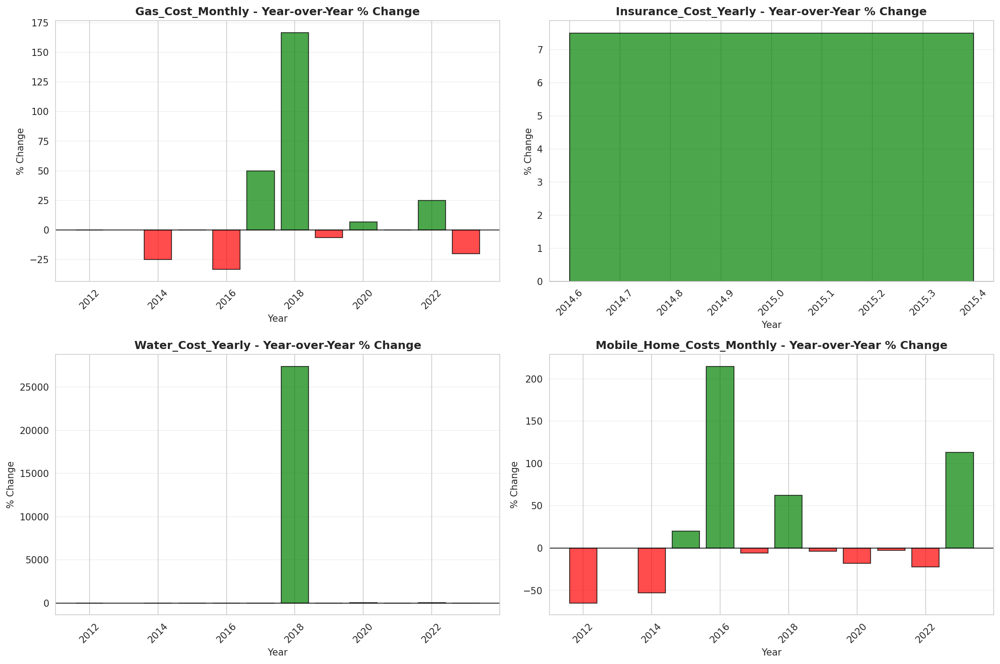

# Temporal Analysis

## Year Distribution

- 2011: 139,329 records

- 2012: 141,296 records

- 2014: 144,620 records

- 2015: 146,161 records

- 2016: 145,991 records

- 2017: 146,470 records

- 2018: 147,310 records

- 2019: 148,177 records

- 2020: 150,123 records

- 2021: 150,922 records

- 2022: 152,486 records

- 2023: 153,931 records

## Temporal Trends

- Census_Year: {np.int64(2011): {'mean': 2011.0, 'median': 2011.0, 'std': 0.0}, np.int64(2012): {'mean': 2012.0, 'median': 2012.0, 'std': 0.0}, np.int64(2014): {'mean': 2014.0, 'median': 2014.0, 'std': 0.0}, np.int64(2015): {'mean': 2015.0, 'median': 2015.0, 'std': 0.0}, np.int64(2016): {'mean': 2016.0, 'median': 2016.0, 'std': 0.0}, np.int64(2017): {'mean': 2017.0, 'median': 2017.0, 'std': 0.0}, np.int64(2018): {'mean': 2018.0, 'median': 2018.0, 'std': 0.0}, np.int64(2019): {'mean': 2019.0, 'median': 2019.0, 'std': 0.0}, np.int64(2020): {'mean': 2020.0, 'median': 2020.0, 'std': 0.0}, np.int64(2021): {'mean': 2021.0, 'median': 2021.0, 'std': 0.0}, np.int64(2022): {'mean': 2022.0, 'median': 2022.0, 'std': 0.0}, np.int64(2023): {'mean': 2023.0, 'median': 2023.0, 'std': 0.0}}

- Census_Division: {np.int64(2011): {'mean': 3.0, 'median': 3.0, 'std': 0.0}, np.int64(2012): {'mean': 3.0, 'median': 3.0, 'std': 0.0}, np.int64(2014): {'mean': 3.0, 'median': 3.0, 'std': 0.0}, np.int64(2015): {'mean': 3.0, 'median': 3.0, 'std': 0.0}, np.int64(2016): {'mean': 3.0, 'median': 3.0, 'std': 0.0}, np.int64(2017): {'mean': 3.0, 'median': 3.0, 'std': 0.0}, np.int64(2018): {'mean': 3.0, 'median': 3.0, 'std': 0.0}, np.int64(2019): {'mean': 3.0, 'median': 3.0, 'std': 0.0}, np.int64(2020): {'mean': 3.0, 'median': 3.0, 'std': 0.0}, np.int64(2021): {'mean': 3.0, 'median': 3.0, 'std': 0.0}, np.int64(2022): {'mean': 3.0, 'median': 3.0, 'std': 0.0}, np.int64(2023): {'mean': 3.0, 'median': 3.0, 'std': 0.0}}

- Public_Use_Microdata_Area: {np.int64(2011): {'mean': 1192.7866058035297, 'median': 1200.0, 'std': 685.5290951083248}, np.int64(2012): {'mean': None, 'median': None, 'std': None}, np.int64(2014): {'mean': None, 'median': None, 'std': None}, np.int64(2015): {'mean': None, 'median': None, 'std': None}, np.int64(2016): {'mean': 14911.799261598318, 'median': 1400.0, 'std': 22454.48920433683}, np.int64(2017): {'mean': 14917.711667918345, 'median': 1400.0, 'std': 22476.229231686906}, np.int64(2018): {'mean': 14906.02903400991, 'median': 1400.0, 'std': 22490.941734298674}, np.int64(2019): {'mean': 14853.916930427798, 'median': 1400.0, 'std': 22485.707972590502}, np.int64(2020): {'mean': 14819.14250314742, 'median': 1400.0, 'std': 22463.99473994094}, np.int64(2021): {'mean': 14828.041544638952, 'median': 1400.0, 'std': 22469.302733255237}, np.int64(2022): {'mean': None, 'median': None, 'std': None}, np.int64(2023): {'mean': 1483.2286414042655, 'median': 1500.0, 'std': 906.271122409562}}

- Census_Region: {np.int64(2011): {'mean': 2.0, 'median': 2.0, 'std': 0.0}, np.int64(2012): {'mean': 2.0, 'median': 2.0, 'std': 0.0}, np.int64(2014): {'mean': 2.0, 'median': 2.0, 'std': 0.0}, np.int64(2015): {'mean': 2.0, 'median': 2.0, 'std': 0.0}, np.int64(2016): {'mean': 2.0, 'median': 2.0, 'std': 0.0}, np.int64(2017): {'mean': 2.0, 'median': 2.0, 'std': 0.0}, np.int64(2018): {'mean': 2.0, 'median': 2.0, 'std': 0.0}, np.int64(2019): {'mean': 2.0, 'median': 2.0, 'std': 0.0}, np.int64(2020): {'mean': 2.0, 'median': 2.0, 'std': 0.0}, np.int64(2021): {'mean': 2.0, 'median': 2.0, 'std': 0.0}, np.int64(2022): {'mean': 2.0, 'median': 2.0, 'std': 0.0}, np.int64(2023): {'mean': 2.0, 'median': 2.0, 'std': 0.0}}

- State_Code: {np.int64(2011): {'mean': 55.0, 'median': 55.0, 'std': 0.0}, np.int64(2012): {'mean': 55.0, 'median': 55.0, 'std': 0.0}, np.int64(2014): {'mean': 55.0, 'median': 55.0, 'std': 0.0}, np.int64(2015): {'mean': 55.0, 'median': 55.0, 'std': 0.0}, np.int64(2016): {'mean': 55.0, 'median': 55.0, 'std': 0.0}, np.int64(2017): {'mean': 55.0, 'median': 55.0, 'std': 0.0}, np.int64(2018): {'mean': 55.0, 'median': 55.0, 'std': 0.0}, np.int64(2019): {'mean': 55.0, 'median': 55.0, 'std': 0.0}, np.int64(2020): {'mean': 55.0, 'median': 55.0, 'std': 0.0}, np.int64(2021): {'mean': 55.0, 'median': 55.0, 'std': 0.0}, np.int64(2022): {'mean': 55.0, 'median': 55.0, 'std': 0.0}, np.int64(2023): {'mean': None, 'median': None, 'std': None}}

- Housing_Adjustment_Factor: {np.int64(2011): {'mean': 1041169.4755865613, 'median': 1044592.0, 'std': 27586.18063898959}, np.int64(2012): {'mean': 1041370.9929085041, 'median': 1053092.0, 'std': 27463.985925505716}, np.int64(2014): {'mean': 1036788.2706264694, 'median': 1031130.0, 'std': 29608.084183602456}, np.int64(2015): {'mean': 1021036.9235090072, 'median': 1017534.0, 'std': 20326.011903556242}, np.int64(2016): {'mean': 1020396.9278722662, 'median': 1013801.0, 'std': 15771.795034853878}, np.int64(2017): {'mean': 1029207.7257322319, 'median': 1034680.0, 'std': 17971.299068904624}, np.int64(2018): {'mean': 1038282.8096531124, 'median': 1046406.0, 'std': 23472.34761665913}, np.int64(2019): {'mean': 1040826.5344149227, 'median': 1042936.0, 'std': 29181.75224742314}, np.int64(2020): {'mean': 1035053.2534055408, 'median': 1030827.0, 'std': 28621.42038189643}, np.int64(2021): {'mean': 1057859.0555518745, 'median': 1059761.0, 'std': 34994.108478318325}, np.int64(2022): {'mean': 1105570.5396560996, 'median': 1133141.0, 'std': 60865.8758355626}, np.int64(2023): {'mean': 1107603.6674678915, 'median': 1125501.0, 'std': 76686.45226648421}}

- Income_Adjustment_Factor: {np.int64(2011): {'mean': 1053813.4643039138, 'median': 1048026.0, 'std': 28402.89724132925}, np.int64(2012): {'mean': 1052628.0411051975, 'median': 1061121.0, 'std': 26373.522518683425}, np.int64(2014): {'mean': 1047655.7103305213, 'median': 1041654.0, 'std': 31044.919511402077}, np.int64(2015): {'mean': 1030481.637057765, 'median': 1025215.0, 'std': 25708.254823312036}, np.int64(2016): {'mean': 1027562.7997753286, 'median': 1022342.0, 'std': 17529.406436015735}, np.int64(2017): {'mean': 1036601.8543182905, 'median': 1035988.0, 'std': 16847.184019026445}, np.int64(2018): {'mean': 1046862.8514832666, 'median': 1054346.0, 'std': 20496.29882575922}, np.int64(2019): {'mean': 1049774.9264190798, 'median': 1054606.0, 'std': 26227.524816611363}, np.int64(2020): {'mean': 1045006.2587611492, 'median': 1044328.0, 'std': 29290.142542923277}, np.int64(2021): {'mean': 1072532.57174567, 'median': 1070512.0, 'std': 30403.627939173777}, np.int64(2022): {'mean': 1127344.4222945056, 'median': 1140108.0, 'std': 48966.2498426807}, np.int64(2023): {'mean': 1130940.235007893, 'median': 1159185.0, 'std': 69959.69091166879}}

- Housing_Unit_Weight: {np.int64(2011): {'mean': 18.73134092687093, 'median': 13.0, 'std': 18.46354322625803}, np.int64(2012): {'mean': 18.54547191711018, 'median': 13.0, 'std': 18.70087486865404}, np.int64(2014): {'mean': 18.224325819388742, 'median': 12.0, 'std': 19.284926312187054}, np.int64(2015): {'mean': 18.0734053543695, 'median': 11.0, 'std': 19.666056361413396}, np.int64(2016): {'mean': 18.1490434341843, 'median': 11.0, 'std': 19.388273361513953}, np.int64(2017): {'mean': 18.22005871509524, 'median': 12.0, 'std': 19.51174793138835}, np.int64(2018): {'mean': 18.20128979702668, 'median': 11.0, 'std': 19.65023802661694}, np.int64(2019): {'mean': 18.184515815544923, 'median': 11.0, 'std': 20.056764371640146}, np.int64(2020): {'mean': 18.048160508383127, 'median': 11.0, 'std': 23.8922332519355}, np.int64(2021): {'mean': 18.011747790249267, 'median': 10.0, 'std': 23.657937961263173}, np.int64(2022): {'mean': 17.932865968023293, 'median': 10.0, 'std': 23.960796881261192}, np.int64(2023): {'mean': 17.870019684144193, 'median': 10.0, 'std': 24.177232911723248}}

- Number_of_Persons: {np.int64(2011): {'mean': 2.104960202111549, 'median': 2.0, 'std': 1.43890933690857}, np.int64(2012): {'mean': 2.076003566979957, 'median': 2.0, 'std': 1.4388334429644645}, np.int64(2014): {'mean': 2.0272645553865303, 'median': 2.0, 'std': 1.43423468467939}, np.int64(2015): {'mean': 2.008798516704182, 'median': 2.0, 'std': 1.4320226496459636}, np.int64(2016): {'mean': 2.0051647019336807, 'median': 2.0, 'std': 1.4321662316844896}, np.int64(2017): {'mean': 2.002532941899365, 'median': 2.0, 'std': 1.4326368590176026}, np.int64(2018): {'mean': 1.9997827710270857, 'median': 2.0, 'std': 1.430839572687312}, np.int64(2019): {'mean': 1.9963017202399833, 'median': 2.0, 'std': 1.4286705685145284}, np.int64(2020): {'mean': 1.9772320030907988, 'median': 2.0, 'std': 1.4263846163676883}, np.int64(2021): {'mean': 1.9781078967943706, 'median': 2.0, 'std': 1.425547905008367}, np.int64(2022): {'mean': 1.976889681675695, 'median': 2.0, 'std': 1.4169250344864037}, np.int64(2023): {'mean': 1.9757878529990711, 'median': 2.0, 'std': 1.4121374389955577}}

- Housing_Unit_Type: {np.int64(2011): {'mean': 1.0979121360233692, 'median': 1.0, 'std': 0.3833970539665731}, np.int64(2012): {'mean': 1.1112204167138489, 'median': 1.0, 'std': 0.41044409581568764}, np.int64(2014): {'mean': 1.1331489420550407, 'median': 1.0, 'std': 0.4513405077179331}, np.int64(2015): {'mean': 1.1458323355751534, 'median': 1.0, 'std': 0.47259737014651454}, np.int64(2016): {'mean': 1.1414607749792796, 'median': 1.0, 'std': 0.4671300761925106}, np.int64(2017): {'mean': 1.1401447395371065, 'median': 1.0, 'std': 0.4661437540761423}, np.int64(2018): {'mean': 1.1404724730160885, 'median': 1.0, 'std': 0.46725962327776005}, np.int64(2019): {'mean': 1.1408315730511482, 'median': 1.0, 'std': 0.46803624065038674}, np.int64(2020): {'mean': None, 'median': None, 'std': None}, np.int64(2021): {'mean': None, 'median': None, 'std': None}, np.int64(2022): {'mean': None, 'median': None, 'std': None}, np.int64(2023): {'mean': None, 'median': None, 'std': None}}

- Number_of_Bedrooms: {np.int64(2011): {'mean': 2.8150322868987625, 'median': 3.0, 'std': 0.9728739614184762}, np.int64(2012): {'mean': None, 'median': None, 'std': None}, np.int64(2014): {'mean': None, 'median': None, 'std': None}, np.int64(2015): {'mean': None, 'median': None, 'std': None}, np.int64(2016): {'mean': None, 'median': None, 'std': None}, np.int64(2017): {'mean': None, 'median': None, 'std': None}, np.int64(2018): {'mean': None, 'median': None, 'std': None}, np.int64(2019): {'mean': None, 'median': None, 'std': None}, np.int64(2020): {'mean': None, 'median': None, 'std': None}, np.int64(2021): {'mean': None, 'median': None, 'std': None}, np.int64(2022): {'mean': None, 'median': None, 'std': None}, np.int64(2023): {'mean': None, 'median': None, 'std': None}}

- Number_of_Rooms: {np.int64(2011): {'mean': 5.955630557738838, 'median': 6.0, 'std': 1.8742052494908215}, np.int64(2012): {'mean': None, 'median': None, 'std': None}, np.int64(2014): {'mean': None, 'median': None, 'std': None}, np.int64(2015): {'mean': None, 'median': None, 'std': None}, np.int64(2016): {'mean': None, 'median': None, 'std': None}, np.int64(2017): {'mean': None, 'median': None, 'std': None}, np.int64(2018): {'mean': None, 'median': None, 'std': None}, np.int64(2019): {'mean': None, 'median': None, 'std': None}, np.int64(2020): {'mean': None, 'median': None, 'std': None}, np.int64(2021): {'mean': None, 'median': None, 'std': None}, np.int64(2022): {'mean': None, 'median': None, 'std': None}, np.int64(2023): {'mean': None, 'median': None, 'std': None}}

- Building_Type: {np.int64(2011): {'mean': 2.597885554887728, 'median': 2.0, 'std': 1.633980805765644}, np.int64(2012): {'mean': 2.6000659008881293, 'median': 2.0, 'std': 1.6366571779735009}, np.int64(2014): {'mean': 2.5996979081276375, 'median': 2.0, 'std': 1.6397610193476027}, np.int64(2015): {'mean': 2.594608715405293, 'median': 2.0, 'std': 1.6339515551253827}, np.int64(2016): {'mean': 2.596410930348484, 'median': 2.0, 'std': 1.635831640191752}, np.int64(2017): {'mean': 2.603536017920635, 'median': 2.0, 'std': 1.6477832933010603}, np.int64(2018): {'mean': 2.6053734912746163, 'median': 2.0, 'std': 1.6522770816122818}, np.int64(2019): {'mean': 2.608014921158619, 'median': 2.0, 'std': 1.66017912969512}, np.int64(2020): {'mean': 2.604546898197047, 'median': 2.0, 'std': 1.6591193608584898}, np.int64(2021): {'mean': 2.6043731735612434, 'median': 2.0, 'std': 1.6599765668808497}, np.int64(2022): {'mean': 2.6004308298952132, 'median': 2.0, 'std': 1.6582881201950361}, np.int64(2023): {'mean': 2.6002192966531847, 'median': 2.0, 'std': 1.660148474565346}}

- Year_Structure_Built: {np.int64(2011): {'mean': 5.568542234962319, 'median': 5.0, 'std': 2.524993642653483}, np.int64(2012): {'mean': 4.52923777193695, 'median': 5.0, 'std': 2.696712540703868}, np.int64(2014): {'mean': 4.652450132070316, 'median': 5.0, 'std': 2.8446285008797303}, np.int64(2015): {'mean': 4.712384053307083, 'median': 5.0, 'std': 2.9258685716864488}, np.int64(2016): {'mean': 4.802638932946632, 'median': 5.0, 'std': 3.0363539245157027}, np.int64(2017): {'mean': 4.889138621824988, 'median': 5.0, 'std': 3.184613813109948}, np.int64(2018): {'mean': 4.978132356787863, 'median': 5.0, 'std': 3.3432095548468315}, np.int64(2019): {'mean': 5.084934682776762, 'median': 5.0, 'std': 3.538278496104722}, np.int64(2020): {'mean': 5.199011736551714, 'median': 5.0, 'std': 3.7501714320239294}, np.int64(2021): {'mean': None, 'median': None, 'std': None}, np.int64(2022): {'mean': None, 'median': None, 'std': None}, np.int64(2023): {'mean': None, 'median': None, 'std': None}}

- Bathtub_or_Shower: {np.int64(2011): {'mean': None, 'median': None, 'std': None}, np.int64(2012): {'mean': 1.0129656165947631, 'median': 1.0, 'std': 0.11312651080887164}, np.int64(2014): {'mean': 1.0135637732641103, 'median': 1.0, 'std': 0.1156715128097731}, np.int64(2015): {'mean': 1.014038541627229, 'median': 1.0, 'std': 0.11765018395627828}, np.int64(2016): {'mean': 1.0140481261612362, 'median': 1.0, 'std': 0.11768976559122891}, np.int64(2017): {'mean': 1.013883981929024, 'median': 1.0, 'std': 0.11700991365301003}, np.int64(2018): {'mean': 1.0139232465154515, 'median': 1.0, 'std': 0.11717291636780917}, np.int64(2019): {'mean': 1.0136950673978629, 'median': 1.0, 'std': 0.11622225647420473}, np.int64(2020): {'mean': 1.0140631809083456, 'median': 1.0, 'std': 0.11775190131572742}, np.int64(2021): {'mean': 1.0137083865662218, 'median': 1.0, 'std': 0.11627796858514194}, np.int64(2022): {'mean': 1.013070940888678, 'median': 1.0, 'std': 0.11357898393945352}, np.int64(2023): {'mean': 1.0124389128114266, 'median': 1.0, 'std': 0.11083445069787502}}

- Refrigerator: {np.int64(2011): {'mean': None, 'median': None, 'std': None}, np.int64(2012): {'mean': 1.0125594832144307, 'median': 1.0, 'std': 0.1113635381522335}, np.int64(2014): {'mean': 1.0134802805355678, 'median': 1.0, 'std': 0.1153198313925452}, np.int64(2015): {'mean': 1.0139476772801272, 'median': 1.0, 'std': 0.117274224442441}, np.int64(2016): {'mean': 1.0140103623812329, 'median': 1.0, 'std': 0.11753372478690281}, np.int64(2017): {'mean': 1.0142899023535867, 'median': 1.0, 'std': 0.11868364220883491}, np.int64(2018): {'mean': 1.014274503942304, 'median': 1.0, 'std': 0.11862060377043018}, np.int64(2019): {'mean': 1.0141557804627936, 'median': 1.0, 'std': 0.11813339089172686}, np.int64(2020): {'mean': 1.0147057737334644, 'median': 1.0, 'std': 0.1203728415154677}, np.int64(2021): {'mean': 1.0145013730413968, 'median': 1.0, 'std': 0.1195457575737993}, np.int64(2022): {'mean': 1.0138011610500566, 'median': 1.0, 'std': 0.11666528357848369}, np.int64(2023): {'mean': 1.0133465976342102, 'median': 1.0, 'std': 0.11475435324652719}}

- Hot_and_Cold_Running_Water: {np.int64(2011): {'mean': None, 'median': None, 'std': None}, np.int64(2012): {'mean': 1.0140001072805156, 'median': 1.0, 'std': 0.11749131907016568}, np.int64(2014): {'mean': 1.014945198409084, 'median': 1.0, 'std': 0.12133404797029734}, np.int64(2015): {'mean': 1.015545375383334, 'median': 1.0, 'std': 0.12370866003877068}, np.int64(2016): {'mean': 1.0159136568934004, 'median': 1.0, 'std': 0.12514204208756904}, np.int64(2017): {'mean': 1.0160639249498238, 'median': 1.0, 'std': 0.12572189180646787}, np.int64(2018): {'mean': 1.0163745749411457, 'median': 1.0, 'std': 0.12691165671476493}, np.int64(2019): {'mean': 1.0163255903815, 'median': 1.0, 'std': 0.12672483897675155}, np.int64(2020): {'mean': 1.0170102445545797, 'median': 1.0, 'std': 0.1293097816806784}, np.int64(2021): {'mean': 1.0164618118272464, 'median': 1.0, 'std': 0.12724362247301482}, np.int64(2022): {'mean': 1.0156632224615723, 'median': 1.0, 'std': 0.1241692333431474}, np.int64(2023): {'mean': 1.0147480630005883, 'median': 1.0, 'std': 0.12054320035745837}}

- Running_Water: {np.int64(2011): {'mean': None, 'median': None, 'std': None}, np.int64(2012): {'mean': None, 'median': None, 'std': None}, np.int64(2014): {'mean': 9.0, 'median': 9.0, 'std': 0.0}, np.int64(2015): {'mean': 9.0, 'median': 9.0, 'std': 0.0}, np.int64(2016): {'mean': 9.0, 'median': 9.0, 'std': 0.0}, np.int64(2017): {'mean': 9.0, 'median': 9.0, 'std': 0.0}, np.int64(2018): {'mean': 9.0, 'median': 9.0, 'std': 0.0}, np.int64(2019): {'mean': 9.0, 'median': 9.0, 'std': 0.0}, np.int64(2020): {'mean': 9.0, 'median': 9.0, 'std': 0.0}, np.int64(2021): {'mean': 9.0, 'median': 9.0, 'std': 0.0}, np.int64(2022): {'mean': 9.0, 'median': 9.0, 'std': 0.0}, np.int64(2023): {'mean': 9.0, 'median': 9.0, 'std': 0.0}}

- Sink_with_Faucet: {np.int64(2011): {'mean': None, 'median': None, 'std': None}, np.int64(2012): {'mean': 1.0106360968283281, 'median': 1.0, 'std': 0.10258192291826984}, np.int64(2014): {'mean': 1.0108692352066067, 'median': 1.0, 'std': 0.10368788037532041}, np.int64(2015): {'mean': 1.0111535986067466, 'median': 1.0, 'std': 0.10502037592243102}, np.int64(2016): {'mean': 1.0109288379329617, 'median': 1.0, 'std': 0.1039686494851317}, np.int64(2017): {'mean': 1.0108170276101058, 'median': 1.0, 'std': 0.10344128748676695}, np.int64(2018): {'mean': 1.0108665595456074, 'median': 1.0, 'std': 0.10367525143092236}, np.int64(2019): {'mean': 1.0108118953141023, 'median': 1.0, 'std': 0.10341700879159348}, np.int64(2020): {'mean': 1.0110939588888315, 'median': 1.0, 'std': 0.10474236964051234}, np.int64(2021): {'mean': 1.0108815366315698, 'median': 1.0, 'std': 0.1037458809814037}, np.int64(2022): {'mean': 1.0103910328964183, 'median': 1.0, 'std': 0.10140579086662005}, np.int64(2023): {'mean': 1.0097376427788227, 'median': 1.0, 'std': 0.0981982235765091}}

- Stove_or_Range: {np.int64(2011): {'mean': None, 'median': None, 'std': None}, np.int64(2012): {'mean': 1.012904313443015, 'median': 1.0, 'std': 0.11286226006366294}, np.int64(2014): {'mean': 1.0138446124419347, 'median': 1.0, 'std': 0.11684623561864792}, np.int64(2015): {'mean': 1.0142657024949835, 'median': 1.0, 'std': 0.11858456352932518}, np.int64(2016): {'mean': 1.014236945061253, 'median': 1.0, 'std': 0.11846670610207727}, np.int64(2017): {'mean': 1.0146732716434514, 'median': 1.0, 'std': 0.1202417374489032}, np.int64(2018): {'mean': 1.0145435521841486, 'median': 1.0, 'std': 0.11971693441693647}, np.int64(2019): {'mean': 1.0145198924012069, 'median': 1.0, 'std': 0.11962094906518321}, np.int64(2020): {'mean': 1.0147648627288774, 'median': 1.0, 'std': 0.12061081627780379}, np.int64(2021): {'mean': 1.014523400443485, 'median': 1.0, 'std': 0.11963518033031893}, np.int64(2022): {'mean': 1.0138157654532842, 'median': 1.0, 'std': 0.11672613062482975}, np.int64(2023): {'mean': 1.013419212420033, 'median': 1.0, 'std': 0.1150618672474423}}

- Telephone_Service: {np.int64(2011): {'mean': 1.0204315496400924, 'median': 1.0, 'std': 0.14147180393384004}, np.int64(2012): {'mean': 1.0187455488859498, 'median': 1.0, 'std': 0.1356256216045327}, np.int64(2014): {'mean': 1.0220221747533313, 'median': 1.0, 'std': 0.14675619624385414}, np.int64(2015): {'mean': 1.0887860370097229, 'median': 1.0, 'std': 0.6892224551176073}, np.int64(2016): {'mean': 1.0901785109409932, 'median': 1.0, 'std': 0.6897635109653937}, np.int64(2017): {'mean': 1.0881549435909543, 'median': 1.0, 'std': 0.6873265982046759}, np.int64(2018): {'mean': 1.086369159857532, 'median': 1.0, 'std': 0.6845109126634897}, np.int64(2019): {'mean': 1.0827332745746927, 'median': 1.0, 'std': 0.6800627746328513}, np.int64(2020): {'mean': 1.0156519575315195, 'median': 1.0, 'std': 0.12412534613479224}, np.int64(2021): {'mean': 1.01172106336777, 'median': 1.0, 'std': 0.1076279486072937}, np.int64(2022): {'mean': 1.0105459309469367, 'median': 1.0, 'std': 0.10215086489311477}, np.int64(2023): {'mean': 1.0094571971282316, 'median': 1.0, 'std': 0.09678757125474372}}

- Lot_Acreage: {np.int64(2011): {'mean': 1.6557467972322994, 'median': 1.0, 'std': 0.7668736469958441}, np.int64(2012): {'mean': 1.6585877586456375, 'median': 1.0, 'std': 0.7676773774584852}, np.int64(2014): {'mean': 1.6680691075105183, 'median': 1.0, 'std': 0.7686836324067733}, np.int64(2015): {'mean': 1.6738370433789955, 'median': 1.0, 'std': 0.7685361553736412}, np.int64(2016): {'mean': 1.674123423407397, 'median': 1.0, 'std': 0.7665212991519604}, np.int64(2017): {'mean': 1.674983835109257, 'median': 1.0, 'std': 0.7652380446952315}, np.int64(2018): {'mean': 1.6761963460268545, 'median': 1.0, 'std': 0.764363558350482}, np.int64(2019): {'mean': 1.680819796887711, 'median': 1.0, 'std': 0.7645053650495875}, np.int64(2020): {'mean': 1.6846142498893641, 'median': 1.0, 'std': 0.7658077057843908}, np.int64(2021): {'mean': 1.6860002068680182, 'median': 2.0, 'std': 0.7641061019480364}, np.int64(2022): {'mean': 1.6865275888908846, 'median': 2.0, 'std': 0.7632914534667495}, np.int64(2023): {'mean': 1.688448144058439, 'median': 2.0, 'std': 0.7631525847722037}}

- Agricultural_Sales: {np.int64(2011): {'mean': 1.516252349222621, 'median': 1.0, 'std': 1.39085182025296}, np.int64(2012): {'mean': 1.5126293819482899, 'median': 1.0, 'std': 1.3887055845545582}, np.int64(2014): {'mean': 1.4949068531703527, 'median': 1.0, 'std': 1.3692566570921385}, np.int64(2015): {'mean': 1.4871970736168267, 'median': 1.0, 'std': 1.362205092630313}, np.int64(2016): {'mean': 1.4780268686994142, 'median': 1.0, 'std': 1.3485931316194277}, np.int64(2017): {'mean': 1.4709169731462266, 'median': 1.0, 'std': 1.3378111634957306}, np.int64(2018): {'mean': 1.456495197786098, 'median': 1.0, 'std': 1.315276053325111}, np.int64(2019): {'mean': 1.4512090069515395, 'median': 1.0, 'std': 1.30494030936403}, np.int64(2020): {'mean': 1.4476980802445851, 'median': 1.0, 'std': 1.2976128461598406}, np.int64(2021): {'mean': 1.4292479599225063, 'median': 1.0, 'std': 1.2727418205061771}, np.int64(2022): {'mean': 1.4184488633082446, 'median': 1.0, 'std': 1.257439236855802}, np.int64(2023): {'mean': 1.4198825979928045, 'median': 1.0, 'std': 1.260720832462281}}

- Business_On_Property: {np.int64(2011): {'mean': 1.9738414118545593, 'median': 2.0, 'std': 0.15960748113504764}, np.int64(2012): {'mean': 1.9747323108088555, 'median': 2.0, 'std': 0.15693774501977495}, np.int64(2014): {'mean': 1.9753558320651687, 'median': 2.0, 'std': 0.15503885995219865}, np.int64(2015): {'mean': 1.9752336615296804, 'median': 2.0, 'std': 0.15541294140555886}, np.int64(2016): {'mean': 3.3906658602102717, 'median': 2.0, 'std': 2.8209996930935812}, np.int64(2017): {'mean': 4.806951345893232, 'median': 2.0, 'std': 3.4478954448575045}, np.int64(2018): {'mean': 6.214924058991856, 'median': 9.0, 'std': 3.4379907050555962}, np.int64(2019): {'mean': 7.61231969629377, 'median': 9.0, 'std': 2.7977422807795715}, np.int64(2020): {'mean': None, 'median': None, 'std': None}, np.int64(2021): {'mean': None, 'median': None, 'std': None}, np.int64(2022): {'mean': None, 'median': None, 'std': None}, np.int64(2023): {'mean': None, 'median': None, 'std': None}}

- Tenure: {np.int64(2011): {'mean': 1.7250950699443162, 'median': 1.0, 'std': 0.8335090884048146}, np.int64(2012): {'mean': 1.7380540577203514, 'median': 2.0, 'std': 0.8352199068937534}, np.int64(2014): {'mean': 1.7616553080391957, 'median': 2.0, 'std': 0.8364397577466178}, np.int64(2015): {'mean': 1.7692359857250635, 'median': 2.0, 'std': 0.8360382662905063}, np.int64(2016): {'mean': 1.7742361628615948, 'median': 2.0, 'std': 0.8349793488122423}, np.int64(2017): {'mean': 1.7767415976660652, 'median': 2.0, 'std': 0.8351503002690119}, np.int64(2018): {'mean': 1.7763000209511837, 'median': 2.0, 'std': 0.8334132173913578}, np.int64(2019): {'mean': 1.7741340029601051, 'median': 2.0, 'std': 0.829709514020966}, np.int64(2020): {'mean': 1.7728599867286, 'median': 2.0, 'std': 0.8252338696863325}, np.int64(2021): {'mean': 1.772043824439034, 'median': 2.0, 'std': 0.8205785440972334}, np.int64(2022): {'mean': 1.7688683467463036, 'median': 2.0, 'std': 0.8145522037959128}, np.int64(2023): {'mean': 1.7695985319210585, 'median': 2.0, 'std': 0.8087206070982642}}

- Vacancy_Status: {np.int64(2011): {'mean': 4.824586327929133, 'median': 5.0, 'std': 1.48824076295418}, np.int64(2012): {'mean': 4.8487769898812845, 'median': 5.0, 'std': 1.4609111037743026}, np.int64(2014): {'mean': 4.877831010452962, 'median': 5.0, 'std': 1.4173769795080509}, np.int64(2015): {'mean': 4.886847332576617, 'median': 5.0, 'std': 1.4094024077222265}, np.int64(2016): {'mean': 4.88773229006567, 'median': 5.0, 'std': 1.4019724851179647}, np.int64(2017): {'mean': 4.898912215062704, 'median': 5.0, 'std': 1.4049601542554484}, np.int64(2018): {'mean': 4.910635359116022, 'median': 5.0, 'std': 1.4055517813719407}, np.int64(2019): {'mean': 4.926544590438915, 'median': 5.0, 'std': 1.4106455626317216}, np.int64(2020): {'mean': 4.943758850900263, 'median': 5.0, 'std': 1.410467412670237}, np.int64(2021): {'mean': 4.959980845532905, 'median': 5.0, 'std': 1.4105707512685963}, np.int64(2022): {'mean': 4.9863384089938805, 'median': 5.0, 'std': 1.403084325853422}, np.int64(2023): {'mean': 5.005939564926869, 'median': 5.0, 'std': 1.403661173235558}}

- Property_Value: {np.int64(2011): {'mean': 15.739161934390948, 'median': 16.0, 'std': 4.123609698346386}}

- Vehicles_Available: {np.int64(2011): {'mean': 1.9928442890126308, 'median': 2.0, 'std': 1.0765160097546635}, np.int64(2012): {'mean': 1.982441414860786, 'median': 2.0, 'std': 1.0772852925452816}, np.int64(2014): {'mean': 1.97432441596311, 'median': 2.0, 'std': 1.0748225344919144}, np.int64(2015): {'mean': 1.980401630936941, 'median': 2.0, 'std': 1.0784322625033762}, np.int64(2016): {'mean': 1.9914555246934489, 'median': 2.0, 'std': 1.0838028853556259}, np.int64(2017): {'mean': 2.003322147085111, 'median': 2.0, 'std': 1.0882177661857146}, np.int64(2018): {'mean': 2.0173559606117744, 'median': 2.0, 'std': 1.0954307927089129}, np.int64(2019): {'mean': 2.0305240051219795, 'median': 2.0, 'std': 1.1012929603361232}, np.int64(2020): {'mean': 2.039830789648308, 'median': 2.0, 'std': 1.1033517657070082}, np.int64(2021): {'mean': 2.043273343423044, 'median': 2.0, 'std': 1.105012001409636}, np.int64(2022): {'mean': 2.0409794045129424, 'median': 2.0, 'std': 1.105536955343201}, np.int64(2023): {'mean': 2.036106371333827, 'median': 2.0, 'std': 1.104971656927705}}

- Condo_Fee_Monthly: {np.int64(2011): {'mean': 186.6094517958412, 'median': 150.0, 'std': 142.6243672113222}, np.int64(2012): {'mean': 190.64098728496634, 'median': 160.0, 'std': 137.36810134330392}, np.int64(2014): {'mean': 204.00377073906486, 'median': 170.0, 'std': 135.5222653542558}, np.int64(2015): {'mean': 209.02595419847327, 'median': 180.0, 'std': 131.67291767479657}, np.int64(2016): {'mean': 215.3300898203593, 'median': 190.0, 'std': 133.7182407151489}, np.int64(2017): {'mean': 221.53602414183328, 'median': 190.0, 'std': 136.78065805790183}, np.int64(2018): {'mean': 226.6362951807229, 'median': 200.0, 'std': 138.83637032664797}, np.int64(2019): {'mean': 233.75496440614464, 'median': 200.0, 'std': 145.57773513328647}, np.int64(2020): {'mean': 241.93441387108933, 'median': 210.0, 'std': 152.63171572136434}, np.int64(2021): {'mean': 252.6305709023941, 'median': 220.0, 'std': 165.07670049378763}, np.int64(2022): {'mean': 264.6277269528501, 'median': 230.0, 'std': 169.76425683478874}, np.int64(2023): {'mean': 274.9831092726646, 'median': 240.0, 'std': 172.1617004269976}}

- Electricity_Cost_Monthly: {np.int64(2011): {'mean': 114.81238965095748, 'median': 100.0, 'std': 76.64698741674063}, np.int64(2012): {'mean': 117.55873774883847, 'median': 100.0, 'std': 77.2943440874433}, np.int64(2014): {'mean': 125.8061743464551, 'median': 110.0, 'std': 81.31071361408328}, np.int64(2015): {'mean': 128.99710941009926, 'median': 110.0, 'std': 83.10339789938969}, np.int64(2016): {'mean': 130.66674852652258, 'median': 120.0, 'std': 83.4812901300627}, np.int64(2017): {'mean': 132.72005430108433, 'median': 120.0, 'std': 83.8515400796945}, np.int64(2018): {'mean': 138.80620600238424, 'median': 120.0, 'std': 81.42498148991163}, np.int64(2019): {'mean': 138.48123300090663, 'median': 120.0, 'std': 79.95785187998189}, np.int64(2020): {'mean': 139.77364568081993, 'median': 120.0, 'std': 80.775921709873}, np.int64(2021): {'mean': 142.2816160650251, 'median': 130.0, 'std': 83.74489664904314}, np.int64(2022): {'mean': 150.06256541850965, 'median': 130.0, 'std': 124.21497063235267}, np.int64(2023): {'mean': 158.49019378745137, 'median': 130.0, 'std': 160.76536154546557}}

- Fuel_Cost_Monthly: {np.int64(2011): {'mean': 230.247037552628, 'median': 2.0, 'std': 583.1840518097266}, np.int64(2012): {'mean': 228.96938481364668, 'median': 2.0, 'std': 584.4894364591787}, np.int64(2014): {'mean': 193.84206421862814, 'median': 2.0, 'std': 533.58941378619}, np.int64(2015): {'mean': 180.91805474319526, 'median': 2.0, 'std': 519.7288243251737}, np.int64(2016): {'mean': 159.27064562021542, 'median': 2.0, 'std': 481.8106089770268}, np.int64(2017): {'mean': 140.24712895664345, 'median': 2.0, 'std': 447.0209649584299}, np.int64(2018): {'mean': 928.9491207502931, 'median': 800.0, 'std': 770.1809346694487}, np.int64(2019): {'mean': 879.979094918736, 'median': 750.0, 'std': 720.1091453344914}, np.int64(2020): {'mean': 849.6397555074494, 'median': 700.0, 'std': 700.1134391976003}, np.int64(2021): {'mean': 863.2730510486743, 'median': 700.0, 'std': 722.1094526295744}, np.int64(2022): {'mean': 903.7810738255033, 'median': 750.0, 'std': 770.4084911016201}, np.int64(2023): {'mean': 943.8512701447692, 'median': 800.0, 'std': 817.0896031173014}}

- Gas_Cost_Monthly: {np.int64(2011): {'mean': 74.59076633165829, 'median': 40.0, 'std': 94.5227658083015}, np.int64(2012): {'mean': 72.42801912707294, 'median': 40.0, 'std': 93.12069521242994}, np.int64(2014): {'mean': 66.63819380870036, 'median': 30.0, 'std': 90.00281128855464}, np.int64(2015): {'mean': 65.81061973908399, 'median': 30.0, 'std': 91.27392752507724}, np.int64(2016): {'mean': 62.37406002303367, 'median': 30.0, 'std': 88.49752842138943}, np.int64(2017): {'mean': 60.8322147085111, 'median': 20.0, 'std': 87.88169601372817}, np.int64(2018): {'mean': 105.45392743663638, 'median': 80.0, 'std': 95.75610442948617}, np.int64(2019): {'mean': 101.99494632293873, 'median': 80.0, 'std': 92.73313393623883}, np.int64(2020): {'mean': 101.64393178077802, 'median': 80.0, 'std': 93.2813227186204}, np.int64(2021): {'mean': 105.98357968597227, 'median': 80.0, 'std': 100.06045890076811}, np.int64(2022): {'mean': 119.94083808019852, 'median': 90.0, 'std': 145.07090818540985}, np.int64(2023): {'mean': 131.64255849370068, 'median': 90.0, 'std': 180.5420019483822}}

- House_Heating_Fuel: {np.int64(2011): {'mean': 2.1462634116528587, 'median': 1.0, 'std': 1.682888288388703}, np.int64(2012): {'mean': 2.1623342489910806, 'median': 1.0, 'std': 1.7015203326881063}, np.int64(2014): {'mean': 2.183492693181433, 'median': 1.0, 'std': 1.7192298493991784}, np.int64(2015): {'mean': 2.179284388271495, 'median': 1.0, 'std': 1.7146680707568964}, np.int64(2016): {'mean': 2.1606767834157576, 'median': 1.0, 'std': 1.6982054816921575}, np.int64(2017): {'mean': 2.142295822863792, 'median': 1.0, 'std': 1.6821879697641622}, np.int64(2018): {'mean': 2.1152398910538444, 'median': 1.0, 'std': 1.6568040419492227}, np.int64(2019): {'mean': 2.0862338483029284, 'median': 1.0, 'std': 1.6200903400508344}, np.int64(2020): {'mean': 2.070379893828799, 'median': 1.0, 'std': 1.6018983240320537}, np.int64(2021): {'mean': 2.051515101664802, 'median': 1.0, 'std': 1.5800169996723794}, np.int64(2022): {'mean': 2.035128691279264, 'median': 1.0, 'std': 1.5594737095544042}, np.int64(2023): {'mean': 2.0280013521779723, 'median': 1.0, 'std': 1.5445478398917063}}

- Insurance_Cost_Yearly: {np.int64(2014): {'mean': 735.7196209938216, 'median': 600.0, 'std': 538.6465881548462}, np.int64(2015): {'mean': 772.0179618122814, 'median': 630.0, 'std': 563.8104773244589}}

- Water_Cost_Yearly: {np.int64(2011): {'mean': 226.4692380823034, 'median': 2.0, 'std': 350.78370206916065}, np.int64(2012): {'mean': 233.61504222199613, 'median': 2.0, 'std': 360.1986349600203}, np.int64(2014): {'mean': 241.01721594954736, 'median': 2.0, 'std': 374.0403173302566}, np.int64(2015): {'mean': 244.71813781586687, 'median': 2.0, 'std': 380.31317037591407}, np.int64(2016): {'mean': 249.0139133527539, 'median': 2.0, 'std': 388.33183361448}, np.int64(2017): {'mean': 252.7212853505118, 'median': 2.0, 'std': 395.96877397770425}, np.int64(2018): {'mean': 577.6249150879312, 'median': 500.0, 'std': 427.07351731151715}, np.int64(2019): {'mean': 584.5211559657021, 'median': 520.0, 'std': 432.9429709332739}, np.int64(2020): {'mean': 595.5364028293611, 'median': 540.0, 'std': 441.8963590773873}, np.int64(2021): {'mean': 609.6947077263508, 'median': 550.0, 'std': 457.5298681145075}, np.int64(2022): {'mean': 622.967755983379, 'median': 580.0, 'std': 476.01656226479975}, np.int64(2023): {'mean': 641.6318574610245, 'median': 600.0, 'std': 499.7005812456895}}

- Mobile_Home_Costs_Monthly: {np.int64(2011): {'mean': 1875.438596491228, 'median': 1600.0, 'std': 1554.0436981205157}, np.int64(2012): {'mean': 1902.8989071038252, 'median': 1600.0, 'std': 1585.8062074747204}, np.int64(2014): {'mean': 1960.4957203994293, 'median': 1700.0, 'std': 1647.7053104868114}, np.int64(2015): {'mean': 1973.8643825838687, 'median': 1600.0, 'std': 1688.201668258763}, np.int64(2016): {'mean': 1975.9859675036928, 'median': 1600.0, 'std': 1725.6534766538555}, np.int64(2017): {'mean': 2026.0919103684012, 'median': 1500.0, 'std': 1833.2169564681667}, np.int64(2018): {'mean': 2064.751117734724, 'median': 1500.0, 'std': 1884.555252201711}, np.int64(2019): {'mean': 2061.048672566372, 'median': 1400.0, 'std': 1906.3990394247087}, np.int64(2020): {'mean': 2181.743687834736, 'median': 1400.0, 'std': 2347.676867874957}, np.int64(2021): {'mean': 2300.6531683539556, 'median': 1400.0, 'std': 2548.9195164800985}, np.int64(2022): {'mean': 2383.3042529989093, 'median': 1500.0, 'std': 2896.8743070194037}, np.int64(2023): {'mean': 2438.4912154894228, 'median': 1500.0, 'std': 2985.4711037414213}}

- First_Mortgage_Includes_Insurance: {np.int64(2011): {'mean': 1.7062454794704882, 'median': 2.0, 'std': 0.4554846780082686}, np.int64(2012): {'mean': 1.6954478657598853, 'median': 2.0, 'std': 0.46022141517510434}, np.int64(2014): {'mean': 1.6752095935477025, 'median': 2.0, 'std': 0.46830062698324265}, np.int64(2015): {'mean': 1.6639122407643083, 'median': 2.0, 'std': 0.47237355660859665}, np.int64(2016): {'mean': 1.653769697845887, 'median': 2.0, 'std': 0.4757719733780184}, np.int64(2017): {'mean': 1.64376558152979, 'median': 2.0, 'std': 0.4788899671524531}, np.int64(2018): {'mean': 1.6333531199971218, 'median': 2.0, 'std': 0.48189326883847633}, np.int64(2019): {'mean': 1.6189871379760647, 'median': 2.0, 'std': 0.48564007247710284}, np.int64(2020): {'mean': 1.6047824042253012, 'median': 2.0, 'std': 0.4889018011743397}, np.int64(2021): {'mean': 1.5886357018054746, 'median': 2.0, 'std': 0.4920854799177116}, np.int64(2022): {'mean': 1.5748298699166225, 'median': 2.0, 'std': 0.49437328974928846}, np.int64(2023): {'mean': 1.5619483671668137, 'median': 2.0, 'std': 0.4961521200841506}}

- First_Mortgage_Payment_Monthly: {np.int64(2011): {'mean': 965.8728700946998, 'median': 850.0, 'std': 591.3048297633536}, np.int64(2012): {'mean': 969.7394484125628, 'median': 860.0, 'std': 589.0121371184082}, np.int64(2014): {'mean': 959.4418267360006, 'median': 850.0, 'std': 576.1032751990452}, np.int64(2015): {'mean': 955.1226944379716, 'median': 850.0, 'std': 573.3442385895187}, np.int64(2016): {'mean': 956.086778950412, 'median': 850.0, 'std': 573.8020849220032}, np.int64(2017): {'mean': 962.2374896123134, 'median': 850.0, 'std': 580.6397083737528}, np.int64(2018): {'mean': 974.352490421456, 'median': 860.0, 'std': 588.5581625366741}, np.int64(2019): {'mean': 991.2925350172627, 'median': 890.0, 'std': 594.0712413560741}, np.int64(2020): {'mean': 1015.8940057157328, 'median': 900.0, 'std': 602.9320350779847}, np.int64(2021): {'mean': 1044.422430110658, 'median': 930.0, 'std': 613.0889810403687}, np.int64(2022): {'mean': 1079.0609914068343, 'median': 960.0, 'std': 629.7399862375595}, np.int64(2023): {'mean': 1119.6406295969402, 'median': 1000.0, 'std': 651.8973069070349}}

- First_Mortgage_Includes_Taxes: {np.int64(2011): {'mean': 1.5618576642949655, 'median': 2.0, 'std': 0.4961630480190974}, np.int64(2012): {'mean': 1.5531765831653053, 'median': 2.0, 'std': 0.49716845701770424}, np.int64(2014): {'mean': 1.5333227210018041, 'median': 2.0, 'std': 0.49889277255513487}, np.int64(2015): {'mean': 1.523293122300095, 'median': 2.0, 'std': 0.4994616121168895}, np.int64(2016): {'mean': 1.5106982796009831, 'median': 2.0, 'std': 0.49989005059254477}, np.int64(2017): {'mean': 1.497759872818586, 'median': 1.0, 'std': 0.4999994982063382}, np.int64(2018): {'mean': 1.4845574083068012, 'median': 1.0, 'std': 0.49976596434933324}, np.int64(2019): {'mean': 1.4686141571707125, 'median': 1.0, 'std': 0.49901842002053}, np.int64(2020): {'mean': 1.4538581195962812, 'median': 1.0, 'std': 0.4978708772203818}, np.int64(2021): {'mean': 1.4363169772859639, 'median': 1.0, 'std': 0.49593240363462937}, np.int64(2022): {'mean': 1.4201528890186277, 'median': 1.0, 'std': 0.4935877670265471}, np.int64(2023): {'mean': 1.404659458664313, 'median': 1.0, 'std': 0.4908305319131373}}

- First_Mortgage_Status: {np.int64(2011): {'mean': 1.7251747272746853, 'median': 1.0, 'std': 0.9585659964340452}, np.int64(2012): {'mean': 1.7392950645866239, 'median': 1.0, 'std': 0.9625507117613165}, np.int64(2014): {'mean': 1.772324739344763, 'median': 1.0, 'std': 0.9708933870802399}, np.int64(2015): {'mean': 1.7875843395855624, 'median': 1.0, 'std': 0.9742306604642464}, np.int64(2016): {'mean': 1.7974557763703864, 'median': 1.0, 'std': 0.9762463839145897}, np.int64(2017): {'mean': 1.801494745545136, 'median': 1.0, 'std': 0.9771091972611262}, np.int64(2018): {'mean': 1.805224396354369, 'median': 1.0, 'std': 0.9778484109735022}, np.int64(2019): {'mean': 1.8122744838482396, 'median': 1.0, 'std': 0.9792714989907644}, np.int64(2020): {'mean': 1.8331230317361016, 'median': 1.0, 'std': 0.9831558979718977}, np.int64(2021): {'mean': 1.855154223752656, 'median': 1.0, 'std': 0.9867795336180831}, np.int64(2022): {'mean': 1.877199119323443, 'median': 1.0, 'std': 0.9899037053403423}, np.int64(2023): {'mean': 1.9031735423375256, 'median': 1.0, 'std': 0.9930043264227113}}

- Second_Mortgage_Payment_Monthly: {np.int64(2011): {'mean': 340.38285344167696, 'median': 260.0, 'std': 305.6227657091889}, np.int64(2012): {'mean': 330.9801706988385, 'median': 250.0, 'std': 305.36641930106964}, np.int64(2014): {'mean': 318.7788014804315, 'median': 240.0, 'std': 301.908038167694}, np.int64(2015): {'mean': 310.5170951268069, 'median': 230.0, 'std': 295.2806289502428}, np.int64(2016): {'mean': 304.910013844024, 'median': 220.0, 'std': 297.08573235170184}, np.int64(2017): {'mean': 307.1032021604938, 'median': 215.0, 'std': 312.0945648647596}, np.int64(2018): {'mean': 315.01874070401584, 'median': 210.0, 'std': 336.4609392650672}, np.int64(2019): {'mean': 319.2589204025618, 'median': 220.0, 'std': 351.22982931143986}, np.int64(2020): {'mean': 329.25111381125964, 'median': 220.0, 'std': 360.12833679229504}, np.int64(2021): {'mean': 342.5180046924411, 'median': 230.0, 'std': 384.604156543294}, np.int64(2022): {'mean': 357.78151942387666, 'median': 240.0, 'std': 416.05936054674095}, np.int64(2023): {'mean': 379.9652867830424, 'median': 250.0, 'std': 441.5128886882838}}

- Second_Mortgage_Status: {np.int64(2011): {'mean': 2.6649509680240873, 'median': 3.0, 'std': 0.6183234927337584}, np.int64(2012): {'mean': 2.687792624995728, 'median': 3.0, 'std': 0.6021477915821636}, np.int64(2014): {'mean': 2.738370653365878, 'median': 3.0, 'std': 0.5599996131575584}, np.int64(2015): {'mean': 2.7602394737313807, 'median': 3.0, 'std': 0.5408156752715945}, np.int64(2016): {'mean': 2.774053057683967, 'median': 3.0, 'std': 0.5253144575421831}, np.int64(2017): {'mean': 2.786284640676374, 'median': 3.0, 'std': 0.5091567958587625}, np.int64(2018): {'mean': 2.7942186965984925, 'median': 3.0, 'std': 0.4981232205591744}, np.int64(2019): {'mean': 2.8010053487415254, 'median': 3.0, 'std': 0.48737887352427767}, np.int64(2020): {'mean': 2.80127009184845, 'median': 3.0, 'std': 0.4797622969076801}, np.int64(2021): {'mean': 2.8042508997797553, 'median': 3.0, 'std': 0.4701845411989992}, np.int64(2022): {'mean': 2.805554072096128, 'median': 3.0, 'std': 0.4638278893274645}, np.int64(2023): {'mean': 2.803784399587027, 'median': 3.0, 'std': 0.4592459837297283}}

- Property_Taxes_Yearly: {np.int64(2011): {'mean': 39.6302781636675, 'median': 39.0, 'std': 14.902596699133909}, np.int64(2012): {'mean': 39.95469199645152, 'median': 39.0, 'std': 15.071530839187714}, np.int64(2014): {'mean': 40.31690878157309, 'median': 40.0, 'std': 15.444279130715541}, np.int64(2015): {'mean': 40.466144070572305, 'median': 40.0, 'std': 15.439925932278268}, np.int64(2016): {'mean': 40.67047390259882, 'median': 40.0, 'std': 15.400409094704717}, np.int64(2017): {'mean': 40.8350558081852, 'median': 40.0, 'std': 15.361658077802389}}

- Meals_Included_in_Rent: {np.int64(2011): {'mean': 1.9787518822151582, 'median': 2.0, 'std': 0.14421340150195877}, np.int64(2012): {'mean': 1.9774678989122434, 'median': 2.0, 'std': 0.1484092523783325}, np.int64(2014): {'mean': 1.975564282597485, 'median': 2.0, 'std': 0.15440064376172632}, np.int64(2015): {'mean': 1.9752720079129575, 'median': 2.0, 'std': 0.15529801253417247}, np.int64(2016): {'mean': 1.975282929896259, 'median': 2.0, 'std': 0.15526456085285492}, np.int64(2017): {'mean': 1.9736677605875919, 'median': 2.0, 'std': 0.1601244962310945}, np.int64(2018): {'mean': 1.9723380215841353, 'median': 2.0, 'std': 0.16400561368507738}, np.int64(2019): {'mean': 1.9716822466460673, 'median': 2.0, 'std': 0.16588229099740473}, np.int64(2020): {'mean': 1.9722090449082859, 'median': 2.0, 'std': 0.1643766590713569}, np.int64(2021): {'mean': 1.9723518850987434, 'median': 2.0, 'std': 0.1639657563202395}, np.int64(2022): {'mean': 1.9738633600778022, 'median': 2.0, 'std': 0.1595448132750495}, np.int64(2023): {'mean': 1.974997954006056, 'median': 2.0, 'std': 0.15613436915830864}}

- Rent_Amount_Monthly: {np.int64(2011): {'mean': 600.5183202275389, 'median': 550.0, 'std': 320.0303234273044}, np.int64(2012): {'mean': 611.2864153103786, 'median': 570.0, 'std': 329.5951017386921}, np.int64(2014): {'mean': 635.9131262644294, 'median': 600.0, 'std': 349.5727989565711}, np.int64(2015): {'mean': 649.8657962413452, 'median': 600.0, 'std': 360.26144617213674}, np.int64(2016): {'mean': 665.4026249607042, 'median': 600.0, 'std': 368.7082562587565}, np.int64(2017): {'mean': 684.3305203938115, 'median': 630.0, 'std': 381.6847981842778}, np.int64(2018): {'mean': 701.2146335761873, 'median': 640.0, 'std': 389.41530260133345}, np.int64(2019): {'mean': 720.4506590526851, 'median': 650.0, 'std': 397.83711353790744}, np.int64(2020): {'mean': 739.7416982922201, 'median': 670.0, 'std': 406.41705396497923}, np.int64(2021): {'mean': 764.1508078994614, 'median': 700.0, 'std': 426.6460000584426}, np.int64(2022): {'mean': 793.177404976092, 'median': 700.0, 'std': 452.31574818783355}, np.int64(2023): {'mean': 835.398723299779, 'median': 750.0, 'std': 495.6171634920333}}

- Gross_Rent: {np.int64(2011): {'mean': 732.5531905575264, 'median': 690.0, 'std': 343.2271615782757}, np.int64(2012): {'mean': 745.9600034185113, 'median': 700.0, 'std': 352.48636028221085}, np.int64(2014): {'mean': 771.8446147473073, 'median': 720.0, 'std': 368.4326847576468}, np.int64(2015): {'mean': 788.3333608997684, 'median': 739.5, 'std': 377.1777943512121}, np.int64(2016): {'mean': 803.4762119967132, 'median': 750.0, 'std': 382.20571713010867}, np.int64(2017): {'mean': 822.3290978918124, 'median': 768.0, 'std': 393.8504157084097}, np.int64(2018): {'mean': 840.7058104473963, 'median': 784.0, 'std': 401.2697344405406}, np.int64(2019): {'mean': 859.3326379514868, 'median': 800.0, 'std': 410.1237564219067}, np.int64(2020): {'mean': 878.6539226244719, 'median': 813.5, 'std': 418.00573191166075}, np.int64(2021): {'mean': 905.560188860569, 'median': 839.0, 'std': 439.2035123315368}, np.int64(2022): {'mean': 943.6450137624391, 'median': 866.0, 'std': 474.3854451493985}, np.int64(2023): {'mean': 993.3498804848899, 'median': 900.0, 'std': 526.2573096967797}}

- Gross_Rent_Percentage_Income: {np.int64(2011): {'mean': 36.87357393350202, 'median': 28.0, 'std': 26.338008008074183}, np.int64(2012): {'mean': 37.15851543531044, 'median': 28.0, 'std': 26.458903189184113}, np.int64(2014): {'mean': 37.17050671833537, 'median': 28.0, 'std': 26.331084731117304}, np.int64(2015): {'mean': 36.76712501576889, 'median': 28.0, 'std': 26.244847576625958}, np.int64(2016): {'mean': 36.13097973678713, 'median': 28.0, 'std': 26.06027266587891}, np.int64(2017): {'mean': 35.52394213982875, 'median': 27.0, 'std': 25.79793217727914}, np.int64(2018): {'mean': 35.07497928748965, 'median': 27.0, 'std': 25.764975714108417}, np.int64(2019): {'mean': 34.468460227036466, 'median': 26.0, 'std': 25.555404312641794}, np.int64(2020): {'mean': 34.264277291105124, 'median': 26.0, 'std': 25.562931142482544}, np.int64(2021): {'mean': 34.19105708335104, 'median': 26.0, 'std': 25.568518475995237}, np.int64(2022): {'mean': 34.43243010382113, 'median': 26.0, 'std': 25.877914019995362}, np.int64(2023): {'mean': 34.554551379535084, 'median': 26.0, 'std': 25.999705245254972}}

- Selected_Monthly_Owner_Costs: {np.int64(2011): {'mean': 1162.0163717243088, 'median': 1008.0, 'std': 797.8089928855146}, np.int64(2012): {'mean': 1155.4219125316483, 'median': 1001.0, 'std': 789.0647040602132}, np.int64(2014): {'mean': 1128.220342495637, 'median': 970.0, 'std': 764.1053185211479}, np.int64(2015): {'mean': 1117.5031285148018, 'median': 958.0, 'std': 754.2049920673654}, np.int64(2016): {'mean': 1109.6392329030425, 'median': 950.0, 'std': 748.6430434550401}, np.int64(2017): {'mean': 1111.3660638506235, 'median': 948.0, 'std': 752.3459633567733}, np.int64(2018): {'mean': 1118.2760609628326, 'median': 952.0, 'std': 757.5857993971334}, np.int64(2019): {'mean': 1121.410090763481, 'median': 951.0, 'std': 762.3479296413202}, np.int64(2020): {'mean': 1129.050324537587, 'median': 955.0, 'std': 772.190941222304}, np.int64(2021): {'mean': 1143.0546134036806, 'median': 963.0, 'std': 784.6387213734587}, np.int64(2022): {'mean': 1175.6523063309635, 'median': 988.0, 'std': 814.2078245363081}, np.int64(2023): {'mean': 1212.516684389083, 'median': 1010.0, 'std': 850.735473524102}}

- Owner_Costs_Percentage_Income: {np.int64(2011): {'mean': 26.02354621594131, 'median': 21.0, 'std': 20.289925343611543}, np.int64(2012): {'mean': 25.92933027413199, 'median': 20.0, 'std': 20.44684213549586}, np.int64(2014): {'mean': 25.163062549346435, 'median': 20.0, 'std': 20.315156063859195}, np.int64(2015): {'mean': 24.492501756543124, 'median': 19.0, 'std': 20.013365410938352}, np.int64(2016): {'mean': 23.725846471389048, 'median': 18.0, 'std': 19.67181219718558}, np.int64(2017): {'mean': 23.147785945567517, 'median': 18.0, 'std': 19.380152256955217}, np.int64(2018): {'mean': 22.724410474660182, 'median': 17.0, 'std': 19.213014854613167}, np.int64(2019): {'mean': 22.081412320240396, 'median': 17.0, 'std': 18.958710074491577}, np.int64(2020): {'mean': 21.690105860153725, 'median': 17.0, 'std': 18.90168936266153}, np.int64(2021): {'mean': 21.538083512227974, 'median': 16.0, 'std': 19.042270640216373}, np.int64(2022): {'mean': 21.647109336202615, 'median': 16.0, 'std': 19.421825530589253}, np.int64(2023): {'mean': 21.687011082138202, 'median': 16.0, 'std': 19.718973521609396}}

- Satellite_Internet: {np.int64(2011): {'mean': None, 'median': None, 'std': None}, np.int64(2012): {'mean': None, 'median': None, 'std': None}, np.int64(2014): {'mean': None, 'median': None, 'std': None}, np.int64(2015): {'mean': None, 'median': None, 'std': None}, np.int64(2016): {'mean': None, 'median': None, 'std': None}, np.int64(2017): {'mean': 1.892196116944927, 'median': 2.0, 'std': 0.3101342352722058}, np.int64(2018): {'mean': 1.8856955079388262, 'median': 2.0, 'std': 0.318182386850193}, np.int64(2019): {'mean': 1.881487828234464, 'median': 2.0, 'std': 0.32321523782399186}, np.int64(2020): {'mean': 1.8796299018887157, 'median': 2.0, 'std': 0.3253954138856268}, np.int64(2021): {'mean': 1.8800474151116549, 'median': 2.0, 'std': 0.32490763520593974}, np.int64(2022): {'mean': 1.8820553507257198, 'median': 2.0, 'std': 0.3225440745749405}, np.int64(2023): {'mean': 1.884483937115516, 'median': 2.0, 'std': 0.31964516776238466}}

- Smartphone: {np.int64(2011): {'mean': None, 'median': None, 'std': None}, np.int64(2012): {'mean': None, 'median': None, 'std': None}, np.int64(2014): {'mean': None, 'median': None, 'std': None}, np.int64(2015): {'mean': None, 'median': None, 'std': None}, np.int64(2016): {'mean': None, 'median': None, 'std': None}, np.int64(2017): {'mean': 1.3672574579672507, 'median': 1.0, 'std': 0.4820595159713433}, np.int64(2018): {'mean': 1.314720301697046, 'median': 1.0, 'std': 0.4644063316112796}, np.int64(2019): {'mean': 1.2713900853108941, 'median': 1.0, 'std': 0.44467870545765764}, np.int64(2020): {'mean': 1.234273390842734, 'median': 1.0, 'std': 0.42354557861661657}, np.int64(2021): {'mean': 1.19871520694874, 'median': 1.0, 'std': 0.3990348144984099}, np.int64(2022): {'mean': 1.1733324653554775, 'median': 1.0, 'std': 0.3785359795286695}, np.int64(2023): {'mean': 1.1522568494253245, 'median': 1.0, 'std': 0.3592711234117183}}

- Tablet_Computer: {np.int64(2011): {'mean': None, 'median': None, 'std': None}, np.int64(2012): {'mean': None, 'median': None, 'std': None}, np.int64(2014): {'mean': None, 'median': None, 'std': None}, np.int64(2015): {'mean': None, 'median': None, 'std': None}, np.int64(2016): {'mean': None, 'median': None, 'std': None}, np.int64(2017): {'mean': 1.5055144268874685, 'median': 2.0, 'std': 0.49997169801782126}, np.int64(2018): {'mean': 1.4588393044206998, 'median': 1.0, 'std': 0.49830500506920666}, np.int64(2019): {'mean': 1.4252074568040842, 'median': 1.0, 'std': 0.4943764837770302}, np.int64(2020): {'mean': 1.3977355673523557, 'median': 1.0, 'std': 0.48943229638296526}, np.int64(2021): {'mean': 1.3877821280515892, 'median': 1.0, 'std': 0.4872464489129383}, np.int64(2022): {'mean': 1.3883441423700678, 'median': 1.0, 'std': 0.48737552497830305}, np.int64(2023): {'mean': 1.3902482212420721, 'median': 1.0, 'std': 0.4878078128674356}}

- Food_Stamp_SNAP: {np.int64(2011): {'mean': 1.9290060692665845, 'median': 2.0, 'std': 0.2568157128712588}, np.int64(2012): {'mean': 1.916858907142025, 'median': 2.0, 'std': 0.2760964390048272}, np.int64(2014): {'mean': 1.8991165051511725, 'median': 2.0, 'std': 0.30117554442397726}, np.int64(2015): {'mean': 1.897860901828645, 'median': 2.0, 'std': 0.3028322922132988}, np.int64(2016): {'mean': 1.9001647971931317, 'median': 2.0, 'std': 0.29978128290771955}, np.int64(2017): {'mean': 1.904738823208646, 'median': 2.0, 'std': 0.29357645978104974}, np.int64(2018): {'mean': 1.909651434163969, 'median': 2.0, 'std': 0.28668156763302954}, np.int64(2019): {'mean': 1.9157758704405052, 'median': 2.0, 'std': 0.2777246869242976}, np.int64(2020): {'mean': 1.9189099294868952, 'median': 2.0, 'std': 0.2729743975924612}, np.int64(2021): {'mean': 1.919283366592323, 'median': 2.0, 'std': 0.27240044582398576}, np.int64(2022): {'mean': 1.9171073162274619, 'median': 2.0, 'std': 0.2757209384771481}, np.int64(2023): {'mean': 1.916041349261722, 'median': 2.0, 'std': 0.2773267806320413}}

- Family_Type_Employment_Status: {np.int64(2011): {'mean': 2.6389135145784084, 'median': 2.0, 'std': 2.1021818661848983}, np.int64(2012): {'mean': 2.666406839637232, 'median': 2.0, 'std': 2.1096775624755435}, np.int64(2014): {'mean': 2.72137004097132, 'median': 2.0, 'std': 2.1142168612822094}, np.int64(2015): {'mean': 2.746344214021678, 'median': 2.0, 'std': 2.115707875061282}, np.int64(2016): {'mean': 2.755881465842256, 'median': 2.0, 'std': 2.1122470813427947}, np.int64(2017): {'mean': 2.7608176701176, 'median': 2.0, 'std': 2.1071475832255553}, np.int64(2018): {'mean': 2.764953516926855, 'median': 2.0, 'std': 2.098983085586769}, np.int64(2019): {'mean': 2.766800100075056, 'median': 2.0, 'std': 2.0921331391398903}, np.int64(2020): {'mean': 2.7771910506031334, 'median': 2.0, 'std': 2.0803320807029704}, np.int64(2021): {'mean': None, 'median': None, 'std': None}, np.int64(2022): {'mean': None, 'median': None, 'std': None}, np.int64(2023): {'mean': None, 'median': None, 'std': None}}

- Family_Income: {np.int64(2011): {'mean': 75721.30585922042, 'median': 63000.0, 'std': 61991.08654936642}, np.int64(2012): {'mean': 76254.88972580605, 'median': 63200.0, 'std': 62375.5505624326}, np.int64(2014): {'mean': 78436.35120905569, 'median': 64580.0, 'std': 65654.28444007871}, np.int64(2015): {'mean': 80735.85161873893, 'median': 66000.0, 'std': 68567.01745147006}, np.int64(2016): {'mean': 83536.63871195145, 'median': 68260.0, 'std': 71720.09904098282}, np.int64(2017): {'mean': 86402.51511608905, 'median': 70010.0, 'std': 74463.05276482637}, np.int64(2018): {'mean': 89149.79928831865, 'median': 72290.0, 'std': 77140.84300251844}, np.int64(2019): {'mean': 92665.76391633935, 'median': 75000.0, 'std': 80040.91021549176}, np.int64(2020): {'mean': 95711.63915061876, 'median': 78000.0, 'std': 81771.38603972066}, np.int64(2021): {'mean': 98575.84345521069, 'median': 80000.0, 'std': 84100.06963787926}, np.int64(2022): {'mean': 102060.92534492767, 'median': 82800.0, 'std': 87482.77344241143}, np.int64(2023): {'mean': 106274.22803290766, 'median': 86000.0, 'std': 90615.00347927959}}

- Family_Presence_Children: {np.int64(2011): {'mean': 3.179619779353822, 'median': 4.0, 'std': 1.0531273536053725}, np.int64(2012): {'mean': 3.193830963958279, 'median': 4.0, 'std': 1.0494412405687725}, np.int64(2014): {'mean': 3.218967173639097, 'median': 4.0, 'std': 1.0421754824744374}, np.int64(2015): {'mean': 3.231720584741206, 'median': 4.0, 'std': 1.0365975094885667}, np.int64(2016): {'mean': 3.239516230104023, 'median': 4.0, 'std': 1.0335921543029236}, np.int64(2017): {'mean': 3.2442800640833083, 'median': 4.0, 'std': 1.0319593299607899}, np.int64(2018): {'mean': 3.2500093571045374, 'median': 4.0, 'std': 1.0307495507412134}, np.int64(2019): {'mean': 3.2597122750202403, 'median': 4.0, 'std': 1.0268173089596773}, np.int64(2020): {'mean': 3.2701244658186215, 'median': 4.0, 'std': 1.0242653595417552}, np.int64(2021): {'mean': 3.2767431198344545, 'median': 4.0, 'std': 1.0220562040858536}, np.int64(2022): {'mean': 3.2858143822987094, 'median': 4.0, 'std': 1.0190235284426232}, np.int64(2023): {'mean': 3.2953287472049464, 'median': 4.0, 'std': 1.0156395797061981}}

- Household_Family_Type: {np.int64(2011): {'mean': 2.5031916338449003, 'median': 1.0, 'std': 1.9927862296982084}, np.int64(2012): {'mean': 2.521272086004002, 'median': 1.0, 'std': 1.9974370980298328}, np.int64(2014): {'mean': 2.5456633777506528, 'median': 1.0, 'std': 2.0035295575347205}, np.int64(2015): {'mean': 2.552679093660199, 'median': 1.0, 'std': 2.0055422914477776}, np.int64(2016): {'mean': 2.5589052232233587, 'median': 1.0, 'std': 2.0067553296058183}, np.int64(2017): {'mean': 2.5642506618998633, 'median': 1.0, 'std': 2.008472802997899}, np.int64(2018): {'mean': 2.567835742719464, 'median': 1.0, 'std': 2.009272848339272}, np.int64(2019): {'mean': 2.5809289408477873, 'median': 1.0, 'std': 2.014364122108143}, np.int64(2020): {'mean': 2.5838420703384206, 'median': 1.0, 'std': 2.016094393646893}, np.int64(2021): {'mean': 2.590486609199184, 'median': 1.0, 'std': 2.0188227091771664}, np.int64(2022): {'mean': 2.5957067645311698, 'median': 1.0, 'std': 2.020960018235003}, np.int64(2023): {'mean': 2.6061298734747753, 'median': 1.0, 'std': 2.026088016260164}}

- Household_Income: {np.int64(2011): {'mean': 64798.21991009777, 'median': 52000.0, 'std': 58347.75907551275}, np.int64(2012): {'mean': 65069.962482171984, 'median': 52000.0, 'std': 58676.57872993711}, np.int64(2014): {'mean': 66719.80266261066, 'median': 52500.0, 'std': 61384.928653643765}, np.int64(2015): {'mean': 68695.14690173222, 'median': 54000.0, 'std': 64047.25654262057}, np.int64(2016): {'mean': 71107.2750034146, 'median': 55535.0, 'std': 67046.49337831381}, np.int64(2017): {'mean': 73555.02428013977, 'median': 57500.0, 'std': 69678.90245926178}, np.int64(2018): {'mean': 75849.01935522025, 'median': 59565.0, 'std': 72107.22256504656}, np.int64(2019): {'mean': 78803.06234179868, 'median': 61400.0, 'std': 74910.57588593858}, np.int64(2020): {'mean': 81324.85135383741, 'median': 63500.0, 'std': 76693.7284627377}, np.int64(2021): {'mean': 83654.23521264596, 'median': 65010.0, 'std': 78843.5028394819}, np.int64(2022): {'mean': 86503.13379282052, 'median': 67500.0, 'std': 81914.26701425629}, np.int64(2023): {'mean': 89899.03196662094, 'median': 70000.0, 'std': 84927.11818825139}}

- Number_Persons_Family: {np.int64(2011): {'mean': 2.896276595744681, 'median': 2.0, 'std': 1.2143442480407036}, np.int64(2012): {'mean': 2.8879650594508988, 'median': 2.0, 'std': 1.2217383605661543}, np.int64(2014): {'mean': 2.8676090780920536, 'median': 2.0, 'std': 1.2237777086208141}, np.int64(2015): {'mean': 2.8583790813710657, 'median': 2.0, 'std': 1.2265209492720381}, np.int64(2016): {'mean': 2.8526256423110667, 'median': 2.0, 'std': 1.2243074516398138}, np.int64(2017): {'mean': 2.8471512966856913, 'median': 2.0, 'std': 1.2225401071542263}, np.int64(2018): {'mean': 2.8437862587800833, 'median': 2.0, 'std': 1.2226601289910317}, np.int64(2019): {'mean': 2.8393224139004793, 'median': 2.0, 'std': 1.2263875591999547}, np.int64(2020): {'mean': 2.833920984762593, 'median': 2.0, 'std': 1.2274334980100268}, np.int64(2021): {'mean': 2.829795670545085, 'median': 2.0, 'std': 1.2330085947284897}, np.int64(2022): {'mean': 2.823945912722803, 'median': 2.0, 'std': 1.232105205904668}, np.int64(2023): {'mean': 2.819295951906746, 'median': 2.0, 'std': 1.2350304423210725}}

- Workers_In_Family: {np.int64(2011): {'mean': 1.5829639479905437, 'median': 2.0, 'std': 0.8810075002980101}, np.int64(2012): {'mean': 1.5625997550202293, 'median': 2.0, 'std': 0.8848826637985077}, np.int64(2014): {'mean': 1.5280415226640383, 'median': 2.0, 'std': 0.8895161838023771}, np.int64(2015): {'mean': 1.5223154551252391, 'median': 2.0, 'std': 0.8932458806877032}, np.int64(2016): {'mean': 1.5196390525128463, 'median': 2.0, 'std': 0.8948021230405123}, np.int64(2017): {'mean': 1.5190747972364074, 'median': 2.0, 'std': 0.8961393021046826}, np.int64(2018): {'mean': 1.5172108342794406, 'median': 2.0, 'std': 0.9008548278035208}, np.int64(2019): {'mean': 1.5145294886965186, 'median': 2.0, 'std': 0.9029862419490499}, np.int64(2020): {'mean': 1.5055629617632034, 'median': 2.0, 'std': 0.9083850596143271}, np.int64(2021): {'mean': 1.4917908875754309, 'median': 2.0, 'std': 0.9137571821000618}, np.int64(2022): {'mean': 1.4772956361401353, 'median': 2.0, 'std': 0.9193836308520479}, np.int64(2023): {'mean': 1.461626812966606, 'median': 2.0, 'std': 0.926513840139058}}

- Work_Experience_Householder_Spouse: {np.int64(2011): {'mean': 5.4336830181245075, 'median': 4.0, 'std': 4.275302316374091}, np.int64(2012): {'mean': 5.486099253925244, 'median': 4.0, 'std': 4.298640715457745}, np.int64(2014): {'mean': 5.60768069470611, 'median': 4.0, 'std': 4.3026271725505225}, np.int64(2015): {'mean': 5.630497580251854, 'median': 4.0, 'std': 4.312685238247852}, np.int64(2016): {'mean': 5.634991853615741, 'median': 4.0, 'std': 4.3086840606403305}, np.int64(2017): {'mean': 5.628692299989987, 'median': 4.0, 'std': 4.303835063606414}, np.int64(2018): {'mean': 5.6182301348670665, 'median': 4.0, 'std': 4.301101489843846}, np.int64(2019): {'mean': 5.607485831724482, 'median': 4.0, 'std': 4.2977784458040915}, np.int64(2020): {'mean': 5.636544858776771, 'median': 4.0, 'std': 4.276088507902487}, np.int64(2021): {'mean': 5.679503859831729, 'median': 5.0, 'std': 4.270852897599251}, np.int64(2022): {'mean': 5.716889981561155, 'median': 5.0, 'std': 4.262483184736654}, np.int64(2023): {'mean': 5.761415427475226, 'median': 5.0, 'std': 4.247699908960118}}

- Work_Status_Householder_Spouse: {np.int64(2011): {'mean': 4.88104560677699, 'median': 3.0, 'std': 4.532262101998834}, np.int64(2012): {'mean': 4.953181643839006, 'median': 3.0, 'std': 4.543936495954704}, np.int64(2014): {'mean': 5.079694214050165, 'median': 3.0, 'std': 4.559205387807586}, np.int64(2015): {'mean': 5.124503477225738, 'median': 3.0, 'std': 4.569528873279134}, np.int64(2016): {'mean': 5.13695772382245, 'median': 3.0, 'std': 4.568463958112141}, np.int64(2017): {'mean': 5.139008945622676, 'median': 3.0, 'std': 4.566418929805953}, np.int64(2018): {'mean': 5.145350439772471, 'median': 3.0, 'std': 4.558402225996939}, np.int64(2019): {'mean': 5.149524643482612, 'median': 3.0, 'std': 4.551839746033921}, np.int64(2020): {'mean': 5.184981730817358, 'median': 3.0, 'std': 4.536253286790321}, np.int64(2021): {'mean': 5.231279644453297, 'median': 3.0, 'std': 4.535681703983261}, np.int64(2022): {'mean': 5.280634168024893, 'median': 3.0, 'std': 4.5278810742414635}, np.int64(2023): {'mean': 5.331774553845398, 'median': 3.0, 'std': 4.516138043681537}}

- Complete_Kitchen_Facilities: {np.int64(2011): {'mean': 1.0186709202151432, 'median': 1.0, 'std': 0.1353604748104023}, np.int64(2012): {'mean': 1.0195250538318301, 'median': 1.0, 'std': 0.13836174616897626}, np.int64(2014): {'mean': 1.0208352308953457, 'median': 1.0, 'std': 0.14283304554496704}, np.int64(2015): {'mean': 1.0213152614242986, 'median': 1.0, 'std': 0.14443364917984347}, np.int64(2016): {'mean': 1.021261008141871, 'median': 1.0, 'std': 0.14425371690525082}, np.int64(2017): {'mean': 1.0216941915794062, 'median': 1.0, 'std': 0.14568360638976355}, np.int64(2018): {'mean': 1.0215761742834721, 'median': 1.0, 'std': 0.14529556345479097}, np.int64(2019): {'mean': 1.0211928009868176, 'median': 1.0, 'std': 0.1440271513204723}, np.int64(2020): {'mean': 1.0216191861968107, 'median': 1.0, 'std': 0.145437110862244}, np.int64(2021): {'mean': 1.0211756758741208, 'median': 1.0, 'std': 0.14397020113826006}, np.int64(2022): {'mean': 1.0200518456314578, 'median': 1.0, 'std': 0.14017814596381817}, np.int64(2023): {'mean': 1.0193518404217468, 'median': 1.0, 'std': 0.13775879100309793}}

- Complete_Plumbing_Facilities: {np.int64(2011): {'mean': 1.0157966927119453, 'median': 1.0, 'std': 0.12468872047631614}, np.int64(2012): {'mean': 1.0166131541237864, 'median': 1.0, 'std': 0.12781737919668384}, np.int64(2014): {'mean': 1.017670097458785, 'median': 1.0, 'std': 0.13174975091469354}, np.int64(2015): {'mean': 1.0182258736228373, 'median': 1.0, 'std': 0.13376780870633492}, np.int64(2016): {'mean': 1.0183909608616184, 'median': 1.0, 'std': 0.13436096817575077}, np.int64(2017): {'mean': 1.0183866918237103, 'median': 1.0, 'std': 0.13434566260511432}, np.int64(2018): {'mean': 1.018519487313628, 'median': 1.0, 'std': 0.1348208134807359}, np.int64(2019): {'mean': 1.0182353203441972, 'median': 1.0, 'std': 0.13380181788827916}, np.int64(2020): {'mean': 1.0187090531727097, 'median': 1.0, 'std': 0.13549597818803072}, np.int64(2021): {'mean': 1.018121209451224, 'median': 1.0, 'std': 0.13339026150169606}, np.int64(2022): {'mean': 1.0172916134214465, 'median': 1.0, 'std': 0.1303561951390328}, np.int64(2023): {'mean': 1.0164254645530924, 'median': 1.0, 'std': 0.12710541287530355}}

- Plumbing_Facilities_for_Project: {np.int64(2011): {'mean': None, 'median': None, 'std': None}, np.int64(2012): {'mean': None, 'median': None, 'std': None}, np.int64(2014): {'mean': None, 'median': None, 'std': None}, np.int64(2015): {'mean': None, 'median': None, 'std': None}, np.int64(2016): {'mean': None, 'median': None, 'std': None}, np.int64(2017): {'mean': 9.0, 'median': 9.0, 'std': 0.0}, np.int64(2018): {'mean': 9.0, 'median': 9.0, 'std': 0.0}, np.int64(2019): {'mean': 9.0, 'median': 9.0, 'std': 0.0}, np.int64(2020): {'mean': 9.0, 'median': 9.0, 'std': 0.0}, np.int64(2021): {'mean': 9.0, 'median': 9.0, 'std': 0.0}, np.int64(2022): {'mean': 9.0, 'median': 9.0, 'std': 0.0}, np.int64(2023): {'mean': 9.0, 'median': 9.0, 'std': 0.0}}

- Response_Mode: {np.int64(2011): {'mean': 1.269815217223789, 'median': 1.0, 'std': 0.44386538942446474}, np.int64(2012): {'mean': 1.2680556939133634, 'median': 1.0, 'std': 0.4429484646766459}, np.int64(2014): {'mean': 1.5870980963657892, 'median': 1.0, 'std': 0.7524444559537095}, np.int64(2015): {'mean': 1.752909552114489, 'median': 2.0, 'std': 0.8242510997252539}, np.int64(2016): {'mean': 1.9222594824851589, 'median': 2.0, 'std': 0.8620045921735309}, np.int64(2017): {'mean': 2.09880403815652, 'median': 2.0, 'std': 0.8660723601125895}, np.int64(2018): {'mean': 2.1239639774298418, 'median': 2.0, 'std': 0.8695126261343463}, np.int64(2019): {'mean': 2.147056637983563, 'median': 2.0, 'std': 0.874529798512486}, np.int64(2020): {'mean': 2.197615759035077, 'median': 2.0, 'std': 0.8646716329775124}, np.int64(2021): {'mean': 2.2442985740928383, 'median': 3.0, 'std': 0.8600911578756982}, np.int64(2022): {'mean': 2.291817883091752, 'median': 3.0, 'std': 0.854921398237188}, np.int64(2023): {'mean': 2.333585064590852, 'median': 3.0, 'std': 0.8473711720043164}}

- Specified_Rent_Unit: {np.int64(2011): {'mean': 0.1893445528380107, 'median': 0.0, 'std': 0.3917835830286557}, np.int64(2012): {'mean': 0.19233863861025755, 'median': 0.0, 'std': 0.3941391595683774}, np.int64(2014): {'mean': 0.1962155023226159, 'median': 0.0, 'std': 0.3971349595235806}, np.int64(2015): {'mean': 0.1964032862605535, 'median': 0.0, 'std': 0.3972785301292758}, np.int64(2016): {'mean': 0.1970136402773372, 'median': 0.0, 'std': 0.39774421513265323}, np.int64(2017): {'mean': 0.19739008201095984, 'median': 0.0, 'std': 0.3980306878222807}, np.int64(2018): {'mean': 0.1967191061619521, 'median': 0.0, 'std': 0.39751966041839903}, np.int64(2019): {'mean': 0.19466613164504287, 'median': 0.0, 'std': 0.395944937824015}, np.int64(2020): {'mean': 0.19134493939684907, 'median': 0.0, 'std': 0.3933614069055397}, np.int64(2021): {'mean': 0.18891434277574637, 'median': 0.0, 'std': 0.39144199944872826}, np.int64(2022): {'mean': 0.18503048669173755, 'median': 0.0, 'std': 0.38832371396051724}, np.int64(2023): {'mean': 0.18225585093636767, 'median': 0.0, 'std': 0.38605665126338296}}

- Specified_Value_Unit: {np.int64(2011): {'mean': 0.5341131505540401, 'median': 1.0, 'std': 0.49883685753241364}, np.int64(2012): {'mean': 0.5289465819661453, 'median': 1.0, 'std': 0.4991633046507188}, np.int64(2014): {'mean': 0.518588517472751, 'median': 1.0, 'std': 0.4996562438035585}, np.int64(2015): {'mean': 0.5161019195093325, 'median': 1.0, 'std': 0.4997425529674747}, np.int64(2016): {'mean': 0.5186402018096403, 'median': 1.0, 'std': 0.4996543089531799}, np.int64(2017): {'mean': 0.5215250580691718, 'median': 1.0, 'std': 0.49953833453258467}, np.int64(2018): {'mean': 0.5248533313403834, 'median': 1.0, 'std': 0.4993837960020808}, np.int64(2019): {'mean': 0.530028088635249, 'median': 1.0, 'std': 0.49909935375668657}, np.int64(2020): {'mean': 0.5328645606363884, 'median': 1.0, 'std': 0.498920594104171}, np.int64(2021): {'mean': 0.537255679398505, 'median': 1.0, 'std': 0.4986119130060625}, np.int64(2022): {'mean': 0.543721932162547, 'median': 1.0, 'std': 0.4980865429347224}, np.int64(2023): {'mean': 0.549439776927378, 'median': 1.0, 'std': 0.4975515109924816}}

- Moved_When: {np.int64(2011): {'mean': 4.40430894372777, 'median': 5.0, 'std': 1.730169699222295}, np.int64(2012): {'mean': 4.380139034525612, 'median': 5.0, 'std': 1.7609027256434329}, np.int64(2014): {'mean': 4.476350320415014, 'median': 5.0, 'std': 1.770784447550868}, np.int64(2015): {'mean': 4.492451406725496, 'median': 5.0, 'std': 1.7812799212800459}, np.int64(2016): {'mean': 4.490329245986044, 'median': 5.0, 'std': 1.7949945505935097}, np.int64(2017): {'mean': 4.480809119883978, 'median': 5.0, 'std': 1.8085790366467445}, np.int64(2018): {'mean': 4.478047349675257, 'median': 5.0, 'std': 1.8196567508266381}, np.int64(2019): {'mean': 4.476934461942694, 'median': 5.0, 'std': 1.829525252843306}, np.int64(2020): {'mean': 4.491788321167883, 'median': 5.0, 'std': 1.83073376409495}, np.int64(2021): {'mean': 4.498930710008555, 'median': 5.0, 'std': 1.8291083487223705}, np.int64(2022): {'mean': 4.51565208192626, 'median': 5.0, 'std': 1.828893167310123}, np.int64(2023): {'mean': 4.536524902610991, 'median': 5.0, 'std': 1.8257240406464772}}

- Household_Language: {np.int64(2011): {'mean': 1.132308501969306, 'median': 1.0, 'std': 0.5127977345373101}, np.int64(2012): {'mean': 1.132914504696985, 'median': 1.0, 'std': 0.5153851387550746}, np.int64(2014): {'mean': 1.129132336486624, 'median': 1.0, 'std': 0.5135490192570307}, np.int64(2015): {'mean': 1.127177478829184, 'median': 1.0, 'std': 0.512648210459723}, np.int64(2016): {'mean': 1.125237111306822, 'median': 1.0, 'std': 0.5115620878608755}, np.int64(2017): {'mean': 1.1231386701293444, 'median': 1.0, 'std': 0.510319016531277}, np.int64(2018): {'mean': 1.1219442698512465, 'median': 1.0, 'std': 0.509460866854999}, np.int64(2019): {'mean': 1.1208737298987246, 'median': 1.0, 'std': 0.5078509603385489}, np.int64(2020): {'mean': 1.120363304578633, 'median': 1.0, 'std': 0.5065649365720907}, np.int64(2021): {'mean': 1.1202868987300125, 'median': 1.0, 'std': 0.505262655214541}, np.int64(2022): {'mean': 1.119886728889829, 'median': 1.0, 'std': 0.5052310688527151}, np.int64(2023): {'mean': 1.1207543221403045, 'median': 1.0, 'std': 0.5071173361290615}}

- Household_Language_Detailed: {np.int64(2011): {'mean': None, 'median': None, 'std': None}, np.int64(2012): {'mean': None, 'median': None, 'std': None}, np.int64(2014): {'mean': None, 'median': None, 'std': None}, np.int64(2015): {'mean': None, 'median': None, 'std': None}, np.int64(2016): {'mean': None, 'median': None, 'std': None}, np.int64(2017): {'mean': None, 'median': None, 'std': None}, np.int64(2018): {'mean': None, 'median': None, 'std': None}, np.int64(2019): {'mean': None, 'median': None, 'std': None}, np.int64(2020): {'mean': None, 'median': None, 'std': None}, np.int64(2021): {'mean': 8976.327235638613, 'median': 9500.0, 'std': 1986.1449534087792}, np.int64(2022): {'mean': 8980.957409411592, 'median': 9500.0, 'std': 1977.3930675267889}, np.int64(2023): {'mean': 8978.29552332507, 'median': 9500.0, 'std': 1982.290436526306}}

- Limited_English_Speaking_Household: {np.int64(2011): {'mean': 1.0100332744805107, 'median': 1.0, 'std': 0.09966289277486123}, np.int64(2012): {'mean': 1.0103011496591718, 'median': 1.0, 'std': 0.10097089883874852}, np.int64(2014): {'mean': 1.0099260841555624, 'median': 1.0, 'std': 0.09913445573438917}, np.int64(2015): {'mean': 1.0100195814154567, 'median': 1.0, 'std': 0.09959554953633888}, np.int64(2016): {'mean': 1.0099586748865252, 'median': 1.0, 'std': 0.09929543380515053}, np.int64(2017): {'mean': 1.0094183713047438, 'median': 1.0, 'std': 0.09659060126984788}, np.int64(2018): {'mean': 1.009143096584957, 'median': 1.0, 'std': 0.09518180652485139}, np.int64(2019): {'mean': 1.0089967239286248, 'median': 1.0, 'std': 0.09442381596638627}, np.int64(2020): {'mean': 1.0085351692103517, 'median': 1.0, 'std': 0.09199125115605865}, np.int64(2021): {'mean': 1.008447390932421, 'median': 1.0, 'std': 0.0915210435630327}, np.int64(2022): {'mean': 1.0085685688943862, 'median': 1.0, 'std': 0.0921695049870522}, np.int64(2023): {'mean': 1.0084511123273558, 'median': 1.0, 'std': 0.09154102071621908}}

- Household_Grandchildren: {np.int64(2011): {'mean': 0.018292475892978406, 'median': 0.0, 'std': 0.13400751342095982}, np.int64(2012): {'mean': 0.01927120425950419, 'median': 0.0, 'std': 0.1374772169702052}, np.int64(2014): {'mean': 0.01991150442477876, 'median': 0.0, 'std': 0.13969682114722512}, np.int64(2015): {'mean': 0.020098500453508972, 'median': 0.0, 'std': 0.14033786973328224}, np.int64(2016): {'mean': 0.019968159338798183, 'median': 0.0, 'std': 0.1398913781184487}, np.int64(2017): {'mean': 0.01945226732322636, 'median': 0.0, 'std': 0.1381087884551411}, np.int64(2018): {'mean': 0.019157762413576366, 'median': 0.0, 'std': 0.13707990381350862}, np.int64(2019): {'mean': 0.019099329818901434, 'median': 0.0, 'std': 0.13687476464481727}, np.int64(2020): {'mean': 0.018886861313868613, 'median': 0.0, 'std': 0.13612604998854233}, np.int64(2021): {'mean': 0.018926432848588536, 'median': 0.0, 'std': 0.13626582740665016}, np.int64(2022): {'mean': 0.01843096727994727, 'median': 0.0, 'std': 0.13450432684563793}, np.int64(2023): {'mean': 0.0183509867679727, 'median': 0.0, 'std': 0.13421763313555282}}

- Household_Children_Present: {np.int64(2011): {'mean': 3.420064851283444, 'median': 4.0, 'std': 0.9749868159375775}, np.int64(2012): {'mean': 3.4335045952453624, 'median': 4.0, 'std': 0.9676421723741369}, np.int64(2014): {'mean': 3.4543790051876715, 'median': 4.0, 'std': 0.9559712886527804}, np.int64(2015): {'mean': 3.4652323915604946, 'median': 4.0, 'std': 0.9472277228100443}, np.int64(2016): {'mean': 3.4720293340559585, 'median': 4.0, 'std': 0.9425727428508476}, np.int64(2017): {'mean': 3.4774869727988666, 'median': 4.0, 'std': 0.9385415868635678}, np.int64(2018): {'mean': 3.483293526084224, 'median': 4.0, 'std': 0.9351878565351949}, np.int64(2019): {'mean': 3.4929905376415613, 'median': 4.0, 'std': 0.9287447210825436}, np.int64(2020): {'mean': 3.5006386861313867, 'median': 4.0, 'std': 0.9249670737215111}, np.int64(2021): {'mean': 3.507164242942686, 'median': 4.0, 'std': 0.9205393190036907}, np.int64(2022): {'mean': 3.5143501151426872, 'median': 4.0, 'std': 0.9160881729735014}, np.int64(2023): {'mean': 3.523252631917839, 'median': 4.0, 'std': 0.9100097064069848}}

- Household_Own_Children_Present: {np.int64(2011): {'mean': 3.4564800353116936, 'median': 4.0, 'std': 0.9534073923040135}, np.int64(2012): {'mean': 3.4723691796384846, 'median': 4.0, 'std': 0.9432278879492728}, np.int64(2014): {'mean': 3.495066625979046, 'median': 4.0, 'std': 0.9292386615156225}, np.int64(2015): {'mean': 3.5069806474582306, 'median': 4.0, 'std': 0.9193473542786913}, np.int64(2016): {'mean': 3.51345606666215, 'median': 4.0, 'std': 0.9149223922375301}, np.int64(2017): {'mean': 3.517993558070119, 'median': 4.0, 'std': 0.9115133642067308}, np.int64(2018): {'mean': 3.5227320343599415, 'median': 4.0, 'std': 0.9086977122628732}, np.int64(2019): {'mean': 3.5326858796334792, 'median': 4.0, 'std': 0.9014002688378995}, np.int64(2020): {'mean': 3.539980092899801, 'median': 4.0, 'std': 0.8972978915068303}, np.int64(2021): {'mean': 3.5465223399355135, 'median': 4.0, 'std': 0.8924149476478468}, np.int64(2022): {'mean': 3.5529371556908154, 'median': 4.0, 'std': 0.8883398858181409}, np.int64(2023): {'mean': 3.562320916905444, 'median': 4.0, 'std': 0.881045121219833}}

- Household_Related_Children_Present: {np.int64(2011): {'mean': 3.4266518402824935, 'median': 4.0, 'std': 0.9725588806702297}, np.int64(2012): {'mean': 3.440049852477363, 'median': 4.0, 'std': 0.9650961894256226}, np.int64(2014): {'mean': 3.461558674939816, 'median': 4.0, 'std': 0.9528858947161205}, np.int64(2015): {'mean': 3.472318999059075, 'median': 4.0, 'std': 0.9443157020220206}, np.int64(2016): {'mean': 3.479286633696904, 'median': 4.0, 'std': 0.9394848306297126}, np.int64(2017): {'mean': 3.484502268166411, 'median': 4.0, 'std': 0.9355614459661742}, np.int64(2018): {'mean': 3.490048187722606, 'median': 4.0, 'std': 0.9323854165385149}, np.int64(2019): {'mean': 3.4998170721567194, 'median': 4.0, 'std': 0.9255605529274625}, np.int64(2020): {'mean': 3.5076144658261446, 'median': 4.0, 'std': 0.921467856814791}, np.int64(2021): {'mean': 3.5137362637362637, 'median': 4.0, 'std': 0.9173945011245076}, np.int64(2022): {'mean': 3.5208762236453444, 'median': 4.0, 'std': 0.9129906310189652}, np.int64(2023): {'mean': 3.5295145037184894, 'median': 4.0, 'std': 0.9069839849355781}}

- Number_Own_Children: {np.int64(2011): {'mean': 0.5142265380958848, 'median': 0.0, 'std': 0.9944977366658797}, np.int64(2012): {'mean': 0.5018906636823006, 'median': 0.0, 'std': 0.9901914888373541}, np.int64(2014): {'mean': 0.48180924287118976, 'median': 0.0, 'std': 0.9811869400733997}, np.int64(2015): {'mean': 0.47374310200137326, 'median': 0.0, 'std': 0.9786949554214533}, np.int64(2016): {'mean': 0.46848960097554365, 'median': 0.0, 'std': 0.9744887062179838}, np.int64(2017): {'mean': 0.4648476365537362, 'median': 0.0, 'std': 0.9722272610710736}, np.int64(2018): {'mean': 0.4613953488372093, 'median': 0.0, 'std': 0.9709907571502133}, np.int64(2019): {'mean': 0.4550413250627775, 'median': 0.0, 'std': 0.9695201415255043}, np.int64(2020): {'mean': 0.4485982083609821, 'median': 0.0, 'std': 0.9691765945399963}, np.int64(2021): {'mean': 0.44438046982957163, 'median': 0.0, 'std': 0.971101673199798}, np.int64(2022): {'mean': 0.43927545548494196, 'median': 0.0, 'std': 0.9707731272206623}, np.int64(2023): {'mean': 0.4314896493995686, 'median': 0.0, 'std': 0.9673311206610414}}

- Number_Related_Children: {np.int64(2011): {'mean': 0.5407612386255602, 'median': 0.0, 'std': 1.0144250804473043}, np.int64(2012): {'mean': 0.5299793129175568, 'median': 0.0, 'std': 1.0114983808442701}, np.int64(2014): {'mean': 0.5107483131590547, 'median': 0.0, 'std': 1.0039017014099627}, np.int64(2015): {'mean': 0.5032678076443812, 'median': 0.0, 'std': 1.001698130349421}, np.int64(2016): {'mean': 0.4983910304179934, 'median': 0.0, 'std': 0.9984944431979121}, np.int64(2017): {'mean': 0.49462048263883035, 'median': 0.0, 'std': 0.9965837404935054}, np.int64(2018): {'mean': 0.49029122145401216, 'median': 0.0, 'std': 0.9948410487339705}, np.int64(2019): {'mean': 0.4836612176342441, 'median': 0.0, 'std': 0.9932729887291193}, np.int64(2020): {'mean': 0.4766174518911745, 'median': 0.0, 'std': 0.9921936054380316}, np.int64(2021): {'mean': 0.4720257287622557, 'median': 0.0, 'std': 0.992883828741447}, np.int64(2022): {'mean': 0.4656891066066677, 'median': 0.0, 'std': 0.9911812224747507}, np.int64(2023): {'mean': 0.45788126589613987, 'median': 0.0, 'std': 0.9872238780759484}}

- Multigenerational_Household: {np.int64(2011): {'mean': None, 'median': None, 'std': None}, np.int64(2012): {'mean': 1.0176179333265507, 'median': 1.0, 'std': 0.131558688393597}, np.int64(2014): {'mean': 1.0180297019631777, 'median': 1.0, 'std': 0.13305931717257646}, np.int64(2015): {'mean': 1.0183861862014596, 'median': 1.0, 'std': 0.13434391445169852}, np.int64(2016): {'mean': 1.0183761262787074, 'median': 1.0, 'std': 0.13430784421337164}, np.int64(2017): {'mean': 1.0180863083694498, 'median': 1.0, 'std': 0.13326418709861237}, np.int64(2018): {'mean': 1.0178587890215798, 'median': 1.0, 'std': 0.1324386638023987}, np.int64(2019): {'mean': 1.0178520945238057, 'median': 1.0, 'std': 0.13241428561379043}, np.int64(2020): {'mean': 1.0176924353019243, 'median': 1.0, 'std': 0.13183154854556825}, np.int64(2021): {'mean': 1.0175034546292032, 'median': 1.0, 'std': 0.13113819107229546}, np.int64(2022): {'mean': 1.0168279206776738, 'median': 1.0, 'std': 0.12862688830037247}, np.int64(2023): {'mean': 1.0167171050513506, 'median': 1.0, 'std': 0.12820988944860442}}

- Grandparent_Grandchildren: {np.int64(2011): {'mean': 0.0027841912264022816, 'median': 0.0, 'std': 0.05269215381166921}, np.int64(2012): {'mean': 0.002975887679316309, 'median': 0.0, 'std': 0.0544706978794306}, np.int64(2014): {'mean': 0.003000712033363849, 'median': 0.0, 'std': 0.05469673774865111}, np.int64(2015): {'mean': 0.003026218752384101, 'median': 0.0, 'std': 0.05492801041084517}, np.int64(2016): {'mean': 0.003090915249644333, 'median': 0.0, 'std': 0.05551024758148735}, np.int64(2017): {'mean': 0.0029511458877890017, 'median': 0.0, 'std': 0.05424445995784196}, np.int64(2018): {'mean': 0.002933165723863398, 'median': 0.0, 'std': 0.05407944870393606}, np.int64(2019): {'mean': 0.0029185305905243377, 'median': 0.0, 'std': 0.0539447584700181}, np.int64(2020): {'mean': 0.002911413404114134, 'median': 0.0, 'std': 0.05387913469125929}, np.int64(2021): {'mean': 0.003133842205698493, 'median': 0.0, 'std': 0.05589317431471725}, np.int64(2022): {'mean': 0.0031735440349578083, 'median': 0.0, 'std': 0.056244985514510286}, np.int64(2023): {'mean': 0.0032758121116512667, 'median': 0.0, 'std': 0.057141118701511416}}

- Nonrelative_Present: {np.int64(2011): {'mean': 0.08386527230748336, 'median': 0.0, 'std': 0.27718683336818345}, np.int64(2012): {'mean': 0.0844016007053956, 'median': 0.0, 'std': 0.27799033381773874}, np.int64(2014): {'mean': 0.0883684264062659, 'median': 0.0, 'std': 0.2838311654765091}, np.int64(2015): {'mean': 0.0896506709389755, 'median': 0.0, 'std': 0.2856818509566212}, np.int64(2016): {'mean': 0.09108461486349163, 'median': 0.0, 'std': 0.2877306185944505}, np.int64(2017): {'mean': 0.09331523297188822, 'median': 0.0, 'std': 0.29087491069301075}, np.int64(2018): {'mean': 0.09476639430127802, 'median': 0.0, 'std': 0.2928932292550153}, np.int64(2019): {'mean': 0.09620341576172817, 'median': 0.0, 'std': 0.294871228725795}, np.int64(2020): {'mean': 0.0967899800928998, 'median': 0.0, 'std': 0.2956728005457892}, np.int64(2021): {'mean': 0.09816904652233993, 'median': 0.0, 'std': 0.2975443043232576}, np.int64(2022): {'mean': 0.09838800237608938, 'median': 0.0, 'std': 0.2978397643225956}, np.int64(2023): {'mean': 0.09866069991307427, 'median': 0.0, 'std': 0.2982071125148439}}

- Unmarried_Partner_Household: {np.int64(2011): {'mean': 0.160837973652044, 'median': 0.0, 'std': 0.7080961122601153}, np.int64(2012): {'mean': 0.16266490317767152, 'median': 0.0, 'std': 0.7112052270618284}, np.int64(2014): {'mean': 0.16975214457667923, 'median': 0.0, 'std': 0.7240993753198909}, np.int64(2015): {'mean': 0.1729691698666599, 'median': 0.0, 'std': 0.730872810533811}, np.int64(2016): {'mean': 0.17370096876905358, 'median': 0.0, 'std': 0.7321341682074662}, np.int64(2017): {'mean': 0.17876355419147036, 'median': 0.0, 'std': 0.7429187327311145}, np.int64(2018): {'mean': 0.18331447726796565, 'median': 0.0, 'std': 0.7520110318586685}, np.int64(2019): {'mean': 0.18856534681456105, 'median': 0.0, 'std': 0.762799238851323}, np.int64(2020): {'mean': 0.19032846715328466, 'median': 0.0, 'std': 0.7654150678245184}, np.int64(2021): {'mean': 0.19820523787589656, 'median': 0.0, 'std': 0.7801087064871772}, np.int64(2022): {'mean': 0.20196759730167385, 'median': 0.0, 'std': 0.7867771879753317}, np.int64(2023): {'mean': 0.20441228550272045, 'median': 0.0, 'std': 0.791107122953328}}

- Subfamilies_Present: {np.int64(2011): {'mean': 0.014472701344560641, 'median': 0.0, 'std': 0.11942932359061656}, np.int64(2012): {'mean': 0.015489876894902839, 'median': 0.0, 'std': 0.12349117338312728}, np.int64(2014): {'mean': 0.015935984809954905, 'median': 0.0, 'std': 0.12522843977832568}, np.int64(2015): {'mean': 0.016250031788012105, 'median': 0.0, 'std': 0.1264361647866489}, np.int64(2016): {'mean': 0.01607275929815053, 'median': 0.0, 'std': 0.12575595265637426}, np.int64(2017): {'mean': 0.01599521071181639, 'median': 0.0, 'std': 0.12545715068940164}, np.int64(2018): {'mean': 0.015587680703959774, 'median': 0.0, 'std': 0.12387426492698837}, np.int64(2019): {'mean': 0.01544077295328688, 'median': 0.0, 'std': 0.12329834504582167}, np.int64(2020): {'mean': 0.015212342402123423, 'median': 0.0, 'std': 0.12239710496154622}, np.int64(2021): {'mean': 0.01490425741922748, 'median': 0.0, 'std': 0.12117029873677884}, np.int64(2022): {'mean': 0.014158888771350221, 'median': 0.0, 'std': 0.11814621544821641}, np.int64(2023): {'mean': 0.014077138533852741, 'median': 0.0, 'std': 0.11780952598511998}}

- Persons_Under_18: {np.int64(2011): {'mean': 0.2876884422110553, 'median': 0.0, 'std': 0.4526870242415998}, np.int64(2012): {'mean': 0.2811832332892461, 'median': 0.0, 'std': 0.44957862076694266}, np.int64(2014): {'mean': 0.27041162309700606, 'median': 0.0, 'std': 0.44417434588709487}, np.int64(2015): {'mean': 0.2657816884096669, 'median': 0.0, 'std': 0.441750423551902}, np.int64(2016): {'mean': 0.26259230404444145, 'median': 0.0, 'std': 0.44004457238849315}, np.int64(2017): {'mean': 0.26005497563196683, 'median': 0.0, 'std': 0.438666168976175}, np.int64(2018): {'mean': 0.2570626440393882, 'median': 0.0, 'std': 0.43701606561679557}, np.int64(2019): {'mean': 0.25270650059035804, 'median': 0.0, 'std': 0.43456587003369657}, np.int64(2020): {'mean': 0.24841572660915726, 'median': 0.0, 'std': 0.43209594078879104}, np.int64(2021): {'mean': 0.245295124037639, 'median': 0.0, 'std': 0.43026381312759776}, np.int64(2022): {'mean': 0.24139277896672662, 'median': 0.0, 'std': 0.42792966169840574}, np.int64(2023): {'mean': 0.2368726055181739, 'median': 0.0, 'std': 0.42516517872000215}}

- Persons_60_And_Over: {np.int64(2011): {'mean': 0.5411007741409751, 'median': 0.0, 'std': 0.7636083381705068}, np.int64(2012): {'mean': 0.5585003560891241, 'median': 0.0, 'std': 0.7702123225599834}, np.int64(2014): {'mean': 0.5918438273488624, 'median': 0.0, 'std': 0.7825189111822164}, np.int64(2015): {'mean': 0.6102789715942324, 'median': 0.0, 'std': 0.7880863449738109}, np.int64(2016): {'mean': 0.6246612695616828, 'median': 0.0, 'std': 0.7931172963553185}, np.int64(2017): {'mean': 0.6372198519367949, 'median': 0.0, 'std': 0.7966534562407791}, np.int64(2018): {'mean': 0.6531322019694112, 'median': 0.0, 'std': 0.8017045771057911}, np.int64(2019): {'mean': 0.6701062644471422, 'median': 0.0, 'std': 0.8059793283759931}, np.int64(2020): {'mean': 0.6906353682813536, 'median': 0.0, 'std': 0.8121265252624565}, np.int64(2021): {'mean': 0.7078452984141607, 'median': 0.0, 'std': 0.8163855437163807}, np.int64(2022): {'mean': 0.7259034428884134, 'median': 0.0, 'std': 0.8199409304249101}, np.int64(2023): {'mean': 0.7439232478027108, 'median': 0.0, 'std': 0.8236905286816395}}

- Persons_65_And_Over: {np.int64(2011): {'mean': 0.3843966453891077, 'median': 0.0, 'std': 0.6728574040586367}, np.int64(2012): {'mean': 0.3955726252246753, 'median': 0.0, 'std': 0.679713639781511}, np.int64(2014): {'mean': 0.4159885396534771, 'median': 0.0, 'std': 0.6929076902314081}, np.int64(2015): {'mean': 0.4288329984996058, 'median': 0.0, 'std': 0.7001843322556092}, np.int64(2016): {'mean': 0.4405358715534178, 'median': 0.0, 'std': 0.7073279611910697}, np.int64(2017): {'mean': 0.449324609183966, 'median': 0.0, 'std': 0.7121592846118197}, np.int64(2018): {'mean': 0.46206578671694953, 'median': 0.0, 'std': 0.7197088288749461}, np.int64(2019): {'mean': 0.47586183958891126, 'median': 0.0, 'std': 0.7266160988743959}, np.int64(2020): {'mean': 0.49344724618447244, 'median': 0.0, 'std': 0.7353939631888586}, np.int64(2021): {'mean': 0.508578995854445, 'median': 0.0, 'std': 0.7423781035780987}, np.int64(2022): {'mean': 0.5253517344638745, 'median': 0.0, 'std': 0.7498380038858936}, np.int64(2023): {'mean': 0.54330188982969, 'median': 0.0, 'std': 0.7571100850106283}}

- Same_Sex_Married_Couple: {np.int64(2011): {'mean': None, 'median': None, 'std': None}, np.int64(2012): {'mean': None, 'median': None, 'std': None}, np.int64(2014): {'mean': None, 'median': None, 'std': None}, np.int64(2015): {'mean': None, 'median': None, 'std': None}, np.int64(2016): {'mean': None, 'median': None, 'std': None}, np.int64(2017): {'mean': 0.004974788782272888, 'median': 0.0, 'std': 0.09885918384056129}, np.int64(2018): {'mean': 0.005514351560863189, 'median': 0.0, 'std': 0.10407101587708614}, np.int64(2019): {'mean': None, 'median': None, 'std': None}, np.int64(2020): {'mean': None, 'median': None, 'std': None}, np.int64(2021): {'mean': None, 'median': None, 'std': None}, np.int64(2022): {'mean': None, 'median': None, 'std': None}, np.int64(2023): {'mean': None, 'median': None, 'std': None}}

- Flag_Lot_Acreage: {np.int64(2011): {'mean': 0.02924314577650377, 'median': 0.0, 'std': 0.1684879905295331}, np.int64(2012): {'mean': 0.03292745538279987, 'median': 0.0, 'std': 0.17844742104620212}, np.int64(2014): {'mean': 0.03313143273522179, 'median': 0.0, 'std': 0.1789804012902476}, np.int64(2015): {'mean': 0.033006474084731, 'median': 0.0, 'std': 0.1786541027568518}, np.int64(2016): {'mean': 0.03247685080285796, 'median': 0.0, 'std': 0.17726348267500253}, np.int64(2017): {'mean': 0.030496651156497356, 'median': 0.0, 'std': 0.17195007321867475}, np.int64(2018): {'mean': 0.029983931841112067, 'median': 0.0, 'std': 0.17054358106320805}, np.int64(2019): {'mean': 0.029054646514185503, 'median': 0.0, 'std': 0.16796036335887882}, np.int64(2020): {'mean': 0.028658162775410116, 'median': 0.0, 'std': 0.16684447275792708}, np.int64(2021): {'mean': 0.02945063659192035, 'median': 0.0, 'std': 0.16906657407576103}, np.int64(2022): {'mean': 0.030377158713352077, 'median': 0.0, 'std': 0.1716234308749783}, np.int64(2023): {'mean': 0.029699447401479888, 'median': 0.0, 'std': 0.1697574725421772}}

- Flag_Agricultural_Sales: {np.int64(2011): {'mean': 0.015003005224467151, 'median': 0.0, 'std': 0.1215649165418013}, np.int64(2012): {'mean': 0.015846864726932773, 'median': 0.0, 'std': 0.12488339006725123}, np.int64(2014): {'mean': 0.015453745028387528, 'median': 0.0, 'std': 0.12334926947059771}, np.int64(2015): {'mean': 0.01547722712300761, 'median': 0.0, 'std': 0.12344147578766687}, np.int64(2016): {'mean': 0.015120617513330614, 'median': 0.0, 'std': 0.1220331795690042}, np.int64(2017): {'mean': 0.014740925047545308, 'median': 0.0, 'std': 0.12051447776880958}, np.int64(2018): {'mean': 0.014371660251859049, 'median': 0.0, 'std': 0.11901773606538306}, np.int64(2019): {'mean': 0.01388083879501241, 'median': 0.0, 'std': 0.11699684963650794}, np.int64(2020): {'mean': 0.012984806742054376, 'median': 0.0, 'std': 0.11320908178536043}, np.int64(2021): {'mean': 0.012812605547968339, 'median': 0.0, 'std': 0.11246570836703937}, np.int64(2022): {'mean': 0.012866479243491913, 'median': 0.0, 'std': 0.1126988274154577}, np.int64(2023): {'mean': 0.013041615533754982, 'median': 0.0, 'std': 0.11345318534556831}}

- Flag_Bedrooms: {np.int64(2011): {'mean': 0.030853637862746006, 'median': 0.0, 'std': 0.17292172017629207}, np.int64(2012): {'mean': 0.03376271082537031, 'median': 0.0, 'std': 0.18061849343295575}, np.int64(2014): {'mean': 0.03948447035249112, 'median': 0.0, 'std': 0.1947453075665961}, np.int64(2015): {'mean': 0.041358421989172, 'median': 0.0, 'std': 0.19911856552586588}, np.int64(2016): {'mean': 0.04349632180782768, 'median': 0.0, 'std': 0.20397231681581363}, np.int64(2017): {'mean': 0.04511730348565372, 'median': 0.0, 'std': 0.20756217444801406}, np.int64(2018): {'mean': 0.04577556892492807, 'median': 0.0, 'std': 0.20899878627257462}, np.int64(2019): {'mean': 0.047602062805593946, 'median': 0.0, 'std': 0.2129235621316322}, np.int64(2020): {'mean': 0.05088301117520626, 'median': 0.0, 'std': 0.21975961197764038}, np.int64(2021): {'mean': 0.054238806408505515, 'median': 0.0, 'std': 0.22648914971118067}, np.int64(2022): {'mean': 0.05641680966811494, 'median': 0.0, 'std': 0.23072568557246606}, np.int64(2023): {'mean': 0.05716962087820322, 'median': 0.0, 'std': 0.23216728178729013}}

- Flag_Building_Type: {np.int64(2011): {'mean': 0.007898346355972691, 'median': 0.0, 'std': 0.08852131304315698}, np.int64(2012): {'mean': 0.008314239955861731, 'median': 0.0, 'std': 0.09080295453195228}, np.int64(2014): {'mean': 0.00957889303822449, 'median': 0.0, 'std': 0.0974023092984087}, np.int64(2015): {'mean': 0.009677052966342331, 'median': 0.0, 'std': 0.09789525105242884}, np.int64(2016): {'mean': 0.01021887886889926, 'median': 0.0, 'std': 0.1005710185696534}, np.int64(2017): {'mean': 0.010283317422254964, 'median': 0.0, 'std': 0.10088432638859213}, np.int64(2018): {'mean': 0.010178991816449311, 'median': 0.0, 'std': 0.1003765671937039}, np.int64(2019): {'mean': 0.009801298913608869, 'median': 0.0, 'std': 0.09851550929646488}, np.int64(2020): {'mean': 0.011389403865897525, 'median': 0.0, 'std': 0.10611205639100636}, np.int64(2021): {'mean': 0.013113646709840375, 'median': 0.0, 'std': 0.11376191807614384}, np.int64(2022): {'mean': 0.01423199094527, 'median': 0.0, 'std': 0.11844637531626398}, np.int64(2023): {'mean': 0.014733540043423641, 'median': 0.0, 'std': 0.12048472207280882}}

- Flag_Kitchen: {np.int64(2011): {'mean': 0.017792469986283848, 'median': 0.0, 'std': 0.13219694649726876}, np.int64(2012): {'mean': 0.02018406271312424, 'median': 0.0, 'std': 0.1406300745686199}, np.int64(2014): {'mean': 0.02445577921486474, 'median': 0.0, 'std': 0.15445994679867328}, np.int64(2015): {'mean': 0.025017983568697232, 'median': 0.0, 'std': 0.15618024447995443}, np.int64(2016): {'mean': 0.026464857026328906, 'median': 0.0, 'std': 0.1605137469599343}, np.int64(2017): {'mean': 0.027226736625297863, 'median': 0.0, 'std': 0.16274409522862396}, np.int64(2018): {'mean': 0.027480288479503755, 'median': 0.0, 'std': 0.16347881195416447}, np.int64(2019): {'mean': 0.027174639975032323, 'median': 0.0, 'std': 0.16259266699994526}, np.int64(2020): {'mean': 0.028894518757062983, 'median': 0.0, 'std': 0.16751069457284548}, np.int64(2021): {'mean': 0.030096773719840816, 'median': 0.0, 'std': 0.1708542427530762}, np.int64(2022): {'mean': 0.031355653729599475, 'median': 0.0, 'std': 0.17427764772442086}, np.int64(2023): {'mean': 0.031144481639351403, 'median': 0.0, 'std': 0.17370872751783456}}

- Flag_Plumbing: {np.int64(2011): {'mean': 0.014116849291845824, 'median': 0.0, 'std': 0.1179731795933637}, np.int64(2012): {'mean': 0.015846864726932773, 'median': 0.0, 'std': 0.12488339006725134}, np.int64(2014): {'mean': 0.019673922943801804, 'median': 0.0, 'std': 0.1388776659256757}, np.int64(2015): {'mean': 0.020876083746639913, 'median': 0.0, 'std': 0.14297002360478414}, np.int64(2016): {'mean': 0.02214468059394873, 'median': 0.0, 'std': 0.14715453532315134}, np.int64(2017): {'mean': 0.0227540949102089, 'median': 0.0, 'std': 0.14911912428623733}, np.int64(2018): {'mean': 0.022764470684951982, 'median': 0.0, 'std': 0.14915232421709124}, np.int64(2019): {'mean': 0.022783004146417585, 'median': 0.0, 'std': 0.14921160916574977}, np.int64(2020): {'mean': 0.024219101994992207, 'median': 0.0, 'std': 0.153729345434425}, np.int64(2021): {'mean': 0.025786745377916795, 'median': 0.0, 'std': 0.15849912806700858}, np.int64(2022): {'mean': 0.02731753623717551, 'median': 0.0, 'std': 0.16300761479583828}, np.int64(2023): {'mean': 0.02779694001292543, 'median': 0.0, 'std': 0.1643911992061218}}

- Flag_Rooms: {np.int64(2011): {'mean': 0.03921432644443417, 'median': 0.0, 'std': 0.19410526363964142}, np.int64(2012): {'mean': 0.038161211963310064, 'median': 0.0, 'std': 0.19158605150942792}, np.int64(2014): {'mean': 0.0440765704223214, 'median': 0.0, 'std': 0.20526603754822245}, np.int64(2015): {'mean': 0.04394805588157347, 'median': 0.0, 'std': 0.20498034642205662}, np.int64(2016): {'mean': 0.0436624824398423, 'median': 0.0, 'std': 0.20434379227865787}, np.int64(2017): {'mean': 0.042944877509753364, 'median': 0.0, 'std': 0.20273362810080575}, np.int64(2018): {'mean': 0.04110459250401704, 'median': 0.0, 'std': 0.1985328676864151}, np.int64(2019): {'mean': 0.040386701740306445, 'median': 0.0, 'std': 0.19686519258717072}, np.int64(2020): {'mean': 0.04294292741655526, 'median': 0.0, 'std': 0.20272921833022356}, np.int64(2021): {'mean': 0.04581699634345125, 'median': 0.0, 'std': 0.20908878541994125}, np.int64(2022): {'mean': 0.04740589287670233, 'median': 0.0, 'std': 0.2125062445122165}, np.int64(2023): {'mean': 0.04782409794282312, 'median': 0.0, 'std': 0.21339466784995612}}

- Flag_Condo_Fee: {np.int64(2011): {'mean': 0.0022500654984819765, 'median': 0.0, 'std': 0.04738164204830436}, np.int64(2012): {'mean': 0.002229902144844022, 'median': 0.0, 'std': 0.04716934100450578}, np.int64(2014): {'mean': 0.002656586817257188, 'median': 0.0, 'std': 0.051473774628224986}, np.int64(2015): {'mean': 0.0027486464998296295, 'median': 0.0, 'std': 0.05235563196094099}, np.int64(2016): {'mean': 0.0028398362562499055, 'median': 0.0, 'std': 0.05321459361988023}, np.int64(2017): {'mean': 0.0029617156903278185, 'median': 0.0, 'std': 0.054341201017979665}, np.int64(2018): {'mean': 0.0028175329770935317, 'median': 0.0, 'std': 0.053005806123978746}, np.int64(2019): {'mean': 0.0027345549660409887, 'median': 0.0, 'std': 0.05222161851040979}, np.int64(2020): {'mean': 0.002651618669168101, 'median': 0.0, 'std': 0.05142574375737008}, np.int64(2021): {'mean': 0.0026726581200346563, 'median': 0.0, 'std': 0.05162881550267053}, np.int64(2022): {'mean': 0.00265069918580452, 'median': 0.0, 'std': 0.05141684825429309}, np.int64(2023): {'mean': 0.002701270032604039, 'median': 0.0, 'std': 0.05190368710588465}}

- Flag_Electricity: {np.int64(2011): {'mean': 0.040285419267341686, 'median': 0.0, 'std': 0.19662858944186218}, np.int64(2012): {'mean': 0.042061624993294966, 'median': 0.0, 'std': 0.2007305493822886}, np.int64(2014): {'mean': 0.047955187175516896, 'median': 0.0, 'std': 0.21367225776309998}, np.int64(2015): {'mean': 0.050217695831598075, 'median': 0.0, 'std': 0.21839468861277886}, np.int64(2016): {'mean': 0.05313363846467576, 'median': 0.0, 'std': 0.22430076886547057}, np.int64(2017): {'mean': 0.054476024385293656, 'median': 0.0, 'std': 0.22695544572941223}, np.int64(2018): {'mean': 0.053398602443854866, 'median': 0.0, 'std': 0.22482786631399945}, np.int64(2019): {'mean': 0.05207543804895448, 'median': 0.0, 'std': 0.22218000273964725}, np.int64(2020): {'mean': 0.051075050410299215, 'median': 0.0, 'std': 0.22015164686486868}, np.int64(2021): {'mean': 0.05238116216573417, 'median': 0.0, 'std': 0.2227952882791543}, np.int64(2022): {'mean': 0.052385994377304755, 'median': 0.0, 'std': 0.2228049920149207}, np.int64(2023): {'mean': 0.05278368781451279, 'median': 0.0, 'std': 0.22360217613908231}}

- Flag_Food_Stamp: {np.int64(2011): {'mean': 0.012050614014311449, 'median': 0.0, 'std': 0.10911224571463717}, np.int64(2012): {'mean': 0.011344977918695504, 'median': 0.0, 'std': 0.10590726498520782}, np.int64(2014): {'mean': 0.014154335499930852, 'median': 0.0, 'std': 0.11812741753899576}, np.int64(2015): {'mean': 0.015298198561859867, 'median': 0.0, 'std': 0.122736574617657}, np.int64(2016): {'mean': 0.01669280983074299, 'median': 0.0, 'std': 0.1281181968502191}, np.int64(2017): {'mean': 0.017751075305523317, 'median': 0.0, 'std': 0.1320458014217129}, np.int64(2018): {'mean': 0.01743262507636956, 'median': 0.0, 'std': 0.13087721320711204}, np.int64(2019): {'mean': 0.017654561774094496, 'median': 0.0, 'std': 0.1316928064287609}, np.int64(2020): {'mean': 0.020170127162393504, 'median': 0.0, 'std': 0.1405824483385465}, np.int64(2021): {'mean': 0.02209088138243596, 'median': 0.0, 'std': 0.14697964989230283}, np.int64(2022): {'mean': 0.024605537557546266, 'median': 0.0, 'std': 0.1549201809715894}, np.int64(2023): {'mean': 0.026856188811870255, 'median': 0.0, 'std': 0.1616635509906586}}

- Flag_Fuel: {np.int64(2011): {'mean': 0.0993573443062555, 'median': 0.0, 'std': 0.2991423607455841}, np.int64(2012): {'mean': 0.10546440968896313, 'median': 0.0, 'std': 0.30715206480448615}, np.int64(2014): {'mean': 0.09521966177854692, 'median': 0.0, 'std': 0.29351921864845726}, np.int64(2015): {'mean': 0.089660394502707, 'median': 0.0, 'std': 0.2856956881100391}, np.int64(2016): {'mean': 0.08471926405945529, 'median': 0.0, 'std': 0.2784645327797244}, np.int64(2017): {'mean': 0.07717749998120739, 'median': 0.0, 'std': 0.26687388192616246}, np.int64(2018): {'mean': 0.07565487089421173, 'median': 0.0, 'std': 0.2644460891058191}, np.int64(2019): {'mean': 0.07426397372449359, 'median': 0.0, 'std': 0.26220096643153584}, np.int64(2020): {'mean': 0.07053748827452748, 'median': 0.0, 'std': 0.25605162619040867}, np.int64(2021): {'mean': 0.06966533033760665, 'median': 0.0, 'std': 0.25458308657602835}, np.int64(2022): {'mean': 0.06968491000036511, 'median': 0.0, 'std': 0.2546161752833721}, np.int64(2023): {'mean': 0.06959401073246535, 'median': 0.0, 'std': 0.25446248169770797}}

- Flag_Gas: {np.int64(2011): {'mean': 0.08338342040778585, 'median': 0.0, 'std': 0.27646195862212447}, np.int64(2012): {'mean': 0.08583973823554203, 'median': 0.0, 'std': 0.28012832576675106}, np.int64(2014): {'mean': 0.09484014937608161, 'median': 0.0, 'std': 0.2929951314202218}, np.int64(2015): {'mean': 0.09794419414682164, 'median': 0.0, 'std': 0.2972403034282542}, np.int64(2016): {'mean': 0.10158456820893944, 'median': 0.0, 'std': 0.30210235520318357}, np.int64(2017): {'mean': 0.1033819185001992, 'median': 0.0, 'std': 0.3044581978176101}, np.int64(2018): {'mean': 0.10163297335675049, 'median': 0.0, 'std': 0.3021661702647962}, np.int64(2019): {'mean': 0.0978569411624831, 'median': 0.0, 'std': 0.29712222440735214}, np.int64(2020): {'mean': 0.09646278501207631, 'median': 0.0, 'std': 0.29522594716976036}, np.int64(2021): {'mean': 0.09653141841784513, 'median': 0.0, 'std': 0.2953197318841951}, np.int64(2022): {'mean': 0.09584869838256234, 'median': 0.0, 'std': 0.2943847112656219}, np.int64(2023): {'mean': 0.09588056320027884, 'median': 0.0, 'std': 0.29442844679910185}}

- Flag_House_Heating_Fuel: {np.int64(2011): {'mean': 0.024727603372015967, 'median': 0.0, 'std': 0.15529434901767725}, np.int64(2012): {'mean': 0.028505965562954507, 'median': 0.0, 'std': 0.16641390477752924}, np.int64(2014): {'mean': 0.03033063120502778, 'median': 0.0, 'std': 0.17149608523757498}, np.int64(2015): {'mean': 0.03191610191950933, 'median': 0.0, 'std': 0.1757774112792593}, np.int64(2016): {'mean': 0.03225026812283802, 'median': 0.0, 'std': 0.1766647221534642}, np.int64(2017): {'mean': 0.031098014748442093, 'median': 0.0, 'std': 0.17358327893086564}, np.int64(2018): {'mean': 0.03083591794028624, 'median': 0.0, 'std': 0.1728736169998855}, np.int64(2019): {'mean': 0.030407062285434036, 'median': 0.0, 'std': 0.17170524724142291}, np.int64(2020): {'mean': 0.028244539807517597, 'median': 0.0, 'std': 0.16567132674500917}, np.int64(2021): {'mean': 0.028613595312568834, 'median': 0.0, 'std': 0.1667185099507244}, np.int64(2022): {'mean': 0.029384059293877104, 'median': 0.0, 'std': 0.16888115530824718}, np.int64(2023): {'mean': 0.029779323665884847, 'median': 0.0, 'std': 0.1699786026292524}}

- Flag_Insurance: {np.int64(2011): {'mean': 0.106762525621465, 'median': 0.0, 'std': 0.30881227889935203}, np.int64(2012): {'mean': 0.10223066843424088, 'median': 0.0, 'std': 0.3029525741236521}, np.int64(2014): {'mean': 0.10778152230014877, 'median': 0.0, 'std': 0.31010545894907743}, np.int64(2015): {'mean': 0.10817400522469996, 'median': 0.0, 'std': 0.31060122394415346}, np.int64(2016): {'mean': 0.10662980921738342, 'median': 0.0, 'std': 0.30864317987574236}, np.int64(2017): {'mean': 0.10562199788019334, 'median': 0.0, 'std': 0.30735435828116664}, np.int64(2018): {'mean': 0.1025298008295654, 'median': 0.0, 'std': 0.30334490019551646}, np.int64(2019): {'mean': 0.09912761751898584, 'median': 0.0, 'std': 0.2988343965380517}, np.int64(2020): {'mean': 0.09948370990257702, 'median': 0.0, 'std': 0.29931148168756844}, np.int64(2021): {'mean': 0.10275048827407962, 'median': 0.0, 'std': 0.303633829408546}, np.int64(2022): {'mean': 0.10469166453685787, 'median': 0.0, 'std': 0.3061568296859507}, np.int64(2023): {'mean': 0.1038100978121165, 'median': 0.0, 'std': 0.30501514219866444}}

- Flag_Mobile_Home: {np.int64(2011): {'mean': 0.006927427681970195, 'median': 0.0, 'std': 0.08294269973303445}, np.int64(2012): {'mean': 0.007049862451053265, 'median': 0.0, 'std': 0.0836672906958491}, np.int64(2014): {'mean': 0.006876764732671464, 'median': 0.0, 'std': 0.08264095036532762}, np.int64(2015): {'mean': 0.006845114148336047, 'median': 0.0, 'std': 0.08245186497364644}, np.int64(2016): {'mean': 0.006525581184574251, 'median': 0.0, 'std': 0.08051737042185057}, np.int64(2017): {'mean': 0.006284249535822477, 'median': 0.0, 'std': 0.07902407662270519}, np.int64(2018): {'mean': 0.006135794626508725, 'median': 0.0, 'std': 0.078090922814559}, np.int64(2019): {'mean': 0.006182472097136149, 'median': 0.0, 'std': 0.07838555219728584}, np.int64(2020): {'mean': 0.005716860306228718, 'median': 0.0, 'std': 0.07539376498638674}, np.int64(2021): {'mean': 0.005866631422823326, 'median': 0.0, 'std': 0.07636921422751361}, np.int64(2022): {'mean': 0.005841761291029245, 'median': 0.0, 'std': 0.07620811980937499}, np.int64(2023): {'mean': 0.005830967301561944, 'median': 0.0, 'std': 0.07613809307270712}}

- Flag_First_Mortgage_Insurance: {np.int64(2011): {'mean': 0.04003113104319818, 'median': 0.0, 'std': 0.19603299648935263}, np.int64(2012): {'mean': 0.04038345121418555, 'median': 0.0, 'std': 0.19685762632362616}, np.int64(2014): {'mean': 0.040220724413273824, 'median': 0.0, 'std': 0.19647725249923562}, np.int64(2015): {'mean': 0.04016961344792337, 'median': 0.0, 'std': 0.1963576012097433}, np.int64(2016): {'mean': 0.039334753251461456, 'median': 0.0, 'std': 0.1943908841490782}, np.int64(2017): {'mean': 0.03845720170486578, 'median': 0.0, 'std': 0.1922980065188323}, np.int64(2018): {'mean': 0.037143604499084486, 'median': 0.0, 'std': 0.18911431577239035}, np.int64(2019): {'mean': 0.036128821317639365, 'median': 0.0, 'std': 0.18661132966245675}, np.int64(2020): {'mean': 0.03289779819630841, 'median': 0.0, 'std': 0.17836975098195623}, np.int64(2021): {'mean': 0.03076493824984948, 'median': 0.0, 'std': 0.17268084945061546}, np.int64(2022): {'mean': 0.028829091971229327, 'median': 0.0, 'std': 0.16732656655683162}, np.int64(2023): {'mean': 0.027114361026192153, 'median': 0.0, 'std': 0.16241725279513838}}

- Flag_First_Mortgage_Payment: {np.int64(2011): {'mean': 0.033157643287561454, 'median': 0.0, 'std': 0.17904876713392906}, np.int64(2012): {'mean': 0.03497344807239902, 'median': 0.0, 'std': 0.18371326742868685}, np.int64(2014): {'mean': 0.03802714272702432, 'median': 0.0, 'std': 0.19126253371900795}, np.int64(2015): {'mean': 0.037943436943929126, 'median': 0.0, 'std': 0.19106022334913852}, np.int64(2016): {'mean': 0.037393694959290645, 'median': 0.0, 'std': 0.18972527086067859}, np.int64(2017): {'mean': 0.03661552570453503, 'median': 0.0, 'std': 0.18781665034384498}, np.int64(2018): {'mean': 0.03438586002017862, 'median': 0.0, 'std': 0.18221888157083607}, np.int64(2019): {'mean': 0.032836952160149806, 'median': 0.0, 'std': 0.17821033283443521}, np.int64(2020): {'mean': 0.032018849389536815, 'median': 0.0, 'std': 0.17605076426388805}, np.int64(2021): {'mean': 0.032519787949542564, 'median': 0.0, 'std': 0.17737666800768742}, np.int64(2022): {'mean': 0.03314469312497718, 'median': 0.0, 'std': 0.17901496152999047}, np.int64(2023): {'mean': 0.033489939221424264, 'median': 0.0, 'std': 0.17991275173331067}}

- Flag_First_Mortgage_Taxes: {np.int64(2011): {'mean': 0.025189945597731443, 'median': 0.0, 'std': 0.15670227010705726}, np.int64(2012): {'mean': 0.02945616441505299, 'median': 0.0, 'std': 0.16908198563217744}, np.int64(2014): {'mean': 0.03514284846828794, 'median': 0.0, 'std': 0.18414148375802558}, np.int64(2015): {'mean': 0.03607314579941696, 'median': 0.0, 'std': 0.1864728860911943}, np.int64(2016): {'mean': 0.03610217368317699, 'median': 0.0, 'std': 0.18654508722399488}, np.int64(2017): {'mean': 0.03612691778607994, 'median': 0.0, 'std': 0.18660660587472827}, np.int64(2018): {'mean': 0.03504353350024289, 'median': 0.0, 'std': 0.18389055708240248}, np.int64(2019): {'mean': 0.034159644507854414, 'median': 0.0, 'std': 0.18163977637412573}, np.int64(2020): {'mean': 0.030844455605699133, 'median': 0.0, 'std': 0.17289677833808925}, np.int64(2021): {'mean': 0.028921978941803605, 'median': 0.0, 'std': 0.16758790020243391}, np.int64(2022): {'mean': 0.02693782175325861, 'median': 0.0, 'std': 0.16190233760028566}, np.int64(2023): {'mean': 0.024943178930093745, 'median': 0.0, 'std': 0.1559525356086897}}

- Flag_First_Mortgage_Status: {np.int64(2011): {'mean': 0.008684328139688998, 'median': 0.0, 'std': 0.09278457265449393}, np.int64(2012): {'mean': 0.009862144537506034, 'median': 0.0, 'std': 0.09881779936054591}, np.int64(2014): {'mean': 0.011909099189361508, 'median': 0.0, 'std': 0.10847747168447035}, np.int64(2015): {'mean': 0.012236398743043199, 'median': 0.0, 'std': 0.10993980539434729}, np.int64(2016): {'mean': 0.012605549765109289, 'median': 0.0, 'std': 0.11156497607873289}, np.int64(2017): {'mean': 0.012831595643120777, 'median': 0.0, 'std': 0.11254794984844543}, np.int64(2018): {'mean': 0.012338851313478569, 'median': 0.0, 'std': 0.11039336546988408}, np.int64(2019): {'mean': 0.012364944194272297, 'median': 0.0, 'std': 0.11050856571334378}, np.int64(2020): {'mean': 0.012962648368774421, 'median': 0.0, 'std': 0.11311371543442987}, np.int64(2021): {'mean': 0.014530742910847761, 'median': 0.0, 'std': 0.11966497216511333}, np.int64(2022): {'mean': 0.01584577750191683, 'median': 0.0, 'std': 0.12487915243814682}, np.int64(2023): {'mean': 0.017442071554609948, 'median': 0.0, 'std': 0.13091207026663673}}

- Flag_Meals_Included_Rent: {np.int64(2011): {'mean': 0.0034367438778183613, 'median': 0.0, 'std': 0.05852314978755455}, np.int64(2012): {'mean': 0.0036398746350546746, 'median': 0.0, 'std': 0.06022170487755113}, np.int64(2014): {'mean': 0.004038011962230925, 'median': 0.0, 'std': 0.06341716603258801}, np.int64(2015): {'mean': 0.003907166925377655, 'median': 0.0, 'std': 0.062385338356097324}, np.int64(2016): {'mean': 0.004138910288364224, 'median': 0.0, 'std': 0.06420133052375708}, np.int64(2017): {'mean': 0.0041719599191165965, 'median': 0.0, 'std': 0.06445607729111817}, np.int64(2018): {'mean': 0.004237509809050484, 'median': 0.0, 'std': 0.06495833168269421}, np.int64(2019): {'mean': 0.004302465557982968, 'median': 0.0, 'std': 0.06545216712828854}, np.int64(2020): {'mean': 0.00473450575748399, 'median': 0.0, 'std': 0.06864491981973649}, np.int64(2021): {'mean': 0.0048753983288544285, 'median': 0.0, 'std': 0.06965389036642014}, np.int64(2022): {'mean': 0.005294096169995254, 'median': 0.0, 'std': 0.07256794864066606}, np.int64(2023): {'mean': 0.005642168858422952, 'median': 0.0, 'std': 0.07490244007118661}}

- Flag_Rent_Amount: {np.int64(2011): {'mean': 0.010918982230647125, 'median': 0.0, 'std': 0.10392228480009277}, np.int64(2012): {'mean': 0.011754879347734466, 'median': 0.0, 'std': 0.10778121903881847}, np.int64(2014): {'mean': 0.01297932416431369, 'median': 0.0, 'std': 0.11318550502120162}, np.int64(2015): {'mean': 0.013576647862794836, 'median': 0.0, 'std': 0.11572564064815347}, np.int64(2016): {'mean': 0.013995256869231582, 'median': 0.0, 'std': 0.11747124702924627}, np.int64(2017): {'mean': 0.014056873961708174, 'median': 0.0, 'std': 0.11772587836891643}, np.int64(2018): {'mean': 0.01398303501363925, 'median': 0.0, 'std': 0.11742066593249001}, np.int64(2019): {'mean': 0.014222658165767533, 'median': 0.0, 'std': 0.11840810084036169}, np.int64(2020): {'mean': 0.014144428277038755, 'median': 0.0, 'std': 0.1180866902801428}, np.int64(2021): {'mean': 0.014178304477436598, 'median': 0.0, 'std': 0.11822598186548755}, np.int64(2022): {'mean': 0.014319617364635438, 'median': 0.0, 'std': 0.11880517240980962}, np.int64(2023): {'mean': 0.014501172728791036, 'median': 0.0, 'std': 0.11954493921541219}}

- Flag_Second_Mortgage_Payment: {np.int64(2011): {'mean': 0.03432891025937399, 'median': 0.0, 'std': 0.1820733138853318}, np.int64(2012): {'mean': 0.034529000222223924, 'median': 0.0, 'std': 0.18258423761048742}, np.int64(2014): {'mean': 0.03469502383337888, 'median': 0.0, 'std': 0.1830069216276422}, np.int64(2015): {'mean': 0.03433915117555749, 'median': 0.0, 'std': 0.1820994919330699}, np.int64(2016): {'mean': 0.033942085466986904, 'median': 0.0, 'std': 0.18108083266329328}, np.int64(2017): {'mean': 0.033668844104005835, 'median': 0.0, 'std': 0.18037598956485956}, np.int64(2018): {'mean': 0.03208400283995366, 'median': 0.0, 'std': 0.17622386811123972}, np.int64(2019): {'mean': 0.03128390327997979, 'median': 0.0, 'std': 0.17408459400805587}, np.int64(2020): {'mean': 0.030150159909593837, 'median': 0.0, 'std': 0.1710010051058872}, np.int64(2021): {'mean': 0.029494691396096746, 'median': 0.0, 'std': 0.16918913899365767}, np.int64(2022): {'mean': 0.02896783380189127, 'median': 0.0, 'std': 0.1677167368202832}, np.int64(2023): {'mean': 0.02880628553586081, 'median': 0.0, 'std': 0.16726232869835844}}

- Flag_Second_Mortgage_Home_Equity: {np.int64(2011): {'mean': 0.011943840830983094, 'median': 0.0, 'std': 0.1086336800183424}, np.int64(2012): {'mean': 0.012643775048084659, 'median': 0.0, 'std': 0.11173184713513755}, np.int64(2014): {'mean': 0.013374017062877615, 'median': 0.0, 'std': 0.11487059190986137}, np.int64(2015): {'mean': 0.013122326127285807, 'median': 0.0, 'std': 0.11379907180553621}, np.int64(2016): {'mean': 0.012975634809141856, 'median': 0.0, 'std': 0.11316962684987569}, np.int64(2017): {'mean': 0.012568499071644954, 'median': 0.0, 'std': 0.11140298557021684}, np.int64(2018): {'mean': 0.01157654796158589, 'median': 0.0, 'std': 0.106970168813505}, np.int64(2019): {'mean': 0.011086836981883574, 'median': 0.0, 'std': 0.10470912328698216}, np.int64(2020): {'mean': 0.010953622524725051, 'median': 0.0, 'std': 0.10408516079403426}, np.int64(2021): {'mean': 0.011549701161578337, 'median': 0.0, 'std': 0.10684750530135367}, np.int64(2022): {'mean': 0.012275000912775202, 'median': 0.0, 'std': 0.11011091589974463}, np.int64(2023): {'mean': 0.012983523705096832, 'median': 0.0, 'std': 0.11320355503900839}}

- Flag_Second_Mortgage_Status: {np.int64(2011): {'mean': 0.009262255921833341, 'median': 0.0, 'std': 0.09579424434040522}, np.int64(2012): {'mean': 0.009984750841002614, 'median': 0.0, 'std': 0.0994239978091764}, np.int64(2014): {'mean': 0.011074171903937821, 'median': 0.0, 'std': 0.10464997728654882}, np.int64(2015): {'mean': 0.011229318895998182, 'median': 0.0, 'std': 0.10537222294171963}, np.int64(2016): {'mean': 0.011283817464992976, 'median': 0.0, 'std': 0.10562469972177373}, np.int64(2017): {'mean': 0.011027504867286573, 'median': 0.0, 'std': 0.10443170488140681}, np.int64(2018): {'mean': 0.010313515937371549, 'median': 0.0, 'std': 0.10103080525613226}, np.int64(2019): {'mean': 0.010083671437276145, 'median': 0.0, 'std': 0.09991028567124081}, np.int64(2020): {'mean': 0.010185465584353234, 'median': 0.0, 'std': 0.10040814877581027}, np.int64(2021): {'mean': 0.010991673642010662, 'median': 0.0, 'std': 0.10426378360703845}, np.int64(2022): {'mean': 0.011997517251451312, 'median': 0.0, 'std': 0.10887453048850423}, np.int64(2023): {'mean': 0.012823771176286915, 'median': 0.0, 'std': 0.11251406132198989}}

- Flag_Property_Taxes: {np.int64(2011): {'mean': 0.059449504523248105, 'median': 0.0, 'std': 0.23646499065389084}, np.int64(2012): {'mean': 0.0587054306929555, 'median': 0.0, 'std': 0.23507344926214446}, np.int64(2014): {'mean': 0.06488903057351915, 'median': 0.0, 'std': 0.24633088489405186}, np.int64(2015): {'mean': 0.06549047817362662, 'median': 0.0, 'std': 0.2473902562047813}, np.int64(2016): {'mean': 0.06521804806573919, 'median': 0.0, 'std': 0.2469111474333848}, np.int64(2017): {'mean': 0.06424818275439559, 'median': 0.0, 'std': 0.2451954438768154}, np.int64(2018): {'mean': 0.06078248197003101, 'median': 0.0, 'std': 0.2389317863100145}, np.int64(2019): {'mean': 0.05828020271374857, 'median': 0.0, 'std': 0.23427340549174303}, np.int64(2020): {'mean': 0.05840208584153809, 'median': 0.0, 'std': 0.23450306690179695}, np.int64(2021): {'mean': 0.06283683569026535, 'median': 0.0, 'std': 0.24267014682443502}, np.int64(2022): {'mean': 0.06630399065318193, 'median': 0.0, 'std': 0.24881363214858992}, np.int64(2023): {'mean': 0.06919462941044055, 'median': 0.0, 'std': 0.253785737114398}}

- Flag_Property_Value: {np.int64(2011): {'mean': 0.060204663491916714, 'median': 0.0, 'std': 0.23786655498051465}, np.int64(2012): {'mean': 0.06680510961769821, 'median': 0.0, 'std': 0.24968513105888832}, np.int64(2014): {'mean': 0.06807693475422777, 'median': 0.0, 'std': 0.25187883447483866}, np.int64(2015): {'mean': 0.0667322909173513, 'median': 0.0, 'std': 0.24955873827404282}, np.int64(2016): {'mean': 0.06454585278168004, 'median': 0.0, 'std': 0.24572371010312058}, np.int64(2017): {'mean': 0.06022656373326518, 'median': 0.0, 'std': 0.23790702010872075}, np.int64(2018): {'mean': 0.057352116886513954, 'median': 0.0, 'std': 0.23251506536191563}, np.int64(2019): {'mean': 0.055352445494672074, 'median': 0.0, 'std': 0.22866775204216}, np.int64(2020): {'mean': 0.055011854729704775, 'median': 0.0, 'std': 0.22800424238045014}, np.int64(2021): {'mean': 0.05719782075568674, 'median': 0.0, 'std': 0.23222107141897863}, np.int64(2022): {'mean': 0.059009091241009164, 'median': 0.0, 'std': 0.23564257651019646}, np.int64(2023): {'mean': 0.06168626055637449, 'median': 0.0, 'std': 0.24058571470500284}}

- Flag_Water_Cost: {np.int64(2011): {'mean': 0.060482068827346004, 'median': 0.0, 'std': 0.23837874496251454}, np.int64(2012): {'mean': 0.06419972566839592, 'median': 0.0, 'std': 0.24510932513533074}, np.int64(2014): {'mean': 0.06545070892916781, 'median': 0.0, 'std': 0.2473203952475577}, np.int64(2015): {'mean': 0.06467269904971037, 'median': 0.0, 'std': 0.24594836670305856}, np.int64(2016): {'mean': 0.06537665594175314, 'median': 0.0, 'std': 0.24719023098770496}, np.int64(2017): {'mean': 0.0634288248603709, 'median': 0.0, 'std': 0.2437335750264856}, np.int64(2018): {'mean': 0.061679309442845935, 'median': 0.0, 'std': 0.24057307572739928}, np.int64(2019): {'mean': 0.060539182903086776, 'median': 0.0, 'std': 0.23848398869434564}, np.int64(2020): {'mean': 0.058992975795670255, 'median': 0.0, 'std': 0.2356124246086169}, np.int64(2021): {'mean': 0.060340396786936285, 'median': 0.0, 'std': 0.23811730222587124}, np.int64(2022): {'mean': 0.06221475774946146, 'median': 0.0, 'std': 0.24154607782159443}, np.int64(2023): {'mean': 0.06440931502472533, 'median': 0.0, 'std': 0.24548155276544212}}

- Flag_Moved_When: {np.int64(2011): {'mean': 0.017998983518478184, 'median': 0.0, 'std': 0.13294791627795186}, np.int64(2012): {'mean': 0.017297021854829578, 'median': 0.0, 'std': 0.13037620638027245}, np.int64(2014): {'mean': 0.02139690925099432, 'median': 0.0, 'std': 0.14470397527202977}, np.int64(2015): {'mean': 0.020906371862340515, 'median': 0.0, 'std': 0.14307148728228433}, np.int64(2016): {'mean': 0.020558601833809156, 'median': 0.0, 'std': 0.14190171883201916}, np.int64(2017): {'mean': 0.02072449278739542, 'median': 0.0, 'std': 0.1424610148271613}, np.int64(2018): {'mean': 0.020440192817906655, 'median': 0.0, 'std': 0.14150102817711385}, np.int64(2019): {'mean': 0.020353114271701816, 'median': 0.0, 'std': 0.1412055706233945}, np.int64(2020): {'mean': 0.020503881408386205, 'median': 0.0, 'std': 0.14171669130945025}, np.int64(2021): {'mean': 0.02306268998634301, 'median': 0.0, 'std': 0.15010319033861955}, np.int64(2022): {'mean': 0.025207199970791194, 'median': 0.0, 'std': 0.1567545102060847}, np.int64(2023): {'mean': 0.027353989819407027, 'median': 0.0, 'std': 0.16311328044903894}}

- Flag_Telephone: {np.int64(2011): {'mean': 0.006457379752492796, 'median': 0.0, 'std': 0.08009826113562397}, np.int64(2012): {'mean': 0.0076782197564732296, 'median': 0.0, 'std': 0.08728873400336026}, np.int64(2014): {'mean': 0.00951817105383004, 'median': 0.0, 'std': 0.09709607114502344}, np.int64(2015): {'mean': 0.010222239048953167, 'median': 0.0, 'std': 0.10058738236089143}, np.int64(2016): {'mean': 0.011653902509025543, 'median': 0.0, 'std': 0.10732276580161788}, np.int64(2017): {'mean': 0.012170095691981568, 'median': 0.0, 'std': 0.10964522257401838}, np.int64(2018): {'mean': 0.012353798438025485, 'median': 0.0, 'std': 0.11045937393066296}, np.int64(2019): {'mean': 0.011985970544087269, 'median': 0.0, 'std': 0.1088227690023304}, np.int64(2020): {'mean': 0.011743937838376826, 'median': 0.0, 'std': 0.10773162714147393}, np.int64(2021): {'mean': 0.011189920260804441, 'median': 0.0, 'std': 0.10518929217463292}, np.int64(2022): {'mean': 0.01125999488845887, 'median': 0.0, 'std': 0.10551440044415526}, np.int64(2023): {'mean': 0.011327906588339518, 'median': 0.0, 'std': 0.10582847654012349}}

- Flag_Tenure: {np.int64(2011): {'mean': 0.0065729653089216635, 'median': 0.0, 'std': 0.08080725062000495}, np.int64(2012): {'mean': 0.007417681361543, 'median': 0.0, 'std': 0.08580626891126253}, np.int64(2014): {'mean': 0.00939672708504114, 'median': 0.0, 'std': 0.09648056415127768}, np.int64(2015): {'mean': 0.009374171809336312, 'median': 0.0, 'std': 0.09636579802432546}, np.int64(2016): {'mean': 0.009750607996858054, 'median': 0.0, 'std': 0.09826294605287368}, np.int64(2017): {'mean': 0.00993753335688674, 'median': 0.0, 'std': 0.09919099125810373}, np.int64(2018): {'mean': 0.009723104517768394, 'median': 0.0, 'std': 0.09812562212046441}, np.int64(2019): {'mean': 0.009868176616582697, 'median': 0.0, 'std': 0.09884770261751667}, np.int64(2020): {'mean': 0.010820672285045314, 'median': 0.0, 'std': 0.10345851533316139}, np.int64(2021): {'mean': 0.012305975299939792, 'median': 0.0, 'std': 0.11024802726948343}, np.int64(2022): {'mean': 0.013947205082332324, 'median': 0.0, 'std': 0.11727225152738852}, np.int64(2023): {'mean': 0.01568479373770087, 'median': 0.0, 'std': 0.12425334237877803}}

- Flag_Vacancy_Status: {np.int64(2011): {'mean': 0.0009092730439071, 'median': 0.0, 'std': 0.030140558500307862}, np.int64(2012): {'mean': 0.0011034567314692067, 'median': 0.0, 'std': 0.033200113872051615}, np.int64(2014): {'mean': 0.001814069283784194, 'median': 0.0, 'std': 0.0425534038683117}, np.int64(2015): {'mean': 0.0020747359254912356, 'median': 0.0, 'std': 0.045502165594791644}, np.int64(2016): {'mean': 0.002598148064228637, 'median': 0.0, 'std': 0.05090596490792886}, np.int64(2017): {'mean': 0.0029692327352271275, 'median': 0.0, 'std': 0.05440991312198008}, np.int64(2018): {'mean': 0.0032435260266806174, 'median': 0.0, 'std': 0.05685973731775339}, np.int64(2019): {'mean': 0.003544518257612912, 'median': 0.0, 'std': 0.05943047108660163}, np.int64(2020): {'mean': 0.004756664130763947, 'median': 0.0, 'std': 0.06880460190688674}, np.int64(2021): {'mean': 0.004926795600393556, 'median': 0.0, 'std': 0.07001827106105715}, np.int64(2022): {'mean': 0.005812552484574099, 'median': 0.0, 'std': 0.07601847746578413}, np.int64(2023): {'mean': 0.006535330724042029, 'median': 0.0, 'std': 0.0805770893165922}}

- Flag_Vehicles: {np.int64(2011): {'mean': 0.007035307534637139, 'median': 0.0, 'std': 0.08358149205142686}, np.int64(2012): {'mean': 0.007869792105686634, 'median': 0.0, 'std': 0.08836242588991158}, np.int64(2014): {'mean': 0.009730697999210614, 'median': 0.0, 'std': 0.09816356073376378}, np.int64(2015): {'mean': 0.009593760648165675, 'median': 0.0, 'std': 0.09747713758947678}, np.int64(2016): {'mean': 0.009758160752858718, 'median': 0.0, 'std': 0.09830062072007632}, np.int64(2017): {'mean': 0.009531612932324044, 'median': 0.0, 'std': 0.09716394523892237}, np.int64(2018): {'mean': 0.009304585030454766, 'median': 0.0, 'std': 0.09601082553415698}, np.int64(2019): {'mean': 0.009162245307414508, 'median': 0.0, 'std': 0.0952804598455049}, np.int64(2020): {'mean': 0.009690595247767544, 'median': 0.0, 'std': 0.09796304657555148}, np.int64(2021): {'mean': 0.010903564033657871, 'median': 0.0, 'std': 0.10384967747536421}, np.int64(2022): {'mean': 0.012421044945050932, 'median': 0.0, 'std': 0.11075582225125528}, np.int64(2023): {'mean': 0.013571703470260614, 'median': 0.0, 'std': 0.11570483805362643}}

- Flag_Year_Built: {np.int64(2011): {'mean': 0.08485520982631344, 'median': 0.0, 'std': 0.2786671878445076}, np.int64(2012): {'mean': 0.08816159510800849, 'median': 0.0, 'std': 0.2835308524201657}, np.int64(2014): {'mean': 0.09234295776785985, 'median': 0.0, 'std': 0.28951057339171404}, np.int64(2015): {'mean': 0.09393859084541703, 'median': 0.0, 'std': 0.2917443683894247}, np.int64(2016): {'mean': 0.09553481065240706, 'median': 0.0, 'std': 0.29395333512108723}, np.int64(2017): {'mean': 0.09351955559230556, 'median': 0.0, 'std': 0.2911602403595558}, np.int64(2018): {'mean': 0.0937782594073465, 'median': 0.0, 'std': 0.2915210671753754}, np.int64(2019): {'mean': 0.09349502875741228, 'median': 0.0, 'std': 0.29112598329990047}, np.int64(2020): {'mean': 0.09554690558317146, 'median': 0.0, 'std': 0.29396995205838594}, np.int64(2021): {'mean': None, 'median': None, 'std': None}, np.int64(2022): {'mean': None, 'median': None, 'std': None}, np.int64(2023): {'mean': None, 'median': None, 'std': None}}

- Flag_Business_On_Property: {np.int64(2011): {'mean': 0.02475072048330174, 'median': 0.0, 'std': 0.15536508076627825}, np.int64(2012): {'mean': 0.027088330178775315, 'median': 0.0, 'std': 0.16234147498587914}, np.int64(2014): {'mean': 0.025305886996387042, 'median': 0.0, 'std': 0.15705313208717028}, np.int64(2015): {'mean': 0.024351645023283987, 'median': 0.0, 'std': 0.15413897077129457}, np.int64(2016): {'mean': 0.018957417561668254, 'median': 0.0, 'std': 0.13637512364259785}, np.int64(2017): {'mean': 0.013177379708489, 'median': 0.0, 'std': 0.11403435501160229}, np.int64(2018): {'mean': 0.008781435671312732, 'median': 0.0, 'std': 0.09329730495379986}, np.int64(2019): {'mean': 0.004146417584377369, 'median': 0.0, 'std': 0.06425928329429068}, np.int64(2020): {'mean': None, 'median': None, 'std': None}, np.int64(2021): {'mean': None, 'median': None, 'std': None}, np.int64(2022): {'mean': None, 'median': None, 'std': None}, np.int64(2023): {'mean': None, 'median': None, 'std': None}}

- Weight_Replicate_1: {np.int64(2011): {'mean': 18.74070006961939, 'median': 10.0, 'std': 22.48200136475529}, np.int64(2012): {'mean': 18.55237232476503, 'median': 10.0, 'std': 22.644616528789562}, np.int64(2014): {'mean': 18.223827962937353, 'median': 10.0, 'std': 23.154733883608337}, np.int64(2015): {'mean': 18.078434055596226, 'median': 10.0, 'std': 23.456519598149356}, np.int64(2016): {'mean': 18.150632573240816, 'median': 10.0, 'std': 23.207654380790405}, np.int64(2017): {'mean': 18.22472178603127, 'median': 10.0, 'std': 23.333434419704172}, np.int64(2018): {'mean': 18.207195709727785, 'median': 10.0, 'std': 23.46469559159777}, np.int64(2019): {'mean': 18.192782955519412, 'median': 10.0, 'std': 23.890727025953396}, np.int64(2020): {'mean': 18.051617673507725, 'median': 9.0, 'std': 27.667913109823754}, np.int64(2021): {'mean': 18.01438491406157, 'median': 9.0, 'std': 27.062523609936985}, np.int64(2022): {'mean': 17.932787272274176, 'median': 9.0, 'std': 27.35630423311774}, np.int64(2023): {'mean': 17.872650733120683, 'median': 8.0, 'std': 27.66365189934704}}

- Weight_Replicate_2: {np.int64(2011): {'mean': 18.74443224310804, 'median': 10.0, 'std': 22.641523940187202}, np.int64(2012): {'mean': 18.55246433020043, 'median': 10.0, 'std': 22.76825882002089}, np.int64(2014): {'mean': 18.22530770294565, 'median': 10.0, 'std': 23.21723807694768}, np.int64(2015): {'mean': 18.079255068041405, 'median': 10.0, 'std': 23.629838755696834}, np.int64(2016): {'mean': 18.149933900034934, 'median': 10.0, 'std': 23.306626884847976}, np.int64(2017): {'mean': 18.227288864613914, 'median': 10.0, 'std': 23.49182940872811}, np.int64(2018): {'mean': 18.206944538727853, 'median': 10.0, 'std': 23.597833587147417}, np.int64(2019): {'mean': 18.190785344554147, 'median': 10.0, 'std': 23.988269314300695}, np.int64(2020): {'mean': 18.053402876308095, 'median': 9.0, 'std': 26.94948649366377}, np.int64(2021): {'mean': 18.01127734856416, 'median': 9.0, 'std': 27.386505890885772}, np.int64(2022): {'mean': 17.932846294086016, 'median': 9.0, 'std': 27.559829582517192}, np.int64(2023): {'mean': 17.873073000240367, 'median': 8.0, 'std': 27.913088669456265}}

- Weight_Replicate_3: {np.int64(2011): {'mean': 18.74245132025637, 'median': 10.0, 'std': 22.49288825671142}, np.int64(2012): {'mean': 18.553801947684295, 'median': 10.0, 'std': 22.654176191394495}, np.int64(2014): {'mean': 18.226165122389713, 'median': 10.0, 'std': 23.160771101650813}, np.int64(2015): {'mean': 18.076463625727794, 'median': 10.0, 'std': 23.52210547769308}, np.int64(2016): {'mean': 18.149639361330493, 'median': 10.0, 'std': 23.27337850685131}, np.int64(2017): {'mean': 18.22490612412098, 'median': 10.0, 'std': 23.4153932395313}, np.int64(2018): {'mean': 18.206849501052204, 'median': 10.0, 'std': 23.544221816830277}, np.int64(2019): {'mean': 18.192276804092405, 'median': 10.0, 'std': 23.908769748309822}, np.int64(2020): {'mean': 18.050165530931302, 'median': 9.0, 'std': 26.9535280433021}, np.int64(2021): {'mean': 18.013662686685837, 'median': 9.0, 'std': 27.46290074176938}, np.int64(2022): {'mean': 17.934295607465604, 'median': 9.0, 'std': 27.72459362785981}, np.int64(2023): {'mean': 17.87362519570457, 'median': 8.0, 'std': 28.009691345497078}}

- Weight_Replicate_4: {np.int64(2011): {'mean': 18.742487206539916, 'median': 10.0, 'std': 22.454551035670058}, np.int64(2012): {'mean': 18.55471492469709, 'median': 10.0, 'std': 22.60567917460804}, np.int64(2014): {'mean': 18.225266214908036, 'median': 10.0, 'std': 23.06455726954675}, np.int64(2015): {'mean': 18.07653204343156, 'median': 10.0, 'std': 23.434495388516645}, np.int64(2016): {'mean': 18.150413381646814, 'median': 10.0, 'std': 23.186888180517187}, np.int64(2017): {'mean': 18.22512459889397, 'median': 10.0, 'std': 23.33097329113125}, np.int64(2018): {'mean': 18.20689701989003, 'median': 10.0, 'std': 23.5308419310035}, np.int64(2019): {'mean': 18.190839334039694, 'median': 10.0, 'std': 23.911469594752244}, np.int64(2020): {'mean': 18.052110602639168, 'median': 9.0, 'std': 27.1375656912719}, np.int64(2021): {'mean': 18.013072978094645, 'median': 9.0, 'std': 27.4545299647085}, np.int64(2022): {'mean': 17.933449628162585, 'median': 9.0, 'std': 27.633371449621116}, np.int64(2023): {'mean': 17.873566727949537, 'median': 8.0, 'std': 27.78093174499179}}

- Weight_Replicate_5: {np.int64(2011): {'mean': 18.740649828822427, 'median': 10.0, 'std': 22.37100671568234}, np.int64(2012): {'mean': 18.554516759143926, 'median': 10.0, 'std': 22.580709925062376}, np.int64(2014): {'mean': 18.225888535472272, 'median': 10.0, 'std': 23.153183337354832}, np.int64(2015): {'mean': 18.076490992809298, 'median': 10.0, 'std': 23.392407162447373}, np.int64(2016): {'mean': 18.150385982697564, 'median': 10.0, 'std': 23.23416054031415}, np.int64(2017): {'mean': 18.224796886734485, 'median': 10.0, 'std': 23.30104678249205}, np.int64(2018): {'mean': 18.20473830697169, 'median': 10.0, 'std': 23.393428647175813}, np.int64(2019): {'mean': 18.190704360325828, 'median': 10.0, 'std': 23.794581915303585}, np.int64(2020): {'mean': 18.05184415446001, 'median': 9.0, 'std': 27.115914418602696}, np.int64(2021): {'mean': 18.014331906547753, 'median': 9.0, 'std': 27.35111903874198}, np.int64(2022): {'mean': 17.932951221751505, 'median': 9.0, 'std': 27.628369880729267}, np.int64(2023): {'mean': 17.873300374843275, 'median': 8.0, 'std': 27.77947421738818}}

- Weight_Replicate_6: {np.int64(2011): {'mean': 18.741503922370793, 'median': 10.0, 'std': 22.486788918232733}, np.int64(2012): {'mean': 18.55284650662439, 'median': 10.0, 'std': 22.612118379897392}, np.int64(2014): {'mean': 18.225625777900706, 'median': 10.0, 'std': 23.200356056337696}, np.int64(2015): {'mean': 18.07475318313367, 'median': 10.0, 'std': 23.507053473174913}, np.int64(2016): {'mean': 18.148824242590297, 'median': 10.0, 'std': 23.287622473635025}, np.int64(2017): {'mean': 18.224742268041236, 'median': 10.0, 'std': 23.40846475888623}, np.int64(2018): {'mean': 18.20490801710678, 'median': 10.0, 'std': 23.476654705659328}, np.int64(2019): {'mean': 18.191183517010064, 'median': 10.0, 'std': 23.884240328938727}, np.int64(2020): {'mean': 18.05052523597317, 'median': 9.0, 'std': 26.944519652437908}, np.int64(2021): {'mean': 18.0138018314096, 'median': 9.0, 'std': 27.29474411383847}, np.int64(2022): {'mean': 17.933967708510945, 'median': 9.0, 'std': 27.497323108167166}, np.int64(2023): {'mean': 17.872462337021133, 'median': 8.0, 'std': 27.679933034354136}}

- Weight_Replicate_7: {np.int64(2011): {'mean': 18.741152236792054, 'median': 11.0, 'std': 22.2654675543507}, np.int64(2012): {'mean': 18.55292435737742, 'median': 10.0, 'std': 22.403955885818498}, np.int64(2014): {'mean': 18.227838473240215, 'median': 10.0, 'std': 22.887116112797376}, np.int64(2015): {'mean': 18.077359897647113, 'median': 10.0, 'std': 23.29369291303541}, np.int64(2016): {'mean': 18.151290148022824, 'median': 10.0, 'std': 23.002725078008936}, np.int64(2017): {'mean': 18.225588857786576, 'median': 10.0, 'std': 23.195203198642492}, np.int64(2018): {'mean': 18.2055121851877, 'median': 10.0, 'std': 23.268347421310597}, np.int64(2019): {'mean': 18.19056938661196, 'median': 10.0, 'std': 23.731650812388857}, np.int64(2020): {'mean': 18.052417018045205, 'median': 9.0, 'std': 27.291432137061705}, np.int64(2021): {'mean': 18.01437828812234, 'median': 9.0, 'std': 27.190424762777358}, np.int64(2022): {'mean': 17.93562031924242, 'median': 9.0, 'std': 27.384848980146582}, np.int64(2023): {'mean': 17.873092489492045, 'median': 8.0, 'std': 27.74058980313428}}

- Weight_Replicate_8: {np.int64(2011): {'mean': 18.740721601389517, 'median': 10.0, 'std': 22.49403096828029}, np.int64(2012): {'mean': 18.551600894575927, 'median': 10.0, 'std': 22.600326243129796}, np.int64(2014): {'mean': 18.225487484441985, 'median': 10.0, 'std': 23.19197817686559}, np.int64(2015): {'mean': 18.074602664185385, 'median': 10.0, 'std': 23.511733048527017}, np.int64(2016): {'mean': 18.150447630333378, 'median': 10.0, 'std': 23.25084408333082}, np.int64(2017): {'mean': 18.22532941899365, 'median': 10.0, 'std': 23.399053131883683}, np.int64(2018): {'mean': 18.206591541646866, 'median': 10.0, 'std': 23.4496298060443}, np.int64(2019): {'mean': 18.191197014381448, 'median': 10.0, 'std': 23.890620139020925}, np.int64(2020): {'mean': 18.051697607961472, 'median': 9.0, 'std': 27.001185401788998}, np.int64(2021): {'mean': 18.0147625925975, 'median': 9.0, 'std': 27.270279153408357}, np.int64(2022): {'mean': 17.935646551158793, 'median': 9.0, 'std': 27.50782180309648}, np.int64(2023): {'mean': 17.873047014571465, 'median': 8.0, 'std': 27.769557454447572}}

- Weight_Replicate_9: {np.int64(2011): {'mean': 18.74204221662396, 'median': 10.0, 'std': 22.555749933046183}, np.int64(2012): {'mean': 18.554106273355227, 'median': 10.0, 'std': 22.767637631366473}, np.int64(2014): {'mean': 18.22559811920896, 'median': 10.0, 'std': 23.28769785690392}, np.int64(2015): {'mean': 18.074287942748064, 'median': 10.0, 'std': 23.71933121700591}, np.int64(2016): {'mean': 18.150009247145373, 'median': 10.0, 'std': 23.471949467222093}, np.int64(2017): {'mean': 18.223779613572745, 'median': 10.0, 'std': 23.540896599794042}, np.int64(2018): {'mean': 18.20600773878216, 'median': 10.0, 'std': 23.75484552692358}, np.int64(2019): {'mean': 18.189138665244943, 'median': 10.0, 'std': 24.145915210586335}, np.int64(2020): {'mean': 18.05204399059438, 'median': 9.0, 'std': 26.965627587926917}, np.int64(2021): {'mean': 18.014365036243888, 'median': 9.0, 'std': 27.57079972602351}, np.int64(2022): {'mean': 17.932951221751505, 'median': 9.0, 'std': 27.800593175415322}, np.int64(2023): {'mean': 17.870968161059174, 'median': 8.0, 'std': 27.992757502877872}}

- Weight_Replicate_10: {np.int64(2011): {'mean': 18.739917748638117, 'median': 10.0, 'std': 22.524338071898487}, np.int64(2012): {'mean': 18.555373117427244, 'median': 10.0, 'std': 22.724243520381105}, np.int64(2014): {'mean': 18.22483059051307, 'median': 10.0, 'std': 23.29005102391044}, np.int64(2015): {'mean': 18.075820499312403, 'median': 10.0, 'std': 23.59517430885395}, np.int64(2016): {'mean': 18.150118842942373, 'median': 10.0, 'std': 23.388981195615326}, np.int64(2017): {'mean': 18.223274390660205, 'median': 10.0, 'std': 23.449574920222684}, np.int64(2018): {'mean': 18.207650532889826, 'median': 10.0, 'std': 23.559057814895965}, np.int64(2019): {'mean': 18.19213508169284, 'median': 10.0, 'std': 23.9735314908157}, np.int64(2020): {'mean': 18.05136454773752, 'median': 9.0, 'std': 26.894328488807005}, np.int64(2021): {'mean': 18.012582658591857, 'median': 9.0, 'std': 27.75164493131336}, np.int64(2022): {'mean': 17.93480712983487, 'median': 9.0, 'std': 27.946146069835574}, np.int64(2023): {'mean': 17.870922686138595, 'median': 8.0, 'std': 28.19204407405199}}

- Weight_Replicate_11: {np.int64(2011): {'mean': 18.744453774878167, 'median': 10.0, 'std': 22.46796772393706}, np.int64(2012): {'mean': 18.553943494507983, 'median': 10.0, 'std': 22.665045427861855}, np.int64(2014): {'mean': 18.225300788272715, 'median': 10.0, 'std': 23.189334492338205}, np.int64(2015): {'mean': 18.075307366534165, 'median': 10.0, 'std': 23.516813223435356}, np.int64(2016): {'mean': 18.150886013521383, 'median': 10.0, 'std': 23.329609176149912}, np.int64(2017): {'mean': 18.225609339796545, 'median': 10.0, 'std': 23.39253159105281}, np.int64(2018): {'mean': 18.20576335618763, 'median': 10.0, 'std': 23.554548318273564}, np.int64(2019): {'mean': 18.19033993129838, 'median': 10.0, 'std': 23.9343690662329}, np.int64(2020): {'mean': 18.05050525235973, 'median': 9.0, 'std': 27.27735745426421}, np.int64(2021): {'mean': 18.013490412265938, 'median': 9.0, 'std': 27.51778902082795}, np.int64(2022): {'mean': 17.93335781645528, 'median': 9.0, 'std': 27.788327971892524}, np.int64(2023): {'mean': 17.872962561147528, 'median': 8.0, 'std': 27.906998473169587}}

- Weight_Replicate_12: {np.int64(2011): {'mean': 18.74089385555053, 'median': 10.0, 'std': 22.47006618539741}, np.int64(2012): {'mean': 18.553200373683616, 'median': 10.0, 'std': 22.51427581333507}, np.int64(2014): {'mean': 18.22554971649841, 'median': 10.0, 'std': 22.997407554218913}, np.int64(2015): {'mean': 18.075895758786544, 'median': 10.0, 'std': 23.402397069906975}, np.int64(2016): {'mean': 18.150529827181128, 'median': 10.0, 'std': 23.173859894868464}, np.int64(2017): {'mean': 18.2242984911586, 'median': 10.0, 'std': 23.300458091182303}, np.int64(2018): {'mean': 18.206639060484694, 'median': 10.0, 'std': 23.499424947138166}, np.int64(2019): {'mean': 18.192607489691383, 'median': 10.0, 'std': 23.938567955987295}, np.int64(2020): {'mean': 18.051031487513573, 'median': 9.0, 'std': 27.366287359735534}, np.int64(2021): {'mean': 18.013006718702375, 'median': 9.0, 'std': 27.50169996002379}, np.int64(2022): {'mean': 17.933134845166112, 'median': 9.0, 'std': 27.76307514360629}, np.int64(2023): {'mean': 17.874489219195613, 'median': 8.0, 'std': 27.92283651674039}}

- Weight_Replicate_13: {np.int64(2011): {'mean': 18.73970243093685, 'median': 11.0, 'std': 21.90341742793287}, np.int64(2012): {'mean': 18.553625014154683, 'median': 11.0, 'std': 22.06053003141056}, np.int64(2014): {'mean': 18.224865163877748, 'median': 10.0, 'std': 22.672682428989123}, np.int64(2015): {'mean': 18.075150005815505, 'median': 10.0, 'std': 23.062762192494883}, np.int64(2016): {'mean': 18.148557102835106, 'median': 10.0, 'std': 22.858676192857516}, np.int64(2017): {'mean': 18.224837850754422, 'median': 10.0, 'std': 22.963371404778847}, np.int64(2018): {'mean': 18.206910596700833, 'median': 10.0, 'std': 23.08957574024481}, np.int64(2019): {'mean': 18.1903196852413, 'median': 10.0, 'std': 23.487396853308244}, np.int64(2020): {'mean': 18.05051191356421, 'median': 9.0, 'std': 26.909482751897226}, np.int64(2021): {'mean': 18.015511323730138, 'median': 9.0, 'std': 26.97881206125449}, np.int64(2022): {'mean': 17.935305536245952, 'median': 9.0, 'std': 27.27851524131447}, np.int64(2023): {'mean': 17.872533797610618, 'median': 9.0, 'std': 27.449206232489782}}

- Weight_Replicate_14: {np.int64(2011): {'mean': 18.741568517681173, 'median': 11.0, 'std': 22.17876443152083}, np.int64(2012): {'mean': 18.553660400860604, 'median': 10.0, 'std': 22.373644268807602}, np.int64(2014): {'mean': 18.2236066934034, 'median': 10.0, 'std': 22.97806506640593}, np.int64(2015): {'mean': 18.077763562099328, 'median': 10.0, 'std': 23.349321894187998}, np.int64(2016): {'mean': 18.14952291579618, 'median': 10.0, 'std': 23.112910631964265}, np.int64(2017): {'mean': 18.223479210759884, 'median': 10.0, 'std': 23.256586396986112}, np.int64(2018): {'mean': 18.205444301133664, 'median': 10.0, 'std': 23.39453094317956}, np.int64(2019): {'mean': 18.19033993129838, 'median': 10.0, 'std': 23.847065591763727}, np.int64(2020): {'mean': 18.050671782471706, 'median': 9.0, 'std': 27.334076781656456}, np.int64(2021): {'mean': 18.014457799393064, 'median': 9.0, 'std': 27.3373166875387}, np.int64(2022): {'mean': 17.93264955471322, 'median': 9.0, 'std': 27.668732864230414}, np.int64(2023): {'mean': 17.873293878426047, 'median': 8.0, 'std': 27.888926977021132}}

- Weight_Replicate_15: {np.int64(2011): {'mean': 18.741554163167756, 'median': 11.0, 'std': 21.95519580587977}, np.int64(2012): {'mean': 18.551473502434604, 'median': 11.0, 'std': 22.089764664067335}, np.int64(2014): {'mean': 18.225300788272715, 'median': 10.0, 'std': 22.613156411556172}, np.int64(2015): {'mean': 18.0763746827129, 'median': 10.0, 'std': 22.95733209851276}, np.int64(2016): {'mean': 18.15157783698995, 'median': 10.0, 'std': 22.68288744090273}, np.int64(2017): {'mean': 18.223813750256024, 'median': 10.0, 'std': 22.859222797802122}, np.int64(2018): {'mean': 18.204514289593373, 'median': 10.0, 'std': 22.930573704885557}, np.int64(2019): {'mean': 18.192276804092405, 'median': 10.0, 'std': 23.398414035017474}, np.int64(2020): {'mean': 18.05183749325553, 'median': 9.0, 'std': 26.874770039616013}, np.int64(2021): {'mean': 18.01380845734883, 'median': 9.0, 'std': 26.92867453581621}, np.int64(2022): {'mean': 17.93424314363286, 'median': 9.0, 'std': 27.166088021054808}, np.int64(2023): {'mean': 17.87245584060391, 'median': 9.0, 'std': 27.48484707706411}}

- Weight_Replicate_16: {np.int64(2011): {'mean': 18.74138190900674, 'median': 11.0, 'std': 22.320328762530867}, np.int64(2012): {'mean': 18.55177075076435, 'median': 10.0, 'std': 22.428736328447982}, np.int64(2014): {'mean': 18.224865163877748, 'median': 10.0, 'std': 23.037630751168237}, np.int64(2015): {'mean': 18.075478410793576, 'median': 10.0, 'std': 23.412582888438767}, np.int64(2016): {'mean': 18.14736524854272, 'median': 10.0, 'std': 23.152647417316853}, np.int64(2017): {'mean': 18.225691267836417, 'median': 10.0, 'std': 23.290103014529148}, np.int64(2018): {'mean': 18.206571176430657, 'median': 10.0, 'std': 23.385184300952847}, np.int64(2019): {'mean': 18.18921290078757, 'median': 10.0, 'std': 23.71668578855596}, np.int64(2020): {'mean': 18.050005662023807, 'median': 9.0, 'std': 27.011363131274184}, np.int64(2021): {'mean': 18.014219265580895, 'median': 9.0, 'std': 27.17372830325144}, np.int64(2022): {'mean': 17.934072636176435, 'median': 9.0, 'std': 27.380623962850475}, np.int64(2023): {'mean': 17.87121502491376, 'median': 8.0, 'std': 27.627288370994293}}

- Weight_Replicate_17: {np.int64(2011): {'mean': 18.741898671489782, 'median': 11.0, 'std': 22.26834721873266}, np.int64(2012): {'mean': 18.55337022987204, 'median': 10.0, 'std': 22.394917340645293}, np.int64(2014): {'mean': 18.225065689392892, 'median': 10.0, 'std': 22.994270340504848}, np.int64(2015): {'mean': 18.076244689075747, 'median': 10.0, 'std': 23.320865530316418}, np.int64(2016): {'mean': 18.150625723503502, 'median': 10.0, 'std': 23.090339760643097}, np.int64(2017): {'mean': 18.223929814979176, 'median': 10.0, 'std': 23.25648283648273}, np.int64(2018): {'mean': 18.205518973593104, 'median': 10.0, 'std': 23.367947126690584}, np.int64(2019): {'mean': 18.192965170033137, 'median': 10.0, 'std': 23.745972945955653}, np.int64(2020): {'mean': 18.052743417064672, 'median': 9.0, 'std': 27.274686132038877}, np.int64(2021): {'mean': 18.01382833516651, 'median': 9.0, 'std': 27.325646533068653}, np.int64(2022): {'mean': 17.93341683826712, 'median': 9.0, 'std': 27.54946854141077}, np.int64(2023): {'mean': 17.872345401511065, 'median': 8.0, 'std': 27.759624440690004}}

- Weight_Replicate_18: {np.int64(2011): {'mean': 18.74056370174192, 'median': 11.0, 'std': 22.30920694567623}, np.int64(2012): {'mean': 18.553518854036916, 'median': 10.0, 'std': 22.464496886681957}, np.int64(2014): {'mean': 18.22623426911907, 'median': 10.0, 'std': 23.0302799334093}, np.int64(2015): {'mean': 18.076887815491137, 'median': 10.0, 'std': 23.44616659648494}, np.int64(2016): {'mean': 18.149755806864807, 'median': 10.0, 'std': 23.188536369925238}, np.int64(2017): {'mean': 18.223663548849593, 'median': 10.0, 'std': 23.30260500979755}, np.int64(2018): {'mean': 18.206951327133257, 'median': 10.0, 'std': 23.35508477121411}, np.int64(2019): {'mean': 18.190609878726118, 'median': 10.0, 'std': 23.71766355727931}, np.int64(2020): {'mean': 18.053209701378204, 'median': 9.0, 'std': 26.980825689911274}, np.int64(2021): {'mean': 18.01419276182399, 'median': 9.0, 'std': 27.17374562958822}, np.int64(2022): {'mean': 17.933351258476186, 'median': 9.0, 'std': 27.38134338132525}, np.int64(2023): {'mean': 17.87265722953791, 'median': 8.0, 'std': 27.619698312257068}}

- Weight_Replicate_19: {np.int64(2011): {'mean': 18.741948912286745, 'median': 11.0, 'std': 22.052693704030023}, np.int64(2012): {'mean': 18.551721209376062, 'median': 11.0, 'std': 22.232952078364317}, np.int64(2014): {'mean': 18.226711381551652, 'median': 10.0, 'std': 22.70901526517857}, np.int64(2015): {'mean': 18.07506106280061, 'median': 10.0, 'std': 23.002937853034126}, np.int64(2016): {'mean': 18.149988697933434, 'median': 10.0, 'std': 22.810447597699085}, np.int64(2017): {'mean': 18.224783232061174, 'median': 10.0, 'std': 22.886788473970185}, np.int64(2018): {'mean': 18.20819360532211, 'median': 10.0, 'std': 22.991485545027693}, np.int64(2019): {'mean': 18.19244552123474, 'median': 10.0, 'std': 23.400122812672837}, np.int64(2020): {'mean': 18.052343744795934, 'median': 9.0, 'std': 26.813795599460864}, np.int64(2021): {'mean': 18.01380845734883, 'median': 9.0, 'std': 26.68401760535825}, np.int64(2022): {'mean': 17.933154519103393, 'median': 9.0, 'std': 26.996811476750732}, np.int64(2023): {'mean': 17.87155933502673, 'median': 9.0, 'std': 27.280054758765154}}

- Weight_Replicate_20: {np.int64(2011): {'mean': 18.742910664685745, 'median': 10.0, 'std': 22.447854496149994}, np.int64(2012): {'mean': 18.554233665496547, 'median': 10.0, 'std': 22.65894922125017}, np.int64(2014): {'mean': 18.22422901396764, 'median': 10.0, 'std': 23.074420844738366}, np.int64(2015): {'mean': 18.07539630954906, 'median': 10.0, 'std': 23.420362436569793}, np.int64(2016): {'mean': 18.14888589022611, 'median': 10.0, 'std': 23.157859502082346}, np.int64(2017): {'mean': 18.225520584420018, 'median': 10.0, 'std': 23.326251765440265}, np.int64(2018): {'mean': 18.205417147512048, 'median': 10.0, 'std': 23.44803614534672}, np.int64(2019): {'mean': 18.189678560100422, 'median': 10.0, 'std': 23.896580483074835}, np.int64(2020): {'mean': 18.04999233961485, 'median': 9.0, 'std': 27.19442814291242}, np.int64(2021): {'mean': 18.015776361299213, 'median': 9.0, 'std': 27.416750573716925}, np.int64(2022): {'mean': 17.933889012761828, 'median': 9.0, 'std': 27.646358945940005}, np.int64(2023): {'mean': 17.87165678128512, 'median': 8.0, 'std': 27.844487964065255}}

- Weight_Replicate_21: {np.int64(2011): {'mean': 18.74245132025637, 'median': 11.0, 'std': 22.356863992036}, np.int64(2012): {'mean': 18.552676650435963, 'median': 10.0, 'std': 22.48027849105416}, np.int64(2014): {'mean': 18.224768358456647, 'median': 10.0, 'std': 23.02898818608454}, np.int64(2015): {'mean': 18.07576576514939, 'median': 10.0, 'std': 23.346796340318427}, np.int64(2016): {'mean': 18.149810604763307, 'median': 10.0, 'std': 23.079768648900924}, np.int64(2017): {'mean': 18.224837850754422, 'median': 10.0, 'std': 23.174795188906003}, np.int64(2018): {'mean': 18.20842441110583, 'median': 10.0, 'std': 23.255523892598575}, np.int64(2019): {'mean': 18.190974307753564, 'median': 10.0, 'std': 23.587723674358404}, np.int64(2020): {'mean': 18.049892421547664, 'median': 9.0, 'std': 27.171050262750104}, np.int64(2021): {'mean': 18.014066868978677, 'median': 9.0, 'std': 27.116849640134486}, np.int64(2022): {'mean': 17.933423396246212, 'median': 9.0, 'std': 27.393221842406607}, np.int64(2023): {'mean': 17.87302102890256, 'median': 8.0, 'std': 27.683224951843503}}

- Weight_Replicate_22: {np.int64(2011): {'mean': 18.741676176531804, 'median': 11.0, 'std': 22.293672657409047}, np.int64(2012): {'mean': 18.55508294643868, 'median': 10.0, 'std': 22.497964063170258}, np.int64(2014): {'mean': 18.22558428986309, 'median': 10.0, 'std': 22.978256384686535}, np.int64(2015): {'mean': 18.07668940415022, 'median': 10.0, 'std': 23.321833224613652}, np.int64(2016): {'mean': 18.149557164482744, 'median': 10.0, 'std': 23.154661347965963}, np.int64(2017): {'mean': 18.226080426025806, 'median': 10.0, 'std': 23.247354460216222}, np.int64(2018): {'mean': 18.204806191025728, 'median': 10.0, 'std': 23.38220821232208}, np.int64(2019): {'mean': 18.191871882950796, 'median': 10.0, 'std': 23.771999610115696}, np.int64(2020): {'mean': 18.049679263004336, 'median': 9.0, 'std': 26.88003497838032}, np.int64(2021): {'mean': 18.011833927459218, 'median': 9.0, 'std': 27.182257799468623}, np.int64(2022): {'mean': 17.93316763506158, 'median': 9.0, 'std': 27.463218840777525}, np.int64(2023): {'mean': 17.872793654299652, 'median': 8.0, 'std': 27.722921431883996}}

- Weight_Replicate_23: {np.int64(2011): {'mean': 18.741496745114084, 'median': 11.0, 'std': 22.27257762878432}, np.int64(2012): {'mean': 18.552513871588722, 'median': 10.0, 'std': 22.492763005198015}, np.int64(2014): {'mean': 18.226331074540173, 'median': 10.0, 'std': 23.078723864640676}, np.int64(2015): {'mean': 18.07686044840963, 'median': 10.0, 'std': 23.434259288774893}, np.int64(2016): {'mean': 18.149653060805118, 'median': 10.0, 'std': 23.145319275604503}, np.int64(2017): {'mean': 18.226182836075647, 'median': 10.0, 'std': 23.300279888628193}, np.int64(2018): {'mean': 18.20697848075487, 'median': 10.0, 'std': 23.45688266121704}, np.int64(2019): {'mean': 18.19036017735546, 'median': 10.0, 'std': 23.823746816237758}, np.int64(2020): {'mean': 18.052623515384052, 'median': 9.0, 'std': 26.743860568574064}, np.int64(2021): {'mean': 18.01211884284597, 'median': 9.0, 'std': 27.16403296493172}, np.int64(2022): {'mean': 17.934466114922024, 'median': 9.0, 'std': 27.32106600056432}, np.int64(2023): {'mean': 17.873501763777277, 'median': 8.0, 'std': 27.617573215804427}}

- Weight_Replicate_24: {np.int64(2011): {'mean': 18.741209654845726, 'median': 10.0, 'std': 22.434903630909538}, np.int64(2012): {'mean': 18.55237232476503, 'median': 10.0, 'std': 22.612800541430783}, np.int64(2014): {'mean': 18.22597842622044, 'median': 10.0, 'std': 23.213027794944793}, np.int64(2015): {'mean': 18.075204739978517, 'median': 10.0, 'std': 23.55397343136464}, np.int64(2016): {'mean': 18.14985170318718, 'median': 10.0, 'std': 23.35944022140275}, np.int64(2017): {'mean': 18.223861541612617, 'median': 10.0, 'std': 23.450324557785187}, np.int64(2018): {'mean': 18.205288167809382, 'median': 10.0, 'std': 23.646525252806686}, np.int64(2019): {'mean': 18.190933815639404, 'median': 10.0, 'std': 23.997789702868264}, np.int64(2020): {'mean': 18.050551880791083, 'median': 9.0, 'std': 27.092017043218487}, np.int64(2021): {'mean': 18.01246339168577, 'median': 9.0, 'std': 27.416235329155608}, np.int64(2022): {'mean': 17.933161077082485, 'median': 9.0, 'std': 27.62865807470942}, np.int64(2023): {'mean': 17.871682766954024, 'median': 8.0, 'std': 27.744654696194907}}

- Weight_Replicate_25: {np.int64(2011): {'mean': 18.74139626352016, 'median': 11.0, 'std': 22.190764201645397}, np.int64(2012): {'mean': 18.55525280262711, 'median': 10.0, 'std': 22.369200299950514}, np.int64(2014): {'mean': 18.225971511547503, 'median': 10.0, 'std': 22.851807654914232}, np.int64(2015): {'mean': 18.076012068882942, 'median': 10.0, 'std': 23.232840055544074}, np.int64(2016): {'mean': 18.150790117199005, 'median': 10.0, 'std': 23.02208836198719}, np.int64(2017): {'mean': 18.22700894381102, 'median': 10.0, 'std': 23.17682054775269}, np.int64(2018): {'mean': 18.20598737356595, 'median': 10.0, 'std': 23.35400880581414}, np.int64(2019): {'mean': 18.189847277242755, 'median': 10.0, 'std': 23.75315242950052}, np.int64(2020): {'mean': 18.052277132751144, 'median': 9.0, 'std': 27.033473210183548}, np.int64(2021): {'mean': 18.01340427505599, 'median': 9.0, 'std': 27.12273913163493}, np.int64(2022): {'mean': 17.934033288301876, 'median': 9.0, 'std': 27.396603121828658}, np.int64(2023): {'mean': 17.874424255023353, 'median': 8.0, 'std': 27.700062492685372}}

- Weight_Replicate_26: {np.int64(2011): {'mean': 18.74226471158194, 'median': 11.0, 'std': 22.432359015017703}, np.int64(2012): {'mean': 18.552754501188993, 'median': 10.0, 'std': 22.60115154488844}, np.int64(2014): {'mean': 18.225473655096113, 'median': 10.0, 'std': 23.157114606550778}, np.int64(2015): {'mean': 18.07572471452713, 'median': 10.0, 'std': 23.527901235657904}, np.int64(2016): {'mean': 18.150625723503502, 'median': 10.0, 'std': 23.31179843261843}, np.int64(2017): {'mean': 18.22560251245989, 'median': 10.0, 'std': 23.437957992204897}, np.int64(2018): {'mean': 18.205729414160615, 'median': 10.0, 'std': 23.592482681672198}, np.int64(2019): {'mean': 18.19123750649561, 'median': 10.0, 'std': 23.872567033017052}, np.int64(2020): {'mean': 18.05369596930517, 'median': 9.0, 'std': 26.837037654803318}, np.int64(2021): {'mean': 18.013006718702375, 'median': 9.0, 'std': 27.20411764278928}, np.int64(2022): {'mean': 17.93642695067088, 'median': 9.0, 'std': 27.480426337201}, np.int64(2023): {'mean': 17.873677167042377, 'median': 8.0, 'std': 27.643406215260963}}

- Weight_Replicate_27: {np.int64(2011): {'mean': 18.739659367396595, 'median': 10.0, 'std': 22.366032047024948}, np.int64(2012): {'mean': 18.55154427584645, 'median': 10.0, 'std': 22.533668359248708}, np.int64(2014): {'mean': 18.22541142303969, 'median': 10.0, 'std': 22.995677263926794}, np.int64(2015): {'mean': 18.074992645096845, 'median': 10.0, 'std': 23.407507456960886}, np.int64(2016): {'mean': 18.148337911241104, 'median': 10.0, 'std': 23.1205520259044}, np.int64(2017): {'mean': 18.22625793677886, 'median': 10.0, 'std': 23.246447580501126}, np.int64(2018): {'mean': 18.20651686918743, 'median': 10.0, 'std': 23.33334506917707}, np.int64(2019): {'mean': 18.19043441289809, 'median': 10.0, 'std': 23.737198870233176}, np.int64(2020): {'mean': 18.05143782098679, 'median': 9.0, 'std': 27.368263144767386}, np.int64(2021): {'mean': 18.01231762102278, 'median': 9.0, 'std': 27.09387412309631}, np.int64(2022): {'mean': 17.93431528140288, 'median': 9.0, 'std': 27.276488669310215}, np.int64(2023): {'mean': 17.871650284867897, 'median': 8.0, 'std': 27.578568473746095}}

- Weight_Replicate_28: {np.int64(2011): {'mean': 18.73975267173381, 'median': 10.0, 'std': 22.479618606590858}, np.int64(2012): {'mean': 18.550164194315478, 'median': 10.0, 'std': 22.677063258584372}, np.int64(2014): {'mean': 18.225114092103443, 'median': 10.0, 'std': 23.16796639740559}, np.int64(2015): {'mean': 18.076566252283442, 'median': 10.0, 'std': 23.48524850960597}, np.int64(2016): {'mean': 18.150392832434875, 'median': 10.0, 'std': 23.15630718551308}, np.int64(2017): {'mean': 18.22480371407114, 'median': 10.0, 'std': 23.282301195174647}, np.int64(2018): {'mean': 18.20771841694386, 'median': 10.0, 'std': 23.469337760302615}, np.int64(2019): {'mean': 18.19098780512495, 'median': 10.0, 'std': 23.833353302742495}, np.int64(2020): {'mean': 18.051251307261378, 'median': 9.0, 'std': 27.313059547815186}, np.int64(2021): {'mean': 18.013649434807384, 'median': 9.0, 'std': 27.312203618713415}, np.int64(2022): {'mean': 17.935338326141416, 'median': 9.0, 'std': 27.52611371043098}, np.int64(2023): {'mean': 17.871806198881316, 'median': 8.0, 'std': 27.86817411746011}}

- Weight_Replicate_29: {np.int64(2011): {'mean': 18.74198479857029, 'median': 11.0, 'std': 22.355322573663546}, np.int64(2012): {'mean': 18.553497622013364, 'median': 10.0, 'std': 22.501947277476834}, np.int64(2014): {'mean': 18.224104549854793, 'median': 10.0, 'std': 23.089741512222606}, np.int64(2015): {'mean': 18.07699728381716, 'median': 10.0, 'std': 23.44184647310173}, np.int64(2016): {'mean': 18.149680459754368, 'median': 10.0, 'std': 23.20701695356896}, np.int64(2017): {'mean': 18.224837850754422, 'median': 10.0, 'std': 23.38256150035222}, np.int64(2018): {'mean': 18.203828660647613, 'median': 10.0, 'std': 23.486681991600918}, np.int64(2019): {'mean': 18.189550335072244, 'median': 10.0, 'std': 23.81234380971967}, np.int64(2020): {'mean': 18.05402236832464, 'median': 9.0, 'std': 26.89864561002319}, np.int64(2021): {'mean': 18.014524058785334, 'median': 9.0, 'std': 27.29994782618991}, np.int64(2022): {'mean': 17.933377490392562, 'median': 9.0, 'std': 27.55575426810342}, np.int64(2023): {'mean': 17.873215921419337, 'median': 8.0, 'std': 27.750268408634547}}

- Weight_Replicate_30: {np.int64(2011): {'mean': 18.74322646398094, 'median': 11.0, 'std': 22.378238402882438}, np.int64(2012): {'mean': 18.554516759143926, 'median': 10.0, 'std': 22.572605770743287}, np.int64(2014): {'mean': 18.226144378370904, 'median': 10.0, 'std': 23.099685446628794}, np.int64(2015): {'mean': 18.07588891701617, 'median': 10.0, 'std': 23.45325216724515}, np.int64(2016): {'mean': 18.149358522100677, 'median': 10.0, 'std': 23.26236798966932}, np.int64(2017): {'mean': 18.22476957738786, 'median': 10.0, 'std': 23.413519054291726}, np.int64(2018): {'mean': 18.20880456180843, 'median': 10.0, 'std': 23.473596742101066}, np.int64(2019): {'mean': 18.19036017735546, 'median': 10.0, 'std': 23.836144629093447}, np.int64(2020): {'mean': 18.050098918886512, 'median': 9.0, 'std': 26.815402809459624}, np.int64(2021): {'mean': 18.01382833516651, 'median': 9.0, 'std': 27.404614848060085}, np.int64(2022): {'mean': 17.936846661332844, 'median': 9.0, 'std': 27.672858057048323}, np.int64(2023): {'mean': 17.87245584060391, 'median': 8.0, 'std': 27.938027924506667}}

- Weight_Replicate_31: {np.int64(2011): {'mean': 18.741202477589017, 'median': 10.0, 'std': 22.454157971328677}, np.int64(2012): {'mean': 18.553610859472315, 'median': 10.0, 'std': 22.610391307837325}, np.int64(2014): {'mean': 18.225950767528698, 'median': 10.0, 'std': 23.071692619834618}, np.int64(2015): {'mean': 18.076963074965278, 'median': 10.0, 'std': 23.438712784512397}, np.int64(2016): {'mean': 18.149242076566363, 'median': 10.0, 'std': 23.19085679420838}, np.int64(2017): {'mean': 18.224571584624837, 'median': 10.0, 'std': 23.245896359125304}, np.int64(2018): {'mean': 18.207250016971013, 'median': 10.0, 'std': 23.34201434047661}, np.int64(2019): {'mean': 18.191635678951524, 'median': 10.0, 'std': 23.753114912501584}, np.int64(2020): {'mean': 18.051697607961472, 'median': 9.0, 'std': 27.232407909439544}, np.int64(2021): {'mean': 18.01423251745935, 'median': 9.0, 'std': 27.19594016038424}, np.int64(2022): {'mean': 17.93186259722204, 'median': 9.0, 'std': 27.442778218522793}, np.int64(2023): {'mean': 17.873235410671015, 'median': 8.0, 'std': 27.681808600582126}}

- Weight_Replicate_32: {np.int64(2011): {'mean': 18.743190577697394, 'median': 10.0, 'std': 22.47474181055105}, np.int64(2012): {'mean': 18.552612954365305, 'median': 10.0, 'std': 22.62938036634815}, np.int64(2014): {'mean': 18.225936938182823, 'median': 10.0, 'std': 23.22213769843761}, np.int64(2015): {'mean': 18.076497834579676, 'median': 10.0, 'std': 23.571943189551995}, np.int64(2016): {'mean': 18.15115315327657, 'median': 10.0, 'std': 23.33128316041976}, np.int64(2017): {'mean': 18.22705673516761, 'median': 10.0, 'std': 23.451419077683237}, np.int64(2018): {'mean': 18.20727717059263, 'median': 10.0, 'std': 23.474136174367224}, np.int64(2019): {'mean': 18.191203763067143, 'median': 10.0, 'std': 23.895603581527006}, np.int64(2020): {'mean': 18.05071841090306, 'median': 9.0, 'std': 27.427505795578185}, np.int64(2021): {'mean': 18.013662686685837, 'median': 9.0, 'std': 27.208415303043942}, np.int64(2022): {'mean': 17.93443332502656, 'median': 9.0, 'std': 27.44580801101239}, np.int64(2023): {'mean': 17.872806647134105, 'median': 8.0, 'std': 27.77162139879845}}

- Weight_Replicate_33: {np.int64(2011): {'mean': 18.7419130260032, 'median': 11.0, 'std': 22.28680937694895}, np.int64(2012): {'mean': 18.552648341071226, 'median': 10.0, 'std': 22.37015604746877}, np.int64(2014): {'mean': 18.22527312958097, 'median': 10.0, 'std': 22.93964230032122}, np.int64(2015): {'mean': 18.075457885482447, 'median': 10.0, 'std': 23.321651540781737}, np.int64(2016): {'mean': 18.148509154673917, 'median': 10.0, 'std': 23.06910152686166}, np.int64(2017): {'mean': 18.225029016180788, 'median': 10.0, 'std': 23.20563492087866}, np.int64(2018): {'mean': 18.207840608241124, 'median': 10.0, 'std': 23.348448386313468}, np.int64(2019): {'mean': 18.19347807014584, 'median': 10.0, 'std': 23.700304792556224}, np.int64(2020): {'mean': 18.0528300127229, 'median': 9.0, 'std': 27.19917168131774}, np.int64(2021): {'mean': 18.012754933011756, 'median': 9.0, 'std': 27.32943703169828}, np.int64(2022): {'mean': 17.9336266935981, 'median': 9.0, 'std': 27.52505120227771}, np.int64(2023): {'mean': 17.87326139633992, 'median': 8.0, 'std': 27.794332693572372}}

- Weight_Replicate_34: {np.int64(2011): {'mean': 18.742752765038148, 'median': 10.0, 'std': 22.39180490900365}, np.int64(2012): {'mean': 18.553816102366664, 'median': 10.0, 'std': 22.57040598788206}, np.int64(2014): {'mean': 18.22635181855898, 'median': 10.0, 'std': 23.07007231823259}, np.int64(2015): {'mean': 18.07572471452713, 'median': 10.0, 'std': 23.402915233496696}, np.int64(2016): {'mean': 18.150844915097505, 'median': 10.0, 'std': 23.17737560058641}, np.int64(2017): {'mean': 18.223998088345738, 'median': 10.0, 'std': 23.314175318658943}, np.int64(2018): {'mean': 18.205851605457877, 'median': 10.0, 'std': 23.4618280841536}, np.int64(2019): {'mean': 18.191244255181303, 'median': 10.0, 'std': 23.839082066372757}, np.int64(2020): {'mean': 18.052663482610924, 'median': 9.0, 'std': 27.600216118365584}, np.int64(2021): {'mean': 18.0117809199454, 'median': 9.0, 'std': 27.25391257382316}, np.int64(2022): {'mean': 17.93366604147266, 'median': 9.0, 'std': 27.51957966951537}, np.int64(2023): {'mean': 17.8724038692661, 'median': 8.0, 'std': 27.700856391836325}}

- Weight_Replicate_35: {np.int64(2011): {'mean': 18.741618758478136, 'median': 11.0, 'std': 22.301807957485327}, np.int64(2012): {'mean': 18.55290312535387, 'median': 10.0, 'std': 22.508124133267263}, np.int64(2014): {'mean': 18.225183238832802, 'median': 10.0, 'std': 23.022624613949645}, np.int64(2015): {'mean': 18.076367840942524, 'median': 10.0, 'std': 23.374120986630736}, np.int64(2016): {'mean': 18.1481187196471, 'median': 10.0, 'std': 23.120183098393312}, np.int64(2017): {'mean': 18.226933843107805, 'median': 10.0, 'std': 23.291685303514754}, np.int64(2018): {'mean': 18.205749779376823, 'median': 10.0, 'std': 23.407586299352733}, np.int64(2019): {'mean': 18.190387172098234, 'median': 10.0, 'std': 23.784392630819372}, np.int64(2020): {'mean': 18.05217055347948, 'median': 9.0, 'std': 27.211326285731445}, np.int64(2021): {'mean': 18.014411417818476, 'median': 9.0, 'std': 27.274032431946306}, np.int64(2022): {'mean': 17.93492517345855, 'median': 9.0, 'std': 27.511856972514966}, np.int64(2023): {'mean': 17.872930079061398, 'median': 8.0, 'std': 27.85308023464279}}

- Weight_Replicate_36: {np.int64(2011): {'mean': 18.742558979107006, 'median': 10.0, 'std': 22.47280147545941}, np.int64(2012): {'mean': 18.553348997848488, 'median': 10.0, 'std': 22.64317682294359}, np.int64(2014): {'mean': 18.22546674042318, 'median': 10.0, 'std': 23.11139070808421}, np.int64(2015): {'mean': 18.077325688795234, 'median': 10.0, 'std': 23.475412504043106}, np.int64(2016): {'mean': 18.150201039790122, 'median': 10.0, 'std': 23.191245208398104}, np.int64(2017): {'mean': 18.225984843312624, 'median': 10.0, 'std': 23.35939644089586}, np.int64(2018): {'mean': 18.20555291562012, 'median': 10.0, 'std': 23.527864460457337}, np.int64(2019): {'mean': 18.19236453700642, 'median': 10.0, 'std': 23.992277764993133}, np.int64(2020): {'mean': 18.05211726384365, 'median': 9.0, 'std': 27.113431772986775}, np.int64(2021): {'mean': 18.011694782735454, 'median': 9.0, 'std': 27.257604752459862}, np.int64(2022): {'mean': 17.93424970161195, 'median': 9.0, 'std': 27.479831281179287}, np.int64(2023): {'mean': 17.872098537656484, 'median': 8.0, 'std': 27.798056681689634}}

- Weight_Replicate_37: {np.int64(2011): {'mean': 18.742917841942454, 'median': 10.0, 'std': 22.39399353304592}, np.int64(2012): {'mean': 18.552556335635828, 'median': 10.0, 'std': 22.570866449717116}, np.int64(2014): {'mean': 18.2263933065966, 'median': 10.0, 'std': 23.064772430886716}, np.int64(2015): {'mean': 18.075519461415837, 'median': 10.0, 'std': 23.42694107764046}, np.int64(2016): {'mean': 18.149721558178243, 'median': 10.0, 'std': 23.206549740555715}, np.int64(2017): {'mean': 18.224878814774357, 'median': 10.0, 'std': 23.310066828401794}, np.int64(2018): {'mean': 18.20737220826828, 'median': 10.0, 'std': 23.417086611673845}, np.int64(2019): {'mean': 18.19084608272539, 'median': 10.0, 'std': 23.77788601854989}, np.int64(2020): {'mean': 18.050218820567135, 'median': 9.0, 'std': 27.38835342842904}, np.int64(2021): {'mean': 18.01242363605041, 'median': 9.0, 'std': 27.30929950226769}, np.int64(2022): {'mean': 17.933797201054524, 'median': 9.0, 'std': 27.594810962270344}, np.int64(2023): {'mean': 17.872533797610618, 'median': 8.0, 'std': 27.77390034919554}}

- Weight_Replicate_38: {np.int64(2011): {'mean': 18.741618758478136, 'median': 11.0, 'std': 22.315647343367356}, np.int64(2012): {'mean': 18.553787793001923, 'median': 10.0, 'std': 22.46193854029273}, np.int64(2014): {'mean': 18.22487899322362, 'median': 10.0, 'std': 22.88986794861422}, np.int64(2015): {'mean': 18.07662782821683, 'median': 10.0, 'std': 23.194838184238534}, np.int64(2016): {'mean': 18.150132542416998, 'median': 10.0, 'std': 22.98745155368574}, np.int64(2017): {'mean': 18.223731822216152, 'median': 10.0, 'std': 23.13627829823267}, np.int64(2018): {'mean': 18.20420202294481, 'median': 10.0, 'std': 23.341683341262762}, np.int64(2019): {'mean': 18.19254675152014, 'median': 10.0, 'std': 23.700387267030624}, np.int64(2020): {'mean': 18.049945711183497, 'median': 9.0, 'std': 27.403784833659568}, np.int64(2021): {'mean': 18.012304369144328, 'median': 9.0, 'std': 27.247628535049138}, np.int64(2022): {'mean': 17.933567671786264, 'median': 9.0, 'std': 27.552083352243645}, np.int64(2023): {'mean': 17.872741682961845, 'median': 8.0, 'std': 27.758669664633484}}

- Weight_Replicate_39: {np.int64(2011): {'mean': 18.740003875718624, 'median': 11.0, 'std': 22.266181388018413}, np.int64(2012): {'mean': 18.553745328954818, 'median': 10.0, 'std': 22.43627900628608}, np.int64(2014): {'mean': 18.226365647904853, 'median': 10.0, 'std': 22.97605049149675}, np.int64(2015): {'mean': 18.07617627137198, 'median': 10.0, 'std': 23.35206142813335}, np.int64(2016): {'mean': 18.15090656273332, 'median': 10.0, 'std': 23.148770054173614}, np.int64(2017): {'mean': 18.225233836280466, 'median': 10.0, 'std': 23.280884001209984}, np.int64(2018): {'mean': 18.207806666214108, 'median': 10.0, 'std': 23.386058718401717}, np.int64(2019): {'mean': 18.191284747295466, 'median': 10.0, 'std': 23.777126800538863}, np.int64(2020): {'mean': 18.05224382672875, 'median': 9.0, 'std': 27.15031101679356}, np.int64(2021): {'mean': 18.01408674679636, 'median': 9.0, 'std': 27.055808079358833}, np.int64(2022): {'mean': 17.931672415828338, 'median': 9.0, 'std': 27.205973978751075}, np.int64(2023): {'mean': 17.874060455658704, 'median': 8.0, 'std': 27.49562340467968}}

- Weight_Replicate_40: {np.int64(2011): {'mean': 18.740685715105972, 'median': 10.0, 'std': 22.455119547281164}, np.int64(2012): {'mean': 18.554629996602877, 'median': 10.0, 'std': 22.64178407612684}, np.int64(2014): {'mean': 18.22556354584428, 'median': 10.0, 'std': 23.157659416722282}, np.int64(2015): {'mean': 18.07725042932109, 'median': 10.0, 'std': 23.506704135976864}, np.int64(2016): {'mean': 18.150139392154312, 'median': 10.0, 'std': 23.18714578534765}, np.int64(2017): {'mean': 18.224503311258278, 'median': 10.0, 'std': 23.297696632890503}, np.int64(2018): {'mean': 18.2051320344851, 'median': 10.0, 'std': 23.398287344489574}, np.int64(2019): {'mean': 18.190839334039694, 'median': 10.0, 'std': 23.911823518893453}, np.int64(2020): {'mean': 18.05145114339575, 'median': 9.0, 'std': 27.260432447993605}, np.int64(2021): {'mean': 18.013225374696862, 'median': 9.0, 'std': 27.483079665859673}, np.int64(2022): {'mean': 17.935410463911442, 'median': 9.0, 'std': 27.79881545651525}, np.int64(2023): {'mean': 17.87096166464195, 'median': 8.0, 'std': 27.956709617302046}}

- Weight_Replicate_41: {np.int64(2011): {'mean': 18.740958450860912, 'median': 11.0, 'std': 22.40902803424932}, np.int64(2012): {'mean': 18.553709942248897, 'median': 10.0, 'std': 22.6079935637879}, np.int64(2014): {'mean': 18.226137463697967, 'median': 10.0, 'std': 23.270733759354723}, np.int64(2015): {'mean': 18.073596923940038, 'median': 10.0, 'std': 23.53110637897195}, np.int64(2016): {'mean': 18.14979690528868, 'median': 10.0, 'std': 23.353653174470463}, np.int64(2017): {'mean': 18.226517375571788, 'median': 10.0, 'std': 23.43839164286027}, np.int64(2018): {'mean': 18.20467721132306, 'median': 10.0, 'std': 23.500489417326552}, np.int64(2019): {'mean': 18.19017121415604, 'median': 10.0, 'std': 23.8203861510771}, np.int64(2020): {'mean': 18.05183749325553, 'median': 9.0, 'std': 27.22308246836389}, np.int64(2021): {'mean': 18.013391023177537, 'median': 9.0, 'std': 27.347831898955032}, np.int64(2022): {'mean': 17.935423579869628, 'median': 9.0, 'std': 27.618754741006697}, np.int64(2023): {'mean': 17.871695759788476, 'median': 8.0, 'std': 27.97129343842178}}

- Weight_Replicate_42: {np.int64(2011): {'mean': 18.74077184218648, 'median': 11.0, 'std': 22.41357700546134}, np.int64(2012): {'mean': 18.554346902955498, 'median': 10.0, 'std': 22.514543729769958}, np.int64(2014): {'mean': 18.22484441985894, 'median': 10.0, 'std': 23.033696115086386}, np.int64(2015): {'mean': 18.075115796963622, 'median': 10.0, 'std': 23.409339950809724}, np.int64(2016): {'mean': 18.15008459425581, 'median': 10.0, 'std': 23.210420093296424}, np.int64(2017): {'mean': 18.224865160101043, 'median': 10.0, 'std': 23.35434799338955}, np.int64(2018): {'mean': 18.206089199647003, 'median': 10.0, 'std': 23.44897562569735}, np.int64(2019): {'mean': 18.19106204066758, 'median': 10.0, 'std': 23.855916514437183}, np.int64(2020): {'mean': 18.053376231490176, 'median': 9.0, 'std': 27.19928351646462}, np.int64(2021): {'mean': 18.015312545553332, 'median': 9.0, 'std': 27.210603522308034}, np.int64(2022): {'mean': 17.935502275618745, 'median': 9.0, 'std': 27.44307007347658}, np.int64(2023): {'mean': 17.873365339015532, 'median': 8.0, 'std': 27.871535785676542}}

- Weight_Replicate_43: {np.int64(2011): {'mean': 18.742480029283207, 'median': 10.0, 'std': 22.562466269958605}, np.int64(2012): {'mean': 18.553632091495867, 'median': 10.0, 'std': 22.747607581952664}, np.int64(2014): {'mean': 18.224422624809847, 'median': 10.0, 'std': 23.25060520889906}, np.int64(2015): {'mean': 18.076388366253653, 'median': 10.0, 'std': 23.607232449942373}, np.int64(2016): {'mean': 18.14905028392161, 'median': 10.0, 'std': 23.439240404163613}, np.int64(2017): {'mean': 18.223684030859562, 'median': 10.0, 'std': 23.47065693488863}, np.int64(2018): {'mean': 18.20492159391759, 'median': 10.0, 'std': 23.543659995371772}, np.int64(2019): {'mean': 18.18862576513224, 'median': 10.0, 'std': 23.916507646728913}, np.int64(2020): {'mean': 18.052277132751144, 'median': 9.0, 'std': 27.0136308686597}, np.int64(2021): {'mean': 18.01333138972449, 'median': 9.0, 'std': 27.43428798570467}, np.int64(2022): {'mean': 17.93234132969584, 'median': 9.0, 'std': 27.674451862095477}, np.int64(2023): {'mean': 17.872059559153126, 'median': 8.0, 'std': 27.986447001247427}}

- Weight_Replicate_44: {np.int64(2011): {'mean': 18.738905755442154, 'median': 10.0, 'std': 22.496268433478498}, np.int64(2012): {'mean': 18.553023440154004, 'median': 10.0, 'std': 22.616167081780333}, np.int64(2014): {'mean': 18.22608214631448, 'median': 10.0, 'std': 23.022439200801525}, np.int64(2015): {'mean': 18.076716771231723, 'median': 10.0, 'std': 23.386101014956164}, np.int64(2016): {'mean': 18.151132604064635, 'median': 10.0, 'std': 23.19576069016994}, np.int64(2017): {'mean': 18.224462347238344, 'median': 10.0, 'std': 23.42331144613005}, np.int64(2018): {'mean': 18.207969587943793, 'median': 10.0, 'std': 23.58946058975165}, np.int64(2019): {'mean': 18.19121726043853, 'median': 10.0, 'std': 23.999948266721457}, np.int64(2020): {'mean': 18.05078502294785, 'median': 9.0, 'std': 27.280803172918592}, np.int64(2021): {'mean': 18.013947602072594, 'median': 9.0, 'std': 27.70025709057593}, np.int64(2022): {'mean': 17.934262817570136, 'median': 9.0, 'std': 27.798975189957062}, np.int64(2023): {'mean': 17.874105930579287, 'median': 8.0, 'std': 28.005259932630047}}

- Weight_Replicate_45: {np.int64(2011): {'mean': 18.73806601640721, 'median': 10.0, 'std': 22.51408858780734}, np.int64(2012): {'mean': 18.552563412977012, 'median': 10.0, 'std': 22.65605754221875}, np.int64(2014): {'mean': 18.225764071359425, 'median': 10.0, 'std': 23.09174579305808}, np.int64(2015): {'mean': 18.076408891564782, 'median': 10.0, 'std': 23.384482213310513}, np.int64(2016): {'mean': 18.149481817372305, 'median': 10.0, 'std': 23.246530580756552}, np.int64(2017): {'mean': 18.225657131153138, 'median': 10.0, 'std': 23.447705990081182}, np.int64(2018): {'mean': 18.20505736202566, 'median': 10.0, 'std': 23.578956801610367}, np.int64(2019): {'mean': 18.189260141587425, 'median': 10.0, 'std': 24.051913357365194}, np.int64(2020): {'mean': 18.05263017658853, 'median': 9.0, 'std': 27.336238248710288}, np.int64(2021): {'mean': 18.01205920939293, 'median': 9.0, 'std': 27.391655805649858}, np.int64(2022): {'mean': 17.935016985165852, 'median': 9.0, 'std': 27.61592254787732}, np.int64(2023): {'mean': 17.873073000240367, 'median': 8.0, 'std': 27.83748557607261}}

- Weight_Replicate_46: {np.int64(2011): {'mean': 18.740513460944957, 'median': 10.0, 'std': 22.402634500937648}, np.int64(2012): {'mean': 18.55266957309478, 'median': 10.0, 'std': 22.558219464050946}, np.int64(2014): {'mean': 18.224464112847464, 'median': 10.0, 'std': 23.106777356266402}, np.int64(2015): {'mean': 18.07674413831323, 'median': 10.0, 'std': 23.51097755705381}, np.int64(2016): {'mean': 18.148735196005234, 'median': 10.0, 'std': 23.27058457816936}, np.int64(2017): {'mean': 18.224899296784326, 'median': 10.0, 'std': 23.402600527198135}, np.int64(2018): {'mean': 18.207304324214242, 'median': 10.0, 'std': 23.541587687996238}, np.int64(2019): {'mean': 18.19141297232364, 'median': 10.0, 'std': 23.909227178507457}, np.int64(2020): {'mean': 18.051830832051053, 'median': 9.0, 'std': 27.074744763857503}, np.int64(2021): {'mean': 18.01604139886829, 'median': 9.0, 'std': 27.252019464194262}, np.int64(2022): {'mean': 17.933869338824547, 'median': 9.0, 'std': 27.436624399715566}, np.int64(2023): {'mean': 17.87417739116877, 'median': 8.0, 'std': 27.659563136629394}}

- Weight_Replicate_47: {np.int64(2011): {'mean': 18.739537354032542, 'median': 10.0, 'std': 22.22376684620113}, np.int64(2012): {'mean': 18.55325699241309, 'median': 10.0, 'std': 22.336154994966737}, np.int64(2014): {'mean': 18.224630064997925, 'median': 10.0, 'std': 22.883280635712115}, np.int64(2015): {'mean': 18.07811249238853, 'median': 10.0, 'std': 23.239392938839885}, np.int64(2016): {'mean': 18.15072161982588, 'median': 10.0, 'std': 22.987339532057426}, np.int64(2017): {'mean': 18.22476957738786, 'median': 10.0, 'std': 23.157560716584015}, np.int64(2018): {'mean': 18.20560722286335, 'median': 10.0, 'std': 23.304883321462654}, np.int64(2019): {'mean': 18.190522145812103, 'median': 10.0, 'std': 23.700162727767808}, np.int64(2020): {'mean': 18.051544400258454, 'median': 9.0, 'std': 27.348459637743463}, np.int64(2021): {'mean': 18.013715694199654, 'median': 9.0, 'std': 27.29095142656827}, np.int64(2022): {'mean': 17.933777527117243, 'median': 9.0, 'std': 27.548511142711092}, np.int64(2023): {'mean': 17.872663725955135, 'median': 8.0, 'std': 27.763682320803145}}

- Weight_Replicate_48: {np.int64(2011): {'mean': 18.740269434216852, 'median': 10.0, 'std': 22.556260823081654}, np.int64(2012): {'mean': 18.55177075076435, 'median': 10.0, 'std': 22.709508018972404}, np.int64(2014): {'mean': 18.22441571013691, 'median': 10.0, 'std': 23.207730536420712}, np.int64(2015): {'mean': 18.076360999172145, 'median': 10.0, 'std': 23.612205303440113}, np.int64(2016): {'mean': 18.150091443993123, 'median': 10.0, 'std': 23.246439286284666}, np.int64(2017): {'mean': 18.227425411347035, 'median': 10.0, 'std': 23.3642686549203}, np.int64(2018): {'mean': 18.20606883443079, 'median': 10.0, 'std': 23.485553103410655}, np.int64(2019): {'mean': 18.1910417946105, 'median': 10.0, 'std': 23.973172576450825}, np.int64(2020): {'mean': 18.051151389194192, 'median': 9.0, 'std': 26.996727920698724}, np.int64(2021): {'mean': 18.014027113343317, 'median': 9.0, 'std': 27.38009612162314}, np.int64(2022): {'mean': 17.935043217082224, 'median': 9.0, 'std': 27.674076100251966}, np.int64(2023): {'mean': 17.872650733120683, 'median': 8.0, 'std': 27.925534451224845}}

- Weight_Replicate_49: {np.int64(2011): {'mean': 18.739781380760647, 'median': 10.0, 'std': 22.599923817784706}, np.int64(2012): {'mean': 18.55444598573208, 'median': 10.0, 'std': 22.832394596638416}, np.int64(2014): {'mean': 18.225127921449314, 'median': 10.0, 'std': 23.23376720827015}, np.int64(2015): {'mean': 18.07627889792763, 'median': 10.0, 'std': 23.623766097316857}, np.int64(2016): {'mean': 18.150543526655753, 'median': 10.0, 'std': 23.364190813870376}, np.int64(2017): {'mean': 18.224851505427733, 'median': 10.0, 'std': 23.428796042116577}, np.int64(2018): {'mean': 18.206774828592764, 'median': 10.0, 'std': 23.561198133573328}, np.int64(2019): {'mean': 18.192459018606126, 'median': 10.0, 'std': 23.959988492805962}, np.int64(2020): {'mean': 18.052024006980943, 'median': 9.0, 'std': 27.2053702502173}, np.int64(2021): {'mean': 18.01276155895098, 'median': 9.0, 'std': 27.413915802163707}, np.int64(2022): {'mean': 17.935646551158793, 'median': 9.0, 'std': 27.622349754952193}, np.int64(2023): {'mean': 17.872982050399205, 'median': 8.0, 'std': 27.890037361261026}}

- Weight_Replicate_50: {np.int64(2011): {'mean': 18.74232930689232, 'median': 10.0, 'std': 22.664166314848558}, np.int64(2012): {'mean': 18.553476389989807, 'median': 10.0, 'std': 22.810588039999853}, np.int64(2014): {'mean': 18.223959341723138, 'median': 10.0, 'std': 23.2775083293016}, np.int64(2015): {'mean': 18.07545104371207, 'median': 10.0, 'std': 23.549593631176712}, np.int64(2016): {'mean': 18.14897493681117, 'median': 10.0, 'std': 23.30650342467484}, np.int64(2017): {'mean': 18.222673585034478, 'median': 10.0, 'std': 23.486317318139207}, np.int64(2018): {'mean': 18.207168556106172, 'median': 10.0, 'std': 23.62326529686467}, np.int64(2019): {'mean': 18.191993359293278, 'median': 10.0, 'std': 24.00222121129793}, np.int64(2020): {'mean': 18.051291274488253, 'median': 9.0, 'std': 27.263828841023088}, np.int64(2021): {'mean': 18.01347053444826, 'median': 9.0, 'std': 27.68089186306953}, np.int64(2022): {'mean': 17.93176422753564, 'median': 9.0, 'std': 27.81742019832883}, np.int64(2023): {'mean': 17.871494370854474, 'median': 8.0, 'std': 28.153902636732518}}

- Weight_Replicate_51: {np.int64(2011): {'mean': 18.742063748394088, 'median': 10.0, 'std': 22.30211980686471}, np.int64(2012): {'mean': 18.55298805344808, 'median': 10.0, 'std': 22.434333802392683}, np.int64(2014): {'mean': 18.22376573088093, 'median': 10.0, 'std': 23.005502665357035}, np.int64(2015): {'mean': 18.07551261964546, 'median': 10.0, 'std': 23.320312102015745}, np.int64(2016): {'mean': 18.150009247145373, 'median': 10.0, 'std': 23.06424416370475}, np.int64(2017): {'mean': 18.223847886939303, 'median': 10.0, 'std': 23.189156808494346}, np.int64(2018): {'mean': 18.206435408322584, 'median': 10.0, 'std': 23.27136971183167}, np.int64(2019): {'mean': 18.191831390836633, 'median': 10.0, 'std': 23.625016417295935}, np.int64(2020): {'mean': 18.053536100397675, 'median': 9.0, 'std': 27.06270707528749}, np.int64(2021): {'mean': 18.011926690608394, 'median': 9.0, 'std': 27.143277725287483}, np.int64(2022): {'mean': 17.934780897918497, 'median': 9.0, 'std': 27.419929593494878}, np.int64(2023): {'mean': 17.874781557970778, 'median': 8.0, 'std': 27.654343122310433}}

- Weight_Replicate_52: {np.int64(2011): {'mean': 18.7446403835526, 'median': 11.0, 'std': 22.2158914098392}, np.int64(2012): {'mean': 18.554913090250256, 'median': 10.0, 'std': 22.36554685002478}, np.int64(2014): {'mean': 18.225031116028212, 'median': 10.0, 'std': 22.891446613777394}, np.int64(2015): {'mean': 18.076012068882942, 'median': 10.0, 'std': 23.277526434399586}, np.int64(2016): {'mean': 18.149803755025996, 'median': 10.0, 'std': 23.081517150020613}, np.int64(2017): {'mean': 18.22582098723288, 'median': 10.0, 'std': 23.257211524923395}, np.int64(2018): {'mean': 18.205362840268823, 'median': 10.0, 'std': 23.32542626432589}, np.int64(2019): {'mean': 18.190758349811375, 'median': 10.0, 'std': 23.747821128930926}, np.int64(2020): {'mean': 18.051744236392825, 'median': 9.0, 'std': 27.19182570966873}, np.int64(2021): {'mean': 18.014855355746676, 'median': 9.0, 'std': 27.05220175665081}, np.int64(2022): {'mean': 17.933659483493567, 'median': 9.0, 'std': 27.25562224250612}, np.int64(2023): {'mean': 17.871981602146416, 'median': 8.0, 'std': 27.471275226622414}}

- Weight_Replicate_53: {np.int64(2011): {'mean': 18.743039855306506, 'median': 11.0, 'std': 22.19235788927868}, np.int64(2012): {'mean': 18.555422658815537, 'median': 10.0, 'std': 22.35754989718533}, np.int64(2014): {'mean': 18.224581662287374, 'median': 10.0, 'std': 22.90625153716384}, np.int64(2015): {'mean': 18.074069006096018, 'median': 10.0, 'std': 23.2229523400198}, np.int64(2016): {'mean': 18.150872314046758, 'median': 10.0, 'std': 22.968832747935952}, np.int64(2017): {'mean': 18.223158325937053, 'median': 10.0, 'std': 23.065732264146757}, np.int64(2018): {'mean': 18.20462290407983, 'median': 10.0, 'std': 23.14694213570631}, np.int64(2019): {'mean': 18.19020495758451, 'median': 10.0, 'std': 23.465416635598384}, np.int64(2020): {'mean': 18.052077296616773, 'median': 9.0, 'std': 26.515385577392873}, np.int64(2021): {'mean': 18.013881342680325, 'median': 9.0, 'std': 26.7864344251391}, np.int64(2022): {'mean': 17.932518395131357, 'median': 9.0, 'std': 27.105057767289647}, np.int64(2023): {'mean': 17.870734290039042, 'median': 8.0, 'std': 27.380944886234442}}

- Weight_Replicate_54: {np.int64(2011): {'mean': 18.741991975827, 'median': 11.0, 'std': 22.208960710945522}, np.int64(2012): {'mean': 18.554580455214584, 'median': 10.0, 'std': 22.34733662657561}, np.int64(2014): {'mean': 18.224664638362604, 'median': 10.0, 'std': 22.922823153016925}, np.int64(2015): {'mean': 18.07691518257264, 'median': 10.0, 'std': 23.36906414473054}, np.int64(2016): {'mean': 18.150098293730437, 'median': 10.0, 'std': 23.114743680384997}, np.int64(2017): {'mean': 18.224476001911654, 'median': 10.0, 'std': 23.21331544623902}, np.int64(2018): {'mean': 18.205980585160546, 'median': 10.0, 'std': 23.391302042186766}, np.int64(2019): {'mean': 18.189820282499984, 'median': 10.0, 'std': 23.665534552981168}, np.int64(2020): {'mean': 18.053609373646943, 'median': 9.0, 'std': 27.038710194359837}, np.int64(2021): {'mean': 18.014093372735584, 'median': 9.0, 'std': 27.09894806361171}, np.int64(2022): {'mean': 17.93466285429482, 'median': 9.0, 'std': 27.404738771938614}, np.int64(2023): {'mean': 17.873202928584885, 'median': 8.0, 'std': 27.65629823444378}}

- Weight_Replicate_55: {np.int64(2011): {'mean': 18.74260204264726, 'median': 11.0, 'std': 21.904607389342946}, np.int64(2012): {'mean': 18.55540850413317, 'median': 11.0, 'std': 22.14652686447919}, np.int64(2014): {'mean': 18.22527312958097, 'median': 10.0, 'std': 22.773369880093064}, np.int64(2015): {'mean': 18.07396637954037, 'median': 10.0, 'std': 23.132684576447332}, np.int64(2016): {'mean': 18.150920262207944, 'median': 10.0, 'std': 22.89815644752962}, np.int64(2017): {'mean': 18.225356728340273, 'median': 10.0, 'std': 23.02335418331575}, np.int64(2018): {'mean': 18.20467721132306, 'median': 10.0, 'std': 23.082503014551822}, np.int64(2019): {'mean': 18.190488402383636, 'median': 10.0, 'std': 23.387002590040087}, np.int64(2020): {'mean': 18.05308979969758, 'median': 9.0, 'std': 27.035677375948165}, np.int64(2021): {'mean': 18.01461019599528, 'median': 9.0, 'std': 26.86443584695831}, np.int64(2022): {'mean': 17.9342037957583, 'median': 9.0, 'std': 27.115826832997218}, np.int64(2023): {'mean': 17.871377435344407, 'median': 9.0, 'std': 27.431996013069902}}

- Weight_Replicate_56: {np.int64(2011): {'mean': 18.743298236548025, 'median': 10.0, 'std': 22.383682265768137}, np.int64(2012): {'mean': 18.554226588155363, 'median': 10.0, 'std': 22.592886151610124}, np.int64(2014): {'mean': 18.224249757986446, 'median': 10.0, 'std': 23.119161060844956}, np.int64(2015): {'mean': 18.07551261964546, 'median': 10.0, 'std': 23.42942528369756}, np.int64(2016): {'mean': 18.148926988649986, 'median': 10.0, 'std': 23.189388147344715}, np.int64(2017): {'mean': 18.226046289342527, 'median': 10.0, 'std': 23.291145197305802}, np.int64(2018): {'mean': 18.20638788948476, 'median': 10.0, 'std': 23.417305334291665}, np.int64(2019): {'mean': 18.189975502270933, 'median': 10.0, 'std': 23.79027172182976}, np.int64(2020): {'mean': 18.051071454740445, 'median': 9.0, 'std': 27.068513995940492}, np.int64(2021): {'mean': 18.014066868978677, 'median': 9.0, 'std': 27.219838376119622}, np.int64(2022): {'mean': 17.933193866977952, 'median': 9.0, 'std': 27.46507378532601}, np.int64(2023): {'mean': 17.871825688132994, 'median': 8.0, 'std': 27.674762941546145}}

- Weight_Replicate_57: {np.int64(2011): {'mean': 18.739917748638117, 'median': 11.0, 'std': 22.354799372908612}, np.int64(2012): {'mean': 18.551551353187634, 'median': 10.0, 'std': 22.506141826204317}, np.int64(2014): {'mean': 18.225245470889227, 'median': 10.0, 'std': 23.106955137889642}, np.int64(2015): {'mean': 18.074527404711244, 'median': 10.0, 'std': 23.421391013616596}, np.int64(2016): {'mean': 18.149714708440932, 'median': 10.0, 'std': 23.225076009899038}, np.int64(2017): {'mean': 18.223800095582714, 'median': 10.0, 'std': 23.33484640302386}, np.int64(2018): {'mean': 18.20676804018736, 'median': 10.0, 'std': 23.46633980993925}, np.int64(2019): {'mean': 18.19127799860977, 'median': 10.0, 'std': 23.81405138467028}, np.int64(2020): {'mean': 18.051857476868967, 'median': 9.0, 'std': 27.346442094761745}, np.int64(2021): {'mean': 18.014802348232863, 'median': 9.0, 'std': 27.18775163267256}, np.int64(2022): {'mean': 17.93503665910313, 'median': 9.0, 'std': 27.457565142418403}, np.int64(2023): {'mean': 17.872598761782875, 'median': 8.0, 'std': 27.691677516287616}}

- Weight_Replicate_58: {np.int64(2011): {'mean': 18.744389179567786, 'median': 11.0, 'std': 22.265889673074298}, np.int64(2012): {'mean': 18.553504699354548, 'median': 10.0, 'std': 22.41342000679407}, np.int64(2014): {'mean': 18.22436039275342, 'median': 10.0, 'std': 23.043418065662344}, np.int64(2015): {'mean': 18.076969916735653, 'median': 10.0, 'std': 23.32811167359803}, np.int64(2016): {'mean': 18.1491530299813, 'median': 10.0, 'std': 23.11506124866884}, np.int64(2017): {'mean': 18.2256161671332, 'median': 10.0, 'std': 23.295469587555765}, np.int64(2018): {'mean': 18.206435408322584, 'median': 10.0, 'std': 23.38926602022873}, np.int64(2019): {'mean': 18.189530089015165, 'median': 10.0, 'std': 23.697676243380098}, np.int64(2020): {'mean': 18.050838312583682, 'median': 9.0, 'std': 26.99170522457911}, np.int64(2021): {'mean': 18.013457282569803, 'median': 9.0, 'std': 27.21586984085926}, np.int64(2022): {'mean': 17.933325026559814, 'median': 9.0, 'std': 27.378622383285638}, np.int64(2023): {'mean': 17.872728690127396, 'median': 8.0, 'std': 27.62728421608644}}

- Weight_Replicate_59: {np.int64(2011): {'mean': 18.74225035706852, 'median': 11.0, 'std': 22.099544871940356}, np.int64(2012): {'mean': 18.553377307213225, 'median': 10.0, 'std': 22.23953882494834}, np.int64(2014): {'mean': 18.226296501175494, 'median': 10.0, 'std': 22.793525330226732}, np.int64(2015): {'mean': 18.076497834579676, 'median': 10.0, 'std': 23.204869753564857}, np.int64(2016): {'mean': 18.150385982697564, 'median': 10.0, 'std': 23.038619907270057}, np.int64(2017): {'mean': 18.224489656584968, 'median': 10.0, 'std': 23.188675108975065}, np.int64(2018): {'mean': 18.207351843052066, 'median': 10.0, 'std': 23.341747183936064}, np.int64(2019): {'mean': 18.190609878726118, 'median': 10.0, 'std': 23.679056719509504}, np.int64(2020): {'mean': 18.053136428128933, 'median': 9.0, 'std': 27.1592735226654}, np.int64(2021): {'mean': 18.0127416811333, 'median': 9.0, 'std': 27.191622670402563}, np.int64(2022): {'mean': 17.935069448998597, 'median': 9.0, 'std': 27.46730359263398}, np.int64(2023): {'mean': 17.873742131214634, 'median': 8.0, 'std': 27.583944883223968}}

- Weight_Replicate_60: {np.int64(2011): {'mean': 18.743247995751062, 'median': 10.0, 'std': 22.423123497956922}, np.int64(2012): {'mean': 18.554191201449438, 'median': 10.0, 'std': 22.659867596172354}, np.int64(2014): {'mean': 18.226586917438805, 'median': 10.0, 'std': 23.040021101728694}, np.int64(2015): {'mean': 18.076518359890805, 'median': 10.0, 'std': 23.472270235827104}, np.int64(2016): {'mean': 18.150070894781184, 'median': 10.0, 'std': 23.259870980564752}, np.int64(2017): {'mean': 18.223233426640267, 'median': 10.0, 'std': 23.352529296548337}, np.int64(2018): {'mean': 18.207005634376486, 'median': 10.0, 'std': 23.539212668600843}, np.int64(2019): {'mean': 18.191649176322912, 'median': 10.0, 'std': 24.01585843325974}, np.int64(2020): {'mean': 18.05212392504813, 'median': 9.0, 'std': 27.14419970034691}, np.int64(2021): {'mean': 18.013139237486914, 'median': 9.0, 'std': 27.437428288021394}, np.int64(2022): {'mean': 17.933508649974424, 'median': 9.0, 'std': 27.73879953661373}, np.int64(2023): {'mean': 17.873352346181083, 'median': 8.0, 'std': 27.923692784957744}}

- Weight_Replicate_61: {np.int64(2011): {'mean': 18.741862785206237, 'median': 11.0, 'std': 22.14627561283294}, np.int64(2012): {'mean': 18.552280319329633, 'median': 10.0, 'std': 22.24566533051428}, np.int64(2014): {'mean': 18.225058774719955, 'median': 10.0, 'std': 22.773216084005888}, np.int64(2015): {'mean': 18.07719569515808, 'median': 10.0, 'std': 23.107841642645262}, np.int64(2016): {'mean': 18.150290086375186, 'median': 10.0, 'std': 22.90253810600019}, np.int64(2017): {'mean': 18.22499487949751, 'median': 10.0, 'std': 23.07782921188599}, np.int64(2018): {'mean': 18.204426040323128, 'median': 10.0, 'std': 23.20299693032568}, np.int64(2019): {'mean': 18.189395115301295, 'median': 10.0, 'std': 23.57826677870179}, np.int64(2020): {'mean': 18.052849996336338, 'median': 9.0, 'std': 26.99902727831824}, np.int64(2021): {'mean': 18.01378857953115, 'median': 9.0, 'std': 27.049987177123235}, np.int64(2022): {'mean': 17.931842923284762, 'median': 9.0, 'std': 27.27945232507427}, np.int64(2023): {'mean': 17.87309898590927, 'median': 8.0, 'std': 27.50147248534931}}

- Weight_Replicate_62: {np.int64(2011): {'mean': 18.744123621069555, 'median': 11.0, 'std': 22.450851419011993}, np.int64(2012): {'mean': 18.553214528365984, 'median': 10.0, 'std': 22.68317690705719}, np.int64(2014): {'mean': 18.22541142303969, 'median': 10.0, 'std': 23.143015942587667}, np.int64(2015): {'mean': 18.077907239277234, 'median': 10.0, 'std': 23.448715697431314}, np.int64(2016): {'mean': 18.151002459055697, 'median': 10.0, 'std': 23.173262543928765}, np.int64(2017): {'mean': 18.224100498395575, 'median': 10.0, 'std': 23.271717866290732}, np.int64(2018): {'mean': 18.206998845971082, 'median': 10.0, 'std': 23.39506116235392}, np.int64(2019): {'mean': 18.188929455988447, 'median': 10.0, 'std': 23.809057523761684}, np.int64(2020): {'mean': 18.05229711636458, 'median': 9.0, 'std': 26.896744209879145}, np.int64(2021): {'mean': 18.01314586342614, 'median': 9.0, 'std': 27.39505134129351}, np.int64(2022): {'mean': 17.93358734572354, 'median': 9.0, 'std': 27.654629484318573}, np.int64(2023): {'mean': 17.87189714872248, 'median': 8.0, 'std': 28.01001353875671}}

- Weight_Replicate_63: {np.int64(2011): {'mean': 18.743592504073092, 'median': 11.0, 'std': 22.200208096057725}, np.int64(2012): {'mean': 18.554453063073264, 'median': 10.0, 'std': 22.43720058563881}, np.int64(2014): {'mean': 18.22494813995298, 'median': 10.0, 'std': 22.936301622212802}, np.int64(2015): {'mean': 18.076244689075747, 'median': 10.0, 'std': 23.26722724722148}, np.int64(2016): {'mean': 18.149584563431993, 'median': 10.0, 'std': 23.007255661751007}, np.int64(2017): {'mean': 18.225288454973715, 'median': 10.0, 'std': 23.151089300192215}, np.int64(2018): {'mean': 18.20689701989003, 'median': 10.0, 'std': 23.31690747932889}, np.int64(2019): {'mean': 18.191912375064955, 'median': 10.0, 'std': 23.68406167614455}, np.int64(2020): {'mean': 18.051744236392825, 'median': 9.0, 'std': 26.88577157726736}, np.int64(2021): {'mean': 18.01276155895098, 'median': 9.0, 'std': 27.04391791527622}, np.int64(2022): {'mean': 17.932872526002388, 'median': 9.0, 'std': 27.358812941948603}, np.int64(2023): {'mean': 17.87213751615984, 'median': 8.0, 'std': 27.473418395193843}}

- Weight_Replicate_64: {np.int64(2011): {'mean': 18.740814905726733, 'median': 10.0, 'std': 22.37687152439689}, np.int64(2012): {'mean': 18.555203261238816, 'median': 10.0, 'std': 22.538115117155698}, np.int64(2014): {'mean': 18.224892822569494, 'median': 10.0, 'std': 23.026307881002275}, np.int64(2015): {'mean': 18.07795513166987, 'median': 10.0, 'std': 23.407940742122765}, np.int64(2016): {'mean': 18.146755621921898, 'median': 10.0, 'std': 23.19999751411888}, np.int64(2017): {'mean': 18.224742268041236, 'median': 10.0, 'std': 23.358768336759727}, np.int64(2018): {'mean': 18.204955535944606, 'median': 10.0, 'std': 23.481099811636557}, np.int64(2019): {'mean': 18.19235103963503, 'median': 10.0, 'std': 23.903039369027628}, np.int64(2020): {'mean': 18.051351225328563, 'median': 9.0, 'std': 26.90289472808261}, np.int64(2021): {'mean': 18.013689190442744, 'median': 9.0, 'std': 27.214023868528987}, np.int64(2022): {'mean': 17.935331768162325, 'median': 9.0, 'std': 27.405629831431817}, np.int64(2023): {'mean': 17.872267444504356, 'median': 8.0, 'std': 27.598230566942586}}

- Weight_Replicate_65: {np.int64(2011): {'mean': 18.7419130260032, 'median': 11.0, 'std': 22.22406535926365}, np.int64(2012): {'mean': 18.55141688370513, 'median': 10.0, 'std': 22.369022775185613}, np.int64(2014): {'mean': 18.224187525930024, 'median': 10.0, 'std': 22.87563115342416}, np.int64(2015): {'mean': 18.07842721382585, 'median': 10.0, 'std': 23.240096676213607}, np.int64(2016): {'mean': 18.147358398805405, 'median': 10.0, 'std': 22.94875341043906}, np.int64(2017): {'mean': 18.226810951047995, 'median': 10.0, 'std': 23.069443805015}, np.int64(2018): {'mean': 18.205994161971354, 'median': 10.0, 'std': 23.176374978591294}, np.int64(2019): {'mean': 18.192081092207292, 'median': 10.0, 'std': 23.618309987172008}, np.int64(2020): {'mean': 18.05263683779301, 'median': 9.0, 'std': 26.97116656937201}, np.int64(2021): {'mean': 18.012496521381905, 'median': 9.0, 'std': 27.037890899411316}, np.int64(2022): {'mean': 17.934190679800114, 'median': 9.0, 'std': 27.328615807995}, np.int64(2023): {'mean': 17.871429406682214, 'median': 8.0, 'std': 27.543442114777424}}

- Weight_Replicate_66: {np.int64(2011): {'mean': 18.73988903961128, 'median': 10.0, 'std': 22.5033150850271}, np.int64(2012): {'mean': 18.555026327709207, 'median': 10.0, 'std': 22.597911755288088}, np.int64(2014): {'mean': 18.225757156686488, 'median': 10.0, 'std': 23.089782761854156}, np.int64(2015): {'mean': 18.07549209433433, 'median': 10.0, 'std': 23.51496702515756}, np.int64(2016): {'mean': 18.15082436588557, 'median': 10.0, 'std': 23.1622060007889}, np.int64(2017): {'mean': 18.224182426435448, 'median': 10.0, 'std': 23.318710847874076}, np.int64(2018): {'mean': 18.206191025728057, 'median': 10.0, 'std': 23.43225093133332}, np.int64(2019): {'mean': 18.190623376097506, 'median': 10.0, 'std': 23.7571583521279}, np.int64(2020): {'mean': 18.05005895165964, 'median': 9.0, 'std': 27.11373427464977}, np.int64(2021): {'mean': 18.01333138972449, 'median': 9.0, 'std': 27.2083828347543}, np.int64(2022): {'mean': 17.935403905932347, 'median': 9.0, 'std': 27.440857743437956}, np.int64(2023): {'mean': 17.87265722953791, 'median': 8.0, 'std': 27.7374117121795}}

- Weight_Replicate_67: {np.int64(2011): {'mean': 18.743298236548025, 'median': 10.0, 'std': 22.472415976539875}, np.int64(2012): {'mean': 18.55450968180274, 'median': 10.0, 'std': 22.61400419320081}, np.int64(2014): {'mean': 18.22510717743051, 'median': 10.0, 'std': 23.110009814942845}, np.int64(2015): {'mean': 18.07573155629751, 'median': 10.0, 'std': 23.489194246633122}, np.int64(2016): {'mean': 18.149344822626052, 'median': 10.0, 'std': 23.178408886320984}, np.int64(2017): {'mean': 18.224353109851847, 'median': 10.0, 'std': 23.223187680041235}, np.int64(2018): {'mean': 18.204969112755414, 'median': 10.0, 'std': 23.386994633414297}, np.int64(2019): {'mean': 18.19044116158378, 'median': 10.0, 'std': 23.75527961209128}, np.int64(2020): {'mean': 18.05097819787774, 'median': 9.0, 'std': 27.447959150308012}, np.int64(2021): {'mean': 18.01286757397861, 'median': 9.0, 'std': 27.40203838747507}, np.int64(2022): {'mean': 17.934111984050993, 'median': 9.0, 'std': 27.619525238464043}, np.int64(2023): {'mean': 17.87121502491376, 'median': 8.0, 'std': 27.849895443156036}}

- Weight_Replicate_68: {np.int64(2011): {'mean': 18.743025500793088, 'median': 11.0, 'std': 22.404510356765478}, np.int64(2012): {'mean': 18.55260587702412, 'median': 10.0, 'std': 22.62142225163509}, np.int64(2014): {'mean': 18.22630341584843, 'median': 10.0, 'std': 23.104242577614848}, np.int64(2015): {'mean': 18.075793132230896, 'median': 10.0, 'std': 23.432012245868627}, np.int64(2016): {'mean': 18.151112054852696, 'median': 10.0, 'std': 23.195179512261834}, np.int64(2017): {'mean': 18.224701304021302, 'median': 10.0, 'std': 23.253421341780232}, np.int64(2018): {'mean': 18.205844817052473, 'median': 10.0, 'std': 23.467361557701295}, np.int64(2019): {'mean': 18.18905093233093, 'median': 10.0, 'std': 23.788203764693147}, np.int64(2020): {'mean': 18.051404514964396, 'median': 9.0, 'std': 26.82887674364124}, np.int64(2021): {'mean': 18.013947602072594, 'median': 9.0, 'std': 27.26992933240099}, np.int64(2022): {'mean': 17.93262988077594, 'median': 9.0, 'std': 27.54482554339838}, np.int64(2023): {'mean': 17.873612202870117, 'median': 8.0, 'std': 27.79135566889341}}

- Weight_Replicate_69: {np.int64(2011): {'mean': 18.74090103280724, 'median': 10.0, 'std': 22.541938363435126}, np.int64(2012): {'mean': 18.55369578756653, 'median': 10.0, 'std': 22.709516638102027}, np.int64(2014): {'mean': 18.225646521919515, 'median': 10.0, 'std': 23.32156166221718}, np.int64(2015): {'mean': 18.07631310677951, 'median': 10.0, 'std': 23.71490793282201}, np.int64(2016): {'mean': 18.14994759950956, 'median': 10.0, 'std': 23.35873319439653}, np.int64(2017): {'mean': 18.223984433672424, 'median': 10.0, 'std': 23.4014709197214}, np.int64(2018): {'mean': 18.207168556106172, 'median': 10.0, 'std': 23.54402020875085}, np.int64(2019): {'mean': 18.190272444441444, 'median': 10.0, 'std': 23.898049070945955}, np.int64(2020): {'mean': 18.051277952079296, 'median': 9.0, 'std': 26.841834537949484}, np.int64(2021): {'mean': 18.01300009276315, 'median': 9.0, 'std': 27.275966519248655}, np.int64(2022): {'mean': 17.933449628162585, 'median': 9.0, 'std': 27.506184282207947}, np.int64(2023): {'mean': 17.873001539650883, 'median': 8.0, 'std': 27.771753989835315}}

- Weight_Replicate_70: {np.int64(2011): {'mean': 18.743980075935376, 'median': 10.0, 'std': 22.70460398079497}, np.int64(2012): {'mean': 18.55379487034311, 'median': 10.0, 'std': 22.841842116310094}, np.int64(2014): {'mean': 18.224464112847464, 'median': 10.0, 'std': 23.288787224390326}, np.int64(2015): {'mean': 18.075676822134497, 'median': 10.0, 'std': 23.680324284120108}, np.int64(2016): {'mean': 18.149111931557425, 'median': 10.0, 'std': 23.4106256691542}, np.int64(2017): {'mean': 18.22314467126374, 'median': 10.0, 'std': 23.546616095162516}, np.int64(2018): {'mean': 18.206530445998236, 'median': 10.0, 'std': 23.62418841620921}, np.int64(2019): {'mean': 18.19367378203095, 'median': 10.0, 'std': 24.14934059801043}, np.int64(2020): {'mean': 18.05316307294685, 'median': 9.0, 'std': 27.263592289943393}, np.int64(2021): {'mean': 18.013861464862643, 'median': 9.0, 'std': 27.463456523375115}, np.int64(2022): {'mean': 17.934656296315726, 'median': 9.0, 'std': 27.786903696171287}, np.int64(2023): {'mean': 17.87245584060391, 'median': 8.0, 'std': 27.943059676197784}}

- Weight_Replicate_71: {np.int64(2011): {'mean': 18.73975267173381, 'median': 10.0, 'std': 22.42710967921748}, np.int64(2012): {'mean': 18.553200373683616, 'median': 10.0, 'std': 22.54638715825707}, np.int64(2014): {'mean': 18.224851334531877, 'median': 10.0, 'std': 23.179926961089212}, np.int64(2015): {'mean': 18.075478410793576, 'median': 10.0, 'std': 23.514597552252688}, np.int64(2016): {'mean': 18.15072846956319, 'median': 10.0, 'std': 23.339338516299748}, np.int64(2017): {'mean': 18.22475592271455, 'median': 10.0, 'std': 23.472721668990825}, np.int64(2018): {'mean': 18.207385785079087, 'median': 10.0, 'std': 23.615447261398334}, np.int64(2019): {'mean': 18.189590827186404, 'median': 10.0, 'std': 24.04137915845505}, np.int64(2020): {'mean': 18.052143908661563, 'median': 9.0, 'std': 27.556123378218018}, np.int64(2021): {'mean': 18.01361630511125, 'median': 9.0, 'std': 27.486334883958}, np.int64(2022): {'mean': 17.934223469695578, 'median': 9.0, 'std': 27.689788746675028}, np.int64(2023): {'mean': 17.874151405499866, 'median': 8.0, 'std': 27.99932274299324}}

- Weight_Replicate_72: {np.int64(2011): {'mean': 18.741747949098894, 'median': 10.0, 'std': 22.64269645713927}, np.int64(2012): {'mean': 18.55297389876571, 'median': 10.0, 'std': 22.79494573082719}, np.int64(2014): {'mean': 18.226275757156685, 'median': 10.0, 'std': 23.323176298248242}, np.int64(2015): {'mean': 18.0784408973666, 'median': 10.0, 'std': 23.624216606199806}, np.int64(2016): {'mean': 18.148981786548486, 'median': 10.0, 'std': 23.338126887752487}, np.int64(2017): {'mean': 18.22594387929269, 'median': 10.0, 'std': 23.502628157837943}, np.int64(2018): {'mean': 18.207446880727716, 'median': 10.0, 'std': 23.604723684113047}, np.int64(2019): {'mean': 18.19215532774992, 'median': 10.0, 'std': 24.00383912506705}, np.int64(2020): {'mean': 18.05057186440452, 'median': 9.0, 'std': 27.426805870342196}, np.int64(2021): {'mean': 18.01501437828812, 'median': 9.0, 'std': 27.34864088320234}, np.int64(2022): {'mean': 17.934046404260062, 'median': 9.0, 'std': 27.61252346861375}, np.int64(2023): {'mean': 17.871617802781767, 'median': 8.0, 'std': 27.834190745134936}}

- Weight_Replicate_73: {np.int64(2011): {'mean': 18.741360377236614, 'median': 11.0, 'std': 22.22089490822684}, np.int64(2012): {'mean': 18.552931434718605, 'median': 10.0, 'std': 22.42991753235295}, np.int64(2014): {'mean': 18.225777900705296, 'median': 10.0, 'std': 22.93462564851222}, np.int64(2015): {'mean': 18.076723613002102, 'median': 10.0, 'std': 23.32206824322219}, np.int64(2016): {'mean': 18.151077806166132, 'median': 10.0, 'std': 23.058947536622924}, np.int64(2017): {'mean': 18.225015361507477, 'median': 10.0, 'std': 23.148615502589326}, np.int64(2018): {'mean': 18.20693775032245, 'median': 10.0, 'std': 23.261685520950863}, np.int64(2019): {'mean': 18.192809950262188, 'median': 10.0, 'std': 23.596241066231826}, np.int64(2020): {'mean': 18.050924908241907, 'median': 9.0, 'std': 26.656199556095117}, np.int64(2021): {'mean': 18.014245769337805, 'median': 9.0, 'std': 27.126056653464595}, np.int64(2022): {'mean': 17.93453169471296, 'median': 9.0, 'std': 27.40119368120639}, np.int64(2023): {'mean': 17.87276766863075, 'median': 8.0, 'std': 27.660081034967696}}

- Weight_Replicate_74: {np.int64(2011): {'mean': 18.740477574661412, 'median': 10.0, 'std': 22.44541606280216}, np.int64(2012): {'mean': 18.551268259540254, 'median': 10.0, 'std': 22.646207337379842}, np.int64(2014): {'mean': 18.224927395934174, 'median': 10.0, 'std': 23.08158839198768}, np.int64(2015): {'mean': 18.075676822134497, 'median': 10.0, 'std': 23.478686362715482}, np.int64(2016): {'mean': 18.149454418423055, 'median': 10.0, 'std': 23.248072063620196}, np.int64(2017): {'mean': 18.223192462620332, 'median': 10.0, 'std': 23.349265827319115}, np.int64(2018): {'mean': 18.206415043106375, 'median': 10.0, 'std': 23.51193038871652}, np.int64(2019): {'mean': 18.190562637926263, 'median': 10.0, 'std': 23.883892088229988}, np.int64(2020): {'mean': 18.050964875468782, 'median': 9.0, 'std': 27.310452705492835}, np.int64(2021): {'mean': 18.015153523011886, 'median': 9.0, 'std': 27.42421456975103}, np.int64(2022): {'mean': 17.9323806775704, 'median': 9.0, 'std': 27.686809094293082}, np.int64(2023): {'mean': 17.871923134391384, 'median': 8.0, 'std': 27.929862918972777}}

- Weight_Replicate_75: {np.int64(2011): {'mean': 18.74352790876271, 'median': 11.0, 'std': 22.095323334003933}, np.int64(2012): {'mean': 18.554679537991166, 'median': 10.0, 'std': 22.26500340193352}, np.int64(2014): {'mean': 18.22440188079104, 'median': 10.0, 'std': 22.861031031389633}, np.int64(2015): {'mean': 18.0763746827129, 'median': 10.0, 'std': 23.202714454470144}, np.int64(2016): {'mean': 18.15061887376619, 'median': 10.0, 'std': 22.962672790380882}, np.int64(2017): {'mean': 18.22314467126374, 'median': 10.0, 'std': 23.1239348167951}, np.int64(2018): {'mean': 18.205410359106647, 'median': 10.0, 'std': 23.237196838656704}, np.int64(2019): {'mean': 18.190852831411082, 'median': 10.0, 'std': 23.648301758771435}, np.int64(2020): {'mean': 18.051804187233135, 'median': 9.0, 'std': 27.108403435508578}, np.int64(2021): {'mean': 18.01327175627145, 'median': 9.0, 'std': 27.121939847736304}, np.int64(2022): {'mean': 17.933495534016238, 'median': 9.0, 'std': 27.294757754680685}, np.int64(2023): {'mean': 17.873254899922692, 'median': 8.0, 'std': 27.623426553499684}}

- Weight_Replicate_76: {np.int64(2011): {'mean': 18.740879501037114, 'median': 10.0, 'std': 22.350896116755163}, np.int64(2012): {'mean': 18.552386479447403, 'median': 10.0, 'std': 22.53280519108533}, np.int64(2014): {'mean': 18.223226386391925, 'median': 10.0, 'std': 23.06840745658987}, np.int64(2015): {'mean': 18.07549209433433, 'median': 10.0, 'std': 23.397362158321034}, np.int64(2016): {'mean': 18.149933900034934, 'median': 10.0, 'std': 23.19513695498668}, np.int64(2017): {'mean': 18.22610773537243, 'median': 10.0, 'std': 23.38868570918039}, np.int64(2018): {'mean': 18.205783721403844, 'median': 10.0, 'std': 23.47670357623321}, np.int64(2019): {'mean': 18.190346679984074, 'median': 10.0, 'std': 23.934283435057}, np.int64(2020): {'mean': 18.051750897597305, 'median': 9.0, 'std': 27.36458670537475}, np.int64(2021): {'mean': 18.012754933011756, 'median': 9.0, 'std': 27.360333700148754}, np.int64(2022): {'mean': 17.936951588998333, 'median': 9.0, 'std': 27.562184709973103}, np.int64(2023): {'mean': 17.87210503407371, 'median': 8.0, 'std': 27.820618838066718}}

- Weight_Replicate_77: {np.int64(2011): {'mean': 18.742968082739417, 'median': 11.0, 'std': 22.34227098154249}, np.int64(2012): {'mean': 18.555500509568564, 'median': 10.0, 'std': 22.544332357401853}, np.int64(2014): {'mean': 18.226573088092934, 'median': 10.0, 'std': 23.109172350512363}, np.int64(2015): {'mean': 18.07513632227475, 'median': 10.0, 'std': 23.506923314456937}, np.int64(2016): {'mean': 18.146954264303965, 'median': 10.0, 'std': 23.194686622611634}, np.int64(2017): {'mean': 18.22476957738786, 'median': 10.0, 'std': 23.33075519087231}, np.int64(2018): {'mean': 18.208247912565337, 'median': 10.0, 'std': 23.453557979616814}, np.int64(2019): {'mean': 18.190447910269476, 'median': 10.0, 'std': 23.763376134238555}, np.int64(2020): {'mean': 18.050878279810554, 'median': 9.0, 'std': 27.079565043879857}, np.int64(2021): {'mean': 18.011343607956427, 'median': 9.0, 'std': 27.11876593599078}, np.int64(2022): {'mean': 17.934715318127566, 'median': 9.0, 'std': 27.39040523709535}, np.int64(2023): {'mean': 17.8724038692661, 'median': 8.0, 'std': 27.551703417968476}}

- Weight_Replicate_78: {np.int64(2011): {'mean': 18.741568517681173, 'median': 10.0, 'std': 22.264158124160186}, np.int64(2012): {'mean': 18.553030517495188, 'median': 10.0, 'std': 22.5610276618569}, np.int64(2014): {'mean': 18.225425252385563, 'median': 10.0, 'std': 23.0516249266771}, np.int64(2015): {'mean': 18.076094170127462, 'median': 10.0, 'std': 23.428432709576374}, np.int64(2016): {'mean': 18.14992020056031, 'median': 10.0, 'std': 23.251721415439793}, np.int64(2017): {'mean': 18.22597801597597, 'median': 10.0, 'std': 23.313033718133678}, np.int64(2018): {'mean': 18.20612314167402, 'median': 10.0, 'std': 23.4454111808491}, np.int64(2019): {'mean': 18.19075160112568, 'median': 10.0, 'std': 23.88732263992917}, np.int64(2020): {'mean': 18.052923269585605, 'median': 9.0, 'std': 26.99755552244336}, np.int64(2021): {'mean': 18.0141463802494, 'median': 9.0, 'std': 27.43299963143322}, np.int64(2022): {'mean': 17.9352596303923, 'median': 9.0, 'std': 27.642814826807154}, np.int64(2023): {'mean': 17.8720530627359, 'median': 8.0, 'std': 27.76157889394606}}

- Weight_Replicate_79: {np.int64(2011): {'mean': 18.743714517437144, 'median': 11.0, 'std': 22.051971252843344}, np.int64(2012): {'mean': 18.553702864907713, 'median': 10.0, 'std': 22.178725864600807}, np.int64(2014): {'mean': 18.226109805006224, 'median': 10.0, 'std': 22.706974830677296}, np.int64(2015): {'mean': 18.075601562660353, 'median': 10.0, 'std': 23.084586997239988}, np.int64(2016): {'mean': 18.14992705029762, 'median': 10.0, 'std': 22.851698236980514}, np.int64(2017): {'mean': 18.225029016180788, 'median': 10.0, 'std': 23.01222756804515}, np.int64(2018): {'mean': 18.206510080782024, 'median': 10.0, 'std': 23.16692787506419}, np.int64(2019): {'mean': 18.193019159518684, 'median': 10.0, 'std': 23.600788887619654}, np.int64(2020): {'mean': 18.051317919306168, 'median': 9.0, 'std': 27.34528373383195}, np.int64(2021): {'mean': 18.01373557201733, 'median': 9.0, 'std': 26.993173580050417}, np.int64(2022): {'mean': 17.93341683826712, 'median': 9.0, 'std': 27.28728039915018}, np.int64(2023): {'mean': 17.87124750699989, 'median': 8.0, 'std': 27.526090250469466}}

- Weight_Replicate_80: {np.int64(2011): {'mean': 18.739874685097863, 'median': 10.0, 'std': 22.592067999749677}, np.int64(2012): {'mean': 18.55672488959348, 'median': 10.0, 'std': 22.74969169002726}, np.int64(2014): {'mean': 18.224118379200664, 'median': 10.0, 'std': 23.234449568736046}, np.int64(2015): {'mean': 18.07402795547376, 'median': 10.0, 'std': 23.5740246932996}, np.int64(2016): {'mean': 18.150159941366248, 'median': 10.0, 'std': 23.38422229065886}, np.int64(2017): {'mean': 18.224066361712296, 'median': 10.0, 'std': 23.512736172235595}, np.int64(2018): {'mean': 18.20615708370104, 'median': 10.0, 'std': 23.649853619152243}, np.int64(2019): {'mean': 18.191770652665394, 'median': 10.0, 'std': 24.006148803186846}, np.int64(2020): {'mean': 18.049546038914755, 'median': 9.0, 'std': 27.267065035876904}, np.int64(2021): {'mean': 18.01125084480725, 'median': 9.0, 'std': 27.310453072763465}, np.int64(2022): {'mean': 17.93306270739609, 'median': 9.0, 'std': 27.59787095711804}, np.int64(2023): {'mean': 17.871793206046863, 'median': 8.0, 'std': 27.828159064962538}}

- Property_Value_is_zero: {np.int64(2011): {'mean': 0.0, 'median': 0.0, 'std': 0.0}, np.int64(2012): {'mean': 0.0, 'median': 0.0, 'std': 0.0}, np.int64(2014): {'mean': 0.0, 'median': 0.0, 'std': 0.0}, np.int64(2015): {'mean': 0.0, 'median': 0.0, 'std': 0.0}, np.int64(2016): {'mean': 0.0, 'median': 0.0, 'std': 0.0}, np.int64(2017): {'mean': 0.0, 'median': 0.0, 'std': 0.0}, np.int64(2018): {'mean': 0.0, 'median': 0.0, 'std': 0.0}, np.int64(2019): {'mean': 0.0, 'median': 0.0, 'std': 0.0}, np.int64(2020): {'mean': 0.0, 'median': 0.0, 'std': 0.0}, np.int64(2021): {'mean': 0.0, 'median': 0.0, 'std': 0.0}, np.int64(2022): {'mean': 0.0, 'median': 0.0, 'std': 0.0}, np.int64(2023): {'mean': 0.0, 'median': 0.0, 'std': 0.0}}

- Gross_Rent_is_zero: {np.int64(2011): {'mean': 0.0, 'median': 0.0, 'std': 0.0}, np.int64(2012): {'mean': 0.0, 'median': 0.0, 'std': 0.0}, np.int64(2014): {'mean': 0.0, 'median': 0.0, 'std': 0.0}, np.int64(2015): {'mean': 0.0, 'median': 0.0, 'std': 0.0}, np.int64(2016): {'mean': 0.0, 'median': 0.0, 'std': 0.0}, np.int64(2017): {'mean': 0.0, 'median': 0.0, 'std': 0.0}, np.int64(2018): {'mean': 0.0, 'median': 0.0, 'std': 0.0}, np.int64(2019): {'mean': 0.0, 'median': 0.0, 'std': 0.0}, np.int64(2020): {'mean': 0.0, 'median': 0.0, 'std': 0.0}, np.int64(2021): {'mean': 0.0, 'median': 0.0, 'std': 0.0}, np.int64(2022): {'mean': 0.0, 'median': 0.0, 'std': 0.0}, np.int64(2023): {'mean': 0.0, 'median': 0.0, 'std': 0.0}}

- Annual_Rent_to_Value_Ratio: {}

- Total_Monthly_Utility_Cost: {np.int64(2011): {'mean': 189.40315598261577, 'median': 160.0, 'std': 126.26470328002745}, np.int64(2012): {'mean': 189.98675687591142, 'median': 163.0, 'std': 125.55473237028514}, np.int64(2014): {'mean': 192.44436815515547, 'median': 170.0, 'std': 125.7553311733222}, np.int64(2015): {'mean': 194.80772914918327, 'median': 170.0, 'std': 127.64602974027274}, np.int64(2016): {'mean': 193.04080854955626, 'median': 170.0, 'std': 125.75491931163656}, np.int64(2017): {'mean': 193.55226900959545, 'median': 170.0, 'std': 125.75818315752532}, np.int64(2018): {'mean': 199.56855626437078, 'median': 170.0, 'std': 123.96950723444331}, np.int64(2019): {'mean': 197.4076729149874, 'median': 170.0, 'std': 121.38713793942921}, np.int64(2020): {'mean': 198.47171908940086, 'median': 170.0, 'std': 122.6752487762692}, np.int64(2021): {'mean': 203.7531619816215, 'median': 180.0, 'std': 129.26234814609467}, np.int64(2022): {'mean': 220.33208711251194, 'median': 180.0, 'std': 186.60935447298726}, np.int64(2023): {'mean': 236.1938836399801, 'median': 190.0, 'std': 237.76167607602662}}

- Property_Tax_Rate: {np.int64(2011): {'mean': 252.05350621630504, 'median': 250.0, 'std': 81.55515974258543}}

- Years_Since_Start: {np.int64(2011): {'mean': 0.0, 'median': 0.0, 'std': 0.0}, np.int64(2012): {'mean': 1.0, 'median': 1.0, 'std': 0.0}, np.int64(2014): {'mean': 3.0, 'median': 3.0, 'std': 0.0}, np.int64(2015): {'mean': 4.0, 'median': 4.0, 'std': 0.0}, np.int64(2016): {'mean': 5.0, 'median': 5.0, 'std': 0.0}, np.int64(2017): {'mean': 6.0, 'median': 6.0, 'std': 0.0}, np.int64(2018): {'mean': 7.0, 'median': 7.0, 'std': 0.0}, np.int64(2019): {'mean': 8.0, 'median': 8.0, 'std': 0.0}, np.int64(2020): {'mean': 9.0, 'median': 9.0, 'std': 0.0}, np.int64(2021): {'mean': 10.0, 'median': 10.0, 'std': 0.0}, np.int64(2022): {'mean': 11.0, 'median': 11.0, 'std': 0.0}, np.int64(2023): {'mean': 12.0, 'median': 12.0, 'std': 0.0}}

- Decade: {np.int64(2011): {'mean': 2010.0, 'median': 2010.0, 'std': 0.0}, np.int64(2012): {'mean': 2010.0, 'median': 2010.0, 'std': 0.0}, np.int64(2014): {'mean': 2010.0, 'median': 2010.0, 'std': 0.0}, np.int64(2015): {'mean': 2010.0, 'median': 2010.0, 'std': 0.0}, np.int64(2016): {'mean': 2010.0, 'median': 2010.0, 'std': 0.0}, np.int64(2017): {'mean': 2010.0, 'median': 2010.0, 'std': 0.0}, np.int64(2018): {'mean': 2010.0, 'median': 2010.0, 'std': 0.0}, np.int64(2019): {'mean': 2010.0, 'median': 2010.0, 'std': 0.0}, np.int64(2020): {'mean': 2020.0, 'median': 2020.0, 'std': 0.0}, np.int64(2021): {'mean': 2020.0, 'median': 2020.0, 'std': 0.0}, np.int64(2022): {'mean': 2020.0, 'median': 2020.0, 'std': 0.0}, np.int64(2023): {'mean': 2020.0, 'median': 2020.0, 'std': 0.0}}

## Growth Rates

- sample_growth: 1048.02%

## Visualizations

