# Temporal Analysis

## Year Distribution

- 2011: 2,840 records

- 2012: 2,826 records

- 2014: 2,859 records

- 2015: 2,886 records

- 2016: 2,897 records

- 2017: 2,954 records

- 2018: 2,974 records

- 2019: 2,989 records

- 2021: 2,925 records

- 2022: 2,965 records

- 2023: 3,002 records

## Temporal Trends

- Census_Year: {np.int64(2011): {'mean': 2011.0, 'median': 2011.0, 'std': 0.0}, np.int64(2012): {'mean': 2012.0, 'median': 2012.0, 'std': 0.0}, np.int64(2014): {'mean': 2014.0, 'median': 2014.0, 'std': 0.0}, np.int64(2015): {'mean': 2015.0, 'median': 2015.0, 'std': 0.0}, np.int64(2016): {'mean': 2016.0, 'median': 2016.0, 'std': 0.0}, np.int64(2017): {'mean': 2017.0, 'median': 2017.0, 'std': 0.0}, np.int64(2018): {'mean': 2018.0, 'median': 2018.0, 'std': 0.0}, np.int64(2019): {'mean': 2019.0, 'median': 2019.0, 'std': 0.0}, np.int64(2021): {'mean': 2021.0, 'median': 2021.0, 'std': 0.0}, np.int64(2022): {'mean': 2022.0, 'median': 2022.0, 'std': 0.0}, np.int64(2023): {'mean': 2023.0, 'median': 2023.0, 'std': 0.0}}

- Census_Division: {np.int64(2011): {'mean': 8.0, 'median': 8.0, 'std': 0.0}, np.int64(2012): {'mean': 8.0, 'median': 8.0, 'std': 0.0}, np.int64(2014): {'mean': 8.0, 'median': 8.0, 'std': 0.0}, np.int64(2015): {'mean': 8.0, 'median': 8.0, 'std': 0.0}, np.int64(2016): {'mean': 8.0, 'median': 8.0, 'std': 0.0}, np.int64(2017): {'mean': 8.0, 'median': 8.0, 'std': 0.0}, np.int64(2018): {'mean': 8.0, 'median': 8.0, 'std': 0.0}, np.int64(2019): {'mean': 8.0, 'median': 8.0, 'std': 0.0}, np.int64(2021): {'mean': 8.0, 'median': 8.0, 'std': 0.0}, np.int64(2022): {'mean': 8.0, 'median': 8.0, 'std': 0.0}, np.int64(2023): {'mean': 8.0, 'median': 8.0, 'std': 0.0}}

- Public_Use_Microdata_Area: {np.int64(2011): {'mean': 244.22535211267606, 'median': 300.0, 'std': 104.30213208191205}, np.int64(2012): {'mean': 306.79405520169854, 'median': 300.0, 'std': 146.5708975690754}, np.int64(2014): {'mean': 306.8555438964673, 'median': 300.0, 'std': 145.62145887912385}, np.int64(2015): {'mean': 309.1129591129591, 'median': 300.0, 'std': 144.8483689038904}, np.int64(2016): {'mean': 308.6296168450121, 'median': 300.0, 'std': 145.2330233454272}, np.int64(2017): {'mean': 309.3432633716994, 'median': 300.0, 'std': 144.94779462479}, np.int64(2018): {'mean': 311.5669132481506, 'median': 300.0, 'std': 144.92432601369103}, np.int64(2019): {'mean': 306.5239210438274, 'median': 300.0, 'std': 144.23641850879912}, np.int64(2021): {'mean': 306.7692307692308, 'median': 300.0, 'std': 145.64584365929875}, np.int64(2022): {'mean': 310.28667790893763, 'median': 300.0, 'std': 147.53514223027452}, np.int64(2023): {'mean': 313.3910726182545, 'median': 300.0, 'std': 148.0762779748412}}

- Census_Region: {np.int64(2011): {'mean': 4.0, 'median': 4.0, 'std': 0.0}, np.int64(2012): {'mean': 4.0, 'median': 4.0, 'std': 0.0}, np.int64(2014): {'mean': 4.0, 'median': 4.0, 'std': 0.0}, np.int64(2015): {'mean': 4.0, 'median': 4.0, 'std': 0.0}, np.int64(2016): {'mean': 4.0, 'median': 4.0, 'std': 0.0}, np.int64(2017): {'mean': 4.0, 'median': 4.0, 'std': 0.0}, np.int64(2018): {'mean': 4.0, 'median': 4.0, 'std': 0.0}, np.int64(2019): {'mean': 4.0, 'median': 4.0, 'std': 0.0}, np.int64(2021): {'mean': 4.0, 'median': 4.0, 'std': 0.0}, np.int64(2022): {'mean': 4.0, 'median': 4.0, 'std': 0.0}, np.int64(2023): {'mean': 4.0, 'median': 4.0, 'std': 0.0}}

- State_Code: {np.int64(2011): {'mean': 56.0, 'median': 56.0, 'std': 0.0}, np.int64(2012): {'mean': 56.0, 'median': 56.0, 'std': 0.0}, np.int64(2014): {'mean': 56.0, 'median': 56.0, 'std': 0.0}, np.int64(2015): {'mean': 56.0, 'median': 56.0, 'std': 0.0}, np.int64(2016): {'mean': 56.0, 'median': 56.0, 'std': 0.0}, np.int64(2017): {'mean': 56.0, 'median': 56.0, 'std': 0.0}, np.int64(2018): {'mean': 56.0, 'median': 56.0, 'std': 0.0}, np.int64(2019): {'mean': 56.0, 'median': 56.0, 'std': 0.0}, np.int64(2021): {'mean': 56.0, 'median': 56.0, 'std': 0.0}, np.int64(2022): {'mean': 56.0, 'median': 56.0, 'std': 0.0}, np.int64(2023): {'mean': None, 'median': None, 'std': None}}

- Housing_Adjustment_Factor: {np.int64(2011): {'mean': 1000000.0, 'median': 1000000.0, 'std': 0.0}, np.int64(2012): {'mean': 1000000.0, 'median': 1000000.0, 'std': 0.0}, np.int64(2014): {'mean': 1000000.0, 'median': 1000000.0, 'std': 0.0}, np.int64(2015): {'mean': 1000000.0, 'median': 1000000.0, 'std': 0.0}, np.int64(2016): {'mean': 1000000.0, 'median': 1000000.0, 'std': 0.0}, np.int64(2017): {'mean': 1000000.0, 'median': 1000000.0, 'std': 0.0}, np.int64(2018): {'mean': 1000000.0, 'median': 1000000.0, 'std': 0.0}, np.int64(2019): {'mean': 1000000.0, 'median': 1000000.0, 'std': 0.0}, np.int64(2021): {'mean': 1000000.0, 'median': 1000000.0, 'std': 0.0}, np.int64(2022): {'mean': 1000000.0, 'median': 1000000.0, 'std': 0.0}, np.int64(2023): {'mean': 1000000.0, 'median': 1000000.0, 'std': 0.0}}

- Income_Adjustment_Factor: {np.int64(2011): {'mean': 1018237.0, 'median': 1018237.0, 'std': 0.0}, np.int64(2012): {'mean': 1010207.0, 'median': 1010207.0, 'std': 0.0}, np.int64(2014): {'mean': 1008425.0, 'median': 1008425.0, 'std': 0.0}, np.int64(2015): {'mean': 1001264.0, 'median': 1001264.0, 'std': 0.0}, np.int64(2016): {'mean': 1007588.0, 'median': 1007588.0, 'std': 0.0}, np.int64(2017): {'mean': 1011189.0, 'median': 1011189.0, 'std': 0.0}, np.int64(2018): {'mean': 1013097.0, 'median': 1013097.0, 'std': 0.0}, np.int64(2019): {'mean': 1010145.0, 'median': 1010145.0, 'std': 0.0}, np.int64(2021): {'mean': 1029928.0, 'median': 1029928.0, 'std': 0.0}, np.int64(2022): {'mean': 1042311.0, 'median': 1042311.0, 'std': 0.0}, np.int64(2023): {'mean': 1019518.0, 'median': 1019518.0, 'std': 0.0}}

- Housing_Unit_Weight: {np.int64(2011): {'mean': 93.5049295774648, 'median': 73.0, 'std': 86.16772623831574}, np.int64(2012): {'mean': 93.845364472753, 'median': 73.0, 'std': 85.91917466412522}, np.int64(2014): {'mean': 93.8107729975516, 'median': 73.0, 'std': 82.62190270276528}, np.int64(2015): {'mean': 93.37110187110187, 'median': 71.0, 'std': 90.76537553959875}, np.int64(2016): {'mean': 93.41560234725578, 'median': 73.0, 'std': 83.26684791021327}, np.int64(2017): {'mean': 93.68077183480027, 'median': 72.0, 'std': 83.67172961372756}, np.int64(2018): {'mean': 93.68359112306658, 'median': 72.0, 'std': 85.48744163429421}, np.int64(2019): {'mean': 93.77082636333222, 'median': 71.0, 'std': 86.17023020149264}, np.int64(2021): {'mean': 93.80273504273504, 'median': 69.0, 'std': 90.58505533308974}, np.int64(2022): {'mean': 93.45902192242833, 'median': 69.0, 'std': 90.87533219976063}, np.int64(2023): {'mean': 93.3107928047968, 'median': 70.0, 'std': 87.49781552052639}}

- Number_of_Persons: {np.int64(2011): {'mean': 2.0415492957746477, 'median': 2.0, 'std': 1.504612748201183}, np.int64(2012): {'mean': 2.0608634111818827, 'median': 2.0, 'std': 1.4951877371425608}, np.int64(2014): {'mean': 2.0356768100734524, 'median': 2.0, 'std': 1.5025475177735428}, np.int64(2015): {'mean': 2.0162855162855164, 'median': 2.0, 'std': 1.4787031862095465}, np.int64(2016): {'mean': 2.002071108042803, 'median': 2.0, 'std': 1.5309860747126314}, np.int64(2017): {'mean': 2.001354096140826, 'median': 2.0, 'std': 1.5486243071531374}, np.int64(2018): {'mean': 1.9300605245460658, 'median': 2.0, 'std': 1.464394387221946}, np.int64(2019): {'mean': 1.9963198394111743, 'median': 2.0, 'std': 1.4890226975390004}, np.int64(2021): {'mean': 2.003760683760684, 'median': 2.0, 'std': 1.503411377614766}, np.int64(2022): {'mean': 2.0107925801011803, 'median': 2.0, 'std': 1.4543961277111546}, np.int64(2023): {'mean': 2.006662225183211, 'median': 2.0, 'std': 1.4502601491911737}}

- Housing_Unit_Type: {np.int64(2011): {'mean': 1.0971830985915494, 'median': 1.0, 'std': 0.3906161825104076}, np.int64(2012): {'mean': 1.0909412597310686, 'median': 1.0, 'std': 0.3761133778643568}, np.int64(2014): {'mean': 1.09268975166142, 'median': 1.0, 'std': 0.3826344244870843}, np.int64(2015): {'mean': 1.1029106029106028, 'median': 1.0, 'std': 0.4072291078146194}, np.int64(2016): {'mean': 1.104245771487746, 'median': 1.0, 'std': 0.4123933718752982}, np.int64(2017): {'mean': 1.0968178740690588, 'median': 1.0, 'std': 0.39395624099113474}, np.int64(2018): {'mean': 1.097848016139879, 'median': 1.0, 'std': 0.39698079660985086}, np.int64(2019): {'mean': 1.0963532954165274, 'median': 1.0, 'std': 0.3941720054997457}, np.int64(2021): {'mean': None, 'median': None, 'std': None}, np.int64(2022): {'mean': None, 'median': None, 'std': None}, np.int64(2023): {'mean': None, 'median': None, 'std': None}}

- Number_of_Bedrooms: {np.int64(2011): {'mean': 2.894578313253012, 'median': 3.0, 'std': 1.0920845023820578}, np.int64(2012): {'mean': 2.9649321266968327, 'median': 3.0, 'std': 1.2973202639047865}, np.int64(2014): {'mean': 2.9362653745806933, 'median': 3.0, 'std': 1.170113377658201}, np.int64(2015): {'mean': 2.9072356215213357, 'median': 3.0, 'std': 1.0947687082850261}, np.int64(2016): {'mean': 2.8968957871396896, 'median': 3.0, 'std': 1.1112321722785155}, np.int64(2017): {'mean': 2.9085982658959537, 'median': 3.0, 'std': 1.1114080321718178}, np.int64(2018): {'mean': 2.9253409906676238, 'median': 3.0, 'std': 1.069315948738166}, np.int64(2019): {'mean': 2.950053514092044, 'median': 3.0, 'std': 1.116837505757146}, np.int64(2021): {'mean': 2.920918367346939, 'median': 3.0, 'std': 1.138565862073903}, np.int64(2022): {'mean': 2.9491341991341993, 'median': 3.0, 'std': 1.1353427763474684}, np.int64(2023): {'mean': 2.941827266238401, 'median': 3.0, 'std': 1.1470773510391514}}

- Number_of_Rooms: {np.int64(2011): {'mean': 6.090361445783133, 'median': 6.0, 'std': 2.3680479181710123}, np.int64(2012): {'mean': 6.225867269984917, 'median': 6.0, 'std': 2.571622515721234}, np.int64(2014): {'mean': 6.217666790905702, 'median': 6.0, 'std': 2.5732289648967077}, np.int64(2015): {'mean': 6.24860853432282, 'median': 6.0, 'std': 2.4267618510402555}, np.int64(2016): {'mean': 6.172209903917221, 'median': 6.0, 'std': 2.4114445387190173}, np.int64(2017): {'mean': 6.160765895953757, 'median': 6.0, 'std': 2.5070525154554293}, np.int64(2018): {'mean': 6.268126346015793, 'median': 6.0, 'std': 2.5258953027827187}, np.int64(2019): {'mean': 6.314662861220121, 'median': 6.0, 'std': 2.5403571548290835}, np.int64(2021): {'mean': 6.283892128279883, 'median': 6.0, 'std': 2.538500338952186}, np.int64(2022): {'mean': 6.407287157287158, 'median': 6.0, 'std': 2.6208208333044247}, np.int64(2023): {'mean': 6.3697359029264815, 'median': 6.0, 'std': 2.6126155370640465}}

- Building_Type: {np.int64(2011): {'mean': 2.3313253012048194, 'median': 2.0, 'std': 1.4414412298759718}, np.int64(2012): {'mean': 2.3929110105580693, 'median': 2.0, 'std': 1.5112537390605205}, np.int64(2014): {'mean': 2.3928438315318674, 'median': 2.0, 'std': 1.5769998845689313}, np.int64(2015): {'mean': 2.37847866419295, 'median': 2.0, 'std': 1.483884196887022}, np.int64(2016): {'mean': 2.327050997782705, 'median': 2.0, 'std': 1.4146787734848953}, np.int64(2017): {'mean': 2.379335260115607, 'median': 2.0, 'std': 1.4808374808525506}, np.int64(2018): {'mean': 2.3618090452261304, 'median': 2.0, 'std': 1.4936486098233779}, np.int64(2019): {'mean': 2.402425972172672, 'median': 2.0, 'std': 1.5596701072550907}, np.int64(2021): {'mean': 2.376093294460641, 'median': 2.0, 'std': 1.4863422109684843}, np.int64(2022): {'mean': 2.408008658008658, 'median': 2.0, 'std': 1.544427148665804}, np.int64(2023): {'mean': 2.3779443254817987, 'median': 2.0, 'std': 1.5052872376164919}}

- Year_Structure_Built: {np.int64(2011): {'mean': 5.112198795180723, 'median': 5.0, 'std': 2.7443875107990507}, np.int64(2012): {'mean': 5.166666666666667, 'median': 5.0, 'std': 2.7564494060845357}, np.int64(2014): {'mean': 5.3935892657472975, 'median': 5.0, 'std': 3.1833347819298665}, np.int64(2015): {'mean': 5.559183673469388, 'median': 5.0, 'std': 3.336393002078941}, np.int64(2016): {'mean': 5.592387287509239, 'median': 5.0, 'std': 3.474086971804372}, np.int64(2017): {'mean': 5.781791907514451, 'median': 5.0, 'std': 3.816167947963158}, np.int64(2018): {'mean': 5.896267049533381, 'median': 5.0, 'std': 3.949184456740748}, np.int64(2019): {'mean': 5.846949696753478, 'median': 5.0, 'std': 4.056407301133161}, np.int64(2021): {'mean': None, 'median': None, 'std': None}, np.int64(2022): {'mean': None, 'median': None, 'std': None}, np.int64(2023): {'mean': None, 'median': None, 'std': None}}

- Bathtub_or_Shower: {np.int64(2011): {'mean': 1.0128012048192772, 'median': 1.0, 'std': 0.112437065947687}, np.int64(2012): {'mean': 1.01131221719457, 'median': 1.0, 'std': 0.10577556341960281}, np.int64(2014): {'mean': 1.0190085724934774, 'median': 1.0, 'std': 0.13658037708428844}, np.int64(2015): {'mean': 1.018181818181818, 'median': 1.0, 'std': 0.13363332654981752}, np.int64(2016): {'mean': 1.0110864745011086, 'median': 1.0, 'std': 0.10472639427588619}, np.int64(2017): {'mean': 1.0173410404624277, 'median': 1.0, 'std': 0.1305621966386547}, np.int64(2018): {'mean': 1.0157932519741566, 'median': 1.0, 'std': 0.12469725911986268}, np.int64(2019): {'mean': 1.0156974669996433, 'median': 1.0, 'std': 0.12432445787185455}, np.int64(2021): {'mean': 1.0142128279883382, 'median': 1.0, 'std': 0.11838889878538479}, np.int64(2022): {'mean': 1.0115440115440115, 'median': 1.0, 'std': 0.10684037279157685}, np.int64(2023): {'mean': 1.0082084225553176, 'median': 1.0, 'std': 0.09024384096592994}}

- Refrigerator: {np.int64(2011): {'mean': 1.0161897590361446, 'median': 1.0, 'std': 0.12622856195668203}, np.int64(2012): {'mean': 1.0128205128205128, 'median': 1.0, 'std': 0.11252075974954276}, np.int64(2014): {'mean': 1.02273574357063, 'median': 1.0, 'std': 0.14908760498629234}, np.int64(2015): {'mean': 1.0189239332096476, 'median': 1.0, 'std': 0.13628172843393135}, np.int64(2016): {'mean': 1.0184774575018478, 'median': 1.0, 'std': 0.13469500993863434}, np.int64(2017): {'mean': 1.0256502890173411, 'median': 1.0, 'std': 0.15811825948501065}, np.int64(2018): {'mean': 1.0229720028715004, 'median': 1.0, 'std': 0.14984107896895152}, np.int64(2019): {'mean': 1.0174812700677844, 'median': 1.0, 'std': 0.1310793845572853}, np.int64(2021): {'mean': 1.0207725947521866, 'median': 1.0, 'std': 0.1426482025722467}, np.int64(2022): {'mean': 1.0187590187590188, 'median': 1.0, 'std': 0.1356973129617867}, np.int64(2023): {'mean': 1.0078515346181298, 'median': 1.0, 'std': 0.08827609603897235}}

- Hot_and_Cold_Running_Water: {np.int64(2011): {'mean': 1.0188253012048192, 'median': 1.0, 'std': 0.1359333155165769}, np.int64(2012): {'mean': 1.0147058823529411, 'median': 1.0, 'std': 0.12039553602822854}, np.int64(2014): {'mean': 1.0354081252329481, 'median': 1.0, 'std': 0.1848435137414496}, np.int64(2015): {'mean': 1.0285714285714285, 'median': 1.0, 'std': 0.16662954300729843}, np.int64(2016): {'mean': 1.0314116777531412, 'median': 1.0, 'std': 0.17445982900804627}, np.int64(2017): {'mean': 1.0408236994219653, 'median': 1.0, 'std': 0.1979173475473535}, np.int64(2018): {'mean': 1.0391241923905241, 'median': 1.0, 'std': 0.1939252137305582}, np.int64(2019): {'mean': 1.0313949339992865, 'median': 1.0, 'std': 0.1744137174307182}, np.int64(2021): {'mean': 1.032798833819242, 'median': 1.0, 'std': 0.17814217754285874}, np.int64(2022): {'mean': 1.0263347763347763, 'median': 1.0, 'std': 0.1601577638476027}, np.int64(2023): {'mean': 1.0196288365453248, 'median': 1.0, 'std': 0.13874586682961665}}

- Running_Water: {np.int64(2011): {'mean': None, 'median': None, 'std': None}, np.int64(2012): {'mean': None, 'median': None, 'std': None}, np.int64(2014): {'mean': 9.0, 'median': 9.0, 'std': 0.0}, np.int64(2015): {'mean': 9.0, 'median': 9.0, 'std': 0.0}, np.int64(2016): {'mean': 9.0, 'median': 9.0, 'std': 0.0}, np.int64(2017): {'mean': 9.0, 'median': 9.0, 'std': 0.0}, np.int64(2018): {'mean': 9.0, 'median': 9.0, 'std': 0.0}, np.int64(2019): {'mean': 9.0, 'median': 9.0, 'std': 0.0}, np.int64(2021): {'mean': 9.0, 'median': 9.0, 'std': 0.0}, np.int64(2022): {'mean': 9.0, 'median': 9.0, 'std': 0.0}, np.int64(2023): {'mean': 9.0, 'median': 9.0, 'std': 0.0}}

- Sink_with_Faucet: {np.int64(2011): {'mean': 1.0109186746987953, 'median': 1.0, 'std': 0.10394000593514736}, np.int64(2012): {'mean': 1.0098039215686274, 'median': 1.0, 'std': 0.09854677382423005}, np.int64(2014): {'mean': 1.0178904211703317, 'median': 1.0, 'std': 0.1325779212914194}, np.int64(2015): {'mean': 1.0155844155844156, 'median': 1.0, 'std': 0.12388396297603785}, np.int64(2016): {'mean': 1.0099778270509978, 'median': 1.0, 'std': 0.09940785619943467}, np.int64(2017): {'mean': 1.0144508670520231, 'median': 1.0, 'std': 0.11936157923910394}, np.int64(2018): {'mean': 1.0161521895190238, 'median': 1.0, 'std': 0.12608331500936226}, np.int64(2019): {'mean': 1.0146271851587585, 'median': 1.0, 'std': 0.12007653609773901}, np.int64(2021): {'mean': 1.0123906705539358, 'median': 1.0, 'std': 0.11064177810739324}, np.int64(2022): {'mean': 1.0104617604617605, 'median': 1.0, 'std': 0.10176466959532253}, np.int64(2023): {'mean': 1.0074946466809422, 'median': 1.0, 'std': 0.08626199975965583}}

- Stove_or_Range: {np.int64(2011): {'mean': 1.0161897590361446, 'median': 1.0, 'std': 0.12622856195668217}, np.int64(2012): {'mean': 1.0135746606334841, 'median': 1.0, 'std': 0.11573867241838556}, np.int64(2014): {'mean': 1.0219903093551994, 'median': 1.0, 'std': 0.1466790870122845}, np.int64(2015): {'mean': 1.0196660482374769, 'median': 1.0, 'std': 0.1388756680157479}, np.int64(2016): {'mean': 1.0199556541019956, 'median': 1.0, 'std': 0.1398737147336116}, np.int64(2017): {'mean': 1.0245664739884393, 'median': 1.0, 'std': 0.15482771913484863}, np.int64(2018): {'mean': 1.0247666905958364, 'median': 1.0, 'std': 0.1554412244949548}, np.int64(2019): {'mean': 1.0174812700677844, 'median': 1.0, 'std': 0.13107938455728546}, np.int64(2021): {'mean': 1.0251457725947521, 'median': 1.0, 'std': 0.15659629449593826}, np.int64(2022): {'mean': 1.0205627705627707, 'median': 1.0, 'std': 0.14194087199690397}, np.int64(2023): {'mean': 1.0107066381156318, 'median': 1.0, 'std': 0.10293584178819905}}

- Telephone_Service: {np.int64(2011): {'mean': 1.0224766751484309, 'median': 1.0, 'std': 0.14825921900222105}, np.int64(2012): {'mean': 1.0220432386604494, 'median': 1.0, 'std': 0.1468552910218991}, np.int64(2014): {'mean': 1.0209467951403435, 'median': 1.0, 'std': 0.14323624563384313}, np.int64(2015): {'mean': 1.0208333333333333, 'median': 1.0, 'std': 0.14285590225547593}, np.int64(2016): {'mean': 1.0280016970725498, 'median': 1.0, 'std': 0.16501258890239195}, np.int64(2017): {'mean': 1.0139123102866778, 'median': 1.0, 'std': 0.11715179884762662}, np.int64(2018): {'mean': 1.0138422818791946, 'median': 1.0, 'std': 0.1168606069977903}, np.int64(2019): {'mean': 1.0101957585644372, 'median': 1.0, 'std': 0.1004784678190445}, np.int64(2021): {'mean': 1.0106470106470107, 'median': 1.0, 'std': 0.10265460103249742}, np.int64(2022): {'mean': 1.0104754230459307, 'median': 1.0, 'std': 0.10183254188312697}, np.int64(2023): {'mean': 1.0106048703849175, 'median': 1.0, 'std': 0.10245257372228919}}

- Lot_Acreage: {np.int64(2011): {'mean': 1.3629441624365481, 'median': 1.0, 'std': 0.6494223836181209}, np.int64(2012): {'mean': 1.393056150878697, 'median': 1.0, 'std': 0.6743803170510173}, np.int64(2014): {'mean': 1.3899450781580058, 'median': 1.0, 'std': 0.6778342683696588}, np.int64(2015): {'mean': 1.4148489932885906, 'median': 1.0, 'std': 0.6942949416976669}, np.int64(2016): {'mean': 1.3909430826755298, 'median': 1.0, 'std': 0.6734245674517056}, np.int64(2017): {'mean': 1.4020533880903492, 'median': 1.0, 'std': 0.676337268440694}, np.int64(2018): {'mean': 1.4145056726094003, 'median': 1.0, 'std': 0.6942232821744068}, np.int64(2019): {'mean': 1.4327935222672066, 'median': 1.0, 'std': 0.699575675562655}, np.int64(2021): {'mean': 1.4109477124183007, 'median': 1.0, 'std': 0.6694289392784246}, np.int64(2022): {'mean': 1.405130293159609, 'median': 1.0, 'std': 0.6796115334345543}, np.int64(2023): {'mean': 1.3956661316211878, 'median': 1.0, 'std': 0.6668960781510088}}

- Agricultural_Sales: {np.int64(2011): {'mean': 1.5580985915492958, 'median': 1.0, 'std': 1.4836455568668387}, np.int64(2012): {'mean': 1.7078464106844742, 'median': 1.0, 'std': 1.5741819141315598}, np.int64(2014): {'mean': 1.5148861646234677, 'median': 1.0, 'std': 1.40089161307368}, np.int64(2015): {'mean': 1.6628849270664505, 'median': 1.0, 'std': 1.5738735741225034}, np.int64(2016): {'mean': 1.552677029360967, 'median': 1.0, 'std': 1.472436104090974}, np.int64(2017): {'mean': 1.5159663865546218, 'median': 1.0, 'std': 1.3796246496610625}, np.int64(2018): {'mean': 1.6114754098360655, 'median': 1.0, 'std': 1.5069187301671745}, np.int64(2019): {'mean': 1.533724340175953, 'median': 1.0, 'std': 1.429562197533451}, np.int64(2021): {'mean': 1.5579598145285936, 'median': 1.0, 'std': 1.441091190319358}, np.int64(2022): {'mean': 1.621875, 'median': 1.0, 'std': 1.5455999184721836}, np.int64(2023): {'mean': 1.49768875192604, 'median': 1.0, 'std': 1.3621008494097606}}

- Tenure: {np.int64(2011): {'mean': 1.8541136556403732, 'median': 2.0, 'std': 0.864079552884148}, np.int64(2012): {'mean': 1.8931750741839763, 'median': 2.0, 'std': 0.8700755328501345}, np.int64(2014): {'mean': 1.906158357771261, 'median': 2.0, 'std': 0.8692809681384933}, np.int64(2015): {'mean': 1.905, 'median': 2.0, 'std': 0.8648429417418997}, np.int64(2016): {'mean': 1.9045396690708527, 'median': 2.0, 'std': 0.8572871061189985}, np.int64(2017): {'mean': 1.8747892074198989, 'median': 2.0, 'std': 0.868836342402443}, np.int64(2018): {'mean': 1.8649328859060403, 'median': 2.0, 'std': 0.8551167582695928}, np.int64(2019): {'mean': 1.8568515497553018, 'median': 2.0, 'std': 0.8561951484190395}, np.int64(2021): {'mean': 1.8640458640458641, 'median': 2.0, 'std': 0.8248653203696685}, np.int64(2022): {'mean': 1.869460112812248, 'median': 2.0, 'std': 0.8455266924030066}, np.int64(2023): {'mean': 1.8837391987431265, 'median': 2.0, 'std': 0.826759433116275}}

- Vacancy_Status: {np.int64(2011): {'mean': 4.885906040268456, 'median': 5.0, 'std': 1.8981834354925253}, np.int64(2012): {'mean': 4.791808873720137, 'median': 5.0, 'std': 1.9198854322419043}, np.int64(2014): {'mean': 5.003378378378378, 'median': 5.0, 'std': 1.9423876811291059}, np.int64(2015): {'mean': 5.047457627118644, 'median': 5.0, 'std': 1.98920179631523}, np.int64(2016): {'mean': 4.896848137535817, 'median': 5.0, 'std': 2.068014854761736}, np.int64(2017): {'mean': 4.863636363636363, 'median': 5.0, 'std': 2.1527941006017572}, np.int64(2018): {'mean': 4.955223880597015, 'median': 5.0, 'std': 2.1264244337492344}, np.int64(2019): {'mean': 5.111111111111111, 'median': 5.0, 'std': 2.178247438828267}, np.int64(2021): {'mean': 5.360927152317881, 'median': 5.0, 'std': 1.9458269005493514}, np.int64(2022): {'mean': 5.296551724137931, 'median': 5.0, 'std': 1.9620063804961858}, np.int64(2023): {'mean': 5.09375, 'median': 5.0, 'std': 1.9359853345741738}}

- Property_Value: {np.int64(2011): {'mean': 211210.92017738358, 'median': 169500.0, 'std': 302737.10887647857}, np.int64(2012): {'mean': 222645.20856820745, 'median': 175000.0, 'std': 303632.6202394534}, np.int64(2014): {'mean': 227212.58028169014, 'median': 180000.0, 'std': 358586.42247484025}, np.int64(2015): {'mean': 242618.25264329437, 'median': 193000.0, 'std': 318967.741107312}, np.int64(2016): {'mean': 252097.80898876404, 'median': 198500.0, 'std': 379895.61592660623}, np.int64(2017): {'mean': 253071.23595505618, 'median': 200000.0, 'std': 308404.0049120659}, np.int64(2018): {'mean': 299038.9404696887, 'median': 200000.0, 'std': 554511.7294770416}, np.int64(2019): {'mean': 274141.90122145513, 'median': 210000.0, 'std': 399181.5654185804}, np.int64(2021): {'mean': 318912.0826709062, 'median': 250000.0, 'std': 487155.67871535843}, np.int64(2022): {'mean': 371518.0439330544, 'median': 260000.0, 'std': 545497.4468356187}, np.int64(2023): {'mean': 383495.8883248731, 'median': 285000.0, 'std': 582720.5681689451}}

- Vehicles_Available: {np.int64(2011): {'mean': 2.1764206955046648, 'median': 2.0, 'std': 1.16420393677128}, np.int64(2012): {'mean': 2.2132259431962695, 'median': 2.0, 'std': 1.1714274638413085}, np.int64(2014): {'mean': 2.1621281943862587, 'median': 2.0, 'std': 1.1824818666477572}, np.int64(2015): {'mean': 2.194166666666667, 'median': 2.0, 'std': 1.171695922702895}, np.int64(2016): {'mean': 2.199830292745015, 'median': 2.0, 'std': 1.2014563764439885}, np.int64(2017): {'mean': 2.19814502529511, 'median': 2.0, 'std': 1.1944748096561602}, np.int64(2018): {'mean': 2.247063758389262, 'median': 2.0, 'std': 1.2125168031954687}, np.int64(2019): {'mean': 2.283442088091354, 'median': 2.0, 'std': 1.2246628773289048}, np.int64(2021): {'mean': 2.194922194922195, 'median': 2.0, 'std': 1.252807913061172}, np.int64(2022): {'mean': 2.2614826752618855, 'median': 2.0, 'std': 1.2423563547852576}, np.int64(2023): {'mean': 2.2073841319717205, 'median': 2.0, 'std': 1.216213515648443}}

- Condo_Fee_Monthly: {np.int64(2011): {'mean': 143.6, 'median': 120.0, 'std': 83.83725731609852}, np.int64(2012): {'mean': 178.2608695652174, 'median': 110.0, 'std': 196.27559876850907}, np.int64(2014): {'mean': 139.0909090909091, 'median': 110.0, 'std': 76.08607565836806}, np.int64(2015): {'mean': 182.94117647058823, 'median': 130.0, 'std': 154.22243294517634}, np.int64(2016): {'mean': 189.41176470588235, 'median': 200.0, 'std': 80.89117598935731}, np.int64(2017): {'mean': 148.1818181818182, 'median': 130.0, 'std': 55.28438872198585}, np.int64(2018): {'mean': 259.2857142857143, 'median': 190.0, 'std': 181.8056564117209}, np.int64(2019): {'mean': 197.45454545454547, 'median': 185.0, 'std': 117.12294203008884}, np.int64(2021): {'mean': 335.90909090909093, 'median': 130.0, 'std': 488.23939376877985}, np.int64(2022): {'mean': 240.17391304347825, 'median': 150.0, 'std': 188.97995376468157}, np.int64(2023): {'mean': 169.33333333333334, 'median': 150.0, 'std': 84.80790619028954}}

- Electricity_Cost_Monthly: {np.int64(2011): {'mean': 97.49575911789653, 'median': 80.0, 'std': 74.65954251068398}, np.int64(2012): {'mean': 103.08308605341246, 'median': 90.0, 'std': 75.91135771632933}, np.int64(2014): {'mean': 114.90406367825723, 'median': 100.0, 'std': 86.79370438544592}, np.int64(2015): {'mean': 113.84375, 'median': 90.0, 'std': 87.5862378728215}, np.int64(2016): {'mean': 113.93296563428086, 'median': 100.0, 'std': 83.74037564386417}, np.int64(2017): {'mean': 119.9810286677909, 'median': 100.0, 'std': 89.18536170012224}, np.int64(2018): {'mean': 127.02834008097166, 'median': 100.0, 'std': 84.3731724529882}, np.int64(2019): {'mean': 127.10008779631255, 'median': 100.0, 'std': 91.47337191219414}, np.int64(2021): {'mean': 132.7110332749562, 'median': 110.0, 'std': 93.43060434503906}, np.int64(2022): {'mean': 159.11168607158257, 'median': 110.0, 'std': 244.6862812214713}, np.int64(2023): {'mean': 152.6797823357053, 'median': 120.0, 'std': 142.84204304144527}}

- Fuel_Cost_Monthly: {np.int64(2011): {'mean': 119.94953350296862, 'median': 2.0, 'std': 384.9889600511405}, np.int64(2012): {'mean': 103.81899109792285, 'median': 2.0, 'std': 368.2215319190161}, np.int64(2014): {'mean': 85.08378718056137, 'median': 2.0, 'std': 322.0641536177232}, np.int64(2015): {'mean': 89.72333333333333, 'median': 2.0, 'std': 334.41346206015464}, np.int64(2016): {'mean': 76.71913449299957, 'median': 2.0, 'std': 288.0228677630109}, np.int64(2017): {'mean': 83.6247892074199, 'median': 2.0, 'std': 317.7382427663305}, np.int64(2018): {'mean': 516.485380116959, 'median': 400.0, 'std': 486.14042667565604}, np.int64(2019): {'mean': 600.8652037617555, 'median': 440.0, 'std': 584.57108181757}, np.int64(2021): {'mean': 624.0060240963855, 'median': 400.0, 'std': 695.2744507725964}, np.int64(2022): {'mean': 718.358024691358, 'median': 500.0, 'std': 700.4775869002849}, np.int64(2023): {'mean': 689.5266272189349, 'median': 500.0, 'std': 649.0635213740652}}

- Gas_Cost_Monthly: {np.int64(2011): {'mean': 64.53859202714165, 'median': 50.0, 'std': 72.84587151125892}, np.int64(2012): {'mean': 64.73039423484528, 'median': 50.0, 'std': 72.91484375978985}, np.int64(2014): {'mean': 67.23627984918308, 'median': 50.0, 'std': 79.16328139215358}, np.int64(2015): {'mean': 64.44416666666666, 'median': 50.0, 'std': 77.01053808113126}, np.int64(2016): {'mean': 58.541366143402634, 'median': 40.0, 'std': 69.49553007086612}, np.int64(2017): {'mean': 61.93760539629005, 'median': 50.0, 'std': 74.84908129515749}, np.int64(2018): {'mean': 88.06498194945848, 'median': 70.0, 'std': 66.94446277997258}, np.int64(2019): {'mean': 91.10901591043017, 'median': 70.0, 'std': 80.48445894772992}, np.int64(2021): {'mean': 95.24186871673565, 'median': 80.0, 'std': 80.09503259237286}, np.int64(2022): {'mean': 144.0702165008777, 'median': 90.0, 'std': 274.47304374242185}, np.int64(2023): {'mean': 143.62400906002264, 'median': 100.0, 'std': 188.94423588216915}}

- House_Heating_Fuel: {np.int64(2011): {'mean': 1.9893977947413062, 'median': 1.0, 'std': 1.5447963680633534}, np.int64(2012): {'mean': 1.9643916913946589, 'median': 1.0, 'std': 1.516240734039662}, np.int64(2014): {'mean': 2.015919564306661, 'median': 1.0, 'std': 1.6287179475863072}, np.int64(2015): {'mean': 1.9654166666666666, 'median': 1.0, 'std': 1.5532951948056979}, np.int64(2016): {'mean': 1.962240135765804, 'median': 1.0, 'std': 1.5466211833946077}, np.int64(2017): {'mean': 1.9629005059021922, 'median': 1.0, 'std': 1.5325424338269176}, np.int64(2018): {'mean': 1.9333053691275168, 'median': 1.0, 'std': 1.5272590367086554}, np.int64(2019): {'mean': 1.9090538336052203, 'median': 1.0, 'std': 1.4706039754428508}, np.int64(2021): {'mean': 1.9500409500409501, 'median': 1.0, 'std': 1.5221840369957367}, np.int64(2022): {'mean': 1.9617244157937148, 'median': 1.0, 'std': 1.5333671315037327}, np.int64(2023): {'mean': 1.9285153181461117, 'median': 1.0, 'std': 1.5172860928593905}}

- Insurance_Cost_Yearly: {np.int64(2011): {'mean': 869.2527615334633, 'median': 750.0, 'std': 593.4197692578246}, np.int64(2012): {'mean': 874.314323607427, 'median': 750.0, 'std': 598.9718325139031}, np.int64(2014): {'mean': 1000.7506738544474, 'median': 850.0, 'std': 719.1375293190227}, np.int64(2015): {'mean': 1090.0277961614825, 'median': 960.0, 'std': 752.0393407846349}, np.int64(2016): {'mean': 1091.4545454545455, 'median': 980.0, 'std': 724.7477492804343}, np.int64(2017): {'mean': 1214.4254742547425, 'median': 1000.0, 'std': 923.2450877579939}, np.int64(2018): {'mean': 1227.3475650433622, 'median': 1000.0, 'std': 934.9145987852427}, np.int64(2019): {'mean': 1205.6053984575835, 'median': 1100.0, 'std': 791.9438650226697}, np.int64(2021): {'mean': 1366.8525402726145, 'median': 1200.0, 'std': 1006.110189242744}, np.int64(2022): {'mean': 1437.2454715802623, 'median': 1200.0, 'std': 1140.882857847835}, np.int64(2023): {'mean': 1679.1411265899455, 'median': 1300.0, 'std': 1350.1716187474897}}

- Water_Cost_Yearly: {np.int64(2011): {'mean': 385.9978795589483, 'median': 300.0, 'std': 424.20659776299857}, np.int64(2012): {'mean': 398.13946587537095, 'median': 300.0, 'std': 450.12299097482764}, np.int64(2014): {'mean': 401.53246753246754, 'median': 240.0, 'std': 463.7538667036114}, np.int64(2015): {'mean': 402.555, 'median': 200.0, 'std': 470.4768915887011}, np.int64(2016): {'mean': 407.48960543063214, 'median': 160.0, 'std': 477.3936076440608}, np.int64(2017): {'mean': 415.07883642495784, 'median': 140.0, 'std': 497.06561556156043}, np.int64(2018): {'mean': 608.0729833546735, 'median': 600.0, 'std': 489.0721907229687}, np.int64(2019): {'mean': 615.2479801118707, 'median': 600.0, 'std': 479.6297170293677}, np.int64(2021): {'mean': 692.5026178010471, 'median': 650.0, 'std': 632.2874661846383}, np.int64(2022): {'mean': 660.2777777777778, 'median': 600.0, 'std': 591.5393375581947}, np.int64(2023): {'mean': 670.5731639977913, 'median': 650.0, 'std': 562.4460671778683}}

- Mobile_Home_Costs_Monthly: {np.int64(2011): {'mean': 1817.006289308176, 'median': 1100.0, 'std': 1735.0738338240692}, np.int64(2012): {'mean': 1724.6496815286623, 'median': 750.0, 'std': 1898.8724483777817}, np.int64(2014): {'mean': 1985.9506172839506, 'median': 925.0, 'std': 2061.0481558303745}, np.int64(2015): {'mean': 2179.6951219512193, 'median': 1200.0, 'std': 2464.7051675445573}, np.int64(2016): {'mean': 2080.9166666666665, 'median': 1000.0, 'std': 2052.0816771732575}, np.int64(2017): {'mean': 2160.0, 'median': 705.0, 'std': 2269.9424343939177}, np.int64(2018): {'mean': 2260.3012048192772, 'median': 1150.0, 'std': 2639.754539713482}, np.int64(2019): {'mean': 1760.15625, 'median': 725.0, 'std': 2027.74494986251}, np.int64(2021): {'mean': 2131.6031746031745, 'median': 695.0, 'std': 2360.2743978761964}, np.int64(2022): {'mean': 2734.375, 'median': 1200.0, 'std': 3356.8736951581536}, np.int64(2023): {'mean': 4238.505494505494, 'median': 1500.0, 'std': 8705.701588088903}}

- First_Mortgage_Includes_Insurance: {np.int64(2011): {'mean': 1.2807192807192807, 'median': 1.0, 'std': 0.44957522409256717}, np.int64(2012): {'mean': 1.2851108764519534, 'median': 1.0, 'std': 0.45170579135416067}, np.int64(2014): {'mean': 1.2796610169491525, 'median': 1.0, 'std': 0.44907055130365586}, np.int64(2015): {'mean': 1.2963752665245203, 'median': 1.0, 'std': 0.4569020967856836}, np.int64(2016): {'mean': 1.270032930845225, 'median': 1.0, 'std': 0.4442203925487054}, np.int64(2017): {'mean': 1.2406847935548841, 'median': 1.0, 'std': 0.427714686637843}, np.int64(2018): {'mean': 1.2390640895218719, 'median': 1.0, 'std': 0.4267290680486605}, np.int64(2019): {'mean': 1.258317025440313, 'median': 1.0, 'std': 0.4379234962008064}, np.int64(2021): {'mean': 1.2323340471092077, 'median': 1.0, 'std': 0.422547157736953}, np.int64(2022): {'mean': 1.2798353909465021, 'median': 1.0, 'std': 0.4491492973506223}, np.int64(2023): {'mean': 1.2677248677248678, 'median': 1.0, 'std': 0.4430078342097296}}

- First_Mortgage_Payment_Monthly: {np.int64(2011): {'mean': 1034.9650349650349, 'median': 950.0, 'std': 569.0673279816931}, np.int64(2012): {'mean': 1046.5892291446673, 'median': 910.0, 'std': 696.1422566173873}, np.int64(2014): {'mean': 1042.2245762711864, 'median': 970.0, 'std': 603.3061337127529}, np.int64(2015): {'mean': 1050.2985074626865, 'median': 960.0, 'std': 582.2404711924976}, np.int64(2016): {'mean': 1117.3479692645444, 'median': 1000.0, 'std': 650.7132592911413}, np.int64(2017): {'mean': 1145.508559919436, 'median': 1100.0, 'std': 561.8061744036145}, np.int64(2018): {'mean': 1136.9786368260427, 'median': 1000.0, 'std': 598.8368958679171}, np.int64(2019): {'mean': 1190.2348336594912, 'median': 1100.0, 'std': 667.5705831496028}, np.int64(2021): {'mean': 413.2252186588921, 'median': 4.0, 'std': 674.2304714981625}, np.int64(2022): {'mean': 546.6992153443766, 'median': 4.0, 'std': 808.6359861345392}, np.int64(2023): {'mean': 1347.9026455026456, 'median': 1200.0, 'std': 773.5368741028491}}

- First_Mortgage_Includes_Taxes: {np.int64(2011): {'mean': 1.2317682317682317, 'median': 1.0, 'std': 0.4221726782132757}, np.int64(2012): {'mean': 1.2270327349524814, 'median': 1.0, 'std': 0.4191352746070063}, np.int64(2014): {'mean': 1.2118644067796611, 'median': 1.0, 'std': 0.408845876635763}, np.int64(2015): {'mean': 1.2260127931769722, 'median': 1.0, 'std': 0.41847067178548036}, np.int64(2016): {'mean': 1.181119648737651, 'median': 1.0, 'std': 0.38532882768963383}, np.int64(2017): {'mean': 1.1863041289023162, 'median': 1.0, 'std': 0.3895480944584909}, np.int64(2018): {'mean': 1.180061037639878, 'median': 1.0, 'std': 0.3844338768101066}, np.int64(2019): {'mean': 1.175146771037182, 'median': 1.0, 'std': 0.38027868535471104}, np.int64(2021): {'mean': 1.1552462526766596, 'median': 1.0, 'std': 0.36233329442749246}, np.int64(2022): {'mean': 1.1882716049382716, 'median': 1.0, 'std': 0.3911301540683364}, np.int64(2023): {'mean': 1.182010582010582, 'median': 1.0, 'std': 0.38605756669589647}}

- First_Mortgage_Status: {np.int64(2011): {'mean': 1.88351153629713, 'median': 1.0, 'std': 0.9883575897582971}, np.int64(2012): {'mean': 1.9285305889079474, 'median': 1.0, 'std': 0.9919776388278575}, np.int64(2014): {'mean': 1.9324556382369777, 'median': 1.0, 'std': 0.9913803090296421}, np.int64(2015): {'mean': 1.9549041713641488, 'median': 1.0, 'std': 0.9930361965189393}, np.int64(2016): {'mean': 1.9651229273870783, 'median': 1.0, 'std': 0.9962379172369541}, np.int64(2017): {'mean': 1.8722063037249284, 'median': 1.0, 'std': 0.9868696471842845}, np.int64(2018): {'mean': 1.9141583054626532, 'median': 1.0, 'std': 0.9915370782229666}, np.int64(2019): {'mean': 1.9117330462863293, 'median': 1.0, 'std': 0.9904020331051226}, np.int64(2021): {'mean': 2.0112, 'median': 3.0, 'std': 0.996462472940479}, np.int64(2022): {'mean': 1.9847368421052631, 'median': 1.0, 'std': 0.9961900481949825}, np.int64(2023): {'mean': 2.0459887583035257, 'median': 3.0, 'std': 0.9932957812635741}}

- Second_Mortgage_Payment_Monthly: {np.int64(2011): {'mean': 333.1788079470199, 'median': 250.0, 'std': 355.73280396186345}, np.int64(2012): {'mean': 407.6027397260274, 'median': 265.0, 'std': 476.72345022291717}, np.int64(2014): {'mean': 344.1284403669725, 'median': 300.0, 'std': 250.02670601496385}, np.int64(2015): {'mean': 376.6, 'median': 290.0, 'std': 376.47815073360897}, np.int64(2016): {'mean': 392.0183486238532, 'median': 280.0, 'std': 383.25791484304705}, np.int64(2017): {'mean': 440.1296296296296, 'median': 275.0, 'std': 701.7254714236338}, np.int64(2018): {'mean': 402.0833333333333, 'median': 350.0, 'std': 295.24268934900846}, np.int64(2019): {'mean': 391.3265306122449, 'median': 300.0, 'std': 452.7342766659617}, np.int64(2021): {'mean': 356.37254901960785, 'median': 265.0, 'std': 373.8528042411649}, np.int64(2022): {'mean': 467.5531914893617, 'median': 300.0, 'std': 588.7487847536032}, np.int64(2023): {'mean': 463.09473684210525, 'median': 300.0, 'std': 438.98488011776044}}

- Second_Mortgage_Status: {np.int64(2011): {'mean': 2.796203796203796, 'median': 3.0, 'std': 0.5571584823239919}, np.int64(2012): {'mean': 2.796198521647307, 'median': 3.0, 'std': 0.5533544779853875}, np.int64(2014): {'mean': 2.8591101694915255, 'median': 3.0, 'std': 0.45153403254636876}, np.int64(2015): {'mean': 2.868869936034115, 'median': 3.0, 'std': 0.44177651710970267}, np.int64(2016): {'mean': 2.8562019758507136, 'median': 3.0, 'std': 0.43747836221084707}, np.int64(2017): {'mean': 2.8590130916414904, 'median': 3.0, 'std': 0.43794543318706225}, np.int64(2018): {'mean': 2.8799593082400814, 'median': 3.0, 'std': 0.432671799781545}, np.int64(2019): {'mean': 2.87573385518591, 'median': 3.0, 'std': 0.42821429503999753}, np.int64(2021): {'mean': 2.8654848800834203, 'median': 3.0, 'std': 0.4257469789858962}, np.int64(2022): {'mean': 2.8785425101214575, 'median': 3.0, 'std': 0.411861985439574}, np.int64(2023): {'mean': 2.877083333333333, 'median': 3.0, 'std': 0.4078170393373255}}

- Property_Taxes_Yearly: {np.int64(2011): {'mean': 21.01463140123804, 'median': 22.0, 'std': 12.075625521996955}, np.int64(2012): {'mean': 21.141795311606632, 'median': 22.0, 'std': 11.382441483291272}, np.int64(2014): {'mean': 21.63594733829422, 'median': 22.0, 'std': 12.18454090007822}, np.int64(2015): {'mean': 22.480834272829764, 'median': 23.0, 'std': 12.36862943101813}, np.int64(2016): {'mean': 22.90851915380217, 'median': 24.0, 'std': 12.35254823821646}, np.int64(2017): {'mean': 23.39025787965616, 'median': 24.0, 'std': 12.583237411424259}}

- Meals_Included_in_Rent: {np.int64(2011): {'mean': 1.983546617915905, 'median': 2.0, 'std': 0.1273275574599768}, np.int64(2012): {'mean': 1.993019197207679, 'median': 2.0, 'std': 0.08333180779428398}, np.int64(2014): {'mean': 1.9817275747508305, 'median': 2.0, 'std': 0.13404622915688424}, np.int64(2015): {'mean': 1.982905982905983, 'median': 2.0, 'std': 0.1297327325661301}, np.int64(2016): {'mean': 1.9898132427843802, 'median': 2.0, 'std': 0.10049942850809086}, np.int64(2017): {'mean': 1.9794303797468353, 'median': 2.0, 'std': 0.1420508320476654}, np.int64(2018): {'mean': 1.9830220713073006, 'median': 2.0, 'std': 0.12929834661432832}, np.int64(2019): {'mean': 1.980968858131488, 'median': 2.0, 'std': 0.13675274300726484}, np.int64(2021): {'mean': 1.9816849816849818, 'median': 2.0, 'std': 0.13421091040330538}, np.int64(2022): {'mean': 1.987037037037037, 'median': 2.0, 'std': 0.11321953373275659}, np.int64(2023): {'mean': 1.9891107078039927, 'median': 2.0, 'std': 0.10387636223217005}}

- Rent_Amount_Monthly: {np.int64(2011): {'mean': 644.4241316270567, 'median': 600.0, 'std': 369.03074115142033}, np.int64(2012): {'mean': 680.349040139616, 'median': 610.0, 'std': 358.3512414150777}, np.int64(2014): {'mean': 723.5382059800664, 'median': 650.0, 'std': 423.13536070581256}, np.int64(2015): {'mean': 732.3076923076923, 'median': 650.0, 'std': 395.47609727958803}, np.int64(2016): {'mean': 713.3786078098472, 'median': 650.0, 'std': 368.55153270972045}, np.int64(2017): {'mean': 733.5759493670886, 'median': 670.0, 'std': 395.75704971617125}, np.int64(2018): {'mean': 733.0084889643464, 'median': 700.0, 'std': 401.21456114836445}, np.int64(2019): {'mean': 740.553633217993, 'median': 680.0, 'std': 398.7007122521624}, np.int64(2021): {'mean': 790.4029304029305, 'median': 700.0, 'std': 484.5531590596638}, np.int64(2022): {'mean': 830.6111111111111, 'median': 750.0, 'std': 452.78216088925404}, np.int64(2023): {'mean': 894.7513611615245, 'median': 800.0, 'std': 590.139664419255}}

- Gross_Rent: {np.int64(2011): {'mean': 757.780198019802, 'median': 700.0, 'std': 372.46182983826486}, np.int64(2012): {'mean': 796.6171428571429, 'median': 730.0, 'std': 377.8857920628482}, np.int64(2014): {'mean': 866.4214285714286, 'median': 800.0, 'std': 460.9191884568908}, np.int64(2015): {'mean': 858.8321033210332, 'median': 780.0, 'std': 412.1916395671127}, np.int64(2016): {'mean': 843.4981132075471, 'median': 761.0, 'std': 405.37579591442983}, np.int64(2017): {'mean': 862.1057347670251, 'median': 790.0, 'std': 413.1483550812845}, np.int64(2018): {'mean': 862.4142581888246, 'median': 793.0, 'std': 422.7814498221111}, np.int64(2019): {'mean': 867.0541586073501, 'median': 800.0, 'std': 410.41057737636476}, np.int64(2021): {'mean': 929.4497041420118, 'median': 850.0, 'std': 498.44476200048734}, np.int64(2022): {'mean': 1009.414, 'median': 891.5, 'std': 590.3442005765015}, np.int64(2023): {'mean': 1060.5252918287938, 'median': 926.5, 'std': 629.7312434127965}}

- Gross_Rent_Percentage_Income: {np.int64(2011): {'mean': 31.809619238476955, 'median': 24.0, 'std': 24.433292261548864}, np.int64(2012): {'mean': 33.40812379110251, 'median': 26.0, 'std': 24.366185978676217}, np.int64(2014): {'mean': 34.05745062836625, 'median': 25.0, 'std': 25.731533211269863}, np.int64(2015): {'mean': 30.874296435272043, 'median': 24.0, 'std': 24.404046328071036}, np.int64(2016): {'mean': 33.78886756238004, 'median': 26.0, 'std': 25.271478885519798}, np.int64(2017): {'mean': 33.81702898550725, 'median': 27.0, 'std': 24.42019187462193}, np.int64(2018): {'mean': 33.73031496062992, 'median': 25.0, 'std': 25.914061170917073}, np.int64(2019): {'mean': 33.771484375, 'median': 26.0, 'std': 26.15647120043616}, np.int64(2021): {'mean': 36.306, 'median': 28.0, 'std': 26.4970290617306}, np.int64(2022): {'mean': 35.10931174089069, 'median': 26.0, 'std': 26.021994798985755}, np.int64(2023): {'mean': 35.639376218323584, 'median': 27.0, 'std': 27.061138988596486}}

- Selected_Monthly_Owner_Costs: {np.int64(2011): {'mean': 940.4403153153153, 'median': 787.0, 'std': 707.2679009821354}, np.int64(2012): {'mean': 942.7290950744559, 'median': 752.0, 'std': 793.1968377500015}, np.int64(2014): {'mean': 945.5652920962199, 'median': 760.0, 'std': 725.7053334364103}, np.int64(2015): {'mean': 947.1986455981942, 'median': 769.0, 'std': 714.3922413244477}, np.int64(2016): {'mean': 962.6990846681922, 'median': 755.0, 'std': 762.4585792867397}, np.int64(2017): {'mean': 1052.8961560527825, 'median': 908.0, 'std': 761.7229413523398}, np.int64(2018): {'mean': 1026.107083100948, 'median': 845.0, 'std': 743.0346820640497}, np.int64(2019): {'mean': 1044.740581270183, 'median': 854.0, 'std': 810.601882180651}, np.int64(2021): {'mean': 1035.6421333333333, 'median': 830.0, 'std': 754.426577238425}, np.int64(2022): {'mean': 1178.4026315789474, 'median': 923.5, 'std': 975.3708798897653}, np.int64(2023): {'mean': 1205.087934560327, 'median': 942.0, 'std': 916.537866542217}}

- Owner_Costs_Percentage_Income: {np.int64(2011): {'mean': 20.626553672316383, 'median': 16.0, 'std': 17.695658254854038}, np.int64(2012): {'mean': 20.908725602755453, 'median': 16.0, 'std': 19.625507195117702}, np.int64(2014): {'mean': 20.13693901035673, 'median': 15.0, 'std': 18.693039113337502}, np.int64(2015): {'mean': 19.853492333901194, 'median': 15.0, 'std': 18.965012658214075}, np.int64(2016): {'mean': 20.285549798503165, 'median': 15.0, 'std': 18.668684925076125}, np.int64(2017): {'mean': 21.09757505773672, 'median': 16.0, 'std': 19.469280040335075}, np.int64(2018): {'mean': 20.624719101123596, 'median': 15.0, 'std': 19.5402369832114}, np.int64(2019): {'mean': 19.760693015701136, 'median': 15.0, 'std': 19.57373793771254}, np.int64(2021): {'mean': 20.951664876476908, 'median': 15.0, 'std': 20.453741334342972}, np.int64(2022): {'mean': 21.733862433862434, 'median': 15.0, 'std': 20.86546094524413}, np.int64(2023): {'mean': 22.46276322547509, 'median': 16.0, 'std': 21.424717625943437}}

- Satellite_Internet: {np.int64(2011): {'mean': None, 'median': None, 'std': None}, np.int64(2012): {'mean': None, 'median': None, 'std': None}, np.int64(2014): {'mean': 1.8633849557522124, 'median': 2.0, 'std': 0.34353551290659917}, np.int64(2015): {'mean': 1.8628294782140935, 'median': 2.0, 'std': 0.3441198480620439}, np.int64(2016): {'mean': 1.872811534500515, 'median': 2.0, 'std': 0.3332697896838739}, np.int64(2017): {'mean': 1.8834417208604302, 'median': 2.0, 'std': 0.32097349495667843}, np.int64(2018): {'mean': 1.8611111111111112, 'median': 2.0, 'std': 0.34591634777518077}, np.int64(2019): {'mean': 1.862004662004662, 'median': 2.0, 'std': 0.3449755155392033}, np.int64(2021): {'mean': 1.871201814058957, 'median': 2.0, 'std': 0.33505242106361754}, np.int64(2022): {'mean': 1.8715677590788309, 'median': 2.0, 'std': 0.3346445817150965}, np.int64(2023): {'mean': 1.8633998265394622, 'median': 2.0, 'std': 0.343499247953867}}

- Smartphone: {np.int64(2011): {'mean': None, 'median': None, 'std': None}, np.int64(2012): {'mean': None, 'median': None, 'std': None}, np.int64(2014): {'mean': None, 'median': None, 'std': None}, np.int64(2015): {'mean': None, 'median': None, 'std': None}, np.int64(2016): {'mean': 1.281289775137887, 'median': 1.0, 'std': 0.4497239669731987}, np.int64(2017): {'mean': 1.209106239460371, 'median': 1.0, 'std': 0.40675615740249105}, np.int64(2018): {'mean': 1.1875, 'median': 1.0, 'std': 0.3903942614789823}, np.int64(2019): {'mean': 1.1533442088091355, 'median': 1.0, 'std': 0.36039247016710513}, np.int64(2021): {'mean': 1.1257166257166258, 'median': 1.0, 'std': 0.33159762237489704}, np.int64(2022): {'mean': 1.105157131345689, 'median': 1.0, 'std': 0.30681759559789024}, np.int64(2023): {'mean': 1.1123330714846817, 'median': 1.0, 'std': 0.3158378271006414}}

- Tablet_Computer: {np.int64(2011): {'mean': None, 'median': None, 'std': None}, np.int64(2012): {'mean': None, 'median': None, 'std': None}, np.int64(2014): {'mean': None, 'median': None, 'std': None}, np.int64(2015): {'mean': None, 'median': None, 'std': None}, np.int64(2016): {'mean': 1.4242681374628765, 'median': 1.0, 'std': 0.49433628503960614}, np.int64(2017): {'mean': 1.3494940978077572, 'median': 1.0, 'std': 0.47691074674576867}, np.int64(2018): {'mean': 1.371224832214765, 'median': 1.0, 'std': 0.4832338016382055}, np.int64(2019): {'mean': 1.3715334420880914, 'median': 1.0, 'std': 0.48331315856728685}, np.int64(2021): {'mean': 1.378787878787879, 'median': 1.0, 'std': 0.4851845213047593}, np.int64(2022): {'mean': 1.3755036261079774, 'median': 1.0, 'std': 0.4843502570354147}, np.int64(2023): {'mean': 1.3931657501963866, 'median': 1.0, 'std': 0.4885490663155615}}

- Food_Stamp_SNAP: {np.int64(2011): {'mean': 1.9374508261211645, 'median': 2.0, 'std': 0.24219795825966345}, np.int64(2012): {'mean': 1.9289380181602842, 'median': 2.0, 'std': 0.2569790803480181}, np.int64(2014): {'mean': 1.9406944986344128, 'median': 2.0, 'std': 0.23624168596816925}, np.int64(2015): {'mean': 1.9525279814743342, 'median': 2.0, 'std': 0.21268729354264532}, np.int64(2016): {'mean': 1.9411302982731553, 'median': 2.0, 'std': 0.23542687318815014}, np.int64(2017): {'mean': 1.9390148553557467, 'median': 2.0, 'std': 0.23934985384655963}, np.int64(2018): {'mean': 1.9513996889580094, 'median': 2.0, 'std': 0.21507279087612088}, np.int64(2019): {'mean': 1.9533737680060652, 'median': 2.0, 'std': 0.21087693947982664}, np.int64(2021): {'mean': 1.9515821578345407, 'median': 2.0, 'std': 0.21468844085804298}, np.int64(2022): {'mean': 1.9413084112149532, 'median': 2.0, 'std': 0.23509050800947068}, np.int64(2023): {'mean': 1.9450109249817917, 'median': 2.0, 'std': 0.22800045511111275}}

- Family_Type_Employment_Status: {np.int64(2011): {'mean': 2.6576923076923076, 'median': 2.0, 'std': 2.1073206485450373}, np.int64(2012): {'mean': 2.8199376947040498, 'median': 2.0, 'std': 2.1902871618756343}, np.int64(2014): {'mean': 2.7982005141388173, 'median': 2.0, 'std': 2.1661878381437547}, np.int64(2015): {'mean': 2.7001303780964796, 'median': 2.0, 'std': 2.0616809546397623}, np.int64(2016): {'mean': 2.751128304319794, 'median': 2.0, 'std': 2.0659974589291195}, np.int64(2017): {'mean': 2.8, 'median': 2.0, 'std': 2.1468031810048496}, np.int64(2018): {'mean': 2.8167641325536064, 'median': 2.0, 'std': 2.100580061905762}, np.int64(2019): {'mean': 2.8255813953488373, 'median': 2.0, 'std': 2.064972016534825}, np.int64(2021): {'mean': None, 'median': None, 'std': None}, np.int64(2022): {'mean': None, 'median': None, 'std': None}, np.int64(2023): {'mean': None, 'median': None, 'std': None}}

- Family_Income: {np.int64(2011): {'mean': 76726.33848133848, 'median': 67000.0, 'std': 54852.13770453452}, np.int64(2012): {'mean': 77431.39084065244, 'median': 67325.0, 'std': 56385.336050977035}, np.int64(2014): {'mean': 84346.21598968407, 'median': 73200.0, 'std': 66563.04793496671}, np.int64(2015): {'mean': 92408.69270833333, 'median': 75000.0, 'std': 83062.18348467018}, np.int64(2016): {'mean': 85520.4335483871, 'median': 72000.0, 'std': 68529.64790891219}, np.int64(2017): {'mean': 89216.78118876551, 'median': 74820.0, 'std': 73745.48333777924}, np.int64(2018): {'mean': 94527.21219987022, 'median': 75700.0, 'std': 90851.43405007749}, np.int64(2019): {'mean': 97561.62138905961, 'median': 80500.0, 'std': 80862.0003855702}, np.int64(2021): {'mean': 98710.65629053178, 'median': 80000.0, 'std': 92589.22513578208}, np.int64(2022): {'mean': 99477.51028037383, 'median': 81000.0, 'std': 85702.43785407515}, np.int64(2023): {'mean': 103560.97530864198, 'median': 86900.0, 'std': 86128.52467234846}}

- Family_Presence_Children: {np.int64(2011): {'mean': 3.162179487179487, 'median': 4.0, 'std': 1.080460486055188}, np.int64(2012): {'mean': 3.1595015576323986, 'median': 4.0, 'std': 1.0608563570310467}, np.int64(2014): {'mean': 3.1403846153846153, 'median': 4.0, 'std': 1.081139187644286}, np.int64(2015): {'mean': 3.164401294498382, 'median': 4.0, 'std': 1.0677327169852024}, np.int64(2016): {'mean': 3.202572347266881, 'median': 4.0, 'std': 1.0438240600536095}, np.int64(2017): {'mean': 3.157997399219766, 'median': 4.0, 'std': 1.0281043037209807}, np.int64(2018): {'mean': 3.244516129032258, 'median': 4.0, 'std': 1.0353120951397483}, np.int64(2019): {'mean': 3.206601466992665, 'median': 4.0, 'std': 1.0434501417225668}, np.int64(2021): {'mean': 3.2152061855670104, 'median': 4.0, 'std': 1.0352027973951594}, np.int64(2022): {'mean': 3.225526641883519, 'median': 4.0, 'std': 1.0344075345447148}, np.int64(2023): {'mean': 3.259509202453988, 'median': 4.0, 'std': 1.0225293952983505}}

- Household_Family_Type: {np.int64(2011): {'mean': 2.6055979643765905, 'median': 1.0, 'std': 2.0218582910364327}, np.int64(2012): {'mean': 2.5582874099194575, 'median': 1.0, 'std': 1.9728581842697306}, np.int64(2014): {'mean': 2.656053623795559, 'median': 1.0, 'std': 2.017174792370283}, np.int64(2015): {'mean': 2.6770833333333335, 'median': 1.0, 'std': 2.0468399564064272}, np.int64(2016): {'mean': 2.5897327110733985, 'median': 1.0, 'std': 1.9947162305052497}, np.int64(2017): {'mean': 2.6779089376053964, 'median': 1.0, 'std': 2.037597102485772}, np.int64(2018): {'mean': 2.6556208053691277, 'median': 1.0, 'std': 2.044024963981964}, np.int64(2019): {'mean': 2.5795269168026103, 'median': 1.0, 'std': 2.006465706475475}, np.int64(2021): {'mean': 2.6936936936936937, 'median': 1.0, 'std': 2.0364240455853744}, np.int64(2022): {'mean': 2.654713940370669, 'median': 1.0, 'std': 2.013166039795986}, np.int64(2023): {'mean': 2.7238805970149254, 'median': 1.0, 'std': 2.0608511087930528}}

- Household_Income: {np.int64(2011): {'mean': 65642.42668371697, 'median': 55000.0, 'std': 52004.51465605143}, np.int64(2012): {'mean': 66468.30345710627, 'median': 54000.0, 'std': 53680.062652014356}, np.int64(2014): {'mean': 70820.93386689133, 'median': 57000.0, 'std': 62024.33885549508}, np.int64(2015): {'mean': 78787.05976430976, 'median': 60000.0, 'std': 79711.50837702966}, np.int64(2016): {'mean': 73002.52226027397, 'median': 57850.0, 'std': 65425.98358278684}, np.int64(2017): {'mean': 75048.26638297872, 'median': 60000.0, 'std': 67990.93480713248}, np.int64(2018): {'mean': 80792.84732824427, 'median': 61575.0, 'std': 85687.49605697328}, np.int64(2019): {'mean': 83276.9075215783, 'median': 66300.0, 'std': 76126.22580919397}, np.int64(2021): {'mean': 82680.08925619835, 'median': 63750.0, 'std': 86757.71643159624}, np.int64(2022): {'mean': 85778.19561688312, 'median': 65000.0, 'std': 81399.65397853541}, np.int64(2023): {'mean': 88538.58326756117, 'median': 70000.0, 'std': 85784.04452916209}}

- Number_Persons_Family: {np.int64(2011): {'mean': 2.9108974358974358, 'median': 2.0, 'std': 1.312742782723212}, np.int64(2012): {'mean': 2.8809968847352025, 'median': 2.0, 'std': 1.2717608124976783}, np.int64(2014): {'mean': 2.908333333333333, 'median': 2.0, 'std': 1.2784019416762105}, np.int64(2015): {'mean': 2.8951456310679613, 'median': 2.0, 'std': 1.2619926242140258}, np.int64(2016): {'mean': 2.9112540192926044, 'median': 2.0, 'std': 1.3229372021521209}, np.int64(2017): {'mean': 2.985045513654096, 'median': 2.0, 'std': 1.3324087127296944}, np.int64(2018): {'mean': 2.8419354838709676, 'median': 2.0, 'std': 1.2525697777476448}, np.int64(2019): {'mean': 2.858190709046455, 'median': 2.0, 'std': 1.2990469911902154}, np.int64(2021): {'mean': 2.913015463917526, 'median': 2.0, 'std': 1.3453497259062586}, np.int64(2022): {'mean': 2.8599752168525403, 'median': 2.0, 'std': 1.2455386968643967}, np.int64(2023): {'mean': 2.8411042944785274, 'median': 2.0, 'std': 1.3226658935083273}}

- Workers_In_Family: {np.int64(2011): {'mean': 1.575, 'median': 2.0, 'std': 0.8389281930829688}, np.int64(2012): {'mean': 1.5302180685358255, 'median': 2.0, 'std': 0.8362815600491931}, np.int64(2014): {'mean': 1.5096153846153846, 'median': 2.0, 'std': 0.8214006440880447}, np.int64(2015): {'mean': 1.5061488673139158, 'median': 2.0, 'std': 0.8487233577130989}, np.int64(2016): {'mean': 1.4758842443729903, 'median': 2.0, 'std': 0.8534303779544268}, np.int64(2017): {'mean': 1.4830949284785435, 'median': 2.0, 'std': 0.8521321065198181}, np.int64(2018): {'mean': 1.4361290322580644, 'median': 2.0, 'std': 0.8695318947978402}, np.int64(2019): {'mean': 1.4278728606356967, 'median': 2.0, 'std': 0.8661097943532476}, np.int64(2021): {'mean': 1.3923969072164948, 'median': 1.5, 'std': 0.9112911195202887}, np.int64(2022): {'mean': 1.4560099132589839, 'median': 2.0, 'std': 0.8971874161322596}, np.int64(2023): {'mean': 1.3588957055214723, 'median': 1.0, 'std': 0.9214202919247778}}

- Work_Experience_Householder_Spouse: {np.int64(2011): {'mean': 5.403205128205128, 'median': 4.0, 'std': 4.252259254941695}, np.int64(2012): {'mean': 5.7214953271028035, 'median': 4.0, 'std': 4.402908555448344}, np.int64(2014): {'mean': 5.736538461538461, 'median': 4.0, 'std': 4.347827405495131}, np.int64(2015): {'mean': 5.555987055016181, 'median': 4.0, 'std': 4.203333176489638}, np.int64(2016): {'mean': 5.686816720257235, 'median': 5.0, 'std': 4.1966217754407875}, np.int64(2017): {'mean': 5.746423927178154, 'median': 4.0, 'std': 4.323387046901895}, np.int64(2018): {'mean': 5.790967741935484, 'median': 5.0, 'std': 4.25815388007022}, np.int64(2019): {'mean': 5.772616136919315, 'median': 5.0, 'std': 4.235961754969236}, np.int64(2021): {'mean': 6.047680412371134, 'median': 6.0, 'std': 4.200217338753894}, np.int64(2022): {'mean': 5.921313506815365, 'median': 5.0, 'std': 4.369695478086816}, np.int64(2023): {'mean': 6.171165644171779, 'median': 6.0, 'std': 4.37115136588991}}

- Work_Status_Householder_Spouse: {np.int64(2011): {'mean': 4.8307692307692305, 'median': 3.0, 'std': 4.505382930897637}, np.int64(2012): {'mean': 5.184423676012461, 'median': 3.0, 'std': 4.665588102167828}, np.int64(2014): {'mean': 5.12146529562982, 'median': 3.0, 'std': 4.615508810676401}, np.int64(2015): {'mean': 4.958279009126467, 'median': 3.0, 'std': 4.4719412142237545}, np.int64(2016): {'mean': 5.117343649258543, 'median': 3.0, 'std': 4.4714610050735635}, np.int64(2017): {'mean': 5.176470588235294, 'median': 3.0, 'std': 4.581102090589756}, np.int64(2018): {'mean': 5.2404158544509425, 'median': 3.0, 'std': 4.532719233539573}, np.int64(2019): {'mean': 5.267441860465116, 'median': 3.0, 'std': 4.485270709967028}, np.int64(2021): {'mean': 5.464935064935065, 'median': 3.0, 'std': 4.517751176668121}, np.int64(2022): {'mean': 5.348042262274705, 'median': 3.0, 'std': 4.643851678953932}, np.int64(2023): {'mean': 5.743051266213712, 'median': 3.0, 'std': 4.639481592584064}}

- Complete_Kitchen_Facilities: {np.int64(2011): {'mean': 1.0203313253012047, 'median': 1.0, 'std': 0.14115758771722106}, np.int64(2012): {'mean': 1.0188536953242835, 'median': 1.0, 'std': 0.13603386096567607}, np.int64(2014): {'mean': 1.0290719344017891, 'median': 1.0, 'std': 0.16803952377293893}, np.int64(2015): {'mean': 1.0267161410018553, 'median': 1.0, 'std': 0.16128248750253737}, np.int64(2016): {'mean': 1.0262379896526237, 'median': 1.0, 'std': 0.15987183260160348}, np.int64(2017): {'mean': 1.0339595375722543, 'median': 1.0, 'std': 0.1811577866002479}, np.int64(2018): {'mean': 1.0308686288585787, 'median': 1.0, 'std': 0.1729927696605148}, np.int64(2019): {'mean': 1.0271138066357475, 'median': 1.0, 'std': 0.16244402835063526}, np.int64(2021): {'mean': 1.0309766763848396, 'median': 1.0, 'std': 0.1732860787178038}, np.int64(2022): {'mean': 1.0274170274170273, 'median': 1.0, 'std': 0.16332469814761977}, np.int64(2023): {'mean': 1.0142755174875089, 'median': 1.0, 'std': 0.11864548415581412}}

- Complete_Plumbing_Facilities: {np.int64(2011): {'mean': 1.0203313253012047, 'median': 1.0, 'std': 0.1411575877172213}, np.int64(2012): {'mean': 1.0162141779788838, 'median': 1.0, 'std': 0.12632218922699492}, np.int64(2014): {'mean': 1.0357808423406634, 'median': 1.0, 'std': 0.18577792498201975}, np.int64(2015): {'mean': 1.0307977736549165, 'median': 1.0, 'std': 0.17280147771449325}, np.int64(2016): {'mean': 1.0321507760532151, 'median': 1.0, 'std': 0.17643301052446136}, np.int64(2017): {'mean': 1.0419075144508672, 'median': 1.0, 'std': 0.20041403504758537}, np.int64(2018): {'mean': 1.0398420674802584, 'median': 1.0, 'std': 0.19562314052638144}, np.int64(2019): {'mean': 1.033535497681056, 'median': 1.0, 'std': 0.18006230900493878}, np.int64(2021): {'mean': 1.033527696793003, 'median': 1.0, 'std': 0.1800427825114555}, np.int64(2022): {'mean': 1.0266955266955267, 'median': 1.0, 'std': 0.1612211284675686}, np.int64(2023): {'mean': 1.0203426124197001, 'median': 1.0, 'std': 0.14119456584374884}}

- Plumbing_Facilities_for_Project: {np.int64(2011): {'mean': None, 'median': None, 'std': None}, np.int64(2012): {'mean': None, 'median': None, 'std': None}, np.int64(2014): {'mean': 9.0, 'median': 9.0, 'std': 0.0}, np.int64(2015): {'mean': 9.0, 'median': 9.0, 'std': 0.0}, np.int64(2016): {'mean': 9.0, 'median': 9.0, 'std': 0.0}, np.int64(2017): {'mean': 9.0, 'median': 9.0, 'std': 0.0}, np.int64(2018): {'mean': 9.0, 'median': 9.0, 'std': 0.0}, np.int64(2019): {'mean': 9.0, 'median': 9.0, 'std': 0.0}, np.int64(2021): {'mean': 9.0, 'median': 9.0, 'std': 0.0}, np.int64(2022): {'mean': 9.0, 'median': 9.0, 'std': 0.0}, np.int64(2023): {'mean': 9.0, 'median': 9.0, 'std': 0.0}}

- Response_Mode: {np.int64(2011): {'mean': 1.4913403614457832, 'median': 1.0, 'std': 0.5000191440076139}, np.int64(2012): {'mean': 1.494343891402715, 'median': 1.0, 'std': 0.5000622965231565}, np.int64(2014): {'mean': 2.079761461051062, 'median': 2.0, 'std': 0.7294106615956941}, np.int64(2015): {'mean': 2.113543599257885, 'median': 2.0, 'std': 0.7499704667847935}, np.int64(2016): {'mean': 2.123429416112343, 'median': 2.0, 'std': 0.7552097736556017}, np.int64(2017): {'mean': 2.171242774566474, 'median': 2.0, 'std': 0.7486479621158104}, np.int64(2018): {'mean': 2.169059583632448, 'median': 2.0, 'std': 0.7797649455038793}, np.int64(2019): {'mean': 2.205137352836247, 'median': 2.0, 'std': 0.7959224291646645}, np.int64(2021): {'mean': 2.3429300291545188, 'median': 3.0, 'std': 0.7517879629873029}, np.int64(2022): {'mean': 2.3816738816738816, 'median': 3.0, 'std': 0.7627631759890521}, np.int64(2023): {'mean': 2.397930049964311, 'median': 3.0, 'std': 0.7798122226323891}}

- Specified_Rent_Unit: {np.int64(2011): {'mean': 0.22552710843373494, 'median': 0.0, 'std': 0.4180076779803732}, np.int64(2012): {'mean': 0.2356711915535445, 'median': 0.0, 'std': 0.4244976196346178}, np.int64(2014): {'mean': 0.23853894893775623, 'median': 0.0, 'std': 0.4262696841835328}, np.int64(2015): {'mean': 0.23525046382189238, 'median': 0.0, 'std': 0.42423397314529854}, np.int64(2016): {'mean': 0.237620103473762, 'median': 0.0, 'std': 0.42570384187333743}, np.int64(2017): {'mean': 0.24313583815028902, 'median': 0.0, 'std': 0.42905396850227523}, np.int64(2018): {'mean': 0.22684852835606603, 'median': 0.0, 'std': 0.41886901243649055}, np.int64(2019): {'mean': 0.22190510167677488, 'median': 0.0, 'std': 0.41560179132156677}, np.int64(2021): {'mean': 0.21355685131195334, 'median': 0.0, 'std': 0.4098921215016455}, np.int64(2022): {'mean': 0.21645021645021645, 'median': 0.0, 'std': 0.4118989262146363}, np.int64(2023): {'mean': 0.21841541755888652, 'median': 0.0, 'std': 0.41324456326252385}}

- Specified_Value_Unit: {np.int64(2011): {'mean': 0.5079066265060241, 'median': 1.0, 'std': 0.5000316226698279}, np.int64(2012): {'mean': 0.5037707390648567, 'median': 1.0, 'std': 0.5000800737878687}, np.int64(2014): {'mean': 0.5005590756615729, 'median': 1.0, 'std': 0.5000928927081959}, np.int64(2015): {'mean': 0.49536178107606677, 'median': 0.0, 'std': 0.500071272672044}, np.int64(2016): {'mean': 0.5110864745011087, 'median': 1.0, 'std': 0.49996946515448737}, np.int64(2017): {'mean': 0.5028901734104047, 'median': 1.0, 'std': 0.5000819877170155}, np.int64(2018): {'mean': 0.5010768126346016, 'median': 1.0, 'std': 0.5000885988152747}, np.int64(2019): {'mean': 0.5162326079200856, 'median': 1.0, 'std': 0.49982559996993886}, np.int64(2021): {'mean': 0.5481049562682215, 'median': 1.0, 'std': 0.4977712432787653}, np.int64(2022): {'mean': 0.5357142857142857, 'median': 1.0, 'std': 0.49881284027802547}, np.int64(2023): {'mean': 0.5435403283369022, 'median': 1.0, 'std': 0.4981895390619296}}

- Moved_When: {np.int64(2011): {'mean': 4.150275373721479, 'median': 4.0, 'std': 1.8145629360953353}, np.int64(2012): {'mean': 4.181602842479274, 'median': 4.0, 'std': 1.7996470046688922}, np.int64(2014): {'mean': 4.0871386677838295, 'median': 4.0, 'std': 1.8592415642113127}, np.int64(2015): {'mean': 4.14625, 'median': 4.0, 'std': 1.880071022267595}, np.int64(2016): {'mean': 4.176495545184556, 'median': 4.0, 'std': 1.8794954996695543}, np.int64(2017): {'mean': 4.070826306913997, 'median': 4.0, 'std': 1.8288310528880958}, np.int64(2018): {'mean': 4.134228187919463, 'median': 4.0, 'std': 1.856253336642605}, np.int64(2019): {'mean': 4.055057096247961, 'median': 4.0, 'std': 1.9012297435455738}, np.int64(2021): {'mean': 4.138411138411138, 'median': 4.0, 'std': 1.8606973442254027}, np.int64(2022): {'mean': 4.16116035455278, 'median': 4.0, 'std': 1.9001194152188048}, np.int64(2023): {'mean': 4.215632364493323, 'median': 4.0, 'std': 1.8355384783914146}}

- Household_Language: {np.int64(2011): {'mean': 1.1157760814249365, 'median': 1.0, 'std': 0.5051256705522986}, np.int64(2012): {'mean': 1.1411615091140315, 'median': 1.0, 'std': 0.5487255716237273}, np.int64(2014): {'mean': 1.145370758273984, 'median': 1.0, 'std': 0.5828494429319818}, np.int64(2015): {'mean': 1.1408333333333334, 'median': 1.0, 'std': 0.5953825148844659}, np.int64(2016): {'mean': 1.1701315231226135, 'median': 1.0, 'std': 0.6271913229068462}, np.int64(2017): {'mean': 1.163575042158516, 'median': 1.0, 'std': 0.6331663062245508}, np.int64(2018): {'mean': 1.167785234899329, 'median': 1.0, 'std': 0.6513119546663814}, np.int64(2019): {'mean': 1.1496737357259381, 'median': 1.0, 'std': 0.5868370288979328}, np.int64(2021): {'mean': 1.1453726453726454, 'median': 1.0, 'std': 0.5657841646529391}, np.int64(2022): {'mean': 1.1394037066881546, 'median': 1.0, 'std': 0.5670540621011233}, np.int64(2023): {'mean': 1.1551453260015712, 'median': 1.0, 'std': 0.5998420211896007}}

- Household_Language_Detailed: {np.int64(2011): {'mean': None, 'median': None, 'std': None}, np.int64(2012): {'mean': None, 'median': None, 'std': None}, np.int64(2014): {'mean': None, 'median': None, 'std': None}, np.int64(2015): {'mean': None, 'median': None, 'std': None}, np.int64(2016): {'mean': 8821.088247772592, 'median': 9500.0, 'std': 2217.9480343035893}, np.int64(2017): {'mean': 8903.47934232715, 'median': 9500.0, 'std': 2077.800966042374}, np.int64(2018): {'mean': 8905.505033557047, 'median': 9500.0, 'std': 2072.862461799883}, np.int64(2019): {'mean': 8893.434339314845, 'median': 9500.0, 'std': 2109.7449356169436}, np.int64(2021): {'mean': 8882.641687141688, 'median': 9500.0, 'std': 2132.5054713180084}, np.int64(2022): {'mean': 8913.159548751008, 'median': 9500.0, 'std': 2076.5167867528885}, np.int64(2023): {'mean': 8870.618224666143, 'median': 9500.0, 'std': 2148.3239423931163}}

- Limited_English_Speaking_Household: {np.int64(2011): {'mean': 1.008905852417303, 'median': 1.0, 'std': 0.093969585659141}, np.int64(2012): {'mean': 1.0084781687155575, 'median': 1.0, 'std': 0.09170525818622895}, np.int64(2014): {'mean': 1.0100544616673648, 'median': 1.0, 'std': 0.09978747937186026}, np.int64(2015): {'mean': 1.0066666666666666, 'median': 1.0, 'std': 0.08139399628751541}, np.int64(2016): {'mean': 1.0123037759864235, 'median': 1.0, 'std': 0.11026128579188399}, np.int64(2017): {'mean': 1.0071669477234402, 'median': 1.0, 'std': 0.08437169947919625}, np.int64(2018): {'mean': 1.0075503355704698, 'median': 1.0, 'std': 0.08658217193360328}, np.int64(2019): {'mean': 1.0069331158238173, 'median': 1.0, 'std': 0.08299311300217356}, np.int64(2021): {'mean': 1.0073710073710074, 'median': 1.0, 'std': 0.08555508769469698}, np.int64(2022): {'mean': 1.0060435132957293, 'median': 1.0, 'std': 0.07752038725113748}, np.int64(2023): {'mean': 1.0082482325216024, 'median': 1.0, 'std': 0.09046222087434719}}

- Household_Grandchildren: {np.int64(2011): {'mean': 0.02883799830364716, 'median': 0.0, 'std': 0.16738652982585323}, np.int64(2012): {'mean': 0.02967359050445104, 'median': 0.0, 'std': 0.1697211811528805}, np.int64(2014): {'mean': 0.031839128613322165, 'median': 0.0, 'std': 0.17560842172563093}, np.int64(2015): {'mean': 0.0325, 'median': 0.0, 'std': 0.17736081028164}, np.int64(2016): {'mean': 0.03097157403478999, 'median': 0.0, 'std': 0.1732774489625122}, np.int64(2017): {'mean': 0.02782462057335582, 'median': 0.0, 'std': 0.1645047717392813}, np.int64(2018): {'mean': 0.033976510067114093, 'median': 0.0, 'std': 0.18120673351309022}, np.int64(2019): {'mean': 0.02732463295269168, 'median': 0.0, 'std': 0.16306085098170015}, np.int64(2021): {'mean': 0.027436527436527438, 'median': 0.0, 'std': 0.16338511525732546}, np.int64(2022): {'mean': 0.025382755842062853, 'median': 0.0, 'std': 0.15731637777876945}, np.int64(2023): {'mean': 0.029850746268656716, 'median': 0.0, 'std': 0.1702088665865229}}

- Household_Children_Present: {np.int64(2011): {'mean': 3.431297709923664, 'median': 4.0, 'std': 0.9857642269637765}, np.int64(2012): {'mean': 3.41034336583298, 'median': 4.0, 'std': 0.9817649591734928}, np.int64(2014): {'mean': 3.4277335567658147, 'median': 4.0, 'std': 0.9805920595836831}, np.int64(2015): {'mean': 3.4429166666666666, 'median': 4.0, 'std': 0.9732091928825051}, np.int64(2016): {'mean': 3.4649978786593127, 'median': 4.0, 'std': 0.945088798701916}, np.int64(2017): {'mean': 3.4430860033726813, 'median': 4.0, 'std': 0.9369217008344063}, np.int64(2018): {'mean': 3.4949664429530203, 'median': 4.0, 'std': 0.9270358950433808}, np.int64(2019): {'mean': 3.4600326264274064, 'median': 4.0, 'std': 0.9489376906168013}, np.int64(2021): {'mean': 3.486895986895987, 'median': 4.0, 'std': 0.9257747337626787}, np.int64(2022): {'mean': 3.484286865431104, 'median': 4.0, 'std': 0.9330440591659895}, np.int64(2023): {'mean': 3.5176747839748623, 'median': 4.0, 'std': 0.9096091767937049}}

- Household_Own_Children_Present: {np.int64(2011): {'mean': 3.488125530110263, 'median': 4.0, 'std': 0.947758786938629}, np.int64(2012): {'mean': 3.4684188215345486, 'median': 4.0, 'std': 0.9493976489126942}, np.int64(2014): {'mean': 3.4851277754503562, 'median': 4.0, 'std': 0.9475388413345338}, np.int64(2015): {'mean': 3.5054166666666666, 'median': 4.0, 'std': 0.9338097557839188}, np.int64(2016): {'mean': 3.518031395842172, 'median': 4.0, 'std': 0.9145317267048244}, np.int64(2017): {'mean': 3.495362563237774, 'median': 4.0, 'std': 0.9061738167505857}, np.int64(2018): {'mean': 3.56501677852349, 'median': 4.0, 'std': 0.8763030341676941}, np.int64(2019): {'mean': 3.5154975530179446, 'median': 4.0, 'std': 0.9155288200782354}, np.int64(2021): {'mean': 3.5397215397215396, 'median': 4.0, 'std': 0.8939339957705777}, np.int64(2022): {'mean': 3.5282030620467366, 'median': 4.0, 'std': 0.9042257785687525}, np.int64(2023): {'mean': 3.57069913589945, 'median': 4.0, 'std': 0.8730350725672221}}

- Household_Related_Children_Present: {np.int64(2011): {'mean': 3.4368108566581848, 'median': 4.0, 'std': 0.9844106924390004}, np.int64(2012): {'mean': 3.421364985163205, 'median': 4.0, 'std': 0.9766491684742784}, np.int64(2014): {'mean': 3.4331797235023043, 'median': 4.0, 'std': 0.9792679420814095}, np.int64(2015): {'mean': 3.45, 'median': 4.0, 'std': 0.9710267102557029}, np.int64(2016): {'mean': 3.467119219346627, 'median': 4.0, 'std': 0.947407717663675}, np.int64(2017): {'mean': 3.454047217537943, 'median': 4.0, 'std': 0.9289366507018333}, np.int64(2018): {'mean': 3.5033557046979866, 'median': 4.0, 'std': 0.923415078273243}, np.int64(2019): {'mean': 3.4637030995106035, 'median': 4.0, 'std': 0.9482250755506726}, np.int64(2021): {'mean': 3.496723996723997, 'median': 4.0, 'std': 0.9200915901129384}, np.int64(2022): {'mean': 3.4895245769540693, 'median': 4.0, 'std': 0.9300890031654361}, np.int64(2023): {'mean': 3.519245875883739, 'median': 4.0, 'std': 0.9100091651089007}}

- Number_Own_Children: {np.int64(2011): {'mean': 0.496607294317218, 'median': 0.0, 'std': 1.0165104689354993}, np.int64(2012): {'mean': 0.5133531157270029, 'median': 0.0, 'std': 1.0057783386612507}, np.int64(2014): {'mean': 0.4997905320485966, 'median': 0.0, 'std': 1.0039214592901742}, np.int64(2015): {'mean': 0.46791666666666665, 'median': 0.0, 'std': 0.9700667100676028}, np.int64(2016): {'mean': 0.48578701739499364, 'median': 0.0, 'std': 1.0123963958150122}, np.int64(2017): {'mean': 0.5421585160202361, 'median': 0.0, 'std': 1.0684668078337396}, np.int64(2018): {'mean': 0.43666107382550334, 'median': 0.0, 'std': 0.967459613695818}, np.int64(2019): {'mean': 0.47471451876019577, 'median': 0.0, 'std': 0.9902487231631689}, np.int64(2021): {'mean': 0.4742014742014742, 'median': 0.0, 'std': 1.0274548830065318}, np.int64(2022): {'mean': 0.4411764705882353, 'median': 0.0, 'std': 0.9343444236994736}, np.int64(2023): {'mean': 0.42380204241948155, 'median': 0.0, 'std': 0.9588216401472627}}

- Number_Related_Children: {np.int64(2011): {'mean': 0.5436810856658185, 'median': 0.0, 'std': 1.0621343311314337}, np.int64(2012): {'mean': 0.5599830436625689, 'median': 0.0, 'std': 1.0438361427169172}, np.int64(2014): {'mean': 0.553414327607876, 'median': 0.0, 'std': 1.0538596434263658}, np.int64(2015): {'mean': 0.5254166666666666, 'median': 0.0, 'std': 1.0188816792627893}, np.int64(2016): {'mean': 0.5375477301654645, 'median': 0.0, 'std': 1.0581414950508932}, np.int64(2017): {'mean': 0.5910623946037099, 'median': 0.0, 'std': 1.109624039659743}, np.int64(2018): {'mean': 0.4949664429530201, 'median': 0.0, 'std': 1.0193140291073894}, np.int64(2019): {'mean': 0.5187601957585645, 'median': 0.0, 'std': 1.0212225837110538}, np.int64(2021): {'mean': 0.5233415233415234, 'median': 0.0, 'std': 1.0700897084321452}, np.int64(2022): {'mean': 0.4822723609991942, 'median': 0.0, 'std': 0.9785527534514274}, np.int64(2023): {'mean': 0.47407698350353494, 'median': 0.0, 'std': 1.0054447218851437}}

- Multigenerational_Household: {np.int64(2011): {'mean': 1.0212044105173876, 'median': 1.0, 'std': 0.14409576359259585}, np.int64(2012): {'mean': 1.0220432386604494, 'median': 1.0, 'std': 0.14685529102189915}, np.int64(2014): {'mean': 1.022622538751571, 'median': 1.0, 'std': 0.14872802817633304}, np.int64(2015): {'mean': 1.0258333333333334, 'median': 1.0, 'std': 0.15867092491976942}, np.int64(2016): {'mean': 1.024183283835384, 'median': 1.0, 'std': 0.15365047653511044}, np.int64(2017): {'mean': 1.0244519392917368, 'median': 1.0, 'std': 0.154480104570697}, np.int64(2018): {'mean': 1.023489932885906, 'median': 1.0, 'std': 0.1514852523722139}, np.int64(2019): {'mean': 1.0199836867862968, 'median': 1.0, 'std': 0.13997260230178346}, np.int64(2021): {'mean': 1.022932022932023, 'median': 1.0, 'std': 0.14971748174733887}, np.int64(2022): {'mean': 1.0213537469782434, 'median': 1.0, 'std': 0.14458972159093236}, np.int64(2023): {'mean': 1.021209740769835, 'median': 1.0, 'std': 0.14411122368884347}}

- Grandparent_Grandchildren: {np.int64(2011): {'mean': 0.008481764206955046, 'median': 0.0, 'std': 0.09172454362496352}, np.int64(2012): {'mean': 0.008054260279779568, 'median': 0.0, 'std': 0.08940233429212281}, np.int64(2014): {'mean': 0.008797653958944282, 'median': 0.0, 'std': 0.09340187365827304}, np.int64(2015): {'mean': 0.00875, 'median': 0.0, 'std': 0.09315070015155255}, np.int64(2016): {'mean': 0.0067882901994060245, 'median': 0.0, 'std': 0.08212838141775013}, np.int64(2017): {'mean': 0.006323777403035413, 'median': 0.0, 'std': 0.07928705765228973}, np.int64(2018): {'mean': 0.010486577181208054, 'median': 0.0, 'std': 0.10188701247533818}, np.int64(2019): {'mean': 0.00897226753670473, 'median': 0.0, 'std': 0.09431539515604243}, np.int64(2021): {'mean': 0.006142506142506142, 'median': 0.0, 'std': 0.078149067128803}, np.int64(2022): {'mean': 0.0060435132957292505, 'median': 0.0, 'std': 0.07752038725113748}, np.int64(2023): {'mean': 0.009819324430479183, 'median': 0.0, 'std': 0.09862416384039616}}

- Nonrelative_Present: {np.int64(2011): {'mean': 0.09584393553859202, 'median': 0.0, 'std': 0.2944395383343176}, np.int64(2012): {'mean': 0.09198813056379822, 'median': 0.0, 'std': 0.2890704705160427}, np.int64(2014): {'mean': 0.09509844993715962, 'median': 0.0, 'std': 0.29341234003406996}, np.int64(2015): {'mean': 0.0975, 'median': 0.0, 'std': 0.29669922370232255}, np.int64(2016): {'mean': 0.0958845990666101, 'median': 0.0, 'std': 0.2944953963301538}, np.int64(2017): {'mean': 0.10160202360876897, 'median': 0.0, 'std': 0.30218793909013353}, np.int64(2018): {'mean': 0.1040268456375839, 'median': 0.0, 'std': 0.30535941707616576}, np.int64(2019): {'mean': 0.09828711256117455, 'median': 0.0, 'std': 0.29776318693344356}, np.int64(2021): {'mean': 0.09172809172809172, 'median': 0.0, 'std': 0.2887008486822787}, np.int64(2022): {'mean': 0.09226430298146655, 'median': 0.0, 'std': 0.2894570064310849}, np.int64(2023): {'mean': 0.09465828750981932, 'median': 0.0, 'std': 0.2927998791628398}}

- Unmarried_Partner_Household: {np.int64(2011): {'mean': 0.18659881255301103, 'median': 0.0, 'std': 0.753973077758194}, np.int64(2012): {'mean': 0.17125900805426028, 'median': 0.0, 'std': 0.723649735780975}, np.int64(2014): {'mean': 0.16757436112274823, 'median': 0.0, 'std': 0.7298480865802633}, np.int64(2015): {'mean': 0.15416666666666667, 'median': 0.0, 'std': 0.686606923695854}, np.int64(2016): {'mean': 0.16716164616037335, 'median': 0.0, 'std': 0.7196426412879783}, np.int64(2017): {'mean': 0.18802698145025296, 'median': 0.0, 'std': 0.7711970041298829}, np.int64(2018): {'mean': 0.1820469798657718, 'median': 0.0, 'std': 0.7590526846464137}, np.int64(2019): {'mean': 0.18841761827079934, 'median': 0.0, 'std': 0.763549191976181}, np.int64(2021): {'mean': 0.16298116298116297, 'median': 0.0, 'std': 0.709603318031192}, np.int64(2022): {'mean': 0.17002417405318293, 'median': 0.0, 'std': 0.7355349125893829}, np.int64(2023): {'mean': 0.1563236449332286, 'median': 0.0, 'std': 0.7035646507650308}}

- Subfamilies_Present: {np.int64(2011): {'mean': 0.01993214588634436, 'median': 0.0, 'std': 0.13979679346625173}, np.int64(2012): {'mean': 0.018651971174226366, 'median': 0.0, 'std': 0.13532123886520075}, np.int64(2014): {'mean': 0.018852115626309174, 'median': 0.0, 'std': 0.1360311197766953}, np.int64(2015): {'mean': 0.023333333333333334, 'median': 0.0, 'std': 0.15099135146528356}, np.int64(2016): {'mean': 0.021213406873143825, 'median': 0.0, 'std': 0.14412567859110859}, np.int64(2017): {'mean': 0.0193929173693086, 'median': 0.0, 'std': 0.13793060835361323}, np.int64(2018): {'mean': 0.022231543624161073, 'median': 0.0, 'std': 0.14746668747334032}, np.int64(2019): {'mean': 0.017128874388254486, 'median': 0.0, 'std': 0.12977806004762094}, np.int64(2021): {'mean': 0.020065520065520065, 'median': 0.0, 'std': 0.14025316478495461}, np.int64(2022): {'mean': 0.020145044319097503, 'median': 0.0, 'std': 0.1405246514454436}, np.int64(2023): {'mean': 0.01767478397486253, 'median': 0.0, 'std': 0.13179229166342898}}

- Persons_Under_18: {np.int64(2011): {'mean': 0.2782018659881255, 'median': 0.0, 'std': 0.4482084148714269}, np.int64(2012): {'mean': 0.29334463755828744, 'median': 0.0, 'std': 0.4553915589132711}, np.int64(2014): {'mean': 0.2832006702974445, 'median': 0.0, 'std': 0.4506474558396014}, np.int64(2015): {'mean': 0.27416666666666667, 'median': 0.0, 'std': 0.44618634727629436}, np.int64(2016): {'mean': 0.2711073398387781, 'median': 0.0, 'std': 0.44462571287698494}, np.int64(2017): {'mean': 0.29131534569983136, 'median': 0.0, 'std': 0.4544642871845909}, np.int64(2018): {'mean': 0.25419463087248323, 'median': 0.0, 'std': 0.4354988812538358}, np.int64(2019): {'mean': 0.2695758564437194, 'median': 0.0, 'std': 0.4438299793242928}, np.int64(2021): {'mean': 0.2596232596232596, 'median': 0.0, 'std': 0.4385176948549309}, np.int64(2022): {'mean': 0.25745366639806605, 'median': 0.0, 'std': 0.43731948296183554}, np.int64(2023): {'mean': 0.24234092694422624, 'median': 0.0, 'std': 0.42858365363511836}}

- Persons_60_And_Over: {np.int64(2011): {'mean': 0.5351993214588634, 'median': 0.0, 'std': 0.7524753258150776}, np.int64(2012): {'mean': 0.5735481136074608, 'median': 0.0, 'std': 0.7613961447112335}, np.int64(2014): {'mean': 0.5902806870548806, 'median': 0.0, 'std': 0.7679930278577303}, np.int64(2015): {'mean': 0.6225, 'median': 0.0, 'std': 0.769896567924685}, np.int64(2016): {'mean': 0.6342808655070005, 'median': 0.0, 'std': 0.789024377171193}, np.int64(2017): {'mean': 0.5919055649241147, 'median': 0.0, 'std': 0.7686839297840724}, np.int64(2018): {'mean': 0.6963087248322147, 'median': 0.0, 'std': 0.8075720949456092}, np.int64(2019): {'mean': 0.6712887438825449, 'median': 0.0, 'std': 0.8026523574012807}, np.int64(2021): {'mean': 0.7215397215397216, 'median': 0.0, 'std': 0.8138112928810547}, np.int64(2022): {'mean': 0.701450443190975, 'median': 0.0, 'std': 0.8070064952873169}, np.int64(2023): {'mean': 0.7615868028279654, 'median': 1.0, 'std': 0.8159228721679197}}

- Persons_65_And_Over: {np.int64(2011): {'mean': 0.366412213740458, 'median': 0.0, 'std': 0.6537707107764078}, np.int64(2012): {'mean': 0.40186519711742263, 'median': 0.0, 'std': 0.6688995029222399}, np.int64(2014): {'mean': 0.4046920821114369, 'median': 0.0, 'std': 0.6712474308667733}, np.int64(2015): {'mean': 0.4270833333333333, 'median': 0.0, 'std': 0.6830404232648398}, np.int64(2016): {'mean': 0.43275350021213405, 'median': 0.0, 'std': 0.6921189351921048}, np.int64(2017): {'mean': 0.4194772344013491, 'median': 0.0, 'std': 0.6890173418825327}, np.int64(2018): {'mean': 0.49203020134228187, 'median': 0.0, 'std': 0.7288343909126734}, np.int64(2019): {'mean': 0.48531810766721045, 'median': 0.0, 'std': 0.7205304983495318}, np.int64(2021): {'mean': 0.5266175266175266, 'median': 0.0, 'std': 0.7422327170750038}, np.int64(2022): {'mean': 0.5294117647058824, 'median': 0.0, 'std': 0.745361294109872}, np.int64(2023): {'mean': 0.5828750981932443, 'median': 0.0, 'std': 0.7618128916206274}}

- Same_Sex_Married_Couple: {np.int64(2011): {'mean': None, 'median': None, 'std': None}, np.int64(2012): {'mean': None, 'median': None, 'std': None}, np.int64(2014): {'mean': 0.0033514872224549644, 'median': 0.0, 'std': 0.08182020877641671}, np.int64(2015): {'mean': 0.009166666666666667, 'median': 0.0, 'std': 0.13511814312842405}, np.int64(2016): {'mean': 0.0033941450997030122, 'median': 0.0, 'std': 0.08233860799397034}, np.int64(2017): {'mean': 0.006323777403035413, 'median': 0.0, 'std': 0.11041340081763507}, np.int64(2018): {'mean': 0.009228187919463088, 'median': 0.0, 'std': 0.1355688963868559}, np.int64(2019): {'mean': None, 'median': None, 'std': None}, np.int64(2021): {'mean': None, 'median': None, 'std': None}, np.int64(2022): {'mean': None, 'median': None, 'std': None}, np.int64(2023): {'mean': None, 'median': None, 'std': None}}

- Flag_Access: {np.int64(2011): {'mean': None, 'median': None, 'std': None}, np.int64(2012): {'mean': None, 'median': None, 'std': None}, np.int64(2014): {'mean': 0.018263138278046962, 'median': 0.0, 'std': 0.13392640224071709}, np.int64(2015): {'mean': 0.02040816326530612, 'median': 0.0, 'std': 0.14141814222514493}, np.int64(2016): {'mean': 0.029563932002956393, 'median': 0.0, 'std': 0.16941225509791705}, np.int64(2017): {'mean': 0.019147398843930637, 'median': 0.0, 'std': 0.1370677328037365}, np.int64(2018): {'mean': 0.02189519023689878, 'median': 0.0, 'std': 0.1463676213269456}, np.int64(2019): {'mean': 0.014627185158758473, 'median': 0.0, 'std': 0.12007653609773881}, np.int64(2021): {'mean': 0.018950437317784258, 'median': 0.0, 'std': 0.13637483629694414}, np.int64(2022): {'mean': 0.01984126984126984, 'median': 0.0, 'std': 0.13947979104763872}, np.int64(2023): {'mean': 0.021770164168451105, 'median': 0.0, 'std': 0.1459583063736805}}

- Flag_Lot_Acreage: {np.int64(2011): {'mean': 0.026731927710843373, 'median': 0.0, 'std': 0.16132926307202763}, np.int64(2012): {'mean': 0.02828054298642534, 'median': 0.0, 'std': 0.1658044633260895}, np.int64(2014): {'mean': 0.022735743570629893, 'median': 0.0, 'std': 0.14908760498629228}, np.int64(2015): {'mean': 0.03153988868274583, 'median': 0.0, 'std': 0.17480406834385895}, np.int64(2016): {'mean': 0.03473762010347376, 'median': 0.0, 'std': 0.18314833811997475}, np.int64(2017): {'mean': 0.022760115606936415, 'median': 0.0, 'std': 0.14916477830456787}, np.int64(2018): {'mean': 0.03589375448671931, 'median': 0.0, 'std': 0.18605864266502434}, np.int64(2019): {'mean': 0.027827327863003924, 'median': 0.0, 'std': 0.16450721128522414}, np.int64(2021): {'mean': 0.03279883381924198, 'median': 0.0, 'std': 0.17814217754285855}, np.int64(2022): {'mean': 0.031385281385281384, 'median': 0.0, 'std': 0.17438811987896136}, np.int64(2023): {'mean': 0.03390435403283369, 'median': 0.0, 'std': 0.18101531093892728}}

- Flag_Agricultural_Sales: {np.int64(2011): {'mean': 0.008659638554216868, 'median': 0.0, 'std': 0.09267082930384175}, np.int64(2012): {'mean': 0.010935143288084464, 'median': 0.0, 'std': 0.10401752609746966}, np.int64(2014): {'mean': 0.00633619083115915, 'median': 0.0, 'std': 0.07936240315791929}, np.int64(2015): {'mean': 0.01038961038961039, 'median': 0.0, 'std': 0.10141736977102847}, np.int64(2016): {'mean': 0.012195121951219513, 'median': 0.0, 'std': 0.10977638331987002}, np.int64(2017): {'mean': 0.008309248554913294, 'median': 0.0, 'std': 0.09079197636298195}, np.int64(2018): {'mean': 0.010050251256281407, 'median': 0.0, 'std': 0.0997638017787953}, np.int64(2019): {'mean': 0.010702818408847663, 'median': 0.0, 'std': 0.10291767055326716}, np.int64(2021): {'mean': 0.009110787172011662, 'median': 0.0, 'std': 0.09503195218499805}, np.int64(2022): {'mean': 0.008658008658008658, 'median': 0.0, 'std': 0.0926614536848647}, np.int64(2023): {'mean': 0.011063526052819414, 'median': 0.0, 'std': 0.10461850024488492}}

- Flag_Bathtub: {np.int64(2011): {'mean': 0.010542168674698794, 'median': 0.0, 'std': 0.10215165284860478}, np.int64(2012): {'mean': 0.011312217194570135, 'median': 0.0, 'std': 0.10577556341960265}, np.int64(2014): {'mean': 0.014908684308609765, 'median': 0.0, 'std': 0.12121011244962442}, np.int64(2015): {'mean': 0.02040816326530612, 'median': 0.0, 'std': 0.14141814222514495}, np.int64(2016): {'mean': 0.025129342202512936, 'median': 0.0, 'std': 0.15654684561671342}, np.int64(2017): {'mean': 0.02384393063583815, 'median': 0.0, 'std': 0.15259033189727314}, np.int64(2018): {'mean': 0.023689877961234746, 'median': 0.0, 'std': 0.15210842307865535}, np.int64(2019): {'mean': 0.02033535497681056, 'median': 0.0, 'std': 0.1411698911772263}, np.int64(2021): {'mean': 0.027696793002915453, 'median': 0.0, 'std': 0.1641325630753278}, np.int64(2022): {'mean': 0.030663780663780664, 'median': 0.0, 'std': 0.17243619068205854}, np.int64(2023): {'mean': 0.034261241970021415, 'median': 0.0, 'std': 0.18193191578650703}}

- Flag_Bedrooms: {np.int64(2011): {'mean': 0.043674698795180725, 'median': 0.0, 'std': 0.20440878408985239}, np.int64(2012): {'mean': 0.029411764705882353, 'median': 0.0, 'std': 0.16898958868439135}, np.int64(2014): {'mean': 0.04509877003354454, 'median': 0.0, 'std': 0.20755945647904875}, np.int64(2015): {'mean': 0.05157699443413729, 'median': 0.0, 'std': 0.22121249007689192}, np.int64(2016): {'mean': 0.07280118255728012, 'median': 0.0, 'std': 0.2598578930829157}, np.int64(2017): {'mean': 0.07189306358381503, 'median': 0.0, 'std': 0.2583574372036662}, np.int64(2018): {'mean': 0.07394113424264179, 'median': 0.0, 'std': 0.26172204639214036}, np.int64(2019): {'mean': 0.051373528362468786, 'median': 0.0, 'std': 0.2207978297581561}, np.int64(2021): {'mean': 0.05721574344023324, 'median': 0.0, 'std': 0.23229672298588944}, np.int64(2022): {'mean': 0.06132756132756133, 'median': 0.0, 'std': 0.23997346973410033}, np.int64(2023): {'mean': 0.06780870806566738, 'median': 0.0, 'std': 0.2514622324760586}}

- Flag_Building_Type: {np.int64(2011): {'mean': 0.009036144578313253, 'median': 0.0, 'std': 0.09464600023109307}, np.int64(2012): {'mean': 0.005279034690799397, 'median': 0.0, 'std': 0.07247859896762367}, np.int64(2014): {'mean': 0.00633619083115915, 'median': 0.0, 'std': 0.07936240315791919}, np.int64(2015): {'mean': 0.010018552875695733, 'median': 0.0, 'std': 0.09960854911006141}, np.int64(2016): {'mean': 0.009238728750923873, 'median': 0.0, 'std': 0.09569095314770776}, np.int64(2017): {'mean': 0.006502890173410405, 'median': 0.0, 'std': 0.08039239683612025}, np.int64(2018): {'mean': 0.007178750897343862, 'median': 0.0, 'std': 0.0844379984191881}, np.int64(2019): {'mean': 0.006421691045308598, 'median': 0.0, 'std': 0.07989198981194237}, np.int64(2021): {'mean': 0.014577259475218658, 'median': 0.0, 'std': 0.11987493425160638}, np.int64(2022): {'mean': 0.012626262626262626, 'median': 0.0, 'std': 0.11167515013849648}, np.int64(2023): {'mean': 0.012134189864382585, 'median': 0.0, 'std': 0.10950447856755308}}

- Flag_Kitchen: {np.int64(2011): {'mean': 0.01430722891566265, 'median': 0.0, 'std': 0.11877644465379877}, np.int64(2012): {'mean': 0.013574660633484163, 'median': 0.0, 'std': 0.11573867241838556}, np.int64(2014): {'mean': 0.02161759224748416, 'median': 0.0, 'std': 0.14545844066380353}, np.int64(2015): {'mean': 0.03153988868274583, 'median': 0.0, 'std': 0.17480406834385886}, np.int64(2016): {'mean': 0.03215077605321508, 'median': 0.0, 'std': 0.17643301052446145}, np.int64(2017): {'mean': 0.035765895953757225, 'median': 0.0, 'std': 0.1857394955571435}, np.int64(2018): {'mean': 0.035175879396984924, 'median': 0.0, 'std': 0.18425721992591731}, np.int64(2019): {'mean': 0.026757046022119157, 'median': 0.0, 'std': 0.16140136389471407}, np.int64(2021): {'mean': 0.031705539358600585, 'median': 0.0, 'std': 0.17524694110505742}, np.int64(2022): {'mean': 0.03643578643578643, 'median': 0.0, 'std': 0.18740568234781138}, np.int64(2023): {'mean': 0.04068522483940043, 'median': 0.0, 'std': 0.19759522161723733}}

- Flag_Plumbing: {np.int64(2011): {'mean': 0.012801204819277108, 'median': 0.0, 'std': 0.11243706594768711}, np.int64(2012): {'mean': 0.011312217194570135, 'median': 0.0, 'std': 0.10577556341960265}, np.int64(2014): {'mean': 0.017890421170331718, 'median': 0.0, 'std': 0.1325779212914194}, np.int64(2015): {'mean': 0.024489795918367346, 'median': 0.0, 'std': 0.15459273490608016}, np.int64(2016): {'mean': 0.027346637102734665, 'median': 0.0, 'std': 0.16312152445078734}, np.int64(2017): {'mean': 0.026734104046242775, 'median': 0.0, 'std': 0.1613344203620515}, np.int64(2018): {'mean': 0.02907394113424264, 'median': 0.0, 'std': 0.1680439913850534}, np.int64(2019): {'mean': 0.024616482340349626, 'median': 0.0, 'std': 0.15498090269232398}, np.int64(2021): {'mean': 0.02988338192419825, 'median': 0.0, 'std': 0.17029660672651412}, np.int64(2022): {'mean': 0.03282828282828283, 'median': 0.0, 'std': 0.17821909225435065}, np.int64(2023): {'mean': 0.03461812990720914, 'median': 0.0, 'std': 0.1828432288607808}}

- Flag_Plumbing_Project: {np.int64(2011): {'mean': None, 'median': None, 'std': None}, np.int64(2012): {'mean': None, 'median': None, 'std': None}, np.int64(2014): {'mean': 0.0, 'median': 0.0, 'std': 0.0}, np.int64(2015): {'mean': 0.0, 'median': 0.0, 'std': 0.0}, np.int64(2016): {'mean': 0.0, 'median': 0.0, 'std': 0.0}, np.int64(2017): {'mean': 0.0, 'median': 0.0, 'std': 0.0}, np.int64(2018): {'mean': 0.0, 'median': 0.0, 'std': 0.0}, np.int64(2019): {'mean': 0.0, 'median': 0.0, 'std': 0.0}, np.int64(2021): {'mean': 0.0, 'median': 0.0, 'std': 0.0}, np.int64(2022): {'mean': 0.0, 'median': 0.0, 'std': 0.0}, np.int64(2023): {'mean': 0.0, 'median': 0.0, 'std': 0.0}}

- Flag_Refrigerator: {np.int64(2011): {'mean': 0.013177710843373495, 'median': 0.0, 'std': 0.11405681361005285}, np.int64(2012): {'mean': 0.01282051282051282, 'median': 0.0, 'std': 0.11252075974954275}, np.int64(2014): {'mean': 0.02012672381662318, 'median': 0.0, 'std': 0.14045993072018909}, np.int64(2015): {'mean': 0.025602968460111317, 'median': 0.0, 'std': 0.15797695035494647}, np.int64(2016): {'mean': 0.028824833702882482, 'median': 0.0, 'std': 0.1673448882829871}, np.int64(2017): {'mean': 0.031791907514450865, 'median': 0.0, 'std': 0.17547736754133528}, np.int64(2018): {'mean': 0.03230437903804738, 'median': 0.0, 'std': 0.17683899694068037}, np.int64(2019): {'mean': 0.024973242953977882, 'median': 0.0, 'std': 0.15607136240114441}, np.int64(2021): {'mean': 0.030247813411078718, 'median': 0.0, 'std': 0.17129966993048773}, np.int64(2022): {'mean': 0.03318903318903319, 'median': 0.0, 'std': 0.1791622198659244}, np.int64(2023): {'mean': 0.038187009279086366, 'median': 0.0, 'std': 0.19168170056931494}}

- Flag_Rooms: {np.int64(2011): {'mean': 0.05271084337349398, 'median': 0.0, 'std': 0.22349768969403866}, np.int64(2012): {'mean': 0.03657616892911011, 'median': 0.0, 'std': 0.18775421505567258}, np.int64(2014): {'mean': 0.049571375326127466, 'median': 0.0, 'std': 0.21709818247927265}, np.int64(2015): {'mean': 0.04564007421150278, 'median': 0.0, 'std': 0.20874200825513767}, np.int64(2016): {'mean': 0.06060606060606061, 'median': 0.0, 'std': 0.23865039981339362}, np.int64(2017): {'mean': 0.05960982658959538, 'median': 0.0, 'std': 0.23680530844242356}, np.int64(2018): {'mean': 0.0624551328068916, 'median': 0.0, 'std': 0.2420237883849469}, np.int64(2019): {'mean': 0.04352479486264716, 'median': 0.0, 'std': 0.20407166505369218}, np.int64(2021): {'mean': 0.04774052478134111, 'median': 0.0, 'std': 0.21325557593760905}, np.int64(2022): {'mean': 0.05303030303030303, 'median': 0.0, 'std': 0.22413436310097476}, np.int64(2023): {'mean': 0.05139186295503212, 'median': 0.0, 'std': 0.22083510622046845}}

- Flag_Running_Water: {np.int64(2011): {'mean': 0.01016566265060241, 'median': 0.0, 'std': 0.100330014976816}, np.int64(2012): {'mean': 0.010180995475113122, 'median': 0.0, 'std': 0.10040490098920753}, np.int64(2014): {'mean': 0.0126723816623183, 'median': 0.0, 'std': 0.11187697485703778}, np.int64(2015): {'mean': 0.020037105751391466, 'median': 0.0, 'std': 0.14015316191011157}, np.int64(2016): {'mean': 0.021433850702143386, 'median': 0.0, 'std': 0.14485232030740267}, np.int64(2017): {'mean': 0.019508670520231215, 'median': 0.0, 'std': 0.138329299956899}, np.int64(2018): {'mean': 0.02404881550610194, 'median': 0.0, 'std': 0.1532282527364244}, np.int64(2019): {'mean': 0.01890831252229754, 'median': 0.0, 'std': 0.13622558053612702}, np.int64(2021): {'mean': 0.02077259475218659, 'median': 0.0, 'std': 0.14264820257224686}, np.int64(2022): {'mean': 0.025974025974025976, 'median': 0.0, 'std': 0.1590864733451486}, np.int64(2023): {'mean': 0.02676659528907923, 'median': 0.0, 'std': 0.16142938074361937}}

- Flag_Running_Water_Project: {np.int64(2011): {'mean': None, 'median': None, 'std': None}, np.int64(2012): {'mean': None, 'median': None, 'std': None}, np.int64(2014): {'mean': 0.0, 'median': 0.0, 'std': 0.0}, np.int64(2015): {'mean': 0.0, 'median': 0.0, 'std': 0.0}, np.int64(2016): {'mean': 0.0, 'median': 0.0, 'std': 0.0}, np.int64(2017): {'mean': 0.0, 'median': 0.0, 'std': 0.0}, np.int64(2018): {'mean': 0.0, 'median': 0.0, 'std': 0.0}, np.int64(2019): {'mean': 0.0, 'median': 0.0, 'std': 0.0}, np.int64(2021): {'mean': 0.0, 'median': 0.0, 'std': 0.0}, np.int64(2022): {'mean': 0.0, 'median': 0.0, 'std': 0.0}, np.int64(2023): {'mean': 0.0, 'median': 0.0, 'std': 0.0}}

- Flag_Sink: {np.int64(2011): {'mean': 0.009789156626506024, 'median': 0.0, 'std': 0.09847324515033117}, np.int64(2012): {'mean': 0.010935143288084464, 'median': 0.0, 'std': 0.10401752609746955}, np.int64(2014): {'mean': 0.013417815877748788, 'median': 0.0, 'std': 0.11507699110089543}, np.int64(2015): {'mean': 0.02077922077922078, 'median': 0.0, 'std': 0.14267094181314008}, np.int64(2016): {'mean': 0.024390243902439025, 'median': 0.0, 'std': 0.1542859575940026}, np.int64(2017): {'mean': 0.02384393063583815, 'median': 0.0, 'std': 0.15259033189727308}, np.int64(2018): {'mean': 0.024766690595836326, 'median': 0.0, 'std': 0.15544122449495495}, np.int64(2019): {'mean': 0.020692115590438816, 'median': 0.0, 'std': 0.1423769078988546}, np.int64(2021): {'mean': 0.02696793002915452, 'median': 0.0, 'std': 0.16201921857737236}, np.int64(2022): {'mean': 0.031385281385281384, 'median': 0.0, 'std': 0.17438811987896125}, np.int64(2023): {'mean': 0.03497501784439686, 'median': 0.0, 'std': 0.18374932889613024}}

- Flag_Stove: {np.int64(2011): {'mean': 0.012424698795180723, 'median': 0.0, 'std': 0.11079236095784571}, np.int64(2012): {'mean': 0.011689291101055807, 'median': 0.0, 'std': 0.10750353213406696}, np.int64(2014): {'mean': 0.017517704062616473, 'median': 0.0, 'std': 0.13121452385726062}, np.int64(2015): {'mean': 0.02671614100185529, 'median': 0.0, 'std': 0.16128248750253726}, np.int64(2016): {'mean': 0.027346637102734665, 'median': 0.0, 'std': 0.16312152445078737}, np.int64(2017): {'mean': 0.03106936416184971, 'median': 0.0, 'std': 0.17353656227643352}, np.int64(2018): {'mean': 0.029432878679109833, 'median': 0.0, 'std': 0.16904686223987253}, np.int64(2019): {'mean': 0.022832679272208348, 'median': 0.0, 'std': 0.1493964881797256}, np.int64(2021): {'mean': 0.03097667638483965, 'median': 0.0, 'std': 0.17328607871780388}, np.int64(2022): {'mean': 0.03354978354978355, 'median': 0.0, 'std': 0.18009968582712949}, np.int64(2023): {'mean': 0.03675945753033547, 'median': 0.0, 'std': 0.1882042536270598}}

- Flag_Condo_Fee: {np.int64(2011): {'mean': 0.002259036144578313, 'median': 0.0, 'std': 0.047484543161130745}, np.int64(2012): {'mean': 0.0022624434389140274, 'median': 0.0, 'std': 0.047520272389309545}, np.int64(2014): {'mean': 0.0007454342154304882, 'median': 0.0, 'std': 0.02729755072809368}, np.int64(2015): {'mean': 0.0022263450834879408, 'median': 0.0, 'std': 0.04714035468580122}, np.int64(2016): {'mean': 0.0022172949002217295, 'median': 0.0, 'std': 0.04704462124825087}, np.int64(2017): {'mean': 0.002167630057803468, 'median': 0.0, 'std': 0.04651572987715056}, np.int64(2018): {'mean': 0.0021536252692031586, 'median': 0.0, 'std': 0.04636549144080646}, np.int64(2019): {'mean': 0.0021405636817695326, 'median': 0.0, 'std': 0.046224928069013835}, np.int64(2021): {'mean': 0.0029154518950437317, 'median': 0.0, 'std': 0.05392598451913399}, np.int64(2022): {'mean': 0.0010822510822510823, 'median': 0.0, 'std': 0.032885710506580894}, np.int64(2023): {'mean': 0.0024982155603140615, 'median': 0.0, 'std': 0.04992859053161162}}

- Flag_Electricity: {np.int64(2011): {'mean': 0.045180722891566265, 'median': 0.0, 'std': 0.20773943665472902}, np.int64(2012): {'mean': 0.0524132730015083, 'median': 0.0, 'std': 0.22290100196674364}, np.int64(2014): {'mean': 0.06261647409616102, 'median': 0.0, 'std': 0.2423170161136587}, np.int64(2015): {'mean': 0.07421150278293136, 'median': 0.0, 'std': 0.26216341906102963}, np.int64(2016): {'mean': 0.07021433850702144, 'median': 0.0, 'std': 0.2555551209545354}, np.int64(2017): {'mean': 0.05346820809248555, 'median': 0.0, 'std': 0.22500588692641}, np.int64(2018): {'mean': 0.051328068916008614, 'median': 0.0, 'std': 0.22070564663780945}, np.int64(2019): {'mean': 0.04958972529432751, 'median': 0.0, 'std': 0.21713453151587767}, np.int64(2021): {'mean': 0.06851311953352769, 'median': 0.0, 'std': 0.2526704140645038}, np.int64(2022): {'mean': 0.06240981240981241, 'median': 0.0, 'std': 0.24194202732867964}, np.int64(2023): {'mean': 0.061027837259100645, 'median': 0.0, 'std': 0.23942409767289755}}

- Flag_Family_Income: {np.int64(2011): {'mean': 0.14118975903614459, 'median': 0.0, 'std': 0.3482827608310095}, np.int64(2012): {'mean': 0.16138763197586728, 'median': 0.0, 'std': 0.367957493852081}, np.int64(2014): {'mean': 0.1621319418561312, 'median': 0.0, 'std': 0.36864051050488567}, np.int64(2015): {'mean': 0.19777365491651205, 'median': 0.0, 'std': 0.3983944400869162}, np.int64(2016): {'mean': 0.19881744271988175, 'median': 0.0, 'std': 0.399184110519448}, np.int64(2017): {'mean': 0.16546242774566475, 'median': 0.0, 'std': 0.3716645218992916}, np.int64(2018): {'mean': 0.17264895908111988, 'median': 0.0, 'std': 0.3780113563415171}, np.int64(2019): {'mean': 0.17552622190510167, 'median': 0.0, 'std': 0.3804844477733502}, np.int64(2021): {'mean': 0.19387755102040816, 'median': 0.0, 'std': 0.39540615023618636}, np.int64(2022): {'mean': 0.20454545454545456, 'median': 0.0, 'std': 0.4034418535817551}, np.int64(2023): {'mean': 0.18451106352605282, 'median': 0.0, 'std': 0.387969650740113}}

- Flag_Food_Stamp: {np.int64(2011): {'mean': 0.008098591549295774, 'median': 0.0, 'std': 0.08964281278042535}, np.int64(2012): {'mean': 0.00778485491861288, 'median': 0.0, 'std': 0.08790327184259868}, np.int64(2014): {'mean': 0.015389996502273523, 'median': 0.0, 'std': 0.123119643111524}, np.int64(2015): {'mean': 0.01975051975051975, 'median': 0.0, 'std': 0.13916589899614043}, np.int64(2016): {'mean': 0.01794960303762513, 'median': 0.0, 'std': 0.13279119550224547}, np.int64(2017): {'mean': 0.01997291807718348, 'median': 0.0, 'std': 0.13993080123493903}, np.int64(2018): {'mean': 0.01714862138533961, 'median': 0.0, 'std': 0.12984689204914612}, np.int64(2019): {'mean': 0.019404483104717297, 'median': 0.0, 'std': 0.13796491315678144}, np.int64(2021): {'mean': 0.04034188034188034, 'median': 0.0, 'std': 0.19679342787729748}, np.int64(2022): {'mean': 0.03204047217537943, 'median': 0.0, 'std': 0.17613728691146735}, np.int64(2023): {'mean': 0.02764823451032645, 'median': 0.0, 'std': 0.1639901458093549}}

- Flag_Fuel: {np.int64(2011): {'mean': 0.09412650602409639, 'median': 0.0, 'std': 0.2920596213246142}, np.int64(2012): {'mean': 0.0969079939668175, 'median': 0.0, 'std': 0.2958882347021074}, np.int64(2014): {'mean': 0.0726798360044726, 'median': 0.0, 'std': 0.2596586355234733}, np.int64(2015): {'mean': 0.0790352504638219, 'median': 0.0, 'std': 0.2698438408783632}, np.int64(2016): {'mean': 0.07723577235772358, 'median': 0.0, 'std': 0.2670145229784665}, np.int64(2017): {'mean': 0.06069364161849711, 'median': 0.0, 'std': 0.2388106509343172}, np.int64(2018): {'mean': 0.06604450825556353, 'median': 0.0, 'std': 0.2484044672441494}, np.int64(2019): {'mean': 0.07420620763467713, 'median': 0.0, 'std': 0.26215294096812947}, np.int64(2021): {'mean': 0.08345481049562682, 'median': 0.0, 'std': 0.2766188545017805}, np.int64(2022): {'mean': 0.07683982683982683, 'median': 0.0, 'std': 0.2663851855520518}, np.int64(2023): {'mean': 0.08029978586723768, 'median': 0.0, 'std': 0.27180525465553784}}

- Flag_Gas: {np.int64(2011): {'mean': 0.07454819277108433, 'median': 0.0, 'std': 0.26271038225750676}, np.int64(2012): {'mean': 0.07880844645550528, 'median': 0.0, 'std': 0.2694903713269692}, np.int64(2014): {'mean': 0.08647036898993664, 'median': 0.0, 'std': 0.28110976039244007}, np.int64(2015): {'mean': 0.10092764378478664, 'median': 0.0, 'std': 0.3012887937301541}, np.int64(2016): {'mean': 0.08832224685883222, 'median': 0.0, 'std': 0.28381542451804503}, np.int64(2017): {'mean': 0.06647398843930635, 'median': 0.0, 'std': 0.2491538163216219}, np.int64(2018): {'mean': 0.05814788226848528, 'median': 0.0, 'std': 0.23406488617828514}, np.int64(2019): {'mean': 0.07063860149839457, 'median': 0.0, 'std': 0.25626591411617905}, np.int64(2021): {'mean': 0.08527696793002916, 'median': 0.0, 'std': 0.27934431163348933}, np.int64(2022): {'mean': 0.08116883116883117, 'median': 0.0, 'std': 0.273143490952925}, np.int64(2023): {'mean': 0.08172733761598858, 'median': 0.0, 'std': 0.2739977612739323}}

- Flag_Gross_Rent: {np.int64(2011): {'mean': 0.15445544554455445, 'median': 0.0, 'std': 0.36174312130098735}, np.int64(2012): {'mean': 0.18095238095238095, 'median': 0.0, 'std': 0.38534589351874904}, np.int64(2014): {'mean': 0.1133177570093458, 'median': 0.0, 'std': 0.31716613900462864}, np.int64(2015): {'mean': 0.12664277180406214, 'median': 0.0, 'std': 0.3327712157684053}, np.int64(2016): {'mean': 0.1149032992036405, 'median': 0.0, 'std': 0.31908676418125426}, np.int64(2017): {'mean': 0.02601156069364162, 'median': 0.0, 'std': 0.1591983527396534}, np.int64(2018): {'mean': 0.030868628858578606, 'median': 0.0, 'std': 0.17299276966051463}, np.int64(2019): {'mean': 0.03460577952194078, 'median': 0.0, 'std': 0.1828117680462018}, np.int64(2021): {'mean': 0.033527696793002916, 'median': 0.0, 'std': 0.18004278251145545}, np.int64(2022): {'mean': 0.024170274170274172, 'median': 0.0, 'std': 0.1536052856232992}, np.int64(2023): {'mean': 0.02676659528907923, 'median': 0.0, 'std': 0.16142938074361968}}

- Flag_House_Heating_Fuel: {np.int64(2011): {'mean': 0.03426204819277109, 'median': 0.0, 'std': 0.1819357656710308}, np.int64(2012): {'mean': 0.030542986425339366, 'median': 0.0, 'std': 0.1721083432550879}, np.int64(2014): {'mean': 0.022735743570629893, 'median': 0.0, 'std': 0.1490876049862922}, np.int64(2015): {'mean': 0.03636363636363636, 'median': 0.0, 'std': 0.1872280146943848}, np.int64(2016): {'mean': 0.031042128603104215, 'median': 0.0, 'std': 0.17346364014896556}, np.int64(2017): {'mean': 0.02601156069364162, 'median': 0.0, 'std': 0.15919835273965327}, np.int64(2018): {'mean': 0.022613065326633167, 'median': 0.0, 'std': 0.14869314236664063}, np.int64(2019): {'mean': 0.024616482340349626, 'median': 0.0, 'std': 0.15498090269232412}, np.int64(2021): {'mean': 0.03534985422740525, 'median': 0.0, 'std': 0.18469616608345843}, np.int64(2022): {'mean': 0.03318903318903319, 'median': 0.0, 'std': 0.17916221986592432}, np.int64(2023): {'mean': 0.04425410421127766, 'median': 0.0, 'std': 0.20569584020650106}}

- Flag_Household_Income: {np.int64(2011): {'mean': 0.2082078313253012, 'median': 0.0, 'std': 0.40610272525130636}, np.int64(2012): {'mean': 0.22662141779788839, 'median': 0.0, 'std': 0.41872456729986096}, np.int64(2014): {'mean': 0.2541930674617965, 'median': 0.0, 'std': 0.43548781565108957}, np.int64(2015): {'mean': 0.3027829313543599, 'median': 0.0, 'std': 0.45954737423535363}, np.int64(2016): {'mean': 0.29563932002956395, 'median': 0.0, 'std': 0.45641395095988596}, np.int64(2017): {'mean': 0.25939306358381503, 'median': 0.0, 'std': 0.4383808053727606}, np.int64(2018): {'mean': 0.25843503230437903, 'median': 0.0, 'std': 0.43785292069174675}, np.int64(2019): {'mean': 0.2672136996075633, 'median': 0.0, 'std': 0.4425838008430876}, np.int64(2021): {'mean': 0.2955539358600583, 'median': 0.0, 'std': 0.45637452800650263}, np.int64(2022): {'mean': 0.29797979797979796, 'median': 0.0, 'std': 0.4574530902698477}, np.int64(2023): {'mean': 0.2837259100642398, 'median': 0.0, 'std': 0.45088587541887143}}

- Flag_Insurance: {np.int64(2011): {'mean': 0.14909638554216867, 'median': 0.0, 'std': 0.35625052619001046}, np.int64(2012): {'mean': 0.166289592760181, 'median': 0.0, 'std': 0.3724106071956759}, np.int64(2014): {'mean': 0.1468505404398062, 'median': 0.0, 'std': 0.35402284199926914}, np.int64(2015): {'mean': 0.16586270871985156, 'median': 0.0, 'std': 0.37202637847530357}, np.int64(2016): {'mean': 0.1622320768662232, 'median': 0.0, 'std': 0.36873171160174123}, np.int64(2017): {'mean': 0.13728323699421965, 'median': 0.0, 'std': 0.3442082989544251}, np.int64(2018): {'mean': 0.1353194544149318, 'median': 0.0, 'std': 0.3421258735496194}, np.int64(2019): {'mean': 0.1344987513378523, 'median': 0.0, 'std': 0.3412482705248468}, np.int64(2021): {'mean': 0.14285714285714285, 'median': 0.0, 'std': 0.3499908857726898}, np.int64(2022): {'mean': 0.15800865800865802, 'median': 0.0, 'std': 0.3648149314991809}, np.int64(2023): {'mean': 0.12276945039257674, 'median': 0.0, 'std': 0.3282309582677315}}

- Flag_Mobile_Home: {np.int64(2011): {'mean': 0.011671686746987951, 'median': 0.0, 'std': 0.10742347639561979}, np.int64(2012): {'mean': 0.010935143288084464, 'median': 0.0, 'std': 0.10401752609746967}, np.int64(2014): {'mean': 0.01528140141632501, 'median': 0.0, 'std': 0.12269266840630781}, np.int64(2015): {'mean': 0.016697588126159554, 'median': 0.0, 'std': 0.12815956167825746}, np.int64(2016): {'mean': 0.013303769401330377, 'median': 0.0, 'std': 0.11459333272252578}, np.int64(2017): {'mean': 0.01300578034682081, 'median': 0.0, 'std': 0.11331932408572186}, np.int64(2018): {'mean': 0.019382627422828428, 'median': 0.0, 'std': 0.137890412761288}, np.int64(2019): {'mean': 0.013200142704245452, 'median': 0.0, 'std': 0.11415142453353191}, np.int64(2021): {'mean': 0.010568513119533527, 'median': 0.0, 'std': 0.10227723027922003}, np.int64(2022): {'mean': 0.01479076479076479, 'median': 0.0, 'std': 0.12073631110119697}, np.int64(2023): {'mean': 0.014989293361884369, 'median': 0.0, 'std': 0.12153141832635084}}

- Flag_First_Mortgage_Insurance: {np.int64(2011): {'mean': 0.03049698795180723, 'median': 0.0, 'std': 0.1719827258613219}, np.int64(2012): {'mean': 0.030165912518853696, 'median': 0.0, 'std': 0.17107590727503968}, np.int64(2014): {'mean': 0.032799105478941486, 'median': 0.0, 'std': 0.1781436285499301}, np.int64(2015): {'mean': 0.041187384044526903, 'median': 0.0, 'std': 0.19876026339667366}, np.int64(2016): {'mean': 0.031042128603104215, 'median': 0.0, 'std': 0.17346364014896581}, np.int64(2017): {'mean': 0.02565028901734104, 'median': 0.0, 'std': 0.15811825948501054}, np.int64(2018): {'mean': 0.02404881550610194, 'median': 0.0, 'std': 0.15322825273642438}, np.int64(2019): {'mean': 0.03068141277202997, 'median': 0.0, 'std': 0.1724838472214766}, np.int64(2021): {'mean': 0.022230320699708456, 'median': 0.0, 'std': 0.14745866458298432}, np.int64(2022): {'mean': 0.031024531024531024, 'median': 0.0, 'std': 0.17341527699057274}, np.int64(2023): {'mean': 0.030692362598144184, 'median': 0.0, 'std': 0.17251365976325572}}

- Flag_First_Mortgage_Payment: {np.int64(2011): {'mean': 0.025978915662650603, 'median': 0.0, 'std': 0.15910230138125753}, np.int64(2012): {'mean': 0.029411764705882353, 'median': 0.0, 'std': 0.16898958868439137}, np.int64(2014): {'mean': 0.037644427879239654, 'median': 0.0, 'std': 0.1903702511086167}, np.int64(2015): {'mean': 0.04081632653061224, 'median': 0.0, 'std': 0.19790120374711134}, np.int64(2016): {'mean': 0.03325942350332594, 'median': 0.0, 'std': 0.17934637114985427}, np.int64(2017): {'mean': 0.022398843930635837, 'median': 0.0, 'std': 0.14800354521132678}, np.int64(2018): {'mean': 0.021536252692031587, 'median': 0.0, 'std': 0.14518956201691488}, np.int64(2019): {'mean': 0.0328219764537995, 'median': 0.0, 'std': 0.1782021986787388}, np.int64(2021): {'mean': 0.03206997084548105, 'median': 0.0, 'std': 0.1762180593331546}, np.int64(2022): {'mean': 0.03787878787878788, 'median': 0.0, 'std': 0.1909375218049884}, np.int64(2023): {'mean': 0.03890078515346181, 'median': 0.0, 'std': 0.19339302465287828}}

- Flag_First_Mortgage_Taxes: {np.int64(2011): {'mean': 0.028237951807228916, 'median': 0.0, 'std': 0.16568314735114134}, np.int64(2012): {'mean': 0.02790346907993967, 'median': 0.0, 'std': 0.16472734269220599}, np.int64(2014): {'mean': 0.03130823704808051, 'median': 0.0, 'std': 0.17418191447974013}, np.int64(2015): {'mean': 0.04044526901669759, 'median': 0.0, 'std': 0.1970376997278027}, np.int64(2016): {'mean': 0.032520325203252036, 'median': 0.0, 'std': 0.17741021668479404}, np.int64(2017): {'mean': 0.02167630057803468, 'median': 0.0, 'std': 0.14565061834987933}, np.int64(2018): {'mean': 0.02297200287150036, 'median': 0.0, 'std': 0.1498410789689512}, np.int64(2019): {'mean': 0.02889760970388869, 'median': 0.0, 'std': 0.16754865871900781}, np.int64(2021): {'mean': 0.01967930029154519, 'median': 0.0, 'std': 0.13892105173877442}, np.int64(2022): {'mean': 0.0284992784992785, 'median': 0.0, 'std': 0.16642434121597868}, np.int64(2023): {'mean': 0.02926481084939329, 'median': 0.0, 'std': 0.16857794613686455}}

- Flag_First_Mortgage_Status: {np.int64(2011): {'mean': 0.009789156626506024, 'median': 0.0, 'std': 0.09847324515033122}, np.int64(2012): {'mean': 0.011312217194570135, 'median': 0.0, 'std': 0.10577556341960272}, np.int64(2014): {'mean': 0.012299664554603056, 'median': 0.0, 'std': 0.11024024857015305}, np.int64(2015): {'mean': 0.017068645640074213, 'median': 0.0, 'std': 0.1295512818644545}, np.int64(2016): {'mean': 0.014412416851441241, 'median': 0.0, 'std': 0.1192054963792432}, np.int64(2017): {'mean': 0.008309248554913294, 'median': 0.0, 'std': 0.09079197636298192}, np.int64(2018): {'mean': 0.0104091888011486, 'median': 0.0, 'std': 0.10151126181169291}, np.int64(2019): {'mean': 0.011416339636104174, 'median': 0.0, 'std': 0.10625457479615785}, np.int64(2021): {'mean': 0.014577259475218658, 'median': 0.0, 'std': 0.11987493425160634}, np.int64(2022): {'mean': 0.022005772005772004, 'median': 0.0, 'std': 0.14672860900800738}, np.int64(2023): {'mean': 0.022840827980014276, 'median': 0.0, 'std': 0.14942253119025997}}

- Flag_Meals_Included_Rent: {np.int64(2011): {'mean': 0.0018825301204819277, 'median': 0.0, 'std': 0.04335543699365259}, np.int64(2012): {'mean': 0.005279034690799397, 'median': 0.0, 'std': 0.07247859896762367}, np.int64(2014): {'mean': 0.005218039508013418, 'median': 0.0, 'std': 0.0720607174357026}, np.int64(2015): {'mean': 0.004823747680890538, 'median': 0.0, 'std': 0.06929834813507176}, np.int64(2016): {'mean': 0.004804138950480414, 'median': 0.0, 'std': 0.06915798355188335}, np.int64(2017): {'mean': 0.005780346820809248, 'median': 0.0, 'std': 0.07582223530346374}, np.int64(2018): {'mean': 0.006101938262742283, 'median': 0.0, 'std': 0.07789019350340333}, np.int64(2019): {'mean': 0.0035676061362825543, 'median': 0.0, 'std': 0.059633438739774836}, np.int64(2021): {'mean': 0.009475218658892129, 'median': 0.0, 'std': 0.09689613246484911}, np.int64(2022): {'mean': 0.006132756132756133, 'median': 0.0, 'std': 0.07808549836173345}, np.int64(2023): {'mean': 0.00820842255531763, 'median': 0.0, 'std': 0.09024384096593001}}

- Flag_Rent_Amount: {np.int64(2011): {'mean': 0.013930722891566265, 'median': 0.0, 'std': 0.11722555921689844}, np.int64(2012): {'mean': 0.01809954751131222, 'median': 0.0, 'std': 0.13333663322257416}, np.int64(2014): {'mean': 0.02348117778606038, 'median': 0.0, 'std': 0.1514541567459588}, np.int64(2015): {'mean': 0.01818181818181818, 'median': 0.0, 'std': 0.13363332654981777}, np.int64(2016): {'mean': 0.02106430155210643, 'median': 0.0, 'std': 0.14362527595572006}, np.int64(2017): {'mean': 0.02203757225433526, 'median': 0.0, 'std': 0.14683223956204225}, np.int64(2018): {'mean': 0.021536252692031587, 'median': 0.0, 'std': 0.145189562016915}, np.int64(2019): {'mean': 0.01855155190866928, 'median': 0.0, 'std': 0.13495884494526905}, np.int64(2021): {'mean': 0.016034985422740525, 'median': 0.0, 'std': 0.1256328647772541}, np.int64(2022): {'mean': 0.016955266955266956, 'median': 0.0, 'std': 0.12912707290670333}, np.int64(2023): {'mean': 0.01998572448251249, 'median': 0.0, 'std': 0.13997602618850713}}

- Flag_Selected_Monthly_Owner_Costs: {np.int64(2011): {'mean': 0.2824985931344963, 'median': 0.0, 'std': 0.45034127839970145}, np.int64(2012): {'mean': 0.30017152658662094, 'median': 0.0, 'std': 0.45846347482340777}, np.int64(2014): {'mean': 0.24620655898188937, 'median': 0.0, 'std': 0.4309057613192865}, np.int64(2015): {'mean': 0.24456259062348962, 'median': 0.0, 'std': 0.42993146925027415}, np.int64(2016): {'mean': 0.22735938989513824, 'median': 0.0, 'std': 0.419226512034904}, np.int64(2017): {'mean': 0.15245664739884393, 'median': 0.0, 'std': 0.3595279073366137}, np.int64(2018): {'mean': 0.15829145728643215, 'median': 0.0, 'std': 0.36507959700538867}, np.int64(2019): {'mean': 0.1601855155190867, 'median': 0.0, 'std': 0.36684346373495225}, np.int64(2021): {'mean': 0.18877551020408162, 'median': 0.0, 'std': 0.39140151518120264}, np.int64(2022): {'mean': 0.1865079365079365, 'median': 0.0, 'std': 0.38958629327546773}, np.int64(2023): {'mean': 0.19164882226980728, 'median': 0.0, 'std': 0.3936684643839922}}

- Flag_Second_Mortgage_Payment: {np.int64(2011): {'mean': 0.02296686746987952, 'median': 0.0, 'std': 0.14982603984729392}, np.int64(2012): {'mean': 0.027526395173453996, 'median': 0.0, 'std': 0.1636422632613219}, np.int64(2014): {'mean': 0.033544539694371975, 'median': 0.0, 'std': 0.1800871769044749}, np.int64(2015): {'mean': 0.034879406307977735, 'median': 0.0, 'std': 0.18350838892913957}, np.int64(2016): {'mean': 0.025498891352549888, 'median': 0.0, 'std': 0.15766383257514233}, np.int64(2017): {'mean': 0.019869942196531792, 'median': 0.0, 'std': 0.13957852968271453}, np.int64(2018): {'mean': 0.021536252692031587, 'median': 0.0, 'std': 0.14518956201691488}, np.int64(2019): {'mean': 0.026757046022119157, 'median': 0.0, 'std': 0.16140136389471377}, np.int64(2021): {'mean': 0.018950437317784258, 'median': 0.0, 'std': 0.13637483629694414}, np.int64(2022): {'mean': 0.025613275613275612, 'median': 0.0, 'std': 0.15800709574747812}, np.int64(2023): {'mean': 0.027837259100642397, 'median': 0.0, 'std': 0.16453573405013883}}

- Flag_Second_Mortgage_Home_Equity: {np.int64(2011): {'mean': 0.01016566265060241, 'median': 0.0, 'std': 0.10033001497681596}, np.int64(2012): {'mean': 0.00942684766214178, 'median': 0.0, 'std': 0.09665145960069464}, np.int64(2014): {'mean': 0.013045098770033545, 'median': 0.0, 'std': 0.1134888746170202}, np.int64(2015): {'mean': 0.015584415584415584, 'median': 0.0, 'std': 0.12388396297603765}, np.int64(2016): {'mean': 0.007760532150776054, 'median': 0.0, 'std': 0.0877676078354144}, np.int64(2017): {'mean': 0.005780346820809248, 'median': 0.0, 'std': 0.07582223530346374}, np.int64(2018): {'mean': 0.007537688442211055, 'median': 0.0, 'std': 0.08650755935195374}, np.int64(2019): {'mean': 0.009632536567962896, 'median': 0.0, 'std': 0.09768907528079404}, np.int64(2021): {'mean': 0.010568513119533527, 'median': 0.0, 'std': 0.10227723027922012}, np.int64(2022): {'mean': 0.016233766233766232, 'median': 0.0, 'std': 0.12639618037496883}, np.int64(2023): {'mean': 0.01748750892219843, 'median': 0.0, 'std': 0.13110236490284058}}

- Flag_Second_Mortgage_Status: {np.int64(2011): {'mean': 0.01016566265060241, 'median': 0.0, 'std': 0.10033001497681598}, np.int64(2012): {'mean': 0.008672699849170438, 'median': 0.0, 'std': 0.0927401058674954}, np.int64(2014): {'mean': 0.011181513231457324, 'median': 0.0, 'std': 0.10516943221147441}, np.int64(2015): {'mean': 0.013358070500927645, 'median': 0.0, 'std': 0.11482388545231446}, np.int64(2016): {'mean': 0.007021433850702144, 'median': 0.0, 'std': 0.0835147341242017}, np.int64(2017): {'mean': 0.00541907514450867, 'median': 0.0, 'std': 0.07342790084097917}, np.int64(2018): {'mean': 0.007537688442211055, 'median': 0.0, 'std': 0.08650755935195374}, np.int64(2019): {'mean': 0.00856225472707813, 'median': 0.0, 'std': 0.09215189700842848}, np.int64(2021): {'mean': 0.010568513119533527, 'median': 0.0, 'std': 0.10227723027922012}, np.int64(2022): {'mean': 0.016594516594516596, 'median': 0.0, 'std': 0.1277694324680416}, np.int64(2023): {'mean': 0.016773733047822984, 'median': 0.0, 'std': 0.12844556418381214}}

- Flag_Property_Taxes: {np.int64(2011): {'mean': 0.08998493975903614, 'median': 0.0, 'std': 0.28621406880474376}, np.int64(2012): {'mean': 0.09464555052790347, 'median': 0.0, 'std': 0.29277993972187394}, np.int64(2014): {'mean': 0.09429742825195676, 'median': 0.0, 'std': 0.292296539849771}, np.int64(2015): {'mean': 0.11020408163265306, 'median': 0.0, 'std': 0.31320207711917797}, np.int64(2016): {'mean': 0.11086474501108648, 'median': 0.0, 'std': 0.3140226021138079}, np.int64(2017): {'mean': 0.09284682080924855, 'median': 0.0, 'std': 0.2902700953324615}, np.int64(2018): {'mean': 0.08722182340272792, 'median': 0.0, 'std': 0.2822104953808438}, np.int64(2019): {'mean': 0.09133071708883339, 'median': 0.0, 'std': 0.2881302398686878}, np.int64(2021): {'mean': 0.09620991253644315, 'median': 0.0, 'std': 0.29493264559182397}, np.int64(2022): {'mean': 0.1075036075036075, 'median': 0.0, 'std': 0.30980833935260027}, np.int64(2023): {'mean': 0.09350463954318344, 'median': 0.0, 'std': 0.2911902867398578}}

- Flag_Property_Value: {np.int64(2011): {'mean': 0.07492469879518072, 'median': 0.0, 'std': 0.26331937668783323}, np.int64(2012): {'mean': 0.08069381598793364, 'median': 0.0, 'std': 0.27241568754301415}, np.int64(2014): {'mean': 0.08087961237420797, 'median': 0.0, 'std': 0.27270096825834106}, np.int64(2015): {'mean': 0.09276437847866419, 'median': 0.0, 'std': 0.29015579959775567}, np.int64(2016): {'mean': 0.0942350332594235, 'median': 0.0, 'std': 0.29220942184961923}, np.int64(2017): {'mean': 0.07117052023121387, 'median': 0.0, 'std': 0.25715592133288206}, np.int64(2018): {'mean': 0.06855707106963388, 'median': 0.0, 'std': 0.25274478823608354}, np.int64(2019): {'mean': 0.065643952907599, 'median': 0.0, 'std': 0.24770287445487113}, np.int64(2021): {'mean': 0.07908163265306123, 'median': 0.0, 'std': 0.2699153171329832}, np.int64(2022): {'mean': 0.08477633477633478, 'median': 0.0, 'std': 0.2785988304178591}, np.int64(2023): {'mean': 0.07566024268379729, 'median': 0.0, 'std': 0.26450092344730153}}

- Flag_Water_Cost: {np.int64(2011): {'mean': 0.04932228915662651, 'median': 0.0, 'std': 0.21658084360262347}, np.int64(2012): {'mean': 0.05542986425339366, 'median': 0.0, 'std': 0.22886053494806588}, np.int64(2014): {'mean': 0.06298919120387626, 'median': 0.0, 'std': 0.24298880538020404}, np.int64(2015): {'mean': 0.07421150278293136, 'median': 0.0, 'std': 0.2621634190610298}, np.int64(2016): {'mean': 0.06319290465631928, 'median': 0.0, 'std': 0.24335456990306542}, np.int64(2017): {'mean': 0.05346820809248555, 'median': 0.0, 'std': 0.22500588692640988}, np.int64(2018): {'mean': 0.04235463029432879, 'median': 0.0, 'std': 0.20143306475897563}, np.int64(2019): {'mean': 0.053157331430610064, 'median': 0.0, 'std': 0.22438714824434627}, np.int64(2021): {'mean': 0.08782798833819241, 'median': 0.0, 'std': 0.2830961666916637}, np.int64(2022): {'mean': 0.08405483405483405, 'median': 0.0, 'std': 0.2775200947368649}, np.int64(2023): {'mean': 0.08493932905067808, 'median': 0.0, 'std': 0.2788411524875371}}

- Flag_Broadband: {np.int64(2011): {'mean': None, 'median': None, 'std': None}, np.int64(2012): {'mean': None, 'median': None, 'std': None}, np.int64(2014): {'mean': 0.18188594856503915, 'median': 0.0, 'std': 0.3858224106378905}, np.int64(2015): {'mean': 0.19035250463821893, 'median': 0.0, 'std': 0.39265205544427667}, np.int64(2016): {'mean': 0.06984478935698447, 'median': 0.0, 'std': 0.2549323673940067}, np.int64(2017): {'mean': 0.0509393063583815, 'median': 0.0, 'std': 0.21991354036156527}, np.int64(2018): {'mean': 0.048815506101938265, 'median': 0.0, 'std': 0.21552082228098934}, np.int64(2019): {'mean': 0.062076346771316446, 'median': 0.0, 'std': 0.24133721839828706}, np.int64(2021): {'mean': 0.10021865889212828, 'median': 0.0, 'std': 0.3003460568208852}, np.int64(2022): {'mean': 0.07539682539682539, 'median': 0.0, 'std': 0.26407821166032397}, np.int64(2023): {'mean': 0.07637401855817273, 'median': 0.0, 'std': 0.2656430162404278}}

- Flag_Computer_Other: {np.int64(2011): {'mean': None, 'median': None, 'std': None}, np.int64(2012): {'mean': None, 'median': None, 'std': None}, np.int64(2014): {'mean': 0.014163250093179277, 'median': 0.0, 'std': 0.11818569498800759}, np.int64(2015): {'mean': 0.013729128014842301, 'median': 0.0, 'std': 0.11638584656081427}, np.int64(2016): {'mean': 0.015151515151515152, 'median': 0.0, 'std': 0.12217799790246922}, np.int64(2017): {'mean': 0.01083815028901734, 'median': 0.0, 'std': 0.10355944798440134}, np.int64(2018): {'mean': 0.012921751615218953, 'median': 0.0, 'std': 0.11295733603304034}, np.int64(2019): {'mean': 0.007135212272565109, 'median': 0.0, 'std': 0.08418330784643355}, np.int64(2021): {'mean': 0.017857142857142856, 'median': 0.0, 'std': 0.13245625365507238}, np.int64(2022): {'mean': 0.015151515151515152, 'median': 0.0, 'std': 0.12217746019808005}, np.int64(2023): {'mean': 0.019628836545324768, 'median': 0.0, 'std': 0.1387458668296169}}

- Flag_Dialup: {np.int64(2011): {'mean': None, 'median': None, 'std': None}, np.int64(2012): {'mean': None, 'median': None, 'std': None}, np.int64(2014): {'mean': 0.022735743570629893, 'median': 0.0, 'std': 0.14908760498629212}, np.int64(2015): {'mean': 0.02894248608534323, 'median': 0.0, 'std': 0.16767602977070745}, np.int64(2016): {'mean': 0.029194382852919438, 'median': 0.0, 'std': 0.16838215025044834}, np.int64(2017): {'mean': 0.02023121387283237, 'median': 0.0, 'std': 0.14081575033150376}, np.int64(2018): {'mean': 0.021536252692031587, 'median': 0.0, 'std': 0.14518956201691494}, np.int64(2019): {'mean': 0.02033535497681056, 'median': 0.0, 'std': 0.14116989117722634}, np.int64(2021): {'mean': 0.023323615160349854, 'median': 0.0, 'std': 0.15095671159298665}, np.int64(2022): {'mean': 0.021645021645021644, 'median': 0.0, 'std': 0.14554778210348368}, np.int64(2023): {'mean': 0.02676659528907923, 'median': 0.0, 'std': 0.16142938074361957}}

- Flag_High_Speed: {np.int64(2011): {'mean': None, 'median': None, 'std': None}, np.int64(2012): {'mean': None, 'median': None, 'std': None}, np.int64(2014): {'mean': None, 'median': None, 'std': None}, np.int64(2015): {'mean': None, 'median': None, 'std': None}, np.int64(2016): {'mean': 0.029194382852919438, 'median': 0.0, 'std': 0.16838215025044834}, np.int64(2017): {'mean': 0.020592485549132948, 'median': 0.0, 'std': 0.14204127571123057}, np.int64(2018): {'mean': 0.021536252692031587, 'median': 0.0, 'std': 0.14518956201691494}, np.int64(2019): {'mean': 0.02033535497681056, 'median': 0.0, 'std': 0.14116989117722634}, np.int64(2021): {'mean': 0.023323615160349854, 'median': 0.0, 'std': 0.15095671159298665}, np.int64(2022): {'mean': 0.022005772005772004, 'median': 0.0, 'std': 0.14672860900800752}, np.int64(2023): {'mean': 0.02676659528907923, 'median': 0.0, 'std': 0.16142938074361957}}

- Flag_Hot_Water: {np.int64(2011): {'mean': None, 'median': None, 'std': None}, np.int64(2012): {'mean': None, 'median': None, 'std': None}, np.int64(2014): {'mean': 0.0, 'median': 0.0, 'std': 0.0}, np.int64(2015): {'mean': 0.0, 'median': 0.0, 'std': 0.0}, np.int64(2016): {'mean': 0.0, 'median': 0.0, 'std': 0.0}, np.int64(2017): {'mean': 0.0, 'median': 0.0, 'std': 0.0}, np.int64(2018): {'mean': 0.0, 'median': 0.0, 'std': 0.0}, np.int64(2019): {'mean': 0.0, 'median': 0.0, 'std': 0.0}, np.int64(2021): {'mean': 0.0, 'median': 0.0, 'std': 0.0}, np.int64(2022): {'mean': 0.0, 'median': 0.0, 'std': 0.0}, np.int64(2023): {'mean': 0.0, 'median': 0.0, 'std': 0.0}}

- Flag_Laptop: {np.int64(2011): {'mean': None, 'median': None, 'std': None}, np.int64(2012): {'mean': None, 'median': None, 'std': None}, np.int64(2014): {'mean': 0.011181513231457324, 'median': 0.0, 'std': 0.10516943221147433}, np.int64(2015): {'mean': 0.01150278293135436, 'median': 0.0, 'std': 0.10665218975823093}, np.int64(2016): {'mean': 0.011825572801182557, 'median': 0.0, 'std': 0.10812052847012371}, np.int64(2017): {'mean': 0.00939306358381503, 'median': 0.0, 'std': 0.09647899630572834}, np.int64(2018): {'mean': 0.010050251256281407, 'median': 0.0, 'std': 0.09976380177879524}, np.int64(2019): {'mean': 0.0049946485907955765, 'median': 0.0, 'std': 0.07050869239301256}, np.int64(2021): {'mean': 0.013848396501457727, 'median': 0.0, 'std': 0.11688283506123605}, np.int64(2022): {'mean': 0.013708513708513708, 'median': 0.0, 'std': 0.11629905278411795}, np.int64(2023): {'mean': 0.01748750892219843, 'median': 0.0, 'std': 0.1311023649028405}}

- Flag_Moved_When: {np.int64(2011): {'mean': 0.02323943661971831, 'median': 0.0, 'std': 0.15068961727630073}, np.int64(2012): {'mean': 0.01910828025477707, 'median': 0.0, 'std': 0.13692986754254322}, np.int64(2014): {'mean': 0.026835631755497576, 'median': 0.0, 'std': 0.16163297293389653}, np.int64(2015): {'mean': 0.03116883116883117, 'median': 0.0, 'std': 0.17380605351864092}, np.int64(2016): {'mean': 0.026607538802660754, 'median': 0.0, 'std': 0.16096320196482294}, np.int64(2017): {'mean': 0.02203757225433526, 'median': 0.0, 'std': 0.14683223956204253}, np.int64(2018): {'mean': 0.024766690595836326, 'median': 0.0, 'std': 0.155441224494955}, np.int64(2019): {'mean': 0.01890831252229754, 'median': 0.0, 'std': 0.13622558053612693}, np.int64(2021): {'mean': 0.031705539358600585, 'median': 0.0, 'std': 0.1752469411050573}, np.int64(2022): {'mean': 0.03607503607503607, 'median': 0.0, 'std': 0.18651052778090874}, np.int64(2023): {'mean': 0.030692362598144184, 'median': 0.0, 'std': 0.17251365976325578}}

- Flag_Other_Service: {np.int64(2011): {'mean': None, 'median': None, 'std': None}, np.int64(2012): {'mean': None, 'median': None, 'std': None}, np.int64(2014): {'mean': 0.022735743570629893, 'median': 0.0, 'std': 0.14908760498629212}, np.int64(2015): {'mean': 0.02894248608534323, 'median': 0.0, 'std': 0.16767602977070745}, np.int64(2016): {'mean': 0.029194382852919438, 'median': 0.0, 'std': 0.16838215025044834}, np.int64(2017): {'mean': 0.020592485549132948, 'median': 0.0, 'std': 0.14204127571123057}, np.int64(2018): {'mean': 0.021536252692031587, 'median': 0.0, 'std': 0.14518956201691494}, np.int64(2019): {'mean': 0.02033535497681056, 'median': 0.0, 'std': 0.14116989117722634}, np.int64(2021): {'mean': 0.023323615160349854, 'median': 0.0, 'std': 0.15095671159298665}, np.int64(2022): {'mean': 0.022005772005772004, 'median': 0.0, 'std': 0.14672860900800752}, np.int64(2023): {'mean': 0.02676659528907923, 'median': 0.0, 'std': 0.16142938074361957}}

- Flag_Satellite: {np.int64(2011): {'mean': None, 'median': None, 'std': None}, np.int64(2012): {'mean': None, 'median': None, 'std': None}, np.int64(2014): {'mean': 0.022735743570629893, 'median': 0.0, 'std': 0.14908760498629212}, np.int64(2015): {'mean': 0.02894248608534323, 'median': 0.0, 'std': 0.16767602977070745}, np.int64(2016): {'mean': 0.029194382852919438, 'median': 0.0, 'std': 0.16838215025044834}, np.int64(2017): {'mean': 0.020592485549132948, 'median': 0.0, 'std': 0.14204127571123057}, np.int64(2018): {'mean': 0.021536252692031587, 'median': 0.0, 'std': 0.14518956201691494}, np.int64(2019): {'mean': 0.02033535497681056, 'median': 0.0, 'std': 0.14116989117722634}, np.int64(2021): {'mean': 0.023323615160349854, 'median': 0.0, 'std': 0.15095671159298665}, np.int64(2022): {'mean': 0.022005772005772004, 'median': 0.0, 'std': 0.14672860900800752}, np.int64(2023): {'mean': 0.02676659528907923, 'median': 0.0, 'std': 0.16142938074361957}}

- Flag_Smartphone: {np.int64(2011): {'mean': None, 'median': None, 'std': None}, np.int64(2012): {'mean': None, 'median': None, 'std': None}, np.int64(2014): {'mean': None, 'median': None, 'std': None}, np.int64(2015): {'mean': None, 'median': None, 'std': None}, np.int64(2016): {'mean': 0.013673318551367332, 'median': 0.0, 'std': 0.11615224761535882}, np.int64(2017): {'mean': 0.009754335260115607, 'median': 0.0, 'std': 0.09829892703386436}, np.int64(2018): {'mean': 0.010050251256281407, 'median': 0.0, 'std': 0.09976380177879522}, np.int64(2019): {'mean': 0.005708169818052087, 'median': 0.0, 'std': 0.0753499314119121}, np.int64(2021): {'mean': 0.01567055393586006, 'median': 0.0, 'std': 0.12422001077017003}, np.int64(2022): {'mean': 0.01406926406926407, 'median': 0.0, 'std': 0.11779781732842022}, np.int64(2023): {'mean': 0.017844396859386154, 'median': 0.0, 'std': 0.13240933276023342}}

- Flag_Tablet: {np.int64(2011): {'mean': None, 'median': None, 'std': None}, np.int64(2012): {'mean': None, 'median': None, 'std': None}, np.int64(2014): {'mean': None, 'median': None, 'std': None}, np.int64(2015): {'mean': None, 'median': None, 'std': None}, np.int64(2016): {'mean': 0.014042867701404288, 'median': 0.0, 'std': 0.1176893542918037}, np.int64(2017): {'mean': 0.010476878612716763, 'median': 0.0, 'std': 0.10183742104622248}, np.int64(2018): {'mean': 0.0104091888011486, 'median': 0.0, 'std': 0.10151126181169276}, np.int64(2019): {'mean': 0.0049946485907955765, 'median': 0.0, 'std': 0.07050869239301255}, np.int64(2021): {'mean': 0.014941690962099125, 'median': 0.0, 'std': 0.121341677302503}, np.int64(2022): {'mean': 0.013708513708513708, 'median': 0.0, 'std': 0.11629905278411795}, np.int64(2023): {'mean': 0.01748750892219843, 'median': 0.0, 'std': 0.13110236490284047}}

- Flag_Telephone: {np.int64(2011): {'mean': 0.007530120481927711, 'median': 0.0, 'std': 0.0864652104263448}, np.int64(2012): {'mean': 0.00904977375565611, 'median': 0.0, 'std': 0.09471672596745952}, np.int64(2014): {'mean': 0.009317927692881103, 'median': 0.0, 'std': 0.09609654410845962}, np.int64(2015): {'mean': 0.013358070500927645, 'median': 0.0, 'std': 0.11482388545231442}, np.int64(2016): {'mean': 0.012195121951219513, 'median': 0.0, 'std': 0.10977638331987008}, np.int64(2017): {'mean': 0.010115606936416185, 'median': 0.0, 'std': 0.10008446560316235}, np.int64(2018): {'mean': 0.008973438621679828, 'median': 0.0, 'std': 0.09431918770094766}, np.int64(2019): {'mean': 0.004281127363539065, 'median': 0.0, 'std': 0.06530176608399917}, np.int64(2021): {'mean': 0.012026239067055394, 'median': 0.0, 'std': 0.1090226593504138}, np.int64(2022): {'mean': 0.012987012987012988, 'median': 0.0, 'std': 0.11323858164972295}, np.int64(2023): {'mean': 0.014275517487508922, 'median': 0.0, 'std': 0.11864548415581413}}

- Flag_Tenure: {np.int64(2011): {'mean': 0.007153614457831325, 'median': 0.0, 'std': 0.0842918464429465}, np.int64(2012): {'mean': 0.00980392156862745, 'median': 0.0, 'std': 0.09854677382423013}, np.int64(2014): {'mean': 0.011926947446887812, 'median': 0.0, 'std': 0.1085775730377981}, np.int64(2015): {'mean': 0.012987012987012988, 'median': 0.0, 'std': 0.11323916544854425}, np.int64(2016): {'mean': 0.011086474501108648, 'median': 0.0, 'std': 0.10472639427588619}, np.int64(2017): {'mean': 0.008309248554913294, 'median': 0.0, 'std': 0.09079197636298196}, np.int64(2018): {'mean': 0.008255563531945441, 'median': 0.0, 'std': 0.09050054710600727}, np.int64(2019): {'mean': 0.00856225472707813, 'median': 0.0, 'std': 0.09215189700842846}, np.int64(2021): {'mean': 0.01639941690962099, 'median': 0.0, 'std': 0.12702895981265588}, np.int64(2022): {'mean': 0.0183982683982684, 'median': 0.0, 'std': 0.1344108981395564}, np.int64(2023): {'mean': 0.01891506067094932, 'median': 0.0, 'std': 0.13624942709978446}}

- Flag_Vacancy_Status: {np.int64(2011): {'mean': 0.0011295180722891566, 'median': 0.0, 'std': 0.03359564274154837}, np.int64(2012): {'mean': 0.0, 'median': 0.0, 'std': 0.0}, np.int64(2014): {'mean': 0.0011181513231457323, 'median': 0.0, 'std': 0.03342629958749266}, np.int64(2015): {'mean': 0.005194805194805195, 'median': 0.0, 'std': 0.07190088639039226}, np.int64(2016): {'mean': 0.003695491500369549, 'median': 0.0, 'std': 0.06068933979603416}, np.int64(2017): {'mean': 0.0036127167630057803, 'median': 0.0, 'std': 0.06000804919015034}, np.int64(2018): {'mean': 0.0068198133524766695, 'median': 0.0, 'std': 0.08231485627881598}, np.int64(2019): {'mean': 0.005708169818052087, 'median': 0.0, 'std': 0.07534993141191212}, np.int64(2021): {'mean': 0.006559766763848397, 'median': 0.0, 'std': 0.08074101803624502}, np.int64(2022): {'mean': 0.008297258297258298, 'median': 0.0, 'std': 0.09072697105322834}, np.int64(2023): {'mean': 0.007851534618129907, 'median': 0.0, 'std': 0.08827609603897231}}

- Flag_Vehicles: {np.int64(2011): {'mean': 0.01016566265060241, 'median': 0.0, 'std': 0.10033001497681587}, np.int64(2012): {'mean': 0.011312217194570135, 'median': 0.0, 'std': 0.10577556341960269}, np.int64(2014): {'mean': 0.011926947446887812, 'median': 0.0, 'std': 0.10857757303779808}, np.int64(2015): {'mean': 0.013729128014842301, 'median': 0.0, 'std': 0.11638584656081429}, np.int64(2016): {'mean': 0.011086474501108648, 'median': 0.0, 'std': 0.10472639427588622}, np.int64(2017): {'mean': 0.009031791907514452, 'median': 0.0, 'std': 0.09462268898908908}, np.int64(2018): {'mean': 0.0104091888011486, 'median': 0.0, 'std': 0.10151126181169286}, np.int64(2019): {'mean': 0.007491972886193364, 'median': 0.0, 'std': 0.08624672162590864}, np.int64(2021): {'mean': 0.01639941690962099, 'median': 0.0, 'std': 0.12702895981265597}, np.int64(2022): {'mean': 0.017316017316017316, 'median': 0.0, 'std': 0.13046958904712064}, np.int64(2023): {'mean': 0.017844396859386154, 'median': 0.0, 'std': 0.13240933276023348}}

- Flag_Year_Built: {np.int64(2011): {'mean': 0.09450301204819277, 'median': 0.0, 'std': 0.2925823360066184}, np.int64(2012): {'mean': 0.07013574660633484, 'median': 0.0, 'std': 0.2554238134070191}, np.int64(2014): {'mean': 0.09392471114424152, 'median': 0.0, 'std': 0.2917783249304148}, np.int64(2015): {'mean': 0.11539888682745826, 'median': 0.0, 'std': 0.3195620066493926}, np.int64(2016): {'mean': 0.11825572801182557, 'median': 0.0, 'std': 0.32297036771775167}, np.int64(2017): {'mean': 0.12391618497109827, 'median': 0.0, 'std': 0.3295454418573783}, np.int64(2018): {'mean': 0.11629576453697056, 'median': 0.0, 'std': 0.3206368059424293}, np.int64(2019): {'mean': 0.11202283267927221, 'median': 0.0, 'std': 0.3154508180488302}, np.int64(2021): {'mean': None, 'median': None, 'std': None}, np.int64(2022): {'mean': None, 'median': None, 'std': None}, np.int64(2023): {'mean': None, 'median': None, 'std': None}}

- Weight_Replicate_1: {np.int64(2011): {'mean': None, 'median': None, 'std': None}, np.int64(2012): {'mean': None, 'median': None, 'std': None}, np.int64(2014): {'mean': None, 'median': None, 'std': None}, np.int64(2015): {'mean': None, 'median': None, 'std': None}, np.int64(2016): {'mean': None, 'median': None, 'std': None}, np.int64(2017): {'mean': 93.68991198375085, 'median': 63.0, 'std': 101.44762211926374}, np.int64(2018): {'mean': 93.68594485541358, 'median': 63.0, 'std': 102.62764143204694}, np.int64(2019): {'mean': 93.77316828370692, 'median': 62.0, 'std': 105.7101981203581}, np.int64(2021): {'mean': 93.78529914529915, 'median': 61.0, 'std': 105.8721856204534}, np.int64(2022): {'mean': 93.47048903878583, 'median': 60.0, 'std': 105.59526445074789}, np.int64(2023): {'mean': 93.31778814123918, 'median': 61.0, 'std': 104.51316317229617}}

- Weight_Replicate_2: {np.int64(2011): {'mean': None, 'median': None, 'std': None}, np.int64(2012): {'mean': None, 'median': None, 'std': None}, np.int64(2014): {'mean': None, 'median': None, 'std': None}, np.int64(2015): {'mean': None, 'median': None, 'std': None}, np.int64(2016): {'mean': None, 'median': None, 'std': None}, np.int64(2017): {'mean': 93.6821259309411, 'median': 65.5, 'std': 101.21134676475108}, np.int64(2018): {'mean': 93.68190988567586, 'median': 63.0, 'std': 104.44157575876288}, np.int64(2019): {'mean': 93.7547674807628, 'median': 64.0, 'std': 101.63229263615162}, np.int64(2021): {'mean': 93.78837606837607, 'median': 59.0, 'std': 109.27633179743626}, np.int64(2022): {'mean': 93.45801011804384, 'median': 62.0, 'std': 106.13332209439253}, np.int64(2023): {'mean': 93.30279813457695, 'median': 62.5, 'std': 102.81436826010733}}

- Weight_Replicate_3: {np.int64(2011): {'mean': None, 'median': None, 'std': None}, np.int64(2012): {'mean': None, 'median': None, 'std': None}, np.int64(2014): {'mean': None, 'median': None, 'std': None}, np.int64(2015): {'mean': None, 'median': None, 'std': None}, np.int64(2016): {'mean': None, 'median': None, 'std': None}, np.int64(2017): {'mean': 93.68584969532837, 'median': 64.0, 'std': 100.02166454879573}, np.int64(2018): {'mean': 93.68056489576328, 'median': 62.0, 'std': 104.46937428591308}, np.int64(2019): {'mean': 93.77417196386752, 'median': 65.0, 'std': 101.23537884427651}, np.int64(2021): {'mean': 93.80068376068377, 'median': 62.0, 'std': 105.9789082832065}, np.int64(2022): {'mean': 93.45666104553119, 'median': 63.0, 'std': 105.43193671592508}, np.int64(2023): {'mean': 93.30379746835443, 'median': 62.0, 'std': 104.39930989682829}}

- Weight_Replicate_4: {np.int64(2011): {'mean': None, 'median': None, 'std': None}, np.int64(2012): {'mean': None, 'median': None, 'std': None}, np.int64(2014): {'mean': None, 'median': None, 'std': None}, np.int64(2015): {'mean': None, 'median': None, 'std': None}, np.int64(2016): {'mean': None, 'median': None, 'std': None}, np.int64(2017): {'mean': 93.69058903182126, 'median': 64.0, 'std': 100.97409953529733}, np.int64(2018): {'mean': 93.67283120376597, 'median': 63.0, 'std': 102.5606408606021}, np.int64(2019): {'mean': 93.77985948477752, 'median': 62.0, 'std': 102.97586365988708}, np.int64(2021): {'mean': 93.78837606837607, 'median': 62.0, 'std': 106.33526916372188}, np.int64(2022): {'mean': 93.45699831365935, 'median': 62.0, 'std': 106.24528530824838}, np.int64(2023): {'mean': 93.30413057961358, 'median': 64.0, 'std': 104.05813636782804}}

- Weight_Replicate_5: {np.int64(2011): {'mean': None, 'median': None, 'std': None}, np.int64(2012): {'mean': None, 'median': None, 'std': None}, np.int64(2014): {'mean': None, 'median': None, 'std': None}, np.int64(2015): {'mean': None, 'median': None, 'std': None}, np.int64(2016): {'mean': None, 'median': None, 'std': None}, np.int64(2017): {'mean': 93.67603249830738, 'median': 65.0, 'std': 98.9789815844577}, np.int64(2018): {'mean': 93.6768661735037, 'median': 61.0, 'std': 102.62260020148216}, np.int64(2019): {'mean': 93.77149548343928, 'median': 62.0, 'std': 104.38392432955763}, np.int64(2021): {'mean': 93.79760683760684, 'median': 63.0, 'std': 106.89089228445968}, np.int64(2022): {'mean': 93.46239460370995, 'median': 62.0, 'std': 107.36683849510501}, np.int64(2023): {'mean': 93.2871419053964, 'median': 65.0, 'std': 101.3534573663826}}

- Weight_Replicate_6: {np.int64(2011): {'mean': None, 'median': None, 'std': None}, np.int64(2012): {'mean': None, 'median': None, 'std': None}, np.int64(2014): {'mean': None, 'median': None, 'std': None}, np.int64(2015): {'mean': None, 'median': None, 'std': None}, np.int64(2016): {'mean': None, 'median': None, 'std': None}, np.int64(2017): {'mean': 93.68111035883548, 'median': 65.0, 'std': 103.2672970729544}, np.int64(2018): {'mean': 93.68157363819772, 'median': 63.0, 'std': 101.68437056747938}, np.int64(2019): {'mean': 93.77818668450988, 'median': 61.0, 'std': 106.13930557531145}, np.int64(2021): {'mean': 93.79692307692308, 'median': 62.0, 'std': 106.54983062585302}, np.int64(2022): {'mean': 93.45834738617201, 'median': 62.0, 'std': 106.44731278948272}, np.int64(2023): {'mean': 93.30413057961358, 'median': 62.0, 'std': 104.96339364238048}}

- Weight_Replicate_7: {np.int64(2011): {'mean': None, 'median': None, 'std': None}, np.int64(2012): {'mean': None, 'median': None, 'std': None}, np.int64(2014): {'mean': None, 'median': None, 'std': None}, np.int64(2015): {'mean': None, 'median': None, 'std': None}, np.int64(2016): {'mean': None, 'median': None, 'std': None}, np.int64(2017): {'mean': 93.67027758970887, 'median': 64.0, 'std': 101.21688456521387}, np.int64(2018): {'mean': 93.6661062542031, 'median': 65.0, 'std': 100.2646169990583}, np.int64(2019): {'mean': 93.76647708263633, 'median': 61.0, 'std': 107.11786943429708}, np.int64(2021): {'mean': 93.80239316239316, 'median': 61.0, 'std': 107.06477734034839}, np.int64(2022): {'mean': 93.45834738617201, 'median': 61.0, 'std': 108.53585467314302}, np.int64(2023): {'mean': 93.32145236508994, 'median': 61.0, 'std': 107.02374925775821}}

- Weight_Replicate_8: {np.int64(2011): {'mean': None, 'median': None, 'std': None}, np.int64(2012): {'mean': None, 'median': None, 'std': None}, np.int64(2014): {'mean': None, 'median': None, 'std': None}, np.int64(2015): {'mean': None, 'median': None, 'std': None}, np.int64(2016): {'mean': None, 'median': None, 'std': None}, np.int64(2017): {'mean': 93.69566689234935, 'median': 65.0, 'std': 100.67409338932073}, np.int64(2018): {'mean': 93.6768661735037, 'median': 63.0, 'std': 103.10523929197785}, np.int64(2019): {'mean': 93.76212780194045, 'median': 62.0, 'std': 106.08764763255857}, np.int64(2021): {'mean': 93.80820512820513, 'median': 62.0, 'std': 106.38766996772571}, np.int64(2022): {'mean': 93.46846543001686, 'median': 62.0, 'std': 105.53029814429108}, np.int64(2023): {'mean': 93.309127248501, 'median': 60.0, 'std': 107.61249413368884}}

- Weight_Replicate_9: {np.int64(2011): {'mean': None, 'median': None, 'std': None}, np.int64(2012): {'mean': None, 'median': None, 'std': None}, np.int64(2014): {'mean': None, 'median': None, 'std': None}, np.int64(2015): {'mean': None, 'median': None, 'std': None}, np.int64(2016): {'mean': None, 'median': None, 'std': None}, np.int64(2017): {'mean': 93.6817874069059, 'median': 63.0, 'std': 103.31265098603899}, np.int64(2018): {'mean': 93.68258238063214, 'median': 61.0, 'std': 104.26906763486848}, np.int64(2019): {'mean': 93.76480428236869, 'median': 62.0, 'std': 107.75564797798202}, np.int64(2021): {'mean': 93.8191452991453, 'median': 61.0, 'std': 108.32049416197079}, np.int64(2022): {'mean': 93.45767284991568, 'median': 62.0, 'std': 106.69114608919912}, np.int64(2023): {'mean': 93.29447035309794, 'median': 60.0, 'std': 107.19077669526021}}

- Weight_Replicate_10: {np.int64(2011): {'mean': None, 'median': None, 'std': None}, np.int64(2012): {'mean': None, 'median': None, 'std': None}, np.int64(2014): {'mean': None, 'median': None, 'std': None}, np.int64(2015): {'mean': None, 'median': None, 'std': None}, np.int64(2016): {'mean': None, 'median': None, 'std': None}, np.int64(2017): {'mean': 93.67874069058904, 'median': 61.5, 'std': 103.75090993430459}, np.int64(2018): {'mean': 93.66207128446537, 'median': 61.0, 'std': 107.25611087686725}, np.int64(2019): {'mean': 93.76982268317163, 'median': 60.0, 'std': 106.69376167858408}, np.int64(2021): {'mean': 93.80581196581197, 'median': 60.0, 'std': 110.7614759244965}, np.int64(2022): {'mean': 93.44317032040472, 'median': 60.0, 'std': 106.90146382067776}, np.int64(2023): {'mean': 93.29380413057962, 'median': 62.0, 'std': 105.19566330918428}}

- Weight_Replicate_11: {np.int64(2011): {'mean': None, 'median': None, 'std': None}, np.int64(2012): {'mean': None, 'median': None, 'std': None}, np.int64(2014): {'mean': None, 'median': None, 'std': None}, np.int64(2015): {'mean': None, 'median': None, 'std': None}, np.int64(2016): {'mean': None, 'median': None, 'std': None}, np.int64(2017): {'mean': 93.67400135409613, 'median': 62.0, 'std': 102.86429742873688}, np.int64(2018): {'mean': 93.67652992602555, 'median': 61.0, 'std': 103.5004445341426}, np.int64(2019): {'mean': 93.77450652392105, 'median': 61.0, 'std': 108.49131825641052}, np.int64(2021): {'mean': 93.79521367521367, 'median': 61.0, 'std': 108.50470800711737}, np.int64(2022): {'mean': 93.46475548060708, 'median': 61.0, 'std': 107.16169748819706}, np.int64(2023): {'mean': 93.29746835443038, 'median': 59.0, 'std': 105.3900474407016}}

- Weight_Replicate_12: {np.int64(2011): {'mean': None, 'median': None, 'std': None}, np.int64(2012): {'mean': None, 'median': None, 'std': None}, np.int64(2014): {'mean': None, 'median': None, 'std': None}, np.int64(2015): {'mean': None, 'median': None, 'std': None}, np.int64(2016): {'mean': None, 'median': None, 'std': None}, np.int64(2017): {'mean': 93.68483412322274, 'median': 64.0, 'std': 99.35730754028869}, np.int64(2018): {'mean': 93.68022864828514, 'median': 59.0, 'std': 106.73689071908669}, np.int64(2019): {'mean': 93.77216460354634, 'median': 64.0, 'std': 104.01948291547295}, np.int64(2021): {'mean': 93.79384615384615, 'median': 61.0, 'std': 110.81601118164392}, np.int64(2022): {'mean': 93.46172006745363, 'median': 61.0, 'std': 106.20118932055199}, np.int64(2023): {'mean': 93.309127248501, 'median': 62.0, 'std': 104.67969445166675}}

- Weight_Replicate_13: {np.int64(2011): {'mean': None, 'median': None, 'std': None}, np.int64(2012): {'mean': None, 'median': None, 'std': None}, np.int64(2014): {'mean': None, 'median': None, 'std': None}, np.int64(2015): {'mean': None, 'median': None, 'std': None}, np.int64(2016): {'mean': None, 'median': None, 'std': None}, np.int64(2017): {'mean': 93.6824644549763, 'median': 65.0, 'std': 98.69327431358815}, np.int64(2018): {'mean': 93.67888365837256, 'median': 63.0, 'std': 99.68557081421008}, np.int64(2019): {'mean': 93.79223820675811, 'median': 66.0, 'std': 98.3925524152716}, np.int64(2021): {'mean': 93.81675213675214, 'median': 61.0, 'std': 107.01599241742616}, np.int64(2022): {'mean': 93.45767284991568, 'median': 62.0, 'std': 106.68685485712804}, np.int64(2023): {'mean': 93.29513657561625, 'median': 62.5, 'std': 102.90026893979461}}

- Weight_Replicate_14: {np.int64(2011): {'mean': None, 'median': None, 'std': None}, np.int64(2012): {'mean': None, 'median': None, 'std': None}, np.int64(2014): {'mean': None, 'median': None, 'std': None}, np.int64(2015): {'mean': None, 'median': None, 'std': None}, np.int64(2016): {'mean': None, 'median': None, 'std': None}, np.int64(2017): {'mean': 93.68584969532837, 'median': 63.0, 'std': 103.14537964707326}, np.int64(2018): {'mean': 93.68022864828514, 'median': 63.0, 'std': 105.13292548325454}, np.int64(2019): {'mean': 93.76881900301105, 'median': 64.0, 'std': 104.71696929954014}, np.int64(2021): {'mean': 93.81264957264958, 'median': 59.0, 'std': 110.30383875476673}, np.int64(2022): {'mean': 93.46273187183812, 'median': 61.0, 'std': 114.24130286660126}, np.int64(2023): {'mean': 93.30779480346436, 'median': 63.0, 'std': 103.65429623589078}}

- Weight_Replicate_15: {np.int64(2011): {'mean': None, 'median': None, 'std': None}, np.int64(2012): {'mean': None, 'median': None, 'std': None}, np.int64(2014): {'mean': None, 'median': None, 'std': None}, np.int64(2015): {'mean': None, 'median': None, 'std': None}, np.int64(2016): {'mean': None, 'median': None, 'std': None}, np.int64(2017): {'mean': 93.69092755585646, 'median': 65.0, 'std': 100.72703340213472}, np.int64(2018): {'mean': 93.6738399462004, 'median': 62.0, 'std': 102.30177953049113}, np.int64(2019): {'mean': 93.74874539979926, 'median': 63.0, 'std': 103.30596915142095}, np.int64(2021): {'mean': 93.78529914529915, 'median': 63.0, 'std': 104.89441171343849}, np.int64(2022): {'mean': 93.46273187183812, 'median': 63.0, 'std': 110.22204483359118}, np.int64(2023): {'mean': 93.3074616922052, 'median': 64.0, 'std': 102.75850314027619}}

- Weight_Replicate_16: {np.int64(2011): {'mean': None, 'median': None, 'std': None}, np.int64(2012): {'mean': None, 'median': None, 'std': None}, np.int64(2014): {'mean': None, 'median': None, 'std': None}, np.int64(2015): {'mean': None, 'median': None, 'std': None}, np.int64(2016): {'mean': None, 'median': None, 'std': None}, np.int64(2017): {'mean': 93.67061611374407, 'median': 65.0, 'std': 100.71681878082593}, np.int64(2018): {'mean': 93.68459986550101, 'median': 62.0, 'std': 101.93876424827876}, np.int64(2019): {'mean': 93.76714620274339, 'median': 64.0, 'std': 101.53947856580409}, np.int64(2021): {'mean': 93.77709401709402, 'median': 62.0, 'std': 103.76813813941325}, np.int64(2022): {'mean': 93.45767284991568, 'median': 61.0, 'std': 105.69595513466687}, np.int64(2023): {'mean': 93.30313124583611, 'median': 61.5, 'std': 104.48478211502488}}

- Weight_Replicate_17: {np.int64(2011): {'mean': None, 'median': None, 'std': None}, np.int64(2012): {'mean': None, 'median': None, 'std': None}, np.int64(2014): {'mean': None, 'median': None, 'std': None}, np.int64(2015): {'mean': None, 'median': None, 'std': None}, np.int64(2016): {'mean': None, 'median': None, 'std': None}, np.int64(2017): {'mean': 93.68584969532837, 'median': 63.0, 'std': 100.89257004517611}, np.int64(2018): {'mean': 93.69973100201749, 'median': 62.0, 'std': 101.40886934732258}, np.int64(2019): {'mean': 93.76480428236869, 'median': 63.0, 'std': 103.57769341624933}, np.int64(2021): {'mean': 93.79247863247863, 'median': 61.0, 'std': 109.43098230706946}, np.int64(2022): {'mean': 93.46172006745363, 'median': 61.0, 'std': 104.04831371751648}, np.int64(2023): {'mean': 93.31112591605596, 'median': 62.0, 'std': 104.51655642022861}}

- Weight_Replicate_18: {np.int64(2011): {'mean': None, 'median': None, 'std': None}, np.int64(2012): {'mean': None, 'median': None, 'std': None}, np.int64(2014): {'mean': None, 'median': None, 'std': None}, np.int64(2015): {'mean': None, 'median': None, 'std': None}, np.int64(2016): {'mean': None, 'median': None, 'std': None}, np.int64(2017): {'mean': 93.69058903182126, 'median': 64.0, 'std': 99.6221428730483}, np.int64(2018): {'mean': 93.68426361802287, 'median': 65.0, 'std': 101.30572785208076}, np.int64(2019): {'mean': 93.77450652392105, 'median': 63.0, 'std': 103.88877795607435}, np.int64(2021): {'mean': 93.7965811965812, 'median': 60.0, 'std': 110.2743779343155}, np.int64(2022): {'mean': 93.46745362563237, 'median': 61.0, 'std': 106.33304265981398}, np.int64(2023): {'mean': 93.31345769487008, 'median': 63.0, 'std': 103.46081689167363}}

- Weight_Replicate_19: {np.int64(2011): {'mean': None, 'median': None, 'std': None}, np.int64(2012): {'mean': None, 'median': None, 'std': None}, np.int64(2014): {'mean': None, 'median': None, 'std': None}, np.int64(2015): {'mean': None, 'median': None, 'std': None}, np.int64(2016): {'mean': None, 'median': None, 'std': None}, np.int64(2017): {'mean': 93.68720379146919, 'median': 65.0, 'std': 98.1398391646198}, np.int64(2018): {'mean': 93.6792199058507, 'median': 63.0, 'std': 101.35898639175858}, np.int64(2019): {'mean': 93.77885580461692, 'median': 64.0, 'std': 103.92394182268482}, np.int64(2021): {'mean': 93.79623931623932, 'median': 63.0, 'std': 106.8805068078853}, np.int64(2022): {'mean': 93.45531197301855, 'median': 62.0, 'std': 107.7875768207142}, np.int64(2023): {'mean': 93.31279147235176, 'median': 63.0, 'std': 103.64432311691927}}

- Weight_Replicate_20: {np.int64(2011): {'mean': None, 'median': None, 'std': None}, np.int64(2012): {'mean': None, 'median': None, 'std': None}, np.int64(2014): {'mean': None, 'median': None, 'std': None}, np.int64(2015): {'mean': None, 'median': None, 'std': None}, np.int64(2016): {'mean': None, 'median': None, 'std': None}, np.int64(2017): {'mean': 93.69498984427895, 'median': 63.5, 'std': 102.10080506109888}, np.int64(2018): {'mean': 93.68459986550101, 'median': 63.0, 'std': 102.54495565161133}, np.int64(2019): {'mean': 93.77249916359986, 'median': 62.0, 'std': 106.06386727932406}, np.int64(2021): {'mean': 93.8, 'median': 61.0, 'std': 107.1691325999056}, np.int64(2022): {'mean': 93.46037099494097, 'median': 60.0, 'std': 110.81658107076389}, np.int64(2023): {'mean': 93.30779480346436, 'median': 62.0, 'std': 105.97979977278958}}

- Weight_Replicate_21: {np.int64(2011): {'mean': None, 'median': None, 'std': None}, np.int64(2012): {'mean': None, 'median': None, 'std': None}, np.int64(2014): {'mean': None, 'median': None, 'std': None}, np.int64(2015): {'mean': None, 'median': None, 'std': None}, np.int64(2016): {'mean': None, 'median': None, 'std': None}, np.int64(2017): {'mean': 93.70548408937034, 'median': 64.0, 'std': 102.67403398149125}, np.int64(2018): {'mean': 93.67854741089442, 'median': 63.0, 'std': 102.06432795287745}, np.int64(2019): {'mean': 93.76814988290398, 'median': 63.0, 'std': 101.9337172224353}, np.int64(2021): {'mean': 93.79521367521367, 'median': 61.0, 'std': 107.50074019563726}, np.int64(2022): {'mean': 93.45834738617201, 'median': 62.0, 'std': 105.97444199861151}, np.int64(2023): {'mean': 93.30446369087275, 'median': 62.5, 'std': 104.42597527415377}}

- Weight_Replicate_22: {np.int64(2011): {'mean': None, 'median': None, 'std': None}, np.int64(2012): {'mean': None, 'median': None, 'std': None}, np.int64(2014): {'mean': None, 'median': None, 'std': None}, np.int64(2015): {'mean': None, 'median': None, 'std': None}, np.int64(2016): {'mean': None, 'median': None, 'std': None}, np.int64(2017): {'mean': 93.68144888287068, 'median': 65.0, 'std': 97.73453690046807}, np.int64(2018): {'mean': 93.67316745124411, 'median': 63.0, 'std': 101.83468053182435}, np.int64(2019): {'mean': 93.78119772499164, 'median': 61.0, 'std': 110.26383551036362}, np.int64(2021): {'mean': 93.79213675213676, 'median': 61.0, 'std': 105.23899843581434}, np.int64(2022): {'mean': 93.47217537942664, 'median': 61.0, 'std': 109.34785669283171}, np.int64(2023): {'mean': 93.31479013990673, 'median': 64.0, 'std': 102.86844285588298}}

- Weight_Replicate_23: {np.int64(2011): {'mean': None, 'median': None, 'std': None}, np.int64(2012): {'mean': None, 'median': None, 'std': None}, np.int64(2014): {'mean': None, 'median': None, 'std': None}, np.int64(2015): {'mean': None, 'median': None, 'std': None}, np.int64(2016): {'mean': None, 'median': None, 'std': None}, np.int64(2017): {'mean': 93.67129316181449, 'median': 67.0, 'std': 97.24492945126978}, np.int64(2018): {'mean': 93.68796234028245, 'median': 63.0, 'std': 102.02651698387706}, np.int64(2019): {'mean': 93.76212780194045, 'median': 62.0, 'std': 103.44630415014842}, np.int64(2021): {'mean': 93.80136752136752, 'median': 61.0, 'std': 106.41096095322311}, np.int64(2022): {'mean': 93.46205733558179, 'median': 62.0, 'std': 107.55247751141249}, np.int64(2023): {'mean': 93.29380413057962, 'median': 61.0, 'std': 107.0343815570828}}

- Weight_Replicate_24: {np.int64(2011): {'mean': None, 'median': None, 'std': None}, np.int64(2012): {'mean': None, 'median': None, 'std': None}, np.int64(2014): {'mean': None, 'median': None, 'std': None}, np.int64(2015): {'mean': None, 'median': None, 'std': None}, np.int64(2016): {'mean': None, 'median': None, 'std': None}, np.int64(2017): {'mean': 93.68280297901151, 'median': 62.0, 'std': 103.08347970525988}, np.int64(2018): {'mean': 93.69199731002017, 'median': 62.0, 'std': 103.9668759339654}, np.int64(2019): {'mean': 93.76714620274339, 'median': 63.0, 'std': 101.24467020159273}, np.int64(2021): {'mean': 93.80410256410256, 'median': 61.0, 'std': 111.24737466087056}, np.int64(2022): {'mean': 93.44789207419899, 'median': 63.0, 'std': 106.14919477664077}, np.int64(2023): {'mean': 93.31145902731512, 'median': 61.0, 'std': 105.73191972619641}}

- Weight_Replicate_25: {np.int64(2011): {'mean': None, 'median': None, 'std': None}, np.int64(2012): {'mean': None, 'median': None, 'std': None}, np.int64(2014): {'mean': None, 'median': None, 'std': None}, np.int64(2015): {'mean': None, 'median': None, 'std': None}, np.int64(2016): {'mean': None, 'median': None, 'std': None}, np.int64(2017): {'mean': 93.67975626269465, 'median': 65.0, 'std': 101.85957919524081}, np.int64(2018): {'mean': 93.66308002689979, 'median': 62.0, 'std': 103.4638473645046}, np.int64(2019): {'mean': 93.77551020408163, 'median': 62.0, 'std': 105.03254478639566}, np.int64(2021): {'mean': 93.81333333333333, 'median': 62.0, 'std': 104.805980082304}, np.int64(2022): {'mean': 93.46273187183812, 'median': 64.0, 'std': 105.65831980405713}, np.int64(2023): {'mean': 93.30146568954031, 'median': 66.0, 'std': 102.17014475059507}}

- Weight_Replicate_26: {np.int64(2011): {'mean': None, 'median': None, 'std': None}, np.int64(2012): {'mean': None, 'median': None, 'std': None}, np.int64(2014): {'mean': None, 'median': None, 'std': None}, np.int64(2015): {'mean': None, 'median': None, 'std': None}, np.int64(2016): {'mean': None, 'median': None, 'std': None}, np.int64(2017): {'mean': 93.68415707515234, 'median': 65.0, 'std': 102.50742346488101}, np.int64(2018): {'mean': 93.68863483523873, 'median': 64.0, 'std': 106.01189836669394}, np.int64(2019): {'mean': 93.77116092338575, 'median': 61.0, 'std': 104.67738330856943}, np.int64(2021): {'mean': 93.79350427350427, 'median': 61.0, 'std': 107.28289768471812}, np.int64(2022): {'mean': 93.45969645868466, 'median': 62.0, 'std': 108.57419155631582}, np.int64(2023): {'mean': 93.30179880079946, 'median': 62.0, 'std': 103.0535403533962}}

- Weight_Replicate_27: {np.int64(2011): {'mean': None, 'median': None, 'std': None}, np.int64(2012): {'mean': None, 'median': None, 'std': None}, np.int64(2014): {'mean': None, 'median': None, 'std': None}, np.int64(2015): {'mean': None, 'median': None, 'std': None}, np.int64(2016): {'mean': None, 'median': None, 'std': None}, np.int64(2017): {'mean': 93.6821259309411, 'median': 65.0, 'std': 102.58487605494292}, np.int64(2018): {'mean': 93.67652992602555, 'median': 62.0, 'std': 104.88788693983341}, np.int64(2019): {'mean': 93.7694881231181, 'median': 63.0, 'std': 103.8852474495595}, np.int64(2021): {'mean': 93.8, 'median': 60.0, 'std': 107.8420527657612}, np.int64(2022): {'mean': 93.46205733558179, 'median': 62.0, 'std': 106.58112130599342}, np.int64(2023): {'mean': 93.30446369087275, 'median': 63.0, 'std': 103.34912784337772}}

- Weight_Replicate_28: {np.int64(2011): {'mean': None, 'median': None, 'std': None}, np.int64(2012): {'mean': None, 'median': None, 'std': None}, np.int64(2014): {'mean': None, 'median': None, 'std': None}, np.int64(2015): {'mean': None, 'median': None, 'std': None}, np.int64(2016): {'mean': None, 'median': None, 'std': None}, np.int64(2017): {'mean': 93.68415707515234, 'median': 64.0, 'std': 101.16328517319855}, np.int64(2018): {'mean': 93.68359112306658, 'median': 64.0, 'std': 104.3001684853074}, np.int64(2019): {'mean': 93.76446972231516, 'median': 64.0, 'std': 103.3236136552689}, np.int64(2021): {'mean': 93.80410256410256, 'median': 60.0, 'std': 107.60792112593546}, np.int64(2022): {'mean': 93.46475548060708, 'median': 62.0, 'std': 102.20626845446348}, np.int64(2023): {'mean': 93.30546302465024, 'median': 63.0, 'std': 106.04547019817622}}

- Weight_Replicate_29: {np.int64(2011): {'mean': None, 'median': None, 'std': None}, np.int64(2012): {'mean': None, 'median': None, 'std': None}, np.int64(2014): {'mean': None, 'median': None, 'std': None}, np.int64(2015): {'mean': None, 'median': None, 'std': None}, np.int64(2016): {'mean': None, 'median': None, 'std': None}, np.int64(2017): {'mean': 93.68652674339879, 'median': 66.0, 'std': 98.94651266395938}, np.int64(2018): {'mean': 93.682246133154, 'median': 63.0, 'std': 101.22927044230094}, np.int64(2019): {'mean': 93.77484108397458, 'median': 64.0, 'std': 103.76517399729353}, np.int64(2021): {'mean': 93.79042735042735, 'median': 62.0, 'std': 107.84394684634528}, np.int64(2022): {'mean': 93.44789207419899, 'median': 61.0, 'std': 109.53940989872098}, np.int64(2023): {'mean': 93.2981345769487, 'median': 61.0, 'std': 105.30685738251144}}

- Weight_Replicate_30: {np.int64(2011): {'mean': None, 'median': None, 'std': None}, np.int64(2012): {'mean': None, 'median': None, 'std': None}, np.int64(2014): {'mean': None, 'median': None, 'std': None}, np.int64(2015): {'mean': None, 'median': None, 'std': None}, np.int64(2016): {'mean': None, 'median': None, 'std': None}, np.int64(2017): {'mean': 93.69126607989168, 'median': 62.0, 'std': 103.38938138787417}, np.int64(2018): {'mean': 93.67014122394082, 'median': 61.0, 'std': 104.93197291566243}, np.int64(2019): {'mean': 93.76915356306456, 'median': 63.0, 'std': 102.36330996779601}, np.int64(2021): {'mean': 93.80102564102565, 'median': 61.0, 'std': 106.51139158763907}, np.int64(2022): {'mean': 93.45531197301855, 'median': 60.0, 'std': 106.32010480545178}, np.int64(2023): {'mean': 93.29180546302464, 'median': 63.0, 'std': 105.11468226336912}}

- Weight_Replicate_31: {np.int64(2011): {'mean': None, 'median': None, 'std': None}, np.int64(2012): {'mean': None, 'median': None, 'std': None}, np.int64(2014): {'mean': None, 'median': None, 'std': None}, np.int64(2015): {'mean': None, 'median': None, 'std': None}, np.int64(2016): {'mean': None, 'median': None, 'std': None}, np.int64(2017): {'mean': 93.67501692620176, 'median': 63.0, 'std': 102.83009177217399}, np.int64(2018): {'mean': 93.66577000672496, 'median': 61.0, 'std': 105.31950615717045}, np.int64(2019): {'mean': 93.7604550016728, 'median': 64.0, 'std': 103.47908894711232}, np.int64(2021): {'mean': 93.79179487179488, 'median': 62.0, 'std': 108.79306497201199}, np.int64(2022): {'mean': 93.45362563237774, 'median': 59.0, 'std': 108.17148328180645}, np.int64(2023): {'mean': 93.29413724183877, 'median': 63.0, 'std': 103.08512135539681}}

- Weight_Replicate_32: {np.int64(2011): {'mean': None, 'median': None, 'std': None}, np.int64(2012): {'mean': None, 'median': None, 'std': None}, np.int64(2014): {'mean': None, 'median': None, 'std': None}, np.int64(2015): {'mean': None, 'median': None, 'std': None}, np.int64(2016): {'mean': None, 'median': None, 'std': None}, np.int64(2017): {'mean': 93.68686526743399, 'median': 64.0, 'std': 101.21420882727436}, np.int64(2018): {'mean': 93.67014122394082, 'median': 61.0, 'std': 103.65241699117891}, np.int64(2019): {'mean': 93.7604550016728, 'median': 63.0, 'std': 105.074395913722}, np.int64(2021): {'mean': 93.79623931623932, 'median': 61.0, 'std': 108.4764982373923}, np.int64(2022): {'mean': 93.4610455311973, 'median': 59.0, 'std': 109.36410288998296}, np.int64(2023): {'mean': 93.31279147235176, 'median': 62.0, 'std': 105.43815578197609}}

- Weight_Replicate_33: {np.int64(2011): {'mean': None, 'median': None, 'std': None}, np.int64(2012): {'mean': None, 'median': None, 'std': None}, np.int64(2014): {'mean': None, 'median': None, 'std': None}, np.int64(2015): {'mean': None, 'median': None, 'std': None}, np.int64(2016): {'mean': None, 'median': None, 'std': None}, np.int64(2017): {'mean': 93.6932972241029, 'median': 65.0, 'std': 101.56247358347738}, np.int64(2018): {'mean': 93.66980497646267, 'median': 63.0, 'std': 99.67012484647127}, np.int64(2019): {'mean': 93.77216460354634, 'median': 64.0, 'std': 102.32020807880615}, np.int64(2021): {'mean': 93.80102564102565, 'median': 61.0, 'std': 109.34624188577668}, np.int64(2022): {'mean': 93.4610455311973, 'median': 62.0, 'std': 105.8582091395199}, np.int64(2023): {'mean': 93.31479013990673, 'median': 61.0, 'std': 105.14142666541503}}

- Weight_Replicate_34: {np.int64(2011): {'mean': None, 'median': None, 'std': None}, np.int64(2012): {'mean': None, 'median': None, 'std': None}, np.int64(2014): {'mean': None, 'median': None, 'std': None}, np.int64(2015): {'mean': None, 'median': None, 'std': None}, np.int64(2016): {'mean': None, 'median': None, 'std': None}, np.int64(2017): {'mean': 93.67975626269465, 'median': 63.0, 'std': 101.74821191705774}, np.int64(2018): {'mean': 93.66341627437794, 'median': 63.0, 'std': 103.48519067365343}, np.int64(2019): {'mean': 93.75978588156575, 'median': 62.0, 'std': 101.12707807060075}, np.int64(2021): {'mean': 93.80273504273504, 'median': 58.0, 'std': 111.4723610148218}, np.int64(2022): {'mean': 93.4681281618887, 'median': 61.0, 'std': 108.89551046343873}, np.int64(2023): {'mean': 93.29513657561625, 'median': 63.0, 'std': 104.65008817966977}}

- Weight_Replicate_35: {np.int64(2011): {'mean': None, 'median': None, 'std': None}, np.int64(2012): {'mean': None, 'median': None, 'std': None}, np.int64(2014): {'mean': None, 'median': None, 'std': None}, np.int64(2015): {'mean': None, 'median': None, 'std': None}, np.int64(2016): {'mean': None, 'median': None, 'std': None}, np.int64(2017): {'mean': 93.69262017603249, 'median': 64.5, 'std': 102.25058510074116}, np.int64(2018): {'mean': 93.66677874915938, 'median': 61.0, 'std': 102.56225460932676}, np.int64(2019): {'mean': 93.76480428236869, 'median': 62.0, 'std': 103.73982370926683}, np.int64(2021): {'mean': 93.7948717948718, 'median': 61.0, 'std': 107.44062866431307}, np.int64(2022): {'mean': 93.45092748735244, 'median': 62.0, 'std': 107.6162085848845}, np.int64(2023): {'mean': 93.34143904063957, 'median': 62.0, 'std': 105.19916058219624}}

- Weight_Replicate_36: {np.int64(2011): {'mean': None, 'median': None, 'std': None}, np.int64(2012): {'mean': None, 'median': None, 'std': None}, np.int64(2014): {'mean': None, 'median': None, 'std': None}, np.int64(2015): {'mean': None, 'median': None, 'std': None}, np.int64(2016): {'mean': None, 'median': None, 'std': None}, np.int64(2017): {'mean': 93.69702098849018, 'median': 63.0, 'std': 101.45763894569528}, np.int64(2018): {'mean': 93.67989240080699, 'median': 62.0, 'std': 105.47228727475562}, np.int64(2019): {'mean': 93.76212780194045, 'median': 64.0, 'std': 103.19174435016838}, np.int64(2021): {'mean': 93.79623931623932, 'median': 63.0, 'std': 105.17539997610778}, np.int64(2022): {'mean': 93.46172006745363, 'median': 60.0, 'std': 109.04735148920831}, np.int64(2023): {'mean': 93.31778814123918, 'median': 63.0, 'std': 104.17640504891108}}

- Weight_Replicate_37: {np.int64(2011): {'mean': None, 'median': None, 'std': None}, np.int64(2012): {'mean': None, 'median': None, 'std': None}, np.int64(2014): {'mean': None, 'median': None, 'std': None}, np.int64(2015): {'mean': None, 'median': None, 'std': None}, np.int64(2016): {'mean': None, 'median': None, 'std': None}, np.int64(2017): {'mean': 93.67501692620176, 'median': 63.0, 'std': 102.85930148120727}, np.int64(2018): {'mean': 93.67720242098184, 'median': 62.0, 'std': 102.40407571946044}, np.int64(2019): {'mean': 93.77149548343928, 'median': 63.0, 'std': 103.57807997711375}, np.int64(2021): {'mean': 93.79623931623932, 'median': 60.0, 'std': 105.16372252722898}, np.int64(2022): {'mean': 93.45834738617201, 'median': 61.0, 'std': 108.97750468311145}, np.int64(2023): {'mean': 93.30213191205863, 'median': 63.0, 'std': 104.10245857563314}}

- Weight_Replicate_38: {np.int64(2011): {'mean': None, 'median': None, 'std': None}, np.int64(2012): {'mean': None, 'median': None, 'std': None}, np.int64(2014): {'mean': None, 'median': None, 'std': None}, np.int64(2015): {'mean': None, 'median': None, 'std': None}, np.int64(2016): {'mean': None, 'median': None, 'std': None}, np.int64(2017): {'mean': 93.69092755585646, 'median': 64.0, 'std': 100.87577702166763}, np.int64(2018): {'mean': 93.6745124411567, 'median': 63.0, 'std': 104.09373594076955}, np.int64(2019): {'mean': 93.77149548343928, 'median': 63.0, 'std': 106.33397056911318}, np.int64(2021): {'mean': 93.80273504273504, 'median': 62.0, 'std': 106.59237655404358}, np.int64(2022): {'mean': 93.46576728499157, 'median': 60.0, 'std': 106.0970734424046}, np.int64(2023): {'mean': 93.29347101932045, 'median': 62.0, 'std': 102.62769283303567}}

- Weight_Replicate_39: {np.int64(2011): {'mean': None, 'median': None, 'std': None}, np.int64(2012): {'mean': None, 'median': None, 'std': None}, np.int64(2014): {'mean': None, 'median': None, 'std': None}, np.int64(2015): {'mean': None, 'median': None, 'std': None}, np.int64(2016): {'mean': None, 'median': None, 'std': None}, np.int64(2017): {'mean': 93.68483412322274, 'median': 65.0, 'std': 102.42280646239472}, np.int64(2018): {'mean': 93.66240753194351, 'median': 61.0, 'std': 105.76320271161293}, np.int64(2019): {'mean': 93.71896955503513, 'median': 62.0, 'std': 101.57915111168747}, np.int64(2021): {'mean': 93.78700854700854, 'median': 61.0, 'std': 108.18058556159836}, np.int64(2022): {'mean': 93.46745362563237, 'median': 60.0, 'std': 110.04347090563408}, np.int64(2023): {'mean': 93.31045969353764, 'median': 63.0, 'std': 104.70563719479695}}

- Weight_Replicate_40: {np.int64(2011): {'mean': None, 'median': None, 'std': None}, np.int64(2012): {'mean': None, 'median': None, 'std': None}, np.int64(2014): {'mean': None, 'median': None, 'std': None}, np.int64(2015): {'mean': None, 'median': None, 'std': None}, np.int64(2016): {'mean': None, 'median': None, 'std': None}, np.int64(2017): {'mean': 93.68720379146919, 'median': 62.0, 'std': 105.8738922590154}, np.int64(2018): {'mean': 93.66745124411567, 'median': 59.0, 'std': 106.4567236447564}, np.int64(2019): {'mean': 93.76179324188692, 'median': 60.0, 'std': 107.27995504261375}, np.int64(2021): {'mean': 93.79555555555555, 'median': 61.0, 'std': 107.97049196341986}, np.int64(2022): {'mean': 93.45969645868466, 'median': 60.0, 'std': 109.37566415256508}, np.int64(2023): {'mean': 93.3024650233178, 'median': 62.0, 'std': 104.61200327962489}}

- Weight_Replicate_41: {np.int64(2011): {'mean': None, 'median': None, 'std': None}, np.int64(2012): {'mean': None, 'median': None, 'std': None}, np.int64(2014): {'mean': None, 'median': None, 'std': None}, np.int64(2015): {'mean': None, 'median': None, 'std': None}, np.int64(2016): {'mean': None, 'median': None, 'std': None}, np.int64(2017): {'mean': 93.68449559918754, 'median': 63.0, 'std': 99.35063451072268}, np.int64(2018): {'mean': 93.68090114324143, 'median': 63.5, 'std': 100.95412660961696}, np.int64(2019): {'mean': 93.76279692204751, 'median': 62.0, 'std': 104.21980945291634}, np.int64(2021): {'mean': 93.7948717948718, 'median': 59.0, 'std': 110.18374921930892}, np.int64(2022): {'mean': 93.46070826306914, 'median': 61.0, 'std': 112.54698325041608}, np.int64(2023): {'mean': 93.2871419053964, 'median': 61.0, 'std': 106.89735799437285}}

- Weight_Replicate_42: {np.int64(2011): {'mean': None, 'median': None, 'std': None}, np.int64(2012): {'mean': None, 'median': None, 'std': None}, np.int64(2014): {'mean': None, 'median': None, 'std': None}, np.int64(2015): {'mean': None, 'median': None, 'std': None}, np.int64(2016): {'mean': None, 'median': None, 'std': None}, np.int64(2017): {'mean': 93.67569397427218, 'median': 64.0, 'std': 101.89026406325371}, np.int64(2018): {'mean': 93.67652992602555, 'median': 63.0, 'std': 99.99162228914513}, np.int64(2019): {'mean': 93.76179324188692, 'median': 63.0, 'std': 102.74864118480616}, np.int64(2021): {'mean': 93.79589743589743, 'median': 61.0, 'std': 104.83505895666003}, np.int64(2022): {'mean': 93.4593591905565, 'median': 62.0, 'std': 112.51278882592315}, np.int64(2023): {'mean': 93.29280479680213, 'median': 63.0, 'std': 104.33597594423412}}

- Weight_Replicate_43: {np.int64(2011): {'mean': None, 'median': None, 'std': None}, np.int64(2012): {'mean': None, 'median': None, 'std': None}, np.int64(2014): {'mean': None, 'median': None, 'std': None}, np.int64(2015): {'mean': None, 'median': None, 'std': None}, np.int64(2016): {'mean': None, 'median': None, 'std': None}, np.int64(2017): {'mean': 93.68991198375085, 'median': 65.0, 'std': 102.02759193245598}, np.int64(2018): {'mean': 93.67215870880969, 'median': 63.0, 'std': 102.54240236831245}, np.int64(2019): {'mean': 93.77885580461692, 'median': 64.0, 'std': 103.51103198629164}, np.int64(2021): {'mean': 93.7965811965812, 'median': 61.0, 'std': 108.44516408525915}, np.int64(2022): {'mean': 93.45767284991568, 'median': 62.0, 'std': 106.57555140462853}, np.int64(2023): {'mean': 93.30013324450367, 'median': 63.0, 'std': 106.25210126694456}}

- Weight_Replicate_44: {np.int64(2011): {'mean': None, 'median': None, 'std': None}, np.int64(2012): {'mean': None, 'median': None, 'std': None}, np.int64(2014): {'mean': None, 'median': None, 'std': None}, np.int64(2015): {'mean': None, 'median': None, 'std': None}, np.int64(2016): {'mean': None, 'median': None, 'std': None}, np.int64(2017): {'mean': 93.68348002708193, 'median': 64.0, 'std': 100.51025096919253}, np.int64(2018): {'mean': 93.682246133154, 'median': 63.0, 'std': 104.12593077294736}, np.int64(2019): {'mean': 93.77082636333222, 'median': 62.0, 'std': 102.75098571602811}, np.int64(2021): {'mean': 93.7808547008547, 'median': 61.0, 'std': 108.1848504959646}, np.int64(2022): {'mean': 93.45126475548061, 'median': 62.0, 'std': 106.85646629278942}, np.int64(2023): {'mean': 93.31479013990673, 'median': 62.0, 'std': 104.46853728600948}}

- Weight_Replicate_45: {np.int64(2011): {'mean': None, 'median': None, 'std': None}, np.int64(2012): {'mean': None, 'median': None, 'std': None}, np.int64(2014): {'mean': None, 'median': None, 'std': None}, np.int64(2015): {'mean': None, 'median': None, 'std': None}, np.int64(2016): {'mean': None, 'median': None, 'std': None}, np.int64(2017): {'mean': 93.68957345971565, 'median': 64.0, 'std': 100.34375784702809}, np.int64(2018): {'mean': 93.67989240080699, 'median': 62.0, 'std': 101.13580546063173}, np.int64(2019): {'mean': 93.76580796252928, 'median': 63.0, 'std': 104.16278396872073}, np.int64(2021): {'mean': 93.78222222222222, 'median': 64.0, 'std': 105.04760870309816}, np.int64(2022): {'mean': 93.4610455311973, 'median': 61.0, 'std': 109.64700869198772}, np.int64(2023): {'mean': 93.30979347101932, 'median': 64.0, 'std': 101.75792387982965}}

- Weight_Replicate_46: {np.int64(2011): {'mean': None, 'median': None, 'std': None}, np.int64(2012): {'mean': None, 'median': None, 'std': None}, np.int64(2014): {'mean': None, 'median': None, 'std': None}, np.int64(2015): {'mean': None, 'median': None, 'std': None}, np.int64(2016): {'mean': None, 'median': None, 'std': None}, np.int64(2017): {'mean': 93.68991198375085, 'median': 64.0, 'std': 102.47218772999024}, np.int64(2018): {'mean': 93.68157363819772, 'median': 64.0, 'std': 103.03802858536237}, np.int64(2019): {'mean': 93.77885580461692, 'median': 62.0, 'std': 103.11541152322164}, np.int64(2021): {'mean': 93.80205128205128, 'median': 61.0, 'std': 107.57078983066074}, np.int64(2022): {'mean': 93.46576728499157, 'median': 63.0, 'std': 105.30520800890486}, np.int64(2023): {'mean': 93.30879413724183, 'median': 61.0, 'std': 104.5526302799}}

- Weight_Replicate_47: {np.int64(2011): {'mean': None, 'median': None, 'std': None}, np.int64(2012): {'mean': None, 'median': None, 'std': None}, np.int64(2014): {'mean': None, 'median': None, 'std': None}, np.int64(2015): {'mean': None, 'median': None, 'std': None}, np.int64(2016): {'mean': None, 'median': None, 'std': None}, np.int64(2017): {'mean': 93.68483412322274, 'median': 63.0, 'std': 103.41883776303155}, np.int64(2018): {'mean': 93.68090114324143, 'median': 63.0, 'std': 103.70408004359079}, np.int64(2019): {'mean': 93.76547340247575, 'median': 63.0, 'std': 103.94910870752761}, np.int64(2021): {'mean': 93.8017094017094, 'median': 61.0, 'std': 107.45973857363317}, np.int64(2022): {'mean': 93.4610455311973, 'median': 62.0, 'std': 106.70255608917984}, np.int64(2023): {'mean': 93.30712858094604, 'median': 63.0, 'std': 103.54714033903595}}

- Weight_Replicate_48: {np.int64(2011): {'mean': None, 'median': None, 'std': None}, np.int64(2012): {'mean': None, 'median': None, 'std': None}, np.int64(2014): {'mean': None, 'median': None, 'std': None}, np.int64(2015): {'mean': None, 'median': None, 'std': None}, np.int64(2016): {'mean': None, 'median': None, 'std': None}, np.int64(2017): {'mean': 93.68483412322274, 'median': 64.0, 'std': 100.4936235020302}, np.int64(2018): {'mean': 93.68056489576328, 'median': 61.0, 'std': 105.6923142897167}, np.int64(2019): {'mean': 93.76212780194045, 'median': 61.0, 'std': 106.34211397705755}, np.int64(2021): {'mean': 93.80478632478632, 'median': 60.0, 'std': 109.8026732974503}, np.int64(2022): {'mean': 93.45463743676223, 'median': 62.0, 'std': 108.92931437066395}, np.int64(2023): {'mean': 93.3074616922052, 'median': 62.0, 'std': 105.59376113272967}}

- Weight_Replicate_49: {np.int64(2011): {'mean': None, 'median': None, 'std': None}, np.int64(2012): {'mean': None, 'median': None, 'std': None}, np.int64(2014): {'mean': None, 'median': None, 'std': None}, np.int64(2015): {'mean': None, 'median': None, 'std': None}, np.int64(2016): {'mean': None, 'median': None, 'std': None}, np.int64(2017): {'mean': 93.69025050778605, 'median': 62.0, 'std': 107.73016544577534}, np.int64(2018): {'mean': 93.6761936785474, 'median': 60.0, 'std': 104.55067021281259}, np.int64(2019): {'mean': 93.77383740381399, 'median': 62.0, 'std': 106.58570458108271}, np.int64(2021): {'mean': 93.81846153846153, 'median': 61.0, 'std': 108.65496319563178}, np.int64(2022): {'mean': 93.45497470489039, 'median': 60.0, 'std': 105.92011102114868}, np.int64(2023): {'mean': 93.30679546968688, 'median': 62.5, 'std': 107.56990774425152}}

- Weight_Replicate_50: {np.int64(2011): {'mean': None, 'median': None, 'std': None}, np.int64(2012): {'mean': None, 'median': None, 'std': None}, np.int64(2014): {'mean': None, 'median': None, 'std': None}, np.int64(2015): {'mean': None, 'median': None, 'std': None}, np.int64(2016): {'mean': None, 'median': None, 'std': None}, np.int64(2017): {'mean': 93.69600541638457, 'median': 63.0, 'std': 101.38748751902051}, np.int64(2018): {'mean': 93.68056489576328, 'median': 61.0, 'std': 102.95294699949059}, np.int64(2019): {'mean': 93.77651388424222, 'median': 61.0, 'std': 106.99363902709635}, np.int64(2021): {'mean': 93.79794871794871, 'median': 60.0, 'std': 106.91741828306596}, np.int64(2022): {'mean': 93.45801011804384, 'median': 60.0, 'std': 109.82168718641545}, np.int64(2023): {'mean': 93.31279147235176, 'median': 62.0, 'std': 105.14359088741895}}

- Weight_Replicate_51: {np.int64(2011): {'mean': None, 'median': None, 'std': None}, np.int64(2012): {'mean': None, 'median': None, 'std': None}, np.int64(2014): {'mean': None, 'median': None, 'std': None}, np.int64(2015): {'mean': None, 'median': None, 'std': None}, np.int64(2016): {'mean': None, 'median': None, 'std': None}, np.int64(2017): {'mean': 93.67874069058904, 'median': 63.0, 'std': 105.42308633973387}, np.int64(2018): {'mean': 93.66644250168123, 'median': 62.0, 'std': 104.09839246991572}, np.int64(2019): {'mean': 93.77383740381399, 'median': 61.0, 'std': 106.65425240586222}, np.int64(2021): {'mean': 93.79418803418804, 'median': 60.0, 'std': 110.52392654218613}, np.int64(2022): {'mean': 93.46340640809443, 'median': 62.0, 'std': 108.69876487036962}, np.int64(2023): {'mean': 93.29180546302464, 'median': 61.0, 'std': 105.35290400052743}}

- Weight_Replicate_52: {np.int64(2011): {'mean': None, 'median': None, 'std': None}, np.int64(2012): {'mean': None, 'median': None, 'std': None}, np.int64(2014): {'mean': None, 'median': None, 'std': None}, np.int64(2015): {'mean': None, 'median': None, 'std': None}, np.int64(2016): {'mean': None, 'median': None, 'std': None}, np.int64(2017): {'mean': 93.68415707515234, 'median': 64.0, 'std': 102.89944973298383}, np.int64(2018): {'mean': 93.67854741089442, 'median': 63.0, 'std': 108.12444508248112}, np.int64(2019): {'mean': 93.77751756440281, 'median': 63.0, 'std': 103.78029557060262}, np.int64(2021): {'mean': 93.79863247863248, 'median': 62.0, 'std': 108.54335311594707}, np.int64(2022): {'mean': 93.46205733558179, 'median': 61.0, 'std': 109.97638837104896}, np.int64(2023): {'mean': 93.29080612924717, 'median': 64.0, 'std': 102.5252289336324}}

- Weight_Replicate_53: {np.int64(2011): {'mean': None, 'median': None, 'std': None}, np.int64(2012): {'mean': None, 'median': None, 'std': None}, np.int64(2014): {'mean': None, 'median': None, 'std': None}, np.int64(2015): {'mean': None, 'median': None, 'std': None}, np.int64(2016): {'mean': None, 'median': None, 'std': None}, np.int64(2017): {'mean': 93.69126607989168, 'median': 65.0, 'std': 99.73777069753028}, np.int64(2018): {'mean': 93.67047747141896, 'median': 63.0, 'std': 103.50847499376002}, np.int64(2019): {'mean': 93.79056540649046, 'median': 65.0, 'std': 101.37927134255123}, np.int64(2021): {'mean': 93.80102564102565, 'median': 64.0, 'std': 106.00192322824077}, np.int64(2022): {'mean': 93.45632377740303, 'median': 62.0, 'std': 108.57614477971563}, np.int64(2023): {'mean': 93.28747501665556, 'median': 63.0, 'std': 102.49099229616687}}

- Weight_Replicate_54: {np.int64(2011): {'mean': None, 'median': None, 'std': None}, np.int64(2012): {'mean': None, 'median': None, 'std': None}, np.int64(2014): {'mean': None, 'median': None, 'std': None}, np.int64(2015): {'mean': None, 'median': None, 'std': None}, np.int64(2016): {'mean': None, 'median': None, 'std': None}, np.int64(2017): {'mean': 93.68043331076507, 'median': 65.0, 'std': 101.34131979711239}, np.int64(2018): {'mean': 93.67350369872226, 'median': 64.0, 'std': 102.89891972132408}, np.int64(2019): {'mean': 93.76681164268986, 'median': 65.0, 'std': 103.6859711421226}, np.int64(2021): {'mean': 93.81094017094017, 'median': 61.0, 'std': 106.60753748461875}, np.int64(2022): {'mean': 93.44384485666104, 'median': 64.0, 'std': 102.19733613395914}, np.int64(2023): {'mean': 93.30046635576282, 'median': 62.5, 'std': 105.69864832798434}}

- Weight_Replicate_55: {np.int64(2011): {'mean': None, 'median': None, 'std': None}, np.int64(2012): {'mean': None, 'median': None, 'std': None}, np.int64(2014): {'mean': None, 'median': None, 'std': None}, np.int64(2015): {'mean': None, 'median': None, 'std': None}, np.int64(2016): {'mean': None, 'median': None, 'std': None}, np.int64(2017): {'mean': 93.69465132024374, 'median': 66.0, 'std': 100.26782721404957}, np.int64(2018): {'mean': 93.67114996637525, 'median': 65.0, 'std': 99.44042290532897}, np.int64(2019): {'mean': 93.75510204081633, 'median': 62.0, 'std': 101.85965739248498}, np.int64(2021): {'mean': 93.80068376068377, 'median': 62.0, 'std': 104.03911318362796}, np.int64(2022): {'mean': 93.46913996627319, 'median': 61.0, 'std': 106.33867804717846}, np.int64(2023): {'mean': 93.31912058627582, 'median': 64.0, 'std': 104.94210695532098}}

- Weight_Replicate_56: {np.int64(2011): {'mean': None, 'median': None, 'std': None}, np.int64(2012): {'mean': None, 'median': None, 'std': None}, np.int64(2014): {'mean': None, 'median': None, 'std': None}, np.int64(2015): {'mean': None, 'median': None, 'std': None}, np.int64(2016): {'mean': None, 'median': None, 'std': None}, np.int64(2017): {'mean': 93.6875423155044, 'median': 65.0, 'std': 99.30391768153213}, np.int64(2018): {'mean': 93.6768661735037, 'median': 62.0, 'std': 101.53080002134503}, np.int64(2019): {'mean': 93.74941451990632, 'median': 64.0, 'std': 101.0922135795373}, np.int64(2021): {'mean': 93.77982905982905, 'median': 62.0, 'std': 106.2459948708626}, np.int64(2022): {'mean': 93.45531197301855, 'median': 61.0, 'std': 109.6241359854918}, np.int64(2023): {'mean': 93.30013324450367, 'median': 61.0, 'std': 104.30123973589879}}

- Weight_Replicate_57: {np.int64(2011): {'mean': None, 'median': None, 'std': None}, np.int64(2012): {'mean': None, 'median': None, 'std': None}, np.int64(2014): {'mean': None, 'median': None, 'std': None}, np.int64(2015): {'mean': None, 'median': None, 'std': None}, np.int64(2016): {'mean': None, 'median': None, 'std': None}, np.int64(2017): {'mean': 93.67400135409613, 'median': 64.0, 'std': 100.10138961546691}, np.int64(2018): {'mean': 93.69468728984532, 'median': 61.0, 'std': 102.67374218707869}, np.int64(2019): {'mean': 93.77350284376045, 'median': 63.0, 'std': 103.79789931762959}, np.int64(2021): {'mean': 93.79794871794871, 'median': 59.0, 'std': 106.88078683734513}, np.int64(2022): {'mean': 93.4522765598651, 'median': 62.0, 'std': 104.01171443603606}, np.int64(2023): {'mean': 93.309127248501, 'median': 62.0, 'std': 104.87596191458084}}

- Weight_Replicate_58: {np.int64(2011): {'mean': None, 'median': None, 'std': None}, np.int64(2012): {'mean': None, 'median': None, 'std': None}, np.int64(2014): {'mean': None, 'median': None, 'std': None}, np.int64(2015): {'mean': None, 'median': None, 'std': None}, np.int64(2016): {'mean': None, 'median': None, 'std': None}, np.int64(2017): {'mean': 93.68348002708193, 'median': 64.0, 'std': 102.18682559924197}, np.int64(2018): {'mean': 93.66476126429052, 'median': 63.0, 'std': 103.8588345137401}, np.int64(2019): {'mean': 93.76848444295752, 'median': 61.0, 'std': 107.20176680276333}, np.int64(2021): {'mean': 93.80341880341881, 'median': 61.0, 'std': 105.96891557914114}, np.int64(2022): {'mean': 93.4522765598651, 'median': 61.0, 'std': 106.85795384517456}, np.int64(2023): {'mean': 93.30313124583611, 'median': 61.0, 'std': 105.31686238689929}}

- Weight_Replicate_59: {np.int64(2011): {'mean': None, 'median': None, 'std': None}, np.int64(2012): {'mean': None, 'median': None, 'std': None}, np.int64(2014): {'mean': None, 'median': None, 'std': None}, np.int64(2015): {'mean': None, 'median': None, 'std': None}, np.int64(2016): {'mean': None, 'median': None, 'std': None}, np.int64(2017): {'mean': 93.68483412322274, 'median': 64.0, 'std': 101.5133834034366}, np.int64(2018): {'mean': 93.67518493611298, 'median': 63.0, 'std': 102.35579673378464}, np.int64(2019): {'mean': 93.76078956172633, 'median': 63.0, 'std': 103.03033040864881}, np.int64(2021): {'mean': 93.81128205128205, 'median': 61.0, 'std': 107.99168380685899}, np.int64(2022): {'mean': 93.46711635750421, 'median': 63.0, 'std': 110.175020319997}, np.int64(2023): {'mean': 93.29580279813457, 'median': 64.0, 'std': 103.961103969989}}

- Weight_Replicate_60: {np.int64(2011): {'mean': None, 'median': None, 'std': None}, np.int64(2012): {'mean': None, 'median': None, 'std': None}, np.int64(2014): {'mean': None, 'median': None, 'std': None}, np.int64(2015): {'mean': None, 'median': None, 'std': None}, np.int64(2016): {'mean': None, 'median': None, 'std': None}, np.int64(2017): {'mean': 93.68111035883548, 'median': 65.0, 'std': 100.50222952504551}, np.int64(2018): {'mean': 93.69199731002017, 'median': 61.0, 'std': 105.86451220472524}, np.int64(2019): {'mean': 93.77149548343928, 'median': 61.0, 'std': 106.13280201612302}, np.int64(2021): {'mean': 93.80991452991454, 'median': 59.0, 'std': 108.72404215962972}, np.int64(2022): {'mean': 93.44822934232715, 'median': 60.0, 'std': 107.92102266627528}, np.int64(2023): {'mean': 93.30879413724183, 'median': 61.0, 'std': 108.80219487710212}}

- Weight_Replicate_61: {np.int64(2011): {'mean': None, 'median': None, 'std': None}, np.int64(2012): {'mean': None, 'median': None, 'std': None}, np.int64(2014): {'mean': None, 'median': None, 'std': None}, np.int64(2015): {'mean': None, 'median': None, 'std': None}, np.int64(2016): {'mean': None, 'median': None, 'std': None}, np.int64(2017): {'mean': 93.677048070413, 'median': 65.0, 'std': 99.39157255441164}, np.int64(2018): {'mean': 93.68022864828514, 'median': 62.0, 'std': 103.18692833279304}, np.int64(2019): {'mean': 93.77818668450988, 'median': 63.0, 'std': 102.29422145734766}, np.int64(2021): {'mean': 93.79316239316239, 'median': 62.0, 'std': 106.26035937789305}, np.int64(2022): {'mean': 93.46374367622259, 'median': 62.0, 'std': 109.54577015993951}, np.int64(2023): {'mean': 93.29580279813457, 'median': 62.0, 'std': 105.43369648387402}}

- Weight_Replicate_62: {np.int64(2011): {'mean': None, 'median': None, 'std': None}, np.int64(2012): {'mean': None, 'median': None, 'std': None}, np.int64(2014): {'mean': None, 'median': None, 'std': None}, np.int64(2015): {'mean': None, 'median': None, 'std': None}, np.int64(2016): {'mean': None, 'median': None, 'std': None}, np.int64(2017): {'mean': 93.6875423155044, 'median': 64.0, 'std': 101.99233486061968}, np.int64(2018): {'mean': 93.67821116341628, 'median': 64.0, 'std': 103.70437985756726}, np.int64(2019): {'mean': 93.77450652392105, 'median': 63.0, 'std': 102.80669663641682}, np.int64(2021): {'mean': 93.80273504273504, 'median': 62.0, 'std': 107.83437352208252}, np.int64(2022): {'mean': 93.46374367622259, 'median': 62.0, 'std': 108.88401100116648}, np.int64(2023): {'mean': 93.31645569620254, 'median': 62.0, 'std': 107.90963638999492}}

- Weight_Replicate_63: {np.int64(2011): {'mean': None, 'median': None, 'std': None}, np.int64(2012): {'mean': None, 'median': None, 'std': None}, np.int64(2014): {'mean': None, 'median': None, 'std': None}, np.int64(2015): {'mean': None, 'median': None, 'std': None}, np.int64(2016): {'mean': None, 'median': None, 'std': None}, np.int64(2017): {'mean': 93.68415707515234, 'median': 65.0, 'std': 98.97306142289398}, np.int64(2018): {'mean': 93.6761936785474, 'median': 64.0, 'std': 98.4469943050238}, np.int64(2019): {'mean': 93.77718300434928, 'median': 64.0, 'std': 102.69522435039433}, np.int64(2021): {'mean': 93.7948717948718, 'median': 62.0, 'std': 105.24097636561264}, np.int64(2022): {'mean': 93.45362563237774, 'median': 63.0, 'std': 105.49406426740792}, np.int64(2023): {'mean': 93.3074616922052, 'median': 64.0, 'std': 102.17128468319635}}

- Weight_Replicate_64: {np.int64(2011): {'mean': None, 'median': None, 'std': None}, np.int64(2012): {'mean': None, 'median': None, 'std': None}, np.int64(2014): {'mean': None, 'median': None, 'std': None}, np.int64(2015): {'mean': None, 'median': None, 'std': None}, np.int64(2016): {'mean': None, 'median': None, 'std': None}, np.int64(2017): {'mean': 93.6817874069059, 'median': 63.0, 'std': 103.59082431638143}, np.int64(2018): {'mean': 93.6913248150639, 'median': 62.0, 'std': 103.91818471320043}, np.int64(2019): {'mean': 93.77751756440281, 'median': 62.0, 'std': 103.59313926965318}, np.int64(2021): {'mean': 93.7948717948718, 'median': 61.0, 'std': 108.74153098944217}, np.int64(2022): {'mean': 93.46779089376054, 'median': 62.0, 'std': 107.17959528641286}, np.int64(2023): {'mean': 93.29780146568955, 'median': 62.0, 'std': 105.19077061426263}}

- Weight_Replicate_65: {np.int64(2011): {'mean': None, 'median': None, 'std': None}, np.int64(2012): {'mean': None, 'median': None, 'std': None}, np.int64(2014): {'mean': None, 'median': None, 'std': None}, np.int64(2015): {'mean': None, 'median': None, 'std': None}, np.int64(2016): {'mean': None, 'median': None, 'std': None}, np.int64(2017): {'mean': 93.6723087339201, 'median': 63.0, 'std': 102.59168307148504}, np.int64(2018): {'mean': 93.68459986550101, 'median': 63.0, 'std': 102.4476701096189}, np.int64(2019): {'mean': 93.77651388424222, 'median': 64.0, 'std': 105.61060855638576}, np.int64(2021): {'mean': 93.78940170940172, 'median': 61.0, 'std': 108.09929865253508}, np.int64(2022): {'mean': 93.47150084317032, 'median': 63.0, 'std': 106.97434145957108}, np.int64(2023): {'mean': 93.30946035976017, 'median': 64.0, 'std': 105.40813794608158}}

- Weight_Replicate_66: {np.int64(2011): {'mean': None, 'median': None, 'std': None}, np.int64(2012): {'mean': None, 'median': None, 'std': None}, np.int64(2014): {'mean': None, 'median': None, 'std': None}, np.int64(2015): {'mean': None, 'median': None, 'std': None}, np.int64(2016): {'mean': None, 'median': None, 'std': None}, np.int64(2017): {'mean': 93.67467840216655, 'median': 66.0, 'std': 100.34143601334705}, np.int64(2018): {'mean': 93.68426361802287, 'median': 63.0, 'std': 105.28696155255486}, np.int64(2019): {'mean': 93.76480428236869, 'median': 61.0, 'std': 105.83287900704192}, np.int64(2021): {'mean': 93.81606837606837, 'median': 61.0, 'std': 110.97603148374165}, np.int64(2022): {'mean': 93.47251264755481, 'median': 63.0, 'std': 104.76787369334956}, np.int64(2023): {'mean': 93.29846768820786, 'median': 63.0, 'std': 103.61125627479618}}

- Weight_Replicate_67: {np.int64(2011): {'mean': None, 'median': None, 'std': None}, np.int64(2012): {'mean': None, 'median': None, 'std': None}, np.int64(2014): {'mean': None, 'median': None, 'std': None}, np.int64(2015): {'mean': None, 'median': None, 'std': None}, np.int64(2016): {'mean': None, 'median': None, 'std': None}, np.int64(2017): {'mean': 93.68686526743399, 'median': 65.0, 'std': 101.41586780475419}, np.int64(2018): {'mean': 93.6684599865501, 'median': 62.0, 'std': 104.27467528117198}, np.int64(2019): {'mean': 93.7571094011375, 'median': 64.0, 'std': 103.84853695802207}, np.int64(2021): {'mean': 93.80581196581197, 'median': 59.0, 'std': 109.46286545152158}, np.int64(2022): {'mean': 93.45666104553119, 'median': 62.0, 'std': 108.54330790024429}, np.int64(2023): {'mean': 93.30946035976017, 'median': 62.0, 'std': 105.1104741047235}}

- Weight_Replicate_68: {np.int64(2011): {'mean': None, 'median': None, 'std': None}, np.int64(2012): {'mean': None, 'median': None, 'std': None}, np.int64(2014): {'mean': None, 'median': None, 'std': None}, np.int64(2015): {'mean': None, 'median': None, 'std': None}, np.int64(2016): {'mean': None, 'median': None, 'std': None}, np.int64(2017): {'mean': 93.69702098849018, 'median': 63.0, 'std': 101.09806177541653}, np.int64(2018): {'mean': 93.68325487558843, 'median': 62.0, 'std': 103.22565751476289}, np.int64(2019): {'mean': 93.76915356306456, 'median': 62.0, 'std': 104.64608665622752}, np.int64(2021): {'mean': 93.79384615384615, 'median': 63.0, 'std': 105.04361788525588}, np.int64(2022): {'mean': 93.46981450252952, 'median': 62.0, 'std': 107.01824946280435}, np.int64(2023): {'mean': 93.30279813457695, 'median': 63.0, 'std': 104.25110625047141}}

- Weight_Replicate_69: {np.int64(2011): {'mean': None, 'median': None, 'std': None}, np.int64(2012): {'mean': None, 'median': None, 'std': None}, np.int64(2014): {'mean': None, 'median': None, 'std': None}, np.int64(2015): {'mean': None, 'median': None, 'std': None}, np.int64(2016): {'mean': None, 'median': None, 'std': None}, np.int64(2017): {'mean': 93.68415707515234, 'median': 63.0, 'std': 102.31097777312247}, np.int64(2018): {'mean': 93.68426361802287, 'median': 63.0, 'std': 104.64795068910801}, np.int64(2019): {'mean': 93.7661425225828, 'median': 62.0, 'std': 105.08225810485203}, np.int64(2021): {'mean': 93.80239316239316, 'median': 61.0, 'std': 108.07502616321932}, np.int64(2022): {'mean': 93.45801011804384, 'median': 60.0, 'std': 105.00385254525384}, np.int64(2023): {'mean': 93.29780146568955, 'median': 62.0, 'std': 103.53279146657002}}

- Weight_Replicate_70: {np.int64(2011): {'mean': None, 'median': None, 'std': None}, np.int64(2012): {'mean': None, 'median': None, 'std': None}, np.int64(2014): {'mean': None, 'median': None, 'std': None}, np.int64(2015): {'mean': None, 'median': None, 'std': None}, np.int64(2016): {'mean': None, 'median': None, 'std': None}, np.int64(2017): {'mean': 93.69566689234935, 'median': 63.0, 'std': 100.26148576656587}, np.int64(2018): {'mean': 93.68190988567586, 'median': 62.0, 'std': 106.01355682328334}, np.int64(2019): {'mean': 93.77651388424222, 'median': 61.0, 'std': 104.35853127219036}, np.int64(2021): {'mean': 93.80376068376069, 'median': 61.0, 'std': 107.27576326429576}, np.int64(2022): {'mean': 93.46779089376054, 'median': 60.0, 'std': 110.13264327185335}, np.int64(2023): {'mean': 93.31145902731512, 'median': 61.0, 'std': 106.53909017832133}}

- Weight_Replicate_71: {np.int64(2011): {'mean': None, 'median': None, 'std': None}, np.int64(2012): {'mean': None, 'median': None, 'std': None}, np.int64(2014): {'mean': None, 'median': None, 'std': None}, np.int64(2015): {'mean': None, 'median': None, 'std': None}, np.int64(2016): {'mean': None, 'median': None, 'std': None}, np.int64(2017): {'mean': 93.67840216655382, 'median': 64.0, 'std': 102.09583368429847}, np.int64(2018): {'mean': 93.66946872898453, 'median': 63.0, 'std': 102.01013662551416}, np.int64(2019): {'mean': 93.7604550016728, 'median': 63.0, 'std': 105.73464944362178}, np.int64(2021): {'mean': 93.80376068376069, 'median': 61.0, 'std': 109.45962807067673}, np.int64(2022): {'mean': 93.46273187183812, 'median': 59.0, 'std': 113.16509969103059}, np.int64(2023): {'mean': 93.29913391072618, 'median': 60.0, 'std': 108.26787372880042}}

- Weight_Replicate_72: {np.int64(2011): {'mean': None, 'median': None, 'std': None}, np.int64(2012): {'mean': None, 'median': None, 'std': None}, np.int64(2014): {'mean': None, 'median': None, 'std': None}, np.int64(2015): {'mean': None, 'median': None, 'std': None}, np.int64(2016): {'mean': None, 'median': None, 'std': None}, np.int64(2017): {'mean': 93.68517264725796, 'median': 63.0, 'std': 102.6121007185375}, np.int64(2018): {'mean': 93.6761936785474, 'median': 63.0, 'std': 101.72835882423577}, np.int64(2019): {'mean': 93.7571094011375, 'median': 62.0, 'std': 104.42829259185311}, np.int64(2021): {'mean': 93.80205128205128, 'median': 61.0, 'std': 108.4499644879259}, np.int64(2022): {'mean': 93.46273187183812, 'median': 61.0, 'std': 105.83104888542334}, np.int64(2023): {'mean': 93.30279813457695, 'median': 60.0, 'std': 105.0998949707258}}

- Weight_Replicate_73: {np.int64(2011): {'mean': None, 'median': None, 'std': None}, np.int64(2012): {'mean': None, 'median': None, 'std': None}, np.int64(2014): {'mean': None, 'median': None, 'std': None}, np.int64(2015): {'mean': None, 'median': None, 'std': None}, np.int64(2016): {'mean': None, 'median': None, 'std': None}, np.int64(2017): {'mean': 93.68483412322274, 'median': 66.0, 'std': 99.83891797806292}, np.int64(2018): {'mean': 93.66745124411567, 'median': 63.0, 'std': 102.46584445534195}, np.int64(2019): {'mean': 93.77383740381399, 'median': 63.0, 'std': 102.35097095967004}, np.int64(2021): {'mean': 93.7842735042735, 'median': 62.0, 'std': 105.67785702461529}, np.int64(2022): {'mean': 93.46340640809443, 'median': 63.0, 'std': 106.67752129254416}, np.int64(2023): {'mean': 93.30146568954031, 'median': 62.0, 'std': 103.5133375665454}}

- Weight_Replicate_74: {np.int64(2011): {'mean': None, 'median': None, 'std': None}, np.int64(2012): {'mean': None, 'median': None, 'std': None}, np.int64(2014): {'mean': None, 'median': None, 'std': None}, np.int64(2015): {'mean': None, 'median': None, 'std': None}, np.int64(2016): {'mean': None, 'median': None, 'std': None}, np.int64(2017): {'mean': 93.6767095463778, 'median': 62.0, 'std': 104.27051720282002}, np.int64(2018): {'mean': 93.6691324815064, 'median': 64.0, 'std': 105.20894659731964}, np.int64(2019): {'mean': 93.76848444295752, 'median': 65.0, 'std': 100.88768622253592}, np.int64(2021): {'mean': 93.79213675213676, 'median': 60.0, 'std': 107.25904758910278}, np.int64(2022): {'mean': 93.44249578414839, 'median': 61.0, 'std': 104.62482527557404}, np.int64(2023): {'mean': 93.31545636242505, 'median': 62.0, 'std': 106.84286104036067}}

- Weight_Replicate_75: {np.int64(2011): {'mean': None, 'median': None, 'std': None}, np.int64(2012): {'mean': None, 'median': None, 'std': None}, np.int64(2014): {'mean': None, 'median': None, 'std': None}, np.int64(2015): {'mean': None, 'median': None, 'std': None}, np.int64(2016): {'mean': None, 'median': None, 'std': None}, np.int64(2017): {'mean': 93.7031144211239, 'median': 65.0, 'std': 100.19641163545485}, np.int64(2018): {'mean': 93.6792199058507, 'median': 63.0, 'std': 103.19217810732005}, np.int64(2019): {'mean': 93.77082636333222, 'median': 62.0, 'std': 103.56159530172724}, np.int64(2021): {'mean': 93.79179487179488, 'median': 60.0, 'std': 107.41036125796556}, np.int64(2022): {'mean': 93.45834738617201, 'median': 63.0, 'std': 106.46282939987394}, np.int64(2023): {'mean': 93.3311125916056, 'median': 62.0, 'std': 105.09740784774799}}

- Weight_Replicate_76: {np.int64(2011): {'mean': None, 'median': None, 'std': None}, np.int64(2012): {'mean': None, 'median': None, 'std': None}, np.int64(2014): {'mean': None, 'median': None, 'std': None}, np.int64(2015): {'mean': None, 'median': None, 'std': None}, np.int64(2016): {'mean': None, 'median': None, 'std': None}, np.int64(2017): {'mean': 93.6976980365606, 'median': 64.0, 'std': 98.24048229616687}, np.int64(2018): {'mean': 93.67888365837256, 'median': 61.0, 'std': 106.47081172023877}, np.int64(2019): {'mean': 93.7661425225828, 'median': 62.0, 'std': 103.19372537952711}, np.int64(2021): {'mean': 93.79145299145299, 'median': 61.0, 'std': 109.97600905262253}, np.int64(2022): {'mean': 93.45868465430017, 'median': 61.0, 'std': 110.64771605311125}, np.int64(2023): {'mean': 93.31912058627582, 'median': 63.0, 'std': 103.9873596669452}}

- Weight_Replicate_77: {np.int64(2011): {'mean': None, 'median': None, 'std': None}, np.int64(2012): {'mean': None, 'median': None, 'std': None}, np.int64(2014): {'mean': None, 'median': None, 'std': None}, np.int64(2015): {'mean': None, 'median': None, 'std': None}, np.int64(2016): {'mean': None, 'median': None, 'std': None}, np.int64(2017): {'mean': 93.68077183480027, 'median': 65.0, 'std': 101.24951153191881}, np.int64(2018): {'mean': 93.67484868863484, 'median': 63.0, 'std': 104.00513030808101}, np.int64(2019): {'mean': 93.77417196386752, 'median': 64.0, 'std': 102.54192104196105}, np.int64(2021): {'mean': 93.78769230769231, 'median': 61.0, 'std': 108.90478772600117}, np.int64(2022): {'mean': 93.45801011804384, 'median': 62.0, 'std': 105.98055423169065}, np.int64(2023): {'mean': 93.31412391738841, 'median': 64.0, 'std': 102.20795845460441}}

- Weight_Replicate_78: {np.int64(2011): {'mean': None, 'median': None, 'std': None}, np.int64(2012): {'mean': None, 'median': None, 'std': None}, np.int64(2014): {'mean': None, 'median': None, 'std': None}, np.int64(2015): {'mean': None, 'median': None, 'std': None}, np.int64(2016): {'mean': None, 'median': None, 'std': None}, np.int64(2017): {'mean': 93.68381855111713, 'median': 65.0, 'std': 99.62974239367475}, np.int64(2018): {'mean': 93.68628110289173, 'median': 63.0, 'std': 102.62116430686339}, np.int64(2019): {'mean': 93.76748076279692, 'median': 64.0, 'std': 103.69131120036289}, np.int64(2021): {'mean': 93.80991452991454, 'median': 59.0, 'std': 111.78157491243259}, np.int64(2022): {'mean': 93.4610455311973, 'median': 61.0, 'std': 106.5915127515995}, np.int64(2023): {'mean': 93.31345769487008, 'median': 62.0, 'std': 105.55193165141316}}

- Weight_Replicate_79: {np.int64(2011): {'mean': None, 'median': None, 'std': None}, np.int64(2012): {'mean': None, 'median': None, 'std': None}, np.int64(2014): {'mean': None, 'median': None, 'std': None}, np.int64(2015): {'mean': None, 'median': None, 'std': None}, np.int64(2016): {'mean': None, 'median': None, 'std': None}, np.int64(2017): {'mean': 93.67840216655382, 'median': 66.0, 'std': 97.15261206562836}, np.int64(2018): {'mean': 93.68628110289173, 'median': 62.0, 'std': 103.84915951259741}, np.int64(2019): {'mean': 93.76781532285045, 'median': 63.0, 'std': 101.01597827114115}, np.int64(2021): {'mean': 93.80341880341881, 'median': 62.0, 'std': 107.22221763923766}, np.int64(2022): {'mean': 93.46846543001686, 'median': 61.0, 'std': 109.80034988955951}, np.int64(2023): {'mean': 93.30413057961358, 'median': 63.0, 'std': 103.10563605124494}}

- Weight_Replicate_80: {np.int64(2011): {'mean': None, 'median': None, 'std': None}, np.int64(2012): {'mean': None, 'median': None, 'std': None}, np.int64(2014): {'mean': None, 'median': None, 'std': None}, np.int64(2015): {'mean': None, 'median': None, 'std': None}, np.int64(2016): {'mean': None, 'median': None, 'std': None}, np.int64(2017): {'mean': 93.68415707515234, 'median': 62.0, 'std': 103.30889691125186}, np.int64(2018): {'mean': 93.69468728984532, 'median': 60.0, 'std': 106.33832554953631}, np.int64(2019): {'mean': 93.76580796252928, 'median': 61.0, 'std': 107.12157961775858}, np.int64(2021): {'mean': 93.80239316239316, 'median': 61.0, 'std': 106.21138516658213}, np.int64(2022): {'mean': 93.43912310286677, 'median': 59.0, 'std': 113.6141222703313}, np.int64(2023): {'mean': 93.31212524983344, 'median': 60.0, 'std': 107.31548494250096}}

- Property_Value_is_zero: {np.int64(2011): {'mean': 0.0, 'median': 0.0, 'std': 0.0}, np.int64(2012): {'mean': 0.0, 'median': 0.0, 'std': 0.0}, np.int64(2014): {'mean': 0.0, 'median': 0.0, 'std': 0.0}, np.int64(2015): {'mean': 0.0, 'median': 0.0, 'std': 0.0}, np.int64(2016): {'mean': 0.0, 'median': 0.0, 'std': 0.0}, np.int64(2017): {'mean': 0.0, 'median': 0.0, 'std': 0.0}, np.int64(2018): {'mean': 0.0, 'median': 0.0, 'std': 0.0}, np.int64(2019): {'mean': 0.0, 'median': 0.0, 'std': 0.0}, np.int64(2021): {'mean': 0.0, 'median': 0.0, 'std': 0.0}, np.int64(2022): {'mean': 0.0, 'median': 0.0, 'std': 0.0}, np.int64(2023): {'mean': 0.0, 'median': 0.0, 'std': 0.0}}

- Gross_Rent_is_zero: {np.int64(2011): {'mean': 0.0, 'median': 0.0, 'std': 0.0}, np.int64(2012): {'mean': 0.0, 'median': 0.0, 'std': 0.0}, np.int64(2014): {'mean': 0.0, 'median': 0.0, 'std': 0.0}, np.int64(2015): {'mean': 0.0, 'median': 0.0, 'std': 0.0}, np.int64(2016): {'mean': 0.0, 'median': 0.0, 'std': 0.0}, np.int64(2017): {'mean': 0.0, 'median': 0.0, 'std': 0.0}, np.int64(2018): {'mean': 0.0, 'median': 0.0, 'std': 0.0}, np.int64(2019): {'mean': 0.0, 'median': 0.0, 'std': 0.0}, np.int64(2021): {'mean': 0.0, 'median': 0.0, 'std': 0.0}, np.int64(2022): {'mean': 0.0, 'median': 0.0, 'std': 0.0}, np.int64(2023): {'mean': 0.0, 'median': 0.0, 'std': 0.0}}

- Annual_Rent_to_Value_Ratio: {}

- Total_Monthly_Utility_Cost: {np.int64(2011): {'mean': 162.03435114503816, 'median': 140.0, 'std': 108.84372463621607}, np.int64(2012): {'mean': 167.81348028825775, 'median': 150.0, 'std': 110.41813875119676}, np.int64(2014): {'mean': 182.1403435274403, 'median': 160.0, 'std': 123.92080655449188}, np.int64(2015): {'mean': 178.28791666666666, 'median': 152.0, 'std': 126.23189398325921}, np.int64(2016): {'mean': 172.4743317776835, 'median': 150.0, 'std': 113.15755895283014}, np.int64(2017): {'mean': 181.91863406408095, 'median': 160.0, 'std': 121.79490836334975}, np.int64(2018): {'mean': 190.63939528679413, 'median': 170.0, 'std': 110.37047881217362}, np.int64(2019): {'mean': 192.35426591598093, 'median': 160.0, 'std': 126.65450318136412}, np.int64(2021): {'mean': 200.76384083044982, 'median': 170.0, 'std': 127.27889263768205}, np.int64(2022): {'mean': 262.34371002132195, 'median': 190.0, 'std': 385.3614095141269}, np.int64(2023): {'mean': 257.234608985025, 'median': 200.0, 'std': 246.26329984556185}}

- Property_Tax_Rate: {np.int64(2011): {'mean': 0.015421760213658396, 'median': 0.012272727272727272, 'std': 0.017212411297504813}, np.int64(2012): {'mean': 0.014937097177675229, 'median': 0.011891891891891892, 'std': 0.022114104139623857}, np.int64(2014): {'mean': 0.041629809273662936, 'median': 0.011666666666666667, 'std': 0.40308871229276805}, np.int64(2015): {'mean': 0.022303479381486534, 'median': 0.011555555555555555, 'std': 0.1397930285726455}, np.int64(2016): {'mean': 0.022452097787892315, 'median': 0.011515151515151515, 'std': 0.14894848796214383}, np.int64(2017): {'mean': 0.019885979553339792, 'median': 0.011111111111111112, 'std': 0.1303918801938055}}

- Years_Since_Start: {np.int64(2011): {'mean': 0.0, 'median': 0.0, 'std': 0.0}, np.int64(2012): {'mean': 1.0, 'median': 1.0, 'std': 0.0}, np.int64(2014): {'mean': 3.0, 'median': 3.0, 'std': 0.0}, np.int64(2015): {'mean': 4.0, 'median': 4.0, 'std': 0.0}, np.int64(2016): {'mean': 5.0, 'median': 5.0, 'std': 0.0}, np.int64(2017): {'mean': 6.0, 'median': 6.0, 'std': 0.0}, np.int64(2018): {'mean': 7.0, 'median': 7.0, 'std': 0.0}, np.int64(2019): {'mean': 8.0, 'median': 8.0, 'std': 0.0}, np.int64(2021): {'mean': 10.0, 'median': 10.0, 'std': 0.0}, np.int64(2022): {'mean': 11.0, 'median': 11.0, 'std': 0.0}, np.int64(2023): {'mean': 12.0, 'median': 12.0, 'std': 0.0}}

- Decade: {np.int64(2011): {'mean': 2010.0, 'median': 2010.0, 'std': 0.0}, np.int64(2012): {'mean': 2010.0, 'median': 2010.0, 'std': 0.0}, np.int64(2014): {'mean': 2010.0, 'median': 2010.0, 'std': 0.0}, np.int64(2015): {'mean': 2010.0, 'median': 2010.0, 'std': 0.0}, np.int64(2016): {'mean': 2010.0, 'median': 2010.0, 'std': 0.0}, np.int64(2017): {'mean': 2010.0, 'median': 2010.0, 'std': 0.0}, np.int64(2018): {'mean': 2010.0, 'median': 2010.0, 'std': 0.0}, np.int64(2019): {'mean': 2010.0, 'median': 2010.0, 'std': 0.0}, np.int64(2021): {'mean': 2020.0, 'median': 2020.0, 'std': 0.0}, np.int64(2022): {'mean': 2020.0, 'median': 2020.0, 'std': 0.0}, np.int64(2023): {'mean': 2020.0, 'median': 2020.0, 'std': 0.0}}

## Growth Rates

- sample_growth: 570.42%

## Visualizations

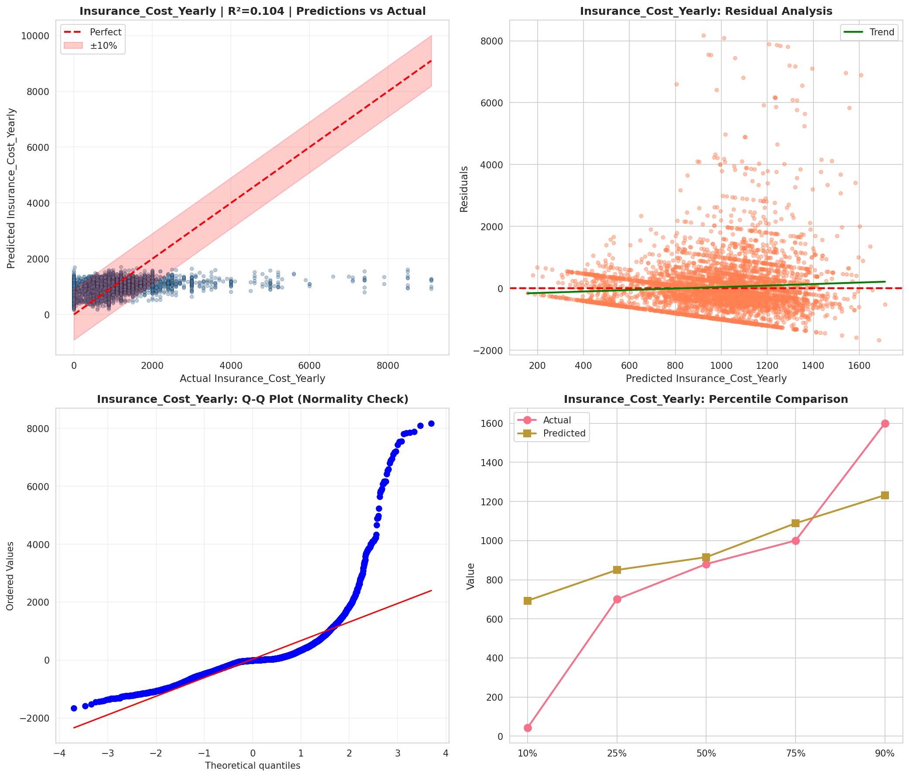
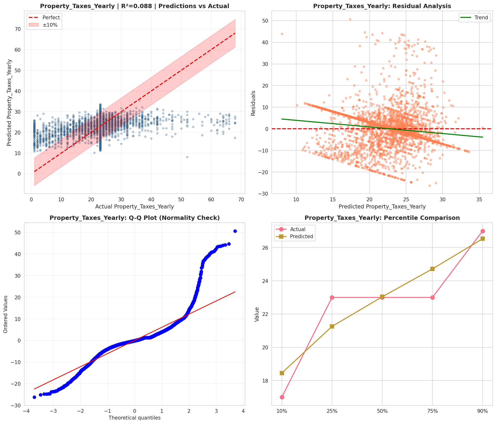
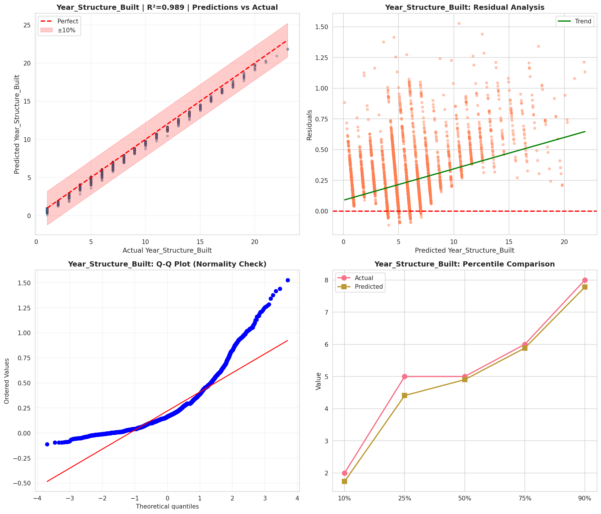
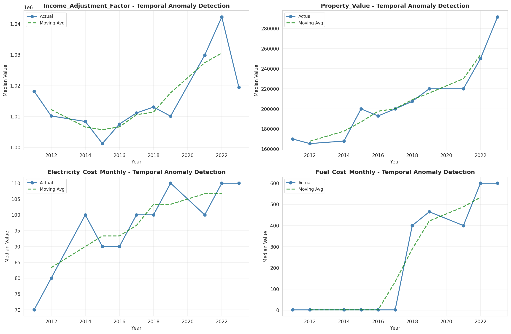
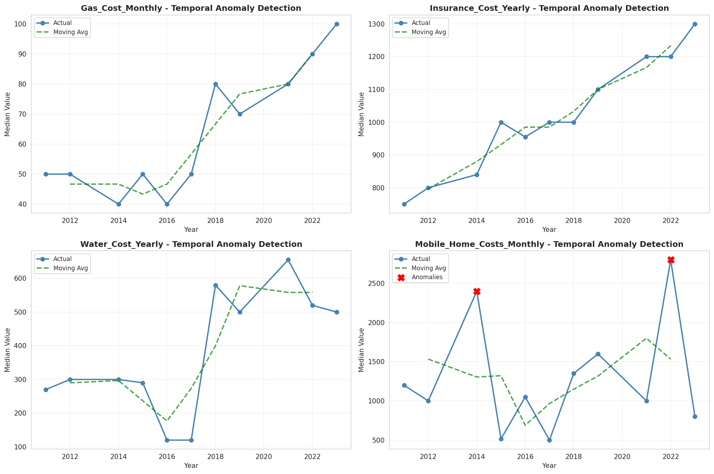
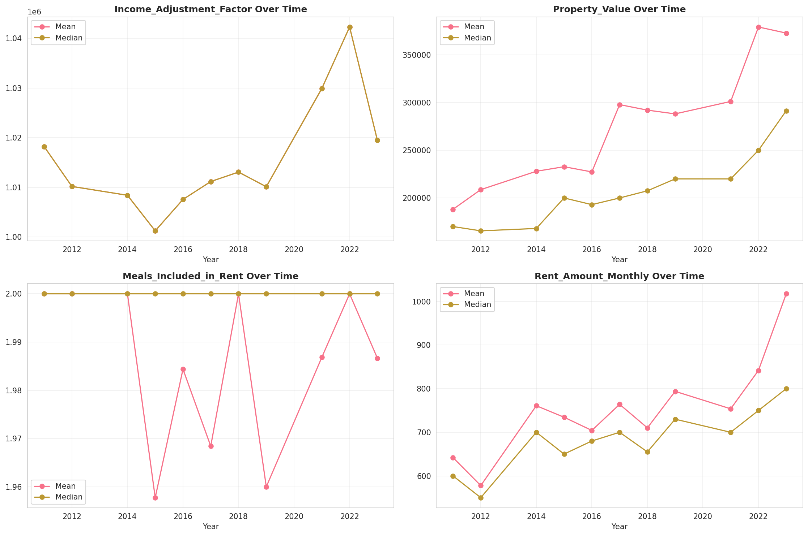
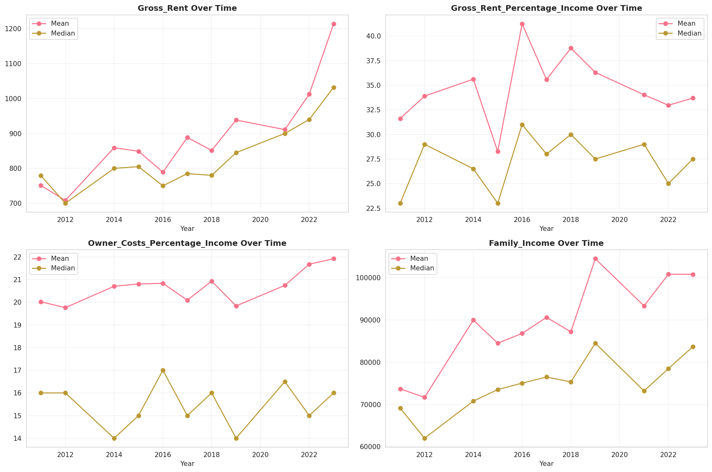
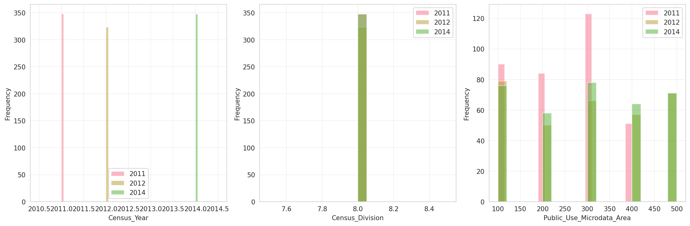
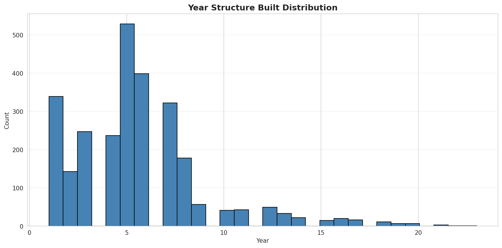
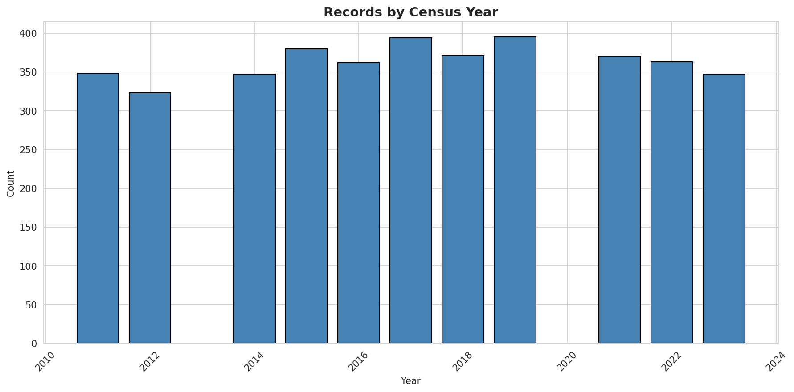
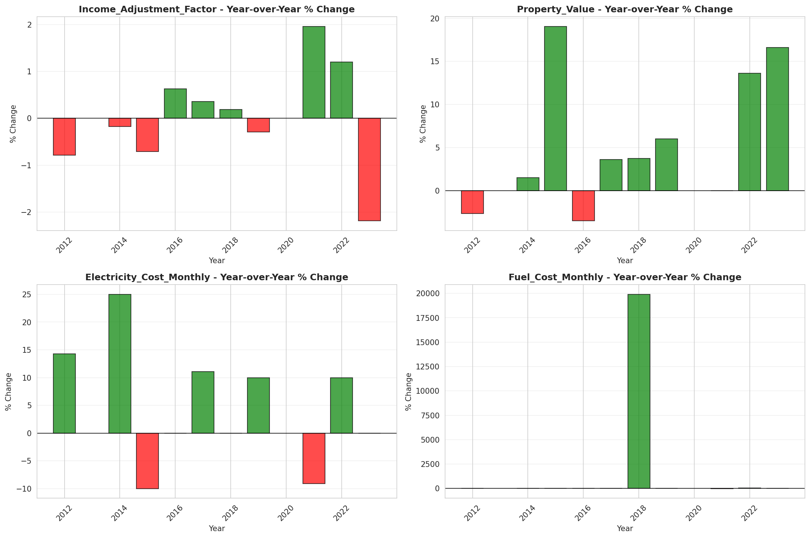

