# Temporal Analysis

## Year Distribution

- 2011: 13,418 records

- 2012: 13,679 records

- 2014: 14,124 records

- 2015: 14,249 records

- 2016: 14,306 records

- 2017: 14,434 records

- 2018: 14,570 records

- 2019: 14,700 records

- 2020: 14,497 records

- 2021: 14,525 records

- 2022: 14,536 records

- 2023: 14,564 records

## Temporal Trends

- Census_Year: {np.int64(2011): {'mean': 2011.0, 'median': 2011.0, 'std': 0.0}, np.int64(2012): {'mean': 2012.0, 'median': 2012.0, 'std': 0.0}, np.int64(2014): {'mean': 2014.0, 'median': 2014.0, 'std': 0.0}, np.int64(2015): {'mean': 2015.0, 'median': 2015.0, 'std': 0.0}, np.int64(2016): {'mean': 2016.0, 'median': 2016.0, 'std': 0.0}, np.int64(2017): {'mean': 2017.0, 'median': 2017.0, 'std': 0.0}, np.int64(2018): {'mean': 2018.0, 'median': 2018.0, 'std': 0.0}, np.int64(2019): {'mean': 2019.0, 'median': 2019.0, 'std': 0.0}, np.int64(2020): {'mean': 2020.0, 'median': 2020.0, 'std': 0.0}, np.int64(2021): {'mean': 2021.0, 'median': 2021.0, 'std': 0.0}, np.int64(2022): {'mean': 2022.0, 'median': 2022.0, 'std': 0.0}, np.int64(2023): {'mean': 2023.0, 'median': 2023.0, 'std': 0.0}}

- Census_Division: {np.int64(2011): {'mean': 8.0, 'median': 8.0, 'std': 0.0}, np.int64(2012): {'mean': 8.0, 'median': 8.0, 'std': 0.0}, np.int64(2014): {'mean': 8.0, 'median': 8.0, 'std': 0.0}, np.int64(2015): {'mean': 8.0, 'median': 8.0, 'std': 0.0}, np.int64(2016): {'mean': 8.0, 'median': 8.0, 'std': 0.0}, np.int64(2017): {'mean': 8.0, 'median': 8.0, 'std': 0.0}, np.int64(2018): {'mean': 8.0, 'median': 8.0, 'std': 0.0}, np.int64(2019): {'mean': 8.0, 'median': 8.0, 'std': 0.0}, np.int64(2020): {'mean': 8.0, 'median': 8.0, 'std': 0.0}, np.int64(2021): {'mean': 8.0, 'median': 8.0, 'std': 0.0}, np.int64(2022): {'mean': 8.0, 'median': 8.0, 'std': 0.0}, np.int64(2023): {'mean': 8.0, 'median': 8.0, 'std': 0.0}}

- Public_Use_Microdata_Area: {np.int64(2011): {'mean': 246.6612013712923, 'median': 300.0, 'std': 105.38720784638768}, np.int64(2012): {'mean': None, 'median': None, 'std': None}, np.int64(2014): {'mean': None, 'median': None, 'std': None}, np.int64(2015): {'mean': None, 'median': None, 'std': None}, np.int64(2016): {'mean': 307.6820914301692, 'median': 300.0, 'std': 145.46283522414015}, np.int64(2017): {'mean': 308.19592628516006, 'median': 300.0, 'std': 145.14007977675172}, np.int64(2018): {'mean': 309.12148249828414, 'median': 300.0, 'std': 145.10044543922172}, np.int64(2019): {'mean': 309.03401360544217, 'median': 300.0, 'std': 144.82484312300915}, np.int64(2020): {'mean': 309.09843415879146, 'median': 300.0, 'std': 145.2024155542366}, np.int64(2021): {'mean': 308.72289156626505, 'median': 300.0, 'std': 145.28881995331093}, np.int64(2022): {'mean': None, 'median': None, 'std': None}, np.int64(2023): {'mean': 312.80554792639384, 'median': 300.0, 'std': 147.40814280510236}}

- Census_Region: {np.int64(2011): {'mean': 4.0, 'median': 4.0, 'std': 0.0}, np.int64(2012): {'mean': 4.0, 'median': 4.0, 'std': 0.0}, np.int64(2014): {'mean': 4.0, 'median': 4.0, 'std': 0.0}, np.int64(2015): {'mean': 4.0, 'median': 4.0, 'std': 0.0}, np.int64(2016): {'mean': 4.0, 'median': 4.0, 'std': 0.0}, np.int64(2017): {'mean': 4.0, 'median': 4.0, 'std': 0.0}, np.int64(2018): {'mean': 4.0, 'median': 4.0, 'std': 0.0}, np.int64(2019): {'mean': 4.0, 'median': 4.0, 'std': 0.0}, np.int64(2020): {'mean': 4.0, 'median': 4.0, 'std': 0.0}, np.int64(2021): {'mean': 4.0, 'median': 4.0, 'std': 0.0}, np.int64(2022): {'mean': 4.0, 'median': 4.0, 'std': 0.0}, np.int64(2023): {'mean': 4.0, 'median': 4.0, 'std': 0.0}}

- State_Code: {np.int64(2011): {'mean': 56.0, 'median': 56.0, 'std': 0.0}, np.int64(2012): {'mean': 56.0, 'median': 56.0, 'std': 0.0}, np.int64(2014): {'mean': 56.0, 'median': 56.0, 'std': 0.0}, np.int64(2015): {'mean': 56.0, 'median': 56.0, 'std': 0.0}, np.int64(2016): {'mean': 56.0, 'median': 56.0, 'std': 0.0}, np.int64(2017): {'mean': 56.0, 'median': 56.0, 'std': 0.0}, np.int64(2018): {'mean': 56.0, 'median': 56.0, 'std': 0.0}, np.int64(2019): {'mean': 56.0, 'median': 56.0, 'std': 0.0}, np.int64(2020): {'mean': 56.0, 'median': 56.0, 'std': 0.0}, np.int64(2021): {'mean': 56.0, 'median': 56.0, 'std': 0.0}, np.int64(2022): {'mean': 56.0, 'median': 56.0, 'std': 0.0}, np.int64(2023): {'mean': None, 'median': None, 'std': None}}

- Housing_Adjustment_Factor: {np.int64(2011): {'mean': 1040924.566328812, 'median': 1044592.0, 'std': 27451.464869589843}, np.int64(2012): {'mean': 1041336.989692229, 'median': 1053092.0, 'std': 27417.67634507108}, np.int64(2014): {'mean': 1036889.7866751628, 'median': 1031130.0, 'std': 29758.480435098547}, np.int64(2015): {'mean': 1020869.7938100919, 'median': 1017534.0, 'std': 20287.252024445304}, np.int64(2016): {'mean': 1020296.6874737872, 'median': 1013801.0, 'std': 15748.54610149894}, np.int64(2017): {'mean': 1029093.0270195372, 'median': 1034680.0, 'std': 17997.80674246121}, np.int64(2018): {'mean': 1038147.4433768017, 'median': 1046406.0, 'std': 23493.48131381876}, np.int64(2019): {'mean': 1040705.9997959184, 'median': 1042936.0, 'std': 29163.840214571315}, np.int64(2020): {'mean': 1036019.5086569635, 'median': 1030827.0, 'std': 28360.491135251876}, np.int64(2021): {'mean': 1058498.3272977625, 'median': 1059761.0, 'std': 35295.56973465185}, np.int64(2022): {'mean': 1105922.5341221795, 'median': 1133141.0, 'std': 61113.15727269211}, np.int64(2023): {'mean': 1106881.7631831914, 'median': 1125501.0, 'std': 76799.61384751715}}

- Income_Adjustment_Factor: {np.int64(2011): {'mean': 1053514.1492025638, 'median': 1048026.0, 'std': 28246.82295545924}, np.int64(2012): {'mean': 1052567.4513487827, 'median': 1061121.0, 'std': 26319.808260048463}, np.int64(2014): {'mean': 1047721.1144859813, 'median': 1041654.0, 'std': 31161.392615689532}, np.int64(2015): {'mean': 1030268.6715558986, 'median': 1025215.0, 'std': 25657.502790710892}, np.int64(2016): {'mean': 1027449.1143576122, 'median': 1022342.0, 'std': 17499.283525432398}, np.int64(2017): {'mean': 1036494.2085354025, 'median': 1035988.0, 'std': 16859.693559524556}, np.int64(2018): {'mean': 1046743.6383665066, 'median': 1054346.0, 'std': 20511.28637170756}, np.int64(2019): {'mean': 1049672.5136054421, 'median': 1054606.0, 'std': 26218.684857320837}, np.int64(2020): {'mean': 1046088.2265986066, 'median': 1044328.0, 'std': 28913.245483237268}, np.int64(2021): {'mean': 1073334.7912564543, 'median': 1070512.0, 'std': 30585.816615703934}, np.int64(2022): {'mean': 1127876.2473858008, 'median': 1140108.0, 'std': 49270.54026534577}, np.int64(2023): {'mean': 1130465.1997390827, 'median': 1159185.0, 'std': 70247.73406736238}}

- Housing_Unit_Weight: {np.int64(2011): {'mean': 19.301684304665375, 'median': 16.0, 'std': 15.884436721195721}, np.int64(2012): {'mean': 19.111777176694204, 'median': 16.0, 'std': 16.118139506938867}, np.int64(2014): {'mean': 18.776196544888133, 'median': 15.0, 'std': 16.647346543613804}, np.int64(2015): {'mean': 18.712190329145905, 'median': 14.0, 'std': 17.28795633799605}, np.int64(2016): {'mean': 18.732489864392562, 'median': 14.0, 'std': 17.13598232252997}, np.int64(2017): {'mean': 18.91977275876403, 'median': 14.0, 'std': 17.139591981918176}, np.int64(2018): {'mean': 18.87336993822924, 'median': 14.0, 'std': 17.14364054838957}, np.int64(2019): {'mean': 18.833061224489796, 'median': 14.0, 'std': 17.334352688553423}, np.int64(2020): {'mean': 19.210526315789473, 'median': 14.0, 'std': 20.11723276696053}, np.int64(2021): {'mean': 18.71380378657487, 'median': 14.0, 'std': 19.50221774552823}, np.int64(2022): {'mean': 18.800976884975235, 'median': 13.0, 'std': 19.887484030451276}, np.int64(2023): {'mean': 18.891170008239495, 'median': 13.0, 'std': 19.93251765863273}}

- Number_of_Persons: {np.int64(2011): {'mean': 2.072887166492771, 'median': 2.0, 'std': 1.4758677486905147}, np.int64(2012): {'mean': 2.071350244900943, 'median': 2.0, 'std': 1.4901921926195754}, np.int64(2014): {'mean': 2.048569810252053, 'median': 2.0, 'std': 1.4905276004835937}, np.int64(2015): {'mean': 2.041476594848761, 'median': 2.0, 'std': 1.488315131134922}, np.int64(2016): {'mean': 2.0334824549140222, 'median': 2.0, 'std': 1.493899090207535}, np.int64(2017): {'mean': 2.0215463488984344, 'median': 2.0, 'std': 1.5049814299574944}, np.int64(2018): {'mean': 1.996636925188744, 'median': 2.0, 'std': 1.5055856194430426}, np.int64(2019): {'mean': 1.9889795918367348, 'median': 2.0, 'std': 1.5027066922084913}, np.int64(2020): {'mean': 1.9776505483893219, 'median': 2.0, 'std': 1.50799833105057}, np.int64(2021): {'mean': 1.9780378657487092, 'median': 2.0, 'std': 1.5024535629558524}, np.int64(2022): {'mean': 1.9799807374793617, 'median': 2.0, 'std': 1.4831973568455872}, np.int64(2023): {'mean': 1.9956742653117276, 'median': 2.0, 'std': 1.4800912196388025}}

- Housing_Unit_Type: {np.int64(2011): {'mean': 1.0798181547175436, 'median': 1.0, 'std': 0.34678376780451176}, np.int64(2012): {'mean': 1.0829739016009943, 'median': 1.0, 'std': 0.3557256917613977}, np.int64(2014): {'mean': 1.089351458510337, 'median': 1.0, 'std': 0.37284047022845135}, np.int64(2015): {'mean': 1.0961470980419679, 'median': 1.0, 'std': 0.3895640384680728}, np.int64(2016): {'mean': 1.0975814343632042, 'median': 1.0, 'std': 0.39409981912326936}, np.int64(2017): {'mean': 1.0987252320908965, 'median': 1.0, 'std': 0.3974836445880399}, np.int64(2018): {'mean': 1.0989018531228552, 'median': 1.0, 'std': 0.39874902447341054}, np.int64(2019): {'mean': 1.099591836734694, 'median': 1.0, 'std': 0.40087983641288916}, np.int64(2020): {'mean': None, 'median': None, 'std': None}, np.int64(2021): {'mean': None, 'median': None, 'std': None}, np.int64(2022): {'mean': None, 'median': None, 'std': None}, np.int64(2023): {'mean': None, 'median': None, 'std': None}}

- Number_of_Bedrooms: {np.int64(2011): {'mean': 2.880973066898349, 'median': 3.0, 'std': 1.0607765796623603}, np.int64(2012): {'mean': None, 'median': None, 'std': None}, np.int64(2014): {'mean': None, 'median': None, 'std': None}, np.int64(2015): {'mean': None, 'median': None, 'std': None}, np.int64(2016): {'mean': None, 'median': None, 'std': None}, np.int64(2017): {'mean': None, 'median': None, 'std': None}, np.int64(2018): {'mean': None, 'median': None, 'std': None}, np.int64(2019): {'mean': None, 'median': None, 'std': None}, np.int64(2020): {'mean': None, 'median': None, 'std': None}, np.int64(2021): {'mean': None, 'median': None, 'std': None}, np.int64(2022): {'mean': None, 'median': None, 'std': None}, np.int64(2023): {'mean': None, 'median': None, 'std': None}}

- Number_of_Rooms: {np.int64(2011): {'mean': 5.940605007503357, 'median': 6.0, 'std': 1.9590462377348676}, np.int64(2012): {'mean': None, 'median': None, 'std': None}, np.int64(2014): {'mean': None, 'median': None, 'std': None}, np.int64(2015): {'mean': None, 'median': None, 'std': None}, np.int64(2016): {'mean': None, 'median': None, 'std': None}, np.int64(2017): {'mean': None, 'median': None, 'std': None}, np.int64(2018): {'mean': None, 'median': None, 'std': None}, np.int64(2019): {'mean': None, 'median': None, 'std': None}, np.int64(2020): {'mean': None, 'median': None, 'std': None}, np.int64(2021): {'mean': None, 'median': None, 'std': None}, np.int64(2022): {'mean': None, 'median': None, 'std': None}, np.int64(2023): {'mean': None, 'median': None, 'std': None}}

- Building_Type: {np.int64(2011): {'mean': 2.3654529658004897, 'median': 2.0, 'std': 1.477371420248873}, np.int64(2012): {'mean': 2.3727209248196135, 'median': 2.0, 'std': 1.4905935321181403}, np.int64(2014): {'mean': 2.3723716934207553, 'median': 2.0, 'std': 1.5109666305008844}, np.int64(2015): {'mean': 2.368188291732254, 'median': 2.0, 'std': 1.4986115290722621}, np.int64(2016): {'mean': 2.3671869165857666, 'median': 2.0, 'std': 1.4932644875605243}, np.int64(2017): {'mean': 2.3646257496113128, 'median': 2.0, 'std': 1.4871286993187072}, np.int64(2018): {'mean': 2.3678691890306496, 'median': 2.0, 'std': 1.4906863028940505}, np.int64(2019): {'mean': 2.3700392498909726, 'median': 2.0, 'std': 1.4877838472860156}, np.int64(2020): {'mean': 2.3676263785064022, 'median': 2.0, 'std': 1.4841626243878472}, np.int64(2021): {'mean': 2.377444829876744, 'median': 2.0, 'std': 1.4979502563423528}, np.int64(2022): {'mean': 2.383309968272707, 'median': 2.0, 'std': 1.5110695621240788}, np.int64(2023): {'mean': 2.386616552435699, 'median': 2.0, 'std': 1.5133985315880658}}

- Year_Structure_Built: {np.int64(2011): {'mean': 5.188294763446805, 'median': 5.0, 'std': 2.2786720670024057}, np.int64(2012): {'mean': 4.993172472651098, 'median': 5.0, 'std': 2.5925363073212893}, np.int64(2014): {'mean': 5.211093526264225, 'median': 5.0, 'std': 2.8607482486451743}, np.int64(2015): {'mean': 5.325163031257027, 'median': 5.0, 'std': 3.009373696096772}, np.int64(2016): {'mean': 5.421402434470913, 'median': 5.0, 'std': 3.156498400999151}, np.int64(2017): {'mean': 5.545272821499963, 'median': 5.0, 'std': 3.3717437376225727}, np.int64(2018): {'mean': 5.647235665053527, 'median': 5.0, 'std': 3.5717213947658712}, np.int64(2019): {'mean': 5.7373891554004945, 'median': 5.0, 'std': 3.7428829220315447}, np.int64(2020): {'mean': 5.834727259270224, 'median': 5.0, 'std': 3.9016399024253468}, np.int64(2021): {'mean': None, 'median': None, 'std': None}, np.int64(2022): {'mean': None, 'median': None, 'std': None}, np.int64(2023): {'mean': None, 'median': None, 'std': None}}

- Bathtub_or_Shower: {np.int64(2011): {'mean': None, 'median': None, 'std': None}, np.int64(2012): {'mean': 1.0122585150128016, 'median': 1.0, 'std': 0.11004173444646273}, np.int64(2014): {'mean': 1.0144698168663804, 'median': 1.0, 'std': 0.11942158961363211}, np.int64(2015): {'mean': 1.0157409489543512, 'median': 1.0, 'std': 0.12447623422776428}, np.int64(2016): {'mean': 1.0153834665073558, 'median': 1.0, 'std': 0.123076994881731}, np.int64(2017): {'mean': 1.0165839934848597, 'median': 1.0, 'std': 0.12771128446510469}, np.int64(2018): {'mean': 1.016278046634404, 'median': 1.0, 'std': 0.12654740641083384}, np.int64(2019): {'mean': 1.0156272714057275, 'median': 1.0, 'std': 0.12403297139413987}, np.int64(2020): {'mean': 1.0157649322774036, 'median': 1.0, 'std': 0.12456944930377396}, np.int64(2021): {'mean': 1.0163849730607424, 'median': 1.0, 'std': 0.1269554855220597}, np.int64(2022): {'mean': 1.015199586807349, 'median': 1.0, 'std': 0.12235057783244495}, np.int64(2023): {'mean': 1.0136340187191393, 'median': 1.0, 'std': 0.11597035577298676}}

- Refrigerator: {np.int64(2011): {'mean': None, 'median': None, 'std': None}, np.int64(2012): {'mean': 1.0167584762200326, 'median': 1.0, 'std': 0.12837019988991188}, np.int64(2014): {'mean': 1.0177858165649258, 'median': 1.0, 'std': 0.13217714612136666}, np.int64(2015): {'mean': 1.0181395697473952, 'median': 1.0, 'std': 0.1334610837609429}, np.int64(2016): {'mean': 1.0185945784482116, 'median': 1.0, 'std': 0.13509323806119133}, np.int64(2017): {'mean': 1.0211742059672761, 'median': 1.0, 'std': 0.14397011334202123}, np.int64(2018): {'mean': 1.0217773867135944, 'median': 1.0, 'std': 0.14596127670827846}, np.int64(2019): {'mean': 1.0207152202354994, 'median': 1.0, 'std': 0.14243445681472783}, np.int64(2020): {'mean': 1.021167937236326, 'median': 1.0, 'std': 0.14394925959364363}, np.int64(2021): {'mean': 1.0216252121927818, 'median': 1.0, 'std': 0.1454617615204188}, np.int64(2022): {'mean': 1.0202169261418137, 'median': 1.0, 'std': 0.1407468070095318}, np.int64(2023): {'mean': 1.0170977964477854, 'median': 1.0, 'std': 0.1296406588016006}}

- Hot_and_Cold_Running_Water: {np.int64(2011): {'mean': None, 'median': None, 'std': None}, np.int64(2012): {'mean': 1.0172239894483668, 'median': 1.0, 'std': 0.13011009589291495}, np.int64(2014): {'mean': 1.0214786344110331, 'median': 1.0, 'std': 0.1449789182414568}, np.int64(2015): {'mean': 1.0238362941308747, 'median': 1.0, 'std': 0.15254464739955187}, np.int64(2016): {'mean': 1.0263609887237697, 'median': 1.0, 'std': 0.1602123709560439}, np.int64(2017): {'mean': 1.0316132375805138, 'median': 1.0, 'std': 0.17497459094019002}, np.int64(2018): {'mean': 1.03512245197243, 'median': 1.0, 'std': 0.18409603582739895}, np.int64(2019): {'mean': 1.0343073121093183, 'median': 1.0, 'std': 0.18202397835720335}, np.int64(2020): {'mean': 1.0360447043150025, 'median': 1.0, 'std': 0.18640830303479058}, np.int64(2021): {'mean': 1.0363126429994833, 'median': 1.0, 'std': 0.1870738301439591}, np.int64(2022): {'mean': 1.0333505496937947, 'median': 1.0, 'std': 0.1795568695077593}, np.int64(2023): {'mean': 1.0293315645957697, 'median': 1.0, 'std': 0.1687403992051561}}

- Running_Water: {np.int64(2011): {'mean': None, 'median': None, 'std': None}, np.int64(2012): {'mean': None, 'median': None, 'std': None}, np.int64(2014): {'mean': 9.0, 'median': 9.0, 'std': 0.0}, np.int64(2015): {'mean': 9.0, 'median': 9.0, 'std': 0.0}, np.int64(2016): {'mean': 9.0, 'median': 9.0, 'std': 0.0}, np.int64(2017): {'mean': 9.0, 'median': 9.0, 'std': 0.0}, np.int64(2018): {'mean': 9.0, 'median': 9.0, 'std': 0.0}, np.int64(2019): {'mean': 9.0, 'median': 9.0, 'std': 0.0}, np.int64(2020): {'mean': 9.0, 'median': 9.0, 'std': 0.0}, np.int64(2021): {'mean': 9.0, 'median': 9.0, 'std': 0.0}, np.int64(2022): {'mean': 9.0, 'median': 9.0, 'std': 0.0}, np.int64(2023): {'mean': 9.0, 'median': 9.0, 'std': 0.0}}

- Sink_with_Faucet: {np.int64(2011): {'mean': None, 'median': None, 'std': None}, np.int64(2012): {'mean': 1.0110171464039104, 'median': 1.0, 'std': 0.10438684930923636}, np.int64(2014): {'mean': 1.0129625442761323, 'median': 1.0, 'std': 0.11311711203842638}, np.int64(2015): {'mean': 1.0138670264597855, 'median': 1.0, 'std': 0.11694339284160439}, np.int64(2016): {'mean': 1.0136658950041073, 'median': 1.0, 'std': 0.11610402652330869}, np.int64(2017): {'mean': 1.0145850299844525, 'median': 1.0, 'std': 0.11988899460408271}, np.int64(2018): {'mean': 1.0148115559466198, 'median': 1.0, 'std': 0.12080249914578285}, np.int64(2019): {'mean': 1.0141735717400786, 'median': 1.0, 'std': 0.11821039413757477}, np.int64(2020): {'mean': 1.0144326844793132, 'median': 1.0, 'std': 0.11927042791931823}, np.int64(2021): {'mean': 1.0149088493615765, 'median': 1.0, 'std': 0.12119265494415202}, np.int64(2022): {'mean': 1.0140928207776876, 'median': 1.0, 'std': 0.1178780659498345}, np.int64(2023): {'mean': 1.0123074655464661, 'median': 1.0, 'std': 0.11025827755452648}}

- Stove_or_Range: {np.int64(2011): {'mean': None, 'median': None, 'std': None}, np.int64(2012): {'mean': 1.016913647296144, 'median': 1.0, 'std': 0.1289529603801356}, np.int64(2014): {'mean': 1.017484362046876, 'median': 1.0, 'std': 0.13107232306771993}, np.int64(2015): {'mean': 1.0182145266471778, 'median': 1.0, 'std': 0.1337314405917838}, np.int64(2016): {'mean': 1.0189679635576134, 'median': 1.0, 'std': 0.13641689639970692}, np.int64(2017): {'mean': 1.0211742059672761, 'median': 1.0, 'std': 0.14397011334202112}, np.int64(2018): {'mean': 1.0222173339199296, 'median': 1.0, 'std': 0.14739510504820993}, np.int64(2019): {'mean': 1.021296700101759, 'median': 1.0, 'std': 0.1443768186403796}, np.int64(2020): {'mean': 1.0226482125675376, 'median': 1.0, 'std': 0.1487847756697006}, np.int64(2021): {'mean': 1.023691785371614, 'median': 1.0, 'std': 0.1520927084917585}, np.int64(2022): {'mean': 1.0228731646130007, 'median': 1.0, 'std': 0.14950462252184415}, np.int64(2023): {'mean': 1.0199719949885768, 'median': 1.0, 'std': 0.13990910262981562}}

- Telephone_Service: {np.int64(2011): {'mean': 1.0237906423473433, 'median': 1.0, 'std': 0.1524030651566481}, np.int64(2012): {'mean': 1.0193593193853634, 'median': 1.0, 'std': 0.13779036391438884}, np.int64(2014): {'mean': 1.0210151682060842, 'median': 1.0, 'std': 0.14344083948068287}, np.int64(2015): {'mean': 1.021323219553308, 'median': 1.0, 'std': 0.14446556282133705}, np.int64(2016): {'mean': 1.02242076871207, 'median': 1.0, 'std': 0.1480537923943499}, np.int64(2017): {'mean': 1.0207964974320114, 'median': 1.0, 'std': 0.1427085065635389}, np.int64(2018): {'mean': 1.0194957983193278, 'median': 1.0, 'std': 0.1382653921434665}, np.int64(2019): {'mean': 1.0173004596740494, 'median': 1.0, 'std': 0.13039392161833185}, np.int64(2020): {'mean': 1.0148934349054182, 'median': 1.0, 'std': 0.1211316491218305}, np.int64(2021): {'mean': 1.011386811692726, 'median': 1.0, 'std': 0.10610423593611876}, np.int64(2022): {'mean': 1.0106920356962452, 'median': 1.0, 'std': 0.10285235375992186}, np.int64(2023): {'mean': 1.0100498338870432, 'median': 1.0, 'std': 0.09974798799825049}}

- Lot_Acreage: {np.int64(2011): {'mean': 1.3730648769574945, 'median': 1.0, 'std': 0.6590703846839447}, np.int64(2012): {'mean': 1.377769961308477, 'median': 1.0, 'std': 0.6622541969852446}, np.int64(2014): {'mean': 1.3797306512103649, 'median': 1.0, 'std': 0.6636885398680992}, np.int64(2015): {'mean': 1.390939881456393, 'median': 1.0, 'std': 0.6735906220650296}, np.int64(2016): {'mean': 1.3965240867290982, 'median': 1.0, 'std': 0.6781345135931807}, np.int64(2017): {'mean': 1.3983270598076118, 'median': 1.0, 'std': 0.678499766033581}, np.int64(2018): {'mean': 1.4025371030594478, 'median': 1.0, 'std': 0.683292825194575}, np.int64(2019): {'mean': 1.4111312068398554, 'median': 1.0, 'std': 0.6877400224301193}, np.int64(2020): {'mean': 1.4127595445411922, 'median': 1.0, 'std': 0.687996838987893}, np.int64(2021): {'mean': 1.4167709637046308, 'median': 1.0, 'std': 0.6870699915260611}, np.int64(2022): {'mean': 1.4173746460103283, 'median': 1.0, 'std': 0.6876997282160594}, np.int64(2023): {'mean': 1.4134663341645886, 'median': 1.0, 'std': 0.6821488089691033}}

- Agricultural_Sales: {np.int64(2011): {'mean': 1.6266126059712496, 'median': 1.0, 'std': 1.5560755618137796}, np.int64(2012): {'mean': 1.6384423008217222, 'median': 1.0, 'std': 1.5550539717484408}, np.int64(2014): {'mean': 1.5915443745632425, 'median': 1.0, 'std': 1.4880997566214802}, np.int64(2015): {'mean': 1.6110922082340933, 'median': 1.0, 'std': 1.5097232393270141}, np.int64(2016): {'mean': 1.6098305084745763, 'median': 1.0, 'std': 1.5075164806355084}, np.int64(2017): {'mean': 1.5709436524100475, 'median': 1.0, 'std': 1.4678990422308023}, np.int64(2018): {'mean': 1.5730148048452222, 'median': 1.0, 'std': 1.4701284340851595}, np.int64(2019): {'mean': 1.5750891988323061, 'median': 1.0, 'std': 1.4736895266806107}, np.int64(2020): {'mean': 1.584549071618037, 'median': 1.0, 'std': 1.491205839124588}, np.int64(2021): {'mean': 1.5849546044098572, 'median': 1.0, 'std': 1.4843482133374521}, np.int64(2022): {'mean': 1.6056248002556728, 'median': 1.0, 'std': 1.5156199726117472}, np.int64(2023): {'mean': 1.5823863636363635, 'median': 1.0, 'std': 1.4878199476901903}}

- Business_On_Property: {np.int64(2011): {'mean': 1.974407158836689, 'median': 2.0, 'std': 0.15792428381647075}, np.int64(2012): {'mean': 1.9756419275413295, 'median': 2.0, 'std': 0.15416499832672778}, np.int64(2014): {'mean': 1.9788612342311627, 'median': 2.0, 'std': 0.14385298821069048}, np.int64(2015): {'mean': 1.9793395427603726, 'median': 2.0, 'std': 0.1422508915667653}, np.int64(2016): {'mean': 3.404960769425462, 'median': 2.0, 'std': 2.8273259833683815}, np.int64(2017): {'mean': 4.823002927645336, 'median': 2.0, 'std': 3.448144433319863}, np.int64(2018): {'mean': 6.234143105878451, 'median': 9.0, 'std': 3.432151898707901}, np.int64(2019): {'mean': 7.623643538309767, 'median': 9.0, 'std': 2.788600373475639}, np.int64(2020): {'mean': None, 'median': None, 'std': None}, np.int64(2021): {'mean': None, 'median': None, 'std': None}, np.int64(2022): {'mean': None, 'median': None, 'std': None}, np.int64(2023): {'mean': None, 'median': None, 'std': None}}

- Tenure: {np.int64(2011): {'mean': 1.844039122389638, 'median': 2.0, 'std': 0.868917970280036}, np.int64(2012): {'mean': 1.8554562027953816, 'median': 2.0, 'std': 0.8710153275265026}, np.int64(2014): {'mean': 1.8762816710448267, 'median': 2.0, 'std': 0.8628574542862864}, np.int64(2015): {'mean': 1.8852085967130214, 'median': 2.0, 'std': 0.8626930046214533}, np.int64(2016): {'mean': 1.8952292650033715, 'median': 2.0, 'std': 0.8612192267674506}, np.int64(2017): {'mean': 1.8915551065083775, 'median': 2.0, 'std': 0.8610193040413585}, np.int64(2018): {'mean': 1.89109243697479, 'median': 2.0, 'std': 0.8631387322782249}, np.int64(2019): {'mean': 1.8810697868783952, 'median': 2.0, 'std': 0.8605435090415394}, np.int64(2020): {'mean': 1.8687837028160574, 'median': 2.0, 'std': 0.8559011654594473}, np.int64(2021): {'mean': 1.8606390210740993, 'median': 2.0, 'std': 0.8490892142769431}, np.int64(2022): {'mean': 1.859656507829601, 'median': 2.0, 'std': 0.8443307712850975}, np.int64(2023): {'mean': 1.8637043189368772, 'median': 2.0, 'std': 0.8385461407400103}}

- Vacancy_Status: {np.int64(2011): {'mean': 4.858993902439025, 'median': 5.0, 'std': 1.8623316242089558}, np.int64(2012): {'mean': 4.8452554744525544, 'median': 5.0, 'std': 1.8928943600034573}, np.int64(2014): {'mean': 4.907356948228883, 'median': 5.0, 'std': 1.9195475894506333}, np.int64(2015): {'mean': 4.928861788617886, 'median': 5.0, 'std': 1.9326859307674242}, np.int64(2016): {'mean': 4.929927963326785, 'median': 5.0, 'std': 1.9708728119645373}, np.int64(2017): {'mean': 4.938650306748467, 'median': 5.0, 'std': 2.0246887809523844}, np.int64(2018): {'mean': 4.946490218642118, 'median': 5.0, 'std': 2.066263205134374}, np.int64(2019): {'mean': 4.969325153374233, 'median': 5.0, 'std': 2.1090939473392107}, np.int64(2020): {'mean': 4.990700218818381, 'median': 5.0, 'std': 2.104396563222752}, np.int64(2021): {'mean': 5.071869736103313, 'median': 5.0, 'std': 2.0891373244834512}, np.int64(2022): {'mean': 5.16, 'median': 5.0, 'std': 2.0500196694571713}, np.int64(2023): {'mean': 5.202746893394376, 'median': 5.0, 'std': 2.007699261339737}}

- Property_Value: {np.int64(2011): {'mean': 15.392206594420106, 'median': 16.0, 'std': 4.9556515070481435}}

- Vehicles_Available: {np.int64(2011): {'mean': 2.2102387875583753, 'median': 2.0, 'std': 1.1822909842871854}, np.int64(2012): {'mean': 2.212952513238996, 'median': 2.0, 'std': 1.1857604049261683}, np.int64(2014): {'mean': 2.1870180493178544, 'median': 2.0, 'std': 1.1725768799613756}, np.int64(2015): {'mean': 2.18440792246102, 'median': 2.0, 'std': 1.1677604575923044}, np.int64(2016): {'mean': 2.1890593391773434, 'median': 2.0, 'std': 1.1752362025094731}, np.int64(2017): {'mean': 2.1860739243916814, 'median': 2.0, 'std': 1.1798085367919806}, np.int64(2018): {'mean': 2.200252100840336, 'median': 2.0, 'std': 1.192667432683312}, np.int64(2019): {'mean': 2.224905975762641, 'median': 2.0, 'std': 1.201518111495613}, np.int64(2020): {'mean': 2.2408627920910726, 'median': 2.0, 'std': 1.213482585311079}, np.int64(2021): {'mean': 2.2395479265805576, 'median': 2.0, 'std': 1.2241623673923172}, np.int64(2022): {'mean': 2.2523993938373463, 'median': 2.0, 'std': 1.2336428850399457}, np.int64(2023): {'mean': 2.243936877076412, 'median': 2.0, 'std': 1.2342725143136797}}

- Condo_Fee_Monthly: {np.int64(2011): {'mean': 154.84615384615384, 'median': 120.0, 'std': 164.23324458172343}, np.int64(2012): {'mean': 148.56880733944953, 'median': 120.0, 'std': 143.4170535195555}, np.int64(2014): {'mean': 163.12820512820514, 'median': 125.0, 'std': 146.5079545710087}, np.int64(2015): {'mean': 174.0, 'median': 130.0, 'std': 156.73066068896665}, np.int64(2016): {'mean': 182.65060240963857, 'median': 140.0, 'std': 154.42327274173033}, np.int64(2017): {'mean': 178.73239436619718, 'median': 140.0, 'std': 128.17320399103693}, np.int64(2018): {'mean': 187.42857142857142, 'median': 140.0, 'std': 127.33256370833938}, np.int64(2019): {'mean': 196.71604938271605, 'median': 150.0, 'std': 128.37651990998012}, np.int64(2020): {'mean': 194.74074074074073, 'median': 150.0, 'std': 115.22128468492464}, np.int64(2021): {'mean': 231.90697674418604, 'median': 145.0, 'std': 271.8663870752334}, np.int64(2022): {'mean': 243.24489795918367, 'median': 150.0, 'std': 267.66381673310616}, np.int64(2023): {'mean': 229.77777777777777, 'median': 150.0, 'std': 261.09750917435457}}

- Electricity_Cost_Monthly: {np.int64(2011): {'mean': 91.99718036831439, 'median': 80.0, 'std': 69.04769026548661}, np.int64(2012): {'mean': 95.46714124489974, 'median': 80.0, 'std': 71.58177943553517}, np.int64(2014): {'mean': 104.31692229472078, 'median': 90.0, 'std': 78.88021529703506}, np.int64(2015): {'mean': 108.36131479140329, 'median': 90.0, 'std': 82.0230003902049}, np.int64(2016): {'mean': 111.62778152393797, 'median': 90.0, 'std': 83.57971101085867}, np.int64(2017): {'mean': 114.99318009598383, 'median': 100.0, 'std': 86.08054421051624}, np.int64(2018): {'mean': 124.74638989169675, 'median': 100.0, 'std': 84.11325654968891}, np.int64(2019): {'mean': 125.45157526254376, 'median': 100.0, 'std': 85.70780238708048}, np.int64(2020): {'mean': 126.58446816341554, 'median': 100.0, 'std': 87.16377801511052}, np.int64(2021): {'mean': 128.79992694731075, 'median': 100.0, 'std': 89.68486717896123}, np.int64(2022): {'mean': 135.22738784370478, 'median': 100.0, 'std': 138.49906949903897}, np.int64(2023): {'mean': 140.56692211726966, 'median': 110.0, 'std': 147.8303236294721}}

- Fuel_Cost_Monthly: {np.int64(2011): {'mean': 115.07242928892414, 'median': 2.0, 'std': 373.4048659398686}, np.int64(2012): {'mean': 113.94782533206008, 'median': 2.0, 'std': 376.3599340183254}, np.int64(2014): {'mean': 98.36649436488433, 'median': 2.0, 'std': 344.2954877338467}, np.int64(2015): {'mean': 95.55693215339232, 'median': 2.0, 'std': 343.96327440038976}, np.int64(2016): {'mean': 86.9663688469319, 'median': 2.0, 'std': 324.38572734939686}, np.int64(2017): {'mean': 82.95175549381158, 'median': 2.0, 'std': 313.4890386370188}, np.int64(2018): {'mean': 573.6502994011976, 'median': 400.0, 'std': 619.1891196013897}, np.int64(2019): {'mean': 571.3161057692307, 'median': 400.0, 'std': 603.3515620875279}, np.int64(2020): {'mean': 567.9046454767727, 'median': 400.0, 'std': 568.3914451666661}, np.int64(2021): {'mean': 587.8995098039215, 'median': 400.0, 'std': 592.080768762132}, np.int64(2022): {'mean': 613.7121771217712, 'median': 450.0, 'std': 604.1577060026592}, np.int64(2023): {'mean': 650.0110974106042, 'median': 500.0, 'std': 633.7667870812637}}

- Gas_Cost_Monthly: {np.int64(2011): {'mean': 70.87963697242047, 'median': 50.0, 'std': 76.6959659993482}, np.int64(2012): {'mean': 69.31113811962844, 'median': 50.0, 'std': 76.02851116225062}, np.int64(2014): {'mean': 64.81467672231167, 'median': 50.0, 'std': 73.46934659883902}, np.int64(2015): {'mean': 64.7441213653603, 'median': 50.0, 'std': 74.67470315084167}, np.int64(2016): {'mean': 63.552680377612944, 'median': 50.0, 'std': 74.07995063303659}, np.int64(2017): {'mean': 62.996211164435465, 'median': 50.0, 'std': 74.4623961224746}, np.int64(2018): {'mean': 90.26854001221747, 'median': 70.0, 'std': 74.47731006945969}, np.int64(2019): {'mean': 89.11642008246423, 'median': 70.0, 'std': 74.6425630449303}, np.int64(2020): {'mean': 89.14087301587301, 'median': 70.0, 'std': 76.65952723888529}, np.int64(2021): {'mean': 91.23095792959647, 'median': 70.0, 'std': 78.57647720937375}, np.int64(2022): {'mean': 102.64650145772595, 'median': 80.0, 'std': 145.06981688154573}, np.int64(2023): {'mean': 114.2348848368522, 'median': 80.0, 'std': 166.21786214459502}}

- House_Heating_Fuel: {np.int64(2011): {'mean': 1.9141774605692132, 'median': 1.0, 'std': 1.496924612769811}, np.int64(2012): {'mean': 1.9344561159822902, 'median': 1.0, 'std': 1.5103254723513353}, np.int64(2014): {'mean': 1.9760189814422506, 'median': 1.0, 'std': 1.5654157776539193}, np.int64(2015): {'mean': 1.989464812473662, 'median': 1.0, 'std': 1.5754694871645225}, np.int64(2016): {'mean': 1.984069453809845, 'median': 1.0, 'std': 1.575865057940262}, np.int64(2017): {'mean': 1.9837501052454323, 'median': 1.0, 'std': 1.5789502358469951}, np.int64(2018): {'mean': 1.9679831932773109, 'median': 1.0, 'std': 1.5581509573754853}, np.int64(2019): {'mean': 1.9463435018804847, 'median': 1.0, 'std': 1.525925311032124}, np.int64(2020): {'mean': 1.9408542326457245, 'median': 1.0, 'std': 1.5146414987077947}, np.int64(2021): {'mean': 1.9384772263766146, 'median': 1.0, 'std': 1.5097050846671676}, np.int64(2022): {'mean': 1.9384576528035022, 'median': 1.0, 'std': 1.5100910197572346}, np.int64(2023): {'mean': 1.937375415282392, 'median': 1.0, 'std': 1.5082017117358357}}

- Insurance_Cost_Yearly: {np.int64(2014): {'mean': 913.5487676979549, 'median': 800.0, 'std': 651.881318410064}, np.int64(2015): {'mean': 959.7363360990386, 'median': 800.0, 'std': 678.2489118500868}}

- Water_Cost_Yearly: {np.int64(2011): {'mean': 363.0018503832937, 'median': 300.0, 'std': 405.4769202627984}, np.int64(2012): {'mean': 376.39152704227797, 'median': 300.0, 'std': 421.6576938927861}, np.int64(2014): {'mean': 394.31488856876535, 'median': 300.0, 'std': 448.35245895049553}, np.int64(2015): {'mean': 398.2903497682259, 'median': 270.0, 'std': 457.2869676298249}, np.int64(2016): {'mean': 402.561109238031, 'median': 240.0, 'std': 467.5531510531699}, np.int64(2017): {'mean': 405.93929443462156, 'median': 200.0, 'std': 476.95012205844574}, np.int64(2018): {'mean': 608.730054368441, 'median': 600.0, 'std': 471.8919009630232}, np.int64(2019): {'mean': 612.4005053695515, 'median': 600.0, 'std': 477.4727174464888}, np.int64(2020): {'mean': 625.6864822951667, 'median': 600.0, 'std': 495.5010012757034}, np.int64(2021): {'mean': 645.0559511698881, 'median': 600.0, 'std': 533.6915196067401}, np.int64(2022): {'mean': 651.3556662515566, 'median': 600.0, 'std': 554.4367056370164}, np.int64(2023): {'mean': 663.7255707211016, 'median': 600.0, 'std': 567.2675681713982}}

- Mobile_Home_Costs_Monthly: {np.int64(2011): {'mean': 1722.826873385013, 'median': 915.0, 'std': 1775.1515165188023}, np.int64(2012): {'mean': 1784.6743002544529, 'median': 975.0, 'std': 1836.5419535877008}, np.int64(2014): {'mean': 1888.4090338770388, 'median': 1100.0, 'std': 1900.656336867098}, np.int64(2015): {'mean': 1956.394506866417, 'median': 1200.0, 'std': 2039.94725279106}, np.int64(2016): {'mean': 2007.4045801526718, 'median': 1150.0, 'std': 2097.231667991738}, np.int64(2017): {'mean': 2091.121495327103, 'median': 1200.0, 'std': 2159.543456017431}, np.int64(2018): {'mean': 2133.936507936508, 'median': 1100.0, 'std': 2315.0082599519023}, np.int64(2019): {'mean': 2100.8753462603877, 'median': 1000.0, 'std': 2325.1823649360613}, np.int64(2020): {'mean': 2196.5255474452556, 'median': 990.0, 'std': 2474.9422849915804}, np.int64(2021): {'mean': 2209.2203898050975, 'median': 900.0, 'std': 2535.7546378716397}, np.int64(2022): {'mean': 2327.206946454414, 'median': 920.0, 'std': 2774.2249653840927}, np.int64(2023): {'mean': 2834.933521923621, 'median': 1000.0, 'std': 5099.631340321487}}

- First_Mortgage_Includes_Insurance: {np.int64(2011): {'mean': 1.3127405306866518, 'median': 1.0, 'std': 0.46365659198996284}, np.int64(2012): {'mean': 1.3067559342665855, 'median': 1.0, 'std': 0.4611939763316195}, np.int64(2014): {'mean': 1.2871328092676873, 'median': 1.0, 'std': 0.45247089539629587}, np.int64(2015): {'mean': 1.2827903091060986, 'median': 1.0, 'std': 0.4504023968488434}, np.int64(2016): {'mean': 1.2807577692635164, 'median': 1.0, 'std': 0.4494172183375521}, np.int64(2017): {'mean': 1.2715008431703203, 'median': 1.0, 'std': 0.44478066098894087}, np.int64(2018): {'mean': 1.2646257076955336, 'median': 1.0, 'std': 0.4411799588136051}, np.int64(2019): {'mean': 1.260367237466474, 'median': 1.0, 'std': 0.43888025509879297}, np.int64(2020): {'mean': 1.2491080797481637, 'median': 1.0, 'std': 0.4325419150296789}, np.int64(2021): {'mean': 1.2418546365914787, 'median': 1.0, 'std': 0.42825141598468874}, np.int64(2022): {'mean': 1.249842668344871, 'median': 1.0, 'std': 0.43296724365124917}, np.int64(2023): {'mean': 1.2556565870162826, 'median': 1.0, 'std': 0.4362757675199836}}

- First_Mortgage_Payment_Monthly: {np.int64(2011): {'mean': 1001.58476807778, 'median': 890.0, 'std': 627.8356123004177}, np.int64(2012): {'mean': 1020.828565631974, 'median': 900.0, 'std': 628.9943259211354}, np.int64(2014): {'mean': 1039.9863467107984, 'median': 950.0, 'std': 613.3430145072449}, np.int64(2015): {'mean': 1047.3203842940686, 'median': 950.0, 'std': 614.968111579758}, np.int64(2016): {'mean': 1063.532141336739, 'median': 980.0, 'std': 631.8049719643077}, np.int64(2017): {'mean': 1084.0733558178752, 'median': 1000.0, 'std': 604.6402656348156}, np.int64(2018): {'mean': 1099.1998322499476, 'median': 1000.0, 'std': 600.7177897756917}, np.int64(2019): {'mean': 1129.491231689705, 'median': 1000.0, 'std': 615.0748994546901}, np.int64(2020): {'mean': 1155.8266526757607, 'median': 1100.0, 'std': 618.6417038042222}, np.int64(2021): {'mean': 1172.986633249791, 'median': 1100.0, 'std': 612.1774775983316}, np.int64(2022): {'mean': 1201.5124816446403, 'median': 1100.0, 'std': 658.8536177289237}, np.int64(2023): {'mean': 1244.1801649397335, 'median': 1100.0, 'std': 695.816693596114}}

- First_Mortgage_Includes_Taxes: {np.int64(2011): {'mean': 1.2718249949361962, 'median': 1.0, 'std': 0.44494524110749134}, np.int64(2012): {'mean': 1.2629336579427877, 'median': 1.0, 'std': 0.44027136594478905}, np.int64(2014): {'mean': 1.2304509722796855, 'median': 1.0, 'std': 0.4211650696667429}, np.int64(2015): {'mean': 1.2220133667502089, 'median': 1.0, 'std': 0.4156434932778132}, np.int64(2016): {'mean': 1.2120051085568326, 'median': 1.0, 'std': 0.4087719531241488}, np.int64(2017): {'mean': 1.2036256323777403, 'median': 1.0, 'std': 0.40273617172934395}, np.int64(2018): {'mean': 1.196896624030195, 'median': 1.0, 'std': 0.39769524510267323}, np.int64(2019): {'mean': 1.1893955023726015, 'median': 1.0, 'std': 0.39186289284583603}, np.int64(2020): {'mean': 1.178174186778594, 'median': 1.0, 'std': 0.38269946737749516}, np.int64(2021): {'mean': 1.173141186299081, 'median': 1.0, 'std': 0.3784088035367598}, np.int64(2022): {'mean': 1.1734843717222572, 'median': 1.0, 'std': 0.3787052019727147}, np.int64(2023): {'mean': 1.1738211038274478, 'median': 1.0, 'std': 0.37899564838125527}}

- First_Mortgage_Status: {np.int64(2011): {'mean': 1.8550046772684752, 'median': 1.0, 'std': 0.9846325819619142}, np.int64(2012): {'mean': 1.870259019426457, 'median': 1.0, 'std': 0.9864603582360957}, np.int64(2014): {'mean': 1.9119918237565297, 'median': 1.0, 'std': 0.9912045719782844}, np.int64(2015): {'mean': 1.9255524079320114, 'median': 1.0, 'std': 0.9919261514994365}, np.int64(2016): {'mean': 1.941912015459816, 'median': 1.0, 'std': 0.993345127819484}, np.int64(2017): {'mean': 1.9307403616513135, 'median': 1.0, 'std': 0.9927409919042385}, np.int64(2018): {'mean': 1.927801112498581, 'median': 1.0, 'std': 0.9921399492395482}, np.int64(2019): {'mean': 1.923542600896861, 'median': 1.0, 'std': 0.9919428779665275}, np.int64(2020): {'mean': 1.9243907993623321, 'median': 1.0, 'std': 0.992386200702409}, np.int64(2021): {'mean': 1.9346654692411316, 'median': 1.0, 'std': 0.9930699189009888}, np.int64(2022): {'mean': 1.9571885689065431, 'median': 1.0, 'std': 0.9945442192329531}, np.int64(2023): {'mean': 1.984391935833514, 'median': 1.0, 'std': 0.9951509772975454}}

- Second_Mortgage_Payment_Monthly: {np.int64(2011): {'mean': 369.10729613733906, 'median': 300.0, 'std': 345.5271494854841}, np.int64(2012): {'mean': 367.3137485311398, 'median': 300.0, 'std': 355.9061595241448}, np.int64(2014): {'mean': 364.1881331403763, 'median': 290.0, 'std': 354.1372769582967}, np.int64(2015): {'mean': 371.3375796178344, 'median': 290.0, 'std': 371.4488990188695}, np.int64(2016): {'mean': 385.01706484641636, 'median': 300.0, 'std': 376.9169802021442}, np.int64(2017): {'mean': 389.86131386861314, 'median': 300.0, 'std': 434.1140412848723}, np.int64(2018): {'mean': 390.86973180076626, 'median': 300.0, 'std': 434.0356556414073}, np.int64(2019): {'mean': 400.9275929549902, 'median': 290.0, 'std': 466.50615514283993}, np.int64(2020): {'mean': 431.6679841897233, 'median': 300.0, 'std': 511.8999132939797}, np.int64(2021): {'mean': 424.937875751503, 'median': 300.0, 'std': 512.8232922406652}, np.int64(2022): {'mean': 429.8144329896907, 'median': 300.0, 'std': 478.1366278745286}, np.int64(2023): {'mean': 441.8471074380165, 'median': 300.0, 'std': 499.36677228549877}}

- Second_Mortgage_Status: {np.int64(2011): {'mean': 2.7445817297954225, 'median': 3.0, 'std': 0.6130201230354179}, np.int64(2012): {'mean': 2.7666869547575574, 'median': 3.0, 'std': 0.5917605936843553}, np.int64(2014): {'mean': 2.806164666942491, 'median': 3.0, 'std': 0.5411623336949098}, np.int64(2015): {'mean': 2.8266499582289057, 'median': 3.0, 'std': 0.5114358528407243}, np.int64(2016): {'mean': 2.8388676032354194, 'median': 3.0, 'std': 0.4872272716426311}, np.int64(2017): {'mean': 2.851602023608769, 'median': 3.0, 'std': 0.46226528017108254}, np.int64(2018): {'mean': 2.86475152023485, 'median': 3.0, 'std': 0.4401620189022659}, np.int64(2019): {'mean': 2.8681658757994635, 'median': 3.0, 'std': 0.43542048847299186}, np.int64(2020): {'mean': 2.8688935281837162, 'median': 3.0, 'std': 0.42955763414989784}, np.int64(2021): {'mean': 2.8706076891277386, 'median': 3.0, 'std': 0.4272601707909806}, np.int64(2022): {'mean': 2.8746120422098076, 'median': 3.0, 'std': 0.42188057025489745}, np.int64(2023): {'mean': 2.874012474012474, 'median': 3.0, 'std': 0.4168552019080233}}

- Property_Taxes_Yearly: {np.int64(2011): {'mean': 20.396047708138447, 'median': 21.0, 'std': 11.542762351182992}, np.int64(2012): {'mean': 20.799606845513413, 'median': 22.0, 'std': 11.603376196342282}, np.int64(2014): {'mean': 21.30672268907563, 'median': 22.0, 'std': 11.656860689637984}, np.int64(2015): {'mean': 21.60883852691218, 'median': 22.0, 'std': 11.856269933673472}, np.int64(2016): {'mean': 21.987268386950095, 'median': 23.0, 'std': 11.917217559427394}, np.int64(2017): {'mean': 22.43386784942568, 'median': 23.0, 'std': 12.156610900991003}}

- Meals_Included_in_Rent: {np.int64(2011): {'mean': 1.979023646071701, 'median': 2.0, 'std': 0.14333241717695958}, np.int64(2012): {'mean': 1.9832651543324655, 'median': 2.0, 'std': 0.12830008644543134}, np.int64(2014): {'mean': 1.9848484848484849, 'median': 2.0, 'std': 0.12217694750980873}, np.int64(2015): {'mean': 1.9846849982596588, 'median': 2.0, 'std': 0.12282387111614664}, np.int64(2016): {'mean': 1.985934819897084, 'median': 2.0, 'std': 0.11777992054180855}, np.int64(2017): {'mean': 1.9831876260928043, 'median': 2.0, 'std': 0.1285895716467974}, np.int64(2018): {'mean': 1.9833166499833166, 'median': 2.0, 'std': 0.12810344057976394}, np.int64(2019): {'mean': 1.9831819710729903, 'median': 2.0, 'std': 0.1286108334670031}, np.int64(2020): {'mean': 1.9807152875175316, 'median': 2.0, 'std': 0.1375479774253848}, np.int64(2021): {'mean': 1.978996084015664, 'median': 2.0, 'std': 0.1434227123396397}, np.int64(2022): {'mean': 1.9804931910195067, 'median': 2.0, 'std': 0.13832330051514352}, np.int64(2023): {'mean': 1.9817095931317656, 'median': 2.0, 'std': 0.1340245232755165}}

- Rent_Amount_Monthly: {np.int64(2011): {'mean': 598.2456140350877, 'median': 530.0, 'std': 344.7494264605147}, np.int64(2012): {'mean': 623.5626626998884, 'median': 550.0, 'std': 349.5831221042705}, np.int64(2014): {'mean': 670.045806906272, 'median': 600.0, 'std': 378.09733396726745}, np.int64(2015): {'mean': 692.7149321266968, 'median': 630.0, 'std': 390.4448143329465}, np.int64(2016): {'mean': 705.9519725557461, 'median': 650.0, 'std': 389.37732231588814}, np.int64(2017): {'mean': 716.7552118359113, 'median': 650.0, 'std': 396.3084736090828}, np.int64(2018): {'mean': 727.2312312312313, 'median': 650.0, 'std': 397.11696862252427}, np.int64(2019): {'mean': 730.56912209889, 'median': 660.0, 'std': 391.9840159027146}, np.int64(2020): {'mean': 738.4719495091164, 'median': 680.0, 'std': 431.4159506414804}, np.int64(2021): {'mean': 753.8276966892132, 'median': 690.0, 'std': 454.1514318017163}, np.int64(2022): {'mean': 773.799043062201, 'median': 700.0, 'std': 467.1350868336398}, np.int64(2023): {'mean': 807.6438969764838, 'median': 710.0, 'std': 508.91162119942544}}

- Gross_Rent: {np.int64(2011): {'mean': 714.0453234445818, 'median': 650.0, 'std': 364.74481871019935}, np.int64(2012): {'mean': 738.7841000807102, 'median': 680.0, 'std': 368.5085037785465}, np.int64(2014): {'mean': 793.0726299694189, 'median': 730.0, 'std': 398.0377501627332}, np.int64(2015): {'mean': 818.1119065561417, 'median': 748.0, 'std': 408.4533558423649}, np.int64(2016): {'mean': 834.5069055617768, 'median': 760.0, 'std': 413.2810986191124}, np.int64(2017): {'mean': 847.5202802359883, 'median': 772.0, 'std': 419.4052888823959}, np.int64(2018): {'mean': 858.7615356220008, 'median': 780.0, 'std': 423.3923647362946}, np.int64(2019): {'mean': 858.7606901725431, 'median': 790.0, 'std': 412.5596470925501}, np.int64(2020): {'mean': 862.6459724950884, 'median': 790.0, 'std': 439.51439577833}, np.int64(2021): {'mean': 880.0995241871531, 'median': 800.0, 'std': 459.16807220461465}, np.int64(2022): {'mean': 910.4151785714286, 'median': 830.0, 'std': 500.20751125183784}, np.int64(2023): {'mean': 951.9235461569743, 'median': 850.0, 'std': 546.1818038963922}}

- Gross_Rent_Percentage_Income: {np.int64(2011): {'mean': 31.404405652535328, 'median': 23.0, 'std': 24.92873429342066}, np.int64(2012): {'mean': 32.28460596161699, 'median': 24.0, 'std': 25.129587585961392}, np.int64(2014): {'mean': 33.185902401239346, 'median': 25.0, 'std': 25.318878892626085}, np.int64(2015): {'mean': 32.62528647822766, 'median': 25.0, 'std': 24.76248199076203}, np.int64(2016): {'mean': 33.00909090909091, 'median': 25.0, 'std': 24.924864598682728}, np.int64(2017): {'mean': 33.098691588785044, 'median': 25.0, 'std': 24.930448843012172}, np.int64(2018): {'mean': 33.257955821789594, 'median': 25.0, 'std': 25.15823532481402}, np.int64(2019): {'mean': 33.18849961919269, 'median': 25.0, 'std': 25.231723740738616}, np.int64(2020): {'mean': 33.391321656050955, 'median': 25.0, 'std': 25.462979669644938}, np.int64(2021): {'mean': 33.893215576073864, 'median': 26.0, 'std': 25.74064024803595}, np.int64(2022): {'mean': 34.1574188244965, 'median': 26.0, 'std': 26.09153854157267}, np.int64(2023): {'mean': 34.558244462674324, 'median': 26.0, 'std': 26.339698957895703}}

- Selected_Monthly_Owner_Costs: {np.int64(2011): {'mean': 946.7485667485668, 'median': 772.0, 'std': 755.9118106094799}, np.int64(2012): {'mean': 952.3275462962963, 'median': 779.0, 'std': 750.1380383864904}, np.int64(2014): {'mean': 942.2799499886338, 'median': 761.0, 'std': 730.0544964236958}, np.int64(2015): {'mean': 945.5389588295338, 'median': 760.0, 'std': 734.0859396832928}, np.int64(2016): {'mean': 949.9821367618614, 'median': 753.0, 'std': 745.093349962804}, np.int64(2017): {'mean': 971.8399726838152, 'median': 781.0, 'std': 739.6266771244308}, np.int64(2018): {'mean': 986.9573960463531, 'median': 806.0, 'std': 742.7800289860112}, np.int64(2019): {'mean': 1007.109041956473, 'median': 825.5, 'std': 760.6152230660912}, np.int64(2020): {'mean': 1027.2305764411028, 'median': 850.0, 'std': 770.0263354506814}, np.int64(2021): {'mean': 1041.6688377316113, 'median': 865.0, 'std': 767.593496797312}, np.int64(2022): {'mean': 1068.177885676451, 'median': 872.5, 'std': 818.5463122218504}, np.int64(2023): {'mean': 1105.3842818428184, 'median': 892.0, 'std': 855.1075503533945}}

- Owner_Costs_Percentage_Income: {np.int64(2011): {'mean': 20.593548387096774, 'median': 16.0, 'std': 18.3260162745926}, np.int64(2012): {'mean': 20.79273529070442, 'median': 16.0, 'std': 18.65828489745073}, np.int64(2014): {'mean': 20.366092805837418, 'median': 16.0, 'std': 18.642399278398706}, np.int64(2015): {'mean': 20.17858769931663, 'median': 15.0, 'std': 18.583166840320324}, np.int64(2016): {'mean': 20.109180290385275, 'median': 15.0, 'std': 18.773271198834692}, np.int64(2017): {'mean': 20.14570218610507, 'median': 15.0, 'std': 18.74174275176387}, np.int64(2018): {'mean': 20.39883401920439, 'median': 15.0, 'std': 19.073106925962268}, np.int64(2019): {'mean': 20.317150276617365, 'median': 15.0, 'std': 19.253479972855605}, np.int64(2020): {'mean': 20.480780263912795, 'median': 15.0, 'std': 19.608848675355386}, np.int64(2021): {'mean': 20.618325791855202, 'median': 15.0, 'std': 19.968020113871734}, np.int64(2022): {'mean': 20.760391198044008, 'median': 15.0, 'std': 20.25826194956471}, np.int64(2023): {'mean': 21.148390616475723, 'median': 15.0, 'std': 20.657471829317554}}

- Satellite_Internet: {np.int64(2011): {'mean': None, 'median': None, 'std': None}, np.int64(2012): {'mean': None, 'median': None, 'std': None}, np.int64(2014): {'mean': None, 'median': None, 'std': None}, np.int64(2015): {'mean': None, 'median': None, 'std': None}, np.int64(2016): {'mean': None, 'median': None, 'std': None}, np.int64(2017): {'mean': 1.8727021570502604, 'median': 2.0, 'std': 0.333324028515471}, np.int64(2018): {'mean': 1.8688694929343308, 'median': 2.0, 'std': 0.3375605680112552}, np.int64(2019): {'mean': 1.868386708161831, 'median': 2.0, 'std': 0.33808683540343354}, np.int64(2020): {'mean': 1.8677461530725132, 'median': 2.0, 'std': 0.3387835741705561}, np.int64(2021): {'mean': 1.8675289045659416, 'median': 2.0, 'std': 0.33901882794390015}, np.int64(2022): {'mean': 1.8653607262302914, 'median': 2.0, 'std': 0.3413541771255517}, np.int64(2023): {'mean': 1.8657368665736866, 'median': 2.0, 'std': 0.3409506608130197}}

- Smartphone: {np.int64(2011): {'mean': None, 'median': None, 'std': None}, np.int64(2012): {'mean': None, 'median': None, 'std': None}, np.int64(2014): {'mean': None, 'median': None, 'std': None}, np.int64(2015): {'mean': None, 'median': None, 'std': None}, np.int64(2016): {'mean': None, 'median': None, 'std': None}, np.int64(2017): {'mean': 1.3201987033762734, 'median': 1.0, 'std': 0.46657241926630216}, np.int64(2018): {'mean': 1.2722689075630251, 'median': 1.0, 'std': 0.44514626948346514}, np.int64(2019): {'mean': 1.2309235269536147, 'median': 1.0, 'std': 0.42144121299055615}, np.int64(2020): {'mean': 1.1966960540956946, 'median': 1.0, 'std': 0.3975175996797325}, np.int64(2021): {'mean': 1.1650237933378653, 'median': 1.0, 'std': 0.37121779445062975}, np.int64(2022): {'mean': 1.143711062468429, 'median': 1.0, 'std': 0.3508112798112467}, np.int64(2023): {'mean': 1.1284053156146179, 'median': 1.0, 'std': 0.3345544601002525}}

- Tablet_Computer: {np.int64(2011): {'mean': None, 'median': None, 'std': None}, np.int64(2012): {'mean': None, 'median': None, 'std': None}, np.int64(2014): {'mean': None, 'median': None, 'std': None}, np.int64(2015): {'mean': None, 'median': None, 'std': None}, np.int64(2016): {'mean': None, 'median': None, 'std': None}, np.int64(2017): {'mean': 1.4686368611602256, 'median': 1.0, 'std': 0.4990363930161593}, np.int64(2018): {'mean': 1.4326890756302522, 'median': 1.0, 'std': 0.49546934199931486}, np.int64(2019): {'mean': 1.402758044295863, 'median': 1.0, 'std': 0.490473350653518}, np.int64(2020): {'mean': 1.3779851065650945, 'median': 1.0, 'std': 0.484904621360945}, np.int64(2021): {'mean': 1.3688817131203264, 'median': 1.0, 'std': 0.4825223100202322}, np.int64(2022): {'mean': 1.3741370601111298, 'median': 1.0, 'std': 0.48391965826395417}, np.int64(2023): {'mean': 1.3787375415282392, 'median': 1.0, 'std': 0.48509273401827807}}

- Food_Stamp_SNAP: {np.int64(2011): {'mean': 1.950933421443912, 'median': 2.0, 'std': 0.21601598077895615}, np.int64(2012): {'mean': 1.9437809732715898, 'median': 2.0, 'std': 0.23035355142308728}, np.int64(2014): {'mean': 1.9379740834386852, 'median': 2.0, 'std': 0.24121214630658447}, np.int64(2015): {'mean': 1.9391685586784624, 'median': 2.0, 'std': 0.23903022865500637}, np.int64(2016): {'mean': 1.9399014007355817, 'median': 2.0, 'std': 0.23767872907932602}, np.int64(2017): {'mean': 1.9418931583880037, 'median': 2.0, 'std': 0.23395450708059037}, np.int64(2018): {'mean': 1.9449812967581048, 'median': 2.0, 'std': 0.22802565112123557}, np.int64(2019): {'mean': 1.94754784225614, 'median': 2.0, 'std': 0.2229456881975933}, np.int64(2020): {'mean': 1.94750966927145, 'median': 2.0, 'std': 0.22302246960840136}, np.int64(2021): {'mean': 1.9496233521657251, 'median': 2.0, 'std': 0.21872950261526522}, np.int64(2022): {'mean': 1.950003887722572, 'median': 2.0, 'std': 0.2179453931289408}, np.int64(2023): {'mean': 1.9486766398158804, 'median': 2.0, 'std': 0.22066492345248515}}

- Family_Type_Employment_Status: {np.int64(2011): {'mean': 2.5984758901589804, 'median': 2.0, 'std': 2.0655786804655833}, np.int64(2012): {'mean': 2.653185166042124, 'median': 2.0, 'std': 2.097061569153369}, np.int64(2014): {'mean': 2.724479431183342, 'median': 2.0, 'std': 2.127018044286347}, np.int64(2015): {'mean': 2.733935615218221, 'median': 2.0, 'std': 2.1287957542054405}, np.int64(2016): {'mean': 2.752484076433121, 'median': 2.0, 'std': 2.1204666275074913}, np.int64(2017): {'mean': 2.747909967845659, 'median': 2.0, 'std': 2.1108922665961383}, np.int64(2018): {'mean': 2.7732814526588845, 'median': 2.0, 'std': 2.1085995921798646}, np.int64(2019): {'mean': 2.7792758089368257, 'median': 2.0, 'std': 2.087884634448327}, np.int64(2020): {'mean': 2.8150326797385623, 'median': 2.0, 'std': 2.1008459172499756}, np.int64(2021): {'mean': None, 'median': None, 'std': None}, np.int64(2022): {'mean': None, 'median': None, 'std': None}, np.int64(2023): {'mean': None, 'median': None, 'std': None}}

- Family_Income: {np.int64(2011): {'mean': 79479.7184491626, 'median': 67000.0, 'std': 67167.40747340927}, np.int64(2012): {'mean': 79188.376298027, 'median': 67350.0, 'std': 64731.067646205964}, np.int64(2014): {'mean': 80709.19242540168, 'median': 69800.0, 'std': 62333.12109681139}, np.int64(2015): {'mean': 82837.04264555669, 'median': 70600.0, 'std': 64751.16840851106}, np.int64(2016): {'mean': 84581.45886561064, 'median': 71945.0, 'std': 67218.02484533685}, np.int64(2017): {'mean': 86963.15711526078, 'median': 73350.0, 'std': 70444.15729567214}, np.int64(2018): {'mean': 89191.17019068621, 'median': 74200.0, 'std': 77152.13369571406}, np.int64(2019): {'mean': 91905.78137443803, 'median': 75100.0, 'std': 79878.25716396111}, np.int64(2020): {'mean': 92993.80928711576, 'median': 76600.0, 'std': 79140.4090288903}, np.int64(2021): {'mean': 95664.89878224433, 'median': 79000.0, 'std': 83876.51090000325}, np.int64(2022): {'mean': 97738.72960705486, 'median': 80000.0, 'std': 86064.1869058186}, np.int64(2023): {'mean': 99584.81258023107, 'median': 82000.0, 'std': 85108.7314386104}}

- Family_Presence_Children: {np.int64(2011): {'mean': 3.1432137695440807, 'median': 4.0, 'std': 1.078635982896975}, np.int64(2012): {'mean': 3.1471766378085024, 'median': 4.0, 'std': 1.0743470015086234}, np.int64(2014): {'mean': 3.1548313466903375, 'median': 4.0, 'std': 1.071800938233096}, np.int64(2015): {'mean': 3.1530456852791877, 'median': 4.0, 'std': 1.0715859019065075}, np.int64(2016): {'mean': 3.161015873015873, 'median': 4.0, 'std': 1.06457921947164}, np.int64(2017): {'mean': 3.160732581967213, 'median': 4.0, 'std': 1.0582666713024147}, np.int64(2018): {'mean': 3.181982447083118, 'median': 4.0, 'std': 1.0518631088178034}, np.int64(2019): {'mean': 3.195424335378323, 'median': 4.0, 'std': 1.0439771561656628}, np.int64(2020): {'mean': 3.200676730869339, 'median': 4.0, 'std': 1.0414147308091068}, np.int64(2021): {'mean': 3.2032287462569977, 'median': 4.0, 'std': 1.0396914560773354}, np.int64(2022): {'mean': 3.216836405826995, 'median': 4.0, 'std': 1.0406439400083465}, np.int64(2023): {'mean': 3.220237335715197, 'median': 4.0, 'std': 1.038062648934671}}

- Household_Family_Type: {np.int64(2011): {'mean': 2.5693012600229097, 'median': 1.0, 'std': 2.0189170694088725}, np.int64(2012): {'mean': 2.5709697022310967, 'median': 1.0, 'std': 2.010947038944252}, np.int64(2014): {'mean': 2.5872383696296923, 'median': 1.0, 'std': 2.0013224038811877}, np.int64(2015): {'mean': 2.6053097345132743, 'median': 1.0, 'std': 2.0071657177145714}, np.int64(2016): {'mean': 2.6021577882670264, 'median': 1.0, 'std': 2.0017733173645853}, np.int64(2017): {'mean': 2.625999831607308, 'median': 1.0, 'std': 2.0146961583929444}, np.int64(2018): {'mean': 2.6514285714285712, 'median': 1.0, 'std': 2.028168010124167}, np.int64(2019): {'mean': 2.6357709987463434, 'median': 1.0, 'std': 2.026130907355019}, np.int64(2020): {'mean': 2.6212445433535905, 'median': 1.0, 'std': 2.0143936581495416}, np.int64(2021): {'mean': 2.642590074779062, 'median': 1.0, 'std': 2.02299884710518}, np.int64(2022): {'mean': 2.6380703822192286, 'median': 1.0, 'std': 2.0179597878159274}, np.int64(2023): {'mean': 2.6527408637873755, 'median': 1.0, 'std': 2.02224339710396}}

- Household_Income: {np.int64(2011): {'mean': 67455.002478973, 'median': 55000.0, 'std': 62270.6778772838}, np.int64(2012): {'mean': 67366.6529026626, 'median': 55000.0, 'std': 60282.10399726725}, np.int64(2014): {'mean': 68742.77419629914, 'median': 56000.0, 'std': 58784.62321811402}, np.int64(2015): {'mean': 70857.13302207131, 'median': 57020.0, 'std': 61883.46601969271}, np.int64(2016): {'mean': 72322.32676295667, 'median': 58000.0, 'std': 64316.13813139011}, np.int64(2017): {'mean': 74030.90574849282, 'median': 59400.0, 'std': 66894.62942078033}, np.int64(2018): {'mean': 75693.89545531626, 'median': 60000.0, 'std': 72821.39555738494}, np.int64(2019): {'mean': 78226.4086729098, 'median': 61000.0, 'std': 75472.53668306678}, np.int64(2020): {'mean': 79354.95792656587, 'median': 62400.0, 'std': 74926.56622667074}, np.int64(2021): {'mean': 81317.91422935072, 'median': 64000.0, 'std': 79172.87669482522}, np.int64(2022): {'mean': 83502.89730739828, 'median': 65000.0, 'std': 81627.55604923856}, np.int64(2023): {'mean': 85105.60264457276, 'median': 66600.0, 'std': 81718.62518351384}}

- Number_Persons_Family: {np.int64(2011): {'mean': 2.90448035737748, 'median': 2.0, 'std': 1.2604129863519755}, np.int64(2012): {'mean': 2.9063186458198733, 'median': 2.0, 'std': 1.2741886069684178}, np.int64(2014): {'mean': 2.894623383210753, 'median': 2.0, 'std': 1.269686175529517}, np.int64(2015): {'mean': 2.893527918781726, 'median': 2.0, 'std': 1.2691817953831228}, np.int64(2016): {'mean': 2.8935873015873015, 'median': 2.0, 'std': 1.2712419731392743}, np.int64(2017): {'mean': 2.9141905737704916, 'median': 2.0, 'std': 1.2838728159398993}, np.int64(2018): {'mean': 2.9082343830665978, 'median': 2.0, 'std': 1.2904988186850603}, np.int64(2019): {'mean': 2.8977505112474438, 'median': 2.0, 'std': 1.2948437259772065}, np.int64(2020): {'mean': 2.8973191046330036, 'median': 2.0, 'std': 1.3004862362006646}, np.int64(2021): {'mean': 2.897669574274183, 'median': 2.0, 'std': 1.3051165479854479}, np.int64(2022): {'mean': 2.8725022560268143, 'median': 2.0, 'std': 1.2867047723236635}, np.int64(2023): {'mean': 2.8720173535791758, 'median': 2.0, 'std': 1.3008730628233356}}

- Workers_In_Family: {np.int64(2011): {'mean': 1.6007094994087505, 'median': 2.0, 'std': 0.8423386012443452}, np.int64(2012): {'mean': 1.5779816513761469, 'median': 2.0, 'std': 0.8430525889851623}, np.int64(2014): {'mean': 1.5431143799137712, 'median': 2.0, 'std': 0.8305242868819271}, np.int64(2015): {'mean': 1.5322335025380711, 'median': 2.0, 'std': 0.8307619015198009}, np.int64(2016): {'mean': 1.5126349206349206, 'median': 2.0, 'std': 0.8335952126706073}, np.int64(2017): {'mean': 1.503201844262295, 'median': 2.0, 'std': 0.8367380988536368}, np.int64(2018): {'mean': 1.4821889519876097, 'median': 2.0, 'std': 0.8493417732017371}, np.int64(2019): {'mean': 1.4653629856850716, 'median': 2.0, 'std': 0.8584172320809161}, np.int64(2020): {'mean': 1.458875585632483, 'median': 2.0, 'std': 0.8637495850685483}, np.int64(2021): {'mean': 1.4419997396172373, 'median': 2.0, 'std': 0.8759229421134961}, np.int64(2022): {'mean': 1.4367667912852906, 'median': 2.0, 'std': 0.88482086128546}, np.int64(2023): {'mean': 1.420696695163966, 'median': 2.0, 'std': 0.8960781059316837}}

- Work_Experience_Householder_Spouse: {np.int64(2011): {'mean': 5.283931152279595, 'median': 4.0, 'std': 4.197449710353807}, np.int64(2012): {'mean': 5.373174828789249, 'median': 4.0, 'std': 4.263792499523649}, np.int64(2014): {'mean': 5.5557950798884095, 'median': 4.0, 'std': 4.284625449170147}, np.int64(2015): {'mean': 5.59251269035533, 'median': 4.0, 'std': 4.288766932148501}, np.int64(2016): {'mean': 5.648634920634921, 'median': 4.0, 'std': 4.276967703143303}, np.int64(2017): {'mean': 5.652920081967213, 'median': 4.0, 'std': 4.259956404347809}, np.int64(2018): {'mean': 5.70340733092411, 'median': 5.0, 'std': 4.26597983750337}, np.int64(2019): {'mean': 5.711273006134969, 'median': 5.0, 'std': 4.2432848908684075}, np.int64(2020): {'mean': 5.771343050494534, 'median': 5.0, 'std': 4.266765855787483}, np.int64(2021): {'mean': 5.8442911079286555, 'median': 5.0, 'std': 4.268522324411004}, np.int64(2022): {'mean': 5.879721541833183, 'median': 5.0, 'std': 4.278633185235346}, np.int64(2023): {'mean': 5.957892050529539, 'median': 5.0, 'std': 4.3032109344280425}}

- Work_Status_Householder_Spouse: {np.int64(2011): {'mean': 4.701747470765997, 'median': 3.0, 'std': 4.447754335385671}, np.int64(2012): {'mean': 4.826851014342938, 'median': 3.0, 'std': 4.499762785729834}, np.int64(2014): {'mean': 4.982478415439309, 'median': 3.0, 'std': 4.546669208508307}, np.int64(2015): {'mean': 5.001272426517368, 'median': 3.0, 'std': 4.557737223903443}, np.int64(2016): {'mean': 5.0580891719745225, 'median': 3.0, 'std': 4.550498235082199}, np.int64(2017): {'mean': 5.055305466237942, 'median': 3.0, 'std': 4.532395166935061}, np.int64(2018): {'mean': 5.122827496757457, 'median': 3.0, 'std': 4.534766212264129}, np.int64(2019): {'mean': 5.153441191576785, 'median': 3.0, 'std': 4.5084803413765835}, np.int64(2020): {'mean': 5.235032679738562, 'median': 3.0, 'std': 4.528976032616814}, np.int64(2021): {'mean': 5.305275559628224, 'median': 3.0, 'std': 4.538625614208866}, np.int64(2022): {'mean': 5.339725317439751, 'median': 3.0, 'std': 4.551879971627238}, np.int64(2023): {'mean': 5.443062323672737, 'median': 3.0, 'std': 4.576263258799702}}

- Complete_Kitchen_Facilities: {np.int64(2011): {'mean': 1.0222731221862411, 'median': 1.0, 'std': 0.1475762526929205}, np.int64(2012): {'mean': 1.022189463883932, 'median': 1.0, 'std': 0.14730504094434818}, np.int64(2014): {'mean': 1.0231366342603059, 'median': 1.0, 'std': 0.15034305392029493}, np.int64(2015): {'mean': 1.0242110786297878, 'median': 1.0, 'std': 0.1537097045848167}, np.int64(2016): {'mean': 1.025390187439325, 'median': 1.0, 'std': 0.1573129806509992}, np.int64(2017): {'mean': 1.0284297031169023, 'median': 1.0, 'std': 0.1662031895673299}, np.int64(2018): {'mean': 1.029403138290072, 'median': 1.0, 'std': 0.16893989014236424}, np.int64(2019): {'mean': 1.0290013083296992, 'median': 1.0, 'std': 0.1678162072616162}, np.int64(2020): {'mean': 1.0302716305232773, 'median': 1.0, 'std': 0.1713401055294434}, np.int64(2021): {'mean': 1.0312200162373606, 'median': 1.0, 'std': 0.17391825459236426}, np.int64(2022): {'mean': 1.0298826828008558, 'median': 1.0, 'std': 0.17026992457738524}, np.int64(2023): {'mean': 1.0264573660549783, 'median': 1.0, 'std': 0.16049695395165914}}

- Complete_Plumbing_Facilities: {np.int64(2011): {'mean': 1.0188768659663534, 'median': 1.0, 'std': 0.13609552826854837}, np.int64(2012): {'mean': 1.018542943595314, 'median': 1.0, 'std': 0.13490928409445732}, np.int64(2014): {'mean': 1.0229105433717687, 'median': 1.0, 'std': 0.1496239872653885}, np.int64(2015): {'mean': 1.025560302825875, 'median': 1.0, 'std': 0.15782534915155677}, np.int64(2016): {'mean': 1.0279292061832574, 'median': 1.0, 'std': 0.16477619122761275}, np.int64(2017): {'mean': 1.0330939512845192, 'median': 1.0, 'std': 0.17888854322473932}, np.int64(2018): {'mean': 1.036148995453879, 'median': 1.0, 'std': 0.18666762054606942}, np.int64(2019): {'mean': 1.0356883267916848, 'median': 1.0, 'std': 0.1855186560269526}, np.int64(2020): {'mean': 1.0371549108134113, 'median': 1.0, 'std': 0.18914827890221625}, np.int64(2021): {'mean': 1.037419735773858, 'median': 1.0, 'std': 0.18979504157515312}, np.int64(2022): {'mean': 1.0343097469195013, 'median': 1.0, 'std': 0.18203030801055642}, np.int64(2023): {'mean': 1.0302896307760336, 'median': 1.0, 'std': 0.17138942165569168}}

- Plumbing_Facilities_for_Project: {np.int64(2011): {'mean': None, 'median': None, 'std': None}, np.int64(2012): {'mean': None, 'median': None, 'std': None}, np.int64(2014): {'mean': None, 'median': None, 'std': None}, np.int64(2015): {'mean': None, 'median': None, 'std': None}, np.int64(2016): {'mean': None, 'median': None, 'std': None}, np.int64(2017): {'mean': 9.0, 'median': 9.0, 'std': 0.0}, np.int64(2018): {'mean': 9.0, 'median': 9.0, 'std': 0.0}, np.int64(2019): {'mean': 9.0, 'median': 9.0, 'std': 0.0}, np.int64(2020): {'mean': 9.0, 'median': 9.0, 'std': 0.0}, np.int64(2021): {'mean': 9.0, 'median': 9.0, 'std': 0.0}, np.int64(2022): {'mean': 9.0, 'median': 9.0, 'std': 0.0}, np.int64(2023): {'mean': 9.0, 'median': 9.0, 'std': 0.0}}

- Response_Mode: {np.int64(2011): {'mean': 1.467340652397125, 'median': 1.0, 'std': 0.4989519315498536}, np.int64(2012): {'mean': 1.470633873845915, 'median': 1.0, 'std': 0.49915624969705435}, np.int64(2014): {'mean': 1.7238676614665762, 'median': 2.0, 'std': 0.6694511491456029}, np.int64(2015): {'mean': 1.854283786822577, 'median': 2.0, 'std': 0.7145273273066586}, np.int64(2016): {'mean': 1.980658651332985, 'median': 2.0, 'std': 0.7394763598879278}, np.int64(2017): {'mean': 2.1151995261716148, 'median': 2.0, 'std': 0.742141291085083}, np.int64(2018): {'mean': 2.1319108373661826, 'median': 2.0, 'std': 0.753651734347741}, np.int64(2019): {'mean': 2.1569995638901003, 'median': 2.0, 'std': 0.7669900094774221}, np.int64(2020): {'mean': 2.1898453112278884, 'median': 2.0, 'std': 0.7623664303634528}, np.int64(2021): {'mean': 2.234113218687726, 'median': 2.0, 'std': 0.7629113463204259}, np.int64(2022): {'mean': 2.277134213827197, 'median': 2.0, 'std': 0.766932237573563}, np.int64(2023): {'mean': 2.324268553320068, 'median': 3.0, 'std': 0.7659092110812366}}

- Specified_Rent_Unit: {np.int64(2011): {'mean': 0.22644340889345232, 'median': 0.0, 'std': 0.4185458489838559}, np.int64(2012): {'mean': 0.22879975172627823, 'median': 0.0, 'std': 0.4200763221126483}, np.int64(2014): {'mean': 0.23181852438013414, 'median': 0.0, 'std': 0.4220096181400795}, np.int64(2015): {'mean': 0.23289108762461586, 'median': 0.0, 'std': 0.4226892726290504}, np.int64(2016): {'mean': 0.23530729594503771, 'median': 0.0, 'std': 0.4242065660036006}, np.int64(2017): {'mean': 0.23684015695565264, 'median': 0.0, 'std': 0.42515912282349094}, np.int64(2018): {'mean': 0.23625164980202376, 'median': 0.0, 'std': 0.42479411387512084}, np.int64(2019): {'mean': 0.23288268643698212, 'median': 0.0, 'std': 0.4226834829874818}, np.int64(2020): {'mean': 0.22663015320849678, 'median': 0.0, 'std': 0.41866681279846907}, np.int64(2021): {'mean': 0.22178758579969002, 'median': 0.0, 'std': 0.41546430931445566}, np.int64(2022): {'mean': 0.2163358665978012, 'median': 0.0, 'std': 0.41176105857363166}, np.int64(2023): {'mean': 0.21460682437909942, 'median': 0.0, 'std': 0.4105644382739946}}

- Specified_Value_Unit: {np.int64(2011): {'mean': 0.512360792986336, 'median': 1.0, 'std': 0.4998669282553885}, np.int64(2012): {'mean': 0.5080301031887656, 'median': 1.0, 'std': 0.49995490829572387}, np.int64(2014): {'mean': 0.5058406812872108, 'median': 1.0, 'std': 0.4999847259650926}, np.int64(2015): {'mean': 0.5034105389401095, 'median': 1.0, 'std': 0.5000071079313541}, np.int64(2016): {'mean': 0.50406989769248, 'median': 1.0, 'std': 0.5000021053410315}, np.int64(2017): {'mean': 0.503886873473014, 'median': 1.0, 'std': 0.5000034013761601}, np.int64(2018): {'mean': 0.5021997360316762, 'median': 1.0, 'std': 0.5000134931023126}, np.int64(2019): {'mean': 0.5053786887629016, 'median': 1.0, 'std': 0.49998924005515716}, np.int64(2020): {'mean': 0.5101768929020798, 'median': 1.0, 'std': 0.4999149207575214}, np.int64(2021): {'mean': 0.5176765812975127, 'median': 1.0, 'std': 0.4997058818130075}, np.int64(2022): {'mean': 0.524385744853538, 'median': 1.0, 'std': 0.49942340656937695}, np.int64(2023): {'mean': 0.5331269806175842, 'median': 1.0, 'std': 0.49891978110860263}}

- Moved_When: {np.int64(2011): {'mean': 4.069069320177272, 'median': 4.0, 'std': 1.8249389403311307}, np.int64(2012): {'mean': 4.112810393027463, 'median': 4.0, 'std': 1.8221928607780358}, np.int64(2014): {'mean': 4.144830508474576, 'median': 4.0, 'std': 1.8414915599695767}, np.int64(2015): {'mean': 4.152899527983816, 'median': 4.0, 'std': 1.8507635787739936}, np.int64(2016): {'mean': 4.155441288038439, 'median': 4.0, 'std': 1.8623461059776942}, np.int64(2017): {'mean': 4.133715055574267, 'median': 4.0, 'std': 1.8560775957406417}, np.int64(2018): {'mean': 4.122941176470588, 'median': 4.0, 'std': 1.8609792376335208}, np.int64(2019): {'mean': 4.1161721688257416, 'median': 4.0, 'std': 1.8698124646793388}, np.int64(2020): {'mean': 4.121458529487289, 'median': 4.0, 'std': 1.8649546946880362}, np.int64(2021): {'mean': 4.113953093133922, 'median': 4.0, 'std': 1.8609838045610652}, np.int64(2022): {'mean': 4.132429701970029, 'median': 4.0, 'std': 1.8754851316778425}, np.int64(2023): {'mean': 4.149667774086379, 'median': 4.0, 'std': 1.8712237754297865}}

- Household_Language: {np.int64(2011): {'mean': 1.12230152436338, 'median': 1.0, 'std': 0.49354714138621064}, np.int64(2012): {'mean': 1.1271811789217814, 'median': 1.0, 'std': 0.5110924101542458}, np.int64(2014): {'mean': 1.1342259130582153, 'median': 1.0, 'std': 0.5445715275516901}, np.int64(2015): {'mean': 1.1384745048461862, 'median': 1.0, 'std': 0.567248269427701}, np.int64(2016): {'mean': 1.149275118004046, 'median': 1.0, 'std': 0.5909367579333942}, np.int64(2017): {'mean': 1.1537425275743032, 'median': 1.0, 'std': 0.6075245411430312}, np.int64(2018): {'mean': 1.1574789915966386, 'median': 1.0, 'std': 0.6184330177207303}, np.int64(2019): {'mean': 1.1582950271625574, 'median': 1.0, 'std': 0.6190034442592863}, np.int64(2020): {'mean': 1.15937687237867, 'median': 1.0, 'std': 0.6188031441801963}, np.int64(2021): {'mean': 1.1543167912984365, 'median': 1.0, 'std': 0.6064552262505388}, np.int64(2022): {'mean': 1.1493517427176292, 'median': 1.0, 'std': 0.592894556029356}, np.int64(2023): {'mean': 1.1469269102990034, 'median': 1.0, 'std': 0.5820847741090713}}

- Household_Language_Detailed: {np.int64(2011): {'mean': None, 'median': None, 'std': None}, np.int64(2012): {'mean': None, 'median': None, 'std': None}, np.int64(2014): {'mean': None, 'median': None, 'std': None}, np.int64(2015): {'mean': None, 'median': None, 'std': None}, np.int64(2016): {'mean': None, 'median': None, 'std': None}, np.int64(2017): {'mean': None, 'median': None, 'std': None}, np.int64(2018): {'mean': None, 'median': None, 'std': None}, np.int64(2019): {'mean': None, 'median': None, 'std': None}, np.int64(2020): {'mean': None, 'median': None, 'std': None}, np.int64(2021): {'mean': 8903.804979605711, 'median': 9500.0, 'std': 2086.5753865693114}, np.int64(2022): {'mean': 8905.824717965988, 'median': 9500.0, 'std': 2086.230620115713}, np.int64(2023): {'mean': 8898.44318936877, 'median': 9500.0, 'std': 2102.1786776387}}

- Limited_English_Speaking_Household: {np.int64(2011): {'mean': 1.0084588950568332, 'median': 1.0, 'std': 0.09158646872964296}, np.int64(2012): {'mean': 1.0085944960500044, 'median': 1.0, 'std': 0.09231126937792049}, np.int64(2014): {'mean': 1.0089822896364715, 'median': 1.0, 'std': 0.09435233162421908}, np.int64(2015): {'mean': 1.0085967130214917, 'median': 1.0, 'std': 0.09232295447199607}, np.int64(2016): {'mean': 1.0092717464598786, 'median': 1.0, 'std': 0.09584652053884164}, np.int64(2017): {'mean': 1.009009009009009, 'median': 1.0, 'std': 0.0944912616121399}, np.int64(2018): {'mean': 1.0087394957983193, 'median': 1.0, 'std': 0.09307977796340959}, np.int64(2019): {'mean': 1.0081069786878396, 'median': 1.0, 'std': 0.08967679580242274}, np.int64(2020): {'mean': 1.008473850894462, 'median': 1.0, 'std': 0.09166659138132428}, np.int64(2021): {'mean': 1.0074779061862678, 'median': 1.0, 'std': 0.08615461596017797}, np.int64(2022): {'mean': 1.0072402761407644, 'median': 1.0, 'std': 0.0847847847980818}, np.int64(2023): {'mean': 1.0073920265780731, 'median': 1.0, 'std': 0.08566209190231969}}

- Household_Grandchildren: {np.int64(2011): {'mean': 0.029341792228390166, 'median': 0.0, 'std': 0.1687701431698911}, np.int64(2012): {'mean': 0.02951645108082299, 'median': 0.0, 'std': 0.16925636529628013}, np.int64(2014): {'mean': 0.029573764935174985, 'median': 0.0, 'std': 0.16941543464133976}, np.int64(2015): {'mean': 0.030425621576064054, 'median': 0.0, 'std': 0.17176259672417662}, np.int64(2016): {'mean': 0.030849629130141606, 'median': 0.0, 'std': 0.17291746522503346}, np.int64(2017): {'mean': 0.030479077208049172, 'median': 0.0, 'std': 0.17190867133682416}, np.int64(2018): {'mean': 0.03142857142857143, 'median': 0.0, 'std': 0.1744802985821119}, np.int64(2019): {'mean': 0.030505641454241537, 'median': 0.0, 'std': 0.1719811597152175}, np.int64(2020): {'mean': 0.029701275357356845, 'median': 0.0, 'std': 0.16976918615166287}, np.int64(2021): {'mean': 0.0289768864717879, 'median': 0.0, 'std': 0.167748674272436}, np.int64(2022): {'mean': 0.028455969018353258, 'median': 0.0, 'std': 0.16627854508882836}, np.int64(2023): {'mean': 0.0276578073089701, 'median': 0.0, 'std': 0.16399721587584057}}

- Household_Children_Present: {np.int64(2011): {'mean': 3.411225658648339, 'median': 4.0, 'std': 0.993271772025457}, np.int64(2012): {'mean': 3.4122753711259657, 'median': 4.0, 'std': 0.9903644244525778}, np.int64(2014): {'mean': 3.4215744428438266, 'median': 4.0, 'std': 0.9834937354652126}, np.int64(2015): {'mean': 3.4221660345554152, 'median': 4.0, 'std': 0.9832708196611097}, np.int64(2016): {'mean': 3.428860418071477, 'median': 4.0, 'std': 0.9754621689032842}, np.int64(2017): {'mean': 3.435379304538183, 'median': 4.0, 'std': 0.9665878923340023}, np.int64(2018): {'mean': 3.454705882352941, 'median': 4.0, 'std': 0.9529915156278003}, np.int64(2019): {'mean': 3.461178437108232, 'median': 4.0, 'std': 0.9464612063444948}, np.int64(2020): {'mean': 3.464521099032783, 'median': 4.0, 'std': 0.9430833821403746}, np.int64(2021): {'mean': 3.469068660774983, 'median': 4.0, 'std': 0.9391597256437676}, np.int64(2022): {'mean': 3.4774372790031993, 'median': 4.0, 'std': 0.9382488759213643}, np.int64(2023): {'mean': 3.4824750830564786, 'median': 4.0, 'std': 0.9346226947652732}}

- Household_Own_Children_Present: {np.int64(2011): {'mean': 3.4686756542426647, 'median': 4.0, 'std': 0.9572329240627375}, np.int64(2012): {'mean': 3.468703880545186, 'median': 4.0, 'std': 0.9554437184685513}, np.int64(2014): {'mean': 3.4769934751292264, 'median': 4.0, 'std': 0.9503792163959699}, np.int64(2015): {'mean': 3.4798145806995366, 'median': 4.0, 'std': 0.9496519392943876}, np.int64(2016): {'mean': 3.485755225893459, 'median': 4.0, 'std': 0.9432874262950065}, np.int64(2017): {'mean': 3.4911172855098087, 'median': 4.0, 'std': 0.9347305450147306}, np.int64(2018): {'mean': 3.5137815126050422, 'median': 4.0, 'std': 0.9163124609482188}, np.int64(2019): {'mean': 3.5198495612202256, 'median': 4.0, 'std': 0.9096852344510072}, np.int64(2020): {'mean': 3.5213558161431138, 'median': 4.0, 'std': 0.9071526974135128}, np.int64(2021): {'mean': 3.525832766825289, 'median': 4.0, 'std': 0.9029637253648742}, np.int64(2022): {'mean': 3.5324128641185384, 'median': 4.0, 'std': 0.9024594316591463}, np.int64(2023): {'mean': 3.534053156146179, 'median': 4.0, 'std': 0.9014961217763919}}

- Household_Related_Children_Present: {np.int64(2011): {'mean': 3.4166886950392104, 'median': 4.0, 'std': 0.9919698361848327}, np.int64(2012): {'mean': 3.418265474433545, 'median': 4.0, 'std': 0.9886838866712786}, np.int64(2014): {'mean': 3.4273366663842046, 'median': 4.0, 'std': 0.981953310681319}, np.int64(2015): {'mean': 3.4285714285714284, 'median': 4.0, 'std': 0.981526700262011}, np.int64(2016): {'mean': 3.4345920431557655, 'median': 4.0, 'std': 0.9743937059090745}, np.int64(2017): {'mean': 3.4411046560579273, 'median': 4.0, 'std': 0.9650359758760152}, np.int64(2018): {'mean': 3.461512605042017, 'median': 4.0, 'std': 0.9504654391738234}, np.int64(2019): {'mean': 3.4676138737985793, 'median': 4.0, 'std': 0.9440508783202931}, np.int64(2020): {'mean': 3.46931438842763, 'median': 4.0, 'std': 0.9416165750321189}, np.int64(2021): {'mean': 3.475441876274643, 'median': 4.0, 'std': 0.9360853912961281}, np.int64(2022): {'mean': 3.4826570129651455, 'median': 4.0, 'std': 0.936203953891933}, np.int64(2023): {'mean': 3.486295681063123, 'median': 4.0, 'std': 0.9333525617453489}}

- Number_Own_Children: {np.int64(2011): {'mean': 0.5030399154110494, 'median': 0.0, 'std': 0.9970499808630156}, np.int64(2012): {'mean': 0.5081170240472264, 'median': 0.0, 'std': 1.0057566143322652}, np.int64(2014): {'mean': 0.5057198542496398, 'median': 0.0, 'std': 1.0079289014237418}, np.int64(2015): {'mean': 0.4988621997471555, 'median': 0.0, 'std': 0.9977315234203815}, np.int64(2016): {'mean': 0.4967127444369521, 'median': 0.0, 'std': 0.996913038462995}, np.int64(2017): {'mean': 0.5024837922034183, 'median': 0.0, 'std': 1.0100195553553581}, np.int64(2018): {'mean': 0.48638655462184877, 'median': 0.0, 'std': 1.0054392212962018}, np.int64(2019): {'mean': 0.48132051817801924, 'median': 0.0, 'std': 1.0026325735534358}, np.int64(2020): {'mean': 0.4835230677052127, 'median': 0.0, 'std': 1.00901509890993}, np.int64(2021): {'mean': 0.4811352821210061, 'median': 0.0, 'std': 1.012197726063183}, np.int64(2022): {'mean': 0.46059942751304933, 'median': 0.0, 'std': 0.9842174840515597}, np.int64(2023): {'mean': 0.4575581395348837, 'median': 0.0, 'std': 0.9822882084892994}}

- Number_Related_Children: {np.int64(2011): {'mean': 0.5499162921843335, 'median': 0.0, 'std': 1.0375812932583302}, np.int64(2012): {'mean': 0.5543015886795729, 'median': 0.0, 'std': 1.0458238649718343}, np.int64(2014): {'mean': 0.5530887212948056, 'median': 0.0, 'std': 1.0473934522126978}, np.int64(2015): {'mean': 0.5498525073746313, 'median': 0.0, 'std': 1.0421317692926868}, np.int64(2016): {'mean': 0.5486345246122725, 'median': 0.0, 'std': 1.04133316885095}, np.int64(2017): {'mean': 0.5548539193399007, 'median': 0.0, 'std': 1.0549691823515621}, np.int64(2018): {'mean': 0.5404201680672269, 'median': 0.0, 'std': 1.052674306305547}, np.int64(2019): {'mean': 0.5333890513999164, 'median': 0.0, 'std': 1.0460761997791466}, np.int64(2020): {'mean': 0.5348797397928614, 'median': 0.0, 'std': 1.0520821963882219}, np.int64(2021): {'mean': 0.5319510537049627, 'median': 0.0, 'std': 1.0546383044640029}, np.int64(2022): {'mean': 0.5097659538642869, 'median': 0.0, 'std': 1.0273832315975389}, np.int64(2023): {'mean': 0.5051495016611296, 'median': 0.0, 'std': 1.024481486759084}}

- Multigenerational_Household: {np.int64(2011): {'mean': None, 'median': None, 'std': None}, np.int64(2012): {'mean': 1.0223109644934456, 'median': 1.0, 'std': 0.14769928636009627}, np.int64(2014): {'mean': 1.0223709855097025, 'median': 1.0, 'std': 0.1478931301694175}, np.int64(2015): {'mean': 1.0226717235566793, 'median': 1.0, 'std': 0.14886095576290334}, np.int64(2016): {'mean': 1.0232636547538774, 'median': 1.0, 'std': 0.1507460531059137}, np.int64(2017): {'mean': 1.023743369537762, 'median': 1.0, 'std': 0.15225496295541974}, np.int64(2018): {'mean': 1.0241176470588236, 'median': 1.0, 'std': 0.15342087256742232}, np.int64(2019): {'mean': 1.0235687421646469, 'median': 1.0, 'std': 0.15170754793163413}, np.int64(2020): {'mean': 1.023110502439442, 'median': 1.0, 'std': 0.15026090541816034}, np.int64(2021): {'mean': 1.0228585995921142, 'median': 1.0, 'std': 0.14945896498301608}, np.int64(2022): {'mean': 1.0222259639669977, 'median': 1.0, 'std': 0.14742387949460464}, np.int64(2023): {'mean': 1.0217607973421927, 'median': 1.0, 'std': 0.14590761883244402}}

- Grandparent_Grandchildren: {np.int64(2011): {'mean': 0.008194554586307164, 'median': 0.0, 'std': 0.09015608719585218}, np.int64(2012): {'mean': 0.008073617501519229, 'median': 0.0, 'std': 0.08949374000034722}, np.int64(2014): {'mean': 0.0075417337513770015, 'median': 0.0, 'std': 0.08651872810687379}, np.int64(2015): {'mean': 0.008259587020648967, 'median': 0.0, 'std': 0.09050998111658307}, np.int64(2016): {'mean': 0.007923128792987188, 'median': 0.0, 'std': 0.08866236753625473}, np.int64(2017): {'mean': 0.007577671129072998, 'median': 0.0, 'std': 0.08672302612467409}, np.int64(2018): {'mean': 0.00823529411764706, 'median': 0.0, 'std': 0.09037787587944626}, np.int64(2019): {'mean': 0.008274132887588801, 'median': 0.0, 'std': 0.09058894786951528}, np.int64(2020): {'mean': 0.007789095266626723, 'median': 0.0, 'std': 0.08791522523725442}, np.int64(2021): {'mean': 0.007647858599592114, 'median': 0.0, 'std': 0.08712068542554312}, np.int64(2022): {'mean': 0.0075770331705674356, 'median': 0.0, 'std': 0.08671940303976032}, np.int64(2023): {'mean': 0.007475083056478406, 'median': 0.0, 'std': 0.08613839129041467}}

- Nonrelative_Present: {np.int64(2011): {'mean': 0.08996387346902811, 'median': 0.0, 'std': 0.28614260336351743}, np.int64(2012): {'mean': 0.09150099835055127, 'median': 0.0, 'std': 0.28833276422516857}, np.int64(2014): {'mean': 0.09278874671637997, 'median': 0.0, 'std': 0.29014846029633845}, np.int64(2015): {'mean': 0.09515381373788454, 'median': 0.0, 'std': 0.29343964060981004}, np.int64(2016): {'mean': 0.09516183412002698, 'median': 0.0, 'std': 0.2934507076466163}, np.int64(2017): {'mean': 0.09707838679801296, 'median': 0.0, 'std': 0.2960769399957768}, np.int64(2018): {'mean': 0.0988235294117647, 'median': 0.0, 'std': 0.29843747065968995}, np.int64(2019): {'mean': 0.09945674885081487, 'median': 0.0, 'std': 0.299286802542572}, np.int64(2020): {'mean': 0.09869040486176496, 'median': 0.0, 'std': 0.2982586514763343}, np.int64(2021): {'mean': 0.09780761386811693, 'median': 0.0, 'std': 0.29706696818127376}, np.int64(2022): {'mean': 0.09589156423640344, 'median': 0.0, 'std': 0.2944548720303925}, np.int64(2023): {'mean': 0.09401993355481728, 'median': 0.0, 'std': 0.2918685680286063}}

- Unmarried_Partner_Household: {np.int64(2011): {'mean': 0.16362675125561724, 'median': 0.0, 'std': 0.7133814093128452}, np.int64(2012): {'mean': 0.16555256532685128, 'median': 0.0, 'std': 0.7160314930006352}, np.int64(2014): {'mean': 0.17142615032624353, 'median': 0.0, 'std': 0.7312750008989989}, np.int64(2015): {'mean': 0.1707543194268858, 'median': 0.0, 'std': 0.7256993597618043}, np.int64(2016): {'mean': 0.16689143627781525, 'median': 0.0, 'std': 0.7186978444392413}, np.int64(2017): {'mean': 0.1702450113665067, 'median': 0.0, 'std': 0.7285592870941436}, np.int64(2018): {'mean': 0.17176470588235293, 'median': 0.0, 'std': 0.7337855903766878}, np.int64(2019): {'mean': 0.17601337233597994, 'median': 0.0, 'std': 0.7407806159166085}, np.int64(2020): {'mean': 0.17923478558589404, 'median': 0.0, 'std': 0.7475739658114854}, np.int64(2021): {'mean': 0.17828008157715838, 'median': 0.0, 'std': 0.7453985292135409}, np.int64(2022): {'mean': 0.174608519952854, 'median': 0.0, 'std': 0.7380641793318614}, np.int64(2023): {'mean': 0.16926910299003323, 'median': 0.0, 'std': 0.7266610942418282}}

- Subfamilies_Present: {np.int64(2011): {'mean': 0.020442329720680236, 'median': 0.0, 'std': 0.1415139761830219}, np.int64(2012): {'mean': 0.020053824116676795, 'median': 0.0, 'std': 0.14019049334803246}, np.int64(2014): {'mean': 0.01974408948394204, 'median': 0.0, 'std': 0.13912548510590242}, np.int64(2015): {'mean': 0.020311841550779603, 'median': 0.0, 'std': 0.14107071958894354}, np.int64(2016): {'mean': 0.020566419420094403, 'median': 0.0, 'std': 0.14193357537259269}, np.int64(2017): {'mean': 0.02071230108613286, 'median': 0.0, 'std': 0.14242545275874713}, np.int64(2018): {'mean': 0.02100840336134454, 'median': 0.0, 'std': 0.14341819556234808}, np.int64(2019): {'mean': 0.020643543669034686, 'median': 0.0, 'std': 0.1421938030495331}, np.int64(2020): {'mean': 0.019857913207224173, 'median': 0.0, 'std': 0.13951789350144803}, np.int64(2021): {'mean': 0.019629503738953093, 'median': 0.0, 'std': 0.13872931110202621}, np.int64(2022): {'mean': 0.01978447550092608, 'median': 0.0, 'std': 0.13926479402213357}, np.int64(2023): {'mean': 0.018853820598006645, 'median': 0.0, 'std': 0.13601430286049815}}

- Persons_Under_18: {np.int64(2011): {'mean': 0.2891884747554851, 'median': 0.0, 'std': 0.4534055744001368}, np.int64(2012): {'mean': 0.29004253841479294, 'median': 0.0, 'std': 0.4538014348182618}, np.int64(2014): {'mean': 0.2862469282264215, 'median': 0.0, 'std': 0.45202537393635395}, np.int64(2015): {'mean': 0.2854614412136536, 'median': 0.0, 'std': 0.4516529634694845}, np.int64(2016): {'mean': 0.2840525960890088, 'median': 0.0, 'std': 0.4509809992515396}, np.int64(2017): {'mean': 0.2836574892649659, 'median': 0.0, 'std': 0.4507915569786572}, np.int64(2018): {'mean': 0.2747899159663866, 'median': 0.0, 'std': 0.44642711130772245}, np.int64(2019): {'mean': 0.2720434600919348, 'median': 0.0, 'std': 0.445030750123775}, np.int64(2020): {'mean': 0.270906445262347, 'median': 0.0, 'std': 0.4444469044905173}, np.int64(2021): {'mean': 0.2685248130523453, 'median': 0.0, 'std': 0.4432109319587569}, np.int64(2022): {'mean': 0.26166021215692875, 'median': 0.0, 'std': 0.43955706315792453}, np.int64(2023): {'mean': 0.2590531561461794, 'median': 0.0, 'std': 0.43813304144421145}}

- Persons_60_And_Over: {np.int64(2011): {'mean': 0.5131729667812142, 'median': 0.0, 'std': 0.7391132452288123}, np.int64(2012): {'mean': 0.5251323899644066, 'median': 0.0, 'std': 0.7433489411432405}, np.int64(2014): {'mean': 0.5597830692314211, 'median': 0.0, 'std': 0.7591293543697724}, np.int64(2015): {'mean': 0.5783396544458491, 'median': 0.0, 'std': 0.7644667515953352}, np.int64(2016): {'mean': 0.5980276466621712, 'median': 0.0, 'std': 0.7716633800821542}, np.int64(2017): {'mean': 0.601667087648396, 'median': 0.0, 'std': 0.7730126678654192}, np.int64(2018): {'mean': 0.6270588235294118, 'median': 0.0, 'std': 0.7815895213705565}, np.int64(2019): {'mean': 0.6434600919348099, 'median': 0.0, 'std': 0.7885315945326614}, np.int64(2020): {'mean': 0.6543695968501241, 'median': 0.0, 'std': 0.7935465843179523}, np.int64(2021): {'mean': 0.672331747110809, 'median': 0.0, 'std': 0.7990237529862686}, np.int64(2022): {'mean': 0.6944771847112309, 'median': 0.0, 'std': 0.8056097887375627}, np.int64(2023): {'mean': 0.7083056478405315, 'median': 0.0, 'std': 0.8078838128750758}}

- Persons_65_And_Over: {np.int64(2011): {'mean': 0.3578288836020795, 'median': 0.0, 'std': 0.6465559706370109}, np.int64(2012): {'mean': 0.3675666290476604, 'median': 0.0, 'std': 0.6527569122113367}, np.int64(2014): {'mean': 0.385136852809084, 'median': 0.0, 'std': 0.6645090582325517}, np.int64(2015): {'mean': 0.39688158449220395, 'median': 0.0, 'std': 0.6698952612491116}, np.int64(2016): {'mean': 0.41006405933917733, 'median': 0.0, 'std': 0.6774282800001418}, np.int64(2017): {'mean': 0.4135724509556285, 'median': 0.0, 'std': 0.6814268484263798}, np.int64(2018): {'mean': 0.43521008403361344, 'median': 0.0, 'std': 0.6936402641869518}, np.int64(2019): {'mean': 0.4515670706226494, 'median': 0.0, 'std': 0.7036219472506378}, np.int64(2020): {'mean': 0.46323718223059146, 'median': 0.0, 'std': 0.7110881275170514}, np.int64(2021): {'mean': 0.48249490142760026, 'median': 0.0, 'std': 0.7215552373461739}, np.int64(2022): {'mean': 0.5048829769321435, 'median': 0.0, 'std': 0.7323010170704511}, np.int64(2023): {'mean': 0.5239202657807309, 'median': 0.0, 'std': 0.7399188720115406}}

- Same_Sex_Married_Couple: {np.int64(2011): {'mean': None, 'median': None, 'std': None}, np.int64(2012): {'mean': None, 'median': None, 'std': None}, np.int64(2014): {'mean': None, 'median': None, 'std': None}, np.int64(2015): {'mean': None, 'median': None, 'std': None}, np.int64(2016): {'mean': None, 'median': None, 'std': None}, np.int64(2017): {'mean': 0.005388566136229687, 'median': 0.0, 'std': 0.10286201331410669}, np.int64(2018): {'mean': 0.0063025210084033615, 'median': 0.0, 'std': 0.11172437320505328}, np.int64(2019): {'mean': None, 'median': None, 'std': None}, np.int64(2020): {'mean': None, 'median': None, 'std': None}, np.int64(2021): {'mean': None, 'median': None, 'std': None}, np.int64(2022): {'mean': None, 'median': None, 'std': None}, np.int64(2023): {'mean': None, 'median': None, 'std': None}}

- Flag_Lot_Acreage: {np.int64(2011): {'mean': 0.02669615354237422, 'median': 0.0, 'std': 0.16120025227996557}, np.int64(2012): {'mean': 0.02793079370005431, 'median': 0.0, 'std': 0.16478097925943064}, np.int64(2014): {'mean': 0.02645263395885146, 'median': 0.0, 'std': 0.16048312401367854}, np.int64(2015): {'mean': 0.02705944082152762, 'median': 0.0, 'std': 0.1622627530865836}, np.int64(2016): {'mean': 0.028675976402061085, 'median': 0.0, 'std': 0.1669004043240327}, np.int64(2017): {'mean': 0.02754127489449915, 'median': 0.0, 'std': 0.16366042923680338}, np.int64(2018): {'mean': 0.02954978735885027, 'median': 0.0, 'std': 0.1693478676518895}, np.int64(2019): {'mean': 0.030527692978630616, 'median': 0.0, 'std': 0.1720404146217091}, np.int64(2020): {'mean': 0.030123602990156168, 'median': 0.0, 'std': 0.17093371256720077}, np.int64(2021): {'mean': 0.0297438925381947, 'median': 0.0, 'std': 0.1698862076186716}, np.int64(2022): {'mean': 0.03150593964435918, 'median': 0.0, 'std': 0.17468705442689844}, np.int64(2023): {'mean': 0.031100302159333775, 'median': 0.0, 'std': 0.1735952022888915}}

- Flag_Agricultural_Sales: {np.int64(2011): {'mean': 0.008846062712266014, 'median': 0.0, 'std': 0.09364028218015656}, np.int64(2012): {'mean': 0.009698192256963303, 'median': 0.0, 'std': 0.09800450256946795}, np.int64(2014): {'mean': 0.009194362800512473, 'median': 0.0, 'std': 0.09544900782375139}, np.int64(2015): {'mean': 0.009219698673262874, 'median': 0.0, 'std': 0.09557918491724256}, np.int64(2016): {'mean': 0.009932043910088865, 'median': 0.0, 'std': 0.0991671961769972}, np.int64(2017): {'mean': 0.009402532020433849, 'median': 0.0, 'std': 0.09651328427050127}, np.int64(2018): {'mean': 0.009458864936207656, 'median': 0.0, 'std': 0.09679918319498526}, np.int64(2019): {'mean': 0.010321267626108447, 'median': 0.0, 'std': 0.10107166552899993}, np.int64(2020): {'mean': 0.009917844719117755, 'median': 0.0, 'std': 0.0990969621422408}, np.int64(2021): {'mean': 0.009299579304745738, 'median': 0.0, 'std': 0.09598842202704412}, np.int64(2022): {'mean': 0.009370619051132591, 'median': 0.0, 'std': 0.09635089790394712}, np.int64(2023): {'mean': 0.009580661802638366, 'median': 0.0, 'std': 0.0974144346533754}}

- Flag_Bedrooms: {np.int64(2011): {'mean': 0.037121870310402025, 'median': 0.0, 'std': 0.18906787252972282}, np.int64(2012): {'mean': 0.037628985957017615, 'median': 0.0, 'std': 0.19030463788220195}, np.int64(2014): {'mean': 0.04129926897279373, 'median': 0.0, 'std': 0.19898900346594578}, np.int64(2015): {'mean': 0.042725432876096245, 'median': 0.0, 'std': 0.202244990608998}, np.int64(2016): {'mean': 0.048614741244119186, 'median': 0.0, 'std': 0.21506929662035393}, np.int64(2017): {'mean': 0.05715554897460576, 'median': 0.0, 'std': 0.23214819013956106}, np.int64(2018): {'mean': 0.06320574864349611, 'median': 0.0, 'std': 0.24334157865703962}, np.int64(2019): {'mean': 0.06432621020497166, 'median': 0.0, 'std': 0.2453420550838656}, np.int64(2020): {'mean': 0.06683443120420399, 'median': 0.0, 'std': 0.24974428204012927}, np.int64(2021): {'mean': 0.06369473761901247, 'median': 0.0, 'std': 0.2442173621510063}, np.int64(2022): {'mean': 0.061536191249169925, 'median': 0.0, 'std': 0.24032009849698824}, np.int64(2023): {'mean': 0.06028447195813988, 'median': 0.0, 'std': 0.23802191009011772}}

- Flag_Building_Type: {np.int64(2011): {'mean': 0.008214201089961298, 'median': 0.0, 'std': 0.09026279129207136}, np.int64(2012): {'mean': 0.007913724881682054, 'median': 0.0, 'std': 0.0886098584757521}, np.int64(2014): {'mean': 0.007460999321727334, 'median': 0.0, 'std': 0.08605748628486601}, np.int64(2015): {'mean': 0.007645603777827749, 'median': 0.0, 'std': 0.0871075041110891}, np.int64(2016): {'mean': 0.0076917332536778436, 'median': 0.0, 'std': 0.08736784599286641}, np.int64(2017): {'mean': 0.00792181831642852, 'median': 0.0, 'std': 0.08865463893780968}, np.int64(2018): {'mean': 0.007845725179645109, 'median': 0.0, 'std': 0.0882311769644359}, np.int64(2019): {'mean': 0.007849978194505015, 'median': 0.0, 'std': 0.08825487054281413}, np.int64(2020): {'mean': 0.009251720820072534, 'median': 0.0, 'std': 0.09574343294295307}, np.int64(2021): {'mean': 0.01033286589416193, 'median': 0.0, 'std': 0.10112790209209503}, np.int64(2022): {'mean': 0.01158415111045525, 'median': 0.0, 'std': 0.10700842697745665}, np.int64(2023): {'mean': 0.012602255140393544, 'median': 0.0, 'std': 0.11155427119743279}}

- Flag_Kitchen: {np.int64(2011): {'mean': 0.014295869204644183, 'median': 0.0, 'std': 0.11871230096660856}, np.int64(2012): {'mean': 0.01559469314919699, 'median': 0.0, 'std': 0.12390597177489604}, np.int64(2014): {'mean': 0.017559725676388575, 'median': 0.0, 'std': 0.13134946492197097}, np.int64(2015): {'mean': 0.020313319841091373, 'median': 0.0, 'std': 0.14107508881403488}, np.int64(2016): {'mean': 0.02389664700171757, 'median': 0.0, 'std': 0.1527329017599634}, np.int64(2017): {'mean': 0.02835566743170208, 'median': 0.0, 'std': 0.1659929622320254}, np.int64(2018): {'mean': 0.03130957618419123, 'median': 0.0, 'std': 0.1741594403621418}, np.int64(2019): {'mean': 0.032272132577409504, 'median': 0.0, 'std': 0.1767283570908098}, np.int64(2020): {'mean': 0.03271408481977648, 'median': 0.0, 'std': 0.17789383274808754}, np.int64(2021): {'mean': 0.03262233375156838, 'median': 0.0, 'std': 0.17765260045470072}, np.int64(2022): {'mean': 0.03276027447797535, 'median': 0.0, 'std': 0.17801510350484215}, np.int64(2023): {'mean': 0.03390080330164345, 'median': 0.0, 'std': 0.18098053132381964}}

- Flag_Plumbing: {np.int64(2011): {'mean': 0.011531474607061054, 'median': 0.0, 'std': 0.10676797298756945}, np.int64(2012): {'mean': 0.012413686088913026, 'median': 0.0, 'std': 0.11072731247084142}, np.int64(2014): {'mean': 0.014921998643454669, 'median': 0.0, 'std': 0.12124537301888802}, np.int64(2015): {'mean': 0.016940259350873246, 'median': 0.0, 'std': 0.12905245188036743}, np.int64(2016): {'mean': 0.01986408782017773, 'median': 0.0, 'std': 0.13953838134558605}, np.int64(2017): {'mean': 0.022951062412082623, 'median': 0.0, 'std': 0.1497530349221786}, np.int64(2018): {'mean': 0.025150315295497872, 'median': 0.0, 'std': 0.15658727541675396}, np.int64(2019): {'mean': 0.0264573339148132, 'median': 0.0, 'std': 0.16049677786515265}, np.int64(2020): {'mean': 0.02782917622677818, 'median': 0.0, 'std': 0.16448925723815655}, np.int64(2021): {'mean': 0.02834157502398701, 'median': 0.0, 'std': 0.1659528933108949}, np.int64(2022): {'mean': 0.02958754519294621, 'median': 0.0, 'std': 0.16945276930609238}, np.int64(2023): {'mean': 0.03073181516692461, 'median': 0.0, 'std': 0.1725965414398428}}

- Flag_Rooms: {np.int64(2011): {'mean': 0.04944317194534397, 'median': 0.0, 'std': 0.21680003934184822}, np.int64(2012): {'mean': 0.04499961207230972, 'median': 0.0, 'std': 0.20731131530977087}, np.int64(2014): {'mean': 0.04740372296329791, 'median': 0.0, 'std': 0.21250885495677171}, np.int64(2015): {'mean': 0.04639832096544487, 'median': 0.0, 'std': 0.21035406706886622}, np.int64(2016): {'mean': 0.048017325069076244, 'median': 0.0, 'std': 0.2138108402957509}, np.int64(2017): {'mean': 0.0526393721773895, 'median': 0.0, 'std': 0.22332075808972893}, np.int64(2018): {'mean': 0.05565332160140783, 'median': 0.0, 'std': 0.2292594236342539}, np.int64(2019): {'mean': 0.054368367495275474, 'median': 0.0, 'std': 0.22675137330508735}, np.int64(2020): {'mean': 0.05543631115387462, 'median': 0.0, 'std': 0.22883837623663497}, np.int64(2021): {'mean': 0.052845228430142444, 'median': 0.0, 'std': 0.22373266352321788}, np.int64(2022): {'mean': 0.051501512580240535, 'median': 0.0, 'std': 0.2210264946794387}, np.int64(2023): {'mean': 0.04922986218586484, 'median': 0.0, 'std': 0.21635556986253582}}

- Flag_Condo_Fee: {np.int64(2011): {'mean': 0.0018166021641260563, 'median': 0.0, 'std': 0.042584567058014965}, np.int64(2012): {'mean': 0.0020948095275040734, 'median': 0.0, 'std': 0.04572289907249125}, np.int64(2014): {'mean': 0.0020348179968347276, 'median': 0.0, 'std': 0.04506473747085041}, np.int64(2015): {'mean': 0.0019488793943482497, 'median': 0.0, 'std': 0.044104728449965644}, np.int64(2016): {'mean': 0.0019416025688895526, 'median': 0.0, 'std': 0.04402246552318525}, np.int64(2017): {'mean': 0.0019249278152069298, 'median': 0.0, 'std': 0.04383337447272991}, np.int64(2018): {'mean': 0.0019064378941193723, 'median': 0.0, 'std': 0.04362273399362887}, np.int64(2019): {'mean': 0.002180549498473615, 'median': 0.0, 'std': 0.04664710989392258}, np.int64(2020): {'mean': 0.002220412996817408, 'median': 0.0, 'std': 0.04707065700946202}, np.int64(2021): {'mean': 0.0023617979186655843, 'median': 0.0, 'std': 0.048542700230720624}, np.int64(2022): {'mean': 0.0021397476573452373, 'median': 0.0, 'std': 0.046209595227734455}, np.int64(2023): {'mean': 0.002210921954455008, 'median': 0.0, 'std': 0.046970164673964004}}

- Flag_Electricity: {np.int64(2011): {'mean': 0.0409920227470184, 'median': 0.0, 'std': 0.1982795551888008}, np.int64(2012): {'mean': 0.04437892776786407, 'median': 0.0, 'std': 0.20594350961477403}, np.int64(2014): {'mean': 0.05516617680307483, 'median': 0.0, 'std': 0.2283129391968714}, np.int64(2015): {'mean': 0.06071508882392624, 'median': 0.0, 'std': 0.2388159162054113}, np.int64(2016): {'mean': 0.06571577925472333, 'median': 0.0, 'std': 0.2477938677919579}, np.int64(2017): {'mean': 0.06581772414303694, 'median': 0.0, 'std': 0.24797238517311437}, np.int64(2018): {'mean': 0.06225252969643643, 'median': 0.0, 'std': 0.24162250109256145}, np.int64(2019): {'mean': 0.05960168629161215, 'median': 0.0, 'std': 0.23675599152548576}, np.int64(2020): {'mean': 0.05388202205610244, 'median': 0.0, 'std': 0.2257930981314888}, np.int64(2021): {'mean': 0.05358329027972544, 'median': 0.0, 'std': 0.2252018304254968}, np.int64(2022): {'mean': 0.0554120858850439, 'median': 0.0, 'std': 0.228791278025531}, np.int64(2023): {'mean': 0.05741027341734837, 'median': 0.0, 'std': 0.23263345052476375}}

- Flag_Food_Stamp: {np.int64(2011): {'mean': 0.011104486510657326, 'median': 0.0, 'std': 0.10479501582837518}, np.int64(2012): {'mean': 0.0089918853717377, 'median': 0.0, 'std': 0.09440171002491278}, np.int64(2014): {'mean': 0.011469838572642312, 'median': 0.0, 'std': 0.10648513605015471}, np.int64(2015): {'mean': 0.013264088707979507, 'median': 0.0, 'std': 0.11440747901472757}, np.int64(2016): {'mean': 0.015238361526632183, 'median': 0.0, 'std': 0.12250388924118562}, np.int64(2017): {'mean': 0.01766662047942358, 'median': 0.0, 'std': 0.13174108478030466}, np.int64(2018): {'mean': 0.01805078929306795, 'median': 0.0, 'std': 0.13313968199016502}, np.int64(2019): {'mean': 0.018843537414965986, 'median': 0.0, 'std': 0.13597689625994477}, np.int64(2020): {'mean': 0.019728219631647927, 'median': 0.0, 'std': 0.13906959076357506}, np.int64(2021): {'mean': 0.02423407917383821, 'median': 0.0, 'std': 0.15378041714933535}, np.int64(2022): {'mean': 0.026692350027517887, 'median': 0.0, 'std': 0.16118826222209362}, np.int64(2023): {'mean': 0.028838231255149685, 'median': 0.0, 'std': 0.16735743427271899}}

- Flag_Fuel: {np.int64(2011): {'mean': 0.095411104968012, 'median': 0.0, 'std': 0.29379353869787445}, np.int64(2012): {'mean': 0.09969741640158275, 'median': 0.0, 'std': 0.29960775359660763}, np.int64(2014): {'mean': 0.08742181023438089, 'median': 0.0, 'std': 0.28246282983034166}, np.int64(2015): {'mean': 0.08342702945806162, 'median': 0.0, 'std': 0.2765369638399239}, np.int64(2016): {'mean': 0.08005376745575386, 'median': 0.0, 'std': 0.2713865541694642}, np.int64(2017): {'mean': 0.072777078551862, 'median': 0.0, 'std': 0.2597798524325203}, np.int64(2018): {'mean': 0.07105147382314123, 'median': 0.0, 'std': 0.2569202247716315}, np.int64(2019): {'mean': 0.07137665358336967, 'median': 0.0, 'std': 0.257462317562838}, np.int64(2020): {'mean': 0.06690844497076456, 'median': 0.0, 'std': 0.24987261976860223}, np.int64(2021): {'mean': 0.06819691490146874, 'median': 0.0, 'std': 0.2520928125521759}, np.int64(2022): {'mean': 0.0714970855161219, 'median': 0.0, 'std': 0.2576628627419925}, np.int64(2023): {'mean': 0.07443437246665192, 'median': 0.0, 'std': 0.26248614122904546}}

- Flag_Gas: {np.int64(2011): {'mean': 0.0677671589921807, 'median': 0.0, 'std': 0.25135584588908044}, np.int64(2012): {'mean': 0.07223213592986268, 'median': 0.0, 'std': 0.2588819310811863}, np.int64(2014): {'mean': 0.07958399276509157, 'median': 0.0, 'std': 0.2706582747511929}, np.int64(2015): {'mean': 0.08575069335132299, 'median': 0.0, 'std': 0.2800060513918376}, np.int64(2016): {'mean': 0.08849227092823538, 'median': 0.0, 'std': 0.2840200924518518}, np.int64(2017): {'mean': 0.08588139483230918, 'median': 0.0, 'std': 0.28019920327079406}, np.int64(2018): {'mean': 0.07985041794984601, 'median': 0.0, 'std': 0.2710714233723006}, np.int64(2019): {'mean': 0.07668265736298881, 'median': 0.0, 'std': 0.2660969260816007}, np.int64(2020): {'mean': 0.06949892680038487, 'median': 0.0, 'std': 0.2543100719823219}, np.int64(2021): {'mean': 0.06893497675105174, 'median': 0.0, 'std': 0.25335288271381584}, np.int64(2022): {'mean': 0.07193979192798643, 'median': 0.0, 'std': 0.25839772600484034}, np.int64(2023): {'mean': 0.0767926892180706, 'median': 0.0, 'std': 0.2662720362806416}}

- Flag_House_Heating_Fuel: {np.int64(2011): {'mean': 0.028433773003712186, 'median': 0.0, 'std': 0.16621514867539433}, np.int64(2012): {'mean': 0.03196524167895105, 'median': 0.0, 'std': 0.1759143710872366}, np.int64(2014): {'mean': 0.02863817921471098, 'median': 0.0, 'std': 0.16679367653477642}, np.int64(2015): {'mean': 0.02990780301326737, 'median': 0.0, 'std': 0.17033937079901965}, np.int64(2016): {'mean': 0.029273392577104027, 'median': 0.0, 'std': 0.16857812218463014}, np.int64(2017): {'mean': 0.02835566743170208, 'median': 0.0, 'std': 0.1659929622320257}, np.int64(2018): {'mean': 0.027716673999120107, 'median': 0.0, 'std': 0.1641658798585318}, np.int64(2019): {'mean': 0.028056403547027185, 'median': 0.0, 'std': 0.1651400132478262}, np.int64(2020): {'mean': 0.025608763229960772, 'median': 0.0, 'std': 0.15797088806056458}, np.int64(2021): {'mean': 0.026496420400029523, 'median': 0.0, 'std': 0.16061215405394672}, np.int64(2022): {'mean': 0.027964288349442926, 'median': 0.0, 'std': 0.16487659841024255}, np.int64(2023): {'mean': 0.03242685533200678, 'median': 0.0, 'std': 0.17713742359450865}}

- Flag_Insurance: {np.int64(2011): {'mean': 0.14264276123528946, 'median': 0.0, 'std': 0.34972198089134704}, np.int64(2012): {'mean': 0.14648149584917372, 'median': 0.0, 'std': 0.353601991060125}, np.int64(2014): {'mean': 0.15336498605772855, 'median': 0.0, 'std': 0.36035254040241554}, np.int64(2015): {'mean': 0.15785923094220822, 'median': 0.0, 'std': 0.3646226263451801}, np.int64(2016): {'mean': 0.16048092002090958, 'median': 0.0, 'std': 0.3670651932249927}, np.int64(2017): {'mean': 0.15458651069815652, 'median': 0.0, 'std': 0.36152344019854343}, np.int64(2018): {'mean': 0.1493620765508139, 'median': 0.0, 'std': 0.35645808088452574}, np.int64(2019): {'mean': 0.14682366623055676, 'median': 0.0, 'std': 0.3539429091235281}, np.int64(2020): {'mean': 0.14277255569535935, 'median': 0.0, 'std': 0.3498537010578386}, np.int64(2021): {'mean': 0.13890324009151966, 'median': 0.0, 'std': 0.34585829255457856}, np.int64(2022): {'mean': 0.14314173983619863, 'median': 0.0, 'std': 0.35023025660065554}, np.int64(2023): {'mean': 0.14054093890485667, 'median': 0.0, 'std': 0.34756019032862573}}

- Flag_Mobile_Home: {np.int64(2011): {'mean': 0.013664007582339467, 'median': 0.0, 'std': 0.116096369611573}, np.int64(2012): {'mean': 0.013344712545581503, 'median': 0.0, 'std': 0.11475039351603833}, np.int64(2014): {'mean': 0.013263998794181928, 'median': 0.0, 'std': 0.11440739298053672}, np.int64(2015): {'mean': 0.013717112660220373, 'median': 0.0, 'std': 0.11631838910901394}, np.int64(2016): {'mean': 0.014039280113509073, 'median': 0.0, 'std': 0.11765718208968814}, np.int64(2017): {'mean': 0.014436958614051972, 'median': 0.0, 'std': 0.11928782979500767}, np.int64(2018): {'mean': 0.015544801290511806, 'median': 0.0, 'std': 0.12371047903370103}, np.int64(2019): {'mean': 0.015118476522750399, 'median': 0.0, 'std': 0.12202864639821237}, np.int64(2020): {'mean': 0.01398860187994967, 'median': 0.0, 'std': 0.11744761316853225}, np.int64(2021): {'mean': 0.01343272566241051, 'median': 0.0, 'std': 0.11512282882499777}, np.int64(2022): {'mean': 0.013797683169777909, 'median': 0.0, 'std': 0.1166546663877078}, np.int64(2023): {'mean': 0.012897044734320878, 'median': 0.0, 'std': 0.11283461020835168}}

- Flag_First_Mortgage_Insurance: {np.int64(2011): {'mean': 0.03143511570965959, 'median': 0.0, 'std': 0.17449743316814537}, np.int64(2012): {'mean': 0.03227558383117387, 'median': 0.0, 'std': 0.17673792463477628}, np.int64(2014): {'mean': 0.03255708794935564, 'median': 0.0, 'std': 0.17748097895296447}, np.int64(2015): {'mean': 0.03350573420283337, 'median': 0.0, 'std': 0.17995979411274482}, np.int64(2016): {'mean': 0.033604659846165334, 'median': 0.0, 'std': 0.18021601490730121}, np.int64(2017): {'mean': 0.03264973717331754, 'median': 0.0, 'std': 0.17772470377578511}, np.int64(2018): {'mean': 0.03086962897785599, 'median': 0.0, 'std': 0.1729707743325854}, np.int64(2019): {'mean': 0.03045500799534816, 'median': 0.0, 'std': 0.17184192400354087}, np.int64(2020): {'mean': 0.02731107986085412, 'median': 0.0, 'std': 0.1629943284676151}, np.int64(2021): {'mean': 0.02553693999557163, 'median': 0.0, 'std': 0.1577550046093571}, np.int64(2022): {'mean': 0.026636169113849334, 'median': 0.0, 'std': 0.1610235906157603}, np.int64(2023): {'mean': 0.028005011423096766, 'median': 0.0, 'std': 0.16499314229138665}}

- Flag_First_Mortgage_Payment: {np.int64(2011): {'mean': 0.025985309217281417, 'median': 0.0, 'std': 0.15909768112085834}, np.int64(2012): {'mean': 0.028241135852277135, 'median': 0.0, 'std': 0.16566744848558138}, np.int64(2014): {'mean': 0.03187881528374407, 'median': 0.0, 'std': 0.17568404170390506}, np.int64(2015): {'mean': 0.03365564800239862, 'median': 0.0, 'std': 0.18034795081130928}, np.int64(2016): {'mean': 0.03509820028377268, 'median': 0.0, 'std': 0.1840349038773759}, np.int64(2017): {'mean': 0.03361220108092101, 'median': 0.0, 'std': 0.18023547391058226}, np.int64(2018): {'mean': 0.031016278046634402, 'median': 0.0, 'std': 0.17336802594369488}, np.int64(2019): {'mean': 0.03009158307893589, 'median': 0.0, 'std': 0.17084554793924117}, np.int64(2020): {'mean': 0.02797720375989934, 'median': 0.0, 'std': 0.1649135917519887}, np.int64(2021): {'mean': 0.027751125544320614, 'median': 0.0, 'std': 0.1642650056678196}, np.int64(2022): {'mean': 0.030915664428539807, 'median': 0.0, 'std': 0.17309562922523564}, np.int64(2023): {'mean': 0.03449038248949812, 'median': 0.0, 'std': 0.18249178164547442}}

- Flag_First_Mortgage_Taxes: {np.int64(2011): {'mean': 0.02140431245557223, 'median': 0.0, 'std': 0.14473362560063746}, np.int64(2012): {'mean': 0.02552564202032741, 'median': 0.0, 'std': 0.15772131637378783}, np.int64(2014): {'mean': 0.029843997286909337, 'median': 0.0, 'std': 0.1701632019726249}, np.int64(2015): {'mean': 0.03140694100891987, 'median': 0.0, 'std': 0.17442140197252648}, np.int64(2016): {'mean': 0.03226047345231872, 'median': 0.0, 'std': 0.17669767082766583}, np.int64(2017): {'mean': 0.03094691641371141, 'median': 0.0, 'std': 0.17318032571256464}, np.int64(2018): {'mean': 0.029696436427628686, 'median': 0.0, 'std': 0.1697547379607316}, np.int64(2019): {'mean': 0.029219363279546447, 'median': 0.0, 'std': 0.1684269989982024}, np.int64(2020): {'mean': 0.025682776996521352, 'median': 0.0, 'std': 0.1581929965534653}, np.int64(2021): {'mean': 0.023101335891947745, 'median': 0.0, 'std': 0.15023092201039795}, np.int64(2022): {'mean': 0.024496421456504096, 'median': 0.0, 'std': 0.1545901358434342}, np.int64(2023): {'mean': 0.025794089468641757, 'median': 0.0, 'std': 0.15852635893580963}}

- Flag_First_Mortgage_Status: {np.int64(2011): {'mean': 0.006397598925835242, 'median': 0.0, 'std': 0.07973187418107729}, np.int64(2012): {'mean': 0.008301652571960586, 'median': 0.0, 'std': 0.09073794094688922}, np.int64(2014): {'mean': 0.010550908131735624, 'median': 0.0, 'std': 0.10217814489290854}, np.int64(2015): {'mean': 0.012292931564350499, 'median': 0.0, 'std': 0.1101940360408358}, np.int64(2016): {'mean': 0.013217832872825032, 'median': 0.0, 'std': 0.1142107519509578}, np.int64(2017): {'mean': 0.01258606648404531, 'median': 0.0, 'std': 0.11148353050007477}, np.int64(2018): {'mean': 0.012465170846165127, 'median': 0.0, 'std': 0.1109535625285461}, np.int64(2019): {'mean': 0.012283762174734699, 'median': 0.0, 'std': 0.1101533172592876}, np.int64(2020): {'mean': 0.011102064984087041, 'median': 0.0, 'std': 0.10478369043099937}, np.int64(2021): {'mean': 0.011144733928703226, 'median': 0.0, 'std': 0.1049825808293367}, np.int64(2022): {'mean': 0.013945251973732753, 'median': 0.0, 'std': 0.1172680544274923}, np.int64(2023): {'mean': 0.016508217259930725, 'median': 0.0, 'std': 0.12742406617109903}}

- Flag_Meals_Included_Rent: {np.int64(2011): {'mean': 0.002764394597583129, 'median': 0.0, 'std': 0.05250686119995613}, np.int64(2012): {'mean': 0.0034913492125067886, 'median': 0.0, 'std': 0.058986690419147746}, np.int64(2014): {'mean': 0.00422036325269425, 'median': 0.0, 'std': 0.06482953439703511}, np.int64(2015): {'mean': 0.004272543287609625, 'median': 0.0, 'std': 0.06522735295609221}, np.int64(2016): {'mean': 0.004854006422223882, 'median': 0.0, 'std': 0.06950399840345081}, np.int64(2017): {'mean': 0.004960390908417858, 'median': 0.0, 'std': 0.07025774606238328}, np.int64(2018): {'mean': 0.005352691010412084, 'median': 0.0, 'std': 0.07296869274365982}, np.int64(2019): {'mean': 0.005015263846489315, 'median': 0.0, 'std': 0.07064328494299663}, np.int64(2020): {'mean': 0.004958922359558878, 'median': 0.0, 'std': 0.07024739627971396}, np.int64(2021): {'mean': 0.00590449479666396, 'median': 0.0, 'std': 0.07661634933199395}, np.int64(2022): {'mean': 0.00597653656017118, 'median': 0.0, 'std': 0.07707954296006744}, np.int64(2023): {'mean': 0.006411673667919522, 'median': 0.0, 'std': 0.07981875492201275}}

- Flag_Rent_Amount: {np.int64(2011): {'mean': 0.012953163257246663, 'median': 0.0, 'std': 0.11307691507296254}, np.int64(2012): {'mean': 0.014818837768639926, 'median': 0.0, 'std': 0.12083200152935547}, np.int64(2014): {'mean': 0.017785816564925765, 'median': 0.0, 'std': 0.13217714612136647}, np.int64(2015): {'mean': 0.018139569747395248, 'median': 0.0, 'std': 0.13346108376094265}, np.int64(2016): {'mean': 0.019565379732656263, 'median': 0.0, 'std': 0.1385063473389481}, np.int64(2017): {'mean': 0.020359813430073294, 'median': 0.0, 'std': 0.14123302800626028}, np.int64(2018): {'mean': 0.02126411497286992, 'median': 0.0, 'std': 0.14426877183199532}, np.int64(2019): {'mean': 0.020279110335804623, 'median': 0.0, 'std': 0.14095854787993348}, np.int64(2020): {'mean': 0.020205758271038415, 'median': 0.0, 'std': 0.1407087452814077}, np.int64(2021): {'mean': 0.019189608089157872, 'median': 0.0, 'std': 0.1371960504765816}, np.int64(2022): {'mean': 0.018150962886445805, 'median': 0.0, 'std': 0.13350213660796323}, np.int64(2023): {'mean': 0.01783477043260373, 'median': 0.0, 'std': 0.13235551528346493}}

- Flag_Second_Mortgage_Payment: {np.int64(2011): {'mean': 0.022194139483453123, 'median': 0.0, 'std': 0.14732031034202084}, np.int64(2012): {'mean': 0.02358600356893475, 'median': 0.0, 'std': 0.15176129584052644}, np.int64(2014): {'mean': 0.027356997513000227, 'median': 0.0, 'std': 0.16312755031354467}, np.int64(2015): {'mean': 0.02945806161457162, 'median': 0.0, 'std': 0.169092954969154}, np.int64(2016): {'mean': 0.029945485774027333, 'median': 0.0, 'std': 0.17044331342767377}, np.int64(2017): {'mean': 0.02835566743170208, 'median': 0.0, 'std': 0.16599296223202573}, np.int64(2018): {'mean': 0.02698342865522804, 'median': 0.0, 'std': 0.16204088537699116}, np.int64(2019): {'mean': 0.02565779909870621, 'median': 0.0, 'std': 0.15811797387624385}, np.int64(2020): {'mean': 0.0221301162016135, 'median': 0.0, 'std': 0.1471121203799111}, np.int64(2021): {'mean': 0.02081334415824046, 'median': 0.0, 'std': 0.14276432732042565}, np.int64(2022): {'mean': 0.02198775178927175, 'median': 0.0, 'std': 0.1466488232439149}, np.int64(2023): {'mean': 0.023288377920259416, 'median': 0.0, 'std': 0.15082342596839185}}

- Flag_Second_Mortgage_Home_Equity: {np.int64(2011): {'mean': 0.007819287576020852, 'median': 0.0, 'std': 0.08808381875004237}, np.int64(2012): {'mean': 0.008844751338350531, 'median': 0.0, 'std': 0.09363333765380517}, np.int64(2014): {'mean': 0.010776999020272817, 'median': 0.0, 'std': 0.10325530888867}, np.int64(2015): {'mean': 0.012143017764785248, 'median': 0.0, 'std': 0.1095283712200033}, np.int64(2016): {'mean': 0.011649615413337316, 'median': 0.0, 'std': 0.10730685794568132}, np.int64(2017): {'mean': 0.01088324572443918, 'median': 0.0, 'std': 0.10375739841257034}, np.int64(2018): {'mean': 0.009898812142542894, 'median': 0.0, 'std': 0.09900274922640068}, np.int64(2019): {'mean': 0.009230992876871638, 'median': 0.0, 'std': 0.09563705587630017}, np.int64(2020): {'mean': 0.007845459255421508, 'median': 0.0, 'std': 0.08822972392276975}, np.int64(2021): {'mean': 0.008413905085246143, 'median': 0.0, 'std': 0.09134400421006597}, np.int64(2022): {'mean': 0.010551169482771343, 'median': 0.0, 'std': 0.10217931620283313}, np.int64(2023): {'mean': 0.012602255140393544, 'median': 0.0, 'std': 0.11155427119743272}}

- Flag_Second_Mortgage_Status: {np.int64(2011): {'mean': 0.007345391359292315, 'median': 0.0, 'std': 0.08539328151517182}, np.int64(2012): {'mean': 0.00822406703390488, 'median': 0.0, 'std': 0.09031646929311765}, np.int64(2014): {'mean': 0.009872635466124048, 'median': 0.0, 'std': 0.09887316765751088}, np.int64(2015): {'mean': 0.010718836668915373, 'median': 0.0, 'std': 0.10297930912407603}, np.int64(2016): {'mean': 0.0100813979538496, 'median': 0.0, 'std': 0.09990249588379206}, np.int64(2017): {'mean': 0.009402532020433849, 'median': 0.0, 'std': 0.09651328427050096}, np.int64(2018): {'mean': 0.008872268661094002, 'median': 0.0, 'std': 0.09377737648415704}, np.int64(2019): {'mean': 0.008358773077482192, 'median': 0.0, 'std': 0.09104672708430357}, np.int64(2020): {'mean': 0.007401376656058027, 'median': 0.0, 'std': 0.08571545991921874}, np.int64(2021): {'mean': 0.008118680345412946, 'median': 0.0, 'std': 0.08974052464059781}, np.int64(2022): {'mean': 0.010403600678816498, 'median': 0.0, 'std': 0.10146982539253917}, np.int64(2023): {'mean': 0.01230746554646621, 'median': 0.0, 'std': 0.11025827755452641}}

- Flag_Property_Taxes: {np.int64(2011): {'mean': 0.09201484874812416, 'median': 0.0, 'std': 0.289058325836263}, np.int64(2012): {'mean': 0.0896112964543409, 'median': 0.0, 'std': 0.28563515541280976}, np.int64(2014): {'mean': 0.09631471851684377, 'median': 0.0, 'std': 0.2950334786467805}, np.int64(2015): {'mean': 0.10029233190915224, 'median': 0.0, 'std': 0.30040063951464174}, np.int64(2016): {'mean': 0.10447315361063401, 'median': 0.0, 'std': 0.3058847838292163}, np.int64(2017): {'mean': 0.10402013770637447, 'median': 0.0, 'std': 0.30529796804249165}, np.int64(2018): {'mean': 0.09898812142542895, 'median': 0.0, 'std': 0.29865701648923726}, np.int64(2019): {'mean': 0.09834278238116005, 'median': 0.0, 'std': 0.29778838978072125}, np.int64(2020): {'mean': 0.0956257863962697, 'median': 0.0, 'std': 0.29408824639444425}, np.int64(2021): {'mean': 0.09270056830762417, 'median': 0.0, 'std': 0.2900230698251877}, np.int64(2022): {'mean': 0.0956983693647163, 'median': 0.0, 'std': 0.2941879964463146}, np.int64(2023): {'mean': 0.09698577640209301, 'median': 0.0, 'std': 0.2959493038299212}}

- Flag_Property_Value: {np.int64(2011): {'mean': 0.059710923307795594, 'median': 0.0, 'std': 0.2369598358824339}, np.int64(2012): {'mean': 0.0664908061137404, 'median': 0.0, 'std': 0.2491477371097933}, np.int64(2014): {'mean': 0.07717235662069485, 'median': 0.0, 'std': 0.26687478628402833}, np.int64(2015): {'mean': 0.08207780526197436, 'median': 0.0, 'std': 0.2744935097582651}, np.int64(2016): {'mean': 0.08595325218430289, 'median': 0.0, 'std': 0.2803054728030402}, np.int64(2017): {'mean': 0.08395646701710224, 'median': 0.0, 'std': 0.2773327838622471}, np.int64(2018): {'mean': 0.08139023317201936, 'median': 0.0, 'std': 0.2734434963394294}, np.int64(2019): {'mean': 0.07828172699520279, 'median': 0.0, 'std': 0.26862416697948627}, np.int64(2020): {'mean': 0.07556805565835245, 'median': 0.0, 'std': 0.26431552247947654}, np.int64(2021): {'mean': 0.07255147981400842, 'median': 0.0, 'std': 0.2594084216258685}, np.int64(2022): {'mean': 0.07533387441894783, 'median': 0.0, 'std': 0.26393904956905406}, np.int64(2023): {'mean': 0.0767926892180706, 'median': 0.0, 'std': 0.2662720362806413}}

- Flag_Water_Cost: {np.int64(2011): {'mean': 0.05086486059552958, 'median': 0.0, 'std': 0.21973038012698315}, np.int64(2012): {'mean': 0.053766777872604546, 'median': 0.0, 'std': 0.22556564235503618}, np.int64(2014): {'mean': 0.05720099479990956, 'median': 0.0, 'std': 0.2322350223123082}, np.int64(2015): {'mean': 0.060265347425230494, 'median': 0.0, 'std': 0.2379867238101817}, np.int64(2016): {'mean': 0.06302740646703009, 'median': 0.0, 'std': 0.24302132185963443}, np.int64(2017): {'mean': 0.06256015399422522, 'median': 0.0, 'std': 0.24217911423765764}, np.int64(2018): {'mean': 0.05909957471770054, 'median': 0.0, 'std': 0.23581961883756866}, np.int64(2019): {'mean': 0.057130396860008724, 'median': 0.0, 'std': 0.23210004348544183}, np.int64(2020): {'mean': 0.05055140256087632, 'median': 0.0, 'std': 0.2190879067511448}, np.int64(2021): {'mean': 0.05557605727359953, 'median': 0.0, 'std': 0.22910965346138396}, np.int64(2022): {'mean': 0.061831328857079614, 'median': 0.0, 'std': 0.2408578336823925}, np.int64(2023): {'mean': 0.07060210774559658, 'median': 0.0, 'std': 0.25616847253176916}}

- Flag_Moved_When: {np.int64(2011): {'mean': 0.017775099796640808, 'median': 0.0, 'std': 0.13213803659307402}, np.int64(2012): {'mean': 0.01805687550259522, 'median': 0.0, 'std': 0.13316201054398813}, np.int64(2014): {'mean': 0.023438088778355567, 'median': 0.0, 'std': 0.1512959678301606}, np.int64(2015): {'mean': 0.02533543212652725, 'median': 0.0, 'std': 0.1571476983479061}, np.int64(2016): {'mean': 0.02568889552684639, 'median': 0.0, 'std': 0.15821139466690434}, np.int64(2017): {'mean': 0.02598652550529355, 'median': 0.0, 'std': 0.159100911594386}, np.int64(2018): {'mean': 0.026250183311335974, 'median': 0.0, 'std': 0.15988428810071587}, np.int64(2019): {'mean': 0.024640209332751854, 'median': 0.0, 'std': 0.15503166253065026}, np.int64(2020): {'mean': 0.02205610243505292, 'median': 0.0, 'std': 0.14687146539819323}, np.int64(2021): {'mean': 0.023101335891947745, 'median': 0.0, 'std': 0.15023092201039787}, np.int64(2022): {'mean': 0.025972109496052536, 'median': 0.0, 'std': 0.15905793198509555}, np.int64(2023): {'mean': 0.027194340039796594, 'median': 0.0, 'std': 0.16265533407734073}}

- Flag_Telephone: {np.int64(2011): {'mean': 0.006555564331411421, 'median': 0.0, 'std': 0.08070379997380969}, np.int64(2012): {'mean': 0.007758553805570642, 'median': 0.0, 'std': 0.08774369479374895}, np.int64(2014): {'mean': 0.007913181098801719, 'median': 0.0, 'std': 0.088606739897072}, np.int64(2015): {'mean': 0.009144741773480248, 'median': 0.0, 'std': 0.09519345941510342}, np.int64(2016): {'mean': 0.0100813979538496, 'median': 0.0, 'std': 0.09990249588379196}, np.int64(2017): {'mean': 0.010290960242837047, 'median': 0.0, 'std': 0.1009247764108327}, np.int64(2018): {'mean': 0.010778706555213374, 'median': 0.0, 'std': 0.10326329416737799}, np.int64(2019): {'mean': 0.009739787759848816, 'median': 0.0, 'std': 0.09821214480074181}, np.int64(2020): {'mean': 0.00836355562134557, 'median': 0.0, 'std': 0.09107261083997802}, np.int64(2021): {'mean': 0.008340098900287845, 'median': 0.0, 'std': 0.09094587463323393}, np.int64(2022): {'mean': 0.008927912639268058, 'median': 0.0, 'std': 0.09406836834379385}, np.int64(2023): {'mean': 0.010022846193529368, 'median': 0.0, 'std': 0.09961485860976352}}

- Flag_Tenure: {np.int64(2011): {'mean': 0.005686754600742437, 'median': 0.0, 'std': 0.07519881687329073}, np.int64(2012): {'mean': 0.007060283963069284, 'median': 0.0, 'std': 0.08373159680854823}, np.int64(2014): {'mean': 0.009721908207099254, 'median': 0.0, 'std': 0.09812297548410251}, np.int64(2015): {'mean': 0.010493965969567498, 'median': 0.0, 'std': 0.10190496085469095}, np.int64(2016): {'mean': 0.01127623030393548, 'median': 0.0, 'std': 0.10559313223931491}, np.int64(2017): {'mean': 0.010957281409639447, 'median': 0.0, 'std': 0.10410582017408607}, np.int64(2018): {'mean': 0.010485408417656548, 'median': 0.0, 'std': 0.10186375930561359}, np.int64(2019): {'mean': 0.00981247274313127, 'median': 0.0, 'std': 0.09857430899632574}, np.int64(2020): {'mean': 0.008807638220709051, 'median': 0.0, 'std': 0.09343826797628613}, np.int64(2021): {'mean': 0.009890028784412135, 'median': 0.0, 'std': 0.09895927897127678}, np.int64(2022): {'mean': 0.01195307312034236, 'median': 0.0, 'std': 0.10867874049674156}, np.int64(2023): {'mean': 0.01414990050851205, 'median': 0.0, 'std': 0.11811311931816987}}

- Flag_Vacancy_Status: {np.int64(2011): {'mean': 0.0016586367585498776, 'median': 0.0, 'std': 0.04069418237672886}, np.int64(2012): {'mean': 0.001474125223058422, 'median': 0.0, 'std': 0.03836751736753382}, np.int64(2014): {'mean': 0.0013565453312231518, 'median': 0.0, 'std': 0.03680770597547225}, np.int64(2015): {'mean': 0.0019488793943482497, 'median': 0.0, 'std': 0.04410472844996558}, np.int64(2016): {'mean': 0.0024643417220521244, 'median': 0.0, 'std': 0.04958278261481151}, np.int64(2017): {'mean': 0.003183534463611461, 'median': 0.0, 'std': 0.0563350204946955}, np.int64(2018): {'mean': 0.004106173925795572, 'median': 0.0, 'std': 0.06395008311539019}, np.int64(2019): {'mean': 0.005015263846489315, 'median': 0.0, 'std': 0.0706432849429966}, np.int64(2020): {'mean': 0.006809266523573385, 'median': 0.0, 'std': 0.08223989906223707}, np.int64(2021): {'mean': 0.00738061849582995, 'median': 0.0, 'std': 0.08559606136482228}, np.int64(2022): {'mean': 0.008337637423448683, 'median': 0.0, 'std': 0.09093256473365348}, np.int64(2023): {'mean': 0.008548898223892697, 'median': 0.0, 'std': 0.0920675798235821}}

- Flag_Vehicles: {np.int64(2011): {'mean': 0.007740304873232762, 'median': 0.0, 'std': 0.08764131000721424}, np.int64(2012): {'mean': 0.00931026456668477, 'median': 0.0, 'std': 0.096043215338725}, np.int64(2014): {'mean': 0.011681362574421584, 'median': 0.0, 'std': 0.107451284192409}, np.int64(2015): {'mean': 0.012292931564350499, 'median': 0.0, 'std': 0.11019403604083554}, np.int64(2016): {'mean': 0.012471062654021358, 'median': 0.0, 'std': 0.11097952516784722}, np.int64(2017): {'mean': 0.011993781002443178, 'median': 0.0, 'std': 0.10886141466272445}, np.int64(2018): {'mean': 0.011218653761548614, 'median': 0.0, 'std': 0.10532620283216329}, np.int64(2019): {'mean': 0.010321267626108447, 'median': 0.0, 'std': 0.10107166552899995}, np.int64(2020): {'mean': 0.009473762119754274, 'median': 0.0, 'std': 0.0968746847653414}, np.int64(2021): {'mean': 0.01055428444903683, 'median': 0.0, 'std': 0.1021942382704603}, np.int64(2022): {'mean': 0.012248210728252048, 'median': 0.0, 'std': 0.10999583985744088}, np.int64(2023): {'mean': 0.013781413516102882, 'median': 0.0, 'std': 0.11658682553615278}}

- Flag_Year_Built: {np.int64(2011): {'mean': 0.0841955611721033, 'median': 0.0, 'std': 0.2776918422013168}, np.int64(2012): {'mean': 0.08363721002405151, 'median': 0.0, 'std': 0.2768537048654759}, np.int64(2014): {'mean': 0.08598990127364534, 'median': 0.0, 'std': 0.28035970083373335}, np.int64(2015): {'mean': 0.09054793493741099, 'median': 0.0, 'std': 0.2869759214723732}, np.int64(2016): {'mean': 0.09536255694122918, 'median': 0.0, 'std': 0.29372603295181576}, np.int64(2017): {'mean': 0.1061671725771822, 'median': 0.0, 'std': 0.3080628673384849}, np.int64(2018): {'mean': 0.11365302830327027, 'median': 0.0, 'std': 0.31740101515903874}, np.int64(2019): {'mean': 0.1171681930513156, 'median': 0.0, 'std': 0.3216322848465512}, np.int64(2020): {'mean': 0.11982828806157945, 'median': 0.0, 'std': 0.3247726531164679}, np.int64(2021): {'mean': None, 'median': None, 'std': None}, np.int64(2022): {'mean': None, 'median': None, 'std': None}, np.int64(2023): {'mean': None, 'median': None, 'std': None}}

- Flag_Business_On_Property: {np.int64(2011): {'mean': 0.021562277861148407, 'median': 0.0, 'std': 0.14525499127954156}, np.int64(2012): {'mean': 0.02164636511754209, 'median': 0.0, 'std': 0.14553158836911528}, np.int64(2014): {'mean': 0.019594543673223302, 'median': 0.0, 'std': 0.13860752295937903}, np.int64(2015): {'mean': 0.01926392324413462, 'median': 0.0, 'std': 0.1374563230960648}, np.int64(2016): {'mean': 0.014860727354193115, 'median': 0.0, 'std': 0.12099991521254287}, np.int64(2017): {'mean': 0.01088324572443918, 'median': 0.0, 'std': 0.10375739841257035}, np.int64(2018): {'mean': 0.007332453438920663, 'median': 0.0, 'std': 0.08531835858168718}, np.int64(2019): {'mean': 0.004506468963512139, 'median': 0.0, 'std': 0.06698124215936273}, np.int64(2020): {'mean': None, 'median': None, 'std': None}, np.int64(2021): {'mean': None, 'median': None, 'std': None}, np.int64(2022): {'mean': None, 'median': None, 'std': None}, np.int64(2023): {'mean': None, 'median': None, 'std': None}}

- Weight_Replicate_1: {np.int64(2011): {'mean': 19.30377105380832, 'median': 14.0, 'std': 19.551621890522252}, np.int64(2012): {'mean': 19.114920681336354, 'median': 14.0, 'std': 19.785542967893424}, np.int64(2014): {'mean': 18.777258566978194, 'median': 13.0, 'std': 20.292907971989116}, np.int64(2015): {'mean': 18.71162888623763, 'median': 13.0, 'std': 20.851127483719722}, np.int64(2016): {'mean': 18.73451698588005, 'median': 13.0, 'std': 20.871132529219565}, np.int64(2017): {'mean': 18.9177636136899, 'median': 13.0, 'std': 20.9439595406285}, np.int64(2018): {'mean': 18.87110501029513, 'median': 13.0, 'std': 20.909720561870778}, np.int64(2019): {'mean': 18.824149659863945, 'median': 13.0, 'std': 21.06837637838661}, np.int64(2020): {'mean': 19.205697730564946, 'median': 12.0, 'std': 23.553718089845628}, np.int64(2021): {'mean': 18.718347676419967, 'median': 12.0, 'std': 22.778918960707273}, np.int64(2022): {'mean': 18.80524215740231, 'median': 12.0, 'std': 23.125718896472847}, np.int64(2023): {'mean': 18.89405383136501, 'median': 12.0, 'std': 23.111933553290328}}

- Weight_Replicate_2: {np.int64(2011): {'mean': 19.29952302876733, 'median': 15.0, 'std': 19.634403916806885}, np.int64(2012): {'mean': 19.10877988157029, 'median': 14.0, 'std': 19.9240701806741}, np.int64(2014): {'mean': 18.777400169923535, 'median': 13.0, 'std': 20.161256279588354}, np.int64(2015): {'mean': 18.714155379324865, 'median': 13.0, 'std': 20.698540696139602}, np.int64(2016): {'mean': 18.738711030336923, 'median': 13.0, 'std': 20.5952681042517}, np.int64(2017): {'mean': 18.920465567410282, 'median': 13.0, 'std': 20.657384819895984}, np.int64(2018): {'mean': 18.873781743308168, 'median': 13.0, 'std': 20.77656827586237}, np.int64(2019): {'mean': 18.831768707482993, 'median': 13.0, 'std': 20.890126172974544}, np.int64(2020): {'mean': 19.207353245499068, 'median': 12.0, 'std': 23.184204976345715}, np.int64(2021): {'mean': 18.711738382099828, 'median': 12.0, 'std': 23.046995633988537}, np.int64(2022): {'mean': 18.796436433681894, 'median': 12.0, 'std': 23.355974059752413}, np.int64(2023): {'mean': 18.888835484756935, 'median': 12.0, 'std': 23.171366922326396}}

- Weight_Replicate_3: {np.int64(2011): {'mean': 19.303249366522582, 'median': 14.0, 'std': 19.502386470884726}, np.int64(2012): {'mean': 19.114920681336354, 'median': 14.0, 'std': 19.855394294908795}, np.int64(2014): {'mean': 18.77563013310677, 'median': 13.0, 'std': 20.11648787598067}, np.int64(2015): {'mean': 18.709734016422207, 'median': 13.0, 'std': 20.614727138782392}, np.int64(2016): {'mean': 18.731091849573605, 'median': 13.0, 'std': 20.607428187280053}, np.int64(2017): {'mean': 18.916655119855896, 'median': 13.0, 'std': 20.47029461665355}, np.int64(2018): {'mean': 18.877625257378174, 'median': 13.0, 'std': 20.55036019793323}, np.int64(2019): {'mean': 18.818299319727892, 'median': 13.0, 'std': 20.647952930841196}, np.int64(2020): {'mean': 19.215492860591848, 'median': 12.0, 'std': 23.115712143989963}, np.int64(2021): {'mean': 18.719104991394147, 'median': 12.0, 'std': 22.850368749634647}, np.int64(2022): {'mean': 18.80001375894331, 'median': 12.0, 'std': 23.070221753393668}, np.int64(2023): {'mean': 18.892680582257622, 'median': 12.0, 'std': 23.212436878302125}}

- Weight_Replicate_4: {np.int64(2011): {'mean': 19.304590848114472, 'median': 14.0, 'std': 19.782619298897057}, np.int64(2012): {'mean': 19.11367790043132, 'median': 14.0, 'std': 19.903521925322465}, np.int64(2014): {'mean': 18.77350608892665, 'median': 13.0, 'std': 20.179114479814015}, np.int64(2015): {'mean': 18.712962313144782, 'median': 13.0, 'std': 20.760110164682303}, np.int64(2016): {'mean': 18.73200055920593, 'median': 13.0, 'std': 20.709509439034314}, np.int64(2017): {'mean': 18.919634197034778, 'median': 13.0, 'std': 20.6827594432677}, np.int64(2018): {'mean': 18.878105696636926, 'median': 13.0, 'std': 20.737982983057726}, np.int64(2019): {'mean': 18.83448979591837, 'median': 13.0, 'std': 20.846430529119083}, np.int64(2020): {'mean': 19.214458163758017, 'median': 12.0, 'std': 23.729720413501152}, np.int64(2021): {'mean': 18.717039586919103, 'median': 12.0, 'std': 22.82119351911493}, np.int64(2022): {'mean': 18.803453494771603, 'median': 11.0, 'std': 23.183231586787986}, np.int64(2023): {'mean': 18.89288656962373, 'median': 12.0, 'std': 23.30352125908789}}

- Weight_Replicate_5: {np.int64(2011): {'mean': 19.302355045461322, 'median': 14.0, 'std': 19.7724295706101}, np.int64(2012): {'mean': 19.11236201476716, 'median': 14.0, 'std': 19.67070314789112}, np.int64(2014): {'mean': 18.77492211838006, 'median': 13.0, 'std': 20.06079670647805}, np.int64(2015): {'mean': 18.715769527686152, 'median': 12.0, 'std': 20.72696367542418}, np.int64(2016): {'mean': 18.72906472808612, 'median': 13.0, 'std': 20.54834429656144}, np.int64(2017): {'mean': 18.916932243314395, 'median': 13.0, 'std': 20.632101206737737}, np.int64(2018): {'mean': 18.87522306108442, 'median': 13.0, 'std': 20.702497286221192}, np.int64(2019): {'mean': 18.81972789115646, 'median': 13.0, 'std': 20.978249776017623}, np.int64(2020): {'mean': 19.21259570945713, 'median': 12.0, 'std': 23.617956365027386}, np.int64(2021): {'mean': 18.718623063683303, 'median': 12.0, 'std': 22.92229250227196}, np.int64(2022): {'mean': 18.804416620803522, 'median': 12.0, 'std': 23.288550503440227}, np.int64(2023): {'mean': 18.89055204614117, 'median': 12.0, 'std': 23.23373547935767}}

- Weight_Replicate_6: {np.int64(2011): {'mean': 19.301982411685795, 'median': 14.0, 'std': 19.61334975606629}, np.int64(2012): {'mean': 19.111777176694204, 'median': 14.0, 'std': 20.03036533274231}, np.int64(2014): {'mean': 18.78001982441235, 'median': 13.0, 'std': 20.448420407460965}, np.int64(2015): {'mean': 18.712330689872974, 'median': 12.0, 'std': 20.981797148658075}, np.int64(2016): {'mean': 18.73521599328953, 'median': 12.0, 'std': 20.888925801109632}, np.int64(2017): {'mean': 18.915477345157267, 'median': 13.0, 'std': 20.952412622509122}, np.int64(2018): {'mean': 18.87467398764585, 'median': 13.0, 'std': 20.892777324403124}, np.int64(2019): {'mean': 18.83374149659864, 'median': 13.0, 'std': 21.125130817724422}, np.int64(2020): {'mean': 19.21411326481341, 'median': 12.0, 'std': 23.693789343433902}, np.int64(2021): {'mean': 18.718760757314975, 'median': 12.0, 'std': 22.64357195119029}, np.int64(2022): {'mean': 18.79939460649422, 'median': 12.0, 'std': 22.91682967901121}, np.int64(2023): {'mean': 18.892405932436144, 'median': 12.0, 'std': 23.025898915816946}}

- Weight_Replicate_7: {np.int64(2011): {'mean': 19.30481442837979, 'median': 15.0, 'std': 19.570131213154294}, np.int64(2012): {'mean': 19.110973024343885, 'median': 14.0, 'std': 20.025648021044052}, np.int64(2014): {'mean': 18.779453412630982, 'median': 13.0, 'std': 20.38195426985382}, np.int64(2015): {'mean': 18.711558705874097, 'median': 12.0, 'std': 20.96772423160497}, np.int64(2016): {'mean': 18.73654410736754, 'median': 13.0, 'std': 20.679968567358046}, np.int64(2017): {'mean': 18.915477345157267, 'median': 13.0, 'std': 20.569099301434456}, np.int64(2018): {'mean': 18.876389842141386, 'median': 13.0, 'std': 20.464021953904226}, np.int64(2019): {'mean': 18.822380952380954, 'median': 13.0, 'std': 20.65534781119285}, np.int64(2020): {'mean': 19.212043871145756, 'median': 12.0, 'std': 23.203296063324068}, np.int64(2021): {'mean': 18.7215834767642, 'median': 12.0, 'std': 22.557460646459788}, np.int64(2022): {'mean': 18.799807374793616, 'median': 12.0, 'std': 22.858331045999524}, np.int64(2023): {'mean': 18.890208733864323, 'median': 12.0, 'std': 23.29414689713445}}

- Weight_Replicate_8: {np.int64(2011): {'mean': 19.30026829631838, 'median': 14.0, 'std': 19.716363240507306}, np.int64(2012): {'mean': 19.114774471818116, 'median': 14.0, 'std': 20.030627601680735}, np.int64(2014): {'mean': 18.77570093457944, 'median': 13.0, 'std': 20.29910766268325}, np.int64(2015): {'mean': 18.71247105060004, 'median': 12.0, 'std': 20.862207007193575}, np.int64(2016): {'mean': 18.735355794771426, 'median': 13.0, 'std': 20.73745614040073}, np.int64(2017): {'mean': 18.917209366772898, 'median': 13.0, 'std': 20.705823017979462}, np.int64(2018): {'mean': 18.869114619080303, 'median': 13.0, 'std': 20.76195516935794}, np.int64(2019): {'mean': 18.82857142857143, 'median': 13.0, 'std': 20.896109469922315}, np.int64(2020): {'mean': 19.210250396633786, 'median': 12.0, 'std': 23.358521503309557}, np.int64(2021): {'mean': 18.71765920826162, 'median': 12.0, 'std': 22.94136119451609}, np.int64(2022): {'mean': 18.798500275178867, 'median': 12.0, 'std': 23.364044078759306}, np.int64(2023): {'mean': 18.887668223015655, 'median': 12.0, 'std': 23.453080475902627}}

- Weight_Replicate_9: {np.int64(2011): {'mean': 19.302429572216425, 'median': 14.0, 'std': 20.17026122998183}, np.int64(2012): {'mean': 19.10907230060677, 'median': 14.0, 'std': 20.13576391542977}, np.int64(2014): {'mean': 18.77131124327386, 'median': 13.0, 'std': 20.656370517233924}, np.int64(2015): {'mean': 18.713944838234262, 'median': 12.0, 'std': 21.141521409535976}, np.int64(2016): {'mean': 18.73584509995806, 'median': 12.0, 'std': 21.14940570479566}, np.int64(2017): {'mean': 18.919287792711653, 'median': 12.0, 'std': 21.197047718999904}, np.int64(2018): {'mean': 18.87391901166781, 'median': 12.0, 'std': 21.08272080879314}, np.int64(2019): {'mean': 18.830136054421768, 'median': 12.0, 'std': 21.36831441308319}, np.int64(2020): {'mean': 19.208801821066427, 'median': 12.0, 'std': 23.701060529113892}, np.int64(2021): {'mean': 18.712702237521516, 'median': 12.0, 'std': 22.885607706628765}, np.int64(2022): {'mean': 18.803384700055037, 'median': 11.0, 'std': 23.202555630495134}, np.int64(2023): {'mean': 18.888972809667674, 'median': 11.0, 'std': 23.352191073266614}}

- Weight_Replicate_10: {np.int64(2011): {'mean': 19.301088090624535, 'median': 14.0, 'std': 20.19711613928788}, np.int64(2012): {'mean': 19.10812193873821, 'median': 14.0, 'std': 20.250484168406395}, np.int64(2014): {'mean': 18.777258566978194, 'median': 13.0, 'std': 20.62868239569378}, np.int64(2015): {'mean': 18.716260790230894, 'median': 12.0, 'std': 21.21553889405913}, np.int64(2016): {'mean': 18.731511254019292, 'median': 12.0, 'std': 21.16983096478847}, np.int64(2017): {'mean': 18.92018844395178, 'median': 12.0, 'std': 21.270431070691362}, np.int64(2018): {'mean': 18.871997254632806, 'median': 12.0, 'std': 21.457612849818645}, np.int64(2019): {'mean': 18.844421768707484, 'median': 12.0, 'std': 21.696402295038094}, np.int64(2020): {'mean': 19.2181830723598, 'median': 12.0, 'std': 24.080348748370284}, np.int64(2021): {'mean': 18.719036144578315, 'median': 11.0, 'std': 23.260472904304727}, np.int64(2022): {'mean': 18.801940011007154, 'median': 11.0, 'std': 23.576262725605087}, np.int64(2023): {'mean': 18.8871189233727, 'median': 11.0, 'std': 23.532615710194776}}

- Weight_Replicate_11: {np.int64(2011): {'mean': 19.303472946787895, 'median': 14.0, 'std': 20.187066308222448}, np.int64(2012): {'mean': 19.112727538562762, 'median': 14.0, 'std': 20.437684441334138}, np.int64(2014): {'mean': 18.774284905126027, 'median': 13.0, 'std': 20.885411466222088}, np.int64(2015): {'mean': 18.7117692469647, 'median': 12.0, 'std': 21.590029367106474}, np.int64(2016): {'mean': 18.73102194883266, 'median': 12.0, 'std': 21.301630285281973}, np.int64(2017): {'mean': 18.917070805043647, 'median': 13.0, 'std': 21.353549323574057}, np.int64(2018): {'mean': 18.87172271791352, 'median': 13.0, 'std': 21.19080604439801}, np.int64(2019): {'mean': 18.822380952380954, 'median': 12.0, 'std': 21.31328590279618}, np.int64(2020): {'mean': 19.208249982755053, 'median': 12.0, 'std': 23.874832115295163}, np.int64(2021): {'mean': 18.72089500860585, 'median': 11.0, 'std': 22.973016076799627}, np.int64(2022): {'mean': 18.802421574023114, 'median': 11.0, 'std': 23.384135400421005}, np.int64(2023): {'mean': 18.88499038725625, 'median': 11.0, 'std': 23.46563487262148}}

- Weight_Replicate_12: {np.int64(2011): {'mean': 19.307422864808466, 'median': 14.0, 'std': 20.038534987649875}, np.int64(2012): {'mean': 19.11367790043132, 'median': 14.0, 'std': 20.26198534736315}, np.int64(2014): {'mean': 18.774143302180686, 'median': 13.0, 'std': 20.631435469073562}, np.int64(2015): {'mean': 18.711699066601167, 'median': 12.0, 'std': 21.161194626977508}, np.int64(2016): {'mean': 18.733678176988676, 'median': 12.0, 'std': 21.040623004503463}, np.int64(2017): {'mean': 18.919564916170152, 'median': 13.0, 'std': 21.04852080995479}, np.int64(2018): {'mean': 18.87652711050103, 'median': 12.0, 'std': 21.236359593582808}, np.int64(2019): {'mean': 18.8312925170068, 'median': 12.0, 'std': 21.3224678746115}, np.int64(2020): {'mean': 19.2071463061323, 'median': 12.0, 'std': 23.788653539597526}, np.int64(2021): {'mean': 18.71222030981067, 'median': 12.0, 'std': 23.338086512771245}, np.int64(2022): {'mean': 18.79987616951018, 'median': 11.0, 'std': 23.75603099393073}, np.int64(2023): {'mean': 18.887462235649547, 'median': 12.0, 'std': 23.58233788389805}}

- Weight_Replicate_13: {np.int64(2011): {'mean': 19.30660307050231, 'median': 15.0, 'std': 19.46665437111009}, np.int64(2012): {'mean': 19.115213100372834, 'median': 14.0, 'std': 19.34575172166751}, np.int64(2014): {'mean': 18.778391390540925, 'median': 13.0, 'std': 19.949125205821662}, np.int64(2015): {'mean': 18.712190329145905, 'median': 13.0, 'std': 20.401374437183247}, np.int64(2016): {'mean': 18.731091849573605, 'median': 13.0, 'std': 20.198810029881212}, np.int64(2017): {'mean': 18.91617015380352, 'median': 13.0, 'std': 20.297323273729965}, np.int64(2018): {'mean': 18.866643788606726, 'median': 13.0, 'std': 20.207859881590164}, np.int64(2019): {'mean': 18.822448979591837, 'median': 13.0, 'std': 20.27231878099284}, np.int64(2020): {'mean': 19.214458163758017, 'median': 12.0, 'std': 22.943014528852565}, np.int64(2021): {'mean': 18.716557659208263, 'median': 12.0, 'std': 22.208846449926043}, np.int64(2022): {'mean': 18.801596037424325, 'median': 12.0, 'std': 22.63058471400049}, np.int64(2023): {'mean': 18.887393573194178, 'median': 12.0, 'std': 22.676567039067812}}

- Weight_Replicate_14: {np.int64(2011): {'mean': 19.301386197644955, 'median': 14.0, 'std': 19.67977445783461}, np.int64(2012): {'mean': 19.111557862416845, 'median': 14.0, 'std': 19.89196174416039}, np.int64(2014): {'mean': 18.77584253752478, 'median': 13.0, 'std': 20.38527915278733}, np.int64(2015): {'mean': 18.714436100779, 'median': 12.0, 'std': 20.898851751389}, np.int64(2016): {'mean': 18.73095204809171, 'median': 13.0, 'std': 20.83159860607593}, np.int64(2017): {'mean': 18.920534848274908, 'median': 13.0, 'std': 21.032823759322508}, np.int64(2018): {'mean': 18.870144131777625, 'median': 13.0, 'std': 21.08561317006761}, np.int64(2019): {'mean': 18.82952380952381, 'median': 13.0, 'std': 21.08985565324481}, np.int64(2020): {'mean': 19.21183693177899, 'median': 12.0, 'std': 23.395121471436166}, np.int64(2021): {'mean': 18.70843373493976, 'median': 11.0, 'std': 23.023876427876836}, np.int64(2022): {'mean': 18.799807374793616, 'median': 11.0, 'std': 23.555091634212708}, np.int64(2023): {'mean': 18.88849217248009, 'median': 12.0, 'std': 23.405766497334714}}

- Weight_Replicate_15: {np.int64(2011): {'mean': 19.302131465196005, 'median': 15.0, 'std': 19.41020716365757}, np.int64(2012): {'mean': 19.114116528986038, 'median': 14.0, 'std': 19.532185682435465}, np.int64(2014): {'mean': 18.77449730954404, 'median': 13.0, 'std': 20.051807102138746}, np.int64(2015): {'mean': 18.713243034598918, 'median': 13.0, 'std': 20.822318405603802}, np.int64(2016): {'mean': 18.73255976513351, 'median': 13.0, 'std': 20.544480815346358}, np.int64(2017): {'mean': 18.92004988222253, 'median': 13.0, 'std': 20.682580157752383}, np.int64(2018): {'mean': 18.876252573781745, 'median': 13.0, 'std': 20.597722534653204}, np.int64(2019): {'mean': 18.821496598639456, 'median': 13.0, 'std': 20.688281891560194}, np.int64(2020): {'mean': 19.209353659377804, 'median': 12.0, 'std': 23.27431970556569}, np.int64(2021): {'mean': 18.709948364888124, 'median': 12.0, 'std': 22.634482904095844}, np.int64(2022): {'mean': 18.798018712162907, 'median': 12.0, 'std': 23.09494169327008}, np.int64(2023): {'mean': 18.888904147212305, 'median': 12.0, 'std': 23.07918508914296}}

- Weight_Replicate_16: {np.int64(2011): {'mean': 19.303845580563422, 'median': 14.0, 'std': 19.590250387141655}, np.int64(2012): {'mean': 19.115359309891073, 'median': 14.0, 'std': 19.854312858185168}, np.int64(2014): {'mean': 18.777116964032853, 'median': 13.0, 'std': 20.211055132570813}, np.int64(2015): {'mean': 18.71682223313917, 'median': 13.0, 'std': 21.041842851740206}, np.int64(2016): {'mean': 18.729134628827065, 'median': 13.0, 'std': 20.819349811586125}, np.int64(2017): {'mean': 18.916655119855896, 'median': 13.0, 'std': 20.862050717193018}, np.int64(2018): {'mean': 18.871448181194236, 'median': 13.0, 'std': 20.695439176810865}, np.int64(2019): {'mean': 18.829047619047618, 'median': 13.0, 'std': 20.779767101068632}, np.int64(2020): {'mean': 19.213147547768504, 'median': 12.0, 'std': 23.593994093042244}, np.int64(2021): {'mean': 18.71738382099828, 'median': 12.0, 'std': 22.399207917364794}, np.int64(2022): {'mean': 18.80510456796918, 'median': 12.0, 'std': 22.779384733799006}, np.int64(2023): {'mean': 18.890826695962648, 'median': 12.0, 'std': 22.98535940234149}}

- Weight_Replicate_17: {np.int64(2011): {'mean': 19.300789983604115, 'median': 14.0, 'std': 19.682922962138257}, np.int64(2012): {'mean': 19.11294685284012, 'median': 14.0, 'std': 19.853164921852397}, np.int64(2014): {'mean': 18.781789861229115, 'median': 13.0, 'std': 20.387056001829823}, np.int64(2015): {'mean': 18.718436381500457, 'median': 13.0, 'std': 20.82687515488573}, np.int64(2016): {'mean': 18.733817978470572, 'median': 13.0, 'std': 20.812883480191207}, np.int64(2017): {'mean': 18.914368851323264, 'median': 13.0, 'std': 20.866353506227828}, np.int64(2018): {'mean': 18.873232669869594, 'median': 13.0, 'std': 20.780020283048668}, np.int64(2019): {'mean': 18.817551020408164, 'median': 13.0, 'std': 20.948458793767895}, np.int64(2020): {'mean': 19.209353659377804, 'median': 12.0, 'std': 23.333390903297097}, np.int64(2021): {'mean': 18.721652323580035, 'median': 12.0, 'std': 22.93878680281813}, np.int64(2022): {'mean': 18.80090809025867, 'median': 12.0, 'std': 23.122770743729948}, np.int64(2023): {'mean': 18.893161219445208, 'median': 12.0, 'std': 23.25265508435503}}

- Weight_Replicate_18: {np.int64(2011): {'mean': 19.30086451035922, 'median': 14.0, 'std': 19.76246437402437}, np.int64(2012): {'mean': 19.112215805248923, 'median': 14.0, 'std': 19.779562246633297}, np.int64(2014): {'mean': 18.777612574341546, 'median': 13.0, 'std': 20.22659724761521}, np.int64(2015): {'mean': 18.713523756053057, 'median': 13.0, 'std': 21.12677736389449}, np.int64(2016): {'mean': 18.737872221445546, 'median': 13.0, 'std': 20.6220817720158}, np.int64(2017): {'mean': 18.915061659969517, 'median': 13.0, 'std': 20.601466358044807}, np.int64(2018): {'mean': 18.874742621825668, 'median': 13.0, 'std': 20.405152927514507}, np.int64(2019): {'mean': 18.816802721088436, 'median': 13.0, 'std': 20.760894467228205}, np.int64(2020): {'mean': 19.20666344760985, 'median': 12.0, 'std': 23.683957258516077}, np.int64(2021): {'mean': 18.72213425129088, 'median': 12.0, 'std': 23.249619142407926}, np.int64(2022): {'mean': 18.802146395156853, 'median': 12.0, 'std': 23.536381711183257}, np.int64(2023): {'mean': 18.8846470749794, 'median': 12.0, 'std': 23.538730638674295}}

- Weight_Replicate_19: {np.int64(2011): {'mean': 19.298628707706065, 'median': 15.0, 'std': 19.29413319302748}, np.int64(2012): {'mean': 19.11689450983259, 'median': 14.0, 'std': 19.58678276786921}, np.int64(2014): {'mean': 18.776621353724156, 'median': 13.0, 'std': 19.89505184454463}, np.int64(2015): {'mean': 18.71506772405081, 'median': 13.0, 'std': 20.566242337925452}, np.int64(2016): {'mean': 18.73654410736754, 'median': 13.0, 'std': 20.365747015572936}, np.int64(2017): {'mean': 18.91894138838853, 'median': 13.0, 'std': 20.32865685612799}, np.int64(2018): {'mean': 18.872340425531913, 'median': 13.0, 'std': 20.31918166673318}, np.int64(2019): {'mean': 18.833673469387755, 'median': 13.0, 'std': 20.624504449732566}, np.int64(2020): {'mean': 19.21080223494516, 'median': 12.0, 'std': 23.419484486485217}, np.int64(2021): {'mean': 18.711669535283992, 'median': 12.0, 'std': 22.60928122159231}, np.int64(2022): {'mean': 18.80173362685746, 'median': 12.0, 'std': 23.009736944223295}, np.int64(2023): {'mean': 18.8846470749794, 'median': 12.0, 'std': 23.10617888762483}}

- Weight_Replicate_20: {np.int64(2011): {'mean': 19.303025786257265, 'median': 14.0, 'std': 19.966260385622355}, np.int64(2012): {'mean': 19.110241976752686, 'median': 14.0, 'std': 20.183580896128035}, np.int64(2014): {'mean': 18.777824978759558, 'median': 13.0, 'std': 20.701478579511864}, np.int64(2015): {'mean': 18.714787002596672, 'median': 12.0, 'std': 21.401814925076064}, np.int64(2016): {'mean': 18.72899482734517, 'median': 12.0, 'std': 21.204640818383933}, np.int64(2017): {'mean': 18.916932243314395, 'median': 13.0, 'std': 21.208799221036404}, np.int64(2018): {'mean': 18.873507206588883, 'median': 13.0, 'std': 21.00890298545978}, np.int64(2019): {'mean': 18.830884353741496, 'median': 13.0, 'std': 21.14544821395256}, np.int64(2020): {'mean': 19.21073325515624, 'median': 12.0, 'std': 23.67795102878911}, np.int64(2021): {'mean': 18.71958691910499, 'median': 12.0, 'std': 22.81582842719421}, np.int64(2022): {'mean': 18.80035773252614, 'median': 12.0, 'std': 23.1126117079282}, np.int64(2023): {'mean': 18.888629497390827, 'median': 12.0, 'std': 23.271865261905813}}

- Weight_Replicate_21: {np.int64(2011): {'mean': 19.306826650767626, 'median': 14.0, 'std': 19.536272184953987}, np.int64(2012): {'mean': 19.116455881277872, 'median': 14.0, 'std': 19.75263291872499}, np.int64(2014): {'mean': 18.777329368450864, 'median': 13.0, 'std': 20.09308632050225}, np.int64(2015): {'mean': 18.71471682223314, 'median': 13.0, 'std': 20.713008678486247}, np.int64(2016): {'mean': 18.735705298476162, 'median': 13.0, 'std': 20.521903630212513}, np.int64(2017): {'mean': 18.918387141471527, 'median': 13.0, 'std': 20.606392763302583}, np.int64(2018): {'mean': 18.874536719286205, 'median': 13.0, 'std': 20.603721179801415}, np.int64(2019): {'mean': 18.818979591836733, 'median': 13.0, 'std': 20.818968218814973}, np.int64(2020): {'mean': 19.21266468924605, 'median': 12.0, 'std': 23.718509614101595}, np.int64(2021): {'mean': 18.722340791738382, 'median': 12.0, 'std': 22.841971447892824}, np.int64(2022): {'mean': 18.795129334067145, 'median': 12.0, 'std': 23.21848174200109}, np.int64(2023): {'mean': 18.889110134578413, 'median': 12.0, 'std': 23.09306904987667}}

- Weight_Replicate_22: {np.int64(2011): {'mean': 19.302876732747055, 'median': 15.0, 'std': 19.53889165663881}, np.int64(2012): {'mean': 19.115359309891073, 'median': 14.0, 'std': 19.685274023487846}, np.int64(2014): {'mean': 18.778745397904277, 'median': 13.0, 'std': 20.118510981929866}, np.int64(2015): {'mean': 18.711137623692892, 'median': 13.0, 'std': 20.707067371780763}, np.int64(2016): {'mean': 18.734377184398156, 'median': 13.0, 'std': 20.591787562418645}, np.int64(2017): {'mean': 18.919703477899404, 'median': 13.0, 'std': 20.47419205856747}, np.int64(2018): {'mean': 18.876183939601923, 'median': 13.0, 'std': 20.48962852745642}, np.int64(2019): {'mean': 18.82761904761905, 'median': 13.0, 'std': 20.93802579819592}, np.int64(2020): {'mean': 19.213147547768504, 'median': 12.0, 'std': 23.30764912198651}, np.int64(2021): {'mean': 18.718072289156627, 'median': 12.0, 'std': 22.531969554965503}, np.int64(2022): {'mean': 18.805654925701706, 'median': 12.0, 'std': 23.113426324271963}, np.int64(2023): {'mean': 18.889934084042846, 'median': 12.0, 'std': 23.202461593879057}}

- Weight_Replicate_23: {np.int64(2011): {'mean': 19.30451632135937, 'median': 14.0, 'std': 19.720060951443987}, np.int64(2012): {'mean': 19.10541706265078, 'median': 14.0, 'std': 19.875085101534058}, np.int64(2014): {'mean': 18.77563013310677, 'median': 13.0, 'std': 20.267414900981343}, np.int64(2015): {'mean': 18.713804477507193, 'median': 13.0, 'std': 20.55179788515871}, np.int64(2016): {'mean': 18.735285894030476, 'median': 13.0, 'std': 20.51817810706697}, np.int64(2017): {'mean': 18.91790217541915, 'median': 13.0, 'std': 20.484314254333764}, np.int64(2018): {'mean': 18.874124914207275, 'median': 13.0, 'std': 20.441286412668003}, np.int64(2019): {'mean': 18.833673469387755, 'median': 13.0, 'std': 20.513909586880825}, np.int64(2020): {'mean': 19.21080223494516, 'median': 12.0, 'std': 23.069658570267226}, np.int64(2021): {'mean': 18.71614457831325, 'median': 12.0, 'std': 22.545710268421352}, np.int64(2022): {'mean': 18.794647771051185, 'median': 12.0, 'std': 23.022078548529}, np.int64(2023): {'mean': 18.887668223015655, 'median': 12.0, 'std': 23.297711701853064}}

- Weight_Replicate_24: {np.int64(2011): {'mean': 19.303696527053212, 'median': 14.0, 'std': 19.58745614669241}, np.int64(2012): {'mean': 19.11265443380364, 'median': 14.0, 'std': 19.76232404447781}, np.int64(2014): {'mean': 18.776054941942792, 'median': 13.0, 'std': 19.948461992398443}, np.int64(2015): {'mean': 18.71506772405081, 'median': 13.0, 'std': 20.52636787503986}, np.int64(2016): {'mean': 18.731231651055502, 'median': 13.0, 'std': 20.82011231826112}, np.int64(2017): {'mean': 18.916100872938895, 'median': 13.0, 'std': 20.921730260023306}, np.int64(2018): {'mean': 18.87254632807138, 'median': 13.0, 'std': 20.913433516696582}, np.int64(2019): {'mean': 18.813197278911563, 'median': 13.0, 'std': 21.001234320010933}, np.int64(2020): {'mean': 19.21073325515624, 'median': 12.0, 'std': 23.284278905973963}, np.int64(2021): {'mean': 18.71607573149742, 'median': 12.0, 'std': 22.829018373325}, np.int64(2022): {'mean': 18.80269675288938, 'median': 12.0, 'std': 22.998915836141713}, np.int64(2023): {'mean': 18.893229881900577, 'median': 12.0, 'std': 23.155468412406417}}

- Weight_Replicate_25: {np.int64(2011): {'mean': 19.29967208227754, 'median': 14.0, 'std': 19.7862092393789}, np.int64(2012): {'mean': 19.117771766942028, 'median': 14.0, 'std': 19.976560452589716}, np.int64(2014): {'mean': 18.77803738317757, 'median': 13.0, 'std': 20.34260325699644}, np.int64(2015): {'mean': 18.710084918239875, 'median': 13.0, 'std': 20.83116631948429}, np.int64(2016): {'mean': 18.72997343771844, 'median': 13.0, 'std': 20.803583509819813}, np.int64(2017): {'mean': 18.921296937785783, 'median': 13.0, 'std': 20.809194096594013}, np.int64(2018): {'mean': 18.87336993822924, 'median': 13.0, 'std': 20.908429516414905}, np.int64(2019): {'mean': 18.822585034013606, 'median': 13.0, 'std': 21.117174293066036}, np.int64(2020): {'mean': 19.2099744774781, 'median': 12.0, 'std': 23.37040501178004}, np.int64(2021): {'mean': 18.718141135972463, 'median': 12.0, 'std': 22.519944448176602}, np.int64(2022): {'mean': 18.798844248761696, 'median': 12.0, 'std': 22.745180327056346}, np.int64(2023): {'mean': 18.885471024443834, 'median': 12.0, 'std': 22.817011435038275}}

- Weight_Replicate_26: {np.int64(2011): {'mean': 19.302280518706215, 'median': 14.0, 'std': 19.730425828590576}, np.int64(2012): {'mean': 19.111996490971563, 'median': 14.0, 'std': 19.90691604523218}, np.int64(2014): {'mean': 18.776762956669497, 'median': 13.0, 'std': 20.437048571201824}, np.int64(2015): {'mean': 18.716471331321497, 'median': 12.0, 'std': 21.056894240877178}, np.int64(2016): {'mean': 18.731790856983086, 'median': 13.0, 'std': 20.849196185492197}, np.int64(2017): {'mean': 18.91575446861577, 'median': 13.0, 'std': 20.88590743009594}, np.int64(2018): {'mean': 18.87563486616335, 'median': 13.0, 'std': 20.984540182022887}, np.int64(2019): {'mean': 18.822585034013606, 'median': 13.0, 'std': 21.0664499317429}, np.int64(2020): {'mean': 19.212112850934677, 'median': 12.0, 'std': 23.70199743032308}, np.int64(2021): {'mean': 18.712564543889844, 'median': 12.0, 'std': 23.00010021916474}, np.int64(2022): {'mean': 18.80090809025867, 'median': 12.0, 'std': 23.530544784917424}, np.int64(2023): {'mean': 18.888766822301566, 'median': 12.0, 'std': 23.23169057498658}}

- Weight_Replicate_27: {np.int64(2011): {'mean': 19.299895662542852, 'median': 15.0, 'std': 19.425034962487928}, np.int64(2012): {'mean': 19.10782951970173, 'median': 14.0, 'std': 19.691672096424302}, np.int64(2014): {'mean': 18.77803738317757, 'median': 13.0, 'std': 20.05373922206365}, np.int64(2015): {'mean': 18.710716541511687, 'median': 13.0, 'std': 20.673064643140815}, np.int64(2016): {'mean': 18.734097581434362, 'median': 13.0, 'std': 20.490535418764026}, np.int64(2017): {'mean': 18.916100872938895, 'median': 13.0, 'std': 20.63090230675318}, np.int64(2018): {'mean': 18.874468085106383, 'median': 13.0, 'std': 20.69476453178089}, np.int64(2019): {'mean': 18.82857142857143, 'median': 13.0, 'std': 20.753301023393266}, np.int64(2020): {'mean': 19.208112023177208, 'median': 12.0, 'std': 23.55370713117159}, np.int64(2021): {'mean': 18.71882960413081, 'median': 12.0, 'std': 22.812162856117098}, np.int64(2022): {'mean': 18.801802421574024, 'median': 12.0, 'std': 23.077998482340625}, np.int64(2023): {'mean': 18.891170008239495, 'median': 12.0, 'std': 23.146246192353185}}

- Weight_Replicate_28: {np.int64(2011): {'mean': 19.29706364584886, 'median': 14.0, 'std': 19.791481956046624}, np.int64(2012): {'mean': 19.10943782440237, 'median': 14.0, 'std': 19.987701240403567}, np.int64(2014): {'mean': 18.778674596431607, 'median': 13.0, 'std': 20.51506655093648}, np.int64(2015): {'mean': 18.715208084777878, 'median': 13.0, 'std': 20.823407111171246}, np.int64(2016): {'mean': 18.73878093107787, 'median': 13.0, 'std': 20.707119988042606}, np.int64(2017): {'mean': 18.913883885270888, 'median': 13.0, 'std': 20.71188859622832}, np.int64(2018): {'mean': 18.874742621825668, 'median': 13.0, 'std': 20.635820291220597}, np.int64(2019): {'mean': 18.829047619047618, 'median': 13.0, 'std': 20.755053755394663}, np.int64(2020): {'mean': 19.208043043388287, 'median': 12.0, 'std': 23.24744007569871}, np.int64(2021): {'mean': 18.71614457831325, 'median': 12.0, 'std': 22.518963923046574}, np.int64(2022): {'mean': 18.802765547605944, 'median': 12.0, 'std': 22.703869076828905}, np.int64(2023): {'mean': 18.88615764899753, 'median': 12.0, 'std': 22.946383456338715}}

- Weight_Replicate_29: {np.int64(2011): {'mean': 19.30071545684901, 'median': 15.0, 'std': 19.71965628727378}, np.int64(2012): {'mean': 19.10863367205205, 'median': 14.0, 'std': 19.765677644536268}, np.int64(2014): {'mean': 18.77237326536392, 'median': 13.0, 'std': 20.18776685903292}, np.int64(2015): {'mean': 18.716892413502702, 'median': 13.0, 'std': 20.805747691477173}, np.int64(2016): {'mean': 18.730602544386972, 'median': 13.0, 'std': 20.605761220361124}, np.int64(2017): {'mean': 18.917555771096023, 'median': 13.0, 'std': 20.545855774870144}, np.int64(2018): {'mean': 18.87083047357584, 'median': 13.0, 'std': 20.472661236880423}, np.int64(2019): {'mean': 18.824081632653062, 'median': 13.0, 'std': 20.76665683242697}, np.int64(2020): {'mean': 19.210940194523005, 'median': 12.0, 'std': 23.716374105737856}, np.int64(2021): {'mean': 18.71249569707401, 'median': 12.0, 'std': 22.873692828322387}, np.int64(2022): {'mean': 18.796711612548155, 'median': 12.0, 'std': 23.312551976500547}, np.int64(2023): {'mean': 18.891993957703928, 'median': 12.0, 'std': 23.402187308812426}}

- Weight_Replicate_30: {np.int64(2011): {'mean': 19.30026829631838, 'median': 14.0, 'std': 19.89559695496439}, np.int64(2012): {'mean': 19.111557862416845, 'median': 14.0, 'std': 20.03279910835369}, np.int64(2014): {'mean': 18.77570093457944, 'median': 13.0, 'std': 20.301465520255157}, np.int64(2015): {'mean': 18.71555898659555, 'median': 13.0, 'std': 20.93934611322427}, np.int64(2016): {'mean': 18.731161750314552, 'median': 13.0, 'std': 20.591467452525738}, np.int64(2017): {'mean': 18.921435499515034, 'median': 13.0, 'std': 20.65859595015539}, np.int64(2018): {'mean': 18.87213452299245, 'median': 13.0, 'std': 20.77636658921912}, np.int64(2019): {'mean': 18.822244897959184, 'median': 13.0, 'std': 20.87059922707802}, np.int64(2020): {'mean': 19.214665103124783, 'median': 12.0, 'std': 23.42760436747519}, np.int64(2021): {'mean': 18.718347676419967, 'median': 12.0, 'std': 22.96016445438773}, np.int64(2022): {'mean': 18.800288937809576, 'median': 11.0, 'std': 23.322431831648608}, np.int64(2023): {'mean': 18.88814886020324, 'median': 12.0, 'std': 23.25546187908535}}

- Weight_Replicate_31: {np.int64(2011): {'mean': 19.30436726784916, 'median': 14.0, 'std': 19.890973165017623}, np.int64(2012): {'mean': 19.11301995759924, 'median': 14.0, 'std': 20.14183380822555}, np.int64(2014): {'mean': 18.776196544888133, 'median': 13.0, 'std': 20.399243115436217}, np.int64(2015): {'mean': 18.710155098603412, 'median': 12.0, 'std': 21.103666714004305}, np.int64(2016): {'mean': 18.72773661400811, 'median': 13.0, 'std': 20.75841724075437}, np.int64(2017): {'mean': 18.916932243314395, 'median': 13.0, 'std': 20.775316128881233}, np.int64(2018): {'mean': 18.87124227865477, 'median': 13.0, 'std': 20.84994131615909}, np.int64(2019): {'mean': 18.81843537414966, 'median': 13.0, 'std': 20.830933192559456}, np.int64(2020): {'mean': 19.21273366903497, 'median': 12.0, 'std': 23.666741377830956}, np.int64(2021): {'mean': 18.71407917383821, 'median': 12.0, 'std': 22.62782408157151}, np.int64(2022): {'mean': 18.80001375894331, 'median': 12.0, 'std': 23.178913527936384}, np.int64(2023): {'mean': 18.88821752265861, 'median': 12.0, 'std': 23.021108481172362}}

- Weight_Replicate_32: {np.int64(2011): {'mean': 19.303472946787895, 'median': 14.0, 'std': 19.584527560563934}, np.int64(2012): {'mean': 19.10834125301557, 'median': 14.0, 'std': 19.75484977549092}, np.int64(2014): {'mean': 18.77817898612291, 'median': 13.0, 'std': 20.387560566232192}, np.int64(2015): {'mean': 18.712541230963577, 'median': 12.0, 'std': 21.261867196768286}, np.int64(2016): {'mean': 18.735076191807632, 'median': 13.0, 'std': 21.08874399525104}, np.int64(2017): {'mean': 18.918110018013024, 'median': 13.0, 'std': 21.236049673276362}, np.int64(2018): {'mean': 18.869320521619766, 'median': 13.0, 'std': 21.057046720146918}, np.int64(2019): {'mean': 18.82625850340136, 'median': 13.0, 'std': 21.210253166608847}, np.int64(2020): {'mean': 19.212871628612817, 'median': 12.0, 'std': 23.750277502378545}, np.int64(2021): {'mean': 18.718347676419967, 'median': 12.0, 'std': 22.938356258693585}, np.int64(2022): {'mean': 18.800426527242706, 'median': 11.0, 'std': 23.40979663349158}, np.int64(2023): {'mean': 18.887393573194178, 'median': 12.0, 'std': 23.54337599295494}}

- Weight_Replicate_33: {np.int64(2011): {'mean': 19.305485169175736, 'median': 15.0, 'std': 19.493116139480506}, np.int64(2012): {'mean': 19.11331237663572, 'median': 14.0, 'std': 19.71974717277056}, np.int64(2014): {'mean': 18.777824978759558, 'median': 13.0, 'std': 20.105719337195755}, np.int64(2015): {'mean': 18.710997262965822, 'median': 13.0, 'std': 20.469317856761023}, np.int64(2016): {'mean': 18.73647420662659, 'median': 13.0, 'std': 20.444413188003537}, np.int64(2017): {'mean': 18.92074269086878, 'median': 13.0, 'std': 20.519436533750177}, np.int64(2018): {'mean': 18.87522306108442, 'median': 13.0, 'std': 20.326491435281522}, np.int64(2019): {'mean': 18.833877551020407, 'median': 13.0, 'std': 20.416148650552273}, np.int64(2020): {'mean': 19.214389183969097, 'median': 12.0, 'std': 23.419316424464643}, np.int64(2021): {'mean': 18.711669535283992, 'median': 12.0, 'std': 22.65035517095189}, np.int64(2022): {'mean': 18.80221518987342, 'median': 12.0, 'std': 22.94607484485643}, np.int64(2023): {'mean': 18.88595166163142, 'median': 12.0, 'std': 23.302832710642154}}

- Weight_Replicate_34: {np.int64(2011): {'mean': 19.3005664033388, 'median': 14.0, 'std': 19.83328971857651}, np.int64(2012): {'mean': 19.111630967175962, 'median': 14.0, 'std': 20.02737295452534}, np.int64(2014): {'mean': 18.77994902293968, 'median': 13.0, 'std': 20.320455578812407}, np.int64(2015): {'mean': 18.713383395325987, 'median': 12.0, 'std': 20.768099839135647}, np.int64(2016): {'mean': 18.730602544386972, 'median': 12.0, 'std': 20.693887069752012}, np.int64(2017): {'mean': 18.91242898711376, 'median': 13.0, 'std': 20.717085321327453}, np.int64(2018): {'mean': 18.87254632807138, 'median': 13.0, 'std': 20.794977136265967}, np.int64(2019): {'mean': 18.823537414965987, 'median': 13.0, 'std': 20.784387532226273}, np.int64(2020): {'mean': 19.20783610402152, 'median': 12.0, 'std': 23.67776686871568}, np.int64(2021): {'mean': 18.720688468158347, 'median': 12.0, 'std': 22.600904181241205}, np.int64(2022): {'mean': 18.797261970280683, 'median': 12.0, 'std': 22.885015716469667}, np.int64(2023): {'mean': 18.891513320516342, 'median': 12.0, 'std': 23.01472826014773}}

- Weight_Replicate_35: {np.int64(2011): {'mean': 19.302205991951112, 'median': 14.0, 'std': 19.759830143120826}, np.int64(2012): {'mean': 19.11258132904452, 'median': 14.0, 'std': 19.86748507873604}, np.int64(2014): {'mean': 18.7779665817049, 'median': 13.0, 'std': 20.2672152947568}, np.int64(2015): {'mean': 18.715488806232017, 'median': 13.0, 'std': 20.94040598950671}, np.int64(2016): {'mean': 18.729134628827065, 'median': 13.0, 'std': 20.747555406441393}, np.int64(2017): {'mean': 18.91901066925315, 'median': 13.0, 'std': 20.852183930898725}, np.int64(2018): {'mean': 18.871791352093343, 'median': 13.0, 'std': 20.864625330305977}, np.int64(2019): {'mean': 18.825238095238095, 'median': 13.0, 'std': 21.12596226999446}, np.int64(2020): {'mean': 19.20562875077602, 'median': 12.0, 'std': 23.24080323918251}, np.int64(2021): {'mean': 18.711807228915664, 'median': 12.0, 'std': 22.771640684447775}, np.int64(2022): {'mean': 18.802903137039074, 'median': 12.0, 'std': 23.165577581646268}, np.int64(2023): {'mean': 18.89171930788245, 'median': 12.0, 'std': 23.147379040568435}}

- Weight_Replicate_36: {np.int64(2011): {'mean': 19.30041734982859, 'median': 14.0, 'std': 19.751168811593825}, np.int64(2012): {'mean': 19.114628262299874, 'median': 14.0, 'std': 19.969929622129023}, np.int64(2014): {'mean': 18.777046162560183, 'median': 13.0, 'std': 20.25637023707184}, np.int64(2015): {'mean': 18.71605024914029, 'median': 13.0, 'std': 20.78895033799962}, np.int64(2016): {'mean': 18.734447085139102, 'median': 13.0, 'std': 20.713117019677295}, np.int64(2017): {'mean': 18.916239434668146, 'median': 13.0, 'std': 20.714634458537084}, np.int64(2018): {'mean': 18.875154426904597, 'median': 13.0, 'std': 20.88550365397639}, np.int64(2019): {'mean': 18.822721088435372, 'median': 13.0, 'std': 20.991810303386245}, np.int64(2020): {'mean': 19.214320204180176, 'median': 12.0, 'std': 23.293760455405398}, np.int64(2021): {'mean': 18.71958691910499, 'median': 12.0, 'std': 23.074071089551104}, np.int64(2022): {'mean': 18.80070170610897, 'median': 12.0, 'std': 23.46905483327548}, np.int64(2023): {'mean': 18.889590771766, 'median': 12.0, 'std': 23.531997151194947}}

- Weight_Replicate_37: {np.int64(2011): {'mean': 19.305485169175736, 'median': 14.0, 'std': 19.77785026565749}, np.int64(2012): {'mean': 19.11206959573068, 'median': 14.0, 'std': 19.9414320055889}, np.int64(2014): {'mean': 18.775984140470122, 'median': 13.0, 'std': 20.421195416744}, np.int64(2015): {'mean': 18.716892413502702, 'median': 13.0, 'std': 20.86404539464804}, np.int64(2016): {'mean': 18.736683908849432, 'median': 13.0, 'std': 20.691193459362907}, np.int64(2017): {'mean': 18.923028959401414, 'median': 13.0, 'std': 20.766142994739752}, np.int64(2018): {'mean': 18.87831159917639, 'median': 13.0, 'std': 20.68086915465747}, np.int64(2019): {'mean': 18.83238095238095, 'median': 13.0, 'std': 20.743092059759277}, np.int64(2020): {'mean': 19.21300958819066, 'median': 12.0, 'std': 23.40940310188662}, np.int64(2021): {'mean': 18.7168330464716, 'median': 11.0, 'std': 23.104453602162597}, np.int64(2022): {'mean': 18.801802421574024, 'median': 11.0, 'std': 23.47533671689402}, np.int64(2023): {'mean': 18.891513320516342, 'median': 12.0, 'std': 23.533152852658603}}

- Weight_Replicate_38: {np.int64(2011): {'mean': 19.30160977791027, 'median': 15.0, 'std': 19.390770138188035}, np.int64(2012): {'mean': 19.109510929161488, 'median': 14.0, 'std': 19.651723309337708}, np.int64(2014): {'mean': 18.777683375814217, 'median': 13.0, 'std': 20.257095556850036}, np.int64(2015): {'mean': 18.712821952417713, 'median': 13.0, 'std': 20.79853912867325}, np.int64(2016): {'mean': 18.735775199217112, 'median': 13.0, 'std': 20.711400900130627}, np.int64(2017): {'mean': 18.91935707357628, 'median': 13.0, 'std': 20.653013101197228}, np.int64(2018): {'mean': 18.875428963623886, 'median': 13.0, 'std': 20.57430113570807}, np.int64(2019): {'mean': 18.83721088435374, 'median': 13.0, 'std': 20.937649308318992}, np.int64(2020): {'mean': 19.206870386976615, 'median': 12.0, 'std': 23.813141631962996}, np.int64(2021): {'mean': 18.714423407917383, 'median': 12.0, 'std': 22.714177580169853}, np.int64(2022): {'mean': 18.80118326912493, 'median': 12.0, 'std': 22.94062784434028}, np.int64(2023): {'mean': 18.88608898654216, 'median': 12.0, 'std': 23.15858351666685}}

- Weight_Replicate_39: {np.int64(2011): {'mean': 19.30511253540021, 'median': 14.0, 'std': 19.72017645876262}, np.int64(2012): {'mean': 19.113531690913078, 'median': 14.0, 'std': 19.812715534049456}, np.int64(2014): {'mean': 18.78023222883036, 'median': 13.0, 'std': 20.16448653172994}, np.int64(2015): {'mean': 18.71289213278125, 'median': 13.0, 'std': 20.691424975053355}, np.int64(2016): {'mean': 18.73556549699427, 'median': 13.0, 'std': 20.46023524897901}, np.int64(2017): {'mean': 18.919564916170152, 'median': 13.0, 'std': 20.635308347348573}, np.int64(2018): {'mean': 18.876595744680852, 'median': 13.0, 'std': 20.740363602151163}, np.int64(2019): {'mean': 18.826326530612246, 'median': 13.0, 'std': 20.958217031084104}, np.int64(2020): {'mean': 19.213837345657723, 'median': 12.0, 'std': 23.804954291105716}, np.int64(2021): {'mean': 18.71635111876076, 'median': 12.0, 'std': 22.743745930988897}, np.int64(2022): {'mean': 18.797605943863513, 'median': 12.0, 'std': 23.102047819687943}, np.int64(2023): {'mean': 18.886226311452898, 'median': 12.0, 'std': 23.1871026102847}}

- Weight_Replicate_40: {np.int64(2011): {'mean': 19.29937397525712, 'median': 14.0, 'std': 19.80938533601507}, np.int64(2012): {'mean': 19.113531690913078, 'median': 14.0, 'std': 20.125481279482717}, np.int64(2014): {'mean': 18.775276125743414, 'median': 13.0, 'std': 20.618251131353944}, np.int64(2015): {'mean': 18.714365920415467, 'median': 12.0, 'std': 21.286077590589482}, np.int64(2016): {'mean': 18.73290926883825, 'median': 12.0, 'std': 21.153493478750875}, np.int64(2017): {'mean': 18.92524594706942, 'median': 12.0, 'std': 21.171990775607348}, np.int64(2018): {'mean': 18.86945778997941, 'median': 12.0, 'std': 21.145053861726872}, np.int64(2019): {'mean': 18.829319727891157, 'median': 12.0, 'std': 21.332007533860356}, np.int64(2020): {'mean': 19.213147547768504, 'median': 12.0, 'std': 23.765347913648863}, np.int64(2021): {'mean': 18.711531841652324, 'median': 11.0, 'std': 23.104186865825064}, np.int64(2022): {'mean': 18.799325811777656, 'median': 11.0, 'std': 23.500532653051835}, np.int64(2023): {'mean': 18.88924745948915, 'median': 11.0, 'std': 23.48825001797644}}

- Weight_Replicate_41: {np.int64(2011): {'mean': 19.29982113578775, 'median': 14.0, 'std': 19.806402230600092}, np.int64(2012): {'mean': 19.111119233862123, 'median': 14.0, 'std': 19.85959102457652}, np.int64(2014): {'mean': 18.773930897762675, 'median': 13.0, 'std': 20.43427674006197}, np.int64(2015): {'mean': 18.71471682223314, 'median': 12.0, 'std': 21.137217343783654}, np.int64(2016): {'mean': 18.731581154760242, 'median': 13.0, 'std': 21.012077337389957}, np.int64(2017): {'mean': 18.917070805043647, 'median': 13.0, 'std': 20.92581700545803}, np.int64(2018): {'mean': 18.87302676733013, 'median': 13.0, 'std': 20.86928732640913}, np.int64(2019): {'mean': 18.82190476190476, 'median': 13.0, 'std': 20.97455160099235}, np.int64(2020): {'mean': 19.20887080085535, 'median': 12.0, 'std': 23.396037149604428}, np.int64(2021): {'mean': 18.711669535283992, 'median': 12.0, 'std': 22.95176601498624}, np.int64(2022): {'mean': 18.79939460649422, 'median': 12.0, 'std': 23.515791172018794}, np.int64(2023): {'mean': 18.887942872837133, 'median': 11.0, 'std': 23.679961652440433}}

- Weight_Replicate_42: {np.int64(2011): {'mean': 19.29937397525712, 'median': 14.0, 'std': 19.63795892974974}, np.int64(2012): {'mean': 19.112873748081, 'median': 14.0, 'std': 20.034291633922635}, np.int64(2014): {'mean': 18.780444633248372, 'median': 13.0, 'std': 20.250631953424158}, np.int64(2015): {'mean': 18.71555898659555, 'median': 13.0, 'std': 20.845862495846156}, np.int64(2016): {'mean': 18.732489864392562, 'median': 13.0, 'std': 20.668308471991534}, np.int64(2017): {'mean': 18.916793681585148, 'median': 13.0, 'std': 20.670157032683772}, np.int64(2018): {'mean': 18.872271791352095, 'median': 13.0, 'std': 20.639915922847063}, np.int64(2019): {'mean': 18.82659863945578, 'median': 13.0, 'std': 20.751768444968125}, np.int64(2020): {'mean': 19.200110367662276, 'median': 12.0, 'std': 23.502897876583017}, np.int64(2021): {'mean': 18.712013769363168, 'median': 12.0, 'std': 22.753260157839645}, np.int64(2022): {'mean': 18.79733076499725, 'median': 12.0, 'std': 23.239319574781906}, np.int64(2023): {'mean': 18.890140071408954, 'median': 12.0, 'std': 23.332064593907216}}

- Weight_Replicate_43: {np.int64(2011): {'mean': 19.30392010731853, 'median': 14.0, 'std': 19.642551106020434}, np.int64(2012): {'mean': 19.111704071935083, 'median': 14.0, 'std': 19.851218270081336}, np.int64(2014): {'mean': 18.779524214103652, 'median': 13.0, 'std': 20.112428170998253}, np.int64(2015): {'mean': 18.711979788055302, 'median': 13.0, 'std': 20.767343679951182}, np.int64(2016): {'mean': 18.738711030336923, 'median': 13.0, 'std': 20.59648321231642}, np.int64(2017): {'mean': 18.91575446861577, 'median': 13.0, 'std': 20.67282919516096}, np.int64(2018): {'mean': 18.87570350034317, 'median': 13.0, 'std': 20.631937407143543}, np.int64(2019): {'mean': 18.823333333333334, 'median': 13.0, 'std': 20.67052432820473}, np.int64(2020): {'mean': 19.214596123335863, 'median': 12.0, 'std': 23.30676120923534}, np.int64(2021): {'mean': 18.71325301204819, 'median': 12.0, 'std': 22.896406597081555}, np.int64(2022): {'mean': 18.794578976334616, 'median': 12.0, 'std': 23.1485126289606}, np.int64(2023): {'mean': 18.890277396319693, 'median': 12.0, 'std': 23.2072289692675}}

- Weight_Replicate_44: {np.int64(2011): {'mean': 19.298926814726485, 'median': 14.0, 'std': 19.487936854146312}, np.int64(2012): {'mean': 19.114847576577237, 'median': 14.0, 'std': 19.72492990258842}, np.int64(2014): {'mean': 18.773860096290004, 'median': 13.0, 'std': 20.379775467761498}, np.int64(2015): {'mean': 18.716190609867358, 'median': 13.0, 'std': 20.97816482470021}, np.int64(2016): {'mean': 18.736963511813226, 'median': 13.0, 'std': 21.006580406889594}, np.int64(2017): {'mean': 18.913398919218512, 'median': 13.0, 'std': 21.086348308543016}, np.int64(2018): {'mean': 18.875154426904597, 'median': 13.0, 'std': 20.952750917575734}, np.int64(2019): {'mean': 18.824489795918367, 'median': 13.0, 'std': 21.103961263481004}, np.int64(2020): {'mean': 19.21259570945713, 'median': 12.0, 'std': 23.717723478665647}, np.int64(2021): {'mean': 18.719793459552495, 'median': 12.0, 'std': 22.899961995383382}, np.int64(2022): {'mean': 18.798431480462302, 'median': 12.0, 'std': 23.130704139212117}, np.int64(2023): {'mean': 18.887874210381764, 'median': 12.0, 'std': 23.26819516066628}}

- Weight_Replicate_45: {np.int64(2011): {'mean': 19.306081383216576, 'median': 14.0, 'std': 19.63579075145074}, np.int64(2012): {'mean': 19.113970319467796, 'median': 14.0, 'std': 19.92872098714935}, np.int64(2014): {'mean': 18.77888700084962, 'median': 13.0, 'std': 20.42307330924322}, np.int64(2015): {'mean': 18.712120148782372, 'median': 12.0, 'std': 21.025954384523484}, np.int64(2016): {'mean': 18.731161750314552, 'median': 12.0, 'std': 20.936237560939368}, np.int64(2017): {'mean': 18.909796314258003, 'median': 13.0, 'std': 20.941619177136563}, np.int64(2018): {'mean': 18.872820864790665, 'median': 13.0, 'std': 20.808870307375628}, np.int64(2019): {'mean': 18.82, 'median': 13.0, 'std': 20.865531728520615}, np.int64(2020): {'mean': 19.21149203283438, 'median': 12.0, 'std': 23.425701504810952}, np.int64(2021): {'mean': 18.71765920826162, 'median': 12.0, 'std': 22.7815671483759}, np.int64(2022): {'mean': 18.797193175564118, 'median': 12.0, 'std': 23.241251484955924}, np.int64(2023): {'mean': 18.88849217248009, 'median': 12.0, 'std': 23.324338849297625}}

- Weight_Replicate_46: {np.int64(2011): {'mean': 19.30481442837979, 'median': 14.0, 'std': 19.555535511530334}, np.int64(2012): {'mean': 19.114262738504276, 'median': 14.0, 'std': 19.790724821389624}, np.int64(2014): {'mean': 18.774992919852732, 'median': 13.0, 'std': 20.398169444387793}, np.int64(2015): {'mean': 18.714436100779, 'median': 12.0, 'std': 20.95257311357232}, np.int64(2016): {'mean': 18.73850132811408, 'median': 13.0, 'std': 20.79817755686096}, np.int64(2017): {'mean': 18.916516558126645, 'median': 13.0, 'std': 20.942829806672933}, np.int64(2018): {'mean': 18.874948524365134, 'median': 13.0, 'std': 20.880593551321457}, np.int64(2019): {'mean': 18.817687074829934, 'median': 13.0, 'std': 20.981007939405178}, np.int64(2020): {'mean': 19.20928467958888, 'median': 12.0, 'std': 23.761201945033477}, np.int64(2021): {'mean': 18.718898450946643, 'median': 12.0, 'std': 22.78728776097458}, np.int64(2022): {'mean': 18.800288937809576, 'median': 12.0, 'std': 23.05586347647352}, np.int64(2023): {'mean': 18.88732491073881, 'median': 12.0, 'std': 23.115689534808965}}

- Weight_Replicate_47: {np.int64(2011): {'mean': 19.303622000298105, 'median': 14.0, 'std': 19.57372938438601}, np.int64(2012): {'mean': 19.115651728927553, 'median': 14.0, 'std': 19.92773359871629}, np.int64(2014): {'mean': 18.781294250920418, 'median': 13.0, 'std': 20.317426172359614}, np.int64(2015): {'mean': 18.709383114604535, 'median': 13.0, 'std': 20.84883421075653}, np.int64(2016): {'mean': 18.73360827624773, 'median': 13.0, 'std': 20.515127335040653}, np.int64(2017): {'mean': 18.919564916170152, 'median': 13.0, 'std': 20.626717749779218}, np.int64(2018): {'mean': 18.874948524365134, 'median': 13.0, 'std': 20.644283323709246}, np.int64(2019): {'mean': 18.824013605442175, 'median': 13.0, 'std': 20.77860535222504}, np.int64(2020): {'mean': 19.20845692212182, 'median': 12.0, 'std': 23.33848203283461}, np.int64(2021): {'mean': 18.71607573149742, 'median': 12.0, 'std': 22.809816686774738}, np.int64(2022): {'mean': 18.799669785360486, 'median': 12.0, 'std': 22.978194653704}, np.int64(2023): {'mean': 18.887668223015655, 'median': 12.0, 'std': 23.05652308035984}}

- Weight_Replicate_48: {np.int64(2011): {'mean': 19.300491876583692, 'median': 14.0, 'std': 19.737980326990343}, np.int64(2012): {'mean': 19.11301995759924, 'median': 14.0, 'std': 19.845682012518616}, np.int64(2014): {'mean': 18.776267346360804, 'median': 13.0, 'std': 20.321889263403925}, np.int64(2015): {'mean': 18.713102673871852, 'median': 12.0, 'std': 21.009558337356726}, np.int64(2016): {'mean': 18.730742345868865, 'median': 13.0, 'std': 20.763236168725495}, np.int64(2017): {'mean': 18.914715255646392, 'median': 13.0, 'std': 20.662199517788185}, np.int64(2018): {'mean': 18.871173644474947, 'median': 13.0, 'std': 20.714273929140493}, np.int64(2019): {'mean': 18.818639455782314, 'median': 13.0, 'std': 20.825534097665557}, np.int64(2020): {'mean': 19.211009174311926, 'median': 12.0, 'std': 23.383800362811428}, np.int64(2021): {'mean': 18.71931153184165, 'median': 12.0, 'std': 23.19030960238289}, np.int64(2022): {'mean': 18.802971931755643, 'median': 12.0, 'std': 23.707403582658905}, np.int64(2023): {'mean': 18.89055204614117, 'median': 12.0, 'std': 23.709976471362822}}

- Weight_Replicate_49: {np.int64(2011): {'mean': 19.30041734982859, 'median': 14.0, 'std': 19.924284677181213}, np.int64(2012): {'mean': 19.113970319467796, 'median': 14.0, 'std': 20.040318550798663}, np.int64(2014): {'mean': 18.775984140470122, 'median': 13.0, 'std': 20.565569816718362}, np.int64(2015): {'mean': 18.713102673871852, 'median': 12.0, 'std': 21.01892005460426}, np.int64(2016): {'mean': 18.732489864392562, 'median': 12.0, 'std': 20.973932721526804}, np.int64(2017): {'mean': 18.924968823610918, 'median': 13.0, 'std': 21.08919032764578}, np.int64(2018): {'mean': 18.872683596431024, 'median': 12.0, 'std': 21.060282733738337}, np.int64(2019): {'mean': 18.836734693877553, 'median': 12.0, 'std': 21.31180943818984}, np.int64(2020): {'mean': 19.212319790301443, 'median': 12.0, 'std': 23.69333381580604}, np.int64(2021): {'mean': 18.71290877796902, 'median': 11.0, 'std': 23.06525478622243}, np.int64(2022): {'mean': 18.80187121629059, 'median': 11.0, 'std': 23.269160447675343}, np.int64(2023): {'mean': 18.885402361988465, 'median': 11.0, 'std': 23.452763550267605}}

- Weight_Replicate_50: {np.int64(2011): {'mean': 19.30116261737964, 'median': 14.0, 'std': 20.364250311642934}, np.int64(2012): {'mean': 19.110315081511807, 'median': 13.0, 'std': 20.374478024475874}, np.int64(2014): {'mean': 18.77817898612291, 'median': 13.0, 'std': 20.53145761007}, np.int64(2015): {'mean': 18.719068004772264, 'median': 12.0, 'std': 21.22443044861245}, np.int64(2016): {'mean': 18.734307283657206, 'median': 12.0, 'std': 20.984085616071532}, np.int64(2017): {'mean': 18.916100872938895, 'median': 13.0, 'std': 21.019048874444945}, np.int64(2018): {'mean': 18.869800960878518, 'median': 13.0, 'std': 20.906976229238687}, np.int64(2019): {'mean': 18.831156462585035, 'median': 12.0, 'std': 21.313352445629167}, np.int64(2020): {'mean': 19.213216527557424, 'median': 12.0, 'std': 23.728109389518877}, np.int64(2021): {'mean': 18.714423407917383, 'median': 11.0, 'std': 23.254180584240167}, np.int64(2022): {'mean': 18.80462300495322, 'median': 11.0, 'std': 23.860561466299114}, np.int64(2023): {'mean': 18.886844273551223, 'median': 11.0, 'std': 23.67921696696423}}

- Weight_Replicate_51: {np.int64(2011): {'mean': 19.300342823073482, 'median': 14.0, 'std': 19.83499350044713}, np.int64(2012): {'mean': 19.10943782440237, 'median': 14.0, 'std': 19.92891881672836}, np.int64(2014): {'mean': 18.779595015576323, 'median': 13.0, 'std': 20.302374859355634}, np.int64(2015): {'mean': 18.71766439750158, 'median': 13.0, 'std': 20.76117364179539}, np.int64(2016): {'mean': 18.733468474765832, 'median': 12.0, 'std': 20.772529643427788}, np.int64(2017): {'mean': 18.91485381737564, 'median': 13.0, 'std': 20.98563539443177}, np.int64(2018): {'mean': 18.873301304049416, 'median': 13.0, 'std': 20.992469803935997}, np.int64(2019): {'mean': 18.81809523809524, 'median': 12.0, 'std': 21.201792220900412}, np.int64(2020): {'mean': 19.211561012623303, 'median': 12.0, 'std': 23.58039554315695}, np.int64(2021): {'mean': 18.718623063683303, 'median': 12.0, 'std': 22.77849012852265}, np.int64(2022): {'mean': 18.798569069895432, 'median': 12.0, 'std': 23.01658846044574}, np.int64(2023): {'mean': 18.887668223015655, 'median': 12.0, 'std': 23.167548500510563}}

- Weight_Replicate_52: {np.int64(2011): {'mean': 19.303845580563422, 'median': 14.0, 'std': 19.512269072923214}, np.int64(2012): {'mean': 19.106952262592294, 'median': 14.0, 'std': 19.703027173017215}, np.int64(2014): {'mean': 18.776408949306145, 'median': 13.0, 'std': 20.182292333749633}, np.int64(2015): {'mean': 18.714436100779, 'median': 13.0, 'std': 20.726076770979628}, np.int64(2016): {'mean': 18.728785125122325, 'median': 13.0, 'std': 20.76390424315155}, np.int64(2017): {'mean': 18.91817929887765, 'median': 13.0, 'std': 21.052981849166994}, np.int64(2018): {'mean': 18.873644474948524, 'median': 13.0, 'std': 21.06559051012533}, np.int64(2019): {'mean': 18.813537414965985, 'median': 13.0, 'std': 21.2634911829293}, np.int64(2020): {'mean': 19.210319376422706, 'median': 12.0, 'std': 23.910434270691503}, np.int64(2021): {'mean': 18.71511187607573, 'median': 12.0, 'std': 22.82230993326736}, np.int64(2022): {'mean': 18.799325811777656, 'median': 12.0, 'std': 23.28746432588738}, np.int64(2023): {'mean': 18.88595166163142, 'median': 12.0, 'std': 23.19992074508982}}

- Weight_Replicate_53: {np.int64(2011): {'mean': 19.303249366522582, 'median': 15.0, 'std': 19.37962538023725}, np.int64(2012): {'mean': 19.108999195847648, 'median': 14.0, 'std': 19.39412467994134}, np.int64(2014): {'mean': 18.776692155196827, 'median': 13.0, 'std': 20.022789690566874}, np.int64(2015): {'mean': 18.71289213278125, 'median': 13.0, 'std': 20.618310157828205}, np.int64(2016): {'mean': 18.73395777995247, 'median': 13.0, 'std': 20.47871239089817}, np.int64(2017): {'mean': 18.916377996397394, 'median': 13.0, 'std': 20.50184835384453}, np.int64(2018): {'mean': 18.872820864790665, 'median': 13.0, 'std': 20.437418119149175}, np.int64(2019): {'mean': 18.825374149659865, 'median': 13.0, 'std': 20.534706657879237}, np.int64(2020): {'mean': 19.207974063599366, 'median': 12.0, 'std': 22.989703938557998}, np.int64(2021): {'mean': 18.713390705679863, 'median': 12.0, 'std': 22.53663415864226}, np.int64(2022): {'mean': 18.79616125481563, 'median': 12.0, 'std': 22.952560258383468}, np.int64(2023): {'mean': 18.885471024443834, 'median': 12.0, 'std': 22.95564894957061}}

- Weight_Replicate_54: {np.int64(2011): {'mean': 19.303547473543002, 'median': 14.0, 'std': 19.60420897158369}, np.int64(2012): {'mean': 19.110022662475327, 'median': 14.0, 'std': 19.883752335820766}, np.int64(2014): {'mean': 18.777541772868876, 'median': 13.0, 'std': 20.20163008925626}, np.int64(2015): {'mean': 18.71976980840761, 'median': 13.0, 'std': 20.659080049527148}, np.int64(2016): {'mean': 18.733118971061092, 'median': 13.0, 'std': 20.544270317252234}, np.int64(2017): {'mean': 18.917278647637524, 'median': 13.0, 'std': 20.509618279062064}, np.int64(2018): {'mean': 18.87700754975978, 'median': 13.0, 'std': 20.552435576063846}, np.int64(2019): {'mean': 18.821360544217686, 'median': 13.0, 'std': 20.751987918531114}, np.int64(2020): {'mean': 19.214527143546942, 'median': 12.0, 'std': 23.287353418422573}, np.int64(2021): {'mean': 18.718760757314975, 'median': 12.0, 'std': 22.656676473502323}, np.int64(2022): {'mean': 18.79629884424876, 'median': 12.0, 'std': 22.889985072975932}, np.int64(2023): {'mean': 18.891307333150234, 'median': 12.0, 'std': 23.031764903476265}}

- Weight_Replicate_55: {np.int64(2011): {'mean': 19.301684304665375, 'median': 15.0, 'std': 19.348925509760413}, np.int64(2012): {'mean': 19.114993786095475, 'median': 14.0, 'std': 19.531574152027645}, np.int64(2014): {'mean': 18.782993486264516, 'median': 13.0, 'std': 19.99074322889342}, np.int64(2015): {'mean': 18.713243034598918, 'median': 13.0, 'std': 20.50795902631456}, np.int64(2016): {'mean': 18.730882147350762, 'median': 13.0, 'std': 20.467926839312025}, np.int64(2017): {'mean': 18.91901066925315, 'median': 13.0, 'std': 20.501855544084947}, np.int64(2018): {'mean': 18.873095401509953, 'median': 13.0, 'std': 20.464105765424}, np.int64(2019): {'mean': 18.829727891156463, 'median': 13.0, 'std': 20.476291396353027}, np.int64(2020): {'mean': 19.213837345657723, 'median': 12.0, 'std': 23.30471543712053}, np.int64(2021): {'mean': 18.713872633390707, 'median': 12.0, 'std': 22.561710188701795}, np.int64(2022): {'mean': 18.797743533296643, 'median': 12.0, 'std': 22.84980854777479}, np.int64(2023): {'mean': 18.88725624828344, 'median': 12.0, 'std': 23.166808466876482}}

- Weight_Replicate_56: {np.int64(2011): {'mean': 19.298479654195855, 'median': 14.0, 'std': 19.958762713705685}, np.int64(2012): {'mean': 19.116236567000513, 'median': 14.0, 'std': 20.0063617310419}, np.int64(2014): {'mean': 18.77832058906825, 'median': 13.0, 'std': 20.286587422249067}, np.int64(2015): {'mean': 18.71373429714366, 'median': 13.0, 'std': 20.836691082544114}, np.int64(2016): {'mean': 18.73717321403607, 'median': 13.0, 'std': 20.815132712228024}, np.int64(2017): {'mean': 18.918248579742276, 'median': 13.0, 'std': 20.68138384795097}, np.int64(2018): {'mean': 18.86986959505834, 'median': 13.0, 'std': 20.56302248360763}, np.int64(2019): {'mean': 18.830204081632655, 'median': 13.0, 'std': 20.746967036809508}, np.int64(2020): {'mean': 19.214734082913708, 'median': 12.0, 'std': 23.56359773676785}, np.int64(2021): {'mean': 18.708089500860584, 'median': 12.0, 'std': 22.392216054149916}, np.int64(2022): {'mean': 18.79616125481563, 'median': 12.0, 'std': 22.782516766818002}, np.int64(2023): {'mean': 18.888835484756935, 'median': 12.0, 'std': 22.98188268143957}}

- Weight_Replicate_57: {np.int64(2011): {'mean': 19.29646743180802, 'median': 14.0, 'std': 19.930460930551686}, np.int64(2012): {'mean': 19.115359309891073, 'median': 14.0, 'std': 20.242017850633715}, np.int64(2014): {'mean': 18.777895780232228, 'median': 13.0, 'std': 20.46911116103738}, np.int64(2015): {'mean': 18.716611692048566, 'median': 12.0, 'std': 20.97985330422485}, np.int64(2016): {'mean': 18.7361946036628, 'median': 13.0, 'std': 20.773168505916463}, np.int64(2017): {'mean': 18.91686296244977, 'median': 13.0, 'std': 20.70192127521507}, np.int64(2018): {'mean': 18.871928620452987, 'median': 13.0, 'std': 20.574865129026108}, np.int64(2019): {'mean': 18.83204081632653, 'median': 13.0, 'std': 20.97412111710141}, np.int64(2020): {'mean': 19.21080223494516, 'median': 12.0, 'std': 23.622756309195307}, np.int64(2021): {'mean': 18.71827882960413, 'median': 12.0, 'std': 22.691012997357298}, np.int64(2022): {'mean': 18.80056411667584, 'median': 11.0, 'std': 23.085454441446327}, np.int64(2023): {'mean': 18.885677011809943, 'median': 12.0, 'std': 23.096373467802}}

- Weight_Replicate_58: {np.int64(2011): {'mean': 19.303100313012372, 'median': 14.0, 'std': 19.579134241693207}, np.int64(2012): {'mean': 19.11206959573068, 'median': 14.0, 'std': 19.64776311706857}, np.int64(2014): {'mean': 18.776975361087512, 'median': 13.0, 'std': 20.028496077565077}, np.int64(2015): {'mean': 18.715909888413222, 'median': 13.0, 'std': 20.645873819852046}, np.int64(2016): {'mean': 18.732489864392562, 'median': 13.0, 'std': 20.51874828097217}, np.int64(2017): {'mean': 18.91644727726202, 'median': 13.0, 'std': 20.703087609918697}, np.int64(2018): {'mean': 18.873507206588883, 'median': 13.0, 'std': 20.78862480105249}, np.int64(2019): {'mean': 18.828775510204082, 'median': 13.0, 'std': 21.203034689484518}, np.int64(2020): {'mean': 19.21149203283438, 'median': 12.0, 'std': 23.810793526119593}, np.int64(2021): {'mean': 18.71483648881239, 'median': 12.0, 'std': 22.760500998969448}, np.int64(2022): {'mean': 18.800495321959275, 'median': 12.0, 'std': 22.97880963455463}, np.int64(2023): {'mean': 18.891444658060973, 'median': 12.0, 'std': 23.04305637033079}}

- Weight_Replicate_59: {np.int64(2011): {'mean': 19.306379490236996, 'median': 14.0, 'std': 19.61029635626942}, np.int64(2012): {'mean': 19.111557862416845, 'median': 14.0, 'std': 19.69032397442252}, np.int64(2014): {'mean': 18.78009062588502, 'median': 13.0, 'std': 19.864750081311357}, np.int64(2015): {'mean': 18.717102954593305, 'median': 13.0, 'std': 20.51861400375703}, np.int64(2016): {'mean': 18.73353837550678, 'median': 13.0, 'std': 20.35401168225842}, np.int64(2017): {'mean': 18.91935707357628, 'median': 13.0, 'std': 20.49857009955792}, np.int64(2018): {'mean': 18.872271791352095, 'median': 13.0, 'std': 20.586721855149293}, np.int64(2019): {'mean': 18.828775510204082, 'median': 13.0, 'std': 20.671675955583606}, np.int64(2020): {'mean': 19.21521694143616, 'median': 12.0, 'std': 23.487918027427554}, np.int64(2021): {'mean': 18.71772805507745, 'median': 12.0, 'std': 22.78232204005761}, np.int64(2022): {'mean': 18.798431480462302, 'median': 12.0, 'std': 23.25818268625178}, np.int64(2023): {'mean': 18.890277396319693, 'median': 12.0, 'std': 23.289608595284477}}

- Weight_Replicate_60: {np.int64(2011): {'mean': 19.302280518706215, 'median': 14.0, 'std': 20.124683924215407}, np.int64(2012): {'mean': 19.110899919584764, 'median': 14.0, 'std': 20.26699392861752}, np.int64(2014): {'mean': 18.782285471537808, 'median': 13.0, 'std': 20.72508733513216}, np.int64(2015): {'mean': 18.713383395325987, 'median': 12.0, 'std': 21.181442995161575}, np.int64(2016): {'mean': 18.73325877254299, 'median': 12.0, 'std': 21.08717962976384}, np.int64(2017): {'mean': 18.915962311209643, 'median': 13.0, 'std': 21.169753438118782}, np.int64(2018): {'mean': 18.870899107755662, 'median': 13.0, 'std': 21.1785051322404}, np.int64(2019): {'mean': 18.82204081632653, 'median': 12.0, 'std': 21.31713704773855}, np.int64(2020): {'mean': 19.205421811409256, 'median': 12.0, 'std': 23.773359393429754}, np.int64(2021): {'mean': 18.707814113597244, 'median': 11.0, 'std': 22.98256191632137}, np.int64(2022): {'mean': 18.797193175564118, 'median': 11.0, 'std': 23.40049324199085}, np.int64(2023): {'mean': 18.891170008239495, 'median': 11.0, 'std': 23.52098489383084}}

- Weight_Replicate_61: {np.int64(2011): {'mean': 19.30071545684901, 'median': 14.0, 'std': 19.415563888922012}, np.int64(2012): {'mean': 19.11265443380364, 'median': 14.0, 'std': 19.573447746090164}, np.int64(2014): {'mean': 18.77563013310677, 'median': 13.0, 'std': 20.139100591805832}, np.int64(2015): {'mean': 18.713804477507193, 'median': 13.0, 'std': 20.69863926707194}, np.int64(2016): {'mean': 18.7378023207046, 'median': 13.0, 'std': 20.559081020527003}, np.int64(2017): {'mean': 18.917140085908272, 'median': 13.0, 'std': 20.505864192002317}, np.int64(2018): {'mean': 18.874948524365134, 'median': 13.0, 'std': 20.577102061795337}, np.int64(2019): {'mean': 18.82748299319728, 'median': 13.0, 'std': 20.643617807416923}, np.int64(2020): {'mean': 19.216458577636754, 'median': 12.0, 'std': 23.213946911149456}, np.int64(2021): {'mean': 18.717177280550775, 'median': 12.0, 'std': 22.792684865026583}, np.int64(2022): {'mean': 18.799050632911392, 'median': 12.0, 'std': 23.311928892358978}, np.int64(2023): {'mean': 18.8904833836858, 'median': 12.0, 'std': 23.273849437447073}}

- Weight_Replicate_62: {np.int64(2011): {'mean': 19.303696527053212, 'median': 15.0, 'std': 19.59417861205914}, np.int64(2012): {'mean': 19.112727538562762, 'median': 14.0, 'std': 19.69609760131533}, np.int64(2014): {'mean': 18.77548853016143, 'median': 13.0, 'std': 20.19385459425387}, np.int64(2015): {'mean': 18.7117692469647, 'median': 13.0, 'std': 20.9263052065995}, np.int64(2016): {'mean': 18.734726688102892, 'median': 13.0, 'std': 20.755783211435855}, np.int64(2017): {'mean': 18.92268255507829, 'median': 13.0, 'std': 20.905331637084196}, np.int64(2018): {'mean': 18.87529169526424, 'median': 13.0, 'std': 20.919048488815573}, np.int64(2019): {'mean': 18.836802721088436, 'median': 13.0, 'std': 21.043913166547153}, np.int64(2020): {'mean': 19.2159757191143, 'median': 12.0, 'std': 23.473922258875866}, np.int64(2021): {'mean': 18.71958691910499, 'median': 12.0, 'std': 22.8049741597768}, np.int64(2022): {'mean': 18.800426527242706, 'median': 12.0, 'std': 23.340768441469294}, np.int64(2023): {'mean': 18.884097775336446, 'median': 12.0, 'std': 23.377543389336928}}

- Weight_Replicate_63: {np.int64(2011): {'mean': 19.30496348189, 'median': 14.0, 'std': 19.621867159447202}, np.int64(2012): {'mean': 19.10929161488413, 'median': 14.0, 'std': 19.75128213198504}, np.int64(2014): {'mean': 18.777470971396205, 'median': 13.0, 'std': 20.203951231106778}, np.int64(2015): {'mean': 18.713102673871852, 'median': 13.0, 'std': 20.747606228543145}, np.int64(2016): {'mean': 18.734307283657206, 'median': 13.0, 'std': 20.588627528352557}, np.int64(2017): {'mean': 18.91561590688652, 'median': 13.0, 'std': 20.50014696987228}, np.int64(2018): {'mean': 18.873713109128346, 'median': 13.0, 'std': 20.332542599640345}, np.int64(2019): {'mean': 18.824149659863945, 'median': 13.0, 'std': 20.434887487639237}, np.int64(2020): {'mean': 19.215837759536456, 'median': 12.0, 'std': 23.16434238173173}, np.int64(2021): {'mean': 18.72172117039587, 'median': 12.0, 'std': 22.1932301728107}, np.int64(2022): {'mean': 18.80235277930655, 'median': 12.0, 'std': 22.522382949282594}, np.int64(2023): {'mean': 18.889728096676738, 'median': 12.0, 'std': 22.64913025344694}}

- Weight_Replicate_64: {np.int64(2011): {'mean': 19.302355045461322, 'median': 14.0, 'std': 19.831210585530627}, np.int64(2012): {'mean': 19.110973024343885, 'median': 14.0, 'std': 20.07774686586147}, np.int64(2014): {'mean': 18.78001982441235, 'median': 13.0, 'std': 20.316481892622818}, np.int64(2015): {'mean': 18.711207804056425, 'median': 13.0, 'std': 20.882936565351166}, np.int64(2016): {'mean': 18.73130155179645, 'median': 13.0, 'std': 20.801431542645243}, np.int64(2017): {'mean': 18.920257724816405, 'median': 13.0, 'std': 20.92907724380345}, np.int64(2018): {'mean': 18.871379547014413, 'median': 13.0, 'std': 20.991434677708003}, np.int64(2019): {'mean': 18.838979591836736, 'median': 13.0, 'std': 21.227354424626004}, np.int64(2020): {'mean': 19.211423053045458, 'median': 12.0, 'std': 23.471348057991538}, np.int64(2021): {'mean': 18.71325301204819, 'median': 12.0, 'std': 22.89146842272962}, np.int64(2022): {'mean': 18.79939460649422, 'median': 12.0, 'std': 23.15598388297837}, np.int64(2023): {'mean': 18.893367206811316, 'median': 12.0, 'std': 23.282296491020293}}

- Weight_Replicate_65: {np.int64(2011): {'mean': 19.303249366522582, 'median': 15.0, 'std': 19.618415960227875}, np.int64(2012): {'mean': 19.113751005190437, 'median': 14.0, 'std': 19.841053963661768}, np.int64(2014): {'mean': 18.77478051543472, 'median': 13.0, 'std': 20.036899644502057}, np.int64(2015): {'mean': 18.71605024914029, 'median': 13.0, 'std': 20.85651756091968}, np.int64(2016): {'mean': 18.73395777995247, 'median': 13.0, 'std': 20.700864504015243}, np.int64(2017): {'mean': 18.917832894554525, 'median': 13.0, 'std': 20.91979144416295}, np.int64(2018): {'mean': 18.8716540837337, 'median': 13.0, 'std': 20.960909712022545}, np.int64(2019): {'mean': 18.81891156462585, 'median': 13.0, 'std': 21.296324418612116}, np.int64(2020): {'mean': 19.209422639166725, 'median': 12.0, 'std': 23.470811967391118}, np.int64(2021): {'mean': 18.72172117039587, 'median': 12.0, 'std': 22.99381928881829}, np.int64(2022): {'mean': 18.799050632911392, 'median': 12.0, 'std': 23.25511883964937}, np.int64(2023): {'mean': 18.882930513595166, 'median': 12.0, 'std': 23.45375558707401}}

- Weight_Replicate_66: {np.int64(2011): {'mean': 19.305932329706366, 'median': 15.0, 'std': 19.452748314630618}, np.int64(2012): {'mean': 19.11265443380364, 'median': 14.0, 'std': 19.662556498421758}, np.int64(2014): {'mean': 18.779595015576323, 'median': 13.0, 'std': 20.31774236743002}, np.int64(2015): {'mean': 18.710295459330478, 'median': 13.0, 'std': 20.751277839698385}, np.int64(2016): {'mean': 18.738571228855026, 'median': 13.0, 'std': 20.65864819613251}, np.int64(2017): {'mean': 18.923167521130665, 'median': 13.0, 'std': 20.795250512991572}, np.int64(2018): {'mean': 18.874605353466027, 'median': 13.0, 'std': 20.671890521284972}, np.int64(2019): {'mean': 18.8312925170068, 'median': 13.0, 'std': 20.86675744966553}, np.int64(2020): {'mean': 19.209422639166725, 'median': 12.0, 'std': 23.56706617777475}, np.int64(2021): {'mean': 18.716626506024095, 'median': 12.0, 'std': 22.83046077164529}, np.int64(2022): {'mean': 18.80317831590534, 'median': 12.0, 'std': 23.214261854168537}, np.int64(2023): {'mean': 18.887874210381764, 'median': 12.0, 'std': 23.15122282335009}}

- Weight_Replicate_67: {np.int64(2011): {'mean': 19.303696527053212, 'median': 14.0, 'std': 19.78637765235578}, np.int64(2012): {'mean': 19.109510929161488, 'median': 14.0, 'std': 19.971730189746992}, np.int64(2014): {'mean': 18.778745397904277, 'median': 13.0, 'std': 20.224215078669626}, np.int64(2015): {'mean': 18.713383395325987, 'median': 13.0, 'std': 20.769694890423303}, np.int64(2016): {'mean': 18.733748077729626, 'median': 13.0, 'std': 20.568877047639585}, np.int64(2017): {'mean': 18.91658583899127, 'median': 13.0, 'std': 20.556080707499163}, np.int64(2018): {'mean': 18.875566231983527, 'median': 13.0, 'std': 20.65747413571068}, np.int64(2019): {'mean': 18.821496598639456, 'median': 13.0, 'std': 20.92912177923104}, np.int64(2020): {'mean': 19.211354073256537, 'median': 12.0, 'std': 23.868437130529777}, np.int64(2021): {'mean': 18.710154905335628, 'median': 12.0, 'std': 22.9097166997177}, np.int64(2022): {'mean': 18.80221518987342, 'median': 12.0, 'std': 23.367609158903992}, np.int64(2023): {'mean': 18.885333699533096, 'median': 12.0, 'std': 23.313790412696573}}

- Weight_Replicate_68: {np.int64(2011): {'mean': 19.298777761216275, 'median': 14.0, 'std': 19.840207601365883}, np.int64(2012): {'mean': 19.112727538562762, 'median': 14.0, 'std': 19.923486802600877}, np.int64(2014): {'mean': 18.7791702067403, 'median': 13.0, 'std': 20.17582248786937}, np.int64(2015): {'mean': 18.717383676047444, 'median': 13.0, 'std': 20.816453602850395}, np.int64(2016): {'mean': 18.737033412554172, 'median': 13.0, 'std': 20.617538370994136}, np.int64(2017): {'mean': 18.91949563530553, 'median': 13.0, 'std': 20.5687011007288}, np.int64(2018): {'mean': 18.87529169526424, 'median': 13.0, 'std': 20.688383827907444}, np.int64(2019): {'mean': 18.821156462585034, 'median': 13.0, 'std': 20.906100215377272}, np.int64(2020): {'mean': 19.21349244671311, 'median': 12.0, 'std': 23.28858781369823}, np.int64(2021): {'mean': 18.717039586919103, 'median': 12.0, 'std': 22.580028478397796}, np.int64(2022): {'mean': 18.799463401210787, 'median': 12.0, 'std': 22.928576131701075}, np.int64(2023): {'mean': 18.893779181543533, 'median': 12.0, 'std': 22.994753343811016}}

- Weight_Replicate_69: {np.int64(2011): {'mean': 19.299150394991802, 'median': 14.0, 'std': 19.974596690666818}, np.int64(2012): {'mean': 19.106879157833173, 'median': 14.0, 'std': 19.97527302899941}, np.int64(2014): {'mean': 18.77485131690739, 'median': 13.0, 'std': 20.423557923982944}, np.int64(2015): {'mean': 18.712049968418835, 'median': 12.0, 'std': 20.98959586429981}, np.int64(2016): {'mean': 18.73556549699427, 'median': 12.0, 'std': 20.76052879141246}, np.int64(2017): {'mean': 18.91894138838853, 'median': 13.0, 'std': 20.77074294073971}, np.int64(2018): {'mean': 18.87652711050103, 'median': 13.0, 'std': 20.891663116503633}, np.int64(2019): {'mean': 18.830204081632655, 'median': 12.0, 'std': 21.03324318367421}, np.int64(2020): {'mean': 19.20845692212182, 'median': 12.0, 'std': 23.899540892143218}, np.int64(2021): {'mean': 18.71077452667814, 'median': 12.0, 'std': 23.143020959969274}, np.int64(2022): {'mean': 18.80200880572372, 'median': 11.0, 'std': 23.34546372190918}, np.int64(2023): {'mean': 18.889110134578413, 'median': 12.0, 'std': 23.387947323100892}}

- Weight_Replicate_70: {np.int64(2011): {'mean': 19.29497689670592, 'median': 14.0, 'std': 19.94160155847355}, np.int64(2012): {'mean': 19.114116528986038, 'median': 14.0, 'std': 20.05577991370425}, np.int64(2014): {'mean': 18.7803738317757, 'median': 13.0, 'std': 20.75440238627796}, np.int64(2015): {'mean': 18.711207804056425, 'median': 12.0, 'std': 21.29089950538901}, np.int64(2016): {'mean': 18.73388787921152, 'median': 12.0, 'std': 21.20602143413737}, np.int64(2017): {'mean': 18.91575446861577, 'median': 13.0, 'std': 21.14225744934328}, np.int64(2018): {'mean': 18.877282086479067, 'median': 13.0, 'std': 21.05362606757046}, np.int64(2019): {'mean': 18.836734693877553, 'median': 12.0, 'std': 21.110634748083456}, np.int64(2020): {'mean': 19.213630406290957, 'median': 12.0, 'std': 23.74046425657113}, np.int64(2021): {'mean': 18.714905335628227, 'median': 12.0, 'std': 22.95527548239823}, np.int64(2022): {'mean': 18.798293891029168, 'median': 11.0, 'std': 23.405923643874285}, np.int64(2023): {'mean': 18.885333699533096, 'median': 11.0, 'std': 23.514756992598212}}

- Weight_Replicate_71: {np.int64(2011): {'mean': 19.300939037114325, 'median': 14.0, 'std': 19.662765392008215}, np.int64(2012): {'mean': 19.114993786095475, 'median': 14.0, 'std': 19.844338886544396}, np.int64(2014): {'mean': 18.780869442084395, 'median': 13.0, 'std': 20.358628426124206}, np.int64(2015): {'mean': 18.71506772405081, 'median': 13.0, 'std': 20.948013871486623}, np.int64(2016): {'mean': 18.730113239200335, 'median': 13.0, 'std': 20.6958010441973}, np.int64(2017): {'mean': 18.917486490231397, 'median': 13.0, 'std': 20.841349766062542}, np.int64(2018): {'mean': 18.87426218256692, 'median': 13.0, 'std': 20.754267718909883}, np.int64(2019): {'mean': 18.830680272108843, 'median': 13.0, 'std': 20.937106866068433}, np.int64(2020): {'mean': 19.21342346692419, 'median': 12.0, 'std': 23.687899040820028}, np.int64(2021): {'mean': 18.71641996557659, 'median': 12.0, 'std': 23.178478616187142}, np.int64(2022): {'mean': 18.799807374793616, 'median': 12.0, 'std': 23.60141069559617}, np.int64(2023): {'mean': 18.882930513595166, 'median': 12.0, 'std': 23.67162075346854}}

- Weight_Replicate_72: {np.int64(2011): {'mean': 19.310180354747356, 'median': 14.0, 'std': 19.83057294346968}, np.int64(2012): {'mean': 19.114189633745156, 'median': 14.0, 'std': 19.941612454392583}, np.int64(2014): {'mean': 18.774284905126027, 'median': 13.0, 'std': 20.44696758310934}, np.int64(2015): {'mean': 18.709874377149273, 'median': 12.0, 'std': 20.953741430740195}, np.int64(2016): {'mean': 18.73200055920593, 'median': 12.0, 'std': 20.891796085213237}, np.int64(2017): {'mean': 18.91894138838853, 'median': 13.0, 'std': 20.864635105589713}, np.int64(2018): {'mean': 18.876870281400137, 'median': 13.0, 'std': 20.856051529294863}, np.int64(2019): {'mean': 18.823333333333334, 'median': 13.0, 'std': 20.908799980829173}, np.int64(2020): {'mean': 19.209422639166725, 'median': 12.0, 'std': 23.779852553728357}, np.int64(2021): {'mean': 18.71958691910499, 'median': 12.0, 'std': 22.947668480161557}, np.int64(2022): {'mean': 18.799050632911392, 'median': 11.0, 'std': 23.219652345213817}, np.int64(2023): {'mean': 18.88615764899753, 'median': 11.0, 'std': 23.342449775118965}}

- Weight_Replicate_73: {np.int64(2011): {'mean': 19.30421821433895, 'median': 15.0, 'std': 19.447063586139517}, np.int64(2012): {'mean': 19.111411652898603, 'median': 14.0, 'std': 19.700009627969216}, np.int64(2014): {'mean': 18.772798074199944, 'median': 13.0, 'std': 20.156148757168367}, np.int64(2015): {'mean': 18.714365920415467, 'median': 13.0, 'std': 20.75567995107209}, np.int64(2016): {'mean': 18.730602544386972, 'median': 13.0, 'std': 20.52766650352926}, np.int64(2017): {'mean': 18.92219758902591, 'median': 13.0, 'std': 20.429368120892086}, np.int64(2018): {'mean': 18.87529169526424, 'median': 13.0, 'std': 20.476448613838038}, np.int64(2019): {'mean': 18.82625850340136, 'median': 13.0, 'std': 20.54835759730637}, np.int64(2020): {'mean': 19.21080223494516, 'median': 12.0, 'std': 23.195906280683605}, np.int64(2021): {'mean': 18.72144578313253, 'median': 12.0, 'std': 22.593904184745455}, np.int64(2022): {'mean': 18.799050632911392, 'median': 12.0, 'std': 23.11718256660173}, np.int64(2023): {'mean': 18.892131282614667, 'median': 12.0, 'std': 23.076077627392678}}

- Weight_Replicate_74: {np.int64(2011): {'mean': 19.30511253540021, 'median': 14.0, 'std': 19.90376127763159}, np.int64(2012): {'mean': 19.111338548139482, 'median': 14.0, 'std': 20.04210261980904}, np.int64(2014): {'mean': 18.777824978759558, 'median': 13.0, 'std': 20.45257398665403}, np.int64(2015): {'mean': 18.714997543687275, 'median': 12.0, 'std': 21.05350261307032}, np.int64(2016): {'mean': 18.73255976513351, 'median': 13.0, 'std': 20.88557192302036}, np.int64(2017): {'mean': 18.915338783428016, 'median': 13.0, 'std': 21.14001084381562}, np.int64(2018): {'mean': 18.868771448181196, 'median': 13.0, 'std': 21.054291968863996}, np.int64(2019): {'mean': 18.82482993197279, 'median': 13.0, 'std': 21.102634291257015}, np.int64(2020): {'mean': 19.21328550734635, 'median': 12.0, 'std': 23.537389999923665}, np.int64(2021): {'mean': 18.71566265060241, 'median': 12.0, 'std': 22.761334132752886}, np.int64(2022): {'mean': 18.80221518987342, 'median': 12.0, 'std': 22.984436140356355}, np.int64(2023): {'mean': 18.88835484756935, 'median': 12.0, 'std': 23.17688337892333}}

- Weight_Replicate_75: {np.int64(2011): {'mean': 19.304590848114472, 'median': 15.0, 'std': 19.408603917591414}, np.int64(2012): {'mean': 19.113239271876598, 'median': 14.0, 'std': 19.68818856942373}, np.int64(2014): {'mean': 18.777187765505523, 'median': 13.0, 'std': 20.275151492177162}, np.int64(2015): {'mean': 18.714997543687275, 'median': 13.0, 'std': 20.696738136023914}, np.int64(2016): {'mean': 18.731371452537395, 'median': 13.0, 'std': 20.784489721110308}, np.int64(2017): {'mean': 18.916239434668146, 'median': 13.0, 'std': 20.832300369558002}, np.int64(2018): {'mean': 18.876458476321208, 'median': 13.0, 'std': 20.773767799773353}, np.int64(2019): {'mean': 18.832925170068027, 'median': 13.0, 'std': 20.908886965454126}, np.int64(2020): {'mean': 19.209077740222114, 'median': 12.0, 'std': 23.31974230486064}, np.int64(2021): {'mean': 18.72185886402754, 'median': 12.0, 'std': 22.87790192378284}, np.int64(2022): {'mean': 18.80070170610897, 'median': 12.0, 'std': 23.311459056579547}, np.int64(2023): {'mean': 18.888972809667674, 'median': 12.0, 'std': 23.298977925744826}}

- Weight_Replicate_76: {np.int64(2011): {'mean': 19.300342823073482, 'median': 14.0, 'std': 19.604108160041704}, np.int64(2012): {'mean': 19.108487462533812, 'median': 14.0, 'std': 19.77050484601191}, np.int64(2014): {'mean': 18.77478051543472, 'median': 13.0, 'std': 20.235291191799273}, np.int64(2015): {'mean': 18.711277984419958, 'median': 13.0, 'std': 20.906109790204248}, np.int64(2016): {'mean': 18.728575422899482, 'median': 13.0, 'std': 20.8028193219536}, np.int64(2017): {'mean': 18.91360676181239, 'median': 13.0, 'std': 20.65509484584783}, np.int64(2018): {'mean': 18.872203157172272, 'median': 13.0, 'std': 20.80145503135344}, np.int64(2019): {'mean': 18.828163265306124, 'median': 13.0, 'std': 20.90588075364435}, np.int64(2020): {'mean': 19.210181416844865, 'median': 12.0, 'std': 23.517613193672176}, np.int64(2021): {'mean': 18.717039586919103, 'median': 12.0, 'std': 22.981386132224543}, np.int64(2022): {'mean': 18.798569069895432, 'median': 11.0, 'std': 23.44583260214385}, np.int64(2023): {'mean': 18.89075803350728, 'median': 12.0, 'std': 23.530425349340348}}

- Weight_Replicate_77: {np.int64(2011): {'mean': 19.300044716053062, 'median': 14.0, 'std': 19.775112663789198}, np.int64(2012): {'mean': 19.112215805248923, 'median': 14.0, 'std': 20.06586017611315}, np.int64(2014): {'mean': 18.776196544888133, 'median': 13.0, 'std': 20.325579708563236}, np.int64(2015): {'mean': 18.715348445504947, 'median': 13.0, 'std': 21.033651037020427}, np.int64(2016): {'mean': 18.73654410736754, 'median': 13.0, 'std': 20.77067413954498}, np.int64(2017): {'mean': 18.918248579742276, 'median': 13.0, 'std': 20.675878824653804}, np.int64(2018): {'mean': 18.87741935483871, 'median': 13.0, 'std': 20.636117428088355}, np.int64(2019): {'mean': 18.82551020408163, 'median': 13.0, 'std': 20.766762251919445}, np.int64(2020): {'mean': 19.21149203283438, 'median': 12.0, 'std': 23.541690693438472}, np.int64(2021): {'mean': 18.717452667814115, 'median': 12.0, 'std': 22.73757105647188}, np.int64(2022): {'mean': 18.797605943863513, 'median': 12.0, 'std': 23.012412792467288}, np.int64(2023): {'mean': 18.894534468552596, 'median': 12.0, 'std': 23.056260668372598}}

- Weight_Replicate_78: {np.int64(2011): {'mean': 19.301833358175585, 'median': 14.0, 'std': 19.462681556878685}, np.int64(2012): {'mean': 19.113531690913078, 'median': 14.0, 'std': 19.726738788403715}, np.int64(2014): {'mean': 18.77584253752478, 'median': 13.0, 'std': 20.21493289187054}, np.int64(2015): {'mean': 18.714436100779, 'median': 13.0, 'std': 20.740463670671154}, np.int64(2016): {'mean': 18.733188871802042, 'median': 13.0, 'std': 20.720126298577103}, np.int64(2017): {'mean': 18.91443813218789, 'median': 13.0, 'std': 20.59975018514161}, np.int64(2018): {'mean': 18.871859986273165, 'median': 13.0, 'std': 20.636807080532705}, np.int64(2019): {'mean': 18.824353741496598, 'median': 13.0, 'std': 20.759555525412022}, np.int64(2020): {'mean': 19.20887080085535, 'median': 12.0, 'std': 23.357680364493906}, np.int64(2021): {'mean': 18.717865748709123, 'median': 12.0, 'std': 23.119770972500195}, np.int64(2022): {'mean': 18.798981838194827, 'median': 12.0, 'std': 23.514178473052237}, np.int64(2023): {'mean': 18.890277396319693, 'median': 12.0, 'std': 23.607302297801954}}

- Weight_Replicate_79: {np.int64(2011): {'mean': 19.298181547175435, 'median': 14.0, 'std': 19.503301550809507}, np.int64(2012): {'mean': 19.10965713867973, 'median': 14.0, 'std': 19.61982860988811}, np.int64(2014): {'mean': 18.775063721325402, 'median': 13.0, 'std': 20.029890531994663}, np.int64(2015): {'mean': 18.71605024914029, 'median': 13.0, 'std': 20.484850024448455}, np.int64(2016): {'mean': 18.731231651055502, 'median': 13.0, 'std': 20.468339565063378}, np.int64(2017): {'mean': 18.91658583899127, 'median': 13.0, 'std': 20.37021307977101}, np.int64(2018): {'mean': 18.87295813315031, 'median': 13.0, 'std': 20.544536090540984}, np.int64(2019): {'mean': 18.83034013605442, 'median': 13.0, 'std': 20.618359141205087}, np.int64(2020): {'mean': 19.21107815410085, 'median': 12.0, 'std': 23.501382733803037}, np.int64(2021): {'mean': 18.71738382099828, 'median': 12.0, 'std': 22.72331702550882}, np.int64(2022): {'mean': 18.80173362685746, 'median': 12.0, 'std': 23.207190498566995}, np.int64(2023): {'mean': 18.889590771766, 'median': 12.0, 'std': 23.314503108703132}}

- Weight_Replicate_80: {np.int64(2011): {'mean': 19.30406916082874, 'median': 14.0, 'std': 19.977074506485067}, np.int64(2012): {'mean': 19.112215805248923, 'median': 14.0, 'std': 20.00680310661316}, np.int64(2014): {'mean': 18.775984140470122, 'median': 13.0, 'std': 20.7303440680279}, np.int64(2015): {'mean': 18.708260228787985, 'median': 12.0, 'std': 21.100219798176973}, np.int64(2016): {'mean': 18.732140360687822, 'median': 12.0, 'std': 21.02215598893416}, np.int64(2017): {'mean': 18.915823749480392, 'median': 13.0, 'std': 21.1123147996303}, np.int64(2018): {'mean': 18.87529169526424, 'median': 12.0, 'std': 21.101798709579768}, np.int64(2019): {'mean': 18.828979591836735, 'median': 12.0, 'std': 21.246088797294455}, np.int64(2020): {'mean': 19.210940194523005, 'median': 12.0, 'std': 23.887826156259152}, np.int64(2021): {'mean': 18.716626506024095, 'median': 11.0, 'std': 23.258965090578315}, np.int64(2022): {'mean': 18.79939460649422, 'median': 11.0, 'std': 23.7785926373646}, np.int64(2023): {'mean': 18.88835484756935, 'median': 11.0, 'std': 23.779114783109655}}

- Property_Value_is_zero: {np.int64(2011): {'mean': 0.0, 'median': 0.0, 'std': 0.0}, np.int64(2012): {'mean': 0.0, 'median': 0.0, 'std': 0.0}, np.int64(2014): {'mean': 0.0, 'median': 0.0, 'std': 0.0}, np.int64(2015): {'mean': 0.0, 'median': 0.0, 'std': 0.0}, np.int64(2016): {'mean': 0.0, 'median': 0.0, 'std': 0.0}, np.int64(2017): {'mean': 0.0, 'median': 0.0, 'std': 0.0}, np.int64(2018): {'mean': 0.0, 'median': 0.0, 'std': 0.0}, np.int64(2019): {'mean': 0.0, 'median': 0.0, 'std': 0.0}, np.int64(2020): {'mean': 0.0, 'median': 0.0, 'std': 0.0}, np.int64(2021): {'mean': 0.0, 'median': 0.0, 'std': 0.0}, np.int64(2022): {'mean': 0.0, 'median': 0.0, 'std': 0.0}, np.int64(2023): {'mean': 0.0, 'median': 0.0, 'std': 0.0}}

- Gross_Rent_is_zero: {np.int64(2011): {'mean': 0.0, 'median': 0.0, 'std': 0.0}, np.int64(2012): {'mean': 0.0, 'median': 0.0, 'std': 0.0}, np.int64(2014): {'mean': 0.0, 'median': 0.0, 'std': 0.0}, np.int64(2015): {'mean': 0.0, 'median': 0.0, 'std': 0.0}, np.int64(2016): {'mean': 0.0, 'median': 0.0, 'std': 0.0}, np.int64(2017): {'mean': 0.0, 'median': 0.0, 'std': 0.0}, np.int64(2018): {'mean': 0.0, 'median': 0.0, 'std': 0.0}, np.int64(2019): {'mean': 0.0, 'median': 0.0, 'std': 0.0}, np.int64(2020): {'mean': 0.0, 'median': 0.0, 'std': 0.0}, np.int64(2021): {'mean': 0.0, 'median': 0.0, 'std': 0.0}, np.int64(2022): {'mean': 0.0, 'median': 0.0, 'std': 0.0}, np.int64(2023): {'mean': 0.0, 'median': 0.0, 'std': 0.0}}

- Annual_Rent_to_Value_Ratio: {}

- Total_Monthly_Utility_Cost: {np.int64(2011): {'mean': 162.87681734073487, 'median': 143.0, 'std': 108.63550061669791}, np.int64(2012): {'mean': 164.77827936452817, 'median': 150.0, 'std': 109.82403158375392}, np.int64(2014): {'mean': 169.13159901703244, 'median': 150.0, 'std': 112.94270207241122}, np.int64(2015): {'mean': 173.1054361567636, 'median': 150.0, 'std': 116.78812456781756}, np.int64(2016): {'mean': 175.1804619015509, 'median': 152.0, 'std': 117.47860447576544}, np.int64(2017): {'mean': 177.9893912604193, 'median': 153.0, 'std': 119.65488245165014}, np.int64(2018): {'mean': 189.51375982844888, 'median': 160.0, 'std': 115.50890760743174}, np.int64(2019): {'mean': 189.2032650164138, 'median': 160.0, 'std': 117.25990415119807}, np.int64(2020): {'mean': 190.46576339001547, 'median': 160.0, 'std': 118.90841059034874}, np.int64(2021): {'mean': 194.34316644113667, 'median': 170.0, 'std': 122.6032668507688}, np.int64(2022): {'mean': 209.139333273751, 'median': 170.0, 'std': 209.76053812700192}, np.int64(2023): {'mean': 222.99929478138222, 'median': 180.0, 'std': 232.51236033239203}}

- Property_Tax_Rate: {np.int64(2011): {'mean': 135.21467380558883, 'median': 129.41176470588235, 'std': 86.99483125272663}}

- Years_Since_Start: {np.int64(2011): {'mean': 0.0, 'median': 0.0, 'std': 0.0}, np.int64(2012): {'mean': 1.0, 'median': 1.0, 'std': 0.0}, np.int64(2014): {'mean': 3.0, 'median': 3.0, 'std': 0.0}, np.int64(2015): {'mean': 4.0, 'median': 4.0, 'std': 0.0}, np.int64(2016): {'mean': 5.0, 'median': 5.0, 'std': 0.0}, np.int64(2017): {'mean': 6.0, 'median': 6.0, 'std': 0.0}, np.int64(2018): {'mean': 7.0, 'median': 7.0, 'std': 0.0}, np.int64(2019): {'mean': 8.0, 'median': 8.0, 'std': 0.0}, np.int64(2020): {'mean': 9.0, 'median': 9.0, 'std': 0.0}, np.int64(2021): {'mean': 10.0, 'median': 10.0, 'std': 0.0}, np.int64(2022): {'mean': 11.0, 'median': 11.0, 'std': 0.0}, np.int64(2023): {'mean': 12.0, 'median': 12.0, 'std': 0.0}}

- Decade: {np.int64(2011): {'mean': 2010.0, 'median': 2010.0, 'std': 0.0}, np.int64(2012): {'mean': 2010.0, 'median': 2010.0, 'std': 0.0}, np.int64(2014): {'mean': 2010.0, 'median': 2010.0, 'std': 0.0}, np.int64(2015): {'mean': 2010.0, 'median': 2010.0, 'std': 0.0}, np.int64(2016): {'mean': 2010.0, 'median': 2010.0, 'std': 0.0}, np.int64(2017): {'mean': 2010.0, 'median': 2010.0, 'std': 0.0}, np.int64(2018): {'mean': 2010.0, 'median': 2010.0, 'std': 0.0}, np.int64(2019): {'mean': 2010.0, 'median': 2010.0, 'std': 0.0}, np.int64(2020): {'mean': 2020.0, 'median': 2020.0, 'std': 0.0}, np.int64(2021): {'mean': 2020.0, 'median': 2020.0, 'std': 0.0}, np.int64(2022): {'mean': 2020.0, 'median': 2020.0, 'std': 0.0}, np.int64(2023): {'mean': 2020.0, 'median': 2020.0, 'std': 0.0}}

## Growth Rates

- sample_growth: 854.08%

## Visualizations

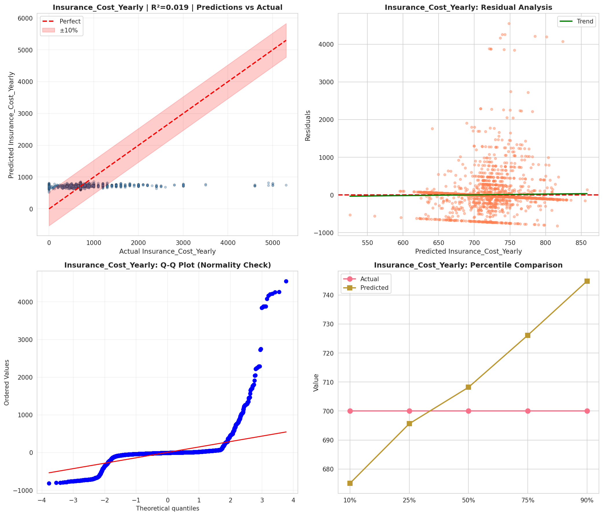
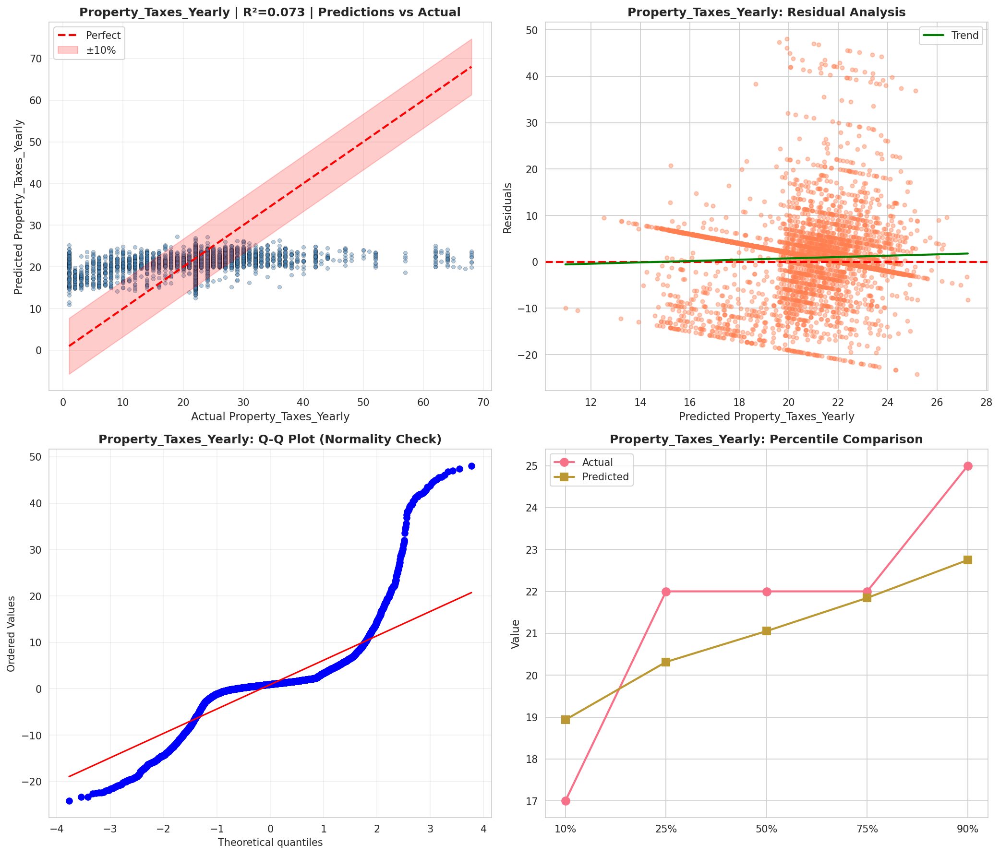
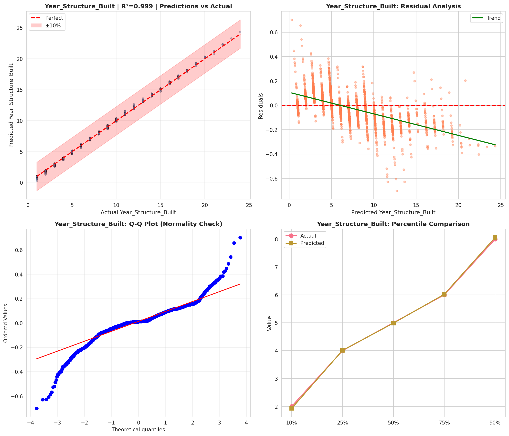
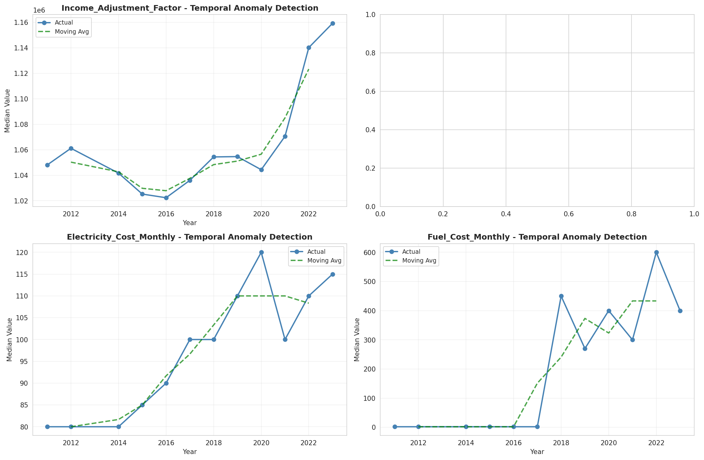
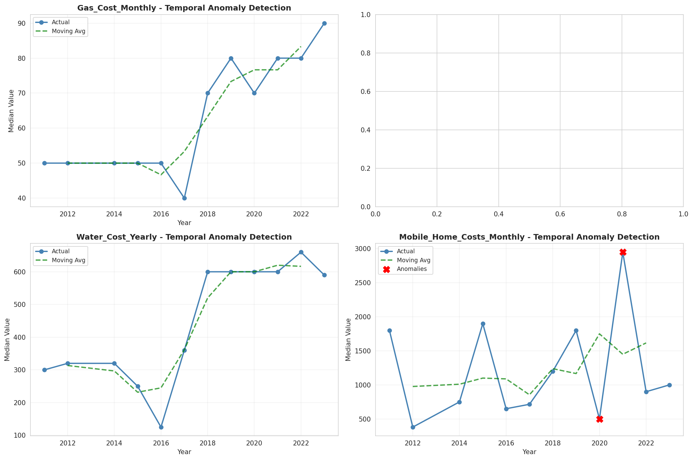
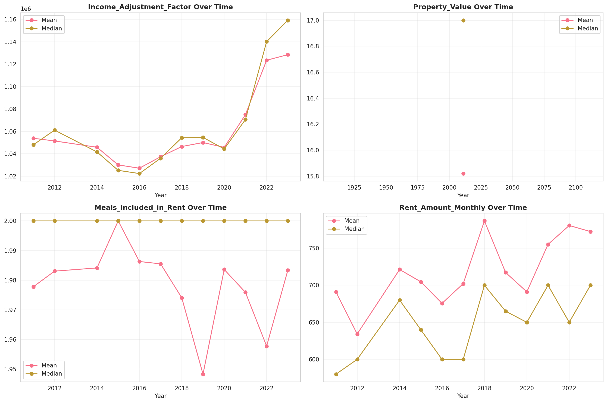
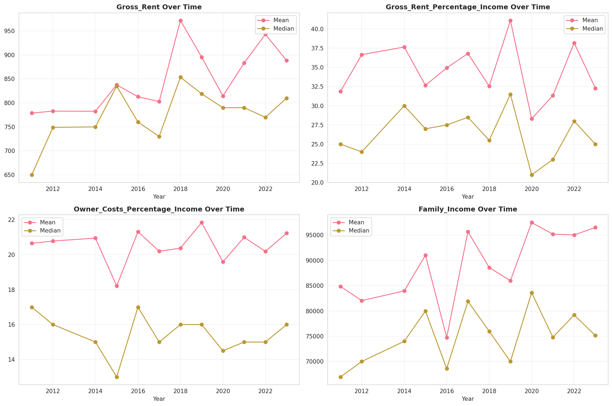
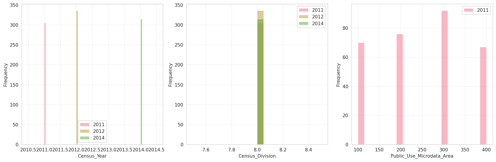
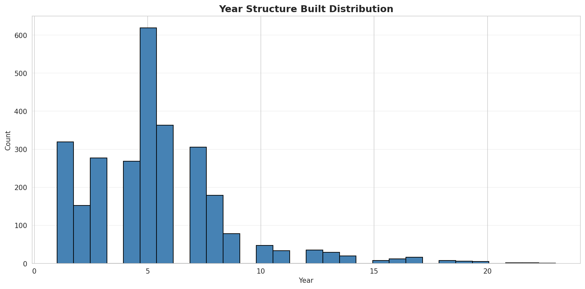
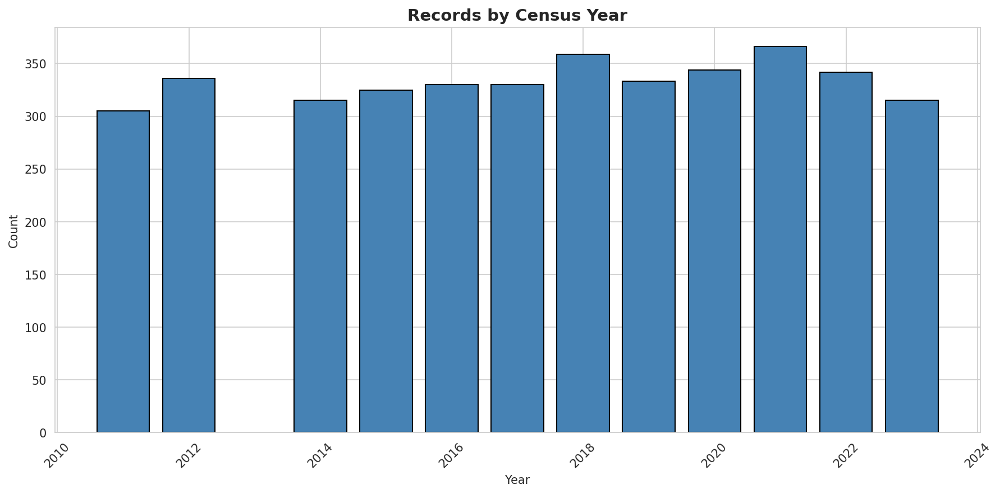
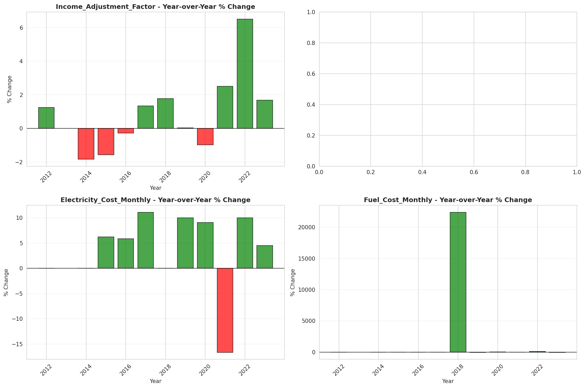
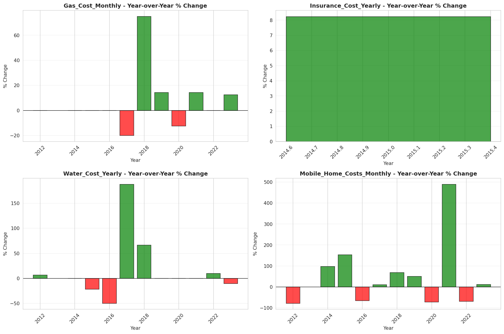
