# Statistical Analysis

> Comprehensive descriptive statistics including central tendency, dispersion, distribution characteristics, and weighted statistics using ACS sample weights.

## Summary Statistics

- **Variables Analyzed**: 41

### Income_Adjustment_Factor

| Statistic | Unweighted | Weighted (ACS) |
| :--- | :--- | :--- |
| Mean | 1,014,977.65 | 1,014,656.45 |
| Median | 1,010,207.00 | 1,014,656.45 |
| Std Deviation | 11,420.38 | — |
| Minimum | 1,001,264.00 | — |
| Maximum | 1,042,311.00 | — |
| Count | 276,545 | — |

> *Distribution is highly right-skewed (skewness: 1.30), light-tailed/platykurtic (kurtosis: 0.66).*

- **Coefficient of Variation**: 1.1 % (low variability)

### Property_Value

| Statistic | Unweighted | Weighted (ACS) |
| :--- | :--- | :--- |
| Mean | 173,193.65 | 176,724.55 |
| Median | 125,000.00 | 134,334.50 |
| Std Deviation | 234,242.53 | — |
| Minimum | 1.00 | — |
| Maximum | 3,567,000.00 | — |
| Count | 182,375 | — |

> *Distribution is highly right-skewed (skewness: 6.26), heavy-tailed/leptokurtic (kurtosis: 61.58).*

- **Coefficient of Variation**: 135.2 % (very high variability)

### Electricity_Cost_Monthly

| Statistic | Unweighted | Weighted (ACS) |
| :--- | :--- | :--- |
| Mean | 187.13 | 186.33 |
| Median | 170.00 | 169.38 |
| Std Deviation | 116.17 | — |
| Minimum | 1.00 | — |
| Maximum | 2,200.00 | — |
| Count | 317,453 | — |

> *Distribution is highly right-skewed (skewness: 5.29), heavy-tailed/leptokurtic (kurtosis: 78.25).*

- **Coefficient of Variation**: 62.1 % (high variability)

### Fuel_Cost_Monthly

| Statistic | Unweighted | Weighted (ACS) |
| :--- | :--- | :--- |
| Mean | 49.91 | 179.84 |
| Median | 2.00 | 93.25 |
| Std Deviation | 264.00 | — |
| Minimum | 1.00 | — |
| Maximum | 5,700.00 | — |
| Count | 220,432 | — |

> *Distribution is highly right-skewed (skewness: 8.96), heavy-tailed/leptokurtic (kurtosis: 102.49).*

- **Coefficient of Variation**: 528.9 % (very high variability)

### Gas_Cost_Monthly

| Statistic | Unweighted | Weighted (ACS) |
| :--- | :--- | :--- |
| Mean | 53.29 | 58.10 |
| Median | 20.00 | 19.19 |
| Std Deviation | 90.53 | — |
| Minimum | 1.00 | — |
| Maximum | 1,500.00 | — |
| Count | 262,370 | — |

> *Distribution is highly right-skewed (skewness: 4.99), heavy-tailed/leptokurtic (kurtosis: 51.30).*

- **Coefficient of Variation**: 169.9 % (very high variability)

### Insurance_Cost_Yearly

| Statistic | Unweighted | Weighted (ACS) |
| :--- | :--- | :--- |
| Mean | 1,158.35 | 1,167.05 |
| Median | 1,000.00 | 1,028.75 |
| Std Deviation | 862.21 | — |
| Minimum | 4.00 | — |
| Maximum | 8,900.00 | — |
| Count | 197,245 | — |

> *Distribution is highly right-skewed (skewness: 2.65), heavy-tailed/leptokurtic (kurtosis: 12.53).*

- **Coefficient of Variation**: 74.4 % (high variability)

### Water_Cost_Yearly

| Statistic | Unweighted | Weighted (ACS) |
| :--- | :--- | :--- |
| Mean | 417.95 | 432.11 |
| Median | 350.00 | 359.38 |
| Std Deviation | 450.87 | — |
| Minimum | 1.00 | — |
| Maximum | 4,000.00 | — |
| Count | 307,503 | — |

> *Distribution is highly right-skewed (skewness: 2.69), heavy-tailed/leptokurtic (kurtosis: 12.68).*

- **Coefficient of Variation**: 107.9 % (very high variability)

### Mobile_Home_Costs_Monthly

| Statistic | Unweighted | Weighted (ACS) |
| :--- | :--- | :--- |
| Mean | 592.76 | 611.89 |
| Median | 130.00 | 128.75 |
| Std Deviation | 1,465.10 | — |
| Minimum | 4.00 | — |
| Maximum | 18,600.00 | — |
| Count | 20,873 | — |

> *Distribution is highly right-skewed (skewness: 6.75), heavy-tailed/leptokurtic (kurtosis: 64.34).*

- **Coefficient of Variation**: 247.2 % (very high variability)

### First_Mortgage_Payment_Monthly

| Statistic | Unweighted | Weighted (ACS) |
| :--- | :--- | :--- |
| Mean | 741.42 | 838.96 |
| Median | 650.00 | 676.12 |
| Std Deviation | 642.05 | — |
| Minimum | 4.00 | — |
| Maximum | 5,100.00 | — |
| Count | 154,823 | — |

> *Distribution is highly right-skewed (skewness: 1.74), heavy-tailed/leptokurtic (kurtosis: 5.69).*

- **Coefficient of Variation**: 86.6 % (high variability)

### First_Mortgage_Includes_Taxes

| Statistic | Unweighted | Weighted (ACS) |
| :--- | :--- | :--- |
| Mean | 1.34 | 1.31 |
| Median | 1.00 | 1.00 |
| Std Deviation | 0.47 | — |
| Minimum | 1.00 | — |
| Maximum | 2.00 | — |
| Count | 127,984 | — |

> *Distribution is moderately right-skewed (skewness: 0.68), light-tailed/platykurtic (kurtosis: -1.54).*

- **Coefficient of Variation**: 35.4 % (moderate variability)

### Second_Mortgage_Payment_Monthly

| Statistic | Unweighted | Weighted (ACS) |
| :--- | :--- | :--- |
| Mean | 349.22 | 353.14 |
| Median | 250.00 | 261.88 |
| Std Deviation | 338.35 | — |
| Minimum | 4.00 | — |
| Maximum | 3,100.00 | — |
| Count | 19,423 | — |

> *Distribution is highly right-skewed (skewness: 3.01), heavy-tailed/leptokurtic (kurtosis: 12.97).*

- **Coefficient of Variation**: 96.9 % (high variability)

### Property_Taxes_Yearly

| Statistic | Unweighted | Weighted (ACS) |
| :--- | :--- | :--- |
| Mean | 100.23 | 113.57 |
| Median | 10.00 | 73.50 |
| Std Deviation | 567.61 | — |
| Minimum | 1.00 | — |
| Maximum | 15,500.00 | — |
| Count | 173,902 | — |

> *Distribution is highly right-skewed (skewness: 17.20), heavy-tailed/leptokurtic (kurtosis: 415.53).*

- **Coefficient of Variation**: 566.3 % (very high variability)

### Meals_Included_in_Rent

| Statistic | Unweighted | Weighted (ACS) |
| :--- | :--- | :--- |
| Mean | 1.99 | 1.99 |
| Median | 2.00 | 2.00 |
| Std Deviation | 0.12 | — |
| Minimum | 1.00 | — |
| Maximum | 2.00 | — |
| Count | 77,124 | — |

> *Distribution is highly left-skewed (skewness: -8.10), heavy-tailed/leptokurtic (kurtosis: 63.63).*

- **Coefficient of Variation**: 6.0 % (low variability)

### Rent_Amount_Monthly

| Statistic | Unweighted | Weighted (ACS) |
| :--- | :--- | :--- |
| Mean | 576.54 | 614.53 |
| Median | 500.00 | 544.38 |
| Std Deviation | 410.43 | — |
| Minimum | 4.00 | — |
| Maximum | 3,900.00 | — |
| Count | 77,124 | — |

> *Distribution is highly right-skewed (skewness: 2.60), heavy-tailed/leptokurtic (kurtosis: 11.36).*

- **Coefficient of Variation**: 71.2 % (high variability)

### Gross_Rent

| Statistic | Unweighted | Weighted (ACS) |
| :--- | :--- | :--- |
| Mean | 767.87 | 796.92 |
| Median | 703.00 | 742.75 |
| Std Deviation | 418.90 | — |
| Minimum | 4.00 | — |
| Maximum | 5,133.00 | — |
| Count | 70,692 | — |

> *Distribution is highly right-skewed (skewness: 2.00), heavy-tailed/leptokurtic (kurtosis: 7.89).*

- **Coefficient of Variation**: 54.6 % (high variability)

### Gross_Rent_Percentage_Income

| Statistic | Unweighted | Weighted (ACS) |
| :--- | :--- | :--- |
| Mean | 38.72 | 39.18 |
| Median | 29.00 | 29.75 |
| Std Deviation | 27.70 | — |
| Minimum | 1.00 | — |
| Maximum | 101.00 | — |
| Count | 68,582 | — |

> *Distribution is highly right-skewed (skewness: 1.13), light-tailed/platykurtic (kurtosis: 0.16).*

- **Coefficient of Variation**: 71.5 % (high variability)

### Selected_Monthly_Owner_Costs

| Statistic | Unweighted | Weighted (ACS) |
| :--- | :--- | :--- |
| Mean | 877.97 | 921.57 |
| Median | 688.00 | 754.50 |
| Std Deviation | 713.97 | — |
| Minimum | 1.00 | — |
| Maximum | 9,163.00 | — |
| Count | 238,204 | — |

> *Distribution is highly right-skewed (skewness: 2.23), heavy-tailed/leptokurtic (kurtosis: 8.70).*

- **Coefficient of Variation**: 81.3 % (high variability)

### Owner_Costs_Percentage_Income

| Statistic | Unweighted | Weighted (ACS) |
| :--- | :--- | :--- |
| Mean | 21.52 | 22.06 |
| Median | 15.00 | 16.00 |
| Std Deviation | 20.43 | — |
| Minimum | 1.00 | — |
| Maximum | 101.00 | — |
| Count | 235,756 | — |

> *Distribution is highly right-skewed (skewness: 2.28), heavy-tailed/leptokurtic (kurtosis: 5.53).*

- **Coefficient of Variation**: 95.0 % (high variability)

### Family_Income

| Statistic | Unweighted | Weighted (ACS) |
| :--- | :--- | :--- |
| Mean | 78,835.48 | 77,579.11 |
| Median | 60,000.00 | 59,562.50 |
| Std Deviation | 75,025.35 | — |
| Minimum | 1.00 | — |
| Maximum | 1,539,000.00 | — |
| Count | 210,994 | — |

> *Distribution is highly right-skewed (skewness: 3.33), heavy-tailed/leptokurtic (kurtosis: 19.19).*

- **Coefficient of Variation**: 95.2 % (high variability)

### Household_Income

| Statistic | Unweighted | Weighted (ACS) |
| :--- | :--- | :--- |
| Mean | 65,898.98 | 65,063.67 |
| Median | 47,600.00 | 47,106.88 |
| Std Deviation | 69,238.86 | — |
| Minimum | 1.00 | — |
| Maximum | 1,539,000.00 | — |
| Count | 314,496 | — |

> *Distribution is highly right-skewed (skewness: 3.53), heavy-tailed/leptokurtic (kurtosis: 21.68).*

- **Coefficient of Variation**: 105.1 % (very high variability)

### Specified_Rent_Unit

| Statistic | Unweighted | Weighted (ACS) |
| :--- | :--- | :--- |
| Mean | 0.24 | 0.29 |
| Median | 0.00 | 0.00 |
| Std Deviation | 0.43 | — |
| Minimum | 0.00 | — |
| Maximum | 1.00 | — |
| Count | 357,023 | — |

> *Distribution is highly right-skewed (skewness: 1.20), light-tailed/platykurtic (kurtosis: -0.56).*

- **Coefficient of Variation**: 176.7 % (very high variability)

### Specified_Value_Unit

| Statistic | Unweighted | Weighted (ACS) |
| :--- | :--- | :--- |
| Mean | 0.54 | 0.48 |
| Median | 1.00 | 0.12 |
| Std Deviation | 0.50 | — |
| Minimum | 0.00 | — |
| Maximum | 1.00 | — |
| Count | 357,023 | — |

> *Distribution is approximately symmetric (skewness: -0.18), light-tailed/platykurtic (kurtosis: -1.97).*

- **Coefficient of Variation**: 91.5 % (high variability)

### Flag_Family_Income

| Statistic | Unweighted | Weighted (ACS) |
| :--- | :--- | :--- |
| Mean | 0.21 | 0.20 |
| Median | 0.00 | 0.00 |
| Std Deviation | 0.41 | — |
| Minimum | 0.00 | — |
| Maximum | 1.00 | — |
| Count | 270,498 | — |

> *Distribution is highly right-skewed (skewness: 1.39), light-tailed/platykurtic (kurtosis: -0.07).*

- **Coefficient of Variation**: 191.1 % (very high variability)

### Flag_Gross_Rent

| Statistic | Unweighted | Weighted (ACS) |
| :--- | :--- | :--- |
| Mean | 0.07 | 0.12 |
| Median | 0.00 | 0.00 |
| Std Deviation | 0.26 | — |
| Minimum | 0.00 | — |
| Maximum | 1.00 | — |
| Count | 172,895 | — |

> *Distribution is highly right-skewed (skewness: 3.27), heavy-tailed/leptokurtic (kurtosis: 8.71).*

- **Coefficient of Variation**: 355.5 % (very high variability)

### Flag_Household_Income

| Statistic | Unweighted | Weighted (ACS) |
| :--- | :--- | :--- |
| Mean | 0.32 | 0.30 |
| Median | 0.00 | 0.00 |
| Std Deviation | 0.47 | — |
| Minimum | 0.00 | — |
| Maximum | 1.00 | — |
| Count | 270,498 | — |

> *Distribution is moderately right-skewed (skewness: 0.78), light-tailed/platykurtic (kurtosis: -1.40).*

- **Coefficient of Variation**: 146.2 % (very high variability)

### Flag_First_Mortgage_Payment

| Statistic | Unweighted | Weighted (ACS) |
| :--- | :--- | :--- |
| Mean | 0.04 | 0.04 |
| Median | 0.00 | 0.00 |
| Std Deviation | 0.19 | — |
| Minimum | 0.00 | — |
| Maximum | 1.00 | — |
| Count | 357,023 | — |

> *Distribution is highly right-skewed (skewness: 4.91), heavy-tailed/leptokurtic (kurtosis: 22.08).*

- **Coefficient of Variation**: 510.3 % (very high variability)

### Flag_First_Mortgage_Taxes

| Statistic | Unweighted | Weighted (ACS) |
| :--- | :--- | :--- |
| Mean | 0.04 | 0.04 |
| Median | 0.00 | 0.00 |
| Std Deviation | 0.20 | — |
| Minimum | 0.00 | — |
| Maximum | 1.00 | — |
| Count | 357,023 | — |

> *Distribution is highly right-skewed (skewness: 4.69), heavy-tailed/leptokurtic (kurtosis: 19.99).*

- **Coefficient of Variation**: 489.4 % (very high variability)

### Flag_Meals_Included_Rent

| Statistic | Unweighted | Weighted (ACS) |
| :--- | :--- | :--- |
| Mean | 0.01 | 0.01 |
| Median | 0.00 | 0.00 |
| Std Deviation | 0.08 | — |
| Minimum | 0.00 | — |
| Maximum | 1.00 | — |
| Count | 357,023 | — |

> *Distribution is highly right-skewed (skewness: 11.91), heavy-tailed/leptokurtic (kurtosis: 139.96).*

- **Coefficient of Variation**: 1,199.8 % (very high variability)

### Flag_Rent_Amount

| Statistic | Unweighted | Weighted (ACS) |
| :--- | :--- | :--- |
| Mean | 0.02 | 0.03 |
| Median | 0.00 | 0.00 |
| Std Deviation | 0.15 | — |
| Minimum | 0.00 | — |
| Maximum | 1.00 | — |
| Count | 357,023 | — |

> *Distribution is highly right-skewed (skewness: 6.51), heavy-tailed/leptokurtic (kurtosis: 40.32).*

- **Coefficient of Variation**: 665.6 % (very high variability)

### Flag_Selected_Monthly_Owner_Costs

| Statistic | Unweighted | Weighted (ACS) |
| :--- | :--- | :--- |
| Mean | 0.26 | 0.25 |
| Median | 0.00 | 0.00 |
| Std Deviation | 0.44 | — |
| Minimum | 0.00 | — |
| Maximum | 1.00 | — |
| Count | 232,699 | — |

> *Distribution is highly right-skewed (skewness: 1.10), light-tailed/platykurtic (kurtosis: -0.80).*

- **Coefficient of Variation**: 168.9 % (very high variability)

### Flag_Second_Mortgage_Payment

| Statistic | Unweighted | Weighted (ACS) |
| :--- | :--- | :--- |
| Mean | 0.03 | 0.03 |
| Median | 0.00 | 0.00 |
| Std Deviation | 0.17 | — |
| Minimum | 0.00 | — |
| Maximum | 1.00 | — |
| Count | 357,023 | — |

> *Distribution is highly right-skewed (skewness: 5.43), heavy-tailed/leptokurtic (kurtosis: 27.45).*

- **Coefficient of Variation**: 560.5 % (very high variability)

### Flag_Property_Taxes

| Statistic | Unweighted | Weighted (ACS) |
| :--- | :--- | :--- |
| Mean | 0.11 | 0.11 |
| Median | 0.00 | 0.00 |
| Std Deviation | 0.31 | — |
| Minimum | 0.00 | — |
| Maximum | 1.00 | — |
| Count | 333,421 | — |

> *Distribution is highly right-skewed (skewness: 2.51), heavy-tailed/leptokurtic (kurtosis: 4.28).*

- **Coefficient of Variation**: 285.7 % (very high variability)

### Flag_Property_Value

| Statistic | Unweighted | Weighted (ACS) |
| :--- | :--- | :--- |
| Mean | 0.09 | 0.09 |
| Median | 0.00 | 0.00 |
| Std Deviation | 0.29 | — |
| Minimum | 0.00 | — |
| Maximum | 1.00 | — |
| Count | 357,023 | — |

> *Distribution is highly right-skewed (skewness: 2.82), heavy-tailed/leptokurtic (kurtosis: 5.94).*

- **Coefficient of Variation**: 313.6 % (very high variability)

### Flag_Water_Cost

| Statistic | Unweighted | Weighted (ACS) |
| :--- | :--- | :--- |
| Mean | 0.08 | 0.09 |
| Median | 0.00 | 0.00 |
| Std Deviation | 0.27 | — |
| Minimum | 0.00 | — |
| Maximum | 1.00 | — |
| Count | 23,602 | — |

> *Distribution is highly right-skewed (skewness: 3.06), heavy-tailed/leptokurtic (kurtosis: 7.35).*

- **Coefficient of Variation**: 335.6 % (very high variability)

### Annual_Rent_to_Value_Ratio

### Total_Monthly_Utility_Cost

| Statistic | Unweighted | Weighted (ACS) |
| :--- | :--- | :--- |
| Mean | 230.86 | 228.27 |
| Median | 203.00 | 203.81 |
| Std Deviation | 146.28 | — |
| Minimum | 2.00 | — |
| Maximum | 3,700.00 | — |
| Count | 317,887 | — |

> *Distribution is highly right-skewed (skewness: 5.22), heavy-tailed/leptokurtic (kurtosis: 74.98).*

- **Coefficient of Variation**: 63.4 % (high variability)

### Property_Tax_Rate

| Statistic | Unweighted | Weighted (ACS) |
| :--- | :--- | :--- |
| Mean | 10.07 | 10.07 |
| Median | 0.01 | 8.65 |
| Std Deviation | 34.35 | — |
| Minimum | 0.00 | — |
| Maximum | 1,100.00 | — |
| Count | 114,951 | — |

> *Distribution is highly right-skewed (skewness: 6.62), heavy-tailed/leptokurtic (kurtosis: 91.49).*

- **Coefficient of Variation**: 341.1 % (very high variability)

#### Weighted Statistics by Year

| Year | Weighted Mean | Weighted Median |
| :--- | :--- | :--- |
| 2007 | 79.91 | 68.75 |
| 2012 | 0.01 | 0.01 |
| 2013 | 0.03 | 0.01 |
| 2014 | 0.03 | 0.01 |
| 2015 | 0.01 | 0.01 |
| 2016 | 0.01 | 0.01 |
| 2017 | 0.01 | 0.01 |
| 2023 | 0.56 | 0.37 |

### Structure_Age

| Statistic | Unweighted | Weighted (ACS) |
| :--- | :--- | :--- |
| Mean | 1,868.19 | 1,877.01 |
| Median | 2,018.00 | 1,877.00 |
| Std Deviation | 522.89 | — |
| Minimum | 1.00 | — |
| Maximum | 2,023.00 | — |
| Count | 310,490 | — |

> *Distribution is highly left-skewed (skewness: -3.20), heavy-tailed/leptokurtic (kurtosis: 8.24).*

- **Coefficient of Variation**: 28.0 % (moderate variability)

### Structure_Age_Score

| Statistic | Unweighted | Weighted (ACS) |
| :--- | :--- | :--- |
| Mean | 0.04 | 0.04 |
| Median | 0.00 | 0.04 |
| Std Deviation | 0.16 | — |
| Minimum | 0.00 | — |
| Maximum | 0.99 | — |
| Count | 310,490 | — |

> *Distribution is highly right-skewed (skewness: 3.93), heavy-tailed/leptokurtic (kurtosis: 14.73).*

- **Coefficient of Variation**: 378.6 % (very high variability)

### Working_Age_Persons

| Statistic | Unweighted | Weighted (ACS) |
| :--- | :--- | :--- |
| Mean | 1.58 | 1.68 |
| Median | 1.00 | 1.94 |
| Std Deviation | 1.29 | — |
| Minimum | 0.00 | — |
| Maximum | 18.00 | — |
| Count | 319,747 | — |

> *Distribution is moderately right-skewed (skewness: 0.86), light-tailed/platykurtic (kurtosis: 1.65).*

- **Coefficient of Variation**: 82.0 % (high variability)

### Income_to_FPL_Ratio

| Statistic | Unweighted | Weighted (ACS) |
| :--- | :--- | :--- |
| Mean | 3.03 | 2.96 |
| Median | 2.23 | 2.21 |
| Std Deviation | 3.16 | — |
| Minimum | -0.82 | — |
| Maximum | 78.04 | — |
| Count | 319,747 | — |

> *Distribution is highly right-skewed (skewness: 3.84), heavy-tailed/leptokurtic (kurtosis: 26.30).*

- **Coefficient of Variation**: 104.5 % (very high variability)

## Distribution Analysis

### Skewed Distributions

> Variables with skewness > |0.5| indicate non-normal distributions. Consider log transformations for highly skewed variables in modeling.

| Variable | Skewness | Direction | Severity |
| :--- | :--- | :--- | :--- |
| Property_Taxes_Yearly | 17.200 | Right-skewed | High |
| Flag_Meals_Included_Rent | 11.915 | Right-skewed | High |
| Fuel_Cost_Monthly | 8.958 | Right-skewed | High |
| Meals_Included_in_Rent | -8.101 | Left-skewed | High |
| Mobile_Home_Costs_Monthly | 6.750 | Right-skewed | High |
| Property_Tax_Rate | 6.622 | Right-skewed | High |
| Flag_Rent_Amount | 6.506 | Right-skewed | High |
| Property_Value | 6.262 | Right-skewed | High |
| Flag_Second_Mortgage_Payment | 5.427 | Right-skewed | High |
| Electricity_Cost_Monthly | 5.293 | Right-skewed | High |
| Total_Monthly_Utility_Cost | 5.220 | Right-skewed | High |
| Gas_Cost_Monthly | 4.988 | Right-skewed | High |
| Flag_First_Mortgage_Payment | 4.907 | Right-skewed | High |
| Flag_First_Mortgage_Taxes | 4.689 | Right-skewed | High |
| Structure_Age_Score | 3.933 | Right-skewed | High |
| Income_to_FPL_Ratio | 3.840 | Right-skewed | High |
| Household_Income | 3.527 | Right-skewed | High |
| Family_Income | 3.327 | Right-skewed | High |
| Flag_Gross_Rent | 3.273 | Right-skewed | High |
| Structure_Age | -3.200 | Left-skewed | High |

- **Total Skewed Variables**: 39

- **Right-skewed**: 37

- **Left-skewed**: 2

## Variance Analysis

### Coefficient of Variation Ranking

> CV (Coefficient of Variation) = (Std Dev / Mean) × 100%. Higher CV indicates greater relative variability.

| Variable | CV (%) | Std Dev | Mean | Variability |
| :--- | :--- | :--- | :--- | :--- |
| Flag_Meals_Included_Rent | 1199.8% | 0.08 | 0.01 | Very High |
| Flag_Rent_Amount | 665.6% | 0.15 | 0.02 | Very High |
| Property_Taxes_Yearly | 566.3% | 567.61 | 100.23 | Very High |
| Flag_Second_Mortgage_Payment | 560.5% | 0.17 | 0.03 | Very High |
| Fuel_Cost_Monthly | 528.9% | 264.00 | 49.91 | Very High |
| Flag_First_Mortgage_Payment | 510.3% | 0.19 | 0.04 | Very High |
| Flag_First_Mortgage_Taxes | 489.4% | 0.20 | 0.04 | Very High |
| Structure_Age_Score | 378.6% | 0.16 | 0.04 | Very High |
| Flag_Gross_Rent | 355.5% | 0.26 | 0.07 | Very High |
| Property_Tax_Rate | 341.1% | 34.35 | 10.07 | Very High |
| Flag_Water_Cost | 335.6% | 0.27 | 0.08 | Very High |
| Flag_Property_Value | 313.6% | 0.29 | 0.09 | Very High |
| Flag_Property_Taxes | 285.7% | 0.31 | 0.11 | Very High |
| Mobile_Home_Costs_Monthly | 247.2% | 1,465.10 | 592.76 | Very High |
| Flag_Family_Income | 191.1% | 0.41 | 0.21 | Very High |
| Specified_Rent_Unit | 176.7% | 0.43 | 0.24 | Very High |
| Gas_Cost_Monthly | 169.9% | 90.53 | 53.29 | Very High |
| Flag_Selected_Monthly_Owner_Costs | 168.9% | 0.44 | 0.26 | Very High |
| Flag_Household_Income | 146.2% | 0.47 | 0.32 | Very High |
| Property_Value | 135.2% | 234,242.53 | 173,193.65 | Very High |

- **Average CV**: 229.5 %

- **High Variance Variables (CV > 50%)**: 36

## Visualizations

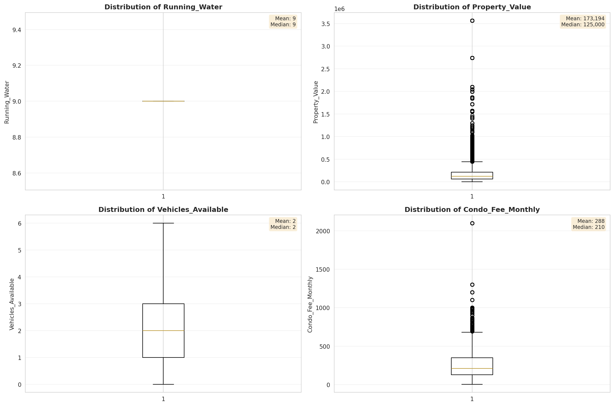

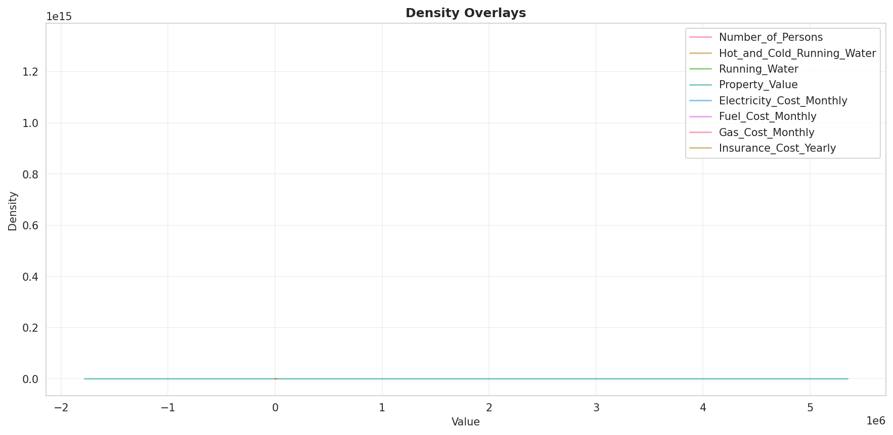

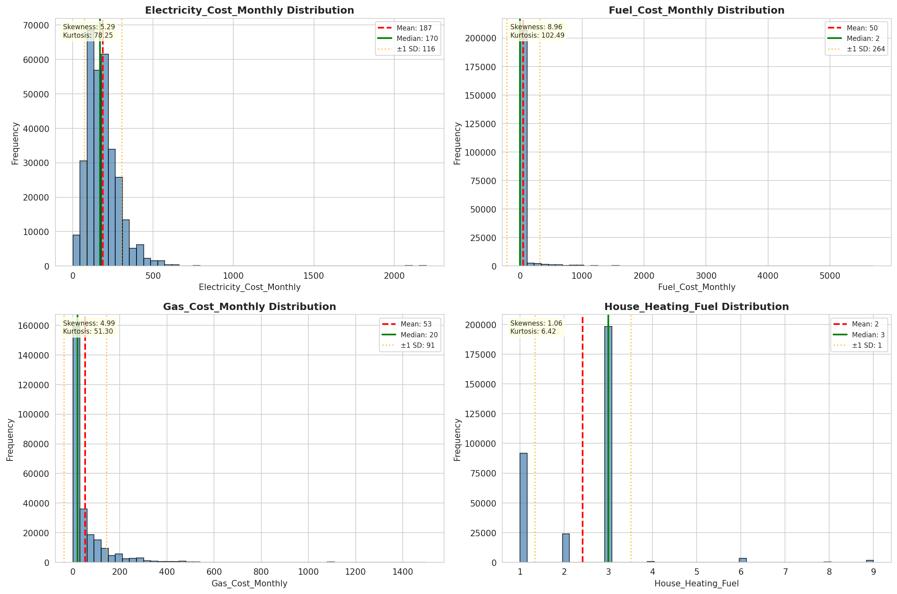

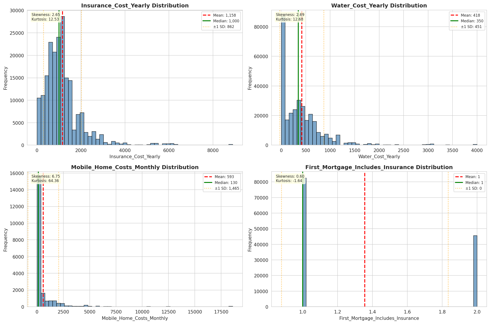

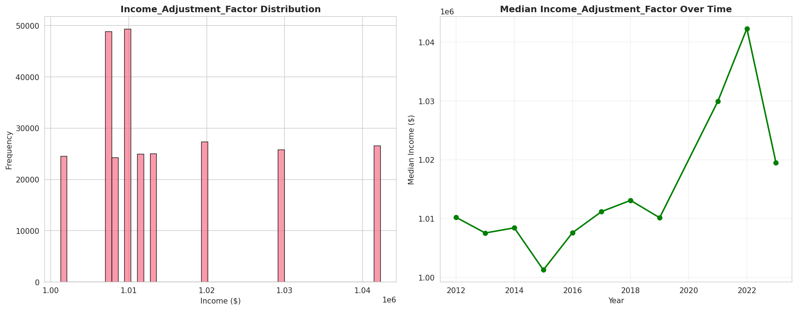

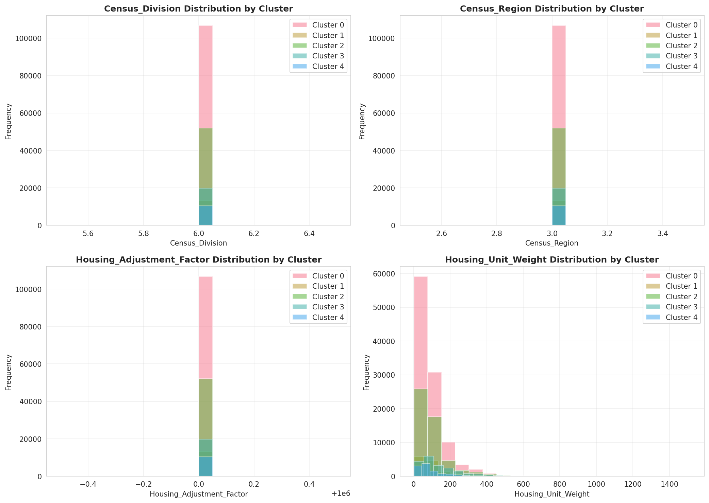

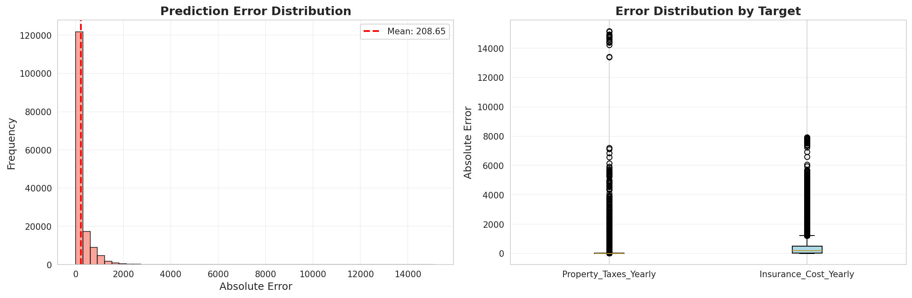

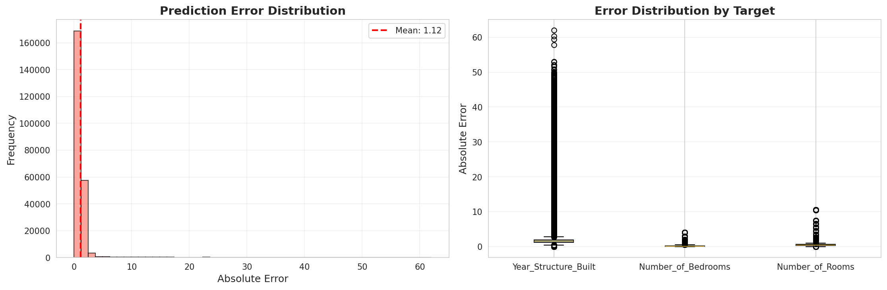

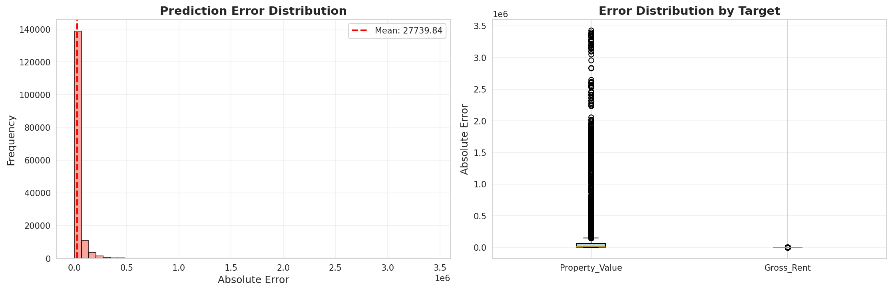

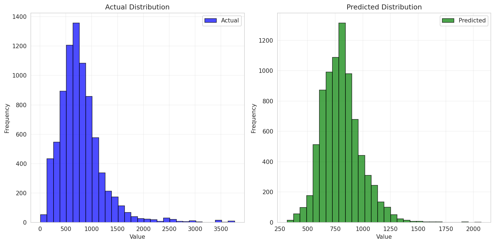

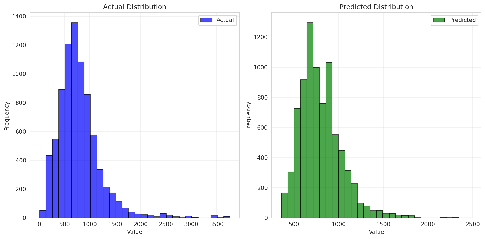

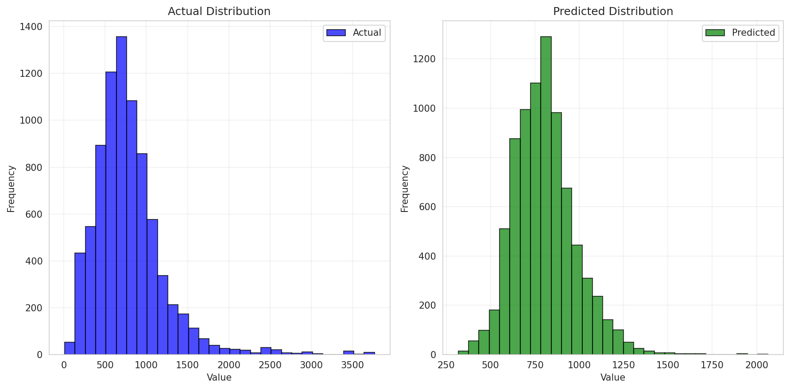

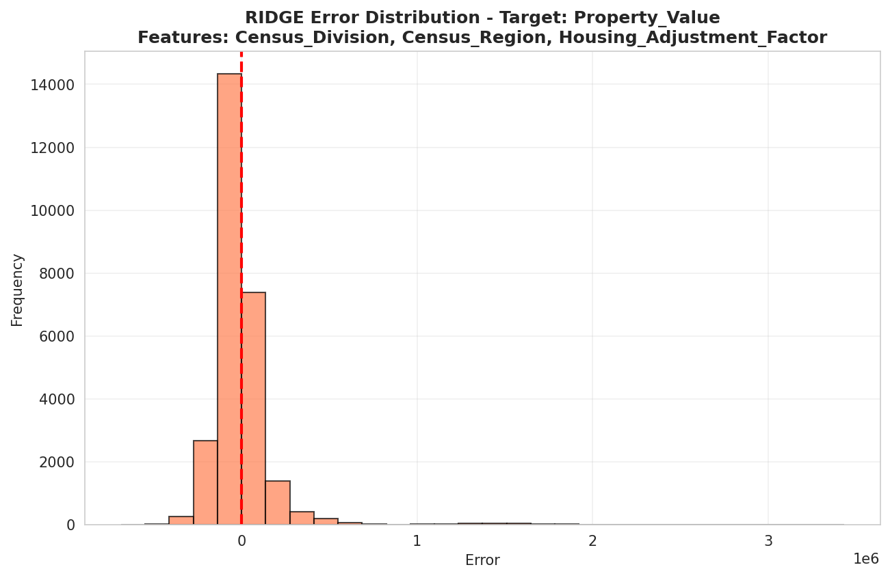

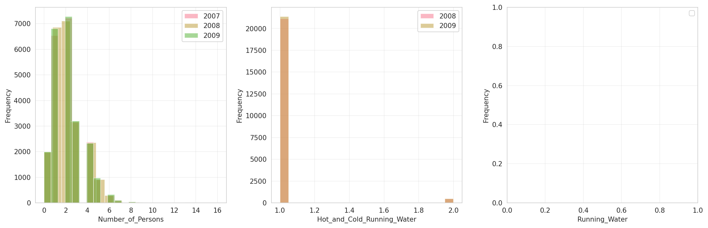

