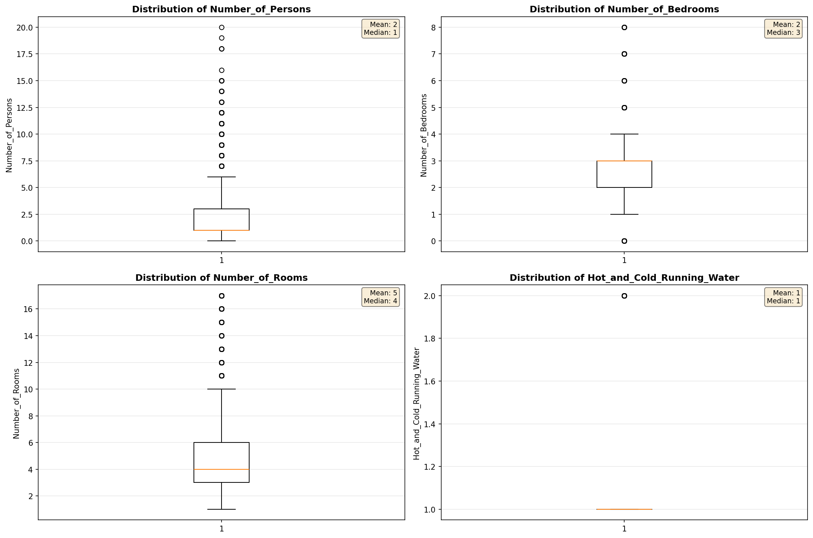
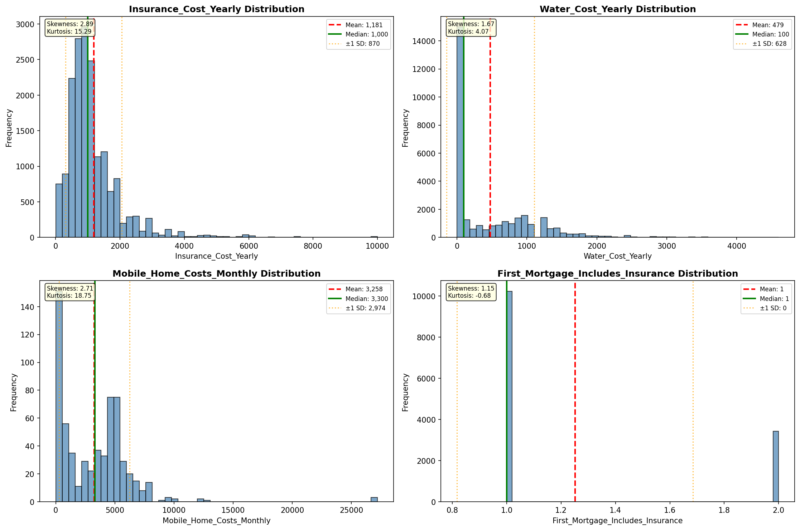
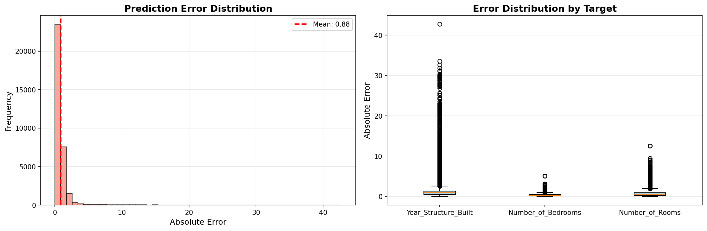
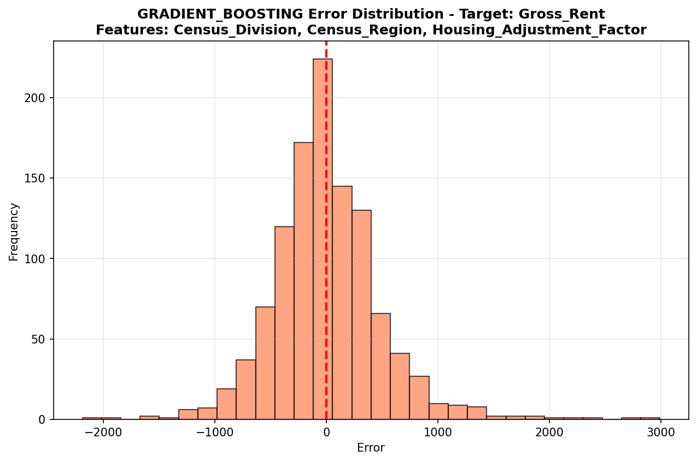
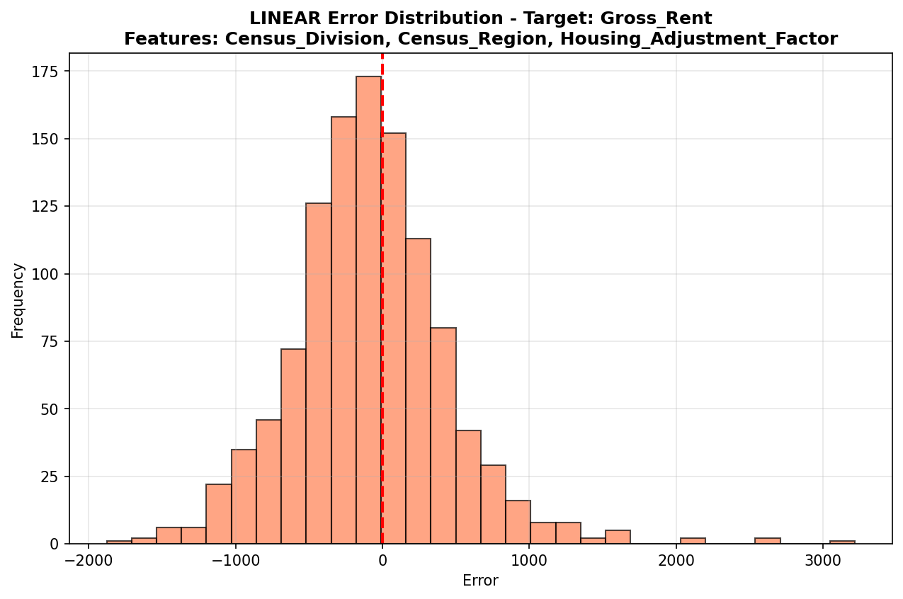
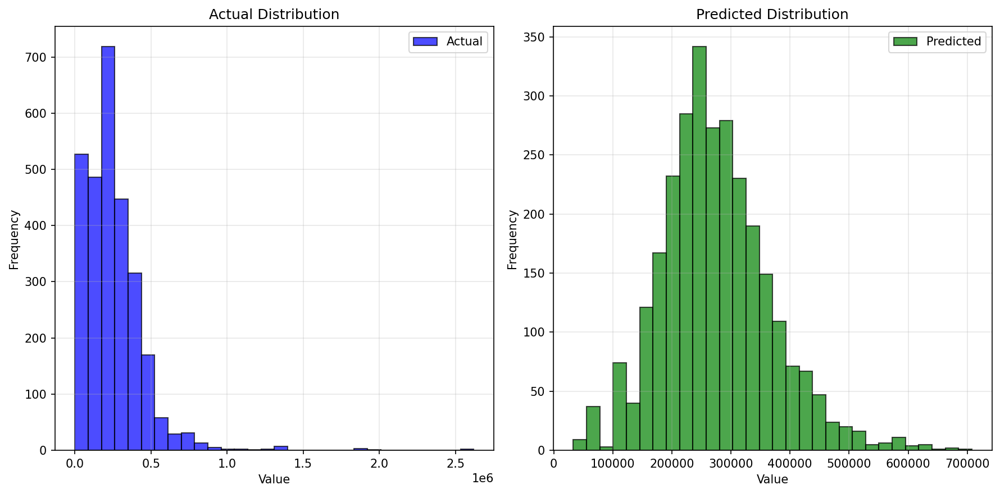
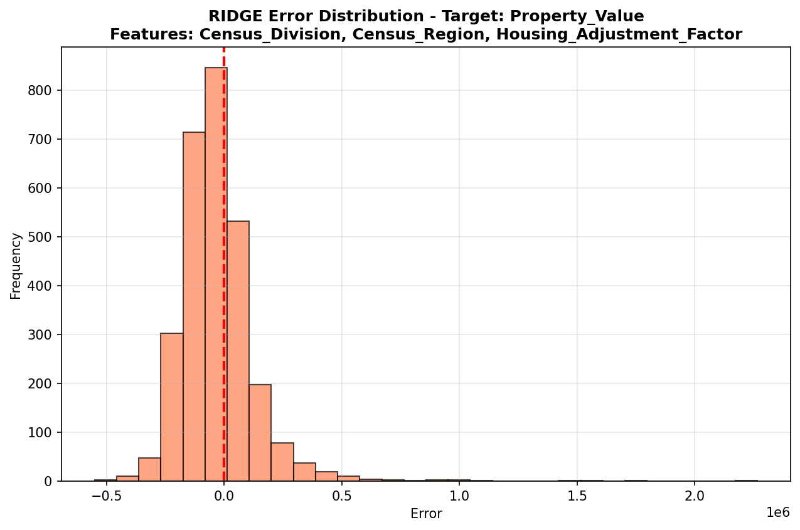
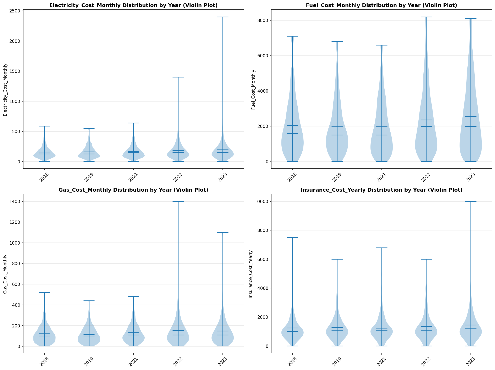
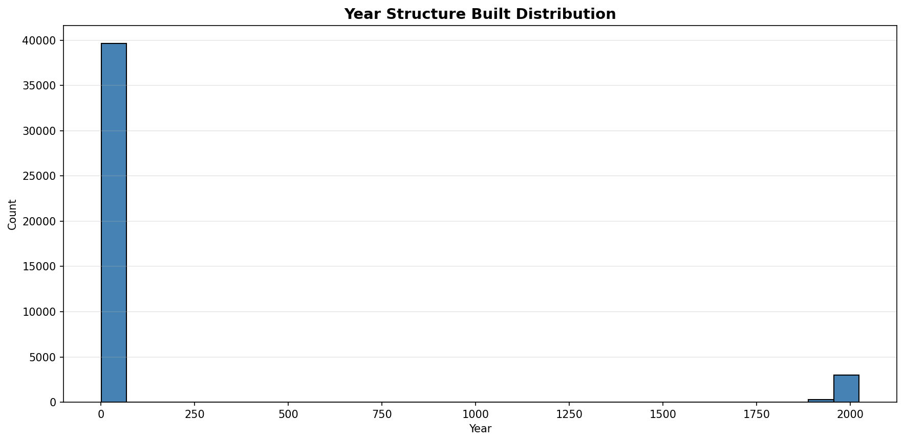

# Statistical Analysis

> Comprehensive descriptive statistics including central tendency, dispersion, distribution characteristics, and weighted statistics using ACS sample weights.

## Summary Statistics

- **Variables Analyzed**: 41

### Income_Adjustment_Factor

| Statistic | Unweighted | Weighted (ACS) |
| :--- | :--- | :--- |
| Mean | 1,014,993.04 | 1,014,656.45 |
| Median | 1,010,207.00 | 1,014,656.45 |
| Std Deviation | 11,433.43 | — |
| Minimum | 1,001,264.00 | — |
| Maximum | 1,042,311.00 | — |
| Count | 40,381 | — |

> *Distribution is highly right-skewed (skewness: 1.30), light-tailed/platykurtic (kurtosis: 0.65).*

- **Coefficient of Variation**: 1.1 % (low variability)

### Property_Value

| Statistic | Unweighted | Weighted (ACS) |
| :--- | :--- | :--- |
| Mean | 244,122.13 | 273,169.69 |
| Median | 220,000.00 | 251,501.50 |
| Std Deviation | 222,201.81 | — |
| Minimum | 1.00 | — |
| Maximum | 2,620,000.00 | — |
| Count | 19,002 | — |

> *Distribution is highly right-skewed (skewness: 3.37), heavy-tailed/leptokurtic (kurtosis: 24.63).*

- **Coefficient of Variation**: 91.0 % (high variability)

### Electricity_Cost_Monthly

| Statistic | Unweighted | Weighted (ACS) |
| :--- | :--- | :--- |
| Mean | 143.45 | 134.10 |
| Median | 120.00 | 110.62 |
| Std Deviation | 120.42 | — |
| Minimum | 1.00 | — |
| Maximum | 2,400.00 | — |
| Count | 35,605 | — |

> *Distribution is highly right-skewed (skewness: 4.71), heavy-tailed/leptokurtic (kurtosis: 64.32).*

- **Coefficient of Variation**: 83.9 % (high variability)

### Fuel_Cost_Monthly

| Statistic | Unweighted | Weighted (ACS) |
| :--- | :--- | :--- |
| Mean | 1,116.43 | 1,071.39 |
| Median | 2.00 | 495.12 |
| Std Deviation | 1,655.29 | — |
| Minimum | 1.00 | — |
| Maximum | 8,200.00 | — |
| Count | 29,254 | — |

> *Distribution is highly right-skewed (skewness: 1.66), light-tailed/platykurtic (kurtosis: 2.25).*

- **Coefficient of Variation**: 148.3 % (very high variability)

### Gas_Cost_Monthly

| Statistic | Unweighted | Weighted (ACS) |
| :--- | :--- | :--- |
| Mean | 69.18 | 89.16 |
| Median | 20.00 | 43.94 |
| Std Deviation | 98.49 | — |
| Minimum | 1.00 | — |
| Maximum | 1,400.00 | — |
| Count | 30,337 | — |

> *Distribution is highly right-skewed (skewness: 3.27), heavy-tailed/leptokurtic (kurtosis: 25.34).*

- **Coefficient of Variation**: 142.4 % (very high variability)

### Insurance_Cost_Yearly

| Statistic | Unweighted | Weighted (ACS) |
| :--- | :--- | :--- |
| Mean | 1,181.33 | 1,190.42 |
| Median | 1,000.00 | 998.75 |
| Std Deviation | 869.99 | — |
| Minimum | 4.00 | — |
| Maximum | 10,000.00 | — |
| Count | 17,601 | — |

> *Distribution is highly right-skewed (skewness: 2.89), heavy-tailed/leptokurtic (kurtosis: 15.28).*

- **Coefficient of Variation**: 73.6 % (high variability)

### Water_Cost_Yearly

| Statistic | Unweighted | Weighted (ACS) |
| :--- | :--- | :--- |
| Mean | 478.58 | 500.92 |
| Median | 100.00 | 283.88 |
| Std Deviation | 627.65 | — |
| Minimum | 1.00 | — |
| Maximum | 4,600.00 | — |
| Count | 30,610 | — |

> *Distribution is highly right-skewed (skewness: 1.67), heavy-tailed/leptokurtic (kurtosis: 4.07).*

- **Coefficient of Variation**: 131.1 % (very high variability)

### Mobile_Home_Costs_Monthly

| Statistic | Unweighted | Weighted (ACS) |
| :--- | :--- | :--- |
| Mean | 3,258.25 | 3,506.35 |
| Median | 3,300.00 | 3,768.75 |
| Std Deviation | 2,973.58 | — |
| Minimum | 4.00 | — |
| Maximum | 27,200.00 | — |
| Count | 622 | — |

> *Distribution is highly right-skewed (skewness: 2.70), heavy-tailed/leptokurtic (kurtosis: 18.59).*

- **Coefficient of Variation**: 91.3 % (high variability)

### First_Mortgage_Payment_Monthly

| Statistic | Unweighted | Weighted (ACS) |
| :--- | :--- | :--- |
| Mean | 1,015.59 | 1,352.01 |
| Median | 1,000.00 | 1,206.75 |
| Std Deviation | 891.99 | — |
| Minimum | 4.00 | — |
| Maximum | 5,000.00 | — |
| Count | 18,118 | — |

> *Distribution is moderately right-skewed (skewness: 0.83), light-tailed/platykurtic (kurtosis: 0.96).*

- **Coefficient of Variation**: 87.8 % (high variability)

### First_Mortgage_Includes_Taxes

| Statistic | Unweighted | Weighted (ACS) |
| :--- | :--- | :--- |
| Mean | 1.20 | 1.17 |
| Median | 1.00 | 1.00 |
| Std Deviation | 0.40 | — |
| Minimum | 1.00 | — |
| Maximum | 2.00 | — |
| Count | 13,652 | — |

> *Distribution is highly right-skewed (skewness: 1.48), light-tailed/platykurtic (kurtosis: 0.20).*

- **Coefficient of Variation**: 33.4 % (moderate variability)

### Second_Mortgage_Payment_Monthly

| Statistic | Unweighted | Weighted (ACS) |
| :--- | :--- | :--- |
| Mean | 480.81 | 467.49 |
| Median | 350.00 | 350.00 |
| Std Deviation | 472.26 | — |
| Minimum | 4.00 | — |
| Maximum | 4,600.00 | — |
| Count | 1,479 | — |

> *Distribution is highly right-skewed (skewness: 3.67), heavy-tailed/leptokurtic (kurtosis: 20.69).*

- **Coefficient of Variation**: 98.2 % (high variability)

### Property_Taxes_Yearly

| Statistic | Unweighted | Weighted (ACS) |
| :--- | :--- | :--- |
| Mean | 267.56 | 378.78 |
| Median | 30.00 | 329.00 |
| Std Deviation | 1,208.71 | — |
| Minimum | 1.00 | — |
| Maximum | 21,500.00 | — |
| Count | 18,050 | — |

> *Distribution is highly right-skewed (skewness: 7.75), heavy-tailed/leptokurtic (kurtosis: 85.95).*

- **Coefficient of Variation**: 451.8 % (very high variability)

### Meals_Included_in_Rent

| Statistic | Unweighted | Weighted (ACS) |
| :--- | :--- | :--- |
| Mean | 1.99 | 1.99 |
| Median | 2.00 | 2.00 |
| Std Deviation | 0.12 | — |
| Minimum | 1.00 | — |
| Maximum | 2.00 | — |
| Count | 10,883 | — |

> *Distribution is highly left-skewed (skewness: -8.34), heavy-tailed/leptokurtic (kurtosis: 67.57).*

- **Coefficient of Variation**: 5.9 % (low variability)

### Rent_Amount_Monthly

| Statistic | Unweighted | Weighted (ACS) |
| :--- | :--- | :--- |
| Mean | 972.63 | 1,090.63 |
| Median | 900.00 | 1,021.25 |
| Std Deviation | 549.72 | — |
| Minimum | 4.00 | — |
| Maximum | 4,100.00 | — |
| Count | 10,883 | — |

> *Distribution is highly right-skewed (skewness: 1.05), light-tailed/platykurtic (kurtosis: 2.33).*

- **Coefficient of Variation**: 56.5 % (high variability)

### Gross_Rent

| Statistic | Unweighted | Weighted (ACS) |
| :--- | :--- | :--- |
| Mean | 1,127.45 | 1,224.84 |
| Median | 1,020.00 | 1,142.31 |
| Std Deviation | 565.77 | — |
| Minimum | 4.00 | — |
| Maximum | 5,047.00 | — |
| Count | 9,787 | — |

> *Distribution is highly right-skewed (skewness: 1.04), light-tailed/platykurtic (kurtosis: 2.19).*

- **Coefficient of Variation**: 50.2 % (high variability)

### Gross_Rent_Percentage_Income

| Statistic | Unweighted | Weighted (ACS) |
| :--- | :--- | :--- |
| Mean | 33.70 | 35.63 |
| Median | 26.00 | 27.38 |
| Std Deviation | 24.71 | — |
| Minimum | 1.00 | — |
| Maximum | 101.00 | — |
| Count | 9,730 | — |

> *Distribution is highly right-skewed (skewness: 1.43), light-tailed/platykurtic (kurtosis: 1.37).*

- **Coefficient of Variation**: 73.3 % (high variability)

### Selected_Monthly_Owner_Costs

| Statistic | Unweighted | Weighted (ACS) |
| :--- | :--- | :--- |
| Mean | 1,256.84 | 1,477.46 |
| Median | 1,010.00 | 1,365.81 |
| Std Deviation | 938.80 | — |
| Minimum | 2.00 | — |
| Maximum | 8,292.00 | — |
| Count | 24,905 | — |

> *Distribution is highly right-skewed (skewness: 1.30), light-tailed/platykurtic (kurtosis: 2.51).*

- **Coefficient of Variation**: 74.7 % (high variability)

### Owner_Costs_Percentage_Income

| Statistic | Unweighted | Weighted (ACS) |
| :--- | :--- | :--- |
| Mean | 22.86 | 23.76 |
| Median | 17.00 | 18.12 |
| Std Deviation | 21.01 | — |
| Minimum | 1.00 | — |
| Maximum | 101.00 | — |
| Count | 24,840 | — |

> *Distribution is highly right-skewed (skewness: 2.12), heavy-tailed/leptokurtic (kurtosis: 4.77).*

- **Coefficient of Variation**: 91.9 % (high variability)

### Family_Income

| Statistic | Unweighted | Weighted (ACS) |
| :--- | :--- | :--- |
| Mean | 95,009.68 | 103,623.90 |
| Median | 76,685.00 | 85,618.75 |
| Std Deviation | 80,611.33 | — |
| Minimum | 10.00 | — |
| Maximum | 1,100,000.00 | — |
| Count | 24,690 | — |

> *Distribution is highly right-skewed (skewness: 2.69), heavy-tailed/leptokurtic (kurtosis: 13.31).*

- **Coefficient of Variation**: 84.8 % (high variability)

### Household_Income

| Statistic | Unweighted | Weighted (ACS) |
| :--- | :--- | :--- |
| Mean | 84,191.82 | 90,805.64 |
| Median | 66,000.00 | 72,656.25 |
| Std Deviation | 76,360.23 | — |
| Minimum | 10.00 | — |
| Maximum | 1,100,000.00 | — |
| Count | 36,533 | — |

> *Distribution is highly right-skewed (skewness: 2.82), heavy-tailed/leptokurtic (kurtosis: 14.79).*

- **Coefficient of Variation**: 90.7 % (high variability)

### Specified_Rent_Unit

| Statistic | Unweighted | Weighted (ACS) |
| :--- | :--- | :--- |
| Mean | 0.26 | 0.31 |
| Median | 0.00 | 0.00 |
| Std Deviation | 0.44 | — |
| Minimum | 0.00 | — |
| Maximum | 1.00 | — |
| Count | 49,540 | — |

> *Distribution is highly right-skewed (skewness: 1.11), light-tailed/platykurtic (kurtosis: -0.76).*

- **Coefficient of Variation**: 170.1 % (very high variability)

### Specified_Value_Unit

| Statistic | Unweighted | Weighted (ACS) |
| :--- | :--- | :--- |
| Mean | 0.44 | 0.46 |
| Median | 0.00 | 0.00 |
| Std Deviation | 0.50 | — |
| Minimum | 0.00 | — |
| Maximum | 1.00 | — |
| Count | 49,540 | — |

> *Distribution is approximately symmetric (skewness: 0.23), light-tailed/platykurtic (kurtosis: -1.95).*

- **Coefficient of Variation**: 112.0 % (very high variability)

### Flag_Family_Income

| Statistic | Unweighted | Weighted (ACS) |
| :--- | :--- | :--- |
| Mean | 0.18 | 0.17 |
| Median | 0.00 | 0.00 |
| Std Deviation | 0.38 | — |
| Minimum | 0.00 | — |
| Maximum | 1.00 | — |
| Count | 37,973 | — |

> *Distribution is highly right-skewed (skewness: 1.70), light-tailed/platykurtic (kurtosis: 0.90).*

- **Coefficient of Variation**: 216.4 % (very high variability)

### Flag_Gross_Rent

| Statistic | Unweighted | Weighted (ACS) |
| :--- | :--- | :--- |
| Mean | 0.05 | 0.08 |
| Median | 0.00 | 0.00 |
| Std Deviation | 0.22 | — |
| Minimum | 0.00 | — |
| Maximum | 1.00 | — |
| Count | 25,800 | — |

> *Distribution is highly right-skewed (skewness: 4.04), heavy-tailed/leptokurtic (kurtosis: 14.31).*

- **Coefficient of Variation**: 427.3 % (very high variability)

### Flag_Household_Income

| Statistic | Unweighted | Weighted (ACS) |
| :--- | :--- | :--- |
| Mean | 0.25 | 0.26 |
| Median | 0.00 | 0.00 |
| Std Deviation | 0.43 | — |
| Minimum | 0.00 | — |
| Maximum | 1.00 | — |
| Count | 37,973 | — |

> *Distribution is highly right-skewed (skewness: 1.17), light-tailed/platykurtic (kurtosis: -0.64).*

- **Coefficient of Variation**: 174.2 % (very high variability)

### Flag_First_Mortgage_Payment

| Statistic | Unweighted | Weighted (ACS) |
| :--- | :--- | :--- |
| Mean | 0.02 | 0.03 |
| Median | 0.00 | 0.00 |
| Std Deviation | 0.15 | — |
| Minimum | 0.00 | — |
| Maximum | 1.00 | — |
| Count | 49,540 | — |

> *Distribution is highly right-skewed (skewness: 6.28), heavy-tailed/leptokurtic (kurtosis: 37.40).*

- **Coefficient of Variation**: 643.3 % (very high variability)

### Flag_First_Mortgage_Taxes

| Statistic | Unweighted | Weighted (ACS) |
| :--- | :--- | :--- |
| Mean | 0.05 | 0.04 |
| Median | 0.00 | 0.00 |
| Std Deviation | 0.21 | — |
| Minimum | 0.00 | — |
| Maximum | 1.00 | — |
| Count | 49,540 | — |

> *Distribution is highly right-skewed (skewness: 4.27), heavy-tailed/leptokurtic (kurtosis: 16.19).*

- **Coefficient of Variation**: 448.8 % (very high variability)

### Flag_Meals_Included_Rent

| Statistic | Unweighted | Weighted (ACS) |
| :--- | :--- | :--- |
| Mean | 0.00 | 0.01 |
| Median | 0.00 | 0.00 |
| Std Deviation | 0.07 | — |
| Minimum | 0.00 | — |
| Maximum | 1.00 | — |
| Count | 49,540 | — |

> *Distribution is highly right-skewed (skewness: 14.54), heavy-tailed/leptokurtic (kurtosis: 209.46).*

- **Coefficient of Variation**: 1,461.0 % (very high variability)

### Flag_Rent_Amount

| Statistic | Unweighted | Weighted (ACS) |
| :--- | :--- | :--- |
| Mean | 0.02 | 0.02 |
| Median | 0.00 | 0.00 |
| Std Deviation | 0.14 | — |
| Minimum | 0.00 | — |
| Maximum | 1.00 | — |
| Count | 49,540 | — |

> *Distribution is highly right-skewed (skewness: 6.66), heavy-tailed/leptokurtic (kurtosis: 42.34).*

- **Coefficient of Variation**: 680.6 % (very high variability)

### Flag_Selected_Monthly_Owner_Costs

| Statistic | Unweighted | Weighted (ACS) |
| :--- | :--- | :--- |
| Mean | 0.18 | 0.20 |
| Median | 0.00 | 0.00 |
| Std Deviation | 0.39 | — |
| Minimum | 0.00 | — |
| Maximum | 1.00 | — |
| Count | 31,018 | — |

> *Distribution is highly right-skewed (skewness: 1.63), light-tailed/platykurtic (kurtosis: 0.64).*

- **Coefficient of Variation**: 210.1 % (very high variability)

### Flag_Second_Mortgage_Payment

| Statistic | Unweighted | Weighted (ACS) |
| :--- | :--- | :--- |
| Mean | 0.02 | 0.03 |
| Median | 0.00 | 0.00 |
| Std Deviation | 0.14 | — |
| Minimum | 0.00 | — |
| Maximum | 1.00 | — |
| Count | 49,540 | — |

> *Distribution is highly right-skewed (skewness: 6.78), heavy-tailed/leptokurtic (kurtosis: 43.93).*

- **Coefficient of Variation**: 692.1 % (very high variability)

### Flag_Property_Taxes

| Statistic | Unweighted | Weighted (ACS) |
| :--- | :--- | :--- |
| Mean | 0.07 | 0.09 |
| Median | 0.00 | 0.00 |
| Std Deviation | 0.25 | — |
| Minimum | 0.00 | — |
| Maximum | 1.00 | — |
| Count | 46,243 | — |

> *Distribution is highly right-skewed (skewness: 3.41), heavy-tailed/leptokurtic (kurtosis: 9.60).*

- **Coefficient of Variation**: 367.8 % (very high variability)

### Flag_Property_Value

| Statistic | Unweighted | Weighted (ACS) |
| :--- | :--- | :--- |
| Mean | 0.09 | 0.06 |
| Median | 0.00 | 0.00 |
| Std Deviation | 0.29 | — |
| Minimum | 0.00 | — |
| Maximum | 1.00 | — |
| Count | 49,540 | — |

> *Distribution is highly right-skewed (skewness: 2.79), heavy-tailed/leptokurtic (kurtosis: 5.80).*

- **Coefficient of Variation**: 311.4 % (very high variability)

### Flag_Water_Cost

| Statistic | Unweighted | Weighted (ACS) |
| :--- | :--- | :--- |
| Mean | 0.06 | 0.08 |
| Median | 0.00 | 0.00 |
| Std Deviation | 0.24 | — |
| Minimum | 0.00 | — |
| Maximum | 1.00 | — |
| Count | 3,297 | — |

> *Distribution is highly right-skewed (skewness: 3.64), heavy-tailed/leptokurtic (kurtosis: 11.23).*

- **Coefficient of Variation**: 389.4 % (very high variability)

### Annual_Rent_to_Value_Ratio

### Total_Monthly_Utility_Cost

| Statistic | Unweighted | Weighted (ACS) |
| :--- | :--- | :--- |
| Mean | 201.80 | 204.37 |
| Median | 170.00 | 174.56 |
| Std Deviation | 161.58 | — |
| Minimum | 2.00 | — |
| Maximum | 3,500.00 | — |
| Count | 35,710 | — |

> *Distribution is highly right-skewed (skewness: 3.21), heavy-tailed/leptokurtic (kurtosis: 32.01).*

- **Coefficient of Variation**: 80.1 % (high variability)

### Property_Tax_Rate

| Statistic | Unweighted | Weighted (ACS) |
| :--- | :--- | :--- |
| Mean | 21.44 | 23.50 |
| Median | 0.01 | 25.84 |
| Std Deviation | 66.31 | — |
| Minimum | 0.00 | — |
| Maximum | 800.00 | — |
| Count | 11,708 | — |

> *Distribution is highly right-skewed (skewness: 3.19), heavy-tailed/leptokurtic (kurtosis: 9.92).*

- **Coefficient of Variation**: 309.3 % (very high variability)

#### Weighted Statistics by Year

| Year | Weighted Mean | Weighted Median |
| :--- | :--- | :--- |
| 2007 | 186.76 | 205.56 |
| 2012 | 0.02 | 0.01 |
| 2013 | 0.02 | 0.01 |
| 2014 | 0.03 | 0.01 |
| 2015 | 0.02 | 0.01 |
| 2016 | 0.02 | 0.01 |
| 2017 | 0.02 | 0.01 |
| 2023 | 1.15 | 1.06 |

### Structure_Age

| Statistic | Unweighted | Weighted (ACS) |
| :--- | :--- | :--- |
| Mean | 1,866.39 | 1,876.76 |
| Median | 2,018.00 | 1,877.07 |
| Std Deviation | 525.73 | — |
| Minimum | 1.00 | — |
| Maximum | 2,023.00 | — |
| Count | 42,968 | — |

> *Distribution is highly left-skewed (skewness: -3.18), heavy-tailed/leptokurtic (kurtosis: 8.12).*

- **Coefficient of Variation**: 28.2 % (moderate variability)

### Structure_Age_Score

| Statistic | Unweighted | Weighted (ACS) |
| :--- | :--- | :--- |
| Mean | 0.04 | 0.04 |
| Median | 0.00 | 0.04 |
| Std Deviation | 0.16 | — |
| Minimum | 0.00 | — |
| Maximum | 0.99 | — |
| Count | 42,968 | — |

> *Distribution is highly right-skewed (skewness: 3.68), heavy-tailed/leptokurtic (kurtosis: 12.57).*

- **Coefficient of Variation**: 366.1 % (very high variability)

### Working_Age_Persons

| Statistic | Unweighted | Weighted (ACS) |
| :--- | :--- | :--- |
| Mean | 2.07 | 1.99 |
| Median | 2.00 | 2.00 |
| Std Deviation | 1.65 | — |
| Minimum | 0.00 | — |
| Maximum | 20.00 | — |
| Count | 36,707 | — |

> *Distribution is highly right-skewed (skewness: 1.61), heavy-tailed/leptokurtic (kurtosis: 5.11).*

- **Coefficient of Variation**: 79.8 % (high variability)

### Income_to_FPL_Ratio

| Statistic | Unweighted | Weighted (ACS) |
| :--- | :--- | :--- |
| Mean | 3.73 | 4.07 |
| Median | 2.90 | 3.28 |
| Std Deviation | 3.41 | — |
| Minimum | -0.53 | — |
| Maximum | 62.76 | — |
| Count | 36,707 | — |

> *Distribution is highly right-skewed (skewness: 3.01), heavy-tailed/leptokurtic (kurtosis: 17.71).*

- **Coefficient of Variation**: 91.5 % (high variability)

## Distribution Analysis

### Skewed Distributions

> Variables with skewness > |0.5| indicate non-normal distributions. Consider log transformations for highly skewed variables in modeling.

| Variable | Skewness | Direction | Severity |
| :--- | :--- | :--- | :--- |
| Flag_Meals_Included_Rent | 14.542 | Right-skewed | High |
| Meals_Included_in_Rent | -8.341 | Left-skewed | High |
| Property_Taxes_Yearly | 7.754 | Right-skewed | High |
| Flag_Second_Mortgage_Payment | 6.777 | Right-skewed | High |
| Flag_Rent_Amount | 6.659 | Right-skewed | High |
| Flag_First_Mortgage_Payment | 6.277 | Right-skewed | High |
| Electricity_Cost_Monthly | 4.708 | Right-skewed | High |
| Flag_First_Mortgage_Taxes | 4.265 | Right-skewed | High |
| Flag_Gross_Rent | 4.038 | Right-skewed | High |
| Structure_Age_Score | 3.685 | Right-skewed | High |
| Second_Mortgage_Payment_Monthly | 3.668 | Right-skewed | High |
| Flag_Water_Cost | 3.637 | Right-skewed | High |
| Flag_Property_Taxes | 3.406 | Right-skewed | High |
| Property_Value | 3.374 | Right-skewed | High |
| Gas_Cost_Monthly | 3.266 | Right-skewed | High |
| Total_Monthly_Utility_Cost | 3.211 | Right-skewed | High |
| Property_Tax_Rate | 3.189 | Right-skewed | High |
| Structure_Age | -3.181 | Left-skewed | High |
| Income_to_FPL_Ratio | 3.010 | Right-skewed | High |
| Insurance_Cost_Yearly | 2.892 | Right-skewed | High |

- **Total Skewed Variables**: 39

- **Right-skewed**: 37

- **Left-skewed**: 2

## Variance Analysis

### Coefficient of Variation Ranking

> CV (Coefficient of Variation) = (Std Dev / Mean) × 100%. Higher CV indicates greater relative variability.

| Variable | CV (%) | Std Dev | Mean | Variability |
| :--- | :--- | :--- | :--- | :--- |
| Flag_Meals_Included_Rent | 1461.0% | 0.07 | 0.00 | Very High |
| Flag_Second_Mortgage_Payment | 692.1% | 0.14 | 0.02 | Very High |
| Flag_Rent_Amount | 680.6% | 0.14 | 0.02 | Very High |
| Flag_First_Mortgage_Payment | 643.3% | 0.15 | 0.02 | Very High |
| Property_Taxes_Yearly | 451.8% | 1,208.71 | 267.56 | Very High |
| Flag_First_Mortgage_Taxes | 448.8% | 0.21 | 0.05 | Very High |
| Flag_Gross_Rent | 427.3% | 0.22 | 0.05 | Very High |
| Flag_Water_Cost | 389.4% | 0.24 | 0.06 | Very High |
| Flag_Property_Taxes | 367.8% | 0.25 | 0.07 | Very High |
| Structure_Age_Score | 366.1% | 0.16 | 0.04 | Very High |
| Flag_Property_Value | 311.4% | 0.29 | 0.09 | Very High |
| Property_Tax_Rate | 309.3% | 66.31 | 21.44 | Very High |
| Flag_Family_Income | 216.4% | 0.38 | 0.18 | Very High |
| Flag_Selected_Monthly_Owner_Costs | 210.1% | 0.39 | 0.18 | Very High |
| Flag_Household_Income | 174.2% | 0.43 | 0.25 | Very High |
| Specified_Rent_Unit | 170.1% | 0.44 | 0.26 | Very High |
| Fuel_Cost_Monthly | 148.3% | 1,655.29 | 1,116.43 | Very High |
| Gas_Cost_Monthly | 142.4% | 98.49 | 69.18 | Very High |
| Water_Cost_Yearly | 131.1% | 627.65 | 478.58 | Very High |
| Specified_Value_Unit | 112.0% | 0.50 | 0.44 | Very High |

- **Average CV**: 230.5 %

- **High Variance Variables (CV > 50%)**: 36

## Visualizations

