# Statistical Analysis

> Comprehensive descriptive statistics including central tendency, dispersion, distribution characteristics, and weighted statistics using ACS sample weights.

## Summary Statistics

- **Variables Analyzed**: 37

### Income_Adjustment_Factor

| Statistic | Unweighted | Weighted (ACS) |
| :--- | :--- | :--- |
| Mean | 1,058,500.93 | 1,057,761.31 |
| Median | 1,051,849.00 | 1,059,677.73 |
| Std Deviation | 46,494.17 | — |
| Minimum | 999,480.00 | — |
| Maximum | 1,207,712.00 | — |
| Count | 262,219 | — |

> *Distribution is highly right-skewed (skewness: 1.25), light-tailed/platykurtic (kurtosis: 1.36).*

- **Coefficient of Variation**: 4.4 % (low variability)

### Property_Value

| Statistic | Unweighted | Weighted (ACS) |
| :--- | :--- | :--- |
| Mean | 16.48 | 17.01 |
| Median | 18.00 | 18.00 |
| Std Deviation | 4.58 | — |
| Minimum | 1.00 | — |
| Maximum | 24.00 | — |
| Count | 23,973 | — |

> *Distribution is highly left-skewed (skewness: -1.46), light-tailed/platykurtic (kurtosis: 1.98).*

- **Coefficient of Variation**: 27.8 % (moderate variability)

#### Weighted Statistics by Year

| Year | Weighted Mean | Weighted Median |
| :--- | :--- | :--- |
| 2009 | 16.82 | 18.00 |
| 2010 | 17.02 | 18.00 |
| 2011 | 17.17 | 18.00 |

### Electricity_Cost_Monthly

| Statistic | Unweighted | Weighted (ACS) |
| :--- | :--- | :--- |
| Mean | 140.89 | 131.78 |
| Median | 120.00 | 110.00 |
| Std Deviation | 107.46 | — |
| Minimum | 1.00 | — |
| Maximum | 2,400.00 | — |
| Count | 164,118 | — |

> *Distribution is highly right-skewed (skewness: 2.64), heavy-tailed/leptokurtic (kurtosis: 26.64).*

- **Coefficient of Variation**: 76.3 % (high variability)

### Fuel_Cost_Monthly

| Statistic | Unweighted | Weighted (ACS) |
| :--- | :--- | :--- |
| Mean | 1,171.67 | 1,145.24 |
| Median | 200.00 | 594.53 |
| Std Deviation | 1,656.19 | — |
| Minimum | 1.00 | — |
| Maximum | 8,200.00 | — |
| Count | 128,918 | — |

> *Distribution is highly right-skewed (skewness: 1.56), light-tailed/platykurtic (kurtosis: 1.91).*

- **Coefficient of Variation**: 141.4 % (very high variability)

### Gas_Cost_Monthly

| Statistic | Unweighted | Weighted (ACS) |
| :--- | :--- | :--- |
| Mean | 70.93 | 92.24 |
| Median | 30.00 | 50.87 |
| Std Deviation | 93.69 | — |
| Minimum | 1.00 | — |
| Maximum | 1,400.00 | — |
| Count | 132,856 | — |

> *Distribution is highly right-skewed (skewness: 2.47), heavy-tailed/leptokurtic (kurtosis: 14.52).*

- **Coefficient of Variation**: 132.1 % (very high variability)

### Insurance_Cost_Yearly

| Statistic | Unweighted | Weighted (ACS) |
| :--- | :--- | :--- |
| Mean | 1,157.76 | 1,167.67 |
| Median | 1,000.00 | 974.67 |
| Std Deviation | 819.18 | — |
| Minimum | 4.00 | — |
| Maximum | 10,000.00 | — |
| Count | 81,846 | — |

> *Distribution is highly right-skewed (skewness: 2.55), heavy-tailed/leptokurtic (kurtosis: 11.50).*

- **Coefficient of Variation**: 70.8 % (high variability)

### Water_Cost_Yearly

| Statistic | Unweighted | Weighted (ACS) |
| :--- | :--- | :--- |
| Mean | 495.05 | 539.52 |
| Median | 150.00 | 380.53 |
| Std Deviation | 621.50 | — |
| Minimum | 1.00 | — |
| Maximum | 4,600.00 | — |
| Count | 134,654 | — |

> *Distribution is highly right-skewed (skewness: 1.58), heavy-tailed/leptokurtic (kurtosis: 3.63).*

- **Coefficient of Variation**: 125.5 % (very high variability)

### Mobile_Home_Costs_Monthly

| Statistic | Unweighted | Weighted (ACS) |
| :--- | :--- | :--- |
| Mean | 3,156.94 | 3,577.32 |
| Median | 3,300.00 | 4,226.67 |
| Std Deviation | 2,536.93 | — |
| Minimum | 4.00 | — |
| Maximum | 27,200.00 | — |
| Count | 2,917 | — |

> *Distribution is highly right-skewed (skewness: 1.19), heavy-tailed/leptokurtic (kurtosis: 7.40).*

- **Coefficient of Variation**: 80.4 % (high variability)

### First_Mortgage_Payment_Monthly

| Statistic | Unweighted | Weighted (ACS) |
| :--- | :--- | :--- |
| Mean | 1,324.98 | 1,455.73 |
| Median | 1,300.00 | 1,373.33 |
| Std Deviation | 765.71 | — |
| Minimum | 4.00 | — |
| Maximum | 5,000.00 | — |
| Count | 64,033 | — |

> *Distribution is moderately right-skewed (skewness: 0.98), light-tailed/platykurtic (kurtosis: 2.11).*

- **Coefficient of Variation**: 57.8 % (high variability)

### First_Mortgage_Includes_Taxes

| Statistic | Unweighted | Weighted (ACS) |
| :--- | :--- | :--- |
| Mean | 1.21 | 1.18 |
| Median | 1.00 | 1.00 |
| Std Deviation | 0.40 | — |
| Minimum | 1.00 | — |
| Maximum | 2.00 | — |
| Count | 64,033 | — |

> *Distribution is highly right-skewed (skewness: 1.46), light-tailed/platykurtic (kurtosis: 0.13).*

- **Coefficient of Variation**: 33.5 % (moderate variability)

### Second_Mortgage_Payment_Monthly

| Statistic | Unweighted | Weighted (ACS) |
| :--- | :--- | :--- |
| Mean | 474.16 | 474.48 |
| Median | 350.00 | 359.33 |
| Std Deviation | 464.78 | — |
| Minimum | 4.00 | — |
| Maximum | 4,600.00 | — |
| Count | 7,063 | — |

> *Distribution is highly right-skewed (skewness: 3.73), heavy-tailed/leptokurtic (kurtosis: 21.66).*

- **Coefficient of Variation**: 98.0 % (high variability)

### Property_Taxes_Yearly

| Statistic | Unweighted | Weighted (ACS) |
| :--- | :--- | :--- |
| Mean | 26.49 | 33.81 |
| Median | 27.00 | 35.67 |
| Std Deviation | 21.68 | — |
| Minimum | 1.00 | — |
| Maximum | 68.00 | — |
| Count | 69,286 | — |

> *Distribution is approximately symmetric (skewness: 0.20), light-tailed/platykurtic (kurtosis: -1.25).*

- **Coefficient of Variation**: 81.9 % (high variability)

### Meals_Included_in_Rent

| Statistic | Unweighted | Weighted (ACS) |
| :--- | :--- | :--- |
| Mean | 1.99 | 1.99 |
| Median | 2.00 | 2.00 |
| Std Deviation | 0.11 | — |
| Minimum | 1.00 | — |
| Maximum | 2.00 | — |
| Count | 50,894 | — |

> *Distribution is highly left-skewed (skewness: -8.46), heavy-tailed/leptokurtic (kurtosis: 69.64).*

- **Coefficient of Variation**: 5.8 % (low variability)

### Rent_Amount_Monthly

| Statistic | Unweighted | Weighted (ACS) |
| :--- | :--- | :--- |
| Mean | 955.34 | 1,070.59 |
| Median | 900.00 | 998.00 |
| Std Deviation | 534.23 | — |
| Minimum | 4.00 | — |
| Maximum | 4,100.00 | — |
| Count | 50,894 | — |

> *Distribution is moderately right-skewed (skewness: 0.93), light-tailed/platykurtic (kurtosis: 1.50).*

- **Coefficient of Variation**: 55.9 % (high variability)

### Gross_Rent

| Statistic | Unweighted | Weighted (ACS) |
| :--- | :--- | :--- |
| Mean | 1,107.91 | 1,203.74 |
| Median | 1,000.00 | 1,112.87 |
| Std Deviation | 550.72 | — |
| Minimum | 4.00 | — |
| Maximum | 5,047.00 | — |
| Count | 45,632 | — |

> *Distribution is moderately right-skewed (skewness: 0.92), light-tailed/platykurtic (kurtosis: 1.34).*

- **Coefficient of Variation**: 49.7 % (moderate variability)

### Gross_Rent_Percentage_Income

| Statistic | Unweighted | Weighted (ACS) |
| :--- | :--- | :--- |
| Mean | 33.61 | 35.27 |
| Median | 26.00 | 27.47 |
| Std Deviation | 24.58 | — |
| Minimum | 1.00 | — |
| Maximum | 101.00 | — |
| Count | 45,384 | — |

> *Distribution is highly right-skewed (skewness: 1.44), light-tailed/platykurtic (kurtosis: 1.41).*

- **Coefficient of Variation**: 73.1 % (high variability)

### Selected_Monthly_Owner_Costs

| Statistic | Unweighted | Weighted (ACS) |
| :--- | :--- | :--- |
| Mean | 1,242.89 | 1,462.61 |
| Median | 1,003.00 | 1,362.67 |
| Std Deviation | 926.61 | — |
| Minimum | 2.00 | — |
| Maximum | 8,292.00 | — |
| Count | 115,508 | — |

> *Distribution is highly right-skewed (skewness: 1.29), light-tailed/platykurtic (kurtosis: 2.49).*

- **Coefficient of Variation**: 74.6 % (high variability)

### Owner_Costs_Percentage_Income

| Statistic | Unweighted | Weighted (ACS) |
| :--- | :--- | :--- |
| Mean | 22.82 | 23.72 |
| Median | 17.00 | 18.27 |
| Std Deviation | 20.84 | — |
| Minimum | 1.00 | — |
| Maximum | 101.00 | — |
| Count | 115,265 | — |

> *Distribution is highly right-skewed (skewness: 2.13), heavy-tailed/leptokurtic (kurtosis: 4.86).*

- **Coefficient of Variation**: 91.3 % (high variability)

### Family_Income

| Statistic | Unweighted | Weighted (ACS) |
| :--- | :--- | :--- |
| Mean | 92,894.20 | 101,170.06 |
| Median | 75,500.00 | 84,152.00 |
| Std Deviation | 77,373.84 | — |
| Minimum | 10.00 | — |
| Maximum | 1,100,000.00 | — |
| Count | 115,308 | — |

> *Distribution is highly right-skewed (skewness: 2.58), heavy-tailed/leptokurtic (kurtosis: 12.42).*

- **Coefficient of Variation**: 83.3 % (high variability)

### Household_Income

| Statistic | Unweighted | Weighted (ACS) |
| :--- | :--- | :--- |
| Mean | 82,509.40 | 89,125.84 |
| Median | 65,000.00 | 71,725.33 |
| Std Deviation | 73,658.09 | — |
| Minimum | 4.00 | — |
| Maximum | 1,100,000.00 | — |
| Count | 169,897 | — |

> *Distribution is highly right-skewed (skewness: 2.70), heavy-tailed/leptokurtic (kurtosis: 13.57).*

- **Coefficient of Variation**: 89.3 % (high variability)

### Specified_Rent_Unit

| Statistic | Unweighted | Weighted (ACS) |
| :--- | :--- | :--- |
| Mean | 0.26 | 0.31 |
| Median | 0.00 | 0.00 |
| Std Deviation | 0.44 | — |
| Minimum | 0.00 | — |
| Maximum | 1.00 | — |
| Count | 230,730 | — |

> *Distribution is highly right-skewed (skewness: 1.11), light-tailed/platykurtic (kurtosis: -0.78).*

- **Coefficient of Variation**: 169.5 % (very high variability)

### Specified_Value_Unit

| Statistic | Unweighted | Weighted (ACS) |
| :--- | :--- | :--- |
| Mean | 0.44 | 0.45 |
| Median | 0.00 | 0.00 |
| Std Deviation | 0.50 | — |
| Minimum | 0.00 | — |
| Maximum | 1.00 | — |
| Count | 230,730 | — |

> *Distribution is approximately symmetric (skewness: 0.24), light-tailed/platykurtic (kurtosis: -1.94).*

- **Coefficient of Variation**: 112.5 % (very high variability)

### Flag_First_Mortgage_Payment

| Statistic | Unweighted | Weighted (ACS) |
| :--- | :--- | :--- |
| Mean | 0.02 | 0.03 |
| Median | 0.00 | 0.00 |
| Std Deviation | 0.15 | — |
| Minimum | 0.00 | — |
| Maximum | 1.00 | — |
| Count | 230,730 | — |

> *Distribution is highly right-skewed (skewness: 6.25), heavy-tailed/leptokurtic (kurtosis: 37.12).*

- **Coefficient of Variation**: 641.1 % (very high variability)

### Flag_First_Mortgage_Taxes

| Statistic | Unweighted | Weighted (ACS) |
| :--- | :--- | :--- |
| Mean | 0.05 | 0.04 |
| Median | 0.00 | 0.00 |
| Std Deviation | 0.21 | — |
| Minimum | 0.00 | — |
| Maximum | 1.00 | — |
| Count | 230,730 | — |

> *Distribution is highly right-skewed (skewness: 4.26), heavy-tailed/leptokurtic (kurtosis: 16.13).*

- **Coefficient of Variation**: 448.1 % (very high variability)

### Flag_Meals_Included_Rent

| Statistic | Unweighted | Weighted (ACS) |
| :--- | :--- | :--- |
| Mean | 0.00 | 0.01 |
| Median | 0.00 | 0.00 |
| Std Deviation | 0.07 | — |
| Minimum | 0.00 | — |
| Maximum | 1.00 | — |
| Count | 230,730 | — |

> *Distribution is highly right-skewed (skewness: 14.37), heavy-tailed/leptokurtic (kurtosis: 204.57).*

- **Coefficient of Variation**: 1,444.2 % (very high variability)

### Flag_Rent_Amount

| Statistic | Unweighted | Weighted (ACS) |
| :--- | :--- | :--- |
| Mean | 0.02 | 0.02 |
| Median | 0.00 | 0.00 |
| Std Deviation | 0.14 | — |
| Minimum | 0.00 | — |
| Maximum | 1.00 | — |
| Count | 230,730 | — |

> *Distribution is highly right-skewed (skewness: 6.64), heavy-tailed/leptokurtic (kurtosis: 42.06).*

- **Coefficient of Variation**: 678.5 % (very high variability)

### Flag_Second_Mortgage_Payment

| Statistic | Unweighted | Weighted (ACS) |
| :--- | :--- | :--- |
| Mean | 0.02 | 0.03 |
| Median | 0.00 | 0.00 |
| Std Deviation | 0.14 | — |
| Minimum | 0.00 | — |
| Maximum | 1.00 | — |
| Count | 230,730 | — |

> *Distribution is highly right-skewed (skewness: 6.76), heavy-tailed/leptokurtic (kurtosis: 43.64).*

- **Coefficient of Variation**: 690.0 % (very high variability)

### Flag_Property_Taxes

| Statistic | Unweighted | Weighted (ACS) |
| :--- | :--- | :--- |
| Mean | 0.07 | 0.09 |
| Median | 0.00 | 0.00 |
| Std Deviation | 0.25 | — |
| Minimum | 0.00 | — |
| Maximum | 1.00 | — |
| Count | 230,730 | — |

> *Distribution is highly right-skewed (skewness: 3.38), heavy-tailed/leptokurtic (kurtosis: 9.41).*

- **Coefficient of Variation**: 365.1 % (very high variability)

### Flag_Property_Value

| Statistic | Unweighted | Weighted (ACS) |
| :--- | :--- | :--- |
| Mean | 0.09 | 0.06 |
| Median | 0.00 | 0.00 |
| Std Deviation | 0.29 | — |
| Minimum | 0.00 | — |
| Maximum | 1.00 | — |
| Count | 230,730 | — |

> *Distribution is highly right-skewed (skewness: 2.84), heavy-tailed/leptokurtic (kurtosis: 6.05).*

- **Coefficient of Variation**: 315.5 % (very high variability)

### Flag_Water_Cost

| Statistic | Unweighted | Weighted (ACS) |
| :--- | :--- | :--- |
| Mean | 0.04 | 0.05 |
| Median | 0.00 | 0.00 |
| Std Deviation | 0.21 | — |
| Minimum | 0.00 | — |
| Maximum | 1.00 | — |
| Count | 230,730 | — |

> *Distribution is highly right-skewed (skewness: 4.40), heavy-tailed/leptokurtic (kurtosis: 17.39).*

- **Coefficient of Variation**: 462.0 % (very high variability)

### Annual_Rent_to_Value_Ratio

### Total_Monthly_Utility_Cost

| Statistic | Unweighted | Weighted (ACS) |
| :--- | :--- | :--- |
| Mean | 197.55 | 201.11 |
| Median | 170.00 | 173.67 |
| Std Deviation | 147.31 | — |
| Minimum | 2.00 | — |
| Maximum | 3,500.00 | — |
| Count | 164,750 | — |

> *Distribution is highly right-skewed (skewness: 2.01), heavy-tailed/leptokurtic (kurtosis: 13.89).*

- **Coefficient of Variation**: 74.6 % (high variability)

### Property_Tax_Rate

| Statistic | Unweighted | Weighted (ACS) |
| :--- | :--- | :--- |
| Mean | 160.46 | 187.92 |
| Median | 181.25 | 203.52 |
| Std Deviation | 110.13 | — |
| Minimum | 4.17 | — |
| Maximum | 1,800.00 | — |
| Count | 23,533 | — |

> *Distribution is moderately right-skewed (skewness: 0.51), heavy-tailed/leptokurtic (kurtosis: 5.72).*

- **Coefficient of Variation**: 68.6 % (high variability)

#### Weighted Statistics by Year

| Year | Weighted Mean | Weighted Median |
| :--- | :--- | :--- |
| 2009 | 187.43 | 200.00 |
| 2010 | 188.36 | 205.00 |
| 2011 | 187.98 | 205.56 |

### Structure_Age

| Statistic | Unweighted | Weighted (ACS) |
| :--- | :--- | :--- |
| Mean | 2,018.30 | 2,018.26 |
| Median | 2,019.00 | 2,018.50 |
| Std Deviation | 2.43 | — |
| Minimum | 2,000.00 | — |
| Maximum | 2,023.00 | — |
| Count | 182,230 | — |

> *Distribution is highly left-skewed (skewness: -1.61), heavy-tailed/leptokurtic (kurtosis: 6.23).*

- **Coefficient of Variation**: 0.1 % (low variability)

### Structure_Age_Score

| Statistic | Unweighted | Weighted (ACS) |
| :--- | :--- | :--- |
| Mean | 0.00 | 0.00 |
| Median | 0.00 | 0.00 |
| Std Deviation | 0.00 | — |
| Minimum | 0.00 | — |
| Maximum | 0.00 | — |
| Count | 182,230 | — |

> *Distribution is approximately symmetric (skewness: nan).*

### Working_Age_Persons

| Statistic | Unweighted | Weighted (ACS) |
| :--- | :--- | :--- |
| Mean | 2.08 | 2.01 |
| Median | 2.00 | 2.00 |
| Std Deviation | 1.64 | — |
| Minimum | 0.00 | — |
| Maximum | 20.00 | — |
| Count | 170,657 | — |

> *Distribution is highly right-skewed (skewness: 1.61), heavy-tailed/leptokurtic (kurtosis: 5.16).*

- **Coefficient of Variation**: 78.9 % (high variability)

### Income_to_FPL_Ratio

| Statistic | Unweighted | Weighted (ACS) |
| :--- | :--- | :--- |
| Mean | 3.65 | 3.99 |
| Median | 2.85 | 3.22 |
| Std Deviation | 3.30 | — |
| Minimum | -0.57 | — |
| Maximum | 62.76 | — |
| Count | 170,657 | — |

> *Distribution is highly right-skewed (skewness: 2.90), heavy-tailed/leptokurtic (kurtosis: 16.12).*

- **Coefficient of Variation**: 90.3 % (high variability)

## Distribution Analysis

### Skewed Distributions

> Variables with skewness > |0.5| indicate non-normal distributions. Consider log transformations for highly skewed variables in modeling.

| Variable | Skewness | Direction | Severity |
| :--- | :--- | :--- | :--- |
| Flag_Meals_Included_Rent | 14.373 | Right-skewed | High |
| Meals_Included_in_Rent | -8.464 | Left-skewed | High |
| Flag_Second_Mortgage_Payment | 6.755 | Right-skewed | High |
| Flag_Rent_Amount | 6.638 | Right-skewed | High |
| Flag_First_Mortgage_Payment | 6.255 | Right-skewed | High |
| Flag_Water_Cost | 4.404 | Right-skewed | High |
| Flag_First_Mortgage_Taxes | 4.258 | Right-skewed | High |
| Second_Mortgage_Payment_Monthly | 3.731 | Right-skewed | High |
| Flag_Property_Taxes | 3.378 | Right-skewed | High |
| Income_to_FPL_Ratio | 2.897 | Right-skewed | High |
| Flag_Property_Value | 2.838 | Right-skewed | High |
| Household_Income | 2.696 | Right-skewed | High |
| Electricity_Cost_Monthly | 2.639 | Right-skewed | High |
| Family_Income | 2.583 | Right-skewed | High |
| Insurance_Cost_Yearly | 2.549 | Right-skewed | High |
| Gas_Cost_Monthly | 2.470 | Right-skewed | High |
| Owner_Costs_Percentage_Income | 2.128 | Right-skewed | High |
| Total_Monthly_Utility_Cost | 2.007 | Right-skewed | High |
| Working_Age_Persons | 1.608 | Right-skewed | High |
| Structure_Age | -1.608 | Left-skewed | High |

- **Total Skewed Variables**: 33

- **Right-skewed**: 30

- **Left-skewed**: 3

## Variance Analysis

### Coefficient of Variation Ranking

> CV (Coefficient of Variation) = (Std Dev / Mean) × 100%. Higher CV indicates greater relative variability.

| Variable | CV (%) | Std Dev | Mean | Variability |
| :--- | :--- | :--- | :--- | :--- |
| Flag_Meals_Included_Rent | 1444.2% | 0.07 | 0.00 | Very High |
| Flag_Second_Mortgage_Payment | 690.0% | 0.14 | 0.02 | Very High |
| Flag_Rent_Amount | 678.5% | 0.14 | 0.02 | Very High |
| Flag_First_Mortgage_Payment | 641.1% | 0.15 | 0.02 | Very High |
| Flag_Water_Cost | 462.0% | 0.21 | 0.04 | Very High |
| Flag_First_Mortgage_Taxes | 448.1% | 0.21 | 0.05 | Very High |
| Flag_Property_Taxes | 365.1% | 0.25 | 0.07 | Very High |
| Flag_Property_Value | 315.5% | 0.29 | 0.09 | Very High |
| Specified_Rent_Unit | 169.5% | 0.44 | 0.26 | Very High |
| Fuel_Cost_Monthly | 141.4% | 1,656.19 | 1,171.67 | Very High |
| Gas_Cost_Monthly | 132.1% | 93.69 | 70.93 | Very High |
| Water_Cost_Yearly | 125.5% | 621.50 | 495.05 | Very High |
| Specified_Value_Unit | 112.5% | 0.50 | 0.44 | Very High |
| Second_Mortgage_Payment_Monthly | 98.0% | 464.78 | 474.16 | High |
| Owner_Costs_Percentage_Income | 91.3% | 20.84 | 22.82 | High |
| Income_to_FPL_Ratio | 90.3% | 3.30 | 3.65 | High |
| Household_Income | 89.3% | 73,658.09 | 82,509.40 | High |
| Family_Income | 83.3% | 77,373.84 | 92,894.20 | High |
| Property_Taxes_Yearly | 81.9% | 21.68 | 26.49 | High |
| Mobile_Home_Costs_Monthly | 80.4% | 2,536.93 | 3,156.94 | High |

- **Average CV**: 202.6 %

- **High Variance Variables (CV > 50%)**: 29

## Visualizations

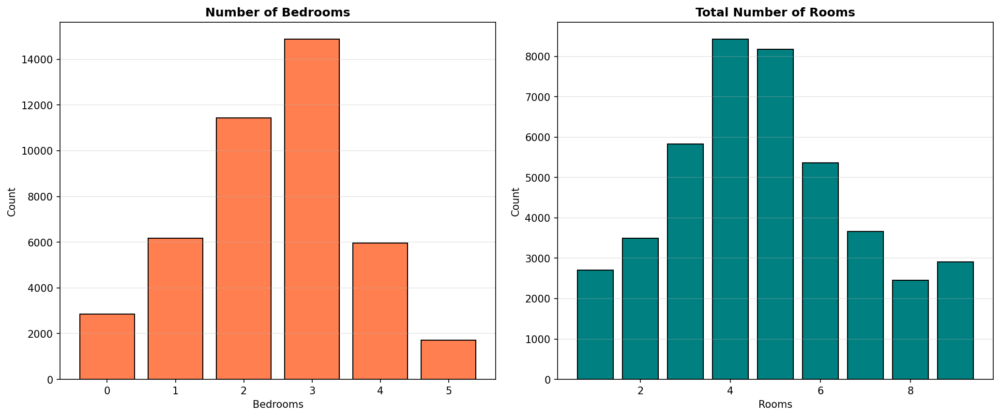

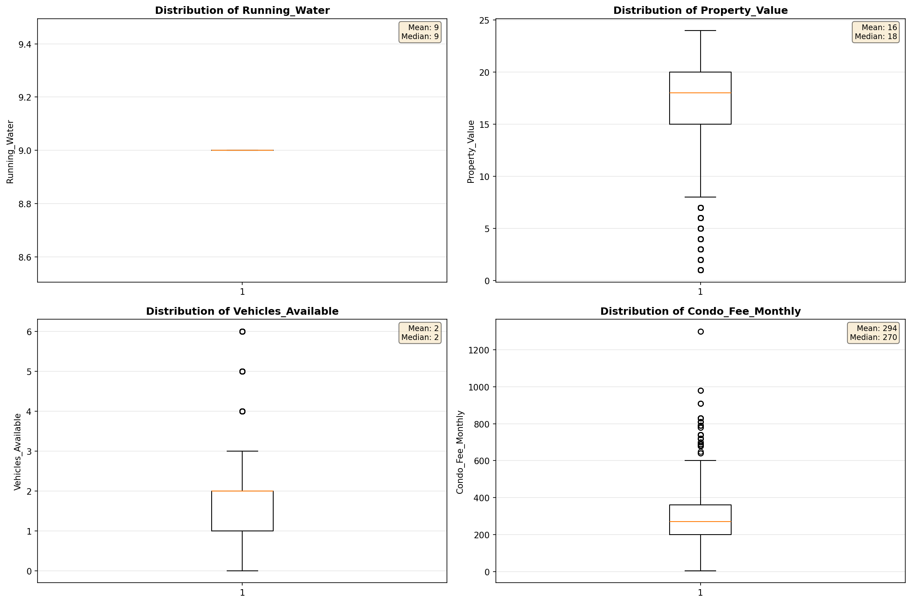

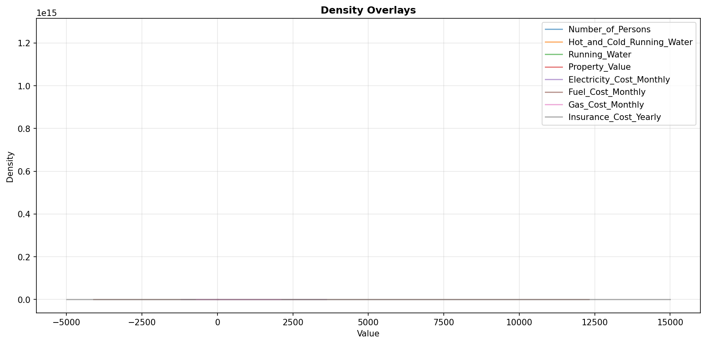

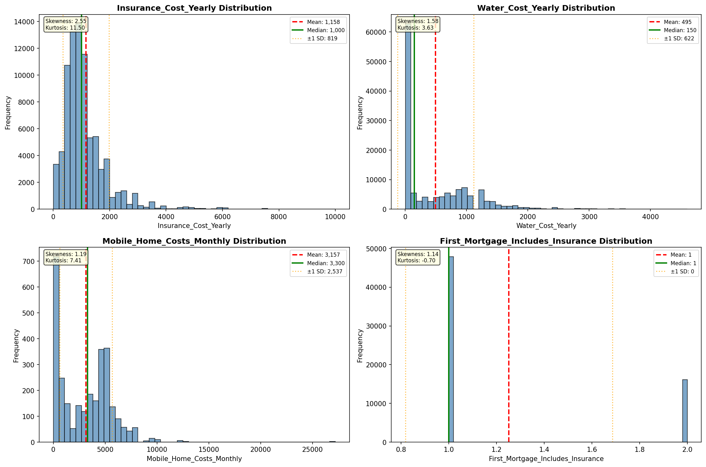

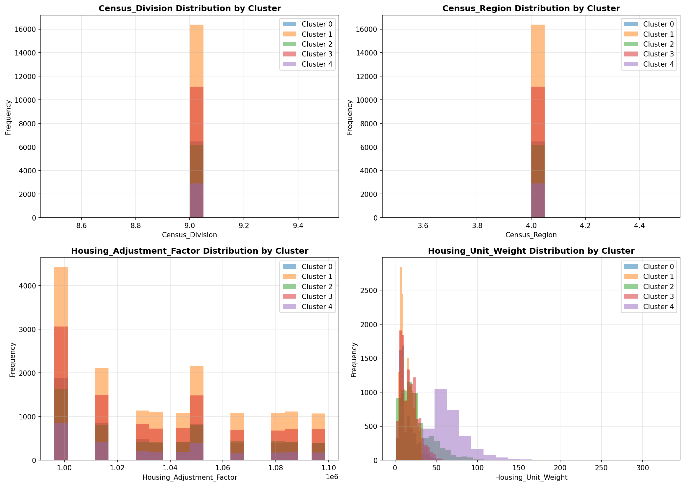

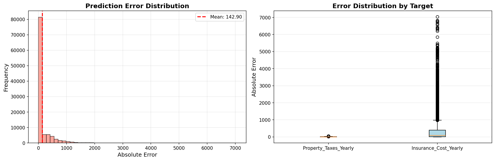

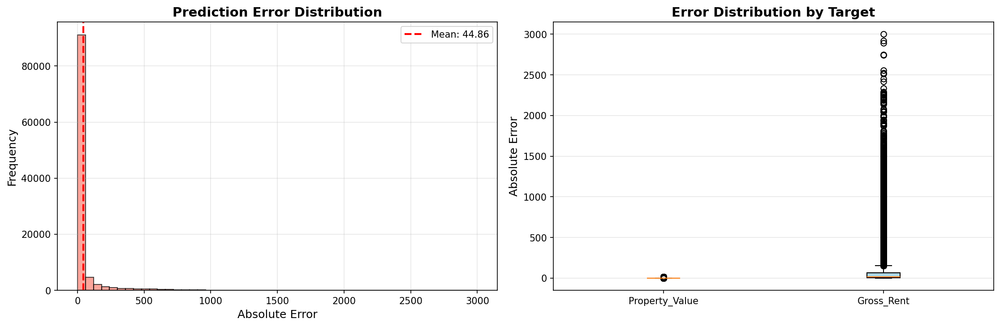

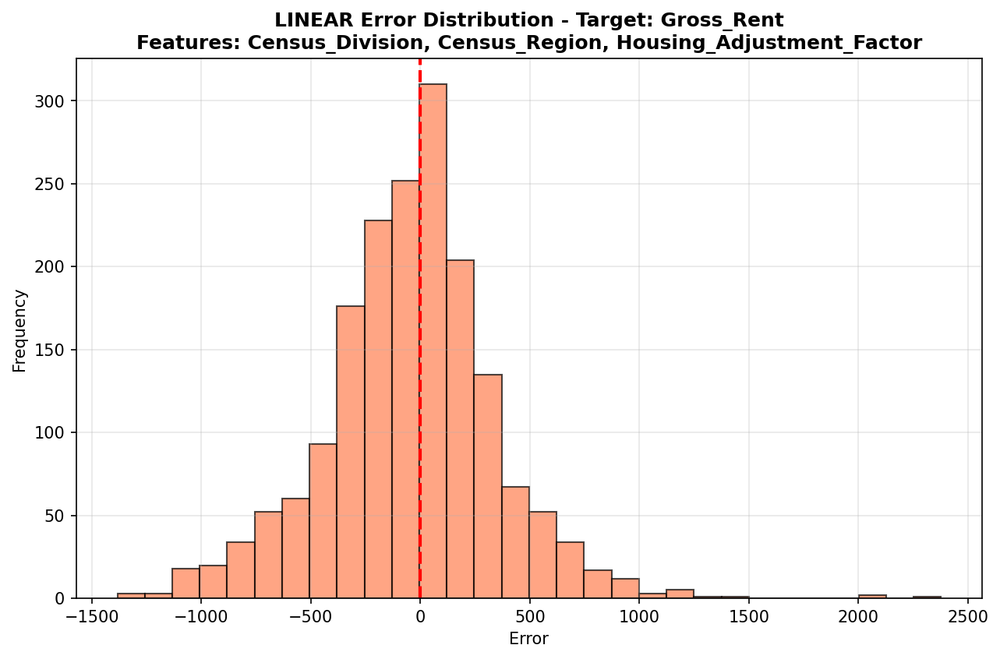

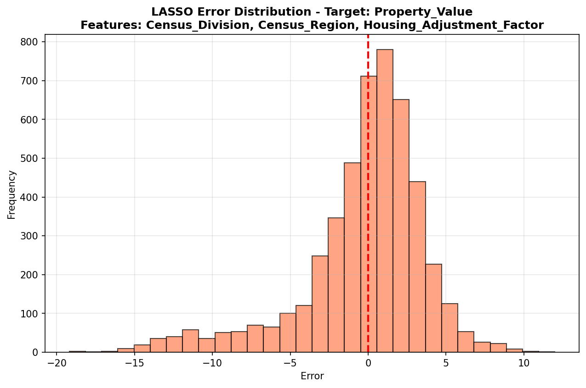

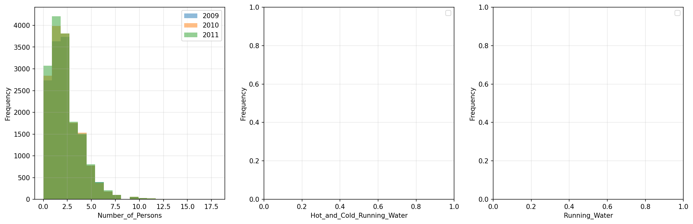

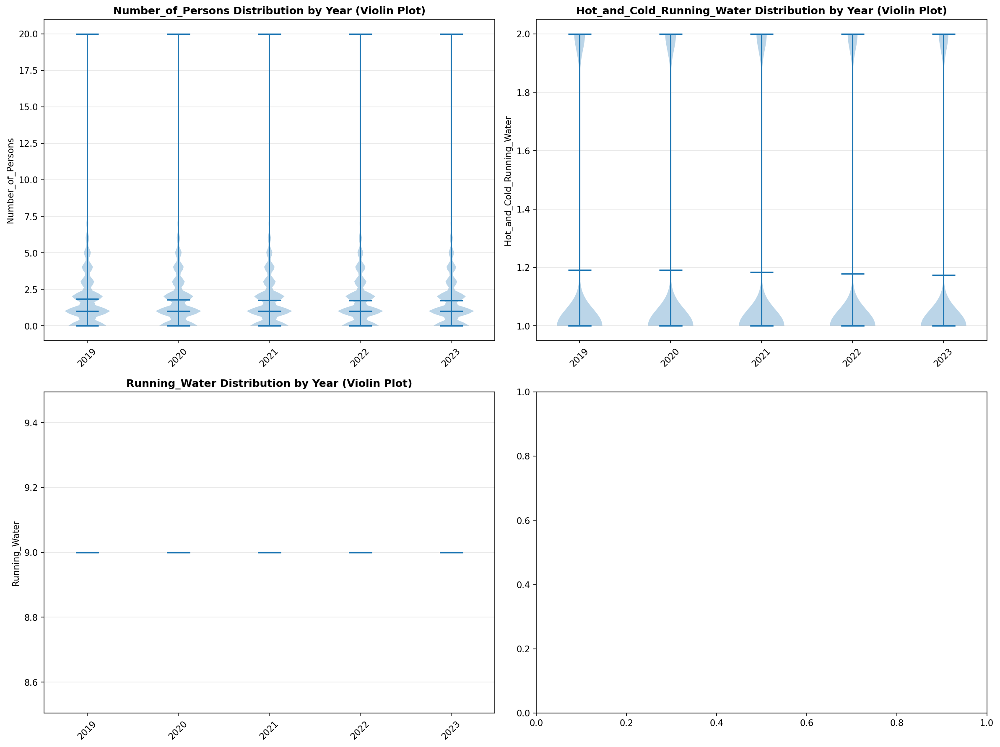

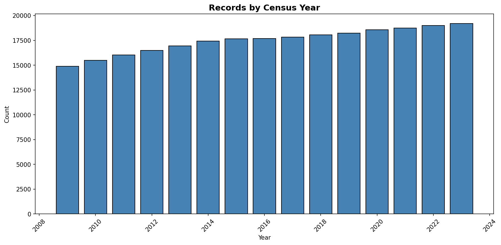
