# Statistical Analysis

> Comprehensive descriptive statistics including central tendency, dispersion, distribution characteristics, and weighted statistics using ACS sample weights.

## Summary Statistics

- **Variables Analyzed**: 41

### Income_Adjustment_Factor

| Statistic | Unweighted | Weighted (ACS) |
| :--- | :--- | :--- |
| Mean | 1,015,045.43 | 1,014,656.45 |
| Median | 1,010,207.00 | 1,014,656.45 |
| Std Deviation | 11,448.57 | — |
| Minimum | 1,001,264.00 | — |
| Maximum | 1,042,311.00 | — |
| Count | 368,563 | — |

> *Distribution is highly right-skewed (skewness: 1.28), light-tailed/platykurtic (kurtosis: 0.62).*

- **Coefficient of Variation**: 1.1 % (low variability)

### Property_Value

| Statistic | Unweighted | Weighted (ACS) |
| :--- | :--- | :--- |
| Mean | 286,636.23 | 279,537.14 |
| Median | 210,000.00 | 224,168.17 |
| Std Deviation | 372,080.59 | — |
| Minimum | 1.00 | — |
| Maximum | 5,315,000.00 | — |
| Count | 231,086 | — |

> *Distribution is highly right-skewed (skewness: 6.47), heavy-tailed/leptokurtic (kurtosis: 68.03).*

- **Coefficient of Variation**: 129.8 % (very high variability)

### Electricity_Cost_Monthly

| Statistic | Unweighted | Weighted (ACS) |
| :--- | :--- | :--- |
| Mean | 153.78 | 153.88 |
| Median | 130.00 | 128.12 |
| Std Deviation | 129.94 | — |
| Minimum | 1.00 | — |
| Maximum | 2,800.00 | — |
| Count | 412,002 | — |

> *Distribution is highly right-skewed (skewness: 7.62), heavy-tailed/leptokurtic (kurtosis: 136.18).*

- **Coefficient of Variation**: 84.5 % (high variability)

### Fuel_Cost_Monthly

| Statistic | Unweighted | Weighted (ACS) |
| :--- | :--- | :--- |
| Mean | 45.60 | 192.42 |
| Median | 2.00 | 116.38 |
| Std Deviation | 228.22 | — |
| Minimum | 1.00 | — |
| Maximum | 5,400.00 | — |
| Count | 282,457 | — |

> *Distribution is highly right-skewed (skewness: 8.79), heavy-tailed/leptokurtic (kurtosis: 104.73).*

- **Coefficient of Variation**: 500.5 % (very high variability)

### Gas_Cost_Monthly

| Statistic | Unweighted | Weighted (ACS) |
| :--- | :--- | :--- |
| Mean | 39.14 | 40.63 |
| Median | 20.00 | 15.62 |
| Std Deviation | 65.47 | — |
| Minimum | 1.00 | — |
| Maximum | 1,200.00 | — |
| Count | 348,974 | — |

> *Distribution is highly right-skewed (skewness: 7.53), heavy-tailed/leptokurtic (kurtosis: 103.41).*

- **Coefficient of Variation**: 167.3 % (very high variability)

### Insurance_Cost_Yearly

| Statistic | Unweighted | Weighted (ACS) |
| :--- | :--- | :--- |
| Mean | 862.20 | 841.51 |
| Median | 700.00 | 700.00 |
| Std Deviation | 709.53 | — |
| Minimum | 4.00 | — |
| Maximum | 8,400.00 | — |
| Count | 253,137 | — |

> *Distribution is highly right-skewed (skewness: 3.79), heavy-tailed/leptokurtic (kurtosis: 23.93).*

- **Coefficient of Variation**: 82.3 % (high variability)

### Water_Cost_Yearly

| Statistic | Unweighted | Weighted (ACS) |
| :--- | :--- | :--- |
| Mean | 563.65 | 568.29 |
| Median | 440.00 | 458.12 |
| Std Deviation | 615.25 | — |
| Minimum | 1.00 | — |
| Maximum | 5,300.00 | — |
| Count | 391,856 | — |

> *Distribution is highly right-skewed (skewness: 2.00), heavy-tailed/leptokurtic (kurtosis: 7.30).*

- **Coefficient of Variation**: 109.2 % (very high variability)

### Mobile_Home_Costs_Monthly

| Statistic | Unweighted | Weighted (ACS) |
| :--- | :--- | :--- |
| Mean | 2,960.47 | 2,937.78 |
| Median | 1,400.00 | 1,593.75 |
| Std Deviation | 3,501.58 | — |
| Minimum | 4.00 | — |
| Maximum | 32,900.00 | — |
| Count | 21,147 | — |

> *Distribution is highly right-skewed (skewness: 3.06), heavy-tailed/leptokurtic (kurtosis: 18.73).*

- **Coefficient of Variation**: 118.3 % (very high variability)

### First_Mortgage_Payment_Monthly

| Statistic | Unweighted | Weighted (ACS) |
| :--- | :--- | :--- |
| Mean | 1,041.17 | 1,131.54 |
| Median | 950.00 | 927.38 |
| Std Deviation | 849.80 | — |
| Minimum | 4.00 | — |
| Maximum | 7,100.00 | — |
| Count | 217,501 | — |

> *Distribution is highly right-skewed (skewness: 1.67), heavy-tailed/leptokurtic (kurtosis: 5.80).*

- **Coefficient of Variation**: 81.6 % (high variability)

### First_Mortgage_Includes_Taxes

| Statistic | Unweighted | Weighted (ACS) |
| :--- | :--- | :--- |
| Mean | 1.18 | 1.17 |
| Median | 1.00 | 1.00 |
| Std Deviation | 0.38 | — |
| Minimum | 1.00 | — |
| Maximum | 2.00 | — |
| Count | 183,347 | — |

> *Distribution is highly right-skewed (skewness: 1.68), light-tailed/platykurtic (kurtosis: 0.81).*

- **Coefficient of Variation**: 32.5 % (moderate variability)

### Second_Mortgage_Payment_Monthly

| Statistic | Unweighted | Weighted (ACS) |
| :--- | :--- | :--- |
| Mean | 420.22 | 423.00 |
| Median | 300.00 | 302.50 |
| Std Deviation | 419.57 | — |
| Minimum | 4.00 | — |
| Maximum | 4,400.00 | — |
| Count | 30,867 | — |

> *Distribution is highly right-skewed (skewness: 3.34), heavy-tailed/leptokurtic (kurtosis: 16.61).*

- **Coefficient of Variation**: 99.8 % (high variability)

### Property_Taxes_Yearly

| Statistic | Unweighted | Weighted (ACS) |
| :--- | :--- | :--- |
| Mean | 247.85 | 215.21 |
| Median | 25.00 | 168.17 |
| Std Deviation | 1,023.42 | — |
| Minimum | 1.00 | — |
| Maximum | 20,500.00 | — |
| Count | 214,767 | — |

> *Distribution is highly right-skewed (skewness: 10.04), heavy-tailed/leptokurtic (kurtosis: 157.07).*

- **Coefficient of Variation**: 412.9 % (very high variability)

### Meals_Included_in_Rent

| Statistic | Unweighted | Weighted (ACS) |
| :--- | :--- | :--- |
| Mean | 1.97 | 1.97 |
| Median | 2.00 | 2.00 |
| Std Deviation | 0.17 | — |
| Minimum | 1.00 | — |
| Maximum | 2.00 | — |
| Count | 122,018 | — |

> *Distribution is highly left-skewed (skewness: -5.63), heavy-tailed/leptokurtic (kurtosis: 29.64).*

- **Coefficient of Variation**: 8.5 % (low variability)

### Rent_Amount_Monthly

| Statistic | Unweighted | Weighted (ACS) |
| :--- | :--- | :--- |
| Mean | 918.84 | 933.67 |
| Median | 800.00 | 861.88 |
| Std Deviation | 548.37 | — |
| Minimum | 4.00 | — |
| Maximum | 5,200.00 | — |
| Count | 122,018 | — |

> *Distribution is highly right-skewed (skewness: 2.18), heavy-tailed/leptokurtic (kurtosis: 9.30).*

- **Coefficient of Variation**: 59.7 % (high variability)

### Gross_Rent

| Statistic | Unweighted | Weighted (ACS) |
| :--- | :--- | :--- |
| Mean | 1,084.73 | 1,093.18 |
| Median | 970.00 | 1,016.12 |
| Std Deviation | 584.71 | — |
| Minimum | 4.00 | — |
| Maximum | 7,725.00 | — |
| Count | 113,572 | — |

> *Distribution is highly right-skewed (skewness: 1.92), heavy-tailed/leptokurtic (kurtosis: 7.74).*

- **Coefficient of Variation**: 53.9 % (high variability)

### Gross_Rent_Percentage_Income

| Statistic | Unweighted | Weighted (ACS) |
| :--- | :--- | :--- |
| Mean | 38.60 | 38.74 |
| Median | 30.00 | 29.88 |
| Std Deviation | 26.78 | — |
| Minimum | 1.00 | — |
| Maximum | 101.00 | — |
| Count | 110,867 | — |

> *Distribution is highly right-skewed (skewness: 1.17), light-tailed/platykurtic (kurtosis: 0.35).*

- **Coefficient of Variation**: 69.4 % (high variability)

### Selected_Monthly_Owner_Costs

| Statistic | Unweighted | Weighted (ACS) |
| :--- | :--- | :--- |
| Mean | 1,186.28 | 1,227.16 |
| Median | 990.00 | 1,064.50 |
| Std Deviation | 958.90 | — |
| Minimum | 1.00 | — |
| Maximum | 13,519.00 | — |
| Count | 296,984 | — |

> *Distribution is highly right-skewed (skewness: 2.07), heavy-tailed/leptokurtic (kurtosis: 7.84).*

- **Coefficient of Variation**: 80.8 % (high variability)

### Owner_Costs_Percentage_Income

| Statistic | Unweighted | Weighted (ACS) |
| :--- | :--- | :--- |
| Mean | 23.68 | 24.66 |
| Median | 17.00 | 18.44 |
| Std Deviation | 21.59 | — |
| Minimum | 1.00 | — |
| Maximum | 101.00 | — |
| Count | 293,896 | — |

> *Distribution is highly right-skewed (skewness: 2.02), heavy-tailed/leptokurtic (kurtosis: 4.17).*

- **Coefficient of Variation**: 91.2 % (high variability)

### Family_Income

| Statistic | Unweighted | Weighted (ACS) |
| :--- | :--- | :--- |
| Mean | 90,733.07 | 86,984.86 |
| Median | 68,000.00 | 66,250.00 |
| Std Deviation | 88,233.16 | — |
| Minimum | 1.00 | — |
| Maximum | 1,996,000.00 | — |
| Count | 272,730 | — |

> *Distribution is highly right-skewed (skewness: 3.39), heavy-tailed/leptokurtic (kurtosis: 19.47).*

- **Coefficient of Variation**: 97.2 % (high variability)

### Household_Income

| Statistic | Unweighted | Weighted (ACS) |
| :--- | :--- | :--- |
| Mean | 78,514.26 | 75,828.44 |
| Median | 56,800.00 | 56,008.12 |
| Std Deviation | 81,920.07 | — |
| Minimum | 1.00 | — |
| Maximum | 1,996,000.00 | — |
| Count | 411,867 | — |

> *Distribution is highly right-skewed (skewness: 3.58), heavy-tailed/leptokurtic (kurtosis: 22.09).*

- **Coefficient of Variation**: 104.3 % (very high variability)

### Specified_Rent_Unit

| Statistic | Unweighted | Weighted (ACS) |
| :--- | :--- | :--- |
| Mean | 0.27 | 0.33 |
| Median | 0.00 | 0.00 |
| Std Deviation | 0.45 | — |
| Minimum | 0.00 | — |
| Maximum | 1.00 | — |
| Count | 470,939 | — |

> *Distribution is highly right-skewed (skewness: 1.01), light-tailed/platykurtic (kurtosis: -0.98).*

- **Coefficient of Variation**: 162.6 % (very high variability)

### Specified_Value_Unit

| Statistic | Unweighted | Weighted (ACS) |
| :--- | :--- | :--- |
| Mean | 0.55 | 0.49 |
| Median | 1.00 | 0.25 |
| Std Deviation | 0.50 | — |
| Minimum | 0.00 | — |
| Maximum | 1.00 | — |
| Count | 470,939 | — |

> *Distribution is approximately symmetric (skewness: -0.20), light-tailed/platykurtic (kurtosis: -1.96).*

- **Coefficient of Variation**: 90.7 % (high variability)

### Flag_Family_Income

| Statistic | Unweighted | Weighted (ACS) |
| :--- | :--- | :--- |
| Mean | 0.20 | 0.21 |
| Median | 0.00 | 0.00 |
| Std Deviation | 0.40 | — |
| Minimum | 0.00 | — |
| Maximum | 1.00 | — |
| Count | 361,039 | — |

> *Distribution is highly right-skewed (skewness: 1.48), light-tailed/platykurtic (kurtosis: 0.18).*

- **Coefficient of Variation**: 198.2 % (very high variability)

### Flag_Gross_Rent

| Statistic | Unweighted | Weighted (ACS) |
| :--- | :--- | :--- |
| Mean | 0.07 | 0.11 |
| Median | 0.00 | 0.00 |
| Std Deviation | 0.25 | — |
| Minimum | 0.00 | — |
| Maximum | 1.00 | — |
| Count | 242,242 | — |

> *Distribution is highly right-skewed (skewness: 3.44), heavy-tailed/leptokurtic (kurtosis: 9.81).*

- **Coefficient of Variation**: 370.6 % (very high variability)

### Flag_Household_Income

| Statistic | Unweighted | Weighted (ACS) |
| :--- | :--- | :--- |
| Mean | 0.30 | 0.31 |
| Median | 0.00 | 0.00 |
| Std Deviation | 0.46 | — |
| Minimum | 0.00 | — |
| Maximum | 1.00 | — |
| Count | 361,039 | — |

> *Distribution is moderately right-skewed (skewness: 0.89), light-tailed/platykurtic (kurtosis: -1.21).*

- **Coefficient of Variation**: 153.8 % (very high variability)

### Flag_First_Mortgage_Payment

| Statistic | Unweighted | Weighted (ACS) |
| :--- | :--- | :--- |
| Mean | 0.04 | 0.04 |
| Median | 0.00 | 0.00 |
| Std Deviation | 0.19 | — |
| Minimum | 0.00 | — |
| Maximum | 1.00 | — |
| Count | 470,939 | — |

> *Distribution is highly right-skewed (skewness: 4.97), heavy-tailed/leptokurtic (kurtosis: 22.74).*

- **Coefficient of Variation**: 516.7 % (very high variability)

### Flag_First_Mortgage_Taxes

| Statistic | Unweighted | Weighted (ACS) |
| :--- | :--- | :--- |
| Mean | 0.03 | 0.03 |
| Median | 0.00 | 0.00 |
| Std Deviation | 0.17 | — |
| Minimum | 0.00 | — |
| Maximum | 1.00 | — |
| Count | 470,939 | — |

> *Distribution is highly right-skewed (skewness: 5.44), heavy-tailed/leptokurtic (kurtosis: 27.59).*

- **Coefficient of Variation**: 561.8 % (very high variability)

### Flag_Meals_Included_Rent

| Statistic | Unweighted | Weighted (ACS) |
| :--- | :--- | :--- |
| Mean | 0.01 | 0.01 |
| Median | 0.00 | 0.00 |
| Std Deviation | 0.08 | — |
| Minimum | 0.00 | — |
| Maximum | 1.00 | — |
| Count | 470,939 | — |

> *Distribution is highly right-skewed (skewness: 12.34), heavy-tailed/leptokurtic (kurtosis: 150.18).*

- **Coefficient of Variation**: 1,241.7 % (very high variability)

### Flag_Rent_Amount

| Statistic | Unweighted | Weighted (ACS) |
| :--- | :--- | :--- |
| Mean | 0.02 | 0.03 |
| Median | 0.00 | 0.00 |
| Std Deviation | 0.14 | — |
| Minimum | 0.00 | — |
| Maximum | 1.00 | — |
| Count | 470,939 | — |

> *Distribution is highly right-skewed (skewness: 6.60), heavy-tailed/leptokurtic (kurtosis: 41.62).*

- **Coefficient of Variation**: 675.2 % (very high variability)

### Flag_Selected_Monthly_Owner_Costs

| Statistic | Unweighted | Weighted (ACS) |
| :--- | :--- | :--- |
| Mean | 0.21 | 0.21 |
| Median | 0.00 | 0.00 |
| Std Deviation | 0.40 | — |
| Minimum | 0.00 | — |
| Maximum | 1.00 | — |
| Count | 301,964 | — |

> *Distribution is highly right-skewed (skewness: 1.45), light-tailed/platykurtic (kurtosis: 0.10).*

- **Coefficient of Variation**: 196.0 % (very high variability)

### Flag_Second_Mortgage_Payment

| Statistic | Unweighted | Weighted (ACS) |
| :--- | :--- | :--- |
| Mean | 0.03 | 0.03 |
| Median | 0.00 | 0.00 |
| Std Deviation | 0.17 | — |
| Minimum | 0.00 | — |
| Maximum | 1.00 | — |
| Count | 470,939 | — |

> *Distribution is highly right-skewed (skewness: 5.59), heavy-tailed/leptokurtic (kurtosis: 29.22).*

- **Coefficient of Variation**: 576.1 % (very high variability)

### Flag_Property_Taxes

| Statistic | Unweighted | Weighted (ACS) |
| :--- | :--- | :--- |
| Mean | 0.10 | 0.12 |
| Median | 0.00 | 0.00 |
| Std Deviation | 0.30 | — |
| Minimum | 0.00 | — |
| Maximum | 1.00 | — |
| Count | 438,543 | — |

> *Distribution is highly right-skewed (skewness: 2.61), heavy-tailed/leptokurtic (kurtosis: 4.81).*

- **Coefficient of Variation**: 294.8 % (very high variability)

### Flag_Property_Value

| Statistic | Unweighted | Weighted (ACS) |
| :--- | :--- | :--- |
| Mean | 0.08 | 0.07 |
| Median | 0.00 | 0.00 |
| Std Deviation | 0.27 | — |
| Minimum | 0.00 | — |
| Maximum | 1.00 | — |
| Count | 470,939 | — |

> *Distribution is highly right-skewed (skewness: 3.18), heavy-tailed/leptokurtic (kurtosis: 8.13).*

- **Coefficient of Variation**: 347.0 % (very high variability)

### Flag_Water_Cost

| Statistic | Unweighted | Weighted (ACS) |
| :--- | :--- | :--- |
| Mean | 0.09 | 0.10 |
| Median | 0.00 | 0.00 |
| Std Deviation | 0.29 | — |
| Minimum | 0.00 | — |
| Maximum | 1.00 | — |
| Count | 32,396 | — |

> *Distribution is highly right-skewed (skewness: 2.79), heavy-tailed/leptokurtic (kurtosis: 5.76).*

- **Coefficient of Variation**: 310.7 % (very high variability)

### Annual_Rent_to_Value_Ratio

### Total_Monthly_Utility_Cost

| Statistic | Unweighted | Weighted (ACS) |
| :--- | :--- | :--- |
| Mean | 186.28 | 184.27 |
| Median | 160.00 | 157.94 |
| Std Deviation | 149.19 | — |
| Minimum | 2.00 | — |
| Maximum | 4,000.00 | — |
| Count | 413,451 | — |

> *Distribution is highly right-skewed (skewness: 7.56), heavy-tailed/leptokurtic (kurtosis: 135.69).*

- **Coefficient of Variation**: 80.1 % (high variability)

### Property_Tax_Rate

| Statistic | Unweighted | Weighted (ACS) |
| :--- | :--- | :--- |
| Mean | 16.47 | 17.00 |
| Median | 0.02 | 16.73 |
| Std Deviation | 49.22 | — |
| Minimum | 0.00 | — |
| Maximum | 1,100.00 | — |
| Count | 144,639 | — |

> *Distribution is highly right-skewed (skewness: 3.62), heavy-tailed/leptokurtic (kurtosis: 18.84).*

- **Coefficient of Variation**: 298.8 % (very high variability)

#### Weighted Statistics by Year

| Year | Weighted Mean | Weighted Median |
| :--- | :--- | :--- |
| 2007 | 135.12 | 133.33 |
| 2012 | 0.02 | 0.01 |
| 2013 | 0.07 | 0.01 |
| 2014 | 0.09 | 0.01 |
| 2015 | 0.02 | 0.01 |
| 2016 | 0.02 | 0.01 |
| 2017 | 0.02 | 0.01 |
| 2023 | 0.63 | 0.44 |

### Structure_Age

| Statistic | Unweighted | Weighted (ACS) |
| :--- | :--- | :--- |
| Mean | 1,860.31 | 1,876.12 |
| Median | 2,018.00 | 1,876.14 |
| Std Deviation | 535.33 | — |
| Minimum | 1.00 | — |
| Maximum | 2,023.00 | — |
| Count | 407,683 | — |

> *Distribution is highly left-skewed (skewness: -3.11), heavy-tailed/leptokurtic (kurtosis: 7.67).*

- **Coefficient of Variation**: 28.8 % (moderate variability)

### Structure_Age_Score

| Statistic | Unweighted | Weighted (ACS) |
| :--- | :--- | :--- |
| Mean | 0.05 | 0.04 |
| Median | 0.00 | 0.05 |
| Std Deviation | 0.18 | — |
| Minimum | 0.00 | — |
| Maximum | 0.99 | — |
| Count | 407,683 | — |

> *Distribution is highly right-skewed (skewness: 3.55), heavy-tailed/leptokurtic (kurtosis: 11.43).*

- **Coefficient of Variation**: 357.6 % (very high variability)

### Working_Age_Persons

| Statistic | Unweighted | Weighted (ACS) |
| :--- | :--- | :--- |
| Mean | 1.70 | 1.80 |
| Median | 2.00 | 2.00 |
| Std Deviation | 1.48 | — |
| Minimum | 0.00 | — |
| Maximum | 19.00 | — |
| Count | 418,876 | — |

> *Distribution is highly right-skewed (skewness: 1.16), light-tailed/platykurtic (kurtosis: 2.80).*

- **Coefficient of Variation**: 86.9 % (high variability)

### Income_to_FPL_Ratio

| Statistic | Unweighted | Weighted (ACS) |
| :--- | :--- | :--- |
| Mean | 3.56 | 3.42 |
| Median | 2.62 | 2.56 |
| Std Deviation | 3.76 | — |
| Minimum | -1.30 | — |
| Maximum | 79.67 | — |
| Count | 418,876 | — |

> *Distribution is highly right-skewed (skewness: 3.86), heavy-tailed/leptokurtic (kurtosis: 25.51).*

- **Coefficient of Variation**: 105.5 % (very high variability)

## Distribution Analysis

### Skewed Distributions

> Variables with skewness > |0.5| indicate non-normal distributions. Consider log transformations for highly skewed variables in modeling.

| Variable | Skewness | Direction | Severity |
| :--- | :--- | :--- | :--- |
| Flag_Meals_Included_Rent | 12.336 | Right-skewed | High |
| Property_Taxes_Yearly | 10.043 | Right-skewed | High |
| Fuel_Cost_Monthly | 8.788 | Right-skewed | High |
| Electricity_Cost_Monthly | 7.624 | Right-skewed | High |
| Total_Monthly_Utility_Cost | 7.562 | Right-skewed | High |
| Gas_Cost_Monthly | 7.526 | Right-skewed | High |
| Flag_Rent_Amount | 6.604 | Right-skewed | High |
| Property_Value | 6.471 | Right-skewed | High |
| Meals_Included_in_Rent | -5.625 | Left-skewed | High |
| Flag_Second_Mortgage_Payment | 5.588 | Right-skewed | High |
| Flag_First_Mortgage_Taxes | 5.440 | Right-skewed | High |
| Flag_First_Mortgage_Payment | 4.974 | Right-skewed | High |
| Income_to_FPL_Ratio | 3.864 | Right-skewed | High |
| Insurance_Cost_Yearly | 3.795 | Right-skewed | High |
| Property_Tax_Rate | 3.615 | Right-skewed | High |
| Household_Income | 3.579 | Right-skewed | High |
| Structure_Age_Score | 3.554 | Right-skewed | High |
| Flag_Gross_Rent | 3.436 | Right-skewed | High |
| Family_Income | 3.390 | Right-skewed | High |
| Second_Mortgage_Payment_Monthly | 3.335 | Right-skewed | High |

- **Total Skewed Variables**: 39

- **Right-skewed**: 37

- **Left-skewed**: 2

## Variance Analysis

### Coefficient of Variation Ranking

> CV (Coefficient of Variation) = (Std Dev / Mean) × 100%. Higher CV indicates greater relative variability.

| Variable | CV (%) | Std Dev | Mean | Variability |
| :--- | :--- | :--- | :--- | :--- |
| Flag_Meals_Included_Rent | 1241.7% | 0.08 | 0.01 | Very High |
| Flag_Rent_Amount | 675.2% | 0.14 | 0.02 | Very High |
| Flag_Second_Mortgage_Payment | 576.1% | 0.17 | 0.03 | Very High |
| Flag_First_Mortgage_Taxes | 561.8% | 0.17 | 0.03 | Very High |
| Flag_First_Mortgage_Payment | 516.7% | 0.19 | 0.04 | Very High |
| Fuel_Cost_Monthly | 500.5% | 228.22 | 45.60 | Very High |
| Property_Taxes_Yearly | 412.9% | 1,023.42 | 247.85 | Very High |
| Flag_Gross_Rent | 370.6% | 0.25 | 0.07 | Very High |
| Structure_Age_Score | 357.6% | 0.18 | 0.05 | Very High |
| Flag_Property_Value | 347.0% | 0.27 | 0.08 | Very High |
| Flag_Water_Cost | 310.7% | 0.29 | 0.09 | Very High |
| Property_Tax_Rate | 298.8% | 49.22 | 16.47 | Very High |
| Flag_Property_Taxes | 294.8% | 0.30 | 0.10 | Very High |
| Flag_Family_Income | 198.2% | 0.40 | 0.20 | Very High |
| Flag_Selected_Monthly_Owner_Costs | 196.0% | 0.40 | 0.21 | Very High |
| Gas_Cost_Monthly | 167.3% | 65.47 | 39.14 | Very High |
| Specified_Rent_Unit | 162.6% | 0.45 | 0.27 | Very High |
| Flag_Household_Income | 153.8% | 0.46 | 0.30 | Very High |
| Property_Value | 129.8% | 372,080.59 | 286,636.23 | Very High |
| Mobile_Home_Costs_Monthly | 118.3% | 3,501.58 | 2,960.47 | Very High |

- **Average CV**: 226.0 %

- **High Variance Variables (CV > 50%)**: 36

## Visualizations

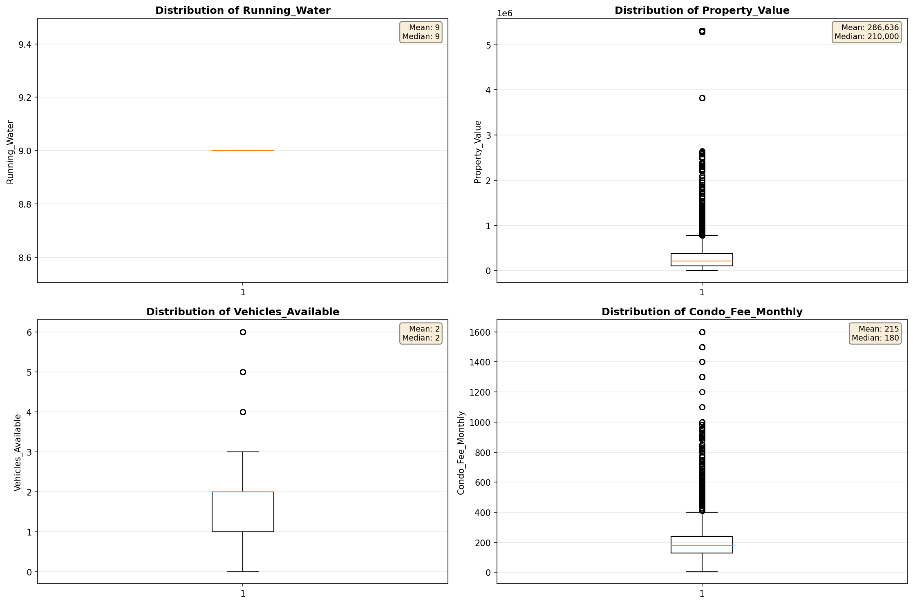

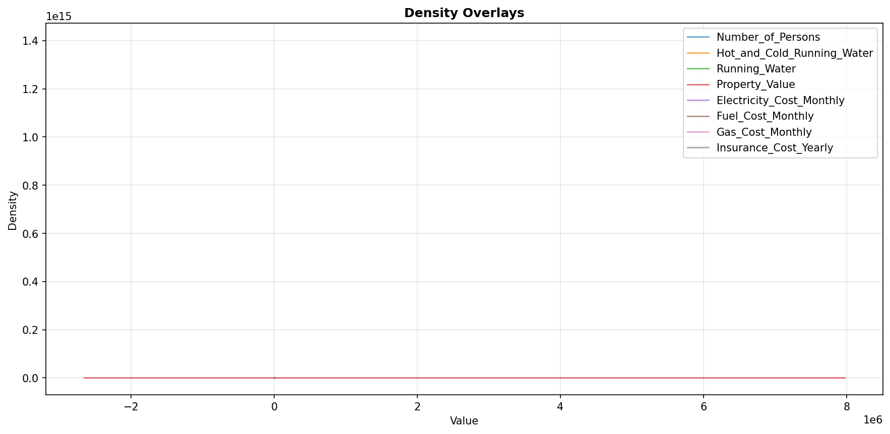

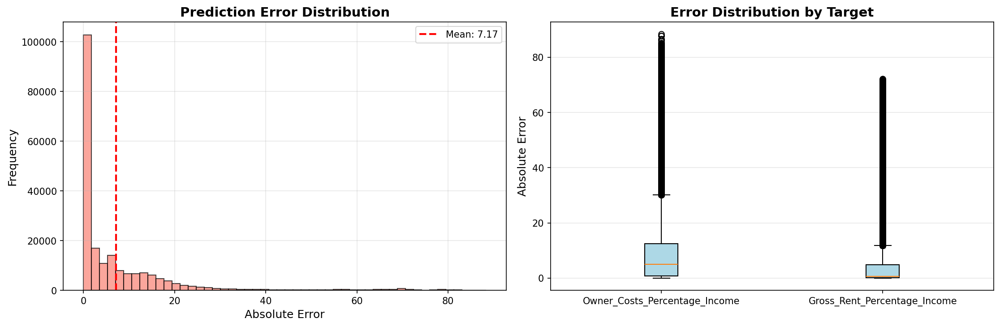

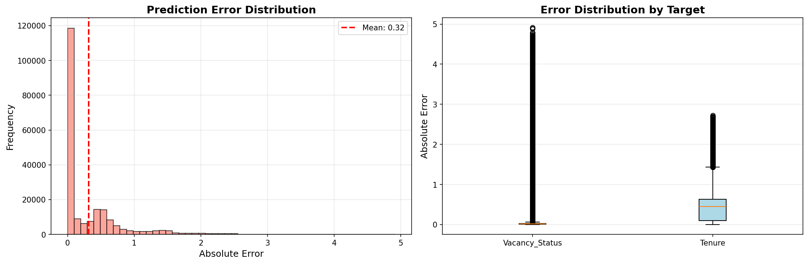

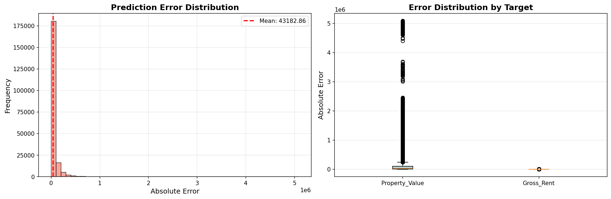

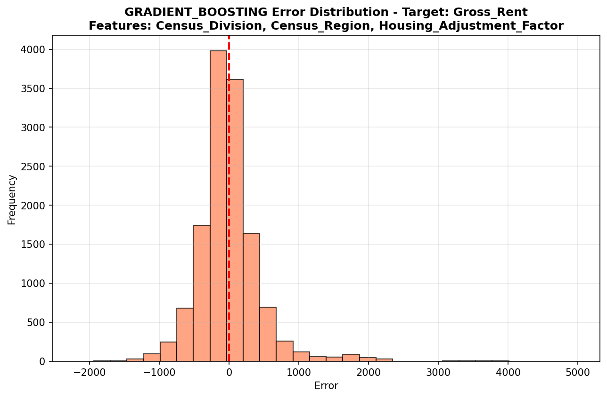

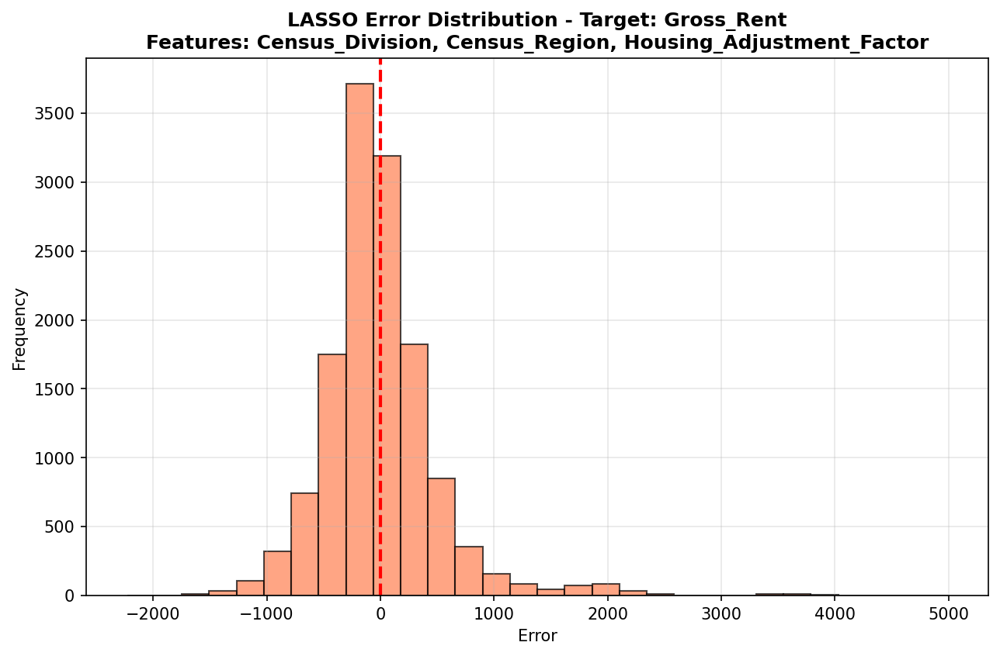

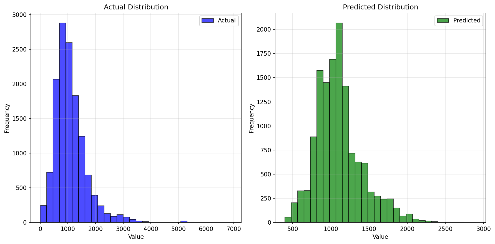

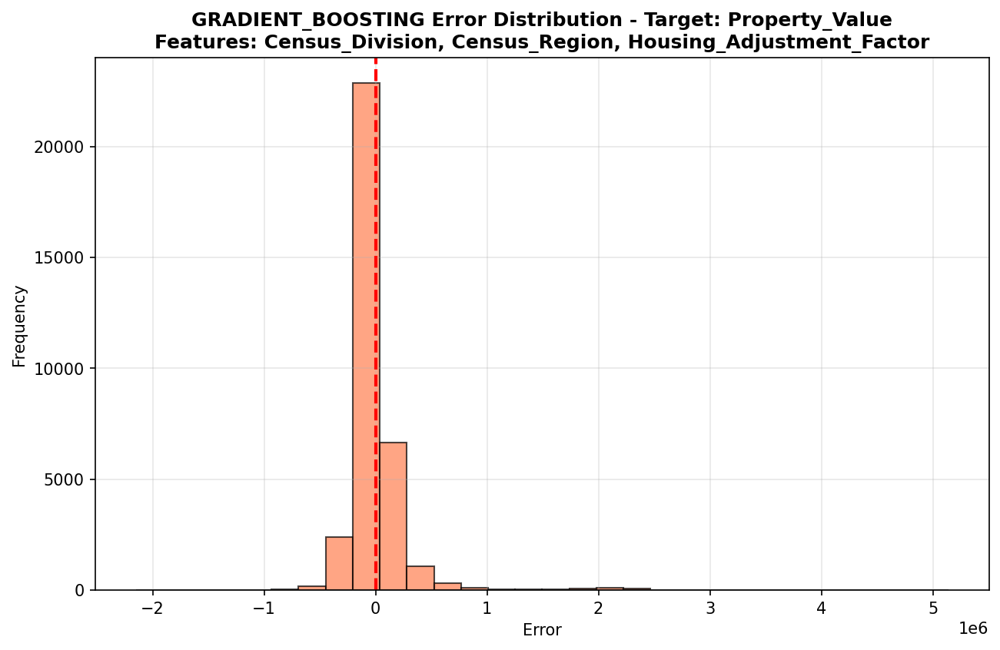

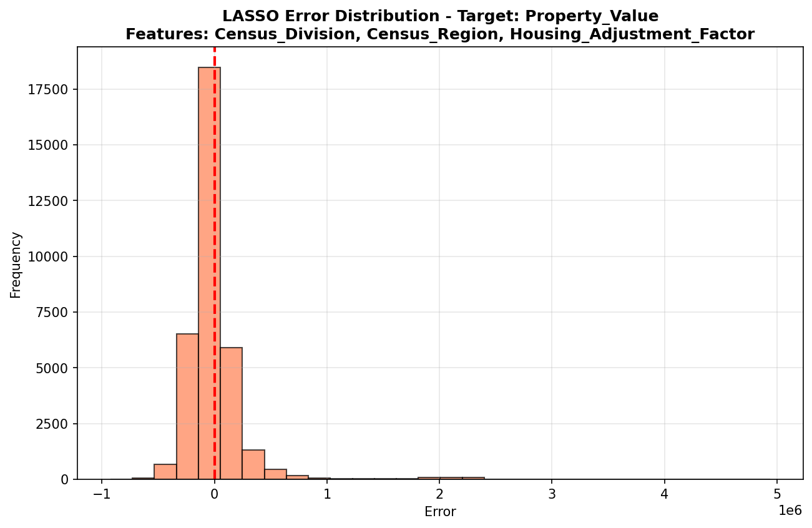

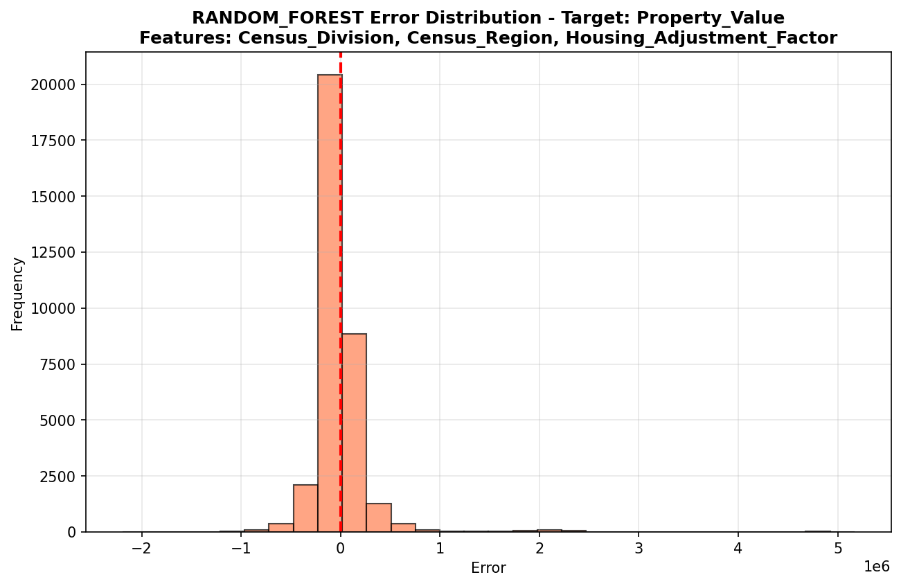

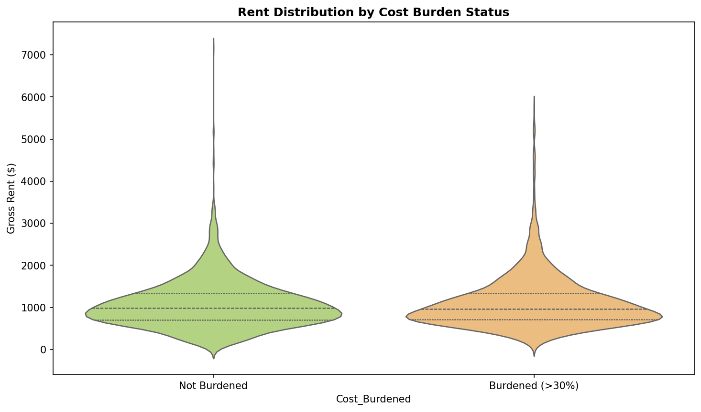

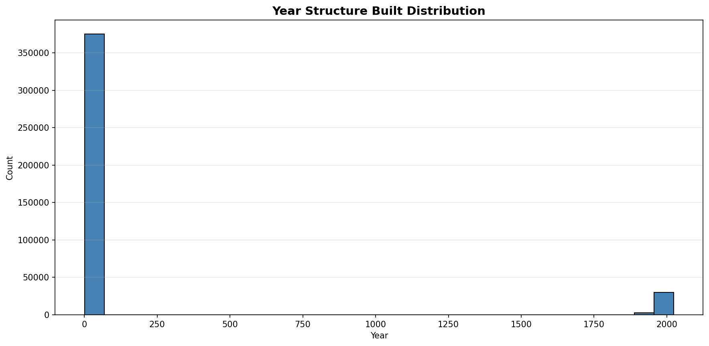

