# Statistical Analysis

> Comprehensive descriptive statistics including central tendency, dispersion, distribution characteristics, and weighted statistics using ACS sample weights.

## Summary Statistics

- **Variables Analyzed**: 37

### Income_Adjustment_Factor

| Statistic | Unweighted | Weighted (ACS) |
| :--- | :--- | :--- |
| Mean | 1,057,913.92 | 1,057,603.70 |
| Median | 1,048,026.00 | 1,059,677.73 |
| Std Deviation | 45,765.71 | — |
| Minimum | 999,480.00 | — |
| Maximum | 1,207,712.00 | — |
| Count | 2,352,680 | — |

> *Distribution is highly right-skewed (skewness: 1.26), light-tailed/platykurtic (kurtosis: 1.48).*

- **Coefficient of Variation**: 4.3 % (low variability)

### Property_Value

| Statistic | Unweighted | Weighted (ACS) |
| :--- | :--- | :--- |
| Mean | 16.51 | 16.53 |
| Median | 18.00 | 17.67 |
| Std Deviation | 4.92 | — |
| Minimum | 1.00 | — |
| Maximum | 24.00 | — |
| Count | 270,593 | — |

> *Distribution is highly left-skewed (skewness: -1.31), light-tailed/platykurtic (kurtosis: 1.68).*

- **Coefficient of Variation**: 29.8 % (moderate variability)

#### Weighted Statistics by Year

| Year | Weighted Mean | Weighted Median |
| :--- | :--- | :--- |
| 2009 | 16.75 | 18.00 |
| 2010 | 16.64 | 18.00 |
| 2011 | 16.20 | 17.00 |

### Electricity_Cost_Monthly

| Statistic | Unweighted | Weighted (ACS) |
| :--- | :--- | :--- |
| Mean | 150.57 | 151.32 |
| Median | 130.00 | 126.00 |
| Std Deviation | 112.25 | — |
| Minimum | 1.00 | — |
| Maximum | 2,800.00 | — |
| Count | 1,871,532 | — |

> *Distribution is highly right-skewed (skewness: 4.58), heavy-tailed/leptokurtic (kurtosis: 79.32).*

- **Coefficient of Variation**: 74.6 % (high variability)

### Fuel_Cost_Monthly

| Statistic | Unweighted | Weighted (ACS) |
| :--- | :--- | :--- |
| Mean | 50.52 | 220.83 |
| Median | 2.00 | 135.87 |
| Std Deviation | 237.57 | — |
| Minimum | 1.00 | — |
| Maximum | 5,400.00 | — |
| Count | 1,153,831 | — |

> *Distribution is highly right-skewed (skewness: 8.25), heavy-tailed/leptokurtic (kurtosis: 92.32).*

- **Coefficient of Variation**: 470.2 % (very high variability)

### Gas_Cost_Monthly

| Statistic | Unweighted | Weighted (ACS) |
| :--- | :--- | :--- |
| Mean | 39.39 | 41.10 |
| Median | 20.00 | 18.33 |
| Std Deviation | 58.49 | — |
| Minimum | 1.00 | — |
| Maximum | 1,200.00 | — |
| Count | 1,516,796 | — |

> *Distribution is highly right-skewed (skewness: 5.55), heavy-tailed/leptokurtic (kurtosis: 64.45).*

- **Coefficient of Variation**: 148.5 % (very high variability)

### Insurance_Cost_Yearly

| Statistic | Unweighted | Weighted (ACS) |
| :--- | :--- | :--- |
| Mean | 824.75 | 813.32 |
| Median | 670.00 | 676.67 |
| Std Deviation | 649.01 | — |
| Minimum | 4.00 | — |
| Maximum | 8,400.00 | — |
| Count | 1,151,904 | — |

> *Distribution is highly right-skewed (skewness: 3.49), heavy-tailed/leptokurtic (kurtosis: 19.74).*

- **Coefficient of Variation**: 78.7 % (high variability)

### Water_Cost_Yearly

| Statistic | Unweighted | Weighted (ACS) |
| :--- | :--- | :--- |
| Mean | 568.29 | 581.02 |
| Median | 480.00 | 473.33 |
| Std Deviation | 601.54 | — |
| Minimum | 1.00 | — |
| Maximum | 5,300.00 | — |
| Count | 1,750,318 | — |

> *Distribution is highly right-skewed (skewness: 1.88), heavy-tailed/leptokurtic (kurtosis: 6.25).*

- **Coefficient of Variation**: 105.9 % (very high variability)

### Mobile_Home_Costs_Monthly

| Statistic | Unweighted | Weighted (ACS) |
| :--- | :--- | :--- |
| Mean | 2,807.90 | 2,834.88 |
| Median | 1,400.00 | 1,593.33 |
| Std Deviation | 3,075.18 | — |
| Minimum | 4.00 | — |
| Maximum | 32,900.00 | — |
| Count | 95,724 | — |

> *Distribution is highly right-skewed (skewness: 2.38), heavy-tailed/leptokurtic (kurtosis: 14.51).*

- **Coefficient of Variation**: 109.5 % (very high variability)

### First_Mortgage_Payment_Monthly

| Statistic | Unweighted | Weighted (ACS) |
| :--- | :--- | :--- |
| Mean | 1,203.45 | 1,209.57 |
| Median | 1,100.00 | 1,061.33 |
| Std Deviation | 768.11 | — |
| Minimum | 4.00 | — |
| Maximum | 7,100.00 | — |
| Count | 841,472 | — |

> *Distribution is highly right-skewed (skewness: 2.20), heavy-tailed/leptokurtic (kurtosis: 8.38).*

- **Coefficient of Variation**: 63.8 % (high variability)

### First_Mortgage_Includes_Taxes

| Statistic | Unweighted | Weighted (ACS) |
| :--- | :--- | :--- |
| Mean | 1.18 | 1.17 |
| Median | 1.00 | 1.00 |
| Std Deviation | 0.39 | — |
| Minimum | 1.00 | — |
| Maximum | 2.00 | — |
| Count | 841,472 | — |

> *Distribution is highly right-skewed (skewness: 1.64), light-tailed/platykurtic (kurtosis: 0.70).*

- **Coefficient of Variation**: 32.7 % (moderate variability)

### Second_Mortgage_Payment_Monthly

| Statistic | Unweighted | Weighted (ACS) |
| :--- | :--- | :--- |
| Mean | 407.29 | 410.13 |
| Median | 300.00 | 293.33 |
| Std Deviation | 400.53 | — |
| Minimum | 4.00 | — |
| Maximum | 4,400.00 | — |
| Count | 146,400 | — |

> *Distribution is highly right-skewed (skewness: 3.26), heavy-tailed/leptokurtic (kurtosis: 15.93).*

- **Coefficient of Variation**: 98.3 % (high variability)

### Property_Taxes_Yearly

| Statistic | Unweighted | Weighted (ACS) |
| :--- | :--- | :--- |
| Mean | 24.28 | 24.85 |
| Median | 24.00 | 24.00 |
| Std Deviation | 13.99 | — |
| Minimum | 1.00 | — |
| Maximum | 68.00 | — |
| Count | 788,606 | — |

> *Distribution is moderately right-skewed (skewness: 0.57), light-tailed/platykurtic (kurtosis: 0.71).*

- **Coefficient of Variation**: 57.6 % (high variability)

### Meals_Included_in_Rent

| Statistic | Unweighted | Weighted (ACS) |
| :--- | :--- | :--- |
| Mean | 1.97 | 1.97 |
| Median | 2.00 | 2.00 |
| Std Deviation | 0.17 | — |
| Minimum | 1.00 | — |
| Maximum | 2.00 | — |
| Count | 563,175 | — |

> *Distribution is highly left-skewed (skewness: -5.70), heavy-tailed/leptokurtic (kurtosis: 30.45).*

- **Coefficient of Variation**: 8.4 % (low variability)

### Rent_Amount_Monthly

| Statistic | Unweighted | Weighted (ACS) |
| :--- | :--- | :--- |
| Mean | 872.10 | 886.32 |
| Median | 790.00 | 806.67 |
| Std Deviation | 495.93 | — |
| Minimum | 4.00 | — |
| Maximum | 5,200.00 | — |
| Count | 563,175 | — |

> *Distribution is highly right-skewed (skewness: 2.08), heavy-tailed/leptokurtic (kurtosis: 8.47).*

- **Coefficient of Variation**: 56.9 % (high variability)

### Gross_Rent

| Statistic | Unweighted | Weighted (ACS) |
| :--- | :--- | :--- |
| Mean | 1,034.60 | 1,043.88 |
| Median | 940.00 | 963.47 |
| Std Deviation | 530.34 | — |
| Minimum | 4.00 | — |
| Maximum | 7,725.00 | — |
| Count | 523,718 | — |

> *Distribution is highly right-skewed (skewness: 1.75), heavy-tailed/leptokurtic (kurtosis: 6.48).*

- **Coefficient of Variation**: 51.3 % (high variability)

### Gross_Rent_Percentage_Income

| Statistic | Unweighted | Weighted (ACS) |
| :--- | :--- | :--- |
| Mean | 38.35 | 38.40 |
| Median | 29.00 | 29.53 |
| Std Deviation | 26.68 | — |
| Minimum | 1.00 | — |
| Maximum | 101.00 | — |
| Count | 511,263 | — |

> *Distribution is highly right-skewed (skewness: 1.18), light-tailed/platykurtic (kurtosis: 0.39).*

- **Coefficient of Variation**: 69.6 % (high variability)

### Selected_Monthly_Owner_Costs

| Statistic | Unweighted | Weighted (ACS) |
| :--- | :--- | :--- |
| Mean | 1,167.66 | 1,212.61 |
| Median | 980.00 | 1,050.73 |
| Std Deviation | 942.53 | — |
| Minimum | 1.00 | — |
| Maximum | 13,519.00 | — |
| Count | 1,348,930 | — |

> *Distribution is highly right-skewed (skewness: 2.08), heavy-tailed/leptokurtic (kurtosis: 7.97).*

- **Coefficient of Variation**: 80.7 % (high variability)

### Owner_Costs_Percentage_Income

| Statistic | Unweighted | Weighted (ACS) |
| :--- | :--- | :--- |
| Mean | 23.77 | 24.71 |
| Median | 18.00 | 18.53 |
| Std Deviation | 21.47 | — |
| Minimum | 1.00 | — |
| Maximum | 101.00 | — |
| Count | 1,335,302 | — |

> *Distribution is highly right-skewed (skewness: 2.01), heavy-tailed/leptokurtic (kurtosis: 4.19).*

- **Coefficient of Variation**: 90.3 % (high variability)

### Family_Income

| Statistic | Unweighted | Weighted (ACS) |
| :--- | :--- | :--- |
| Mean | 87,416.31 | 84,303.16 |
| Median | 66,000.00 | 64,242.00 |
| Std Deviation | 83,668.73 | — |
| Minimum | 1.00 | — |
| Maximum | 1,996,000.00 | — |
| Count | 1,246,823 | — |

> *Distribution is highly right-skewed (skewness: 3.27), heavy-tailed/leptokurtic (kurtosis: 18.01).*

- **Coefficient of Variation**: 95.7 % (high variability)

### Household_Income

| Statistic | Unweighted | Weighted (ACS) |
| :--- | :--- | :--- |
| Mean | 75,740.29 | 73,638.52 |
| Median | 55,000.00 | 54,388.00 |
| Std Deviation | 77,796.36 | — |
| Minimum | 1.00 | — |
| Maximum | 1,996,000.00 | — |
| Count | 1,879,686 | — |

> *Distribution is highly right-skewed (skewness: 3.45), heavy-tailed/leptokurtic (kurtosis: 20.35).*

- **Coefficient of Variation**: 102.7 % (very high variability)

### Specified_Rent_Unit

| Statistic | Unweighted | Weighted (ACS) |
| :--- | :--- | :--- |
| Mean | 0.28 | 0.33 |
| Median | 0.00 | 0.00 |
| Std Deviation | 0.45 | — |
| Minimum | 0.00 | — |
| Maximum | 1.00 | — |
| Count | 2,154,951 | — |

> *Distribution is moderately right-skewed (skewness: 1.00), light-tailed/platykurtic (kurtosis: -1.01).*

- **Coefficient of Variation**: 161.6 % (very high variability)

### Specified_Value_Unit

| Statistic | Unweighted | Weighted (ACS) |
| :--- | :--- | :--- |
| Mean | 0.54 | 0.49 |
| Median | 1.00 | 0.27 |
| Std Deviation | 0.50 | — |
| Minimum | 0.00 | — |
| Maximum | 1.00 | — |
| Count | 2,154,951 | — |

> *Distribution is approximately symmetric (skewness: -0.18), light-tailed/platykurtic (kurtosis: -1.97).*

- **Coefficient of Variation**: 91.6 % (high variability)

### Flag_First_Mortgage_Payment

| Statistic | Unweighted | Weighted (ACS) |
| :--- | :--- | :--- |
| Mean | 0.04 | 0.04 |
| Median | 0.00 | 0.00 |
| Std Deviation | 0.19 | — |
| Minimum | 0.00 | — |
| Maximum | 1.00 | — |
| Count | 2,154,951 | — |

> *Distribution is highly right-skewed (skewness: 5.00), heavy-tailed/leptokurtic (kurtosis: 23.03).*

- **Coefficient of Variation**: 519.5 % (very high variability)

### Flag_First_Mortgage_Taxes

| Statistic | Unweighted | Weighted (ACS) |
| :--- | :--- | :--- |
| Mean | 0.03 | 0.03 |
| Median | 0.00 | 0.00 |
| Std Deviation | 0.17 | — |
| Minimum | 0.00 | — |
| Maximum | 1.00 | — |
| Count | 2,154,951 | — |

> *Distribution is highly right-skewed (skewness: 5.43), heavy-tailed/leptokurtic (kurtosis: 27.49).*

- **Coefficient of Variation**: 560.8 % (very high variability)

### Flag_Meals_Included_Rent

| Statistic | Unweighted | Weighted (ACS) |
| :--- | :--- | :--- |
| Mean | 0.01 | 0.01 |
| Median | 0.00 | 0.00 |
| Std Deviation | 0.08 | — |
| Minimum | 0.00 | — |
| Maximum | 1.00 | — |
| Count | 2,154,951 | — |

> *Distribution is highly right-skewed (skewness: 12.68), heavy-tailed/leptokurtic (kurtosis: 158.77).*

- **Coefficient of Variation**: 1,275.8 % (very high variability)

### Flag_Rent_Amount

| Statistic | Unweighted | Weighted (ACS) |
| :--- | :--- | :--- |
| Mean | 0.02 | 0.03 |
| Median | 0.00 | 0.00 |
| Std Deviation | 0.14 | — |
| Minimum | 0.00 | — |
| Maximum | 1.00 | — |
| Count | 2,154,951 | — |

> *Distribution is highly right-skewed (skewness: 6.66), heavy-tailed/leptokurtic (kurtosis: 42.41).*

- **Coefficient of Variation**: 681.1 % (very high variability)

### Flag_Second_Mortgage_Payment

| Statistic | Unweighted | Weighted (ACS) |
| :--- | :--- | :--- |
| Mean | 0.03 | 0.03 |
| Median | 0.00 | 0.00 |
| Std Deviation | 0.17 | — |
| Minimum | 0.00 | — |
| Maximum | 1.00 | — |
| Count | 2,154,951 | — |

> *Distribution is highly right-skewed (skewness: 5.55), heavy-tailed/leptokurtic (kurtosis: 28.85).*

- **Coefficient of Variation**: 572.9 % (very high variability)

### Flag_Property_Taxes

| Statistic | Unweighted | Weighted (ACS) |
| :--- | :--- | :--- |
| Mean | 0.10 | 0.12 |
| Median | 0.00 | 0.00 |
| Std Deviation | 0.30 | — |
| Minimum | 0.00 | — |
| Maximum | 1.00 | — |
| Count | 2,154,951 | — |

> *Distribution is highly right-skewed (skewness: 2.61), heavy-tailed/leptokurtic (kurtosis: 4.80).*

- **Coefficient of Variation**: 294.7 % (very high variability)

### Flag_Property_Value

| Statistic | Unweighted | Weighted (ACS) |
| :--- | :--- | :--- |
| Mean | 0.08 | 0.07 |
| Median | 0.00 | 0.00 |
| Std Deviation | 0.26 | — |
| Minimum | 0.00 | — |
| Maximum | 1.00 | — |
| Count | 2,154,951 | — |

> *Distribution is highly right-skewed (skewness: 3.21), heavy-tailed/leptokurtic (kurtosis: 8.31).*

- **Coefficient of Variation**: 349.7 % (very high variability)

### Flag_Water_Cost

| Statistic | Unweighted | Weighted (ACS) |
| :--- | :--- | :--- |
| Mean | 0.07 | 0.07 |
| Median | 0.00 | 0.00 |
| Std Deviation | 0.25 | — |
| Minimum | 0.00 | — |
| Maximum | 1.00 | — |
| Count | 2,154,951 | — |

> *Distribution is highly right-skewed (skewness: 3.49), heavy-tailed/leptokurtic (kurtosis: 10.18).*

- **Coefficient of Variation**: 375.6 % (very high variability)

### Annual_Rent_to_Value_Ratio

### Total_Monthly_Utility_Cost

| Statistic | Unweighted | Weighted (ACS) |
| :--- | :--- | :--- |
| Mean | 181.69 | 180.55 |
| Median | 153.00 | 156.00 |
| Std Deviation | 127.62 | — |
| Minimum | 2.00 | — |
| Maximum | 4,000.00 | — |
| Count | 1,879,770 | — |

> *Distribution is highly right-skewed (skewness: 4.67), heavy-tailed/leptokurtic (kurtosis: 82.18).*

- **Coefficient of Variation**: 70.2 % (high variability)

### Property_Tax_Rate

| Statistic | Unweighted | Weighted (ACS) |
| :--- | :--- | :--- |
| Mean | 148.22 | 149.55 |
| Median | 142.86 | 143.65 |
| Std Deviation | 87.05 | — |
| Minimum | 4.17 | — |
| Maximum | 2,200.00 | — |
| Count | 264,148 | — |

> *Distribution is highly right-skewed (skewness: 5.62), heavy-tailed/leptokurtic (kurtosis: 81.17).*

- **Coefficient of Variation**: 58.7 % (high variability)

#### Weighted Statistics by Year

| Year | Weighted Mean | Weighted Median |
| :--- | :--- | :--- |
| 2009 | 143.62 | 138.10 |
| 2010 | 148.76 | 142.86 |
| 2011 | 156.26 | 150.00 |

### Structure_Age

| Statistic | Unweighted | Weighted (ACS) |
| :--- | :--- | :--- |
| Mean | 2,018.05 | 2,018.02 |
| Median | 2,018.00 | 2,018.42 |
| Std Deviation | 2.82 | — |
| Minimum | 2,000.00 | — |
| Maximum | 2,023.00 | — |
| Count | 1,713,235 | — |

> *Distribution is highly left-skewed (skewness: -1.45), heavy-tailed/leptokurtic (kurtosis: 4.93).*

- **Coefficient of Variation**: 0.1 % (low variability)

### Structure_Age_Score

| Statistic | Unweighted | Weighted (ACS) |
| :--- | :--- | :--- |
| Mean | 0.00 | 0.00 |
| Median | 0.00 | 0.00 |
| Std Deviation | 0.00 | — |
| Minimum | 0.00 | — |
| Maximum | 0.00 | — |
| Count | 1,713,235 | — |

> *Distribution is approximately symmetric (skewness: nan).*

### Working_Age_Persons

| Statistic | Unweighted | Weighted (ACS) |
| :--- | :--- | :--- |
| Mean | 1.71 | 1.81 |
| Median | 2.00 | 2.00 |
| Std Deviation | 1.48 | — |
| Minimum | 0.00 | — |
| Maximum | 19.00 | — |
| Count | 1,911,365 | — |

> *Distribution is highly right-skewed (skewness: 1.16), light-tailed/platykurtic (kurtosis: 2.82).*

- **Coefficient of Variation**: 86.2 % (high variability)

### Income_to_FPL_Ratio

| Statistic | Unweighted | Weighted (ACS) |
| :--- | :--- | :--- |
| Mean | 3.44 | 3.32 |
| Median | 2.54 | 2.48 |
| Std Deviation | 3.58 | — |
| Minimum | -1.30 | — |
| Maximum | 79.67 | — |
| Count | 1,911,365 | — |

> *Distribution is highly right-skewed (skewness: 3.75), heavy-tailed/leptokurtic (kurtosis: 24.15).*

- **Coefficient of Variation**: 104.1 % (very high variability)

## Distribution Analysis

### Skewed Distributions

> Variables with skewness > |0.5| indicate non-normal distributions. Consider log transformations for highly skewed variables in modeling.

| Variable | Skewness | Direction | Severity |
| :--- | :--- | :--- | :--- |
| Flag_Meals_Included_Rent | 12.679 | Right-skewed | High |
| Fuel_Cost_Monthly | 8.247 | Right-skewed | High |
| Flag_Rent_Amount | 6.664 | Right-skewed | High |
| Meals_Included_in_Rent | -5.697 | Left-skewed | High |
| Property_Tax_Rate | 5.624 | Right-skewed | High |
| Flag_Second_Mortgage_Payment | 5.554 | Right-skewed | High |
| Gas_Cost_Monthly | 5.549 | Right-skewed | High |
| Flag_First_Mortgage_Taxes | 5.430 | Right-skewed | High |
| Flag_First_Mortgage_Payment | 5.003 | Right-skewed | High |
| Total_Monthly_Utility_Cost | 4.674 | Right-skewed | High |
| Electricity_Cost_Monthly | 4.576 | Right-skewed | High |
| Income_to_FPL_Ratio | 3.754 | Right-skewed | High |
| Flag_Water_Cost | 3.490 | Right-skewed | High |
| Insurance_Cost_Yearly | 3.489 | Right-skewed | High |
| Household_Income | 3.451 | Right-skewed | High |
| Family_Income | 3.271 | Right-skewed | High |
| Second_Mortgage_Payment_Monthly | 3.263 | Right-skewed | High |
| Flag_Property_Value | 3.211 | Right-skewed | High |
| Flag_Property_Taxes | 2.608 | Right-skewed | High |
| Mobile_Home_Costs_Monthly | 2.380 | Right-skewed | High |

- **Total Skewed Variables**: 34

- **Right-skewed**: 31

- **Left-skewed**: 3

## Variance Analysis

### Coefficient of Variation Ranking

> CV (Coefficient of Variation) = (Std Dev / Mean) × 100%. Higher CV indicates greater relative variability.

| Variable | CV (%) | Std Dev | Mean | Variability |
| :--- | :--- | :--- | :--- | :--- |
| Flag_Meals_Included_Rent | 1275.8% | 0.08 | 0.01 | Very High |
| Flag_Rent_Amount | 681.1% | 0.14 | 0.02 | Very High |
| Flag_Second_Mortgage_Payment | 572.9% | 0.17 | 0.03 | Very High |
| Flag_First_Mortgage_Taxes | 560.8% | 0.17 | 0.03 | Very High |
| Flag_First_Mortgage_Payment | 519.5% | 0.19 | 0.04 | Very High |
| Fuel_Cost_Monthly | 470.2% | 237.57 | 50.52 | Very High |
| Flag_Water_Cost | 375.6% | 0.25 | 0.07 | Very High |
| Flag_Property_Value | 349.7% | 0.26 | 0.08 | Very High |
| Flag_Property_Taxes | 294.7% | 0.30 | 0.10 | Very High |
| Specified_Rent_Unit | 161.6% | 0.45 | 0.28 | Very High |
| Gas_Cost_Monthly | 148.5% | 58.49 | 39.39 | Very High |
| Mobile_Home_Costs_Monthly | 109.5% | 3,075.18 | 2,807.90 | Very High |
| Water_Cost_Yearly | 105.9% | 601.54 | 568.29 | Very High |
| Income_to_FPL_Ratio | 104.1% | 3.58 | 3.44 | Very High |
| Household_Income | 102.7% | 77,796.36 | 75,740.29 | Very High |
| Second_Mortgage_Payment_Monthly | 98.3% | 400.53 | 407.29 | High |
| Family_Income | 95.7% | 83,668.73 | 87,416.31 | High |
| Specified_Value_Unit | 91.6% | 0.50 | 0.54 | High |
| Owner_Costs_Percentage_Income | 90.3% | 21.47 | 23.77 | High |
| Working_Age_Persons | 86.2% | 1.48 | 1.71 | High |

- **Average CV**: 200.9 %

- **High Variance Variables (CV > 50%)**: 30

## Visualizations

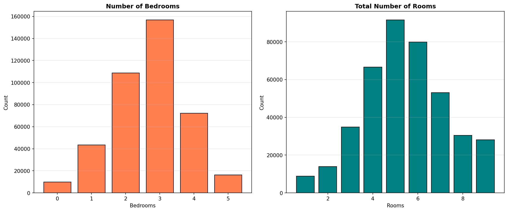

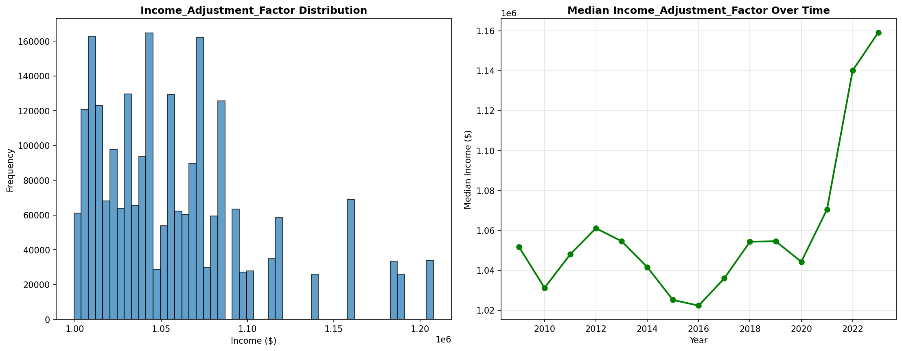

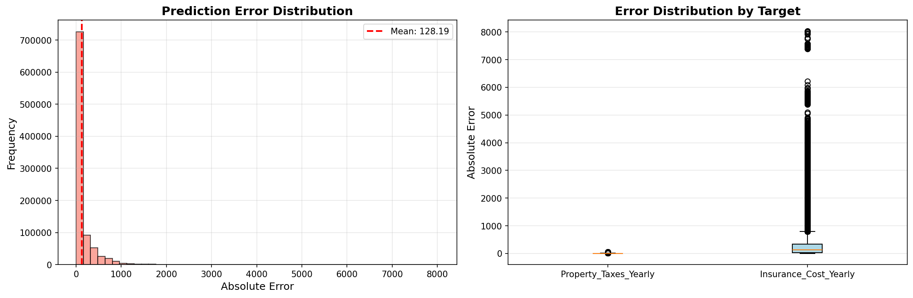

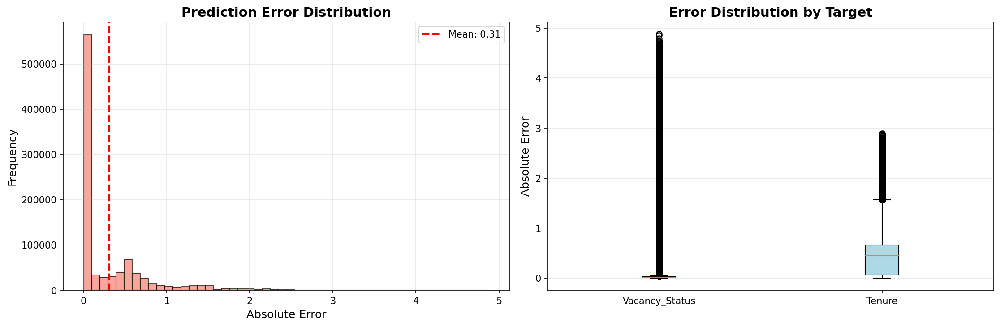

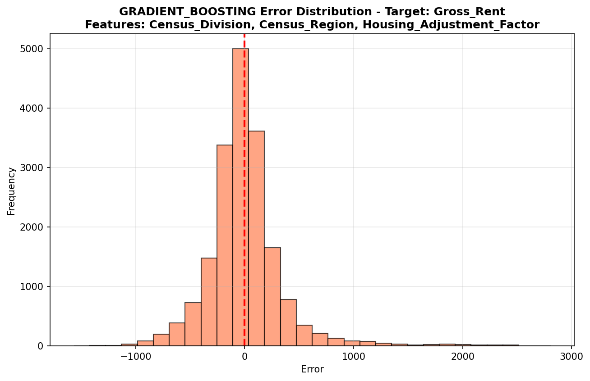

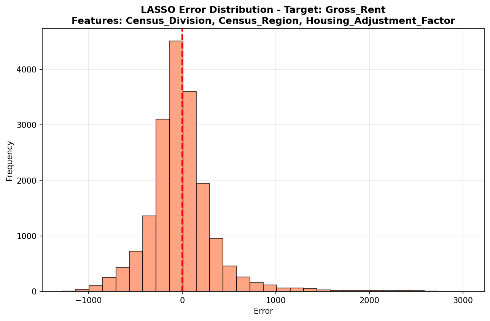

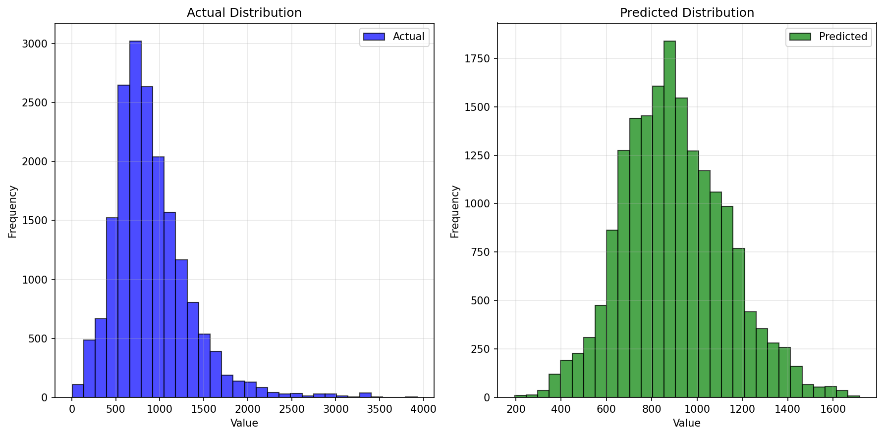

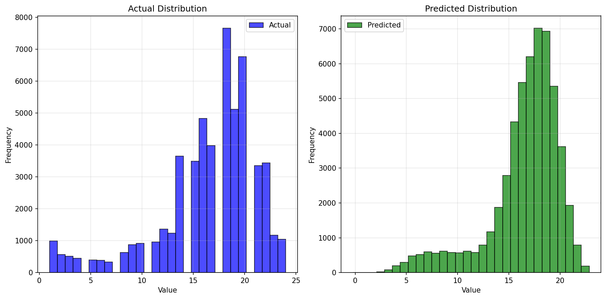

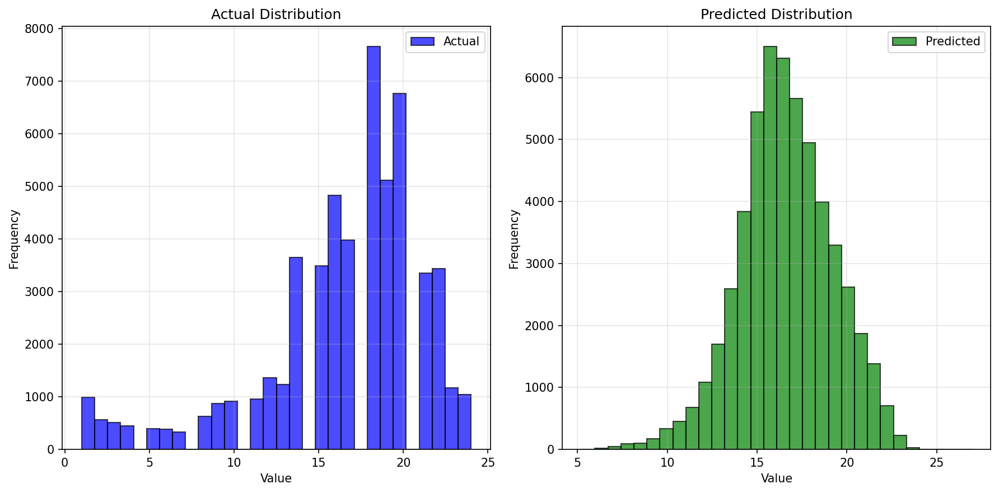

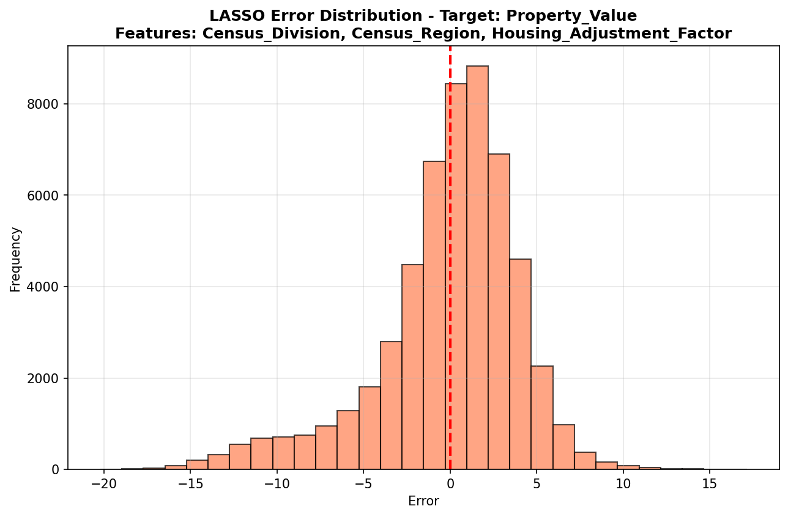

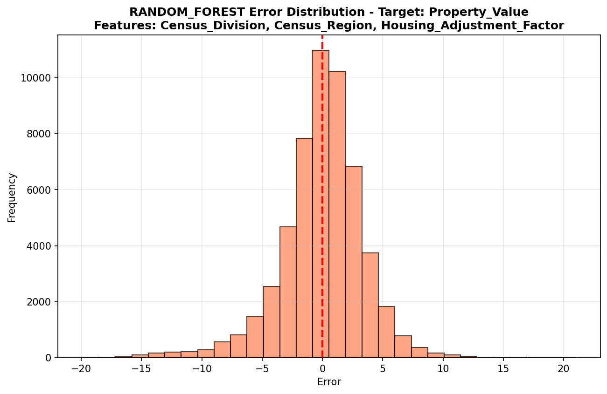

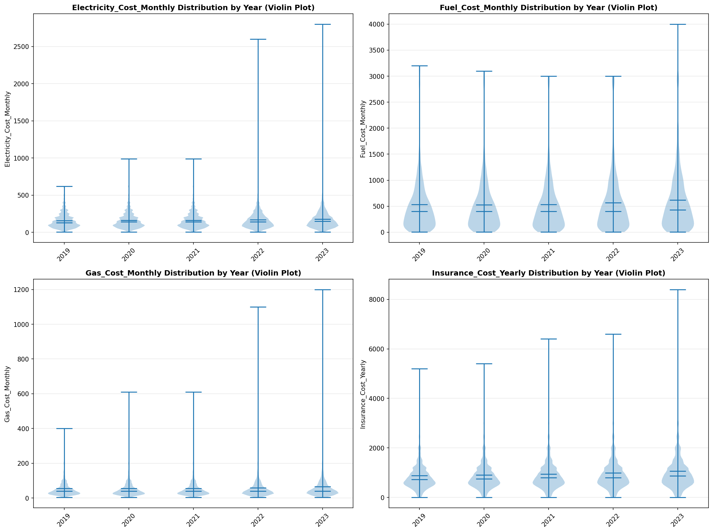

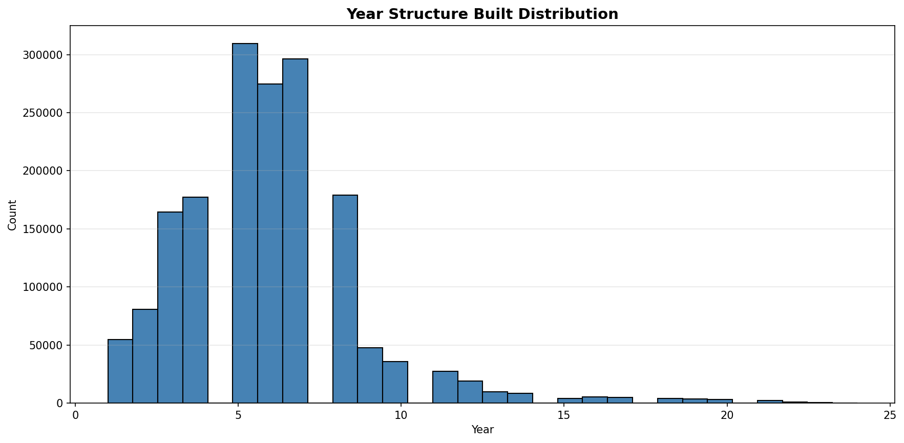

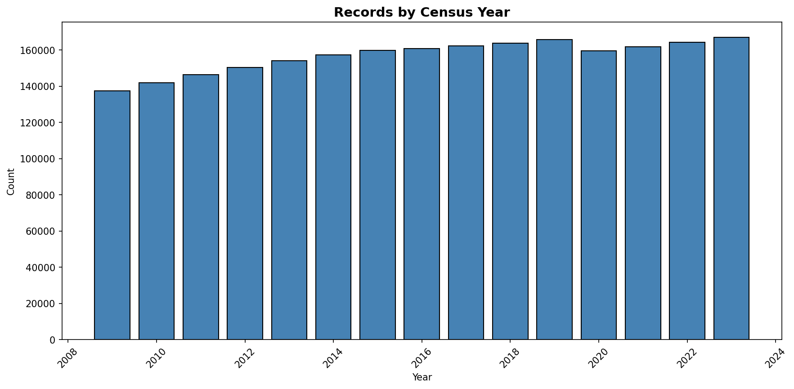
