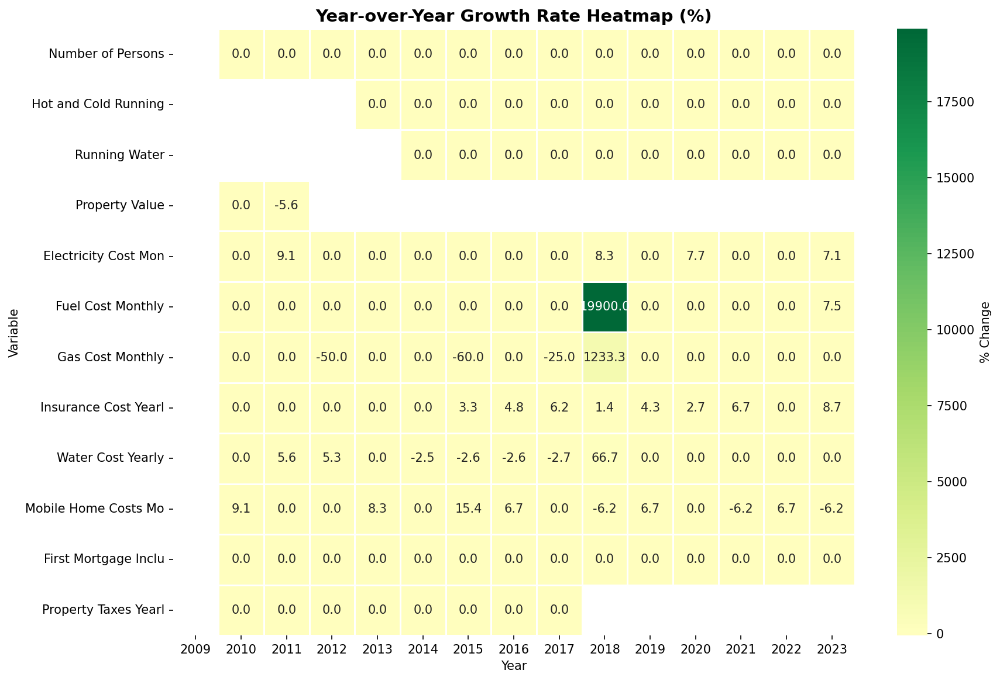
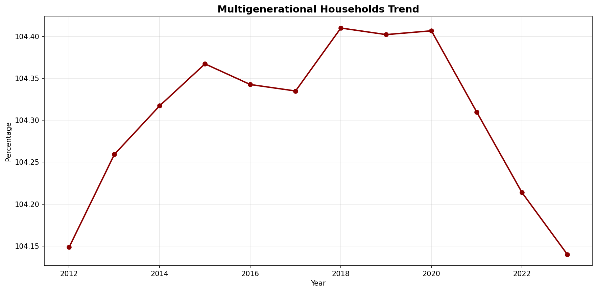
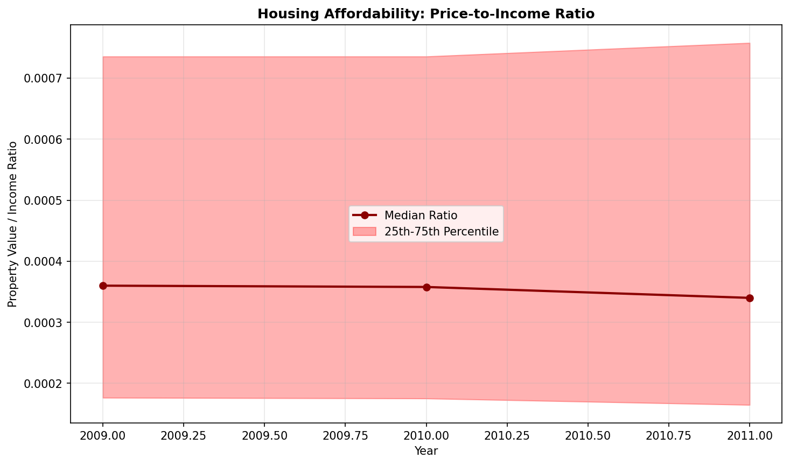

# Trend Analysis

> Analysis of long-term trends in key variables, including trend direction, strength, and statistical significance.

## Trend Summary

_No trend summary available._
## Strong Trends

> Variables showing significant long-term trends that may require attention or represent important patterns in the data.

- **('Owner_Costs_Percentage_Income', 0.9325127017334067, 'decreasing')**: decreasing trend (slope: 0.0000)

- **('Insurance_Cost_Yearly', 0.8835704818979565, 'increasing')**: decreasing trend (slope: 0.0000)

- **('Gross_Rent', 0.871474507388632, 'increasing')**: decreasing trend (slope: 0.0000)

- **('Electricity_Cost_Monthly', 0.8675291545189514, 'increasing')**: decreasing trend (slope: 0.0000)

- **('Rent_Amount_Monthly', 0.8268288155642823, 'increasing')**: decreasing trend (slope: 0.0000)

- **('Total_Monthly_Utility_Cost', 0.8183376587447944, 'increasing')**: decreasing trend (slope: 0.0000)

- **('Family_Income', 0.8141620884098397, 'increasing')**: decreasing trend (slope: 0.0000)

- **('Household_Income', 0.8134466120422759, 'increasing')**: decreasing trend (slope: 0.0000)

- **('Income_to_FPL_Ratio', 0.7920784171548103, 'increasing')**: decreasing trend (slope: 0.0000)

- **('Property_Value', 0.75, 'decreasing')**: decreasing trend (slope: 0.0000)

- **('Fuel_Cost_Monthly', 0.732279168975132, 'increasing')**: decreasing trend (slope: 0.0000)

- **('Mobile_Home_Costs_Monthly', 0.7242149014778285, 'increasing')**: decreasing trend (slope: 0.0000)

- **('Water_Cost_Yearly', 0.7193219711004073, 'increasing')**: decreasing trend (slope: 0.0000)

## Trend Categories

_Trend category data not available._
## Visualizations

