# Deep Learning Models

> Neural network analysis using TensorFlow/Keras for complex pattern recognition and multi-output prediction tasks.

## Deep Learning Summary

- **Total Tasks**: 5

- **Tasks**: Property Valuation, Affordability Analysis, Housing Quality, Cost Prediction, Occupancy Prediction

### Aggregate Statistics

| Metric | Value |
| :--- | :--- |
| Total Parameters | 78,283 |
| Average Validation Loss | 29584.1395 |
| Number of Tasks | 5 |

## Task: Property Valuation

### Model Configuration

| Property | Value |
| :--- | :--- |
| Model Type | HousingValuationModel |
| Task Type | Multi_Output |
| Target Variables | Property_Value, Gross_Rent |
| Number of Targets | 2 |
| Input Features | 10 |

### Network Architecture

| Component | Value | Notes |
| :--- | :--- | :--- |
| Total Layers | 7 | Including input and output |
| Total Parameters | 36,994 | Trainable weights |
| Parameters per Layer | 5,284 | Average |

### Performance Metrics

| Metric | Value | Assessment |
| :--- | :--- | :--- |
| Training Loss | 30257.2266 | Final epoch |
| Validation Loss | 29463.1719 | Final epoch |
| Loss Gap | -794.0547 | NONE overfitting risk |

> *Good generalization*

#### Test Set Metrics

| Metric | Value | Description |
| :--- | :--- | :--- |
| MAE | 51.6018 | Mean Absolute Error (lower is better) |
| MSE | 29074.6582 | Mean Squared Error (lower is better) |
| RMSE | 170.5129 | Root Mean Squared Error (lower is better) |
| R2 | 0.1015 | R-squared (higher is better) |

### Training Analysis

| Training Statistic | Value |
| :--- | :--- |
| Epochs Trained | 75 |
| Initial Training Loss | 45624.3477 |
| Final Training Loss | 30257.2266 |
| Loss Improvement | 33.7% |
| Initial Validation Loss | 30662.4473 |
| Final Validation Loss | 29463.1719 |
| Validation Improvement | 3.9% |

#### Convergence Assessment

- **Status**: Fully converged (< 1% change in last 10 epochs)

- **Last 10 epochs change**: 0.08%

## Task: Affordability Analysis

### Model Configuration

| Property | Value |
| :--- | :--- |
| Model Type | HousingAffordabilityModel |
| Task Type | Multi_Output |
| Target Variables | Owner_Costs_Percentage_Income, Gross_Rent_Percentage_Income |
| Number of Targets | 2 |
| Input Features | 10 |

### Network Architecture

| Component | Value | Notes |
| :--- | :--- | :--- |
| Total Layers | 6 | Including input and output |
| Total Parameters | 10,306 | Trainable weights |
| Parameters per Layer | 1,717 | Average |

### Performance Metrics

| Metric | Value | Assessment |
| :--- | :--- | :--- |
| Training Loss | 206.6053 | Final epoch |
| Validation Loss | 206.3603 | Final epoch |
| Loss Gap | -0.2450 | NONE overfitting risk |

> *Good generalization*

#### Test Set Metrics

| Metric | Value | Description |
| :--- | :--- | :--- |
| MAE | 6.8527 | Mean Absolute Error (lower is better) |
| MSE | 205.5653 | Mean Squared Error (lower is better) |
| RMSE | 14.3375 | Root Mean Squared Error (lower is better) |
| R2 | 0.0646 | R-squared (higher is better) |

### Training Analysis

| Training Statistic | Value |
| :--- | :--- |
| Epochs Trained | 75 |
| Initial Training Loss | 221.3625 |
| Final Training Loss | 206.6053 |
| Loss Improvement | 6.7% |
| Initial Validation Loss | 208.4236 |
| Final Validation Loss | 206.3603 |
| Validation Improvement | 1.0% |

#### Convergence Assessment

- **Status**: Fully converged (< 1% change in last 10 epochs)

- **Last 10 epochs change**: 0.00%

## Task: Housing Quality

### Model Configuration

| Property | Value |
| :--- | :--- |
| Model Type | HousingQualityModel |
| Task Type | Multi_Output |
| Target Variables | Year_Structure_Built, Number_of_Bedrooms, Number_of_Rooms |
| Number of Targets | 3 |
| Input Features | 10 |

### Network Architecture

| Component | Value | Notes |
| :--- | :--- | :--- |
| Total Layers | 6 | Including input and output |
| Total Parameters | 10,371 | Trainable weights |
| Parameters per Layer | 1,728 | Average |

### Performance Metrics

| Metric | Value | Assessment |
| :--- | :--- | :--- |
| Training Loss | 0.0062 | Final epoch |
| Validation Loss | 0.0258 | Final epoch |
| Loss Gap | 0.0196 | NONE overfitting risk |

> *Good generalization*

#### Test Set Metrics

| Metric | Value | Description |
| :--- | :--- | :--- |
| MAE | 0.0425 | Mean Absolute Error (lower is better) |
| MSE | 0.0256 | Mean Squared Error (lower is better) |
| RMSE | 0.1599 | Root Mean Squared Error (lower is better) |
| R2 | 0.9857 | R-squared (higher is better) |

### Training Analysis

| Training Statistic | Value |
| :--- | :--- |
| Epochs Trained | 75 |
| Initial Training Loss | 0.2156 |
| Final Training Loss | 0.0062 |
| Loss Improvement | 97.1% |
| Initial Validation Loss | 0.0354 |
| Final Validation Loss | 0.0258 |
| Validation Improvement | 27.0% |

#### Convergence Assessment

- **Status**: Still improving (> 5% change)

- **Last 10 epochs change**: 6.27%

## Task: Cost Prediction

### Model Configuration

| Property | Value |
| :--- | :--- |
| Model Type | HousingDefaultModel |
| Task Type | Multi_Output |
| Target Variables | Property_Taxes_Yearly, Insurance_Cost_Yearly |
| Number of Targets | 2 |
| Input Features | 10 |

### Network Architecture

| Component | Value | Notes |
| :--- | :--- | :--- |
| Total Layers | 6 | Including input and output |
| Total Parameters | 10,306 | Trainable weights |
| Parameters per Layer | 1,717 | Average |

### Performance Metrics

| Metric | Value | Assessment |
| :--- | :--- | :--- |
| Training Loss | 117662.3047 | Final epoch |
| Validation Loss | 118250.7656 | Final epoch |
| Loss Gap | 588.4609 | HIGH overfitting risk |

> *Model may be overfitting significantly*

#### Test Set Metrics

| Metric | Value | Description |
| :--- | :--- | :--- |
| MAE | 128.2121 | Mean Absolute Error (lower is better) |
| MSE | 118182.7266 | Mean Squared Error (lower is better) |
| RMSE | 343.7771 | Root Mean Squared Error (lower is better) |
| R2 | 0.1247 | R-squared (higher is better) |

### Training Analysis

| Training Statistic | Value |
| :--- | :--- |
| Epochs Trained | 75 |
| Initial Training Loss | 129632.1094 |
| Final Training Loss | 117662.3047 |
| Loss Improvement | 9.2% |
| Initial Validation Loss | 120142.7500 |
| Final Validation Loss | 118250.7656 |
| Validation Improvement | 1.6% |

#### Convergence Assessment

- **Status**: Fully converged (< 1% change in last 10 epochs)

- **Last 10 epochs change**: 0.08%

## Task: Occupancy Prediction

### Model Configuration

| Property | Value |
| :--- | :--- |
| Model Type | HousingDefaultModel |
| Task Type | Multi_Output |
| Target Variables | Vacancy_Status, Tenure |
| Number of Targets | 2 |
| Input Features | 10 |

### Network Architecture

| Component | Value | Notes |
| :--- | :--- | :--- |
| Total Layers | 6 | Including input and output |
| Total Parameters | 10,306 | Trainable weights |
| Parameters per Layer | 1,717 | Average |

### Performance Metrics

| Metric | Value | Assessment |
| :--- | :--- | :--- |
| Training Loss | 0.3723 | Final epoch |
| Validation Loss | 0.3737 | Final epoch |
| Loss Gap | 0.0014 | NONE overfitting risk |

> *Good generalization*

#### Test Set Metrics

| Metric | Value | Description |
| :--- | :--- | :--- |
| MAE | 0.3117 | Mean Absolute Error (lower is better) |
| MSE | 0.3674 | Mean Squared Error (lower is better) |
| RMSE | 0.6061 | Root Mean Squared Error (lower is better) |
| R2 | 0.2675 | R-squared (higher is better) |

### Training Analysis

| Training Statistic | Value |
| :--- | :--- |
| Epochs Trained | 75 |
| Initial Training Loss | 0.4828 |
| Final Training Loss | 0.3723 |
| Loss Improvement | 22.9% |
| Initial Validation Loss | 0.3894 |
| Final Validation Loss | 0.3737 |
| Validation Improvement | 4.0% |

#### Convergence Assessment

- **Status**: Fully converged (< 1% change in last 10 epochs)

- **Last 10 epochs change**: 0.03%

## Cross-Task Comparison

| Task | Model Type | Parameters | Train Loss | Val Loss | Gap |
| :--- | :--- | :--- | :--- | :--- | :--- |
| Property Valuation | HousingValuationModel | 36,994 | 30257.2266 | 29463.1719 | -794.0547 |
| Affordability Analysis | HousingAffordabilityModel | 10,306 | 206.6053 | 206.3603 | -0.2450 |
| Housing Quality | HousingQualityModel | 10,371 | 0.0062 | 0.0258 | 0.0196 |
| Cost Prediction | HousingDefaultModel | 10,306 | 117662.3047 | 118250.7656 | 588.4609 |
| Occupancy Prediction | HousingDefaultModel | 10,306 | 0.3723 | 0.3737 | 0.0014 |

## Visualizations

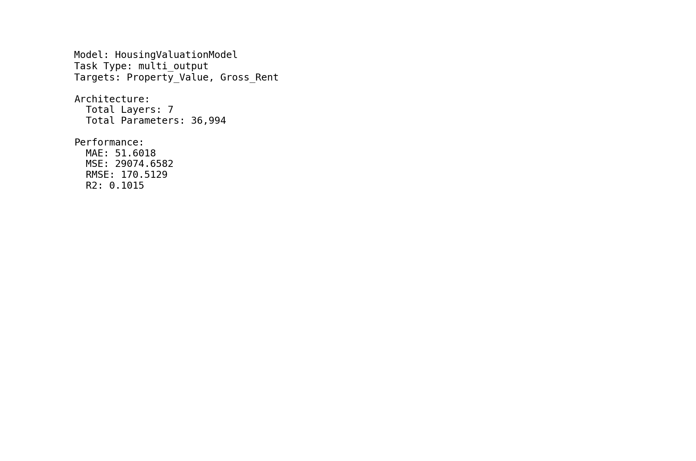

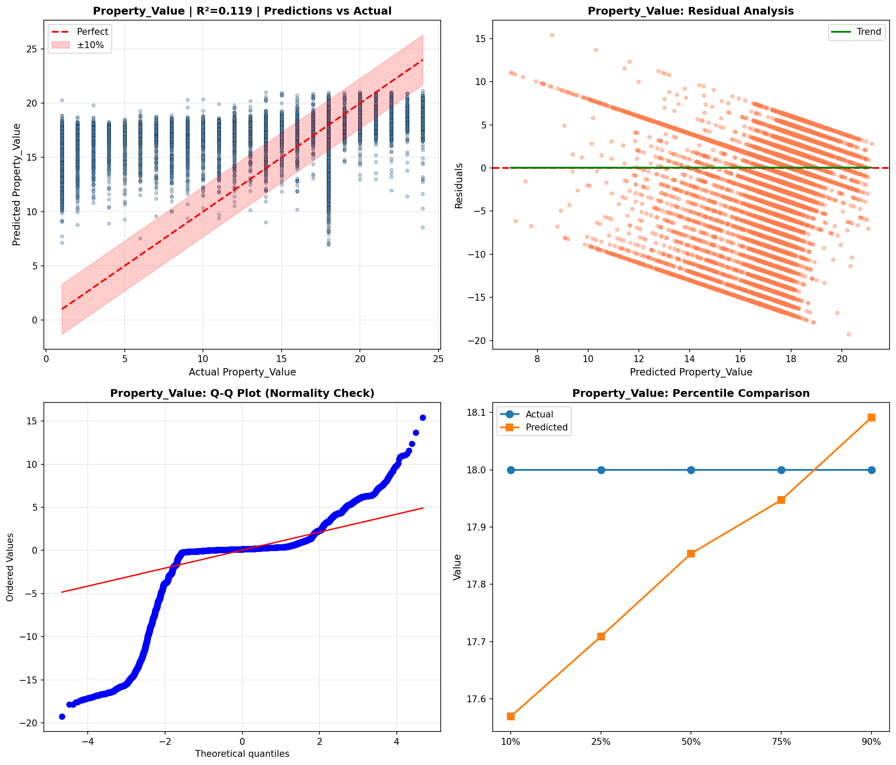

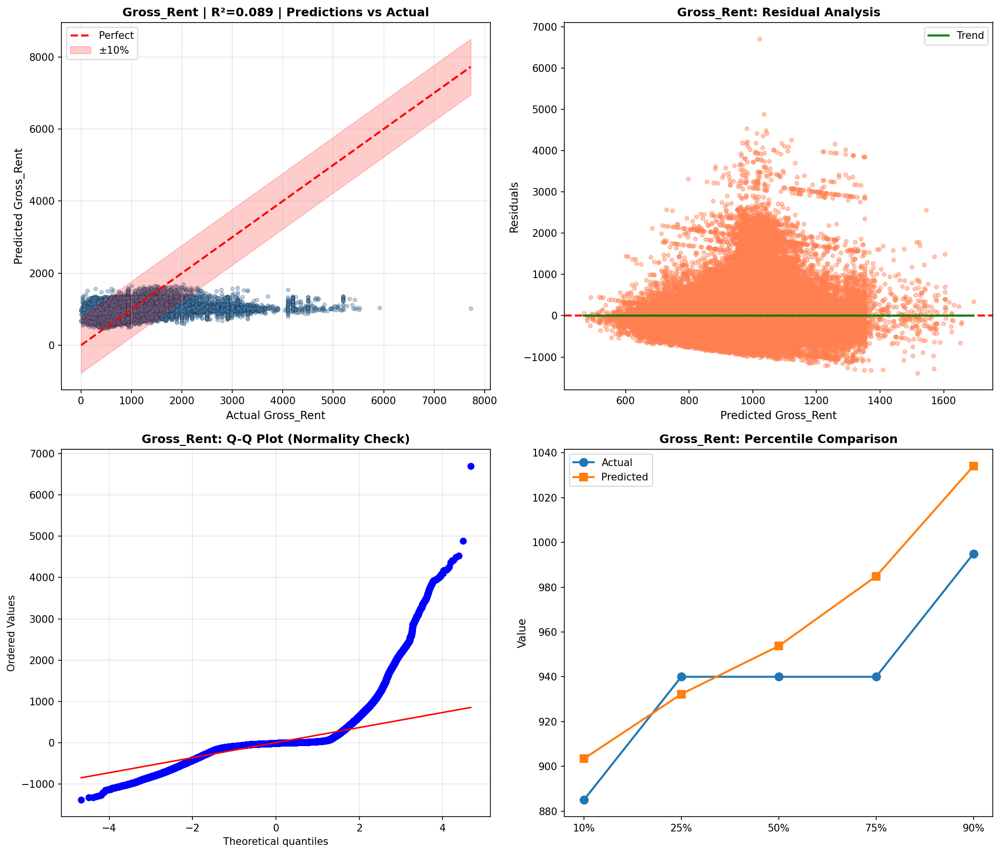

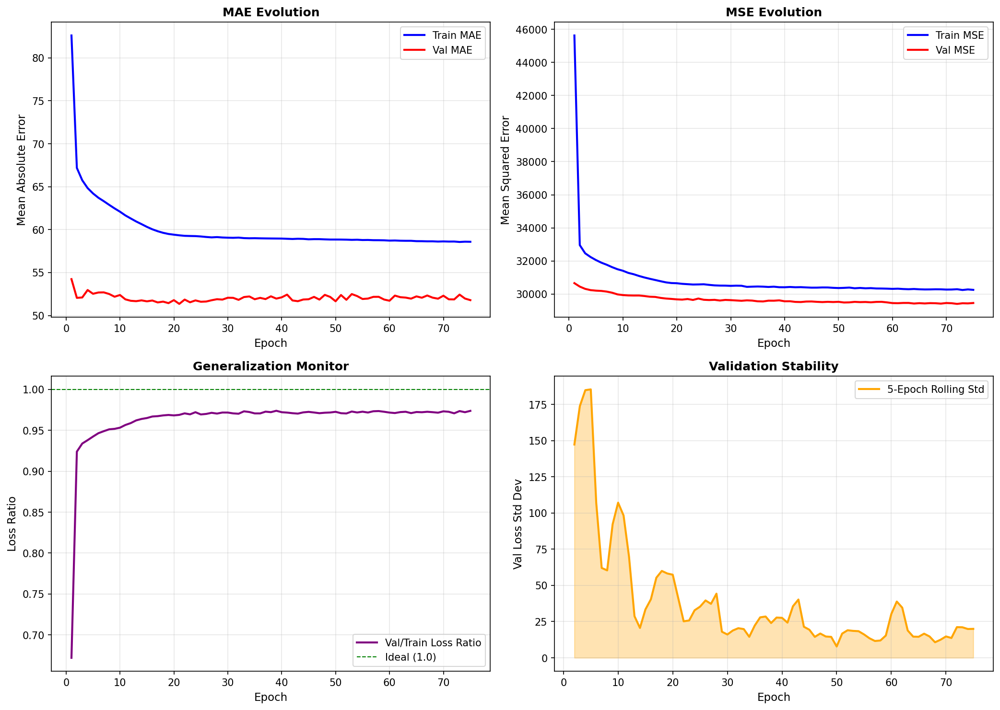

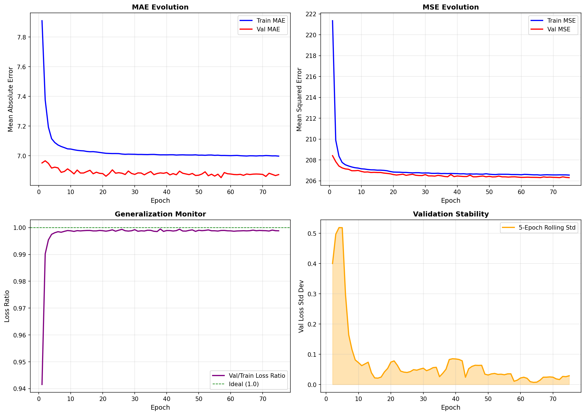

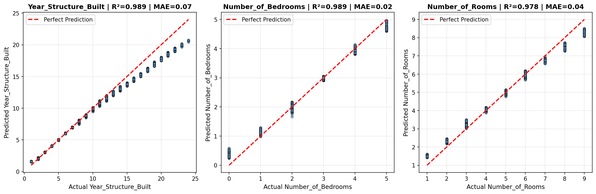

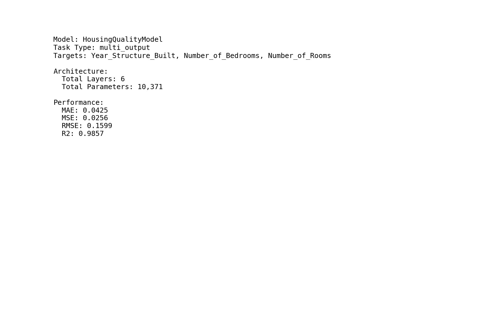

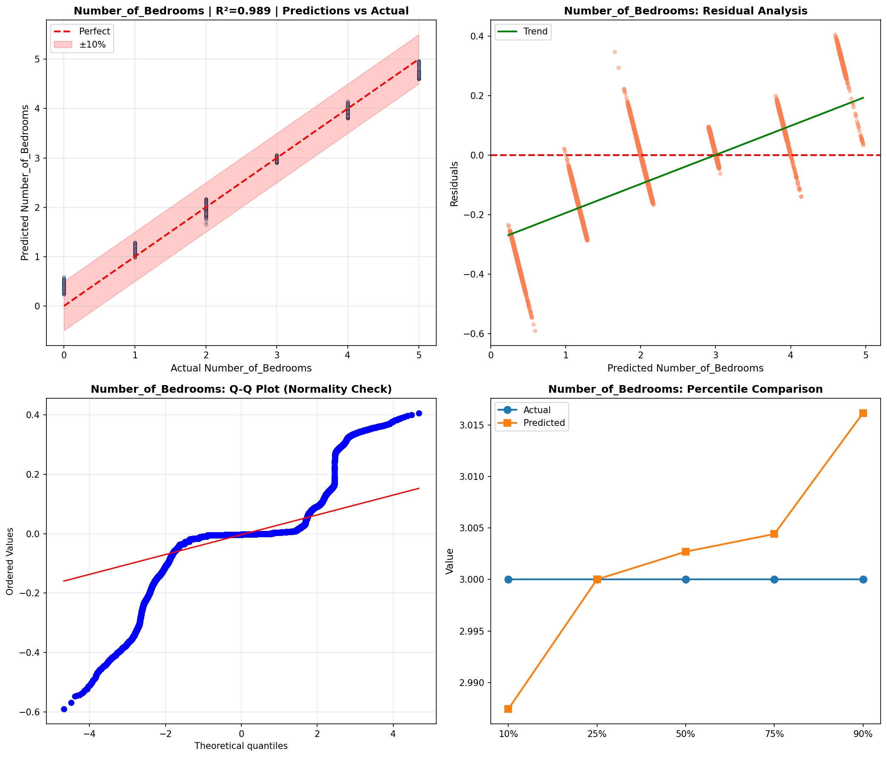

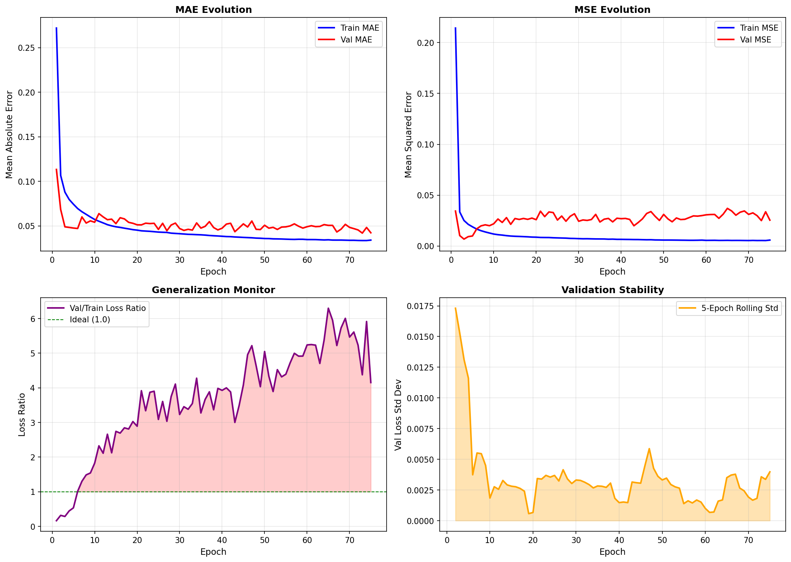

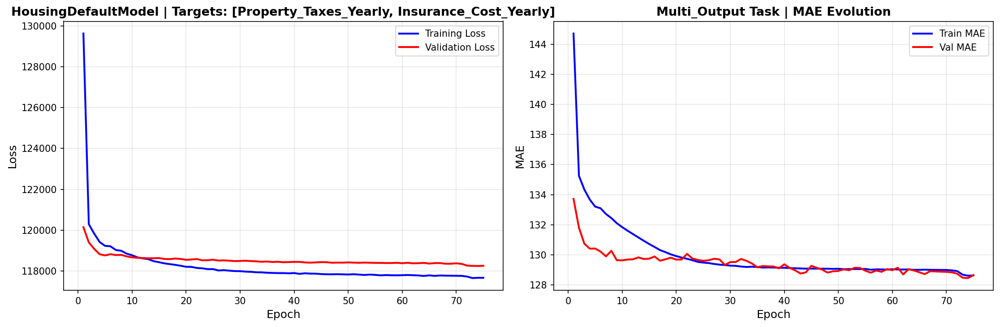

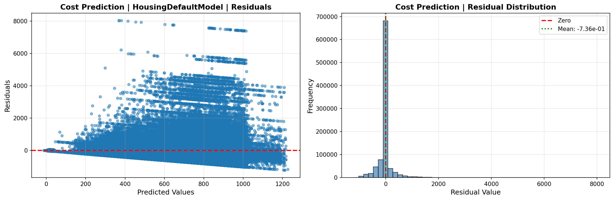

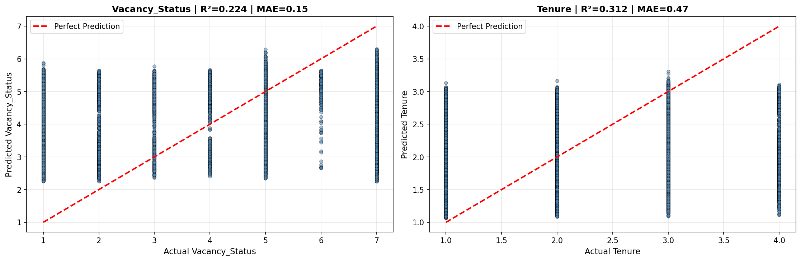

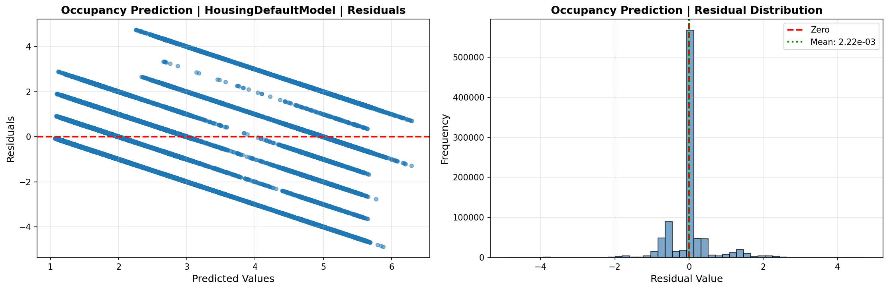

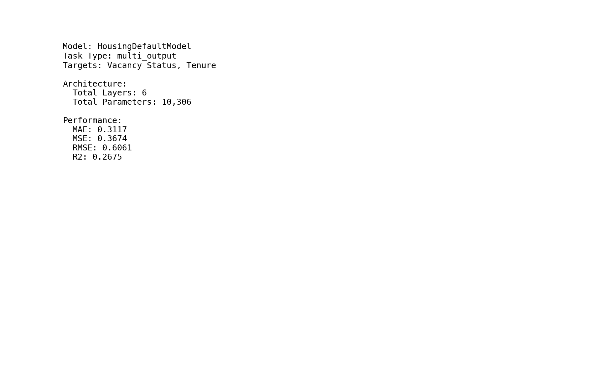

