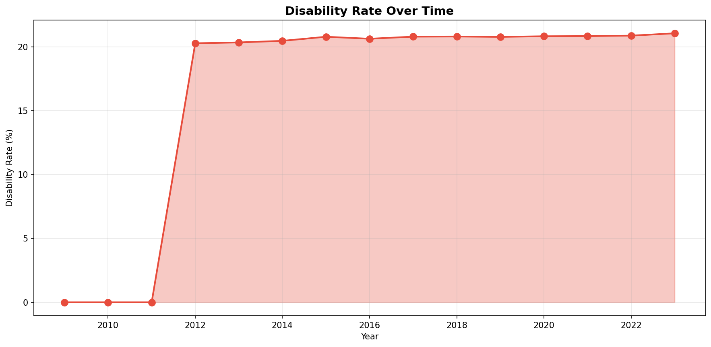
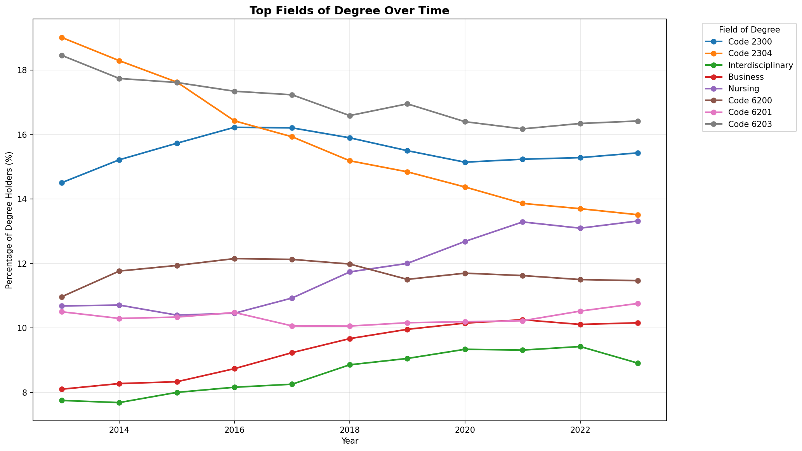
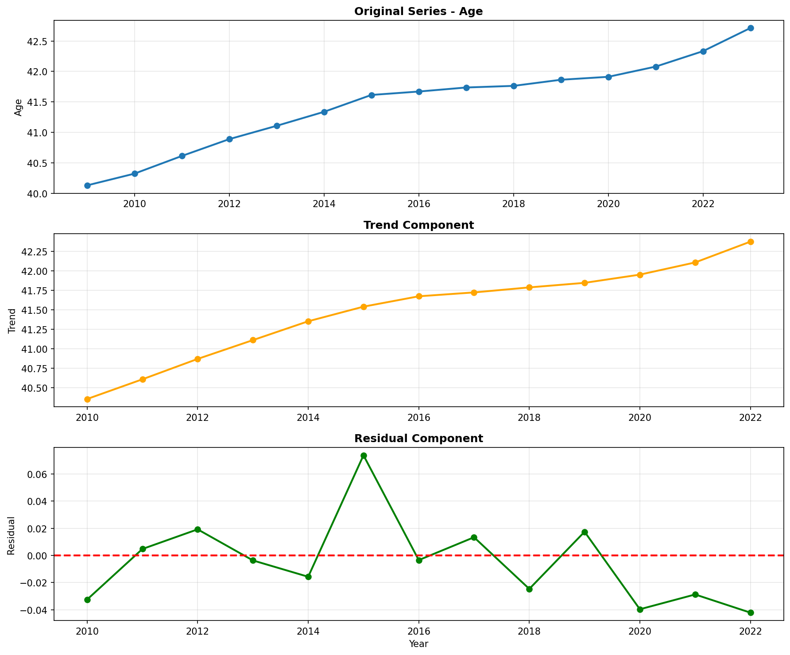
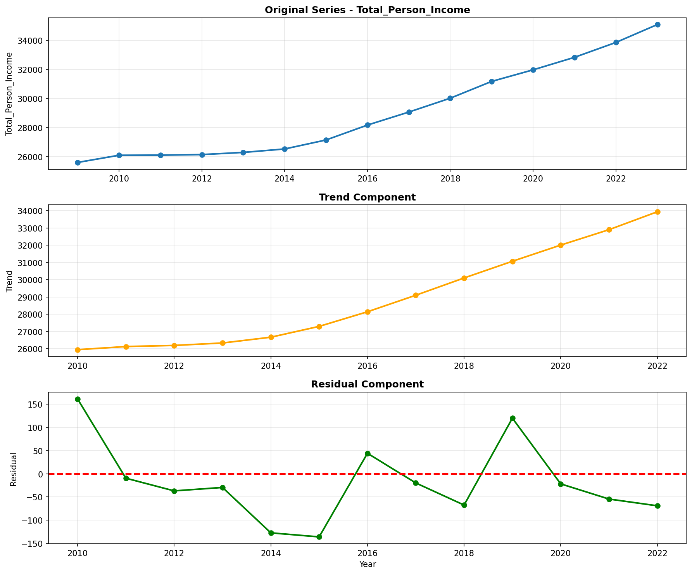
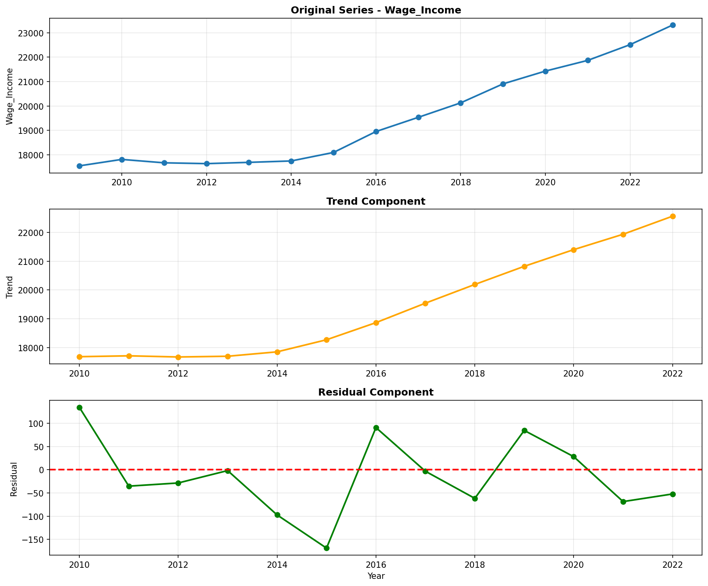
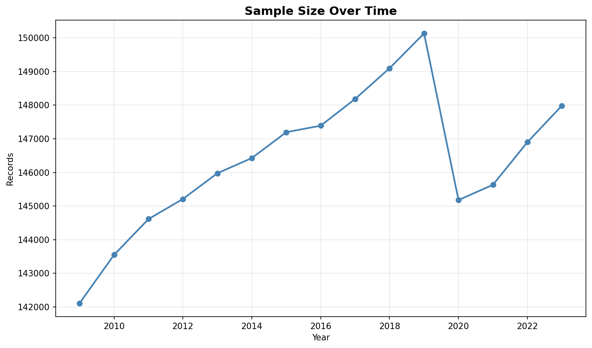
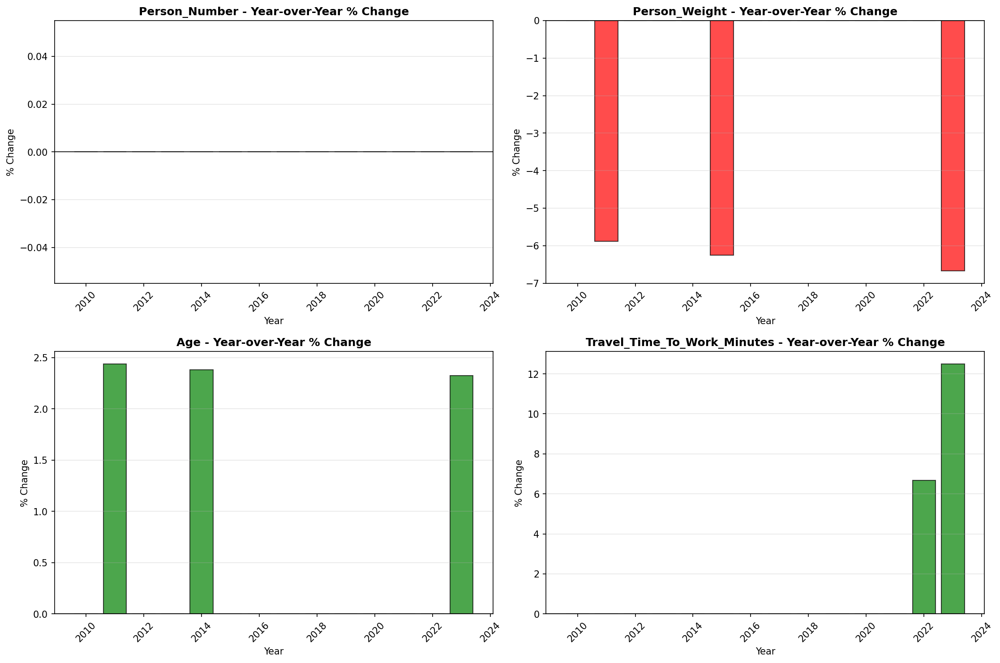
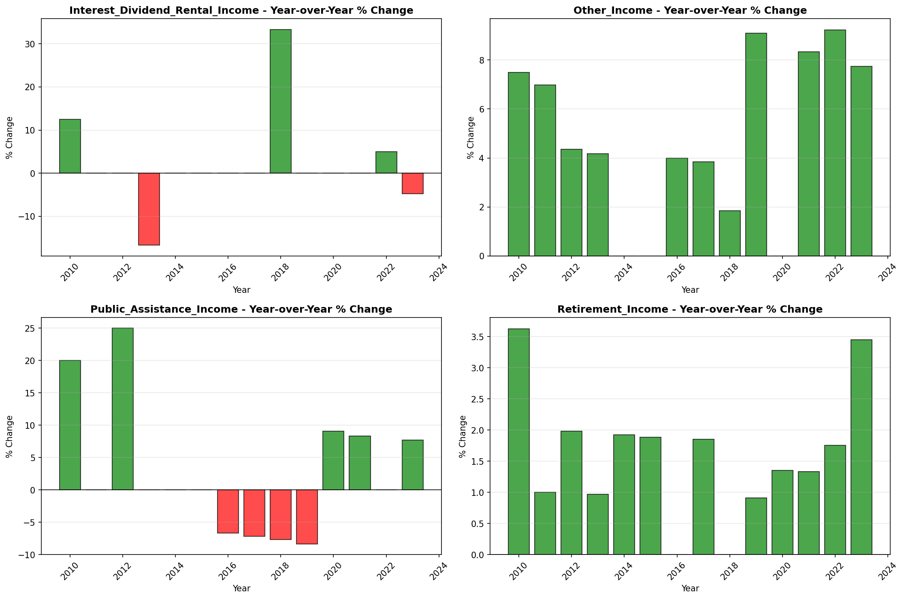

# Trend Analysis

> Analysis of long-term trends in key variables, including trend direction, strength, and statistical significance.

## Trend Summary

_No trend summary available._
## Strong Trends

> Variables showing significant long-term trends that may require attention or represent important patterns in the data.

- **('Social_Security_Income', 0.9775211908207538, 'increasing')**: decreasing trend (slope: 0.0000)

- **('Retirement_Income', 0.9725674915635519, 'increasing')**: decreasing trend (slope: 0.0000)

- **('Income_Per_Week_Worked', 0.9708115201791485, 'increasing')**: decreasing trend (slope: 0.0000)

- **('Income_Per_Hour', 0.9689938678738207, 'increasing')**: decreasing trend (slope: 0.0000)

- **('Total_Person_Earnings', 0.9367681498829056, 'increasing')**: decreasing trend (slope: 0.0000)

- **('Supplemental_Security_Income', 0.9251902492619203, 'increasing')**: decreasing trend (slope: 0.0000)

- **('Other_Income', 0.9174360987761272, 'increasing')**: decreasing trend (slope: 0.0000)

- **('Wage_Income', 0.908003580992365, 'increasing')**: decreasing trend (slope: 0.0000)

- **('Total_Person_Income', 0.8897373765394324, 'increasing')**: decreasing trend (slope: 0.0000)

- **('Self_Employment_Income', 0.8156159004676592, 'increasing')**: decreasing trend (slope: 0.0000)

- **('Age', 0.7533482142857157, 'increasing')**: decreasing trend (slope: 0.0000)

## Trend Categories

_Trend category data not available._
## Visualizations

