# Statistical Analysis

> Comprehensive descriptive statistics including central tendency, dispersion, distribution characteristics, and weighted statistics using ACS sample weights.

## Summary Statistics

- **Variables Analyzed**: 41

### Income_Adjustment_Factor

| Statistic | Unweighted | Weighted (ACS) |
| :--- | :--- | :--- |
| Mean | 1,014,932.07 | 1,014,656.45 |
| Median | 1,010,207.00 | 1,014,656.45 |
| Std Deviation | 11,415.09 | — |
| Minimum | 1,001,264.00 | — |
| Maximum | 1,042,311.00 | — |
| Count | 1,746,017 | — |

> *Distribution is highly right-skewed (skewness: 1.31), light-tailed/platykurtic (kurtosis: 0.68).*

- **Coefficient of Variation**: 1.1 % (low variability)

### Property_Value

| Statistic | Unweighted | Weighted (ACS) |
| :--- | :--- | :--- |
| Mean | 640,639.47 | 624,837.78 |
| Median | 460,000.00 | 460,751.83 |
| Std Deviation | 808,580.02 | — |
| Minimum | 1.00 | — |
| Maximum | 8,579,000.00 | — |
| Count | 986,406 | — |

> *Distribution is highly right-skewed (skewness: 4.78), heavy-tailed/leptokurtic (kurtosis: 33.13).*

- **Coefficient of Variation**: 126.2 % (very high variability)

### Electricity_Cost_Monthly

| Statistic | Unweighted | Weighted (ACS) |
| :--- | :--- | :--- |
| Mean | 128.26 | 125.19 |
| Median | 90.00 | 91.88 |
| Std Deviation | 139.29 | — |
| Minimum | 1.00 | — |
| Maximum | 2,600.00 | — |
| Count | 2,079,708 | — |

> *Distribution is highly right-skewed (skewness: 6.65), heavy-tailed/leptokurtic (kurtosis: 93.76).*

- **Coefficient of Variation**: 108.6 % (very high variability)

### Fuel_Cost_Monthly

| Statistic | Unweighted | Weighted (ACS) |
| :--- | :--- | :--- |
| Mean | 41.51 | 201.29 |
| Median | 2.00 | 109.50 |
| Std Deviation | 230.42 | — |
| Minimum | 1.00 | — |
| Maximum | 5,600.00 | — |
| Count | 1,450,493 | — |

> *Distribution is highly right-skewed (skewness: 10.05), heavy-tailed/leptokurtic (kurtosis: 132.87).*

- **Coefficient of Variation**: 555.2 % (very high variability)

### Gas_Cost_Monthly

| Statistic | Unweighted | Weighted (ACS) |
| :--- | :--- | :--- |
| Mean | 49.92 | 49.38 |
| Median | 30.00 | 30.00 |
| Std Deviation | 80.75 | — |
| Minimum | 1.00 | — |
| Maximum | 1,600.00 | — |
| Count | 1,892,025 | — |

> *Distribution is highly right-skewed (skewness: 8.18), heavy-tailed/leptokurtic (kurtosis: 122.91).*

- **Coefficient of Variation**: 161.8 % (very high variability)

### Insurance_Cost_Yearly

| Statistic | Unweighted | Weighted (ACS) |
| :--- | :--- | :--- |
| Mean | 1,213.67 | 1,189.58 |
| Median | 900.00 | 921.25 |
| Std Deviation | 1,144.68 | — |
| Minimum | 4.00 | — |
| Maximum | 10,000.00 | — |
| Count | 1,175,183 | — |

> *Distribution is highly right-skewed (skewness: 3.65), heavy-tailed/leptokurtic (kurtosis: 18.08).*

- **Coefficient of Variation**: 94.3 % (high variability)

### Water_Cost_Yearly

| Statistic | Unweighted | Weighted (ACS) |
| :--- | :--- | :--- |
| Mean | 597.63 | 608.73 |
| Median | 360.00 | 380.00 |
| Std Deviation | 734.98 | — |
| Minimum | 1.00 | — |
| Maximum | 6,200.00 | — |
| Count | 1,910,994 | — |

> *Distribution is highly right-skewed (skewness: 2.21), heavy-tailed/leptokurtic (kurtosis: 8.09).*

- **Coefficient of Variation**: 123.0 % (very high variability)

### Mobile_Home_Costs_Monthly

| Statistic | Unweighted | Weighted (ACS) |
| :--- | :--- | :--- |
| Mean | 4,908.80 | 4,896.28 |
| Median | 4,400.00 | 4,568.75 |
| Std Deviation | 5,043.94 | — |
| Minimum | 4.00 | — |
| Maximum | 41,900.00 | — |
| Count | 52,718 | — |

> *Distribution is highly right-skewed (skewness: 2.32), heavy-tailed/leptokurtic (kurtosis: 12.22).*

- **Coefficient of Variation**: 102.8 % (very high variability)

### First_Mortgage_Payment_Monthly

| Statistic | Unweighted | Weighted (ACS) |
| :--- | :--- | :--- |
| Mean | 1,605.92 | 1,756.69 |
| Median | 1,500.00 | 1,463.00 |
| Std Deviation | 1,300.86 | — |
| Minimum | 4.00 | — |
| Maximum | 8,600.00 | — |
| Count | 1,055,599 | — |

> *Distribution is highly right-skewed (skewness: 1.34), heavy-tailed/leptokurtic (kurtosis: 3.39).*

- **Coefficient of Variation**: 81.0 % (high variability)

### First_Mortgage_Includes_Taxes

| Statistic | Unweighted | Weighted (ACS) |
| :--- | :--- | :--- |
| Mean | 1.50 | 1.48 |
| Median | 2.00 | 1.31 |
| Std Deviation | 0.50 | — |
| Minimum | 1.00 | — |
| Maximum | 2.00 | — |
| Count | 888,437 | — |

> *Distribution is approximately symmetric (skewness: -0.00), light-tailed/platykurtic (kurtosis: -2.00).*

- **Coefficient of Variation**: 33.3 % (moderate variability)

### Second_Mortgage_Payment_Monthly

| Statistic | Unweighted | Weighted (ACS) |
| :--- | :--- | :--- |
| Mean | 586.71 | 601.42 |
| Median | 400.00 | 409.38 |
| Std Deviation | 638.68 | — |
| Minimum | 4.00 | — |
| Maximum | 5,800.00 | — |
| Count | 187,720 | — |

> *Distribution is highly right-skewed (skewness: 3.41), heavy-tailed/leptokurtic (kurtosis: 16.47).*

- **Coefficient of Variation**: 108.9 % (very high variability)

### Property_Taxes_Yearly

| Statistic | Unweighted | Weighted (ACS) |
| :--- | :--- | :--- |
| Mean | 650.17 | 613.66 |
| Median | 42.00 | 474.75 |
| Std Deviation | 2,867.97 | — |
| Minimum | 1.00 | — |
| Maximum | 47,500.00 | — |
| Count | 953,488 | — |

> *Distribution is highly right-skewed (skewness: 8.45), heavy-tailed/leptokurtic (kurtosis: 100.94).*

- **Coefficient of Variation**: 441.1 % (very high variability)

### Meals_Included_in_Rent

| Statistic | Unweighted | Weighted (ACS) |
| :--- | :--- | :--- |
| Mean | 1.98 | 1.98 |
| Median | 2.00 | 2.00 |
| Std Deviation | 0.13 | — |
| Minimum | 1.00 | — |
| Maximum | 2.00 | — |
| Count | 816,425 | — |

> *Distribution is highly left-skewed (skewness: -7.65), heavy-tailed/leptokurtic (kurtosis: 56.55).*

- **Coefficient of Variation**: 6.4 % (low variability)

### Rent_Amount_Monthly

| Statistic | Unweighted | Weighted (ACS) |
| :--- | :--- | :--- |
| Mean | 1,377.32 | 1,383.68 |
| Median | 1,200.00 | 1,273.75 |
| Std Deviation | 802.87 | — |
| Minimum | 4.00 | — |
| Maximum | 6,700.00 | — |
| Count | 816,425 | — |

> *Distribution is highly right-skewed (skewness: 1.58), heavy-tailed/leptokurtic (kurtosis: 4.97).*

- **Coefficient of Variation**: 58.3 % (high variability)

### Gross_Rent

| Statistic | Unweighted | Weighted (ACS) |
| :--- | :--- | :--- |
| Mean | 1,511.97 | 1,511.52 |
| Median | 1,350.00 | 1,390.81 |
| Std Deviation | 845.91 | — |
| Minimum | 4.00 | — |
| Maximum | 10,967.00 | — |
| Count | 787,207 | — |

> *Distribution is highly right-skewed (skewness: 1.58), heavy-tailed/leptokurtic (kurtosis: 5.09).*

- **Coefficient of Variation**: 55.9 % (high variability)

### Gross_Rent_Percentage_Income

| Statistic | Unweighted | Weighted (ACS) |
| :--- | :--- | :--- |
| Mean | 41.61 | 41.87 |
| Median | 32.00 | 32.69 |
| Std Deviation | 27.68 | — |
| Minimum | 1.00 | — |
| Maximum | 101.00 | — |
| Count | 773,248 | — |

> *Distribution is highly right-skewed (skewness: 1.01), light-tailed/platykurtic (kurtosis: -0.11).*

- **Coefficient of Variation**: 66.5 % (high variability)

### Selected_Monthly_Owner_Costs

| Statistic | Unweighted | Weighted (ACS) |
| :--- | :--- | :--- |
| Mean | 2,039.60 | 2,093.68 |
| Median | 1,720.00 | 1,807.38 |
| Std Deviation | 1,630.10 | — |
| Minimum | 1.00 | — |
| Maximum | 20,767.00 | — |
| Count | 1,291,145 | — |

> *Distribution is highly right-skewed (skewness: 1.81), heavy-tailed/leptokurtic (kurtosis: 5.59).*

- **Coefficient of Variation**: 79.9 % (high variability)

### Owner_Costs_Percentage_Income

| Statistic | Unweighted | Weighted (ACS) |
| :--- | :--- | :--- |
| Mean | 28.84 | 29.83 |
| Median | 22.00 | 22.69 |
| Std Deviation | 24.36 | — |
| Minimum | 1.00 | — |
| Maximum | 101.00 | — |
| Count | 1,281,984 | — |

> *Distribution is highly right-skewed (skewness: 1.59), light-tailed/platykurtic (kurtosis: 2.06).*

- **Coefficient of Variation**: 84.5 % (high variability)

### Family_Income

| Statistic | Unweighted | Weighted (ACS) |
| :--- | :--- | :--- |
| Mean | 114,561.94 | 108,473.79 |
| Median | 82,000.00 | 78,733.12 |
| Std Deviation | 119,816.82 | — |
| Minimum | 1.00 | — |
| Maximum | 2,580,000.00 | — |
| Count | 1,440,068 | — |

> *Distribution is highly right-skewed (skewness: 3.43), heavy-tailed/leptokurtic (kurtosis: 19.60).*

- **Coefficient of Variation**: 104.6 % (very high variability)

### Household_Income

| Statistic | Unweighted | Weighted (ACS) |
| :--- | :--- | :--- |
| Mean | 102,112.65 | 97,611.68 |
| Median | 71,000.00 | 69,172.50 |
| Std Deviation | 112,494.95 | — |
| Minimum | 1.00 | — |
| Maximum | 3,002,000.00 | — |
| Count | 2,085,536 | — |

> *Distribution is highly right-skewed (skewness: 3.56), heavy-tailed/leptokurtic (kurtosis: 21.47).*

- **Coefficient of Variation**: 110.2 % (very high variability)

### Specified_Rent_Unit

| Statistic | Unweighted | Weighted (ACS) |
| :--- | :--- | :--- |
| Mean | 0.38 | 0.43 |
| Median | 0.00 | 0.00 |
| Std Deviation | 0.48 | — |
| Minimum | 0.00 | — |
| Maximum | 1.00 | — |
| Count | 2,237,092 | — |

> *Distribution is moderately right-skewed (skewness: 0.51), light-tailed/platykurtic (kurtosis: -1.74).*

- **Coefficient of Variation**: 128.7 % (very high variability)

### Specified_Value_Unit

| Statistic | Unweighted | Weighted (ACS) |
| :--- | :--- | :--- |
| Mean | 0.51 | 0.45 |
| Median | 1.00 | 0.00 |
| Std Deviation | 0.50 | — |
| Minimum | 0.00 | — |
| Maximum | 1.00 | — |
| Count | 2,237,092 | — |

> *Distribution is approximately symmetric (skewness: -0.05), light-tailed/platykurtic (kurtosis: -2.00).*

- **Coefficient of Variation**: 97.8 % (high variability)

### Flag_Family_Income

| Statistic | Unweighted | Weighted (ACS) |
| :--- | :--- | :--- |
| Mean | 0.23 | 0.23 |
| Median | 0.00 | 0.00 |
| Std Deviation | 0.42 | — |
| Minimum | 0.00 | — |
| Maximum | 1.00 | — |
| Count | 1,698,909 | — |

> *Distribution is highly right-skewed (skewness: 1.27), light-tailed/platykurtic (kurtosis: -0.40).*

- **Coefficient of Variation**: 181.6 % (very high variability)

### Flag_Gross_Rent

| Statistic | Unweighted | Weighted (ACS) |
| :--- | :--- | :--- |
| Mean | 0.10 | 0.13 |
| Median | 0.00 | 0.00 |
| Std Deviation | 0.30 | — |
| Minimum | 0.00 | — |
| Maximum | 1.00 | — |
| Count | 1,192,415 | — |

> *Distribution is highly right-skewed (skewness: 2.62), heavy-tailed/leptokurtic (kurtosis: 4.87).*

- **Coefficient of Variation**: 296.0 % (very high variability)

### Flag_Household_Income

| Statistic | Unweighted | Weighted (ACS) |
| :--- | :--- | :--- |
| Mean | 0.33 | 0.33 |
| Median | 0.00 | 0.00 |
| Std Deviation | 0.47 | — |
| Minimum | 0.00 | — |
| Maximum | 1.00 | — |
| Count | 1,698,909 | — |

> *Distribution is moderately right-skewed (skewness: 0.75), light-tailed/platykurtic (kurtosis: -1.44).*

- **Coefficient of Variation**: 144.0 % (very high variability)

### Flag_First_Mortgage_Payment

| Statistic | Unweighted | Weighted (ACS) |
| :--- | :--- | :--- |
| Mean | 0.04 | 0.04 |
| Median | 0.00 | 0.00 |
| Std Deviation | 0.20 | — |
| Minimum | 0.00 | — |
| Maximum | 1.00 | — |
| Count | 2,237,092 | — |

> *Distribution is highly right-skewed (skewness: 4.70), heavy-tailed/leptokurtic (kurtosis: 20.09).*

- **Coefficient of Variation**: 490.4 % (very high variability)

### Flag_First_Mortgage_Taxes

| Statistic | Unweighted | Weighted (ACS) |
| :--- | :--- | :--- |
| Mean | 0.03 | 0.03 |
| Median | 0.00 | 0.00 |
| Std Deviation | 0.18 | — |
| Minimum | 0.00 | — |
| Maximum | 1.00 | — |
| Count | 2,237,092 | — |

> *Distribution is highly right-skewed (skewness: 5.33), heavy-tailed/leptokurtic (kurtosis: 26.41).*

- **Coefficient of Variation**: 551.1 % (very high variability)

### Flag_Meals_Included_Rent

| Statistic | Unweighted | Weighted (ACS) |
| :--- | :--- | :--- |
| Mean | 0.01 | 0.01 |
| Median | 0.00 | 0.00 |
| Std Deviation | 0.09 | — |
| Minimum | 0.00 | — |
| Maximum | 1.00 | — |
| Count | 2,237,092 | — |

> *Distribution is highly right-skewed (skewness: 10.71), heavy-tailed/leptokurtic (kurtosis: 112.78).*

- **Coefficient of Variation**: 1,080.6 % (very high variability)

### Flag_Rent_Amount

| Statistic | Unweighted | Weighted (ACS) |
| :--- | :--- | :--- |
| Mean | 0.03 | 0.04 |
| Median | 0.00 | 0.00 |
| Std Deviation | 0.18 | — |
| Minimum | 0.00 | — |
| Maximum | 1.00 | — |
| Count | 2,237,092 | — |

> *Distribution is highly right-skewed (skewness: 5.28), heavy-tailed/leptokurtic (kurtosis: 25.86).*

- **Coefficient of Variation**: 546.2 % (very high variability)

### Flag_Selected_Monthly_Owner_Costs

| Statistic | Unweighted | Weighted (ACS) |
| :--- | :--- | :--- |
| Mean | 0.22 | 0.23 |
| Median | 0.00 | 0.00 |
| Std Deviation | 0.41 | — |
| Minimum | 0.00 | — |
| Maximum | 1.00 | — |
| Count | 1,361,131 | — |

> *Distribution is highly right-skewed (skewness: 1.39), light-tailed/platykurtic (kurtosis: -0.08).*

- **Coefficient of Variation**: 191.0 % (very high variability)

### Flag_Second_Mortgage_Payment

| Statistic | Unweighted | Weighted (ACS) |
| :--- | :--- | :--- |
| Mean | 0.04 | 0.04 |
| Median | 0.00 | 0.00 |
| Std Deviation | 0.19 | — |
| Minimum | 0.00 | — |
| Maximum | 1.00 | — |
| Count | 2,237,092 | — |

> *Distribution is highly right-skewed (skewness: 4.96), heavy-tailed/leptokurtic (kurtosis: 22.61).*

- **Coefficient of Variation**: 515.5 % (very high variability)

### Flag_Property_Taxes

| Statistic | Unweighted | Weighted (ACS) |
| :--- | :--- | :--- |
| Mean | 0.08 | 0.09 |
| Median | 0.00 | 0.00 |
| Std Deviation | 0.27 | — |
| Minimum | 0.00 | — |
| Maximum | 1.00 | — |
| Count | 2,089,459 | — |

> *Distribution is highly right-skewed (skewness: 3.09), heavy-tailed/leptokurtic (kurtosis: 7.57).*

- **Coefficient of Variation**: 338.9 % (very high variability)

### Flag_Property_Value

| Statistic | Unweighted | Weighted (ACS) |
| :--- | :--- | :--- |
| Mean | 0.06 | 0.06 |
| Median | 0.00 | 0.00 |
| Std Deviation | 0.24 | — |
| Minimum | 0.00 | — |
| Maximum | 1.00 | — |
| Count | 2,237,092 | — |

> *Distribution is highly right-skewed (skewness: 3.64), heavy-tailed/leptokurtic (kurtosis: 11.25).*

- **Coefficient of Variation**: 389.6 % (very high variability)

### Flag_Water_Cost

| Statistic | Unweighted | Weighted (ACS) |
| :--- | :--- | :--- |
| Mean | 0.09 | 0.10 |
| Median | 0.00 | 0.00 |
| Std Deviation | 0.29 | — |
| Minimum | 0.00 | — |
| Maximum | 1.00 | — |
| Count | 147,633 | — |

> *Distribution is highly right-skewed (skewness: 2.82), heavy-tailed/leptokurtic (kurtosis: 5.94).*

- **Coefficient of Variation**: 313.7 % (very high variability)

### Annual_Rent_to_Value_Ratio

### Total_Monthly_Utility_Cost

| Statistic | Unweighted | Weighted (ACS) |
| :--- | :--- | :--- |
| Mean | 173.03 | 166.49 |
| Median | 130.00 | 126.19 |
| Std Deviation | 177.14 | — |
| Minimum | 2.00 | — |
| Maximum | 4,100.00 | — |
| Count | 2,087,432 | — |

> *Distribution is highly right-skewed (skewness: 6.37), heavy-tailed/leptokurtic (kurtosis: 89.21).*

- **Coefficient of Variation**: 102.4 % (very high variability)

### Property_Tax_Rate

| Statistic | Unweighted | Weighted (ACS) |
| :--- | :--- | :--- |
| Mean | 23.29 | 23.28 |
| Median | 0.01 | 22.38 |
| Std Deviation | 67.63 | — |
| Minimum | 0.00 | — |
| Maximum | 1,300.00 | — |
| Count | 638,270 | — |

> *Distribution is highly right-skewed (skewness: 3.06), heavy-tailed/leptokurtic (kurtosis: 9.48).*

- **Coefficient of Variation**: 290.4 % (very high variability)

#### Weighted Statistics by Year

| Year | Weighted Mean | Weighted Median |
| :--- | :--- | :--- |
| 2007 | 185.18 | 178.26 |
| 2012 | 0.01 | 0.01 |
| 2013 | 0.04 | 0.01 |
| 2014 | 0.04 | 0.01 |
| 2015 | 0.02 | 0.01 |
| 2016 | 0.02 | 0.01 |
| 2017 | 0.02 | 0.01 |
| 2023 | 0.91 | 0.73 |

### Structure_Age

| Statistic | Unweighted | Weighted (ACS) |
| :--- | :--- | :--- |
| Mean | 1,869.55 | 1,878.13 |
| Median | 2,019.00 | 1,878.43 |
| Std Deviation | 520.74 | — |
| Minimum | 1.00 | — |
| Maximum | 2,023.00 | — |
| Count | 1,945,694 | — |

> *Distribution is highly left-skewed (skewness: -3.20), heavy-tailed/leptokurtic (kurtosis: 8.27).*

- **Coefficient of Variation**: 27.9 % (moderate variability)

### Structure_Age_Score

| Statistic | Unweighted | Weighted (ACS) |
| :--- | :--- | :--- |
| Mean | 0.04 | 0.03 |
| Median | 0.00 | 0.03 |
| Std Deviation | 0.14 | — |
| Minimum | 0.00 | — |
| Maximum | 0.99 | — |
| Count | 1,945,694 | — |

> *Distribution is highly right-skewed (skewness: 4.18), heavy-tailed/leptokurtic (kurtosis: 17.30).*

- **Coefficient of Variation**: 387.5 % (very high variability)

### Working_Age_Persons

| Statistic | Unweighted | Weighted (ACS) |
| :--- | :--- | :--- |
| Mean | 1.95 | 2.04 |
| Median | 2.00 | 2.00 |
| Std Deviation | 1.54 | — |
| Minimum | 0.00 | — |
| Maximum | 20.00 | — |
| Count | 2,110,521 | — |

> *Distribution is highly right-skewed (skewness: 1.09), light-tailed/platykurtic (kurtosis: 2.86).*

- **Coefficient of Variation**: 79.0 % (high variability)

### Income_to_FPL_Ratio

| Statistic | Unweighted | Weighted (ACS) |
| :--- | :--- | :--- |
| Mean | 4.47 | 4.25 |
| Median | 3.09 | 2.97 |
| Std Deviation | 5.04 | — |
| Minimum | -2.03 | — |
| Maximum | 152.23 | — |
| Count | 2,110,521 | — |

> *Distribution is highly right-skewed (skewness: 3.81), heavy-tailed/leptokurtic (kurtosis: 24.97).*

- **Coefficient of Variation**: 112.6 % (very high variability)

## Distribution Analysis

### Skewed Distributions

> Variables with skewness > |0.5| indicate non-normal distributions. Consider log transformations for highly skewed variables in modeling.

| Variable | Skewness | Direction | Severity |
| :--- | :--- | :--- | :--- |
| Flag_Meals_Included_Rent | 10.714 | Right-skewed | High |
| Fuel_Cost_Monthly | 10.047 | Right-skewed | High |
| Property_Taxes_Yearly | 8.450 | Right-skewed | High |
| Gas_Cost_Monthly | 8.181 | Right-skewed | High |
| Meals_Included_in_Rent | -7.652 | Left-skewed | High |
| Electricity_Cost_Monthly | 6.646 | Right-skewed | High |
| Total_Monthly_Utility_Cost | 6.374 | Right-skewed | High |
| Flag_First_Mortgage_Taxes | 5.330 | Right-skewed | High |
| Flag_Rent_Amount | 5.278 | Right-skewed | High |
| Flag_Second_Mortgage_Payment | 4.961 | Right-skewed | High |
| Property_Value | 4.781 | Right-skewed | High |
| Flag_First_Mortgage_Payment | 4.700 | Right-skewed | High |
| Structure_Age_Score | 4.178 | Right-skewed | High |
| Income_to_FPL_Ratio | 3.814 | Right-skewed | High |
| Insurance_Cost_Yearly | 3.654 | Right-skewed | High |
| Flag_Property_Value | 3.639 | Right-skewed | High |
| Household_Income | 3.562 | Right-skewed | High |
| Family_Income | 3.433 | Right-skewed | High |
| Second_Mortgage_Payment_Monthly | 3.406 | Right-skewed | High |
| Structure_Age | -3.204 | Left-skewed | High |

- **Total Skewed Variables**: 38

- **Right-skewed**: 36

- **Left-skewed**: 2

## Variance Analysis

### Coefficient of Variation Ranking

> CV (Coefficient of Variation) = (Std Dev / Mean) × 100%. Higher CV indicates greater relative variability.

| Variable | CV (%) | Std Dev | Mean | Variability |
| :--- | :--- | :--- | :--- | :--- |
| Flag_Meals_Included_Rent | 1080.6% | 0.09 | 0.01 | Very High |
| Fuel_Cost_Monthly | 555.2% | 230.42 | 41.51 | Very High |
| Flag_First_Mortgage_Taxes | 551.1% | 0.18 | 0.03 | Very High |
| Flag_Rent_Amount | 546.2% | 0.18 | 0.03 | Very High |
| Flag_Second_Mortgage_Payment | 515.5% | 0.19 | 0.04 | Very High |
| Flag_First_Mortgage_Payment | 490.4% | 0.20 | 0.04 | Very High |
| Property_Taxes_Yearly | 441.1% | 2,867.97 | 650.17 | Very High |
| Flag_Property_Value | 389.6% | 0.24 | 0.06 | Very High |
| Structure_Age_Score | 387.5% | 0.14 | 0.04 | Very High |
| Flag_Property_Taxes | 338.9% | 0.27 | 0.08 | Very High |
| Flag_Water_Cost | 313.7% | 0.29 | 0.09 | Very High |
| Flag_Gross_Rent | 296.0% | 0.30 | 0.10 | Very High |
| Property_Tax_Rate | 290.4% | 67.63 | 23.29 | Very High |
| Flag_Selected_Monthly_Owner_Costs | 191.0% | 0.41 | 0.22 | Very High |
| Flag_Family_Income | 181.6% | 0.42 | 0.23 | Very High |
| Gas_Cost_Monthly | 161.8% | 80.75 | 49.92 | Very High |
| Flag_Household_Income | 144.0% | 0.47 | 0.33 | Very High |
| Specified_Rent_Unit | 128.7% | 0.48 | 0.38 | Very High |
| Property_Value | 126.2% | 808,580.02 | 640,639.47 | Very High |
| Water_Cost_Yearly | 123.0% | 734.98 | 597.63 | Very High |

- **Average CV**: 219.2 %

- **High Variance Variables (CV > 50%)**: 36

## Visualizations

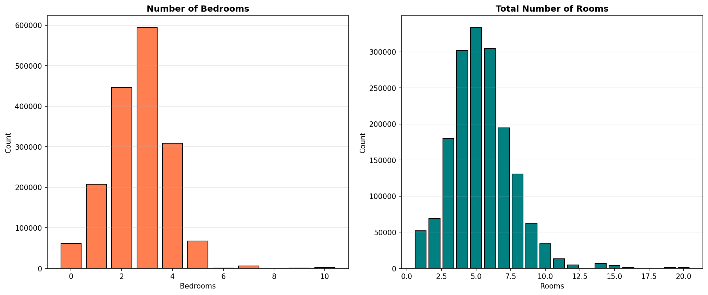

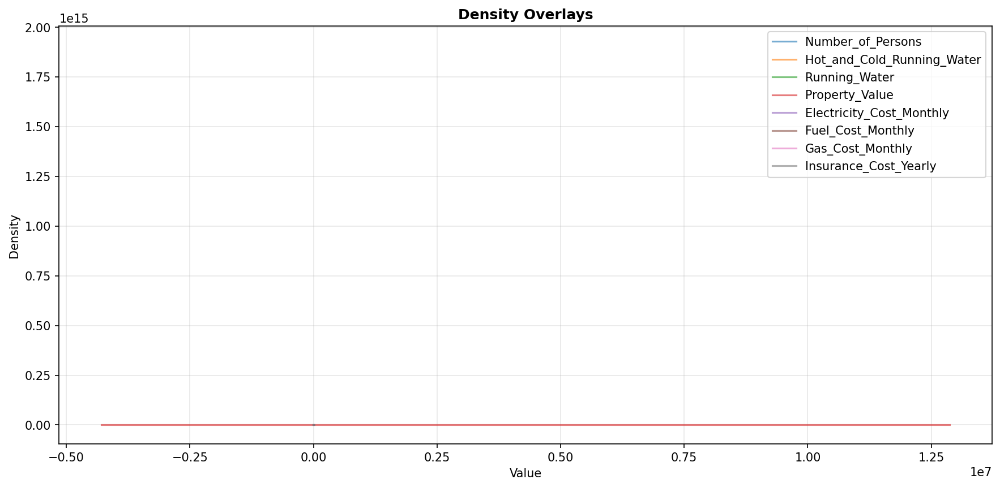

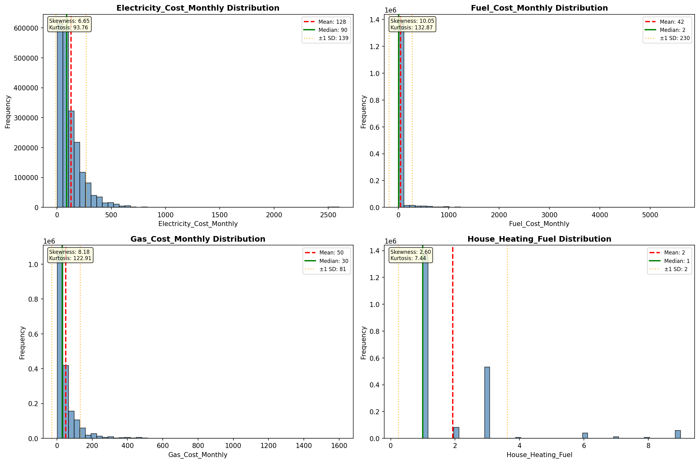

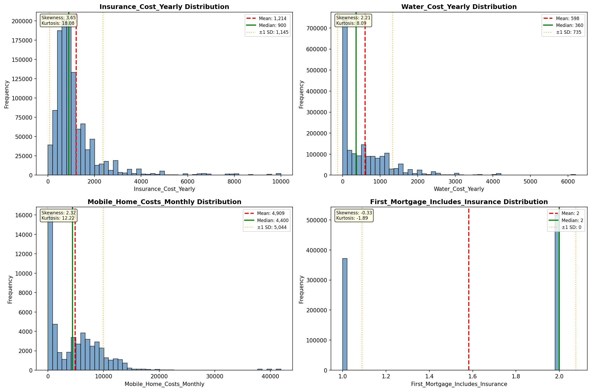

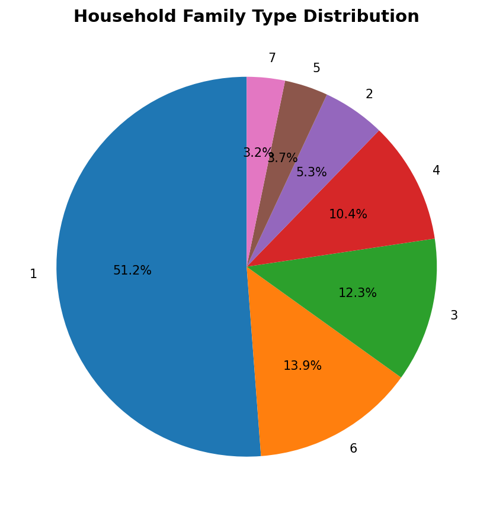

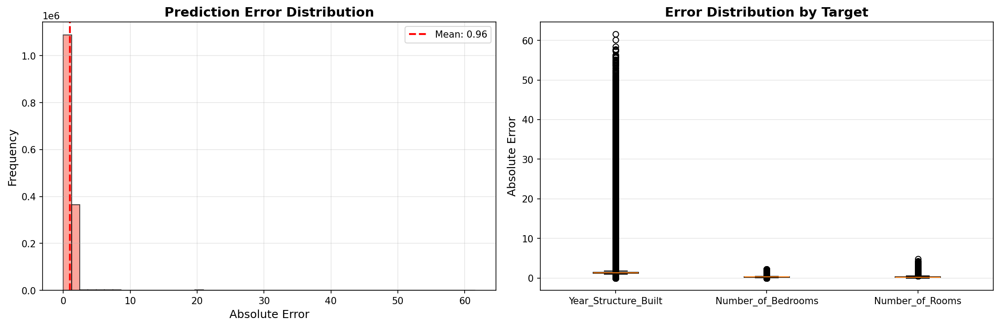

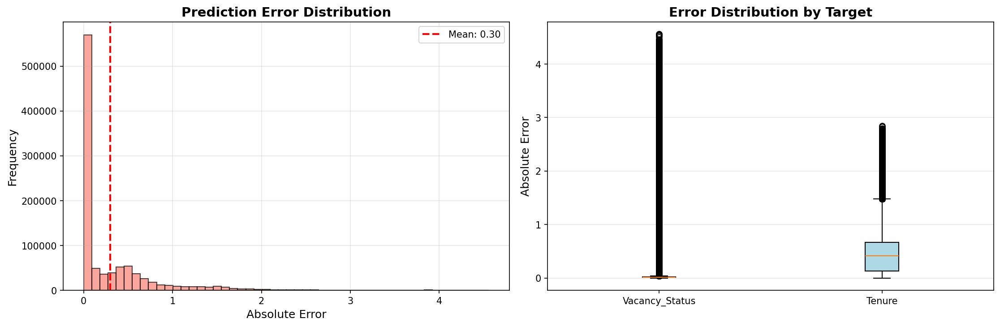

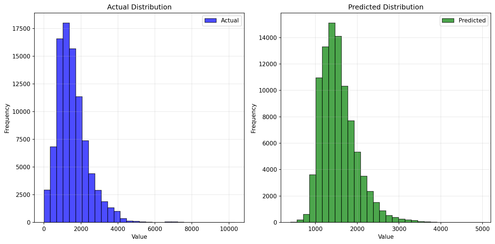

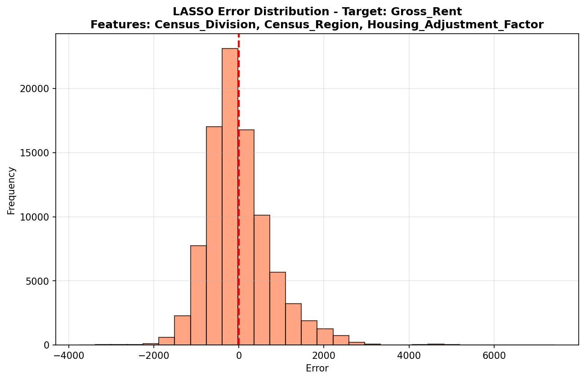

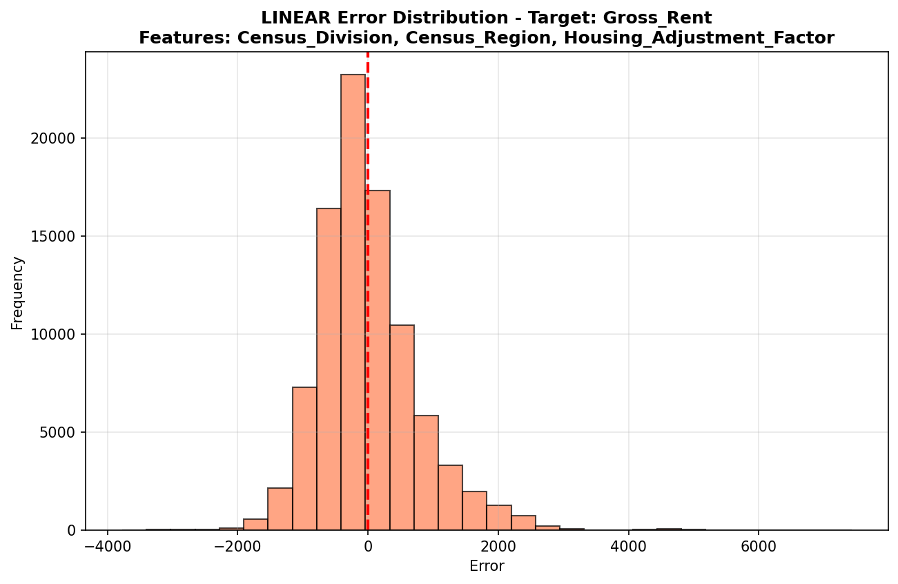

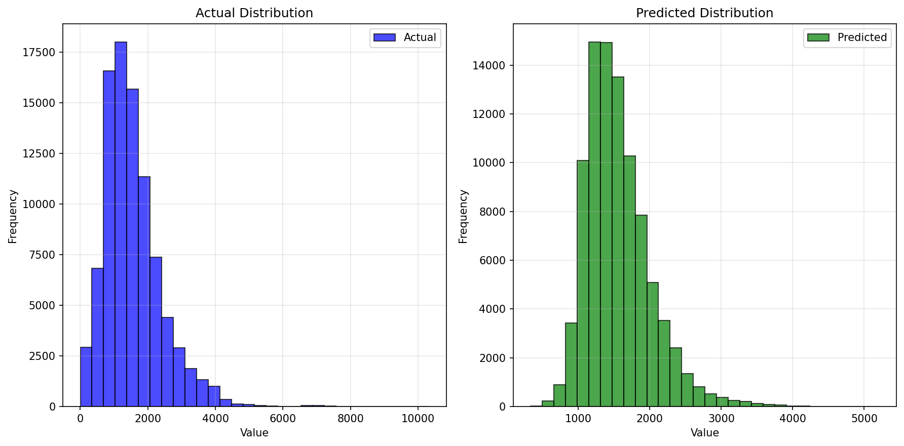

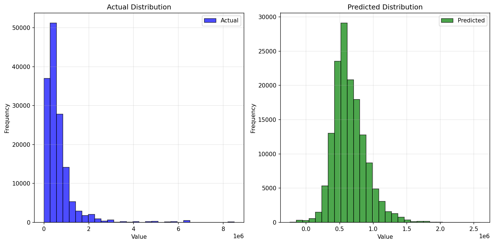

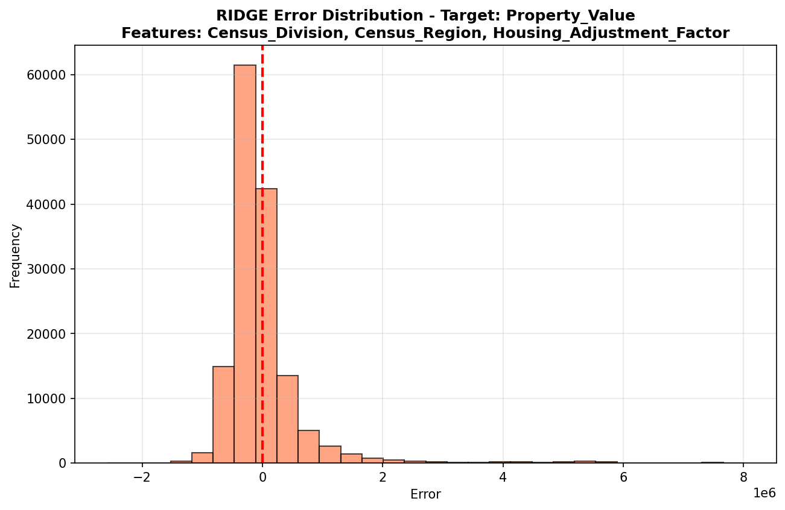

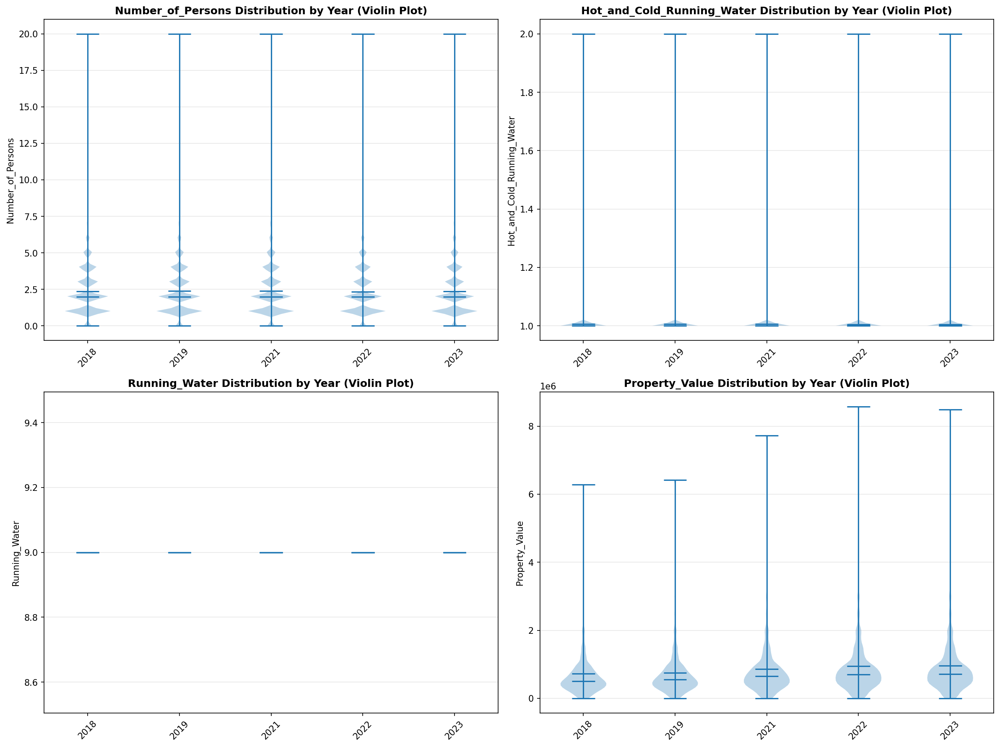

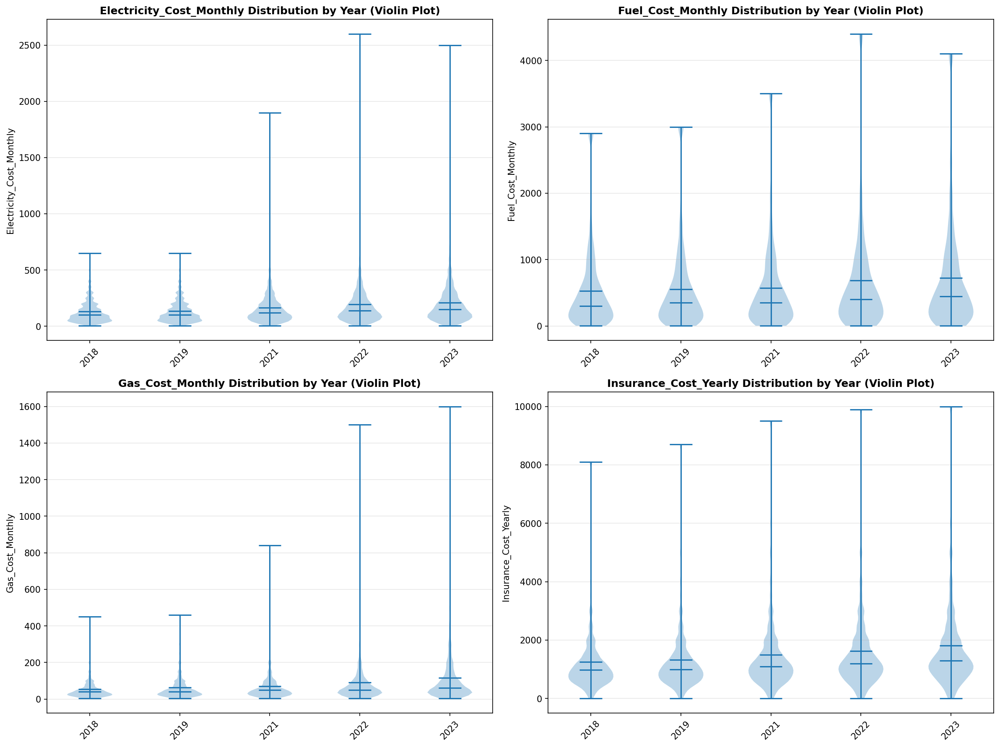

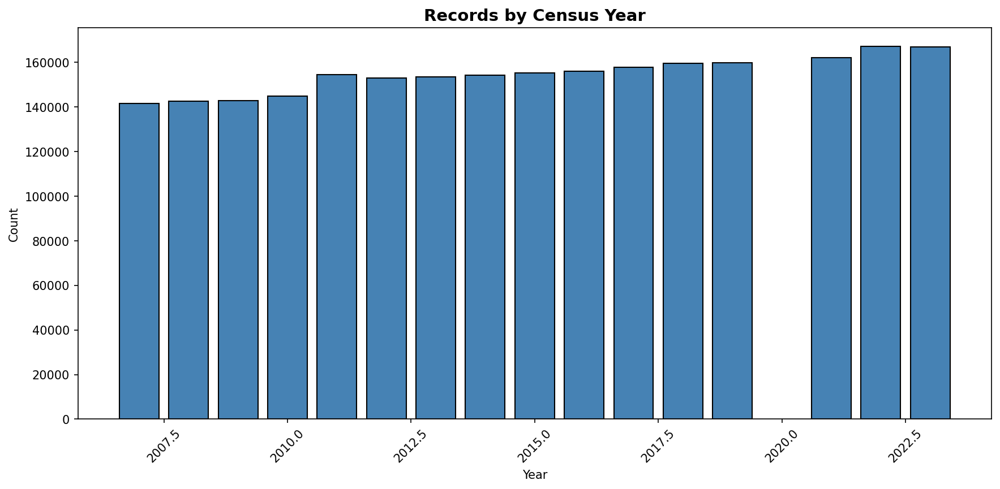
