# Statistical Analysis

> Comprehensive descriptive statistics including central tendency, dispersion, distribution characteristics, and weighted statistics using ACS sample weights.

## Summary Statistics

- **Variables Analyzed**: 41

### Income_Adjustment_Factor

| Statistic | Unweighted | Weighted (ACS) |
| :--- | :--- | :--- |
| Mean | 1,015,176.78 | 1,014,656.45 |
| Median | 1,010,207.00 | 1,014,656.45 |
| Std Deviation | 11,513.05 | — |
| Minimum | 1,001,264.00 | — |
| Maximum | 1,042,311.00 | — |
| Count | 289,922 | — |

> *Distribution is highly right-skewed (skewness: 1.26), light-tailed/platykurtic (kurtosis: 0.55).*

- **Coefficient of Variation**: 1.1 % (low variability)

### Property_Value

| Statistic | Unweighted | Weighted (ACS) |
| :--- | :--- | :--- |
| Mean | 403,619.05 | 392,060.12 |
| Median | 320,000.00 | 317,501.50 |
| Std Deviation | 481,115.22 | — |
| Minimum | 1.00 | — |
| Maximum | 7,295,000.00 | — |
| Count | 192,573 | — |

> *Distribution is highly right-skewed (skewness: 6.53), heavy-tailed/leptokurtic (kurtosis: 69.09).*

- **Coefficient of Variation**: 119.2 % (very high variability)

### Electricity_Cost_Monthly

| Statistic | Unweighted | Weighted (ACS) |
| :--- | :--- | :--- |
| Mean | 117.56 | 114.45 |
| Median | 100.00 | 95.62 |
| Std Deviation | 112.36 | — |
| Minimum | 1.00 | — |
| Maximum | 3,000.00 | — |
| Count | 340,055 | — |

> *Distribution is highly right-skewed (skewness: 11.31), heavy-tailed/leptokurtic (kurtosis: 251.40).*

- **Coefficient of Variation**: 95.6 % (high variability)

### Fuel_Cost_Monthly

| Statistic | Unweighted | Weighted (ACS) |
| :--- | :--- | :--- |
| Mean | 65.53 | 201.74 |
| Median | 2.00 | 107.62 |
| Std Deviation | 289.20 | — |
| Minimum | 1.00 | — |
| Maximum | 5,300.00 | — |
| Count | 234,414 | — |

> *Distribution is highly right-skewed (skewness: 7.23), heavy-tailed/leptokurtic (kurtosis: 67.78).*

- **Coefficient of Variation**: 441.3 % (very high variability)

### Gas_Cost_Monthly

| Statistic | Unweighted | Weighted (ACS) |
| :--- | :--- | :--- |
| Mean | 63.63 | 62.19 |
| Median | 40.00 | 38.75 |
| Std Deviation | 93.28 | — |
| Minimum | 1.00 | — |
| Maximum | 1,700.00 | — |
| Count | 294,816 | — |

> *Distribution is highly right-skewed (skewness: 7.73), heavy-tailed/leptokurtic (kurtosis: 115.73).*

- **Coefficient of Variation**: 146.6 % (very high variability)

### Insurance_Cost_Yearly

| Statistic | Unweighted | Weighted (ACS) |
| :--- | :--- | :--- |
| Mean | 1,338.38 | 1,290.70 |
| Median | 1,100.00 | 1,132.50 |
| Std Deviation | 1,107.17 | — |
| Minimum | 4.00 | — |
| Maximum | 10,000.00 | — |
| Count | 225,605 | — |

> *Distribution is highly right-skewed (skewness: 2.68), heavy-tailed/leptokurtic (kurtosis: 11.68).*

- **Coefficient of Variation**: 82.7 % (high variability)

### Water_Cost_Yearly

| Statistic | Unweighted | Weighted (ACS) |
| :--- | :--- | :--- |
| Mean | 495.18 | 491.65 |
| Median | 360.00 | 346.88 |
| Std Deviation | 564.23 | — |
| Minimum | 1.00 | — |
| Maximum | 4,800.00 | — |
| Count | 315,434 | — |

> *Distribution is highly right-skewed (skewness: 1.92), heavy-tailed/leptokurtic (kurtosis: 6.32).*

- **Coefficient of Variation**: 113.9 % (very high variability)

### Mobile_Home_Costs_Monthly

| Statistic | Unweighted | Weighted (ACS) |
| :--- | :--- | :--- |
| Mean | 3,262.65 | 3,683.88 |
| Median | 1,100.00 | 2,512.50 |
| Std Deviation | 4,495.57 | — |
| Minimum | 4.00 | — |
| Maximum | 59,000.00 | — |
| Count | 8,067 | — |

> *Distribution is highly right-skewed (skewness: 5.00), heavy-tailed/leptokurtic (kurtosis: 51.18).*

- **Coefficient of Variation**: 137.8 % (very high variability)

### First_Mortgage_Payment_Monthly

| Statistic | Unweighted | Weighted (ACS) |
| :--- | :--- | :--- |
| Mean | 1,285.94 | 1,362.05 |
| Median | 1,200.00 | 1,144.25 |
| Std Deviation | 958.50 | — |
| Minimum | 4.00 | — |
| Maximum | 7,100.00 | — |
| Count | 196,843 | — |

> *Distribution is highly right-skewed (skewness: 1.41), heavy-tailed/leptokurtic (kurtosis: 4.55).*

- **Coefficient of Variation**: 74.5 % (high variability)

### First_Mortgage_Includes_Taxes

| Statistic | Unweighted | Weighted (ACS) |
| :--- | :--- | :--- |
| Mean | 1.18 | 1.16 |
| Median | 1.00 | 1.00 |
| Std Deviation | 0.38 | — |
| Minimum | 1.00 | — |
| Maximum | 2.00 | — |
| Count | 171,424 | — |

> *Distribution is highly right-skewed (skewness: 1.69), light-tailed/platykurtic (kurtosis: 0.85).*

- **Coefficient of Variation**: 32.5 % (moderate variability)

### Second_Mortgage_Payment_Monthly

| Statistic | Unweighted | Weighted (ACS) |
| :--- | :--- | :--- |
| Mean | 428.96 | 437.32 |
| Median | 300.00 | 306.25 |
| Std Deviation | 477.38 | — |
| Minimum | 4.00 | — |
| Maximum | 4,600.00 | — |
| Count | 34,934 | — |

> *Distribution is highly right-skewed (skewness: 4.06), heavy-tailed/leptokurtic (kurtosis: 22.85).*

- **Coefficient of Variation**: 111.3 % (very high variability)

### Property_Taxes_Yearly

| Statistic | Unweighted | Weighted (ACS) |
| :--- | :--- | :--- |
| Mean | 347.10 | 301.12 |
| Median | 27.00 | 236.42 |
| Std Deviation | 1,481.83 | — |
| Minimum | 1.00 | — |
| Maximum | 32,500.00 | — |
| Count | 180,584 | — |

> *Distribution is highly right-skewed (skewness: 11.24), heavy-tailed/leptokurtic (kurtosis: 201.00).*

- **Coefficient of Variation**: 426.9 % (very high variability)

### Meals_Included_in_Rent

| Statistic | Unweighted | Weighted (ACS) |
| :--- | :--- | :--- |
| Mean | 1.97 | 1.97 |
| Median | 2.00 | 2.00 |
| Std Deviation | 0.16 | — |
| Minimum | 1.00 | — |
| Maximum | 2.00 | — |
| Count | 97,030 | — |

> *Distribution is highly left-skewed (skewness: -5.86), heavy-tailed/leptokurtic (kurtosis: 32.39).*

- **Coefficient of Variation**: 8.2 % (low variability)

### Rent_Amount_Monthly

| Statistic | Unweighted | Weighted (ACS) |
| :--- | :--- | :--- |
| Mean | 1,096.57 | 1,098.07 |
| Median | 950.00 | 1,028.75 |
| Std Deviation | 665.84 | — |
| Minimum | 4.00 | — |
| Maximum | 6,000.00 | — |
| Count | 97,030 | — |

> *Distribution is highly right-skewed (skewness: 1.98), heavy-tailed/leptokurtic (kurtosis: 8.46).*

- **Coefficient of Variation**: 60.7 % (high variability)

### Gross_Rent

| Statistic | Unweighted | Weighted (ACS) |
| :--- | :--- | :--- |
| Mean | 1,221.56 | 1,214.01 |
| Median | 1,090.00 | 1,141.56 |
| Std Deviation | 680.74 | — |
| Minimum | 4.00 | — |
| Maximum | 10,700.00 | — |
| Count | 92,163 | — |

> *Distribution is highly right-skewed (skewness: 1.74), heavy-tailed/leptokurtic (kurtosis: 7.15).*

- **Coefficient of Variation**: 55.7 % (high variability)

### Gross_Rent_Percentage_Income

| Statistic | Unweighted | Weighted (ACS) |
| :--- | :--- | :--- |
| Mean | 39.14 | 39.54 |
| Median | 30.00 | 30.31 |
| Std Deviation | 26.73 | — |
| Minimum | 1.00 | — |
| Maximum | 101.00 | — |
| Count | 90,705 | — |

> *Distribution is highly right-skewed (skewness: 1.18), light-tailed/platykurtic (kurtosis: 0.34).*

- **Coefficient of Variation**: 68.3 % (high variability)

### Selected_Monthly_Owner_Costs

| Statistic | Unweighted | Weighted (ACS) |
| :--- | :--- | :--- |
| Mean | 1,472.20 | 1,516.24 |
| Median | 1,302.00 | 1,392.62 |
| Std Deviation | 1,090.99 | — |
| Minimum | 2.00 | — |
| Maximum | 14,533.00 | — |
| Count | 248,763 | — |

> *Distribution is highly right-skewed (skewness: 1.91), heavy-tailed/leptokurtic (kurtosis: 7.29).*

- **Coefficient of Variation**: 74.1 % (high variability)

### Owner_Costs_Percentage_Income

| Statistic | Unweighted | Weighted (ACS) |
| :--- | :--- | :--- |
| Mean | 24.32 | 25.09 |
| Median | 19.00 | 19.44 |
| Std Deviation | 21.10 | — |
| Minimum | 1.00 | — |
| Maximum | 101.00 | — |
| Count | 247,357 | — |

> *Distribution is highly right-skewed (skewness: 2.03), heavy-tailed/leptokurtic (kurtosis: 4.36).*

- **Coefficient of Variation**: 86.7 % (high variability)

### Family_Income

| Statistic | Unweighted | Weighted (ACS) |
| :--- | :--- | :--- |
| Mean | 109,852.33 | 105,006.77 |
| Median | 83,800.00 | 81,870.00 |
| Std Deviation | 103,247.61 | — |
| Minimum | 1.00 | — |
| Maximum | 1,752,800.00 | — |
| Count | 222,990 | — |

> *Distribution is highly right-skewed (skewness: 3.19), heavy-tailed/leptokurtic (kurtosis: 16.64).*

- **Coefficient of Variation**: 94.0 % (high variability)

### Household_Income

| Statistic | Unweighted | Weighted (ACS) |
| :--- | :--- | :--- |
| Mean | 92,918.60 | 88,921.10 |
| Median | 68,000.00 | 66,341.88 |
| Std Deviation | 95,274.06 | — |
| Minimum | 1.00 | — |
| Maximum | 1,752,800.00 | — |
| Count | 342,569 | — |

> *Distribution is highly right-skewed (skewness: 3.38), heavy-tailed/leptokurtic (kurtosis: 18.96).*

- **Coefficient of Variation**: 102.5 % (very high variability)

### Specified_Rent_Unit

| Statistic | Unweighted | Weighted (ACS) |
| :--- | :--- | :--- |
| Mean | 0.27 | 0.33 |
| Median | 0.00 | 0.00 |
| Std Deviation | 0.44 | — |
| Minimum | 0.00 | — |
| Maximum | 1.00 | — |
| Count | 373,339 | — |

> *Distribution is highly right-skewed (skewness: 1.05), light-tailed/platykurtic (kurtosis: -0.90).*

- **Coefficient of Variation**: 165.3 % (very high variability)

### Specified_Value_Unit

| Statistic | Unweighted | Weighted (ACS) |
| :--- | :--- | :--- |
| Mean | 0.57 | 0.51 |
| Median | 1.00 | 0.69 |
| Std Deviation | 0.49 | — |
| Minimum | 0.00 | — |
| Maximum | 1.00 | — |
| Count | 373,339 | — |

> *Distribution is approximately symmetric (skewness: -0.30), light-tailed/platykurtic (kurtosis: -1.91).*

- **Coefficient of Variation**: 86.0 % (high variability)

### Flag_Family_Income

| Statistic | Unweighted | Weighted (ACS) |
| :--- | :--- | :--- |
| Mean | 0.18 | 0.18 |
| Median | 0.00 | 0.00 |
| Std Deviation | 0.38 | — |
| Minimum | 0.00 | — |
| Maximum | 1.00 | — |
| Count | 286,724 | — |

> *Distribution is highly right-skewed (skewness: 1.69), light-tailed/platykurtic (kurtosis: 0.86).*

- **Coefficient of Variation**: 215.5 % (very high variability)

### Flag_Gross_Rent

| Statistic | Unweighted | Weighted (ACS) |
| :--- | :--- | :--- |
| Mean | 0.07 | 0.12 |
| Median | 0.00 | 0.00 |
| Std Deviation | 0.26 | — |
| Minimum | 0.00 | — |
| Maximum | 1.00 | — |
| Count | 190,950 | — |

> *Distribution is highly right-skewed (skewness: 3.36), heavy-tailed/leptokurtic (kurtosis: 9.27).*

- **Coefficient of Variation**: 363.2 % (very high variability)

### Flag_Household_Income

| Statistic | Unweighted | Weighted (ACS) |
| :--- | :--- | :--- |
| Mean | 0.27 | 0.28 |
| Median | 0.00 | 0.00 |
| Std Deviation | 0.44 | — |
| Minimum | 0.00 | — |
| Maximum | 1.00 | — |
| Count | 286,724 | — |

> *Distribution is highly right-skewed (skewness: 1.03), light-tailed/platykurtic (kurtosis: -0.93).*

- **Coefficient of Variation**: 164.1 % (very high variability)

### Flag_First_Mortgage_Payment

| Statistic | Unweighted | Weighted (ACS) |
| :--- | :--- | :--- |
| Mean | 0.04 | 0.04 |
| Median | 0.00 | 0.00 |
| Std Deviation | 0.19 | — |
| Minimum | 0.00 | — |
| Maximum | 1.00 | — |
| Count | 373,339 | — |

> *Distribution is highly right-skewed (skewness: 4.97), heavy-tailed/leptokurtic (kurtosis: 22.70).*

- **Coefficient of Variation**: 516.4 % (very high variability)

### Flag_First_Mortgage_Taxes

| Statistic | Unweighted | Weighted (ACS) |
| :--- | :--- | :--- |
| Mean | 0.03 | 0.03 |
| Median | 0.00 | 0.00 |
| Std Deviation | 0.17 | — |
| Minimum | 0.00 | — |
| Maximum | 1.00 | — |
| Count | 373,339 | — |

> *Distribution is highly right-skewed (skewness: 5.63), heavy-tailed/leptokurtic (kurtosis: 29.71).*

- **Coefficient of Variation**: 580.4 % (very high variability)

### Flag_Meals_Included_Rent

| Statistic | Unweighted | Weighted (ACS) |
| :--- | :--- | :--- |
| Mean | 0.01 | 0.01 |
| Median | 0.00 | 0.00 |
| Std Deviation | 0.08 | — |
| Minimum | 0.00 | — |
| Maximum | 1.00 | — |
| Count | 373,339 | — |

> *Distribution is highly right-skewed (skewness: 12.69), heavy-tailed/leptokurtic (kurtosis: 159.04).*

- **Coefficient of Variation**: 1,276.8 % (very high variability)

### Flag_Rent_Amount

| Statistic | Unweighted | Weighted (ACS) |
| :--- | :--- | :--- |
| Mean | 0.02 | 0.03 |
| Median | 0.00 | 0.00 |
| Std Deviation | 0.14 | — |
| Minimum | 0.00 | — |
| Maximum | 1.00 | — |
| Count | 373,339 | — |

> *Distribution is highly right-skewed (skewness: 6.86), heavy-tailed/leptokurtic (kurtosis: 45.09).*

- **Coefficient of Variation**: 700.5 % (very high variability)

### Flag_Selected_Monthly_Owner_Costs

| Statistic | Unweighted | Weighted (ACS) |
| :--- | :--- | :--- |
| Mean | 0.21 | 0.21 |
| Median | 0.00 | 0.00 |
| Std Deviation | 0.41 | — |
| Minimum | 0.00 | — |
| Maximum | 1.00 | — |
| Count | 244,485 | — |

> *Distribution is highly right-skewed (skewness: 1.44), light-tailed/platykurtic (kurtosis: 0.08).*

- **Coefficient of Variation**: 195.4 % (very high variability)

### Flag_Second_Mortgage_Payment

| Statistic | Unweighted | Weighted (ACS) |
| :--- | :--- | :--- |
| Mean | 0.03 | 0.03 |
| Median | 0.00 | 0.00 |
| Std Deviation | 0.18 | — |
| Minimum | 0.00 | — |
| Maximum | 1.00 | — |
| Count | 373,339 | — |

> *Distribution is highly right-skewed (skewness: 5.18), heavy-tailed/leptokurtic (kurtosis: 24.82).*

- **Coefficient of Variation**: 536.5 % (very high variability)

### Flag_Property_Taxes

| Statistic | Unweighted | Weighted (ACS) |
| :--- | :--- | :--- |
| Mean | 0.09 | 0.10 |
| Median | 0.00 | 0.00 |
| Std Deviation | 0.28 | — |
| Minimum | 0.00 | — |
| Maximum | 1.00 | — |
| Count | 346,951 | — |

> *Distribution is highly right-skewed (skewness: 2.91), heavy-tailed/leptokurtic (kurtosis: 6.47).*

- **Coefficient of Variation**: 322.1 % (very high variability)

### Flag_Property_Value

| Statistic | Unweighted | Weighted (ACS) |
| :--- | :--- | :--- |
| Mean | 0.05 | 0.05 |
| Median | 0.00 | 0.00 |
| Std Deviation | 0.22 | — |
| Minimum | 0.00 | — |
| Maximum | 1.00 | — |
| Count | 373,339 | — |

> *Distribution is highly right-skewed (skewness: 4.02), heavy-tailed/leptokurtic (kurtosis: 14.18).*

- **Coefficient of Variation**: 425.7 % (very high variability)

### Flag_Water_Cost

| Statistic | Unweighted | Weighted (ACS) |
| :--- | :--- | :--- |
| Mean | 0.08 | 0.09 |
| Median | 0.00 | 0.00 |
| Std Deviation | 0.28 | — |
| Minimum | 0.00 | — |
| Maximum | 1.00 | — |
| Count | 26,388 | — |

> *Distribution is highly right-skewed (skewness: 3.04), heavy-tailed/leptokurtic (kurtosis: 7.22).*

- **Coefficient of Variation**: 333.7 % (very high variability)

### Annual_Rent_to_Value_Ratio

### Total_Monthly_Utility_Cost

| Statistic | Unweighted | Weighted (ACS) |
| :--- | :--- | :--- |
| Mean | 172.31 | 163.49 |
| Median | 143.00 | 139.19 |
| Std Deviation | 157.93 | — |
| Minimum | 2.00 | — |
| Maximum | 4,700.00 | — |
| Count | 340,890 | — |

> *Distribution is highly right-skewed (skewness: 9.82), heavy-tailed/leptokurtic (kurtosis: 202.33).*

- **Coefficient of Variation**: 91.7 % (high variability)

### Property_Tax_Rate

| Statistic | Unweighted | Weighted (ACS) |
| :--- | :--- | :--- |
| Mean | 17.30 | 18.20 |
| Median | 0.01 | 17.57 |
| Std Deviation | 50.89 | — |
| Minimum | 0.00 | — |
| Maximum | 950.00 | — |
| Count | 122,440 | — |

> *Distribution is highly right-skewed (skewness: 3.39), heavy-tailed/leptokurtic (kurtosis: 15.50).*

- **Coefficient of Variation**: 294.2 % (very high variability)

#### Weighted Statistics by Year

| Year | Weighted Mean | Weighted Median |
| :--- | :--- | :--- |
| 2007 | 144.75 | 140.00 |
| 2012 | 0.01 | 0.01 |
| 2013 | 0.06 | 0.01 |
| 2014 | 0.07 | 0.01 |
| 2015 | 0.02 | 0.01 |
| 2016 | 0.01 | 0.01 |
| 2017 | 0.01 | 0.01 |
| 2023 | 0.64 | 0.47 |

### Structure_Age

| Statistic | Unweighted | Weighted (ACS) |
| :--- | :--- | :--- |
| Mean | 1,856.34 | 1,876.86 |
| Median | 2,018.00 | 1,877.00 |
| Std Deviation | 541.50 | — |
| Minimum | 1.00 | — |
| Maximum | 2,023.00 | — |
| Count | 322,012 | — |

> *Distribution is highly left-skewed (skewness: -3.05), heavy-tailed/leptokurtic (kurtosis: 7.30).*

- **Coefficient of Variation**: 29.2 % (moderate variability)

### Structure_Age_Score

| Statistic | Unweighted | Weighted (ACS) |
| :--- | :--- | :--- |
| Mean | 0.05 | 0.04 |
| Median | 0.00 | 0.04 |
| Std Deviation | 0.17 | — |
| Minimum | 0.00 | — |
| Maximum | 0.99 | — |
| Count | 322,012 | — |

> *Distribution is highly right-skewed (skewness: 3.75), heavy-tailed/leptokurtic (kurtosis: 13.14).*

- **Coefficient of Variation**: 364.1 % (very high variability)

### Working_Age_Persons

| Statistic | Unweighted | Weighted (ACS) |
| :--- | :--- | :--- |
| Mean | 1.72 | 1.81 |
| Median | 2.00 | 2.00 |
| Std Deviation | 1.32 | — |
| Minimum | 0.00 | — |
| Maximum | 19.00 | — |
| Count | 345,652 | — |

> *Distribution is moderately right-skewed (skewness: 0.91), light-tailed/platykurtic (kurtosis: 2.33).*

- **Coefficient of Variation**: 76.7 % (high variability)

### Income_to_FPL_Ratio

| Statistic | Unweighted | Weighted (ACS) |
| :--- | :--- | :--- |
| Mean | 4.25 | 4.05 |
| Median | 3.18 | 3.10 |
| Std Deviation | 4.30 | — |
| Minimum | -1.01 | — |
| Maximum | 88.88 | — |
| Count | 345,652 | — |

> *Distribution is highly right-skewed (skewness: 3.65), heavy-tailed/leptokurtic (kurtosis: 22.98).*

- **Coefficient of Variation**: 101.1 % (very high variability)

## Distribution Analysis

### Skewed Distributions

> Variables with skewness > |0.5| indicate non-normal distributions. Consider log transformations for highly skewed variables in modeling.

| Variable | Skewness | Direction | Severity |
| :--- | :--- | :--- | :--- |
| Flag_Meals_Included_Rent | 12.690 | Right-skewed | High |
| Electricity_Cost_Monthly | 11.307 | Right-skewed | High |
| Property_Taxes_Yearly | 11.239 | Right-skewed | High |
| Total_Monthly_Utility_Cost | 9.823 | Right-skewed | High |
| Gas_Cost_Monthly | 7.735 | Right-skewed | High |
| Fuel_Cost_Monthly | 7.234 | Right-skewed | High |
| Flag_Rent_Amount | 6.862 | Right-skewed | High |
| Property_Value | 6.527 | Right-skewed | High |
| Meals_Included_in_Rent | -5.864 | Left-skewed | High |
| Flag_First_Mortgage_Taxes | 5.631 | Right-skewed | High |
| Flag_Second_Mortgage_Payment | 5.178 | Right-skewed | High |
| Mobile_Home_Costs_Monthly | 4.998 | Right-skewed | High |
| Flag_First_Mortgage_Payment | 4.970 | Right-skewed | High |
| Second_Mortgage_Payment_Monthly | 4.057 | Right-skewed | High |
| Flag_Property_Value | 4.022 | Right-skewed | High |
| Structure_Age_Score | 3.747 | Right-skewed | High |
| Income_to_FPL_Ratio | 3.655 | Right-skewed | High |
| Property_Tax_Rate | 3.392 | Right-skewed | High |
| Household_Income | 3.377 | Right-skewed | High |
| Flag_Gross_Rent | 3.357 | Right-skewed | High |

- **Total Skewed Variables**: 39

- **Right-skewed**: 37

- **Left-skewed**: 2

## Variance Analysis

### Coefficient of Variation Ranking

> CV (Coefficient of Variation) = (Std Dev / Mean) × 100%. Higher CV indicates greater relative variability.

| Variable | CV (%) | Std Dev | Mean | Variability |
| :--- | :--- | :--- | :--- | :--- |
| Flag_Meals_Included_Rent | 1276.8% | 0.08 | 0.01 | Very High |
| Flag_Rent_Amount | 700.5% | 0.14 | 0.02 | Very High |
| Flag_First_Mortgage_Taxes | 580.4% | 0.17 | 0.03 | Very High |
| Flag_Second_Mortgage_Payment | 536.5% | 0.18 | 0.03 | Very High |
| Flag_First_Mortgage_Payment | 516.4% | 0.19 | 0.04 | Very High |
| Fuel_Cost_Monthly | 441.3% | 289.20 | 65.53 | Very High |
| Property_Taxes_Yearly | 426.9% | 1,481.83 | 347.10 | Very High |
| Flag_Property_Value | 425.7% | 0.22 | 0.05 | Very High |
| Structure_Age_Score | 364.1% | 0.17 | 0.05 | Very High |
| Flag_Gross_Rent | 363.2% | 0.26 | 0.07 | Very High |
| Flag_Water_Cost | 333.7% | 0.28 | 0.08 | Very High |
| Flag_Property_Taxes | 322.1% | 0.28 | 0.09 | Very High |
| Property_Tax_Rate | 294.2% | 50.89 | 17.30 | Very High |
| Flag_Family_Income | 215.5% | 0.38 | 0.18 | Very High |
| Flag_Selected_Monthly_Owner_Costs | 195.4% | 0.41 | 0.21 | Very High |
| Specified_Rent_Unit | 165.3% | 0.44 | 0.27 | Very High |
| Flag_Household_Income | 164.1% | 0.44 | 0.27 | Very High |
| Gas_Cost_Monthly | 146.6% | 93.28 | 63.63 | Very High |
| Mobile_Home_Costs_Monthly | 137.8% | 4,495.57 | 3,262.65 | Very High |
| Property_Value | 119.2% | 481,115.22 | 403,619.05 | Very High |

- **Average CV**: 229.3 %

- **High Variance Variables (CV > 50%)**: 36

## Visualizations

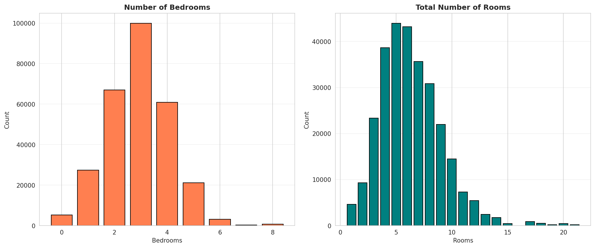

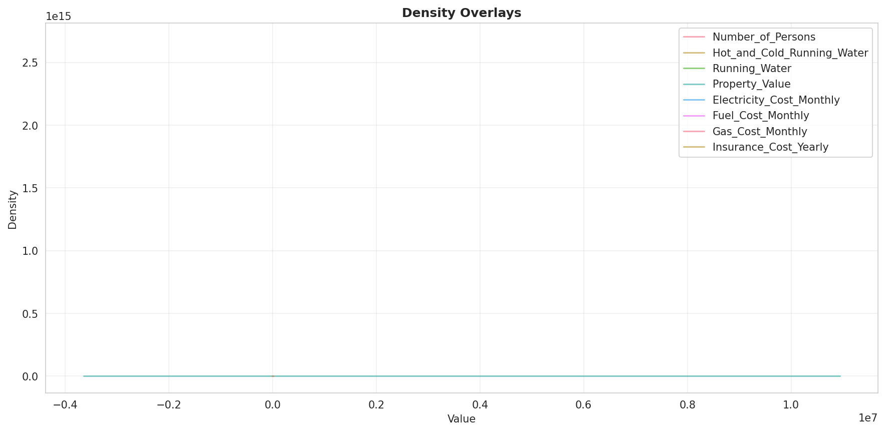

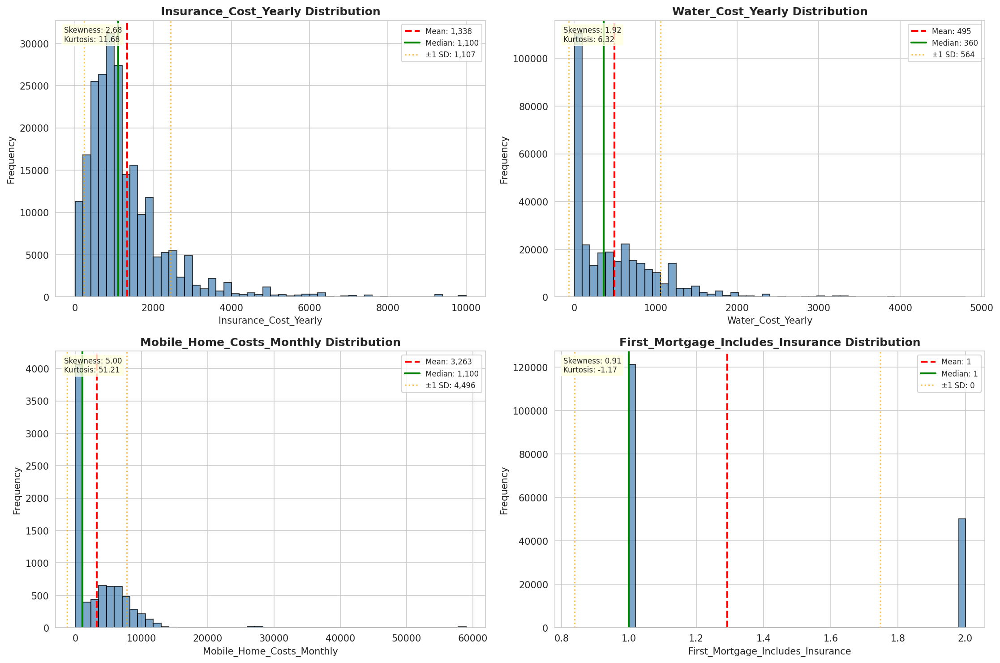

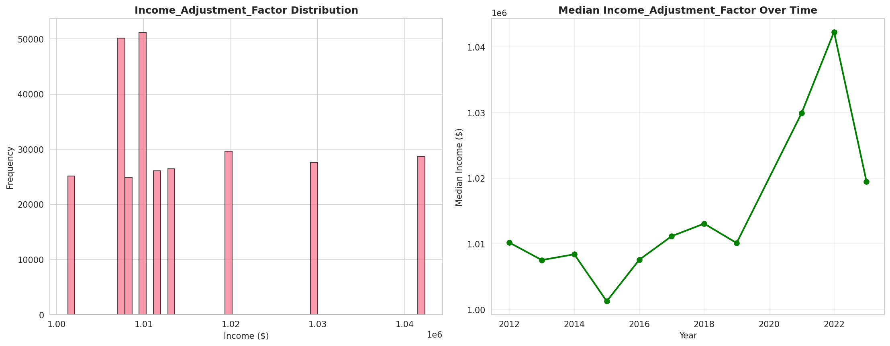

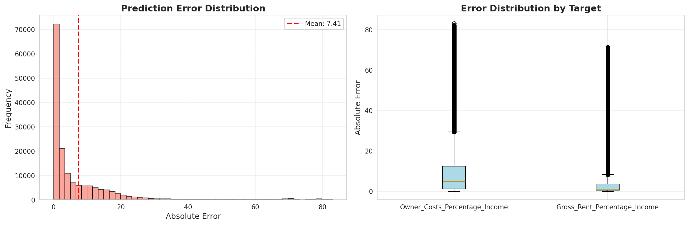

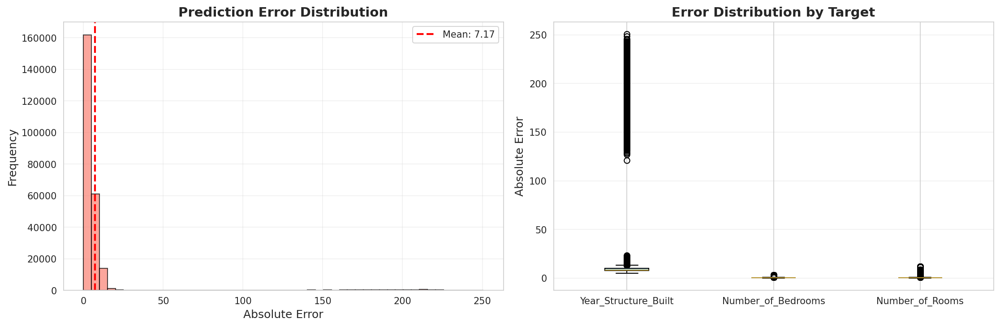

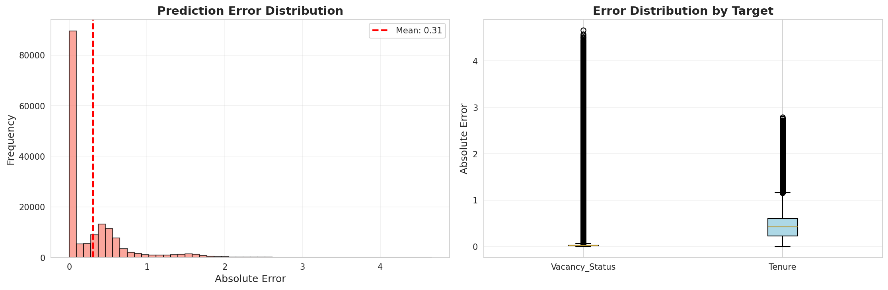

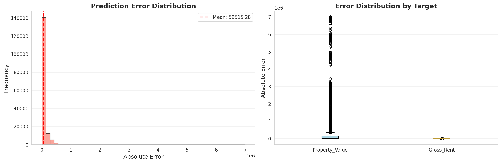

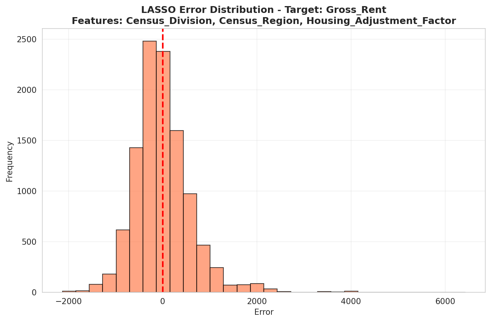

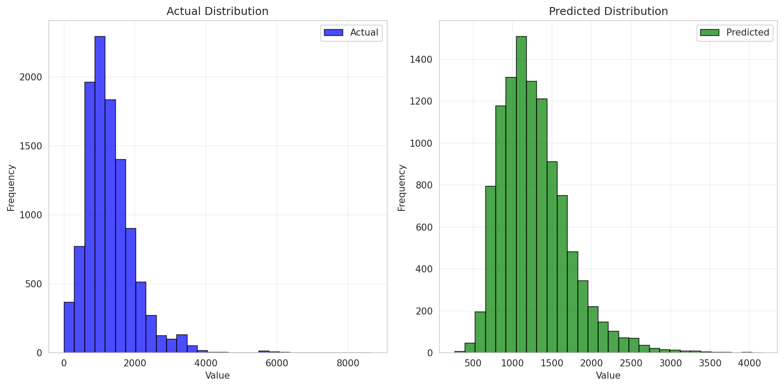

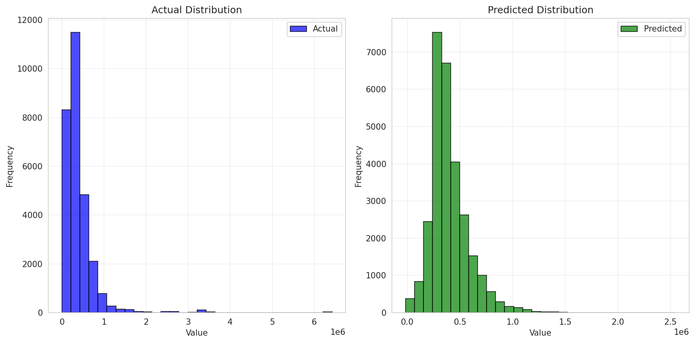

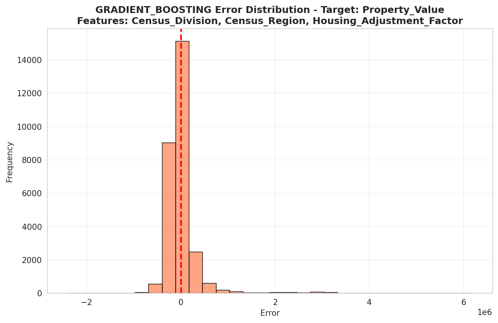

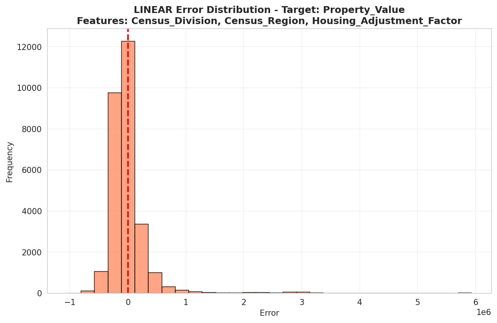

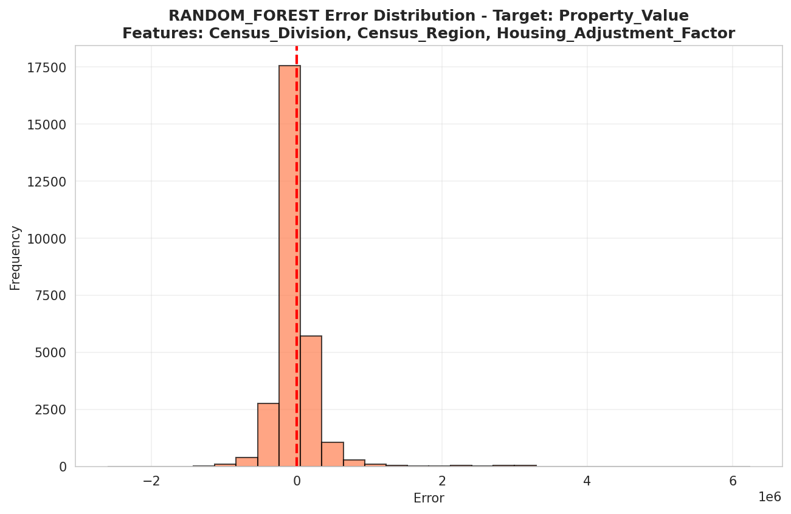

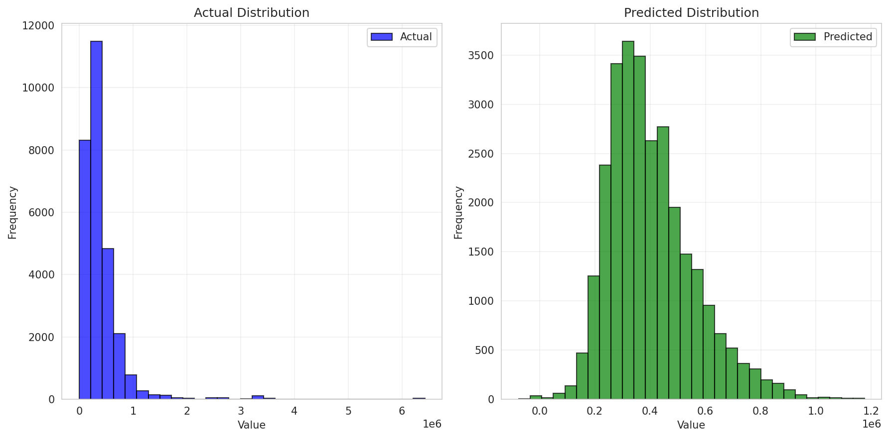

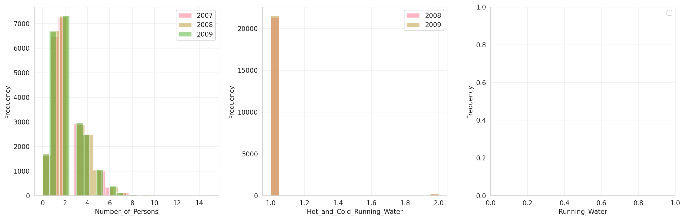

