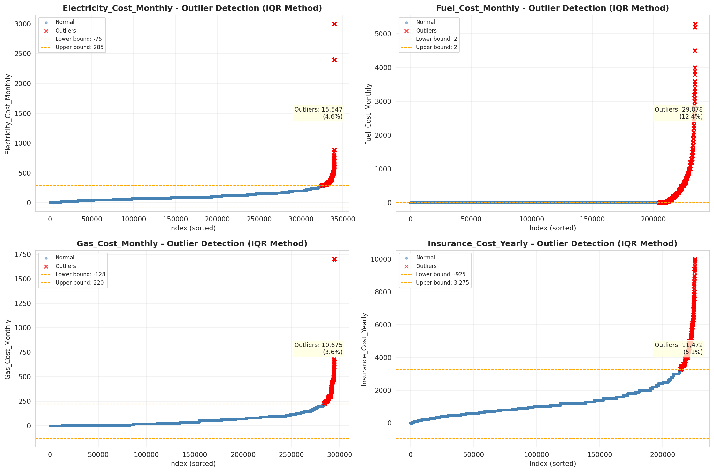
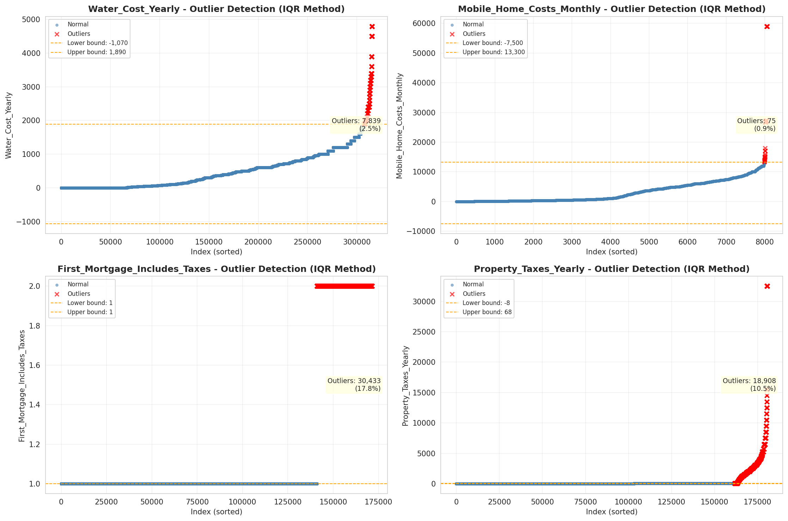

# Outlier Detection

> Statistical outlier detection using IQR (Interquartile Range) method. Outliers are values falling outside Q1 - 1.5×IQR or Q3 + 1.5×IQR bounds.

## Detection Methodology

| Parameter | Value | Description |
| :--- | :--- | :--- |
| Method | IQR | Outlier detection algorithm |
| Lower Bound | Q1 - 1.5 × IQR | Values below are outliers |
| Upper Bound | Q3 + 1.5 × IQR | Values above are outliers |
| IQR Definition | Q3 - Q1 | Interquartile Range |

> **Note**: The IQR method is robust to extreme values and works well for approximately symmetric distributions.

## Outlier Summary

_No outlier summary available._
## High Outlier Rate Variables

> Variables with outlier rate > 5% may indicate data quality issues, non-normal distributions, or genuinely extreme values.

- **('Flag_Selected_Monthly_Owner_Costs', 20.75423850133955)**: 0 outliers (0.00%)

- **('First_Mortgage_Includes_Taxes', 17.75305674817995)**: 0 outliers (0.00%)

- **('Flag_Family_Income', 17.71145770845831)**: 0 outliers (0.00%)

- **('Property_Tax_Rate', 15.499836654688009)**: 0 outliers (0.00%)

- **('Fuel_Cost_Monthly', 12.404549216343733)**: 0 outliers (0.00%)

- **('Property_Taxes_Yearly', 10.470473574624553)**: 0 outliers (0.00%)

- **('Structure_Age', 10.283157149423003)**: 0 outliers (0.00%)

- **('Income_Adjustment_Factor', 9.901973634287843)**: 0 outliers (0.00%)

- **('Gross_Rent_Percentage_Income', 9.870459180861033)**: 0 outliers (0.00%)

- **('Flag_Property_Taxes', 8.791154946952163)**: 0 outliers (0.00%)

- **('Working_Age_Persons', 8.615601819170726)**: 0 outliers (0.00%)

- **('Flag_Water_Cost', 8.242382901318782)**: 0 outliers (0.00%)

- **('Structure_Age_Score', 8.194725662397675)**: 0 outliers (0.00%)

- **('Owner_Costs_Percentage_Income', 7.598733813880343)**: 0 outliers (0.00%)

- **('Flag_Gross_Rent', 7.045823514008903)**: 0 outliers (0.00%)

> *Consider investigating these variables for data entry errors, applying transformations, or using robust statistical methods.*

## Visualizations

