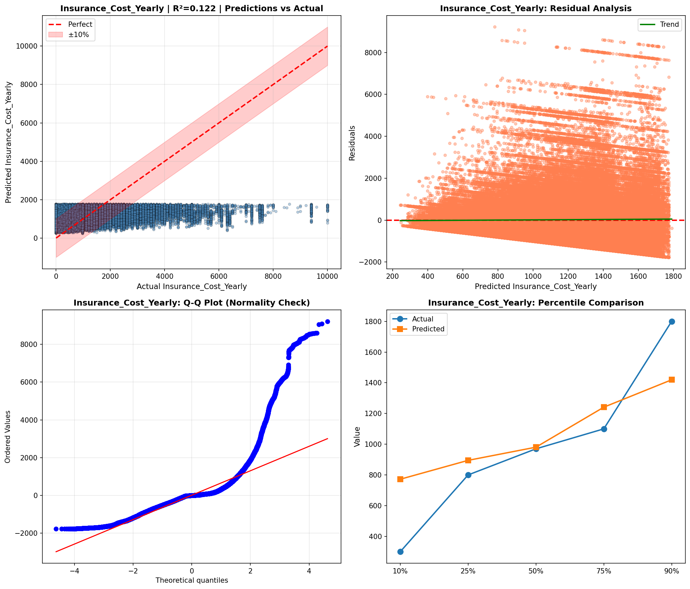
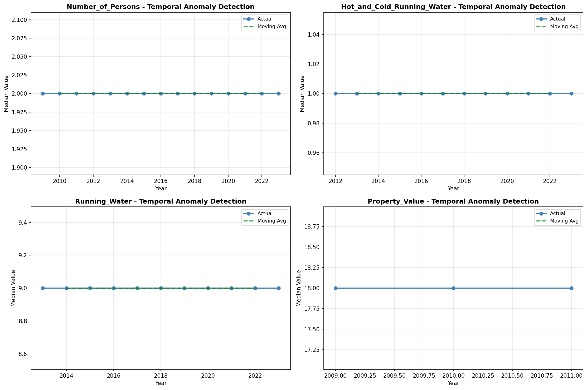
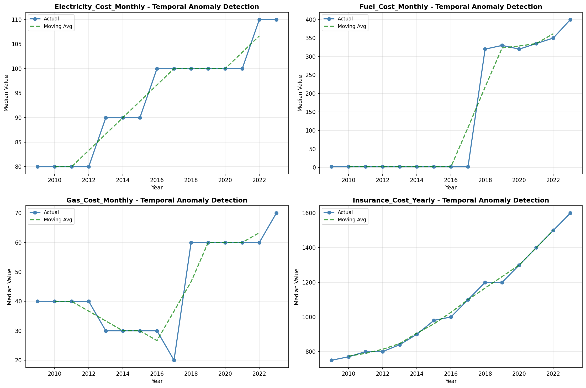
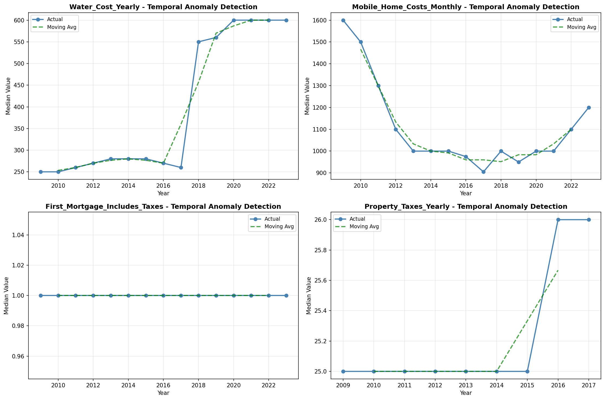
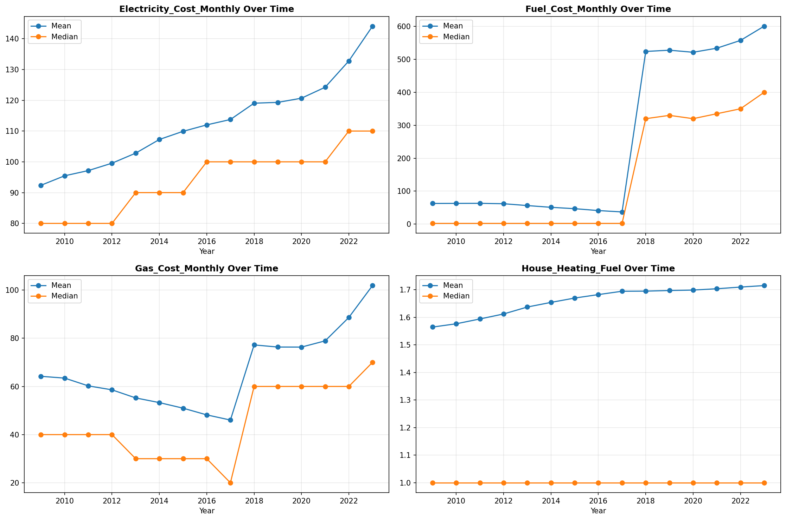
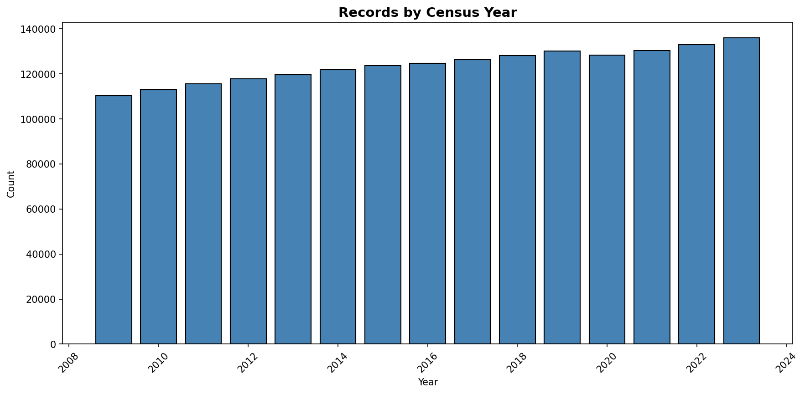

# Temporal Analysis

> Analysis of data patterns and trends over time, including year-over-year changes and growth rate calculations.

## Year Distribution

### Summary

- **Total Years**: 15

- **Year Range**: 2009 - 2023

- **Total Records**: 1,858,876

- **Average Records/Year**: 123,925

### Records by Year

| Year | Records | % of Total | Deviation from Avg |
| :--- | :--- | :--- | :--- |
| 2009 | 110,291 | 5.9% | -11.0% |
| 2010 | 113,061 | 6.1% | -8.8% |
| 2011 | 115,701 | 6.2% | -6.6% |
| 2012 | 117,758 | 6.3% | -5.0% |
| 2013 | 119,723 | 6.4% | -3.4% |
| 2014 | 121,787 | 6.6% | -1.7% |
| 2015 | 123,674 | 6.7% | -0.2% |
| 2016 | 124,640 | 6.7% | +0.6% |
| 2017 | 126,339 | 6.8% | +1.9% |
| 2018 | 128,202 | 6.9% | +3.5% |
| 2019 | 130,086 | 7.0% | +5.0% |
| 2020 | 128,280 | 6.9% | +3.5% |
| 2021 | 130,318 | 7.0% | +5.2% |
| 2022 | 132,910 | 7.2% | +7.3% |
| 2023 | 136,106 | 7.3% | +9.8% |

> *Sample size increased by 23.4% from 2009 to 2023.*

## Sample Size Consistency

- **Standard Deviation**: 7,227 records

- **Coefficient of Variation**: 5.8 %

- **Consistency Rating**: highly consistent

> *Sample sizes are stable across years.*

## Temporal Trends

### Trend Summary

| Direction | Count | Percentage |
| :--- | :--- | :--- |
| Increasing | 0 | 0.0% |
| Decreasing | 0 | 0.0% |
| Stable/Other | 228 | 100.0% |

## Growth Rates

### Growth Rate Summary

- **Average Growth Rate**: 2,340.63 %

- **Variables with Positive Growth**: 1

- **Variables with Negative Growth**: 0

### Top Growth Rates

| Variable | Growth Rate | Direction |
| :--- | :--- | :--- |
| sample_growth | 2340.63% | Increasing |

## Visualizations

