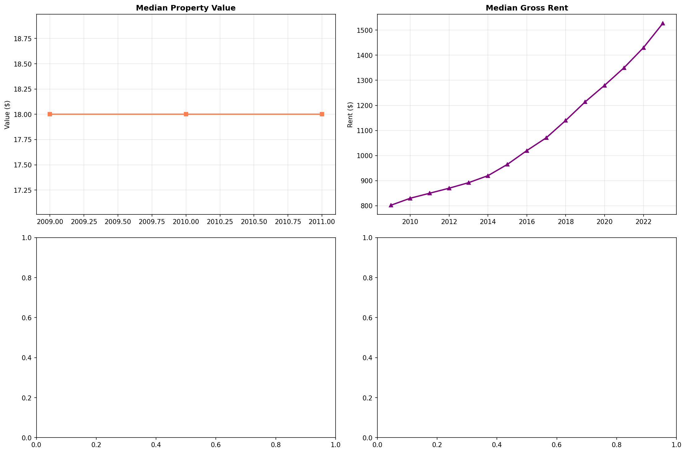

# Trend Analysis

> Analysis of long-term trends in key variables, including trend direction, strength, and statistical significance.

## Trend Summary

_No trend summary available._
## Strong Trends

> Variables showing significant long-term trends that may require attention or represent important patterns in the data.

- **('Insurance_Cost_Yearly', 0.9572773288861737, 'increasing')**: decreasing trend (slope: 0.0000)

- **('Gross_Rent', 0.950452703710882, 'increasing')**: decreasing trend (slope: 0.0000)

- **('Rent_Amount_Monthly', 0.9461736821161177, 'increasing')**: decreasing trend (slope: 0.0000)

- **('Owner_Costs_Percentage_Income', 0.9315363881401617, 'decreasing')**: decreasing trend (slope: 0.0000)

- **('Family_Income', 0.9193584122575297, 'increasing')**: decreasing trend (slope: 0.0000)

- **('Household_Income', 0.91416073633546, 'increasing')**: decreasing trend (slope: 0.0000)

- **('Income_to_FPL_Ratio', 0.9102032260075795, 'increasing')**: decreasing trend (slope: 0.0000)

- **('Electricity_Cost_Monthly', 0.9086538461538397, 'increasing')**: decreasing trend (slope: 0.0000)

- **('Water_Cost_Yearly', 0.7723267553034923, 'increasing')**: decreasing trend (slope: 0.0000)

- **('Structure_Age', 0.7552447552448083, 'decreasing')**: decreasing trend (slope: 0.0000)

- **('Fuel_Cost_Monthly', 0.7527892565620657, 'increasing')**: decreasing trend (slope: 0.0000)

## Trend Categories

_Trend category data not available._
## Visualizations

