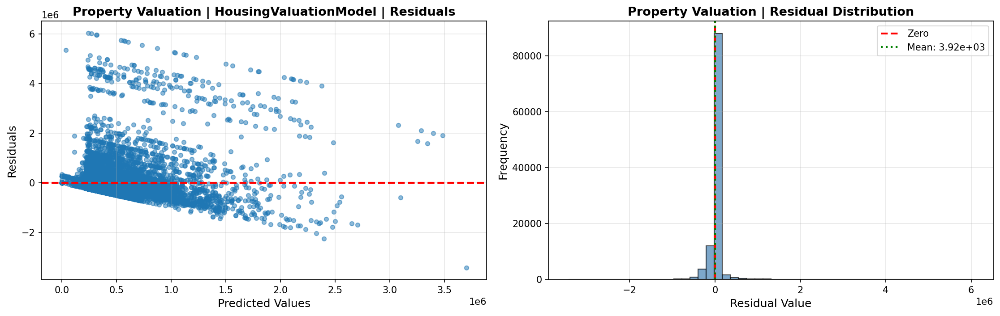
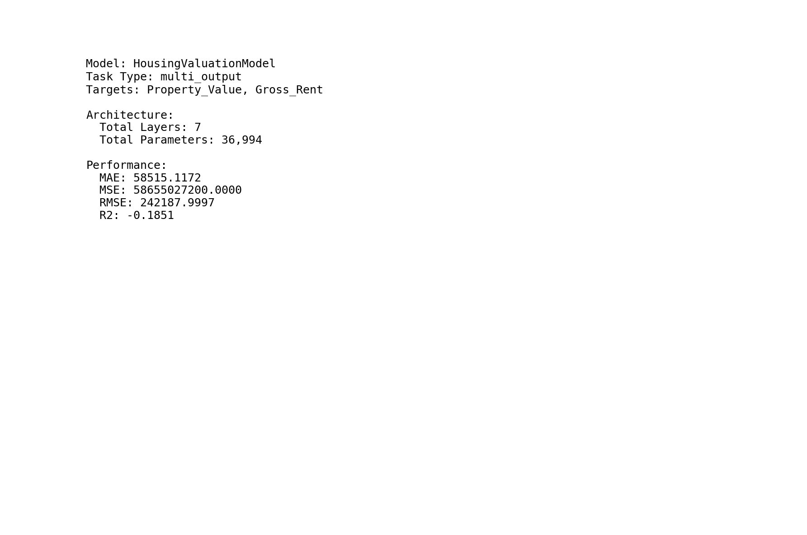
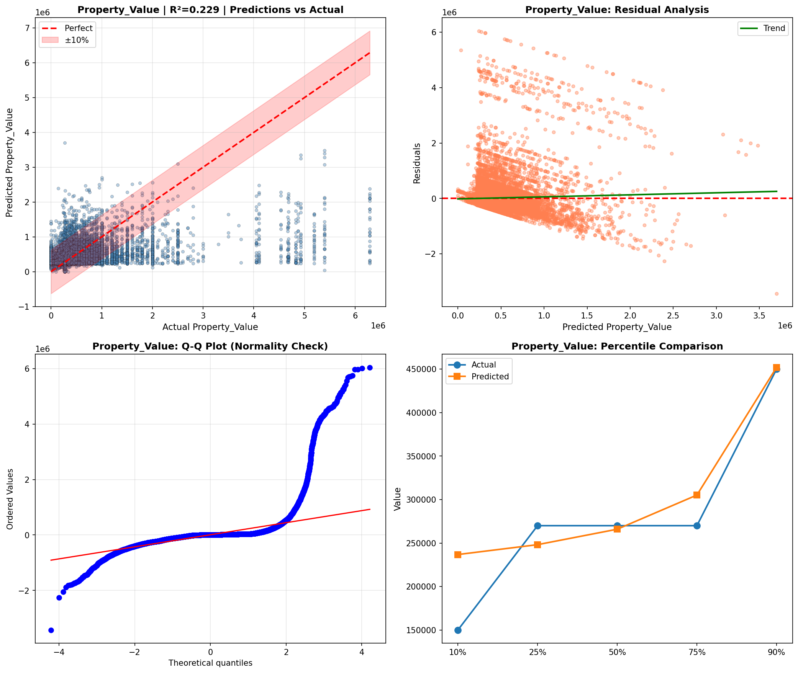
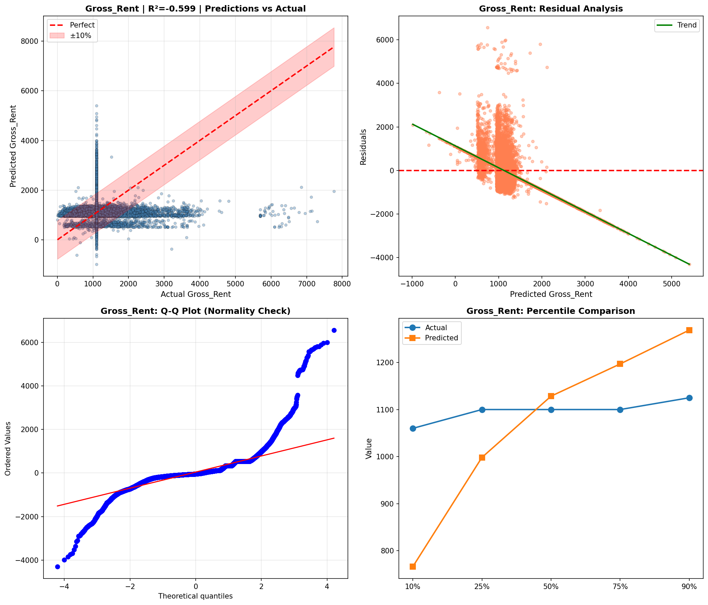
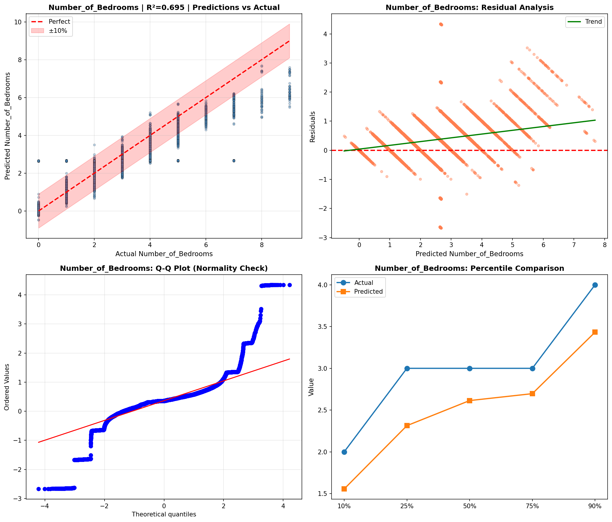
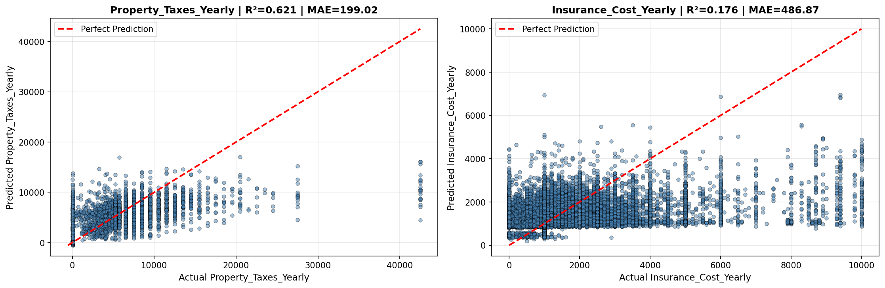
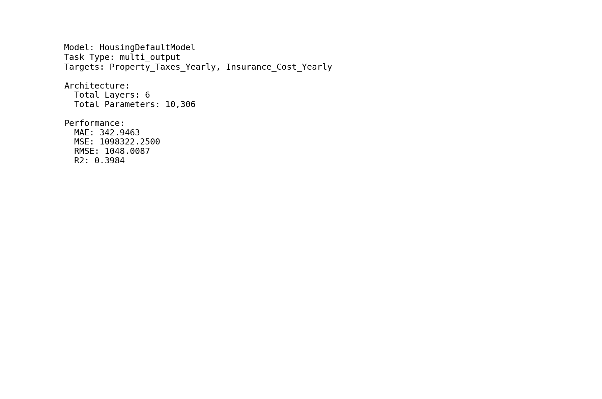
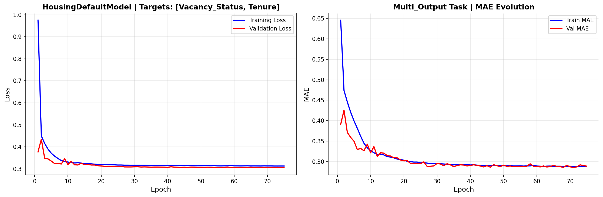
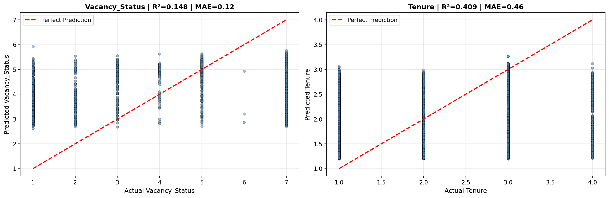

# Deep Learning Models

> Neural network analysis using TensorFlow/Keras for complex pattern recognition and multi-output prediction tasks.

## Deep Learning Summary

- **Total Tasks**: 5

- **Tasks**: Property Valuation, Affordability Analysis, Housing Quality, Cost Prediction, Occupancy Prediction

### Aggregate Statistics

| Metric | Value |
| :--- | :--- |
| Total Parameters | 78,283 |
| Average Validation Loss | 11265478240.5685 |
| Number of Tasks | 5 |

## Task: Property Valuation

### Model Configuration

| Property | Value |
| :--- | :--- |
| Model Type | HousingValuationModel |
| Task Type | Multi_Output |
| Target Variables | Property_Value, Gross_Rent |
| Number of Targets | 2 |
| Input Features | 10 |

### Network Architecture

| Component | Value | Notes |
| :--- | :--- | :--- |
| Total Layers | 7 | Including input and output |
| Total Parameters | 36,994 | Trainable weights |
| Parameters per Layer | 5,284 | Average |

### Performance Metrics

| Metric | Value | Assessment |
| :--- | :--- | :--- |
| Training Loss | 58158010368.0000 | Final epoch |
| Validation Loss | 56326115328.0000 | Final epoch |
| Loss Gap | -1831895040.0000 | NONE overfitting risk |

> *Good generalization*

#### Test Set Metrics

| Metric | Value | Description |
| :--- | :--- | :--- |
| MAE | 58515.1172 | Mean Absolute Error (lower is better) |
| MSE | 58655027200.0000 | Mean Squared Error (lower is better) |
| RMSE | 242187.9997 | Root Mean Squared Error (lower is better) |
| R2 | -0.1851 | R-squared (higher is better) |

### Training Analysis

| Training Statistic | Value |
| :--- | :--- |
| Epochs Trained | 75 |
| Initial Training Loss | 122576297984.0000 |
| Final Training Loss | 58158010368.0000 |
| Loss Improvement | 52.6% |
| Initial Validation Loss | 107418812416.0000 |
| Final Validation Loss | 56326115328.0000 |
| Validation Improvement | 47.6% |

#### Convergence Assessment

- **Status**: Fully converged (< 1% change in last 10 epochs)

- **Last 10 epochs change**: 0.57%

## Task: Affordability Analysis

### Model Configuration

| Property | Value |
| :--- | :--- |
| Model Type | HousingAffordabilityModel |
| Task Type | Multi_Output |
| Target Variables | Owner_Costs_Percentage_Income, Gross_Rent_Percentage_Income |
| Number of Targets | 2 |
| Input Features | 10 |

### Network Architecture

| Component | Value | Notes |
| :--- | :--- | :--- |
| Total Layers | 6 | Including input and output |
| Total Parameters | 10,306 | Trainable weights |
| Parameters per Layer | 1,717 | Average |

### Performance Metrics

| Metric | Value | Assessment |
| :--- | :--- | :--- |
| Training Loss | 228.3980 | Final epoch |
| Validation Loss | 228.4369 | Final epoch |
| Loss Gap | 0.0389 | NONE overfitting risk |

> *Good generalization*

#### Test Set Metrics

| Metric | Value | Description |
| :--- | :--- | :--- |
| MAE | 7.6766 | Mean Absolute Error (lower is better) |
| MSE | 223.6087 | Mean Squared Error (lower is better) |
| RMSE | 14.9536 | Root Mean Squared Error (lower is better) |
| R2 | 0.0646 | R-squared (higher is better) |

### Training Analysis

| Training Statistic | Value |
| :--- | :--- |
| Epochs Trained | 75 |
| Initial Training Loss | 314.8247 |
| Final Training Loss | 228.3980 |
| Loss Improvement | 27.5% |
| Initial Validation Loss | 238.6165 |
| Final Validation Loss | 228.4369 |
| Validation Improvement | 4.3% |

#### Convergence Assessment

- **Status**: Fully converged (< 1% change in last 10 epochs)

- **Last 10 epochs change**: 0.00%

## Task: Housing Quality

### Model Configuration

| Property | Value |
| :--- | :--- |
| Model Type | HousingQualityModel |
| Task Type | Multi_Output |
| Target Variables | Year_Structure_Built, Number_of_Bedrooms, Number_of_Rooms |
| Number of Targets | 3 |
| Input Features | 10 |

### Network Architecture

| Component | Value | Notes |
| :--- | :--- | :--- |
| Total Layers | 6 | Including input and output |
| Total Parameters | 10,371 | Trainable weights |
| Parameters per Layer | 1,728 | Average |

### Performance Metrics

| Metric | Value | Assessment |
| :--- | :--- | :--- |
| Training Loss | 236.7769 | Final epoch |
| Validation Loss | 10.5992 | Final epoch |
| Loss Gap | -226.1778 | NONE overfitting risk |

> *Good generalization*

#### Test Set Metrics

| Metric | Value | Description |
| :--- | :--- | :--- |
| MAE | 1.0845 | Mean Absolute Error (lower is better) |
| MSE | 10.0291 | Mean Squared Error (lower is better) |
| RMSE | 3.1669 | Root Mean Squared Error (lower is better) |
| R2 | 0.8477 | R-squared (higher is better) |

### Training Analysis

| Training Statistic | Value |
| :--- | :--- |
| Epochs Trained | 75 |
| Initial Training Loss | 14971.5186 |
| Final Training Loss | 236.7769 |
| Loss Improvement | 98.4% |
| Initial Validation Loss | 716.4252 |
| Final Validation Loss | 10.5992 |
| Validation Improvement | 98.5% |

#### Convergence Assessment

- **Status**: Fully converged (< 1% change in last 10 epochs)

- **Last 10 epochs change**: 0.29%

## Task: Cost Prediction

### Model Configuration

| Property | Value |
| :--- | :--- |
| Model Type | HousingDefaultModel |
| Task Type | Multi_Output |
| Target Variables | Property_Taxes_Yearly, Insurance_Cost_Yearly |
| Number of Targets | 2 |
| Input Features | 10 |

### Network Architecture

| Component | Value | Notes |
| :--- | :--- | :--- |
| Total Layers | 6 | Including input and output |
| Total Parameters | 10,306 | Trainable weights |
| Parameters per Layer | 1,717 | Average |

### Performance Metrics

| Metric | Value | Assessment |
| :--- | :--- | :--- |
| Training Loss | 1242488.2500 | Final epoch |
| Validation Loss | 1275635.5000 | Final epoch |
| Loss Gap | 33147.2500 | HIGH overfitting risk |

> *Model may be overfitting significantly*

#### Test Set Metrics

| Metric | Value | Description |
| :--- | :--- | :--- |
| MAE | 342.9463 | Mean Absolute Error (lower is better) |
| MSE | 1098322.2500 | Mean Squared Error (lower is better) |
| RMSE | 1048.0087 | Root Mean Squared Error (lower is better) |
| R2 | 0.3984 | R-squared (higher is better) |

### Training Analysis

| Training Statistic | Value |
| :--- | :--- |
| Epochs Trained | 75 |
| Initial Training Loss | 2045158.8750 |
| Final Training Loss | 1242488.2500 |
| Loss Improvement | 39.2% |
| Initial Validation Loss | 1706665.3750 |
| Final Validation Loss | 1275635.5000 |
| Validation Improvement | 25.3% |

#### Convergence Assessment

- **Status**: Fully converged (< 1% change in last 10 epochs)

- **Last 10 epochs change**: 0.81%

## Task: Occupancy Prediction

### Model Configuration

| Property | Value |
| :--- | :--- |
| Model Type | HousingDefaultModel |
| Task Type | Multi_Output |
| Target Variables | Vacancy_Status, Tenure |
| Number of Targets | 2 |
| Input Features | 10 |

### Network Architecture

| Component | Value | Notes |
| :--- | :--- | :--- |
| Total Layers | 6 | Including input and output |
| Total Parameters | 10,306 | Trainable weights |
| Parameters per Layer | 1,717 | Average |

### Performance Metrics

| Metric | Value | Assessment |
| :--- | :--- | :--- |
| Training Loss | 0.3129 | Final epoch |
| Validation Loss | 0.3063 | Final epoch |
| Loss Gap | -0.0066 | NONE overfitting risk |

> *Good generalization*

#### Test Set Metrics

| Metric | Value | Description |
| :--- | :--- | :--- |
| MAE | 0.2873 | Mean Absolute Error (lower is better) |
| MSE | 0.3035 | Mean Squared Error (lower is better) |
| RMSE | 0.5509 | Root Mean Squared Error (lower is better) |
| R2 | 0.2786 | R-squared (higher is better) |

### Training Analysis

| Training Statistic | Value |
| :--- | :--- |
| Epochs Trained | 75 |
| Initial Training Loss | 0.9754 |
| Final Training Loss | 0.3129 |
| Loss Improvement | 67.9% |
| Initial Validation Loss | 0.3773 |
| Final Validation Loss | 0.3063 |
| Validation Improvement | 18.8% |

#### Convergence Assessment

- **Status**: Fully converged (< 1% change in last 10 epochs)

- **Last 10 epochs change**: 0.16%

## Cross-Task Comparison

| Task | Model Type | Parameters | Train Loss | Val Loss | Gap |
| :--- | :--- | :--- | :--- | :--- | :--- |
| Property Valuation | HousingValuationModel | 36,994 | 58158010368.0000 | 56326115328.0000 | -1831895040.0000 |
| Affordability Analysis | HousingAffordabilityModel | 10,306 | 228.3980 | 228.4369 | 0.0389 |
| Housing Quality | HousingQualityModel | 10,371 | 236.7769 | 10.5992 | -226.1778 |
| Cost Prediction | HousingDefaultModel | 10,306 | 1242488.2500 | 1275635.5000 | 33147.2500 |
| Occupancy Prediction | HousingDefaultModel | 10,306 | 0.3129 | 0.3063 | -0.0066 |

## Visualizations

