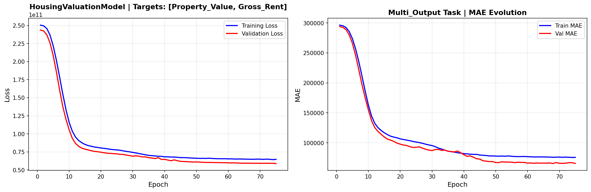
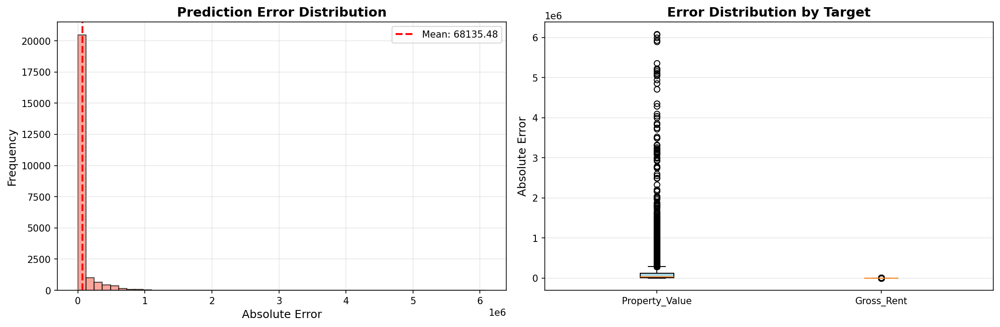
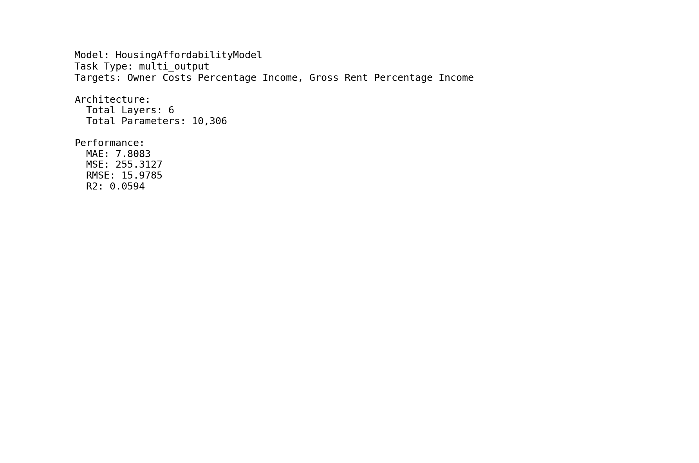
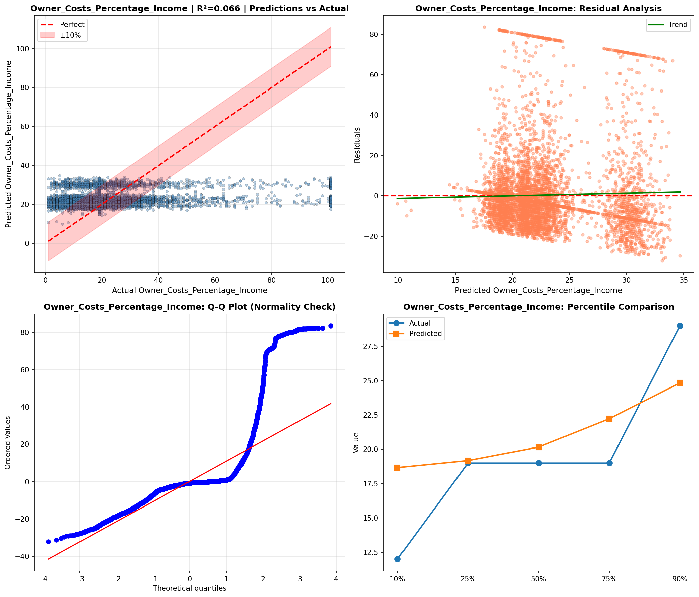
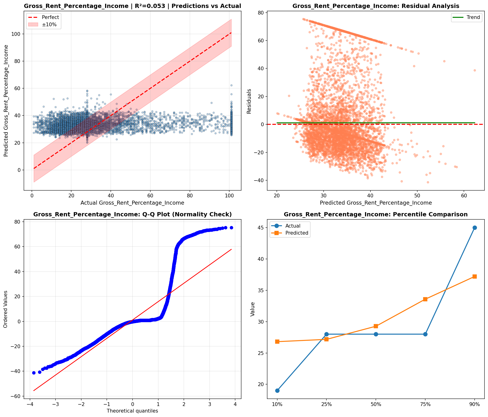
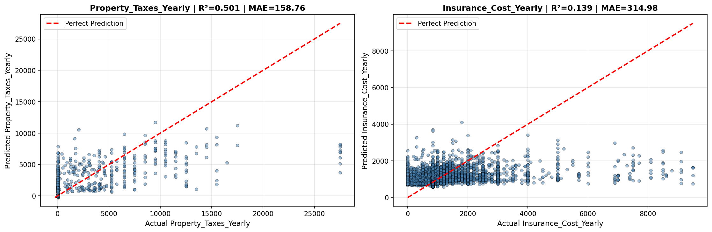
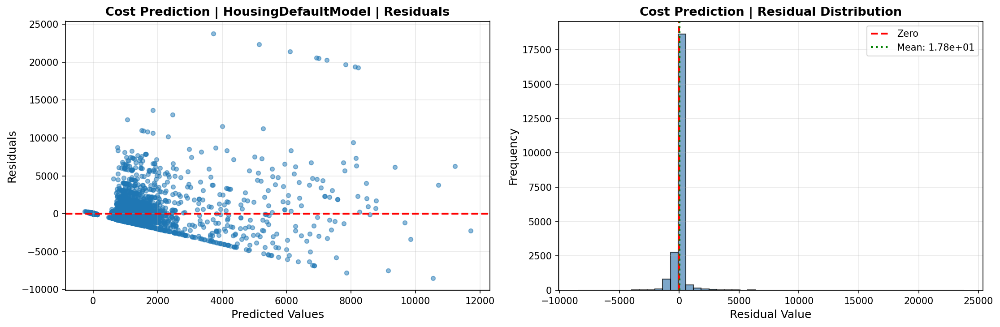
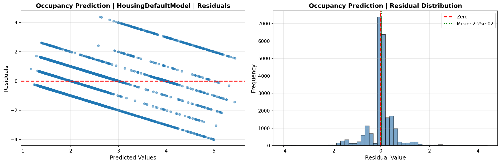
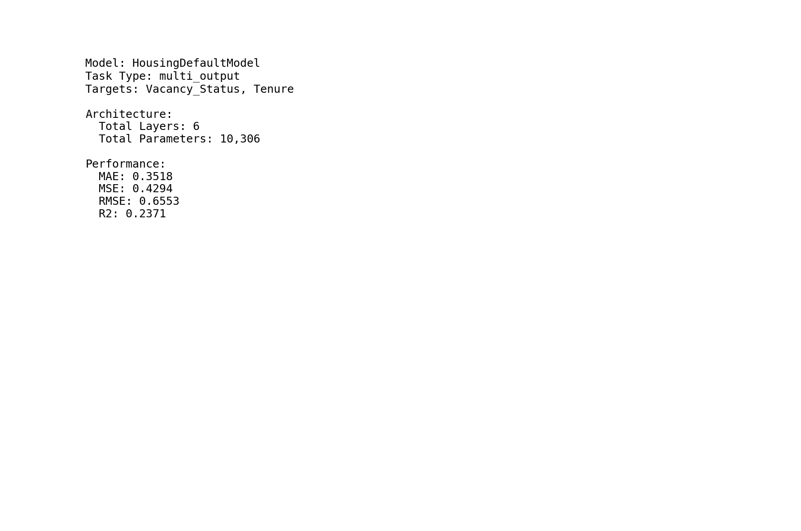

# Deep Learning Models

> Neural network analysis using TensorFlow/Keras for complex pattern recognition and multi-output prediction tasks.

## Deep Learning Summary

- **Total Tasks**: 5

- **Tasks**: Property Valuation, Affordability Analysis, Housing Quality, Cost Prediction, Occupancy Prediction

### Aggregate Statistics

| Metric | Value |
| :--- | :--- |
| Total Parameters | 78,283 |
| Average Validation Loss | 11785126726.4975 |
| Number of Tasks | 5 |

## Task: Property Valuation

### Model Configuration

| Property | Value |
| :--- | :--- |
| Model Type | HousingValuationModel |
| Task Type | Multi_Output |
| Target Variables | Property_Value, Gross_Rent |
| Number of Targets | 2 |
| Input Features | 10 |

### Network Architecture

| Component | Value | Notes |
| :--- | :--- | :--- |
| Total Layers | 7 | Including input and output |
| Total Parameters | 36,994 | Trainable weights |
| Parameters per Layer | 5,284 | Average |

### Performance Metrics

| Metric | Value | Assessment |
| :--- | :--- | :--- |
| Training Loss | 64715980800.0000 | Final epoch |
| Validation Loss | 58925056000.0000 | Final epoch |
| Loss Gap | -5790924800.0000 | NONE overfitting risk |

> *Good generalization*

#### Test Set Metrics

| Metric | Value | Description |
| :--- | :--- | :--- |
| MAE | 68134.6719 | Mean Absolute Error (lower is better) |
| MSE | 66230599680.0000 | Mean Squared Error (lower is better) |
| RMSE | 257353.0643 | Root Mean Squared Error (lower is better) |
| R2 | -0.0094 | R-squared (higher is better) |

### Training Analysis

| Training Statistic | Value |
| :--- | :--- |
| Epochs Trained | 75 |
| Initial Training Loss | 250421379072.0000 |
| Final Training Loss | 64715980800.0000 |
| Loss Improvement | 74.2% |
| Initial Validation Loss | 243616006144.0000 |
| Final Validation Loss | 58925056000.0000 |
| Validation Improvement | 75.8% |

#### Convergence Assessment

- **Status**: Fully converged (< 1% change in last 10 epochs)

- **Last 10 epochs change**: 0.30%

## Task: Affordability Analysis

### Model Configuration

| Property | Value |
| :--- | :--- |
| Model Type | HousingAffordabilityModel |
| Task Type | Multi_Output |
| Target Variables | Owner_Costs_Percentage_Income, Gross_Rent_Percentage_Income |
| Number of Targets | 2 |
| Input Features | 10 |

### Network Architecture

| Component | Value | Notes |
| :--- | :--- | :--- |
| Total Layers | 6 | Including input and output |
| Total Parameters | 10,306 | Trainable weights |
| Parameters per Layer | 1,717 | Average |

### Performance Metrics

| Metric | Value | Assessment |
| :--- | :--- | :--- |
| Training Loss | 249.0907 | Final epoch |
| Validation Loss | 253.1409 | Final epoch |
| Loss Gap | 4.0503 | HIGH overfitting risk |

> *Model may be overfitting significantly*

#### Test Set Metrics

| Metric | Value | Description |
| :--- | :--- | :--- |
| MAE | 7.8083 | Mean Absolute Error (lower is better) |
| MSE | 255.3127 | Mean Squared Error (lower is better) |
| RMSE | 15.9785 | Root Mean Squared Error (lower is better) |
| R2 | 0.0594 | R-squared (higher is better) |

### Training Analysis

| Training Statistic | Value |
| :--- | :--- |
| Epochs Trained | 75 |
| Initial Training Loss | 548.7384 |
| Final Training Loss | 249.0907 |
| Loss Improvement | 54.6% |
| Initial Validation Loss | 367.3962 |
| Final Validation Loss | 253.1409 |
| Validation Improvement | 31.1% |

#### Convergence Assessment

- **Status**: Fully converged (< 1% change in last 10 epochs)

- **Last 10 epochs change**: 0.13%

## Task: Housing Quality

### Model Configuration

| Property | Value |
| :--- | :--- |
| Model Type | HousingQualityModel |
| Task Type | Multi_Output |
| Target Variables | Year_Structure_Built, Number_of_Bedrooms, Number_of_Rooms |
| Number of Targets | 3 |
| Input Features | 10 |

### Network Architecture

| Component | Value | Notes |
| :--- | :--- | :--- |
| Total Layers | 6 | Including input and output |
| Total Parameters | 10,371 | Trainable weights |
| Parameters per Layer | 1,728 | Average |

### Performance Metrics

| Metric | Value | Assessment |
| :--- | :--- | :--- |
| Training Loss | 443.1830 | Final epoch |
| Validation Loss | 11.7210 | Final epoch |
| Loss Gap | -431.4620 | NONE overfitting risk |

> *Good generalization*

#### Test Set Metrics

| Metric | Value | Description |
| :--- | :--- | :--- |
| MAE | 1.1361 | Mean Absolute Error (lower is better) |
| MSE | 10.8811 | Mean Squared Error (lower is better) |
| RMSE | 3.2986 | Root Mean Squared Error (lower is better) |
| R2 | 0.9097 | R-squared (higher is better) |

### Training Analysis

| Training Statistic | Value |
| :--- | :--- |
| Epochs Trained | 75 |
| Initial Training Loss | 55238.3594 |
| Final Training Loss | 443.1830 |
| Loss Improvement | 99.2% |
| Initial Validation Loss | 21887.7012 |
| Final Validation Loss | 11.7210 |
| Validation Improvement | 99.9% |

#### Convergence Assessment

- **Status**: Still improving (> 5% change)

- **Last 10 epochs change**: 15.66%

## Task: Cost Prediction

### Model Configuration

| Property | Value |
| :--- | :--- |
| Model Type | HousingDefaultModel |
| Task Type | Multi_Output |
| Target Variables | Property_Taxes_Yearly, Insurance_Cost_Yearly |
| Number of Targets | 2 |
| Input Features | 10 |

### Network Architecture

| Component | Value | Notes |
| :--- | :--- | :--- |
| Total Layers | 6 | Including input and output |
| Total Parameters | 10,306 | Trainable weights |
| Parameters per Layer | 1,717 | Average |

### Performance Metrics

| Metric | Value | Assessment |
| :--- | :--- | :--- |
| Training Loss | 717448.4375 | Final epoch |
| Validation Loss | 577367.1875 | Final epoch |
| Loss Gap | -140081.2500 | NONE overfitting risk |

> *Good generalization*

#### Test Set Metrics

| Metric | Value | Description |
| :--- | :--- | :--- |
| MAE | 236.8669 | Mean Absolute Error (lower is better) |
| MSE | 687144.8750 | Mean Squared Error (lower is better) |
| RMSE | 828.9420 | Root Mean Squared Error (lower is better) |
| R2 | 0.3198 | R-squared (higher is better) |

### Training Analysis

| Training Statistic | Value |
| :--- | :--- |
| Epochs Trained | 75 |
| Initial Training Loss | 1539307.6250 |
| Final Training Loss | 717448.4375 |
| Loss Improvement | 53.4% |
| Initial Validation Loss | 1366578.0000 |
| Final Validation Loss | 577367.1875 |
| Validation Improvement | 57.8% |

#### Convergence Assessment

- **Status**: Fully converged (< 1% change in last 10 epochs)

- **Last 10 epochs change**: 0.10%

## Task: Occupancy Prediction

### Model Configuration

| Property | Value |
| :--- | :--- |
| Model Type | HousingDefaultModel |
| Task Type | Multi_Output |
| Target Variables | Vacancy_Status, Tenure |
| Number of Targets | 2 |
| Input Features | 10 |

### Network Architecture

| Component | Value | Notes |
| :--- | :--- | :--- |
| Total Layers | 6 | Including input and output |
| Total Parameters | 10,306 | Trainable weights |
| Parameters per Layer | 1,717 | Average |

### Performance Metrics

| Metric | Value | Assessment |
| :--- | :--- | :--- |
| Training Loss | 0.4349 | Final epoch |
| Validation Loss | 0.4380 | Final epoch |
| Loss Gap | 0.0031 | NONE overfitting risk |

> *Good generalization*

#### Test Set Metrics

| Metric | Value | Description |
| :--- | :--- | :--- |
| MAE | 0.3518 | Mean Absolute Error (lower is better) |
| MSE | 0.4294 | Mean Squared Error (lower is better) |
| RMSE | 0.6553 | Root Mean Squared Error (lower is better) |
| R2 | 0.2371 | R-squared (higher is better) |

### Training Analysis

| Training Statistic | Value |
| :--- | :--- |
| Epochs Trained | 75 |
| Initial Training Loss | 2.0793 |
| Final Training Loss | 0.4349 |
| Loss Improvement | 79.1% |
| Initial Validation Loss | 1.9557 |
| Final Validation Loss | 0.4380 |
| Validation Improvement | 77.6% |

#### Convergence Assessment

- **Status**: Fully converged (< 1% change in last 10 epochs)

- **Last 10 epochs change**: 0.56%

## Cross-Task Comparison

| Task | Model Type | Parameters | Train Loss | Val Loss | Gap |
| :--- | :--- | :--- | :--- | :--- | :--- |
| Property Valuation | HousingValuationModel | 36,994 | 64715980800.0000 | 58925056000.0000 | -5790924800.0000 |
| Affordability Analysis | HousingAffordabilityModel | 10,306 | 249.0907 | 253.1409 | 4.0503 |
| Housing Quality | HousingQualityModel | 10,371 | 443.1830 | 11.7210 | -431.4620 |
| Cost Prediction | HousingDefaultModel | 10,306 | 717448.4375 | 577367.1875 | -140081.2500 |
| Occupancy Prediction | HousingDefaultModel | 10,306 | 0.4349 | 0.4380 | 0.0031 |

## Visualizations

