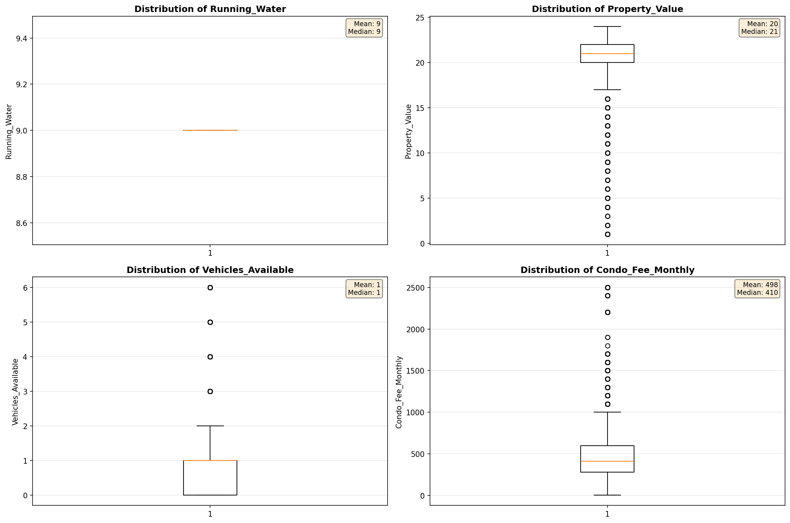
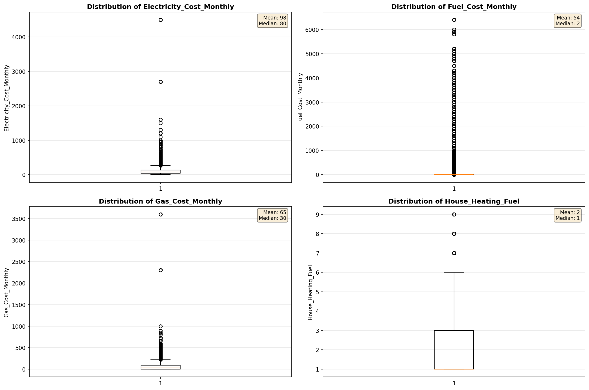

# Outlier Detection

> Statistical outlier detection using IQR (Interquartile Range) method. Outliers are values falling outside Q1 - 1.5×IQR or Q3 + 1.5×IQR bounds.

## Detection Methodology

| Parameter | Value | Description |
| :--- | :--- | :--- |
| Method | IQR | Outlier detection algorithm |
| Lower Bound | Q1 - 1.5 × IQR | Values below are outliers |
| Upper Bound | Q3 + 1.5 × IQR | Values above are outliers |
| IQR Definition | Q3 - Q1 | Interquartile Range |

> **Note**: The IQR method is robust to extreme values and works well for approximately symmetric distributions.

## Outlier Summary

_No outlier summary available._
## High Outlier Rate Variables

> Variables with outlier rate > 5% may indicate data quality issues, non-normal distributions, or genuinely extreme values.

- **('Fuel_Cost_Monthly', 15.091890686711684)**: 0 outliers (0.00%)

- **('Gross_Rent_Percentage_Income', 12.213944603629418)**: 0 outliers (0.00%)

- **('Owner_Costs_Percentage_Income', 8.365306997000289)**: 0 outliers (0.00%)

- **('Flag_Property_Taxes', 7.436862421338766)**: 0 outliers (0.00%)

- **('Insurance_Cost_Yearly', 7.32961619661127)**: 0 outliers (0.00%)

- **('Property_Value', 7.208237986270023)**: 0 outliers (0.00%)

- **('Flag_Rent_Amount', 6.3829226627788005)**: 0 outliers (0.00%)

- **('Flag_Water_Cost', 6.3565741688148005)**: 0 outliers (0.00%)

- **('Gas_Cost_Monthly', 6.257443341727152)**: 0 outliers (0.00%)

- **('Household_Income', 6.036152356358941)**: 0 outliers (0.00%)

- **('Working_Age_Persons', 5.723894575520784)**: 0 outliers (0.00%)

- **('Family_Income', 5.632516532244755)**: 0 outliers (0.00%)

- **('Electricity_Cost_Monthly', 5.2165454582493025)**: 0 outliers (0.00%)

- **('Income_to_FPL_Ratio', 5.195542353319584)**: 0 outliers (0.00%)

> *Consider investigating these variables for data entry errors, applying transformations, or using robust statistical methods.*

## Visualizations

