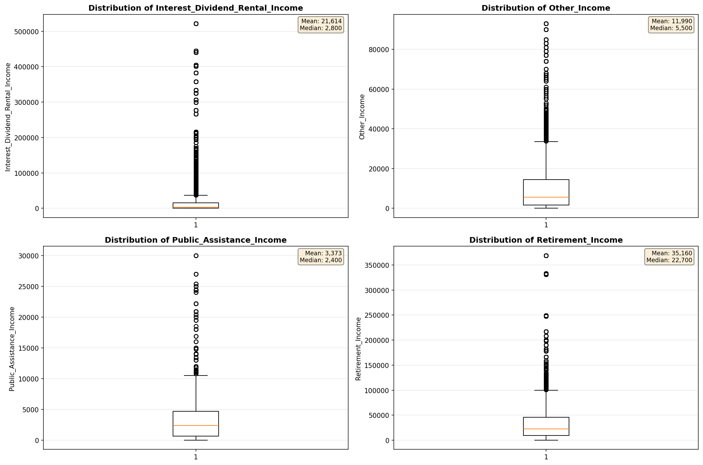
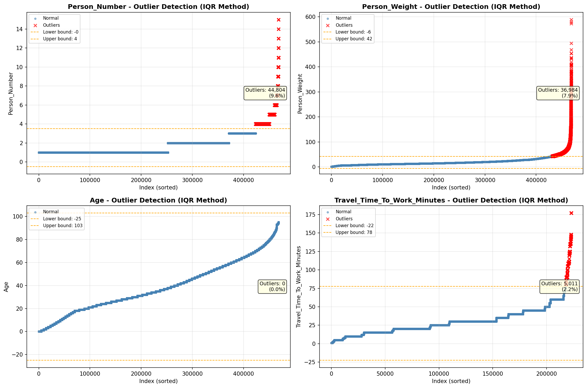
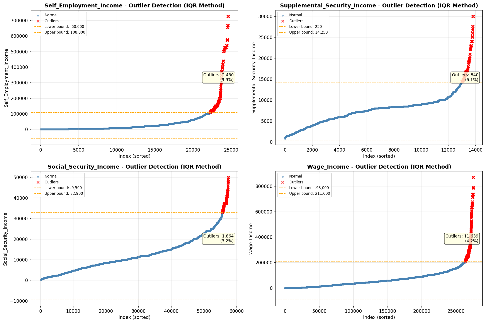

# Outlier Detection

> Statistical outlier detection using IQR (Interquartile Range) method. Outliers are values falling outside Q1 - 1.5×IQR or Q3 + 1.5×IQR bounds.

## Detection Methodology

| Parameter | Value | Description |
| :--- | :--- | :--- |
| Method | IQR | Outlier detection algorithm |
| Lower Bound | Q1 - 1.5 × IQR | Values below are outliers |
| Upper Bound | Q3 + 1.5 × IQR | Values above are outliers |
| IQR Definition | Q3 - Q1 | Interquartile Range |

> **Note**: The IQR method is robust to extreme values and works well for approximately symmetric distributions.

## Outlier Summary

_No outlier summary available._
## High Outlier Rate Variables

> Variables with outlier rate > 5% may indicate data quality issues, non-normal distributions, or genuinely extreme values.

- **('Hours_Worked_Per_Week', 29.934073270466495)**: 0 outliers (0.00%)

- **('Total_Annual_Hours', 18.495663525598705)**: 0 outliers (0.00%)

- **('Presence_And_Age_Own_Children', 17.801609116992033)**: 0 outliers (0.00%)

- **('Flag_Wage_Income', 17.055981485395623)**: 0 outliers (0.00%)

- **('Flag_Interest_Dividend_Income', 14.856731719710412)**: 0 outliers (0.00%)

- **('Flag_Social_Security_Income', 14.221786684942153)**: 0 outliers (0.00%)

- **('Flag_Retirement_Income', 13.90879763955874)**: 0 outliers (0.00%)

- **('Flag_Other_Income', 13.352420114136388)**: 0 outliers (0.00%)

- **('Flag_Supplemental_Security_Income', 13.126325026100211)**: 0 outliers (0.00%)

- **('Interest_Dividend_Rental_Income', 12.158029702562978)**: 0 outliers (0.00%)

- **('Flag_Self_Employment_Income', 10.788941623059564)**: 0 outliers (0.00%)

- **('Self_Employment_Income', 9.851617611286793)**: 0 outliers (0.00%)

- **('Other_Income', 9.250474383301707)**: 0 outliers (0.00%)

- **('Flag_Hours_Worked', 8.418038929346887)**: 0 outliers (0.00%)

- **('Income_Adjustment_Factor', 6.906254870438334)**: 0 outliers (0.00%)

> *Consider investigating these variables for data entry errors, applying transformations, or using robust statistical methods.*

## Visualizations

