# Statistical Analysis

> Comprehensive descriptive statistics including central tendency, dispersion, distribution characteristics, and weighted statistics using ACS sample weights.

## Summary Statistics

- **Variables Analyzed**: 41

### Income_Adjustment_Factor

| Statistic | Unweighted | Weighted (ACS) |
| :--- | :--- | :--- |
| Mean | 1,014,948.05 | 1,014,656.45 |
| Median | 1,010,207.00 | 1,014,656.45 |
| Std Deviation | 11,438.75 | — |
| Minimum | 1,001,264.00 | — |
| Maximum | 1,042,311.00 | — |
| Count | 1,130,396 | — |

> *Distribution is highly right-skewed (skewness: 1.31), light-tailed/platykurtic (kurtosis: 0.68).*

- **Coefficient of Variation**: 1.1 % (low variability)

### Property_Value

| Statistic | Unweighted | Weighted (ACS) |
| :--- | :--- | :--- |
| Mean | 300,635.60 | 281,129.46 |
| Median | 200,000.00 | 205,001.50 |
| Std Deviation | 478,174.63 | — |
| Minimum | 1.00 | — |
| Maximum | 6,199,000.00 | — |
| Count | 728,534 | — |

> *Distribution is highly right-skewed (skewness: 6.46), heavy-tailed/leptokurtic (kurtosis: 56.43).*

- **Coefficient of Variation**: 159.1 % (very high variability)

### Electricity_Cost_Monthly

| Statistic | Unweighted | Weighted (ACS) |
| :--- | :--- | :--- |
| Mean | 167.26 | 165.84 |
| Median | 150.00 | 143.75 |
| Std Deviation | 127.09 | — |
| Minimum | 1.00 | — |
| Maximum | 2,700.00 | — |
| Count | 1,295,728 | — |

> *Distribution is highly right-skewed (skewness: 7.85), heavy-tailed/leptokurtic (kurtosis: 139.88).*

- **Coefficient of Variation**: 76.0 % (high variability)

### Fuel_Cost_Monthly

| Statistic | Unweighted | Weighted (ACS) |
| :--- | :--- | :--- |
| Mean | 18.47 | 161.53 |
| Median | 2.00 | 61.38 |
| Std Deviation | 164.31 | — |
| Minimum | 1.00 | — |
| Maximum | 5,900.00 | — |
| Count | 881,153 | — |

> *Distribution is highly right-skewed (skewness: 15.93), heavy-tailed/leptokurtic (kurtosis: 316.26).*

- **Coefficient of Variation**: 889.4 % (very high variability)

### Gas_Cost_Monthly

| Statistic | Unweighted | Weighted (ACS) |
| :--- | :--- | :--- |
| Mean | 15.21 | 29.40 |
| Median | 3.00 | 15.81 |
| Std Deviation | 44.50 | — |
| Minimum | 1.00 | — |
| Maximum | 680.00 | — |
| Count | 931,770 | — |

> *Distribution is highly right-skewed (skewness: 7.52), heavy-tailed/leptokurtic (kurtosis: 77.81).*

- **Coefficient of Variation**: 292.5 % (very high variability)

### Insurance_Cost_Yearly

| Statistic | Unweighted | Weighted (ACS) |
| :--- | :--- | :--- |
| Mean | 1,909.43 | 1,834.79 |
| Median | 1,400.00 | 1,406.25 |
| Std Deviation | 1,650.28 | — |
| Minimum | 4.00 | — |
| Maximum | 10,000.00 | — |
| Count | 783,035 | — |

> *Distribution is highly right-skewed (skewness: 2.20), heavy-tailed/leptokurtic (kurtosis: 6.20).*

- **Coefficient of Variation**: 86.4 % (high variability)

### Water_Cost_Yearly

| Statistic | Unweighted | Weighted (ACS) |
| :--- | :--- | :--- |
| Mean | 466.76 | 475.77 |
| Median | 300.00 | 297.50 |
| Std Deviation | 564.63 | — |
| Minimum | 1.00 | — |
| Maximum | 4,800.00 | — |
| Count | 1,184,293 | — |

> *Distribution is highly right-skewed (skewness: 2.16), heavy-tailed/leptokurtic (kurtosis: 7.82).*

- **Coefficient of Variation**: 121.0 % (very high variability)

### Mobile_Home_Costs_Monthly

| Statistic | Unweighted | Weighted (ACS) |
| :--- | :--- | :--- |
| Mean | 2,908.19 | 2,920.27 |
| Median | 1,400.00 | 1,331.25 |
| Std Deviation | 3,460.91 | — |
| Minimum | 4.00 | — |
| Maximum | 31,500.00 | — |
| Count | 63,553 | — |

> *Distribution is highly right-skewed (skewness: 2.71), heavy-tailed/leptokurtic (kurtosis: 14.65).*

- **Coefficient of Variation**: 119.0 % (very high variability)

### First_Mortgage_Payment_Monthly

| Statistic | Unweighted | Weighted (ACS) |
| :--- | :--- | :--- |
| Mean | 1,069.52 | 1,165.55 |
| Median | 920.00 | 954.25 |
| Std Deviation | 953.48 | — |
| Minimum | 4.00 | — |
| Maximum | 7,300.00 | — |
| Count | 645,890 | — |

> *Distribution is highly right-skewed (skewness: 1.79), heavy-tailed/leptokurtic (kurtosis: 5.75).*

- **Coefficient of Variation**: 89.2 % (high variability)

### First_Mortgage_Includes_Taxes

| Statistic | Unweighted | Weighted (ACS) |
| :--- | :--- | :--- |
| Mean | 1.30 | 1.28 |
| Median | 1.00 | 1.00 |
| Std Deviation | 0.46 | — |
| Minimum | 1.00 | — |
| Maximum | 2.00 | — |
| Count | 535,403 | — |

> *Distribution is moderately right-skewed (skewness: 0.86), light-tailed/platykurtic (kurtosis: -1.26).*

- **Coefficient of Variation**: 35.3 % (moderate variability)

### Second_Mortgage_Payment_Monthly

| Statistic | Unweighted | Weighted (ACS) |
| :--- | :--- | :--- |
| Mean | 447.17 | 448.66 |
| Median | 300.00 | 311.88 |
| Std Deviation | 476.67 | — |
| Minimum | 4.00 | — |
| Maximum | 4,700.00 | — |
| Count | 99,681 | — |

> *Distribution is highly right-skewed (skewness: 3.49), heavy-tailed/leptokurtic (kurtosis: 17.43).*

- **Coefficient of Variation**: 106.6 % (very high variability)

### Property_Taxes_Yearly

| Statistic | Unweighted | Weighted (ACS) |
| :--- | :--- | :--- |
| Mean | 384.96 | 347.95 |
| Median | 30.00 | 246.50 |
| Std Deviation | 1,837.76 | — |
| Minimum | 1.00 | — |
| Maximum | 37,500.00 | — |
| Count | 690,849 | — |

> *Distribution is highly right-skewed (skewness: 11.42), heavy-tailed/leptokurtic (kurtosis: 188.41).*

- **Coefficient of Variation**: 477.4 % (very high variability)

### Meals_Included_in_Rent

| Statistic | Unweighted | Weighted (ACS) |
| :--- | :--- | :--- |
| Mean | 1.97 | 1.97 |
| Median | 2.00 | 2.00 |
| Std Deviation | 0.16 | — |
| Minimum | 1.00 | — |
| Maximum | 2.00 | — |
| Count | 372,486 | — |

> *Distribution is highly left-skewed (skewness: -5.87), heavy-tailed/leptokurtic (kurtosis: 32.51).*

- **Coefficient of Variation**: 8.2 % (low variability)

### Rent_Amount_Monthly

| Statistic | Unweighted | Weighted (ACS) |
| :--- | :--- | :--- |
| Mean | 1,057.71 | 1,059.97 |
| Median | 900.00 | 965.62 |
| Std Deviation | 651.86 | — |
| Minimum | 4.00 | — |
| Maximum | 5,700.00 | — |
| Count | 372,486 | — |

> *Distribution is highly right-skewed (skewness: 2.35), heavy-tailed/leptokurtic (kurtosis: 10.48).*

- **Coefficient of Variation**: 61.6 % (high variability)

### Gross_Rent

| Statistic | Unweighted | Weighted (ACS) |
| :--- | :--- | :--- |
| Mean | 1,203.52 | 1,202.95 |
| Median | 1,070.00 | 1,116.00 |
| Std Deviation | 653.42 | — |
| Minimum | 4.00 | — |
| Maximum | 9,672.00 | — |
| Count | 342,624 | — |

> *Distribution is highly right-skewed (skewness: 2.08), heavy-tailed/leptokurtic (kurtosis: 8.94).*

- **Coefficient of Variation**: 54.3 % (high variability)

### Gross_Rent_Percentage_Income

| Statistic | Unweighted | Weighted (ACS) |
| :--- | :--- | :--- |
| Mean | 42.56 | 43.00 |
| Median | 33.00 | 33.94 |
| Std Deviation | 27.59 | — |
| Minimum | 1.00 | — |
| Maximum | 101.00 | — |
| Count | 334,603 | — |

> *Distribution is moderately right-skewed (skewness: 0.98), light-tailed/platykurtic (kurtosis: -0.18).*

- **Coefficient of Variation**: 64.8 % (high variability)

### Selected_Monthly_Owner_Costs

| Statistic | Unweighted | Weighted (ACS) |
| :--- | :--- | :--- |
| Mean | 1,300.71 | 1,304.80 |
| Median | 1,020.00 | 1,058.50 |
| Std Deviation | 1,105.12 | — |
| Minimum | 1.00 | — |
| Maximum | 17,028.00 | — |
| Count | 944,890 | — |

> *Distribution is highly right-skewed (skewness: 2.47), heavy-tailed/leptokurtic (kurtosis: 10.48).*

- **Coefficient of Variation**: 85.0 % (high variability)

### Owner_Costs_Percentage_Income

| Statistic | Unweighted | Weighted (ACS) |
| :--- | :--- | :--- |
| Mean | 26.71 | 27.53 |
| Median | 19.00 | 20.25 |
| Std Deviation | 23.73 | — |
| Minimum | 1.00 | — |
| Maximum | 101.00 | — |
| Count | 934,478 | — |

> *Distribution is highly right-skewed (skewness: 1.76), light-tailed/platykurtic (kurtosis: 2.68).*

- **Coefficient of Variation**: 88.8 % (high variability)

### Family_Income

| Statistic | Unweighted | Weighted (ACS) |
| :--- | :--- | :--- |
| Mean | 93,268.35 | 86,811.86 |
| Median | 66,100.00 | 63,243.75 |
| Std Deviation | 101,431.46 | — |
| Minimum | 1.00 | — |
| Maximum | 2,481,200.00 | — |
| Count | 835,006 | — |

> *Distribution is highly right-skewed (skewness: 3.95), heavy-tailed/leptokurtic (kurtosis: 25.24).*

- **Coefficient of Variation**: 108.8 % (very high variability)

### Household_Income

| Statistic | Unweighted | Weighted (ACS) |
| :--- | :--- | :--- |
| Mean | 79,438.66 | 74,790.15 |
| Median | 54,200.00 | 52,743.75 |
| Std Deviation | 92,800.20 | — |
| Minimum | 1.00 | — |
| Maximum | 2,481,200.00 | — |
| Count | 1,287,548 | — |

> *Distribution is highly right-skewed (skewness: 4.20), heavy-tailed/leptokurtic (kurtosis: 29.21).*

- **Coefficient of Variation**: 116.8 % (very high variability)

### Specified_Rent_Unit

| Statistic | Unweighted | Weighted (ACS) |
| :--- | :--- | :--- |
| Mean | 0.26 | 0.30 |
| Median | 0.00 | 0.00 |
| Std Deviation | 0.44 | — |
| Minimum | 0.00 | — |
| Maximum | 1.00 | — |
| Count | 1,478,028 | — |

> *Distribution is highly right-skewed (skewness: 1.07), light-tailed/platykurtic (kurtosis: -0.86).*

- **Coefficient of Variation**: 166.7 % (very high variability)

### Specified_Value_Unit

| Statistic | Unweighted | Weighted (ACS) |
| :--- | :--- | :--- |
| Mean | 0.51 | 0.44 |
| Median | 1.00 | 0.00 |
| Std Deviation | 0.50 | — |
| Minimum | 0.00 | — |
| Maximum | 1.00 | — |
| Count | 1,478,028 | — |

> *Distribution is approximately symmetric (skewness: -0.03), light-tailed/platykurtic (kurtosis: -2.00).*

- **Coefficient of Variation**: 98.4 % (high variability)

### Flag_Family_Income

| Statistic | Unweighted | Weighted (ACS) |
| :--- | :--- | :--- |
| Mean | 0.20 | 0.20 |
| Median | 0.00 | 0.00 |
| Std Deviation | 0.40 | — |
| Minimum | 0.00 | — |
| Maximum | 1.00 | — |
| Count | 1,124,375 | — |

> *Distribution is highly right-skewed (skewness: 1.48), light-tailed/platykurtic (kurtosis: 0.20).*

- **Coefficient of Variation**: 198.6 % (very high variability)

### Flag_Gross_Rent

| Statistic | Unweighted | Weighted (ACS) |
| :--- | :--- | :--- |
| Mean | 0.07 | 0.11 |
| Median | 0.00 | 0.00 |
| Std Deviation | 0.26 | — |
| Minimum | 0.00 | — |
| Maximum | 1.00 | — |
| Count | 745,318 | — |

> *Distribution is highly right-skewed (skewness: 3.32), heavy-tailed/leptokurtic (kurtosis: 9.05).*

- **Coefficient of Variation**: 360.2 % (very high variability)

### Flag_Household_Income

| Statistic | Unweighted | Weighted (ACS) |
| :--- | :--- | :--- |
| Mean | 0.31 | 0.30 |
| Median | 0.00 | 0.00 |
| Std Deviation | 0.46 | — |
| Minimum | 0.00 | — |
| Maximum | 1.00 | — |
| Count | 1,124,375 | — |

> *Distribution is moderately right-skewed (skewness: 0.84), light-tailed/platykurtic (kurtosis: -1.29).*

- **Coefficient of Variation**: 150.5 % (very high variability)

### Flag_First_Mortgage_Payment

| Statistic | Unweighted | Weighted (ACS) |
| :--- | :--- | :--- |
| Mean | 0.04 | 0.04 |
| Median | 0.00 | 0.00 |
| Std Deviation | 0.20 | — |
| Minimum | 0.00 | — |
| Maximum | 1.00 | — |
| Count | 1,478,028 | — |

> *Distribution is highly right-skewed (skewness: 4.65), heavy-tailed/leptokurtic (kurtosis: 19.62).*

- **Coefficient of Variation**: 485.6 % (very high variability)

### Flag_First_Mortgage_Taxes

| Statistic | Unweighted | Weighted (ACS) |
| :--- | :--- | :--- |
| Mean | 0.03 | 0.03 |
| Median | 0.00 | 0.00 |
| Std Deviation | 0.18 | — |
| Minimum | 0.00 | — |
| Maximum | 1.00 | — |
| Count | 1,478,028 | — |

> *Distribution is highly right-skewed (skewness: 5.11), heavy-tailed/leptokurtic (kurtosis: 24.15).*

- **Coefficient of Variation**: 530.3 % (very high variability)

### Flag_Meals_Included_Rent

| Statistic | Unweighted | Weighted (ACS) |
| :--- | :--- | :--- |
| Mean | 0.01 | 0.01 |
| Median | 0.00 | 0.00 |
| Std Deviation | 0.08 | — |
| Minimum | 0.00 | — |
| Maximum | 1.00 | — |
| Count | 1,478,028 | — |

> *Distribution is highly right-skewed (skewness: 11.64), heavy-tailed/leptokurtic (kurtosis: 133.57).*

- **Coefficient of Variation**: 1,172.9 % (very high variability)

### Flag_Rent_Amount

| Statistic | Unweighted | Weighted (ACS) |
| :--- | :--- | :--- |
| Mean | 0.03 | 0.04 |
| Median | 0.00 | 0.00 |
| Std Deviation | 0.16 | — |
| Minimum | 0.00 | — |
| Maximum | 1.00 | — |
| Count | 1,478,028 | — |

> *Distribution is highly right-skewed (skewness: 5.86), heavy-tailed/leptokurtic (kurtosis: 32.39).*

- **Coefficient of Variation**: 603.0 % (very high variability)

### Flag_Selected_Monthly_Owner_Costs

| Statistic | Unweighted | Weighted (ACS) |
| :--- | :--- | :--- |
| Mean | 0.23 | 0.23 |
| Median | 0.00 | 0.00 |
| Std Deviation | 0.42 | — |
| Minimum | 0.00 | — |
| Maximum | 1.00 | — |
| Count | 947,674 | — |

> *Distribution is highly right-skewed (skewness: 1.30), light-tailed/platykurtic (kurtosis: -0.31).*

- **Coefficient of Variation**: 184.4 % (very high variability)

### Flag_Second_Mortgage_Payment

| Statistic | Unweighted | Weighted (ACS) |
| :--- | :--- | :--- |
| Mean | 0.03 | 0.04 |
| Median | 0.00 | 0.00 |
| Std Deviation | 0.18 | — |
| Minimum | 0.00 | — |
| Maximum | 1.00 | — |
| Count | 1,478,028 | — |

> *Distribution is highly right-skewed (skewness: 5.17), heavy-tailed/leptokurtic (kurtosis: 24.72).*

- **Coefficient of Variation**: 535.6 % (very high variability)

### Flag_Property_Taxes

| Statistic | Unweighted | Weighted (ACS) |
| :--- | :--- | :--- |
| Mean | 0.09 | 0.09 |
| Median | 0.00 | 0.00 |
| Std Deviation | 0.28 | — |
| Minimum | 0.00 | — |
| Maximum | 1.00 | — |
| Count | 1,380,686 | — |

> *Distribution is highly right-skewed (skewness: 2.89), heavy-tailed/leptokurtic (kurtosis: 6.33).*

- **Coefficient of Variation**: 319.8 % (very high variability)

### Flag_Property_Value

| Statistic | Unweighted | Weighted (ACS) |
| :--- | :--- | :--- |
| Mean | 0.07 | 0.07 |
| Median | 0.00 | 0.00 |
| Std Deviation | 0.26 | — |
| Minimum | 0.00 | — |
| Maximum | 1.00 | — |
| Count | 1,478,028 | — |

> *Distribution is highly right-skewed (skewness: 3.32), heavy-tailed/leptokurtic (kurtosis: 9.02).*

- **Coefficient of Variation**: 359.7 % (very high variability)

### Flag_Water_Cost

| Statistic | Unweighted | Weighted (ACS) |
| :--- | :--- | :--- |
| Mean | 0.08 | 0.08 |
| Median | 0.00 | 0.00 |
| Std Deviation | 0.28 | — |
| Minimum | 0.00 | — |
| Maximum | 1.00 | — |
| Count | 97,342 | — |

> *Distribution is highly right-skewed (skewness: 2.98), heavy-tailed/leptokurtic (kurtosis: 6.87).*

- **Coefficient of Variation**: 328.3 % (very high variability)

### Annual_Rent_to_Value_Ratio

### Total_Monthly_Utility_Cost

| Statistic | Unweighted | Weighted (ACS) |
| :--- | :--- | :--- |
| Mean | 178.12 | 175.45 |
| Median | 153.00 | 152.56 |
| Std Deviation | 136.90 | — |
| Minimum | 2.00 | — |
| Maximum | 3,310.00 | — |
| Count | 1,296,339 | — |

> *Distribution is highly right-skewed (skewness: 7.26), heavy-tailed/leptokurtic (kurtosis: 121.19).*

- **Coefficient of Variation**: 76.9 % (high variability)

### Property_Tax_Rate

| Statistic | Unweighted | Weighted (ACS) |
| :--- | :--- | :--- |
| Mean | 22.73 | 22.13 |
| Median | 0.02 | 21.35 |
| Std Deviation | 65.90 | — |
| Minimum | 0.00 | — |
| Maximum | 1,300.00 | — |
| Count | 461,366 | — |

> *Distribution is highly right-skewed (skewness: 3.10), heavy-tailed/leptokurtic (kurtosis: 10.16).*

- **Coefficient of Variation**: 290.0 % (very high variability)

#### Weighted Statistics by Year

| Year | Weighted Mean | Weighted Median |
| :--- | :--- | :--- |
| 2007 | 175.89 | 170.00 |
| 2012 | 0.02 | 0.02 |
| 2013 | 0.06 | 0.02 |
| 2014 | 0.07 | 0.02 |
| 2015 | 0.02 | 0.01 |
| 2016 | 0.02 | 0.01 |
| 2017 | 0.02 | 0.01 |
| 2023 | 0.95 | 0.71 |

### Structure_Age

| Statistic | Unweighted | Weighted (ACS) |
| :--- | :--- | :--- |
| Mean | 1,868.18 | 1,876.50 |
| Median | 2,018.00 | 1,877.07 |
| Std Deviation | 523.02 | — |
| Minimum | 1.00 | — |
| Maximum | 2,023.00 | — |
| Count | 1,285,235 | — |

> *Distribution is highly left-skewed (skewness: -3.21), heavy-tailed/leptokurtic (kurtosis: 8.29).*

- **Coefficient of Variation**: 28.0 % (moderate variability)

### Structure_Age_Score

| Statistic | Unweighted | Weighted (ACS) |
| :--- | :--- | :--- |
| Mean | 0.04 | 0.04 |
| Median | 0.00 | 0.04 |
| Std Deviation | 0.17 | — |
| Minimum | 0.00 | — |
| Maximum | 0.99 | — |
| Count | 1,285,235 | — |

> *Distribution is highly right-skewed (skewness: 3.77), heavy-tailed/leptokurtic (kurtosis: 13.29).*

- **Coefficient of Variation**: 371.2 % (very high variability)

### Working_Age_Persons

| Statistic | Unweighted | Weighted (ACS) |
| :--- | :--- | :--- |
| Mean | 1.52 | 1.63 |
| Median | 1.00 | 1.69 |
| Std Deviation | 1.33 | — |
| Minimum | 0.00 | — |
| Maximum | 19.00 | — |
| Count | 1,307,420 | — |

> *Distribution is moderately right-skewed (skewness: 0.93), light-tailed/platykurtic (kurtosis: 1.77).*

- **Coefficient of Variation**: 87.0 % (high variability)

### Income_to_FPL_Ratio

| Statistic | Unweighted | Weighted (ACS) |
| :--- | :--- | :--- |
| Mean | 3.69 | 3.44 |
| Median | 2.58 | 2.46 |
| Std Deviation | 4.37 | — |
| Minimum | -1.50 | — |
| Maximum | 120.08 | — |
| Count | 1,307,420 | — |

> *Distribution is highly right-skewed (skewness: 4.53), heavy-tailed/leptokurtic (kurtosis: 33.43).*

- **Coefficient of Variation**: 118.2 % (very high variability)

## Distribution Analysis

### Skewed Distributions

> Variables with skewness > |0.5| indicate non-normal distributions. Consider log transformations for highly skewed variables in modeling.

| Variable | Skewness | Direction | Severity |
| :--- | :--- | :--- | :--- |
| Fuel_Cost_Monthly | 15.932 | Right-skewed | High |
| Flag_Meals_Included_Rent | 11.643 | Right-skewed | High |
| Property_Taxes_Yearly | 11.417 | Right-skewed | High |
| Electricity_Cost_Monthly | 7.846 | Right-skewed | High |
| Gas_Cost_Monthly | 7.518 | Right-skewed | High |
| Total_Monthly_Utility_Cost | 7.256 | Right-skewed | High |
| Property_Value | 6.460 | Right-skewed | High |
| Meals_Included_in_Rent | -5.875 | Left-skewed | High |
| Flag_Rent_Amount | 5.864 | Right-skewed | High |
| Flag_Second_Mortgage_Payment | 5.170 | Right-skewed | High |
| Flag_First_Mortgage_Taxes | 5.114 | Right-skewed | High |
| Flag_First_Mortgage_Payment | 4.650 | Right-skewed | High |
| Income_to_FPL_Ratio | 4.528 | Right-skewed | High |
| Household_Income | 4.199 | Right-skewed | High |
| Family_Income | 3.948 | Right-skewed | High |
| Structure_Age_Score | 3.771 | Right-skewed | High |
| Second_Mortgage_Payment_Monthly | 3.488 | Right-skewed | High |
| Flag_Gross_Rent | 3.324 | Right-skewed | High |
| Flag_Property_Value | 3.319 | Right-skewed | High |
| Structure_Age | -3.208 | Left-skewed | High |

- **Total Skewed Variables**: 39

- **Right-skewed**: 37

- **Left-skewed**: 2

## Variance Analysis

### Coefficient of Variation Ranking

> CV (Coefficient of Variation) = (Std Dev / Mean) × 100%. Higher CV indicates greater relative variability.

| Variable | CV (%) | Std Dev | Mean | Variability |
| :--- | :--- | :--- | :--- | :--- |
| Flag_Meals_Included_Rent | 1172.9% | 0.08 | 0.01 | Very High |
| Fuel_Cost_Monthly | 889.4% | 164.31 | 18.47 | Very High |
| Flag_Rent_Amount | 603.0% | 0.16 | 0.03 | Very High |
| Flag_Second_Mortgage_Payment | 535.6% | 0.18 | 0.03 | Very High |
| Flag_First_Mortgage_Taxes | 530.3% | 0.18 | 0.03 | Very High |
| Flag_First_Mortgage_Payment | 485.6% | 0.20 | 0.04 | Very High |
| Property_Taxes_Yearly | 477.4% | 1,837.76 | 384.96 | Very High |
| Structure_Age_Score | 371.2% | 0.17 | 0.04 | Very High |
| Flag_Gross_Rent | 360.2% | 0.26 | 0.07 | Very High |
| Flag_Property_Value | 359.7% | 0.26 | 0.07 | Very High |
| Flag_Water_Cost | 328.3% | 0.28 | 0.08 | Very High |
| Flag_Property_Taxes | 319.8% | 0.28 | 0.09 | Very High |
| Gas_Cost_Monthly | 292.5% | 44.50 | 15.21 | Very High |
| Property_Tax_Rate | 290.0% | 65.90 | 22.73 | Very High |
| Flag_Family_Income | 198.6% | 0.40 | 0.20 | Very High |
| Flag_Selected_Monthly_Owner_Costs | 184.4% | 0.42 | 0.23 | Very High |
| Specified_Rent_Unit | 166.7% | 0.44 | 0.26 | Very High |
| Property_Value | 159.1% | 478,174.63 | 300,635.60 | Very High |
| Flag_Household_Income | 150.5% | 0.46 | 0.31 | Very High |
| Water_Cost_Yearly | 121.0% | 564.63 | 466.76 | Very High |

- **Average CV**: 237.7 %

- **High Variance Variables (CV > 50%)**: 36

## Visualizations

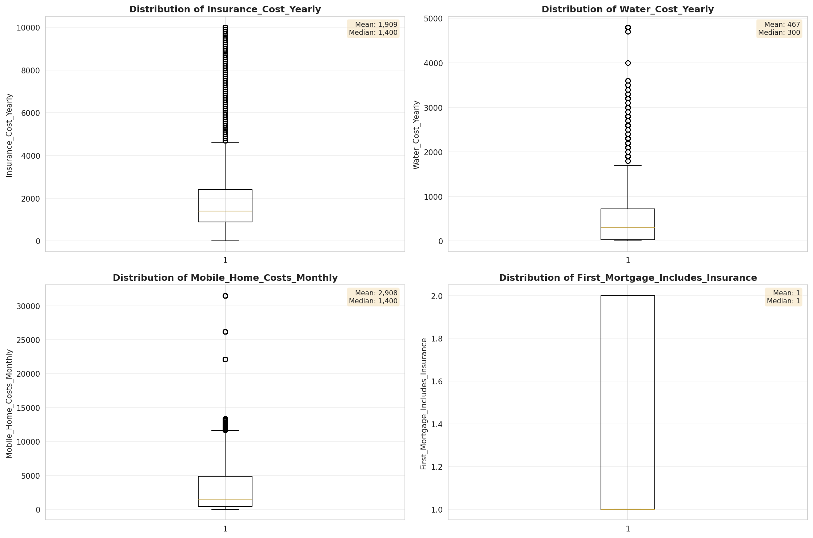

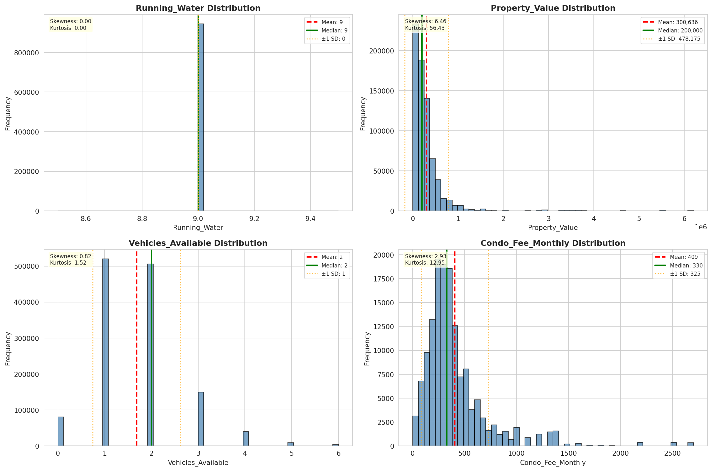

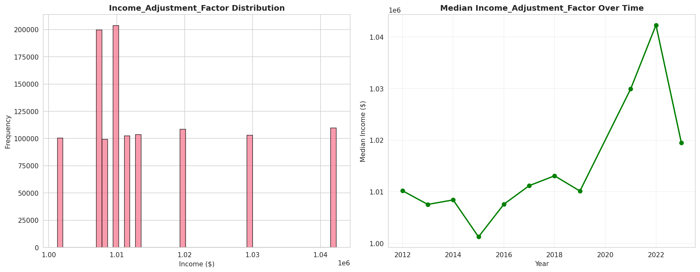

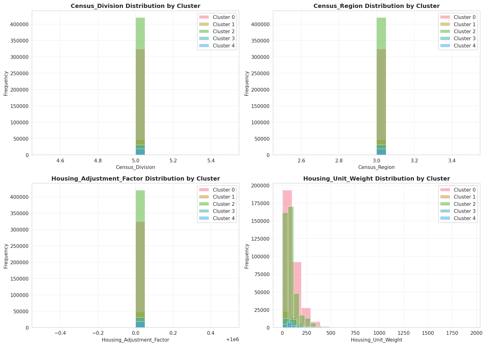

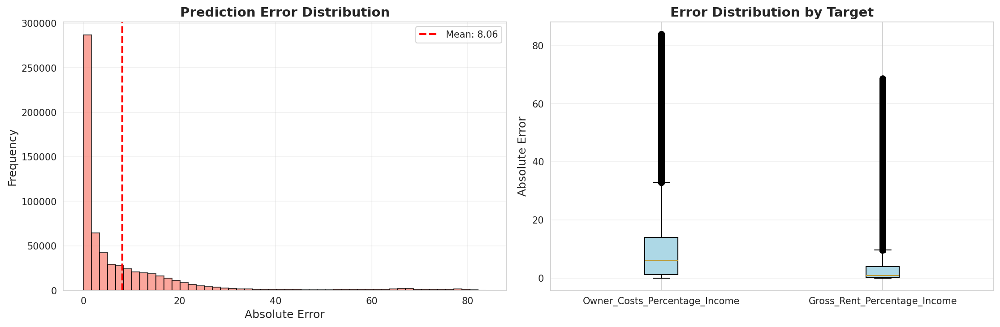

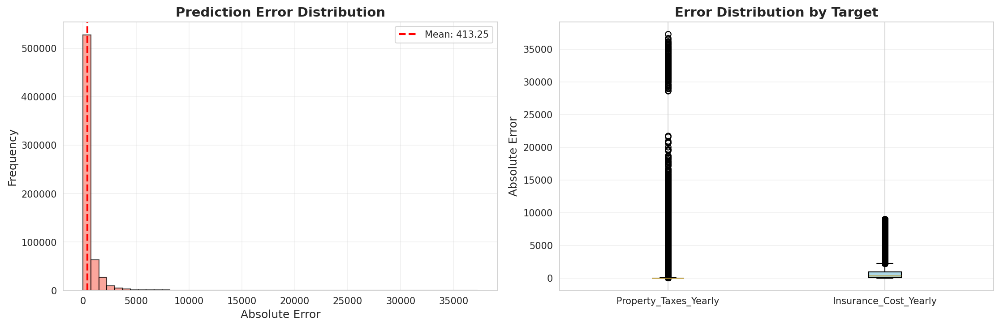

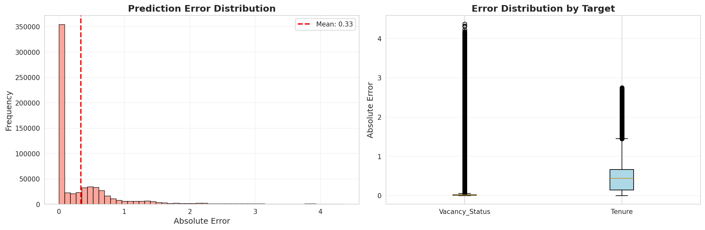

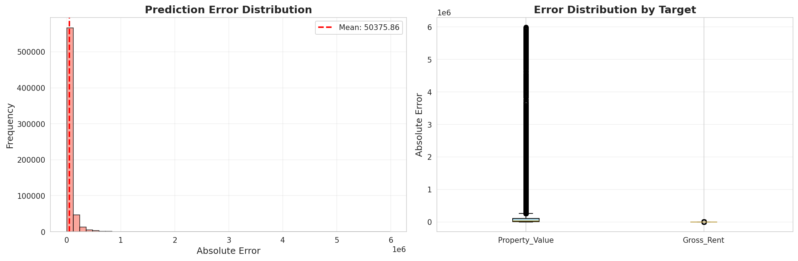

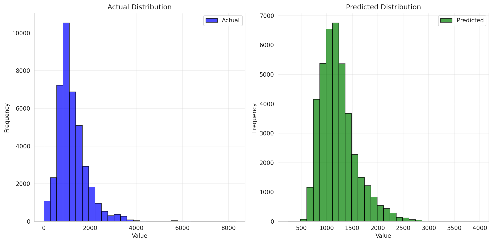

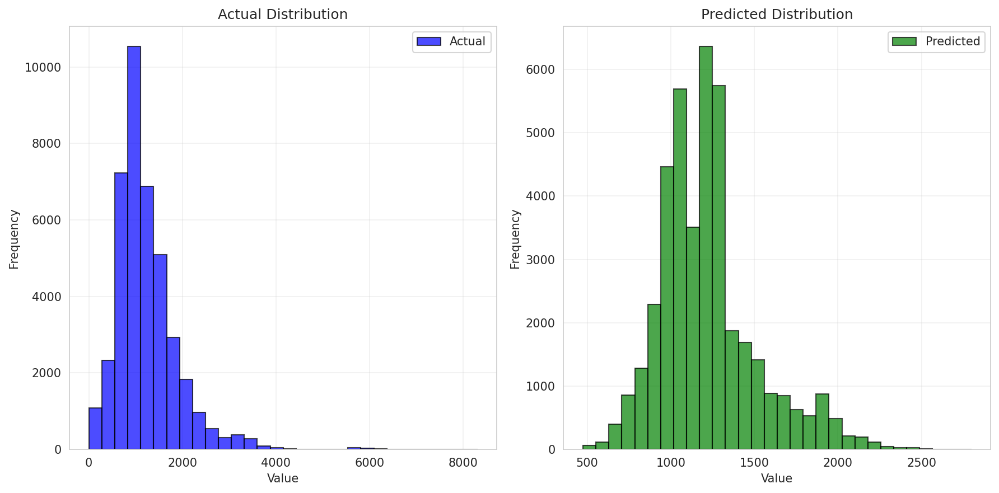

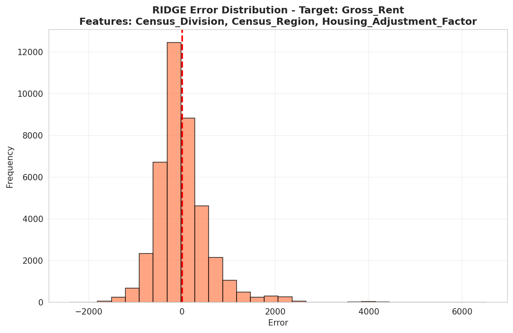

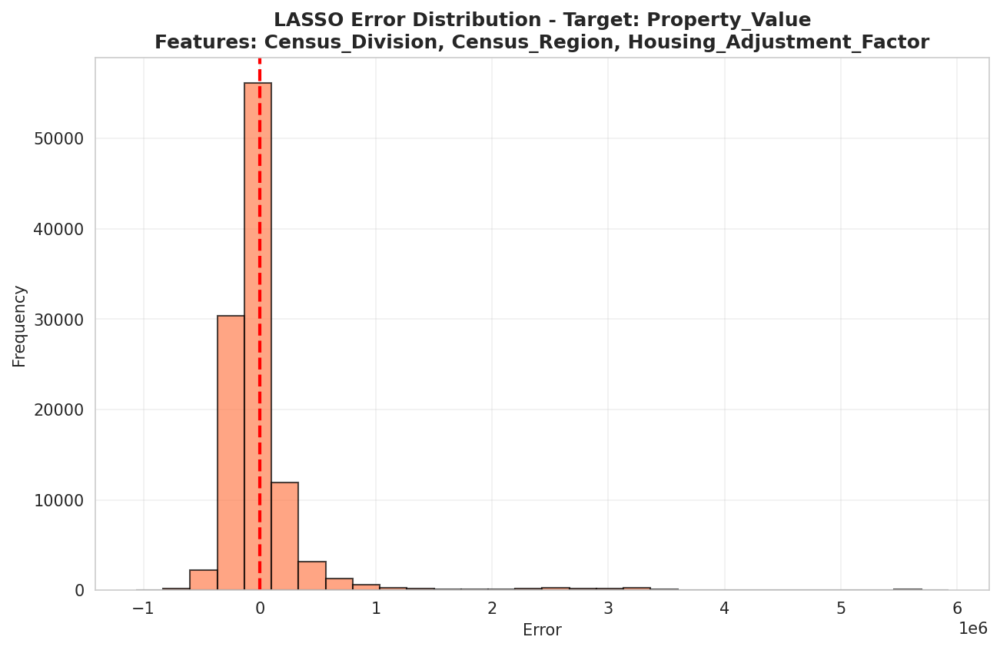

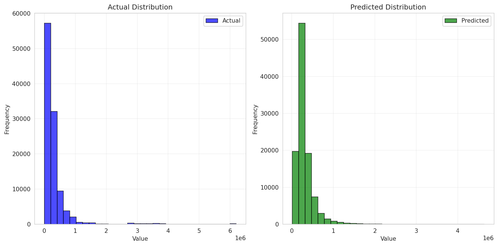

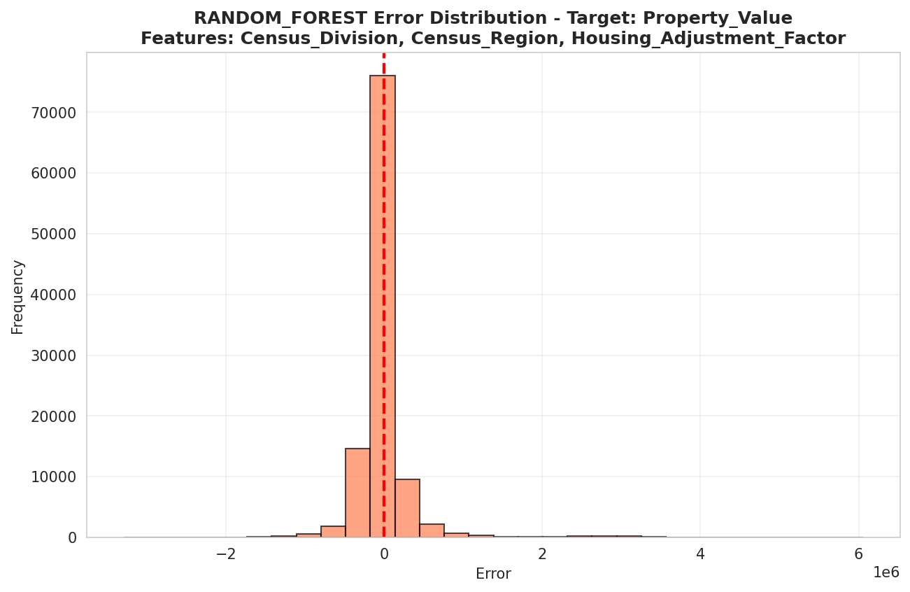

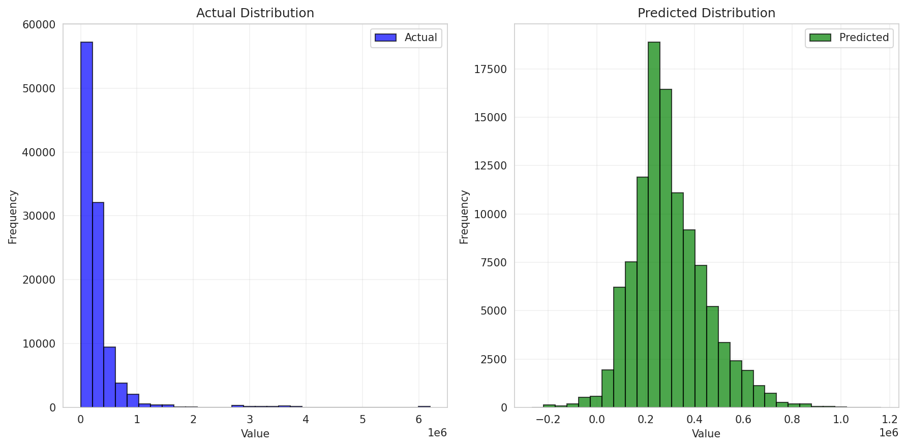

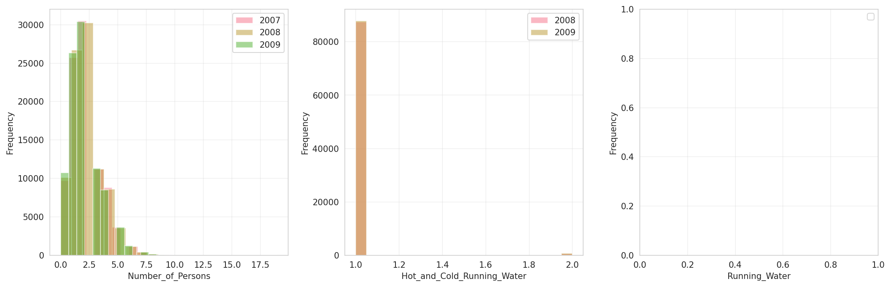

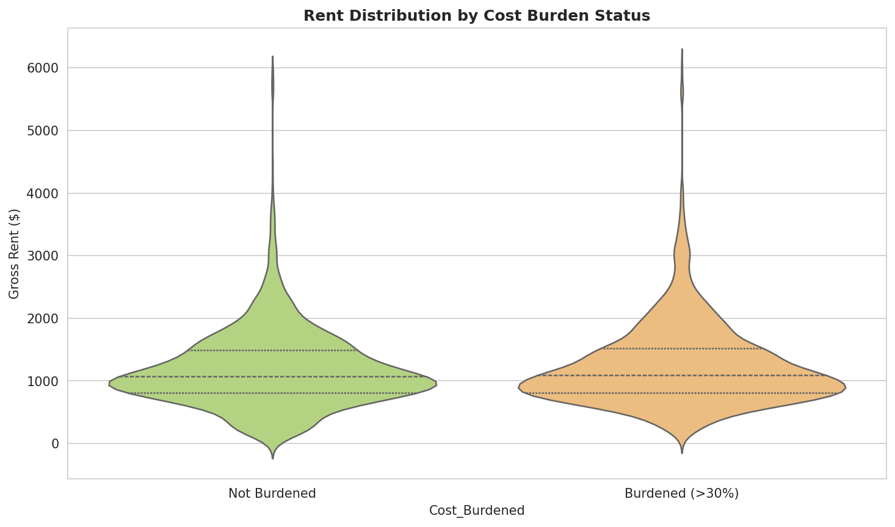

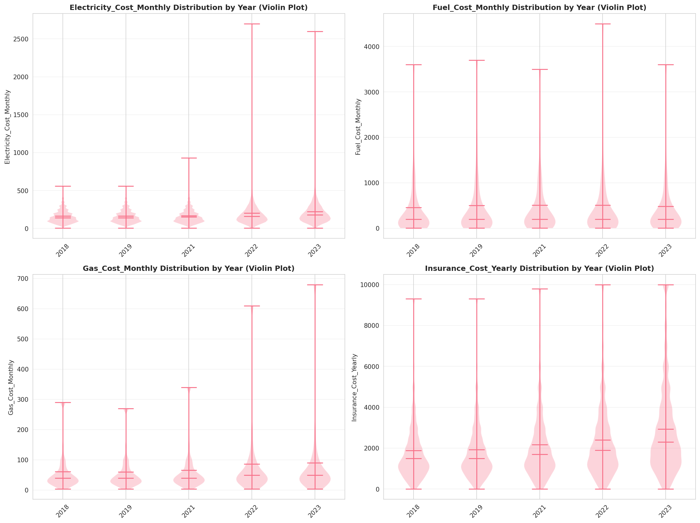

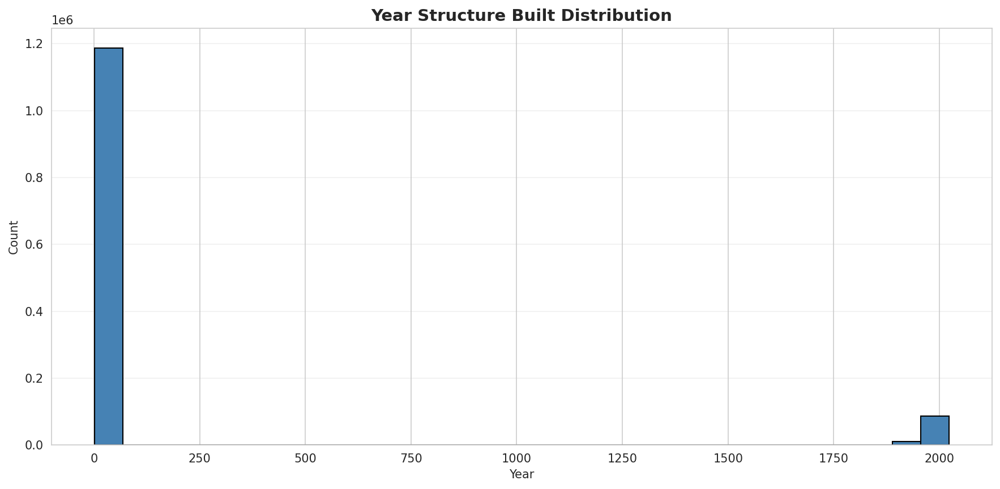

