# Deep Learning Models

> Neural network analysis using TensorFlow/Keras for complex pattern recognition and multi-output prediction tasks.

## Deep Learning Summary

- **Total Tasks**: 5

- **Tasks**: Property Valuation, Affordability Analysis, Housing Quality, Cost Prediction, Occupancy Prediction

### Aggregate Statistics

| Metric | Value |
| :--- | :--- |
| Total Parameters | 78,283 |
| Average Validation Loss | 9585637062.7769 |
| Number of Tasks | 5 |

## Task: Property Valuation

### Model Configuration

| Property | Value |
| :--- | :--- |
| Model Type | HousingValuationModel |
| Task Type | Multi_Output |
| Target Variables | Property_Value, Gross_Rent |
| Number of Targets | 2 |
| Input Features | 10 |

### Network Architecture

| Component | Value | Notes |
| :--- | :--- | :--- |
| Total Layers | 7 | Including input and output |
| Total Parameters | 36,994 | Trainable weights |
| Parameters per Layer | 5,284 | Average |

### Performance Metrics

| Metric | Value | Assessment |
| :--- | :--- | :--- |
| Training Loss | 45569581056.0000 | Final epoch |
| Validation Loss | 47927005184.0000 | Final epoch |
| Loss Gap | 2357424128.0000 | HIGH overfitting risk |

> *Model may be overfitting significantly*

#### Test Set Metrics

| Metric | Value | Description |
| :--- | :--- | :--- |
| MAE | 50381.4688 | Mean Absolute Error (lower is better) |
| MSE | 44486742016.0000 | Mean Squared Error (lower is better) |
| RMSE | 210918.8043 | Root Mean Squared Error (lower is better) |
| R2 | -0.0107 | R-squared (higher is better) |

### Training Analysis

| Training Statistic | Value |
| :--- | :--- |
| Epochs Trained | 75 |
| Initial Training Loss | 55535964160.0000 |
| Final Training Loss | 45569581056.0000 |
| Loss Improvement | 17.9% |
| Initial Validation Loss | 50869100544.0000 |
| Final Validation Loss | 47927005184.0000 |
| Validation Improvement | 5.8% |

#### Convergence Assessment

- **Status**: Fully converged (< 1% change in last 10 epochs)

- **Last 10 epochs change**: 0.05%

## Task: Affordability Analysis

### Model Configuration

| Property | Value |
| :--- | :--- |
| Model Type | HousingAffordabilityModel |
| Task Type | Multi_Output |
| Target Variables | Owner_Costs_Percentage_Income, Gross_Rent_Percentage_Income |
| Number of Targets | 2 |
| Input Features | 10 |

### Network Architecture

| Component | Value | Notes |
| :--- | :--- | :--- |
| Total Layers | 6 | Including input and output |
| Total Parameters | 10,306 | Trainable weights |
| Parameters per Layer | 1,717 | Average |

### Performance Metrics

| Metric | Value | Assessment |
| :--- | :--- | :--- |
| Training Loss | 246.2612 | Final epoch |
| Validation Loss | 244.0669 | Final epoch |
| Loss Gap | -2.1943 | NONE overfitting risk |

> *Good generalization*

#### Test Set Metrics

| Metric | Value | Description |
| :--- | :--- | :--- |
| MAE | 8.0568 | Mean Absolute Error (lower is better) |
| MSE | 245.9884 | Mean Squared Error (lower is better) |
| RMSE | 15.6840 | Root Mean Squared Error (lower is better) |
| R2 | 0.0507 | R-squared (higher is better) |

### Training Analysis

| Training Statistic | Value |
| :--- | :--- |
| Epochs Trained | 75 |
| Initial Training Loss | 274.0541 |
| Final Training Loss | 246.2612 |
| Loss Improvement | 10.1% |
| Initial Validation Loss | 248.8629 |
| Final Validation Loss | 244.0669 |
| Validation Improvement | 1.9% |

#### Convergence Assessment

- **Status**: Fully converged (< 1% change in last 10 epochs)

- **Last 10 epochs change**: 0.04%

## Task: Housing Quality

### Model Configuration

| Property | Value |
| :--- | :--- |
| Model Type | HousingQualityModel |
| Task Type | Multi_Output |
| Target Variables | Year_Structure_Built, Number_of_Bedrooms, Number_of_Rooms |
| Number of Targets | 3 |
| Input Features | 10 |

### Network Architecture

| Component | Value | Notes |
| :--- | :--- | :--- |
| Total Layers | 6 | Including input and output |
| Total Parameters | 10,371 | Trainable weights |
| Parameters per Layer | 1,728 | Average |

### Performance Metrics

| Metric | Value | Assessment |
| :--- | :--- | :--- |
| Training Loss | 9.2769 | Final epoch |
| Validation Loss | 168.4196 | Final epoch |
| Loss Gap | 159.1427 | HIGH overfitting risk |

> *Model may be overfitting significantly*

#### Test Set Metrics

| Metric | Value | Description |
| :--- | :--- | :--- |
| MAE | 2.7102 | Mean Absolute Error (lower is better) |
| MSE | 170.5556 | Mean Squared Error (lower is better) |
| RMSE | 13.0597 | Root Mean Squared Error (lower is better) |
| R2 | 0.8454 | R-squared (higher is better) |

### Training Analysis

| Training Statistic | Value |
| :--- | :--- |
| Epochs Trained | 75 |
| Initial Training Loss | 3567.6125 |
| Final Training Loss | 9.2769 |
| Loss Improvement | 99.7% |
| Initial Validation Loss | 38.5300 |
| Final Validation Loss | 168.4196 |
| Validation Improvement | -337.1% |

#### Convergence Assessment

- **Status**: Still improving (> 5% change)

- **Last 10 epochs change**: 41.36%

## Task: Cost Prediction

### Model Configuration

| Property | Value |
| :--- | :--- |
| Model Type | HousingDefaultModel |
| Task Type | Multi_Output |
| Target Variables | Property_Taxes_Yearly, Insurance_Cost_Yearly |
| Number of Targets | 2 |
| Input Features | 10 |

### Network Architecture

| Component | Value | Notes |
| :--- | :--- | :--- |
| Total Layers | 6 | Including input and output |
| Total Parameters | 10,306 | Trainable weights |
| Parameters per Layer | 1,717 | Average |

### Performance Metrics

| Metric | Value | Assessment |
| :--- | :--- | :--- |
| Training Loss | 1205232.8750 | Final epoch |
| Validation Loss | 1179717.0000 | Final epoch |
| Loss Gap | -25515.8750 | NONE overfitting risk |

> *Good generalization*

#### Test Set Metrics

| Metric | Value | Description |
| :--- | :--- | :--- |
| MAE | 413.2422 | Mean Absolute Error (lower is better) |
| MSE | 1172011.5000 | Mean Squared Error (lower is better) |
| RMSE | 1082.5948 | Root Mean Squared Error (lower is better) |
| R2 | 0.2623 | R-squared (higher is better) |

### Training Analysis

| Training Statistic | Value |
| :--- | :--- |
| Epochs Trained | 75 |
| Initial Training Loss | 1384963.1250 |
| Final Training Loss | 1205232.8750 |
| Loss Improvement | 13.0% |
| Initial Validation Loss | 1296518.5000 |
| Final Validation Loss | 1179717.0000 |
| Validation Improvement | 9.0% |

#### Convergence Assessment

- **Status**: Fully converged (< 1% change in last 10 epochs)

- **Last 10 epochs change**: 0.09%

## Task: Occupancy Prediction

### Model Configuration

| Property | Value |
| :--- | :--- |
| Model Type | HousingDefaultModel |
| Task Type | Multi_Output |
| Target Variables | Vacancy_Status, Tenure |
| Number of Targets | 2 |
| Input Features | 10 |

### Network Architecture

| Component | Value | Notes |
| :--- | :--- | :--- |
| Total Layers | 6 | Including input and output |
| Total Parameters | 10,306 | Trainable weights |
| Parameters per Layer | 1,717 | Average |

### Performance Metrics

| Metric | Value | Assessment |
| :--- | :--- | :--- |
| Training Loss | 0.3983 | Final epoch |
| Validation Loss | 0.3980 | Final epoch |
| Loss Gap | -0.0003 | NONE overfitting risk |

> *Good generalization*

#### Test Set Metrics

| Metric | Value | Description |
| :--- | :--- | :--- |
| MAE | 0.3325 | Mean Absolute Error (lower is better) |
| MSE | 0.4012 | Mean Squared Error (lower is better) |
| RMSE | 0.6334 | Root Mean Squared Error (lower is better) |
| R2 | 0.1802 | R-squared (higher is better) |

### Training Analysis

| Training Statistic | Value |
| :--- | :--- |
| Epochs Trained | 75 |
| Initial Training Loss | 0.5511 |
| Final Training Loss | 0.3983 |
| Loss Improvement | 27.7% |
| Initial Validation Loss | 0.4213 |
| Final Validation Loss | 0.3980 |
| Validation Improvement | 5.5% |

#### Convergence Assessment

- **Status**: Fully converged (< 1% change in last 10 epochs)

- **Last 10 epochs change**: 0.07%

## Cross-Task Comparison

| Task | Model Type | Parameters | Train Loss | Val Loss | Gap |
| :--- | :--- | :--- | :--- | :--- | :--- |
| Property Valuation | HousingValuationModel | 36,994 | 45569581056.0000 | 47927005184.0000 | 2357424128.0000 |
| Affordability Analysis | HousingAffordabilityModel | 10,306 | 246.2612 | 244.0669 | -2.1943 |
| Housing Quality | HousingQualityModel | 10,371 | 9.2769 | 168.4196 | 159.1427 |
| Cost Prediction | HousingDefaultModel | 10,306 | 1205232.8750 | 1179717.0000 | -25515.8750 |
| Occupancy Prediction | HousingDefaultModel | 10,306 | 0.3983 | 0.3980 | -0.0003 |

## Visualizations

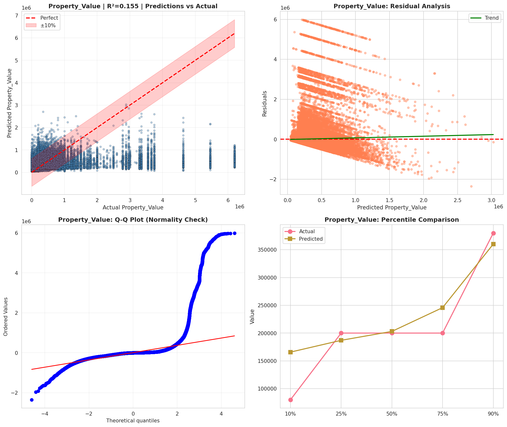

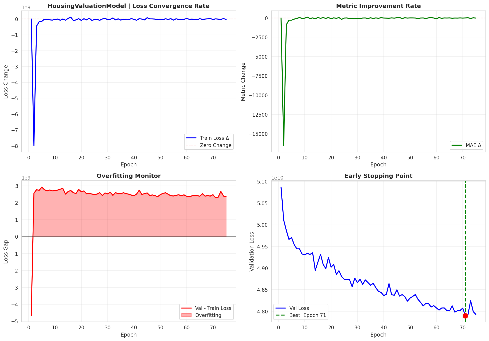

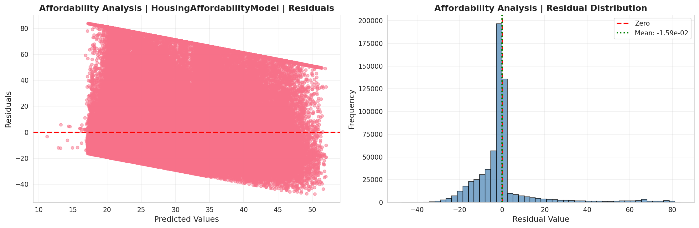

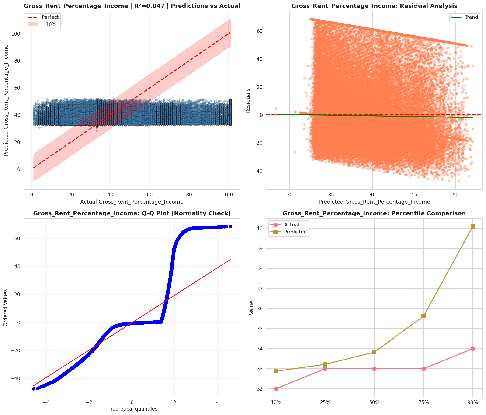

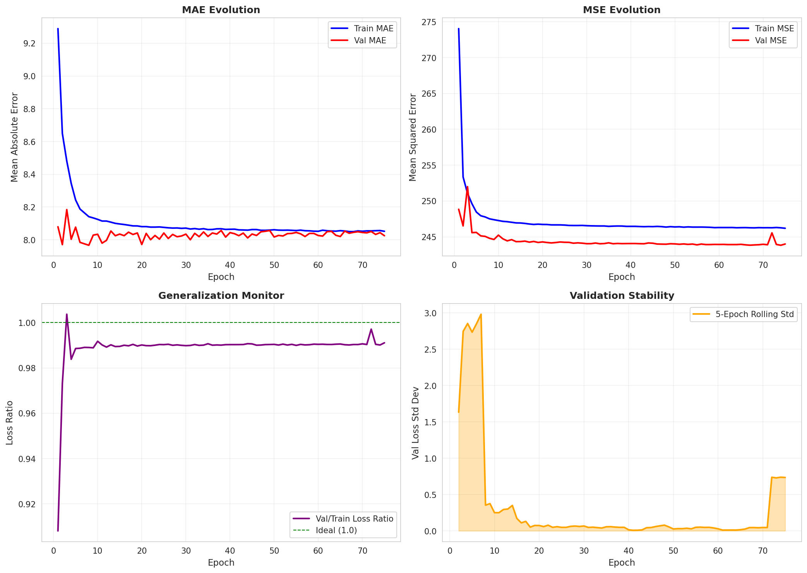

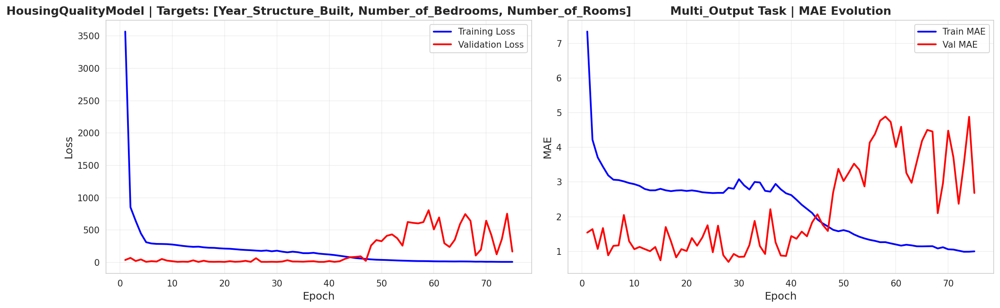

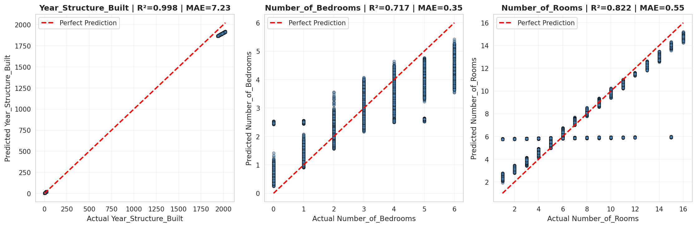

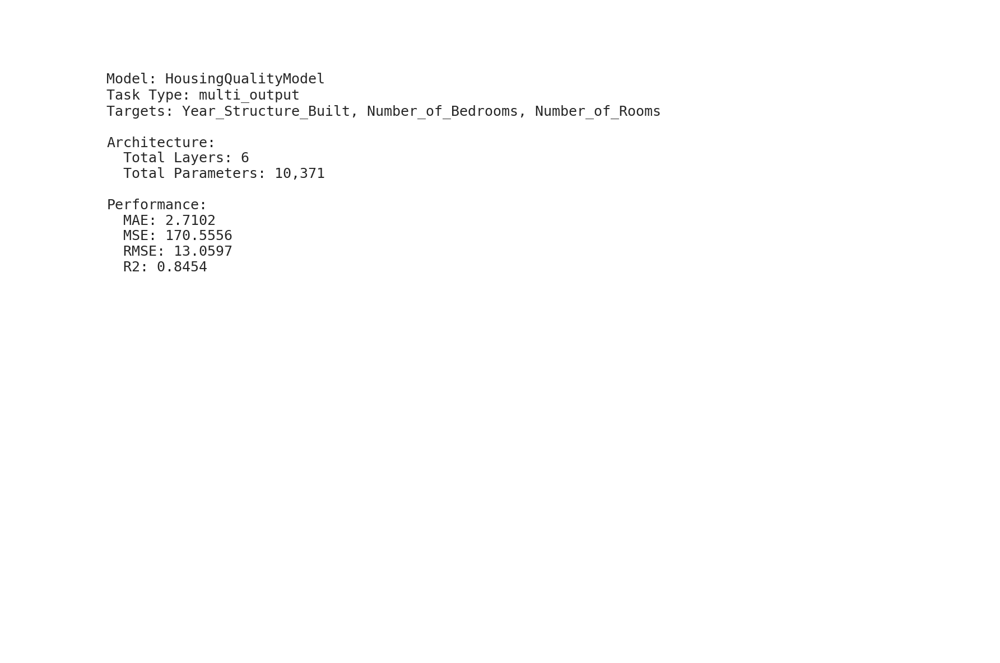

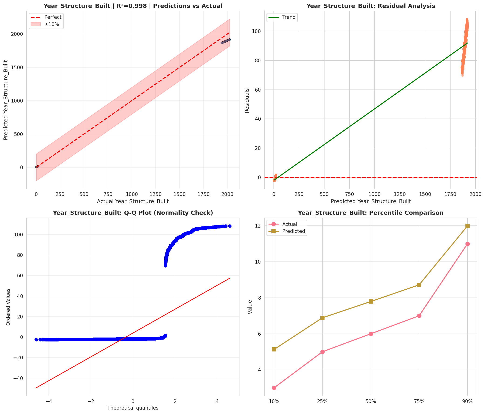

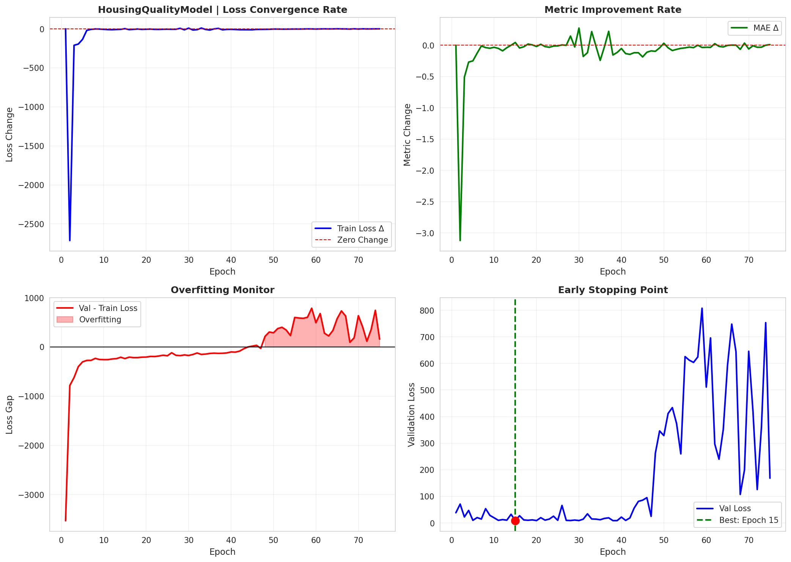

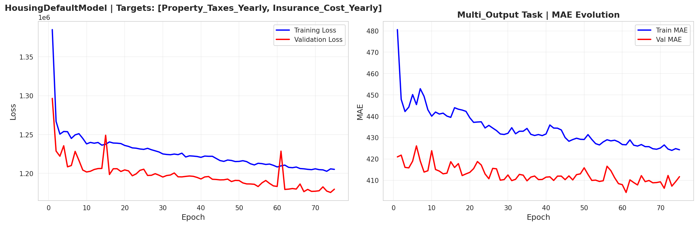

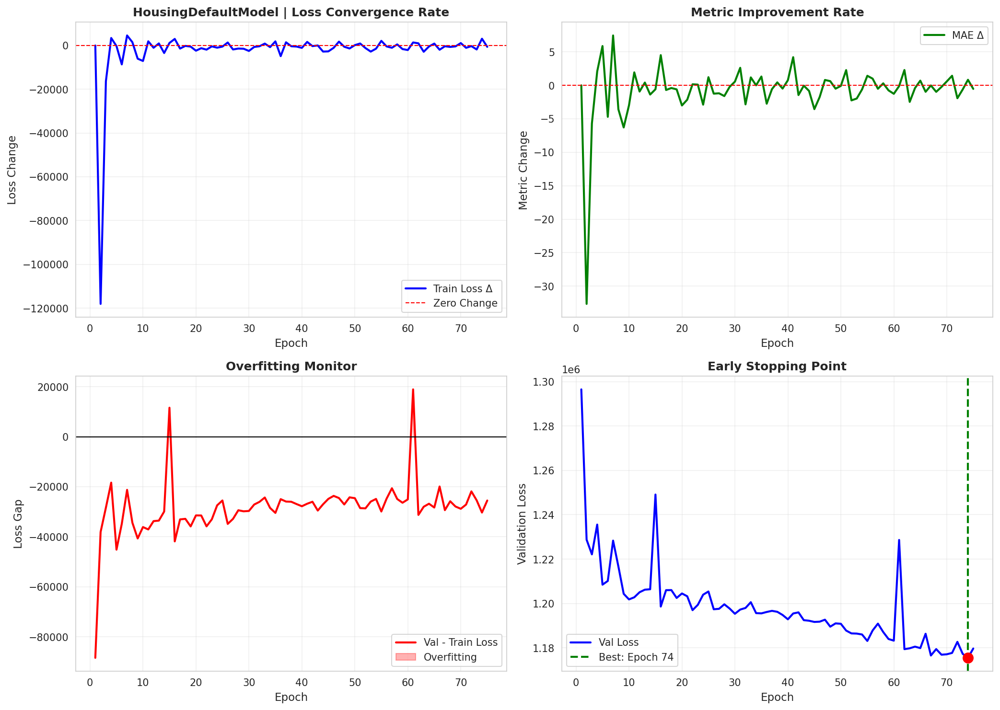

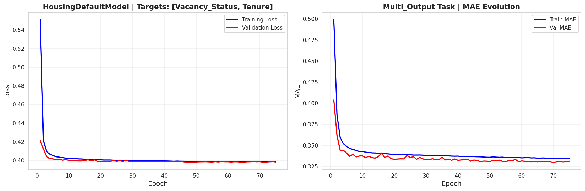

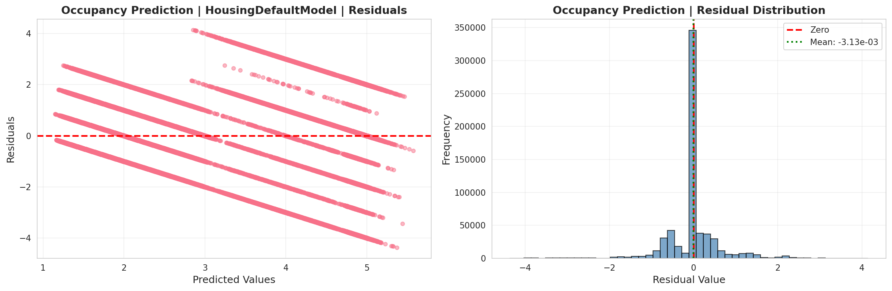

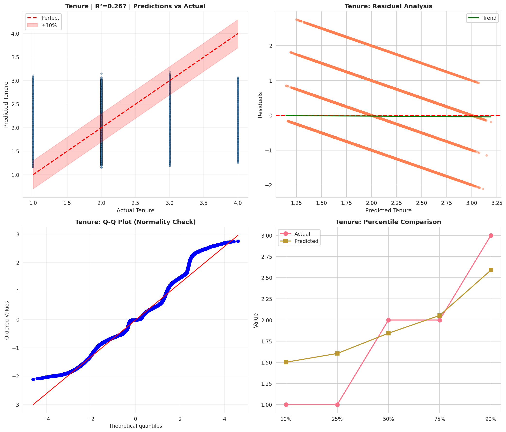

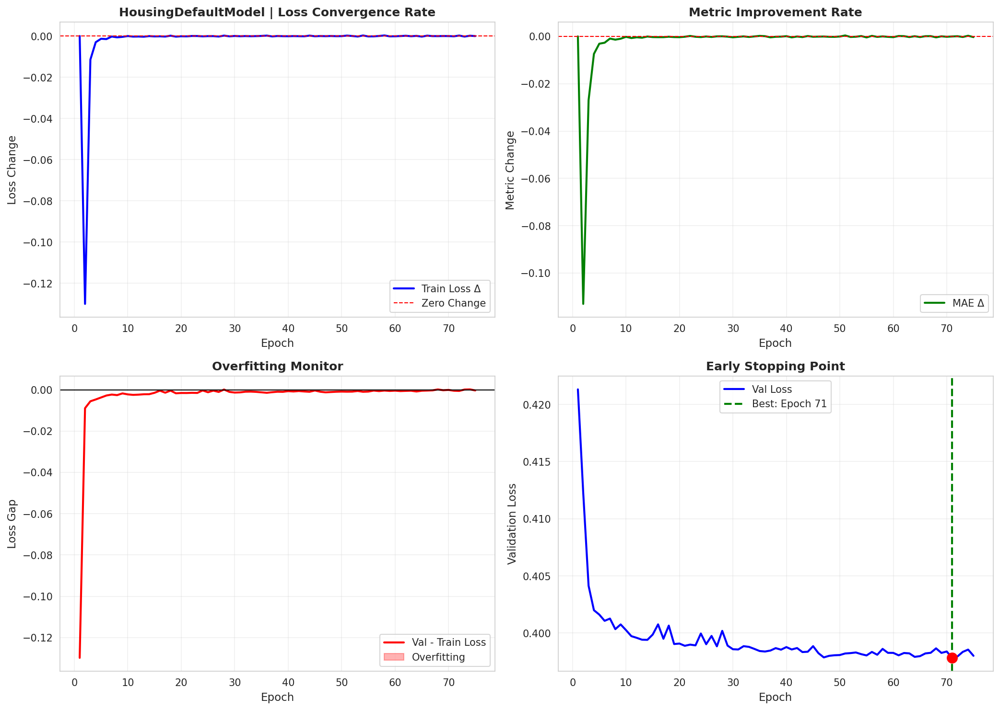

