# Temporal Analysis

> Analysis of data patterns and trends over time, including year-over-year changes and growth rate calculations.

## Year Distribution

### Summary

- **Total Years**: 15

- **Year Range**: 2009 - 2023

- **Total Records**: 7,301,956

- **Average Records/Year**: 486,797

### Records by Year

| Year | Records | % of Total | Deviation from Avg |
| :--- | :--- | :--- | :--- |
| 2009 | 448,479 | 6.1% | -7.9% |
| 2010 | 460,066 | 6.3% | -5.5% |
| 2011 | 469,731 | 6.4% | -3.5% |
| 2012 | 477,095 | 6.5% | -2.0% |
| 2013 | 483,364 | 6.6% | -0.7% |
| 2014 | 489,823 | 6.7% | +0.6% |
| 2015 | 495,958 | 6.8% | +1.9% |
| 2016 | 498,053 | 6.8% | +2.3% |
| 2017 | 501,758 | 6.9% | +3.1% |
| 2018 | 506,964 | 6.9% | +4.1% |
| 2019 | 512,594 | 7.0% | +5.3% |
| 2020 | 483,272 | 6.6% | -0.7% |
| 2021 | 485,138 | 6.6% | -0.3% |
| 2022 | 492,495 | 6.7% | +1.2% |
| 2023 | 497,166 | 6.8% | +2.1% |

> *Sample size increased by 10.9% from 2009 to 2023.*

## Sample Size Consistency

- **Standard Deviation**: 16,834 records

- **Coefficient of Variation**: 3.5 %

- **Consistency Rating**: highly consistent

> *Sample sizes are stable across years.*

## Temporal Trends

### Trend Summary

| Direction | Count | Percentage |
| :--- | :--- | :--- |
| Increasing | 0 | 0.0% |
| Decreasing | 0 | 0.0% |
| Stable/Other | 228 | 100.0% |

## Growth Rates

### Growth Rate Summary

- **Average Growth Rate**: 1,085.60 %

- **Variables with Positive Growth**: 1

- **Variables with Negative Growth**: 0

### Top Growth Rates

| Variable | Growth Rate | Direction |
| :--- | :--- | :--- |
| sample_growth | 1085.60% | Increasing |

## Visualizations

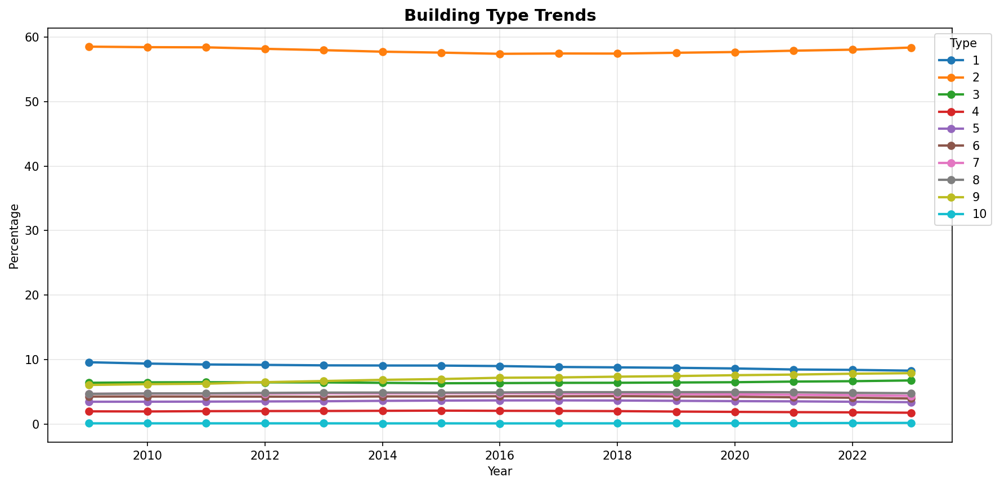

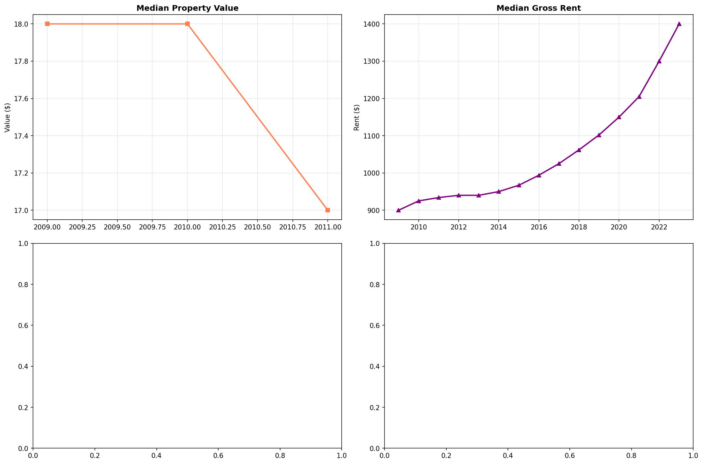

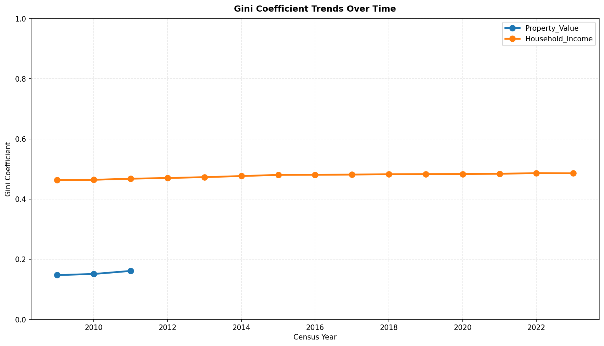

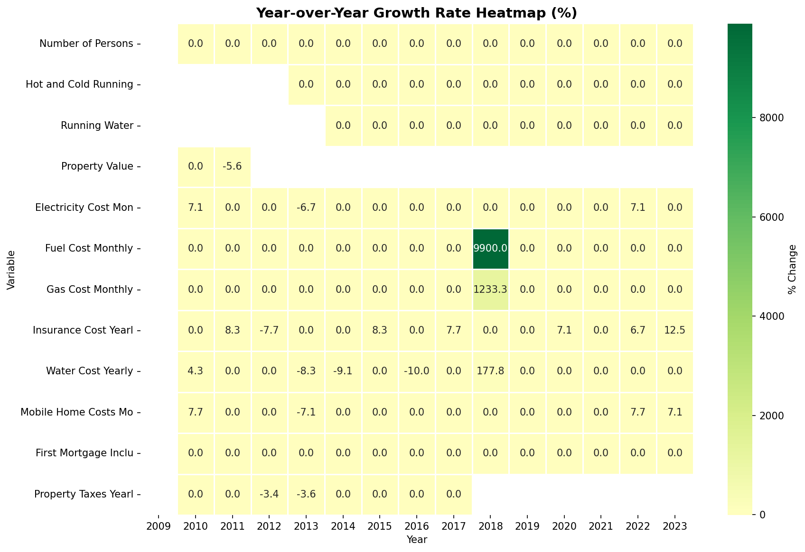

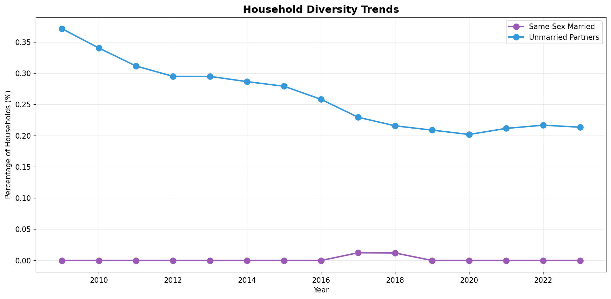

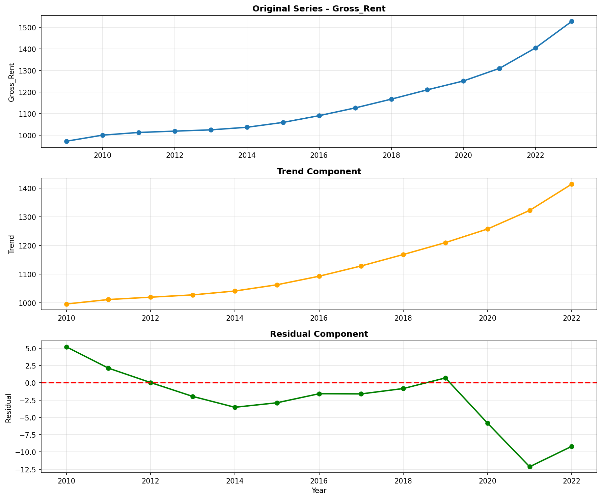

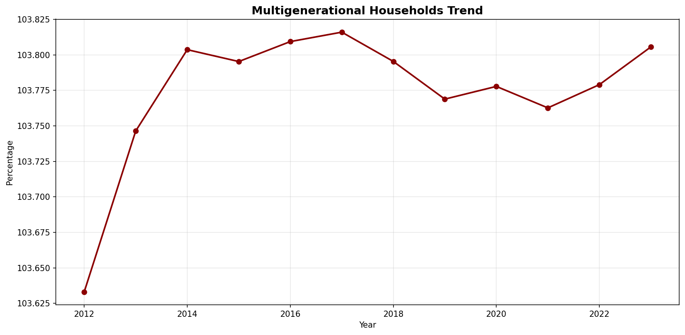

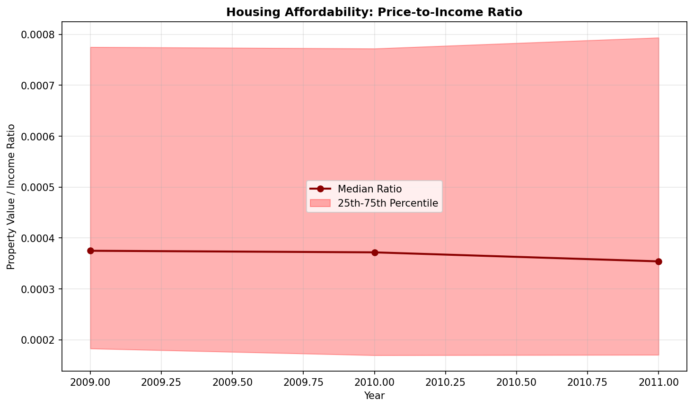

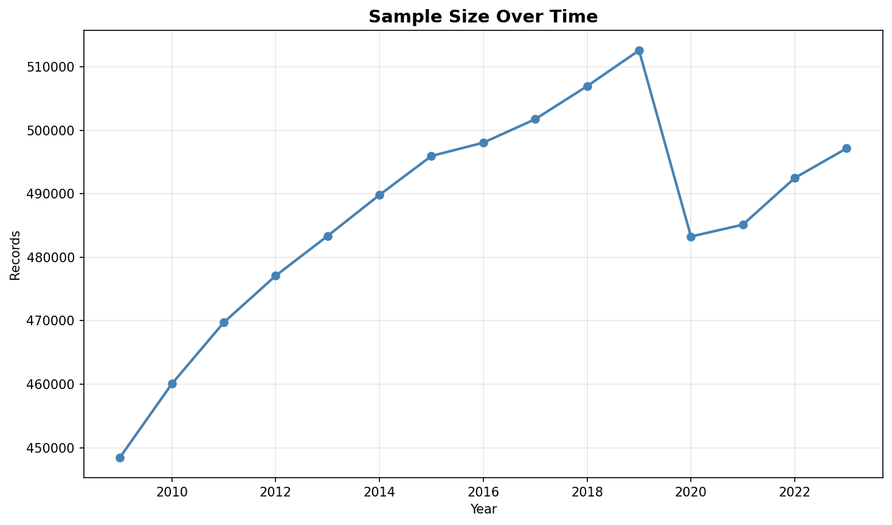

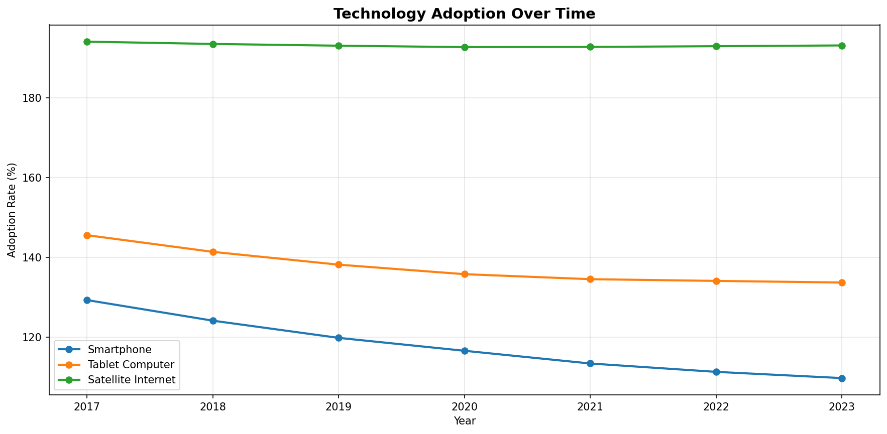

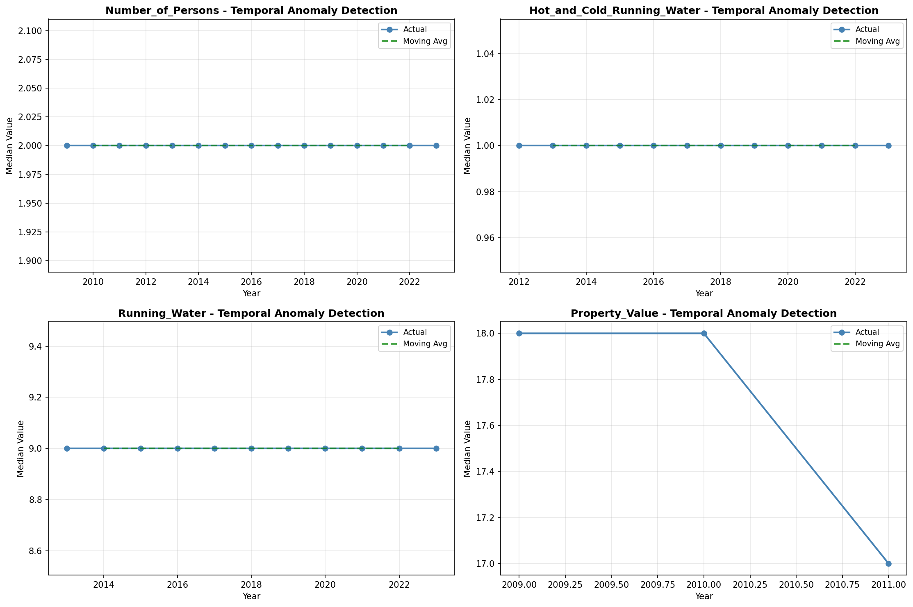

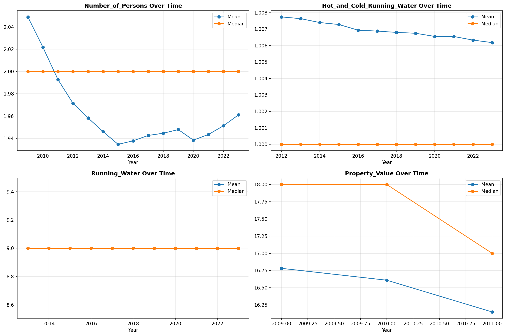

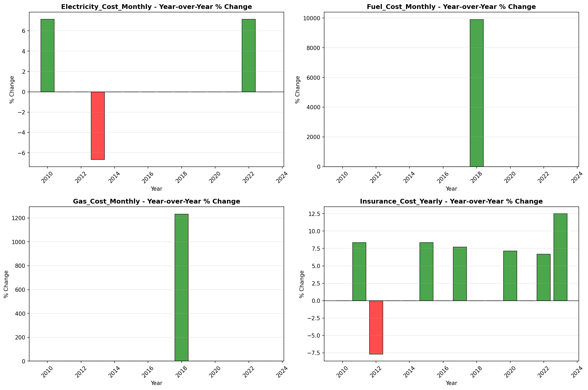

