# Statistical Analysis

> Comprehensive descriptive statistics including central tendency, dispersion, distribution characteristics, and weighted statistics using ACS sample weights.

## Summary Statistics

- **Variables Analyzed**: 37

### Income_Adjustment_Factor

| Statistic | Unweighted | Weighted (ACS) |
| :--- | :--- | :--- |
| Mean | 1,057,675.18 | 1,057,562.15 |
| Median | 1,048,026.00 | 1,059,677.73 |
| Std Deviation | 45,313.50 | — |
| Minimum | 999,480.00 | — |
| Maximum | 1,207,712.00 | — |
| Count | 7,301,956 | — |

> *Distribution is highly right-skewed (skewness: 1.27), light-tailed/platykurtic (kurtosis: 1.56).*

- **Coefficient of Variation**: 4.3 % (low variability)

### Property_Value

| Statistic | Unweighted | Weighted (ACS) |
| :--- | :--- | :--- |
| Mean | 16.51 | 16.47 |
| Median | 18.00 | 17.67 |
| Std Deviation | 4.72 | — |
| Minimum | 1.00 | — |
| Maximum | 24.00 | — |
| Count | 894,049 | — |

> *Distribution is highly left-skewed (skewness: -1.12), light-tailed/platykurtic (kurtosis: 1.29).*

- **Coefficient of Variation**: 28.6 % (moderate variability)

#### Weighted Statistics by Year

| Year | Weighted Mean | Weighted Median |
| :--- | :--- | :--- |
| 2009 | 16.73 | 18.00 |
| 2010 | 16.56 | 18.00 |
| 2011 | 16.11 | 17.00 |

### Electricity_Cost_Monthly

| Statistic | Unweighted | Weighted (ACS) |
| :--- | :--- | :--- |
| Mean | 163.01 | 162.17 |
| Median | 140.00 | 143.33 |
| Std Deviation | 108.70 | — |
| Minimum | 1.00 | — |
| Maximum | 2,700.00 | — |
| Count | 5,890,786 | — |

> *Distribution is highly right-skewed (skewness: 5.00), heavy-tailed/leptokurtic (kurtosis: 92.02).*

- **Coefficient of Variation**: 66.7 % (high variability)

### Fuel_Cost_Monthly

| Statistic | Unweighted | Weighted (ACS) |
| :--- | :--- | :--- |
| Mean | 21.08 | 200.07 |
| Median | 2.00 | 81.20 |
| Std Deviation | 176.19 | — |
| Minimum | 1.00 | — |
| Maximum | 5,900.00 | — |
| Count | 3,586,535 | — |

> *Distribution is highly right-skewed (skewness: 14.71), heavy-tailed/leptokurtic (kurtosis: 269.59).*

- **Coefficient of Variation**: 835.8 % (very high variability)

### Gas_Cost_Monthly

| Statistic | Unweighted | Weighted (ACS) |
| :--- | :--- | :--- |
| Mean | 15.97 | 31.38 |
| Median | 3.00 | 17.80 |
| Std Deviation | 42.85 | — |
| Minimum | 1.00 | — |
| Maximum | 680.00 | — |
| Count | 3,858,516 | — |

> *Distribution is highly right-skewed (skewness: 6.28), heavy-tailed/leptokurtic (kurtosis: 53.60).*

- **Coefficient of Variation**: 268.3 % (very high variability)

### Insurance_Cost_Yearly

| Statistic | Unweighted | Weighted (ACS) |
| :--- | :--- | :--- |
| Mean | 1,801.55 | 1,747.59 |
| Median | 1,400.00 | 1,326.67 |
| Std Deviation | 1,549.04 | — |
| Minimum | 4.00 | — |
| Maximum | 10,000.00 | — |
| Count | 3,565,364 | — |

> *Distribution is highly right-skewed (skewness: 2.29), heavy-tailed/leptokurtic (kurtosis: 7.03).*

- **Coefficient of Variation**: 86.0 % (high variability)

### Water_Cost_Yearly

| Statistic | Unweighted | Weighted (ACS) |
| :--- | :--- | :--- |
| Mean | 471.56 | 488.57 |
| Median | 300.00 | 330.00 |
| Std Deviation | 550.03 | — |
| Minimum | 1.00 | — |
| Maximum | 4,800.00 | — |
| Count | 5,240,670 | — |

> *Distribution is highly right-skewed (skewness: 2.03), heavy-tailed/leptokurtic (kurtosis: 6.72).*

- **Coefficient of Variation**: 116.6 % (very high variability)

### Mobile_Home_Costs_Monthly

| Statistic | Unweighted | Weighted (ACS) |
| :--- | :--- | :--- |
| Mean | 2,759.17 | 2,787.18 |
| Median | 1,300.00 | 1,266.67 |
| Std Deviation | 3,087.54 | — |
| Minimum | 4.00 | — |
| Maximum | 31,500.00 | — |
| Count | 289,253 | — |

> *Distribution is highly right-skewed (skewness: 2.07), heavy-tailed/leptokurtic (kurtosis: 10.03).*

- **Coefficient of Variation**: 111.9 % (very high variability)

### First_Mortgage_Payment_Monthly

| Statistic | Unweighted | Weighted (ACS) |
| :--- | :--- | :--- |
| Mean | 1,248.34 | 1,252.48 |
| Median | 1,100.00 | 1,080.00 |
| Std Deviation | 873.88 | — |
| Minimum | 4.00 | — |
| Maximum | 7,300.00 | — |
| Count | 2,457,764 | — |

> *Distribution is highly right-skewed (skewness: 2.17), heavy-tailed/leptokurtic (kurtosis: 7.44).*

- **Coefficient of Variation**: 70.0 % (high variability)

### First_Mortgage_Includes_Taxes

| Statistic | Unweighted | Weighted (ACS) |
| :--- | :--- | :--- |
| Mean | 1.31 | 1.29 |
| Median | 1.00 | 1.00 |
| Std Deviation | 0.46 | — |
| Minimum | 1.00 | — |
| Maximum | 2.00 | — |
| Count | 2,457,764 | — |

> *Distribution is moderately right-skewed (skewness: 0.83), light-tailed/platykurtic (kurtosis: -1.32).*

- **Coefficient of Variation**: 35.3 % (moderate variability)

### Second_Mortgage_Payment_Monthly

| Statistic | Unweighted | Weighted (ACS) |
| :--- | :--- | :--- |
| Mean | 434.24 | 434.67 |
| Median | 300.00 | 306.00 |
| Std Deviation | 454.64 | — |
| Minimum | 4.00 | — |
| Maximum | 4,700.00 | — |
| Count | 470,865 | — |

> *Distribution is highly right-skewed (skewness: 3.40), heavy-tailed/leptokurtic (kurtosis: 16.68).*

- **Coefficient of Variation**: 104.7 % (very high variability)

### Property_Taxes_Yearly

| Statistic | Unweighted | Weighted (ACS) |
| :--- | :--- | :--- |
| Mean | 30.31 | 30.40 |
| Median | 27.00 | 27.78 |
| Std Deviation | 18.12 | — |
| Minimum | 1.00 | — |
| Maximum | 68.00 | — |
| Count | 2,564,220 | — |

> *Distribution is approximately symmetric (skewness: 0.43), light-tailed/platykurtic (kurtosis: -0.56).*

- **Coefficient of Variation**: 59.8 % (high variability)

### Meals_Included_in_Rent

| Statistic | Unweighted | Weighted (ACS) |
| :--- | :--- | :--- |
| Mean | 1.97 | 1.98 |
| Median | 2.00 | 2.00 |
| Std Deviation | 0.16 | — |
| Minimum | 1.00 | — |
| Maximum | 2.00 | — |
| Count | 1,711,790 | — |

> *Distribution is highly left-skewed (skewness: -5.91), heavy-tailed/leptokurtic (kurtosis: 32.90).*

- **Coefficient of Variation**: 8.1 % (low variability)

### Rent_Amount_Monthly

| Statistic | Unweighted | Weighted (ACS) |
| :--- | :--- | :--- |
| Mean | 1,006.90 | 1,013.57 |
| Median | 890.00 | 922.00 |
| Std Deviation | 595.00 | — |
| Minimum | 4.00 | — |
| Maximum | 5,700.00 | — |
| Count | 1,711,790 | — |

> *Distribution is highly right-skewed (skewness: 2.21), heavy-tailed/leptokurtic (kurtosis: 9.68).*

- **Coefficient of Variation**: 59.1 % (high variability)

### Gross_Rent

| Statistic | Unweighted | Weighted (ACS) |
| :--- | :--- | :--- |
| Mean | 1,149.76 | 1,154.72 |
| Median | 1,035.00 | 1,066.40 |
| Std Deviation | 595.21 | — |
| Minimum | 4.00 | — |
| Maximum | 9,672.00 | — |
| Count | 1,573,397 | — |

> *Distribution is highly right-skewed (skewness: 1.90), heavy-tailed/leptokurtic (kurtosis: 7.85).*

- **Coefficient of Variation**: 51.8 % (high variability)

### Gross_Rent_Percentage_Income

| Statistic | Unweighted | Weighted (ACS) |
| :--- | :--- | :--- |
| Mean | 42.37 | 42.78 |
| Median | 33.00 | 33.73 |
| Std Deviation | 27.51 | — |
| Minimum | 1.00 | — |
| Maximum | 101.00 | — |
| Count | 1,536,313 | — |

> *Distribution is moderately right-skewed (skewness: 0.99), light-tailed/platykurtic (kurtosis: -0.15).*

- **Coefficient of Variation**: 64.9 % (high variability)

### Selected_Monthly_Owner_Costs

| Statistic | Unweighted | Weighted (ACS) |
| :--- | :--- | :--- |
| Mean | 1,269.64 | 1,279.99 |
| Median | 997.00 | 1,035.87 |
| Std Deviation | 1,078.53 | — |
| Minimum | 1.00 | — |
| Maximum | 17,028.00 | — |
| Count | 4,291,533 | — |

> *Distribution is highly right-skewed (skewness: 2.47), heavy-tailed/leptokurtic (kurtosis: 10.42).*

- **Coefficient of Variation**: 84.9 % (high variability)

### Owner_Costs_Percentage_Income

| Statistic | Unweighted | Weighted (ACS) |
| :--- | :--- | :--- |
| Mean | 26.72 | 27.52 |
| Median | 19.00 | 20.20 |
| Std Deviation | 23.62 | — |
| Minimum | 1.00 | — |
| Maximum | 101.00 | — |
| Count | 4,244,890 | — |

> *Distribution is highly right-skewed (skewness: 1.76), light-tailed/platykurtic (kurtosis: 2.70).*

- **Coefficient of Variation**: 88.4 % (high variability)

### Family_Income

| Statistic | Unweighted | Weighted (ACS) |
| :--- | :--- | :--- |
| Mean | 89,822.46 | 84,152.98 |
| Median | 64,100.00 | 61,253.33 |
| Std Deviation | 96,556.04 | — |
| Minimum | 1.00 | — |
| Maximum | 2,481,200.00 | — |
| Count | 3,804,592 | — |

> *Distribution is highly right-skewed (skewness: 3.87), heavy-tailed/leptokurtic (kurtosis: 24.14).*

- **Coefficient of Variation**: 107.5 % (very high variability)

### Household_Income

| Statistic | Unweighted | Weighted (ACS) |
| :--- | :--- | :--- |
| Mean | 76,540.06 | 72,600.31 |
| Median | 52,400.00 | 51,113.33 |
| Std Deviation | 88,376.45 | — |
| Minimum | 1.00 | — |
| Maximum | 2,481,200.00 | — |
| Count | 5,866,112 | — |

> *Distribution is highly right-skewed (skewness: 4.11), heavy-tailed/leptokurtic (kurtosis: 27.81).*

- **Coefficient of Variation**: 115.5 % (very high variability)

### Specified_Rent_Unit

| Statistic | Unweighted | Weighted (ACS) |
| :--- | :--- | :--- |
| Mean | 0.27 | 0.30 |
| Median | 0.00 | 0.00 |
| Std Deviation | 0.44 | — |
| Minimum | 0.00 | — |
| Maximum | 1.00 | — |
| Count | 6,752,018 | — |

> *Distribution is highly right-skewed (skewness: 1.06), light-tailed/platykurtic (kurtosis: -0.88).*

- **Coefficient of Variation**: 166.1 % (very high variability)

### Specified_Value_Unit

| Statistic | Unweighted | Weighted (ACS) |
| :--- | :--- | :--- |
| Mean | 0.50 | 0.44 |
| Median | 1.00 | 0.00 |
| Std Deviation | 0.50 | — |
| Minimum | 0.00 | — |
| Maximum | 1.00 | — |
| Count | 6,752,018 | — |

> *Distribution is approximately symmetric (skewness: -0.02), light-tailed/platykurtic (kurtosis: -2.00).*

- **Coefficient of Variation**: 99.1 % (high variability)

### Flag_First_Mortgage_Payment

| Statistic | Unweighted | Weighted (ACS) |
| :--- | :--- | :--- |
| Mean | 0.04 | 0.04 |
| Median | 0.00 | 0.00 |
| Std Deviation | 0.20 | — |
| Minimum | 0.00 | — |
| Maximum | 1.00 | — |
| Count | 6,752,018 | — |

> *Distribution is highly right-skewed (skewness: 4.65), heavy-tailed/leptokurtic (kurtosis: 19.67).*

- **Coefficient of Variation**: 486.0 % (very high variability)

### Flag_First_Mortgage_Taxes

| Statistic | Unweighted | Weighted (ACS) |
| :--- | :--- | :--- |
| Mean | 0.03 | 0.04 |
| Median | 0.00 | 0.00 |
| Std Deviation | 0.18 | — |
| Minimum | 0.00 | — |
| Maximum | 1.00 | — |
| Count | 6,752,018 | — |

> *Distribution is highly right-skewed (skewness: 5.08), heavy-tailed/leptokurtic (kurtosis: 23.84).*

- **Coefficient of Variation**: 527.3 % (very high variability)

### Flag_Meals_Included_Rent

| Statistic | Unweighted | Weighted (ACS) |
| :--- | :--- | :--- |
| Mean | 0.01 | 0.01 |
| Median | 0.00 | 0.00 |
| Std Deviation | 0.08 | — |
| Minimum | 0.00 | — |
| Maximum | 1.00 | — |
| Count | 6,752,018 | — |

> *Distribution is highly right-skewed (skewness: 11.83), heavy-tailed/leptokurtic (kurtosis: 137.93).*

- **Coefficient of Variation**: 1,191.3 % (very high variability)

### Flag_Rent_Amount

| Statistic | Unweighted | Weighted (ACS) |
| :--- | :--- | :--- |
| Mean | 0.03 | 0.04 |
| Median | 0.00 | 0.00 |
| Std Deviation | 0.16 | — |
| Minimum | 0.00 | — |
| Maximum | 1.00 | — |
| Count | 6,752,018 | — |

> *Distribution is highly right-skewed (skewness: 5.90), heavy-tailed/leptokurtic (kurtosis: 32.79).*

- **Coefficient of Variation**: 606.3 % (very high variability)

### Flag_Second_Mortgage_Payment

| Statistic | Unweighted | Weighted (ACS) |
| :--- | :--- | :--- |
| Mean | 0.03 | 0.04 |
| Median | 0.00 | 0.00 |
| Std Deviation | 0.18 | — |
| Minimum | 0.00 | — |
| Maximum | 1.00 | — |
| Count | 6,752,018 | — |

> *Distribution is highly right-skewed (skewness: 5.12), heavy-tailed/leptokurtic (kurtosis: 24.24).*

- **Coefficient of Variation**: 531.0 % (very high variability)

### Flag_Property_Taxes

| Statistic | Unweighted | Weighted (ACS) |
| :--- | :--- | :--- |
| Mean | 0.09 | 0.09 |
| Median | 0.00 | 0.00 |
| Std Deviation | 0.28 | — |
| Minimum | 0.00 | — |
| Maximum | 1.00 | — |
| Count | 6,752,018 | — |

> *Distribution is highly right-skewed (skewness: 2.89), heavy-tailed/leptokurtic (kurtosis: 6.34).*

- **Coefficient of Variation**: 320.1 % (very high variability)

### Flag_Property_Value

| Statistic | Unweighted | Weighted (ACS) |
| :--- | :--- | :--- |
| Mean | 0.07 | 0.07 |
| Median | 0.00 | 0.00 |
| Std Deviation | 0.26 | — |
| Minimum | 0.00 | — |
| Maximum | 1.00 | — |
| Count | 6,752,018 | — |

> *Distribution is highly right-skewed (skewness: 3.34), heavy-tailed/leptokurtic (kurtosis: 9.19).*

- **Coefficient of Variation**: 362.1 % (very high variability)

### Flag_Water_Cost

| Statistic | Unweighted | Weighted (ACS) |
| :--- | :--- | :--- |
| Mean | 0.07 | 0.08 |
| Median | 0.00 | 0.00 |
| Std Deviation | 0.26 | — |
| Minimum | 0.00 | — |
| Maximum | 1.00 | — |
| Count | 6,752,018 | — |

> *Distribution is highly right-skewed (skewness: 3.34), heavy-tailed/leptokurtic (kurtosis: 9.14).*

- **Coefficient of Variation**: 361.4 % (very high variability)

### Annual_Rent_to_Value_Ratio

### Total_Monthly_Utility_Cost

| Statistic | Unweighted | Weighted (ACS) |
| :--- | :--- | :--- |
| Mean | 173.38 | 171.29 |
| Median | 150.00 | 149.60 |
| Std Deviation | 117.88 | — |
| Minimum | 2.00 | — |
| Maximum | 3,310.00 | — |
| Count | 5,894,002 | — |

> *Distribution is highly right-skewed (skewness: 4.69), heavy-tailed/leptokurtic (kurtosis: 77.73).*

- **Coefficient of Variation**: 68.0 % (high variability)

### Property_Tax_Rate

| Statistic | Unweighted | Weighted (ACS) |
| :--- | :--- | :--- |
| Mean | 182.40 | 182.67 |
| Median | 175.00 | 174.23 |
| Std Deviation | 96.00 | — |
| Minimum | 4.17 | — |
| Maximum | 2,300.00 | — |
| Count | 871,116 | — |

> *Distribution is highly right-skewed (skewness: 3.05), heavy-tailed/leptokurtic (kurtosis: 41.72).*

- **Coefficient of Variation**: 52.6 % (high variability)

#### Weighted Statistics by Year

| Year | Weighted Mean | Weighted Median |
| :--- | :--- | :--- |
| 2009 | 177.44 | 168.75 |
| 2010 | 182.87 | 175.00 |
| 2011 | 187.70 | 178.95 |

### Structure_Age

| Statistic | Unweighted | Weighted (ACS) |
| :--- | :--- | :--- |
| Mean | 2,018.32 | 2,018.21 |
| Median | 2,019.00 | 2,018.50 |
| Std Deviation | 2.73 | — |
| Minimum | 2,000.00 | — |
| Maximum | 2,023.00 | — |
| Count | 5,415,804 | — |

> *Distribution is highly left-skewed (skewness: -1.64), heavy-tailed/leptokurtic (kurtosis: 6.06).*

- **Coefficient of Variation**: 0.1 % (low variability)

### Structure_Age_Score

| Statistic | Unweighted | Weighted (ACS) |
| :--- | :--- | :--- |
| Mean | 0.00 | 0.00 |
| Median | 0.00 | 0.00 |
| Std Deviation | 0.00 | — |
| Minimum | 0.00 | — |
| Maximum | 0.00 | — |
| Count | 5,415,804 | — |

> *Distribution is approximately symmetric (skewness: nan).*

### Working_Age_Persons

| Statistic | Unweighted | Weighted (ACS) |
| :--- | :--- | :--- |
| Mean | 1.53 | 1.63 |
| Median | 1.00 | 1.87 |
| Std Deviation | 1.32 | — |
| Minimum | 0.00 | — |
| Maximum | 19.00 | — |
| Count | 5,956,447 | — |

> *Distribution is moderately right-skewed (skewness: 0.92), light-tailed/platykurtic (kurtosis: 1.73).*

- **Coefficient of Variation**: 86.4 % (high variability)

### Income_to_FPL_Ratio

| Statistic | Unweighted | Weighted (ACS) |
| :--- | :--- | :--- |
| Mean | 3.56 | 3.34 |
| Median | 2.49 | 2.39 |
| Std Deviation | 4.16 | — |
| Minimum | -1.50 | — |
| Maximum | 120.08 | — |
| Count | 5,956,447 | — |

> *Distribution is highly right-skewed (skewness: 4.43), heavy-tailed/leptokurtic (kurtosis: 31.80).*

- **Coefficient of Variation**: 116.9 % (very high variability)

## Distribution Analysis

### Skewed Distributions

> Variables with skewness > |0.5| indicate non-normal distributions. Consider log transformations for highly skewed variables in modeling.

| Variable | Skewness | Direction | Severity |
| :--- | :--- | :--- | :--- |
| Fuel_Cost_Monthly | 14.709 | Right-skewed | High |
| Flag_Meals_Included_Rent | 11.829 | Right-skewed | High |
| Gas_Cost_Monthly | 6.281 | Right-skewed | High |
| Meals_Included_in_Rent | -5.908 | Left-skewed | High |
| Flag_Rent_Amount | 5.898 | Right-skewed | High |
| Flag_Second_Mortgage_Payment | 5.122 | Right-skewed | High |
| Flag_First_Mortgage_Taxes | 5.084 | Right-skewed | High |
| Electricity_Cost_Monthly | 4.997 | Right-skewed | High |
| Total_Monthly_Utility_Cost | 4.687 | Right-skewed | High |
| Flag_First_Mortgage_Payment | 4.655 | Right-skewed | High |
| Income_to_FPL_Ratio | 4.431 | Right-skewed | High |
| Household_Income | 4.110 | Right-skewed | High |
| Family_Income | 3.868 | Right-skewed | High |
| Second_Mortgage_Payment_Monthly | 3.403 | Right-skewed | High |
| Flag_Property_Value | 3.345 | Right-skewed | High |
| Flag_Water_Cost | 3.337 | Right-skewed | High |
| Property_Tax_Rate | 3.049 | Right-skewed | High |
| Flag_Property_Taxes | 2.889 | Right-skewed | High |
| Selected_Monthly_Owner_Costs | 2.469 | Right-skewed | High |
| Insurance_Cost_Yearly | 2.294 | Right-skewed | High |

- **Total Skewed Variables**: 33

- **Right-skewed**: 30

- **Left-skewed**: 3

## Variance Analysis

### Coefficient of Variation Ranking

> CV (Coefficient of Variation) = (Std Dev / Mean) × 100%. Higher CV indicates greater relative variability.

| Variable | CV (%) | Std Dev | Mean | Variability |
| :--- | :--- | :--- | :--- | :--- |
| Flag_Meals_Included_Rent | 1191.3% | 0.08 | 0.01 | Very High |
| Fuel_Cost_Monthly | 835.8% | 176.19 | 21.08 | Very High |
| Flag_Rent_Amount | 606.3% | 0.16 | 0.03 | Very High |
| Flag_Second_Mortgage_Payment | 531.0% | 0.18 | 0.03 | Very High |
| Flag_First_Mortgage_Taxes | 527.3% | 0.18 | 0.03 | Very High |
| Flag_First_Mortgage_Payment | 486.0% | 0.20 | 0.04 | Very High |
| Flag_Property_Value | 362.1% | 0.26 | 0.07 | Very High |
| Flag_Water_Cost | 361.4% | 0.26 | 0.07 | Very High |
| Flag_Property_Taxes | 320.1% | 0.28 | 0.09 | Very High |
| Gas_Cost_Monthly | 268.3% | 42.85 | 15.97 | Very High |
| Specified_Rent_Unit | 166.1% | 0.44 | 0.27 | Very High |
| Income_to_FPL_Ratio | 116.9% | 4.16 | 3.56 | Very High |
| Water_Cost_Yearly | 116.6% | 550.03 | 471.56 | Very High |
| Household_Income | 115.5% | 88,376.45 | 76,540.06 | Very High |
| Mobile_Home_Costs_Monthly | 111.9% | 3,087.54 | 2,759.17 | Very High |
| Family_Income | 107.5% | 96,556.04 | 89,822.46 | Very High |
| Second_Mortgage_Payment_Monthly | 104.7% | 454.64 | 434.24 | Very High |
| Specified_Value_Unit | 99.1% | 0.50 | 0.50 | High |
| Owner_Costs_Percentage_Income | 88.4% | 23.62 | 26.72 | High |
| Working_Age_Persons | 86.4% | 1.32 | 1.53 | High |

- **Average CV**: 209.8 %

- **High Variance Variables (CV > 50%)**: 30

## Visualizations

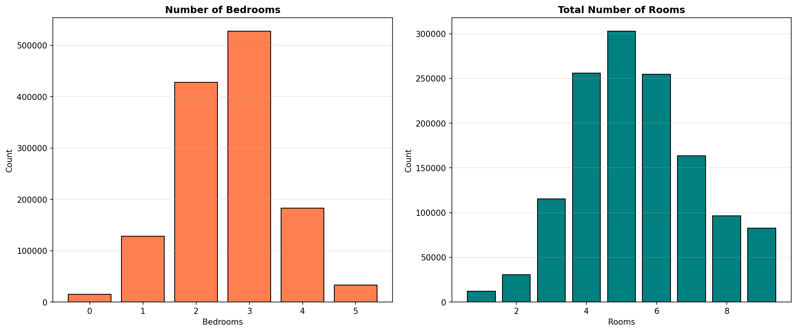

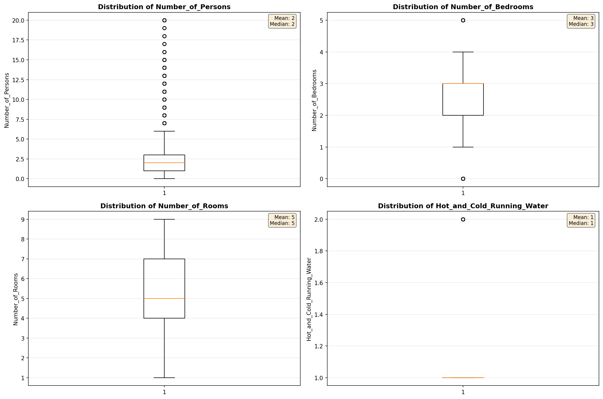

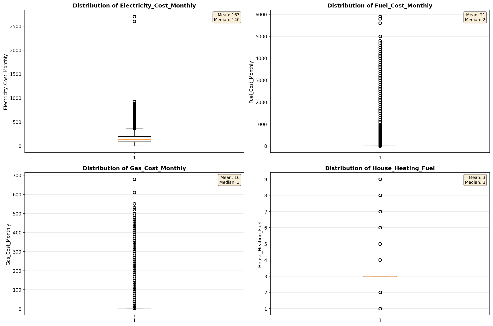

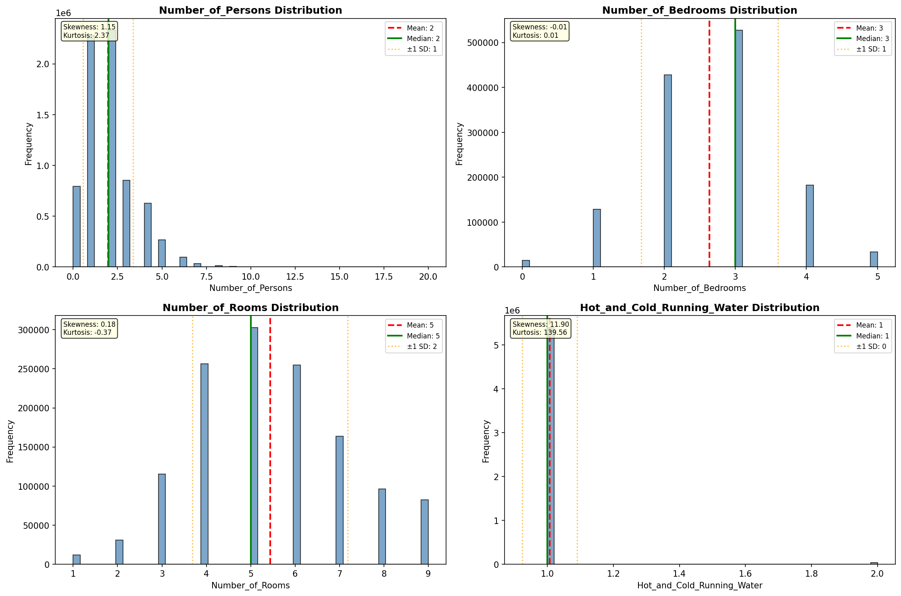

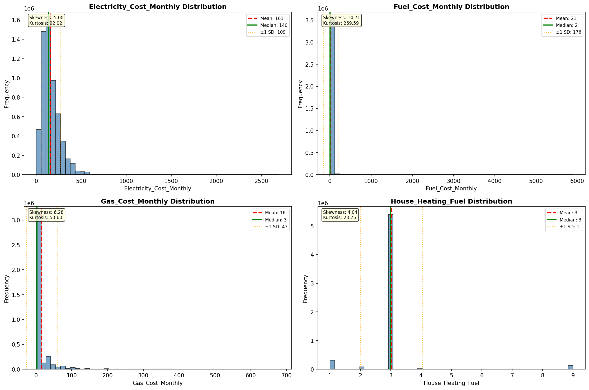

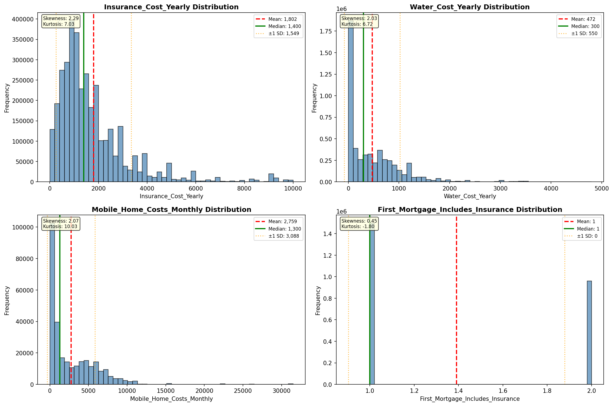

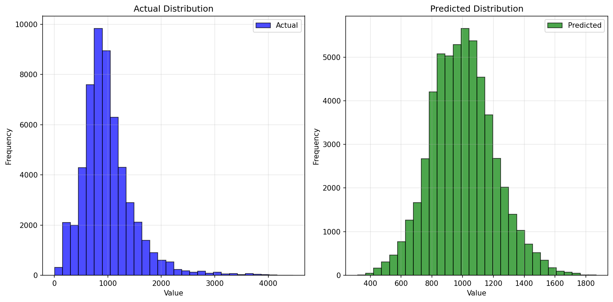

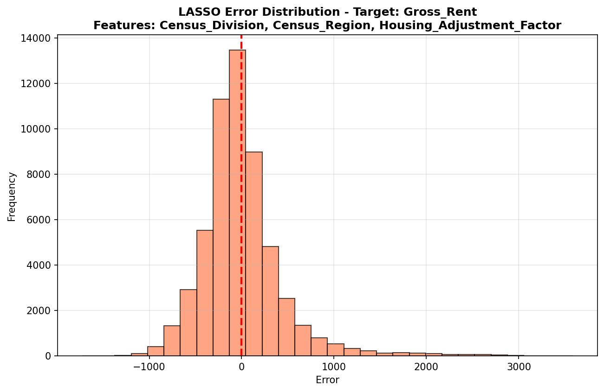

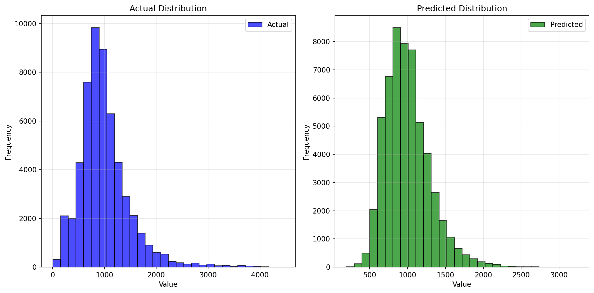

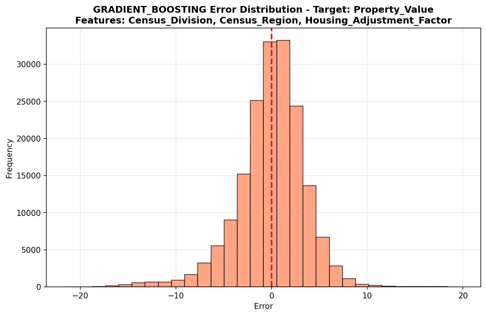

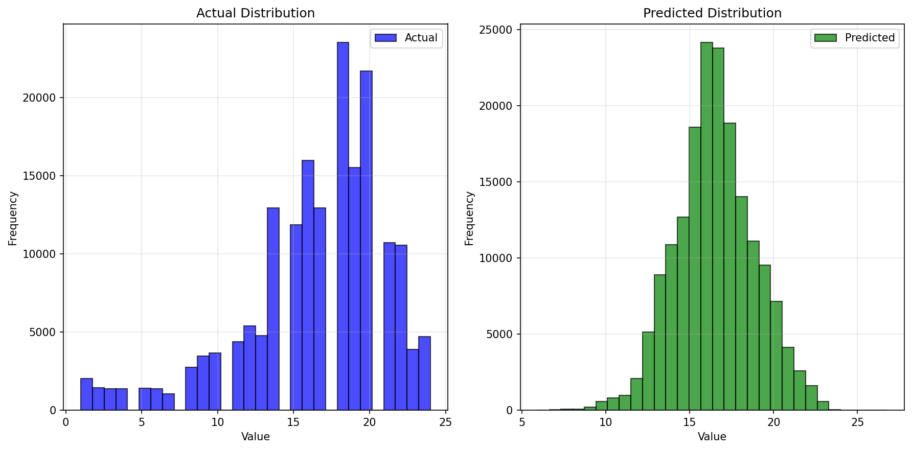

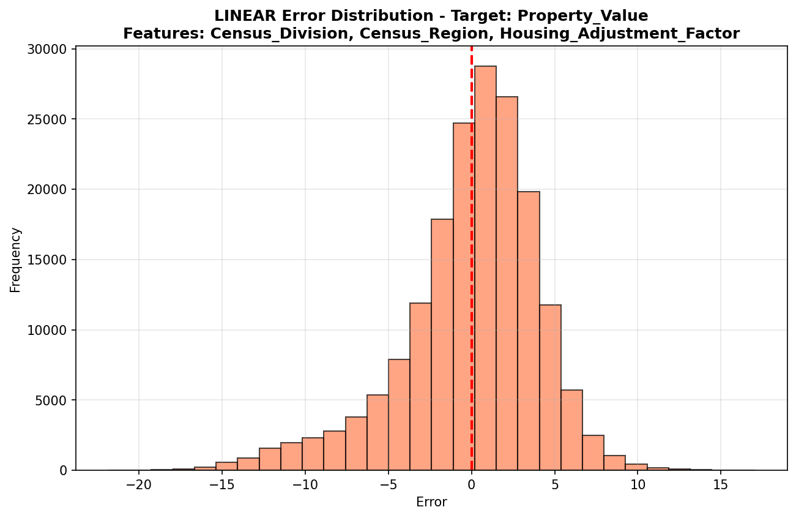

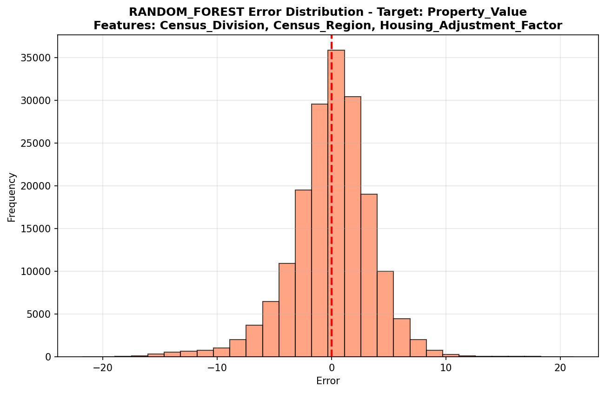

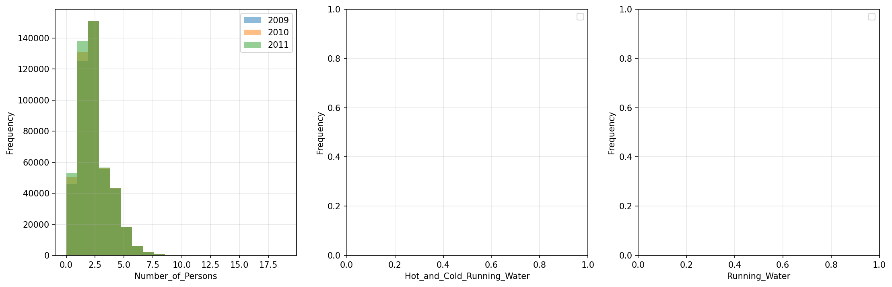

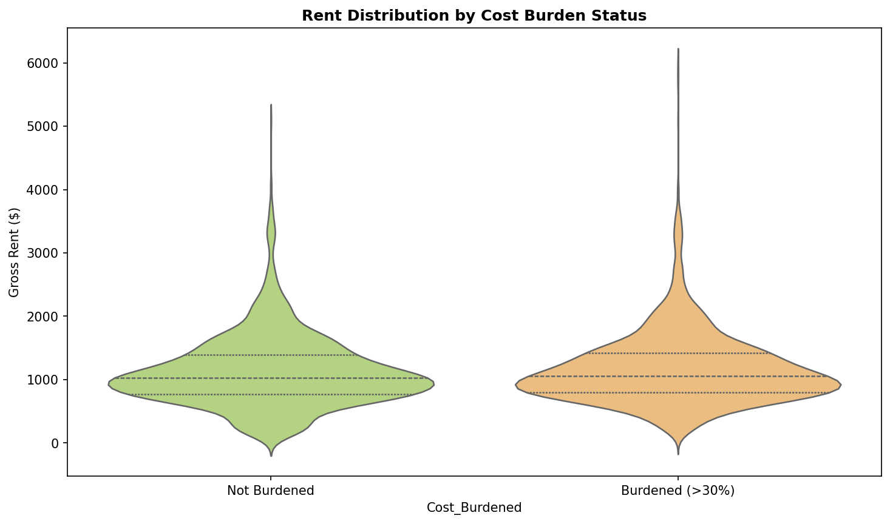

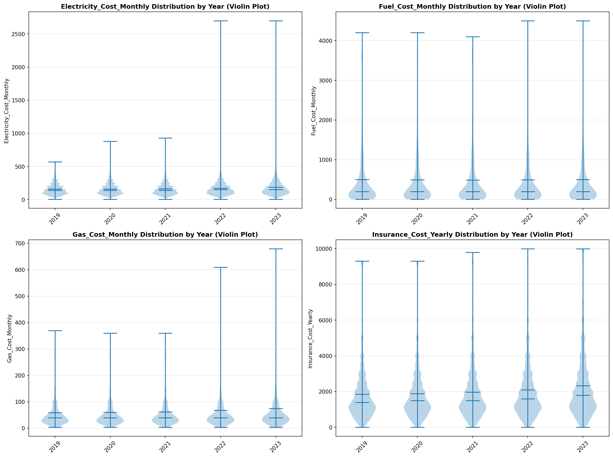

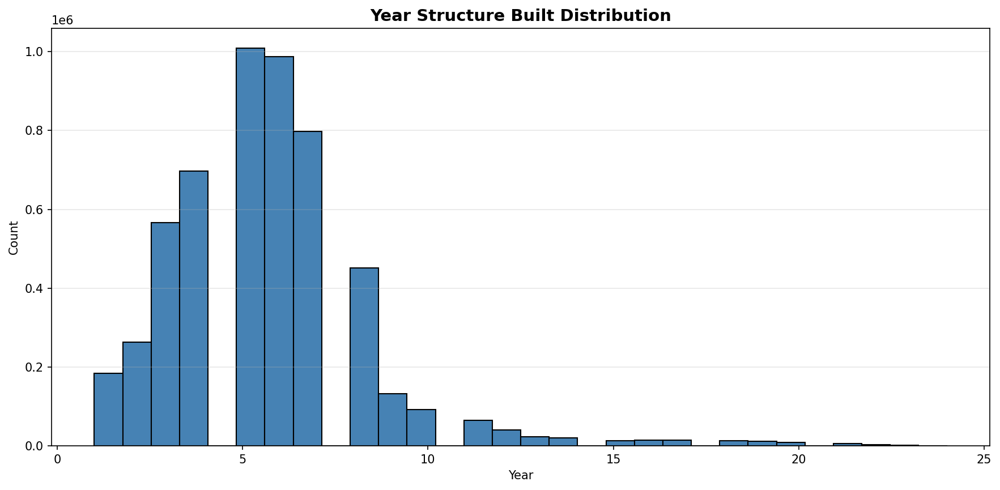

