# Statistical Analysis

> Comprehensive descriptive statistics including central tendency, dispersion, distribution characteristics, and weighted statistics using ACS sample weights.

## Summary Statistics

- **Variables Analyzed**: 37

### Income_Adjustment_Factor

| Statistic | Unweighted | Weighted (ACS) |
| :--- | :--- | :--- |
| Mean | 1,057,574.80 | 1,057,728.35 |
| Median | 1,048,026.00 | 1,059,677.73 |
| Std Deviation | 45,230.06 | — |
| Minimum | 999,480.00 | — |
| Maximum | 1,207,712.00 | — |
| Count | 3,380,728 | — |

> *Distribution is highly right-skewed (skewness: 1.27), light-tailed/platykurtic (kurtosis: 1.58).*

- **Coefficient of Variation**: 4.3 % (low variability)

### Property_Value

| Statistic | Unweighted | Weighted (ACS) |
| :--- | :--- | :--- |
| Mean | 15.25 | 15.34 |
| Median | 16.00 | 16.00 |
| Std Deviation | 4.78 | — |
| Minimum | 1.00 | — |
| Maximum | 24.00 | — |
| Count | 407,039 | — |

> *Distribution is moderately left-skewed (skewness: -0.91), light-tailed/platykurtic (kurtosis: 0.79).*

- **Coefficient of Variation**: 31.3 % (moderate variability)

#### Weighted Statistics by Year

| Year | Weighted Mean | Weighted Median |
| :--- | :--- | :--- |
| 2009 | 15.35 | 16.00 |
| 2010 | 15.38 | 16.00 |
| 2011 | 15.29 | 16.00 |

### Electricity_Cost_Monthly

| Statistic | Unweighted | Weighted (ACS) |
| :--- | :--- | :--- |
| Mean | 163.75 | 161.98 |
| Median | 150.00 | 143.33 |
| Std Deviation | 103.77 | — |
| Minimum | 1.00 | — |
| Maximum | 2,300.00 | — |
| Count | 2,755,055 | — |

> *Distribution is highly right-skewed (skewness: 3.27), heavy-tailed/leptokurtic (kurtosis: 44.92).*

- **Coefficient of Variation**: 63.4 % (high variability)

### Fuel_Cost_Monthly

| Statistic | Unweighted | Weighted (ACS) |
| :--- | :--- | :--- |
| Mean | 50.80 | 195.59 |
| Median | 2.00 | 85.20 |
| Std Deviation | 260.15 | — |
| Minimum | 1.00 | — |
| Maximum | 5,400.00 | — |
| Count | 1,714,193 | — |

> *Distribution is highly right-skewed (skewness: 8.48), heavy-tailed/leptokurtic (kurtosis: 90.39).*

- **Coefficient of Variation**: 512.1 % (very high variability)

### Gas_Cost_Monthly

| Statistic | Unweighted | Weighted (ACS) |
| :--- | :--- | :--- |
| Mean | 65.42 | 68.94 |
| Median | 40.00 | 40.00 |
| Std Deviation | 85.37 | — |
| Minimum | 1.00 | — |
| Maximum | 1,800.00 | — |
| Count | 2,247,827 | — |

> *Distribution is highly right-skewed (skewness: 4.16), heavy-tailed/leptokurtic (kurtosis: 48.49).*

- **Coefficient of Variation**: 130.5 % (very high variability)

### Insurance_Cost_Yearly

| Statistic | Unweighted | Weighted (ACS) |
| :--- | :--- | :--- |
| Mean | 1,033.46 | 1,030.33 |
| Median | 850.00 | 878.67 |
| Std Deviation | 804.42 | — |
| Minimum | 4.00 | — |
| Maximum | 9,500.00 | — |
| Count | 1,736,285 | — |

> *Distribution is highly right-skewed (skewness: 2.99), heavy-tailed/leptokurtic (kurtosis: 14.45).*

- **Coefficient of Variation**: 77.8 % (high variability)

### Water_Cost_Yearly

| Statistic | Unweighted | Weighted (ACS) |
| :--- | :--- | :--- |
| Mean | 402.48 | 418.76 |
| Median | 300.00 | 331.33 |
| Std Deviation | 454.34 | — |
| Minimum | 1.00 | — |
| Maximum | 4,300.00 | — |
| Count | 2,532,631 | — |

> *Distribution is highly right-skewed (skewness: 2.43), heavy-tailed/leptokurtic (kurtosis: 10.21).*

- **Coefficient of Variation**: 112.9 % (very high variability)

### Mobile_Home_Costs_Monthly

| Statistic | Unweighted | Weighted (ACS) |
| :--- | :--- | :--- |
| Mean | 859.52 | 924.15 |
| Median | 370.00 | 373.33 |
| Std Deviation | 1,685.97 | — |
| Minimum | 4.00 | — |
| Maximum | 25,800.00 | — |
| Count | 119,400 | — |

> *Distribution is highly right-skewed (skewness: 6.13), heavy-tailed/leptokurtic (kurtosis: 59.35).*

- **Coefficient of Variation**: 196.2 % (very high variability)

### First_Mortgage_Payment_Monthly

| Statistic | Unweighted | Weighted (ACS) |
| :--- | :--- | :--- |
| Mean | 1,139.40 | 1,157.13 |
| Median | 980.00 | 1,002.00 |
| Std Deviation | 751.69 | — |
| Minimum | 4.00 | — |
| Maximum | 6,400.00 | — |
| Count | 1,247,881 | — |

> *Distribution is highly right-skewed (skewness: 2.06), heavy-tailed/leptokurtic (kurtosis: 6.80).*

- **Coefficient of Variation**: 66.0 % (high variability)

### First_Mortgage_Includes_Taxes

| Statistic | Unweighted | Weighted (ACS) |
| :--- | :--- | :--- |
| Mean | 1.28 | 1.25 |
| Median | 1.00 | 1.00 |
| Std Deviation | 0.45 | — |
| Minimum | 1.00 | — |
| Maximum | 2.00 | — |
| Count | 1,247,881 | — |

> *Distribution is moderately right-skewed (skewness: 0.99), light-tailed/platykurtic (kurtosis: -1.03).*

- **Coefficient of Variation**: 35.1 % (moderate variability)

### Second_Mortgage_Payment_Monthly

| Statistic | Unweighted | Weighted (ACS) |
| :--- | :--- | :--- |
| Mean | 386.60 | 391.70 |
| Median | 290.00 | 284.67 |
| Std Deviation | 384.57 | — |
| Minimum | 4.00 | — |
| Maximum | 3,600.00 | — |
| Count | 222,686 | — |

> *Distribution is highly right-skewed (skewness: 3.42), heavy-tailed/leptokurtic (kurtosis: 16.56).*

- **Coefficient of Variation**: 99.5 % (high variability)

### Property_Taxes_Yearly

| Statistic | Unweighted | Weighted (ACS) |
| :--- | :--- | :--- |
| Mean | 25.62 | 26.19 |
| Median | 24.00 | 24.56 |
| Std Deviation | 16.14 | — |
| Minimum | 1.00 | — |
| Maximum | 68.00 | — |
| Count | 1,174,442 | — |

> *Distribution is moderately right-skewed (skewness: 0.71), light-tailed/platykurtic (kurtosis: 0.10).*

- **Coefficient of Variation**: 63.0 % (high variability)

### Meals_Included_in_Rent

| Statistic | Unweighted | Weighted (ACS) |
| :--- | :--- | :--- |
| Mean | 1.98 | 1.99 |
| Median | 2.00 | 2.00 |
| Std Deviation | 0.13 | — |
| Minimum | 1.00 | — |
| Maximum | 2.00 | — |
| Count | 827,586 | — |

> *Distribution is highly left-skewed (skewness: -7.67), heavy-tailed/leptokurtic (kurtosis: 56.89).*

- **Coefficient of Variation**: 6.4 % (low variability)

### Rent_Amount_Monthly

| Statistic | Unweighted | Weighted (ACS) |
| :--- | :--- | :--- |
| Mean | 756.36 | 783.25 |
| Median | 680.00 | 727.33 |
| Std Deviation | 468.41 | — |
| Minimum | 4.00 | — |
| Maximum | 4,200.00 | — |
| Count | 827,586 | — |

> *Distribution is highly right-skewed (skewness: 1.80), heavy-tailed/leptokurtic (kurtosis: 6.06).*

- **Coefficient of Variation**: 61.9 % (high variability)

### Gross_Rent

| Statistic | Unweighted | Weighted (ACS) |
| :--- | :--- | :--- |
| Mean | 943.35 | 967.96 |
| Median | 867.00 | 911.67 |
| Std Deviation | 487.32 | — |
| Minimum | 4.00 | — |
| Maximum | 8,083.00 | — |
| Count | 762,761 | — |

> *Distribution is highly right-skewed (skewness: 1.59), heavy-tailed/leptokurtic (kurtosis: 5.30).*

- **Coefficient of Variation**: 51.7 % (high variability)

### Gross_Rent_Percentage_Income

| Statistic | Unweighted | Weighted (ACS) |
| :--- | :--- | :--- |
| Mean | 39.49 | 39.38 |
| Median | 30.00 | 30.13 |
| Std Deviation | 27.45 | — |
| Minimum | 1.00 | — |
| Maximum | 101.00 | — |
| Count | 740,744 | — |

> *Distribution is highly right-skewed (skewness: 1.12), light-tailed/platykurtic (kurtosis: 0.15).*

- **Coefficient of Variation**: 69.5 % (high variability)

### Selected_Monthly_Owner_Costs

| Statistic | Unweighted | Weighted (ACS) |
| :--- | :--- | :--- |
| Mean | 1,174.56 | 1,218.96 |
| Median | 977.00 | 1,050.87 |
| Std Deviation | 935.75 | — |
| Minimum | 1.00 | — |
| Maximum | 12,728.00 | — |
| Count | 1,961,417 | — |

> *Distribution is highly right-skewed (skewness: 2.16), heavy-tailed/leptokurtic (kurtosis: 8.19).*

- **Coefficient of Variation**: 79.7 % (high variability)

### Owner_Costs_Percentage_Income

| Statistic | Unweighted | Weighted (ACS) |
| :--- | :--- | :--- |
| Mean | 23.77 | 24.40 |
| Median | 18.00 | 18.13 |
| Std Deviation | 21.29 | — |
| Minimum | 1.00 | — |
| Maximum | 101.00 | — |
| Count | 1,943,726 | — |

> *Distribution is highly right-skewed (skewness: 2.08), heavy-tailed/leptokurtic (kurtosis: 4.44).*

- **Coefficient of Variation**: 89.6 % (high variability)

### Family_Income

| Statistic | Unweighted | Weighted (ACS) |
| :--- | :--- | :--- |
| Mean | 88,905.69 | 85,678.60 |
| Median | 65,060.00 | 63,920.00 |
| Std Deviation | 89,877.52 | — |
| Minimum | 1.00 | — |
| Maximum | 1,953,700.00 | — |
| Count | 1,869,935 | — |

> *Distribution is highly right-skewed (skewness: 3.40), heavy-tailed/leptokurtic (kurtosis: 19.05).*

- **Coefficient of Variation**: 101.1 % (very high variability)

### Household_Income

| Statistic | Unweighted | Weighted (ACS) |
| :--- | :--- | :--- |
| Mean | 76,288.92 | 74,297.76 |
| Median | 54,000.00 | 53,645.33 |
| Std Deviation | 82,990.23 | — |
| Minimum | 1.00 | — |
| Maximum | 1,953,700.00 | — |
| Count | 2,742,868 | — |

> *Distribution is highly right-skewed (skewness: 3.62), heavy-tailed/leptokurtic (kurtosis: 21.94).*

- **Coefficient of Variation**: 108.8 % (very high variability)

### Specified_Rent_Unit

| Statistic | Unweighted | Weighted (ACS) |
| :--- | :--- | :--- |
| Mean | 0.29 | 0.34 |
| Median | 0.00 | 0.00 |
| Std Deviation | 0.45 | — |
| Minimum | 0.00 | — |
| Maximum | 1.00 | — |
| Count | 3,062,560 | — |

> *Distribution is moderately right-skewed (skewness: 0.94), light-tailed/platykurtic (kurtosis: -1.12).*

- **Coefficient of Variation**: 157.4 % (very high variability)

### Specified_Value_Unit

| Statistic | Unweighted | Weighted (ACS) |
| :--- | :--- | :--- |
| Mean | 0.55 | 0.49 |
| Median | 1.00 | 0.40 |
| Std Deviation | 0.50 | — |
| Minimum | 0.00 | — |
| Maximum | 1.00 | — |
| Count | 3,062,560 | — |

> *Distribution is approximately symmetric (skewness: -0.20), light-tailed/platykurtic (kurtosis: -1.96).*

- **Coefficient of Variation**: 90.3 % (high variability)

### Flag_First_Mortgage_Payment

| Statistic | Unweighted | Weighted (ACS) |
| :--- | :--- | :--- |
| Mean | 0.04 | 0.04 |
| Median | 0.00 | 0.00 |
| Std Deviation | 0.20 | — |
| Minimum | 0.00 | — |
| Maximum | 1.00 | — |
| Count | 3,062,560 | — |

> *Distribution is highly right-skewed (skewness: 4.60), heavy-tailed/leptokurtic (kurtosis: 19.19).*

- **Coefficient of Variation**: 481.1 % (very high variability)

### Flag_First_Mortgage_Taxes

| Statistic | Unweighted | Weighted (ACS) |
| :--- | :--- | :--- |
| Mean | 0.04 | 0.04 |
| Median | 0.00 | 0.00 |
| Std Deviation | 0.19 | — |
| Minimum | 0.00 | — |
| Maximum | 1.00 | — |
| Count | 3,062,560 | — |

> *Distribution is highly right-skewed (skewness: 4.99), heavy-tailed/leptokurtic (kurtosis: 22.93).*

- **Coefficient of Variation**: 518.6 % (very high variability)

### Flag_Meals_Included_Rent

| Statistic | Unweighted | Weighted (ACS) |
| :--- | :--- | :--- |
| Mean | 0.01 | 0.01 |
| Median | 0.00 | 0.00 |
| Std Deviation | 0.09 | — |
| Minimum | 0.00 | — |
| Maximum | 1.00 | — |
| Count | 3,062,560 | — |

> *Distribution is highly right-skewed (skewness: 11.15), heavy-tailed/leptokurtic (kurtosis: 122.23).*

- **Coefficient of Variation**: 1,123.5 % (very high variability)

### Flag_Rent_Amount

| Statistic | Unweighted | Weighted (ACS) |
| :--- | :--- | :--- |
| Mean | 0.02 | 0.03 |
| Median | 0.00 | 0.00 |
| Std Deviation | 0.15 | — |
| Minimum | 0.00 | — |
| Maximum | 1.00 | — |
| Count | 3,062,560 | — |

> *Distribution is highly right-skewed (skewness: 6.18), heavy-tailed/leptokurtic (kurtosis: 36.22).*

- **Coefficient of Variation**: 634.0 % (very high variability)

### Flag_Second_Mortgage_Payment

| Statistic | Unweighted | Weighted (ACS) |
| :--- | :--- | :--- |
| Mean | 0.04 | 0.04 |
| Median | 0.00 | 0.00 |
| Std Deviation | 0.19 | — |
| Minimum | 0.00 | — |
| Maximum | 1.00 | — |
| Count | 3,062,560 | — |

> *Distribution is highly right-skewed (skewness: 4.90), heavy-tailed/leptokurtic (kurtosis: 22.01).*

- **Coefficient of Variation**: 509.6 % (very high variability)

### Flag_Property_Taxes

| Statistic | Unweighted | Weighted (ACS) |
| :--- | :--- | :--- |
| Mean | 0.10 | 0.11 |
| Median | 0.00 | 0.00 |
| Std Deviation | 0.31 | — |
| Minimum | 0.00 | — |
| Maximum | 1.00 | — |
| Count | 3,062,560 | — |

> *Distribution is highly right-skewed (skewness: 2.59), heavy-tailed/leptokurtic (kurtosis: 4.68).*

- **Coefficient of Variation**: 292.7 % (very high variability)

### Flag_Property_Value

| Statistic | Unweighted | Weighted (ACS) |
| :--- | :--- | :--- |
| Mean | 0.08 | 0.08 |
| Median | 0.00 | 0.00 |
| Std Deviation | 0.27 | — |
| Minimum | 0.00 | — |
| Maximum | 1.00 | — |
| Count | 3,062,560 | — |

> *Distribution is highly right-skewed (skewness: 3.13), heavy-tailed/leptokurtic (kurtosis: 7.77).*

- **Coefficient of Variation**: 341.8 % (very high variability)

### Flag_Water_Cost

| Statistic | Unweighted | Weighted (ACS) |
| :--- | :--- | :--- |
| Mean | 0.07 | 0.08 |
| Median | 0.00 | 0.00 |
| Std Deviation | 0.26 | — |
| Minimum | 0.00 | — |
| Maximum | 1.00 | — |
| Count | 3,062,560 | — |

> *Distribution is highly right-skewed (skewness: 3.28), heavy-tailed/leptokurtic (kurtosis: 8.74).*

- **Coefficient of Variation**: 355.8 % (very high variability)

### Annual_Rent_to_Value_Ratio

### Total_Monthly_Utility_Cost

| Statistic | Unweighted | Weighted (ACS) |
| :--- | :--- | :--- |
| Mean | 216.62 | 212.76 |
| Median | 193.00 | 190.60 |
| Std Deviation | 132.41 | — |
| Minimum | 2.00 | — |
| Maximum | 3,900.00 | — |
| Count | 2,761,451 | — |

> *Distribution is highly right-skewed (skewness: 3.87), heavy-tailed/leptokurtic (kurtosis: 61.82).*

- **Coefficient of Variation**: 61.1 % (high variability)

### Property_Tax_Rate

| Statistic | Unweighted | Weighted (ACS) |
| :--- | :--- | :--- |
| Mean | 160.24 | 161.35 |
| Median | 156.25 | 157.42 |
| Std Deviation | 91.15 | — |
| Minimum | 4.17 | — |
| Maximum | 2,200.00 | — |
| Count | 397,571 | — |

> *Distribution is highly right-skewed (skewness: 3.30), heavy-tailed/leptokurtic (kurtosis: 39.90).*

- **Coefficient of Variation**: 56.9 % (high variability)

#### Weighted Statistics by Year

| Year | Weighted Mean | Weighted Median |
| :--- | :--- | :--- |
| 2009 | 155.10 | 152.63 |
| 2010 | 161.38 | 157.14 |
| 2011 | 167.57 | 162.50 |

### Structure_Age

| Statistic | Unweighted | Weighted (ACS) |
| :--- | :--- | :--- |
| Mean | 2,018.30 | 2,018.15 |
| Median | 2,018.00 | 2,018.50 |
| Std Deviation | 2.91 | — |
| Minimum | 2,000.00 | — |
| Maximum | 2,023.00 | — |
| Count | 2,461,824 | — |

> *Distribution is highly left-skewed (skewness: -1.25), heavy-tailed/leptokurtic (kurtosis: 4.00).*

- **Coefficient of Variation**: 0.1 % (low variability)

### Structure_Age_Score

| Statistic | Unweighted | Weighted (ACS) |
| :--- | :--- | :--- |
| Mean | 0.00 | 0.00 |
| Median | 0.00 | 0.00 |
| Std Deviation | 0.00 | — |
| Minimum | 0.00 | — |
| Maximum | 0.00 | — |
| Count | 2,461,824 | — |

> *Distribution is approximately symmetric (skewness: nan).*

### Working_Age_Persons

| Statistic | Unweighted | Weighted (ACS) |
| :--- | :--- | :--- |
| Mean | 1.75 | 1.86 |
| Median | 2.00 | 2.00 |
| Std Deviation | 1.34 | — |
| Minimum | 0.00 | — |
| Maximum | 19.00 | — |
| Count | 2,786,980 | — |

> *Distribution is moderately right-skewed (skewness: 0.91), light-tailed/platykurtic (kurtosis: 2.10).*

- **Coefficient of Variation**: 76.5 % (high variability)

### Income_to_FPL_Ratio

| Statistic | Unweighted | Weighted (ACS) |
| :--- | :--- | :--- |
| Mean | 3.43 | 3.31 |
| Median | 2.47 | 2.43 |
| Std Deviation | 3.72 | — |
| Minimum | -1.02 | — |
| Maximum | 91.89 | — |
| Count | 2,786,980 | — |

> *Distribution is highly right-skewed (skewness: 3.86), heavy-tailed/leptokurtic (kurtosis: 25.41).*

- **Coefficient of Variation**: 108.4 % (very high variability)

## Distribution Analysis

### Skewed Distributions

> Variables with skewness > |0.5| indicate non-normal distributions. Consider log transformations for highly skewed variables in modeling.

| Variable | Skewness | Direction | Severity |
| :--- | :--- | :--- | :--- |
| Flag_Meals_Included_Rent | 11.146 | Right-skewed | High |
| Fuel_Cost_Monthly | 8.483 | Right-skewed | High |
| Meals_Included_in_Rent | -7.674 | Left-skewed | High |
| Flag_Rent_Amount | 6.183 | Right-skewed | High |
| Mobile_Home_Costs_Monthly | 6.130 | Right-skewed | High |
| Flag_First_Mortgage_Taxes | 4.993 | Right-skewed | High |
| Flag_Second_Mortgage_Payment | 4.900 | Right-skewed | High |
| Flag_First_Mortgage_Payment | 4.604 | Right-skewed | High |
| Gas_Cost_Monthly | 4.157 | Right-skewed | High |
| Total_Monthly_Utility_Cost | 3.870 | Right-skewed | High |
| Income_to_FPL_Ratio | 3.863 | Right-skewed | High |
| Household_Income | 3.624 | Right-skewed | High |
| Second_Mortgage_Payment_Monthly | 3.424 | Right-skewed | High |
| Family_Income | 3.404 | Right-skewed | High |
| Property_Tax_Rate | 3.300 | Right-skewed | High |
| Flag_Water_Cost | 3.277 | Right-skewed | High |
| Electricity_Cost_Monthly | 3.272 | Right-skewed | High |
| Flag_Property_Value | 3.125 | Right-skewed | High |
| Insurance_Cost_Yearly | 2.991 | Right-skewed | High |
| Flag_Property_Taxes | 2.585 | Right-skewed | High |

- **Total Skewed Variables**: 34

- **Right-skewed**: 31

- **Left-skewed**: 3

## Variance Analysis

### Coefficient of Variation Ranking

> CV (Coefficient of Variation) = (Std Dev / Mean) × 100%. Higher CV indicates greater relative variability.

| Variable | CV (%) | Std Dev | Mean | Variability |
| :--- | :--- | :--- | :--- | :--- |
| Flag_Meals_Included_Rent | 1123.5% | 0.09 | 0.01 | Very High |
| Flag_Rent_Amount | 634.0% | 0.15 | 0.02 | Very High |
| Flag_First_Mortgage_Taxes | 518.6% | 0.19 | 0.04 | Very High |
| Fuel_Cost_Monthly | 512.1% | 260.15 | 50.80 | Very High |
| Flag_Second_Mortgage_Payment | 509.6% | 0.19 | 0.04 | Very High |
| Flag_First_Mortgage_Payment | 481.1% | 0.20 | 0.04 | Very High |
| Flag_Water_Cost | 355.8% | 0.26 | 0.07 | Very High |
| Flag_Property_Value | 341.8% | 0.27 | 0.08 | Very High |
| Flag_Property_Taxes | 292.7% | 0.31 | 0.10 | Very High |
| Mobile_Home_Costs_Monthly | 196.2% | 1,685.97 | 859.52 | Very High |
| Specified_Rent_Unit | 157.4% | 0.45 | 0.29 | Very High |
| Gas_Cost_Monthly | 130.5% | 85.37 | 65.42 | Very High |
| Water_Cost_Yearly | 112.9% | 454.34 | 402.48 | Very High |
| Household_Income | 108.8% | 82,990.23 | 76,288.92 | Very High |
| Income_to_FPL_Ratio | 108.4% | 3.72 | 3.43 | Very High |
| Family_Income | 101.1% | 89,877.52 | 88,905.69 | Very High |
| Second_Mortgage_Payment_Monthly | 99.5% | 384.57 | 386.60 | High |
| Specified_Value_Unit | 90.3% | 0.50 | 0.55 | High |
| Owner_Costs_Percentage_Income | 89.6% | 21.29 | 23.77 | High |
| Selected_Monthly_Owner_Costs | 79.7% | 935.75 | 1,174.56 | High |

- **Average CV**: 193.4 %

- **High Variance Variables (CV > 50%)**: 30

## Visualizations

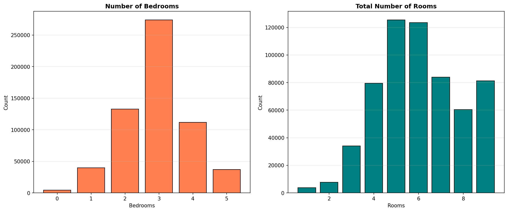

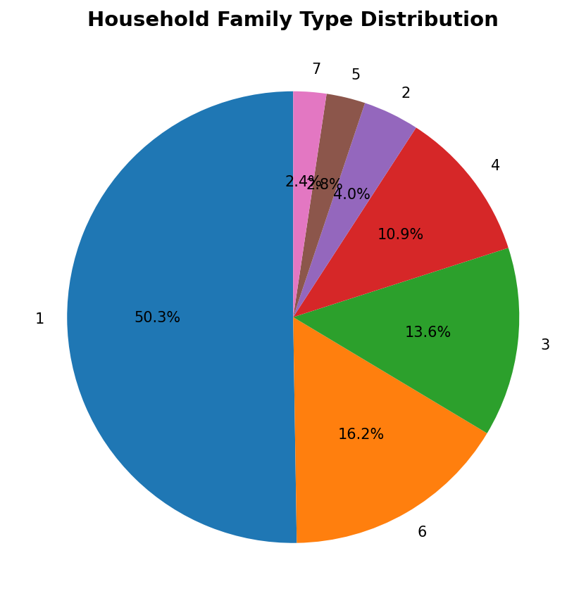

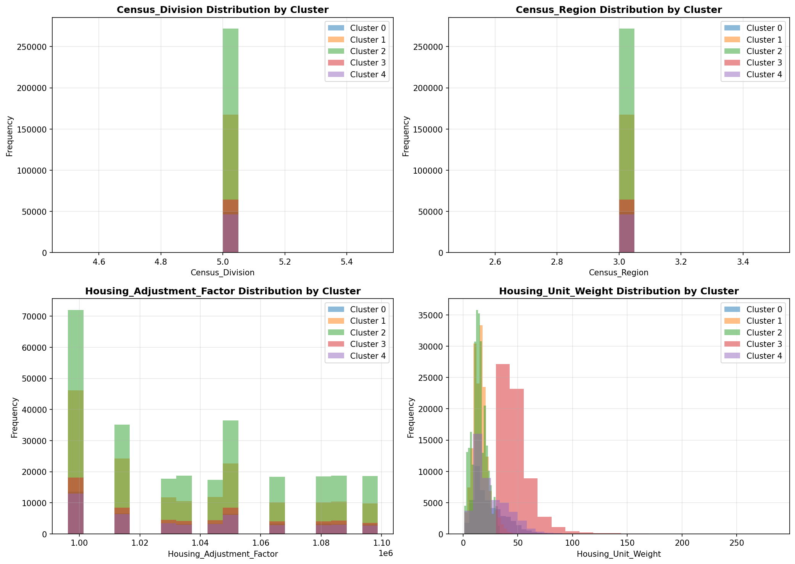

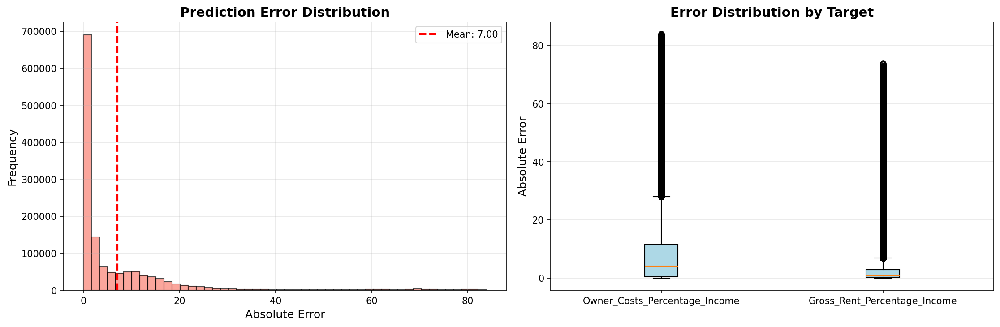

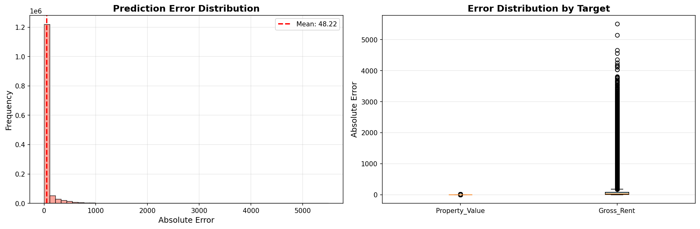

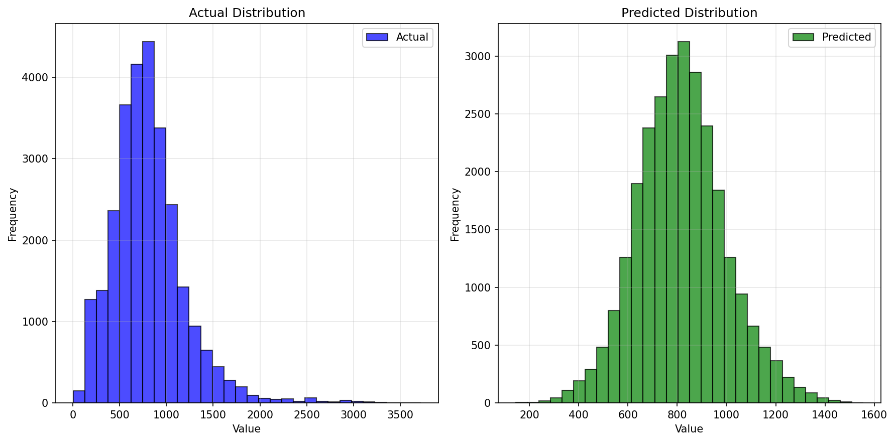

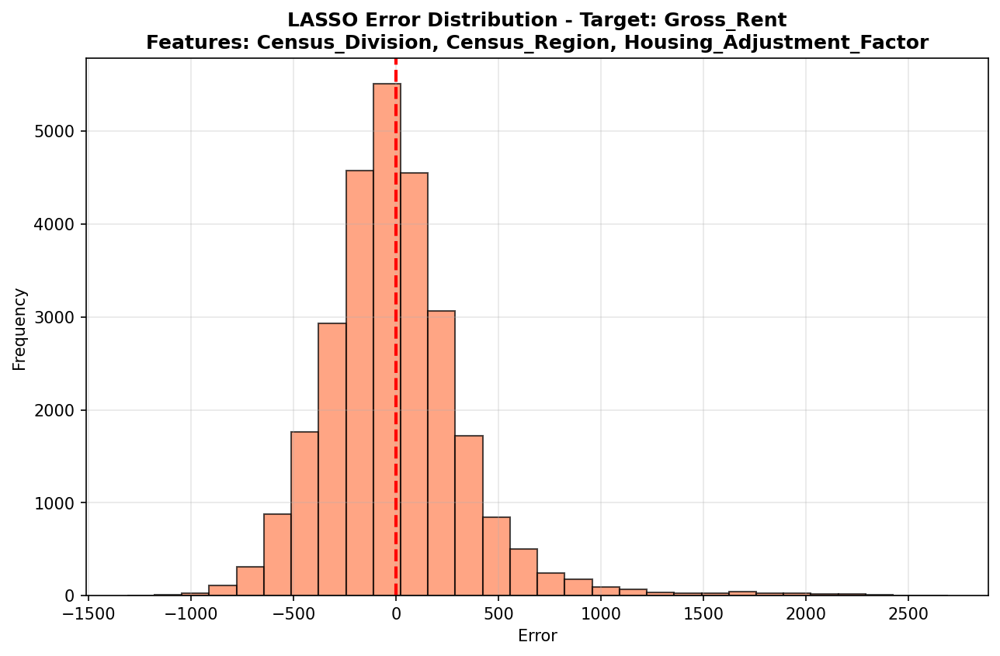

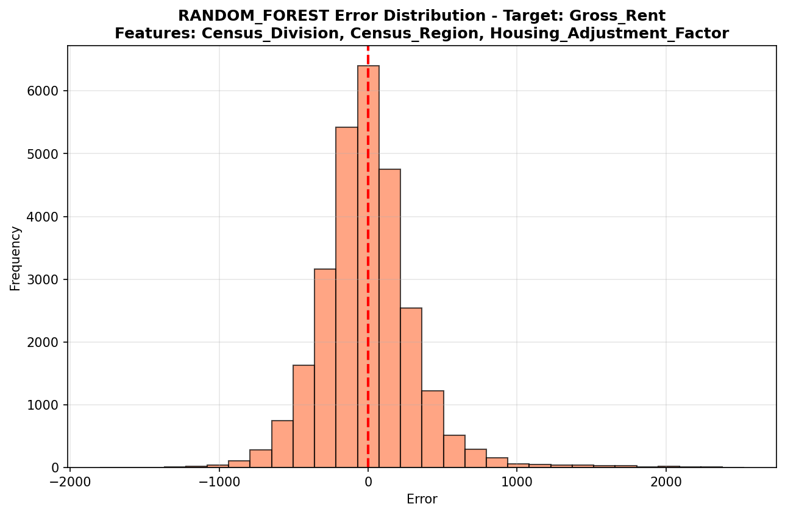

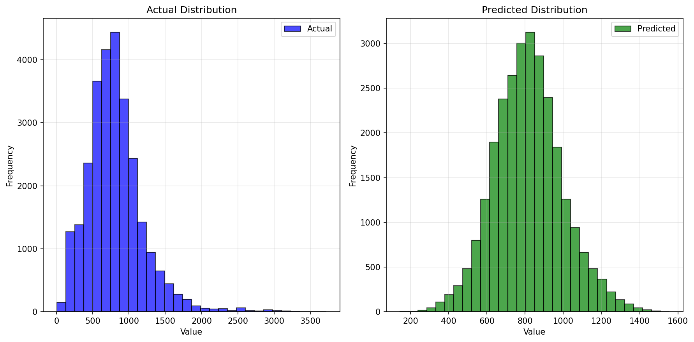

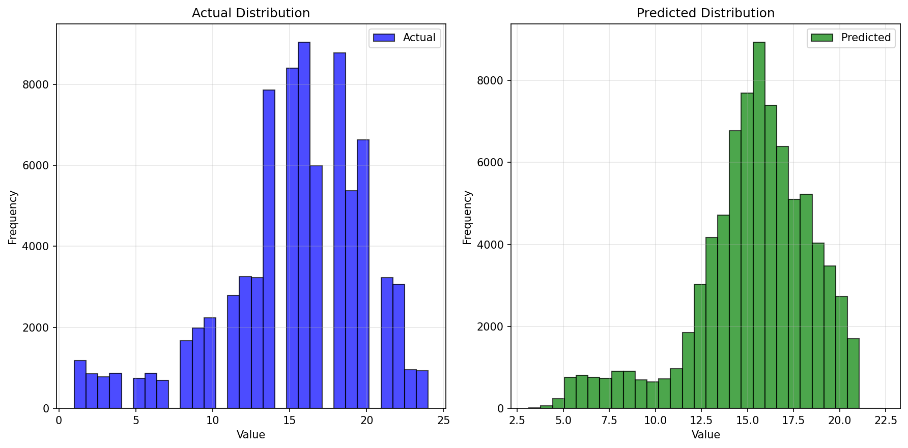

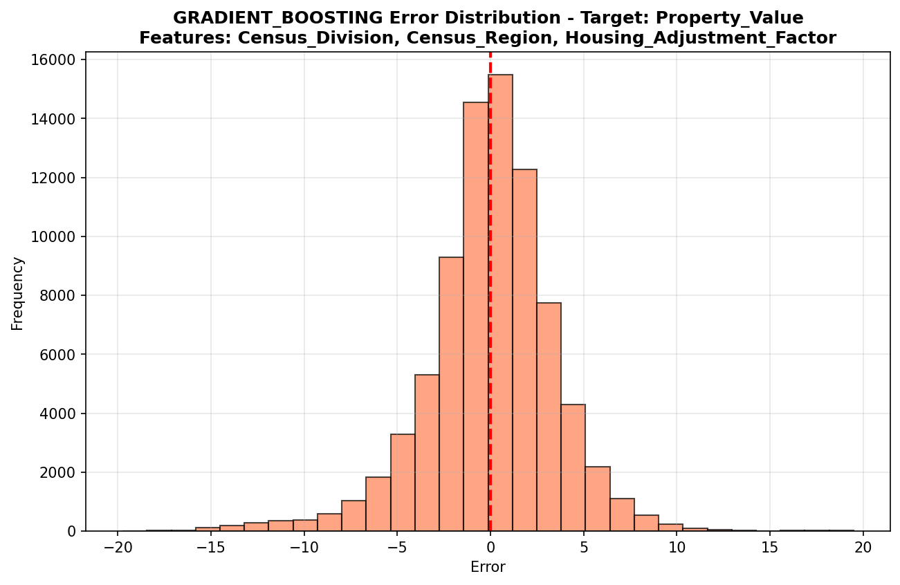

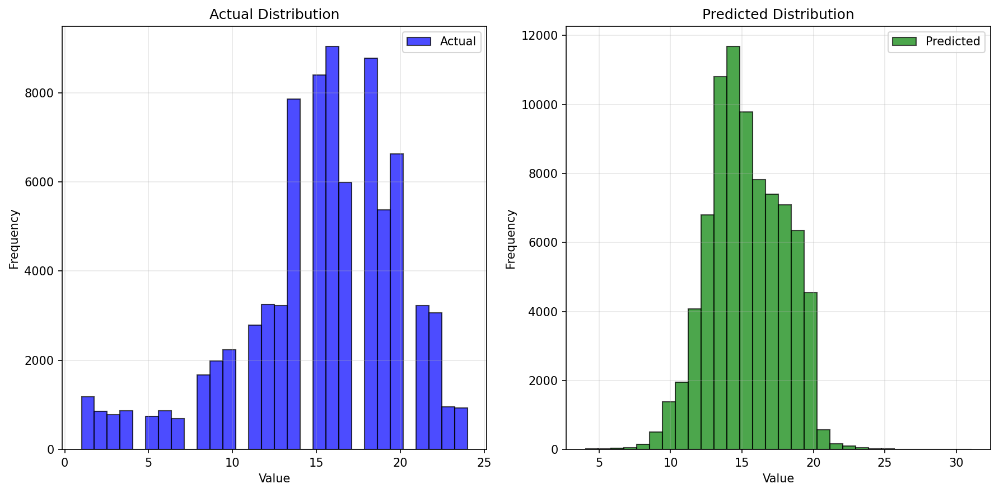

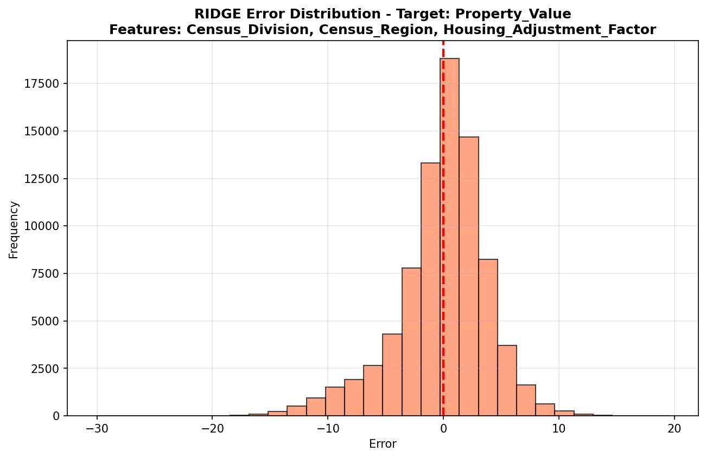

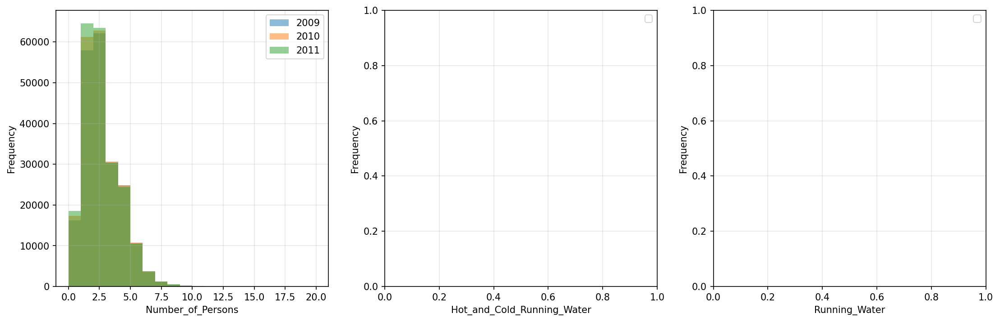

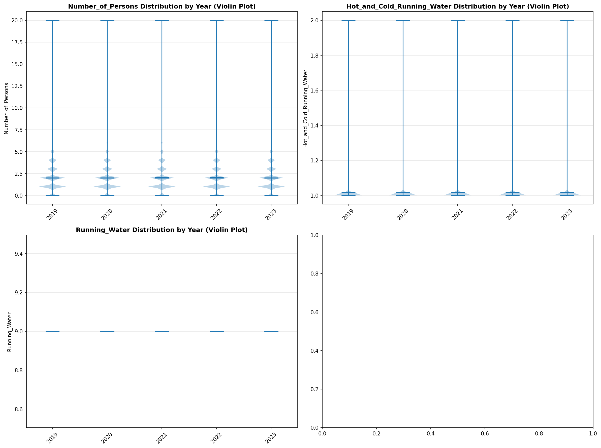

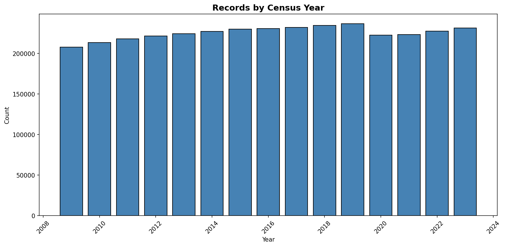
