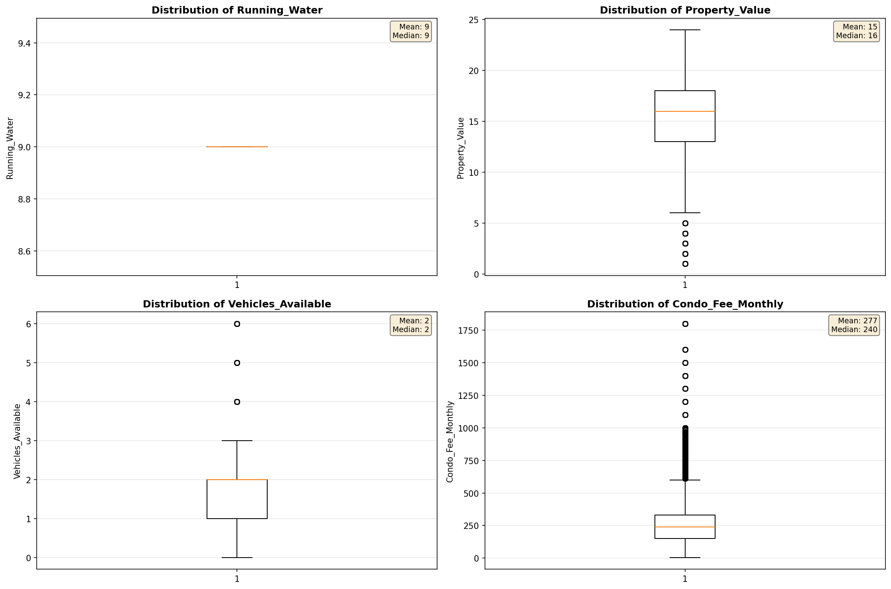
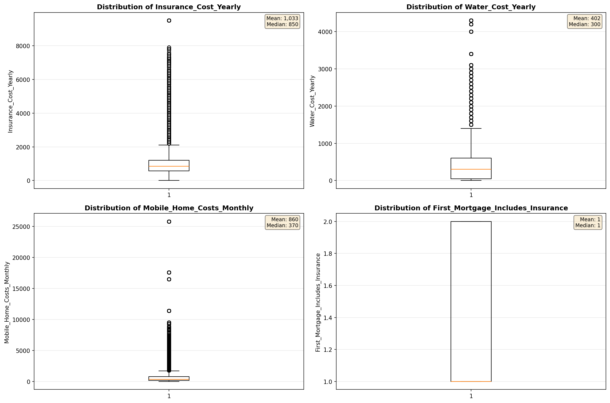
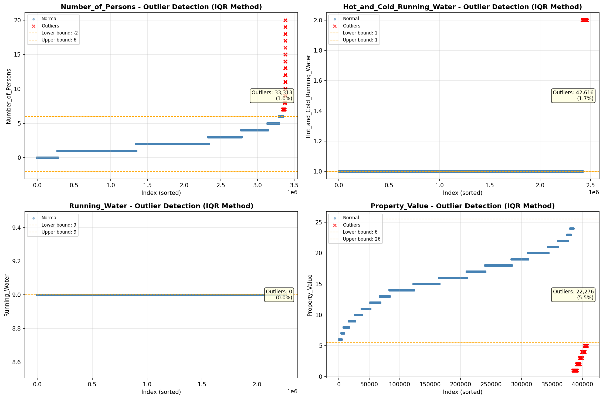
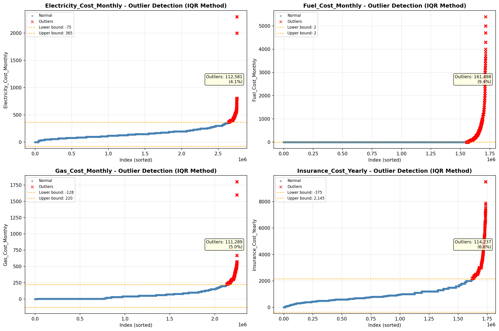

# Outlier Detection

> Statistical outlier detection using IQR (Interquartile Range) method. Outliers are values falling outside Q1 - 1.5×IQR or Q3 + 1.5×IQR bounds.

## Detection Methodology

| Parameter | Value | Description |
| :--- | :--- | :--- |
| Method | IQR | Outlier detection algorithm |
| Lower Bound | Q1 - 1.5 × IQR | Values below are outliers |
| Upper Bound | Q3 + 1.5 × IQR | Values above are outliers |
| IQR Definition | Q3 - Q1 | Interquartile Range |

> **Note**: The IQR method is robust to extreme values and works well for approximately symmetric distributions.

## Outlier Summary

_No outlier summary available._
## High Outlier Rate Variables

> Variables with outlier rate > 5% may indicate data quality issues, non-normal distributions, or genuinely extreme values.

- **('Mobile_Home_Costs_Monthly', 11.015912897822446)**: 0 outliers (0.00%)

- **('Flag_Property_Taxes', 10.452236037824566)**: 0 outliers (0.00%)

- **('Gross_Rent_Percentage_Income', 9.826606762930243)**: 0 outliers (0.00%)

- **('Fuel_Cost_Monthly', 9.421226197983541)**: 0 outliers (0.00%)

- **('Working_Age_Persons', 9.393285922396286)**: 0 outliers (0.00%)

- **('Flag_Property_Value', 7.884547568047647)**: 0 outliers (0.00%)

- **('Owner_Costs_Percentage_Income', 7.480272425228658)**: 0 outliers (0.00%)

- **('Flag_Water_Cost', 7.322076955227)**: 0 outliers (0.00%)

- **('Income_Adjustment_Factor', 6.63670665016529)**: 0 outliers (0.00%)

- **('Insurance_Cost_Yearly', 6.579392208076438)**: 0 outliers (0.00%)

- **('Income_to_FPL_Ratio', 5.9760026982612)**: 0 outliers (0.00%)

- **('Family_Income', 5.927264851452056)**: 0 outliers (0.00%)

- **('Household_Income', 5.922669264434162)**: 0 outliers (0.00%)

- **('Property_Value', 5.472694262711927)**: 0 outliers (0.00%)

> *Consider investigating these variables for data entry errors, applying transformations, or using robust statistical methods.*

## Visualizations

