# Statistical Analysis

> Comprehensive descriptive statistics including central tendency, dispersion, distribution characteristics, and weighted statistics using ACS sample weights.

## Summary Statistics

- **Variables Analyzed**: 37

### Income_Adjustment_Factor

| Statistic | Unweighted | Weighted (ACS) |
| :--- | :--- | :--- |
| Mean | 1,058,357.19 | 1,057,783.87 |
| Median | 1,051,849.00 | 1,059,677.73 |
| Std Deviation | 46,243.89 | — |
| Minimum | 999,480.00 | — |
| Maximum | 1,207,712.00 | — |
| Count | 451,657 | — |

> *Distribution is highly right-skewed (skewness: 1.25), light-tailed/platykurtic (kurtosis: 1.39).*

- **Coefficient of Variation**: 4.4 % (low variability)

### Property_Value

| Statistic | Unweighted | Weighted (ACS) |
| :--- | :--- | :--- |
| Mean | 20.71 | 20.82 |
| Median | 22.00 | 22.00 |
| Std Deviation | 3.08 | — |
| Minimum | 1.00 | — |
| Maximum | 24.00 | — |
| Count | 45,347 | — |

> *Distribution is highly left-skewed (skewness: -2.51), heavy-tailed/leptokurtic (kurtosis: 9.10).*

- **Coefficient of Variation**: 14.9 % (low variability)

#### Weighted Statistics by Year

| Year | Weighted Mean | Weighted Median |
| :--- | :--- | :--- |
| 2009 | 20.78 | 22.00 |
| 2010 | 20.87 | 22.00 |
| 2011 | 20.81 | 22.00 |

### Electricity_Cost_Monthly

| Statistic | Unweighted | Weighted (ACS) |
| :--- | :--- | :--- |
| Mean | 164.07 | 161.30 |
| Median | 140.00 | 138.00 |
| Std Deviation | 130.66 | — |
| Minimum | 1.00 | — |
| Maximum | 2,800.00 | — |
| Count | 340,476 | — |

> *Distribution is highly right-skewed (skewness: 2.92), heavy-tailed/leptokurtic (kurtosis: 34.90).*

- **Coefficient of Variation**: 79.6 % (high variability)

### Fuel_Cost_Monthly

| Statistic | Unweighted | Weighted (ACS) |
| :--- | :--- | :--- |
| Mean | 18.70 | 207.46 |
| Median | 2.00 | 75.20 |
| Std Deviation | 181.06 | — |
| Minimum | 1.00 | — |
| Maximum | 5,600.00 | — |
| Count | 212,449 | — |

> *Distribution is highly right-skewed (skewness: 16.88), heavy-tailed/leptokurtic (kurtosis: 346.76).*

- **Coefficient of Variation**: 968.1 % (very high variability)

### Gas_Cost_Monthly

| Statistic | Unweighted | Weighted (ACS) |
| :--- | :--- | :--- |
| Mean | 23.40 | 37.68 |
| Median | 3.00 | 21.80 |
| Std Deviation | 54.90 | — |
| Minimum | 1.00 | — |
| Maximum | 850.00 | — |
| Count | 237,582 | — |

> *Distribution is highly right-skewed (skewness: 4.86), heavy-tailed/leptokurtic (kurtosis: 32.14).*

- **Coefficient of Variation**: 234.6 % (very high variability)

### Insurance_Cost_Yearly

| Statistic | Unweighted | Weighted (ACS) |
| :--- | :--- | :--- |
| Mean | 1,342.18 | 1,297.41 |
| Median | 1,000.00 | 999.33 |
| Std Deviation | 1,275.65 | — |
| Minimum | 4.00 | — |
| Maximum | 9,800.00 | — |
| Count | 205,620 | — |

> *Distribution is highly right-skewed (skewness: 2.58), heavy-tailed/leptokurtic (kurtosis: 9.72).*

- **Coefficient of Variation**: 95.0 % (high variability)

### Water_Cost_Yearly

| Statistic | Unweighted | Weighted (ACS) |
| :--- | :--- | :--- |
| Mean | 707.09 | 737.08 |
| Median | 350.00 | 423.33 |
| Std Deviation | 870.00 | — |
| Minimum | 1.00 | — |
| Maximum | 7,100.00 | — |
| Count | 300,225 | — |

> *Distribution is highly right-skewed (skewness: 1.68), heavy-tailed/leptokurtic (kurtosis: 3.60).*

- **Coefficient of Variation**: 123.0 % (very high variability)

### Mobile_Home_Costs_Monthly

| Statistic | Unweighted | Weighted (ACS) |
| :--- | :--- | :--- |
| Mean | 2,549.31 | 3,012.67 |
| Median | 610.00 | 3,401.33 |
| Std Deviation | 4,124.19 | — |
| Minimum | 10.00 | — |
| Maximum | 14,900.00 | — |
| Count | 289 | — |

> *Distribution is highly right-skewed (skewness: 1.75), light-tailed/platykurtic (kurtosis: 1.32).*

- **Coefficient of Variation**: 161.8 % (very high variability)

### First_Mortgage_Payment_Monthly

| Statistic | Unweighted | Weighted (ACS) |
| :--- | :--- | :--- |
| Mean | 1,882.23 | 1,940.50 |
| Median | 1,700.00 | 1,760.00 |
| Std Deviation | 1,172.33 | — |
| Minimum | 4.00 | — |
| Maximum | 8,900.00 | — |
| Count | 147,212 | — |

> *Distribution is highly right-skewed (skewness: 1.45), heavy-tailed/leptokurtic (kurtosis: 3.61).*

- **Coefficient of Variation**: 62.3 % (high variability)

### First_Mortgage_Includes_Taxes

| Statistic | Unweighted | Weighted (ACS) |
| :--- | :--- | :--- |
| Mean | 1.22 | 1.20 |
| Median | 1.00 | 1.00 |
| Std Deviation | 0.41 | — |
| Minimum | 1.00 | — |
| Maximum | 2.00 | — |
| Count | 147,212 | — |

> *Distribution is highly right-skewed (skewness: 1.36), light-tailed/platykurtic (kurtosis: -0.15).*

- **Coefficient of Variation**: 33.9 % (moderate variability)

### Second_Mortgage_Payment_Monthly

| Statistic | Unweighted | Weighted (ACS) |
| :--- | :--- | :--- |
| Mean | 611.14 | 602.36 |
| Median | 410.00 | 420.67 |
| Std Deviation | 634.91 | — |
| Minimum | 4.00 | — |
| Maximum | 6,500.00 | — |
| Count | 33,805 | — |

> *Distribution is highly right-skewed (skewness: 2.78), heavy-tailed/leptokurtic (kurtosis: 11.71).*

- **Coefficient of Variation**: 103.9 % (very high variability)

### Property_Taxes_Yearly

| Statistic | Unweighted | Weighted (ACS) |
| :--- | :--- | :--- |
| Mean | 24.30 | 24.73 |
| Median | 24.00 | 24.33 |
| Std Deviation | 15.45 | — |
| Minimum | 1.00 | — |
| Maximum | 68.00 | — |
| Count | 134,571 | — |

> *Distribution is moderately right-skewed (skewness: 0.64), light-tailed/platykurtic (kurtosis: 0.34).*

- **Coefficient of Variation**: 63.6 % (high variability)

### Meals_Included_in_Rent

| Statistic | Unweighted | Weighted (ACS) |
| :--- | :--- | :--- |
| Mean | 1.99 | 1.99 |
| Median | 2.00 | 2.00 |
| Std Deviation | 0.11 | — |
| Minimum | 1.00 | — |
| Maximum | 2.00 | — |
| Count | 124,498 | — |

> *Distribution is highly left-skewed (skewness: -9.17), heavy-tailed/leptokurtic (kurtosis: 82.01).*

- **Coefficient of Variation**: 5.4 % (low variability)

### Rent_Amount_Monthly

| Statistic | Unweighted | Weighted (ACS) |
| :--- | :--- | :--- |
| Mean | 1,476.89 | 1,473.19 |
| Median | 1,300.00 | 1,326.67 |
| Std Deviation | 915.01 | — |
| Minimum | 4.00 | — |
| Maximum | 8,700.00 | — |
| Count | 124,498 | — |

> *Distribution is highly right-skewed (skewness: 1.62), heavy-tailed/leptokurtic (kurtosis: 6.90).*

- **Coefficient of Variation**: 62.0 % (high variability)

### Gross_Rent

| Statistic | Unweighted | Weighted (ACS) |
| :--- | :--- | :--- |
| Mean | 1,594.09 | 1,591.25 |
| Median | 1,430.00 | 1,447.53 |
| Std Deviation | 888.83 | — |
| Minimum | 4.00 | — |
| Maximum | 10,508.00 | — |
| Count | 114,148 | — |

> *Distribution is moderately right-skewed (skewness: 0.97), light-tailed/platykurtic (kurtosis: 2.03).*

- **Coefficient of Variation**: 55.8 % (high variability)

### Gross_Rent_Percentage_Income

| Statistic | Unweighted | Weighted (ACS) |
| :--- | :--- | :--- |
| Mean | 41.07 | 41.47 |
| Median | 32.00 | 32.40 |
| Std Deviation | 27.35 | — |
| Minimum | 1.00 | — |
| Maximum | 101.00 | — |
| Count | 112,287 | — |

> *Distribution is highly right-skewed (skewness: 1.02), light-tailed/platykurtic (kurtosis: -0.02).*

- **Coefficient of Variation**: 66.6 % (high variability)

### Selected_Monthly_Owner_Costs

| Statistic | Unweighted | Weighted (ACS) |
| :--- | :--- | :--- |
| Mean | 1,778.97 | 1,860.16 |
| Median | 1,480.00 | 1,645.60 |
| Std Deviation | 1,429.39 | — |
| Minimum | 1.00 | — |
| Maximum | 14,603.00 | — |
| Count | 231,348 | — |

> *Distribution is highly right-skewed (skewness: 1.49), heavy-tailed/leptokurtic (kurtosis: 3.68).*

- **Coefficient of Variation**: 80.3 % (high variability)

### Owner_Costs_Percentage_Income

| Statistic | Unweighted | Weighted (ACS) |
| :--- | :--- | :--- |
| Mean | 26.30 | 27.79 |
| Median | 20.00 | 21.20 |
| Std Deviation | 23.53 | — |
| Minimum | 1.00 | — |
| Maximum | 101.00 | — |
| Count | 229,601 | — |

> *Distribution is highly right-skewed (skewness: 1.70), light-tailed/platykurtic (kurtosis: 2.64).*

- **Coefficient of Variation**: 89.5 % (high variability)

### Family_Income

| Statistic | Unweighted | Weighted (ACS) |
| :--- | :--- | :--- |
| Mean | 107,950.09 | 103,542.71 |
| Median | 87,000.00 | 84,732.27 |
| Std Deviation | 90,203.28 | — |
| Minimum | 1.00 | — |
| Maximum | 1,133,000.00 | — |
| Count | 251,840 | — |

> *Distribution is highly right-skewed (skewness: 2.66), heavy-tailed/leptokurtic (kurtosis: 11.91).*

- **Coefficient of Variation**: 83.6 % (high variability)

### Household_Income

| Statistic | Unweighted | Weighted (ACS) |
| :--- | :--- | :--- |
| Mean | 96,642.32 | 92,356.48 |
| Median | 75,000.00 | 72,466.67 |
| Std Deviation | 87,990.16 | — |
| Minimum | 1.00 | — |
| Maximum | 1,133,000.00 | — |
| Count | 351,770 | — |

> *Distribution is highly right-skewed (skewness: 2.67), heavy-tailed/leptokurtic (kurtosis: 12.00).*

- **Coefficient of Variation**: 91.0 % (high variability)

### Specified_Rent_Unit

| Statistic | Unweighted | Weighted (ACS) |
| :--- | :--- | :--- |
| Mean | 0.34 | 0.39 |
| Median | 0.00 | 0.00 |
| Std Deviation | 0.47 | — |
| Minimum | 0.00 | — |
| Maximum | 1.00 | — |
| Count | 398,813 | — |

> *Distribution is moderately right-skewed (skewness: 0.70), light-tailed/platykurtic (kurtosis: -1.52).*

- **Coefficient of Variation**: 140.7 % (very high variability)

### Specified_Value_Unit

| Statistic | Unweighted | Weighted (ACS) |
| :--- | :--- | :--- |
| Mean | 0.47 | 0.40 |
| Median | 0.00 | 0.00 |
| Std Deviation | 0.50 | — |
| Minimum | 0.00 | — |
| Maximum | 1.00 | — |
| Count | 398,813 | — |

> *Distribution is approximately symmetric (skewness: 0.11), light-tailed/platykurtic (kurtosis: -1.99).*

- **Coefficient of Variation**: 105.8 % (very high variability)

### Flag_First_Mortgage_Payment

| Statistic | Unweighted | Weighted (ACS) |
| :--- | :--- | :--- |
| Mean | 0.04 | 0.04 |
| Median | 0.00 | 0.00 |
| Std Deviation | 0.19 | — |
| Minimum | 0.00 | — |
| Maximum | 1.00 | — |
| Count | 398,813 | — |

> *Distribution is highly right-skewed (skewness: 4.88), heavy-tailed/leptokurtic (kurtosis: 21.78).*

- **Coefficient of Variation**: 507.4 % (very high variability)

### Flag_First_Mortgage_Taxes

| Statistic | Unweighted | Weighted (ACS) |
| :--- | :--- | :--- |
| Mean | 0.04 | 0.04 |
| Median | 0.00 | 0.00 |
| Std Deviation | 0.20 | — |
| Minimum | 0.00 | — |
| Maximum | 1.00 | — |
| Count | 398,813 | — |

> *Distribution is highly right-skewed (skewness: 4.68), heavy-tailed/leptokurtic (kurtosis: 19.86).*

- **Coefficient of Variation**: 488.1 % (very high variability)

### Flag_Meals_Included_Rent

| Statistic | Unweighted | Weighted (ACS) |
| :--- | :--- | :--- |
| Mean | 0.01 | 0.01 |
| Median | 0.00 | 0.00 |
| Std Deviation | 0.09 | — |
| Minimum | 0.00 | — |
| Maximum | 1.00 | — |
| Count | 398,813 | — |

> *Distribution is highly right-skewed (skewness: 11.23), heavy-tailed/leptokurtic (kurtosis: 124.07).*

- **Coefficient of Variation**: 1,131.7 % (very high variability)

### Flag_Rent_Amount

| Statistic | Unweighted | Weighted (ACS) |
| :--- | :--- | :--- |
| Mean | 0.05 | 0.06 |
| Median | 0.00 | 0.00 |
| Std Deviation | 0.21 | — |
| Minimum | 0.00 | — |
| Maximum | 1.00 | — |
| Count | 398,813 | — |

> *Distribution is highly right-skewed (skewness: 4.31), heavy-tailed/leptokurtic (kurtosis: 16.60).*

- **Coefficient of Variation**: 453.3 % (very high variability)

### Flag_Second_Mortgage_Payment

| Statistic | Unweighted | Weighted (ACS) |
| :--- | :--- | :--- |
| Mean | 0.04 | 0.04 |
| Median | 0.00 | 0.00 |
| Std Deviation | 0.19 | — |
| Minimum | 0.00 | — |
| Maximum | 1.00 | — |
| Count | 398,813 | — |

> *Distribution is highly right-skewed (skewness: 4.98), heavy-tailed/leptokurtic (kurtosis: 22.78).*

- **Coefficient of Variation**: 517.1 % (very high variability)

### Flag_Property_Taxes

| Statistic | Unweighted | Weighted (ACS) |
| :--- | :--- | :--- |
| Mean | 0.12 | 0.13 |
| Median | 0.00 | 0.00 |
| Std Deviation | 0.32 | — |
| Minimum | 0.00 | — |
| Maximum | 1.00 | — |
| Count | 398,813 | — |

> *Distribution is highly right-skewed (skewness: 2.36), heavy-tailed/leptokurtic (kurtosis: 3.57).*

- **Coefficient of Variation**: 272.7 % (very high variability)

### Flag_Property_Value

| Statistic | Unweighted | Weighted (ACS) |
| :--- | :--- | :--- |
| Mean | 0.06 | 0.06 |
| Median | 0.00 | 0.00 |
| Std Deviation | 0.24 | — |
| Minimum | 0.00 | — |
| Maximum | 1.00 | — |
| Count | 398,813 | — |

> *Distribution is highly right-skewed (skewness: 3.62), heavy-tailed/leptokurtic (kurtosis: 11.08).*

- **Coefficient of Variation**: 387.5 % (very high variability)

### Flag_Water_Cost

| Statistic | Unweighted | Weighted (ACS) |
| :--- | :--- | :--- |
| Mean | 0.06 | 0.06 |
| Median | 0.00 | 0.00 |
| Std Deviation | 0.24 | — |
| Minimum | 0.00 | — |
| Maximum | 1.00 | — |
| Count | 398,813 | — |

> *Distribution is highly right-skewed (skewness: 3.69), heavy-tailed/leptokurtic (kurtosis: 11.64).*

- **Coefficient of Variation**: 394.6 % (very high variability)

### Annual_Rent_to_Value_Ratio

### Total_Monthly_Utility_Cost

| Statistic | Unweighted | Weighted (ACS) |
| :--- | :--- | :--- |
| Mean | 179.71 | 175.04 |
| Median | 153.00 | 150.27 |
| Std Deviation | 142.61 | — |
| Minimum | 2.00 | — |
| Maximum | 3,360.00 | — |
| Count | 341,788 | — |

> *Distribution is highly right-skewed (skewness: 2.82), heavy-tailed/leptokurtic (kurtosis: 29.76).*

- **Coefficient of Variation**: 79.4 % (high variability)

### Property_Tax_Rate

| Statistic | Unweighted | Weighted (ACS) |
| :--- | :--- | :--- |
| Mean | 112.60 | 114.62 |
| Median | 113.04 | 112.94 |
| Std Deviation | 69.72 | — |
| Minimum | 4.17 | — |
| Maximum | 1,600.00 | — |
| Count | 44,732 | — |

> *Distribution is highly right-skewed (skewness: 1.66), heavy-tailed/leptokurtic (kurtosis: 17.47).*

- **Coefficient of Variation**: 61.9 % (high variability)

#### Weighted Statistics by Year

| Year | Weighted Mean | Weighted Median |
| :--- | :--- | :--- |
| 2009 | 111.61 | 109.52 |
| 2010 | 115.68 | 114.29 |
| 2011 | 116.57 | 115.00 |

### Structure_Age

| Statistic | Unweighted | Weighted (ACS) |
| :--- | :--- | :--- |
| Mean | 2,018.51 | 2,018.47 |
| Median | 2,019.00 | 2,019.00 |
| Std Deviation | 2.61 | — |
| Minimum | 2,000.00 | — |
| Maximum | 2,023.00 | — |
| Count | 315,616 | — |

> *Distribution is highly left-skewed (skewness: -1.53), heavy-tailed/leptokurtic (kurtosis: 5.15).*

- **Coefficient of Variation**: 0.1 % (low variability)

### Structure_Age_Score

| Statistic | Unweighted | Weighted (ACS) |
| :--- | :--- | :--- |
| Mean | 0.00 | 0.00 |
| Median | 0.00 | 0.00 |
| Std Deviation | 0.00 | — |
| Minimum | 0.00 | — |
| Maximum | 0.00 | — |
| Count | 315,616 | — |

> *Distribution is approximately symmetric (skewness: nan).*

### Working_Age_Persons

| Statistic | Unweighted | Weighted (ACS) |
| :--- | :--- | :--- |
| Mean | 1.97 | 2.00 |
| Median | 2.00 | 2.00 |
| Std Deviation | 1.70 | — |
| Minimum | 0.00 | — |
| Maximum | 20.00 | — |
| Count | 355,924 | — |

> *Distribution is highly right-skewed (skewness: 1.66), heavy-tailed/leptokurtic (kurtosis: 5.83).*

- **Coefficient of Variation**: 86.3 % (high variability)

### Income_to_FPL_Ratio

| Statistic | Unweighted | Weighted (ACS) |
| :--- | :--- | :--- |
| Mean | 4.06 | 3.90 |
| Median | 3.21 | 3.13 |
| Std Deviation | 3.77 | — |
| Minimum | -0.69 | — |
| Maximum | 57.33 | — |
| Count | 355,924 | — |

> *Distribution is highly right-skewed (skewness: 3.22), heavy-tailed/leptokurtic (kurtosis: 17.32).*

- **Coefficient of Variation**: 92.7 % (high variability)

## Distribution Analysis

### Skewed Distributions

> Variables with skewness > |0.5| indicate non-normal distributions. Consider log transformations for highly skewed variables in modeling.

| Variable | Skewness | Direction | Severity |
| :--- | :--- | :--- | :--- |
| Fuel_Cost_Monthly | 16.878 | Right-skewed | High |
| Flag_Meals_Included_Rent | 11.228 | Right-skewed | High |
| Meals_Included_in_Rent | -9.166 | Left-skewed | High |
| Flag_Second_Mortgage_Payment | 4.978 | Right-skewed | High |
| Flag_First_Mortgage_Payment | 4.877 | Right-skewed | High |
| Gas_Cost_Monthly | 4.859 | Right-skewed | High |
| Flag_First_Mortgage_Taxes | 4.676 | Right-skewed | High |
| Flag_Rent_Amount | 4.313 | Right-skewed | High |
| Flag_Water_Cost | 3.693 | Right-skewed | High |
| Flag_Property_Value | 3.617 | Right-skewed | High |
| Income_to_FPL_Ratio | 3.217 | Right-skewed | High |
| Electricity_Cost_Monthly | 2.917 | Right-skewed | High |
| Total_Monthly_Utility_Cost | 2.821 | Right-skewed | High |
| Second_Mortgage_Payment_Monthly | 2.778 | Right-skewed | High |
| Household_Income | 2.671 | Right-skewed | High |
| Family_Income | 2.656 | Right-skewed | High |
| Insurance_Cost_Yearly | 2.582 | Right-skewed | High |
| Property_Value | -2.509 | Left-skewed | High |
| Flag_Property_Taxes | 2.360 | Right-skewed | High |
| Mobile_Home_Costs_Monthly | 1.746 | Right-skewed | High |

- **Total Skewed Variables**: 34

- **Right-skewed**: 31

- **Left-skewed**: 3

## Variance Analysis

### Coefficient of Variation Ranking

> CV (Coefficient of Variation) = (Std Dev / Mean) × 100%. Higher CV indicates greater relative variability.

| Variable | CV (%) | Std Dev | Mean | Variability |
| :--- | :--- | :--- | :--- | :--- |
| Flag_Meals_Included_Rent | 1131.7% | 0.09 | 0.01 | Very High |
| Fuel_Cost_Monthly | 968.1% | 181.06 | 18.70 | Very High |
| Flag_Second_Mortgage_Payment | 517.1% | 0.19 | 0.04 | Very High |
| Flag_First_Mortgage_Payment | 507.4% | 0.19 | 0.04 | Very High |
| Flag_First_Mortgage_Taxes | 488.1% | 0.20 | 0.04 | Very High |
| Flag_Rent_Amount | 453.3% | 0.21 | 0.05 | Very High |
| Flag_Water_Cost | 394.6% | 0.24 | 0.06 | Very High |
| Flag_Property_Value | 387.5% | 0.24 | 0.06 | Very High |
| Flag_Property_Taxes | 272.7% | 0.32 | 0.12 | Very High |
| Gas_Cost_Monthly | 234.6% | 54.90 | 23.40 | Very High |
| Mobile_Home_Costs_Monthly | 161.8% | 4,124.19 | 2,549.31 | Very High |
| Specified_Rent_Unit | 140.7% | 0.47 | 0.34 | Very High |
| Water_Cost_Yearly | 123.0% | 870.00 | 707.09 | Very High |
| Specified_Value_Unit | 105.8% | 0.50 | 0.47 | Very High |
| Second_Mortgage_Payment_Monthly | 103.9% | 634.91 | 611.14 | Very High |
| Insurance_Cost_Yearly | 95.0% | 1,275.65 | 1,342.18 | High |
| Income_to_FPL_Ratio | 92.7% | 3.77 | 4.06 | High |
| Household_Income | 91.0% | 87,990.16 | 96,642.32 | High |
| Owner_Costs_Percentage_Income | 89.5% | 23.53 | 26.30 | High |
| Working_Age_Persons | 86.3% | 1.70 | 1.97 | High |

- **Average CV**: 205.7 %

- **High Variance Variables (CV > 50%)**: 30

## Visualizations

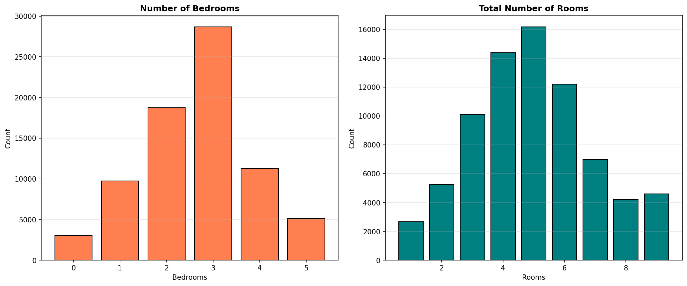

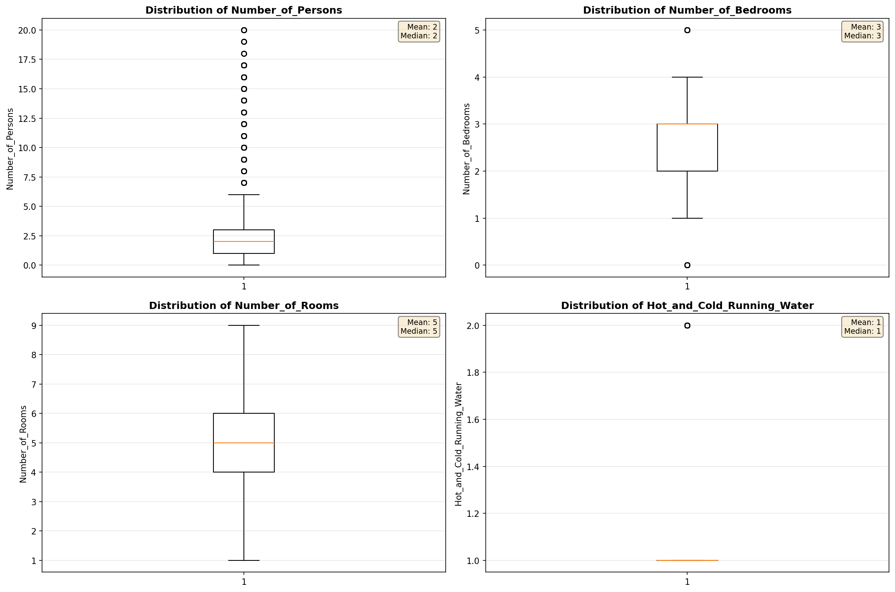

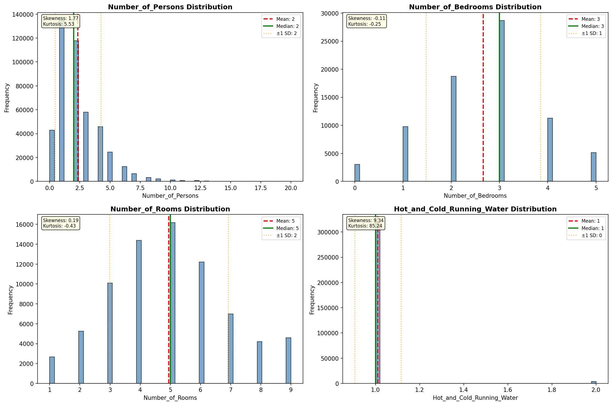

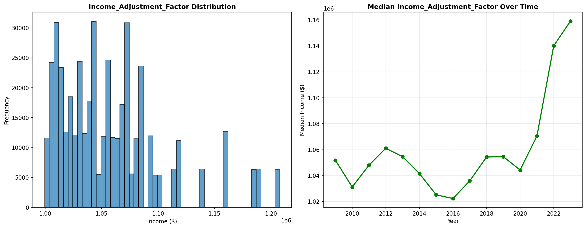

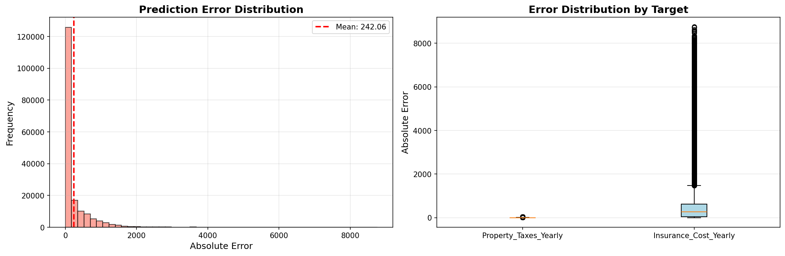

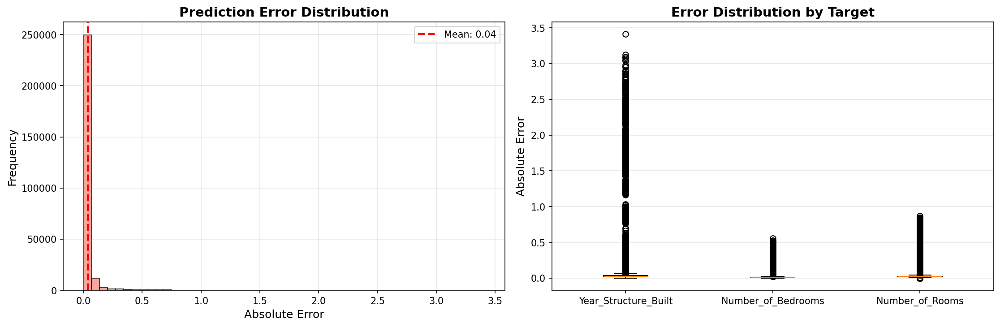

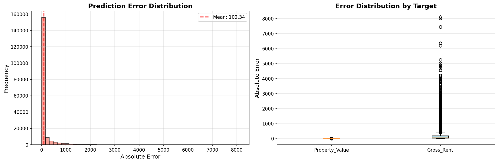

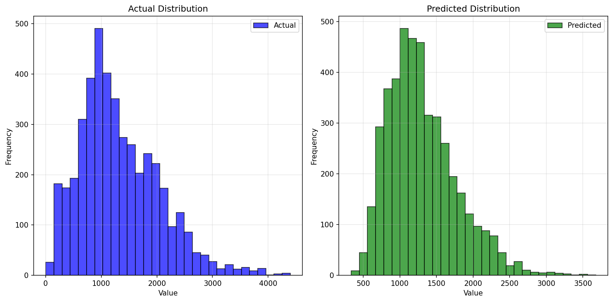

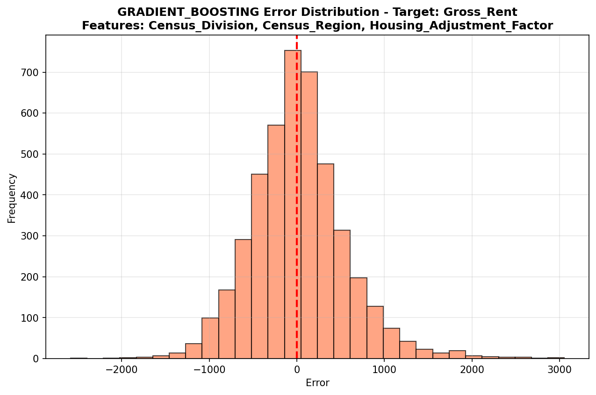

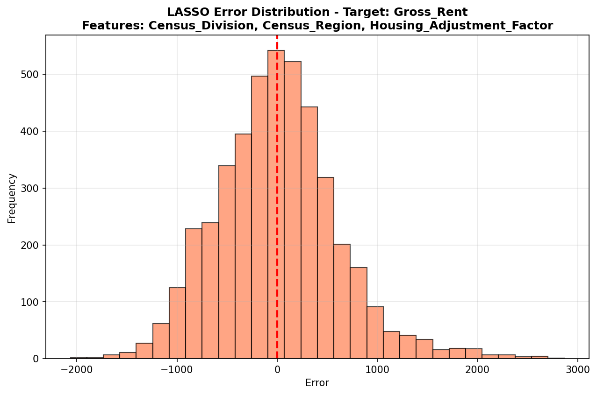

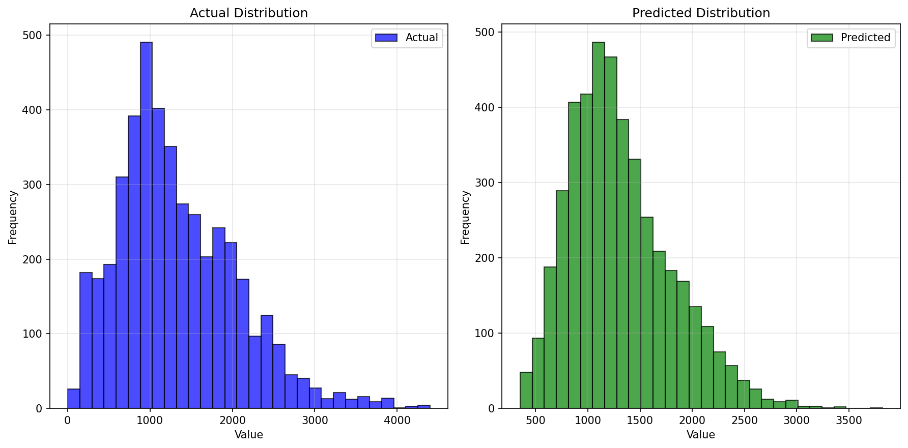

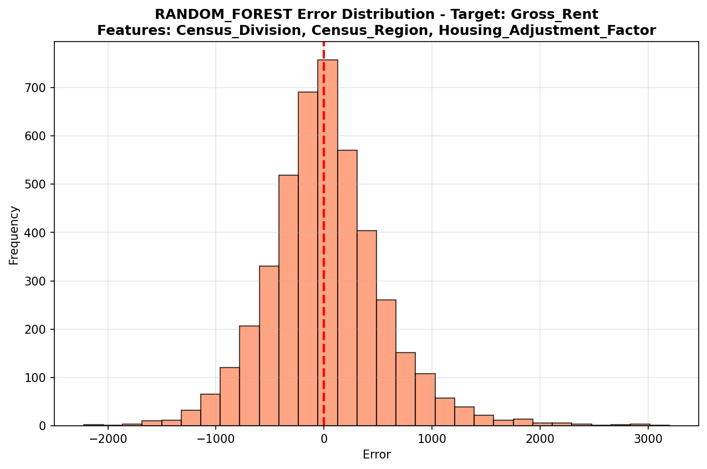

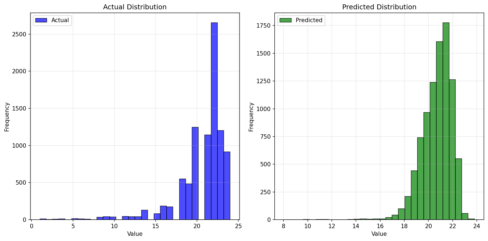

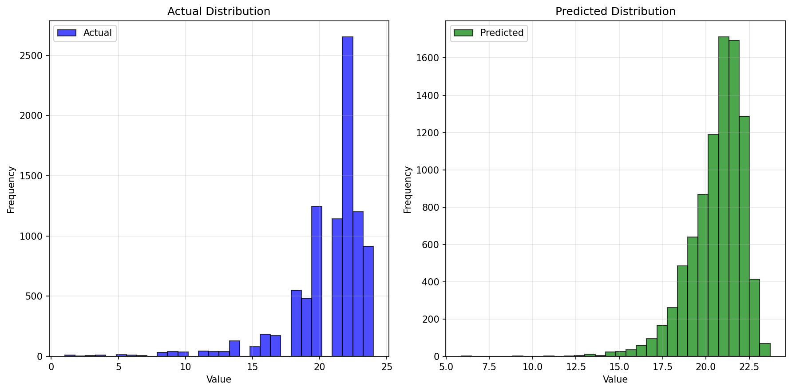

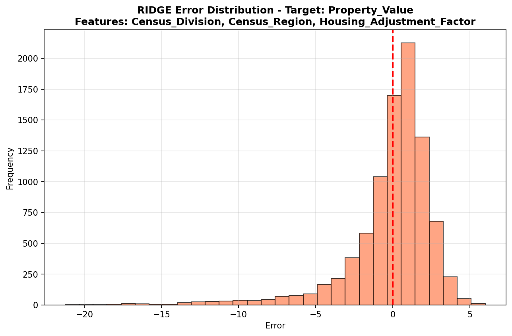

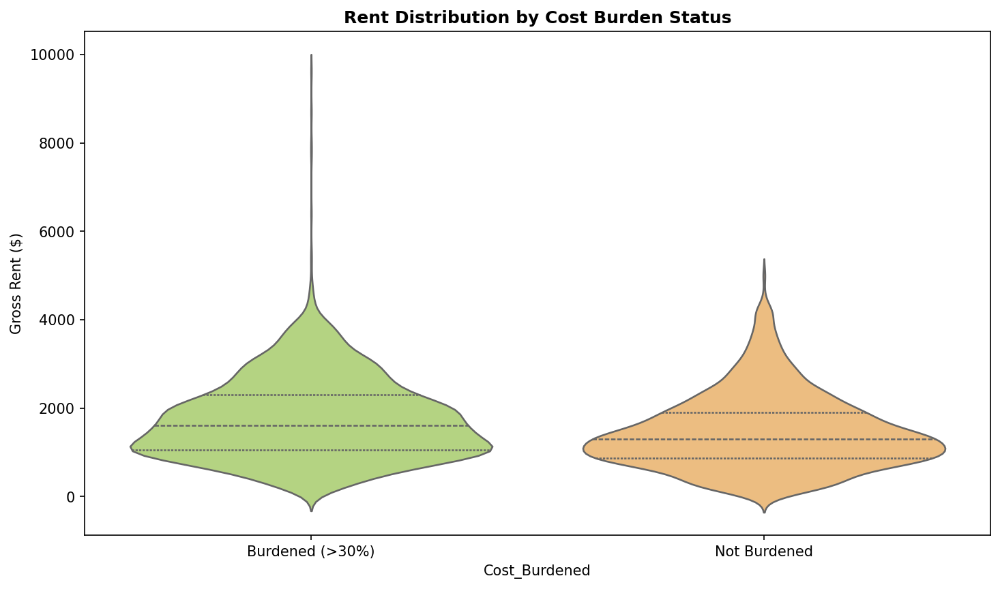

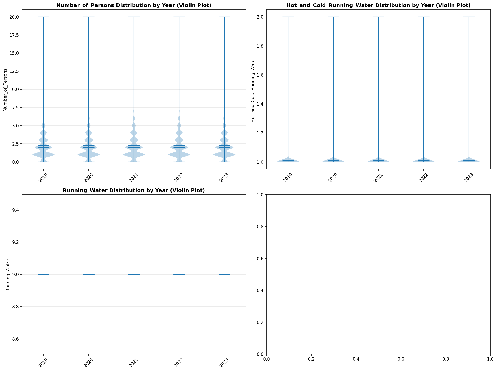

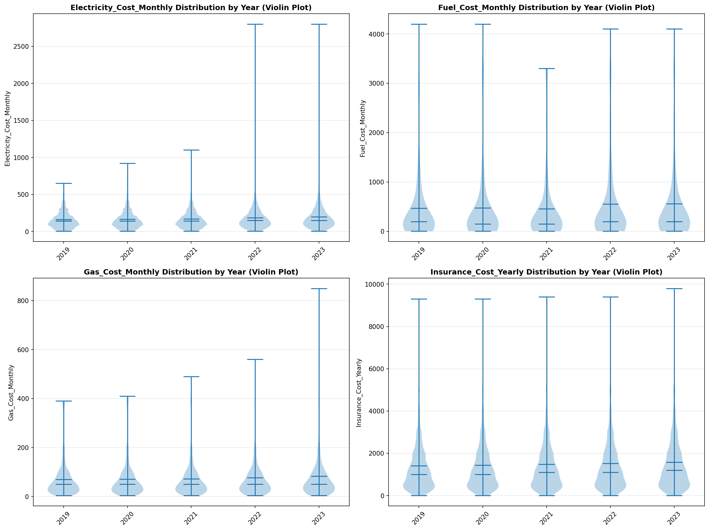

