# Statistical Analysis

> Comprehensive descriptive statistics including central tendency, dispersion, distribution characteristics, and weighted statistics using ACS sample weights.

## Summary Statistics

- **Variables Analyzed**: 30

### Income_Adjustment_Factor

| Statistic | Unweighted | Weighted (ACS) |
| :--- | :--- | :--- |
| Mean | 1,058,254.49 | 1,057,866.92 |
| Median | 1,051,849.00 | 1,059,677.73 |
| Std Deviation | 45,962.37 | — |
| Minimum | 999,480.00 | — |
| Maximum | 1,207,712.00 | — |
| Count | 1,057,358 | — |

> *Distribution is highly right-skewed (skewness: 1.24), light-tailed/platykurtic (kurtosis: 1.39).*

- **Coefficient of Variation**: 4.3 % (low variability)

### Age

| Statistic | Unweighted | Weighted (ACS) |
| :--- | :--- | :--- |
| Mean | 41.57 | 39.30 |
| Median | 42.00 | 38.47 |
| Std Deviation | 23.89 | — |
| Minimum | 0.00 | — |
| Maximum | 97.00 | — |
| Count | 1,057,358 | — |

> *Distribution is approximately symmetric (skewness: 0.07), light-tailed/platykurtic (kurtosis: -0.98).*

- **Coefficient of Variation**: 57.5 % (high variability)

### Interest_Dividend_Rental_Income

| Statistic | Unweighted | Weighted (ACS) |
| :--- | :--- | :--- |
| Mean | 16,846.29 | 16,142.18 |
| Median | 2,600.00 | 2,733.33 |
| Std Deviation | 43,351.54 | — |
| Minimum | 1.00 | — |
| Maximum | 332,000.00 | — |
| Count | 150,444 | — |

> *Distribution is highly right-skewed (skewness: 4.45), heavy-tailed/leptokurtic (kurtosis: 20.78).*

- **Coefficient of Variation**: 257.3 % (very high variability)

### Other_Income

| Statistic | Unweighted | Weighted (ACS) |
| :--- | :--- | :--- |
| Mean | 12,925.84 | 12,620.54 |
| Median | 7,100.00 | 7,120.00 |
| Std Deviation | 15,621.98 | — |
| Minimum | 4.00 | — |
| Maximum | 89,000.00 | — |
| Count | 50,577 | — |

> *Distribution is highly right-skewed (skewness: 2.12), heavy-tailed/leptokurtic (kurtosis: 4.89).*

- **Coefficient of Variation**: 120.9 % (very high variability)

### Public_Assistance_Income

| Statistic | Unweighted | Weighted (ACS) |
| :--- | :--- | :--- |
| Mean | 4,224.10 | 4,273.86 |
| Median | 3,000.00 | 3,060.00 |
| Std Deviation | 4,512.65 | — |
| Minimum | 4.00 | — |
| Maximum | 30,000.00 | — |
| Count | 17,024 | — |

> *Distribution is highly right-skewed (skewness: 2.26), heavy-tailed/leptokurtic (kurtosis: 6.79).*

- **Coefficient of Variation**: 106.8 % (very high variability)

### Retirement_Income

| Statistic | Unweighted | Weighted (ACS) |
| :--- | :--- | :--- |
| Mean | 23,965.16 | 23,247.39 |
| Median | 16,800.00 | 16,726.67 |
| Std Deviation | 25,528.33 | — |
| Minimum | 4.00 | — |
| Maximum | 193,000.00 | — |
| Count | 124,716 | — |

> *Distribution is highly right-skewed (skewness: 2.67), heavy-tailed/leptokurtic (kurtosis: 10.64).*

- **Coefficient of Variation**: 106.5 % (very high variability)

### Self_Employment_Income

| Statistic | Unweighted | Weighted (ACS) |
| :--- | :--- | :--- |
| Mean | 33,577.05 | 33,005.02 |
| Median | 15,000.00 | 15,940.00 |
| Std Deviation | 55,790.72 | — |
| Minimum | 1.00 | — |
| Maximum | 477,000.00 | — |
| Count | 56,440 | — |

> *Distribution is highly right-skewed (skewness: 3.70), heavy-tailed/leptokurtic (kurtosis: 15.98).*

- **Coefficient of Variation**: 166.2 % (very high variability)

### Supplemental_Security_Income

| Statistic | Unweighted | Weighted (ACS) |
| :--- | :--- | :--- |
| Mean | 8,441.64 | 8,192.74 |
| Median | 8,000.00 | 7,940.00 |
| Std Deviation | 4,914.70 | — |
| Minimum | 1,000.00 | — |
| Maximum | 30,000.00 | — |
| Count | 20,585 | — |

> *Distribution is highly right-skewed (skewness: 1.38), light-tailed/platykurtic (kurtosis: 2.67).*

- **Coefficient of Variation**: 58.2 % (high variability)

### Social_Security_Income

| Statistic | Unweighted | Weighted (ACS) |
| :--- | :--- | :--- |
| Mean | 13,394.07 | 13,174.67 |
| Median | 12,700.00 | 12,726.67 |
| Std Deviation | 7,436.42 | — |
| Minimum | 4.00 | — |
| Maximum | 50,000.00 | — |
| Count | 201,634 | — |

> *Distribution is moderately right-skewed (skewness: 0.71), light-tailed/platykurtic (kurtosis: 1.00).*

- **Coefficient of Variation**: 55.5 % (high variability)

### Wage_Income

| Statistic | Unweighted | Weighted (ACS) |
| :--- | :--- | :--- |
| Mean | 45,233.02 | 44,228.45 |
| Median | 35,000.00 | 34,373.33 |
| Std Deviation | 47,253.86 | — |
| Minimum | 4.00 | — |
| Maximum | 503,000.00 | — |
| Count | 525,047 | — |

> *Distribution is highly right-skewed (skewness: 3.77), heavy-tailed/leptokurtic (kurtosis: 22.11).*

- **Coefficient of Variation**: 104.5 % (very high variability)

### Hours_Worked_Per_Week

| Statistic | Unweighted | Weighted (ACS) |
| :--- | :--- | :--- |
| Mean | 38.27 | 38.41 |
| Median | 40.00 | 40.00 |
| Std Deviation | 13.51 | — |
| Minimum | 1.00 | — |
| Maximum | 99.00 | — |
| Count | 561,872 | — |

> *Distribution is approximately symmetric (skewness: 0.21), light-tailed/platykurtic (kurtosis: 2.48).*

- **Coefficient of Variation**: 35.3 % (moderate variability)

### Presence_And_Age_Own_Children

| Statistic | Unweighted | Weighted (ACS) |
| :--- | :--- | :--- |
| Mean | 3.52 | 3.49 |
| Median | 4.00 | 4.00 |
| Std Deviation | 0.92 | — |
| Minimum | 1.00 | — |
| Maximum | 4.00 | — |
| Count | 420,591 | — |

> *Distribution is highly left-skewed (skewness: -1.63), light-tailed/platykurtic (kurtosis: 1.14).*

- **Coefficient of Variation**: 26.2 % (moderate variability)

### Total_Person_Earnings

| Statistic | Unweighted | Weighted (ACS) |
| :--- | :--- | :--- |
| Mean | 45,719.76 | 44,615.64 |
| Median | 35,000.00 | 33,906.67 |
| Std Deviation | 50,207.51 | — |
| Minimum | 1.00 | — |
| Maximum | 947,000.00 | — |
| Count | 560,725 | — |

> *Distribution is highly right-skewed (skewness: 4.05), heavy-tailed/leptokurtic (kurtosis: 26.26).*

- **Coefficient of Variation**: 109.8 % (very high variability)

### Total_Person_Income

| Statistic | Unweighted | Weighted (ACS) |
| :--- | :--- | :--- |
| Mean | 44,852.67 | 43,789.42 |
| Median | 31,100.00 | 31,960.00 |
| Std Deviation | 52,475.78 | — |
| Minimum | 1.00 | — |
| Maximum | 1,011,000.00 | — |
| Count | 774,625 | — |

> *Distribution is highly right-skewed (skewness: 4.18), heavy-tailed/leptokurtic (kurtosis: 28.26).*

- **Coefficient of Variation**: 117.0 % (very high variability)

### Poverty_Status

| Statistic | Unweighted | Weighted (ACS) |
| :--- | :--- | :--- |
| Mean | 345.29 | 338.24 |
| Median | 381.00 | 369.40 |
| Std Deviation | 157.38 | — |
| Minimum | 0.00 | — |
| Maximum | 501.00 | — |
| Count | 1,012,603 | — |

> *Distribution is moderately left-skewed (skewness: -0.58), light-tailed/platykurtic (kurtosis: -0.97).*

- **Coefficient of Variation**: 45.6 % (moderate variability)

### Flag_Age

| Statistic | Unweighted | Weighted (ACS) |
| :--- | :--- | :--- |
| Mean | 0.02 | 0.02 |
| Median | 0.00 | 0.00 |
| Std Deviation | 0.14 | — |
| Minimum | 0.00 | — |
| Maximum | 1.00 | — |
| Count | 1,057,358 | — |

> *Distribution is highly right-skewed (skewness: 6.62), heavy-tailed/leptokurtic (kurtosis: 41.86).*

- **Coefficient of Variation**: 677.0 % (very high variability)

### Flag_Interest_Dividend_Income

| Statistic | Unweighted | Weighted (ACS) |
| :--- | :--- | :--- |
| Mean | 0.14 | 0.13 |
| Median | 0.00 | 0.00 |
| Std Deviation | 0.34 | — |
| Minimum | 0.00 | — |
| Maximum | 1.00 | — |
| Count | 1,057,358 | — |

> *Distribution is highly right-skewed (skewness: 2.10), light-tailed/platykurtic (kurtosis: 2.41).*

- **Coefficient of Variation**: 250.1 % (very high variability)

### Flag_Other_Income

| Statistic | Unweighted | Weighted (ACS) |
| :--- | :--- | :--- |
| Mean | 0.12 | 0.11 |
| Median | 0.00 | 0.00 |
| Std Deviation | 0.32 | — |
| Minimum | 0.00 | — |
| Maximum | 1.00 | — |
| Count | 1,057,358 | — |

> *Distribution is highly right-skewed (skewness: 2.36), heavy-tailed/leptokurtic (kurtosis: 3.57).*

- **Coefficient of Variation**: 272.7 % (very high variability)

### Flag_Retirement_Income

| Statistic | Unweighted | Weighted (ACS) |
| :--- | :--- | :--- |
| Mean | 0.12 | 0.11 |
| Median | 0.00 | 0.00 |
| Std Deviation | 0.33 | — |
| Minimum | 0.00 | — |
| Maximum | 1.00 | — |
| Count | 1,057,358 | — |

> *Distribution is highly right-skewed (skewness: 2.27), heavy-tailed/leptokurtic (kurtosis: 3.17).*

- **Coefficient of Variation**: 265.1 % (very high variability)

### Flag_Self_Employment_Income

| Statistic | Unweighted | Weighted (ACS) |
| :--- | :--- | :--- |
| Mean | 0.09 | 0.08 |
| Median | 0.00 | 0.00 |
| Std Deviation | 0.29 | — |
| Minimum | 0.00 | — |
| Maximum | 1.00 | — |
| Count | 1,057,358 | — |

> *Distribution is highly right-skewed (skewness: 2.83), heavy-tailed/leptokurtic (kurtosis: 6.01).*

- **Coefficient of Variation**: 314.9 % (very high variability)

### Flag_Social_Security_Income

| Statistic | Unweighted | Weighted (ACS) |
| :--- | :--- | :--- |
| Mean | 0.13 | 0.12 |
| Median | 0.00 | 0.00 |
| Std Deviation | 0.34 | — |
| Minimum | 0.00 | — |
| Maximum | 1.00 | — |
| Count | 1,057,358 | — |

> *Distribution is highly right-skewed (skewness: 2.19), light-tailed/platykurtic (kurtosis: 2.79).*

- **Coefficient of Variation**: 257.7 % (very high variability)

### Flag_Supplemental_Security_Income

| Statistic | Unweighted | Weighted (ACS) |
| :--- | :--- | :--- |
| Mean | 0.11 | 0.10 |
| Median | 0.00 | 0.00 |
| Std Deviation | 0.32 | — |
| Minimum | 0.00 | — |
| Maximum | 1.00 | — |
| Count | 1,057,358 | — |

> *Distribution is highly right-skewed (skewness: 2.44), heavy-tailed/leptokurtic (kurtosis: 3.95).*

- **Coefficient of Variation**: 279.7 % (very high variability)

### Flag_Wage_Income

| Statistic | Unweighted | Weighted (ACS) |
| :--- | :--- | :--- |
| Mean | 0.16 | 0.17 |
| Median | 0.00 | 0.00 |
| Std Deviation | 0.37 | — |
| Minimum | 0.00 | — |
| Maximum | 1.00 | — |
| Count | 1,057,358 | — |

> *Distribution is highly right-skewed (skewness: 1.82), light-tailed/platykurtic (kurtosis: 1.33).*

- **Coefficient of Variation**: 226.5 % (very high variability)

### Flag_Hours_Worked

| Statistic | Unweighted | Weighted (ACS) |
| :--- | :--- | :--- |
| Mean | 0.07 | 0.07 |
| Median | 0.00 | 0.00 |
| Std Deviation | 0.25 | — |
| Minimum | 0.00 | — |
| Maximum | 1.00 | — |
| Count | 1,057,358 | — |

> *Distribution is highly right-skewed (skewness: 3.43), heavy-tailed/leptokurtic (kurtosis: 9.80).*

- **Coefficient of Variation**: 370.5 % (very high variability)

### Income_Per_Hour

| Statistic | Unweighted | Weighted (ACS) |
| :--- | :--- | :--- |
| Mean | 27.58 | 26.13 |
| Median | 18.75 | 18.23 |
| Std Deviation | 60.30 | — |
| Minimum | 0.00 | — |
| Maximum | 7,346.15 | — |
| Count | 561,350 | — |

> *Distribution is highly right-skewed (skewness: 40.38), heavy-tailed/leptokurtic (kurtosis: 3237.17).*

- **Coefficient of Variation**: 218.7 % (very high variability)

### Income_Per_Week_Worked

| Statistic | Unweighted | Weighted (ACS) |
| :--- | :--- | :--- |
| Mean | 45,052.61 | 43,661.69 |
| Median | 32,100.00 | 32,615.71 |
| Std Deviation | 53,276.02 | — |
| Minimum | 0.17 | — |
| Maximum | 903,000.00 | — |
| Count | 522,421 | — |

> *Distribution is highly right-skewed (skewness: 4.02), heavy-tailed/leptokurtic (kurtosis: 26.56).*

- **Coefficient of Variation**: 118.3 % (very high variability)

### Total_Annual_Hours

| Statistic | Unweighted | Weighted (ACS) |
| :--- | :--- | :--- |
| Mean | 59.80 | 59.40 |
| Median | 40.00 | 40.00 |
| Std Deviation | 49.58 | — |
| Minimum | 1.00 | — |
| Maximum | 594.00 | — |
| Count | 522,902 | — |

> *Distribution is highly right-skewed (skewness: 2.88), heavy-tailed/leptokurtic (kurtosis: 10.83).*

- **Coefficient of Variation**: 82.9 % (high variability)

### In_Poverty

| Statistic | Unweighted | Weighted (ACS) |
| :--- | :--- | :--- |
| Mean | 0.28 | 0.28 |
| Median | 0.00 | 0.00 |
| Std Deviation | 0.45 | — |
| Minimum | 0.00 | — |
| Maximum | 1.00 | — |
| Count | 1,057,358 | — |

> *Distribution is moderately right-skewed (skewness: 0.96), light-tailed/platykurtic (kurtosis: -1.08).*

- **Coefficient of Variation**: 159.0 % (very high variability)

### Poverty_Gap

| Statistic | Unweighted | Weighted (ACS) |
| :--- | :--- | :--- |
| Mean | 0.23 | 0.23 |
| Median | 0.00 | 0.00 |
| Std Deviation | 0.38 | — |
| Minimum | 0.00 | — |
| Maximum | 1.67 | — |
| Count | 880,811 | — |

> *Distribution is highly right-skewed (skewness: 1.25), light-tailed/platykurtic (kurtosis: -0.14).*

- **Coefficient of Variation**: 161.9 % (very high variability)

### Poverty_Severity

| Statistic | Unweighted | Weighted (ACS) |
| :--- | :--- | :--- |
| Mean | 0.20 | 0.20 |
| Median | 0.00 | 0.00 |
| Std Deviation | 0.36 | — |
| Minimum | 0.00 | — |
| Maximum | 2.78 | — |
| Count | 880,811 | — |

> *Distribution is highly right-skewed (skewness: 1.61), light-tailed/platykurtic (kurtosis: 1.09).*

- **Coefficient of Variation**: 184.2 % (very high variability)

## Distribution Analysis

### Skewed Distributions

> Variables with skewness > |0.5| indicate non-normal distributions. Consider log transformations for highly skewed variables in modeling.

| Variable | Skewness | Direction | Severity |
| :--- | :--- | :--- | :--- |
| Income_Per_Hour | 40.382 | Right-skewed | High |
| Flag_Age | 6.622 | Right-skewed | High |
| Interest_Dividend_Rental_Income | 4.451 | Right-skewed | High |
| Total_Person_Income | 4.183 | Right-skewed | High |
| Total_Person_Earnings | 4.050 | Right-skewed | High |
| Income_Per_Week_Worked | 4.023 | Right-skewed | High |
| Wage_Income | 3.769 | Right-skewed | High |
| Self_Employment_Income | 3.698 | Right-skewed | High |
| Flag_Hours_Worked | 3.435 | Right-skewed | High |
| Total_Annual_Hours | 2.881 | Right-skewed | High |
| Flag_Self_Employment_Income | 2.831 | Right-skewed | High |
| Retirement_Income | 2.666 | Right-skewed | High |
| Flag_Supplemental_Security_Income | 2.439 | Right-skewed | High |
| Flag_Other_Income | 2.361 | Right-skewed | High |
| Flag_Retirement_Income | 2.274 | Right-skewed | High |
| Public_Assistance_Income | 2.257 | Right-skewed | High |
| Flag_Social_Security_Income | 2.189 | Right-skewed | High |
| Other_Income | 2.122 | Right-skewed | High |
| Flag_Interest_Dividend_Income | 2.101 | Right-skewed | High |
| Flag_Wage_Income | 1.824 | Right-skewed | High |

- **Total Skewed Variables**: 28

- **Right-skewed**: 26

- **Left-skewed**: 2

## Variance Analysis

### Coefficient of Variation Ranking

> CV (Coefficient of Variation) = (Std Dev / Mean) × 100%. Higher CV indicates greater relative variability.

| Variable | CV (%) | Std Dev | Mean | Variability |
| :--- | :--- | :--- | :--- | :--- |
| Flag_Age | 677.0% | 0.14 | 0.02 | Very High |
| Flag_Hours_Worked | 370.5% | 0.25 | 0.07 | Very High |
| Flag_Self_Employment_Income | 314.9% | 0.29 | 0.09 | Very High |
| Flag_Supplemental_Security_Income | 279.7% | 0.32 | 0.11 | Very High |
| Flag_Other_Income | 272.7% | 0.32 | 0.12 | Very High |
| Flag_Retirement_Income | 265.1% | 0.33 | 0.12 | Very High |
| Flag_Social_Security_Income | 257.7% | 0.34 | 0.13 | Very High |
| Interest_Dividend_Rental_Income | 257.3% | 43,351.54 | 16,846.29 | Very High |
| Flag_Interest_Dividend_Income | 250.1% | 0.34 | 0.14 | Very High |
| Flag_Wage_Income | 226.5% | 0.37 | 0.16 | Very High |
| Income_Per_Hour | 218.7% | 60.30 | 27.58 | Very High |
| Poverty_Severity | 184.2% | 0.36 | 0.20 | Very High |
| Self_Employment_Income | 166.2% | 55,790.72 | 33,577.05 | Very High |
| Poverty_Gap | 161.9% | 0.38 | 0.23 | Very High |
| In_Poverty | 159.0% | 0.45 | 0.28 | Very High |
| Other_Income | 120.9% | 15,621.98 | 12,925.84 | Very High |
| Income_Per_Week_Worked | 118.3% | 53,276.02 | 45,052.61 | Very High |
| Total_Person_Income | 117.0% | 52,475.78 | 44,852.67 | Very High |
| Total_Person_Earnings | 109.8% | 50,207.51 | 45,719.76 | Very High |
| Public_Assistance_Income | 106.8% | 4,512.65 | 4,224.10 | Very High |

- **Average CV**: 173.7 %

- **High Variance Variables (CV > 50%)**: 26

## Visualizations

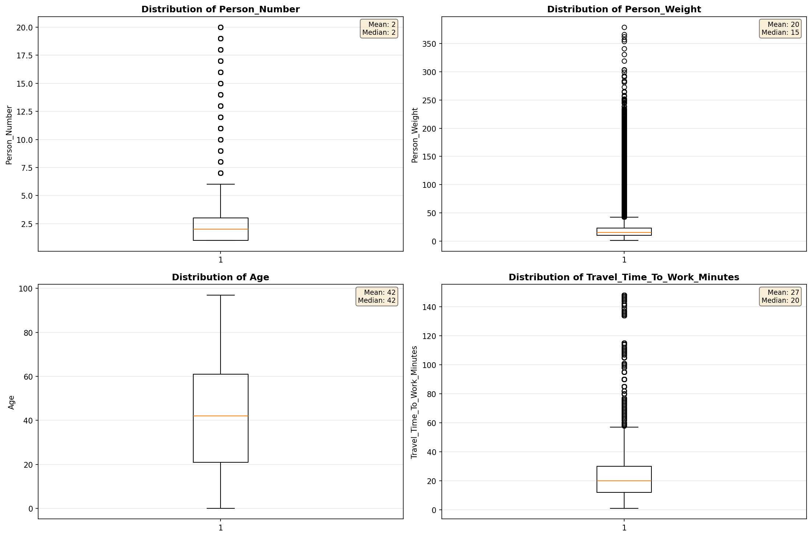

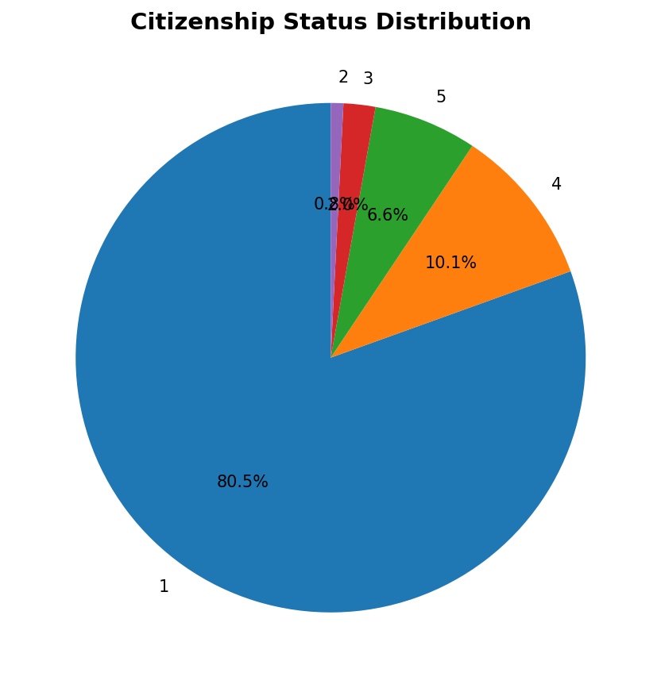

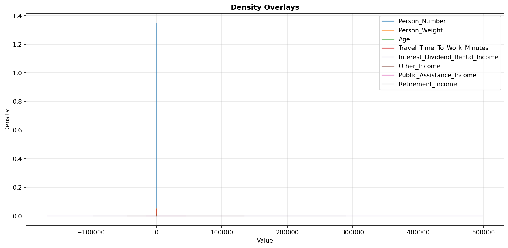

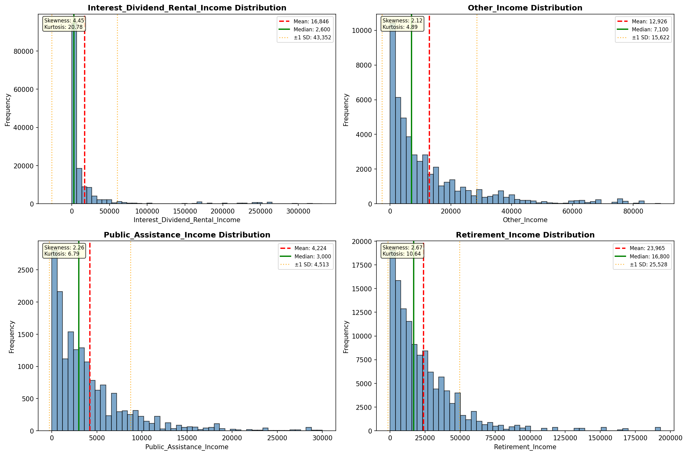

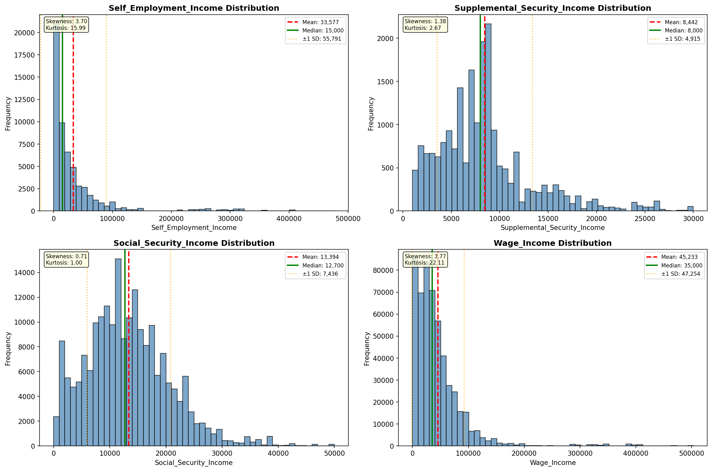

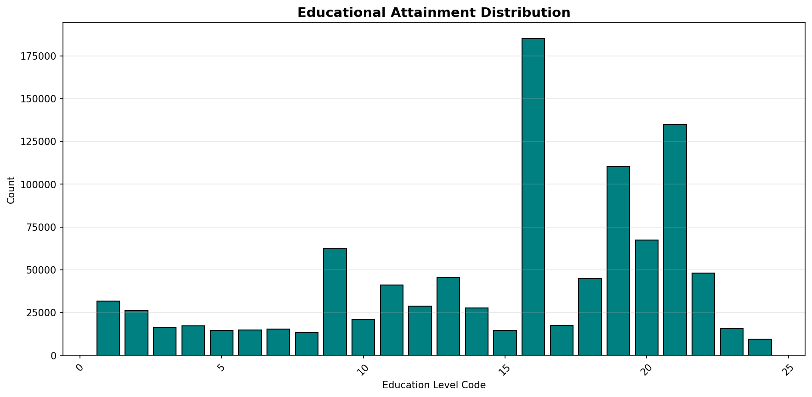

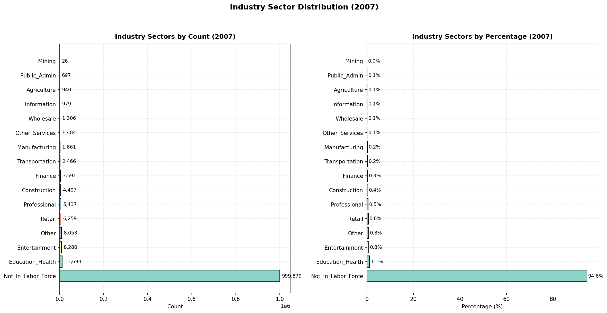

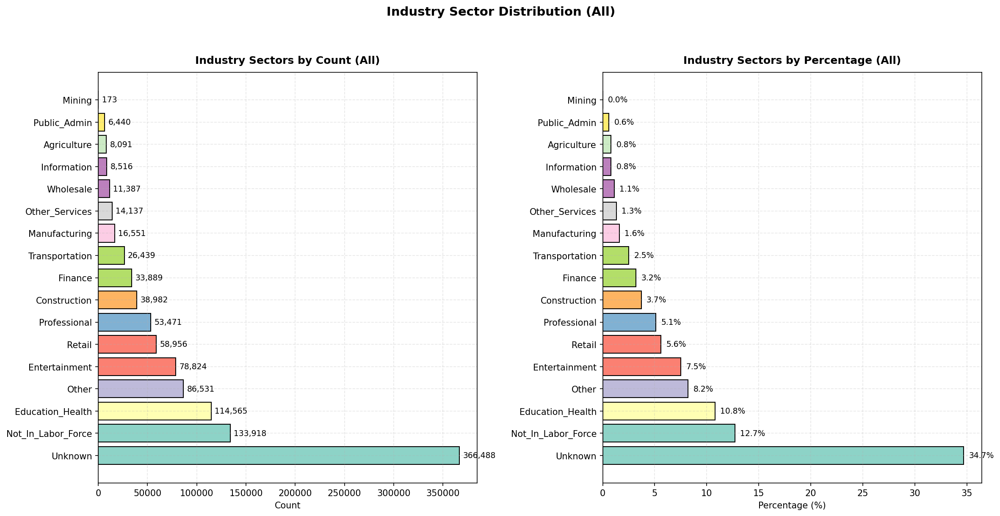

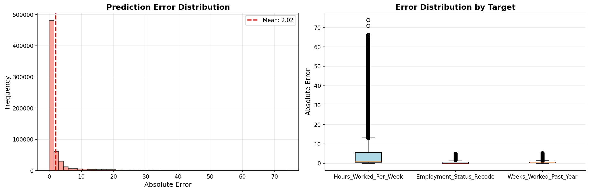

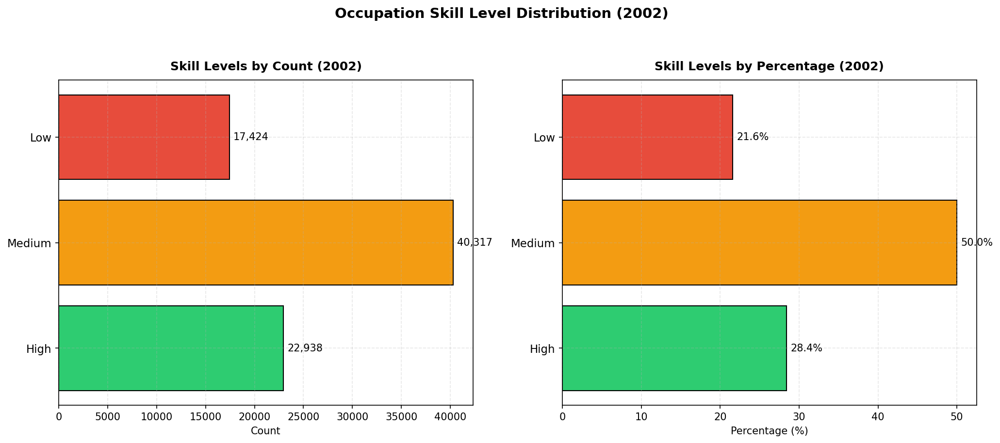

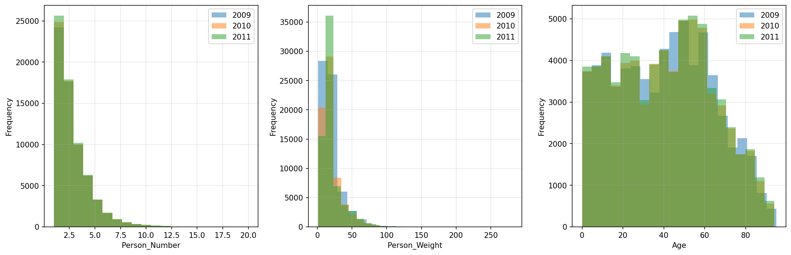

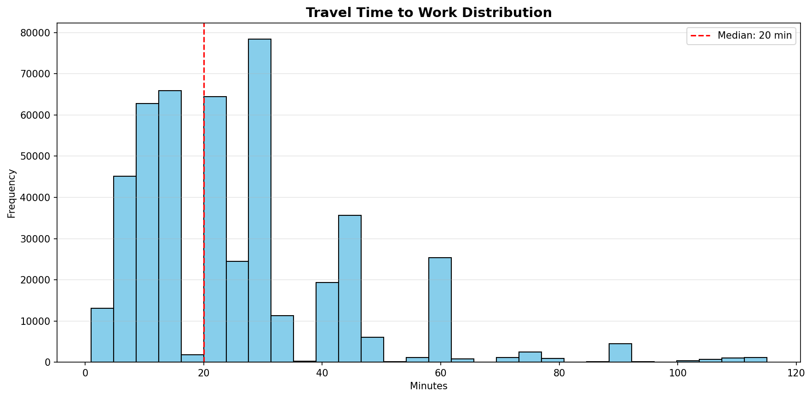

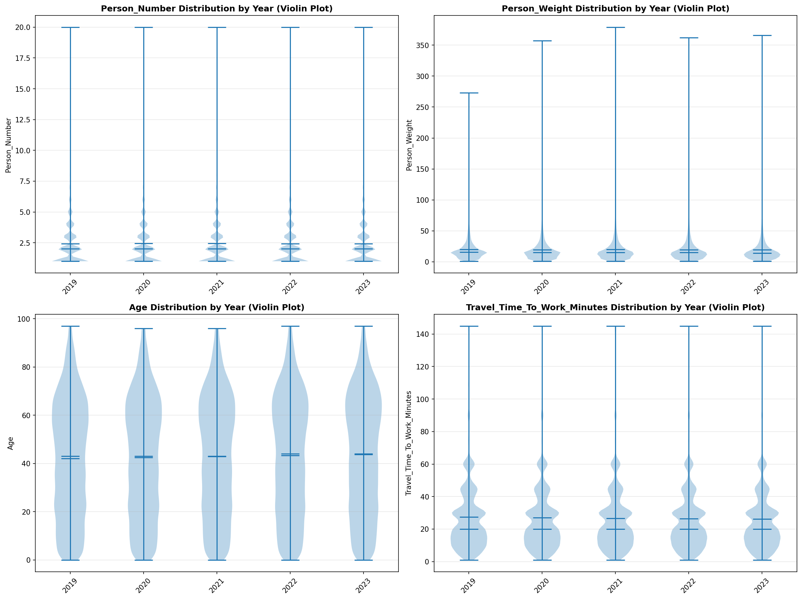

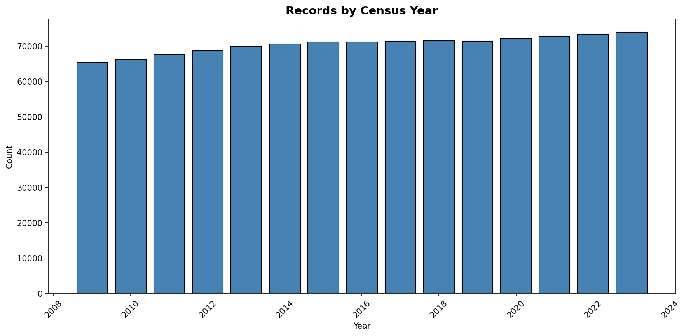
