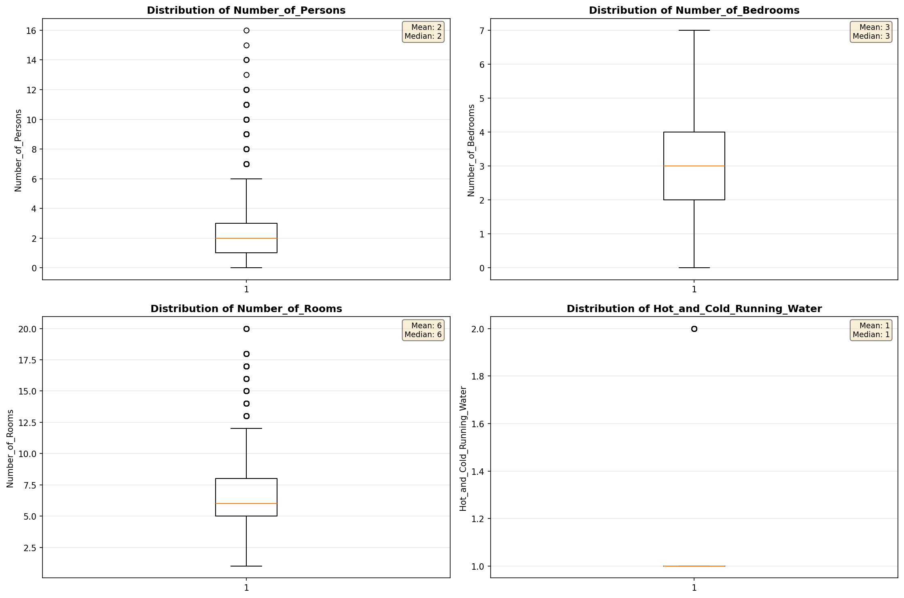

# Outlier Detection

> Statistical outlier detection using IQR (Interquartile Range) method. Outliers are values falling outside Q1 - 1.5×IQR or Q3 + 1.5×IQR bounds.

## Detection Methodology

| Parameter | Value | Description |
| :--- | :--- | :--- |
| Method | IQR | Outlier detection algorithm |
| Lower Bound | Q1 - 1.5 × IQR | Values below are outliers |
| Upper Bound | Q3 + 1.5 × IQR | Values above are outliers |
| IQR Definition | Q3 - Q1 | Interquartile Range |

> **Note**: The IQR method is robust to extreme values and works well for approximately symmetric distributions.

## Outlier Summary

_No outlier summary available._
## High Outlier Rate Variables

> Variables with outlier rate > 5% may indicate data quality issues, non-normal distributions, or genuinely extreme values.

- **('Fuel_Cost_Monthly', 24.206583875418886)**: 0 outliers (0.00%)

- **('First_Mortgage_Includes_Taxes', 23.520041331209367)**: 0 outliers (0.00%)

- **('Specified_Rent_Unit', 22.468217054263565)**: 0 outliers (0.00%)

- **('Flag_Selected_Monthly_Owner_Costs', 21.86595117286082)**: 0 outliers (0.00%)

- **('Flag_Family_Income', 18.8168210976479)**: 0 outliers (0.00%)

- **('Property_Tax_Rate', 15.792733834262476)**: 0 outliers (0.00%)

- **('Property_Taxes_Yearly', 12.88069799923815)**: 0 outliers (0.00%)

- **('Flag_Property_Taxes', 10.547926892152557)**: 0 outliers (0.00%)

- **('Structure_Age', 10.4979825428195)**: 0 outliers (0.00%)

- **('Income_Adjustment_Factor', 10.476959455562604)**: 0 outliers (0.00%)

- **('Gross_Rent_Percentage_Income', 8.703278909728782)**: 0 outliers (0.00%)

- **('Structure_Age_Score', 8.392004281949934)**: 0 outliers (0.00%)

- **('Flag_Water_Cost', 7.923463755672759)**: 0 outliers (0.00%)

- **('Owner_Costs_Percentage_Income', 7.547169811320755)**: 0 outliers (0.00%)

- **('Flag_Property_Value', 7.03078626799557)**: 0 outliers (0.00%)

> *Consider investigating these variables for data entry errors, applying transformations, or using robust statistical methods.*

## Visualizations

